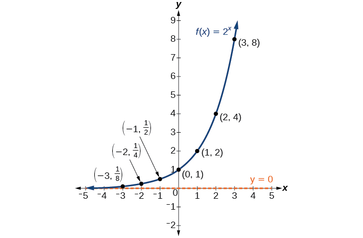
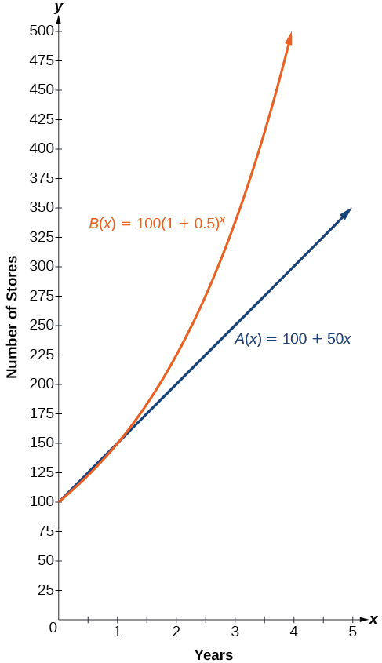
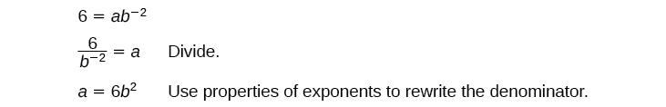
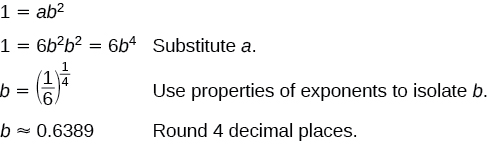
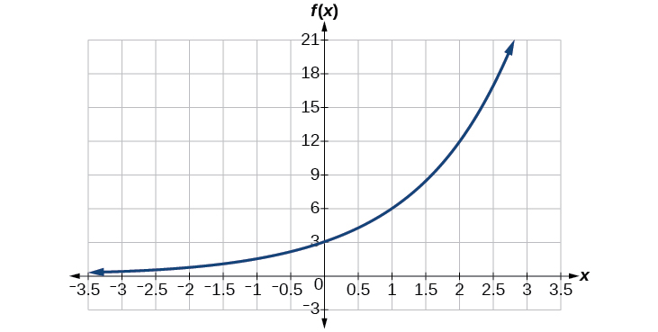
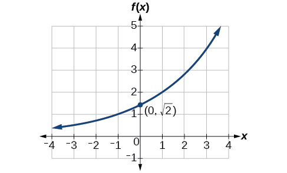

In this section, you will:
* Evaluate exponential functions.
* Find the equation of an exponential function.
* Use compound interest formulas.
* Evaluate exponential functions with base e.

India is the second most populous country in the world with a population of about<math xmlns="http://www.w3.org/1998/Math/MathML"> <mrow> <mtext> </mtext><mn>1.25</mn><mtext> </mtext> </mrow> </math>

billion people in 2013. The population is growing at a rate of about<math xmlns="http://www.w3.org/1998/Math/MathML"> <mrow> <mtext> </mtext><mn>1.2</mn><mi>%</mi><mtext> </mtext> </mrow> </math>

each year[1](#footnote1){: data-type="footnote-number" name="footnote-ref1"}. If this rate continues, the population of India will exceed China’s population by the year<math xmlns="http://www.w3.org/1998/Math/MathML"> <mrow> <mtext> </mtext><mn>2031.</mn> </mrow> </math>

When populations grow rapidly, we often say that the growth is “exponential,” meaning that something is growing very rapidly. To a mathematician, however, the term <em>exponential growth </em>has a very specific meaning. In this section, we will take a look at *exponential functions*, which model this kind of rapid growth.

# Identifying Exponential Functions

When exploring linear growth, we observed a constant rate of change—a constant number by which the output increased for each unit increase in input. For example, in the equation<math xmlns="http://www.w3.org/1998/Math/MathML"> <mrow> <mtext> </mtext><mi>f</mi><mo stretchy="false">(</mo><mi>x</mi><mo stretchy="false">)</mo><mo>=</mo><mn>3</mn><mi>x</mi><mo>+</mo><mn>4</mn><mo>,</mo> </mrow> </math>

the slope tells us the output increases by 3 each time the input increases by 1. The scenario in the India population example is different because we have a *percent* change per unit time (rather than a constant change) in the number of people.

## Defining an Exponential Function

A study found that the percent of the population who are vegans in the United States doubled from 2009 to 2011. In 2011, 2.5% of the population was vegan, adhering to a diet that does not include any animal products—no meat, poultry, fish, dairy, or eggs. If this rate continues, vegans will make up 10% of the U.S. population in 2015, 40% in 2019, and 80% in 2050.

What exactly does it mean to *grow exponentially*? What does the word <em>double </em>have in common with *percent increase*? People toss these words around errantly. Are these words used correctly? The words certainly appear frequently in the media. 

<strong>Percent change </strong>refers to a *change* based on a *percent* of the original amount.

<strong>Exponential growth </strong>refers to an *increase* based on a constant multiplicative rate of change over equal increments of time, that is, a *percent* increase of the original amount over time.

**Exponential decay**{: data-type="term"} refers to a *decrease* based on a constant multiplicative rate of change over equal increments of time, that is, a *percent* decrease of the original amount over time.

For us to gain a clear understanding of **exponential growth**{: data-type="term" .no-emphasis}, let us contrast exponential growth with **linear growth**{: data-type="term" .no-emphasis}. We will construct two functions. The first function is exponential. We will start with an input of 0, and increase each input by 1. We will double the corresponding consecutive outputs. The second function is linear. We will start with an input of 0, and increase each input by 1. We will add 2 to the corresponding consecutive outputs. See [\[link\]](#Table_04_01_01).

| <math xmlns="http://www.w3.org/1998/Math/MathML"> <mi>x</mi> </math>

 | <math xmlns="http://www.w3.org/1998/Math/MathML"> <mrow> <mi>f</mi><mo stretchy="false">(</mo><mi>x</mi><mo stretchy="false">)</mo><mo>=</mo><msup> <mn>2</mn> <mi>x</mi> </msup> </mrow> </math>

 | <math xmlns="http://www.w3.org/1998/Math/MathML"> <mrow> <mi>g</mi><mo stretchy="false">(</mo><mi>x</mi><mo stretchy="false">)</mo><mo>=</mo><mn>2</mn><mi>x</mi> </mrow> </math>

 |
|----------
| 0 | 1 | 0 |
| 1 | 2 | 2 |
| 2 | 4 | 4 |
| 3 | 8 | 6 |
| 4 | 16 | 8 |
| 5 | 32 | 10 |
| 6 | 64 | 12 |
{: #Table_04_01_01 summary="Eight rows and three columns. The first column is labeled, &#x201C;x&#x201D;, which goes from 0 to 6; the second column is labeled, &#x201C;f(x)=2^x&#x201D;; and the third column is labeled, &#x201C;g(x) = 2x&#x201D;. The following values are for the function f: (0, 1), (1, 2), (2, 4), (3, 8), (4, 16), (5, 32), and (6, 64). The following values are for the function g: (0, 0), (1, 2), (2, 4), (3, 6), (4, 8), (5, 10), and (6, 12)."}

From [\[link\]](#Table_04_01_01) we can infer that for these two functions, exponential growth dwarfs linear growth.

* <strong>Exponential growth </strong>refers to the original value from the range increases by the *same percentage* over equal increments found in the domain.
* **Linear growth** refers to the original value from the range increases by the *same amount* over equal increments found in the domain.

Apparently, the difference between “the same percentage” and “the same amount” is quite significant. For exponential growth, over equal increments, the constant multiplicative rate of change resulted in doubling the output whenever the input increased by one. For linear growth, the constant additive rate of change over equal increments resulted in adding 2 to the output whenever the input was increased by one.

The general form of the **exponential function**{: data-type="term" .no-emphasis} is<math xmlns="http://www.w3.org/1998/Math/MathML"> <mrow> <mtext> </mtext><mi>f</mi><mo stretchy="false">(</mo><mi>x</mi><mo stretchy="false">)</mo><mo>=</mo><mi>a</mi><msup> <mi>b</mi> <mi>x</mi> </msup> <mo>,</mo><mtext> </mtext> </mrow> </math>

where<math xmlns="http://www.w3.org/1998/Math/MathML"> <mrow> <mtext> </mtext><mi>a</mi><mtext> </mtext> </mrow> </math>

is any nonzero number,<math xmlns="http://www.w3.org/1998/Math/MathML"> <mrow> <mtext> </mtext><mi>b</mi><mtext> </mtext> </mrow> </math>

is a positive real number not equal to 1.

* If
  <math xmlns="http://www.w3.org/1998/Math/MathML"> <mrow> <mtext> </mtext><mi>b</mi><mo>&gt;</mo><mn>1</mn><mo>,</mo> </mrow> </math>
  
  the function grows at a rate proportional to its size.
* If
  <math xmlns="http://www.w3.org/1998/Math/MathML"> <mrow> <mtext> </mtext><mn>0</mn><mo>&lt;</mo><mi>b</mi><mo>&lt;</mo><mn>1</mn><mo>,</mo> </mrow> </math>
  
  the function decays at a rate proportional to its size.

Let’s look at the function<math xmlns="http://www.w3.org/1998/Math/MathML"> <mrow> <mtext> </mtext><mi>f</mi><mo stretchy="false">(</mo><mi>x</mi><mo stretchy="false">)</mo><mo>=</mo><msup> <mn>2</mn> <mi>x</mi> </msup> <mtext> </mtext> </mrow> </math>

from our example. We will create a table ([\[link\]](#Table_04_01_02)) to determine the corresponding outputs over an interval in the domain from<math xmlns="http://www.w3.org/1998/Math/MathML"> <mrow> <mtext> </mtext><mi>−</mi><mn>3</mn><mtext> </mtext> </mrow> </math>

to<math xmlns="http://www.w3.org/1998/Math/MathML"> <mrow> <mtext> </mtext><mn>3.</mn> </mrow> </math>

| <strong><math xmlns="http://www.w3.org/1998/Math/MathML">
<mi>x</mi>
</math></strong> | <math xmlns="http://www.w3.org/1998/Math/MathML"> <mrow> <mo>−</mo><mn>3</mn> </mrow> </math>

 | <math xmlns="http://www.w3.org/1998/Math/MathML"> <mrow> <mo>−</mo><mn>2</mn> </mrow> </math>

 | <math xmlns="http://www.w3.org/1998/Math/MathML"> <mrow> <mo>−</mo><mn>1</mn> </mrow> </math>

 | <math xmlns="http://www.w3.org/1998/Math/MathML"> <mn>0</mn> </math>

 | <math xmlns="http://www.w3.org/1998/Math/MathML"> <mn>1</mn> </math>

 | <math xmlns="http://www.w3.org/1998/Math/MathML"> <mn>2</mn> </math>

 | <math xmlns="http://www.w3.org/1998/Math/MathML"> <mn>3</mn> </math>

 |
| <strong><math xmlns="http://www.w3.org/1998/Math/MathML">
<mrow>
<mi>f</mi><mo stretchy="false">(</mo><mi>x</mi><mo stretchy="false">)</mo><mo>=</mo><msup>
<mn>2</mn>
<mi>x</mi>
</msup>

</mrow>
</math></strong> | <math xmlns="http://www.w3.org/1998/Math/MathML"> <mrow> <msup> <mn>2</mn> <mrow> <mo>−</mo><mn>3</mn> </mrow> </msup> <mo>=</mo><mfrac> <mn>1</mn> <mn>8</mn> </mfrac> </mrow> </math>

 | <math xmlns="http://www.w3.org/1998/Math/MathML"> <mrow> <msup> <mn>2</mn> <mrow> <mo>−</mo><mn>2</mn> </mrow> </msup> <mo>=</mo><mfrac> <mn>1</mn> <mn>4</mn> </mfrac> </mrow> </math>

 | <math xmlns="http://www.w3.org/1998/Math/MathML"> <mrow> <msup> <mn>2</mn> <mrow> <mo>−</mo><mn>1</mn> </mrow> </msup> <mo>=</mo><mfrac> <mn>1</mn> <mn>2</mn> </mfrac> </mrow> </math>

 | <math xmlns="http://www.w3.org/1998/Math/MathML"> <mrow> <msup> <mn>2</mn> <mn>0</mn> </msup> <mo>=</mo><mn>1</mn> </mrow> </math>

 | <math xmlns="http://www.w3.org/1998/Math/MathML"> <mrow> <msup> <mn>2</mn> <mn>1</mn> </msup> <mo>=</mo><mn>2</mn> </mrow> </math>

 | <math xmlns="http://www.w3.org/1998/Math/MathML"> <mrow> <msup> <mn>2</mn> <mn>2</mn> </msup> <mo>=</mo><mn>4</mn> </mrow> </math>

 | <math xmlns="http://www.w3.org/1998/Math/MathML"> <mrow> <msup> <mn>2</mn> <mn>3</mn> </msup> <mo>=</mo><mn>8</mn> </mrow> </math>

 |
{: #Table_04_01_02 summary="Two rows and eight columns. The first row is labeled, &#x201C;x&#x201D;, and the second row is labeled, &#x201C;f(x)=2^x&#x201D;. Reading the columns as ordered pairs, we have the following values: (-3, 2^(-3)=1/8), (-2, 2^(-2)=1/4), (-1, 2^(-1)=1/2), (0, 2^(0)=1), (1, 2^(1)=2), (2, 2^(2)=4), and (3, 2^(3)=8)."}

Let us examine the graph of<math xmlns="http://www.w3.org/1998/Math/MathML"> <mrow> <mtext> </mtext><mi>f</mi><mtext> </mtext> </mrow> </math>

by plotting the ordered pairs we observe on the table in [\[link\]](#CNX_Precalc_Figure_04_01_006), and then make a few observations.

 {: #CNX_Precalc_Figure_04_01_006}

Let’s define the behavior of the graph of the exponential function<math xmlns="http://www.w3.org/1998/Math/MathML"> <mrow> <mtext> </mtext><mi>f</mi><mo stretchy="false">(</mo><mi>x</mi><mo stretchy="false">)</mo><mo>=</mo><msup> <mn>2</mn> <mi>x</mi> </msup> <mtext> </mtext> </mrow> </math>

and highlight some its key characteristics.

* the domain is
  <math xmlns="http://www.w3.org/1998/Math/MathML"> <mrow> <mtext> </mtext><mrow><mo>(</mo> <mrow> <mo>−</mo><mi>∞</mi><mo>,</mo><mi>∞</mi> </mrow> <mo>)</mo></mrow><mo>,</mo> </mrow> </math>

* the range is
  <math xmlns="http://www.w3.org/1998/Math/MathML"> <mrow> <mtext> </mtext><mrow><mo>(</mo> <mrow> <mn>0</mn><mo>,</mo><mi>∞</mi> </mrow> <mo>)</mo></mrow><mo>,</mo> </mrow> </math>

* as
  <math xmlns="http://www.w3.org/1998/Math/MathML"> <mrow> <mtext> </mtext><mi>x</mi><mo stretchy="false">→</mo><mi>∞</mi><mo>,</mo><mi>f</mi><mo stretchy="false">(</mo><mi>x</mi><mo stretchy="false">)</mo><mo stretchy="false">→</mo><mi>∞</mi><mo>,</mo> </mrow> </math>

* as
  <math xmlns="http://www.w3.org/1998/Math/MathML"> <mrow> <mtext> </mtext><mi>x</mi><mo stretchy="false">→</mo><mo>−</mo><mi>∞</mi><mo>,</mo><mi>f</mi><mo stretchy="false">(</mo><mi>x</mi><mo stretchy="false">)</mo><mo stretchy="false">→</mo><mn>0</mn><mo>,</mo> </mrow> </math>

* <math xmlns="http://www.w3.org/1998/Math/MathML"> <mrow> <mtext> </mtext><mi>f</mi><mo stretchy="false">(</mo><mi>x</mi><mo stretchy="false">)</mo><mtext> </mtext> </mrow> </math>
  
  is always increasing,
* the graph of
  <math xmlns="http://www.w3.org/1998/Math/MathML"> <mrow> <mtext> </mtext><mi>f</mi><mo stretchy="false">(</mo><mi>x</mi><mo stretchy="false">)</mo><mtext> </mtext> </mrow> </math>
  
  will never touch the *x*-axis because base two raised to any exponent never has the result of zero.
* <math xmlns="http://www.w3.org/1998/Math/MathML"> <mrow> <mtext> </mtext><mi>y</mi><mo>=</mo><mn>0</mn><mtext> </mtext> </mrow> </math>
  
  is the horizontal asymptote.
* the *y*-intercept is 1.

Exponential Function

For any real number<math xmlns="http://www.w3.org/1998/Math/MathML"> <mrow> <mtext> </mtext><mi>x</mi><mo>,</mo> </mrow> </math>

an exponential function is a function with the form

<math xmlns="http://www.w3.org/1998/Math/MathML"> <mrow> <mi>f</mi><mo stretchy="false">(</mo><mi>x</mi><mo stretchy="false">)</mo><mo>=</mo><mi>a</mi><msup> <mi>b</mi> <mi>x</mi> </msup> </mrow> </math>

where

* <math xmlns="http://www.w3.org/1998/Math/MathML"> <mrow> <mtext> </mtext><mi>a</mi><mtext> </mtext> </mrow> </math>
  
  is a non-zero real number called the initial value and
* <math xmlns="http://www.w3.org/1998/Math/MathML"> <mrow> <mtext> </mtext><mi>b</mi><mtext> </mtext> </mrow> </math>
  
  is any positive real number such that
  <math xmlns="http://www.w3.org/1998/Math/MathML"> <mrow> <mtext> </mtext><mi>b</mi><mo>≠</mo><mn>1.</mn> </mrow> </math>

* The domain of
  <math xmlns="http://www.w3.org/1998/Math/MathML"> <mrow> <mtext> </mtext><mi>f</mi><mtext> </mtext> </mrow> </math>
  
  is all real numbers.
* The range of
  <math xmlns="http://www.w3.org/1998/Math/MathML"> <mrow> <mtext> </mtext><mi>f</mi><mtext> </mtext> </mrow> </math>
  
  is all positive real numbers if
  <math xmlns="http://www.w3.org/1998/Math/MathML"> <mrow> <mtext> </mtext><mi>a</mi><mo>&gt;</mo><mn>0.</mn> </mrow> </math>

* The range of
  <math xmlns="http://www.w3.org/1998/Math/MathML"> <mrow> <mtext> </mtext><mi>f</mi><mtext> </mtext> </mrow> </math>
  
  is all negative real numbers if
  <math xmlns="http://www.w3.org/1998/Math/MathML"> <mrow> <mtext> </mtext><mi>a</mi><mo>&lt;</mo><mn>0.</mn> </mrow> </math>

* The *y*-intercept is
  <math xmlns="http://www.w3.org/1998/Math/MathML"> <mrow> <mtext> </mtext><mrow><mo>(</mo> <mrow> <mn>0</mn><mo>,</mo><mi>a</mi> </mrow> <mo>)</mo></mrow><mo>,</mo> </mrow> </math>
  
  and the horizontal asymptote is
  <math xmlns="http://www.w3.org/1998/Math/MathML"> <mrow> <mtext> </mtext><mi>y</mi><mo>=</mo><mn>0.</mn> </mrow> </math>

Identifying Exponential Functions

Which of the following equations are *not* exponential functions?

* <math xmlns="http://www.w3.org/1998/Math/MathML"> <mrow> <mi>f</mi><mo stretchy="false">(</mo><mi>x</mi><mo stretchy="false">)</mo><mo>=</mo><msup> <mn>4</mn> <mrow> <mn>3</mn><mrow><mo>(</mo> <mrow> <mi>x</mi><mo>−</mo><mn>2</mn> </mrow> <mo>)</mo></mrow> </mrow> </msup> </mrow> </math>

* <math xmlns="http://www.w3.org/1998/Math/MathML"> <mrow> <mi>g</mi><mo stretchy="false">(</mo><mi>x</mi><mo stretchy="false">)</mo><mo>=</mo><msup> <mi>x</mi> <mn>3</mn> </msup> </mrow> </math>

* <math xmlns="http://www.w3.org/1998/Math/MathML"> <mrow> <mi>h</mi><mo stretchy="false">(</mo><mi>x</mi><mo stretchy="false">)</mo><mo>=</mo><msup> <mrow> <mrow><mo>(</mo> <mrow> <mfrac> <mn>1</mn> <mn>3</mn> </mfrac> </mrow> <mo>)</mo></mrow> </mrow> <mi>x</mi> </msup> </mrow> </math>

* <math xmlns="http://www.w3.org/1998/Math/MathML"> <mrow> <mi>j</mi><mo stretchy="false">(</mo><mi>x</mi><mo stretchy="false">)</mo><mo>=</mo><msup> <mrow> <mrow><mo>(</mo> <mrow> <mo>−</mo><mn>2</mn> </mrow> <mo>)</mo></mrow> </mrow> <mi>x</mi> </msup> </mrow> </math>

By definition, an exponential function has a constant as a base and an independent variable as an exponent. Thus,<math xmlns="http://www.w3.org/1998/Math/MathML"> <mrow> <mtext> </mtext><mi>g</mi><mo stretchy="false">(</mo><mi>x</mi><mo stretchy="false">)</mo><mo>=</mo><msup> <mi>x</mi> <mn>3</mn> </msup> <mtext> </mtext> </mrow> </math>

does not represent an exponential function because the base is an independent variable. In fact,<math xmlns="http://www.w3.org/1998/Math/MathML"> <mrow> <mtext> </mtext><mi>g</mi><mo stretchy="false">(</mo><mi>x</mi><mo stretchy="false">)</mo><mo>=</mo><msup> <mi>x</mi> <mn>3</mn> </msup> <mtext> </mtext> </mrow> </math>

is a power function.

Recall that the base <em>b </em>of an exponential function is always a positive constant, and<math xmlns="http://www.w3.org/1998/Math/MathML"> <mrow> <mtext> </mtext><mi>b</mi><mo>≠</mo><mn>1.</mn><mtext> </mtext> </mrow> </math>

Thus,<math xmlns="http://www.w3.org/1998/Math/MathML"> <mrow> <mtext> </mtext><mi>j</mi><mo stretchy="false">(</mo><mi>x</mi><mo stretchy="false">)</mo><mo>=</mo><msup> <mrow> <mrow><mo>(</mo> <mrow> <mn>−2</mn> </mrow> <mo>)</mo></mrow> </mrow> <mi>x</mi> </msup> <mtext> </mtext> </mrow> </math>

does not represent an exponential function because the base,<math xmlns="http://www.w3.org/1998/Math/MathML"> <mrow> <mtext> </mtext><mn>−2</mn><mo>,</mo> </mrow> </math>

 is less than<math xmlns="http://www.w3.org/1998/Math/MathML"> <mrow> <mtext> </mtext><mn>0.</mn> </mrow> </math>

Which of the following equations represent exponential functions?

* <math xmlns="http://www.w3.org/1998/Math/MathML"> <mrow> <mi>f</mi><mo stretchy="false">(</mo><mi>x</mi><mo stretchy="false">)</mo><mo>=</mo><mn>2</mn><msup> <mi>x</mi> <mn>2</mn> </msup> <mo>−</mo><mn>3</mn><mi>x</mi><mo>+</mo><mn>1</mn> </mrow> </math>

* <math xmlns="http://www.w3.org/1998/Math/MathML"> <mrow> <mi>g</mi><mo stretchy="false">(</mo><mi>x</mi><mo stretchy="false">)</mo><mo>=</mo><msup> <mrow> <mn>0.875</mn> </mrow> <mi>x</mi> </msup> </mrow> </math>

* <math xmlns="http://www.w3.org/1998/Math/MathML"> <mrow> <mi>h</mi><mo stretchy="false">(</mo><mi>x</mi><mo stretchy="false">)</mo><mo>=</mo><mn>1.75</mn><mi>x</mi><mo>+</mo><mn>2</mn> </mrow> </math>

* <math xmlns="http://www.w3.org/1998/Math/MathML"> <mrow> <mi>j</mi><mo stretchy="false">(</mo><mi>x</mi><mo stretchy="false">)</mo><mo>=</mo><msup> <mrow> <mn>1095.6</mn> </mrow> <mrow> <mo>−</mo><mn>2</mn><mi>x</mi> </mrow> </msup> </mrow> </math>

<math xmlns="http://www.w3.org/1998/Math/MathML"> <mrow> <mi>g</mi><mo stretchy="false">(</mo><mi>x</mi><mo stretchy="false">)</mo><mo>=</mo><msup> <mrow> <mn>0.875</mn> </mrow> <mi>x</mi> </msup> <mtext> </mtext> </mrow> </math>

and<math xmlns="http://www.w3.org/1998/Math/MathML"> <mrow> <mi>j</mi><mo stretchy="false">(</mo><mi>x</mi><mo stretchy="false">)</mo><mo>=</mo><msup> <mrow> <mn>1095.6</mn> </mrow> <mrow> <mo>−</mo><mn>2</mn><mi>x</mi> </mrow> </msup> <mtext> </mtext> </mrow> </math>

represent exponential functions.

# Evaluating Exponential Functions

Recall that the base of an exponential function must be a positive real number other than<math xmlns="http://www.w3.org/1998/Math/MathML"> <mrow> <mtext> </mtext><mn>1.</mn> </mrow> </math>

Why do we limit the base <math xmlns="http://www.w3.org/1998/Math/MathML"> <mrow> <mi>b</mi><mtext> </mtext> </mrow> </math>

to positive values? To ensure that the outputs will be real numbers. Observe what happens if the base is not positive:

* Let
  <math xmlns="http://www.w3.org/1998/Math/MathML"> <mrow> <mtext> </mtext><mi>b</mi><mo>=</mo><mo>−</mo><mn>9</mn><mtext> </mtext> </mrow> </math>
  
  and
  <math xmlns="http://www.w3.org/1998/Math/MathML"> <mrow> <mtext> </mtext><mi>x</mi><mo>=</mo><mfrac> <mn>1</mn> <mn>2</mn> </mfrac> <mo>.</mo><mtext> </mtext> </mrow> </math>
  
  Then
  <math xmlns="http://www.w3.org/1998/Math/MathML"> <mrow> <mtext> </mtext><mi>f</mi><mo stretchy="false">(</mo><mi>x</mi><mo stretchy="false">)</mo><mo>=</mo><mi>f</mi><mrow><mo>(</mo> <mrow> <mfrac> <mn>1</mn> <mn>2</mn> </mfrac> </mrow> <mo>)</mo></mrow><mo>=</mo><msup> <mrow> <mrow><mo>(</mo> <mrow> <mo>−</mo><mn>9</mn> </mrow> <mo>)</mo></mrow> </mrow> <mrow> <mfrac> <mn>1</mn> <mn>2</mn> </mfrac> </mrow> </msup> <mo>=</mo><msqrt> <mrow> <mo>−</mo><mn>9</mn> </mrow> </msqrt> <mo>,</mo> </mrow> </math>
  
  which is not a real number.

Why do we limit the base to positive values other than <math xmlns="http://www.w3.org/1998/Math/MathML"> <mrow> <mn>1</mn><mo>?</mo> </mrow> </math>

Because base <math xmlns="http://www.w3.org/1998/Math/MathML"> <mrow> <mn>1</mn><mtext> </mtext> </mrow> </math>

results in the constant function. Observe what happens if the base is <math xmlns="http://www.w3.org/1998/Math/MathML"> <mrow> <mn>1</mn><mo>:</mo> </mrow> </math>

* Let
  <math xmlns="http://www.w3.org/1998/Math/MathML"> <mrow> <mtext> </mtext><mi>b</mi><mo>=</mo><mn>1.</mn><mtext> </mtext> </mrow> </math>
  
  Then
  <math xmlns="http://www.w3.org/1998/Math/MathML"> <mrow> <mtext> </mtext><mi>f</mi><mo stretchy="false">(</mo><mi>x</mi><mo stretchy="false">)</mo><mo>=</mo><msup> <mn>1</mn> <mi>x</mi> </msup> <mo>=</mo><mn>1</mn><mtext> </mtext> </mrow> </math>
  
  for any value of
  <math xmlns="http://www.w3.org/1998/Math/MathML"> <mrow> <mtext> </mtext><mi>x</mi><mo>.</mo> </mrow> </math>

To evaluate an exponential function with the form<math xmlns="http://www.w3.org/1998/Math/MathML"> <mrow> <mtext> </mtext><mi>f</mi><mo stretchy="false">(</mo><mi>x</mi><mo stretchy="false">)</mo><mo>=</mo><msup> <mi>b</mi> <mi>x</mi> </msup> <mo>,</mo> </mrow> </math>

we simply substitute <math xmlns="http://www.w3.org/1998/Math/MathML"> <mrow> <mi>x</mi><mtext> </mtext> </mrow> </math>

with the given value, and calculate the resulting power. For example:

Let <math xmlns="http://www.w3.org/1998/Math/MathML"> <mrow> <mtext> </mtext><mi>f</mi><mo stretchy="false">(</mo><mi>x</mi><mo stretchy="false">)</mo><mo>=</mo><msup> <mn>2</mn> <mi>x</mi> </msup> <mo>.</mo><mtext> </mtext> </mrow> </math>

What is <math xmlns="http://www.w3.org/1998/Math/MathML"> <mrow> <mi>f</mi><mo stretchy="false">(</mo><mn>3</mn><mo stretchy="false">)</mo><mo>?</mo> </mrow> </math>

<math xmlns="http://www.w3.org/1998/Math/MathML" display="block"> <mrow> <mtable columnalign="left"> <mtr columnalign="left"> <mtd columnalign="left"> <mrow> <mi>f</mi><mrow><mo>(</mo> <mi>x</mi> <mo>)</mo></mrow> </mrow> </mtd> <mtd columnalign="left"> <mrow> <mo>=</mo><msup> <mn>2</mn> <mi>x</mi> </msup> </mrow> </mtd> <mtd columnalign="left"> <mrow /> </mtd> </mtr> <mtr columnalign="left"> <mtd columnalign="left"> <mrow> <mi>f</mi><mrow><mo>(</mo> <mn>3</mn> <mo>)</mo></mrow> </mrow> </mtd> <mtd columnalign="left"> <mrow> <mo>=</mo><msup> <mn>2</mn> <mn>3</mn> </msup> <mtext> </mtext> </mrow> </mtd> <mtd columnalign="left"> <mrow> <mtext>Substitute </mtext><mi>x</mi><mo>=</mo><mn>3.</mn> </mrow> </mtd> </mtr> <mtr columnalign="left"> <mtd columnalign="left"> <mrow /> </mtd> <mtd columnalign="left"> <mrow> <mo>=</mo><mn>8</mn><mtext> </mtext> </mrow> </mtd> <mtd columnalign="left"> <mrow> <mtext>Evaluate the power</mtext><mtext>.</mtext> </mrow> </mtd> </mtr> </mtable> </mrow> </math>

To evaluate an exponential function with a form other than the basic form, it is important to follow the order of operations. For example:

Let<math xmlns="http://www.w3.org/1998/Math/MathML"> <mrow> <mtext> </mtext><mi>f</mi><mo stretchy="false">(</mo><mi>x</mi><mo stretchy="false">)</mo><mo>=</mo><mn>30</mn><msup> <mrow> <mrow><mo>(</mo> <mn>2</mn> <mo>)</mo></mrow> </mrow> <mi>x</mi> </msup> <mo>.</mo><mtext> </mtext> </mrow> </math>

What is<math xmlns="http://www.w3.org/1998/Math/MathML"> <mrow> <mtext> </mtext><mi>f</mi><mo stretchy="false">(</mo><mn>3</mn><mo stretchy="false">)</mo><mo>?</mo> </mrow> </math>

<math xmlns="http://www.w3.org/1998/Math/MathML" display="block"> <mrow> <mtable columnalign="left"> <mtr columnalign="left"> <mtd columnalign="left"> <mrow> <mi>f</mi><mrow><mo>(</mo> <mi>x</mi> <mo>)</mo></mrow> </mrow> </mtd> <mtd columnalign="left"> <mrow> <mo>=</mo><mn>30</mn><msup> <mrow> <mrow><mo>(</mo> <mn>2</mn> <mo>)</mo></mrow> </mrow> <mi>x</mi> </msup> </mrow> </mtd> <mtd columnalign="left"> <mrow /> </mtd> </mtr> <mtr columnalign="left"> <mtd columnalign="left"> <mrow> <mi>f</mi><mrow><mo>(</mo> <mn>3</mn> <mo>)</mo></mrow> </mrow> </mtd> <mtd columnalign="left"> <mrow> <mo>=</mo><mn>30</mn><msup> <mrow> <mrow><mo>(</mo> <mn>2</mn> <mo>)</mo></mrow> </mrow> <mn>3</mn> </msup> </mrow> </mtd> <mtd columnalign="left"> <mrow> <mtext>Substitute </mtext><mi>x</mi><mo>=</mo><mn>3.</mn> </mrow> </mtd> </mtr> <mtr columnalign="left"> <mtd columnalign="left"> <mrow /> </mtd> <mtd columnalign="left"> <mrow> <mo>=</mo><mn>30</mn><mrow><mo>(</mo> <mn>8</mn> <mo>)</mo></mrow><mtext> </mtext> </mrow> </mtd> <mtd columnalign="left"> <mrow> <mtext>Simplify the power first</mtext><mtext>.</mtext> </mrow> </mtd> </mtr> <mtr columnalign="left"> <mtd columnalign="left"> <mrow /> </mtd> <mtd columnalign="left"> <mrow> <mo>=</mo><mn>240</mn> </mrow> </mtd> <mtd columnalign="left"> <mrow> <mtext>Multiply</mtext><mtext>.</mtext> </mrow> </mtd> </mtr> </mtable> </mrow> </math>

Note that if the order of operations were not followed, the result would be incorrect:

<math xmlns="http://www.w3.org/1998/Math/MathML" display="block"> <mrow> <mi>f</mi><mo stretchy="false">(</mo><mn>3</mn><mo stretchy="false">)</mo><mo>=</mo><mn>30</mn><msup> <mrow> <mrow><mo>(</mo> <mn>2</mn> <mo>)</mo></mrow> </mrow> <mn>3</mn> </msup> <mo>≠</mo><msup> <mrow> <mn>60</mn> </mrow> <mn>3</mn> </msup> <mo>=</mo><mn>216,000</mn> </mrow> </math>

Evaluating Exponential Functions

Let <math xmlns="http://www.w3.org/1998/Math/MathML"> <mrow> <mtext> </mtext><mi>f</mi><mrow><mo>(</mo> <mi>x</mi> <mo>)</mo></mrow><mo>=</mo><mn>5</mn><msup> <mrow> <mrow><mo>(</mo> <mn>3</mn> <mo>)</mo></mrow> </mrow> <mrow> <mi>x</mi><mo>+</mo><mn>1</mn> </mrow> </msup> <mo>.</mo><mtext> </mtext> </mrow> </math>

Evaluate<math xmlns="http://www.w3.org/1998/Math/MathML"> <mrow> <mtext> </mtext><mi>f</mi><mrow><mo>(</mo> <mn>2</mn> <mo>)</mo></mrow><mtext> </mtext> </mrow> </math>

without using a calculator.

Follow the order of operations. Be sure to pay attention to the parentheses.

<math xmlns="http://www.w3.org/1998/Math/MathML" display="block"> <mrow> <mtable columnalign="left"> <mtr columnalign="left"> <mtd columnalign="left"> <mrow> <mi>f</mi><mrow><mo>(</mo> <mi>x</mi> <mo>)</mo></mrow> </mrow> </mtd> <mtd columnalign="left"> <mrow> <mo>=</mo><mn>5</mn><msup> <mrow> <mrow><mo>(</mo> <mn>3</mn> <mo>)</mo></mrow> </mrow> <mrow> <mi>x</mi><mo>+</mo><mn>1</mn> </mrow> </msup> </mrow> </mtd> <mtd columnalign="left"> <mrow /> </mtd> </mtr> <mtr columnalign="left"> <mtd columnalign="left"> <mrow> <mi>f</mi><mrow><mo>(</mo> <mn>2</mn> <mo>)</mo></mrow> </mrow> </mtd> <mtd columnalign="left"> <mrow> <mo>=</mo><mn>5</mn><msup> <mrow> <mrow><mo>(</mo> <mn>3</mn> <mo>)</mo></mrow> </mrow> <mrow> <mn>2</mn><mo>+</mo><mn>1</mn> </mrow> </msup> </mrow> </mtd> <mtd columnalign="left"> <mrow> <mtext>Substitute </mtext><mi>x</mi><mo>=</mo><mn>2.</mn> </mrow> </mtd> </mtr> <mtr columnalign="left"> <mtd columnalign="left"> <mrow /> </mtd> <mtd columnalign="left"> <mrow> <mo>=</mo><mn>5</mn><msup> <mrow> <mrow><mo>(</mo> <mn>3</mn> <mo>)</mo></mrow> </mrow> <mn>3</mn> </msup> </mrow> </mtd> <mtd columnalign="left"> <mrow> <mtext>Add the exponents</mtext><mo>.</mo> </mrow> </mtd> </mtr> <mtr columnalign="left"> <mtd columnalign="left"> <mrow /> </mtd> <mtd columnalign="left"> <mrow> <mo>=</mo><mn>5</mn><mrow><mo>(</mo> <mrow> <mn>27</mn> </mrow> <mo>)</mo></mrow> </mrow> </mtd> <mtd columnalign="left"> <mrow> <mtext>Simplify the power</mtext><mtext>.</mtext> </mrow> </mtd> </mtr> <mtr columnalign="left"> <mtd columnalign="left"> <mrow /> </mtd> <mtd columnalign="left"> <mrow> <mo>=</mo><mn>135</mn> </mrow> </mtd> <mtd columnalign="left"> <mrow> <mtext>Multiply</mtext><mtext>.</mtext> </mrow> </mtd> </mtr> </mtable> </mrow> </math>

Let<math xmlns="http://www.w3.org/1998/Math/MathML"> <mrow> <mi>f</mi><mrow><mo>(</mo> <mi>x</mi> <mo>)</mo></mrow><mo>=</mo><mn>8</mn><msup> <mrow> <mrow><mo>(</mo> <mrow> <mn>1.2</mn> </mrow> <mo>)</mo></mrow> </mrow> <mrow> <mi>x</mi><mo>−</mo><mn>5</mn> </mrow> </msup> <mo>.</mo><mtext> </mtext> </mrow> </math>

Evaluate<math xmlns="http://www.w3.org/1998/Math/MathML"> <mrow> <mtext> </mtext><mi>f</mi><mrow><mo>(</mo> <mn>3</mn> <mo>)</mo></mrow><mtext> </mtext> </mrow> </math>

using a calculator. Round to four decimal places.

<math xmlns="http://www.w3.org/1998/Math/MathML"> <mrow> <mn>5.5556</mn> </mrow> </math>

## Defining Exponential Growth

Because the output of exponential functions increases very rapidly, the term “exponential growth” is often used in everyday language to describe anything that grows or increases rapidly. However, exponential growth can be defined more precisely in a mathematical sense. If the growth rate is proportional to the amount present, the function models exponential growth.

Exponential Growth

A function that models **exponential growth**{: data-type="term"} grows by a rate proportional to the amount present. For any real number<math xmlns="http://www.w3.org/1998/Math/MathML"> <mrow> <mtext> </mtext><mi>x</mi><mtext> </mtext> </mrow> </math>

and any positive real numbers<math xmlns="http://www.w3.org/1998/Math/MathML"> <mrow> <mtext> </mtext><mi>a</mi><mo> </mo><mtext> </mtext> </mrow> </math>

and<math xmlns="http://www.w3.org/1998/Math/MathML"> <mrow> <mtext> </mtext><mi>b</mi><mtext> </mtext> </mrow> </math>

such that<math xmlns="http://www.w3.org/1998/Math/MathML"> <mrow> <mtext> </mtext><mi>b</mi><mo>≠</mo><mn>1</mn><mo>,</mo> </mrow> </math>

an exponential growth function has the form

<math xmlns="http://www.w3.org/1998/Math/MathML"> <mrow> <mtext> </mtext><mi>f</mi><mo stretchy="false">(</mo><mi>x</mi><mo stretchy="false">)</mo><mo>=</mo><mi>a</mi><msup> <mi>b</mi> <mi>x</mi> </msup> </mrow> </math>

where

* <math xmlns="http://www.w3.org/1998/Math/MathML"> <mrow> <mi>a</mi><mtext> </mtext> </mrow> </math>
  
  is the initial or starting value of the function.
* <math xmlns="http://www.w3.org/1998/Math/MathML"> <mrow> <mi>b</mi><mtext> </mtext> </mrow> </math>
  
  is the growth factor or growth multiplier per unit
  <math xmlns="http://www.w3.org/1998/Math/MathML"> <mrow> <mtext> </mtext><mi>x</mi> </mrow> </math>
  
  .

In more general terms, we have an *exponential function*, in which a constant base is raised to a variable exponent. To differentiate between linear and exponential functions, let’s consider two companies, A and B. Company A has 100 stores and expands by opening 50 new stores a year, so its growth can be represented by the function<math xmlns="http://www.w3.org/1998/Math/MathML"> <mrow> <mtext> </mtext><mi>A</mi><mrow><mo>(</mo> <mi>x</mi> <mo>)</mo></mrow><mo>=</mo><mn>100</mn><mo>+</mo><mn>50</mn><mi>x</mi><mo>.</mo><mtext> </mtext> </mrow> </math>

Company B has 100 stores and expands by increasing the number of stores by 50% each year, so its growth can be represented by the function <math xmlns="http://www.w3.org/1998/Math/MathML"> <mrow> <mtext> </mtext><mi>B</mi><mo stretchy="false">(</mo><mi>x</mi><mo stretchy="false">)</mo><mo>=</mo><mn>100</mn><msup> <mrow> <mrow><mo>(</mo> <mrow> <mn>1</mn><mo>+</mo><mn>0.5</mn> </mrow> <mo>)</mo></mrow> </mrow> <mi>x</mi> </msup> <mo>.</mo> </mrow> </math>

A few years of growth for these companies are illustrated in [\[link\]](#Table_04_01_05).

| Year, <math xmlns="http://www.w3.org/1998/Math/MathML"> <mi>x</mi> </math>

 | Stores, Company A | Stores, Company B |
|----------
| <math xmlns="http://www.w3.org/1998/Math/MathML"> <mn>0</mn> </math>

 | <math xmlns="http://www.w3.org/1998/Math/MathML"> <mrow> <mn>100</mn><mo>+</mo><mn>50</mn><mrow><mo>(</mo> <mn>0</mn> <mo>)</mo></mrow><mo>=</mo><mn>100</mn> </mrow> </math>

 | <math xmlns="http://www.w3.org/1998/Math/MathML"> <mrow> <mn>100</mn><msup> <mrow> <mrow><mo>(</mo> <mrow> <mn>1</mn><mo>+</mo><mn>0.5</mn> </mrow> <mo>)</mo></mrow> </mrow> <mn>0</mn> </msup> <mo>=</mo><mn>100</mn> </mrow> </math>

 |
| <math xmlns="http://www.w3.org/1998/Math/MathML"> <mn>1</mn> </math>

 | <math xmlns="http://www.w3.org/1998/Math/MathML"> <mrow> <mn>100</mn><mo>+</mo><mn>50</mn><mrow><mo>(</mo> <mn>1</mn> <mo>)</mo></mrow><mo>=</mo><mn>150</mn> </mrow> </math>

 | <math xmlns="http://www.w3.org/1998/Math/MathML"> <mrow> <mn>100</mn><msup> <mrow> <mrow><mo>(</mo> <mrow> <mn>1</mn><mo>+</mo><mn>0.5</mn> </mrow> <mo>)</mo></mrow> </mrow> <mn>1</mn> </msup> <mo>=</mo><mn>150</mn> </mrow> </math>

 |
| <math xmlns="http://www.w3.org/1998/Math/MathML"> <mn>2</mn> </math>

 | <math xmlns="http://www.w3.org/1998/Math/MathML"> <mrow> <mn>100</mn><mo>+</mo><mn>50</mn><mrow><mo>(</mo> <mn>2</mn> <mo>)</mo></mrow><mo>=</mo><mn>200</mn> </mrow> </math>

 | <math xmlns="http://www.w3.org/1998/Math/MathML"> <mrow> <mn>100</mn><msup> <mrow> <mrow><mo>(</mo> <mrow> <mn>1</mn><mo>+</mo><mn>0.5</mn> </mrow> <mo>)</mo></mrow> </mrow> <mn>2</mn> </msup> <mo>=</mo><mn>225</mn> </mrow> </math>

 |
| <math xmlns="http://www.w3.org/1998/Math/MathML"> <mn>3</mn> </math>

 | <math xmlns="http://www.w3.org/1998/Math/MathML"> <mrow> <mn>100</mn><mo>+</mo><mn>50</mn><mrow><mo>(</mo> <mn>3</mn> <mo>)</mo></mrow><mo>=</mo><mn>250</mn> </mrow> </math>

 | <math xmlns="http://www.w3.org/1998/Math/MathML"> <mrow> <mn>100</mn><msup> <mrow> <mrow><mo>(</mo> <mrow> <mn>1</mn><mo>+</mo><mn>0.5</mn> </mrow> <mo>)</mo></mrow> </mrow> <mn>3</mn> </msup> <mo>=</mo><mn>337.5</mn> </mrow> </math>

 |
| <math xmlns="http://www.w3.org/1998/Math/MathML"> <mi>x</mi> </math>

 | <math xmlns="http://www.w3.org/1998/Math/MathML"> <mrow> <mi>A</mi><mrow><mo>(</mo> <mi>x</mi> <mo>)</mo></mrow><mo>=</mo><mn>100</mn><mo>+</mo><mn>50</mn><mi>x</mi> </mrow> </math>

 | <math xmlns="http://www.w3.org/1998/Math/MathML"> <mrow> <mi>B</mi><mo stretchy="false">(</mo><mi>x</mi><mo stretchy="false">)</mo><mo>=</mo><mn>100</mn><msup> <mrow> <mrow><mo>(</mo> <mrow> <mn>1</mn><mo>+</mo><mn>0.5</mn> </mrow> <mo>)</mo></mrow> </mrow> <mi>x</mi> </msup> </mrow> </math>

 |
{: #Table_04_01_05 summary="Six rows and three columns. The first column is labeled, &#x201C;Year, x&#x201D;, which goes from 0 to 3; the second column is labeled, &#x201C;Stores, Company A&#x201D;, which has a function of A(x) = 100+50x; and the third column is labeled, &#x201C;Stores, Company B&#x201D;, which has a function of B(x)=100(1+0.5)^x. The following values are for Company A&#x2019;s function: (0, 100), (1, 150), (2, 200), and (3, 250). The following values are for the function Company B&#x2019;s function: (0, 100), (1, 150), (2, 225), and (3, 337.5)."}

The graphs comparing the number of stores for each company over a five-year period are shown in [\[link\]](#CNX_Precalc_Figure_04_01_001)**.** We can see that, with exponential growth, the number of stores increases much more rapidly than with linear growth.

 {: #CNX_Precalc_Figure_04_01_001}

Notice that the domain for both functions is<math xmlns="http://www.w3.org/1998/Math/MathML"> <mrow> <mtext> </mtext><mo stretchy="false">[</mo><mn>0</mn><mo>,</mo><mi>∞</mi><mo stretchy="false">)</mo><mo>,</mo> </mrow> </math>

and the range for both functions is<math xmlns="http://www.w3.org/1998/Math/MathML"> <mrow> <mtext> </mtext><mo stretchy="false">[</mo><mn>100</mn><mo>,</mo><mi>∞</mi><mo stretchy="false">)</mo><mo>.</mo><mtext> </mtext> </mrow> </math>

After year 1, Company B always has more stores than Company A.

Now we will turn our attention to the function representing the number of stores for Company B,<math xmlns="http://www.w3.org/1998/Math/MathML"> <mrow> <mtext> </mtext><mi>B</mi><mo stretchy="false">(</mo><mi>x</mi><mo stretchy="false">)</mo><mo>=</mo><mn>100</mn><msup> <mrow> <mrow><mo>(</mo> <mrow> <mn>1</mn><mo>+</mo><mn>0.5</mn> </mrow> <mo>)</mo></mrow> </mrow> <mi>x</mi> </msup> <mo>.</mo><mtext> </mtext> </mrow> </math>

In this exponential function, 100 represents the initial number of stores, 0.50 represents the growth rate, and<math xmlns="http://www.w3.org/1998/Math/MathML"> <mrow> <mtext> </mtext><mn>1</mn><mo>+</mo><mn>0.5</mn><mo>=</mo><mn>1.5</mn><mtext> </mtext> </mrow> </math>

represents the growth factor. Generalizing further, we can write this function as<math xmlns="http://www.w3.org/1998/Math/MathML"> <mrow> <mtext> </mtext><mi>B</mi><mo stretchy="false">(</mo><mi>x</mi><mo stretchy="false">)</mo><mo>=</mo><mn>100</mn><msup> <mrow> <mrow><mo>(</mo> <mrow> <mn>1.5</mn> </mrow> <mo>)</mo></mrow> </mrow> <mi>x</mi> </msup> <mo>,</mo> </mrow> </math>

where 100 is the initial value,<math xmlns="http://www.w3.org/1998/Math/MathML"> <mrow> <mtext> </mtext><mn>1.5</mn><mtext> </mtext> </mrow> </math>

is called the *base*, and<math xmlns="http://www.w3.org/1998/Math/MathML"> <mrow> <mtext> </mtext><mi>x</mi><mtext> </mtext> </mrow> </math>

is called the *exponent*.

Evaluating a Real-World Exponential Model

At the beginning of this section, we learned that the population of India was about<math xmlns="http://www.w3.org/1998/Math/MathML"> <mrow> <mtext> </mtext><mn>1.25</mn><mtext> </mtext> </mrow> </math>

billion in the year 2013, with an annual growth rate of about<math xmlns="http://www.w3.org/1998/Math/MathML"> <mrow> <mtext> </mtext><mn>1.2</mn><mi>%</mi><mo>.</mo><mtext> </mtext> </mrow> </math>

This situation is represented by the growth function<math xmlns="http://www.w3.org/1998/Math/MathML"> <mrow> <mtext> </mtext><mi>P</mi><mo stretchy="false">(</mo><mi>t</mi><mo stretchy="false">)</mo><mo>=</mo><mn>1.25</mn><msup> <mrow> <mrow><mo>(</mo> <mrow> <mn>1.012</mn> </mrow> <mo>)</mo></mrow> </mrow> <mi>t</mi> </msup> <mo>,</mo> </mrow> </math>

 where <math xmlns="http://www.w3.org/1998/Math/MathML"> <mrow> <mtext> </mtext><mi>t</mi><mtext> </mtext> </mrow> </math>

 is the number of years since<math xmlns="http://www.w3.org/1998/Math/MathML"> <mrow> <mtext> </mtext><mn>2013.</mn><mtext> </mtext> </mrow> </math>

To the nearest thousandth, what will the population of India be in<math xmlns="http://www.w3.org/1998/Math/MathML"> <mrow> <mtext> </mtext><mtext>2031?</mtext> </mrow> </math>

To estimate the population in 2031, we evaluate the models for<math xmlns="http://www.w3.org/1998/Math/MathML"> <mrow> <mtext> </mtext><mi>t</mi><mo>=</mo><mn>18</mn><mo>,</mo> </mrow> </math>

 because 2031 is<math xmlns="http://www.w3.org/1998/Math/MathML"> <mrow> <mtext> </mtext><mn>18</mn> </mrow> </math>

 years after 2013. Rounding to the nearest thousandth,

<math xmlns="http://www.w3.org/1998/Math/MathML" display="block"> <mrow> <mi>P</mi><mo stretchy="false">(</mo><mn>18</mn><mo stretchy="false">)</mo><mo>=</mo><mn>1.25</mn><msup> <mrow> <mrow><mo>(</mo> <mrow> <mn>1.012</mn> </mrow> <mo>)</mo></mrow> </mrow> <mrow> <mn>18</mn> </mrow> </msup> <mo>≈</mo><mn>1.549</mn> </mrow> </math>

There will be about 1.549 billion people in India in the year 2031.

The population of China was about 1.39 billion in the year 2013, with an annual growth rate of about<math xmlns="http://www.w3.org/1998/Math/MathML"> <mrow> <mtext> </mtext><mn>0.6</mn><mi>%</mi><mo>.</mo><mtext> </mtext> </mrow> </math>

This situation is represented by the growth function<math xmlns="http://www.w3.org/1998/Math/MathML"> <mrow> <mtext> </mtext><mi>P</mi><mo stretchy="false">(</mo><mi>t</mi><mo stretchy="false">)</mo><mo>=</mo><mn>1.39</mn><msup> <mrow> <mrow><mo>(</mo> <mrow> <mn>1.006</mn> </mrow> <mo>)</mo></mrow> </mrow> <mi>t</mi> </msup> <mo>,</mo> </mrow> </math>

 where <math xmlns="http://www.w3.org/1998/Math/MathML"> <mrow> <mtext> </mtext><mi>t</mi><mtext> </mtext> </mrow> </math>

 is the number of years since<math xmlns="http://www.w3.org/1998/Math/MathML"> <mrow> <mtext> </mtext><mn>2013.</mn> </mrow> </math>

To the nearest thousandth, what will the population of China be for the year 2031? How does this compare to the population prediction we made for India in [[link]](#Example_04_01_03)?

About<math xmlns="http://www.w3.org/1998/Math/MathML"> <mrow> <mtext> </mtext><mn>1.548</mn><mtext> </mtext> </mrow> </math>

billion people; by the year 2031, India’s population will exceed China’s by about 0.001 billion, or 1 million people.

# Finding Equations of Exponential Functions

In the previous examples, we were given an exponential function, which we then evaluated for a given input. Sometimes we are given information about an exponential function without knowing the function explicitly. We must use the information to first write the form of the function, then determine the constants<math xmlns="http://www.w3.org/1998/Math/MathML"> <mrow> <mtext> </mtext><mi>a</mi><mtext> </mtext> </mrow> </math>

and<math xmlns="http://www.w3.org/1998/Math/MathML"> <mrow> <mtext> </mtext><mi>b</mi><mo>,</mo> </mrow> </math>

and evaluate the function.

**Given two data points, write an exponential model.**

1.  If one of the data points has the form
    <math xmlns="http://www.w3.org/1998/Math/MathML"> <mrow> <mtext> </mtext><mrow><mo>(</mo> <mrow> <mn>0</mn><mo>,</mo><mi>a</mi> </mrow> <mo>)</mo></mrow><mo>,</mo> </mrow> </math>
    
    then
    <math xmlns="http://www.w3.org/1998/Math/MathML"> <mrow> <mtext> </mtext><mi>a</mi><mtext> </mtext> </mrow> </math>
    
    is the initial value. Using
    <math xmlns="http://www.w3.org/1998/Math/MathML"> <mrow> <mtext> </mtext><mi>a</mi><mo>,</mo> </mrow> </math>
    
    substitute the second point into the equation
    <math xmlns="http://www.w3.org/1998/Math/MathML"> <mrow> <mtext> </mtext><mi>f</mi><mo stretchy="false">(</mo><mi>x</mi><mo stretchy="false">)</mo><mo>=</mo><mi>a</mi><msup> <mrow> <mrow><mo>(</mo> <mi>b</mi> <mo>)</mo></mrow> </mrow> <mi>x</mi> </msup> <mo>,</mo> </mrow> </math>
    
    and solve for
    <math xmlns="http://www.w3.org/1998/Math/MathML"> <mrow> <mtext> </mtext><mi>b</mi><mo>.</mo> </mrow> </math>

2.  If neither of the data points have the form
    <math xmlns="http://www.w3.org/1998/Math/MathML"> <mrow> <mtext> </mtext><mrow><mo>(</mo> <mrow> <mn>0</mn><mo>,</mo><mi>a</mi> </mrow> <mo>)</mo></mrow><mo>,</mo> </mrow> </math>
    
    substitute both points into two equations with the form
    <math xmlns="http://www.w3.org/1998/Math/MathML"> <mrow> <mtext> </mtext><mi>f</mi><mo stretchy="false">(</mo><mi>x</mi><mo stretchy="false">)</mo><mo>=</mo><mi>a</mi><msup> <mrow> <mrow><mo>(</mo> <mi>b</mi> <mo>)</mo></mrow> </mrow> <mi>x</mi> </msup> <mo>.</mo><mtext> </mtext> </mrow> </math>
    
    Solve the resulting system of two equations in two unknowns to find
    <math xmlns="http://www.w3.org/1998/Math/MathML"> <mrow> <mtext> </mtext><mi>a</mi><mtext> </mtext> </mrow> </math>
    
    and
    <math xmlns="http://www.w3.org/1998/Math/MathML"> <mrow> <mtext> </mtext><mi>b</mi><mo>.</mo> </mrow> </math>

3.  Using the
    <math xmlns="http://www.w3.org/1998/Math/MathML"> <mrow> <mtext> </mtext><mi>a</mi><mtext> </mtext> </mrow> </math>
    
    and
    <math xmlns="http://www.w3.org/1998/Math/MathML"> <mrow> <mtext> </mtext><mi>b</mi><mtext> </mtext> </mrow> </math>
    
    found in the steps above, write the exponential function in the form
    <math xmlns="http://www.w3.org/1998/Math/MathML"> <mrow> <mtext> </mtext><mi>f</mi><mo stretchy="false">(</mo><mi>x</mi><mo stretchy="false">)</mo><mo>=</mo><mi>a</mi><msup> <mrow> <mrow><mo>(</mo> <mi>b</mi> <mo>)</mo></mrow> </mrow> <mi>x</mi> </msup> <mo>.</mo> </mrow> </math>
{: data-number-style="arabic"}

Writing an Exponential Model When the Initial Value Is Known

In 2006, 80 deer were introduced into a wildlife refuge. By 2012, the population had grown to 180 deer. The population was growing exponentially. Write an algebraic function<math xmlns="http://www.w3.org/1998/Math/MathML"> <mrow> <mtext> </mtext><mi>N</mi><mo stretchy="false">(</mo><mi>t</mi><mo stretchy="false">)</mo><mtext> </mtext> </mrow> </math>

representing the population<math xmlns="http://www.w3.org/1998/Math/MathML"> <mrow> <mtext> </mtext><mrow><mo>(</mo> <mi>N</mi> <mo>)</mo></mrow><mtext> </mtext> </mrow> </math>

of deer over time<math xmlns="http://www.w3.org/1998/Math/MathML"> <mrow> <mtext> </mtext><mi>t</mi><mo>.</mo> </mrow> </math>

We let our independent variable<math xmlns="http://www.w3.org/1998/Math/MathML"> <mrow> <mtext> </mtext><mi>t</mi><mtext> </mtext> </mrow> </math>

be the number of years after 2006. Thus, the information given in the problem can be written as input-output pairs: (0, 80) and (6, 180). Notice that by choosing our input variable to be measured as years after 2006, we have given ourselves the initial value for the function,<math xmlns="http://www.w3.org/1998/Math/MathML"> <mrow> <mtext> </mtext><mi>a</mi><mo>=</mo><mn>80.</mn><mtext> </mtext> </mrow> </math>

We can now substitute the second point into the equation<math xmlns="http://www.w3.org/1998/Math/MathML"> <mrow> <mtext> </mtext><mi>N</mi><mo stretchy="false">(</mo><mi>t</mi><mo stretchy="false">)</mo><mo>=</mo><mn>80</mn><msup> <mi>b</mi> <mi>t</mi> </msup> <mtext> </mtext> </mrow> </math>

to find<math xmlns="http://www.w3.org/1998/Math/MathML"> <mrow> <mtext> </mtext><mi>b</mi><mo>:</mo> </mrow> </math>

<math xmlns="http://www.w3.org/1998/Math/MathML" display="block"> <mrow> <mtable columnalign="left"> <mtr columnalign="left"> <mtd columnalign="left"> <mrow> <mi>N</mi><mo stretchy="false">(</mo><mi>t</mi><mo stretchy="false">)</mo> </mrow> </mtd> <mtd columnalign="left"> <mrow> <mo>=</mo><mn>80</mn><msup> <mi>b</mi> <mi>t</mi> </msup> </mrow> </mtd> <mtd columnalign="left"> <mrow /> </mtd> </mtr> <mtr columnalign="left"> <mtd columnalign="left"> <mrow> <mtext> </mtext><mtext> </mtext><mn>180</mn> </mrow> </mtd> <mtd columnalign="left"> <mrow> <mo>=</mo><mn>80</mn><msup> <mi>b</mi> <mn>6</mn> </msup> </mrow> </mtd> <mtd columnalign="left"> <mrow> <mtext>Substitute using point </mtext><mo stretchy="false">(</mo><mn>6</mn><mo>,</mo><mo> </mo><mn>180</mn><mo stretchy="false">)</mo><mo>.</mo> </mrow> </mtd> </mtr> <mtr columnalign="left"> <mtd columnalign="left"> <mrow> <mtext> </mtext><mtext> </mtext><mtext> </mtext><mtext> </mtext><mtext> </mtext><mfrac> <mn>9</mn> <mn>4</mn> </mfrac> </mrow> </mtd> <mtd columnalign="left"> <mrow> <mo>=</mo><msup> <mi>b</mi> <mn>6</mn> </msup> </mrow> </mtd> <mtd columnalign="left"> <mrow> <mtext>Divide and write in lowest terms</mtext><mo>.</mo> </mrow> </mtd> </mtr> <mtr columnalign="left"> <mtd columnalign="left"> <mrow> <mtext> </mtext><mtext> </mtext><mtext> </mtext><mtext> </mtext><mtext> </mtext><mtext> </mtext><mtext> </mtext><mtext> </mtext><mi>b</mi> </mrow> </mtd> <mtd columnalign="left"> <mrow> <mo>=</mo><msup> <mrow> <mrow><mo>(</mo> <mrow> <mfrac> <mn>9</mn> <mn>4</mn> </mfrac> </mrow> <mo>)</mo></mrow> </mrow> <mrow> <mfrac> <mn>1</mn> <mn>6</mn> </mfrac> </mrow> </msup> </mrow> </mtd> <mtd columnalign="left"> <mrow> <mtext>Isolate </mtext><mi>b</mi><mtext> using properties of exponents</mtext><mo>.</mo> </mrow> </mtd> </mtr> <mtr columnalign="left"> <mtd columnalign="left"> <mrow> <mtext> </mtext><mtext> </mtext><mtext> </mtext><mtext> </mtext><mtext> </mtext><mtext> </mtext><mtext> </mtext><mtext> </mtext><mi>b</mi> </mrow> </mtd> <mtd columnalign="left"> <mrow> <mo>≈</mo><mn>1.1447</mn><mtable> <mtr> <mtd> <mrow /> </mtd> <mtd> <mrow /> </mtd> <mtd> <mrow /> </mtd> <mtd> <mrow /> </mtd> </mtr> </mtable> </mrow> </mtd> <mtd columnalign="left"> <mrow> <mtext>Round to 4 decimal places</mtext><mo>.</mo> </mrow> </mtd> </mtr> </mtable> </mrow> </math>

**NOTE:** *Unless otherwise stated, do not round any intermediate calculations. Then round the final answer to four places for the remainder of this section.*

The exponential model for the population of deer is<math xmlns="http://www.w3.org/1998/Math/MathML"> <mrow> <mtext> </mtext><mi>N</mi><mo stretchy="false">(</mo><mi>t</mi><mo stretchy="false">)</mo><mo>=</mo><mn>80</mn><msup> <mrow> <mrow><mo>(</mo> <mrow> <mn>1.1447</mn> </mrow> <mo>)</mo></mrow> </mrow> <mi>t</mi> </msup> <mo>.</mo><mtext> </mtext> </mrow> </math>

(Note that this exponential function models short-term growth. As the inputs gets large, the output will get increasingly larger, so much so that the model may not be useful in the long term.)

We can graph our model to observe the population growth of deer in the refuge over time. Notice that the graph in [[link]](#CNX_Precalc_Figure_04_01_002) passes through the initial points given in the problem,<math xmlns="http://www.w3.org/1998/Math/MathML"> <mrow> <mtext> </mtext><mrow><mo>(</mo> <mrow> <mn>0</mn><mo>,</mo><mtext> 8</mtext><mn>0</mn> </mrow> <mo>)</mo></mrow><mtext> </mtext> </mrow> </math>

and<math xmlns="http://www.w3.org/1998/Math/MathML"> <mrow> <mtext> </mtext><mrow><mo>(</mo> <mrow> <mtext>6</mtext><mo>,</mo><mtext> 18</mtext><mn>0</mn> </mrow> <mo>)</mo></mrow><mo>.</mo><mtext> </mtext> </mrow> </math>

We can also see that the domain for the function is<math xmlns="http://www.w3.org/1998/Math/MathML"> <mrow> <mtext> </mtext><mo stretchy="false">[</mo><mn>0</mn><mo>,</mo><mi>∞</mi><mo stretchy="false">)</mo><mo>,</mo> </mrow> </math>

and the range for the function is<math xmlns="http://www.w3.org/1998/Math/MathML"> <mrow> <mtext> </mtext><mo stretchy="false">[</mo><mn>80</mn><mo>,</mo><mi>∞</mi><mo stretchy="false">)</mo><mo>.</mo> </mrow> </math>

=80&#10;&#10;(&#10;&#10;1.1447&#10;&#10;)&#10;&#10;t&#10;&#10;,&#10;&#10;&#10;&#10;t&#x2009;&#10;&#10;years after 2006"){: #CNX_Precalc_Figure_04_01_002}

A wolf population is growing exponentially. In 2011,<math xmlns="http://www.w3.org/1998/Math/MathML"> <mrow> <mtext> </mtext><mn>129</mn><mtext> </mtext> </mrow> </math>

wolves were counted. By<math xmlns="http://www.w3.org/1998/Math/MathML"> <mrow> <mtext> </mtext><mtext>2013,</mtext><mtext> </mtext> </mrow> </math>

the population had reached 236 wolves. What two points can be used to derive an exponential equation modeling this situation? Write the equation representing the population<math xmlns="http://www.w3.org/1998/Math/MathML"> <mrow> <mtext> </mtext><mi>N</mi><mtext> </mtext> </mrow> </math>

of wolves over time<math xmlns="http://www.w3.org/1998/Math/MathML"> <mrow> <mtext> </mtext><mi>t</mi><mo>.</mo> </mrow> </math>

<math xmlns="http://www.w3.org/1998/Math/MathML"> <mrow> <mrow><mo>(</mo> <mrow> <mn>0</mn><mo>,</mo><mn>129</mn> </mrow> <mo>)</mo></mrow><mtext> </mtext> </mrow> </math>

and<math xmlns="http://www.w3.org/1998/Math/MathML"> <mrow> <mtext> </mtext><mrow><mo>(</mo> <mrow> <mn>2</mn><mo>,</mo><mn>236</mn> </mrow> <mo>)</mo></mrow><mo>;</mo><mtext> </mtext><mtext> </mtext><mtext> </mtext><mi>N</mi><mo stretchy="false">(</mo><mi>t</mi><mo stretchy="false">)</mo><mo>=</mo><mn>129</mn><msup> <mrow> <mrow><mo>(</mo> <mrow> <mtext>1</mtext><mtext>.3526</mtext> </mrow> <mo>)</mo></mrow> </mrow> <mi>t</mi> </msup> </mrow> </math>

Writing an Exponential Model When the Initial Value is Not Known

Find an exponential function that passes through the points<math xmlns="http://www.w3.org/1998/Math/MathML"> <mrow> <mtext> </mtext><mrow><mo>(</mo> <mrow> <mo>−</mo><mn>2</mn><mo>,</mo><mn>6</mn> </mrow> <mo>)</mo></mrow><mtext> </mtext> </mrow> </math>

and<math xmlns="http://www.w3.org/1998/Math/MathML"> <mrow> <mtext> </mtext><mrow><mo>(</mo> <mrow> <mn>2</mn><mo>,</mo><mn>1</mn> </mrow> <mo>)</mo></mrow><mo>.</mo> </mrow> </math>

Because we don’t have the initial value, we substitute both points into an equation of the form<math xmlns="http://www.w3.org/1998/Math/MathML"> <mrow> <mtext> </mtext><mi>f</mi><mo stretchy="false">(</mo><mi>x</mi><mo stretchy="false">)</mo><mo>=</mo><mi>a</mi><msup> <mi>b</mi> <mi>x</mi> </msup> <mo>,</mo> </mrow> </math>

 and then solve the system for<math xmlns="http://www.w3.org/1998/Math/MathML"> <mrow> <mtext> </mtext><mi>a</mi><mtext> </mtext> </mrow> </math>

and<math xmlns="http://www.w3.org/1998/Math/MathML"> <mrow> <mtext> </mtext><mi>b</mi><mo>.</mo> </mrow> </math>

* Substituting
  <math xmlns="http://www.w3.org/1998/Math/MathML"> <mrow> <mtext> </mtext><mrow><mo>(</mo> <mrow> <mo>−</mo><mn>2</mn><mo>,</mo><mn>6</mn> </mrow> <mo>)</mo></mrow><mtext> </mtext> </mrow> </math>
  
  gives
  <math xmlns="http://www.w3.org/1998/Math/MathML"> <mrow> <mtext> </mtext><mn>6</mn><mo>=</mo><mi>a</mi><msup> <mi>b</mi> <mrow> <mo>−</mo><mn>2</mn> </mrow> </msup> <mtext> </mtext> </mrow> </math>

* Substituting
  <math xmlns="http://www.w3.org/1998/Math/MathML"> <mrow> <mtext> </mtext><mrow><mo>(</mo> <mrow> <mn>2</mn><mo>,</mo><mn>1</mn> </mrow> <mo>)</mo></mrow><mtext> </mtext> </mrow> </math>
  
  gives
  <math xmlns="http://www.w3.org/1998/Math/MathML"> <mrow> <mtext> </mtext><mn>1</mn><mo>=</mo><mi>a</mi><msup> <mi>b</mi> <mn>2</mn> </msup> <mtext> </mtext> </mrow> </math>

Use the first equation to solve for<math xmlns="http://www.w3.org/1998/Math/MathML"> <mrow> <mtext> </mtext><mi>a</mi><mtext> </mtext> </mrow> </math>

in terms of<math xmlns="http://www.w3.org/1998/Math/MathML"> <mrow> <mtext> </mtext><mi>b</mi><mo>:</mo> </mrow> </math>

 * * *
{: data-type="newline"}

  
Substitute<math xmlns="http://www.w3.org/1998/Math/MathML"> <mrow> <mtext> </mtext><mi>a</mi><mtext> </mtext> </mrow> </math>

in the second equation, and solve for<math xmlns="http://www.w3.org/1998/Math/MathML"> <mrow> <mtext> </mtext><mi>b</mi><mo>:</mo> </mrow> </math>

  
Use the value of<math xmlns="http://www.w3.org/1998/Math/MathML"> <mrow> <mtext> </mtext><mi>b</mi><mtext> </mtext> </mrow> </math>

in the first equation to solve for the value of<math xmlns="http://www.w3.org/1998/Math/MathML"> <mrow> <mtext> </mtext><mi>a</mi><mo>:</mo> </mrow> </math>

 * * *
{: data-type="newline"}

  
Thus, the equation is<math xmlns="http://www.w3.org/1998/Math/MathML"> <mrow> <mtext> </mtext><mi>f</mi><mo stretchy="false">(</mo><mi>x</mi><mo stretchy="false">)</mo><mo>=</mo><mn>2.4492</mn><msup> <mrow> <mo stretchy="false">(</mo><mn>0.6389</mn><mo stretchy="false">)</mo> </mrow> <mi>x</mi> </msup> <mo>.</mo> </mrow> </math>

We can graph our model to check our work. Notice that the graph in [[link]](#CNX_Precalc_Figure_04_01_003) passes through the initial points given in the problem,<math xmlns="http://www.w3.org/1998/Math/MathML"> <mrow> <mtext> </mtext><mrow><mo>(</mo> <mrow> <mo>−</mo><mn>2</mn><mo>,</mo><mtext> 6</mtext> </mrow> <mo>)</mo></mrow><mtext> </mtext> </mrow> </math>

and<math xmlns="http://www.w3.org/1998/Math/MathML"> <mrow> <mtext> </mtext><mrow><mo>(</mo> <mrow> <mn>2</mn><mo>,</mo><mtext> 1</mtext> </mrow> <mo>)</mo></mrow><mo>.</mo><mtext> </mtext> </mrow> </math>

The graph is an example of an **exponential decay**{: data-type="term" .no-emphasis} function.

=2.4492&#10;&#10;(0.6389)&#10;&#10;x&#10;&#10;&#x2009;&#10;&#10;models exponential decay."){: #CNX_Precalc_Figure_04_01_003}

Given the two points<math xmlns="http://www.w3.org/1998/Math/MathML"> <mrow> <mtext> </mtext><mrow><mo>(</mo> <mrow> <mn>1</mn><mo>,</mo><mn>3</mn> </mrow> <mo>)</mo></mrow><mtext> </mtext> </mrow> </math>

and<math xmlns="http://www.w3.org/1998/Math/MathML"> <mrow> <mtext> </mtext><mrow><mo>(</mo> <mrow> <mn>2</mn><mo>,</mo><mn>4.5</mn> </mrow> <mo>)</mo></mrow><mo>,</mo> </mrow> </math>

find the equation of the exponential function that passes through these two points.

<math xmlns="http://www.w3.org/1998/Math/MathML"> <mrow> <mi>f</mi><mo stretchy="false">(</mo><mi>x</mi><mo stretchy="false">)</mo><mo>=</mo><mn>2</mn><msup> <mrow> <mrow><mo>(</mo> <mrow> <mn>1.5</mn> </mrow> <mo>)</mo></mrow> </mrow> <mi>x</mi> </msup> </mrow> </math>

**Do two points always determine a unique exponential function?**

*Yes, provided the two points are either both above the x-axis or both below the x-axis and have different x-coordinates. But keep in mind that we also need to know that the graph is, in fact, an exponential function. Not every graph that looks exponential really is exponential. We need to know the graph is based on a model that shows the same percent growth with each unit increase in<math xmlns="http://www.w3.org/1998/Math/MathML"> <mrow> <mtext> </mtext><mi>x</mi><mo>,</mo> </mrow> </math>

 which in many real world cases involves time.*

**Given the graph of an exponential function, write its equation.**

1.  First, identify two points on the graph. Choose the *y*-intercept as one of the two points whenever possible. Try to choose points that are as far apart as possible to reduce round-off error.
2.  If one of the data points is the *y-*intercept
    <math xmlns="http://www.w3.org/1998/Math/MathML"> <mrow> <mtext> </mtext><mrow><mo>(</mo> <mrow> <mn>0</mn><mo>,</mo><mi>a</mi> </mrow> <mo>)</mo></mrow> </mrow> </math>
    
    , then
    <math xmlns="http://www.w3.org/1998/Math/MathML"> <mrow> <mtext> </mtext><mi>a</mi><mtext> </mtext> </mrow> </math>
    
    is the initial value. Using
    <math xmlns="http://www.w3.org/1998/Math/MathML"> <mrow> <mtext> </mtext><mi>a</mi><mo>,</mo> </mrow> </math>
    
    substitute the second point into the equation
    <math xmlns="http://www.w3.org/1998/Math/MathML"> <mrow> <mtext> </mtext><mi>f</mi><mo stretchy="false">(</mo><mi>x</mi><mo stretchy="false">)</mo><mo>=</mo><mi>a</mi><msup> <mrow> <mrow><mo>(</mo> <mi>b</mi> <mo>)</mo></mrow> </mrow> <mi>x</mi> </msup> <mo>,</mo> </mrow> </math>
    
    and solve for
    <math xmlns="http://www.w3.org/1998/Math/MathML"> <mrow> <mtext> </mtext><mi>b</mi><mo>.</mo> </mrow> </math>

3.  If neither of the data points have the form
    <math xmlns="http://www.w3.org/1998/Math/MathML"> <mrow> <mtext> </mtext><mrow><mo>(</mo> <mrow> <mn>0</mn><mo>,</mo><mi>a</mi> </mrow> <mo>)</mo></mrow><mo>,</mo> </mrow> </math>
    
    substitute both points into two equations with the form
    <math xmlns="http://www.w3.org/1998/Math/MathML"> <mrow> <mtext> </mtext><mi>f</mi><mo stretchy="false">(</mo><mi>x</mi><mo stretchy="false">)</mo><mo>=</mo><mi>a</mi><msup> <mrow> <mrow><mo>(</mo> <mi>b</mi> <mo>)</mo></mrow> </mrow> <mi>x</mi> </msup> <mo>.</mo><mtext> </mtext> </mrow> </math>
    
    Solve the resulting system of two equations in two unknowns to find
    <math xmlns="http://www.w3.org/1998/Math/MathML"> <mrow> <mtext> </mtext><mi>a</mi><mtext> </mtext> </mrow> </math>
    
    and
    <math xmlns="http://www.w3.org/1998/Math/MathML"> <mrow> <mtext> </mtext><mi>b</mi><mo>.</mo> </mrow> </math>

4.  Write the exponential function,
    <math xmlns="http://www.w3.org/1998/Math/MathML"> <mrow> <mtext> </mtext><mi>f</mi><mo stretchy="false">(</mo><mi>x</mi><mo stretchy="false">)</mo><mo>=</mo><mi>a</mi><msup> <mrow> <mrow><mo>(</mo> <mi>b</mi> <mo>)</mo></mrow> </mrow> <mi>x</mi> </msup> <mo>.</mo> </mrow> </math>
{: data-number-style="arabic"}

Writing an Exponential Function Given Its Graph

Find an equation for the exponential function graphed in [[link]](#CNX_Precalc_Figure_04_01_004).

{: #CNX_Precalc_Figure_04_01_004}

We can choose the *y*-intercept of the graph,<math xmlns="http://www.w3.org/1998/Math/MathML"> <mrow> <mtext> </mtext><mrow><mo>(</mo> <mrow> <mn>0</mn><mo>,</mo><mn>3</mn> </mrow> <mo>)</mo></mrow><mo>,</mo> </mrow> </math>

 as our first point. This gives us the initial value,<math xmlns="http://www.w3.org/1998/Math/MathML"> <mrow> <mtext> </mtext><mi>a</mi><mo>=</mo><mn>3.</mn><mtext> </mtext> </mrow> </math>

Next, choose a point on the curve some distance away from<math xmlns="http://www.w3.org/1998/Math/MathML"> <mrow> <mtext> </mtext><mrow><mo>(</mo> <mrow> <mn>0</mn><mo>,</mo><mn>3</mn> </mrow> <mo>)</mo></mrow><mtext> </mtext> </mrow> </math>

that has integer coordinates. One such point is<math xmlns="http://www.w3.org/1998/Math/MathML"> <mrow> <mtext> </mtext><mo stretchy="false">(</mo><mn>2</mn><mo>,</mo><mn>12</mn><mo stretchy="false">)</mo><mo>.</mo> </mrow> </math>

<math xmlns="http://www.w3.org/1998/Math/MathML" display="block"> <mrow> <mtable columnalign="left"> <mtr columnalign="left"> <mtd columnalign="left"> <mrow> <mtext>  </mtext><mi>y</mi><mo>=</mo><mi>a</mi><msup> <mi>b</mi> <mi>x</mi> </msup> </mrow> </mtd> <mtd columnalign="left"> <mrow> <mtext>Write the general form of an exponential equation</mtext><mo>.</mo> </mrow> </mtd> </mtr> <mtr columnalign="left"> <mtd columnalign="left"> <mrow> <mtext>  </mtext><mi>y</mi><mo>=</mo><mn>3</mn><msup> <mi>b</mi> <mi>x</mi> </msup> </mrow> </mtd> <mtd columnalign="left"> <mrow> <mtext>Substitute the initial value 3 for </mtext><mi>a</mi><mo>.</mo> </mrow> </mtd> </mtr> <mtr columnalign="left"> <mtd columnalign="left"> <mrow> <mn>12</mn><mo>=</mo><mn>3</mn><msup> <mi>b</mi> <mn>2</mn> </msup> </mrow> </mtd> <mtd columnalign="left"> <mrow> <mtext>Substitute in 12 for </mtext><mi>y</mi><mtext> and 2 for </mtext><mi>x</mi><mo>.</mo> </mrow> </mtd> </mtr> <mtr columnalign="left"> <mtd columnalign="left"> <mrow> <mtext>  </mtext><mn>4</mn><mo>=</mo><msup> <mi>b</mi> <mn>2</mn> </msup> </mrow> </mtd> <mtd columnalign="left"> <mrow> <mtext>Divide by 3</mtext><mo>.</mo> </mrow> </mtd> </mtr> <mtr columnalign="left"> <mtd columnalign="left"> <mrow> <mtext>  </mtext><mi>b</mi><mo>=</mo><mo>±</mo><mn>2</mn><mtable> <mtr> <mtd> <mrow /> </mtd> <mtd> <mrow /> </mtd> <mtd> <mrow /> </mtd> <mtd> <mrow /> </mtd> </mtr> </mtable> </mrow> </mtd> <mtd columnalign="left"> <mrow> <mtext>Take the square root</mtext><mo>.</mo> </mrow> </mtd> </mtr> </mtable> </mrow> </math>

Because we restrict ourselves to positive values of<math xmlns="http://www.w3.org/1998/Math/MathML"> <mrow> <mtext> </mtext><mi>b</mi><mo>,</mo> </mrow> </math>

 we will use<math xmlns="http://www.w3.org/1998/Math/MathML"> <mrow> <mtext> </mtext><mi>b</mi><mo>=</mo><mn>2.</mn><mtext> </mtext> </mrow> </math>

Substitute<math xmlns="http://www.w3.org/1998/Math/MathML"> <mrow> <mtext> </mtext><mi>a</mi><mtext> </mtext> </mrow> </math>

and<math xmlns="http://www.w3.org/1998/Math/MathML"> <mrow> <mtext> </mtext><mi>b</mi><mtext> </mtext> </mrow> </math>

into the standard form to yield the equation<math xmlns="http://www.w3.org/1998/Math/MathML"> <mrow> <mtext> </mtext><mi>f</mi><mo stretchy="false">(</mo><mi>x</mi><mo stretchy="false">)</mo><mo>=</mo><mn>3</mn><msup> <mrow> <mo stretchy="false">(</mo><mn>2</mn><mo stretchy="false">)</mo> </mrow> <mi>x</mi> </msup> <mo>.</mo> </mrow> </math>

Find an equation for the exponential function graphed in [[link]](#CNX_Precalc_Figure_04_01_005).

{: #CNX_Precalc_Figure_04_01_005}

<math xmlns="http://www.w3.org/1998/Math/MathML"> <mrow> <mi>f</mi><mo stretchy="false">(</mo><mi>x</mi><mo stretchy="false">)</mo><mo>=</mo><msqrt> <mn>2</mn> </msqrt> <msup> <mrow> <mrow><mo>(</mo> <mrow> <msqrt> <mn>2</mn> </msqrt> </mrow> <mo>)</mo></mrow> </mrow> <mi>x</mi> </msup> <mo>.</mo><mtext> </mtext> </mrow> </math>

Answers may vary due to round-off error. The answer should be very close to<math xmlns="http://www.w3.org/1998/Math/MathML"> <mrow> <mtext> </mtext><mn>1.4142</mn><msup> <mrow> <mrow><mo>(</mo> <mrow> <mn>1.4142</mn> </mrow> <mo>)</mo></mrow> </mrow> <mi>x</mi> </msup> <mo>.</mo> </mrow> </math>

**Given two points on the curve of an exponential function, use a graphing calculator to find the equation.**

1.  Press **\[STAT\].**
2.  Clear any existing entries in columns **L1** or **L2.**
3.  In **L1**, enter the *x*-coordinates given.
4.  In **L2**, enter the corresponding *y*-coordinates.
5.  Press <strong>\[STAT\] </strong>again. Cursor right to **CALC**, scroll down to **ExpReg (Exponential Regression)**, and press **\[ENTER\].**
6.  The screen displays the values of *a* and *b* in the exponential equation
    <math xmlns="http://www.w3.org/1998/Math/MathML"> <mrow> <mtext> </mtext><mi>y</mi><mo>=</mo><mi>a</mi><mo>⋅</mo><msup> <mi>b</mi> <mi>x</mi> </msup> </mrow> </math>
    
    .
{: data-number-style="arabic"}

Using a Graphing Calculator to Find an Exponential Function

Use a graphing calculator to find the exponential equation that includes the points<math xmlns="http://www.w3.org/1998/Math/MathML"> <mrow> <mtext> </mtext><mo stretchy="false">(</mo><mn>2</mn><mo>,</mo><mn>24.8</mn><mo stretchy="false">)</mo><mtext> </mtext> </mrow> </math>

and<math xmlns="http://www.w3.org/1998/Math/MathML"> <mrow> <mtext> </mtext><mo stretchy="false">(</mo><mn>5</mn><mo>,</mo><mn>198.4</mn><mo stretchy="false">)</mo><mo>.</mo> </mrow> </math>

Follow the guidelines above. First press **[STAT]**, **[EDIT]**, <strong>[1: Edit…], </strong>and clear the lists **L1** and **L2**. Next, in the **L1** column, enter the *x*-coordinates, 2 and 5. Do the same in the **L2** column for the *y*-coordinates, 24.8 and 198.4.

Now press **[STAT]**, **[CALC]**, <strong>[0: ExpReg] </strong>and press **[ENTER]**. The values<math xmlns="http://www.w3.org/1998/Math/MathML"> <mrow> <mtext> </mtext><mi>a</mi><mo>=</mo><mn>6.2</mn><mtext> </mtext> </mrow> </math>

and<math xmlns="http://www.w3.org/1998/Math/MathML"> <mrow> <mtext> </mtext><mi>b</mi><mo>=</mo><mn>2</mn><mtext> </mtext> </mrow> </math>

will be displayed. The exponential equation is<math xmlns="http://www.w3.org/1998/Math/MathML"> <mrow> <mtext> </mtext><mi>y</mi><mo>=</mo><mn>6.2</mn><mo>⋅</mo><msup> <mn>2</mn> <mi>x</mi> </msup> <mo>.</mo> </mrow> </math>

Use a graphing calculator to find the exponential equation that includes the points (3, 75.98) and (6, 481.07).

<math xmlns="http://www.w3.org/1998/Math/MathML"> <mrow> <mi>y</mi><mo>≈</mo><mn>12</mn><mo>⋅</mo><msup> <mrow> <mn>1.85</mn> </mrow> <mi>x</mi> </msup> </mrow> </math>

# Applying the Compound-Interest Formula

Savings instruments in which earnings are continually reinvested, such as mutual funds and retirement accounts, use **compound interest**{: data-type="term"}. The term *compounding* refers to interest earned not only on the original value, but on the accumulated value of the account.

The **annual percentage rate (APR)**{: data-type="term"} of an account, also called the **nominal rate**{: data-type="term"}, is the yearly interest rate earned by an investment account. The term *nominal* is used when the compounding occurs a number of times other than once per year. In fact, when interest is compounded more than once a year, the effective interest rate ends up being *greater* than the nominal rate! This is a powerful tool for investing.

We can calculate the compound interest using the compound interest formula, which is an exponential function of the variables time<math xmlns="http://www.w3.org/1998/Math/MathML"> <mrow> <mtext> </mtext><mi>t</mi><mo>,</mo> </mrow> </math>

 principal<math xmlns="http://www.w3.org/1998/Math/MathML"> <mrow> <mtext> </mtext><mi>P</mi><mo>,</mo> </mrow> </math>

 APR<math xmlns="http://www.w3.org/1998/Math/MathML"> <mrow> <mtext> </mtext><mi>r</mi><mo>,</mo> </mrow> </math>

 and number of compounding periods in a year<math xmlns="http://www.w3.org/1998/Math/MathML"> <mrow> <mtext> </mtext><mi>n</mi><mo>:</mo> </mrow> </math>

<math xmlns="http://www.w3.org/1998/Math/MathML" display="block"> <mrow> <mi>A</mi><mo stretchy="false">(</mo><mi>t</mi><mo stretchy="false">)</mo><mo>=</mo><mi>P</mi><msup> <mrow> <mrow><mo>(</mo> <mrow> <mn>1</mn><mo>+</mo><mfrac> <mi>r</mi> <mi>n</mi> </mfrac> </mrow> <mo>)</mo></mrow> </mrow> <mrow> <mi>n</mi><mi>t</mi> </mrow> </msup> </mrow> </math>

For example, observe [\[link\]](#Table_04_01_03), which shows the result of investing $1,000 at 10% for one year. Notice how the value of the account increases as the compounding frequency increases.

| Frequency | Value after 1 year |
|----------
| Annually | $1100 |
| Semiannually | $1102.50 |
| Quarterly | $1103.81 |
| Monthly | $1104.71 |
| Daily | $1105.16 |
{: #Table_04_01_03 summary="Six rows and two columns. The first column is labeled, &#x201C;Frequency&#x201D;, and the second column is labeled, &#x201C;Value after 1 Year&#x201D;. Reading the rows from left to right, we have that Annually is valued at 100, Semiannually at 102.50, Quarterly at 103.81, Monthly at 104.71, and Daily at 105.16."}

The Compound Interest Formula

**Compound interest** can be calculated using the formula

<math xmlns="http://www.w3.org/1998/Math/MathML"> <mrow> <mi>A</mi><mo stretchy="false">(</mo><mi>t</mi><mo stretchy="false">)</mo><mo>=</mo><mi>P</mi><msup> <mrow> <mrow><mo>(</mo> <mrow> <mn>1</mn><mo>+</mo><mfrac> <mi>r</mi> <mi>n</mi> </mfrac> </mrow> <mo>)</mo></mrow> </mrow> <mrow> <mi>n</mi><mi>t</mi> </mrow> </msup> </mrow> </math>

where

* <math xmlns="http://www.w3.org/1998/Math/MathML"> <mrow> <mi>A</mi><mo stretchy="false">(</mo><mi>t</mi><mo stretchy="false">)</mo><mtext> </mtext> </mrow> </math>
  
  is the account value,
* <math xmlns="http://www.w3.org/1998/Math/MathML"> <mrow> <mi>t</mi><mtext> </mtext> </mrow> </math>
  
  is measured in years,
* <math xmlns="http://www.w3.org/1998/Math/MathML"> <mrow> <mi>P</mi><mtext> </mtext> </mrow> </math>
  
  is the starting amount of the account, often called the principal, or more generally present value,
* <math xmlns="http://www.w3.org/1998/Math/MathML"> <mrow> <mi>r</mi><mtext> </mtext> </mrow> </math>
  
  is the annual percentage rate (APR) expressed as a decimal, and
* <math xmlns="http://www.w3.org/1998/Math/MathML"> <mrow> <mi>n</mi><mtext> </mtext> </mrow> </math>
  
  is the number of compounding periods in one year.

Calculating Compound Interest

If we invest $3,000 in an investment account paying 3% interest compounded quarterly, how much will the account be worth in 10 years?

Because we are starting with $3,000,<math xmlns="http://www.w3.org/1998/Math/MathML"> <mrow> <mtext> </mtext><mi>P</mi><mo>=</mo><mn>3000.</mn><mtext> </mtext> </mrow> </math>

Our interest rate is 3%, so<math xmlns="http://www.w3.org/1998/Math/MathML"> <mrow> <mtext> </mtext><mi>r</mi><mtext> </mtext><mo>=</mo><mtext> </mtext><mn>0.03.</mn><mtext> </mtext> </mrow> </math>

Because we are compounding quarterly, we are compounding 4 times per year, so<math xmlns="http://www.w3.org/1998/Math/MathML"> <mrow> <mtext> </mtext><mi>n</mi><mo>=</mo><mn>4.</mn><mtext> </mtext> </mrow> </math>

We want to know the value of the account in 10 years, so we are looking for<math xmlns="http://www.w3.org/1998/Math/MathML"> <mrow> <mtext> </mtext><mi>A</mi><mrow><mo>(</mo> <mrow> <mn>10</mn> </mrow> <mo>)</mo></mrow><mo>,</mo> </mrow> </math>

the value when<math xmlns="http://www.w3.org/1998/Math/MathML"> <mrow> <mtext> </mtext><mi>t</mi><mtext> </mtext><mo>=</mo><mtext> </mtext><mn>10.</mn> </mrow> </math>

<math xmlns="http://www.w3.org/1998/Math/MathML" display="block"> <mrow> <mtable columnalign="left"> <mtr columnalign="left"> <mtd columnalign="left"> <mrow> <mi>A</mi><mo stretchy="false">(</mo><mi>t</mi><mo stretchy="false">)</mo> </mrow> </mtd> <mtd columnalign="left"> <mrow> <mo>=</mo><mi>P</mi><msup> <mrow> <mrow><mo>(</mo> <mrow> <mn>1</mn><mo>+</mo><mfrac> <mi>r</mi> <mi>n</mi> </mfrac> </mrow> <mo>)</mo></mrow> </mrow> <mrow> <mi>n</mi><mi>t</mi> </mrow> </msup> </mrow> </mtd> <mtd columnalign="left"> <mrow> <mtext>Use the compound interest formula</mtext><mo>.</mo> </mrow> </mtd> </mtr> <mtr columnalign="left"> <mtd columnalign="left"> <mrow> <mi>A</mi><mo stretchy="false">(</mo><mn>10</mn><mo stretchy="false">)</mo> </mrow> </mtd> <mtd columnalign="left"> <mrow> <mo>=</mo><mn>3000</mn><msup> <mrow> <mrow><mo>(</mo> <mrow> <mn>1</mn><mo>+</mo><mfrac> <mrow> <mn>0.03</mn> </mrow> <mn>4</mn> </mfrac> </mrow> <mo>)</mo></mrow> </mrow> <mrow> <mn>4⋅10</mn> </mrow> </msup> <mtable> <mtr> <mtd> <mrow /> </mtd> <mtd> <mrow /> </mtd> <mtd> <mrow /> </mtd> <mtd> <mrow /> </mtd> </mtr> </mtable> </mrow> </mtd> <mtd columnalign="left"> <mrow> <mtext>Substitute using given values</mtext><mo>.</mo> </mrow> </mtd> </mtr> <mtr columnalign="left"> <mtd columnalign="left"> <mrow /> </mtd> <mtd columnalign="left"> <mrow> <mo>≈</mo><mtext>$</mtext><mn>4045.05</mn> </mrow> </mtd> <mtd columnalign="left"> <mrow> <mtext>Round to two decimal places</mtext><mo>.</mo> </mrow> </mtd> </mtr> </mtable> </mrow> </math>

The account will be worth about $4,045.05 in 10 years.

An initial investment of $100,000 at 12% interest is compounded weekly (use 52 weeks in a year). What will the investment be worth in 30 years?

about $3,644,675.88

Using the Compound Interest Formula to Solve for the Principal

A 529 Plan is a college-savings plan that allows relatives to invest money to pay for a child’s future college tuition; the account grows tax-free. Lily wants to set up a 529 account for her new granddaughter and wants the account to grow to $40,000 over 18 years. She believes the account will earn 6% compounded semi-annually (twice a year). To the nearest dollar, how much will Lily need to invest in the account now?

The nominal interest rate is 6%, so<math xmlns="http://www.w3.org/1998/Math/MathML"> <mrow> <mtext> </mtext><mi>r</mi><mo>=</mo><mn>0.06.</mn><mtext> </mtext> </mrow> </math>

Interest is compounded twice a year, so<math xmlns="http://www.w3.org/1998/Math/MathML"> <mrow> <mtext> </mtext><mi>k</mi><mo>=</mo><mn>2.</mn> </mrow> </math>

We want to find the initial investment,<math xmlns="http://www.w3.org/1998/Math/MathML"> <mrow> <mtext> </mtext><mi>P</mi><mo>,</mo> </mrow> </math>

 needed so that the value of the account will be worth $40,000 in<math xmlns="http://www.w3.org/1998/Math/MathML"> <mrow> <mtext> </mtext><mn>18</mn><mtext> </mtext> </mrow> </math>

years. Substitute the given values into the compound interest formula, and solve for<math xmlns="http://www.w3.org/1998/Math/MathML"> <mrow> <mtext> </mtext><mi>P</mi><mo>.</mo> </mrow> </math>

<math xmlns="http://www.w3.org/1998/Math/MathML" display="block"> <mrow> <mtable columnalign="left"> <mtr columnalign="left"> <mtd columnalign="left"> <mrow> <mtext> </mtext><mtext> </mtext><mtext> </mtext><mtext> </mtext><mtext> </mtext><mtext> </mtext><mtext> </mtext><mi>A</mi><mo stretchy="false">(</mo><mi>t</mi><mo stretchy="false">)</mo> </mrow> </mtd> <mtd columnalign="left"> <mrow> <mo>=</mo><mi>P</mi><msup> <mrow> <mrow><mo>(</mo> <mrow> <mn>1</mn><mo>+</mo><mfrac> <mi>r</mi> <mi>n</mi> </mfrac> </mrow> <mo>)</mo></mrow> </mrow> <mrow> <mi>n</mi><mi>t</mi> </mrow> </msup> </mrow> </mtd> <mtd columnalign="left"> <mrow> <mtext>Use the compound interest formula</mtext><mo>.</mo> </mrow> </mtd> </mtr> <mtr columnalign="left"> <mtd columnalign="left"> <mrow> <mn>40,000</mn> </mrow> </mtd> <mtd columnalign="left"> <mrow> <mo>=</mo><mi>P</mi><msup> <mrow> <mrow><mo>(</mo> <mrow> <mn>1</mn><mo>+</mo><mfrac> <mrow> <mn>0.06</mn> </mrow> <mn>2</mn> </mfrac> </mrow> <mo>)</mo></mrow> </mrow> <mrow> <mn>2</mn><mo stretchy="false">(</mo><mn>18</mn><mo stretchy="false">)</mo> </mrow> </msup> <mtable> <mtr> <mtd> <mrow /> </mtd> <mtd> <mrow /> </mtd> <mtd> <mrow /> </mtd> <mtd> <mrow /> </mtd> </mtr> </mtable> </mrow> </mtd> <mtd columnalign="left"> <mrow> <mtext>Substitute using given values </mtext><mi>A</mi><mtext>, </mtext><mi>r</mi><mo>,</mo><mo> </mo><mi>n</mi><mtext>, and </mtext><mi>t</mi><mo>.</mo> </mrow> </mtd> </mtr> <mtr columnalign="left"> <mtd columnalign="left"> <mrow> <mn>40,000</mn> </mrow> </mtd> <mtd columnalign="left"> <mrow> <mo>=</mo><mi>P</mi><msup> <mrow> <mo stretchy="false">(</mo><mn>1.03</mn><mo stretchy="false">)</mo> </mrow> <mrow> <mn>36</mn> </mrow> </msup> </mrow> </mtd> <mtd columnalign="left"> <mrow> <mtext>Simplify</mtext><mo>.</mo> </mrow> </mtd> </mtr> <mtr columnalign="left"> <mtd columnalign="left"> <mrow> <mfrac> <mrow> <mn>40,000</mn> </mrow> <mrow> <msup> <mrow> <mo stretchy="false">(</mo><mn>1.03</mn><mo stretchy="false">)</mo> </mrow> <mrow> <mn>36</mn> </mrow> </msup> </mrow> </mfrac> </mrow> </mtd> <mtd columnalign="left"> <mrow> <mo>=</mo><mi>P</mi> </mrow> </mtd> <mtd columnalign="left"> <mrow> <mtext>Isolate </mtext><mi>P</mi><mo>.</mo> </mrow> </mtd> </mtr> <mtr columnalign="left"> <mtd columnalign="left"> <mrow> <mtext> </mtext><mtext> </mtext><mtext> </mtext><mtext> </mtext><mtext> </mtext><mtext> </mtext><mtext> </mtext><mtext> </mtext><mtext> </mtext><mtext> </mtext><mi>P</mi> </mrow> </mtd> <mtd columnalign="left"> <mrow> <mo>≈</mo><mtext>$</mtext><mn>13</mn><mo>,</mo><mn>801</mn> </mrow> </mtd> <mtd columnalign="left"> <mrow> <mtext>Divide and round to the nearest dollar</mtext><mo>.</mo> </mrow> </mtd> </mtr> </mtable> </mrow> </math>

Lily will need to invest $13,801 to have $40,000 in 18 years.

Refer to [[link]](#Example_04_01_09). To the nearest dollar, how much would Lily need to invest if the account is compounded quarterly?

$13,693

# Evaluating Functions with Base *e*

As we saw earlier, the amount earned on an account increases as the compounding frequency increases. [\[link\]](#Table_04_01_04) shows that the increase from annual to semi-annual compounding is larger than the increase from monthly to daily compounding. This might lead us to ask whether this pattern will continue.

Examine the value of $1 invested at 100% interest for 1 year, compounded at various frequencies, listed in [\[link\]](#Table_04_01_04).

<table id="Table_04_01_04" summary="Nine rows and three columns. The first column is labeled, &#x201C;Frequency&#x201D;, the second column is labeled, &#x201C;A(t)=(1+1/n)^x&#x201D;, and the third column is labeled, &#x201C;Value&#x201D;. Reading the rows from left to right, we have that Annually has the input value of (1+1/1)^1 which equals to $2, and Semiannually has the input value of (1+1/2)^2 which equals to $2.25, Quarterly has the input value of (1+1/4)^4 which equals to $2.441406, Monthly has the input value of (1+1/12)^12 which equals to $2.613035, Daily has the input value of (1+1/365)^365 which equals to $2.714567, Hourly has the input value of (1+1/8766)^8766 which equals to $2.718127, One per minute has the input value of (1+1/525960)^525960 which equals to $2.718279, and Once per second has the input value of (1+1/31557600)^31557600 which equals to $2.718282."><caption></caption><thead>
<tr>
<th data-align="center">Frequency</th>
<th data-align="center"><math xmlns="http://www.w3.org/1998/Math/MathML">
<mrow>
<mi>A</mi><mo stretchy="false">(</mo><mi>t</mi><mo stretchy="false">)</mo><mo>=</mo><msup>
<mrow>
<mrow><mo>(</mo>
<mrow>
<mn>1</mn><mo>+</mo><mfrac>
<mn>1</mn>
<mi>n</mi>
</mfrac>

</mrow>
<mo>)</mo></mrow>
</mrow>
<mi>n</mi>
</msup>

</mrow>
</math></th>
<th data-align="center">Value</th>
</tr>
</thead><tbody>
<tr>
<td>Annually</td>
<td><math xmlns="http://www.w3.org/1998/Math/MathML">
<mrow>
<msup>
<mrow>
<mrow><mo>(</mo>
<mrow>
<mn>1</mn><mo>+</mo><mfrac>
<mn>1</mn>
<mn>1</mn>
</mfrac>

</mrow>
<mo>)</mo></mrow>
</mrow>
<mn>1</mn>
</msup>

</mrow>
</math></td>
<td>$2</td>
</tr>
<tr>
<td>Semiannually</td>
<td><math xmlns="http://www.w3.org/1998/Math/MathML">
<mrow>
<msup>
<mrow>
<mrow><mo>(</mo>
<mrow>
<mn>1</mn><mo>+</mo><mfrac>
<mn>1</mn>
<mn>2</mn>
</mfrac>

</mrow>
<mo>)</mo></mrow>
</mrow>
<mn>2</mn>
</msup>

</mrow>
</math></td>
<td>$2.25</td>
</tr>
<tr>
<td>Quarterly</td>
<td><math xmlns="http://www.w3.org/1998/Math/MathML">
<mrow>
<msup>
<mrow>
<mrow><mo>(</mo>
<mrow>
<mn>1</mn><mo>+</mo><mfrac>
<mn>1</mn>
<mn>4</mn>
</mfrac>

</mrow>
<mo>)</mo></mrow>
</mrow>
<mn>4</mn>
</msup>

</mrow>
</math></td>
<td>$2.441406</td>
</tr>
<tr>
<td>Monthly</td>
<td><math xmlns="http://www.w3.org/1998/Math/MathML">
<mrow>
<msup>
<mrow>
<mrow><mo>(</mo>
<mrow>
<mn>1</mn><mo>+</mo><mfrac>
<mn>1</mn>
<mrow>
<mn>12</mn>
</mrow>
</mfrac>

</mrow>
<mo>)</mo></mrow>
</mrow>
<mrow>
<mn>12</mn>
</mrow>
</msup>

</mrow>
</math></td>
<td>$2.613035</td>
</tr>
<tr>
<td>Daily</td>
<td><math xmlns="http://www.w3.org/1998/Math/MathML">
<mrow>
<msup>
<mrow>
<mrow><mo>(</mo>
<mrow>
<mn>1</mn><mo>+</mo><mfrac>
<mn>1</mn>
<mrow>
<mn>365</mn>
</mrow>
</mfrac>

</mrow>
<mo>)</mo></mrow>
</mrow>
<mrow>
<mn>365</mn>
</mrow>
</msup>

</mrow>
</math></td>
<td>$2.714567</td>
</tr>
<tr>
<td>Hourly</td>
<td><math xmlns="http://www.w3.org/1998/Math/MathML">
<mrow>
<msup>
<mrow>
<mrow><mo>(</mo>
<mrow>
<mn>1</mn><mo>+</mo><mfrac>
<mn>1</mn>
<mrow>
<mtext>8766</mtext>
</mrow>
</mfrac>

</mrow>
<mo>)</mo></mrow>
</mrow>
<mrow>
<mtext>8766</mtext>
</mrow>
</msup>

</mrow>
</math></td>
<td>$2.718127</td>
</tr>
<tr>
<td>Once per minute</td>
<td><math xmlns="http://www.w3.org/1998/Math/MathML">
<mrow>
<msup>
<mrow>
<mrow><mo>(</mo>
<mrow>
<mn>1</mn><mo>+</mo><mfrac>
<mn>1</mn>
<mrow>
<mtext>525960</mtext>
</mrow>
</mfrac>

</mrow>
<mo>)</mo></mrow>
</mrow>
<mrow>
<mtext>525960</mtext>
</mrow>
</msup>

</mrow>
</math></td>
<td>$2.718279</td>
</tr>
<tr>
<td>Once per second</td>
<td><math xmlns="http://www.w3.org/1998/Math/MathML">
<mrow>
<msup>
<mrow>
<mrow><mo>(</mo>
<mrow>
<mn>1</mn><mo>+</mo><mfrac><mn>1</mn><mrow><mn>31557600</mn></mrow></mfrac>
</mrow>
<mo>)</mo></mrow>
</mrow>
<mrow>
<mn>31557600</mn>
</mrow>
</msup>

</mrow>
</math></td>
<td>$2.718282</td>
</tr>
</tbody></table>

These values appear to be approaching a limit as<math xmlns="http://www.w3.org/1998/Math/MathML"> <mrow> <mtext> </mtext><mi>n</mi><mtext> </mtext> </mrow> </math>

increases without bound. In fact, as<math xmlns="http://www.w3.org/1998/Math/MathML"> <mrow> <mtext> </mtext><mi>n</mi><mtext> </mtext> </mrow> </math>

gets larger and larger, the expression<math xmlns="http://www.w3.org/1998/Math/MathML"> <mrow> <mtext> </mtext><msup> <mrow> <mrow><mo>(</mo> <mrow> <mn>1</mn><mo>+</mo><mfrac> <mn>1</mn> <mi>n</mi> </mfrac> </mrow> <mo>)</mo></mrow> </mrow> <mi>n</mi> </msup> <mtext> </mtext> </mrow> </math>

approaches a number used so frequently in mathematics that it has its own name: the letter<math xmlns="http://www.w3.org/1998/Math/MathML"> <mrow> <mtext> </mtext><mi>e</mi><mo>.</mo><mtext> </mtext> </mrow> </math>

This value is an irrational number, which means that its decimal expansion goes on forever without repeating. Its approximation to six decimal places is shown below.

The Number *e*

The letter *e* represents the irrational number

<math xmlns="http://www.w3.org/1998/Math/MathML"> <mrow> <msup> <mrow> <mrow><mo>(</mo> <mrow> <mn>1</mn><mo>+</mo><mfrac> <mn>1</mn> <mi>n</mi> </mfrac> </mrow> <mo>)</mo></mrow> </mrow> <mi>n</mi> </msup> <mo>,</mo><mtext>as</mtext><mtext> </mtext><mi>n</mi><mtext> </mtext><mtext>increases without bound</mtext> </mrow> </math>

The letter <em>e </em>is used as a base for many real-world exponential models. To work with base *e*, we use the approximation,<math xmlns="http://www.w3.org/1998/Math/MathML"> <mrow> <mtext> </mtext><mi>e</mi><mo>≈</mo><mn>2.718282.</mn><mtext> </mtext> </mrow> </math>

The constant was named by the Swiss mathematician Leonhard Euler (1707–1783) who first investigated and discovered many of its properties.

Using a Calculator to Find Powers of *e*

Calculate<math xmlns="http://www.w3.org/1998/Math/MathML"> <mrow> <mtext> </mtext><msup> <mi>e</mi> <mrow> <mn>3.14</mn> </mrow> </msup> <mo>.</mo><mtext> </mtext> </mrow> </math>

Round to five decimal places.

On a calculator, press the button labeled<math xmlns="http://www.w3.org/1998/Math/MathML"> <mrow> <mtext> </mtext><mrow><mo>[</mo> <mrow> <msup> <mi>e</mi> <mi>x</mi> </msup> </mrow> <mo>]</mo></mrow><mo>.</mo><mtext> </mtext> </mrow> </math>

The window shows<math xmlns="http://www.w3.org/1998/Math/MathML"> <mrow> <mtext> </mtext><mrow><mo>[</mo> <mrow> <mi>e</mi><mo>^</mo><mo stretchy="false">(</mo><mtext> </mtext> </mrow> <mo>]</mo></mrow><mo>.</mo><mtext> </mtext> </mrow> </math>

Type<math xmlns="http://www.w3.org/1998/Math/MathML"> <mrow> <mtext> </mtext><mn>3.14</mn><mtext> </mtext> </mrow> </math>

and then close parenthesis,<math xmlns="http://www.w3.org/1998/Math/MathML"> <mrow> <mtext> </mtext><mrow><mo>[</mo> <mo stretchy="false">)</mo> <mo>]</mo></mrow><mo>.</mo><mtext> </mtext> </mrow> </math>

Press [ENTER]. Rounding to<math xmlns="http://www.w3.org/1998/Math/MathML"> <mrow> <mtext> </mtext><mn>5</mn><mtext> </mtext> </mrow> </math>

decimal places,<math xmlns="http://www.w3.org/1998/Math/MathML"> <mrow> <mtext> </mtext><msup> <mi>e</mi> <mrow> <mn>3.14</mn> </mrow> </msup> <mo>≈</mo><mn>23.10387.</mn><mtext> </mtext> </mrow> </math>

Caution: Many scientific calculators have an “Exp” button, which is used to enter numbers in scientific notation. It is not used to find powers of<math xmlns="http://www.w3.org/1998/Math/MathML"> <mrow> <mtext> </mtext><mi>e</mi><mo>.</mo> </mrow> </math>

Use a calculator to find<math xmlns="http://www.w3.org/1998/Math/MathML"> <mrow> <mtext> </mtext><msup> <mi>e</mi> <mrow> <mo>−</mo><mn>0.5</mn> </mrow> </msup> <mo>.</mo><mtext> </mtext> </mrow> </math>

Round to five decimal places.

<math xmlns="http://www.w3.org/1998/Math/MathML"> <mrow> <msup> <mi>e</mi> <mrow> <mo>−</mo><mn>0.5</mn> </mrow> </msup> <mo>≈</mo><mn>0.60653</mn> </mrow> </math>

# Investigating Continuous Growth

So far we have worked with rational bases for exponential functions. For most real-world phenomena, however, <em>e </em>is used as the base for exponential functions. Exponential models that use<math xmlns="http://www.w3.org/1998/Math/MathML"> <mrow> <mtext> </mtext><mi>e</mi><mtext> </mtext> </mrow> </math>

as the base are called *continuous growth or decay models*. We see these models in finance, computer science, and most of the sciences, such as physics, toxicology, and fluid dynamics.

The Continuous Growth/Decay Formula

For all real numbers<math xmlns="http://www.w3.org/1998/Math/MathML"> <mrow> <mtext> </mtext><mi>t</mi><mo>,</mo> </mrow> </math>

and all positive numbers<math xmlns="http://www.w3.org/1998/Math/MathML"> <mrow> <mtext> </mtext><mi>a</mi><mtext> </mtext> </mrow> </math>

and<math xmlns="http://www.w3.org/1998/Math/MathML"> <mrow> <mtext> </mtext><mi>r</mi><mo>,</mo> </mrow> </math>

continuous growth or decay is represented by the formula

<math xmlns="http://www.w3.org/1998/Math/MathML" display="block"> <mrow> <mi>A</mi><mo stretchy="false">(</mo><mi>t</mi><mo stretchy="false">)</mo><mo>=</mo><mi>a</mi><msup> <mi>e</mi> <mrow> <mi>r</mi><mi>t</mi> </mrow> </msup> </mrow> </math>

where

* <math xmlns="http://www.w3.org/1998/Math/MathML"> <mrow> <mi>a</mi><mtext> </mtext> </mrow> </math>
  
  is the initial value,
* <math xmlns="http://www.w3.org/1998/Math/MathML"> <mrow> <mi>r</mi><mtext> </mtext> </mrow> </math>
  
  is the continuous growth rate per unit time,
* and
  <math xmlns="http://www.w3.org/1998/Math/MathML"> <mrow> <mtext> </mtext><mi>t</mi><mtext> </mtext> </mrow> </math>
  
  is the elapsed time.

If<math xmlns="http://www.w3.org/1998/Math/MathML"> <mrow> <mtext> </mtext><mi>r</mi><mo>&gt;</mo><mn>0</mn><mtext> </mtext> </mrow> </math>

, then the formula represents continuous growth. If<math xmlns="http://www.w3.org/1998/Math/MathML"> <mrow> <mtext> </mtext><mi>r</mi><mo>&lt;</mo><mn>0</mn><mtext> </mtext> </mrow> </math>

, then the formula represents continuous decay.

For business applications, the continuous growth formula is called the continuous compounding formula and takes the form

<math xmlns="http://www.w3.org/1998/Math/MathML" display="block"> <mrow> <mi>A</mi><mo stretchy="false">(</mo><mi>t</mi><mo stretchy="false">)</mo><mo>=</mo><mi>P</mi><msup> <mi>e</mi> <mrow> <mi>r</mi><mi>t</mi> </mrow> </msup> </mrow> </math>

where

* <math xmlns="http://www.w3.org/1998/Math/MathML"> <mrow> <mi>P</mi><mtext> </mtext> </mrow> </math>
  
  is the principal or the initial invested,
* <math xmlns="http://www.w3.org/1998/Math/MathML"> <mrow> <mi>r</mi><mtext> </mtext> </mrow> </math>
  
  is the growth or interest rate per unit time,
* and
  <math xmlns="http://www.w3.org/1998/Math/MathML"> <mrow> <mi>t</mi><mtext> </mtext> </mrow> </math>
  
  is the period or term of the investment.

**Given the initial value, rate of growth or decay, and time<math xmlns="http://www.w3.org/1998/Math/MathML"> <mrow> <mtext> </mtext><mi>t</mi><mo>,</mo> </mrow> </math>

 solve a continuous growth or decay function.**

1.  Use the information in the problem to determine
    <math xmlns="http://www.w3.org/1998/Math/MathML"> <mrow> <mtext> </mtext><mi>a</mi> </mrow> </math>
    
    , the initial value of the function.
2.  Use the information in the problem to determine the growth rate
    <math xmlns="http://www.w3.org/1998/Math/MathML"> <mrow> <mtext> </mtext><mi>r</mi><mo>.</mo> </mrow> </math>
    
    1.  If the problem refers to continuous growth, then
        <math xmlns="http://www.w3.org/1998/Math/MathML"> <mrow> <mtext> </mtext><mi>r</mi><mo>&gt;</mo><mn>0.</mn> </mrow> </math>
    
    2.  If the problem refers to continuous decay, then
        <math xmlns="http://www.w3.org/1998/Math/MathML"> <mrow> <mtext> </mtext><mi>r</mi><mo>&lt;</mo><mn>0.</mn> </mrow> </math>
    {: data-number-style="lower-alpha"}

3.  Use the information in the problem to determine the time
    <math xmlns="http://www.w3.org/1998/Math/MathML"> <mrow> <mtext> </mtext><mi>t</mi><mo>.</mo> </mrow> </math>

4.  Substitute the given information into the continuous growth formula and solve for
    <math xmlns="http://www.w3.org/1998/Math/MathML"> <mrow> <mtext> </mtext><mi>A</mi><mo stretchy="false">(</mo><mi>t</mi><mo stretchy="false">)</mo><mo>.</mo> </mrow> </math>
{: data-number-style="arabic"}

Calculating Continuous Growth

A person invested $1,000 in an account earning a nominal 10% per year compounded continuously. How much was in the account at the end of one year?

Since the account is growing in value, this is a continuous compounding problem with growth rate<math xmlns="http://www.w3.org/1998/Math/MathML"> <mrow> <mtext> </mtext><mi>r</mi><mo>=</mo><mn>0.10.</mn><mtext> </mtext> </mrow> </math>

The initial investment was $1,000, so<math xmlns="http://www.w3.org/1998/Math/MathML"> <mrow> <mtext> </mtext><mi>P</mi><mo>=</mo><mn>1000.</mn><mtext> </mtext> </mrow> </math>

We use the continuous compounding formula to find the value after<math xmlns="http://www.w3.org/1998/Math/MathML"> <mrow> <mtext> </mtext><mi>t</mi><mo>=</mo><mn>1</mn><mtext> </mtext> </mrow> </math>

year:

<math xmlns="http://www.w3.org/1998/Math/MathML" display="block"> <mrow> <mtable columnalign="left"> <mtr columnalign="left"> <mtd columnalign="left"> <mrow> <mi>A</mi><mo stretchy="false">(</mo><mi>t</mi><mo stretchy="false">)</mo> </mrow> </mtd> <mtd columnalign="left"> <mrow> <mo>=</mo><mi>P</mi><msup> <mi>e</mi> <mrow> <mi>r</mi><mi>t</mi> </mrow> </msup> </mrow> </mtd> <mtd columnalign="left"> <mrow> <mtext>Use the continuous compounding formula</mtext><mo>.</mo> </mrow> </mtd> </mtr> <mtr columnalign="left"> <mtd columnalign="left"> <mrow /> </mtd> <mtd columnalign="left"> <mrow> <mo>=</mo><mn>1000</mn><msup> <mrow> <mo stretchy="false">(</mo><mi>e</mi><mo stretchy="false">)</mo> </mrow> <mrow> <mn>0.1</mn> </mrow> </msup> <mtable> <mtr> <mtd> <mrow /> </mtd> <mtd> <mrow /> </mtd> <mtd> <mrow /> </mtd> <mtd> <mrow /> </mtd> </mtr> </mtable> </mrow> </mtd> <mtd columnalign="left"> <mrow> <mtext>Substitute known values for </mtext><mi>P</mi><mo>,</mo><mo> </mo><mi>r</mi><mo>,</mo><mtext> and </mtext><mi>t</mi><mo>.</mo> </mrow> </mtd> </mtr> <mtr columnalign="left"> <mtd columnalign="left"> <mrow /> </mtd> <mtd columnalign="left"> <mrow> <mo>≈</mo><mn>1105.17</mn> </mrow> </mtd> <mtd columnalign="left"> <mrow> <mtext>Use a calculator to approximate</mtext><mo>.</mo> </mrow> </mtd> </mtr> </mtable> </mrow> </math>

The account is worth $1,105.17 after one year.

A person invests $100,000 at a nominal 12% interest per year compounded continuously. What will be the value of the investment in 30 years?

$3,659,823.44

Calculating Continuous Decay

Radon-222 decays at a continuous rate of 17.3% per day. How much will 100 mg of Radon-222 decay to in 3 days?

Since the substance is decaying, the rate,<math xmlns="http://www.w3.org/1998/Math/MathML"> <mrow> <mtext> </mtext><mn>17.3</mn><mi>%</mi> </mrow> </math>

, is negative. So,<math xmlns="http://www.w3.org/1998/Math/MathML"> <mrow> <mtext> </mtext><mi>r</mi><mtext> </mtext><mo>=</mo><mtext> </mtext><mo>−</mo><mn>0.173.</mn><mtext> </mtext> </mrow> </math>

The initial amount of radon-222 was<math xmlns="http://www.w3.org/1998/Math/MathML"> <mrow> <mtext> </mtext><mn>100</mn><mtext> </mtext> </mrow> </math>

mg, so<math xmlns="http://www.w3.org/1998/Math/MathML"> <mrow> <mtext> </mtext><mi>a</mi><mo>=</mo><mn>100.</mn><mtext> </mtext> </mrow> </math>

We use the continuous decay formula to find the value after<math xmlns="http://www.w3.org/1998/Math/MathML"> <mrow> <mtext> </mtext><mi>t</mi><mo>=</mo><mn>3</mn><mtext> </mtext> </mrow> </math>

days:

<math xmlns="http://www.w3.org/1998/Math/MathML" display="block"> <mrow> <mtable columnalign="left"> <mtr columnalign="left"> <mtd columnalign="left"> <mrow> <mi>A</mi><mo stretchy="false">(</mo><mi>t</mi><mo stretchy="false">)</mo> </mrow> </mtd> <mtd columnalign="left"> <mrow> <mo>=</mo><mi>a</mi><msup> <mi>e</mi> <mrow> <mi>r</mi><mi>t</mi> </mrow> </msup> </mrow> </mtd> <mtd columnalign="left"> <mrow> <mtext>Use the continuous growth formula</mtext><mo>.</mo> </mrow> </mtd> </mtr> <mtr columnalign="left"> <mtd columnalign="left"> <mrow /> </mtd> <mtd columnalign="left"> <mrow> <mo>=</mo><mn>100</mn><msup> <mi>e</mi> <mrow> <mo>−</mo><mn>0.173</mn><mo stretchy="false">(</mo><mn>3</mn><mo stretchy="false">)</mo> </mrow> </msup> <mtable> <mtr> <mtd> <mrow /> </mtd> <mtd> <mrow /> </mtd> <mtd> <mrow /> </mtd> <mtd> <mrow /> </mtd> </mtr> </mtable> </mrow> </mtd> <mtd columnalign="left"> <mrow> <mtext>Substitute known values for </mtext><mi>a</mi><mo>,</mo><mo> </mo><mi>r</mi><mo>,</mo><mtext> and </mtext><mi>t</mi><mo>.</mo> </mrow> </mtd> </mtr> <mtr columnalign="left"> <mtd columnalign="left"> <mrow /> </mtd> <mtd columnalign="left"> <mrow> <mo>≈</mo><mn>59.5115</mn> </mrow> </mtd> <mtd columnalign="left"> <mrow> <mtext>Use a calculator to approximate</mtext><mo>.</mo> </mrow> </mtd> </mtr> </mtable> </mrow> </math>

So 59.5115 mg of radon-222 will remain.

Using the data in [[link]](#Example_04_01_12), how much radon-222 will remain after one year?

3\.77E-26 (This is calculator notation for the number written as<math xmlns="http://www.w3.org/1998/Math/MathML"> <mrow> <mtext> </mtext><mn>3.77</mn><mo>×</mo><msup> <mrow> <mn>10</mn> </mrow> <mrow> <mo>−</mo><mn>26</mn> </mrow> </msup> <mtext> </mtext> </mrow> </math>

in scientific notation. While the output of an exponential function is never zero, this number is so close to zero that for all practical purposes we can accept zero as the answer.)

Access these online resources for additional instruction and practice with exponential functions.

* [Exponential Growth Function][1]
* [Compound Interest][2]

# Key Equations

<table summary="..."><tbody>
<tr>
<td>definition of the exponential function</td>
<td><math xmlns="http://www.w3.org/1998/Math/MathML">
 <mrow>
  <mi>f</mi><mo stretchy="false">(</mo><mi>x</mi><mo stretchy="false">)</mo><mo>=</mo><msup>
   <mi>b</mi>
   <mi>x</mi>
  </msup>
  <mtext>,  where  </mtext><mi>b</mi><mo>&gt;</mo><mn>0</mn><mo>,</mo><mo> </mo><mi>b</mi><mo>≠</mo><mn>1</mn>
 </mrow>
</math></td>
</tr>

<tr>
<td>definition of exponential growth</td>
<td><math xmlns="http://www.w3.org/1998/Math/MathML">
 <mrow>
  <mi>f</mi><mo stretchy="false">(</mo><mi>x</mi><mo stretchy="false">)</mo><mo>=</mo><mi>a</mi><msup>
   <mi>b</mi>
   <mi>x</mi>
  </msup>
  <mo>,</mo><mtext> where </mtext><mi>a</mi><mo>&gt;</mo><mn>0</mn><mo>,</mo><mo> </mo><mi>b</mi><mo>&gt;</mo><mn>0</mn><mo>,</mo><mo> </mo><mi>b</mi><mo>≠</mo><mn>1</mn>
 </mrow>
</math></td>
</tr>
<tr>
<td>compound interest formula</td>
<td><math xmlns="http://www.w3.org/1998/Math/MathML">
 <mrow>
  <mtable columnalign="left">
   <mtr columnalign="left">
    <mtd columnalign="left">
     <mrow>
      <mi>A</mi><mo stretchy="false">(</mo><mi>t</mi><mo stretchy="false">)</mo><mo>=</mo><mi>P</mi><msup>
       <mrow>
        <mrow><mo>(</mo>
         <mrow>
          <mn>1</mn><mo>+</mo><mfrac>
           <mi>r</mi>
           <mi>n</mi>
          </mfrac>
          
         </mrow>
        <mo>)</mo></mrow>
       </mrow>
       <mrow>
        <mi>n</mi><mi>t</mi>
       </mrow>
      </msup>
      <mo> </mo><mo>,</mo><mtext> where</mtext>
     </mrow>
    </mtd>
   </mtr>
   <mtr columnalign="left">
    <mtd columnalign="left">
     <mrow>
      <mi>A</mi><mo stretchy="false">(</mo><mi>t</mi><mo stretchy="false">)</mo><mtext> is the account value at time </mtext><mi>t</mi>
     </mrow>
    </mtd>
   </mtr>
   <mtr columnalign="left">
    <mtd columnalign="left">
     <mrow>
      <mi>t</mi><mtext> is the number of years</mtext>
     </mrow>
    </mtd>
   </mtr>
   <mtr columnalign="left">
    <mtd columnalign="left">
     <mrow>
      <mi>P</mi><mtext> is the initial investment, often called the principal</mtext>
     </mrow>
    </mtd>
   </mtr>
   <mtr columnalign="left">
    <mtd columnalign="left">
     <mrow>
      <mi>r</mi><mtext> is the annual percentage rate (APR), or nominal rate</mtext>
     </mrow>
    </mtd>
   </mtr>
   <mtr columnalign="left">
    <mtd columnalign="left">
     <mrow>
      <mi>n</mi><mtext> is the number of compounding periods in one year</mtext>
     </mrow>
    </mtd>
   </mtr>
   
  </mtable>
 </mrow>
</math></td>
</tr>
<tr>
<td>continuous growth formula</td>
<td><math xmlns="http://www.w3.org/1998/Math/MathML">
 <mrow>
  <mi>A</mi><mo stretchy="false">(</mo><mi>t</mi><mo stretchy="false">)</mo><mo>=</mo><mi>a</mi><msup>
   <mi>e</mi>
   <mrow>
    <mi>r</mi><mi>t</mi>
   </mrow>
  </msup>
  <mo>,</mo><mtext> where</mtext>
 </mrow>
</math>
<math xmlns="http://www.w3.org/1998/Math/MathML">
 <mi>t</mi>
</math>is the number of unit time periods of growth

<math xmlns="http://www.w3.org/1998/Math/MathML">
 <mi>a</mi>
</math>is the starting amount (in the continuous compounding formula a is replaced with P, the principal)

<math xmlns="http://www.w3.org/1998/Math/MathML">
 <mi>e</mi>
</math>is the mathematical constant,<math xmlns="http://www.w3.org/1998/Math/MathML">
 <mrow>
  <mo> </mo><mtext> </mtext><mi>e</mi><mo>≈</mo><mn>2.718282</mn>
 </mrow>
</math></td>
</tr>
</tbody></table>

# Key Concepts

* An exponential function is defined as a function with a positive constant other than
  <math xmlns="http://www.w3.org/1998/Math/MathML"> <mrow> <mtext> </mtext><mn>1</mn><mtext> </mtext> </mrow> </math>
  
  raised to a variable exponent. See [\[link\]](#Example_04_01_01).
* A function is evaluated by solving at a specific value. See [\[link\]](#Example_04_01_02) and [\[link\]](#Example_04_01_03).
* An exponential model can be found when the growth rate and initial value are known. See [\[link\]](#Example_04_01_04).
* An exponential model can be found when the two data points from the model are known. See [\[link\]](#Example_04_01_05).
* An exponential model can be found using two data points from the graph of the model. See [\[link\]](#Example_04_01_06).
* An exponential model can be found using two data points from the graph and a calculator. See [\[link\]](#Example_04_01_07).
* The value of an account at any time
  <math xmlns="http://www.w3.org/1998/Math/MathML"> <mrow> <mtext> </mtext><mi>t</mi><mtext> </mtext> </mrow> </math>
  
  can be calculated using the compound interest formula when the principal, annual interest rate, and compounding periods are known. See [\[link\]](#Example_04_01_08).
* The initial investment of an account can be found using the compound interest formula when the value of the account, annual interest rate, compounding periods, and life span of the account are known. See [\[link\]](#Example_04_01_09).
* The number
  <math xmlns="http://www.w3.org/1998/Math/MathML"> <mrow> <mtext> </mtext><mi>e</mi><mtext> </mtext> </mrow> </math>
  
  is a mathematical constant often used as the base of real world exponential growth and decay models. Its decimal approximation is
  <math xmlns="http://www.w3.org/1998/Math/MathML"> <mrow> <mtext> </mtext><mi>e</mi><mo>≈</mo><mn>2.718282.</mn> </mrow> </math>

* Scientific and graphing calculators have the key
  <math xmlns="http://www.w3.org/1998/Math/MathML"> <mrow> <mtext> </mtext><mrow><mo>[</mo> <mrow> <msup> <mi>e</mi> <mi>x</mi> </msup> </mrow> <mo>]</mo></mrow><mtext> </mtext> </mrow> </math>
  
  or
  <math xmlns="http://www.w3.org/1998/Math/MathML"> <mrow> <mtext> </mtext><mrow><mo>[</mo> <mrow> <mi>exp</mi><mo stretchy="false">(</mo><mi>x</mi><mo stretchy="false">)</mo> </mrow> <mo>]</mo></mrow><mtext> </mtext> </mrow> </math>
  
  for calculating powers of
  <math xmlns="http://www.w3.org/1998/Math/MathML"> <mrow> <mtext> </mtext><mi>e</mi><mo>.</mo><mtext> </mtext> </mrow> </math>
  
  See [\[link\]](#Example_04_01_10)**.**
* Continuous growth or decay models are exponential models that use
  <math xmlns="http://www.w3.org/1998/Math/MathML"> <mrow> <mtext> </mtext><mi>e</mi><mtext> </mtext> </mrow> </math>
  
  as the base. Continuous growth and decay models can be found when the initial value and growth or decay rate are known. See [\[link\]](#Example_04_01_11) and [\[link\]](#Example_04_01_12).

# Section Exercises

## Verbal

Explain why the values of an increasing exponential function will eventually overtake the values of an increasing linear function.

Linear functions have a constant rate of change. Exponential functions increase based on a percent of the original.

Given a formula for an exponential function, is it possible to determine whether the function grows or decays exponentially just by looking at the formula? Explain.

The Oxford Dictionary defines the word *nominal* as a value that is “stated or expressed but not necessarily corresponding exactly to the real value.”[2](#footnote2){: data-type="footnote-number" name="footnote-ref2"} Develop a reasonable argument for why the term *nominal rate* is used to describe the annual percentage rate of an investment account that compounds interest.

When interest is compounded, the percentage of interest earned to principal ends up being greater than the annual percentage rate for the investment account. Thus, the annual percentage rate does not necessarily correspond to the real interest earned, which is the very definition of *nominal*.

## Algebraic 

For the following exercises, identify whether the statement represents an exponential function. Explain.

The average annual population increase of a pack of wolves is 25.

A population of bacteria decreases by a factor of<math xmlns="http://www.w3.org/1998/Math/MathML"> <mrow> <mtext> </mtext><mfrac> <mn>1</mn> <mn>8</mn> </mfrac> <mtext> </mtext> </mrow> </math>

every<math xmlns="http://www.w3.org/1998/Math/MathML"> <mrow> <mtext> </mtext><mn>24</mn><mtext> </mtext> </mrow> </math>

hours.

exponential; the population decreases by a proportional rate. .

The value of a coin collection has increased by<math xmlns="http://www.w3.org/1998/Math/MathML"> <mrow> <mtext> </mtext><mn>3.25</mn><mi>%</mi><mtext> </mtext> </mrow> </math>

annually over the last<math xmlns="http://www.w3.org/1998/Math/MathML"> <mrow> <mtext> </mtext><mn>20</mn><mtext> </mtext> </mrow> </math>

years.

For each training session, a personal trainer charges his clients<math xmlns="http://www.w3.org/1998/Math/MathML"> <mrow> <mtext> </mtext><mtext>$</mtext><mn>5</mn><mtext> </mtext> </mrow> </math>

 less than the previous training session.

not exponential; the charge decreases by a constant amount each visit, so the statement represents a linear function. .

The height of a projectile at time<math xmlns="http://www.w3.org/1998/Math/MathML"> <mrow> <mtext> </mtext><mi>t</mi><mtext> </mtext> </mrow> </math>

is represented by the function<math xmlns="http://www.w3.org/1998/Math/MathML"> <mrow> <mtext> </mtext><mi>h</mi><mo stretchy="false">(</mo><mi>t</mi><mo stretchy="false">)</mo><mo>=</mo><mo>−</mo><mn>4.9</mn><msup> <mi>t</mi> <mn>2</mn> </msup> <mo>+</mo><mn>18</mn><mi>t</mi><mo>+</mo><mn>40.</mn> </mrow> </math>

For the following exercises, consider this scenario: For each year<math xmlns="http://www.w3.org/1998/Math/MathML"> <mrow> <mtext> </mtext><mi>t</mi><mo>,</mo> </mrow> </math>

the population of a forest of trees is represented by the function<math xmlns="http://www.w3.org/1998/Math/MathML"> <mrow> <mtext> </mtext><mi>A</mi><mo stretchy="false">(</mo><mi>t</mi><mo stretchy="false">)</mo><mo>=</mo><mn>115</mn><msup> <mrow> <mo stretchy="false">(</mo><mn>1.025</mn><mo stretchy="false">)</mo> </mrow> <mi>t</mi> </msup> <mo>.</mo><mtext> </mtext> </mrow> </math>

In a neighboring forest, the population of the same type of tree is represented by the function<math xmlns="http://www.w3.org/1998/Math/MathML"> <mrow> <mtext> </mtext><mi>B</mi><mo stretchy="false">(</mo><mi>t</mi><mo stretchy="false">)</mo><mo>=</mo><mn>82</mn><msup> <mrow> <mo stretchy="false">(</mo><mn>1.029</mn><mo stretchy="false">)</mo> </mrow> <mi>t</mi> </msup> <mo>.</mo><mtext> </mtext> </mrow> </math>

(Round answers to the nearest whole number.)

Which forest’s population is growing at a faster rate?

The forest represented by the function<math xmlns="http://www.w3.org/1998/Math/MathML"> <mrow> <mtext> </mtext><mi>B</mi><mo stretchy="false">(</mo><mi>t</mi><mo stretchy="false">)</mo><mo>=</mo><mn>82</mn><msup> <mrow> <mo stretchy="false">(</mo><mn>1.029</mn><mo stretchy="false">)</mo> </mrow> <mi>t</mi> </msup> <mo>.</mo> </mrow> </math>

Which forest had a greater number of trees initially? By how many?

Assuming the population growth models continue to represent the growth of the forests, which forest will have a greater number of trees after<math xmlns="http://www.w3.org/1998/Math/MathML"> <mrow> <mtext> </mtext><mn>20</mn><mtext> </mtext> </mrow> </math>

years? By how many?

After<math xmlns="http://www.w3.org/1998/Math/MathML"> <mrow> <mtext> </mtext><mi>t</mi><mo>=</mo><mn>20</mn><mtext> </mtext> </mrow> </math>

years, forest A will have<math xmlns="http://www.w3.org/1998/Math/MathML"> <mrow> <mtext> </mtext><mn>43</mn><mtext> </mtext> </mrow> </math>

more trees than forest B.

Assuming the population growth models continue to represent the growth of the forests, which forest will have a greater number of trees after<math xmlns="http://www.w3.org/1998/Math/MathML"> <mrow> <mtext> </mtext><mn>100</mn><mtext> </mtext> </mrow> </math>

years? By how many?

Discuss the above results from the previous four exercises. Assuming the population growth models continue to represent the growth of the forests, which forest will have the greater number of trees in the long run? Why? What are some factors that might influence the long-term validity of the exponential growth model?

Answers will vary. Sample response: For a number of years, the population of forest A will increasingly exceed forest B, but because forest B actually grows at a faster rate, the population will eventually become larger than forest A and will remain that way as long as the population growth models hold. Some factors that might influence the long-term validity of the exponential growth model are drought, an epidemic that culls the population, and other environmental and biological factors.

For the following exercises, determine whether the equation represents exponential growth, exponential decay, or neither. Explain.

<math xmlns="http://www.w3.org/1998/Math/MathML"> <mrow> <mi>y</mi><mo>=</mo><mn>300</mn><msup> <mrow> <mrow><mo>(</mo> <mrow> <mn>1</mn><mo>−</mo><mi>t</mi> </mrow> <mo>)</mo></mrow> </mrow> <mn>5</mn> </msup> </mrow> </math>

<math xmlns="http://www.w3.org/1998/Math/MathML"> <mrow> <mi>y</mi><mo>=</mo><mn>220</mn><msup> <mrow> <mrow><mo>(</mo> <mrow> <mn>1.06</mn> </mrow> <mo>)</mo></mrow> </mrow> <mi>x</mi> </msup> </mrow> </math>

exponential growth; The growth factor,<math xmlns="http://www.w3.org/1998/Math/MathML"> <mrow> <mtext> </mtext><mn>1.06</mn><mo>,</mo> </mrow> </math>

 is greater than<math xmlns="http://www.w3.org/1998/Math/MathML"> <mrow> <mtext> </mtext><mn>1.</mn> </mrow> </math>

<math xmlns="http://www.w3.org/1998/Math/MathML"> <mrow> <mi>y</mi><mo>=</mo><mn>16.5</mn><msup> <mrow> <mrow><mo>(</mo> <mrow> <mn>1.025</mn> </mrow> <mo>)</mo></mrow> </mrow> <mrow> <mfrac> <mn>1</mn> <mi>x</mi> </mfrac> </mrow> </msup> </mrow> </math>

<math xmlns="http://www.w3.org/1998/Math/MathML"> <mrow> <mi>y</mi><mo>=</mo><mn>11</mn><mo>,</mo><mn>701</mn><msup> <mrow> <mrow><mo>(</mo> <mrow> <mn>0.97</mn> </mrow> <mo>)</mo></mrow> </mrow> <mi>t</mi> </msup> </mrow> </math>

exponential decay; The decay factor,<math xmlns="http://www.w3.org/1998/Math/MathML"> <mrow> <mtext> </mtext><mn>0.97</mn><mo>,</mo> </mrow> </math>

 is between<math xmlns="http://www.w3.org/1998/Math/MathML"> <mrow> <mtext> </mtext><mn>0</mn><mtext> </mtext> </mrow> </math>

and<math xmlns="http://www.w3.org/1998/Math/MathML"> <mrow> <mtext> </mtext><mn>1.</mn> </mrow> </math>

For the following exercises, find the formula for an exponential function that passes through the two points given.

<math xmlns="http://www.w3.org/1998/Math/MathML"> <mrow> <mrow><mo>(</mo> <mrow> <mn>0</mn><mo>,</mo><mn>6</mn> </mrow> <mo>)</mo></mrow><mtext> </mtext> </mrow> </math>

and<math xmlns="http://www.w3.org/1998/Math/MathML"> <mrow> <mtext> </mtext><mo stretchy="false">(</mo><mn>3</mn><mo>,</mo><mn>750</mn><mo stretchy="false">)</mo> </mrow> </math>

<math xmlns="http://www.w3.org/1998/Math/MathML"> <mrow> <mrow><mo>(</mo> <mrow> <mn>0</mn><mo>,</mo><mn>2000</mn> </mrow> <mo>)</mo></mrow><mtext> </mtext> </mrow> </math>

and<math xmlns="http://www.w3.org/1998/Math/MathML"> <mrow> <mtext> </mtext><mo stretchy="false">(</mo><mn>2</mn><mo>,</mo><mn>20</mn><mo stretchy="false">)</mo> </mrow> </math>

<math xmlns="http://www.w3.org/1998/Math/MathML"> <mrow> <mi>f</mi><mo stretchy="false">(</mo><mi>x</mi><mo stretchy="false">)</mo><mo>=</mo><mn>2000</mn><msup> <mrow> <mo stretchy="false">(</mo><mn>0.1</mn><mo stretchy="false">)</mo> </mrow> <mi>x</mi> </msup> </mrow> </math>

<math xmlns="http://www.w3.org/1998/Math/MathML"> <mrow> <mrow><mo>(</mo> <mrow> <mo>−</mo><mn>1</mn><mo>,</mo><mfrac> <mn>3</mn> <mn>2</mn> </mfrac> </mrow> <mo>)</mo></mrow><mtext> </mtext> </mrow> </math>

and<math xmlns="http://www.w3.org/1998/Math/MathML"> <mrow> <mtext> </mtext><mrow><mo>(</mo> <mrow> <mn>3</mn><mo>,</mo><mn>24</mn> </mrow> <mo>)</mo></mrow> </mrow> </math>

<math xmlns="http://www.w3.org/1998/Math/MathML"> <mrow> <mrow><mo>(</mo> <mrow> <mo>−</mo><mn>2</mn><mo>,</mo><mn>6</mn> </mrow> <mo>)</mo></mrow><mtext> </mtext> </mrow> </math>

and<math xmlns="http://www.w3.org/1998/Math/MathML"> <mrow> <mtext> </mtext><mrow><mo>(</mo> <mrow> <mn>3</mn><mo>,</mo><mn>1</mn> </mrow> <mo>)</mo></mrow> </mrow> </math>

<math xmlns="http://www.w3.org/1998/Math/MathML"> <mrow> <mi>f</mi><mo stretchy="false">(</mo><mi>x</mi><mo stretchy="false">)</mo><mo>=</mo><msup> <mrow> <mrow><mo>(</mo> <mrow> <mfrac> <mn>1</mn> <mn>6</mn> </mfrac> </mrow> <mo>)</mo></mrow> </mrow> <mrow> <mo>−</mo><mfrac> <mn>3</mn> <mn>5</mn> </mfrac> </mrow> </msup> <msup> <mrow> <mrow><mo>(</mo> <mrow> <mfrac> <mn>1</mn> <mn>6</mn> </mfrac> </mrow> <mo>)</mo></mrow> </mrow> <mrow> <mfrac> <mi>x</mi> <mn>5</mn> </mfrac> </mrow> </msup> <mo>≈</mo><mn>2.93</mn><msup> <mrow> <mrow><mo>(</mo> <mrow> <mn>0.699</mn> </mrow> <mo>)</mo></mrow> </mrow> <mi>x</mi> </msup> </mrow> </math>

<math xmlns="http://www.w3.org/1998/Math/MathML"> <mrow> <mrow><mo>(</mo> <mrow> <mn>3</mn><mo>,</mo><mn>1</mn> </mrow> <mo>)</mo></mrow><mtext> </mtext> </mrow> </math>

and<math xmlns="http://www.w3.org/1998/Math/MathML"> <mrow> <mtext> </mtext><mo stretchy="false">(</mo><mn>5</mn><mo>,</mo><mn>4</mn><mo stretchy="false">)</mo> </mrow> </math>

For the following exercises, determine whether the table could represent a function that is linear, exponential, or neither. If it appears to be exponential, find a function that passes through the points.

| <strong><math xmlns="http://www.w3.org/1998/Math/MathML">
<mi>x</mi>
</math></strong> | 1 | 2 | 3 | 4 |
| <strong><math xmlns="http://www.w3.org/1998/Math/MathML">
<mrow>
<mi>f</mi><mo stretchy="false">(</mo><mi>x</mi><mo stretchy="false">)</mo>
</mrow>
</math></strong> | 70 | 40 | 10 | -20 |
{: summary="" .unnumbered data-label=""}

Linear

| <strong><math xmlns="http://www.w3.org/1998/Math/MathML">
<mi>x</mi>
</math></strong> | 1 | 2 | 3 | 4 |
| <strong><math xmlns="http://www.w3.org/1998/Math/MathML">
<mrow>
<mi>h</mi><mo stretchy="false">(</mo><mi>x</mi><mo stretchy="false">)</mo>
</mrow>
</math></strong> | 70 | 49 | 34.3 | 24.01 |
{: summary="" .unnumbered data-label=""}

| <strong><math xmlns="http://www.w3.org/1998/Math/MathML">
<mi>x</mi>
</math></strong> | 1 | 2 | 3 | 4 |
| <strong><math xmlns="http://www.w3.org/1998/Math/MathML">
<mrow>
<mi>m</mi><mo stretchy="false">(</mo><mi>x</mi><mo stretchy="false">)</mo>
</mrow>
</math></strong> | 80 | 61 | 42.9 | 25.61 |
{: summary="" .unnumbered data-label=""}

Neither

<table summary="" class="unnumbered" data-label=""><caption></caption><tbody>
<tr>
<td><strong><math xmlns="http://www.w3.org/1998/Math/MathML">
<mi>x</mi>
</math></strong></td>
<td>1</td>
<td>2</td>
<td>3 </td>
<td>4 </td>
</tr>
<tr>
<td><strong><math xmlns="http://www.w3.org/1998/Math/MathML">
<mrow>
<mi>f</mi><mo stretchy="false">(</mo><mi>x</mi><mo stretchy="false">)</mo>
</mrow>
</math></strong></td>
<td>10</td>
<td>20</td>
<td>40</td>
<td>80</td>
</tr>
</tbody></table>

| <strong><math xmlns="http://www.w3.org/1998/Math/MathML">
<mi>x</mi>
</math></strong> | 1 | 2 | 3 | 4 |
| <strong><math xmlns="http://www.w3.org/1998/Math/MathML">
<mrow>
<mi>g</mi><mo stretchy="false">(</mo><mi>x</mi><mo stretchy="false">)</mo>
</mrow>
</math></strong> | -3.25 | 2 | 7.25 | 12.5 |
{: summary="" .unnumbered data-label=""}

Linear

For the following exercises, use the compound interest formula,<math xmlns="http://www.w3.org/1998/Math/MathML"> <mrow> <mtext> </mtext><mi>A</mi><mo stretchy="false">(</mo><mi>t</mi><mo stretchy="false">)</mo><mo>=</mo><mi>P</mi><msup> <mrow> <mrow><mo>(</mo> <mrow> <mn>1</mn><mo>+</mo><mfrac> <mi>r</mi> <mi>n</mi> </mfrac> </mrow> <mo>)</mo></mrow> </mrow> <mrow> <mi>n</mi><mi>t</mi> </mrow> </msup> <mo>.</mo> </mrow> </math>

After a certain number of years, the value of an investment account is represented by the equation<math xmlns="http://www.w3.org/1998/Math/MathML"> <mrow> <mtext> </mtext><mn>10</mn><mo>,</mo><mn>250</mn><msup> <mrow> <mrow><mo>(</mo> <mrow> <mn>1</mn><mo>+</mo><mfrac> <mrow> <mn>0.04</mn> </mrow> <mrow> <mn>12</mn> </mrow> </mfrac> </mrow> <mo>)</mo></mrow> </mrow> <mrow> <mn>120</mn> </mrow> </msup> <mo>.</mo><mtext> </mtext> </mrow> </math>

What is the value of the account?

What was the initial deposit made to the account in the previous exercise?

<math xmlns="http://www.w3.org/1998/Math/MathML"> <mrow> <mi>$</mi><mn>10</mn><mo>,</mo><mn>250</mn> </mrow> </math>

How many years had the account from the previous exercise been accumulating interest?

An account is opened with an initial deposit of $6,500 and earns<math xmlns="http://www.w3.org/1998/Math/MathML"> <mrow> <mtext> </mtext><mn>3.6</mn><mi>%</mi><mtext> </mtext> </mrow> </math>

interest compounded semi-annually. What will the account be worth in<math xmlns="http://www.w3.org/1998/Math/MathML"> <mrow> <mtext> </mtext><mn>20</mn><mtext> </mtext> </mrow> </math>

years?

<math xmlns="http://www.w3.org/1998/Math/MathML"> <mrow> <mi>$</mi><mn>13</mn><mo>,</mo><mn>268.58</mn> </mrow> </math>

How much more would the account in the previous exercise have been worth if the interest were compounding weekly?

Solve the compound interest formula for the principal,<math xmlns="http://www.w3.org/1998/Math/MathML"> <mrow> <mtext> </mtext><mi>P</mi> </mrow> </math>

.

<math xmlns="http://www.w3.org/1998/Math/MathML"> <mrow> <mi>P</mi><mo>=</mo><mi>A</mi><mo stretchy="false">(</mo><mi>t</mi><mo stretchy="false">)</mo><mo>⋅</mo><msup> <mrow> <mrow><mo>(</mo> <mrow> <mn>1</mn><mo>+</mo><mfrac> <mi>r</mi> <mi>n</mi> </mfrac> </mrow> <mo>)</mo></mrow> </mrow> <mrow> <mo>−</mo><mi>n</mi><mi>t</mi> </mrow> </msup> </mrow> </math>

Use the formula found in the previous exercise to calculate the initial deposit of an account that is worth<math xmlns="http://www.w3.org/1998/Math/MathML"> <mrow> <mtext> </mtext><mi>$</mi><mn>14</mn><mo>,</mo><mn>472.74</mn><mtext> </mtext> </mrow> </math>

after earning<math xmlns="http://www.w3.org/1998/Math/MathML"> <mrow> <mtext> </mtext><mn>5.5</mn><mi>%</mi><mtext> </mtext> </mrow> </math>

interest compounded monthly for<math xmlns="http://www.w3.org/1998/Math/MathML"> <mrow> <mtext> </mtext><mn>5</mn><mtext> </mtext> </mrow> </math>

years. (Round to the nearest dollar.)

How much more would the account in the previous two exercises be worth if it were earning interest for<math xmlns="http://www.w3.org/1998/Math/MathML"> <mrow> <mtext> </mtext><mn>5</mn><mtext> </mtext> </mrow> </math>

more years?

<math xmlns="http://www.w3.org/1998/Math/MathML"> <mrow> <mi>$</mi><mn>4,572.56</mn> </mrow> </math>

Use properties of rational exponents to solve the compound interest formula for the interest rate,<math xmlns="http://www.w3.org/1998/Math/MathML"> <mrow> <mtext> </mtext><mi>r</mi><mo>.</mo> </mrow> </math>

Use the formula found in the previous exercise to calculate the interest rate for an account that was compounded semi-annually, had an initial deposit of $9,000 and was worth $13,373.53 after 10 years.

<math xmlns="http://www.w3.org/1998/Math/MathML"> <mrow> <mn>4</mn><mi>%</mi> </mrow> </math>

Use the formula found in the previous exercise to calculate the interest rate for an account that was compounded monthly, had an initial deposit of $5,500, and was worth $38,455 after 30 years.

For the following exercises, determine whether the equation represents continuous growth, continuous decay, or neither. Explain.

<math xmlns="http://www.w3.org/1998/Math/MathML"> <mrow> <mi>y</mi><mo>=</mo><mn>3742</mn><msup> <mrow> <mrow><mo>(</mo> <mi>e</mi> <mo>)</mo></mrow> </mrow> <mrow> <mn>0.75</mn><mi>t</mi> </mrow> </msup> </mrow> </math>

continuous growth; the growth rate is greater than<math xmlns="http://www.w3.org/1998/Math/MathML"> <mrow> <mtext> </mtext><mn>0.</mn> </mrow> </math>

<math xmlns="http://www.w3.org/1998/Math/MathML"> <mrow> <mi>y</mi><mo>=</mo><mn>150</mn><msup> <mrow> <mrow><mo>(</mo> <mi>e</mi> <mo>)</mo></mrow> </mrow> <mrow> <mfrac> <mrow> <mn>3.25</mn> </mrow> <mi>t</mi> </mfrac> </mrow> </msup> </mrow> </math>

<math xmlns="http://www.w3.org/1998/Math/MathML"> <mrow> <mi>y</mi><mo>=</mo><mn>2.25</mn><msup> <mrow> <mrow><mo>(</mo> <mi>e</mi> <mo>)</mo></mrow> </mrow> <mrow> <mo>−</mo><mn>2</mn><mi>t</mi> </mrow> </msup> </mrow> </math>

continuous decay; the growth rate is less than<math xmlns="http://www.w3.org/1998/Math/MathML"> <mrow> <mtext> </mtext><mn>0.</mn> </mrow> </math>

Suppose an investment account is opened with an initial deposit of<math xmlns="http://www.w3.org/1998/Math/MathML"> <mrow> <mtext> </mtext><mi>$</mi><mn>12</mn><mo>,</mo><mn>000</mn><mtext> </mtext> </mrow> </math>

earning<math xmlns="http://www.w3.org/1998/Math/MathML"> <mrow> <mtext> </mtext><mn>7.2</mn><mi>%</mi><mtext> </mtext> </mrow> </math>

interest compounded continuously. How much will the account be worth after<math xmlns="http://www.w3.org/1998/Math/MathML"> <mrow> <mtext> </mtext><mn>30</mn><mtext> </mtext> </mrow> </math>

years?

How much less would the account from Exercise 42 be worth after<math xmlns="http://www.w3.org/1998/Math/MathML"> <mrow> <mtext> </mtext><mn>30</mn><mtext> </mtext> </mrow> </math>

years if it were compounded monthly instead?

<math xmlns="http://www.w3.org/1998/Math/MathML"> <mrow> <mi>$</mi><mn>669.42</mn> </mrow> </math>

## Numeric

For the following exercises, evaluate each function. Round answers to four decimal places, if necessary.

<math xmlns="http://www.w3.org/1998/Math/MathML"> <mrow> <mi>f</mi><mo stretchy="false">(</mo><mi>x</mi><mo stretchy="false">)</mo><mo>=</mo><mn>2</mn><msup> <mrow> <mrow><mo>(</mo> <mn>5</mn> <mo>)</mo></mrow> </mrow> <mi>x</mi> </msup> <mo>,</mo> </mrow> </math>

 for<math xmlns="http://www.w3.org/1998/Math/MathML"> <mrow> <mtext> </mtext><mi>f</mi><mrow><mo>(</mo> <mrow> <mo>−</mo><mn>3</mn> </mrow> <mo>)</mo></mrow> </mrow> </math>

<math xmlns="http://www.w3.org/1998/Math/MathML"> <mrow> <mi>f</mi><mo stretchy="false">(</mo><mi>x</mi><mo stretchy="false">)</mo><mo>=</mo><mo>−</mo><msup> <mn>4</mn> <mrow> <mn>2</mn><mi>x</mi><mo>+</mo><mn>3</mn> </mrow> </msup> <mo>,</mo> </mrow> </math>

 for<math xmlns="http://www.w3.org/1998/Math/MathML"> <mrow> <mtext> </mtext><mi>f</mi><mrow><mo>(</mo> <mrow> <mo>−</mo><mn>1</mn> </mrow> <mo>)</mo></mrow> </mrow> </math>

<math xmlns="http://www.w3.org/1998/Math/MathML"> <mrow> <mi>f</mi><mo stretchy="false">(</mo><mo>−</mo><mn>1</mn><mo stretchy="false">)</mo><mo>=</mo><mo>−</mo><mn>4</mn> </mrow> </math>

<math xmlns="http://www.w3.org/1998/Math/MathML"> <mrow> <mi>f</mi><mo stretchy="false">(</mo><mi>x</mi><mo stretchy="false">)</mo><mo>=</mo><msup> <mi>e</mi> <mi>x</mi> </msup> <mo>,</mo> </mrow> </math>

 for<math xmlns="http://www.w3.org/1998/Math/MathML"> <mrow> <mtext> </mtext><mi>f</mi><mrow><mo>(</mo> <mn>3</mn> <mo>)</mo></mrow> </mrow> </math>

<math xmlns="http://www.w3.org/1998/Math/MathML"> <mrow> <mi>f</mi><mo stretchy="false">(</mo><mi>x</mi><mo stretchy="false">)</mo><mo>=</mo><mo>−</mo><mn>2</mn><msup> <mi>e</mi> <mrow> <mi>x</mi><mo>−</mo><mn>1</mn> </mrow> </msup> <mo>,</mo> </mrow> </math>

 for<math xmlns="http://www.w3.org/1998/Math/MathML"> <mrow> <mtext> </mtext><mi>f</mi><mrow><mo>(</mo> <mrow> <mo>−</mo><mn>1</mn> </mrow> <mo>)</mo></mrow> </mrow> </math>

<math xmlns="http://www.w3.org/1998/Math/MathML"> <mrow> <mi>f</mi><mo stretchy="false">(</mo><mo>−</mo><mn>1</mn><mo stretchy="false">)</mo><mo>≈</mo><mo>−</mo><mn>0.2707</mn> </mrow> </math>

<math xmlns="http://www.w3.org/1998/Math/MathML"> <mrow> <mi>f</mi><mo stretchy="false">(</mo><mi>x</mi><mo stretchy="false">)</mo><mo>=</mo><mn>2.7</mn><msup> <mrow> <mrow><mo>(</mo> <mn>4</mn> <mo>)</mo></mrow> </mrow> <mrow> <mo>−</mo><mi>x</mi><mo>+</mo><mn>1</mn> </mrow> </msup> <mo>+</mo><mn>1.5</mn><mo>,</mo> </mrow> </math>

 for<math xmlns="http://www.w3.org/1998/Math/MathML"> <mrow> <mi>f</mi><mrow><mo>(</mo> <mrow> <mo>−</mo><mn>2</mn> </mrow> <mo>)</mo></mrow> </mrow> </math>

<math xmlns="http://www.w3.org/1998/Math/MathML"> <mrow> <mi>f</mi><mo stretchy="false">(</mo><mi>x</mi><mo stretchy="false">)</mo><mo>=</mo><mn>1.2</mn><msup> <mi>e</mi> <mrow> <mn>2</mn><mi>x</mi> </mrow> </msup> <mo>−</mo><mn>0.3</mn><mo>,</mo> </mrow> </math>

 for<math xmlns="http://www.w3.org/1998/Math/MathML"> <mrow> <mtext> </mtext><mi>f</mi><mrow><mo>(</mo> <mn>3</mn> <mo>)</mo></mrow> </mrow> </math>

<math xmlns="http://www.w3.org/1998/Math/MathML"> <mrow> <mi>f</mi><mo stretchy="false">(</mo><mn>3</mn><mo stretchy="false">)</mo><mo>≈</mo><mn>483.8146</mn> </mrow> </math>

<math xmlns="http://www.w3.org/1998/Math/MathML"> <mrow> <mi>f</mi><mo stretchy="false">(</mo><mi>x</mi><mo stretchy="false">)</mo><mo>=</mo><mo>−</mo><mfrac> <mn>3</mn> <mn>2</mn> </mfrac> <msup> <mrow> <mrow><mo>(</mo> <mn>3</mn> <mo>)</mo></mrow> </mrow> <mrow> <mo>−</mo><mi>x</mi> </mrow> </msup> <mo>+</mo><mfrac> <mn>3</mn> <mn>2</mn> </mfrac> <mo>,</mo> </mrow> </math>

 for<math xmlns="http://www.w3.org/1998/Math/MathML"> <mrow> <mtext> </mtext><mi>f</mi><mrow><mo>(</mo> <mn>2</mn> <mo>)</mo></mrow> </mrow> </math>

## Technology 

For the following exercises, use a graphing calculator to find the equation of an exponential function given the points on the curve.

<math xmlns="http://www.w3.org/1998/Math/MathML"> <mrow> <mo stretchy="false">(</mo><mn>0</mn><mo>,</mo><mn>3</mn><mo stretchy="false">)</mo><mtext> </mtext> </mrow> </math>

and<math xmlns="http://www.w3.org/1998/Math/MathML"> <mrow> <mtext> </mtext><mo stretchy="false">(</mo><mn>3</mn><mo>,</mo><mn>375</mn><mo stretchy="false">)</mo> </mrow> </math>

<math xmlns="http://www.w3.org/1998/Math/MathML"> <mrow> <mi>y</mi><mo>=</mo><mn>3</mn><mo>⋅</mo><msup> <mn>5</mn> <mi>x</mi> </msup> </mrow> </math>

<math xmlns="http://www.w3.org/1998/Math/MathML"> <mrow> <mo stretchy="false">(</mo><mn>3</mn><mo>,</mo><mn>222.62</mn><mo stretchy="false">)</mo><mtext> </mtext> </mrow> </math>

and<math xmlns="http://www.w3.org/1998/Math/MathML"> <mrow> <mtext> </mtext><mo stretchy="false">(</mo><mn>10</mn><mo>,</mo><mn>77.456</mn><mo stretchy="false">)</mo> </mrow> </math>

<math xmlns="http://www.w3.org/1998/Math/MathML"> <mrow> <mo stretchy="false">(</mo><mn>20</mn><mo>,</mo><mn>29.495</mn><mo stretchy="false">)</mo><mtext> </mtext> </mrow> </math>

and<math xmlns="http://www.w3.org/1998/Math/MathML"> <mrow> <mtext> </mtext><mo stretchy="false">(</mo><mn>150</mn><mo>,</mo><mn>730.89</mn><mo stretchy="false">)</mo> </mrow> </math>

<math xmlns="http://www.w3.org/1998/Math/MathML"> <mrow> <mi>y</mi><mo>≈</mo><mn>18</mn><mo>⋅</mo><msup> <mrow> <mn>1.025</mn> </mrow> <mi>x</mi> </msup> </mrow> </math>

<math xmlns="http://www.w3.org/1998/Math/MathML"> <mrow> <mo stretchy="false">(</mo><mn>5</mn><mo>,</mo><mn>2.909</mn><mo stretchy="false">)</mo><mtext> </mtext> </mrow> </math>

and<math xmlns="http://www.w3.org/1998/Math/MathML"> <mrow> <mtext> </mtext><mo stretchy="false">(</mo><mn>13</mn><mo>,</mo><mn>0.005</mn><mo stretchy="false">)</mo> </mrow> </math>

<math xmlns="http://www.w3.org/1998/Math/MathML"> <mrow> <mo stretchy="false">(</mo><mn>11,310.035</mn><mo stretchy="false">)</mo><mtext> </mtext> </mrow> </math>

 and <math xmlns="http://www.w3.org/1998/Math/MathML"> <mrow> <mo stretchy="false">(</mo><mn>25,356.3652</mn><mo stretchy="false">)</mo> </mrow> </math>

<math xmlns="http://www.w3.org/1998/Math/MathML"> <mrow> <mi>y</mi><mo>≈</mo><mn>0.2</mn><mo>⋅</mo><msup> <mrow> <mn>1.95</mn> </mrow> <mi>x</mi> </msup> </mrow> </math>

## Extensions 

The *annual percentage yield* (APY) of an investment account is a representation of the actual interest rate earned on a compounding account. It is based on a compounding period of one year. Show that the APY of an account that compounds monthly can be found with the formula<math xmlns="http://www.w3.org/1998/Math/MathML"> <mrow> <mtext> </mtext><mtext>APY</mtext><mo>=</mo><msup> <mrow> <mrow><mo>(</mo> <mrow> <mn>1</mn><mo>+</mo><mfrac> <mi>r</mi> <mrow> <mn>12</mn> </mrow> </mfrac> </mrow> <mo>)</mo></mrow> </mrow> <mrow> <mn>12</mn> </mrow> </msup> <mo>−</mo><mn>1.</mn> </mrow> </math>

Repeat the previous exercise to find the formula for the APY of an account that compounds daily. Use the results from this and the previous exercise to develop a function<math xmlns="http://www.w3.org/1998/Math/MathML"> <mrow> <mtext> </mtext><mi>I</mi><mo stretchy="false">(</mo><mi>n</mi><mo stretchy="false">)</mo><mtext> </mtext> </mrow> </math>

for the APY of any account that compounds<math xmlns="http://www.w3.org/1998/Math/MathML"> <mrow> <mtext> </mtext><mi>n</mi><mtext> </mtext> </mrow> </math>

times per year.

<math xmlns="http://www.w3.org/1998/Math/MathML"> <mrow> <mtext>APY</mtext><mo>=</mo><mfrac> <mrow> <mi>A</mi><mo stretchy="false">(</mo><mi>t</mi><mo stretchy="false">)</mo><mo>−</mo><mi>a</mi> </mrow> <mi>a</mi> </mfrac> <mo>=</mo><mfrac> <mrow> <mi>a</mi><msup> <mrow> <mrow><mo>(</mo> <mrow> <mn>1</mn><mo>+</mo><mfrac> <mi>r</mi> <mrow> <mn>365</mn> </mrow> </mfrac> </mrow> <mo>)</mo></mrow> </mrow> <mrow> <mn>365</mn><mo stretchy="false">(</mo><mn>1</mn><mo stretchy="false">)</mo> </mrow> </msup> <mo>−</mo><mi>a</mi> </mrow> <mi>a</mi> </mfrac> <mo>=</mo><mfrac> <mrow> <mi>a</mi><mrow><mo>[</mo> <mrow> <msup> <mrow> <mrow><mo>(</mo> <mrow> <mn>1</mn><mo>+</mo><mfrac> <mi>r</mi> <mrow> <mn>365</mn> </mrow> </mfrac> </mrow> <mo>)</mo></mrow> </mrow> <mrow> <mn>365</mn> </mrow> </msup> <mo>−</mo><mn>1</mn> </mrow> <mo>]</mo></mrow> </mrow> <mi>a</mi> </mfrac> <mo>=</mo><msup> <mrow> <mrow><mo>(</mo> <mrow> <mn>1</mn><mo>+</mo><mfrac> <mi>r</mi> <mrow> <mn>365</mn> </mrow> </mfrac> </mrow> <mo>)</mo></mrow> </mrow> <mrow> <mn>365</mn> </mrow> </msup> <mo>−</mo><mn>1</mn><mo>;</mo> </mrow> </math>

<math xmlns="http://www.w3.org/1998/Math/MathML"> <mrow> <mi>I</mi><mo stretchy="false">(</mo><mi>n</mi><mo stretchy="false">)</mo><mo>=</mo><msup> <mrow> <mrow><mo>(</mo> <mrow> <mn>1</mn><mo>+</mo><mfrac> <mi>r</mi> <mi>n</mi> </mfrac> </mrow> <mo>)</mo></mrow> </mrow> <mi>n</mi> </msup> <mo>−</mo><mn>1</mn> </mrow> </math>

Recall that an exponential function is any equation written in the form<math xmlns="http://www.w3.org/1998/Math/MathML"> <mrow> <mtext> </mtext><mi>f</mi><mo stretchy="false">(</mo><mi>x</mi><mo stretchy="false">)</mo><mo>=</mo><mi>a</mi><mo>⋅</mo><msup> <mi>b</mi> <mi>x</mi> </msup> <mtext> </mtext> </mrow> </math>

such that<math xmlns="http://www.w3.org/1998/Math/MathML"> <mrow> <mo> </mo><mi>a</mi><mo> </mo> </mrow> </math>

and<math xmlns="http://www.w3.org/1998/Math/MathML"> <mrow> <mo> </mo><mi>b</mi><mo> </mo> </mrow> </math>

are positive numbers and<math xmlns="http://www.w3.org/1998/Math/MathML"> <mrow> <mo> </mo><mi>b</mi><mo>≠</mo><mn>1.</mn><mo> </mo> </mrow> </math>

Any positive number<math xmlns="http://www.w3.org/1998/Math/MathML"> <mrow> <mo> </mo><mi>b</mi><mo> </mo> </mrow> </math>

can be written as<math xmlns="http://www.w3.org/1998/Math/MathML"> <mrow> <mo> </mo><mi>b</mi><mo>=</mo><msup> <mi>e</mi> <mi>n</mi> </msup> <mo> </mo> </mrow> </math>

for some value of<math xmlns="http://www.w3.org/1998/Math/MathML"> <mrow> <mo> </mo><mi>n</mi> </mrow> </math>

. Use this fact to rewrite the formula for an exponential function that uses the number<math xmlns="http://www.w3.org/1998/Math/MathML"> <mrow> <mo> </mo><mi>e</mi><mo> </mo> </mrow> </math>

as a base.

In an exponential decay function, the base of the exponent is a value between 0 and 1. Thus, for some number<math xmlns="http://www.w3.org/1998/Math/MathML"> <mrow> <mtext> </mtext><mi>b</mi><mo>&gt;</mo><mn>1</mn><mo>,</mo> </mrow> </math>

 the exponential decay function can be written as<math xmlns="http://www.w3.org/1998/Math/MathML"> <mrow> <mtext> </mtext><mi>f</mi><mo stretchy="false">(</mo><mi>x</mi><mo stretchy="false">)</mo><mo>=</mo><mi>a</mi><mo>⋅</mo><msup> <mrow> <mrow><mo>(</mo> <mrow> <mfrac> <mn>1</mn> <mi>b</mi> </mfrac> </mrow> <mo>)</mo></mrow> </mrow> <mi>x</mi> </msup> <mo>.</mo><mtext> </mtext> </mrow> </math>

Use this formula, along with the fact that<math xmlns="http://www.w3.org/1998/Math/MathML"> <mrow> <mtext> </mtext><mi>b</mi><mo>=</mo><msup> <mi>e</mi> <mi>n</mi> </msup> <mo>,</mo> </mrow> </math>

 to show that an exponential decay function takes the form<math xmlns="http://www.w3.org/1998/Math/MathML"> <mrow> <mtext> </mtext><mi>f</mi><mo stretchy="false">(</mo><mi>x</mi><mo stretchy="false">)</mo><mo>=</mo><mi>a</mi><msup> <mrow> <mrow><mo>(</mo> <mi>e</mi> <mo>)</mo></mrow> </mrow> <mrow> <mo>−</mo><mi>n</mi><mi>x</mi> </mrow> </msup> <mtext> </mtext> </mrow> </math>

for some positive number<math xmlns="http://www.w3.org/1998/Math/MathML"> <mrow> <mtext> </mtext><mi>n</mi><mtext> </mtext> </mrow> </math>

.

Let<math xmlns="http://www.w3.org/1998/Math/MathML"> <mrow> <mtext> </mtext><mi>f</mi><mtext> </mtext> </mrow> </math>

be the exponential decay function<math xmlns="http://www.w3.org/1998/Math/MathML"> <mrow> <mtext> </mtext><mi>f</mi><mo stretchy="false">(</mo><mi>x</mi><mo stretchy="false">)</mo><mo>=</mo><mi>a</mi><mo>⋅</mo><msup> <mrow> <mrow><mo>(</mo> <mrow> <mfrac> <mn>1</mn> <mi>b</mi> </mfrac> </mrow> <mo>)</mo></mrow> </mrow> <mi>x</mi> </msup> <mtext> </mtext> </mrow> </math>

such that<math xmlns="http://www.w3.org/1998/Math/MathML"> <mrow> <mtext> </mtext><mi>b</mi><mo>&gt;</mo><mn>1.</mn><mtext> </mtext> </mrow> </math>

Then for some number<math xmlns="http://www.w3.org/1998/Math/MathML"> <mrow> <mtext> </mtext><mi>n</mi><mo>&gt;</mo><mn>0</mn><mo>,</mo> </mrow> </math>

<math xmlns="http://www.w3.org/1998/Math/MathML"> <mrow> <mi>f</mi><mo stretchy="false">(</mo><mi>x</mi><mo stretchy="false">)</mo><mo>=</mo><mi>a</mi><mo>⋅</mo><msup> <mrow> <mrow><mo>(</mo> <mrow> <mfrac> <mn>1</mn> <mi>b</mi> </mfrac> </mrow> <mo>)</mo></mrow> </mrow> <mi>x</mi> </msup> <mo>=</mo><mi>a</mi><msup> <mrow> <mrow><mo>(</mo> <mrow> <msup> <mi>b</mi> <mrow> <mo>−</mo><mn>1</mn> </mrow> </msup> </mrow> <mo>)</mo></mrow> </mrow> <mi>x</mi> </msup> <mo>=</mo><mi>a</mi><msup> <mrow> <mrow><mo>(</mo> <mrow> <msup> <mrow> <mrow><mo>(</mo> <mrow> <msup> <mi>e</mi> <mi>n</mi> </msup> </mrow> <mo>)</mo></mrow> </mrow> <mrow> <mo>−</mo><mn>1</mn> </mrow> </msup> </mrow> <mo>)</mo></mrow> </mrow> <mi>x</mi> </msup> <mo>=</mo><mi>a</mi><msup> <mrow> <mrow><mo>(</mo> <mrow> <msup> <mi>e</mi> <mrow> <mo>−</mo><mi>n</mi> </mrow> </msup> </mrow> <mo>)</mo></mrow> </mrow> <mi>x</mi> </msup> <mo>=</mo><mi>a</mi><msup> <mrow> <mrow><mo>(</mo> <mi>e</mi> <mo>)</mo></mrow> </mrow> <mrow> <mo>−</mo><mi>n</mi><mi>x</mi> </mrow> </msup> <mo>.</mo> </mrow> </math>

The formula for the amount<math xmlns="http://www.w3.org/1998/Math/MathML"> <mrow> <mtext> </mtext><mi>A</mi><mtext> </mtext> </mrow> </math>

in an investment account with a nominal interest rate<math xmlns="http://www.w3.org/1998/Math/MathML"> <mrow> <mtext> </mtext><mi>r</mi><mtext> </mtext> </mrow> </math>

at any time<math xmlns="http://www.w3.org/1998/Math/MathML"> <mrow> <mtext> </mtext><mi>t</mi><mtext> </mtext> </mrow> </math>

is given by<math xmlns="http://www.w3.org/1998/Math/MathML"> <mrow> <mtext> </mtext><mi>A</mi><mo stretchy="false">(</mo><mi>t</mi><mo stretchy="false">)</mo><mo>=</mo><mi>a</mi><msup> <mrow> <mrow><mo>(</mo> <mi>e</mi> <mo>)</mo></mrow> </mrow> <mrow> <mi>r</mi><mi>t</mi> </mrow> </msup> <mo>,</mo> </mrow> </math>

where<math xmlns="http://www.w3.org/1998/Math/MathML"> <mrow> <mtext> </mtext><mi>a</mi><mtext> </mtext> </mrow> </math>

is the amount of principal initially deposited into an account that compounds continuously. Prove that the percentage of interest earned to principal at any time<math xmlns="http://www.w3.org/1998/Math/MathML"> <mrow> <mtext> </mtext><mi>t</mi><mtext> </mtext> </mrow> </math>

can be calculated with the formula<math xmlns="http://www.w3.org/1998/Math/MathML"> <mrow> <mtext> </mtext><mi>I</mi><mo stretchy="false">(</mo><mi>t</mi><mo stretchy="false">)</mo><mo>=</mo><msup> <mi>e</mi> <mrow> <mi>r</mi><mi>t</mi> </mrow> </msup> <mo>−</mo><mn>1.</mn> </mrow> </math>

## Real-World Applications

The fox population in a certain region has an annual growth rate of 9% per year. In the year 2012, there were 23,900 fox counted in the area. What is the fox population predicted to be in the year 2020?

<math xmlns="http://www.w3.org/1998/Math/MathML"> <mrow> <mn>47</mn><mo>,</mo><mn>622</mn><mtext> </mtext> </mrow> </math>

fox

A scientist begins with 100 milligrams of a radioactive substance that decays exponentially. After 35 hours, 50mg of the substance remains. How many milligrams will remain after 54 hours?

In the year 1985, a house was valued at $110,000. By the year 2005, the value had appreciated to $145,000. What was the annual growth rate between 1985 and 2005? Assume that the value continued to grow by the same percentage. What was the value of the house in the year 2010?

<math xmlns="http://www.w3.org/1998/Math/MathML"> <mrow> <mn>1.39</mn><mi>%</mi><mo>;</mo><mtext> </mtext> </mrow> </math>

<math xmlns="http://www.w3.org/1998/Math/MathML"> <mrow> <mi>$</mi><mn>155</mn><mo>,</mo><mn>368.09</mn> </mrow> </math>

A car was valued at $38,000 in the year 2007. By 2013, the value had depreciated to $11,000 If the car’s value continues to drop by the same percentage, what will it be worth by 2017?

Jamal wants to save $54,000 for a down payment on a home. How much will he need to invest in an account with 8.2% APR, compounding daily, in order to reach his goal in 5 years?

<math xmlns="http://www.w3.org/1998/Math/MathML"> <mrow> <mi>$</mi><mn>35</mn><mo>,</mo><mn>838.76</mn> </mrow> </math>

Kyoko has $10,000 that she wants to invest. Her bank has several investment accounts to choose from, all compounding daily. Her goal is to have $15,000 by the time she finishes graduate school in 6 years. To the nearest hundredth of a percent, what should her minimum annual interest rate be in order to reach her goal? (*Hint*: solve the compound interest formula for the interest rate.)

Alyssa opened a retirement account with 7.25% APR in the year 2000. Her initial deposit was $13,500. How much will the account be worth in 2025 if interest compounds monthly? How much more would she make if interest compounded continuously?

<math xmlns="http://www.w3.org/1998/Math/MathML"> <mrow> <mi>$</mi><mn>82</mn><mo>,</mo><mn>247.78</mn><mo>;</mo><mtext> </mtext> </mrow> </math>

<math xmlns="http://www.w3.org/1998/Math/MathML"> <mrow> <mi>$</mi><mn>449.75</mn> </mrow> </math>

An investment account with an annual interest rate of 7% was opened with an initial deposit of $4,000 Compare the values of the account after 9 years when the interest is compounded annually, quarterly, monthly, and continuously.

## Footnotes
{: data-type="footnote-title"}

1.  [1](#footnote-ref1){: data-type="footnote-ref" name="footnote1"} http://www.worldometers.info/world-population/. Accessed February 24, 2014.
2.  [2](#footnote-ref2){: data-type="footnote-ref" name="footnote2"} Oxford Dictionary. http://oxforddictionaries.com/us/definition/american\\\_english/nomina.

## Glossary
{: data-type="glossary-title"}

annual percentage rate (APR)
: the yearly interest rate earned by an investment account, also called *nominal rate*
{: .definition}

compound interest
: interest earned on the total balance, not just the principal
{: .definition}

exponential growth
: a model that grows by a rate proportional to the amount present
{: .definition}

nominal rate
: the yearly interest rate earned by an investment account, also called *annual percentage rate*
{: .definition}

[1]: http://openstaxcollege.org/l/expgrowth
[2]: http://openstaxcollege.org/l/compoundint
