

* Graph exponential functions.
* Graph exponential functions using transformations.

As we discussed in the previous section, exponential functions are used for many real-world applications such as finance, forensics, computer science, and most of the life sciences. Working with an equation that describes a real-world situation gives us a method for making predictions. Most of the time, however, the equation itself is not enough. We learn a lot about things by seeing their pictorial representations, and that is exactly why graphing exponential equations is a powerful tool. It gives us another layer of insight for predicting future events.

# Graphing Exponential Functions

Before we begin graphing, it is helpful to review the behavior of exponential growth. Recall the table of values for a function of the form<math xmlns="http://www.w3.org/1998/Math/MathML"> <mrow> <mtext> </mtext><mi>f</mi><mo stretchy="false">(</mo><mi>x</mi><mo stretchy="false">)</mo><mo>=</mo><msup> <mi>b</mi> <mi>x</mi> </msup> <mtext> </mtext> </mrow> </math>

whose base is greater than one. We’ll use the function<math xmlns="http://www.w3.org/1998/Math/MathML"> <mrow> <mtext> </mtext><mi>f</mi><mo stretchy="false">(</mo><mi>x</mi><mo stretchy="false">)</mo><mo>=</mo><msup> <mn>2</mn> <mi>x</mi> </msup> <mo>.</mo><mtext> </mtext> </mrow> </math>

Observe how the output values in [\[link\]](#Table_04_02_01) change as the input increases by<math xmlns="http://www.w3.org/1998/Math/MathML"> <mrow> <mtext> </mtext><mn>1.</mn> </mrow> </math>

| <strong><math xmlns="http://www.w3.org/1998/Math/MathML">
<mi>x</mi>
</math></strong> | <math xmlns="http://www.w3.org/1998/Math/MathML"> <mrow> <mo>−</mo><mn>3</mn> </mrow> </math>

 | <math xmlns="http://www.w3.org/1998/Math/MathML"> <mrow> <mo>−</mo><mn>2</mn> </mrow> </math>

 | <math xmlns="http://www.w3.org/1998/Math/MathML"> <mrow> <mo>−</mo><mn>1</mn> </mrow> </math>

 | <math xmlns="http://www.w3.org/1998/Math/MathML"> <mn>0</mn> </math>

 | <math xmlns="http://www.w3.org/1998/Math/MathML"> <mn>1</mn> </math>

 | <math xmlns="http://www.w3.org/1998/Math/MathML"> <mn>2</mn> </math>

 | <math xmlns="http://www.w3.org/1998/Math/MathML"> <mn>3</mn> </math>

 |
| <strong><math xmlns="http://www.w3.org/1998/Math/MathML">
<mrow>
<mi>f</mi><mo stretchy="false">(</mo><mi>x</mi><mo stretchy="false">)</mo><mo>=</mo><msup>
<mn>2</mn>
<mi>x</mi>
</msup>

</mrow>
</math></strong> | <math xmlns="http://www.w3.org/1998/Math/MathML"> <mrow> <mfrac> <mn>1</mn> <mn>8</mn> </mfrac> </mrow> </math>

 | <math xmlns="http://www.w3.org/1998/Math/MathML"> <mrow> <mfrac> <mn>1</mn> <mn>4</mn> </mfrac> </mrow> </math>

 | <math xmlns="http://www.w3.org/1998/Math/MathML"> <mrow> <mfrac> <mn>1</mn> <mn>2</mn> </mfrac> </mrow> </math>

 | <math xmlns="http://www.w3.org/1998/Math/MathML"> <mn>1</mn> </math>

 | <math xmlns="http://www.w3.org/1998/Math/MathML"> <mn>2</mn> </math>

 | <math xmlns="http://www.w3.org/1998/Math/MathML"> <mn>4</mn> </math>

 | <math xmlns="http://www.w3.org/1998/Math/MathML"> <mn>8</mn> </math>

 |
{: #Table_04_02_01 summary="Two rows and eight columns. The first row is labeled, &#x201C;x&#x201D;, and the second row is labeled, &#x201C;f(x)=2^x&#x201D;. Reading the columns as ordered pairs, we have the following values: (-3, 1/8), (-2, 1/4), (-1, 1/2), (0, 1), (1, 2), (2, 4), and (3, 8)."}

Each output value is the product of the previous output and the base,<math xmlns="http://www.w3.org/1998/Math/MathML"> <mrow> <mtext> </mtext><mn>2.</mn><mtext> </mtext> </mrow> </math>

We call the base<math xmlns="http://www.w3.org/1998/Math/MathML"> <mrow> <mtext> </mtext><mn>2</mn><mtext> </mtext> </mrow> </math>

the *constant ratio*. In fact, for any exponential function with the form<math xmlns="http://www.w3.org/1998/Math/MathML"> <mrow> <mtext> </mtext><mi>f</mi><mo stretchy="false">(</mo><mi>x</mi><mo stretchy="false">)</mo><mo>=</mo><mi>a</mi><msup> <mi>b</mi> <mi>x</mi> </msup> <mo>,</mo> </mrow> </math>

<math xmlns="http://www.w3.org/1998/Math/MathML"> <mrow> <mtext> </mtext><mi>b</mi><mtext> </mtext> </mrow> </math>

is the constant ratio of the function. This means that as the input increases by 1, the output value will be the product of the base and the previous output, regardless of the value of<math xmlns="http://www.w3.org/1998/Math/MathML"> <mrow> <mtext> </mtext><mi>a</mi><mo>.</mo> </mrow> </math>

Notice from the table that

* the output values are positive for all values of
  <math xmlns="http://www.w3.org/1998/Math/MathML"> <mrow> <mi>x</mi><mo>;</mo> </mrow> </math>

* as
  <math xmlns="http://www.w3.org/1998/Math/MathML"> <mrow> <mtext> </mtext><mi>x</mi><mtext> </mtext> </mrow> </math>
  
  increases, the output values increase without bound; and
* as
  <math xmlns="http://www.w3.org/1998/Math/MathML"> <mrow> <mtext> </mtext><mi>x</mi><mtext> </mtext> </mrow> </math>
  
  decreases, the output values grow smaller, approaching zero.

[\[link\]](#CNX_Precalc_Figure_04_02_001) shows the exponential growth function <math xmlns="http://www.w3.org/1998/Math/MathML"> <mrow> <mtext> </mtext><mi>f</mi><mo stretchy="false">(</mo><mi>x</mi><mo stretchy="false">)</mo><mo>=</mo><msup> <mn>2</mn> <mi>x</mi> </msup> <mo>.</mo> </mrow> </math>

 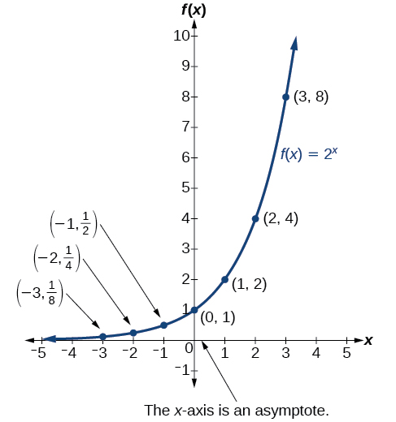{: #CNX_Precalc_Figure_04_02_001}

The domain of<math xmlns="http://www.w3.org/1998/Math/MathML"> <mrow> <mtext> </mtext><mi>f</mi><mo stretchy="false">(</mo><mi>x</mi><mo stretchy="false">)</mo><mo>=</mo><msup> <mn>2</mn> <mi>x</mi> </msup> <mtext> </mtext> </mrow> </math>

is all real numbers, the range is<math xmlns="http://www.w3.org/1998/Math/MathML"> <mrow> <mtext> </mtext><mrow><mo>(</mo> <mrow> <mn>0</mn><mo>,</mo><mi>∞</mi> </mrow> <mo>)</mo></mrow><mo>,</mo> </mrow> </math>

 and the horizontal asymptote is<math xmlns="http://www.w3.org/1998/Math/MathML"> <mrow> <mtext> </mtext><mi>y</mi><mo>=</mo><mn>0.</mn> </mrow> </math>

To get a sense of the behavior of **exponential decay**{: data-type="term" .no-emphasis}, we can create a table of values for a function of the form<math xmlns="http://www.w3.org/1998/Math/MathML"> <mrow> <mtext> </mtext><mi>f</mi><mo stretchy="false">(</mo><mi>x</mi><mo stretchy="false">)</mo><mo>=</mo><msup> <mi>b</mi> <mi>x</mi> </msup> <mtext> </mtext> </mrow> </math>

whose base is between zero and one. We’ll use the function<math xmlns="http://www.w3.org/1998/Math/MathML"> <mrow> <mtext> </mtext><mi>g</mi><mo stretchy="false">(</mo><mi>x</mi><mo stretchy="false">)</mo><mo>=</mo><msup> <mrow> <mrow><mo>(</mo> <mrow> <mfrac> <mn>1</mn> <mn>2</mn> </mfrac> </mrow> <mo>)</mo></mrow> </mrow> <mi>x</mi> </msup> <mo>.</mo><mtext> </mtext> </mrow> </math>

Observe how the output values in [\[link\]](#Table_04_02_02) change as the input increases by<math xmlns="http://www.w3.org/1998/Math/MathML"> <mrow> <mtext> </mtext><mn>1.</mn> </mrow> </math>

| <strong><math xmlns="http://www.w3.org/1998/Math/MathML">
<mi>x</mi>
</math></strong> | <math xmlns="http://www.w3.org/1998/Math/MathML"><mn>-3</mn></math>

 | <math xmlns="http://www.w3.org/1998/Math/MathML"><mn>-2</mn></math>

 | <math xmlns="http://www.w3.org/1998/Math/MathML"><mn>-1</mn></math>

 | <math xmlns="http://www.w3.org/1998/Math/MathML"><mn>0</mn></math>

 | <math xmlns="http://www.w3.org/1998/Math/MathML"><mn>1</mn></math>

 | <math xmlns="http://www.w3.org/1998/Math/MathML"><mn>2</mn></math>

 | <math xmlns="http://www.w3.org/1998/Math/MathML"><mn>3</mn></math>

 |
| <math xmlns="http://www.w3.org/1998/Math/MathML"> <mstyle fontstyle="italic" fontweight="bold"> <mi>g</mi> <mo stretchy="false">(</mo> <mi>x</mi> <mo stretchy="false">)</mo> <mo>=</mo></mstyle> <mo>(</mo> <mstyle fontweight="bold"> <mfrac> <mn>1</mn> <mn>2</mn> </mfrac> </mstyle><msup> <mo>)</mo> <mi>x</mi> </msup> </math>

 | <math xmlns="http://www.w3.org/1998/Math/MathML"><mn>8</mn></math>

 | <math xmlns="http://www.w3.org/1998/Math/MathML"><mn>4</mn></math>

 | <math xmlns="http://www.w3.org/1998/Math/MathML"><mn>2</mn></math>

 | <math xmlns="http://www.w3.org/1998/Math/MathML"><mn>1</mn></math>

 | <math xmlns="http://www.w3.org/1998/Math/MathML"> <mfrac> <mn>1</mn> <mn>2</mn> </mfrac> </math>

 | <math xmlns="http://www.w3.org/1998/Math/MathML"> <mfrac> <mn>1</mn> <mn>4</mn> </mfrac> </math>

 | <math xmlns="http://www.w3.org/1998/Math/MathML"> <mfrac> <mn>1</mn> <mn>8</mn> </mfrac> </math>

 |
{: #Table_04_02_02 summary="Two rows and eight columns. The first row is labeled, &#x201C;f(x)=2^x&#x201D;, with the following values: (-3, 1/8), (-2, 1/4), (-1, 1/2), (0, 1), (1, 2), (2, 4), and (3, 8). The second row is labeled, &#x201C;g(x)=log_2(x)&#x201D;, with the following values: (1/8, -3), (1/4, -2), (1/2, -1), (1, 0), (2, 1), (4, 2), and (8, 3)."}

Again, because the input is increasing by 1, each output value is the product of the previous output and the base, or constant ratio<math xmlns="http://www.w3.org/1998/Math/MathML"> <mrow> <mtext> </mtext><mfrac> <mn>1</mn> <mn>2</mn> </mfrac> <mo>.</mo> </mrow> </math>

Notice from the table that

* the output values are positive for all values of
  <math xmlns="http://www.w3.org/1998/Math/MathML"> <mrow> <mtext> </mtext><mi>x</mi><mo>;</mo> </mrow> </math>

* as
  <math xmlns="http://www.w3.org/1998/Math/MathML"> <mrow> <mtext> </mtext><mi>x</mi><mtext> </mtext> </mrow> </math>
  
  increases, the output values grow smaller, approaching zero; and
* as
  <math xmlns="http://www.w3.org/1998/Math/MathML"> <mrow> <mtext> </mtext><mi>x</mi><mtext> </mtext> </mrow> </math>
  
  decreases, the output values grow without bound.

[\[link\]](#CNX_Precalc_Figure_04_02_002) shows the exponential decay function,<math xmlns="http://www.w3.org/1998/Math/MathML"> <mrow> <mtext> </mtext><mi>g</mi><mo stretchy="false">(</mo><mi>x</mi><mo stretchy="false">)</mo><mo>=</mo><msup> <mrow> <mrow><mo>(</mo> <mrow> <mfrac> <mn>1</mn> <mn>2</mn> </mfrac> </mrow> <mo>)</mo></mrow> </mrow> <mi>x</mi> </msup> <mo>.</mo> </mrow> </math>

 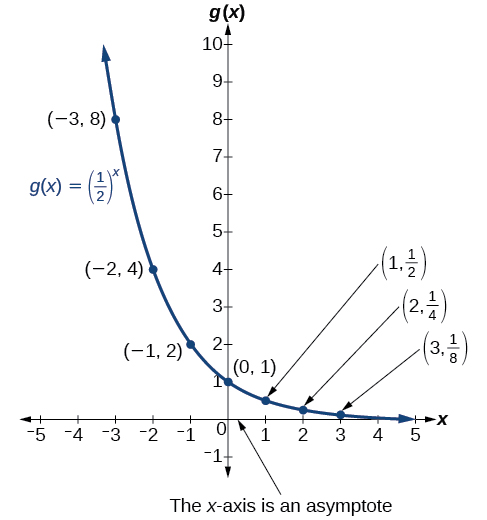{: #CNX_Precalc_Figure_04_02_002}

The domain of<math xmlns="http://www.w3.org/1998/Math/MathML"> <mrow> <mtext> </mtext><mi>g</mi><mo stretchy="false">(</mo><mi>x</mi><mo stretchy="false">)</mo><mo>=</mo><msup> <mrow> <mrow><mo>(</mo> <mrow> <mfrac> <mn>1</mn> <mn>2</mn> </mfrac> </mrow> <mo>)</mo></mrow> </mrow> <mi>x</mi> </msup> <mtext> </mtext> </mrow> </math>

is all real numbers, the range is<math xmlns="http://www.w3.org/1998/Math/MathML"> <mrow> <mtext> </mtext><mrow><mo>(</mo> <mrow> <mn>0</mn><mo>,</mo><mi>∞</mi> </mrow> <mo>)</mo></mrow><mo>,</mo> </mrow> </math>

and the horizontal asymptote is<math xmlns="http://www.w3.org/1998/Math/MathML"> <mrow> <mtext> </mtext><mi>y</mi><mo>=</mo><mn>0.</mn> </mrow> </math>

Characteristics of the Graph of the Parent Function *f*(*x*) = *b**x*

An exponential function with the form<math xmlns="http://www.w3.org/1998/Math/MathML"> <mrow> <mtext> </mtext><mi>f</mi><mo stretchy="false">(</mo><mi>x</mi><mo stretchy="false">)</mo><mo>=</mo><msup> <mi>b</mi> <mi>x</mi> </msup> <mo>,</mo> </mrow> </math>

<math xmlns="http://www.w3.org/1998/Math/MathML"> <mrow> <mtext> </mtext><mi>b</mi><mo>&gt;</mo><mn>0</mn><mo>,</mo> </mrow> </math>

<math xmlns="http://www.w3.org/1998/Math/MathML"> <mrow> <mtext> </mtext><mi>b</mi><mo>≠</mo><mn>1</mn><mo>,</mo> </mrow> </math>

has these characteristics:

* **one-to-one**{: data-type="term" .no-emphasis} function
* horizontal asymptote:
  <math xmlns="http://www.w3.org/1998/Math/MathML"> <mrow> <mtext> </mtext><mi>y</mi><mo>=</mo><mn>0</mn> </mrow> </math>

* domain:
  <math xmlns="http://www.w3.org/1998/Math/MathML"> <mrow> <mtext> </mtext><mo stretchy="false">(</mo><mo>–</mo><mi>∞</mi><mo>,</mo><mo> </mo><mi>∞</mi><mo stretchy="false">)</mo> </mrow> </math>

* range:
  <math xmlns="http://www.w3.org/1998/Math/MathML"> <mrow> <mtext> </mtext><mo stretchy="false">(</mo><mn>0</mn><mo>,</mo><mi>∞</mi><mo stretchy="false">)</mo> </mrow> </math>

* *x-*intercept: none
* *y-*intercept:
  <math xmlns="http://www.w3.org/1998/Math/MathML"> <mrow> <mtext> </mtext><mrow><mo>(</mo> <mrow> <mn>0</mn><mo>,</mo><mn>1</mn> </mrow> <mo>)</mo></mrow><mtext> </mtext> </mrow> </math>

* increasing if
  <math xmlns="http://www.w3.org/1998/Math/MathML"> <mrow> <mtext> </mtext><mi>b</mi><mo>&gt;</mo><mn>1</mn> </mrow> </math>

* decreasing if
  <math xmlns="http://www.w3.org/1998/Math/MathML"> <mrow> <mtext> </mtext><mi>b</mi><mo>&lt;</mo><mn>1</mn> </mrow> </math>

[\[link\]](#CNX_Precalc_Figure_04_02_003) compares the graphs of **exponential growth**{: data-type="term" .no-emphasis} and decay functions.

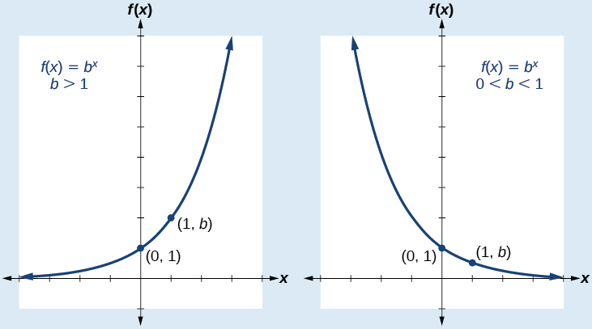{: #CNX_Precalc_Figure_04_02_003}

**Given an exponential function of the form<math xmlns="http://www.w3.org/1998/Math/MathML"> <mrow> <mtext> </mtext><mi>f</mi><mo stretchy="false">(</mo><mi>x</mi><mo stretchy="false">)</mo><mo>=</mo><msup> <mi>b</mi> <mi>x</mi> </msup> <mo>,</mo> </mrow> </math>

graph the function.**

1.  Create a table of points.
2.  Plot at least
    <math xmlns="http://www.w3.org/1998/Math/MathML"> <mrow> <mtext> </mtext><mn>3</mn><mtext> </mtext> </mrow> </math>
    
    point from the table, including the *y*-intercept
    <math xmlns="http://www.w3.org/1998/Math/MathML"> <mrow> <mtext> </mtext><mrow><mo>(</mo> <mrow> <mn>0</mn><mo>,</mo><mn>1</mn> </mrow> <mo>)</mo></mrow><mo>.</mo> </mrow> </math>

3.  Draw a smooth curve through the points.
4.  State the domain,
    <math xmlns="http://www.w3.org/1998/Math/MathML"> <mrow> <mtext> </mtext><mrow><mo>(</mo> <mrow> <mo>−</mo><mi>∞</mi><mo>,</mo><mi>∞</mi> </mrow> <mo>)</mo></mrow><mo>,</mo> </mrow> </math>
    
    the range,
    <math xmlns="http://www.w3.org/1998/Math/MathML"> <mrow> <mtext> </mtext><mrow><mo>(</mo> <mrow> <mn>0</mn><mo>,</mo><mi>∞</mi> </mrow> <mo>)</mo></mrow><mo>,</mo> </mrow> </math>
    
    and the horizontal asymptote,
    <math xmlns="http://www.w3.org/1998/Math/MathML"> <mrow> <mtext> </mtext><mi>y</mi><mo>=</mo><mn>0.</mn> </mrow> </math>
{: data-number-style="arabic"}

Sketching the Graph of an Exponential Function of the Form *f*(*x*) = *b**x*

Sketch a graph of<math xmlns="http://www.w3.org/1998/Math/MathML"> <mrow> <mtext> </mtext><mi>f</mi><mo stretchy="false">(</mo><mi>x</mi><mo stretchy="false">)</mo><mo>=</mo><msup> <mrow> <mn>0.25</mn> </mrow> <mi>x</mi> </msup> <mo>.</mo><mtext> </mtext> </mrow> </math>

State the domain, range, and asymptote.

Before graphing, identify the behavior and create a table of points for the graph.

* Since
  <math xmlns="http://www.w3.org/1998/Math/MathML"> <mrow> <mtext> </mtext><mi>b</mi><mo>=</mo><mn>0.25</mn><mtext> </mtext> </mrow> </math>
  
  is between zero and one, we know the function is decreasing. The left tail of the graph will increase without bound, and the right tail will approach the asymptote
  <math xmlns="http://www.w3.org/1998/Math/MathML"> <mrow> <mtext> </mtext><mi>y</mi><mo>=</mo><mn>0.</mn> </mrow> </math>

* Create a table of points as in [[link]](#Table_04_02_03).
  | <strong><math xmlns="http://www.w3.org/1998/Math/MathML">
  <mi>x</mi>
  </math></strong> | <math xmlns="http://www.w3.org/1998/Math/MathML"> <mrow> <mo>−</mo><mn>3</mn> </mrow> </math>
  
   | <math xmlns="http://www.w3.org/1998/Math/MathML"> <mrow> <mo>−</mo><mn>2</mn> </mrow> </math>
  
   | <math xmlns="http://www.w3.org/1998/Math/MathML"> <mrow> <mo>−</mo><mn>1</mn> </mrow> </math>
  
   | <math xmlns="http://www.w3.org/1998/Math/MathML"> <mn>0</mn> </math>
  
   | <math xmlns="http://www.w3.org/1998/Math/MathML"> <mn>1</mn> </math>
  
   | <math xmlns="http://www.w3.org/1998/Math/MathML"> <mn>2</mn> </math>
  
   | <math xmlns="http://www.w3.org/1998/Math/MathML"> <mn>3</mn> </math>
  
   |
  | <strong><math xmlns="http://www.w3.org/1998/Math/MathML">
  <mrow>
  <mi>f</mi><mo stretchy="false">(</mo><mi>x</mi><mo stretchy="false">)</mo><mo>=</mo><msup>
  <mrow>
  <mn>0.25</mn>
  </mrow>
  <mi>x</mi>
  </msup>
  
  </mrow>
  </math></strong> | <math xmlns="http://www.w3.org/1998/Math/MathML"> <mrow> <mn>64</mn> </mrow> </math>
  
   | <math xmlns="http://www.w3.org/1998/Math/MathML"> <mrow> <mn>16</mn> </mrow> </math>
  
   | <math xmlns="http://www.w3.org/1998/Math/MathML"> <mn>4</mn> </math>
  
   | <math xmlns="http://www.w3.org/1998/Math/MathML"> <mn>1</mn> </math>
  
   | <math xmlns="http://www.w3.org/1998/Math/MathML"> <mrow> <mn>0.25</mn> </mrow> </math>
  
   | <math xmlns="http://www.w3.org/1998/Math/MathML"> <mrow> <mn>0.0625</mn> </mrow> </math>
  
   | <math xmlns="http://www.w3.org/1998/Math/MathML"> <mrow> <mn>0.015625</mn> </mrow> </math>
  
   |
  {: #Table_04_02_03 summary="Two rows and eight columns. The first row is labeled, &#x201C;x&#x201D;, and the second row is labeled, &#x201C;f(x)=(0.25)^x&#x201D;. Reading the columns as ordered pairs, we have the following values: (-3, 64), (-2, 16), (-1, 4), (0, 1), (1, 0.25), (2, 0.0625), and (3, Two rows and eight columns. The first row is labeled, &#x201C;x&#x201D;, and the second row is labeled, &#x201C;f(x)=(0.25)^x&#x201D;. Reading the columns as ordered pairs, we have the following values: (-3, 64), (-2, 16), (-1, 4), (0, 1), (1, 0.25), (2, 0.0625), and (3, 0.015625)."}

* Plot the *y*-intercept,
  <math xmlns="http://www.w3.org/1998/Math/MathML"> <mrow> <mtext> </mtext><mrow><mo>(</mo> <mrow> <mn>0</mn><mo>,</mo><mn>1</mn> </mrow> <mo>)</mo></mrow><mo>,</mo> </mrow> </math>
  
  along with two other points. We can use
  <math xmlns="http://www.w3.org/1998/Math/MathML"> <mrow> <mtext> </mtext><mrow><mo>(</mo> <mrow> <mo>−</mo><mn>1</mn><mo>,</mo><mn>4</mn> </mrow> <mo>)</mo></mrow><mtext> </mtext> </mrow> </math>
  
  and
  <math xmlns="http://www.w3.org/1998/Math/MathML"> <mrow> <mtext> </mtext><mrow><mo>(</mo> <mrow> <mn>1</mn><mo>,</mo><mn>0.25</mn> </mrow> <mo>)</mo></mrow><mo>.</mo> </mrow> </math>

Draw a smooth curve connecting the points as in [[link]](#CNX_Precalc_Figure_04_02_004).

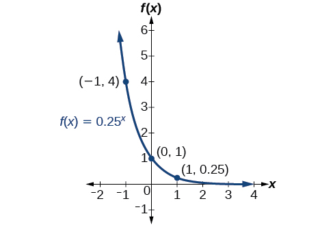{: #CNX_Precalc_Figure_04_02_004}

The domain is<math xmlns="http://www.w3.org/1998/Math/MathML"> <mrow> <mtext> </mtext><mrow><mo>(</mo> <mrow> <mo>−</mo><mi>∞</mi><mo>,</mo><mi>∞</mi> </mrow> <mo>)</mo></mrow><mo>;</mo><mtext> </mtext> </mrow> </math>

the range is<math xmlns="http://www.w3.org/1998/Math/MathML"> <mrow> <mtext> </mtext><mrow><mo>(</mo> <mrow> <mn>0</mn><mo>,</mo><mi>∞</mi> </mrow> <mo>)</mo></mrow><mo>;</mo><mtext> </mtext> </mrow> </math>

the horizontal asymptote is<math xmlns="http://www.w3.org/1998/Math/MathML"> <mrow> <mtext> </mtext><mi>y</mi><mo>=</mo><mn>0.</mn> </mrow> </math>

Sketch the graph of<math xmlns="http://www.w3.org/1998/Math/MathML"> <mrow> <mtext> </mtext><mi>f</mi><mo stretchy="false">(</mo><mi>x</mi><mo stretchy="false">)</mo><mo>=</mo><msup> <mn>4</mn> <mi>x</mi> </msup> <mo>.</mo><mtext> </mtext> </mrow> </math>

State the domain, range, and asymptote.

The domain is<math xmlns="http://www.w3.org/1998/Math/MathML"> <mrow> <mtext> </mtext><mrow><mo>(</mo> <mrow> <mo>−</mo><mi>∞</mi><mo>,</mo><mi>∞</mi> </mrow> <mo>)</mo></mrow><mo>;</mo><mtext> </mtext> </mrow> </math>

the range is<math xmlns="http://www.w3.org/1998/Math/MathML"> <mrow> <mtext> </mtext><mrow><mo>(</mo> <mrow> <mn>0</mn><mo>,</mo><mi>∞</mi> </mrow> <mo>)</mo></mrow><mo>;</mo><mtext> </mtext> </mrow> </math>

the horizontal asymptote is<math xmlns="http://www.w3.org/1998/Math/MathML"> <mrow> <mtext> </mtext><mi>y</mi><mo>=</mo><mn>0.</mn> </mrow> </math>

 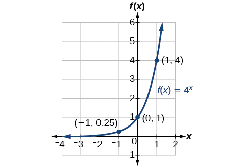 

# Graphing Transformations of Exponential Functions

Transformations of exponential graphs behave similarly to those of other functions. Just as with other parent functions, we can apply the four types of transformations—shifts, reflections, stretches, and compressions—to the parent function<math xmlns="http://www.w3.org/1998/Math/MathML"> <mrow> <mtext> </mtext><mi>f</mi><mo stretchy="false">(</mo><mi>x</mi><mo stretchy="false">)</mo><mo>=</mo><msup> <mi>b</mi> <mi>x</mi> </msup> <mtext> </mtext> </mrow> </math>

without loss of shape. For instance, just as the quadratic function maintains its parabolic shape when shifted, reflected, stretched, or compressed, the exponential function also maintains its general shape regardless of the transformations applied.

## Graphing a Vertical Shift

The first transformation occurs when we add a constant<math xmlns="http://www.w3.org/1998/Math/MathML"> <mrow> <mtext> </mtext><mi>d</mi><mtext> </mtext> </mrow> </math>

to the parent function<math xmlns="http://www.w3.org/1998/Math/MathML"> <mrow> <mtext> </mtext><mi>f</mi><mo stretchy="false">(</mo><mi>x</mi><mo stretchy="false">)</mo><mo>=</mo><msup> <mi>b</mi> <mi>x</mi> </msup> <mo>,</mo> </mrow> </math>

 giving us a **vertical shift**{: data-type="term" .no-emphasis}<math xmlns="http://www.w3.org/1998/Math/MathML"> <mrow> <mtext> </mtext><mi>d</mi><mtext> </mtext> </mrow> </math>

units in the same direction as the sign. For example, if we begin by graphing a parent function,<math xmlns="http://www.w3.org/1998/Math/MathML"> <mrow> <mtext> </mtext><mi>f</mi><mo stretchy="false">(</mo><mi>x</mi><mo stretchy="false">)</mo><mo>=</mo><msup> <mn>2</mn> <mi>x</mi> </msup> <mo>,</mo> </mrow> </math>

 we can then graph two vertical shifts alongside it, using<math xmlns="http://www.w3.org/1998/Math/MathML"> <mrow> <mtext> </mtext><mi>d</mi><mo>=</mo><mn>3</mn><mo>:</mo><mtext> </mtext> </mrow> </math>

the upward shift,<math xmlns="http://www.w3.org/1998/Math/MathML"> <mrow> <mtext> </mtext><mi>g</mi><mo stretchy="false">(</mo><mi>x</mi><mo stretchy="false">)</mo><mo>=</mo><msup> <mn>2</mn> <mi>x</mi> </msup> <mo>+</mo><mn>3</mn><mtext> </mtext> </mrow> </math>

and the downward shift,<math xmlns="http://www.w3.org/1998/Math/MathML"> <mrow> <mtext> </mtext><mi>h</mi><mo stretchy="false">(</mo><mi>x</mi><mo stretchy="false">)</mo><mo>=</mo><msup> <mn>2</mn> <mi>x</mi> </msup> <mo>−</mo><mn>3.</mn><mtext> </mtext> </mrow> </math>

Both vertical shifts are shown in [\[link\]](#CNX_Precalc_Figure_04_02_006).

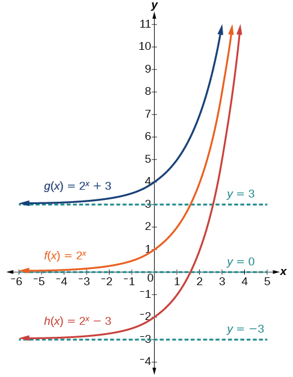{: #CNX_Precalc_Figure_04_02_006}

Observe the results of shifting<math xmlns="http://www.w3.org/1998/Math/MathML"> <mrow> <mtext> </mtext><mi>f</mi><mo stretchy="false">(</mo><mi>x</mi><mo stretchy="false">)</mo><mo>=</mo><msup> <mn>2</mn> <mi>x</mi> </msup> <mtext> </mtext> </mrow> </math>

vertically:

* The domain,
  <math xmlns="http://www.w3.org/1998/Math/MathML"> <mrow> <mtext> </mtext><mrow><mo>(</mo> <mrow> <mo>−</mo><mi>∞</mi><mo>,</mo><mi>∞</mi> </mrow> <mo>)</mo></mrow><mtext> </mtext> </mrow> </math>
  
  remains unchanged.
* When the function is shifted up
  <math xmlns="http://www.w3.org/1998/Math/MathML"> <mrow> <mtext> </mtext><mn>3</mn><mtext> </mtext> </mrow> </math>
  
  units to
  <math xmlns="http://www.w3.org/1998/Math/MathML"> <mrow> <mtext> </mtext><mi>g</mi><mo stretchy="false">(</mo><mi>x</mi><mo stretchy="false">)</mo><mo>=</mo><msup> <mn>2</mn> <mi>x</mi> </msup> <mo>+</mo><mn>3</mn><mo>:</mo> </mrow> </math>
  
  * The *y-*intercept shifts up
    <math xmlns="http://www.w3.org/1998/Math/MathML"> <mrow> <mtext> </mtext><mn>3</mn><mtext> </mtext> </mrow> </math>
    
    units to
    <math xmlns="http://www.w3.org/1998/Math/MathML"> <mrow> <mtext> </mtext><mrow><mo>(</mo> <mrow> <mn>0</mn><mo>,</mo><mn>4</mn> </mrow> <mo>)</mo></mrow><mo>.</mo> </mrow> </math>
  
  * The asymptote shifts up
    <math xmlns="http://www.w3.org/1998/Math/MathML"> <mrow> <mtext> </mtext><mn>3</mn><mtext> </mtext> </mrow> </math>
    
    units to
    <math xmlns="http://www.w3.org/1998/Math/MathML"> <mrow> <mtext> </mtext><mi>y</mi><mo>=</mo><mn>3.</mn> </mrow> </math>
  
  * The range becomes
    <math xmlns="http://www.w3.org/1998/Math/MathML"> <mrow> <mtext> </mtext><mrow><mo>(</mo> <mrow> <mn>3</mn><mo>,</mo><mi>∞</mi> </mrow> <mo>)</mo></mrow><mo>.</mo> </mrow> </math>
  {: data-bullet-style="open-circle"}

* When the function is shifted down
  <math xmlns="http://www.w3.org/1998/Math/MathML"> <mrow> <mtext> </mtext><mn>3</mn><mtext> </mtext> </mrow> </math>
  
  units to
  <math xmlns="http://www.w3.org/1998/Math/MathML"> <mrow> <mtext> </mtext><mi>h</mi><mo stretchy="false">(</mo><mi>x</mi><mo stretchy="false">)</mo><mo>=</mo><msup> <mn>2</mn> <mi>x</mi> </msup> <mo>−</mo><mn>3</mn><mo>:</mo> </mrow> </math>
  
  * The *y-*intercept shifts down
    <math xmlns="http://www.w3.org/1998/Math/MathML"> <mrow> <mtext> </mtext><mn>3</mn><mtext> </mtext> </mrow> </math>
    
    units to
    <math xmlns="http://www.w3.org/1998/Math/MathML"> <mrow> <mtext> </mtext><mrow><mo>(</mo> <mrow> <mn>0</mn><mo>,</mo><mo>−</mo><mn>2</mn> </mrow> <mo>)</mo></mrow><mo>.</mo> </mrow> </math>
  
  * The asymptote also shifts down
    <math xmlns="http://www.w3.org/1998/Math/MathML"> <mrow> <mtext> </mtext><mn>3</mn><mtext> </mtext> </mrow> </math>
    
    units to
    <math xmlns="http://www.w3.org/1998/Math/MathML"> <mrow> <mtext> </mtext><mi>y</mi><mo>=</mo><mo>−</mo><mn>3.</mn> </mrow> </math>
  
  * The range becomes
    <math xmlns="http://www.w3.org/1998/Math/MathML"> <mrow> <mtext> </mtext><mrow><mo>(</mo> <mrow> <mo>−</mo><mn>3</mn><mo>,</mo><mi>∞</mi> </mrow> <mo>)</mo></mrow><mo>.</mo> </mrow> </math>
  {: data-bullet-style="open-circle"}

## Graphing a Horizontal Shift

The next transformation occurs when we add a constant<math xmlns="http://www.w3.org/1998/Math/MathML"> <mrow> <mtext> </mtext><mi>c</mi><mtext> </mtext> </mrow> </math>

to the input of the parent function<math xmlns="http://www.w3.org/1998/Math/MathML"> <mrow> <mtext> </mtext><mi>f</mi><mo stretchy="false">(</mo><mi>x</mi><mo stretchy="false">)</mo><mo>=</mo><msup> <mi>b</mi> <mi>x</mi> </msup> <mo>,</mo> </mrow> </math>

 giving us a **horizontal shift**{: data-type="term" .no-emphasis}<math xmlns="http://www.w3.org/1998/Math/MathML"> <mrow> <mtext> </mtext><mi>c</mi><mtext> </mtext> </mrow> </math>

units in the *opposite* direction of the sign. For example, if we begin by graphing the parent function<math xmlns="http://www.w3.org/1998/Math/MathML"> <mrow> <mtext> </mtext><mi>f</mi><mo stretchy="false">(</mo><mi>x</mi><mo stretchy="false">)</mo><mo>=</mo><msup> <mn>2</mn> <mi>x</mi> </msup> <mo>,</mo> </mrow> </math>

 we can then graph two horizontal shifts alongside it, using<math xmlns="http://www.w3.org/1998/Math/MathML"> <mrow> <mtext> </mtext><mi>c</mi><mo>=</mo><mn>3</mn><mo>:</mo><mtext> </mtext> </mrow> </math>

the shift left,<math xmlns="http://www.w3.org/1998/Math/MathML"> <mrow> <mtext> </mtext><mi>g</mi><mo stretchy="false">(</mo><mi>x</mi><mo stretchy="false">)</mo><mo>=</mo><msup> <mn>2</mn> <mrow> <mi>x</mi><mo>+</mo><mn>3</mn> </mrow> </msup> <mo>,</mo> </mrow> </math>

 and the shift right,<math xmlns="http://www.w3.org/1998/Math/MathML"> <mrow> <mtext> </mtext><mi>h</mi><mo stretchy="false">(</mo><mi>x</mi><mo stretchy="false">)</mo><mo>=</mo><msup> <mn>2</mn> <mrow> <mi>x</mi><mo>−</mo><mn>3</mn> </mrow> </msup> <mo>.</mo><mtext> </mtext> </mrow> </math>

Both horizontal shifts are shown in [\[link\]](#CNX_Precalc_Figure_04_02_007).

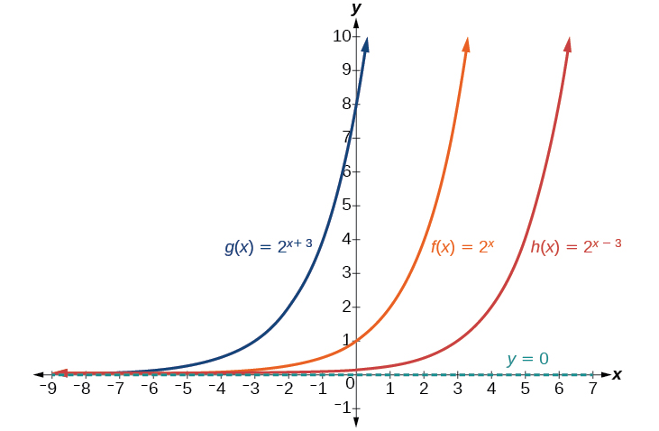{: #CNX_Precalc_Figure_04_02_007}

Observe the results of shifting<math xmlns="http://www.w3.org/1998/Math/MathML"> <mrow> <mtext> </mtext><mi>f</mi><mo stretchy="false">(</mo><mi>x</mi><mo stretchy="false">)</mo><mo>=</mo><msup> <mn>2</mn> <mi>x</mi> </msup> <mtext> </mtext> </mrow> </math>

horizontally:

* The domain,
  <math xmlns="http://www.w3.org/1998/Math/MathML"> <mrow> <mtext> </mtext><mrow><mo>(</mo> <mrow> <mo>−</mo><mi>∞</mi><mo>,</mo><mi>∞</mi> </mrow> <mo>)</mo></mrow><mo>,</mo> </mrow> </math>
  
  remains unchanged.
* The asymptote,
  <math xmlns="http://www.w3.org/1998/Math/MathML"> <mrow> <mtext> </mtext><mi>y</mi><mo>=</mo><mn>0</mn><mo>,</mo> </mrow> </math>
  
  remains unchanged.
* The *y-*intercept shifts such that:
  * When the function is shifted left
    <math xmlns="http://www.w3.org/1998/Math/MathML"> <mrow> <mtext> </mtext><mn>3</mn><mtext> </mtext> </mrow> </math>
    
    units to
    <math xmlns="http://www.w3.org/1998/Math/MathML"> <mrow> <mtext> </mtext><mi>g</mi><mo stretchy="false">(</mo><mi>x</mi><mo stretchy="false">)</mo><mo>=</mo><msup> <mn>2</mn> <mrow> <mi>x</mi><mo>+</mo><mn>3</mn> </mrow> </msup> <mo>,</mo> </mrow> </math>
    
    the *y*-intercept becomes
    <math xmlns="http://www.w3.org/1998/Math/MathML"> <mrow> <mtext> </mtext><mrow><mo>(</mo> <mrow> <mn>0</mn><mo>,</mo><mn>8</mn> </mrow> <mo>)</mo></mrow><mo>.</mo><mtext> </mtext> </mrow> </math>
    
    This is because
    <math xmlns="http://www.w3.org/1998/Math/MathML"> <mrow> <mtext> </mtext><msup> <mn>2</mn> <mrow> <mi>x</mi><mo>+</mo><mn>3</mn> </mrow> </msup> <mo>=</mo><mrow><mo>(</mo> <mn>8</mn> <mo>)</mo></mrow><msup> <mn>2</mn> <mi>x</mi> </msup> <mo>,</mo> </mrow> </math>
    
    so the initial value of the function is
    <math xmlns="http://www.w3.org/1998/Math/MathML"> <mrow> <mtext> </mtext><mn>8.</mn> </mrow> </math>
  
  * When the function is shifted right
    <math xmlns="http://www.w3.org/1998/Math/MathML"> <mrow> <mtext> </mtext><mn>3</mn><mtext> </mtext> </mrow> </math>
    
    units to
    <math xmlns="http://www.w3.org/1998/Math/MathML"> <mrow> <mtext> </mtext><mi>h</mi><mo stretchy="false">(</mo><mi>x</mi><mo stretchy="false">)</mo><mo>=</mo><msup> <mn>2</mn> <mrow> <mi>x</mi><mo>−</mo><mn>3</mn> </mrow> </msup> <mo>,</mo> </mrow> </math>
    
    the *y*-intercept becomes
    <math xmlns="http://www.w3.org/1998/Math/MathML"> <mrow> <mtext> </mtext><mrow><mo>(</mo> <mrow> <mn>0</mn><mo>,</mo><mfrac> <mn>1</mn> <mn>8</mn> </mfrac> </mrow> <mo>)</mo></mrow><mo>.</mo><mtext> </mtext> </mrow> </math>
    
    Again, see that
    <math xmlns="http://www.w3.org/1998/Math/MathML"> <mrow> <mtext> </mtext><msup> <mn>2</mn> <mrow> <mi>x</mi><mo>−</mo><mn>3</mn> </mrow> </msup> <mo>=</mo><mrow><mo>(</mo> <mrow> <mfrac> <mn>1</mn> <mn>8</mn> </mfrac> </mrow> <mo>)</mo></mrow><msup> <mn>2</mn> <mi>x</mi> </msup> <mo>,</mo> </mrow> </math>
    
    so the initial value of the function is
    <math xmlns="http://www.w3.org/1998/Math/MathML"> <mrow> <mtext> </mtext><mfrac> <mn>1</mn> <mn>8</mn> </mfrac> <mo>.</mo> </mrow> </math>
  {: data-bullet-style="open-circle"}

Shifts of the Parent Function *f*(*x*) = *b**x*

For any constants<math xmlns="http://www.w3.org/1998/Math/MathML"> <mrow> <mtext> </mtext><mi>c</mi><mtext> </mtext> </mrow> </math>

and<math xmlns="http://www.w3.org/1998/Math/MathML"> <mrow> <mtext> </mtext><mi>d</mi><mo>,</mo> </mrow> </math>

the function<math xmlns="http://www.w3.org/1998/Math/MathML"> <mrow> <mtext> </mtext><mi>f</mi><mo stretchy="false">(</mo><mi>x</mi><mo stretchy="false">)</mo><mo>=</mo><msup> <mi>b</mi> <mrow> <mi>x</mi><mo>+</mo><mi>c</mi> </mrow> </msup> <mo>+</mo><mi>d</mi><mtext> </mtext> </mrow> </math>

shifts the parent function<math xmlns="http://www.w3.org/1998/Math/MathML"> <mrow> <mtext> </mtext><mi>f</mi><mo stretchy="false">(</mo><mi>x</mi><mo stretchy="false">)</mo><mo>=</mo><msup> <mi>b</mi> <mi>x</mi> </msup> </mrow> </math>

* vertically
  <math xmlns="http://www.w3.org/1998/Math/MathML"> <mrow> <mtext> </mtext><mi>d</mi><mtext> </mtext> </mrow> </math>
  
  units, in the *same* direction of the sign of
  <math xmlns="http://www.w3.org/1998/Math/MathML"> <mrow> <mtext> </mtext><mi>d</mi><mo>.</mo> </mrow> </math>

* horizontally
  <math xmlns="http://www.w3.org/1998/Math/MathML"> <mrow> <mtext> </mtext><mi>c</mi><mtext> </mtext> </mrow> </math>
  
  units, in the *opposite* direction of the sign of
  <math xmlns="http://www.w3.org/1998/Math/MathML"> <mrow> <mtext> </mtext><mi>c</mi><mo>.</mo> </mrow> </math>

* The *y*-intercept becomes
  <math xmlns="http://www.w3.org/1998/Math/MathML"> <mrow> <mtext> </mtext><mrow><mo>(</mo> <mrow> <mn>0</mn><mo>,</mo><msup> <mi>b</mi> <mi>c</mi> </msup> <mo>+</mo><mi>d</mi> </mrow> <mo>)</mo></mrow><mo>.</mo> </mrow> </math>

* The horizontal asymptote becomes
  <math xmlns="http://www.w3.org/1998/Math/MathML"> <mrow> <mtext> </mtext><mi>y</mi><mo>=</mo><mi>d</mi><mo>.</mo> </mrow> </math>

* The range becomes
  <math xmlns="http://www.w3.org/1998/Math/MathML"> <mrow> <mtext> </mtext><mrow><mo>(</mo> <mrow> <mi>d</mi><mo>,</mo><mi>∞</mi> </mrow> <mo>)</mo></mrow><mo>.</mo> </mrow> </math>

* The domain,
  <math xmlns="http://www.w3.org/1998/Math/MathML"> <mrow> <mtext> </mtext><mrow><mo>(</mo> <mrow> <mo>−</mo><mi>∞</mi><mo>,</mo><mi>∞</mi> </mrow> <mo>)</mo></mrow><mo>,</mo> </mrow> </math>
  
  remains unchanged.

**Given an exponential function with the form<math xmlns="http://www.w3.org/1998/Math/MathML"> <mrow> <mtext> </mtext><mi>f</mi><mo stretchy="false">(</mo><mi>x</mi><mo stretchy="false">)</mo><mo>=</mo><msup> <mi>b</mi> <mrow> <mi>x</mi><mo>+</mo><mi>c</mi> </mrow> </msup> <mo>+</mo><mi>d</mi><mo>,</mo> </mrow> </math>

graph the translation.**

1.  Draw the horizontal asymptote
    <math xmlns="http://www.w3.org/1998/Math/MathML"> <mrow> <mtext> </mtext><mi>y</mi><mo>=</mo><mi>d</mi><mo>.</mo> </mrow> </math>

2.  Identify the shift as
    <math xmlns="http://www.w3.org/1998/Math/MathML"> <mrow> <mtext> </mtext><mrow><mo>(</mo> <mrow> <mo>−</mo><mi>c</mi><mo>,</mo><mi>d</mi> </mrow> <mo>)</mo></mrow><mo>.</mo><mtext> </mtext> </mrow> </math>
    
    Shift the graph of
    <math xmlns="http://www.w3.org/1998/Math/MathML"> <mrow> <mtext> </mtext><mi>f</mi><mo stretchy="false">(</mo><mi>x</mi><mo stretchy="false">)</mo><mo>=</mo><msup> <mi>b</mi> <mi>x</mi> </msup> <mtext> </mtext> </mrow> </math>
    
    left
    <math xmlns="http://www.w3.org/1998/Math/MathML"> <mrow> <mtext> </mtext><mi>c</mi><mtext> </mtext> </mrow> </math>
    
    units if
    <math xmlns="http://www.w3.org/1998/Math/MathML"> <mrow> <mtext> </mtext><mi>c</mi><mtext> </mtext> </mrow> </math>
    
    is positive, and right
    <math xmlns="http://www.w3.org/1998/Math/MathML"> <mrow> <mtext> </mtext><mi>c</mi><mtext> </mtext> </mrow> </math>
    
    units if
    <math xmlns="http://www.w3.org/1998/Math/MathML"> <mrow> <mi>c</mi><mtext> </mtext> </mrow> </math>
    
    is negative.
3.  Shift the graph of
    <math xmlns="http://www.w3.org/1998/Math/MathML"> <mrow> <mtext> </mtext><mi>f</mi><mo stretchy="false">(</mo><mi>x</mi><mo stretchy="false">)</mo><mo>=</mo><msup> <mi>b</mi> <mi>x</mi> </msup> <mtext> </mtext> </mrow> </math>
    
    up
    <math xmlns="http://www.w3.org/1998/Math/MathML"> <mrow> <mtext> </mtext><mi>d</mi><mtext> </mtext> </mrow> </math>
    
    units if
    <math xmlns="http://www.w3.org/1998/Math/MathML"> <mrow> <mtext> </mtext><mi>d</mi><mtext> </mtext> </mrow> </math>
    
    is positive, and down
    <math xmlns="http://www.w3.org/1998/Math/MathML"> <mrow> <mtext> </mtext><mi>d</mi><mtext> </mtext> </mrow> </math>
    
    units if
    <math xmlns="http://www.w3.org/1998/Math/MathML"> <mrow> <mtext> </mtext><mi>d</mi><mtext> </mtext> </mrow> </math>
    
    is negative.
4.  State the domain,
    <math xmlns="http://www.w3.org/1998/Math/MathML"> <mrow> <mtext> </mtext><mrow><mo>(</mo> <mrow> <mo>−</mo><mi>∞</mi><mo>,</mo><mi>∞</mi> </mrow> <mo>)</mo></mrow><mo>,</mo> </mrow> </math>
    
    the range,
    <math xmlns="http://www.w3.org/1998/Math/MathML"> <mrow> <mtext> </mtext><mrow><mo>(</mo> <mrow> <mi>d</mi><mo>,</mo><mi>∞</mi> </mrow> <mo>)</mo></mrow><mo>,</mo> </mrow> </math>
    
    and the horizontal asymptote
    <math xmlns="http://www.w3.org/1998/Math/MathML"> <mrow> <mtext> </mtext><mi>y</mi><mo>=</mo><mi>d</mi><mo>.</mo> </mrow> </math>
{: data-number-style="arabic"}

Graphing a Shift of an Exponential Function

Graph<math xmlns="http://www.w3.org/1998/Math/MathML"> <mrow> <mtext> </mtext><mi>f</mi><mo stretchy="false">(</mo><mi>x</mi><mo stretchy="false">)</mo><mo>=</mo><msup> <mn>2</mn> <mrow> <mi>x</mi><mo>+</mo><mn>1</mn> </mrow> </msup> <mo>−</mo><mn>3.</mn><mtext> </mtext> </mrow> </math>

State the domain, range, and asymptote.

We have an exponential equation of the form<math xmlns="http://www.w3.org/1998/Math/MathML"> <mrow> <mtext> </mtext><mi>f</mi><mo stretchy="false">(</mo><mi>x</mi><mo stretchy="false">)</mo><mo>=</mo><msup> <mi>b</mi> <mrow> <mi>x</mi><mo>+</mo><mi>c</mi> </mrow> </msup> <mo>+</mo><mi>d</mi><mo>,</mo> </mrow> </math>

 with<math xmlns="http://www.w3.org/1998/Math/MathML"> <mrow> <mtext> </mtext><mi>b</mi><mo>=</mo><mn>2</mn><mo>,</mo> </mrow> </math>

<math xmlns="http://www.w3.org/1998/Math/MathML"> <mrow> <mtext> </mtext><mi>c</mi><mo>=</mo><mn>1</mn><mo>,</mo> </mrow> </math>

 and<math xmlns="http://www.w3.org/1998/Math/MathML"> <mrow> <mtext> </mtext><mi>d</mi><mo>=</mo><mi>−</mi><mn>3.</mn> </mrow> </math>

Draw the horizontal asymptote<math xmlns="http://www.w3.org/1998/Math/MathML"> <mrow> <mtext> </mtext><mi>y</mi><mo>=</mo><mi>d</mi> </mrow> </math>

, so draw<math xmlns="http://www.w3.org/1998/Math/MathML"> <mrow> <mtext> </mtext><mi>y</mi><mo>=</mo><mn>−3.</mn> </mrow> </math>

Identify the shift as<math xmlns="http://www.w3.org/1998/Math/MathML"> <mrow> <mtext> </mtext><mrow><mo>(</mo> <mrow> <mo>−</mo><mi>c</mi><mo>,</mo><mi>d</mi> </mrow> <mo>)</mo></mrow><mo>,</mo> </mrow> </math>

 so the shift is<math xmlns="http://www.w3.org/1998/Math/MathML"> <mrow> <mtext> </mtext><mrow><mo>(</mo> <mrow> <mo>−</mo><mn>1</mn><mo>,</mo><mn>−3</mn> </mrow> <mo>)</mo></mrow><mo>.</mo> </mrow> </math>

Shift the graph of<math xmlns="http://www.w3.org/1998/Math/MathML"> <mrow> <mtext> </mtext><mi>f</mi><mo stretchy="false">(</mo><mi>x</mi><mo stretchy="false">)</mo><mo>=</mo><msup> <mi>b</mi> <mi>x</mi> </msup> <mtext> </mtext> </mrow> </math>

left 1 units and down 3 units.

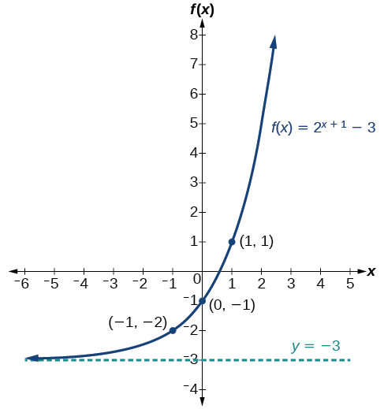{: #CNX_Precalc_Figure_04_02_008}

The domain is<math xmlns="http://www.w3.org/1998/Math/MathML"> <mrow> <mtext> </mtext><mrow><mo>(</mo> <mrow> <mo>−</mo><mi>∞</mi><mo>,</mo><mi>∞</mi> </mrow> <mo>)</mo></mrow><mo>;</mo><mtext> </mtext> </mrow> </math>

the range is<math xmlns="http://www.w3.org/1998/Math/MathML"> <mrow> <mtext> </mtext><mrow><mo>(</mo> <mrow> <mo>−</mo><mn>3</mn><mo>,</mo><mi>∞</mi> </mrow> <mo>)</mo></mrow><mo>;</mo><mtext> </mtext> </mrow> </math>

the horizontal asymptote is<math xmlns="http://www.w3.org/1998/Math/MathML"> <mrow> <mtext> </mtext><mi>y</mi><mo>=</mo><mn>−3.</mn> </mrow> </math>

Graph<math xmlns="http://www.w3.org/1998/Math/MathML"> <mrow> <mtext> </mtext><mi>f</mi><mo stretchy="false">(</mo><mi>x</mi><mo stretchy="false">)</mo><mo>=</mo><msup> <mn>2</mn> <mrow> <mi>x</mi><mo>−</mo><mn>1</mn> </mrow> </msup> <mo>+</mo><mn>3.</mn><mtext> </mtext> </mrow> </math>

State domain, range, and asymptote.

The domain is<math xmlns="http://www.w3.org/1998/Math/MathML"> <mrow> <mtext> </mtext><mrow><mo>(</mo> <mrow> <mo>−</mo><mi>∞</mi><mo>,</mo><mi>∞</mi> </mrow> <mo>)</mo></mrow><mo>;</mo><mtext> </mtext> </mrow> </math>

the range is<math xmlns="http://www.w3.org/1998/Math/MathML"> <mrow> <mtext> </mtext><mrow><mo>(</mo> <mrow> <mn>3</mn><mo>,</mo><mi>∞</mi> </mrow> <mo>)</mo></mrow><mo>;</mo><mtext> </mtext> </mrow> </math>

the horizontal asymptote is<math xmlns="http://www.w3.org/1998/Math/MathML"> <mrow> <mtext> </mtext><mi>y</mi><mo>=</mo><mn>3.</mn> </mrow> </math>

 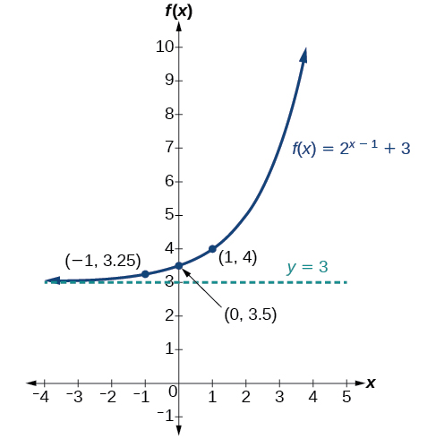 

**Given an equation of the form<math xmlns="http://www.w3.org/1998/Math/MathML"> <mrow> <mtext> </mtext><mi>f</mi><mo stretchy="false">(</mo><mi>x</mi><mo stretchy="false">)</mo><mo>=</mo><msup> <mi>b</mi> <mrow> <mi>x</mi><mo>+</mo><mi>c</mi> </mrow> </msup> <mo>+</mo><mi>d</mi><mtext> </mtext> </mrow> </math>

for<math xmlns="http://www.w3.org/1998/Math/MathML"> <mrow> <mtext> </mtext><mi>x</mi><mo>,</mo> </mrow> </math>

 use a graphing calculator to approximate the solution.**

* Press **\[Y=\]**. Enter the given exponential equation in the line headed “**Y1=**”.
* Enter the given value for
  <math xmlns="http://www.w3.org/1998/Math/MathML"> <mrow> <mtext> </mtext><mi>f</mi><mo stretchy="false">(</mo><mi>x</mi><mo stretchy="false">)</mo><mtext> </mtext> </mrow> </math>
  
  in the line headed “**Y2=**”.
* Press **\[WINDOW\]**. Adjust the *y*-axis so that it includes the value entered for “**Y2=**”.
* Press **\[GRAPH\]** to observe the graph of the exponential function along with the line for the specified value of
  <math xmlns="http://www.w3.org/1998/Math/MathML"> <mrow> <mtext> </mtext><mi>f</mi><mo stretchy="false">(</mo><mi>x</mi><mo stretchy="false">)</mo><mo>.</mo> </mrow> </math>

* To find the value of
  <math xmlns="http://www.w3.org/1998/Math/MathML"> <mrow> <mtext> </mtext><mi>x</mi><mo>,</mo> </mrow> </math>
  
  we compute the point of intersection. Press <strong>\[2ND\] </strong>then **\[CALC\]**. Select “intersect” and press **\[ENTER\]** three times. The point of intersection gives the value of <em>x </em>for the indicated value of the function.

Approximating the Solution of an Exponential Equation

Solve<math xmlns="http://www.w3.org/1998/Math/MathML"> <mrow> <mtext> </mtext><mn>42</mn><mo>=</mo><mn>1.2</mn><msup> <mrow> <mrow><mo>(</mo> <mn>5</mn> <mo>)</mo></mrow> </mrow> <mi>x</mi> </msup> <mo>+</mo><mn>2.8</mn><mtext> </mtext> </mrow> </math>

graphically. Round to the nearest thousandth.

Press **[Y=]** and enter<math xmlns="http://www.w3.org/1998/Math/MathML"> <mrow> <mtext> </mtext><mn>1.2</mn><msup> <mrow> <mrow><mo>(</mo> <mn>5</mn> <mo>)</mo></mrow> </mrow> <mi>x</mi> </msup> <mo>+</mo><mn>2.8</mn><mtext> </mtext> </mrow> </math>

next to **Y1**=. Then enter 42 next to **Y2=**. For a window, use the values –3 to 3 for<math xmlns="http://www.w3.org/1998/Math/MathML"> <mrow> <mtext> </mtext><mi>x</mi><mtext> </mtext> </mrow> </math>

and –5 to 55 for<math xmlns="http://www.w3.org/1998/Math/MathML"> <mrow> <mtext> </mtext><mi>y</mi><mo>.</mo><mtext> </mtext> </mrow> </math>

Press **[GRAPH]**. The graphs should intersect somewhere near<math xmlns="http://www.w3.org/1998/Math/MathML"> <mrow> <mtext> </mtext><mi>x</mi><mo>=</mo><mn>2.</mn> </mrow> </math>

For a better approximation, press <strong>[2ND] </strong>then **[CALC]**. Select **[5: intersect]** and press **[ENTER]** three times. The *x*-coordinate of the point of intersection is displayed as 2.1661943. (Your answer may be different if you use a different window or use a different value for **Guess?**) To the nearest thousandth,<math xmlns="http://www.w3.org/1998/Math/MathML"> <mrow> <mtext> </mtext><mi>x</mi><mo>≈</mo><mn>2.166.</mn> </mrow> </math>

Solve<math xmlns="http://www.w3.org/1998/Math/MathML"> <mrow> <mtext> </mtext><mn>4</mn><mo>=</mo><mn>7.85</mn><msup> <mrow> <mrow><mo>(</mo> <mrow> <mn>1.15</mn> </mrow> <mo>)</mo></mrow> </mrow> <mi>x</mi> </msup> <mo>−</mo><mn>2.27</mn><mtext> </mtext> </mrow> </math>

graphically. Round to the nearest thousandth.

<math xmlns="http://www.w3.org/1998/Math/MathML"> <mrow> <mi>x</mi><mo>≈</mo><mo>−</mo><mn>1.608</mn> </mrow> </math>

## Graphing a Stretch or Compression

While horizontal and vertical shifts involve adding constants to the input or to the function itself, a **stretch**{: data-type="term" .no-emphasis} or **compression**{: data-type="term" .no-emphasis} occurs when we multiply the parent function<math xmlns="http://www.w3.org/1998/Math/MathML"> <mrow> <mtext> </mtext><mi>f</mi><mo stretchy="false">(</mo><mi>x</mi><mo stretchy="false">)</mo><mo>=</mo><msup> <mi>b</mi> <mi>x</mi> </msup> <mtext> </mtext> </mrow> </math>

by a constant<math xmlns="http://www.w3.org/1998/Math/MathML"> <mrow> <mtext> </mtext><mo>\|</mo><mi>a</mi><mo>\|</mo><mo>&gt;</mo><mn>0.</mn><mtext> </mtext> </mrow> </math>

For example, if we begin by graphing the parent function<math xmlns="http://www.w3.org/1998/Math/MathML"> <mrow> <mtext> </mtext><mi>f</mi><mo stretchy="false">(</mo><mi>x</mi><mo stretchy="false">)</mo><mo>=</mo><msup> <mn>2</mn> <mi>x</mi> </msup> <mo>,</mo> </mrow> </math>

we can then graph the stretch, using<math xmlns="http://www.w3.org/1998/Math/MathML"> <mrow> <mtext> </mtext><mi>a</mi><mo>=</mo><mn>3</mn><mo>,</mo> </mrow> </math>

to get<math xmlns="http://www.w3.org/1998/Math/MathML"> <mrow> <mtext> </mtext><mi>g</mi><mo stretchy="false">(</mo><mi>x</mi><mo stretchy="false">)</mo><mo>=</mo><mn>3</mn><msup> <mrow> <mrow><mo>(</mo> <mn>2</mn> <mo>)</mo></mrow> </mrow> <mi>x</mi> </msup> <mtext> </mtext> </mrow> </math>

as shown on the left in [\[link\]](#CNX_Precalc_Figure_04_02_010), and the compression, using<math xmlns="http://www.w3.org/1998/Math/MathML"> <mrow> <mtext> </mtext><mi>a</mi><mo>=</mo><mfrac> <mn>1</mn> <mn>3</mn> </mfrac> <mo>,</mo> </mrow> </math>

to get<math xmlns="http://www.w3.org/1998/Math/MathML"> <mrow> <mtext> </mtext><mi>h</mi><mo stretchy="false">(</mo><mi>x</mi><mo stretchy="false">)</mo><mo>=</mo><mfrac> <mn>1</mn> <mn>3</mn> </mfrac> <msup> <mrow> <mrow><mo>(</mo> <mn>2</mn> <mo>)</mo></mrow> </mrow> <mi>x</mi> </msup> <mtext> </mtext> </mrow> </math>

as shown on the right in [\[link\]](#CNX_Precalc_Figure_04_02_010).

 &#10;&#10;&#x2009;g(x)=3&#10;&#10;(&#10;2&#10;)&#10;&#10;x&#10;&#10;&#x2009;&#10;&#10;stretches the graph of&#10;&#10;&#x2009;f(x)=&#10;2&#10;x&#10;&#10;&#x2009;&#10;&#10;vertically by a factor of&#10;&#10;&#x2009;3.&#x2009;&#10;&#10;(b)&#10;&#10;&#x2009;h(x)=&#10;1&#10;3&#10;&#10;&#10;&#10;(&#10;2&#10;)&#10;&#10;x&#10;&#10;&#x2009;&#10;&#10;compresses the graph of&#10;&#10;&#x2009;f(x)=&#10;2&#10;x&#10;&#10;&#x2009;&#10;&#10;vertically by a factor of&#10;&#10;&#x2009;&#10;1&#10;3&#10;&#10;.&#10;&#10;"){: #CNX_Precalc_Figure_04_02_010}

Stretches and Compressions of the Parent Function *f*(*x*) = *b**x*

For any factor<math xmlns="http://www.w3.org/1998/Math/MathML"> <mrow> <mtext> </mtext><mi>a</mi><mo>&gt;</mo><mn>0</mn><mo>,</mo> </mrow> </math>

the function<math xmlns="http://www.w3.org/1998/Math/MathML"> <mrow> <mtext> </mtext><mi>f</mi><mo stretchy="false">(</mo><mi>x</mi><mo stretchy="false">)</mo><mo>=</mo><mi>a</mi><msup> <mrow> <mrow><mo>(</mo> <mi>b</mi> <mo>)</mo></mrow> </mrow> <mi>x</mi> </msup> </mrow> </math>

* is stretched vertically by a factor of
  <math xmlns="http://www.w3.org/1998/Math/MathML"> <mrow> <mtext> </mtext><mi>a</mi><mtext> </mtext> </mrow> </math>
  
  if
  <math xmlns="http://www.w3.org/1998/Math/MathML"> <mrow> <mtext> </mtext><mo>\|</mo><mi>a</mi><mo>\|</mo><mo>&gt;</mo><mn>1.</mn> </mrow> </math>

* is compressed vertically by a factor of
  <math xmlns="http://www.w3.org/1998/Math/MathML"> <mrow> <mtext> </mtext><mi>a</mi><mtext> </mtext> </mrow> </math>
  
  if
  <math xmlns="http://www.w3.org/1998/Math/MathML"> <mrow> <mtext> </mtext><mo>\|</mo><mi>a</mi><mo>\|</mo><mo>&lt;</mo><mn>1.</mn> </mrow> </math>

* has a *y*-intercept of
  <math xmlns="http://www.w3.org/1998/Math/MathML"> <mrow> <mtext> </mtext><mrow><mo>(</mo> <mrow> <mn>0</mn><mo>,</mo><mi>a</mi> </mrow> <mo>)</mo></mrow><mo>.</mo> </mrow> </math>

* has a horizontal asymptote at
  <math xmlns="http://www.w3.org/1998/Math/MathML"> <mrow> <mtext> </mtext><mi>y</mi><mo>=</mo><mn>0</mn><mo>,</mo> </mrow> </math>
  
  a range of
  <math xmlns="http://www.w3.org/1998/Math/MathML"> <mrow> <mtext> </mtext><mrow><mo>(</mo> <mrow> <mn>0</mn><mo>,</mo><mi>∞</mi> </mrow> <mo>)</mo></mrow><mo>,</mo> </mrow> </math>
  
  and a domain of
  <math xmlns="http://www.w3.org/1998/Math/MathML"> <mrow> <mtext> </mtext><mrow><mo>(</mo> <mrow> <mo>−</mo><mi>∞</mi><mo>,</mo><mi>∞</mi> </mrow> <mo>)</mo></mrow><mo>,</mo> </mrow> </math>
  
  which are unchanged from the parent function.

Graphing the Stretch of an Exponential Function

Sketch a graph of<math xmlns="http://www.w3.org/1998/Math/MathML"> <mrow> <mtext> </mtext><mi>f</mi><mo stretchy="false">(</mo><mi>x</mi><mo stretchy="false">)</mo><mo>=</mo><mn>4</mn><msup> <mrow> <mrow><mo>(</mo> <mrow> <mfrac> <mn>1</mn> <mn>2</mn> </mfrac> </mrow> <mo>)</mo></mrow> </mrow> <mi>x</mi> </msup> <mo>.</mo><mtext> </mtext> </mrow> </math>

State the domain, range, and asymptote.

Before graphing, identify the behavior and key points on the graph.

* Since
  <math xmlns="http://www.w3.org/1998/Math/MathML"> <mrow> <mtext> </mtext><mi>b</mi><mo>=</mo><mfrac> <mn>1</mn> <mn>2</mn> </mfrac> <mtext> </mtext> </mrow> </math>
  
  is between zero and one, the left tail of the graph will increase without bound as
  <math xmlns="http://www.w3.org/1998/Math/MathML"> <mrow> <mtext> </mtext><mi>x</mi><mtext> </mtext> </mrow> </math>
  
  decreases, and the right tail will approach the *x*-axis as
  <math xmlns="http://www.w3.org/1998/Math/MathML"> <mrow> <mtext> </mtext><mi>x</mi><mtext> </mtext> </mrow> </math>
  
  increases.
* Since
  <math xmlns="http://www.w3.org/1998/Math/MathML"> <mrow> <mtext> </mtext><mi>a</mi><mo>=</mo><mn>4</mn><mo>,</mo> </mrow> </math>
  
  the graph of
  <math xmlns="http://www.w3.org/1998/Math/MathML"> <mrow> <mtext> </mtext><mi>f</mi><mo stretchy="false">(</mo><mi>x</mi><mo stretchy="false">)</mo><mo>=</mo><msup> <mrow> <mrow><mo>(</mo> <mrow> <mfrac> <mn>1</mn> <mn>2</mn> </mfrac> </mrow> <mo>)</mo></mrow> </mrow> <mi>x</mi> </msup> <mtext> </mtext> </mrow> </math>
  
  will be stretched by a factor of
  <math xmlns="http://www.w3.org/1998/Math/MathML"> <mrow> <mtext> </mtext><mn>4.</mn> </mrow> </math>

* Create a table of points as shown in [[link]](#Table_04_02_04).
  | <strong><math xmlns="http://www.w3.org/1998/Math/MathML">
  <mi>x</mi>
  </math></strong> | <math xmlns="http://www.w3.org/1998/Math/MathML"> <mo>−</mo><mn>3</mn> </math>
  
   | <math xmlns="http://www.w3.org/1998/Math/MathML"> <mo>−</mo><mn>2</mn> </math>
  
   | <math xmlns="http://www.w3.org/1998/Math/MathML"> <mo>−</mo><mn>1</mn> </math>
  
   | <math xmlns="http://www.w3.org/1998/Math/MathML"> <mn>0</mn> </math>
  
   | <math xmlns="http://www.w3.org/1998/Math/MathML"> <mn>1</mn> </math>
  
   | <math xmlns="http://www.w3.org/1998/Math/MathML"> <mn>2</mn> </math>
  
   | <math xmlns="http://www.w3.org/1998/Math/MathML"> <mn>3</mn> </math>
  
   |
  | <math xmlns="http://www.w3.org/1998/Math/MathML" display="block"> <mstyle fontstyle="italic" fontweight="bold"> <mi>f</mi><mo stretchy="false">(</mo><mi>x</mi><mo stretchy="false">)</mo></mstyle> <mstyle fontweight="bold"><mo>=</mo><mn>4</mn></mstyle> <mo>(</mo> <mstyle fontweight="bold"> <mfrac> <mn>1</mn> <mn>2</mn> </mfrac></mstyle> <msup><mo>)</mo> <mi>x</mi> </msup> </math>
  
   | <math xmlns="http://www.w3.org/1998/Math/MathML"> <mn>32</mn> </math>
  
   | <math xmlns="http://www.w3.org/1998/Math/MathML"> <mn>16</mn> </math>
  
   | <math xmlns="http://www.w3.org/1998/Math/MathML"> <mn>8</mn> </math>
  
   | <math xmlns="http://www.w3.org/1998/Math/MathML"> <mn>4</mn> </math>
  
   | <math xmlns="http://www.w3.org/1998/Math/MathML"> <mn>2</mn> </math>
  
   | <math xmlns="http://www.w3.org/1998/Math/MathML"> <mn>1</mn> </math>
  
   | <math xmlns="http://www.w3.org/1998/Math/MathML"> <mn>0.5</mn> </math>
  
   |
  {: #Table_04_02_04 summary="Two rows and eight columns. The first row is labeled, &#x201C;x&#x201D;, and the second row is labeled, &#x201C;f(x)=4(0.25)^x&#x201D;. Reading the columns as ordered pairs, we have the following values: (-3, 32), (-2, 16), (-1, 8), (0, 4), (1, 2), (2, 1), and (3, 0.5)."}

* Plot the *y-*intercept,
  <math xmlns="http://www.w3.org/1998/Math/MathML"> <mrow> <mtext> </mtext><mrow><mo>(</mo> <mrow> <mn>0</mn><mo>,</mo><mn>4</mn> </mrow> <mo>)</mo></mrow><mo>,</mo> </mrow> </math>
  
  along with two other points. We can use
  <math xmlns="http://www.w3.org/1998/Math/MathML"> <mrow> <mtext> </mtext><mrow><mo>(</mo> <mrow> <mo>−</mo><mn>1</mn><mo>,</mo><mn>8</mn> </mrow> <mo>)</mo></mrow><mtext> </mtext> </mrow> </math>
  
  and
  <math xmlns="http://www.w3.org/1998/Math/MathML"> <mrow> <mtext> </mtext><mrow><mo>(</mo> <mrow> <mn>1</mn><mo>,</mo><mn>2</mn> </mrow> <mo>)</mo></mrow><mo>.</mo> </mrow> </math>

Draw a smooth curve connecting the points, as shown in [[link]](#CNX_Precalc_Figure_04_02_011).

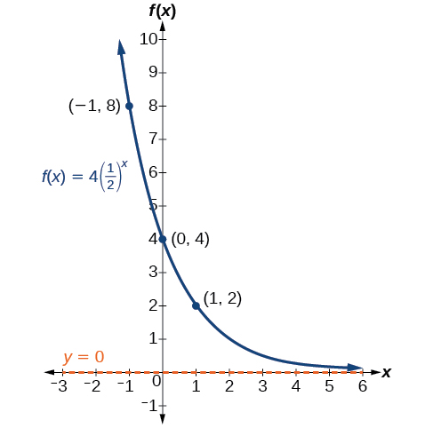{: #CNX_Precalc_Figure_04_02_011}

The domain is<math xmlns="http://www.w3.org/1998/Math/MathML"> <mrow> <mtext> </mtext><mrow><mo>(</mo> <mrow> <mo>−</mo><mi>∞</mi><mo>,</mo><mi>∞</mi> </mrow> <mo>)</mo></mrow><mo>;</mo><mtext> </mtext> </mrow> </math>

the range is<math xmlns="http://www.w3.org/1998/Math/MathML"> <mrow> <mtext> </mtext><mrow><mo>(</mo> <mrow> <mn>0</mn><mo>,</mo><mi>∞</mi> </mrow> <mo>)</mo></mrow><mo>;</mo><mtext> </mtext> </mrow> </math>

the horizontal asymptote is<math xmlns="http://www.w3.org/1998/Math/MathML"> <mrow> <mtext> </mtext><mi>y</mi><mo>=</mo><mn>0.</mn> </mrow> </math>

Sketch the graph of<math xmlns="http://www.w3.org/1998/Math/MathML"> <mrow> <mtext> </mtext><mi>f</mi><mo stretchy="false">(</mo><mi>x</mi><mo stretchy="false">)</mo><mo>=</mo><mfrac> <mn>1</mn> <mn>2</mn> </mfrac> <msup> <mrow> <mrow><mo>(</mo> <mn>4</mn> <mo>)</mo></mrow> </mrow> <mi>x</mi> </msup> <mo>.</mo><mtext> </mtext> </mrow> </math>

State the domain, range, and asymptote.

The domain is<math xmlns="http://www.w3.org/1998/Math/MathML"> <mrow> <mtext> </mtext><mrow><mo>(</mo> <mrow> <mo>−</mo><mi>∞</mi><mo>,</mo><mi>∞</mi> </mrow> <mo>)</mo></mrow><mo>;</mo><mtext> </mtext> </mrow> </math>

the range is<math xmlns="http://www.w3.org/1998/Math/MathML"> <mrow> <mtext> </mtext><mrow><mo>(</mo> <mrow> <mn>0</mn><mo>,</mo><mi>∞</mi> </mrow> <mo>)</mo></mrow><mo>;</mo><mtext> </mtext> </mrow> </math>

the horizontal asymptote is<math xmlns="http://www.w3.org/1998/Math/MathML"> <mrow> <mtext> </mtext><mi>y</mi><mo>=</mo><mn>0.</mn><mtext> </mtext> </mrow> </math>

 * * *
{: data-type="newline"}

  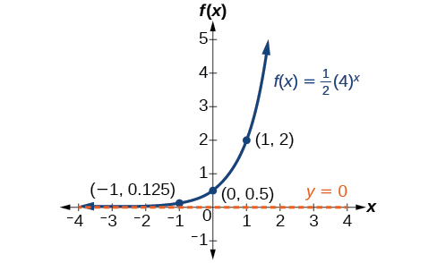 

## Graphing Reflections

In addition to shifting, compressing, and stretching a graph, we can also reflect it about the *x*-axis or the *y*-axis. When we multiply the parent function<math xmlns="http://www.w3.org/1998/Math/MathML"> <mrow> <mtext> </mtext><mi>f</mi><mo stretchy="false">(</mo><mi>x</mi><mo stretchy="false">)</mo><mo>=</mo><msup> <mi>b</mi> <mi>x</mi> </msup> <mtext> </mtext> </mrow> </math>

by<math xmlns="http://www.w3.org/1998/Math/MathML"> <mrow> <mtext> </mtext><mn>−1</mn><mo>,</mo> </mrow> </math>

we get a reflection about the *x*-axis. When we multiply the input by<math xmlns="http://www.w3.org/1998/Math/MathML"> <mrow> <mtext> </mtext><mn>−1</mn><mo>,</mo> </mrow> </math>

we get a **reflection**{: data-type="term" .no-emphasis} about the *y*-axis. For example, if we begin by graphing the parent function<math xmlns="http://www.w3.org/1998/Math/MathML"> <mrow> <mtext> </mtext><mi>f</mi><mo stretchy="false">(</mo><mi>x</mi><mo stretchy="false">)</mo><mo>=</mo><msup> <mn>2</mn> <mi>x</mi> </msup> <mo>,</mo> </mrow> </math>

 we can then graph the two reflections alongside it. The reflection about the *x*-axis,<math xmlns="http://www.w3.org/1998/Math/MathML"> <mrow> <mtext> </mtext><mi>g</mi><mo stretchy="false">(</mo><mi>x</mi><mo stretchy="false">)</mo><mo>=</mo><msup> <mn>−2</mn> <mi>x</mi> </msup> <mo>,</mo> </mrow> </math>

is shown on the left side of [\[link\]](#CNX_Precalc_Figure_04_02_013), and the reflection about the *y*-axis<math xmlns="http://www.w3.org/1998/Math/MathML"> <mrow> <mtext> </mtext><mi>h</mi><mo stretchy="false">(</mo><mi>x</mi><mo stretchy="false">)</mo><mo>=</mo><msup> <mn>2</mn> <mrow> <mo>−</mo><mi>x</mi> </mrow> </msup> <mo>,</mo> </mrow> </math>

 is shown on the right side of [\[link\]](#CNX_Precalc_Figure_04_02_013).

&#10;&#10;&#x2009;g(x)=&#x2212;&#10;2&#10;x&#10;&#10;&#x2009;&#10;&#10;reflects the graph of&#10;&#10;&#x2009;f(x)=&#10;2&#10;x&#10;&#10;&#x2009;&#10;&#10;about the x-axis. (b)&#10;&#10;&#x2009;g(x)=&#10;2&#10;&#10;&#x2212;x&#10;&#10;&#10;&#x2009;&#10;&#10;reflects the graph of&#10;&#10;&#x2009;f(x)=&#10;2&#10;x&#10;&#10;&#x2009;&#10;&#10;about the y-axis."){: #CNX_Precalc_Figure_04_02_013}

Reflections of the Parent Function *f*(*x*) = *b**x*

The function<math xmlns="http://www.w3.org/1998/Math/MathML"> <mrow> <mtext> </mtext><mi>f</mi><mo stretchy="false">(</mo><mi>x</mi><mo stretchy="false">)</mo><mo>=</mo><mo>−</mo><msup> <mi>b</mi> <mi>x</mi> </msup> </mrow> </math>

* reflects the parent function
  <math xmlns="http://www.w3.org/1998/Math/MathML"> <mrow> <mtext> </mtext><mi>f</mi><mo stretchy="false">(</mo><mi>x</mi><mo stretchy="false">)</mo><mo>=</mo><msup> <mi>b</mi> <mi>x</mi> </msup> <mtext> </mtext> </mrow> </math>
  
  about the *x*-axis.
* has a *y*-intercept of
  <math xmlns="http://www.w3.org/1998/Math/MathML"> <mrow> <mtext> </mtext><mrow><mo>(</mo> <mrow> <mn>0</mn><mo>,</mo><mo>−</mo><mn>1</mn> </mrow> <mo>)</mo></mrow><mo>.</mo> </mrow> </math>

* has a range of
  <math xmlns="http://www.w3.org/1998/Math/MathML"> <mrow> <mtext> </mtext><mrow><mo>(</mo> <mrow> <mo>−</mo><mi>∞</mi><mo>,</mo><mn>0</mn> </mrow> <mo>)</mo></mrow> </mrow> </math>

* has a horizontal asymptote at
  <math xmlns="http://www.w3.org/1998/Math/MathML"> <mrow> <mtext> </mtext><mi>y</mi><mo>=</mo><mn>0</mn><mtext> </mtext> </mrow> </math>
  
  and domain of
  <math xmlns="http://www.w3.org/1998/Math/MathML"> <mrow> <mtext> </mtext><mrow><mo>(</mo> <mrow> <mo>−</mo><mi>∞</mi><mo>,</mo><mi>∞</mi> </mrow> <mo>)</mo></mrow><mo>,</mo> </mrow> </math>
  
  which are unchanged from the parent function.

The function<math xmlns="http://www.w3.org/1998/Math/MathML"> <mrow> <mtext> </mtext><mi>f</mi><mo stretchy="false">(</mo><mi>x</mi><mo stretchy="false">)</mo><mo>=</mo><msup> <mi>b</mi> <mrow> <mo>−</mo><mi>x</mi> </mrow> </msup> </mrow> </math>

* reflects the parent function
  <math xmlns="http://www.w3.org/1998/Math/MathML"> <mrow> <mtext> </mtext><mi>f</mi><mo stretchy="false">(</mo><mi>x</mi><mo stretchy="false">)</mo><mo>=</mo><msup> <mi>b</mi> <mi>x</mi> </msup> <mtext> </mtext> </mrow> </math>
  
  about the *y*-axis.
* has a *y*-intercept of
  <math xmlns="http://www.w3.org/1998/Math/MathML"> <mrow> <mtext> </mtext><mrow><mo>(</mo> <mrow> <mn>0</mn><mo>,</mo><mn>1</mn> </mrow> <mo>)</mo></mrow><mo>,</mo> </mrow> </math>
  
  a horizontal asymptote at
  <math xmlns="http://www.w3.org/1998/Math/MathML"> <mrow> <mtext> </mtext><mi>y</mi><mo>=</mo><mn>0</mn><mo>,</mo> </mrow> </math>
  
  a range of
  <math xmlns="http://www.w3.org/1998/Math/MathML"> <mrow> <mtext> </mtext><mrow><mo>(</mo> <mrow> <mn>0</mn><mo>,</mo><mi>∞</mi> </mrow> <mo>)</mo></mrow><mo>,</mo> </mrow> </math>
  
  and a domain of
  <math xmlns="http://www.w3.org/1998/Math/MathML"> <mrow> <mtext> </mtext><mrow><mo>(</mo> <mrow> <mo>−</mo><mi>∞</mi><mo>,</mo><mi>∞</mi> </mrow> <mo>)</mo></mrow><mo>,</mo> </mrow> </math>
  
  which are unchanged from the parent function.

Writing and Graphing the Reflection of an Exponential Function

Find and graph the equation for a function,<math xmlns="http://www.w3.org/1998/Math/MathML"> <mrow> <mtext> </mtext><mi>g</mi><mo stretchy="false">(</mo><mi>x</mi><mo stretchy="false">)</mo><mo>,</mo> </mrow> </math>

that reflects<math xmlns="http://www.w3.org/1998/Math/MathML"> <mrow> <mtext> </mtext><mi>f</mi><mo stretchy="false">(</mo><mi>x</mi><mo stretchy="false">)</mo><mo>=</mo><msup> <mrow> <mrow><mo>(</mo> <mrow> <mfrac> <mn>1</mn> <mn>4</mn> </mfrac> </mrow> <mo>)</mo></mrow> </mrow> <mi>x</mi> </msup> <mtext> </mtext> </mrow> </math>

about the *x*-axis. State its domain, range, and asymptote.

Since we want to reflect the parent function<math xmlns="http://www.w3.org/1998/Math/MathML"> <mrow> <mtext> </mtext><mi>f</mi><mo stretchy="false">(</mo><mi>x</mi><mo stretchy="false">)</mo><mo>=</mo><msup> <mrow> <mrow><mo>(</mo> <mrow> <mfrac> <mn>1</mn> <mn>4</mn> </mfrac> </mrow> <mo>)</mo></mrow> </mrow> <mi>x</mi> </msup> <mtext> </mtext> </mrow> </math>

about the *x-*axis, we multiply<math xmlns="http://www.w3.org/1998/Math/MathML"> <mrow> <mtext> </mtext><mi>f</mi><mo stretchy="false">(</mo><mi>x</mi><mo stretchy="false">)</mo><mtext> </mtext> </mrow> </math>

by<math xmlns="http://www.w3.org/1998/Math/MathML"> <mrow> <mtext> </mtext><mo>−</mo><mn>1</mn><mtext> </mtext> </mrow> </math>

to get,<math xmlns="http://www.w3.org/1998/Math/MathML"> <mrow> <mtext> </mtext><mi>g</mi><mo stretchy="false">(</mo><mi>x</mi><mo stretchy="false">)</mo><mo>=</mo><mo>−</mo><msup> <mrow> <mrow><mo>(</mo> <mrow> <mfrac> <mn>1</mn> <mn>4</mn> </mfrac> </mrow> <mo>)</mo></mrow> </mrow> <mi>x</mi> </msup> <mo>.</mo><mtext> </mtext> </mrow> </math>

Next we create a table of points as in [[link]](#Table_04_02_005).

| <strong><math xmlns="http://www.w3.org/1998/Math/MathML">
<mi>x</mi>
</math></strong> | <math xmlns="http://www.w3.org/1998/Math/MathML"> <mrow> <mo>−</mo><mn>3</mn> </mrow> </math>

 | <math xmlns="http://www.w3.org/1998/Math/MathML"> <mrow> <mo>−</mo><mn>2</mn> </mrow> </math>

 | <math xmlns="http://www.w3.org/1998/Math/MathML"> <mrow> <mo>−</mo><mn>1</mn> </mrow> </math>

 | <math xmlns="http://www.w3.org/1998/Math/MathML"> <mn>0</mn> </math>

 | <math xmlns="http://www.w3.org/1998/Math/MathML"> <mn>1</mn> </math>

 | <math xmlns="http://www.w3.org/1998/Math/MathML"> <mn>2</mn> </math>

 | <math xmlns="http://www.w3.org/1998/Math/MathML"> <mn>3</mn> </math>

 |
| <math xmlns="http://www.w3.org/1998/Math/MathML" display="block"> <mstyle fontstyle="italic" fontweight="bold"> <mi>g</mi><mo stretchy="false">(</mo><mi>x</mi><mo stretchy="false">)</mo><mo>=</mo><mo>−</mo></mstyle> <mo>(</mo> <mstyle fontweight="bold"> <mfrac> <mn>1</mn> <mn>4</mn> </mfrac></mstyle> <msup> <mo>)</mo> <mi>x</mi> </msup> </math>

 | <math xmlns="http://www.w3.org/1998/Math/MathML"> <mrow> <mo>−</mo><mn>64</mn> </mrow> </math>

 | <math xmlns="http://www.w3.org/1998/Math/MathML"> <mrow> <mo>−</mo><mn>16</mn> </mrow> </math>

 | <math xmlns="http://www.w3.org/1998/Math/MathML"> <mrow> <mo>−</mo><mn>4</mn> </mrow> </math>

 | <math xmlns="http://www.w3.org/1998/Math/MathML"> <mrow> <mo>−</mo><mn>1</mn> </mrow> </math>

 | <math xmlns="http://www.w3.org/1998/Math/MathML"> <mrow> <mo>−</mo><mn>0.25</mn> </mrow> </math>

 | <math xmlns="http://www.w3.org/1998/Math/MathML"> <mrow> <mo>−</mo><mn>0.0625</mn> </mrow> </math>

 | <math xmlns="http://www.w3.org/1998/Math/MathML"> <mrow> <mo>−</mo><mn>0.0156</mn> </mrow> </math>

 |
{: #Table_04_02_005 summary="Two rows and eight columns. The first row is labeled, &#x201C;x&#x201D;, and the second row is labeled, &#x201C;f(x)=-(1/4)^x&#x201D;. Reading the columns as ordered pairs, we have the following values: (-3, -64), (-2, -16), (-1, -4), (0, -1), (1, -0.25), (2, -0.0625), and (3, -0.0156)."}

Plot the *y-*intercept,<math xmlns="http://www.w3.org/1998/Math/MathML"> <mrow> <mtext> </mtext><mrow><mo>(</mo> <mrow> <mn>0</mn><mo>,</mo><mn>−1</mn> </mrow> <mo>)</mo></mrow><mo>,</mo> </mrow> </math>

along with two other points. We can use<math xmlns="http://www.w3.org/1998/Math/MathML"> <mrow> <mtext> </mtext><mrow><mo>(</mo> <mrow> <mn>−1</mn><mo>,</mo><mn>−4</mn> </mrow> <mo>)</mo></mrow><mtext> </mtext> </mrow> </math>

and<math xmlns="http://www.w3.org/1998/Math/MathML"> <mrow> <mtext> </mtext><mrow><mo>(</mo> <mrow> <mn>1</mn><mo>,</mo><mn>−0.25</mn> </mrow> <mo>)</mo></mrow><mo>.</mo> </mrow> </math>

Draw a smooth curve connecting the points:

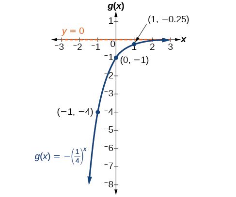{: #CNX_Precalc_Figure_04_02_014}

The domain is<math xmlns="http://www.w3.org/1998/Math/MathML"> <mrow> <mtext> </mtext><mrow><mo>(</mo> <mrow> <mo>−</mo><mi>∞</mi><mo>,</mo><mi>∞</mi> </mrow> <mo>)</mo></mrow><mo>;</mo><mtext> </mtext> </mrow> </math>

the range is<math xmlns="http://www.w3.org/1998/Math/MathML"> <mrow> <mtext> </mtext><mrow><mo>(</mo> <mrow> <mo>−</mo><mi>∞</mi><mo>,</mo><mn>0</mn> </mrow> <mo>)</mo></mrow><mo>;</mo><mtext> </mtext> </mrow> </math>

the horizontal asymptote is<math xmlns="http://www.w3.org/1998/Math/MathML"> <mrow> <mtext> </mtext><mi>y</mi><mo>=</mo><mn>0.</mn> </mrow> </math>

Find and graph the equation for a function,<math xmlns="http://www.w3.org/1998/Math/MathML"> <mrow> <mtext> </mtext><mi>g</mi><mo stretchy="false">(</mo><mi>x</mi><mo stretchy="false">)</mo><mo>,</mo> </mrow> </math>

 that reflects<math xmlns="http://www.w3.org/1998/Math/MathML"> <mrow> <mtext> </mtext><mi>f</mi><mo stretchy="false">(</mo><mi>x</mi><mo stretchy="false">)</mo><mo>=</mo><msup> <mrow> <mn>1.25</mn> </mrow> <mi>x</mi> </msup> <mtext> </mtext> </mrow> </math>

about the *y*-axis. State its domain, range, and asymptote.

The domain is<math xmlns="http://www.w3.org/1998/Math/MathML"> <mrow> <mtext> </mtext><mrow><mo>(</mo> <mrow> <mo>−</mo><mi>∞</mi><mo>,</mo><mi>∞</mi> </mrow> <mo>)</mo></mrow><mo>;</mo><mtext> </mtext> </mrow> </math>

the range is<math xmlns="http://www.w3.org/1998/Math/MathML"> <mrow> <mtext> </mtext><mrow><mo>(</mo> <mrow> <mn>0</mn><mo>,</mo><mi>∞</mi> </mrow> <mo>)</mo></mrow><mo>;</mo><mtext> </mtext> </mrow> </math>

the horizontal asymptote is<math xmlns="http://www.w3.org/1998/Math/MathML"> <mrow> <mtext> </mtext><mi>y</mi><mo>=</mo><mn>0.</mn> </mrow> </math>

 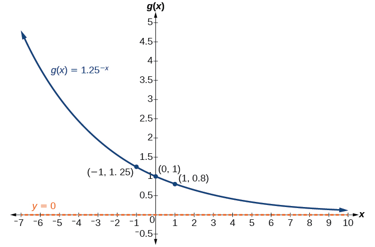 

## Summarizing Translations of the Exponential Function

Now that we have worked with each type of translation for the exponential function, we can summarize them in [\[link\]](#Table_04_02_006) to arrive at the general equation for translating exponential functions.

<table id="Table_04_02_006" summary="Two rows and two columns. The first column shows the left shift of the equation g(x)=log_b(x) when b&gt;1, and notes the following changes: the reflected function is decreasing as x moves from 0 to infinity, the asymptote remains x=0, the x-intercept remains (1, 0), the key point changes to (b^(-1), 1), the domain remains (0, infinity), and the range remains (-infinity, infinity). The second column shows the left shift of the equation g(x)=log_b(x) when b&gt;1, and notes the following changes: the reflected function is decreasing as x moves from 0 to infinity, the asymptote remains x=0, the x-intercept changes to (-1, 0), the key point changes to (-b, 1), the domain changes to (-infinity, 0), and the range remains (-infinity, infinity)."><thead>
<tr>
<th colspan="2">Translations of the Parent Function <math xmlns="http://www.w3.org/1998/Math/MathML">
<mrow>
<mtext> </mtext><mi>f</mi><mo stretchy="false">(</mo><mi>x</mi><mo stretchy="false">)</mo><mo>=</mo><msup>
<mi>b</mi>
<mi>x</mi>
</msup>

</mrow>
</math></th>
</tr>
<tr>  
<th>Translation</th>
<th>Form</th>
</tr>
</thead><tbody>
<tr>
<td>Shift
<ul>
<li>Horizontally<math xmlns="http://www.w3.org/1998/Math/MathML">
<mrow>
<mtext> </mtext><mi>c</mi><mtext> </mtext>
</mrow>
</math>units to the left</li>
<li>Vertically<math xmlns="http://www.w3.org/1998/Math/MathML">
<mrow>
<mtext> </mtext><mi>d</mi><mtext> </mtext>
</mrow>
</math>units up</li>
</ul>
</td>
<td><math xmlns="http://www.w3.org/1998/Math/MathML" display="block">
<mrow>
<mi>f</mi><mo stretchy="false">(</mo><mi>x</mi><mo stretchy="false">)</mo><mo>=</mo><msup>
<mi>b</mi>
<mrow>
<mi>x</mi><mo>+</mo><mi>c</mi>
</mrow>
</msup>
<mo>+</mo><mi>d</mi>
</mrow>
</math></td>
</tr>
<tr>
<td>Stretch and Compress
<ul><li>Stretch if<math xmlns="http://www.w3.org/1998/Math/MathML">
<mrow>
<mtext> </mtext><mrow><mo>\|</mo> <mi>a</mi> <mo>\|</mo></mrow><mo>&gt;</mo><mn>1</mn>
</mrow>
</math></li>  
<li>Compression if<math xmlns="http://www.w3.org/1998/Math/MathML">
<mrow>
<mtext> </mtext><mn>0</mn><mo>&lt;</mo><mrow><mo>\|</mo> <mi>a</mi> <mo>\|</mo></mrow><mo>&lt;</mo><mn>1</mn>
</mrow>
</math></li>
</ul>
</td>
<td><math xmlns="http://www.w3.org/1998/Math/MathML" display="block">
<mrow>
<mi>f</mi><mo stretchy="false">(</mo><mi>x</mi><mo stretchy="false">)</mo><mo>=</mo><mi>a</mi><msup>
<mi>b</mi>
<mi>x</mi>
</msup>

</mrow>
</math></td>
</tr>
<tr>
<td>Reflect about the <em>x</em>-axis</td>
<td><math xmlns="http://www.w3.org/1998/Math/MathML" display="block">
<mrow>
<mi>f</mi><mo stretchy="false">(</mo><mi>x</mi><mo stretchy="false">)</mo><mo>=</mo><mo>−</mo><msup>
<mi>b</mi>
<mi>x</mi>
</msup>

</mrow>
</math></td>
</tr>
<tr>
<td>Reflect about the <em>y</em>-axis</td>
<td><math xmlns="http://www.w3.org/1998/Math/MathML" display="block">
<mrow>
<mi>f</mi><mo stretchy="false">(</mo><mi>x</mi><mo stretchy="false">)</mo><mo>=</mo><msup>
<mi>b</mi>
<mrow>
<mo>−</mo><mi>x</mi>
</mrow>
</msup>
<mo>=</mo><msup>
<mrow>
<mrow><mo>(</mo>
<mrow>
<mfrac>
<mn>1</mn>
<mi>b</mi>
</mfrac>

</mrow>
<mo>)</mo></mrow>
</mrow>
<mi>x</mi>
</msup>

</mrow>
</math></td>
</tr>
<tr>
<td>General equation for all translations</td>
<td><math xmlns="http://www.w3.org/1998/Math/MathML" display="block">
<mrow>
<mi>f</mi><mo stretchy="false">(</mo><mi>x</mi><mo stretchy="false">)</mo><mo>=</mo><mi>a</mi><msup>
<mi>b</mi>
<mrow>
<mi>x</mi><mo>+</mo><mi>c</mi>
</mrow>
</msup>
<mo>+</mo><mi>d</mi>
</mrow>
</math></td>
</tr>
</tbody></table>

Translations of Exponential Functions

A translation of an exponential function has the form

<math xmlns="http://www.w3.org/1998/Math/MathML"> <mrow> <mo> </mo><mi>f</mi><mo stretchy="false">(</mo><mi>x</mi><mo stretchy="false">)</mo><mo>=</mo><mi>a</mi><msup> <mi>b</mi> <mrow> <mi>x</mi><mo>+</mo><mi>c</mi> </mrow> </msup> <mo>+</mo><mi>d</mi> </mrow> </math>

Where the parent function,<math xmlns="http://www.w3.org/1998/Math/MathML"> <mrow> <mtext> </mtext><mi>y</mi><mo>=</mo><msup> <mi>b</mi> <mi>x</mi> </msup> <mo>,</mo> </mrow> </math>

<math xmlns="http://www.w3.org/1998/Math/MathML"> <mrow> <mtext> </mtext><mi>b</mi><mo>&gt;</mo><mn>1</mn><mo>,</mo> </mrow> </math>

is

* shifted horizontally
  <math xmlns="http://www.w3.org/1998/Math/MathML"> <mrow> <mtext> </mtext><mi>c</mi><mtext> </mtext> </mrow> </math>
  
  units to the left.
* stretched vertically by a factor of
  <math xmlns="http://www.w3.org/1998/Math/MathML"> <mrow> <mtext> </mtext><mrow><mo>\|</mo> <mi>a</mi> <mo>\|</mo></mrow><mtext> </mtext> </mrow> </math>
  
  if
  <math xmlns="http://www.w3.org/1998/Math/MathML"> <mrow> <mtext> </mtext><mrow><mo>\|</mo> <mi>a</mi> <mo>\|</mo></mrow><mo>&gt;</mo><mn>0.</mn> </mrow> </math>

* compressed vertically by a factor of
  <math xmlns="http://www.w3.org/1998/Math/MathML"> <mrow> <mtext> </mtext><mrow><mo>\|</mo> <mi>a</mi> <mo>\|</mo></mrow><mtext> </mtext> </mrow> </math>
  
  if
  <math xmlns="http://www.w3.org/1998/Math/MathML"> <mrow> <mtext> </mtext><mn>0</mn><mo>&lt;</mo><mrow><mo>\|</mo> <mi>a</mi> <mo>\|</mo></mrow><mo>&lt;</mo><mn>1.</mn> </mrow> </math>

* shifted vertically
  <math xmlns="http://www.w3.org/1998/Math/MathML"> <mrow> <mtext> </mtext><mi>d</mi><mtext> </mtext> </mrow> </math>
  
  units.
* reflected about the *x-*axis when
  <math xmlns="http://www.w3.org/1998/Math/MathML"> <mrow> <mtext> </mtext><mi>a</mi><mo>&lt;</mo><mn>0.</mn> </mrow> </math>

Note the order of the shifts, transformations, and reflections follow the order of operations.

Writing a Function from a Description

Write the equation for the function described below. Give the horizontal asymptote, the domain, and the range.

* <math xmlns="http://www.w3.org/1998/Math/MathML"> <mrow> <mi>f</mi><mo stretchy="false">(</mo><mi>x</mi><mo stretchy="false">)</mo><mo>=</mo><msup> <mi>e</mi> <mi>x</mi> </msup> <mtext> </mtext> </mrow> </math>
  
  is vertically stretched by a factor of
  <math xmlns="http://www.w3.org/1998/Math/MathML"> <mrow> <mtext> </mtext><mn>2</mn><mtext> </mtext> </mrow> </math>
  
  , reflected across the *y*-axis, and then shifted up
  <math xmlns="http://www.w3.org/1998/Math/MathML"> <mrow> <mtext> </mtext><mn>4</mn><mtext> </mtext> </mrow> </math>
  
  units.

We want to find an equation of the general form<math xmlns="http://www.w3.org/1998/Math/MathML"> <mrow> <mo> </mo><mtext> </mtext><mi>f</mi><mo stretchy="false">(</mo><mi>x</mi><mo stretchy="false">)</mo><mo>=</mo><mi>a</mi><msup> <mi>b</mi> <mrow> <mi>x</mi><mo>+</mo><mi>c</mi> </mrow> </msup> <mo>+</mo><mi>d</mi><mo>.</mo><mtext> </mtext> </mrow> </math>

We use the description provided to find<math xmlns="http://www.w3.org/1998/Math/MathML"> <mrow> <mtext> </mtext><mi>a</mi><mo>,</mo> </mrow> </math>

 <math xmlns="http://www.w3.org/1998/Math/MathML"> <mrow> <mi>b</mi><mo>,</mo> </mrow> </math>

 <math xmlns="http://www.w3.org/1998/Math/MathML"> <mrow> <mi>c</mi><mo>,</mo> </mrow> </math>

 and <math xmlns="http://www.w3.org/1998/Math/MathML"> <mrow> <mtext> </mtext><mi>d</mi><mo>.</mo> </mrow> </math>

* We are given the parent function
  <math xmlns="http://www.w3.org/1998/Math/MathML"> <mrow> <mtext> </mtext><mi>f</mi><mo stretchy="false">(</mo><mi>x</mi><mo stretchy="false">)</mo><mo>=</mo><msup> <mi>e</mi> <mi>x</mi> </msup> <mo>,</mo> </mrow> </math>
  
  so
  <math xmlns="http://www.w3.org/1998/Math/MathML"> <mrow> <mtext> </mtext><mi>b</mi><mo>=</mo><mi>e</mi><mo>.</mo> </mrow> </math>

* The function is stretched by a factor of
  <math xmlns="http://www.w3.org/1998/Math/MathML"> <mrow> <mtext> </mtext><mn>2</mn> </mrow> </math>
  
  , so
  <math xmlns="http://www.w3.org/1998/Math/MathML"> <mrow> <mtext> </mtext><mi>a</mi><mo>=</mo><mn>2.</mn> </mrow> </math>

* The function is reflected about the *y*-axis. We replace
  <math xmlns="http://www.w3.org/1998/Math/MathML"> <mrow> <mtext> </mtext><mi>x</mi><mtext> </mtext> </mrow> </math>
  
  with
  <math xmlns="http://www.w3.org/1998/Math/MathML"> <mrow> <mtext> </mtext><mo>−</mo><mi>x</mi><mtext> </mtext> </mrow> </math>
  
  to get:
  <math xmlns="http://www.w3.org/1998/Math/MathML"> <mrow> <mtext> </mtext><msup> <mi>e</mi> <mrow> <mo>−</mo><mi>x</mi> </mrow> </msup> <mo>.</mo> </mrow> </math>

* The graph is shifted vertically 4 units, so
  <math xmlns="http://www.w3.org/1998/Math/MathML"> <mrow> <mtext> </mtext><mi>d</mi><mo>=</mo><mn>4.</mn> </mrow> </math>

Substituting in the general form we get,

<math xmlns="http://www.w3.org/1998/Math/MathML" display="block"> <mrow> <mtable columnalign="left"> <mtr columnalign="left"> <mtd columnalign="left"> <mrow> <mo> </mo><mi>f</mi><mo stretchy="false">(</mo><mi>x</mi><mo stretchy="false">)</mo> </mrow> </mtd> <mtd columnalign="left"> <mrow> <mo>=</mo><mi>a</mi><msup> <mi>b</mi> <mrow> <mi>x</mi><mo>+</mo><mi>c</mi> </mrow> </msup> <mo>+</mo><mi>d</mi> </mrow> </mtd> </mtr> <mtr columnalign="left"> <mtd columnalign="left"> <mrow /> </mtd> <mtd columnalign="left"> <mrow> <mo>=</mo><mn>2</mn><msup> <mi>e</mi> <mrow> <mo>−</mo><mi>x</mi><mo>+</mo><mn>0</mn> </mrow> </msup> <mo>+</mo><mn>4</mn> </mrow> </mtd> </mtr> <mtr columnalign="left"> <mtd columnalign="left"> <mrow /> </mtd> <mtd columnalign="left"> <mrow> <mo>=</mo><mn>2</mn><msup> <mi>e</mi> <mrow> <mo>−</mo><mi>x</mi> </mrow> </msup> <mo>+</mo><mn>4</mn> </mrow> </mtd> </mtr> </mtable> </mrow> </math>

The domain is<math xmlns="http://www.w3.org/1998/Math/MathML"> <mrow> <mtext> </mtext><mrow><mo>(</mo> <mrow> <mo>−</mo><mi>∞</mi><mo>,</mo><mi>∞</mi> </mrow> <mo>)</mo></mrow><mo>;</mo><mtext> </mtext> </mrow> </math>

the range is<math xmlns="http://www.w3.org/1998/Math/MathML"> <mrow> <mtext> </mtext><mrow><mo>(</mo> <mrow> <mn>4</mn><mo>,</mo><mi>∞</mi> </mrow> <mo>)</mo></mrow><mo>;</mo><mtext> </mtext> </mrow> </math>

the horizontal asymptote is<math xmlns="http://www.w3.org/1998/Math/MathML"> <mrow> <mtext> </mtext><mi>y</mi><mo>=</mo><mn>4.</mn> </mrow> </math>

Write the equation for function described below. Give the horizontal asymptote, the domain, and the range.

* <math xmlns="http://www.w3.org/1998/Math/MathML"> <mrow> <mi>f</mi><mo stretchy="false">(</mo><mi>x</mi><mo stretchy="false">)</mo><mo>=</mo><msup> <mi>e</mi> <mi>x</mi> </msup> <mtext> </mtext> </mrow> </math>
  
  is compressed vertically by a factor of
  <math xmlns="http://www.w3.org/1998/Math/MathML"> <mrow> <mtext> </mtext><mfrac> <mn>1</mn> <mn>3</mn> </mfrac> <mo>,</mo> </mrow> </math>
  
  reflected across the *x*-axis and then shifted down
  <math xmlns="http://www.w3.org/1998/Math/MathML"> <mrow> <mtext> </mtext><mn>2</mn> </mrow> </math>
  
  units.

<math xmlns="http://www.w3.org/1998/Math/MathML"> <mrow> <mi>f</mi><mo stretchy="false">(</mo><mi>x</mi><mo stretchy="false">)</mo><mo>=</mo><mo>−</mo><mfrac> <mn>1</mn> <mn>3</mn> </mfrac> <msup> <mi>e</mi> <mi>x</mi> </msup> <mo>−</mo><mn>2</mn><mo>;</mo><mtext> </mtext> </mrow> </math>

the domain is<math xmlns="http://www.w3.org/1998/Math/MathML"> <mrow> <mtext> </mtext><mrow><mo>(</mo> <mrow> <mo>−</mo><mi>∞</mi><mo>,</mo><mi>∞</mi> </mrow> <mo>)</mo></mrow><mo>;</mo><mtext> </mtext> </mrow> </math>

the range is<math xmlns="http://www.w3.org/1998/Math/MathML"> <mrow> <mtext> </mtext><mrow><mo>(</mo> <mrow> <mo>−</mo><mi>∞</mi><mo>,</mo><mn>2</mn> </mrow> <mo>)</mo></mrow><mo>;</mo><mtext> </mtext> </mrow> </math>

the horizontal asymptote is<math xmlns="http://www.w3.org/1998/Math/MathML"> <mrow> <mtext> </mtext><mi>y</mi><mo>=</mo><mn>2.</mn> </mrow> </math>

Access this online resource for additional instruction and practice with graphing exponential functions.

* [Graph Exponential Functions][1]

# Key Equations

| General Form for the Translation of the Parent Function<math xmlns="http://www.w3.org/1998/Math/MathML"> <mrow> <mtext> </mtext><mi>f</mi><mo stretchy="false">(</mo><mi>x</mi><mo stretchy="false">)</mo><mo>=</mo><msup> <mi>b</mi> <mi>x</mi> </msup> </mrow> </math>

 | <math xmlns="http://www.w3.org/1998/Math/MathML"> <mrow> <mi>f</mi><mo stretchy="false">(</mo><mi>x</mi><mo stretchy="false">)</mo><mo>=</mo><mi>a</mi><msup> <mi>b</mi> <mrow> <mi>x</mi><mo>+</mo><mi>c</mi> </mrow> </msup> <mo>+</mo><mi>d</mi> </mrow> </math>

 |
{: summary="..."}

# Key Concepts

* The graph of the function
  <math xmlns="http://www.w3.org/1998/Math/MathML"> <mrow> <mtext> </mtext><mi>f</mi><mo stretchy="false">(</mo><mi>x</mi><mo stretchy="false">)</mo><mo>=</mo><msup> <mi>b</mi> <mi>x</mi> </msup> <mtext> </mtext> </mrow> </math>
  
  has a *y-*intercept at
  <math xmlns="http://www.w3.org/1998/Math/MathML"> <mrow> <mtext> </mtext><mrow><mo>(</mo> <mrow> <mn>0</mn><mo>,</mo><mo> </mo><mn>1</mn> </mrow> <mo>)</mo></mrow><mo>,</mo> </mrow> </math>
  
  domain
  <math xmlns="http://www.w3.org/1998/Math/MathML"> <mrow> <mtext> </mtext><mrow><mo>(</mo> <mrow> <mo>−</mo><mi>∞</mi><mo>,</mo><mo> </mo><mi>∞</mi> </mrow> <mo>)</mo></mrow><mo>,</mo> </mrow> </math>
  
  range
  <math xmlns="http://www.w3.org/1998/Math/MathML"> <mrow> <mtext> </mtext><mrow><mo>(</mo> <mrow> <mn>0</mn><mo>,</mo><mo> </mo><mi>∞</mi> </mrow> <mo>)</mo></mrow><mo>,</mo> </mrow> </math>
  
  and horizontal asymptote
  <math xmlns="http://www.w3.org/1998/Math/MathML"> <mrow> <mtext> </mtext><mi>y</mi><mo>=</mo><mn>0.</mn><mtext> </mtext> </mrow> </math>
  
  See [\[link\]](#Example_04_02_01).
* If
  <math xmlns="http://www.w3.org/1998/Math/MathML"> <mrow> <mtext> </mtext><mi>b</mi><mo>&gt;</mo><mn>1</mn><mo>,</mo> </mrow> </math>
  
  the function is increasing. The left tail of the graph will approach the asymptote
  <math xmlns="http://www.w3.org/1998/Math/MathML"> <mrow> <mtext> </mtext><mi>y</mi><mo>=</mo><mn>0</mn><mo>,</mo> </mrow> </math>
  
  and the right tail will increase without bound.
* If
  <math xmlns="http://www.w3.org/1998/Math/MathML"> <mrow> <mtext> </mtext><mn>0</mn><mo>&lt;</mo><mi>b</mi><mo>&lt;</mo><mn>1</mn><mo>,</mo> </mrow> </math>
  
  the function is decreasing. The left tail of the graph will increase without bound, and the right tail will approach the asymptote
  <math xmlns="http://www.w3.org/1998/Math/MathML"> <mrow> <mtext> </mtext><mi>y</mi><mo>=</mo><mn>0.</mn> </mrow> </math>

* The equation
  <math xmlns="http://www.w3.org/1998/Math/MathML"> <mrow> <mtext> </mtext><mi>f</mi><mo stretchy="false">(</mo><mi>x</mi><mo stretchy="false">)</mo><mo>=</mo><msup> <mi>b</mi> <mi>x</mi> </msup> <mo>+</mo><mi>d</mi><mtext> </mtext> </mrow> </math>
  
  represents a vertical shift of the parent function
  <math xmlns="http://www.w3.org/1998/Math/MathML"> <mrow> <mtext> </mtext><mi>f</mi><mo stretchy="false">(</mo><mi>x</mi><mo stretchy="false">)</mo><mo>=</mo><msup> <mi>b</mi> <mi>x</mi> </msup> <mo>.</mo> </mrow> </math>

* The equation
  <math xmlns="http://www.w3.org/1998/Math/MathML"> <mrow> <mtext> </mtext><mi>f</mi><mo stretchy="false">(</mo><mi>x</mi><mo stretchy="false">)</mo><mo>=</mo><msup> <mi>b</mi> <mrow> <mi>x</mi><mo>+</mo><mi>c</mi> </mrow> </msup> <mtext> </mtext> </mrow> </math>
  
  represents a horizontal shift of the parent function
  <math xmlns="http://www.w3.org/1998/Math/MathML"> <mrow> <mtext> </mtext><mi>f</mi><mo stretchy="false">(</mo><mi>x</mi><mo stretchy="false">)</mo><mo>=</mo><msup> <mi>b</mi> <mi>x</mi> </msup> <mo>.</mo><mtext> </mtext> </mrow> </math>
  
  See [\[link\]](#Example_04_02_02).
* Approximate solutions of the equation
  <math xmlns="http://www.w3.org/1998/Math/MathML"> <mrow> <mtext> </mtext><mi>f</mi><mo stretchy="false">(</mo><mi>x</mi><mo stretchy="false">)</mo><mo>=</mo><msup> <mi>b</mi> <mrow> <mi>x</mi><mo>+</mo><mi>c</mi> </mrow> </msup> <mo>+</mo><mi>d</mi><mtext> </mtext> </mrow> </math>
  
  can be found using a graphing calculator. See [\[link\]](#Example_04_02_03).
* The equation
  <math xmlns="http://www.w3.org/1998/Math/MathML"> <mrow> <mtext> </mtext><mi>f</mi><mo stretchy="false">(</mo><mi>x</mi><mo stretchy="false">)</mo><mo>=</mo><mi>a</mi><msup> <mi>b</mi> <mi>x</mi> </msup> <mo>,</mo> </mrow> </math>
  
  where
  <math xmlns="http://www.w3.org/1998/Math/MathML"> <mrow> <mtext> </mtext><mi>a</mi><mo>&gt;</mo><mn>0</mn><mo>,</mo> </mrow> </math>
  
  represents a vertical stretch if
  <math xmlns="http://www.w3.org/1998/Math/MathML"> <mrow> <mtext> </mtext><mrow><mo>\|</mo> <mi>a</mi> <mo>\|</mo></mrow><mo>&gt;</mo><mn>1</mn><mtext> </mtext> </mrow> </math>
  
  or compression if
  <math xmlns="http://www.w3.org/1998/Math/MathML"> <mrow> <mtext> </mtext><mn>0</mn><mo>&lt;</mo><mrow><mo>\|</mo> <mi>a</mi> <mo>\|</mo></mrow><mo>&lt;</mo><mn>1</mn><mtext> </mtext> </mrow> </math>
  
  of the parent function
  <math xmlns="http://www.w3.org/1998/Math/MathML"> <mrow> <mtext> </mtext><mi>f</mi><mo stretchy="false">(</mo><mi>x</mi><mo stretchy="false">)</mo><mo>=</mo><msup> <mi>b</mi> <mi>x</mi> </msup> <mo>.</mo><mtext> </mtext> </mrow> </math>
  
  See [\[link\]](#Example_04_02_04).
* When the parent function
  <math xmlns="http://www.w3.org/1998/Math/MathML"> <mrow> <mtext> </mtext><mi>f</mi><mo stretchy="false">(</mo><mi>x</mi><mo stretchy="false">)</mo><mo>=</mo><msup> <mi>b</mi> <mi>x</mi> </msup> <mtext> </mtext> </mrow> </math>
  
  is multiplied by
  <math xmlns="http://www.w3.org/1998/Math/MathML"> <mrow> <mtext> </mtext><mo>−</mo><mn>1</mn><mo>,</mo> </mrow> </math>
  
  the result,
  <math xmlns="http://www.w3.org/1998/Math/MathML"> <mrow> <mtext> </mtext><mi>f</mi><mo stretchy="false">(</mo><mi>x</mi><mo stretchy="false">)</mo><mo>=</mo><mo>−</mo><msup> <mi>b</mi> <mi>x</mi> </msup> <mo>,</mo> </mrow> </math>
  
  is a reflection about the *x*-axis. When the input is multiplied by
  <math xmlns="http://www.w3.org/1998/Math/MathML"> <mrow> <mtext> </mtext><mo>−</mo><mn>1</mn><mo>,</mo> </mrow> </math>
  
  the result,
  <math xmlns="http://www.w3.org/1998/Math/MathML"> <mrow> <mtext> </mtext><mi>f</mi><mo stretchy="false">(</mo><mi>x</mi><mo stretchy="false">)</mo><mo>=</mo><msup> <mi>b</mi> <mrow> <mo>−</mo><mi>x</mi> </mrow> </msup> <mo>,</mo> </mrow> </math>
  
  is a reflection about the *y*-axis. See [\[link\]](#Example_04_02_05).
* All translations of the exponential function can be summarized by the general equation
  <math xmlns="http://www.w3.org/1998/Math/MathML"> <mrow> <mtext> </mtext><mi>f</mi><mo stretchy="false">(</mo><mi>x</mi><mo stretchy="false">)</mo><mo>=</mo><mi>a</mi><msup> <mi>b</mi> <mrow> <mi>x</mi><mo>+</mo><mi>c</mi> </mrow> </msup> <mo>+</mo><mi>d</mi><mo>.</mo><mtext> </mtext> </mrow> </math>
  
  See [\[link\]](#Table_04_02_03).
* Using the general equation
  <math xmlns="http://www.w3.org/1998/Math/MathML"> <mrow> <mtext> </mtext><mi>f</mi><mo stretchy="false">(</mo><mi>x</mi><mo stretchy="false">)</mo><mo>=</mo><mi>a</mi><msup> <mi>b</mi> <mrow> <mi>x</mi><mo>+</mo><mi>c</mi> </mrow> </msup> <mo>+</mo><mi>d</mi><mo>,</mo> </mrow> </math>
  
  we can write the equation of a function given its description. See [\[link\]](#Example_04_02_06).

# Section Exercises

## Verbal

What role does the horizontal asymptote of an exponential function play in telling us about the end behavior of the graph?

An asymptote is a line that the graph of a function approaches, as<math xmlns="http://www.w3.org/1998/Math/MathML"> <mrow> <mtext> </mtext><mi>x</mi><mtext> </mtext> </mrow> </math>

either increases or decreases without bound. The horizontal asymptote of an exponential function tells us the limit of the function’s values as the independent variable gets either extremely large or extremely small.

What is the advantage of knowing how to recognize transformations of the graph of a parent function algebraically?

## Algebraic 

The graph of<math xmlns="http://www.w3.org/1998/Math/MathML"> <mrow> <mtext> </mtext><mi>f</mi><mo stretchy="false">(</mo><mi>x</mi><mo stretchy="false">)</mo><mo>=</mo><msup> <mn>3</mn> <mi>x</mi> </msup> <mtext> </mtext> </mrow> </math>

is reflected about the *y*-axis and stretched vertically by a factor of<math xmlns="http://www.w3.org/1998/Math/MathML"> <mrow> <mtext> </mtext><mn>4.</mn><mtext> </mtext> </mrow> </math>

What is the equation of the new function,<math xmlns="http://www.w3.org/1998/Math/MathML"> <mrow> <mtext> </mtext><mi>g</mi><mo stretchy="false">(</mo><mi>x</mi><mo stretchy="false">)</mo><mo>?</mo><mtext> </mtext> </mrow> </math>

State its *y*-intercept, domain, and range.

<math xmlns="http://www.w3.org/1998/Math/MathML"> <mrow> <mi>g</mi><mo stretchy="false">(</mo><mi>x</mi><mo stretchy="false">)</mo><mo>=</mo><mn>4</mn><msup> <mrow> <mrow><mo>(</mo> <mn>3</mn> <mo>)</mo></mrow> </mrow> <mrow> <mo>−</mo><mi>x</mi> </mrow> </msup> <mo>;</mo><mtext> </mtext> </mrow> </math>

*y*-intercept:<math xmlns="http://www.w3.org/1998/Math/MathML"> <mrow> <mtext> </mtext><mo stretchy="false">(</mo><mn>0</mn><mo>,</mo><mn>4</mn><mo stretchy="false">)</mo><mo>;</mo><mtext> </mtext> </mrow> </math>

Domain: all real numbers; Range: all real numbers greater than<math xmlns="http://www.w3.org/1998/Math/MathML"> <mrow> <mtext> </mtext><mn>0.</mn> </mrow> </math>

The graph of<math xmlns="http://www.w3.org/1998/Math/MathML"> <mrow> <mtext> </mtext><mi>f</mi><mo stretchy="false">(</mo><mi>x</mi><mo stretchy="false">)</mo><mo>=</mo><msup> <mrow> <mrow><mo>(</mo> <mrow> <mfrac> <mn>1</mn> <mn>2</mn> </mfrac> </mrow> <mo>)</mo></mrow> </mrow> <mrow> <mo>−</mo><mi>x</mi> </mrow> </msup> <mtext> </mtext> </mrow> </math>

is reflected about the *y*-axis and compressed vertically by a factor of<math xmlns="http://www.w3.org/1998/Math/MathML"> <mrow> <mtext> </mtext><mfrac> <mn>1</mn> <mn>5</mn> </mfrac> <mo>.</mo><mtext> </mtext> </mrow> </math>

What is the equation of the new function,<math xmlns="http://www.w3.org/1998/Math/MathML"> <mrow> <mtext> </mtext><mi>g</mi><mo stretchy="false">(</mo><mi>x</mi><mo stretchy="false">)</mo><mo>?</mo><mtext> </mtext> </mrow> </math>

State its *y*-intercept, domain, and range.

The graph of<math xmlns="http://www.w3.org/1998/Math/MathML"> <mrow> <mtext> </mtext><mi>f</mi><mo stretchy="false">(</mo><mi>x</mi><mo stretchy="false">)</mo><mo>=</mo><msup> <mrow> <mn>10</mn> </mrow> <mi>x</mi> </msup> <mtext> </mtext> </mrow> </math>

is reflected about the *x*-axis and shifted upward<math xmlns="http://www.w3.org/1998/Math/MathML"> <mrow> <mtext> </mtext><mn>7</mn><mtext> </mtext> </mrow> </math>

units. What is the equation of the new function,<math xmlns="http://www.w3.org/1998/Math/MathML"> <mrow> <mtext> </mtext><mi>g</mi><mo stretchy="false">(</mo><mi>x</mi><mo stretchy="false">)</mo><mo>?</mo><mtext> </mtext> </mrow> </math>

State its *y*-intercept, domain, and range.

<math xmlns="http://www.w3.org/1998/Math/MathML"> <mrow> <mi>g</mi><mo stretchy="false">(</mo><mi>x</mi><mo stretchy="false">)</mo><mo>=</mo><mo>−</mo><msup> <mrow> <mn>10</mn> </mrow> <mi>x</mi> </msup> <mo>+</mo><mn>7</mn><mo>;</mo><mtext> </mtext> </mrow> </math>

*y*-intercept:<math xmlns="http://www.w3.org/1998/Math/MathML"> <mrow> <mtext> </mtext><mrow><mo>(</mo> <mrow> <mn>0</mn><mo>,</mo><mn>6</mn> </mrow> <mo>)</mo></mrow><mo>;</mo><mtext> </mtext> </mrow> </math>

Domain: all real numbers; Range: all real numbers less than<math xmlns="http://www.w3.org/1998/Math/MathML"> <mrow> <mtext> </mtext><mn>7.</mn> </mrow> </math>

The graph of<math xmlns="http://www.w3.org/1998/Math/MathML"> <mrow> <mtext> </mtext><mi>f</mi><mo stretchy="false">(</mo><mi>x</mi><mo stretchy="false">)</mo><mo>=</mo><msup> <mrow> <mrow><mo>(</mo> <mrow> <mn>1.68</mn> </mrow> <mo>)</mo></mrow> </mrow> <mi>x</mi> </msup> <mtext> </mtext> </mrow> </math>

is shifted right<math xmlns="http://www.w3.org/1998/Math/MathML"> <mrow> <mtext> </mtext><mn>3</mn><mtext> </mtext> </mrow> </math>

units, stretched vertically by a factor of<math xmlns="http://www.w3.org/1998/Math/MathML"> <mrow> <mtext> </mtext><mn>2</mn><mo>,</mo> </mrow> </math>

reflected about the *x*-axis, and then shifted downward<math xmlns="http://www.w3.org/1998/Math/MathML"> <mrow> <mtext> </mtext><mn>3</mn><mtext> </mtext> </mrow> </math>

units. What is the equation of the new function,<math xmlns="http://www.w3.org/1998/Math/MathML"> <mrow> <mtext> </mtext><mi>g</mi><mo stretchy="false">(</mo><mi>x</mi><mo stretchy="false">)</mo><mo>?</mo><mtext> </mtext> </mrow> </math>

State its *y*-intercept (to the nearest thousandth), domain, and range.

The graph of<math xmlns="http://www.w3.org/1998/Math/MathML"> <mrow> <mtext> </mtext><mi>f</mi><mo stretchy="false">(</mo><mi>x</mi><mo stretchy="false">)</mo><mo>=</mo><mo>−</mo><mfrac> <mn>1</mn> <mn>2</mn> </mfrac> <msup> <mrow> <mrow><mo>(</mo> <mrow> <mfrac> <mn>1</mn> <mn>4</mn> </mfrac> </mrow> <mo>)</mo></mrow> </mrow> <mrow> <mi>x</mi><mo>−</mo><mn>2</mn> </mrow> </msup> <mo>+</mo><mn>4</mn><mtext> </mtext> </mrow> </math>

is shifted left<math xmlns="http://www.w3.org/1998/Math/MathML"> <mrow> <mtext> </mtext><mn>2</mn><mtext> </mtext> </mrow> </math>

units, stretched vertically by a factor of<math xmlns="http://www.w3.org/1998/Math/MathML"> <mrow> <mtext> </mtext><mn>4</mn><mo>,</mo> </mrow> </math>

reflected about the *x*-axis, and then shifted downward<math xmlns="http://www.w3.org/1998/Math/MathML"> <mrow> <mtext> </mtext><mn>4</mn><mtext> </mtext> </mrow> </math>

units. What is the equation of the new function,<math xmlns="http://www.w3.org/1998/Math/MathML"> <mrow> <mtext> </mtext><mi>g</mi><mo stretchy="false">(</mo><mi>x</mi><mo stretchy="false">)</mo><mo>?</mo><mtext> </mtext> </mrow> </math>

State its *y*-intercept, domain, and range.

<math xmlns="http://www.w3.org/1998/Math/MathML"> <mrow> <mi>g</mi><mo stretchy="false">(</mo><mi>x</mi><mo stretchy="false">)</mo><mo>=</mo><mn>2</mn><msup> <mrow> <mrow><mo>(</mo> <mrow> <mfrac> <mn>1</mn> <mn>4</mn> </mfrac> </mrow> <mo>)</mo></mrow> </mrow> <mi>x</mi> </msup> <mo>;</mo><mtext> </mtext> </mrow> </math>

<em> y</em>-intercept:<math xmlns="http://www.w3.org/1998/Math/MathML"> <mrow> <mtext> </mtext><mrow><mo>(</mo> <mrow> <mn>0</mn><mo>,</mo><mtext> 2</mtext> </mrow> <mo>)</mo></mrow><mo>;</mo><mtext> </mtext> </mrow> </math>

Domain: all real numbers; Range: all real numbers greater than<math xmlns="http://www.w3.org/1998/Math/MathML"> <mrow> <mtext> </mtext><mn>0.</mn> </mrow> </math>

## Graphical 

For the following exercises, graph the function and its reflection about the *y*-axis on the same axes, and give the *y*-intercept.

<math xmlns="http://www.w3.org/1998/Math/MathML"> <mrow> <mi>f</mi><mo stretchy="false">(</mo><mi>x</mi><mo stretchy="false">)</mo><mo>=</mo><mn>3</mn><msup> <mrow> <mrow><mo>(</mo> <mrow> <mfrac> <mn>1</mn> <mn>2</mn> </mfrac> </mrow> <mo>)</mo></mrow> </mrow> <mi>x</mi> </msup> </mrow> </math>

<math xmlns="http://www.w3.org/1998/Math/MathML"> <mrow> <mi>g</mi><mo stretchy="false">(</mo><mi>x</mi><mo stretchy="false">)</mo><mo>=</mo><mo>−</mo><mn>2</mn><msup> <mrow> <mrow><mo>(</mo> <mrow> <mn>0.25</mn> </mrow> <mo>)</mo></mrow> </mrow> <mi>x</mi> </msup> </mrow> </math>

 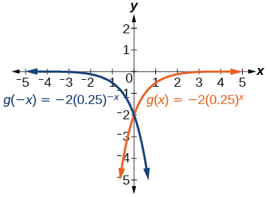 
*y*-intercept:<math xmlns="http://www.w3.org/1998/Math/MathML"> <mrow> <mtext> </mtext><mo stretchy="false">(</mo><mn>0</mn><mo>,</mo><mo>−</mo><mn>2</mn><mo stretchy="false">)</mo> </mrow> </math>

<math xmlns="http://www.w3.org/1998/Math/MathML"> <mrow> <mi>h</mi><mo stretchy="false">(</mo><mi>x</mi><mo stretchy="false">)</mo><mo>=</mo><mn>6</mn><msup> <mrow> <mrow><mo>(</mo> <mrow> <mn>1.75</mn> </mrow> <mo>)</mo></mrow> </mrow> <mrow> <mo>−</mo><mi>x</mi> </mrow> </msup> </mrow> </math>

For the following exercises, graph each set of functions on the same axes.

<math xmlns="http://www.w3.org/1998/Math/MathML"> <mrow> <mi>f</mi><mo stretchy="false">(</mo><mi>x</mi><mo stretchy="false">)</mo><mo>=</mo><mn>3</mn><msup> <mrow> <mrow><mo>(</mo> <mrow> <mfrac> <mn>1</mn> <mn>4</mn> </mfrac> </mrow> <mo>)</mo></mrow> </mrow> <mi>x</mi> </msup> <mo>,</mo> </mrow> </math>

<math xmlns="http://www.w3.org/1998/Math/MathML"> <mrow> <mi>g</mi><mo stretchy="false">(</mo><mi>x</mi><mo stretchy="false">)</mo><mo>=</mo><mn>3</mn><msup> <mrow> <mrow><mo>(</mo> <mn>2</mn> <mo>)</mo></mrow> </mrow> <mi>x</mi> </msup> <mo>,</mo> </mrow> </math>

and<math xmlns="http://www.w3.org/1998/Math/MathML"> <mrow> <mtext> </mtext><mi>h</mi><mo stretchy="false">(</mo><mi>x</mi><mo stretchy="false">)</mo><mo>=</mo><mn>3</mn><msup> <mrow> <mrow><mo>(</mo> <mn>4</mn> <mo>)</mo></mrow> </mrow> <mi>x</mi> </msup> </mrow> </math>

 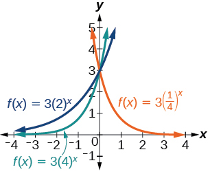 

<math xmlns="http://www.w3.org/1998/Math/MathML"> <mrow> <mi>f</mi><mo stretchy="false">(</mo><mi>x</mi><mo stretchy="false">)</mo><mo>=</mo><mfrac> <mn>1</mn> <mn>4</mn> </mfrac> <msup> <mrow> <mrow><mo>(</mo> <mn>3</mn> <mo>)</mo></mrow> </mrow> <mi>x</mi> </msup> <mo>,</mo> </mrow> </math>

<math xmlns="http://www.w3.org/1998/Math/MathML"> <mrow> <mi>g</mi><mo stretchy="false">(</mo><mi>x</mi><mo stretchy="false">)</mo><mo>=</mo><mn>2</mn><msup> <mrow> <mrow><mo>(</mo> <mn>3</mn> <mo>)</mo></mrow> </mrow> <mi>x</mi> </msup> <mo>,</mo> </mrow> </math>

and<math xmlns="http://www.w3.org/1998/Math/MathML"> <mrow> <mtext> </mtext><mi>h</mi><mo stretchy="false">(</mo><mi>x</mi><mo stretchy="false">)</mo><mo>=</mo><mn>4</mn><msup> <mrow> <mrow><mo>(</mo> <mn>3</mn> <mo>)</mo></mrow> </mrow> <mi>x</mi> </msup> </mrow> </math>

For the following exercises, match each function with one of the graphs in [\[link\]](#CNX_Precalc_Figure_04_02_206).

 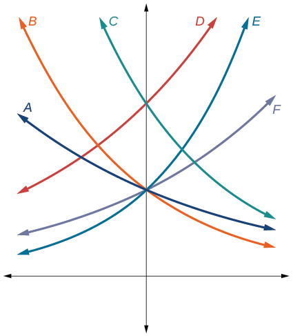{: #CNX_Precalc_Figure_04_02_206}

<math xmlns="http://www.w3.org/1998/Math/MathML"> <mrow> <mi>f</mi><mrow><mo>(</mo> <mi>x</mi> <mo>)</mo></mrow><mo>=</mo><mn>2</mn><msup> <mrow> <mrow><mo>(</mo> <mrow> <mn>0.69</mn> </mrow> <mo>)</mo></mrow> </mrow> <mi>x</mi> </msup> </mrow> </math>

B

<math xmlns="http://www.w3.org/1998/Math/MathML"> <mrow> <mi>f</mi><mrow><mo>(</mo> <mi>x</mi> <mo>)</mo></mrow><mo>=</mo><mn>2</mn><msup> <mrow> <mrow><mo>(</mo> <mrow> <mn>1.28</mn> </mrow> <mo>)</mo></mrow> </mrow> <mi>x</mi> </msup> </mrow> </math>

<math xmlns="http://www.w3.org/1998/Math/MathML"> <mrow> <mi>f</mi><mrow><mo>(</mo> <mi>x</mi> <mo>)</mo></mrow><mo>=</mo><mn>2</mn><msup> <mrow> <mrow><mo>(</mo> <mrow> <mn>0.81</mn> </mrow> <mo>)</mo></mrow> </mrow> <mi>x</mi> </msup> </mrow> </math>

A

<math xmlns="http://www.w3.org/1998/Math/MathML"> <mrow> <mi>f</mi><mrow><mo>(</mo> <mi>x</mi> <mo>)</mo></mrow><mo>=</mo><mn>4</mn><msup> <mrow> <mrow><mo>(</mo> <mrow> <mn>1.28</mn> </mrow> <mo>)</mo></mrow> </mrow> <mi>x</mi> </msup> </mrow> </math>

<math xmlns="http://www.w3.org/1998/Math/MathML"> <mrow> <mi>f</mi><mrow><mo>(</mo> <mi>x</mi> <mo>)</mo></mrow><mo>=</mo><mn>2</mn><msup> <mrow> <mrow><mo>(</mo> <mrow> <mn>1.59</mn> </mrow> <mo>)</mo></mrow> </mrow> <mi>x</mi> </msup> </mrow> </math>

E

<math xmlns="http://www.w3.org/1998/Math/MathML"> <mrow> <mi>f</mi><mrow><mo>(</mo> <mi>x</mi> <mo>)</mo></mrow><mo>=</mo><mn>4</mn><msup> <mrow> <mrow><mo>(</mo> <mrow> <mn>0.69</mn> </mrow> <mo>)</mo></mrow> </mrow> <mi>x</mi> </msup> </mrow> </math>

For the following exercises, use the graphs shown in [\[link\]](#CNX_Precalc_Figure_04_02_207). All have the form<math xmlns="http://www.w3.org/1998/Math/MathML"> <mrow> <mtext> </mtext><mi>f</mi><mrow><mo>(</mo> <mi>x</mi> <mo>)</mo></mrow><mo>=</mo><mi>a</mi><msup> <mi>b</mi> <mi>x</mi> </msup> <mo>.</mo> </mrow> </math>

 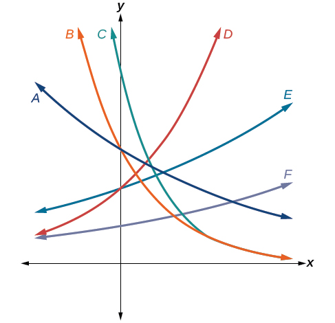{: #CNX_Precalc_Figure_04_02_207}

Which graph has the largest value for<math xmlns="http://www.w3.org/1998/Math/MathML"> <mrow> <mtext> </mtext><mi>b</mi><mo>?</mo> </mrow> </math>

D

Which graph has the smallest value for<math xmlns="http://www.w3.org/1998/Math/MathML"> <mrow> <mtext> </mtext><mi>b</mi><mo>?</mo> </mrow> </math>

Which graph has the largest value for<math xmlns="http://www.w3.org/1998/Math/MathML"> <mrow> <mtext> </mtext><mi>a</mi><mo>?</mo> </mrow> </math>

C

Which graph has the smallest value for<math xmlns="http://www.w3.org/1998/Math/MathML"> <mrow> <mtext> </mtext><mi>a</mi><mo>?</mo> </mrow> </math>

For the following exercises, graph the function and its reflection about the *x*-axis on the same axes.

<math xmlns="http://www.w3.org/1998/Math/MathML"> <mrow> <mi>f</mi><mo stretchy="false">(</mo><mi>x</mi><mo stretchy="false">)</mo><mo>=</mo><mfrac> <mn>1</mn> <mn>2</mn> </mfrac> <msup> <mrow> <mrow><mo>(</mo> <mn>4</mn> <mo>)</mo></mrow> </mrow> <mi>x</mi> </msup> </mrow> </math>

  

<math xmlns="http://www.w3.org/1998/Math/MathML"> <mrow> <mi>f</mi><mo stretchy="false">(</mo><mi>x</mi><mo stretchy="false">)</mo><mo>=</mo><mn>3</mn><msup> <mrow> <mrow><mo>(</mo> <mrow> <mn>0.75</mn> </mrow> <mo>)</mo></mrow> </mrow> <mi>x</mi> </msup> <mo>−</mo><mn>1</mn> </mrow> </math>

<math xmlns="http://www.w3.org/1998/Math/MathML"> <mrow> <mi>f</mi><mo stretchy="false">(</mo><mi>x</mi><mo stretchy="false">)</mo><mo>=</mo><mo>−</mo><mn>4</mn><msup> <mrow> <mrow><mo>(</mo> <mn>2</mn> <mo>)</mo></mrow> </mrow> <mi>x</mi> </msup> <mo>+</mo><mn>2</mn> </mrow> </math>

  

For the following exercises, graph the transformation of<math xmlns="http://www.w3.org/1998/Math/MathML"> <mrow> <mtext> </mtext><mi>f</mi><mo stretchy="false">(</mo><mi>x</mi><mo stretchy="false">)</mo><mo>=</mo><msup> <mn>2</mn> <mi>x</mi> </msup> <mo>.</mo><mtext> </mtext> </mrow> </math>

Give the horizontal asymptote, the domain, and the range.

<math xmlns="http://www.w3.org/1998/Math/MathML"> <mrow> <mi>f</mi><mrow><mo>(</mo> <mi>x</mi> <mo>)</mo></mrow><mo>=</mo><msup> <mn>2</mn> <mrow> <mo>−</mo><mi>x</mi> </mrow> </msup> </mrow> </math>

<math xmlns="http://www.w3.org/1998/Math/MathML"> <mrow> <mi>h</mi><mrow><mo>(</mo> <mi>x</mi> <mo>)</mo></mrow><mo>=</mo><msup> <mn>2</mn> <mi>x</mi> </msup> <mo>+</mo><mn>3</mn> </mrow> </math>

  
Horizontal asymptote:<math xmlns="http://www.w3.org/1998/Math/MathML"> <mrow> <mtext> </mtext><mi>h</mi><mo stretchy="false">(</mo><mi>x</mi><mo stretchy="false">)</mo><mo>=</mo><mn>3</mn><mo>;</mo><mo /> </mrow> </math>

 Domain: all real numbers; Range: all real numbers strictly greater than<math xmlns="http://www.w3.org/1998/Math/MathML"> <mrow> <mtext> </mtext><mn>3.</mn> </mrow> </math>

<math xmlns="http://www.w3.org/1998/Math/MathML"> <mrow> <mi>f</mi><mrow><mo>(</mo> <mi>x</mi> <mo>)</mo></mrow><mo>=</mo><msup> <mn>2</mn> <mrow> <mi>x</mi><mo>−</mo><mn>2</mn> </mrow> </msup> </mrow> </math>

For the following exercises, describe the end behavior of the graphs of the functions.

<math xmlns="http://www.w3.org/1998/Math/MathML"> <mrow> <mi>f</mi><mrow><mo>(</mo> <mi>x</mi> <mo>)</mo></mrow><mo>=</mo><mo>−</mo><mn>5</mn><msup> <mrow> <mrow><mo>(</mo> <mn>4</mn> <mo>)</mo></mrow> </mrow> <mi>x</mi> </msup> <mo>−</mo><mn>1</mn> </mrow> </math>

As <math xmlns="http://www.w3.org/1998/Math/MathML"> <mrow><mi>x</mi><mo stretchy="false">→</mo><mi>∞</mi></mrow></math>

, <math xmlns="http://www.w3.org/1998/Math/MathML"><mrow><mi>f</mi><mrow><mo>(</mo> <mi>x</mi> <mo>)</mo></mrow><mo stretchy="false">→</mo><mo>−</mo><mi>∞</mi></mrow> </math>

; * * *
{: data-type="newline"}

As <math xmlns="http://www.w3.org/1998/Math/MathML"><mrow><mi>x</mi><mo stretchy="false">→</mo><mo>−</mo><mi>∞</mi></mrow></math>

, <math xmlns="http://www.w3.org/1998/Math/MathML"><mrow><mi>f</mi><mrow><mo>(</mo> <mi>x</mi> <mo>)</mo></mrow><mo stretchy="false">→</mo><mo>−</mo><mn>1</mn> </mrow> </math>

<math xmlns="http://www.w3.org/1998/Math/MathML"> <mrow> <mi>f</mi><mrow><mo>(</mo> <mi>x</mi> <mo>)</mo></mrow><mo>=</mo><mn>3</mn><msup> <mrow> <mrow><mo>(</mo> <mrow> <mfrac> <mn>1</mn> <mn>2</mn> </mfrac> </mrow> <mo>)</mo></mrow> </mrow> <mi>x</mi> </msup> <mo>−</mo><mn>2</mn> </mrow> </math>

<math xmlns="http://www.w3.org/1998/Math/MathML"> <mrow> <mi>f</mi><mrow><mo>(</mo> <mi>x</mi> <mo>)</mo></mrow><mo>=</mo><mn>3</mn><msup> <mrow> <mrow><mo>(</mo> <mn>4</mn> <mo>)</mo></mrow> </mrow> <mrow> <mo>−</mo><mi>x</mi> </mrow> </msup> <mo>+</mo><mn>2</mn> </mrow> </math>

As <math xmlns="http://www.w3.org/1998/Math/MathML"><mrow><mi>x</mi><mo stretchy="false">→</mo><mi>∞</mi></mrow></math>

, <math xmlns="http://www.w3.org/1998/Math/MathML"><mrow><mi>f</mi><mrow><mo>(</mo> <mi>x</mi><mo>)</mo></mrow><mo stretchy="false">→</mo><mn>2</mn> </mrow> </math>

; * * *
{: data-type="newline"}

As <math xmlns="http://www.w3.org/1998/Math/MathML"><mrow><mi>x</mi><mo stretchy="false">→</mo><mo>−</mo><mi>∞</mi></mrow></math>

, <math xmlns="http://www.w3.org/1998/Math/MathML"><mrow><mi>f</mi><mrow><mo>(</mo> <mi>x</mi> <mo>)</mo></mrow><mo stretchy="false">→</mo><mi>∞</mi> </mrow> </math>

For the following exercises, start with the graph of<math xmlns="http://www.w3.org/1998/Math/MathML"> <mrow> <mtext> </mtext><mi>f</mi><mrow><mo>(</mo> <mi>x</mi> <mo>)</mo></mrow><mo>=</mo><msup> <mn>4</mn> <mi>x</mi> </msup> <mo>.</mo><mtext> </mtext> </mrow> </math>

Then write a function that results from the given transformation.

Shift <math xmlns="http://www.w3.org/1998/Math/MathML"> <mi>f</mi><mo stretchy="false">(</mo><mi>x</mi><mo stretchy="false">)</mo> </math>

 4 units upward

Shift<math xmlns="http://www.w3.org/1998/Math/MathML"> <mrow> <mtext> </mtext><mi>f</mi><mo stretchy="false">(</mo><mi>x</mi><mo stretchy="false">)</mo><mtext> </mtext> </mrow> </math>

3 units downward

<math xmlns="http://www.w3.org/1998/Math/MathML"> <mrow> <mi>f</mi><mrow><mo>(</mo> <mi>x</mi> <mo>)</mo></mrow><mo>=</mo><msup> <mn>4</mn> <mi>x</mi> </msup> <mo>−</mo><mn>3</mn> </mrow> </math>

Shift<math xmlns="http://www.w3.org/1998/Math/MathML"> <mrow> <mtext> </mtext><mi>f</mi><mo stretchy="false">(</mo><mi>x</mi><mo stretchy="false">)</mo><mtext> </mtext> </mrow> </math>

2 units left

Shift<math xmlns="http://www.w3.org/1998/Math/MathML"> <mrow> <mtext> </mtext><mi>f</mi><mo stretchy="false">(</mo><mi>x</mi><mo stretchy="false">)</mo><mtext> </mtext> </mrow> </math>

5 units right

<math xmlns="http://www.w3.org/1998/Math/MathML"> <mrow> <mi>f</mi><mo stretchy="false">(</mo><mi>x</mi><mo stretchy="false">)</mo><mo>=</mo><msup> <mn>4</mn> <mrow> <mi>x</mi><mo>−</mo><mn>5</mn> </mrow> </msup> </mrow> </math>

Reflect<math xmlns="http://www.w3.org/1998/Math/MathML"> <mrow> <mtext> </mtext><mi>f</mi><mo stretchy="false">(</mo><mi>x</mi><mo stretchy="false">)</mo><mtext> </mtext> </mrow> </math>

about the *x*-axis

Reflect<math xmlns="http://www.w3.org/1998/Math/MathML"> <mrow> <mtext> </mtext><mi>f</mi><mo stretchy="false">(</mo><mi>x</mi><mo stretchy="false">)</mo><mtext> </mtext> </mrow> </math>

about the *y*-axis

<math xmlns="http://www.w3.org/1998/Math/MathML"> <mrow> <mi>f</mi><mrow><mo>(</mo> <mi>x</mi> <mo>)</mo></mrow><mo>=</mo><msup> <mn>4</mn> <mrow> <mo>−</mo><mi>x</mi> </mrow> </msup> </mrow> </math>

For the following exercises, each graph is a transformation of<math xmlns="http://www.w3.org/1998/Math/MathML"> <mrow> <mtext> </mtext><mi>y</mi><mo>=</mo><msup> <mn>2</mn> <mi>x</mi> </msup> <mo>.</mo><mtext> </mtext> </mrow> </math>

Write an equation describing the transformation.

* * *
{: data-type="newline"}

  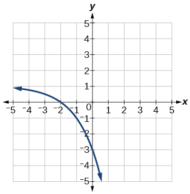 

* * *
{: data-type="newline"}

  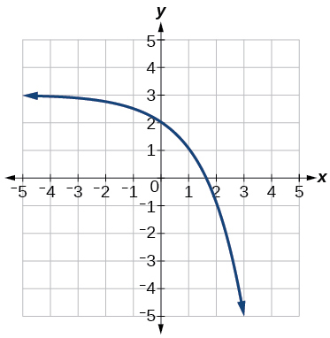 

<math xmlns="http://www.w3.org/1998/Math/MathML"> <mrow> <mi>y</mi><mo>=</mo><mo>−</mo><msup> <mn>2</mn> <mi>x</mi> </msup> <mo>+</mo><mn>3</mn> </mrow> </math>

* * *
{: data-type="newline"}

  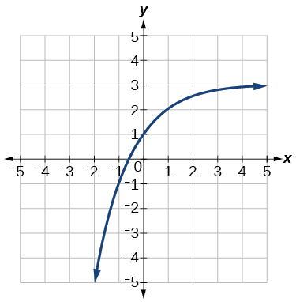 

For the following exercises, find an exponential equation for the graph.

* * *
{: data-type="newline"}

   

<math xmlns="http://www.w3.org/1998/Math/MathML"> <mrow> <mi>y</mi><mo>=</mo><mo>−</mo><mn>2</mn><msup> <mrow> <mrow><mo>(</mo> <mn>3</mn> <mo>)</mo></mrow> </mrow> <mi>x</mi> </msup> <mo>+</mo><mn>7</mn> </mrow> </math>

* * *
{: data-type="newline"}

  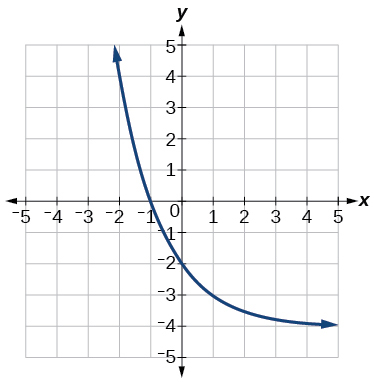 

## Numeric

For the following exercises, evaluate the exponential functions for the indicated value of<math xmlns="http://www.w3.org/1998/Math/MathML"> <mrow> <mtext> </mtext><mi>x</mi><mo>.</mo> </mrow> </math>

<math xmlns="http://www.w3.org/1998/Math/MathML"> <mrow> <mi>g</mi><mo stretchy="false">(</mo><mi>x</mi><mo stretchy="false">)</mo><mo>=</mo><mfrac> <mn>1</mn> <mn>3</mn> </mfrac> <msup> <mrow> <mrow><mo>(</mo> <mn>7</mn> <mo>)</mo></mrow> </mrow> <mrow> <mi>x</mi><mo>−</mo><mn>2</mn> </mrow> </msup> <mtext> </mtext> </mrow> </math>

for<math xmlns="http://www.w3.org/1998/Math/MathML"> <mrow> <mtext> </mtext><mi>g</mi><mo stretchy="false">(</mo><mn>6</mn><mo stretchy="false">)</mo><mo>.</mo> </mrow> </math>

<math xmlns="http://www.w3.org/1998/Math/MathML"> <mrow> <mi>g</mi><mo stretchy="false">(</mo><mn>6</mn><mo stretchy="false">)</mo><mo>=</mo><mn>800</mn><mo>+</mo><mfrac> <mn>1</mn> <mn>3</mn> </mfrac> <mo>≈</mo><mn>800.3333</mn> </mrow> </math>

<math xmlns="http://www.w3.org/1998/Math/MathML"> <mrow> <mi>f</mi><mo stretchy="false">(</mo><mi>x</mi><mo stretchy="false">)</mo><mo>=</mo><mn>4</mn><msup> <mrow> <mo stretchy="false">(</mo><mn>2</mn><mo stretchy="false">)</mo> </mrow> <mrow> <mi>x</mi><mo>−</mo><mn>1</mn> </mrow> </msup> <mo>−</mo><mn>2</mn><mtext> </mtext> </mrow> </math>

for<math xmlns="http://www.w3.org/1998/Math/MathML"> <mrow> <mtext> </mtext><mi>f</mi><mo stretchy="false">(</mo><mn>5</mn><mo stretchy="false">)</mo><mo>.</mo> </mrow> </math>

<math xmlns="http://www.w3.org/1998/Math/MathML"> <mrow> <mi>h</mi><mo stretchy="false">(</mo><mi>x</mi><mo stretchy="false">)</mo><mo>=</mo><mo>−</mo><mfrac> <mn>1</mn> <mn>2</mn> </mfrac> <msup> <mrow> <mrow><mo>(</mo> <mrow> <mfrac> <mn>1</mn> <mn>2</mn> </mfrac> </mrow> <mo>)</mo></mrow> </mrow> <mi>x</mi> </msup> <mo>+</mo><mn>6</mn><mtext> </mtext> </mrow> </math>

for<math xmlns="http://www.w3.org/1998/Math/MathML"> <mrow> <mtext> </mtext><mi>h</mi><mo stretchy="false">(</mo><mo>−</mo><mn>7</mn><mo stretchy="false">)</mo><mo>.</mo> </mrow> </math>

<math xmlns="http://www.w3.org/1998/Math/MathML"> <mrow> <mi>h</mi><mo stretchy="false">(</mo><mo>−</mo><mn>7</mn><mo stretchy="false">)</mo><mo>=</mo><mo>−</mo><mn>58</mn> </mrow> </math>

## Technology 

For the following exercises, use a graphing calculator to approximate the solutions of the equation. Round to the nearest thousandth.<math xmlns="http://www.w3.org/1998/Math/MathML"> <mrow> <mtext> </mtext><mi>f</mi><mo stretchy="false">(</mo><mi>x</mi><mo stretchy="false">)</mo><mo>=</mo><mi>a</mi><msup> <mi>b</mi> <mi>x</mi> </msup> <mo>+</mo><mi>d</mi><mo>.</mo> </mrow> </math>

<math xmlns="http://www.w3.org/1998/Math/MathML"> <mrow> <mo>−</mo><mn>50</mn><mo>=</mo><mo>−</mo><msup> <mrow> <mrow><mo>(</mo> <mrow> <mfrac> <mn>1</mn> <mn>2</mn> </mfrac> </mrow> <mo>)</mo></mrow> </mrow> <mrow> <mo>−</mo><mi>x</mi> </mrow> </msup> </mrow> </math>

<math xmlns="http://www.w3.org/1998/Math/MathML"> <mrow> <mn>116</mn><mo>=</mo><mfrac> <mn>1</mn> <mn>4</mn> </mfrac> <msup> <mrow> <mrow><mo>(</mo> <mrow> <mfrac> <mn>1</mn> <mn>8</mn> </mfrac> </mrow> <mo>)</mo></mrow> </mrow> <mi>x</mi> </msup> </mrow> </math>

<math xmlns="http://www.w3.org/1998/Math/MathML"> <mrow> <mi>x</mi><mo>≈</mo><mo>−</mo><mn>2.953</mn> </mrow> </math>

<math xmlns="http://www.w3.org/1998/Math/MathML"> <mrow> <mn>12</mn><mo>=</mo><mn>2</mn><msup> <mrow> <mrow><mo>(</mo> <mn>3</mn> <mo>)</mo></mrow> </mrow> <mi>x</mi> </msup> <mo>+</mo><mn>1</mn> </mrow> </math>

<math xmlns="http://www.w3.org/1998/Math/MathML"> <mrow> <mn>5</mn><mo>=</mo><mn>3</mn><msup> <mrow> <mrow><mo>(</mo> <mrow> <mfrac> <mn>1</mn> <mn>2</mn> </mfrac> </mrow> <mo>)</mo></mrow> </mrow> <mrow> <mi>x</mi><mo>−</mo><mn>1</mn> </mrow> </msup> <mo>−</mo><mn>2</mn> </mrow> </math>

<math xmlns="http://www.w3.org/1998/Math/MathML"> <mrow> <mi>x</mi><mo>≈</mo><mo>−</mo><mn>0.222</mn> </mrow> </math>

<math xmlns="http://www.w3.org/1998/Math/MathML"> <mrow> <mo>−</mo><mn>30</mn><mo>=</mo><mo>−</mo><mn>4</mn><msup> <mrow> <mrow><mo>(</mo> <mn>2</mn> <mo>)</mo></mrow> </mrow> <mrow> <mi>x</mi><mo>+</mo><mn>2</mn> </mrow> </msup> <mo>+</mo><mn>2</mn> </mrow> </math>

## Extensions 

Explore and discuss the graphs of<math xmlns="http://www.w3.org/1998/Math/MathML"> <mrow> <mtext> </mtext><mi>F</mi><mo stretchy="false">(</mo><mi>x</mi><mo stretchy="false">)</mo><mo>=</mo><msup> <mrow> <mrow><mo>(</mo> <mi>b</mi> <mo>)</mo></mrow> </mrow> <mi>x</mi> </msup> <mtext> </mtext> </mrow> </math>

and<math xmlns="http://www.w3.org/1998/Math/MathML"> <mrow> <mtext> </mtext><mi>G</mi><mo stretchy="false">(</mo><mi>x</mi><mo stretchy="false">)</mo><mo>=</mo><msup> <mrow> <mrow><mo>(</mo> <mrow> <mfrac> <mn>1</mn> <mi>b</mi> </mfrac> </mrow> <mo>)</mo></mrow> </mrow> <mi>x</mi> </msup> <mo>.</mo><mtext> </mtext> </mrow> </math>

Then make a conjecture about the relationship between the graphs of the functions<math xmlns="http://www.w3.org/1998/Math/MathML"> <mrow> <mtext> </mtext><msup> <mi>b</mi> <mi>x</mi> </msup> <mtext> </mtext> </mrow> </math>

and<math xmlns="http://www.w3.org/1998/Math/MathML"> <mrow> <mtext> </mtext><msup> <mrow> <mrow><mo>(</mo> <mrow> <mfrac> <mn>1</mn> <mi>b</mi> </mfrac> </mrow> <mo>)</mo></mrow> </mrow> <mi>x</mi> </msup> <mtext> </mtext> </mrow> </math>

for any real number<math xmlns="http://www.w3.org/1998/Math/MathML"> <mrow> <mtext> </mtext><mi>b</mi><mo>&gt;</mo><mn>0.</mn> </mrow> </math>

The graph of<math xmlns="http://www.w3.org/1998/Math/MathML"> <mrow> <mtext> </mtext><mi>G</mi><mo stretchy="false">(</mo><mi>x</mi><mo stretchy="false">)</mo><mo>=</mo><msup> <mrow> <mrow><mo>(</mo> <mrow> <mfrac> <mn>1</mn> <mi>b</mi> </mfrac> </mrow> <mo>)</mo></mrow> </mrow> <mi>x</mi> </msup> <mtext> </mtext> </mrow> </math>

is the refelction about the *y*-axis of the graph of<math xmlns="http://www.w3.org/1998/Math/MathML"> <mrow> <mtext> </mtext><mi>F</mi><mo stretchy="false">(</mo><mi>x</mi><mo stretchy="false">)</mo><mo>=</mo><msup> <mi>b</mi> <mi>x</mi> </msup> <mo>;</mo><mtext> </mtext> </mrow> </math>

For any real number<math xmlns="http://www.w3.org/1998/Math/MathML"> <mrow> <mtext> </mtext><mi>b</mi><mo>&gt;</mo><mn>0</mn><mtext> </mtext> </mrow> </math>

and function<math xmlns="http://www.w3.org/1998/Math/MathML"> <mrow> <mtext> </mtext><mi>f</mi><mo stretchy="false">(</mo><mi>x</mi><mo stretchy="false">)</mo><mo>=</mo><msup> <mi>b</mi> <mi>x</mi> </msup> <mo>,</mo> </mrow> </math>

the graph of<math xmlns="http://www.w3.org/1998/Math/MathML"> <mrow> <mtext> </mtext><msup> <mrow> <mrow><mo>(</mo> <mrow> <mfrac> <mn>1</mn> <mi>b</mi> </mfrac> </mrow> <mo>)</mo></mrow> </mrow> <mi>x</mi> </msup> <mtext> </mtext> </mrow> </math>

is the the reflection about the *y*-axis,<math xmlns="http://www.w3.org/1998/Math/MathML"> <mrow> <mtext> </mtext><mi>F</mi><mo stretchy="false">(</mo><mo>−</mo><mi>x</mi><mo stretchy="false">)</mo><mo>.</mo> </mrow> </math>

Prove the conjecture made in the previous exercise.

Explore and discuss the graphs of<math xmlns="http://www.w3.org/1998/Math/MathML"> <mrow> <mtext> </mtext><mi>f</mi><mo stretchy="false">(</mo><mi>x</mi><mo stretchy="false">)</mo><mo>=</mo><msup> <mn>4</mn> <mi>x</mi> </msup> <mo>,</mo> </mrow> </math>

<math xmlns="http://www.w3.org/1998/Math/MathML"> <mrow> <mtext> </mtext><mi>g</mi><mo stretchy="false">(</mo><mi>x</mi><mo stretchy="false">)</mo><mo>=</mo><msup> <mn>4</mn> <mrow> <mi>x</mi><mo>−</mo><mn>2</mn> </mrow> </msup> <mo>,</mo> </mrow> </math>

and<math xmlns="http://www.w3.org/1998/Math/MathML"> <mrow> <mtext> </mtext><mi>h</mi><mo stretchy="false">(</mo><mi>x</mi><mo stretchy="false">)</mo><mo>=</mo><mrow><mo>(</mo> <mrow> <mfrac> <mn>1</mn> <mrow> <mn>16</mn> </mrow> </mfrac> </mrow> <mo>)</mo></mrow><msup> <mn>4</mn> <mi>x</mi> </msup> <mo>.</mo><mtext> </mtext> </mrow> </math>

Then make a conjecture about the relationship between the graphs of the functions<math xmlns="http://www.w3.org/1998/Math/MathML"> <mrow> <mtext> </mtext><msup> <mi>b</mi> <mi>x</mi> </msup> <mtext> </mtext> </mrow> </math>

and<math xmlns="http://www.w3.org/1998/Math/MathML"> <mrow> <mtext> </mtext><mrow><mo>(</mo> <mrow> <mfrac> <mn>1</mn> <mrow> <msup> <mi>b</mi> <mi>n</mi> </msup> </mrow> </mfrac> </mrow> <mo>)</mo></mrow><msup> <mi>b</mi> <mi>x</mi> </msup> <mtext> </mtext> </mrow> </math>

for any real number <em>n </em>and real number<math xmlns="http://www.w3.org/1998/Math/MathML"> <mrow> <mtext> </mtext><mi>b</mi><mo>&gt;</mo><mn>0.</mn> </mrow> </math>

The graphs of<math xmlns="http://www.w3.org/1998/Math/MathML"> <mrow> <mtext> </mtext><mi>g</mi><mo stretchy="false">(</mo><mi>x</mi><mo stretchy="false">)</mo><mtext> </mtext> </mrow> </math>

and<math xmlns="http://www.w3.org/1998/Math/MathML"> <mrow> <mtext> </mtext><mi>h</mi><mo stretchy="false">(</mo><mi>x</mi><mo stretchy="false">)</mo><mtext> </mtext> </mrow> </math>

are the same and are a horizontal shift to the right of the graph of<math xmlns="http://www.w3.org/1998/Math/MathML"> <mrow> <mtext> </mtext><mi>f</mi><mo stretchy="false">(</mo><mi>x</mi><mo stretchy="false">)</mo><mo>;</mo><mtext> </mtext> </mrow> </math>

For any real number *n*, real number<math xmlns="http://www.w3.org/1998/Math/MathML"> <mrow> <mtext> </mtext><mi>b</mi><mo>&gt;</mo><mn>0</mn><mo>,</mo> </mrow> </math>

 and function<math xmlns="http://www.w3.org/1998/Math/MathML"> <mrow> <mtext> </mtext><mi>f</mi><mo stretchy="false">(</mo><mi>x</mi><mo stretchy="false">)</mo><mo>=</mo><msup> <mi>b</mi> <mi>x</mi> </msup> <mo>,</mo> </mrow> </math>

 the graph of<math xmlns="http://www.w3.org/1998/Math/MathML"> <mrow> <mtext> </mtext><mrow><mo>(</mo> <mrow> <mfrac> <mn>1</mn> <mrow> <msup> <mi>b</mi> <mi>n</mi> </msup> </mrow> </mfrac> </mrow> <mo>)</mo></mrow><msup> <mi>b</mi> <mi>x</mi> </msup> <mtext> </mtext> </mrow> </math>

is the horizontal shift<math xmlns="http://www.w3.org/1998/Math/MathML"> <mrow> <mtext> </mtext><mi>f</mi><mo stretchy="false">(</mo><mi>x</mi><mo>−</mo><mi>n</mi><mo stretchy="false">)</mo><mo>.</mo> </mrow> </math>

Prove the conjecture made in the previous exercise.

[1]: http://openstaxcollege.org/l/graphexpfunc
