

In this section, you will:
* Identify the domain of a logarithmic function.
* Graph logarithmic functions.

In [Graphs of Exponential Functions](/m49362){: .target-chapter}, we saw how creating a graphical representation of an exponential model gives us another layer of insight for predicting future events. How do logarithmic graphs give us insight into situations? Because every logarithmic function is the inverse function of an exponential function, we can think of every output on a logarithmic graph as the input for the corresponding inverse exponential equation. In other words, logarithms give the *cause* for an *effect*.

To illustrate, suppose we invest<math xmlns="http://www.w3.org/1998/Math/MathML"> <mrow> <mtext> </mtext><mtext>$</mtext><mn>2500</mn><mtext> </mtext> </mrow> </math>

in an account that offers an annual interest rate of<math xmlns="http://www.w3.org/1998/Math/MathML"> <mrow> <mtext> </mtext><mn>5</mn><mi>%</mi><mo>,</mo> </mrow> </math>

compounded continuously. We already know that the balance in our account for any year<math xmlns="http://www.w3.org/1998/Math/MathML"> <mrow> <mtext> </mtext><mi>t</mi><mtext> </mtext> </mrow> </math>

can be found with the equation<math xmlns="http://www.w3.org/1998/Math/MathML"> <mrow> <mtext> </mtext><mi>A</mi><mo>=</mo><mn>2500</mn><msup> <mi>e</mi> <mrow> <mn>0.05</mn><mi>t</mi> </mrow> </msup> <mo>.</mo> </mrow> </math>

But what if we wanted to know the year for any balance? We would need to create a corresponding new function by interchanging the input and the output; thus we would need to create a logarithmic model for this situation. By graphing the model, we can see the output (year) for any input (account balance). For instance, what if we wanted to know how many years it would take for our initial investment to double? [\[link\]](#CNX_Precalc_Figure_04_04_001) shows this point on the logarithmic graph.

 {: #CNX_Precalc_Figure_04_04_001}

In this section we will discuss the values for which a logarithmic function is defined, and then turn our attention to graphing the family of logarithmic functions.

# Finding the Domain of a Logarithmic Function

Before working with graphs, we will take a look at the domain (the set of input values) for which the logarithmic function is defined.

Recall that the exponential function is defined as<math xmlns="http://www.w3.org/1998/Math/MathML"> <mrow> <mtext> </mtext><mi>y</mi><mo>=</mo><msup> <mi>b</mi> <mi>x</mi> </msup> <mtext> </mtext> </mrow> </math>

for any real number<math xmlns="http://www.w3.org/1998/Math/MathML"> <mrow> <mtext> </mtext><mi>x</mi><mtext> </mtext> </mrow> </math>

and constant<math xmlns="http://www.w3.org/1998/Math/MathML"> <mrow> <mtext> </mtext><mi>b</mi><mo>&gt;</mo><mn>0</mn><mo>,</mo> </mrow> </math>

 <math xmlns="http://www.w3.org/1998/Math/MathML"> <mrow> <mi>b</mi><mo>≠</mo><mn>1</mn><mo>,</mo> </mrow> </math>

 where

* The domain of
  <math xmlns="http://www.w3.org/1998/Math/MathML"> <mrow> <mtext> </mtext><mi>y</mi><mtext> </mtext> </mrow> </math>
  
  is
  <math xmlns="http://www.w3.org/1998/Math/MathML"> <mrow> <mtext> </mtext><mrow><mo>(</mo> <mrow> <mo>−</mo><mi>∞</mi><mo>,</mo><mi>∞</mi> </mrow> <mo>)</mo></mrow><mo>.</mo> </mrow> </math>

* The range of
  <math xmlns="http://www.w3.org/1998/Math/MathML"> <mrow> <mtext> </mtext><mi>y</mi><mtext> </mtext> </mrow> </math>
  
  is
  <math xmlns="http://www.w3.org/1998/Math/MathML"> <mrow> <mtext> </mtext><mrow><mo>(</mo> <mrow> <mn>0</mn><mo>,</mo><mi>∞</mi> </mrow> <mo>)</mo></mrow><mo>.</mo> </mrow> </math>

In the last section we learned that the logarithmic function<math xmlns="http://www.w3.org/1998/Math/MathML"> <mrow> <mtext> </mtext><mi>y</mi><mo>=</mo><msub> <mrow> <mi>log</mi> </mrow> <mi>b</mi> </msub> <mrow><mo>(</mo> <mi>x</mi> <mo>)</mo></mrow><mtext> </mtext> </mrow> </math>

is the inverse of the exponential function<math xmlns="http://www.w3.org/1998/Math/MathML"> <mrow> <mtext> </mtext><mi>y</mi><mo>=</mo><msup> <mi>b</mi> <mi>x</mi> </msup> <mo>.</mo><mtext> </mtext> </mrow> </math>

So, as inverse functions:

* The domain of
  <math xmlns="http://www.w3.org/1998/Math/MathML"> <mrow> <mtext> </mtext><mi>y</mi><mo>=</mo><msub> <mrow> <mi>log</mi> </mrow> <mi>b</mi> </msub> <mrow><mo>(</mo> <mi>x</mi> <mo>)</mo></mrow><mtext> </mtext> </mrow> </math>
  
  is the range of
  <math xmlns="http://www.w3.org/1998/Math/MathML"> <mrow> <mtext> </mtext><mi>y</mi><mo>=</mo><msup> <mi>b</mi> <mi>x</mi> </msup> <mo>:</mo><mtext> </mtext> </mrow> </math>
  
  <math xmlns="http://www.w3.org/1998/Math/MathML"> <mrow> <mrow><mo>(</mo> <mrow> <mn>0</mn><mo>,</mo><mi>∞</mi> </mrow> <mo>)</mo></mrow><mo>.</mo> </mrow> </math>

* The range of
  <math xmlns="http://www.w3.org/1998/Math/MathML"> <mrow> <mtext> </mtext><mi>y</mi><mo>=</mo><msub> <mrow> <mi>log</mi> </mrow> <mi>b</mi> </msub> <mrow><mo>(</mo> <mi>x</mi> <mo>)</mo></mrow><mtext> </mtext> </mrow> </math>
  
  is the domain of
  <math xmlns="http://www.w3.org/1998/Math/MathML"> <mrow> <mtext> </mtext><mi>y</mi><mo>=</mo><msup> <mi>b</mi> <mi>x</mi> </msup> <mo>:</mo><mtext> </mtext> </mrow> </math>
  
  <math xmlns="http://www.w3.org/1998/Math/MathML"> <mrow> <mrow><mo>(</mo> <mrow> <mo>−</mo><mi>∞</mi><mo>,</mo><mi>∞</mi> </mrow> <mo>)</mo></mrow><mo>.</mo> </mrow> </math>

Transformations of the parent function<math xmlns="http://www.w3.org/1998/Math/MathML"> <mrow> <mtext> </mtext><mi>y</mi><mo>=</mo><msub> <mrow> <mi>log</mi> </mrow> <mi>b</mi> </msub> <mrow><mo>(</mo> <mi>x</mi> <mo>)</mo></mrow><mtext> </mtext> </mrow> </math>

behave similarly to those of other functions. Just as with other parent functions, we can apply the four types of transformations—shifts, stretches, compressions, and reflections—to the parent function without loss of shape.

In [Graphs of Exponential Functions](/m49362){: .target-chapter} we saw that certain transformations can change the *range* of<math xmlns="http://www.w3.org/1998/Math/MathML"> <mrow> <mtext> </mtext><mi>y</mi><mo>=</mo><msup> <mi>b</mi> <mi>x</mi> </msup> <mo>.</mo><mtext> </mtext> </mrow> </math>

Similarly, applying transformations to the parent function<math xmlns="http://www.w3.org/1998/Math/MathML"> <mrow> <mtext> </mtext><mi>y</mi><mo>=</mo><msub> <mrow> <mi>log</mi> </mrow> <mi>b</mi> </msub> <mrow><mo>(</mo> <mi>x</mi> <mo>)</mo></mrow><mtext> </mtext> </mrow> </math>

can change the *domain*. When finding the domain of a logarithmic function, therefore, it is important to remember that the domain consists *only of positive real numbers*. That is, the argument of the logarithmic function must be greater than zero.

For example, consider<math xmlns="http://www.w3.org/1998/Math/MathML"> <mrow> <mtext> </mtext><mi>f</mi><mo stretchy="false">(</mo><mi>x</mi><mo stretchy="false">)</mo><mo>=</mo><msub> <mrow> <mi>log</mi> </mrow> <mn>4</mn> </msub> <mrow><mo>(</mo> <mrow> <mn>2</mn><mi>x</mi><mo>−</mo><mn>3</mn> </mrow> <mo>)</mo></mrow><mo>.</mo><mtext> </mtext> </mrow> </math>

This function is defined for any values of<math xmlns="http://www.w3.org/1998/Math/MathML"> <mrow> <mtext> </mtext><mi>x</mi><mtext> </mtext> </mrow> </math>

such that the argument, in this case<math xmlns="http://www.w3.org/1998/Math/MathML"> <mrow> <mtext> </mtext><mn>2</mn><mi>x</mi><mo>−</mo><mn>3</mn><mo>,</mo> </mrow> </math>

 is greater than zero. To find the domain, we set up an inequality and solve for<math xmlns="http://www.w3.org/1998/Math/MathML"> <mrow> <mtext> </mtext><mi>x</mi><mo>:</mo> </mrow> </math>

<math xmlns="http://www.w3.org/1998/Math/MathML"> <mrow> <mtable columnalign="left"> <mtr columnalign="left"> <mtd columnalign="left"> <mrow> <mn>2</mn><mi>x</mi><mo>−</mo><mn>3</mn><mo>&gt;</mo><mn>0</mn> </mrow> </mtd> <mtd columnalign="left"> <mrow> <mtext>Show the argument greater than zero</mtext><mo>.</mo> </mrow> </mtd> </mtr> <mtr columnalign="left"> <mtd columnalign="left"> <mrow> <mtext> </mtext><mtext> </mtext><mtext> </mtext><mtext> </mtext><mtext> </mtext><mtext> </mtext><mtext> </mtext><mtext> </mtext><mtext> </mtext><mtext> </mtext><mn>2</mn><mi>x</mi><mo>&gt;</mo><mn>3</mn> </mrow> </mtd> <mtd columnalign="left"> <mrow> <mtext>Add 3</mtext><mo>.</mo> </mrow> </mtd> </mtr> <mtr columnalign="left"> <mtd columnalign="left"> <mrow> <mtext> </mtext><mtext> </mtext><mtext> </mtext><mtext> </mtext><mtext> </mtext><mtext> </mtext><mtext> </mtext><mtext> </mtext><mtext> </mtext><mtext> </mtext><mtext> </mtext><mtext> </mtext><mtext> </mtext><mi>x</mi><mo>&gt;</mo><mn>1.5</mn><mtable> <mtr> <mtd> <mrow /> </mtd> <mtd> <mrow /> </mtd> <mtd> <mrow /> </mtd> <mtd> <mrow /> </mtd> </mtr> </mtable> </mrow> </mtd> <mtd columnalign="left"> <mrow> <mtext>Divide by 2</mtext><mo>.</mo> </mrow> </mtd> </mtr> </mtable> </mrow> </math>

In interval notation, the domain of<math xmlns="http://www.w3.org/1998/Math/MathML"> <mrow> <mtext> </mtext><mi>f</mi><mo stretchy="false">(</mo><mi>x</mi><mo stretchy="false">)</mo><mo>=</mo><msub> <mrow> <mi>log</mi> </mrow> <mn>4</mn> </msub> <mrow><mo>(</mo> <mrow> <mn>2</mn><mi>x</mi><mo>−</mo><mn>3</mn> </mrow> <mo>)</mo></mrow><mtext> </mtext> </mrow> </math>

is<math xmlns="http://www.w3.org/1998/Math/MathML"> <mrow> <mtext> </mtext><mrow><mo>(</mo> <mrow> <mn>1.5</mn><mo>,</mo><mi>∞</mi> </mrow> <mo>)</mo></mrow><mo>.</mo> </mrow> </math>

<strong>Given a logarithmic function, identify the domain. </strong>

1.  Set up an inequality showing the argument greater than zero.
2.  Solve for
    <math xmlns="http://www.w3.org/1998/Math/MathML"> <mrow> <mtext> </mtext><mi>x</mi><mo>.</mo> </mrow> </math>

3.  Write the domain in interval notation.
{: data-number-style="arabic"}

Identifying the Domain of a Logarithmic Shift

What is the domain of<math xmlns="http://www.w3.org/1998/Math/MathML"> <mrow> <mtext> </mtext><mi>f</mi><mo stretchy="false">(</mo><mi>x</mi><mo stretchy="false">)</mo><mo>=</mo><msub> <mrow> <mi>log</mi> </mrow> <mn>2</mn> </msub> <mo stretchy="false">(</mo><mi>x</mi><mo>+</mo><mn>3</mn><mo stretchy="false">)</mo><mo>?</mo> </mrow> </math>

The logarithmic function is defined only when the input is positive, so this function is defined when<math xmlns="http://www.w3.org/1998/Math/MathML"> <mrow> <mtext> </mtext><mi>x</mi><mo>+</mo><mn>3</mn><mo>&gt;</mo><mn>0.</mn><mtext> </mtext> </mrow> </math>

Solving this inequality,

<math xmlns="http://www.w3.org/1998/Math/MathML" display="block"> <mrow> <mtable columnalign="left"> <mtr columnalign="left"> <mtd columnalign="left"> <mrow> <mi>x</mi><mo>+</mo><mn>3</mn><mo>&gt;</mo><mn>0</mn> </mrow> </mtd> <mtd columnalign="left"> <mrow> <mtext>The input must be positive</mtext><mo>.</mo> </mrow> </mtd> </mtr> <mtr columnalign="left"> <mtd columnalign="left"> <mrow> <mtext> </mtext><mtext> </mtext><mtext> </mtext><mtext> </mtext><mtext> </mtext><mtext> </mtext><mtext> </mtext><mtext> </mtext><mtext> </mtext><mtext> </mtext><mi>x</mi><mo>&gt;</mo><mo>−</mo><mn>3</mn><mtable> <mtr> <mtd> <mrow /> </mtd> <mtd> <mrow /> </mtd> <mtd> <mrow /> </mtd> <mtd> <mrow /> </mtd> </mtr> </mtable> </mrow> </mtd> <mtd columnalign="left"> <mrow> <mtext>Subtract 3</mtext><mo>.</mo> </mrow> </mtd> </mtr> </mtable> </mrow> </math>

The domain of<math xmlns="http://www.w3.org/1998/Math/MathML"> <mrow> <mtext> </mtext><mi>f</mi><mo stretchy="false">(</mo><mi>x</mi><mo stretchy="false">)</mo><mo>=</mo><msub> <mrow> <mi>log</mi> </mrow> <mn>2</mn> </msub> <mo stretchy="false">(</mo><mi>x</mi><mo>+</mo><mn>3</mn><mo stretchy="false">)</mo><mtext> </mtext> </mrow> </math>

is<math xmlns="http://www.w3.org/1998/Math/MathML"> <mrow> <mtext> </mtext><mrow><mo>(</mo> <mrow> <mo>−</mo><mn>3</mn><mo>,</mo><mi>∞</mi> </mrow> <mo>)</mo></mrow><mo>.</mo> </mrow> </math>

What is the domain of<math xmlns="http://www.w3.org/1998/Math/MathML"> <mrow> <mtext> </mtext><mi>f</mi><mo stretchy="false">(</mo><mi>x</mi><mo stretchy="false">)</mo><mo>=</mo><msub> <mrow> <mi>log</mi> </mrow> <mn>5</mn> </msub> <mo stretchy="false">(</mo><mi>x</mi><mo>−</mo><mn>2</mn><mo stretchy="false">)</mo><mo>+</mo><mn>1</mn><mo>?</mo> </mrow> </math>

<math xmlns="http://www.w3.org/1998/Math/MathML"> <mrow> <mrow><mo>(</mo> <mrow> <mn>2</mn><mo>,</mo><mi>∞</mi> </mrow> <mo>)</mo></mrow> </mrow> </math>

Identifying the Domain of a Logarithmic Shift and Reflection

What is the domain of<math xmlns="http://www.w3.org/1998/Math/MathML"> <mrow> <mtext> </mtext><mi>f</mi><mo stretchy="false">(</mo><mi>x</mi><mo stretchy="false">)</mo><mo>=</mo><mi>log</mi><mo stretchy="false">(</mo><mn>5</mn><mo>−</mo><mn>2</mn><mi>x</mi><mo stretchy="false">)</mo><mo>?</mo> </mrow> </math>

The logarithmic function is defined only when the input is positive, so this function is defined when<math xmlns="http://www.w3.org/1998/Math/MathML"> <mrow> <mtext> </mtext><mn>5</mn><mo>–</mo><mn>2</mn><mi>x</mi><mo>&gt;</mo><mn>0</mn><mo>.</mo><mtext> </mtext> </mrow> </math>

Solving this inequality,

<math xmlns="http://www.w3.org/1998/Math/MathML" display="block"> <mrow> <mtable columnalign="left"> <mtr columnalign="left"> <mtd columnalign="left"> <mrow> <mn>5</mn><mo>−</mo><mn>2</mn><mi>x</mi><mo>&gt;</mo><mn>0</mn> </mrow> </mtd> <mtd columnalign="left"> <mrow> <mtext>The input must be positive</mtext><mo>.</mo> </mrow> </mtd> </mtr> <mtr columnalign="left"> <mtd columnalign="left"> <mrow> <mtext> </mtext><mtext> </mtext><mtext> </mtext><mo>−</mo><mn>2</mn><mi>x</mi><mo>&gt;</mo><mo>−</mo><mn>5</mn> </mrow> </mtd> <mtd columnalign="left"> <mrow> <mtext>Subtract </mtext><mn>5.</mn> </mrow> </mtd> </mtr> <mtr columnalign="left"> <mtd columnalign="left"> <mrow> <mtext> </mtext><mtext> </mtext><mtext> </mtext><mtext> </mtext><mtext> </mtext><mtext> </mtext><mtext> </mtext><mtext> </mtext><mtext> </mtext><mtext> </mtext><mtext> </mtext><mtext> </mtext><mi>x</mi><mo>&lt;</mo><mfrac> <mn>5</mn> <mn>2</mn> </mfrac> <mtable> <mtr> <mtd> <mrow /> </mtd> <mtd> <mrow /> </mtd> <mtd> <mrow /> </mtd> <mtd> <mrow /> </mtd> </mtr> </mtable> </mrow> </mtd> <mtd columnalign="left"> <mrow> <mtext>Divide by </mtext><mo>−</mo><mn>2</mn><mtext> and switch the inequality</mtext><mo>.</mo> </mrow> </mtd> </mtr> </mtable> </mrow> </math>

The domain of<math xmlns="http://www.w3.org/1998/Math/MathML"> <mrow> <mtext> </mtext><mi>f</mi><mo stretchy="false">(</mo><mi>x</mi><mo stretchy="false">)</mo><mo>=</mo><mi>log</mi><mo stretchy="false">(</mo><mn>5</mn><mo>−</mo><mn>2</mn><mi>x</mi><mo stretchy="false">)</mo><mtext> </mtext> </mrow> </math>

is<math xmlns="http://www.w3.org/1998/Math/MathML"> <mrow> <mtext> </mtext><mrow><mo>(</mo> <mrow> <mo>–</mo><mi>∞</mi><mo>,</mo><mfrac> <mn>5</mn> <mn>2</mn> </mfrac> </mrow> <mo>)</mo></mrow><mo>.</mo> </mrow> </math>

What is the domain of<math xmlns="http://www.w3.org/1998/Math/MathML"> <mrow> <mtext> </mtext><mi>f</mi><mo stretchy="false">(</mo><mi>x</mi><mo stretchy="false">)</mo><mo>=</mo><mi>log</mi><mo stretchy="false">(</mo><mi>x</mi><mo>−</mo><mn>5</mn><mo stretchy="false">)</mo><mo>+</mo><mn>2</mn><mo>?</mo> </mrow> </math>

<math xmlns="http://www.w3.org/1998/Math/MathML"> <mrow> <mrow><mo>(</mo> <mrow> <mn>5</mn><mo>,</mo><mi>∞</mi> </mrow> <mo>)</mo></mrow> </mrow> </math>

# Graphing Logarithmic Functions

Now that we have a feel for the set of values for which a logarithmic function is defined, we move on to graphing logarithmic functions. The family of logarithmic functions includes the parent function<math xmlns="http://www.w3.org/1998/Math/MathML"> <mrow> <mtext> </mtext><mi>y</mi><mo>=</mo><msub> <mrow> <mi>log</mi> </mrow> <mi>b</mi> </msub> <mrow><mo>(</mo> <mi>x</mi> <mo>)</mo></mrow><mtext> </mtext> </mrow> </math>

along with all its transformations: shifts, stretches, compressions, and reflections.

We begin with the parent function<math xmlns="http://www.w3.org/1998/Math/MathML"> <mrow> <mtext> </mtext><mi>y</mi><mo>=</mo><msub> <mrow> <mi>log</mi> </mrow> <mi>b</mi> </msub> <mrow><mo>(</mo> <mi>x</mi> <mo>)</mo></mrow><mo>.</mo><mtext> </mtext> </mrow> </math>

Because every logarithmic function of this form is the inverse of an exponential function with the form<math xmlns="http://www.w3.org/1998/Math/MathML"> <mrow> <mtext> </mtext><mi>y</mi><mo>=</mo><msup> <mi>b</mi> <mi>x</mi> </msup> <mo>,</mo> </mrow> </math>

 their graphs will be reflections of each other across the line<math xmlns="http://www.w3.org/1998/Math/MathML"> <mrow> <mtext> </mtext><mi>y</mi><mo>=</mo><mi>x</mi><mo>.</mo><mtext> </mtext> </mrow> </math>

To illustrate this, we can observe the relationship between the input and output values of<math xmlns="http://www.w3.org/1998/Math/MathML"> <mrow> <mtext> </mtext><mi>y</mi><mo>=</mo><msup> <mn>2</mn> <mi>x</mi> </msup> <mtext> </mtext> </mrow> </math>

and its equivalent<math xmlns="http://www.w3.org/1998/Math/MathML"> <mrow> <mtext> </mtext><mi>x</mi><mo>=</mo><msub> <mrow> <mi>log</mi> </mrow> <mn>2</mn> </msub> <mo stretchy="false">(</mo><mi>y</mi><mo stretchy="false">)</mo><mtext> </mtext> </mrow> </math>

in [\[link\]](#Table_04_04_01)**.**

| <strong><math xmlns="http://www.w3.org/1998/Math/MathML">
<mi>x</mi>
</math></strong> | <math xmlns="http://www.w3.org/1998/Math/MathML"> <mrow> <mo>−</mo><mn>3</mn> </mrow> </math>

 | <math xmlns="http://www.w3.org/1998/Math/MathML"> <mrow> <mo>−</mo><mn>2</mn> </mrow> </math>

 | <math xmlns="http://www.w3.org/1998/Math/MathML"> <mrow> <mo>−</mo><mn>1</mn> </mrow> </math>

 | <math xmlns="http://www.w3.org/1998/Math/MathML"> <mn>0</mn> </math>

 | <math xmlns="http://www.w3.org/1998/Math/MathML"> <mn>1</mn> </math>

 | <math xmlns="http://www.w3.org/1998/Math/MathML"> <mn>2</mn> </math>

 | <math xmlns="http://www.w3.org/1998/Math/MathML"> <mn>3</mn> </math>

 |
| <strong><math xmlns="http://www.w3.org/1998/Math/MathML">
<mrow>
<msup>
<mn>2</mn>
<mi>x</mi>
</msup>
<mo>=</mo><mi>y</mi>
</mrow>
</math></strong> | <math xmlns="http://www.w3.org/1998/Math/MathML"> <mrow> <mfrac> <mn>1</mn> <mn>8</mn> </mfrac> </mrow> </math>

 | <math xmlns="http://www.w3.org/1998/Math/MathML"> <mrow> <mfrac> <mn>1</mn> <mn>4</mn> </mfrac> </mrow> </math>

 | <math xmlns="http://www.w3.org/1998/Math/MathML"> <mrow> <mfrac> <mn>1</mn> <mn>2</mn> </mfrac> </mrow> </math>

 | <math xmlns="http://www.w3.org/1998/Math/MathML"> <mn>1</mn> </math>

 | <math xmlns="http://www.w3.org/1998/Math/MathML"> <mn>2</mn> </math>

 | <math xmlns="http://www.w3.org/1998/Math/MathML"> <mn>4</mn> </math>

 | <math xmlns="http://www.w3.org/1998/Math/MathML"> <mn>8</mn> </math>

 |
| <strong><math xmlns="http://www.w3.org/1998/Math/MathML">
<mrow>
<msub>
<mrow>
<mi>log</mi>
</mrow>
<mn>2</mn>
</msub>
<mrow><mo>(</mo>
<mi>y</mi>
<mo>)</mo></mrow><mo>=</mo><mi>x</mi>
</mrow>
</math></strong> | <math xmlns="http://www.w3.org/1998/Math/MathML"> <mrow> <mo>−</mo><mn>3</mn> </mrow> </math>

 | <math xmlns="http://www.w3.org/1998/Math/MathML"> <mrow> <mo>−</mo><mn>2</mn> </mrow> </math>

 | <math xmlns="http://www.w3.org/1998/Math/MathML"> <mrow> <mo>−</mo><mn>1</mn> </mrow> </math>

 | <math xmlns="http://www.w3.org/1998/Math/MathML"> <mn>0</mn> </math>

 | <math xmlns="http://www.w3.org/1998/Math/MathML"> <mn>1</mn> </math>

 | <math xmlns="http://www.w3.org/1998/Math/MathML"> <mn>2</mn> </math>

 | <math xmlns="http://www.w3.org/1998/Math/MathML"> <mn>3</mn> </math>

 |
{: #Table_04_04_01 summary="Three rows and eight columns. The first row is labeled, &#x201C;x&#x201D;, the second row is labeled, &#x201C;y=2^x&#x201D;, and the third row is labeled, &#x201C;log_2(y)=x&#x201D;. Reading the columns as ordered pairs, we have the following values for the second row: (-3, 1/8), (-2, 1/4), (-1, 1/2), (0, 1), (1, 2), (2, 4), and (3, 8). For the third row: (1/8, -3), (1/4, -2), (1/2, -1), (1, 0), (2, 1), (4, 2), and (8, 3)."}

Using the inputs and outputs from [\[link\]](#Table_04_04_01), we can build another table to observe the relationship between points on the graphs of the inverse functions<math xmlns="http://www.w3.org/1998/Math/MathML"> <mrow> <mtext> </mtext><mi>f</mi><mo stretchy="false">(</mo><mi>x</mi><mo stretchy="false">)</mo><mo>=</mo><msup> <mn>2</mn> <mi>x</mi> </msup> <mtext> </mtext> </mrow> </math>

and<math xmlns="http://www.w3.org/1998/Math/MathML"> <mrow> <mtext> </mtext><mi>g</mi><mo stretchy="false">(</mo><mi>x</mi><mo stretchy="false">)</mo><mo>=</mo><msub> <mrow> <mi>log</mi> </mrow> <mn>2</mn> </msub> <mo stretchy="false">(</mo><mi>x</mi><mo stretchy="false">)</mo><mo>.</mo><mtext> </mtext> </mrow> </math>

See [\[link\]](#Table_04_04_02)**.**

| <strong><math xmlns="http://www.w3.org/1998/Math/MathML">
<mrow>
<mi>f</mi><mo stretchy="false">(</mo><mi>x</mi><mo stretchy="false">)</mo><mo>=</mo><msup>
<mn>2</mn>
<mi>x</mi>
</msup>

</mrow>
</math></strong> | <math xmlns="http://www.w3.org/1998/Math/MathML"> <mrow> <mrow><mo>(</mo> <mrow> <mo>−</mo><mn>3</mn><mo>,</mo><mfrac> <mn>1</mn> <mn>8</mn> </mfrac> </mrow> <mo>)</mo></mrow> </mrow> </math>

 | <math xmlns="http://www.w3.org/1998/Math/MathML"> <mrow> <mrow><mo>(</mo> <mrow> <mo>−</mo><mn>2</mn><mo>,</mo><mfrac> <mn>1</mn> <mn>4</mn> </mfrac> </mrow> <mo>)</mo></mrow> </mrow> </math>

 | <math xmlns="http://www.w3.org/1998/Math/MathML"> <mrow> <mrow><mo>(</mo> <mrow> <mo>−</mo><mn>1</mn><mo>,</mo><mfrac> <mn>1</mn> <mn>2</mn> </mfrac> </mrow> <mo>)</mo></mrow> </mrow> </math>

 | <math xmlns="http://www.w3.org/1998/Math/MathML"> <mrow> <mrow><mo>(</mo> <mrow> <mn>0</mn><mo>,</mo><mn>1</mn> </mrow> <mo>)</mo></mrow> </mrow> </math>

 | <math xmlns="http://www.w3.org/1998/Math/MathML"> <mrow> <mrow><mo>(</mo> <mrow> <mn>1</mn><mo>,</mo><mn>2</mn> </mrow> <mo>)</mo></mrow> </mrow> </math>

 | <math xmlns="http://www.w3.org/1998/Math/MathML"> <mrow> <mrow><mo>(</mo> <mrow> <mn>2</mn><mo>,</mo><mn>4</mn> </mrow> <mo>)</mo></mrow> </mrow> </math>

 | <math xmlns="http://www.w3.org/1998/Math/MathML"> <mrow> <mrow><mo>(</mo> <mrow> <mn>3</mn><mo>,</mo><mn>8</mn> </mrow> <mo>)</mo></mrow> </mrow> </math>

 |
| <strong><math xmlns="http://www.w3.org/1998/Math/MathML">
<mrow>
<mi>g</mi><mo stretchy="false">(</mo><mi>x</mi><mo stretchy="false">)</mo><mo>=</mo><msub>
<mrow>
<mi>log</mi>
</mrow>
<mn>2</mn>
</msub>
<mrow><mo>(</mo>
<mi>x</mi>
<mo>)</mo></mrow>
</mrow>
</math></strong> | <math xmlns="http://www.w3.org/1998/Math/MathML"> <mrow> <mrow><mo>(</mo> <mrow> <mfrac> <mn>1</mn> <mn>8</mn> </mfrac> <mo>,</mo><mo>−</mo><mn>3</mn> </mrow> <mo>)</mo></mrow> </mrow> </math>

 | <math xmlns="http://www.w3.org/1998/Math/MathML"> <mrow> <mrow><mo>(</mo> <mrow> <mfrac> <mn>1</mn> <mn>4</mn> </mfrac> <mo>,</mo><mo>−</mo><mn>2</mn> </mrow> <mo>)</mo></mrow> </mrow> </math>

 | <math xmlns="http://www.w3.org/1998/Math/MathML"> <mrow> <mrow><mo>(</mo> <mrow> <mfrac> <mn>1</mn> <mn>2</mn> </mfrac> <mo>,</mo><mo>−</mo><mn>1</mn> </mrow> <mo>)</mo></mrow> </mrow> </math>

 | <math xmlns="http://www.w3.org/1998/Math/MathML"> <mrow> <mrow><mo>(</mo> <mrow> <mn>1</mn><mo>,</mo><mn>0</mn> </mrow> <mo>)</mo></mrow> </mrow> </math>

 | <math xmlns="http://www.w3.org/1998/Math/MathML"> <mrow> <mrow><mo>(</mo> <mrow> <mn>2</mn><mo>,</mo><mn>1</mn> </mrow> <mo>)</mo></mrow> </mrow> </math>

 | <math xmlns="http://www.w3.org/1998/Math/MathML"> <mrow> <mrow><mo>(</mo> <mrow> <mn>4</mn><mo>,</mo><mn>2</mn> </mrow> <mo>)</mo></mrow> </mrow> </math>

 | <math xmlns="http://www.w3.org/1998/Math/MathML"> <mrow> <mrow><mo>(</mo> <mrow> <mn>8</mn><mo>,</mo><mn>3</mn> </mrow> <mo>)</mo></mrow> </mrow> </math>

 |
{: #Table_04_04_02 summary="Two rows and eight columns. The first row is labeled, &#x201C;f(x)=2^x&#x201D;, with the following values: (-3, 1/8), (-2, 1/4), (-1, 1/2), (0, 1), (1, 2), (2, 4), and (3, 8). The second row is labeled, &#x201C;g(x)=log_2(x)&#x201D;, with the following values: (1/8, -3), (1/4, -2), (1/2, -1), (1, 0), (2, 1), (4, 2), and (8, 3)."}

As we’d expect, the *x*- and *y*-coordinates are reversed for the inverse functions. [\[link\]](#CNX_Precalc_Figure_04_04_002) shows the graph of<math xmlns="http://www.w3.org/1998/Math/MathML"> <mrow> <mtext> </mtext><mi>f</mi><mtext> </mtext> </mrow> </math>

and<math xmlns="http://www.w3.org/1998/Math/MathML"> <mrow> <mtext> </mtext><mi>g</mi><mo>.</mo> </mrow> </math>

 =&#10;2&#10;x&#10;&#10;&#x2009;&#10;&#10;and&#10;&#10;&#x2009;g(&#10;x&#10;)=&#10;&#10;log&#10;&#10;2&#10;&#10;(&#10;x&#10;)&#x2009;&#10;&#10;are reflections about the line&#10;&#10;&#x2009;y=x.&#10;&#10;"){: #CNX_Precalc_Figure_04_04_002}

Observe the following from the graph:

* <math xmlns="http://www.w3.org/1998/Math/MathML"> <mrow> <mi>f</mi><mo stretchy="false">(</mo><mi>x</mi><mo stretchy="false">)</mo><mo>=</mo><msup> <mn>2</mn> <mi>x</mi> </msup> <mtext> </mtext> </mrow> </math>
  
  has a *y*-intercept at
  <math xmlns="http://www.w3.org/1998/Math/MathML"> <mrow> <mtext> </mtext><mo stretchy="false">(</mo><mn>0</mn><mo>,</mo><mn>1</mn><mo stretchy="false">)</mo><mtext> </mtext> </mrow> </math>
  
  and
  <math xmlns="http://www.w3.org/1998/Math/MathML"> <mrow> <mtext> </mtext><mi>g</mi><mo stretchy="false">(</mo><mi>x</mi><mo stretchy="false">)</mo><mo>=</mo><msub> <mrow> <mi>log</mi> </mrow> <mn>2</mn> </msub> <mrow><mo>(</mo> <mi>x</mi> <mo>)</mo></mrow><mtext> </mtext> </mrow> </math>
  
  has an *x*- intercept at
  <math xmlns="http://www.w3.org/1998/Math/MathML"> <mrow> <mtext> </mtext><mo stretchy="false">(</mo><mn>1</mn><mo>,</mo><mn>0</mn><mo stretchy="false">)</mo><mo>.</mo> </mrow> </math>

* The domain of
  <math xmlns="http://www.w3.org/1998/Math/MathML"> <mrow> <mtext> </mtext><mi>f</mi><mo stretchy="false">(</mo><mi>x</mi><mo stretchy="false">)</mo><mo>=</mo><msup> <mn>2</mn> <mi>x</mi> </msup> <mo>,</mo> </mrow> </math>
  
  <math xmlns="http://www.w3.org/1998/Math/MathML"> <mrow> <mrow><mo>(</mo> <mrow> <mo>−</mo><mi>∞</mi><mo>,</mo><mi>∞</mi> </mrow> <mo>)</mo></mrow><mo>,</mo> </mrow> </math>
  
  is the same as the range of
  <math xmlns="http://www.w3.org/1998/Math/MathML"> <mrow> <mtext> </mtext><mi>g</mi><mo stretchy="false">(</mo><mi>x</mi><mo stretchy="false">)</mo><mo>=</mo><msub> <mrow> <mi>log</mi> </mrow> <mn>2</mn> </msub> <mrow><mo>(</mo> <mi>x</mi> <mo>)</mo></mrow><mo>.</mo> </mrow> </math>

* The range of
  <math xmlns="http://www.w3.org/1998/Math/MathML"> <mrow> <mtext> </mtext><mi>f</mi><mo stretchy="false">(</mo><mi>x</mi><mo stretchy="false">)</mo><mo>=</mo><msup> <mn>2</mn> <mi>x</mi> </msup> <mo>,</mo> </mrow> </math>
  
  <math xmlns="http://www.w3.org/1998/Math/MathML"> <mrow> <mrow><mo>(</mo> <mrow> <mn>0</mn><mo>,</mo><mi>∞</mi> </mrow> <mo>)</mo></mrow><mo>,</mo> </mrow> </math>
  
  is the same as the domain of
  <math xmlns="http://www.w3.org/1998/Math/MathML"> <mrow> <mtext> </mtext><mi>g</mi><mo stretchy="false">(</mo><mi>x</mi><mo stretchy="false">)</mo><mo>=</mo><msub> <mrow> <mi>log</mi> </mrow> <mn>2</mn> </msub> <mrow><mo>(</mo> <mi>x</mi> <mo>)</mo></mrow><mo>.</mo> </mrow> </math>

Characteristics of the Graph of the Parent Function, *f*(*x*) = log*b*(*x*)

For any real number<math xmlns="http://www.w3.org/1998/Math/MathML"> <mrow> <mtext> </mtext><mi>x</mi><mtext> </mtext> </mrow> </math>

and constant<math xmlns="http://www.w3.org/1998/Math/MathML"> <mrow> <mtext> </mtext><mi>b</mi><mo>&gt;</mo><mn>0</mn><mo>,</mo> </mrow> </math>

<math xmlns="http://www.w3.org/1998/Math/MathML"> <mrow> <mi>b</mi><mo>≠</mo><mn>1</mn><mo>,</mo> </mrow> </math>

 we can see the following characteristics in the graph of<math xmlns="http://www.w3.org/1998/Math/MathML"> <mrow> <mtext> </mtext><mi>f</mi><mo stretchy="false">(</mo><mi>x</mi><mo stretchy="false">)</mo><mo>=</mo><msub> <mrow> <mi>log</mi> </mrow> <mi>b</mi> </msub> <mrow><mo>(</mo> <mi>x</mi> <mo>)</mo></mrow><mo>:</mo> </mrow> </math>

* one-to-one function
* vertical asymptote:
  <math xmlns="http://www.w3.org/1998/Math/MathML"> <mrow> <mtext> </mtext><mi>x</mi><mo>=</mo><mn>0</mn> </mrow> </math>

* domain:
  <math xmlns="http://www.w3.org/1998/Math/MathML"> <mrow> <mtext> </mtext><mo stretchy="false">(</mo><mn>0</mn><mo>,</mo><mi>∞</mi><mo stretchy="false">)</mo> </mrow> </math>

* range:
  <math xmlns="http://www.w3.org/1998/Math/MathML"> <mrow> <mtext> </mtext><mrow><mo>(</mo> <mrow> <mo>−</mo><mi>∞</mi><mo>,</mo><mi>∞</mi> </mrow> <mo>)</mo></mrow> </mrow> </math>

* *x-*intercept:
  <math xmlns="http://www.w3.org/1998/Math/MathML"> <mrow> <mtext> </mtext><mo stretchy="false">(</mo><mn>1</mn><mo>,</mo><mn>0</mn><mo stretchy="false">)</mo><mtext> </mtext> </mrow> </math>
  
  and key point
  <math xmlns="http://www.w3.org/1998/Math/MathML"> <mrow> <mo stretchy="false">(</mo><mi>b</mi><mo>,</mo><mn>1</mn><mo stretchy="false">)</mo> </mrow> </math>

* *y*-intercept: none
* increasing if
  <math xmlns="http://www.w3.org/1998/Math/MathML"> <mrow> <mtext> </mtext><mi>b</mi><mo>&gt;</mo><mn>1</mn> </mrow> </math>

* decreasing if
  <math xmlns="http://www.w3.org/1998/Math/MathML"> <mrow> <mtext> </mtext><mn>0</mn><mo>&lt;</mo><mi>b</mi><mo>&lt;</mo><mn>1</mn> </mrow> </math>

See [\[link\]](#CNX_Precalc_Figure_04_04_003).

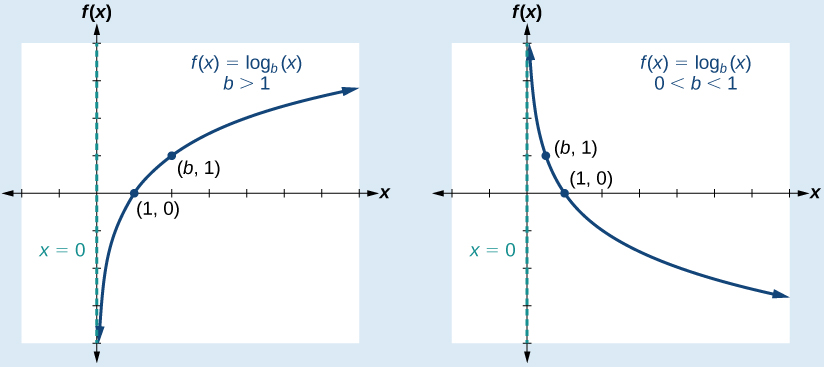{: #CNX_Precalc_Figure_04_04_003}

[\[link\]](#CNX_Precalc_Figure_04_04_004) shows how changing the base<math xmlns="http://www.w3.org/1998/Math/MathML"> <mrow> <mtext> </mtext><mi>b</mi><mtext> </mtext> </mrow> </math>

in<math xmlns="http://www.w3.org/1998/Math/MathML"> <mrow> <mtext> </mtext><mi>f</mi><mo stretchy="false">(</mo><mi>x</mi><mo stretchy="false">)</mo><mo>=</mo><msub> <mrow> <mi>log</mi> </mrow> <mi>b</mi> </msub> <mrow><mo>(</mo> <mi>x</mi> <mo>)</mo></mrow><mtext> </mtext> </mrow> </math>

can affect the graphs. Observe that the graphs compress vertically as the value of the base increases. (*Note:* recall that the function<math xmlns="http://www.w3.org/1998/Math/MathML"> <mrow> <mtext> </mtext><mi>ln</mi><mrow><mo>(</mo> <mi>x</mi> <mo>)</mo></mrow><mtext> </mtext> </mrow> </math>

has base<math xmlns="http://www.w3.org/1998/Math/MathML"> <mrow> <mtext> </mtext><mi>e</mi><mo>≈</mo><mtext>2</mtext><mo>.</mo><mtext>718.)</mtext> </mrow> </math>

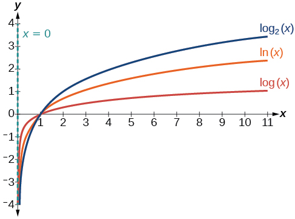{: #CNX_Precalc_Figure_04_04_004}

**Given a logarithmic function with the form<math xmlns="http://www.w3.org/1998/Math/MathML"> <mrow> <mtext> </mtext><mi>f</mi><mo stretchy="false">(</mo><mi>x</mi><mo stretchy="false">)</mo><mo>=</mo><msub> <mrow> <mi>log</mi> </mrow> <mi>b</mi> </msub> <mrow><mo>(</mo> <mi>x</mi> <mo>)</mo></mrow><mo>,</mo> </mrow> </math>

 graph the function.**

1.  Draw and label the vertical asymptote,
    <math xmlns="http://www.w3.org/1998/Math/MathML"> <mrow> <mtext> </mtext><mi>x</mi><mo>=</mo><mn>0.</mn> </mrow> </math>

2.  Plot the *x-*intercept,
    <math xmlns="http://www.w3.org/1998/Math/MathML"> <mrow> <mtext> </mtext><mrow><mo>(</mo> <mrow> <mn>1</mn><mo>,</mo><mn>0</mn> </mrow> <mo>)</mo></mrow><mo>.</mo> </mrow> </math>

3.  Plot the key point
    <math xmlns="http://www.w3.org/1998/Math/MathML"> <mrow> <mtext> </mtext><mrow><mo>(</mo> <mrow> <mi>b</mi><mo>,</mo><mn>1</mn> </mrow> <mo>)</mo></mrow><mo>.</mo> </mrow> </math>

4.  Draw a smooth curve through the points.
5.  State the domain,
    <math xmlns="http://www.w3.org/1998/Math/MathML"> <mrow> <mtext> </mtext><mrow><mo>(</mo> <mrow> <mn>0</mn><mo>,</mo><mi>∞</mi> </mrow> <mo>)</mo></mrow><mo>,</mo> </mrow> </math>
    
    the range,
    <math xmlns="http://www.w3.org/1998/Math/MathML"> <mrow> <mtext> </mtext><mrow><mo>(</mo> <mrow> <mo>−</mo><mi>∞</mi><mi>,</mi><mi>∞</mi> </mrow> <mo>)</mo></mrow><mo>,</mo> </mrow> </math>
    
    and the vertical asymptote,
    <math xmlns="http://www.w3.org/1998/Math/MathML"> <mrow> <mtext> </mtext><mi>x</mi><mo>=</mo><mn>0.</mn> </mrow> </math>
{: data-number-style="arabic"}

Graphing a Logarithmic Function with the Form *f*(*x*) = log*b*(*x*).

Graph<math xmlns="http://www.w3.org/1998/Math/MathML"> <mrow> <mtext> </mtext><mi>f</mi><mo stretchy="false">(</mo><mi>x</mi><mo stretchy="false">)</mo><mo>=</mo><msub> <mrow> <mi>log</mi> </mrow> <mn>5</mn> </msub> <mrow><mo>(</mo> <mi>x</mi> <mo>)</mo></mrow><mo>.</mo><mtext> </mtext> </mrow> </math>

State the domain, range, and asymptote.

Before graphing, identify the behavior and key points for the graph.

* Since
  <math xmlns="http://www.w3.org/1998/Math/MathML"> <mrow> <mtext> </mtext><mi>b</mi><mo>=</mo><mn>5</mn><mtext> </mtext> </mrow> </math>
  
  is greater than one, we know the function is increasing. The left tail of the graph will approach the vertical asymptote
  <math xmlns="http://www.w3.org/1998/Math/MathML"> <mrow> <mtext> </mtext><mi>x</mi><mo>=</mo><mn>0</mn><mo>,</mo> </mrow> </math>
  
  and the right tail will increase slowly without bound.
* The *x*-intercept is
  <math xmlns="http://www.w3.org/1998/Math/MathML"> <mrow> <mtext> </mtext><mrow><mo>(</mo> <mrow> <mn>1</mn><mo>,</mo><mn>0</mn> </mrow> <mo>)</mo></mrow><mo>.</mo> </mrow> </math>

* The key point
  <math xmlns="http://www.w3.org/1998/Math/MathML"> <mrow> <mtext> </mtext><mrow><mo>(</mo> <mrow> <mn>5</mn><mo>,</mo><mn>1</mn> </mrow> <mo>)</mo></mrow><mtext> </mtext> </mrow> </math>
  
  is on the graph.
* We draw and label the asymptote, plot and label the points, and draw a smooth curve through the points (see [[link]](#CNX_Precalc_Figure_04_04_005)).

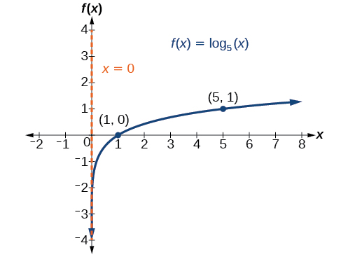{: #CNX_Precalc_Figure_04_04_005}

The domain is<math xmlns="http://www.w3.org/1998/Math/MathML"> <mrow> <mtext> </mtext><mrow><mo>(</mo> <mrow> <mn>0</mn><mo>,</mo><mi>∞</mi> </mrow> <mo>)</mo></mrow><mo>,</mo> </mrow> </math>

 the range is<math xmlns="http://www.w3.org/1998/Math/MathML"> <mrow> <mtext> </mtext><mrow><mo>(</mo> <mrow> <mo>−</mo><mi>∞</mi><mo>,</mo><mi>∞</mi> </mrow> <mo>)</mo></mrow><mo>,</mo> </mrow> </math>

 and the vertical asymptote is<math xmlns="http://www.w3.org/1998/Math/MathML"> <mrow> <mtext> </mtext><mi>x</mi><mo>=</mo><mn>0.</mn> </mrow> </math>

Graph<math xmlns="http://www.w3.org/1998/Math/MathML"> <mrow> <mtext> </mtext><mi>f</mi><mo stretchy="false">(</mo><mi>x</mi><mo stretchy="false">)</mo><mo>=</mo><msub> <mrow> <mi>log</mi> </mrow> <mrow> <mfrac> <mn>1</mn> <mn>5</mn> </mfrac> </mrow> </msub> <mo stretchy="false">(</mo><mi>x</mi><mo stretchy="false">)</mo><mo>.</mo><mtext> </mtext> </mrow> </math>

State the domain, range, and asymptote.

 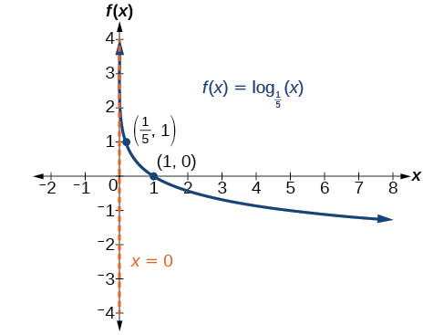 
The domain is<math xmlns="http://www.w3.org/1998/Math/MathML"> <mrow> <mtext> </mtext><mrow><mo>(</mo> <mrow> <mn>0</mn><mo>,</mo><mi>∞</mi> </mrow> <mo>)</mo></mrow><mo>,</mo> </mrow> </math>

the range is<math xmlns="http://www.w3.org/1998/Math/MathML"> <mrow> <mtext> </mtext><mrow><mo>(</mo> <mrow> <mo>−</mo><mi>∞</mi><mo>,</mo><mi>∞</mi> </mrow> <mo>)</mo></mrow><mo>,</mo> </mrow> </math>

 and the vertical asymptote is<math xmlns="http://www.w3.org/1998/Math/MathML"> <mrow> <mtext> </mtext><mi>x</mi><mo>=</mo><mn>0.</mn> </mrow> </math>

# Graphing Transformations of Logarithmic Functions

As we mentioned in the beginning of the section, transformations of logarithmic graphs behave similarly to those of other parent functions. We can shift, stretch, compress, and reflect the **parent function**{: data-type="term" .no-emphasis}<math xmlns="http://www.w3.org/1998/Math/MathML"> <mrow> <mtext> </mtext><mi>y</mi><mo>=</mo><msub> <mrow> <mi>log</mi> </mrow> <mi>b</mi> </msub> <mrow><mo>(</mo> <mi>x</mi> <mo>)</mo></mrow><mtext> </mtext> </mrow> </math>

without loss of shape.

## Graphing a Horizontal Shift of *f*(*x*) = log*b*(*x*)

When a constant<math xmlns="http://www.w3.org/1998/Math/MathML"> <mrow> <mtext> </mtext><mi>c</mi><mtext> </mtext> </mrow> </math>

is added to the input of the parent function<math xmlns="http://www.w3.org/1998/Math/MathML"> <mrow> <mtext> </mtext><mi>f</mi><mo stretchy="false">(</mo><mi>x</mi><mo stretchy="false">)</mo><mo>=</mo><mi>l</mi><mi>o</mi><msub> <mi>g</mi> <mi>b</mi> </msub> <mo stretchy="false">(</mo><mi>x</mi><mo stretchy="false">)</mo><mo>,</mo> </mrow> </math>

 the result is a **horizontal shift**{: data-type="term" .no-emphasis}<math xmlns="http://www.w3.org/1998/Math/MathML"> <mrow> <mtext> </mtext><mi>c</mi><mtext> </mtext> </mrow> </math>

units in the *opposite* direction of the sign on<math xmlns="http://www.w3.org/1998/Math/MathML"> <mrow> <mtext> </mtext><mi>c</mi><mo>.</mo><mtext> </mtext> </mrow> </math>

To visualize horizontal shifts, we can observe the general graph of the parent function<math xmlns="http://www.w3.org/1998/Math/MathML"> <mrow> <mi>f</mi><mo stretchy="false">(</mo><mi>x</mi><mo stretchy="false">)</mo><mo>=</mo><msub> <mrow> <mi>log</mi> </mrow> <mi>b</mi> </msub> <mrow><mo>(</mo> <mi>x</mi> <mo>)</mo></mrow><mtext> </mtext> </mrow> </math>

and for<math xmlns="http://www.w3.org/1998/Math/MathML"> <mrow> <mtext> </mtext><mi>c</mi><mo>&gt;</mo><mn>0</mn><mtext> </mtext> </mrow> </math>

alongside the shift left,<math xmlns="http://www.w3.org/1998/Math/MathML"> <mrow> <mtext> </mtext><mi>g</mi><mo stretchy="false">(</mo><mi>x</mi><mo stretchy="false">)</mo><mo>=</mo><msub> <mrow> <mi>log</mi> </mrow> <mi>b</mi> </msub> <mrow><mo>(</mo> <mrow> <mi>x</mi><mo>+</mo><mi>c</mi> </mrow> <mo>)</mo></mrow><mo>,</mo> </mrow> </math>

 and the shift right,<math xmlns="http://www.w3.org/1998/Math/MathML"> <mrow> <mtext> </mtext><mi>h</mi><mo stretchy="false">(</mo><mi>x</mi><mo stretchy="false">)</mo><mo>=</mo><msub> <mrow> <mi>log</mi> </mrow> <mi>b</mi> </msub> <mrow><mo>(</mo> <mrow> <mi>x</mi><mo>−</mo><mi>c</mi> </mrow> <mo>)</mo></mrow><mo>.</mo> </mrow> </math>

 See [\[link\]](#Figure_04_04_007).

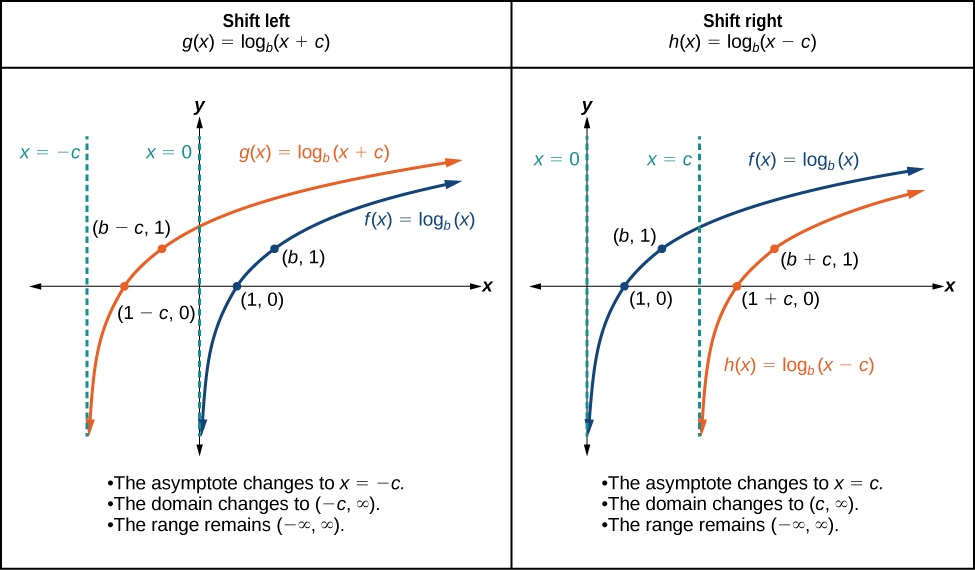{: #Figure_04_04_007}

Horizontal Shifts of the Parent Function *y* = log*b*(*x*)

For any constant<math xmlns="http://www.w3.org/1998/Math/MathML"> <mrow> <mtext> </mtext><mi>c</mi><mo>,</mo> </mrow> </math>

the function<math xmlns="http://www.w3.org/1998/Math/MathML"> <mrow> <mtext> </mtext><mi>f</mi><mo stretchy="false">(</mo><mi>x</mi><mo stretchy="false">)</mo><mo>=</mo><msub> <mrow> <mi>log</mi> </mrow> <mi>b</mi> </msub> <mrow><mo>(</mo> <mrow> <mi>x</mi><mo>+</mo><mi>c</mi> </mrow> <mo>)</mo></mrow> </mrow> </math>

* shifts the parent function
  <math xmlns="http://www.w3.org/1998/Math/MathML"> <mrow> <mtext> </mtext><mi>y</mi><mo>=</mo><msub> <mrow> <mi>log</mi> </mrow> <mi>b</mi> </msub> <mrow><mo>(</mo> <mi>x</mi> <mo>)</mo></mrow><mtext> </mtext> </mrow> </math>
  
  left
  <math xmlns="http://www.w3.org/1998/Math/MathML"> <mrow> <mtext> </mtext><mi>c</mi><mtext> </mtext> </mrow> </math>
  
  units if
  <math xmlns="http://www.w3.org/1998/Math/MathML"> <mrow> <mtext> </mtext><mi>c</mi><mo>&gt;</mo><mn>0.</mn> </mrow> </math>

* shifts the parent function
  <math xmlns="http://www.w3.org/1998/Math/MathML"> <mrow> <mtext> </mtext><mi>y</mi><mo>=</mo><msub> <mrow> <mi>log</mi> </mrow> <mi>b</mi> </msub> <mrow><mo>(</mo> <mi>x</mi> <mo>)</mo></mrow><mtext> </mtext> </mrow> </math>
  
  right
  <math xmlns="http://www.w3.org/1998/Math/MathML"> <mrow> <mtext> </mtext><mi>c</mi><mtext> </mtext> </mrow> </math>
  
  units if
  <math xmlns="http://www.w3.org/1998/Math/MathML"> <mrow> <mtext> </mtext><mi>c</mi><mo>&lt;</mo><mn>0.</mn> </mrow> </math>

* has the vertical asymptote
  <math xmlns="http://www.w3.org/1998/Math/MathML"> <mrow> <mtext> </mtext><mi>x</mi><mo>=</mo><mo>−</mo><mi>c</mi><mo>.</mo> </mrow> </math>

* has domain
  <math xmlns="http://www.w3.org/1998/Math/MathML"> <mrow> <mtext> </mtext><mrow><mo>(</mo> <mrow> <mo>−</mo><mi>c</mi><mo>,</mo><mi>∞</mi> </mrow> <mo>)</mo></mrow><mo>.</mo> </mrow> </math>

* has range
  <math xmlns="http://www.w3.org/1998/Math/MathML"> <mrow> <mtext> </mtext><mrow><mo>(</mo> <mrow> <mo>−</mo><mi>∞</mi><mo>,</mo><mi>∞</mi> </mrow> <mo>)</mo></mrow><mo>.</mo> </mrow> </math>

**Given a logarithmic function with the form<math xmlns="http://www.w3.org/1998/Math/MathML"> <mrow> <mtext> </mtext><mi>f</mi><mo stretchy="false">(</mo><mi>x</mi><mo stretchy="false">)</mo><mo>=</mo><msub> <mrow> <mi>log</mi> </mrow> <mi>b</mi> </msub> <mrow><mo>(</mo> <mrow> <mi>x</mi><mo>+</mo><mi>c</mi> </mrow> <mo>)</mo></mrow><mo>,</mo> </mrow> </math>

 graph the translation.**

1.  Identify the horizontal shift:
    1.  If
        <math xmlns="http://www.w3.org/1998/Math/MathML"> <mrow> <mtext> </mtext><mi>c</mi><mo>&gt;</mo><mn>0</mn><mo>,</mo> </mrow> </math>
        
        shift the graph of
        <math xmlns="http://www.w3.org/1998/Math/MathML"> <mrow> <mtext> </mtext><mi>f</mi><mo stretchy="false">(</mo><mi>x</mi><mo stretchy="false">)</mo><mo>=</mo><msub> <mrow> <mi>log</mi> </mrow> <mi>b</mi> </msub> <mrow><mo>(</mo> <mi>x</mi> <mo>)</mo></mrow><mtext> </mtext> </mrow> </math>
        
        left
        <math xmlns="http://www.w3.org/1998/Math/MathML"> <mrow> <mtext> </mtext><mi>c</mi><mtext> </mtext> </mrow> </math>
        
        units.
    2.  If
        <math xmlns="http://www.w3.org/1998/Math/MathML"> <mrow> <mtext> </mtext><mi>c</mi><mo>&lt;</mo><mn>0</mn><mo>,</mo> </mrow> </math>
        
        shift the graph of
        <math xmlns="http://www.w3.org/1998/Math/MathML"> <mrow> <mtext> </mtext><mi>f</mi><mo stretchy="false">(</mo><mi>x</mi><mo stretchy="false">)</mo><mo>=</mo><msub> <mrow> <mi>log</mi> </mrow> <mi>b</mi> </msub> <mrow><mo>(</mo> <mi>x</mi> <mo>)</mo></mrow><mtext> </mtext> </mrow> </math>
        
        right
        <math xmlns="http://www.w3.org/1998/Math/MathML"> <mrow> <mtext> </mtext><mi>c</mi><mtext> </mtext> </mrow> </math>
        
        units.
    {: data-number-style="lower-alpha"}

2.  Draw the vertical asymptote
    <math xmlns="http://www.w3.org/1998/Math/MathML"> <mrow> <mtext> </mtext><mi>x</mi><mo>=</mo><mo>−</mo><mi>c</mi><mo>.</mo> </mrow> </math>

3.  Identify three key points from the parent function. Find new coordinates for the shifted functions by subtracting
    <math xmlns="http://www.w3.org/1998/Math/MathML"> <mrow> <mtext> </mtext><mi>c</mi><mtext> </mtext> </mrow> </math>
    
    from the
    <math xmlns="http://www.w3.org/1998/Math/MathML"> <mrow> <mtext> </mtext><mi>x</mi><mtext> </mtext> </mrow> </math>
    
    coordinate.
4.  Label the three points.
5.  The Domain is
    <math xmlns="http://www.w3.org/1998/Math/MathML"> <mrow> <mtext> </mtext><mrow><mo>(</mo> <mrow> <mo>−</mo><mi>c</mi><mo>,</mo><mi>∞</mi> </mrow> <mo>)</mo></mrow><mo>,</mo> </mrow> </math>
    
    the range is
    <math xmlns="http://www.w3.org/1998/Math/MathML"> <mrow> <mtext> </mtext><mrow><mo>(</mo> <mrow> <mo>−</mo><mi>∞</mi><mo>,</mo><mi>∞</mi> </mrow> <mo>)</mo></mrow><mo>,</mo> </mrow> </math>
    
    and the vertical asymptote is
    <math xmlns="http://www.w3.org/1998/Math/MathML"> <mrow> <mtext> </mtext><mi>x</mi><mo>=</mo><mo>−</mo><mi>c</mi><mo>.</mo> </mrow> </math>
{: data-number-style="arabic"}

Graphing a Horizontal Shift of the Parent Function *y* = log*b*(*x*)

Sketch the horizontal shift<math xmlns="http://www.w3.org/1998/Math/MathML"> <mrow> <mtext> </mtext><mi>f</mi><mo stretchy="false">(</mo><mi>x</mi><mo stretchy="false">)</mo><mo>=</mo><msub> <mrow> <mi>log</mi> </mrow> <mn>3</mn> </msub> <mo stretchy="false">(</mo><mi>x</mi><mo>−</mo><mn>2</mn><mo stretchy="false">)</mo><mtext> </mtext> </mrow> </math>

alongside its parent function. Include the key points and asymptotes on the graph. State the domain, range, and asymptote.

Since the function is<math xmlns="http://www.w3.org/1998/Math/MathML"> <mrow> <mtext> </mtext><mi>f</mi><mo stretchy="false">(</mo><mi>x</mi><mo stretchy="false">)</mo><mo>=</mo><msub> <mrow> <mi>log</mi> </mrow> <mn>3</mn> </msub> <mo stretchy="false">(</mo><mi>x</mi><mo>−</mo><mn>2</mn><mo stretchy="false">)</mo><mo>,</mo> </mrow> </math>

 we notice<math xmlns="http://www.w3.org/1998/Math/MathML"> <mrow> <mtext> </mtext><mi>x</mi><mo>+</mo><mrow><mo>(</mo> <mrow> <mo>−</mo><mn>2</mn> </mrow> <mo>)</mo></mrow><mo>=</mo><mi>x</mi><mo>–</mo><mn>2.</mn> </mrow> </math>

Thus<math xmlns="http://www.w3.org/1998/Math/MathML"> <mrow> <mtext> </mtext><mi>c</mi><mo>=</mo><mo>−</mo><mn>2</mn><mo>,</mo> </mrow> </math>

so<math xmlns="http://www.w3.org/1998/Math/MathML"> <mrow> <mtext> </mtext><mi>c</mi><mo>&lt;</mo><mn>0.</mn><mtext> </mtext> </mrow> </math>

This means we will shift the function<math xmlns="http://www.w3.org/1998/Math/MathML"> <mrow> <mtext> </mtext><mi>f</mi><mo stretchy="false">(</mo><mi>x</mi><mo stretchy="false">)</mo><mo>=</mo><msub> <mrow> <mi>log</mi> </mrow> <mn>3</mn> </msub> <mo stretchy="false">(</mo><mi>x</mi><mo stretchy="false">)</mo><mtext> </mtext> </mrow> </math>

right 2 units.

The vertical asymptote is<math xmlns="http://www.w3.org/1998/Math/MathML"> <mrow> <mtext> </mtext><mi>x</mi><mo>=</mo><mo>−</mo><mo stretchy="false">(</mo><mo>−</mo><mn>2</mn><mo stretchy="false">)</mo><mtext> </mtext> </mrow> </math>

or<math xmlns="http://www.w3.org/1998/Math/MathML"> <mrow> <mtext> </mtext><mi>x</mi><mo>=</mo><mn>2.</mn> </mrow> </math>

Consider the three key points from the parent function,<math xmlns="http://www.w3.org/1998/Math/MathML"> <mrow> <mtext> </mtext><mrow><mo>(</mo> <mrow> <mfrac> <mn>1</mn> <mn>3</mn> </mfrac> <mo>,</mo><mn>−1</mn> </mrow> <mo>)</mo></mrow><mo>,</mo> </mrow> </math>

<math xmlns="http://www.w3.org/1998/Math/MathML"> <mrow> <mrow><mo>(</mo> <mrow> <mn>1</mn><mo>,</mo><mn>0</mn> </mrow> <mo>)</mo></mrow><mo>,</mo> </mrow> </math>

and<math xmlns="http://www.w3.org/1998/Math/MathML"> <mrow> <mtext> </mtext><mrow><mo>(</mo> <mrow> <mn>3</mn><mo>,</mo><mn>1</mn> </mrow> <mo>)</mo></mrow><mo>.</mo> </mrow> </math>

The new coordinates are found by adding 2 to the<math xmlns="http://www.w3.org/1998/Math/MathML"> <mrow> <mtext> </mtext><mi>x</mi><mtext> </mtext> </mrow> </math>

coordinates.

Label the points<math xmlns="http://www.w3.org/1998/Math/MathML"> <mrow> <mtext> </mtext><mrow><mo>(</mo> <mrow> <mfrac> <mn>7</mn> <mn>3</mn> </mfrac> <mo>,</mo><mn>−1</mn> </mrow> <mo>)</mo></mrow><mo>,</mo> </mrow> </math>

<math xmlns="http://www.w3.org/1998/Math/MathML"> <mrow> <mrow><mo>(</mo> <mrow> <mn>3</mn><mo>,</mo><mn>0</mn> </mrow> <mo>)</mo></mrow><mo>,</mo> </mrow> </math>

and<math xmlns="http://www.w3.org/1998/Math/MathML"> <mrow> <mtext> </mtext><mrow><mo>(</mo> <mrow> <mn>5</mn><mo>,</mo><mn>1</mn> </mrow> <mo>)</mo></mrow><mo>.</mo> </mrow> </math>

The domain is<math xmlns="http://www.w3.org/1998/Math/MathML"> <mrow> <mtext> </mtext><mrow><mo>(</mo> <mrow> <mn>2</mn><mo>,</mo><mi>∞</mi> </mrow> <mo>)</mo></mrow><mo>,</mo> </mrow> </math>

the range is<math xmlns="http://www.w3.org/1998/Math/MathML"> <mrow> <mtext> </mtext><mrow><mo>(</mo> <mrow> <mo>−</mo><mi>∞</mi><mo>,</mo><mi>∞</mi> </mrow> <mo>)</mo></mrow><mo>,</mo> </mrow> </math>

and the vertical asymptote is<math xmlns="http://www.w3.org/1998/Math/MathML"> <mrow> <mtext> </mtext><mi>x</mi><mo>=</mo><mn>2.</mn> </mrow> </math>

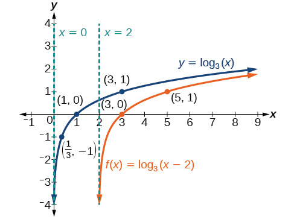{: #CNX_Precalc_Figure_04_04_008}

Sketch a graph of<math xmlns="http://www.w3.org/1998/Math/MathML"> <mrow> <mtext> </mtext><mi>f</mi><mo stretchy="false">(</mo><mi>x</mi><mo stretchy="false">)</mo><mo>=</mo><msub> <mrow> <mi>log</mi> </mrow> <mn>3</mn> </msub> <mo stretchy="false">(</mo><mi>x</mi><mo>+</mo><mn>4</mn><mo stretchy="false">)</mo><mtext> </mtext> </mrow> </math>

alongside its parent function. Include the key points and asymptotes on the graph. State the domain, range, and asymptote.

 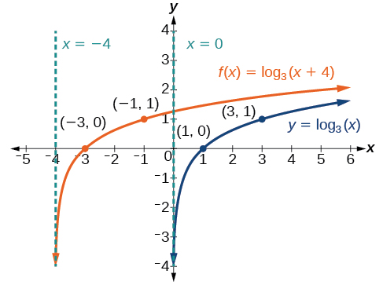 
The domain is<math xmlns="http://www.w3.org/1998/Math/MathML"> <mrow> <mtext> </mtext><mrow><mo>(</mo> <mrow> <mo>−</mo><mn>4</mn><mo>,</mo><mi>∞</mi> </mrow> <mo>)</mo></mrow><mo>,</mo> </mrow> </math>

the range<math xmlns="http://www.w3.org/1998/Math/MathML"> <mrow> <mtext> </mtext><mrow><mo>(</mo> <mrow> <mo>−</mo><mi>∞</mi><mo>,</mo><mi>∞</mi> </mrow> <mo>)</mo></mrow><mo>,</mo> </mrow> </math>

and the asymptote<math xmlns="http://www.w3.org/1998/Math/MathML"> <mrow> <mtext> </mtext><mi>x</mi><mo>=</mo><mo>–</mo><mn>4.</mn> </mrow> </math>

## Graphing a Vertical Shift of *y* = log*b*(*x*)

When a constant<math xmlns="http://www.w3.org/1998/Math/MathML"> <mrow> <mtext> </mtext><mi>d</mi><mtext> </mtext> </mrow> </math>

is added to the parent function<math xmlns="http://www.w3.org/1998/Math/MathML"> <mrow> <mtext> </mtext><mi>f</mi><mo stretchy="false">(</mo><mi>x</mi><mo stretchy="false">)</mo><mo>=</mo><msub> <mrow> <mi>log</mi> </mrow> <mi>b</mi> </msub> <mrow><mo>(</mo> <mi>x</mi> <mo>)</mo></mrow><mo>,</mo> </mrow> </math>

the result is a **vertical shift**{: data-type="term" .no-emphasis}<math xmlns="http://www.w3.org/1998/Math/MathML"> <mrow> <mtext> </mtext><mi>d</mi><mtext> </mtext> </mrow> </math>

units in the direction of the sign on<math xmlns="http://www.w3.org/1998/Math/MathML"> <mrow> <mtext> </mtext><mi>d</mi><mo>.</mo><mtext> </mtext> </mrow> </math>

To visualize vertical shifts, we can observe the general graph of the parent function<math xmlns="http://www.w3.org/1998/Math/MathML"> <mrow> <mtext> </mtext><mi>f</mi><mo stretchy="false">(</mo><mi>x</mi><mo stretchy="false">)</mo><mo>=</mo><msub> <mrow> <mi>log</mi> </mrow> <mi>b</mi> </msub> <mrow><mo>(</mo> <mi>x</mi> <mo>)</mo></mrow><mtext> </mtext> </mrow> </math>

alongside the shift up,<math xmlns="http://www.w3.org/1998/Math/MathML"> <mrow> <mtext> </mtext><mi>g</mi><mo stretchy="false">(</mo><mi>x</mi><mo stretchy="false">)</mo><mo>=</mo><msub> <mrow> <mi>log</mi> </mrow> <mi>b</mi> </msub> <mrow><mo>(</mo> <mi>x</mi> <mo>)</mo></mrow><mo>+</mo><mi>d</mi><mtext> </mtext> </mrow> </math>

and the shift down,<math xmlns="http://www.w3.org/1998/Math/MathML"> <mrow> <mtext> </mtext><mi>h</mi><mo stretchy="false">(</mo><mi>x</mi><mo stretchy="false">)</mo><mo>=</mo><msub> <mrow> <mi>log</mi> </mrow> <mi>b</mi> </msub> <mrow><mo>(</mo> <mi>x</mi> <mo>)</mo></mrow><mo>−</mo><mi>d</mi><mo>.</mo> </mrow> </math>

See [\[link\]](#Figure_04_04_010).

 {: #Figure_04_04_010}

Vertical Shifts of the Parent Function *y* = log*b*(*x*)

For any constant<math xmlns="http://www.w3.org/1998/Math/MathML"> <mrow> <mtext> </mtext><mi>d</mi><mo>,</mo> </mrow> </math>

the function<math xmlns="http://www.w3.org/1998/Math/MathML"> <mrow> <mtext> </mtext><mi>f</mi><mo stretchy="false">(</mo><mi>x</mi><mo stretchy="false">)</mo><mo>=</mo><msub> <mrow> <mi>log</mi> </mrow> <mi>b</mi> </msub> <mrow><mo>(</mo> <mi>x</mi> <mo>)</mo></mrow><mo>+</mo><mi>d</mi> </mrow> </math>

* shifts the parent function
  <math xmlns="http://www.w3.org/1998/Math/MathML"> <mrow> <mtext> </mtext><mi>y</mi><mo>=</mo><msub> <mrow> <mi>log</mi> </mrow> <mi>b</mi> </msub> <mrow><mo>(</mo> <mi>x</mi> <mo>)</mo></mrow><mtext> </mtext> </mrow> </math>
  
  up
  <math xmlns="http://www.w3.org/1998/Math/MathML"> <mrow> <mtext> </mtext><mi>d</mi><mtext> </mtext> </mrow> </math>
  
  units if
  <math xmlns="http://www.w3.org/1998/Math/MathML"> <mrow> <mtext> </mtext><mi>d</mi><mo>&gt;</mo><mn>0.</mn> </mrow> </math>

* shifts the parent function
  <math xmlns="http://www.w3.org/1998/Math/MathML"> <mrow> <mtext> </mtext><mi>y</mi><mo>=</mo><msub> <mrow> <mi>log</mi> </mrow> <mi>b</mi> </msub> <mrow><mo>(</mo> <mi>x</mi> <mo>)</mo></mrow><mtext> </mtext> </mrow> </math>
  
  down
  <math xmlns="http://www.w3.org/1998/Math/MathML"> <mrow> <mtext> </mtext><mi>d</mi><mtext> </mtext> </mrow> </math>
  
  units if
  <math xmlns="http://www.w3.org/1998/Math/MathML"> <mrow> <mtext> </mtext><mi>d</mi><mo>&lt;</mo><mn>0.</mn> </mrow> </math>

* has the vertical asymptote
  <math xmlns="http://www.w3.org/1998/Math/MathML"> <mrow> <mtext> </mtext><mi>x</mi><mo>=</mo><mn>0.</mn> </mrow> </math>

* has domain
  <math xmlns="http://www.w3.org/1998/Math/MathML"> <mrow> <mtext> </mtext><mrow><mo>(</mo> <mrow> <mn>0</mn><mo>,</mo><mi>∞</mi> </mrow> <mo>)</mo></mrow><mo>.</mo> </mrow> </math>

* has range
  <math xmlns="http://www.w3.org/1998/Math/MathML"> <mrow> <mtext> </mtext><mrow><mo>(</mo> <mrow> <mo>−</mo><mi>∞</mi><mo>,</mo><mi>∞</mi> </mrow> <mo>)</mo></mrow><mo>.</mo> </mrow> </math>

**Given a logarithmic function with the form<math xmlns="http://www.w3.org/1998/Math/MathML"> <mrow> <mtext> </mtext><mi>f</mi><mo stretchy="false">(</mo><mi>x</mi><mo stretchy="false">)</mo><mo>=</mo><msub> <mrow> <mi>log</mi> </mrow> <mi>b</mi> </msub> <mrow><mo>(</mo> <mi>x</mi> <mo>)</mo></mrow><mo>+</mo><mi>d</mi><mo>,</mo> </mrow> </math>

 graph the translation.**

1.  Identify the vertical shift:
    * If
      <math xmlns="http://www.w3.org/1998/Math/MathML"> <mrow> <mtext> </mtext><mi>d</mi><mo>&gt;</mo><mn>0</mn><mo>,</mo> </mrow> </math>
      
      shift the graph of
      <math xmlns="http://www.w3.org/1998/Math/MathML"> <mrow> <mtext> </mtext><mi>f</mi><mo stretchy="false">(</mo><mi>x</mi><mo stretchy="false">)</mo><mo>=</mo><msub> <mrow> <mi>log</mi> </mrow> <mi>b</mi> </msub> <mrow><mo>(</mo> <mi>x</mi> <mo>)</mo></mrow><mtext> </mtext> </mrow> </math>
      
      up
      <math xmlns="http://www.w3.org/1998/Math/MathML"> <mrow> <mtext> </mtext><mi>d</mi><mtext> </mtext> </mrow> </math>
      
      units.
    * If
      <math xmlns="http://www.w3.org/1998/Math/MathML"> <mrow> <mtext> </mtext><mi>d</mi><mo>&lt;</mo><mn>0</mn><mo>,</mo> </mrow> </math>
      
      shift the graph of
      <math xmlns="http://www.w3.org/1998/Math/MathML"> <mrow> <mtext> </mtext><mi>f</mi><mo stretchy="false">(</mo><mi>x</mi><mo stretchy="false">)</mo><mo>=</mo><msub> <mrow> <mi>log</mi> </mrow> <mi>b</mi> </msub> <mrow><mo>(</mo> <mi>x</mi> <mo>)</mo></mrow> </mrow> </math>
      
      down
      <math xmlns="http://www.w3.org/1998/Math/MathML"> <mrow> <mtext> </mtext><mi>d</mi><mtext> </mtext> </mrow> </math>
      
      units.

2.  Draw the vertical asymptote
    <math xmlns="http://www.w3.org/1998/Math/MathML"> <mrow> <mtext> </mtext><mi>x</mi><mo>=</mo><mn>0.</mn> </mrow> </math>

3.  Identify three key points from the parent function. Find new coordinates for the shifted functions by adding
    <math xmlns="http://www.w3.org/1998/Math/MathML"> <mrow> <mtext> </mtext><mi>d</mi><mtext> </mtext> </mrow> </math>
    
    to the
    <math xmlns="http://www.w3.org/1998/Math/MathML"> <mrow> <mtext> </mtext><mi>y</mi><mtext> </mtext> </mrow> </math>
    
    coordinate.
4.  Label the three points.
5.  The domain is
    <math xmlns="http://www.w3.org/1998/Math/MathML"> <mrow> <mtext> </mtext><mrow><mo>(</mo> <mrow> <mn>0,</mn><mi>∞</mi> </mrow> <mo>)</mo></mrow><mo>,</mo> </mrow> </math>
    
    the range is
    <math xmlns="http://www.w3.org/1998/Math/MathML"> <mrow> <mtext> </mtext><mrow><mo>(</mo> <mrow> <mo>−</mo><mi>∞</mi><mi>,</mi><mi>∞</mi> </mrow> <mo>)</mo></mrow><mo>,</mo> </mrow> </math>
    
    and the vertical asymptote is
    <math xmlns="http://www.w3.org/1998/Math/MathML"> <mrow> <mtext> </mtext><mi>x</mi><mo>=</mo><mn>0.</mn> </mrow> </math>
{: data-number-style="arabic"}

Graphing a Vertical Shift of the Parent Function *y* = log*b*(*x*)

Sketch a graph of<math xmlns="http://www.w3.org/1998/Math/MathML"> <mrow> <mtext> </mtext><mi>f</mi><mo stretchy="false">(</mo><mi>x</mi><mo stretchy="false">)</mo><mo>=</mo><msub> <mrow> <mi>log</mi> </mrow> <mn>3</mn> </msub> <mo stretchy="false">(</mo><mi>x</mi><mo stretchy="false">)</mo><mo>−</mo><mn>2</mn><mtext> </mtext> </mrow> </math>

alongside its parent function. Include the key points and asymptote on the graph. State the domain, range, and asymptote.

Since the function is<math xmlns="http://www.w3.org/1998/Math/MathML"> <mrow> <mtext> </mtext><mi>f</mi><mo stretchy="false">(</mo><mi>x</mi><mo stretchy="false">)</mo><mo>=</mo><msub> <mrow> <mi>log</mi> </mrow> <mn>3</mn> </msub> <mo stretchy="false">(</mo><mi>x</mi><mo stretchy="false">)</mo><mo>−</mo><mn>2</mn><mo>,</mo> </mrow> </math>

we will notice<math xmlns="http://www.w3.org/1998/Math/MathML"> <mrow> <mtext> </mtext><mi>d</mi><mo>=</mo><mo>–</mo><mn>2.</mn><mtext> </mtext> </mrow> </math>

Thus<math xmlns="http://www.w3.org/1998/Math/MathML"> <mrow> <mtext> </mtext><mi>d</mi><mo>&lt;</mo><mn>0.</mn> </mrow> </math>

This means we will shift the function<math xmlns="http://www.w3.org/1998/Math/MathML"> <mrow> <mtext> </mtext><mi>f</mi><mo stretchy="false">(</mo><mi>x</mi><mo stretchy="false">)</mo><mo>=</mo><msub> <mrow> <mi>log</mi> </mrow> <mn>3</mn> </msub> <mo stretchy="false">(</mo><mi>x</mi><mo stretchy="false">)</mo><mtext> </mtext> </mrow> </math>

down 2 units.

The vertical asymptote is<math xmlns="http://www.w3.org/1998/Math/MathML"> <mrow> <mtext> </mtext><mi>x</mi><mo>=</mo><mn>0.</mn> </mrow> </math>

Consider the three key points from the parent function,<math xmlns="http://www.w3.org/1998/Math/MathML"> <mrow> <mtext> </mtext><mrow><mo>(</mo> <mrow> <mfrac> <mn>1</mn> <mn>3</mn> </mfrac> <mo>,</mo><mn>−1</mn> </mrow> <mo>)</mo></mrow><mo>,</mo> </mrow> </math>

<math xmlns="http://www.w3.org/1998/Math/MathML"> <mrow> <mrow><mo>(</mo> <mrow> <mn>1</mn><mo>,</mo><mn>0</mn> </mrow> <mo>)</mo></mrow><mo>,</mo> </mrow> </math>

and<math xmlns="http://www.w3.org/1998/Math/MathML"> <mrow> <mtext> </mtext><mrow><mo>(</mo> <mrow> <mn>3</mn><mo>,</mo><mn>1</mn> </mrow> <mo>)</mo></mrow><mo>.</mo> </mrow> </math>

The new coordinates are found by subtracting 2 from the <em>y </em>coordinates.

Label the points<math xmlns="http://www.w3.org/1998/Math/MathML"> <mrow> <mtext> </mtext><mrow><mo>(</mo> <mrow> <mfrac> <mn>1</mn> <mn>3</mn> </mfrac> <mo>,</mo><mn>−3</mn> </mrow> <mo>)</mo></mrow><mo>,</mo> </mrow> </math>

<math xmlns="http://www.w3.org/1998/Math/MathML"> <mrow> <mrow><mo>(</mo> <mrow> <mn>1</mn><mo>,</mo><mn>−2</mn> </mrow> <mo>)</mo></mrow><mo>,</mo> </mrow> </math>

 and<math xmlns="http://www.w3.org/1998/Math/MathML"> <mrow> <mtext> </mtext><mrow><mo>(</mo> <mrow> <mn>3</mn><mo>,</mo><mn>−1</mn> </mrow> <mo>)</mo></mrow><mo>.</mo> </mrow> </math>

The domain is<math xmlns="http://www.w3.org/1998/Math/MathML"> <mrow> <mtext> </mtext><mrow><mo>(</mo> <mrow> <mn>0</mn><mo>,</mo><mi>∞</mi> </mrow> <mo>)</mo></mrow><mo>,</mo> </mrow> </math>

the range is<math xmlns="http://www.w3.org/1998/Math/MathML"> <mrow> <mtext> </mtext><mrow><mo>(</mo> <mrow> <mo>−</mo><mi>∞</mi><mo>,</mo><mi>∞</mi> </mrow> <mo>)</mo></mrow><mo>,</mo> </mrow> </math>

 and the vertical asymptote is<math xmlns="http://www.w3.org/1998/Math/MathML"> <mrow> <mtext> </mtext><mi>x</mi><mo>=</mo><mn>0.</mn> </mrow> </math>

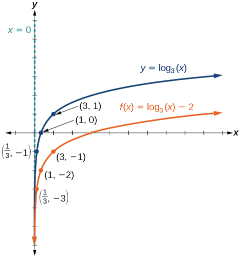{: #CNX_Precalc_Figure_04_04_011}

The domain is<math xmlns="http://www.w3.org/1998/Math/MathML"> <mrow> <mtext> </mtext><mrow><mo>(</mo> <mrow> <mn>0</mn><mo>,</mo><mi>∞</mi> </mrow> <mo>)</mo></mrow><mo>,</mo> </mrow> </math>

the range is<math xmlns="http://www.w3.org/1998/Math/MathML"> <mrow> <mtext> </mtext><mrow><mo>(</mo> <mrow> <mo>−</mo><mi>∞</mi><mo>,</mo><mi>∞</mi> </mrow> <mo>)</mo></mrow><mo>,</mo> </mrow> </math>

and the vertical asymptote is<math xmlns="http://www.w3.org/1998/Math/MathML"> <mrow> <mtext> </mtext><mi>x</mi><mo>=</mo><mn>0.</mn> </mrow> </math>

Sketch a graph of<math xmlns="http://www.w3.org/1998/Math/MathML"> <mrow> <mtext> </mtext><mi>f</mi><mo stretchy="false">(</mo><mi>x</mi><mo stretchy="false">)</mo><mo>=</mo><msub> <mrow> <mi>log</mi> </mrow> <mn>2</mn> </msub> <mo stretchy="false">(</mo><mi>x</mi><mo stretchy="false">)</mo><mo>+</mo><mn>2</mn><mtext> </mtext> </mrow> </math>

alongside its parent function. Include the key points and asymptote on the graph. State the domain, range, and asymptote.

 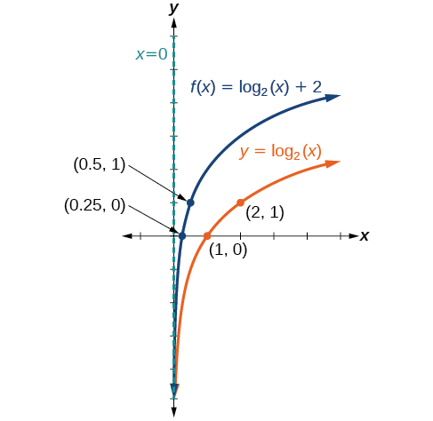 
The domain is<math xmlns="http://www.w3.org/1998/Math/MathML"> <mrow> <mtext> </mtext><mrow><mo>(</mo> <mrow> <mn>0</mn><mo>,</mo><mi>∞</mi> </mrow> <mo>)</mo></mrow><mo>,</mo> </mrow> </math>

the range is<math xmlns="http://www.w3.org/1998/Math/MathML"> <mrow> <mtext> </mtext><mrow><mo>(</mo> <mrow> <mo>−</mo><mi>∞</mi><mo>,</mo><mi>∞</mi> </mrow> <mo>)</mo></mrow><mo>,</mo> </mrow> </math>

and the vertical asymptote is<math xmlns="http://www.w3.org/1998/Math/MathML"> <mrow> <mtext> </mtext><mi>x</mi><mo>=</mo><mn>0.</mn> </mrow> </math>

## Graphing Stretches and Compressions of *y* = log*b*(*x*)

When the parent function<math xmlns="http://www.w3.org/1998/Math/MathML"> <mrow> <mtext> </mtext><mi>f</mi><mo stretchy="false">(</mo><mi>x</mi><mo stretchy="false">)</mo><mo>=</mo><msub> <mrow> <mi>log</mi> </mrow> <mi>b</mi> </msub> <mrow><mo>(</mo> <mi>x</mi> <mo>)</mo></mrow><mtext> </mtext> </mrow> </math>

is multiplied by a constant<math xmlns="http://www.w3.org/1998/Math/MathML"> <mrow> <mtext> </mtext><mi>a</mi><mo>&gt;</mo><mn>0</mn><mo>,</mo> </mrow> </math>

 the result is a **vertical stretch**{: data-type="term" .no-emphasis} or **compression**{: data-type="term" .no-emphasis} of the original graph. To visualize stretches and compressions, we set<math xmlns="http://www.w3.org/1998/Math/MathML"> <mrow> <mtext> </mtext><mi>a</mi><mo>&gt;</mo><mn>1</mn><mtext> </mtext> </mrow> </math>

and observe the general graph of the parent function<math xmlns="http://www.w3.org/1998/Math/MathML"> <mrow> <mtext> </mtext><mi>f</mi><mo stretchy="false">(</mo><mi>x</mi><mo stretchy="false">)</mo><mo>=</mo><msub> <mrow> <mi>log</mi> </mrow> <mi>b</mi> </msub> <mrow><mo>(</mo> <mi>x</mi> <mo>)</mo></mrow><mtext> </mtext> </mrow> </math>

alongside the vertical stretch,<math xmlns="http://www.w3.org/1998/Math/MathML"> <mrow> <mtext> </mtext><mi>g</mi><mo stretchy="false">(</mo><mi>x</mi><mo stretchy="false">)</mo><mo>=</mo><mi>a</mi><msub> <mrow> <mi>log</mi> </mrow> <mi>b</mi> </msub> <mrow><mo>(</mo> <mi>x</mi> <mo>)</mo></mrow><mtext> </mtext> </mrow> </math>

and the vertical compression,<math xmlns="http://www.w3.org/1998/Math/MathML"> <mrow> <mtext> </mtext><mi>h</mi><mo stretchy="false">(</mo><mi>x</mi><mo stretchy="false">)</mo><mo>=</mo><mfrac> <mn>1</mn> <mi>a</mi> </mfrac> <msub> <mrow> <mi>log</mi> </mrow> <mi>b</mi> </msub> <mrow><mo>(</mo> <mi>x</mi> <mo>)</mo></mrow><mo>.</mo> </mrow> </math>

See [\[link\]](#Figure_04_04_013).

{: #Figure_04_04_013}

Vertical Stretches and Compressions of the Parent Function *y* = log*b*(*x*)

For any constant<math xmlns="http://www.w3.org/1998/Math/MathML"> <mrow> <mtext> </mtext><mi>a</mi><mo>&gt;</mo><mn>1</mn><mo>,</mo> </mrow> </math>

the function<math xmlns="http://www.w3.org/1998/Math/MathML"> <mrow> <mtext> </mtext><mi>f</mi><mo stretchy="false">(</mo><mi>x</mi><mo stretchy="false">)</mo><mo>=</mo><mi>a</mi><msub> <mrow> <mi>log</mi> </mrow> <mi>b</mi> </msub> <mrow><mo>(</mo> <mi>x</mi> <mo>)</mo></mrow> </mrow> </math>

* stretches the parent function
  <math xmlns="http://www.w3.org/1998/Math/MathML"> <mrow> <mtext> </mtext><mi>y</mi><mo>=</mo><msub> <mrow> <mi>log</mi> </mrow> <mi>b</mi> </msub> <mrow><mo>(</mo> <mi>x</mi> <mo>)</mo></mrow><mtext> </mtext> </mrow> </math>
  
  vertically by a factor of
  <math xmlns="http://www.w3.org/1998/Math/MathML"> <mrow> <mtext> </mtext><mi>a</mi><mtext> </mtext> </mrow> </math>
  
  if
  <math xmlns="http://www.w3.org/1998/Math/MathML"> <mrow> <mtext> </mtext><mi>a</mi><mo>&gt;</mo><mn>1.</mn> </mrow> </math>

* compresses the parent function
  <math xmlns="http://www.w3.org/1998/Math/MathML"> <mrow> <mtext> </mtext><mi>y</mi><mo>=</mo><msub> <mrow> <mi>log</mi> </mrow> <mi>b</mi> </msub> <mrow><mo>(</mo> <mi>x</mi> <mo>)</mo></mrow><mtext> </mtext> </mrow> </math>
  
  vertically by a factor of
  <math xmlns="http://www.w3.org/1998/Math/MathML"> <mrow> <mtext> </mtext><mi>a</mi><mtext> </mtext> </mrow> </math>
  
  if
  <math xmlns="http://www.w3.org/1998/Math/MathML"> <mrow> <mtext> </mtext><mn>0</mn><mo>&lt;</mo><mi>a</mi><mo>&lt;</mo><mn>1.</mn> </mrow> </math>

* has the vertical asymptote
  <math xmlns="http://www.w3.org/1998/Math/MathML"> <mrow> <mtext> </mtext><mi>x</mi><mo>=</mo><mn>0.</mn> </mrow> </math>

* has the *x*-intercept
  <math xmlns="http://www.w3.org/1998/Math/MathML"> <mrow> <mtext> </mtext><mrow><mo>(</mo> <mrow> <mn>1</mn><mo>,</mo><mn>0</mn> </mrow> <mo>)</mo></mrow><mo>.</mo> </mrow> </math>

* has domain
  <math xmlns="http://www.w3.org/1998/Math/MathML"> <mrow> <mtext> </mtext><mrow><mo>(</mo> <mrow> <mn>0</mn><mo>,</mo><mi>∞</mi> </mrow> <mo>)</mo></mrow><mo>.</mo> </mrow> </math>

* has range
  <math xmlns="http://www.w3.org/1998/Math/MathML"> <mrow> <mtext> </mtext><mrow><mo>(</mo> <mrow> <mo>−</mo><mi>∞</mi><mo>,</mo><mi>∞</mi> </mrow> <mo>)</mo></mrow><mo>.</mo> </mrow> </math>

**Given a logarithmic function with the form<math xmlns="http://www.w3.org/1998/Math/MathML"> <mrow> <mtext> </mtext><mi>f</mi><mo stretchy="false">(</mo><mi>x</mi><mo stretchy="false">)</mo><mo>=</mo><mi>a</mi><msub> <mrow> <mi>log</mi> </mrow> <mi>b</mi> </msub> <mrow><mo>(</mo> <mi>x</mi> <mo>)</mo></mrow><mo>,</mo> </mrow> </math>

<math xmlns="http://www.w3.org/1998/Math/MathML"> <mrow> <mi>a</mi><mo>&gt;</mo><mn>0</mn><mo>,</mo> </mrow> </math>

graph the translation.**

1.  Identify the vertical stretch or compressions:
    * If
      <math xmlns="http://www.w3.org/1998/Math/MathML"> <mrow> <mtext> </mtext><mo>\|</mo><mi>a</mi><mo>\|</mo><mo>&gt;</mo><mn>1</mn><mo>,</mo> </mrow> </math>
      
      the graph of
      <math xmlns="http://www.w3.org/1998/Math/MathML"> <mrow> <mtext> </mtext><mi>f</mi><mo stretchy="false">(</mo><mi>x</mi><mo stretchy="false">)</mo><mo>=</mo><msub> <mrow> <mi>log</mi> </mrow> <mi>b</mi> </msub> <mrow><mo>(</mo> <mi>x</mi> <mo>)</mo></mrow><mtext> </mtext> </mrow> </math>
      
      is stretched by a factor of
      <math xmlns="http://www.w3.org/1998/Math/MathML"> <mrow> <mtext> </mtext><mi>a</mi><mtext> </mtext> </mrow> </math>
      
      units.
    * If
      <math xmlns="http://www.w3.org/1998/Math/MathML"> <mrow> <mtext> </mtext><mo>\|</mo><mi>a</mi><mo>\|</mo><mo>&lt;</mo><mn>1</mn><mo>,</mo> </mrow> </math>
      
      the graph of
      <math xmlns="http://www.w3.org/1998/Math/MathML"> <mrow> <mtext> </mtext><mi>f</mi><mo stretchy="false">(</mo><mi>x</mi><mo stretchy="false">)</mo><mo>=</mo><msub> <mrow> <mi>log</mi> </mrow> <mi>b</mi> </msub> <mrow><mo>(</mo> <mi>x</mi> <mo>)</mo></mrow><mtext> </mtext> </mrow> </math>
      
      is compressed by a factor of
      <math xmlns="http://www.w3.org/1998/Math/MathML"> <mrow> <mtext> </mtext><mi>a</mi><mtext> </mtext> </mrow> </math>
      
      units.

2.  Draw the vertical asymptote
    <math xmlns="http://www.w3.org/1998/Math/MathML"> <mrow> <mtext> </mtext><mi>x</mi><mo>=</mo><mn>0.</mn> </mrow> </math>

3.  Identify three key points from the parent function. Find new coordinates for the shifted functions by multiplying the
    <math xmlns="http://www.w3.org/1998/Math/MathML"> <mrow> <mtext> </mtext><mi>y</mi><mtext> </mtext> </mrow> </math>
    
    coordinates by
    <math xmlns="http://www.w3.org/1998/Math/MathML"> <mrow> <mtext> </mtext><mi>a</mi><mo>.</mo> </mrow> </math>

4.  Label the three points.
5.  The domain is
    <math xmlns="http://www.w3.org/1998/Math/MathML"> <mrow> <mtext> </mtext><mrow><mo>(</mo> <mrow> <mn>0</mn><mo>,</mo><mi>∞</mi> </mrow> <mo>)</mo></mrow><mo>,</mo> </mrow> </math>
    
    the range is
    <math xmlns="http://www.w3.org/1998/Math/MathML"> <mrow> <mtext> </mtext><mrow><mo>(</mo> <mrow> <mo>−</mo><mi>∞</mi><mo>,</mo><mi>∞</mi> </mrow> <mo>)</mo></mrow><mo>,</mo> </mrow> </math>
    
    and the vertical asymptote is
    <math xmlns="http://www.w3.org/1998/Math/MathML"> <mrow> <mtext> </mtext><mi>x</mi><mo>=</mo><mn>0.</mn> </mrow> </math>
{: data-number-style="arabic"}

Graphing a Stretch or Compression of the Parent Function *y* = log*b*(*x*)

Sketch a graph of<math xmlns="http://www.w3.org/1998/Math/MathML"> <mrow> <mtext> </mtext><mi>f</mi><mo stretchy="false">(</mo><mi>x</mi><mo stretchy="false">)</mo><mo>=</mo><mn>2</mn><msub> <mrow> <mi>log</mi> </mrow> <mn>4</mn> </msub> <mo stretchy="false">(</mo><mi>x</mi><mo stretchy="false">)</mo><mtext> </mtext> </mrow> </math>

alongside its parent function. Include the key points and asymptote on the graph. State the domain, range, and asymptote.

Since the function is<math xmlns="http://www.w3.org/1998/Math/MathML"> <mrow> <mtext> </mtext><mi>f</mi><mo stretchy="false">(</mo><mi>x</mi><mo stretchy="false">)</mo><mo>=</mo><mn>2</mn><msub> <mrow> <mi>log</mi> </mrow> <mn>4</mn> </msub> <mo stretchy="false">(</mo><mi>x</mi><mo stretchy="false">)</mo><mo>,</mo> </mrow> </math>

we will notice<math xmlns="http://www.w3.org/1998/Math/MathML"> <mrow> <mtext> </mtext><mi>a</mi><mo>=</mo><mn>2.</mn> </mrow> </math>

This means we will stretch the function<math xmlns="http://www.w3.org/1998/Math/MathML"> <mrow> <mtext> </mtext><mi>f</mi><mo stretchy="false">(</mo><mi>x</mi><mo stretchy="false">)</mo><mo>=</mo><msub> <mrow> <mi>log</mi> </mrow> <mn>4</mn> </msub> <mo stretchy="false">(</mo><mi>x</mi><mo stretchy="false">)</mo><mtext> </mtext> </mrow> </math>

by a factor of 2.

The vertical asymptote is<math xmlns="http://www.w3.org/1998/Math/MathML"> <mrow> <mtext> </mtext><mi>x</mi><mo>=</mo><mn>0.</mn> </mrow> </math>

Consider the three key points from the parent function,<math xmlns="http://www.w3.org/1998/Math/MathML"> <mrow> <mtext> </mtext><mrow><mo>(</mo> <mrow> <mfrac> <mn>1</mn> <mn>4</mn> </mfrac> <mo>,</mo><mn>−1</mn> </mrow> <mo>)</mo></mrow><mo>,</mo> </mrow> </math>

<math xmlns="http://www.w3.org/1998/Math/MathML"> <mrow> <mrow><mo>(</mo> <mrow> <mn>1</mn><mo>,</mo><mn>0</mn> </mrow> <mo>),</mo></mrow><mtext> </mtext> </mrow> </math>

and<math xmlns="http://www.w3.org/1998/Math/MathML"> <mrow> <mtext> </mtext><mrow><mo>(</mo> <mrow> <mn>4</mn><mo>,</mo><mn>1</mn> </mrow> <mo>)</mo></mrow><mo>.</mo> </mrow> </math>

The new coordinates are found by multiplying the<math xmlns="http://www.w3.org/1998/Math/MathML"> <mrow> <mtext> </mtext><mi>y</mi><mtext> </mtext> </mrow> </math>

coordinates by 2.

Label the points<math xmlns="http://www.w3.org/1998/Math/MathML"> <mrow> <mtext> </mtext><mrow><mo>(</mo> <mrow> <mfrac> <mn>1</mn> <mn>4</mn> </mfrac> <mo>,</mo><mn>−2</mn> </mrow> <mo>)</mo></mrow><mo>,</mo> </mrow> </math>

<math xmlns="http://www.w3.org/1998/Math/MathML"> <mrow> <mrow><mo>(</mo> <mrow> <mn>1</mn><mo>,</mo><mn>0</mn> </mrow> <mo>)</mo></mrow><mtext> </mtext><mo>,</mo> </mrow> </math>

 and<math xmlns="http://www.w3.org/1998/Math/MathML"> <mrow> <mtext> </mtext><mrow><mo>(</mo> <mrow> <mn>4</mn><mo>,</mo><mtext>2</mtext> </mrow> <mo>)</mo></mrow><mo>.</mo> </mrow> </math>

The domain is<math xmlns="http://www.w3.org/1998/Math/MathML"> <mrow> <mtext> </mtext><mrow><mo>(</mo> <mrow> <mn>0,</mn><mtext> </mtext><mi>∞</mi> </mrow> <mo>)</mo></mrow><mo>,</mo> </mrow> </math>

 the range is<math xmlns="http://www.w3.org/1998/Math/MathML"> <mrow> <mtext> </mtext><mrow><mo>(</mo> <mrow> <mi>−</mi><mi>∞</mi><mo>,</mo><mi>∞</mi> </mrow> <mo>),</mo></mrow><mtext> </mtext> </mrow> </math>

and the vertical asymptote is<math xmlns="http://www.w3.org/1998/Math/MathML"> <mrow> <mtext> </mtext><mi>x</mi><mo>=</mo><mn>0.</mn><mtext> </mtext> </mrow> </math>

See [[link]](#CNX_Precalc_Figure_04_04_014)**.**

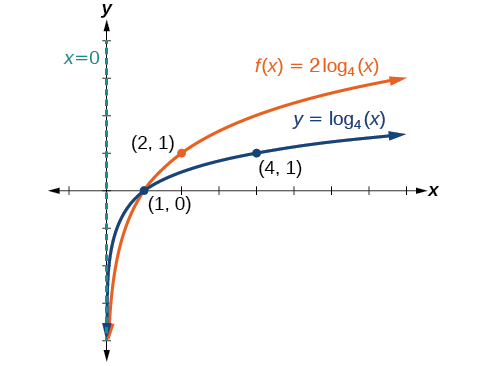{: #CNX_Precalc_Figure_04_04_014}

The domain is<math xmlns="http://www.w3.org/1998/Math/MathML"> <mrow> <mtext> </mtext><mrow><mo>(</mo> <mrow> <mn>0</mn><mo>,</mo><mi>∞</mi> </mrow> <mo>)</mo></mrow><mo>,</mo> </mrow> </math>

 the range is<math xmlns="http://www.w3.org/1998/Math/MathML"> <mrow> <mtext> </mtext><mrow><mo>(</mo> <mrow> <mo>−</mo><mi>∞</mi><mo>,</mo><mi>∞</mi> </mrow> <mo>)</mo></mrow><mo>,</mo> </mrow> </math>

 and the vertical asymptote is<math xmlns="http://www.w3.org/1998/Math/MathML"> <mrow> <mtext> </mtext><mi>x</mi><mo>=</mo><mn>0.</mn> </mrow> </math>

Sketch a graph of<math xmlns="http://www.w3.org/1998/Math/MathML"> <mrow> <mtext> </mtext><mi>f</mi><mo stretchy="false">(</mo><mi>x</mi><mo stretchy="false">)</mo><mo>=</mo><mfrac> <mn>1</mn> <mn>2</mn> </mfrac> <mtext> </mtext><msub> <mrow> <mi>log</mi> </mrow> <mn>4</mn> </msub> <mo stretchy="false">(</mo><mi>x</mi><mo stretchy="false">)</mo><mtext> </mtext> </mrow> </math>

alongside its parent function. Include the key points and asymptote on the graph. State the domain, range, and asymptote.

 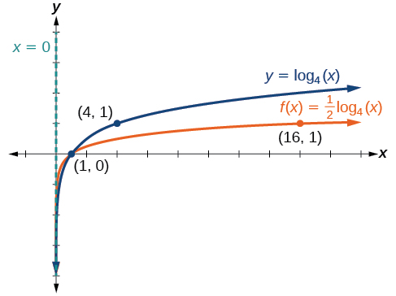 
The domain is<math xmlns="http://www.w3.org/1998/Math/MathML"> <mrow> <mtext> </mtext><mrow><mo>(</mo> <mrow> <mn>0</mn><mo>,</mo><mi>∞</mi> </mrow> <mo>)</mo></mrow><mo>,</mo> </mrow> </math>

the range is<math xmlns="http://www.w3.org/1998/Math/MathML"> <mrow> <mtext> </mtext><mrow><mo>(</mo> <mrow> <mo>−</mo><mi>∞</mi><mo>,</mo><mi>∞</mi> </mrow> <mo>)</mo></mrow><mo>,</mo> </mrow> </math>

and the vertical asymptote is<math xmlns="http://www.w3.org/1998/Math/MathML"> <mrow> <mtext> </mtext><mi>x</mi><mo>=</mo><mn>0.</mn> </mrow> </math>

Combining a Shift and a Stretch

Sketch a graph of<math xmlns="http://www.w3.org/1998/Math/MathML"> <mrow> <mtext> </mtext><mi>f</mi><mo stretchy="false">(</mo><mi>x</mi><mo stretchy="false">)</mo><mo>=</mo><mn>5</mn><mi>log</mi><mo stretchy="false">(</mo><mi>x</mi><mo>+</mo><mn>2</mn><mo stretchy="false">)</mo><mo>.</mo><mtext> </mtext> </mrow> </math>

State the domain, range, and asymptote.

Remember: what happens inside parentheses happens first. First, we move the graph left 2 units, then stretch the function vertically by a factor of 5, as in [[link]](#CNX_Precalc_Figure_04_04_016). The vertical asymptote will be shifted to<math xmlns="http://www.w3.org/1998/Math/MathML"> <mrow> <mtext> </mtext><mi>x</mi><mo>=</mo><mn>−2.</mn><mtext> </mtext> </mrow> </math>

The *x*-intercept will be<math xmlns="http://www.w3.org/1998/Math/MathML"> <mrow> <mtext> </mtext><mo stretchy="false">(</mo><mn>−1,</mn><mn>0</mn><mo stretchy="false">)</mo><mo>.</mo><mtext> </mtext> </mrow> </math>

The domain will be<math xmlns="http://www.w3.org/1998/Math/MathML"> <mrow> <mtext> </mtext><mrow><mo>(</mo> <mrow> <mn>−2</mn><mo>,</mo><mi>∞</mi> </mrow> <mo>)</mo></mrow><mo>.</mo><mtext> </mtext> </mrow> </math>

Two points will help give the shape of the graph:<math xmlns="http://www.w3.org/1998/Math/MathML"> <mrow> <mtext> </mtext><mo stretchy="false">(</mo><mn>−1</mn><mo>,</mo><mn>0</mn><mo stretchy="false">)</mo><mtext> </mtext> </mrow> </math>

and<math xmlns="http://www.w3.org/1998/Math/MathML"> <mrow> <mtext> </mtext><mo stretchy="false">(</mo><mn>8</mn><mo>,</mo><mn>5</mn><mo stretchy="false">).</mo><mtext> </mtext> </mrow> </math>

We chose<math xmlns="http://www.w3.org/1998/Math/MathML"> <mrow> <mtext> </mtext><mi>x</mi><mo>=</mo><mn>8</mn><mtext> </mtext> </mrow> </math>

as the *x*-coordinate of one point to graph because when<math xmlns="http://www.w3.org/1998/Math/MathML"> <mrow> <mtext> </mtext><mi>x</mi><mo>=</mo><mn>8,</mn><mtext> </mtext> </mrow> </math>

<math xmlns="http://www.w3.org/1998/Math/MathML"> <mrow> <mtext> </mtext><mi>x</mi><mo>+</mo><mn>2</mn><mo>=</mo><mn>10,</mn><mtext> </mtext> </mrow> </math>

the base of the common logarithm.

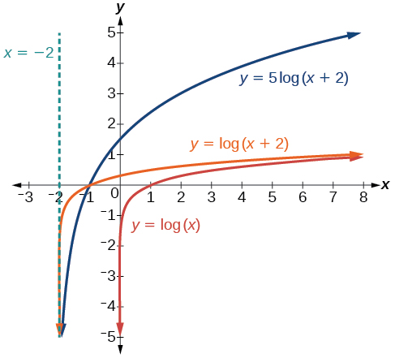{: #CNX_Precalc_Figure_04_04_016}

The domain is<math xmlns="http://www.w3.org/1998/Math/MathML"> <mrow> <mtext> </mtext><mrow><mo>(</mo> <mrow> <mo>−</mo><mn>2</mn><mo>,</mo><mi>∞</mi> </mrow> <mo>)</mo></mrow><mo>,</mo> </mrow> </math>

the range is<math xmlns="http://www.w3.org/1998/Math/MathML"> <mrow> <mtext> </mtext><mrow><mo>(</mo> <mrow> <mo>−</mo><mi>∞</mi><mo>,</mo><mi>∞</mi> </mrow> <mo>)</mo></mrow><mo>,</mo> </mrow> </math>

and the vertical asymptote is<math xmlns="http://www.w3.org/1998/Math/MathML"> <mrow> <mtext> </mtext><mi>x</mi><mo>=</mo><mo>−</mo><mn>2.</mn> </mrow> </math>

Sketch a graph of the function<math xmlns="http://www.w3.org/1998/Math/MathML"> <mrow> <mtext> </mtext><mi>f</mi><mo stretchy="false">(</mo><mi>x</mi><mo stretchy="false">)</mo><mo>=</mo><mn>3</mn><mi>log</mi><mo stretchy="false">(</mo><mi>x</mi><mo>−</mo><mn>2</mn><mo stretchy="false">)</mo><mo>+</mo><mn>1.</mn><mtext> </mtext> </mrow> </math>

State the domain, range, and asymptote.

 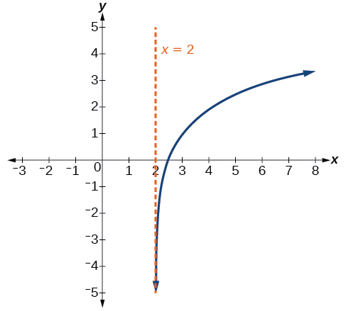 
The domain is<math xmlns="http://www.w3.org/1998/Math/MathML"> <mrow> <mtext> </mtext><mrow><mo>(</mo> <mrow> <mn>2</mn><mo>,</mo><mi>∞</mi> </mrow> <mo>)</mo></mrow><mo>,</mo> </mrow> </math>

the range is<math xmlns="http://www.w3.org/1998/Math/MathML"> <mrow> <mtext> </mtext><mrow><mo>(</mo> <mrow> <mo>−</mo><mi>∞</mi><mo>,</mo><mi>∞</mi> </mrow> <mo>)</mo></mrow><mo>,</mo> </mrow> </math>

and the vertical asymptote is<math xmlns="http://www.w3.org/1998/Math/MathML"> <mrow> <mtext> </mtext><mi>x</mi><mo>=</mo><mn>2.</mn> </mrow> </math>

## Graphing Reflections of *f*(*x*) = log*b*(*x*)

When the parent function<math xmlns="http://www.w3.org/1998/Math/MathML"> <mrow> <mtext> </mtext><mi>f</mi><mo stretchy="false">(</mo><mi>x</mi><mo stretchy="false">)</mo><mo>=</mo><msub> <mrow> <mi>log</mi> </mrow> <mi>b</mi> </msub> <mrow><mo>(</mo> <mi>x</mi> <mo>)</mo></mrow><mtext> </mtext> </mrow> </math>

is multiplied by<math xmlns="http://www.w3.org/1998/Math/MathML"> <mrow> <mtext> </mtext><mn>−1</mn><mo>,</mo> </mrow> </math>

the result is a **reflection**{: data-type="term" .no-emphasis} about the *x*-axis. When the *input* is multiplied by<math xmlns="http://www.w3.org/1998/Math/MathML"> <mrow> <mtext> </mtext><mn>−1</mn><mo>,</mo> </mrow> </math>

the result is a reflection about the *y*-axis. To visualize reflections, we restrict<math xmlns="http://www.w3.org/1998/Math/MathML"> <mrow> <mtext> </mtext><mi>b</mi><mo>&gt;</mo><mn>1,</mn><mtext> </mtext> </mrow> </math>

and observe the general graph of the parent function<math xmlns="http://www.w3.org/1998/Math/MathML"> <mrow> <mtext> </mtext><mi>f</mi><mo stretchy="false">(</mo><mi>x</mi><mo stretchy="false">)</mo><mo>=</mo><msub> <mrow> <mi>log</mi> </mrow> <mi>b</mi> </msub> <mrow><mo>(</mo> <mi>x</mi> <mo>)</mo></mrow><mtext> </mtext> </mrow> </math>

alongside the reflection about the *x*-axis,<math xmlns="http://www.w3.org/1998/Math/MathML"> <mrow> <mtext> </mtext><mi>g</mi><mo stretchy="false">(</mo><mi>x</mi><mo stretchy="false">)</mo><mo>=</mo><msub> <mrow> <mi>−log</mi> </mrow> <mi>b</mi> </msub> <mrow><mo>(</mo> <mi>x</mi> <mo>)</mo></mrow><mtext> </mtext> </mrow> </math>

and the reflection about the *y*-axis,<math xmlns="http://www.w3.org/1998/Math/MathML"> <mrow> <mtext> </mtext><mi>h</mi><mo stretchy="false">(</mo><mi>x</mi><mo stretchy="false">)</mo><mo>=</mo><msub> <mrow> <mi>log</mi> </mrow> <mi>b</mi> </msub> <mrow><mo>(</mo> <mrow> <mo>−</mo><mi>x</mi> </mrow> <mo>)</mo></mrow><mo>.</mo> </mrow> </math>

 {: #Figure_04_04_018}

Reflections of the Parent Function *y* = log*b*(*x*)

The function<math xmlns="http://www.w3.org/1998/Math/MathML"> <mrow> <mtext> </mtext><mi>f</mi><mo stretchy="false">(</mo><mi>x</mi><mo stretchy="false">)</mo><mo>=</mo><msub> <mrow> <mi>−log</mi> </mrow> <mi>b</mi> </msub> <mrow><mo>(</mo> <mi>x</mi> <mo>)</mo></mrow> </mrow> </math>

* reflects the parent function
  <math xmlns="http://www.w3.org/1998/Math/MathML"> <mrow> <mtext> </mtext><mi>y</mi><mo>=</mo><msub> <mrow> <mi>log</mi> </mrow> <mi>b</mi> </msub> <mrow><mo>(</mo> <mi>x</mi> <mo>)</mo></mrow><mtext> </mtext> </mrow> </math>
  
  about the *x*-axis.
* has domain,
  <math xmlns="http://www.w3.org/1998/Math/MathML"> <mrow> <mtext> </mtext><mrow><mo>(</mo> <mrow> <mn>0</mn><mo>,</mo><mi>∞</mi> </mrow> <mo>)</mo></mrow><mo>,</mo> </mrow> </math>
  
  range,
  <math xmlns="http://www.w3.org/1998/Math/MathML"> <mrow> <mtext> </mtext><mrow><mo>(</mo> <mrow> <mo>−</mo><mi>∞</mi><mo>,</mo><mi>∞</mi> </mrow> <mo>)</mo></mrow><mo>,</mo> </mrow> </math>
  
  and vertical asymptote,
  <math xmlns="http://www.w3.org/1998/Math/MathML"> <mrow> <mtext> </mtext><mi>x</mi><mo>=</mo><mn>0</mn><mo>,</mo> </mrow> </math>
  
  which are unchanged from the parent function.

* * *
{: data-type="newline" data-count="1"}

The function<math xmlns="http://www.w3.org/1998/Math/MathML"> <mrow> <mtext> </mtext><mi>f</mi><mo stretchy="false">(</mo><mi>x</mi><mo stretchy="false">)</mo><mo>=</mo><msub> <mrow> <mi>log</mi> </mrow> <mi>b</mi> </msub> <mrow><mo>(</mo> <mrow> <mo>−</mo><mi>x</mi> </mrow> <mo>)</mo></mrow> </mrow> </math>

* reflects the parent function
  <math xmlns="http://www.w3.org/1998/Math/MathML"> <mrow> <mtext> </mtext><mi>y</mi><mo>=</mo><msub> <mrow> <mi>log</mi> </mrow> <mi>b</mi> </msub> <mrow><mo>(</mo> <mi>x</mi> <mo>)</mo></mrow><mtext> </mtext> </mrow> </math>
  
  about the *y*-axis.
* has domain
  <math xmlns="http://www.w3.org/1998/Math/MathML"> <mrow> <mtext> </mtext><mrow><mo>(</mo> <mrow> <mo>−</mo><mi>∞</mi><mo>,</mo><mn>0</mn> </mrow> <mo>)</mo></mrow><mo>.</mo> </mrow> </math>

* has range,
  <math xmlns="http://www.w3.org/1998/Math/MathML"> <mrow> <mtext> </mtext><mrow><mo>(</mo> <mrow> <mo>−</mo><mi>∞</mi><mo>,</mo><mi>∞</mi> </mrow> <mo>)</mo></mrow><mo>,</mo> </mrow> </math>
  
  and vertical asymptote,
  <math xmlns="http://www.w3.org/1998/Math/MathML"> <mrow> <mtext> </mtext><mi>x</mi><mo>=</mo><mn>0</mn><mo>,</mo> </mrow> </math>
  
  which are unchanged from the parent function.

**Given a logarithmic function with the parent function<math xmlns="http://www.w3.org/1998/Math/MathML"> <mrow> <mtext> </mtext><mi>f</mi><mo stretchy="false">(</mo><mi>x</mi><mo stretchy="false">)</mo><mo>=</mo><msub> <mrow> <mi>log</mi> </mrow> <mi>b</mi> </msub> <mrow><mo>(</mo> <mi>x</mi> <mo>)</mo></mrow><mo>,</mo> </mrow> </math>

 graph a translation.**

<table id="Table_04_04_08" data-frame="none" class="unnumbered" summary="The first column gives the following instructions of graphing a translation of f(x)=-log_b(x) with the parent function being f(x)=log_b(x): 1. Draw the vertical asymptote, x=0; 2. Plot the x-intercept, (1, 0); 3. Reflect the graph of the parent function f(x)=log_b(x) about the x-axis; 4. Draw a smooth curve through the points; 5. State the domain, (0, infinity), the range, (-infinity, infinity), and the vertical asymptote x=0. The second column gives the following instructions of graphing a translation of f(x)=log_b(-x) with the parent function being f(x)=log_b(x): 1. Draw the vertical asymptote, x=0; 2. Plot the x-intercept, (-1, 0); 3. Reflect the graph of the parent function f(x)=log_b(x) about the y-axis; 4. Draw a smooth curve through the points; 5. State the domain, (-infinity, 0), the range, (-infinity, infinity), and the vertical asymptote x=0." data-label=""><thead>
<tr>
<th><math xmlns="http://www.w3.org/1998/Math/MathML">
<mrow>
<mtext>If </mtext><mi>f</mi><mo stretchy="false">(</mo><mi>x</mi><mo stretchy="false">)</mo><mo>=</mo><mo>−</mo><msub>
<mrow>
<mi>log</mi>
</mrow>
<mi>b</mi>
</msub>
<mo stretchy="false">(</mo><mi>x</mi><mo stretchy="false">)</mo>
</mrow>
</math>
</th>
<th><math xmlns="http://www.w3.org/1998/Math/MathML">
<mrow>
<mtext>If </mtext><mi>f</mi><mo stretchy="false">(</mo><mi>x</mi><mo stretchy="false">)</mo><mo>=</mo><msub>
<mrow>
<mi>log</mi>
</mrow>
<mi>b</mi>
</msub>
<mo stretchy="false">(</mo><mo>−</mo><mi>x</mi><mo stretchy="false">)</mo>
</mrow>
</math>
</th>
</tr>
</thead><tbody>
<tr>
<td>
<ol data-number-style="arabic">
<li>Draw the vertical asymptote,<math xmlns="http://www.w3.org/1998/Math/MathML">
<mrow>
<mtext> </mtext><mi>x</mi><mo>=</mo><mn>0.</mn>
</mrow>
</math></li>
</ol>
</td>
<td>
<ol data-number-style="arabic">
<li>Draw the vertical asymptote,<math xmlns="http://www.w3.org/1998/Math/MathML">
<mrow>
<mtext> </mtext><mi>x</mi><mo>=</mo><mn>0.</mn>
</mrow>
</math></li>
</ol>
</td>
</tr>
<tr>
<td>
<ol start="2" data-mark-suffix="." data-number-style="arabic"><li>Plot the <em>x-</em>intercept,<math xmlns="http://www.w3.org/1998/Math/MathML">
<mrow>
<mtext> </mtext><mrow><mo>(</mo>
<mrow>
<mn>1</mn><mo>,</mo><mn>0</mn>
</mrow>
<mo>)</mo></mrow><mo>.</mo>
</mrow>
</math></li>
</ol></td>
<td>
<ol start="2" data-mark-suffix="." data-number-style="arabic"><li>Plot the <em>x-</em>intercept,<math xmlns="http://www.w3.org/1998/Math/MathML">
<mrow>
<mtext> </mtext><mrow><mo>(</mo>
<mrow>
<mn>1</mn><mo>,</mo><mn>0</mn>
</mrow>
<mo>)</mo></mrow><mo>.</mo>
</mrow>
</math></li>
</ol></td>
</tr>
<tr>
<td>
<ol data-number-style="arabic" start="3" data-mark-suffix=".">
<li>Reflect the graph of the parent function<math xmlns="http://www.w3.org/1998/Math/MathML">
<mrow>
<mtext> </mtext><mi>f</mi><mo stretchy="false">(</mo><mi>x</mi><mo stretchy="false">)</mo><mo>=</mo><msub>
<mrow>
<mi>log</mi>
</mrow>
<mi>b</mi>
</msub>
<mrow><mo>(</mo>
<mi>x</mi>
<mo>)</mo></mrow><mtext> </mtext>
</mrow>
</math>about the <em>x</em>-axis.</li>
</ol>
</td>
<td>
<ol data-number-style="arabic" start="3" data-mark-suffix=".">
<li>Reflect the graph of the parent function<math xmlns="http://www.w3.org/1998/Math/MathML">
<mrow>
<mtext> </mtext><mi>f</mi><mo stretchy="false">(</mo><mi>x</mi><mo stretchy="false">)</mo><mo>=</mo><msub>
<mrow>
<mi>log</mi>
</mrow>
<mi>b</mi>
</msub>
<mrow><mo>(</mo>
<mi>x</mi>
<mo>)</mo></mrow><mtext> </mtext>
</mrow>
</math>about the <em>y</em>-axis.
</li>
</ol>
</td>
</tr>
<tr>
<td>
<ol data-number-style="arabic" start="4" data-mark-suffix=".">
<li>Draw a smooth curve through the points.</li>
</ol>
</td>
<td>
<ol data-number-style="arabic" start="4" data-mark-suffix=".">
<li>Draw a smooth curve through the points.</li>
</ol>
</td>
</tr>
<tr>
<td>
<ol start="5" data-mark-suffix="." data-number-style="arabic"><li>State the domain,<math xmlns="http://www.w3.org/1998/Math/MathML">
<mrow>
<mtext> </mtext><mrow><mo>(</mo>
<mrow>
<mn>0</mn><mo>,</mo><mi>∞</mi>
</mrow>
<mo>)</mo></mrow><mo>,</mo>
</mrow>
</math> the range,<math xmlns="http://www.w3.org/1998/Math/MathML">
<mrow>
<mtext> </mtext><mrow><mo>(</mo>
<mrow>
<mo>−</mo><mi>∞</mi><mo>,</mo><mi>∞</mi>
</mrow>
<mo>)</mo></mrow><mo>,</mo>
</mrow>
</math> and the vertical asymptote<math xmlns="http://www.w3.org/1998/Math/MathML">
<mrow>
<mtext> </mtext><mi>x</mi><mo>=</mo><mn>0.</mn>
</mrow>
</math></li>
</ol></td>
<td>
<ol start="5" data-mark-suffix="." data-number-style="arabic"><li>State the domain,<math xmlns="http://www.w3.org/1998/Math/MathML">
<mrow>
<mtext> </mtext><mrow><mo>(</mo>
<mrow>
<mo>−</mo><mi>∞</mi><mo>,</mo><mn>0</mn>
</mrow>
<mo>)</mo></mrow><mo>,</mo>
</mrow>
</math> the range,<math xmlns="http://www.w3.org/1998/Math/MathML">
<mrow>
<mtext> </mtext><mrow><mo>(</mo>
<mrow>
<mo>−</mo><mi>∞</mi><mo>,</mo><mi>∞</mi>
</mrow>
<mo>)</mo></mrow><mo>,</mo>
</mrow>
</math> and the vertical asymptote<math xmlns="http://www.w3.org/1998/Math/MathML">
<mrow>
<mtext> </mtext><mi>x</mi><mo>=</mo><mn>0.</mn>
</mrow>
</math>
</li>
</ol></td>
</tr>
</tbody></table>

Graphing a Reflection of a Logarithmic Function

Sketch a graph of<math xmlns="http://www.w3.org/1998/Math/MathML"> <mrow> <mtext> </mtext><mi>f</mi><mo stretchy="false">(</mo><mi>x</mi><mo stretchy="false">)</mo><mo>=</mo><mi>log</mi><mo stretchy="false">(</mo><mo>−</mo><mi>x</mi><mo stretchy="false">)</mo><mtext> </mtext> </mrow> </math>

alongside its parent function. Include the key points and asymptote on the graph. State the domain, range, and asymptote.

Before graphing<math xmlns="http://www.w3.org/1998/Math/MathML"> <mrow> <mtext> </mtext><mi>f</mi><mo stretchy="false">(</mo><mi>x</mi><mo stretchy="false">)</mo><mo>=</mo><mi>log</mi><mo stretchy="false">(</mo><mo>−</mo><mi>x</mi><mo stretchy="false">)</mo><mo>,</mo> </mrow> </math>

identify the behavior and key points for the graph.

* Since
  <math xmlns="http://www.w3.org/1998/Math/MathML"> <mrow> <mtext> </mtext><mi>b</mi><mo>=</mo><mn>10</mn><mtext> </mtext> </mrow> </math>
  
  is greater than one, we know that the parent function is increasing. Since the *input* value is multiplied by
  <math xmlns="http://www.w3.org/1998/Math/MathML"> <mrow> <mtext> </mtext><mn>−1</mn><mo>,</mo> </mrow> </math>
  
  <math xmlns="http://www.w3.org/1998/Math/MathML"> <mrow> <mi>f</mi><mtext> </mtext> </mrow> </math>
  
  is a reflection of the parent graph about the *y-*axis. Thus,
  <math xmlns="http://www.w3.org/1998/Math/MathML"> <mrow> <mtext> </mtext><mi>f</mi><mo stretchy="false">(</mo><mi>x</mi><mo stretchy="false">)</mo><mo>=</mo><mi>log</mi><mo stretchy="false">(</mo><mo>−</mo><mi>x</mi><mo stretchy="false">)</mo><mtext> </mtext> </mrow> </math>
  
  will be decreasing as
  <math xmlns="http://www.w3.org/1998/Math/MathML"> <mrow> <mtext> </mtext><mi>x</mi><mtext> </mtext> </mrow> </math>
  
  moves from negative infinity to zero, and the right tail of the graph will approach the vertical asymptote
  <math xmlns="http://www.w3.org/1998/Math/MathML"> <mrow> <mtext> </mtext><mi>x</mi><mo>=</mo><mn>0.</mn><mtext> </mtext> </mrow> </math>

* The *x*-intercept is
  <math xmlns="http://www.w3.org/1998/Math/MathML"> <mrow> <mtext> </mtext><mrow><mo>(</mo> <mrow> <mn>−1</mn><mo>,</mo><mn>0</mn> </mrow> <mo>)</mo></mrow><mo>.</mo> </mrow> </math>

* We draw and label the asymptote, plot and label the points, and draw a smooth curve through the points.

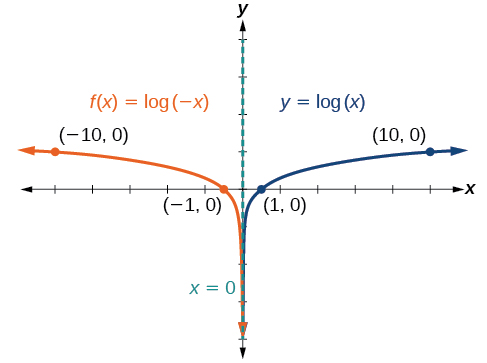{: #CNX_Precalc_Figure_04_04_019}

The domain is<math xmlns="http://www.w3.org/1998/Math/MathML"> <mrow> <mtext> </mtext><mrow><mo>(</mo> <mrow> <mo>−</mo><mi>∞</mi><mo>,</mo><mn>0</mn> </mrow> <mo>)</mo></mrow><mo>,</mo> </mrow> </math>

the range is<math xmlns="http://www.w3.org/1998/Math/MathML"> <mrow> <mtext> </mtext><mrow><mo>(</mo> <mrow> <mo>−</mo><mi>∞</mi><mo>,</mo><mi>∞</mi> </mrow> <mo>)</mo></mrow><mo>,</mo> </mrow> </math>

and the vertical asymptote is<math xmlns="http://www.w3.org/1998/Math/MathML"> <mrow> <mtext> </mtext><mi>x</mi><mo>=</mo><mn>0.</mn> </mrow> </math>

Graph<math xmlns="http://www.w3.org/1998/Math/MathML"> <mrow> <mtext> </mtext><mi>f</mi><mo stretchy="false">(</mo><mi>x</mi><mo stretchy="false">)</mo><mo>=</mo><mo>−</mo><mi>log</mi><mo stretchy="false">(</mo><mo>−</mo><mi>x</mi><mo stretchy="false">)</mo><mo>.</mo><mtext> </mtext> </mrow> </math>

State the domain, range, and asymptote.

 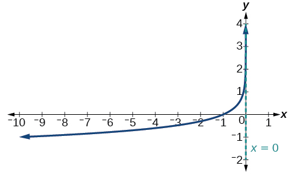 
The domain is<math xmlns="http://www.w3.org/1998/Math/MathML"> <mrow> <mtext> </mtext><mrow><mo>(</mo> <mrow> <mo>−</mo><mi>∞</mi><mo>,</mo><mn>0</mn> </mrow> <mo>)</mo></mrow><mo>,</mo> </mrow> </math>

the range is<math xmlns="http://www.w3.org/1998/Math/MathML"> <mrow> <mtext> </mtext><mrow><mo>(</mo> <mrow> <mo>−</mo><mi>∞</mi><mo>,</mo><mi>∞</mi> </mrow> <mo>)</mo></mrow><mo>,</mo> </mrow> </math>

and the vertical asymptote is<math xmlns="http://www.w3.org/1998/Math/MathML"> <mrow> <mtext> </mtext><mi>x</mi><mo>=</mo><mn>0.</mn> </mrow> </math>

**Given a logarithmic equation, use a graphing calculator to approximate solutions.**

1.  Press **\[Y=\]**. Enter the given logarithm equation or equations as **Y1=** and, if needed, **Y2=**.
2.  Press **\[GRAPH\]** to observe the graphs of the curves and use **\[WINDOW\]** to find an appropriate view of the graphs, including their point(s) of intersection.
3.  To find the value of
    <math xmlns="http://www.w3.org/1998/Math/MathML"> <mrow> <mtext> </mtext><mi>x</mi><mo>,</mo> </mrow> </math>
    
    we compute the point of intersection. Press <strong>\[2ND\] </strong>then **\[CALC\]**. Select “intersect” and press **\[ENTER\]** three times. The point of intersection gives the value of
    <math xmlns="http://www.w3.org/1998/Math/MathML"> <mrow> <mtext> </mtext><mi>x</mi><mo>,</mo> </mrow> </math>
    
    for the point(s) of intersection.
{: data-number-style="arabic"}

Approximating the Solution of a Logarithmic Equation

Solve<math xmlns="http://www.w3.org/1998/Math/MathML"> <mrow> <mtext> </mtext><mn>4</mn><mi>ln</mi><mrow><mo>(</mo> <mi>x</mi> <mo>)</mo></mrow><mo>+</mo><mn>1</mn><mo>=</mo><mo>−</mo><mn>2</mn><mi>ln</mi><mrow><mo>(</mo> <mrow> <mi>x</mi><mo>−</mo><mn>1</mn> </mrow> <mo>)</mo></mrow><mtext> </mtext> </mrow> </math>

graphically. Round to the nearest thousandth.

Press **[Y=]** and enter<math xmlns="http://www.w3.org/1998/Math/MathML"> <mrow> <mtext> </mtext><mn>4</mn><mi>ln</mi><mrow><mo>(</mo> <mi>x</mi> <mo>)</mo></mrow><mo>+</mo><mn>1</mn><mtext> </mtext> </mrow> </math>

next to **Y1**=. Then enter<math xmlns="http://www.w3.org/1998/Math/MathML"> <mrow> <mtext> </mtext><mo>−</mo><mn>2</mn><mi>ln</mi><mrow><mo>(</mo> <mrow> <mi>x</mi><mo>−</mo><mn>1</mn> </mrow> <mo>)</mo></mrow><mtext> </mtext> </mrow> </math>

next to **Y2=**. For a window, use the values 0 to 5 for<math xmlns="http://www.w3.org/1998/Math/MathML"> <mrow> <mtext> </mtext><mi>x</mi><mtext> </mtext> </mrow> </math>

and –10 to 10 for<math xmlns="http://www.w3.org/1998/Math/MathML"> <mrow> <mtext> </mtext><mi>y</mi><mo>.</mo><mtext> </mtext> </mrow> </math>

Press **[GRAPH]**. The graphs should intersect somewhere a little to right of<math xmlns="http://www.w3.org/1998/Math/MathML"> <mrow> <mtext> </mtext><mi>x</mi><mo>=</mo><mn>1.</mn> </mrow> </math>

For a better approximation, press <strong>[2ND] </strong>then **[CALC]**. Select **[5: intersect]** and press **[ENTER]** three times. The *x*-coordinate of the point of intersection is displayed as 1.3385297. (Your answer may be different if you use a different window or use a different value for **Guess?**) So, to the nearest thousandth,<math xmlns="http://www.w3.org/1998/Math/MathML"> <mrow> <mtext> </mtext><mi>x</mi><mo>≈</mo><mn>1.339.</mn> </mrow> </math>

Solve<math xmlns="http://www.w3.org/1998/Math/MathML"> <mrow> <mtext> </mtext><mn>5</mn><mi>log</mi><mrow><mo>(</mo> <mrow> <mi>x</mi><mo>+</mo><mn>2</mn> </mrow> <mo>)</mo></mrow><mo>=</mo><mn>4</mn><mo>−</mo><mi>log</mi><mrow><mo>(</mo> <mi>x</mi> <mo>)</mo></mrow><mtext> </mtext> </mrow> </math>

graphically. Round to the nearest thousandth.

<math xmlns="http://www.w3.org/1998/Math/MathML"> <mrow> <mi>x</mi><mo>≈</mo><mn>3.049</mn> </mrow> </math>

## Summarizing Translations of the Logarithmic Function

Now that we have worked with each type of translation for the logarithmic function, we can summarize each in [\[link\]](#Table_04_04_009) to arrive at the general equation for translating exponential functions.

<table id="Table_04_04_009" summary="Titled, &#x201C;Translations of the Parent Function f(x)=lob_b(x)&#x201D;. The first column is labeled, &#x201C;Translation&#x201D;, and the second column is labeled, &#x201C;Form&#x201D;. The first translation is a horizontal and vertical shift with c units to the left and d units up with the form f(x)=log_b(x+c)+d. The second translation is a stretch and compression. It is a stretch is |a|&gt;1 and a compression is 0&lt;|a|&lt;1. Note its form is f(x)=alog_b(x). The third translation is a reflection about the x-axis with the form f(x) = -log_b(x). The fourth translation is a reflection about the y-axis with the form f(x)=log_b(-x). The general equation for all translations is f(x)=alog_b(x+c)+d."><caption></caption><thead>
<tr>
<th colspan="2">Translations of the Parent Function<math xmlns="http://www.w3.org/1998/Math/MathML">
<mrow>
<mtext> </mtext><mi>y</mi><mo>=</mo><msub>
<mrow>
<mi>log</mi>
</mrow>
<mi>b</mi>
</msub>
<mrow><mo>(</mo>
<mi>x</mi>
<mo>)</mo></mrow>
</mrow>
</math></th>
</tr>
<tr>
<th>Translation</th>
<th>Form</th>
</tr>
</thead><tbody>
<tr>
<td>Shift
<ul>
<li>Horizontally<math xmlns="http://www.w3.org/1998/Math/MathML">
<mrow>
<mtext> </mtext><mi>c</mi><mtext> </mtext>
</mrow>
</math>units to the left</li>
<li>Vertically<math xmlns="http://www.w3.org/1998/Math/MathML">
<mrow>
<mtext> </mtext><mi>d</mi><mtext> </mtext>
</mrow>
</math>units up</li>
</ul></td>
<td data-align="left"><math xmlns="http://www.w3.org/1998/Math/MathML">
<mrow>
<mi>y</mi><mo>=</mo><msub>
<mrow>
<mi>log</mi>
</mrow>
<mi>b</mi>
</msub>
<mrow><mo>(</mo>
<mrow>
<mi>x</mi><mo>+</mo><mi>c</mi>
</mrow>
<mo>)</mo></mrow><mo>+</mo><mi>d</mi>
</mrow>
</math></td>
</tr>
<tr>
<td>Stretch and Compress
<ul>
<li>Stretch if<math xmlns="http://www.w3.org/1998/Math/MathML">
<mrow>
<mtext> </mtext><mrow><mo>\|</mo> <mi>a</mi> <mo>\|</mo></mrow><mo>&gt;</mo><mn>1</mn>
</mrow>
</math></li>
<li>Compression if<math xmlns="http://www.w3.org/1998/Math/MathML">
<mrow>
<mtext> </mtext><mrow><mo>\|</mo> <mi>a</mi> <mo>\|</mo></mrow><mo>&lt;</mo><mn>1</mn>
</mrow>
</math></li>
</ul>
</td>
<td data-align="left"><math xmlns="http://www.w3.org/1998/Math/MathML">
<mrow>
<mi>y</mi><mo>=</mo><mi>a</mi><msub>
<mrow>
<mi>log</mi>
</mrow>
<mi>b</mi>
</msub>
<mrow><mo>(</mo>
<mi>x</mi>
<mo>)</mo></mrow>
</mrow>
</math></td>
</tr>
<tr>
<td>Reflect about the <em>x</em>-axis</td>
<td data-align="left"><math xmlns="http://www.w3.org/1998/Math/MathML">
<mrow>
<mi>y</mi><mo>=</mo><mo>−</mo><msub>
<mrow>
<mi>log</mi>
</mrow>
<mi>b</mi>
</msub>
<mrow><mo>(</mo>
<mi>x</mi>
<mo>)</mo></mrow>
</mrow>
</math></td>
</tr>
<tr>
<td>Reflect about the <em>y</em>-axis</td>
<td data-align="left"><math xmlns="http://www.w3.org/1998/Math/MathML">
<mrow>
<mi>y</mi><mo>=</mo><msub>
<mrow>
<mi>log</mi>
</mrow>
<mi>b</mi>
</msub>
<mrow><mo>(</mo>
<mrow>
<mo>−</mo><mi>x</mi>
</mrow>
<mo>)</mo></mrow>
</mrow>
</math></td>
</tr>
<tr>
<td>General equation for all translations</td>
<td data-align="left"><math xmlns="http://www.w3.org/1998/Math/MathML">
<mrow>
<mi>y</mi><mo>=</mo><mi>a</mi><msub>
<mrow>
<mi>log</mi>
</mrow>
<mi>b</mi>
</msub>
<mo stretchy="false">(</mo><mi>x</mi><mo>+</mo><mi>c</mi><mo stretchy="false">)</mo><mo>+</mo><mi>d</mi>
</mrow>
</math>
</td>
</tr>
</tbody></table>

Translations of Logarithmic Functions

All translations of the parent logarithmic function,<math xmlns="http://www.w3.org/1998/Math/MathML"> <mrow> <mtext> </mtext><mi>y</mi><mo>=</mo><msub> <mrow> <mi>log</mi> </mrow> <mi>b</mi> </msub> <mrow><mo>(</mo> <mi>x</mi> <mo>)</mo></mrow><mo>,</mo> </mrow> </math>

 have the form

<math xmlns="http://www.w3.org/1998/Math/MathML"> <mrow> <mo> </mo><mi>f</mi><mo stretchy="false">(</mo><mi>x</mi><mo stretchy="false">)</mo><mo>=</mo><mi>a</mi><msub> <mrow> <mi>log</mi> </mrow> <mi>b</mi> </msub> <mrow><mo>(</mo> <mrow> <mi>x</mi><mo>+</mo><mi>c</mi> </mrow> <mo>)</mo></mrow><mo>+</mo><mi>d</mi> </mrow> </math>

where the parent function,<math xmlns="http://www.w3.org/1998/Math/MathML"> <mrow> <mtext> </mtext><mi>y</mi><mo>=</mo><msub> <mrow> <mi>log</mi> </mrow> <mi>b</mi> </msub> <mrow><mo>(</mo> <mi>x</mi> <mo>)</mo></mrow><mo>,</mo><mi>b</mi><mo>&gt;</mo><mn>1</mn><mo>,</mo> </mrow> </math>

is

* shifted vertically up
  <math xmlns="http://www.w3.org/1998/Math/MathML"> <mrow> <mtext> </mtext><mi>d</mi><mtext> </mtext> </mrow> </math>
  
  units.
* shifted horizontally to the left
  <math xmlns="http://www.w3.org/1998/Math/MathML"> <mrow> <mtext> </mtext><mi>c</mi><mtext> </mtext> </mrow> </math>
  
  units.
* stretched vertically by a factor of
  <math xmlns="http://www.w3.org/1998/Math/MathML"> <mrow> <mtext> </mtext><mrow><mo>\|</mo> <mi>a</mi> <mo>\|</mo></mrow><mtext> </mtext> </mrow> </math>
  
  if
  <math xmlns="http://www.w3.org/1998/Math/MathML"> <mrow> <mtext> </mtext><mrow><mo>\|</mo> <mi>a</mi> <mo>\|</mo></mrow><mo>&gt;</mo><mn>0.</mn> </mrow> </math>

* compressed vertically by a factor of
  <math xmlns="http://www.w3.org/1998/Math/MathML"> <mrow> <mtext> </mtext><mrow><mo>\|</mo> <mi>a</mi> <mo>\|</mo></mrow><mtext> </mtext> </mrow> </math>
  
  if
  <math xmlns="http://www.w3.org/1998/Math/MathML"> <mrow> <mtext> </mtext><mn>0</mn><mo>&lt;</mo><mrow><mo>\|</mo> <mi>a</mi> <mo>\|</mo></mrow><mo>&lt;</mo><mn>1.</mn> </mrow> </math>

* reflected about the *x-*axis when
  <math xmlns="http://www.w3.org/1998/Math/MathML"> <mrow> <mtext> </mtext><mi>a</mi><mo>&lt;</mo><mn>0.</mn> </mrow> </math>

For<math xmlns="http://www.w3.org/1998/Math/MathML"> <mrow> <mtext> </mtext><mi>f</mi><mrow><mo>(</mo> <mi>x</mi> <mo>)</mo></mrow><mo>=</mo><mi>log</mi><mrow><mo>(</mo> <mrow> <mo>−</mo><mi>x</mi> </mrow> <mo>)</mo></mrow><mo>,</mo> </mrow> </math>

 the graph of the parent function is reflected about the *y*-axis.

Finding the Vertical Asymptote of a Logarithm Graph

What is the vertical asymptote of<math xmlns="http://www.w3.org/1998/Math/MathML"> <mrow> <mtext> </mtext><mi>f</mi><mo stretchy="false">(</mo><mi>x</mi><mo stretchy="false">)</mo><mo>=</mo><mn>−2</mn><msub> <mrow> <mi>log</mi> </mrow> <mn>3</mn> </msub> <mo stretchy="false">(</mo><mi>x</mi><mo>+</mo><mn>4</mn><mo stretchy="false">)</mo><mo>+</mo><mn>5</mn><mo>?</mo> </mrow> </math>

The vertical asymptote is at<math xmlns="http://www.w3.org/1998/Math/MathML"> <mrow> <mtext> </mtext><mi>x</mi><mo>=</mo><mo>−</mo><mn>4.</mn> </mrow> </math>

Analysis

The coefficient, the base, and the upward translation do not affect the asymptote. The shift of the curve 4 units to the left shifts the vertical asymptote to<math xmlns="http://www.w3.org/1998/Math/MathML"> <mrow> <mtext> </mtext><mi>x</mi><mo>=</mo><mn>−4.</mn> </mrow> </math>

What is the vertical asymptote of<math xmlns="http://www.w3.org/1998/Math/MathML"> <mrow> <mtext> </mtext><mi>f</mi><mo stretchy="false">(</mo><mi>x</mi><mo stretchy="false">)</mo><mo>=</mo><mn>3</mn><mo>+</mo><mi>ln</mi><mo stretchy="false">(</mo><mi>x</mi><mo>−</mo><mn>1</mn><mo stretchy="false">)</mo><mo>?</mo> </mrow> </math>

<math xmlns="http://www.w3.org/1998/Math/MathML"> <mrow> <mi>x</mi><mo>=</mo><mn>1</mn> </mrow> </math>

Finding the Equation from a Graph

Find a possible equation for the common logarithmic function graphed in [[link]](#CNX_Precalc_Figure_04_04_021).

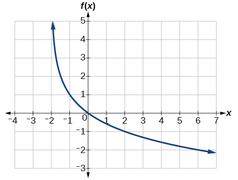{: #CNX_Precalc_Figure_04_04_021}

This graph has a vertical asymptote at<math xmlns="http://www.w3.org/1998/Math/MathML"> <mrow> <mtext> </mtext><mi>x</mi><mo>=</mo><mn>–2</mn><mtext> </mtext> </mrow> </math>

and has been vertically reflected. We do not know yet the vertical shift or the vertical stretch. We know so far that the equation will have form:

<math xmlns="http://www.w3.org/1998/Math/MathML" display="block"> <mrow> <mi>f</mi><mo stretchy="false">(</mo><mi>x</mi><mo stretchy="false">)</mo><mo>=</mo><mo>−</mo><mi>a</mi><mi>log</mi><mo stretchy="false">(</mo><mi>x</mi><mo>+</mo><mn>2</mn><mo stretchy="false">)</mo><mo>+</mo><mi>k</mi> </mrow> </math>

It appears the graph passes through the points<math xmlns="http://www.w3.org/1998/Math/MathML"> <mrow> <mtext> </mtext><mrow><mo>(</mo> <mrow> <mn>–1</mn><mo>,</mo><mn>1</mn> </mrow> <mo>)</mo></mrow><mtext> </mtext> </mrow> </math>

and<math xmlns="http://www.w3.org/1998/Math/MathML"> <mrow> <mtext> </mtext><mrow><mo>(</mo> <mrow> <mn>2</mn><mo>,</mo><mn>–1</mn> </mrow> <mo>)</mo></mrow><mo>.</mo><mtext> </mtext> </mrow> </math>

Substituting<math xmlns="http://www.w3.org/1998/Math/MathML"> <mrow> <mtext> </mtext><mrow><mo>(</mo> <mrow> <mn>–1</mn><mo>,</mo><mn>1</mn> </mrow> <mo>)</mo></mrow><mo>,</mo> </mrow> </math>

<math xmlns="http://www.w3.org/1998/Math/MathML" display="block"> <mrow> <mtable columnalign="left"> <mtr columnalign="left"> <mtd columnalign="left"> <mrow> <mn>1</mn><mo>=</mo><mo>−</mo><mi>a</mi><mi>log</mi><mo stretchy="false">(</mo><mn>−1</mn><mo>+</mo><mn>2</mn><mo stretchy="false">)</mo><mo>+</mo><mi>k</mi><mtext> </mtext><mtext> </mtext><mtext> </mtext><mtext> </mtext><mtext> </mtext><mtext> </mtext><mtext> </mtext><mtext> </mtext><mtext> </mtext><mtext> </mtext><mtext> </mtext><mtext> </mtext> </mrow> </mtd> <mtd columnalign="left"> <mrow> <mtext>Substitute </mtext><mo stretchy="false">(</mo><mn>−1</mn><mo>,</mo><mn>1</mn><mo stretchy="false">)</mo><mo>.</mo> </mrow> </mtd> </mtr> <mtr columnalign="left"> <mtd columnalign="left"> <mrow> <mn>1</mn><mo>=</mo><mo>−</mo><mi>a</mi><mi>log</mi><mo stretchy="false">(</mo><mn>1</mn><mo stretchy="false">)</mo><mo>+</mo><mi>k</mi> </mrow> </mtd> <mtd columnalign="left"> <mrow> <mtext>Arithmetic</mtext><mo>.</mo> </mrow> </mtd> </mtr> <mtr columnalign="left"> <mtd columnalign="left"> <mrow> <mn>1</mn><mo>=</mo><mi>k</mi> </mrow> </mtd> <mtd columnalign="left"> <mrow> <mtext>log(1)</mtext><mo>=</mo><mn>0.</mn> </mrow> </mtd> </mtr> </mtable> </mrow> </math>

Next, substituting in<math xmlns="http://www.w3.org/1998/Math/MathML"> <mrow> <mtext> </mtext><mrow><mo>(</mo> <mrow> <mn>2</mn><mo>,</mo><mn>–1</mn> </mrow> <mo>)</mo></mrow> </mrow> </math>

,

<math xmlns="http://www.w3.org/1998/Math/MathML" display="block"> <mrow> <mtable columnalign="left"> <mtr columnalign="left"> <mtd columnalign="left"> <mrow> <mo>−</mo><mn>1</mn><mo>=</mo><mo>−</mo><mi>a</mi><mi>log</mi><mo stretchy="false">(</mo><mn>2</mn><mo>+</mo><mn>2</mn><mo stretchy="false">)</mo><mo>+</mo><mn>1</mn> </mrow> </mtd> <mtd columnalign="left"> <mrow /> </mtd> <mtd columnalign="left"> <mrow> <mtext>Plug in </mtext><mo stretchy="false">(</mo><mn>2</mn><mo>,</mo><mn>−1</mn><mo stretchy="false">)</mo><mo>.</mo> </mrow> </mtd> </mtr> <mtr columnalign="left"> <mtd columnalign="left"> <mrow> <mo>−</mo><mn>2</mn><mo>=</mo><mo>−</mo><mi>a</mi><mi>log</mi><mo stretchy="false">(</mo><mn>4</mn><mo stretchy="false">)</mo> </mrow> </mtd> <mtd columnalign="left"> <mrow /> </mtd> <mtd columnalign="left"> <mrow> <mtext>Arithmetic</mtext><mo>.</mo> </mrow> </mtd> </mtr> <mtr columnalign="left"> <mtd columnalign="left"> <mrow> <mtext>  </mtext><mi>a</mi><mo>=</mo><mfrac> <mn>2</mn> <mrow> <mi>log</mi><mo stretchy="false">(</mo><mn>4</mn><mo stretchy="false">)</mo> </mrow> </mfrac> </mrow> </mtd> <mtd columnalign="left"> <mrow /> </mtd> <mtd columnalign="left"> <mrow> <mtext>Solve for </mtext><mi>a</mi><mo>.</mo> </mrow> </mtd> </mtr> </mtable> </mrow> </math>

This gives us the equation<math xmlns="http://www.w3.org/1998/Math/MathML"> <mrow> <mtext> </mtext><mi>f</mi><mo stretchy="false">(</mo><mi>x</mi><mo stretchy="false">)</mo><mo>=</mo><mo>–</mo><mfrac> <mn>2</mn> <mrow> <mi>log</mi><mo stretchy="false">(</mo><mn>4</mn><mo stretchy="false">)</mo> </mrow> </mfrac> <mi>log</mi><mo stretchy="false">(</mo><mi>x</mi><mo>+</mo><mn>2</mn><mo stretchy="false">)</mo><mo>+</mo><mn>1.</mn> </mrow> </math>

Analysis

We can verify this answer by comparing the function values in [[link]](#Table_04_04_010) with the points on the graph in [[link]](#CNX_Precalc_Figure_04_04_021).

<table id="Table_04_04_010" summary=".."><colgroup><col data-align="center" /><col data-align="center" /></colgroup><tbody>
    <tr>
        <td><strong><math xmlns="http://www.w3.org/1998/Math/MathML">
<mi>x</mi>
</math></strong></td>
        <td>−1</td>
        <td>0</td>
        <td>1</td>
        <td>2</td>
        <td>3</td>
    </tr>
<tr>
        <td><strong><math xmlns="http://www.w3.org/1998/Math/MathML">
<mrow>
<mi>f</mi><mo stretchy="false">(</mo><mi>x</mi><mo stretchy="false">)</mo>
</mrow>
</math></strong></td>
        <td>1</td>
        <td>0</td>
        <td>−0.58496</td>
        <td>−1</td>
        <td>−1.3219</td>
    </tr>
<tr>
        <td><strong><math xmlns="http://www.w3.org/1998/Math/MathML">
<mi>x</mi>
</math></strong></td>
        <td>4</td>
        <td>5</td>
        <td>6</td>
        <td>7</td>
        <td>8</td>
    </tr>
<tr>
        <td><strong><math xmlns="http://www.w3.org/1998/Math/MathML">
<mrow>
<mi>f</mi><mo stretchy="false">(</mo><mi>x</mi><mo stretchy="false">)</mo>
</mrow>
</math></strong></td>
        <td>−1.5850</td>
        <td>−1.8074</td>
        <td>−2</td>
        <td>−2.1699</td>
        <td>−2.3219</td>
    </tr>
</tbody></table>

Give the equation of the natural logarithm graphed in [[link]](#CNX_Precalc_Figure_04_04_022).

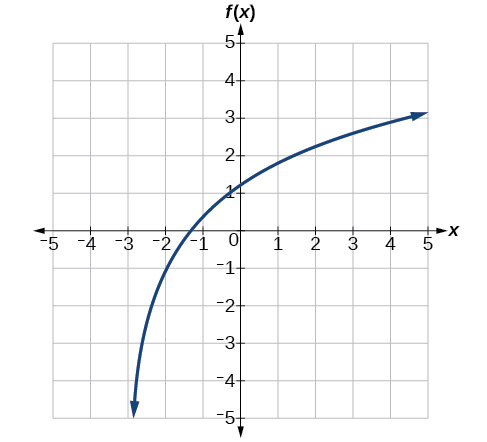{: #CNX_Precalc_Figure_04_04_022}

<math xmlns="http://www.w3.org/1998/Math/MathML"> <mrow> <mi>f</mi><mo stretchy="false">(</mo><mi>x</mi><mo stretchy="false">)</mo><mo>=</mo><mn>2</mn><mi>ln</mi><mo stretchy="false">(</mo><mi>x</mi><mo>+</mo><mn>3</mn><mo stretchy="false">)</mo><mo>−</mo><mn>1</mn> </mrow> </math>

**Is it possible to tell the domain and range and describe the end behavior of a function just by looking at the graph?**

<em>Yes, if we know the function is a general logarithmic function. For example, look at the graph in <a href="#CNX_Precalc_Figure_04_04_022">\[link\]</a>. The graph approaches<math xmlns="http://www.w3.org/1998/Math/MathML">
<mrow>
<mtext> </mtext><mi>x</mi><mo>=</mo><mn>−3</mn><mtext> </mtext>
</mrow>
</math>(or thereabouts) more and more closely, so<math xmlns="http://www.w3.org/1998/Math/MathML">
<mrow>
<mtext> </mtext><mi>x</mi><mo>=</mo><mn>−3</mn><mtext> </mtext>
</mrow>
</math>is, or is very close to, the vertical asymptote. It approaches from the right, so the domain is all points to the right,<math xmlns="http://www.w3.org/1998/Math/MathML">
<mrow>
<mtext> </mtext><mo>{</mo><mi>x</mi><mtext> </mtext><mo>\|</mo><mtext> </mtext><mi>x</mi><mo>&gt;</mo><mn>−3</mn><mo>}</mo><mo>.</mo><mtext> </mtext>
</mrow>
</math>The range, as with all general logarithmic functions, is all real numbers. And we can see the end behavior because the graph goes down as it goes left and up as it goes right. The end behavior is that as<math xmlns="http://www.w3.org/1998/Math/MathML">
<mrow>
<mtext> </mtext><mi>x</mi><mo stretchy="false">→</mo><mo>−</mo><msup>
<mn>3</mn>
<mo>+</mo>
</msup>
<mo>,</mo><mi>f</mi><mo stretchy="false">(</mo><mi>x</mi><mo stretchy="false">)</mo><mo stretchy="false">→</mo><mo>−</mo><mi>∞</mi><mtext> </mtext>
</mrow>
</math>and as<math xmlns="http://www.w3.org/1998/Math/MathML">
<mrow>
<mtext> </mtext><mi>x</mi><mo stretchy="false">→</mo><mi>∞</mi><mo>,</mo><mi>f</mi><mo stretchy="false">(</mo><mi>x</mi><mo stretchy="false">)</mo><mo stretchy="false">→</mo><mi>∞</mi><mo>.</mo>
</mrow>
</math></em>

Access these online resources for additional instruction and practice with graphing logarithms.

* [Graph an Exponential Function and Logarithmic Function][1]
* [Match Graphs with Exponential and Logarithmic Functions][2]
* [Find the Domain of Logarithmic Functions][3]

# Key Equations

| General Form for the Translation of the Parent Logarithmic Function<math xmlns="http://www.w3.org/1998/Math/MathML"> <mrow> <mtext> </mtext><mi>f</mi><mo stretchy="false">(</mo><mi>x</mi><mo stretchy="false">)</mo><mo>=</mo><msub> <mrow> <mi>log</mi> </mrow> <mi>b</mi> </msub> <mrow><mo>(</mo> <mi>x</mi> <mo>)</mo></mrow> </mrow> </math>

 | <math xmlns="http://www.w3.org/1998/Math/MathML"> <mrow> <mo> </mo><mi>f</mi><mo stretchy="false">(</mo><mi>x</mi><mo stretchy="false">)</mo><mo>=</mo><mi>a</mi><msub> <mrow> <mi>log</mi> </mrow> <mi>b</mi> </msub> <mrow><mo>(</mo> <mrow> <mi>x</mi><mo>+</mo><mi>c</mi> </mrow> <mo>)</mo></mrow><mo>+</mo><mi>d</mi> </mrow> </math>

 |
{: summary="..."}

# Key Concepts

* To find the domain of a logarithmic function, set up an inequality showing the argument greater than zero, and solve for
  <math xmlns="http://www.w3.org/1998/Math/MathML"> <mrow> <mtext> </mtext><mi>x</mi><mo>.</mo><mtext> </mtext> </mrow> </math>
  
  See [\[link\]](#Example_04_04_01) and [\[link\]](#Example_04_04_02)
* The graph of the parent function
  <math xmlns="http://www.w3.org/1998/Math/MathML"> <mrow> <mtext> </mtext><mi>f</mi><mo stretchy="false">(</mo><mi>x</mi><mo stretchy="false">)</mo><mo>=</mo><msub> <mrow> <mi>log</mi> </mrow> <mi>b</mi> </msub> <mrow><mo>(</mo> <mi>x</mi> <mo>)</mo></mrow><mtext> </mtext> </mrow> </math>
  
  has an *x-*intercept at
  <math xmlns="http://www.w3.org/1998/Math/MathML"> <mrow> <mtext> </mtext><mrow><mo>(</mo> <mrow> <mn>1</mn><mo>,</mo><mn>0</mn> </mrow> <mo>)</mo></mrow><mo>,</mo> </mrow> </math>
  
  domain
  <math xmlns="http://www.w3.org/1998/Math/MathML"> <mrow> <mtext> </mtext><mrow><mo>(</mo> <mrow> <mn>0</mn><mo>,</mo><mi>∞</mi> </mrow> <mo>)</mo></mrow><mo>,</mo> </mrow> </math>
  
  range
  <math xmlns="http://www.w3.org/1998/Math/MathML"> <mrow> <mtext> </mtext><mrow><mo>(</mo> <mrow> <mo>−</mo><mi>∞</mi><mo>,</mo><mi>∞</mi> </mrow> <mo>)</mo></mrow><mo>,</mo> </mrow> </math>
  
  vertical asymptote
  <math xmlns="http://www.w3.org/1998/Math/MathML"> <mrow> <mtext> </mtext><mi>x</mi><mo>=</mo><mn>0</mn><mo>,</mo> </mrow> </math>
  
  and
  * if
    <math xmlns="http://www.w3.org/1998/Math/MathML"> <mrow> <mtext> </mtext><mi>b</mi><mo>&gt;</mo><mn>1</mn><mo>,</mo> </mrow> </math>
    
    the function is increasing.
  * if
    <math xmlns="http://www.w3.org/1998/Math/MathML"> <mrow> <mtext> </mtext><mn>0</mn><mo>&lt;</mo><mi>b</mi><mo>&lt;</mo><mn>1</mn><mo>,</mo> </mrow> </math>
    
    the function is decreasing.
  
  See [\[link\]](#Example_04_04_03).
* The equation
  <math xmlns="http://www.w3.org/1998/Math/MathML"> <mrow> <mtext> </mtext><mi>f</mi><mo stretchy="false">(</mo><mi>x</mi><mo stretchy="false">)</mo><mo>=</mo><msub> <mrow> <mi>log</mi> </mrow> <mi>b</mi> </msub> <mrow><mo>(</mo> <mrow> <mi>x</mi><mo>+</mo><mi>c</mi> </mrow> <mo>)</mo></mrow><mtext> </mtext> </mrow> </math>
  
  shifts the parent function
  <math xmlns="http://www.w3.org/1998/Math/MathML"> <mrow> <mtext> </mtext><mi>y</mi><mo>=</mo><msub> <mrow> <mi>log</mi> </mrow> <mi>b</mi> </msub> <mrow><mo>(</mo> <mi>x</mi> <mo>)</mo></mrow><mtext> </mtext> </mrow> </math>
  
  horizontally
  * left
    <math xmlns="http://www.w3.org/1998/Math/MathML"> <mrow> <mtext> </mtext><mi>c</mi><mtext> </mtext> </mrow> </math>
    
    units if
    <math xmlns="http://www.w3.org/1998/Math/MathML"> <mrow> <mtext> </mtext><mi>c</mi><mo>&gt;</mo><mn>0.</mn> </mrow> </math>
  
  * right
    <math xmlns="http://www.w3.org/1998/Math/MathML"> <mrow> <mtext> </mtext><mi>c</mi><mtext> </mtext> </mrow> </math>
    
    units if
    <math xmlns="http://www.w3.org/1998/Math/MathML"> <mrow> <mtext> </mtext><mi>c</mi><mo>&lt;</mo><mn>0.</mn> </mrow> </math>
  
  See [\[link\]](#Example_04_04_04).
* The equation
  <math xmlns="http://www.w3.org/1998/Math/MathML"> <mrow> <mtext> </mtext><mi>f</mi><mo stretchy="false">(</mo><mi>x</mi><mo stretchy="false">)</mo><mo>=</mo><msub> <mrow> <mi>log</mi> </mrow> <mi>b</mi> </msub> <mrow><mo>(</mo> <mi>x</mi> <mo>)</mo></mrow><mo>+</mo><mi>d</mi><mtext> </mtext> </mrow> </math>
  
  shifts the parent function
  <math xmlns="http://www.w3.org/1998/Math/MathML"> <mrow> <mtext> </mtext><mi>y</mi><mo>=</mo><msub> <mrow> <mi>log</mi> </mrow> <mi>b</mi> </msub> <mrow><mo>(</mo> <mi>x</mi> <mo>)</mo></mrow><mtext> </mtext> </mrow> </math>
  
  vertically
  * up
    <math xmlns="http://www.w3.org/1998/Math/MathML"> <mrow> <mtext> </mtext><mi>d</mi><mtext> </mtext> </mrow> </math>
    
    units if
    <math xmlns="http://www.w3.org/1998/Math/MathML"> <mrow> <mtext> </mtext><mi>d</mi><mo>&gt;</mo><mn>0.</mn> </mrow> </math>
  
  * down
    <math xmlns="http://www.w3.org/1998/Math/MathML"> <mrow> <mtext> </mtext><mi>d</mi><mtext> </mtext> </mrow> </math>
    
    units if
    <math xmlns="http://www.w3.org/1998/Math/MathML"> <mrow> <mtext> </mtext><mi>d</mi><mo>&lt;</mo><mn>0.</mn> </mrow> </math>
  
  See [\[link\]](#Example_04_04_05).
* For any constant
  <math xmlns="http://www.w3.org/1998/Math/MathML"> <mrow> <mtext> </mtext><mi>a</mi><mo>&gt;</mo><mn>0</mn><mo>,</mo> </mrow> </math>
  
  the equation
  <math xmlns="http://www.w3.org/1998/Math/MathML"> <mrow> <mtext> </mtext><mi>f</mi><mo stretchy="false">(</mo><mi>x</mi><mo stretchy="false">)</mo><mo>=</mo><mi>a</mi><msub> <mrow> <mi>log</mi> </mrow> <mi>b</mi> </msub> <mrow><mo>(</mo> <mi>x</mi> <mo>)</mo></mrow> </mrow> </math>
  
  * stretches the parent function
    <math xmlns="http://www.w3.org/1998/Math/MathML"> <mrow> <mtext> </mtext><mi>y</mi><mo>=</mo><msub> <mrow> <mi>log</mi> </mrow> <mi>b</mi> </msub> <mrow><mo>(</mo> <mi>x</mi> <mo>)</mo></mrow><mtext> </mtext> </mrow> </math>
    
    vertically by a factor of
    <math xmlns="http://www.w3.org/1998/Math/MathML"> <mrow> <mtext> </mtext><mi>a</mi><mtext> </mtext> </mrow> </math>
    
    if
    <math xmlns="http://www.w3.org/1998/Math/MathML"> <mrow> <mtext> </mtext><mo>\|</mo><mi>a</mi><mo>\|</mo><mo>&gt;</mo><mn>1.</mn> </mrow> </math>
  
  * compresses the parent function
    <math xmlns="http://www.w3.org/1998/Math/MathML"> <mrow> <mtext> </mtext><mi>y</mi><mo>=</mo><msub> <mrow> <mi>log</mi> </mrow> <mi>b</mi> </msub> <mrow><mo>(</mo> <mi>x</mi> <mo>)</mo></mrow><mtext> </mtext> </mrow> </math>
    
    vertically by a factor of
    <math xmlns="http://www.w3.org/1998/Math/MathML"> <mrow> <mtext> </mtext><mi>a</mi><mtext> </mtext> </mrow> </math>
    
    if
    <math xmlns="http://www.w3.org/1998/Math/MathML"> <mrow> <mtext> </mtext><mo>\|</mo><mi>a</mi><mo>\|</mo><mo>&lt;</mo><mn>1.</mn> </mrow> </math>
  
  See [\[link\]](#Example_04_04_06) and [\[link\]](#Example_04_04_07).
* When the parent function
  <math xmlns="http://www.w3.org/1998/Math/MathML"> <mrow> <mtext> </mtext><mi>y</mi><mo>=</mo><msub> <mrow> <mi>log</mi> </mrow> <mi>b</mi> </msub> <mrow><mo>(</mo> <mi>x</mi> <mo>)</mo></mrow><mtext> </mtext> </mrow> </math>
  
  is multiplied by
  <math xmlns="http://www.w3.org/1998/Math/MathML"> <mrow> <mtext> </mtext><mo>−</mo><mn>1</mn><mo>,</mo> </mrow> </math>
  
  the result is a reflection about the *x*-axis. When the input is multiplied by
  <math xmlns="http://www.w3.org/1998/Math/MathML"> <mrow> <mtext> </mtext><mo>−</mo><mn>1</mn><mo>,</mo> </mrow> </math>
  
  the result is a reflection about the *y*-axis.
  * The equation
    <math xmlns="http://www.w3.org/1998/Math/MathML"> <mrow> <mtext> </mtext><mi>f</mi><mo stretchy="false">(</mo><mi>x</mi><mo stretchy="false">)</mo><mo>=</mo><mo>−</mo><msub> <mrow> <mi>log</mi> </mrow> <mi>b</mi> </msub> <mrow><mo>(</mo> <mi>x</mi> <mo>)</mo></mrow><mtext> </mtext> </mrow> </math>
    
    represents a reflection of the parent function about the *x-*axis.
  * The equation
    <math xmlns="http://www.w3.org/1998/Math/MathML"> <mrow> <mtext> </mtext><mi>f</mi><mo stretchy="false">(</mo><mi>x</mi><mo stretchy="false">)</mo><mo>=</mo><msub> <mrow> <mi>log</mi> </mrow> <mi>b</mi> </msub> <mrow><mo>(</mo> <mrow> <mo>−</mo><mi>x</mi> </mrow> <mo>)</mo></mrow><mtext> </mtext> </mrow> </math>
    
    represents a reflection of the parent function about the *y-*axis.
  
  See [\[link\]](#Example_04_04_08).
  * A graphing calculator may be used to approximate solutions to some logarithmic equations See [\[link\]](#Example_04_04_09).

* All translations of the logarithmic function can be summarized by the general equation
  <math xmlns="http://www.w3.org/1998/Math/MathML"> <mrow> <mtext> </mtext><mo> </mo><mi>f</mi><mo stretchy="false">(</mo><mi>x</mi><mo stretchy="false">)</mo><mo>=</mo><mi>a</mi><msub> <mrow> <mi>log</mi> </mrow> <mi>b</mi> </msub> <mrow><mo>(</mo> <mrow> <mi>x</mi><mo>+</mo><mi>c</mi> </mrow> <mo>)</mo></mrow><mo>+</mo><mi>d</mi><mo>.</mo><mtext> </mtext> </mrow> </math>
  
  See [\[link\]](#Table_04_04_009).
* Given an equation with the general form
  <math xmlns="http://www.w3.org/1998/Math/MathML"> <mrow> <mo> </mo><mtext> </mtext><mi>f</mi><mo stretchy="false">(</mo><mi>x</mi><mo stretchy="false">)</mo><mo>=</mo><mi>a</mi><msub> <mrow> <mi>log</mi> </mrow> <mi>b</mi> </msub> <mrow><mo>(</mo> <mrow> <mi>x</mi><mo>+</mo><mi>c</mi> </mrow> <mo>)</mo></mrow><mo>+</mo><mi>d</mi><mo>,</mo> </mrow> </math>
  
  we can identify the vertical asymptote
  <math xmlns="http://www.w3.org/1998/Math/MathML"> <mrow> <mtext> </mtext><mi>x</mi><mo>=</mo><mo>−</mo><mi>c</mi><mtext> </mtext> </mrow> </math>
  
  for the transformation. See [\[link\]](#Example_04_04_10).
* Using the general equation
  <math xmlns="http://www.w3.org/1998/Math/MathML"> <mrow> <mtext> </mtext><mi>f</mi><mo stretchy="false">(</mo><mi>x</mi><mo stretchy="false">)</mo><mo>=</mo><mi>a</mi><msub> <mrow> <mi>log</mi> </mrow> <mi>b</mi> </msub> <mrow><mo>(</mo> <mrow> <mi>x</mi><mo>+</mo><mi>c</mi> </mrow> <mo>)</mo></mrow><mo>+</mo><mi>d</mi><mo>,</mo> </mrow> </math>
  
  we can write the equation of a logarithmic function given its graph. See [\[link\]](#Example_04_04_11).

# Section Exercises

## Verbal

The inverse of every logarithmic function is an exponential function and vice-versa. What does this tell us about the relationship between the coordinates of the points on the graphs of each?

Since the functions are inverses, their graphs are mirror images about the line<math xmlns="http://www.w3.org/1998/Math/MathML"> <mrow> <mtext> </mtext><mi>y</mi><mo>=</mo><mi>x</mi><mo>.</mo><mtext> </mtext> </mrow> </math>

So for every point<math xmlns="http://www.w3.org/1998/Math/MathML"> <mrow> <mtext> </mtext><mo stretchy="false">(</mo><mi>a</mi><mo>,</mo><mi>b</mi><mo stretchy="false">)</mo><mtext> </mtext> </mrow> </math>

on the graph of a logarithmic function, there is a corresponding point<math xmlns="http://www.w3.org/1998/Math/MathML"> <mrow> <mtext> </mtext><mo stretchy="false">(</mo><mi>b</mi><mo>,</mo><mi>a</mi><mo stretchy="false">)</mo><mtext> </mtext> </mrow> </math>

on the graph of its inverse exponential function.

What type(s) of translation(s), if any, affect the range of a logarithmic function?

What type(s) of translation(s), if any, affect the domain of a logarithmic function?

Shifting the function right or left and reflecting the function about the y-axis will affect its domain.

Consider the general logarithmic function<math xmlns="http://www.w3.org/1998/Math/MathML"> <mrow> <mtext> </mtext><mi>f</mi><mo stretchy="false">(</mo><mi>x</mi><mo stretchy="false">)</mo><mo>=</mo><msub> <mrow> <mi>log</mi> </mrow> <mi>b</mi> </msub> <mrow><mo>(</mo> <mi>x</mi> <mo>)</mo></mrow><mo>.</mo><mtext> </mtext> </mrow> </math>

Why can’t<math xmlns="http://www.w3.org/1998/Math/MathML"> <mrow> <mtext> </mtext><mi>x</mi><mtext> </mtext> </mrow> </math>

be zero?

Does the graph of a general logarithmic function have a horizontal asymptote? Explain.

No. A horizontal asymptote would suggest a limit on the range, and the range of any logarithmic function in general form is all real numbers.

## Algebraic

For the following exercises, state the domain and range of the function.

<math xmlns="http://www.w3.org/1998/Math/MathML"> <mrow> <mi>f</mi><mo stretchy="false">(</mo><mi>x</mi><mo stretchy="false">)</mo><mo>=</mo><msub> <mrow> <mi>log</mi> </mrow> <mn>3</mn> </msub> <mrow><mo>(</mo> <mrow> <mi>x</mi><mo>+</mo><mn>4</mn> </mrow> <mo>)</mo></mrow> </mrow> </math>

<math xmlns="http://www.w3.org/1998/Math/MathML"> <mrow> <mi>h</mi><mo stretchy="false">(</mo><mi>x</mi><mo stretchy="false">)</mo><mo>=</mo><mi>ln</mi><mrow><mo>(</mo> <mrow> <mfrac> <mn>1</mn> <mn>2</mn> </mfrac> <mo>−</mo><mi>x</mi> </mrow> <mo>)</mo></mrow> </mrow> </math>

Domain:<math xmlns="http://www.w3.org/1998/Math/MathML"> <mrow> <mtext> </mtext><mrow><mo>(</mo> <mrow> <mo>−</mo><mi>∞</mi><mo>,</mo><mfrac> <mn>1</mn> <mn>2</mn> </mfrac> </mrow> <mo>)</mo></mrow><mo>;</mo><mtext> </mtext> </mrow> </math>

Range:<math xmlns="http://www.w3.org/1998/Math/MathML"> <mrow> <mtext> </mtext><mrow><mo>(</mo> <mrow> <mo>−</mo><mi>∞</mi><mo>,</mo><mi>∞</mi> </mrow> <mo>)</mo></mrow> </mrow> </math>

<math xmlns="http://www.w3.org/1998/Math/MathML"> <mrow> <mi>g</mi><mo stretchy="false">(</mo><mi>x</mi><mo stretchy="false">)</mo><mo>=</mo><msub> <mrow> <mi>log</mi> </mrow> <mn>5</mn> </msub> <mrow><mo>(</mo> <mrow> <mn>2</mn><mi>x</mi><mo>+</mo><mn>9</mn> </mrow> <mo>)</mo></mrow><mo>−</mo><mn>2</mn> </mrow> </math>

<math xmlns="http://www.w3.org/1998/Math/MathML"> <mrow> <mi>h</mi><mo stretchy="false">(</mo><mi>x</mi><mo stretchy="false">)</mo><mo>=</mo><mi>ln</mi><mrow><mo>(</mo> <mrow> <mn>4</mn><mi>x</mi><mo>+</mo><mn>17</mn> </mrow> <mo>)</mo></mrow><mo>−</mo><mn>5</mn> </mrow> </math>

Domain:<math xmlns="http://www.w3.org/1998/Math/MathML"> <mrow> <mtext> </mtext><mrow><mo>(</mo> <mrow> <mo>−</mo><mfrac> <mrow> <mn>17</mn> </mrow> <mn>4</mn> </mfrac> <mo>,</mo><mi>∞</mi> </mrow> <mo>)</mo></mrow><mo>;</mo><mtext> </mtext> </mrow> </math>

Range:<math xmlns="http://www.w3.org/1998/Math/MathML"> <mrow> <mtext> </mtext><mrow><mo>(</mo> <mrow> <mo>−</mo><mi>∞</mi><mo>,</mo><mi>∞</mi> </mrow> <mo>)</mo></mrow> </mrow> </math>

<math xmlns="http://www.w3.org/1998/Math/MathML"> <mrow> <mi>f</mi><mo stretchy="false">(</mo><mi>x</mi><mo stretchy="false">)</mo><mo>=</mo><msub> <mrow> <mi>log</mi> </mrow> <mn>2</mn> </msub> <mrow><mo>(</mo> <mrow> <mn>12</mn><mo>−</mo><mn>3</mn><mi>x</mi> </mrow> <mo>)</mo></mrow><mo>−</mo><mn>3</mn> </mrow> </math>

For the following exercises, state the domain and the vertical asymptote of the function.

<math xmlns="http://www.w3.org/1998/Math/MathML"> <mrow> <mtext> </mtext><mi>f</mi><mo stretchy="false">(</mo><mi>x</mi><mo stretchy="false">)</mo><mo>=</mo><msub> <mrow> <mi>log</mi> </mrow> <mi>b</mi> </msub> <mo stretchy="false">(</mo><mi>x</mi><mo>−</mo><mn>5</mn><mo stretchy="false">)</mo> </mrow> </math>

Domain:<math xmlns="http://www.w3.org/1998/Math/MathML"> <mrow> <mtext> </mtext><mrow><mo>(</mo> <mrow> <mn>5</mn><mo>,</mo><mi>∞</mi> </mrow> <mo>)</mo></mrow><mo>;</mo><mtext> </mtext> </mrow> </math>

Vertical asymptote:<math xmlns="http://www.w3.org/1998/Math/MathML"> <mrow> <mtext> </mtext><mi>x</mi><mo>=</mo><mn>5</mn> </mrow> </math>

<math xmlns="http://www.w3.org/1998/Math/MathML"> <mrow> <mtext> </mtext><mi>g</mi><mo stretchy="false">(</mo><mi>x</mi><mo stretchy="false">)</mo><mo>=</mo><mi>ln</mi><mo stretchy="false">(</mo><mn>3</mn><mo>−</mo><mi>x</mi><mo stretchy="false">)</mo> </mrow> </math>

<math xmlns="http://www.w3.org/1998/Math/MathML"> <mrow> <mtext> </mtext><mi>f</mi><mo stretchy="false">(</mo><mi>x</mi><mo stretchy="false">)</mo><mo>=</mo><mi>log</mi><mo stretchy="false">(</mo><mn>3</mn><mi>x</mi><mo>+</mo><mn>1</mn><mo stretchy="false">)</mo> </mrow> </math>

Domain:<math xmlns="http://www.w3.org/1998/Math/MathML"> <mrow> <mtext> </mtext><mrow><mo>(</mo> <mrow> <mo>−</mo><mfrac> <mn>1</mn> <mn>3</mn> </mfrac> <mo>,</mo><mi>∞</mi> </mrow> <mo>)</mo></mrow><mo>;</mo><mtext> </mtext> </mrow> </math>

Vertical asymptote:<math xmlns="http://www.w3.org/1998/Math/MathML"> <mrow> <mtext> </mtext><mi>x</mi><mo>=</mo><mo>−</mo><mfrac> <mn>1</mn> <mn>3</mn> </mfrac> </mrow> </math>

<math xmlns="http://www.w3.org/1998/Math/MathML"> <mrow> <mtext> </mtext><mi>f</mi><mo stretchy="false">(</mo><mi>x</mi><mo stretchy="false">)</mo><mo>=</mo><mn>3</mn><mi>log</mi><mo stretchy="false">(</mo><mo>−</mo><mi>x</mi><mo stretchy="false">)</mo><mo>+</mo><mn>2</mn> </mrow> </math>

<math xmlns="http://www.w3.org/1998/Math/MathML"> <mrow> <mtext> </mtext><mi>g</mi><mo stretchy="false">(</mo><mi>x</mi><mo stretchy="false">)</mo><mo>=</mo><mo>−</mo><mi>ln</mi><mo stretchy="false">(</mo><mn>3</mn><mi>x</mi><mo>+</mo><mn>9</mn><mo stretchy="false">)</mo><mo>−</mo><mn>7</mn> </mrow> </math>

Domain:<math xmlns="http://www.w3.org/1998/Math/MathML"> <mrow> <mtext> </mtext><mrow><mo>(</mo> <mrow> <mo>−</mo><mn>3</mn><mo>,</mo><mi>∞</mi> </mrow> <mo>)</mo></mrow><mo>;</mo><mtext> </mtext> </mrow> </math>

Vertical asymptote:<math xmlns="http://www.w3.org/1998/Math/MathML"> <mrow> <mtext> </mtext><mi>x</mi><mo>=</mo><mo>−</mo><mn>3</mn> </mrow> </math>

For the following exercises, state the domain, vertical asymptote, and end behavior of the function.

<math xmlns="http://www.w3.org/1998/Math/MathML"> <mrow> <mi>f</mi><mo stretchy="false">(</mo><mi>x</mi><mo stretchy="false">)</mo><mo>=</mo><mi>ln</mi><mrow><mo>(</mo> <mrow> <mn>2</mn><mo>−</mo><mi>x</mi> </mrow> <mo>)</mo></mrow> </mrow> </math>

<math xmlns="http://www.w3.org/1998/Math/MathML"> <mrow> <mi>f</mi><mo stretchy="false">(</mo><mi>x</mi><mo stretchy="false">)</mo><mo>=</mo><mi>log</mi><mrow><mo>(</mo> <mrow> <mi>x</mi><mo>−</mo><mfrac> <mn>3</mn> <mn>7</mn> </mfrac> </mrow> <mo>)</mo></mrow> </mrow> </math>

Domain: <math xmlns="http://www.w3.org/1998/Math/MathML"><mrow><mrow><mo>(</mo> <mfrac><mn>3</mn> <mn>7</mn></mfrac> <mo>,</mo> <mi>∞</mi> <mo>)</mo></mrow></mrow></math>

; * * *
{: data-type="newline"}

Vertical asymptote: <math xmlns="http://www.w3.org/1998/Math/MathML"><mrow><mi>x</mi><mo>=</mo><mfrac> <mn>3</mn> <mn>7</mn> </mfrac></mrow> </math>

; End behavior: as <math xmlns="http://www.w3.org/1998/Math/MathML"> <mrow><mi>x</mi><mo stretchy="false">→</mo><msup> <mrow> <mrow><mo>(</mo> <mrow> <mfrac> <mn>3</mn> <mn>7</mn> </mfrac> </mrow> <mo>)</mo></mrow> </mrow> <mo>+</mo> </msup> <mo>,</mo><mi>f</mi><mo stretchy="false">(</mo><mi>x</mi><mo stretchy="false">)</mo><mo stretchy="false">→</mo><mo>−</mo><mi>∞</mi> </mrow> </math>

 and as <math xmlns="http://www.w3.org/1998/Math/MathML"> <mrow> <mi>x</mi><mo stretchy="false">→</mo><mi>∞</mi><mo>,</mo><mi>f</mi><mo stretchy="false">(</mo><mi>x</mi><mo stretchy="false">)</mo><mo stretchy="false">→</mo><mi>∞</mi> </mrow> </math>

<math xmlns="http://www.w3.org/1998/Math/MathML"> <mrow> <mi>h</mi><mo stretchy="false">(</mo><mi>x</mi><mo stretchy="false">)</mo><mo>=</mo><mo>−</mo><mi>log</mi><mrow><mo>(</mo> <mrow> <mn>3</mn><mi>x</mi><mo>−</mo><mn>4</mn> </mrow> <mo>)</mo></mrow><mo>+</mo><mn>3</mn> </mrow> </math>

<math xmlns="http://www.w3.org/1998/Math/MathML"> <mrow> <mi>g</mi><mo stretchy="false">(</mo><mi>x</mi><mo stretchy="false">)</mo><mo>=</mo><mi>ln</mi><mrow><mo>(</mo> <mrow> <mn>2</mn><mi>x</mi><mo>+</mo><mn>6</mn> </mrow> <mo>)</mo></mrow><mo>−</mo><mn>5</mn> </mrow> </math>

Domain: <math xmlns="http://www.w3.org/1998/Math/MathML"> <mrow><mrow><mo>(</mo> <mrow> <mo>−</mo><mn>3</mn><mo>,</mo><mi>∞</mi> </mrow> <mo>)</mo></mrow> </mrow> </math>

; Vertical asymptote: <math xmlns="http://www.w3.org/1998/Math/MathML"> <mrow><mi>x</mi><mo>=</mo><mo>−</mo><mn>3</mn> </mrow> </math>

; * * *
{: data-type="newline"}

End behavior: as <math xmlns="http://www.w3.org/1998/Math/MathML"> <mrow><mi>x</mi><mo stretchy="false">→</mo><mo>−</mo><msup> <mn>3</mn> <mo>+</mo> </msup></mrow></math>

, <math xmlns="http://www.w3.org/1998/Math/MathML"><mrow><mi>f</mi><mo stretchy="false">(</mo><mi>x</mi><mo stretchy="false">)</mo><mo stretchy="false">→</mo><mo>−</mo><mi>∞</mi></mrow> </math>

 and as <math xmlns="http://www.w3.org/1998/Math/MathML"> <mrow><mi>x</mi><mo stretchy="false">→</mo><mi>∞</mi></mrow></math>

, <math xmlns="http://www.w3.org/1998/Math/MathML"><mrow><mi>f</mi><mo stretchy="false">(</mo><mi>x</mi><mo stretchy="false">)</mo><mo stretchy="false">→</mo><mi>∞</mi> </mrow> </math>

<math xmlns="http://www.w3.org/1998/Math/MathML"> <mrow> <mi>f</mi><mo stretchy="false">(</mo><mi>x</mi><mo stretchy="false">)</mo><mo>=</mo><msub> <mrow> <mi>log</mi> </mrow> <mn>3</mn> </msub> <mrow><mo>(</mo> <mrow> <mn>15</mn><mo>−</mo><mn>5</mn><mi>x</mi> </mrow> <mo>)</mo></mrow><mo>+</mo><mn>6</mn> </mrow> </math>

For the following exercises, state the domain, range, and *x*- and *y*-intercepts, if they exist. If they do not exist, write DNE.

<math xmlns="http://www.w3.org/1998/Math/MathML"> <mrow> <mi>h</mi><mo stretchy="false">(</mo><mi>x</mi><mo stretchy="false">)</mo><mo>=</mo><msub> <mrow> <mi>log</mi> </mrow> <mn>4</mn> </msub> <mrow><mo>(</mo> <mrow> <mi>x</mi><mo>−</mo><mn>1</mn> </mrow> <mo>)</mo></mrow><mo>+</mo><mn>1</mn> </mrow> </math>

Domain:<math xmlns="http://www.w3.org/1998/Math/MathML"> <mrow> <mtext> </mtext><mrow><mo>(</mo> <mrow> <mn>1</mn><mo>,</mo><mi>∞</mi> </mrow> <mo>)</mo></mrow><mo>;</mo><mtext> </mtext> </mrow> </math>

Range:<math xmlns="http://www.w3.org/1998/Math/MathML"> <mrow> <mtext> </mtext><mrow><mo>(</mo> <mrow> <mo>−</mo><mi>∞</mi><mo>,</mo><mi>∞</mi> </mrow> <mo>)</mo></mrow><mo>;</mo><mtext> </mtext> </mrow> </math>

Vertical asymptote:<math xmlns="http://www.w3.org/1998/Math/MathML"> <mrow> <mtext> </mtext><mi>x</mi><mo>=</mo><mn>1</mn><mo>;</mo><mtext> </mtext> </mrow> </math>

*x*-intercept:<math xmlns="http://www.w3.org/1998/Math/MathML"> <mrow> <mtext> </mtext><mrow><mo>(</mo> <mrow> <mfrac> <mn>5</mn> <mn>4</mn> </mfrac> <mo>,</mo><mn>0</mn> </mrow> <mo>)</mo></mrow><mo>;</mo><mtext> </mtext> </mrow> </math>

*y*-intercept: DNE

<math xmlns="http://www.w3.org/1998/Math/MathML"> <mrow> <mi>f</mi><mo stretchy="false">(</mo><mi>x</mi><mo stretchy="false">)</mo><mo>=</mo><mi>log</mi><mrow><mo>(</mo> <mrow> <mn>5</mn><mi>x</mi><mo>+</mo><mn>10</mn> </mrow> <mo>)</mo></mrow><mo>+</mo><mn>3</mn> </mrow> </math>

<math xmlns="http://www.w3.org/1998/Math/MathML"> <mrow> <mi>g</mi><mo stretchy="false">(</mo><mi>x</mi><mo stretchy="false">)</mo><mo>=</mo><mi>ln</mi><mrow><mo>(</mo> <mrow> <mo>−</mo><mi>x</mi> </mrow> <mo>)</mo></mrow><mo>−</mo><mn>2</mn> </mrow> </math>

Domain:<math xmlns="http://www.w3.org/1998/Math/MathML"> <mrow> <mtext> </mtext><mrow><mo>(</mo> <mrow> <mo>−</mo><mi>∞</mi><mo>,</mo><mn>0</mn> </mrow> <mo>)</mo></mrow><mo>;</mo><mtext> </mtext> </mrow> </math>

Range:<math xmlns="http://www.w3.org/1998/Math/MathML"> <mrow> <mtext> </mtext><mrow><mo>(</mo> <mrow> <mo>−</mo><mi>∞</mi><mo>,</mo><mi>∞</mi> </mrow> <mo>)</mo></mrow><mo>;</mo><mtext> </mtext> </mrow> </math>

Vertical asymptote:<math xmlns="http://www.w3.org/1998/Math/MathML"> <mrow> <mtext> </mtext><mi>x</mi><mo>=</mo><mn>0</mn><mo>;</mo><mtext> </mtext> </mrow> </math>

*x*-intercept:<math xmlns="http://www.w3.org/1998/Math/MathML"> <mrow> <mtext> </mtext><mrow><mo>(</mo> <mrow> <mo>−</mo><msup> <mi>e</mi> <mn>2</mn> </msup> <mo>,</mo><mn>0</mn> </mrow> <mo>)</mo></mrow><mo>;</mo><mtext> </mtext> </mrow> </math>

*y*-intercept: DNE

<math xmlns="http://www.w3.org/1998/Math/MathML"> <mrow> <mi>f</mi><mo stretchy="false">(</mo><mi>x</mi><mo stretchy="false">)</mo><mo>=</mo><msub> <mrow> <mi>log</mi> </mrow> <mn>2</mn> </msub> <mrow><mo>(</mo> <mrow> <mi>x</mi><mo>+</mo><mn>2</mn> </mrow> <mo>)</mo></mrow><mo>−</mo><mn>5</mn> </mrow> </math>

<math xmlns="http://www.w3.org/1998/Math/MathML"> <mrow> <mi>h</mi><mo stretchy="false">(</mo><mi>x</mi><mo stretchy="false">)</mo><mo>=</mo><mn>3</mn><mi>ln</mi><mrow><mo>(</mo> <mi>x</mi> <mo>)</mo></mrow><mo>−</mo><mn>9</mn> </mrow> </math>

Domain:<math xmlns="http://www.w3.org/1998/Math/MathML"> <mrow> <mtext> </mtext><mrow><mo>(</mo> <mrow> <mn>0</mn><mo>,</mo><mi>∞</mi> </mrow> <mo>)</mo></mrow><mo>;</mo><mtext> </mtext> </mrow> </math>

Range:<math xmlns="http://www.w3.org/1998/Math/MathML"> <mrow> <mtext> </mtext><mrow><mo>(</mo> <mrow> <mo>−</mo><mi>∞</mi><mo>,</mo><mi>∞</mi> </mrow> <mo>)</mo></mrow><mo>;</mo><mtext> </mtext> </mrow> </math>

 Vertical asymptote: <math xmlns="http://www.w3.org/1998/Math/MathML"> <mrow> <mtext> </mtext><mi>x</mi><mo>=</mo><mn>0</mn><mo>;</mo><mtext> </mtext> </mrow> </math>

*x*-intercept:<math xmlns="http://www.w3.org/1998/Math/MathML"> <mrow> <mtext> </mtext><mrow><mo>(</mo> <mrow> <msup> <mi>e</mi> <mn>3</mn> </msup> <mo>,</mo><mn>0</mn> </mrow> <mo>)</mo></mrow><mo>;</mo><mtext> </mtext> </mrow> </math>

*y*-intercept: DNE

## Graphical

For the following exercises, match each function in [\[link\]](#CNX_Precalc_Figure_04_04_201) with the letter corresponding to its graph.

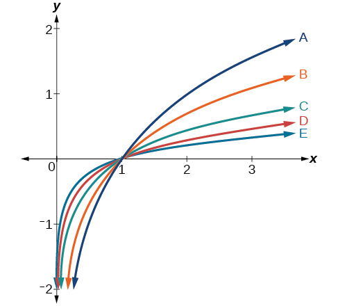{: #CNX_Precalc_Figure_04_04_201}

<math xmlns="http://www.w3.org/1998/Math/MathML"> <mrow> <mi>d</mi><mo stretchy="false">(</mo><mi>x</mi><mo stretchy="false">)</mo><mo>=</mo><mi>log</mi><mrow><mo>(</mo> <mi>x</mi> <mo>)</mo></mrow> </mrow> </math>

<math xmlns="http://www.w3.org/1998/Math/MathML"> <mrow> <mi>f</mi><mo stretchy="false">(</mo><mi>x</mi><mo stretchy="false">)</mo><mo>=</mo><mi>ln</mi><mo stretchy="false">(</mo><mi>x</mi><mo stretchy="false">)</mo> </mrow> </math>

B

<math xmlns="http://www.w3.org/1998/Math/MathML"> <mrow> <mi>g</mi><mo stretchy="false">(</mo><mi>x</mi><mo stretchy="false">)</mo><mo>=</mo><msub> <mrow> <mi>log</mi> </mrow> <mn>2</mn> </msub> <mrow><mo>(</mo> <mi>x</mi> <mo>)</mo></mrow> </mrow> </math>

<math xmlns="http://www.w3.org/1998/Math/MathML"> <mrow> <mi>h</mi><mo stretchy="false">(</mo><mi>x</mi><mo stretchy="false">)</mo><mo>=</mo><msub> <mrow> <mi>log</mi> </mrow> <mn>5</mn> </msub> <mrow><mo>(</mo> <mi>x</mi> <mo>)</mo></mrow> </mrow> </math>

C

<math xmlns="http://www.w3.org/1998/Math/MathML"> <mrow> <mi>j</mi><mo stretchy="false">(</mo><mi>x</mi><mo stretchy="false">)</mo><mo>=</mo><msub> <mrow> <mi>log</mi> </mrow> <mrow> <mn>25</mn> </mrow> </msub> <mrow><mo>(</mo> <mi>x</mi> <mo>)</mo></mrow> </mrow> </math>

For the following exercises, match each function in [\[link\]](#CNX_Precalc_Figure_04_04_202) with the letter corresponding to its graph.

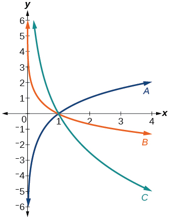{: #CNX_Precalc_Figure_04_04_202}

<math xmlns="http://www.w3.org/1998/Math/MathML"> <mrow> <mi>f</mi><mo stretchy="false">(</mo><mi>x</mi><mo stretchy="false">)</mo><mo>=</mo><msub> <mrow> <mi>log</mi> </mrow> <mrow> <mfrac> <mn>1</mn> <mn>3</mn> </mfrac> </mrow> </msub> <mrow><mo>(</mo> <mi>x</mi> <mo>)</mo></mrow> </mrow> </math>

B

<math xmlns="http://www.w3.org/1998/Math/MathML"> <mrow> <mi>g</mi><mo stretchy="false">(</mo><mi>x</mi><mo stretchy="false">)</mo><mo>=</mo><msub> <mrow> <mi>log</mi> </mrow> <mn>2</mn> </msub> <mrow><mo>(</mo> <mi>x</mi> <mo>)</mo></mrow> </mrow> </math>

<math xmlns="http://www.w3.org/1998/Math/MathML"> <mrow> <mi>h</mi><mo stretchy="false">(</mo><mi>x</mi><mo stretchy="false">)</mo><mo>=</mo><msub> <mrow> <mi>log</mi> </mrow> <mrow> <mfrac> <mn>3</mn> <mn>4</mn> </mfrac> </mrow> </msub> <mrow><mo>(</mo> <mi>x</mi> <mo>)</mo></mrow> </mrow> </math>

C

For the following exercises, sketch the graphs of each pair of functions on the same axis.

<math xmlns="http://www.w3.org/1998/Math/MathML"> <mrow> <mi>f</mi><mo stretchy="false">(</mo><mi>x</mi><mo stretchy="false">)</mo><mo>=</mo><mi>log</mi><mo stretchy="false">(</mo><mi>x</mi><mo stretchy="false">)</mo><mtext> </mtext> </mrow> </math>

and<math xmlns="http://www.w3.org/1998/Math/MathML"> <mrow> <mtext> </mtext><mi>g</mi><mo stretchy="false">(</mo><mi>x</mi><mo stretchy="false">)</mo><mo>=</mo><msup> <mrow> <mn>10</mn> </mrow> <mi>x</mi> </msup> </mrow> </math>

<math xmlns="http://www.w3.org/1998/Math/MathML"> <mrow> <mi>f</mi><mo stretchy="false">(</mo><mi>x</mi><mo stretchy="false">)</mo><mo>=</mo><mi>log</mi><mo stretchy="false">(</mo><mi>x</mi><mo stretchy="false">)</mo><mtext> </mtext> </mrow> </math>

and<math xmlns="http://www.w3.org/1998/Math/MathML"> <mrow> <mtext> </mtext><mi>g</mi><mo stretchy="false">(</mo><mi>x</mi><mo stretchy="false">)</mo><mo>=</mo><msub> <mrow> <mi>log</mi> </mrow> <mrow> <mfrac> <mn>1</mn> <mn>2</mn> </mfrac> </mrow> </msub> <mo stretchy="false">(</mo><mi>x</mi><mo stretchy="false">)</mo> </mrow> </math>

 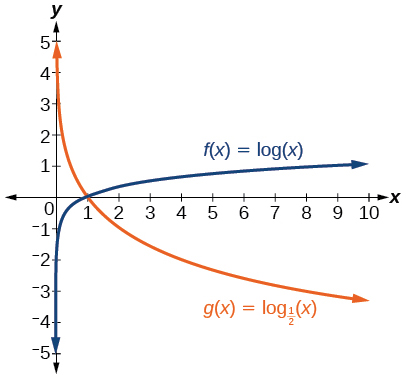 

<math xmlns="http://www.w3.org/1998/Math/MathML"> <mrow> <mi>f</mi><mo stretchy="false">(</mo><mi>x</mi><mo stretchy="false">)</mo><mo>=</mo><msub> <mrow> <mi>log</mi> </mrow> <mn>4</mn> </msub> <mo stretchy="false">(</mo><mi>x</mi><mo stretchy="false">)</mo><mtext> </mtext> </mrow> </math>

and<math xmlns="http://www.w3.org/1998/Math/MathML"> <mrow> <mtext> </mtext><mi>g</mi><mo stretchy="false">(</mo><mi>x</mi><mo stretchy="false">)</mo><mo>=</mo><mi>ln</mi><mo stretchy="false">(</mo><mi>x</mi><mo stretchy="false">)</mo> </mrow> </math>

<math xmlns="http://www.w3.org/1998/Math/MathML"> <mrow> <mi>f</mi><mo stretchy="false">(</mo><mi>x</mi><mo stretchy="false">)</mo><mo>=</mo><msup> <mi>e</mi> <mi>x</mi> </msup> <mtext> </mtext> </mrow> </math>

and<math xmlns="http://www.w3.org/1998/Math/MathML"> <mrow> <mtext> </mtext><mi>g</mi><mo stretchy="false">(</mo><mi>x</mi><mo stretchy="false">)</mo><mo>=</mo><mi>ln</mi><mo stretchy="false">(</mo><mi>x</mi><mo stretchy="false">)</mo> </mrow> </math>

 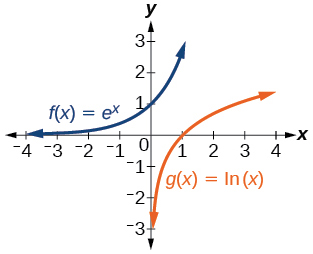 

For the following exercises, match each function in [\[link\]](#CNX_Precalc_Figure_04_04_207) with the letter corresponding to its graph.

{: #CNX_Precalc_Figure_04_04_207}

<math xmlns="http://www.w3.org/1998/Math/MathML"> <mrow> <mi>f</mi><mo stretchy="false">(</mo><mi>x</mi><mo stretchy="false">)</mo><mo>=</mo><msub> <mrow> <mi>log</mi> </mrow> <mn>4</mn> </msub> <mrow><mo>(</mo> <mrow> <mo>−</mo><mi>x</mi><mo>+</mo><mn>2</mn> </mrow> <mo>)</mo></mrow> </mrow> </math>

<math xmlns="http://www.w3.org/1998/Math/MathML"> <mrow> <mi>g</mi><mo stretchy="false">(</mo><mi>x</mi><mo stretchy="false">)</mo><mo>=</mo><mo>−</mo><msub> <mrow> <mi>log</mi> </mrow> <mn>4</mn> </msub> <mrow><mo>(</mo> <mrow> <mi>x</mi><mo>+</mo><mn>2</mn> </mrow> <mo>)</mo></mrow> </mrow> </math>

C

<math xmlns="http://www.w3.org/1998/Math/MathML"> <mrow> <mi>h</mi><mo stretchy="false">(</mo><mi>x</mi><mo stretchy="false">)</mo><mo>=</mo><msub> <mrow> <mi>log</mi> </mrow> <mn>4</mn> </msub> <mrow><mo>(</mo> <mrow> <mi>x</mi><mo>+</mo><mn>2</mn> </mrow> <mo>)</mo></mrow> </mrow> </math>

For the following exercises, sketch the graph of the indicated function.

<math xmlns="http://www.w3.org/1998/Math/MathML"> <mrow> <mtext> </mtext><mi>f</mi><mo stretchy="false">(</mo><mi>x</mi><mo stretchy="false">)</mo><mo>=</mo><msub> <mrow> <mi>log</mi> </mrow> <mn>2</mn> </msub> <mo stretchy="false">(</mo><mi>x</mi><mo>+</mo><mn>2</mn><mo stretchy="false">)</mo> </mrow> </math>

 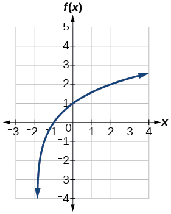 

<math xmlns="http://www.w3.org/1998/Math/MathML"> <mrow> <mtext> </mtext><mi>f</mi><mo stretchy="false">(</mo><mi>x</mi><mo stretchy="false">)</mo><mo>=</mo><mn>2</mn><mi>log</mi><mo stretchy="false">(</mo><mi>x</mi><mo stretchy="false">)</mo> </mrow> </math>

<math xmlns="http://www.w3.org/1998/Math/MathML"> <mrow> <mtext> </mtext><mi>f</mi><mo stretchy="false">(</mo><mi>x</mi><mo stretchy="false">)</mo><mo>=</mo><mi>ln</mi><mo stretchy="false">(</mo><mo>−</mo><mi>x</mi><mo stretchy="false">)</mo> </mrow> </math>

 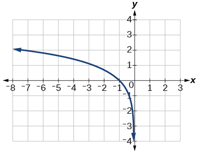 

<math xmlns="http://www.w3.org/1998/Math/MathML"> <mrow> <mi>g</mi><mo stretchy="false">(</mo><mi>x</mi><mo stretchy="false">)</mo><mo>=</mo><mi>log</mi><mrow><mo>(</mo> <mrow> <mn>4</mn><mi>x</mi><mo>+</mo><mn>16</mn> </mrow> <mo>)</mo></mrow><mo>+</mo><mn>4</mn> </mrow> </math>

<math xmlns="http://www.w3.org/1998/Math/MathML"> <mrow> <mi>g</mi><mo stretchy="false">(</mo><mi>x</mi><mo stretchy="false">)</mo><mo>=</mo><mi>log</mi><mrow><mo>(</mo> <mrow> <mn>6</mn><mo>−</mo><mn>3</mn><mi>x</mi> </mrow> <mo>)</mo></mrow><mo>+</mo><mn>1</mn> </mrow> </math>

 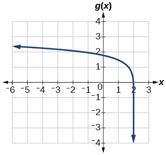 

<math xmlns="http://www.w3.org/1998/Math/MathML"> <mrow> <mi>h</mi><mo stretchy="false">(</mo><mi>x</mi><mo stretchy="false">)</mo><mo>=</mo><mo>−</mo><mfrac> <mn>1</mn> <mn>2</mn> </mfrac> <mi>ln</mi><mrow><mo>(</mo> <mrow> <mi>x</mi><mo>+</mo><mn>1</mn> </mrow> <mo>)</mo></mrow><mo>−</mo><mn>3</mn> </mrow> </math>

For the following exercises, write a logarithmic equation corresponding to the graph shown.

Use<math xmlns="http://www.w3.org/1998/Math/MathML"> <mrow> <mtext> </mtext><mi>y</mi><mo>=</mo><msub> <mrow> <mi>log</mi> </mrow> <mn>2</mn> </msub> <mo stretchy="false">(</mo><mi>x</mi><mo stretchy="false">)</mo><mtext> </mtext> </mrow> </math>

as the parent function.

 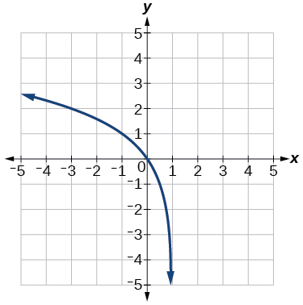 

<math xmlns="http://www.w3.org/1998/Math/MathML"> <mrow> <mtext> </mtext><mi>f</mi><mo stretchy="false">(</mo><mi>x</mi><mo stretchy="false">)</mo><mo>=</mo><msub> <mrow> <mi>log</mi> </mrow> <mn>2</mn> </msub> <mo stretchy="false">(</mo><mo>−</mo><mo stretchy="false">(</mo><mi>x</mi><mo>−</mo><mn>1</mn><mo stretchy="false">)</mo><mo stretchy="false">)</mo> </mrow> </math>

Use<math xmlns="http://www.w3.org/1998/Math/MathML"> <mrow> <mtext> </mtext><mi>f</mi><mo stretchy="false">(</mo><mi>x</mi><mo stretchy="false">)</mo><mo>=</mo><msub> <mrow> <mi>log</mi> </mrow> <mn>3</mn> </msub> <mo stretchy="false">(</mo><mi>x</mi><mo stretchy="false">)</mo><mtext> </mtext> </mrow> </math>

as the parent function.

 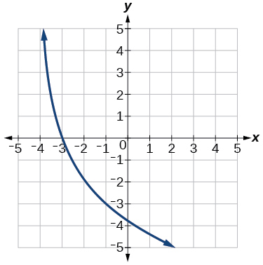 

Use<math xmlns="http://www.w3.org/1998/Math/MathML"> <mrow> <mtext> </mtext><mi>f</mi><mo stretchy="false">(</mo><mi>x</mi><mo stretchy="false">)</mo><mo>=</mo><msub> <mrow> <mi>log</mi> </mrow> <mn>4</mn> </msub> <mo stretchy="false">(</mo><mi>x</mi><mo stretchy="false">)</mo><mtext> </mtext> </mrow> </math>

as the parent function.

 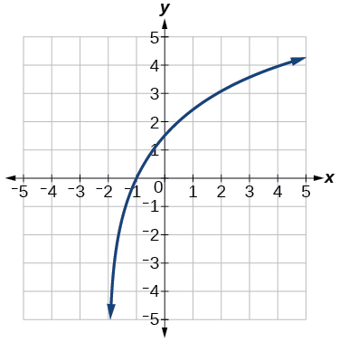 

<math xmlns="http://www.w3.org/1998/Math/MathML"> <mrow> <mi>f</mi><mo stretchy="false">(</mo><mi>x</mi><mo stretchy="false">)</mo><mo>=</mo><mn>3</mn><msub> <mrow> <mi>log</mi> </mrow> <mn>4</mn> </msub> <mo stretchy="false">(</mo><mi>x</mi><mo>+</mo><mn>2</mn><mo stretchy="false">)</mo> </mrow> </math>

Use<math xmlns="http://www.w3.org/1998/Math/MathML"> <mrow> <mtext> </mtext><mi>f</mi><mo stretchy="false">(</mo><mi>x</mi><mo stretchy="false">)</mo><mo>=</mo><msub> <mrow> <mi>log</mi> </mrow> <mn>5</mn> </msub> <mo stretchy="false">(</mo><mi>x</mi><mo stretchy="false">)</mo><mtext> </mtext> </mrow> </math>

as the parent function.

  

## Technology

For the following exercises, use a graphing calculator to find approximate solutions to each equation.

<math xmlns="http://www.w3.org/1998/Math/MathML"> <mrow> <mi>log</mi><mrow><mo>(</mo> <mrow> <mi>x</mi><mo>−</mo><mn>1</mn> </mrow> <mo>)</mo></mrow><mo>+</mo><mn>2</mn><mo>=</mo><mi>ln</mi><mrow><mo>(</mo> <mrow> <mi>x</mi><mo>−</mo><mn>1</mn> </mrow> <mo>)</mo></mrow><mo>+</mo><mn>2</mn> </mrow> </math>

<math xmlns="http://www.w3.org/1998/Math/MathML"> <mrow> <mi>x</mi><mo>=</mo><mn>2</mn> </mrow> </math>

<math xmlns="http://www.w3.org/1998/Math/MathML"> <mrow> <mi>log</mi><mrow><mo>(</mo> <mrow> <mn>2</mn><mi>x</mi><mo>−</mo><mn>3</mn> </mrow> <mo>)</mo></mrow><mo>+</mo><mn>2</mn><mo>=</mo><mo>−</mo><mi>log</mi><mrow><mo>(</mo> <mrow> <mn>2</mn><mi>x</mi><mo>−</mo><mn>3</mn> </mrow> <mo>)</mo></mrow><mo>+</mo><mn>5</mn> </mrow> </math>

<math xmlns="http://www.w3.org/1998/Math/MathML"> <mrow> <mi>ln</mi><mrow><mo>(</mo> <mrow> <mi>x</mi><mo>−</mo><mn>2</mn> </mrow> <mo>)</mo></mrow><mo>=</mo><mo>−</mo><mi>ln</mi><mrow><mo>(</mo> <mrow> <mi>x</mi><mo>+</mo><mn>1</mn> </mrow> <mo>)</mo></mrow> </mrow> </math>

<math xmlns="http://www.w3.org/1998/Math/MathML"> <mrow> <mi>x</mi><mo>≈</mo><mtext>2</mtext><mtext>.303</mtext> </mrow> </math>

<math xmlns="http://www.w3.org/1998/Math/MathML"> <mrow> <mn>2</mn><mi>ln</mi><mrow><mo>(</mo> <mrow> <mn>5</mn><mi>x</mi><mo>+</mo><mn>1</mn> </mrow> <mo>)</mo></mrow><mo>=</mo><mfrac> <mn>1</mn> <mn>2</mn> </mfrac> <mi>ln</mi><mrow><mo>(</mo> <mrow> <mo>−</mo><mn>5</mn><mi>x</mi> </mrow> <mo>)</mo></mrow><mo>+</mo><mn>1</mn> </mrow> </math>

<math xmlns="http://www.w3.org/1998/Math/MathML"> <mrow> <mfrac> <mn>1</mn> <mn>3</mn> </mfrac> <mi>log</mi><mrow><mo>(</mo> <mrow> <mn>1</mn><mo>−</mo><mi>x</mi> </mrow> <mo>)</mo></mrow><mo>=</mo><mi>log</mi><mrow><mo>(</mo> <mrow> <mi>x</mi><mo>+</mo><mn>1</mn> </mrow> <mo>)</mo></mrow><mo>+</mo><mfrac> <mn>1</mn> <mn>3</mn> </mfrac> </mrow> </math>

<math xmlns="http://www.w3.org/1998/Math/MathML"> <mrow> <mi>x</mi><mo>≈</mo><mo>−</mo><mn>0.472</mn> </mrow> </math>

## Extensions

Let<math xmlns="http://www.w3.org/1998/Math/MathML"> <mrow> <mtext> </mtext><mi>b</mi><mtext> </mtext> </mrow> </math>

be any positive real number such that<math xmlns="http://www.w3.org/1998/Math/MathML"> <mrow> <mtext> </mtext><mi>b</mi><mo>≠</mo><mn>1.</mn><mtext> </mtext> </mrow> </math>

What must<math xmlns="http://www.w3.org/1998/Math/MathML"> <mrow> <mtext> </mtext><msub> <mrow> <mi>log</mi> </mrow> <mi>b</mi> </msub> <mn>1</mn><mtext> </mtext> </mrow> </math>

be equal to? Verify the result.

Explore and discuss the graphs of<math xmlns="http://www.w3.org/1998/Math/MathML"> <mrow> <mtext> </mtext><mi>f</mi><mo stretchy="false">(</mo><mi>x</mi><mo stretchy="false">)</mo><mo>=</mo><msub> <mrow> <mi>log</mi> </mrow> <mrow> <mfrac> <mn>1</mn> <mn>2</mn> </mfrac> </mrow> </msub> <mrow><mo>(</mo> <mi>x</mi> <mo>)</mo></mrow><mtext> </mtext> </mrow> </math>

and<math xmlns="http://www.w3.org/1998/Math/MathML"> <mrow> <mtext> </mtext><mi>g</mi><mo stretchy="false">(</mo><mi>x</mi><mo stretchy="false">)</mo><mo>=</mo><mo>−</mo><msub> <mrow> <mi>log</mi> </mrow> <mn>2</mn> </msub> <mrow><mo>(</mo> <mi>x</mi> <mo>)</mo></mrow><mo>.</mo><mtext> </mtext> </mrow> </math>

Make a conjecture based on the result.

The graphs of<math xmlns="http://www.w3.org/1998/Math/MathML"> <mrow> <mtext> </mtext><mi>f</mi><mo stretchy="false">(</mo><mi>x</mi><mo stretchy="false">)</mo><mo>=</mo><msub> <mrow> <mi>log</mi> </mrow> <mrow> <mfrac> <mn>1</mn> <mn>2</mn> </mfrac> </mrow> </msub> <mrow><mo>(</mo> <mi>x</mi> <mo>)</mo></mrow><mtext> </mtext> </mrow> </math>

and<math xmlns="http://www.w3.org/1998/Math/MathML"> <mrow> <mtext> </mtext><mi>g</mi><mo stretchy="false">(</mo><mi>x</mi><mo stretchy="false">)</mo><mo>=</mo><mo>−</mo><msub> <mrow> <mi>log</mi> </mrow> <mn>2</mn> </msub> <mrow><mo>(</mo> <mi>x</mi> <mo>)</mo></mrow><mtext> </mtext> </mrow> </math>

appear to be the same; Conjecture: for any positive base<math xmlns="http://www.w3.org/1998/Math/MathML"> <mrow> <mtext> </mtext><mi>b</mi><mo>≠</mo><mn>1</mn><mo>,</mo> </mrow> </math>

<math xmlns="http://www.w3.org/1998/Math/MathML"> <mrow> <mtext> </mtext><msub> <mrow> <mi>log</mi> </mrow> <mi>b</mi> </msub> <mrow><mo>(</mo> <mi>x</mi> <mo>)</mo></mrow><mo>=</mo><mo>−</mo><msub> <mrow> <mi>log</mi> </mrow> <mrow> <mfrac> <mn>1</mn> <mi>b</mi> </mfrac> </mrow> </msub> <mrow><mo>(</mo> <mi>x</mi> <mo>)</mo></mrow><mo>.</mo> </mrow> </math>

Prove the conjecture made in the previous exercise.

What is the domain of the function<math xmlns="http://www.w3.org/1998/Math/MathML"> <mrow> <mtext> </mtext><mi>f</mi><mo stretchy="false">(</mo><mi>x</mi><mo stretchy="false">)</mo><mo>=</mo><mi>ln</mi><mrow><mo>(</mo> <mrow> <mfrac> <mrow> <mi>x</mi><mo>+</mo><mn>2</mn> </mrow> <mrow> <mi>x</mi><mo>−</mo><mn>4</mn> </mrow> </mfrac> </mrow> <mo>)</mo></mrow><mo>?</mo><mtext> </mtext> </mrow> </math>

Discuss the result.

Recall that the argument of a logarithmic function must be positive, so we determine where<math xmlns="http://www.w3.org/1998/Math/MathML"> <mrow> <mtext> </mtext><mfrac> <mrow> <mi>x</mi><mo>+</mo><mn>2</mn> </mrow> <mrow> <mi>x</mi><mo>−</mo><mn>4</mn> </mrow> </mfrac> <mo>&gt;</mo><mn>0</mn><mtext> </mtext> </mrow> </math>

. From the graph of the function<math xmlns="http://www.w3.org/1998/Math/MathML"> <mrow> <mtext> </mtext><mi>f</mi><mrow><mo>(</mo> <mi>x</mi> <mo>)</mo></mrow><mo>=</mo><mfrac> <mrow> <mi>x</mi><mo>+</mo><mn>2</mn> </mrow> <mrow> <mi>x</mi><mo>−</mo><mn>4</mn> </mrow> </mfrac> <mo>,</mo> </mrow> </math>

 note that the graph lies above the *x*-axis on the interval<math xmlns="http://www.w3.org/1998/Math/MathML"> <mrow> <mtext> </mtext><mrow><mo>(</mo> <mrow> <mo>−</mo><mi>∞</mi><mo>,</mo><mo>−</mo><mn>2</mn> </mrow> <mo>)</mo></mrow><mtext> </mtext> </mrow> </math>

and again to the right of the vertical asymptote, that is<math xmlns="http://www.w3.org/1998/Math/MathML"> <mrow> <mtext> </mtext><mrow><mo>(</mo> <mrow> <mn>4</mn><mo>,</mo><mi>∞</mi> </mrow> <mo>)</mo></mrow><mo>.</mo><mtext> </mtext> </mrow> </math>

Therefore, the domain is<math xmlns="http://www.w3.org/1998/Math/MathML"> <mrow> <mtext> </mtext><mrow><mo>(</mo> <mrow> <mo>−</mo><mi>∞</mi><mo>,</mo><mo>−</mo><mn>2</mn> </mrow> <mo>)</mo></mrow><mo>∪</mo><mrow><mo>(</mo> <mrow> <mn>4</mn><mo>,</mo><mi>∞</mi> </mrow> <mo>)</mo></mrow><mo>.</mo> </mrow> </math>

 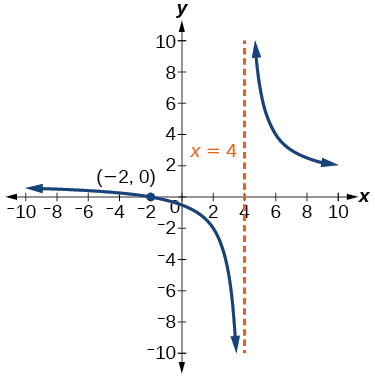 

Use properties of exponents to find the *x*-intercepts of the function<math xmlns="http://www.w3.org/1998/Math/MathML"> <mrow> <mtext> </mtext><mi>f</mi><mo stretchy="false">(</mo><mi>x</mi><mo stretchy="false">)</mo><mo>=</mo><mi>log</mi><mrow><mo>(</mo> <mrow> <msup> <mi>x</mi> <mn>2</mn> </msup> <mo>+</mo><mn>4</mn><mi>x</mi><mo>+</mo><mn>4</mn> </mrow> <mo>)</mo></mrow><mtext> </mtext> </mrow> </math>

algebraically. Show the steps for solving, and then verify the result by graphing the function.

[1]: http://openstaxcollege.org/l/graphexplog
[2]: http://openstaxcollege.org/l/matchexplog
[3]: http://openstaxcollege.org/l/domainlog
