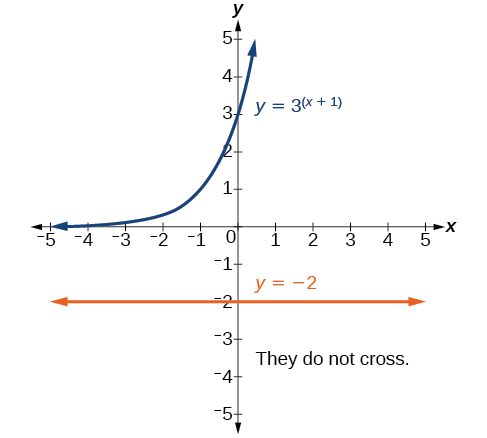
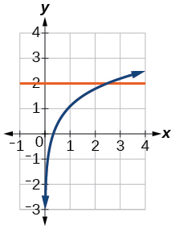
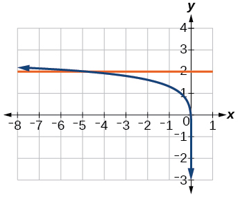
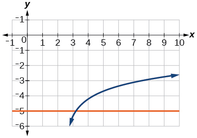
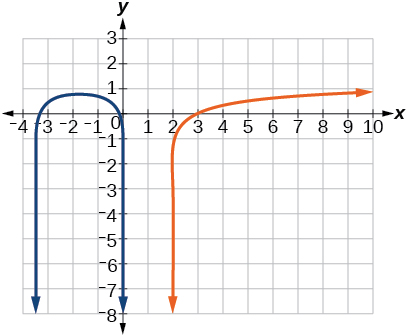
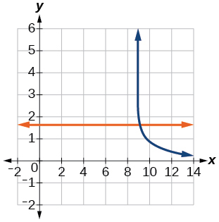
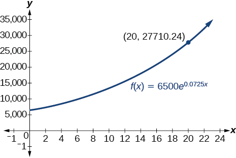
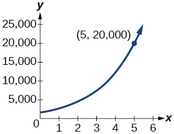

In this section, you will:
* Use like bases to solve exponential equations.
* Use logarithms to solve exponential equations.
* Use the definition of a logarithm to solve logarithmic equations.
* Use the one-to-one property of logarithms to solve logarithmic equations.
* Solve applied problems involving exponential and logarithmic equations.

 "){: #CNX_Precalc_Figure_04_06_001}

In 1859, an Australian landowner named Thomas Austin released 24 rabbits into the wild for hunting. Because Australia had few predators and ample food, the rabbit population exploded. In fewer than ten years, the rabbit population numbered in the millions.

Uncontrolled population growth, as in the wild rabbits in Australia, can be modeled with exponential functions. Equations resulting from those exponential functions can be solved to analyze and make predictions about exponential growth. In this section, we will learn techniques for solving exponential functions.

### Using Like Bases to Solve Exponential Equations

The first technique involves two functions with like bases. Recall that the one-to-one property of exponential functions tells us that, for any real numbers<math xmlns="http://www.w3.org/1998/Math/MathML"> <mrow> <mtext> </mtext><mi>b</mi><mo>,</mo> </mrow> </math>

 <math xmlns="http://www.w3.org/1998/Math/MathML"> <mrow> <mi>S</mi><mo>,</mo> </mrow> </math>

 and<math xmlns="http://www.w3.org/1998/Math/MathML"> <mrow> <mtext> </mtext><mi>T</mi><mo>,</mo> </mrow> </math>

 where<math xmlns="http://www.w3.org/1998/Math/MathML"> <mrow> <mtext> </mtext><mi>b</mi><mo>&gt;</mo><mn>0</mn><mo>,</mo><mtext> </mtext><mi>b</mi><mo>≠</mo><mn>1</mn><mo>,</mo> </mrow> </math>

<math xmlns="http://www.w3.org/1998/Math/MathML"> <mrow> <msup> <mi>b</mi> <mi>S</mi> </msup> <mo>=</mo><msup> <mi>b</mi> <mi>T</mi> </msup> <mtext> </mtext> </mrow> </math>

if and only if<math xmlns="http://www.w3.org/1998/Math/MathML"> <mrow> <mtext> </mtext><mi>S</mi><mo>=</mo><mi>T</mi><mo>.</mo> </mrow> </math>

In other words, when an **exponential equation**{: data-type="term" .no-emphasis} has the same base on each side, the exponents must be equal. This also applies when the exponents are algebraic expressions. Therefore, we can solve many exponential equations by using the rules of exponents to rewrite each side as a power with the same base. Then, we use the fact that exponential functions are one-to-one to set the exponents equal to one another, and solve for the unknown.

For example, consider the equation<math xmlns="http://www.w3.org/1998/Math/MathML"> <mrow> <mtext> </mtext><msup> <mn>3</mn> <mrow> <mn>4</mn><mi>x</mi><mo>−</mo><mn>7</mn> </mrow> </msup> <mo>=</mo><mfrac> <mrow> <msup> <mn>3</mn> <mrow> <mn>2</mn><mi>x</mi> </mrow> </msup> </mrow> <mn>3</mn> </mfrac> <mo>.</mo><mtext> </mtext> </mrow> </math>

To solve for<math xmlns="http://www.w3.org/1998/Math/MathML"> <mrow> <mtext> </mtext><mi>x</mi><mo>,</mo> </mrow> </math>

 we use the division property of exponents to rewrite the right side so that both sides have the common base,<math xmlns="http://www.w3.org/1998/Math/MathML"> <mrow> <mtext> </mtext><mn>3.</mn><mtext> </mtext> </mrow> </math>

Then we apply the one-to-one property of exponents by setting the exponents equal to one another and solving for<math xmlns="http://www.w3.org/1998/Math/MathML"> <mrow> <mtext> </mtext><mi>x</mi><mo>:</mo> </mrow> </math>

<math xmlns="http://www.w3.org/1998/Math/MathML" display="block"> <mrow> <mtable columnalign="left"> <mtr columnalign="left"> <mtd columnalign="left"> <mrow> <mtext> </mtext><mtext> </mtext><msup> <mn>3</mn> <mrow> <mn>4</mn><mi>x</mi><mo>−</mo><mn>7</mn> </mrow> </msup> </mrow> </mtd> <mtd columnalign="left"> <mrow> <mo>=</mo><mfrac> <mrow> <msup> <mn>3</mn> <mrow> <mn>2</mn><mi>x</mi> </mrow> </msup> </mrow> <mn>3</mn> </mfrac> </mrow> </mtd> <mtd columnalign="left"> <mrow /> </mtd> </mtr> <mtr columnalign="left"> <mtd columnalign="left"> <mrow> <mtext> </mtext><mtext> </mtext><msup> <mn>3</mn> <mrow> <mn>4</mn><mi>x</mi><mo>−</mo><mn>7</mn> </mrow> </msup> </mrow> </mtd> <mtd columnalign="left"> <mrow> <mo>=</mo><mfrac> <mrow> <msup> <mn>3</mn> <mrow> <mn>2</mn><mi>x</mi> </mrow> </msup> </mrow> <mrow> <msup> <mn>3</mn> <mn>1</mn> </msup> </mrow> </mfrac> </mrow> </mtd> <mtd columnalign="left"> <mrow> <msup> <mrow> <mtext>Rewrite 3 as 3</mtext> </mrow> <mn>1</mn> </msup> <mo>.</mo> </mrow> </mtd> </mtr> <mtr columnalign="left"> <mtd columnalign="left"> <mrow> <mtext> </mtext><mtext> </mtext><msup> <mn>3</mn> <mrow> <mn>4</mn><mi>x</mi><mo>−</mo><mn>7</mn> </mrow> </msup> </mrow> </mtd> <mtd columnalign="left"> <mrow> <mo>=</mo><msup> <mn>3</mn> <mrow> <mn>2</mn><mi>x</mi><mo>−</mo><mn>1</mn> </mrow> </msup> </mrow> </mtd> <mtd columnalign="left"> <mrow> <mtext>Use the division property of exponents</mtext><mtext>.</mtext> </mrow> </mtd> </mtr> <mtr columnalign="left"> <mtd columnalign="left"> <mrow> <mn>4</mn><mi>x</mi><mo>−</mo><mn>7</mn> </mrow> </mtd> <mtd columnalign="left"> <mrow> <mo>=</mo><mn>2</mn><mi>x</mi><mo>−</mo><mn>1</mn><mtext> </mtext><mtext> </mtext><mtext> </mtext> </mrow> </mtd> <mtd columnalign="left"> <mrow> <mtext>Apply the one-to-one property of exponents</mtext><mtext>.</mtext> </mrow> </mtd> </mtr> <mtr columnalign="left"> <mtd columnalign="left"> <mrow> <mtext> </mtext><mtext> </mtext><mtext> </mtext><mtext> </mtext><mtext> </mtext><mn>2</mn><mi>x</mi> </mrow> </mtd> <mtd columnalign="left"> <mrow> <mo>=</mo><mn>6</mn> </mrow> </mtd> <mtd columnalign="left"> <mrow> <mtext>Subtract 2</mtext><mi>x</mi><mtext> and add 7 to both sides</mtext><mtext>.</mtext> </mrow> </mtd> </mtr> <mtr columnalign="left"> <mtd columnalign="left"> <mrow> <mtext> </mtext><mtext> </mtext><mtext> </mtext><mtext> </mtext><mtext> </mtext><mtext> </mtext><mtext> </mtext><mi>x</mi> </mrow> </mtd> <mtd columnalign="left"> <mrow> <mo>=</mo><mn>3</mn> </mrow> </mtd> <mtd columnalign="left"> <mrow> <mtext>Divide by 3</mtext><mtext>.</mtext> </mrow> </mtd> </mtr> </mtable> </mrow> </math>

Using the One-to-One Property of Exponential Functions to Solve Exponential Equations

For any algebraic expressions<math xmlns="http://www.w3.org/1998/Math/MathML"> <mrow> <mtext> </mtext><mi>S</mi><mtext> and </mtext><mi>T</mi><mo>,</mo> </mrow> </math>

 and any positive real number<math xmlns="http://www.w3.org/1998/Math/MathML"> <mrow> <mtext> </mtext><mi>b</mi><mo>≠</mo><mn>1</mn><mo>,</mo> </mrow> </math>

<math xmlns="http://www.w3.org/1998/Math/MathML" display="block"> <mrow> <msup> <mi>b</mi> <mi>S</mi> </msup> <mo>=</mo><msup> <mi>b</mi> <mi>T</mi> </msup> <mtext> </mtext><mtext> </mtext><mtext>if and only if</mtext><mtext> </mtext><mtext> </mtext><mi>S</mi><mo>=</mo><mi>T</mi> </mrow> </math>

**Given an exponential equation with the form<math xmlns="http://www.w3.org/1998/Math/MathML"> <mrow> <mtext> </mtext><msup> <mi>b</mi> <mi>S</mi> </msup> <mo>=</mo><msup> <mi>b</mi> <mi>T</mi> </msup> <mo>,</mo> </mrow> </math>

 where <math xmlns="http://www.w3.org/1998/Math/MathML"> <mrow> <mtext> </mtext><mi>S</mi><mtext> </mtext> </mrow> </math>

 and <math xmlns="http://www.w3.org/1998/Math/MathML"> <mrow> <mtext> </mtext><mi>T</mi><mtext> </mtext> </mrow> </math>

 are algebraic expressions with an unknown, solve for the unknown.**

1.  Use the rules of exponents to simplify, if necessary, so that the resulting equation has the form
    <math xmlns="http://www.w3.org/1998/Math/MathML"> <mrow> <mtext> </mtext><msup> <mi>b</mi> <mi>S</mi> </msup> <mo>=</mo><msup> <mi>b</mi> <mi>T</mi> </msup> <mo>.</mo> </mrow> </math>

2.  Use the one-to-one property to set the exponents equal.
3.  Solve the resulting equation,
    <math xmlns="http://www.w3.org/1998/Math/MathML"> <mrow> <mtext> </mtext><mi>S</mi><mo>=</mo><mi>T</mi><mo>,</mo> </mrow> </math>
    
    for the unknown.
{: type="1"}

Solving an Exponential Equation with a Common Base

Solve<math xmlns="http://www.w3.org/1998/Math/MathML"> <mrow> <mtext> </mtext><msup> <mn>2</mn> <mrow> <mi>x</mi><mo>−</mo><mn>1</mn> </mrow> </msup> <mo>=</mo><msup> <mn>2</mn> <mrow> <mn>2</mn><mi>x</mi><mo>−</mo><mn>4</mn> </mrow> </msup> <mo>.</mo> </mrow> </math>

<math xmlns="http://www.w3.org/1998/Math/MathML" display="block"> <mrow> <mtable columnalign="left"> <mtr columnalign="left"> <mtd columnalign="left"> <mrow> <mo> </mo><msup> <mn>2</mn> <mrow> <mi>x</mi><mo>−</mo><mn>1</mn> </mrow> </msup> <mo>=</mo><msup> <mn>2</mn> <mrow> <mn>2</mn><mi>x</mi><mo>−</mo><mn>4</mn> </mrow> </msup> </mrow> </mtd> <mtd columnalign="left"> <mrow> <mtext>The common base is  </mtext><mn>2.</mn> </mrow> </mtd> </mtr> <mtr columnalign="left"> <mtd columnalign="left"> <mrow> <mtext>    </mtext><mi>x</mi><mo>−</mo><mn>1</mn><mo>=</mo><mn>2</mn><mi>x</mi><mo>−</mo><mn>4</mn><mtable> <mtr> <mtd> <mrow /> </mtd> <mtd> <mrow /> </mtd> <mtd> <mrow /> </mtd> <mtd> <mrow /> </mtd> </mtr> </mtable> </mrow> </mtd> <mtd columnalign="left"> <mrow> <mtext>By the one-to-one property the exponents must be equal</mtext><mo>.</mo> </mrow> </mtd> </mtr> <mtr columnalign="left"> <mtd columnalign="left"> <mrow> <mtext>         </mtext><mtext> </mtext><mtext> </mtext><mi>x</mi><mo>=</mo><mn>3</mn> </mrow> </mtd> <mtd columnalign="left"> <mrow> <mtext>Solve for </mtext><mi>x</mi><mo>.</mo> </mrow> </mtd> </mtr> </mtable> </mrow> </math>

Solve<math xmlns="http://www.w3.org/1998/Math/MathML"> <mrow> <mtext> </mtext><msup> <mn>5</mn> <mrow> <mn>2</mn><mi>x</mi> </mrow> </msup> <mo>=</mo><msup> <mn>5</mn> <mrow> <mn>3</mn><mi>x</mi><mo>+</mo><mn>2</mn> </mrow> </msup> <mo>.</mo> </mrow> </math>

<math xmlns="http://www.w3.org/1998/Math/MathML"> <mrow> <mi>x</mi><mo>=</mo><mo>−</mo><mn>2</mn> </mrow> </math>

#### Rewriting Equations So All Powers Have the Same Base

Sometimes the **common base**{: data-type="term" .no-emphasis} for an exponential equation is not explicitly shown. In these cases, we simply rewrite the terms in the equation as powers with a common base, and solve using the one-to-one property.

For example, consider the equation<math xmlns="http://www.w3.org/1998/Math/MathML"> <mrow> <mtext> </mtext><mn>256</mn><mo>=</mo><msup> <mn>4</mn> <mrow> <mi>x</mi><mo>−</mo><mn>5</mn> </mrow> </msup> <mo>.</mo><mtext> </mtext> </mrow> </math>

We can rewrite both sides of this equation as a power of<math xmlns="http://www.w3.org/1998/Math/MathML"> <mrow> <mtext>  </mtext><mn>2.</mn><mtext> </mtext> </mrow> </math>

Then we apply the rules of exponents, along with the one-to-one property, to solve for<math xmlns="http://www.w3.org/1998/Math/MathML"> <mrow> <mtext> </mtext><mi>x</mi><mo>:</mo> </mrow> </math>

<math xmlns="http://www.w3.org/1998/Math/MathML" display="block"> <mrow> <mtable columnalign="left"> <mtr columnalign="left"> <mtd columnalign="left"> <mrow> <mn>256</mn><mo>=</mo><msup> <mn>4</mn> <mrow> <mi>x</mi><mo>−</mo><mn>5</mn> </mrow> </msup> </mrow> </mtd> <mtd columnalign="left"> <mrow /> </mtd> </mtr> <mtr columnalign="left"> <mtd columnalign="left"> <mrow> <mtext> </mtext><mtext> </mtext><mtext> </mtext><msup> <mn>2</mn> <mn>8</mn> </msup> <mo>=</mo><msup> <mrow> <mrow><mo>(</mo> <mrow> <msup> <mn>2</mn> <mn>2</mn> </msup> </mrow> <mo>)</mo></mrow> </mrow> <mrow> <mi>x</mi><mo>−</mo><mn>5</mn> </mrow> </msup> </mrow> </mtd> <mtd columnalign="left"> <mrow> <mtext>Rewrite each side as a power with base 2</mtext><mo>.</mo> </mrow> </mtd> </mtr> <mtr columnalign="left"> <mtd columnalign="left"> <mrow> <mtext> </mtext><mtext> </mtext><mtext> </mtext><msup> <mn>2</mn> <mn>8</mn> </msup> <mo>=</mo><msup> <mn>2</mn> <mrow> <mn>2</mn><mi>x</mi><mo>−</mo><mn>10</mn> </mrow> </msup> </mrow> </mtd> <mtd columnalign="left"> <mrow> <mtext>Use the one-to-one property of exponents</mtext><mo>.</mo> </mrow> </mtd> </mtr> <mtr columnalign="left"> <mtd columnalign="left"> <mrow> <mtext> </mtext><mtext> </mtext><mtext> </mtext><mtext> </mtext><mtext> </mtext><mtext> </mtext><mn>8</mn><mo>=</mo><mn>2</mn><mi>x</mi><mo>−</mo><mn>10</mn><mtable> <mtr> <mtd> <mrow /> </mtd> <mtd> <mrow /> </mtd> <mtd> <mrow /> </mtd> <mtd> <mrow /> </mtd> </mtr> </mtable> </mrow> </mtd> <mtd columnalign="left"> <mrow> <mtext>Apply the one-to-one property of exponents</mtext><mo>.</mo> </mrow> </mtd> </mtr> <mtr columnalign="left"> <mtd columnalign="left"> <mrow> <mtext> </mtext><mtext> </mtext><mtext> </mtext><mn>18</mn><mo>=</mo><mn>2</mn><mi>x</mi> </mrow> </mtd> <mtd columnalign="left"> <mrow> <mtext>Add 10 to both sides</mtext><mo>.</mo> </mrow> </mtd> </mtr> <mtr columnalign="left"> <mtd columnalign="left"> <mrow> <mtext> </mtext><mtext> </mtext><mtext> </mtext><mtext> </mtext><mtext> </mtext><mtext> </mtext><mi>x</mi><mo>=</mo><mn>9</mn> </mrow> </mtd> <mtd columnalign="left"> <mrow> <mtext>Divide by 2</mtext><mo>.</mo> </mrow> </mtd> </mtr> </mtable> </mrow> </math>

**Given an exponential equation with unlike bases, use the one-to-one property to solve it.**

1.  Rewrite each side in the equation as a power with a common base.
2.  Use the rules of exponents to simplify, if necessary, so that the resulting equation has the form
    <math xmlns="http://www.w3.org/1998/Math/MathML"> <mrow> <mtext> </mtext><msup> <mi>b</mi> <mi>S</mi> </msup> <mo>=</mo><msup> <mi>b</mi> <mi>T</mi> </msup> <mo>.</mo> </mrow> </math>

3.  Use the one-to-one property to set the exponents equal.
4.  Solve the resulting equation,
    <math xmlns="http://www.w3.org/1998/Math/MathML"> <mrow> <mtext> </mtext><mi>S</mi><mo>=</mo><mi>T</mi><mo>,</mo> </mrow> </math>
    
    for the unknown.
{: type="1"}

Solving Equations by Rewriting Them to Have a Common Base

Solve<math xmlns="http://www.w3.org/1998/Math/MathML"> <mrow> <mtext> </mtext><msup> <mn>8</mn> <mrow> <mi>x</mi><mo>+</mo><mn>2</mn> </mrow> </msup> <mo>=</mo><msup> <mrow> <mn>16</mn> </mrow> <mrow> <mi>x</mi><mo>+</mo><mn>1</mn> </mrow> </msup> <mo>.</mo> </mrow> </math>

<math xmlns="http://www.w3.org/1998/Math/MathML" display="block"> <mrow> <mtable columnalign="left"> <mtr columnalign="left"> <mtd columnalign="left"> <mrow> <mtext> </mtext><mtext>    </mtext><msup> <mn>8</mn> <mrow> <mi>x</mi><mo>+</mo><mn>2</mn> </mrow> </msup> <mo>=</mo><msup> <mrow> <mn>16</mn> </mrow> <mrow> <mi>x</mi><mo>+</mo><mn>1</mn> </mrow> </msup> </mrow> </mtd> <mtd columnalign="left"> <mrow /> </mtd> </mtr> <mtr columnalign="left"> <mtd columnalign="left"> <mrow> <msup> <mrow> <mrow><mo>(</mo> <mrow> <msup> <mn>2</mn> <mn>3</mn> </msup> </mrow> <mo>)</mo></mrow> </mrow> <mrow> <mi>x</mi><mo>+</mo><mn>2</mn> </mrow> </msup> <mo>=</mo><msup> <mrow> <mrow><mo>(</mo> <mrow> <msup> <mn>2</mn> <mn>4</mn> </msup> </mrow> <mo>)</mo></mrow> </mrow> <mrow> <mi>x</mi><mo>+</mo><mn>1</mn> </mrow> </msup> </mrow> </mtd> <mtd columnalign="left"> <mrow> <mtext>Write  </mtext><mn>8</mn><mtext> and </mtext><mn>16</mn><mtext> as powers of  </mtext><mn>2.</mn> </mrow> </mtd> </mtr> <mtr columnalign="left"> <mtd columnalign="left"> <mrow> <mtext>   </mtext><msup> <mn>2</mn> <mrow> <mn>3</mn><mi>x</mi><mo>+</mo><mn>6</mn> </mrow> </msup> <mo>=</mo><msup> <mn>2</mn> <mrow> <mn>4</mn><mi>x</mi><mo>+</mo><mn>4</mn> </mrow> </msup> </mrow> </mtd> <mtd columnalign="left"> <mrow> <mtext>To take a power of a power, multiply exponents</mtext><mo>.</mo> </mrow> </mtd> </mtr> <mtr columnalign="left"> <mtd columnalign="left"> <mrow> <mtext>   </mtext><mn>3</mn><mi>x</mi><mo>+</mo><mn>6</mn><mo>=</mo><mn>4</mn><mi>x</mi><mo>+</mo><mn>4</mn> </mrow> </mtd> <mtd columnalign="left"> <mrow> <mtext>Use the one-to-one property to set the exponents equal</mtext><mo>.</mo> </mrow> </mtd> </mtr> <mtr columnalign="left"> <mtd columnalign="left"> <mrow> <mtext> </mtext><mtext>           </mtext><mi>x</mi><mo>=</mo><mn>2</mn> </mrow> </mtd> <mtd columnalign="left"> <mrow> <mtext>Solve for </mtext><mi>x</mi><mo>.</mo> </mrow> </mtd> </mtr> </mtable> </mrow> </math>

Solve<math xmlns="http://www.w3.org/1998/Math/MathML"> <mrow> <mtext> </mtext><msup> <mn>5</mn> <mrow> <mn>2</mn><mi>x</mi> </mrow> </msup> <mo>=</mo><msup> <mrow> <mn>25</mn> </mrow> <mrow> <mn>3</mn><mi>x</mi><mo>+</mo><mn>2</mn> </mrow> </msup> <mo>.</mo> </mrow> </math>

<math xmlns="http://www.w3.org/1998/Math/MathML"> <mrow> <mi>x</mi><mo>=</mo><mo>−</mo><mn>1</mn> </mrow> </math>

Solving Equations by Rewriting Roots with Fractional Exponents to Have a Common Base

Solve<math xmlns="http://www.w3.org/1998/Math/MathML"> <mrow> <mtext> </mtext><msup> <mn>2</mn> <mrow> <mn>5</mn><mi>x</mi> </mrow> </msup> <mo>=</mo><msqrt> <mn>2</mn> </msqrt> <mo>.</mo> </mrow> </math>

<math xmlns="http://www.w3.org/1998/Math/MathML" display="block"> <mrow> <mtable columnalign="left"> <mtr columnalign="left"> <mtd columnalign="left"> <mrow> <msup> <mn>2</mn> <mrow> <mn>5</mn><mi>x</mi> </mrow> </msup> <mo>=</mo><msup> <mn>2</mn> <mrow> <mfrac> <mn>1</mn> <mn>2</mn> </mfrac> <mtext> </mtext><mtext> </mtext><mtext> </mtext><mtext> </mtext><mtext> </mtext> </mrow> </msup> </mrow> </mtd> <mtd columnalign="left"> <mrow> <mtext>Write the square root of  2 as a power of  </mtext><mn>2.</mn> </mrow> </mtd> </mtr> <mtr columnalign="left"> <mtd columnalign="left"> <mrow> <mtext> </mtext><mtext> </mtext><mn>5</mn><mi>x</mi><mo>=</mo><mfrac> <mn>1</mn> <mn>2</mn> </mfrac> </mrow> </mtd> <mtd columnalign="left"> <mrow> <mtext>Use the one-to-one property</mtext><mo>.</mo> </mrow> </mtd> </mtr> <mtr columnalign="left"> <mtd columnalign="left"> <mrow> <mtext> </mtext><mtext> </mtext><mtext> </mtext><mtext> </mtext><mtext> </mtext><mi>x</mi><mo>=</mo><mfrac> <mn>1</mn> <mrow> <mn>10</mn> </mrow> </mfrac> </mrow> </mtd> <mtd columnalign="left"> <mrow> <mtext>Solve for </mtext><mi>x</mi><mo>.</mo> </mrow> </mtd> </mtr> </mtable> </mrow> </math>

Solve<math xmlns="http://www.w3.org/1998/Math/MathML"> <mrow> <mtext> </mtext><msup> <mn>5</mn> <mi>x</mi> </msup> <mo>=</mo><msqrt> <mn>5</mn> </msqrt> <mo>.</mo> </mrow> </math>

<math xmlns="http://www.w3.org/1998/Math/MathML"> <mrow> <mi>x</mi><mo>=</mo><mfrac> <mn>1</mn> <mn>2</mn> </mfrac> </mrow> </math>

**Do all exponential equations have a solution? If not, how can we tell if there is a solution during the problem-solving process?**

*No. Recall that the range of an exponential function is always positive. While solving the equation, we may obtain an expression that is undefined.*

Solving an Equation with Positive and Negative Powers

Solve<math xmlns="http://www.w3.org/1998/Math/MathML"> <mrow> <mtext> </mtext><msup> <mn>3</mn> <mrow> <mi>x</mi><mo>+</mo><mn>1</mn> </mrow> </msup> <mo>=</mo><mn>−2.</mn> </mrow> </math>

This equation has no solution. There is no real value of<math xmlns="http://www.w3.org/1998/Math/MathML"> <mrow> <mtext> </mtext><mi>x</mi><mtext> </mtext> </mrow> </math>

that will make the equation a true statement because any power of a positive number is positive.

Analysis

[[link]](#CNX_Precalc_Figure_04_06_002) shows that the two graphs do not cross so the left side is never equal to the right side. Thus the equation has no solution.

{: #CNX_Precalc_Figure_04_06_002}

Solve<math xmlns="http://www.w3.org/1998/Math/MathML"> <mrow> <mtext> </mtext><msup> <mn>2</mn> <mi>x</mi> </msup> <mo>=</mo><mn>−100.</mn> </mrow> </math>

The equation has no solution.

### Solving Exponential Equations Using Logarithms

Sometimes the terms of an exponential equation cannot be rewritten with a common base. In these cases, we solve by taking the logarithm of each side. Recall, since<math xmlns="http://www.w3.org/1998/Math/MathML"> <mrow> <mtext> </mtext><mi>log</mi><mrow><mo>(</mo> <mi>a</mi> <mo>)</mo></mrow><mo>=</mo><mi>log</mi><mrow><mo>(</mo> <mi>b</mi> <mo>)</mo></mrow><mtext> </mtext> </mrow> </math>

is equivalent to<math xmlns="http://www.w3.org/1998/Math/MathML"> <mrow> <mtext> </mtext><mi>a</mi><mo>=</mo><mi>b</mi><mo>,</mo> </mrow> </math>

 we may apply logarithms with the same base on both sides of an exponential equation.

**Given an exponential equation in which a common base cannot be found, solve for the unknown.**

1.  Apply the logarithm of both sides of the equation.
    * If one of the terms in the equation has base 10, use the common logarithm.
    * If none of the terms in the equation has base 10, use the natural logarithm.
    {: data-bullet-style="bullet"}

2.  Use the rules of logarithms to solve for the unknown.
{: type="1"}

Solving an Equation Containing Powers of Different Bases

Solve<math xmlns="http://www.w3.org/1998/Math/MathML"> <mrow> <mtext> </mtext><msup> <mn>5</mn> <mrow> <mi>x</mi><mo>+</mo><mn>2</mn> </mrow> </msup> <mo>=</mo><msup> <mn>4</mn> <mi>x</mi> </msup> <mo>.</mo> </mrow> </math>

<math xmlns="http://www.w3.org/1998/Math/MathML" display="block"> <mrow> <mtable columnalign="left"> <mtr columnalign="left"> <mtd columnalign="left"> <mrow> <mtext>          </mtext><mtext> </mtext><mtext> </mtext><msup> <mn>5</mn> <mrow> <mi>x</mi><mo>+</mo><mn>2</mn> </mrow> </msup> <mo>=</mo><msup> <mn>4</mn> <mi>x</mi> </msup> </mrow> </mtd> <mtd columnalign="left"> <mrow> <mtext>There is no easy way to get the powers to have the same base</mtext><mo>.</mo> </mrow> </mtd> </mtr> <mtr columnalign="left"> <mtd columnalign="left"> <mrow> <mtext>        </mtext><mtext> </mtext><mi>ln</mi><msup> <mn>5</mn> <mrow> <mi>x</mi><mo>+</mo><mn>2</mn> </mrow> </msup> <mo>=</mo><mi>ln</mi><msup> <mn>4</mn> <mi>x</mi> </msup> </mrow> </mtd> <mtd columnalign="left"> <mrow> <mtext>Take ln of both sides</mtext><mo>.</mo> </mrow> </mtd> </mtr> <mtr columnalign="left"> <mtd columnalign="left"> <mrow> <mtext>    </mtext><mtext> </mtext><mo stretchy="false">(</mo><mi>x</mi><mo>+</mo><mn>2</mn><mo stretchy="false">)</mo><mi>ln</mi><mn>5</mn><mo>=</mo><mi>x</mi><mi>ln</mi><mn>4</mn> </mrow> </mtd> <mtd columnalign="left"> <mrow> <mtext>Use laws of logs</mtext><mo>.</mo> </mrow> </mtd> </mtr> <mtr columnalign="left"> <mtd columnalign="left"> <mrow> <mtext>  </mtext><mi>x</mi><mi>ln</mi><mn>5</mn><mo>+</mo><mn>2</mn><mi>ln</mi><mn>5</mn><mo>=</mo><mi>x</mi><mi>ln</mi><mn>4</mn> </mrow> </mtd> <mtd columnalign="left"> <mrow> <mtext>Use the distributive law</mtext><mo>.</mo> </mrow> </mtd> </mtr> <mtr columnalign="left"> <mtd columnalign="left"> <mrow> <mtext>  </mtext><mi>x</mi><mi>ln</mi><mn>5</mn><mo>−</mo><mi>x</mi><mi>ln</mi><mn>4</mn><mo>=</mo><mo>−</mo><mn>2</mn><mi>ln</mi><mn>5</mn> </mrow> </mtd> <mtd columnalign="left"> <mrow> <mtext>Get terms containing </mtext><mi>x</mi><mtext> on one side, terms without </mtext><mi>x</mi><mtext> on the other</mtext><mo>.</mo> </mrow> </mtd> </mtr> <mtr columnalign="left"> <mtd columnalign="left"> <mrow> <mtext> </mtext><mtext> </mtext><mi>x</mi><mo stretchy="false">(</mo><mi>ln</mi><mn>5</mn><mo>−</mo><mi>ln</mi><mn>4</mn><mo stretchy="false">)</mo><mo>=</mo><mo>−</mo><mn>2</mn><mi>ln</mi><mn>5</mn> </mrow> </mtd> <mtd columnalign="left"> <mrow> <mtext>On the left hand side, factor out an </mtext><mi>x</mi><mo>.</mo> </mrow> </mtd> </mtr> <mtr columnalign="left"> <mtd columnalign="left"> <mrow> <mtext>          </mtext><mtext> </mtext><mi>x</mi><mi>ln</mi><mrow><mo>(</mo> <mrow> <mfrac> <mn>5</mn> <mn>4</mn> </mfrac> </mrow> <mo>)</mo></mrow><mo>=</mo><mi>ln</mi><mrow><mo>(</mo> <mrow> <mfrac> <mn>1</mn> <mrow> <mn>25</mn> </mrow> </mfrac> </mrow> <mo>)</mo></mrow><mtable> <mtr> <mtd> <mrow /> </mtd> <mtd> <mrow /> </mtd> <mtd> <mrow /> </mtd> <mtd> <mrow /> </mtd> </mtr> </mtable> </mrow> </mtd> <mtd columnalign="left"> <mrow> <mtext>Use the laws of logs</mtext><mo>.</mo> </mrow> </mtd> </mtr> <mtr columnalign="left"> <mtd columnalign="left"> <mrow> <mtext>                  </mtext><mtext> </mtext><mi>x</mi><mo>=</mo><mfrac> <mrow> <mi>ln</mi><mrow><mo>(</mo> <mrow> <mfrac> <mn>1</mn> <mrow> <mn>25</mn> </mrow> </mfrac> </mrow> <mo>)</mo></mrow> </mrow> <mrow> <mi>ln</mi><mrow><mo>(</mo> <mrow> <mfrac> <mn>5</mn> <mn>4</mn> </mfrac> </mrow> <mo>)</mo></mrow> </mrow> </mfrac> </mrow> </mtd> <mtd columnalign="left"> <mrow> <mtext>Divide by the coefficient of </mtext><mi>x</mi><mo>.</mo> </mrow> </mtd> </mtr> </mtable> </mrow> </math>

Solve<math xmlns="http://www.w3.org/1998/Math/MathML"> <mrow> <mtext> </mtext><msup> <mn>2</mn> <mi>x</mi> </msup> <mo>=</mo><msup> <mn>3</mn> <mrow> <mi>x</mi><mo>+</mo><mn>1</mn> </mrow> </msup> <mo>.</mo> </mrow> </math>

<math xmlns="http://www.w3.org/1998/Math/MathML"> <mrow> <mi>x</mi><mo>=</mo><mstyle scriptlevel="+1"> <mfrac> <mrow> <mi>ln</mi><mn>3</mn> </mrow> <mrow> <mi>ln</mi><mrow><mo>(</mo> <mrow> <mfrac bevelled="true"> <mn>2</mn> <mn>3</mn> </mfrac> </mrow> <mo>)</mo></mrow> </mrow> </mfrac> </mstyle> </mrow> </math>

<strong>Is there any way to solve<math xmlns="http://www.w3.org/1998/Math/MathML">  <mrow>   <mtext> </mtext><msup>    <mn>2</mn>    <mi>x</mi>   </msup>   <mo>=</mo><msup>    <mn>3</mn>    <mi>x</mi>   </msup>   <mo>?</mo>  </mrow> </math></strong>

<em>Yes. The solution is <math xmlns="http://www.w3.org/1998/Math/MathML">
<mrow>
<mn>0.</mn>
</mrow>
</math></em>

#### Equations Containing *e*

One common type of exponential equations are those with base<math xmlns="http://www.w3.org/1998/Math/MathML"> <mrow> <mtext> </mtext><mi>e</mi><mo>.</mo><mtext> </mtext> </mrow> </math>

This constant occurs again and again in nature, in mathematics, in science, in engineering, and in finance. When we have an equation with a base<math xmlns="http://www.w3.org/1998/Math/MathML"> <mrow> <mtext> </mtext><mi>e</mi><mtext> </mtext> </mrow> </math>

on either side, we can use the **natural logarithm**{: data-type="term" .no-emphasis} to solve it.

<strong>Given an equation of the form<math xmlns="http://www.w3.org/1998/Math/MathML">
<mrow>
<mtext> </mtext><mi>y</mi><mo>=</mo><mi>A</mi><msup>
<mi>e</mi>
<mrow>
<mi>k</mi><mi>t</mi>
</mrow>
</msup>
<mtext>,</mtext>
</mrow>
</math> solve for<math xmlns="http://www.w3.org/1998/Math/MathML">
<mrow>
<mtext> </mtext><mi>t</mi><mo>.</mo>
</mrow>
</math></strong>

1.  Divide both sides of the equation by
    <math xmlns="http://www.w3.org/1998/Math/MathML"> <mrow> <mtext> </mtext><mi>A</mi><mo>.</mo> </mrow> </math>

2.  Apply the natural logarithm of both sides of the equation.
3.  Divide both sides of the equation by
    <math xmlns="http://www.w3.org/1998/Math/MathML"> <mrow> <mtext> </mtext><mi>k</mi><mo>.</mo> </mrow> </math>
{: type="1"}

Solve an Equation of the Form *y* = *Ae**kt*

Solve<math xmlns="http://www.w3.org/1998/Math/MathML"> <mrow> <mtext> </mtext><mn>100</mn><mo>=</mo><mn>20</mn><msup> <mi>e</mi> <mrow> <mn>2</mn><mi>t</mi> </mrow> </msup> <mo>.</mo> </mrow> </math>

<math xmlns="http://www.w3.org/1998/Math/MathML" display="block"> <mrow> <mtable columnalign="left"> <mtr columnalign="left"> <mtd columnalign="left"> <mrow> <mn>100</mn> </mrow> </mtd> <mtd columnalign="left"> <mrow> <mo>=</mo><mn>20</mn><msup> <mi>e</mi> <mrow> <mn>2</mn><mi>t</mi> </mrow> </msup> </mrow> </mtd> <mtd columnalign="left"> <mrow /> </mtd> </mtr> <mtr columnalign="left"> <mtd columnalign="left"> <mrow> <mtext> </mtext><mtext> </mtext><mtext> </mtext><mn>5</mn> </mrow> </mtd> <mtd columnalign="left"> <mrow> <mo>=</mo><msup> <mi>e</mi> <mrow> <mn>2</mn><mi>t</mi> </mrow> </msup> </mrow> </mtd> <mtd columnalign="left"> <mrow> <mtext>Divide by the coefficient of the power</mtext><mtext>.</mtext> </mrow> </mtd> </mtr> <mtr columnalign="left"> <mtd columnalign="left"> <mrow> <mi>ln</mi><mn>5</mn> </mrow> </mtd> <mtd columnalign="left"> <mrow> <mo>=</mo><mn>2</mn><mi>t</mi> </mrow> </mtd> <mtd columnalign="left"> <mrow> <mtext>Take ln of both sides</mtext><mtext>. Use the fact that </mtext><mi>ln</mi><mo stretchy="false">(</mo><mi>x</mi><mo stretchy="false">)</mo><mtext> and </mtext><msup> <mi>e</mi> <mi>x</mi> </msup> <mtext> are inverse functions</mtext><mtext>.</mtext> </mrow> </mtd> </mtr> <mtr columnalign="left"> <mtd columnalign="left"> <mrow> <mtext> </mtext><mtext> </mtext><mtext> </mtext><mi>t</mi> </mrow> </mtd> <mtd columnalign="left"> <mrow> <mo>=</mo><mfrac> <mrow> <mi>ln</mi><mn>5</mn> </mrow> <mn>2</mn> </mfrac> <mtext> </mtext><mtext> </mtext><mtext> </mtext><mtext> </mtext><mtext> </mtext> </mrow> </mtd> <mtd columnalign="left"> <mrow> <mtext>Divide by the coefficient of </mtext><mi>t</mi><mtext>.</mtext> </mrow> </mtd> </mtr> </mtable> </mrow> </math>

Analysis

Using laws of logs, we can also write this answer in the form<math xmlns="http://www.w3.org/1998/Math/MathML"> <mrow> <mtext> </mtext><mi>t</mi><mo>=</mo><mi>ln</mi><msqrt> <mn>5</mn> </msqrt> <mo>.</mo> </mrow> </math>

If we want a decimal approximation of the answer, we use a calculator.

Solve<math xmlns="http://www.w3.org/1998/Math/MathML"> <mrow> <mtext> </mtext><mn>3</mn><msup> <mi>e</mi> <mrow> <mn>0.5</mn><mi>t</mi> </mrow> </msup> <mo>=</mo><mn>11.</mn> </mrow> </math>

<math xmlns="http://www.w3.org/1998/Math/MathML"> <mrow> <mi>t</mi><mo>=</mo><mn>2</mn><mi>ln</mi><mrow><mo>(</mo> <mrow> <mfrac> <mrow> <mn>11</mn> </mrow> <mn>3</mn> </mfrac> </mrow> <mo>)</mo></mrow><mtext> </mtext> </mrow> </math>

or<math xmlns="http://www.w3.org/1998/Math/MathML"> <mrow> <mtext> </mtext><mi>ln</mi><msup> <mrow> <mrow><mo>(</mo> <mrow> <mfrac> <mrow> <mn>11</mn> </mrow> <mn>3</mn> </mfrac> </mrow> <mo>)</mo></mrow> </mrow> <mn>2</mn> </msup> </mrow> </math>

**Does every equation of the form**<math xmlns="http://www.w3.org/1998/Math/MathML"> <mrow> <mtext> </mtext><mi>y</mi><mo>=</mo><mi>A</mi><msup> <mi>e</mi> <mrow> <mi>k</mi><mi>t</mi> </mrow> </msup> <mtext> </mtext> </mrow> </math>

**have a solution?**

<em>No. There is a solution when<math xmlns="http://www.w3.org/1998/Math/MathML">
<mrow>
<mtext> </mtext><mi>k</mi><mo>≠</mo><mn>0</mn><mo>,</mo>
</mrow>
</math>and when<math xmlns="http://www.w3.org/1998/Math/MathML">
<mrow>
<mtext> </mtext><mi>y</mi><mtext> </mtext>
</mrow>
</math>and<math xmlns="http://www.w3.org/1998/Math/MathML">
<mrow>
<mtext> </mtext><mi>A</mi><mtext> </mtext>
</mrow>
</math>are either both 0 or neither 0, and they have the same sign. An example of an equation with this form that has no solution is<math xmlns="http://www.w3.org/1998/Math/MathML">
<mrow>
<mtext> </mtext><mn>2</mn><mo>=</mo><mn>−3</mn><msup>
<mi>e</mi>
<mi>t</mi>
</msup>
<mo>.</mo>
</mrow>
</math></em>

Solving an Equation That Can Be Simplified to the Form *y* = *Ae**kt*

Solve<math xmlns="http://www.w3.org/1998/Math/MathML"> <mrow> <mtext> </mtext><mn>4</mn><msup> <mi>e</mi> <mrow> <mn>2</mn><mi>x</mi> </mrow> </msup> <mo>+</mo><mn>5</mn><mo>=</mo><mn>12.</mn> </mrow> </math>

<math xmlns="http://www.w3.org/1998/Math/MathML" display="block"> <mrow> <mtable columnalign="left"> <mtr columnalign="left"> <mtd columnalign="left"> <mrow> <mn>4</mn><msup> <mi>e</mi> <mrow> <mn>2</mn><mi>x</mi> </mrow> </msup> <mo>+</mo><mn>5</mn><mo>=</mo><mn>12</mn> </mrow> </mtd> <mtd columnalign="left"> <mrow /> </mtd> </mtr> <mtr columnalign="left"> <mtd columnalign="left"> <mrow> <mtext> </mtext><mtext> </mtext><mtext> </mtext><mtext> </mtext><mtext> </mtext><mtext> </mtext><mtext> </mtext><mtext> </mtext><mtext> </mtext><mtext> </mtext><mn>4</mn><msup> <mi>e</mi> <mrow> <mn>2</mn><mi>x</mi> </mrow> </msup> <mo>=</mo><mn>7</mn> </mrow> </mtd> <mtd columnalign="left"> <mrow> <mtext>Combine like terms</mtext><mo>.</mo> </mrow> </mtd> </mtr> <mtr columnalign="left"> <mtd columnalign="left"> <mrow> <mtext> </mtext><mtext> </mtext><mtext> </mtext><mtext> </mtext><mtext> </mtext><mtext> </mtext><mtext> </mtext><mtext> </mtext><mtext> </mtext><mtext> </mtext><mtext> </mtext><mtext> </mtext><mtext> </mtext><msup> <mi>e</mi> <mrow> <mn>2</mn><mi>x</mi> </mrow> </msup> <mo>=</mo><mfrac> <mn>7</mn> <mn>4</mn> </mfrac> </mrow> </mtd> <mtd columnalign="left"> <mrow> <mtext>Divide by the coefficient of the power</mtext><mo>.</mo> </mrow> </mtd> </mtr> <mtr columnalign="left"> <mtd columnalign="left"> <mrow> <mtext> </mtext><mtext> </mtext><mtext> </mtext><mtext> </mtext><mtext> </mtext><mtext> </mtext><mtext> </mtext><mtext> </mtext><mtext> </mtext><mtext> </mtext><mtext> </mtext><mtext> </mtext><mtext> </mtext><mtext> </mtext><mtext> </mtext><mn>2</mn><mi>x</mi><mo>=</mo><mi>ln</mi><mrow><mo>(</mo> <mrow> <mfrac> <mn>7</mn> <mn>4</mn> </mfrac> </mrow> <mo>)</mo></mrow> </mrow> </mtd> <mtd columnalign="left"> <mrow> <mtext>Take ln of both sides</mtext><mo>.</mo> </mrow> </mtd> </mtr> <mtr columnalign="left"> <mtd columnalign="left"> <mrow> <mtext> </mtext><mtext> </mtext><mtext> </mtext><mtext> </mtext><mtext> </mtext><mtext> </mtext><mtext> </mtext><mtext> </mtext><mtext> </mtext><mtext> </mtext><mtext> </mtext><mtext> </mtext><mtext> </mtext><mtext> </mtext><mtext> </mtext><mtext> </mtext><mtext> </mtext><mtext> </mtext><mi>x</mi><mo>=</mo><mfrac> <mn>1</mn> <mn>2</mn> </mfrac> <mi>ln</mi><mrow><mo>(</mo> <mrow> <mfrac> <mn>7</mn> <mn>4</mn> </mfrac> </mrow> <mo>)</mo></mrow> </mrow> </mtd> <mtd columnalign="left"> <mrow> <mtext>Solve for </mtext><mi>x</mi><mo>.</mo> </mrow> </mtd> </mtr> </mtable> </mrow> </math>

Solve<math xmlns="http://www.w3.org/1998/Math/MathML"> <mrow> <mtext> </mtext><mn>3</mn><mo>+</mo><msup> <mi>e</mi> <mrow> <mn>2</mn><mi>t</mi> </mrow> </msup> <mo>=</mo><mn>7</mn><msup> <mi>e</mi> <mrow> <mn>2</mn><mi>t</mi> </mrow> </msup> <mo>.</mo> </mrow> </math>

<math xmlns="http://www.w3.org/1998/Math/MathML"> <mrow> <mi>t</mi><mo>=</mo><mi>ln</mi><mrow><mo>(</mo> <mrow> <mfrac> <mn>1</mn> <mrow> <msqrt> <mn>2</mn> </msqrt> </mrow> </mfrac> </mrow> <mo>)</mo></mrow><mo>=</mo><mo>−</mo><mfrac> <mn>1</mn> <mn>2</mn> </mfrac> <mi>ln</mi><mrow><mo>(</mo> <mn>2</mn> <mo>)</mo></mrow> </mrow> </math>

#### Extraneous Solutions

Sometimes the methods used to solve an equation introduce an **extraneous solution**{: data-type="term"}, which is a solution that is correct algebraically but does not satisfy the conditions of the original equation. One such situation arises in solving when the logarithm is taken on both sides of the equation. In such cases, remember that the argument of the logarithm must be positive. If the number we are evaluating in a logarithm function is negative, there is no output.

Solving Exponential Functions in Quadratic Form

Solve<math xmlns="http://www.w3.org/1998/Math/MathML"> <mrow> <mtext> </mtext><msup> <mi>e</mi> <mrow> <mn>2</mn><mi>x</mi> </mrow> </msup> <mo>−</mo><msup> <mi>e</mi> <mi>x</mi> </msup> <mo>=</mo><mn>56.</mn> </mrow> </math>

<math xmlns="http://www.w3.org/1998/Math/MathML"> <mrow> <mtable columnalign="left"> <mtr columnalign="left"> <mtd columnalign="left"> <mrow> <mtext> </mtext><mtext> </mtext><mtext> </mtext><mtext> </mtext><mtext> </mtext><mtext> </mtext><mtext> </mtext><mtext> </mtext><mtext> </mtext><mtext> </mtext><mtext> </mtext><mtext> </mtext><mtext> </mtext><msup> <mi>e</mi> <mrow> <mn>2</mn><mi>x</mi> </mrow> </msup> <mo>−</mo><msup> <mi>e</mi> <mi>x</mi> </msup> </mrow> </mtd> <mtd columnalign="left"> <mrow> <mo>=</mo><mn>56</mn> </mrow> </mtd> <mtd columnalign="left"> <mrow /> </mtd> </mtr> <mtr columnalign="left"> <mtd columnalign="left"> <mrow> <mtext> </mtext><mtext> </mtext><mtext> </mtext><mtext> </mtext><msup> <mi>e</mi> <mrow> <mn>2</mn><mi>x</mi> </mrow> </msup> <mo>−</mo><msup> <mi>e</mi> <mi>x</mi> </msup> <mo>−</mo><mn>56</mn> </mrow> </mtd> <mtd columnalign="left"> <mrow> <mo>=</mo><mn>0</mn> </mrow> </mtd> <mtd columnalign="left"> <mrow> <mtext>Get one side of the equation equal to zero</mtext><mo>.</mo> </mrow> </mtd> </mtr> <mtr columnalign="left"> <mtd columnalign="left"> <mrow> <mo stretchy="false">(</mo><msup> <mi>e</mi> <mi>x</mi> </msup> <mo>+</mo><mn>7</mn><mo stretchy="false">)</mo><mo stretchy="false">(</mo><msup> <mi>e</mi> <mi>x</mi> </msup> <mo>−</mo><mn>8</mn><mo stretchy="false">)</mo> </mrow> </mtd> <mtd columnalign="left"> <mrow> <mo>=</mo><mn>0</mn> </mrow> </mtd> <mtd columnalign="left"> <mrow> <mtext>Factor by the FOIL method</mtext><mo>.</mo> </mrow> </mtd> </mtr> <mtr columnalign="left"> <mtd columnalign="left"> <mrow> <mtext> </mtext><mtext> </mtext><mtext> </mtext><mtext> </mtext><mtext> </mtext><mtext> </mtext><mtext> </mtext><mtext> </mtext><mtext> </mtext><mtext> </mtext><mtext> </mtext><mtext> </mtext><mtext> </mtext><mtext> </mtext><mtext> </mtext><mtext> </mtext><msup> <mi>e</mi> <mi>x</mi> </msup> <mo>+</mo><mn>7</mn> </mrow> </mtd> <mtd columnalign="left"> <mrow> <mo>=</mo><mn>0</mn><mtext> or </mtext><msup> <mi>e</mi> <mi>x</mi> </msup> <mo>−</mo><mn>8</mn><mo>=</mo><mn>0</mn><mtable> <mtr> <mtd> <mrow /> </mtd> <mtd> <mrow /> </mtd> <mtd> <mrow /> </mtd> <mtd> <mrow /> </mtd> </mtr> </mtable> </mrow> </mtd> <mtd columnalign="left"> <mrow> <mtext>If a product is zero, then one factor must be zero</mtext><mo>.</mo> </mrow> </mtd> </mtr> <mtr columnalign="left"> <mtd columnalign="left"> <mrow> <mtext> </mtext><mtext> </mtext><mtext> </mtext><mtext> </mtext><mtext> </mtext><mtext> </mtext><mtext> </mtext><mtext> </mtext><mtext> </mtext><mtext> </mtext><mtext> </mtext><mtext> </mtext><mtext> </mtext><mtext> </mtext><mtext> </mtext><mtext> </mtext><mtext> </mtext><mtext> </mtext><mtext> </mtext><mtext> </mtext><mtext> </mtext><mtext> </mtext><mtext> </mtext><msup> <mi>e</mi> <mi>x</mi> </msup> </mrow> </mtd> <mtd columnalign="left"> <mrow> <mo>=</mo><mo>−</mo><mn>7</mn><msup> <mrow> <mtext> or e</mtext> </mrow> <mi>x</mi> </msup> <mo>=</mo><mn>8</mn> </mrow> </mtd> <mtd columnalign="left"> <mrow> <mtext>Isolate the exponentials</mtext><mo>.</mo> </mrow> </mtd> </mtr> <mtr columnalign="left"> <mtd columnalign="left"> <mrow> <mtext> </mtext><mtext> </mtext><mtext> </mtext><mtext> </mtext><mtext> </mtext><mtext> </mtext><mtext> </mtext><mtext> </mtext><mtext> </mtext><mtext> </mtext><mtext> </mtext><mtext> </mtext><mtext> </mtext><mtext> </mtext><mtext> </mtext><mtext> </mtext><mtext> </mtext><mtext> </mtext><mtext> </mtext><mtext> </mtext><mtext> </mtext><mtext> </mtext><mtext> </mtext><msup> <mi>e</mi> <mi>x</mi> </msup> </mrow> </mtd> <mtd columnalign="left"> <mrow> <mo>=</mo><mn>8</mn> </mrow> </mtd> <mtd columnalign="left"> <mrow> <mtext>Reject the equation in which the power equals a negative number</mtext><mo>.</mo> </mrow> </mtd> </mtr> <mtr columnalign="left"> <mtd columnalign="left"> <mrow> <mtext> </mtext><mtext> </mtext><mtext> </mtext><mtext> </mtext><mtext> </mtext><mtext> </mtext><mtext> </mtext><mtext> </mtext><mtext> </mtext><mtext> </mtext><mtext> </mtext><mtext> </mtext><mtext> </mtext><mtext> </mtext><mtext> </mtext><mtext> </mtext><mtext> </mtext><mtext> </mtext><mtext> </mtext><mtext> </mtext><mtext> </mtext><mtext> </mtext><mtext> </mtext><mtext> </mtext><mi>x</mi> </mrow> </mtd> <mtd columnalign="left"> <mrow> <mo>=</mo><mi>ln</mi><mn>8</mn> </mrow> </mtd> <mtd columnalign="left"> <mrow> <mtext>Solve the equation in which the power equals a positive number</mtext><mo>.</mo> </mrow> </mtd> </mtr> </mtable> </mrow> </math>

Analysis

When we plan to use factoring to solve a problem, we always get zero on one side of the equation, because zero has the unique property that when a product is zero, one or both of the factors must be zero. We reject the equation<math xmlns="http://www.w3.org/1998/Math/MathML"> <mrow> <mtext> </mtext><msup> <mi>e</mi> <mi>x</mi> </msup> <mo>=</mo><mn>−7</mn><mtext> </mtext> </mrow> </math>

because a positive number never equals a negative number. The solution <math xmlns="http://www.w3.org/1998/Math/MathML"> <mrow> <mtext> </mtext><mi>ln</mi><mo stretchy="false">(</mo><mn>−7</mn><mo stretchy="false">)</mo><mtext> </mtext> </mrow> </math>

is not a real number, and in the real number system this solution is rejected as an extraneous solution.

Solve<math xmlns="http://www.w3.org/1998/Math/MathML"> <mrow> <mtext> </mtext><msup> <mi>e</mi> <mrow> <mn>2</mn><mi>x</mi> </mrow> </msup> <mo>=</mo><msup> <mi>e</mi> <mi>x</mi> </msup> <mo>+</mo><mn>2.</mn> </mrow> </math>

<math xmlns="http://www.w3.org/1998/Math/MathML"> <mrow> <mi>x</mi><mo>=</mo><mi>ln</mi><mn>2</mn> </mrow> </math>

**Does every logarithmic equation have a solution?**

*No. Keep in mind that we can only apply the logarithm to a positive number. Always check for extraneous solutions.*

### Using the Definition of a Logarithm to Solve Logarithmic Equations

We have already seen that every **logarithmic equation**{: data-type="term" .no-emphasis}<math xmlns="http://www.w3.org/1998/Math/MathML"> <mrow> <mtext> </mtext><msub> <mrow> <mi>log</mi> </mrow> <mi>b</mi> </msub> <mrow><mo>(</mo> <mi>x</mi> <mo>)</mo></mrow><mo>=</mo><mi>y</mi><mtext> </mtext> </mrow> </math>

is equivalent to the exponential equation<math xmlns="http://www.w3.org/1998/Math/MathML"> <mrow> <mtext> </mtext><msup> <mi>b</mi> <mi>y</mi> </msup> <mo>=</mo><mi>x</mi><mo>.</mo><mtext> </mtext> </mrow> </math>

We can use this fact, along with the rules of logarithms, to solve logarithmic equations where the argument is an algebraic expression.

For example, consider the equation<math xmlns="http://www.w3.org/1998/Math/MathML"> <mrow> <mtext> </mtext><msub> <mrow> <mi>log</mi> </mrow> <mn>2</mn> </msub> <mrow><mo>(</mo> <mn>2</mn> <mo>)</mo></mrow><mo>+</mo><msub> <mrow> <mi>log</mi> </mrow> <mn>2</mn> </msub> <mrow><mo>(</mo> <mrow> <mn>3</mn><mi>x</mi><mo>−</mo><mn>5</mn> </mrow> <mo>)</mo></mrow><mo>=</mo><mn>3.</mn><mtext>  </mtext> </mrow> </math>

To solve this equation, we can use rules of logarithms to rewrite the left side in compact form and then apply the definition of logs to solve for<math xmlns="http://www.w3.org/1998/Math/MathML"> <mrow> <mtext> </mtext><mi>x</mi><mo>:</mo> </mrow> </math>

<math xmlns="http://www.w3.org/1998/Math/MathML" display="block"> <mrow> <mtable columnalign="left"> <mtr columnalign="left"> <mtd columnalign="left"> <mrow> <msub> <mrow> <mi>log</mi> </mrow> <mn>2</mn> </msub> <mo stretchy="false">(</mo><mn>2</mn><mo stretchy="false">)</mo><mo>+</mo><msub> <mrow> <mi>log</mi> </mrow> <mn>2</mn> </msub> <mo stretchy="false">(</mo><mn>3</mn><mi>x</mi><mo>−</mo><mn>5</mn><mo stretchy="false">)</mo><mo>=</mo><mn>3</mn> </mrow> </mtd> <mtd columnalign="left"> <mrow /> </mtd> </mtr> <mtr columnalign="left"> <mtd columnalign="left"> <mrow> <mtext>           </mtext><mtext> </mtext><msub> <mrow> <mi>log</mi> </mrow> <mn>2</mn> </msub> <mo stretchy="false">(</mo><mn>2</mn><mo stretchy="false">(</mo><mn>3</mn><mi>x</mi><mo>−</mo><mn>5</mn><mo stretchy="false">)</mo><mo stretchy="false">)</mo><mo>=</mo><mn>3</mn> </mrow> </mtd> <mtd columnalign="left"> <mrow> <mtext>Apply the product rule of logarithms</mtext><mo>.</mo> </mrow> </mtd> </mtr> <mtr columnalign="left"> <mtd columnalign="left"> <mrow> <mtext>              </mtext><msub> <mrow> <mi>log</mi> </mrow> <mn>2</mn> </msub> <mo stretchy="false">(</mo><mn>6</mn><mi>x</mi><mo>−</mo><mn>10</mn><mo stretchy="false">)</mo><mo>=</mo><mn>3</mn> </mrow> </mtd> <mtd columnalign="left"> <mrow> <mtext>Distribute</mtext><mo>.</mo> </mrow> </mtd> </mtr> <mtr columnalign="left"> <mtd columnalign="left"> <mrow> <mtext>                               </mtext><mtext> </mtext><mtext> </mtext><msup> <mn>2</mn> <mn>3</mn> </msup> <mo>=</mo><mn>6</mn><mi>x</mi><mo>−</mo><mn>10</mn> </mrow> </mtd> <mtd columnalign="left"> <mrow> <mtext>Apply the definition of a logarithm</mtext><mo>.</mo> </mrow> </mtd> </mtr> <mtr columnalign="left"> <mtd columnalign="left"> <mrow> <mtext>                                  </mtext><mn>8</mn><mo>=</mo><mn>6</mn><mi>x</mi><mo>−</mo><mn>10</mn><mtable> <mtr> <mtd> <mrow /> </mtd> <mtd> <mrow /> </mtd> <mtd> <mrow /> </mtd> <mtd> <mrow /> </mtd> </mtr> </mtable> </mrow> </mtd> <mtd columnalign="left"> <mrow> <mtext>Calculate </mtext><msup> <mn>2</mn> <mn>3</mn> </msup> <mo>.</mo> </mrow> </mtd> </mtr> <mtr columnalign="left"> <mtd columnalign="left"> <mrow> <mtext>                                </mtext><mn>18</mn><mo>=</mo><mn>6</mn><mi>x</mi> </mrow> </mtd> <mtd columnalign="left"> <mrow> <mtext>Add 10 to both sides</mtext><mo>.</mo> </mrow> </mtd> </mtr> <mtr columnalign="left"> <mtd columnalign="left"> <mrow> <mtext>                                 </mtext><mtext> </mtext><mi>x</mi><mo>=</mo><mn>3</mn> </mrow> </mtd> <mtd columnalign="left"> <mrow> <mtext>Divide by 6</mtext><mo>.</mo> </mrow> </mtd> </mtr> </mtable> </mrow> </math>

Using the Definition of a Logarithm to Solve Logarithmic Equations

For any algebraic expression<math xmlns="http://www.w3.org/1998/Math/MathML"> <mrow> <mtext> </mtext><mi>S</mi><mtext> </mtext> </mrow> </math>

and real numbers<math xmlns="http://www.w3.org/1998/Math/MathML"> <mrow> <mtext> </mtext><mi>b</mi><mtext> </mtext> </mrow> </math>

and<math xmlns="http://www.w3.org/1998/Math/MathML"> <mrow> <mtext> </mtext><mi>c</mi><mo>,</mo> </mrow> </math>

where<math xmlns="http://www.w3.org/1998/Math/MathML"> <mrow> <mtext> </mtext><mi>b</mi><mo>&gt;</mo><mn>0</mn><mo>,</mo><mtext> </mtext><mi>b</mi><mo>≠</mo><mn>1</mn><mo>,</mo> </mrow> </math>

<math xmlns="http://www.w3.org/1998/Math/MathML" display="block"> <mrow> <msub> <mrow> <mi>log</mi> </mrow> <mi>b</mi> </msub> <mo stretchy="false">(</mo><mi>S</mi><mo stretchy="false">)</mo><mo>=</mo><mi>c</mi><mtext> </mtext><mtext> </mtext><mtext>if and only if</mtext><mtext> </mtext><mtext> </mtext><msup> <mi>b</mi> <mi>c</mi> </msup> <mo>=</mo><mi>S</mi> </mrow> </math>

Using Algebra to Solve a Logarithmic Equation

Solve<math xmlns="http://www.w3.org/1998/Math/MathML"> <mrow> <mtext> </mtext><mn>2</mn><mi>ln</mi><mi>x</mi><mo>+</mo><mn>3</mn><mo>=</mo><mn>7.</mn> </mrow> </math>

<math xmlns="http://www.w3.org/1998/Math/MathML" display="block"> <mrow> <mtable columnalign="left"> <mtr columnalign="left"> <mtd columnalign="left"> <mrow> <mn>2</mn><mi>ln</mi><mi>x</mi><mo>+</mo><mn>3</mn><mo>=</mo><mn>7</mn> </mrow> </mtd> <mtd columnalign="left"> <mrow /> </mtd> </mtr> <mtr columnalign="left"> <mtd columnalign="left"> <mrow> <mtext>     </mtext><mtext> </mtext><mtext> </mtext><mn>2</mn><mi>ln</mi><mi>x</mi><mo>=</mo><mn>4</mn> </mrow> </mtd> <mtd columnalign="left"> <mrow> <mtext>Subtract 3</mtext><mo>.</mo> </mrow> </mtd> </mtr> <mtr columnalign="left"> <mtd columnalign="left"> <mrow> <mtext>       </mtext><mtext> </mtext><mtext> </mtext><mi>ln</mi><mi>x</mi><mo>=</mo><mn>2</mn> </mrow> </mtd> <mtd columnalign="left"> <mrow> <mtext>Divide by 2</mtext><mo>.</mo> </mrow> </mtd> </mtr> <mtr columnalign="left"> <mtd columnalign="left"> <mrow> <mtext>           </mtext><mtext> </mtext><mi>x</mi><mo>=</mo><msup> <mi>e</mi> <mn>2</mn> </msup> </mrow> </mtd> <mtd columnalign="left"> <mrow> <mtext>Rewrite in exponential form</mtext><mo>.</mo> </mrow> </mtd> </mtr> </mtable> </mrow> </math>

Solve<math xmlns="http://www.w3.org/1998/Math/MathML"> <mrow> <mtext> </mtext><mn>6</mn><mo>+</mo><mi>ln</mi><mi>x</mi><mo>=</mo><mn>10.</mn> </mrow> </math>

<math xmlns="http://www.w3.org/1998/Math/MathML"> <mrow> <mi>x</mi><mo>=</mo><msup> <mi>e</mi> <mn>4</mn> </msup> </mrow> </math>

Using Algebra Before and After Using the Definition of the Natural Logarithm

Solve<math xmlns="http://www.w3.org/1998/Math/MathML"> <mrow> <mtext> </mtext><mn>2</mn><mi>ln</mi><mo stretchy="false">(</mo><mn>6</mn><mi>x</mi><mo stretchy="false">)</mo><mo>=</mo><mn>7.</mn> </mrow> </math>

<math xmlns="http://www.w3.org/1998/Math/MathML" display="block"> <mrow> <mtable columnalign="left"> <mtr columnalign="left"> <mtd columnalign="left"> <mrow> <mn>2</mn><mi>ln</mi><mo stretchy="false">(</mo><mn>6</mn><mi>x</mi><mo stretchy="false">)</mo><mo>=</mo><mn>7</mn> </mrow> </mtd> <mtd columnalign="left"> <mrow /> </mtd> </mtr> <mtr columnalign="left"> <mtd columnalign="left"> <mrow> <mtext>  </mtext><mi>ln</mi><mo stretchy="false">(</mo><mn>6</mn><mi>x</mi><mo stretchy="false">)</mo><mo>=</mo><mfrac> <mn>7</mn> <mn>2</mn> </mfrac> </mrow> </mtd> <mtd columnalign="left"> <mrow> <mtext>Divide by 2</mtext><mo>.</mo> </mrow> </mtd> </mtr> <mtr columnalign="left"> <mtd columnalign="left"> <mrow> <mtext>        </mtext><mn>6</mn><mi>x</mi><mo>=</mo><msup> <mi>e</mi> <mrow> <mrow><mo>(</mo> <mrow> <mfrac> <mn>7</mn> <mn>2</mn> </mfrac> </mrow> <mo>)</mo></mrow> </mrow> </msup> </mrow> </mtd> <mtd columnalign="left"> <mrow> <mtext>Use the definition of </mtext><mi>ln</mi><mo>.</mo> </mrow> </mtd> </mtr> <mtr columnalign="left"> <mtd columnalign="left"> <mrow> <mtext>          </mtext><mi>x</mi><mo>=</mo><mfrac> <mn>1</mn> <mn>6</mn> </mfrac> <msup> <mi>e</mi> <mrow> <mrow><mo>(</mo> <mrow> <mfrac> <mn>7</mn> <mn>2</mn> </mfrac> </mrow> <mo>)</mo></mrow> </mrow> </msup> </mrow> </mtd> <mtd columnalign="left"> <mrow> <mtext>Divide by 6</mtext><mo>.</mo> </mrow> </mtd> </mtr> </mtable> </mrow> </math>

Solve<math xmlns="http://www.w3.org/1998/Math/MathML"> <mrow> <mtext> </mtext><mn>2</mn><mi>ln</mi><mo stretchy="false">(</mo><mi>x</mi><mo>+</mo><mn>1</mn><mo stretchy="false">)</mo><mo>=</mo><mn>10.</mn> </mrow> </math>

<math xmlns="http://www.w3.org/1998/Math/MathML"> <mrow> <mi>x</mi><mo>=</mo><msup> <mi>e</mi> <mn>5</mn> </msup> <mo>−</mo><mn>1</mn> </mrow> </math>

Using a Graph to Understand the Solution to a Logarithmic Equation

Solve<math xmlns="http://www.w3.org/1998/Math/MathML"> <mrow> <mtext> </mtext><mi>ln</mi><mi>x</mi><mo>=</mo><mn>3.</mn> </mrow> </math>

<math xmlns="http://www.w3.org/1998/Math/MathML" display="block"> <mrow> <mtable columnalign="left"> <mtr columnalign="left"> <mtd columnalign="left"> <mrow> <mi>ln</mi><mi>x</mi><mo>=</mo><mn>3</mn> </mrow> </mtd> <mtd columnalign="left"> <mrow /> </mtd> </mtr> <mtr columnalign="left"> <mtd columnalign="left"> <mrow> <mtext> </mtext><mtext> </mtext><mtext> </mtext><mtext> </mtext><mtext> </mtext><mi>x</mi><mo>=</mo><msup> <mi>e</mi> <mn>3</mn> </msup> </mrow> </mtd> <mtd columnalign="left"> <mrow> <mtext>Use the definition of the natural logarithm</mtext><mtext>.</mtext> </mrow> </mtd> </mtr> </mtable> </mrow> </math>

[[link]](#CNX_Precalc_Figure_04_06_003) represents the graph of the equation. On the graph, the *x*-coordinate of the point at which the two graphs intersect is close to 20. In other words<math xmlns="http://www.w3.org/1998/Math/MathML"> <mrow> <mtext> </mtext><msup> <mi>e</mi> <mn>3</mn> </msup> <mo>≈</mo><mn>20.</mn><mtext> </mtext> </mrow> </math>

A calculator gives a better approximation:<math xmlns="http://www.w3.org/1998/Math/MathML"> <mrow> <mtext> </mtext><msup> <mi>e</mi> <mn>3</mn> </msup> <mo>≈</mo><mn>20.0855.</mn> </mrow> </math>

,&#10;&#10;which is approximately (20.0855, 3)."){: #CNX_Precalc_Figure_04_06_003}

Use a graphing calculator to estimate the approximate solution to the logarithmic equation<math xmlns="http://www.w3.org/1998/Math/MathML"> <mrow> <mtext> </mtext><msup> <mn>2</mn> <mi>x</mi> </msup> <mo>=</mo><mn>1000</mn><mtext> </mtext> </mrow> </math>

to 2 decimal places.

<math xmlns="http://www.w3.org/1998/Math/MathML"> <mrow> <mi>x</mi><mo>≈</mo><mn>9.97</mn> </mrow> </math>

### Using the One-to-One Property of Logarithms to Solve Logarithmic Equations

As with exponential equations, we can use the one-to-one property to solve logarithmic equations. The one-to-one property of logarithmic functions tells us that, for any real numbers<math xmlns="http://www.w3.org/1998/Math/MathML"> <mrow> <mtext> </mtext><mi>x</mi><mo>&gt;</mo><mn>0</mn><mo>,</mo> </mrow> </math>

 <math xmlns="http://www.w3.org/1998/Math/MathML"> <mrow> <mi>S</mi><mo>&gt;</mo><mn>0</mn><mo>,</mo> </mrow> </math>

 <math xmlns="http://www.w3.org/1998/Math/MathML"> <mrow> <mi>T</mi><mo>&gt;</mo><mn>0</mn><mtext> </mtext> </mrow> </math>

and any positive real number<math xmlns="http://www.w3.org/1998/Math/MathML"> <mrow> <mtext> </mtext><mi>b</mi><mo>,</mo> </mrow> </math>

 where<math xmlns="http://www.w3.org/1998/Math/MathML"> <mrow> <mtext> </mtext><mi>b</mi><mo>≠</mo><mn>1</mn><mo>,</mo> </mrow> </math>

<math xmlns="http://www.w3.org/1998/Math/MathML"> <mrow> <msub> <mrow> <mi>log</mi> </mrow> <mi>b</mi> </msub> <mi>S</mi><mo>=</mo><msub> <mrow> <mi>log</mi> </mrow> <mi>b</mi> </msub> <mi>T</mi><mtext> if and only if </mtext><mi>S</mi><mo>=</mo><mi>T</mi><mo>.</mo> </mrow> </math>

For example,

<math xmlns="http://www.w3.org/1998/Math/MathML"> <mrow> <mtext>If  </mtext><msub> <mrow> <mi>log</mi> </mrow> <mn>2</mn> </msub> <mo stretchy="false">(</mo><mi>x</mi><mo>−</mo><mn>1</mn><mo stretchy="false">)</mo><mo>=</mo><msub> <mrow> <mi>log</mi> </mrow> <mn>2</mn> </msub> <mo stretchy="false">(</mo><mn>8</mn><mo stretchy="false">)</mo><mo>,</mo><mtext>then </mtext><mi>x</mi><mo>−</mo><mn>1</mn><mo>=</mo><mn>8.</mn> </mrow> </math>

So, if<math xmlns="http://www.w3.org/1998/Math/MathML"> <mrow> <mtext> </mtext><mi>x</mi><mo>−</mo><mn>1</mn><mo>=</mo><mn>8</mn><mo>,</mo> </mrow> </math>

then we can solve for<math xmlns="http://www.w3.org/1998/Math/MathML"> <mrow> <mtext> </mtext><mi>x</mi><mo>,</mo> </mrow> </math>

and we get<math xmlns="http://www.w3.org/1998/Math/MathML"> <mrow> <mtext> </mtext><mi>x</mi><mo>=</mo><mn>9.</mn><mtext> </mtext> </mrow> </math>

To check, we can substitute<math xmlns="http://www.w3.org/1998/Math/MathML"> <mrow> <mtext> </mtext><mi>x</mi><mo>=</mo><mn>9</mn><mtext> </mtext> </mrow> </math>

into the original equation:<math xmlns="http://www.w3.org/1998/Math/MathML"> <mrow> <mtext> </mtext><msub> <mrow> <mi>log</mi> </mrow> <mn>2</mn> </msub> <mrow><mo>(</mo> <mrow> <mn>9</mn><mo>−</mo><mn>1</mn> </mrow> <mo>)</mo></mrow><mo>=</mo><msub> <mrow> <mi>log</mi> </mrow> <mn>2</mn> </msub> <mrow><mo>(</mo> <mn>8</mn> <mo>)</mo></mrow><mo>=</mo><mn>3.</mn><mtext> </mtext> </mrow> </math>

In other words, when a logarithmic equation has the same base on each side, the arguments must be equal. This also applies when the arguments are algebraic expressions. Therefore, when given an equation with logs of the same base on each side, we can use rules of logarithms to rewrite each side as a single logarithm. Then we use the fact that logarithmic functions are one-to-one to set the arguments equal to one another and solve for the unknown.

For example, consider the equation<math xmlns="http://www.w3.org/1998/Math/MathML"> <mrow> <mtext> </mtext><mi>log</mi><mrow><mo>(</mo> <mrow> <mn>3</mn><mi>x</mi><mo>−</mo><mn>2</mn> </mrow> <mo>)</mo></mrow><mo>−</mo><mi>log</mi><mrow><mo>(</mo> <mn>2</mn> <mo>)</mo></mrow><mo>=</mo><mi>log</mi><mrow><mo>(</mo> <mrow> <mi>x</mi><mo>+</mo><mn>4</mn> </mrow> <mo>)</mo></mrow><mo>.</mo><mtext> </mtext> </mrow> </math>

To solve this equation, we can use the rules of logarithms to rewrite the left side as a single logarithm, and then apply the one-to-one property to solve for<math xmlns="http://www.w3.org/1998/Math/MathML"> <mrow> <mtext> </mtext><mi>x</mi><mo>:</mo> </mrow> </math>

<math xmlns="http://www.w3.org/1998/Math/MathML" display="block"> <mrow> <mtable columnalign="left"> <mtr columnalign="left"> <mtd columnalign="left"> <mrow> <mi>log</mi><mo stretchy="false">(</mo><mn>3</mn><mi>x</mi><mo>−</mo><mn>2</mn><mo stretchy="false">)</mo><mo>−</mo><mi>log</mi><mo stretchy="false">(</mo><mn>2</mn><mo stretchy="false">)</mo><mo>=</mo><mi>log</mi><mo stretchy="false">(</mo><mi>x</mi><mo>+</mo><mn>4</mn><mo stretchy="false">)</mo> </mrow> </mtd> <mtd columnalign="left"> <mrow /> </mtd> </mtr> <mtr columnalign="left"> <mtd columnalign="left"> <mrow> <mtext>            </mtext><mtext> </mtext><mtext> </mtext><mtext> </mtext><mi>log</mi><mrow><mo>(</mo> <mrow> <mfrac> <mrow> <mn>3</mn><mi>x</mi><mo>−</mo><mn>2</mn> </mrow> <mn>2</mn> </mfrac> </mrow> <mo>)</mo></mrow><mo>=</mo><mi>log</mi><mo stretchy="false">(</mo><mi>x</mi><mo>+</mo><mn>4</mn><mo stretchy="false">)</mo> </mrow> </mtd> <mtd columnalign="left"> <mrow> <mtext>Apply the quotient rule of logarithms</mtext><mo>.</mo> </mrow> </mtd> </mtr> <mtr columnalign="left"> <mtd columnalign="left"> <mrow> <mtext>                    </mtext><mtext> </mtext><mtext> </mtext><mfrac> <mrow> <mn>3</mn><mi>x</mi><mo>−</mo><mn>2</mn> </mrow> <mn>2</mn> </mfrac> <mo>=</mo><mi>x</mi><mo>+</mo><mn>4</mn> </mrow> </mtd> <mtd columnalign="left"> <mrow> <mtext>Apply the one to one property of a logarithm</mtext><mo>.</mo> </mrow> </mtd> </mtr> <mtr columnalign="left"> <mtd columnalign="left"> <mrow> <mtext>                    </mtext><mtext> </mtext><mtext> </mtext><mtext> </mtext><mn>3</mn><mi>x</mi><mo>−</mo><mn>2</mn><mo>=</mo><mn>2</mn><mi>x</mi><mo>+</mo><mn>8</mn> </mrow> </mtd> <mtd columnalign="left"> <mrow> <mtext>Multiply both sides of the equation by </mtext><mn>2.</mn> </mrow> </mtd> </mtr> <mtr columnalign="left"> <mtd columnalign="left"> <mrow> <mtext>                             </mtext><mtext> </mtext><mtext> </mtext><mi>x</mi><mo>=</mo><mn>10</mn> </mrow> </mtd> <mtd columnalign="left"> <mrow> <mtext>Subtract 2</mtext><mi>x</mi><mtext> and add 2</mtext><mo>.</mo> </mrow> </mtd> </mtr> </mtable> </mrow> </math>

To check the result, substitute<math xmlns="http://www.w3.org/1998/Math/MathML"> <mrow> <mtext> </mtext><mi>x</mi><mo>=</mo><mn>10</mn><mtext> </mtext> </mrow> </math>

into<math xmlns="http://www.w3.org/1998/Math/MathML"> <mrow> <mtext> </mtext><mi>log</mi><mrow><mo>(</mo> <mrow> <mn>3</mn><mi>x</mi><mo>−</mo><mn>2</mn> </mrow> <mo>)</mo></mrow><mo>−</mo><mi>log</mi><mrow><mo>(</mo> <mn>2</mn> <mo>)</mo></mrow><mo>=</mo><mi>log</mi><mrow><mo>(</mo> <mrow> <mi>x</mi><mo>+</mo><mn>4</mn> </mrow> <mo>)</mo></mrow><mo>.</mo> </mrow> </math>

<math xmlns="http://www.w3.org/1998/Math/MathML" display="block"> <mrow> <mtable columnalign="left"> <mtr columnalign="left"> <mtd columnalign="left"> <mrow> <mi>log</mi><mo stretchy="false">(</mo><mn>3</mn><mo stretchy="false">(</mo><mn>10</mn><mo stretchy="false">)</mo><mo>−</mo><mn>2</mn><mo stretchy="false">)</mo><mo>−</mo><mi>log</mi><mo stretchy="false">(</mo><mn>2</mn><mo stretchy="false">)</mo><mo>=</mo><mi>log</mi><mo stretchy="false">(</mo><mo stretchy="false">(</mo><mn>10</mn><mo stretchy="false">)</mo><mo>+</mo><mn>4</mn><mo stretchy="false">)</mo> </mrow> </mtd> <mtd columnalign="left"> <mrow /> </mtd> </mtr> <mtr columnalign="left"> <mtd columnalign="left"> <mrow> <mtext>          </mtext><mtext> </mtext><mi>log</mi><mo stretchy="false">(</mo><mn>28</mn><mo stretchy="false">)</mo><mo>−</mo><mi>log</mi><mo stretchy="false">(</mo><mn>2</mn><mo stretchy="false">)</mo><mo>=</mo><mi>log</mi><mo stretchy="false">(</mo><mn>14</mn><mo stretchy="false">)</mo> </mrow> </mtd> <mtd columnalign="left"> <mrow /> </mtd> </mtr> <mtr columnalign="left"> <mtd columnalign="left"> <mrow> <mtext>                       </mtext><mtext> </mtext><mtext> </mtext><mi>log</mi><mrow><mo>(</mo> <mrow> <mfrac> <mrow> <mn>28</mn> </mrow> <mn>2</mn> </mfrac> </mrow> <mo>)</mo></mrow><mo>=</mo><mi>log</mi><mo stretchy="false">(</mo><mn>14</mn><mo stretchy="false">)</mo> </mrow> </mtd> <mtd columnalign="left"> <mrow> <mtext>The solution checks</mtext><mo>.</mo> </mrow> </mtd> </mtr> </mtable> </mrow> </math>

Using the One-to-One Property of Logarithms to Solve Logarithmic Equations

For any algebraic expressions<math xmlns="http://www.w3.org/1998/Math/MathML"> <mrow> <mtext> </mtext><mi>S</mi><mtext> </mtext> </mrow> </math>

and<math xmlns="http://www.w3.org/1998/Math/MathML"> <mrow> <mtext> </mtext><mi>T</mi><mtext> </mtext> </mrow> </math>

and any positive real number<math xmlns="http://www.w3.org/1998/Math/MathML"> <mrow> <mtext> </mtext><mi>b</mi><mo>,</mo> </mrow> </math>

 where<math xmlns="http://www.w3.org/1998/Math/MathML"> <mrow> <mtext> </mtext><mi>b</mi><mo>≠</mo><mn>1</mn><mo>,</mo> </mrow> </math>

<math xmlns="http://www.w3.org/1998/Math/MathML"> <mrow> <msub> <mrow> <mi>log</mi> </mrow> <mi>b</mi> </msub> <mi>S</mi><mo>=</mo><msub> <mrow> <mi>log</mi> </mrow> <mi>b</mi> </msub> <mi>T</mi><mtext> </mtext><mtext> </mtext><mtext>if and only if</mtext><mtext> </mtext><mtext> </mtext><mi>S</mi><mo>=</mo><mi>T</mi> </mrow> </math>

Note, when solving an equation involving logarithms, always check to see if the answer is correct or if it is an extraneous solution.

<strong>Given an equation containing logarithms, solve it using the one-to-one property. </strong>

1.  Use the rules of logarithms to combine like terms, if necessary, so that the resulting equation has the form
    <math xmlns="http://www.w3.org/1998/Math/MathML"> <mrow> <mtext> </mtext><msub> <mrow> <mi>log</mi> </mrow> <mi>b</mi> </msub> <mi>S</mi><mo>=</mo><msub> <mrow> <mi>log</mi> </mrow> <mi>b</mi> </msub> <mi>T</mi><mo>.</mo> </mrow> </math>

2.  Use the one-to-one property to set the arguments equal.
3.  Solve the resulting equation,
    <math xmlns="http://www.w3.org/1998/Math/MathML"> <mrow> <mtext> </mtext><mi>S</mi><mo>=</mo><mi>T</mi><mo>,</mo> </mrow> </math>
    
    for the unknown.
{: type="1"}

Solving an Equation Using the One-to-One Property of Logarithms

Solve<math xmlns="http://www.w3.org/1998/Math/MathML"> <mrow> <mtext> </mtext><mi>ln</mi><mo stretchy="false">(</mo><msup> <mi>x</mi> <mn>2</mn> </msup> <mo stretchy="false">)</mo><mo>=</mo><mi>ln</mi><mo stretchy="false">(</mo><mn>2</mn><mi>x</mi><mo>+</mo><mn>3</mn><mo stretchy="false">)</mo><mo>.</mo> </mrow> </math>

<math xmlns="http://www.w3.org/1998/Math/MathML" display="block"> <mrow> <mtable columnalign="left"> <mtr columnalign="left"> <mtd columnalign="left"> <mrow> <mtext>          </mtext><mtext> </mtext><mtext> </mtext><mtext> </mtext><mtext> </mtext><mtext> </mtext><mtext> </mtext><mtext> </mtext><mtext> </mtext><mi>ln</mi><mo stretchy="false">(</mo><msup> <mi>x</mi> <mn>2</mn> </msup> <mo stretchy="false">)</mo><mo>=</mo><mi>ln</mi><mo stretchy="false">(</mo><mn>2</mn><mi>x</mi><mo>+</mo><mn>3</mn><mo stretchy="false">)</mo> </mrow> </mtd> <mtd columnalign="left"> <mrow /> </mtd> </mtr> <mtr columnalign="left"> <mtd columnalign="left"> <mrow> <mtext>                 </mtext><mtext> </mtext><mtext> </mtext><mtext> </mtext><mtext> </mtext><mtext> </mtext><mtext> </mtext><msup> <mi>x</mi> <mn>2</mn> </msup> <mo>=</mo><mn>2</mn><mi>x</mi><mo>+</mo><mn>3</mn> </mrow> </mtd> <mtd columnalign="left"> <mrow> <mtext>Use the one-to-one property of the logarithm</mtext><mo>.</mo> </mrow> </mtd> </mtr> <mtr columnalign="left"> <mtd columnalign="left"> <mrow> <mtext>    </mtext><mtext> </mtext><mtext> </mtext><mtext> </mtext><msup> <mi>x</mi> <mn>2</mn> </msup> <mo>−</mo><mn>2</mn><mi>x</mi><mo>−</mo><mn>3</mn><mo>=</mo><mn>0</mn> </mrow> </mtd> <mtd columnalign="left"> <mrow> <mtext>Get zero on one side before factoring</mtext><mo>.</mo> </mrow> </mtd> </mtr> <mtr columnalign="left"> <mtd columnalign="left"> <mrow> <mtext> </mtext><mtext> </mtext><mtext> </mtext><mo stretchy="false">(</mo><mi>x</mi><mo>−</mo><mn>3</mn><mo stretchy="false">)</mo><mo stretchy="false">(</mo><mi>x</mi><mo>+</mo><mn>1</mn><mo stretchy="false">)</mo><mo>=</mo><mn>0</mn> </mrow> </mtd> <mtd columnalign="left"> <mrow> <mtext>Factor using FOIL</mtext><mo>.</mo> </mrow> </mtd> </mtr> <mtr columnalign="left"> <mtd columnalign="left"> <mrow> <mtext>              </mtext><mtext> </mtext><mtext> </mtext><mtext> </mtext><mi>x</mi><mo>−</mo><mn>3</mn><mo>=</mo><mn>0</mn><mtext> or </mtext><mi>x</mi><mo>+</mo><mn>1</mn><mo>=</mo><mn>0</mn><mtable> <mtr> <mtd> <mrow /> </mtd> <mtd> <mrow /> </mtd> <mtd> <mrow /> </mtd> <mtd> <mrow /> </mtd> </mtr> </mtable> </mrow> </mtd> <mtd columnalign="left"> <mrow> <mtext>If a product is zero, one of the factors must be zero</mtext><mo>.</mo> </mrow> </mtd> </mtr> <mtr columnalign="left"> <mtd columnalign="left"> <mrow> <mtext>                   </mtext><mtext> </mtext><mtext> </mtext><mtext> </mtext><mtext> </mtext><mtext> </mtext><mi>x</mi><mo>=</mo><mn>3</mn><mtext> or </mtext><mi>x</mi><mo>=</mo><mo>−</mo><mn>1</mn> </mrow> </mtd> <mtd columnalign="left"> <mrow> <mtext>Solve for </mtext><mi>x</mi><mo>.</mo> </mrow> </mtd> </mtr> </mtable> </mrow> </math>

Analysis

There are two solutions: <math xmlns="http://www.w3.org/1998/Math/MathML"> <mrow> <mtext> </mtext><mn>3</mn><mtext> </mtext> </mrow> </math>

 or <math xmlns="http://www.w3.org/1998/Math/MathML"> <mrow> <mtext> </mtext><mn>−1.</mn><mtext> </mtext> </mrow> </math>

The solution <math xmlns="http://www.w3.org/1998/Math/MathML"> <mrow> <mtext> </mtext><mn>−1</mn><mtext> </mtext> </mrow> </math>

is negative, but it checks when substituted into the original equation because the argument of the logarithm functions is still positive.

Solve<math xmlns="http://www.w3.org/1998/Math/MathML"> <mrow> <mtext> </mtext><mi>ln</mi><mo stretchy="false">(</mo><msup> <mi>x</mi> <mn>2</mn> </msup> <mo stretchy="false">)</mo><mo>=</mo><mi>ln</mi><mn>1.</mn> </mrow> </math>

<math xmlns="http://www.w3.org/1998/Math/MathML"> <mrow> <mi>x</mi><mo>=</mo><mn>1</mn><mtext> </mtext> </mrow> </math>

or<math xmlns="http://www.w3.org/1998/Math/MathML"> <mrow> <mtext> </mtext><mi>x</mi><mo>=</mo><mo>−</mo><mn>1</mn> </mrow> </math>

### Solving Applied Problems Using Exponential and Logarithmic Equations

In previous sections, we learned the properties and rules for both exponential and logarithmic functions. We have seen that any exponential function can be written as a logarithmic function and vice versa. We have used exponents to solve logarithmic equations and logarithms to solve exponential equations. We are now ready to combine our skills to solve equations that model real-world situations, whether the unknown is in an exponent or in the argument of a logarithm.

One such application is in science, in calculating the time it takes for half of the unstable material in a sample of a radioactive substance to decay, called its **half-life**{: data-type="term" .no-emphasis}. [\[link\]](#Table_04_06_001) lists the half-life for several of the more common radioactive substances.

| Substance | Use | Half-life |
|----------
| gallium-67 | nuclear medicine | 80 hours |
| cobalt-60 | manufacturing | 5.3 years |
| technetium-99m | nuclear medicine | 6 hours |
| americium-241 | construction | 432 years |
| carbon-14 | archeological dating | 5,715 years |
| uranium-235 | atomic power | 703,800,000 years |
{: #Table_04_06_001 summary="Seven rows and three columns. The first column is labeled, &#x201C;substance&#x201D;, the second column is labeled, &#x201C;use&#x201D;, and the third column is labeled, &#x201C;half-life&#x201D;. Gallium-67 is used for nuclear medicine and has a half-life of 80 hours. Cobalt-60 is used for manufacturing and has a half-life of 5.3 years. Technetium-99m is used for nuclear medicine and has a half-life of 6 hours. Americium-241 is used for construction and has a half-life of 432 years. Carbon-14 is used for archeological dating and has a half-life of 5,715 years. Uranium-235 is used for atomic power and has a half-life of 703,800,000 years."}

We can see how widely the half-lives for these substances vary. Knowing the half-life of a substance allows us to calculate the amount remaining after a specified time. We can use the formula for radioactive decay:

<math xmlns="http://www.w3.org/1998/Math/MathML" display="block"> <mrow> <mtable columnalign="left"> <mtr columnalign="left"> <mtd columnalign="left"> <mrow> <mi>A</mi><mo stretchy="false">(</mo><mi>t</mi><mo stretchy="false">)</mo><mo>=</mo><msub> <mi>A</mi> <mrow> <mn>0</mn> </mrow> </msub> <msup> <mi>e</mi> <mrow> <mfrac> <mrow> <mi>ln</mi><mo stretchy="false">(</mo><mn>0.5</mn><mo stretchy="false">)</mo> </mrow> <mi>T</mi> </mfrac> <mi>t</mi> </mrow> </msup> </mrow> </mtd> </mtr> <mtr columnalign="left"> <mtd columnalign="left"> <mrow> <mi>A</mi><mo stretchy="false">(</mo><mi>t</mi><mo stretchy="false">)</mo><mo>=</mo><msub> <mi>A</mi> <mrow> <mn>0</mn> </mrow> </msub> <msup> <mi>e</mi> <mrow> <mi>ln</mi><mo stretchy="false">(</mo><mn>0.5</mn><mo stretchy="false">)</mo><mfrac> <mi>t</mi> <mi>T</mi> </mfrac> </mrow> </msup> </mrow> </mtd> </mtr> <mtr columnalign="left"> <mtd columnalign="left"> <mrow> <mi>A</mi><mo stretchy="false">(</mo><mi>t</mi><mo stretchy="false">)</mo><mo>=</mo><msub> <mi>A</mi> <mn>0</mn> </msub> <msup> <mrow> <mo stretchy="false">(</mo><msup> <mi>e</mi> <mrow> <mi>ln</mi><mo stretchy="false">(</mo><mn>0.5</mn><mo stretchy="false">)</mo> </mrow> </msup> <mo stretchy="false">)</mo> </mrow> <mrow> <mfrac> <mi>t</mi> <mi>T</mi> </mfrac> </mrow> </msup> </mrow> </mtd> </mtr> <mtr columnalign="left"> <mtd columnalign="left"> <mrow> <mi>A</mi><mo stretchy="false">(</mo><mi>t</mi><mo stretchy="false">)</mo><mo>=</mo><msub> <mi>A</mi> <mn>0</mn> </msub> <msup> <mrow> <mrow><mo>(</mo> <mrow> <mfrac> <mn>1</mn> <mn>2</mn> </mfrac> </mrow> <mo>)</mo></mrow> </mrow> <mrow> <mfrac> <mi>t</mi> <mi>T</mi> </mfrac> </mrow> </msup> </mrow> </mtd> </mtr> </mtable> </mrow> </math>

where

* <math xmlns="http://www.w3.org/1998/Math/MathML"> <mrow> <msub> <mi>A</mi> <mn>0</mn> </msub> <mtext> </mtext> </mrow> </math>
  
  is the amount initially present
* <math xmlns="http://www.w3.org/1998/Math/MathML"> <mrow> <mi>T</mi><mtext> </mtext> </mrow> </math>
  
  is the half-life of the substance
* <math xmlns="http://www.w3.org/1998/Math/MathML"> <mrow> <mi>t</mi><mtext> </mtext> </mrow> </math>
  
  is the time period over which the substance is studied
* <math xmlns="http://www.w3.org/1998/Math/MathML"> <mrow> <mi>y</mi><mtext> </mtext> </mrow> </math>
  
  is the amount of the substance present after time
  <math xmlns="http://www.w3.org/1998/Math/MathML"> <mrow> <mtext> </mtext><mi>t</mi> </mrow> </math>

Using the Formula for Radioactive Decay to Find the Quantity of a Substance

How long will it take for ten percent of a 1000-gram sample of uranium-235 to decay?

<math xmlns="http://www.w3.org/1998/Math/MathML" display="block"> <mrow> <mtable columnalign="left"> <mtr columnalign="left"> <mtd columnalign="left"> <mrow> <mtext>         </mtext><mi>y</mi><mo>=</mo><mtext>1000</mtext><mi>e</mi><mfrac> <mrow> <mi>ln</mi><mo stretchy="false">(</mo><mn>0.5</mn><mo stretchy="false">)</mo> </mrow> <mrow> <mtext>703,800,000</mtext> </mrow> </mfrac> <mi>t</mi> </mrow> </mtd> <mtd columnalign="left"> <mrow /> </mtd> </mtr> <mtr columnalign="left"> <mtd columnalign="left"> <mrow> <mtext>     </mtext><mn>900</mn><mo>=</mo><mn>1000</mn><msup> <mi>e</mi> <mrow> <mfrac> <mrow> <mi>ln</mi><mo stretchy="false">(</mo><mn>0.5</mn><mo stretchy="false">)</mo> </mrow> <mrow> <mtext>703,800,000</mtext> </mrow> </mfrac> <mi>t</mi> </mrow> </msup> </mrow> </mtd> <mtd columnalign="left"> <mrow> <mtext>After 10% decays, 900 grams are left</mtext><mo>.</mo> </mrow> </mtd> </mtr> <mtr columnalign="left"> <mtd columnalign="left"> <mrow> <mtext>      </mtext><mn>0.9</mn><mo>=</mo><msup> <mi>e</mi> <mrow> <mfrac> <mrow> <mi>ln</mi><mo stretchy="false">(</mo><mn>0.5</mn><mo stretchy="false">)</mo> </mrow> <mrow> <mtext>703,800,000</mtext> </mrow> </mfrac> <mi>t</mi> </mrow> </msup> </mrow> </mtd> <mtd columnalign="left"> <mrow> <mtext>Divide by 1000</mtext><mo>.</mo> </mrow> </mtd> </mtr> <mtr columnalign="left"> <mtd columnalign="left"> <mrow> <mi>ln</mi><mo stretchy="false">(</mo><mn>0.9</mn><mo stretchy="false">)</mo><mo>=</mo><mi>ln</mi><mrow><mo>(</mo> <mrow> <msup> <mi>e</mi> <mrow> <mfrac> <mrow> <mi>ln</mi><mo stretchy="false">(</mo><mn>0.5</mn><mo stretchy="false">)</mo> </mrow> <mrow> <mtext>703,800,000</mtext> </mrow> </mfrac> <mi>t</mi> </mrow> </msup> </mrow> <mo>)</mo></mrow> </mrow> </mtd> <mtd columnalign="left"> <mrow> <mtext>Take ln of both sides</mtext><mo>.</mo> </mrow> </mtd> </mtr> <mtr columnalign="left"> <mtd columnalign="left"> <mrow> <mi>ln</mi><mo stretchy="false">(</mo><mn>0.9</mn><mo stretchy="false">)</mo><mo>=</mo><mfrac> <mrow> <mi>ln</mi><mo stretchy="false">(</mo><mn>0.5</mn><mo stretchy="false">)</mo> </mrow> <mrow> <mtext>703,800,000</mtext> </mrow> </mfrac> <mi>t</mi> </mrow> </mtd> <mtd columnalign="left"> <mrow> <mtext>ln</mtext><mo stretchy="false">(</mo><msup> <mi>e</mi> <mi>M</mi> </msup> <mo stretchy="false">)</mo><mo>=</mo><mi>M</mi> </mrow> </mtd> </mtr> <mtr columnalign="left"> <mtd columnalign="left"> <mrow> <mtext>      </mtext><mtext> </mtext><mtext>   </mtext><mi>t</mi><mo>=</mo><mtext>703,800,000</mtext><mo>×</mo><mfrac> <mrow> <mi>ln</mi><mo stretchy="false">(</mo><mn>0.9</mn><mo stretchy="false">)</mo> </mrow> <mrow> <mi>ln</mi><mo stretchy="false">(</mo><mn>0.5</mn><mo stretchy="false">)</mo> </mrow> </mfrac> <mtext>years</mtext><mtable> <mtr> <mtd> <mrow /> </mtd> <mtd> <mrow /> </mtd> <mtd> <mrow /> </mtd> <mtd> <mrow /> </mtd> </mtr> </mtable> </mrow> </mtd> <mtd columnalign="left"> <mrow> <mtext>Solve for </mtext><mi>t</mi><mo>.</mo> </mrow> </mtd> </mtr> <mtr columnalign="left"> <mtd columnalign="left"> <mrow> <mtext>      </mtext><mtext> </mtext><mtext>   </mtext><mi>t</mi><mo>≈</mo><mtext>106,979,777 years</mtext> </mrow> </mtd> <mtd columnalign="left"> <mrow /> </mtd> </mtr> </mtable> </mrow> </math>

Analysis

Ten percent of 1000 grams is 100 grams. If 100 grams decay, the amount of uranium-235 remaining is 900 grams.

How long will it take before twenty percent of our 1000-gram sample of uranium-235 has decayed?

<math xmlns="http://www.w3.org/1998/Math/MathML"> <mrow> <mi>t</mi><mo>=</mo><mn>703</mn><mo>,</mo><mn>800</mn><mo>,</mo><mn>000</mn><mo>×</mo><mfrac> <mrow> <mi>ln</mi><mo stretchy="false">(</mo><mn>0.8</mn><mo stretchy="false">)</mo> </mrow> <mrow> <mi>ln</mi><mo stretchy="false">(</mo><mn>0.5</mn><mo stretchy="false">)</mo> </mrow> </mfrac> <mtext> years </mtext><mo>≈</mo><mtext> </mtext><mn>226</mn><mo>,</mo><mn>572</mn><mo>,</mo><mn>993</mn><mtext> years</mtext><mo>.</mo> </mrow> </math>

Access these online resources for additional instruction and practice with exponential and logarithmic equations.

* [Solving Logarithmic Equations][1]
* [Solving Exponential Equations with Logarithms][2]

### Key Equations

<table summary="..."><tbody>
<tr>
<td>One-to-one property for exponential functions</td>
<td>For any algebraic expressions<math xmlns="http://www.w3.org/1998/Math/MathML">
 <mrow>
  <mtext> </mtext><mi>S</mi><mtext> </mtext>
 </mrow>
</math>and<math xmlns="http://www.w3.org/1998/Math/MathML">
 <mrow>
  <mtext> </mtext><mi>T</mi><mtext> </mtext>
 </mrow>
</math>and any positive real number<math xmlns="http://www.w3.org/1998/Math/MathML">
 <mrow>
  <mtext> </mtext><mi>b</mi><mo>,</mo><mtext> </mtext>
 </mrow>
</math>where
<math xmlns="http://www.w3.org/1998/Math/MathML">
 <mrow>
  <msup>
   <mi>b</mi>
   <mi>S</mi>
  </msup>
  <mo>=</mo><msup>
   <mi>b</mi>
   <mi>T</mi>
  </msup>
  <mtext> </mtext>
 </mrow>
</math>if and only if<math xmlns="http://www.w3.org/1998/Math/MathML">
 <mrow>
  <mtext> </mtext><mi>S</mi><mo>=</mo><mi>T</mi><mo>.</mo>
 </mrow>
</math></td>
</tr>

<tr>
<td>Definition of a logarithm</td>
<td>For any algebraic expression <em>S</em> and positive real numbers<math xmlns="http://www.w3.org/1998/Math/MathML">
 <mrow>
  <mtext> </mtext><mi>b</mi><mo> </mo><mtext> </mtext>
 </mrow>
</math>and<math xmlns="http://www.w3.org/1998/Math/MathML">
 <mrow>
  <mtext> </mtext><mi>c</mi><mo>,</mo><mtext> </mtext>
 </mrow>
</math>where<math xmlns="http://www.w3.org/1998/Math/MathML">
 <mrow>
  <mtext> </mtext><mi>b</mi><mo>≠</mo><mn>1</mn><mo>,</mo>
 </mrow>
</math>
<math xmlns="http://www.w3.org/1998/Math/MathML">
 <mrow>
  <msub>
   <mrow>
    <mi>log</mi>
   </mrow>
   <mi>b</mi>
  </msub>
  <mo stretchy="false">(</mo><mi>S</mi><mo stretchy="false">)</mo><mo>=</mo><mi>c</mi><mtext> </mtext>
 </mrow>
</math>if and only if<math xmlns="http://www.w3.org/1998/Math/MathML">
 <mrow>
  <mtext> </mtext><msup>
   <mi>b</mi>
   <mi>c</mi>
  </msup>
  <mo>=</mo><mi>S</mi><mo>.</mo>
 </mrow>
</math></td>
</tr>
<tr>
<td>One-to-one property for logarithmic functions</td>
<td>For any algebraic expressions <em>S</em> and <em>T</em> and any positive real number<math xmlns="http://www.w3.org/1998/Math/MathML">
 <mrow>
  <mtext> </mtext><mi>b</mi><mo>,</mo><mtext> </mtext>
 </mrow>
</math>where<math xmlns="http://www.w3.org/1998/Math/MathML">
 <mrow>
  <mtext> </mtext><mi>b</mi><mo>≠</mo><mn>1</mn><mo>,</mo>
 </mrow>
</math>
<math xmlns="http://www.w3.org/1998/Math/MathML">
 <mrow>
  <msub>
   <mrow>
    <mi>log</mi>
   </mrow>
   <mi>b</mi>
  </msub>
  <mi>S</mi><mo>=</mo><msub>
   <mrow>
    <mi>log</mi>
   </mrow>
   <mi>b</mi>
  </msub>
  <mi>T</mi><mtext> </mtext>
 </mrow>
</math>if and only if<math xmlns="http://www.w3.org/1998/Math/MathML">
 <mrow>
  <mtext> </mtext><mi>S</mi><mo>=</mo><mi>T</mi><mo>.</mo>
 </mrow>
</math></td>
</tr>
</tbody></table>

### Key Concepts

* We can solve many exponential equations by using the rules of exponents to rewrite each side as a power with the same base. Then we use the fact that exponential functions are one-to-one to set the exponents equal to one another and solve for the unknown.
* When we are given an exponential equation where the bases are explicitly shown as being equal, set the exponents equal to one another and solve for the unknown. See [\[link\]](#Example_04_06_01).
* When we are given an exponential equation where the bases are *not* explicitly shown as being equal, rewrite each side of the equation as powers of the same base, then set the exponents equal to one another and solve for the unknown. See [\[link\]](#Example_04_06_02), [\[link\]](#Example_04_06_03), and [\[link\]](#Example_04_06_04).
* When an exponential equation cannot be rewritten with a common base, solve by taking the logarithm of each side. See [\[link\]](#Example_04_06_05).
* We can solve exponential equations with base
  <math xmlns="http://www.w3.org/1998/Math/MathML"> <mrow> <mtext> </mtext><mi>e</mi><mo>,</mo> </mrow> </math>
  
  by applying the natural logarithm of both sides because exponential and logarithmic functions are inverses of each other. See [\[link\]](#Example_04_06_06) and [\[link\]](#Example_04_06_07).
* After solving an exponential equation, check each solution in the original equation to find and eliminate any extraneous solutions. See [\[link\]](#Example_04_06_08).
* When given an equation of the form
  <math xmlns="http://www.w3.org/1998/Math/MathML"> <mrow> <mtext> </mtext><msub> <mrow> <mi>log</mi> </mrow> <mi>b</mi> </msub> <mo stretchy="false">(</mo><mi>S</mi><mo stretchy="false">)</mo><mo>=</mo><mi>c</mi><mo>,</mo><mtext> </mtext> </mrow> </math>
  
  where
  <math xmlns="http://www.w3.org/1998/Math/MathML"> <mrow> <mtext> </mtext><mi>S</mi><mtext>  </mtext> </mrow> </math>
  
  is an algebraic expression, we can use the definition of a logarithm to rewrite the equation as the equivalent exponential equation
  <math xmlns="http://www.w3.org/1998/Math/MathML"> <mrow> <mtext> </mtext><msup> <mi>b</mi> <mi>c</mi> </msup> <mo>=</mo><mi>S</mi><mo>,</mo><mtext> </mtext> </mrow> </math>
  
  and solve for the unknown. See [\[link\]](#Example_04_06_09) and [\[link\]](#Example_04_06_10).
* We can also use graphing to solve equations with the form
  <math xmlns="http://www.w3.org/1998/Math/MathML"> <mrow> <mtext> </mtext><msub> <mrow> <mi>log</mi> </mrow> <mi>b</mi> </msub> <mo stretchy="false">(</mo><mi>S</mi><mo stretchy="false">)</mo><mo>=</mo><mi>c</mi><mo>.</mo><mtext> </mtext> </mrow> </math>
  
  We graph both equations
  <math xmlns="http://www.w3.org/1998/Math/MathML"> <mrow> <mtext> </mtext><mi>y</mi><mo>=</mo><msub> <mrow> <mi>log</mi> </mrow> <mi>b</mi> </msub> <mo stretchy="false">(</mo><mi>S</mi><mo stretchy="false">)</mo><mtext> </mtext> </mrow> </math>
  
  and
  <math xmlns="http://www.w3.org/1998/Math/MathML"> <mrow> <mtext> </mtext><mi>y</mi><mo>=</mo><mi>c</mi><mtext> </mtext> </mrow> </math>
  
  on the same coordinate plane and identify the solution as the *x-*value of the intersecting point. See [\[link\]](#Example_04_06_11).
* When given an equation of the form
  <math xmlns="http://www.w3.org/1998/Math/MathML"> <mrow> <mtext> </mtext><msub> <mrow> <mi>log</mi> </mrow> <mi>b</mi> </msub> <mi>S</mi><mo>=</mo><msub> <mrow> <mi>log</mi> </mrow> <mi>b</mi> </msub> <mi>T</mi><mo>,</mo><mtext> </mtext> </mrow> </math>
  
  where
  <math xmlns="http://www.w3.org/1998/Math/MathML"> <mrow> <mtext> </mtext><mi>S</mi><mtext> </mtext> </mrow> </math>
  
  and
  <math xmlns="http://www.w3.org/1998/Math/MathML"> <mrow> <mtext> </mtext><mi>T</mi><mtext> </mtext> </mrow> </math>
  
  are algebraic expressions, we can use the one-to-one property of logarithms to solve the equation
  <math xmlns="http://www.w3.org/1998/Math/MathML"> <mrow> <mtext> </mtext><mi>S</mi><mo>=</mo><mi>T</mi><mtext> </mtext> </mrow> </math>
  
  for the unknown. See [\[link\]](#Example_04_06_12).
* Combining the skills learned in this and previous sections, we can solve equations that model real world situations, whether the unknown is in an exponent or in the argument of a logarithm. See [\[link\]](#Example_04_06_13).

### Section Exercises

#### Verbal

How can an exponential equation be solved?

Determine first if the equation can be rewritten so that each side uses the same base. If so, the exponents can be set equal to each other. If the equation cannot be rewritten so that each side uses the same base, then apply the logarithm to each side and use properties of logarithms to solve.

When does an extraneous solution occur? How can an extraneous solution be recognized?

When can the one-to-one property of logarithms be used to solve an equation? When can it not be used?

The one-to-one property can be used if both sides of the equation can be rewritten as a single logarithm with the same base. If so, the arguments can be set equal to each other, and the resulting equation can be solved algebraically. The one-to-one property cannot be used when each side of the equation cannot be rewritten as a single logarithm with the same base.

#### Algebraic

For the following exercises, use like bases to solve the exponential equation.

<math xmlns="http://www.w3.org/1998/Math/MathML"> <mrow> <msup> <mn>4</mn> <mrow> <mo>−</mo><mn>3</mn><mi>v</mi><mo>−</mo><mn>2</mn> </mrow> </msup> <mo>=</mo><msup> <mn>4</mn> <mrow> <mo>−</mo><mi>v</mi> </mrow> </msup> </mrow> </math>

<math xmlns="http://www.w3.org/1998/Math/MathML"> <mrow> <mn>64</mn><mo>⋅</mo><msup> <mn>4</mn> <mrow> <mn>3</mn><mi>x</mi> </mrow> </msup> <mo>=</mo><mn>16</mn> </mrow> </math>

<math xmlns="http://www.w3.org/1998/Math/MathML"> <mrow> <mi>x</mi><mo>=</mo><mo>−</mo><mfrac> <mn>1</mn> <mn>3</mn> </mfrac> </mrow> </math>

<math xmlns="http://www.w3.org/1998/Math/MathML"> <mrow> <msup> <mn>3</mn> <mrow> <mn>2</mn><mi>x</mi><mo>+</mo><mn>1</mn> </mrow> </msup> <mo>⋅</mo><msup> <mn>3</mn> <mi>x</mi> </msup> <mo>=</mo><mn>243</mn> </mrow> </math>

<math xmlns="http://www.w3.org/1998/Math/MathML"> <mrow> <msup> <mn>2</mn> <mrow> <mo>−</mo><mn>3</mn><mi>n</mi> </mrow> </msup> <mo>⋅</mo><mfrac> <mn>1</mn> <mn>4</mn> </mfrac> <mo>=</mo><msup> <mn>2</mn> <mrow> <mi>n</mi><mo>+</mo><mn>2</mn> </mrow> </msup> </mrow> </math>

<math xmlns="http://www.w3.org/1998/Math/MathML"> <mrow> <mi>n</mi><mo>=</mo><mo>−</mo><mn>1</mn> </mrow> </math>

<math xmlns="http://www.w3.org/1998/Math/MathML"> <mrow> <mn>625</mn><mo>⋅</mo><msup> <mn>5</mn> <mrow> <mn>3</mn><mi>x</mi><mo>+</mo><mn>3</mn> </mrow> </msup> <mo>=</mo><mn>125</mn> </mrow> </math>

<math xmlns="http://www.w3.org/1998/Math/MathML"> <mrow> <mfrac> <mrow> <msup> <mrow> <mn>36</mn> </mrow> <mrow> <mn>3</mn><mi>b</mi> </mrow> </msup> </mrow> <mrow> <msup> <mrow> <mn>36</mn> </mrow> <mrow> <mn>2</mn><mi>b</mi> </mrow> </msup> </mrow> </mfrac> <mo>=</mo><msup> <mrow> <mn>216</mn> </mrow> <mrow> <mn>2</mn><mo>−</mo><mi>b</mi> </mrow> </msup> </mrow> </math>

<math xmlns="http://www.w3.org/1998/Math/MathML"> <mrow> <mi>b</mi><mo>=</mo><mfrac> <mn>6</mn> <mn>5</mn> </mfrac> </mrow> </math>

<math xmlns="http://www.w3.org/1998/Math/MathML"> <mrow> <msup> <mrow> <mrow><mo>(</mo> <mrow> <mfrac> <mn>1</mn> <mrow> <mn>64</mn> </mrow> </mfrac> </mrow> <mo>)</mo></mrow> </mrow> <mrow> <mn>3</mn><mi>n</mi> </mrow> </msup> <mo>⋅</mo><mn>8</mn><mo>=</mo><msup> <mn>2</mn> <mn>6</mn> </msup> </mrow> </math>

For the following exercises, use logarithms to solve.

<math xmlns="http://www.w3.org/1998/Math/MathML"> <mrow> <msup> <mn>9</mn> <mrow> <mi>x</mi><mo>−</mo><mn>10</mn> </mrow> </msup> <mo>=</mo><mn>1</mn> </mrow> </math>

<math xmlns="http://www.w3.org/1998/Math/MathML"> <mrow> <mi>x</mi><mo>=</mo><mn>10</mn> </mrow> </math>

<math xmlns="http://www.w3.org/1998/Math/MathML"> <mrow> <mn>2</mn><msup> <mi>e</mi> <mrow> <mn>6</mn><mi>x</mi> </mrow> </msup> <mo>=</mo><mn>13</mn> </mrow> </math>

<math xmlns="http://www.w3.org/1998/Math/MathML"> <mrow> <msup> <mi>e</mi> <mrow> <mi>r</mi><mo>+</mo><mn>10</mn> </mrow> </msup> <mo>−</mo><mn>10</mn><mo>=</mo><mn>−42</mn> </mrow> </math>

No solution

<math xmlns="http://www.w3.org/1998/Math/MathML"> <mrow> <mn>2</mn><mo>⋅</mo><msup> <mrow> <mn>10</mn> </mrow> <mrow> <mn>9</mn><mi>a</mi> </mrow> </msup> <mo>=</mo><mn>29</mn> </mrow> </math>

<math xmlns="http://www.w3.org/1998/Math/MathML"> <mrow> <mo>−</mo><mn>8</mn><mo>⋅</mo><msup> <mrow> <mn>10</mn> </mrow> <mrow> <mi>p</mi><mo>+</mo><mn>7</mn> </mrow> </msup> <mo>−</mo><mn>7</mn><mo>=</mo><mn>−24</mn> </mrow> </math>

<math xmlns="http://www.w3.org/1998/Math/MathML"> <mrow> <mi>p</mi><mo>=</mo><mi>log</mi><mrow><mo>(</mo> <mrow> <mfrac> <mrow> <mn>17</mn> </mrow> <mn>8</mn> </mfrac> </mrow> <mo>)</mo></mrow><mo>−</mo><mn>7</mn> </mrow> </math>

<math xmlns="http://www.w3.org/1998/Math/MathML"> <mrow> <mn>7</mn><msup> <mi>e</mi> <mrow> <mn>3</mn><mi>n</mi><mo>−</mo><mn>5</mn> </mrow> </msup> <mo>+</mo><mn>5</mn><mo>=</mo><mn>−89</mn> </mrow> </math>

<math xmlns="http://www.w3.org/1998/Math/MathML"> <mrow> <msup> <mi>e</mi> <mrow> <mo>−</mo><mn>3</mn><mi>k</mi> </mrow> </msup> <mo>+</mo><mn>6</mn><mo>=</mo><mn>44</mn> </mrow> </math>

<math xmlns="http://www.w3.org/1998/Math/MathML"> <mrow> <mi>k</mi><mo>=</mo><mo>−</mo><mfrac> <mrow> <mi>ln</mi><mrow><mo>(</mo> <mrow> <mn>38</mn> </mrow> <mo>)</mo></mrow> </mrow> <mn>3</mn> </mfrac> </mrow> </math>

<math xmlns="http://www.w3.org/1998/Math/MathML"> <mrow> <mo>−</mo><mn>5</mn><msup> <mi>e</mi> <mrow> <mn>9</mn><mi>x</mi><mo>−</mo><mn>8</mn> </mrow> </msup> <mo>−</mo><mn>8</mn><mo>=</mo><mn>−62</mn> </mrow> </math>

<math xmlns="http://www.w3.org/1998/Math/MathML"> <mrow> <mo>−</mo><mn>6</mn><msup> <mi>e</mi> <mrow> <mn>9</mn><mi>x</mi><mo>+</mo><mn>8</mn> </mrow> </msup> <mo>+</mo><mn>2</mn><mo>=</mo><mn>−74</mn> </mrow> </math>

<math xmlns="http://www.w3.org/1998/Math/MathML"> <mrow> <mi>x</mi><mo>=</mo><mfrac> <mrow> <mi>ln</mi><mrow><mo>(</mo> <mrow> <mfrac> <mrow> <mn>38</mn> </mrow> <mn>3</mn> </mfrac> </mrow> <mo>)</mo></mrow><mo>−</mo><mn>8</mn> </mrow> <mn>9</mn> </mfrac> </mrow> </math>

<math xmlns="http://www.w3.org/1998/Math/MathML"> <mrow> <msup> <mn>2</mn> <mrow> <mi>x</mi><mo>+</mo><mn>1</mn> </mrow> </msup> <mo>=</mo><msup> <mn>5</mn> <mrow> <mn>2</mn><mi>x</mi><mo>−</mo><mn>1</mn> </mrow> </msup> </mrow> </math>

<math xmlns="http://www.w3.org/1998/Math/MathML"> <mrow> <msup> <mi>e</mi> <mrow> <mn>2</mn><mi>x</mi> </mrow> </msup> <mo>−</mo><msup> <mi>e</mi> <mi>x</mi> </msup> <mo>−</mo><mn>132</mn><mo>=</mo><mn>0</mn> </mrow> </math>

<math xmlns="http://www.w3.org/1998/Math/MathML"> <mrow> <mi>x</mi><mo>=</mo><mi>ln</mi><mn>12</mn><mtext> </mtext> </mrow> </math>

<math xmlns="http://www.w3.org/1998/Math/MathML"> <mrow> <mn>7</mn><msup> <mi>e</mi> <mrow> <mn>8</mn><mi>x</mi><mo>+</mo><mn>8</mn> </mrow> </msup> <mo>−</mo><mn>5</mn><mo>=</mo><mn>−95</mn> </mrow> </math>

<math xmlns="http://www.w3.org/1998/Math/MathML"> <mrow> <mn>10</mn><msup> <mi>e</mi> <mrow> <mn>8</mn><mi>x</mi><mo>+</mo><mn>3</mn> </mrow> </msup> <mo>+</mo><mn>2</mn><mo>=</mo><mn>8</mn> </mrow> </math>

<math xmlns="http://www.w3.org/1998/Math/MathML"> <mrow> <mi>x</mi><mo>=</mo><mfrac> <mrow> <mi>ln</mi><mrow><mo>(</mo> <mrow> <mfrac> <mn>3</mn> <mn>5</mn> </mfrac> </mrow> <mo>)</mo></mrow><mo>−</mo><mn>3</mn> </mrow> <mn>8</mn> </mfrac> </mrow> </math>

<math xmlns="http://www.w3.org/1998/Math/MathML"> <mrow> <mn>4</mn><msup> <mi>e</mi> <mrow> <mn>3</mn><mi>x</mi><mo>+</mo><mn>3</mn> </mrow> </msup> <mo>−</mo><mn>7</mn><mo>=</mo><mn>53</mn> </mrow> </math>

<math xmlns="http://www.w3.org/1998/Math/MathML"> <mrow> <mn>8</mn><msup> <mi>e</mi> <mrow> <mo>−</mo><mn>5</mn><mi>x</mi><mo>−</mo><mn>2</mn> </mrow> </msup> <mo>−</mo><mn>4</mn><mo>=</mo><mn>−90</mn> </mrow> </math>

no solution

<math xmlns="http://www.w3.org/1998/Math/MathML"> <mrow> <msup> <mn>3</mn> <mrow> <mn>2</mn><mi>x</mi><mo>+</mo><mn>1</mn> </mrow> </msup> <mo>=</mo><msup> <mn>7</mn> <mrow> <mi>x</mi><mo>−</mo><mn>2</mn> </mrow> </msup> </mrow> </math>

<math xmlns="http://www.w3.org/1998/Math/MathML"> <mrow> <msup> <mi>e</mi> <mrow> <mn>2</mn><mi>x</mi> </mrow> </msup> <mo>−</mo><msup> <mi>e</mi> <mi>x</mi> </msup> <mo>−</mo><mn>6</mn><mo>=</mo><mn>0</mn> </mrow> </math>

<math xmlns="http://www.w3.org/1998/Math/MathML"> <mrow> <mi>x</mi><mo>=</mo><mi>ln</mi><mrow><mo>(</mo> <mn>3</mn> <mo>)</mo></mrow> </mrow> </math>

<math xmlns="http://www.w3.org/1998/Math/MathML"> <mrow> <mn>3</mn><msup> <mi>e</mi> <mrow> <mn>3</mn><mo>−</mo><mn>3</mn><mi>x</mi> </mrow> </msup> <mo>+</mo><mn>6</mn><mo>=</mo><mn>−31</mn> </mrow> </math>

For the following exercises, use the definition of a logarithm to rewrite the equation as an exponential equation.

<math xmlns="http://www.w3.org/1998/Math/MathML"> <mrow> <mi>log</mi><mrow><mo>(</mo> <mrow> <mfrac> <mn>1</mn> <mrow> <mn>100</mn> </mrow> </mfrac> </mrow> <mo>)</mo></mrow><mo>=</mo><mn>−2</mn> </mrow> </math>

<math xmlns="http://www.w3.org/1998/Math/MathML"> <mrow> <msup> <mrow> <mn>10</mn> </mrow> <mrow> <mo>−</mo><mn>2</mn> </mrow> </msup> <mo>=</mo><mfrac> <mn>1</mn> <mrow> <mn>100</mn> </mrow> </mfrac> </mrow> </math>

<math xmlns="http://www.w3.org/1998/Math/MathML"> <mrow> <msub> <mrow> <mi>log</mi> </mrow> <mrow> <mn>324</mn> </mrow> </msub> <mrow><mo>(</mo> <mrow> <mn>18</mn> </mrow> <mo>)</mo></mrow><mo>=</mo><mfrac> <mn>1</mn> <mn>2</mn> </mfrac> </mrow> </math>

For the following exercises, use the definition of a logarithm to solve the equation.

<math xmlns="http://www.w3.org/1998/Math/MathML"> <mrow> <mn>5</mn><msub> <mrow> <mi>log</mi> </mrow> <mn>7</mn> </msub> <mi>n</mi><mo>=</mo><mn>10</mn> </mrow> </math>

<math xmlns="http://www.w3.org/1998/Math/MathML"> <mrow> <mi>n</mi><mo>=</mo><mn>49</mn> </mrow> </math>

<math xmlns="http://www.w3.org/1998/Math/MathML"> <mrow> <mo>−</mo><mn>8</mn><msub> <mrow> <mi>log</mi> </mrow> <mn>9</mn> </msub> <mi>x</mi><mo>=</mo><mn>16</mn> </mrow> </math>

<math xmlns="http://www.w3.org/1998/Math/MathML"> <mrow> <mn>4</mn><mo>+</mo><msub> <mrow> <mi>log</mi> </mrow> <mn>2</mn> </msub> <mrow><mo>(</mo> <mrow> <mn>9</mn><mi>k</mi> </mrow> <mo>)</mo></mrow><mo>=</mo><mn>2</mn> </mrow> </math>

<math xmlns="http://www.w3.org/1998/Math/MathML"> <mrow> <mi>k</mi><mo>=</mo><mfrac> <mn>1</mn> <mrow> <mn>36</mn> </mrow> </mfrac> </mrow> </math>

<math xmlns="http://www.w3.org/1998/Math/MathML"> <mrow> <mn>2</mn><mi>log</mi><mrow><mo>(</mo> <mrow> <mn>8</mn><mi>n</mi><mo>+</mo><mn>4</mn> </mrow> <mo>)</mo></mrow><mo>+</mo><mn>6</mn><mo>=</mo><mn>10</mn> </mrow> </math>

<math xmlns="http://www.w3.org/1998/Math/MathML"> <mrow> <mn>10</mn><mo>−</mo><mn>4</mn><mi>ln</mi><mrow><mo>(</mo> <mrow> <mn>9</mn><mo>−</mo><mn>8</mn><mi>x</mi> </mrow> <mo>)</mo></mrow><mo>=</mo><mn>6</mn> </mrow> </math>

<math xmlns="http://www.w3.org/1998/Math/MathML"> <mrow> <mi>x</mi><mo>=</mo><mfrac> <mrow> <mn>9</mn><mo>−</mo><mi>e</mi> </mrow> <mn>8</mn> </mfrac> </mrow> </math>

For the following exercises, use the one-to-one property of logarithms to solve.

<math xmlns="http://www.w3.org/1998/Math/MathML"> <mrow> <mi>ln</mi><mrow><mo>(</mo> <mrow> <mn>10</mn><mo>−</mo><mn>3</mn><mi>x</mi> </mrow> <mo>)</mo></mrow><mo>=</mo><mi>ln</mi><mrow><mo>(</mo> <mrow> <mo>−</mo><mn>4</mn><mi>x</mi> </mrow> <mo>)</mo></mrow> </mrow> </math>

<math xmlns="http://www.w3.org/1998/Math/MathML"> <mrow> <msub> <mrow> <mi>log</mi> </mrow> <mrow> <mn>13</mn> </mrow> </msub> <mrow><mo>(</mo> <mrow> <mn>5</mn><mi>n</mi><mo>−</mo><mn>2</mn> </mrow> <mo>)</mo></mrow><mo>=</mo><msub> <mrow> <mi>log</mi> </mrow> <mrow> <mn>13</mn> </mrow> </msub> <mrow><mo>(</mo> <mrow> <mn>8</mn><mo>−</mo><mn>5</mn><mi>n</mi> </mrow> <mo>)</mo></mrow> </mrow> </math>

<math xmlns="http://www.w3.org/1998/Math/MathML"> <mrow> <mi>n</mi><mo>=</mo><mn>1</mn> </mrow> </math>

<math xmlns="http://www.w3.org/1998/Math/MathML"> <mrow> <mi>log</mi><mrow><mo>(</mo> <mrow> <mi>x</mi><mo>+</mo><mn>3</mn> </mrow> <mo>)</mo></mrow><mo>−</mo><mi>log</mi><mrow><mo>(</mo> <mi>x</mi> <mo>)</mo></mrow><mo>=</mo><mi>log</mi><mrow><mo>(</mo> <mrow> <mn>74</mn> </mrow> <mo>)</mo></mrow> </mrow> </math>

<math xmlns="http://www.w3.org/1998/Math/MathML"> <mrow> <mi>ln</mi><mrow><mo>(</mo> <mrow> <mo>−</mo><mn>3</mn><mi>x</mi> </mrow> <mo>)</mo></mrow><mo>=</mo><mi>ln</mi><mrow><mo>(</mo> <mrow> <msup> <mi>x</mi> <mn>2</mn> </msup> <mo>−</mo><mn>6</mn><mi>x</mi> </mrow> <mo>)</mo></mrow> </mrow> </math>

No solution

<math xmlns="http://www.w3.org/1998/Math/MathML"> <mrow> <msub> <mrow> <mi>log</mi> </mrow> <mn>4</mn> </msub> <mrow><mo>(</mo> <mrow> <mn>6</mn><mo>−</mo><mi>m</mi> </mrow> <mo>)</mo></mrow><mo>=</mo><msub> <mrow> <mi>log</mi> </mrow> <mn>4</mn> </msub> <mn>3</mn><mi>m</mi> </mrow> </math>

<math xmlns="http://www.w3.org/1998/Math/MathML"> <mrow> <mi>ln</mi><mrow><mo>(</mo> <mrow> <mi>x</mi><mo>−</mo><mn>2</mn> </mrow> <mo>)</mo></mrow><mo>−</mo><mi>ln</mi><mrow><mo>(</mo> <mi>x</mi> <mo>)</mo></mrow><mo>=</mo><mi>ln</mi><mrow><mo>(</mo> <mrow> <mn>54</mn> </mrow> <mo>)</mo></mrow> </mrow> </math>

No solution

<math xmlns="http://www.w3.org/1998/Math/MathML"> <mrow> <msub> <mrow> <mi>log</mi> </mrow> <mn>9</mn> </msub> <mrow><mo>(</mo> <mrow> <mn>2</mn><msup> <mi>n</mi> <mn>2</mn> </msup> <mo>−</mo><mn>14</mn><mi>n</mi> </mrow> <mo>)</mo></mrow><mo>=</mo><msub> <mrow> <mi>log</mi> </mrow> <mn>9</mn> </msub> <mrow><mo>(</mo> <mrow> <mo>−</mo><mn>45</mn><mo>+</mo><msup> <mi>n</mi> <mn>2</mn> </msup> </mrow> <mo>)</mo></mrow> </mrow> </math>

<math xmlns="http://www.w3.org/1998/Math/MathML"> <mrow> <mi>ln</mi><mrow><mo>(</mo> <mrow> <msup> <mi>x</mi> <mn>2</mn> </msup> <mo>−</mo><mn>10</mn> </mrow> <mo>)</mo></mrow><mo>+</mo><mi>ln</mi><mrow><mo>(</mo> <mn>9</mn> <mo>)</mo></mrow><mo>=</mo><mi>ln</mi><mrow><mo>(</mo> <mrow> <mn>10</mn> </mrow> <mo>)</mo></mrow> </mrow> </math>

<math xmlns="http://www.w3.org/1998/Math/MathML"> <mrow> <mi>x</mi><mo>=</mo><mo>±</mo><mfrac> <mrow> <mn>10</mn> </mrow> <mn>3</mn> </mfrac> </mrow> </math>

For the following exercises, solve each equation for<math xmlns="http://www.w3.org/1998/Math/MathML"> <mrow> <mtext> </mtext><mi>x</mi><mo>.</mo> </mrow> </math>

<math xmlns="http://www.w3.org/1998/Math/MathML"> <mrow> <mi>log</mi><mo stretchy="false">(</mo><mi>x</mi><mo>+</mo><mn>12</mn><mo stretchy="false">)</mo><mo>=</mo><mi>log</mi><mo stretchy="false">(</mo><mi>x</mi><mo stretchy="false">)</mo><mo>+</mo><mi>log</mi><mo stretchy="false">(</mo><mn>12</mn><mo stretchy="false">)</mo> </mrow> </math>

<math xmlns="http://www.w3.org/1998/Math/MathML"> <mrow> <mi>ln</mi><mo stretchy="false">(</mo><mi>x</mi><mo stretchy="false">)</mo><mo>+</mo><mi>ln</mi><mo stretchy="false">(</mo><mi>x</mi><mo>−</mo><mn>3</mn><mo stretchy="false">)</mo><mo>=</mo><mi>ln</mi><mo stretchy="false">(</mo><mn>7</mn><mi>x</mi><mo stretchy="false">)</mo> </mrow> </math>

<math xmlns="http://www.w3.org/1998/Math/MathML"> <mrow> <mi>x</mi><mo>=</mo><mn>10</mn> </mrow> </math>

<math xmlns="http://www.w3.org/1998/Math/MathML"> <mrow> <msub> <mrow> <mi>log</mi> </mrow> <mn>2</mn> </msub> <mo stretchy="false">(</mo><mn>7</mn><mi>x</mi><mo>+</mo><mn>6</mn><mo stretchy="false">)</mo><mo>=</mo><mn>3</mn> </mrow> </math>

<math xmlns="http://www.w3.org/1998/Math/MathML"> <mrow> <mi>ln</mi><mrow><mo>(</mo> <mn>7</mn> <mo>)</mo></mrow><mo>+</mo><mi>ln</mi><mrow><mo>(</mo> <mrow> <mn>2</mn><mo>−</mo><mn>4</mn><msup> <mi>x</mi> <mn>2</mn> </msup> </mrow> <mo>)</mo></mrow><mo>=</mo><mi>ln</mi><mrow><mo>(</mo> <mrow> <mn>14</mn> </mrow> <mo>)</mo></mrow> </mrow> </math>

<math xmlns="http://www.w3.org/1998/Math/MathML"> <mrow> <mi>x</mi><mo>=</mo><mn>0</mn> </mrow> </math>

<math xmlns="http://www.w3.org/1998/Math/MathML"> <mrow> <msub> <mrow> <mi>log</mi> </mrow> <mn>8</mn> </msub> <mrow><mo>(</mo> <mrow> <mi>x</mi><mo>+</mo><mn>6</mn> </mrow> <mo>)</mo></mrow><mo>−</mo><msub> <mrow> <mi>log</mi> </mrow> <mn>8</mn> </msub> <mrow><mo>(</mo> <mi>x</mi> <mo>)</mo></mrow><mo>=</mo><msub> <mrow> <mi>log</mi> </mrow> <mn>8</mn> </msub> <mrow><mo>(</mo> <mrow> <mn>58</mn> </mrow> <mo>)</mo></mrow> </mrow> </math>

<math xmlns="http://www.w3.org/1998/Math/MathML"> <mrow> <mi>ln</mi><mrow><mo>(</mo> <mn>3</mn> <mo>)</mo></mrow><mo>−</mo><mi>ln</mi><mrow><mo>(</mo> <mrow> <mn>3</mn><mo>−</mo><mn>3</mn><mi>x</mi> </mrow> <mo>)</mo></mrow><mo>=</mo><mi>ln</mi><mrow><mo>(</mo> <mn>4</mn> <mo>)</mo></mrow> </mrow> </math>

<math xmlns="http://www.w3.org/1998/Math/MathML"> <mrow> <mi>x</mi><mo>=</mo><mfrac> <mn>3</mn> <mn>4</mn> </mfrac> </mrow> </math>

<math xmlns="http://www.w3.org/1998/Math/MathML"> <mrow> <msub> <mrow> <mi>log</mi> </mrow> <mn>3</mn> </msub> <mrow><mo>(</mo> <mrow> <mn>3</mn><mi>x</mi> </mrow> <mo>)</mo></mrow><mo>−</mo><msub> <mrow> <mi>log</mi> </mrow> <mn>3</mn> </msub> <mrow><mo>(</mo> <mn>6</mn> <mo>)</mo></mrow><mo>=</mo><msub> <mrow> <mi>log</mi> </mrow> <mn>3</mn> </msub> <mrow><mo>(</mo> <mrow> <mn>77</mn> </mrow> <mo>)</mo></mrow> </mrow> </math>

#### Graphical 

For the following exercises, solve the equation for<math xmlns="http://www.w3.org/1998/Math/MathML"> <mrow> <mtext> </mtext><mi>x</mi><mo>,</mo> </mrow> </math>

if there is a solution*.* Then graph both sides of the equation, and observe the point of intersection (if it exists) to verify the solution.

<math xmlns="http://www.w3.org/1998/Math/MathML"> <mrow> <msub> <mrow> <mi>log</mi> </mrow> <mn>9</mn> </msub> <mrow><mo>(</mo> <mi>x</mi> <mo>)</mo></mrow><mo>−</mo><mn>5</mn><mo>=</mo><mn>−4</mn> </mrow> </math>

<math xmlns="http://www.w3.org/1998/Math/MathML"> <mrow> <mi>x</mi><mo>=</mo><mn>9</mn> </mrow> </math>

  

<math xmlns="http://www.w3.org/1998/Math/MathML"> <mrow> <msub> <mrow> <mi>log</mi> </mrow> <mn>3</mn> </msub> <mrow><mo>(</mo> <mi>x</mi> <mo>)</mo></mrow><mo>+</mo><mn>3</mn><mo>=</mo><mn>2</mn> </mrow> </math>

<math xmlns="http://www.w3.org/1998/Math/MathML"> <mrow> <mi>ln</mi><mrow><mo>(</mo> <mrow> <mn>3</mn><mi>x</mi> </mrow> <mo>)</mo></mrow><mo>=</mo><mn>2</mn> </mrow> </math>

<math xmlns="http://www.w3.org/1998/Math/MathML"> <mrow> <mi>x</mi><mo>=</mo><mfrac> <mrow> <msup> <mi>e</mi> <mn>2</mn> </msup> </mrow> <mn>3</mn> </mfrac> <mo>≈</mo><mn>2.5</mn> </mrow> </math>

  

<math xmlns="http://www.w3.org/1998/Math/MathML"> <mrow> <mi>ln</mi><mrow><mo>(</mo> <mrow> <mi>x</mi><mo>−</mo><mn>5</mn> </mrow> <mo>)</mo></mrow><mo>=</mo><mn>1</mn> </mrow> </math>

<math xmlns="http://www.w3.org/1998/Math/MathML"> <mrow> <mi>log</mi><mrow><mo>(</mo> <mn>4</mn> <mo>)</mo></mrow><mo>+</mo><mi>log</mi><mrow><mo>(</mo> <mrow> <mo>−</mo><mn>5</mn><mi>x</mi> </mrow> <mo>)</mo></mrow><mo>=</mo><mn>2</mn> </mrow> </math>

<math xmlns="http://www.w3.org/1998/Math/MathML"> <mrow> <mi>x</mi><mo>=</mo><mo>−</mo><mn>5</mn> </mrow> </math>

  

<math xmlns="http://www.w3.org/1998/Math/MathML"> <mrow> <mo>−</mo><mn>7</mn><mo>+</mo><msub> <mrow> <mi>log</mi> </mrow> <mn>3</mn> </msub> <mrow><mo>(</mo> <mrow> <mn>4</mn><mo>−</mo><mi>x</mi> </mrow> <mo>)</mo></mrow><mo>=</mo><mn>−6</mn> </mrow> </math>

<math xmlns="http://www.w3.org/1998/Math/MathML"> <mrow> <mi>ln</mi><mrow><mo>(</mo> <mrow> <mn>4</mn><mi>x</mi><mo>−</mo><mn>10</mn> </mrow> <mo>)</mo></mrow><mo>−</mo><mn>6</mn><mo>=</mo><mo>−</mo><mn>5</mn> </mrow> </math>

<math xmlns="http://www.w3.org/1998/Math/MathML"> <mrow> <mi>x</mi><mo>=</mo><mfrac> <mrow> <mi>e</mi><mo>+</mo><mn>10</mn> </mrow> <mn>4</mn> </mfrac> <mo>≈</mo><mn>3.2</mn> </mrow> </math>

  

<math xmlns="http://www.w3.org/1998/Math/MathML"> <mrow> <mi>log</mi><mrow><mo>(</mo> <mrow> <mn>4</mn><mo>−</mo><mn>2</mn><mi>x</mi> </mrow> <mo>)</mo></mrow><mo>=</mo><mi>log</mi><mrow><mo>(</mo> <mrow> <mo>−</mo><mn>4</mn><mi>x</mi> </mrow> <mo>)</mo></mrow> </mrow> </math>

<math xmlns="http://www.w3.org/1998/Math/MathML"> <mrow> <msub> <mrow> <mi>log</mi> </mrow> <mrow> <mn>11</mn> </mrow> </msub> <mrow><mo>(</mo> <mrow> <mo>−</mo><mn>2</mn><msup> <mi>x</mi> <mn>2</mn> </msup> <mo>−</mo><mn>7</mn><mi>x</mi> </mrow> <mo>)</mo></mrow><mo>=</mo><msub> <mrow> <mi>log</mi> </mrow> <mrow> <mn>11</mn> </mrow> </msub> <mrow><mo>(</mo> <mrow> <mi>x</mi><mo>−</mo><mn>2</mn> </mrow> <mo>)</mo></mrow> </mrow> </math>

No solution

  

<math xmlns="http://www.w3.org/1998/Math/MathML"> <mrow> <mi>ln</mi><mrow><mo>(</mo> <mrow> <mn>2</mn><mi>x</mi><mo>+</mo><mn>9</mn> </mrow> <mo>)</mo></mrow><mo>=</mo><mi>ln</mi><mrow><mo>(</mo> <mrow> <mo>−</mo><mn>5</mn><mi>x</mi> </mrow> <mo>)</mo></mrow> </mrow> </math>

<math xmlns="http://www.w3.org/1998/Math/MathML"> <mrow> <msub> <mrow> <mi>log</mi> </mrow> <mn>9</mn> </msub> <mrow><mo>(</mo> <mrow> <mn>3</mn><mo>−</mo><mi>x</mi> </mrow> <mo>)</mo></mrow><mo>=</mo><msub> <mrow> <mi>log</mi> </mrow> <mn>9</mn> </msub> <mrow><mo>(</mo> <mrow> <mn>4</mn><mi>x</mi><mo>−</mo><mn>8</mn> </mrow> <mo>)</mo></mrow> </mrow> </math>

<math xmlns="http://www.w3.org/1998/Math/MathML"> <mrow> <mi>x</mi><mo>=</mo><mfrac> <mrow> <mn>11</mn> </mrow> <mn>5</mn> </mfrac> <mo>≈</mo><mn>2.2</mn> </mrow> </math>

  

<math xmlns="http://www.w3.org/1998/Math/MathML"> <mrow> <mi>log</mi><mrow><mo>(</mo> <mrow> <msup> <mi>x</mi> <mn>2</mn> </msup> <mo>+</mo><mn>13</mn> </mrow> <mo>)</mo></mrow><mo>=</mo><mi>log</mi><mrow><mo>(</mo> <mrow> <mn>7</mn><mi>x</mi><mo>+</mo><mn>3</mn> </mrow> <mo>)</mo></mrow> </mrow> </math>

<math xmlns="http://www.w3.org/1998/Math/MathML"> <mrow> <mfrac> <mn>3</mn> <mrow> <msub> <mrow> <mi>log</mi> </mrow> <mn>2</mn> </msub> <mrow><mo>(</mo> <mrow> <mn>10</mn> </mrow> <mo>)</mo></mrow> </mrow> </mfrac> <mo>−</mo><mi>log</mi><mrow><mo>(</mo> <mrow> <mi>x</mi><mo>−</mo><mn>9</mn> </mrow> <mo>)</mo></mrow><mo>=</mo><mi>log</mi><mrow><mo>(</mo> <mrow> <mn>44</mn> </mrow> <mo>)</mo></mrow> </mrow> </math>

<math xmlns="http://www.w3.org/1998/Math/MathML"> <mrow> <mi>x</mi><mo>=</mo><mfrac> <mrow> <mn>101</mn> </mrow> <mrow> <mn>11</mn> </mrow> </mfrac> <mo>≈</mo><mn>9.2</mn> </mrow> </math>

  

<math xmlns="http://www.w3.org/1998/Math/MathML"> <mrow> <mi>ln</mi><mrow><mo>(</mo> <mi>x</mi> <mo>)</mo></mrow><mo>−</mo><mi>ln</mi><mrow><mo>(</mo> <mrow> <mi>x</mi><mo>+</mo><mn>3</mn> </mrow> <mo>)</mo></mrow><mo>=</mo><mi>ln</mi><mrow><mo>(</mo> <mn>6</mn> <mo>)</mo></mrow> </mrow> </math>

For the following exercises, solve for the indicated value, and graph the situation showing the solution point.

An account with an initial deposit of<math xmlns="http://www.w3.org/1998/Math/MathML"> <mrow> <mtext>  </mtext><mtext>$6,500</mtext><mtext> </mtext> </mrow> </math>

earns<math xmlns="http://www.w3.org/1998/Math/MathML"> <mrow> <mtext> </mtext><mn>7.25</mn><mi>%</mi><mtext>  </mtext> </mrow> </math>

annual interest, compounded continuously. How much will the account be worth after 20 years?

about<math xmlns="http://www.w3.org/1998/Math/MathML"> <mrow> <mtext> </mtext><mi>$</mi><mn>27</mn><mo>,</mo><mn>710.24</mn> </mrow> </math>

  

The formula for measuring sound intensity in decibels<math xmlns="http://www.w3.org/1998/Math/MathML"> <mrow> <mtext> </mtext><mi>D</mi><mtext> </mtext> </mrow> </math>

is defined by the equation<math xmlns="http://www.w3.org/1998/Math/MathML"> <mrow> <mtext> </mtext><mi>D</mi><mo>=</mo><mn>10</mn><mi>log</mi><mrow><mo>(</mo> <mrow> <mfrac> <mi>I</mi> <mrow> <msub> <mi>I</mi> <mn>0</mn> </msub> </mrow> </mfrac> </mrow> <mo>)</mo></mrow><mo>,</mo><mtext> </mtext> </mrow> </math>

where<math xmlns="http://www.w3.org/1998/Math/MathML"> <mrow> <mtext> </mtext><mi>I</mi><mtext> </mtext> </mrow> </math>

is the intensity of the sound in watts per square meter and<math xmlns="http://www.w3.org/1998/Math/MathML"> <mrow> <mtext> </mtext><msub> <mi>I</mi> <mn>0</mn> </msub> <mo>=</mo><msup> <mrow> <mn>10</mn> </mrow> <mrow> <mo>−</mo><mn>12</mn> </mrow> </msup> <mtext> </mtext> </mrow> </math>

is the lowest level of sound that the average person can hear. How many decibels are emitted from a jet plane with a sound intensity of<math xmlns="http://www.w3.org/1998/Math/MathML"> <mrow> <mtext> </mtext><mn>8.3</mn><mo>⋅</mo><msup> <mrow> <mn>10</mn> </mrow> <mn>2</mn> </msup> <mtext> </mtext> </mrow> </math>

watts per square meter?

The population of a small town is modeled by the equation<math xmlns="http://www.w3.org/1998/Math/MathML"> <mrow> <mtext> </mtext><mi>P</mi><mo>=</mo><mn>1650</mn><msup> <mi>e</mi> <mrow> <mn>0.5</mn><mi>t</mi> </mrow> </msup> <mtext>  </mtext> </mrow> </math>

where<math xmlns="http://www.w3.org/1998/Math/MathML"> <mrow> <mtext>  </mtext><mi>t</mi><mtext>  </mtext> </mrow> </math>

is measured in years. In approximately how many years will the town’s population reach<math xmlns="http://www.w3.org/1998/Math/MathML"> <mrow> <mtext> </mtext><mtext>20,000?</mtext> </mrow> </math>

about 5 years

  

#### Technology 

For the following exercises, solve each equation by rewriting the exponential expression using the indicated logarithm. Then use a calculator to approximate the variable to 3 decimal places.

<math xmlns="http://www.w3.org/1998/Math/MathML"> <mrow> <mn>1000</mn><msup> <mrow> <mrow><mo>(</mo> <mrow> <mn>1.03</mn> </mrow> <mo>)</mo></mrow> </mrow> <mi>t</mi> </msup> <mo>=</mo><mn>5000</mn><mtext> </mtext> </mrow> </math>

using the common log.

<math xmlns="http://www.w3.org/1998/Math/MathML"> <mrow> <msup> <mi>e</mi> <mrow> <mn>5</mn><mi>x</mi> </mrow> </msup> <mo>=</mo><mn>17</mn><mtext> </mtext> </mrow> </math>

using the natural log

<math xmlns="http://www.w3.org/1998/Math/MathML"> <mrow> <mfrac> <mrow> <mi>ln</mi><mo stretchy="false">(</mo><mn>17</mn><mo stretchy="false">)</mo> </mrow> <mn>5</mn> </mfrac> <mo>≈</mo><mn>0.567</mn> </mrow> </math>

<math xmlns="http://www.w3.org/1998/Math/MathML"> <mrow> <mn>3</mn><msup> <mrow> <mrow><mo>(</mo> <mrow> <mn>1.04</mn> </mrow> <mo>)</mo></mrow> </mrow> <mrow> <mn>3</mn><mi>t</mi> </mrow> </msup> <mo>=</mo><mn>8</mn><mtext> </mtext> </mrow> </math>

using the common log

<math xmlns="http://www.w3.org/1998/Math/MathML"> <mrow> <msup> <mn>3</mn> <mrow> <mn>4</mn><mi>x</mi><mo>−</mo><mn>5</mn> </mrow> </msup> <mo>=</mo><mn>38</mn><mtext> </mtext> </mrow> </math>

using the common log

<math xmlns="http://www.w3.org/1998/Math/MathML"> <mrow> <mi>x</mi><mo>=</mo><mfrac> <mrow> <mi>log</mi><mrow><mo>(</mo> <mrow> <mn>38</mn> </mrow> <mo>)</mo></mrow><mo>+</mo><mn>5</mn><mi>log</mi><mrow><mo>(</mo> <mn>3</mn> <mo>)</mo></mrow><mtext>   </mtext> </mrow> <mrow> <mn>4</mn><mi>log</mi><mrow><mo>(</mo> <mn>3</mn> <mo>)</mo></mrow> </mrow> </mfrac> <mo>≈</mo><mn>2.078</mn> </mrow> </math>

<math xmlns="http://www.w3.org/1998/Math/MathML"> <mrow> <mn>50</mn><msup> <mi>e</mi> <mrow> <mo>−</mo><mn>0.12</mn><mi>t</mi> </mrow> </msup> <mo>=</mo><mn>10</mn><mtext> </mtext> </mrow> </math>

using the natural log

For the following exercises, use a calculator to solve the equation. Unless indicated otherwise, round all answers to the nearest ten-thousandth.

<math xmlns="http://www.w3.org/1998/Math/MathML"> <mrow> <mn>7</mn><msup> <mi>e</mi> <mrow> <mn>3</mn><mi>x</mi><mo>−</mo><mn>5</mn> </mrow> </msup> <mo>+</mo><mn>7.9</mn><mo>=</mo><mn>47</mn> </mrow> </math>

<math xmlns="http://www.w3.org/1998/Math/MathML"> <mrow> <mi>x</mi><mo>≈</mo><mn>2.2401</mn> </mrow> </math>

<math xmlns="http://www.w3.org/1998/Math/MathML"> <mrow> <mi>ln</mi><mrow><mo>(</mo> <mn>3</mn> <mo>)</mo></mrow><mo>+</mo><mi>ln</mi><mrow><mo>(</mo> <mrow> <mn>4.4</mn><mi>x</mi><mo>+</mo><mn>6.8</mn> </mrow> <mo>)</mo></mrow><mo>=</mo><mn>2</mn> </mrow> </math>

<math xmlns="http://www.w3.org/1998/Math/MathML"> <mrow> <mi>log</mi><mrow><mo>(</mo> <mrow> <mo>−</mo><mn>0.7</mn><mi>x</mi><mo>−</mo><mn>9</mn> </mrow> <mo>)</mo></mrow><mo>=</mo><mn>1</mn><mo>+</mo><mn>5</mn><mi>log</mi><mrow><mo>(</mo> <mn>5</mn> <mo>)</mo></mrow> </mrow> </math>

<math xmlns="http://www.w3.org/1998/Math/MathML"> <mrow> <mi>x</mi><mo>≈</mo><mo>−</mo><mtext>44655</mtext><mo>.</mo><mtext>7143</mtext> </mrow> </math>

Atmospheric pressure<math xmlns="http://www.w3.org/1998/Math/MathML"> <mrow> <mtext> </mtext><mi>P</mi><mtext> </mtext> </mrow> </math>

in pounds per square inch is represented by the formula<math xmlns="http://www.w3.org/1998/Math/MathML"> <mrow> <mtext> </mtext><mi>P</mi><mo>=</mo><mn>14.7</mn><msup> <mi>e</mi> <mrow> <mo>−</mo><mn>0.21</mn><mi>x</mi> </mrow> </msup> <mo>,</mo> </mrow> </math>

 where <math xmlns="http://www.w3.org/1998/Math/MathML"> <mrow> <mi>x</mi> </mrow> </math>

 is the number of miles above sea level. To the nearest foot, how high is the peak of a mountain with an atmospheric pressure of<math xmlns="http://www.w3.org/1998/Math/MathML"> <mrow> <mtext> </mtext><mn>8.369</mn><mtext> </mtext> </mrow> </math>

pounds per square inch? (*Hint*: there are 5280 feet in a mile)

The magnitude <em>M </em>of an earthquake is represented by the equation<math xmlns="http://www.w3.org/1998/Math/MathML"> <mrow> <mtext> </mtext><mi>M</mi><mo>=</mo><mfrac> <mn>2</mn> <mn>3</mn> </mfrac> <mi>log</mi><mrow><mo>(</mo> <mrow> <mfrac> <mi>E</mi> <mrow> <msub> <mi>E</mi> <mn>0</mn> </msub> </mrow> </mfrac> </mrow> <mo>)</mo></mrow><mtext> </mtext> </mrow> </math>

where<math xmlns="http://www.w3.org/1998/Math/MathML"> <mrow> <mtext> </mtext><mi>E</mi><mtext> </mtext> </mrow> </math>

is the amount of energy released by the earthquake in joules and<math xmlns="http://www.w3.org/1998/Math/MathML"> <mrow> <mtext> </mtext><msub> <mi>E</mi> <mn>0</mn> </msub> <mo>=</mo><msup> <mrow> <mn>10</mn> </mrow> <mrow> <mn>4.4</mn> </mrow> </msup> <mtext> </mtext> </mrow> </math>

is the assigned minimal measure released by an earthquake. To the nearest hundredth, what would the magnitude be of an earthquake releasing<math xmlns="http://www.w3.org/1998/Math/MathML"> <mrow> <mtext> </mtext><mn>1.4</mn><mo>⋅</mo><msup> <mrow> <mn>10</mn> </mrow> <mrow> <mn>13</mn> </mrow> </msup> <mtext> </mtext> </mrow> </math>

joules of energy?

about<math xmlns="http://www.w3.org/1998/Math/MathML"> <mrow> <mtext> </mtext><mn>5.83</mn> </mrow> </math>

#### Extensions 

Use the definition of a logarithm along with the one-to-one property of logarithms to prove that <math xmlns="http://www.w3.org/1998/Math/MathML"> <mrow> <mtext> </mtext><msup> <mi>b</mi> <mrow> <msub> <mrow> <mi>log</mi> </mrow> <mi>b</mi> </msub> <mi>x</mi> </mrow> </msup> <mo>=</mo><mi>x</mi><mo>.</mo> </mrow> </math>

Recall the formula for continually compounding interest,<math xmlns="http://www.w3.org/1998/Math/MathML"> <mrow> <mtext> </mtext><mi>y</mi><mo>=</mo><mi>A</mi><msup> <mi>e</mi> <mrow> <mi>k</mi><mi>t</mi> </mrow> </msup> <mo>.</mo><mtext> </mtext> </mrow> </math>

Use the definition of a logarithm along with properties of logarithms to solve the formula for time<math xmlns="http://www.w3.org/1998/Math/MathML"> <mrow> <mtext>  </mtext><mi>t</mi><mtext>  </mtext> </mrow> </math>

such that<math xmlns="http://www.w3.org/1998/Math/MathML"> <mrow> <mtext>  </mtext><mi>t</mi><mtext>  </mtext> </mrow> </math>

is equal to a single logarithm.

<math xmlns="http://www.w3.org/1998/Math/MathML"> <mrow> <mi>t</mi><mo>=</mo><mi>ln</mi><mrow><mo>(</mo> <mrow> <msup> <mrow> <mrow><mo>(</mo> <mrow> <mfrac> <mi>y</mi> <mi>A</mi> </mfrac> </mrow> <mo>)</mo></mrow> </mrow> <mrow> <mfrac> <mn>1</mn> <mi>k</mi> </mfrac> </mrow> </msup> </mrow> <mo>)</mo></mrow> </mrow> </math>

Recall the compound interest formula<math xmlns="http://www.w3.org/1998/Math/MathML"> <mrow> <mtext> </mtext><mi>A</mi><mo>=</mo><mi>a</mi><msup> <mrow> <mrow><mo>(</mo> <mrow> <mn>1</mn><mo>+</mo><mfrac> <mi>r</mi> <mi>k</mi> </mfrac> </mrow> <mo>)</mo></mrow> </mrow> <mrow> <mi>k</mi><mi>t</mi> </mrow> </msup> <mo>.</mo><mtext> </mtext> </mrow> </math>

Use the definition of a logarithm along with properties of logarithms to solve the formula for time<math xmlns="http://www.w3.org/1998/Math/MathML"> <mrow> <mtext> </mtext><mi>t</mi><mo>.</mo> </mrow> </math>

Newton’s Law of Cooling states that the temperature<math xmlns="http://www.w3.org/1998/Math/MathML"> <mrow> <mtext>  </mtext><mi>T</mi><mtext> </mtext> </mrow> </math>

of an object at any time *t* can be described by the equation<math xmlns="http://www.w3.org/1998/Math/MathML"> <mrow> <mtext> </mtext><mi>T</mi><mo>=</mo><msub> <mi>T</mi> <mi>s</mi> </msub> <mo>+</mo><mrow><mo>(</mo> <mrow> <msub> <mi>T</mi> <mn>0</mn> </msub> <mo>−</mo><msub> <mi>T</mi> <mi>s</mi> </msub> </mrow> <mo>)</mo></mrow><msup> <mi>e</mi> <mrow> <mo>−</mo><mi>k</mi><mi>t</mi> </mrow> </msup> <mo>,</mo> </mrow> </math>

 where<math xmlns="http://www.w3.org/1998/Math/MathML"> <mrow> <mtext>  </mtext><msub> <mi>T</mi> <mi>s</mi> </msub> <mtext>  </mtext> </mrow> </math>

is the temperature of the surrounding environment,<math xmlns="http://www.w3.org/1998/Math/MathML"> <mrow> <mtext>  </mtext><msub> <mi>T</mi> <mn>0</mn> </msub> <mtext> </mtext> </mrow> </math>

is the initial temperature of the object, and<math xmlns="http://www.w3.org/1998/Math/MathML"> <mrow> <mtext>  </mtext><mi>k</mi><mtext> </mtext> </mrow> </math>

is the cooling rate. Use the definition of a logarithm along with properties of logarithms to solve the formula for time<math xmlns="http://www.w3.org/1998/Math/MathML"> <mrow> <mtext>  </mtext><mi>t</mi><mtext>  </mtext> </mrow> </math>

such that<math xmlns="http://www.w3.org/1998/Math/MathML"> <mrow> <mtext>  </mtext><mi>t</mi><mtext>  </mtext> </mrow> </math>

is equal to a single logarithm.

<math xmlns="http://www.w3.org/1998/Math/MathML"> <mrow> <mi>t</mi><mo>=</mo><mi>ln</mi><mrow><mo>(</mo> <mrow> <msup> <mrow> <mrow><mo>(</mo> <mrow> <mfrac> <mrow> <mi>T</mi><mo>−</mo><msub> <mi>T</mi> <mi>s</mi> </msub> </mrow> <mrow> <msub> <mi>T</mi> <mn>0</mn> </msub> <mo>−</mo><msub> <mi>T</mi> <mi>s</mi> </msub> </mrow> </mfrac> </mrow> <mo>)</mo></mrow> </mrow> <mrow> <mo>−</mo><mtext> </mtext><mfrac> <mn>1</mn> <mi>k</mi> </mfrac> </mrow> </msup> </mrow> <mo>)</mo></mrow> </mrow> </math>

### Glossary
{: data-type="glossary-title"}

extraneous solution
: a solution introduced while solving an equation that does not satisfy the conditions of the original equation

[1]: http://openstaxcollege.org/l/solvelogeq
[2]: http://openstaxcollege.org/l/solveexplog
