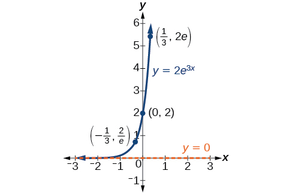
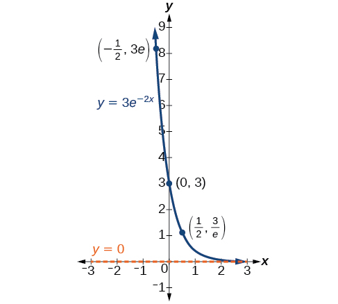
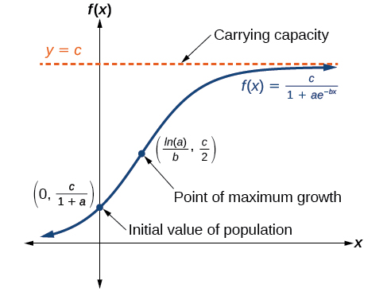
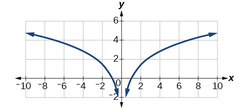
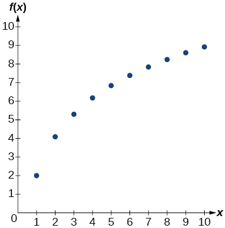
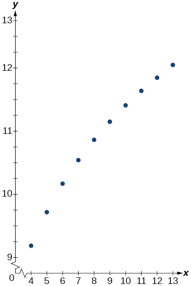
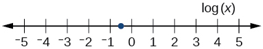
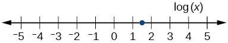

In this section, you will:
* Model exponential growth and decay.
* Use Newton’s Law of Cooling.
* Use logistic-growth models.
* Choose an appropriate model for data.
* Express an exponential model in base
  <math xmlns="http://www.w3.org/1998/Math/MathML"> <mrow> <mtext> </mtext><mi>e</mi> </mrow> </math>
  
  .

 "){: #CNX_Precalc_Figure_04_07_001}

We have already explored some basic applications of exponential and logarithmic functions. In this section, we explore some important applications in more depth, including radioactive isotopes and Newton’s Law of Cooling.

# Modeling Exponential Growth and Decay

In real-world applications, we need to model the behavior of a function. In mathematical modeling, we choose a familiar general function with properties that suggest that it will model the real-world phenomenon we wish to analyze. In the case of rapid growth, we may choose the exponential growth function:

<math xmlns="http://www.w3.org/1998/Math/MathML" display="block"><mrow><mi>y</mi><mo>=</mo><msub><mi>A</mi><mn>0</mn></msub><msup><mi>e</mi><mrow><mi>k</mi><mi>t</mi></mrow></msup></mrow></math>

where <math xmlns="http://www.w3.org/1998/Math/MathML"><mrow><msub><mi>A</mi><mn>0</mn></msub></mrow></math>

 is equal to the value at time zero, <math xmlns="http://www.w3.org/1998/Math/MathML"><mi>e</mi></math>

 is Euler’s constant, and <math xmlns="http://www.w3.org/1998/Math/MathML"><mi>k</mi></math>

 is a positive constant that determines the rate (percentage) of growth. We may use the **exponential growth**{: data-type="term" .no-emphasis} function in applications involving **doubling time**, the time it takes for a quantity to double. Such phenomena as wildlife populations, financial investments, biological samples, and natural resources may exhibit growth based on a doubling time. In some applications, however, as we will see when we discuss the logistic equation, the logistic model sometimes fits the data better than the exponential model.

On the other hand, if a quantity is falling rapidly toward zero, without ever reaching zero, then we should probably choose the **exponential decay**{: data-type="term" .no-emphasis} model. Again, we have the form <math xmlns="http://www.w3.org/1998/Math/MathML"><mrow><mi>y</mi><mo>=</mo><msub><mi>A</mi><mn>0</mn></msub><msup><mi>e</mi><mrow><mi>k</mi><mi>t</mi></mrow></msup></mrow></math>

 where <math xmlns="http://www.w3.org/1998/Math/MathML"><mrow><msub><mi>A</mi><mn>0</mn></msub></mrow></math>

 is the starting value, and <math xmlns="http://www.w3.org/1998/Math/MathML"><mi>e</mi></math>

 is Euler’s constant. Now <math xmlns="http://www.w3.org/1998/Math/MathML"><mi>k</mi></math>

 is a negative constant that determines the rate of decay. We may use the exponential decay model when we are calculating **half-life**{: data-type="term"}, or the time it takes for a substance to exponentially decay to half of its original quantity. We use half-life in applications involving radioactive isotopes.

In our choice of a function to serve as a mathematical model, we often use data points gathered by careful observation and measurement to construct points on a graph and hope we can recognize the shape of the graph. Exponential growth and decay graphs have a distinctive shape, as we can see in [\[link\]](#CNX_Precalc_Figure_04_07_002) and [\[link\]](#CNX_Precalc_Figure_04_07_003). It is important to remember that, although parts of each of the two graphs seem to lie on the *x*-axis, they are really a tiny distance above the *x*-axis.

 {: #CNX_Precalc_Figure_04_07_002}

{: #CNX_Precalc_Figure_04_07_003}

Exponential growth and decay often involve very large or very small numbers. To describe these numbers, we often use orders of magnitude. The **order of magnitude**{: data-type="term"} is the power of ten, when the number is expressed in scientific notation, with one digit to the left of the decimal. For example, the distance to the nearest star, **Proxima Centauri**{: data-type="term" .no-emphasis}, measured in kilometers, is 40,113,497,200,000 kilometers. Expressed in scientific notation, this is <math xmlns="http://www.w3.org/1998/Math/MathML"><mrow><mn>4.01134972</mn><mtext> </mtext><mo>×</mo><mtext> </mtext><msup><mrow><mn>10</mn></mrow><mrow><mn>13</mn></mrow></msup><mo>.</mo></mrow></math>

 So, we could describe this number as having order of magnitude <math xmlns="http://www.w3.org/1998/Math/MathML"><mrow><msup><mrow><mn>10</mn></mrow><mrow><mn>13</mn></mrow></msup><mo>.</mo></mrow></math>

Characteristics of the Exponential Function, *y* = *A*0*e**kt*

An exponential function with the form <math xmlns="http://www.w3.org/1998/Math/MathML"><mrow><mi>y</mi><mo>=</mo><msub><mi>A</mi><mn>0</mn></msub><msup><mi>e</mi><mrow><mi>k</mi><mi>t</mi></mrow></msup></mrow></math>

 has the following characteristics:

* one-to-one function
* horizontal asymptote:
  <math xmlns="http://www.w3.org/1998/Math/MathML"><mrow><mi>y</mi><mo>=</mo><mn>0</mn></mrow></math>

* domain:
  <math xmlns="http://www.w3.org/1998/Math/MathML"><mrow><mo stretchy="false">(</mo><mo>–</mo><mi>∞</mi><mo>,</mo><mo> </mo><mi>∞</mi><mo stretchy="false">)</mo></mrow></math>

* range:
  <math xmlns="http://www.w3.org/1998/Math/MathML"><mrow><mo stretchy="false">(</mo><mn>0</mn><mo>,</mo><mi>∞</mi><mo stretchy="false">)</mo></mrow></math>

* x intercept: none
* y-intercept:
  <math xmlns="http://www.w3.org/1998/Math/MathML"><mrow><mrow><mo>(</mo><mrow><mn>0</mn><mo>,</mo><msub><mi>A</mi><mn>0</mn></msub></mrow><mo>)</mo></mrow></mrow></math>

* increasing if
  <math xmlns="http://www.w3.org/1998/Math/MathML"><mrow><mi>k</mi><mo>&gt;</mo><mn>0</mn></mrow></math>
  
  (see [\[link\]](#CNX_Precalc_Figure_04_07_004))
* decreasing if
  <math xmlns="http://www.w3.org/1998/Math/MathML"><mrow><mi>k</mi><mo>&lt;</mo><mn>0</mn></mrow></math>
  
  (see [\[link\]](#CNX_Precalc_Figure_04_07_004))

{: #CNX_Precalc_Figure_04_07_004}

Graphing Exponential Growth

A population of bacteria doubles every hour. If the culture started with 10 bacteria, graph the population as a function of time.

When an amount grows at a fixed percent per unit time, the growth is exponential. To find <math xmlns="http://www.w3.org/1998/Math/MathML"><mrow><msub><mi>A</mi><mn>0</mn></msub></mrow></math>

 we use the fact that <math xmlns="http://www.w3.org/1998/Math/MathML"><mrow><msub><mi>A</mi><mn>0</mn></msub></mrow></math>

 is the amount at time zero, so <math xmlns="http://www.w3.org/1998/Math/MathML"><mrow><msub><mi>A</mi><mn>0</mn></msub><mo>=</mo><mn>10.</mn></mrow></math>

 To find <math xmlns="http://www.w3.org/1998/Math/MathML"><mrow><mi>k</mi><mo>,</mo></mrow></math>

 use the fact that after one hour <math xmlns="http://www.w3.org/1998/Math/MathML"><mrow><mrow><mo>(</mo><mrow><mi>t</mi><mo>=</mo><mn>1</mn></mrow><mo>)</mo></mrow></mrow></math>

 the population doubles from <math xmlns="http://www.w3.org/1998/Math/MathML"><mrow><mn>10</mn></mrow></math>

 to <math xmlns="http://www.w3.org/1998/Math/MathML"><mrow><mn>20.</mn></mrow></math>

 The formula is derived as follows

<math xmlns="http://www.w3.org/1998/Math/MathML" display="block"> <mrow> <mtable columnalign="left"> <mtr columnalign="left"> <mtd columnalign="left"> <mrow> <mtext> </mtext><mn>20</mn><mo>=</mo><mn>10</mn><msup> <mi>e</mi> <mrow> <mi>k</mi><mo>⋅</mo><mn>1</mn> </mrow> </msup> </mrow> </mtd> <mtd columnalign="left"> <mrow /> </mtd> </mtr> <mtr columnalign="left"> <mtd columnalign="left"> <mrow> <mtext>   </mtext><mn>2</mn><mo>=</mo><msup> <mi>e</mi> <mi>k</mi> </msup> </mrow> </mtd> <mtd columnalign="left"> <mrow> <mtext>Divide by 10</mtext> </mrow> </mtd> </mtr> <mtr columnalign="left"> <mtd columnalign="left"> <mrow> <mi>ln</mi><mn>2</mn><mo>=</mo><mi>k</mi> </mrow> </mtd> <mtd columnalign="left"> <mrow> <mtext>Take the natural logarithm</mtext> </mrow> </mtd> </mtr> </mtable> </mrow> </math>

so <math xmlns="http://www.w3.org/1998/Math/MathML"><mrow><mi>k</mi><mo>=</mo><mi>ln</mi><mo stretchy="false">(</mo><mn>2</mn><mo stretchy="false">)</mo><mo>.</mo></mrow></math>

 Thus the equation we want to graph is<math xmlns="http://www.w3.org/1998/Math/MathML"> <mrow> <mtext> </mtext><mi>y</mi><mo>=</mo><mn>10</mn><msup> <mi>e</mi> <mrow> <mo stretchy="false">(</mo><mi>ln</mi><mn>2</mn><mo stretchy="false">)</mo><mi>t</mi> </mrow> </msup> <mo>=</mo><mn>10</mn><msup> <mrow> <mo stretchy="false">(</mo><msup> <mi>e</mi> <mrow> <mi>ln</mi><mn>2</mn> </mrow> </msup> <mo stretchy="false">)</mo> </mrow> <mi>t</mi> </msup> <mo>=</mo><mn>10</mn><mo>·</mo><msup> <mn>2</mn> <mi>t</mi> </msup> <mo>.</mo><mtext> </mtext> </mrow> </math>

The graph is shown in [[link]](#CNX_Precalc_Figure_04_07_005).

t"){: #CNX_Precalc_Figure_04_07_005}

Analysis

The population of bacteria after ten hours is 10,240. We could describe this amount is being of the order of magnitude <math xmlns="http://www.w3.org/1998/Math/MathML"><mrow><msup><mrow><mn>10</mn></mrow><mn>4</mn></msup><mo>.</mo></mrow></math>

 The population of bacteria after twenty hours is 10,485,760 which is of the order of magnitude <math xmlns="http://www.w3.org/1998/Math/MathML"><mrow><msup><mrow><mn>10</mn></mrow><mn>7</mn></msup><mo>,</mo></mrow></math>

 so we could say that the population has increased by three orders of magnitude in ten hours.

## Half-Life

We now turn to **exponential decay**{: data-type="term" .no-emphasis}. One of the common terms associated with exponential decay, as stated above, is **half-life**, the length of time it takes an exponentially decaying quantity to decrease to half its original amount. Every radioactive isotope has a half-life, and the process describing the exponential decay of an isotope is called radioactive decay.

To find the half-life of a function describing exponential decay, solve the following equation:

<math xmlns="http://www.w3.org/1998/Math/MathML" display="block"><mrow><mfrac><mn>1</mn><mn>2</mn></mfrac><msub><mi>A</mi><mn>0</mn></msub><mo>=</mo><msub><mi>A</mi><mi>o</mi></msub><msup><mi>e</mi><mrow><mi>k</mi><mi>t</mi></mrow></msup></mrow></math>

We find that the half-life depends only on the constant <math xmlns="http://www.w3.org/1998/Math/MathML"><mi>k</mi></math>

 and not on the starting quantity <math xmlns="http://www.w3.org/1998/Math/MathML"><mrow><msub><mi>A</mi><mn>0</mn></msub><mo>.</mo></mrow></math>

The formula is derived as follows

<math xmlns="http://www.w3.org/1998/Math/MathML" display="block"> <mrow> <mtable columnalign="left"> <mtr columnalign="left"> <mtd columnalign="left"> <mrow> <mtext> </mtext><mtext> </mtext><mtext> </mtext><mtext> </mtext><mtext> </mtext><mtext> </mtext><mtext> </mtext><mfrac> <mn>1</mn> <mn>2</mn> </mfrac> <msub> <mi>A</mi> <mn>0</mn> </msub> <mo>=</mo><msub> <mi>A</mi> <mi>o</mi> </msub> <msup> <mi>e</mi> <mrow> <mi>k</mi><mi>t</mi> </mrow> </msup> </mrow> </mtd> <mtd columnalign="left"> <mrow /> </mtd> </mtr> <mtr columnalign="left"> <mtd columnalign="left"> <mrow> <mtext> </mtext><mtext> </mtext><mtext> </mtext><mtext> </mtext><mtext> </mtext><mtext> </mtext><mtext> </mtext><mtext> </mtext><mtext> </mtext><mtext> </mtext><mtext> </mtext><mtext> </mtext><mtext> </mtext><mtext> </mtext><mfrac> <mn>1</mn> <mn>2</mn> </mfrac> <mo>=</mo><msup> <mi>e</mi> <mrow> <mi>k</mi><mi>t</mi> </mrow> </msup> </mrow> </mtd> <mtd columnalign="left"> <mrow> <mtext>Divide by </mtext><msub> <mi>A</mi> <mn>0</mn> </msub> <mo>.</mo> </mrow> </mtd> </mtr> <mtr columnalign="left"> <mtd columnalign="left"> <mrow> <mtext> </mtext><mtext> </mtext><mtext> </mtext><mtext> </mtext><mtext> </mtext><mi>ln</mi><mrow><mo>(</mo> <mrow> <mfrac> <mn>1</mn> <mn>2</mn> </mfrac> </mrow> <mo>)</mo></mrow><mo>=</mo><mi>k</mi><mi>t</mi> </mrow> </mtd> <mtd columnalign="left"> <mrow> <mtext>Take the natural log</mtext><mo>.</mo> </mrow> </mtd> </mtr> <mtr columnalign="left"> <mtd columnalign="left"> <mrow> <mo>−</mo><mi>ln</mi><mo stretchy="false">(</mo><mn>2</mn><mo stretchy="false">)</mo><mo>=</mo><mi>k</mi><mi>t</mi> </mrow> </mtd> <mtd columnalign="left"> <mrow> <mtext>Apply laws of logarithms</mtext><mo>.</mo> </mrow> </mtd> </mtr> <mtr columnalign="left"> <mtd columnalign="left"> <mrow> <mtext> </mtext><mo>−</mo><mfrac> <mrow> <mi>ln</mi><mo stretchy="false">(</mo><mn>2</mn><mo stretchy="false">)</mo> </mrow> <mi>k</mi> </mfrac> <mo>=</mo><mi>t</mi> </mrow> </mtd> <mtd columnalign="left"> <mrow> <mtext>Divide by </mtext><mi>k</mi><mo>.</mo> </mrow> </mtd> </mtr> </mtable> </mrow> </math>

Since <math xmlns="http://www.w3.org/1998/Math/MathML"><mrow><mi>t</mi><mo>,</mo></mrow></math>

 the time, is positive, <math xmlns="http://www.w3.org/1998/Math/MathML"><mi>k</mi></math>

 must, as expected, be negative. This gives us the half-life formula

<math xmlns="http://www.w3.org/1998/Math/MathML" display="block"><mrow><mi>t</mi><mo>=</mo><mo>−</mo><mfrac><mrow><mi>ln</mi><mo stretchy="false">(</mo><mn>2</mn><mo stretchy="false">)</mo></mrow><mi>k</mi></mfrac></mrow></math>

**Given the half-life, find the decay rate.**

1.  Write
    <math xmlns="http://www.w3.org/1998/Math/MathML"><mrow><mi>A</mi><mo>=</mo><msub><mi>A</mi><mi>o</mi></msub><msup><mi>e</mi><mrow><mi>k</mi><mi>t</mi></mrow></msup><mo>.</mo></mrow></math>

2.  Replace
    <math xmlns="http://www.w3.org/1998/Math/MathML"><mi>A</mi></math>
    
    by
    <math xmlns="http://www.w3.org/1998/Math/MathML"><mrow><mfrac><mn>1</mn><mn>2</mn></mfrac><msub><mi>A</mi><mn>0</mn></msub></mrow></math>
    
    and replace
    <math xmlns="http://www.w3.org/1998/Math/MathML"><mi>t</mi></math>
    
    by the given half-life.
3.  Solve to find
    <math xmlns="http://www.w3.org/1998/Math/MathML"><mrow><mi>k</mi><mo>.</mo></mrow></math>
    
    Express
    <math xmlns="http://www.w3.org/1998/Math/MathML"><mi>k</mi></math>
    
    as an exact value (do not round).
{: data-number-style="arabic"}

Note: *It is also possible to find the decay rate using* <math xmlns="http://www.w3.org/1998/Math/MathML"><mrow><mi>k</mi><mo>=</mo><mo>−</mo><mfrac><mrow><mi>ln</mi><mo stretchy="false">(</mo><mn>2</mn><mo stretchy="false">)</mo></mrow><mi>t</mi></mfrac><mo>.</mo></mrow></math>

Finding the Function that Describes Radioactive Decay

The half-life of carbon-14 is 5,730 years. Express the amount of carbon-14 remaining as a function of time, <math xmlns="http://www.w3.org/1998/Math/MathML"><mrow><mi>t</mi><mo>.</mo></mrow></math>

This formula is derived as follows. 

<math xmlns="http://www.w3.org/1998/Math/MathML"> <mrow> <mtable columnalign="left"> <mtr columnalign="left"> <mtd columnalign="left"> <mrow> <mtext>        </mtext><mi>A</mi><mo>=</mo><msub> <mi>A</mi> <mn>0</mn> </msub> <msup> <mi>e</mi> <mrow> <mi>k</mi><mi>t</mi> </mrow> </msup> </mrow> </mtd> <mtd columnalign="left"> <mrow> <mtext>The continuous growth formula</mtext><mo>.</mo> </mrow> </mtd> </mtr> <mtr columnalign="left"> <mtd columnalign="left"> <mrow> <mtext> </mtext><mtext> </mtext><mn>0.5</mn><msub> <mi>A</mi> <mn>0</mn> </msub> <mo>=</mo><msub> <mi>A</mi> <mn>0</mn> </msub> <msup> <mi>e</mi> <mrow> <mi>k</mi><mo>⋅</mo><mn>5730</mn> </mrow> </msup> </mrow> </mtd> <mtd columnalign="left"> <mrow> <mtext>Substitute the half-life for </mtext><mi>t</mi><mtext> and </mtext><mn>0.5</mn><msub> <mi>A</mi> <mn>0</mn> </msub> <mtext> for </mtext><mi>f</mi><mo stretchy="false">(</mo><mi>t</mi><mo stretchy="false">)</mo><mo>.</mo> </mrow> </mtd> </mtr> <mtr columnalign="left"> <mtd columnalign="left"> <mrow> <mtext>      </mtext><mn>0.5</mn><mo>=</mo><msup> <mi>e</mi> <mrow> <mn>5730</mn><mi>k</mi> </mrow> </msup> </mrow> </mtd> <mtd columnalign="left"> <mrow> <mtext>Divide by </mtext><msub> <mi>A</mi> <mn>0</mn> </msub> <mo>.</mo> </mrow> </mtd> </mtr> <mtr columnalign="left"> <mtd columnalign="left"> <mrow> <mi>ln</mi><mo stretchy="false">(</mo><mn>0.5</mn><mo stretchy="false">)</mo><mo>=</mo><mn>5730</mn><mi>k</mi> </mrow> </mtd> <mtd columnalign="left"> <mrow> <mtext>Take the natural log of both sides</mtext><mo>.</mo> </mrow> </mtd> </mtr> <mtr columnalign="left"> <mtd columnalign="left"> <mrow> <mtext>         </mtext><mi>k</mi><mo>=</mo><mfrac> <mrow> <mi>ln</mi><mo stretchy="false">(</mo><mn>0.5</mn><mo stretchy="false">)</mo> </mrow> <mrow> <mn>5730</mn> </mrow> </mfrac> </mrow> </mtd> <mtd columnalign="left"> <mrow> <mtext>Divide by the coefficient of </mtext><mi>k</mi><mo>.</mo> </mrow> </mtd> </mtr> <mtr columnalign="left"> <mtd columnalign="left"> <mrow> <mtext>        </mtext><mi>A</mi><mo>=</mo><msub> <mi>A</mi> <mn>0</mn> </msub> <msup> <mi>e</mi> <mrow> <mrow><mo>(</mo> <mrow> <mfrac> <mrow> <mi>ln</mi><mo stretchy="false">(</mo><mn>0.5</mn><mo stretchy="false">)</mo> </mrow> <mrow> <mn>5730</mn> </mrow> </mfrac> </mrow> <mo>)</mo></mrow><mi>t</mi> </mrow> </msup> </mrow> </mtd> <mtd columnalign="left"> <mrow> <mtext>Substitute for </mtext><mi>r</mi><mtext> in the continuous growth formula</mtext><mo>.</mo> </mrow> </mtd> </mtr> </mtable> </mrow> </math>

The function that describes this continuous decay is <math xmlns="http://www.w3.org/1998/Math/MathML"><mrow><mi>f</mi><mo stretchy="false">(</mo><mi>t</mi><mo stretchy="false">)</mo><mo>=</mo><msub><mi>A</mi><mn>0</mn></msub><msup><mi>e</mi><mrow><mrow><mo>(</mo><mrow><mfrac><mrow><mi>ln</mi><mo stretchy="false">(</mo><mn>0.5</mn><mo stretchy="false">)</mo></mrow><mrow><mn>5730</mn></mrow></mfrac></mrow><mo>)</mo></mrow><mi>t</mi></mrow></msup><mo>.</mo></mrow></math>

 We observe that the coefficient of <math xmlns="http://www.w3.org/1998/Math/MathML"><mrow><mi>t</mi><mo>,</mo></mrow></math>

 <math xmlns="http://www.w3.org/1998/Math/MathML"><mrow><mfrac><mrow><mi>ln</mi><mo stretchy="false">(</mo><mn>0.5</mn><mo stretchy="false">)</mo></mrow><mrow><mn>5730</mn></mrow></mfrac><mo>≈</mo><mo>−</mo><mn>1.2097</mn></mrow></math>

 is negative, as expected in the case of exponential decay.

The half-life of plutonium-244 is 80,000,000 years. Find function gives the amount of carbon-14 remaining as a function of time, measured in years.

<math xmlns="http://www.w3.org/1998/Math/MathML"><mrow><mi>f</mi><mo stretchy="false">(</mo><mi>t</mi><mo stretchy="false">)</mo><mo>=</mo><msub><mi>A</mi><mn>0</mn></msub><msup><mi>e</mi><mrow><mo>−</mo><mn>0.0000000087</mn><mi>t</mi></mrow></msup></mrow></math>

## Radiocarbon Dating

The formula for radioactive decay is important in **radiocarbon dating**{: data-type="term" .no-emphasis}, which is used to calculate the approximate date a plant or animal died. Radiocarbon dating was discovered in 1949 by Willard Libby, who won a Nobel Prize for his discovery. It compares the difference between the ratio of two isotopes of carbon in an organic artifact or fossil to the ratio of those two isotopes in the air. It is believed to be accurate to within about 1% error for plants or animals that died within the last 60,000 years.

Carbon-14 is a radioactive isotope of carbon that has a half-life of 5,730 years. It occurs in small quantities in the carbon dioxide in the air we breathe. Most of the carbon on Earth is carbon-12, which has an atomic weight of 12 and is not radioactive. Scientists have determined the ratio of carbon-14 to carbon-12 in the air for the last 60,000 years, using tree rings and other organic samples of known dates—although the ratio has changed slightly over the centuries.

As long as a plant or animal is alive, the ratio of the two isotopes of carbon in its body is close to the ratio in the atmosphere. When it dies, the carbon-14 in its body decays and is not replaced. By comparing the ratio of carbon-14 to carbon-12 in a decaying sample to the known ratio in the atmosphere, the date the plant or animal died can be approximated.

Since the half-life of carbon-14 is 5,730 years, the formula for the amount of carbon-14 remaining after <math xmlns="http://www.w3.org/1998/Math/MathML"><mi>t</mi></math>

 years is

<math xmlns="http://www.w3.org/1998/Math/MathML" display="block"> <mrow> <mi>A</mi><mo>≈</mo><msub> <mi>A</mi> <mn>0</mn> </msub> <msup> <mi>e</mi> <mrow> <mrow><mo>(</mo> <mrow> <mfrac> <mrow> <mi>ln</mi><mo stretchy="false">(</mo><mn>0.5</mn><mo stretchy="false">)</mo> </mrow> <mrow> <mn>5730</mn> </mrow> </mfrac> </mrow> <mo>)</mo></mrow><mi>t</mi> </mrow> </msup> </mrow> </math>

where

<math xmlns="http://www.w3.org/1998/Math/MathML"><mi>A</mi></math>
is the amount of carbon-14 remaining

<math xmlns="http://www.w3.org/1998/Math/MathML"><mrow><msub><mi>A</mi><mn>0</mn></msub></mrow></math>
is the amount of carbon-14 when the plant or animal began decaying.

This formula is derived as follows:

<math xmlns="http://www.w3.org/1998/Math/MathML" display="block"> <mrow> <mtable columnalign="left"> <mtr columnalign="left"> <mtd columnalign="left"> <mrow> <mtext>        </mtext><mi>A</mi><mo>=</mo><msub> <mi>A</mi> <mn>0</mn> </msub> <msup> <mi>e</mi> <mrow> <mi>k</mi><mi>t</mi> </mrow> </msup> </mrow> </mtd> <mtd columnalign="left"> <mrow> <mtext>The continuous growth formula</mtext><mo>.</mo> </mrow> </mtd> </mtr> <mtr columnalign="left"> <mtd columnalign="left"> <mrow> <mtext> </mtext><mn>0.5</mn><msub> <mi>A</mi> <mn>0</mn> </msub> <mo>=</mo><msub> <mi>A</mi> <mn>0</mn> </msub> <msup> <mi>e</mi> <mrow> <mi>k</mi><mo>⋅</mo><mn>5730</mn> </mrow> </msup> </mrow> </mtd> <mtd columnalign="left"> <mrow> <mtext>Substitute the half-life for </mtext><mi>t</mi><mtext> and </mtext><mn>0.5</mn><msub> <mi>A</mi> <mn>0</mn> </msub> <mtext> for </mtext><mi>f</mi><mo stretchy="false">(</mo><mi>t</mi><mo stretchy="false">)</mo><mo>.</mo> </mrow> </mtd> </mtr> <mtr columnalign="left"> <mtd columnalign="left"> <mrow> <mtext>      </mtext><mn>0.5</mn><mo>=</mo><msup> <mi>e</mi> <mrow> <mn>5730</mn><mi>k</mi> </mrow> </msup> </mrow> </mtd> <mtd columnalign="left"> <mrow> <mtext>Divide by </mtext><msub> <mi>A</mi> <mn>0</mn> </msub> <mo>.</mo> </mrow> </mtd> </mtr> <mtr columnalign="left"> <mtd columnalign="left"> <mrow> <mi>ln</mi><mo stretchy="false">(</mo><mn>0.5</mn><mo stretchy="false">)</mo><mo>=</mo><mn>5730</mn><mi>k</mi> </mrow> </mtd> <mtd columnalign="left"> <mrow> <mtext>Take the natural log of both sides</mtext><mo>.</mo> </mrow> </mtd> </mtr> <mtr columnalign="left"> <mtd columnalign="left"> <mrow> <mtext>         </mtext><mi>k</mi><mo>=</mo><mfrac> <mrow> <mi>ln</mi><mo stretchy="false">(</mo><mn>0.5</mn><mo stretchy="false">)</mo> </mrow> <mrow> <mn>5730</mn> </mrow> </mfrac> </mrow> </mtd> <mtd columnalign="left"> <mrow> <mtext>Divide by the coefficient of </mtext><mi>k</mi><mo>.</mo> </mrow> </mtd> </mtr> <mtr columnalign="left"> <mtd columnalign="left"> <mrow> <mtext>        </mtext><mi>A</mi><mo>=</mo><msub> <mi>A</mi> <mn>0</mn> </msub> <msup> <mi>e</mi> <mrow> <mrow><mo>(</mo> <mrow> <mfrac> <mrow> <mi>ln</mi><mo stretchy="false">(</mo><mn>0.5</mn><mo stretchy="false">)</mo> </mrow> <mrow> <mn>5730</mn> </mrow> </mfrac> </mrow> <mo>)</mo></mrow><mi>t</mi> </mrow> </msup> </mrow> </mtd> <mtd columnalign="left"> <mrow> <mtext>Substitute for </mtext><mi>r</mi><mtext> in the continuous growth formula</mtext><mo>.</mo> </mrow> </mtd> </mtr> </mtable> </mrow> </math>

To find the age of an object, we solve this equation for <math xmlns="http://www.w3.org/1998/Math/MathML"><mrow><mi>t</mi><mo>:</mo></mrow></math>

<math xmlns="http://www.w3.org/1998/Math/MathML" display="block"><mrow><mi>t</mi><mo>=</mo><mfrac><mrow><mi>ln</mi><mrow><mo>(</mo><mrow><mfrac><mi>A</mi><mrow><msub><mi>A</mi><mn>0</mn></msub></mrow></mfrac></mrow><mo>)</mo></mrow></mrow><mrow><mo>−</mo><mn>0.000121</mn></mrow></mfrac> </mrow></math>

Out of necessity, we neglect here the many details that a scientist takes into consideration when doing carbon-14 dating, and we only look at the basic formula. The ratio of carbon-14 to carbon-12 in the atmosphere is approximately 0.0000000001%. Let <math xmlns="http://www.w3.org/1998/Math/MathML"><mi>r</mi></math>

 be the ratio of carbon-14 to carbon-12 in the organic artifact or fossil to be dated, determined by a method called liquid scintillation. From the equation <math xmlns="http://www.w3.org/1998/Math/MathML"><mrow><mi>A</mi><mo>≈</mo><msub><mi>A</mi><mn>0</mn></msub><msup><mi>e</mi><mrow><mo>−</mo><mn>0.000121</mn><mi>t</mi></mrow></msup></mrow></math>

 we know the ratio of the percentage of carbon-14 in the object we are dating to the percentage of carbon-14 in the atmosphere is <math xmlns="http://www.w3.org/1998/Math/MathML"><mrow><mi>r</mi><mo>=</mo><mfrac><mi>A</mi><mrow><msub><mi>A</mi><mn>0</mn></msub></mrow></mfrac><mo>≈</mo><msup><mi>e</mi><mrow><mo>−</mo><mn>0.000121</mn><mi>t</mi></mrow></msup><mo>.</mo></mrow></math>

 We solve this equation for <math xmlns="http://www.w3.org/1998/Math/MathML"><mrow><mi>t</mi><mo>,</mo></mrow></math>

 to get

<math xmlns="http://www.w3.org/1998/Math/MathML" display="block"><mrow><mi>t</mi><mo>=</mo><mfrac><mrow><mi>ln</mi><mrow><mo>(</mo><mi>r</mi><mo>)</mo></mrow></mrow><mrow><mo>−</mo><mn>0.000121</mn></mrow></mfrac></mrow></math>

**Given the percentage of carbon-14 in an object, determine its age.**

1.  Express the given percentage of carbon-14 as an equivalent decimal,
    <math xmlns="http://www.w3.org/1998/Math/MathML"> <mrow> <mtext> </mtext><mi>k</mi><mo>.</mo> </mrow> </math>

2.  Substitute for *k* in the equation
    <math xmlns="http://www.w3.org/1998/Math/MathML"> <mrow> <mtext> </mtext><mi>t</mi><mo>=</mo><mfrac> <mrow> <mi>ln</mi><mrow><mo>(</mo> <mi>r</mi> <mo>)</mo></mrow> </mrow> <mrow> <mo>−</mo><mn>0.000121</mn> </mrow> </mfrac> <mtext> </mtext> </mrow> </math>
    
    and solve for the age,
    <math xmlns="http://www.w3.org/1998/Math/MathML"> <mrow> <mtext> </mtext><mi>t</mi><mo>.</mo> </mrow> </math>
{: data-number-style="arabic"}

Finding the Age of a Bone

A bone fragment is found that contains 20% of its original carbon-14. To the nearest year, how old is the bone?

We substitute<math xmlns="http://www.w3.org/1998/Math/MathML"> <mrow> <mtext> </mtext><mn>20</mn><mi>%</mi><mo>=</mo><mn>0.20</mn><mtext>  </mtext> </mrow> </math>

for<math xmlns="http://www.w3.org/1998/Math/MathML"> <mrow> <mtext>  </mtext><mi>k</mi><mtext>  </mtext> </mrow> </math>

in the equation and solve for<math xmlns="http://www.w3.org/1998/Math/MathML"> <mrow> <mtext>  </mtext><mi>t</mi><mo>:</mo> </mrow> </math>

<math xmlns="http://www.w3.org/1998/Math/MathML" display="block"> <mrow> <mtable columnalign="left"> <mtr columnalign="left"> <mtd columnalign="left"> <mrow> <mi>t</mi><mo>=</mo><mfrac> <mrow> <mi>ln</mi><mo stretchy="false">(</mo><mi>r</mi><mo stretchy="false">)</mo> </mrow> <mrow> <mo>−</mo><mn>0.000121</mn> </mrow> </mfrac> </mrow> </mtd> <mtd columnalign="left"> <mrow> <mtext>Use the general form of the equation</mtext><mo>.</mo> </mrow> </mtd> </mtr> <mtr columnalign="left"> <mtd columnalign="left"> <mrow> <mtext> </mtext><mtext> </mtext><mtext> </mtext><mo>=</mo><mfrac> <mrow> <mi>ln</mi><mo stretchy="false">(</mo><mn>0.20</mn><mo stretchy="false">)</mo> </mrow> <mrow> <mo>−</mo><mn>0.000121</mn> </mrow> </mfrac> <mtable> <mtr> <mtd> <mrow /> </mtd> <mtd> <mrow /> </mtd> <mtd> <mrow /> </mtd> <mtd> <mrow /> </mtd> </mtr> </mtable> </mrow> </mtd> <mtd columnalign="left"> <mrow> <mtext>Substitute for </mtext><mi>r</mi><mo>.</mo> </mrow> </mtd> </mtr> <mtr columnalign="left"> <mtd columnalign="left"> <mrow> <mtext> </mtext><mtext> </mtext><mtext> </mtext><mo>≈</mo><mn>13301</mn> </mrow> </mtd> <mtd columnalign="left"> <mrow> <mtext>Round to the nearest year</mtext><mo>.</mo> </mrow> </mtd> </mtr> </mtable> </mrow> </math>

The bone fragment is about 13,301 years old.

Analysis

The instruments that measure the percentage of carbon-14 are extremely sensitive and, as we mention above, a scientist will need to do much more work than we did in order to be satisfied. Even so, carbon dating is only accurate to about 1%, so this age should be given as<math xmlns="http://www.w3.org/1998/Math/MathML"> <mrow> <mtext> </mtext><mtext>13,301 years</mtext><mo>±</mo><mtext>1% or 13,301 years</mtext><mo>±</mo><mtext>133 years</mtext><mtext>.</mtext> </mrow> </math>

Cesium-137 has a half-life of about 30 years. If we begin with 200 mg of cesium-137, will it take more or less than 230 years until only 1 milligram remains?

less than 230 years, 229.3157 to be exact

## Calculating Doubling Time

For decaying quantities, we determined how long it took for half of a substance to decay. For growing quantities, we might want to find out how long it takes for a quantity to double. As we mentioned above, the time it takes for a quantity to double is called the **doubling time**{: data-type="term"}.

Given the basic **exponential growth**{: data-type="term" .no-emphasis} equation<math xmlns="http://www.w3.org/1998/Math/MathML"> <mrow> <mtext> </mtext><mi>A</mi><mo>=</mo><msub> <mi>A</mi> <mn>0</mn> </msub> <msup> <mi>e</mi> <mrow> <mi>k</mi><mi>t</mi> </mrow> </msup> <mo>,</mo> </mrow> </math>

 doubling time can be found by solving for when the original quantity has doubled, that is, by solving<math xmlns="http://www.w3.org/1998/Math/MathML"> <mrow> <mtext> </mtext><mn>2</mn><msub> <mi>A</mi> <mn>0</mn> </msub> <mo>=</mo><msub> <mi>A</mi> <mn>0</mn> </msub> <msup> <mi>e</mi> <mrow> <mi>k</mi><mi>t</mi> </mrow> </msup> <mo>.</mo> </mrow> </math>

The formula is derived as follows:

<math xmlns="http://www.w3.org/1998/Math/MathML" display="block"> <mrow> <mtable columnalign="left"> <mtr columnalign="left"> <mtd columnalign="left"> <mrow> <mn>2</mn><msub> <mi>A</mi> <mn>0</mn> </msub> <mo>=</mo><msub> <mi>A</mi> <mn>0</mn> </msub> <msup> <mi>e</mi> <mrow> <mi>k</mi><mi>t</mi> </mrow> </msup> </mrow> </mtd> <mtd columnalign="left"> <mrow /> </mtd> </mtr> <mtr columnalign="left"> <mtd columnalign="left"> <mrow> <mtext> </mtext><mtext> </mtext><mtext> </mtext><mtext> </mtext><mtext> </mtext><mtext> </mtext><mtext> </mtext><mn>2</mn><mo>=</mo><msup> <mi>e</mi> <mrow> <mi>k</mi><mi>t</mi> </mrow> </msup> </mrow> </mtd> <mtd columnalign="left"> <mrow> <mtext>Divide by </mtext><msub> <mi>A</mi> <mn>0</mn> </msub> <mo>.</mo> </mrow> </mtd> </mtr> <mtr columnalign="left"> <mtd columnalign="left"> <mrow> <mtext> </mtext><mtext> </mtext><mi>ln</mi><mn>2</mn><mo>=</mo><mi>k</mi><mi>t</mi> </mrow> </mtd> <mtd columnalign="left"> <mrow> <mtext>Take the natural logarithm</mtext><mo>.</mo> </mrow> </mtd> </mtr> <mtr columnalign="left"> <mtd columnalign="left"> <mrow> <mtext> </mtext><mtext> </mtext><mtext> </mtext><mtext> </mtext><mtext> </mtext><mtext> </mtext><mtext> </mtext><mtext> </mtext><mi>t</mi><mo>=</mo><mfrac> <mrow> <mi>ln</mi><mn>2</mn> </mrow> <mi>k</mi> </mfrac> </mrow> </mtd> <mtd columnalign="left"> <mrow> <mtext>Divide by the coefficient of </mtext><mi>t</mi><mo>.</mo> </mrow> </mtd> </mtr> </mtable> </mrow> </math>

Thus the doubling time is

<math xmlns="http://www.w3.org/1998/Math/MathML" display="block"> <mrow> <mi>t</mi><mo>=</mo><mfrac> <mrow> <mi>ln</mi><mn>2</mn> </mrow> <mi>k</mi> </mfrac> </mrow> </math>

Finding a Function That Describes Exponential Growth

According to Moore’s Law, the doubling time for the number of transistors that can be put on a computer chip is approximately two years. Give a function that describes this behavior.

The formula is derived as follows:

<math xmlns="http://www.w3.org/1998/Math/MathML" display="block"> <mrow> <mtable columnalign="left"> <mtr columnalign="left"> <mtd columnalign="left"> <mrow> <mtext> </mtext><mi>t</mi><mo>=</mo><mfrac> <mrow> <mi>ln</mi><mn>2</mn> </mrow> <mi>k</mi> </mfrac> </mrow> </mtd> <mtd columnalign="left"> <mrow> <mtext>The doubling time formula</mtext><mo>.</mo> </mrow> </mtd> </mtr> <mtr columnalign="left"> <mtd columnalign="left"> <mrow> <mn>2</mn><mo>=</mo><mfrac> <mrow> <mi>ln</mi><mn>2</mn> </mrow> <mi>k</mi> </mfrac> </mrow> </mtd> <mtd columnalign="left"> <mrow> <mtext>Use a doubling time of two years</mtext><mo>.</mo> </mrow> </mtd> </mtr> <mtr columnalign="left"> <mtd columnalign="left"> <mrow> <mi>k</mi><mo>=</mo><mfrac> <mrow> <mi>ln</mi><mn>2</mn> </mrow> <mn>2</mn> </mfrac> </mrow> </mtd> <mtd columnalign="left"> <mrow> <mtext>Multiply by </mtext><mi>k</mi><mtext> and divide by 2</mtext><mo>.</mo> </mrow> </mtd> </mtr> <mtr columnalign="left"> <mtd columnalign="left"> <mrow> <mi>A</mi><mtext> </mtext><mo>=</mo><msub> <mi>A</mi> <mn>0</mn> </msub> <msup> <mi>e</mi> <mrow> <mfrac> <mrow> <mi>ln</mi><mn>2</mn> </mrow> <mn>2</mn> </mfrac> <mi>t</mi> </mrow> </msup> <mtable> <mtr> <mtd> <mrow /> </mtd> <mtd> <mrow /> </mtd> <mtd> <mrow /> </mtd> <mtd> <mrow /> </mtd> </mtr> </mtable> </mrow> </mtd> <mtd columnalign="left"> <mrow> <mtext>Substitute </mtext><mi>k</mi><mtext> into the continuous growth formula</mtext><mo>.</mo> </mrow> </mtd> </mtr> </mtable> </mrow> </math>

The function is<math xmlns="http://www.w3.org/1998/Math/MathML"> <mrow> <mtext> </mtext><mi>A</mi><mo>=</mo><msub> <mi>A</mi> <mn>0</mn> </msub> <msup> <mi>e</mi> <mrow> <mfrac> <mrow> <mi>ln</mi><mn>2</mn> </mrow> <mn>2</mn> </mfrac> <mi>t</mi> </mrow> </msup> <mo>.</mo> </mrow> </math>

Recent data suggests that, as of 2013, the rate of growth predicted by Moore’s Law no longer holds. Growth has slowed to a doubling time of approximately three years. Find the new function that takes that longer doubling time into account.

<math xmlns="http://www.w3.org/1998/Math/MathML"> <mrow> <mi>f</mi><mo stretchy="false">(</mo><mi>t</mi><mo stretchy="false">)</mo><mo>=</mo><msub> <mi>A</mi> <mn>0</mn> </msub> <msup> <mi>e</mi> <mrow> <mfrac> <mrow> <mi>ln</mi><mn>2</mn> </mrow> <mn>3</mn> </mfrac> <mi>t</mi> </mrow> </msup> </mrow> </math>

# Using Newton’s Law of Cooling

Exponential decay can also be applied to temperature. When a hot object is left in surrounding air that is at a lower temperature, the object’s temperature will decrease exponentially, leveling off as it approaches the surrounding air temperature. On a graph of the temperature function, the leveling off will correspond to a horizontal asymptote at the temperature of the surrounding air. Unless the room temperature is zero, this will correspond to a **vertical shift**{: data-type="term" .no-emphasis} of the generic **exponential decay**{: data-type="term" .no-emphasis} function. This translation leads to **Newton’s Law of Cooling**{: data-type="term"}, the scientific formula for temperature as a function of time as an object’s temperature is equalized with the ambient temperature

<math xmlns="http://www.w3.org/1998/Math/MathML" display="block"> <mrow> <mi>T</mi><mo stretchy="false">(</mo><mi>t</mi><mo stretchy="false">)</mo><mo>=</mo><mi>a</mi><msup> <mi>e</mi> <mrow> <mi>k</mi><mi>t</mi> </mrow> </msup> <mo>+</mo><msub> <mi>T</mi> <mi>s</mi> </msub> </mrow> </math>

This formula is derived as follows:

<math xmlns="http://www.w3.org/1998/Math/MathML" display="block"> <mrow> <mtable columnalign="left"> <mtr columnalign="left"> <mtd columnalign="left"> <mrow> <mi>T</mi><mo stretchy="false">(</mo><mi>t</mi><mo stretchy="false">)</mo><mo>=</mo><mi>A</mi><msup> <mi>b</mi> <mrow> <mi>c</mi><mi>t</mi> </mrow> </msup> <mo>+</mo><msub> <mi>T</mi> <mi>s</mi> </msub> </mrow> </mtd> <mtd columnalign="left"> <mrow /> </mtd> </mtr> <mtr columnalign="left"> <mtd columnalign="left"> <mrow> <mi>T</mi><mo stretchy="false">(</mo><mi>t</mi><mo stretchy="false">)</mo><mo>=</mo><mi>A</mi><msup> <mi>e</mi> <mrow> <mi>ln</mi><mo stretchy="false">(</mo><msup> <mi>b</mi> <mrow> <mi>c</mi><mi>t</mi> </mrow> </msup> <mo stretchy="false">)</mo> </mrow> </msup> <mo>+</mo><msub> <mi>T</mi> <mi>s</mi> </msub> <mtable> <mtr> <mtd> <mrow /> </mtd> <mtd> <mrow /> </mtd> <mtd> <mrow /> </mtd> <mtd> <mrow /> </mtd> </mtr> </mtable> </mrow> </mtd> <mtd columnalign="left"> <mrow> <mtext>Laws of logarithms</mtext><mo>.</mo> </mrow> </mtd> </mtr> <mtr columnalign="left"> <mtd columnalign="left"> <mrow> <mi>T</mi><mo stretchy="false">(</mo><mi>t</mi><mo stretchy="false">)</mo><mo>=</mo><mi>A</mi><msup> <mi>e</mi> <mrow> <mi>c</mi><mi>t</mi><mi>ln</mi><mi>b</mi> </mrow> </msup> <mo>+</mo><msub> <mi>T</mi> <mi>s</mi> </msub> </mrow> </mtd> <mtd columnalign="left"> <mrow> <mtext>Laws of logarithms</mtext><mo>.</mo> </mrow> </mtd> </mtr> <mtr columnalign="left"> <mtd columnalign="left"> <mrow> <mi>T</mi><mo stretchy="false">(</mo><mi>t</mi><mo stretchy="false">)</mo><mo>=</mo><mi>A</mi><msup> <mi>e</mi> <mrow> <mi>k</mi><mi>t</mi> </mrow> </msup> <mo>+</mo><msub> <mi>T</mi> <mi>s</mi> </msub> </mrow> </mtd> <mtd columnalign="left"> <mrow> <mtext>Rename the constant </mtext><mi>c</mi><mo> </mo><mi>ln</mi><mo> </mo><mi>b</mi><mo>,</mo><mtext> calling it </mtext><mi>k</mi><mo>.</mo> </mrow> </mtd> </mtr> </mtable> </mrow> </math>

Newton’s Law of Cooling

The temperature of an object,<math xmlns="http://www.w3.org/1998/Math/MathML"> <mrow> <mtext> </mtext><mi>T</mi><mo>,</mo> </mrow> </math>

 in surrounding air with temperature<math xmlns="http://www.w3.org/1998/Math/MathML"> <mrow> <mtext> </mtext><msub> <mi>T</mi> <mi>s</mi> </msub> <mtext> </mtext> </mrow> </math>

will behave according to the formula 

<math xmlns="http://www.w3.org/1998/Math/MathML" display="block"> <mrow> <mi>T</mi><mo stretchy="false">(</mo><mi>t</mi><mo stretchy="false">)</mo><mo>=</mo><mi>A</mi><msup> <mi>e</mi> <mrow> <mi>k</mi><mi>t</mi> </mrow> </msup> <mo>+</mo><msub> <mi>T</mi> <mi>s</mi> </msub> </mrow> </math>

 where 

<math xmlns="http://www.w3.org/1998/Math/MathML"> <mrow> <mi>t</mi><mtext> </mtext> </mrow> </math>
is time

<math xmlns="http://www.w3.org/1998/Math/MathML"> <mrow> <mi>A</mi><mtext> </mtext> </mrow> </math>
is the difference between the initial temperature of the object and the surroundings

<math xmlns="http://www.w3.org/1998/Math/MathML"> <mrow> <mi>k</mi><mtext> </mtext> </mrow> </math>
is a constant, the continuous rate of cooling of the object

**Given a set of conditions, apply Newton’s Law of Cooling.**

1.  Set
    <math xmlns="http://www.w3.org/1998/Math/MathML"> <mrow> <mtext> </mtext><msub> <mi>T</mi> <mi>s</mi> </msub> <mtext> </mtext> </mrow> </math>
    
    equal to the *y*-coordinate of the horizontal asymptote (usually the ambient temperature).
2.  Substitute the given values into the continuous growth formula
    <math xmlns="http://www.w3.org/1998/Math/MathML"> <mrow> <mtext> </mtext><mi>T</mi><mo stretchy="false">(</mo><mi>t</mi><mo stretchy="false">)</mo><mo>=</mo><mi>A</mi><msup> <mi>e</mi> <mi>k</mi> </msup> <msup> <mrow /> <mi>t</mi> </msup> <mo>+</mo><msub> <mi>T</mi> <mi>s</mi> </msub> <mtext> </mtext> </mrow> </math>
    
    to find the parameters
    <math xmlns="http://www.w3.org/1998/Math/MathML"> <mrow> <mtext> </mtext><mi>A</mi><mtext> </mtext> </mrow> </math>
    
    and
    <math xmlns="http://www.w3.org/1998/Math/MathML"> <mrow> <mtext> </mtext><mi>k</mi><mo>.</mo> </mrow> </math>

3.  Substitute in the desired time to find the temperature or the desired temperature to find the time.
{: data-number-style="arabic"}

Using Newton’s Law of Cooling

A cheesecake is taken out of the oven with an ideal internal temperature of<math xmlns="http://www.w3.org/1998/Math/MathML"> <mrow> <mtext> </mtext><mtext>165°F,</mtext><mtext> </mtext> </mrow> </math>

and is placed into a<math xmlns="http://www.w3.org/1998/Math/MathML"> <mrow> <mtext> </mtext><mn>35°F</mn><mtext> </mtext> </mrow> </math>

refrigerator. After 10 minutes, the cheesecake has cooled to<math xmlns="http://www.w3.org/1998/Math/MathML"> <mrow> <mtext> </mtext><mtext>150°F</mtext><mtext>.</mtext><mtext> </mtext> </mrow> </math>

If we must wait until the cheesecake has cooled to<math xmlns="http://www.w3.org/1998/Math/MathML"> <mrow> <mtext> </mtext><mtext>70°F</mtext><mtext> </mtext> </mrow> </math>

before we eat it, how long will we have to wait?

Because the surrounding air temperature in the refrigerator is 35 degrees, the cheesecake’s temperature will decay exponentially toward 35, following the equation

<math xmlns="http://www.w3.org/1998/Math/MathML" display="block"> <mrow> <mi>T</mi><mo stretchy="false">(</mo><mi>t</mi><mo stretchy="false">)</mo><mo>=</mo><mi>A</mi><msup> <mi>e</mi> <mrow> <mi>k</mi><mi>t</mi> </mrow> </msup> <mo>+</mo><mn>35</mn> </mrow> </math>

We know the initial temperature was 165, so<math xmlns="http://www.w3.org/1998/Math/MathML"> <mrow> <mtext> </mtext><mi>T</mi><mo stretchy="false">(</mo><mn>0</mn><mo stretchy="false">)</mo><mo>=</mo><mn>1</mn><mn>6</mn><mn>5</mn><mo>.</mo> </mrow> </math>

<math xmlns="http://www.w3.org/1998/Math/MathML" display="block"> <mrow> <mtable columnalign="left"> <mtr columnalign="left"> <mtd columnalign="left"> <mrow> <mn>165</mn><mo>=</mo><mi>A</mi><msup> <mi>e</mi> <mrow> <mi>k</mi><mn>0</mn> </mrow> </msup> <mo>+</mo><mn>35</mn> </mrow> </mtd> <mtd columnalign="left"> <mrow> <mtext>Substitute </mtext><mo stretchy="false">(</mo><mn>0</mn><mo>,</mo><mn>165</mn><mo stretchy="false">)</mo><mo>.</mo> </mrow> </mtd> </mtr> <mtr columnalign="left"> <mtd columnalign="left"> <mrow> <mtext> </mtext><mtext> </mtext><mtext> </mtext><mtext> </mtext><mtext> </mtext><mi>A</mi><mo>=</mo><mn>130</mn> </mrow> </mtd> <mtd columnalign="left"> <mrow> <mtext>Solve for </mtext><mi>A</mi><mo>.</mo> </mrow> </mtd> </mtr> </mtable> </mrow> </math>

We were given another data point,<math xmlns="http://www.w3.org/1998/Math/MathML"> <mrow> <mtext> </mtext><mi>T</mi><mo stretchy="false">(</mo><mn>1</mn><mn>0</mn><mo stretchy="false">)</mo><mo>=</mo><mn>1</mn><mn>5</mn><mn>0</mn><mo>,</mo> </mrow> </math>

 which we can use to solve for<math xmlns="http://www.w3.org/1998/Math/MathML"> <mrow> <mtext> </mtext><mi>k</mi><mo>.</mo> </mrow> </math>

<math xmlns="http://www.w3.org/1998/Math/MathML" display="block"> <mrow> <mtable columnalign="left"> <mtr columnalign="left"> <mtd columnalign="left"> <mrow> <mtext>               </mtext><mn>150</mn><mo>=</mo><mn>130</mn><msup> <mi>e</mi> <mrow> <mi>k</mi><mn>10</mn> </mrow> </msup> <mo>+</mo><mn>35</mn> </mrow> </mtd> <mtd columnalign="left"> <mrow> <mtext>Substitute (10, 150)</mtext><mo>.</mo> </mrow> </mtd> </mtr> <mtr columnalign="left"> <mtd columnalign="left"> <mrow> <mtext>               </mtext><mn>115</mn><mo>=</mo><mn>130</mn><msup> <mi>e</mi> <mrow> <mi>k</mi><mn>10</mn> </mrow> </msup> </mrow> </mtd> <mtd columnalign="left"> <mrow> <mtext>Subtract 35</mtext><mo>.</mo> </mrow> </mtd> </mtr> <mtr columnalign="left"> <mtd columnalign="left"> <mrow> <mtext>              </mtext><mtext> </mtext><mfrac> <mrow> <mn>115</mn> </mrow> <mrow> <mn>130</mn> </mrow> </mfrac> <mo>=</mo><msup> <mi>e</mi> <mrow> <mn>10</mn><mi>k</mi> </mrow> </msup> </mrow> </mtd> <mtd columnalign="left"> <mrow> <mtext>Divide by 130</mtext><mo>.</mo> </mrow> </mtd> </mtr> <mtr columnalign="left"> <mtd columnalign="left"> <mrow> <mtext>         </mtext><mi>ln</mi><mrow><mo>(</mo> <mrow> <mfrac> <mrow> <mn>115</mn> </mrow> <mrow> <mn>130</mn> </mrow> </mfrac> </mrow> <mo>)</mo></mrow><mo>=</mo><mn>10</mn><mi>k</mi> </mrow> </mtd> <mtd columnalign="left"> <mrow> <mtext>Take the natural log of both sides</mtext><mo>.</mo> </mrow> </mtd> </mtr> <mtr columnalign="left"> <mtd columnalign="left"> <mrow> <mtext>                    </mtext><mi>k</mi><mo>=</mo><mfrac> <mrow> <mi>ln</mi><mrow><mo>(</mo> <mrow> <mfrac> <mrow> <mn>115</mn> </mrow> <mrow> <mn>130</mn> </mrow> </mfrac> </mrow> <mo>)</mo></mrow> </mrow> <mrow> <mn>10</mn> </mrow> </mfrac> <mo>=</mo><mo>−</mo><mn>0.0123</mn> </mrow> </mtd> <mtd columnalign="left"> <mrow> <mtext>Divide by the coefficient of </mtext><mi>k</mi><mo>.</mo> </mrow> </mtd> </mtr> </mtable> </mrow> </math>

This gives us the equation for the cooling of the cheesecake:<math xmlns="http://www.w3.org/1998/Math/MathML"> <mrow> <mtext> </mtext><mi>T</mi><mo stretchy="false">(</mo><mi>t</mi><mo stretchy="false">)</mo><mo>=</mo><mn>1</mn><mn>3</mn><mn>0</mn><msup> <mi>e</mi> <mrow> <mo>–</mo><mn>0</mn><mo>.</mo><mn>0</mn><mn>1</mn><mn>2</mn><mn>3</mn><mi>t</mi> </mrow> </msup> <mo>+</mo><mn>3</mn><mn>5</mn><mo>.</mo> </mrow> </math>

Now we can solve for the time it will take for the temperature to cool to 70 degrees.

<math xmlns="http://www.w3.org/1998/Math/MathML" display="block"> <mrow> <mtable columnalign="left"> <mtr columnalign="left"> <mtd columnalign="left"> <mrow> <mtext> </mtext><mtext> </mtext><mtext> </mtext><mtext> </mtext><mtext> </mtext><mtext> </mtext><mtext> </mtext><mtext> </mtext><mtext> </mtext><mtext> </mtext><mtext> </mtext><mtext> </mtext><mtext> </mtext><mtext> </mtext><mn>70</mn><mo>=</mo><mn>130</mn><msup> <mi>e</mi> <mrow> <mo>−</mo><mn>0.0123</mn><mi>t</mi> </mrow> </msup> <mo>+</mo><mn>35</mn> </mrow> </mtd> <mtd columnalign="left"> <mrow> <mtext>Substitute in 70 for </mtext><mi>T</mi><mo stretchy="false">(</mo><mi>t</mi><mo stretchy="false">)</mo><mo>.</mo> </mrow> </mtd> </mtr> <mtr columnalign="left"> <mtd columnalign="left"> <mrow> <mtext> </mtext><mtext> </mtext><mtext> </mtext><mtext> </mtext><mtext> </mtext><mtext> </mtext><mtext> </mtext><mtext> </mtext><mtext> </mtext><mtext> </mtext><mtext> </mtext><mtext> </mtext><mtext> </mtext><mtext> </mtext><mn>35</mn><mo>=</mo><mn>130</mn><msup> <mi>e</mi> <mrow> <mo>−</mo><mn>0.0123</mn><mi>t</mi> </mrow> </msup> </mrow> </mtd> <mtd columnalign="left"> <mrow> <mtext>Subtract 35</mtext><mo>.</mo> </mrow> </mtd> </mtr> <mtr columnalign="left"> <mtd columnalign="left"> <mrow> <mtext> </mtext><mtext> </mtext><mtext> </mtext><mtext> </mtext><mtext> </mtext><mtext> </mtext><mtext> </mtext><mtext> </mtext><mtext> </mtext><mtext> </mtext><mfrac> <mrow> <mn>35</mn> </mrow> <mrow> <mn>130</mn> </mrow> </mfrac> <mo>=</mo><msup> <mi>e</mi> <mrow> <mo>−</mo><mn>0.0123</mn><mi>t</mi> </mrow> </msup> </mrow> </mtd> <mtd columnalign="left"> <mrow> <mtext>Divide by 130</mtext><mo>.</mo> </mrow> </mtd> </mtr> <mtr columnalign="left"> <mtd columnalign="left"> <mrow> <mtext> </mtext><mtext> </mtext><mi>ln</mi><mo stretchy="false">(</mo><mfrac> <mrow> <mn>35</mn> </mrow> <mrow> <mn>130</mn> </mrow> </mfrac> <mo stretchy="false">)</mo><mo>=</mo><mo>−</mo><mn>0.0123</mn><mi>t</mi> </mrow> </mtd> <mtd columnalign="left"> <mrow> <mtext>Take the natural log of both sides</mtext> </mrow> </mtd> </mtr> <mtr columnalign="left"> <mtd columnalign="left"> <mrow> <mtext> </mtext><mtext> </mtext><mtext> </mtext><mtext> </mtext><mtext> </mtext><mtext> </mtext><mtext> </mtext><mtext> </mtext><mtext> </mtext><mtext> </mtext><mtext> </mtext><mtext> </mtext><mtext> </mtext><mtext> </mtext><mtext> </mtext><mtext> </mtext><mtext> </mtext><mtext> </mtext><mtext> </mtext><mi>t</mi><mo>=</mo><mfrac> <mrow> <mi>ln</mi><mo stretchy="false">(</mo><mfrac> <mrow> <mn>35</mn> </mrow> <mrow> <mn>130</mn> </mrow> </mfrac> <mo stretchy="false">)</mo> </mrow> <mrow> <mo>−</mo><mn>0.0123</mn> </mrow> </mfrac> <mo>≈</mo><mn>106.68</mn> </mrow> </mtd> <mtd columnalign="left"> <mrow> <mtext>Divide by the coefficient of </mtext><mi>t</mi><mo>.</mo> </mrow> </mtd> </mtr> </mtable> </mrow> </math>

It will take about 107 minutes, or one hour and 47 minutes, for the cheesecake to cool to<math xmlns="http://www.w3.org/1998/Math/MathML"> <mrow> <mtext> </mtext><mtext>70°F</mtext><mtext>.</mtext> </mrow> </math>

A pitcher of water at 40 degrees Fahrenheit is placed into a 70 degree room. One hour later, the temperature has risen to 45 degrees. How long will it take for the temperature to rise to 60 degrees?

6\.026 hours

# Using Logistic Growth Models

Exponential growth cannot continue forever. Exponential models, while they may be useful in the short term, tend to fall apart the longer they continue. Consider an aspiring writer who writes a single line on day one and plans to double the number of lines she writes each day for a month. By the end of the month, she must write over 17 billion lines, or one-half-billion pages. It is impractical, if not impossible, for anyone to write that much in such a short period of time. Eventually, an exponential model must begin to approach some limiting value, and then the growth is forced to slow. For this reason, it is often better to use a model with an upper bound instead of an **exponential growth**{: data-type="term" .no-emphasis} model, though the exponential growth model is still useful over a short term, before approaching the limiting value.

The **logistic growth model**{: data-type="term"} is approximately exponential at first, but it has a reduced rate of growth as the output approaches the model’s upper bound, called the **carrying capacity**{: data-type="term"}. For constants <math xmlns="http://www.w3.org/1998/Math/MathML"> <mrow> <mtext fontstyle="italic">a, b,</mtext> </mrow> </math>

 and <math xmlns="http://www.w3.org/1998/Math/MathML"> <mrow> <mtext fontstyle="italic">c,</mtext> </mrow> </math>

 the logistic growth of a population over time<math xmlns="http://www.w3.org/1998/Math/MathML"> <mrow> <mtext> </mtext><mi>x</mi><mtext> </mtext> </mrow> </math>

is represented by the model

<math xmlns="http://www.w3.org/1998/Math/MathML" display="block"> <mrow> <mi>f</mi><mo stretchy="false">(</mo><mi>x</mi><mo stretchy="false">)</mo><mo>=</mo><mfrac> <mi>c</mi> <mrow> <mn>1</mn><mo>+</mo><mi>a</mi><msup> <mi>e</mi> <mrow> <mo>−</mo><mi>b</mi><mi>x</mi> </mrow> </msup> </mrow> </mfrac> </mrow> </math>

The graph in [\[link\]](#CNX_Precalc_Figure_04_07_006) shows how the growth rate changes over time. The graph increases from left to right, but the growth rate only increases until it reaches its point of maximum growth rate, at which point the rate of increase decreases.

 {: #CNX_Precalc_Figure_04_07_006}

Logistic Growth

The logistic growth model is

<math xmlns="http://www.w3.org/1998/Math/MathML" display="block"> <mrow> <mi>f</mi><mo stretchy="false">(</mo><mi>x</mi><mo stretchy="false">)</mo><mo>=</mo><mfrac> <mi>c</mi> <mrow> <mn>1</mn><mo>+</mo><mi>a</mi><msup> <mi>e</mi> <mrow> <mo>−</mo><mi>b</mi><mi>x</mi> </mrow> </msup> </mrow> </mfrac> </mrow> </math>

where

<math xmlns="http://www.w3.org/1998/Math/MathML"> <mrow> <mfrac> <mi>c</mi> <mrow> <mn>1</mn><mo>+</mo><mi>a</mi> </mrow> </mfrac> <mtext> </mtext> </mrow> </math>
is the initial value

<math xmlns="http://www.w3.org/1998/Math/MathML"> <mrow> <mi>c</mi><mtext> </mtext> </mrow> </math>
is the *carrying capacity*, or *limiting value*

<math xmlns="http://www.w3.org/1998/Math/MathML"> <mrow> <mi>b</mi><mtext> </mtext> </mrow> </math>
is a constant determined by the rate of growth.

Using the Logistic-Growth Model

An influenza epidemic spreads through a population rapidly, at a rate that depends on two factors: The more people who have the flu, the more rapidly it spreads, and also the more uninfected people there are, the more rapidly it spreads. These two factors make the logistic model a good one to study the spread of communicable diseases. And, clearly, there is a maximum value for the number of people infected: the entire population.

For example, at time<math xmlns="http://www.w3.org/1998/Math/MathML"> <mrow> <mtext> </mtext><mi>t</mi><mo>=</mo><mn>0</mn><mtext> </mtext> </mrow> </math>

there is one person in a community of 1,000 people who has the flu. So, in that community, at most 1,000 people can have the flu. Researchers find that for this particular strain of the flu, the logistic growth constant is<math xmlns="http://www.w3.org/1998/Math/MathML"> <mrow> <mtext> </mtext><mi>b</mi><mo>=</mo><mn>0.6030.</mn><mtext> </mtext> </mrow> </math>

Estimate the number of people in this community who will have had this flu after ten days. Predict how many people in this community will have had this flu after a long period of time has passed.

We substitute the given data into the logistic growth model

<math xmlns="http://www.w3.org/1998/Math/MathML" display="block"> <mrow> <mi>f</mi><mo stretchy="false">(</mo><mi>x</mi><mo stretchy="false">)</mo><mo>=</mo><mfrac> <mi>c</mi> <mrow> <mn>1</mn><mo>+</mo><mi>a</mi><msup> <mi>e</mi> <mrow> <mo>−</mo><mi>b</mi><mi>x</mi> </mrow> </msup> </mrow> </mfrac> </mrow> </math>

Because at most 1,000 people, the entire population of the community, can get the flu, we know the limiting value is<math xmlns="http://www.w3.org/1998/Math/MathML"> <mrow> <mtext> </mtext><mi>c</mi><mo>=</mo><mn>1000.</mn> <mtext>  </mtext> </mrow> </math>

To find<math xmlns="http://www.w3.org/1998/Math/MathML"> <mrow> <mtext> </mtext><mi>a</mi><mo>,</mo> </mrow> </math>

we use the formula that the number of cases at time<math xmlns="http://www.w3.org/1998/Math/MathML"> <mrow> <mtext> </mtext><mi>t</mi><mo>=</mo><mn>0</mn><mtext> </mtext> </mrow> </math>

is<math xmlns="http://www.w3.org/1998/Math/MathML"> <mrow> <mtext> </mtext><mfrac> <mi>c</mi> <mrow> <mn>1</mn><mo>+</mo><mi>a</mi> </mrow> </mfrac> <mo>=</mo><mn>1</mn><mo>,</mo> </mrow> </math>

 from which it follows that<math xmlns="http://www.w3.org/1998/Math/MathML"> <mrow> <mtext> </mtext><mi>a</mi><mo>=</mo><mn>999.</mn> <mtext> </mtext> </mrow> </math>

This model predicts that, after ten days, the number of people who have had the flu is<math xmlns="http://www.w3.org/1998/Math/MathML"> <mrow> <mtext> </mtext><mi>f</mi><mo stretchy="false">(</mo><mi>x</mi><mo stretchy="false">)</mo><mo>=</mo><mfrac> <mrow> <mn>1000</mn> </mrow> <mrow> <mn>1</mn><mo>+</mo><mn>999</mn><msup> <mi>e</mi> <mrow> <mo>−</mo><mn>0.6030</mn><mi>x</mi> </mrow> </msup> </mrow> </mfrac> <mo>≈</mo><mn>293.8.</mn><mtext> </mtext> </mrow> </math>

Because the actual number must be a whole number (a person has either had the flu or not) we round to 294. In the long term, the number of people who will contract the flu is the limiting value,<math xmlns="http://www.w3.org/1998/Math/MathML"> <mrow> <mtext> </mtext><mi>c</mi><mo>=</mo><mn>1000.</mn> </mrow> </math>

Analysis

Remember that, because we are dealing with a virus, we cannot predict with certainty the number of people infected. The model only approximates the number of people infected and will not give us exact or actual values.

The graph in [[link]](#CNX_Precalc_Figure_04_07_007) gives a good picture of how this model fits the data.

=&#10;&#10;1000&#10;&#10;1+999&#10;e&#10;&#10;&#x2212;0.6030x&#10;&#10;&#10;&#10;&#10;"){: #CNX_Precalc_Figure_04_07_007}

Using the model in [[link]](#Example_04_07_06), estimate the number of cases of flu on day 15.

895 cases on day 15

# Choosing an Appropriate Model for Data

Now that we have discussed various mathematical models, we need to learn how to choose the appropriate model for the raw data we have. Many factors influence the choice of a mathematical model, among which are experience, scientific laws, and patterns in the data itself. Not all data can be described by elementary functions. Sometimes, a function is chosen that approximates the data over a given interval. For instance, suppose data were gathered on the number of homes bought in the United States from the years 1960 to 2013. After plotting these data in a scatter plot, we notice that the shape of the data from the years 2000 to 2013 follow a logarithmic curve. We could restrict the interval from 2000 to 2010, apply regression analysis using a logarithmic model, and use it to predict the number of home buyers for the year 2015.

Three kinds of functions that are often useful in mathematical models are linear functions, exponential functions, and logarithmic functions. If the data lies on a straight line, or seems to lie approximately along a straight line, a linear model may be best. If the data is non-linear, we often consider an exponential or logarithmic model, though other models, such as quadratic models, may also be considered.

In choosing between an exponential model and a logarithmic model, we look at the way the data curves. This is called the concavity. If we draw a line between two data points, and all (or most) of the data between those two points lies above that line, we say the curve is concave down. We can think of it as a bowl that bends downward and therefore cannot hold water. If all (or most) of the data between those two points lies below the line, we say the curve is concave up. In this case, we can think of a bowl that bends upward and can therefore hold water. An exponential curve, whether rising or falling, whether representing growth or decay, is always concave up away from its horizontal asymptote. A logarithmic curve is always concave away from its vertical asymptote. In the case of positive data, which is the most common case, an exponential curve is always concave up, and a logarithmic curve always concave down.

A logistic curve changes concavity. It starts out concave up and then changes to concave down beyond a certain point, called a point of inflection.

After using the graph to help us choose a type of function to use as a model, we substitute points, and solve to find the parameters. We reduce round-off error by choosing points as far apart as possible.

Choosing a Mathematical Model

Does a linear, exponential, logarithmic, or logistic model best fit the values listed in [[link]](#Table_04_07_001)? Find the model, and use a graph to check your choice.

| <strong><math xmlns="http://www.w3.org/1998/Math/MathML">
<mi>x</mi>
</math></strong> | 1 | 2 | 3 | 4 | 5 | 6 | 7 | 8 | 9 |
| <strong><math xmlns="http://www.w3.org/1998/Math/MathML">
<mi>y</mi>
</math></strong> | 0 | 1.386 | 2.197 | 2.773 | 3.219 | 3.584 | 3.892 | 4.159 | 4.394 |
{: #Table_04_07_001 summary=".."}

First, plot the data on a graph as in [[link]](#CNX_Precalc_Figure_04_07_008). For the purpose of graphing, round the data to two significant digits.

{: #CNX_Precalc_Figure_04_07_008}

Clearly, the points do not lie on a straight line, so we reject a linear model. If we draw a line between any two of the points, most or all of the points between those two points lie above the line, so the graph is concave down, suggesting a logarithmic model. We can try<math xmlns="http://www.w3.org/1998/Math/MathML"> <mrow> <mtext> </mtext><mi>y</mi><mo>=</mo><mi>a</mi><mi>ln</mi><mo stretchy="false">(</mo><mi>b</mi><mi>x</mi><mo stretchy="false">)</mo><mo>.</mo><mtext> </mtext> </mrow> </math>

Plugging in the first point,<math xmlns="http://www.w3.org/1998/Math/MathML"> <mrow> <mtext> </mtext><mrow><mo>(</mo> <mrow> <mtext>1,0</mtext> </mrow> <mo>)</mo></mrow><mtext>,</mtext><mtext> </mtext> </mrow> </math>

gives<math xmlns="http://www.w3.org/1998/Math/MathML"> <mrow> <mtext> </mtext><mn>0</mn><mo>=</mo><mi>a</mi><mi>ln</mi><mi>b</mi><mo>.</mo><mtext> </mtext> </mrow> </math>

We reject the case that<math xmlns="http://www.w3.org/1998/Math/MathML"> <mrow> <mtext> </mtext><mi>a</mi><mo>=</mo><mn>0</mn><mtext> </mtext> </mrow> </math>

(if it were, all outputs would be 0), so we know<math xmlns="http://www.w3.org/1998/Math/MathML"> <mrow> <mtext> </mtext><mi>ln</mi><mo stretchy="false">(</mo><mi>b</mi><mo stretchy="false">)</mo><mo>=</mo><mn>0.</mn><mtext> </mtext> </mrow> </math>

Thus<math xmlns="http://www.w3.org/1998/Math/MathML"> <mrow> <mtext> </mtext><mi>b</mi><mo>=</mo><mn>1</mn><mtext> </mtext> </mrow> </math>

and<math xmlns="http://www.w3.org/1998/Math/MathML"> <mrow> <mtext> </mtext><mi>y</mi><mo>=</mo><mi>a</mi><mi>ln</mi><mrow><mo>(</mo> <mtext>x</mtext> <mo>)</mo></mrow><mo>.</mo><mtext> </mtext> </mrow> </math>

Next we can use the point<math xmlns="http://www.w3.org/1998/Math/MathML"> <mrow> <mtext> </mtext><mrow><mo>(</mo> <mrow> <mtext>9,4</mtext><mtext>.394</mtext> </mrow> <mo>)</mo></mrow><mtext> </mtext> </mrow> </math>

to solve for<math xmlns="http://www.w3.org/1998/Math/MathML"> <mrow> <mtext> </mtext><mi>a</mi><mo>:</mo> </mrow> </math>

<math xmlns="http://www.w3.org/1998/Math/MathML" display="block"> <mrow> <mtable columnalign="left"> <mtr columnalign="left"> <mtd columnalign="left"> <mrow> <mtext> </mtext><mtext> </mtext><mtext> </mtext><mtext> </mtext><mtext> </mtext><mtext> </mtext><mtext> </mtext><mtext> </mtext><mtext> </mtext><mtext> </mtext><mi>y</mi><mo>=</mo><mi>a</mi><mi>ln</mi><mo stretchy="false">(</mo><mi>x</mi><mo stretchy="false">)</mo> </mrow> </mtd> </mtr> <mtr columnalign="left"> <mtd columnalign="left"> <mrow> <mn>4.394</mn><mo>=</mo><mi>a</mi><mi>ln</mi><mo stretchy="false">(</mo><mn>9</mn><mo stretchy="false">)</mo> </mrow> </mtd> </mtr> <mtr columnalign="left"> <mtd columnalign="left"> <mrow> <mtext> </mtext><mtext> </mtext><mtext> </mtext><mtext> </mtext><mtext> </mtext><mtext> </mtext><mtext> </mtext><mtext> </mtext><mtext> </mtext><mtext> </mtext><mtext> </mtext><mi>a</mi><mo>=</mo><mfrac> <mrow> <mn>4.394</mn> </mrow> <mrow> <mi>ln</mi><mo stretchy="false">(</mo><mn>9</mn><mo stretchy="false">)</mo> </mrow> </mfrac> </mrow> </mtd> </mtr> </mtable> </mrow> </math>

Because<math xmlns="http://www.w3.org/1998/Math/MathML"> <mrow> <mtext> </mtext><mi>a</mi><mo>=</mo><mfrac> <mrow> <mn>4.394</mn> </mrow> <mrow> <mi>ln</mi><mrow><mo>(</mo> <mn>9</mn> <mo>)</mo></mrow> </mrow> </mfrac> <mo>≈</mo><mn>2</mn><mo>,</mo> </mrow> </math>

an appropriate model for the data is<math xmlns="http://www.w3.org/1998/Math/MathML"> <mrow> <mtext> </mtext><mi>y</mi><mo>=</mo><mn>2</mn><mi>ln</mi><mrow><mo>(</mo> <mi>x</mi> <mo>)</mo></mrow><mo>.</mo> </mrow> </math>

To check the accuracy of the model, we graph the function together with the given points as in [[link]](#CNX_Precalc_Figure_04_07_009).

{: #CNX_Precalc_Figure_04_07_009}

We can conclude that the model is a good fit to the data.

Compare [[link]](#CNX_Precalc_Figure_04_07_009) to the graph of<math xmlns="http://www.w3.org/1998/Math/MathML"> <mrow> <mtext> </mtext><mi>y</mi><mo>=</mo><mi>ln</mi><mrow><mo>(</mo> <mrow> <msup> <mi>x</mi> <mn>2</mn> </msup> </mrow> <mo>)</mo></mrow><mtext> </mtext> </mrow> </math>

shown in [[link]](#CNX_Precalc_Figure_04_07_009a).

&#10;&#10;"){: #CNX_Precalc_Figure_04_07_009a}

The graphs appear to be identical when<math xmlns="http://www.w3.org/1998/Math/MathML"> <mrow> <mtext> </mtext><mi>x</mi><mo>&gt;</mo><mn>0.</mn> <mtext>  </mtext> </mrow> </math>

A quick check confirms this conclusion:<math xmlns="http://www.w3.org/1998/Math/MathML"> <mrow> <mtext> </mtext><mi>y</mi><mo>=</mo><mi>ln</mi><mrow><mo>(</mo> <mrow> <msup> <mi>x</mi> <mn>2</mn> </msup> </mrow> <mo>)</mo></mrow><mo>=</mo><mn>2</mn><mi>ln</mi><mrow><mo>(</mo> <mi>x</mi> <mo>)</mo></mrow><mtext> </mtext> </mrow> </math>

for<math xmlns="http://www.w3.org/1998/Math/MathML"> <mrow> <mtext> </mtext><mi>x</mi><mo>&gt;</mo><mn>0.</mn> </mrow> </math>

However, if<math xmlns="http://www.w3.org/1998/Math/MathML"> <mrow> <mtext> </mtext><mi>x</mi><mo>&lt;</mo><mn>0</mn><mo>,</mo> </mrow> </math>

 the graph of<math xmlns="http://www.w3.org/1998/Math/MathML"> <mrow> <mtext> </mtext><mi>y</mi><mo>=</mo><mi>ln</mi><mrow><mo>(</mo> <mrow> <msup> <mi>x</mi> <mn>2</mn> </msup> </mrow> <mo>)</mo></mrow><mtext> </mtext> </mrow> </math>

includes a “extra” branch, as shown in [[link]](#CNX_Precalc_Figure_04_07_010). This occurs because, while<math xmlns="http://www.w3.org/1998/Math/MathML"> <mrow> <mtext> </mtext><mi>y</mi><mo>=</mo><mn>2</mn><mi>ln</mi><mrow><mo>(</mo> <mi>x</mi> <mo>)</mo></mrow><mtext>  </mtext> </mrow> </math>

cannot have negative values in the domain (as such values would force the argument to be negative), the function<math xmlns="http://www.w3.org/1998/Math/MathML"> <mrow> <mtext> </mtext><mi>y</mi><mo>=</mo><mi>ln</mi><mrow><mo>(</mo> <mrow> <msup> <mi>x</mi> <mn>2</mn> </msup> </mrow> <mo>)</mo></mrow><mtext>  </mtext> </mrow> </math>

can have negative domain values.

{: #CNX_Precalc_Figure_04_07_010}

Does a linear, exponential, or logarithmic model best fit the data in [[link]](#Table_04_07_02)? Find the model.

| <strong><math xmlns="http://www.w3.org/1998/Math/MathML">
<mi>x</mi>
</math></strong> | 1 | 2 | 3 | 4 | 5 | 6 | 7 | 8 | 9 |
| <strong><math xmlns="http://www.w3.org/1998/Math/MathML">
<mi>y</mi>
</math></strong> | 3.297 | 5.437 | 8.963 | 14.778 | 24.365 | 40.172 | 66.231 | 109.196 | 180.034 |
{: #Table_04_07_02 summary=".."}

Exponential.<math xmlns="http://www.w3.org/1998/Math/MathML"> <mrow> <mtext> </mtext><mi>y</mi><mo>=</mo><mn>2</mn><msup> <mi>e</mi> <mrow> <mn>0.5</mn><mi>x</mi> </mrow> </msup> <mo>.</mo> </mrow> </math>

# Expressing an Exponential Model in Base *e*

While powers and logarithms of any base can be used in modeling, the two most common bases are<math xmlns="http://www.w3.org/1998/Math/MathML"> <mrow> <mtext> </mtext><mn>10</mn><mtext> </mtext> </mrow> </math>

and<math xmlns="http://www.w3.org/1998/Math/MathML"> <mrow> <mtext> </mtext><mi>e</mi><mo>.</mo><mtext> </mtext> </mrow> </math>

In science and mathematics, the base<math xmlns="http://www.w3.org/1998/Math/MathML"> <mrow> <mtext> </mtext><mi>e</mi><mtext> </mtext> </mrow> </math>

is often preferred. We can use laws of exponents and laws of logarithms to change any base to base<math xmlns="http://www.w3.org/1998/Math/MathML"> <mrow> <mtext> </mtext><mi>e</mi><mo>.</mo> </mrow> </math>

<strong>Given a model with the form<math xmlns="http://www.w3.org/1998/Math/MathML">
<mrow>
<mtext> </mtext><mi>y</mi><mo>=</mo><mi>a</mi><msup>
<mi>b</mi>
<mi>x</mi>
</msup>
<mo>,</mo>
</mrow>
</math> change it to the form<math xmlns="http://www.w3.org/1998/Math/MathML">
<mrow>
<mtext> </mtext><mi>y</mi><mo>=</mo><msub>
<mi>A</mi>
<mn>0</mn>
</msub>
<msup>
<mi>e</mi>
<mrow>
<mi>k</mi><mi>x</mi>
</mrow>
</msup>
<mo>.</mo>
</mrow>
</math></strong>

1.  Rewrite
    <math xmlns="http://www.w3.org/1998/Math/MathML"> <mrow> <mtext> </mtext><mi>y</mi><mo>=</mo><mi>a</mi><msup> <mi>b</mi> <mi>x</mi> </msup> <mtext> </mtext> </mrow> </math>
    
    as
    <math xmlns="http://www.w3.org/1998/Math/MathML"> <mrow> <mtext> </mtext><mi>y</mi><mo>=</mo><mi>a</mi><msup> <mi>e</mi> <mrow> <mi>ln</mi><mrow><mo>(</mo> <mrow> <msup> <mi>b</mi> <mi>x</mi> </msup> </mrow> <mo>)</mo></mrow> </mrow> </msup> <mo>.</mo> </mrow> </math>

2.  Use the power rule of logarithms to rewrite y as
    <math xmlns="http://www.w3.org/1998/Math/MathML"> <mrow> <mtext> </mtext><mi>y</mi><mo>=</mo><mi>a</mi><msup> <mi>e</mi> <mrow> <mi>x</mi><mi>ln</mi><mrow><mo>(</mo> <mi>b</mi> <mo>)</mo></mrow> </mrow> </msup> <mo>=</mo><mi>a</mi><msup> <mi>e</mi> <mrow> <mi>ln</mi><mrow><mo>(</mo> <mi>b</mi> <mo>)</mo></mrow><mi>x</mi> </mrow> </msup> <mo>.</mo> </mrow> </math>

3.  Note that
    <math xmlns="http://www.w3.org/1998/Math/MathML"> <mrow> <mtext> </mtext><mi>a</mi><mo>=</mo><msub> <mi>A</mi> <mn>0</mn> </msub> <mtext> </mtext> </mrow> </math>
    
    and
    <math xmlns="http://www.w3.org/1998/Math/MathML"> <mrow> <mtext> </mtext><mi>k</mi><mo>=</mo><mi>ln</mi><mrow><mo>(</mo> <mi>b</mi> <mo>)</mo></mrow><mtext> </mtext> </mrow> </math>
    
    in the equation
    <math xmlns="http://www.w3.org/1998/Math/MathML"> <mrow> <mtext> </mtext><mi>y</mi><mo>=</mo><msub> <mi>A</mi> <mn>0</mn> </msub> <msup> <mi>e</mi> <mrow> <mi>k</mi><mi>x</mi> </mrow> </msup> <mo>.</mo> </mrow> </math>
{: data-number-style="arabic"}

Changing to base *e*

Change the function<math xmlns="http://www.w3.org/1998/Math/MathML"> <mrow> <mtext> </mtext><mi>y</mi><mo>=</mo><mn>2.5</mn><msup> <mrow> <mo stretchy="false">(</mo><mn>3.1</mn><mo stretchy="false">)</mo> </mrow> <mi>x</mi> </msup> <mtext> </mtext> </mrow> </math>

so that this same function is written in the form<math xmlns="http://www.w3.org/1998/Math/MathML"> <mrow> <mtext> </mtext><mi>y</mi><mo>=</mo><msub> <mi>A</mi> <mn>0</mn> </msub> <msup> <mi>e</mi> <mrow> <mi>k</mi><mi>x</mi> </mrow> </msup> <mo>.</mo> </mrow> </math>

The formula is derived as follows

<math xmlns="http://www.w3.org/1998/Math/MathML" display="block"> <mrow> <mtable columnalign="left"> <mtr columnalign="left"> <mtd columnalign="left"> <mrow> <mi>y</mi><mo>=</mo><mn>2.5</mn><msup> <mrow> <mo stretchy="false">(</mo><mn>3.1</mn><mo stretchy="false">)</mo> </mrow> <mi>x</mi> </msup> </mrow> </mtd> <mtd columnalign="left"> <mrow /> </mtd> </mtr> <mtr columnalign="left"> <mtd columnalign="left"> <mrow> <mtext> </mtext><mtext> </mtext><mtext> </mtext><mo>=</mo><mn>2.5</mn><msup> <mi>e</mi> <mrow> <mi>ln</mi><mrow><mo>(</mo> <mrow> <msup> <mrow> <mn>3.1</mn> </mrow> <mi>x</mi> </msup> </mrow> <mo>)</mo></mrow> </mrow> </msup> </mrow> </mtd> <mtd columnalign="left"> <mrow> <mtext>Insert exponential and its inverse</mtext><mtext>.</mtext> </mrow> </mtd> </mtr> <mtr columnalign="left"> <mtd columnalign="left"> <mrow> <mtext> </mtext><mtext> </mtext><mtext> </mtext><mo>=</mo><mn>2.5</mn><msup> <mi>e</mi> <mrow> <mi>x</mi><mi>ln</mi><mn>3.1</mn> </mrow> </msup> </mrow> </mtd> <mtd columnalign="left"> <mrow> <mtext>Laws of logs</mtext><mtext>.</mtext> </mrow> </mtd> </mtr> <mtr columnalign="left"> <mtd columnalign="left"> <mrow> <mtext> </mtext><mtext> </mtext><mtext> </mtext><mo>=</mo><mn>2.5</mn><msup> <mi>e</mi> <mrow> <mrow><mo>(</mo> <mrow> <mi>ln</mi><mn>3.1</mn> </mrow> <mo>)</mo></mrow> </mrow> </msup> <msup> <mrow /> <mi>x</mi> </msup> </mrow> </mtd> <mtd columnalign="left"> <mrow> <mtext>Commutative law of multiplication</mtext> </mrow> </mtd> </mtr> </mtable> </mrow> </math>

Change the function<math xmlns="http://www.w3.org/1998/Math/MathML"> <mrow> <mtext> </mtext><mi>y</mi><mo>=</mo><mn>3</mn><msup> <mrow> <mo stretchy="false">(</mo><mn>0.5</mn><mo stretchy="false">)</mo> </mrow> <mi>x</mi> </msup> <mtext> </mtext> </mrow> </math>

to one having<math xmlns="http://www.w3.org/1998/Math/MathML"> <mrow> <mtext> </mtext><mi>e</mi><mtext> </mtext> </mrow> </math>

as the base.

<math xmlns="http://www.w3.org/1998/Math/MathML"> <mrow> <mi>y</mi><mo>=</mo><mn>3</mn><msup> <mi>e</mi> <mrow> <mrow><mo>(</mo> <mrow> <mi>ln</mi><mn>0.5</mn> </mrow> <mo>)</mo></mrow><mi>x</mi> </mrow> </msup> </mrow> </math>

Access these online resources for additional instruction and practice with exponential and logarithmic models.

* [Logarithm Application – pH][1]
* [Exponential Model – Age Using Half-Life][2]
* [Newton’s Law of Cooling][3]
* [Exponential Growth Given Doubling Time][4]
* [Exponential Growth – Find Initial Amount Given Doubling Time][5]

# Key Equations

<table summary=".."><tbody>
<tr>
<td>Half-life formula</td>
<td>If<math xmlns="http://www.w3.org/1998/Math/MathML">
 <mrow>
  <mtext> </mtext><mi>A</mi><mo>=</mo><msub>
   <mi>A</mi>
   <mn>0</mn>
  </msub>
  <msup>
   <mi>e</mi>
   <mrow>
    <mi>k</mi><mi>t</mi>
   </mrow>
  </msup>
  <mo>,</mo>
 </mrow>
</math> <math xmlns="http://www.w3.org/1998/Math/MathML">
 <mrow>
  <mi>k</mi><mo>&lt;</mo><mn>0</mn><mo>,</mo>
 </mrow>
</math> the half-life is<math xmlns="http://www.w3.org/1998/Math/MathML">
 <mrow>
  <mtext> </mtext><mi>t</mi><mo>=</mo><mo>−</mo><mfrac>
   <mrow>
    <mi>ln</mi><mo stretchy="false">(</mo><mn>2</mn><mo stretchy="false">)</mo>
   </mrow>
   <mi>k</mi>
  </mfrac>
  <mo>.</mo>
 </mrow>
</math></td>
</tr>
<tr>
<td>Carbon-14 dating</td>
<td><math xmlns="http://www.w3.org/1998/Math/MathML">
 <mrow>
  <mi>t</mi><mo>=</mo><mfrac>
   <mrow>
    <mi>ln</mi><mrow><mo>(</mo>
     <mrow>
      <mfrac>
       <mi>A</mi>
       <mrow>
        <msub>
         <mi>A</mi>
         <mn>0</mn>
        </msub>
        
       </mrow>
      </mfrac>
      
     </mrow>
    <mo>)</mo></mrow>
   </mrow>
   <mrow>
    <mo>−</mo><mn>0.000121</mn>
   </mrow>
  </mfrac>
  <mo>.</mo>
 </mrow>
</math>

<math xmlns="http://www.w3.org/1998/Math/MathML">
 <mrow>
  <msub>
   <mi>A</mi>
   <mn>0</mn>
  </msub>
  <mtext> </mtext>
 </mrow>
</math><math xmlns="http://www.w3.org/1998/Math/MathML">
 <mrow>
  <mi>A</mi><mtext> </mtext>
 </mrow>
</math>is the amount of carbon-14 when the plant or animal died

<math xmlns="http://www.w3.org/1998/Math/MathML">
 <mrow>
  <mi>t</mi><mtext> </mtext>
 </mrow>
</math>is the amount of carbon-14 remaining today

is the age of the fossil in years</td>
</tr>
<tr>
<td>Doubling time formula</td>
<td>If<math xmlns="http://www.w3.org/1998/Math/MathML">
 <mrow>
  <mtext> </mtext><mi>A</mi><mo>=</mo><msub>
   <mi>A</mi>
   <mn>0</mn>
  </msub>
  <msup>
   <mi>e</mi>
   <mrow>
    <mi>k</mi><mi>t</mi>
   </mrow>
  </msup>
  <mo>,</mo>
 </mrow>
</math> <math xmlns="http://www.w3.org/1998/Math/MathML">
 <mrow>
  <mi>k</mi><mo>&gt;</mo><mn>0</mn><mo>,</mo>
 </mrow>
</math> the doubling time is<math xmlns="http://www.w3.org/1998/Math/MathML">
 <mrow>
  <mtext> </mtext><mi>t</mi><mo>=</mo><mfrac>
   <mrow>
    <mi>ln</mi><mn>2</mn>
   </mrow>
   <mi>k</mi>
  </mfrac>
  
 </mrow>
</math></td>
</tr>
<tr>
<td>Newton’s Law of Cooling</td>
<td><math xmlns="http://www.w3.org/1998/Math/MathML">
 <mrow>
  <mi>T</mi><mo stretchy="false">(</mo><mi>t</mi><mo stretchy="false">)</mo><mo>=</mo><mi>A</mi><msup>
   <mi>e</mi>
   <mrow>
    <mi>k</mi><mi>t</mi>
   </mrow>
  </msup>
  <mo>+</mo><msub>
   <mi>T</mi>
   <mi>s</mi>
  </msub>
  <mo>,</mo>
 </mrow>
</math> where<math xmlns="http://www.w3.org/1998/Math/MathML">
 <mrow>
  <mtext> </mtext><msub>
   <mi>T</mi>
   <mi>s</mi>
  </msub>
  <mtext> </mtext>
 </mrow>
</math>is the ambient temperature,<math xmlns="http://www.w3.org/1998/Math/MathML">
 <mrow>
  <mtext> </mtext><mi>A</mi><mo>=</mo><mi>T</mi><mo stretchy="false">(</mo><mn>0</mn><mo stretchy="false">)</mo><mo>−</mo><msub>
   <mi>T</mi>
   <mi>s</mi>
  </msub>
  <mo>,</mo>
 </mrow>
</math> and<math xmlns="http://www.w3.org/1998/Math/MathML">
 <mrow>
  <mtext> </mtext><mi>k</mi><mtext> </mtext>
 </mrow>
</math>is the continuous rate of cooling.</td>
</tr>
</tbody></table>

# Key Concepts

* The basic exponential function is
  <math xmlns="http://www.w3.org/1998/Math/MathML"> <mrow> <mtext> </mtext><mi>f</mi><mo stretchy="false">(</mo><mi>x</mi><mo stretchy="false">)</mo><mo>=</mo><mi>a</mi><msup> <mi>b</mi> <mi>x</mi> </msup> <mo>.</mo><mtext> </mtext> </mrow> </math>
  
  If
  <math xmlns="http://www.w3.org/1998/Math/MathML"> <mrow> <mtext> </mtext><mi>b</mi><mo>&gt;</mo><mn>1</mn><mo>,</mo> </mrow> </math>
  
  we have exponential growth; if
  <math xmlns="http://www.w3.org/1998/Math/MathML"> <mrow> <mtext> </mtext><mn>0</mn><mo>&lt;</mo><mi>b</mi><mo>&lt;</mo><mn>1</mn><mo>,</mo> </mrow> </math>
  
  we have exponential decay.
* We can also write this formula in terms of continuous growth as
  <math xmlns="http://www.w3.org/1998/Math/MathML"> <mrow> <mtext> </mtext><mi>A</mi><mo>=</mo><msub> <mi>A</mi> <mn>0</mn> </msub> <msup> <mi>e</mi> <mrow> <mi>k</mi><mi>x</mi> </mrow> </msup> <mo>,</mo> </mrow> </math>
  
  where
  <math xmlns="http://www.w3.org/1998/Math/MathML"> <mrow> <mtext> </mtext><msub> <mi>A</mi> <mn>0</mn> </msub> <mtext> </mtext> </mrow> </math>
  
  is the starting value. If
  <math xmlns="http://www.w3.org/1998/Math/MathML"> <mrow> <mtext> </mtext><msub> <mi>A</mi> <mn>0</mn> </msub> <mtext> </mtext> </mrow> </math>
  
  is positive, then we have exponential growth when
  <math xmlns="http://www.w3.org/1998/Math/MathML"> <mrow> <mtext> </mtext><mi>k</mi><mo>&gt;</mo><mn>0</mn><mtext> </mtext> </mrow> </math>
  
  and exponential decay when
  <math xmlns="http://www.w3.org/1998/Math/MathML"> <mrow> <mtext> </mtext><mi>k</mi><mo>&lt;</mo><mn>0.</mn><mtext> </mtext> </mrow> </math>
  
  See [\[link\]](#Example_04_07_01).
* In general, we solve problems involving exponential growth or decay in two steps. First, we set up a model and use the model to find the parameters. Then we use the formula with these parameters to predict growth and decay. See [\[link\]](#Example_04_07_02).
* We can find the age,
  <math xmlns="http://www.w3.org/1998/Math/MathML"> <mrow> <mtext>  </mtext><mi>t</mi><mo>,</mo> </mrow> </math>
  
  of an organic artifact by measuring the amount,
  <math xmlns="http://www.w3.org/1998/Math/MathML"> <mrow> <mtext>  </mtext><mi>k</mi><mo>,</mo> </mrow> </math>
  
  of carbon-14 remaining in the artifact and using the formula
  <math xmlns="http://www.w3.org/1998/Math/MathML"> <mrow> <mtext> </mtext><mi>t</mi><mo>=</mo><mfrac> <mrow> <mi>ln</mi><mrow><mo>(</mo> <mi>k</mi> <mo>)</mo></mrow> </mrow> <mrow> <mo>−</mo><mn>0.000121</mn> </mrow> </mfrac> <mtext> </mtext> </mrow> </math>
  
  to solve for
  <math xmlns="http://www.w3.org/1998/Math/MathML"> <mrow> <mtext>  </mtext><mi>t</mi><mo>.</mo><mtext>  </mtext> </mrow> </math>
  
  See [\[link\]](#Example_04_07_03).
* Given a substance’s doubling time or half-time, we can find a function that represents its exponential growth or decay. See [\[link\]](#Example_04_07_04).
* We can use Newton’s Law of Cooling to find how long it will take for a cooling object to reach a desired temperature, or to find what temperature an object will be after a given time. See [\[link\]](#Example_04_07_05).
* We can use logistic growth functions to model real-world situations where the rate of growth changes over time, such as population growth, spread of disease, and spread of rumors. See [\[link\]](#Example_04_07_06).
* We can use real-world data gathered over time to observe trends. Knowledge of linear, exponential, logarithmic, and logistic graphs help us to develop models that best fit our data. See [\[link\]](#Example_04_07_07).
* Any exponential function with the form
  <math xmlns="http://www.w3.org/1998/Math/MathML"> <mrow> <mtext> </mtext><mi>y</mi><mo>=</mo><mi>a</mi><msup> <mi>b</mi> <mi>x</mi> </msup> <mtext> </mtext> </mrow> </math>
  
  can be rewritten as an equivalent exponential function with the form
  <math xmlns="http://www.w3.org/1998/Math/MathML"> <mrow> <mtext> </mtext><mi>y</mi><mo>=</mo><msub> <mi>A</mi> <mn>0</mn> </msub> <msup> <mi>e</mi> <mrow> <mi>k</mi><mi>x</mi> </mrow> </msup> <mtext> </mtext> </mrow> </math>
  
  where
  <math xmlns="http://www.w3.org/1998/Math/MathML"> <mrow> <mtext> </mtext><mi>k</mi><mo>=</mo><mi>ln</mi><mi>b</mi><mo>.</mo><mtext> </mtext> </mrow> </math>
  
  See [\[link\]](#Example_04_07_08).

# Section Exercises

## Verbal

With what kind of exponential model would *half-life* be associated? What role does half-life play in these models?

Half-life is a measure of decay and is thus associated with exponential decay models. The half-life of a substance or quantity is the amount of time it takes for half of the initial amount of that substance or quantity to decay.

What is carbon dating? Why does it work? Give an example in which carbon dating would be useful.

With what kind of exponential model would *doubling time* be associated? What role does doubling time play in these models?

Doubling time is a measure of growth and is thus associated with exponential growth models. The doubling time of a substance or quantity is the amount of time it takes for the initial amount of that substance or quantity to double in size.

Define Newton’s Law of Cooling. Then name at least three real-world situations where Newton’s Law of Cooling would be applied.

What is an order of magnitude? Why are orders of magnitude useful? Give an example to explain.

An order of magnitude is the nearest power of ten by which a quantity exponentially grows. It is also an approximate position on a logarithmic scale; Sample response: Orders of magnitude are useful when making comparisons between numbers that differ by a great amount. For example, the mass of Saturn is 95 times greater than the mass of Earth. This is the same as saying that the mass of Saturn is about<math xmlns="http://www.w3.org/1998/Math/MathML"> <mrow> <mtext> </mtext><msup> <mrow> <mn>10</mn> </mrow> <mtext>2</mtext> </msup> <mtext> </mtext> </mrow> </math>

times, or *2 orders of magnitude* greater, than the mass of Earth.

## Numeric

The temperature of an object in degrees Fahrenheit after <em>t </em>minutes is represented by the equation<math xmlns="http://www.w3.org/1998/Math/MathML"> <mrow> <mtext>  </mtext><mi>T</mi><mo stretchy="false">(</mo><mi>t</mi><mo stretchy="false">)</mo><mo>=</mo><mn>68</mn><msup> <mi>e</mi> <mrow> <mo>−</mo><mn>0.0174</mn><mi>t</mi> </mrow> </msup> <mo>+</mo><mn>72.</mn><mtext>  </mtext> </mrow> </math>

To the nearest degree, what is the temperature of the object after one and a half hours?

For the following exercises, use the logistic growth model<math xmlns="http://www.w3.org/1998/Math/MathML"> <mrow> <mtext> </mtext><mi>f</mi><mo stretchy="false">(</mo><mi>x</mi><mo stretchy="false">)</mo><mo>=</mo><mfrac> <mrow> <mn>150</mn> </mrow> <mrow> <mn>1</mn><mo>+</mo><mn>8</mn><msup> <mi>e</mi> <mrow> <mo>−</mo><mn>2</mn><mi>x</mi> </mrow> </msup> </mrow> </mfrac> <mo>.</mo> </mrow> </math>

Find and interpret<math xmlns="http://www.w3.org/1998/Math/MathML"> <mrow> <mtext> </mtext><mi>f</mi><mo stretchy="false">(</mo><mn>0</mn><mo stretchy="false">)</mo><mo>.</mo><mtext> </mtext> </mrow> </math>

Round to the nearest tenth.

<math xmlns="http://www.w3.org/1998/Math/MathML"> <mrow> <mi>f</mi><mo stretchy="false">(</mo><mn>0</mn><mo stretchy="false">)</mo><mo>≈</mo><mn>16.7</mn><mo>;</mo><mtext> </mtext> </mrow> </math>

The amount initially present is about 16.7 units.

Find and interpret<math xmlns="http://www.w3.org/1998/Math/MathML"> <mrow> <mtext> </mtext><mi>f</mi><mo stretchy="false">(</mo><mn>4</mn><mo stretchy="false">)</mo><mo>.</mo><mtext> </mtext> </mrow> </math>

Round to the nearest tenth.

Find the carrying capacity.

150

Graph the model.

Determine whether the data from the table could best be represented as a function that is linear, exponential, or logarithmic. Then write a formula for a model that represents the data.

| **<math xmlns="http://www.w3.org/1998/Math/MathML"><mi>x</mi></math>

** | **<math xmlns="http://www.w3.org/1998/Math/MathML"><mrow><mi>f</mi><mo stretchy="false">(</mo><mi>x</mi><mo stretchy="false">)</mo></mrow></math>

** |
| –2 | 0.694 |
| –1 | 0.833 |
| 0 | 1 |
| 1 | 1.2 |
| 2 | 1.44 |
| 3 | 1.728 |
| 4 | 2.074 |
| 5 | 2.488 |
{: summary=".." .unnumbered data-label=""}

exponential;<math xmlns="http://www.w3.org/1998/Math/MathML"> <mrow> <mtext> </mtext><mi>f</mi><mo stretchy="false">(</mo><mi>x</mi><mo stretchy="false">)</mo><mo>=</mo><msup> <mrow> <mn>1.2</mn> </mrow> <mi>x</mi> </msup> </mrow> </math>

Rewrite<math xmlns="http://www.w3.org/1998/Math/MathML"> <mrow> <mtext> </mtext><mi>f</mi><mo stretchy="false">(</mo><mi>x</mi><mo stretchy="false">)</mo><mo>=</mo><mn>1.68</mn><msup> <mrow> <mrow><mo>(</mo> <mrow> <mn>0.65</mn> </mrow> <mo>)</mo></mrow> </mrow> <mi>x</mi> </msup> <mtext> </mtext> </mrow> </math>

as an exponential equation with base<math xmlns="http://www.w3.org/1998/Math/MathML"> <mrow> <mtext> </mtext><mi>e</mi><mtext> </mtext> </mrow> </math>

to five significant digits.

## Technology

For the following exercises, enter the data from each table into a graphing calculator and graph the resulting scatter plots. Determine whether the data from the table could represent a function that is linear, exponential, or logarithmic.

| **<math xmlns="http://www.w3.org/1998/Math/MathML"><mi>x</mi></math>

** | **<math xmlns="http://www.w3.org/1998/Math/MathML"><mrow><mi>f</mi><mo stretchy="false">(</mo><mi>x</mi><mo stretchy="false">)</mo></mrow></math>

** |
| 1 | 2 |
| 2 | 4.079 |
| 3 | 5.296 |
| 4 | 6.159 |
| 5 | 6.828 |
| 6 | 7.375 |
| 7 | 7.838 |
| 8 | 8.238 |
| 9 | 8.592 |
| 10 | 8.908 |
{: summary=".." .unnumbered data-label=""}

logarithmic

  

| <strong><math xmlns="http://www.w3.org/1998/Math/MathML">
<mi>x</mi>
</math></strong> | <strong><math xmlns="http://www.w3.org/1998/Math/MathML">
<mrow>
<mi>f</mi><mo stretchy="false">(</mo><mi>x</mi><mo stretchy="false">)</mo>
</mrow>
</math></strong> |
| 1 | 2.4 |
| 2 | 2.88 |
| 3 | 3.456 |
| 4 | 4.147 |
| 5 | 4.977 |
| 6 | 5.972 |
| 7 | 7.166 |
| 8 | 8.6 |
| 9 | 10.32 |
| 10 | 12.383 |
{: summary=".." .unnumbered data-label=""}

| <strong><math xmlns="http://www.w3.org/1998/Math/MathML">
<mi>x</mi>
</math></strong> | <strong><math xmlns="http://www.w3.org/1998/Math/MathML">
<mrow>
<mi>f</mi><mo stretchy="false">(</mo><mi>x</mi><mo stretchy="false">)</mo>
</mrow>
</math></strong> |
| 4 | 9.429 |
| 5 | 9.972 |
| 6 | 10.415 |
| 7 | 10.79 |
| 8 | 11.115 |
| 9 | 11.401 |
| 10 | 11.657 |
| 11 | 11.889 |
| 12 | 12.101 |
| 13 | 12.295 |
{: #eip-id1165135393398 summary=".." .unnumbered data-label=""}

logarithmic

  

| **<math xmlns="http://www.w3.org/1998/Math/MathML"><mi>x</mi></math>

** | **<math xmlns="http://www.w3.org/1998/Math/MathML"><mrow><mi>f</mi><mo stretchy="false">(</mo><mi>x</mi><mo stretchy="false">)</mo></mrow></math>

** |
| 1.25 | 5.75 |
| 2.25 | 8.75 |
| 3.56 | 12.68 |
| 4.2 | 14.6 |
| 5.65 | 18.95 |
| 6.75 | 22.25 |
| 7.25 | 23.75 |
| 8.6 | 27.8 |
| 9.25 | 29.75 |
| 10.5 | 33.5 |
{: summary=".." .unnumbered data-label=""}

For the following exercises, use a graphing calculator and this scenario: the population of a fish farm in<math xmlns="http://www.w3.org/1998/Math/MathML"> <mrow> <mtext>  </mtext><mi>t</mi><mtext>  </mtext> </mrow> </math>

years is modeled by the equation<math xmlns="http://www.w3.org/1998/Math/MathML"> <mrow> <mtext>  </mtext><mi>P</mi><mrow><mo>(</mo> <mi>t</mi> <mo>)</mo></mrow><mo>=</mo><mfrac> <mrow> <mn>1000</mn> </mrow> <mrow> <mn>1</mn><mo>+</mo><mn>9</mn><msup> <mi>e</mi> <mrow> <mo>−</mo><mn>0.6</mn><mi>t</mi> </mrow> </msup> </mrow> </mfrac> <mo>.</mo> </mrow> </math>

Graph the function.

  

What is the initial population of fish?

To the nearest tenth, what is the doubling time for the fish population?

about<math xmlns="http://www.w3.org/1998/Math/MathML"> <mrow> <mtext> </mtext><mn>1.4</mn><mtext> </mtext> </mrow> </math>

years

To the nearest whole number, what will the fish population be after<math xmlns="http://www.w3.org/1998/Math/MathML"> <mrow> <mtext> </mtext><mn>2</mn><mtext> </mtext> </mrow> </math>

years?

To the nearest tenth, how long will it take for the population to reach<math xmlns="http://www.w3.org/1998/Math/MathML"> <mrow> <mtext> </mtext><mn>900</mn><mo>?</mo> </mrow> </math>

about<math xmlns="http://www.w3.org/1998/Math/MathML"> <mrow> <mtext> </mtext><mn>7.3</mn><mtext> </mtext> </mrow> </math>

years

What is the carrying capacity for the fish population? Justify your answer using the graph of<math xmlns="http://www.w3.org/1998/Math/MathML"> <mrow> <mtext> </mtext><mi>P</mi><mo>.</mo> </mrow> </math>

## Extensions

A substance has a half-life of 2.045 minutes. If the initial amount of the substance was 132.8 grams, how many half-lives will have passed before the substance decays to 8.3 grams? What is the total time of decay?

<math xmlns="http://www.w3.org/1998/Math/MathML"> <mrow> <mn>4</mn><mtext> </mtext> </mrow> </math>

half-lives;<math xmlns="http://www.w3.org/1998/Math/MathML"> <mrow> <mtext> </mtext><mn>8.18</mn><mtext> </mtext> </mrow> </math>

minutes

The formula for an increasing population is given by<math xmlns="http://www.w3.org/1998/Math/MathML"> <mrow> <mtext> </mtext><mi>P</mi><mo stretchy="false">(</mo><mi>t</mi><mo stretchy="false">)</mo><mo>=</mo><msub> <mi>P</mi> <mn>0</mn> </msub> <msup> <mi>e</mi> <mrow> <mi>r</mi><mi>t</mi> </mrow> </msup> <mtext> </mtext> </mrow> </math>

where<math xmlns="http://www.w3.org/1998/Math/MathML"> <mrow> <mtext> </mtext><msub> <mi>P</mi> <mn>0</mn> </msub> <mtext> </mtext> </mrow> </math>

is the initial population and<math xmlns="http://www.w3.org/1998/Math/MathML"> <mrow> <mtext> </mtext><mi>r</mi><mo>&gt;</mo><mn>0.</mn><mtext> </mtext> </mrow> </math>

Derive a general formula for the time *t* it takes for the population to increase by a factor of *M*.

Recall the formula for calculating the magnitude of an earthquake,<math xmlns="http://www.w3.org/1998/Math/MathML"> <mrow> <mtext> </mtext><mi>M</mi><mo>=</mo><mfrac> <mn>2</mn> <mn>3</mn> </mfrac> <mi>log</mi><mrow><mo>(</mo> <mrow> <mfrac> <mi>S</mi> <mrow> <msub> <mi>S</mi> <mn>0</mn> </msub> </mrow> </mfrac> </mrow> <mo>)</mo></mrow><mo>.</mo> </mrow> </math>

 Show each step for solving this equation algebraically for the seismic moment<math xmlns="http://www.w3.org/1998/Math/MathML"> <mrow> <mtext> </mtext><mi>S</mi><mo>.</mo> </mrow> </math>

<math xmlns="http://www.w3.org/1998/Math/MathML"> <mrow> <mtable columnalign="left"> <mtr columnalign="left"> <mtd columnalign="left"> <mrow> <mtext>          </mtext><mi>M</mi><mo>=</mo><mfrac> <mn>2</mn> <mn>3</mn> </mfrac> <mi>log</mi><mrow><mo>(</mo> <mrow> <mfrac> <mi>S</mi> <mrow> <msub> <mi>S</mi> <mn>0</mn> </msub> </mrow> </mfrac> </mrow> <mo>)</mo></mrow> </mrow> </mtd> </mtr> <mtr columnalign="left"> <mtd columnalign="left"> <mrow> <mi>log</mi><mrow><mo>(</mo> <mrow> <mfrac> <mi>S</mi> <mrow> <msub> <mi>S</mi> <mn>0</mn> </msub> </mrow> </mfrac> </mrow> <mo>)</mo></mrow><mo>=</mo><mfrac> <mn>3</mn> <mn>2</mn> </mfrac> <mi>M</mi> </mrow> </mtd> </mtr> <mtr columnalign="left"> <mtd columnalign="left"> <mrow> <mtext>        </mtext><mfrac> <mi>S</mi> <mrow> <msub> <mi>S</mi> <mn>0</mn> </msub> </mrow> </mfrac> <mo>=</mo><msup> <mrow> <mn>10</mn> </mrow> <mrow> <mfrac> <mrow> <mn>3</mn><mi>M</mi> </mrow> <mn>2</mn> </mfrac> </mrow> </msup> </mrow> </mtd> </mtr> <mtr columnalign="left"> <mtd columnalign="left"> <mrow> <mtext>           </mtext><mi>S</mi><mo>=</mo><msub> <mi>S</mi> <mn>0</mn> </msub> <msup> <mrow> <mn>10</mn> </mrow> <mrow> <mfrac> <mrow> <mn>3</mn><mi>M</mi> </mrow> <mn>2</mn> </mfrac> </mrow> </msup> </mrow> </mtd> </mtr> </mtable> </mrow> </math>

What is the *y*-intercept of the logistic growth model<math xmlns="http://www.w3.org/1998/Math/MathML"> <mrow> <mtext> </mtext><mi>y</mi><mo>=</mo><mfrac> <mi>c</mi> <mrow> <mn>1</mn><mo>+</mo><mi>a</mi><msup> <mi>e</mi> <mrow> <mo>−</mo><mi>r</mi><mi>x</mi> </mrow> </msup> </mrow> </mfrac> <mo>?</mo><mtext> </mtext> </mrow> </math>

Show the steps for calculation. What does this point tell us about the population?

Prove that<math xmlns="http://www.w3.org/1998/Math/MathML"> <mrow> <mtext> </mtext><msup> <mi>b</mi> <mi>x</mi> </msup> <mo>=</mo><msup> <mi>e</mi> <mrow> <mi>x</mi><mi>ln</mi><mrow><mo>(</mo> <mi>b</mi> <mo>)</mo></mrow> </mrow> </msup> <mtext> </mtext> </mrow> </math>

for positive<math xmlns="http://www.w3.org/1998/Math/MathML"> <mrow> <mtext> </mtext><mi>b</mi><mo>≠</mo><mn>1.</mn> </mrow> </math>

Let<math xmlns="http://www.w3.org/1998/Math/MathML"> <mrow> <mtext> </mtext><mi>y</mi><mo>=</mo><msup> <mi>b</mi> <mi>x</mi> </msup> <mtext> </mtext> </mrow> </math>

for some non-negative real number<math xmlns="http://www.w3.org/1998/Math/MathML"> <mrow> <mtext> </mtext><mi>b</mi><mtext> </mtext> </mrow> </math>

such that<math xmlns="http://www.w3.org/1998/Math/MathML"> <mrow> <mtext> </mtext><mi>b</mi><mo>≠</mo><mn>1.</mn><mtext> </mtext> </mrow> </math>

Then,

<math xmlns="http://www.w3.org/1998/Math/MathML"> <mrow> <mtable columnalign="left"> <mtr columnalign="left"> <mtd columnalign="left"> <mrow> <mi>ln</mi><mo stretchy="false">(</mo><mi>y</mi><mo stretchy="false">)</mo><mo>=</mo><mi>ln</mi><mo stretchy="false">(</mo><msup> <mi>b</mi> <mi>x</mi> </msup> <mo stretchy="false">)</mo> </mrow> </mtd> </mtr> <mtr columnalign="left"> <mtd columnalign="left"> <mrow> <mi>ln</mi><mo stretchy="false">(</mo><mi>y</mi><mo stretchy="false">)</mo><mo>=</mo><mi>x</mi><mi>ln</mi><mo stretchy="false">(</mo><mi>b</mi><mo stretchy="false">)</mo> </mrow> </mtd> </mtr> <mtr columnalign="left"> <mtd columnalign="left"> <mrow> <msup> <mi>e</mi> <mrow> <mi>ln</mi><mo stretchy="false">(</mo><mi>y</mi><mo stretchy="false">)</mo> </mrow> </msup> <mo>=</mo><msup> <mi>e</mi> <mrow> <mi>x</mi><mi>ln</mi><mo stretchy="false">(</mo><mi>b</mi><mo stretchy="false">)</mo> </mrow> </msup> </mrow> </mtd> </mtr> <mtr columnalign="left"> <mtd columnalign="left"> <mrow> <mo> </mo><mo> </mo><mo> </mo><mo> </mo><mo> </mo><mo> </mo><mi>y</mi><mo>=</mo><msup> <mi>e</mi> <mrow> <mi>x</mi><mi>ln</mi><mo stretchy="false">(</mo><mi>b</mi><mo stretchy="false">)</mo> </mrow> </msup> </mrow> </mtd> </mtr> </mtable> </mrow> </math>

## Real-World Applications

For the following exercises, use this scenario: A doctor prescribes 125 milligrams of a therapeutic drug that decays by about 30% each hour.

To the nearest hour, what is the half-life of the drug?

Write an exponential model representing the amount of the drug remaining in the patient’s system after<math xmlns="http://www.w3.org/1998/Math/MathML"> <mrow> <mtext>  </mtext><mi>t</mi><mtext>  </mtext> </mrow> </math>

hours. Then use the formula to find the amount of the drug that would remain in the patient’s system after 3 hours. Round to the nearest milligram.

<math xmlns="http://www.w3.org/1998/Math/MathML"> <mrow> <mi>A</mi><mo>=</mo><mn>125</mn><msup> <mi>e</mi> <mrow> <mrow><mo>(</mo> <mrow> <mo>−</mo><mn>0.3567</mn><mi>t</mi> </mrow> <mo>)</mo></mrow> </mrow> </msup> <mo>;</mo><mi>A</mi><mo>≈</mo><mn>43</mn><mtext> </mtext> </mrow> </math>

mg

Using the model found in the previous exercise, find<math xmlns="http://www.w3.org/1998/Math/MathML"> <mrow> <mtext> </mtext><mi>f</mi><mrow><mo>(</mo> <mrow> <mn>10</mn> </mrow> <mo>)</mo></mrow><mtext> </mtext> </mrow> </math>

and interpret the result. Round to the nearest hundredth.

For the following exercises, use this scenario: A tumor is injected with<math xmlns="http://www.w3.org/1998/Math/MathML"> <mrow> <mtext> </mtext><mn>0.5</mn><mtext> </mtext> </mrow> </math>

grams of Iodine-125, which has a decay rate of<math xmlns="http://www.w3.org/1998/Math/MathML"> <mrow> <mtext> </mtext><mn>1.15%</mn><mtext> </mtext> </mrow> </math>

per day.

To the nearest day, how long will it take for half of the Iodine-125 to decay?

about<math xmlns="http://www.w3.org/1998/Math/MathML"> <mrow> <mtext> </mtext><mn>60</mn><mtext> </mtext> </mrow> </math>

days

Write an exponential model representing the amount of Iodine-125 remaining in the tumor after<math xmlns="http://www.w3.org/1998/Math/MathML"> <mrow> <mtext> </mtext><mi>t</mi><mtext> </mtext> </mrow> </math>

days. Then use the formula to find the amount of Iodine-125 that would remain in the tumor after 60 days. Round to the nearest tenth of a gram.

A scientist begins with<math xmlns="http://www.w3.org/1998/Math/MathML"> <mrow> <mtext> </mtext><mtext>250</mtext><mtext> </mtext> </mrow> </math>

grams of a radioactive substance. After<math xmlns="http://www.w3.org/1998/Math/MathML"> <mrow> <mtext> </mtext><mtext>250</mtext><mtext> </mtext> </mrow> </math>

minutes, the sample has decayed to<math xmlns="http://www.w3.org/1998/Math/MathML"> <mrow> <mtext> </mtext><mtext>32</mtext><mtext> </mtext> </mrow> </math>

grams. Rounding to five significant digits, write an exponential equation representing this situation. To the nearest minute, what is the half-life of this substance?

<math xmlns="http://www.w3.org/1998/Math/MathML"> <mrow> <mi>f</mi><mo stretchy="false">(</mo><mi>t</mi><mo stretchy="false">)</mo><mo>=</mo><mn>250</mn><msup> <mi>e</mi> <mrow> <mo stretchy="false">(</mo><mo>−</mo><mn>0.00914</mn><mi>t</mi><mo stretchy="false">)</mo> </mrow> </msup> <mo>;</mo><mtext> </mtext> </mrow> </math>

half-life: about<math xmlns="http://www.w3.org/1998/Math/MathML"> <mrow> <mtext> </mtext><mtext>76</mtext><mtext> </mtext> </mrow> </math>

minutes

The half-life of Radium-226 is<math xmlns="http://www.w3.org/1998/Math/MathML"> <mrow> <mtext> </mtext><mn>1590</mn><mtext> </mtext> </mrow> </math>

years. What is the annual decay rate? Express the decimal result to four significant digits and the percentage to two significant digits.

The half-life of Erbium-165 is<math xmlns="http://www.w3.org/1998/Math/MathML"> <mrow> <mtext> </mtext><mtext>10</mtext><mtext>.4</mtext><mtext> </mtext> </mrow> </math>

hours. What is the hourly decay rate? Express the decimal result to four significant digits and the percentage to two significant digits.

<math xmlns="http://www.w3.org/1998/Math/MathML"> <mrow> <mi>r</mi><mo>≈</mo><mo>−</mo><mn>0.0667</mn><mo>,</mo> </mrow> </math>

 So the hourly decay rate is about<math xmlns="http://www.w3.org/1998/Math/MathML"> <mrow> <mtext> </mtext><mn>6.67</mn><mi>%</mi> </mrow> </math>

A wooden artifact from an archeological dig contains 60 percent of the carbon-14 that is present in living trees. To the nearest year, about how many years old is the artifact? (The half-life of carbon-14 is<math xmlns="http://www.w3.org/1998/Math/MathML"> <mrow> <mtext> </mtext><mtext>573</mtext><mn>0</mn><mtext> </mtext> </mrow> </math>

years.)

A research student is working with a culture of bacteria that doubles in size every twenty minutes. The initial population count was<math xmlns="http://www.w3.org/1998/Math/MathML"> <mrow> <mtext> </mtext><mn>1350</mn><mtext> </mtext> </mrow> </math>

bacteria. Rounding to five significant digits, write an exponential equation representing this situation. To the nearest whole number, what is the population size after<math xmlns="http://www.w3.org/1998/Math/MathML"> <mrow> <mtext> 3 </mtext> </mrow> </math>

hours?

<math xmlns="http://www.w3.org/1998/Math/MathML"> <mrow> <mi>f</mi><mo stretchy="false">(</mo><mi>t</mi><mo stretchy="false">)</mo><mo>=</mo><mn>1350</mn><msup> <mi>e</mi> <mrow> <mo stretchy="false">(</mo><mn>0.03466</mn><mi>t</mi><mo stretchy="false">)</mo> </mrow> </msup> <mo>;</mo><mtext> </mtext> </mrow> </math>

after 3 hours:<math xmlns="http://www.w3.org/1998/Math/MathML"> <mrow> <mtext> </mtext><mi>P</mi><mo stretchy="false">(</mo><mn>180</mn><mo stretchy="false">)</mo><mo>≈</mo><mn>691</mn><mo>,</mo><mn>200</mn> </mrow> </math>

For the following exercises, use this scenario: A biologist recorded a count of<math xmlns="http://www.w3.org/1998/Math/MathML"> <mrow> <mtext>  </mtext><mn>360</mn><mtext>  </mtext> </mrow> </math>

bacteria present in a culture after<math xmlns="http://www.w3.org/1998/Math/MathML"> <mrow> <mtext>  </mtext><mn>5</mn><mtext>  </mtext> </mrow> </math>

minutes and<math xmlns="http://www.w3.org/1998/Math/MathML"> <mrow> <mtext>  </mtext><mn>1000</mn><mtext>  </mtext> </mrow> </math>

bacteria present after<math xmlns="http://www.w3.org/1998/Math/MathML"> <mrow> <mtext>  </mtext><mn>20</mn><mtext>  </mtext> </mrow> </math>

minutes.

To the nearest whole number, what was the initial population in the culture?

Rounding to six significant digits, write an exponential equation representing this situation. To the nearest minute, how long did it take the population to double?

<math xmlns="http://www.w3.org/1998/Math/MathML"> <mrow> <mi>f</mi><mo stretchy="false">(</mo><mi>t</mi><mo stretchy="false">)</mo><mo>=</mo><mn>256</mn><msup> <mi>e</mi> <mrow> <mo stretchy="false">(</mo><mn>0.068110</mn><mi>t</mi><mo stretchy="false">)</mo> </mrow> </msup> <mo>;</mo><mtext> </mtext> </mrow> </math>

doubling time: about<math xmlns="http://www.w3.org/1998/Math/MathML"> <mrow> <mtext> </mtext><mn>10</mn><mtext> </mtext> </mrow> </math>

minutes

For the following exercises, use this scenario: A pot of boiling soup with an internal temperature of<math xmlns="http://www.w3.org/1998/Math/MathML"> <mrow> <mtext> </mtext><mtext>100°</mtext><mtext> </mtext> </mrow> </math>

Fahrenheit was taken off the stove to cool in a<math xmlns="http://www.w3.org/1998/Math/MathML"> <mrow> <mtext> </mtext><mtext>69° F</mtext><mtext> </mtext> </mrow> </math>

room. After fifteen minutes, the internal temperature of the soup was<math xmlns="http://www.w3.org/1998/Math/MathML"> <mrow> <mtext> </mtext><mtext>95° F</mtext><mtext>.</mtext> </mrow> </math>

Use Newton’s Law of Cooling to write a formula that models this situation.

To the nearest minute, how long will it take the soup to cool to<math xmlns="http://www.w3.org/1998/Math/MathML"> <mrow> <mtext> </mtext><mtext>80° F?</mtext> </mrow> </math>

about<math xmlns="http://www.w3.org/1998/Math/MathML"> <mrow> <mtext> </mtext><mtext>88</mtext><mtext> </mtext> </mrow> </math>

minutes

To the nearest degree, what will the temperature be after<math xmlns="http://www.w3.org/1998/Math/MathML"> <mrow> <mtext> </mtext><mn>2</mn><mtext> </mtext> </mrow> </math>

and a half hours?

For the following exercises, use this scenario: A turkey is taken out of the oven with an internal temperature of<math xmlns="http://www.w3.org/1998/Math/MathML"> <mrow> <mtext> </mtext><mtext>165°F</mtext><mtext> </mtext> </mrow> </math>

 and is allowed to cool in a<math xmlns="http://www.w3.org/1998/Math/MathML"> <mrow> <mtext> </mtext><mtext>75°F</mtext><mtext> </mtext> </mrow> </math>

room. After half an hour, the internal temperature of the turkey is<math xmlns="http://www.w3.org/1998/Math/MathML"> <mrow> <mtext> </mtext><mtext>145°F</mtext><mtext>.</mtext> </mrow> </math>

Write a formula that models this situation.

<math xmlns="http://www.w3.org/1998/Math/MathML"> <mrow> <mi>T</mi><mo stretchy="false">(</mo><mi>t</mi><mo stretchy="false">)</mo><mo>=</mo><mn>90</mn><msup> <mi>e</mi> <mrow> <mo stretchy="false">(</mo><mo>−</mo><mn>0.008377</mn><mi>t</mi><mo stretchy="false">)</mo> </mrow> </msup> <mo>+</mo><mn>75</mn><mo>,</mo> </mrow> </math>

 where<math xmlns="http://www.w3.org/1998/Math/MathML"> <mrow> <mtext>  </mtext><mi>t</mi><mtext>  </mtext> </mrow> </math>

is in minutes.

To the nearest degree, what will the temperature be after 50 minutes?

To the nearest minute, how long will it take the turkey to cool to<math xmlns="http://www.w3.org/1998/Math/MathML"> <mrow> <mtext> </mtext><mtext>110° F?</mtext> </mrow> </math>

about<math xmlns="http://www.w3.org/1998/Math/MathML"> <mrow> <mtext> </mtext><mtext>113</mtext><mtext> </mtext> </mrow> </math>

minutes

For the following exercises, find the value of the number shown on each logarithmic scale. Round all answers to the nearest thousandth.

  

  

<math xmlns="http://www.w3.org/1998/Math/MathML"> <mrow> <mi>log</mi><mrow><mo>(</mo> <mi>x</mi> <mo>)</mo></mrow><mo>=</mo><mn>1.5</mn><mo>;</mo><mtext> </mtext><mi>x</mi><mo>≈</mo><mn>31.623</mn></mrow> </math>

Plot each set of approximate values of intensity of sounds on a logarithmic scale: Whisper:<math xmlns="http://www.w3.org/1998/Math/MathML"> <mrow> <mtext> </mtext><msup> <mrow> <mn>10</mn> </mrow> <mrow> <mo>−</mo><mn>10</mn> </mrow> </msup> <mo> </mo><mfrac> <mi>W</mi> <mrow> <msup> <mi>m</mi> <mn>2</mn> </msup> </mrow> </mfrac> <mo>,</mo> </mrow> </math>

Vacuum:<math xmlns="http://www.w3.org/1998/Math/MathML"> <mrow> <mtext> </mtext><msup> <mrow> <mn>10</mn> </mrow> <mrow> <mo>−</mo><mn>4</mn> </mrow> </msup> <mfrac> <mi>W</mi> <mrow> <msup> <mi>m</mi> <mn>2</mn> </msup> </mrow> </mfrac> <mo>,</mo> </mrow> </math>

Jet:<math xmlns="http://www.w3.org/1998/Math/MathML"> <mrow> <mtext> </mtext><msup> <mrow> <mn>10</mn> </mrow> <mn>2</mn> </msup> <mo> </mo><mfrac> <mi>W</mi> <mrow> <msup> <mi>m</mi> <mn>2</mn> </msup> </mrow> </mfrac> </mrow> </math>

Recall the formula for calculating the magnitude of an earthquake,<math xmlns="http://www.w3.org/1998/Math/MathML"> <mrow> <mtext> </mtext><mi>M</mi><mo>=</mo><mfrac> <mn>2</mn> <mn>3</mn> </mfrac> <mi>log</mi><mrow><mo>(</mo> <mrow> <mfrac> <mi>S</mi> <mrow> <msub> <mi>S</mi> <mn>0</mn> </msub> </mrow> </mfrac> </mrow> <mo>)</mo></mrow><mo>.</mo><mtext> </mtext> </mrow> </math>

One earthquake has magnitude<math xmlns="http://www.w3.org/1998/Math/MathML"> <mrow> <mtext> </mtext><mtext>3</mtext><mo>.</mo><mtext>9</mtext><mtext> </mtext> </mrow> </math>

on the MMS scale. If a second earthquake has<math xmlns="http://www.w3.org/1998/Math/MathML"> <mrow> <mtext> </mtext><mtext>75</mtext><mn>0</mn><mtext> </mtext> </mrow> </math>

times as much energy as the first, find the magnitude of the second quake. Round to the nearest hundredth.

MMS magnitude:<math xmlns="http://www.w3.org/1998/Math/MathML"> <mrow> <mtext> </mtext><mn>5.82</mn> </mrow> </math>

For the following exercises, use this scenario: The equation<math xmlns="http://www.w3.org/1998/Math/MathML"> <mrow> <mtext> </mtext><mi>N</mi><mrow><mo>(</mo> <mi>t</mi> <mo>)</mo></mrow><mo>=</mo><mfrac> <mrow> <mn>500</mn> </mrow> <mrow> <mn>1</mn><mo>+</mo><mn>49</mn><msup> <mi>e</mi> <mrow> <mo>−</mo><mn>0.7</mn><mi>t</mi> </mrow> </msup> </mrow> </mfrac> <mtext> </mtext> </mrow> </math>

models the number of people in a town who have heard a rumor after *t* days.

How many people started the rumor?

To the nearest whole number, how many people will have heard the rumor after 3 days?

<math xmlns="http://www.w3.org/1998/Math/MathML"> <mrow> <mi>N</mi><mo stretchy="false">(</mo><mn>3</mn><mo stretchy="false">)</mo><mo>≈</mo><mn>71</mn> </mrow> </math>

As<math xmlns="http://www.w3.org/1998/Math/MathML"> <mrow> <mtext> </mtext><mi>t</mi><mtext> </mtext> </mrow> </math>

increases without bound, what value does<math xmlns="http://www.w3.org/1998/Math/MathML"> <mrow> <mtext> </mtext><mi>N</mi><mrow><mo>(</mo> <mi>t</mi> <mo>)</mo></mrow><mtext> </mtext> </mrow> </math>

approach? Interpret your answer.

For the following exercise, choose the correct answer choice.

A doctor and injects a patient with<math xmlns="http://www.w3.org/1998/Math/MathML"> <mrow> <mtext> </mtext><mn>13</mn><mtext> </mtext> </mrow> </math>

milligrams of radioactive dye that decays exponentially. After<math xmlns="http://www.w3.org/1998/Math/MathML"> <mrow> <mtext> </mtext><mn>12</mn><mtext> </mtext> </mrow> </math>

minutes, there are<math xmlns="http://www.w3.org/1998/Math/MathML"> <mrow> <mtext> </mtext><mn>4.75</mn><mtext> </mtext> </mrow> </math>

milligrams of dye remaining in the patient’s system. Which is an appropriate model for this situation?

1.  <math xmlns="http://www.w3.org/1998/Math/MathML"> <mrow> <mi>f</mi><mrow><mo>(</mo> <mi>t</mi> <mo>)</mo></mrow><mo>=</mo><mn>13</mn><msup> <mrow> <mrow><mo>(</mo> <mrow> <mn>0.0805</mn> </mrow> <mo>)</mo></mrow> </mrow> <mi>t</mi> </msup> </mrow> </math>

2.  <math xmlns="http://www.w3.org/1998/Math/MathML"> <mrow> <mi>f</mi><mrow><mo>(</mo> <mi>t</mi> <mo>)</mo></mrow><mo>=</mo><mn>13</mn><msup> <mi>e</mi> <mrow> <mn>0.9195</mn><mi>t</mi> </mrow> </msup> </mrow> </math>

3.  <math xmlns="http://www.w3.org/1998/Math/MathML"> <mrow> <mi>f</mi><mo stretchy="false">(</mo><mi>t</mi><mo stretchy="false">)</mo><mo>=</mo><mn>13</mn><msup> <mi>e</mi> <mrow> <mo stretchy="false">(</mo><mo>−</mo><mn>0.0839</mn><mi>t</mi><mo stretchy="false">)</mo> </mrow> </msup> </mrow> </math>

4.  <math xmlns="http://www.w3.org/1998/Math/MathML"> <mrow> <mi>f</mi><mrow><mo>(</mo> <mi>t</mi> <mo>)</mo></mrow><mo>=</mo><mfrac> <mrow> <mn>4.75</mn> </mrow> <mrow> <mn>1</mn><mo>+</mo><mn>13</mn><msup> <mi>e</mi> <mrow> <mo>−</mo><mn>0.83925</mn><mi>t</mi> </mrow> </msup> </mrow> </mfrac> </mrow> </math>
{: data-number-style="upper-alpha"}

C

## Glossary
{: data-type="glossary-title"}

carrying capacity
: in a logistic model, the limiting value of the output
{: .definition}

doubling time
: the time it takes for a quantity to double
{: .definition}

half-life
: the length of time it takes for a substance to exponentially decay to half of its original quantity
{: .definition}

logistic growth model
: a function of the form
  <math xmlns="http://www.w3.org/1998/Math/MathML"> <mrow> <mtext> </mtext><mi>f</mi><mo stretchy="false">(</mo><mi>x</mi><mo stretchy="false">)</mo><mo>=</mo><mfrac> <mi>c</mi> <mrow> <mn>1</mn><mo>+</mo><mi>a</mi><msup> <mi>e</mi> <mrow> <mo>−</mo><mi>b</mi><mi>x</mi> </mrow> </msup> </mrow> </mfrac> <mtext> </mtext> </mrow> </math>
  
  where
  <math xmlns="http://www.w3.org/1998/Math/MathML"> <mrow> <mtext> </mtext><mfrac> <mi>c</mi> <mrow> <mn>1</mn><mo>+</mo><mi>a</mi> </mrow> </mfrac> <mtext> </mtext> </mrow> </math>
  
  is the initial value,
  <math xmlns="http://www.w3.org/1998/Math/MathML"> <mrow> <mtext> </mtext><mi>c</mi><mtext> </mtext> </mrow> </math>
  
  is the carrying capacity, or limiting value, and
  <math xmlns="http://www.w3.org/1998/Math/MathML"> <mrow> <mtext> </mtext><mi>b</mi><mtext> </mtext> </mrow> </math>
  
  is a constant determined by the rate of growth
{: .definition}

Newton’s Law of Cooling
: the scientific formula for temperature as a function of time as an object’s temperature is equalized with the ambient temperature
{: .definition}

order of magnitude
: the power of ten, when a number is expressed in scientific notation, with one non-zero digit to the left of the decimal
{: .definition}

[1]: http://openstaxcollege.org/l/logph
[2]: http://openstaxcollege.org/l/expmodelhalf
[3]: http://openstaxcollege.org/l/newtoncooling
[4]: http://openstaxcollege.org/l/expgrowthdbl
[5]: http://openstaxcollege.org/l/initialdouble
