

In this section, you will:
* Build an exponential model from data.
* Build a logarithmic model from data.
* Build a logistic model from data.

In previous sections of this chapter, we were either given a function explicitly to graph or evaluate, or we were given a set of points that were guaranteed to lie on the curve. Then we used algebra to find the equation that fit the points exactly. In this section, we use a modeling technique called *regression analysis* to find a curve that models data collected from real-world observations. With **regression analysis**{: data-type="term" .no-emphasis}, we don’t expect all the points to lie perfectly on the curve. The idea is to find a model that best fits the data. Then we use the model to make predictions about future events.

Do not be confused by the word *model*. In mathematics, we often use the terms *function*, *equation*, and *model* interchangeably, even though they each have their own formal definition. The term *model* is typically used to indicate that the equation or function approximates a real-world situation.

We will concentrate on three types of regression models in this section: exponential, logarithmic, and logistic. Having already worked with each of these functions gives us an advantage. Knowing their formal definitions, the behavior of their graphs, and some of their real-world applications gives us the opportunity to deepen our understanding. As each regression model is presented, key features and definitions of its associated function are included for review. Take a moment to rethink each of these functions, reflect on the work we’ve done so far, and then explore the ways regression is used to model real-world phenomena.

### Building an Exponential Model from Data

As we’ve learned, there are a multitude of situations that can be modeled by exponential functions, such as investment growth, radioactive decay, atmospheric pressure changes, and temperatures of a cooling object. What do these phenomena have in common? For one thing, all the models either increase or decrease as time moves forward. But that’s not the whole story. It’s the *way* data increase or decrease that helps us determine whether it is best modeled by an exponential equation. Knowing the behavior of exponential functions in general allows us to recognize when to use exponential regression, so let’s review exponential growth and decay.

Recall that exponential functions have the form<math xmlns="http://www.w3.org/1998/Math/MathML"> <mrow> <mtext> </mtext><mi>y</mi><mo>=</mo><mi>a</mi><msup> <mi>b</mi> <mi>x</mi> </msup> <mtext> </mtext> </mrow> </math>

or<math xmlns="http://www.w3.org/1998/Math/MathML"> <mrow> <mtext> </mtext><mi>y</mi><mo>=</mo><msub> <mi>A</mi> <mn>0</mn> </msub> <msup> <mi>e</mi> <mrow> <mi>k</mi><mi>x</mi> </mrow> </msup> <mo>.</mo><mtext> </mtext> </mrow> </math>

When performing regression analysis, we use the form most commonly used on graphing utilities,<math xmlns="http://www.w3.org/1998/Math/MathML"> <mrow> <mtext> </mtext><mi>y</mi><mo>=</mo><mi>a</mi><msup> <mi>b</mi> <mi>x</mi> </msup> <mo>.</mo><mtext> </mtext> </mrow> </math>

Take a moment to reflect on the characteristics we’ve already learned about the exponential function<math xmlns="http://www.w3.org/1998/Math/MathML"> <mrow> <mtext> </mtext><mi>y</mi><mo>=</mo><mi>a</mi><msup> <mi>b</mi> <mi>x</mi> </msup> <mtext> </mtext> </mrow> </math>

(assume<math xmlns="http://www.w3.org/1998/Math/MathML"> <mrow> <mtext> </mtext><mi>a</mi><mo>&gt;</mo><mn>0</mn><mo stretchy="false">)</mo><mo>:</mo> </mrow> </math>

* <math xmlns="http://www.w3.org/1998/Math/MathML"> <mrow> <mi>b</mi><mtext> </mtext> </mrow> </math>
  
  must be greater than zero and not equal to one.
* The initial value of the model is
  <math xmlns="http://www.w3.org/1998/Math/MathML"> <mrow> <mtext> </mtext><mi>y</mi><mo>=</mo><mi>a</mi><mo>.</mo> </mrow> </math>
  
  * If
    <math xmlns="http://www.w3.org/1998/Math/MathML"> <mrow> <mtext> </mtext><mi>b</mi><mo>&gt;</mo><mn>1</mn><mo>,</mo> </mrow> </math>
    
    the function models exponential growth. As
    <math xmlns="http://www.w3.org/1998/Math/MathML"> <mrow> <mtext> </mtext><mi>x</mi><mtext> </mtext> </mrow> </math>
    
    increases, the outputs of the model increase slowly at first, but then increase more and more rapidly, without bound.
  * If
    <math xmlns="http://www.w3.org/1998/Math/MathML"> <mrow> <mtext> </mtext><mn>0</mn><mo>&lt;</mo><mi>b</mi><mo>&lt;</mo><mn>1</mn><mo>,</mo> </mrow> </math>
    
    the function models **exponential decay**{: data-type="term" .no-emphasis}. As
    <math xmlns="http://www.w3.org/1998/Math/MathML"> <mrow> <mtext> </mtext><mi>x</mi><mtext> </mtext> </mrow> </math>
    
    increases, the outputs for the model decrease rapidly at first and then level off to become asymptotic to the *x*-axis. In other words, the outputs never become equal to or less than zero.
  {: data-bullet-style="open-circle"}

As part of the results, your calculator will display a number known as the *correlation coefficient*, labeled by the variable<math xmlns="http://www.w3.org/1998/Math/MathML"> <mrow> <mtext> </mtext><mi>r</mi><mo>,</mo> </mrow> </math>

 or<math xmlns="http://www.w3.org/1998/Math/MathML"> <mrow> <mtext>  </mtext><msup> <mi>r</mi> <mn>2</mn> </msup> <mo>.</mo><mtext> </mtext> </mrow> </math>

(You may have to change the calculator’s settings for these to be shown.) The values are an indication of the “goodness of fit” of the regression equation to the data. We more commonly use the value of<math xmlns="http://www.w3.org/1998/Math/MathML"> <mrow> <mtext> </mtext><msup> <mi>r</mi> <mn>2</mn> </msup> <mtext> </mtext> </mrow> </math>

instead of<math xmlns="http://www.w3.org/1998/Math/MathML"> <mrow> <mtext> </mtext><mi>r</mi><mo>,</mo> </mrow> </math>

 but the closer either value is to 1, the better the regression equation approximates the data.

Exponential Regression

*Exponential regression* is used to model situations in which growth begins slowly and then accelerates rapidly without bound, or where decay begins rapidly and then slows down to get closer and closer to zero. We use the command “ExpReg” on a graphing utility to fit an exponential function to a set of data points. This returns an equation of the form,<math xmlns="http://www.w3.org/1998/Math/MathML" display="block"> <mrow> <mi>y</mi><mo>=</mo><mi>a</mi><msup> <mi>b</mi> <mi>x</mi> </msup> </mrow> </math>

Note that:

* <math xmlns="http://www.w3.org/1998/Math/MathML"> <mrow> <mi>b</mi><mtext> </mtext> </mrow> </math>
  
  must be non-negative.
* when
  <math xmlns="http://www.w3.org/1998/Math/MathML"> <mrow> <mtext> </mtext><mi>b</mi><mo>&gt;</mo><mn>1</mn><mo>,</mo> </mrow> </math>
  
  we have an exponential growth model.
* when
  <math xmlns="http://www.w3.org/1998/Math/MathML"> <mrow> <mtext> </mtext><mn>0</mn><mo>&lt;</mo><mi>b</mi><mo>&lt;</mo><mn>1</mn><mo>,</mo> </mrow> </math>
  
  we have an exponential decay model.

**Given a set of data, perform exponential regression using a graphing utility.**

1.  Use the STAT then EDIT menu to enter given data.
    1.  Clear any existing data from the lists.
    2.  List the input values in the L1 column.
    3.  List the output values in the L2 column.
    {: type="a"}

2.  Graph and observe a scatter plot of the data using the STATPLOT feature.
    1.  Use ZOOM \[9\] to adjust axes to fit the data.
    2.  Verify the data follow an exponential pattern.
    {: type="a"}

3.  Find the equation that models the data.
    1.  Select “ExpReg” from the STAT then CALC menu.
    2.  Use the values returned for *a* and *b* to record the model,
        <math xmlns="http://www.w3.org/1998/Math/MathML"> <mrow> <mtext> </mtext><mi>y</mi><mo>=</mo><mi>a</mi><msup> <mi>b</mi> <mi>x</mi> </msup> <mo>.</mo> </mrow> </math>
    {: type="a"}

4.  Graph the model in the same window as the scatterplot to verify it is a good fit for the data.
{: type="1"}

Using Exponential Regression to Fit a Model to Data

In 2007, a university study was published investigating the crash risk of alcohol impaired driving. Data from 2,871 crashes were used to measure the association of a person’s blood alcohol level (BAC) with the risk of being in an accident. [[link]](#Table_04_08_01) shows results from the study [1](#footnote1){: data-type="footnote-link"}. The *relative risk* is a measure of how many times more likely a person is to crash. So, for example, a person with a BAC of 0.09 is 3.54 times as likely to crash as a person who has not been drinking alcohol.

| **BAC** | 0 | 0.01 | 0.03 | 0.05 | 0.07 | 0.09 |
| **Relative Risk of Crashing** | 1 | 1.03 | 1.06 | 1.38 | 2.09 | 3.54 |
| **BAC** | 0.11 | 0.13 | 0.15 | 0.17 | 0.19 | 0.21 |
| **Relative Risk of Crashing** | 6.41 | 12.6 | 22.1 | 39.05 | 65.32 | 99.78 |
{: #Table_04_08_01 summary="Two rows and thirteen columns. The first row is labeled, &#x201C;BAC&#x201D;, and the second row is labeled, &#x201C;Relative Risk of Crashing&#x201D;. Reading the columns as ordered pairs, we have the following values: (0, 1), (0.01, 1.03), (0.03, 1.06), (0.05, 1.38), (0.07, 2.09), (0.09, 3.54), (0.11, 6.41), (0.13, 12.6), (0.15, 22.1), (0.17, 39.05), (0.19, 65.32), and (0.21, 4.394)."}

1.  Let
    <math xmlns="http://www.w3.org/1998/Math/MathML"> <mrow> <mtext> </mtext><mi>x</mi><mtext> </mtext> </mrow> </math>
    
    represent the BAC level, and let
    <math xmlns="http://www.w3.org/1998/Math/MathML"> <mrow> <mtext> </mtext><mi>y</mi><mtext> </mtext> </mrow> </math>
    
    represent the corresponding relative risk. Use exponential regression to fit a model to these data.
2.  After 6 drinks, a person weighing 160 pounds will have a BAC of about
    <math xmlns="http://www.w3.org/1998/Math/MathML"> <mrow> <mtext> </mtext><mn>0.16.</mn><mtext> </mtext> </mrow> </math>
    
    How many times more likely is a person with this weight to crash if they drive after having a 6-pack of beer? Round to the nearest hundredth.
{: type="a"}

1.  Using the STAT then EDIT menu on a graphing utility, list the BAC values in L1 and the relative risk values in L2. Then use the STATPLOT feature to verify that the scatterplot follows the exponential pattern shown in [[link]](#CNX_Precalc_Figure_04_08_001): {: #CNX_Precalc_Figure_04_08_001}

    Use the “ExpReg” command from the STAT then CALC menu to obtain the exponential model,
    
    

    <math xmlns="http://www.w3.org/1998/Math/MathML" display="block"> <mrow> <mi>y</mi><mo>=</mo><mn>0.58304829</mn><msup> <mrow> <mrow><mo>(</mo> <mrow> <mn>2.20720213</mn><mtext>E</mtext><mn>10</mn> </mrow> <mo>)</mo></mrow> </mrow> <mi>x</mi> </msup> </mrow> </math>
    

    
    Converting from scientific notation, we have:
    
    

    <math xmlns="http://www.w3.org/1998/Math/MathML" display="block"> <mrow> <mi>y</mi><mo>=</mo><mn>0.58304829</mn><msup> <mrow> <mrow><mo>(</mo> <mrow> <mtext>22,072,021,300</mtext> </mrow> <mo>)</mo></mrow> </mrow> <mi>x</mi> </msup> </mrow> </math>
    

    
    Notice that<math xmlns="http://www.w3.org/1998/Math/MathML"> <mrow> <mtext> </mtext><msup> <mi>r</mi> <mn>2</mn> </msup> <mo>≈</mo><mn>0.97</mn><mtext> </mtext> </mrow> </math>
    
    which indicates the model is a good fit to the data. To see this, graph the model in the same window as the scatterplot to verify it is a good fit as shown in [[link]](#CNX_Precalc_Figure_04_08_002):
    
    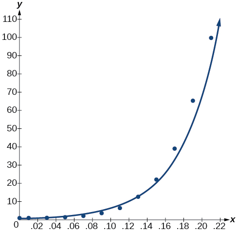{: #CNX_Precalc_Figure_04_08_002}

2.  Use the model to estimate the risk associated with a BAC of<math xmlns="http://www.w3.org/1998/Math/MathML"> <mrow> <mtext> </mtext><mn>0.16.</mn><mtext> </mtext> </mrow> </math>
    
    Substitute<math xmlns="http://www.w3.org/1998/Math/MathML"> <mrow> <mtext> </mtext><mn>0.16</mn><mtext> </mtext> </mrow> </math>
    
    for<math xmlns="http://www.w3.org/1998/Math/MathML"> <mrow> <mtext> </mtext><mi>x</mi><mtext> </mtext> </mrow> </math>
    
    in the model and solve for<math xmlns="http://www.w3.org/1998/Math/MathML"> <mrow> <mtext> </mtext><mi>y</mi><mo>.</mo> </mrow> </math>
    
    

    <math xmlns="http://www.w3.org/1998/Math/MathML"> <mrow> <mtable columnalign="left"> <mtr columnalign="left"> <mtd columnalign="left"> <mi>y</mi> </mtd> <mtd columnalign="left"> <mrow> <mo>=</mo><mn>0.58304829</mn><msup> <mrow> <mrow><mo>(</mo> <mrow> <mtext>22,072,021,300</mtext> </mrow> <mo>)</mo></mrow> </mrow> <mi>x</mi> </msup> </mrow> </mtd> <mtd columnalign="left"> <mrow> <mtext>Use the regression model found in part (a)</mtext><mtext>.</mtext> </mrow> </mtd> </mtr> <mtr columnalign="left"> <mtd columnalign="left"> <mrow /> </mtd> <mtd columnalign="left"> <mrow> <mo>=</mo><mn>0.58304829</mn><msup> <mrow> <mrow><mo>(</mo> <mrow> <mtext>22,072,021,300</mtext> </mrow> <mo>)</mo></mrow> </mrow> <mrow> <mn>0.16</mn> </mrow> </msup> </mrow> </mtd> <mtd columnalign="left"> <mrow> <mtext>Substitute 0</mtext><mtext>.16 for </mtext><mi>x</mi><mtext>.</mtext> </mrow> </mtd> </mtr> <mtr columnalign="left"> <mtd columnalign="left"> <mrow /> </mtd> <mtd columnalign="left"> <mrow> <mo>≈</mo><mtext>26</mtext><mtext>.35</mtext> </mrow> </mtd> <mtd columnalign="left"> <mrow> <mtext>Round to the nearest hundredth</mtext><mtext>.</mtext> </mrow> </mtd> </mtr> </mtable> </mrow> </math>
    

    
    If a 160-pound person drives after having 6 drinks, he or she is about 26.35 times more likely to crash than if driving while sober.
{: type="a"}

[[link]](#Table_04_08_02) shows a recent graduate’s credit card balance each month after graduation.

| **Month** | 1 | 2 | 3 | 4 | 5 | 6 | 7 | 8 |
| **Debt ($)** | 620.00 | 761.88 | 899.80 | 1039.93 | 1270.63 | 1589.04 | 1851.31 | 2154.92 |
{: #Table_04_08_02 summary="Two rows and ten columns. The first row is labeled, &#x201C;Month&#x201D;, and the second row is labeled, &#x201C;Debt ($)&#x201D;. Reading the columns as ordered pairs, we have the following values: (1, 620.00), (2, 761.88), (3, 899.80), (4, 1039.93), (5, 1270.63), (6, 1589.04), (7, 1851.31), and (8, 2154.92)."}

1.  Use exponential regression to fit a model to these data.
2.  If spending continues at this rate, what will the graduate’s credit card debt be one year after graduating?
{: type="a"}

1.  The exponential regression model that fits these data is
    <math xmlns="http://www.w3.org/1998/Math/MathML"> <mrow> <mtext> </mtext><mi>y</mi><mo>=</mo><mn>522.88585984</mn><msup> <mrow> <mrow><mo>(</mo> <mrow> <mn>1.19645256</mn> </mrow> <mo>)</mo></mrow> </mrow> <mi>x</mi> </msup> <mo>.</mo> </mrow> </math>

2.  If spending continues at this rate, the graduate’s credit card debt will be $4,499.38 after one year.
{: type="a"}

**Is it reasonable to assume that an exponential regression model will represent a situation indefinitely?**

*No. Remember that models are formed by real-world data gathered for regression. It is usually reasonable to make estimates within the interval of original observation (interpolation). However, when a model is used to make predictions, it is important to use reasoning skills to determine whether the model makes sense for inputs far beyond the original observation interval (extrapolation).*

### Building a Logarithmic Model from Data

Just as with exponential functions, there are many real-world applications for logarithmic functions: intensity of sound, pH levels of solutions, yields of chemical reactions, production of goods, and growth of infants. As with exponential models, data modeled by logarithmic functions are either always increasing or always decreasing as time moves forward. Again, it is the *way* they increase or decrease that helps us determine whether a **logarithmic model**{: data-type="term" .no-emphasis} is best.

Recall that logarithmic functions increase or decrease rapidly at first, but then steadily slow as time moves on. By reflecting on the characteristics we’ve already learned about this function, we can better analyze real world situations that reflect this type of growth or decay. When performing logarithmic **regression analysis**{: data-type="term" .no-emphasis}, we use the form of the logarithmic function most commonly used on graphing utilities,<math xmlns="http://www.w3.org/1998/Math/MathML"> <mrow> <mtext> </mtext><mi>y</mi><mo>=</mo><mi>a</mi><mo>+</mo><mi>b</mi><mi>ln</mi><mrow><mo>(</mo> <mi>x</mi> <mo>)</mo></mrow><mo>.</mo><mtext> </mtext> </mrow> </math>

For this function

* All input values,
  <math xmlns="http://www.w3.org/1998/Math/MathML"> <mrow> <mtext> </mtext><mi>x</mi><mo>,</mo> </mrow> </math>
  
  must be greater than zero.
* The point
  <math xmlns="http://www.w3.org/1998/Math/MathML"> <mrow> <mtext> </mtext><mrow><mo>(</mo> <mrow> <mn>1</mn><mo>,</mo><mi>a</mi> </mrow> <mo>)</mo></mrow><mtext> </mtext> </mrow> </math>
  
  is on the graph of the model.
* If
  <math xmlns="http://www.w3.org/1998/Math/MathML"> <mrow> <mtext> </mtext><mi>b</mi><mo>&gt;</mo><mn>0</mn><mo>,</mo> </mrow> </math>
  
  the model is increasing. Growth increases rapidly at first and then steadily slows over time.
* If
  <math xmlns="http://www.w3.org/1998/Math/MathML"> <mrow> <mtext> </mtext><mi>b</mi><mo>&lt;</mo><mn>0</mn><mo>,</mo> </mrow> </math>
  
  the model is decreasing. Decay occurs rapidly at first and then steadily slows over time.

Logarithmic Regression

*Logarithmic regression* is used to model situations where growth or decay accelerates rapidly at first and then slows over time. We use the command “LnReg” on a graphing utility to fit a logarithmic function to a set of data points. This returns an equation of the form,

<math xmlns="http://www.w3.org/1998/Math/MathML" display="block"> <mrow> <mi>y</mi><mo>=</mo><mi>a</mi><mo>+</mo><mi>b</mi><mi>ln</mi><mrow><mo>(</mo> <mi>x</mi> <mo>)</mo></mrow> </mrow> </math>

Note that

* all input values,
  <math xmlns="http://www.w3.org/1998/Math/MathML"> <mrow> <mtext> </mtext><mi>x</mi><mo>,</mo> </mrow> </math>
  
  must be non-negative.
* when
  <math xmlns="http://www.w3.org/1998/Math/MathML"> <mrow> <mtext> </mtext><mi>b</mi><mo>&gt;</mo><mn>0</mn><mo>,</mo> </mrow> </math>
  
  the model is increasing.
* when
  <math xmlns="http://www.w3.org/1998/Math/MathML"> <mrow> <mtext> </mtext><mi>b</mi><mo>&lt;</mo><mn>0</mn><mo>,</mo> </mrow> </math>
  
  the model is decreasing.

**Given a set of data, perform logarithmic regression using a graphing utility.**

1.  Use the STAT then EDIT menu to enter given data.
    1.  Clear any existing data from the lists.
    2.  List the input values in the L1 column.
    3.  List the output values in the L2 column.
    {: type="a"}

2.  Graph and observe a scatter plot of the data using the STATPLOT feature.
    1.  Use ZOOM \[9\] to adjust axes to fit the data.
    2.  Verify the data follow a logarithmic pattern.
    {: type="a"}

3.  Find the equation that models the data.
    1.  Select “LnReg” from the STAT then CALC menu.
    2.  Use the values returned for *a* and *b* to record the model,
        <math xmlns="http://www.w3.org/1998/Math/MathML"> <mrow> <mtext> </mtext><mi>y</mi><mo>=</mo><mi>a</mi><mo>+</mo><mi>b</mi><mi>ln</mi><mrow><mo>(</mo> <mi>x</mi> <mo>)</mo></mrow><mo>.</mo> </mrow> </math>
    {: type="a"}

4.  Graph the model in the same window as the scatterplot to verify it is a good fit for the data.
{: type="1"}

Using Logarithmic Regression to Fit a Model to Data

Due to advances in medicine and higher standards of living, life expectancy has been increasing in most developed countries since the beginning of the 20th century.

[[link]](#Table_04_08_03) shows the average life expectancies, in years, of Americans from 1900–2010[2](#footnote2){: data-type="footnote-link"}.

| **Year** | 1900 | 1910 | 1920 | 1930 | 1940 | 1950 |
| **Life Expectancy(Years)** | 47.3 | 50.0 | 54.1 | 59.7 | 62.9 | 68.2 |
| **Year** | 1960 | 1970 | 1980 | 1990 | 2000 | 2010 |
| **Life Expectancy(Years)** | 69.7 | 70.8 | 73.7 | 75.4 | 76.8 | 78.7 |
{: #Table_04_08_03 summary="Two rows and twelve columns. The first row is labeled, &#x201C;Year&#x201D;, and the second row is labeled, &#x201C;Life Expectancy (Years)&#x201D;. Reading the columns as ordered pairs, we have the following values: (1900, 47.3), (1910, 50.0), (1920, 54.1), (1930, 59.7), (1940, 62.9), (1950, 68.2), (1960, 69.7), (1970, 70.8), (1980, 73,7), (1990, 75.4), (2000, 76.8) and (2010, 78.7)."}

1.  Let
    <math xmlns="http://www.w3.org/1998/Math/MathML"> <mrow> <mtext> </mtext><mi>x</mi><mtext> </mtext> </mrow> </math>
    
    represent time in decades starting with
    <math xmlns="http://www.w3.org/1998/Math/MathML"> <mrow> <mtext> </mtext><mi>x</mi><mo>=</mo><mn>1</mn><mtext> </mtext> </mrow> </math>
    
    for the year 1900,
    <math xmlns="http://www.w3.org/1998/Math/MathML"> <mrow> <mtext> </mtext><mi>x</mi><mo>=</mo><mn>2</mn><mtext> </mtext> </mrow> </math>
    
    for the year 1910, and so on. Let
    <math xmlns="http://www.w3.org/1998/Math/MathML"> <mrow> <mtext> </mtext><mi>y</mi><mtext> </mtext> </mrow> </math>
    
    represent the corresponding life expectancy. Use logarithmic regression to fit a model to these data.
2.  Use the model to predict the average American life expectancy for the year 2030.
{: type="a"}

1.  Using the STAT then EDIT menu on a graphing utility, list the years using values 1–12 in L1 and the corresponding life expectancy in L2. Then use the STATPLOT feature to verify that the scatterplot follows a logarithmic pattern as shown in [[link]](#CNX_Precalc_Figure_04_08_003): {: #CNX_Precalc_Figure_04_08_003}

    Use the “LnReg” command from the STAT then CALC menu to obtain the logarithmic model,
    
    

    <math xmlns="http://www.w3.org/1998/Math/MathML" display="block"> <mrow> <mi>y</mi><mo>=</mo><mn>42.52722583</mn><mo>+</mo><mn>13.85752327</mn><mi>ln</mi><mo stretchy="false">(</mo><mi>x</mi><mo stretchy="false">)</mo> </mrow> </math>
    

    
    Next, graph the model in the same window as the scatterplot to verify it is a good fit as shown in [[link]](#CNX_Precalc_Figure_04_08_004):
    
    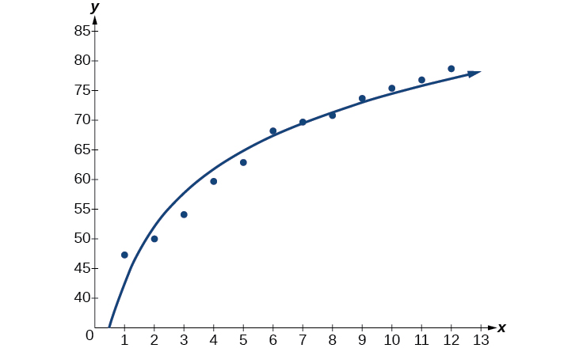{: #CNX_Precalc_Figure_04_08_004}

2.  To predict the life expectancy of an American in the year 2030, substitute
    <math xmlns="http://www.w3.org/1998/Math/MathML"> <mrow> <mtext> </mtext><mi>x</mi><mo>=</mo><mn>14</mn><mtext>  </mtext> </mrow> </math>
    
    for the in the model and solve for
    <math xmlns="http://www.w3.org/1998/Math/MathML"> <mrow> <mtext> </mtext><mi>y</mi><mo>:</mo> </mrow> </math>
    
    

    <math xmlns="http://www.w3.org/1998/Math/MathML"> <mrow> <mtable columnalign="left"> <mtr columnalign="left"> <mtd columnalign="left"> <mi>y</mi> </mtd> <mtd columnalign="left"> <mrow> <mo>=</mo><mn>42.52722583</mn><mo>+</mo><mn>13.85752327</mn><mi>ln</mi><mo stretchy="false">(</mo><mi>x</mi><mo stretchy="false">)</mo> </mrow> </mtd> <mtd columnalign="left"> <mrow> <mtext>Use the regression model found in part (a)</mtext><mtext>.</mtext> </mrow> </mtd> </mtr> <mtr columnalign="left"> <mtd columnalign="left"> <mrow /> </mtd> <mtd columnalign="left"> <mrow> <mo>=</mo><mn>42.52722583</mn><mo>+</mo><mn>13.85752327</mn><mi>ln</mi><mo stretchy="false">(</mo><mn>14</mn><mo stretchy="false">)</mo> </mrow> </mtd> <mtd columnalign="left"> <mrow> <mtext>Substitute 14 for </mtext><mi>x</mi><mtext>.</mtext> </mrow> </mtd> </mtr> <mtr columnalign="left"> <mtd columnalign="left"> <mrow /> </mtd> <mtd columnalign="left"> <mrow> <mo>≈</mo><mtext>79</mtext><mtext>.1</mtext> </mrow> </mtd> <mtd columnalign="left"> <mrow> <mtext>Round to the nearest tenth.</mtext> </mrow> </mtd> </mtr> </mtable> </mrow> </math>
    

    
    If life expectancy continues to increase at this pace, the average life expectancy of an American will be 79.1 by the year 2030.
{: type="a"}

Sales of a video game released in the year 2000 took off at first, but then steadily slowed as time moved on. [[link]](#Table_04_08_04) shows the number of games sold, in thousands, from the years 2000–2010.

| **Year** | 2000 | 2001 | 2002 | 2003 | 2004 | 2005 |
| **Number Sold (thousands)** | 142 | 149 | 154 | 155 | 159 | 161 |
| **Year** | 2006 | 2007 | 2008 | 2009 | 2010 | - |
| **Number Sold (thousands)** | 163 | 164 | 164 | 166 | 167 | - |
{: #Table_04_08_04 summary="Two rows and twelve columns. The first row is labeled, &#x201C;Year&#x201D;, and the second row is labeled, &#x201C;Number Sold (Thousands)&#x201D;. Reading the columns as ordered pairs, we have the following values: (2000, 142), (2001, 149), (2002, 154), (2003, 155), (2004, 159), (2005, 161), (2006, 163), (2007, 164), (2008, 164), (2009, 166), and (2010, 167)."}

1.  Let
    <math xmlns="http://www.w3.org/1998/Math/MathML"> <mrow> <mtext> </mtext><mi>x</mi><mtext> </mtext> </mrow> </math>
    
    represent time in years starting with
    <math xmlns="http://www.w3.org/1998/Math/MathML"> <mrow> <mtext> </mtext><mi>x</mi><mo>=</mo><mn>1</mn><mtext> </mtext> </mrow> </math>
    
    for the year 2000. Let
    <math xmlns="http://www.w3.org/1998/Math/MathML"> <mrow> <mtext>  </mtext><mi>y</mi><mtext>  </mtext> </mrow> </math>
    
    represent the number of games sold in thousands. Use logarithmic regression to fit a model to these data.
2.  If games continue to sell at this rate, how many games will sell in 2015? Round to the nearest thousand.
{: type="a"}

1.  The logarithmic regression model that fits these data is
    <math xmlns="http://www.w3.org/1998/Math/MathML"> <mrow> <mtext> </mtext><mi>y</mi><mo>=</mo><mn>141.91242949</mn><mo>+</mo><mn>10.45366573</mn><mi>ln</mi><mo stretchy="false">(</mo><mi>x</mi><mo stretchy="false">)</mo><mtext> </mtext> </mrow> </math>

2.  If sales continue at this rate, about 171,000 games will be sold in the year 2015.
{: type="a"}

### Building a Logistic Model from Data

Like exponential and logarithmic growth, logistic growth increases over time. One of the most notable differences with logistic growth models is that, at a certain point, growth steadily slows and the function approaches an upper bound, or *limiting value*. Because of this, logistic regression is best for modeling phenomena where there are limits in expansion, such as availability of living space or nutrients.

It is worth pointing out that logistic functions actually model resource-limited exponential growth. There are many examples of this type of growth in real-world situations, including population growth and spread of disease, rumors, and even stains in fabric. When performing logistic **regression analysis**{: data-type="term" .no-emphasis}, we use the form most commonly used on graphing utilities:

<math xmlns="http://www.w3.org/1998/Math/MathML" display="block"> <mrow> <mi>y</mi><mo>=</mo><mfrac> <mi>c</mi> <mrow> <mn>1</mn><mo>+</mo><mi>a</mi><msup> <mi>e</mi> <mrow> <mo>−</mo><mi>b</mi><mi>x</mi> </mrow> </msup> </mrow> </mfrac> </mrow> </math>

Recall that:

* <math xmlns="http://www.w3.org/1998/Math/MathML"> <mrow> <mfrac> <mi>c</mi> <mrow> <mn>1</mn><mo>+</mo><mi>a</mi> </mrow> </mfrac> <mtext> </mtext> </mrow> </math>
  
  is the initial value of the model.
* when
  <math xmlns="http://www.w3.org/1998/Math/MathML"> <mrow> <mtext> </mtext><mi>b</mi><mo>&gt;</mo><mn>0</mn><mo>,</mo> </mrow> </math>
  
  the model increases rapidly at first until it reaches its point of maximum growth rate,
  <math xmlns="http://www.w3.org/1998/Math/MathML"> <mrow> <mtext> </mtext><mrow><mo>(</mo> <mrow> <mfrac> <mrow> <mi>ln</mi><mrow><mo>(</mo> <mi>a</mi> <mo>)</mo></mrow> </mrow> <mi>b</mi> </mfrac> <mo>,</mo><mfrac> <mi>c</mi> <mn>2</mn> </mfrac> </mrow> <mo>)</mo></mrow><mo>.</mo><mtext> </mtext> </mrow> </math>
  
  At that point, growth steadily slows and the function becomes asymptotic to the upper bound
  <math xmlns="http://www.w3.org/1998/Math/MathML"> <mrow> <mtext> </mtext><mi>y</mi><mo>=</mo><mi>c</mi><mo>.</mo> </mrow> </math>

* <math xmlns="http://www.w3.org/1998/Math/MathML"> <mrow> <mi>c</mi><mtext> </mtext> </mrow> </math>
  
  is the limiting value, sometimes called the *carrying capacity*, of the model.

Logistic Regression

*Logistic regression* is used to model situations where growth accelerates rapidly at first and then steadily slows to an upper limit. We use the command “Logistic” on a graphing utility to fit a logistic function to a set of data points. This returns an equation of the form

<math xmlns="http://www.w3.org/1998/Math/MathML" display="block"> <mrow> <mi>y</mi><mo>=</mo><mfrac> <mi>c</mi> <mrow> <mn>1</mn><mo>+</mo><mi>a</mi><msup> <mi>e</mi> <mrow> <mo>−</mo><mi>b</mi><mi>x</mi> </mrow> </msup> </mrow> </mfrac> </mrow> </math>

Note that

* The initial value of the model is
  <math xmlns="http://www.w3.org/1998/Math/MathML"> <mrow> <mtext> </mtext><mfrac> <mi>c</mi> <mrow> <mn>1</mn><mo>+</mo><mi>a</mi> </mrow> </mfrac> <mo>.</mo> </mrow> </math>

* Output values for the model grow closer and closer to
  <math xmlns="http://www.w3.org/1998/Math/MathML"> <mrow> <mtext> </mtext><mi>y</mi><mo>=</mo><mi>c</mi><mtext> </mtext> </mrow> </math>
  
  as time increases.

**Given a set of data, perform logistic regression using a graphing utility.**

1.  Use the STAT then EDIT menu to enter given data.
    1.  Clear any existing data from the lists.
    2.  List the input values in the L1 column.
    3.  List the output values in the L2 column.
    {: type="a"}

2.  Graph and observe a scatter plot of the data using the STATPLOT feature.
    1.  Use ZOOM \[9\] to adjust axes to fit the data.
    2.  Verify the data follow a logistic pattern.
    {: type="a"}

3.  Find the equation that models the data.
    1.  Select “Logistic” from the STAT then CALC menu.
    2.  Use the values returned for
        <math xmlns="http://www.w3.org/1998/Math/MathML"> <mrow> <mtext> </mtext><mi>a</mi><mo>,</mo> </mrow> </math>
        
        <math xmlns="http://www.w3.org/1998/Math/MathML"> <mrow> <mtext> </mtext><mi>b</mi><mo>,</mo> </mrow> </math>
        
        and
        <math xmlns="http://www.w3.org/1998/Math/MathML"> <mrow> <mtext> </mtext><mi>c</mi><mtext> </mtext> </mrow> </math>
        
        to record the model,
        <math xmlns="http://www.w3.org/1998/Math/MathML"> <mrow> <mtext> </mtext><mi>y</mi><mo>=</mo><mfrac> <mi>c</mi> <mrow> <mn>1</mn><mo>+</mo><mi>a</mi><msup> <mi>e</mi> <mrow> <mo>−</mo><mi>b</mi><mi>x</mi> </mrow> </msup> </mrow> </mfrac> <mo>.</mo> </mrow> </math>
    {: type="a"}

4.  Graph the model in the same window as the scatterplot to verify it is a good fit for the data.
{: type="1"}

Using Logistic Regression to Fit a Model to Data

Mobile telephone service has increased rapidly in America since the mid 1990s. Today, almost all residents have cellular service. [[link]](#Table_04_08_05) shows the percentage of Americans with cellular service between the years 1995 and 2012 [3](#footnote3){: data-type="footnote-link"}.

| Year | Americans with Cellular Service (%) | Year | Americans with Cellular Service (%) |
|----------
| 1995 | 12.69 | 2004 | 62.852 |
| 1996 | 16.35 | 2005 | 68.63 |
| 1997 | 20.29 | 2006 | 76.64 |
| 1998 | 25.08 | 2007 | 82.47 |
| 1999 | 30.81 | 2008 | 85.68 |
| 2000 | 38.75 | 2009 | 89.14 |
| 2001 | 45.00 | 2010 | 91.86 |
| 2002 | 49.16 | 2011 | 95.28 |
| 2003 | 55.15 | 2012 | 98.17 |
{: #Table_04_08_05 summary="Nineteen rows and two columns. The first column is labeled, &#x201C;Year&#x201D;, and the second column is labeled, &#x201C;Americans with Cellular Service (%)&#x201D;. Reading the columns as ordered pairs, we have the following values: (1995, 12.69), (1996, 16.35), (1997, 20.29), (1998, 25.08), (1999, 30.81), (2000, 38.75), (2001, 45.00), (2002, 49.16), (2003, 55.15), (2004, 62.85), (2005, 68.63), (2006, 76.64), (2007, 82.47), (2008, 85.68), (2009, 89.14), (2010, 91.86), (2011, 95.28), and (2012, 98.17)."}

1.  Let
    <math xmlns="http://www.w3.org/1998/Math/MathML"> <mrow> <mtext> </mtext><mi>x</mi><mtext> </mtext> </mrow> </math>
    
    represent time in years starting with
    <math xmlns="http://www.w3.org/1998/Math/MathML"> <mrow> <mtext> </mtext><mi>x</mi><mo>=</mo><mn>0</mn><mtext> </mtext> </mrow> </math>
    
    for the year 1995. Let
    <math xmlns="http://www.w3.org/1998/Math/MathML"> <mrow> <mtext> </mtext><mi>y</mi><mtext> </mtext> </mrow> </math>
    
    represent the corresponding percentage of residents with cellular service. Use logistic regression to fit a model to these data.
2.  Use the model to calculate the percentage of Americans with cell service in the year 2013. Round to the nearest tenth of a percent.
3.  Discuss the value returned for the upper limit,
    <math xmlns="http://www.w3.org/1998/Math/MathML"> <mrow> <mtext> </mtext><mi>c</mi><mo>.</mo><mtext> </mtext> </mrow> </math>
    
    What does this tell you about the model? What would the limiting value be if the model were exact?
{: type="a"}

1.  Using the STAT then EDIT menu on a graphing utility, list the years using values 0–15 in L1 and the corresponding percentage in L2. Then use the STATPLOT feature to verify that the scatterplot follows a logistic pattern as shown in [[link]](#CNX_Precalc_Figure_04_08_005): 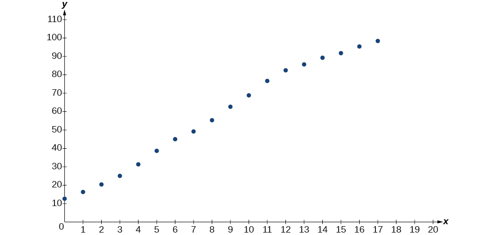{: #CNX_Precalc_Figure_04_08_005}

    Use the “Logistic” command from the STAT then CALC menu to obtain the logistic model,
    
    

    <math xmlns="http://www.w3.org/1998/Math/MathML" display="block"> <mrow> <mi>y</mi><mo>=</mo><mfrac> <mrow> <mn>105.7379526</mn> </mrow> <mrow> <mn>1</mn><mo>+</mo><mn>6.88328979</mn><msup> <mi>e</mi> <mrow> <mo>−</mo><mn>0.2595440013</mn><mi>x</mi> </mrow> </msup> </mrow> </mfrac> </mrow> </math>
    

    
    Next, graph the model in the same window as shown in [[link]](#CNX_Precalc_Figure_04_08_006) the scatterplot to verify it is a good fit:
    
    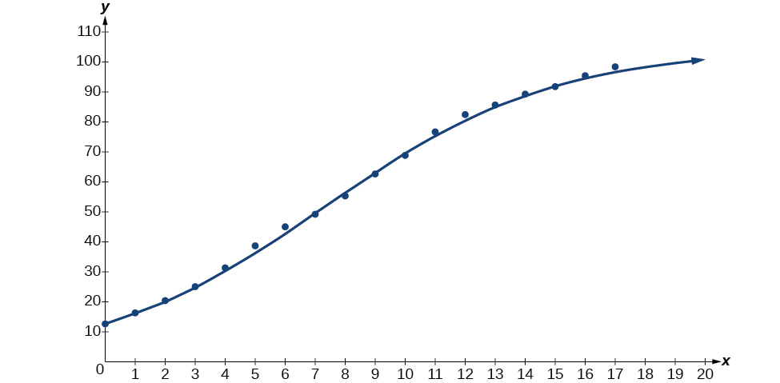{: #CNX_Precalc_Figure_04_08_006}

2.  To approximate the percentage of Americans with cellular service in the year 2013, substitute<math xmlns="http://www.w3.org/1998/Math/MathML"> <mrow> <mtext> </mtext><mi>x</mi><mo>=</mo><mn>18</mn><mtext> </mtext> </mrow> </math>
    
    for the in the model and solve for<math xmlns="http://www.w3.org/1998/Math/MathML"> <mrow> <mtext> </mtext><mi>y</mi><mo>:</mo> </mrow> </math>
    
    

    <math xmlns="http://www.w3.org/1998/Math/MathML"> <mrow> <mtable columnalign="left"> <mtr columnalign="left"> <mtd columnalign="left"> <mi>y</mi> </mtd> <mtd columnalign="left"> <mrow> <mo>=</mo><mfrac> <mrow> <mn>105.7379526</mn> </mrow> <mrow> <mn>1</mn><mo>+</mo><mn>6.88328979</mn><msup> <mi>e</mi> <mrow> <mo>−</mo><mn>0.2595440013</mn><mi>x</mi> </mrow> </msup> </mrow> </mfrac> </mrow> </mtd> <mtd columnalign="left"> <mrow> <mtext>Use the regression model found in part (a)</mtext><mo>.</mo> </mrow> </mtd> </mtr> <mtr columnalign="left"> <mtd columnalign="left"> <mrow /> </mtd> <mtd columnalign="left"> <mrow> <mo>=</mo><mfrac> <mrow> <mn>105.7379526</mn> </mrow> <mrow> <mn>1</mn><mo>+</mo><mn>6.88328979</mn><msup> <mi>e</mi> <mrow> <mo>−</mo><mn>0.2595440013</mn><mo stretchy="false">(</mo><mn>18</mn><mo stretchy="false">)</mo> </mrow> </msup> </mrow> </mfrac> </mrow> </mtd> <mtd columnalign="left"> <mrow> <mtext>Substitute 18 for </mtext><mi>x</mi><mo>.</mo> </mrow> </mtd> </mtr> <mtr columnalign="left"> <mtd columnalign="left"> <mrow /> </mtd> <mtd columnalign="left"> <mrow> <mo>≈</mo><mtext>99</mtext><mtext>.3 </mtext> </mrow> </mtd> <mtd columnalign="left"> <mrow> <mtext>Round to the nearest tenth</mtext> </mrow> </mtd> </mtr> </mtable> </mrow> </math>
    

    
    According to the model, about 98.8% of Americans had cellular service in 2013.

3.  The model gives a limiting value of about 105. This means that the maximum possible percentage of Americans with cellular service would be 105%, which is impossible. (How could over 100% of a population have cellular service?) If the model were exact, the limiting value would be<math xmlns="http://www.w3.org/1998/Math/MathML"> <mrow> <mtext> </mtext><mi>c</mi><mo>=</mo><mn>100</mn><mtext> </mtext> </mrow> </math>
    
    and the model’s outputs would get very close to, but never actually reach 100%. After all, there will always be someone out there without cellular service!
{: type="a"}

[[link]](#Table_04_08_06) shows the population, in thousands, of harbor seals in the Wadden Sea over the years 1997 to 2012.

| Year | Seal Population (Thousands) | Year | Seal Population (Thousands) |
|----------
| 1997 | 3.493 | 2005 | 19.590 |
| 1998 | 5.282 | 2006 | 21.955 |
| 1999 | 6.357 | 2007 | 22.862 |
| 2000 | 9.201 | 2008 | 23.869 |
| 2001 | 11.224 | 2009 | 24.243 |
| 2002 | 12.964 | 2010 | 24.344 |
| 2003 | 16.226 | 2011 | 24.919 |
| 2004 | 18.137 | 2012 | 25.108 |
{: #Table_04_08_06 summary="Seventeen rows and two columns. The first column is labeled, &#x201C;Year&#x201D;, and the second column is labeled, &#x201C;Seal Population (Thousands)&#x201D;. Reading the columns as ordered pairs, we have the following values: (1997, 3.493), (1998, 5.282), (1999, 6.357), (2000, 9.201), (2001, 11.224), (2002, 12.964), (2003, 16.226), (2004, 18.137), (2005, 19.590), (2006, 21.955), (2007, 22.862), (2008, 23.869), (2009, 24.243), (2010, 24.344), (2011, 24.919), and (2012, 25.108)."}

1.  Let
    <math xmlns="http://www.w3.org/1998/Math/MathML"> <mrow> <mtext> </mtext><mi>x</mi><mtext> </mtext> </mrow> </math>
    
    represent time in years starting with
    <math xmlns="http://www.w3.org/1998/Math/MathML"> <mrow> <mtext> </mtext><mi>x</mi><mo>=</mo><mn>0</mn><mtext> </mtext> </mrow> </math>
    
    for the year 1997. Let
    <math xmlns="http://www.w3.org/1998/Math/MathML"> <mrow> <mtext>  </mtext><mi>y</mi><mtext>  </mtext> </mrow> </math>
    
    represent the number of seals in thousands. Use logistic regression to fit a model to these data.
2.  Use the model to predict the seal population for the year 2020.
3.  To the nearest whole number, what is the limiting value of this model?
{: type="a"}

1.  The logistic regression model that fits these data is
    <math xmlns="http://www.w3.org/1998/Math/MathML"> <mrow> <mtext> </mtext><mi>y</mi><mo>=</mo><mfrac> <mrow> <mn>25.65665979</mn> </mrow> <mrow> <mn>1</mn><mo>+</mo><mn>6.113686306</mn><msup> <mi>e</mi> <mrow> <mo>−</mo><mn>0.3852149008</mn><mi>x</mi> </mrow> </msup> </mrow> </mfrac> <mo>.</mo> </mrow> </math>

2.  If the population continues to grow at this rate, there will be about
    <math xmlns="http://www.w3.org/1998/Math/MathML"> <mrow> <mtext> </mtext><mtext>25,634</mtext><mtext>  </mtext> </mrow> </math>
    
    seals in 2020.
3.  To the nearest whole number, the carrying capacity is 25,657.
{: type="a"}

Access this online resource for additional instruction and practice with exponential function models.

* [Exponential Regression on a Calculator][1]

Visit [this website][2] for additional practice questions from Learningpod.

### Key Concepts

* Exponential regression is used to model situations where growth begins slowly and then accelerates rapidly without bound, or where decay begins rapidly and then slows down to get closer and closer to zero.
* We use the command “ExpReg” on a graphing utility to fit function of the form
  <math xmlns="http://www.w3.org/1998/Math/MathML"> <mrow> <mtext> </mtext><mi>y</mi><mo>=</mo><mi>a</mi><msup> <mi>b</mi> <mi>x</mi> </msup> <mtext> </mtext> </mrow> </math>
  
  to a set of data points. See [\[link\]](#Example_04_08_01).
* Logarithmic regression is used to model situations where growth or decay accelerates rapidly at first and then slows over time.
* We use the command “LnReg” on a graphing utility to fit a function of the form
  <math xmlns="http://www.w3.org/1998/Math/MathML"> <mrow> <mtext> </mtext><mi>y</mi><mo>=</mo><mi>a</mi><mo>+</mo><mi>b</mi><mi>ln</mi><mrow><mo>(</mo> <mi>x</mi> <mo>)</mo></mrow><mtext> </mtext> </mrow> </math>
  
  to a set of data points. See [\[link\]](#Example_04_08_02).
* Logistic regression is used to model situations where growth accelerates rapidly at first and then steadily slows as the function approaches an upper limit.
* We use the command “Logistic” on a graphing utility to fit a function of the form
  <math xmlns="http://www.w3.org/1998/Math/MathML"> <mrow> <mtext> </mtext><mi>y</mi><mo>=</mo><mfrac> <mi>c</mi> <mrow> <mn>1</mn><mo>+</mo><mi>a</mi><msup> <mi>e</mi> <mrow> <mo>−</mo><mi>b</mi><mi>x</mi> </mrow> </msup> </mrow> </mfrac> <mtext> </mtext> </mrow> </math>
  
  to a set of data points. See [\[link\]](#Example_04_08_03).

### Section Exercises

#### Verbal

What situations are best modeled by a logistic equation? Give an example, and state a case for why the example is a good fit.

Logistic models are best used for situations that have limited values. For example, populations cannot grow indefinitely since resources such as food, water, and space are limited, so a logistic model best describes populations.

What is a carrying capacity? What kind of model has a carrying capacity built into its formula? Why does this make sense?

What is regression analysis? Describe the process of performing regression analysis on a graphing utility.

Regression analysis is the process of finding an equation that best fits a given set of data points. To perform a regression analysis on a graphing utility, first list the given points using the STAT then EDIT menu. Next graph the scatter plot using the STAT PLOT feature. The shape of the data points on the scatter graph can help determine which regression feature to use. Once this is determined, select the appropriate regression analysis command from the STAT then CALC menu.

What might a scatterplot of data points look like if it were best described by a logarithmic model?

What does the *y*-intercept on the graph of a logistic equation correspond to for a population modeled by that equation?

The *y*-intercept on the graph of a logistic equation corresponds to the initial population for the population model.

#### Graphical

For the following exercises, match the given function of best fit with the appropriate scatterplot in [\[link\]](#CNX_PreCalc_Figure_04_08_201) through [\[link\]](#CNX_PreCalc_Figure_04_08_205)<strong>. </strong>Answer using the letter beneath the matching graph.

{: #CNX_PreCalc_Figure_04_08_201}

{: #CNX_PreCalc_Figure_04_08_202}

{: #CNX_PreCalc_Figure_04_08_203}

{: #CNX_PreCalc_Figure_04_08_204}

{: #CNX_PreCalc_Figure_04_08_205}

<math xmlns="http://www.w3.org/1998/Math/MathML"> <mrow> <mi>y</mi><mo>=</mo><mn>10.209</mn><msup> <mi>e</mi> <mrow> <mo>−</mo><mn>0.294</mn><mi>x</mi> </mrow> </msup> </mrow> </math>

<math xmlns="http://www.w3.org/1998/Math/MathML"> <mrow> <mi>y</mi><mo>=</mo><mn>5.598</mn><mo>−</mo><mn>1.912</mn><mi>ln</mi><mo stretchy="false">(</mo><mi>x</mi><mo stretchy="false">)</mo> </mrow> </math>

C

<math xmlns="http://www.w3.org/1998/Math/MathML"> <mrow> <mi>y</mi><mo>=</mo><mn>2.104</mn><msup> <mrow> <mrow><mo>(</mo> <mrow> <mn>1.479</mn> </mrow> <mo>)</mo></mrow> </mrow> <mi>x</mi> </msup> </mrow> </math>

<math xmlns="http://www.w3.org/1998/Math/MathML"> <mrow> <mi>y</mi><mo>=</mo><mn>4.607</mn><mo>+</mo><mn>2.733</mn><mi>ln</mi><mo stretchy="false">(</mo><mi>x</mi><mo stretchy="false">)</mo> </mrow> </math>

B

<math xmlns="http://www.w3.org/1998/Math/MathML"> <mrow> <mi>y</mi><mo>=</mo><mfrac> <mrow> <mn>14.005</mn> </mrow> <mrow> <mn>1</mn><mo>+</mo><mn>2.79</mn><msup> <mi>e</mi> <mrow> <mo>−</mo><mn>0.812</mn><mi>x</mi> </mrow> </msup> </mrow> </mfrac> </mrow> </math>

#### Numeric

To the nearest whole number, what is the initial value of a population modeled by the logistic equation<math xmlns="http://www.w3.org/1998/Math/MathML"> <mrow> <mtext> </mtext><mi>P</mi><mo stretchy="false">(</mo><mi>t</mi><mo stretchy="false">)</mo><mo>=</mo><mfrac> <mrow> <mn>175</mn> </mrow> <mrow> <mn>1</mn><mo>+</mo><mn>6.995</mn><msup> <mi>e</mi> <mrow> <mo>−</mo><mn>0.68</mn><mi>t</mi> </mrow> </msup> </mrow> </mfrac> <mo>?</mo><mtext> </mtext> </mrow> </math>

What is the carrying capacity?

<math xmlns="http://www.w3.org/1998/Math/MathML"> <mrow> <mi>P</mi><mo stretchy="false">(</mo><mn>0</mn><mo stretchy="false">)</mo><mo>=</mo><mn>22</mn><mtext> </mtext> </mrow> </math>

; 175

Rewrite the exponential model<math xmlns="http://www.w3.org/1998/Math/MathML"> <mrow> <mtext> </mtext><mi>A</mi><mo stretchy="false">(</mo><mi>t</mi><mo stretchy="false">)</mo><mo>=</mo><mn>1550</mn><msup> <mrow> <mrow><mo>(</mo> <mrow> <mn>1.085</mn> </mrow> <mo>)</mo></mrow> </mrow> <mi>x</mi> </msup> <mtext> </mtext> </mrow> </math>

as an equivalent model with base<math xmlns="http://www.w3.org/1998/Math/MathML"> <mrow> <mtext> </mtext><mi>e</mi><mo>.</mo><mtext> </mtext> </mrow> </math>

Express the exponent to four significant digits.

A logarithmic model is given by the equation<math xmlns="http://www.w3.org/1998/Math/MathML"> <mrow> <mtext> </mtext><mi>h</mi><mo stretchy="false">(</mo><mi>p</mi><mo stretchy="false">)</mo><mo>=</mo><mn>67.682</mn><mo>−</mo><mn>5.792</mn><mi>ln</mi><mrow><mo>(</mo> <mi>p</mi> <mo>)</mo></mrow><mo>.</mo><mtext> </mtext> </mrow> </math>

To the nearest hundredth, for what value of<math xmlns="http://www.w3.org/1998/Math/MathML"> <mrow> <mtext> </mtext><mi>p</mi><mtext> </mtext> </mrow> </math>

does<math xmlns="http://www.w3.org/1998/Math/MathML"> <mrow> <mtext> </mtext><mi>h</mi><mo stretchy="false">(</mo><mi>p</mi><mo stretchy="false">)</mo><mo>=</mo><mn>62</mn><mo>?</mo> </mrow> </math>

<math xmlns="http://www.w3.org/1998/Math/MathML"> <mrow> <mi>p</mi><mo>≈</mo><mn>2.67</mn> </mrow> </math>

A logistic model is given by the equation<math xmlns="http://www.w3.org/1998/Math/MathML"> <mrow> <mtext> </mtext><mi>P</mi><mo stretchy="false">(</mo><mi>t</mi><mo stretchy="false">)</mo><mo>=</mo><mfrac> <mrow> <mn>90</mn> </mrow> <mrow> <mn>1</mn><mo>+</mo><mn>5</mn><msup> <mi>e</mi> <mrow> <mo>−</mo><mn>0.42</mn><mi>t</mi> </mrow> </msup> </mrow> </mfrac> <mo>.</mo><mtext> </mtext> </mrow> </math>

To the nearest hundredth, for what value of *t* does<math xmlns="http://www.w3.org/1998/Math/MathML"> <mrow> <mtext> </mtext><mi>P</mi><mo stretchy="false">(</mo><mi>t</mi><mo stretchy="false">)</mo><mo>=</mo><mn>45</mn><mo>?</mo> </mrow> </math>

What is the *y*-intercept on the graph of the logistic model given in the previous exercise?

*y*-intercept:<math xmlns="http://www.w3.org/1998/Math/MathML"> <mrow> <mtext> </mtext><mrow><mo>(</mo> <mrow> <mn>0</mn><mo>,</mo><mn>15</mn> </mrow> <mo>)</mo></mrow> </mrow> </math>

#### Technology

For the following exercises, use this scenario: The population<math xmlns="http://www.w3.org/1998/Math/MathML"> <mrow> <mtext> </mtext><mi>P</mi><mtext> </mtext> </mrow> </math>

of a koi pond over<math xmlns="http://www.w3.org/1998/Math/MathML"> <mrow> <mtext> </mtext><mi>x</mi><mtext> </mtext> </mrow> </math>

months is modeled by the function<math xmlns="http://www.w3.org/1998/Math/MathML"> <mrow> <mtext> </mtext><mi>P</mi><mo stretchy="false">(</mo><mi>x</mi><mo stretchy="false">)</mo><mo>=</mo><mfrac> <mrow> <mn>68</mn> </mrow> <mrow> <mn>1</mn><mo>+</mo><mn>16</mn><msup> <mi>e</mi> <mrow> <mo>−</mo><mn>0.28</mn><mi>x</mi> </mrow> </msup> </mrow> </mfrac> <mo>.</mo> </mrow> </math>

Graph the population model to show the population over a span of<math xmlns="http://www.w3.org/1998/Math/MathML"> <mrow> <mtext> </mtext><mn>3</mn><mtext> </mtext> </mrow> </math>

years.

What was the initial population of koi?

<math xmlns="http://www.w3.org/1998/Math/MathML"> <mrow> <mn>4</mn><mtext> </mtext> </mrow> </math>

koi

How many koi will the pond have after one and a half years?

How many months will it take before there are<math xmlns="http://www.w3.org/1998/Math/MathML"> <mrow> <mtext> </mtext><mn>20</mn><mtext> </mtext> </mrow> </math>

koi in the pond?

about<math xmlns="http://www.w3.org/1998/Math/MathML"> <mrow> <mtext> </mtext><mn>6.8</mn><mtext> </mtext> </mrow> </math>

months.

Use the intersect feature to approximate the number of months it will take before the population of the pond reaches half its carrying capacity.

 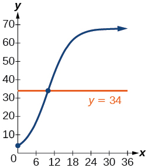 

For the following exercises, use this scenario: The population<math xmlns="http://www.w3.org/1998/Math/MathML"> <mrow> <mtext> </mtext><mi>P</mi><mtext> </mtext> </mrow> </math>

of an endangered species habitat for wolves is modeled by the function<math xmlns="http://www.w3.org/1998/Math/MathML"> <mrow> <mtext> </mtext><mi>P</mi><mo stretchy="false">(</mo><mi>x</mi><mo stretchy="false">)</mo><mo>=</mo><mfrac> <mrow> <mn>558</mn> </mrow> <mrow> <mn>1</mn><mo>+</mo><mn>54.8</mn><msup> <mi>e</mi> <mrow> <mo>−</mo><mn>0.462</mn><mi>x</mi> </mrow> </msup> </mrow> </mfrac> <mo>,</mo> </mrow> </math>

 where<math xmlns="http://www.w3.org/1998/Math/MathML"> <mrow> <mtext>  </mtext><mi>x</mi><mtext>  </mtext> </mrow> </math>

is given in years.

Graph the population model to show the population over a span of<math xmlns="http://www.w3.org/1998/Math/MathML"> <mrow> <mtext> </mtext><mn>10</mn><mtext> </mtext> </mrow> </math>

years.

What was the initial population of wolves transported to the habitat?

<math xmlns="http://www.w3.org/1998/Math/MathML"> <mrow> <mn>10</mn><mtext> </mtext> </mrow> </math>

wolves

How many wolves will the habitat have after<math xmlns="http://www.w3.org/1998/Math/MathML"> <mrow> <mtext> </mtext><mn>3</mn><mtext> </mtext> </mrow> </math>

years?

How many years will it take before there are<math xmlns="http://www.w3.org/1998/Math/MathML"> <mrow> <mtext> </mtext><mn>100</mn><mtext> </mtext> </mrow> </math>

wolves in the habitat?

about 5.4 years.

Use the intersect feature to approximate the number of years it will take before the population of the habitat reaches half its carrying capacity.

For the following exercises, refer to [\[link\]](#Table_04_08_07).

| ***x*** | ***f(x)*** |
| 1 | 1125 |
| 2 | 1495 |
| 3 | 2310 |
| 4 | 3294 |
| 5 | 4650 |
| 6 | 6361 |
{: #Table_04_08_07 summary="Two columns and seven row. The first column labeled, &#x201C;x&#x201D;, and the second column is labeled, &#x201C;f(x)&#x201D;. Reading the rows as ordered pairs, we have the following values: (1, 1125), (2, 1495), (3, 2310), (4, 3295), (5, 4650), and (6, 6361)."}

Use a graphing calculator to create a scatter diagram of the data.

 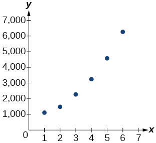 

Use the regression feature to find an exponential function that best fits the data in the table.

Write the exponential function as an exponential equation with base<math xmlns="http://www.w3.org/1998/Math/MathML"> <mrow> <mtext> </mtext><mi>e</mi><mo>.</mo> </mrow> </math>

<math xmlns="http://www.w3.org/1998/Math/MathML"> <mrow> <mi>f</mi><mo stretchy="false">(</mo><mi>x</mi><mo stretchy="false">)</mo><mo>=</mo><mn>776.682</mn><msup> <mi>e</mi> <mrow> <mn>0.3549</mn><mi>x</mi> </mrow> </msup> </mrow> </math>

Graph the exponential equation on the scatter diagram.

Use the intersect feature to find the value of<math xmlns="http://www.w3.org/1998/Math/MathML"> <mrow> <mtext>  </mtext><mi>x</mi><mtext>  </mtext> </mrow> </math>

for which<math xmlns="http://www.w3.org/1998/Math/MathML"> <mrow> <mtext> </mtext><mi>f</mi><mo stretchy="false">(</mo><mi>x</mi><mo stretchy="false">)</mo><mo>=</mo><mn>4000.</mn> </mrow> </math>

When<math xmlns="http://www.w3.org/1998/Math/MathML"> <mrow> <mtext> </mtext><mi>f</mi><mo stretchy="false">(</mo><mi>x</mi><mo stretchy="false">)</mo><mo>=</mo><mn>4000</mn><mo>,</mo> </mrow> </math>

<math xmlns="http://www.w3.org/1998/Math/MathML"> <mrow> <mi>x</mi><mo>≈</mo><mn>4.6.</mn> </mrow> </math>

  

For the following exercises, refer to [\[link\]](#Table_04_08_08).

| ***x*** | ***f(x)*** |
| 1 | 555 |
| 2 | 383 |
| 3 | 307 |
| 4 | 210 |
| 5 | 158 |
| 6 | 122 |
{: #Table_04_08_08 summary="Two columns and seven rows. The first column is labeled, &#x201C;x&#x201D;, and the second column is labeled, &#x201C;f(x)&#x201D;. Reading the rows as ordered pairs, we have the following values: (1, 555), (2, 383), (3, 307), (4, 210), (5, 158), and (6, 122)."}

Use a graphing calculator to create a scatter diagram of the data.

Use the regression feature to find an exponential function that best fits the data in the table.

<math xmlns="http://www.w3.org/1998/Math/MathML"> <mrow> <mi>f</mi><mo stretchy="false">(</mo><mi>x</mi><mo stretchy="false">)</mo><mo>=</mo><mn>731.92</mn><msup> <mrow> <mo stretchy="false">(</mo><mn>0.738</mn><mo stretchy="false">)</mo> </mrow> <mi>x</mi> </msup> </mrow> </math>

Write the exponential function as an exponential equation with base<math xmlns="http://www.w3.org/1998/Math/MathML"> <mrow> <mtext> </mtext><mi>e</mi><mo>.</mo> </mrow> </math>

Graph the exponential equation on the scatter diagram.

 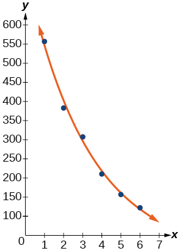 

Use the intersect feature to find the value of<math xmlns="http://www.w3.org/1998/Math/MathML"> <mrow> <mtext> </mtext><mi>x</mi><mtext> </mtext> </mrow> </math>

for which<math xmlns="http://www.w3.org/1998/Math/MathML"> <mrow> <mtext> </mtext><mi>f</mi><mo stretchy="false">(</mo><mi>x</mi><mo stretchy="false">)</mo><mo>=</mo><mn>250.</mn> </mrow> </math>

For the following exercises, refer to [\[link\]](#Table_04_08_09).

| ***x*** | ***f(x)*** |
| 1 | 5.1 |
| 2 | 6.3 |
| 3 | 7.3 |
| 4 | 7.7 |
| 5 | 8.1 |
| 6 | 8.6 |
{: #Table_04_08_09 summary="Two columns and seven rows. The first column is labeled, &#x201C;x&#x201D;, and the second column is labeled, &#x201C;f(x)&#x201D;. Reading the rows as ordered pairs, we have the following values: (1, 5.1), (2, 6.3), (3, 7.3), (4, 7.7), (5, 8.1), and (6, 8.6)."}

Use a graphing calculator to create a scatter diagram of the data.

 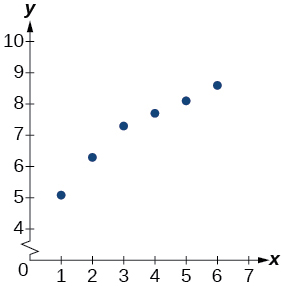 

Use the LOGarithm option of the REGression feature to find a logarithmic function of the form<math xmlns="http://www.w3.org/1998/Math/MathML"> <mrow> <mtext> </mtext><mi>y</mi><mo>=</mo><mi>a</mi><mo>+</mo><mi>b</mi><mi>ln</mi><mrow><mo>(</mo> <mi>x</mi> <mo>)</mo></mrow><mtext> </mtext> </mrow> </math>

that best fits the data in the table.

Use the logarithmic function to find the value of the function when<math xmlns="http://www.w3.org/1998/Math/MathML"> <mrow> <mtext> </mtext><mi>x</mi><mo>=</mo><mn>10.</mn> </mrow> </math>

<math xmlns="http://www.w3.org/1998/Math/MathML"> <mrow> <mi>f</mi><mo stretchy="false">(</mo><mn>10</mn><mo stretchy="false">)</mo><mo>≈</mo><mn>9.5</mn> </mrow> </math>

Graph the logarithmic equation on the scatter diagram.

Use the intersect feature to find the value of<math xmlns="http://www.w3.org/1998/Math/MathML"> <mrow> <mtext> </mtext><mi>x</mi><mtext> </mtext> </mrow> </math>

for which<math xmlns="http://www.w3.org/1998/Math/MathML"> <mrow> <mtext> </mtext><mi>f</mi><mo stretchy="false">(</mo><mi>x</mi><mo stretchy="false">)</mo><mo>=</mo><mn>7.</mn> </mrow> </math>

When<math xmlns="http://www.w3.org/1998/Math/MathML"> <mrow> <mtext> </mtext><mi>f</mi><mo stretchy="false">(</mo><mi>x</mi><mo stretchy="false">)</mo><mo>=</mo><mn>7</mn><mo>,</mo> </mrow> </math>

 <math xmlns="http://www.w3.org/1998/Math/MathML"> <mrow> <mi>x</mi><mo>≈</mo><mn>2.7.</mn> </mrow> </math>

 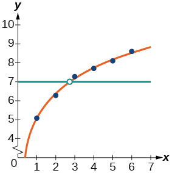 

For the following exercises, refer to [\[link\]](#Table_04_08_10).

| ***x*** | ***f(x)*** |
| 1 | 7.5 |
| 2 | 6 |
| 3 | 5.2 |
| 4 | 4.3 |
| 5 | 3.9 |
| 6 | 3.4 |
| 7 | 3.1 |
| 8 | 2.9 |
{: #Table_04_08_10 summary="Two columns and nine nows. The first column is labeled, &#x201C;x&#x201D;, and the second column is labeled, &#x201C;f(x)&#x201D;. Reading the rows as ordered pairs, we have the following values: (1, 7.5), (2, 6), (3, 5.2), (4, 4.3), (5, 3.9), (6, 3.4), (7, 3.1), and (8, 2.9)."}

Use a graphing calculator to create a scatter diagram of the data.

Use the LOGarithm option of the REGression feature to find a logarithmic function of the form<math xmlns="http://www.w3.org/1998/Math/MathML"> <mrow> <mtext> </mtext><mi>y</mi><mo>=</mo><mi>a</mi><mo>+</mo><mi>b</mi><mi>ln</mi><mrow><mo>(</mo> <mi>x</mi> <mo>)</mo></mrow><mtext> </mtext> </mrow> </math>

that best fits the data in the table.

<math xmlns="http://www.w3.org/1998/Math/MathML"> <mrow> <mi>f</mi><mo stretchy="false">(</mo><mi>x</mi><mo stretchy="false">)</mo><mo>=</mo><mn>7.544</mn><mo>−</mo><mn>2.268</mn><mi>ln</mi><mo stretchy="false">(</mo><mi>x</mi><mo stretchy="false">)</mo> </mrow> </math>

Use the logarithmic function to find the value of the function when<math xmlns="http://www.w3.org/1998/Math/MathML"> <mrow> <mtext> </mtext><mi>x</mi><mo>=</mo><mn>10.</mn> </mrow> </math>

Graph the logarithmic equation on the scatter diagram.

 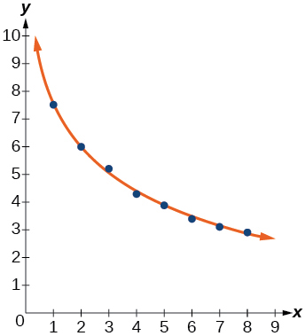 

Use the intersect feature to find the value of<math xmlns="http://www.w3.org/1998/Math/MathML"> <mrow> <mtext> </mtext><mi>x</mi><mtext> </mtext> </mrow> </math>

for which<math xmlns="http://www.w3.org/1998/Math/MathML"> <mrow> <mtext> </mtext><mi>f</mi><mo stretchy="false">(</mo><mi>x</mi><mo stretchy="false">)</mo><mo>=</mo><mn>8.</mn> </mrow> </math>

For the following exercises, refer to [\[link\]](#Table_04_08_11).

| ***x*** | ***f(x)*** |
| 1 | 8.7 |
| 2 | 12.3 |
| 3 | 15.4 |
| 4 | 18.5 |
| 5 | 20.7 |
| 6 | 22.5 |
| 7 | 23.3 |
| 8 | 24 |
| 9 | 24.6 |
| 10 | 24.8 |
{: #Table_04_08_11 summary="Two columns and eleven rows. The first column is labeled, &#x201C;x&#x201D;, and the second column is labeled, &#x201C;f(x)&#x201D;. Reading the rows as ordered pairs, we have the following values: (1, 8.7), (2, 12.3), (3, 15.4), (4, 18.5), (5, 20.7), (6, 22.5), (7, 23.3), (8, 24), (9, 24.6), and (10, 24.8)."}

Use a graphing calculator to create a scatter diagram of the data.

  

Use the LOGISTIC regression option to find a logistic growth model of the form<math xmlns="http://www.w3.org/1998/Math/MathML"> <mrow> <mtext> </mtext><mi>y</mi><mo>=</mo><mfrac> <mi>c</mi> <mrow> <mn>1</mn><mo>+</mo><mi>a</mi><msup> <mi>e</mi> <mrow> <mo>−</mo><mi>b</mi><mi>x</mi> </mrow> </msup> </mrow> </mfrac> <mtext> </mtext> </mrow> </math>

that best fits the data in the table.

Graph the logistic equation on the scatter diagram.

 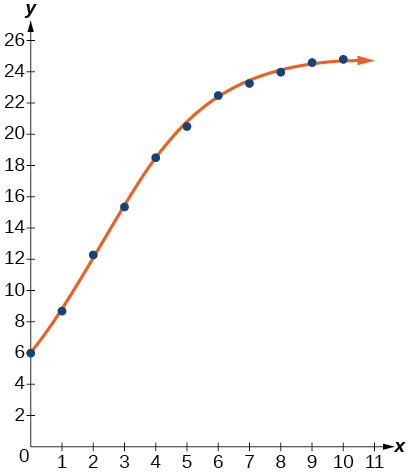 

To the nearest whole number, what is the predicted carrying capacity of the model?

Use the intersect feature to find the value of<math xmlns="http://www.w3.org/1998/Math/MathML"> <mrow> <mtext>  </mtext><mi>x</mi><mtext>  </mtext> </mrow> </math>

for which the model reaches half its carrying capacity.

When<math xmlns="http://www.w3.org/1998/Math/MathML"> <mrow> <mtext> </mtext><mi>f</mi><mo stretchy="false">(</mo><mi>x</mi><mo stretchy="false">)</mo><mo>=</mo><mn>12.5</mn><mo>,</mo> </mrow> </math>

 <math xmlns="http://www.w3.org/1998/Math/MathML"> <mrow> <mi>x</mi><mo>≈</mo><mn>2.1.</mn> </mrow> </math>

 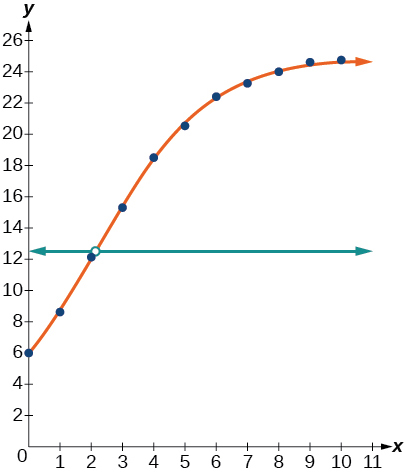 

For the following exercises, refer to [\[link\]](#Table_04_08_12).

| <math xmlns="http://www.w3.org/1998/Math/MathML"><mi>x</mi></math>

 | <math xmlns="http://www.w3.org/1998/Math/MathML"><mrow><mi>f</mi><mrow><mo>(</mo><mi>x</mi><mo>)</mo></mrow></mrow></math>

 |
| 0 | 12 |
| 2 | 28.6 |
| 4 | 52.8 |
| 5 | 70.3 |
| 7 | 99.9 |
| 8 | 112.5 |
| 10 | 125.8 |
| 11 | 127.9 |
| 15 | 135.1 |
| 17 | 135.9 |
{: #Table_04_08_12 summary="Two columns and eleven rows. The first column is labeled, &#x201C;x&#x201D;, and the second column is labeled, &#x201C;f(x)&#x201D;. Reading the rows as ordered pairs, we have the following values: (0, 12), (2, 28.6), (4, 52.8), (5, 70.3), (7, 99.9), (8, 112.5), (10, 125.8), (11, 127.9), (15, 135.1), and (17, 135.9)."}

Use a graphing calculator to create a scatter diagram of the data.

Use the LOGISTIC regression option to find a logistic growth model of the form<math xmlns="http://www.w3.org/1998/Math/MathML"> <mrow> <mtext> </mtext><mi>y</mi><mo>=</mo><mfrac> <mi>c</mi> <mrow> <mn>1</mn><mo>+</mo><mi>a</mi><msup> <mi>e</mi> <mrow> <mo>−</mo><mi>b</mi><mi>x</mi> </mrow> </msup> </mrow> </mfrac> <mtext> </mtext> </mrow> </math>

that best fits the data in the table.

<math xmlns="http://www.w3.org/1998/Math/MathML"> <mrow> <mi>f</mi><mo stretchy="false">(</mo><mi>x</mi><mo stretchy="false">)</mo><mo>=</mo><mfrac> <mrow> <mn>136.068</mn> </mrow> <mrow> <mn>1</mn><mo>+</mo><mn>10.324</mn><msup> <mi>e</mi> <mrow> <mo>−</mo><mn>0.480</mn><mi>x</mi> </mrow> </msup> </mrow> </mfrac> </mrow> </math>

Graph the logistic equation on the scatter diagram.

To the nearest whole number, what is the predicted carrying capacity of the model?

about<math xmlns="http://www.w3.org/1998/Math/MathML"> <mrow> <mn>136</mn> </mrow> </math>

Use the intersect feature to find the value of<math xmlns="http://www.w3.org/1998/Math/MathML"> <mrow> <mtext>  </mtext><mi>x</mi><mtext>  </mtext> </mrow> </math>

for which the model reaches half its carrying capacity.

#### Extensions

Recall that the general form of a logistic equation for a population is given by<math xmlns="http://www.w3.org/1998/Math/MathML"> <mrow> <mtext> </mtext><mi>P</mi><mo stretchy="false">(</mo><mi>t</mi><mo stretchy="false">)</mo><mo>=</mo><mfrac> <mi>c</mi> <mrow> <mn>1</mn><mo>+</mo><mi>a</mi><msup> <mi>e</mi> <mrow> <mo>−</mo><mi>b</mi><mi>t</mi> </mrow> </msup> </mrow> </mfrac> <mo>,</mo> </mrow> </math>

 such that the initial population at time<math xmlns="http://www.w3.org/1998/Math/MathML"> <mrow> <mtext> </mtext><mi>t</mi><mo>=</mo><mn>0</mn><mtext> </mtext> </mrow> </math>

is<math xmlns="http://www.w3.org/1998/Math/MathML"> <mrow> <mtext> </mtext><mi>P</mi><mo stretchy="false">(</mo><mn>0</mn><mo stretchy="false">)</mo><mo>=</mo><msub> <mi>P</mi> <mn>0</mn> </msub> <mo>.</mo><mtext> </mtext> </mrow> </math>

Show algebraically that<math xmlns="http://www.w3.org/1998/Math/MathML"> <mrow> <mtext> </mtext><mfrac> <mrow> <mi>c</mi><mo>−</mo><mi>P</mi><mo stretchy="false">(</mo><mi>t</mi><mo stretchy="false">)</mo> </mrow> <mrow> <mi>P</mi><mo stretchy="false">(</mo><mi>t</mi><mo stretchy="false">)</mo> </mrow> </mfrac> <mo>=</mo><mfrac> <mrow> <mi>c</mi><mo>−</mo><msub> <mi>P</mi> <mn>0</mn> </msub> </mrow> <mrow> <msub> <mi>P</mi> <mn>0</mn> </msub> </mrow> </mfrac> <msup> <mi>e</mi> <mrow> <mo>−</mo><mi>b</mi><mi>t</mi> </mrow> </msup> <mo>.</mo> </mrow> </math>

Working with the left side of the equation, we see that it can be rewritten as<math xmlns="http://www.w3.org/1998/Math/MathML"> <mrow> <mtext> </mtext><mi>a</mi><msup> <mi>e</mi> <mrow> <mo>−</mo><mi>b</mi><mi>t</mi> </mrow> </msup> <mo>:</mo> </mrow> </math>

<math xmlns="http://www.w3.org/1998/Math/MathML"> <mrow> <mfrac> <mrow> <mi>c</mi><mo>−</mo><mi>P</mi><mo stretchy="false">(</mo><mi>t</mi><mo stretchy="false">)</mo> </mrow> <mrow> <mi>P</mi><mo stretchy="false">(</mo><mi>t</mi><mo stretchy="false">)</mo> </mrow> </mfrac> <mo>=</mo><mfrac> <mrow> <mi>c</mi><mo>−</mo><mfrac> <mi>c</mi> <mrow> <mn>1</mn><mo>+</mo><mi>a</mi><msup> <mi>e</mi> <mrow> <mo>−</mo><mi>b</mi><mi>t</mi> </mrow> </msup> </mrow> </mfrac> </mrow> <mrow> <mfrac> <mi>c</mi> <mrow> <mn>1</mn><mo>+</mo><mi>a</mi><msup> <mi>e</mi> <mrow> <mo>−</mo><mi>b</mi><mi>t</mi> </mrow> </msup> </mrow> </mfrac> </mrow> </mfrac> <mo>=</mo><mfrac> <mrow> <mfrac> <mrow> <mi>c</mi><mrow><mo>(</mo> <mrow> <mn>1</mn><mo>+</mo><mi>a</mi><msup> <mi>e</mi> <mrow> <mo>−</mo><mi>b</mi><mi>t</mi> </mrow> </msup> </mrow> <mo>)</mo></mrow><mo>−</mo><mi>c</mi> </mrow> <mrow> <mn>1</mn><mo>+</mo><mi>a</mi><msup> <mi>e</mi> <mrow> <mo>−</mo><mi>b</mi><mi>t</mi> </mrow> </msup> </mrow> </mfrac> </mrow> <mrow> <mfrac> <mi>c</mi> <mrow> <mn>1</mn><mo>+</mo><mi>a</mi><msup> <mi>e</mi> <mrow> <mo>−</mo><mi>b</mi><mi>t</mi> </mrow> </msup> </mrow> </mfrac> </mrow> </mfrac> <mo>=</mo><mfrac> <mrow> <mfrac> <mrow> <mi>c</mi><mrow><mo>(</mo> <mrow> <mn>1</mn><mo>+</mo><mi>a</mi><msup> <mi>e</mi> <mrow> <mo>−</mo><mi>b</mi><mi>t</mi> </mrow> </msup> <mo>−</mo><mn>1</mn> </mrow> <mo>)</mo></mrow> </mrow> <mrow> <mn>1</mn><mo>+</mo><mi>a</mi><msup> <mi>e</mi> <mrow> <mo>−</mo><mi>b</mi><mi>t</mi> </mrow> </msup> </mrow> </mfrac> </mrow> <mrow> <mfrac> <mi>c</mi> <mrow> <mn>1</mn><mo>+</mo><mi>a</mi><msup> <mi>e</mi> <mrow> <mo>−</mo><mi>b</mi><mi>t</mi> </mrow> </msup> </mrow> </mfrac> </mrow> </mfrac> <mo>=</mo><mn>1</mn><mo>+</mo><mi>a</mi><msup> <mi>e</mi> <mrow> <mo>−</mo><mi>b</mi><mi>t</mi> </mrow> </msup> <mo>−</mo><mn>1</mn><mo>=</mo><mi>a</mi><msup> <mi>e</mi> <mrow> <mo>−</mo><mi>b</mi><mi>t</mi> </mrow> </msup> </mrow> </math>

Working with the right side of the equation we show that it can also be rewritten as<math xmlns="http://www.w3.org/1998/Math/MathML"> <mrow> <mtext> </mtext><mi>a</mi><msup> <mi>e</mi> <mrow> <mo>−</mo><mi>b</mi><mi>t</mi> </mrow> </msup> <mo>.</mo><mtext> </mtext> </mrow> </math>

But first note that when<math xmlns="http://www.w3.org/1998/Math/MathML"> <mrow> <mtext> </mtext><mi>t</mi><mo>=</mo><mn>0</mn><mo>,</mo></mrow> </math>

 <math xmlns="http://www.w3.org/1998/Math/MathML"> <mrow> <mtext> </mtext><msub> <mi>P</mi> <mn>0</mn> </msub> <mo>=</mo><mfrac> <mi>c</mi> <mrow> <mn>1</mn><mo>+</mo><mi>a</mi><msup> <mi>e</mi> <mrow> <mo>−</mo><mi>b</mi><mo stretchy="false">(</mo><mn>0</mn><mo stretchy="false">)</mo> </mrow> </msup> </mrow> </mfrac> <mo>=</mo><mfrac> <mi>c</mi> <mrow> <mn>1</mn><mo>+</mo><mi>a</mi> </mrow> </mfrac> <mo>.</mo><mtext> </mtext> </mrow> </math>

Therefore,

<math xmlns="http://www.w3.org/1998/Math/MathML"> <mrow> <mfrac> <mrow> <mi>c</mi><mo>−</mo><msub> <mi>P</mi> <mn>0</mn> </msub> </mrow> <mrow> <msub> <mi>P</mi> <mn>0</mn> </msub> </mrow> </mfrac> <msup> <mi>e</mi> <mrow> <mo>−</mo><mi>b</mi><mi>t</mi> </mrow> </msup> <mo>=</mo><mfrac> <mrow> <mi>c</mi><mo>−</mo><mfrac> <mi>c</mi> <mrow> <mn>1</mn><mo>+</mo><mi>a</mi> </mrow> </mfrac> </mrow> <mrow> <mfrac> <mi>c</mi> <mrow> <mn>1</mn><mo>+</mo><mi>a</mi> </mrow> </mfrac> </mrow> </mfrac> <msup> <mi>e</mi> <mrow> <mo>−</mo><mi>b</mi><mi>t</mi> </mrow> </msup> <mo>=</mo><mfrac> <mrow> <mfrac> <mrow> <mi>c</mi><mrow><mo>(</mo> <mrow> <mn>1</mn><mo>+</mo><mi>a</mi> </mrow> <mo>)</mo></mrow><mo>−</mo><mi>c</mi> </mrow> <mrow> <mn>1</mn><mo>+</mo><mi>a</mi> </mrow> </mfrac> </mrow> <mrow> <mfrac> <mi>c</mi> <mrow> <mn>1</mn><mo>+</mo><mi>a</mi> </mrow> </mfrac> </mrow> </mfrac> <msup> <mi>e</mi> <mrow> <mo>−</mo><mi>b</mi><mi>t</mi> </mrow> </msup> <mo>=</mo><mfrac> <mrow> <mfrac> <mrow> <mi>c</mi><mrow><mo>(</mo> <mrow> <mn>1</mn><mo>+</mo><mi>a</mi><mo>−</mo><mn>1</mn> </mrow> <mo>)</mo></mrow> </mrow> <mrow> <mn>1</mn><mo>+</mo><mi>a</mi> </mrow> </mfrac> </mrow> <mrow> <mfrac> <mi>c</mi> <mrow> <mn>1</mn><mo>+</mo><mi>a</mi> </mrow> </mfrac> </mrow> </mfrac> <msup> <mi>e</mi> <mrow> <mo>−</mo><mi>b</mi><mi>t</mi> </mrow> </msup> <mo>=</mo><mrow><mo>(</mo> <mrow> <mn>1</mn><mo>+</mo><mi>a</mi><mo>−</mo><mn>1</mn> </mrow> <mo>)</mo></mrow><msup> <mi>e</mi> <mrow> <mo>−</mo><mi>b</mi><mi>t</mi> </mrow> </msup> <mo>=</mo><mi>a</mi><msup> <mi>e</mi> <mrow> <mo>−</mo><mi>b</mi><mi>t</mi> </mrow> </msup> </mrow> </math>

Thus,<math xmlns="http://www.w3.org/1998/Math/MathML"> <mrow> <mtext> </mtext><mfrac> <mrow> <mi>c</mi><mo>−</mo><mi>P</mi><mo stretchy="false">(</mo><mi>t</mi><mo stretchy="false">)</mo> </mrow> <mrow> <mi>P</mi><mo stretchy="false">(</mo><mi>t</mi><mo stretchy="false">)</mo> </mrow> </mfrac> <mo>=</mo><mfrac> <mrow> <mi>c</mi><mo>−</mo><msub> <mi>P</mi> <mn>0</mn> </msub> </mrow> <mrow> <msub> <mi>P</mi> <mn>0</mn> </msub> </mrow> </mfrac> <msup> <mi>e</mi> <mrow> <mo>−</mo><mi>b</mi><mi>t</mi> </mrow> </msup> <mo>.</mo> </mrow> </math>

Use a graphing utility to find an exponential regression formula<math xmlns="http://www.w3.org/1998/Math/MathML"> <mrow> <mtext> </mtext><mi>f</mi><mo stretchy="false">(</mo><mi>x</mi><mo stretchy="false">)</mo><mtext> </mtext> </mrow> </math>

and a logarithmic regression formula<math xmlns="http://www.w3.org/1998/Math/MathML"> <mrow> <mtext>  </mtext><mi>g</mi><mo stretchy="false">(</mo><mi>x</mi><mo stretchy="false">)</mo><mtext>  </mtext> </mrow> </math>

for the points<math xmlns="http://www.w3.org/1998/Math/MathML"> <mrow> <mtext> </mtext><mrow><mo>(</mo> <mrow> <mn>1.5</mn><mo>,</mo><mn>1.5</mn> </mrow> <mo>)</mo></mrow><mtext> </mtext> </mrow> </math>

and<math xmlns="http://www.w3.org/1998/Math/MathML"> <mrow> <mtext> </mtext><mrow><mo>(</mo> <mrow> <mn>8.5</mn><mo>,</mo><mtext> 8</mtext><mtext>.5</mtext> </mrow> <mo>)</mo></mrow><mo>.</mo><mtext> </mtext> </mrow> </math>

Round all numbers to 6 decimal places. Graph the points and both formulas along with the line<math xmlns="http://www.w3.org/1998/Math/MathML"> <mrow> <mtext> </mtext><mi>y</mi><mo>=</mo><mi>x</mi><mtext> </mtext> </mrow> </math>

on the same axis. Make a conjecture about the relationship of the regression formulas.

Verify the conjecture made in the previous exercise. Round all numbers to six decimal places when necessary.

First rewrite the exponential with base *e*:<math xmlns="http://www.w3.org/1998/Math/MathML"> <mrow> <mtext> </mtext><mi>f</mi><mo stretchy="false">(</mo><mi>x</mi><mo stretchy="false">)</mo><mo>=</mo><mn>1.034341</mn><msup> <mi>e</mi> <mrow> <mtext>0</mtext><mtext>.247800x</mtext> </mrow> </msup> <mo>.</mo><mtext>  </mtext> </mrow> </math>

Then test to verify that<math xmlns="http://www.w3.org/1998/Math/MathML"> <mrow> <mtext> </mtext><mi>f</mi><mo stretchy="false">(</mo><mi>g</mi><mo stretchy="false">(</mo><mi>x</mi><mo stretchy="false">)</mo><mo stretchy="false">)</mo><mo>=</mo><mi>x</mi><mo>,</mo> </mrow> </math>

taking rounding error into consideration:

<math xmlns="http://www.w3.org/1998/Math/MathML"> <mrow> <mtable columnalign="left"> <mtr columnalign="left"> <mtd columnalign="left"> <mrow> <mi>g</mi><mo stretchy="false">(</mo><mi>f</mi><mo stretchy="false">(</mo><mi>x</mi><mo stretchy="false">)</mo><mo stretchy="false">)</mo></mrow> </mtd> <mtd columnalign="left"> <mrow> <mo>=</mo><mn>4.035510</mn><mi>ln</mi><mrow><mo>(</mo> <mrow> <mn>1.034341</mn><msup> <mi>e</mi> <mrow> <mtext>0</mtext><mtext>.247800x</mtext></mrow> </msup> <mtext> </mtext></mrow> <mo>)</mo></mrow><mo>−</mo><mn>0.136259</mn></mrow> </mtd> </mtr> <mtr columnalign="left"> <mtd columnalign="left"> <mrow /> </mtd> <mtd columnalign="left"> <mrow> <mo>=</mo><mn>4.03551</mn><mrow><mo>(</mo> <mrow> <mi>ln</mi><mrow><mo>(</mo> <mrow> <mn>1.034341</mn></mrow> <mo>)</mo></mrow><mo>+</mo><mi>ln</mi><mrow><mo>(</mo> <mrow> <msup> <mi>e</mi> <mrow> <mtext>0</mtext><mtext>.2478</mtext><mi>x</mi></mrow> </msup> <mtext> </mtext></mrow> <mo>)</mo></mrow></mrow> <mo>)</mo></mrow><mo>−</mo><mn>0.136259</mn></mrow> </mtd> </mtr> <mtr columnalign="left"> <mtd columnalign="left"> <mrow /> </mtd> <mtd columnalign="left"> <mrow> <mo>=</mo><mn>4.03551</mn><mrow><mo>(</mo> <mrow> <mi>ln</mi><mrow><mo>(</mo> <mrow> <mn>1.034341</mn></mrow> <mo>)</mo></mrow><mo>+</mo><mtext>0</mtext><mtext>.2478</mtext><mi>x</mi></mrow> <mo>)</mo></mrow><mo>−</mo><mn>0.136259</mn></mrow> </mtd> </mtr> <mtr columnalign="left"> <mtd columnalign="left"> <mrow /> </mtd> <mtd columnalign="left"> <mrow> <mo>=</mo><mn>0.136257</mn><mo>+</mo><mn>0.999999</mn><mi>x</mi><mo>−</mo><mn>0.136259</mn></mrow> </mtd> </mtr> <mtr columnalign="left"> <mtd columnalign="left"> <mrow /> </mtd> <mtd columnalign="left"> <mrow> <mo>=</mo><mo>−</mo><mn>0.000002</mn><mo>+</mo><mn>0.999999</mn><mi>x</mi></mrow> </mtd> </mtr> <mtr columnalign="left"> <mtd columnalign="left"> <mrow /> </mtd> <mtd columnalign="left"> <mrow> <mo>≈</mo><mn>0</mn><mo>+</mo><mi>x</mi></mrow> </mtd> </mtr> <mtr columnalign="left"> <mtd columnalign="left"> <mrow /> </mtd> <mtd columnalign="left"> <mrow> <mo>=</mo><mi>x</mi></mrow> </mtd> </mtr> </mtable></mrow> </math>

Find the inverse function<math xmlns="http://www.w3.org/1998/Math/MathML"> <mrow> <mtext> </mtext><msup> <mi>f</mi> <mrow> <mo>−</mo><mn>1</mn> </mrow> </msup> <mrow><mo>(</mo> <mi>x</mi> <mo>)</mo></mrow><mtext> </mtext> </mrow> </math>

for the logistic function<math xmlns="http://www.w3.org/1998/Math/MathML"> <mrow> <mtext> </mtext><mi>f</mi><mo stretchy="false">(</mo><mi>x</mi><mo stretchy="false">)</mo><mo>=</mo><mfrac> <mi>c</mi> <mrow> <mn>1</mn><mo>+</mo><mi>a</mi><msup> <mi>e</mi> <mrow> <mo>−</mo><mi>b</mi><mi>x</mi> </mrow> </msup> </mrow> </mfrac> <mo>.</mo><mtext> </mtext> </mrow> </math>

Show all steps.

Use the result from the previous exercise to graph the logistic model<math xmlns="http://www.w3.org/1998/Math/MathML"> <mrow> <mtext>  </mtext><mi>P</mi><mo stretchy="false">(</mo><mi>t</mi><mo stretchy="false">)</mo><mo>=</mo><mfrac> <mrow> <mn>20</mn> </mrow> <mrow> <mn>1</mn><mo>+</mo><mn>4</mn><msup> <mi>e</mi> <mrow> <mo>−</mo><mn>0.5</mn><mi>t</mi> </mrow> </msup> </mrow> </mfrac> <mtext> </mtext> </mrow> </math>

along with its inverse on the same axis. What are the intercepts and asymptotes of each function?

 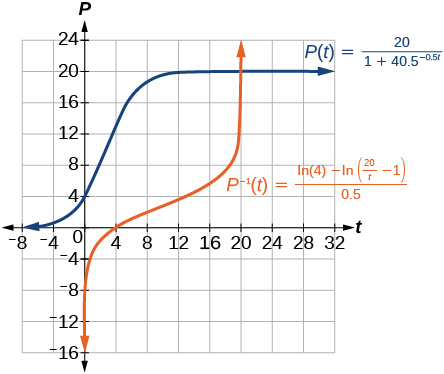 
The graph of<math xmlns="http://www.w3.org/1998/Math/MathML"> <mrow> <mtext> </mtext><mi>P</mi><mo stretchy="false">(</mo><mi>t</mi><mo stretchy="false">)</mo><mtext> </mtext></mrow> </math>

has a *y*-intercept at (0, 4) and horizontal asymptotes at *y* = 0 and *y* = 20. The graph of<math xmlns="http://www.w3.org/1998/Math/MathML"> <mrow> <mtext> </mtext><msup> <mi>P</mi> <mrow> <mo>−</mo><mn>1</mn></mrow> </msup> <mo stretchy="false">(</mo><mi>t</mi><mo stretchy="false">)</mo><mtext> </mtext></mrow> </math>

has an *x*- intercept at (4, 0) and vertical asymptotes at *x* = 0 and *x* = 20.

### Chapter Review Exercises

#### [Exponential Functions](/m49361){: .target-chapter}

Determine whether the function<math xmlns="http://www.w3.org/1998/Math/MathML"> <mrow> <mtext> </mtext><mi>y</mi><mo>=</mo><mn>156</mn><msup> <mrow> <mrow><mo>(</mo> <mrow> <mn>0.825</mn> </mrow> <mo>)</mo></mrow> </mrow> <mi>t</mi> </msup> <mtext> </mtext> </mrow> </math>

represents exponential growth, exponential decay, or neither. Explain

exponential decay; The growth factor,<math xmlns="http://www.w3.org/1998/Math/MathML"> <mrow> <mtext> </mtext><mn>0.825</mn><mo>,</mo> </mrow> </math>

 is between<math xmlns="http://www.w3.org/1998/Math/MathML"> <mrow> <mtext> </mtext><mn>0</mn><mtext> </mtext> </mrow> </math>

and<math xmlns="http://www.w3.org/1998/Math/MathML"> <mrow> <mtext> </mtext><mn>1.</mn> </mrow> </math>

The population of a herd of deer is represented by the function<math xmlns="http://www.w3.org/1998/Math/MathML"> <mrow> <mtext> </mtext><mi>A</mi><mo stretchy="false">(</mo><mi>t</mi><mo stretchy="false">)</mo><mo>=</mo><mn>205</mn><msup> <mrow> <mo stretchy="false">(</mo><mn>1.13</mn><mo stretchy="false">)</mo> </mrow> <mi>t</mi> </msup> <mo>,</mo><mtext> </mtext> </mrow> </math>

where<math xmlns="http://www.w3.org/1998/Math/MathML"> <mrow> <mtext> </mtext><mi>t</mi><mtext> </mtext> </mrow> </math>

is given in years. To the nearest whole number, what will the herd population be after<math xmlns="http://www.w3.org/1998/Math/MathML"> <mrow> <mtext> </mtext><mn>6</mn><mtext> </mtext> </mrow> </math>

years?

Find an exponential equation that passes through the points<math xmlns="http://www.w3.org/1998/Math/MathML"> <mrow> <mtext> </mtext><mtext>(2, 2</mtext><mtext>.25)</mtext><mtext> </mtext> </mrow> </math>

and<math xmlns="http://www.w3.org/1998/Math/MathML"> <mrow> <mtext> </mtext><mo stretchy="false">(</mo><mn>5</mn><mo>,</mo><mn>60.75</mn><mo stretchy="false">)</mo><mo>.</mo> </mrow> </math>

<math xmlns="http://www.w3.org/1998/Math/MathML"> <mrow> <mi>y</mi><mo>=</mo><mn>0.25</mn><msup> <mrow> <mrow><mo>(</mo> <mn>3</mn> <mo>)</mo></mrow> </mrow> <mi>x</mi> </msup> </mrow> </math>

Determine whether [[link]](#Table_04_08_13) could represent a function that is linear, exponential, or neither. If it appears to be exponential, find a function that passes through the points.

| ***x*** | 1 | 2 | 3 | 4 |
| ***f(x)*** | 3 | 0.9 | 0.27 | 0.081 |
{: #Table_04_08_13 summary="Two rows and five columns. The first row is labeled, &#x201C;x&#x201D;, and the second row is labeled, &#x201C;f(x)&#x201D;. Reading the columns as ordered pairs, we have the following values: (1, 3), (2, 0.9), (3, 0.27), and (4, 0.081)."}

A retirement account is opened with an initial deposit of $8,500 and earns<math xmlns="http://www.w3.org/1998/Math/MathML"> <mrow> <mtext> </mtext><mn>8.12</mn><mi>%</mi><mtext> </mtext> </mrow> </math>

interest compounded monthly. What will the account be worth in<math xmlns="http://www.w3.org/1998/Math/MathML"> <mrow> <mtext> </mtext><mn>20</mn><mtext> </mtext> </mrow> </math>

years?

<math xmlns="http://www.w3.org/1998/Math/MathML"> <mrow> <mn>$</mn><mn>42</mn><mo>,</mo><mn>888.18</mn> </mrow> </math>

Hsu-Mei wants to save $5,000 for a down payment on a car. To the nearest dollar, how much will she need to invest in an account now with<math xmlns="http://www.w3.org/1998/Math/MathML"> <mrow> <mtext> </mtext><mn>7.5</mn><mi>%</mi><mtext> </mtext> </mrow> </math>

APR, compounded daily, in order to reach her goal in<math xmlns="http://www.w3.org/1998/Math/MathML"> <mrow> <mtext> </mtext><mn>3</mn><mtext> </mtext> </mrow> </math>

years?

Does the equation<math xmlns="http://www.w3.org/1998/Math/MathML"> <mrow> <mtext> </mtext><mi>y</mi><mo>=</mo><mn>2.294</mn><msup> <mi>e</mi> <mrow> <mo>−</mo><mn>0.654</mn><mi>t</mi> </mrow> </msup> <mtext> </mtext> </mrow> </math>

represent continuous growth, continuous decay, or neither? Explain.

continuous decay; the growth rate is negative.

Suppose an investment account is opened with an initial deposit of<math xmlns="http://www.w3.org/1998/Math/MathML"> <mrow> <mtext> </mtext><mtext>$10,500</mtext><mtext> </mtext> </mrow> </math>

earning<math xmlns="http://www.w3.org/1998/Math/MathML"> <mrow> <mtext> </mtext><mn>6.25</mn><mi>%</mi><mtext> </mtext> </mrow> </math>

interest, compounded continuously. How much will the account be worth after<math xmlns="http://www.w3.org/1998/Math/MathML"> <mrow> <mtext> </mtext><mn>25</mn><mtext> </mtext> </mrow> </math>

years?

#### [Graphs of Exponential Functions](/m49362){: .target-chapter}

Graph the function<math xmlns="http://www.w3.org/1998/Math/MathML"> <mrow> <mtext> </mtext><mi>f</mi><mo stretchy="false">(</mo><mi>x</mi><mo stretchy="false">)</mo><mo>=</mo><mn>3.5</mn><msup> <mrow> <mrow><mo>(</mo> <mn>2</mn> <mo>)</mo></mrow> </mrow> <mi>x</mi> </msup> <mo>.</mo><mtext> </mtext> </mrow> </math>

State the domain and range and give the *y*-intercept.

domain: all real numbers; range: all real numbers strictly greater than zero; *y*-intercept: (0, 3.5);

 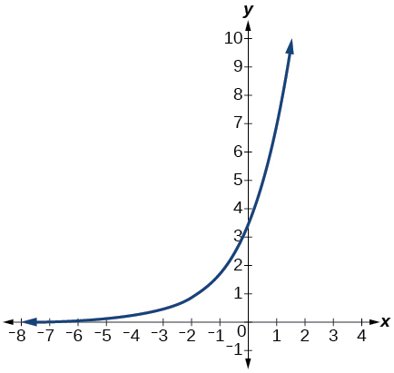 

Graph the function<math xmlns="http://www.w3.org/1998/Math/MathML"> <mrow> <mtext> </mtext><mi>f</mi><mo stretchy="false">(</mo><mi>x</mi><mo stretchy="false">)</mo><mo>=</mo><mn>4</mn><msup> <mrow> <mrow><mo>(</mo> <mrow> <mfrac> <mn>1</mn> <mn>8</mn> </mfrac> </mrow> <mo>)</mo></mrow> </mrow> <mi>x</mi> </msup> <mtext> </mtext> </mrow> </math>

and its reflection about the *y*-axis on the same axes, and give the *y*-intercept.

The graph of<math xmlns="http://www.w3.org/1998/Math/MathML"> <mrow> <mtext> </mtext><mi>f</mi><mo stretchy="false">(</mo><mi>x</mi><mo stretchy="false">)</mo><mo>=</mo><msup> <mrow> <mn>6.5</mn> </mrow> <mi>x</mi> </msup> <mtext> </mtext> </mrow> </math>

is reflected about the *y*-axis and stretched vertically by a factor of<math xmlns="http://www.w3.org/1998/Math/MathML"> <mrow> <mtext> </mtext><mn>7.</mn><mtext> </mtext> </mrow> </math>

What is the equation of the new function,<math xmlns="http://www.w3.org/1998/Math/MathML"> <mrow> <mtext> </mtext><mi>g</mi><mo stretchy="false">(</mo><mi>x</mi><mo stretchy="false">)</mo><mo>?</mo><mtext> </mtext> </mrow> </math>

State its *y*-intercept, domain, and range.

<math xmlns="http://www.w3.org/1998/Math/MathML"> <mrow> <mi>g</mi><mo stretchy="false">(</mo><mi>x</mi><mo stretchy="false">)</mo><mo>=</mo><mn>7</mn><msup> <mrow> <mrow><mo>(</mo> <mrow> <mn>6.5</mn> </mrow> <mo>)</mo></mrow> </mrow> <mrow> <mo>−</mo><mi>x</mi> </mrow> </msup> <mo>;</mo><mtext> </mtext> </mrow> </math>

*y*-intercept:<math xmlns="http://www.w3.org/1998/Math/MathML"> <mrow> <mtext> </mtext><mo stretchy="false">(</mo><mn>0</mn><mo>,</mo><mtext> 7</mtext><mo stretchy="false">)</mo><mo>;</mo><mtext> </mtext> </mrow> </math>

Domain: all real numbers; Range: all real numbers greater than<math xmlns="http://www.w3.org/1998/Math/MathML"> <mrow> <mtext> </mtext><mn>0.</mn> </mrow> </math>

The graph below shows transformations of the graph of<math xmlns="http://www.w3.org/1998/Math/MathML"> <mrow> <mtext> </mtext><mi>f</mi><mo stretchy="false">(</mo><mi>x</mi><mo stretchy="false">)</mo><mo>=</mo><msup> <mn>2</mn> <mi>x</mi> </msup> <mo>.</mo><mtext> </mtext> </mrow> </math>

What is the equation for the transformation?

 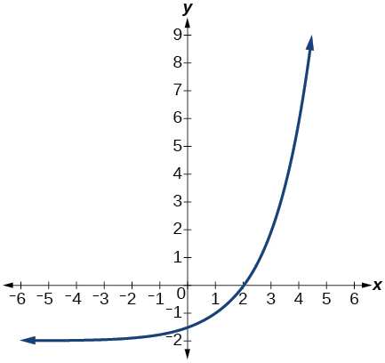 

#### [Logarithmic Functions](/m49363){: .target-chapter}

Rewrite<math xmlns="http://www.w3.org/1998/Math/MathML"> <mrow> <mtext> </mtext><msub> <mrow> <mi>log</mi> </mrow> <mrow> <mn>17</mn> </mrow> </msub> <mrow><mo>(</mo> <mrow> <mn>4913</mn> </mrow> <mo>)</mo></mrow><mo>=</mo><mi>x</mi><mtext> </mtext> </mrow> </math>

as an equivalent exponential equation.

<math xmlns="http://www.w3.org/1998/Math/MathML"> <mrow> <msup> <mrow> <mn>17</mn> </mrow> <mi>x</mi> </msup> <mo>=</mo><mn>4913</mn> </mrow> </math>

Rewrite<math xmlns="http://www.w3.org/1998/Math/MathML"> <mrow> <mtext> </mtext><mi>ln</mi><mrow><mo>(</mo> <mi>s</mi> <mo>)</mo></mrow><mo>=</mo><mi>t</mi><mtext> </mtext></mrow> </math>

as an equivalent exponential equation.

Rewrite<math xmlns="http://www.w3.org/1998/Math/MathML"> <mrow> <mtext> </mtext><msup> <mi>a</mi> <mrow> <mo>−</mo><mtext> </mtext><mfrac> <mn>2</mn> <mn>5</mn> </mfrac> </mrow> </msup> <mo>=</mo><mi>b</mi><mtext> </mtext> </mrow> </math>

as an equivalent logarithmic equation.

<math xmlns="http://www.w3.org/1998/Math/MathML"> <mrow> <msub> <mrow> <mi>log</mi> </mrow> <mi>a</mi> </msub> <mi>b</mi><mo>=</mo><mo>−</mo><mfrac> <mn>2</mn> <mn>5</mn> </mfrac> </mrow> </math>

Rewrite <math xmlns="http://www.w3.org/1998/Math/MathML"> <mrow> <mtext> </mtext><msup> <mi>e</mi> <mrow> <mo>−</mo><mn>3.5</mn> </mrow> </msup> <mo>=</mo><mi>h</mi><mtext> </mtext> </mrow> </math>

 as an equivalent logarithmic equation.

Solve for x if<math xmlns="http://www.w3.org/1998/Math/MathML"> <mrow> <mtext> </mtext><mtext> </mtext><mtext> </mtext><msub> <mrow> <mi>log</mi></mrow> <mrow> <mn>64</mn></mrow> </msub> <mo stretchy="false">(</mo><mi>x</mi><mo stretchy="false">)</mo><mo>=</mo><mfrac> <mn>1</mn> <mn>3</mn> </mfrac> <mtext> </mtext></mrow> </math>

by converting to exponential form.

<math xmlns="http://www.w3.org/1998/Math/MathML"> <mrow> <mi>x</mi><mo>=</mo><msup> <mrow> <mn>64</mn> </mrow> <mrow> <mfrac> <mn>1</mn> <mn>3</mn> </mfrac> </mrow> </msup> <mo>=</mo><mn>4</mn> </mrow> </math>

Evaluate<math xmlns="http://www.w3.org/1998/Math/MathML"> <mrow> <mtext> </mtext><msub> <mrow> <mi>log</mi></mrow> <mn>5</mn> </msub> <mrow><mo>(</mo> <mrow> <mfrac> <mn>1</mn> <mrow> <mn>125</mn></mrow> </mfrac> </mrow> <mo>)</mo></mrow><mtext> </mtext></mrow> </math>

without using a calculator.

Evaluate<math xmlns="http://www.w3.org/1998/Math/MathML"> <mrow> <mtext> </mtext><mi>log</mi><mrow><mo>(</mo> <mrow> <mtext>0</mtext><mtext>.000001</mtext></mrow> <mo>)</mo></mrow><mtext> </mtext></mrow> </math>

without using a calculator.

<math xmlns="http://www.w3.org/1998/Math/MathML"> <mrow> <mi>log</mi><mrow><mo>(</mo> <mrow> <mtext>0</mtext><mtext>.000001</mtext></mrow> <mo>)</mo></mrow><mo>=</mo><mo>−</mo><mn>6</mn></mrow> </math>

Evaluate<math xmlns="http://www.w3.org/1998/Math/MathML"> <mrow> <mtext> </mtext><mi>log</mi><mo stretchy="false">(</mo><mn>4.005</mn><mo stretchy="false">)</mo><mtext> </mtext></mrow> </math>

using a calculator. Round to the nearest thousandth.

Evaluate<math xmlns="http://www.w3.org/1998/Math/MathML"> <mrow> <mtext> </mtext><mi>ln</mi><mrow><mo>(</mo> <mrow> <msup> <mi>e</mi> <mrow> <mo>−</mo><mn>0.8648</mn></mrow> </msup> </mrow> <mo>)</mo></mrow><mtext> </mtext></mrow> </math>

without using a calculator.

<math xmlns="http://www.w3.org/1998/Math/MathML"> <mrow> <mi>ln</mi><mrow><mo>(</mo> <mrow> <msup> <mi>e</mi> <mrow> <mo>−</mo><mn>0.8648</mn></mrow> </msup> </mrow> <mo>)</mo></mrow><mo>=</mo><mo>−</mo><mn>0.8648</mn></mrow> </math>

Evaluate<math xmlns="http://www.w3.org/1998/Math/MathML"> <mrow> <mtext> </mtext><mi>ln</mi><mrow><mo>(</mo> <mrow> <mroot> <mrow> <mn>18</mn></mrow> <mn>3</mn> </mroot> </mrow> <mo>)</mo></mrow><mtext> </mtext></mrow> </math>

using a calculator. Round to the nearest thousandth.

#### [Graphs of Logarithmic Functions](/m49364){: .target-chapter}

Graph the function<math xmlns="http://www.w3.org/1998/Math/MathML"> <mrow> <mtext> </mtext><mi>g</mi><mo stretchy="false">(</mo><mi>x</mi><mo stretchy="false">)</mo><mo>=</mo><mi>log</mi><mrow><mo>(</mo> <mrow> <mn>7</mn><mi>x</mi><mo>+</mo><mn>21</mn> </mrow> <mo>)</mo></mrow><mo>−</mo><mn>4.</mn> </mrow> </math>

* * *
{: data-type="newline"}

 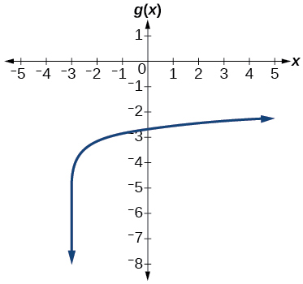 

Graph the function<math xmlns="http://www.w3.org/1998/Math/MathML"> <mrow> <mtext> </mtext><mi>h</mi><mo stretchy="false">(</mo><mi>x</mi><mo stretchy="false">)</mo><mo>=</mo><mn>2</mn><mi>ln</mi><mrow><mo>(</mo> <mrow> <mn>9</mn><mo>−</mo><mn>3</mn><mi>x</mi> </mrow> <mo>)</mo></mrow><mo>+</mo><mn>1.</mn> </mrow> </math>

State the domain, vertical asymptote, and end behavior of the function<math xmlns="http://www.w3.org/1998/Math/MathML"> <mrow> <mtext> </mtext><mi>g</mi><mo stretchy="false">(</mo><mi>x</mi><mo stretchy="false">)</mo><mo>=</mo><mi>ln</mi><mrow><mo>(</mo> <mrow> <mn>4</mn><mi>x</mi><mo>+</mo><mn>20</mn> </mrow> <mo>)</mo></mrow><mo>−</mo><mn>17.</mn> </mrow> </math>

Domain:<math xmlns="http://www.w3.org/1998/Math/MathML"> <mrow> <mtext> </mtext><mi>x</mi><mo>&gt;</mo><mo>−</mo><mn>5</mn><mo>;</mo><mtext> </mtext> </mrow> </math>

Vertical asymptote:<math xmlns="http://www.w3.org/1998/Math/MathML"> <mrow> <mtext> </mtext><mi>x</mi><mo>=</mo><mo>−</mo><mn>5</mn><mo>;</mo><mtext> </mtext> </mrow> </math>

End behavior: as<math xmlns="http://www.w3.org/1998/Math/MathML"> <mrow> <mtext> </mtext><mi>x</mi><mo stretchy="false">→</mo><mo>−</mo><msup> <mn>5</mn> <mo>+</mo> </msup> <mo>,</mo><mi>f</mi><mo stretchy="false">(</mo><mi>x</mi><mo stretchy="false">)</mo><mo stretchy="false">→</mo><mo>−</mo><mi>∞</mi><mtext> </mtext> </mrow> </math>

and as<math xmlns="http://www.w3.org/1998/Math/MathML"> <mrow> <mtext> </mtext><mi>x</mi><mo stretchy="false">→</mo><mi>∞</mi><mo>,</mo><mi>f</mi><mo stretchy="false">(</mo><mi>x</mi><mo stretchy="false">)</mo><mo stretchy="false">→</mo><mi>∞</mi><mo>.</mo> </mrow> </math>

#### [Logarithmic Properties](/m49365){: .target-chapter}

Rewrite<math xmlns="http://www.w3.org/1998/Math/MathML"> <mrow> <mtext> </mtext><mi>ln</mi><mrow><mo>(</mo> <mrow> <mn>7</mn><mi>r</mi><mo>⋅</mo><mn>11</mn><mi>s</mi><mi>t</mi> </mrow> <mo>)</mo></mrow><mtext> </mtext> </mrow> </math>

in expanded form.

Rewrite<math xmlns="http://www.w3.org/1998/Math/MathML"> <mrow> <mtext> </mtext><msub> <mrow> <mi>log</mi></mrow> <mn>8</mn> </msub> <mrow><mo>(</mo> <mi>x</mi> <mo>)</mo></mrow><mo>+</mo><msub> <mrow> <mi>log</mi></mrow> <mn>8</mn> </msub> <mrow><mo>(</mo> <mn>5</mn> <mo>)</mo></mrow><mo>+</mo><msub> <mrow> <mi>log</mi></mrow> <mn>8</mn> </msub> <mrow><mo>(</mo> <mi>y</mi> <mo>)</mo></mrow><mo>+</mo><msub> <mrow> <mi>log</mi></mrow> <mn>8</mn> </msub> <mrow><mo>(</mo> <mrow> <mn>13</mn></mrow> <mo>)</mo></mrow><mtext> </mtext></mrow> </math>

in compact form.

<math xmlns="http://www.w3.org/1998/Math/MathML"> <mrow> <msub> <mrow> <mtext>log</mtext> </mrow> <mn>8</mn> </msub> <mrow><mo>(</mo> <mrow> <mn>65</mn><mi>x</mi><mi>y</mi> </mrow> <mo>)</mo></mrow> </mrow> </math>

Rewrite<math xmlns="http://www.w3.org/1998/Math/MathML"> <mrow> <mtext> </mtext><msub> <mrow> <mi>log</mi> </mrow> <mi>m</mi> </msub> <mrow><mo>(</mo> <mrow> <mfrac> <mrow> <mn>67</mn> </mrow> <mrow> <mn>83</mn> </mrow> </mfrac> </mrow> <mo>)</mo></mrow><mtext> </mtext> </mrow> </math>

in expanded form.

Rewrite<math xmlns="http://www.w3.org/1998/Math/MathML"> <mrow> <mtext> </mtext><mi>ln</mi><mrow><mo>(</mo> <mi>z</mi> <mo>)</mo></mrow><mo>−</mo><mi>ln</mi><mrow><mo>(</mo> <mi>x</mi> <mo>)</mo></mrow><mo>−</mo><mi>ln</mi><mrow><mo>(</mo> <mi>y</mi> <mo>)</mo></mrow><mtext> </mtext> </mrow> </math>

in compact form.

<math xmlns="http://www.w3.org/1998/Math/MathML"> <mrow> <mi>ln</mi><mrow><mo>(</mo> <mrow> <mfrac> <mi>z</mi> <mrow> <mi>x</mi><mi>y</mi> </mrow> </mfrac> </mrow> <mo>)</mo></mrow> </mrow> </math>

Rewrite<math xmlns="http://www.w3.org/1998/Math/MathML"> <mrow> <mtext> </mtext><mi>ln</mi><mrow><mo>(</mo> <mrow> <mfrac> <mn>1</mn> <mrow> <msup> <mi>x</mi> <mn>5</mn> </msup> </mrow> </mfrac> </mrow> <mo>)</mo></mrow><mtext> </mtext> </mrow> </math>

as a product.

Rewrite<math xmlns="http://www.w3.org/1998/Math/MathML"> <mrow> <mtext> </mtext><mo>−</mo><msub> <mrow> <mi>log</mi></mrow> <mi>y</mi> </msub> <mrow><mo>(</mo> <mrow> <mfrac> <mn>1</mn> <mrow> <mn>12</mn></mrow> </mfrac> </mrow> <mo>)</mo></mrow><mtext> </mtext></mrow> </math>

as a single logarithm.

<math xmlns="http://www.w3.org/1998/Math/MathML"> <mrow> <msub> <mrow> <mtext>log</mtext> </mrow> <mi>y</mi> </msub> <mrow><mo>(</mo> <mrow> <mn>12</mn> </mrow> <mo>)</mo></mrow> </mrow> </math>

Use properties of logarithms to expand<math xmlns="http://www.w3.org/1998/Math/MathML"> <mrow> <mtext> </mtext><mi>log</mi><mrow><mo>(</mo> <mrow> <mfrac> <mrow> <msup> <mi>r</mi> <mn>2</mn> </msup> <msup> <mi>s</mi> <mrow> <mn>11</mn></mrow> </msup> </mrow> <mrow> <msup> <mi>t</mi> <mrow> <mn>14</mn></mrow> </msup> </mrow> </mfrac> </mrow> <mo>)</mo></mrow><mo>.</mo></mrow> </math>

Use properties of logarithms to expand<math xmlns="http://www.w3.org/1998/Math/MathML"> <mrow> <mtext> </mtext><mi>ln</mi><mrow><mo>(</mo> <mrow> <mn>2</mn><mi>b</mi><msqrt> <mrow> <mfrac> <mrow> <mi>b</mi><mo>+</mo><mn>1</mn></mrow> <mrow> <mi>b</mi><mo>−</mo><mn>1</mn></mrow> </mfrac> </mrow> </msqrt> </mrow> <mo>)</mo></mrow><mo>.</mo></mrow> </math>

<math xmlns="http://www.w3.org/1998/Math/MathML"> <mrow> <mi>ln</mi><mrow><mo>(</mo> <mn>2</mn> <mo>)</mo></mrow><mo>+</mo><mi>ln</mi><mrow><mo>(</mo> <mi>b</mi> <mo>)</mo></mrow><mo>+</mo><mfrac> <mrow> <mi>ln</mi><mrow><mo>(</mo> <mrow> <mi>b</mi><mo>+</mo><mn>1</mn></mrow> <mo>)</mo></mrow><mo>−</mo><mi>ln</mi><mrow><mo>(</mo> <mrow> <mi>b</mi><mo>−</mo><mn>1</mn></mrow> <mo>)</mo></mrow></mrow> <mn>2</mn> </mfrac> </mrow> </math>

Condense the expression<math xmlns="http://www.w3.org/1998/Math/MathML"> <mrow> <mtext> </mtext><mn>5</mn><mi>ln</mi><mrow><mo>(</mo> <mi>b</mi> <mo>)</mo></mrow><mo>+</mo><mi>ln</mi><mrow><mo>(</mo> <mi>c</mi> <mo>)</mo></mrow><mo>+</mo><mfrac> <mrow> <mi>ln</mi><mrow><mo>(</mo> <mrow> <mn>4</mn><mo>−</mo><mi>a</mi> </mrow> <mo>)</mo></mrow> </mrow> <mn>2</mn> </mfrac> <mtext> </mtext> </mrow> </math>

to a single logarithm.

Condense the expression<math xmlns="http://www.w3.org/1998/Math/MathML"> <mrow> <mtext> </mtext><mn>3</mn><msub> <mrow> <mi>log</mi> </mrow> <mn>7</mn> </msub> <mi>v</mi><mo>+</mo><mn>6</mn><msub> <mrow> <mi>log</mi> </mrow> <mn>7</mn> </msub> <mi>w</mi><mo>−</mo><mfrac> <mrow> <msub> <mrow> <mi>log</mi> </mrow> <mn>7</mn> </msub> <mi>u</mi> </mrow> <mn>3</mn> </mfrac> <mtext> </mtext> </mrow> </math>

to a single logarithm.

<math xmlns="http://www.w3.org/1998/Math/MathML"> <mrow> <msub> <mrow> <mi>log</mi> </mrow> <mn>7</mn> </msub> <mrow><mo>(</mo> <mrow> <mfrac> <mrow> <msup> <mi>v</mi> <mn>3</mn> </msup> <msup> <mi>w</mi> <mn>6</mn> </msup> </mrow> <mrow> <mroot> <mi>u</mi> <mn>3</mn> </mroot> </mrow> </mfrac> </mrow> <mo>)</mo></mrow> </mrow> </math>

Rewrite<math xmlns="http://www.w3.org/1998/Math/MathML"> <mrow> <mtext> </mtext><msub> <mrow> <mi>log</mi> </mrow> <mn>3</mn> </msub> <mrow><mo>(</mo> <mrow> <mn>12.75</mn> </mrow> <mo>)</mo></mrow><mtext> </mtext> </mrow> </math>

to base<math xmlns="http://www.w3.org/1998/Math/MathML"> <mrow> <mtext> </mtext><mi>e</mi><mo>.</mo> </mrow> </math>

Rewrite<math xmlns="http://www.w3.org/1998/Math/MathML"> <mrow> <mtext> </mtext><msup> <mn>5</mn> <mrow> <mn>12</mn><mi>x</mi><mo>−</mo><mn>17</mn> </mrow> </msup> <mo>=</mo><mn>125</mn><mtext> </mtext> </mrow> </math>

as a logarithm. Then apply the change of base formula to solve for<math xmlns="http://www.w3.org/1998/Math/MathML"> <mrow> <mtext> </mtext><mi>x</mi><mtext> </mtext> </mrow> </math>

using the common log. Round to the nearest thousandth.

<math xmlns="http://www.w3.org/1998/Math/MathML"> <mrow> <mi>x</mi><mo>=</mo><mfrac> <mrow> <mfrac> <mrow> <mi>log</mi><mrow><mo>(</mo> <mrow> <mn>125</mn></mrow> <mo>)</mo></mrow></mrow> <mrow> <mi>log</mi><mrow><mo>(</mo> <mn>5</mn> <mo>)</mo></mrow></mrow> </mfrac> <mo>+</mo><mn>17</mn></mrow> <mrow> <mn>12</mn></mrow> </mfrac> <mo>=</mo><mfrac> <mn>5</mn> <mn>3</mn> </mfrac> </mrow> </math>

#### [Exponential and Logarithmic Equations](/m49366){: .target-chapter}

Solve<math xmlns="http://www.w3.org/1998/Math/MathML"> <mrow> <mtext> </mtext><msup> <mrow> <mn>216</mn> </mrow> <mrow> <mn>3</mn><mi>x</mi> </mrow> </msup> <mo>⋅</mo><msup> <mrow> <mn>216</mn> </mrow> <mi>x</mi> </msup> <mo>=</mo><msup> <mrow> <mn>36</mn> </mrow> <mrow> <mn>3</mn><mi>x</mi><mo>+</mo><mn>2</mn> </mrow> </msup> <mtext> </mtext> </mrow> </math>

by rewriting each side with a common base.

Solve<math xmlns="http://www.w3.org/1998/Math/MathML"> <mrow> <mtext> </mtext><mfrac> <mrow> <mn>125</mn> </mrow> <mrow> <msup> <mrow> <mrow><mo>(</mo> <mrow> <mfrac> <mn>1</mn> <mrow> <mn>625</mn> </mrow> </mfrac> </mrow> <mo>)</mo></mrow> </mrow> <mrow> <mo>−</mo><mi>x</mi><mo>−</mo><mn>3</mn> </mrow> </msup> </mrow> </mfrac> <mo>=</mo><msup> <mn>5</mn> <mn>3</mn> </msup> <mtext> </mtext> </mrow> </math>

by rewriting each side with a common base.

<math xmlns="http://www.w3.org/1998/Math/MathML"> <mrow> <mi>x</mi><mo>=</mo><mo>−</mo><mn>3</mn> </mrow> </math>

Use logarithms to find the exact solution for<math xmlns="http://www.w3.org/1998/Math/MathML"> <mrow> <mtext> </mtext><mn>7</mn><mo>⋅</mo><msup> <mrow> <mn>17</mn> </mrow> <mrow> <mo>−</mo><mn>9</mn><mi>x</mi> </mrow> </msup> <mo>−</mo><mn>7</mn><mo>=</mo><mn>49.</mn><mtext> </mtext> </mrow> </math>

If there is no solution, write *no solution*.

Use logarithms to find the exact solution for<math xmlns="http://www.w3.org/1998/Math/MathML"> <mrow> <mtext> </mtext><mn>3</mn><msup> <mi>e</mi> <mrow> <mn>6</mn><mi>n</mi><mo>−</mo><mn>2</mn> </mrow> </msup> <mo>+</mo><mn>1</mn><mo>=</mo><mo>−</mo><mn>60.</mn><mtext> </mtext> </mrow> </math>

If there is no solution, write *no solution*.

no solution

Find the exact solution for<math xmlns="http://www.w3.org/1998/Math/MathML"> <mrow> <mtext> </mtext><mn>5</mn><msup> <mi>e</mi> <mrow> <mn>3</mn><mi>x</mi> </mrow> </msup> <mo>−</mo><mn>4</mn><mo>=</mo><mn>6</mn><mtext> </mtext> </mrow> </math>

. If there is no solution, write *no solution*.

Find the exact solution for<math xmlns="http://www.w3.org/1998/Math/MathML"> <mrow> <mtext> </mtext><mn>2</mn><msup> <mi>e</mi> <mrow> <mn>5</mn><mi>x</mi><mo>−</mo><mn>2</mn> </mrow> </msup> <mo>−</mo><mn>9</mn><mo>=</mo><mo>−</mo><mn>56.</mn><mtext> </mtext> </mrow> </math>

If there is no solution, write *no solution*.

no solution

Find the exact solution for<math xmlns="http://www.w3.org/1998/Math/MathML"> <mrow> <mtext> </mtext><msup> <mn>5</mn> <mrow> <mn>2</mn><mi>x</mi><mo>−</mo><mn>3</mn> </mrow> </msup> <mo>=</mo><msup> <mn>7</mn> <mrow> <mi>x</mi><mo>+</mo><mn>1</mn> </mrow> </msup> <mo>.</mo><mtext> </mtext> </mrow> </math>

If there is no solution, write *no solution*.

Find the exact solution for<math xmlns="http://www.w3.org/1998/Math/MathML"> <mrow> <mtext> </mtext><msup> <mi>e</mi> <mrow> <mn>2</mn><mi>x</mi> </mrow> </msup> <mo>−</mo><msup> <mi>e</mi> <mi>x</mi> </msup> <mo>−</mo><mn>110</mn><mo>=</mo><mn>0.</mn><mtext> </mtext> </mrow> </math>

If there is no solution, write *no solution*.

<math xmlns="http://www.w3.org/1998/Math/MathML"> <mrow> <mi>x</mi><mo>=</mo><mi>ln</mi><mrow><mo>(</mo> <mrow> <mn>11</mn> </mrow> <mo>)</mo></mrow> </mrow> </math>

Use the definition of a logarithm to solve.<math xmlns="http://www.w3.org/1998/Math/MathML"> <mrow> <mtext> </mtext><mo>−</mo><mn>5</mn><msub> <mrow> <mi>log</mi> </mrow> <mn>7</mn> </msub> <mrow><mo>(</mo> <mrow> <mn>10</mn><mi>n</mi> </mrow> <mo>)</mo></mrow><mo>=</mo><mn>5.</mn> </mrow> </math>

47\. Use the definition of a logarithm to find the exact solution for<math xmlns="http://www.w3.org/1998/Math/MathML"> <mrow> <mtext> </mtext><mn>9</mn><mo>+</mo><mn>6</mn><mi>ln</mi><mrow><mo>(</mo> <mrow> <mi>a</mi><mo>+</mo><mn>3</mn> </mrow> <mo>)</mo></mrow><mo>=</mo><mn>33.</mn> </mrow> </math>

<math xmlns="http://www.w3.org/1998/Math/MathML"> <mrow> <mi>a</mi><mo>=</mo><msup> <mi>e</mi> <mn>4</mn> </msup> <mo>−</mo><mn>3</mn> </mrow> </math>

Use the one-to-one property of logarithms to find an exact solution for<math xmlns="http://www.w3.org/1998/Math/MathML"> <mrow> <mtext> </mtext><msub> <mrow> <mi>log</mi> </mrow> <mn>8</mn> </msub> <mrow><mo>(</mo> <mn>7</mn> <mo>)</mo></mrow><mo>+</mo><msub> <mrow> <mi>log</mi> </mrow> <mn>8</mn> </msub> <mrow><mo>(</mo> <mrow> <mo>−</mo><mn>4</mn><mi>x</mi> </mrow> <mo>)</mo></mrow><mo>=</mo><msub> <mrow> <mi>log</mi> </mrow> <mn>8</mn> </msub> <mrow><mo>(</mo> <mn>5</mn> <mo>)</mo></mrow><mo>.</mo><mtext> </mtext> </mrow> </math>

If there is no solution, write *no solution*.

Use the one-to-one property of logarithms to find an exact solution for<math xmlns="http://www.w3.org/1998/Math/MathML"> <mrow> <mtext> </mtext><mi>ln</mi><mrow><mo>(</mo> <mn>5</mn> <mo>)</mo></mrow><mo>+</mo><mi>ln</mi><mrow><mo>(</mo> <mrow> <mn>5</mn><msup> <mi>x</mi> <mn>2</mn> </msup> <mo>−</mo><mn>5</mn> </mrow> <mo>)</mo></mrow><mo>=</mo><mi>ln</mi><mrow><mo>(</mo> <mrow> <mn>56</mn> </mrow> <mo>)</mo></mrow><mo>.</mo><mtext> </mtext> </mrow> </math>

If there is no solution, write *no solution*.

<math xmlns="http://www.w3.org/1998/Math/MathML"> <mrow> <mi>x</mi><mo>=</mo><mo>±</mo><mfrac> <mn>9</mn> <mn>5</mn> </mfrac> </mrow> </math>

The formula for measuring sound intensity in decibels<math xmlns="http://www.w3.org/1998/Math/MathML"> <mrow> <mtext> </mtext><mi>D</mi><mtext> </mtext> </mrow> </math>

is defined by the equation<math xmlns="http://www.w3.org/1998/Math/MathML"> <mrow> <mtext> </mtext><mi>D</mi><mo>=</mo><mn>10</mn><mi>log</mi><mrow><mo>(</mo> <mrow> <mfrac> <mi>I</mi> <mrow> <msub> <mi>I</mi> <mn>0</mn> </msub> </mrow> </mfrac> </mrow> <mo>)</mo></mrow><mo>,</mo> </mrow> </math>

 where<math xmlns="http://www.w3.org/1998/Math/MathML"> <mrow> <mtext>  </mtext><mi>I</mi><mtext>  </mtext> </mrow> </math>

is the intensity of the sound in watts per square meter and<math xmlns="http://www.w3.org/1998/Math/MathML"> <mrow> <mtext> </mtext><msub> <mi>I</mi> <mn>0</mn> </msub> <mo>=</mo><msup> <mrow> <mn>10</mn> </mrow> <mrow> <mo>−</mo><mn>12</mn> </mrow> </msup> <mtext> </mtext> </mrow> </math>

is the lowest level of sound that the average person can hear. How many decibels are emitted from a large orchestra with a sound intensity of<math xmlns="http://www.w3.org/1998/Math/MathML"> <mrow> <mtext> </mtext><mn>6.3</mn><mo>⋅</mo><msup> <mrow> <mn>10</mn> </mrow> <mrow> <mo>−</mo><mn>3</mn> </mrow> </msup> <mtext> </mtext> </mrow> </math>

watts per square meter?

The population of a city is modeled by the equation<math xmlns="http://www.w3.org/1998/Math/MathML"> <mrow> <mtext> </mtext><mi>P</mi><mo stretchy="false">(</mo><mi>t</mi><mo stretchy="false">)</mo><mo>=</mo><mn>256</mn><mo>,</mo><mn>114</mn><msup> <mi>e</mi> <mrow> <mn>0.25</mn><mi>t</mi> </mrow> </msup> <mtext> </mtext> </mrow> </math>

where<math xmlns="http://www.w3.org/1998/Math/MathML"> <mrow> <mtext>  </mtext><mi>t</mi><mtext>  </mtext> </mrow> </math>

is measured in years. If the city continues to grow at this rate, how many years will it take for the population to reach one million?

about<math xmlns="http://www.w3.org/1998/Math/MathML"> <mrow> <mtext> </mtext><mn>5.45</mn><mtext> </mtext> </mrow> </math>

years

Find the inverse function<math xmlns="http://www.w3.org/1998/Math/MathML"> <mrow> <mtext> </mtext><msup> <mi>f</mi> <mrow> <mo>−</mo><mn>1</mn> </mrow> </msup> <mtext> </mtext> </mrow> </math>

for the exponential function<math xmlns="http://www.w3.org/1998/Math/MathML"> <mrow> <mtext> </mtext><mi>f</mi><mrow><mo>(</mo> <mi>x</mi> <mo>)</mo></mrow><mo>=</mo><mn>2</mn><mo>⋅</mo><msup> <mi>e</mi> <mrow> <mi>x</mi><mo>+</mo><mn>1</mn> </mrow> </msup> <mo>−</mo><mn>5.</mn> </mrow> </math>

Find the inverse function<math xmlns="http://www.w3.org/1998/Math/MathML"> <mrow> <mtext> </mtext><msup> <mi>f</mi> <mrow> <mo>−</mo><mn>1</mn> </mrow> </msup> <mtext> </mtext> </mrow> </math>

for the logarithmic function<math xmlns="http://www.w3.org/1998/Math/MathML"> <mrow> <mtext> </mtext><mi>f</mi><mrow><mo>(</mo> <mi>x</mi> <mo>)</mo></mrow><mo>=</mo><mn>0.25</mn><mo>⋅</mo><msub> <mrow> <mi>log</mi> </mrow> <mn>2</mn> </msub> <mrow><mo>(</mo> <mrow> <msup> <mi>x</mi> <mn>3</mn> </msup> <mo>+</mo><mn>1</mn> </mrow> <mo>)</mo></mrow><mo>.</mo> </mrow> </math>

<math xmlns="http://www.w3.org/1998/Math/MathML"> <mrow> <msup> <mi>f</mi> <mrow> <mo>−</mo><mn>1</mn> </mrow> </msup> <mrow><mo>(</mo> <mi>x</mi> <mo>)</mo></mrow><mo>=</mo><mroot> <mrow> <msup> <mn>2</mn> <mrow> <mn>4</mn><mi>x</mi> </mrow> </msup> <mo>−</mo><mn>1</mn> </mrow> <mn>3</mn> </mroot> </mrow> </math>

#### [Exponential and Logarithmic Models](/m49367){: .target-chapter}

For the following exercises, use this scenario: A doctor prescribes<math xmlns="http://www.w3.org/1998/Math/MathML"> <mrow> <mtext> </mtext><mn>300</mn><mtext> </mtext> </mrow> </math>

milligrams of a therapeutic drug that decays by about<math xmlns="http://www.w3.org/1998/Math/MathML"> <mrow> <mtext> </mtext><mn>17</mn><mi>%</mi><mtext> </mtext> </mrow> </math>

each hour.

To the nearest minute, what is the half-life of the drug?

Write an exponential model representing the amount of the drug remaining in the patient’s system after<math xmlns="http://www.w3.org/1998/Math/MathML"> <mrow> <mtext> </mtext><mi>t</mi><mtext> </mtext> </mrow> </math>

hours. Then use the formula to find the amount of the drug that would remain in the patient’s system after<math xmlns="http://www.w3.org/1998/Math/MathML"> <mrow> <mtext> </mtext><mn>24</mn><mtext> </mtext> </mrow> </math>

hours. Round to the nearest hundredth of a gram.

<math xmlns="http://www.w3.org/1998/Math/MathML"> <mrow> <mi>f</mi><mo stretchy="false">(</mo><mi>t</mi><mo stretchy="false">)</mo><mo>=</mo><mn>300</mn><msup> <mrow> <mrow><mo>(</mo> <mrow> <mn>0.83</mn> </mrow> <mo>)</mo></mrow> </mrow> <mi>t</mi> </msup> <mo>;</mo><mi>f</mi><mo stretchy="false">(</mo><mn>24</mn><mo stretchy="false">)</mo><mo>≈</mo><mn>3.43</mn><mtext> </mtext><mtext> </mtext><mi>g</mi> </mrow> </math>

For the following exercises, use this scenario: A soup with an internal temperature of<math xmlns="http://www.w3.org/1998/Math/MathML"> <mrow> <mtext>  </mtext><mtext>350°</mtext><mtext> </mtext> </mrow> </math>

Fahrenheit was taken off the stove to cool in a<math xmlns="http://www.w3.org/1998/Math/MathML"> <mrow> <mtext> </mtext><mtext>71°F</mtext><mtext> </mtext> </mrow> </math>

room. After fifteen minutes, the internal temperature of the soup was<math xmlns="http://www.w3.org/1998/Math/MathML"> <mrow> <mtext> </mtext><mtext>175°F</mtext><mtext>.</mtext> </mrow> </math>

Use Newton’s Law of Cooling to write a formula that models this situation.

How many minutes will it take the soup to cool to<math xmlns="http://www.w3.org/1998/Math/MathML"> <mrow> <mtext> </mtext><mtext>85°F?</mtext> </mrow> </math>

about<math xmlns="http://www.w3.org/1998/Math/MathML"> <mrow> <mtext> </mtext><mn>45</mn><mtext> </mtext> </mrow> </math>

minutes

For the following exercises, use this scenario: The equation<math xmlns="http://www.w3.org/1998/Math/MathML"> <mrow> <mtext> </mtext><mi>N</mi><mrow><mo>(</mo> <mi>t</mi> <mo>)</mo></mrow><mo>=</mo><mfrac> <mrow> <mn>1200</mn> </mrow> <mrow> <mn>1</mn><mo>+</mo><mn>199</mn><msup> <mi>e</mi> <mrow> <mo>−</mo><mn>0.625</mn><mi>t</mi> </mrow> </msup> </mrow> </mfrac> <mtext> </mtext> </mrow> </math>

models the number of people in a school who have heard a rumor after<math xmlns="http://www.w3.org/1998/Math/MathML"> <mrow> <mtext> </mtext><mi>t</mi><mtext> </mtext> </mrow> </math>

days.

How many people started the rumor?

To the nearest tenth, how many days will it be before the rumor spreads to half the carrying capacity?

about<math xmlns="http://www.w3.org/1998/Math/MathML"> <mrow> <mtext> </mtext><mn>8.5</mn><mtext> </mtext> </mrow> </math>

days

What is the carrying capacity?

For the following exercises, enter the data from each table into a graphing calculator and graph the resulting scatter plots. Determine whether the data from the table would likely represent a function that is linear, exponential, or logarithmic.

| ***x*** | ***f(x)*** |
| 1 | 3.05 |
| 2 | 4.42 |
| 3 | 6.4 |
| 4 | 9.28 |
| 5 | 13.46 |
| 6 | 19.52 |
| 7 | 28.3 |
| 8 | 41.04 |
| 9 | 59.5 |
| 10 | 86.28 |
{: summary="Two columns and eleven rpws. The first column is labeled, &#x201C;x&#x201D;, and the second column is labeled, &#x201C;f(x)&#x201D;. Reading the rows as ordered pairs, we have the following values: (1, 3.05), (2, 4.42), (3, 6.4), (4, 9.28), (5, 13.46), (6, 19.52), (7, 28.3), (8, 41.01), (9, 59.5), and (10, 86.28)." .unnumbered data-label=""}

exponential

 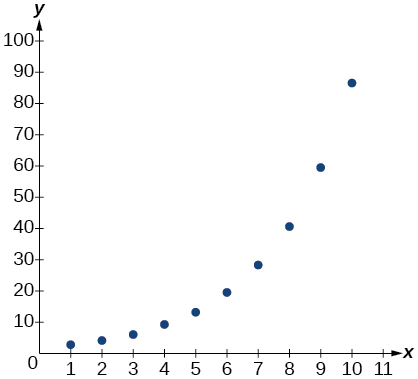 

| ***x*** | ***f(x)*** |
| 0.5 | 18.05 |
| 1 | 17 |
| 3 | 15.33 |
| 5 | 14.55 |
| 7 | 14.04 |
| 10 | 13.5 |
| 12 | 13.22 |
| 13 | 13.1 |
| 15 | 12.88 |
| 17 | 12.69 |
| 20 | 12.45 |
{: summary="Two columns and twelve rows. The first column is labeled, &#x201C;x&#x201D;, and the second column is labeled, &#x201C;f(x)&#x201D;. Reading the rows as ordered pairs, we have the following values: (0.5, 18.05), (1, 17), (3, 15.33), (5, 14.55), (7, 14.04), (10, 13.5), (12, 13.22), (13, 13.1), (15, 12.88), (17, 12.69), and (20, 12.45)." .unnumbered data-label=""}

Find a formula for an exponential equation that goes through the points<math xmlns="http://www.w3.org/1998/Math/MathML"> <mrow> <mtext> </mtext><mrow><mo>(</mo> <mrow> <mo>−</mo><mn>2</mn><mo>,</mo><mn>100</mn> </mrow> <mo>)</mo></mrow><mtext> </mtext> </mrow> </math>

and<math xmlns="http://www.w3.org/1998/Math/MathML"> <mrow> <mtext> </mtext><mrow><mo>(</mo> <mrow> <mn>0</mn><mo>,</mo><mn>4</mn> </mrow> <mo>)</mo></mrow><mo>.</mo><mtext> </mtext> </mrow> </math>

Then express the formula as an equivalent equation with base *e.*

<math xmlns="http://www.w3.org/1998/Math/MathML"> <mrow> <mi>y</mi><mo>=</mo><mn>4</mn><msup> <mrow> <mrow><mo>(</mo> <mrow> <mn>0.2</mn> </mrow> <mo>)</mo></mrow> </mrow> <mi>x</mi> </msup> <mo>;</mo><mtext> </mtext> </mrow> </math>

<math xmlns="http://www.w3.org/1998/Math/MathML"> <mrow> <mi>y</mi><mo>=</mo><mn>4</mn><msup> <mi>e</mi> <mrow> <mtext>-1</mtext><mtext>.609438</mtext><mi>x</mi> </mrow> </msup> </mrow> </math>

#### [Fitting Exponential Models to Data](/m49368){: .target-chapter}

What is the carrying capacity for a population modeled by the logistic equation<math xmlns="http://www.w3.org/1998/Math/MathML"> <mrow> <mtext> </mtext><mi>P</mi><mo stretchy="false">(</mo><mi>t</mi><mo stretchy="false">)</mo><mo>=</mo><mfrac> <mrow> <mn>250</mn><mo>,</mo><mn>000</mn></mrow> <mrow> <mn>1</mn><mtext> </mtext><mtext> </mtext><mo>+</mo><mtext> </mtext><mtext> </mtext><mn>499</mn><msup> <mi>e</mi> <mrow> <mo>−</mo><mn>0.45</mn><mi>t</mi></mrow> </msup> </mrow> </mfrac> <mo>?</mo><mtext> </mtext></mrow> </math>

What is the initial population for the model?

The population of a culture of bacteria is modeled by the logistic equation<math xmlns="http://www.w3.org/1998/Math/MathML"><mrow> <mtext> </mtext><mi>P</mi><mo stretchy="false">(</mo><mi>t</mi><mo stretchy="false">)</mo><mo>=</mo><mfrac> <mrow> <mn>14</mn><mo>,</mo><mn>250</mn></mrow> <mrow> <mn>1</mn><mtext> </mtext><mtext> </mtext><mo>+</mo><mtext> </mtext><mtext> </mtext><mn>29</mn><msup> <mi>e</mi> <mrow> <mo>−</mo><mn>0.62</mn><mi>t</mi></mrow> </msup> </mrow> </mfrac> <mo>,</mo></mrow> </math>

 where<math xmlns="http://www.w3.org/1998/Math/MathML"> <mrow> <mtext>  </mtext><mi>t</mi><mtext>  </mtext> </mrow> </math>

is in days. To the nearest tenth, how many days will it take the culture to reach<math xmlns="http://www.w3.org/1998/Math/MathML"> <mrow> <mtext> </mtext><mn>75</mn><mi>%</mi><mtext> </mtext> </mrow> </math>

of its carrying capacity?

about<math xmlns="http://www.w3.org/1998/Math/MathML"> <mrow> <mtext> </mtext><mn>7.2</mn><mtext> </mtext> </mrow> </math>

days

For the following exercises, use a graphing utility to create a scatter diagram of the data given in the table. Observe the shape of the scatter diagram to determine whether the data is best described by an exponential, logarithmic, or logistic model. Then use the appropriate regression feature to find an equation that models the data. When necessary, round values to five decimal places.

| ***x*** | ***f(x)*** |
| 1 | 409.4 |
| 2 | 260.7 |
| 3 | 170.4 |
| 4 | 110.6 |
| 5 | 74 |
| 6 | 44.7 |
| 7 | 32.4 |
| 8 | 19.5 |
| 9 | 12.7 |
| 10 | 8.1 |
{: summary="Two columns and eleven rows. The first column is labeled, &#x201C;x&#x201D;, and the second column is labeled, &#x201C;f(x)&#x201D;. Reading the rows as ordered pairs, we have the following values: (1, 409.4), (2, 260.7), (3, 170.4), (4, 110.6), (5, 74), (6, 44.7), (7, 32.4), (8, 19.5), (9, 12.7), and (10, 8.1)." .unnumbered data-label=""}

| ***x*** | ***f(x)*** |
| 0.15 | 36.21 |
| 0.25 | 28.88 |
| 0.5 | 24.39 |
| 0.75 | 18.28 |
| 1 | 16.5 |
| 1.5 | 12.99 |
| 2 | 9.91 |
| 2.25 | 8.57 |
| 2.75 | 7.23 |
| 3 | 5.99 |
| 3.5 | 4.81 |
{: summary="Two rows and twelve columns. The first row is labeled, &#x201C;x&#x201D;, and the second row is labeled, &#x201C;f(x)&#x201D;. Reading the columns as ordered pairs, we have the following values: (0.15, 36.21), (0.25, 28.88), (0.5, 24.39), (0.75, 18.28), (1, 16.5), (1.5, 12.99), (2, 9.91), (2.25, 8.57), (2.75, 7.23), (3, 5.99), and (3.5, 4.81)." .unnumbered data-label=""}

logarithmic;<math xmlns="http://www.w3.org/1998/Math/MathML"> <mrow> <mtext> </mtext><mi>y</mi><mo>=</mo><mn>16.68718</mn><mo>−</mo><mn>9.71860</mn><mi>ln</mi><mo stretchy="false">(</mo><mi>x</mi><mo stretchy="false">)</mo> </mrow> </math>

 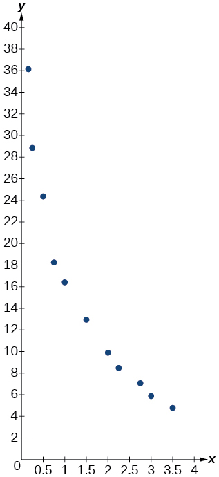 

| ***x*** | ***f(x)*** |
| 0 | 9 |
| 2 | 22.6 |
| 4 | 44.2 |
| 5 | 62.1 |
| 7 | 96.9 |
| 8 | 113.4 |
| 10 | 133.4 |
| 11 | 137.6 |
| 15 | 148.4 |
| 17 | 149.3 |
{: summary="Two columns and eleven rows. The first column is labeled, &#x201C;x&#x201D;, and the second column is labeled, &#x201C;f(x)&#x201D;. Reading the rows as ordered pairs, we have the following values: (0, 9), (2, 22.6), (4, 44.2), (5, 62.1), (7, 96.9), (8, 113.4), (10, 133.4), (11, 137.6), (15, 148.4), and (17, 149.3)." .unnumbered data-label=""}

### Practice Test

The population of a pod of bottlenose dolphins is modeled by the function<math xmlns="http://www.w3.org/1998/Math/MathML"> <mrow> <mtext> </mtext><mi>A</mi><mo stretchy="false">(</mo><mi>t</mi><mo stretchy="false">)</mo><mo>=</mo><mn>8</mn><msup> <mrow> <mo stretchy="false">(</mo><mn>1.17</mn><mo stretchy="false">)</mo> </mrow> <mi>t</mi> </msup> <mo>,</mo> </mrow> </math>

 where<math xmlns="http://www.w3.org/1998/Math/MathML"> <mrow> <mtext>  </mtext><mi>t</mi><mtext>  </mtext> </mrow> </math>

is given in years. To the nearest whole number, what will the pod population be after<math xmlns="http://www.w3.org/1998/Math/MathML"> <mrow> <mtext> </mtext><mn>3</mn><mtext> </mtext> </mrow> </math>

years?

About<math xmlns="http://www.w3.org/1998/Math/MathML"> <mrow> <mtext> </mtext><mn>13</mn><mtext> </mtext> </mrow> </math>

dolphins.

Find an exponential equation that passes through the points<math xmlns="http://www.w3.org/1998/Math/MathML"> <mrow> <mtext> </mtext><mtext>(0, 4)</mtext><mtext> </mtext> </mrow> </math>

and<math xmlns="http://www.w3.org/1998/Math/MathML"> <mrow> <mtext> </mtext><mtext>(2, 9)</mtext><mtext>.</mtext> </mrow> </math>

Drew wants to save $2,500 to go to the next World Cup. To the nearest dollar, how much will he need to invest in an account now with<math xmlns="http://www.w3.org/1998/Math/MathML"> <mrow> <mtext> </mtext><mn>6.25</mn><mi>%</mi><mtext> </mtext> </mrow> </math>

APR, compounding daily, in order to reach his goal in<math xmlns="http://www.w3.org/1998/Math/MathML"> <mrow> <mtext> </mtext><mn>4</mn><mtext> </mtext> </mrow> </math>

years?

<math xmlns="http://www.w3.org/1998/Math/MathML"> <mrow> <mn>$</mn><mn>1,947</mn> </mrow> </math>

An investment account was opened with an initial deposit of $9,600 and earns<math xmlns="http://www.w3.org/1998/Math/MathML"> <mrow> <mtext> </mtext><mn>7.4</mn><mi>%</mi><mtext> </mtext> </mrow> </math>

interest, compounded continuously. How much will the account be worth after<math xmlns="http://www.w3.org/1998/Math/MathML"> <mrow> <mtext> </mtext><mn>15</mn><mtext> </mtext> </mrow> </math>

years?

Graph the function<math xmlns="http://www.w3.org/1998/Math/MathML"> <mrow> <mtext> </mtext><mi>f</mi><mo stretchy="false">(</mo><mi>x</mi><mo stretchy="false">)</mo><mo>=</mo><mn>5</mn><msup> <mrow> <mrow><mo>(</mo> <mrow> <mn>0.5</mn> </mrow> <mo>)</mo></mrow> </mrow> <mrow> <mo>−</mo><mi>x</mi> </mrow> </msup> <mtext> </mtext> </mrow> </math>

and its reflection across the *y*-axis on the same axes, and give the *y*-intercept.

*y*-intercept:<math xmlns="http://www.w3.org/1998/Math/MathML"> <mrow> <mtext> </mtext><mo stretchy="false">(</mo><mn>0</mn><mo>,</mo><mtext> 5</mtext><mo stretchy="false">)</mo> </mrow> </math>

 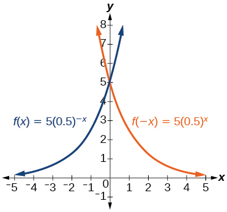 

The graph shows transformations of the graph of<math xmlns="http://www.w3.org/1998/Math/MathML"> <mrow> <mtext> </mtext><mi>f</mi><mo stretchy="false">(</mo><mi>x</mi><mo stretchy="false">)</mo><mo>=</mo><msup> <mrow> <mrow><mo>(</mo> <mrow> <mfrac> <mn>1</mn> <mn>2</mn> </mfrac> </mrow> <mo>)</mo></mrow> </mrow> <mi>x</mi> </msup> <mo>.</mo><mtext> </mtext> </mrow> </math>

What is the equation for the transformation?

 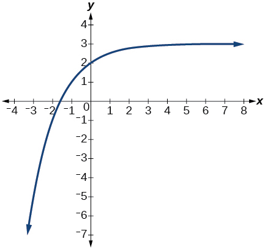 

Rewrite<math xmlns="http://www.w3.org/1998/Math/MathML"> <mrow> <mtext> </mtext><msub> <mrow> <mi>log</mi> </mrow> <mrow> <mn>8.5</mn> </mrow> </msub> <mrow><mo>(</mo> <mrow> <mn>614.125</mn> </mrow> <mo>)</mo></mrow><mo>=</mo><mi>a</mi><mtext> </mtext> </mrow> </math>

as an equivalent exponential equation.

<math xmlns="http://www.w3.org/1998/Math/MathML"> <mrow> <msup> <mrow> <mn>8.5</mn> </mrow> <mi>a</mi> </msup> <mo>=</mo><mn>614.125</mn> </mrow> </math>

Rewrite<math xmlns="http://www.w3.org/1998/Math/MathML"> <mrow> <mtext> </mtext><msup> <mi>e</mi> <mrow> <mfrac> <mn>1</mn> <mn>2</mn> </mfrac> </mrow> </msup> <mo>=</mo><mi>m</mi><mtext> </mtext> </mrow> </math>

as an equivalent logarithmic equation.

Solve for<math xmlns="http://www.w3.org/1998/Math/MathML"> <mrow> <mtext> </mtext><mi>x</mi><mtext> </mtext> </mrow> </math>

by converting the logarithmic equation<math xmlns="http://www.w3.org/1998/Math/MathML"> <mrow> <mtext> </mtext><mi>l</mi><mi>o</mi><msub> <mi>g</mi> <mrow> <mfrac> <mn>1</mn> <mn>7</mn> </mfrac> </mrow> </msub> <mo stretchy="false">(</mo><mi>x</mi><mo stretchy="false">)</mo><mo>=</mo><mn>2</mn><mtext> </mtext> </mrow> </math>

to exponential form.

<math xmlns="http://www.w3.org/1998/Math/MathML"> <mrow> <mi>x</mi><mo>=</mo><msup> <mrow> <mrow><mo>(</mo> <mrow> <mfrac> <mn>1</mn> <mn>7</mn> </mfrac> </mrow> <mo>)</mo></mrow> </mrow> <mn>2</mn> </msup> <mo>=</mo><mfrac> <mn>1</mn> <mrow> <mn>49</mn> </mrow> </mfrac> </mrow> </math>

Evaluate<math xmlns="http://www.w3.org/1998/Math/MathML"> <mrow> <mtext> </mtext><mi>log</mi><mo stretchy="false">(</mo><mtext>10,000,000</mtext><mo stretchy="false">)</mo><mtext> </mtext></mrow> </math>

without using a calculator.

Evaluate<math xmlns="http://www.w3.org/1998/Math/MathML"> <mrow> <mtext> </mtext><mi>ln</mi><mrow><mo>(</mo> <mrow> <mn>0.716</mn></mrow> <mo>)</mo></mrow><mtext> </mtext></mrow> </math>

using a calculator. Round to the nearest thousandth.

<math xmlns="http://www.w3.org/1998/Math/MathML"> <mrow> <mi>ln</mi><mrow><mo>(</mo> <mrow> <mn>0.716</mn></mrow> <mo>)</mo></mrow><mo>≈</mo><mo>−</mo><mn>0.334</mn></mrow> </math>

Graph the function<math xmlns="http://www.w3.org/1998/Math/MathML"> <mrow> <mtext> </mtext><mi>g</mi><mo stretchy="false">(</mo><mi>x</mi><mo stretchy="false">)</mo><mo>=</mo><mi>log</mi><mrow><mo>(</mo> <mrow> <mn>12</mn><mo>−</mo><mn>6</mn><mi>x</mi> </mrow> <mo>)</mo></mrow><mo>+</mo><mn>3.</mn> </mrow> </math>

State the domain, vertical asymptote, and end behavior of the function<math xmlns="http://www.w3.org/1998/Math/MathML"> <mrow> <mtext> </mtext><mi>f</mi><mo stretchy="false">(</mo><mi>x</mi><mo stretchy="false">)</mo><mo>=</mo><msub> <mrow> <mi>log</mi> </mrow> <mn>5</mn> </msub> <mrow><mo>(</mo> <mrow> <mn>39</mn><mo>−</mo><mn>13</mn><mi>x</mi> </mrow> <mo>)</mo></mrow><mo>+</mo><mn>7.</mn> </mrow> </math>

Domain:<math xmlns="http://www.w3.org/1998/Math/MathML"> <mrow> <mtext> </mtext><mi>x</mi><mo>&lt;</mo><mn>3</mn><mo>;</mo><mtext> </mtext> </mrow> </math>

Vertical asymptote:<math xmlns="http://www.w3.org/1998/Math/MathML"> <mrow> <mtext> </mtext><mi>x</mi><mo>=</mo><mn>3</mn><mo>;</mo><mtext> </mtext> </mrow> </math>

End behavior:<math xmlns="http://www.w3.org/1998/Math/MathML"> <mrow> <mtext> </mtext><mi>x</mi><mo stretchy="false">→</mo><msup> <mn>3</mn> <mo>−</mo> </msup> <mo>,</mo><mi>f</mi><mo stretchy="false">(</mo><mi>x</mi><mo stretchy="false">)</mo><mo stretchy="false">→</mo><mo>−</mo><mi>∞</mi><mtext> </mtext> </mrow> </math>

and<math xmlns="http://www.w3.org/1998/Math/MathML"> <mrow> <mtext> </mtext><mi>x</mi><mo stretchy="false">→</mo><mo>−</mo><mi>∞</mi><mo>,</mo><mi>f</mi><mo stretchy="false">(</mo><mi>x</mi><mo stretchy="false">)</mo><mo stretchy="false">→</mo><mi>∞</mi> </mrow> </math>

Rewrite<math xmlns="http://www.w3.org/1998/Math/MathML"> <mrow> <mtext> </mtext><mi>log</mi><mrow><mo>(</mo> <mrow> <mn>17</mn><mi>a</mi><mo>⋅</mo><mn>2</mn><mi>b</mi></mrow> <mo>)</mo></mrow><mtext> </mtext></mrow> </math>

as a sum.

Rewrite<math xmlns="http://www.w3.org/1998/Math/MathML"> <mrow> <mtext> </mtext><msub> <mrow> <mi>log</mi></mrow> <mi>t</mi> </msub> <mrow><mo>(</mo> <mrow> <mn>96</mn></mrow> <mo>)</mo></mrow><mo>−</mo><msub> <mrow> <mi>log</mi></mrow> <mi>t</mi> </msub> <mrow><mo>(</mo> <mn>8</mn> <mo>)</mo></mrow><mtext> </mtext></mrow> </math>

in compact form.

<math xmlns="http://www.w3.org/1998/Math/MathML"> <mrow> <msub> <mrow> <mi>log</mi></mrow> <mi>t</mi> </msub> <mrow><mo>(</mo> <mrow> <mn>12</mn></mrow> <mo>)</mo></mrow></mrow> </math>

Rewrite<math xmlns="http://www.w3.org/1998/Math/MathML"> <mrow> <mtext> </mtext><msub> <mrow> <mi>log</mi> </mrow> <mn>8</mn> </msub> <mrow><mo>(</mo> <mrow> <msup> <mi>a</mi> <mrow> <mfrac> <mn>1</mn> <mi>b</mi> </mfrac> </mrow> </msup> </mrow> <mo>)</mo></mrow><mtext> </mtext> </mrow> </math>

as a product.

Use properties of logarithm to expand<math xmlns="http://www.w3.org/1998/Math/MathML"> <mrow> <mtext> </mtext><mi>ln</mi><mrow><mo>(</mo> <mrow> <msup> <mi>y</mi> <mn>3</mn> </msup> <msup> <mi>z</mi> <mn>2</mn> </msup> <mo>⋅</mo><mroot> <mrow> <mi>x</mi><mo>−</mo><mn>4</mn> </mrow> <mn>3</mn> </mroot> </mrow> <mo>)</mo></mrow><mo>.</mo> </mrow> </math>

<math xmlns="http://www.w3.org/1998/Math/MathML"> <mrow> <mn>3</mn><mtext> </mtext><mtext> </mtext><mi>ln</mi><mrow><mo>(</mo> <mi>y</mi> <mo>)</mo></mrow><mo>+</mo><mn>2</mn><mi>ln</mi><mrow><mo>(</mo> <mi>z</mi> <mo>)</mo></mrow><mo>+</mo><mfrac> <mrow> <mi>ln</mi><mrow><mo>(</mo> <mrow> <mi>x</mi><mo>−</mo><mn>4</mn></mrow> <mo>)</mo></mrow></mrow> <mn>3</mn> </mfrac> </mrow> </math>

Condense the expression<math xmlns="http://www.w3.org/1998/Math/MathML"> <mrow> <mtext> </mtext><mn>4</mn><mi>ln</mi><mrow><mo>(</mo> <mi>c</mi> <mo>)</mo></mrow><mo>+</mo><mi>ln</mi><mrow><mo>(</mo> <mi>d</mi> <mo>)</mo></mrow><mo>+</mo><mfrac> <mrow> <mi>ln</mi><mrow><mo>(</mo> <mi>a</mi> <mo>)</mo></mrow> </mrow> <mn>3</mn> </mfrac> <mo>+</mo><mfrac> <mrow> <mi>ln</mi><mrow><mo>(</mo> <mrow> <mi>b</mi><mo>+</mo><mn>3</mn> </mrow> <mo>)</mo></mrow> </mrow> <mn>3</mn> </mfrac> <mtext> </mtext> </mrow> </math>

to a single logarithm.

Rewrite<math xmlns="http://www.w3.org/1998/Math/MathML"> <mrow> <mtext> </mtext><msup> <mrow> <mn>16</mn> </mrow> <mrow> <mn>3</mn><mi>x</mi><mo>−</mo><mn>5</mn> </mrow> </msup> <mo>=</mo><mn>1000</mn><mtext> </mtext> </mrow> </math>

as a logarithm. Then apply the change of base formula to solve for<math xmlns="http://www.w3.org/1998/Math/MathML"> <mrow> <mtext> </mtext><mi>x</mi><mtext> </mtext> </mrow> </math>

using the natural log. Round to the nearest thousandth.

<math xmlns="http://www.w3.org/1998/Math/MathML"> <mrow> <mi>x</mi><mo>=</mo><mfrac> <mrow> <mfrac> <mrow> <mi>ln</mi><mrow><mo>(</mo> <mrow> <mn>1000</mn> </mrow> <mo>)</mo></mrow> </mrow> <mrow> <mi>ln</mi><mrow><mo>(</mo> <mrow> <mn>16</mn> </mrow> <mo>)</mo></mrow> </mrow> </mfrac> <mo>+</mo><mn>5</mn> </mrow> <mn>3</mn> </mfrac> <mo>≈</mo><mn>2.497</mn> </mrow> </math>

Solve<math xmlns="http://www.w3.org/1998/Math/MathML"> <mrow> <mtext> </mtext><msup> <mrow> <mrow><mo>(</mo> <mrow> <mfrac> <mn>1</mn> <mrow> <mn>81</mn> </mrow> </mfrac> </mrow> <mo>)</mo></mrow> </mrow> <mi>x</mi> </msup> <mo>⋅</mo><mfrac> <mn>1</mn> <mrow> <mn>243</mn> </mrow> </mfrac> <mo>=</mo><msup> <mrow> <mrow><mo>(</mo> <mrow> <mfrac> <mn>1</mn> <mn>9</mn> </mfrac> </mrow> <mo>)</mo></mrow> </mrow> <mrow> <mo>−</mo><mn>3</mn><mi>x</mi><mo>−</mo><mn>1</mn> </mrow> </msup> <mtext> </mtext> </mrow> </math>

by rewriting each side with a common base.

Use logarithms to find the exact solution for<math xmlns="http://www.w3.org/1998/Math/MathML"> <mrow> <mtext> </mtext><mo>−</mo><mn>9</mn><msup> <mi>e</mi> <mrow> <mn>10</mn><mi>a</mi><mo>−</mo><mn>8</mn> </mrow> </msup> <mo>−</mo><mn>5</mn><mo>=</mo><mo>−</mo><mn>41</mn> </mrow> </math>

. If there is no solution, write *no solution*.

<math xmlns="http://www.w3.org/1998/Math/MathML"> <mrow> <mi>a</mi><mo>=</mo><mfrac> <mrow> <mi>ln</mi><mrow><mo>(</mo> <mn>4</mn> <mo>)</mo></mrow><mo>+</mo><mn>8</mn> </mrow> <mrow> <mn>10</mn> </mrow> </mfrac> </mrow> </math>

Find the exact solution for<math xmlns="http://www.w3.org/1998/Math/MathML"> <mrow> <mtext> </mtext><mn>10</mn><msup> <mi>e</mi> <mrow> <mn>4</mn><mi>x</mi><mo>+</mo><mn>2</mn> </mrow> </msup> <mo>+</mo><mn>5</mn><mo>=</mo><mn>56.</mn><mtext> </mtext> </mrow> </math>

If there is no solution, write *no solution*.

Find the exact solution for<math xmlns="http://www.w3.org/1998/Math/MathML"> <mrow> <mtext> </mtext><mo>−</mo><mn>5</mn><msup> <mi>e</mi> <mrow> <mo>−</mo><mn>4</mn><mi>x</mi><mo>−</mo><mn>1</mn> </mrow> </msup> <mo>−</mo><mn>4</mn><mo>=</mo><mn>64.</mn><mtext> </mtext> </mrow> </math>

If there is no solution, write *no solution*.

no solution

Find the exact solution for<math xmlns="http://www.w3.org/1998/Math/MathML"> <mrow> <mtext> </mtext><msup> <mn>2</mn> <mrow> <mi>x</mi><mo>−</mo><mn>3</mn> </mrow> </msup> <mo>=</mo><msup> <mn>6</mn> <mrow> <mn>2</mn><mi>x</mi><mo>−</mo><mn>1</mn> </mrow> </msup> <mo>.</mo><mtext> </mtext> </mrow> </math>

If there is no solution, write *no solution*.

Find the exact solution for<math xmlns="http://www.w3.org/1998/Math/MathML"> <mrow> <mtext> </mtext><msup> <mi>e</mi> <mrow> <mn>2</mn><mi>x</mi> </mrow> </msup> <mo>−</mo><msup> <mi>e</mi> <mi>x</mi> </msup> <mo>−</mo><mn>72</mn><mo>=</mo><mn>0.</mn><mtext> </mtext> </mrow> </math>

If there is no solution, write *no solution*.

<math xmlns="http://www.w3.org/1998/Math/MathML"> <mrow> <mi>x</mi><mo>=</mo><mi>ln</mi><mrow><mo>(</mo> <mn>9</mn> <mo>)</mo></mrow> </mrow> </math>

Use the definition of a logarithm to find the exact solution for<math xmlns="http://www.w3.org/1998/Math/MathML"> <mrow> <mtext> </mtext><mn>4</mn><mi>log</mi><mrow><mo>(</mo> <mrow> <mn>2</mn><mi>n</mi> </mrow> <mo>)</mo></mrow><mo>−</mo><mn>7</mn><mo>=</mo><mo>−</mo><mn>11</mn> </mrow> </math>

Use the one-to-one property of logarithms to find an exact solution for<math xmlns="http://www.w3.org/1998/Math/MathML"> <mrow> <mtext> </mtext><mi>log</mi><mrow><mo>(</mo> <mrow> <mn>4</mn><msup> <mi>x</mi> <mn>2</mn> </msup> <mo>−</mo><mn>10</mn> </mrow> <mo>)</mo></mrow><mo>+</mo><mi>log</mi><mrow><mo>(</mo> <mn>3</mn> <mo>)</mo></mrow><mo>=</mo><mi>log</mi><mrow><mo>(</mo> <mrow> <mn>51</mn> </mrow> <mo>)</mo></mrow><mtext> </mtext> </mrow> </math>

If there is no solution, write *no solution*.

<math xmlns="http://www.w3.org/1998/Math/MathML"> <mrow> <mi>x</mi><mo>=</mo><mo>±</mo><mfrac> <mrow> <mn>3</mn><msqrt> <mn>3</mn> </msqrt> </mrow> <mn>2</mn> </mfrac> </mrow> </math>

The formula for measuring sound intensity in decibels<math xmlns="http://www.w3.org/1998/Math/MathML"> <mrow> <mtext> </mtext><mi>D</mi><mtext> </mtext> </mrow> </math>

is defined by the equation<math xmlns="http://www.w3.org/1998/Math/MathML"> <mrow> <mtext> </mtext><mi>D</mi><mo>=</mo><mn>10</mn><mi>log</mi><mrow><mo>(</mo> <mrow> <mfrac> <mi>I</mi> <mrow> <msub> <mi>I</mi> <mn>0</mn> </msub> </mrow> </mfrac> </mrow> <mo>)</mo></mrow><mo>,</mo> </mrow> </math>

where<math xmlns="http://www.w3.org/1998/Math/MathML"> <mrow> <mtext> </mtext><mi>I</mi><mtext> </mtext> </mrow> </math>

is the intensity of the sound in watts per square meter and<math xmlns="http://www.w3.org/1998/Math/MathML"> <mrow> <mtext> </mtext><msub> <mi>I</mi> <mn>0</mn> </msub> <mo>=</mo><msup> <mrow> <mn>10</mn> </mrow> <mrow> <mo>−</mo><mn>12</mn> </mrow> </msup> <mtext> </mtext> </mrow> </math>

is the lowest level of sound that the average person can hear. How many decibels are emitted from a rock concert with a sound intensity of<math xmlns="http://www.w3.org/1998/Math/MathML"> <mrow> <mtext> </mtext><mn>4.7</mn><mo>⋅</mo><msup> <mrow> <mn>10</mn> </mrow> <mrow> <mo>−</mo><mn>1</mn> </mrow> </msup> <mtext> </mtext> </mrow> </math>

watts per square meter?

A radiation safety officer is working with<math xmlns="http://www.w3.org/1998/Math/MathML"> <mrow> <mtext> </mtext><mn>112</mn><mtext> </mtext> </mrow> </math>

grams of a radioactive substance. After<math xmlns="http://www.w3.org/1998/Math/MathML"> <mrow> <mtext> </mtext><mn>17</mn><mtext> </mtext> </mrow> </math>

days, the sample has decayed to<math xmlns="http://www.w3.org/1998/Math/MathML"> <mrow> <mtext> </mtext><mn>80</mn><mtext> </mtext> </mrow> </math>

grams. Rounding to five significant digits, write an exponential equation representing this situation. To the nearest day, what is the half-life of this substance?

<math xmlns="http://www.w3.org/1998/Math/MathML"> <mrow> <mi>f</mi><mo stretchy="false">(</mo><mi>t</mi><mo stretchy="false">)</mo><mo>=</mo><mn>112</mn><msup> <mi>e</mi> <mrow> <mo>−</mo><mn>.019792</mn><mi>t</mi> </mrow> </msup> <mo>;</mo> </mrow> </math>

 half-life: about<math xmlns="http://www.w3.org/1998/Math/MathML"> <mrow> <mtext> </mtext><mn>35</mn><mtext> </mtext> </mrow> </math>

 days

Write the formula found in the previous exercise as an equivalent equation with base<math xmlns="http://www.w3.org/1998/Math/MathML"> <mrow> <mtext> </mtext><mi>e</mi><mo>.</mo><mtext> </mtext> </mrow> </math>

Express the exponent to five significant digits.

A bottle of soda with a temperature of<math xmlns="http://www.w3.org/1998/Math/MathML"> <mrow> <mtext> </mtext><mtext>71°</mtext><mtext> </mtext> </mrow> </math>

Fahrenheit was taken off a shelf and placed in a refrigerator with an internal temperature of<math xmlns="http://www.w3.org/1998/Math/MathML"> <mrow> <mtext> </mtext><mtext>35° F</mtext><mtext>.</mtext><mtext> </mtext> </mrow> </math>

After ten minutes, the internal temperature of the soda was<math xmlns="http://www.w3.org/1998/Math/MathML"> <mrow> <mtext> </mtext><mtext>63° F</mtext><mtext>.</mtext><mtext> </mtext> </mrow> </math>

Use Newton’s Law of Cooling to write a formula that models this situation. To the nearest degree, what will the temperature of the soda be after one hour?

<math xmlns="http://www.w3.org/1998/Math/MathML"> <mrow> <mi>T</mi><mo stretchy="false">(</mo><mi>t</mi><mo stretchy="false">)</mo><mo>=</mo><mn>36</mn><msup> <mi>e</mi> <mrow> <mo>−</mo><mn>0.025131</mn><mi>t</mi> </mrow> </msup> <mo>+</mo><mn>35</mn><mo>;</mo><mi>T</mi><mrow><mo>(</mo> <mrow> <mn>60</mn> </mrow> <mo>)</mo></mrow><mo>≈</mo><msup> <mrow> <mn>43</mn> </mrow> <mtext>o</mtext> </msup> <mtext>F</mtext> </mrow> </math>

The population of a wildlife habitat is modeled by the equation<math xmlns="http://www.w3.org/1998/Math/MathML"> <mrow> <mtext> </mtext><mi>P</mi><mrow><mo>(</mo> <mi>t</mi> <mo>)</mo></mrow><mo>=</mo><mfrac> <mrow> <mn>360</mn> </mrow> <mrow> <mn>1</mn><mo>+</mo><mn>6.2</mn><msup> <mi>e</mi> <mrow> <mo>−</mo><mn>0.35</mn><mi>t</mi> </mrow> </msup> </mrow> </mfrac> <mo>,</mo> </mrow> </math>

 where<math xmlns="http://www.w3.org/1998/Math/MathML"> <mrow> <mtext>  </mtext><mi>t</mi><mtext>  </mtext> </mrow> </math>

is given in years. How many animals were originally transported to the habitat? How many years will it take before the habitat reaches half its capacity?

Enter the data from [[link]](#Table_04_08_14) into a graphing calculator and graph the resulting scatter plot. Determine whether the data from the table would likely represent a function that is linear, exponential, or logarithmic.

| ***x*** | ***f(x)*** |
| 1 | 3 |
| 2 | 8.55 |
| 3 | 11.79 |
| 4 | 14.09 |
| 5 | 15.88 |
| 6 | 17.33 |
| 7 | 18.57 |
| 8 | 19.64 |
| 9 | 20.58 |
| 10 | 21.42 |
{: #Table_04_08_14 summary="Two columns and eleven rows. The first column is labeled, &#x201C;x&#x201D;, and the second column is labeled, &#x201C;f(x)&#x201D;. Reading the rows as ordered pairs, we have the following values: (1, 3), (2, 8.55), (3, 11.79), (4, 14.09), (5, 15.88), (6, 17.33), (7, 18.57), (8, 19.64), (9, 20.58), and (10, 21.42)."}

logarithmic

 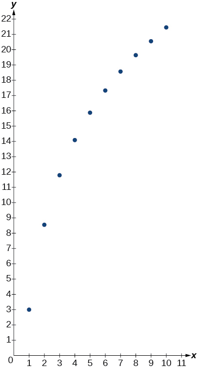 

The population of a lake of fish is modeled by the logistic equation<math xmlns="http://www.w3.org/1998/Math/MathML"> <mrow> <mtext> </mtext><mi>P</mi><mo stretchy="false">(</mo><mi>t</mi><mo stretchy="false">)</mo><mo>=</mo><mfrac> <mrow> <mn>16</mn><mo>,</mo><mn>120</mn> </mrow> <mrow> <mn>1</mn><mo>+</mo><mn>25</mn><msup> <mi>e</mi> <mrow> <mo>−</mo><mn>0.75</mn><mi>t</mi> </mrow> </msup> </mrow> </mfrac> <mo>,</mo> </mrow> </math>

 where<math xmlns="http://www.w3.org/1998/Math/MathML"> <mrow> <mtext>  </mtext><mi>t</mi><mtext>  </mtext> </mrow> </math>

is time in years. To the nearest hundredth, how many years will it take the lake to reach<math xmlns="http://www.w3.org/1998/Math/MathML"> <mrow> <mtext> </mtext><mn>80</mn><mi>%</mi><mtext> </mtext> </mrow> </math>

of its carrying capacity?

For the following exercises, use a graphing utility to create a scatter diagram of the data given in the table. Observe the shape of the scatter diagram to determine whether the data is best described by an exponential, logarithmic, or logistic model. Then use the appropriate regression feature to find an equation that models the data. When necessary, round values to five decimal places.

| ***x*** | ***f(x)*** |
| 1 | 20 |
| 2 | 21.6 |
| 3 | 29.2 |
| 4 | 36.4 |
| 5 | 46.6 |
| 6 | 55.7 |
| 7 | 72.6 |
| 8 | 87.1 |
| 9 | 107.2 |
| 10 | 138.1 |
{: summary="Two columns and eleven rows. The first column is labeled, &#x201C;x&#x201D;, and the second column is labeled, &#x201C;f(x)&#x201D;. Reading the rows as ordered pairs, we have the following values: (1, 20), (2, 21.6), (3, 29.2), (4, 36.4), (5, 46.6), (6, 55.7), (7, 72.6), (8, 87.1), (9, 107.2), and (10, 138.1)." .unnumbered data-label=""}

exponential;<math xmlns="http://www.w3.org/1998/Math/MathML"> <mrow> <mtext> </mtext><mi>y</mi><mo>=</mo><mn>15.10062</mn><msup> <mrow> <mrow><mo>(</mo> <mrow> <mn>1.24621</mn> </mrow> <mo>)</mo></mrow> </mrow> <mi>x</mi> </msup> </mrow> </math>

 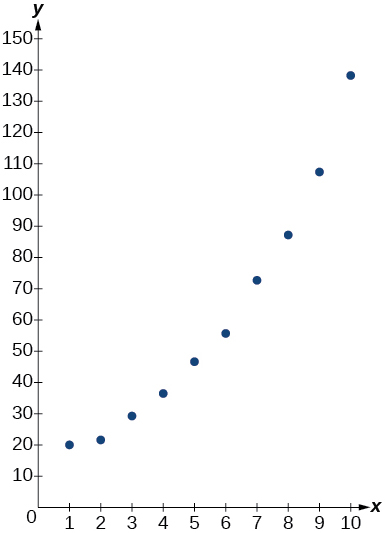 

| ***x*** | ***f(x)*** |
| 3 | 13.98 |
| 4 | 17.84 |
| 5 | 20.01 |
| 6 | 22.7 |
| 7 | 24.1 |
| 8 | 26.15 |
| 9 | 27.37 |
| 10 | 28.38 |
| 11 | 29.97 |
| 12 | 31.07 |
| 13 | 31.43 |
{: summary="Two columns and twelve rows. The first column is labeled, &#x201C;x&#x201D;, and the second column is labeled, &#x201C;f(x)&#x201D;. Reading the rows as ordered pairs, we have the following values: (3, 13.98), (4, 17.84), (5, 20.01), (6, 22.7), (7, 24.1), (8, 26.15), (9, 27.37), (10, 28.38), (11, 29.97), (12, 31.07), and (13, 31.43)." .unnumbered data-label=""}

| ***x*** | ***f(x)*** |
| 0 | 2.2 |
| 0.5 | 2.9 |
| 1 | 3.9 |
| 1.5 | 4.8 |
| 2 | 6.4 |
| 3 | 9.3 |
| 4 | 12.3 |
| 5 | 15 |
| 6 | 16.2 |
| 7 | 17.3 |
| 8 | 17.9 |
{: summary="Two columns and twelve rows. The first column is labeled, &#x201C;x&#x201D;, and the second column is labeled, &#x201C;f(x)&#x201D;. Reading the rows as ordered pairs, we have the following values: (0, 2.2), (0.5, 2.9), (1, 3.9), (1.5,4.8), (2, 6.4), (3, 9.3), (4, 12.3), (5, 15), (6, 16.2), (7, 17.3), and (8, 17.9)." .unnumbered data-label=""}

logistic;<math xmlns="http://www.w3.org/1998/Math/MathML"> <mrow> <mtext> </mtext><mi>y</mi><mo>=</mo><mfrac> <mrow> <mn>18.41659</mn> </mrow> <mrow> <mn>1</mn><mo>+</mo><mn>7.54644</mn><msup> <mi>e</mi> <mrow> <mo>−</mo><mn>0.68375</mn><mi>x</mi> </mrow> </msup> </mrow> </mfrac> </mrow> </math>

 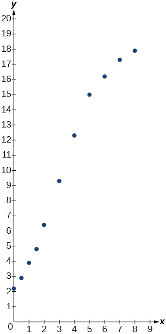 

### Footnotes
{: data-type="footnote-refs-title"}

* {: data-type="footnote-ref" #footnote1} [1](#footnote-ref1){: data-type="footnote-ref-link"} Source: *Indiana University Center for Studies of Law in Action, 2007*
* {: data-type="footnote-ref" #footnote2} [2](#footnote-ref2){: data-type="footnote-ref-link"} Source: *Center for Disease Control and Prevention, 2013*
* {: data-type="footnote-ref" #footnote3} [3](#footnote-ref3){: data-type="footnote-ref-link"} Source: *The World Bank, 2013*
{: data-list-type="bulleted" data-bullet-style="none"}

[1]: http://openstaxcollege.org/l/pregresscalc
[2]: http://openstaxcollege.org/l/PreCalcLPC04
