

In this section, you will:
* Graph variations of  
  <math xmlns="http://www.w3.org/1998/Math/MathML"><mi>y</mi><mo>=</mo><mtext>sin</mtext><mo>(</mo><mi>x</mi><mo>)</mo></math>
  
   and
  <math xmlns="http://www.w3.org/1998/Math/MathML"><mi>y</mi><mo>=</mo><mtext>cos</mtext><mo>(</mo><mi>x</mi><mo>)</mo></math>
  
   .
* Use phase shifts of sine and cosine curves.

 "){: #Figure_06_01_001}

White light, such as the light from the sun, is not actually white at all. Instead, it is a composition of all the colors of the rainbow in the form of waves. The individual colors can be seen only when white light passes through an optical prism that separates the waves according to their wavelengths to form a rainbow.

Light waves can be represented graphically by the sine function. In the chapter on [Trigonometric Functions](/m49369){: .target-chapter}, we examined trigonometric functions such as the sine function. In this section, we will interpret and create graphs of sine and cosine functions.

### Graphing Sine and Cosine Functions

Recall that the sine and cosine functions relate real number values to the *x*- and *y*-coordinates of a point on the unit circle. So what do they look like on a graph on a coordinate plane? Let’s start with the **sine function**{: data-type="term" .no-emphasis}. We can create a table of values and use them to sketch a graph. [\[link\]](#Table_06_01_01) lists some of the values for the sine function on a unit circle.

| <strong><math xmlns="http://www.w3.org/1998/Math/MathML">
 <mi>x</mi>
</math></strong> | <math xmlns="http://www.w3.org/1998/Math/MathML"> <mn>0</mn> </math>

 | <math xmlns="http://www.w3.org/1998/Math/MathML"> <mrow> <mfrac> <mi>π</mi> <mn>6</mn> </mfrac> </mrow> </math>

 | <math xmlns="http://www.w3.org/1998/Math/MathML"> <mrow> <mfrac> <mi>π</mi> <mn>4</mn> </mfrac> </mrow> </math>

 | <math xmlns="http://www.w3.org/1998/Math/MathML"> <mrow> <mfrac> <mi>π</mi> <mn>3</mn> </mfrac> </mrow> </math>

 | <math xmlns="http://www.w3.org/1998/Math/MathML"> <mrow> <mfrac> <mi>π</mi> <mn>2</mn> </mfrac> </mrow> </math>

 | <math xmlns="http://www.w3.org/1998/Math/MathML"> <mrow> <mfrac> <mrow> <mn>2</mn><mi>π</mi> </mrow> <mn>3</mn> </mfrac> </mrow> </math>

 | <math xmlns="http://www.w3.org/1998/Math/MathML"> <mrow> <mfrac> <mrow> <mn>3</mn><mi>π</mi> </mrow> <mn>4</mn> </mfrac> </mrow> </math>

 | <math xmlns="http://www.w3.org/1998/Math/MathML"> <mrow> <mfrac> <mrow> <mn>5</mn><mi>π</mi> </mrow> <mn>6</mn> </mfrac> </mrow> </math>

 | <math xmlns="http://www.w3.org/1998/Math/MathML"> <mi>π</mi> </math>

 |
| <strong><math xmlns="http://www.w3.org/1998/Math/MathML">
 <mrow>
  <mi>sin</mi><mrow><mo>(</mo>
   <mi>x</mi>
  <mo>)</mo></mrow>
 </mrow>
</math></strong> | <math xmlns="http://www.w3.org/1998/Math/MathML"> <mn>0</mn> </math>

 | <math xmlns="http://www.w3.org/1998/Math/MathML"> <mrow> <mfrac> <mn>1</mn> <mn>2</mn> </mfrac> </mrow> </math>

 | <math xmlns="http://www.w3.org/1998/Math/MathML" display="block"> <mrow> <mfrac> <mrow> <msqrt> <mn>2</mn> </msqrt> </mrow> <mn>2</mn> </mfrac> </mrow> </math>

 | <math xmlns="http://www.w3.org/1998/Math/MathML" display="block"> <mrow> <mfrac> <mrow> <msqrt> <mn>3</mn> </msqrt> </mrow> <mn>2</mn> </mfrac> </mrow> </math>

 | <math xmlns="http://www.w3.org/1998/Math/MathML"> <mn>1</mn> </math>

 | <math xmlns="http://www.w3.org/1998/Math/MathML" display="block"> <mrow> <mfrac> <mrow> <msqrt> <mn>3</mn> </msqrt> </mrow> <mn>2</mn> </mfrac> </mrow> </math>

 | <math xmlns="http://www.w3.org/1998/Math/MathML" display="block"> <mrow> <mfrac> <mrow> <msqrt> <mn>2</mn> </msqrt> </mrow> <mn>2</mn> </mfrac> </mrow> </math>

 | <math xmlns="http://www.w3.org/1998/Math/MathML"> <mrow> <mfrac> <mn>1</mn> <mn>2</mn> </mfrac> </mrow> </math>

 | <math xmlns="http://www.w3.org/1998/Math/MathML"> <mn>0</mn> </math>

 |
{: #Table_06_01_01 summary=".."}

Plotting the points from the table and continuing along the *x*-axis gives the shape of the sine function. See [\[link\]](#Figure_06_01_002).

{: #Figure_06_01_002}

Notice how the sine values are positive between 0 and<math xmlns="http://www.w3.org/1998/Math/MathML"> <mrow> <mtext> </mtext><mi>π</mi><mo>,</mo><mtext> </mtext> </mrow> </math>

which correspond to the values of the sine function in quadrants I and II on the unit circle, and the sine values are negative between<math xmlns="http://www.w3.org/1998/Math/MathML"> <mrow> <mtext> </mtext><mi>π</mi><mtext> </mtext> </mrow> </math>

and<math xmlns="http://www.w3.org/1998/Math/MathML"> <mrow> <mtext> </mtext><mn>2</mn><mi>π</mi><mo>,</mo><mtext> </mtext> </mrow> </math>

which correspond to the values of the sine function in quadrants III and IV on the unit circle. See [\[link\]](#Figure_06_01_003).

 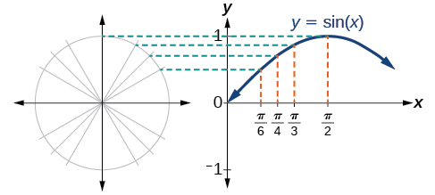{: #Figure_06_01_003}

Now let’s take a similar look at the **cosine function**{: data-type="term" .no-emphasis}. Again, we can create a table of values and use them to sketch a graph. [\[link\]](#Table_06_01_02) lists some of the values for the cosine function on a unit circle.

| <math xmlns="http://www.w3.org/1998/Math/MathML"> <mi mathvariant="bold">x</mi> </math>

 | <math xmlns="http://www.w3.org/1998/Math/MathML"> <mn>0</mn> </math>

 | <math xmlns="http://www.w3.org/1998/Math/MathML"> <mrow> <mfrac> <mi>π</mi> <mn>6</mn> </mfrac> </mrow> </math>

 | <math xmlns="http://www.w3.org/1998/Math/MathML"> <mrow> <mfrac> <mi>π</mi> <mn>4</mn> </mfrac> </mrow> </math>

 | <math xmlns="http://www.w3.org/1998/Math/MathML"> <mrow> <mfrac> <mi>π</mi> <mn>3</mn> </mfrac> </mrow> </math>

 | <math xmlns="http://www.w3.org/1998/Math/MathML"> <mrow> <mfrac> <mi>π</mi> <mn>2</mn> </mfrac> </mrow> </math>

 | <math xmlns="http://www.w3.org/1998/Math/MathML"> <mrow> <mfrac> <mrow> <mn>2</mn><mi>π</mi> </mrow> <mn>3</mn> </mfrac> </mrow> </math>

 | <math xmlns="http://www.w3.org/1998/Math/MathML"> <mrow> <mfrac> <mrow> <mn>3</mn><mi>π</mi> </mrow> <mn>4</mn> </mfrac> </mrow> </math>

 | <math xmlns="http://www.w3.org/1998/Math/MathML"> <mrow> <mfrac> <mrow> <mn>5</mn><mi>π</mi> </mrow> <mn>6</mn> </mfrac> </mrow> </math>

 | <math xmlns="http://www.w3.org/1998/Math/MathML"> <mi>π</mi> </math>

 |
| <math xmlns="http://www.w3.org/1998/Math/MathML"> <mrow> <mi mathvariant="bold">cos</mi><mrow><mo>(</mo> <mi mathvariant="bold">x</mi> <mo>)</mo></mrow> </mrow> </math>

 | <math xmlns="http://www.w3.org/1998/Math/MathML"> <mn>1</mn> </math>

 | <math xmlns="http://www.w3.org/1998/Math/MathML" display="block"> <mrow> <mfrac> <mrow> <msqrt> <mn>3</mn> </msqrt> </mrow> <mn>2</mn> </mfrac> </mrow> </math>

 | <math xmlns="http://www.w3.org/1998/Math/MathML" display="block"> <mrow> <mfrac> <mrow> <msqrt> <mn>2</mn> </msqrt> </mrow> <mn>2</mn> </mfrac> </mrow> </math>

 | <math xmlns="http://www.w3.org/1998/Math/MathML"> <mrow> <mfrac> <mn>1</mn> <mn>2</mn> </mfrac> </mrow> </math>

 | <math xmlns="http://www.w3.org/1998/Math/MathML" display="block"> <mn>0</mn> </math>

 | <math xmlns="http://www.w3.org/1998/Math/MathML" display="block"> <mrow> <mo>−</mo><mfrac> <mn>1</mn> <mn>2</mn> </mfrac> </mrow> </math>

 | <math xmlns="http://www.w3.org/1998/Math/MathML" display="block"> <mrow> <mo>−</mo><mfrac> <mrow> <msqrt> <mn>2</mn> </msqrt> </mrow> <mn>2</mn> </mfrac> </mrow> </math>

 | <math xmlns="http://www.w3.org/1998/Math/MathML" display="block"> <mrow> <mo>−</mo><mfrac> <mrow> <msqrt> <mn>3</mn> </msqrt> </mrow> <mn>2</mn> </mfrac> </mrow> </math>

 | <math xmlns="http://www.w3.org/1998/Math/MathML"> <mrow> <mo>−</mo><mn>1</mn> </mrow> </math>

 |
{: #Table_06_01_02 summary=".."}

As with the sine function, we can plots points to create a graph of the cosine function as in [\[link\]](#Figure_06_01_004).

 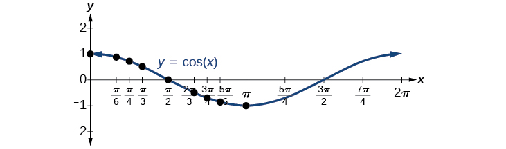{: #Figure_06_01_004}

Because we can evaluate the sine and cosine of any real number, both of these functions are defined for all real numbers. By thinking of the sine and cosine values as coordinates of points on a unit circle, it becomes clear that the range of both functions must be the interval<math xmlns="http://www.w3.org/1998/Math/MathML"> <mrow> <mtext> </mtext><mrow><mo>[</mo> <mrow> <mo>−</mo><mn>1</mn><mo>,</mo><mn>1</mn> </mrow> <mo>]</mo></mrow><mo>.</mo> </mrow> </math>

In both graphs, the shape of the graph repeats after<math xmlns="http://www.w3.org/1998/Math/MathML"> <mrow> <mtext> </mtext><mn>2</mn><mi>π</mi><mo>,</mo><mtext> </mtext> </mrow> </math>

which means the functions are periodic with a period of<math xmlns="http://www.w3.org/1998/Math/MathML"> <mrow> <mtext> </mtext><mn>2</mn><mi>π</mi><mo>.</mo><mtext> </mtext> </mrow> </math>

A **periodic function**{: data-type="term"} is a function for which a specific **horizontal shift**{: data-type="term" .no-emphasis}, *P*, results in a function equal to the original function:<math xmlns="http://www.w3.org/1998/Math/MathML"> <mrow> <mtext> </mtext><mi>f</mi><mrow><mo>(</mo> <mrow> <mi>x</mi><mo>+</mo><mi>P</mi> </mrow> <mo>)</mo></mrow><mo>=</mo><mi>f</mi><mrow><mo>(</mo> <mi>x</mi> <mo>)</mo></mrow><mtext> </mtext> </mrow> </math>

for all values of<math xmlns="http://www.w3.org/1998/Math/MathML"> <mrow> <mtext> </mtext><mi>x</mi><mtext> </mtext> </mrow> </math>

in the domain of<math xmlns="http://www.w3.org/1998/Math/MathML"> <mrow> <mtext> </mtext><mi>f</mi><mo>.</mo><mtext> </mtext> </mrow> </math>

When this occurs, we call the smallest such horizontal shift with<math xmlns="http://www.w3.org/1998/Math/MathML"> <mrow> <mtext> </mtext><mi>P</mi><mo>&gt;</mo><mn>0</mn><mtext> </mtext> </mrow> </math>

the **period**{: data-type="term" .no-emphasis} of the function. [\[link\]](#Figure_06_01_005) shows several periods of the sine and cosine functions.

 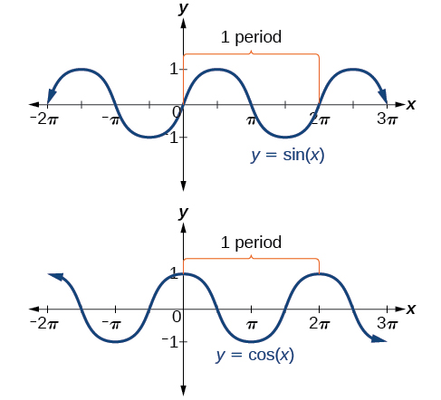{: #Figure_06_01_005}

Looking again at the sine and cosine functions on a domain centered at the *y*-axis helps reveal symmetries. As we can see in [\[link\]](#Figure_06_01_006), the **sine function**{: data-type="term" .no-emphasis} is symmetric about the origin. Recall from [The Other Trigonometric Functions](/m49387){: .target-chapter} that we determined from the unit circle that the sine function is an odd function because<math xmlns="http://www.w3.org/1998/Math/MathML"> <mrow> <mtext> </mtext><mi>sin</mi><mo stretchy="false">(</mo><mi>−</mi><mi>x</mi><mo stretchy="false">)</mo><mo>=</mo><mi>−</mi><mi>sin</mi><mtext> </mtext><mi>x</mi><mo>.</mo><mtext> </mtext> </mrow> </math>

 Now we can clearly see this property from the graph.

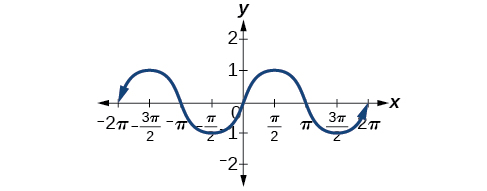{: #Figure_06_01_006}

[\[link\]](#Figure_06_01_007) shows that the cosine function is symmetric about the *y*-axis. Again, we determined that the cosine function is an even function. Now we can see from the graph that <math xmlns="http://www.w3.org/1998/Math/MathML"> <mrow> <mi>cos</mi><mo stretchy="false">(</mo><mi>−</mi><mi>x</mi><mo stretchy="false">)</mo><mo>=</mo><mi>cos</mi><mtext> </mtext><mi>x</mi><mo>.</mo> </mrow> </math>

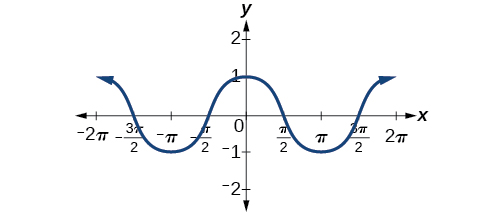{: #Figure_06_01_007}

Characteristics of Sine and Cosine Functions

The sine and cosine functions have several distinct characteristics:

* They are periodic functions with a period of
  <math xmlns="http://www.w3.org/1998/Math/MathML"> <mrow> <mtext> </mtext><mn>2</mn><mi>π</mi><mo>.</mo> </mrow> </math>

* The domain of each function is
  <math xmlns="http://www.w3.org/1998/Math/MathML"> <mrow> <mtext> </mtext><mrow><mo>(</mo> <mrow> <mo>−</mo><mi>∞</mi><mo>,</mo><mi>∞</mi> </mrow> <mo>)</mo></mrow><mtext> </mtext> </mrow> </math>
  
  and the range is
  <math xmlns="http://www.w3.org/1998/Math/MathML"> <mrow> <mtext> </mtext><mrow><mo>[</mo> <mrow> <mo>−</mo><mn>1</mn><mo>,</mo><mn>1</mn> </mrow> <mo>]</mo></mrow><mo>.</mo> </mrow> </math>

* The graph of
  <math xmlns="http://www.w3.org/1998/Math/MathML"> <mrow> <mtext> </mtext><mi>y</mi><mo>=</mo><mi>sin</mi><mtext> </mtext><mi>x</mi><mtext> </mtext> </mrow> </math>
  
  is symmetric about the origin, because it is an odd function.
* The graph of
  <math xmlns="http://www.w3.org/1998/Math/MathML"> <mrow> <mtext> </mtext><mi>y</mi><mo>=</mo><mi>cos</mi><mtext> </mtext><mi>x</mi><mtext> </mtext> </mrow> </math>
  
  is symmetric about the
  <math xmlns="http://www.w3.org/1998/Math/MathML"> <mrow> <mtext> </mtext><mi>y</mi><mtext>-</mtext> </mrow> </math>
  
  axis, because it is an even function.

### Investigating Sinusoidal Functions

As we can see, sine and cosine functions have a regular period and range. If we watch ocean waves or ripples on a pond, we will see that they resemble the sine or cosine functions. However, they are not necessarily identical. Some are taller or longer than others. A function that has the same general shape as a sine or **cosine function**{: data-type="term" .no-emphasis} is known as a **sinusoidal function**{: data-type="term"}. The general forms of sinusoidal functions are

<math xmlns="http://www.w3.org/1998/Math/MathML"> <mrow> <mtable columnalign="left"> <mtr columnalign="left"> <mtd columnalign="left"> <mrow> <mi>y</mi><mo>=</mo><mi>A</mi><mi>sin</mi><mrow><mo>(</mo> <mrow> <mi>B</mi><mi>x</mi><mo>−</mo><mi>C</mi> </mrow> <mo>)</mo></mrow><mo>+</mo><mi>D</mi> </mrow> </mtd> </mtr> <mtr columnalign="left"> <mtd columnalign="left"> <mrow> <mtext>              and</mtext> </mrow> </mtd> </mtr> <mtr columnalign="left"> <mtd columnalign="left"> <mrow> <mi>y</mi><mo>=</mo><mi>A</mi><mi>cos</mi><mrow><mo>(</mo> <mrow> <mi>B</mi><mi>x</mi><mo>−</mo><mi>C</mi> </mrow> <mo>)</mo></mrow><mo>+</mo><mi>D</mi> </mrow> </mtd> </mtr> </mtable> </mrow> </math>

#### Determining the Period of Sinusoidal Functions

Looking at the forms of sinusoidal functions, we can see that they are transformations of the sine and cosine functions. We can use what we know about transformations to determine the period.

In the general formula,<math xmlns="http://www.w3.org/1998/Math/MathML"> <mrow> <mtext> </mtext><mi>B</mi><mtext> </mtext> </mrow> </math>

is related to the period by<math xmlns="http://www.w3.org/1998/Math/MathML"> <mrow> <mtext> </mtext><mi>P</mi><mo>=</mo><mfrac> <mrow> <mn>2</mn><mi>π</mi> </mrow> <mrow> <mrow><mo>\|</mo> <mi>B</mi> <mo>\|</mo></mrow> </mrow> </mfrac> <mo>.</mo><mtext> </mtext> </mrow> </math>

If<math xmlns="http://www.w3.org/1998/Math/MathML"> <mrow> <mtext> </mtext><mrow><mo>\|</mo> <mi>B</mi> <mo>\|</mo></mrow><mo>&gt;</mo><mn>1</mn><mo>,</mo><mtext> </mtext> </mrow> </math>

then the period is less than<math xmlns="http://www.w3.org/1998/Math/MathML"> <mrow> <mtext> </mtext><mn>2</mn><mi>π</mi><mtext> </mtext> </mrow> </math>

and the function undergoes a horizontal compression, whereas if<math xmlns="http://www.w3.org/1998/Math/MathML"> <mrow> <mtext> </mtext><mrow><mo>\|</mo> <mi>B</mi> <mo>\|</mo></mrow><mo>&lt;</mo><mn>1</mn><mo>,</mo><mtext> </mtext> </mrow> </math>

then the period is greater than<math xmlns="http://www.w3.org/1998/Math/MathML"> <mrow> <mtext> </mtext><mn>2</mn><mi>π</mi><mtext> </mtext> </mrow> </math>

and the function undergoes a horizontal stretch. For example,<math xmlns="http://www.w3.org/1998/Math/MathML"> <mrow> <mtext> </mtext><mi>f</mi><mo stretchy="false">(</mo><mi>x</mi><mo stretchy="false">)</mo><mo>=</mo><mi>sin</mi><mrow><mo>(</mo> <mi>x</mi> <mo>),</mo></mrow><mtext> </mtext> </mrow> </math>

<math xmlns="http://www.w3.org/1998/Math/MathML"> <mrow> <mi>B</mi><mo>=</mo><mn>1,</mn><mtext> </mtext> </mrow> </math>

so the period is<math xmlns="http://www.w3.org/1998/Math/MathML"> <mrow> <mtext> </mtext><mn>2</mn><mi>π</mi><mi>,</mi><mtext /> </mrow> </math>

which we knew. If<math xmlns="http://www.w3.org/1998/Math/MathML"> <mrow> <mtext> </mtext><mi>f</mi><mo stretchy="false">(</mo><mi>x</mi><mo stretchy="false">)</mo><mo>=</mo><mi>sin</mi><mrow><mo>(</mo> <mrow> <mn>2</mn><mi>x</mi> </mrow> <mo>)</mo></mrow><mo>,</mo><mtext> </mtext> </mrow> </math>

then<math xmlns="http://www.w3.org/1998/Math/MathML"> <mrow> <mtext> </mtext><mi>B</mi><mo>=</mo><mn>2,</mn><mtext> </mtext> </mrow> </math>

so the period is<math xmlns="http://www.w3.org/1998/Math/MathML"> <mrow> <mtext> </mtext><mi>π</mi><mtext> </mtext> </mrow> </math>

and the graph is compressed. If<math xmlns="http://www.w3.org/1998/Math/MathML"> <mrow> <mtext> </mtext><mi>f</mi><mo stretchy="false">(</mo><mi>x</mi><mo stretchy="false">)</mo><mo>=</mo><mi>sin</mi><mrow><mo>(</mo> <mrow> <mfrac> <mi>x</mi> <mn>2</mn> </mfrac> </mrow> <mo>)</mo></mrow><mo>,</mo><mtext> </mtext> </mrow> </math>

then<math xmlns="http://www.w3.org/1998/Math/MathML"> <mrow> <mtext> </mtext><mi>B</mi><mo>=</mo><mfrac> <mn>1</mn> <mn>2</mn> </mfrac> <mo>,</mo><mtext> </mtext> </mrow> </math>

so the period is<math xmlns="http://www.w3.org/1998/Math/MathML"> <mrow> <mtext> </mtext><mn>4</mn><mi>π</mi><mtext> </mtext> </mrow> </math>

and the graph is stretched. Notice in [\[link\]](#Figure_06_01_008) how the period is indirectly related to<math xmlns="http://www.w3.org/1998/Math/MathML"> <mrow> <mtext> </mtext><mrow><mo>\|</mo> <mi>B</mi> <mo>\|</mo></mrow><mo>.</mo> </mrow> </math>

{: #Figure_06_01_008}

Period of Sinusoidal Functions

If we let<math xmlns="http://www.w3.org/1998/Math/MathML"> <mrow> <mtext> </mtext><mi>C</mi><mo>=</mo><mn>0</mn><mtext> </mtext> </mrow> </math>

and<math xmlns="http://www.w3.org/1998/Math/MathML"> <mrow> <mtext> </mtext><mi>D</mi><mo>=</mo><mn>0</mn><mtext> </mtext> </mrow> </math>

in the general form equations of the sine and cosine functions, we obtain the forms

<math xmlns="http://www.w3.org/1998/Math/MathML"> <mrow> <mi>y</mi><mo>=</mo><mi>A</mi><mi>sin</mi><mrow><mo>(</mo> <mrow> <mi>B</mi><mi>x</mi> </mrow> <mo>)</mo></mrow> </mrow> </math>

<math xmlns="http://www.w3.org/1998/Math/MathML"> <mrow> <mi>y</mi><mo>=</mo><mi>A</mi><mi>cos</mi><mrow><mo>(</mo> <mrow> <mi>B</mi><mi>x</mi> </mrow> <mo>)</mo></mrow> </mrow> </math>

The period is<math xmlns="http://www.w3.org/1998/Math/MathML"> <mrow> <mtext> </mtext><mfrac> <mrow> <mn>2</mn><mi>π</mi> </mrow> <mrow> <mrow><mo>\|</mo> <mi>B</mi> <mo>\|</mo></mrow> </mrow> </mfrac> <mo>.</mo> </mrow> </math>

Identifying the Period of a Sine or Cosine Function

Determine the period of the function<math xmlns="http://www.w3.org/1998/Math/MathML"> <mrow> <mtext> </mtext><mi>f</mi><mrow><mo>(</mo> <mi>x</mi> <mo>)</mo></mrow><mo>=</mo><mi>sin</mi><mrow><mo>(</mo> <mrow> <mfrac> <mi>π</mi> <mn>6</mn> </mfrac> <mi>x</mi> </mrow> <mo>)</mo></mrow><mo>.</mo> </mrow> </math>

Let’s begin by comparing the equation to the general form<math xmlns="http://www.w3.org/1998/Math/MathML"> <mrow> <mtext> </mtext><mi>y</mi><mo>=</mo><mi>A</mi><mi>sin</mi><mo stretchy="false">(</mo><mi>B</mi><mi>x</mi><mo stretchy="false">)</mo><mo>.</mo> </mrow> </math>

In the given equation,<math xmlns="http://www.w3.org/1998/Math/MathML"> <mrow> <mtext> </mtext><mi>B</mi><mo>=</mo><mfrac> <mi>π</mi> <mn>6</mn> </mfrac> <mo>,</mo><mtext> </mtext> </mrow> </math>

so the period will be

<math xmlns="http://www.w3.org/1998/Math/MathML" display="block"> <mrow> <mtable columnalign="left"> <mtr columnalign="left"> <mtd columnalign="left"> <mtable columnalign="left"> <mtr> <mtd> <mrow /> </mtd> </mtr> <mtr> <mtd> <mi>P</mi><mo>=</mo><mfrac> <mrow> <mn>2</mn><mi>π</mi> </mrow> <mrow> <mo>\|</mo><mi>B</mi><mo>\|</mo> </mrow> </mfrac> </mtd> </mtr> </mtable> </mtd> </mtr> <mtr columnalign="left"> <mtd columnalign="left"> <mrow> <mtext>  </mtext><mo>=</mo><mfrac> <mrow> <mn>2</mn><mi>π</mi> </mrow> <mrow> <mfrac> <mi>π</mi> <mn>6</mn> </mfrac> </mrow> </mfrac> </mrow> </mtd> </mtr> <mtr columnalign="left"> <mtd columnalign="left"> <mrow> <mtext>  </mtext><mo>=</mo><mn>2</mn><mi>π</mi><mo>⋅</mo><mfrac> <mn>6</mn> <mi>π</mi> </mfrac> </mrow> </mtd> </mtr> <mtr columnalign="left"> <mtd columnalign="left"> <mrow> <mtext>  </mtext><mo>=</mo><mn>12</mn> </mrow> </mtd> </mtr> </mtable> </mrow> </math>

Determine the period of the function<math xmlns="http://www.w3.org/1998/Math/MathML"> <mrow> <mtext> </mtext><mi>g</mi><mo stretchy="false">(</mo><mi>x</mi><mo stretchy="false">)</mo><mo>=</mo><mi>cos</mi><mrow><mo>(</mo> <mrow> <mfrac> <mi>x</mi> <mn>3</mn> </mfrac> </mrow> <mo>)</mo></mrow><mo>.</mo> </mrow> </math>

<math xmlns="http://www.w3.org/1998/Math/MathML"> <mrow> <mtext> </mtext><mn>6</mn><mi>π</mi><mtext> </mtext> </mrow> </math>

#### Determining Amplitude

Returning to the general formula for a sinusoidal function, we have analyzed how the variable<math xmlns="http://www.w3.org/1998/Math/MathML"> <mrow> <mtext> </mtext><mi>B</mi><mtext> </mtext> </mrow> </math>

relates to the period. Now let’s turn to the variable<math xmlns="http://www.w3.org/1998/Math/MathML"> <mrow> <mtext> </mtext><mi>A</mi><mtext> </mtext> </mrow> </math>

so we can analyze how it is related to the **amplitude**, or greatest distance from rest.<math xmlns="http://www.w3.org/1998/Math/MathML"> <mrow> <mtext> </mtext><mi>A</mi><mtext> </mtext> </mrow> </math>

represents the vertical stretch factor, and its absolute value<math xmlns="http://www.w3.org/1998/Math/MathML"> <mrow> <mtext> </mtext><mrow><mo>\|</mo> <mi>A</mi> <mo>\|</mo></mrow><mtext> </mtext> </mrow> </math>

is the amplitude. The local maxima will be a distance<math xmlns="http://www.w3.org/1998/Math/MathML"> <mrow> <mtext> </mtext><mrow><mo>\|</mo> <mi>A</mi> <mo>\|</mo></mrow><mtext> </mtext> </mrow> </math>

above the horizontal **midline** of the graph, which is the line<math xmlns="http://www.w3.org/1998/Math/MathML"> <mrow> <mtext> </mtext><mi>y</mi><mo>=</mo><mi>D</mi><mo>;</mo><mtext> </mtext> </mrow> </math>

because<math xmlns="http://www.w3.org/1998/Math/MathML"> <mrow> <mtext> </mtext><mi>D</mi><mo>=</mo><mn>0</mn><mtext> </mtext> </mrow> </math>

in this case, the midline is the *x*-axis. The local minima will be the same distance below the midline. If<math xmlns="http://www.w3.org/1998/Math/MathML"> <mrow> <mtext> </mtext><mrow><mo>\|</mo> <mi>A</mi> <mo>\|</mo></mrow><mo>&gt;</mo><mn>1</mn><mo>,</mo><mtext> </mtext> </mrow> </math>

the function is stretched. For example, the amplitude of<math xmlns="http://www.w3.org/1998/Math/MathML"> <mrow> <mtext> </mtext><mi>f</mi><mo stretchy="false">(</mo><mi>x</mi><mo stretchy="false">)</mo><mo>=</mo><mn>4</mn><mtext> </mtext><mi>sin</mi><mtext> </mtext><mi>x</mi><mtext> </mtext> </mrow> </math>

is twice the amplitude of<math xmlns="http://www.w3.org/1998/Math/MathML" display="block"> <mrow> <mtext> </mtext><mi>f</mi><mo stretchy="false">(</mo><mi>x</mi><mo stretchy="false">)</mo><mo>=</mo><mn>2</mn><mtext> </mtext><mi>sin</mi><mtext> </mtext><mi>x</mi><mo>.</mo><mtext> </mtext> </mrow> </math>

If<math xmlns="http://www.w3.org/1998/Math/MathML"> <mrow> <mtext> </mtext><mrow><mo>\|</mo> <mi>A</mi> <mo>\|</mo></mrow><mo>&lt;</mo><mn>1</mn><mo>,</mo><mtext> </mtext> </mrow> </math>

the function is compressed. [\[link\]](#Figure_06_01_009) compares several sine functions with different amplitudes.

{: #Figure_06_01_009}

Amplitude of Sinusoidal Functions

If we let<math xmlns="http://www.w3.org/1998/Math/MathML"> <mrow> <mtext> </mtext><mi>C</mi><mo>=</mo><mn>0</mn><mtext> </mtext> </mrow> </math>

and<math xmlns="http://www.w3.org/1998/Math/MathML"> <mrow> <mtext> </mtext><mi>D</mi><mo>=</mo><mn>0</mn><mtext> </mtext> </mrow> </math>

in the general form equations of the sine and cosine functions, we obtain the forms

<math xmlns="http://www.w3.org/1998/Math/MathML"> <mrow> <mi>y</mi><mo>=</mo><mi>A</mi><mi>sin</mi><mrow><mo>(</mo> <mrow> <mi>B</mi><mi>x</mi> </mrow> <mo>)</mo></mrow><mtext> and </mtext><mi>y</mi><mo>=</mo><mi>A</mi><mi>cos</mi><mrow><mo>(</mo> <mrow> <mi>B</mi><mi>x</mi> </mrow> <mo>)</mo></mrow> </mrow> </math>

The **amplitude**{: data-type="term"} is<math xmlns="http://www.w3.org/1998/Math/MathML"> <mrow> <mtext> </mtext><mi>A</mi><mo>,</mo><mtext> </mtext> </mrow> </math>

and the vertical height from the **midline**{: data-type="term"} is<math xmlns="http://www.w3.org/1998/Math/MathML"> <mrow> <mtext> </mtext><mrow><mo>\|</mo> <mi>A</mi> <mo>\|</mo></mrow><mo>.</mo><mtext> </mtext> </mrow> </math>

In addition, notice in the example that

<math xmlns="http://www.w3.org/1998/Math/MathML"> <mrow> <mrow><mo>\|</mo> <mi>A</mi> <mo>\|</mo></mrow><mtext> = amplitude = </mtext><mfrac> <mn>1</mn> <mn>2</mn> </mfrac> <mrow><mo>\|</mo> <mrow> <mtext>maximum </mtext><mo>−</mo><mtext> minimum</mtext> </mrow> <mo>\|</mo></mrow> </mrow> </math>

Identifying the Amplitude of a Sine or Cosine Function

What is the amplitude of the sinusoidal function<math xmlns="http://www.w3.org/1998/Math/MathML"> <mrow> <mtext> </mtext><mi>f</mi><mo stretchy="false">(</mo><mi>x</mi><mo stretchy="false">)</mo><mo>=</mo><mn>−4</mn><mi>sin</mi><mo stretchy="false">(</mo><mi>x</mi><mo stretchy="false">)</mo><mo>?</mo><mtext> </mtext> </mrow> </math>

Is the function stretched or compressed vertically?

Let’s begin by comparing the function to the simplified form<math xmlns="http://www.w3.org/1998/Math/MathML"> <mrow> <mtext> </mtext><mi>y</mi><mo>=</mo><mi>A</mi><mi>sin</mi><mo stretchy="false">(</mo><mi>B</mi><mi>x</mi><mo stretchy="false">)</mo><mo>.</mo> </mrow> </math>

In the given function,<math xmlns="http://www.w3.org/1998/Math/MathML"> <mrow> <mtext> </mtext><mi>A</mi><mo>=</mo><mn>−4</mn><mo>,</mo><mtext> </mtext> </mrow> </math>

so the amplitude is<math xmlns="http://www.w3.org/1998/Math/MathML"> <mrow> <mtext> </mtext><mrow><mo>\|</mo> <mi>A</mi> <mo>\|</mo></mrow><mo>=</mo><mrow><mo>\|</mo> <mrow> <mn>−4</mn> </mrow> <mo>\|</mo></mrow><mo>=</mo><mn>4.</mn><mtext> </mtext> </mrow> </math>

The function is stretched.

Analysis

The negative value of<math xmlns="http://www.w3.org/1998/Math/MathML"> <mrow> <mtext> </mtext><mi>A</mi><mtext> </mtext> </mrow> </math>

results in a reflection across the *x*-axis of the **sine function**{: data-type="term" .no-emphasis}, as shown in [[link]](#Figure_06_01_010).

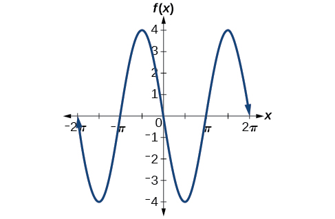{: #Figure_06_01_010}

What is the amplitude of the sinusoidal function<math xmlns="http://www.w3.org/1998/Math/MathML"> <mrow> <mtext> </mtext><mi>f</mi><mo stretchy="false">(</mo><mi>x</mi><mo stretchy="false">)</mo><mo>=</mo><mfrac> <mn>1</mn> <mn>2</mn> </mfrac> <mi>sin</mi><mo stretchy="false">(</mo><mi>x</mi><mo stretchy="false">)</mo><mo>?</mo><mtext> </mtext> </mrow> </math>

Is the function stretched or compressed vertically?

<math xmlns="http://www.w3.org/1998/Math/MathML"> <mrow> <mfrac> <mn>1</mn> <mn>2</mn> </mfrac> <mtext> </mtext> </mrow> </math>

compressed

### Analyzing Graphs of Variations of *y* = sin<em> x</em> and *y* = cos *x*

Now that we understand how<math xmlns="http://www.w3.org/1998/Math/MathML"> <mrow> <mtext> </mtext><mi>A</mi><mtext> </mtext> </mrow> </math>

and<math xmlns="http://www.w3.org/1998/Math/MathML"> <mrow> <mtext> </mtext><mi>B</mi><mtext> </mtext> </mrow> </math>

relate to the general form equation for the sine and cosine functions, we will explore the variables<math xmlns="http://www.w3.org/1998/Math/MathML"> <mrow> <mtext> </mtext><mi>C</mi><mtext> </mtext> </mrow> </math>

and<math xmlns="http://www.w3.org/1998/Math/MathML"> <mrow> <mtext> </mtext><mi>D</mi><mo>.</mo><mtext> </mtext> </mrow> </math>

Recall the general form:

<math xmlns="http://www.w3.org/1998/Math/MathML" display="block"> <mrow> <mtable> <mtr> <mtd> <mrow> <mi>y</mi><mo>=</mo><mi>A</mi><mi>sin</mi><mrow><mo>(</mo> <mrow> <mi>B</mi><mi>x</mi><mo>−</mo><mi>C</mi> </mrow> <mo>)</mo></mrow><mo>+</mo><mi>D</mi><mtext> and </mtext><mi>y</mi><mo>=</mo><mi>A</mi><mi>cos</mi><mrow><mo>(</mo> <mrow> <mi>B</mi><mi>x</mi><mo>−</mo><mi>C</mi> </mrow> <mo>)</mo></mrow><mo>+</mo><mi>D</mi> </mrow> </mtd> </mtr> <mtr> <mtd> <mrow> <mi>o</mi><mi>r</mi> </mrow> </mtd> </mtr> <mtr> <mtd> <mrow> <mi>y</mi><mo>=</mo><mi>A</mi><mi>sin</mi><mrow><mo>(</mo> <mrow> <mi>B</mi><mrow><mo>(</mo> <mrow> <mi>x</mi><mo>−</mo><mfrac> <mi>C</mi> <mi>B</mi> </mfrac> </mrow> <mo>)</mo></mrow> </mrow> <mo>)</mo></mrow><mo>+</mo><mi>D</mi><mtext> and </mtext><mi>y</mi><mo>=</mo><mi>A</mi><mi>cos</mi><mrow><mo>(</mo> <mrow> <mi>B</mi><mrow><mo>(</mo> <mrow> <mi>x</mi><mo>−</mo><mfrac> <mi>C</mi> <mi>B</mi> </mfrac> </mrow> <mo>)</mo></mrow> </mrow> <mo>)</mo></mrow><mo>+</mo><mi>D</mi> </mrow> </mtd> </mtr> </mtable> </mrow> </math>

The value<math xmlns="http://www.w3.org/1998/Math/MathML"> <mrow> <mtext> </mtext><mfrac> <mi>C</mi> <mi>B</mi> </mfrac> <mtext> </mtext> </mrow> </math>

for a sinusoidal function is called the **phase shift**, or the horizontal displacement of the basic sine or **cosine function**{: data-type="term" .no-emphasis}. If<math xmlns="http://www.w3.org/1998/Math/MathML"> <mrow> <mtext> </mtext><mi>C</mi><mo>&gt;</mo><mn>0</mn><mo>,</mo><mtext> </mtext> </mrow> </math>

the graph shifts to the right. If<math xmlns="http://www.w3.org/1998/Math/MathML"> <mrow> <mtext> </mtext><mi>C</mi><mo>&lt;</mo><mn>0</mn><mo>,</mo><mtext> </mtext> </mrow> </math>

the graph shifts to the left. The greater the value of<math xmlns="http://www.w3.org/1998/Math/MathML"> <mrow> <mtext> </mtext><mrow><mo>\|</mo> <mi>C</mi> <mo>\|</mo></mrow><mo>,</mo><mtext> </mtext> </mrow> </math>

the more the graph is shifted. [\[link\]](#Figure_06_01_011) shows that the graph of<math xmlns="http://www.w3.org/1998/Math/MathML"> <mrow> <mtext> </mtext><mi>f</mi><mo stretchy="false">(</mo><mi>x</mi><mo stretchy="false">)</mo><mo>=</mo><mi>sin</mi><mrow><mo>(</mo> <mrow> <mi>x</mi><mo>−</mo><mi>π</mi> </mrow> <mo>)</mo></mrow><mtext> </mtext> </mrow> </math>

shifts to the right by<math xmlns="http://www.w3.org/1998/Math/MathML"> <mrow> <mtext> </mtext><mi>π</mi><mtext> </mtext> </mrow> </math>

units, which is more than we see in the graph of<math xmlns="http://www.w3.org/1998/Math/MathML"> <mrow> <mtext> </mtext><mi>f</mi><mo stretchy="false">(</mo><mi>x</mi><mo stretchy="false">)</mo><mo>=</mo><mi>sin</mi><mrow><mo>(</mo> <mrow> <mi>x</mi><mo>−</mo><mfrac> <mi>π</mi> <mn>4</mn> </mfrac> </mrow> <mo>)</mo></mrow><mo>,</mo><mtext> </mtext> </mrow> </math>

which shifts to the right by<math xmlns="http://www.w3.org/1998/Math/MathML"> <mrow> <mtext> </mtext><mfrac> <mi>π</mi> <mn>4</mn> </mfrac> <mtext> </mtext> </mrow> </math>

units.

{: #Figure_06_01_011}

While<math xmlns="http://www.w3.org/1998/Math/MathML"> <mrow> <mtext> </mtext><mi>C</mi><mtext> </mtext> </mrow> </math>

relates to the horizontal shift,<math xmlns="http://www.w3.org/1998/Math/MathML"> <mrow> <mtext> </mtext><mi>D</mi><mtext> </mtext> </mrow> </math>

indicates the vertical shift from the midline in the general formula for a sinusoidal function. See [\[link\]](#Figure_06_01_012). The function<math xmlns="http://www.w3.org/1998/Math/MathML"> <mrow> <mtext> </mtext><mi>y</mi><mo>=</mo><mi>cos</mi><mrow><mo>(</mo> <mi>x</mi> <mo>)</mo></mrow><mo>+</mo><mi>D</mi><mtext> </mtext> </mrow> </math>

has its midline at<math xmlns="http://www.w3.org/1998/Math/MathML"> <mrow> <mtext> </mtext><mi>y</mi><mo>=</mo><mi>D</mi><mo>.</mo> </mrow> </math>

 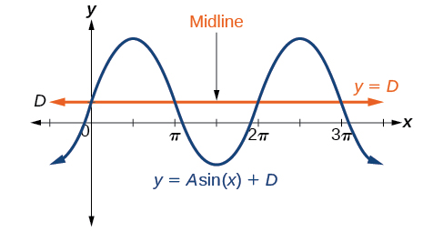{: #Figure_06_01_012}

Any value of<math xmlns="http://www.w3.org/1998/Math/MathML"> <mrow> <mtext> </mtext><mi>D</mi><mtext> </mtext> </mrow> </math>

other than zero shifts the graph up or down. [\[link\]](#Figure_06_01_013) compares<math xmlns="http://www.w3.org/1998/Math/MathML"> <mrow> <mtext> </mtext><mi>f</mi><mo stretchy="false">(</mo><mi>x</mi><mo stretchy="false">)</mo><mo>=</mo><mi>sin</mi><mtext> </mtext><mi>x</mi><mtext> </mtext> </mrow> </math>

with<math xmlns="http://www.w3.org/1998/Math/MathML"> <mrow> <mtext> </mtext><mi>f</mi><mo stretchy="false">(</mo><mi>x</mi><mo stretchy="false">)</mo><mo>=</mo><mi>sin</mi><mtext> </mtext><mi>x</mi><mo>+</mo><mn>2</mn><mo>,</mo><mtext> </mtext> </mrow> </math>

which is shifted 2 units up on a graph.

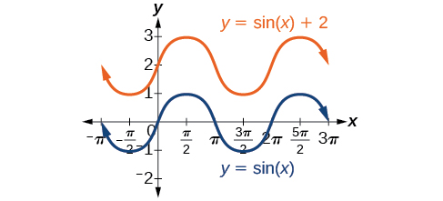{: #Figure_06_01_013}

Variations of Sine and Cosine Functions

Given an equation in the form<math xmlns="http://www.w3.org/1998/Math/MathML"> <mrow> <mtext> </mtext><mi>f</mi><mrow><mo>(</mo> <mi>x</mi> <mo>)</mo></mrow><mo>=</mo><mi>A</mi><mi>sin</mi><mrow><mo>(</mo> <mrow> <mi>B</mi><mi>x</mi><mo>−</mo><mi>C</mi> </mrow> <mo>)</mo></mrow><mo>+</mo><mi>D</mi><mtext> </mtext> </mrow> </math>

or<math xmlns="http://www.w3.org/1998/Math/MathML"> <mrow> <mtext> </mtext><mi>f</mi><mrow><mo>(</mo> <mi>x</mi> <mo>)</mo></mrow><mo>=</mo><mi>A</mi><mi>cos</mi><mrow><mo>(</mo> <mrow> <mi>B</mi><mi>x</mi><mo>−</mo><mi>C</mi> </mrow> <mo>)</mo></mrow><mo>+</mo><mi>D</mi><mo>,</mo><mtext> </mtext> </mrow> </math>

<math xmlns="http://www.w3.org/1998/Math/MathML"> <mrow> <mfrac> <mi>C</mi> <mi>B</mi> </mfrac> <mtext> </mtext> </mrow> </math>

is the **phase shift**{: data-type="term"} and<math xmlns="http://www.w3.org/1998/Math/MathML"> <mrow> <mtext> </mtext><mi>D</mi><mtext> </mtext> </mrow> </math>

is the **vertical shift**{: data-type="term" .no-emphasis}.

Identifying the Phase Shift of a Function

Determine the direction and magnitude of the phase shift for<math xmlns="http://www.w3.org/1998/Math/MathML"> <mrow> <mtext> </mtext><mi>f</mi><mo stretchy="false">(</mo><mi>x</mi><mo stretchy="false">)</mo><mo>=</mo><mi>sin</mi><mrow><mo>(</mo> <mrow> <mi>x</mi><mo>+</mo><mfrac> <mi>π</mi> <mn>6</mn> </mfrac> </mrow> <mo>)</mo></mrow><mo>−</mo><mn>2.</mn> </mrow> </math>

Let’s begin by comparing the equation to the general form<math xmlns="http://www.w3.org/1998/Math/MathML"> <mrow> <mtext> </mtext><mi>y</mi><mo>=</mo><mi>A</mi><mi>sin</mi><mo stretchy="false">(</mo><mi>B</mi><mi>x</mi><mo>−</mo><mi>C</mi><mo stretchy="false">)</mo><mo>+</mo><mi>D</mi><mo>.</mo> </mrow> </math>

In the given equation, notice that<math xmlns="http://www.w3.org/1998/Math/MathML"> <mrow> <mtext> </mtext><mi>B</mi><mo>=</mo><mn>1</mn><mtext> </mtext> </mrow> </math>

and<math xmlns="http://www.w3.org/1998/Math/MathML"> <mrow> <mtext> </mtext><mi>C</mi><mo>=</mo><mo>−</mo><mfrac> <mi>π</mi> <mn>6</mn> </mfrac> <mo>.</mo><mtext> </mtext> </mrow> </math>

So the phase shift is

<math xmlns="http://www.w3.org/1998/Math/MathML" display="block"> <mrow> <mtable columnalign="right"> <mtr columnalign="right"> <mtd columnalign="right"> <mrow /> </mtd> </mtr> <mtr columnalign="right"> <mtd columnalign="right"> <mrow> <mfrac> <mi>C</mi> <mi>B</mi> </mfrac> <mo>=</mo><mo>−</mo><mfrac> <mrow> <mfrac> <mi>π</mi> <mn>6</mn> </mfrac> </mrow> <mn>1</mn> </mfrac> </mrow> </mtd> </mtr> <mtr columnalign="right"> <mtd columnalign="right"> <mrow> <mtext>   </mtext><mo>=</mo><mo>−</mo><mfrac> <mi>π</mi> <mn>6</mn> </mfrac> </mrow> </mtd> </mtr> </mtable> </mrow> </math>

or<math xmlns="http://www.w3.org/1998/Math/MathML"> <mrow> <mtext> </mtext><mfrac> <mi>π</mi> <mn>6</mn> </mfrac> <mtext> </mtext> </mrow> </math>

units to the left.

Analysis

We must pay attention to the sign in the equation for the general form of a sinusoidal function. The equation shows a minus sign before<math xmlns="http://www.w3.org/1998/Math/MathML"> <mrow> <mtext> </mtext><mi>C</mi><mo>.</mo><mtext> </mtext> </mrow> </math>

Therefore<math xmlns="http://www.w3.org/1998/Math/MathML"> <mrow> <mtext> </mtext><mi>f</mi><mo stretchy="false">(</mo><mi>x</mi><mo stretchy="false">)</mo><mo>=</mo><mi>sin</mi><mrow><mo>(</mo> <mrow> <mi>x</mi><mo>+</mo><mfrac> <mi>π</mi> <mn>6</mn> </mfrac> </mrow> <mo>)</mo></mrow><mo>−</mo><mn>2</mn><mtext> </mtext> </mrow> </math>

can be rewritten as<math xmlns="http://www.w3.org/1998/Math/MathML"> <mrow> <mtext> </mtext><mi>f</mi><mo stretchy="false">(</mo><mi>x</mi><mo stretchy="false">)</mo><mo>=</mo><mi>sin</mi><mrow><mo>(</mo> <mrow> <mi>x</mi><mo>−</mo><mrow><mo>(</mo> <mrow> <mo>−</mo><mfrac> <mi>π</mi> <mn>6</mn> </mfrac> </mrow> <mo>)</mo></mrow> </mrow> <mo>)</mo></mrow><mo>−</mo><mn>2.</mn><mtext> </mtext> </mrow> </math>

If the value of<math xmlns="http://www.w3.org/1998/Math/MathML"> <mrow> <mtext> </mtext><mi>C</mi><mtext> </mtext> </mrow> </math>

is negative, the shift is to the left.

Determine the direction and magnitude of the phase shift for<math xmlns="http://www.w3.org/1998/Math/MathML"> <mrow> <mtext> </mtext><mi>f</mi><mo stretchy="false">(</mo><mi>x</mi><mo stretchy="false">)</mo><mo>=</mo><mn>3</mn><mi>cos</mi><mrow><mo>(</mo> <mrow> <mi>x</mi><mo>−</mo><mfrac> <mi>π</mi> <mn>2</mn> </mfrac> </mrow> <mo>)</mo></mrow><mo>.</mo> </mrow> </math>

<math xmlns="http://www.w3.org/1998/Math/MathML"> <mrow> <mfrac> <mi>π</mi> <mn>2</mn> </mfrac> <mo>;</mo><mtext> </mtext> </mrow> </math>

right

Identifying the Vertical Shift of a Function

Determine the direction and magnitude of the vertical shift for<math xmlns="http://www.w3.org/1998/Math/MathML"> <mrow> <mtext> </mtext><mi>f</mi><mo stretchy="false">(</mo><mi>x</mi><mo stretchy="false">)</mo><mo>=</mo><mi>cos</mi><mrow><mo>(</mo> <mi>x</mi> <mo>)</mo></mrow><mo>−</mo><mn>3.</mn> </mrow> </math>

Let’s begin by comparing the equation to the general form<math xmlns="http://www.w3.org/1998/Math/MathML"> <mrow> <mtext> </mtext><mi>y</mi><mo>=</mo><mi>A</mi><mi>cos</mi><mo stretchy="false">(</mo><mi>B</mi><mi>x</mi><mo>−</mo><mi>C</mi><mo stretchy="false">)</mo><mo>+</mo><mi>D</mi><mo>.</mo> </mrow> </math>

In the given equation,<math xmlns="http://www.w3.org/1998/Math/MathML"> <mrow> <mtext> </mtext><mi>D</mi><mo>=</mo><mn>−3</mn><mtext> </mtext> </mrow> </math>

so the shift is 3 units downward.

Determine the direction and magnitude of the vertical shift for<math xmlns="http://www.w3.org/1998/Math/MathML"> <mrow> <mtext> </mtext><mi>f</mi><mo stretchy="false">(</mo><mi>x</mi><mo stretchy="false">)</mo><mo>=</mo><mn>3</mn><mi>sin</mi><mrow><mo>(</mo> <mi>x</mi> <mo>)</mo></mrow><mo>+</mo><mn>2.</mn> </mrow> </math>

2 units up

**Given a sinusoidal function in the form**<math xmlns="http://www.w3.org/1998/Math/MathML"> <mrow> <mtext> </mtext><mi>f</mi><mrow><mo>(</mo> <mi>x</mi> <mo>)</mo></mrow><mo>=</mo><mi>A</mi><mi>sin</mi><mrow><mo>(</mo> <mrow> <mi>B</mi><mi>x</mi><mo>−</mo><mi>C</mi> </mrow> <mo>)</mo></mrow><mo>+</mo><mi>D</mi><mo>,</mo><mtext> </mtext> </mrow> </math>

**identify the midline, amplitude, period, and phase shift.**

1.  Determine the amplitude as
    <math xmlns="http://www.w3.org/1998/Math/MathML"> <mrow> <mtext> </mtext><mrow><mo>\|</mo> <mi>A</mi> <mo>\|</mo></mrow><mo>.</mo> </mrow> </math>

2.  Determine the period as
    <math xmlns="http://www.w3.org/1998/Math/MathML"> <mrow> <mtext> </mtext><mi>P</mi><mo>=</mo><mfrac> <mrow> <mn>2</mn><mi>π</mi> </mrow> <mrow> <mrow><mo>\|</mo> <mi>B</mi> <mo>\|</mo></mrow> </mrow> </mfrac> <mo>.</mo> </mrow> </math>

3.  Determine the phase shift as
    <math xmlns="http://www.w3.org/1998/Math/MathML"> <mrow> <mtext> </mtext><mfrac> <mi>C</mi> <mi>B</mi> </mfrac> <mo>.</mo> </mrow> </math>

4.  Determine the midline as
    <math xmlns="http://www.w3.org/1998/Math/MathML"> <mrow> <mtext> </mtext><mi>y</mi><mo>=</mo><mi>D</mi><mo>.</mo> </mrow> </math>
{: type="1"}

Identifying the Variations of a Sinusoidal Function from an Equation

Determine the midline, amplitude, period, and phase shift of the function<math xmlns="http://www.w3.org/1998/Math/MathML"> <mrow> <mtext> </mtext><mi>y</mi><mo>=</mo><mn>3</mn><mi>sin</mi><mo stretchy="false">(</mo><mn>2</mn><mi>x</mi><mo stretchy="false">)</mo><mo>+</mo><mn>1.</mn> </mrow> </math>

Let’s begin by comparing the equation to the general form<math xmlns="http://www.w3.org/1998/Math/MathML"> <mrow> <mtext> </mtext><mi>y</mi><mo>=</mo><mi>A</mi><mi>sin</mi><mo stretchy="false">(</mo><mi>B</mi><mi>x</mi><mo>−</mo><mi>C</mi><mo stretchy="false">)</mo><mo>+</mo><mi>D</mi><mo>.</mo> </mrow> </math>

<math xmlns="http://www.w3.org/1998/Math/MathML"> <mrow> <mi>A</mi><mo>=</mo><mn>3</mn><mo>,</mo><mtext> </mtext> </mrow> </math>

so the amplitude is<math xmlns="http://www.w3.org/1998/Math/MathML"> <mrow> <mtext> </mtext><mrow><mo>\|</mo> <mi>A</mi> <mo>\|</mo></mrow><mo>=</mo><mn>3.</mn> </mrow> </math>

Next,<math xmlns="http://www.w3.org/1998/Math/MathML"> <mrow> <mtext> </mtext><mi>B</mi><mo>=</mo><mn>2</mn><mo>,</mo><mtext> </mtext> </mrow> </math>

so the period is<math xmlns="http://www.w3.org/1998/Math/MathML"> <mrow> <mtext> </mtext><mi>P</mi><mo>=</mo><mfrac> <mrow> <mn>2</mn><mi>π</mi> </mrow> <mrow> <mrow><mo>\|</mo> <mi>B</mi> <mo>\|</mo></mrow> </mrow> </mfrac> <mo>=</mo><mfrac> <mrow> <mn>2</mn><mi>π</mi> </mrow> <mn>2</mn> </mfrac> <mo>=</mo><mi>π</mi><mo>.</mo> </mrow> </math>

There is no added constant inside the parentheses, so<math xmlns="http://www.w3.org/1998/Math/MathML"> <mrow> <mtext> </mtext><mi>C</mi><mo>=</mo><mn>0</mn><mtext> </mtext> </mrow> </math>

and the phase shift is<math xmlns="http://www.w3.org/1998/Math/MathML"> <mrow> <mtext> </mtext><mfrac> <mi>C</mi> <mi>B</mi> </mfrac> <mo>=</mo><mfrac> <mn>0</mn> <mn>2</mn> </mfrac> <mo>=</mo><mn>0.</mn> </mrow> </math>

Finally,<math xmlns="http://www.w3.org/1998/Math/MathML"> <mrow> <mtext> </mtext><mi>D</mi><mo>=</mo><mn>1</mn><mo>,</mo><mtext> </mtext> </mrow> </math>

so the midline is<math xmlns="http://www.w3.org/1998/Math/MathML"> <mrow> <mtext> </mtext><mi>y</mi><mo>=</mo><mn>1.</mn> </mrow> </math>

Analysis

Inspecting the graph, we can determine that the period is<math xmlns="http://www.w3.org/1998/Math/MathML"> <mrow> <mtext> </mtext><mi>π</mi><mo>,</mo><mtext> </mtext> </mrow> </math>

the midline is<math xmlns="http://www.w3.org/1998/Math/MathML"> <mrow> <mtext> </mtext><mi>y</mi><mo>=</mo><mn>1</mn><mo>,</mo><mtext> </mtext> </mrow> </math>

and the amplitude is 3. See [[link]](#Figure_06_01_014).

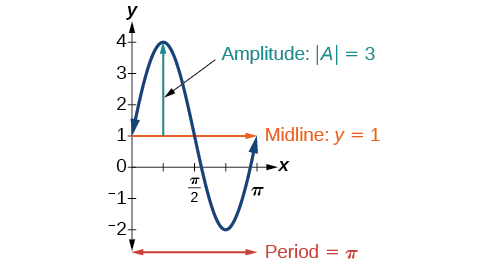{: #Figure_06_01_014}

Determine the midline, amplitude, period, and phase shift of the function<math xmlns="http://www.w3.org/1998/Math/MathML"> <mrow> <mtext> </mtext><mi>y</mi><mo>=</mo><mfrac> <mn>1</mn> <mn>2</mn> </mfrac> <mi>cos</mi><mrow><mo>(</mo> <mrow> <mfrac> <mi>x</mi> <mn>3</mn> </mfrac> <mo>−</mo><mfrac> <mi>π</mi> <mn>3</mn> </mfrac> </mrow> <mo>)</mo></mrow><mo>.</mo> </mrow> </math>

midline:<math xmlns="http://www.w3.org/1998/Math/MathML"> <mrow> <mtext> </mtext><mi>y</mi><mo>=</mo><mn>0</mn><mo>;</mo><mtext> </mtext> </mrow> </math>

amplitude:<math xmlns="http://www.w3.org/1998/Math/MathML"> <mrow> <mtext> </mtext><mrow><mo>\|</mo> <mi>A</mi> <mo>\|</mo></mrow><mo>=</mo><mfrac> <mn>1</mn> <mn>2</mn> </mfrac> <mo>;</mo><mtext> </mtext> </mrow> </math>

period:<math xmlns="http://www.w3.org/1998/Math/MathML"> <mrow> <mtext> </mtext><mi>P</mi><mo>=</mo><mfrac> <mrow> <mn>2</mn><mi>π</mi> </mrow> <mrow> <mrow><mo>\|</mo> <mi>B</mi> <mo>\|</mo></mrow> </mrow> </mfrac> <mo>=</mo><mn>6</mn><mi>π</mi><mo>;</mo><mtext> </mtext> </mrow> </math>

phase shift:<math xmlns="http://www.w3.org/1998/Math/MathML"> <mrow> <mtext> </mtext><mfrac> <mi>C</mi> <mi>B</mi> </mfrac> <mo>=</mo><mi>π</mi> </mrow> </math>

Identifying the Equation for a Sinusoidal Function from a Graph

Determine the formula for the cosine function in [[link]](#Figure_06_01_015).

![A graph of -0.5cos(x)+0.5. The graph has an amplitude of 0.5. The graph has a period of 2pi. The graph has a range of \[0, 1\]. The graph is also reflected about the x-axis from the parent function cos(x).](../resources/CNX_Precalc_Figure_06_01_015.jpg){: #Figure_06_01_015}

To determine the equation, we need to identify each value in the general form of a sinusoidal function.

<math xmlns="http://www.w3.org/1998/Math/MathML"> <mrow> <mtable columnalign="left"> <mtr columnalign="left"> <mtd columnalign="left"> <mrow> <mi>y</mi><mo>=</mo><mi>A</mi><mi>sin</mi><mo stretchy="false">(</mo><mi>B</mi><mi>x</mi><mo>−</mo><mi>C</mi><mo stretchy="false">)</mo><mo>+</mo><mi>D</mi> </mrow> </mtd> </mtr> <mtr columnalign="left"> <mtd columnalign="left"> <mrow> <mi>y</mi><mo>=</mo><mi>A</mi><mi>cos</mi><mo stretchy="false">(</mo><mi>B</mi><mi>x</mi><mo>−</mo><mi>C</mi><mo stretchy="false">)</mo><mo>+</mo><mi>D</mi> </mrow> </mtd> </mtr> </mtable> </mrow> </math>

The graph could represent either a sine or a **cosine function**{: data-type="term" .no-emphasis} that is shifted and/or reflected. When<math xmlns="http://www.w3.org/1998/Math/MathML"> <mrow> <mtext> </mtext><mi>x</mi><mo>=</mo><mn>0</mn><mo>,</mo><mtext> </mtext> </mrow> </math>

the graph has an extreme point,<math xmlns="http://www.w3.org/1998/Math/MathML"> <mrow> <mtext> </mtext><mrow><mo>(</mo> <mrow> <mn>0</mn><mo>,</mo><mn>0</mn> </mrow> <mo>)</mo></mrow><mo>.</mo><mtext> </mtext> </mrow> </math>

Since the cosine function has an extreme point for<math xmlns="http://www.w3.org/1998/Math/MathML"> <mrow> <mtext> </mtext><mi>x</mi><mo>=</mo><mn>0</mn><mo>,</mo><mtext> </mtext> </mrow> </math>

let us write our equation in terms of a cosine function.

Let’s start with the midline. We can see that the graph rises and falls an equal distance above and below<math xmlns="http://www.w3.org/1998/Math/MathML"> <mrow> <mtext> </mtext><mi>y</mi><mo>=</mo><mn>0.5.</mn><mtext> </mtext> </mrow> </math>

This value, which is the midline, is<math xmlns="http://www.w3.org/1998/Math/MathML"> <mrow> <mtext> </mtext><mi>D</mi><mtext> </mtext> </mrow> </math>

in the equation, so<math xmlns="http://www.w3.org/1998/Math/MathML"> <mrow> <mtext> </mtext><mi>D</mi><mo>=</mo><mn>0.5.</mn> </mrow> </math>

The greatest distance above and below the midline is the amplitude. The maxima are 0.5 units above the midline and the minima are 0.5 units below the midline. So<math xmlns="http://www.w3.org/1998/Math/MathML"> <mrow> <mtext> </mtext><mrow><mo>\|</mo> <mi>A</mi> <mo>\|</mo></mrow><mo>=</mo><mn>0.5.</mn><mtext> </mtext> </mrow> </math>

Another way we could have determined the amplitude is by recognizing that the difference between the height of local maxima and minima is 1, so<math xmlns="http://www.w3.org/1998/Math/MathML"> <mrow> <mtext> </mtext><mrow><mo>\|</mo> <mi>A</mi> <mo>\|</mo></mrow><mo>=</mo><mfrac> <mn>1</mn> <mn>2</mn> </mfrac> <mo>=</mo><mn>0.5.</mn><mtext> </mtext> </mrow> </math>

Also, the graph is reflected about the *x*-axis so that<math xmlns="http://www.w3.org/1998/Math/MathML"> <mrow> <mtext> </mtext><mi>A</mi><mo>=</mo><mo>−</mo><mn>0.5.</mn> </mrow> </math>

The graph is not horizontally stretched or compressed, so<math xmlns="http://www.w3.org/1998/Math/MathML"> <mrow> <mtext> </mtext><mi>B</mi><mo>=</mo><mn>1;</mn><mtext> </mtext> </mrow> </math>

and the graph is not shifted horizontally, so<math xmlns="http://www.w3.org/1998/Math/MathML"> <mrow> <mtext> </mtext><mi>C</mi><mo>=</mo><mn>0.</mn> </mrow> </math>

Putting this all together,

<math xmlns="http://www.w3.org/1998/Math/MathML"> <mrow> <mi>g</mi><mrow><mo>(</mo> <mi>x</mi> <mo>)</mo></mrow><mo>=</mo><mo>−</mo><mn>0.5</mn><mi>cos</mi><mrow><mo>(</mo> <mi>x</mi> <mo>)</mo></mrow><mo>+</mo><mn>0.5</mn> </mrow> </math>

Determine the formula for the sine function in [[link]](#Figure_06_01_016).

![A graph of sin(x)+2. Period of 2pi, amplitude of 1, and range of \[1, 3\].](../resources/CNX_Precalc_Figure_06_01_016.jpg){: #Figure_06_01_016}

<math xmlns="http://www.w3.org/1998/Math/MathML"> <mrow> <mi>f</mi><mrow><mo>(</mo> <mi>x</mi> <mo>)</mo></mrow><mo>=</mo><mi>sin</mi><mo stretchy="false">(</mo><mi>x</mi><mo stretchy="false">)</mo><mo>+</mo><mn>2</mn> </mrow> </math>

Identifying the Equation for a Sinusoidal Function from a Graph

Determine the equation for the sinusoidal function in [[link]](#Figure_06_01_017).

![A graph of 3cos(pi/3x-pi/3)-2. Graph has amplitude of 3, period of 6, range of \[-5,1\].](../resources/CNX_Precalc_Figure_06_01_017.jpg){: #Figure_06_01_017}

With the highest value at 1 and the lowest value at<math xmlns="http://www.w3.org/1998/Math/MathML"> <mrow> <mtext> </mtext><mn>−5</mn><mo>,</mo><mtext> </mtext> </mrow> </math>

the midline will be halfway between at<math xmlns="http://www.w3.org/1998/Math/MathML"> <mrow> <mtext> </mtext><mn>−2.</mn><mtext> </mtext> </mrow> </math>

So<math xmlns="http://www.w3.org/1998/Math/MathML"> <mrow> <mtext> </mtext><mi>D</mi><mo>=</mo><mn>−2.</mn><mtext> </mtext> </mrow> </math>

The distance from the midline to the highest or lowest value gives an amplitude of<math xmlns="http://www.w3.org/1998/Math/MathML"> <mrow> <mtext> </mtext><mrow><mo>\|</mo> <mi>A</mi> <mo>\|</mo></mrow><mo>=</mo><mn>3.</mn> </mrow> </math>

The period of the graph is 6, which can be measured from the peak at<math xmlns="http://www.w3.org/1998/Math/MathML"> <mrow> <mtext> </mtext><mi>x</mi><mo>=</mo><mn>1</mn><mtext> </mtext> </mrow> </math>

to the next peak at<math xmlns="http://www.w3.org/1998/Math/MathML"> <mrow> <mtext> </mtext><mi>x</mi><mo>=</mo><mn>7</mn><mo>,</mo> </mrow> </math>

or from the distance between the lowest points. Therefore,<math xmlns="http://www.w3.org/1998/Math/MathML"> <mrow> <mi>P</mi><mo>=</mo><mfrac> <mrow> <mn>2</mn><mi>π</mi> </mrow> <mrow> <mrow><mo>\|</mo> <mi>B</mi> <mo>\|</mo></mrow> </mrow> </mfrac> <mo>=</mo><mn>6.</mn><mtext> </mtext> </mrow> </math>

Using the positive value for<math xmlns="http://www.w3.org/1998/Math/MathML"> <mrow> <mtext> </mtext><mi>B</mi><mo>,</mo> </mrow> </math>

we find that

<math xmlns="http://www.w3.org/1998/Math/MathML"> <mrow> <mi>B</mi><mo>=</mo><mfrac> <mrow> <mn>2</mn><mi>π</mi> </mrow> <mi>P</mi> </mfrac> <mo>=</mo><mfrac> <mrow> <mn>2</mn><mi>π</mi> </mrow> <mn>6</mn> </mfrac> <mo>=</mo><mfrac> <mi>π</mi> <mn>3</mn> </mfrac> </mrow> </math>

So far, our equation is either<math xmlns="http://www.w3.org/1998/Math/MathML"> <mrow> <mtext> </mtext><mi>y</mi><mo>=</mo><mn>3</mn><mi>sin</mi><mrow><mo>(</mo> <mrow> <mfrac> <mi>π</mi> <mn>3</mn> </mfrac> <mi>x</mi><mo>−</mo><mi>C</mi> </mrow> <mo>)</mo></mrow><mo>−</mo><mn>2</mn><mtext> </mtext> </mrow> </math>

or<math xmlns="http://www.w3.org/1998/Math/MathML"> <mrow> <mtext> </mtext><mi>y</mi><mo>=</mo><mn>3</mn><mi>cos</mi><mrow><mo>(</mo> <mrow> <mfrac> <mi>π</mi> <mn>3</mn> </mfrac> <mi>x</mi><mo>−</mo><mi>C</mi> </mrow> <mo>)</mo></mrow><mo>−</mo><mn>2.</mn><mtext> </mtext> </mrow> </math>

For the shape and shift, we have more than one option. We could write this as any one of the following:

* a cosine shifted to the right
* a negative cosine shifted to the left
* a sine shifted to the left
* a negative sine shifted to the right

While any of these would be correct, the cosine shifts are easier to work with than the sine shifts in this case because they involve integer values. So our function becomes

<math xmlns="http://www.w3.org/1998/Math/MathML"> <mrow> <mi>y</mi><mo>=</mo><mn>3</mn><mi>cos</mi><mrow><mo>(</mo> <mrow> <mfrac> <mi>π</mi> <mn>3</mn> </mfrac> <mi>x</mi><mo>−</mo><mfrac> <mi>π</mi> <mn>3</mn> </mfrac> </mrow> <mo>)</mo></mrow><mo>−</mo><mn>2</mn><mtext> or </mtext><mi>y</mi><mo>=</mo><mo>−</mo><mn>3</mn><mi>cos</mi><mrow><mo>(</mo> <mrow> <mfrac> <mi>π</mi> <mn>3</mn> </mfrac> <mi>x</mi><mo>+</mo><mfrac> <mrow> <mn>2</mn><mi>π</mi> </mrow> <mn>3</mn> </mfrac> </mrow> <mo>)</mo></mrow><mo>−</mo><mn>2</mn> </mrow> </math>

Again, these functions are equivalent, so both yield the same graph.

Write a formula for the function graphed in [[link]](#Figure_06_01_018).

![A graph of 4sin((pi/5)x-pi/5)+4. Graph has period of 10, amplitude of 4, range of \[0,8\].](../resources/CNX_Precalc_Figure_06_01_018n.jpg){: #Figure_06_01_018}

two possibilities:<math xmlns="http://www.w3.org/1998/Math/MathML"> <mrow> <mtext> </mtext><mi>y</mi><mo>=</mo><mn>4</mn><mi>sin</mi><mrow><mo>(</mo> <mrow> <mfrac> <mi>π</mi> <mn>5</mn> </mfrac> <mi>x</mi><mo>−</mo><mfrac> <mi>π</mi> <mn>5</mn> </mfrac> </mrow> <mo>)</mo></mrow><mo>+</mo><mn>4</mn><mtext> </mtext> </mrow> </math>

or<math xmlns="http://www.w3.org/1998/Math/MathML"> <mrow> <mtext> </mtext><mi>y</mi><mo>=</mo><mo>−</mo><mn>4</mn><mi>sin</mi><mrow><mo>(</mo> <mrow> <mfrac> <mi>π</mi> <mn>5</mn> </mfrac> <mi>x</mi><mo>+</mo><mfrac> <mrow> <mn>4</mn><mi>π</mi> </mrow> <mn>5</mn> </mfrac> </mrow> <mo>)</mo></mrow><mo>+</mo><mn>4</mn> </mrow> </math>

### Graphing Variations of *y* = sin *x* and *y* = cos *x*

Throughout this section, we have learned about types of variations of sine and cosine functions and used that information to write equations from graphs. Now we can use the same information to create graphs from equations.

Instead of focusing on the general form equations

<math xmlns="http://www.w3.org/1998/Math/MathML"> <mrow> <mi>y</mi><mo>=</mo><mi>A</mi><mi>sin</mi><mrow><mo>(</mo> <mrow> <mi>B</mi><mi>x</mi><mo>−</mo><mi>C</mi> </mrow> <mo>)</mo></mrow><mo>+</mo><mi>D</mi><mtext> and </mtext><mi>y</mi><mo>=</mo><mi>A</mi><mi>cos</mi><mrow><mo>(</mo> <mrow> <mi>B</mi><mi>x</mi><mo>−</mo><mi>C</mi> </mrow> <mo>)</mo></mrow><mo>+</mo><mi>D</mi><mo>,</mo> </mrow> </math>

we will let<math xmlns="http://www.w3.org/1998/Math/MathML"> <mrow> <mtext> </mtext><mi>C</mi><mo>=</mo><mn>0</mn><mtext> </mtext> </mrow> </math>

and<math xmlns="http://www.w3.org/1998/Math/MathML"> <mrow> <mtext> </mtext><mi>D</mi><mo>=</mo><mn>0</mn><mtext> </mtext> </mrow> </math>

and work with a simplified form of the equations in the following examples.

**Given the function<math xmlns="http://www.w3.org/1998/Math/MathML"> <mrow> <mtext> </mtext><mi>y</mi><mo>=</mo><mi>A</mi><mi>sin</mi><mrow><mo>(</mo> <mrow> <mi>B</mi><mi>x</mi> </mrow> <mo>)</mo></mrow><mo>,</mo><mtext> </mtext> </mrow> </math>

sketch its graph.**

1.  Identify the amplitude,
    <math xmlns="http://www.w3.org/1998/Math/MathML"> <mrow> <mtext> </mtext><mrow><mo>\|</mo> <mi>A</mi> <mo>\|</mo></mrow><mo>.</mo> </mrow> </math>

2.  Identify the period,
    <math xmlns="http://www.w3.org/1998/Math/MathML"> <mrow> <mtext> </mtext><mi>P</mi><mo>=</mo><mfrac> <mrow> <mn>2</mn><mi>π</mi> </mrow> <mrow> <mrow><mo>\|</mo> <mi>B</mi> <mo>\|</mo></mrow> </mrow> </mfrac> <mo>.</mo> </mrow> </math>

3.  Start at the origin, with the function increasing to the right if
    <math xmlns="http://www.w3.org/1998/Math/MathML"> <mrow> <mtext> </mtext><mi>A</mi><mtext> </mtext> </mrow> </math>
    
    is positive or decreasing if
    <math xmlns="http://www.w3.org/1998/Math/MathML"> <mrow> <mtext> </mtext><mi>A</mi><mtext> </mtext> </mrow> </math>
    
    is negative.
4.  At
    <math xmlns="http://www.w3.org/1998/Math/MathML"> <mrow> <mtext> </mtext><mi>x</mi><mo>=</mo><mfrac> <mi>π</mi> <mrow> <mn>2</mn><mrow><mo>\|</mo> <mi>B</mi> <mo>\|</mo></mrow> </mrow> </mfrac> <mtext> </mtext> </mrow> </math>
    
    there is a local maximum for
    <math xmlns="http://www.w3.org/1998/Math/MathML"> <mrow> <mtext> </mtext><mi>A</mi><mo>&gt;</mo><mn>0</mn><mtext> </mtext> </mrow> </math>
    
    or a minimum for
    <math xmlns="http://www.w3.org/1998/Math/MathML"> <mrow> <mtext> </mtext><mi>A</mi><mo>&lt;</mo><mn>0</mn><mo>,</mo><mtext> </mtext> </mrow> </math>
    
    with
    <math xmlns="http://www.w3.org/1998/Math/MathML"> <mrow> <mtext> </mtext><mi>y</mi><mo>=</mo><mi>A</mi><mo>.</mo> </mrow> </math>

5.  The curve returns to the *x*-axis at
    <math xmlns="http://www.w3.org/1998/Math/MathML"> <mrow> <mtext> </mtext><mi>x</mi><mo>=</mo><mfrac> <mi>π</mi> <mrow> <mrow><mo>\|</mo> <mi>B</mi> <mo>\|</mo></mrow> </mrow> </mfrac> <mo>.</mo> </mrow> </math>

6.  There is a local minimum for
    <math xmlns="http://www.w3.org/1998/Math/MathML"> <mrow> <mtext> </mtext><mi>A</mi><mo>&gt;</mo><mn>0</mn><mtext> </mtext> </mrow> </math>
    
    (maximum for
    <math xmlns="http://www.w3.org/1998/Math/MathML"> <mrow> <mtext> </mtext><mi>A</mi><mo>&lt;</mo><mn>0</mn> </mrow> </math>
    
    ) at
    <math xmlns="http://www.w3.org/1998/Math/MathML"> <mrow> <mtext> </mtext><mi>x</mi><mo>=</mo><mfrac> <mrow> <mn>3</mn><mi>π</mi> </mrow> <mrow> <mn>2</mn><mrow><mo>\|</mo> <mi>B</mi> <mo>\|</mo></mrow> </mrow> </mfrac> <mtext> </mtext> </mrow> </math>
    
    with
    <math xmlns="http://www.w3.org/1998/Math/MathML"> <mrow> <mtext> </mtext><mi>y</mi><mo>=</mo><mo>–</mo><mi>A</mi><mo>.</mo> </mrow> </math>

7.  The curve returns again to the *x*-axis at
    <math xmlns="http://www.w3.org/1998/Math/MathML"> <mrow> <mtext> </mtext><mi>x</mi><mo>=</mo><mfrac> <mrow><mn>2</mn><mi>π</mi></mrow> <mrow> <mrow><mo>\|</mo> <mi>B</mi> <mo>\|</mo></mrow> </mrow> </mfrac> <mo>.</mo> </mrow> </math>
{: type="1"}

<!--CONTINUE HERE-->

Graphing a Function and Identifying the Amplitude and Period

Sketch a graph of<math xmlns="http://www.w3.org/1998/Math/MathML"> <mrow> <mtext> </mtext><mi>f</mi><mrow><mo>(</mo> <mi>x</mi> <mo>)</mo></mrow><mo>=</mo><mo>−</mo><mn>2</mn><mi>sin</mi><mrow><mo>(</mo> <mrow> <mfrac> <mrow> <mi>π</mi><mi>x</mi> </mrow> <mn>2</mn> </mfrac> </mrow> <mo>)</mo></mrow><mo>.</mo> </mrow> </math>

Let’s begin by comparing the equation to the form<math xmlns="http://www.w3.org/1998/Math/MathML"> <mrow> <mtext> </mtext><mi>y</mi><mo>=</mo><mi>A</mi><mi>sin</mi><mo stretchy="false">(</mo><mi>B</mi><mi>x</mi><mo stretchy="false">)</mo><mo>.</mo> </mrow> </math>

* *Step 1.* We can see from the equation that
  <math xmlns="http://www.w3.org/1998/Math/MathML"> <mrow> <mtext> </mtext><mi>A</mi><mo>=</mo><mo>−</mo><mn>2</mn><mi>,</mi> </mrow> </math>
  
  so the amplitude is 2.
  

  <math xmlns="http://www.w3.org/1998/Math/MathML"> <mrow> <mrow><mo>\|</mo> <mi>A</mi> <mo>\|</mo></mrow><mo>=</mo><mn>2</mn> </mrow> </math>
  

* *Step 2.* The equation shows that
  <math xmlns="http://www.w3.org/1998/Math/MathML"> <mrow> <mtext> </mtext><mi>B</mi><mo>=</mo><mfrac> <mi>π</mi> <mn>2</mn> </mfrac> <mo>,</mo><mtext> </mtext> </mrow> </math>
  
  so the period is
  

  <math xmlns="http://www.w3.org/1998/Math/MathML" display="block"> <mrow> <mtable columnalign="left"> <mtr columnalign="left"> <mtd columnalign="left"> <mrow> <mi>P</mi><mo>=</mo><mfrac> <mrow> <mn>2</mn><mi>π</mi> </mrow> <mrow> <mfrac> <mi>π</mi> <mn>2</mn> </mfrac> </mrow> </mfrac> </mrow> </mtd> </mtr> <mtr columnalign="left"> <mtd columnalign="left"> <mrow> <mtext>  </mtext><mo>=</mo><mn>2</mn><mi>π</mi><mo>⋅</mo><mfrac> <mn>2</mn> <mi>π</mi> </mfrac> </mrow> </mtd> </mtr> <mtr columnalign="left"> <mtd columnalign="left"> <mrow> <mtext>  </mtext><mo>=</mo><mn>4</mn> </mrow> </mtd> </mtr> </mtable> </mrow> </math>
  

* *Step 3.* Because
  <math xmlns="http://www.w3.org/1998/Math/MathML"> <mrow> <mtext> </mtext><mi>A</mi><mtext> </mtext> </mrow> </math>
  
  is negative, the graph descends as we move to the right of the origin.
* *Step 4–7.* The *x*-intercepts are at the beginning of one period,
  <math xmlns="http://www.w3.org/1998/Math/MathML"> <mrow> <mtext> </mtext><mi>x</mi><mo>=</mo><mn>0</mn><mo>,</mo><mtext> </mtext> </mrow> </math>
  
  the horizontal midpoints are at
  <math xmlns="http://www.w3.org/1998/Math/MathML"> <mrow> <mtext> </mtext><mi>x</mi><mo>=</mo><mn>2</mn><mtext> </mtext> </mrow> </math>
  
  and at the end of one period at
  <math xmlns="http://www.w3.org/1998/Math/MathML"> <mrow> <mtext> </mtext><mi>x</mi><mo>=</mo><mn>4.</mn> </mrow> </math>
{: data-labeled-item="true" data-mark-suffix=""}

The quarter points include the minimum at<math xmlns="http://www.w3.org/1998/Math/MathML"> <mrow> <mtext> </mtext><mi>x</mi><mo>=</mo><mn>1</mn><mtext> </mtext> </mrow> </math>

and the maximum at<math xmlns="http://www.w3.org/1998/Math/MathML"> <mrow> <mtext> </mtext><mi>x</mi><mo>=</mo><mn>3.</mn><mtext> </mtext> </mrow> </math>

A local minimum will occur 2 units below the midline, at<math xmlns="http://www.w3.org/1998/Math/MathML"> <mrow> <mtext> </mtext><mi>x</mi><mo>=</mo><mn>1</mn><mo>,</mo><mtext> </mtext> </mrow> </math>

and a local maximum will occur at 2 units above the midline, at<math xmlns="http://www.w3.org/1998/Math/MathML"> <mrow> <mtext> </mtext><mi>x</mi><mo>=</mo><mn>3.</mn><mtext> </mtext> </mrow> </math>

[[link]](#Figure_06_01_019) shows the graph of the function.

![A graph of -2sin((pi/2)x). Graph has range of \[-2,2\], period of 4, and amplitude of 2.](../resources/CNX_Precalc_Figure_06_01_019.jpg){: #Figure_06_01_019}

Sketch a graph of<math xmlns="http://www.w3.org/1998/Math/MathML"> <mrow> <mtext> </mtext><mi>g</mi><mrow><mo>(</mo> <mi>x</mi> <mo>)</mo></mrow><mo>=</mo><mo>−</mo><mn>0.8</mn><mi>cos</mi><mrow><mo>(</mo> <mrow> <mn>2</mn><mi>x</mi> </mrow> <mo>)</mo></mrow><mo>.</mo><mtext> </mtext> </mrow> </math>

Determine the midline, amplitude, period, and phase shift.

 ![A graph of -0.8cos(2x). Graph has range of \[-0.8, 0.8\], period of pi, amplitude of 0.8, and is reflected about the x-axis compared to it\'s parent function cos(x).](../resources/CNX_Precalc_Figure_06_01_020.jpg) 
midline:<math xmlns="http://www.w3.org/1998/Math/MathML"> <mrow> <mtext> </mtext><mi>y</mi><mo>=</mo><mn>0</mn><mo>;</mo><mtext> </mtext> </mrow> </math>

amplitude:<math xmlns="http://www.w3.org/1998/Math/MathML"> <mrow> <mtext> </mtext><mrow><mo>\|</mo> <mi>A</mi> <mo>\|</mo></mrow><mo>=</mo><mn>0.8</mn><mo>;</mo><mtext> </mtext> </mrow> </math>

period:<math xmlns="http://www.w3.org/1998/Math/MathML"> <mrow> <mtext> </mtext><mi>P</mi><mo>=</mo><mfrac> <mrow> <mn>2</mn><mi>π</mi> </mrow> <mrow> <mrow><mo>\|</mo> <mi>B</mi> <mo>\|</mo></mrow> </mrow> </mfrac> <mo>=</mo><mi>π</mi><mo>;</mo><mtext> </mtext> </mrow> </math>

phase shift:<math xmlns="http://www.w3.org/1998/Math/MathML"> <mrow> <mtext> </mtext><mfrac> <mi>C</mi> <mi>B</mi> </mfrac> <mo>=</mo><mn>0</mn><mtext> </mtext> </mrow> </math>

 or none

**Given a sinusoidal function with a phase shift and a vertical shift, sketch its graph.**

1.  Express the function in the general form
    <math xmlns="http://www.w3.org/1998/Math/MathML"> <mrow> <mtext> </mtext><mi>y</mi><mo>=</mo><mi>A</mi><mi>sin</mi><mo stretchy="false">(</mo><mi>B</mi><mi>x</mi><mo>−</mo><mi>C</mi><mo stretchy="false">)</mo><mo>+</mo><mi>D</mi><mtext> or </mtext><mi>y</mi><mo>=</mo><mi>A</mi><mi>cos</mi><mo stretchy="false">(</mo><mi>B</mi><mi>x</mi><mo>−</mo><mi>C</mi><mo stretchy="false">)</mo><mo>+</mo><mi>D</mi><mo>.</mo> </mrow> </math>

2.  Identify the amplitude,
    <math xmlns="http://www.w3.org/1998/Math/MathML"> <mrow> <mtext> </mtext><mrow><mo>\|</mo> <mi>A</mi> <mo>\|</mo></mrow><mo>.</mo> </mrow> </math>

3.  Identify the period,
    <math xmlns="http://www.w3.org/1998/Math/MathML"> <mrow> <mtext> </mtext><mi>P</mi><mo>=</mo><mfrac> <mrow> <mn>2</mn><mi>π</mi> </mrow> <mrow> <mrow><mo>\|</mo> <mi>B</mi> <mo>\|</mo></mrow> </mrow> </mfrac> <mo>.</mo> </mrow> </math>

4.  Identify the phase shift,
    <math xmlns="http://www.w3.org/1998/Math/MathML"> <mrow> <mtext> </mtext><mfrac> <mi>C</mi> <mi>B</mi> </mfrac> <mo>.</mo> </mrow> </math>

5.  Draw the graph of
    <math xmlns="http://www.w3.org/1998/Math/MathML"> <mrow> <mtext> </mtext><mi>f</mi><mrow><mo>(</mo> <mi>x</mi> <mo>)</mo></mrow><mo>=</mo><mi>A</mi><mi>sin</mi><mrow><mo>(</mo> <mrow> <mi>B</mi><mi>x</mi> </mrow> <mo>)</mo></mrow><mtext> </mtext> </mrow> </math>
    
    shifted to the right or left by
    <math xmlns="http://www.w3.org/1998/Math/MathML"> <mrow> <mtext> </mtext><mfrac> <mi>C</mi> <mi>B</mi> </mfrac> <mtext> </mtext> </mrow> </math>
    
    and up or down by
    <math xmlns="http://www.w3.org/1998/Math/MathML"> <mrow> <mtext> </mtext><mi>D</mi><mo>.</mo> </mrow> </math>
{: type="1"}

Graphing a Transformed Sinusoid

Sketch a graph of<math xmlns="http://www.w3.org/1998/Math/MathML"> <mrow> <mtext> </mtext><mi>f</mi><mrow><mo>(</mo> <mi>x</mi> <mo>)</mo></mrow><mo>=</mo><mn>3</mn><mi>sin</mi><mrow><mo>(</mo> <mrow> <mfrac> <mi>π</mi> <mn>4</mn> </mfrac> <mi>x</mi><mo>−</mo><mfrac> <mi>π</mi> <mn>4</mn> </mfrac> </mrow> <mo>)</mo></mrow><mo>.</mo> </mrow> </math>

* *Step 1.* The function is already written in general form:
  <math xmlns="http://www.w3.org/1998/Math/MathML"> <mrow> <mtext> </mtext><mi>f</mi><mo stretchy="false">(</mo><mi>x</mi><mo stretchy="false">)</mo><mo>=</mo><mn>3</mn><mi>sin</mi><mrow><mo>(</mo> <mrow> <mfrac> <mi>π</mi> <mn>4</mn> </mfrac> <mi>x</mi><mo>−</mo><mfrac> <mi>π</mi> <mn>4</mn> </mfrac> </mrow> <mo>)</mo></mrow><mo>.</mo> </mrow> </math>
  
  This graph will have the shape of a **sine function**{: data-type="term" .no-emphasis}, starting at the midline and increasing to the right.
* *Step 2.*
  <math xmlns="http://www.w3.org/1998/Math/MathML"> <mrow> <mtext> </mtext><mrow><mo>\|</mo> <mi>A</mi> <mo>\|</mo></mrow><mo>=</mo><mrow><mo>\|</mo> <mn>3</mn> <mo>\|</mo></mrow><mo>=</mo><mn>3.</mn><mtext> </mtext> </mrow> </math>
  
  The amplitude is 3.
* *Step 3.* Since
  <math xmlns="http://www.w3.org/1998/Math/MathML"> <mrow> <mtext> </mtext><mrow><mo>\|</mo> <mi>B</mi> <mo>\|</mo></mrow><mo>=</mo><mrow><mo>\|</mo> <mrow> <mfrac> <mi>π</mi> <mn>4</mn> </mfrac> </mrow> <mo>\|</mo></mrow><mo>=</mo><mfrac> <mi>π</mi> <mn>4</mn> </mfrac> <mo>,</mo><mtext> </mtext> </mrow> </math>
  
  we determine the period as follows.
  

  <math xmlns="http://www.w3.org/1998/Math/MathML"> <mrow> <mi>P</mi><mo>=</mo><mfrac> <mrow> <mn>2</mn><mi>π</mi> </mrow> <mrow> <mrow><mo>\|</mo> <mi>B</mi> <mo>\|</mo></mrow> </mrow> </mfrac> <mo>=</mo><mfrac> <mrow> <mn>2</mn><mi>π</mi> </mrow> <mrow> <mfrac> <mi>π</mi> <mn>4</mn> </mfrac> </mrow> </mfrac> <mo>=</mo><mn>2</mn><mi>π</mi><mo>⋅</mo><mfrac> <mn>4</mn> <mi>π</mi> </mfrac> <mo>=</mo><mn>8</mn> </mrow> </math>
  

  
  The period is 8.

* *Step 4.* Since
  <math xmlns="http://www.w3.org/1998/Math/MathML"> <mrow> <mtext> </mtext><mi>C</mi><mo>=</mo><mfrac> <mi>π</mi> <mn>4</mn> </mfrac> <mo>,</mo><mtext> </mtext> </mrow> </math>
  
  the phase shift is
  

  <math xmlns="http://www.w3.org/1998/Math/MathML"> <mrow> <mfrac> <mi>C</mi> <mi>B</mi> </mfrac> <mo>=</mo><mfrac> <mrow> <mfrac> <mi>π</mi> <mn>4</mn> </mfrac> </mrow> <mrow> <mfrac> <mi>π</mi> <mn>4</mn> </mfrac> </mrow> </mfrac> <mo>=</mo><mn>1.</mn> </mrow> </math>
  

  
  The phase shift is 1 unit.

* *Step 5.* [[link]](#Figure_06_01_021) shows the graph of the function. 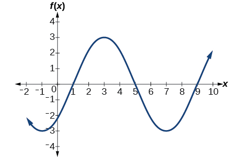{: #Figure_06_01_021}

{: data-labeled-item="true"}

Draw a graph of<math xmlns="http://www.w3.org/1998/Math/MathML"> <mrow> <mtext> </mtext><mi>g</mi><mo stretchy="false">(</mo><mi>x</mi><mo stretchy="false">)</mo><mo>=</mo><mo>−</mo><mn>2</mn><mi>cos</mi><mrow><mo>(</mo> <mrow> <mfrac> <mi>π</mi> <mn>3</mn> </mfrac> <mi>x</mi><mo>+</mo><mfrac> <mi>π</mi> <mn>6</mn> </mfrac> </mrow> <mo>)</mo></mrow><mo>.</mo><mtext> </mtext> </mrow> </math>

Determine the midline, amplitude, period, and phase shift.

 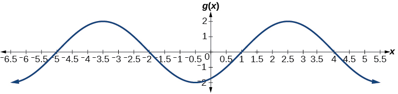 
midline:<math xmlns="http://www.w3.org/1998/Math/MathML"> <mrow> <mtext> </mtext><mi>y</mi><mo>=</mo><mn>0</mn><mo>;</mo><mtext> </mtext> </mrow> </math>

amplitude:<math xmlns="http://www.w3.org/1998/Math/MathML"> <mrow> <mtext> </mtext><mrow><mo>\|</mo> <mi>A</mi> <mo>\|</mo></mrow><mo>=</mo><mn>2</mn><mo>;</mo><mtext> </mtext> </mrow> </math>

period:<math xmlns="http://www.w3.org/1998/Math/MathML"> <mrow> <mtext> </mtext><mi>P</mi><mo>=</mo><mfrac> <mrow> <mn>2</mn><mi>π</mi> </mrow> <mrow> <mrow><mo>\|</mo> <mi>B</mi> <mo>\|</mo></mrow> </mrow> </mfrac> <mo>=</mo><mn>6</mn><mo>;</mo><mtext> </mtext> </mrow> </math>

phase shift:<math xmlns="http://www.w3.org/1998/Math/MathML"> <mrow> <mtext> </mtext><mfrac> <mi>C</mi> <mi>B</mi> </mfrac> <mo>=</mo><mo>−</mo><mfrac> <mn>1</mn> <mn>2</mn> </mfrac> </mrow> </math>

Identifying the Properties of a Sinusoidal Function

Given<math xmlns="http://www.w3.org/1998/Math/MathML"> <mrow> <mtext> </mtext><mi>y</mi><mo>=</mo><mo>−</mo><mn>2</mn><mi>cos</mi><mrow><mo>(</mo> <mrow> <mfrac> <mi>π</mi> <mn>2</mn> </mfrac> <mi>x</mi><mo>+</mo><mi>π</mi> </mrow> <mo>)</mo></mrow><mo>+</mo><mn>3</mn><mo>,</mo><mtext> </mtext> </mrow> </math>

determine the amplitude, period, phase shift, and horizontal shift. Then graph the function.

Begin by comparing the equation to the general form and use the steps outlined in [[link]](#Example_06_01_09).

<math xmlns="http://www.w3.org/1998/Math/MathML"> <mrow> <mi>y</mi><mo>=</mo><mi>A</mi><mi>cos</mi><mrow><mo>(</mo> <mrow> <mi>B</mi><mi>x</mi><mo>−</mo><mi>C</mi> </mrow> <mo>)</mo></mrow><mo>+</mo><mi>D</mi> </mrow> </math>

* *Step 1.* The function is already written in general form.
* *Step 2.* Since
  <math xmlns="http://www.w3.org/1998/Math/MathML"> <mrow> <mtext> </mtext><mi>A</mi><mo>=</mo><mo>−</mo><mn>2</mn><mo>,</mo><mtext> </mtext> </mrow> </math>
  
  the amplitude is
  <math xmlns="http://www.w3.org/1998/Math/MathML"> <mrow> <mtext> </mtext><mrow><mo>\|</mo> <mi>A</mi> <mo>\|</mo></mrow><mo>=</mo><mn>2.</mn> </mrow> </math>

* *Step 3.*
  <math xmlns="http://www.w3.org/1998/Math/MathML"> <mrow> <mtext> </mtext><mrow><mo>\|</mo> <mi>B</mi> <mo>\|</mo></mrow><mo>=</mo><mfrac> <mi>π</mi> <mn>2</mn> </mfrac> <mo>,</mo><mtext> </mtext> </mrow> </math>
  
  so the period is
  <math xmlns="http://www.w3.org/1998/Math/MathML"> <mrow> <mtext> </mtext><mi>P</mi><mo>=</mo><mfrac> <mrow> <mn>2</mn><mi>π</mi> </mrow> <mrow> <mrow><mo>\|</mo> <mi>B</mi> <mo>\|</mo></mrow> </mrow> </mfrac> <mo>=</mo><mfrac> <mrow> <mn>2</mn><mi>π</mi> </mrow> <mrow> <mfrac> <mi>π</mi> <mn>2</mn> </mfrac> </mrow> </mfrac> <mo>=</mo><mn>2</mn><mi>π</mi><mo>⋅</mo><mfrac> <mn>2</mn> <mi>π</mi> </mfrac> <mo>=</mo><mn>4.</mn><mtext> </mtext> </mrow> </math>
  
  The period is 4.
* *Step 4.*
  <math xmlns="http://www.w3.org/1998/Math/MathML"> <mrow> <mtext> </mtext><mi>C</mi><mo>=</mo><mo>−</mo><mi>π</mi><mo>,</mo> </mrow> </math>
  
  so we calculate the phase shift as
  <math xmlns="http://www.w3.org/1998/Math/MathML"> <mrow> <mtext> </mtext><mfrac> <mi>C</mi> <mi>B</mi> </mfrac> <mo>=</mo><mfrac> <mrow> <mo>−</mo><mi>π</mi><mo>,</mo> </mrow> <mrow> <mfrac> <mi>π</mi> <mn>2</mn> </mfrac> </mrow> </mfrac> <mo>=</mo><mo>−</mo><mi>π</mi><mo>⋅</mo><mfrac> <mn>2</mn> <mi>π</mi> </mfrac> <mo>=</mo><mo>−</mo><mn>2.</mn><mtext> </mtext> </mrow> </math>
  
  The phase shift is
  <math xmlns="http://www.w3.org/1998/Math/MathML"> <mrow> <mtext> </mtext><mo>−</mo><mn>2.</mn> </mrow> </math>

* *Step 5.*
  <math xmlns="http://www.w3.org/1998/Math/MathML"> <mrow> <mi>D</mi><mo>=</mo><mn>3</mn><mo>,</mo> </mrow> </math>
  
  so the midline is
  <math xmlns="http://www.w3.org/1998/Math/MathML"> <mrow> <mtext> </mtext><mi>y</mi><mo>=</mo><mn>3</mn><mo>, </mo> </mrow> </math>
  
  and the vertical shift is up 3.
{: data-labeled-item="true"}

Since<math xmlns="http://www.w3.org/1998/Math/MathML"> <mrow> <mtext> </mtext><mi>A</mi><mtext> </mtext> </mrow> </math>

is negative, the graph of the cosine function has been reflected about the *x*-axis.

[[link]](#Figure_06_01_028) shows one cycle of the graph of the function.

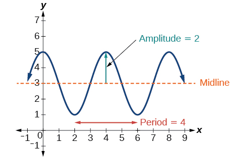{: #Figure_06_01_028}

### Using Transformations of Sine and Cosine Functions

We can use the transformations of sine and cosine functions in numerous applications. As mentioned at the beginning of the chapter, **circular motion**{: data-type="term" .no-emphasis} can be modeled using either the sine or **cosine function**{: data-type="term" .no-emphasis}.

Finding the Vertical Component of Circular Motion

A point rotates around a circle of radius 3 centered at the origin. Sketch a graph of the *y*-coordinate of the point as a function of the angle of rotation.

Recall that, for a point on a circle of radius *r*, the *y*-coordinate of the point is<math xmlns="http://www.w3.org/1998/Math/MathML"> <mrow> <mtext> </mtext><mi>y</mi><mo>=</mo><mi>r</mi><mtext> </mtext><mi>sin</mi><mo stretchy="false">(</mo><mi>x</mi><mo stretchy="false">)</mo><mo>,</mo><mtext> </mtext> </mrow> </math>

 so in this case, we get the equation<math xmlns="http://www.w3.org/1998/Math/MathML"> <mrow> <mtext> </mtext><mi>y</mi><mo stretchy="false">(</mo><mi>x</mi><mo stretchy="false">)</mo><mo>=</mo><mn>3</mn><mtext> </mtext><mi>sin</mi><mo stretchy="false">(</mo><mi>x</mi><mo stretchy="false">)</mo><mo>.</mo><mtext> </mtext> </mrow> </math>

 The constant 3 causes a vertical stretch of the *y*-values of the function by a factor of 3, which we can see in the graph in [[link]](#Figure_06_01_023).

![A graph of 3sin(x). Graph has period of 2pi, amplitude of 3, and range of \[-3,3\].](../resources/CNX_Precalc_Figure_06_01_023.jpg){: #Figure_06_01_023}

Analysis

Notice that the period of the function is still<math xmlns="http://www.w3.org/1998/Math/MathML"> <mrow> <mtext> </mtext><mn>2</mn><mi>π</mi><mo>;</mo><mtext> </mtext> </mrow> </math>

as we travel around the circle, we return to the point<math xmlns="http://www.w3.org/1998/Math/MathML"> <mrow> <mtext> </mtext><mrow><mo>(</mo> <mrow> <mn>3</mn><mo>,</mo><mn>0</mn> </mrow> <mo>)</mo></mrow><mtext> </mtext> </mrow> </math>

for<math xmlns="http://www.w3.org/1998/Math/MathML"> <mrow> <mtext> </mtext><mi>x</mi><mo>=</mo><mn>2</mn><mi>π</mi><mo>,</mo><mn>4</mn><mi>π</mi><mo>,</mo><mn>6</mn><mi>π</mi><mo>,</mo><mn>...</mn><mo>.</mo> </mrow> </math>

Because the outputs of the graph will now oscillate between<math xmlns="http://www.w3.org/1998/Math/MathML"> <mrow> <mtext> </mtext><mo>–</mo><mn>3</mn><mtext> </mtext> </mrow> </math>

and<math xmlns="http://www.w3.org/1998/Math/MathML"> <mrow> <mtext> </mtext><mn>3</mn><mo>,</mo><mtext> </mtext> </mrow> </math>

the amplitude of the sine wave is<math xmlns="http://www.w3.org/1998/Math/MathML"> <mrow> <mtext> </mtext><mn>3.</mn> </mrow> </math>

What is the amplitude of the function<math xmlns="http://www.w3.org/1998/Math/MathML"> <mrow> <mtext> </mtext><mi>f</mi><mo stretchy="false">(</mo><mi>x</mi><mo stretchy="false">)</mo><mo>=</mo><mn>7</mn><mi>cos</mi><mo stretchy="false">(</mo><mi>x</mi><mo stretchy="false">)</mo><mo>?</mo><mtext> </mtext> </mrow> </math>

Sketch a graph of this function.

7

 ![A graph of 7cos(x). Graph has amplitude of 7, period of 2pi, and range of \[-7,7\].](../resources/CNX_Precalc_Figure_06_01_024.jpg) 

Finding the Vertical Component of Circular Motion

A circle with radius 3 ft is mounted with its center 4 ft off the ground. The point closest to the ground is labeled *P*, as shown in [[link]](#Figure_06_01_025). Sketch a graph of the height above the ground of the point<math xmlns="http://www.w3.org/1998/Math/MathML"> <mrow> <mtext> </mtext><mi>P</mi><mtext> </mtext> </mrow> </math>

as the circle is rotated; then find a function that gives the height in terms of the angle of rotation.

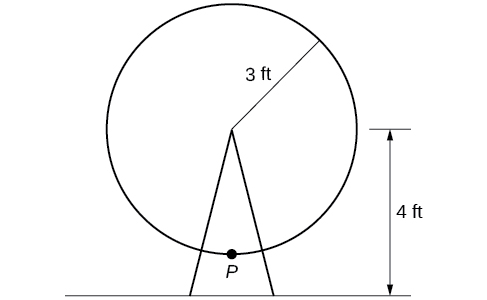{: #Figure_06_01_025}

Sketching the height, we note that it will start 1 ft above the ground, then increase up to 7 ft above the ground, and continue to oscillate 3 ft above and below the center value of 4 ft, as shown in [[link]](#Figure_06_01_026).

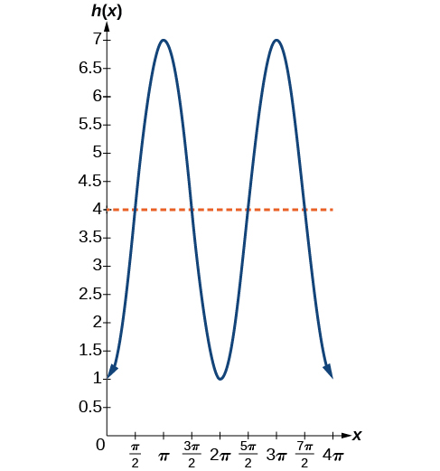{: #Figure_06_01_026}

Although we could use a transformation of either the sine or cosine function, we start by looking for characteristics that would make one function easier to use than the other. Let’s use a cosine function because it starts at the highest or lowest value, while a **sine function**{: data-type="term" .no-emphasis} starts at the middle value. A standard cosine starts at the highest value, and this graph starts at the lowest value, so we need to incorporate a vertical reflection.

Second, we see that the graph oscillates 3 above and below the center, while a basic cosine has an amplitude of 1, so this graph has been vertically stretched by 3, as in the last example.

Finally, to move the center of the circle up to a height of 4, the graph has been vertically shifted up by 4. Putting these transformations together, we find that

<math xmlns="http://www.w3.org/1998/Math/MathML"> <mrow> <mi>y</mi><mo>=</mo><mo>−</mo><mn>3</mn><mi>cos</mi><mrow><mo>(</mo> <mi>x</mi> <mo>)</mo></mrow><mo>+</mo><mn>4</mn> </mrow> </math>

A weight is attached to a spring that is then hung from a board, as shown in [[link]](#Figure_06_01_029). As the spring oscillates up and down, the position<math xmlns="http://www.w3.org/1998/Math/MathML"> <mrow> <mtext> </mtext><mi>y</mi><mtext> </mtext> </mrow> </math>

of the weight relative to the board ranges from<math xmlns="http://www.w3.org/1998/Math/MathML"> <mrow> <mtext> </mtext><mn>–1</mn><mtext> </mtext> </mrow> </math>

in. (at time<math xmlns="http://www.w3.org/1998/Math/MathML"> <mrow> <mtext> </mtext><mi>x</mi><mo>=</mo><mn>0</mn><mo stretchy="false">)</mo><mtext> </mtext> </mrow> </math>

to<math xmlns="http://www.w3.org/1998/Math/MathML"> <mrow> <mtext> </mtext><mn>–7</mn><mtext> </mtext> </mrow> </math>

in. (at time<math xmlns="http://www.w3.org/1998/Math/MathML"> <mrow> <mtext> </mtext><mi>x</mi><mo>=</mo><mi>π</mi><mo stretchy="false">)</mo><mtext> </mtext> </mrow> </math>

below the board. Assume the position of<math xmlns="http://www.w3.org/1998/Math/MathML"> <mrow> <mtext> </mtext><mi>y</mi><mtext> </mtext> </mrow> </math>

is given as a sinusoidal function of<math xmlns="http://www.w3.org/1998/Math/MathML"> <mrow> <mtext> </mtext><mi>x</mi><mo>.</mo><mtext> </mtext> </mrow> </math>

Sketch a graph of the function, and then find a cosine function that gives the position<math xmlns="http://www.w3.org/1998/Math/MathML"> <mrow> <mtext> </mtext><mi>y</mi><mtext> </mtext> </mrow> </math>

in terms of<math xmlns="http://www.w3.org/1998/Math/MathML"> <mrow> <mtext> </mtext><mi>x</mi><mo>.</mo> </mrow> </math>

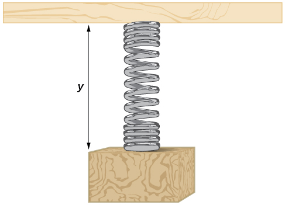{: #Figure_06_01_029}

<math xmlns="http://www.w3.org/1998/Math/MathML"> <mrow> <mi>y</mi><mo>=</mo><mn>3</mn><mi>cos</mi><mrow><mo>(</mo> <mi>x</mi> <mo>)</mo></mrow><mo>−</mo><mn>4</mn> </mrow> </math>

 ![A cosine graph with range \[-1,-7\]. Period is 2 pi. Local maximums at (0,-1), (2pi,-1), and (4pi, -1). Local minimums at (pi,-7) and (3pi, -7).](../resources/CNX_Precalc_Figure_06_01_027.jpg) 

Determining a Rider’s Height on a Ferris Wheel

The London Eye is a huge Ferris wheel with a diameter of 135 meters (443 feet). It completes one rotation every 30 minutes. Riders board from a platform 2 meters above the ground. Express a rider’s height above ground as a function of time in minutes.

With a diameter of 135 m, the wheel has a radius of 67.5 m. The height will oscillate with amplitude 67.5 m above and below the center.

Passengers board 2 m above ground level, so the center of the wheel must be located<math xmlns="http://www.w3.org/1998/Math/MathML"> <mrow> <mtext> </mtext><mn>67.5</mn><mo>+</mo><mn>2</mn><mo>=</mo><mn>69.5</mn><mtext> </mtext> </mrow> </math>

m above ground level. The midline of the oscillation will be at 69.5 m.

The wheel takes 30 minutes to complete 1 revolution, so the height will oscillate with a period of 30 minutes.

Lastly, because the rider boards at the lowest point, the height will start at the smallest value and increase, following the shape of a vertically reflected cosine curve.

* Amplitude:
  <math xmlns="http://www.w3.org/1998/Math/MathML"> <mrow> <mtext> </mtext><mtext>67</mtext><mtext>.5,</mtext><mtext> </mtext> </mrow> </math>
  
  so
  <math xmlns="http://www.w3.org/1998/Math/MathML"> <mrow> <mtext> </mtext><mi>A</mi><mo>=</mo><mn>67.5</mn> </mrow> </math>

* Midline:
  <math xmlns="http://www.w3.org/1998/Math/MathML"> <mrow> <mtext> </mtext><mtext>69</mtext><mtext>.5,</mtext><mtext> </mtext> </mrow> </math>
  
  so
  <math xmlns="http://www.w3.org/1998/Math/MathML"> <mrow> <mtext> </mtext><mi>D</mi><mo>=</mo><mn>69.5</mn> </mrow> </math>

* Period:
  <math xmlns="http://www.w3.org/1998/Math/MathML"> <mrow> <mtext> </mtext><mtext>30,</mtext><mtext> </mtext> </mrow> </math>
  
  so
  <math xmlns="http://www.w3.org/1998/Math/MathML"> <mrow> <mtext> </mtext><mi>B</mi><mo>=</mo><mfrac> <mrow> <mn>2</mn><mi>π</mi> </mrow> <mrow> <mn>30</mn> </mrow> </mfrac> <mo>=</mo><mfrac> <mi>π</mi> <mrow> <mn>15</mn> </mrow> </mfrac> </mrow> </math>

* Shape:
  <math xmlns="http://www.w3.org/1998/Math/MathML"> <mrow> <mtext> </mtext><mi>−cos</mi><mrow><mo>(</mo> <mi>t</mi> <mo>)</mo></mrow> </mrow> </math>

An equation for the rider’s height would be

<math xmlns="http://www.w3.org/1998/Math/MathML"> <mrow> <mi>y</mi><mo>=</mo><mo>−</mo><mn>67.5</mn><mi>cos</mi><mrow><mo>(</mo> <mrow> <mfrac> <mi>π</mi> <mrow> <mn>15</mn> </mrow> </mfrac> <mi>t</mi> </mrow> <mo>)</mo></mrow><mo>+</mo><mn>69.5</mn> </mrow> </math>

where<math xmlns="http://www.w3.org/1998/Math/MathML"> <mrow> <mtext> </mtext><mi>t</mi><mtext> </mtext> </mrow> </math>

is in minutes and<math xmlns="http://www.w3.org/1998/Math/MathML"> <mrow> <mtext> </mtext><mi>y</mi><mtext> </mtext> </mrow> </math>

is measured in meters.

Access these online resources for additional instruction and practice with graphs of sine and cosine functions.

* [Amplitude and Period of Sine and Cosine][1]
* [Translations of Sine and Cosine][2]
* [Graphing Sine and Cosine Transformations][3]
* [Graphing the Sine Function][4]

### Key Equations

<table id="eip-id1165133087385" summary=".."><caption></caption><tbody>
<tr>
<td>Sinusoidal functions</td>
<td><math xmlns="http://www.w3.org/1998/Math/MathML">
 <mtable columnalign="left">
  <mtr>
   <mtd>
    <mi>f</mi><mrow><mo>(</mo>
     <mi>x</mi>
    <mo>)</mo></mrow><mo>=</mo><mi>A</mi><mi>sin</mi><mrow><mo>(</mo>
     <mrow>
      <mi>B</mi><mi>x</mi><mo>−</mo><mi>C</mi>
     </mrow>
    <mo>)</mo></mrow><mo>+</mo><mi>D</mi>
   </mtd>
  </mtr>
  <mtr>
   <mtd>
    <mi>f</mi><mrow><mo>(</mo>
     <mi>x</mi>
    <mo>)</mo></mrow><mo>=</mo><mi>A</mi><mi>cos</mi><mrow><mo>(</mo>
     <mrow>
      <mi>B</mi><mi>x</mi><mo>−</mo><mi>C</mi>
     </mrow>
    <mo>)</mo></mrow><mo>+</mo><mi>D</mi>
   </mtd>
  </mtr>
 </mtable>
 
</math>
</td>
</tr>
</tbody></table>

### Key Concepts

* Periodic functions repeat after a given value. The smallest such value is the period. The basic sine and cosine functions have a period of
  <math xmlns="http://www.w3.org/1998/Math/MathML"> <mrow> <mtext> </mtext><mn>2</mn><mi>π</mi><mo>.</mo> </mrow> </math>

* The function
  <math xmlns="http://www.w3.org/1998/Math/MathML"> <mrow> <mi>sin</mi><mtext> </mtext><mi>x</mi><mtext> </mtext> </mrow> </math>
  
  is odd, so its graph is symmetric about the origin. The function
  <math xmlns="http://www.w3.org/1998/Math/MathML"> <mrow> <mtext> </mtext><mi>cos</mi><mtext> </mtext><mi>x</mi><mtext> </mtext> </mrow> </math>
  
  is even, so its graph is symmetric about the *y*-axis.
* The graph of a sinusoidal function has the same general shape as a sine or cosine function.
* In the general formula for a sinusoidal function, the period is
  <math xmlns="http://www.w3.org/1998/Math/MathML"> <mrow> <mtext> </mtext><mi>P</mi><mo>=</mo><mfrac> <mrow> <mn>2</mn><mi>π</mi> </mrow> <mrow> <mrow><mo>\|</mo> <mi>B</mi> <mo>\|</mo></mrow> </mrow> </mfrac> <mo>.</mo><mtext> </mtext> </mrow> </math>
  
  See [\[link\]](#Example_06_01_01).
* In the general formula for a sinusoidal function,
  <math xmlns="http://www.w3.org/1998/Math/MathML"> <mrow> <mtext> </mtext><mrow><mo>\|</mo> <mi>A</mi> <mo>\|</mo></mrow><mtext> </mtext> </mrow> </math>
  
  represents amplitude. If
  <math xmlns="http://www.w3.org/1998/Math/MathML"> <mrow> <mtext> </mtext><mrow><mo>\|</mo> <mi>A</mi> <mo>\|</mo></mrow><mo>&gt;</mo><mn>1</mn><mo>,</mo><mtext> </mtext> </mrow> </math>
  
  the function is stretched, whereas if
  <math xmlns="http://www.w3.org/1998/Math/MathML"> <mrow> <mtext> </mtext><mrow><mo>\|</mo> <mi>A</mi> <mo>\|</mo></mrow><mo>&lt;</mo><mn>1</mn><mo>,</mo><mtext> </mtext> </mrow> </math>
  
  the function is compressed. See [\[link\]](#Example_06_01_02).
* The value
  <math xmlns="http://www.w3.org/1998/Math/MathML"> <mrow> <mtext> </mtext><mfrac> <mi>C</mi> <mi>B</mi> </mfrac> <mtext> </mtext> </mrow> </math>
  
  in the general formula for a sinusoidal function indicates the phase shift. See [\[link\]](#Example_06_01_03).
* The value
  <math xmlns="http://www.w3.org/1998/Math/MathML"> <mrow> <mtext> </mtext><mi>D</mi><mtext> </mtext> </mrow> </math>
  
  in the general formula for a sinusoidal function indicates the vertical shift from the midline. See [\[link\]](#Example_06_01_04).
* Combinations of variations of sinusoidal functions can be detected from an equation. See [\[link\]](#Example_06_01_05).
* The equation for a sinusoidal function can be determined from a graph. See [\[link\]](#Example_06_01_06) and [\[link\]](#Example_06_01_07).
* A function can be graphed by identifying its amplitude and period. See [\[link\]](#Example_06_01_08) and [\[link\]](#Example_06_01_09).
* A function can also be graphed by identifying its amplitude, period, phase shift, and horizontal shift. See [\[link\]](#Example_06_01_10).
* Sinusoidal functions can be used to solve real-world problems. See [\[link\]](#Example_06_01_11), [\[link\]](#Example_06_01_12), and [\[link\]](#Example_06_01_13).

### Section Exercises

#### Verbal

Why are the sine and cosine functions called periodic functions?

The sine and cosine functions have the property that<math xmlns="http://www.w3.org/1998/Math/MathML"> <mrow> <mtext> </mtext><mi>f</mi><mrow><mo>(</mo> <mrow> <mi>x</mi><mo>+</mo><mi>P</mi> </mrow> <mo>)</mo></mrow><mo>=</mo><mi>f</mi><mrow><mo>(</mo> <mi>x</mi> <mo>)</mo></mrow><mtext> </mtext> </mrow> </math>

for a certain<math xmlns="http://www.w3.org/1998/Math/MathML"> <mrow> <mtext> </mtext><mi>P</mi><mo>.</mo><mtext> </mtext> </mrow> </math>

This means that the function values repeat for every<math xmlns="http://www.w3.org/1998/Math/MathML"> <mrow> <mtext> </mtext><mi>P</mi><mtext> </mtext> </mrow> </math>

units on the *x*-axis.

How does the graph of<math xmlns="http://www.w3.org/1998/Math/MathML"> <mrow> <mtext> </mtext><mi>y</mi><mo>=</mo><mi>sin</mi><mtext> </mtext><mi>x</mi><mtext> </mtext> </mrow> </math>

 compare with the graph of<math xmlns="http://www.w3.org/1998/Math/MathML"> <mrow> <mtext> </mtext><mi>y</mi><mo>=</mo><mi>cos</mi><mtext> </mtext><mi>x</mi><mo>?</mo><mtext> </mtext> </mrow> </math>

 Explain how you could horizontally translate the graph of<math xmlns="http://www.w3.org/1998/Math/MathML"> <mrow> <mtext> </mtext><mi>y</mi><mo>=</mo><mi>sin</mi><mtext> </mtext><mi>x</mi><mtext> </mtext> </mrow> </math>

 to obtain<math xmlns="http://www.w3.org/1998/Math/MathML"> <mrow> <mtext> </mtext><mi>y</mi><mo>=</mo><mi>cos</mi><mtext> </mtext><mi>x</mi><mo>.</mo> </mrow> </math>

For the equation<math xmlns="http://www.w3.org/1998/Math/MathML"> <mrow> <mtext> </mtext><mi>A</mi><mtext> </mtext><mi>cos</mi><mo stretchy="false">(</mo><mi>B</mi><mi>x</mi><mo>+</mo><mi>C</mi><mo stretchy="false">)</mo><mo>+</mo><mi>D</mi><mo>,</mo> </mrow> </math>

what constants affect the range of the function and how do they affect the range?

The absolute value of the constant<math xmlns="http://www.w3.org/1998/Math/MathML"> <mrow> <mtext> </mtext><mi>A</mi><mtext> </mtext> </mrow> </math>

(amplitude) increases the total range and the constant<math xmlns="http://www.w3.org/1998/Math/MathML"> <mrow> <mtext> </mtext><mi>D</mi><mtext> </mtext> </mrow> </math>

(vertical shift) shifts the graph vertically.

How does the range of a translated sine function relate to the equation<math xmlns="http://www.w3.org/1998/Math/MathML"> <mrow> <mtext> </mtext><mi>y</mi><mo>=</mo><mi>A</mi><mtext> </mtext><mi>sin</mi><mo stretchy="false">(</mo><mi>B</mi><mi>x</mi><mo>+</mo><mi>C</mi><mo stretchy="false">)</mo><mo>+</mo><mi>D</mi><mo>?</mo> </mrow> </math>

How can the unit circle be used to construct the graph of<math xmlns="http://www.w3.org/1998/Math/MathML"> <mrow> <mtext> </mtext><mi>f</mi><mo stretchy="false">(</mo><mi>t</mi><mo stretchy="false">)</mo><mo>=</mo><mi>sin</mi><mtext> </mtext><mi>t</mi><mo>?</mo> </mrow> </math>

At the point where the terminal side of<math xmlns="http://www.w3.org/1998/Math/MathML"> <mrow> <mtext> </mtext><mi>t</mi><mtext> </mtext> </mrow> </math>

intersects the unit circle, you can determine that the<math xmlns="http://www.w3.org/1998/Math/MathML"> <mrow> <mtext> </mtext><mi>sin</mi><mtext> </mtext><mi>t</mi><mtext> </mtext> </mrow> </math>

equals the *y*-coordinate of the point.

#### Graphical

For the following exercises, graph two full periods of each function and state the amplitude, period, and midline. State the maximum and minimum *y*-values and their corresponding *x*-values on one period for<math xmlns="http://www.w3.org/1998/Math/MathML"> <mrow> <mtext> </mtext><mi>x</mi><mo>&gt;</mo><mn>0.</mn><mtext> </mtext> </mrow> </math>

Round answers to two decimal places if necessary.

<math xmlns="http://www.w3.org/1998/Math/MathML"> <mrow> <mi>f</mi><mo stretchy="false">(</mo><mi>x</mi><mo stretchy="false">)</mo><mo>=</mo><mn>2</mn><mi>sin</mi><mtext> </mtext><mi>x</mi> </mrow> </math>

<math xmlns="http://www.w3.org/1998/Math/MathML"> <mrow> <mi>f</mi><mo stretchy="false">(</mo><mi>x</mi><mo stretchy="false">)</mo><mo>=</mo><mfrac> <mn>2</mn> <mn>3</mn> </mfrac> <mi>cos</mi><mtext> </mtext><mi>x</mi> </mrow> </math>

 ![A graph of (2/3)cos(x). Graph has amplitude of 2/3, period of 2pi, and range of \[-2/3, 2/3\].](../resources/CNX_Precalc_Figure_06_01_202.jpg) 
amplitude:<math xmlns="http://www.w3.org/1998/Math/MathML"> <mrow> <mtext> </mtext><mfrac> <mn>2</mn> <mn>3</mn> </mfrac> <mo>;</mo><mtext> </mtext> </mrow> </math>

period:<math xmlns="http://www.w3.org/1998/Math/MathML"> <mrow> <mtext> </mtext><mn>2</mn><mi>π</mi><mo>;</mo><mtext> </mtext> </mrow> </math>

midline:<math xmlns="http://www.w3.org/1998/Math/MathML"> <mrow> <mtext> </mtext><mi>y</mi><mo>=</mo><mn>0</mn><mo>;</mo><mtext> </mtext> </mrow> </math>

maximum:<math xmlns="http://www.w3.org/1998/Math/MathML"> <mrow> <mtext> </mtext><mi>y</mi><mo>=</mo><mfrac> <mn>2</mn> <mn>3</mn> </mfrac> <mtext> </mtext> </mrow> </math>

occurs at<math xmlns="http://www.w3.org/1998/Math/MathML"> <mrow> <mtext> </mtext><mi>x</mi><mo>=</mo><mn>0</mn><mo>;</mo><mtext> </mtext> </mrow> </math>

minimum:<math xmlns="http://www.w3.org/1998/Math/MathML"> <mrow> <mtext> </mtext><mi>y</mi><mo>=</mo><mo>−</mo><mfrac> <mn>2</mn> <mn>3</mn> </mfrac> <mtext> </mtext> </mrow> </math>

occurs at<math xmlns="http://www.w3.org/1998/Math/MathML"> <mrow> <mtext> </mtext><mi>x</mi><mo>=</mo><mi>π</mi><mo>;</mo><mtext> </mtext> </mrow> </math>

for one period, the graph starts at 0 and ends at<math xmlns="http://www.w3.org/1998/Math/MathML"> <mrow> <mtext> </mtext><mn>2</mn><mi>π</mi> </mrow> </math>

<math xmlns="http://www.w3.org/1998/Math/MathML"> <mrow> <mi>f</mi><mo stretchy="false">(</mo><mi>x</mi><mo stretchy="false">)</mo><mo>=</mo><mo>−</mo><mn>3</mn><mi>sin</mi><mtext> </mtext><mi>x</mi> </mrow> </math>

<math xmlns="http://www.w3.org/1998/Math/MathML"> <mrow> <mi>f</mi><mo stretchy="false">(</mo><mi>x</mi><mo stretchy="false">)</mo><mo>=</mo><mn>4</mn><mi>sin</mi><mtext> </mtext><mi>x</mi> </mrow> </math>

 ![A graph of 4sin(x). Graph has amplitude of 4, period of 2pi, and range of \[-4, 4\].](../resources/CNX_Precalc_Figure_06_01_204.jpg) 
amplitude: 4; period:<math xmlns="http://www.w3.org/1998/Math/MathML"> <mrow> <mtext> </mtext><mn>2</mn><mi>π</mi><mo>;</mo><mtext> </mtext> </mrow> </math>

midline:<math xmlns="http://www.w3.org/1998/Math/MathML"> <mrow> <mtext> </mtext><mi>y</mi><mo>=</mo><mn>0</mn><mo>;</mo><mtext> </mtext> </mrow> </math>

maximum<math xmlns="http://www.w3.org/1998/Math/MathML"> <mrow> <mtext> </mtext><mi>y</mi><mo>=</mo><mn>4</mn><mtext> </mtext> </mrow> </math>

occurs at<math xmlns="http://www.w3.org/1998/Math/MathML"> <mrow> <mtext> </mtext><mi>x</mi><mo>=</mo><mfrac> <mi>π</mi> <mn>2</mn> </mfrac> <mo>;</mo><mtext> </mtext> </mrow> </math>

minimum:<math xmlns="http://www.w3.org/1998/Math/MathML"> <mrow> <mtext> </mtext><mi>y</mi><mo>=</mo><mo>−</mo><mn>4</mn><mtext> </mtext> </mrow> </math>

occurs at<math xmlns="http://www.w3.org/1998/Math/MathML"> <mrow> <mtext> </mtext><mi>x</mi><mo>=</mo><mfrac> <mrow> <mn>3</mn><mi>π</mi> </mrow> <mn>2</mn> </mfrac> <mo>;</mo><mtext> </mtext> </mrow> </math>

one full period occurs from<math xmlns="http://www.w3.org/1998/Math/MathML"> <mrow> <mtext> </mtext><mi>x</mi><mo>=</mo><mn>0</mn><mtext> </mtext> </mrow> </math>

to<math xmlns="http://www.w3.org/1998/Math/MathML"> <mrow> <mtext> </mtext><mi>x</mi><mo>=</mo><mn>2</mn><mi>π</mi> </mrow> </math>

<math xmlns="http://www.w3.org/1998/Math/MathML"> <mrow> <mi>f</mi><mo stretchy="false">(</mo><mi>x</mi><mo stretchy="false">)</mo><mo>=</mo><mn>2</mn><mi>cos</mi><mtext> </mtext><mi>x</mi> </mrow> </math>

<math xmlns="http://www.w3.org/1998/Math/MathML"> <mrow> <mi>f</mi><mrow><mo>(</mo> <mi>x</mi> <mo>)</mo></mrow><mo>=</mo><mi>cos</mi><mrow><mo>(</mo> <mrow> <mn>2</mn><mi>x</mi> </mrow> <mo>)</mo></mrow> </mrow> </math>

 ![A graph of cos(2x). Graph has amplitude of 1, period of pi, and range of \[-1,1\].](../resources/CNX_Precalc_Figure_06_01_206.jpg) 
amplitude: 1; period:<math xmlns="http://www.w3.org/1998/Math/MathML"> <mrow> <mtext> </mtext><mi>π</mi><mo>;</mo><mtext> </mtext> </mrow> </math>

midline:<math xmlns="http://www.w3.org/1998/Math/MathML"> <mrow> <mtext> </mtext><mi>y</mi><mo>=</mo><mn>0</mn><mo>;</mo><mtext> </mtext> </mrow> </math>

maximum:<math xmlns="http://www.w3.org/1998/Math/MathML"> <mrow> <mtext> </mtext><mi>y</mi><mo>=</mo><mn>1</mn><mtext> </mtext> </mrow> </math>

occurs at<math xmlns="http://www.w3.org/1998/Math/MathML"> <mrow> <mtext> </mtext><mi>x</mi><mo>=</mo><mi>π</mi><mo>;</mo><mtext> </mtext> </mrow> </math>

minimum:<math xmlns="http://www.w3.org/1998/Math/MathML"> <mrow> <mtext> </mtext><mi>y</mi><mo>=</mo><mo>−</mo><mn>1</mn><mtext> </mtext> </mrow> </math>

occurs at<math xmlns="http://www.w3.org/1998/Math/MathML"> <mrow> <mtext> </mtext><mi>x</mi><mo>=</mo><mfrac> <mi>π</mi> <mn>2</mn> </mfrac> <mo>;</mo><mtext> </mtext> </mrow> </math>

one full period is graphed from<math xmlns="http://www.w3.org/1998/Math/MathML"> <mrow> <mtext> </mtext><mi>x</mi><mo>=</mo><mn>0</mn><mtext> </mtext> </mrow> </math>

to<math xmlns="http://www.w3.org/1998/Math/MathML"> <mrow> <mtext> </mtext><mi>x</mi><mo>=</mo><mi>π</mi> </mrow> </math>

<math xmlns="http://www.w3.org/1998/Math/MathML"> <mrow> <mi>f</mi><mo stretchy="false">(</mo><mi>x</mi><mo stretchy="false">)</mo><mo>=</mo><mn>2</mn><mtext> </mtext><mi>sin</mi><mrow><mo>(</mo> <mrow> <mfrac> <mn>1</mn> <mn>2</mn> </mfrac> <mi>x</mi> </mrow> <mo>)</mo></mrow> </mrow> </math>

<math xmlns="http://www.w3.org/1998/Math/MathML"> <mrow> <mi>f</mi><mo stretchy="false">(</mo><mi>x</mi><mo stretchy="false">)</mo><mo>=</mo><mn>4</mn><mtext> </mtext><mi>cos</mi><mo stretchy="false">(</mo><mi>π</mi><mi>x</mi><mo stretchy="false">)</mo> </mrow> </math>

 ![A graph of 4cos(pi\*x). Grpah has amplitude of 4, period of 2, and range of \[-4, 4\].](../resources/CNX_Precalc_Figure_06_01_208.jpg) 
amplitude: 4; period: 2; midline:<math xmlns="http://www.w3.org/1998/Math/MathML"> <mrow> <mtext> </mtext><mi>y</mi><mo>=</mo><mn>0</mn><mo>;</mo><mtext> </mtext> </mrow> </math>

maximum:<math xmlns="http://www.w3.org/1998/Math/MathML"> <mrow> <mtext> </mtext><mi>y</mi><mo>=</mo><mn>4</mn><mtext> </mtext> </mrow> </math>

occurs at<math xmlns="http://www.w3.org/1998/Math/MathML"> <mrow> <mtext> </mtext><mi>x</mi><mo>=</mo><mn>0</mn><mo>;</mo><mtext> </mtext> </mrow> </math>

minimum:<math xmlns="http://www.w3.org/1998/Math/MathML"> <mrow> <mtext> </mtext><mi>y</mi><mo>=</mo><mo>−</mo><mn>4</mn><mtext> </mtext> </mrow> </math>

occurs at<math xmlns="http://www.w3.org/1998/Math/MathML"> <mrow> <mtext> </mtext><mi>x</mi><mo>=</mo><mn>1</mn> </mrow> </math>

<math xmlns="http://www.w3.org/1998/Math/MathML"> <mrow> <mi>f</mi><mo stretchy="false">(</mo><mi>x</mi><mo stretchy="false">)</mo><mo>=</mo><mn>3</mn><mtext> </mtext><mi>cos</mi><mrow><mo>(</mo> <mrow> <mfrac> <mn>6</mn> <mn>5</mn> </mfrac> <mi>x</mi> </mrow> <mo>)</mo></mrow> </mrow> </math>

<math xmlns="http://www.w3.org/1998/Math/MathML"> <mrow> <mi>y</mi><mo>=</mo><mn>3</mn><mtext> </mtext><mi>sin</mi><mo stretchy="false">(</mo><mn>8</mn><mo stretchy="false">(</mo><mi>x</mi><mo>+</mo><mn>4</mn><mo stretchy="false">)</mo><mo stretchy="false">)</mo><mo>+</mo><mn>5</mn> </mrow> </math>

 ![A graph of 3sin(8(x+4))+5. Graph has amplitude of 3, range of \[2, 8\], and period of pi/4.](../resources/CNX_Precalc_Figure_06_01_210.jpg) 
amplitude: 3; period:<math xmlns="http://www.w3.org/1998/Math/MathML"> <mrow> <mtext> </mtext><mfrac> <mi>π</mi> <mn>4</mn> </mfrac> <mo>;</mo><mtext> </mtext> </mrow> </math>

midline:<math xmlns="http://www.w3.org/1998/Math/MathML"> <mrow> <mtext> </mtext><mi>y</mi><mo>=</mo><mn>5</mn><mo>;</mo><mtext> </mtext> </mrow> </math>

maximum:<math xmlns="http://www.w3.org/1998/Math/MathML"> <mrow> <mtext> </mtext><mi>y</mi><mo>=</mo><mn>8</mn><mtext> </mtext> </mrow> </math>

occurs at<math xmlns="http://www.w3.org/1998/Math/MathML"> <mrow> <mtext> </mtext><mi>x</mi><mo>=</mo><mn>0.12</mn><mo>;</mo><mtext> </mtext> </mrow> </math>

minimum:<math xmlns="http://www.w3.org/1998/Math/MathML"> <mrow> <mtext> </mtext><mi>y</mi><mo>=</mo><mn>2</mn><mtext> </mtext> </mrow> </math>

occurs at<math xmlns="http://www.w3.org/1998/Math/MathML"> <mrow> <mtext> </mtext><mi>x</mi><mo>=</mo><mn>0.516</mn><mo>;</mo><mtext> </mtext> </mrow> </math>

horizontal shift:<math xmlns="http://www.w3.org/1998/Math/MathML"> <mrow> <mtext> </mtext><mo>−</mo><mn>4</mn><mo>;</mo><mtext> </mtext> </mrow> </math>

vertical translation 5; one period occurs from<math xmlns="http://www.w3.org/1998/Math/MathML"> <mrow> <mtext> </mtext><mi>x</mi><mo>=</mo><mn>0</mn><mtext> </mtext> </mrow> </math>

to<math xmlns="http://www.w3.org/1998/Math/MathML"> <mrow> <mtext> </mtext><mi>x</mi><mo>=</mo><mfrac> <mi>π</mi> <mn>4</mn> </mfrac> </mrow> </math>

<math xmlns="http://www.w3.org/1998/Math/MathML"> <mrow> <mi>y</mi><mo>=</mo><mn>2</mn><mtext> </mtext><mi>sin</mi><mo stretchy="false">(</mo><mn>3</mn><mi>x</mi><mo>−</mo><mn>21</mn><mo stretchy="false">)</mo><mo>+</mo><mn>4</mn> </mrow> </math>

<math xmlns="http://www.w3.org/1998/Math/MathML"> <mrow> <mi>y</mi><mo>=</mo><mn>5</mn><mtext> </mtext><mi>sin</mi><mo stretchy="false">(</mo><mn>5</mn><mi>x</mi><mo>+</mo><mn>20</mn><mo stretchy="false">)</mo><mo>−</mo><mn>2</mn> </mrow> </math>

 ![A graph of 5sin(5x+20)-2. Graph has an amplitude of 5, period of 2pi/5, and range of \[-7,3\].](../resources/CNX_Precalc_Figure_06_01_212.jpg) 
amplitude: 5; period:<math xmlns="http://www.w3.org/1998/Math/MathML"> <mrow> <mtext> </mtext><mfrac> <mrow> <mn>2</mn><mi>π</mi> </mrow> <mn>5</mn> </mfrac> <mo>;</mo><mtext> </mtext> </mrow> </math>

midline:<math xmlns="http://www.w3.org/1998/Math/MathML"> <mrow> <mtext> </mtext><mi>y</mi><mo>=</mo><mn>−2</mn><mo>;</mo><mtext> </mtext> </mrow> </math>

maximum:<math xmlns="http://www.w3.org/1998/Math/MathML"> <mrow> <mtext> </mtext><mi>y</mi><mo>=</mo><mn>3</mn><mtext> </mtext> </mrow> </math>

occurs at<math xmlns="http://www.w3.org/1998/Math/MathML"> <mrow> <mtext> </mtext><mi>x</mi><mo>=</mo><mn>0.08</mn><mo>;</mo><mtext> </mtext> </mrow> </math>

minimum:<math xmlns="http://www.w3.org/1998/Math/MathML"> <mrow> <mtext> </mtext><mi>y</mi><mo>=</mo><mn>−7</mn><mtext> </mtext> </mrow> </math>

occurs at<math xmlns="http://www.w3.org/1998/Math/MathML"> <mrow> <mtext> </mtext><mi>x</mi><mo>=</mo><mn>0.71;</mn><mtext> </mtext> </mrow> </math>

phase shift:<math xmlns="http://www.w3.org/1998/Math/MathML"> <mrow> <mtext> </mtext><mn>−4</mn><mo>;</mo><mtext> </mtext> </mrow> </math>

vertical translation:<math xmlns="http://www.w3.org/1998/Math/MathML"> <mrow> <mtext> </mtext><mn>−2;</mn><mtext> </mtext> </mrow> </math>

one full period can be graphed on<math xmlns="http://www.w3.org/1998/Math/MathML"> <mrow> <mtext> </mtext><mi>x</mi><mo>=</mo><mn>0</mn><mtext> </mtext> </mrow> </math>

to<math xmlns="http://www.w3.org/1998/Math/MathML"> <mrow> <mtext> </mtext><mi>x</mi><mo>=</mo><mfrac> <mrow> <mn>2</mn><mi>π</mi> </mrow> <mn>5</mn> </mfrac> </mrow> </math>

For the following exercises, graph one full period of each function, starting at<math xmlns="http://www.w3.org/1998/Math/MathML"> <mrow> <mtext> </mtext><mi>x</mi><mo>=</mo><mn>0.</mn><mtext> </mtext> </mrow> </math>

For each function, state the amplitude, period, and midline. State the maximum and minimum *y*-values and their corresponding *x*-values on one period for<math xmlns="http://www.w3.org/1998/Math/MathML"> <mrow> <mtext> </mtext><mi>x</mi><mo>&gt;</mo><mn>0.</mn><mtext> </mtext> </mrow> </math>

State the phase shift and vertical translation, if applicable. Round answers to two decimal places if necessary.

<math xmlns="http://www.w3.org/1998/Math/MathML"> <mrow> <mi>f</mi><mrow><mo>(</mo> <mi>t</mi> <mo>)</mo></mrow><mo>=</mo><mn>2</mn><mi>sin</mi><mrow><mo>(</mo> <mrow> <mi>t</mi><mo>−</mo><mfrac> <mrow> <mn>5</mn><mi>π</mi> </mrow> <mn>6</mn> </mfrac> </mrow> <mo>)</mo></mrow> </mrow> </math>

<math xmlns="http://www.w3.org/1998/Math/MathML"> <mrow> <mi>f</mi><mo stretchy="false">(</mo><mi>t</mi><mo stretchy="false">)</mo><mo>=</mo><mo>−</mo><mi>cos</mi><mrow><mo>(</mo> <mrow> <mi>t</mi><mo>+</mo><mfrac> <mi>π</mi> <mn>3</mn> </mfrac> </mrow> <mo>)</mo></mrow><mo>+</mo><mn>1</mn> </mrow> </math>

 ![A graph of -cos(t+pi/3)+1. Graph has amplitude of 1, period of 2pi, and range of \[0,2\]. Phase shifted pi/3 to the left.](../resources/CNX_Precalc_Figure_06_01_214.jpg) 
amplitude: 1 ; period:<math xmlns="http://www.w3.org/1998/Math/MathML"> <mrow> <mtext> </mtext><mn>2</mn><mi>π</mi><mo>;</mo><mtext> </mtext> </mrow> </math>

midline:<math xmlns="http://www.w3.org/1998/Math/MathML"> <mrow> <mtext> </mtext><mi>y</mi><mo>=</mo><mn>1</mn><mo>;</mo><mtext> </mtext> </mrow> </math>

maximum:<math xmlns="http://www.w3.org/1998/Math/MathML"> <mrow> <mtext> </mtext><mi>y</mi><mo>=</mo><mn>2</mn><mtext> </mtext> </mrow> </math>

occurs at<math xmlns="http://www.w3.org/1998/Math/MathML"> <mrow> <mtext> </mtext><mi>x</mi><mo>=</mo><mn>2.09</mn><mo>;</mo><mtext> </mtext> </mrow> </math>

maximum:<math xmlns="http://www.w3.org/1998/Math/MathML"> <mrow> <mtext> </mtext><mi>y</mi><mo>=</mo><mn>2</mn><mtext> </mtext> </mrow> </math>

occurs at<math xmlns="http://www.w3.org/1998/Math/MathML"> <mrow> <mtext> </mtext><mi>t</mi><mo>=</mo><mn>2.09</mn><mo>;</mo><mtext> </mtext> </mrow> </math>

minimum:<math xmlns="http://www.w3.org/1998/Math/MathML"> <mrow> <mtext> </mtext><mi>y</mi><mo>=</mo><mn>0</mn><mtext> </mtext> </mrow> </math>

occurs at<math xmlns="http://www.w3.org/1998/Math/MathML"> <mrow> <mtext> </mtext><mi>t</mi><mo>=</mo><mn>5.24</mn><mo>;</mo><mtext> </mtext> </mrow> </math>

phase shift:<math xmlns="http://www.w3.org/1998/Math/MathML"> <mrow> <mtext> </mtext><mo>−</mo><mfrac> <mi>π</mi> <mn>3</mn> </mfrac> <mo>;</mo><mtext> </mtext> </mrow> </math>

vertical translation: 1; one full period is from<math xmlns="http://www.w3.org/1998/Math/MathML"> <mrow> <mtext> </mtext><mi>t</mi><mo>=</mo><mn>0</mn><mtext> </mtext> </mrow> </math>

to<math xmlns="http://www.w3.org/1998/Math/MathML"> <mrow> <mtext> </mtext><mi>t</mi><mo>=</mo><mn>2</mn><mi>π</mi> </mrow> </math>

<math xmlns="http://www.w3.org/1998/Math/MathML"> <mrow> <mi>f</mi><mrow><mo>(</mo> <mi>t</mi> <mo>)</mo></mrow><mo>=</mo><mn>4</mn><mi>cos</mi><mrow><mo>(</mo> <mrow> <mn>2</mn><mrow><mo>(</mo> <mrow> <mi>t</mi><mo>+</mo><mfrac> <mi>π</mi> <mn>4</mn> </mfrac> </mrow> <mo>)</mo></mrow> </mrow> <mo>)</mo></mrow><mo>−</mo><mn>3</mn> </mrow> </math>

<math xmlns="http://www.w3.org/1998/Math/MathML"> <mrow> <mi>f</mi><mrow><mo>(</mo> <mi>t</mi> <mo>)</mo></mrow><mo>=</mo><mo>−</mo><mi>sin</mi><mrow><mo>(</mo> <mrow> <mfrac> <mn>1</mn> <mn>2</mn> </mfrac> <mi>t</mi><mo>+</mo><mfrac> <mrow> <mn>5</mn><mi>π</mi> </mrow> <mn>3</mn> </mfrac> </mrow> <mo>)</mo></mrow> </mrow> </math>

 ![A graph of -sin((1/2)\*t + 5pi/3). Graph has amplitude of 1, range of \[-1,1\], period of 4pi, and a phase shift of -10pi/3.](../resources/CNX_Precalc_Figure_06_01_216.jpg) 
amplitude: 1; period:<math xmlns="http://www.w3.org/1998/Math/MathML"> <mrow> <mtext> </mtext><mn>4</mn><mi>π</mi><mo>;</mo><mtext> </mtext> </mrow> </math>

midline:<math xmlns="http://www.w3.org/1998/Math/MathML"> <mrow> <mtext> </mtext><mi>y</mi><mo>=</mo><mn>0</mn><mo>;</mo><mtext> </mtext> </mrow> </math>

maximum:<math xmlns="http://www.w3.org/1998/Math/MathML"> <mrow> <mtext> </mtext><mi>y</mi><mo>=</mo><mn>1</mn><mtext> </mtext> </mrow> </math>

occurs at<math xmlns="http://www.w3.org/1998/Math/MathML"> <mrow> <mtext> </mtext><mi>t</mi><mo>=</mo><mn>11.52</mn><mo>;</mo><mtext> </mtext> </mrow> </math>

minimum:<math xmlns="http://www.w3.org/1998/Math/MathML"> <mrow> <mtext> </mtext><mi>y</mi><mo>=</mo><mo>−</mo><mn>1</mn><mtext> </mtext> </mrow> </math>

occurs at<math xmlns="http://www.w3.org/1998/Math/MathML"> <mrow> <mtext> </mtext><mi>t</mi><mo>=</mo><mn>5.24</mn><mo>;</mo><mtext> </mtext> </mrow> </math>

phase shift:<math xmlns="http://www.w3.org/1998/Math/MathML"> <mrow> <mtext> </mtext><mo>−</mo><mfrac> <mrow> <mn>10</mn><mi>π</mi> </mrow> <mn>3</mn> </mfrac> <mo>;</mo><mtext> </mtext> </mrow> </math>

vertical shift: 0

<math xmlns="http://www.w3.org/1998/Math/MathML"> <mrow> <mi>f</mi><mrow><mo>(</mo> <mi>x</mi> <mo>)</mo></mrow><mo>=</mo><mn>4</mn><mi>sin</mi><mrow><mo>(</mo> <mrow> <mfrac> <mi>π</mi> <mn>2</mn> </mfrac> <mrow><mo>(</mo> <mrow> <mi>x</mi><mo>−</mo><mn>3</mn> </mrow> <mo>)</mo></mrow> </mrow> <mo>)</mo></mrow><mo>+</mo><mn>7</mn> </mrow> </math>

Determine the amplitude, midline, period, and an equation involving the sine function for the graph shown in [[link]](#Figure_06_01_218).

![A sinusoidal graph with amplitude of 2, range of \[-5, -1\], period of 4, and midline at y=-3.](../resources/CNX_Precalc_Figure_06_01_218.jpg){: #Figure_06_01_218}

amplitude: 2; midline:<math xmlns="http://www.w3.org/1998/Math/MathML"> <mrow> <mtext> </mtext><mi>y</mi><mo>=</mo><mo>−</mo><mn>3</mn><mo>;</mo><mtext> </mtext> </mrow> </math>

period: 4; equation:<math xmlns="http://www.w3.org/1998/Math/MathML"> <mrow> <mtext> </mtext><mi>f</mi><mo stretchy="false">(</mo><mi>x</mi><mo stretchy="false">)</mo><mo>=</mo><mn>2</mn><mi>sin</mi><mrow><mo>(</mo> <mrow> <mfrac> <mi>π</mi> <mn>2</mn> </mfrac> <mi>x</mi> </mrow> <mo>)</mo></mrow><mo>−</mo><mn>3</mn> </mrow> </math>

Determine the amplitude, period, midline, and an equation involving cosine for the graph shown in [[link]](#Figure_06_01_219).

![A graph with a cosine parent function, with amplitude of 3, period of pi, midline at y=-1, and range of \[-4,2\]](../resources/CNX_Precalc_Figure_06_01_219.jpg){: #Figure_06_01_219}

Determine the amplitude, period, midline, and an equation involving cosine for the graph shown in [[link]](#Figure_06_01_220).

![A graph with a cosine parent function with an amplitude of 2, period of 5, midline at y=3, and a range of \[1,5\].](../resources/CNX_Precalc_Figure_06_01_220.jpg){: #Figure_06_01_220}

amplitude: 2; period: 5; midline:<math xmlns="http://www.w3.org/1998/Math/MathML"> <mrow> <mtext> </mtext><mi>y</mi><mo>=</mo><mn>3</mn><mo>;</mo><mtext> </mtext> </mrow> </math>

equation:<math xmlns="http://www.w3.org/1998/Math/MathML"> <mrow> <mtext> </mtext><mi>f</mi><mo stretchy="false">(</mo><mi>x</mi><mo stretchy="false">)</mo><mo>=</mo><mo>−</mo><mn>2</mn><mi>cos</mi><mrow><mo>(</mo> <mrow> <mfrac> <mrow> <mn>2</mn><mi>π</mi> </mrow> <mn>5</mn> </mfrac> <mi>x</mi> </mrow> <mo>)</mo></mrow><mo>+</mo><mn>3</mn> </mrow> </math>

Determine the amplitude, period, midline, and an equation involving sine for the graph shown in [[link]](#Figure_06_01_221).

![A sinusoidal graph with amplitude of 4, period of 10, midline at y=0, and range \[-4,4\].](../resources/CNX_Precalc_Figure_06_01_221.jpg){: #Figure_06_01_221}

Determine the amplitude, period, midline, and an equation involving cosine for the graph shown in [[link]](#Figure_06_01_222).

![A graph with cosine parent function, range of function is \[-4,4\], amplitude of 4, period of 2.](../resources/CNX_Precalc_Figure_06_01_222.jpg){: #Figure_06_01_222}

amplitude: 4; period: 2; midline:<math xmlns="http://www.w3.org/1998/Math/MathML"> <mrow> <mtext> </mtext><mi>y</mi><mo>=</mo><mn>0</mn><mo>;</mo><mtext> </mtext> </mrow> </math>

equation:<math xmlns="http://www.w3.org/1998/Math/MathML"> <mrow> <mtext> </mtext><mi>f</mi><mo stretchy="false">(</mo><mi>x</mi><mo stretchy="false">)</mo><mo>=</mo><mo>−</mo><mn>4</mn><mi>cos</mi><mrow><mo>(</mo> <mrow> <mi>π</mi><mrow><mo>(</mo> <mrow> <mi>x</mi><mo>−</mo><mfrac> <mi>π</mi> <mn>2</mn> </mfrac> </mrow> <mo>)</mo></mrow> </mrow> <mo>)</mo></mrow> </mrow> </math>

Determine the amplitude, period, midline, and an equation involving sine for the graph shown in [[link]](#Figure_06_01_223).

{: #Figure_06_01_223}

Determine the amplitude, period, midline, and an equation involving cosine for the graph shown in [[link]](#Figure_06_01_224).

{: #Figure_06_01_224}

amplitude: 2; period: 2; midline<math xmlns="http://www.w3.org/1998/Math/MathML"> <mrow> <mtext> </mtext><mi>y</mi><mo>=</mo><mn>1</mn><mo>;</mo><mtext> </mtext> </mrow> </math>

equation:<math xmlns="http://www.w3.org/1998/Math/MathML"> <mrow> <mtext> </mtext><mi>f</mi><mrow><mo>(</mo> <mi>x</mi> <mo>)</mo></mrow><mo>=</mo><mn>2</mn><mi>cos</mi><mrow><mo>(</mo> <mrow> <mi>π</mi><mi>x</mi> </mrow> <mo>)</mo></mrow><mo>+</mo><mn>1</mn> </mrow> </math>

Determine the amplitude, period, midline, and an equation involving sine for the graph shown in [[link]](#Figure_06_01_225).

{: #Figure_06_01_225}

#### Algebraic

For the following exercises, let<math xmlns="http://www.w3.org/1998/Math/MathML"> <mrow> <mtext> </mtext><mi>f</mi><mo stretchy="false">(</mo><mi>x</mi><mo stretchy="false">)</mo><mo>=</mo><mi>sin</mi><mtext> </mtext><mi>x</mi><mo>.</mo> </mrow> </math>

On<math xmlns="http://www.w3.org/1998/Math/MathML"> <mrow> <mtext> </mtext><mrow><mo>[</mo> <mrow> <mn>0</mn><mo>,</mo><mn>2</mn><mi>π</mi> </mrow> <mo>),</mo></mrow> </mrow> </math>

solve<math xmlns="http://www.w3.org/1998/Math/MathML"> <mrow> <mtext> </mtext><mi>f</mi><mrow><mo>(</mo> <mi>x</mi> <mo>)</mo></mrow><mo>=</mo><mn>0.</mn> </mrow> </math>

On<math xmlns="http://www.w3.org/1998/Math/MathML"> <mrow> <mtext> </mtext><mrow><mo>[</mo> <mrow> <mn>0</mn><mo>,</mo><mn>2</mn><mi>π</mi> </mrow> <mo>),</mo></mrow> </mrow> </math>

solve<math xmlns="http://www.w3.org/1998/Math/MathML"> <mrow> <mtext> </mtext><mi>f</mi><mrow><mo>(</mo> <mi>x</mi> <mo>)</mo></mrow><mo>=</mo><mfrac> <mn>1</mn> <mn>2</mn> </mfrac> <mo>.</mo> </mrow> </math>

<math xmlns="http://www.w3.org/1998/Math/MathML"> <mrow> <mfrac> <mi>π</mi> <mn>6</mn> </mfrac> <mo>,</mo><mfrac> <mrow> <mn>5</mn><mi>π</mi> </mrow> <mn>6</mn> </mfrac> </mrow> </math>

Evaluate<math xmlns="http://www.w3.org/1998/Math/MathML"> <mrow> <mtext> </mtext><mi>f</mi><mrow><mo>(</mo> <mrow> <mfrac> <mi>π</mi> <mn>2</mn> </mfrac> </mrow> <mo>)</mo></mrow><mo>.</mo> </mrow> </math>

On<math xmlns="http://www.w3.org/1998/Math/MathML"> <mrow> <mtext> </mtext><mo stretchy="false">[</mo><mn>0</mn><mo>,</mo><mn>2</mn><mi>π</mi><mo stretchy="false">)</mo><mo>,</mo><mi>f</mi><mo stretchy="false">(</mo><mi>x</mi><mo stretchy="false">)</mo><mo>=</mo><mfrac> <mrow> <msqrt> <mn>2</mn> </msqrt> </mrow> <mn>2</mn> </mfrac> <mo>.</mo><mtext> </mtext> </mrow> </math>

Find all values of<math xmlns="http://www.w3.org/1998/Math/MathML"> <mrow> <mtext> </mtext><mi>x</mi><mo>.</mo> </mrow> </math>

<math xmlns="http://www.w3.org/1998/Math/MathML"> <mrow> <mfrac> <mi>π</mi> <mn>4</mn> </mfrac> <mo>,</mo><mfrac> <mrow> <mn>3</mn><mi>π</mi> </mrow> <mn>4</mn> </mfrac> </mrow> </math>

On<math xmlns="http://www.w3.org/1998/Math/MathML"> <mrow> <mtext> </mtext><mrow><mo>[</mo> <mrow> <mn>0</mn><mo>,</mo><mn>2</mn><mi>π</mi> </mrow> <mo>),</mo></mrow> </mrow> </math>

the maximum value(s) of the function occur(s) at what *x*-value(s)?

On<math xmlns="http://www.w3.org/1998/Math/MathML"> <mrow> <mtext> </mtext><mrow><mo>[</mo> <mrow> <mn>0</mn><mo>,</mo><mn>2</mn><mi>π</mi> </mrow> <mo>),</mo></mrow> </mrow> </math>

the minimum value(s) of the function occur(s) at what *x*-value(s)?

<math xmlns="http://www.w3.org/1998/Math/MathML"> <mrow> <mfrac> <mrow> <mn>3</mn><mi>π</mi> </mrow> <mn>2</mn> </mfrac> </mrow> </math>

Show that<math xmlns="http://www.w3.org/1998/Math/MathML"> <mrow> <mtext> </mtext><mi>f</mi><mo stretchy="false">(</mo><mi>−</mi><mi>x</mi><mo stretchy="false">)</mo><mo>=</mo><mo>−</mo><mi>f</mi><mo stretchy="false">(</mo><mi>x</mi><mo stretchy="false">)</mo><mo>.</mo><mtext> </mtext> </mrow> </math>

This means that<math xmlns="http://www.w3.org/1998/Math/MathML"> <mrow> <mtext> </mtext><mi>f</mi><mo stretchy="false">(</mo><mi>x</mi><mo stretchy="false">)</mo><mo>=</mo><mi>sin</mi><mtext> </mtext><mi>x</mi><mtext> </mtext> </mrow> </math>

is an odd function and possesses symmetry with respect to \_\_\_\_\_\_\_\_\_\_\_\_\_\_\_\_.

For the following exercises, let<math xmlns="http://www.w3.org/1998/Math/MathML"> <mrow> <mtext> </mtext><mi>f</mi><mo stretchy="false">(</mo><mi>x</mi><mo stretchy="false">)</mo><mo>=</mo><mi>cos</mi><mtext> </mtext><mi>x</mi><mo>.</mo> </mrow> </math>

On<math xmlns="http://www.w3.org/1998/Math/MathML"> <mrow> <mtext> </mtext><mrow><mo>[</mo> <mrow> <mn>0</mn><mo>,</mo><mn>2</mn><mi>π</mi> </mrow> <mo>),</mo></mrow> </mrow> </math>

solve the equation<math xmlns="http://www.w3.org/1998/Math/MathML"> <mrow> <mtext> </mtext><mi>f</mi><mo stretchy="false">(</mo><mi>x</mi><mo stretchy="false">)</mo><mo>=</mo><mi>cos</mi><mtext> </mtext><mi>x</mi><mo>=</mo><mn>0.</mn> </mrow> </math>

<math xmlns="http://www.w3.org/1998/Math/MathML"> <mrow> <mfrac> <mi>π</mi> <mn>2</mn> </mfrac> <mo>,</mo><mfrac> <mrow> <mn>3</mn><mi>π</mi> </mrow> <mn>2</mn> </mfrac> </mrow> </math>

On<math xmlns="http://www.w3.org/1998/Math/MathML"> <mrow> <mtext> </mtext><mrow><mo>[</mo> <mrow> <mn>0</mn><mo>,</mo><mn>2</mn><mi>π</mi> </mrow> <mo>),</mo></mrow> </mrow> </math>

solve<math xmlns="http://www.w3.org/1998/Math/MathML"> <mrow> <mtext> </mtext><mi>f</mi><mo stretchy="false">(</mo><mi>x</mi><mo stretchy="false">)</mo><mo>=</mo><mfrac> <mn>1</mn> <mn>2</mn> </mfrac> <mo>.</mo> </mrow> </math>

On<math xmlns="http://www.w3.org/1998/Math/MathML"> <mrow> <mtext> </mtext><mrow><mo>[</mo> <mrow> <mn>0</mn><mo>,</mo><mn>2</mn><mi>π</mi> </mrow> <mo>),</mo></mrow> </mrow> </math>

find the *x*-intercepts of<math xmlns="http://www.w3.org/1998/Math/MathML"> <mrow> <mtext> </mtext><mi>f</mi><mo stretchy="false">(</mo><mi>x</mi><mo stretchy="false">)</mo><mo>=</mo><mi>cos</mi><mtext> </mtext><mi>x</mi><mo>.</mo> </mrow> </math>

<math xmlns="http://www.w3.org/1998/Math/MathML"> <mrow> <mfrac> <mi>π</mi> <mn>2</mn> </mfrac> <mo>,</mo><mfrac> <mrow> <mn>3</mn><mi>π</mi> </mrow> <mn>2</mn> </mfrac> </mrow> </math>

On<math xmlns="http://www.w3.org/1998/Math/MathML"> <mrow> <mtext> </mtext><mrow><mo>[</mo> <mrow> <mn>0</mn><mo>,</mo><mn>2</mn><mi>π</mi> </mrow> <mo>),</mo></mrow> </mrow> </math>

find the *x*-values at which the function has a maximum or minimum value.

On<math xmlns="http://www.w3.org/1998/Math/MathML"> <mrow> <mtext> </mtext><mrow><mo>[</mo> <mrow> <mn>0</mn><mo>,</mo><mn>2</mn><mi>π</mi> </mrow> <mo>),</mo></mrow> </mrow> </math>

solve the equation<math xmlns="http://www.w3.org/1998/Math/MathML"> <mrow> <mtext> </mtext><mi>f</mi><mo stretchy="false">(</mo><mi>x</mi><mo stretchy="false">)</mo><mo>=</mo><mfrac> <mrow> <msqrt> <mn>3</mn> </msqrt> </mrow> <mn>2</mn> </mfrac> <mo>.</mo> </mrow> </math>

<math xmlns="http://www.w3.org/1998/Math/MathML"> <mrow> <mfrac> <mi>π</mi> <mn>6</mn> </mfrac> <mo>,</mo><mfrac> <mrow> <mn>11</mn><mi>π</mi> </mrow> <mn>6</mn> </mfrac> </mrow> </math>

#### Technology

Graph<math xmlns="http://www.w3.org/1998/Math/MathML"> <mrow> <mtext> </mtext><mi>h</mi><mo stretchy="false">(</mo><mi>x</mi><mo stretchy="false">)</mo><mo>=</mo><mi>x</mi><mo>+</mo><mi>sin</mi><mtext> </mtext><mi>x</mi><mtext> </mtext> </mrow> </math>

on<math xmlns="http://www.w3.org/1998/Math/MathML"> <mrow> <mtext> </mtext><mrow><mo>[</mo> <mrow> <mn>0</mn><mo>,</mo><mn>2</mn><mi>π</mi> </mrow> <mo>]</mo></mrow><mo>.</mo><mtext> </mtext> </mrow> </math>

Explain why the graph appears as it does.

Graph<math xmlns="http://www.w3.org/1998/Math/MathML"> <mrow> <mtext> </mtext><mi>h</mi><mo stretchy="false">(</mo><mi>x</mi><mo stretchy="false">)</mo><mo>=</mo><mi>x</mi><mo>+</mo><mi>sin</mi><mtext> </mtext><mi>x</mi><mtext> </mtext> </mrow> </math>

on<math xmlns="http://www.w3.org/1998/Math/MathML"> <mrow> <mtext> </mtext><mrow><mo>[</mo> <mrow> <mo>−</mo><mn>100</mn><mo>,</mo><mn>100</mn> </mrow> <mo>]</mo></mrow><mo>.</mo><mtext> </mtext> </mrow> </math>

Did the graph appear as predicted in the previous exercise?

The graph appears linear. The linear functions dominate the shape of the graph for large values of<math xmlns="http://www.w3.org/1998/Math/MathML"> <mrow> <mtext> </mtext><mi>x</mi><mo>.</mo> </mrow> </math>

 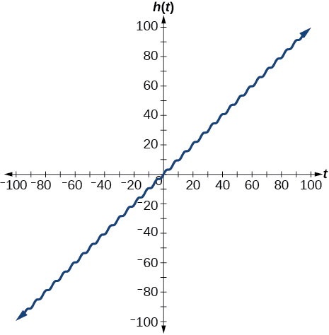 

Graph<math xmlns="http://www.w3.org/1998/Math/MathML"> <mrow> <mtext> </mtext><mi>f</mi><mo stretchy="false">(</mo><mi>x</mi><mo stretchy="false">)</mo><mo>=</mo><mi>x</mi><mtext> </mtext><mi>sin</mi><mtext> </mtext><mi>x</mi><mtext> </mtext> </mrow> </math>

on<math xmlns="http://www.w3.org/1998/Math/MathML"> <mrow> <mtext> </mtext><mrow><mo>[</mo> <mrow> <mn>0</mn><mo>,</mo><mn>2</mn><mi>π</mi> </mrow> <mo>]</mo></mrow><mtext> </mtext> </mrow> </math>

and verbalize how the graph varies from the graph of<math xmlns="http://www.w3.org/1998/Math/MathML"> <mrow> <mtext> </mtext><mi>f</mi><mo stretchy="false">(</mo><mi>x</mi><mo stretchy="false">)</mo><mo>=</mo><mi>sin</mi><mtext> </mtext><mi>x</mi><mo>.</mo> </mrow> </math>

Graph<math xmlns="http://www.w3.org/1998/Math/MathML"> <mrow> <mtext> </mtext><mi>f</mi><mo stretchy="false">(</mo><mi>x</mi><mo stretchy="false">)</mo><mo>=</mo><mi>x</mi><mtext> </mtext><mi>sin</mi><mtext> </mtext><mi>x</mi><mtext> </mtext> </mrow> </math>

on the window<math xmlns="http://www.w3.org/1998/Math/MathML"> <mrow> <mtext> </mtext><mrow><mo>[</mo> <mrow> <mn>−10</mn><mo>,</mo><mn>10</mn> </mrow> <mo>]</mo></mrow><mtext> </mtext> </mrow> </math>

and explain what the graph shows.

The graph is symmetric with respect to the *y*-axis and there is no amplitude because the function is not periodic.

 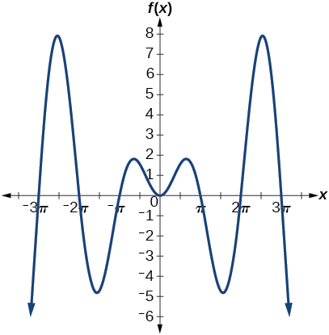 

Graph<math xmlns="http://www.w3.org/1998/Math/MathML"> <mrow> <mtext> </mtext><mi>f</mi><mo stretchy="false">(</mo><mi>x</mi><mo stretchy="false">)</mo><mo>=</mo><mfrac> <mrow> <mi>sin</mi><mtext> </mtext><mi>x</mi> </mrow> <mi>x</mi> </mfrac> <mtext> </mtext> </mrow> </math>

on the window<math xmlns="http://www.w3.org/1998/Math/MathML"> <mrow> <mtext> </mtext><mrow><mo>[</mo> <mrow> <mn>−5</mn><mi>π</mi><mo>,</mo><mn>5</mn><mi>π</mi> </mrow> <mo>]</mo></mrow><mtext> </mtext> </mrow> </math>

and explain what the graph shows.

#### Real-World Applications

A Ferris wheel is 25 meters in diameter and boarded from a platform that is 1 meter above the ground. The six o’clock position on the Ferris wheel is level with the loading platform. The wheel completes 1 full revolution in 10 minutes. The function<math xmlns="http://www.w3.org/1998/Math/MathML"> <mrow> <mtext> </mtext><mi>h</mi><mrow><mo>(</mo> <mi>t</mi> <mo>)</mo></mrow><mtext> </mtext> </mrow> </math>

gives a person’s height in meters above the ground *t* minutes after the wheel begins to turn.

1.  Find the amplitude, midline, and period of
    <math xmlns="http://www.w3.org/1998/Math/MathML"> <mrow> <mtext> </mtext><mi>h</mi><mrow><mo>(</mo> <mi>t</mi> <mo>)</mo></mrow><mo>.</mo> </mrow> </math>

2.  Find a formula for the height function
    <math xmlns="http://www.w3.org/1998/Math/MathML"> <mrow> <mtext> </mtext><mi>h</mi><mrow><mo>(</mo> <mi>t</mi> <mo>)</mo></mrow><mo>.</mo> </mrow> </math>

3.  How high off the ground is a person after 5 minutes?
{: type="a"}

1.  Amplitude: 12.5; period: 10; midline:
    <math xmlns="http://www.w3.org/1998/Math/MathML"> <mrow> <mtext> </mtext><mi>y</mi><mo>=</mo><mn>13.5</mn><mo>;</mo> </mrow> </math>

2.  <math xmlns="http://www.w3.org/1998/Math/MathML"> <mrow> <mi>h</mi><mo stretchy="false">(</mo><mi>t</mi><mo stretchy="false">)</mo><mo>=</mo><mn>12.5</mn><mi>sin</mi><mrow><mo>(</mo> <mrow> <mfrac> <mi>π</mi> <mn>5</mn> </mfrac> <mrow><mo>(</mo> <mrow> <mi>t</mi><mo>−</mo><mn>2.5</mn> </mrow> <mo>)</mo></mrow> </mrow> <mo>)</mo></mrow><mo>+</mo><mn>13.5</mn><mo>;</mo> </mrow> </math>

3.  26 ft
{: type="a"}

### Glossary
{: data-type="glossary-title"}

amplitude
: the vertical height of a function; the constant
  <math xmlns="http://www.w3.org/1998/Math/MathML"> <mrow> <mtext> </mtext><mi>A</mi><mtext> </mtext> </mrow> </math>
  
  appearing in the definition of a sinusoidal function
^

midline
: the horizontal line
  <math xmlns="http://www.w3.org/1998/Math/MathML"> <mrow> <mtext> </mtext><mi>y</mi><mo>=</mo><mi>D</mi><mo>,</mo><mtext> </mtext> </mrow> </math>
  
  where
  <math xmlns="http://www.w3.org/1998/Math/MathML"> <mrow> <mtext> </mtext><mi>D</mi><mtext> </mtext> </mrow> </math>
  
  appears in the general form of a sinusoidal function
^

periodic function
: a function
  <math xmlns="http://www.w3.org/1998/Math/MathML"> <mrow> <mtext> </mtext><mi>f</mi><mrow><mo>(</mo> <mi>x</mi> <mo>)</mo></mrow><mtext> </mtext> </mrow> </math>
  
  that satisfies
  <math xmlns="http://www.w3.org/1998/Math/MathML"> <mrow> <mtext> </mtext><mi>f</mi><mrow><mo>(</mo> <mrow> <mi>x</mi><mo>+</mo><mi>P</mi> </mrow> <mo>)</mo></mrow><mo>=</mo><mi>f</mi><mrow><mo>(</mo> <mi>x</mi> <mo>)</mo></mrow><mtext> </mtext> </mrow> </math>
  
  for a specific constant
  <math xmlns="http://www.w3.org/1998/Math/MathML"> <mrow> <mtext> </mtext><mi>P</mi><mtext> </mtext> </mrow> </math>
  
  and any value of
  <math xmlns="http://www.w3.org/1998/Math/MathML"> <mrow> <mtext> </mtext><mi>x</mi> </mrow> </math>
^

phase shift
: the horizontal displacement of the basic sine or cosine function; the constant
  <math xmlns="http://www.w3.org/1998/Math/MathML"> <mrow> <mtext> </mtext><mfrac> <mi>C</mi> <mi>B</mi> </mfrac> </mrow> </math>
^

sinusoidal function
: any function that can be expressed in the form
  <math xmlns="http://www.w3.org/1998/Math/MathML"> <mrow> <mtext> </mtext><mi>f</mi><mrow><mo>(</mo> <mi>x</mi> <mo>)</mo></mrow><mo>=</mo><mi>A</mi><mi>sin</mi><mrow><mo>(</mo> <mrow> <mi>B</mi><mi>x</mi><mo>−</mo><mi>C</mi> </mrow> <mo>)</mo></mrow><mo>+</mo><mi>D</mi><mtext> </mtext> </mrow> </math>
  
  or
  <math xmlns="http://www.w3.org/1998/Math/MathML"> <mrow> <mtext> </mtext><mi>f</mi><mrow><mo>(</mo> <mi>x</mi> <mo>)</mo></mrow><mo>=</mo><mi>A</mi><mi>cos</mi><mrow><mo>(</mo> <mrow> <mi>B</mi><mi>x</mi><mo>−</mo><mi>C</mi> </mrow> <mo>)</mo></mrow><mo>+</mo><mi>D</mi> </mrow> </math>

[1]: http://openstax.org/l/ampperiod
[2]: http://openstax.org/l/translasincos
[3]: http://openstax.org/l/transformsincos
[4]: http://openstax.org/l/graphsinefunc
