

In this section, you will:
* Analyze the graph of  y=tan x.
* Graph variations of  y=tan x.
* Analyze the graphs of  y=sec x  and  y=csc x.
* Graph variations of  y=sec x  and  y=csc x.
* Analyze the graph of  y=cot x.
* Graph variations of  y=cot x.

We know the tangent function can be used to find distances, such as the height of a building, mountain, or flagpole. But what if we want to measure repeated occurrences of distance? Imagine, for example, a police car parked next to a warehouse. The rotating light from the police car would travel across the wall of the warehouse in regular intervals. If the input is time, the output would be the distance the beam of light travels. The beam of light would repeat the distance at regular intervals. The tangent function can be used to approximate this distance. Asymptotes would be needed to illustrate the repeated cycles when the beam runs parallel to the wall because, seemingly, the beam of light could appear to extend forever. The graph of the tangent function would clearly illustrate the repeated intervals. In this section, we will explore the graphs of the tangent and other trigonometric functions.

### Analyzing the Graph of *y* = tan *x*

We will begin with the graph of the **tangent**{: data-type="term" .no-emphasis} function, plotting points as we did for the sine and cosine functions. Recall that

<math xmlns="http://www.w3.org/1998/Math/MathML" display="block"> <mrow> <mi>tan</mi><mtext> </mtext><mi>x</mi><mo>=</mo><mfrac> <mrow> <mi>sin</mi><mtext> </mtext><mi>x</mi> </mrow> <mrow> <mi>cos</mi><mtext> </mtext><mi>x</mi> </mrow> </mfrac> </mrow> </math>

The **period**{: data-type="term" .no-emphasis} of the tangent function is<math xmlns="http://www.w3.org/1998/Math/MathML"> <mrow> <mtext> </mtext><mi>π</mi><mtext> </mtext> </mrow> </math>

because the graph repeats itself on intervals of<math xmlns="http://www.w3.org/1998/Math/MathML"> <mrow> <mtext> </mtext><mi>k</mi><mi>π</mi><mtext> </mtext> </mrow> </math>

where<math xmlns="http://www.w3.org/1998/Math/MathML"> <mrow> <mtext> </mtext><mi>k</mi><mtext> </mtext> </mrow> </math>

is a constant. If we graph the tangent function on<math xmlns="http://www.w3.org/1998/Math/MathML"> <mrow> <mtext> </mtext><mo>−</mo><mfrac> <mi>π</mi> <mn>2</mn> </mfrac> <mtext> </mtext> </mrow> </math>

to<math xmlns="http://www.w3.org/1998/Math/MathML"> <mrow> <mtext> </mtext><mfrac> <mi>π</mi> <mn>2</mn> </mfrac> <mo>,</mo><mtext> </mtext> </mrow> </math>

we can see the behavior of the graph on one complete cycle. If we look at any larger interval, we will see that the characteristics of the graph repeat.

We can determine whether tangent is an odd or even function by using the definition of tangent.

<math xmlns="http://www.w3.org/1998/Math/MathML" display="block"> <mrow> <mtable columnalign="left"> <mtr columnalign="left"> <mtd columnalign="left"> <mrow> <mi>tan</mi><mo stretchy="false">(</mo><mi>−</mi><mi>x</mi><mo stretchy="false">)</mo><mo>=</mo><mfrac> <mrow> <mi>sin</mi><mo stretchy="false">(</mo><mi>−</mi><mi>x</mi><mo stretchy="false">)</mo> </mrow> <mrow> <mi>cos</mi><mo stretchy="false">(</mo><mi>−</mi><mi>x</mi><mo stretchy="false">)</mo> </mrow> </mfrac> </mrow> </mtd> <mtd columnalign="left"> <mrow> <mtable> <mtr> <mtd> <mrow /> </mtd> <mtd> <mrow /> </mtd> <mtd> <mrow /> </mtd> </mtr> </mtable><mtext>Definition of tangent</mtext><mo>.</mo> </mrow> </mtd> </mtr> <mtr columnalign="left"> <mtd columnalign="left"> <mrow> <mtext>             </mtext><mo>=</mo><mfrac> <mrow> <mo>−</mo><mi>sin</mi><mtext> </mtext><mi>x</mi> </mrow> <mrow> <mi>cos</mi><mtext> </mtext><mi>x</mi> </mrow> </mfrac> </mrow> </mtd> <mtd columnalign="left"> <mrow> <mtable> <mtr> <mtd> <mrow /> </mtd> <mtd> <mrow /> </mtd> <mtd> <mrow /> </mtd> </mtr> </mtable><mtext>Sine is an odd function, cosine is even</mtext><mo>.</mo> </mrow> </mtd> </mtr> <mtr columnalign="left"> <mtd columnalign="left"> <mrow> <mtext>             </mtext><mo>=</mo><mo>−</mo><mfrac> <mrow> <mi>sin</mi><mtext> </mtext><mi>x</mi> </mrow> <mrow> <mi>cos</mi><mtext> </mtext><mi>x</mi> </mrow> </mfrac> </mrow> </mtd> <mtd columnalign="left"> <mrow> <mtable> <mtr> <mtd> <mrow /> </mtd> <mtd> <mrow /> </mtd> <mtd> <mrow /> </mtd> </mtr> </mtable><mtext>The quotient of an odd and an even function is odd</mtext><mo>.</mo> </mrow> </mtd> </mtr> <mtr columnalign="left"> <mtd columnalign="left"> <mrow> <mtext>             </mtext><mo>=</mo><mo>−</mo><mi>tan</mi><mtext> </mtext><mi>x</mi> </mrow> </mtd> <mtd columnalign="left"> <mrow> <mtable> <mtr> <mtd> <mrow /> </mtd> <mtd> <mrow /> </mtd> <mtd> <mrow /> </mtd> </mtr> </mtable><mtext>Definition of tangent</mtext><mo>.</mo> </mrow> </mtd> </mtr> </mtable> </mrow> </math>

Therefore, tangent is an odd function. We can further analyze the graphical behavior of the tangent function by looking at values for some of the special angles, as listed in [\[link\]](#Table_06_02_00).

| <strong><math xmlns="http://www.w3.org/1998/Math/MathML">
 <mi>x</mi>
</math></strong> | <math xmlns="http://www.w3.org/1998/Math/MathML"> <mrow> <mo>−</mo><mfrac> <mi>π</mi> <mn>2</mn> </mfrac> </mrow> </math>

 | <math xmlns="http://www.w3.org/1998/Math/MathML"> <mrow> <mo>−</mo><mfrac> <mi>π</mi> <mn>3</mn> </mfrac> </mrow> </math>

 | <math xmlns="http://www.w3.org/1998/Math/MathML"> <mrow> <mo>−</mo><mfrac> <mi>π</mi> <mn>4</mn> </mfrac> </mrow> </math>

 | <math xmlns="http://www.w3.org/1998/Math/MathML"> <mrow> <mo>−</mo><mfrac> <mi>π</mi> <mn>6</mn> </mfrac> </mrow> </math>

 | 0 | <math xmlns="http://www.w3.org/1998/Math/MathML"> <mrow> <mfrac> <mi>π</mi> <mn>6</mn> </mfrac> </mrow> </math>

 | <math xmlns="http://www.w3.org/1998/Math/MathML"> <mrow> <mfrac> <mi>π</mi> <mn>4</mn> </mfrac> </mrow> </math>

 | <math xmlns="http://www.w3.org/1998/Math/MathML"> <mrow> <mfrac> <mi>π</mi> <mn>3</mn> </mfrac> </mrow> </math>

 | <math xmlns="http://www.w3.org/1998/Math/MathML"> <mrow> <mfrac> <mi>π</mi> <mn>2</mn> </mfrac> </mrow> </math>

 |
| <strong><math xmlns="http://www.w3.org/1998/Math/MathML">
 <mrow>
  <mi>tan</mi><mrow><mo>(</mo>
   <mi>x</mi>
  <mo>)</mo></mrow>
 </mrow>
</math></strong> | undefined | <math xmlns="http://www.w3.org/1998/Math/MathML"> <mrow> <mo>−</mo><msqrt> <mn>3</mn> </msqrt> </mrow> </math>

 | –1 | <math xmlns="http://www.w3.org/1998/Math/MathML"> <mrow> <mo>−</mo><mfrac> <mrow> <msqrt> <mn>3</mn> </msqrt> </mrow> <mn>3</mn> </mfrac> </mrow> </math>

 | 0 | <math xmlns="http://www.w3.org/1998/Math/MathML"> <mrow> <mfrac> <mrow> <msqrt> <mn>3</mn> </msqrt> </mrow> <mn>3</mn> </mfrac> </mrow> </math>

 | 1 | <math xmlns="http://www.w3.org/1998/Math/MathML"> <mrow> <msqrt> <mn>3</mn> </msqrt> </mrow> </math>

 | undefined |
{: #Table_06_02_00 summary="Two rows and 10 columns. First row is labeled x and second row is labeled tangent of x. The table has ordered pairs of these column values: (-pi/2,undefined), (-pi/3, negative square root of 3), (-pi/4, -1), (-pi/6, negative square root of 3 over 3), (0, 0), (pi/6, square root of 3 over 3), (pi/4, 1), (pi/3, square root of 3), (pi/2, undefined)."}

These points will help us draw our graph, but we need to determine how the graph behaves where it is undefined. If we look more closely at values when<math xmlns="http://www.w3.org/1998/Math/MathML"> <mrow> <mtext> </mtext><mfrac> <mi>π</mi> <mn>3</mn> </mfrac> <mo>&lt;</mo><mi>x</mi><mo>&lt;</mo><mfrac> <mi>π</mi> <mn>2</mn> </mfrac> <mo>,</mo><mtext> </mtext> </mrow> </math>

we can use a table to look for a trend. Because<math xmlns="http://www.w3.org/1998/Math/MathML"> <mrow> <mtext> </mtext><mfrac> <mi>π</mi> <mn>3</mn> </mfrac> <mo>≈</mo><mn>1.05</mn><mtext> </mtext> </mrow> </math>

and<math xmlns="http://www.w3.org/1998/Math/MathML"> <mrow> <mtext> </mtext><mfrac> <mi>π</mi> <mn>2</mn> </mfrac> <mo>≈</mo><mn>1.57</mn><mo>,</mo><mtext> </mtext> </mrow> </math>

we will evaluate<math xmlns="http://www.w3.org/1998/Math/MathML"> <mrow> <mtext> </mtext><mi>x</mi><mtext> </mtext> </mrow> </math>

at radian measures<math xmlns="http://www.w3.org/1998/Math/MathML"> <mrow> <mtext> </mtext><mn>1.05</mn><mo>&lt;</mo><mi>x</mi><mo>&lt;</mo><mn>1.57</mn><mtext> </mtext> </mrow> </math>

as shown in [\[link\]](#Table_06_02_01).

| <strong><math xmlns="http://www.w3.org/1998/Math/MathML">
 <mi>x</mi>
</math></strong> | 1.3 | 1.5 | 1.55 | 1.56 |
| <strong><math xmlns="http://www.w3.org/1998/Math/MathML">
 <mrow>
  <mi>tan</mi><mo> </mo><mtext> </mtext><mi>x</mi>
 </mrow>
</math> </strong> | 3.6 | 14.1 | 48.1 | 92.6 |
{: #Table_06_02_01 summary="Two rows and five columns. First row is labeled x and second row is labeled tangent of x. Th table has ordered pairs of these column values: (1.3, 3.6), (1.5, 14.1), (1.55, 48.1), (1.56, 92.6)."}

As<math xmlns="http://www.w3.org/1998/Math/MathML"> <mrow> <mtext> </mtext><mi>x</mi><mtext> </mtext> </mrow> </math>

approaches<math xmlns="http://www.w3.org/1998/Math/MathML"> <mrow> <mtext> </mtext><mfrac> <mi>π</mi> <mn>2</mn> </mfrac> <mo>,</mo><mtext> </mtext> </mrow> </math>

the outputs of the function get larger and larger. Because<math xmlns="http://www.w3.org/1998/Math/MathML"> <mrow> <mtext> </mtext><mi>y</mi><mo>=</mo><mi>tan</mi><mtext> </mtext><mi>x</mi><mtext> </mtext> </mrow> </math>

is an odd function, we see the corresponding table of negative values in [\[link\]](#Table_06_02_02).

| <strong><math xmlns="http://www.w3.org/1998/Math/MathML">
 <mi>x</mi>
</math></strong> | −1.3 | −1.5 | −1.55 | −1.56 |
| <strong><math xmlns="http://www.w3.org/1998/Math/MathML">
 <mrow>
  <mi>tan</mi><mtext> </mtext><mi>x</mi>
 </mrow>
</math></strong> | −3.6 | −14.1 | −48.1 | −92.6 |
{: #Table_06_02_02 summary="Two rows and five columns. First row is labeled x and second row is labeled tangent of x. Th table has ordered pairs of these column values: (-1.3, -3.6), (-1.5, -14.1), (-1.55, -48.1), (-1.56, -92.6)."}

We can see that, as<math xmlns="http://www.w3.org/1998/Math/MathML"> <mrow> <mtext> </mtext><mi>x</mi><mtext> </mtext> </mrow> </math>

approaches<math xmlns="http://www.w3.org/1998/Math/MathML"> <mrow> <mtext> </mtext><mo>−</mo><mfrac> <mi>π</mi> <mn>2</mn> </mfrac> <mo>,</mo><mtext> </mtext> </mrow> </math>

the outputs get smaller and smaller. Remember that there are some values of<math xmlns="http://www.w3.org/1998/Math/MathML"> <mrow> <mtext> </mtext><mi>x</mi><mtext> </mtext> </mrow> </math>

for which<math xmlns="http://www.w3.org/1998/Math/MathML"> <mrow> <mtext> </mtext><mi>cos</mi><mtext> </mtext><mi>x</mi><mo>=</mo><mn>0.</mn><mtext> </mtext> </mrow> </math>

For example,<math xmlns="http://www.w3.org/1998/Math/MathML"> <mrow> <mtext> </mtext><mi>cos</mi><mrow><mo>(</mo> <mrow> <mfrac> <mi>π</mi> <mn>2</mn> </mfrac> </mrow> <mo>)</mo></mrow><mo>=</mo><mn>0</mn><mtext> </mtext> </mrow> </math>

and<math xmlns="http://www.w3.org/1998/Math/MathML"> <mrow> <mtext> </mtext><mi>cos</mi><mrow><mo>(</mo> <mrow> <mfrac> <mrow> <mn>3</mn><mi>π</mi> </mrow> <mn>2</mn> </mfrac> </mrow> <mo>)</mo></mrow><mo>=</mo><mn>0.</mn><mtext> </mtext> </mrow> </math>

At these values, the **tangent function**{: data-type="term" .no-emphasis} is undefined, so the graph of<math xmlns="http://www.w3.org/1998/Math/MathML"> <mrow> <mtext> </mtext><mi>y</mi><mo>=</mo><mi>tan</mi><mtext> </mtext><mi>x</mi><mtext> </mtext> </mrow> </math>

has discontinuities at<math xmlns="http://www.w3.org/1998/Math/MathML"> <mrow> <mtext> </mtext><mi>x</mi><mo>=</mo><mfrac> <mi>π</mi> <mn>2</mn> </mfrac> <mtext> and </mtext><mfrac> <mrow> <mn>3</mn><mi>π</mi> </mrow> <mn>2</mn> </mfrac> <mo>.</mo><mtext> </mtext> </mrow> </math>

At these values, the graph of the tangent has vertical asymptotes. [\[link\]](#Figure_06_02_001) represents the graph of<math xmlns="http://www.w3.org/1998/Math/MathML"> <mrow> <mtext> </mtext><mi>y</mi><mo>=</mo><mi>tan</mi><mtext> </mtext><mi>x</mi><mo>.</mo><mtext> </mtext> </mrow> </math>

The tangent is positive from 0 to<math xmlns="http://www.w3.org/1998/Math/MathML"> <mrow> <mtext> </mtext><mfrac> <mi>π</mi> <mn>2</mn> </mfrac> <mtext> </mtext> </mrow> </math>

and from<math xmlns="http://www.w3.org/1998/Math/MathML"> <mrow> <mtext> </mtext><mi>π</mi><mtext> </mtext> </mrow> </math>

to<math xmlns="http://www.w3.org/1998/Math/MathML"> <mrow> <mtext> </mtext><mfrac> <mrow> <mn>3</mn><mi>π</mi> </mrow> <mn>2</mn> </mfrac> <mo>,</mo><mtext> </mtext> </mrow> </math>

corresponding to quadrants I and III of the unit circle.

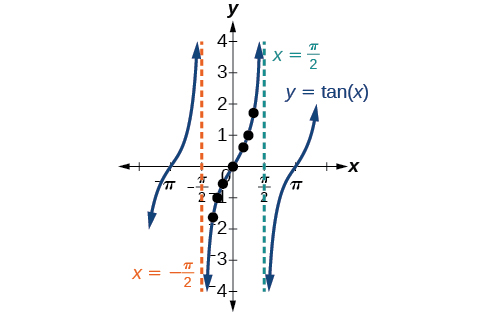{: #Figure_06_02_001}

### Graphing Variations of *y* = tan *x*

As with the sine and cosine functions, the **tangent**{: data-type="term" .no-emphasis} function can be described by a general equation.

<math xmlns="http://www.w3.org/1998/Math/MathML"> <mrow> <mi>y</mi><mo>=</mo><mi>A</mi><mi>tan</mi><mo stretchy="false">(</mo><mi>B</mi><mi>x</mi><mo stretchy="false">)</mo> </mrow> </math>

We can identify horizontal and vertical stretches and compressions using values of<math xmlns="http://www.w3.org/1998/Math/MathML"> <mrow> <mtext> </mtext><mi>A</mi><mtext> </mtext> </mrow> </math>

and<math xmlns="http://www.w3.org/1998/Math/MathML"> <mrow> <mtext> </mtext><mi>B</mi><mo>.</mo><mtext> </mtext></mrow> </math>

The horizontal stretch can typically be determined from the period of the graph. With tangent graphs, it is often necessary to determine a vertical stretch using a point on the graph.

Because there are no maximum or minimum values of a tangent function, the term *amplitude* cannot be interpreted as it is for the sine and cosine functions. Instead, we will use the phrase *stretching/compressing factor* when referring to the constant<math xmlns="http://www.w3.org/1998/Math/MathML"> <mrow> <mtext> </mtext><mi>A</mi><mo>.</mo> </mrow> </math>

Features of the Graph of *y* = *A*tan(*Bx*)

* The stretching factor is
  <math xmlns="http://www.w3.org/1998/Math/MathML"> <mrow> <mtext> </mtext><mrow><mo>\|</mo> <mi>A</mi> <mo>\|</mo></mrow><mo>.</mo> </mrow> </math>

* The period is
  <math xmlns="http://www.w3.org/1998/Math/MathML"> <mrow> <mtext> </mtext><mi>P</mi><mo>=</mo><mfrac> <mi>π</mi> <mrow> <mrow><mo>\|</mo> <mi>B</mi> <mo>\|</mo></mrow> </mrow> </mfrac> <mo>.</mo> </mrow> </math>

* The domain is all real numbers
  <math xmlns="http://www.w3.org/1998/Math/MathML"> <mrow> <mtext> </mtext><mi>x</mi><mo>,</mo> </mrow> </math>
  
  where
  <math xmlns="http://www.w3.org/1998/Math/MathML"> <mrow> <mtext> </mtext><mi>x</mi><mo>≠</mo><mfrac> <mi>π</mi> <mrow> <mn>2</mn><mrow><mo>\|</mo> <mi>B</mi> <mo>\|</mo></mrow> </mrow> </mfrac> <mo>+</mo><mfrac> <mi>π</mi> <mrow> <mrow><mo>\|</mo> <mi>B</mi> <mo>\|</mo></mrow> </mrow> </mfrac> <mi>k</mi><mtext> </mtext> </mrow> </math>
  
  such that
  <math xmlns="http://www.w3.org/1998/Math/MathML"> <mrow> <mtext> </mtext><mi>k</mi><mtext> </mtext> </mrow> </math>
  
  is an integer.
* The range is
  <math xmlns="http://www.w3.org/1998/Math/MathML"> <mrow> <mtext> </mtext><mo stretchy="false">(</mo><mi>−∞</mi><mo>,</mo><mi>∞</mi><mo stretchy="false">)</mo><mo>.</mo> </mrow> </math>

* The asymptotes occur at
  <math xmlns="http://www.w3.org/1998/Math/MathML"> <mrow> <mtext> </mtext><mi>x</mi><mo>=</mo><mfrac> <mi>π</mi> <mrow> <mn>2</mn><mrow><mo>\|</mo> <mi>B</mi> <mo>\|</mo></mrow> </mrow> </mfrac> <mo>+</mo><mfrac> <mi>π</mi> <mrow> <mrow><mo>\|</mo> <mi>B</mi> <mo>\|</mo></mrow> </mrow> </mfrac> <mi>k</mi><mo>,</mo><mtext> </mtext> </mrow> </math>
  
  where
  <math xmlns="http://www.w3.org/1998/Math/MathML"> <mrow> <mtext> </mtext><mi>k</mi><mtext> </mtext></mrow> </math>
  
  is an integer.
* <math xmlns="http://www.w3.org/1998/Math/MathML"> <mrow> <mi>y</mi><mo>=</mo><mi>A</mi><mi>tan</mi><mrow><mo>(</mo> <mrow> <mi>B</mi><mi>x</mi> </mrow> <mo>)</mo></mrow><mtext> </mtext> </mrow> </math>
  
  is an odd function.

#### Graphing One Period of a Stretched or Compressed Tangent Function

We can use what we know about the properties of the **tangent function**{: data-type="term" .no-emphasis} to quickly sketch a graph of any stretched and/or compressed tangent function of the form<math xmlns="http://www.w3.org/1998/Math/MathML"> <mrow> <mtext> </mtext><mi>f</mi><mo stretchy="false">(</mo><mi>x</mi><mo stretchy="false">)</mo><mo>=</mo><mi>A</mi><mi>tan</mi><mo stretchy="false">(</mo><mi>B</mi><mi>x</mi><mo stretchy="false">)</mo><mo>.</mo><mtext> </mtext> </mrow> </math>

We focus on a single **period**{: data-type="term" .no-emphasis} of the function including the origin, because the periodic property enables us to extend the graph to the rest of the function’s domain if we wish. Our limited domain is then the interval<math xmlns="http://www.w3.org/1998/Math/MathML"> <mrow> <mtext> </mtext><mrow><mo>(</mo> <mrow> <mo>−</mo><mfrac> <mi>P</mi> <mn>2</mn> </mfrac> <mo>,</mo><mfrac> <mi>P</mi> <mn>2</mn> </mfrac> </mrow> <mo>)</mo></mrow><mtext> </mtext> </mrow> </math>

and the graph has vertical asymptotes at<math xmlns="http://www.w3.org/1998/Math/MathML"> <mrow> <mtext> </mtext><mo>±</mo><mfrac> <mi>P</mi> <mn>2</mn> </mfrac> <mtext> </mtext> </mrow> </math>

where<math xmlns="http://www.w3.org/1998/Math/MathML"> <mrow> <mtext> </mtext><mi>P</mi><mo>=</mo><mfrac> <mi>π</mi> <mi>B</mi> </mfrac> <mo>.</mo><mtext> </mtext> </mrow> </math>

On<math xmlns="http://www.w3.org/1998/Math/MathML"> <mrow> <mtext> </mtext><mrow><mo>(</mo> <mrow> <mo>−</mo><mfrac> <mi>π</mi> <mn>2</mn> </mfrac> <mo>,</mo><mfrac> <mi>π</mi> <mn>2</mn> </mfrac> </mrow> <mo>)</mo></mrow><mo>,</mo><mtext> </mtext> </mrow> </math>

the graph will come up from the left asymptote at<math xmlns="http://www.w3.org/1998/Math/MathML"> <mrow> <mtext> </mtext><mi>x</mi><mo>=</mo><mo>−</mo><mfrac> <mi>π</mi> <mn>2</mn> </mfrac> <mo>,</mo><mtext> </mtext> </mrow> </math>

cross through the origin, and continue to increase as it approaches the right asymptote at<math xmlns="http://www.w3.org/1998/Math/MathML"> <mrow> <mtext> </mtext><mi>x</mi><mo>=</mo><mfrac> <mi>π</mi> <mn>2</mn> </mfrac> <mo>.</mo><mtext> </mtext> </mrow> </math>

To make the function approach the asymptotes at the correct rate, we also need to set the vertical scale by actually evaluating the function for at least one point that the graph will pass through. For example, we can use

<math xmlns="http://www.w3.org/1998/Math/MathML"> <mrow> <mi>f</mi><mrow><mo>(</mo> <mrow> <mfrac> <mi>P</mi> <mn>4</mn> </mfrac> </mrow> <mo>)</mo></mrow><mo>=</mo><mi>A</mi><mi>tan</mi><mrow><mo>(</mo> <mrow> <mi>B</mi><mfrac> <mi>P</mi> <mn>4</mn> </mfrac> </mrow> <mo>)</mo></mrow><mo>=</mo><mi>A</mi><mi>tan</mi><mrow><mo>(</mo> <mrow> <mi>B</mi><mfrac> <mi>π</mi> <mrow> <mn>4</mn><mi>B</mi> </mrow> </mfrac> </mrow> <mo>)</mo></mrow><mo>=</mo><mi>A</mi> </mrow> </math>

because<math xmlns="http://www.w3.org/1998/Math/MathML"> <mrow> <mtext> </mtext><mi>tan</mi><mrow><mo>(</mo> <mrow> <mfrac> <mi>π</mi> <mn>4</mn> </mfrac> </mrow> <mo>)</mo></mrow><mo>=</mo><mn>1.</mn> </mrow> </math>

**Given the function<math xmlns="http://www.w3.org/1998/Math/MathML"> <mrow> <mtext> </mtext><mi>f</mi><mo stretchy="false">(</mo><mi>x</mi><mo stretchy="false">)</mo><mo>=</mo><mi>A</mi><mi>tan</mi><mo stretchy="false">(</mo><mi>B</mi><mi>x</mi><mo stretchy="false">)</mo><mo>,</mo><mtext> </mtext> </mrow> </math>

graph one period.**

1.  Identify the stretching factor,
    <math xmlns="http://www.w3.org/1998/Math/MathML"> <mrow> <mtext> </mtext><mrow><mo>\|</mo> <mi>A</mi> <mo>\|</mo></mrow><mo>.</mo> </mrow> </math>

2.  Identify
    <math xmlns="http://www.w3.org/1998/Math/MathML"> <mrow> <mtext> </mtext><mi>B</mi><mtext> </mtext> </mrow> </math>
    
    and determine the period,
    <math xmlns="http://www.w3.org/1998/Math/MathML"> <mrow> <mtext> </mtext><mi>P</mi><mo>=</mo><mfrac> <mi>π</mi> <mrow> <mrow><mo>\|</mo> <mi>B</mi> <mo>\|</mo></mrow> </mrow> </mfrac> <mo>.</mo> </mrow> </math>

3.  Draw vertical asymptotes at
    <math xmlns="http://www.w3.org/1998/Math/MathML"> <mrow> <mtext> </mtext><mi>x</mi><mo>=</mo><mo>−</mo><mfrac> <mi>P</mi> <mn>2</mn> </mfrac> <mtext> </mtext> </mrow> </math>
    
    and
    <math xmlns="http://www.w3.org/1998/Math/MathML"> <mrow> <mtext> </mtext><mi>x</mi><mo>=</mo><mfrac> <mi>P</mi> <mn>2</mn> </mfrac> <mo>.</mo> </mrow> </math>

4.  For
    <math xmlns="http://www.w3.org/1998/Math/MathML"> <mrow> <mtext> </mtext><mi>A</mi><mo>&gt;</mo><mn>0</mn><mo>,</mo><mtext> </mtext> </mrow> </math>
    
    the graph approaches the left asymptote at negative output values and the right asymptote at positive output values (reverse for
    <math xmlns="http://www.w3.org/1998/Math/MathML"> <mrow> <mtext> </mtext><mi>A</mi><mo>&lt;</mo><mn>0</mn> </mrow> </math>
    
    ).
5.  Plot reference points at
    <math xmlns="http://www.w3.org/1998/Math/MathML"> <mrow> <mtext> </mtext><mrow><mo>(</mo> <mrow> <mfrac> <mi>P</mi> <mn>4</mn> </mfrac> <mo>,</mo><mi>A</mi> </mrow> <mo>)</mo></mrow><mo>,</mo><mtext> </mtext> </mrow> </math>
    
    <math xmlns="http://www.w3.org/1998/Math/MathML"> <mrow> <mrow><mo>(</mo> <mrow> <mn>0</mn><mo>,</mo><mn>0</mn> </mrow> <mo>)</mo></mrow><mo>,</mo><mtext> </mtext> </mrow> </math>
    
    and
    <math xmlns="http://www.w3.org/1998/Math/MathML"> <mrow> <mtext> </mtext><mrow><mo>(</mo> <mrow> <mo>−</mo><mfrac> <mi>P</mi> <mn>4</mn> </mfrac> <mo>,−</mo><mi>A</mi> </mrow> <mo>)</mo></mrow><mo>,</mo><mtext> </mtext> </mrow> </math>
    
    and draw the graph through these points.
{: data-number-style="arabic"}

Sketching a Compressed Tangent

Sketch a graph of one period of the function<math xmlns="http://www.w3.org/1998/Math/MathML"> <mrow> <mtext> </mtext><mi>y</mi><mo>=</mo><mn>0.5</mn><mi>tan</mi><mrow><mo>(</mo> <mrow> <mfrac> <mi>π</mi> <mn>2</mn> </mfrac> <mi>x</mi> </mrow> <mo>)</mo></mrow><mo>.</mo> </mrow> </math>

First, we identify<math xmlns="http://www.w3.org/1998/Math/MathML"> <mrow> <mtext> </mtext><mi>A</mi><mtext> </mtext> </mrow> </math>

and<math xmlns="http://www.w3.org/1998/Math/MathML"> <mrow> <mtext> </mtext><mi>B</mi><mo>.</mo> </mrow> </math>

Because<math xmlns="http://www.w3.org/1998/Math/MathML"> <mrow> <mtext> </mtext><mi>A</mi><mo>=</mo><mn>0.5</mn><mtext> </mtext> </mrow> </math>

and<math xmlns="http://www.w3.org/1998/Math/MathML"> <mrow> <mtext> </mtext><mi>B</mi><mo>=</mo><mfrac> <mi>π</mi> <mn>2</mn> </mfrac> <mo>,</mo><mtext> </mtext> </mrow> </math>

we can find the **stretching/compressing factor**{: data-type="term" .no-emphasis} and period. The period is<math xmlns="http://www.w3.org/1998/Math/MathML"> <mrow> <mtext> </mtext><mfrac> <mi>π</mi> <mrow> <mfrac> <mi>π</mi> <mn>2</mn> </mfrac> </mrow> </mfrac> <mo>=</mo><mn>2</mn><mo>,</mo><mtext> </mtext> </mrow> </math>

so the asymptotes are at<math xmlns="http://www.w3.org/1998/Math/MathML"> <mrow> <mtext> </mtext><mi>x</mi><mo>=</mo><mo>±</mo><mn>1.</mn><mtext> </mtext> </mrow> </math>

At a quarter period from the origin, we have

<math xmlns="http://www.w3.org/1998/Math/MathML" display="block"> <mrow> <mtable columnalign="left"> <mtr columnalign="left"> <mtd columnalign="left"> <mrow> <mi>f</mi><mo stretchy="false">(</mo><mn>0.5</mn><mo stretchy="false">)</mo><mo>=</mo><mn>0.5</mn><mi>tan</mi><mrow><mo>(</mo> <mrow> <mfrac> <mrow> <mn>0.5</mn><mi>π</mi> </mrow> <mn>2</mn> </mfrac> </mrow> <mo>)</mo></mrow> </mrow> </mtd> </mtr> <mtr columnalign="left"> <mtd columnalign="left"> <mrow> <mtext> </mtext><mtext> </mtext><mtext> </mtext><mtext> </mtext><mtext> </mtext><mtext> </mtext><mtext> </mtext><mtext> </mtext><mtext> </mtext><mtext> </mtext><mtext> </mtext><mtext> </mtext><mtext> </mtext><mtext> </mtext><mtext> </mtext><mo>=</mo><mn>0.5</mn><mi>tan</mi><mrow><mo>(</mo> <mrow> <mfrac> <mi>π</mi> <mn>4</mn> </mfrac> </mrow> <mo>)</mo></mrow> </mrow> </mtd> </mtr> <mtr columnalign="left"> <mtd columnalign="left"> <mrow> <mtext> </mtext><mtext> </mtext><mtext> </mtext><mtext> </mtext><mtext> </mtext><mtext> </mtext><mtext> </mtext><mtext> </mtext><mtext> </mtext><mtext> </mtext><mtext> </mtext><mtext> </mtext><mtext> </mtext><mtext> </mtext><mtext> </mtext><mo>=</mo><mn>0.5</mn> </mrow> </mtd> </mtr> </mtable> </mrow> </math>

This means the curve must pass through the points<math xmlns="http://www.w3.org/1998/Math/MathML"> <mrow> <mtext> </mtext><mrow><mo>(</mo> <mrow> <mn>0.5</mn><mo>,</mo><mn>0.5</mn> </mrow> <mo>)</mo></mrow><mo>,</mo> </mrow> </math>

<math xmlns="http://www.w3.org/1998/Math/MathML"> <mrow> <mrow><mo>(</mo> <mrow> <mn>0</mn><mo>,</mo><mn>0</mn> </mrow> <mo>)</mo></mrow><mo>,</mo> </mrow> </math>

and<math xmlns="http://www.w3.org/1998/Math/MathML"> <mrow> <mtext> </mtext><mrow><mo>(</mo> <mrow> <mo>−</mo><mn>0.5</mn><mo>,</mo><mn>−0.5</mn> </mrow> <mo>)</mo></mrow><mo>.</mo><mtext> </mtext> </mrow> </math>

The only inflection point is at the origin. [[link]](#Figure_06_02_003) shows the graph of one period of the function.

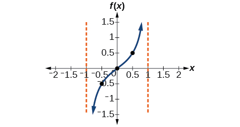{: #Figure_06_02_003}

Sketch a graph of<math xmlns="http://www.w3.org/1998/Math/MathML"> <mrow> <mtext> </mtext><mi>f</mi><mo stretchy="false">(</mo><mi>x</mi><mo stretchy="false">)</mo><mo>=</mo><mn>3</mn><mi>tan</mi><mrow><mo>(</mo> <mrow> <mfrac> <mi>π</mi> <mn>6</mn> </mfrac> <mi>x</mi> </mrow> <mo>)</mo></mrow><mo>.</mo> </mrow> </math>

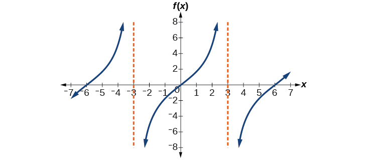

#### Graphing One Period of a Shifted Tangent Function 

Now that we can graph a **tangent function**{: data-type="term" .no-emphasis} that is stretched or compressed, we will add a vertical and/or horizontal (or phase) shift. In this case, we add<math xmlns="http://www.w3.org/1998/Math/MathML"> <mrow> <mtext> </mtext><mi>C</mi><mtext> </mtext> </mrow> </math>

and<math xmlns="http://www.w3.org/1998/Math/MathML"> <mrow> <mtext> </mtext><mi>D</mi><mtext> </mtext> </mrow> </math>

to the general form of the tangent function.

<math xmlns="http://www.w3.org/1998/Math/MathML"> <mrow> <mi>f</mi><mo stretchy="false">(</mo><mi>x</mi><mo stretchy="false">)</mo><mo>=</mo><mi>A</mi><mi>tan</mi><mo stretchy="false">(</mo><mi>B</mi><mi>x</mi><mo>−</mo><mi>C</mi><mo stretchy="false">)</mo><mo>+</mo><mi>D</mi> </mrow> </math>

The graph of a transformed tangent function is different from the basic tangent function<math xmlns="http://www.w3.org/1998/Math/MathML"> <mrow> <mtext> </mtext><mi>tan</mi><mtext> </mtext><mi>x</mi><mtext> </mtext> </mrow> </math>

in several ways:

Features of the Graph of *y* = *A*tan(*Bx*−*C*)+*D*

* The stretching factor is
  <math xmlns="http://www.w3.org/1998/Math/MathML"> <mrow> <mtext> </mtext><mrow><mo>\|</mo> <mi>A</mi> <mo>\|</mo></mrow><mo>.</mo> </mrow> </math>

* The period is
  <math xmlns="http://www.w3.org/1998/Math/MathML"> <mrow> <mtext> </mtext><mfrac> <mi>π</mi> <mrow> <mrow><mo>\|</mo> <mi>B</mi> <mo>\|</mo></mrow> </mrow> </mfrac> <mo>.</mo> </mrow> </math>

* The domain is
  <math xmlns="http://www.w3.org/1998/Math/MathML"> <mrow> <mtext> </mtext><mi>x</mi><mo>≠</mo><mfrac> <mi>C</mi> <mi>B</mi> </mfrac> <mo>+</mo><mfrac> <mi>π</mi> <mrow> <mrow><mo>\|</mo> <mi>B</mi> <mo>\|</mo></mrow> </mrow> </mfrac> <mi>k</mi><mo>,</mo> </mrow> </math>
  
  where
  <math xmlns="http://www.w3.org/1998/Math/MathML"> <mrow> <mtext> </mtext><mi>k</mi><mtext> </mtext> </mrow> </math>
  
  is an integer.
* The range is
  <math xmlns="http://www.w3.org/1998/Math/MathML"> <mrow> <mtext> </mtext><mo stretchy="false">(</mo><mi>−∞</mi><mo>,</mo><mi>∞</mi><mo stretchy="false">)</mo><mo>.</mo> </mrow> </math>

* The vertical asymptotes occur at
  <math xmlns="http://www.w3.org/1998/Math/MathML"> <mrow> <mtext> </mtext><mi>x</mi><mo>=</mo><mfrac> <mi>C</mi> <mi>B</mi> </mfrac> <mo>+</mo><mfrac> <mi>π</mi> <mrow> <mn>2</mn><mrow><mo>\|</mo> <mi>B</mi> <mo>\|</mo></mrow> </mrow> </mfrac> <mi>k</mi><mo>,</mo> </mrow> </math>
  
  where
  <math xmlns="http://www.w3.org/1998/Math/MathML"> <mrow> <mtext> </mtext><mi>k</mi><mtext> </mtext> </mrow> </math>
  
  is an odd integer.
* There is no amplitude.
* <math xmlns="http://www.w3.org/1998/Math/MathML"> <mrow> <mi>y</mi><mo>=</mo><mi>A</mi><mtext> </mtext><mi>tan</mi><mo stretchy="false">(</mo><mi>B</mi><mi>x</mi><mo stretchy="false">)</mo><mtext> </mtext> </mrow> </math>
  
  is and odd function because it is the qoutient of odd and even functions(sin and cosine perspectively).

**Given the function<math xmlns="http://www.w3.org/1998/Math/MathML"> <mrow> <mtext> </mtext><mi>y</mi><mo>=</mo><mi>A</mi><mi>tan</mi><mo stretchy="false">(</mo><mi>B</mi><mi>x</mi><mo>−</mo><mi>C</mi><mo stretchy="false">)</mo><mo>+</mo><mi>D</mi><mo>,</mo><mtext> </mtext> </mrow> </math>

sketch the graph of one period.**

1.  Express the function given in the form
    <math xmlns="http://www.w3.org/1998/Math/MathML"> <mrow> <mtext> </mtext><mi>y</mi><mo>=</mo><mi>A</mi><mi>tan</mi><mrow><mo>(</mo> <mrow> <mi>B</mi><mi>x</mi><mo>−</mo><mi>C</mi> </mrow> <mo>)</mo></mrow><mo>+</mo><mi>D</mi><mo>.</mo> </mrow> </math>

2.  Identify the **stretching/compressing factor**{: data-type="term" .no-emphasis},
    <math xmlns="http://www.w3.org/1998/Math/MathML"> <mrow> <mtext> </mtext><mrow><mo>\|</mo> <mi>A</mi> <mo>\|</mo></mrow><mo>.</mo> </mrow> </math>

3.  Identify
    <math xmlns="http://www.w3.org/1998/Math/MathML"> <mrow> <mtext> </mtext><mi>B</mi><mtext> </mtext> </mrow> </math>
    
    and determine the period,
    <math xmlns="http://www.w3.org/1998/Math/MathML"> <mrow> <mtext> </mtext><mi>P</mi><mo>=</mo><mfrac> <mi>π</mi> <mrow> <mrow><mo>\|</mo> <mi>B</mi> <mo>\|</mo></mrow> </mrow> </mfrac> <mo>.</mo> </mrow> </math>

4.  Identify
    <math xmlns="http://www.w3.org/1998/Math/MathML"> <mrow> <mtext> </mtext><mi>C</mi><mtext> </mtext> </mrow> </math>
    
    and determine the phase shift,
    <math xmlns="http://www.w3.org/1998/Math/MathML"> <mrow> <mtext> </mtext><mfrac> <mi>C</mi> <mi>B</mi> </mfrac> <mo>.</mo> </mrow> </math>

5.  Draw the graph of
    <math xmlns="http://www.w3.org/1998/Math/MathML"> <mrow> <mtext> </mtext><mi>y</mi><mo>=</mo><mi>A</mi><mi>tan</mi><mo stretchy="false">(</mo><mi>B</mi><mi>x</mi><mo stretchy="false">)</mo><mtext> </mtext> </mrow> </math>
    
    shifted to the right by
    <math xmlns="http://www.w3.org/1998/Math/MathML"> <mrow> <mtext> </mtext><mfrac> <mi>C</mi> <mi>B</mi> </mfrac> <mtext> </mtext> </mrow> </math>
    
    and up by
    <math xmlns="http://www.w3.org/1998/Math/MathML"> <mrow> <mtext> </mtext><mi>D</mi><mo>.</mo> </mrow> </math>

6.  Sketch the vertical asymptotes, which occur at
    <math xmlns="http://www.w3.org/1998/Math/MathML"> <mrow> <mtext> </mtext><mi>x</mi><mo>=</mo><mfrac> <mi>C</mi> <mi>B</mi> </mfrac> <mo>+</mo><mfrac> <mi>π</mi> <mrow> <mn>2</mn><mrow><mo>\|</mo> <mi>B</mi> <mo>\|</mo></mrow> </mrow> </mfrac> <mi>k</mi><mo>,</mo> </mrow> </math>
    
    where
    <math xmlns="http://www.w3.org/1998/Math/MathML"> <mrow> <mtext> </mtext><mi>k</mi><mtext> </mtext> </mrow> </math>
    
    is an odd integer.
7.  Plot any three reference points and draw the graph through these points.
{: data-number-style="arabic"}

Graphing One Period of a Shifted Tangent Function

Graph one period of the function<math xmlns="http://www.w3.org/1998/Math/MathML"> <mrow> <mtext> </mtext><mi>y</mi><mo>=</mo><mn>−2</mn><mi>tan</mi><mo stretchy="false">(</mo><mi>π</mi><mi>x</mi><mo>+</mo><mi>π</mi><mo stretchy="false">)</mo><mtext> </mtext><mn>−1.</mn> </mrow> </math>

* *Step 1.* The function is already written in the form
  <math xmlns="http://www.w3.org/1998/Math/MathML"> <mrow> <mtext> </mtext><mi>y</mi><mo>=</mo><mi>A</mi><mi>tan</mi><mrow><mo>(</mo> <mrow> <mi>B</mi><mi>x</mi><mo>−</mo><mi>C</mi> </mrow> <mo>)</mo></mrow><mo>+</mo><mi>D</mi><mo>.</mo> </mrow> </math>

* *Step 2.*
  <math xmlns="http://www.w3.org/1998/Math/MathML"> <mrow> <mtext> </mtext><mi>A</mi><mo>=</mo><mn>−2</mn><mo>,</mo><mtext> </mtext> </mrow> </math>
  
  so the stretching factor is
  <math xmlns="http://www.w3.org/1998/Math/MathML"> <mrow> <mtext> </mtext><mrow><mo>\|</mo> <mi>A</mi> <mo>\|</mo></mrow><mo>=</mo><mn>2.</mn> </mrow> </math>

* *Step 3.*
  <math xmlns="http://www.w3.org/1998/Math/MathML"> <mrow> <mtext> </mtext><mi>B</mi><mo>=</mo><mi>π</mi><mo>,</mo><mtext> </mtext> </mrow> </math>
  
  so the period is
  <math xmlns="http://www.w3.org/1998/Math/MathML"> <mrow> <mtext> </mtext><mi>P</mi><mo>=</mo><mfrac> <mi>π</mi> <mrow> <mrow><mo>\|</mo> <mi>B</mi> <mo>\|</mo></mrow> </mrow> </mfrac> <mo>=</mo><mfrac> <mi>π</mi> <mi>π</mi> </mfrac> <mo>=</mo><mn>1.</mn> </mrow> </math>

* *Step 4.*
  <math xmlns="http://www.w3.org/1998/Math/MathML"> <mrow> <mtext> </mtext><mi>C</mi><mo>=</mo><mo>−</mo><mi>π</mi><mo>,</mo><mtext> </mtext> </mrow> </math>
  
  so the phase shift is
  <math xmlns="http://www.w3.org/1998/Math/MathML"> <mrow> <mtext> </mtext><mfrac> <mi>C</mi> <mi>B</mi> </mfrac> <mo>=</mo><mfrac> <mrow> <mo>−</mo><mi>π</mi> </mrow> <mi>π</mi> </mfrac> <mo>=</mo><mn>−1.</mn> </mrow> </math>

* *Step 5-7.* The asymptotes are at
  <math xmlns="http://www.w3.org/1998/Math/MathML"> <mrow> <mtext> </mtext><mi>x</mi><mo>=</mo><mo>−</mo><mfrac> <mn>3</mn> <mn>2</mn> </mfrac> <mtext> </mtext> </mrow> </math>
  
  and
  <math xmlns="http://www.w3.org/1998/Math/MathML"> <mrow> <mtext> </mtext><mi>x</mi><mo>=</mo><mo>−</mo><mfrac> <mn>1</mn> <mn>2</mn> </mfrac> <mtext> </mtext> </mrow> </math>
  
  and the three recommended reference points are
  <math xmlns="http://www.w3.org/1998/Math/MathML"> <mrow> <mtext> </mtext><mrow><mo>(</mo> <mrow> <mn>−1.25</mn><mo>,</mo><mn>1</mn> </mrow> <mo>)</mo></mrow><mo>,</mo><mtext> </mtext> </mrow> </math>
  
  <math xmlns="http://www.w3.org/1998/Math/MathML"> <mrow> <mrow><mo>(</mo> <mrow> <mn>−1,</mn><mn>−1</mn> </mrow> <mo>)</mo></mrow><mo>,</mo><mtext> </mtext> </mrow> </math>
  
  and
  <math xmlns="http://www.w3.org/1998/Math/MathML"> <mrow> <mtext> </mtext><mrow><mo>(</mo> <mrow> <mn>−0.75,</mn><mn>−3</mn> </mrow> <mo>)</mo></mrow><mo>.</mo><mtext> </mtext> </mrow> </math>
  
  The graph is shown in [[link]](#Figure_06_02_005). 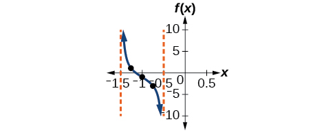{: #Figure_06_02_005}

{: data-labeled-item="true"}

Analysis

Note that this is a decreasing function because<math xmlns="http://www.w3.org/1998/Math/MathML"> <mrow> <mtext> </mtext><mi>A</mi><mo>&lt;</mo><mn>0.</mn> </mrow> </math>

How would the graph in [[link]](#Example_06_02_02) look different if we made<math xmlns="http://www.w3.org/1998/Math/MathML"> <mrow> <mtext> </mtext><mi>A</mi><mo>=</mo><mn>2</mn><mtext> </mtext> </mrow> </math>

instead of<math xmlns="http://www.w3.org/1998/Math/MathML"> <mrow> <mtext> </mtext><mn>−2</mn><mo>?</mo> </mrow> </math>

It would be reflected across the line<math xmlns="http://www.w3.org/1998/Math/MathML"> <mrow> <mtext> </mtext><mi>y</mi><mo>=</mo><mo>−</mo><mn>1</mn><mo>,</mo><mtext> </mtext> </mrow> </math>

becoming an increasing function.

**Given the graph of a tangent function, identify horizontal and vertical stretches.**

1.  Find the period
    <math xmlns="http://www.w3.org/1998/Math/MathML"> <mrow> <mtext> </mtext><mi>P</mi><mtext> </mtext> </mrow> </math>
    
    from the spacing between successive vertical asymptotes or *x*-intercepts.
2.  Write
    <math xmlns="http://www.w3.org/1998/Math/MathML"> <mrow> <mtext> </mtext><mi>f</mi><mo stretchy="false">(</mo><mi>x</mi><mo stretchy="false">)</mo><mo>=</mo><mi>A</mi><mi>tan</mi><mrow><mo>(</mo> <mrow> <mfrac> <mi>π</mi> <mi>P</mi> </mfrac> <mi>x</mi> </mrow> <mo>)</mo></mrow><mo>.</mo> </mrow> </math>

3.  Determine a convenient point
    <math xmlns="http://www.w3.org/1998/Math/MathML"> <mrow> <mtext> </mtext><mo stretchy="false">(</mo><mi>x</mi><mo>,</mo><mi>f</mi><mo stretchy="false">(</mo><mi>x</mi><mo stretchy="false">)</mo><mo stretchy="false">)</mo><mtext> </mtext> </mrow> </math>
    
    on the given graph and use it to determine
    <math xmlns="http://www.w3.org/1998/Math/MathML"> <mrow> <mtext> </mtext><mi>A</mi><mo>.</mo> </mrow> </math>
{: data-number-style="arabic"}

Identifying the Graph of a Stretched Tangent

Find a formula for the function graphed in [[link]](#Figure_06_02_006).

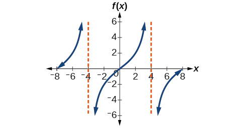{: #Figure_06_02_006}

The graph has the shape of a tangent function.

* *Step 1.* One cycle extends from –4 to 4, so the period is
  <math xmlns="http://www.w3.org/1998/Math/MathML"> <mrow> <mtext> </mtext><mi>P</mi><mo>=</mo><mn>8.</mn><mtext> </mtext> </mrow> </math>
  
  Since
  <math xmlns="http://www.w3.org/1998/Math/MathML"> <mrow> <mtext> </mtext><mi>P</mi><mo>=</mo><mfrac> <mi>π</mi> <mrow> <mrow><mo>\|</mo> <mi>B</mi> <mo>\|</mo></mrow> </mrow> </mfrac> <mo>,</mo><mtext> </mtext> </mrow> </math>
  
  we have
  <math xmlns="http://www.w3.org/1998/Math/MathML"> <mrow> <mtext> </mtext><mi>B</mi><mo>=</mo><mfrac> <mi>π</mi> <mi>P</mi> </mfrac> <mo>=</mo><mfrac> <mi>π</mi> <mn>8</mn> </mfrac> <mo>.</mo> </mrow> </math>

* *Step 2.* The equation must have the form
  <math xmlns="http://www.w3.org/1998/Math/MathML"> <mrow> <mi>f</mi><mo stretchy="false">(</mo><mi>x</mi><mo stretchy="false">)</mo><mo>=</mo><mi>A</mi><mi>tan</mi><mrow><mo>(</mo> <mrow> <mfrac> <mi>π</mi> <mn>8</mn> </mfrac> <mi>x</mi> </mrow> <mo>)</mo></mrow><mo>.</mo> </mrow> </math>

* *Step 3.* To find the vertical stretch
  <math xmlns="http://www.w3.org/1998/Math/MathML"> <mrow> <mtext> </mtext><mi>A</mi><mo>,</mo> </mrow> </math>
  
  we can use the point
  <math xmlns="http://www.w3.org/1998/Math/MathML"> <mrow> <mtext> </mtext><mrow><mo>(</mo> <mrow> <mn>2</mn><mo>,</mo><mn>2</mn> </mrow> <mo>)</mo></mrow><mo>.</mo> </mrow> </math>
  
  

  <math xmlns="http://www.w3.org/1998/Math/MathML"> <mrow> <mn>2</mn><mo>=</mo><mi>A</mi><mi>tan</mi><mrow><mo>(</mo> <mrow> <mfrac> <mi>π</mi> <mn>8</mn> </mfrac> <mo>⋅</mo><mn>2</mn> </mrow> <mo>)</mo></mrow><mo>=</mo><mi>A</mi><mi>tan</mi><mrow><mo>(</mo> <mrow> <mfrac> <mi>π</mi> <mn>4</mn> </mfrac> </mrow> <mo>)</mo></mrow> </mrow> </math>
  

{: data-labeled-item="true"}

Because<math xmlns="http://www.w3.org/1998/Math/MathML"> <mrow> <mtext> </mtext><mi>tan</mi><mrow><mo>(</mo> <mrow> <mfrac> <mi>π</mi> <mn>4</mn> </mfrac> </mrow> <mo>)</mo></mrow><mo>=</mo><mn>1</mn><mo>,</mo><mtext> </mtext> </mrow> </math>

<math xmlns="http://www.w3.org/1998/Math/MathML"> <mrow> <mi>A</mi><mo>=</mo><mn>2.</mn> </mrow> </math>

This function would have a formula<math xmlns="http://www.w3.org/1998/Math/MathML"> <mrow> <mtext> </mtext><mi>f</mi><mo stretchy="false">(</mo><mi>x</mi><mo stretchy="false">)</mo><mo>=</mo><mn>2</mn><mi>tan</mi><mrow><mo>(</mo> <mrow> <mfrac> <mi>π</mi> <mn>8</mn> </mfrac> <mi>x</mi> </mrow> <mo>)</mo></mrow><mo>.</mo> </mrow> </math>

Find a formula for the function in [[link]](#Figure_06_02_007).

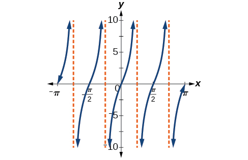{: #Figure_06_02_007}

<math xmlns="http://www.w3.org/1998/Math/MathML"> <mrow> <mi>g</mi><mo stretchy="false">(</mo><mi>x</mi><mo stretchy="false">)</mo><mo>=</mo><mn>4</mn><mi>tan</mi><mo stretchy="false">(</mo><mn>2</mn><mi>x</mi><mo stretchy="false">)</mo> </mrow> </math>

### Analyzing the Graphs of *y* = sec *x* and *y* = csc*x*

The **secant**{: data-type="term" .no-emphasis} was defined by the **reciprocal identity**{: data-type="term" .no-emphasis}<math xmlns="http://www.w3.org/1998/Math/MathML"> <mrow> <mtext> </mtext><mi>sec</mi><mtext> </mtext><mi>x</mi><mo>=</mo><mfrac> <mn>1</mn> <mrow> <mi>cos</mi><mtext> </mtext><mi>x</mi> </mrow> </mfrac> <mo>.</mo><mtext> </mtext> </mrow> </math>

Notice that the function is undefined when the cosine is 0, leading to vertical asymptotes at<math xmlns="http://www.w3.org/1998/Math/MathML"> <mrow> <mtext> </mtext><mfrac> <mi>π</mi> <mn>2</mn> </mfrac> <mo>,</mo><mtext> </mtext> </mrow> </math>

<math xmlns="http://www.w3.org/1998/Math/MathML"> <mrow> <mfrac> <mrow> <mn>3</mn><mi>π</mi> </mrow> <mn>2</mn> </mfrac> <mo>,</mo><mtext> </mtext> </mrow> </math>

etc. Because the cosine is never more than 1 in absolute value, the secant, being the reciprocal, will never be less than 1 in absolute value.

We can graph<math xmlns="http://www.w3.org/1998/Math/MathML"> <mrow> <mtext> </mtext><mi>y</mi><mo>=</mo><mi>sec</mi><mtext> </mtext><mi>x</mi><mtext> </mtext> </mrow> </math>

by observing the graph of the cosine function because these two functions are reciprocals of one another. See [\[link\]](#Figure_06_02_008). The graph of the cosine is shown as a dashed orange wave so we can see the relationship. Where the graph of the cosine function decreases, the graph of the **secant function**{: data-type="term" .no-emphasis} increases. Where the graph of the cosine function increases, the graph of the secant function decreases. When the cosine function is zero, the secant is undefined.

The secant graph has vertical asymptotes at each value of<math xmlns="http://www.w3.org/1998/Math/MathML"> <mrow> <mtext> </mtext><mi>x</mi><mtext> </mtext> </mrow> </math>

where the cosine graph crosses the *x*-axis; we show these in the graph below with dashed vertical lines, but will not show all the asymptotes explicitly on all later graphs involving the secant and cosecant.

Note that, because cosine is an even function, secant is also an even function. That is,<math xmlns="http://www.w3.org/1998/Math/MathML"> <mrow> <mtext> </mtext><mi>sec</mi><mrow><mo>(</mo> <mrow> <mo>−</mo><mi>x</mi> </mrow> <mo>)</mo></mrow><mo>=</mo><mi>sec</mi><mtext> </mtext><mi>x</mi><mo>.</mo> </mrow> </math>

=secx=&#10;   1&#10;   &#10;    cosx&#10;   &#10;  &#10;  &#10; &#10;"){: #Figure_06_02_008}

As we did for the tangent function, we will again refer to the constant<math xmlns="http://www.w3.org/1998/Math/MathML"> <mrow> <mtext> </mtext><mrow><mo>\|</mo> <mi>A</mi> <mo>\|</mo></mrow><mtext> </mtext> </mrow> </math>

as the stretching factor, not the amplitude.

Features of the Graph of *y* = *A*sec(*Bx*)

* The stretching factor is
  <math xmlns="http://www.w3.org/1998/Math/MathML"> <mrow> <mtext> </mtext><mrow><mo>\|</mo> <mi>A</mi> <mo>\|</mo></mrow><mo>.</mo> </mrow> </math>

* The period is
  <math xmlns="http://www.w3.org/1998/Math/MathML"> <mrow> <mtext> </mtext><mfrac> <mrow> <mn>2</mn><mi>π</mi> </mrow> <mrow> <mrow><mo>\|</mo> <mi>B</mi> <mo>\|</mo></mrow> </mrow> </mfrac> <mo>.</mo> </mrow> </math>

* The domain is
  <math xmlns="http://www.w3.org/1998/Math/MathML"> <mrow> <mtext> </mtext><mi>x</mi><mo>≠</mo><mfrac> <mi>π</mi> <mrow> <mn>2</mn><mrow><mo>\|</mo> <mi>B</mi> <mo>\|</mo></mrow> </mrow> </mfrac> <mi>k</mi><mo>,</mo><mtext> </mtext> </mrow> </math>
  
  where
  <math xmlns="http://www.w3.org/1998/Math/MathML"> <mrow> <mtext> </mtext><mi>k</mi><mtext> </mtext> </mrow> </math>
  
  is an odd integer.
* The range is
  <math xmlns="http://www.w3.org/1998/Math/MathML"> <mrow> <mtext> </mtext><mo stretchy="false">(</mo><mo>−</mo><mi>∞</mi><mo>,</mo><mo>−</mo><mrow><mo>\|</mo> <mi>A</mi> <mo>\|</mo></mrow><mo stretchy="false">]</mo><mo>∪</mo><mo stretchy="false">[</mo><mrow><mo>\|</mo> <mi>A</mi> <mo>\|</mo></mrow><mo>,</mo><mi>∞</mi><mo stretchy="false">)</mo><mo>.</mo> </mrow> </math>

* The vertical asymptotes occur at
  <math xmlns="http://www.w3.org/1998/Math/MathML"> <mrow> <mtext> </mtext><mi>x</mi><mo>=</mo><mfrac> <mi>π</mi> <mrow> <mn>2</mn><mrow><mo>\|</mo> <mi>B</mi> <mo>\|</mo></mrow> </mrow> </mfrac> <mi>k</mi><mo>,</mo><mtext> </mtext> </mrow> </math>
  
  where
  <math xmlns="http://www.w3.org/1998/Math/MathML"> <mrow> <mtext> </mtext><mi>k</mi><mtext> </mtext> </mrow> </math>
  
  is an odd integer.
* There is no amplitude.
* <math xmlns="http://www.w3.org/1998/Math/MathML"> <mrow> <mi>y</mi><mo>=</mo><mi>A</mi><mi>sec</mi><mrow><mo>(</mo> <mrow> <mi>B</mi><mi>x</mi> </mrow> <mo>)</mo></mrow><mtext> </mtext> </mrow> </math>
  
  is an even function because cosine is an even function.

Similar to the secant, the **cosecant**{: data-type="term" .no-emphasis} is defined by the reciprocal identity<math xmlns="http://www.w3.org/1998/Math/MathML"> <mrow> <mtext> </mtext><mi>csc</mi><mtext> </mtext><mi>x</mi><mo>=</mo><mfrac> <mn>1</mn> <mrow> <mi>sin</mi><mtext> </mtext><mi>x</mi> </mrow> </mfrac> <mo>.</mo><mtext> </mtext> </mrow> </math>

Notice that the function is undefined when the sine is 0, leading to a vertical asymptote in the graph at<math xmlns="http://www.w3.org/1998/Math/MathML"> <mrow> <mtext> </mtext><mn>0</mn><mo>,</mo><mtext> </mtext> </mrow> </math>

<math xmlns="http://www.w3.org/1998/Math/MathML"> <mrow> <mi>π</mi><mo>,</mo><mtext> </mtext> </mrow> </math>

etc. Since the sine is never more than 1 in absolute value, the cosecant, being the reciprocal, will never be less than 1 in absolute value.

We can graph<math xmlns="http://www.w3.org/1998/Math/MathML"> <mrow> <mtext> </mtext><mi>y</mi><mo>=</mo><mi>csc</mi><mtext> </mtext><mi>x</mi><mtext> </mtext> </mrow> </math>

by observing the graph of the sine function because these two functions are reciprocals of one another. See [\[link\]](#Figure_06_02_009). The graph of sine is shown as a dashed orange wave so we can see the relationship. Where the graph of the sine function decreases, the graph of the **cosecant function**{: data-type="term" .no-emphasis} increases. Where the graph of the sine function increases, the graph of the cosecant function decreases.

The cosecant graph has vertical asymptotes at each value of<math xmlns="http://www.w3.org/1998/Math/MathML"> <mrow> <mtext> </mtext><mi>x</mi><mtext> </mtext> </mrow> </math>

where the sine graph crosses the *x*-axis; we show these in the graph below with dashed vertical lines.

Note that, since sine is an odd function, the cosecant function is also an odd function. That is,<math xmlns="http://www.w3.org/1998/Math/MathML"> <mrow> <mtext> </mtext><mi>csc</mi><mrow><mo>(</mo> <mrow> <mo>−</mo><mi>x</mi> </mrow> <mo>)</mo></mrow><mo>=</mo><mi>−csc</mi><mi>x</mi><mo>.</mo> </mrow> </math>

The graph of cosecant, which is shown in [\[link\]](#Figure_06_02_009), is similar to the graph of secant.

=cscx=&#10;   1&#10;   &#10;    sinx&#10;   &#10;  &#10;  &#10; &#10;"){: #Figure_06_02_009}

Features of the Graph of *y* = *A*csc(*Bx*)

* The stretching factor is
  <math xmlns="http://www.w3.org/1998/Math/MathML"> <mrow> <mtext> </mtext><mrow><mo>\|</mo> <mi>A</mi> <mo>\|</mo></mrow><mo>.</mo> </mrow> </math>

* The period is
  <math xmlns="http://www.w3.org/1998/Math/MathML"> <mrow> <mtext> </mtext><mfrac> <mrow> <mn>2</mn><mi>π</mi> </mrow> <mrow> <mrow><mo>\|</mo> <mi>B</mi> <mo>\|</mo></mrow> </mrow> </mfrac> <mo>.</mo> </mrow> </math>

* The domain is
  <math xmlns="http://www.w3.org/1998/Math/MathML"> <mrow> <mtext> </mtext><mi>x</mi><mo>≠</mo><mfrac> <mi>π</mi> <mrow> <mrow><mo>\|</mo> <mi>B</mi> <mo>\|</mo></mrow> </mrow> </mfrac> <mi>k</mi><mo>,</mo><mtext> </mtext> </mrow> </math>
  
  where
  <math xmlns="http://www.w3.org/1998/Math/MathML"> <mrow> <mtext> </mtext><mi>k</mi><mtext> </mtext> </mrow> </math>
  
  is an integer.
* The range is
  <math xmlns="http://www.w3.org/1998/Math/MathML"> <mrow> <mrow><mo>(</mo> <mrow> <mo>−</mo><mi>∞</mi><mo>,</mo><mo>−</mo><mrow><mo>\|</mo> <mi>A</mi> <mo>\|</mo></mrow> </mrow> <mo>]</mo></mrow><mo>∪</mo><mrow><mo>[</mo> <mrow> <mrow><mo>\|</mo> <mi>A</mi> <mo>\|</mo></mrow><mo>,</mo><mi>∞</mi> </mrow> <mo>)</mo></mrow><mo>.</mo> </mrow> </math>

* The asymptotes occur at
  <math xmlns="http://www.w3.org/1998/Math/MathML"> <mrow> <mtext> </mtext><mi>x</mi><mo>=</mo><mfrac> <mi>π</mi> <mrow> <mrow><mo>\|</mo> <mi>B</mi> <mo>\|</mo></mrow> </mrow> </mfrac> <mi>k</mi><mo>,</mo><mtext> </mtext> </mrow> </math>
  
  where
  <math xmlns="http://www.w3.org/1998/Math/MathML"> <mrow> <mtext> </mtext><mi>k</mi><mtext> </mtext> </mrow> </math>
  
  is an integer.
* <math xmlns="http://www.w3.org/1998/Math/MathML"> <mrow> <mi>y</mi><mo>=</mo><mi>A</mi><mi>csc</mi><mrow><mo>(</mo> <mrow> <mi>B</mi><mi>x</mi> </mrow> <mo>)</mo></mrow><mtext> </mtext> </mrow> </math>
  
  is an odd function because sine is an odd function.

### Graphing Variations of *y* = sec *x* and *y*= csc *x*

For shifted, compressed, and/or stretched versions of the secant and cosecant functions, we can follow similar methods to those we used for tangent and cotangent. That is, we locate the vertical asymptotes and also evaluate the functions for a few points (specifically the local extrema). If we want to graph only a single period, we can choose the interval for the period in more than one way. The procedure for secant is very similar, because the cofunction identity means that the secant graph is the same as the cosecant graph shifted half a period to the left. Vertical and phase shifts may be applied to the **cosecant function**{: data-type="term" .no-emphasis} in the same way as for the secant and other functions.The equations become the following.

<math xmlns="http://www.w3.org/1998/Math/MathML"> <mi>y</mi><mo>=</mo><mi>A</mi><mi>sec</mi><mrow><mo>(</mo> <mrow> <mi>B</mi><mi>x</mi><mo>−</mo><mi>C</mi> </mrow> <mo>)</mo></mrow><mo>+</mo><mi>D</mi> </math>

<math xmlns="http://www.w3.org/1998/Math/MathML"> <mi>y</mi><mo>=</mo><mi>A</mi><mi>csc</mi><mrow><mo>(</mo> <mrow> <mi>B</mi><mi>x</mi><mo>−</mo><mi>C</mi> </mrow> <mo>)</mo></mrow><mo>+</mo><mi>D</mi> </math>

Features of the Graph of *y* = *A*sec(*Bx*−*C*)+*D*

* The stretching factor is
  <math xmlns="http://www.w3.org/1998/Math/MathML"> <mrow> <mtext> </mtext><mrow><mo>\|</mo> <mi>A</mi> <mo>\|</mo></mrow><mo>.</mo> </mrow> </math>

* The period is
  <math xmlns="http://www.w3.org/1998/Math/MathML"> <mrow> <mtext> </mtext><mfrac> <mrow> <mn>2</mn><mi>π</mi> </mrow> <mrow> <mrow><mo>\|</mo> <mi>B</mi> <mo>\|</mo></mrow> </mrow> </mfrac> <mo>.</mo> </mrow> </math>

* The domain is
  <math xmlns="http://www.w3.org/1998/Math/MathML"> <mrow> <mtext> </mtext><mi>x</mi><mo>≠</mo><mfrac> <mi>C</mi> <mi>B</mi> </mfrac> <mo>+</mo><mfrac> <mi>π</mi> <mrow> <mn>2</mn><mrow><mo>\|</mo> <mi>B</mi> <mo>\|</mo></mrow> </mrow> </mfrac> <mi>k</mi><mo>,</mo> </mrow> </math>
  
  where
  <math xmlns="http://www.w3.org/1998/Math/MathML"> <mrow> <mtext> </mtext><mi>k</mi><mtext> </mtext> </mrow> </math>
  
  is an odd integer.
* The range is
  <math xmlns="http://www.w3.org/1998/Math/MathML"> <mrow> <mtext> </mtext><mo stretchy="false">(</mo><mo>−</mo><mi>∞</mi><mo>,</mo><mo>−</mo><mrow><mo>\|</mo> <mi>A</mi> <mo>\|</mo></mrow><mo stretchy="false">]</mo><mo>∪</mo><mo stretchy="false">[</mo><mrow><mo>\|</mo> <mi>A</mi> <mo>\|</mo></mrow><mo>,</mo><mi>∞</mi><mo stretchy="false">)</mo><mo>.</mo> </mrow> </math>

* The vertical asymptotes occur at
  <math xmlns="http://www.w3.org/1998/Math/MathML"> <mrow> <mtext> </mtext><mi>x</mi><mo>=</mo><mfrac> <mi>C</mi> <mi>B</mi> </mfrac> <mo>+</mo><mfrac> <mi>π</mi> <mrow> <mn>2</mn><mrow><mo>\|</mo> <mi>B</mi> <mo>\|</mo></mrow> </mrow> </mfrac> <mi>k</mi><mo>,</mo> </mrow> </math>
  
  where
  <math xmlns="http://www.w3.org/1998/Math/MathML"> <mrow> <mtext> </mtext><mi>k</mi><mtext> </mtext> </mrow> </math>
  
  is an odd integer.
* There is no amplitude.
* <math xmlns="http://www.w3.org/1998/Math/MathML"> <mrow> <mi>y</mi><mo>=</mo><mi>A</mi><mi>sec</mi><mrow><mo>(</mo> <mrow> <mi>B</mi><mi>x</mi> </mrow> <mo>)</mo></mrow><mtext> </mtext> </mrow> </math>
  
  is an even function because cosine is an even function.

Features of the Graph of *y* = *A*csc(*Bx*−*C*)+*D*

* The stretching factor is
  <math xmlns="http://www.w3.org/1998/Math/MathML"> <mrow> <mtext> </mtext><mrow><mo>\|</mo> <mi>A</mi> <mo>\|</mo></mrow><mo>.</mo> </mrow> </math>

* The period is
  <math xmlns="http://www.w3.org/1998/Math/MathML"> <mrow> <mtext> </mtext><mfrac> <mrow> <mn>2</mn><mi>π</mi> </mrow> <mrow> <mrow><mo>\|</mo> <mi>B</mi> <mo>\|</mo></mrow> </mrow> </mfrac> <mo>.</mo> </mrow> </math>

* The domain is
  <math xmlns="http://www.w3.org/1998/Math/MathML"> <mrow> <mtext> </mtext><mi>x</mi><mo>≠</mo><mfrac> <mi>C</mi> <mi>B</mi> </mfrac> <mo>+</mo><mfrac> <mi>π</mi> <mrow> <mn>2</mn><mrow><mo>\|</mo> <mi>B</mi> <mo>\|</mo></mrow> </mrow> </mfrac> <mi>k</mi><mo>,</mo> </mrow> </math>
  
  where
  <math xmlns="http://www.w3.org/1998/Math/MathML"> <mrow> <mtext> </mtext><mi>k</mi><mtext> </mtext> </mrow> </math>
  
  is an integer.
* The range is
  <math xmlns="http://www.w3.org/1998/Math/MathML"> <mrow> <mtext> </mtext><mo stretchy="false">(</mo><mo>−</mo><mi>∞</mi><mo>,</mo><mo>−</mo><mrow><mo>\|</mo> <mi>A</mi> <mo>\|</mo></mrow><mo stretchy="false">]</mo><mo>∪</mo><mo stretchy="false">[</mo><mrow><mo>\|</mo> <mi>A</mi> <mo>\|</mo></mrow><mo>,</mo><mi>∞</mi><mo stretchy="false">)</mo><mo>.</mo> </mrow> </math>

* The vertical asymptotes occur at
  <math xmlns="http://www.w3.org/1998/Math/MathML"> <mrow> <mtext> </mtext><mi>x</mi><mo>=</mo><mfrac> <mi>C</mi> <mi>B</mi> </mfrac> <mo>+</mo><mfrac> <mi>π</mi> <mrow> <mo>\|</mo><mi>B</mi><mo>\|</mo> </mrow> </mfrac> <mi>k</mi><mo>,</mo> </mrow> </math>
  
  where
  <math xmlns="http://www.w3.org/1998/Math/MathML"> <mrow> <mtext> </mtext><mi>k</mi><mtext> </mtext> </mrow> </math>
  
  is an integer.
* There is no amplitude.
* <math xmlns="http://www.w3.org/1998/Math/MathML"> <mrow> <mi>y</mi><mo>=</mo><mi>A</mi><mi>csc</mi><mrow><mo>(</mo> <mrow> <mi>B</mi><mi>x</mi> </mrow> <mo>)</mo></mrow><mtext> </mtext> </mrow> </math>
  
  is an odd function because sine is an odd function.

**Given a function of the form<math xmlns="http://www.w3.org/1998/Math/MathML"> <mrow> <mtext> </mtext><mi>y</mi><mo>=</mo><mi>A</mi><mi>sec</mi><mrow><mo>(</mo> <mrow> <mi>B</mi><mi>x</mi> </mrow> <mo>)</mo></mrow><mo>,</mo><mtext> </mtext> </mrow> </math>

graph one period.**

1.  Express the function given in the form
    <math xmlns="http://www.w3.org/1998/Math/MathML"> <mrow> <mtext> </mtext><mi>y</mi><mo>=</mo><mi>A</mi><mi>sec</mi><mrow><mo>(</mo> <mrow> <mi>B</mi><mi>x</mi> </mrow> <mo>)</mo></mrow><mo>.</mo> </mrow> </math>

2.  Identify the stretching/compressing factor,
    <math xmlns="http://www.w3.org/1998/Math/MathML"> <mrow> <mtext> </mtext><mrow><mo>\|</mo> <mi>A</mi> <mo>\|</mo></mrow><mo>.</mo> </mrow> </math>

3.  Identify
    <math xmlns="http://www.w3.org/1998/Math/MathML"> <mrow> <mtext> </mtext><mi>B</mi><mtext> </mtext> </mrow> </math>
    
    and determine the period,
    <math xmlns="http://www.w3.org/1998/Math/MathML"> <mrow> <mtext> </mtext><mi>P</mi><mo>=</mo><mfrac> <mrow> <mn>2</mn><mi>π</mi> </mrow> <mrow> <mrow><mo>\|</mo> <mi>B</mi> <mo>\|</mo></mrow> </mrow> </mfrac> <mo>.</mo> </mrow> </math>

4.  Sketch the graph of
    <math xmlns="http://www.w3.org/1998/Math/MathML"> <mrow> <mtext> </mtext><mi>y</mi><mo>=</mo><mi>A</mi><mi>cos</mi><mrow><mo>(</mo> <mrow> <mi>B</mi><mi>x</mi> </mrow> <mo>)</mo></mrow><mo>.</mo> </mrow> </math>

5.  Use the reciprocal relationship between
    <math xmlns="http://www.w3.org/1998/Math/MathML"> <mrow> <mtext> </mtext><mi>y</mi><mo>=</mo><mi>cos</mi><mtext> </mtext><mi>x</mi><mtext> </mtext> </mrow> </math>
    
    and
    <math xmlns="http://www.w3.org/1998/Math/MathML"> <mrow> <mtext> </mtext><mi>y</mi><mo>=</mo><mi>sec</mi><mtext> </mtext><mi>x</mi><mtext> </mtext> </mrow> </math>
    
    to draw the graph of
    <math xmlns="http://www.w3.org/1998/Math/MathML"> <mrow> <mtext> </mtext><mi>y</mi><mo>=</mo><mi>A</mi><mi>sec</mi><mrow><mo>(</mo> <mrow> <mi>B</mi><mi>x</mi> </mrow> <mo>)</mo></mrow><mo>.</mo> </mrow> </math>

6.  Sketch the asymptotes.
7.  Plot any two reference points and draw the graph through these points.
{: data-number-style="arabic"}

Graphing a Variation of the Secant Function

Graph one period of<math xmlns="http://www.w3.org/1998/Math/MathML"> <mrow> <mtext> </mtext><mi>f</mi><mo stretchy="false">(</mo><mi>x</mi><mo stretchy="false">)</mo><mo>=</mo><mn>2.5</mn><mi>sec</mi><mo stretchy="false">(</mo><mn>0.4</mn><mi>x</mi><mo stretchy="false">)</mo><mo>.</mo> </mrow> </math>

* *Step 1.* The given function is already written in the general form,
  <math xmlns="http://www.w3.org/1998/Math/MathML"> <mrow> <mtext> </mtext><mi>y</mi><mo>=</mo><mi>A</mi><mi>sec</mi><mrow><mo>(</mo> <mrow> <mi>B</mi><mi>x</mi> </mrow> <mo>)</mo></mrow><mo>.</mo> </mrow> </math>

* *Step 2.*
  <math xmlns="http://www.w3.org/1998/Math/MathML"> <mrow> <mtext> </mtext><mi>A</mi><mo>=</mo><mn>2.5</mn><mtext> </mtext> </mrow> </math>
  
  so the stretching factor is
  <math xmlns="http://www.w3.org/1998/Math/MathML"> <mrow> <mtext> </mtext><mtext>2</mtext><mtext>.5</mtext><mtext>.</mtext> </mrow> </math>

* *Step 3.*
  <math xmlns="http://www.w3.org/1998/Math/MathML"> <mrow> <mtext> </mtext><mi>B</mi><mo>=</mo><mn>0.4</mn><mtext> </mtext> </mrow> </math>
  
  so
  <math xmlns="http://www.w3.org/1998/Math/MathML"> <mrow> <mtext> </mtext><mi>P</mi><mo>=</mo><mfrac> <mrow> <mn>2</mn><mi>π</mi> </mrow> <mrow> <mn>0.4</mn> </mrow> </mfrac> <mo>=</mo><mn>5</mn><mi>π</mi><mo>.</mo><mtext> </mtext> </mrow> </math>
  
  The period is
  <math xmlns="http://www.w3.org/1998/Math/MathML"> <mrow> <mtext> </mtext><mn>5</mn><mi>π</mi><mtext> </mtext> </mrow> </math>
  
  units.
* *Step 4.* Sketch the graph of the function
  <math xmlns="http://www.w3.org/1998/Math/MathML"> <mrow> <mtext> </mtext><mi>g</mi><mo stretchy="false">(</mo><mi>x</mi><mo stretchy="false">)</mo><mo>=</mo><mn>2.5</mn><mi>cos</mi><mo stretchy="false">(</mo><mn>0.4</mn><mi>x</mi><mo stretchy="false">)</mo><mo>.</mo> </mrow> </math>

* *Step 5.* Use the reciprocal relationship of the cosine and secant functions to draw the cosecant function.
* *Steps 6–7.* Sketch two asymptotes at
  <math xmlns="http://www.w3.org/1998/Math/MathML"> <mrow> <mtext> </mtext><mi>x</mi><mo>=</mo><mn>1.25</mn><mi>π</mi><mtext> </mtext> </mrow> </math>
  
  and
  <math xmlns="http://www.w3.org/1998/Math/MathML"> <mrow> <mtext> </mtext><mi>x</mi><mo>=</mo><mn>3.75</mn><mi>π</mi><mo>.</mo><mtext> </mtext> </mrow> </math>
  
  We can use two reference points, the local minimum at
  <math xmlns="http://www.w3.org/1998/Math/MathML"> <mrow> <mtext> </mtext><mrow><mo>(</mo> <mrow> <mn>0</mn><mo>,</mo><mn>2.5</mn> </mrow> <mo>)</mo></mrow><mtext> </mtext> </mrow> </math>
  
  and the local maximum at
  <math xmlns="http://www.w3.org/1998/Math/MathML"> <mrow> <mtext> </mtext><mrow><mo>(</mo> <mrow> <mn>2.5</mn><mi>π</mi><mo>,</mo><mn>−2.5</mn> </mrow> <mo>)</mo></mrow><mo>.</mo><mtext> </mtext> </mrow> </math>
  
  [[link]](#Figure_06_02_010) shows the graph. 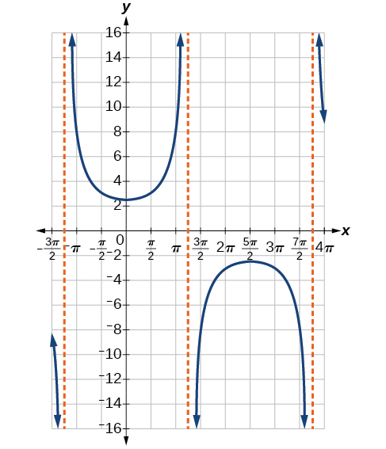{: #Figure_06_02_010}

{: data-labeled-item="true"}

Graph one period of<math xmlns="http://www.w3.org/1998/Math/MathML"> <mrow> <mtext> </mtext><mi>f</mi><mo stretchy="false">(</mo><mi>x</mi><mo stretchy="false">)</mo><mo>=</mo><mo>−</mo><mn>2.5</mn><mi>sec</mi><mo stretchy="false">(</mo><mn>0.4</mn><mi>x</mi><mo stretchy="false">)</mo><mo>.</mo> </mrow> </math>

This is a vertical reflection of the preceding graph because<math xmlns="http://www.w3.org/1998/Math/MathML"> <mrow> <mtext> </mtext><mi>A</mi><mtext> </mtext> </mrow> </math>

is negative.

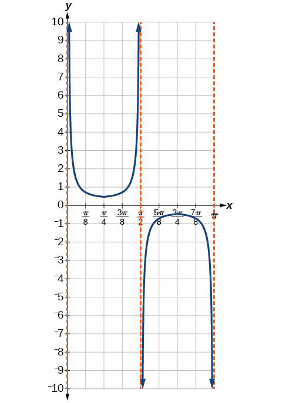

**Do the vertical shift and stretch/compression affect the secant’s range?**

*Yes. The range of*<math xmlns="http://www.w3.org/1998/Math/MathML"> <mrow> <mtext> </mtext><mi>f</mi><mrow><mo>(</mo> <mi>x</mi> <mo>)</mo></mrow><mo>=</mo><mi>A</mi><mi>sec</mi><mrow><mo>(</mo> <mrow> <mi>B</mi><mi>x</mi><mo>−</mo><mi>C</mi> </mrow> <mo>)</mo></mrow><mo>+</mo><mi>D</mi><mtext> </mtext> </mrow> </math>

*is*<math xmlns="http://www.w3.org/1998/Math/MathML"> <mrow> <mrow><mo>(</mo> <mrow> <mo>−</mo><mi>∞</mi><mo>,</mo><mo>−</mo><mrow><mo>\|</mo> <mi>A</mi> <mo>\|</mo></mrow><mo>+</mo><mi>D</mi> </mrow> <mo>]</mo></mrow><mo>∪</mo><mrow><mo>[</mo> <mrow> <mrow><mo>\|</mo> <mi>A</mi> <mo>\|</mo></mrow><mo>+</mo><mi>D</mi><mo>,</mo><mi>∞</mi> </mrow> <mo>)</mo></mrow><mo>.</mo> </mrow> </math>

**Given a function of the form<math xmlns="http://www.w3.org/1998/Math/MathML"> <mrow> <mtext> </mtext><mi>f</mi><mrow><mo>(</mo> <mi>x</mi> <mo>)</mo></mrow><mo>=</mo><mi>A</mi><mi>sec</mi><mrow><mo>(</mo> <mrow> <mi>B</mi><mi>x</mi><mo>−</mo><mi>C</mi> </mrow> <mo>)</mo></mrow><mo>+</mo><mi>D</mi><mo>,</mo><mtext> </mtext> </mrow> </math>

graph one period.**

1.  Express the function given in the form
    <math xmlns="http://www.w3.org/1998/Math/MathML"> <mrow> <mtext> </mtext><mi>y</mi><mo>=</mo><mi>A</mi><mtext> </mtext><mi>sec</mi><mo stretchy="false">(</mo><mi>B</mi><mi>x</mi><mo>−</mo><mi>C</mi><mo stretchy="false">)</mo><mo>+</mo><mi>D</mi><mo>.</mo> </mrow> </math>

2.  Identify the stretching/compressing factor,
    <math xmlns="http://www.w3.org/1998/Math/MathML"> <mrow> <mtext> </mtext><mrow><mo>\|</mo> <mi>A</mi> <mo>\|</mo></mrow><mo>.</mo> </mrow> </math>

3.  Identify
    <math xmlns="http://www.w3.org/1998/Math/MathML"> <mrow> <mtext> </mtext><mi>B</mi><mtext> </mtext> </mrow> </math>
    
    and determine the period,
    <math xmlns="http://www.w3.org/1998/Math/MathML"> <mrow> <mtext> </mtext><mfrac> <mrow> <mn>2</mn><mi>π</mi> </mrow> <mrow> <mrow><mo>\|</mo> <mi>B</mi> <mo>\|</mo></mrow> </mrow> </mfrac> <mo>.</mo> </mrow> </math>

4.  Identify
    <math xmlns="http://www.w3.org/1998/Math/MathML"> <mrow> <mtext> </mtext><mi>C</mi><mtext> </mtext> </mrow> </math>
    
    and determine the phase shift,
    <math xmlns="http://www.w3.org/1998/Math/MathML"> <mrow> <mtext> </mtext><mfrac> <mi>C</mi> <mi>B</mi> </mfrac> <mo>.</mo> </mrow> </math>

5.  Draw the graph of
    <math xmlns="http://www.w3.org/1998/Math/MathML"> <mrow> <mtext> </mtext><mi>y</mi><mo>=</mo><mi>A</mi><mtext> </mtext><mi>sec</mi><mo stretchy="false">(</mo><mi>B</mi><mi>x</mi><mo stretchy="false">)</mo><mtext> </mtext><mo>.</mo> </mrow> </math>
    
    but shift it to the right by
    <math xmlns="http://www.w3.org/1998/Math/MathML"> <mrow> <mtext> </mtext><mfrac> <mi>C</mi> <mi>B</mi> </mfrac> <mtext> </mtext> </mrow> </math>
    
    and up by
    <math xmlns="http://www.w3.org/1998/Math/MathML"> <mrow> <mtext> </mtext><mi>D</mi><mo>.</mo> </mrow> </math>

6.  Sketch the vertical asymptotes, which occur at
    <math xmlns="http://www.w3.org/1998/Math/MathML"> <mrow> <mtext> </mtext><mi>x</mi><mo>=</mo><mfrac> <mi>C</mi> <mi>B</mi> </mfrac> <mo>+</mo><mfrac> <mi>π</mi> <mrow> <mn>2</mn><mrow><mo>\|</mo> <mi>B</mi> <mo>\|</mo></mrow> </mrow> </mfrac> <mi>k</mi><mo>,</mo> </mrow> </math>
    
    where
    <math xmlns="http://www.w3.org/1998/Math/MathML"> <mrow> <mtext> </mtext><mi>k</mi><mtext> </mtext> </mrow> </math>
    
    is an odd integer.
{: data-number-style="arabic"}

Graphing a Variation of the Secant Function

Graph one period of<math xmlns="http://www.w3.org/1998/Math/MathML"> <mrow> <mtext> </mtext><mi>y</mi><mo>=</mo><mn>4</mn><mi>sec</mi><mrow><mo>(</mo> <mrow> <mfrac> <mi>π</mi> <mn>3</mn> </mfrac> <mi>x</mi><mo>−</mo><mfrac> <mi>π</mi> <mn>2</mn> </mfrac> </mrow> <mo>)</mo></mrow><mo>+</mo><mn>1.</mn> </mrow> </math>

* *Step 1.* Express the function given in the form
  <math xmlns="http://www.w3.org/1998/Math/MathML"> <mrow> <mtext> </mtext><mi>y</mi><mo>=</mo><mn>4</mn><mi>sec</mi><mrow><mo>(</mo> <mrow> <mfrac> <mi>π</mi> <mn>3</mn> </mfrac> <mi>x</mi><mo>−</mo><mfrac> <mi>π</mi> <mn>2</mn> </mfrac> </mrow> <mo>)</mo></mrow><mo>+</mo><mn>1.</mn> </mrow> </math>

* *Step 2.* The stretching/compressing factor is
  <math xmlns="http://www.w3.org/1998/Math/MathML"> <mrow> <mrow><mo>\|</mo> <mi>A</mi> <mo>\|</mo></mrow><mo>=</mo><mn>4.</mn> </mrow> </math>

* *Step 3.* The period is
  

  <math xmlns="http://www.w3.org/1998/Math/MathML"> <mrow> <mtable columnalign="left"> <mtr columnalign="left"> <mtd columnalign="left"> <mrow> <mfrac> <mrow> <mn>2</mn><mi>π</mi> </mrow> <mrow> <mo>\|</mo><mi>B</mi><mo>\|</mo> </mrow> </mfrac> <mo>=</mo><mfrac> <mrow> <mn>2</mn><mi>π</mi> </mrow> <mrow> <mfrac> <mi>π</mi> <mn>3</mn> </mfrac> </mrow> </mfrac> </mrow> </mtd> </mtr> <mtr columnalign="left"> <mtd columnalign="left"> <mrow> <mtext>      </mtext><mo>=</mo><mfrac> <mrow> <mn>2</mn><mi>π</mi> </mrow> <mn>1</mn> </mfrac> <mo>⋅</mo><mfrac> <mn>3</mn> <mi>π</mi> </mfrac> </mrow> </mtd> </mtr> <mtr columnalign="left"> <mtd columnalign="left"> <mrow> <mtext>      </mtext><mo>=</mo><mn>6</mn> </mrow> </mtd> </mtr> </mtable> </mrow> </math>
  

* *Step 4.* The phase shift is
  

  <math xmlns="http://www.w3.org/1998/Math/MathML"> <mrow> <mtable columnalign="left"> <mtr columnalign="left"> <mtd columnalign="left"> <mrow> <mfrac> <mi>C</mi> <mi>B</mi> </mfrac> <mo>=</mo><mfrac> <mrow> <mfrac> <mi>π</mi> <mn>2</mn> </mfrac> </mrow> <mrow> <mfrac> <mi>π</mi> <mn>3</mn> </mfrac> </mrow> </mfrac> </mrow> </mtd> </mtr> <mtr columnalign="left"> <mtd columnalign="left"> <mrow> <mtext>   </mtext><mo>=</mo><mfrac> <mi>π</mi> <mn>2</mn> </mfrac> <mo>⋅</mo><mfrac> <mn>3</mn> <mi>π</mi> </mfrac> </mrow> </mtd> </mtr> <mtr columnalign="left"> <mtd columnalign="left"> <mrow> <mtext>   </mtext><mo>=</mo><mn>1.5</mn> </mrow> </mtd> </mtr> </mtable> </mrow> </math>
  

* *Step 5.* Draw the graph of
  <math xmlns="http://www.w3.org/1998/Math/MathML"> <mrow> <mtext> </mtext><mi>y</mi><mo>=</mo><mi>A</mi><mi>sec</mi><mo stretchy="false">(</mo><mi>B</mi><mi>x</mi><mo stretchy="false">)</mo><mo>,</mo> </mrow> </math>
  
  but shift it to the right by
  <math xmlns="http://www.w3.org/1998/Math/MathML"> <mrow> <mtext> </mtext><mfrac> <mi>C</mi> <mi>B</mi> </mfrac> <mo>=</mo><mn>1.5</mn><mtext> </mtext> </mrow> </math>
  
  and up by
  <math xmlns="http://www.w3.org/1998/Math/MathML"> <mrow> <mtext> </mtext><mi>D</mi><mo>=</mo><mn>6.</mn> </mrow> </math>

* *Step 6.* Sketch the vertical asymptotes, which occur at
  <math xmlns="http://www.w3.org/1998/Math/MathML"> <mrow> <mtext> </mtext><mi>x</mi><mo>=</mo><mn>0</mn><mo>,</mo><mi>x</mi><mo>=</mo><mn>3</mn><mo>,</mo> </mrow> </math>
  
  and
  <math xmlns="http://www.w3.org/1998/Math/MathML"> <mrow> <mtext> </mtext><mi>x</mi><mo>=</mo><mn>6.</mn><mtext> </mtext> </mrow> </math>
  
  There is a local minimum at
  <math xmlns="http://www.w3.org/1998/Math/MathML"> <mrow> <mtext> </mtext><mrow><mo>(</mo> <mrow> <mn>1.5</mn><mo>,</mo><mn>5</mn> </mrow> <mo>)</mo></mrow><mtext> </mtext> </mrow> </math>
  
  and a local maximum at
  <math xmlns="http://www.w3.org/1998/Math/MathML"> <mrow> <mtext> </mtext><mrow><mo>(</mo> <mrow> <mn>4.5</mn><mo>,</mo><mo>−</mo><mn>3</mn> </mrow> <mo>)</mo></mrow><mo>.</mo><mtext> </mtext> </mrow> </math>
  
  [[link]](#Figure_06_02_012) shows the graph.
{: data-labeled-item="true"}

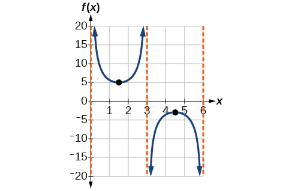{: #Figure_06_02_012}

Graph one period of<math xmlns="http://www.w3.org/1998/Math/MathML"> <mrow> <mtext> </mtext><mi>f</mi><mrow><mo>(</mo> <mi>x</mi> <mo>)</mo></mrow><mo>=</mo><mo>−</mo><mn>6</mn><mi>sec</mi><mo stretchy="false">(</mo><mn>4</mn><mi>x</mi><mo>+</mo><mn>2</mn><mo stretchy="false">)</mo><mo>−</mo><mn>8.</mn> </mrow> </math>

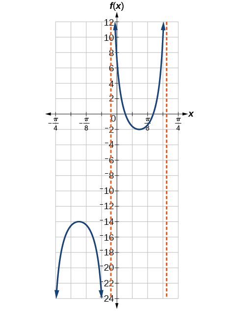

<strong>The domain of<math xmlns="http://www.w3.org/1998/Math/MathML">
 <mrow>
  <mtext> </mtext><mi>csc</mi><mtext> </mtext><mi>x</mi><mtext> </mtext>
 </mrow>
</math>was given to be all<math xmlns="http://www.w3.org/1998/Math/MathML">
 <mrow>
  <mtext> </mtext><mi>x</mi><mtext> </mtext>
 </mrow>
</math>such that<math xmlns="http://www.w3.org/1998/Math/MathML">
 <mrow>
  <mtext> </mtext><mi>x</mi><mo>≠</mo><mi>k</mi><mi>π</mi><mtext> </mtext>
 </mrow>
</math>for any integer<math xmlns="http://www.w3.org/1998/Math/MathML">
 <mrow>
  <mtext> </mtext><mi>k</mi><mo>.</mo><mtext> </mtext>
 </mrow>
</math><strong>Would the domain of</strong><math xmlns="http://www.w3.org/1998/Math/MathML">
 <mrow>
  <mtext> </mtext><mi>y</mi><mo>=</mo><mi>A</mi><mi>csc</mi><mo stretchy="false">(</mo><mi>B</mi><mi>x</mi><mo>−</mo><mi>C</mi><mo stretchy="false">)</mo><mo>+</mo><mi>D</mi><mtext> </mtext><mtext>be</mtext><mtext> </mtext><mi>x</mi><mo>≠</mo><mfrac>
   <mrow>
    <mi>C</mi><mo>+</mo><mi>k</mi><mi>π</mi>
   </mrow>
   <mi>B</mi>
  </mfrac>
  <mo>?</mo>
 </mrow>
</math></strong>

*Yes. The excluded points of the domain follow the vertical asymptotes. Their locations show the horizontal shift and compression or expansion implied by the transformation to the original function’s input.*

**Given a function of the form<math xmlns="http://www.w3.org/1998/Math/MathML"> <mrow> <mtext> </mtext><mi>y</mi><mo>=</mo><mi>A</mi><mi>csc</mi><mrow><mo>(</mo> <mrow> <mi>B</mi><mi>x</mi> </mrow> <mo>)</mo></mrow><mo>,</mo><mtext> </mtext> </mrow> </math>

graph one period.**

1.  Express the function given in the form
    <math xmlns="http://www.w3.org/1998/Math/MathML"> <mrow> <mtext> </mtext><mi>y</mi><mo>=</mo><mi>A</mi><mi>csc</mi><mrow><mo>(</mo> <mrow> <mi>B</mi><mi>x</mi> </mrow> <mo>)</mo></mrow><mo>.</mo> </mrow> </math>

2.  <math xmlns="http://www.w3.org/1998/Math/MathML"> <mrow> <mtext> </mtext><mrow><mo>\|</mo> <mi>A</mi> <mo>\|</mo></mrow><mo>.</mo> </mrow> </math>

3.  Identify
    <math xmlns="http://www.w3.org/1998/Math/MathML"> <mrow> <mtext> </mtext><mi>B</mi><mtext> </mtext> </mrow> </math>
    
    and determine the period,
    <math xmlns="http://www.w3.org/1998/Math/MathML"> <mrow> <mtext> </mtext><mi>P</mi><mo>=</mo><mfrac> <mrow> <mn>2</mn><mi>π</mi> </mrow> <mrow> <mrow><mo>\|</mo> <mi>B</mi> <mo>\|</mo></mrow> </mrow> </mfrac> <mo>.</mo> </mrow> </math>

4.  Draw the graph of
    <math xmlns="http://www.w3.org/1998/Math/MathML"> <mrow> <mtext> </mtext><mi>y</mi><mo>=</mo><mi>A</mi><mi>sin</mi><mrow><mo>(</mo> <mrow> <mi>B</mi><mi>x</mi> </mrow> <mo>)</mo></mrow><mo>.</mo> </mrow> </math>

5.  Use the reciprocal relationship between
    <math xmlns="http://www.w3.org/1998/Math/MathML"> <mrow> <mtext> </mtext><mi>y</mi><mo>=</mo><mi>sin</mi><mtext> </mtext><mi>x</mi><mtext> </mtext> </mrow> </math>
    
    and
    <math xmlns="http://www.w3.org/1998/Math/MathML"> <mrow> <mtext> </mtext><mi>y</mi><mo>=</mo><mi>csc</mi><mtext> </mtext><mi>x</mi><mtext> </mtext> </mrow> </math>
    
    to draw the graph of
    <math xmlns="http://www.w3.org/1998/Math/MathML"> <mrow> <mtext> </mtext><mi>y</mi><mo>=</mo><mi>A</mi><mi>csc</mi><mrow><mo>(</mo> <mrow> <mi>B</mi><mi>x</mi> </mrow> <mo>)</mo></mrow><mo>.</mo> </mrow> </math>

6.  Sketch the asymptotes.
7.  Plot any two reference points and draw the graph through these points.
{: data-number-style="arabic"}

Graphing a Variation of the Cosecant Function

Graph one period of<math xmlns="http://www.w3.org/1998/Math/MathML"> <mrow> <mtext> </mtext><mi>f</mi><mo stretchy="false">(</mo><mi>x</mi><mo stretchy="false">)</mo><mo>=</mo><mn>−3</mn><mi>csc</mi><mo stretchy="false">(</mo><mn>4</mn><mi>x</mi><mo stretchy="false">)</mo><mo>.</mo></mrow> </math>

* *Step 1.* The given function is already written in the general form,
  <math xmlns="http://www.w3.org/1998/Math/MathML"> <mrow> <mtext> </mtext><mi>y</mi><mo>=</mo><mi>A</mi><mi>csc</mi><mrow><mo>(</mo> <mrow> <mi>B</mi><mi>x</mi></mrow> <mo>)</mo></mrow><mo>.</mo></mrow> </math>

* *Step 2.*
  <math xmlns="http://www.w3.org/1998/Math/MathML"> <mrow> <mtext> </mtext><mrow><mo>\|</mo> <mi>A</mi> <mo>\|</mo></mrow><mo>=</mo><mrow><mo>\|</mo> <mrow> <mo>−</mo><mn>3</mn></mrow> <mo>\|</mo></mrow><mo>=</mo><mn>3</mn><mo>,</mo></mrow> </math>
  
  so the stretching factor is 3.
* *Step 3.*
  <math xmlns="http://www.w3.org/1998/Math/MathML"> <mrow> <mtext> </mtext><mi>B</mi><mo>=</mo><mn>4</mn><mo>,</mo></mrow> </math>
  
  so
  <math xmlns="http://www.w3.org/1998/Math/MathML"> <mrow> <mtext> </mtext><mi>P</mi><mo>=</mo><mfrac> <mrow> <mn>2</mn><mi>π</mi></mrow> <mn>4</mn> </mfrac> <mo>=</mo><mfrac> <mi>π</mi> <mn>2</mn> </mfrac> <mo>.</mo><mtext> </mtext></mrow> </math>
  
  The period is
  <math xmlns="http://www.w3.org/1998/Math/MathML"> <mrow> <mtext> </mtext><mfrac> <mi>π</mi> <mn>2</mn> </mfrac> <mtext> </mtext></mrow> </math>
  
  units.
* *Step 4.* Sketch the graph of the function
  <math xmlns="http://www.w3.org/1998/Math/MathML"> <mrow> <mtext> </mtext><mi>g</mi><mo stretchy="false">(</mo><mi>x</mi><mo stretchy="false">)</mo><mo>=</mo><mn>−3</mn><mi>sin</mi><mo stretchy="false">(</mo><mn>4</mn><mi>x</mi><mo stretchy="false">)</mo><mo>.</mo></mrow> </math>

* *Step 5.* Use the reciprocal relationship of the sine and cosecant functions to draw the **cosecant function**{: data-type="term" .no-emphasis}.
* *Steps 6–7.* Sketch three asymptotes at
  <math xmlns="http://www.w3.org/1998/Math/MathML"> <mrow> <mtext> </mtext><mi>x</mi><mo>=</mo><mn>0</mn><mo>,</mo><mtext> </mtext><mi>x</mi><mo>=</mo><mfrac> <mi>π</mi> <mn>4</mn> </mfrac> <mo>,</mo><mtext> </mtext></mrow> </math>
  
  and
  <math xmlns="http://www.w3.org/1998/Math/MathML"> <mrow> <mtext> </mtext><mi>x</mi><mo>=</mo><mfrac> <mi>π</mi> <mn>2</mn> </mfrac> <mo>.</mo><mtext> </mtext></mrow> </math>
  
  We can use two reference points, the local maximum at
  <math xmlns="http://www.w3.org/1998/Math/MathML"> <mrow> <mtext> </mtext><mrow><mo>(</mo> <mrow> <mfrac> <mi>π</mi> <mn>8</mn> </mfrac> <mo>,</mo><mn>−3</mn></mrow> <mo>)</mo></mrow><mtext> </mtext></mrow> </math>
  
  and the local minimum at
  <math xmlns="http://www.w3.org/1998/Math/MathML"> <mrow> <mtext> </mtext><mrow><mo>(</mo> <mrow> <mfrac> <mrow> <mn>3</mn><mi>π</mi></mrow> <mn>8</mn> </mfrac> <mo>,</mo><mn>3</mn></mrow> <mo>)</mo></mrow><mo>.</mo></mrow> </math>
  
  [[link]](#Figure_06_02_023) shows the graph. 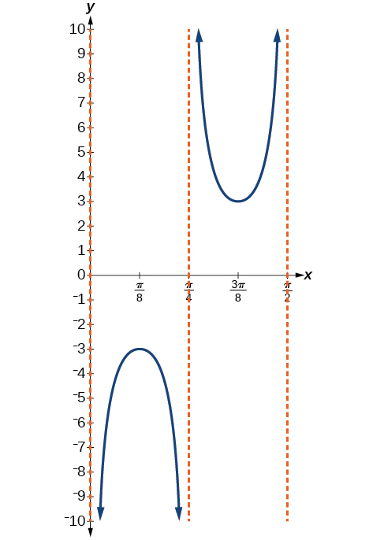{: #Figure_06_02_023}

{: data-labeled-item="true"}

Graph one period of<math xmlns="http://www.w3.org/1998/Math/MathML"> <mrow> <mtext> </mtext><mi>f</mi><mo stretchy="false">(</mo><mi>x</mi><mo stretchy="false">)</mo><mo>=</mo><mn>0.5</mn><mi>csc</mi><mo stretchy="false">(</mo><mn>2</mn><mi>x</mi><mo stretchy="false">)</mo><mo>.</mo></mrow> </math>

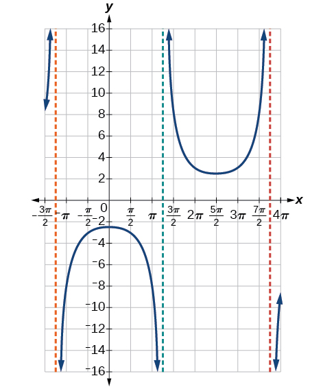

**Given a function of the form<math xmlns="http://www.w3.org/1998/Math/MathML"> <mrow> <mtext> </mtext><mi>f</mi><mrow><mo>(</mo> <mi>x</mi> <mo>)</mo></mrow><mo>=</mo><mi>A</mi><mi>csc</mi><mrow><mo>(</mo> <mrow> <mi>B</mi><mi>x</mi><mo>−</mo><mi>C</mi></mrow> <mo>)</mo></mrow><mo>+</mo><mi>D</mi><mo>,</mo><mtext> </mtext></mrow> </math>

graph one period.**

1.  Express the function given in the form
    <math xmlns="http://www.w3.org/1998/Math/MathML"> <mrow> <mtext> </mtext><mi>y</mi><mo>=</mo><mi>A</mi><mi>csc</mi><mo stretchy="false">(</mo><mi>B</mi><mi>x</mi><mo>−</mo><mi>C</mi><mo stretchy="false">)</mo><mo>+</mo><mi>D</mi><mo>.</mo> </mrow> </math>

2.  Identify the stretching/compressing factor,
    <math xmlns="http://www.w3.org/1998/Math/MathML"> <mrow> <mtext> </mtext><mrow><mo>\|</mo> <mi>A</mi> <mo>\|</mo></mrow><mo>.</mo> </mrow> </math>

3.  Identify
    <math xmlns="http://www.w3.org/1998/Math/MathML"> <mrow> <mtext> </mtext><mi>B</mi><mtext> </mtext> </mrow> </math>
    
    and determine the period,
    <math xmlns="http://www.w3.org/1998/Math/MathML"> <mrow> <mtext> </mtext><mfrac> <mrow> <mn>2</mn><mi>π</mi> </mrow> <mrow> <mrow><mo>\|</mo> <mi>B</mi> <mo>\|</mo></mrow> </mrow> </mfrac> <mo>.</mo> </mrow> </math>

4.  Identify
    <math xmlns="http://www.w3.org/1998/Math/MathML"> <mrow> <mtext> </mtext><mi>C</mi><mtext> </mtext> </mrow> </math>
    
    and determine the phase shift,
    <math xmlns="http://www.w3.org/1998/Math/MathML"> <mrow> <mtext> </mtext><mfrac> <mi>C</mi> <mi>B</mi> </mfrac> <mo>.</mo> </mrow> </math>

5.  Draw the graph of
    <math xmlns="http://www.w3.org/1998/Math/MathML"> <mrow> <mtext> </mtext><mi>y</mi><mo>=</mo><mi>A</mi><mi>csc</mi><mo stretchy="false">(</mo><mi>B</mi><mi>x</mi><mo stretchy="false">)</mo><mtext> </mtext> </mrow> </math>
    
    but shift it to the right by and up by
    <math xmlns="http://www.w3.org/1998/Math/MathML"> <mrow> <mtext> </mtext><mi>D</mi><mo>.</mo> </mrow> </math>

6.  Sketch the vertical asymptotes, which occur at
    <math xmlns="http://www.w3.org/1998/Math/MathML"> <mrow> <mtext> </mtext><mi>x</mi><mo>=</mo><mfrac> <mi>C</mi> <mi>B</mi> </mfrac> <mo>+</mo><mfrac> <mi>π</mi> <mrow> <mrow><mo>\|</mo> <mi>B</mi> <mo>\|</mo></mrow> </mrow> </mfrac> <mi>k</mi><mo>,</mo> </mrow> </math>
    
    where
    <math xmlns="http://www.w3.org/1998/Math/MathML"> <mrow> <mtext> </mtext><mi>k</mi><mtext> </mtext> </mrow> </math>
    
    is an integer.
{: data-number-style="arabic"}

Graphing a Vertically Stretched, Horizontally Compressed, and Vertically Shifted Cosecant

Sketch a graph of<math xmlns="http://www.w3.org/1998/Math/MathML"> <mrow> <mtext> </mtext><mi>y</mi><mo>=</mo><mn>2</mn><mi>csc</mi><mrow><mo>(</mo> <mrow> <mfrac> <mi>π</mi> <mn>2</mn> </mfrac> <mi>x</mi></mrow> <mo>)</mo></mrow><mo>+</mo><mn>1.</mn><mtext> </mtext></mrow> </math>

What are the domain and range of this function?

* *Step 1.* Express the function given in the form
  <math xmlns="http://www.w3.org/1998/Math/MathML"> <mrow> <mtext> </mtext><mi>y</mi><mo>=</mo><mn>2</mn><mi>csc</mi><mrow><mo>(</mo> <mrow> <mfrac> <mi>π</mi> <mn>2</mn> </mfrac> <mi>x</mi> </mrow> <mo>)</mo></mrow><mo>+</mo><mn>1.</mn> </mrow> </math>

* *Step 2.* Identify the stretching/compressing factor,
  <math xmlns="http://www.w3.org/1998/Math/MathML"> <mrow> <mtext> </mtext><mrow><mo>\|</mo> <mi>A</mi> <mo>\|</mo></mrow><mo>=</mo><mn>2.</mn> </mrow> </math>

* *Step 3.* The period is
  <math xmlns="http://www.w3.org/1998/Math/MathML"> <mrow> <mtext> </mtext><mfrac> <mrow> <mn>2</mn><mi>π</mi> </mrow> <mrow> <mrow><mo>\|</mo> <mi>B</mi> <mo>\|</mo></mrow> </mrow> </mfrac> <mo>=</mo><mfrac> <mrow> <mn>2</mn><mi>π</mi> </mrow> <mrow> <mfrac> <mi>π</mi> <mn>2</mn> </mfrac> </mrow> </mfrac> <mo>=</mo><mfrac> <mrow> <mn>2</mn><mi>π</mi> </mrow> <mn>1</mn> </mfrac> <mo>⋅</mo><mfrac> <mn>2</mn> <mi>π</mi> </mfrac> <mo>=</mo><mn>4.</mn> </mrow> </math>

* *Step 4.* The phase shift is
  <math xmlns="http://www.w3.org/1998/Math/MathML"> <mrow> <mtext> </mtext><mfrac> <mn>0</mn> <mrow> <mfrac> <mi>π</mi> <mn>2</mn> </mfrac> </mrow> </mfrac> <mo>=</mo><mn>0.</mn> </mrow> </math>

* *Step 5.* Draw the graph of
  <math xmlns="http://www.w3.org/1998/Math/MathML"> <mrow> <mtext> </mtext><mi>y</mi><mo>=</mo><mi>A</mi><mi>csc</mi><mo stretchy="false">(</mo><mi>B</mi><mi>x</mi><mo stretchy="false">)</mo><mtext> </mtext> </mrow> </math>
  
  but shift it up
  <math xmlns="http://www.w3.org/1998/Math/MathML"> <mrow> <mtext> </mtext><mi>D</mi><mo>=</mo><mn>1.</mn> </mrow> </math>

* *Step 6.* Sketch the vertical asymptotes, which occur at
  <math xmlns="http://www.w3.org/1998/Math/MathML"> <mrow> <mtext> </mtext><mi>x</mi><mo>=</mo><mn>0</mn><mo>,</mo><mi>x</mi><mo>=</mo><mn>2</mn><mo>,</mo><mi>x</mi><mo>=</mo><mn>4.</mn> </mrow> </math>
{: data-labeled-item="true"}

The graph for this function is shown in [[link]](#Figure_06_02_014).

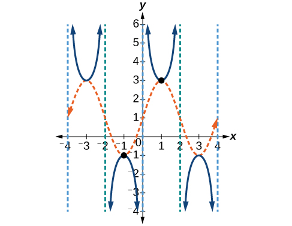{: #Figure_06_02_014}

Analysis

The vertical asymptotes shown on the graph mark off one period of the function, and the local extrema in this interval are shown by dots. Notice how the graph of the transformed cosecant relates to the graph of<math xmlns="http://www.w3.org/1998/Math/MathML"> <mrow> <mtext> </mtext><mi>f</mi><mo stretchy="false">(</mo><mi>x</mi><mo stretchy="false">)</mo><mo>=</mo><mn>2</mn><mi>sin</mi><mrow><mo>(</mo> <mrow> <mfrac> <mi>π</mi> <mn>2</mn> </mfrac> <mi>x</mi></mrow> <mo>)</mo></mrow><mo>+</mo><mn>1</mn><mo>,</mo></mrow> </math>

shown as the orange dashed wave.

Given the graph of<math xmlns="http://www.w3.org/1998/Math/MathML"> <mrow> <mtext> </mtext><mi>f</mi><mo stretchy="false">(</mo><mi>x</mi><mo stretchy="false">)</mo><mo>=</mo><mn>2</mn><mi>cos</mi><mrow><mo>(</mo> <mrow> <mfrac> <mi>π</mi> <mn>2</mn> </mfrac> <mi>x</mi></mrow> <mo>)</mo></mrow><mo>+</mo><mn>1</mn><mtext> </mtext></mrow> </math>

shown in [[link]](#Figure_06_02_015), sketch the graph of<math xmlns="http://www.w3.org/1998/Math/MathML"> <mrow> <mtext> </mtext><mi>g</mi><mo stretchy="false">(</mo><mi>x</mi><mo stretchy="false">)</mo><mo>=</mo><mn>2</mn><mi>sec</mi><mrow><mo>(</mo> <mrow> <mfrac> <mi>π</mi> <mn>2</mn> </mfrac> <mi>x</mi></mrow> <mo>)</mo></mrow><mo>+</mo><mn>1</mn><mtext> </mtext></mrow> </math>

on the same axes.

![A graph of two periods of a modified cosine function. Range is \[-1,3\], graphed from x=-4 to x=4.](../resources/CNX_Precalc_Figure_06_02_015.jpg){: #Figure_06_02_015}

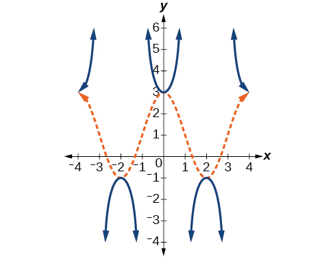

### Analyzing the Graph of *y* = cot *x*

The last trigonometric function we need to explore is **cotangent**{: data-type="term" .no-emphasis}. The cotangent is defined by the **reciprocal identity**{: data-type="term" .no-emphasis}<math xmlns="http://www.w3.org/1998/Math/MathML"> <mrow> <mtext> </mtext><mi>cot</mi><mtext> </mtext><mi>x</mi><mo>=</mo><mfrac> <mn>1</mn> <mrow> <mi>tan</mi><mtext> </mtext><mi>x</mi></mrow> </mfrac> <mo>.</mo><mtext> </mtext></mrow> </math>

Notice that the function is undefined when the tangent function is 0, leading to a vertical asymptote in the graph at<math xmlns="http://www.w3.org/1998/Math/MathML"> <mrow> <mtext> </mtext><mn>0</mn><mo>,</mo><mi>π</mi><mo>,</mo><mtext> </mtext></mrow> </math>

etc. Since the output of the tangent function is all real numbers, the output of the **cotangent function**{: data-type="term" .no-emphasis} is also all real numbers.

We can graph<math xmlns="http://www.w3.org/1998/Math/MathML"> <mrow> <mtext> </mtext><mi>y</mi><mo>=</mo><mi>cot</mi><mtext> </mtext><mi>x</mi><mtext> </mtext></mrow> </math>

by observing the graph of the tangent function because these two functions are reciprocals of one another. See [\[link\]](#Figure_06_02_017). Where the graph of the tangent function decreases, the graph of the cotangent function increases. Where the graph of the tangent function increases, the graph of the cotangent function decreases.

The cotangent graph has vertical asymptotes at each value of<math xmlns="http://www.w3.org/1998/Math/MathML"> <mrow> <mtext> </mtext><mi>x</mi><mtext> </mtext></mrow> </math>

where<math xmlns="http://www.w3.org/1998/Math/MathML"> <mrow> <mtext> </mtext><mi>tan</mi><mtext> </mtext><mi>x</mi><mo>=</mo><mn>0</mn><mo>;</mo><mtext> </mtext></mrow> </math>

we show these in the graph below with dashed lines. Since the cotangent is the reciprocal of the tangent,<math xmlns="http://www.w3.org/1998/Math/MathML"> <mrow> <mtext> </mtext><mi>cot</mi><mtext> </mtext><mi>x</mi><mtext> </mtext></mrow> </math>

has vertical asymptotes at all values of<math xmlns="http://www.w3.org/1998/Math/MathML"> <mrow> <mtext> </mtext><mi>x</mi><mtext> </mtext></mrow> </math>

where<math xmlns="http://www.w3.org/1998/Math/MathML"> <mrow> <mtext> </mtext><mi>tan</mi><mtext> </mtext><mi>x</mi><mo>=</mo><mn>0</mn><mo>,</mo><mtext> </mtext></mrow> </math>

and<math xmlns="http://www.w3.org/1998/Math/MathML"> <mrow> <mtext> </mtext><mi>cot</mi><mtext> </mtext><mi>x</mi><mo>=</mo><mn>0</mn><mtext> </mtext></mrow> </math>

at all values of<math xmlns="http://www.w3.org/1998/Math/MathML"> <mrow> <mtext> </mtext><mi>x</mi><mtext> </mtext></mrow> </math>

where<math xmlns="http://www.w3.org/1998/Math/MathML"> <mrow> <mtext> </mtext><mi>tan</mi><mtext> </mtext><mi>x</mi><mtext> </mtext></mrow> </math>

has its vertical asymptotes.

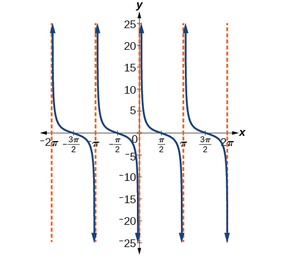{: #Figure_06_02_017}

Features of the Graph of *y* = *A*cot(*Bx*)

* The stretching factor is
  <math xmlns="http://www.w3.org/1998/Math/MathML"> <mrow> <mtext> </mtext><mrow><mo>\|</mo> <mi>A</mi> <mo>\|</mo></mrow><mo>.</mo> </mrow> </math>

* The period is
  <math xmlns="http://www.w3.org/1998/Math/MathML"> <mrow> <mtext> </mtext><mi>P</mi><mo>=</mo><mfrac> <mi>π</mi> <mrow> <mrow><mo>\|</mo> <mi>B</mi> <mo>\|</mo></mrow> </mrow> </mfrac> <mo>.</mo> </mrow> </math>

* The domain is
  <math xmlns="http://www.w3.org/1998/Math/MathML"> <mrow> <mtext> </mtext><mi>x</mi><mo>≠</mo><mfrac> <mi>π</mi> <mrow> <mrow><mo>\|</mo> <mi>B</mi> <mo>\|</mo></mrow> </mrow> </mfrac> <mi>k</mi><mo>,</mo><mtext> </mtext> </mrow> </math>
  
  where
  <math xmlns="http://www.w3.org/1998/Math/MathML"> <mrow> <mtext> </mtext><mi>k</mi><mtext> </mtext></mrow> </math>
  
  is an integer.
* The range is
  <math xmlns="http://www.w3.org/1998/Math/MathML"> <mrow> <mtext> </mtext><mo stretchy="false">(</mo><mi>−</mi><mi>∞</mi><mo>,</mo><mi>∞</mi><mo stretchy="false">)</mo><mo>.</mo></mrow> </math>

* The asymptotes occur at
  <math xmlns="http://www.w3.org/1998/Math/MathML"> <mrow> <mtext> </mtext><mi>x</mi><mo>=</mo><mfrac> <mi>π</mi> <mrow> <mrow><mo>\|</mo> <mi>B</mi> <mo>\|</mo></mrow> </mrow> </mfrac> <mi>k</mi><mo>,</mo><mtext> </mtext> </mrow> </math>
  
  where
  <math xmlns="http://www.w3.org/1998/Math/MathML"> <mrow> <mtext> </mtext><mi>k</mi><mtext> </mtext></mrow> </math>
  
  is an integer.
* <math xmlns="http://www.w3.org/1998/Math/MathML"> <mrow> <mi>y</mi><mo>=</mo><mi>A</mi><mi>cot</mi><mrow><mo>(</mo> <mrow> <mi>B</mi><mi>x</mi></mrow> <mo>)</mo></mrow><mtext> </mtext></mrow> </math>
  
  is an odd function.

### Graphing Variations of *y* = cot *x*

We can transform the graph of the cotangent in much the same way as we did for the tangent. The equation becomes the following.

<math xmlns="http://www.w3.org/1998/Math/MathML" display="block"> <mrow> <mi>y</mi><mo>=</mo><mi>A</mi><mi>cot</mi><mrow><mo>(</mo> <mrow> <mi>B</mi><mi>x</mi><mo>−</mo><mi>C</mi> </mrow> <mo>)</mo></mrow><mo>+</mo><mi>D</mi> </mrow> </math>

Properties of the Graph of *y* = *A*cot(*Bx*−C)+*D*

* The stretching factor is
  <math xmlns="http://www.w3.org/1998/Math/MathML"> <mrow> <mtext> </mtext><mrow><mo>\|</mo> <mi>A</mi> <mo>\|</mo></mrow><mo>.</mo> </mrow> </math>

* The period is
  <math xmlns="http://www.w3.org/1998/Math/MathML"> <mrow> <mtext> </mtext><mfrac> <mi>π</mi> <mrow> <mrow><mo>\|</mo> <mi>B</mi> <mo>\|</mo></mrow> </mrow> </mfrac> <mo>.</mo> </mrow> </math>

* The domain is
  <math xmlns="http://www.w3.org/1998/Math/MathML"> <mrow> <mtext> </mtext><mi>x</mi><mo>≠</mo><mfrac> <mi>C</mi> <mi>B</mi> </mfrac> <mo>+</mo><mfrac> <mi>π</mi> <mrow> <mrow><mo>\|</mo> <mi>B</mi> <mo>\|</mo></mrow> </mrow> </mfrac> <mi>k</mi><mo>,</mo> </mrow> </math>
  
  where
  <math xmlns="http://www.w3.org/1998/Math/MathML"> <mrow> <mtext> </mtext><mi>k</mi><mtext> </mtext> </mrow> </math>
  
  is an integer.
* The range is
  <math xmlns="http://www.w3.org/1998/Math/MathML"> <mrow> <mtext> </mtext><mo stretchy="false">(</mo><mi>−∞</mi><mo>,</mo><mi>∞</mi><mo stretchy="false">)</mo><mo>.</mo> </mrow> </math>

* The vertical asymptotes occur at
  <math xmlns="http://www.w3.org/1998/Math/MathML"> <mrow> <mtext> </mtext><mi>x</mi><mo>=</mo><mfrac> <mi>C</mi> <mi>B</mi> </mfrac> <mo>+</mo><mfrac> <mi>π</mi> <mrow> <mrow><mo>\|</mo> <mi>B</mi> <mo>\|</mo></mrow> </mrow> </mfrac> <mi>k</mi><mo>,</mo> </mrow> </math>
  
  where
  <math xmlns="http://www.w3.org/1998/Math/MathML"> <mrow> <mtext> </mtext><mi>k</mi><mtext> </mtext> </mrow> </math>
  
  is an integer.
* There is no amplitude.
* <math xmlns="http://www.w3.org/1998/Math/MathML"> <mrow> <mi>y</mi><mo>=</mo><mi>A</mi><mi>cot</mi><mo stretchy="false">(</mo><mi>B</mi><mi>x</mi><mo stretchy="false">)</mo><mtext> </mtext> </mrow> </math>
  
  is an odd function because it is the quotient of even and odd functions (cosine and sine, respectively)

**Given a modified cotangent function of the form<math xmlns="http://www.w3.org/1998/Math/MathML"> <mrow> <mtext> </mtext><mi>f</mi><mrow><mo>(</mo> <mi>x</mi> <mo>)</mo></mrow><mo>=</mo><mi>A</mi><mi>cot</mi><mrow><mo>(</mo> <mrow> <mi>B</mi><mi>x</mi></mrow> <mo>)</mo></mrow><mo>,</mo></mrow> </math>

graph one period.**

1.  Express the function in the form
    <math xmlns="http://www.w3.org/1998/Math/MathML"> <mrow> <mtext> </mtext><mi>f</mi><mrow><mo>(</mo> <mi>x</mi> <mo>)</mo></mrow><mo>=</mo><mi>A</mi><mi>cot</mi><mrow><mo>(</mo> <mrow> <mi>B</mi><mi>x</mi></mrow> <mo>)</mo></mrow><mo>.</mo></mrow> </math>

2.  Identify the stretching factor,
    <math xmlns="http://www.w3.org/1998/Math/MathML"> <mrow> <mtext> </mtext><mrow><mo>\|</mo> <mi>A</mi> <mo>\|</mo></mrow><mo>.</mo></mrow> </math>

3.  Identify the period,
    <math xmlns="http://www.w3.org/1998/Math/MathML"> <mrow> <mtext> </mtext><mi>P</mi><mo>=</mo><mfrac> <mi>π</mi> <mrow> <mrow><mo>\|</mo> <mi>B</mi> <mo>\|</mo></mrow></mrow> </mfrac> <mo>.</mo></mrow> </math>

4.  Draw the graph of
    <math xmlns="http://www.w3.org/1998/Math/MathML"> <mrow> <mtext> </mtext><mi>y</mi><mo>=</mo><mi>A</mi><mi>tan</mi><mo stretchy="false">(</mo><mi>B</mi><mi>x</mi><mo stretchy="false">)</mo><mo>.</mo> </mrow> </math>

5.  Plot any two reference points.
6.  Use the reciprocal relationship between tangent and cotangent to draw the graph of
    <math xmlns="http://www.w3.org/1998/Math/MathML"> <mrow> <mtext> </mtext><mi>y</mi><mo>=</mo><mi>A</mi><mi>cot</mi><mrow><mo>(</mo> <mrow> <mi>B</mi><mi>x</mi></mrow> <mo>)</mo></mrow><mo>.</mo></mrow> </math>

7.  Sketch the asymptotes.
{: data-number-style="arabic"}

Graphing Variations of the Cotangent Function

Determine the stretching factor, period, and phase shift of<math xmlns="http://www.w3.org/1998/Math/MathML"> <mrow> <mtext> </mtext><mi>y</mi><mo>=</mo><mn>3</mn><mi>cot</mi><mo stretchy="false">(</mo><mn>4</mn><mi>x</mi><mo stretchy="false">)</mo><mo>,</mo><mtext> </mtext></mrow> </math>

and then sketch a graph.

* *Step 1.* Expressing the function in the form
  <math xmlns="http://www.w3.org/1998/Math/MathML"> <mrow> <mtext> </mtext><mi>f</mi><mrow><mo>(</mo> <mi>x</mi> <mo>)</mo></mrow><mo>=</mo><mi>A</mi><mi>cot</mi><mrow><mo>(</mo> <mrow> <mi>B</mi><mi>x</mi></mrow> <mo>)</mo></mrow><mtext> </mtext></mrow> </math>
  
  gives
  <math xmlns="http://www.w3.org/1998/Math/MathML"> <mrow> <mtext> </mtext><mi>f</mi><mrow><mo>(</mo> <mi>x</mi> <mo>)</mo></mrow><mo>=</mo><mn>3</mn><mi>cot</mi><mrow><mo>(</mo> <mrow> <mn>4</mn><mi>x</mi></mrow> <mo>)</mo></mrow><mo>.</mo></mrow> </math>

* *Step 2.* The stretching factor is
  <math xmlns="http://www.w3.org/1998/Math/MathML"> <mrow> <mtext> </mtext><mrow><mo>\|</mo> <mi>A</mi> <mo>\|</mo></mrow><mo>=</mo><mn>3.</mn> </mrow> </math>

* *Step 3.* The period is
  <math xmlns="http://www.w3.org/1998/Math/MathML"> <mrow> <mtext> </mtext><mi>P</mi><mo>=</mo><mfrac> <mi>π</mi> <mn>4</mn> </mfrac> <mo>.</mo></mrow> </math>

* *Step 4.* Sketch the graph of
  <math xmlns="http://www.w3.org/1998/Math/MathML"> <mrow> <mtext> </mtext><mi>y</mi><mo>=</mo><mn>3</mn><mi>tan</mi><mo stretchy="false">(</mo><mn>4</mn><mi>x</mi><mo stretchy="false">)</mo><mo>.</mo> </mrow> </math>

* *Step 5.* Plot two reference points. Two such points are
  <math xmlns="http://www.w3.org/1998/Math/MathML"> <mrow> <mtext> </mtext><mrow><mo>(</mo> <mrow> <mfrac> <mi>π</mi> <mrow> <mn>16</mn></mrow> </mfrac> <mo>,</mo><mn>3</mn></mrow> <mo>)</mo></mrow><mtext> </mtext></mrow> </math>
  
  and
  <math xmlns="http://www.w3.org/1998/Math/MathML"> <mrow> <mtext> </mtext><mrow><mo>(</mo> <mrow> <mfrac> <mrow> <mn>3</mn><mi>π</mi></mrow> <mrow> <mn>16</mn></mrow> </mfrac> <mo>,</mo><mn>−3</mn></mrow> <mo>)</mo></mrow><mo>.</mo></mrow> </math>

* *Step 6.* Use the reciprocal relationship to draw
  <math xmlns="http://www.w3.org/1998/Math/MathML"> <mrow> <mtext> </mtext><mi>y</mi><mo>=</mo><mn>3</mn><mi>cot</mi><mo stretchy="false">(</mo><mn>4</mn><mi>x</mi><mo stretchy="false">)</mo><mo>.</mo></mrow> </math>

* *Step 7.* Sketch the asymptotes,
  <math xmlns="http://www.w3.org/1998/Math/MathML"> <mrow> <mtext> </mtext><mi>x</mi><mo>=</mo><mn>0</mn><mo>,</mo><mtext> </mtext><mtext> </mtext><mi>x</mi><mo>=</mo><mfrac> <mi>π</mi> <mn>4</mn> </mfrac> <mo>.</mo></mrow> </math>
{: data-labeled-item="true"}

The orange graph in [[link]](#Figure_06_02_019) shows<math xmlns="http://www.w3.org/1998/Math/MathML"> <mrow> <mtext> </mtext><mi>y</mi><mo>=</mo><mn>3</mn><mi>tan</mi><mrow><mo>(</mo> <mrow> <mn>4</mn><mi>x</mi></mrow> <mo>)</mo></mrow><mtext> </mtext></mrow> </math>

and the blue graph shows<math xmlns="http://www.w3.org/1998/Math/MathML"> <mrow> <mtext> </mtext><mi>y</mi><mo>=</mo><mn>3</mn><mi>cot</mi><mrow><mo>(</mo> <mrow> <mn>4</mn><mi>x</mi></mrow> <mo>)</mo></mrow><mo>.</mo></mrow> </math>

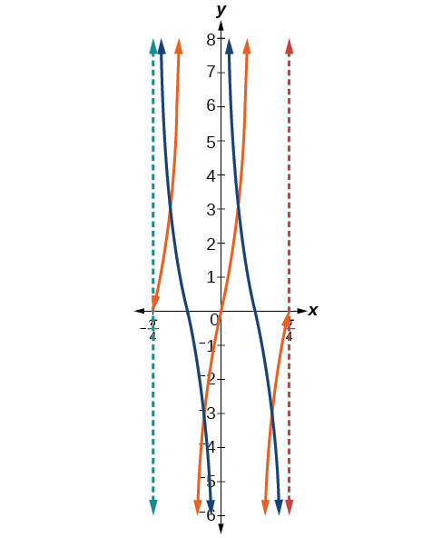{: #Figure_06_02_019}

**Given a modified cotangent function of the form<math xmlns="http://www.w3.org/1998/Math/MathML"> <mrow> <mtext> </mtext><mi>f</mi><mrow><mo>(</mo> <mi>x</mi> <mo>)</mo></mrow><mo>=</mo><mi>A</mi><mi>cot</mi><mrow><mo>(</mo> <mrow> <mi>B</mi><mi>x</mi><mo>−</mo><mi>C</mi></mrow> <mo>)</mo></mrow><mo>+</mo><mi>D</mi><mo>,</mo><mtext> </mtext></mrow> </math>

graph one period.**

1.  Express the function in the form
    <math xmlns="http://www.w3.org/1998/Math/MathML"> <mrow> <mtext> </mtext><mi>f</mi><mrow><mo>(</mo> <mi>x</mi> <mo>)</mo></mrow><mo>=</mo><mi>A</mi><mi>cot</mi><mrow><mo>(</mo> <mrow> <mi>B</mi><mi>x</mi><mo>−</mo><mi>C</mi></mrow> <mo>)</mo></mrow><mo>+</mo><mi>D</mi><mo>.</mo></mrow> </math>

2.  Identify the stretching factor,
    <math xmlns="http://www.w3.org/1998/Math/MathML"> <mrow> <mtext> </mtext><mrow><mo>\|</mo> <mi>A</mi> <mo>\|</mo></mrow><mo>.</mo></mrow> </math>

3.  Identify the period,
    <math xmlns="http://www.w3.org/1998/Math/MathML"> <mrow> <mtext> </mtext><mi>P</mi><mo>=</mo><mfrac> <mi>π</mi> <mrow> <mrow><mo>\|</mo> <mi>B</mi> <mo>\|</mo></mrow></mrow> </mfrac> <mo>.</mo></mrow> </math>

4.  Identify the phase shift,
    <math xmlns="http://www.w3.org/1998/Math/MathML"> <mrow> <mtext> </mtext><mfrac> <mi>C</mi> <mi>B</mi> </mfrac> <mo>.</mo></mrow> </math>

5.  Draw the graph of
    <math xmlns="http://www.w3.org/1998/Math/MathML"> <mrow> <mtext> </mtext><mi>y</mi><mo>=</mo><mi>A</mi><mi>tan</mi><mo stretchy="false">(</mo><mi>B</mi><mi>x</mi><mo stretchy="false">)</mo><mtext> </mtext> </mrow> </math>
    
    shifted to the right by
    <math xmlns="http://www.w3.org/1998/Math/MathML"> <mrow> <mtext> </mtext><mfrac> <mi>C</mi> <mi>B</mi> </mfrac> <mtext> </mtext></mrow> </math>
    
    and up by
    <math xmlns="http://www.w3.org/1998/Math/MathML"> <mrow> <mtext> </mtext><mi>D</mi><mo>.</mo></mrow> </math>

6.  Sketch the asymptotes
    <math xmlns="http://www.w3.org/1998/Math/MathML"> <mrow> <mtext> </mtext><mi>x</mi><mo>=</mo><mfrac> <mi>C</mi> <mi>B</mi> </mfrac> <mo>+</mo><mfrac> <mi>π</mi> <mrow> <mrow><mo>\|</mo> <mi>B</mi> <mo>\|</mo></mrow> </mrow> </mfrac> <mi>k</mi><mo>,</mo> </mrow> </math>
    
    where
    <math xmlns="http://www.w3.org/1998/Math/MathML"> <mrow> <mtext> </mtext><mi>k</mi><mtext> </mtext> </mrow> </math>
    
    is an integer.
7.  Plot any three reference points and draw the graph through these points.
{: data-number-style="arabic"}

Graphing a Modified Cotangent

Sketch a graph of one period of the function<math xmlns="http://www.w3.org/1998/Math/MathML"> <mrow> <mtext> </mtext><mi>f</mi><mrow><mo>(</mo> <mi>x</mi> <mo>)</mo></mrow><mo>=</mo><mn>4</mn><mi>cot</mi><mrow><mo>(</mo> <mrow> <mfrac> <mi>π</mi> <mn>8</mn> </mfrac> <mi>x</mi><mo>−</mo><mfrac> <mi>π</mi> <mn>2</mn> </mfrac> </mrow> <mo>)</mo></mrow><mo>−</mo><mn>2.</mn></mrow> </math>

* *Step 1.* The function is already written in the general form
  <math xmlns="http://www.w3.org/1998/Math/MathML"> <mrow> <mtext> </mtext><mi>f</mi><mrow><mo>(</mo> <mi>x</mi> <mo>)</mo></mrow><mo>=</mo><mi>A</mi><mi>cot</mi><mrow><mo>(</mo> <mrow> <mi>B</mi><mi>x</mi><mo>−</mo><mi>C</mi></mrow> <mo>)</mo></mrow><mo>+</mo><mi>D</mi><mo>.</mo></mrow> </math>

* *Step 2.*
  <math xmlns="http://www.w3.org/1998/Math/MathML"> <mrow> <mtext> </mtext><mi>A</mi><mo>=</mo><mn>4</mn><mo>,</mo></mrow> </math>
  
  so the stretching factor is 4.
* *Step 3.*
  <math xmlns="http://www.w3.org/1998/Math/MathML"> <mrow> <mtext> </mtext><mi>B</mi><mo>=</mo><mfrac> <mi>π</mi> <mn>8</mn> </mfrac> <mo>,</mo></mrow> </math>
  
  so the period is
  <math xmlns="http://www.w3.org/1998/Math/MathML"> <mrow> <mtext> </mtext><mi>P</mi><mo>=</mo><mfrac> <mi>π</mi> <mrow> <mrow><mo>\|</mo> <mi>B</mi> <mo>\|</mo></mrow> </mrow> </mfrac> <mo>=</mo><mfrac> <mi>π</mi> <mrow> <mfrac> <mi>π</mi> <mn>8</mn> </mfrac> </mrow> </mfrac> <mo>=</mo><mn>8.</mn> </mrow> </math>

* *Step 4.*
  <math xmlns="http://www.w3.org/1998/Math/MathML"> <mrow> <mtext> </mtext><mi>C</mi><mo>=</mo><mfrac> <mi>π</mi> <mn>2</mn> </mfrac> <mo>,</mo></mrow> </math>
  
  so the phase shift is
  <math xmlns="http://www.w3.org/1998/Math/MathML"> <mrow> <mtext> </mtext><mfrac> <mi>C</mi> <mi>B</mi> </mfrac> <mo>=</mo><mfrac> <mrow> <mfrac> <mi>π</mi> <mn>2</mn> </mfrac> </mrow> <mrow> <mfrac> <mi>π</mi> <mn>8</mn> </mfrac> </mrow> </mfrac> <mo>=</mo><mn>4.</mn> </mrow> </math>

* *Step 5.* We draw
  <math xmlns="http://www.w3.org/1998/Math/MathML"> <mrow> <mtext> </mtext><mi>f</mi><mrow><mo>(</mo> <mi>x</mi> <mo>)</mo></mrow><mo>=</mo><mn>4</mn><mi>tan</mi><mrow><mo>(</mo> <mrow> <mfrac> <mi>π</mi> <mn>8</mn> </mfrac> <mi>x</mi><mo>−</mo><mfrac> <mi>π</mi> <mn>2</mn> </mfrac> </mrow> <mo>)</mo></mrow><mo>−</mo><mn>2.</mn></mrow> </math>

* *Step 6-7.* Three points we can use to guide the graph are
  <math xmlns="http://www.w3.org/1998/Math/MathML"> <mrow> <mtext> </mtext><mo stretchy="false">(</mo><mn>6</mn><mo>,</mo><mn>2</mn><mo stretchy="false">)</mo><mo>,</mo><mo stretchy="false">(</mo><mn>8</mn><mo>,</mo><mo>−</mo><mn>2</mn><mo stretchy="false">)</mo><mo>,</mo><mtext> </mtext></mrow> </math>
  
  and
  <math xmlns="http://www.w3.org/1998/Math/MathML"> <mrow> <mtext> </mtext><mo stretchy="false">(</mo><mn>10</mn><mo>,</mo><mo>−</mo><mn>6</mn><mo stretchy="false">)</mo><mo>.</mo><mtext> </mtext></mrow> </math>
  
  We use the reciprocal relationship of tangent and cotangent to draw
  <math xmlns="http://www.w3.org/1998/Math/MathML"> <mrow> <mtext> </mtext><mi>f</mi><mrow><mo>(</mo> <mi>x</mi> <mo>)</mo></mrow><mo>=</mo><mn>4</mn><mi>cot</mi><mrow><mo>(</mo> <mrow> <mfrac> <mi>π</mi> <mn>8</mn> </mfrac> <mi>x</mi><mo>−</mo><mfrac> <mi>π</mi> <mn>2</mn> </mfrac> </mrow> <mo>)</mo></mrow><mo>−</mo><mn>2.</mn></mrow> </math>

* *Step 8.* The vertical asymptotes are
  <math xmlns="http://www.w3.org/1998/Math/MathML"> <mrow> <mtext> </mtext><mi>x</mi><mo>=</mo><mn>4</mn><mtext> </mtext></mrow> </math>
  
  and
  <math xmlns="http://www.w3.org/1998/Math/MathML"> <mrow> <mtext> </mtext><mi>x</mi><mo>=</mo><mn>12.</mn></mrow> </math>
{: data-labeled-item="true"}

The graph is shown in [[link]](#Figure_06_02_020).

{: #Figure_06_02_020}

### Using the Graphs of Trigonometric Functions to Solve Real-World Problems

Many real-world scenarios represent periodic functions and may be modeled by trigonometric functions. As an example, let’s return to the scenario from the section opener. Have you ever observed the beam formed by the rotating light on a police car and wondered about the movement of the light beam itself across the wall? The periodic behavior of the distance the light shines as a function of time is obvious, but how do we determine the distance? We can use the **tangent function**{: data-type="term" .no-emphasis}.

Using Trigonometric Functions to Solve Real-World Scenarios

Suppose the function<math xmlns="http://www.w3.org/1998/Math/MathML"> <mrow> <mtext> </mtext><mi>y</mi><mo>=</mo><mn>5</mn><mi>tan</mi><mrow><mo>(</mo> <mrow> <mfrac> <mi>π</mi> <mn>4</mn> </mfrac> <mi>t</mi></mrow> <mo>)</mo></mrow><mtext> </mtext></mrow> </math>

marks the distance in the movement of a light beam from the top of a police car across a wall where<math xmlns="http://www.w3.org/1998/Math/MathML"> <mrow> <mtext> </mtext><mi>t</mi><mtext> </mtext></mrow> </math>

is the time in seconds and<math xmlns="http://www.w3.org/1998/Math/MathML"> <mrow> <mtext> </mtext><mi>y</mi><mtext> </mtext></mrow> </math>

is the distance in feet from a point on the wall directly across from the police car.

1.  Find and interpret the stretching factor and period.
2.  Graph on the interval
    <math xmlns="http://www.w3.org/1998/Math/MathML"> <mrow> <mtext> </mtext><mrow><mo>[</mo> <mrow> <mn>0</mn><mo>,</mo><mn>5</mn></mrow> <mo>]</mo></mrow><mo>.</mo></mrow> </math>

3.  Evaluate
    <math xmlns="http://www.w3.org/1998/Math/MathML"> <mrow> <mtext> </mtext><mi>f</mi><mrow><mo>(</mo> <mn>1</mn> <mo>)</mo></mrow><mtext> </mtext></mrow> </math>
    
    and discuss the function’s value at that input.
{: data-number-style="lower-alpha"}

1.  We know from the general form of
    <math xmlns="http://www.w3.org/1998/Math/MathML"> <mrow> <mtext> </mtext><mi>y</mi><mo>=</mo><mi>A</mi><mi>tan</mi><mrow><mo>(</mo> <mrow> <mi>B</mi><mi>t</mi></mrow> <mo>)</mo></mrow><mtext> </mtext></mrow> </math>
    
    that
    <math xmlns="http://www.w3.org/1998/Math/MathML"> <mrow> <mtext> </mtext><mrow><mo>\|</mo> <mi>A</mi> <mo>\|</mo></mrow><mtext> </mtext></mrow> </math>
    
    is the stretching factor and
    <math xmlns="http://www.w3.org/1998/Math/MathML"> <mrow> <mtext> </mtext><mfrac> <mi>π</mi> <mi>B</mi> </mfrac> <mtext> </mtext></mrow> </math>
    
    is the period. {: #Image_06_02_022}

    We see that the stretching factor is 5. This means that the beam of light will have moved 5 ft after half the period.
    
    The period is<math xmlns="http://www.w3.org/1998/Math/MathML"> <mrow> <mtext> </mtext><mfrac> <mi>π</mi> <mrow> <mfrac> <mi>π</mi> <mn>4</mn> </mfrac> </mrow> </mfrac> <mo>=</mo><mfrac> <mi>π</mi> <mn>1</mn> </mfrac> <mo>⋅</mo><mfrac> <mn>4</mn> <mi>π</mi> </mfrac> <mo>=</mo><mn>4.</mn><mtext> </mtext></mrow> </math>
    
    This means that every 4 seconds, the beam of light sweeps the wall. The distance from the spot across from the police car grows larger as the police car approaches.

2.  To graph the function, we draw an asymptote at
    <math xmlns="http://www.w3.org/1998/Math/MathML"> <mrow> <mtext> </mtext><mi>t</mi><mo>=</mo><mn>2</mn><mtext> </mtext></mrow> </math>
    
    and use the stretching factor and period. See [[link]](#Image_06_02_021) 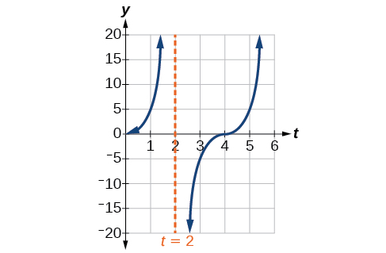{: #Image_06_02_021}

3.  period:
    <math xmlns="http://www.w3.org/1998/Math/MathML"> <mrow> <mtext> </mtext><mi>f</mi><mo stretchy="false">(</mo><mn>1</mn><mo stretchy="false">)</mo><mo>=</mo><mn>5</mn><mi>tan</mi><mrow><mo>(</mo> <mrow> <mfrac> <mi>π</mi> <mn>4</mn> </mfrac> <mo stretchy="false">(</mo><mn>1</mn><mo stretchy="false">)</mo></mrow> <mo>)</mo></mrow><mo>=</mo><mn>5</mn><mo stretchy="false">(</mo><mn>1</mn><mo stretchy="false">)</mo><mo>=</mo><mn>5</mn><mo>;</mo><mtext> </mtext></mrow> </math>
    
    after 1 second, the beam of has moved 5 ft from the spot across from the police car.
{: data-number-style="lower-alpha"}

Access these online resources for additional instruction and practice with graphs of other trigonometric functions.

* [Graphing the Tangent][1]
* [Graphing Cosecant and Secant][2]
* [Graphing the Cotangent][3]

### Key Equations

| Shifted, compressed, and/or stretched tangent function | <math xmlns="http://www.w3.org/1998/Math/MathML"> <mrow> <mi>y</mi><mo>=</mo><mi>A</mi><mtext> </mtext><mi>tan</mi><mrow><mo>(</mo> <mrow> <mi>B</mi><mi>x</mi><mo>−</mo><mi>C</mi> </mrow> <mo>)</mo></mrow><mo>+</mo><mi>D</mi> </mrow> </math>

 |
| Shifted, compressed, and/or stretched secant function | <math xmlns="http://www.w3.org/1998/Math/MathML"> <mrow> <mi>y</mi><mo>=</mo><mi>A</mi><mtext> </mtext><mi>sec</mi><mrow><mo>(</mo> <mrow> <mi>B</mi><mi>x</mi><mo>−</mo><mi>C</mi> </mrow> <mo>)</mo></mrow><mo>+</mo><mi>D</mi> </mrow> </math>

 |
| Shifted, compressed, and/or stretched cosecant function | <math xmlns="http://www.w3.org/1998/Math/MathML"> <mrow> <mi>y</mi><mo>=</mo><mi>A</mi><mtext> </mtext><mi>csc</mi><mrow><mo>(</mo> <mrow> <mi>B</mi><mi>x</mi><mo>−</mo><mi>C</mi> </mrow> <mo>)</mo></mrow><mo>+</mo><mi>D</mi> </mrow> </math>

 |
| Shifted, compressed, and/or stretched cotangent function | <math xmlns="http://www.w3.org/1998/Math/MathML"> <mrow> <mi>y</mi><mo>=</mo><mi>A</mi><mtext> </mtext><mi>cot</mi><mrow><mo>(</mo> <mrow> <mi>B</mi><mi>x</mi><mo>−</mo><mi>C</mi> </mrow> <mo>)</mo></mrow><mo>+</mo><mi>D</mi> </mrow> </math>

 |
{: #eip-id1165133401597 summary=".."}

### Key Concepts

* The tangent function has period
  <math xmlns="http://www.w3.org/1998/Math/MathML"> <mrow> <mtext> </mtext><mi>π</mi><mo>.</mo></mrow> </math>

* <math xmlns="http://www.w3.org/1998/Math/MathML"> <mrow> <mi>f</mi><mrow><mo>(</mo> <mi>x</mi> <mo>)</mo></mrow><mo>=</mo><mi>A</mi><mi>tan</mi><mrow><mo>(</mo> <mrow> <mi>B</mi><mi>x</mi><mo>−</mo><mi>C</mi></mrow> <mo>)</mo></mrow><mo>+</mo><mi>D</mi><mtext> </mtext></mrow> </math>
  
  is a tangent with vertical and/or horizontal stretch/compression and shift. See [\[link\]](#Example_06_02_01), [\[link\]](#Example_06_02_02), and [\[link\]](#Example_06_02_03).
* The secant and cosecant are both periodic functions with a period of
  <math xmlns="http://www.w3.org/1998/Math/MathML"> <mrow> <mtext> </mtext><mn>2</mn><mi>π</mi><mo>.</mo><mtext> </mtext></mrow> </math>
  
  <math xmlns="http://www.w3.org/1998/Math/MathML"> <mrow> <mi>f</mi><mrow><mo>(</mo> <mi>x</mi> <mo>)</mo></mrow><mo>=</mo><mi>A</mi><mi>sec</mi><mrow><mo>(</mo> <mrow> <mi>B</mi><mi>x</mi><mo>−</mo><mi>C</mi></mrow> <mo>)</mo></mrow><mo>+</mo><mi>D</mi><mtext> </mtext></mrow> </math>
  
  gives a shifted, compressed, and/or stretched secant function graph. See [\[link\]](#Example_06_02_04) and [\[link\]](#Example_06_02_05).
* <math xmlns="http://www.w3.org/1998/Math/MathML"> <mrow> <mi>f</mi><mrow><mo>(</mo> <mi>x</mi> <mo>)</mo></mrow><mo>=</mo><mi>A</mi><mi>csc</mi><mrow><mo>(</mo> <mrow> <mi>B</mi><mi>x</mi><mo>−</mo><mi>C</mi></mrow> <mo>)</mo></mrow><mo>+</mo><mi>D</mi><mtext> </mtext></mrow> </math>
  
  gives a shifted, compressed, and/or stretched cosecant function graph. See [\[link\]](#Example_06_02_06) and [\[link\]](#Example_06_02_07).
* The cotangent function has period
  <math xmlns="http://www.w3.org/1998/Math/MathML"> <mrow> <mtext> </mtext><mi>π</mi><mtext> </mtext></mrow> </math>
  
  and vertical asymptotes at
  <math xmlns="http://www.w3.org/1998/Math/MathML"> <mrow> <mtext> </mtext><mn>0</mn><mo>,</mo><mo>±</mo><mi>π</mi><mo>,</mo><mo>±</mo><mn>2</mn><mi>π</mi><mo>,</mo><mn>...</mn><mi>.</mi></mrow> </math>

* The range of cotangent is
  <math xmlns="http://www.w3.org/1998/Math/MathML"> <mrow> <mtext> </mtext><mrow><mo>(</mo> <mrow> <mo>−</mo><mi>∞</mi><mo>,</mo><mi>∞</mi></mrow> <mo>)</mo></mrow><mo>,</mo><mtext> </mtext></mrow> </math>
  
  and the function is decreasing at each point in its range.
* The cotangent is zero at
  <math xmlns="http://www.w3.org/1998/Math/MathML"> <mrow> <mtext> </mtext><mo>±</mo><mfrac> <mi>π</mi> <mn>2</mn> </mfrac> <mo>,</mo><mo>±</mo><mfrac> <mrow> <mn>3</mn><mi>π</mi></mrow> <mn>2</mn> </mfrac> <mo>,</mo><mn>...</mn><mi>.</mi></mrow> </math>

* <math xmlns="http://www.w3.org/1998/Math/MathML"> <mrow> <mi>f</mi><mrow><mo>(</mo> <mi>x</mi> <mo>)</mo></mrow><mo>=</mo><mi>A</mi><mi>cot</mi><mrow><mo>(</mo> <mrow> <mi>B</mi><mi>x</mi><mo>−</mo><mi>C</mi></mrow> <mo>)</mo></mrow><mo>+</mo><mi>D</mi><mtext> </mtext></mrow> </math>
  
  is a cotangent with vertical and/or horizontal stretch/compression and shift. See [\[link\]](#Example_06_02_08) and [\[link\]](#Example_06_02_09).
* Real-world scenarios can be solved using graphs of trigonometric functions. See [\[link\]](#Example_06_02_10).

### Section Exercises

#### Verbal

Explain how the graph of the sine function can be used to graph<math xmlns="http://www.w3.org/1998/Math/MathML"> <mrow> <mtext> </mtext><mi>y</mi><mo>=</mo><mi>csc</mi><mtext> </mtext><mi>x</mi><mo>.</mo></mrow> </math>

Since<math xmlns="http://www.w3.org/1998/Math/MathML"> <mrow> <mtext> </mtext><mi>y</mi><mo>=</mo><mi>csc</mi><mtext> </mtext><mi>x</mi><mtext> </mtext></mrow> </math>

is the reciprocal function of<math xmlns="http://www.w3.org/1998/Math/MathML"> <mrow> <mtext> </mtext><mi>y</mi><mo>=</mo><mi>sin</mi><mtext> </mtext><mi>x</mi><mo>,</mo><mtext> </mtext></mrow> </math>

you can plot the reciprocal of the coordinates on the graph of<math xmlns="http://www.w3.org/1998/Math/MathML"> <mrow> <mtext> </mtext><mi>y</mi><mo>=</mo><mi>sin</mi><mtext> </mtext><mi>x</mi><mtext> </mtext></mrow> </math>

to obtain the *y*-coordinates of<math xmlns="http://www.w3.org/1998/Math/MathML"> <mrow> <mtext> </mtext><mi>y</mi><mo>=</mo><mi>csc</mi><mtext> </mtext><mi>x</mi><mo>.</mo><mtext> </mtext></mrow> </math>

The *x*-intercepts of the graph<math xmlns="http://www.w3.org/1998/Math/MathML"> <mrow> <mtext> </mtext><mi>y</mi><mo>=</mo><mi>sin</mi><mtext> </mtext><mi>x</mi><mtext> </mtext></mrow> </math>

are the vertical asymptotes for the graph of<math xmlns="http://www.w3.org/1998/Math/MathML"> <mrow> <mtext> </mtext><mi>y</mi><mo>=</mo><mi>csc</mi><mtext> </mtext><mi>x</mi><mo>.</mo></mrow> </math>

How can the graph of<math xmlns="http://www.w3.org/1998/Math/MathML"> <mrow> <mtext> </mtext><mi>y</mi><mo>=</mo><mi>cos</mi><mtext> </mtext><mi>x</mi><mtext> </mtext></mrow> </math>

be used to construct the graph of<math xmlns="http://www.w3.org/1998/Math/MathML"> <mrow> <mtext> </mtext><mi>y</mi><mo>=</mo><mi>sec</mi><mtext> </mtext><mi>x</mi><mo>?</mo></mrow> </math>

Explain why the period of<math xmlns="http://www.w3.org/1998/Math/MathML"> <mrow> <mtext> </mtext><mi>tan</mi><mtext> </mtext><mi>x</mi><mtext> </mtext></mrow> </math>

is equal to<math xmlns="http://www.w3.org/1998/Math/MathML"> <mrow> <mtext> </mtext><mi>π</mi><mo>.</mo></mrow> </math>

Answers will vary. Using the unit circle, one can show that<math xmlns="http://www.w3.org/1998/Math/MathML"> <mrow> <mtext> </mtext><mi>tan</mi><mrow><mo>(</mo> <mrow> <mi>x</mi><mo>+</mo><mi>π</mi></mrow> <mo>)</mo></mrow><mo>=</mo><mi>tan</mi><mtext> </mtext><mi>x</mi><mo>.</mo><mtext> </mtext></mrow> </math>

Why are there no intercepts on the graph of<math xmlns="http://www.w3.org/1998/Math/MathML"> <mrow> <mtext> </mtext><mi>y</mi><mo>=</mo><mi>csc</mi><mtext> </mtext><mi>x</mi><mo>?</mo></mrow> </math>

How does the period of<math xmlns="http://www.w3.org/1998/Math/MathML"> <mrow> <mtext> </mtext><mi>y</mi><mo>=</mo><mi>csc</mi><mtext> </mtext><mi>x</mi><mtext> </mtext></mrow> </math>

compare with the period of<math xmlns="http://www.w3.org/1998/Math/MathML"> <mrow> <mtext> </mtext><mi>y</mi><mo>=</mo><mi>sin</mi><mtext> </mtext><mi>x</mi><mo>?</mo></mrow> </math>

The period is the same:<math xmlns="http://www.w3.org/1998/Math/MathML"> <mrow> <mtext> </mtext><mn>2</mn><mi>π</mi><mo>.</mo></mrow> </math>

#### Algebraic

For the following exercises, match each trigonometric function with one of the following graphs.

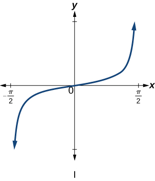

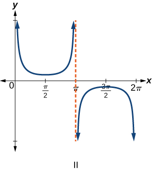

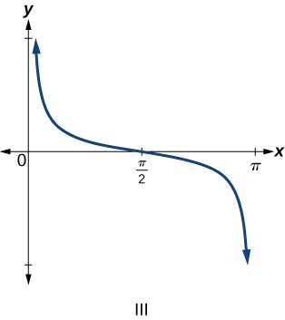

<math xmlns="http://www.w3.org/1998/Math/MathML"> <mrow> <mi>f</mi><mrow><mo>(</mo> <mi>x</mi> <mo>)</mo></mrow><mo>=</mo><mi>tan</mi><mtext> </mtext><mi>x</mi></mrow> </math>

<math xmlns="http://www.w3.org/1998/Math/MathML"> <mrow> <mi>f</mi><mrow><mo>(</mo> <mi>x</mi> <mo>)</mo></mrow><mo>=</mo><mi>sec</mi><mtext> </mtext><mi>x</mi></mrow> </math>

IV

<math xmlns="http://www.w3.org/1998/Math/MathML"> <mrow> <mi>f</mi><mrow><mo>(</mo> <mi>x</mi> <mo>)</mo></mrow><mo>=</mo><mi>csc</mi><mtext> </mtext><mi>x</mi></mrow> </math>

<math xmlns="http://www.w3.org/1998/Math/MathML"> <mrow> <mi>f</mi><mrow><mo>(</mo> <mi>x</mi> <mo>)</mo></mrow><mo>=</mo><mi>cot</mi><mtext> </mtext><mi>x</mi></mrow> </math>

III

For the following exercises, find the period and horizontal shift of each of the functions.

<math xmlns="http://www.w3.org/1998/Math/MathML"> <mrow> <mi>f</mi><mrow><mo>(</mo> <mi>x</mi> <mo>)</mo></mrow><mo>=</mo><mn>2</mn><mi>tan</mi><mrow><mo>(</mo> <mrow> <mn>4</mn><mi>x</mi><mo>−</mo><mn>32</mn></mrow> <mo>)</mo></mrow></mrow> </math>

<math xmlns="http://www.w3.org/1998/Math/MathML"> <mrow> <mi>h</mi><mrow><mo>(</mo> <mi>x</mi> <mo>)</mo></mrow><mo>=</mo><mn>2</mn><mi>sec</mi><mrow><mo>(</mo> <mrow> <mfrac> <mi>π</mi> <mn>4</mn> </mfrac> <mrow><mo>(</mo> <mrow> <mi>x</mi><mo>+</mo><mn>1</mn></mrow> <mo>)</mo></mrow></mrow> <mo>)</mo></mrow></mrow> </math>

period: 8; horizontal shift: 1 unit to left

<math xmlns="http://www.w3.org/1998/Math/MathML"> <mrow> <mi>m</mi><mrow><mo>(</mo> <mi>x</mi> <mo>)</mo></mrow><mo>=</mo><mn>6</mn><mi>csc</mi><mrow><mo>(</mo> <mrow> <mfrac> <mi>π</mi> <mn>3</mn> </mfrac> <mi>x</mi><mo>+</mo><mi>π</mi></mrow> <mo>)</mo></mrow></mrow> </math>

If<math xmlns="http://www.w3.org/1998/Math/MathML"> <mrow> <mtext> </mtext><mi>tan</mi><mtext> </mtext><mi>x</mi><mo>=</mo><mi>−</mi><mn>1.5</mn><mo>,</mo><mtext> </mtext></mrow> </math>

find<math xmlns="http://www.w3.org/1998/Math/MathML"> <mrow> <mtext> </mtext><mi>tan</mi><mrow><mo>(</mo> <mrow> <mo>−</mo><mi>x</mi></mrow> <mo>)</mo></mrow><mo>.</mo></mrow> </math>

1\.5

If<math xmlns="http://www.w3.org/1998/Math/MathML"> <mrow> <mtext> </mtext><mi>sec</mi><mtext> </mtext><mi>x</mi><mo>=</mo><mn>2</mn><mo>,</mo><mtext> </mtext></mrow> </math>

find<math xmlns="http://www.w3.org/1998/Math/MathML"> <mrow> <mtext> </mtext><mi>sec</mi><mrow><mo>(</mo> <mrow> <mo>−</mo><mi>x</mi></mrow> <mo>)</mo></mrow><mo>.</mo></mrow> </math>

If<math xmlns="http://www.w3.org/1998/Math/MathML"> <mrow> <mtext> </mtext><mi>csc</mi><mtext> </mtext><mi>x</mi><mo>=</mo><mi>−</mi><mn>5</mn><mo>,</mo><mtext> </mtext></mrow> </math>

find<math xmlns="http://www.w3.org/1998/Math/MathML"> <mrow> <mtext> </mtext><mi>csc</mi><mrow><mo>(</mo> <mrow> <mo>−</mo><mi>x</mi></mrow> <mo>)</mo></mrow><mo>.</mo></mrow> </math>

5

If<math xmlns="http://www.w3.org/1998/Math/MathML"> <mrow> <mtext> </mtext><mi>x</mi><mi>sin</mi><mtext> </mtext><mi>x</mi><mo>=</mo><mn>2</mn><mo>,</mo><mtext> </mtext></mrow> </math>

find<math xmlns="http://www.w3.org/1998/Math/MathML"> <mrow> <mtext> </mtext><mrow><mo>(</mo> <mrow> <mo>−</mo><mi>x</mi></mrow> <mo>)</mo></mrow><mi>sin</mi><mrow><mo>(</mo> <mrow> <mo>−</mo><mi>x</mi></mrow> <mo>)</mo></mrow><mo>.</mo></mrow> </math>

For the following exercises, rewrite each expression such that the argument<math xmlns="http://www.w3.org/1998/Math/MathML"> <mrow> <mtext> </mtext><mi>x</mi><mtext> </mtext></mrow> </math>

is positive.

<math xmlns="http://www.w3.org/1998/Math/MathML"> <mrow> <mi>cot</mi><mrow><mo>(</mo> <mrow> <mo>−</mo><mi>x</mi></mrow> <mo>)</mo></mrow><mi>cos</mi><mrow><mo>(</mo> <mrow> <mo>−</mo><mi>x</mi></mrow> <mo>)</mo></mrow><mo>+</mo><mi>sin</mi><mrow><mo>(</mo> <mrow> <mo>−</mo><mi>x</mi></mrow> <mo>)</mo></mrow></mrow> </math>

<math xmlns="http://www.w3.org/1998/Math/MathML"> <mrow> <mo>−</mo><mi>cot</mi><mi>x</mi><mi>cos</mi><mi>x</mi><mo>−</mo><mi>sin</mi><mi>x</mi></mrow> </math>

<math xmlns="http://www.w3.org/1998/Math/MathML"> <mrow> <mi>cos</mi><mrow><mo>(</mo> <mrow> <mo>−</mo><mi>x</mi></mrow> <mo>)</mo></mrow><mo>+</mo><mi>tan</mi><mrow><mo>(</mo> <mrow> <mo>−</mo><mi>x</mi></mrow> <mo>)</mo></mrow><mi>sin</mi><mrow><mo>(</mo> <mrow> <mo>−</mo><mi>x</mi></mrow> <mo>)</mo></mrow></mrow> </math>

#### Graphical

For the following exercises, sketch two periods of the graph for each of the following functions. Identify the stretching factor, period, and asymptotes.

<math xmlns="http://www.w3.org/1998/Math/MathML"> <mrow> <mi>f</mi><mrow><mo>(</mo> <mi>x</mi> <mo>)</mo></mrow><mo>=</mo><mn>2</mn><mi>tan</mi><mrow><mo>(</mo> <mrow> <mn>4</mn><mi>x</mi><mo>−</mo><mn>32</mn></mrow> <mo>)</mo></mrow></mrow> </math>

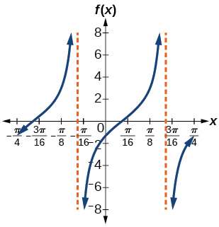

stretching factor: 2; period:<math xmlns="http://www.w3.org/1998/Math/MathML"> <mrow> <mtext> </mtext><mfrac> <mi>π</mi> <mn>4</mn> </mfrac> <mo>;</mo><mtext> </mtext> </mrow> </math>

asymptotes:<math xmlns="http://www.w3.org/1998/Math/MathML"> <mrow> <mtext> </mtext><mi>x</mi><mo>=</mo><mfrac> <mn>1</mn> <mn>4</mn> </mfrac> <mrow><mo>(</mo> <mrow> <mfrac> <mi>π</mi> <mn>2</mn> </mfrac> <mo>+</mo><mi>π</mi><mi>k</mi> </mrow> <mo>)</mo></mrow><mo>+</mo><mn>8</mn><mo>,</mo><mtext> where </mtext><mi>k</mi><mtext> is an integer</mtext> </mrow> </math>

<math xmlns="http://www.w3.org/1998/Math/MathML"> <mrow> <mtext> </mtext><mi>h</mi><mrow><mo>(</mo> <mi>x</mi> <mo>)</mo></mrow><mo>=</mo><mn>2</mn><mi>sec</mi><mrow><mo>(</mo> <mrow> <mfrac> <mi>π</mi> <mn>4</mn> </mfrac> <mrow><mo>(</mo> <mrow> <mi>x</mi><mo>+</mo><mn>1</mn></mrow> <mo>)</mo></mrow></mrow> <mo>)</mo></mrow><mtext> </mtext></mrow> </math>

<math xmlns="http://www.w3.org/1998/Math/MathML"> <mrow> <mi>m</mi><mrow><mo>(</mo> <mi>x</mi> <mo>)</mo></mrow><mo>=</mo><mn>6</mn><mi>csc</mi><mrow><mo>(</mo> <mrow> <mfrac> <mi>π</mi> <mn>3</mn> </mfrac> <mi>x</mi><mo>+</mo><mi>π</mi></mrow> <mo>)</mo></mrow></mrow> </math>

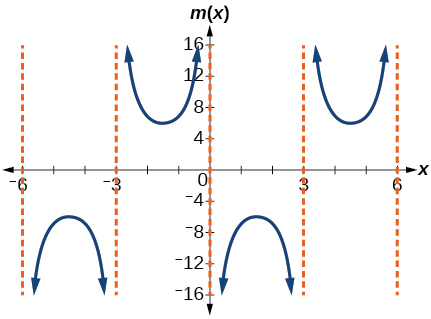

stretching factor: 6; period: 6; asymptotes:<math xmlns="http://www.w3.org/1998/Math/MathML"> <mrow> <mtext> </mtext><mi>x</mi><mo>=</mo><mn>3</mn><mi>k</mi><mo>,</mo><mtext> where </mtext><mi>k</mi><mtext> is an integer</mtext> </mrow> </math>

<math xmlns="http://www.w3.org/1998/Math/MathML"> <mrow> <mi>j</mi><mrow><mo>(</mo> <mi>x</mi> <mo>)</mo></mrow><mo>=</mo><mi>tan</mi><mrow><mo>(</mo> <mrow> <mfrac> <mi>π</mi> <mn>2</mn> </mfrac> <mi>x</mi></mrow> <mo>)</mo></mrow></mrow> </math>

<math xmlns="http://www.w3.org/1998/Math/MathML"> <mrow> <mi>p</mi><mo stretchy="false">(</mo><mi>x</mi><mo stretchy="false">)</mo><mo>=</mo><mi>tan</mi><mrow><mo>(</mo> <mrow> <mi>x</mi><mo>−</mo><mfrac> <mi>π</mi> <mn>2</mn> </mfrac> </mrow> <mo>)</mo></mrow></mrow> </math>

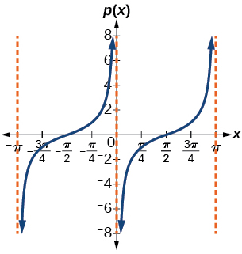

stretching factor: 1; period:<math xmlns="http://www.w3.org/1998/Math/MathML"> <mrow> <mtext> </mtext><mi>π</mi><mo>;</mo><mtext> </mtext> </mrow> </math>

asymptotes:<math xmlns="http://www.w3.org/1998/Math/MathML"> <mrow> <mtext> </mtext><mi>x</mi><mo>=</mo><mi>π</mi><mi>k</mi><mo>,</mo><mtext> where </mtext><mi>k</mi><mtext> is an integer</mtext> </mrow> </math>

<math xmlns="http://www.w3.org/1998/Math/MathML"> <mrow> <mi>f</mi><mo stretchy="false">(</mo><mi>x</mi><mo stretchy="false">)</mo><mo>=</mo><mn>4</mn><mi>tan</mi><mo stretchy="false">(</mo><mi>x</mi><mo stretchy="false">)</mo></mrow> </math>

<math xmlns="http://www.w3.org/1998/Math/MathML"> <mrow> <mi>f</mi><mo stretchy="false">(</mo><mi>x</mi><mo stretchy="false">)</mo><mo>=</mo><mi>tan</mi><mrow><mo>(</mo> <mrow> <mi>x</mi><mo>+</mo><mfrac> <mi>π</mi> <mn>4</mn> </mfrac> </mrow> <mo>)</mo></mrow></mrow> </math>

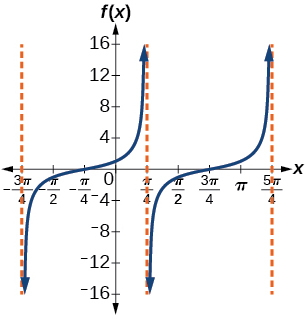

Stretching factor: 1; period:<math xmlns="http://www.w3.org/1998/Math/MathML"> <mrow> <mtext> </mtext><mi>π</mi><mo>;</mo><mtext> </mtext> </mrow> </math>

asymptotes:<math xmlns="http://www.w3.org/1998/Math/MathML"> <mrow> <mtext> </mtext><mi>x</mi><mo>=</mo><mfrac> <mi>π</mi> <mn>4</mn> </mfrac> <mo>+</mo><mi>π</mi><mi>k</mi><mo>,</mo><mtext> where </mtext><mi>k</mi><mtext> is an integer</mtext> </mrow> </math>

<math xmlns="http://www.w3.org/1998/Math/MathML"> <mrow> <mi>f</mi><mo stretchy="false">(</mo><mi>x</mi><mo stretchy="false">)</mo><mo>=</mo><mi>π</mi><mi>tan</mi><mrow><mo>(</mo> <mrow> <mi>π</mi><mi>x</mi><mo>−</mo><mi>π</mi></mrow> <mo>)</mo></mrow><mo>−</mo><mi>π</mi></mrow> </math>

<math xmlns="http://www.w3.org/1998/Math/MathML"> <mrow> <mi>f</mi><mrow><mo>(</mo> <mi>x</mi> <mo>)</mo></mrow><mo>=</mo><mn>2</mn><mi>csc</mi><mrow><mo>(</mo> <mi>x</mi> <mo>)</mo></mrow></mrow> </math>

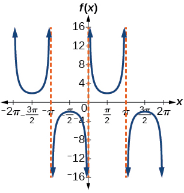

stretching factor: 2; period:<math xmlns="http://www.w3.org/1998/Math/MathML"> <mrow> <mtext> </mtext><mn>2</mn><mi>π</mi><mo>;</mo><mtext> </mtext> </mrow> </math>

asymptotes:<math xmlns="http://www.w3.org/1998/Math/MathML"> <mrow> <mtext> </mtext><mi>x</mi><mo>=</mo><mi>π</mi><mi>k</mi><mo>,</mo><mtext> where </mtext><mi>k</mi><mtext> is an integer</mtext> </mrow> </math>

<math xmlns="http://www.w3.org/1998/Math/MathML"> <mrow> <mi>f</mi><mrow><mo>(</mo> <mi>x</mi> <mo>)</mo></mrow><mo>=</mo><mo>−</mo><mfrac> <mn>1</mn> <mn>4</mn> </mfrac> <mi>csc</mi><mrow><mo>(</mo> <mi>x</mi> <mo>)</mo></mrow></mrow> </math>

<math xmlns="http://www.w3.org/1998/Math/MathML"> <mrow> <mi>f</mi><mo stretchy="false">(</mo><mi>x</mi><mo stretchy="false">)</mo><mo>=</mo><mn>4</mn><mi>sec</mi><mrow><mo>(</mo> <mrow> <mn>3</mn><mi>x</mi></mrow> <mo>)</mo></mrow></mrow> </math>

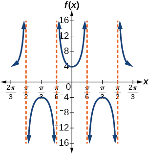

stretching factor: 4; period:<math xmlns="http://www.w3.org/1998/Math/MathML"> <mrow> <mtext> </mtext><mfrac> <mrow> <mn>2</mn><mi>π</mi> </mrow> <mn>3</mn> </mfrac> <mo>;</mo><mtext> </mtext> </mrow> </math>

asymptotes:<math xmlns="http://www.w3.org/1998/Math/MathML"> <mrow> <mtext> </mtext><mi>x</mi><mo>=</mo><mfrac> <mi>π</mi> <mn>6</mn> </mfrac> <mi>k</mi><mo>,</mo><mtext> where </mtext><mi>k</mi><mtext> is an odd integer</mtext> </mrow> </math>

<math xmlns="http://www.w3.org/1998/Math/MathML"> <mrow> <mi>f</mi><mo stretchy="false">(</mo><mi>x</mi><mo stretchy="false">)</mo><mo>=</mo><mo>−</mo><mn>3</mn><mi>cot</mi><mrow><mo>(</mo> <mrow> <mn>2</mn><mi>x</mi></mrow> <mo>)</mo></mrow></mrow> </math>

<math xmlns="http://www.w3.org/1998/Math/MathML"> <mrow> <mi>f</mi><mo stretchy="false">(</mo><mi>x</mi><mo stretchy="false">)</mo><mo>=</mo><mn>7</mn><mi>sec</mi><mrow><mo>(</mo> <mrow> <mn>5</mn><mi>x</mi></mrow> <mo>)</mo></mrow></mrow> </math>

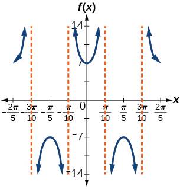

stretching factor: 7; period:<math xmlns="http://www.w3.org/1998/Math/MathML"> <mrow> <mtext> </mtext><mfrac> <mrow> <mn>2</mn><mi>π</mi> </mrow> <mn>5</mn> </mfrac> <mo>;</mo><mtext> </mtext> </mrow> </math>

asymptotes:<math xmlns="http://www.w3.org/1998/Math/MathML"> <mrow> <mtext> </mtext><mi>x</mi><mo>=</mo><mfrac> <mi>π</mi> <mrow> <mn>10</mn> </mrow> </mfrac> <mi>k</mi><mo>,</mo><mtext> where </mtext><mi>k</mi><mtext> is an odd integer</mtext> </mrow> </math>

<math xmlns="http://www.w3.org/1998/Math/MathML"> <mrow> <mi>f</mi><mo stretchy="false">(</mo><mi>x</mi><mo stretchy="false">)</mo><mo>=</mo><mfrac> <mn>9</mn> <mrow> <mn>10</mn></mrow> </mfrac> <mi>csc</mi><mrow><mo>(</mo> <mrow> <mi>π</mi><mi>x</mi></mrow> <mo>)</mo></mrow></mrow> </math>

<math xmlns="http://www.w3.org/1998/Math/MathML"> <mrow> <mi>f</mi><mo stretchy="false">(</mo><mi>x</mi><mo stretchy="false">)</mo><mo>=</mo><mn>2</mn><mi>csc</mi><mrow><mo>(</mo> <mrow> <mi>x</mi><mo>+</mo><mfrac> <mi>π</mi> <mn>4</mn> </mfrac> </mrow> <mo>)</mo></mrow><mo>−</mo><mn>1</mn></mrow> </math>

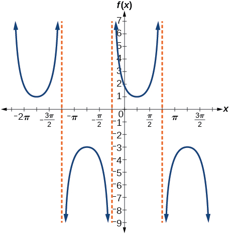

stretching factor: 2; period:<math xmlns="http://www.w3.org/1998/Math/MathML"> <mrow> <mtext> </mtext><mn>2</mn><mi>π</mi><mo>;</mo><mtext> </mtext> </mrow> </math>

asymptotes:<math xmlns="http://www.w3.org/1998/Math/MathML"> <mrow> <mtext> </mtext><mi>x</mi><mo>=</mo><mo>−</mo><mfrac> <mi>π</mi> <mn>4</mn> </mfrac> <mo>+</mo><mi>π</mi><mi>k</mi><mo>,</mo><mtext> where </mtext><mi>k</mi><mtext> is an integer</mtext> </mrow> </math>

<math xmlns="http://www.w3.org/1998/Math/MathML"> <mrow> <mi>f</mi><mo stretchy="false">(</mo><mi>x</mi><mo stretchy="false">)</mo><mo>=</mo><mo>−</mo><mi>sec</mi><mrow><mo>(</mo> <mrow> <mi>x</mi><mo>−</mo><mfrac> <mi>π</mi> <mn>3</mn> </mfrac> </mrow> <mo>)</mo></mrow><mo>−</mo><mn>2</mn></mrow> </math>

<math xmlns="http://www.w3.org/1998/Math/MathML"> <mrow> <mi>f</mi><mo stretchy="false">(</mo><mi>x</mi><mo stretchy="false">)</mo><mo>=</mo><mfrac> <mn>7</mn> <mn>5</mn> </mfrac> <mi>csc</mi><mrow><mo>(</mo> <mrow> <mi>x</mi><mo>−</mo><mfrac> <mi>π</mi> <mn>4</mn> </mfrac> </mrow> <mo>)</mo></mrow></mrow> </math>

stretching factor:<math xmlns="http://www.w3.org/1998/Math/MathML"> <mrow> <mtext> </mtext><mfrac> <mn>7</mn> <mn>5</mn> </mfrac> <mo>;</mo><mtext> </mtext> </mrow> </math>

period:<math xmlns="http://www.w3.org/1998/Math/MathML"> <mrow> <mtext> </mtext><mn>2</mn><mi>π</mi><mo>;</mo><mtext> </mtext> </mrow> </math>

asymptotes:<math xmlns="http://www.w3.org/1998/Math/MathML"> <mrow> <mtext> </mtext><mi>x</mi><mo>=</mo><mfrac> <mi>π</mi> <mn>4</mn> </mfrac> <mo>+</mo><mi>π</mi><mi>k</mi><mo>,</mo><mtext> where </mtext><mi>k</mi><mtext> is an integer</mtext> </mrow> </math>

<math xmlns="http://www.w3.org/1998/Math/MathML"> <mrow> <mi>f</mi><mo stretchy="false">(</mo><mi>x</mi><mo stretchy="false">)</mo><mo>=</mo><mn>5</mn><mrow><mo>(</mo> <mrow> <mi>cot</mi><mrow><mo>(</mo> <mrow> <mi>x</mi><mo>+</mo><mfrac> <mi>π</mi> <mn>2</mn> </mfrac> </mrow> <mo>)</mo></mrow><mo>−</mo><mn>3</mn></mrow> <mo>)</mo></mrow></mrow> </math>

For the following exercises, find and graph two periods of the periodic function with the given stretching factor,<math xmlns="http://www.w3.org/1998/Math/MathML"> <mrow> <mtext> </mtext><mrow><mo>\|</mo> <mi>A</mi> <mo>\|</mo></mrow><mo>,</mo><mtext> </mtext></mrow> </math>

period, and phase shift.

A tangent curve,<math xmlns="http://www.w3.org/1998/Math/MathML"> <mrow> <mtext> </mtext><mi>A</mi><mo>=</mo><mn>1</mn><mo>,</mo><mtext> </mtext></mrow> </math>

period of<math xmlns="http://www.w3.org/1998/Math/MathML"> <mrow> <mtext> </mtext><mfrac> <mi>π</mi> <mn>3</mn> </mfrac> <mo>;</mo><mtext> </mtext></mrow> </math>

and phase shift<math xmlns="http://www.w3.org/1998/Math/MathML"> <mrow> <mtext> </mtext><mrow><mo>(</mo> <mrow> <mi>h</mi><mo>,</mo><mtext> </mtext><mi>k</mi></mrow> <mo>)</mo></mrow><mo>=</mo><mrow><mo>(</mo> <mrow> <mfrac> <mi>π</mi> <mn>4</mn> </mfrac> <mo>,</mo><mn>2</mn></mrow> <mo>)</mo></mrow></mrow> </math>

<math xmlns="http://www.w3.org/1998/Math/MathML"> <mrow> <mi>y</mi><mo>=</mo><mi>tan</mi><mrow><mo>(</mo> <mrow> <mn>3</mn><mrow><mo>(</mo> <mrow> <mi>x</mi><mo>−</mo><mfrac> <mi>π</mi> <mn>4</mn> </mfrac> </mrow> <mo>)</mo></mrow></mrow> <mo>)</mo></mrow><mo>+</mo><mn>2</mn></mrow> </math>

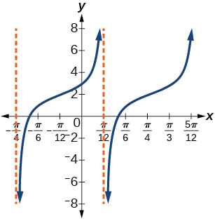

A tangent curve,<math xmlns="http://www.w3.org/1998/Math/MathML"> <mrow> <mtext> </mtext><mi>A</mi><mo>=</mo><mn>−2</mn><mo>,</mo><mtext> </mtext></mrow> </math>

period of<math xmlns="http://www.w3.org/1998/Math/MathML"> <mrow> <mtext> </mtext><mfrac> <mi>π</mi> <mn>4</mn> </mfrac> <mo>,</mo><mtext> </mtext></mrow> </math>

and phase shift<math xmlns="http://www.w3.org/1998/Math/MathML"> <mrow> <mtext> </mtext><mrow><mo>(</mo> <mrow> <mi>h</mi><mo>,</mo><mtext> </mtext><mi>k</mi></mrow> <mo>)</mo></mrow><mo>=</mo><mrow><mo>(</mo> <mrow> <mo>−</mo><mfrac> <mi>π</mi> <mn>4</mn> </mfrac> <mo>,</mo><mtext> </mtext><mn>−2</mn></mrow> <mo>)</mo></mrow></mrow> </math>

For the following exercises, find an equation for the graph of each function.

<math xmlns="http://www.w3.org/1998/Math/MathML"> <mrow> <mi>f</mi><mrow><mo>(</mo> <mi>x</mi> <mo>)</mo></mrow><mo>=</mo><mi>csc</mi><mrow><mo>(</mo> <mrow> <mn>2</mn><mi>x</mi></mrow> <mo>)</mo></mrow></mrow> </math>

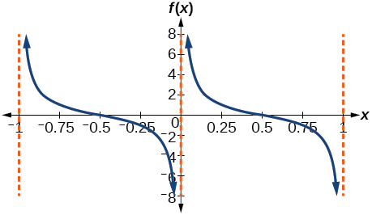

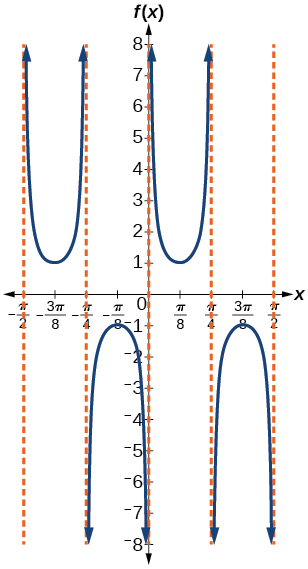

<math xmlns="http://www.w3.org/1998/Math/MathML"> <mrow> <mi>f</mi><mrow><mo>(</mo> <mi>x</mi> <mo>)</mo></mrow><mo>=</mo><mi>csc</mi><mrow><mo>(</mo> <mrow> <mn>4</mn><mi>x</mi></mrow> <mo>)</mo></mrow></mrow> </math>

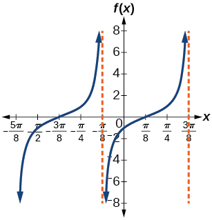

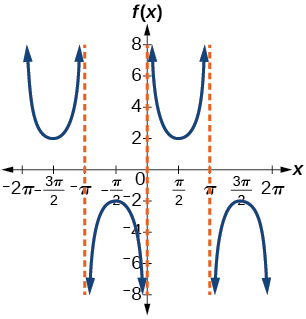

<math xmlns="http://www.w3.org/1998/Math/MathML"> <mrow> <mi>f</mi><mrow><mo>(</mo> <mi>x</mi> <mo>)</mo></mrow><mo>=</mo><mn>2</mn><mi>csc</mi><mi>x</mi></mrow> </math>

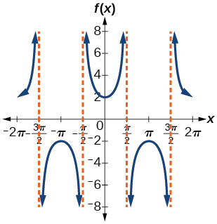

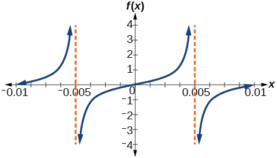

<math xmlns="http://www.w3.org/1998/Math/MathML"> <mrow> <mi>f</mi><mo stretchy="false">(</mo><mi>x</mi><mo stretchy="false">)</mo><mo>=</mo><mfrac> <mn>1</mn> <mn>2</mn> </mfrac> <mi>tan</mi><mo stretchy="false">(</mo><mn>100</mn><mi>π</mi><mi>x</mi><mo stretchy="false">)</mo> </mrow> </math>

#### Technology

For the following exercises, use a graphing calculator to graph two periods of the given function. Note: most graphing calculators do not have a cosecant button; therefore, you will need to input<math xmlns="http://www.w3.org/1998/Math/MathML"> <mrow> <mtext> </mtext><mi>csc</mi><mtext> </mtext><mi>x</mi><mtext> </mtext></mrow> </math>

as<math xmlns="http://www.w3.org/1998/Math/MathML"> <mrow> <mtext> </mtext><mfrac> <mn>1</mn> <mrow> <mi>sin</mi><mtext> </mtext><mi>x</mi></mrow> </mfrac> <mo>.</mo></mrow> </math>

<math xmlns="http://www.w3.org/1998/Math/MathML"> <mrow> <mi>f</mi><mo stretchy="false">(</mo><mi>x</mi><mo stretchy="false">)</mo><mo>=</mo><mrow><mo>\|</mo> <mrow> <mi>csc</mi><mrow><mo>(</mo> <mi>x</mi> <mo>)</mo></mrow></mrow> <mo>\|</mo></mrow></mrow> </math>

<math xmlns="http://www.w3.org/1998/Math/MathML"> <mrow> <mi>f</mi><mo stretchy="false">(</mo><mi>x</mi><mo stretchy="false">)</mo><mo>=</mo><mrow><mo>\|</mo> <mrow> <mi>cot</mi><mrow><mo>(</mo> <mi>x</mi> <mo>)</mo></mrow></mrow> <mo>\|</mo></mrow></mrow> </math>

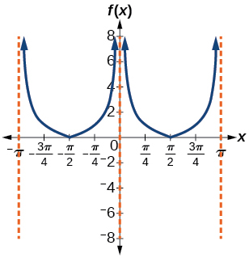

<math xmlns="http://www.w3.org/1998/Math/MathML"> <mrow> <mi>f</mi><mo stretchy="false">(</mo><mi>x</mi><mo stretchy="false">)</mo><mo>=</mo><msup> <mn>2</mn> <mrow> <mi>csc</mi><mrow><mo>(</mo> <mi>x</mi> <mo>)</mo></mrow></mrow> </msup> </mrow> </math>

<math xmlns="http://www.w3.org/1998/Math/MathML"> <mrow> <mi>f</mi><mo stretchy="false">(</mo><mi>x</mi><mo stretchy="false">)</mo><mo>=</mo><mfrac> <mrow> <mi>csc</mi><mrow><mo>(</mo> <mi>x</mi> <mo>)</mo></mrow></mrow> <mrow> <mi>sec</mi><mrow><mo>(</mo> <mi>x</mi> <mo>)</mo></mrow></mrow> </mfrac> </mrow> </math>

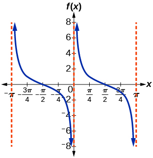

Graph<math xmlns="http://www.w3.org/1998/Math/MathML"> <mrow> <mtext> </mtext><mi>f</mi><mo stretchy="false">(</mo><mi>x</mi><mo stretchy="false">)</mo><mo>=</mo><mn>1</mn><mo>+</mo><msup> <mrow> <mi>sec</mi></mrow> <mn>2</mn> </msup> <mrow><mo>(</mo> <mi>x</mi> <mo>)</mo></mrow><mo>−</mo><msup> <mrow> <mi>tan</mi></mrow> <mn>2</mn> </msup> <mrow><mo>(</mo> <mi>x</mi> <mo>)</mo></mrow><mo>.</mo><mtext> </mtext></mrow> </math>

What is the function shown in the graph?

<math xmlns="http://www.w3.org/1998/Math/MathML"> <mrow> <mi>f</mi><mo stretchy="false">(</mo><mi>x</mi><mo stretchy="false">)</mo><mo>=</mo><mi>sec</mi><mrow><mo>(</mo> <mrow> <mn>0.001</mn><mi>x</mi></mrow> <mo>)</mo></mrow></mrow> </math>

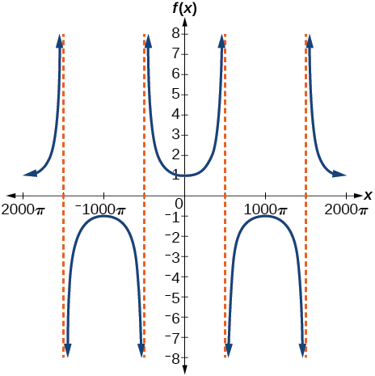

<math xmlns="http://www.w3.org/1998/Math/MathML"> <mrow> <mi>f</mi><mo stretchy="false">(</mo><mi>x</mi><mo stretchy="false">)</mo><mo>=</mo><mi>cot</mi><mrow><mo>(</mo> <mrow> <mn>100</mn><mi>π</mi><mi>x</mi></mrow> <mo>)</mo></mrow></mrow> </math>

<math xmlns="http://www.w3.org/1998/Math/MathML"> <mrow> <mi>f</mi><mo stretchy="false">(</mo><mi>x</mi><mo stretchy="false">)</mo><mo>=</mo><msup> <mrow> <mi>sin</mi></mrow> <mn>2</mn> </msup> <mi>x</mi><mo>+</mo><msup> <mrow> <mi>cos</mi></mrow> <mn>2</mn> </msup> <mi>x</mi></mrow> </math>

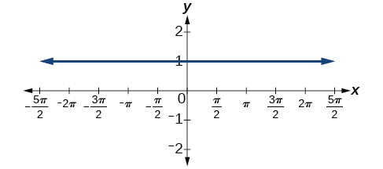

#### Real-World Applications

The function<math xmlns="http://www.w3.org/1998/Math/MathML"> <mrow> <mtext> </mtext><mi>f</mi><mrow><mo>(</mo> <mi>x</mi> <mo>)</mo></mrow><mo>=</mo><mn>20</mn><mi>tan</mi><mrow><mo>(</mo> <mrow> <mfrac> <mi>π</mi> <mrow> <mn>10</mn></mrow> </mfrac> <mi>x</mi></mrow> <mo>)</mo></mrow><mtext> </mtext></mrow> </math>

marks the distance in the movement of a light beam from a police car across a wall for time<math xmlns="http://www.w3.org/1998/Math/MathML"> <mrow> <mtext> </mtext><mi>x</mi><mo>,</mo><mtext> </mtext></mrow> </math>

in seconds, and distance<math xmlns="http://www.w3.org/1998/Math/MathML"> <mrow> <mtext> </mtext><mi>f</mi><mrow><mo>(</mo> <mi>x</mi> <mo>)</mo></mrow><mo>,</mo></mrow> </math>

 in feet.

1.  Graph on the interval
    <math xmlns="http://www.w3.org/1998/Math/MathML"> <mrow> <mtext> </mtext><mrow><mo>[</mo> <mrow> <mn>0</mn><mo>,</mo><mtext> </mtext><mn>5</mn></mrow> <mo>]</mo></mrow><mo>.</mo></mrow> </math>

2.  Find and interpret the stretching factor, period, and asymptote.
3.  Evaluate
    <math xmlns="http://www.w3.org/1998/Math/MathML"> <mrow> <mtext> </mtext><mi>f</mi><mrow><mo>(</mo> <mn>1</mn> <mo>)</mo></mrow><mtext> </mtext></mrow> </math>
    
    and
    <math xmlns="http://www.w3.org/1998/Math/MathML"> <mrow> <mtext> </mtext><mi>f</mi><mrow><mo>(</mo> <mrow> <mn>2.5</mn></mrow> <mo>)</mo></mrow><mtext> </mtext></mrow> </math>
    
    and discuss the function’s values at those inputs.
{: data-number-style="lower-alpha"}

Standing on the shore of a lake, a fisherman sights a boat far in the distance to his left. Let<math xmlns="http://www.w3.org/1998/Math/MathML"> <mrow> <mtext> </mtext><mi>x</mi><mo>,</mo><mtext> </mtext></mrow> </math>

measured in radians, be the angle formed by the line of sight to the ship and a line due north from his position. Assume due north is 0 and<math xmlns="http://www.w3.org/1998/Math/MathML"> <mrow> <mtext> </mtext><mi>x</mi><mtext> </mtext></mrow> </math>

is measured negative to the left and positive to the right. (See [[link]](#Figure_06_02_237).) The boat travels from due west to due east and, ignoring the curvature of the Earth, the distance<math xmlns="http://www.w3.org/1998/Math/MathML"> <mrow> <mtext> </mtext><mi>d</mi><mrow><mo>(</mo> <mi>x</mi> <mo>)</mo></mrow><mo>,</mo><mtext> </mtext></mrow> </math>

in kilometers, from the fisherman to the boat is given by the function<math xmlns="http://www.w3.org/1998/Math/MathML"> <mrow> <mtext> </mtext><mi>d</mi><mrow><mo>(</mo> <mi>x</mi> <mo>)</mo></mrow><mo>=</mo><mn>1.5</mn><mi>sec</mi><mrow><mo>(</mo> <mi>x</mi> <mo>)</mo></mrow><mo>.</mo></mrow> </math>

1.  What is a reasonable domain for
    <math xmlns="http://www.w3.org/1998/Math/MathML"> <mrow> <mtext> </mtext><mi>d</mi><mrow><mo>(</mo> <mi>x</mi> <mo>)</mo></mrow><mo>?</mo></mrow> </math>

2.  Graph
    <math xmlns="http://www.w3.org/1998/Math/MathML"> <mrow> <mtext> </mtext><mi>d</mi><mrow><mo>(</mo> <mi>x</mi> <mo>)</mo></mrow><mtext> </mtext></mrow> </math>
    
    on this domain.
3.  Find and discuss the meaning of any vertical asymptotes on the graph of
    <math xmlns="http://www.w3.org/1998/Math/MathML"> <mrow> <mtext> </mtext><mi>d</mi><mrow><mo>(</mo> <mi>x</mi> <mo>)</mo></mrow><mo>.</mo></mrow> </math>

4.  Calculate and interpret
    <math xmlns="http://www.w3.org/1998/Math/MathML"> <mrow> <mtext> </mtext><mi>d</mi><mrow><mo>(</mo> <mrow> <mo>−</mo><mfrac> <mi>π</mi> <mn>3</mn> </mfrac> </mrow> <mo>)</mo></mrow><mo>.</mo><mtext> </mtext></mrow> </math>
    
    Round to the second decimal place.
5.  Calculate and interpret
    <math xmlns="http://www.w3.org/1998/Math/MathML"> <mrow> <mtext> </mtext><mi>d</mi><mrow><mo>(</mo> <mrow> <mfrac> <mi>π</mi> <mn>6</mn> </mfrac> </mrow> <mo>)</mo></mrow><mo>.</mo><mtext> </mtext></mrow> </math>
    
    Round to the second decimal place.
6.  What is the minimum distance between the fisherman and the boat? When does this occur?
{: data-number-style="lower-alpha"}

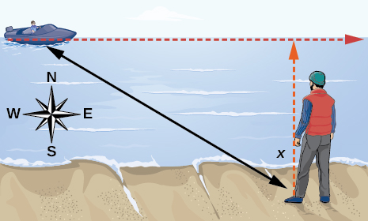{: #Figure_06_02_237}

1.  <math xmlns="http://www.w3.org/1998/Math/MathML"> <mrow> <mtext> </mtext><mrow><mo>(</mo> <mrow> <mo>−</mo><mfrac> <mi>π</mi> <mn>2</mn> </mfrac> <mo>,</mo><mtext> </mtext><mfrac> <mi>π</mi> <mn>2</mn> </mfrac> </mrow> <mo>)</mo></mrow><mo>;</mo><mtext> </mtext></mrow> </math>

2.  

    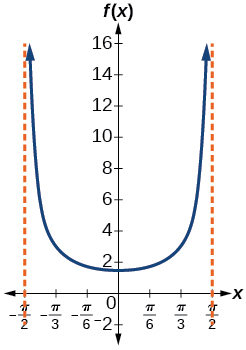
    

3.  <math xmlns="http://www.w3.org/1998/Math/MathML"> <mrow> <mtext> </mtext><mi>x</mi><mo>=</mo><mo>−</mo><mfrac> <mi>π</mi> <mn>2</mn> </mfrac> <mtext> </mtext></mrow> </math>
    
    and
    <math xmlns="http://www.w3.org/1998/Math/MathML"> <mrow> <mtext> </mtext><mi>x</mi><mo>=</mo><mfrac> <mi>π</mi> <mn>2</mn> </mfrac> <mo>;</mo><mtext> </mtext></mrow> </math>
    
    the distance grows without bound as
    <math xmlns="http://www.w3.org/1998/Math/MathML"> <mrow> <mtext> </mtext><mrow><mo>\|</mo> <mi>x</mi> <mo>\|</mo></mrow></mrow> </math>
    
    approaches
    <math xmlns="http://www.w3.org/1998/Math/MathML"> <mrow> <mtext> </mtext><mfrac> <mi>π</mi> <mn>2</mn> </mfrac> <mtext> </mtext></mrow> </math>
    
    —i.e., at right angles to the line representing due north, the boat would be so far away, the fisherman could not see it;
4.  3; when
    <math xmlns="http://www.w3.org/1998/Math/MathML"> <mrow> <mtext> </mtext><mi>x</mi><mo>=</mo><mo>−</mo><mfrac> <mi>π</mi> <mn>3</mn> </mfrac> <mo>,</mo><mtext> </mtext></mrow> </math>
    
    the boat is 3 km away;
5.  1\.73; when
    <math xmlns="http://www.w3.org/1998/Math/MathML"> <mrow> <mtext> </mtext><mi>x</mi><mo>=</mo><mfrac> <mi>π</mi> <mn>6</mn> </mfrac> <mo>,</mo><mtext> </mtext></mrow> </math>
    
    the boat is about 1.73 km away;
6.  1\.5 km; when
    <math xmlns="http://www.w3.org/1998/Math/MathML"> <mrow> <mtext> </mtext><mi>x</mi><mo>=</mo><mn>0</mn><mtext> </mtext></mrow> </math>
{: data-number-style="lower-alpha"}

A laser rangefinder is locked on a comet approaching Earth. The distance<math xmlns="http://www.w3.org/1998/Math/MathML"> <mrow> <mtext> </mtext><mi>g</mi><mrow><mo>(</mo> <mi>x</mi> <mo>)</mo></mrow><mo>,</mo><mtext> </mtext></mrow> </math>

in kilometers, of the comet after<math xmlns="http://www.w3.org/1998/Math/MathML"> <mrow> <mtext> </mtext><mi>x</mi><mtext> </mtext></mrow> </math>

days, for<math xmlns="http://www.w3.org/1998/Math/MathML"> <mrow> <mtext> </mtext><mi>x</mi><mtext> </mtext></mrow> </math>

in the interval 0 to 30 days, is given by<math xmlns="http://www.w3.org/1998/Math/MathML"> <mrow> <mtext> </mtext><mi>g</mi><mrow><mo>(</mo> <mi>x</mi> <mo>)</mo></mrow><mo>=</mo><mn>250,000</mn><mi>csc</mi><mrow><mo>(</mo> <mrow> <mfrac> <mi>π</mi> <mrow> <mn>30</mn></mrow> </mfrac> <mi>x</mi></mrow> <mo>)</mo></mrow><mo>.</mo></mrow> </math>

1.  Graph
    <math xmlns="http://www.w3.org/1998/Math/MathML"> <mrow> <mtext> </mtext><mi>g</mi><mrow><mo>(</mo> <mi>x</mi> <mo>)</mo></mrow><mtext> </mtext></mrow> </math>
    
    on the interval
    <math xmlns="http://www.w3.org/1998/Math/MathML"> <mrow> <mtext> </mtext><mrow><mo>[</mo> <mrow> <mn>0</mn><mo>,</mo><mtext> </mtext><mn>35</mn></mrow> <mo>]</mo></mrow><mo>.</mo></mrow> </math>

2.  Evaluate
    <math xmlns="http://www.w3.org/1998/Math/MathML"> <mrow> <mtext> </mtext><mi>g</mi><mrow><mo>(</mo> <mn>5</mn> <mo>)</mo></mrow><mtext> </mtext></mrow> </math>
    
    and interpret the information.
3.  What is the minimum distance between the comet and Earth? When does this occur? To which constant in the equation does this correspond?
4.  Find and discuss the meaning of any vertical asymptotes.
{: data-number-style="lower-alpha"}

A video camera is focused on a rocket on a launching pad 2 miles from the camera. The angle of elevation from the ground to the rocket after<math xmlns="http://www.w3.org/1998/Math/MathML"> <mrow> <mtext> </mtext><mi>x</mi><mtext> </mtext></mrow> </math>

seconds is<math xmlns="http://www.w3.org/1998/Math/MathML"> <mrow> <mtext> </mtext><mfrac> <mi>π</mi> <mrow> <mn>120</mn></mrow> </mfrac> <mi>x</mi><mo>.</mo></mrow> </math>

1.  Write a function expressing the altitude
    <math xmlns="http://www.w3.org/1998/Math/MathML"> <mrow> <mtext> </mtext><mi>h</mi><mrow><mo>(</mo> <mi>x</mi> <mo>)</mo></mrow><mo>,</mo><mtext> </mtext></mrow> </math>
    
    in miles, of the rocket above the ground after
    <math xmlns="http://www.w3.org/1998/Math/MathML"> <mrow> <mtext> </mtext><mi>x</mi><mtext> </mtext></mrow> </math>
    
    seconds. Ignore the curvature of the Earth.
2.  Graph
    <math xmlns="http://www.w3.org/1998/Math/MathML"> <mrow> <mtext> </mtext><mi>h</mi><mrow><mo>(</mo> <mi>x</mi> <mo>)</mo></mrow><mtext> </mtext></mrow> </math>
    
    on the interval
    <math xmlns="http://www.w3.org/1998/Math/MathML"> <mrow> <mtext> </mtext><mrow><mo>(</mo> <mrow> <mn>0</mn><mo>,</mo><mtext> </mtext><mn>60</mn></mrow> <mo>)</mo></mrow><mo>.</mo></mrow> </math>

3.  Evaluate and interpret the values
    <math xmlns="http://www.w3.org/1998/Math/MathML"> <mrow> <mtext> </mtext><mi>h</mi><mrow><mo>(</mo> <mn>0</mn> <mo>)</mo></mrow><mtext> </mtext></mrow> </math>
    
    and
    <math xmlns="http://www.w3.org/1998/Math/MathML"> <mrow> <mtext> </mtext><mi>h</mi><mrow><mo>(</mo> <mrow> <mn>30</mn></mrow> <mo>)</mo></mrow><mo>.</mo></mrow> </math>

4.  What happens to the values of
    <math xmlns="http://www.w3.org/1998/Math/MathML"> <mrow> <mtext> </mtext><mi>h</mi><mrow><mo>(</mo> <mi>x</mi> <mo>)</mo></mrow><mtext> </mtext></mrow> </math>
    
    as
    <math xmlns="http://www.w3.org/1998/Math/MathML"> <mrow> <mtext> </mtext><mi>x</mi><mtext> </mtext></mrow> </math>
    
    approaches 60 seconds? Interpret the meaning of this in terms of the problem.
{: data-number-style="lower-alpha"}

1.  <math xmlns="http://www.w3.org/1998/Math/MathML"> <mrow> <mi>h</mi><mrow><mo>(</mo> <mi>x</mi> <mo>)</mo></mrow><mo>=</mo><mn>2</mn><mi>tan</mi><mrow><mo>(</mo> <mrow> <mfrac> <mi>π</mi> <mrow> <mn>120</mn></mrow> </mfrac> <mi>x</mi></mrow> <mo>)</mo></mrow><mo>;</mo></mrow> </math>

2.  

    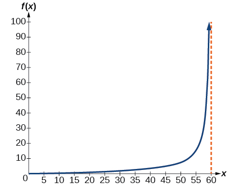
    

3.  <math xmlns="http://www.w3.org/1998/Math/MathML"> <mrow> <mi>h</mi><mrow><mo>(</mo> <mn>0</mn> <mo>)</mo></mrow><mo>=</mo><mn>0</mn><mo>:</mo><mtext> </mtext></mrow> </math>
    
    after 0 seconds, the rocket is 0 mi above the ground;
    <math xmlns="http://www.w3.org/1998/Math/MathML"> <mrow> <mi>h</mi><mrow><mo>(</mo> <mrow> <mn>30</mn></mrow> <mo>)</mo></mrow><mo>=</mo><mn>2</mn><mo>:</mo><mtext> </mtext></mrow> </math>
    
    after 30 seconds, the rockets is 2 mi high;
4.  As
    <math xmlns="http://www.w3.org/1998/Math/MathML"> <mrow> <mtext> </mtext><mi>x</mi><mtext> </mtext></mrow> </math>
    
    approaches 60 seconds, the values of
    <math xmlns="http://www.w3.org/1998/Math/MathML"> <mrow> <mtext> </mtext><mi>h</mi><mrow><mo>(</mo> <mi>x</mi> <mo>)</mo></mrow><mtext> </mtext></mrow> </math>
    
    grow increasingly large. The distance to the rocket is growing so large that the camera can no longer track it.
{: data-number-style="lower-alpha"}

[1]: http://openstaxcollege.org/l/graphtangent
[2]: http://openstaxcollege.org/l/graphcscsec
[3]: http://openstaxcollege.org/l/graphcot
