

In this section, you will:
* Understand and use the inverse sine, cosine, and tangent functions.
* Find the exact value of expressions involving the inverse sine, cosine, and tangent functions.
* Use a calculator to evaluate inverse trigonometric functions.
* Find exact values of composite functions with inverse trigonometric functions.

For any **right triangle**{: data-type="term" .no-emphasis}, given one other angle and the length of one side, we can figure out what the other angles and sides are. But what if we are given only two sides of a right triangle? We need a procedure that leads us from a ratio of sides to an angle. This is where the notion of an inverse to a trigonometric function comes into play. In this section, we will explore the **inverse trigonometric functions**{: data-type="term" .no-emphasis}.

### Understanding and Using the Inverse Sine, Cosine, and Tangent Functions

In order to use inverse trigonometric functions, we need to understand that an inverse trigonometric function “undoes” what the original trigonometric function “does,” as is the case with any other function and its inverse. In other words, the domain of the inverse function is the range of the original function, and vice versa, as summarized in [\[link\]](#Figure_06_03_013).

{: #Figure_06_03_013}

For example, if<math xmlns="http://www.w3.org/1998/Math/MathML"> <mrow> <mtext> </mtext><mi>f</mi><mo stretchy="false">(</mo><mi>x</mi><mo stretchy="false">)</mo><mo>=</mo><mi>sin</mi><mtext> </mtext><mi>x</mi><mo>,</mo><mtext> </mtext> </mrow> </math>

then we would write<math xmlns="http://www.w3.org/1998/Math/MathML"> <mrow> <mtext> </mtext><msup> <mi>f</mi> <mrow> <mo>−</mo><mn>1</mn> </mrow> </msup> <mo stretchy="false">(</mo><mi>x</mi><mo stretchy="false">)</mo><mo>=</mo><msup> <mrow> <mi>sin</mi> </mrow> <mrow> <mo>−</mo><mn>1</mn> </mrow> </msup> <mi>x</mi><mo>.</mo><mtext> </mtext> </mrow> </math>

Be aware that<math xmlns="http://www.w3.org/1998/Math/MathML"> <mrow> <mtext> </mtext><msup> <mrow> <mi>sin</mi> </mrow> <mrow> <mo>−</mo><mn>1</mn> </mrow> </msup> <mi>x</mi><mtext> </mtext> </mrow> </math>

does not mean<math xmlns="http://www.w3.org/1998/Math/MathML"> <mrow> <mtext> </mtext><mfrac> <mn>1</mn> <mrow> <mi>sin</mi><mi>x</mi> </mrow> </mfrac> <mo>.</mo><mtext> </mtext> </mrow> </math>

The following examples illustrate the inverse trigonometric functions:

* Since
  <math xmlns="http://www.w3.org/1998/Math/MathML"> <mrow> <mtext> </mtext><mtext>sin</mtext><mrow><mo>(</mo> <mrow> <mfrac> <mi>π</mi> <mn>6</mn> </mfrac> </mrow> <mo>)</mo></mrow><mo>=</mo><mfrac> <mn>1</mn> <mn>2</mn> </mfrac> <mo>,</mo><mtext> </mtext> </mrow> </math>
  
  then
  <math xmlns="http://www.w3.org/1998/Math/MathML"> <mrow> <mtext> </mtext><mfrac> <mi>π</mi> <mn>6</mn> </mfrac> <mo>=</mo><msup> <mrow> <mtext>sin</mtext> </mrow> <mrow> <mo>−</mo><mn>1</mn> </mrow> </msup> <mrow><mo>(</mo> <mrow> <mfrac> <mn>1</mn> <mn>2</mn> </mfrac> </mrow> <mo>)</mo></mrow><mo>.</mo> </mrow> </math>

* Since
  <math xmlns="http://www.w3.org/1998/Math/MathML"> <mrow> <mtext> </mtext><mi>cos</mi><mrow><mo>(</mo> <mi>π</mi> <mo>)</mo></mrow><mo>=</mo><mo>−</mo><mn>1</mn><mo>,</mo><mtext> </mtext> </mrow> </math>
  
  then
  <math xmlns="http://www.w3.org/1998/Math/MathML"> <mrow> <mtext> </mtext><mi>π</mi><mo>=</mo><msup> <mrow> <mi>cos</mi> </mrow> <mrow> <mo>−</mo><mn>1</mn> </mrow> </msup> <mrow><mo>(</mo> <mrow> <mo>−</mo><mn>1</mn> </mrow> <mo>)</mo></mrow><mo>.</mo> </mrow> </math>

* Since
  <math xmlns="http://www.w3.org/1998/Math/MathML"> <mrow> <mtext> </mtext><mi>tan</mi><mrow><mo>(</mo> <mrow> <mfrac> <mi>π</mi> <mn>4</mn> </mfrac> </mrow> <mo>)</mo></mrow><mo>=</mo><mn>1</mn><mo>,</mo><mtext> </mtext> </mrow> </math>
  
  then
  <math xmlns="http://www.w3.org/1998/Math/MathML"> <mrow> <mtext> </mtext><mfrac> <mi>π</mi> <mn>4</mn> </mfrac> <mo>=</mo><msup> <mrow> <mi>tan</mi> </mrow> <mrow> <mo>−</mo><mn>1</mn> </mrow> </msup> <mrow><mo>(</mo> <mn>1</mn> <mo>)</mo></mrow><mo>.</mo> </mrow> </math>

In previous sections, we evaluated the trigonometric functions at various angles, but at times we need to know what angle would yield a specific sine, cosine, or tangent value. For this, we need inverse functions. Recall that, for a **one-to-one function**{: data-type="term" .no-emphasis}, if<math xmlns="http://www.w3.org/1998/Math/MathML"> <mrow> <mtext> </mtext><mi>f</mi><mo stretchy="false">(</mo><mi>a</mi><mo stretchy="false">)</mo><mo>=</mo><mi>b</mi><mo>,</mo><mtext> </mtext> </mrow> </math>

then an inverse function would satisfy<math xmlns="http://www.w3.org/1998/Math/MathML"> <mrow> <mtext> </mtext><msup> <mi>f</mi> <mrow> <mo>−</mo><mn>1</mn> </mrow> </msup> <mo stretchy="false">(</mo><mi>b</mi><mo stretchy="false">)</mo><mo>=</mo><mi>a</mi><mo>.</mo> </mrow> </math>

Bear in mind that the sine, cosine, and tangent functions are not one-to-one functions. The graph of each function would fail the horizontal line test. In fact, no periodic function can be one-to-one because each output in its range corresponds to at least one input in every period, and there are an infinite number of periods. As with other functions that are not one-to-one, we will need to restrict the **domain**{: data-type="term" .no-emphasis} of each function to yield a new function that is one-to-one. We choose a domain for each function that includes the number 0. [\[link\]](#Figure_06_03_001) shows the graph of the sine function limited to<math xmlns="http://www.w3.org/1998/Math/MathML"> <mrow> <mtext> </mtext><mrow><mo>[</mo> <mrow> <mo>−</mo><mfrac> <mi>π</mi> <mn>2</mn> </mfrac> <mo>,</mo><mfrac> <mi>π</mi> <mn>2</mn> </mfrac> </mrow> <mo>]</mo></mrow><mtext> </mtext> </mrow> </math>

and the graph of the cosine function limited to<math xmlns="http://www.w3.org/1998/Math/MathML"> <mrow> <mtext> </mtext><mrow><mo>[</mo> <mrow> <mn>0</mn><mo>,</mo><mi>π</mi> </mrow> <mo>]</mo></mrow><mo>.</mo> </mrow> </math>

 Sine function on a restricted domain of&#10; &#10;  &#x2009;[ &#10;   &#x2212;&#10;    &#x3C0;&#10;    2&#10;   &#10;   ,&#10;    &#x3C0;&#10;    2&#10;   &#10;   &#10;   ];&#x2009;&#10; &#10;(b) Cosine function on a restricted domain of&#10; &#10;  &#x2009;[ &#10;   0,&#x3C0;&#10;   ]&#10; &#10;&#10;"){: #Figure_06_03_001}

[\[link\]](#Figure_06_03_003) shows the graph of the tangent function limited to<math xmlns="http://www.w3.org/1998/Math/MathML"> <mrow> <mtext> </mtext><mrow><mo>(</mo> <mrow> <mo>−</mo><mfrac> <mi>π</mi> <mn>2</mn> </mfrac> <mo>,</mo><mfrac> <mi>π</mi> <mn>2</mn> </mfrac> </mrow> <mo>)</mo></mrow><mo>.</mo> </mrow> </math>

 &#10; &#10;&#10;"){: #Figure_06_03_003}

These conventional choices for the restricted domain are somewhat arbitrary, but they have important, helpful characteristics. Each domain includes the origin and some positive values, and most importantly, each results in a one-to-one function that is invertible. The conventional choice for the restricted domain of the tangent function also has the useful property that it extends from one **vertical asymptote**{: data-type="term" .no-emphasis} to the next instead of being divided into two parts by an asymptote.

On these restricted domains, we can define the **inverse trigonometric functions**{: data-type="term" .no-emphasis}.

* The **inverse sine function**{: data-type="term"}
  <math xmlns="http://www.w3.org/1998/Math/MathML"> <mrow> <mtext> </mtext><mi>y</mi><mo>=</mo><msup> <mrow> <mi>sin</mi> </mrow> <mrow> <mo>−</mo><mn>1</mn> </mrow> </msup> <mi>x</mi><mtext> </mtext> </mrow> </math>
  
  means
  <math xmlns="http://www.w3.org/1998/Math/MathML"> <mrow> <mtext> </mtext><mi>x</mi><mo>=</mo><mi>sin</mi><mtext> </mtext><mi>y</mi><mo>.</mo><mtext> </mtext> </mrow> </math>
  
  The inverse sine function is sometimes called the **arcsine**{: data-type="term"} function, and notated
  <math xmlns="http://www.w3.org/1998/Math/MathML"> <mrow> <mtext> </mtext><mi>arcsin</mi><mi>x</mi><mo>.</mo> </mrow> </math>
  
  

  <math xmlns="http://www.w3.org/1998/Math/MathML" display="block"> <mrow> <mi>y</mi><mo>=</mo><msup> <mrow> <mi>sin</mi> </mrow> <mrow> <mo>−</mo><mn>1</mn> </mrow> </msup> <mi>x</mi><mtext> </mtext><mtext>has domain</mtext><mtext> </mtext><mo stretchy="false">[</mo><mn>−1</mn><mo>,</mo><mn>1</mn><mo stretchy="false">]</mo><mtext> </mtext><mtext>and range</mtext><mtext> </mtext><mrow><mo>[</mo> <mrow> <mo>−</mo><mfrac> <mi>π</mi> <mn>2</mn> </mfrac> <mo>,</mo><mfrac> <mi>π</mi> <mn>2</mn> </mfrac> </mrow> <mo>]</mo></mrow> </mrow> </math>
  

* The **inverse cosine function**{: data-type="term"}
  <math xmlns="http://www.w3.org/1998/Math/MathML"> <mrow> <mtext> </mtext><mi>y</mi><mo>=</mo><msup> <mrow> <mi>cos</mi> </mrow> <mrow> <mo>−</mo><mn>1</mn> </mrow> </msup> <mi>x</mi><mtext> </mtext> </mrow> </math>
  
  means
  <math xmlns="http://www.w3.org/1998/Math/MathML"> <mrow> <mtext> </mtext><mi>x</mi><mo>=</mo><mi>cos</mi><mtext> </mtext><mi>y</mi><mo>.</mo><mtext> </mtext> </mrow> </math>
  
  The inverse cosine function is sometimes called the **arccosine**{: data-type="term"} function, and notated
  <math xmlns="http://www.w3.org/1998/Math/MathML"> <mrow> <mtext> </mtext><mi>arccos</mi><mtext> </mtext><mi>x</mi><mo>.</mo> </mrow> </math>
  
  

  <math xmlns="http://www.w3.org/1998/Math/MathML"> <mrow> <mi>y</mi><mo>=</mo><msup> <mrow> <mi>cos</mi> </mrow> <mrow> <mo>−</mo><mn>1</mn> </mrow> </msup> <mi>x</mi><mtext> </mtext><mtext>has domain</mtext><mtext> </mtext><mo stretchy="false">[</mo><mn>−1</mn><mo>,</mo><mn>1</mn><mo stretchy="false">]</mo><mtext> </mtext><mtext>and range</mtext><mtext> </mtext><mo stretchy="false">[</mo><mn>0</mn><mo>,</mo><mi>π</mi><mo stretchy="false">]</mo> </mrow> </math>
  

* The **inverse tangent function**{: data-type="term"}
  <math xmlns="http://www.w3.org/1998/Math/MathML"> <mrow> <mtext> </mtext><mi>y</mi><mo>=</mo><msup> <mrow> <mi>tan</mi> </mrow> <mrow> <mo>−</mo><mn>1</mn> </mrow> </msup> <mi>x</mi><mtext> </mtext> </mrow> </math>
  
  means
  <math xmlns="http://www.w3.org/1998/Math/MathML"> <mrow> <mtext> </mtext><mi>x</mi><mo>=</mo><mi>tan</mi><mtext> </mtext><mi>y</mi><mo>.</mo><mtext> </mtext> </mrow> </math>
  
  The inverse tangent function is sometimes called the **arctangent**{: data-type="term"} function, and notated
  <math xmlns="http://www.w3.org/1998/Math/MathML"> <mrow> <mtext> </mtext><mi>arctan</mi><mtext> </mtext><mi>x</mi><mo>.</mo> </mrow> </math>
  
  

  <math xmlns="http://www.w3.org/1998/Math/MathML"> <mrow> <mi>y</mi><mo>=</mo><msup> <mrow> <mi>tan</mi> </mrow> <mrow> <mo>−</mo><mn>1</mn> </mrow> </msup> <mi>x</mi><mtext> </mtext><mtext>has domain</mtext><mtext> </mtext><mo stretchy="false">(</mo><mi>−∞</mi><mo>,</mo><mi>∞</mi><mo stretchy="false">)</mo><mtext> </mtext><mtext>and range</mtext><mtext> </mtext><mrow><mo>(</mo> <mrow> <mo>−</mo><mfrac> <mi>π</mi> <mn>2</mn> </mfrac> <mo>,</mo><mfrac> <mi>π</mi> <mn>2</mn> </mfrac> </mrow> <mo>)</mo></mrow> </mrow> </math>
  

The graphs of the inverse functions are shown in [\[link\]](#Figure_06_03_004), [\[link\]](#Figure_06_03_005), and [\[link\]](#Figure_06_03_006). Notice that the output of each of these inverse functions is a <em>number, </em>an angle in radian measure. We see that<math xmlns="http://www.w3.org/1998/Math/MathML"> <mrow> <mtext> </mtext><msup> <mrow> <mi>sin</mi> </mrow> <mrow> <mo>−</mo><mn>1</mn> </mrow> </msup> <mi>x</mi><mtext> </mtext> </mrow> </math>

has domain<math xmlns="http://www.w3.org/1998/Math/MathML"> <mrow> <mtext> </mtext><mrow><mo>[</mo> <mrow> <mn>−1</mn><mo>,</mo><mn>1</mn> </mrow> <mo>]</mo></mrow><mtext> </mtext> </mrow> </math>

and range<math xmlns="http://www.w3.org/1998/Math/MathML"> <mrow> <mtext> </mtext><mrow><mo>[</mo> <mrow> <mo>−</mo><mfrac> <mi>π</mi> <mn>2</mn> </mfrac> <mo>,</mo><mfrac> <mi>π</mi> <mn>2</mn> </mfrac> </mrow> <mo>]</mo></mrow><mo>,</mo> </mrow> </math>

<math xmlns="http://www.w3.org/1998/Math/MathML"> <mrow> <msup> <mrow> <mi>cos</mi> </mrow> <mrow> <mo>−</mo><mn>1</mn> </mrow> </msup> <mi>x</mi><mtext> </mtext> </mrow> </math>

has domain<math xmlns="http://www.w3.org/1998/Math/MathML"> <mrow> <mtext> </mtext><mrow><mo>[</mo> <mrow> <mn>−1</mn><mn>,1</mn> </mrow> <mo>]</mo></mrow><mtext> </mtext> </mrow> </math>

and range<math xmlns="http://www.w3.org/1998/Math/MathML"> <mrow> <mtext> </mtext><mo stretchy="false">[</mo><mn>0</mn><mo>,</mo><mi>π</mi><mo stretchy="false">]</mo><mo>,</mo><mtext> </mtext> </mrow> </math>

and<math xmlns="http://www.w3.org/1998/Math/MathML"> <mrow> <mtext> </mtext><msup> <mrow> <mi>tan</mi> </mrow> <mrow> <mo>−</mo><mn>1</mn> </mrow> </msup> <mi>x</mi><mtext> </mtext> </mrow> </math>

has domain of all real numbers and range<math xmlns="http://www.w3.org/1998/Math/MathML"> <mrow> <mtext> </mtext><mrow><mo>(</mo> <mrow> <mo>−</mo><mfrac> <mi>π</mi> <mn>2</mn> </mfrac> <mo>,</mo><mfrac> <mi>π</mi> <mn>2</mn> </mfrac> </mrow> <mo>)</mo></mrow><mo>.</mo><mtext> </mtext> </mrow> </math>

To find the **domain**{: data-type="term" .no-emphasis} and **range**{: data-type="term" .no-emphasis} of inverse trigonometric functions, switch the domain and range of the original functions. Each graph of the inverse trigonometric function is a reflection of the graph of the original function about the line<math xmlns="http://www.w3.org/1998/Math/MathML"> <mrow> <mtext> </mtext><mi>y</mi><mo>=</mo><mi>x</mi><mo>.</mo> </mrow> </math>

 function"){: #Figure_06_03_004}

 function"){: #Figure_06_03_005}

 function"){: #Figure_06_03_006}

Relations for Inverse Sine, Cosine, and Tangent Functions

For angles in the interval<math xmlns="http://www.w3.org/1998/Math/MathML"> <mrow> <mtext> </mtext><mrow><mo>[</mo> <mrow> <mo>−</mo><mfrac> <mi>π</mi> <mn>2</mn> </mfrac> <mo>,</mo><mfrac> <mi>π</mi> <mn>2</mn> </mfrac> </mrow> <mo>]</mo></mrow><mo>,</mo><mtext> </mtext> </mrow> </math>

if<math xmlns="http://www.w3.org/1998/Math/MathML"> <mrow> <mtext> </mtext><mi>sin</mi><mtext> </mtext><mi>y</mi><mo>=</mo><mi>x</mi><mo>,</mo><mtext> </mtext> </mrow> </math>

then<math xmlns="http://www.w3.org/1998/Math/MathML"> <mrow> <mtext> </mtext><msup> <mrow> <mi>sin</mi> </mrow> <mrow> <mo>−</mo><mn>1</mn> </mrow> </msup> <mi>x</mi><mo>=</mo><mi>y</mi><mo>.</mo> </mrow> </math>

For angles in the interval<math xmlns="http://www.w3.org/1998/Math/MathML"> <mrow> <mtext> </mtext><mrow><mo>[</mo> <mrow> <mn>0</mn><mo>,</mo><mi>π</mi> </mrow> <mo>]</mo></mrow><mo>,</mo><mtext> </mtext> </mrow> </math>

if<math xmlns="http://www.w3.org/1998/Math/MathML"> <mrow> <mtext> </mtext><mi>cos</mi><mtext> </mtext><mi>y</mi><mo>=</mo><mi>x</mi><mo>,</mo><mtext> </mtext> </mrow> </math>

then<math xmlns="http://www.w3.org/1998/Math/MathML"> <mrow> <mtext> </mtext><msup> <mrow> <mi>cos</mi> </mrow> <mrow> <mo>−</mo><mn>1</mn> </mrow> </msup> <mi>x</mi><mo>=</mo><mi>y</mi><mo>.</mo> </mrow> </math>

For angles in the interval<math xmlns="http://www.w3.org/1998/Math/MathML"> <mrow> <mtext> </mtext><mrow><mo>(</mo> <mrow> <mo>−</mo><mfrac> <mi>π</mi> <mn>2</mn> </mfrac> <mo>,</mo><mfrac> <mi>π</mi> <mn>2</mn> </mfrac> </mrow> <mo>)</mo></mrow><mo>,</mo><mtext> </mtext> </mrow> </math>

if<math xmlns="http://www.w3.org/1998/Math/MathML"> <mrow> <mtext> </mtext><mi>tan</mi><mtext> </mtext><mi>y</mi><mo>=</mo><mi>x</mi><mo>,</mo><mtext> </mtext> </mrow> </math>

then<math xmlns="http://www.w3.org/1998/Math/MathML"> <mrow> <mtext> </mtext><msup> <mrow> <mi>tan</mi> </mrow> <mrow> <mo>−</mo><mn>1</mn> </mrow> </msup> <mi>x</mi><mo>=</mo><mi>y</mi><mo>.</mo> </mrow> </math>

Writing a Relation for an Inverse Function

Given<math xmlns="http://www.w3.org/1998/Math/MathML"> <mrow> <mtext> </mtext><mi>sin</mi><mrow><mo>(</mo> <mrow> <mfrac> <mrow> <mn>5</mn><mi>π</mi> </mrow> <mrow> <mn>12</mn> </mrow> </mfrac> </mrow> <mo>)</mo></mrow><mo>≈</mo><mn>0.96593</mn><mo>,</mo><mtext> </mtext> </mrow> </math>

write a relation involving the inverse sine.

Use the relation for the inverse sine. If<math xmlns="http://www.w3.org/1998/Math/MathML"> <mrow> <mtext> </mtext><mi>sin</mi><mtext> </mtext><mi>y</mi><mo>=</mo><mi>x</mi><mo>,</mo><mtext> </mtext> </mrow> </math>

then<math xmlns="http://www.w3.org/1998/Math/MathML"> <mrow> <mtext> </mtext><msup> <mrow> <mi>sin</mi> </mrow> <mrow> <mo>−</mo><mn>1</mn> </mrow> </msup> <mi>x</mi><mo>=</mo><mi>y</mi> </mrow> </math>

.

In this problem,<math xmlns="http://www.w3.org/1998/Math/MathML"> <mrow> <mtext> </mtext><mi>x</mi><mo>=</mo><mn>0.96593</mn><mo>,</mo><mtext> </mtext> </mrow> </math>

and<math xmlns="http://www.w3.org/1998/Math/MathML"> <mrow> <mtext> </mtext><mi>y</mi><mo>=</mo><mfrac> <mrow> <mn>5</mn><mi>π</mi> </mrow> <mrow> <mn>12</mn> </mrow> </mfrac> <mo>.</mo> </mrow> </math>

<math xmlns="http://www.w3.org/1998/Math/MathML" display="block"> <mrow> <msup> <mrow> <mi>sin</mi> </mrow> <mrow> <mo>−</mo><mn>1</mn> </mrow> </msup> <mo stretchy="false">(</mo><mn>0.96593</mn><mo stretchy="false">)</mo><mo>≈</mo><mfrac> <mrow> <mn>5</mn><mi>π</mi> </mrow> <mrow> <mn>12</mn> </mrow> </mfrac> </mrow> </math>

Given<math xmlns="http://www.w3.org/1998/Math/MathML"> <mrow> <mtext> </mtext><mi>cos</mi><mo stretchy="false">(</mo><mn>0.5</mn><mo stretchy="false">)</mo><mo>≈</mo><mn>0.8776,</mn> </mrow> </math>

write a relation involving the inverse cosine.

<math xmlns="http://www.w3.org/1998/Math/MathML"> <mrow> <mi>arccos</mi><mo stretchy="false">(</mo><mn>0.8776</mn><mo stretchy="false">)</mo><mo>≈</mo><mn>0.5</mn> </mrow> </math>

### Finding the Exact Value of Expressions Involving the Inverse Sine, Cosine, and Tangent Functions

Now that we can identify inverse functions, we will learn to evaluate them. For most values in their domains, we must evaluate the inverse trigonometric functions by using a calculator, interpolating from a table, or using some other numerical technique. Just as we did with the original trigonometric functions, we can give exact values for the inverse functions when we are using the special angles, specifically<math xmlns="http://www.w3.org/1998/Math/MathML"> <mrow> <mtext> </mtext><mfrac> <mi>π</mi> <mn>6</mn> </mfrac> <mtext> </mtext> </mrow> </math>

(30°),<math xmlns="http://www.w3.org/1998/Math/MathML"> <mrow> <mtext> </mtext><mfrac> <mi>π</mi> <mn>4</mn> </mfrac> <mtext> </mtext> </mrow> </math>

(45°), and<math xmlns="http://www.w3.org/1998/Math/MathML"> <mrow> <mtext> </mtext><mfrac> <mi>π</mi> <mn>3</mn> </mfrac> <mtext> </mtext> </mrow> </math>

(60°), and their reflections into other quadrants.

**Given a “special” input value, evaluate an inverse trigonometric function.**

1.  Find angle
    <math xmlns="http://www.w3.org/1998/Math/MathML"> <mrow> <mtext> </mtext><mi>x</mi><mtext> </mtext> </mrow> </math>
    
    for which the original trigonometric function has an output equal to the given input for the inverse trigonometric function.
2.  If
    <math xmlns="http://www.w3.org/1998/Math/MathML"> <mrow> <mtext> </mtext><mi>x</mi><mtext> </mtext> </mrow> </math>
    
    is not in the defined range of the inverse, find another angle
    <math xmlns="http://www.w3.org/1998/Math/MathML"> <mrow> <mtext> </mtext><mi>y</mi><mtext> </mtext> </mrow> </math>
    
    that is in the defined range and has the same sine, cosine, or tangent as
    <math xmlns="http://www.w3.org/1998/Math/MathML"> <mrow> <mtext> </mtext><mi>x</mi><mo>,</mo> </mrow> </math>
    
    depending on which corresponds to the given inverse function.
{: data-number-style="arabic"}

Evaluating Inverse Trigonometric Functions for Special Input Values

Evaluate each of the following.

1.  <math xmlns="http://www.w3.org/1998/Math/MathML"> <mrow> <msup> <mrow> <mtext>sin</mtext> </mrow> <mrow> <mo>−</mo><mn>1</mn> </mrow> </msup> <mrow><mo>(</mo> <mrow> <mfrac> <mn>1</mn> <mn>2</mn> </mfrac> </mrow> <mo>)</mo></mrow> </mrow> </math>

2.  <math xmlns="http://www.w3.org/1998/Math/MathML"> <mrow> <msup> <mrow> <mtext>sin</mtext> </mrow> <mrow> <mo>−</mo><mn>1</mn> </mrow> </msup> <mrow><mo>(</mo> <mrow> <mo>−</mo><mfrac> <mrow> <msqrt> <mn>2</mn> </msqrt> </mrow> <mn>2</mn> </mfrac> </mrow> <mo>)</mo></mrow> </mrow> </math>

3.  <math xmlns="http://www.w3.org/1998/Math/MathML"> <mrow> <msup> <mrow> <mi>cos</mi> </mrow> <mrow> <mo>−</mo><mn>1</mn> </mrow> </msup> <mrow><mo>(</mo> <mrow> <mo>−</mo><mfrac> <mrow> <msqrt> <mn>3</mn> </msqrt> </mrow> <mn>2</mn> </mfrac> </mrow> <mo>)</mo></mrow> </mrow> </math>

4.  <math xmlns="http://www.w3.org/1998/Math/MathML"> <mrow> <msup> <mrow> <mi>tan</mi> </mrow> <mrow> <mo>−</mo><mn>1</mn> </mrow> </msup> <mrow><mo>(</mo> <mn>1</mn> <mo>)</mo></mrow> </mrow> </math>
{: data-number-style="lower-alpha"}

1.  Evaluating
    <math xmlns="http://www.w3.org/1998/Math/MathML"> <mrow> <mtext> </mtext><msup> <mrow> <mi>sin</mi> </mrow> <mrow> <mo>−</mo><mn>1</mn> </mrow> </msup> <mrow><mo>(</mo> <mrow> <mfrac> <mn>1</mn> <mn>2</mn> </mfrac> </mrow> <mo>)</mo></mrow><mtext> </mtext> </mrow> </math>
    
    is the same as determining the angle that would have a sine value of
    <math xmlns="http://www.w3.org/1998/Math/MathML"> <mrow> <mtext> </mtext><mfrac> <mn>1</mn> <mn>2</mn> </mfrac> <mo>.</mo><mtext> </mtext> </mrow> </math>
    
    In other words, what angle
    <math xmlns="http://www.w3.org/1998/Math/MathML"> <mrow> <mtext> </mtext><mi>x</mi><mtext> </mtext> </mrow> </math>
    
    would satisfy
    <math xmlns="http://www.w3.org/1998/Math/MathML"> <mrow> <mtext> </mtext><mi>sin</mi><mo stretchy="false">(</mo><mi>x</mi><mo stretchy="false">)</mo><mo>=</mo><mfrac> <mn>1</mn> <mn>2</mn> </mfrac> <mo>?</mo><mtext> </mtext> </mrow> </math>
    
    There are multiple values that would satisfy this relationship, such as
    <math xmlns="http://www.w3.org/1998/Math/MathML"> <mrow> <mtext> </mtext><mfrac> <mi>π</mi> <mn>6</mn> </mfrac> <mtext> </mtext> </mrow> </math>
    
    and
    <math xmlns="http://www.w3.org/1998/Math/MathML"> <mrow> <mtext> </mtext><mfrac> <mrow> <mn>5</mn><mi>π</mi> </mrow> <mn>6</mn> </mfrac> <mo>,</mo><mtext> </mtext> </mrow> </math>
    
    but we know we need the angle in the interval
    <math xmlns="http://www.w3.org/1998/Math/MathML"> <mrow> <mtext> </mtext><mrow><mo>[</mo> <mrow> <mo>−</mo><mfrac> <mi>π</mi> <mn>2</mn> </mfrac> <mo>,</mo><mfrac> <mi>π</mi> <mn>2</mn> </mfrac> </mrow> <mo>]</mo></mrow><mo>,</mo><mtext> </mtext> </mrow> </math>
    
    so the answer will be
    <math xmlns="http://www.w3.org/1998/Math/MathML"> <mrow> <mtext> </mtext><msup> <mrow> <mi>sin</mi> </mrow> <mrow> <mo>−</mo><mn>1</mn> </mrow> </msup> <mrow><mo>(</mo> <mrow> <mfrac> <mn>1</mn> <mn>2</mn> </mfrac> </mrow> <mo>)</mo></mrow><mo>=</mo><mfrac> <mi>π</mi> <mn>6</mn> </mfrac> <mo>.</mo><mtext> </mtext> </mrow> </math>
    
    Remember that the inverse is a function, so for each input, we will get exactly one output.
2.  To evaluate
    <math xmlns="http://www.w3.org/1998/Math/MathML"> <mrow> <mtext> </mtext><msup> <mrow> <mi>sin</mi> </mrow> <mrow> <mo>−</mo><mn>1</mn> </mrow> </msup> <mrow><mo>(</mo> <mrow> <mo>−</mo><mfrac> <mrow> <msqrt> <mn>2</mn> </msqrt> </mrow> <mn>2</mn> </mfrac> </mrow> <mo>)</mo></mrow><mo>,</mo><mtext> </mtext> </mrow> </math>
    
    we know that
    <math xmlns="http://www.w3.org/1998/Math/MathML"> <mrow> <mtext> </mtext><mfrac> <mrow> <mn>5</mn><mi>π</mi> </mrow> <mn>4</mn> </mfrac> <mtext> </mtext> </mrow> </math>
    
    and
    <math xmlns="http://www.w3.org/1998/Math/MathML"> <mrow> <mtext> </mtext><mfrac> <mrow> <mn>7</mn><mi>π</mi> </mrow> <mn>4</mn> </mfrac> <mtext> </mtext> </mrow> </math>
    
    both have a sine value of
    <math xmlns="http://www.w3.org/1998/Math/MathML"> <mrow> <mtext> </mtext><mo>−</mo><mfrac> <mrow> <msqrt> <mn>2</mn> </msqrt> </mrow> <mn>2</mn> </mfrac> <mo>,</mo><mtext> </mtext> </mrow> </math>
    
    but neither is in the interval
    <math xmlns="http://www.w3.org/1998/Math/MathML"> <mrow> <mtext> </mtext><mrow><mo>[</mo> <mrow> <mo>−</mo><mfrac> <mi>π</mi> <mn>2</mn> </mfrac> <mo>,</mo><mfrac> <mi>π</mi> <mn>2</mn> </mfrac> </mrow> <mo>]</mo></mrow><mo>.</mo><mtext> </mtext> </mrow> </math>
    
    For that, we need the negative angle coterminal with
    <math xmlns="http://www.w3.org/1998/Math/MathML"> <mrow> <mtext> </mtext><mfrac> <mrow> <mn>7</mn><mi>π</mi> </mrow> <mn>4</mn> </mfrac> <mo>:</mo> </mrow> </math>
    
    <math xmlns="http://www.w3.org/1998/Math/MathML"> <mrow> <msup> <mrow> <mtext>sin</mtext> </mrow> <mrow> <mo>−</mo><mn>1</mn> </mrow> </msup> <mo stretchy="false">(</mo><mo>−</mo><mfrac> <mrow> <msqrt> <mn>2</mn> </msqrt> </mrow> <mn>2</mn> </mfrac> <mo stretchy="false">)</mo><mo>=</mo><mo>−</mo><mfrac> <mi>π</mi> <mn>4</mn> </mfrac> <mo>.</mo><mtext> </mtext> </mrow> </math>

3.  To evaluate
    <math xmlns="http://www.w3.org/1998/Math/MathML"> <mrow> <mtext> </mtext><msup> <mrow> <mi>cos</mi> </mrow> <mrow> <mo>−</mo><mn>1</mn> </mrow> </msup> <mrow><mo>(</mo> <mrow> <mo>−</mo><mfrac> <mrow> <msqrt> <mn>3</mn> </msqrt> </mrow> <mn>2</mn> </mfrac> </mrow> <mo>)</mo></mrow><mo>,</mo><mtext> </mtext> </mrow> </math>
    
    we are looking for an angle in the interval
    <math xmlns="http://www.w3.org/1998/Math/MathML"> <mrow> <mtext> </mtext><mrow><mo>[</mo> <mrow> <mn>0</mn><mo>,</mo><mi>π</mi> </mrow> <mo>]</mo></mrow><mtext> </mtext> </mrow> </math>
    
    with a cosine value of
    <math xmlns="http://www.w3.org/1998/Math/MathML"> <mrow> <mtext> </mtext><mo>−</mo><mfrac> <mrow> <msqrt> <mn>3</mn> </msqrt> </mrow> <mn>2</mn> </mfrac> <mo>.</mo><mtext> </mtext> </mrow> </math>
    
    The angle that satisfies this is
    <math xmlns="http://www.w3.org/1998/Math/MathML"> <mrow> <mtext> </mtext><msup> <mrow> <mi>cos</mi> </mrow> <mrow> <mo>−</mo><mn>1</mn> </mrow> </msup> <mrow><mo>(</mo> <mrow> <mo>−</mo><mfrac> <mrow> <msqrt> <mn>3</mn> </msqrt> </mrow> <mn>2</mn> </mfrac> </mrow> <mo>)</mo></mrow><mo>=</mo><mfrac> <mrow> <mn>5</mn><mi>π</mi> </mrow> <mn>6</mn> </mfrac> <mo>.</mo> </mrow> </math>

4.  Evaluating
    <math xmlns="http://www.w3.org/1998/Math/MathML"> <mrow> <mtext> </mtext><msup> <mrow> <mi>tan</mi> </mrow> <mrow> <mo>−</mo><mn>1</mn> </mrow> </msup> <mrow><mo>(</mo> <mn>1</mn> <mo>)</mo></mrow><mo>,</mo><mtext> </mtext> </mrow> </math>
    
    we are looking for an angle in the interval
    <math xmlns="http://www.w3.org/1998/Math/MathML"> <mrow> <mtext> </mtext><mrow><mo>(</mo> <mrow> <mo>−</mo><mfrac> <mi>π</mi> <mn>2</mn> </mfrac> <mo>,</mo><mfrac> <mi>π</mi> <mn>2</mn> </mfrac> </mrow> <mo>)</mo></mrow><mtext> </mtext> </mrow> </math>
    
    with a tangent value of 1. The correct angle is
    <math xmlns="http://www.w3.org/1998/Math/MathML"> <mrow> <mtext> </mtext><msup> <mrow> <mi>tan</mi> </mrow> <mrow> <mo>−</mo><mn>1</mn> </mrow> </msup> <mrow><mo>(</mo> <mn>1</mn> <mo>)</mo></mrow><mo>=</mo><mfrac> <mi>π</mi> <mn>4</mn> </mfrac> <mo>.</mo> </mrow> </math>
{: data-number-style="lower-alpha"}

Evaluate each of the following.

1.  <math xmlns="http://www.w3.org/1998/Math/MathML"> <mrow> <msup> <mrow> <mtext>sin</mtext> </mrow> <mrow> <mn>−1</mn> </mrow> </msup> <mo stretchy="false">(</mo><mn>−1</mn><mo stretchy="false">)</mo> </mrow> </math>

2.  <math xmlns="http://www.w3.org/1998/Math/MathML"> <mrow> <msup> <mrow> <mi>tan</mi> </mrow> <mrow> <mn>−1</mn> </mrow> </msup> <mrow><mo>(</mo> <mrow> <mn>−1</mn> </mrow> <mo>)</mo></mrow> </mrow> </math>

3.  <math xmlns="http://www.w3.org/1998/Math/MathML"> <mrow> <msup> <mrow> <mi>cos</mi> </mrow> <mrow> <mn>−1</mn> </mrow> </msup> <mrow><mo>(</mo> <mrow> <mn>−1</mn> </mrow> <mo>)</mo></mrow> </mrow> </math>

4.  <math xmlns="http://www.w3.org/1998/Math/MathML"> <mrow> <msup> <mrow> <mi>cos</mi> </mrow> <mrow> <mn>−1</mn> </mrow> </msup> <mrow><mo>(</mo> <mrow> <mfrac> <mn>1</mn> <mn>2</mn> </mfrac> </mrow> <mo>)</mo></mrow> </mrow> </math>
{: data-number-style="lower-alpha"}

a.<math xmlns="http://www.w3.org/1998/Math/MathML"> <mrow> <mtext> </mtext><mo>−</mo><mfrac> <mi>π</mi> <mn>2</mn> </mfrac> <mo>;</mo><mtext> </mtext> </mrow> </math>

b.<math xmlns="http://www.w3.org/1998/Math/MathML"> <mrow> <mtext> </mtext><mo>−</mo><mfrac> <mi>π</mi> <mn>4</mn> </mfrac> <mo>;</mo><mtext> </mtext> </mrow> </math>

c.<math xmlns="http://www.w3.org/1998/Math/MathML"> <mrow> <mtext> </mtext><mi>π</mi><mo>;</mo><mtext> </mtext> </mrow> </math>

 d.<math xmlns="http://www.w3.org/1998/Math/MathML"> <mrow> <mtext> </mtext><mfrac> <mi>π</mi> <mn>3</mn> </mfrac> <mtext> </mtext> </mrow> </math>

### Using a Calculator to Evaluate Inverse Trigonometric Functions

To evaluate **inverse trigonometric functions**{: data-type="term" .no-emphasis} that do not involve the special angles discussed previously, we will need to use a calculator or other type of technology. Most scientific calculators and calculator-emulating applications have specific keys or buttons for the inverse sine, cosine, and tangent functions. These may be labeled, for example, SIN <math xmlns="http://www.w3.org/1998/Math/MathML"> <mrow> <msup> <mrow> <mtext /> </mrow> <mrow> <mn>−1</mn> </mrow> </msup> </mrow> </math>

, ARCSIN, or ASIN.

In the previous chapter, we worked with trigonometry on a right triangle to solve for the sides of a triangle given one side and an additional angle. Using the inverse trigonometric functions, we can solve for the angles of a right triangle given two sides, and we can use a calculator to find the values to several decimal places.

In these examples and exercises, the answers will be interpreted as angles and we will use<math xmlns="http://www.w3.org/1998/Math/MathML"> <mrow> <mtext> </mtext><mi>θ</mi><mtext> </mtext> </mrow> </math>

as the independent variable. The value displayed on the calculator may be in degrees or radians, so be sure to set the mode appropriate to the application.

Evaluating the Inverse Sine on a Calculator

Evaluate<math xmlns="http://www.w3.org/1998/Math/MathML"> <mrow> <mtext> </mtext><msup> <mrow> <mi>sin</mi> </mrow> <mrow> <mo>−</mo><mn>1</mn> </mrow> </msup> <mo stretchy="false">(</mo><mn>0.97</mn><mo stretchy="false">)</mo><mtext> </mtext> </mrow> </math>

using a calculator.

Because the output of the inverse function is an angle, the calculator will give us a degree value if in degree mode and a radian value if in radian mode. Calculators also use the same domain restrictions on the angles as we are using.

In radian mode,<math xmlns="http://www.w3.org/1998/Math/MathML"> <mrow> <mtext> </mtext><msup> <mrow> <mi>sin</mi> </mrow> <mrow> <mo>−</mo><mn>1</mn> </mrow> </msup> <mo stretchy="false">(</mo><mn>0.97</mn><mo stretchy="false">)</mo><mo>≈</mo><mn>1.3252.</mn><mtext> </mtext> </mrow> </math>

In degree mode,<math xmlns="http://www.w3.org/1998/Math/MathML"> <mrow> <mtext> </mtext><msup> <mrow> <mi>sin</mi> </mrow> <mrow> <mo>−</mo><mn>1</mn> </mrow> </msup> <mo stretchy="false">(</mo><mn>0.97</mn><mo stretchy="false">)</mo><mo>≈</mo><mn>75.93°.</mn><mtext> </mtext> </mrow> </math>

Note that in calculus and beyond we will use radians in almost all cases.

Evaluate<math xmlns="http://www.w3.org/1998/Math/MathML"> <mrow> <mtext> </mtext><msup> <mrow> <mi>cos</mi> </mrow> <mrow> <mo>−</mo><mn>1</mn> </mrow> </msup> <mrow><mo>(</mo> <mrow> <mo>−</mo><mn>0.4</mn> </mrow> <mo>)</mo></mrow><mtext> </mtext> </mrow> </math>

using a calculator.

1\.9823 or 113.578°

<strong>Given two sides of a right triangle like the one shown in <a href="#Figure_06_03_012">\[link\]</a>, find an angle. </strong>

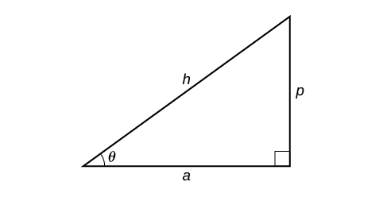{: #Figure_06_03_012}

1.  If one given side is the hypotenuse of length
    <math xmlns="http://www.w3.org/1998/Math/MathML"> <mrow> <mtext> </mtext><mi>h</mi><mtext> </mtext></mrow> </math>
    
    and the side of length
    <math xmlns="http://www.w3.org/1998/Math/MathML"> <mrow> <mtext> </mtext><mi>a</mi><mtext> </mtext></mrow> </math>
    
    adjacent to the desired angle is given, use the equation
    <math xmlns="http://www.w3.org/1998/Math/MathML"> <mrow> <mtext> </mtext><mtext> </mtext><mi>θ</mi><mo>=</mo><msup> <mrow> <mi>cos</mi></mrow> <mrow> <mo>−</mo><mn>1</mn></mrow> </msup> <mrow><mo>(</mo> <mrow> <mfrac> <mi>a</mi> <mi>h</mi> </mfrac> </mrow> <mo>)</mo></mrow><mo>.</mo></mrow> </math>

2.  If one given side is the hypotenuse of length
    <math xmlns="http://www.w3.org/1998/Math/MathML"> <mrow> <mtext> </mtext><mi>h</mi><mtext> </mtext></mrow> </math>
    
    and the side of length
    <math xmlns="http://www.w3.org/1998/Math/MathML"> <mrow> <mtext> </mtext><mi>p</mi><mtext> </mtext></mrow> </math>
    
    opposite to the desired angle is given, use the equation
    <math xmlns="http://www.w3.org/1998/Math/MathML"> <mrow> <mtext> </mtext><mi>θ</mi><mo>=</mo><msup> <mrow> <mi>sin</mi></mrow> <mrow> <mo>−</mo><mn>1</mn></mrow> </msup> <mrow><mo>(</mo> <mrow> <mfrac> <mi>p</mi> <mi>h</mi> </mfrac> </mrow> <mo>)</mo></mrow><mo>.</mo></mrow> </math>

3.  If the two legs (the sides adjacent to the right angle) are given, then use the equation
    <math xmlns="http://www.w3.org/1998/Math/MathML"> <mrow> <mtext> </mtext><mi>θ</mi><mo>=</mo><msup> <mrow> <mi>tan</mi></mrow> <mrow> <mo>−</mo><mn>1</mn></mrow> </msup> <mrow><mo>(</mo> <mrow> <mfrac> <mi>p</mi> <mi>a</mi> </mfrac> </mrow> <mo>)</mo></mrow><mo>.</mo></mrow> </math>
{: data-number-style="arabic"}

Applying the Inverse Cosine to a Right Triangle

Solve the triangle in [[link]](#Figure_06_03_007) for the angle<math xmlns="http://www.w3.org/1998/Math/MathML"> <mrow> <mtext> </mtext><mi>θ</mi><mo>.</mo></mrow> </math>

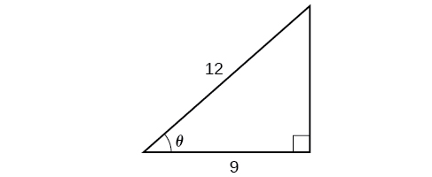{: #Figure_06_03_007}

Because we know the hypotenuse and the side adjacent to the angle, it makes sense for us to use the cosine function.

<math xmlns="http://www.w3.org/1998/Math/MathML" display="block"> <mrow> <mtable columnalign="left"> <mtr columnalign="left"> <mtd columnalign="left"> <mrow> <mi>cos</mi><mtext> </mtext><mi>θ</mi><mo>=</mo><mfrac> <mn>9</mn> <mrow> <mn>12</mn> </mrow> </mfrac> </mrow> </mtd> <mtd columnalign="left"> <mrow> <mtable> <mtr> <mtd> <mrow /> </mtd> <mtd> <mrow /> </mtd> <mtd> <mrow /> </mtd> </mtr> </mtable> </mrow> </mtd> </mtr> <mtr columnalign="left"> <mtd columnalign="left"> <mrow> <mtext> </mtext><mtext> </mtext><mtext> </mtext><mtext> </mtext><mtext> </mtext><mtext> </mtext><mtext> </mtext><mtext> </mtext><mtext> </mtext><mi>θ</mi><mo>=</mo><msup> <mrow> <mi>cos</mi> </mrow> <mrow> <mo>−</mo><mn>1</mn> </mrow> </msup> <mo stretchy="false">(</mo><mfrac> <mn>9</mn> <mrow> <mn>12</mn> </mrow> </mfrac> <mo stretchy="false">)</mo> </mrow> </mtd> <mtd columnalign="left"> <mrow> <mtable> <mtr> <mtd> <mrow /> </mtd> <mtd> <mrow /> </mtd> <mtd> <mrow /> </mtd> </mtr> </mtable><mtext>Apply definition of the inverse</mtext><mo>.</mo> </mrow> </mtd> </mtr> <mtr columnalign="left"> <mtd columnalign="left"> <mrow> <mtext> </mtext><mtext> </mtext><mtext> </mtext><mtext> </mtext><mtext> </mtext><mtext> </mtext><mtext> </mtext><mtext> </mtext><mtext> </mtext><mi>θ</mi><mo>≈</mo><mn>0.7227</mn><mtext> or about </mtext><mn>41.4096°</mn> </mrow> </mtd> <mtd columnalign="left"> <mrow> <mtable> <mtr> <mtd> <mrow /> </mtd> <mtd> <mrow /> </mtd> <mtd> <mrow /> </mtd> </mtr> </mtable><mtext>Evaluate</mtext><mo>.</mo> </mrow> </mtd> </mtr> </mtable> </mrow> </math>

Solve the triangle in [[link]](#Figure_06_03_008) for the angle<math xmlns="http://www.w3.org/1998/Math/MathML"> <mrow> <mtext> </mtext><mi>θ</mi><mo>.</mo></mrow> </math>

{: #Figure_06_03_008}

<math xmlns="http://www.w3.org/1998/Math/MathML"> <mrow> <msup> <mrow> <mi>sin</mi></mrow> <mrow> <mn>−1</mn></mrow> </msup> <mo stretchy="false">(</mo><mn>0.6</mn><mo stretchy="false">)</mo><mo>=</mo><mn>36.87°</mn><mo>=</mo><mn>0.6435</mn><mtext> </mtext></mrow> </math>

radians

### Finding Exact Values of Composite Functions with Inverse Trigonometric Functions

There are times when we need to compose a trigonometric function with an inverse trigonometric function. In these cases, we can usually find exact values for the resulting expressions without resorting to a calculator. Even when the input to the composite function is a variable or an expression, we can often find an expression for the output. To help sort out different cases, let<math xmlns="http://www.w3.org/1998/Math/MathML"> <mrow> <mtext> </mtext><mi>f</mi><mo stretchy="false">(</mo><mi>x</mi><mo stretchy="false">)</mo><mtext> </mtext></mrow> </math>

and<math xmlns="http://www.w3.org/1998/Math/MathML"> <mrow> <mtext> </mtext><mi>g</mi><mo stretchy="false">(</mo><mi>x</mi><mo stretchy="false">)</mo><mtext> </mtext></mrow> </math>

be two different trigonometric functions belonging to the set<math xmlns="http://www.w3.org/1998/Math/MathML"> <mrow> <mtext> </mtext><mrow><mo>{</mo> <mrow> <mi>sin</mi><mo stretchy="false">(</mo><mi>x</mi><mo stretchy="false">)</mo><mo>,</mo><mi>cos</mi><mo stretchy="false">(</mo><mi>x</mi><mo stretchy="false">)</mo><mo>,</mo><mi>tan</mi><mo stretchy="false">(</mo><mi>x</mi><mo stretchy="false">)</mo></mrow> <mo>}</mo></mrow><mtext> </mtext></mrow> </math>

and let<math xmlns="http://www.w3.org/1998/Math/MathML"> <mrow> <mtext> </mtext><msup> <mi>f</mi> <mrow> <mo>−</mo><mn>1</mn></mrow> </msup> <mo stretchy="false">(</mo><mi>y</mi><mo stretchy="false">)</mo><mtext> </mtext></mrow> </math>

and<math xmlns="http://www.w3.org/1998/Math/MathML"> <mrow> <mtext> </mtext><msup> <mi>g</mi> <mrow> <mo>−</mo><mn>1</mn></mrow> </msup> <mo stretchy="false">(</mo><mi>y</mi><mo stretchy="false">)</mo></mrow> </math>

be their inverses.

#### Evaluating Compositions of the Form *f*(*f*−1(*y*)) and *f*−1(*f*(*x*))

For any trigonometric function,<math xmlns="http://www.w3.org/1998/Math/MathML"> <mrow> <mtext> </mtext><mi>f</mi><mrow><mo>(</mo> <mrow> <msup> <mi>f</mi> <mrow> <mo>−</mo><mn>1</mn></mrow> </msup> <mrow><mo>(</mo> <mi>y</mi> <mo>)</mo></mrow></mrow> <mo>)</mo></mrow><mo>=</mo><mi>y</mi><mtext> </mtext></mrow> </math>

for all<math xmlns="http://www.w3.org/1998/Math/MathML"> <mrow> <mtext> </mtext><mi>y</mi><mtext> </mtext></mrow> </math>

in the proper domain for the given function. This follows from the definition of the inverse and from the fact that the range of<math xmlns="http://www.w3.org/1998/Math/MathML"> <mrow> <mtext> </mtext><mi>f</mi><mtext> </mtext></mrow> </math>

was defined to be identical to the domain of<math xmlns="http://www.w3.org/1998/Math/MathML"> <mrow> <mtext> </mtext><msup> <mi>f</mi> <mrow> <mo>−</mo><mn>1</mn></mrow> </msup> <mo>.</mo><mtext> </mtext></mrow> </math>

However, we have to be a little more careful with expressions of the form<math xmlns="http://www.w3.org/1998/Math/MathML"> <mrow> <mtext> </mtext><msup> <mi>f</mi> <mrow> <mo>−</mo><mn>1</mn></mrow> </msup> <mrow><mo>(</mo> <mrow> <mi>f</mi><mrow><mo>(</mo> <mi>x</mi> <mo>)</mo></mrow></mrow> <mo>)</mo></mrow><mo>.</mo></mrow> </math>

Compositions of a trigonometric function and its inverse

<math xmlns="http://www.w3.org/1998/Math/MathML" display="block"> <mrow> <mtable columnalign="left"> <mtr columnalign="left"> <mtd columnalign="left"> <mrow> <mtext> </mtext><mtext> </mtext><mi>sin</mi><mo stretchy="false">(</mo><msup> <mrow> <mi>sin</mi> </mrow> <mrow> <mo>−</mo><mn>1</mn> </mrow> </msup> <mi>x</mi><mo stretchy="false">)</mo><mo>=</mo><mi>x</mi><mtext> </mtext><mtext>for</mtext><mtext> </mtext><mo>−</mo><mn>1</mn><mo>≤</mo><mi>x</mi><mo>≤</mo><mn>1</mn> </mrow> </mtd> </mtr> <mtr columnalign="left"> <mtd columnalign="left"> <mrow> <mi>cos</mi><mo stretchy="false">(</mo><msup> <mrow> <mi>cos</mi> </mrow> <mrow> <mo>−</mo><mn>1</mn> </mrow> </msup> <mi>x</mi><mo stretchy="false">)</mo><mo>=</mo><mi>x</mi><mtext> </mtext><mtext>for</mtext><mtext> </mtext><mo>−</mo><mn>1</mn><mo>≤</mo><mi>x</mi><mo>≤</mo><mn>1</mn> </mrow> </mtd> </mtr> <mtr columnalign="left"> <mtd columnalign="left"> <mrow> <mtext> </mtext><mi>tan</mi><mo stretchy="false">(</mo><msup> <mrow> <mi>tan</mi> </mrow> <mrow> <mo>−</mo><mn>1</mn> </mrow> </msup> <mi>x</mi><mo stretchy="false">)</mo><mo>=</mo><mi>x</mi><mtext> </mtext><mtext>for</mtext><mtext> </mtext><mo>−</mo><mi>∞</mi><mo>&lt;</mo><mi>x</mi><mo>&lt;</mo><mi>∞</mi> </mrow> </mtd> </mtr> </mtable> </mrow> </math>

* * *
{: data-type="newline" data-count="1"}

<math xmlns="http://www.w3.org/1998/Math/MathML" display="block"> <mrow> <mtable columnalign="left"> <mtr columnalign="left"> <mtd columnalign="left"> <mrow> <mtext> </mtext><msup> <mrow> <mi>sin</mi> </mrow> <mrow> <mo>−</mo><mn>1</mn> </mrow> </msup> <mo stretchy="false">(</mo><mi>sin</mi><mtext> </mtext><mi>x</mi><mo stretchy="false">)</mo><mo>=</mo><mi>x</mi><mtext> </mtext><mtext>only for </mtext><mo>−</mo><mfrac> <mi>π</mi> <mn>2</mn> </mfrac> <mo>≤</mo><mi>x</mi><mo>≤</mo><mfrac> <mi>π</mi> <mn>2</mn> </mfrac> </mrow> </mtd> </mtr> <mtr columnalign="left"> <mtd columnalign="left"> <mrow> <msup> <mrow> <mi>cos</mi> </mrow> <mrow> <mo>−</mo><mn>1</mn> </mrow> </msup> <mo stretchy="false">(</mo><mi>cos</mi><mtext> </mtext><mi>x</mi><mo stretchy="false">)</mo><mo>=</mo><mi>x</mi><mtext> </mtext><mtext>only for </mtext><mn>0</mn><mo>≤</mo><mi>x</mi><mo>≤</mo><mi>π</mi> </mrow> </mtd> </mtr> <mtr columnalign="left"> <mtd columnalign="left"> <mrow> <mtext> </mtext><msup> <mrow> <mi>tan</mi> </mrow> <mrow> <mo>−</mo><mn>1</mn> </mrow> </msup> <mo stretchy="false">(</mo><mi>tan</mi><mtext> </mtext><mi>x</mi><mtext> </mtext><mo stretchy="false">)</mo><mo>=</mo><mi>x</mi><mtext> </mtext><mtext>only for </mtext><mo>−</mo><mfrac> <mi>π</mi> <mn>2</mn> </mfrac> <mo>&lt;</mo><mi>x</mi><mo>&lt;</mo><mfrac> <mi>π</mi> <mn>2</mn> </mfrac> </mrow> </mtd> </mtr> </mtable> </mrow> </math>

<strong>Is it correct that<math xmlns="http://www.w3.org/1998/Math/MathML">
 <mrow>
  <mtext> </mtext><msup>
   <mrow>
    <mi>sin</mi>
   </mrow>
   <mrow>
    <mo>−</mo><mn>1</mn>
   </mrow>
  </msup>
  <mo stretchy="false">(</mo><mi>sin</mi><mtext> </mtext><mi>x</mi><mo stretchy="false">)</mo><mo>=</mo><mi>x</mi><mo>?</mo>
 </mrow>
</math> </strong>

<em>No. This equation is correct if<math xmlns="http://www.w3.org/1998/Math/MathML">
     <mrow>
      <mtext> </mtext><mi>x</mi><mtext> </mtext></mrow>
    </math>belongs to the restricted domain<math xmlns="http://www.w3.org/1998/Math/MathML">
     <mrow>
      <mtext> </mtext><mrow><mo>[</mo> <mrow>
       <mo>−</mo><mfrac>
        <mi>π</mi>
        <mn>2</mn>
       </mfrac>
       <mo>,</mo><mfrac>
        <mi>π</mi>
        <mn>2</mn>
       </mfrac>
      </mrow> <mo>]</mo></mrow><mo>,</mo><mtext> </mtext></mrow>
    </math>but sine is defined for all real input values, and for<math xmlns="http://www.w3.org/1998/Math/MathML">
     <mrow>
      <mtext> </mtext><mi>x</mi><mtext> </mtext></mrow>
    </math>outside the restricted interval, the equation is not correct because its inverse always returns a value in<math xmlns="http://www.w3.org/1998/Math/MathML">
     <mrow>
      <mtext> </mtext><mrow><mo>[</mo> <mrow>
       <mo>−</mo><mfrac>
        <mi>π</mi>
        <mn>2</mn>
       </mfrac>
       <mo>,</mo><mfrac>
        <mi>π</mi>
        <mn>2</mn>
       </mfrac>
      </mrow> <mo>]</mo></mrow><mo>.</mo><mtext> </mtext></mrow>
    </math>The situation is similar for cosine and tangent and their inverses. For example,<math xmlns="http://www.w3.org/1998/Math/MathML">
     <mrow>
      <mtext> </mtext><msup>
       <mrow>
        <mi>sin</mi></mrow>
       <mrow>
        <mo>−</mo><mn>1</mn></mrow>
      </msup>
      <mrow><mo>(</mo>
       <mrow>
        <mi>sin</mi><mrow><mo>(</mo>
         <mrow>
          <mfrac>
           <mrow>
            <mn>3</mn><mi>π</mi></mrow>
           <mn>4</mn>
          </mfrac>
         </mrow>
         <mo>)</mo></mrow></mrow>
       <mo>)</mo></mrow><mo>=</mo><mfrac>
        <mi>π</mi>
        <mn>4</mn>
       </mfrac>
      <mo>.</mo></mrow>
    </math> </em>

**Given an expression of the form f−1(f(θ)) where<math xmlns="http://www.w3.org/1998/Math/MathML"> <mrow> <mtext> </mtext><mi>f</mi><mo stretchy="false">(</mo><mi>θ</mi><mo stretchy="false">)</mo><mo>=</mo><mi>sin</mi><mtext> </mtext><mi>θ</mi><mo>,</mo><mtext> </mtext><mi>cos</mi><mtext> </mtext><mi>θ</mi><mo>,</mo><mtext> or </mtext><mi>tan</mi><mtext> </mtext><mi>θ</mi><mo>,</mo><mtext> </mtext></mrow> </math>

evaluate.**

1.  If
    <math xmlns="http://www.w3.org/1998/Math/MathML"> <mrow> <mtext> </mtext><mi>θ</mi><mtext> </mtext></mrow> </math>
    
    is in the restricted domain of
    <math xmlns="http://www.w3.org/1998/Math/MathML"> <mrow> <mtext> </mtext><mi>f</mi><mo>,</mo><mtext> then </mtext><msup> <mi>f</mi> <mrow> <mo>−</mo><mn>1</mn> </mrow> </msup> <mo stretchy="false">(</mo><mi>f</mi><mo stretchy="false">(</mo><mi>θ</mi><mo stretchy="false">)</mo><mo stretchy="false">)</mo><mo>=</mo><mi>θ</mi><mo>.</mo> </mrow> </math>

2.  If not, then find an angle
    <math xmlns="http://www.w3.org/1998/Math/MathML"> <mrow> <mtext> </mtext><mi>ϕ</mi><mtext> </mtext></mrow> </math>
    
    within the restricted domain of
    <math xmlns="http://www.w3.org/1998/Math/MathML"> <mrow> <mtext> </mtext><mi>f</mi><mtext> </mtext></mrow> </math>
    
    such that
    <math xmlns="http://www.w3.org/1998/Math/MathML"> <mrow> <mtext> </mtext><mi>f</mi><mo stretchy="false">(</mo><mi>ϕ</mi><mo stretchy="false">)</mo><mo>=</mo><mi>f</mi><mo stretchy="false">(</mo><mi>θ</mi><mo stretchy="false">)</mo><mo>.</mo><mtext> </mtext></mrow> </math>
    
    Then
    <math xmlns="http://www.w3.org/1998/Math/MathML"> <mrow> <mtext> </mtext><msup> <mi>f</mi> <mrow> <mo>−</mo><mn>1</mn></mrow> </msup> <mrow><mo>(</mo> <mrow> <mi>f</mi><mrow><mo>(</mo> <mi>θ</mi> <mo>)</mo></mrow></mrow> <mo>)</mo></mrow><mo>=</mo><mi>ϕ</mi><mo>.</mo></mrow> </math>
{: data-number-style="arabic"}

Using Inverse Trigonometric Functions

Evaluate the following:

1.  <math xmlns="http://www.w3.org/1998/Math/MathML"> <mrow> <msup> <mrow> <mi>sin</mi></mrow> <mrow> <mo>−</mo><mn>1</mn></mrow> </msup> <mrow><mo>(</mo> <mrow> <mi>sin</mi><mrow><mo>(</mo> <mrow> <mfrac> <mi>π</mi> <mn>3</mn> </mfrac> </mrow> <mo>)</mo></mrow></mrow> <mo>)</mo></mrow></mrow> </math>

2.  <math xmlns="http://www.w3.org/1998/Math/MathML"> <mrow> <msup> <mrow> <mi>sin</mi></mrow> <mrow> <mo>−</mo><mn>1</mn></mrow> </msup> <mrow><mo>(</mo> <mrow> <mi>sin</mi><mrow><mo>(</mo> <mrow> <mfrac> <mrow> <mn>2</mn><mi>π</mi></mrow> <mn>3</mn> </mfrac> </mrow> <mo>)</mo></mrow></mrow> <mo>)</mo></mrow></mrow> </math>

3.  <math xmlns="http://www.w3.org/1998/Math/MathML"> <mrow> <msup> <mrow> <mi>cos</mi></mrow> <mrow> <mo>−</mo><mn>1</mn></mrow> </msup> <mrow><mo>(</mo> <mrow> <mi>cos</mi><mrow><mo>(</mo> <mrow> <mfrac> <mrow> <mn>2</mn><mi>π</mi></mrow> <mn>3</mn> </mfrac> </mrow> <mo>)</mo></mrow></mrow> <mo>)</mo></mrow></mrow> </math>

4.  <math xmlns="http://www.w3.org/1998/Math/MathML"> <mrow> <msup> <mrow> <mi>cos</mi></mrow> <mrow> <mo>−</mo><mn>1</mn></mrow> </msup> <mrow><mo>(</mo> <mrow> <mi>cos</mi><mrow><mo>(</mo> <mrow> <mo>−</mo><mfrac> <mi>π</mi> <mn>3</mn> </mfrac> </mrow> <mo>)</mo></mrow></mrow> <mo>)</mo></mrow></mrow> </math>
{: data-number-style="arabic"}

1.  <math xmlns="http://www.w3.org/1998/Math/MathML"> <mrow> <mfrac> <mi>π</mi> <mn>3</mn> </mfrac> <mtext> is in </mtext><mrow><mo>[</mo> <mrow> <mo>−</mo><mfrac> <mi>π</mi> <mn>2</mn> </mfrac> <mo>,</mo><mfrac> <mi>π</mi> <mn>2</mn> </mfrac> </mrow> <mo>]</mo></mrow><mo>,</mo><mtext> </mtext></mrow> </math>
    
    so
    <math xmlns="http://www.w3.org/1998/Math/MathML"> <mrow> <mtext> </mtext><msup> <mrow> <mi>sin</mi></mrow> <mrow> <mo>−</mo><mn>1</mn></mrow> </msup> <mrow><mo>(</mo> <mrow> <mi>sin</mi><mrow><mo>(</mo> <mrow> <mfrac> <mi>π</mi> <mn>3</mn> </mfrac> </mrow> <mo>)</mo></mrow></mrow> <mo>)</mo></mrow><mo>=</mo><mfrac> <mi>π</mi> <mn>3</mn> </mfrac> <mo>.</mo></mrow> </math>

2.  <math xmlns="http://www.w3.org/1998/Math/MathML"> <mrow> <mfrac> <mrow> <mn>2</mn><mi>π</mi></mrow> <mn>3</mn> </mfrac> <mtext> is not in </mtext><mrow><mo>[</mo> <mrow> <mo>−</mo><mfrac> <mi>π</mi> <mn>2</mn> </mfrac> <mo>,</mo><mfrac> <mi>π</mi> <mn>2</mn> </mfrac> </mrow> <mo>]</mo></mrow><mo>,</mo><mtext> </mtext></mrow> </math>
    
    but
    <math xmlns="http://www.w3.org/1998/Math/MathML"> <mrow> <mtext> </mtext><mi>sin</mi><mrow><mo>(</mo> <mrow> <mfrac> <mrow> <mn>2</mn><mi>π</mi></mrow> <mn>3</mn> </mfrac> </mrow> <mo>)</mo></mrow><mo>=</mo><mi>sin</mi><mrow><mo>(</mo> <mrow> <mfrac> <mi>π</mi> <mn>3</mn> </mfrac> </mrow> <mo>)</mo></mrow><mo>,</mo><mtext> </mtext></mrow> </math>
    
    so
    <math xmlns="http://www.w3.org/1998/Math/MathML"> <mrow> <mtext> </mtext><msup> <mrow> <mi>sin</mi></mrow> <mrow> <mo>−</mo><mn>1</mn></mrow> </msup> <mrow><mo>(</mo> <mrow> <mi>sin</mi><mrow><mo>(</mo> <mrow> <mfrac> <mrow> <mn>2</mn><mi>π</mi></mrow> <mn>3</mn> </mfrac> </mrow> <mo>)</mo></mrow></mrow> <mo>)</mo></mrow><mo>=</mo><mfrac> <mi>π</mi> <mn>3</mn> </mfrac> <mo>.</mo></mrow> </math>

3.  <math xmlns="http://www.w3.org/1998/Math/MathML"> <mrow> <mfrac> <mrow> <mn>2</mn><mi>π</mi></mrow> <mn>3</mn> </mfrac> <mtext> is in </mtext><mrow><mo>[</mo> <mrow> <mn>0</mn><mo>,</mo><mi>π</mi></mrow> <mo>]</mo></mrow><mo>,</mo><mtext> </mtext></mrow> </math>
    
    so
    <math xmlns="http://www.w3.org/1998/Math/MathML"> <mrow> <mtext> </mtext><msup> <mrow> <mi>cos</mi></mrow> <mrow> <mo>−</mo><mn>1</mn></mrow> </msup> <mrow><mo>(</mo> <mrow> <mi>cos</mi><mrow><mo>(</mo> <mrow> <mfrac> <mrow> <mn>2</mn><mi>π</mi></mrow> <mn>3</mn> </mfrac> </mrow> <mo>)</mo></mrow></mrow> <mo>)</mo></mrow><mo>=</mo><mfrac> <mrow> <mn>2</mn><mi>π</mi></mrow> <mn>3</mn> </mfrac> <mo>.</mo></mrow> </math>

4.  <math xmlns="http://www.w3.org/1998/Math/MathML"> <mrow> <mo>−</mo><mfrac> <mi>π</mi> <mn>3</mn> </mfrac> <mtext> is not in </mtext><mrow><mo>[</mo> <mrow> <mn>0</mn><mo>,</mo><mi>π</mi></mrow> <mo>]</mo></mrow><mo>,</mo><mtext> </mtext></mrow> </math>
    
    but
    <math xmlns="http://www.w3.org/1998/Math/MathML"> <mrow> <mtext> </mtext><mi>cos</mi><mrow><mo>(</mo> <mrow> <mo>−</mo><mfrac> <mi>π</mi> <mn>3</mn> </mfrac> </mrow> <mo>)</mo></mrow><mo>=</mo><mi>cos</mi><mrow><mo>(</mo> <mrow> <mfrac> <mi>π</mi> <mn>3</mn> </mfrac> </mrow> <mo>)</mo></mrow><mtext> </mtext></mrow> </math>
    
    because cosine is an even function.
5.  <math xmlns="http://www.w3.org/1998/Math/MathML"> <mrow> <mfrac> <mi>π</mi> <mn>3</mn> </mfrac> <mtext> is in </mtext><mrow><mo>[</mo> <mrow> <mn>0</mn><mo>,</mo><mi>π</mi></mrow> <mo>]</mo></mrow><mo>,</mo><mtext> </mtext></mrow> </math>
    
    so
    <math xmlns="http://www.w3.org/1998/Math/MathML"> <mrow> <mtext> </mtext><msup> <mrow> <mi>cos</mi></mrow> <mrow> <mo>−</mo><mn>1</mn></mrow> </msup> <mrow><mo>(</mo> <mrow> <mi>cos</mi><mrow><mo>(</mo> <mrow> <mo>−</mo><mfrac> <mi>π</mi> <mn>3</mn> </mfrac> </mrow> <mo>)</mo></mrow></mrow> <mo>)</mo></mrow><mo>=</mo><mfrac> <mi>π</mi> <mn>3</mn> </mfrac> <mo>.</mo></mrow> </math>
{: data-number-style="lower-alpha"}

Evaluate<math xmlns="http://www.w3.org/1998/Math/MathML"> <mrow> <mtext> </mtext><msup> <mrow> <mi>tan</mi></mrow> <mrow> <mo>−</mo><mn>1</mn></mrow> </msup> <mrow><mo>(</mo> <mrow> <mi>tan</mi><mrow><mo>(</mo> <mrow> <mfrac> <mi>π</mi> <mn>8</mn> </mfrac> </mrow> <mo>)</mo></mrow></mrow> <mo>)</mo></mrow><mtext> </mtext><mtext>and</mtext><mtext> </mtext><msup> <mrow> <mi>tan</mi></mrow> <mrow> <mo>−</mo><mn>1</mn></mrow> </msup> <mrow><mo>(</mo> <mrow> <mi>tan</mi><mrow><mo>(</mo> <mrow> <mfrac> <mrow> <mn>11</mn><mi>π</mi></mrow> <mn>9</mn> </mfrac> </mrow> <mo>)</mo></mrow></mrow> <mo>)</mo></mrow><mo>.</mo></mrow> </math>

<math xmlns="http://www.w3.org/1998/Math/MathML"> <mrow> <mfrac> <mi>π</mi> <mn>8</mn> </mfrac> <mo>;</mo><mfrac> <mrow> <mn>2</mn><mi>π</mi></mrow> <mn>9</mn> </mfrac> </mrow> </math>

#### Evaluating Compositions of the Form *f*−1(*g*(*x*))

Now that we can compose a trigonometric function with its inverse, we can explore how to evaluate a composition of a trigonometric function and the inverse of another trigonometric function. We will begin with compositions of the form<math xmlns="http://www.w3.org/1998/Math/MathML"> <mrow> <mtext> </mtext><msup> <mi>f</mi> <mrow> <mo>−</mo><mn>1</mn></mrow> </msup> <mrow><mo>(</mo> <mrow> <mi>g</mi><mrow><mo>(</mo> <mi>x</mi> <mo>)</mo></mrow></mrow> <mo>)</mo></mrow><mo>.</mo><mtext> </mtext></mrow> </math>

For special values of<math xmlns="http://www.w3.org/1998/Math/MathML"> <mrow> <mtext> </mtext><mi>x</mi><mo>,</mo></mrow> </math>

we can exactly evaluate the inner function and then the outer, inverse function. However, we can find a more general approach by considering the relation between the two acute angles of a right triangle where one is<math xmlns="http://www.w3.org/1998/Math/MathML"> <mrow> <mtext> </mtext><mi>θ</mi><mo>,</mo><mtext> </mtext></mrow> </math>

making the other<math xmlns="http://www.w3.org/1998/Math/MathML"> <mrow> <mtext> </mtext><mfrac> <mi>π</mi> <mn>2</mn> </mfrac> <mo>−</mo><mi>θ</mi><mo>.</mo></mrow> </math>

Consider the sine and cosine of each angle of the right triangle in [\[link\]](#Figure_06_03_009).

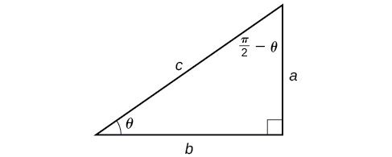{: #Figure_06_03_009}

Because<math xmlns="http://www.w3.org/1998/Math/MathML"> <mrow> <mtext> </mtext><mi>cos</mi><mtext> </mtext><mi>θ</mi><mo>=</mo><mfrac> <mi>b</mi> <mi>c</mi> </mfrac> <mo>=</mo><mi>sin</mi><mrow><mo>(</mo> <mrow> <mfrac> <mi>π</mi> <mn>2</mn> </mfrac> <mo>−</mo><mi>θ</mi></mrow> <mo>)</mo></mrow><mo>,</mo><mtext> </mtext></mrow> </math>

we have<math xmlns="http://www.w3.org/1998/Math/MathML"> <mrow> <mtext> </mtext><msup> <mrow> <mi>sin</mi></mrow> <mrow> <mo>−</mo><mn>1</mn></mrow> </msup> <mrow><mo>(</mo> <mrow> <mi>cos</mi><mtext> </mtext><mi>θ</mi></mrow> <mo>)</mo></mrow><mo>=</mo><mfrac> <mi>π</mi> <mn>2</mn> </mfrac> <mo>−</mo><mi>θ</mi><mtext> </mtext></mrow> </math>

if<math xmlns="http://www.w3.org/1998/Math/MathML"> <mrow> <mtext> </mtext><mn>0</mn><mo>≤</mo><mi>θ</mi><mo>≤</mo><mi>π</mi><mo>.</mo><mtext> </mtext></mrow> </math>

If<math xmlns="http://www.w3.org/1998/Math/MathML"> <mrow> <mtext> </mtext><mi>θ</mi><mtext> </mtext></mrow> </math>

is not in this domain, then we need to find another angle that has the same cosine as<math xmlns="http://www.w3.org/1998/Math/MathML"> <mrow> <mtext> </mtext><mi>θ</mi><mtext> </mtext></mrow> </math>

and does belong to the restricted domain; we then subtract this angle from<math xmlns="http://www.w3.org/1998/Math/MathML"> <mrow> <mtext> </mtext><mfrac> <mi>π</mi> <mn>2</mn> </mfrac> <mo>.</mo></mrow> </math>

Similarly,<math xmlns="http://www.w3.org/1998/Math/MathML"> <mrow> <mtext> </mtext><mi>sin</mi><mtext> </mtext><mi>θ</mi><mo>=</mo><mfrac> <mi>a</mi> <mi>c</mi> </mfrac> <mo>=</mo><mi>cos</mi><mrow><mo>(</mo> <mrow> <mfrac> <mi>π</mi> <mn>2</mn> </mfrac> <mo>−</mo><mi>θ</mi></mrow> <mo>)</mo></mrow><mo>,</mo><mtext> </mtext></mrow> </math>

so<math xmlns="http://www.w3.org/1998/Math/MathML"> <mrow> <mtext> </mtext><msup> <mrow> <mi>cos</mi></mrow> <mrow> <mo>−</mo><mn>1</mn></mrow> </msup> <mrow><mo>(</mo> <mrow> <mi>sin</mi><mtext> </mtext><mi>θ</mi></mrow> <mo>)</mo></mrow><mo>=</mo><mfrac> <mi>π</mi> <mn>2</mn> </mfrac> <mo>−</mo><mi>θ</mi><mtext> </mtext></mrow> </math>

if<math xmlns="http://www.w3.org/1998/Math/MathML"> <mrow> <mtext> </mtext><mo>−</mo><mfrac> <mi>π</mi> <mn>2</mn> </mfrac> <mo>≤</mo><mi>θ</mi><mo>≤</mo><mfrac> <mi>π</mi> <mn>2</mn> </mfrac> <mo>.</mo><mtext> </mtext></mrow> </math>

These are just the function-cofunction relationships presented in another way.

**Given functions of the form<math xmlns="http://www.w3.org/1998/Math/MathML"> <mrow> <mtext> </mtext><msup> <mrow> <mi>sin</mi></mrow> <mrow> <mo>−</mo><mn>1</mn></mrow> </msup> <mrow><mo>(</mo> <mrow> <mi>cos</mi><mtext> </mtext><mi>x</mi></mrow> <mo>)</mo></mrow><mtext> </mtext></mrow> </math>

and<math xmlns="http://www.w3.org/1998/Math/MathML"> <mrow> <mtext> </mtext><msup> <mrow> <mi>cos</mi></mrow> <mrow> <mo>−</mo><mn>1</mn></mrow> </msup> <mrow><mo>(</mo> <mrow> <mi>sin</mi><mtext> </mtext><mi>x</mi></mrow> <mo>)</mo></mrow><mo>,</mo><mtext> </mtext></mrow> </math>

evaluate them.**

1.  If
    <math xmlns="http://www.w3.org/1998/Math/MathML"> <mrow> <mtext> </mtext><mi>x</mi><mtext> is in </mtext><mrow><mo>[</mo> <mrow> <mn>0</mn><mo>,</mo><mi>π</mi></mrow> <mo>]</mo></mrow><mo>,</mo><mtext> </mtext></mrow> </math>
    
    then
    <math xmlns="http://www.w3.org/1998/Math/MathML"> <mrow> <mtext> </mtext><msup> <mrow> <mi>sin</mi></mrow> <mrow> <mo>−</mo><mn>1</mn></mrow> </msup> <mrow><mo>(</mo> <mrow> <mi>cos</mi><mtext> </mtext><mi>x</mi></mrow> <mo>)</mo></mrow><mo>=</mo><mfrac> <mi>π</mi> <mn>2</mn> </mfrac> <mo>−</mo><mi>x</mi><mo>.</mo></mrow> </math>

2.  If
    <math xmlns="http://www.w3.org/1998/Math/MathML"> <mrow> <mtext> </mtext><mi>x</mi><mtext> is not in </mtext><mrow><mo>[</mo> <mrow> <mn>0</mn><mo>,</mo><mi>π</mi></mrow> <mo>]</mo></mrow><mo>,</mo><mtext> </mtext></mrow> </math>
    
    then find another angle
    <math xmlns="http://www.w3.org/1998/Math/MathML"> <mrow> <mtext> </mtext><mi>y</mi><mtext> in </mtext><mrow><mo>[</mo> <mrow> <mn>0</mn><mo>,</mo><mi>π</mi></mrow> <mo>]</mo></mrow><mtext> </mtext></mrow> </math>
    
    such that
    <math xmlns="http://www.w3.org/1998/Math/MathML"> <mrow> <mtext> </mtext><mi>cos</mi><mtext> </mtext><mi>y</mi><mo>=</mo><mi>cos</mi><mtext> </mtext><mi>x</mi><mo>.</mo></mrow> </math>
    
    

    <math xmlns="http://www.w3.org/1998/Math/MathML" display="block"> <mrow> <msup> <mrow> <mi>sin</mi></mrow> <mrow> <mo>−</mo><mn>1</mn></mrow> </msup> <mrow><mo>(</mo> <mrow> <mi>cos</mi><mtext> </mtext><mi>x</mi></mrow> <mo>)</mo></mrow><mo>=</mo><mfrac> <mi>π</mi> <mn>2</mn> </mfrac> <mo>−</mo><mi>y</mi></mrow> </math>
    

3.  If
    <math xmlns="http://www.w3.org/1998/Math/MathML"> <mrow> <mtext> </mtext><mi>x</mi><mtext> is in </mtext><mrow><mo>[</mo> <mrow> <mo>−</mo><mfrac> <mi>π</mi> <mn>2</mn> </mfrac> <mo>,</mo><mfrac> <mi>π</mi> <mn>2</mn> </mfrac> </mrow> <mo>]</mo></mrow><mo>,</mo><mtext> </mtext></mrow> </math>
    
    then
    <math xmlns="http://www.w3.org/1998/Math/MathML"> <mrow> <mtext> </mtext><msup> <mrow> <mi>cos</mi></mrow> <mrow> <mo>−</mo><mn>1</mn></mrow> </msup> <mrow><mo>(</mo> <mrow> <mi>sin</mi><mtext> </mtext><mi>x</mi></mrow> <mo>)</mo></mrow><mo>=</mo><mfrac> <mi>π</mi> <mn>2</mn> </mfrac> <mo>−</mo><mi>x</mi><mo>.</mo></mrow> </math>

4.  If
    <math xmlns="http://www.w3.org/1998/Math/MathML"> <mrow> <mtext> </mtext><mi>x</mi><mtext> is not in</mtext><mrow><mtext> </mtext><mo>[</mo> <mrow> <mo>−</mo><mfrac> <mi>π</mi> <mn>2</mn> </mfrac> <mo>,</mo><mfrac> <mi>π</mi> <mn>2</mn> </mfrac> </mrow> <mo>]</mo></mrow><mo>,</mo><mtext> </mtext></mrow> </math>
    
    then find another angle
    <math xmlns="http://www.w3.org/1998/Math/MathML"> <mrow> <mtext> </mtext><mi>y</mi><mtext> in </mtext><mrow><mo>[</mo> <mrow> <mo>−</mo><mfrac> <mi>π</mi> <mn>2</mn> </mfrac> <mo>,</mo><mfrac> <mi>π</mi> <mn>2</mn> </mfrac> </mrow> <mo>]</mo></mrow><mtext> </mtext></mrow> </math>
    
    such that
    <math xmlns="http://www.w3.org/1998/Math/MathML"> <mrow> <mtext> </mtext><mi>sin</mi><mtext> </mtext><mi>y</mi><mo>=</mo><mi>sin</mi><mtext> </mtext><mi>x</mi><mo>.</mo></mrow> </math>
    
    

    <math xmlns="http://www.w3.org/1998/Math/MathML"> <mrow> <msup> <mrow> <mi>cos</mi></mrow> <mrow> <mo>−</mo><mn>1</mn></mrow> </msup> <mrow><mo>(</mo> <mrow> <mi>sin</mi><mtext> </mtext><mi>x</mi></mrow> <mo>)</mo></mrow><mo>=</mo><mfrac> <mi>π</mi> <mn>2</mn> </mfrac> <mo>−</mo><mi>y</mi></mrow> </math>
    

{: data-number-style="arabic"}

Evaluating the Composition of an Inverse Sine with a Cosine

Evaluate<math xmlns="http://www.w3.org/1998/Math/MathML"> <mrow> <mtext> </mtext><msup> <mrow> <mi>sin</mi></mrow> <mrow> <mo>−</mo><mn>1</mn></mrow> </msup> <mrow><mo>(</mo> <mrow> <mi>cos</mi><mrow><mo>(</mo> <mrow> <mfrac> <mrow> <mn>13</mn><mi>π</mi></mrow> <mn>6</mn> </mfrac> </mrow> <mo>)</mo></mrow></mrow> <mo>)</mo></mrow></mrow> </math>

1.  by direct evaluation.
2.  by the method described previously.
{: data-number-style="lower-alpha"}

1.  Here, we can directly evaluate the inside of the composition.
    

    <math xmlns="http://www.w3.org/1998/Math/MathML" display="block"> <mrow> <mtable columnalign="left"> <mtr columnalign="left"> <mtd columnalign="left"> <mrow /> </mtd> </mtr> <mtr columnalign="left"> <mtd columnalign="left"> <mrow> <mtable columnalign="left"> <mtr columnalign="left"> <mtd columnalign="left"> <mrow> <mi>cos</mi><mo stretchy="false">(</mo><mfrac> <mrow> <mn>13</mn><mi>π</mi> </mrow> <mn>6</mn> </mfrac> <mo stretchy="false">)</mo><mo>=</mo><mi>cos</mi><mo stretchy="false">(</mo><mfrac> <mi>π</mi> <mn>6</mn> </mfrac> <mo>+</mo><mn>2</mn><mi>π</mi><mo stretchy="false">)</mo> </mrow> </mtd> </mtr> <mtr columnalign="left"> <mtd columnalign="left"> <mrow> <mtext>               </mtext><mo>=</mo><mi>cos</mi><mo stretchy="false">(</mo><mfrac> <mi>π</mi> <mn>6</mn> </mfrac> <mo stretchy="false">)</mo> </mrow> </mtd> </mtr> <mtr columnalign="left"> <mtd columnalign="left"> <mrow> <mtext>               </mtext><mo>=</mo><mfrac> <mrow> <msqrt> <mn>3</mn> </msqrt> </mrow> <mn>2</mn> </mfrac> </mrow> </mtd> </mtr> </mtable> </mrow> </mtd> </mtr> </mtable> </mrow> </math>
    

    
    Now, we can evaluate the inverse function as we did earlier.
    
    

    <math xmlns="http://www.w3.org/1998/Math/MathML"> <mrow> <msup> <mrow> <mi>sin</mi></mrow> <mrow> <mo>−</mo><mn>1</mn></mrow> </msup> <mrow><mo>(</mo> <mrow> <mfrac> <mrow> <msqrt> <mn>3</mn> </msqrt> </mrow> <mn>2</mn> </mfrac> </mrow> <mo>)</mo></mrow><mo>=</mo><mfrac> <mi>π</mi> <mn>3</mn> </mfrac> </mrow> </math>
    

2.  We have
    <math xmlns="http://www.w3.org/1998/Math/MathML"> <mrow> <mtext> </mtext><mi>x</mi><mo>=</mo><mfrac> <mrow> <mn>13</mn><mi>π</mi></mrow> <mn>6</mn> </mfrac> <mtext>,</mtext><mtext> </mtext><mi>y</mi><mo>=</mo><mfrac> <mi>π</mi> <mn>6</mn> </mfrac> <mo>,</mo><mtext> </mtext></mrow> </math>
    
    and
    

    <math xmlns="http://www.w3.org/1998/Math/MathML" display="block"> <mrow> <mtable columnalign="right"> <mtr columnalign="right"> <mtd columnalign="right"> <mrow> <msup> <mrow> <mi>sin</mi> </mrow> <mrow> <mo>−</mo><mn>1</mn> </mrow> </msup> <mrow><mo>(</mo> <mrow> <mi>cos</mi><mrow><mo>(</mo> <mrow> <mfrac> <mrow> <mn>13</mn><mi>π</mi> </mrow> <mn>6</mn> </mfrac> </mrow> <mo>)</mo></mrow> </mrow> <mo>)</mo></mrow><mo>=</mo><mfrac> <mi>π</mi> <mn>2</mn> </mfrac> <mo>−</mo><mfrac> <mi>π</mi> <mn>6</mn> </mfrac> </mrow> </mtd> </mtr> <mtr columnalign="right"> <mtd columnalign="right"> <mrow> <mo>=</mo><mfrac> <mi>π</mi> <mn>3</mn> </mfrac> <mtext>       </mtext> </mrow> </mtd> </mtr> </mtable> </mrow> </math>
    

{: data-number-style="lower-alpha"}

Evaluate<math xmlns="http://www.w3.org/1998/Math/MathML"> <mrow> <mtext> </mtext><msup> <mrow> <mi>cos</mi></mrow> <mrow> <mo>−</mo><mn>1</mn></mrow> </msup> <mrow><mo>(</mo> <mrow> <mi>sin</mi><mrow><mo>(</mo> <mrow> <mo>−</mo><mfrac> <mrow> <mn>11</mn><mi>π</mi></mrow> <mn>4</mn> </mfrac> </mrow> <mo>)</mo></mrow></mrow> <mo>)</mo></mrow><mo>.</mo></mrow> </math>

<math xmlns="http://www.w3.org/1998/Math/MathML"> <mrow> <mfrac> <mrow> <mn>3</mn><mi>π</mi></mrow> <mn>4</mn> </mfrac> </mrow> </math>

#### Evaluating Compositions of the Form *f*(*g*−1(*x*))

To evaluate compositions of the form<math xmlns="http://www.w3.org/1998/Math/MathML"> <mrow> <mtext> </mtext><mi>f</mi><mrow><mo>(</mo> <mrow> <msup> <mi>g</mi> <mrow> <mo>−</mo><mn>1</mn></mrow> </msup> <mrow><mo>(</mo> <mi>x</mi> <mo>)</mo></mrow></mrow> <mo>)</mo></mrow><mo>,</mo><mtext> </mtext></mrow> </math>

where<math xmlns="http://www.w3.org/1998/Math/MathML"> <mrow> <mtext> </mtext><mi>f</mi><mtext> </mtext></mrow> </math>

and<math xmlns="http://www.w3.org/1998/Math/MathML"> <mrow> <mtext> </mtext><mi>g</mi><mtext> </mtext></mrow> </math>

are any two of the functions sine, cosine, or tangent and<math xmlns="http://www.w3.org/1998/Math/MathML"> <mrow> <mtext> </mtext><mi>x</mi><mtext> </mtext></mrow> </math>

is any input in the domain of<math xmlns="http://www.w3.org/1998/Math/MathML"> <mrow> <mtext> </mtext><msup> <mi>g</mi> <mrow> <mo>−</mo><mn>1</mn></mrow> </msup> <mo>,</mo><mtext> </mtext></mrow> </math>

we have exact formulas, such as<math xmlns="http://www.w3.org/1998/Math/MathML"> <mrow> <mtext> </mtext><mi>sin</mi><mrow><mo>(</mo> <mrow> <msup> <mrow> <mi>cos</mi></mrow> <mrow> <mo>−</mo><mn>1</mn></mrow> </msup> <mi>x</mi></mrow> <mo>)</mo></mrow><mo>=</mo><msqrt> <mrow> <mn>1</mn><mo>−</mo><msup> <mi>x</mi> <mn>2</mn> </msup> </mrow> </msqrt> <mo>.</mo><mtext> </mtext></mrow> </math>

When we need to use them, we can derive these formulas by using the trigonometric relations between the angles and sides of a right triangle, together with the use of Pythagoras’s relation between the lengths of the sides. We can use the Pythagorean identity,<math xmlns="http://www.w3.org/1998/Math/MathML"> <mrow> <mtext> </mtext><msup> <mrow> <mi>sin</mi></mrow> <mn>2</mn> </msup> <mi>x</mi><mo>+</mo><msup> <mrow> <mi>cos</mi></mrow> <mn>2</mn> </msup> <mi>x</mi><mo>=</mo><mn>1</mn><mo>,</mo><mtext> </mtext></mrow> </math>

to solve for one when given the other. We can also use the **inverse trigonometric functions**{: data-type="term" .no-emphasis} to find compositions involving algebraic expressions.

Evaluating the Composition of a Sine with an Inverse Cosine

Find an exact value for<math xmlns="http://www.w3.org/1998/Math/MathML"> <mrow> <mtext> </mtext><mi>sin</mi><mrow><mo>(</mo> <mrow> <msup> <mrow> <mi>cos</mi></mrow> <mrow> <mo>−</mo><mn>1</mn></mrow> </msup> <mrow><mo>(</mo> <mrow> <mfrac> <mn>4</mn> <mn>5</mn> </mfrac> </mrow> <mo>)</mo></mrow></mrow> <mo>)</mo></mrow><mo>.</mo></mrow> </math>

Beginning with the inside, we can say there is some angle such that<math xmlns="http://www.w3.org/1998/Math/MathML"> <mrow> <mtext> </mtext><mi>θ</mi><mo>=</mo><msup> <mrow> <mi>cos</mi></mrow> <mrow> <mo>−</mo><mn>1</mn></mrow> </msup> <mrow><mo>(</mo> <mrow> <mfrac> <mn>4</mn> <mn>5</mn> </mfrac> </mrow> <mo>)</mo></mrow><mo>,</mo><mtext> </mtext></mrow> </math>

which means<math xmlns="http://www.w3.org/1998/Math/MathML"> <mrow> <mtext> </mtext><mi>cos</mi><mtext> </mtext><mi>θ</mi><mo>=</mo><mfrac> <mn>4</mn> <mn>5</mn> </mfrac> <mo>,</mo><mtext> </mtext></mrow> </math>

and we are looking for<math xmlns="http://www.w3.org/1998/Math/MathML"> <mrow> <mtext> </mtext><mi>sin</mi><mtext> </mtext><mi>θ</mi><mo>.</mo><mtext> </mtext></mrow> </math>

We can use the Pythagorean identity to do this.

<math xmlns="http://www.w3.org/1998/Math/MathML" display="block"> <mrow> <mtable columnalign="left"> <mtr columnalign="left"> <mtd columnalign="left"> <mrow> <msup> <mrow> <mi>sin</mi> </mrow> <mn>2</mn> </msup> <mi>θ</mi><mo>+</mo><msup> <mrow> <mi>cos</mi> </mrow> <mn>2</mn> </msup> <mi>θ</mi><mo>=</mo><mn>1</mn> </mrow> </mtd> <mtd columnalign="left"> <mrow /> </mtd> <mtd columnalign="left"> <mrow /> </mtd> <mtd columnalign="left"> <mrow> <mtext>Use our known value for cosine</mtext><mo>.</mo> </mrow> </mtd> </mtr> <mtr columnalign="left"> <mtd columnalign="left"> <mrow> <mtext> </mtext><mtext> </mtext><mtext> </mtext><msup> <mrow> <mi>sin</mi> </mrow> <mn>2</mn> </msup> <mi>θ</mi><mo>+</mo><msup> <mrow> <mo stretchy="false">(</mo><mfrac> <mn>4</mn> <mn>5</mn> </mfrac> <mo stretchy="false">)</mo> </mrow> <mn>2</mn> </msup> <mo>=</mo><mn>1</mn> </mrow> </mtd> <mtd columnalign="left"> <mrow /> </mtd> <mtd columnalign="left"> <mrow /> </mtd> <mtd columnalign="left"> <mrow> <mtext>Solve for sine</mtext><mo>.</mo> </mrow> </mtd> </mtr> <mtr columnalign="left"> <mtd columnalign="left"> <mrow> <mtext> </mtext><mtext> </mtext><mtext> </mtext><mtext> </mtext><mtext> </mtext><mtext> </mtext><mtext> </mtext><mtext> </mtext><mtext> </mtext><mtext> </mtext><mtext> </mtext><mtext> </mtext><mtext> </mtext><mtext> </mtext><mtext> </mtext><mtext> </mtext><mtext> </mtext><mtext> </mtext><mtext> </mtext><mtext> </mtext><mtext> </mtext><msup> <mrow> <mi>sin</mi> </mrow> <mn>2</mn> </msup> <mi>θ</mi><mo>=</mo><mn>1</mn><mo>−</mo><mfrac> <mrow> <mn>16</mn> </mrow> <mrow> <mn>25</mn> </mrow> </mfrac> </mrow> </mtd> <mtd columnalign="left"> <mrow /> </mtd> <mtd columnalign="left"> <mrow /> </mtd> <mtd columnalign="left"> <mrow /> </mtd> </mtr> <mtr columnalign="left"> <mtd columnalign="left"> <mrow> <mtext> </mtext><mtext> </mtext><mtext> </mtext><mtext> </mtext><mtext> </mtext><mtext> </mtext><mtext> </mtext><mtext> </mtext><mtext> </mtext><mtext> </mtext><mtext> </mtext><mtext> </mtext><mtext> </mtext><mtext> </mtext><mtext> </mtext><mtext> </mtext><mtext> </mtext><mtext> </mtext><mtext> </mtext><mtext> </mtext><mtext> </mtext><mtext> </mtext><mtext> </mtext><mtext> </mtext><mi>sin</mi><mtext> </mtext><mi>θ</mi><mo>=</mo><mo>±</mo><msqrt> <mrow> <mfrac> <mn>9</mn> <mrow> <mn>25</mn> </mrow> </mfrac> </mrow> </msqrt> <mo>=</mo><mo>±</mo><mfrac> <mn>3</mn> <mn>5</mn> </mfrac> </mrow> </mtd> <mtd columnalign="left"> <mrow /> </mtd> <mtd columnalign="left"> <mrow /> </mtd> <mtd columnalign="left"> <mrow /> </mtd> </mtr> </mtable> </mrow> </math>

Since<math xmlns="http://www.w3.org/1998/Math/MathML"> <mrow> <mtext> </mtext><mi>θ</mi><mo>=</mo><msup> <mrow> <mi>cos</mi></mrow> <mrow> <mo>−</mo><mn>1</mn></mrow> </msup> <mrow><mo>(</mo> <mrow> <mfrac> <mn>4</mn> <mn>5</mn> </mfrac> </mrow> <mo>)</mo></mrow><mtext> </mtext></mrow> </math>

is in quadrant I,<math xmlns="http://www.w3.org/1998/Math/MathML"> <mrow> <mtext> </mtext><mi>sin</mi><mtext> </mtext><mi>θ</mi><mtext> </mtext></mrow> </math>

must be positive, so the solution is<math xmlns="http://www.w3.org/1998/Math/MathML"> <mrow> <mtext> </mtext><mfrac> <mn>3</mn> <mn>5</mn> </mfrac> <mo>.</mo><mtext> </mtext></mrow> </math>

See [[link]](#Figure_06_03_010).

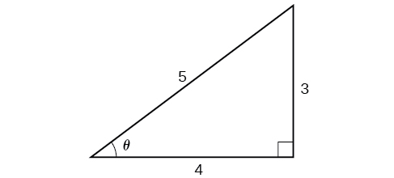{: #Figure_06_03_010}

We know that the inverse cosine always gives an angle on the interval<math xmlns="http://www.w3.org/1998/Math/MathML"> <mrow> <mtext> </mtext><mrow><mo>[</mo> <mrow> <mn>0</mn><mo>,</mo><mi>π</mi></mrow> <mo>]</mo></mrow><mo>,</mo><mtext> </mtext></mrow> </math>

so we know that the sine of that angle must be positive; therefore<math xmlns="http://www.w3.org/1998/Math/MathML"> <mrow> <mtext> </mtext><mi>sin</mi><mrow><mo>(</mo> <mrow> <msup> <mrow> <mi>cos</mi> </mrow> <mrow> <mo>−</mo><mn>1</mn> </mrow> </msup> <mrow><mo>(</mo> <mrow> <mfrac> <mn>4</mn> <mn>5</mn> </mfrac> </mrow> <mo>)</mo></mrow> </mrow> <mo>)</mo></mrow><mo>=</mo><mi>sin</mi><mtext> </mtext><mi>θ</mi><mo>=</mo><mfrac> <mn>3</mn> <mn>5</mn> </mfrac> <mo>.</mo> </mrow> </math>

Evaluate<math xmlns="http://www.w3.org/1998/Math/MathML"> <mrow> <mtext> </mtext><mi>cos</mi><mrow><mo>(</mo> <mrow> <msup> <mrow> <mi>tan</mi></mrow> <mrow> <mo>−</mo><mn>1</mn></mrow> </msup> <mrow><mo>(</mo> <mrow> <mfrac> <mn>5</mn> <mrow> <mn>12</mn></mrow> </mfrac> </mrow> <mo>)</mo></mrow></mrow> <mo>)</mo></mrow><mo>.</mo></mrow> </math>

<math xmlns="http://www.w3.org/1998/Math/MathML"> <mrow> <mfrac> <mrow> <mn>12</mn></mrow> <mrow> <mn>13</mn></mrow> </mfrac> </mrow> </math>

Evaluating the Composition of a Sine with an Inverse Tangent

Find an exact value for<math xmlns="http://www.w3.org/1998/Math/MathML"> <mrow> <mtext> </mtext><mi>sin</mi><mrow><mo>(</mo> <mrow> <msup> <mrow> <mi>tan</mi></mrow> <mrow> <mo>−</mo><mn>1</mn></mrow> </msup> <mrow><mo>(</mo> <mrow> <mfrac> <mn>7</mn> <mn>4</mn> </mfrac> </mrow> <mo>)</mo></mrow></mrow> <mo>)</mo></mrow><mo>.</mo></mrow> </math>

While we could use a similar technique as in [[link]](#Example_06_03_06), we will demonstrate a different technique here. From the inside, we know there is an angle such that<math xmlns="http://www.w3.org/1998/Math/MathML"> <mrow> <mtext> </mtext><mi>tan</mi><mtext> </mtext><mi>θ</mi><mo>=</mo><mfrac> <mn>7</mn> <mn>4</mn> </mfrac> <mo>.</mo><mtext> </mtext></mrow> </math>

We can envision this as the opposite and adjacent sides on a right triangle, as shown in [[link]](#Figure_06_03_011).

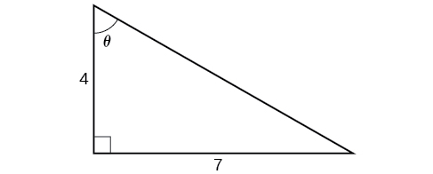{: #Figure_06_03_011}

Using the Pythagorean Theorem, we can find the hypotenuse of this triangle.

<math xmlns="http://www.w3.org/1998/Math/MathML" display="block"> <mrow> <mtable columnalign="left"> <mtr columnalign="left"> <mtd columnalign="left"> <mrow> <mtable columnalign="left"> <mtr columnalign="left"> <mtd columnalign="left"> <mrow /> </mtd> </mtr> <mtr columnalign="left"> <mtd columnalign="left"> <mrow> <mtext>      </mtext><msup> <mn>4</mn> <mn>2</mn> </msup> <mo>+</mo><msup> <mn>7</mn> <mn>2</mn> </msup> <mo>=</mo><msup> <mrow> <mtext>hypotenuse</mtext> </mrow> <mn>2</mn> </msup> </mrow> </mtd> </mtr> </mtable> </mrow> </mtd> </mtr> <mtr columnalign="left"> <mtd columnalign="left"> <mrow> <mtext>hypotenuse</mtext><mo>=</mo><msqrt> <mrow> <mn>65</mn> </mrow> </msqrt> </mrow> </mtd> </mtr> </mtable> </mrow> </math>

Now, we can evaluate the sine of the angle as the opposite side divided by the hypotenuse.

<math xmlns="http://www.w3.org/1998/Math/MathML" display="block"> <mrow> <mi>sin</mi><mtext> </mtext><mi>θ</mi><mo>=</mo><mfrac> <mn>7</mn> <mrow> <msqrt> <mrow> <mn>65</mn></mrow> </msqrt> </mrow> </mfrac> </mrow> </math>

This gives us our desired composition.

<math xmlns="http://www.w3.org/1998/Math/MathML" display="block"> <mrow> <mtable columnalign="left"> <mtr columnalign="left"> <mtd columnalign="left"> <mrow> <mi>sin</mi><mrow><mo>(</mo> <mrow> <msup> <mrow> <mi>tan</mi> </mrow> <mrow> <mo>−</mo><mn>1</mn> </mrow> </msup> <mrow><mo>(</mo> <mrow> <mfrac> <mn>7</mn> <mn>4</mn> </mfrac> </mrow> <mo>)</mo></mrow> </mrow> <mo>)</mo></mrow><mo>=</mo><mi>sin</mi><mtext> </mtext><mi>θ</mi> </mrow> </mtd> </mtr> <mtr columnalign="left"> <mtd columnalign="left"> <mrow> <mtext>                      </mtext><mo>=</mo><mfrac> <mn>7</mn> <mrow> <msqrt> <mrow> <mn>65</mn> </mrow> </msqrt> </mrow> </mfrac> </mrow> </mtd> </mtr> <mtr columnalign="left"> <mtd columnalign="left"> <mrow> <mtext>                      </mtext><mo>=</mo><mfrac> <mrow> <mn>7</mn><msqrt> <mrow> <mn>65</mn> </mrow> </msqrt> </mrow> <mrow> <mn>65</mn> </mrow> </mfrac> </mrow> </mtd> </mtr> </mtable> </mrow> </math>

Evaluate<math xmlns="http://www.w3.org/1998/Math/MathML"> <mrow> <mtext> </mtext><mi>cos</mi><mrow><mo>(</mo> <mrow> <msup> <mrow> <mi>sin</mi></mrow> <mrow> <mo>−</mo><mn>1</mn></mrow> </msup> <mrow><mo>(</mo> <mrow> <mfrac> <mn>7</mn> <mn>9</mn> </mfrac> </mrow> <mo>)</mo></mrow></mrow> <mo>)</mo></mrow><mo>.</mo></mrow> </math>

<math xmlns="http://www.w3.org/1998/Math/MathML"> <mrow> <mfrac> <mrow> <mn>4</mn><msqrt> <mn>2</mn> </msqrt> </mrow> <mn>9</mn> </mfrac> </mrow> </math>

Finding the Cosine of the Inverse Sine of an Algebraic Expression

Find a simplified expression for<math xmlns="http://www.w3.org/1998/Math/MathML"> <mrow> <mtext> </mtext><mi>cos</mi><mrow><mo>(</mo> <mrow> <msup> <mrow> <mi>sin</mi></mrow> <mrow> <mo>−</mo><mn>1</mn></mrow> </msup> <mrow><mo>(</mo> <mrow> <mfrac> <mi>x</mi> <mn>3</mn> </mfrac> </mrow> <mo>)</mo></mrow></mrow> <mo>)</mo></mrow><mtext> </mtext></mrow> </math>

for<math xmlns="http://www.w3.org/1998/Math/MathML"> <mrow> <mtext> </mtext><mo>−</mo><mn>3</mn><mo>≤</mo><mi>x</mi><mo>≤</mo><mn>3.</mn></mrow> </math>

We know there is an angle<math xmlns="http://www.w3.org/1998/Math/MathML"> <mrow> <mtext> </mtext><mi>θ</mi><mtext> </mtext></mrow> </math>

such that<math xmlns="http://www.w3.org/1998/Math/MathML"> <mrow> <mtext> </mtext><mi>sin</mi><mtext> </mtext><mi>θ</mi><mo>=</mo><mfrac> <mi>x</mi> <mn>3</mn> </mfrac> <mo>.</mo></mrow> </math>

<math xmlns="http://www.w3.org/1998/Math/MathML" display="block"> <mrow> <mtable columnalign="left"> <mtr columnalign="left"> <mtd columnalign="left"> <mrow> <msup> <mrow> <mi>sin</mi> </mrow> <mn>2</mn> </msup> <mi>θ</mi><mo>+</mo><msup> <mrow> <mi>cos</mi> </mrow> <mn>2</mn> </msup> <mi>θ</mi><mo>=</mo><mn>1</mn> </mrow> </mtd> <mtd columnalign="left"> <mrow> <mtext>Use the Pythagorean Theorem</mtext><mo>.</mo> </mrow> </mtd> </mtr> <mtr columnalign="left"> <mtd columnalign="left"> <mrow> <mo> </mo><msup> <mrow> <mrow><mo>(</mo> <mrow> <mfrac> <mi>x</mi> <mn>3</mn> </mfrac> </mrow> <mo>)</mo></mrow> </mrow> <mn>2</mn> </msup> <mo>+</mo><msup> <mrow> <mi>cos</mi> </mrow> <mn>2</mn> </msup> <mi>θ</mi><mo>=</mo><mn>1</mn> </mrow> </mtd> <mtd columnalign="left"> <mrow> <mtext>Solve for cosine</mtext><mo>.</mo> </mrow> </mtd> </mtr> <mtr columnalign="left"> <mtd columnalign="left"> <mrow> <mtext>            </mtext><mtext> </mtext><msup> <mrow> <mi>cos</mi> </mrow> <mn>2</mn> </msup> <mi>θ</mi><mo>=</mo><mn>1</mn><mo>−</mo><mfrac> <mrow> <msup> <mi>x</mi> <mn>2</mn> </msup> </mrow> <mn>9</mn> </mfrac> </mrow> </mtd> <mtd columnalign="left"> <mrow /> </mtd> </mtr> <mtr columnalign="left"> <mtd columnalign="left"> <mrow> <mtext>             </mtext><mtext> </mtext><mtext>  </mtext><mi>cos</mi><mi>θ</mi><mo>=</mo><mo>±</mo><msqrt> <mrow> <mfrac> <mrow> <mn>9</mn><mo>−</mo><msup> <mi>x</mi> <mn>2</mn> </msup> </mrow> <mn>9</mn> </mfrac> </mrow> </msqrt> <mo>=</mo><mo>±</mo><mfrac> <mrow> <msqrt> <mrow> <mn>9</mn><mo>−</mo><msup> <mi>x</mi> <mn>2</mn> </msup> </mrow> </msqrt> </mrow> <mn>3</mn> </mfrac> </mrow> </mtd> <mtd columnalign="left"> <mrow /> </mtd> </mtr> </mtable> </mrow> </math>

Because we know that the inverse sine must give an angle on the interval<math xmlns="http://www.w3.org/1998/Math/MathML"> <mrow> <mtext> </mtext><mrow><mo>[</mo> <mrow> <mo>−</mo><mfrac> <mi>π</mi> <mn>2</mn> </mfrac> <mo>,</mo><mfrac> <mi>π</mi> <mn>2</mn> </mfrac> </mrow> <mo>]</mo></mrow><mo>,</mo><mtext> </mtext></mrow> </math>

we can deduce that the cosine of that angle must be positive.

<math xmlns="http://www.w3.org/1998/Math/MathML" display="block"> <mrow> <mi>cos</mi><mrow><mo>(</mo> <mrow> <msup> <mrow> <mi>sin</mi></mrow> <mrow> <mo>−</mo><mn>1</mn></mrow> </msup> <mrow><mo>(</mo> <mrow> <mfrac> <mi>x</mi> <mn>3</mn> </mfrac> </mrow> <mo>)</mo></mrow></mrow> <mo>)</mo></mrow><mo>=</mo><mfrac> <mrow> <msqrt> <mrow> <mn>9</mn><mo>−</mo><msup> <mi>x</mi> <mn>2</mn> </msup> </mrow> </msqrt> </mrow> <mn>3</mn> </mfrac> </mrow> </math>

Find a simplified expression for<math xmlns="http://www.w3.org/1998/Math/MathML"> <mrow> <mtext> </mtext><mi>sin</mi><mrow><mo>(</mo> <mrow> <msup> <mrow> <mi>tan</mi></mrow> <mrow> <mo>−</mo><mn>1</mn></mrow> </msup> <mrow><mo>(</mo> <mrow> <mn>4</mn><mi>x</mi></mrow> <mo>)</mo></mrow></mrow> <mo>)</mo></mrow><mtext> </mtext></mrow> </math>

for<math xmlns="http://www.w3.org/1998/Math/MathML"> <mrow> <mtext> </mtext><mo>−</mo><mfrac> <mn>1</mn> <mn>4</mn> </mfrac> <mo>≤</mo><mi>x</mi><mo>≤</mo><mfrac> <mn>1</mn> <mn>4</mn> </mfrac> <mo>.</mo></mrow> </math>

<math xmlns="http://www.w3.org/1998/Math/MathML"> <mrow> <mfrac> <mrow> <mn>4</mn><mi>x</mi></mrow> <mrow> <msqrt> <mrow> <mn>16</mn><msup> <mi>x</mi> <mn>2</mn> </msup> <mo>+</mo><mn>1</mn></mrow> </msqrt> </mrow> </mfrac> </mrow> </math>

Access this online resource for additional instruction and practice with inverse trigonometric functions.

* [Evaluate Expressions Involving Inverse Trigonometric Functions][1]

Visit [this website][2] for additional practice questions from Learningpod.

### Key Concepts

* An inverse function is one that “undoes” another function. The domain of an inverse function is the range of the original function and the range of an inverse function is the domain of the original function.
* Because the trigonometric functions are not one-to-one on their natural domains, inverse trigonometric functions are defined for restricted domains.
* For any trigonometric function
  <math xmlns="http://www.w3.org/1998/Math/MathML"> <mrow> <mtext> </mtext><mi>f</mi><mo stretchy="false">(</mo><mi>x</mi><mo stretchy="false">)</mo><mo>,</mo><mtext> </mtext></mrow> </math>
  
  if
  <math xmlns="http://www.w3.org/1998/Math/MathML"> <mrow> <mtext> </mtext><mi>x</mi><mo>=</mo><msup> <mi>f</mi> <mrow> <mo>−</mo><mn>1</mn></mrow> </msup> <mo stretchy="false">(</mo><mi>y</mi><mo stretchy="false">)</mo><mo>,</mo><mtext> </mtext></mrow> </math>
  
  then
  <math xmlns="http://www.w3.org/1998/Math/MathML"> <mrow> <mtext> </mtext><mi>f</mi><mo stretchy="false">(</mo><mi>x</mi><mo stretchy="false">)</mo><mo>=</mo><mi>y</mi><mo>.</mo><mtext> </mtext></mrow> </math>
  
  However,
  <math xmlns="http://www.w3.org/1998/Math/MathML"> <mrow> <mtext> </mtext><mi>f</mi><mo stretchy="false">(</mo><mi>x</mi><mo stretchy="false">)</mo><mo>=</mo><mi>y</mi><mtext> </mtext></mrow> </math>
  
  only implies
  <math xmlns="http://www.w3.org/1998/Math/MathML"> <mrow> <mtext> </mtext><mi>x</mi><mo>=</mo><msup> <mi>f</mi> <mrow> <mo>−</mo><mn>1</mn></mrow> </msup> <mo stretchy="false">(</mo><mi>y</mi><mo stretchy="false">)</mo><mtext> </mtext></mrow> </math>
  
  if
  <math xmlns="http://www.w3.org/1998/Math/MathML"> <mrow> <mtext> </mtext><mi>x</mi><mtext> </mtext></mrow> </math>
  
  is in the restricted domain of
  <math xmlns="http://www.w3.org/1998/Math/MathML"> <mrow> <mtext> </mtext><mi>f</mi><mo>.</mo><mtext> </mtext></mrow> </math>
  
  See [\[link\]](#Example_06_03_01).
* Special angles are the outputs of inverse trigonometric functions for special input values; for example,
  <math xmlns="http://www.w3.org/1998/Math/MathML"> <mrow> <mtext> </mtext><mfrac> <mi>π</mi> <mn>4</mn> </mfrac> <mo>=</mo><msup> <mrow> <mi>tan</mi> </mrow> <mrow> <mo>−</mo><mn>1</mn> </mrow> </msup> <mo stretchy="false">(</mo><mn>1</mn><mo stretchy="false">)</mo><mtext> </mtext><mtext>and</mtext><mtext> </mtext><mfrac> <mi>π</mi> <mn>6</mn> </mfrac> <mo>=</mo><msup> <mrow> <mi>sin</mi> </mrow> <mrow> <mo>−</mo><mn>1</mn> </mrow> </msup> <mrow><mo>(</mo> <mrow> <mfrac> <mn>1</mn> <mn>2</mn> </mfrac> </mrow> <mo>)</mo></mrow><mo>.</mo> </mrow> </math>
  
  See [\[link\]](#Example_06_03_02).
* A calculator will return an angle within the restricted domain of the original trigonometric function. See [\[link\]](#Example_06_03_03).
* Inverse functions allow us to find an angle when given two sides of a right triangle. See [\[link\]](#Example_06_03_04).
* In function composition, if the inside function is an inverse trigonometric function, then there are exact expressions; for example,
  <math xmlns="http://www.w3.org/1998/Math/MathML"> <mrow> <mtext> </mtext><mi>sin</mi><mrow><mo>(</mo> <mrow> <msup> <mrow> <mi>cos</mi></mrow> <mrow> <mo>−</mo><mn>1</mn></mrow> </msup> <mrow><mo>(</mo> <mi>x</mi> <mo>)</mo></mrow></mrow> <mo>)</mo></mrow><mo>=</mo><msqrt> <mrow> <mn>1</mn><mo>−</mo><msup> <mi>x</mi> <mn>2</mn> </msup> </mrow> </msqrt> <mo>.</mo><mtext> </mtext></mrow> </math>
  
  See [\[link\]](#Example_06_03_05).
* If the inside function is a trigonometric function, then the only possible combinations are
  <math xmlns="http://www.w3.org/1998/Math/MathML"> <mrow> <mtext> </mtext><msup> <mrow> <mi>sin</mi></mrow> <mrow> <mo>−</mo><mn>1</mn></mrow> </msup> <mrow><mo>(</mo> <mrow> <mi>cos</mi><mtext> </mtext><mi>x</mi></mrow> <mo>)</mo></mrow><mo>=</mo><mfrac> <mi>π</mi> <mn>2</mn> </mfrac> <mo>−</mo><mi>x</mi><mtext> </mtext></mrow> </math>
  
  if
  <math xmlns="http://www.w3.org/1998/Math/MathML"> <mrow> <mtext> </mtext><mn>0</mn><mo>≤</mo><mi>x</mi><mo>≤</mo><mi>π</mi><mtext> </mtext></mrow> </math>
  
  and
  <math xmlns="http://www.w3.org/1998/Math/MathML"> <mrow> <mtext> </mtext><msup> <mrow> <mi>cos</mi></mrow> <mrow> <mo>−</mo><mn>1</mn></mrow> </msup> <mrow><mo>(</mo> <mrow> <mi>sin</mi><mtext> </mtext><mi>x</mi></mrow> <mo>)</mo></mrow><mo>=</mo><mfrac> <mi>π</mi> <mn>2</mn> </mfrac> <mo>−</mo><mi>x</mi><mtext> </mtext></mrow> </math>
  
  if
  <math xmlns="http://www.w3.org/1998/Math/MathML"> <mrow> <mtext> </mtext><mo>−</mo><mfrac> <mi>π</mi> <mn>2</mn> </mfrac> <mo>≤</mo><mi>x</mi><mo>≤</mo><mfrac> <mi>π</mi> <mn>2</mn> </mfrac> <mo>.</mo> </mrow> </math>
  
  See [\[link\]](#Example_06_03_06) and [\[link\]](#Example_06_03_07).
* When evaluating the composition of a trigonometric function with an inverse trigonometric function, draw a reference triangle to assist in determining the ratio of sides that represents the output of the trigonometric function. See [\[link\]](#Example_06_03_08).
* When evaluating the composition of a trigonometric function with an inverse trigonometric function, you may use trig identities to assist in determining the ratio of sides. See [\[link\]](#Example_06_03_09).

### Section Exercises

#### Verbal

Why do the functions<math xmlns="http://www.w3.org/1998/Math/MathML"> <mrow> <mtext> </mtext><mi>f</mi><mo stretchy="false">(</mo><mi>x</mi><mo stretchy="false">)</mo><mo>=</mo><msup> <mrow> <mi>sin</mi></mrow> <mrow> <mo>−</mo><mn>1</mn></mrow> </msup> <mi>x</mi><mtext> </mtext></mrow> </math>

and<math xmlns="http://www.w3.org/1998/Math/MathML"> <mrow> <mtext> </mtext><mi>g</mi><mo stretchy="false">(</mo><mi>x</mi><mo stretchy="false">)</mo><mo>=</mo><msup> <mrow> <mi>cos</mi></mrow> <mrow> <mo>−</mo><mn>1</mn></mrow> </msup> <mi>x</mi><mtext> </mtext></mrow> </math>

have different ranges?

The function<math xmlns="http://www.w3.org/1998/Math/MathML"> <mrow> <mtext> </mtext><mi>y</mi><mo>=</mo><mi>sin</mi><mi>x</mi><mtext> </mtext></mrow> </math>

is one-to-one on<math xmlns="http://www.w3.org/1998/Math/MathML"> <mrow> <mtext> </mtext><mrow><mo>[</mo> <mrow> <mo>−</mo><mfrac> <mi>π</mi> <mn>2</mn> </mfrac> <mo>,</mo><mfrac> <mi>π</mi> <mn>2</mn> </mfrac> </mrow> <mo>]</mo></mrow><mo>;</mo><mtext> </mtext></mrow> </math>

thus, this interval is the range of the inverse function of<math xmlns="http://www.w3.org/1998/Math/MathML"> <mrow> <mtext> </mtext><mi>y</mi><mo>=</mo><mi>sin</mi><mi>x</mi><mo>,</mo></mrow> </math>

<math xmlns="http://www.w3.org/1998/Math/MathML"> <mrow> <mi>f</mi><mo stretchy="false">(</mo><mi>x</mi><mo stretchy="false">)</mo><mo>=</mo><msup> <mrow> <mi>sin</mi></mrow> <mrow> <mo>−</mo><mn>1</mn></mrow> </msup> <mi>x</mi><mo>.</mo><mtext> </mtext></mrow> </math>

The function<math xmlns="http://www.w3.org/1998/Math/MathML"> <mrow> <mtext> </mtext><mi>y</mi><mo>=</mo><mi>cos</mi><mi>x</mi><mtext> </mtext></mrow> </math>

is one-to-one on <math xmlns="http://www.w3.org/1998/Math/MathML"> <mrow> <mtext> </mtext><mrow><mo>[</mo> <mrow> <mn>0</mn><mo>,</mo><mi>π</mi></mrow> <mo>]</mo></mrow><mo>;</mo><mtext> </mtext></mrow> </math>

thus, this interval is the range of the inverse function of<math xmlns="http://www.w3.org/1998/Math/MathML"> <mrow> <mtext> </mtext><mi>y</mi><mo>=</mo><mi>cos</mi><mi>x</mi><mo>,</mo><mi>f</mi><mo stretchy="false">(</mo><mi>x</mi><mo stretchy="false">)</mo><mo>=</mo><msup> <mrow> <mi>cos</mi></mrow> <mrow> <mo>−</mo><mn>1</mn></mrow> </msup> <mi>x</mi><mo>.</mo><mtext> </mtext></mrow> </math>

Since the functions<math xmlns="http://www.w3.org/1998/Math/MathML"> <mrow> <mtext> </mtext><mi>y</mi><mo>=</mo><mi>cos</mi><mtext> </mtext><mi>x</mi><mtext> </mtext></mrow> </math>

and<math xmlns="http://www.w3.org/1998/Math/MathML"> <mrow> <mtext> </mtext><mi>y</mi><mo>=</mo><msup> <mrow> <mi>cos</mi></mrow> <mrow> <mo>−</mo><mn>1</mn></mrow> </msup> <mi>x</mi><mtext> </mtext></mrow> </math>

are inverse functions, why is<math xmlns="http://www.w3.org/1998/Math/MathML"> <mrow> <mtext> </mtext><msup> <mrow> <mi>cos</mi></mrow> <mrow> <mo>−</mo><mn>1</mn></mrow> </msup> <mrow><mo>(</mo> <mrow> <mi>cos</mi><mrow><mo>(</mo> <mrow> <mo>−</mo><mfrac> <mi>π</mi> <mn>6</mn> </mfrac> </mrow> <mo>)</mo></mrow></mrow> <mo>)</mo></mrow><mtext> </mtext></mrow> </math>

not equal to<math xmlns="http://www.w3.org/1998/Math/MathML"> <mrow> <mtext> </mtext><mo>−</mo><mfrac> <mi>π</mi> <mn>6</mn> </mfrac> <mo>?</mo></mrow> </math>

Explain the meaning of<math xmlns="http://www.w3.org/1998/Math/MathML"> <mrow> <mtext> </mtext><mfrac> <mi>π</mi> <mn>6</mn> </mfrac> <mo>=</mo><mi>arcsin</mi><mrow><mo>(</mo> <mrow> <mn>0.5</mn></mrow> <mo>)</mo></mrow><mo>.</mo></mrow> </math>

<math xmlns="http://www.w3.org/1998/Math/MathML"> <mrow> <mfrac> <mi>π</mi> <mn>6</mn> </mfrac> <mtext> </mtext></mrow> </math>

is the radian measure of an angle between<math xmlns="http://www.w3.org/1998/Math/MathML"> <mrow> <mtext> </mtext><mo>−</mo><mfrac> <mi>π</mi> <mn>2</mn> </mfrac> <mtext> </mtext></mrow> </math>

and<math xmlns="http://www.w3.org/1998/Math/MathML"> <mrow> <mtext> </mtext><mfrac> <mi>π</mi> <mn>2</mn> </mfrac> </mrow> </math>

whose sine is 0.5.

Most calculators do not have a key to evaluate<math xmlns="http://www.w3.org/1998/Math/MathML"> <mrow> <mtext> </mtext><msup> <mrow> <mi>sec</mi></mrow> <mrow> <mo>−</mo><mn>1</mn></mrow> </msup> <mrow><mo>(</mo> <mn>2</mn> <mo>)</mo></mrow><mo>.</mo><mtext> </mtext></mrow> </math>

Explain how this can be done using the cosine function or the inverse cosine function.

Why must the domain of the sine function,<math xmlns="http://www.w3.org/1998/Math/MathML"> <mrow> <mtext> </mtext><mi>sin</mi><mtext> </mtext><mi>x</mi><mo>,</mo><mtext> </mtext></mrow> </math>

be restricted to<math xmlns="http://www.w3.org/1998/Math/MathML"> <mrow> <mtext> </mtext><mrow><mo>[</mo> <mrow> <mo>−</mo><mfrac> <mi>π</mi> <mn>2</mn> </mfrac> <mo>,</mo><mfrac> <mi>π</mi> <mn>2</mn> </mfrac> </mrow> <mo>]</mo></mrow><mtext> </mtext></mrow> </math>

for the inverse sine function to exist?

In order for any function to have an inverse, the function must be one-to-one and must pass the horizontal line test. The regular sine function is not one-to-one unless its domain is restricted in some way. Mathematicians have agreed to restrict the sine function to the interval<math xmlns="http://www.w3.org/1998/Math/MathML"> <mrow> <mtext> </mtext><mrow><mo>[</mo> <mrow> <mo>−</mo><mfrac> <mi>π</mi> <mn>2</mn> </mfrac> <mo>,</mo><mfrac> <mi>π</mi> <mn>2</mn> </mfrac> </mrow> <mo>]</mo></mrow><mtext> </mtext></mrow> </math>

so that it is one-to-one and possesses an inverse.

Discuss why this statement is incorrect:<math xmlns="http://www.w3.org/1998/Math/MathML"> <mrow> <mtext> </mtext><mi>arccos</mi><mrow><mo>(</mo> <mrow> <mi>cos</mi><mtext> </mtext><mi>x</mi></mrow> <mo>)</mo></mrow><mo>=</mo><mi>x</mi><mtext> </mtext></mrow> </math>

for all<math xmlns="http://www.w3.org/1998/Math/MathML"> <mrow> <mtext> </mtext><mi>x</mi><mo>.</mo></mrow> </math>

Determine whether the following statement is true or false and explain your answer: <math xmlns="http://www.w3.org/1998/Math/MathML"> <mrow> <mi>arccos</mi><mrow><mo>(</mo> <mrow> <mo>−</mo><mi>x</mi></mrow> <mo>)</mo></mrow><mo>=</mo><mi>π</mi><mo>−</mo><mi>arccos</mi><mtext> </mtext><mi>x</mi><mo>.</mo></mrow> </math>

True . The angle,<math xmlns="http://www.w3.org/1998/Math/MathML"> <mrow> <mtext> </mtext><msub> <mi>θ</mi> <mn>1</mn> </msub> <mtext> </mtext></mrow> </math>

that equals<math xmlns="http://www.w3.org/1998/Math/MathML"> <mrow> <mtext> </mtext><mi>arccos</mi><mo stretchy="false">(</mo><mo>−</mo><mi>x</mi><mo stretchy="false">)</mo><mtext> </mtext></mrow> </math>

,<math xmlns="http://www.w3.org/1998/Math/MathML"> <mrow> <mtext> </mtext><mi>x</mi><mo>&gt;</mo><mn>0</mn><mtext> </mtext></mrow> </math>

, will be a second quadrant angle with reference angle,<math xmlns="http://www.w3.org/1998/Math/MathML"> <mrow> <mtext> </mtext><msub> <mi>θ</mi> <mn>2</mn> </msub> <mtext> </mtext></mrow> </math>

, where<math xmlns="http://www.w3.org/1998/Math/MathML"> <mrow> <mtext> </mtext><msub> <mi>θ</mi> <mn>2</mn> </msub> <mtext> </mtext></mrow> </math>

equals<math xmlns="http://www.w3.org/1998/Math/MathML"> <mrow> <mtext> </mtext><mi>arccos</mi><mi>x</mi></mrow> </math>

,<math xmlns="http://www.w3.org/1998/Math/MathML"> <mrow> <mi>x</mi><mo>&gt;</mo><mn>0</mn><mtext> </mtext></mrow> </math>

. Since<math xmlns="http://www.w3.org/1998/Math/MathML"> <mrow> <mtext> </mtext><msub> <mi>θ</mi> <mn>2</mn> </msub> <mtext> </mtext></mrow> </math>

is the reference angle for<math xmlns="http://www.w3.org/1998/Math/MathML"> <mrow> <mtext> </mtext><msub> <mi>θ</mi> <mn>1</mn> </msub> </mrow> </math>

,<math xmlns="http://www.w3.org/1998/Math/MathML"> <mrow> <msub> <mi>θ</mi> <mn>2</mn> </msub> <mo>=</mo><mi>π</mi><mo>−</mo><msub> <mi>θ</mi> <mn>1</mn> </msub> <mtext> </mtext></mrow> </math>

and<math xmlns="http://www.w3.org/1998/Math/MathML"> <mrow> <mtext> </mtext><mi>arccos</mi><mo stretchy="false">(</mo><mo>−</mo><mi>x</mi><mo stretchy="false">)</mo><mtext> </mtext></mrow> </math>

=<math xmlns="http://www.w3.org/1998/Math/MathML"> <mrow> <mtext> </mtext><mi>π</mi><mo>−</mo><mi>arccos</mi><mi>x</mi></mrow> </math>

-

#### Algebraic

For the following exercises, evaluate the expressions.

<math xmlns="http://www.w3.org/1998/Math/MathML"> <mrow> <msup> <mrow> <mi>sin</mi></mrow> <mrow> <mo>−</mo><mn>1</mn></mrow> </msup> <mrow><mo>(</mo> <mrow> <mfrac> <mrow> <msqrt> <mn>2</mn> </msqrt> </mrow> <mn>2</mn> </mfrac> </mrow> <mo>)</mo></mrow></mrow> </math>

<math xmlns="http://www.w3.org/1998/Math/MathML"> <mrow> <msup> <mrow> <mi>sin</mi></mrow> <mrow> <mo>−</mo><mn>1</mn></mrow> </msup> <mrow><mo>(</mo> <mrow> <mo>−</mo><mfrac> <mn>1</mn> <mn>2</mn> </mfrac> </mrow> <mo>)</mo></mrow></mrow> </math>

<math xmlns="http://www.w3.org/1998/Math/MathML"> <mrow> <mo>−</mo><mfrac> <mi>π</mi> <mn>6</mn> </mfrac> </mrow> </math>

<math xmlns="http://www.w3.org/1998/Math/MathML"> <mrow> <msup> <mrow> <mi>cos</mi></mrow> <mrow> <mo>−</mo><mn>1</mn></mrow> </msup> <mrow><mo>(</mo> <mrow> <mfrac> <mn>1</mn> <mn>2</mn> </mfrac> </mrow> <mo>)</mo></mrow></mrow> </math>

<math xmlns="http://www.w3.org/1998/Math/MathML"> <mrow> <msup> <mrow> <mi>cos</mi></mrow> <mrow> <mo>−</mo><mn>1</mn></mrow> </msup> <mrow><mo>(</mo> <mrow> <mo>−</mo><mfrac> <mrow> <msqrt> <mn>2</mn> </msqrt> </mrow> <mn>2</mn> </mfrac> </mrow> <mo>)</mo></mrow></mrow> </math>

<math xmlns="http://www.w3.org/1998/Math/MathML"> <mrow> <mfrac> <mrow> <mn>3</mn><mi>π</mi></mrow> <mn>4</mn> </mfrac> </mrow> </math>

<math xmlns="http://www.w3.org/1998/Math/MathML"> <mrow> <msup> <mrow> <mi>tan</mi></mrow> <mrow> <mo>−</mo><mn>1</mn></mrow> </msup> <mrow><mo>(</mo> <mn>1</mn> <mo>)</mo></mrow></mrow> </math>

<math xmlns="http://www.w3.org/1998/Math/MathML"> <mrow> <msup> <mrow> <mi>tan</mi></mrow> <mrow> <mo>−</mo><mn>1</mn></mrow> </msup> <mrow><mo>(</mo> <mrow> <mo>−</mo><msqrt> <mn>3</mn> </msqrt> </mrow> <mo>)</mo></mrow></mrow> </math>

<math xmlns="http://www.w3.org/1998/Math/MathML"> <mrow> <mo>−</mo><mfrac> <mi>π</mi> <mn>3</mn> </mfrac> </mrow> </math>

<math xmlns="http://www.w3.org/1998/Math/MathML"> <mrow> <msup> <mrow> <mi>tan</mi></mrow> <mrow> <mo>−</mo><mn>1</mn></mrow> </msup> <mrow><mo>(</mo> <mrow> <mo>−</mo><mn>1</mn></mrow> <mo>)</mo></mrow></mrow> </math>

<math xmlns="http://www.w3.org/1998/Math/MathML"> <mrow> <msup> <mrow> <mi>tan</mi></mrow> <mrow> <mo>−</mo><mn>1</mn></mrow> </msup> <mrow><mo>(</mo> <mrow> <msqrt> <mn>3</mn> </msqrt> </mrow> <mo>)</mo></mrow></mrow> </math>

<math xmlns="http://www.w3.org/1998/Math/MathML"> <mrow> <mfrac> <mi>π</mi> <mn>3</mn> </mfrac> </mrow> </math>

<math xmlns="http://www.w3.org/1998/Math/MathML"> <mrow> <msup> <mrow> <mi>tan</mi></mrow> <mrow> <mo>−</mo><mn>1</mn></mrow> </msup> <mrow><mo>(</mo> <mrow> <mfrac> <mrow> <mo>−</mo><mn>1</mn></mrow> <mrow> <msqrt> <mn>3</mn> </msqrt> </mrow> </mfrac> </mrow> <mo>)</mo></mrow></mrow> </math>

For the following exercises, use a calculator to evaluate each expression. Express answers to the nearest hundredth.

<math xmlns="http://www.w3.org/1998/Math/MathML"> <mrow> <msup> <mrow> <mi>cos</mi></mrow> <mrow> <mo>−</mo><mn>1</mn></mrow> </msup> <mrow><mo>(</mo> <mrow> <mo>−</mo><mn>0.4</mn></mrow> <mo>)</mo></mrow></mrow> </math>

1\.98

<math xmlns="http://www.w3.org/1998/Math/MathML"> <mrow> <mi>arcsin</mi><mrow><mo>(</mo> <mrow> <mn>0.23</mn></mrow> <mo>)</mo></mrow></mrow> </math>

<math xmlns="http://www.w3.org/1998/Math/MathML"> <mrow> <mi>arccos</mi><mrow><mo>(</mo> <mrow> <mfrac> <mn>3</mn> <mn>5</mn> </mfrac> </mrow> <mo>)</mo></mrow></mrow> </math>

0\.93

<math xmlns="http://www.w3.org/1998/Math/MathML"> <mrow> <msup> <mrow> <mi>cos</mi></mrow> <mrow> <mo>−</mo><mn>1</mn></mrow> </msup> <mrow><mo>(</mo> <mrow> <mn>0.8</mn></mrow> <mo>)</mo></mrow></mrow> </math>

<math xmlns="http://www.w3.org/1998/Math/MathML"> <mrow> <msup> <mrow> <mi>tan</mi></mrow> <mrow> <mo>−</mo><mn>1</mn></mrow> </msup> <mrow><mo>(</mo> <mn>6</mn> <mo>)</mo></mrow></mrow> </math>

1\.41

For the following exercises, find the angle<math xmlns="http://www.w3.org/1998/Math/MathML"> <mrow> <mtext> </mtext><mi>θ</mi><mtext> </mtext></mrow> </math>

in the given right triangle. Round answers to the nearest hundredth.

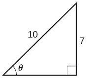

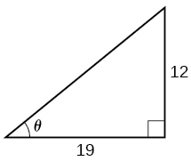

0\.56 radians

For the following exercises, find the exact value, if possible, without a calculator. If it is not possible, explain why.

<math xmlns="http://www.w3.org/1998/Math/MathML"> <mrow> <msup> <mrow> <mi>sin</mi></mrow> <mrow> <mo>−</mo><mn>1</mn></mrow> </msup> <mrow><mo>(</mo> <mrow> <mi>cos</mi><mrow><mo>(</mo> <mi>π</mi> <mo>)</mo></mrow></mrow> <mo>)</mo></mrow></mrow> </math>

<math xmlns="http://www.w3.org/1998/Math/MathML"> <mrow> <msup> <mrow> <mi>tan</mi></mrow> <mrow> <mo>−</mo><mn>1</mn></mrow> </msup> <mrow><mo>(</mo> <mrow> <mi>sin</mi><mrow><mo>(</mo> <mi>π</mi> <mo>)</mo></mrow></mrow> <mo>)</mo></mrow></mrow> </math>

0

<math xmlns="http://www.w3.org/1998/Math/MathML"> <mrow> <msup> <mrow> <mi>cos</mi></mrow> <mrow> <mo>−</mo><mn>1</mn></mrow> </msup> <mrow><mo>(</mo> <mrow> <mi>sin</mi><mrow><mo>(</mo> <mrow> <mfrac> <mi>π</mi> <mn>3</mn> </mfrac> </mrow> <mo>)</mo></mrow></mrow> <mo>)</mo></mrow></mrow> </math>

<math xmlns="http://www.w3.org/1998/Math/MathML"> <mrow> <msup> <mrow> <mi>tan</mi></mrow> <mrow> <mo>−</mo><mn>1</mn></mrow> </msup> <mrow><mo>(</mo> <mrow> <mi>sin</mi><mrow><mo>(</mo> <mrow> <mfrac> <mi>π</mi> <mn>3</mn> </mfrac> </mrow> <mo>)</mo></mrow></mrow> <mo>)</mo></mrow></mrow> </math>

0\.71

<math xmlns="http://www.w3.org/1998/Math/MathML"> <mrow> <msup> <mrow> <mi>sin</mi></mrow> <mrow> <mo>−</mo><mn>1</mn></mrow> </msup> <mrow><mo>(</mo> <mrow> <mi>cos</mi><mrow><mo>(</mo> <mrow> <mfrac> <mrow> <mo>−</mo><mi>π</mi></mrow> <mn>2</mn> </mfrac> </mrow> <mo>)</mo></mrow></mrow> <mo>)</mo></mrow></mrow> </math>

<math xmlns="http://www.w3.org/1998/Math/MathML"> <mrow> <msup> <mrow> <mi>tan</mi></mrow> <mrow> <mo>−</mo><mn>1</mn></mrow> </msup> <mrow><mo>(</mo> <mrow> <mi>sin</mi><mrow><mo>(</mo> <mrow> <mfrac> <mrow> <mn>4</mn><mi>π</mi></mrow> <mn>3</mn> </mfrac> </mrow> <mo>)</mo></mrow></mrow> <mo>)</mo></mrow></mrow> </math>

-0.71

<math xmlns="http://www.w3.org/1998/Math/MathML"> <mrow> <msup> <mrow> <mi>sin</mi></mrow> <mrow> <mo>−</mo><mn>1</mn></mrow> </msup> <mrow><mo>(</mo> <mrow> <mi>sin</mi><mrow><mo>(</mo> <mrow> <mfrac> <mrow> <mn>5</mn><mi>π</mi></mrow> <mn>6</mn> </mfrac> </mrow> <mo>)</mo></mrow></mrow> <mo>)</mo></mrow></mrow> </math>

<math xmlns="http://www.w3.org/1998/Math/MathML"> <mrow> <msup> <mrow> <mi>tan</mi></mrow> <mrow> <mo>−</mo><mn>1</mn></mrow> </msup> <mrow><mo>(</mo> <mrow> <mi>sin</mi><mrow><mo>(</mo> <mrow> <mfrac> <mrow> <mo>−</mo><mn>5</mn><mi>π</mi></mrow> <mn>2</mn> </mfrac> </mrow> <mo>)</mo></mrow></mrow> <mo>)</mo></mrow></mrow> </math>

<math xmlns="http://www.w3.org/1998/Math/MathML"> <mrow> <mo>−</mo><mfrac> <mi>π</mi> <mn>4</mn> </mfrac> </mrow> </math>

<math xmlns="http://www.w3.org/1998/Math/MathML"> <mrow> <mi>cos</mi><mrow><mo>(</mo> <mrow> <msup> <mrow> <mi>sin</mi></mrow> <mrow> <mo>−</mo><mn>1</mn></mrow> </msup> <mrow><mo>(</mo> <mrow> <mfrac> <mn>4</mn> <mn>5</mn> </mfrac> </mrow> <mo>)</mo></mrow></mrow> <mo>)</mo></mrow></mrow> </math>

<math xmlns="http://www.w3.org/1998/Math/MathML"> <mrow> <mi>sin</mi><mrow><mo>(</mo> <mrow> <msup> <mrow> <mi>cos</mi></mrow> <mrow> <mo>−</mo><mn>1</mn></mrow> </msup> <mrow><mo>(</mo> <mrow> <mfrac> <mn>3</mn> <mn>5</mn> </mfrac> </mrow> <mo>)</mo></mrow></mrow> <mo>)</mo></mrow></mrow> </math>

0\.8

<math xmlns="http://www.w3.org/1998/Math/MathML"> <mrow> <mi>sin</mi><mrow><mo>(</mo> <mrow> <msup> <mrow> <mi>tan</mi></mrow> <mrow> <mo>−</mo><mn>1</mn></mrow> </msup> <mrow><mo>(</mo> <mrow> <mfrac> <mn>4</mn> <mn>3</mn> </mfrac> </mrow> <mo>)</mo></mrow></mrow> <mo>)</mo></mrow></mrow> </math>

<math xmlns="http://www.w3.org/1998/Math/MathML"> <mrow> <mi>cos</mi><mrow><mo>(</mo> <mrow> <msup> <mrow> <mi>tan</mi></mrow> <mrow> <mo>−</mo><mn>1</mn></mrow> </msup> <mrow><mo>(</mo> <mrow> <mfrac> <mrow> <mn>12</mn></mrow> <mn>5</mn> </mfrac> </mrow> <mo>)</mo></mrow></mrow> <mo>)</mo></mrow></mrow> </math>

<math xmlns="http://www.w3.org/1998/Math/MathML"> <mrow> <mfrac> <mn>5</mn> <mrow> <mn>13</mn></mrow> </mfrac> </mrow> </math>

<math xmlns="http://www.w3.org/1998/Math/MathML"> <mrow> <mi>cos</mi><mrow><mo>(</mo> <mrow> <msup> <mrow> <mi>sin</mi></mrow> <mrow> <mo>−</mo><mn>1</mn></mrow> </msup> <mrow><mo>(</mo> <mrow> <mfrac> <mn>1</mn> <mn>2</mn> </mfrac> </mrow> <mo>)</mo></mrow></mrow> <mo>)</mo></mrow></mrow> </math>

For the following exercises, find the exact value of the expression in terms of<math xmlns="http://www.w3.org/1998/Math/MathML"> <mrow> <mtext> </mtext><mi>x</mi><mtext> </mtext></mrow> </math>

 with the help of a reference triangle.

<math xmlns="http://www.w3.org/1998/Math/MathML"> <mrow> <mi>tan</mi><mrow><mo>(</mo> <mrow> <msup> <mrow> <mi>sin</mi></mrow> <mrow> <mo>−</mo><mn>1</mn></mrow> </msup> <mrow><mo>(</mo> <mrow> <mi>x</mi><mo>−</mo><mn>1</mn></mrow> <mo>)</mo></mrow></mrow> <mo>)</mo></mrow></mrow> </math>

<math xmlns="http://www.w3.org/1998/Math/MathML"> <mrow> <mfrac> <mrow> <mi>x</mi><mo>−</mo><mn>1</mn> </mrow> <mrow> <msqrt> <mrow> <mo>−</mo><msup> <mi>x</mi> <mn>2</mn> </msup> <mo>+</mo><mn>2</mn><mi>x</mi> </mrow> </msqrt> </mrow> </mfrac> </mrow> </math>

<math xmlns="http://www.w3.org/1998/Math/MathML"> <mrow> <mi>sin</mi><mrow><mo>(</mo> <mrow> <msup> <mrow> <mi>cos</mi></mrow> <mrow> <mo>−</mo><mn>1</mn></mrow> </msup> <mrow><mo>(</mo> <mrow> <mn>1</mn><mo>−</mo><mi>x</mi></mrow> <mo>)</mo></mrow></mrow> <mo>)</mo></mrow></mrow> </math>

<math xmlns="http://www.w3.org/1998/Math/MathML"> <mrow> <mi>cos</mi><mrow><mo>(</mo> <mrow> <msup> <mrow> <mi>sin</mi></mrow> <mrow> <mo>−</mo><mn>1</mn></mrow> </msup> <mrow><mo>(</mo> <mrow> <mfrac> <mn>1</mn> <mi>x</mi> </mfrac> </mrow> <mo>)</mo></mrow></mrow> <mo>)</mo></mrow></mrow> </math>

<math xmlns="http://www.w3.org/1998/Math/MathML"> <mrow> <mfrac> <mrow> <msqrt> <mrow> <msup> <mi>x</mi> <mn>2</mn> </msup> <mo>−</mo><mn>1</mn></mrow> </msqrt> </mrow> <mi>x</mi> </mfrac> </mrow> </math>

<math xmlns="http://www.w3.org/1998/Math/MathML"> <mrow> <mi>cos</mi><mrow><mo>(</mo> <mrow> <msup> <mrow> <mi>tan</mi></mrow> <mrow> <mo>−</mo><mn>1</mn></mrow> </msup> <mrow><mo>(</mo> <mrow> <mn>3</mn><mi>x</mi><mo>−</mo><mn>1</mn></mrow> <mo>)</mo></mrow></mrow> <mo>)</mo></mrow></mrow> </math>

<math xmlns="http://www.w3.org/1998/Math/MathML"> <mrow> <mi>tan</mi><mrow><mo>(</mo> <mrow> <msup> <mrow> <mi>sin</mi></mrow> <mrow> <mo>−</mo><mn>1</mn></mrow> </msup> <mrow><mo>(</mo> <mrow> <mi>x</mi><mo>+</mo><mfrac> <mn>1</mn> <mn>2</mn> </mfrac> </mrow> <mo>)</mo></mrow></mrow> <mo>)</mo></mrow></mrow> </math>

<math xmlns="http://www.w3.org/1998/Math/MathML"> <mrow> <mfrac> <mrow> <mi>x</mi><mo>+</mo><mn>0.5</mn></mrow> <mrow> <msqrt> <mrow> <mo>−</mo><msup> <mi>x</mi> <mn>2</mn> </msup> <mo>−</mo><mi>x</mi><mo>+</mo><mfrac> <mn>3</mn> <mn>4</mn> </mfrac> </mrow> </msqrt> </mrow> </mfrac> </mrow> </math>

#### Extensions

For the following exercises, evaluate the expression without using a calculator. Give the exact value.

<math xmlns="http://www.w3.org/1998/Math/MathML"> <mrow> <mfrac> <mrow> <msup> <mrow> <mi>sin</mi></mrow> <mrow> <mo>−</mo><mn>1</mn></mrow> </msup> <mrow><mo>(</mo> <mrow> <mfrac> <mn>1</mn> <mn>2</mn> </mfrac> </mrow> <mo>)</mo></mrow><mo>−</mo><msup> <mrow> <mi>cos</mi></mrow> <mrow> <mo>−</mo><mn>1</mn></mrow> </msup> <mrow><mo>(</mo> <mrow> <mfrac> <mrow> <msqrt> <mn>2</mn> </msqrt> </mrow> <mn>2</mn> </mfrac> </mrow> <mo>)</mo></mrow><mo>+</mo><msup> <mrow> <mi>sin</mi></mrow> <mrow> <mo>−</mo><mn>1</mn></mrow> </msup> <mrow><mo>(</mo> <mrow> <mfrac> <mrow> <msqrt> <mn>3</mn> </msqrt> </mrow> <mn>2</mn> </mfrac> </mrow> <mo>)</mo></mrow><mo>−</mo><msup> <mrow> <mi>cos</mi></mrow> <mrow> <mo>−</mo><mn>1</mn></mrow> </msup> <mrow><mo>(</mo> <mn>1</mn> <mo>)</mo></mrow></mrow> <mrow> <msup> <mrow> <mi>cos</mi></mrow> <mrow> <mo>−</mo><mn>1</mn></mrow> </msup> <mrow><mo>(</mo> <mrow> <mfrac> <mrow> <msqrt> <mn>3</mn> </msqrt> </mrow> <mn>2</mn> </mfrac> </mrow> <mo>)</mo></mrow><mo>−</mo><msup> <mrow> <mi>sin</mi></mrow> <mrow> <mo>−</mo><mn>1</mn></mrow> </msup> <mrow><mo>(</mo> <mrow> <mfrac> <mrow> <msqrt> <mn>2</mn> </msqrt> </mrow> <mn>2</mn> </mfrac> </mrow> <mo>)</mo></mrow><mo>+</mo><msup> <mrow> <mi>cos</mi></mrow> <mrow> <mo>−</mo><mn>1</mn></mrow> </msup> <mrow><mo>(</mo> <mrow> <mfrac> <mn>1</mn> <mn>2</mn> </mfrac> </mrow> <mo>)</mo></mrow><mo>−</mo><msup> <mrow> <mi>sin</mi></mrow> <mrow> <mo>−</mo><mn>1</mn></mrow> </msup> <mrow><mo>(</mo> <mn>0</mn> <mo>)</mo></mrow></mrow> </mfrac> </mrow> </math>

For the following exercises, find the function if<math xmlns="http://www.w3.org/1998/Math/MathML"> <mrow> <mtext> </mtext><mi>sin</mi><mtext> </mtext><mi>t</mi><mo>=</mo><mfrac> <mi>x</mi> <mrow> <mi>x</mi><mo>+</mo><mn>1</mn></mrow> </mfrac> <mo>.</mo></mrow> </math>

<math xmlns="http://www.w3.org/1998/Math/MathML"> <mrow> <mi>cos</mi><mtext> </mtext><mi>t</mi></mrow> </math>

<math xmlns="http://www.w3.org/1998/Math/MathML"> <mrow> <mfrac> <mrow> <msqrt> <mrow> <mn>2</mn><mi>x</mi><mo>+</mo><mn>1</mn></mrow> </msqrt> </mrow> <mrow> <mi>x</mi><mo>+</mo><mn>1</mn></mrow> </mfrac> </mrow> </math>

<math xmlns="http://www.w3.org/1998/Math/MathML"> <mrow> <mi>sec</mi><mtext> </mtext><mi>t</mi></mrow> </math>

<math xmlns="http://www.w3.org/1998/Math/MathML"> <mrow> <mi>cot</mi><mtext> </mtext><mi>t</mi></mrow> </math>

<math xmlns="http://www.w3.org/1998/Math/MathML"> <mrow> <mfrac> <mrow> <msqrt> <mrow> <mn>2</mn><mi>x</mi><mo>+</mo><mn>1</mn></mrow> </msqrt> </mrow> <mi>x</mi> </mfrac> </mrow> </math>

<math xmlns="http://www.w3.org/1998/Math/MathML"> <mrow> <mi>cos</mi><mrow><mo>(</mo> <mrow> <msup> <mrow> <mi>sin</mi></mrow> <mrow> <mo>−</mo><mn>1</mn></mrow> </msup> <mrow><mo>(</mo> <mrow> <mfrac> <mi>x</mi> <mrow> <mi>x</mi><mo>+</mo><mn>1</mn></mrow> </mfrac> </mrow> <mo>)</mo></mrow></mrow> <mo>)</mo></mrow></mrow> </math>

<math xmlns="http://www.w3.org/1998/Math/MathML"> <mrow> <msup> <mrow> <mi>tan</mi></mrow> <mrow> <mo>−</mo><mn>1</mn></mrow> </msup> <mrow><mo>(</mo> <mrow> <mfrac> <mi>x</mi> <mrow> <msqrt> <mrow> <mn>2</mn><mi>x</mi><mo>+</mo><mn>1</mn></mrow> </msqrt> </mrow> </mfrac> </mrow> <mo>)</mo></mrow></mrow> </math>

<math xmlns="http://www.w3.org/1998/Math/MathML"> <mi>t</mi> </math>

#### Graphical

Graph<math xmlns="http://www.w3.org/1998/Math/MathML"> <mrow> <mtext> </mtext><mi>y</mi><mo>=</mo><msup> <mrow> <mi>sin</mi></mrow> <mrow> <mo>−</mo><mn>1</mn></mrow> </msup> <mi>x</mi><mtext> </mtext></mrow> </math>

and state the domain and range of the function.

Graph<math xmlns="http://www.w3.org/1998/Math/MathML"> <mrow> <mtext> </mtext><mi>y</mi><mo>=</mo><mi>arccos</mi><mtext> </mtext><mi>x</mi><mtext> </mtext></mrow> </math>

and state the domain and range of the function.

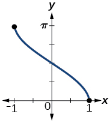

domain<math xmlns="http://www.w3.org/1998/Math/MathML"> <mrow> <mtext> </mtext><mrow><mo>[</mo> <mrow> <mo>−</mo><mn>1</mn><mo>,</mo><mn>1</mn></mrow> <mo>]</mo></mrow><mo>;</mo><mtext> </mtext></mrow> </math>

range<math xmlns="http://www.w3.org/1998/Math/MathML"> <mrow> <mtext> </mtext><mrow><mo>[</mo> <mrow> <mn>0</mn><mo>,</mo><mi>π</mi></mrow> <mo>]</mo></mrow><mtext> </mtext></mrow> </math>

Graph one cycle of<math xmlns="http://www.w3.org/1998/Math/MathML"> <mrow> <mtext> </mtext><mi>y</mi><mo>=</mo><msup> <mrow> <mi>tan</mi></mrow> <mrow> <mo>−</mo><mn>1</mn></mrow> </msup> <mi>x</mi><mtext> </mtext></mrow> </math>

and state the domain and range of the function.

For what value of<math xmlns="http://www.w3.org/1998/Math/MathML"> <mrow> <mtext> </mtext><mi>x</mi><mtext> </mtext></mrow> </math>

does<math xmlns="http://www.w3.org/1998/Math/MathML"> <mrow> <mtext> </mtext><mi>sin</mi><mtext> </mtext><mi>x</mi><mo>=</mo><msup> <mrow> <mi>sin</mi></mrow> <mrow> <mo>−</mo><mn>1</mn></mrow> </msup> <mi>x</mi><mo>?</mo><mtext> </mtext></mrow> </math>

Use a graphing calculator to approximate the answer.

approximately<math xmlns="http://www.w3.org/1998/Math/MathML"> <mrow> <mtext> </mtext><mi>x</mi><mo>=</mo><mn>0.00</mn><mtext> </mtext></mrow> </math>

For what value of<math xmlns="http://www.w3.org/1998/Math/MathML"> <mrow> <mtext> </mtext><mi>x</mi><mtext> </mtext></mrow> </math>

does<math xmlns="http://www.w3.org/1998/Math/MathML"> <mrow> <mtext> </mtext><mi>cos</mi><mtext> </mtext><mi>x</mi><mo>=</mo><msup> <mrow> <mi>cos</mi></mrow> <mrow> <mo>−</mo><mn>1</mn></mrow> </msup> <mi>x</mi><mo>?</mo><mtext> </mtext></mrow> </math>

Use a graphing calculator to approximate the answer.

#### Real-World Applications

Suppose a 13-foot ladder is leaning against a building, reaching to the bottom of a second-floor window 12 feet above the ground. What angle, in radians, does the ladder make with the building?

0\.395 radians

Suppose you drive 0.6 miles on a road so that the vertical distance changes from 0 to 150 feet. What is the angle of elevation of the road?

An isosceles triangle has two congruent sides of length 9 inches. The remaining side has a length of 8 inches. Find the angle that a side of 9 inches makes with the 8-inch side.

1\.11 radians

Without using a calculator, approximate the value of<math xmlns="http://www.w3.org/1998/Math/MathML"> <mrow> <mtext> </mtext><mi>arctan</mi><mrow><mo>(</mo> <mrow> <mn>10</mn><mi>,</mi><mn>000</mn></mrow> <mo>)</mo></mrow><mo>.</mo><mtext> </mtext></mrow> </math>

Explain why your answer is reasonable.

A truss for the roof of a house is constructed from two identical right triangles. Each has a base of 12 feet and height of 4 feet. Find the measure of the acute angle adjacent to the 4-foot side.

1\.25 radians

The line<math xmlns="http://www.w3.org/1998/Math/MathML"> <mrow> <mtext> </mtext><mi>y</mi><mo>=</mo><mfrac> <mn>3</mn> <mn>5</mn> </mfrac> <mi>x</mi><mtext> </mtext></mrow> </math>

passes through the origin in the *x*,*y*-plane. What is the measure of the angle that the line makes with the positive *x*-axis?

The line<math xmlns="http://www.w3.org/1998/Math/MathML"> <mrow> <mtext> </mtext><mi>y</mi><mo>=</mo><mfrac> <mrow> <mo>−</mo><mn>3</mn></mrow> <mn>7</mn> </mfrac> <mi>x</mi><mtext> </mtext></mrow> </math>

passes through the origin in the *x*,*y*-plane. What is the measure of the angle that the line makes with the negative *x*-axis?

0\.405 radians

What percentage grade should a road have if the angle of elevation of the road is 4 degrees? (The percentage grade is defined as the change in the altitude of the road over a 100-foot horizontal distance. For example a 5% grade means that the road rises 5 feet for every 100 feet of horizontal distance.)

A 20-foot ladder leans up against the side of a building so that the foot of the ladder is 10 feet from the base of the building. If specifications call for the ladder's angle of elevation to be between 35 and 45 degrees, does the placement of this ladder satisfy safety specifications?

No. The angle the ladder makes with the horizontal is 60 degrees.

Suppose a 15-foot ladder leans against the side of a house so that the angle of elevation of the ladder is 42 degrees. How far is the foot of the ladder from the side of the house?

### Chapter Review Exercises

#### [Graphs of the Sine and Cosine Functions](/m49387){: .target-chapter}   {#eip-id1165135244084}

For the following exercises, graph the functions for two periods and determine the amplitude or stretching factor, period, midline equation, and asymptotes.

<math xmlns="http://www.w3.org/1998/Math/MathML"> <mrow> <mi>f</mi><mrow><mo>(</mo> <mi>x</mi> <mo>)</mo></mrow><mo>=</mo><mo>−</mo><mn>3</mn><mi>cos</mi><mtext> </mtext><mi>x</mi><mo>+</mo><mn>3</mn> </mrow> </math>

amplitude: 3; period:<math xmlns="http://www.w3.org/1998/Math/MathML"> <mrow> <mtext> </mtext><mn>2</mn><mi>π</mi><mo>;</mo><mtext> </mtext> </mrow> </math>

midline:<math xmlns="http://www.w3.org/1998/Math/MathML"> <mrow> <mtext> </mtext><mi>y</mi><mo>=</mo><mn>3</mn><mo>;</mo><mtext> </mtext> </mrow> </math>

no asymptotes* * *
{: data-type="newline"}

![A graph of two periods of a function with a cosine parent function. The graph has a range of \[0,6\] graphed over -2pi to 2pi. Maximums as -pi and pi.](../resources/CNX_Precalc_Figure_06_03_206.jpg)

<math xmlns="http://www.w3.org/1998/Math/MathML"> <mrow> <mi>f</mi><mrow><mo>(</mo> <mi>x</mi> <mo>)</mo></mrow><mo>=</mo><mfrac> <mn>1</mn> <mn>4</mn> </mfrac> <mi>sin</mi><mtext> </mtext><mi>x</mi> </mrow> </math>

<math xmlns="http://www.w3.org/1998/Math/MathML"> <mrow> <mi>f</mi><mrow><mo>(</mo> <mi>x</mi> <mo>)</mo></mrow><mo>=</mo><mn>3</mn><mi>cos</mi><mrow><mo>(</mo> <mrow> <mi>x</mi><mo>+</mo><mfrac> <mi>π</mi> <mn>6</mn> </mfrac> </mrow> <mo>)</mo></mrow> </mrow> </math>

amplitude: 3; period:<math xmlns="http://www.w3.org/1998/Math/MathML"> <mrow> <mtext> </mtext><mn>2</mn><mi>π</mi><mo>;</mo><mtext> </mtext> </mrow> </math>

midline:<math xmlns="http://www.w3.org/1998/Math/MathML"> <mrow> <mtext> </mtext><mi>y</mi><mo>=</mo><mn>0</mn><mo>;</mo><mtext> </mtext> </mrow> </math>

no asymptotes* * *
{: data-type="newline"}

![A graph of four periods of a function with a cosine parent function. Graphed from -4pi to 4pi. Range is \[-3,3\].](../resources/CNX_Precalc_Figure_06_03_208.jpg)

<math xmlns="http://www.w3.org/1998/Math/MathML"> <mrow> <mi>f</mi><mrow><mo>(</mo> <mi>x</mi> <mo>)</mo></mrow><mo>=</mo><mo>−</mo><mn>2</mn><mi>sin</mi><mrow><mo>(</mo> <mrow> <mi>x</mi><mo>−</mo><mfrac> <mrow> <mn>2</mn><mi>π</mi> </mrow> <mn>3</mn> </mfrac> </mrow> <mo>)</mo></mrow> </mrow> </math>

<math xmlns="http://www.w3.org/1998/Math/MathML"> <mrow> <mi>f</mi><mrow><mo>(</mo> <mi>x</mi> <mo>)</mo></mrow><mo>=</mo><mn>3</mn><mi>sin</mi><mrow><mo>(</mo> <mrow> <mi>x</mi><mo>−</mo><mfrac> <mi>π</mi> <mn>4</mn> </mfrac> </mrow> <mo>)</mo></mrow><mo>−</mo><mn>4</mn> </mrow> </math>

amplitude: 3; period:<math xmlns="http://www.w3.org/1998/Math/MathML"> <mrow> <mtext> </mtext><mn>2</mn><mi>π</mi><mo>;</mo><mtext> </mtext> </mrow> </math>

midline:<math xmlns="http://www.w3.org/1998/Math/MathML"> <mrow> <mtext> </mtext><mi>y</mi><mo>=</mo><mo>−</mo><mn>4</mn><mo>;</mo><mtext> </mtext> </mrow> </math>

no asymptotes* * *
{: data-type="newline"}

![A graph of two periods of a sinusoidal function. Range is \[-7,-1\]. Maximums at -5pi/4 and 3pi/4.](../resources/CNX_Precalc_Figure_06_03_210.jpg)

<math xmlns="http://www.w3.org/1998/Math/MathML"> <mrow> <mi>f</mi><mrow><mo>(</mo> <mi>x</mi> <mo>)</mo></mrow><mo>=</mo><mn>2</mn><mrow><mo>(</mo> <mrow> <mi>cos</mi><mrow><mo>(</mo> <mrow> <mi>x</mi><mo>−</mo><mfrac> <mrow> <mn>4</mn><mi>π</mi> </mrow> <mn>3</mn> </mfrac> </mrow> <mo>)</mo></mrow><mo>+</mo><mn>1</mn> </mrow> <mo>)</mo></mrow> </mrow> </math>

<math xmlns="http://www.w3.org/1998/Math/MathML"> <mrow> <mi>f</mi><mrow><mo>(</mo> <mi>x</mi> <mo>)</mo></mrow><mo>=</mo><mn>6</mn><mi>sin</mi><mrow><mo>(</mo> <mrow> <mn>3</mn><mi>x</mi><mo>−</mo><mfrac> <mi>π</mi> <mn>6</mn> </mfrac> </mrow> <mo>)</mo></mrow><mo>−</mo><mn>1</mn> </mrow> </math>

amplitude: 6; period:<math xmlns="http://www.w3.org/1998/Math/MathML"> <mrow> <mtext> </mtext><mfrac> <mrow> <mn>2</mn><mi>π</mi> </mrow> <mn>3</mn> </mfrac> <mo>;</mo><mtext> </mtext> </mrow> </math>

midline:<math xmlns="http://www.w3.org/1998/Math/MathML"> <mrow> <mtext> </mtext><mi>y</mi><mo>=</mo><mo>−</mo><mn>1</mn><mo>;</mo><mtext> </mtext> </mrow> </math>

no asymptotes* * *
{: data-type="newline"}

![A sinusoidal graph over two periods. Range is \[-7,5\], amplitude is 6, and period is 2pi/3.](../resources/CNX_Precalc_Figure_06_03_212.jpg)

<math xmlns="http://www.w3.org/1998/Math/MathML"> <mrow> <mi>f</mi><mrow><mo>(</mo> <mi>x</mi> <mo>)</mo></mrow><mo>=</mo><mo>−</mo><mn>100</mn><mi>sin</mi><mrow><mo>(</mo> <mrow> <mn>50</mn><mi>x</mi><mo>−</mo><mn>20</mn> </mrow> <mo>)</mo></mrow> </mrow> </math>

#### [Graphs of the Other Trigonometric Functions](/m49389){: .target-chapter}   {#eip-id1165133021952}

For the following exercises, graph the functions for two periods and determine the amplitude or stretching factor, period, midline equation, and asymptotes.

<math xmlns="http://www.w3.org/1998/Math/MathML"> <mrow> <mi>f</mi><mrow><mo>(</mo> <mi>x</mi> <mo>)</mo></mrow><mo>=</mo><mi>tan</mi><mtext> </mtext><mi>x</mi><mo>−</mo><mn>4</mn> </mrow> </math>

stretching factor: none; period:<math xmlns="http://www.w3.org/1998/Math/MathML"> <mrow> <mtext> </mtext><mi>π</mi><mo>;</mo><mtext> </mtext> </mrow> </math>

midline:<math xmlns="http://www.w3.org/1998/Math/MathML"> <mrow> <mtext> </mtext><mi>y</mi><mo>=</mo><mo>−</mo><mn>4</mn><mo>;</mo><mtext> </mtext> </mrow> </math>

asymptotes:<math xmlns="http://www.w3.org/1998/Math/MathML"> <mrow> <mtext> </mtext><mi>x</mi><mo>=</mo><mfrac> <mi>π</mi> <mn>2</mn> </mfrac> <mo>+</mo><mi>π</mi><mi>k</mi><mo>,</mo></mrow> </math>

where<math xmlns="http://www.w3.org/1998/Math/MathML"> <mrow> <mtext> </mtext><mi>k</mi><mtext> </mtext></mrow> </math>

is an integer* * *
{: data-type="newline"}

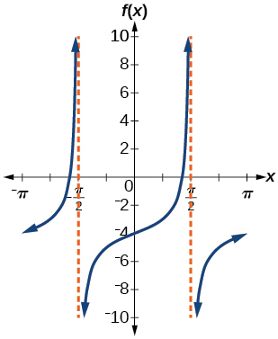

<math xmlns="http://www.w3.org/1998/Math/MathML"> <mrow> <mi>f</mi><mrow><mo>(</mo> <mi>x</mi> <mo>)</mo></mrow><mo>=</mo><mn>2</mn><mi>tan</mi><mrow><mo>(</mo> <mrow> <mi>x</mi><mo>−</mo><mfrac> <mi>π</mi> <mn>6</mn> </mfrac> </mrow> <mo>)</mo></mrow> </mrow> </math>

<math xmlns="http://www.w3.org/1998/Math/MathML"> <mrow> <mi>f</mi><mrow><mo>(</mo> <mi>x</mi> <mo>)</mo></mrow><mo>=</mo><mo>−</mo><mn>3</mn><mi>tan</mi><mrow><mo>(</mo> <mrow> <mn>4</mn><mi>x</mi> </mrow> <mo>)</mo></mrow><mo>−</mo><mn>2</mn> </mrow> </math>

stretching factor: 3; period:<math xmlns="http://www.w3.org/1998/Math/MathML"> <mrow> <mtext> </mtext><mfrac> <mi>π</mi> <mn>4</mn> </mfrac> <mo>;</mo><mtext> </mtext> </mrow> </math>

midline:<math xmlns="http://www.w3.org/1998/Math/MathML"> <mrow> <mtext> </mtext><mi>y</mi><mo>=</mo><mo>−</mo><mn>2</mn><mo>;</mo><mtext> </mtext> </mrow> </math>

asymptotes:<math xmlns="http://www.w3.org/1998/Math/MathML"> <mrow> <mi>x</mi><mo>=</mo><mfrac> <mi>π</mi> <mn>8</mn> </mfrac> <mo>+</mo><mfrac> <mi>π</mi> <mn>4</mn> </mfrac> <mi>k</mi><mo>,</mo></mrow> </math>

where<math xmlns="http://www.w3.org/1998/Math/MathML"> <mrow> <mtext> </mtext><mi>k</mi><mtext> </mtext></mrow> </math>

is an integer* * *
{: data-type="newline"}

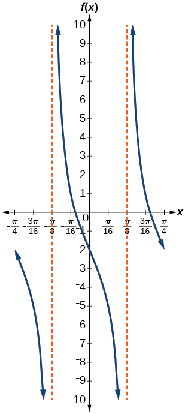

<math xmlns="http://www.w3.org/1998/Math/MathML"> <mrow> <mi>f</mi><mrow><mo>(</mo> <mi>x</mi> <mo>)</mo></mrow><mo>=</mo><mn>0.2</mn><mi>cos</mi><mrow><mo>(</mo> <mrow> <mn>0.1</mn><mi>x</mi> </mrow> <mo>)</mo></mrow><mo>+</mo><mn>0.3</mn> </mrow> </math>

For the following exercises, graph two full periods. Identify the period, the phase shift, the amplitude, and asymptotes.

<math xmlns="http://www.w3.org/1998/Math/MathML"> <mrow> <mi>f</mi><mrow><mo>(</mo> <mi>x</mi> <mo>)</mo></mrow><mo>=</mo><mfrac> <mn>1</mn> <mn>3</mn> </mfrac> <mi>sec</mi><mtext> </mtext><mi>x</mi> </mrow> </math>

amplitude: none; period:<math xmlns="http://www.w3.org/1998/Math/MathML"> <mrow> <mn>2</mn><mi>π</mi><mo>;</mo></mrow> </math>

no phase shift; asymptotes:<math xmlns="http://www.w3.org/1998/Math/MathML"> <mrow> <mtext> </mtext><mi>x</mi><mo>=</mo><mfrac> <mi>π</mi> <mn>2</mn> </mfrac> <mi>k</mi><mo>,</mo></mrow> </math>

where<math xmlns="http://www.w3.org/1998/Math/MathML"> <mrow> <mtext> </mtext><mi>k</mi><mtext> </mtext></mrow> </math>

is an odd integer* * *
{: data-type="newline"}

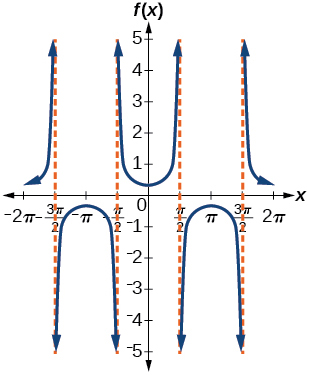

<math xmlns="http://www.w3.org/1998/Math/MathML"> <mrow> <mi>f</mi><mrow><mo>(</mo> <mi>x</mi> <mo>)</mo></mrow><mo>=</mo><mn>3</mn><mi>cot</mi><mtext> </mtext><mi>x</mi> </mrow> </math>

<math xmlns="http://www.w3.org/1998/Math/MathML"> <mrow> <mi>f</mi><mrow><mo>(</mo> <mi>x</mi> <mo>)</mo></mrow><mo>=</mo><mn>4</mn><mi>csc</mi><mrow><mo>(</mo> <mrow> <mn>5</mn><mi>x</mi> </mrow> <mo>)</mo></mrow> </mrow> </math>

amplitude: none; period:<math xmlns="http://www.w3.org/1998/Math/MathML"> <mrow> <mtext> </mtext><mfrac> <mrow> <mn>2</mn><mi>π</mi> </mrow> <mn>5</mn> </mfrac> <mo>;</mo><mtext> </mtext> </mrow> </math>

no phase shift; asymptotes:<math xmlns="http://www.w3.org/1998/Math/MathML"> <mrow> <mtext> </mtext><mi>x</mi><mo>=</mo><mfrac> <mi>π</mi> <mn>5</mn> </mfrac> <mi>k</mi><mo>,</mo></mrow> </math>

where<math xmlns="http://www.w3.org/1998/Math/MathML"> <mrow> <mtext> </mtext><mi>k</mi><mtext> </mtext></mrow> </math>

is an integer* * *
{: data-type="newline"}

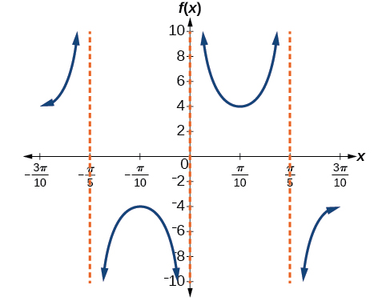

<math xmlns="http://www.w3.org/1998/Math/MathML"> <mrow> <mi>f</mi><mrow><mo>(</mo> <mi>x</mi> <mo>)</mo></mrow><mo>=</mo><mn>8</mn><mi>sec</mi><mrow><mo>(</mo> <mrow> <mfrac> <mn>1</mn> <mn>4</mn> </mfrac> <mi>x</mi> </mrow> <mo>)</mo></mrow> </mrow> </math>

<math xmlns="http://www.w3.org/1998/Math/MathML"> <mrow> <mi>f</mi><mrow><mo>(</mo> <mi>x</mi> <mo>)</mo></mrow><mo>=</mo><mfrac> <mn>2</mn> <mn>3</mn> </mfrac> <mi>csc</mi><mrow><mo>(</mo> <mrow> <mfrac> <mn>1</mn> <mn>2</mn> </mfrac> <mi>x</mi> </mrow> <mo>)</mo></mrow> </mrow> </math>

amplitude: none; period:<math xmlns="http://www.w3.org/1998/Math/MathML"> <mrow> <mtext> </mtext><mn>4</mn><mi>π</mi><mo>;</mo><mtext> </mtext> </mrow> </math>

no phase shift; asymptotes:<math xmlns="http://www.w3.org/1998/Math/MathML"> <mrow> <mtext> </mtext><mi>x</mi><mo>=</mo><mn>2</mn><mi>π</mi><mi>k</mi><mo>,</mo></mrow> </math>

where<math xmlns="http://www.w3.org/1998/Math/MathML"> <mrow> <mtext> </mtext><mi>k</mi><mtext> </mtext></mrow> </math>

is an integer* * *
{: data-type="newline"}

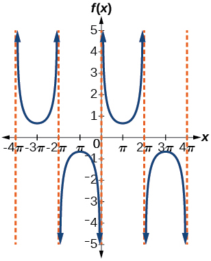

<math xmlns="http://www.w3.org/1998/Math/MathML"> <mrow> <mi>f</mi><mrow><mo>(</mo> <mi>x</mi> <mo>)</mo></mrow><mo>=</mo><mo>−</mo><mi>csc</mi><mrow><mo>(</mo> <mrow> <mn>2</mn><mi>x</mi><mo>+</mo><mi>π</mi> </mrow> <mo>)</mo></mrow> </mrow> </math>

For the following exercises, use this scenario: The population of a city has risen and fallen over a 20-year interval. Its population may be modeled by the following function:<math xmlns="http://www.w3.org/1998/Math/MathML"> <mrow> <mtext> </mtext><mi>y</mi><mo>=</mo><mn>12</mn><mi>,</mi><mn>000</mn><mo>+</mo><mn>8</mn><mi>,</mi><mn>000</mn><mi>sin</mi><mrow><mo>(</mo> <mrow> <mn>0.628</mn><mi>x</mi> </mrow> <mo>),</mo></mrow><mtext> </mtext> </mrow> </math>

where the domain is the years since 1980 and the range is the population of the city.

What is the largest and smallest population the city may have?

largest: 20,000; smallest: 4,000

Graph the function on the domain of<math xmlns="http://www.w3.org/1998/Math/MathML"> <mrow> <mtext> </mtext><mrow><mo>[</mo> <mrow> <mn>0</mn><mo>,</mo><mn>40</mn> </mrow> <mo>]</mo></mrow> </mrow> </math>

.

What are the amplitude, period, and phase shift for the function?

amplitude: 8,000; period: 10; phase shift: 0

Over this domain, when does the population reach 18,000? 13,000?

What is the predicted population in 2007? 2010?

In 2007, the predicted population is 4,413. In 2010, the population will be 11,924.

For the following exercises, suppose a weight is attached to a spring and bobs up and down, exhibiting symmetry.

Suppose the graph of the displacement function is shown in [[link]](#Figure_06_03_225), where the values on the *x*-axis represent the time in seconds and the *y*-axis represents the displacement in inches. Give the equation that models the vertical displacement of the weight on the spring.

![A graph of a consine function over one period. Graphed on the domain of \[0,10\]. Range is \[-5,5\].](../resources/CNX_Precalc_Figure_06_03_225.jpg){: #Figure_06_03_225}

At time = 0, what is the displacement of the weight?

5 in.

At what time does the displacement from the equilibrium point equal zero?

What is the time required for the weight to return to its initial height of 5 inches? In other words, what is the period for the displacement function?

10 seconds

#### [Inverse Trigonometric Functions](/m49390){: .target-chapter}   {#eip-id1165132040469}

For the following exercises, find the exact value without the aid of a calculator.

<math xmlns="http://www.w3.org/1998/Math/MathML"> <mrow> <msup> <mrow> <mi>sin</mi> </mrow> <mrow> <mo>−</mo><mn>1</mn> </mrow> </msup> <mrow><mo>(</mo> <mn>1</mn> <mo>)</mo></mrow> </mrow> </math>

<math xmlns="http://www.w3.org/1998/Math/MathML"> <mrow> <msup> <mrow> <mi>cos</mi> </mrow> <mrow> <mo>−</mo><mn>1</mn> </mrow> </msup> <mrow><mo>(</mo> <mrow> <mfrac> <mrow> <msqrt> <mn>3</mn> </msqrt> </mrow> <mn>2</mn> </mfrac> </mrow> <mo>)</mo></mrow> </mrow> </math>

<math xmlns="http://www.w3.org/1998/Math/MathML"> <mrow> <mfrac> <mi>π</mi> <mn>6</mn> </mfrac> </mrow> </math>

<math xmlns="http://www.w3.org/1998/Math/MathML"> <mrow> <msup> <mrow> <mi>tan</mi> </mrow> <mrow> <mn>−1</mn> </mrow> </msup> <mrow><mo>(</mo> <mrow> <mn>−1</mn> </mrow> <mo>)</mo></mrow> </mrow> </math>

<math xmlns="http://www.w3.org/1998/Math/MathML"> <mrow> <msup> <mrow> <mi>cos</mi> </mrow> <mrow> <mo>−</mo><mn>1</mn> </mrow> </msup> <mrow><mo>(</mo> <mrow> <mfrac> <mn>1</mn> <mrow> <msqrt> <mn>2</mn> </msqrt> </mrow> </mfrac> </mrow> <mo>)</mo></mrow> </mrow> </math>

<math xmlns="http://www.w3.org/1998/Math/MathML"> <mrow> <mfrac> <mi>π</mi> <mn>4</mn> </mfrac> </mrow> </math>

<math xmlns="http://www.w3.org/1998/Math/MathML"> <mrow> <msup> <mrow> <mi>sin</mi> </mrow> <mrow> <mo>−</mo><mn>1</mn> </mrow> </msup> <mrow><mo>(</mo> <mrow> <mfrac> <mrow> <mo>−</mo><msqrt> <mn>3</mn> </msqrt> </mrow> <mn>2</mn> </mfrac> </mrow> <mo>)</mo></mrow> </mrow> </math>

<math xmlns="http://www.w3.org/1998/Math/MathML"> <mrow> <msup> <mrow> <mi>sin</mi> </mrow> <mrow> <mo>−</mo><mn>1</mn> </mrow> </msup> <mrow><mo>(</mo> <mrow> <mi>cos</mi><mrow><mo>(</mo> <mrow> <mfrac> <mi>π</mi> <mn>6</mn> </mfrac> </mrow> <mo>)</mo></mrow> </mrow> <mo>)</mo></mrow> </mrow> </math>

<math xmlns="http://www.w3.org/1998/Math/MathML"> <mrow> <mfrac> <mi>π</mi> <mn>3</mn> </mfrac> </mrow> </math>

<math xmlns="http://www.w3.org/1998/Math/MathML"> <mrow> <msup> <mrow> <mi>cos</mi> </mrow> <mrow> <mo>−</mo><mn>1</mn> </mrow> </msup> <mrow><mo>(</mo> <mrow> <mi>tan</mi><mrow><mo>(</mo> <mrow> <mfrac> <mrow> <mn>3</mn><mi>π</mi> </mrow> <mn>4</mn> </mfrac> </mrow> <mo>)</mo></mrow> </mrow> <mo>)</mo></mrow> </mrow> </math>

<math xmlns="http://www.w3.org/1998/Math/MathML"> <mrow> <mi>sin</mi><mrow><mo>(</mo> <mrow> <msup> <mrow> <mi>sec</mi> </mrow> <mrow> <mo>−</mo><mn>1</mn> </mrow> </msup> <mrow><mo>(</mo> <mrow> <mfrac> <mn>3</mn> <mn>5</mn> </mfrac> </mrow> <mo>)</mo></mrow> </mrow> <mo>)</mo></mrow> </mrow> </math>

No solution

<math xmlns="http://www.w3.org/1998/Math/MathML"> <mrow> <mi>cot</mi><mrow><mo>(</mo> <mrow> <msup> <mrow> <mi>sin</mi> </mrow> <mrow> <mo>−</mo><mn>1</mn> </mrow> </msup> <mrow><mo>(</mo> <mrow> <mfrac> <mn>3</mn> <mn>5</mn> </mfrac> </mrow> <mo>)</mo></mrow> </mrow> <mo>)</mo></mrow> </mrow> </math>

<math xmlns="http://www.w3.org/1998/Math/MathML"> <mrow> <mi>tan</mi><mrow><mo>(</mo> <mrow> <msup> <mrow> <mi>cos</mi> </mrow> <mrow> <mo>−</mo><mn>1</mn> </mrow> </msup> <mrow><mo>(</mo> <mrow> <mfrac> <mn>5</mn> <mrow> <mn>13</mn> </mrow> </mfrac> </mrow> <mo>)</mo></mrow> </mrow> <mo>)</mo></mrow> </mrow> </math>

<math xmlns="http://www.w3.org/1998/Math/MathML"> <mrow> <mfrac> <mrow> <mn>12</mn> </mrow> <mn>5</mn> </mfrac> </mrow> </math>

<math xmlns="http://www.w3.org/1998/Math/MathML"> <mrow> <mi>sin</mi><mrow><mo>(</mo> <mrow> <msup> <mrow> <mi>cos</mi> </mrow> <mrow> <mo>−</mo><mn>1</mn> </mrow> </msup> <mrow><mo>(</mo> <mrow> <mfrac> <mi>x</mi> <mrow> <mi>x</mi><mo>+</mo><mn>1</mn> </mrow> </mfrac> </mrow> <mo>)</mo></mrow> </mrow> <mo>)</mo></mrow> </mrow> </math>

Graph<math xmlns="http://www.w3.org/1998/Math/MathML"> <mrow> <mtext> </mtext><mi>f</mi><mrow><mo>(</mo> <mi>x</mi> <mo>)</mo></mrow><mo>=</mo><mi>cos</mi><mtext> </mtext><mi>x</mi><mtext> </mtext> </mrow> </math>

and<math xmlns="http://www.w3.org/1998/Math/MathML"> <mrow> <mtext> </mtext><mi>f</mi><mrow><mo>(</mo> <mi>x</mi> <mo>)</mo></mrow><mo>=</mo><mi>sec</mi><mtext> </mtext><mi>x</mi><mtext> </mtext> </mrow> </math>

on the interval<math xmlns="http://www.w3.org/1998/Math/MathML"> <mrow> <mtext> </mtext><mrow><mo>[</mo> <mrow> <mn>0</mn><mo>,</mo><mn>2</mn><mi>π</mi> </mrow> <mo>)</mo></mrow><mtext> </mtext> </mrow> </math>

and explain any observations.

The graphs are not symmetrical with respect to the line<math xmlns="http://www.w3.org/1998/Math/MathML"> <mrow> <mtext> </mtext><mi>y</mi><mo>=</mo><mi>x</mi><mo>.</mo><mtext> </mtext> </mrow> </math>

They are symmetrical with respect to the<math xmlns="http://www.w3.org/1998/Math/MathML"> <mrow> <mtext> </mtext><mi>y</mi> </mrow> </math>

-axis.* * *
{: data-type="newline"}

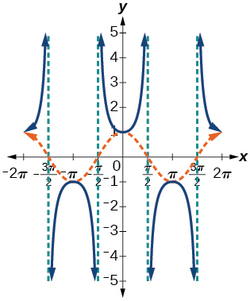

Graph<math xmlns="http://www.w3.org/1998/Math/MathML"> <mrow> <mtext> </mtext><mi>f</mi><mo stretchy="false">(</mo><mi>x</mi><mo stretchy="false">)</mo><mo>=</mo><mi>sin</mi><mtext> </mtext><mi>x</mi><mtext> </mtext> </mrow> </math>

and<math xmlns="http://www.w3.org/1998/Math/MathML"> <mrow> <mtext> </mtext><mi>f</mi><mrow><mo>(</mo> <mi>x</mi> <mo>)</mo></mrow><mo>=</mo><mi>csc</mi><mtext> </mtext><mi>x</mi><mtext> </mtext> </mrow> </math>

and explain any observations.

Graph the function<math xmlns="http://www.w3.org/1998/Math/MathML"> <mrow> <mi>f</mi><mtext> </mtext><mrow><mo>(</mo> <mi>x</mi> <mo>)</mo></mrow><mo>=</mo><mfrac> <mi>x</mi> <mn>1</mn> </mfrac> <mo>−</mo><mfrac> <mrow> <msup> <mi>x</mi> <mn>3</mn> </msup> </mrow> <mrow> <mn>3</mn><mo>!</mo> </mrow> </mfrac> <mo>+</mo><mfrac> <mrow> <msup> <mi>x</mi> <mn>5</mn> </msup> </mrow> <mrow> <mn>5</mn><mo>!</mo> </mrow> </mfrac> <mo>−</mo><mfrac> <mrow> <msup> <mi>x</mi> <mn>7</mn> </msup> </mrow> <mrow> <mn>7</mn><mo>!</mo> </mrow> </mfrac> <mtext> </mtext> </mrow> </math>

on the interval<math xmlns="http://www.w3.org/1998/Math/MathML"> <mrow> <mtext> </mtext><mrow><mo>[</mo> <mrow> <mo>−</mo><mn>1</mn><mo>,</mo><mn>1</mn> </mrow> <mo>]</mo></mrow><mtext> </mtext> </mrow> </math>

and compare the graph to the graph of<math xmlns="http://www.w3.org/1998/Math/MathML"> <mrow> <mtext> </mtext><mi>f</mi><mrow><mo>(</mo> <mi>x</mi> <mo>)</mo></mrow><mo>=</mo><mi>sin</mi><mtext> </mtext><mi>x</mi><mtext> </mtext> </mrow> </math>

on the same interval. Describe any observations.

The graphs appear to be identical.* * *
{: data-type="newline"}

![Two graphs of two identical functions on the interval \[-1 to 1\]. Both graphs appear sinusoidal.](../resources/CNX_Precalc_Figure_06_03_228.jpg)

### Chapter Practice Test

For the following exercises, sketch the graph of each function for two full periods. Determine the amplitude, the period, and the equation for the midline.

<math xmlns="http://www.w3.org/1998/Math/MathML"> <mrow> <mi>f</mi><mrow><mo>(</mo> <mi>x</mi> <mo>)</mo></mrow><mo>=</mo><mn>0.5</mn><mi>sin</mi><mtext> </mtext><mi>x</mi> </mrow> </math>

amplitude: 0.5; period:<math xmlns="http://www.w3.org/1998/Math/MathML"> <mrow> <mtext> </mtext><mn>2</mn><mi>π</mi><mo>;</mo><mtext> </mtext> </mrow> </math>

midline<math xmlns="http://www.w3.org/1998/Math/MathML"> <mrow> <mtext> </mtext><mi>y</mi><mo>=</mo><mn>0</mn><mtext> </mtext> </mrow> </math>

* * *
{: data-type="newline"}

![A graph of two periods of a sinusoidal function, graphed over -2pi to 2pi. The range is \[-0.5,0.5\]. X-intercepts at multiples of pi.](../resources/CNX_Precalc_Figure_06_03_229.jpg)

<math xmlns="http://www.w3.org/1998/Math/MathML"> <mrow> <mi>f</mi><mrow><mo>(</mo> <mi>x</mi> <mo>)</mo></mrow><mo>=</mo><mn>5</mn><mi>cos</mi><mtext> </mtext><mi>x</mi> </mrow> </math>

<math xmlns="http://www.w3.org/1998/Math/MathML"> <mrow> <mi>f</mi><mrow><mo>(</mo> <mi>x</mi> <mo>)</mo></mrow><mo>=</mo><mn>5</mn><mi>sin</mi><mtext> </mtext><mi>x</mi> </mrow> </math>

amplitude: 5; period:<math xmlns="http://www.w3.org/1998/Math/MathML"> <mrow> <mtext> </mtext><mn>2</mn><mi>π</mi><mo>;</mo><mtext> </mtext> </mrow> </math>

midline:<math xmlns="http://www.w3.org/1998/Math/MathML"> <mrow> <mtext> </mtext><mi>y</mi><mo>=</mo><mn>0</mn> </mrow> </math>

* * *
{: data-type="newline"}

![Two periods of a sine function, graphed over -2pi to 2pi. The range is \[-5,5\], amplitude of 5, period of 2pi.](../resources/CNX_Precalc_Figure_06_03_231.jpg)

<math xmlns="http://www.w3.org/1998/Math/MathML"> <mrow> <mi>f</mi><mrow><mo>(</mo> <mi>x</mi> <mo>)</mo></mrow><mo>=</mo><mi>sin</mi><mrow><mo>(</mo> <mrow> <mn>3</mn><mi>x</mi> </mrow> <mo>)</mo></mrow> </mrow> </math>

<math xmlns="http://www.w3.org/1998/Math/MathML"> <mrow> <mi>f</mi><mrow><mo>(</mo> <mi>x</mi> <mo>)</mo></mrow><mo>=</mo><mo>−</mo><mi>cos</mi><mrow><mo>(</mo> <mrow> <mi>x</mi><mo>+</mo><mfrac> <mi>π</mi> <mn>3</mn> </mfrac> </mrow> <mo>)</mo></mrow><mo>+</mo><mn>1</mn> </mrow> </math>

amplitude: 1; period:<math xmlns="http://www.w3.org/1998/Math/MathML"> <mrow> <mtext> </mtext><mn>2</mn><mi>π</mi><mo>;</mo><mtext> </mtext> </mrow> </math>

midline:<math xmlns="http://www.w3.org/1998/Math/MathML"> <mrow> <mtext> </mtext><mi>y</mi><mo>=</mo><mn>1</mn> </mrow> </math>

* * *
{: data-type="newline"}

![A graph of two periods of a cosine function, graphed over -7pi/3 to 5pi/3. Range is \[0,2\], Period is 2pi, amplitude is1.](../resources/CNX_Precalc_Figure_06_03_233.jpg)

<math xmlns="http://www.w3.org/1998/Math/MathML"> <mrow> <mi>f</mi><mrow><mo>(</mo> <mi>x</mi> <mo>)</mo></mrow><mo>=</mo><mn>5</mn><mi>sin</mi><mrow><mo>(</mo> <mrow> <mn>3</mn><mrow><mo>(</mo> <mrow> <mi>x</mi><mo>−</mo><mfrac> <mi>π</mi> <mn>6</mn> </mfrac> </mrow> <mo>)</mo></mrow> </mrow> <mo>)</mo></mrow><mo>+</mo><mn>4</mn> </mrow> </math>

<math xmlns="http://www.w3.org/1998/Math/MathML"> <mrow> <mi>f</mi><mrow><mo>(</mo> <mi>x</mi> <mo>)</mo></mrow><mo>=</mo><mn>3</mn><mi>cos</mi><mrow><mo>(</mo> <mrow> <mfrac> <mn>1</mn> <mn>3</mn> </mfrac> <mi>x</mi><mo>−</mo><mfrac> <mrow> <mn>5</mn><mi>π</mi> </mrow> <mn>6</mn> </mfrac> </mrow> <mo>)</mo></mrow> </mrow> </math>

amplitude: 3; period:<math xmlns="http://www.w3.org/1998/Math/MathML"> <mrow> <mtext> </mtext><mn>6</mn><mi>π</mi><mo>;</mo><mtext> </mtext> </mrow> </math>

midline:<math xmlns="http://www.w3.org/1998/Math/MathML"> <mrow> <mtext> </mtext><mi>y</mi><mo>=</mo><mn>0</mn> </mrow> </math>

* * *
{: data-type="newline"}

![A graph of two periods of a cosine function, over -7pi/2 to 17pi/2. The range is \[-3,3\], period is 6pi, and amplitude is 3.](../resources/CNX_Precalc_Figure_06_03_235.jpg)

<math xmlns="http://www.w3.org/1998/Math/MathML"> <mrow> <mi>f</mi><mrow><mo>(</mo> <mi>x</mi> <mo>)</mo></mrow><mo>=</mo><mi>tan</mi><mrow><mo>(</mo> <mrow> <mn>4</mn><mi>x</mi> </mrow> <mo>)</mo></mrow> </mrow> </math>

<math xmlns="http://www.w3.org/1998/Math/MathML"> <mrow> <mi>f</mi><mrow><mo>(</mo> <mi>x</mi> <mo>)</mo></mrow><mo>=</mo><mo>−</mo><mn>2</mn><mi>tan</mi><mrow><mo>(</mo> <mrow> <mi>x</mi><mo>−</mo><mfrac> <mrow> <mn>7</mn><mi>π</mi> </mrow> <mn>6</mn> </mfrac> </mrow> <mo>)</mo></mrow><mo>+</mo><mn>2</mn> </mrow> </math>

amplitude: none; period:<math xmlns="http://www.w3.org/1998/Math/MathML"> <mrow> <mtext> </mtext><mi>π</mi><mo>;</mo><mtext> </mtext> </mrow> </math>

midline:<math xmlns="http://www.w3.org/1998/Math/MathML"> <mrow> <mtext> </mtext><mi>y</mi><mo>=</mo><mn>0</mn><mo>,</mo> </mrow> </math>

asymptotes:<math xmlns="http://www.w3.org/1998/Math/MathML"> <mrow> <mtext> </mtext><mi>x</mi><mo>=</mo><mfrac> <mrow> <mn>2</mn><mi>π</mi></mrow> <mn>3</mn> </mfrac> <mo>+</mo><mi>π</mi><mi>k</mi><mo>,</mo></mrow> </math>

where<math xmlns="http://www.w3.org/1998/Math/MathML"> <mrow> <mtext> </mtext><mi>k</mi><mtext> </mtext></mrow> </math>

is an integer* * *
{: data-type="newline"}

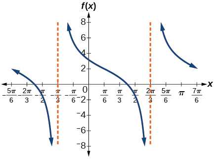

<math xmlns="http://www.w3.org/1998/Math/MathML"> <mrow> <mi>f</mi><mrow><mo>(</mo> <mi>x</mi> <mo>)</mo></mrow><mo>=</mo><mi>π</mi><mi>cos</mi><mrow><mo>(</mo> <mrow> <mn>3</mn><mi>x</mi><mo>+</mo><mi>π</mi> </mrow> <mo>)</mo></mrow> </mrow> </math>

<math xmlns="http://www.w3.org/1998/Math/MathML"> <mrow> <mi>f</mi><mrow><mo>(</mo> <mi>x</mi> <mo>)</mo></mrow><mo>=</mo><mn>5</mn><mi>csc</mi><mrow><mo>(</mo> <mrow> <mn>3</mn><mi>x</mi> </mrow> <mo>)</mo></mrow> </mrow> </math>

amplitude: none; period:<math xmlns="http://www.w3.org/1998/Math/MathML"> <mrow> <mtext> </mtext><mfrac> <mrow> <mn>2</mn><mi>π</mi> </mrow> <mn>3</mn> </mfrac> <mo>;</mo><mtext> </mtext> </mrow> </math>

midline:<math xmlns="http://www.w3.org/1998/Math/MathML"> <mrow> <mtext> </mtext><mi>y</mi><mo>=</mo><mn>0</mn><mo>,</mo> </mrow> </math>

 asymptotes:<math xmlns="http://www.w3.org/1998/Math/MathML"> <mrow> <mtext> </mtext><mi>x</mi><mo>=</mo><mfrac> <mi>π</mi> <mn>3</mn> </mfrac> <mi>k</mi><mo>,</mo></mrow> </math>

 where<math xmlns="http://www.w3.org/1998/Math/MathML"> <mrow> <mtext> </mtext><mi>k</mi><mtext> </mtext></mrow> </math>

is an integer* * *
{: data-type="newline"}

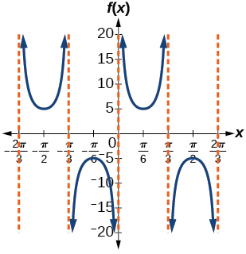

<math xmlns="http://www.w3.org/1998/Math/MathML"> <mrow> <mi>f</mi><mrow><mo>(</mo> <mi>x</mi> <mo>)</mo></mrow><mo>=</mo><mi>π</mi><mi>sec</mi><mrow><mo>(</mo> <mrow> <mfrac> <mi>π</mi> <mn>2</mn> </mfrac> <mi>x</mi> </mrow> <mo>)</mo></mrow> </mrow> </math>

<math xmlns="http://www.w3.org/1998/Math/MathML"> <mrow> <mi>f</mi><mrow><mo>(</mo> <mi>x</mi> <mo>)</mo></mrow><mo>=</mo><mn>2</mn><mi>csc</mi><mrow><mo>(</mo> <mrow> <mi>x</mi><mo>+</mo><mfrac> <mi>π</mi> <mn>4</mn> </mfrac> </mrow> <mo>)</mo></mrow><mo>−</mo><mn>3</mn> </mrow> </math>

amplitude: none; period:<math xmlns="http://www.w3.org/1998/Math/MathML"> <mrow> <mtext> </mtext><mn>2</mn><mi>π</mi><mo>;</mo><mtext> </mtext> </mrow> </math>

midline:<math xmlns="http://www.w3.org/1998/Math/MathML"> <mrow> <mtext> </mtext><mi>y</mi><mo>=</mo><mo>−</mo><mn>3</mn> </mrow> </math>

* * *
{: data-type="newline"}

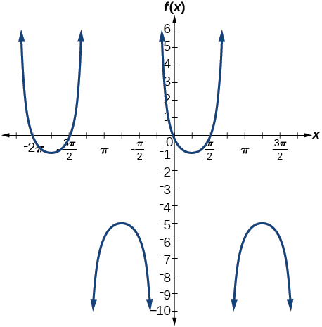

For the following exercises, determine the amplitude, period, and midline of the graph, and then find a formula for the function.

Give in terms of a sine function.* * *
{: data-type="newline"}

![A graph of two periods of a sine function, graphed from -2 to 2. Range is \[-6,-2\], period is 2, and amplitude is 2.](../resources/CNX_Precalc_Figure_06_03_242.jpg)

Give in terms of a sine function.* * *
{: data-type="newline"}

![A graph of two periods of a sine function, graphed over -2 to 2. Range is \[-2,2\], period is 2, and amplitude is 2.](../resources/CNX_Precalc_Figure_06_03_243.jpg)

amplitude: 2; period: 2; midline:<math xmlns="http://www.w3.org/1998/Math/MathML"> <mrow> <mtext> </mtext><mi>y</mi><mo>=</mo><mn>0</mn><mo>;</mo> </mrow> </math>

<math xmlns="http://www.w3.org/1998/Math/MathML"> <mrow> <mi>f</mi><mrow><mo>(</mo> <mi>x</mi> <mo>)</mo></mrow><mo>=</mo><mn>2</mn><mi>sin</mi><mrow><mo>(</mo> <mrow> <mi>π</mi><mrow><mo>(</mo> <mrow> <mi>x</mi><mo>−</mo><mn>1</mn> </mrow> <mo>)</mo></mrow> </mrow> <mo>)</mo></mrow> </mrow> </math>

Give in terms of a tangent function.* * *
{: data-type="newline"}

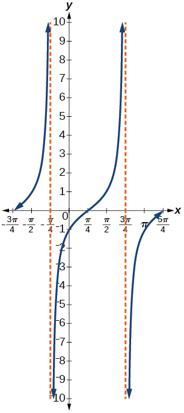

For the following exercises, find the amplitude, period, phase shift, and midline.

<math xmlns="http://www.w3.org/1998/Math/MathML"> <mrow> <mi>y</mi><mo>=</mo><mi>sin</mi><mrow><mo>(</mo> <mrow> <mfrac> <mi>π</mi> <mn>6</mn> </mfrac> <mi>x</mi><mo>+</mo><mi>π</mi> </mrow> <mo>)</mo></mrow><mo>−</mo><mn>3</mn> </mrow> </math>

amplitude: 1; period: 12; phase shift:<math xmlns="http://www.w3.org/1998/Math/MathML"> <mrow> <mtext> </mtext><mn>−6</mn><mo>;</mo><mtext> </mtext> </mrow> </math>

midline<math xmlns="http://www.w3.org/1998/Math/MathML"> <mrow> <mtext> </mtext><mi>y</mi><mo>=</mo><mn>−3</mn> </mrow> </math>

<math xmlns="http://www.w3.org/1998/Math/MathML"> <mrow> <mi>y</mi><mo>=</mo><mn>8</mn><mi>sin</mi><mrow><mo>(</mo> <mrow> <mfrac> <mrow> <mn>7</mn><mi>π</mi> </mrow> <mn>6</mn> </mfrac> <mi>x</mi><mo>+</mo><mfrac> <mrow> <mn>7</mn><mi>π</mi> </mrow> <mn>2</mn> </mfrac> </mrow> <mo>)</mo></mrow><mo>+</mo><mn>6</mn> </mrow> </math>

The outside temperature over the course of a day can be modeled as a sinusoidal function. Suppose you know the temperature is 68°F at midnight and the high and low temperatures during the day are 80°F and 56°F, respectively. Assuming<math xmlns="http://www.w3.org/1998/Math/MathML"> <mrow> <mtext> </mtext><mi>t</mi><mtext> </mtext> </mrow> </math>

is the number of hours since midnight, find a function for the temperature,<math xmlns="http://www.w3.org/1998/Math/MathML"> <mrow> <mtext> </mtext><mi>D</mi><mo>,</mo><mtext> </mtext> </mrow> </math>

in terms of<math xmlns="http://www.w3.org/1998/Math/MathML"> <mrow> <mtext> </mtext><mi>t</mi><mo>.</mo> </mrow> </math>

<math xmlns="http://www.w3.org/1998/Math/MathML"> <mrow> <mi>D</mi><mrow><mo>(</mo> <mi>t</mi> <mo>)</mo></mrow><mo>=</mo><mn>68</mn><mo>−</mo><mn>12</mn><mi>sin</mi><mrow><mo>(</mo> <mrow> <mfrac> <mi>π</mi> <mrow> <mn>12</mn> </mrow> </mfrac> <mi>x</mi> </mrow> <mo>)</mo></mrow> </mrow> </math>

Water is pumped into a storage bin and empties according to a periodic rate. The depth of the water is 3 feet at its lowest at 2:00 a.m. and 71 feet at its highest, which occurs every 5 hours. Write a cosine function that models the depth of the water as a function of time, and then graph the function for one period.

For the following exercises, find the period and horizontal shift of each function.

<math xmlns="http://www.w3.org/1998/Math/MathML"> <mrow> <mi>g</mi><mrow><mo>(</mo> <mi>x</mi> <mo>)</mo></mrow><mo>=</mo><mn>3</mn><mi>tan</mi><mrow><mo>(</mo> <mrow> <mn>6</mn><mi>x</mi><mo>+</mo><mn>42</mn> </mrow> <mo>)</mo></mrow> </mrow> </math>

period:<math xmlns="http://www.w3.org/1998/Math/MathML"> <mrow> <mtext> </mtext><mfrac> <mi>π</mi> <mn>6</mn> </mfrac> <mo>;</mo><mtext> </mtext> </mrow> </math>

horizontal shift:<math xmlns="http://www.w3.org/1998/Math/MathML"> <mrow> <mtext> </mtext><mn>−7</mn> </mrow> </math>

<math xmlns="http://www.w3.org/1998/Math/MathML"> <mrow> <mi>n</mi><mrow><mo>(</mo> <mi>x</mi> <mo>)</mo></mrow><mo>=</mo><mn>4</mn><mi>csc</mi><mrow><mo>(</mo> <mrow> <mfrac> <mrow> <mn>5</mn><mi>π</mi> </mrow> <mn>3</mn> </mfrac> <mi>x</mi><mo>−</mo><mfrac> <mrow> <mn>20</mn><mi>π</mi> </mrow> <mn>3</mn> </mfrac> </mrow> <mo>)</mo></mrow> </mrow> </math>

Write the equation for the graph in [[link]](#Figure_06_03_246) in terms of the secant function and give the period and phase shift.

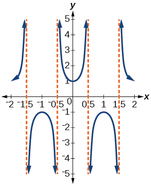{: #Figure_06_03_246}

<math xmlns="http://www.w3.org/1998/Math/MathML"> <mrow> <mi>f</mi><mrow><mo>(</mo> <mi>x</mi> <mo>)</mo></mrow><mo>=</mo><mi>sec</mi><mrow><mo>(</mo> <mrow> <mi>π</mi><mi>x</mi> </mrow> <mo>)</mo></mrow><mo>;</mo><mtext> </mtext> </mrow> </math>

period: 2; phase shift: 0

If<math xmlns="http://www.w3.org/1998/Math/MathML"> <mrow> <mtext> </mtext><mi>tan</mi><mtext> </mtext><mi>x</mi><mo>=</mo><mn>3</mn><mo>,</mo><mtext> </mtext> </mrow> </math>

find<math xmlns="http://www.w3.org/1998/Math/MathML"> <mrow> <mtext> </mtext><mi>tan</mi><mrow><mo>(</mo> <mrow> <mo>−</mo><mi>x</mi> </mrow> <mo>)</mo></mrow><mo>.</mo> </mrow> </math>

If<math xmlns="http://www.w3.org/1998/Math/MathML"> <mrow> <mtext> </mtext><mi>sec</mi><mtext> </mtext><mi>x</mi><mo>=</mo><mn>4</mn><mo>,</mo><mtext> </mtext> </mrow> </math>

find<math xmlns="http://www.w3.org/1998/Math/MathML"> <mrow> <mtext> </mtext><mi>sec</mi><mrow><mo>(</mo> <mrow> <mo>−</mo><mi>x</mi> </mrow> <mo>)</mo></mrow><mo>.</mo> </mrow> </math>

<math xmlns="http://www.w3.org/1998/Math/MathML"> <mn>4</mn> </math>

For the following exercises, graph the functions on the specified window and answer the questions.

Graph<math xmlns="http://www.w3.org/1998/Math/MathML"> <mrow> <mtext> </mtext><mi>m</mi><mrow><mo>(</mo> <mi>x</mi> <mo>)</mo></mrow><mo>=</mo><mi>sin</mi><mrow><mo>(</mo> <mrow> <mn>2</mn><mi>x</mi> </mrow> <mo>)</mo></mrow><mo>+</mo><mi>cos</mi><mrow><mo>(</mo> <mrow> <mn>3</mn><mi>x</mi> </mrow> <mo>)</mo></mrow><mtext> </mtext> </mrow> </math>

on the viewing window<math xmlns="http://www.w3.org/1998/Math/MathML"> <mrow> <mtext> </mtext><mrow><mo>[</mo> <mrow> <mo>−</mo><mn>10</mn><mo>,</mo><mn>10</mn> </mrow> <mo>]</mo></mrow><mtext> </mtext> </mrow> </math>

by<math xmlns="http://www.w3.org/1998/Math/MathML"> <mrow> <mtext> </mtext><mrow><mo>[</mo> <mrow> <mo>−</mo><mn>3</mn><mo>,</mo><mn>3</mn> </mrow> <mo>]</mo></mrow><mo>.</mo><mtext> </mtext> </mrow> </math>

Approximate the graph’s period.

Graph<math xmlns="http://www.w3.org/1998/Math/MathML"> <mrow> <mtext> </mtext><mi>n</mi><mrow><mo>(</mo> <mi>x</mi> <mo>)</mo></mrow><mo>=</mo><mn>0.02</mn><mi>sin</mi><mrow><mo>(</mo> <mrow> <mn>50</mn><mi>π</mi><mi>x</mi> </mrow> <mo>)</mo></mrow><mtext> </mtext> </mrow> </math>

on the following domains in<math xmlns="http://www.w3.org/1998/Math/MathML"> <mrow> <mtext> </mtext><mi>x</mi><mo>:</mo> </mrow> </math>

<math xmlns="http://www.w3.org/1998/Math/MathML"> <mrow> <mrow><mo>[</mo> <mrow> <mn>0</mn><mo>,</mo><mn>1</mn> </mrow> <mo>]</mo></mrow><mtext> </mtext> </mrow> </math>

and<math xmlns="http://www.w3.org/1998/Math/MathML"> <mrow> <mtext> </mtext><mrow><mo>[</mo> <mrow> <mn>0</mn><mo>,</mo><mn>3</mn> </mrow> <mo>]</mo></mrow><mo>.</mo><mtext> </mtext> </mrow> </math>

Suppose this function models sound waves. Why would these views look so different?

The views are different because the period of the wave is<math xmlns="http://www.w3.org/1998/Math/MathML"> <mrow> <mtext> </mtext><mfrac> <mn>1</mn> <mrow> <mn>25</mn> </mrow> </mfrac> <mo>.</mo><mtext> </mtext> </mrow> </math>

Over a bigger domain, there will be more cycles of the graph.

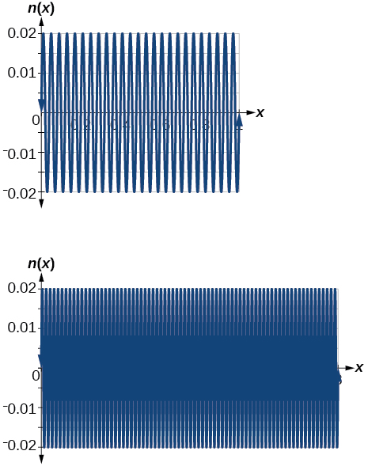

Graph<math xmlns="http://www.w3.org/1998/Math/MathML"> <mrow> <mtext> </mtext><mi>f</mi><mrow><mo>(</mo> <mi>x</mi> <mo>)</mo></mrow><mo>=</mo><mfrac> <mrow> <mi>sin</mi><mtext> </mtext><mi>x</mi></mrow> <mi>x</mi> </mfrac> <mtext> </mtext></mrow> </math>

on<math xmlns="http://www.w3.org/1998/Math/MathML"> <mrow> <mtext> </mtext><mrow><mo>[</mo> <mrow> <mo>−</mo><mn>0.5</mn><mo>,</mo><mn>0.5</mn></mrow> <mo>]</mo></mrow><mtext> </mtext></mrow> </math>

and explain any observations.

For the following exercises, let<math xmlns="http://www.w3.org/1998/Math/MathML"> <mrow> <mtext> </mtext><mi>f</mi><mrow><mo>(</mo> <mi>x</mi> <mo>)</mo></mrow><mo>=</mo><mfrac> <mn>3</mn> <mn>5</mn> </mfrac> <mi>cos</mi><mrow><mo>(</mo> <mrow> <mn>6</mn><mi>x</mi> </mrow> <mo>)</mo></mrow><mo>.</mo> </mrow> </math>

What is the largest possible value for<math xmlns="http://www.w3.org/1998/Math/MathML"> <mrow> <mtext> </mtext><mi>f</mi><mrow><mo>(</mo> <mi>x</mi> <mo>)</mo></mrow><mo>?</mo> </mrow> </math>

<math xmlns="http://www.w3.org/1998/Math/MathML"> <mrow> <mfrac> <mn>3</mn> <mn>5</mn> </mfrac> </mrow> </math>

What is the smallest possible value for<math xmlns="http://www.w3.org/1998/Math/MathML"> <mrow> <mtext> </mtext><mi>f</mi><mrow><mo>(</mo> <mi>x</mi> <mo>)</mo></mrow><mo>?</mo> </mrow> </math>

Where is the function increasing on the interval<math xmlns="http://www.w3.org/1998/Math/MathML"> <mrow> <mtext> </mtext><mrow><mo>[</mo> <mrow> <mn>0</mn><mo>,</mo><mn>2</mn><mi>π</mi> </mrow> <mo>]</mo></mrow><mo>?</mo> </mrow> </math>

On the approximate intervals<math xmlns="http://www.w3.org/1998/Math/MathML"> <mrow> <mtext> </mtext><mrow><mo>(</mo> <mrow> <mn>0.5</mn><mo>,</mo><mn>1</mn> </mrow> <mo>)</mo></mrow><mo>,</mo><mrow><mo>(</mo> <mrow> <mn>1.6</mn><mo>,</mo><mn>2.1</mn> </mrow> <mo>)</mo></mrow><mo>,</mo><mrow><mo>(</mo> <mrow> <mn>2.6</mn><mo>,</mo><mn>3.1</mn> </mrow> <mo>)</mo></mrow><mo>,</mo><mrow><mo>(</mo> <mrow> <mn>3.7</mn><mo>,</mo><mn>4.2</mn> </mrow> <mo>)</mo></mrow><mo>,</mo><mrow><mo>(</mo> <mrow> <mn>4.7</mn><mo>,</mo><mn>5.2</mn> </mrow> <mo>)</mo></mrow><mo>,</mo><mo stretchy="false">(</mo><mn>5.6</mn><mo>,</mo><mn>6.28</mn><mo stretchy="false">)</mo> </mrow> </math>

For the following exercises, find and graph one period of the periodic function with the given amplitude, period, and phase shift.

Sine curve with amplitude 3, period<math xmlns="http://www.w3.org/1998/Math/MathML"> <mrow> <mtext> </mtext><mfrac> <mi>π</mi> <mn>3</mn> </mfrac> <mo>,</mo><mtext> </mtext> </mrow> </math>

and phase shift<math xmlns="http://www.w3.org/1998/Math/MathML"> <mrow> <mtext> </mtext><mrow><mo>(</mo> <mrow> <mi>h</mi><mo>,</mo><mi>k</mi> </mrow> <mo>)</mo></mrow><mo>=</mo><mrow><mo>(</mo> <mrow> <mfrac> <mi>π</mi> <mn>4</mn> </mfrac> <mo>,</mo><mn>2</mn> </mrow> <mo>)</mo></mrow> </mrow> </math>

Cosine curve with amplitude 2, period<math xmlns="http://www.w3.org/1998/Math/MathML"> <mrow> <mtext> </mtext><mfrac> <mi>π</mi> <mn>6</mn> </mfrac> <mo>,</mo><mtext> </mtext> </mrow> </math>

and phase shift<math xmlns="http://www.w3.org/1998/Math/MathML"> <mrow> <mtext> </mtext><mrow><mo>(</mo> <mrow> <mi>h</mi><mo>,</mo><mi>k</mi> </mrow> <mo>)</mo></mrow><mo>=</mo><mrow><mo>(</mo> <mrow> <mo>−</mo><mfrac> <mi>π</mi> <mn>4</mn> </mfrac> <mo>,</mo><mn>3</mn> </mrow> <mo>)</mo></mrow> </mrow> </math>

<math xmlns="http://www.w3.org/1998/Math/MathML"> <mrow> <mi>f</mi><mrow><mo>(</mo> <mi>x</mi> <mo>)</mo></mrow><mo>=</mo><mn>2</mn><mi>cos</mi><mrow><mo>(</mo> <mrow> <mn>12</mn><mrow><mo>(</mo> <mrow> <mi>x</mi><mo>+</mo><mfrac> <mi>π</mi> <mn>4</mn> </mfrac> </mrow> <mo>)</mo></mrow> </mrow> <mo>)</mo></mrow><mo>+</mo><mn>3</mn> </mrow> </math>

![A graph of one period of a cosine function, graphed over -pi/4 to 0. Range is \[1,5\], period is pi/6.](../resources/CNX_Precalc_Figure_06_03_251.jpg)

For the following exercises, graph the function. Describe the graph and, wherever applicable, any periodic behavior, amplitude, asymptotes, or undefined points.

<math xmlns="http://www.w3.org/1998/Math/MathML"> <mrow> <mi>f</mi><mrow><mo>(</mo> <mi>x</mi> <mo>)</mo></mrow><mo>=</mo><mn>5</mn><mi>cos</mi><mrow><mo>(</mo> <mrow> <mn>3</mn><mi>x</mi> </mrow> <mo>)</mo></mrow><mo>+</mo><mn>4</mn><mi>sin</mi><mrow><mo>(</mo> <mrow> <mn>2</mn><mi>x</mi> </mrow> <mo>)</mo></mrow> </mrow> </math>

<math xmlns="http://www.w3.org/1998/Math/MathML"> <mrow> <mi>f</mi><mrow><mo>(</mo> <mi>x</mi> <mo>)</mo></mrow><mo>=</mo><msup> <mi>e</mi> <mrow> <mi>sin</mi><mi>t</mi></mrow> </msup> </mrow> </math>

This graph is periodic with a period of<math xmlns="http://www.w3.org/1998/Math/MathML"> <mrow> <mtext> </mtext><mn>2</mn><mi>π</mi><mo>.</mo> </mrow> </math>

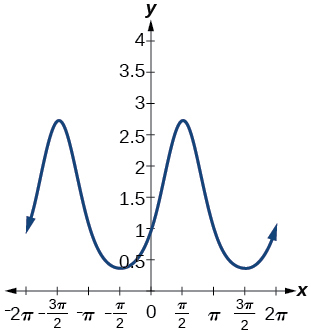

For the following exercises, find the exact value.

<math xmlns="http://www.w3.org/1998/Math/MathML"> <mrow> <msup> <mrow> <mi>sin</mi> </mrow> <mrow> <mo>−</mo><mn>1</mn> </mrow> </msup> <mrow><mo>(</mo> <mrow> <mfrac> <mrow> <msqrt> <mn>3</mn> </msqrt> </mrow> <mn>2</mn> </mfrac> </mrow> <mo>)</mo></mrow> </mrow> </math>

<math xmlns="http://www.w3.org/1998/Math/MathML"> <mrow> <msup> <mrow> <mi>tan</mi> </mrow> <mrow> <mo>−</mo><mn>1</mn> </mrow> </msup> <mrow><mo>(</mo> <mrow> <msqrt> <mn>3</mn> </msqrt> </mrow> <mo>)</mo></mrow> </mrow> </math>

<math xmlns="http://www.w3.org/1998/Math/MathML"> <mrow> <mfrac> <mi>π</mi> <mn>3</mn> </mfrac> </mrow> </math>

<math xmlns="http://www.w3.org/1998/Math/MathML"> <mrow> <msup> <mrow> <mi>cos</mi> </mrow> <mrow> <mo>−</mo><mn>1</mn> </mrow> </msup> <mrow><mo>(</mo> <mrow> <mo>−</mo><mfrac> <mrow> <msqrt> <mn>3</mn> </msqrt> </mrow> <mn>2</mn> </mfrac> </mrow> <mo>)</mo></mrow> </mrow> </math>

<math xmlns="http://www.w3.org/1998/Math/MathML"> <mrow> <msup> <mrow> <mi>cos</mi> </mrow> <mrow> <mo>−</mo><mn>1</mn> </mrow> </msup> <mrow><mo>(</mo> <mrow> <mi>sin</mi><mrow><mo>(</mo> <mi>π</mi> <mo>)</mo></mrow> </mrow> <mo>)</mo></mrow> </mrow> </math>

<math xmlns="http://www.w3.org/1998/Math/MathML"> <mrow> <mfrac> <mi>π</mi> <mn>2</mn> </mfrac> </mrow> </math>

<math xmlns="http://www.w3.org/1998/Math/MathML"> <mrow> <msup> <mrow> <mi>cos</mi> </mrow> <mrow> <mo>−</mo><mn>1</mn> </mrow> </msup> <mrow><mo>(</mo> <mrow> <mi>tan</mi><mrow><mo>(</mo> <mrow> <mfrac> <mrow> <mn>7</mn><mi>π</mi> </mrow> <mn>4</mn> </mfrac> </mrow> <mo>)</mo></mrow> </mrow> <mo>)</mo></mrow> </mrow> </math>

<math xmlns="http://www.w3.org/1998/Math/MathML"> <mrow> <mi>cos</mi><mrow><mo>(</mo> <mrow> <msup> <mrow> <mi>sin</mi> </mrow> <mrow> <mo>−</mo><mn>1</mn> </mrow> </msup> <mrow><mo>(</mo> <mrow> <mn>1</mn><mo>−</mo><mn>2</mn><mi>x</mi> </mrow> <mo>)</mo></mrow> </mrow> <mo>)</mo></mrow> </mrow> </math>

<math xmlns="http://www.w3.org/1998/Math/MathML"> <mrow> <msqrt> <mrow> <mn>1</mn><mo>−</mo><msup> <mrow> <mrow><mo>(</mo> <mrow> <mn>1</mn><mo>−</mo><mn>2</mn><mi>x</mi> </mrow> <mo>)</mo></mrow> </mrow> <mn>2</mn> </msup> </mrow> </msqrt> </mrow> </math>

<math xmlns="http://www.w3.org/1998/Math/MathML"> <mrow> <msup> <mrow> <mi>cos</mi> </mrow> <mrow> <mo>−</mo><mn>1</mn> </mrow> </msup> <mrow><mo>(</mo> <mrow> <mo>−</mo><mn>0.4</mn> </mrow> <mo>)</mo></mrow> </mrow> </math>

<math xmlns="http://www.w3.org/1998/Math/MathML"> <mrow> <mi>cos</mi><mrow><mo>(</mo> <mrow> <msup> <mrow> <mi>tan</mi> </mrow> <mrow> <mo>−</mo><mn>1</mn> </mrow> </msup> <mrow><mo>(</mo> <mrow> <msup> <mi>x</mi> <mn>2</mn> </msup> </mrow> <mo>)</mo></mrow> </mrow> <mo>)</mo></mrow> </mrow> </math>

<math xmlns="http://www.w3.org/1998/Math/MathML"> <mrow> <mfrac> <mn>1</mn> <mrow> <msqrt> <mrow> <mn>1</mn><mo>+</mo><msup> <mi>x</mi> <mn>4</mn> </msup> </mrow> </msqrt> </mrow> </mfrac> </mrow> </math>

For the following exercises, suppose<math xmlns="http://www.w3.org/1998/Math/MathML"> <mrow> <mtext> </mtext><mi>sin</mi><mtext> </mtext><mi>t</mi><mo>=</mo><mfrac> <mi>x</mi> <mrow> <mi>x</mi><mo>+</mo><mn>1</mn> </mrow> </mfrac> <mo>.</mo> </mrow> </math>

 Evaluate the following expressions.

<math xmlns="http://www.w3.org/1998/Math/MathML"> <mrow> <mi>tan</mi><mtext> </mtext><mi>t</mi> </mrow> </math>

<math xmlns="http://www.w3.org/1998/Math/MathML"> <mrow> <mi>csc</mi><mtext> </mtext><mi>t</mi> </mrow> </math>

<math xmlns="http://www.w3.org/1998/Math/MathML"> <mrow> <mfrac> <mrow> <mi>x</mi><mo>+</mo><mn>1</mn> </mrow> <mi>x</mi> </mfrac> </mrow> </math>

Given [[link]](#Image_06_03_255), find the measure of angle<math xmlns="http://www.w3.org/1998/Math/MathML"> <mrow> <mtext> </mtext><mi>θ</mi><mtext> </mtext> </mrow> </math>

to three decimal places. Answer in radians.

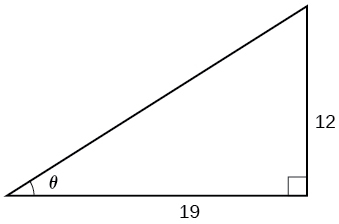{: #Image_06_03_255}

For the following exercises, determine whether the equation is true or false.

<math xmlns="http://www.w3.org/1998/Math/MathML"> <mrow> <mi>arcsin</mi><mrow><mo>(</mo> <mrow> <mi>sin</mi><mrow><mo>(</mo> <mrow> <mfrac> <mrow> <mn>5</mn><mi>π</mi> </mrow> <mn>6</mn> </mfrac> </mrow> <mo>)</mo></mrow> </mrow> <mo>)</mo></mrow><mo>=</mo><mfrac> <mrow> <mn>5</mn><mi>π</mi> </mrow> <mn>6</mn> </mfrac> </mrow> </math>

False

<math xmlns="http://www.w3.org/1998/Math/MathML"> <mrow> <mi>arccos</mi><mrow><mo>(</mo> <mrow> <mi>cos</mi><mrow><mo>(</mo> <mrow> <mfrac> <mrow> <mn>5</mn><mi>π</mi> </mrow> <mn>6</mn> </mfrac> </mrow> <mo>)</mo></mrow> </mrow> <mo>)</mo></mrow><mo>=</mo><mfrac> <mrow> <mn>5</mn><mi>π</mi> </mrow> <mn>6</mn> </mfrac> </mrow> </math>

The grade of a road is 7%. This means that for every horizontal distance of 100 feet on the road, the vertical rise is 7 feet. Find the angle the road makes with the horizontal in radians.

approximately 0.07 radians

### Glossary
{: data-type="glossary-title"}

arccosine
: another name for the inverse cosine;
  <math xmlns="http://www.w3.org/1998/Math/MathML"> <mrow> <mtext> </mtext><mi>arccos</mi><mtext> </mtext><mi>x</mi><mo>=</mo><msup> <mrow> <mi>cos</mi> </mrow> <mrow> <mo>−</mo><mn>1</mn> </mrow> </msup> <mi>x</mi> </mrow> </math>
^

arcsine
: another name for the inverse sine;
  <math xmlns="http://www.w3.org/1998/Math/MathML"> <mrow> <mtext> </mtext><mi>arcsin</mi><mtext> </mtext><mi>x</mi><mo>=</mo><msup> <mrow> <mi>sin</mi> </mrow> <mrow> <mo>−</mo><mn>1</mn> </mrow> </msup> <mi>x</mi> </mrow> </math>
^

arctangent
: another name for the inverse tangent;
  <math xmlns="http://www.w3.org/1998/Math/MathML"> <mrow> <mtext> </mtext><mi>arctan</mi><mtext> </mtext><mi>x</mi><mo>=</mo><msup> <mrow> <mi>tan</mi> </mrow> <mrow> <mo>−</mo><mn>1</mn> </mrow> </msup> <mi>x</mi> </mrow> </math>
^

inverse cosine function
: the function
  <math xmlns="http://www.w3.org/1998/Math/MathML"> <mrow> <mtext> </mtext><msup> <mrow> <mi>cos</mi> </mrow> <mrow> <mo>−</mo><mn>1</mn> </mrow> </msup> <mi>x</mi><mo>,</mo><mtext> </mtext> </mrow> </math>
  
  which is the inverse of the cosine function and the angle that has a cosine equal to a given number
^

inverse sine function
: the function
  <math xmlns="http://www.w3.org/1998/Math/MathML"> <mrow> <mtext> </mtext><msup> <mrow> <mi>sin</mi> </mrow> <mrow> <mo>−</mo><mn>1</mn> </mrow> </msup> <mi>x</mi><mo>,</mo><mtext> </mtext> </mrow> </math>
  
  which is the inverse of the sine function and the angle that has a sine equal to a given number
^

inverse tangent function
: the function
  <math xmlns="http://www.w3.org/1998/Math/MathML"> <mrow> <mtext> </mtext><msup> <mrow> <mi>tan</mi> </mrow> <mrow> <mo>−</mo><mn>1</mn> </mrow> </msup> <mi>x</mi><mo>,</mo><mtext> </mtext> </mrow> </math>
  
  which is the inverse of the tangent function and the angle that has a tangent equal to a given number

[1]: http://openstaxcollege.org/l/evalinverstrig
[2]: http://openstaxcollege.org/l/PreCalcLPC06
