

In this section, you will:
* Use the Law of Sines to solve oblique triangles.
* Find the area of an oblique triangle using the sine function.
* Solve applied problems using the Law of Sines.

Suppose two radar stations located 20 miles apart each detect an aircraft between them. The angle of elevation measured by the first station is 35 degrees, whereas the **angle of elevation**{: data-type="term" .no-emphasis} measured by the second station is 15 degrees. How can we determine the altitude of the aircraft? We see in [\[link\]](#Figure_08_01_001) that the triangle formed by the aircraft and the two stations is not a right triangle, so we cannot use what we know about right triangles. In this section, we will find out how to solve problems involving **non-right triangles**{: data-type="term" .no-emphasis}.

 {: #Figure_08_01_001}

### Using the Law of Sines to Solve Oblique Triangles

In any triangle, we can draw an **altitude**{: data-type="term"}, a perpendicular line from one vertex to the opposite side, forming two right triangles. It would be preferable, however, to have methods that we can apply directly to non-right triangles without first having to create right triangles.

Any triangle that is not a right triangle is an **oblique triangle**{: data-type="term"}. Solving an oblique triangle means finding the measurements of all three angles and all three sides. To do so, we need to start with at least three of these values, including at least one of the sides. We will investigate three possible oblique triangle problem situations:

1.  **ASA (angle-side-angle)** We know the measurements of two angles and the included side. See [\[link\]](#Figure_08_01_002). 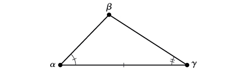{: #Figure_08_01_002}

2.  **AAS (angle-angle-side)** We know the measurements of two angles and a side that is not between the known angles. See [\[link\]](#Figure_08_01_003). 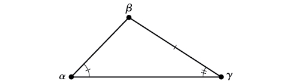{: #Figure_08_01_003}

3.  **SSA (side-side-angle)** We know the measurements of two sides and an angle that is not between the known sides. See [\[link\]](#Figure_08_01_004). 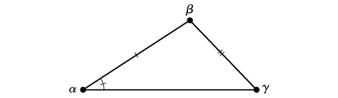{: #Figure_08_01_004}

{: type="1"}

Knowing how to approach each of these situations enables us to solve oblique triangles without having to drop a perpendicular to form two right triangles. Instead, we can use the fact that the ratio of the measurement of one of the angles to the length of its opposite side will be equal to the other two ratios of angle measure to opposite side. Let’s see how this statement is derived by considering the triangle shown in [\[link\]](#Figure_08_01_005).

 {: #Figure_08_01_005}

Using the right triangle relationships, we know that<math xmlns="http://www.w3.org/1998/Math/MathML"> <mrow> <mtext> </mtext><mi>sin</mi><mtext> </mtext><mi>α</mi><mo>=</mo><mfrac> <mi>h</mi> <mi>b</mi> </mfrac> <mtext> </mtext> </mrow> </math>

and<math xmlns="http://www.w3.org/1998/Math/MathML"> <mrow> <mtext> </mtext><mi>sin</mi><mtext> </mtext><mi>β</mi><mo>=</mo><mfrac> <mi>h</mi> <mi>a</mi> </mfrac> <mo>.</mo><mtext> </mtext><mtext> </mtext> </mrow> </math>

Solving both equations for<math xmlns="http://www.w3.org/1998/Math/MathML"> <mrow> <mtext> </mtext><mi>h</mi><mtext>  </mtext></mrow> </math>

gives two different expressions for<math xmlns="http://www.w3.org/1998/Math/MathML"> <mrow> <mtext> </mtext><mi>h</mi><mo>.</mo></mrow> </math>

<math xmlns="http://www.w3.org/1998/Math/MathML" display="block"> <mrow> <mi>h</mi><mo>=</mo><mi>b</mi><mi>sin</mi><mtext> </mtext><mi>α</mi><mtext> and </mtext><mi>h</mi><mo>=</mo><mi>a</mi><mi>sin</mi><mtext> </mtext><mi>β</mi></mrow> </math>

We then set the expressions equal to each other.

<math xmlns="http://www.w3.org/1998/Math/MathML" display="block"> <mrow> <mtable columnalign="left"> <mtr columnalign="left"> <mtd columnalign="left"> <mrow> <mtext>           </mtext><mi>b</mi><mi>sin</mi><mtext> </mtext><mi>α</mi><mo>=</mo><mi>a</mi><mi>sin</mi><mtext> </mtext><mi>β</mi> </mrow> </mtd> <mtd columnalign="left"> <mrow /> </mtd> </mtr> <mtr columnalign="left"> <mtd columnalign="left"> <mrow> <mtext> </mtext><mrow><mo>(</mo> <mrow> <mfrac> <mn>1</mn> <mrow> <mi>a</mi><mi>b</mi> </mrow> </mfrac> </mrow> <mo>)</mo></mrow><mo stretchy="false">(</mo><mi>b</mi><mi>sin</mi><mtext> </mtext><mi>α</mi><mo stretchy="false">)</mo><mo>=</mo><mo stretchy="false">(</mo><mi>a</mi><mi>sin</mi><mtext> </mtext><mi>β</mi><mo stretchy="false">)</mo><mrow><mo>(</mo> <mrow> <mfrac> <mn>1</mn> <mrow> <mi>a</mi><mi>b</mi> </mrow> </mfrac> </mrow> <mo>)</mo></mrow><mtable> <mtr> <mtd> <mrow /> </mtd> <mtd> <mrow /> </mtd> <mtd> <mrow /> </mtd> <mtd> <mrow /> </mtd> </mtr> </mtable> </mrow> </mtd> <mtd columnalign="left"> <mrow> <mtext>Multiply both sides by</mtext><mtext> </mtext><mfrac> <mn>1</mn> <mrow> <mi>a</mi><mi>b</mi> </mrow> </mfrac> <mo>.</mo><mo> </mo> </mrow> </mtd> </mtr> <mtr columnalign="left"> <mtd columnalign="left"> <mrow> <mtext>            </mtext><mtext> </mtext><mfrac> <mrow> <mi>sin</mi><mtext> </mtext><mi>α</mi> </mrow> <mi>a</mi> </mfrac> <mo>=</mo><mfrac> <mrow> <mi>sin</mi><mtext> </mtext><mi>β</mi> </mrow> <mi>b</mi> </mfrac> </mrow> </mtd> <mtd columnalign="left"> <mrow /> </mtd> </mtr> </mtable> </mrow> </math>

Similarly, we can compare the other ratios.

<math xmlns="http://www.w3.org/1998/Math/MathML" display="block"> <mrow> <mfrac> <mrow> <mi>sin</mi><mtext> </mtext><mi>α</mi> </mrow> <mi>a</mi> </mfrac> <mo>=</mo><mfrac> <mrow> <mi>sin</mi><mtext> </mtext><mi>γ</mi> </mrow> <mi>c</mi> </mfrac> <mtext> and </mtext><mfrac> <mrow> <mi>sin</mi><mtext> </mtext><mi>β</mi> </mrow> <mi>b</mi> </mfrac> <mo>=</mo><mfrac> <mrow> <mi>sin</mi><mtext> </mtext><mi>γ</mi> </mrow> <mi>c</mi> </mfrac> </mrow> </math>

Collectively, these relationships are called the **Law of Sines**.

<math xmlns="http://www.w3.org/1998/Math/MathML" display="block"> <mrow> <mfrac> <mrow> <mi>sin</mi><mtext> </mtext><mi>α</mi></mrow> <mi>a</mi> </mfrac> <mo>=</mo><mfrac> <mrow> <mi>sin</mi><mtext> </mtext><mi>β</mi></mrow> <mi>b</mi> </mfrac> <mo>=</mo><mfrac> <mrow> <mi>sin</mi><mtext> </mtext><mi>λ</mi></mrow> <mi>c</mi> </mfrac> </mrow> </math>

Note the standard way of labeling triangles: angle<math xmlns="http://www.w3.org/1998/Math/MathML"> <mrow> <mtext> </mtext><mi>α</mi><mtext> </mtext></mrow> </math>

(alpha) is opposite side<math xmlns="http://www.w3.org/1998/Math/MathML"> <mrow> <mtext> </mtext><mi>a</mi><mo>;</mo><mtext> </mtext></mrow> </math>

angle<math xmlns="http://www.w3.org/1998/Math/MathML"> <mrow> <mtext> </mtext><mi>β</mi><mtext> </mtext></mrow> </math>

(beta) is opposite side<math xmlns="http://www.w3.org/1998/Math/MathML"> <mrow> <mtext> </mtext><mi>b</mi><mo>;</mo><mtext> </mtext></mrow> </math>

and angle<math xmlns="http://www.w3.org/1998/Math/MathML"> <mrow> <mtext> </mtext><mi>γ</mi><mtext> </mtext></mrow> </math>

(gamma) is opposite side<math xmlns="http://www.w3.org/1998/Math/MathML"> <mrow> <mtext> </mtext><mi>c</mi><mo>.</mo><mtext> </mtext></mrow> </math>

See [\[link\]](#Figure_08_01_006).

While calculating angles and sides, be sure to carry the exact values through to the final answer. Generally, final answers are rounded to the nearest tenth, unless otherwise specified.

{: #Figure_08_01_006}

Law of Sines

Given a triangle with angles and opposite sides labeled as in [\[link\]](#Figure_08_01_006), the ratio of the measurement of an angle to the length of its opposite side will be equal to the other two ratios of angle measure to opposite side. All proportions will be equal. The **Law of Sines**{: data-type="term"} is based on proportions and is presented symbolically two ways.

<math xmlns="http://www.w3.org/1998/Math/MathML" display="block"> <mrow> <mfrac> <mrow> <mi>sin</mi><mtext> </mtext><mi>α</mi></mrow> <mi>a</mi> </mfrac> <mo>=</mo><mfrac> <mrow> <mi>sin</mi><mtext> </mtext><mi>β</mi></mrow> <mi>b</mi> </mfrac> <mo>=</mo><mfrac> <mrow> <mi>sin</mi><mtext> </mtext><mi>γ</mi></mrow> <mi>c</mi> </mfrac> </mrow> </math>

<math xmlns="http://www.w3.org/1998/Math/MathML" display="block"> <mrow> <mfrac> <mi>a</mi> <mrow> <mi>sin</mi><mtext> </mtext><mi>α</mi></mrow> </mfrac> <mo>=</mo><mfrac> <mi>b</mi> <mrow> <mi>sin</mi><mtext> </mtext><mi>β</mi></mrow> </mfrac> <mo>=</mo><mfrac> <mi>c</mi> <mrow> <mi>sin</mi><mtext> </mtext><mi>γ</mi></mrow> </mfrac> </mrow> </math>

To solve an oblique triangle, use any pair of applicable ratios.

Solving for Two Unknown Sides and Angle of an AAS Triangle

Solve the triangle shown in [[link]](#Figure_08_01_007) to the nearest tenth.

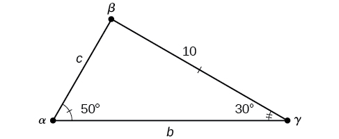{: #Figure_08_01_007}

The three angles must add up to 180 degrees. From this, we can determine that

<math xmlns="http://www.w3.org/1998/Math/MathML" display="block"> <mrow> <mtable columnalign="left"> <mtr columnalign="left"> <mtd columnalign="left"> <mrow> <mtable columnalign="left"> <mtr columnalign="left"> <mtd columnalign="left"> <mrow /> </mtd> </mtr> <mtr columnalign="left"> <mtd columnalign="left"> <mrow> <mi>β</mi><mo>=</mo><mn>180°</mn><mo>−</mo><mn>50°</mn><mo>−</mo><mn>30°</mn> </mrow> </mtd> </mtr> </mtable> </mrow> </mtd> </mtr> <mtr columnalign="left"> <mtd columnalign="left"> <mrow> <mtext> </mtext><mtext> </mtext><mtext> </mtext><mtext> </mtext><mo>=</mo><mn>100°</mn> </mrow> </mtd> </mtr> </mtable> </mrow> </math>

To find an unknown side, we need to know the corresponding angle and a known ratio. We know that angle <math xmlns="http://www.w3.org/1998/Math/MathML"> <mrow> <mi>α</mi><mo>=</mo><mn>50°</mn> </mrow> </math>

and its corresponding side<math xmlns="http://www.w3.org/1998/Math/MathML"> <mrow> <mi>a</mi><mo>=</mo><mn>10.</mn><mtext> </mtext></mrow> </math>

We can use the following proportion from the Law of Sines to find the length of<math xmlns="http://www.w3.org/1998/Math/MathML"> <mrow> <mtext> </mtext><mi>c</mi><mo>.</mo><mtext> </mtext></mrow> </math>

<math xmlns="http://www.w3.org/1998/Math/MathML" display="block"> <mrow> <mtable columnalign="left"> <mtr columnalign="left"> <mtd columnalign="left"> <mrow> <mtext> </mtext><mtext> </mtext><mfrac> <mrow> <mi>sin</mi><mo stretchy="false">(</mo><mn>50°</mn><mo stretchy="false">)</mo> </mrow> <mrow> <mn>10</mn> </mrow> </mfrac> <mo>=</mo><mfrac> <mrow> <mi>sin</mi><mo stretchy="false">(</mo><mn>30°</mn><mo stretchy="false">)</mo> </mrow> <mi>c</mi> </mfrac> </mrow> </mtd> <mtd columnalign="left"> <mrow /> </mtd> <mtd columnalign="left"> <mrow /> </mtd> <mtd columnalign="left"> <mrow /> </mtd> <mtd columnalign="left"> <mrow /> </mtd> <mtd columnalign="left"> <mrow /> </mtd> </mtr> <mtr columnalign="left"> <mtd columnalign="left"> <mrow> <mi>c</mi><mfrac> <mrow> <mi>sin</mi><mo stretchy="false">(</mo><mn>50°</mn><mo stretchy="false">)</mo> </mrow> <mrow> <mn>10</mn> </mrow> </mfrac> <mo>=</mo><mi>sin</mi><mo stretchy="false">(</mo><mn>30°</mn><mo stretchy="false">)</mo> </mrow> </mtd> <mtd columnalign="left"> <mrow /> </mtd> <mtd columnalign="left"> <mrow /> </mtd> <mtd columnalign="left"> <mrow /> </mtd> <mtd columnalign="left"> <mrow /> </mtd> <mtd columnalign="left"> <mrow> <mtext>Multiply both sides by </mtext><mi>c</mi><mo>.</mo> </mrow> </mtd> </mtr> <mtr columnalign="left"> <mtd columnalign="left"> <mrow> <mtext> </mtext><mtext> </mtext><mtext> </mtext><mtext> </mtext><mtext> </mtext><mtext> </mtext><mtext> </mtext><mtext> </mtext><mtext> </mtext><mtext> </mtext><mtext> </mtext><mtext> </mtext><mtext> </mtext><mtext> </mtext><mtext> </mtext><mtext> </mtext><mtext> </mtext><mtext> </mtext><mtext> </mtext><mi>c</mi><mo>=</mo><mi>sin</mi><mo stretchy="false">(</mo><mn>30</mn><mo>°</mo><mo stretchy="false">)</mo><mfrac> <mrow> <mn>10</mn> </mrow> <mrow> <mi>sin</mi><mo stretchy="false">(</mo><mn>50°</mn><mo stretchy="false">)</mo> </mrow> </mfrac> </mrow> </mtd> <mtd columnalign="left"> <mrow /> </mtd> <mtd columnalign="left"> <mrow /> </mtd> <mtd columnalign="left"> <mrow /> </mtd> <mtd columnalign="left"> <mrow /> </mtd> <mtd columnalign="left"> <mrow> <mtext>Multiply by the reciprocal to isolate </mtext><mi>c</mi><mo>.</mo> </mrow> </mtd> </mtr> <mtr columnalign="left"> <mtd columnalign="left"> <mrow> <mtext> </mtext><mtext> </mtext><mtext> </mtext><mtext> </mtext><mtext> </mtext><mtext> </mtext><mtext> </mtext><mtext> </mtext><mtext> </mtext><mtext> </mtext><mtext> </mtext><mtext> </mtext><mtext> </mtext><mtext> </mtext><mtext> </mtext><mtext> </mtext><mtext> </mtext><mtext> </mtext><mtext> </mtext><mi>c</mi><mo>≈</mo><mn>6.5</mn> </mrow> </mtd> <mtd columnalign="left"> <mrow /> </mtd> <mtd columnalign="left"> <mrow /> </mtd> <mtd columnalign="left"> <mrow /> </mtd> <mtd columnalign="left"> <mrow /> </mtd> <mtd columnalign="left"> <mrow /> </mtd> </mtr> </mtable> </mrow> </math>

Similarly, to solve for<math xmlns="http://www.w3.org/1998/Math/MathML"> <mrow> <mtext> </mtext><mi>b</mi><mo>,</mo><mtext> </mtext></mrow> </math>

we set up another proportion.

<math xmlns="http://www.w3.org/1998/Math/MathML" display="block"> <mrow> <mtable columnalign="left"> <mtr columnalign="left"> <mtd columnalign="left"> <mrow> <mtable columnalign="left"> <mtr columnalign="left"> <mtd columnalign="left"> <mrow /> </mtd> </mtr> <mtr columnalign="left"> <mtd columnalign="left"> <mrow> <mtext> </mtext><mtext>   </mtext><mfrac> <mrow> <mi>sin</mi><mo stretchy="false">(</mo><mn>50°</mn><mo stretchy="false">)</mo> </mrow> <mrow> <mn>10</mn> </mrow> </mfrac> <mo>=</mo><mfrac> <mrow> <mi>sin</mi><mo stretchy="false">(</mo><mn>100°</mn><mo stretchy="false">)</mo> </mrow> <mi>b</mi> </mfrac> </mrow> </mtd> </mtr> </mtable> </mrow> </mtd> <mtd columnalign="left"> <mrow /> </mtd> </mtr> <mtr columnalign="left"> <mtd columnalign="left"> <mrow> <mtext>  </mtext><mi>b</mi><mi>sin</mi><mo stretchy="false">(</mo><mn>50°</mn><mo stretchy="false">)</mo><mo>=</mo><mn>10</mn><mi>sin</mi><mo stretchy="false">(</mo><mn>100°</mn><mo stretchy="false">)</mo> </mrow> </mtd> <mtd columnalign="left"> <mrow> <mtext>Multiply both sides by </mtext><mi>b</mi><mo>.</mo> </mrow> </mtd> </mtr> <mtr columnalign="left"> <mtd columnalign="left"> <mrow> <mtext>               </mtext><mi>b</mi><mo>=</mo><mfrac> <mrow> <mn>10</mn><mi>sin</mi><mo stretchy="false">(</mo><mn>100°</mn><mo stretchy="false">)</mo> </mrow> <mrow> <mi>sin</mi><mo stretchy="false">(</mo><mn>50°</mn><mo stretchy="false">)</mo> </mrow> </mfrac> <mtable> <mtr> <mtd> <mrow /> </mtd> <mtd> <mrow /> </mtd> <mtd> <mrow /> </mtd> <mtd> <mrow /> </mtd> </mtr> </mtable> </mrow> </mtd> <mtd columnalign="left"> <mrow> <mtext>Multiply by the reciprocal to isolate </mtext><mi>b</mi><mo>.</mo> </mrow> </mtd> </mtr> <mtr columnalign="left"> <mtd columnalign="left"> <mrow> <mtext>               </mtext><mi>b</mi><mo>≈</mo><mn>12.9</mn> </mrow> </mtd> <mtd columnalign="left"> <mrow /> </mtd> </mtr> </mtable> </mrow> </math>

Therefore, the complete set of angles and sides is

<math xmlns="http://www.w3.org/1998/Math/MathML" display="block"> <mrow> <mtable columnalign="left"> <mtr columnalign="left"> <mtd columnalign="left"> <mrow> <mtable columnalign="left"> <mtr columnalign="left"> <mtd columnalign="left"> <mrow /> </mtd> </mtr> <mtr columnalign="left"> <mtd columnalign="left"> <mrow> <mi>α</mi><mo>=</mo><mn>50°</mn><mtext> </mtext><mtext> </mtext><mtext> </mtext><mtext> </mtext><mtext> </mtext><mtext> </mtext><mtext> </mtext><mtext> </mtext><mtext> </mtext><mtext> </mtext><mtext> </mtext><mtext> </mtext><mtext> </mtext><mtext> </mtext><mtext> </mtext><mi>a</mi><mo>=</mo><mn>10</mn> </mrow> </mtd> </mtr> </mtable> </mrow> </mtd> </mtr> <mtr columnalign="left"> <mtd columnalign="left"> <mrow> <mi>β</mi><mo>=</mo><mn>100°</mn><mtext> </mtext><mtext> </mtext><mtext> </mtext><mtext> </mtext><mtext> </mtext><mtext> </mtext><mtext> </mtext><mtext> </mtext><mtext> </mtext><mtext> </mtext><mtext> </mtext><mtext> </mtext><mi>b</mi><mo>≈</mo><mn>12.9</mn> </mrow> </mtd> </mtr> <mtr columnalign="left"> <mtd columnalign="left"> <mrow> <mi>γ</mi><mo>=</mo><mn>30°</mn><mtext> </mtext><mtext> </mtext><mtext> </mtext><mtext> </mtext><mtext> </mtext><mtext> </mtext><mtext> </mtext><mtext> </mtext><mtext> </mtext><mtext> </mtext><mtext> </mtext><mtext> </mtext><mtext> </mtext><mtext> </mtext><mtext> </mtext><mtext> </mtext><mi>c</mi><mo>≈</mo><mn>6.5</mn> </mrow> </mtd> </mtr> </mtable> </mrow> </math>

Solve the triangle shown in [[link]](#Figure_08_01_008) to the nearest tenth.

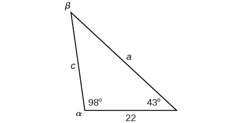{: #Figure_08_01_008}

<math xmlns="http://www.w3.org/1998/Math/MathML"> <mtable columnalign="left"> <mtr> <mtd> <mi>α</mi><mo>=</mo><msup> <mn>98</mn> <mo>∘</mo> </msup> <mtext> </mtext><mtext> </mtext><mtext> </mtext><mtext> </mtext><mtext> </mtext><mtext> </mtext><mtext> </mtext><mtext> </mtext><mtext> </mtext><mtext> </mtext><mtext> </mtext><mtext> </mtext><mi>a</mi><mo>=</mo><mn>34.6</mn> </mtd> </mtr> <mtr> <mtd> <mi>β</mi><mo>=</mo><msup> <mn>39</mn> <mo>∘</mo> </msup> <mtext> </mtext><mtext> </mtext><mtext> </mtext><mtext> </mtext><mtext> </mtext><mtext> </mtext><mtext> </mtext><mtext> </mtext><mtext> </mtext><mtext> </mtext><mtext> </mtext><mtext> </mtext><mi>b</mi><mo>=</mo><mn>22</mn> </mtd> </mtr> <mtr> <mtd> <mi>γ</mi><mo>=</mo><msup> <mn>43</mn> <mo>∘</mo> </msup> <mtext> </mtext><mtext> </mtext><mtext> </mtext><mtext> </mtext><mtext> </mtext><mtext> </mtext><mtext> </mtext><mtext> </mtext><mtext> </mtext><mtext> </mtext><mtext> </mtext><mtext> </mtext><mtext> </mtext><mtext> </mtext><mi>c</mi><mo>=</mo><mn>23.8</mn> </mtd> </mtr> </mtable> </math>

### Using The Law of Sines to Solve SSA Triangles

We can use the Law of Sines to solve any oblique triangle, but some solutions may not be straightforward. In some cases, more than one triangle may satisfy the given criteria, which we describe as an **ambiguous case**{: data-type="term"}. Triangles classified as SSA, those in which we know the lengths of two sides and the measurement of the angle opposite one of the given sides, may result in one or two solutions, or even no solution.

Possible Outcomes for SSA Triangles

Oblique triangles in the category SSA may have four different outcomes. [\[link\]](#Figure_08_01_009) illustrates the solutions with the known sides<math xmlns="http://www.w3.org/1998/Math/MathML"> <mrow> <mtext> </mtext><mi>a</mi><mtext> </mtext></mrow> </math>

and<math xmlns="http://www.w3.org/1998/Math/MathML"> <mrow> <mtext> </mtext><mi>b</mi><mtext> </mtext></mrow> </math>

and known angle<math xmlns="http://www.w3.org/1998/Math/MathML"> <mrow> <mtext> </mtext><mi>α</mi><mo>.</mo></mrow> </math>

![Four attempted oblique triangles are in a row, all with standard labels. Side c is the horizontal base. In the first attempted triangle, side a is less than the altitude height. Since side a cannot reach side c,  there is no triangle. In the second attempted triangle, side a is equal to the length of the altitude height, so side a forms a right angle with side c. In the third attempted triangle, side a is greater than the altitude height and less than side b, so side a can form either an acute or obtuse angle with side c. In the fourth attempted triangle, side a is greater than or equal to side b, so side a forms an acute angle with side c.](../resources/CNX_Precalc_Figure_08_01_009n.jpg){: #Figure_08_01_009}

Solving an Oblique SSA Triangle

Solve the triangle in [[link]](#Figure_08_01_010) for the missing side and find the missing angle measures to the nearest tenth.

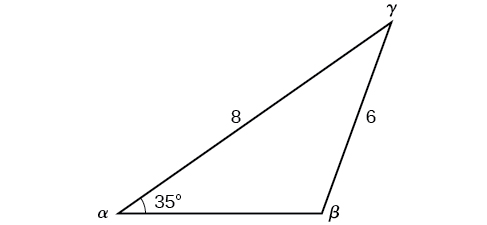{: #Figure_08_01_010}

Use the Law of Sines to find angle<math xmlns="http://www.w3.org/1998/Math/MathML"> <mrow> <mtext> </mtext><mi>β</mi><mtext> </mtext></mrow> </math>

and angle<math xmlns="http://www.w3.org/1998/Math/MathML"> <mrow> <mtext> </mtext><mi>γ</mi><mo>,</mo><mtext> </mtext></mrow> </math>

and then side<math xmlns="http://www.w3.org/1998/Math/MathML"> <mrow> <mtext> </mtext><mi>c</mi><mo>.</mo><mtext> </mtext></mrow> </math>

Solving for<math xmlns="http://www.w3.org/1998/Math/MathML"> <mrow> <mtext> </mtext><mi>β</mi><mo>,</mo><mtext> </mtext></mrow> </math>

we have the proportion

<math xmlns="http://www.w3.org/1998/Math/MathML" display="block"> <mrow> <mtable columnalign="right"> <mtr columnalign="right"> <mtd columnalign="right"> <mrow> <mfrac> <mrow> <mi>sin</mi><mtext> </mtext><mi>α</mi> </mrow> <mi>a</mi> </mfrac> <mo>=</mo><mfrac> <mrow> <mi>sin</mi><mtext> </mtext><mi>β</mi> </mrow> <mi>b</mi> </mfrac> </mrow> </mtd> </mtr> <mtr columnalign="right"> <mtd columnalign="right"> <mrow> <mfrac> <mrow> <mi>sin</mi><mo stretchy="false">(</mo><mn>35°</mn><mo stretchy="false">)</mo> </mrow> <mn>6</mn> </mfrac> <mo>=</mo><mfrac> <mrow> <mi>sin</mi><mtext> </mtext><mi>β</mi> </mrow> <mn>8</mn> </mfrac> </mrow> </mtd> </mtr> <mtr columnalign="right"> <mtd columnalign="right"> <mrow> <mfrac> <mrow> <mn>8</mn><mi>sin</mi><mo stretchy="false">(</mo><mn>35°</mn><mo stretchy="false">)</mo> </mrow> <mn>6</mn> </mfrac> <mo>=</mo><mi>sin</mi><mtext> </mtext><mi>β</mi><mtext> </mtext> </mrow> </mtd> </mtr> <mtr columnalign="right"> <mtd columnalign="right"> <mrow> <mn>0.7648</mn><mo>≈</mo><mi>sin</mi><mtext> </mtext><mi>β</mi><mtext> </mtext> </mrow> </mtd> </mtr> <mtr columnalign="right"> <mtd columnalign="right"> <mrow> <msup> <mrow> <mi>sin</mi> </mrow> <mrow> <mo>−</mo><mn>1</mn> </mrow> </msup> <mo stretchy="false">(</mo><mn>0.7648</mn><mo stretchy="false">)</mo><mo>≈</mo><mn>49.9°</mn> </mrow> </mtd> </mtr> <mtr columnalign="right"> <mtd columnalign="right"> <mrow> <mi>β</mi><mo>≈</mo><mn>49.9°</mn><mo /> </mrow> </mtd> </mtr> </mtable> </mrow> </math>

However, in the diagram, angle<math xmlns="http://www.w3.org/1998/Math/MathML"> <mrow> <mtext> </mtext><mi>β</mi><mtext> </mtext></mrow> </math>

appears to be an obtuse angle and may be greater than 90°. How did we get an acute angle, and how do we find the measurement of<math xmlns="http://www.w3.org/1998/Math/MathML"> <mrow> <mtext> </mtext><mi>β</mi><mo>?</mo><mtext>  </mtext></mrow> </math>

Let’s investigate further. Dropping a perpendicular from<math xmlns="http://www.w3.org/1998/Math/MathML"> <mrow> <mtext> </mtext><mi>γ</mi><mtext> </mtext></mrow> </math>

and viewing the triangle from a right angle perspective, we have [[link]](#Figure_08_01_011). It appears that there may be a second triangle that will fit the given criteria.

![An oblique triangle built from the previous with standard prime labels. Side a is of length 6, side b is of length 8, and angle alpha prime is 35 degrees. An isosceles triangle is attached, using side a as one of its congruent legs and the angle supplementary to angle beta as one of its congruent base angles. The other congruent angle is called beta prime, and the entire new horizontal base, which extends from the original side c, is called c prime. There is a dotted altitude line from angle gamma prime to side c prime.](../resources/CNX_Precalc_Figure_08_01_011.jpg){: #Figure_08_01_011}

The angle supplementary to<math xmlns="http://www.w3.org/1998/Math/MathML"> <mrow> <mtext> </mtext><mi>β</mi><mtext> </mtext></mrow> </math>

is approximately equal to 49.9°, which means that<math xmlns="http://www.w3.org/1998/Math/MathML"> <mrow> <mtext> </mtext><mi>β</mi><mo>=</mo><mn>180°</mn><mo>−</mo><mn>49.9°</mn><mo>=</mo><mn>130.1°</mn><mo>.</mo><mtext> </mtext> </mrow> </math>

(Remember that the sine function is positive in both the first and second quadrants.) Solving for<math xmlns="http://www.w3.org/1998/Math/MathML"> <mrow> <mtext> </mtext><mi>γ</mi><mo>,</mo> </mrow> </math>

 we have

<math xmlns="http://www.w3.org/1998/Math/MathML" display="block"> <mrow> <mi>γ</mi><mo>=</mo><mn>180°</mn><mo>−</mo><mn>35°</mn><mo>−</mo><mn>130.1°</mn><mo>≈</mo><mn>14.9°</mn> </mrow> </math>

We can then use these measurements to solve the other triangle. Since<math xmlns="http://www.w3.org/1998/Math/MathML"> <mrow> <mtext> </mtext><msup> <mi>γ</mi> <mo>′</mo> </msup> <mtext> </mtext></mrow> </math>

is supplementary to the sum of<math xmlns="http://www.w3.org/1998/Math/MathML"> <mrow> <mtext> </mtext><msup> <mi>α</mi> <mo>′</mo> </msup> <mtext> </mtext></mrow> </math>

and<math xmlns="http://www.w3.org/1998/Math/MathML"> <mrow> <mtext> </mtext><msup> <mi>β</mi> <mo>′</mo> </msup> <mo>,</mo></mrow> </math>

 we have

<math xmlns="http://www.w3.org/1998/Math/MathML" display="block"> <mrow> <msup> <mi>γ</mi> <mo>′</mo> </msup> <mo>=</mo><mn>180°</mn><mo>−</mo><mn>35°</mn><mo>−</mo><mn>49.9°</mn><mo>≈</mo><mn>95.1°</mn> </mrow> </math>

Now we need to find<math xmlns="http://www.w3.org/1998/Math/MathML"> <mrow> <mtext> </mtext><mi>c</mi><mtext> </mtext></mrow> </math>

and<math xmlns="http://www.w3.org/1998/Math/MathML"> <mrow> <mtext> </mtext><msup> <mi>c</mi> <mo>′</mo> </msup> <mo>.</mo></mrow> </math>

We have

<math xmlns="http://www.w3.org/1998/Math/MathML" display="block"> <mrow> <mtable columnalign="left"> <mtr columnalign="left"> <mtd columnalign="left"> <mrow> <mfrac> <mi>c</mi> <mrow> <mi>sin</mi><mo stretchy="false">(</mo><mn>14.9°</mn><mo stretchy="false">)</mo> </mrow> </mfrac> <mo>=</mo><mfrac> <mn>6</mn> <mrow> <mi>sin</mi><mo stretchy="false">(</mo><mn>35°</mn><mo stretchy="false">)</mo> </mrow> </mfrac> </mrow> </mtd> </mtr> <mtr columnalign="left"> <mtd columnalign="left"> <mrow> <mtext>              </mtext><mi>c</mi><mo>=</mo><mfrac> <mrow> <mn>6</mn><mi>sin</mi><mo stretchy="false">(</mo><mn>14.9°</mn><mo stretchy="false">)</mo> </mrow> <mrow> <mi>sin</mi><mo stretchy="false">(</mo><mn>35°</mn><mo stretchy="false">)</mo> </mrow> </mfrac> <mo>≈</mo><mn>2.7</mn> </mrow> </mtd> </mtr> </mtable> </mrow> </math>

Finally,

<math xmlns="http://www.w3.org/1998/Math/MathML" display="block"> <mrow> <mtable columnalign="left"> <mtr columnalign="left"> <mtd columnalign="left"> <mrow> <mfrac> <mrow> <msup> <mi>c</mi> <mo>′</mo> </msup> </mrow> <mrow> <mi>sin</mi><mo stretchy="false">(</mo><mn>95.1°</mn><mo stretchy="false">)</mo> </mrow> </mfrac> <mo>=</mo><mfrac> <mn>6</mn> <mrow> <mi>sin</mi><mo stretchy="false">(</mo><mn>35°</mn><mo stretchy="false">)</mo> </mrow> </mfrac> </mrow> </mtd> </mtr> <mtr columnalign="left"> <mtd columnalign="left"> <mrow> <mtext>             </mtext><msup> <mi>c</mi> <mo>′</mo> </msup> <mo>=</mo><mfrac> <mrow> <mn>6</mn><mi>sin</mi><mo stretchy="false">(</mo><mn>95.1°</mn><mo stretchy="false">)</mo> </mrow> <mrow> <mi>sin</mi><mo stretchy="false">(</mo><mn>35°</mn><mo stretchy="false">)</mo> </mrow> </mfrac> <mo>≈</mo><mn>10.4</mn> </mrow> </mtd> </mtr> </mtable> </mrow> </math>

To summarize, there are two triangles with an angle of 35°, an adjacent side of 8, and an opposite side of 6, as shown in [[link]](#Figure_08_01_012).

{: #Figure_08_01_012}

However, we were looking for the values for the triangle with an obtuse angle<math xmlns="http://www.w3.org/1998/Math/MathML"> <mrow> <mtext> </mtext><mi>β</mi><mo>.</mo><mtext> </mtext></mrow> </math>

We can see them in the first triangle (a) in [[link]](#Figure_08_01_012).

Given<math xmlns="http://www.w3.org/1998/Math/MathML"> <mrow> <mtext> </mtext><mi>α</mi><mo>=</mo><mn>80°</mn><mo>,</mo><mi>a</mi><mo>=</mo><mn>120</mn><mo>,</mo><mtext> </mtext> </mrow> </math>

and<math xmlns="http://www.w3.org/1998/Math/MathML"> <mrow> <mtext> </mtext><mi>b</mi><mo>=</mo><mn>121</mn><mo>,</mo><mtext> </mtext></mrow> </math>

find the missing side and angles. If there is more than one possible solution, show both.

Solution 1

<math xmlns="http://www.w3.org/1998/Math/MathML" display="block"> <mrow> <mtable columnalign="left"> <mtr columnalign="left"> <mtd columnalign="left"> <mrow> <mi>α</mi><mo>=</mo><mn>80°</mn> </mrow> </mtd> <mtd columnalign="left"> <mrow> <mi>a</mi><mo>=</mo><mn>120</mn> </mrow> </mtd> </mtr> <mtr columnalign="left"> <mtd columnalign="left"> <mrow> <mi>β</mi><mo>≈</mo><mn>83.2°</mn> </mrow> </mtd> <mtd columnalign="left"> <mrow> <mi>b</mi><mo>=</mo><mn>121</mn> </mrow> </mtd> </mtr> <mtr columnalign="left"> <mtd columnalign="left"> <mrow> <mi>γ</mi><mo>≈</mo><mn>16.8°</mn> </mrow> </mtd> <mtd columnalign="left"> <mrow> <mi>c</mi><mo>≈</mo><mn>35.2</mn> </mrow> </mtd> </mtr> </mtable> </mrow> </math>

Solution 2

<math xmlns="http://www.w3.org/1998/Math/MathML" display="block"> <mrow> <mtable columnalign="left"> <mtr columnalign="left"> <mtd columnalign="left"> <mrow> <msup> <mi>α</mi> <mo>′</mo> </msup> <mo>=</mo><mn>80°</mn><mtext> </mtext><mtext> </mtext><mtext> </mtext><mtext> </mtext><mtext> </mtext><mtext> </mtext><mtext> </mtext><mtext> </mtext><mtext> </mtext><mtext> </mtext><mtext> </mtext><mtext> </mtext><mtext> </mtext><mtext> </mtext><mtext> </mtext><mtext> </mtext><mtext> </mtext><msup> <mi>a</mi> <mo>′</mo> </msup> <mo>=</mo><mn>120</mn> </mrow> </mtd> </mtr> <mtr columnalign="left"> <mtd columnalign="left"> <mrow> <msup> <mi>β</mi> <mo>′</mo> </msup> <mo>≈</mo><mn>96.8°</mn><mtext> </mtext><mtext> </mtext><mtext> </mtext><mtext> </mtext><mtext> </mtext><mtext> </mtext><mtext> </mtext><mtext> </mtext><mtext> </mtext><mtext> </mtext><mtext> </mtext><mtext> </mtext><mtext> </mtext><msup> <mi>b</mi> <mo>′</mo> </msup> <mo>=</mo><mn>121</mn> </mrow> </mtd> </mtr> <mtr columnalign="left"> <mtd columnalign="left"> <mrow> <msup> <mi>γ</mi> <mo>′</mo> </msup> <mo>≈</mo><mn>3.2°</mn><mtext> </mtext><mtext> </mtext><mtext> </mtext><mtext> </mtext><mtext> </mtext><mtext> </mtext><mtext> </mtext><mtext> </mtext><mtext> </mtext><mtext> </mtext><mtext> </mtext><mtext> </mtext><mtext> </mtext><mtext> </mtext><mtext> </mtext><mtext> </mtext><msup> <mi>c</mi> <mo>′</mo> </msup> <mo>≈</mo><mn>6.8</mn> </mrow> </mtd> </mtr> </mtable> </mrow> </math>

Solving for the Unknown Sides and Angles of a SSA Triangle

In the triangle shown in [[link]](#Figure_08_01_014), solve for the unknown side and angles. Round your answers to the nearest tenth.

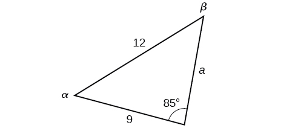{: #Figure_08_01_014}

In choosing the pair of ratios from the Law of Sines to use, look at the information given. In this case, we know the angle<math xmlns="http://www.w3.org/1998/Math/MathML"> <mrow> <mtext> </mtext><mi>γ</mi><mo>=</mo><mn>85°</mn><mo>,</mo><mtext> </mtext> </mrow> </math>

and its corresponding side<math xmlns="http://www.w3.org/1998/Math/MathML"> <mrow> <mtext> </mtext><mi>c</mi><mo>=</mo><mn>12</mn><mo>,</mo><mtext> </mtext></mrow> </math>

and we know side<math xmlns="http://www.w3.org/1998/Math/MathML"> <mrow> <mtext> </mtext><mi>b</mi><mo>=</mo><mn>9.</mn><mtext> </mtext></mrow> </math>

We will use this proportion to solve for<math xmlns="http://www.w3.org/1998/Math/MathML"> <mrow> <mtext> </mtext><mi>β</mi><mo>.</mo></mrow> </math>

<math xmlns="http://www.w3.org/1998/Math/MathML" display="block"> <mrow> <mtable columnalign="left"> <mtr columnalign="left"> <mtd columnalign="left"> <mrow> <mtext> </mtext><mtext> </mtext><mtext> </mtext><mfrac> <mrow> <mi>sin</mi><mo stretchy="false">(</mo><mn>85°</mn><mo stretchy="false">)</mo> </mrow> <mrow> <mn>12</mn> </mrow> </mfrac> <mo>=</mo><mfrac> <mrow> <mi>sin</mi><mtext> </mtext><mi>β</mi> </mrow> <mn>9</mn> </mfrac> <mtable> <mtr> <mtd> <mrow /> </mtd> <mtd> <mrow /> </mtd> <mtd> <mrow /> </mtd> <mtd> <mrow /> </mtd> </mtr> </mtable> </mrow> </mtd> <mtd columnalign="left"> <mrow> <mtext>Isolate the unknown</mtext><mo>.</mo> </mrow> </mtd> </mtr> <mtr columnalign="left"> <mtd columnalign="left"> <mrow> <mtext> </mtext><mfrac> <mrow> <mn>9</mn><mi>sin</mi><mo stretchy="false">(</mo><mn>85°</mn><mo stretchy="false">)</mo> </mrow> <mrow> <mn>12</mn> </mrow> </mfrac> <mo>=</mo><mi>sin</mi><mtext> </mtext><mi>β</mi> </mrow> </mtd> <mtd columnalign="left"> <mrow /> </mtd> </mtr> </mtable> </mrow> </math>

To find<math xmlns="http://www.w3.org/1998/Math/MathML"> <mrow> <mtext> </mtext><mi>β</mi><mo>,</mo><mtext> </mtext></mrow> </math>

apply the inverse sine function. The inverse sine will produce a single result, but keep in mind that there may be two values for<math xmlns="http://www.w3.org/1998/Math/MathML"> <mrow> <mtext> </mtext><mi>β</mi><mo>.</mo><mtext> </mtext></mrow> </math>

It is important to verify the result, as there may be two viable solutions, only one solution (the usual case), or no solutions.

<math xmlns="http://www.w3.org/1998/Math/MathML" display="block"> <mrow> <mtable columnalign="left"> <mtr columnalign="left"> <mtd columnalign="left"> <mrow> <mi>β</mi><mo>=</mo><msup> <mrow> <mi>sin</mi> </mrow> <mrow> <mo>−</mo><mn>1</mn> </mrow> </msup> <mrow><mo>(</mo> <mrow> <mfrac> <mrow> <mn>9</mn><mi>sin</mi><mo stretchy="false">(</mo><mn>85°</mn><mo stretchy="false">)</mo> </mrow> <mrow> <mn>12</mn> </mrow> </mfrac> </mrow> <mo>)</mo></mrow> </mrow> </mtd> </mtr> <mtr columnalign="left"> <mtd columnalign="left"> <mrow> <mi>β</mi><mo>≈</mo><msup> <mrow> <mi>sin</mi> </mrow> <mrow> <mo>−</mo><mn>1</mn> </mrow> </msup> <mo stretchy="false">(</mo><mn>0.7471</mn><mo stretchy="false">)</mo> </mrow> </mtd> </mtr> <mtr columnalign="left"> <mtd columnalign="left"> <mrow> <mi>β</mi><mo>≈</mo><mn>48.3°</mn> </mrow> </mtd> </mtr> </mtable> </mrow> </math>

In this case, if we subtract<math xmlns="http://www.w3.org/1998/Math/MathML"> <mrow> <mtext> </mtext><mi>β</mi><mtext> </mtext></mrow> </math>

from 180°, we find that there may be a second possible solution. Thus,<math xmlns="http://www.w3.org/1998/Math/MathML"> <mrow> <mtext> </mtext><mi>β</mi><mo>=</mo><mn>180°</mn><mo>−</mo><mn>48.3°</mn><mo>≈</mo><mn>131.7°</mn><mo>.</mo><mtext> </mtext></mrow> </math>

To check the solution, subtract both angles, 131.7° and 85°, from 180°. This gives

<math xmlns="http://www.w3.org/1998/Math/MathML" display="block"> <mrow> <mi>α</mi><mo>=</mo><mn>180°</mn><mo>−</mo><mn>85°</mn><mo>−</mo><mn>131.7°</mn><mo>≈</mo><mo>−</mo><mn>36.7°</mn><mo>,</mo> </mrow> </math>

which is impossible, and so<math xmlns="http://www.w3.org/1998/Math/MathML"> <mrow> <mtext> </mtext><mi>β</mi><mo>≈</mo><mn>48.3°</mn><mo>.</mo> </mrow> </math>

To find the remaining missing values, we calculate<math xmlns="http://www.w3.org/1998/Math/MathML"> <mrow> <mtext> </mtext><mi>α</mi><mo>=</mo><mn>180°</mn><mo>−</mo><mn>85°</mn><mo>−</mo><mn>48.3°</mn><mo>≈</mo><mn>46.7°</mn><mo>.</mo><mtext> </mtext> </mrow> </math>

Now, only side<math xmlns="http://www.w3.org/1998/Math/MathML"> <mrow> <mtext> </mtext><mi>a</mi><mtext> </mtext></mrow> </math>

is needed. Use the Law of Sines to solve for<math xmlns="http://www.w3.org/1998/Math/MathML"> <mrow> <mtext> </mtext><mi>a</mi><mtext> </mtext></mrow> </math>

by one of the proportions.

<math xmlns="http://www.w3.org/1998/Math/MathML" display="block"> <mrow> <mtable columnalign="left"> <mtr columnalign="left"> <mtd columnalign="left"> <mrow> <mtable columnalign="left"> <mtr columnalign="left"> <mtd columnalign="left"> <mrow /> </mtd> </mtr> <mtr columnalign="left"> <mtd columnalign="left"> <mrow> <mtable columnalign="left"> <mtr columnalign="left"> <mtd columnalign="left"> <mrow /> </mtd> </mtr> <mtr columnalign="left"> <mtd columnalign="left"> <mrow> <mo> </mo><mfrac> <mrow> <mi>sin</mi><mo stretchy="false">(</mo><mn>85</mn><mo>°</mo><mo stretchy="false">)</mo> </mrow> <mrow> <mn>12</mn> </mrow> </mfrac> <mo>=</mo><mfrac> <mrow> <mi>sin</mi><mo stretchy="false">(</mo><mn>46.7</mn><mo>°</mo><mo stretchy="false">)</mo> </mrow> <mi>a</mi> </mfrac> </mrow> </mtd> </mtr> </mtable> </mrow> </mtd> </mtr> </mtable> </mrow> </mtd> </mtr> <mtr columnalign="left"> <mtd columnalign="left"> <mrow> <mtext> </mtext><mi>a</mi><mfrac> <mrow> <mi>sin</mi><mo stretchy="false">(</mo><mn>85</mn><mo>°</mo><mo stretchy="false">)</mo> </mrow> <mrow> <mn>12</mn> </mrow> </mfrac> <mo>=</mo><mi>sin</mi><mo stretchy="false">(</mo><mn>46.7</mn><mo>°</mo><mo stretchy="false">)</mo> </mrow> </mtd> </mtr> <mtr columnalign="left"> <mtd columnalign="left"> <mrow> <mtext>           </mtext><mtext> </mtext><mtext> </mtext><mtext> </mtext><mtext> </mtext><mtext> </mtext><mtext> </mtext><mi>a</mi><mo>=</mo><mfrac> <mrow> <mn>12</mn><mi>sin</mi><mo stretchy="false">(</mo><mn>46.7</mn><mo>°</mo><mo stretchy="false">)</mo> </mrow> <mrow> <mi>sin</mi><mo stretchy="false">(</mo><mn>85</mn><mo>°</mo><mo stretchy="false">)</mo> </mrow> </mfrac> <mo>≈</mo><mn>8.8</mn> </mrow> </mtd> </mtr> </mtable> </mrow> </math>

The complete set of solutions for the given triangle is

<math xmlns="http://www.w3.org/1998/Math/MathML" display="block"> <mrow> <mtable columnalign="left"> <mtr columnalign="left"> <mtd columnalign="left"> <mrow> <mtable columnalign="left"> <mtr columnalign="left"> <mtd columnalign="left"> <mrow /> </mtd> </mtr> <mtr columnalign="left"> <mtd columnalign="left"> <mrow> <mi>α</mi><mo>≈</mo><mn>46.7°</mn><mtext>       </mtext><mi>a</mi><mo>≈</mo><mn>8.8</mn> </mrow> </mtd> </mtr> </mtable> </mrow> </mtd> </mtr> <mtr columnalign="left"> <mtd columnalign="left"> <mrow> <mi>β</mi><mo>≈</mo><mn>48.3°</mn><mtext>       </mtext><mi>b</mi><mo>=</mo><mn>9</mn> </mrow> </mtd> </mtr> <mtr columnalign="left"> <mtd columnalign="left"> <mrow> <mi>γ</mi><mo>=</mo><mn>85°</mn><mtext>           </mtext><mi>c</mi><mo>=</mo><mn>12</mn> </mrow> </mtd> </mtr> </mtable> </mrow> </math>

Given<math xmlns="http://www.w3.org/1998/Math/MathML"> <mrow> <mtext> </mtext><mi>α</mi><mo>=</mo><mn>80°</mn><mo>,</mo><mi>a</mi><mo>=</mo><mn>100</mn><mo>,</mo><mtext> </mtext><mtext> </mtext><mi>b</mi><mo>=</mo><mn>10</mn><mo>,</mo><mtext> </mtext> </mrow> </math>

find the missing side and angles. If there is more than one possible solution, show both. Round your answers to the nearest tenth.

<math xmlns="http://www.w3.org/1998/Math/MathML"> <mrow> <mi>β</mi><mo>≈</mo><mn>5.7°</mn><mo>,</mo><mi>γ</mi><mo>≈</mo><mn>94.3°</mn><mo>,</mo><mi>c</mi><mo>≈</mo><mn>101.3</mn></mrow> </math>

Finding the Triangles That Meet the Given Criteria

Find all possible triangles if one side has length 4 opposite an angle of 50°, and a second side has length 10.

Using the given information, we can solve for the angle opposite the side of length 10. See [[link]](#Figure_08_01_015).

<math xmlns="http://www.w3.org/1998/Math/MathML" display="block"> <mrow> <mtable columnalign="left"> <mtr columnalign="left"> <mtd columnalign="left"> <mrow> <mtext> </mtext><mfrac> <mrow> <mi>sin</mi><mtext> </mtext><mi>α</mi> </mrow> <mrow> <mn>10</mn> </mrow> </mfrac> <mo>=</mo><mfrac> <mrow> <mi>sin</mi><mo stretchy="false">(</mo><mn>50°</mn><mo stretchy="false">)</mo> </mrow> <mn>4</mn> </mfrac> </mrow> </mtd> </mtr> <mtr columnalign="left"> <mtd columnalign="left"> <mrow> <mtext> </mtext><mtext> </mtext><mi>sin</mi><mtext> </mtext><mi>α</mi><mo>=</mo><mfrac> <mrow> <mn>10</mn><mi>sin</mi><mo stretchy="false">(</mo><mn>50°</mn><mo stretchy="false">)</mo> </mrow> <mn>4</mn> </mfrac> </mrow> </mtd> </mtr> <mtr columnalign="left"> <mtd columnalign="left"> <mrow> <mtext> </mtext><mtext> </mtext><mi>sin</mi><mtext> </mtext><mi>α</mi><mo>≈</mo><mn>1.915</mn> </mrow> </mtd> </mtr> </mtable> </mrow> </math>

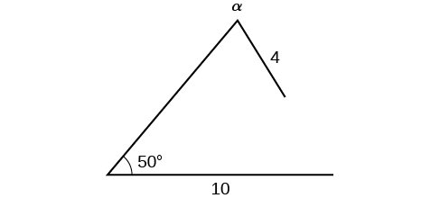{: #Figure_08_01_015}

We can stop here without finding the value of<math xmlns="http://www.w3.org/1998/Math/MathML"> <mrow> <mtext> </mtext><mi>α</mi><mo>.</mo><mtext> </mtext></mrow> </math>

Because the range of the sine function is<math xmlns="http://www.w3.org/1998/Math/MathML"> <mrow> <mtext> </mtext><mrow><mo>[</mo> <mrow> <mo>−</mo><mn>1</mn><mo>,</mo><mn>1</mn></mrow> <mo>]</mo></mrow><mo>,</mo><mtext> </mtext></mrow> </math>

it is impossible for the sine value to be 1.915. In fact, inputting<math xmlns="http://www.w3.org/1998/Math/MathML"> <mrow> <mtext> </mtext><msup> <mrow> <mi>sin</mi></mrow> <mrow> <mo>−</mo><mn>1</mn></mrow> </msup> <mrow><mo>(</mo> <mrow> <mn>1.915</mn></mrow> <mo>)</mo></mrow><mtext> </mtext></mrow> </math>

in a graphing calculator generates an ERROR DOMAIN. Therefore, no triangles can be drawn with the provided dimensions.

Determine the number of triangles possible given<math xmlns="http://www.w3.org/1998/Math/MathML"> <mrow> <mtext> </mtext><mi>a</mi><mo>=</mo><mn>31</mn><mo>,</mo><mtext> </mtext><mtext> </mtext><mi>b</mi><mo>=</mo><mn>26</mn><mo>,</mo><mtext> </mtext><mtext> </mtext><mi>β</mi><mo>=</mo><mn>48°</mn><mo>.</mo><mtext> </mtext><mtext> </mtext> </mrow> </math>

two

###  Finding the Area of an Oblique Triangle Using the Sine Function

Now that we can solve a triangle for missing values, we can use some of those values and the sine function to find the area of an oblique triangle. Recall that the area formula for a triangle is given as<math xmlns="http://www.w3.org/1998/Math/MathML"> <mrow> <mtext> </mtext><mtext>Area</mtext><mo>=</mo><mfrac> <mn>1</mn> <mn>2</mn> </mfrac> <mi>b</mi><mi>h</mi><mo>,</mo><mtext> </mtext></mrow> </math>

where<math xmlns="http://www.w3.org/1998/Math/MathML"> <mrow> <mtext> </mtext><mi>b</mi><mtext> </mtext></mrow> </math>

is base and<math xmlns="http://www.w3.org/1998/Math/MathML"> <mrow> <mtext> </mtext><mi>h</mi><mtext> </mtext></mrow> </math>

is height. For oblique triangles, we must find<math xmlns="http://www.w3.org/1998/Math/MathML"> <mrow> <mtext> </mtext><mi>h</mi><mtext> </mtext></mrow> </math>

before we can use the area formula. Observing the two triangles in [\[link\]](#Figure_08_01_016), one acute and one obtuse, we can drop a perpendicular to represent the height and then apply the trigonometric property<math xmlns="http://www.w3.org/1998/Math/MathML"> <mrow> <mtext> </mtext><mi>sin</mi><mtext> </mtext><mi>α</mi><mo>=</mo><mfrac> <mrow> <mtext>opposite</mtext> </mrow> <mrow> <mtext>hypotenuse</mtext> </mrow> </mfrac> <mtext> </mtext> </mrow> </math>

to write an equation for area in oblique triangles. In the acute triangle, we have<math xmlns="http://www.w3.org/1998/Math/MathML"> <mrow> <mtext> </mtext><mi>sin</mi><mtext> </mtext><mi>α</mi><mo>=</mo><mfrac> <mi>h</mi> <mi>c</mi> </mfrac> <mtext> </mtext></mrow> </math>

or<math xmlns="http://www.w3.org/1998/Math/MathML"> <mrow> <mi>c</mi><mi>sin</mi><mtext> </mtext><mi>α</mi><mo>=</mo><mi>h</mi><mo>.</mo><mtext> </mtext></mrow> </math>

However, in the obtuse triangle, we drop the perpendicular outside the triangle and extend the base<math xmlns="http://www.w3.org/1998/Math/MathML"> <mrow> <mtext> </mtext><mi>b</mi><mtext> </mtext></mrow> </math>

to form a right triangle. The angle used in calculation is<math xmlns="http://www.w3.org/1998/Math/MathML"> <mrow> <mtext> </mtext><msup> <mi>α</mi> <mo>′</mo> </msup> <mo>,</mo><mtext> </mtext></mrow> </math>

or<math xmlns="http://www.w3.org/1998/Math/MathML"> <mrow> <mtext> </mtext><mn>180</mn><mo>−</mo><mi>α</mi><mo>.</mo></mrow> </math>

{: #Figure_08_01_016}

Thus,

<math xmlns="http://www.w3.org/1998/Math/MathML" display="block"> <mrow> <mtext>Area</mtext><mo>=</mo><mfrac> <mn>1</mn> <mn>2</mn> </mfrac> <mrow><mo>(</mo> <mrow> <mtext>base</mtext></mrow> <mo>)</mo></mrow><mrow><mo>(</mo> <mrow> <mtext>height</mtext></mrow> <mo>)</mo></mrow><mo>=</mo><mfrac> <mn>1</mn> <mn>2</mn> </mfrac> <mi>b</mi><mrow><mo>(</mo> <mrow> <mi>c</mi><mi>sin</mi><mtext> </mtext><mi>α</mi></mrow> <mo>)</mo></mrow></mrow> </math>

Similarly,

<math xmlns="http://www.w3.org/1998/Math/MathML" display="block"> <mrow> <mtext>Area</mtext><mo>=</mo><mfrac> <mn>1</mn> <mn>2</mn> </mfrac> <mi>a</mi><mrow><mo>(</mo> <mrow> <mi>b</mi><mi>sin</mi><mtext> </mtext><mi>γ</mi></mrow> <mo>)</mo></mrow><mo>=</mo><mfrac> <mn>1</mn> <mn>2</mn> </mfrac> <mi>a</mi><mrow><mo>(</mo> <mrow> <mi>c</mi><mi>sin</mi><mtext> </mtext><mi>β</mi></mrow> <mo>)</mo></mrow></mrow> </math>

Area of an Oblique Triangle

The formula for the area of an oblique triangle is given by

<math xmlns="http://www.w3.org/1998/Math/MathML" display="block"> <mrow> <mtable columnalign="left"> <mtr columnalign="left"> <mtd columnalign="left"> <mrow> <mtext>Area</mtext><mo>=</mo><mfrac> <mn>1</mn> <mn>2</mn> </mfrac> <mi>b</mi><mi>c</mi><mi>sin</mi><mtext> </mtext><mi>α</mi> </mrow> </mtd> </mtr> <mtr columnalign="left"> <mtd columnalign="left"> <mrow> <mtext> </mtext><mtext> </mtext><mtext> </mtext><mtext> </mtext><mtext> </mtext><mtext> </mtext><mtext> </mtext><mtext> </mtext><mtext> </mtext><mtext> </mtext><mtext> </mtext><mtext> </mtext><mo>=</mo><mfrac> <mn>1</mn> <mn>2</mn> </mfrac> <mi>a</mi><mi>c</mi><mi>sin</mi><mtext> </mtext><mi>β</mi> </mrow> </mtd> </mtr> <mtr columnalign="left"> <mtd columnalign="left"> <mrow> <mtext> </mtext><mtext> </mtext><mtext> </mtext><mtext> </mtext><mtext> </mtext><mtext> </mtext><mtext> </mtext><mtext> </mtext><mtext> </mtext><mtext> </mtext><mtext> </mtext><mtext> </mtext><mo>=</mo><mfrac> <mn>1</mn> <mn>2</mn> </mfrac> <mi>a</mi><mi>b</mi><mi>sin</mi><mtext> </mtext><mi>γ</mi> </mrow> </mtd> </mtr> </mtable> </mrow> </math>

This is equivalent to one-half of the product of two sides and the sine of their included angle.

Finding the Area of an Oblique Triangle

Find the area of a triangle with sides<math xmlns="http://www.w3.org/1998/Math/MathML"> <mrow> <mtext> </mtext><mi>a</mi><mo>=</mo><mn>90</mn><mo>,</mo><mi>b</mi><mo>=</mo><mn>52</mn><mo>,</mo><mtext> </mtext></mrow> </math>

and angle<math xmlns="http://www.w3.org/1998/Math/MathML"> <mrow> <mtext> </mtext><mi>γ</mi><mo>=</mo><mn>102°</mn><mo>.</mo><mtext> </mtext> </mrow> </math>

Round the area to the nearest integer.

Using the formula, we have

<math xmlns="http://www.w3.org/1998/Math/MathML" display="block"> <mrow> <mtable columnalign="left"> <mtr columnalign="left"> <mtd columnalign="left"> <mrow> <mtext>Area</mtext><mo>=</mo><mfrac> <mn>1</mn> <mn>2</mn> </mfrac> <mi>a</mi><mi>b</mi><mi>sin</mi><mtext> </mtext><mi>γ</mi> </mrow> </mtd> </mtr> <mtr columnalign="left"> <mtd columnalign="left"> <mrow> <mtext>Area</mtext><mo>=</mo><mfrac> <mn>1</mn> <mn>2</mn> </mfrac> <mo stretchy="false">(</mo><mn>90</mn><mo stretchy="false">)</mo><mo stretchy="false">(</mo><mn>52</mn><mo stretchy="false">)</mo><mi>sin</mi><mo stretchy="false">(</mo><mn>102°</mn><mo stretchy="false">)</mo> </mrow> </mtd> </mtr> <mtr columnalign="left"> <mtd columnalign="left"> <mrow> <mtext>Area</mtext><mo>≈</mo><mn>2289</mn><mtext> </mtext><mtext> </mtext><mtext>square</mtext><mtext> </mtext><mtext> </mtext><mtext>units</mtext> </mrow> </mtd> </mtr> </mtable> </mrow> </math>

Find the area of the triangle given<math xmlns="http://www.w3.org/1998/Math/MathML"> <mrow> <mtext> </mtext><mi>β</mi><mo>=</mo><mn>42°</mn><mo>,</mo><mtext> </mtext><mtext> </mtext><mi>a</mi><mo>=</mo><mn>7.2</mn><mtext> </mtext><mtext>ft</mtext><mo>,</mo><mtext> </mtext><mtext> </mtext><mi>c</mi><mo>=</mo><mn>3.4</mn><mtext> </mtext><mtext>ft</mtext><mo>.</mo><mtext> </mtext> </mrow> </math>

Round the area to the nearest tenth.

about<math xmlns="http://www.w3.org/1998/Math/MathML"> <mrow> <mtext> </mtext><mn>8.2</mn><mtext> </mtext><mtext> </mtext><mtext>square</mtext><mtext> </mtext><mtext>feet</mtext></mrow> </math>

###  Solving Applied Problems Using the Law of Sines

The more we study trigonometric applications, the more we discover that the applications are countless. Some are flat, diagram-type situations, but many applications in calculus, engineering, and physics involve three dimensions and motion.

Finding an Altitude

Find the altitude of the aircraft in the problem introduced at the beginning of this section, shown in [[link]](#Figure_08_01_017). Round the altitude to the nearest tenth of a mile.

{: #Figure_08_01_017}

To find the elevation of the aircraft, we first find the distance from one station to the aircraft, such as the side<math xmlns="http://www.w3.org/1998/Math/MathML"> <mrow> <mtext> </mtext><mi>a</mi><mo>,</mo></mrow> </math>

 and then use right triangle relationships to find the height of the aircraft,<math xmlns="http://www.w3.org/1998/Math/MathML"> <mrow> <mtext> </mtext><mi>h</mi><mo>.</mo></mrow> </math>

Because the angles in the triangle add up to 180 degrees, the unknown angle must be 180°−15°−35°=130°. This angle is opposite the side of length 20, allowing us to set up a Law of Sines relationship.

<math xmlns="http://www.w3.org/1998/Math/MathML" display="block"> <mrow> <mtable columnalign="left"> <mtr columnalign="left"> <mtd columnalign="left"> <mrow> <mtable columnalign="left"> <mtr columnalign="left"> <mtd columnalign="left"> <mrow> <mtable columnalign="left"> <mtr columnalign="left"> <mtd columnalign="left"> <mrow /> </mtd> </mtr> <mtr columnalign="left"> <mtd columnalign="left"> <mrow /> </mtd> </mtr> </mtable> </mrow> </mtd> </mtr> <mtr columnalign="left"> <mtd columnalign="left"> <mrow> <mtext>  </mtext><mfrac> <mrow> <mi>sin</mi><mo stretchy="false">(</mo><mn>130°</mn><mo stretchy="false">)</mo> </mrow> <mrow> <mn>20</mn> </mrow> </mfrac> <mo>=</mo><mfrac> <mrow> <mi>sin</mi><mo stretchy="false">(</mo><mn>35°</mn><mo stretchy="false">)</mo> </mrow> <mi>a</mi> </mfrac> </mrow> </mtd> </mtr> </mtable> </mrow> </mtd> </mtr> <mtr columnalign="left"> <mtd columnalign="left"> <mrow> <mi>a</mi><mi>sin</mi><mo stretchy="false">(</mo><mn>130°</mn><mo stretchy="false">)</mo><mo>=</mo><mn>20</mn><mi>sin</mi><mo stretchy="false">(</mo><mn>35°</mn><mo stretchy="false">)</mo> </mrow> </mtd> </mtr> <mtr columnalign="left"> <mtd columnalign="left"> <mrow> <mtext>               </mtext><mi>a</mi><mo>=</mo><mfrac> <mrow> <mn>20</mn><mi>sin</mi><mo stretchy="false">(</mo><mn>35°</mn><mo stretchy="false">)</mo> </mrow> <mrow> <mi>sin</mi><mo stretchy="false">(</mo><mn>130°</mn><mo stretchy="false">)</mo> </mrow> </mfrac> </mrow> </mtd> </mtr> <mtr columnalign="left"> <mtd columnalign="left"> <mrow> <mtext>               </mtext><mi>a</mi><mo>≈</mo><mn>14.98</mn> </mrow> </mtd> </mtr> </mtable> </mrow> </math>

The distance from one station to the aircraft is about 14.98 miles.

Now that we know<math xmlns="http://www.w3.org/1998/Math/MathML"> <mrow> <mtext> </mtext><mi>a</mi><mo>,</mo><mtext> </mtext></mrow> </math>

we can use right triangle relationships to solve for<math xmlns="http://www.w3.org/1998/Math/MathML"> <mrow> <mtext> </mtext><mi>h</mi><mo>.</mo></mrow> </math>

<math xmlns="http://www.w3.org/1998/Math/MathML" display="block"> <mrow> <mtable columnalign="left"> <mtr columnalign="left"> <mtd columnalign="left"> <mrow> <mi>sin</mi><mo stretchy="false">(</mo><mn>15°</mn><mo stretchy="false">)</mo><mo>=</mo><mfrac> <mrow> <mtext>opposite</mtext> </mrow> <mrow> <mtext>hypotenuse</mtext> </mrow> </mfrac> </mrow> </mtd> </mtr> <mtr columnalign="left"> <mtd columnalign="left"> <mrow> <mi>sin</mi><mo stretchy="false">(</mo><mn>15°</mn><mo stretchy="false">)</mo><mo>=</mo><mfrac> <mi>h</mi> <mi>a</mi> </mfrac> </mrow> </mtd> </mtr> <mtr columnalign="left"> <mtd columnalign="left"> <mrow> <mi>sin</mi><mo stretchy="false">(</mo><mn>15°</mn><mo stretchy="false">)</mo><mo>=</mo><mfrac> <mi>h</mi> <mrow> <mn>14.98</mn> </mrow> </mfrac> </mrow> </mtd> </mtr> <mtr columnalign="left"> <mtd columnalign="left"> <mrow> <mtext>        </mtext><mtext> </mtext><mtext>  </mtext><mi>h</mi><mo>=</mo><mn>14.98</mn><mi>sin</mi><mo stretchy="false">(</mo><mn>15°</mn><mo stretchy="false">)</mo> </mrow> </mtd> </mtr> <mtr columnalign="left"> <mtd columnalign="left"> <mrow> <mtext>          </mtext><mtext> </mtext><mi>h</mi><mo>≈</mo><mn>3.88</mn> </mrow> </mtd> </mtr> </mtable> </mrow> </math>

The aircraft is at an altitude of approximately 3.9 miles.

The diagram shown in [[link]](#Figure_08_01_018) represents the height of a blimp flying over a football stadium. Find the height of the blimp if the angle of elevation at the southern end zone, point A, is 70°, the angle of elevation from the northern end zone, point<math xmlns="http://www.w3.org/1998/Math/MathML"> <mrow> <mtext> </mtext><mi>B</mi><mo>,</mo><mtext> </mtext></mrow> </math>

is 62°, and the distance between the viewing points of the two end zones is 145 yards.

{: #Figure_08_01_018}

161\.9 yd.

Access these online resources for additional instruction and practice with trigonometric applications.

* [Law of Sines: The Basics][1]
* [Law of Sines: The Ambiguous Case][2]

### Key Equations

| Law of Sines | <math xmlns="http://www.w3.org/1998/Math/MathML"> <mrow> <mtable columnalign="left"> <mtr columnalign="left"> <mtd columnalign="left"> <mrow> <mfrac> <mrow> <mi>sin</mi><mtext> </mtext><mi>α</mi> </mrow> <mi>a</mi> </mfrac> <mo>=</mo><mfrac> <mrow> <mi>sin</mi><mtext> </mtext><mi>β</mi> </mrow> <mi>b</mi> </mfrac> <mo>=</mo><mfrac> <mrow> <mi>sin</mi><mtext> </mtext><mi>γ</mi> </mrow> <mi>c</mi> </mfrac> <mtext> </mtext> </mrow> </mtd> </mtr> <mtr columnalign="left"> <mtd columnalign="left"> <mrow> <mfrac> <mi>a</mi> <mrow> <mi>sin</mi><mtext> </mtext><mi>α</mi> </mrow> </mfrac> <mo>=</mo><mfrac> <mi>b</mi> <mrow> <mi>sin</mi><mtext> </mtext><mi>β</mi> </mrow> </mfrac> <mo>=</mo><mfrac> <mi>c</mi> <mrow> <mi>sin</mi><mtext> </mtext><mi>γ</mi> </mrow> </mfrac> </mrow> </mtd> </mtr> </mtable> </mrow> </math>

 |
| Area for oblique triangles | <math xmlns="http://www.w3.org/1998/Math/MathML"> <mrow> <mtable columnalign="right"> <mtr columnalign="right"> <mtd columnalign="right"> <mrow> <mtext>Area</mtext><mo>=</mo><mfrac> <mn>1</mn> <mn>2</mn> </mfrac> <mi>b</mi><mi>c</mi><mi>sin</mi><mtext> </mtext><mi>α</mi> </mrow> </mtd> </mtr> <mtr columnalign="right"> <mtd columnalign="right"> <mrow> <mtext>       </mtext><mo>=</mo><mfrac> <mn>1</mn> <mn>2</mn> </mfrac> <mi>a</mi><mi>c</mi><mi>sin</mi><mtext> </mtext><mi>β</mi> </mrow> </mtd> </mtr> <mtr columnalign="right"> <mtd columnalign="right"> <mrow> <mtext>       </mtext><mo>=</mo><mfrac> <mn>1</mn> <mn>2</mn> </mfrac> <mi>a</mi><mi>b</mi><mi>sin</mi><mtext> </mtext><mi>γ</mi> </mrow> </mtd> </mtr> </mtable> </mrow> </math>

 |
{: #eip-id2728866 summary=".."}

### Key Concepts

* The Law of Sines can be used to solve oblique triangles, which are non-right triangles.
* According to the Law of Sines, the ratio of the measurement of one of the angles to the length of its opposite side equals the other two ratios of angle measure to opposite side.
* There are three possible cases: ASA, AAS, SSA. Depending on the information given, we can choose the appropriate equation to find the requested solution. See [\[link\]](#Example_08_01_01).
* The ambiguous case arises when an oblique triangle can have different outcomes.
* There are three possible cases that arise from SSA arrangement—a single solution, two possible solutions, and no solution. See [\[link\]](#Example_08_01_02) and [\[link\]](#Example_08_01_03).
* The Law of Sines can be used to solve triangles with given criteria. See [\[link\]](#Example_08_01_04).
* The general area formula for triangles translates to oblique triangles by first finding the appropriate height value. See [\[link\]](#Example_08_01_05).
* There are many trigonometric applications. They can often be solved by first drawing a diagram of the given information and then using the appropriate equation. See [\[link\]](#Example_08_01_06).

### Section Exercises

#### Verbal

Describe the altitude of a triangle.

The altitude extends from any vertex to the opposite side or to the line containing the opposite side at a 90° angle.

Compare right triangles and oblique triangles.

When can you use the Law of Sines to find a missing angle?

When the known values are the side opposite the missing angle and another side and its opposite angle.

In the Law of Sines, what is the relationship between the angle in the numerator and the side in the denominator?

What type of triangle results in an ambiguous case?

A triangle with two given sides and a non-included angle.

#### Algebraic

For the following exercises, assume<math xmlns="http://www.w3.org/1998/Math/MathML"> <mrow> <mtext> </mtext><mi>α</mi><mtext> </mtext></mrow> </math>

is opposite side<math xmlns="http://www.w3.org/1998/Math/MathML"> <mrow> <mtext> </mtext><mi>a</mi><mo>,</mo><mi>β</mi><mtext> </mtext></mrow> </math>

is opposite side<math xmlns="http://www.w3.org/1998/Math/MathML"> <mrow> <mtext> </mtext><mi>b</mi><mo>,</mo><mtext> </mtext></mrow> </math>

and<math xmlns="http://www.w3.org/1998/Math/MathML"> <mrow> <mtext> </mtext><mi>γ</mi><mtext> </mtext></mrow> </math>

is opposite side<math xmlns="http://www.w3.org/1998/Math/MathML"> <mrow> <mtext> </mtext><mi>c</mi><mo>.</mo><mtext> </mtext></mrow> </math>

Solve each triangle, if possible. Round each answer to the nearest tenth.

<math xmlns="http://www.w3.org/1998/Math/MathML"> <mrow> <mi>α</mi><mo>=</mo><mn>43°</mn><mo>,</mo><mi>γ</mi><mo>=</mo><mn>69°</mn><mo>,</mo><mi>a</mi><mo>=</mo><mn>20</mn></mrow> </math>

<math xmlns="http://www.w3.org/1998/Math/MathML"> <mrow> <mi>α</mi><mo>=</mo><mn>35°</mn><mo>,</mo><mi>γ</mi><mo>=</mo><mn>73°</mn><mo>,</mo><mi>c</mi><mo>=</mo><mn>20</mn></mrow> </math>

<math xmlns="http://www.w3.org/1998/Math/MathML"> <mrow> <mo> </mo><mi>β</mi><mo>=</mo><mn>72°</mn><mo>,</mo><mi>a</mi><mo>≈</mo><mn>12.0</mn><mo>,</mo><mi>b</mi><mo>≈</mo><mn>19.9</mn></mrow> </math>

<math xmlns="http://www.w3.org/1998/Math/MathML"> <mrow> <mi>α</mi><mo>=</mo><mn>60°</mn><mo>,</mo><mtext> </mtext><mtext> </mtext><mi>β</mi><mo>=</mo><mn>60°</mn><mo>,</mo><mtext> </mtext><mi>γ</mi><mo>=</mo><mn>60°</mn> </mrow> </math>

<math xmlns="http://www.w3.org/1998/Math/MathML"> <mrow> <mi>a</mi><mo>=</mo><mn>4</mn><mo>,</mo><mtext> </mtext><mtext> </mtext><mi>α</mi><mo>=</mo><mtext> </mtext> <mrow> <mn>60°</mn></mrow> <mo>,</mo><mtext> </mtext><mi>β</mi><mo>=</mo><mn>100°</mn></mrow> </math>

<math xmlns="http://www.w3.org/1998/Math/MathML"> <mrow> <mo> </mo><mi>γ</mi><mo>=</mo><mn>20°</mn><mo>,</mo><mi>b</mi><mo>≈</mo><mn>4.5</mn><mo>,</mo><mi>c</mi><mo>≈</mo><mn>1.6</mn></mrow> </math>

<math xmlns="http://www.w3.org/1998/Math/MathML"> <mrow> <mi>b</mi><mo>=</mo><mn>10</mn><mo>,</mo><mtext> </mtext><mi>β</mi><mo>=</mo><mn>95°</mn><mo>,</mo><mi>γ</mi><mo>=</mo><mtext> </mtext> <mrow> <mn>30°</mn></mrow> </mrow> </math>

For the following exercises, use the Law of Sines to solve for the missing side for each oblique triangle. Round each answer to the nearest hundredth. Assume that angle<math xmlns="http://www.w3.org/1998/Math/MathML"> <mrow> <mtext> </mtext><mi>A</mi><mtext> </mtext></mrow> </math>

is opposite side<math xmlns="http://www.w3.org/1998/Math/MathML"> <mrow> <mtext> </mtext><mi>a</mi><mo>,</mo><mtext> </mtext></mrow> </math>

angle<math xmlns="http://www.w3.org/1998/Math/MathML"> <mrow> <mtext> </mtext><mi>B</mi><mtext> </mtext></mrow> </math>

is opposite side<math xmlns="http://www.w3.org/1998/Math/MathML"> <mrow> <mtext> </mtext><mi>b</mi><mo>,</mo><mtext> </mtext></mrow> </math>

and angle<math xmlns="http://www.w3.org/1998/Math/MathML"> <mrow> <mtext> </mtext><mi>C</mi><mtext> </mtext></mrow> </math>

is opposite side<math xmlns="http://www.w3.org/1998/Math/MathML"> <mrow> <mtext> </mtext><mi>c</mi><mo>.</mo></mrow> </math>

Find side<math xmlns="http://www.w3.org/1998/Math/MathML"> <mrow> <mtext> </mtext><mi>b</mi><mtext> </mtext></mrow> </math>

when<math xmlns="http://www.w3.org/1998/Math/MathML"> <mrow> <mtext> </mtext><mi>A</mi><mo>=</mo><mn>37°</mn><mo>,</mo><mtext> </mtext><mtext> </mtext><mi>B</mi><mo>=</mo><mn>49°</mn><mo>,</mo><mtext> </mtext><mi>c</mi><mo>=</mo><mn>5.</mn></mrow> </math>

<math xmlns="http://www.w3.org/1998/Math/MathML"> <mrow> <mi>b</mi><mo>≈</mo><mn>3.78</mn></mrow> </math>

Find side<math xmlns="http://www.w3.org/1998/Math/MathML"> <mrow> <mtext> </mtext><mi>a</mi></mrow> </math>

 when<math xmlns="http://www.w3.org/1998/Math/MathML"> <mrow> <mtext> </mtext><mi>A</mi><mo>=</mo><mn>132°</mn><mo>,</mo><mi>C</mi><mo>=</mo><mn>23°</mn><mo>,</mo><mi>b</mi><mo>=</mo><mn>10.</mn></mrow> </math>

Find side<math xmlns="http://www.w3.org/1998/Math/MathML"> <mrow> <mtext> </mtext><mi>c</mi><mtext> </mtext></mrow> </math>

when<math xmlns="http://www.w3.org/1998/Math/MathML"> <mrow> <mtext> </mtext><mi>B</mi><mo>=</mo><mn>37°</mn><mo>,</mo><mi>C</mi><mo>=</mo><mn>21°</mn><mo /><mo>,</mo><mtext> </mtext><mi>b</mi><mo>=</mo><mn>23.</mn></mrow> </math>

<math xmlns="http://www.w3.org/1998/Math/MathML"> <mrow> <mi>c</mi><mo>≈</mo><mn>13.70</mn></mrow> </math>

For the following exercises, assume<math xmlns="http://www.w3.org/1998/Math/MathML"> <mrow> <mtext> </mtext><mi>α</mi><mtext> </mtext></mrow> </math>

is opposite side<math xmlns="http://www.w3.org/1998/Math/MathML"> <mrow> <mtext> </mtext><mi>a</mi><mo>,</mo><mi>β</mi><mtext> </mtext></mrow> </math>

is opposite side<math xmlns="http://www.w3.org/1998/Math/MathML"> <mrow> <mtext> </mtext><mi>b</mi><mo>,</mo><mtext> </mtext></mrow> </math>

and<math xmlns="http://www.w3.org/1998/Math/MathML"> <mrow> <mtext> </mtext><mi>γ</mi><mtext> </mtext></mrow> </math>

is opposite side<math xmlns="http://www.w3.org/1998/Math/MathML"> <mrow> <mtext> </mtext><mi>c</mi><mo>.</mo><mtext> </mtext></mrow> </math>

Determine whether there is no triangle, one triangle, or two triangles. Then solve each triangle, if possible. Round each answer to the nearest tenth.

<math xmlns="http://www.w3.org/1998/Math/MathML"> <mrow> <mi>α</mi><mo>=</mo><mn>119°</mn><mo>,</mo><mi>a</mi><mo>=</mo><mn>14</mn><mo>,</mo><mi>b</mi><mo>=</mo><mn>26</mn></mrow> </math>

<math xmlns="http://www.w3.org/1998/Math/MathML"> <mrow> <mi>γ</mi><mo>=</mo><mn>113°</mn><mo>,</mo><mi>b</mi><mo>=</mo><mn>10</mn><mo>,</mo><mi>c</mi><mo>=</mo><mn>32</mn></mrow> </math>

one triangle,<math xmlns="http://www.w3.org/1998/Math/MathML"> <mrow> <mtext> </mtext><mi>α</mi><mo>≈</mo><mn>50.3°</mn><mo>,</mo><mi>β</mi><mo>≈</mo><mn>16.7°</mn><mo>,</mo><mi>a</mi><mo>≈</mo><mn>26.7</mn></mrow> </math>

<math xmlns="http://www.w3.org/1998/Math/MathML"> <mrow> <mi>b</mi><mo>=</mo><mn>3.5</mn><mo>,</mo><mtext> </mtext><mtext> </mtext><mi>c</mi><mo>=</mo><mn>5.3</mn><mo>,</mo><mtext> </mtext><mtext> </mtext><mi>γ</mi><mo>=</mo><mtext> </mtext> <mrow> <mn>80°</mn></mrow> </mrow> </math>

<math xmlns="http://www.w3.org/1998/Math/MathML"> <mrow> <mi>a</mi><mo>=</mo><mn>12</mn><mo>,</mo><mtext> </mtext><mtext> </mtext><mi>c</mi><mo>=</mo><mn>17</mn><mo>,</mo><mtext> </mtext><mtext> </mtext><mi>α</mi><mo>=</mo><mtext> </mtext> <mrow> <mn>35°</mn></mrow> </mrow> </math>

two triangles,<math xmlns="http://www.w3.org/1998/Math/MathML"> <mrow> <mo> </mo><mtext> </mtext><mi>γ</mi><mo>≈</mo><mn>54.3°</mn><mo>,</mo><mi>β</mi><mo>≈</mo><mn>90.7°</mn><mo>,</mo><mi>b</mi><mo>≈</mo><mn>20.9</mn></mrow> </math>

or<math xmlns="http://www.w3.org/1998/Math/MathML"> <mrow> <mo> </mo><msup> <mi>γ</mi> <mo>′</mo> </msup> <mo>≈</mo><mn>125.7°</mn><mo>,</mo><msup> <mi>β</mi> <mo>′</mo> </msup> <mo>≈</mo><mn>19.3°</mn><mo>,</mo><msup> <mi>b</mi> <mo>′</mo> </msup> <mo>≈</mo><mn>6.9</mn> </mrow> </math>

<math xmlns="http://www.w3.org/1998/Math/MathML"> <mrow> <mi>a</mi><mo>=</mo><mn>20.5</mn><mo>,</mo><mtext> </mtext><mtext> </mtext><mi>b</mi><mo>=</mo><mn>35.0</mn><mo>,</mo><mtext> </mtext><mtext> </mtext><mi>β</mi><mo>=</mo> <mrow> <mn>25°</mn></mrow> </mrow> </math>

<math xmlns="http://www.w3.org/1998/Math/MathML"> <mrow> <mi>a</mi><mo>=</mo><mn>7</mn><mo>,</mo><mtext> </mtext><mi>c</mi><mo>=</mo><mn>9</mn><mo>,</mo><mtext> </mtext><mtext> </mtext><mi>α</mi><mo>=</mo><mtext> </mtext><mn>43°</mn></mrow> </math>

two triangles,<math xmlns="http://www.w3.org/1998/Math/MathML"> <mrow> <mo> </mo><mi>β</mi><mo>≈</mo><mn>75.7°</mn><mo>,</mo><mo> </mo><mi>γ</mi><mo>≈</mo><mn>61.3°</mn><mo>,</mo><mi>b</mi><mo>≈</mo><mn>9.9</mn></mrow> </math>

or<math xmlns="http://www.w3.org/1998/Math/MathML"> <mrow> <mo> </mo><msup> <mi>β</mi> <mo>′</mo> </msup> <mo>≈</mo><mn>18.3°</mn><mo>,</mo><msup> <mi>γ</mi> <mo>′</mo> </msup> <mo>≈</mo><mn>118.7°</mn><mo>,</mo><msup> <mi>b</mi> <mo>′</mo> </msup> <mo>≈</mo><mn>3.2</mn> </mrow> </math>

<math xmlns="http://www.w3.org/1998/Math/MathML"> <mrow> <mi>a</mi><mo>=</mo><mn>7</mn><mo>,</mo><mi>b</mi><mo>=</mo><mn>3</mn><mo>,</mo><mi>β</mi><mo>=</mo><mn>24°</mn></mrow> </math>

<math xmlns="http://www.w3.org/1998/Math/MathML"> <mrow> <mi>b</mi><mo>=</mo><mn>13</mn><mo>,</mo><mi>c</mi><mo>=</mo><mn>5</mn><mo>,</mo><mi>γ</mi><mo>=</mo><mtext> </mtext><mn>10°</mn></mrow> </math>

two triangles,<math xmlns="http://www.w3.org/1998/Math/MathML"> <mrow><mtext> </mtext><mi>α</mi><mo>≈</mo><mn>143.2°</mn><mo>,</mo><mi>β</mi><mo>≈</mo><mn>26.8°</mn><mo>,</mo><mi>a</mi><mo>≈</mo><mn>17.3</mn><mtext> </mtext></mrow> </math>

or<math xmlns="http://www.w3.org/1998/Math/MathML"> <mrow> <mtext> </mtext><msup> <mi>α</mi> <mo>′</mo> </msup> <mo>≈</mo><mn>16.8°</mn><mo>,</mo><msup> <mi>β</mi> <mo>′</mo> </msup> <mo>≈</mo><mn>153.2°</mn><mo>,</mo><msup> <mi>a</mi> <mo>′</mo> </msup> <mo>≈</mo><mn>8.3</mn> </mrow> </math>

<math xmlns="http://www.w3.org/1998/Math/MathML"> <mrow> <mi>a</mi><mo>=</mo><mn>2.3</mn><mo>,</mo><mi>c</mi><mo>=</mo><mn>1.8</mn><mo>,</mo><mi>γ</mi><mo>=</mo><mn>28°</mn></mrow> </math>

<math xmlns="http://www.w3.org/1998/Math/MathML"> <mrow> <mi>β</mi><mo>=</mo><mn>119°</mn><mo>,</mo><mi>b</mi><mo>=</mo><mn>8.2</mn><mo>,</mo><mi>a</mi><mo>=</mo><mn>11.3</mn></mrow> </math>

no triangle possible

For the following exercises, use the Law of Sines to solve, if possible, the missing side or angle for each triangle or triangles in the ambiguous case. Round each answer to the nearest tenth.

Find angle<math xmlns="http://www.w3.org/1998/Math/MathML"> <mi>A</mi> </math>

when<math xmlns="http://www.w3.org/1998/Math/MathML"> <mrow> <mtext> </mtext><mi>a</mi><mo>=</mo><mn>24</mn><mo>,</mo><mi>b</mi><mo>=</mo><mn>5</mn><mo>,</mo><mi>B</mi><mo>=</mo><mn>22°.</mn></mrow> </math>

Find angle<math xmlns="http://www.w3.org/1998/Math/MathML"> <mrow> <mi>A</mi></mrow> </math>

when<math xmlns="http://www.w3.org/1998/Math/MathML"> <mrow> <mtext> </mtext><mi>a</mi><mo>=</mo><mn>13</mn><mo>,</mo><mi>b</mi><mo>=</mo><mn>6</mn><mo>,</mo><mi>B</mi><mo>=</mo><mn>20°.</mn><mo /></mrow> </math>

<math xmlns="http://www.w3.org/1998/Math/MathML"> <mrow> <mi>A</mi><mo>≈</mo><mn>47.8°</mn><mtext> </mtext></mrow> </math>

or<math xmlns="http://www.w3.org/1998/Math/MathML"> <mrow> <mtext> </mtext><msup> <mi>A</mi> <mo>′</mo> </msup> <mo>≈</mo> <mrow> <mn>132.2°</mn></mrow> </mrow> </math>

Find angle<math xmlns="http://www.w3.org/1998/Math/MathML"> <mrow> <mtext> </mtext><mi>B</mi><mtext> </mtext></mrow> </math>

when<math xmlns="http://www.w3.org/1998/Math/MathML"> <mrow> <mtext> </mtext><mi>A</mi><mo>=</mo><mn>12°</mn><mo>,</mo><mi>a</mi><mo>=</mo><mn>2</mn><mo>,</mo><mi>b</mi><mo>=</mo><mn>9.</mn></mrow> </math>

For the following exercises, find the area of the triangle with the given measurements. Round each answer to the nearest tenth.

<math xmlns="http://www.w3.org/1998/Math/MathML"> <mrow> <mi>a</mi><mo>=</mo><mn>5</mn><mo>,</mo><mi>c</mi><mo>=</mo><mn>6</mn><mo>,</mo><mi>β</mi><mo>=</mo><mtext> </mtext> <mrow> <mn>35°</mn></mrow> </mrow> </math>

<math xmlns="http://www.w3.org/1998/Math/MathML"> <mrow> <mn>8.6</mn></mrow> </math>

<math xmlns="http://www.w3.org/1998/Math/MathML"> <mrow> <mi>b</mi><mo>=</mo><mn>11</mn><mo>,</mo><mi>c</mi><mo>=</mo><mn>8</mn><mo>,</mo><mi>α</mi><mo>=</mo> <mrow> <mn>28°</mn></mrow> </mrow> </math>

<math xmlns="http://www.w3.org/1998/Math/MathML"> <mrow> <mi>a</mi><mo>=</mo><mn>32</mn><mo>,</mo><mi>b</mi><mo>=</mo><mn>24</mn><mo>,</mo><mi>γ</mi><mo>=</mo> <mrow> <mn>75°</mn></mrow> </mrow> </math>

<math xmlns="http://www.w3.org/1998/Math/MathML"> <mrow> <mn>370.9</mn></mrow> </math>

<math xmlns="http://www.w3.org/1998/Math/MathML"> <mrow> <mi>a</mi><mo>=</mo><mn>7.2</mn><mo>,</mo><mi>b</mi><mo>=</mo><mn>4.5</mn><mo>,</mo><mi>γ</mi><mo>=</mo> <mrow> <mn>43°</mn></mrow> </mrow> </math>

#### Graphical

For the following exercises, find the length of side<math xmlns="http://www.w3.org/1998/Math/MathML"> <mrow> <mtext> </mtext><mi>x</mi><mo>.</mo><mtext> </mtext></mrow> </math>

Round to the nearest tenth.

 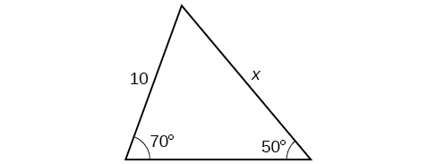 

<math xmlns="http://www.w3.org/1998/Math/MathML"> <mrow> <mn>12.3</mn></mrow> </math>

 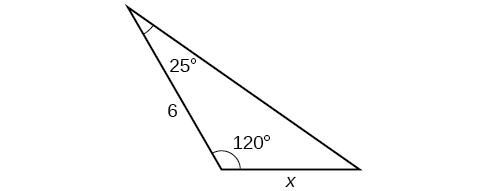 

 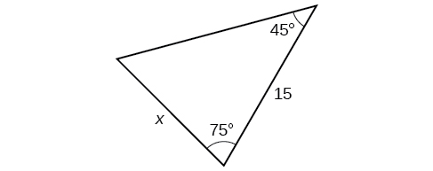 

<math xmlns="http://www.w3.org/1998/Math/MathML"> <mrow> <mn>12.2</mn><mo> </mo></mrow> </math>

 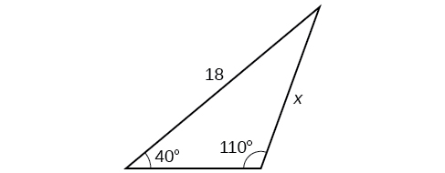 

  

<math xmlns="http://www.w3.org/1998/Math/MathML"> <mrow> <mn>16.0</mn><mo> </mo></mrow> </math>

  

For the following exercises, find the measure of angle<math xmlns="http://www.w3.org/1998/Math/MathML"> <mrow> <mtext> </mtext><mi>x</mi><mo>,</mo><mtext> </mtext></mrow> </math>

if possible. Round to the nearest tenth.

 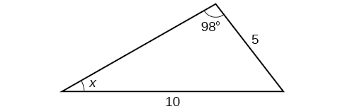 

<math xmlns="http://www.w3.org/1998/Math/MathML"> <mrow> <mrow> <mn>29.7°</mn></mrow> </mrow> </math>

 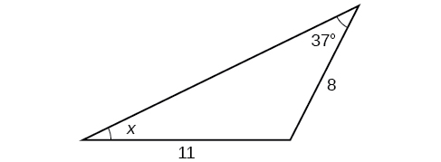 

 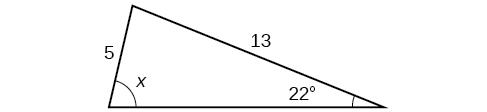 

<math xmlns="http://www.w3.org/1998/Math/MathML"> <mrow> <mi>x</mi><mo>=</mo><mn>76.9°</mn><mtext>or </mtext><mi>x</mi><mo>=</mo><mn>103.1°</mn></mrow> </math>

 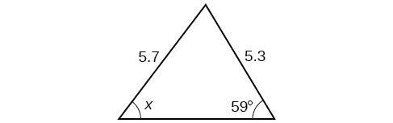 

Notice that<math xmlns="http://www.w3.org/1998/Math/MathML"> <mrow> <mtext> </mtext><mi>x</mi><mtext> </mtext></mrow> </math>

is an obtuse angle.

 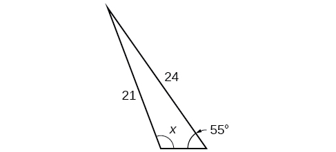 

<math xmlns="http://www.w3.org/1998/Math/MathML"> <mrow> <mn>110.6°</mn></mrow> </math>

 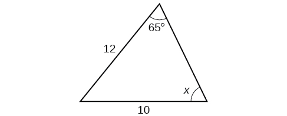 

For the following exercises, find the area of each triangle. Round each answer to the nearest tenth.

 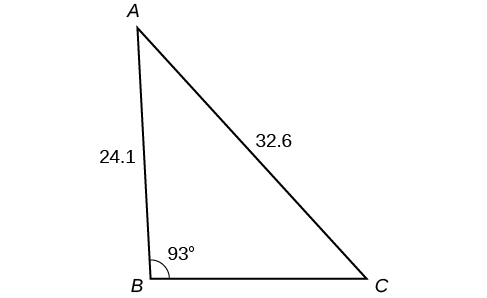 

<math xmlns="http://www.w3.org/1998/Math/MathML"> <mrow> <mi>A</mi><mo>≈</mo><mn>39.4</mn><mo>,</mo><mtext> </mtext><mi>C</mi><mo>≈</mo><mn>47.6</mn><mo>,</mo><mtext> </mtext><mi>B</mi><mi>C</mi><mo>≈</mo><mn>20.7</mn><mo> </mo></mrow> </math>

 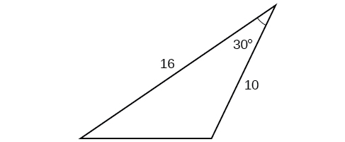 

 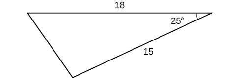 

<math xmlns="http://www.w3.org/1998/Math/MathML"> <mrow> <mn>57.1</mn></mrow> </math>

 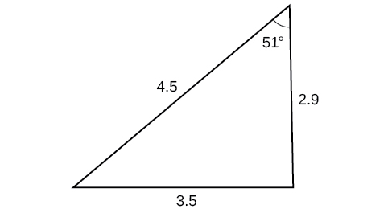 

 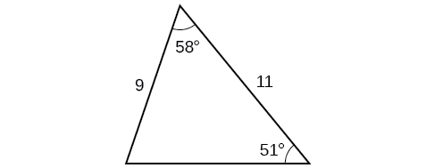 

<math xmlns="http://www.w3.org/1998/Math/MathML"> <mrow> <mn>42.0</mn><mo> </mo></mrow> </math>

 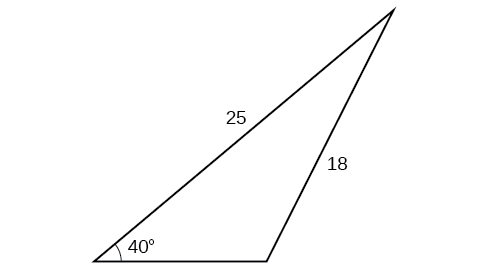 

 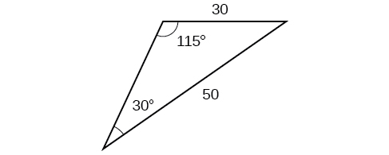 

<math xmlns="http://www.w3.org/1998/Math/MathML"> <mrow> <mn>430.2</mn><mo> </mo></mrow> </math>

#### Extensions

Find the radius of the circle in [[link]](#Figure_08_01_221). Round to the nearest tenth.

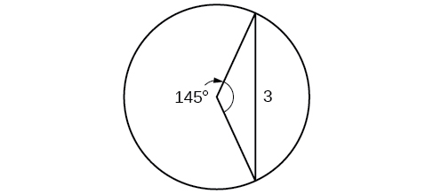{: #Figure_08_01_221}

Find the diameter of the circle in [[link]](#Figure_08_01_222). Round to the nearest tenth.

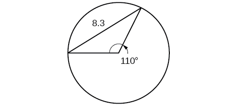{: #Figure_08_01_222}

<math xmlns="http://www.w3.org/1998/Math/MathML"> <mrow> <mn>10.1</mn></mrow> </math>

Find<math xmlns="http://www.w3.org/1998/Math/MathML"> <mrow> <mtext> </mtext><mi>m</mi><mo>∠</mo><mi>A</mi><mi>D</mi><mi>C</mi><mtext> </mtext> </mrow> </math>

in [[link]](#Figure_08_01_223). Round to the nearest tenth.

{: #Figure_08_01_223}

Find<math xmlns="http://www.w3.org/1998/Math/MathML"> <mrow> <mtext> </mtext><mi>A</mi><mi>D</mi><mtext> </mtext></mrow> </math>

in [[link]](#Figure_08_01_224). Round to the nearest tenth.

{: #Figure_08_01_224}

<math xmlns="http://www.w3.org/1998/Math/MathML"> <mrow> <mi>A</mi><mi>D</mi><mo>≈</mo><mtext> </mtext><mn>13.8</mn></mrow> </math>

Solve both triangles in [[link]](#Figure_08_01_225). Round each answer to the nearest tenth.

{: #Figure_08_01_225}

Find<math xmlns="http://www.w3.org/1998/Math/MathML"> <mrow> <mtext> </mtext><mi>A</mi><mi>B</mi><mtext> </mtext></mrow> </math>

in the parallelogram shown in [[link]](#Figure_08_01_226).

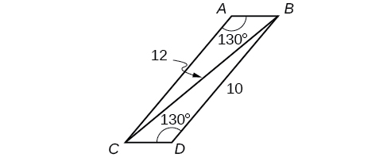{: #Figure_08_01_226}

<math xmlns="http://www.w3.org/1998/Math/MathML"> <mrow> <mi>A</mi><mi>B</mi><mo>≈</mo><mn>2.8</mn><mo> </mo></mrow> </math>

Solve the triangle in [[link]](#Figure_08_01_227). (Hint: Draw a perpendicular from<math xmlns="http://www.w3.org/1998/Math/MathML"> <mrow> <mtext> </mtext><mi>H</mi><mtext> </mtext></mrow> </math>

to<math xmlns="http://www.w3.org/1998/Math/MathML"> <mrow> <mtext> </mtext><mi>J</mi><mi>K</mi><mo>).</mo><mtext> </mtext></mrow> </math>

Round each answer to the nearest tenth.

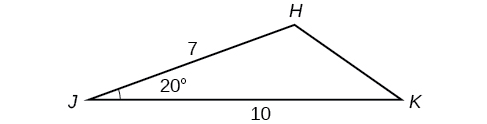{: #Figure_08_01_227}

Solve the triangle in [[link]](#Figure_08_01_228). (Hint: Draw a perpendicular from<math xmlns="http://www.w3.org/1998/Math/MathML"> <mrow> <mtext> </mtext><mi>N</mi><mtext> </mtext></mrow> </math>

to<math xmlns="http://www.w3.org/1998/Math/MathML"> <mrow> <mtext> </mtext><mi>L</mi><mi>M</mi><mo>).</mo><mtext> </mtext></mrow> </math>

Round each answer to the nearest tenth.

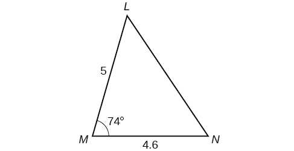{: #Figure_08_01_228}

<math xmlns="http://www.w3.org/1998/Math/MathML"> <mrow> <mi>L</mi><mo>≈</mo><mn>49.7</mn><mo>,</mo><mtext> </mtext><mi>N</mi><mo>≈</mo><mn>56.3</mn><mo>,</mo><mtext> </mtext><mi>L</mi><mi>N</mi><mo>≈</mo><mn>5.8</mn></mrow> </math>

In [[link]](#Figure_08_01_229),<math xmlns="http://www.w3.org/1998/Math/MathML"> <mrow> <mtext> </mtext><mi>A</mi><mi>B</mi><mi>C</mi><mi>D</mi><mtext>  </mtext></mrow> </math>

is not a parallelogram.<math xmlns="http://www.w3.org/1998/Math/MathML"> <mrow> <mtext> </mtext><mo>∠</mo><mi>m</mi><mtext> </mtext> </mrow> </math>

is obtuse. Solve both triangles. Round each answer to the nearest tenth.

{: #Figure_08_01_229}

#### Real-World Applications

A pole leans away from the sun at an angle of<math xmlns="http://www.w3.org/1998/Math/MathML"> <mrow> <mtext> </mtext><mn>7°</mn><mtext> </mtext></mrow> </math>

to the vertical, as shown in [[link]](#Figure_08_01_231). When the elevation of the sun is<math xmlns="http://www.w3.org/1998/Math/MathML"> <mrow> <mtext> </mtext><mn>55°</mn><mo>,</mo><mtext> </mtext></mrow> </math>

the pole casts a shadow 42 feet long on the level ground. How long is the pole? Round the answer to the nearest tenth.

{: #Figure_08_01_231}

51\.4 feet

To determine how far a boat is from shore, two radar stations 500 feet apart find the angles out to the boat, as shown in [[link]](#Figure_08_01_232). Determine the distance of the boat from station<math xmlns="http://www.w3.org/1998/Math/MathML"> <mrow> <mtext> </mtext><mi>A</mi><mtext> </mtext></mrow> </math>

and the distance of the boat from shore. Round your answers to the nearest whole foot.

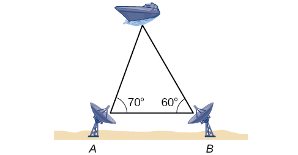{: #Figure_08_01_232}

[[link]](#Figure_08_01_233) shows a satellite orbiting Earth. The satellite passes directly over two tracking stations<math xmlns="http://www.w3.org/1998/Math/MathML"> <mrow> <mtext> </mtext><mi>A</mi><mtext> </mtext></mrow> </math>

and<math xmlns="http://www.w3.org/1998/Math/MathML"> <mrow> <mtext> </mtext><mi>B</mi><mo>,</mo><mtext> </mtext></mrow> </math>

which are 69 miles apart. When the satellite is on one side of the two stations, the angles of elevation at<math xmlns="http://www.w3.org/1998/Math/MathML"> <mrow> <mtext> </mtext><mi>A</mi><mtext> </mtext></mrow> </math>

and<math xmlns="http://www.w3.org/1998/Math/MathML"> <mrow> <mtext> </mtext><mi>B</mi><mtext> </mtext></mrow> </math>

are measured to be<math xmlns="http://www.w3.org/1998/Math/MathML"> <mrow> <mtext> </mtext><mn>86.2°</mn><mtext> </mtext></mrow> </math>

and<math xmlns="http://www.w3.org/1998/Math/MathML"> <mrow> <mtext> </mtext><mn>83.9°</mn><mo>,</mo><mtext> </mtext></mrow> </math>

respectively. How far is the satellite from station<math xmlns="http://www.w3.org/1998/Math/MathML"> <mrow> <mtext> </mtext><mi>A</mi><mtext> </mtext></mrow> </math>

and how high is the satellite above the ground? Round answers to the nearest whole mile.

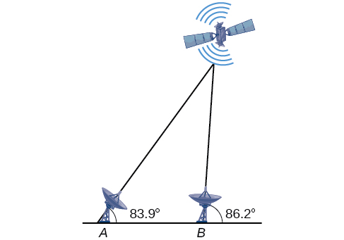{: #Figure_08_01_233}

The distance from the satellite to station<math xmlns="http://www.w3.org/1998/Math/MathML"> <mrow> <mtext> </mtext><mi>A</mi><mtext> </mtext></mrow> </math>

is approximately 1716 miles. The satellite is approximately 1706 miles above the ground.

A communications tower is located at the top of a steep hill, as shown in [[link]](#Figure_08_01_234). The angle of inclination of the hill is<math xmlns="http://www.w3.org/1998/Math/MathML"> <mrow> <mtext> </mtext><mn>67°</mn><mo /><mo>.</mo><mtext> </mtext></mrow> </math>

A guy wire is to be attached to the top of the tower and to the ground, 165 meters downhill from the base of the tower. The angle formed by the guy wire and the hill is<math xmlns="http://www.w3.org/1998/Math/MathML"> <mrow> <mtext> </mtext><mn>16°.</mn><mtext> </mtext></mrow> </math>

Find the length of the cable required for the guy wire to the nearest whole meter.

{: #Figure_08_01_234}

The roof of a house is at a<math xmlns="http://www.w3.org/1998/Math/MathML"> <mrow> <mtext> </mtext><mn>20°</mn><mtext> </mtext></mrow> </math>

angle. An 8-foot solar panel is to be mounted on the roof and should be angled<math xmlns="http://www.w3.org/1998/Math/MathML"> <mrow> <mtext> </mtext><mn>38°</mn><mtext> </mtext></mrow> </math>

relative to the horizontal for optimal results. (See [[link]](#Figure_08_01_235)). How long does the vertical support holding up the back of the panel need to be? Round to the nearest tenth.

{: #Figure_08_01_235}

2\.6 ft

Similar to an angle of elevation, an *angle of depression* is the acute angle formed by a horizontal line and an observer’s line of sight to an object below the horizontal. A pilot is flying over a straight highway. He determines the angles of depression to two mileposts, 6.6 km apart, to be<math xmlns="http://www.w3.org/1998/Math/MathML"> <mrow> <mtext> </mtext><mn>37°</mn></mrow> </math>

and<math xmlns="http://www.w3.org/1998/Math/MathML"> <mrow> <mtext> </mtext><mn>44°</mn><mo>,</mo></mrow> </math>

as shown in [[link]](#Figure_08_01_236). Find the distance of the plane from point<math xmlns="http://www.w3.org/1998/Math/MathML"> <mrow> <mtext> </mtext><mi>A</mi><mtext> </mtext></mrow> </math>

to the nearest tenth of a kilometer.

{: #Figure_08_01_236}

A pilot is flying over a straight highway. He determines the angles of depression to two mileposts, 4.3 km apart, to be 32° and 56°, as shown in [[link]](#Figure_08_01_237). Find the distance of the plane from point<math xmlns="http://www.w3.org/1998/Math/MathML"> <mrow> <mtext> </mtext><mi>A</mi><mtext> </mtext></mrow> </math>

to the nearest tenth of a kilometer.

{: #Figure_08_01_237}

5\.6 km

In order to estimate the height of a building, two students stand at a certain distance from the building at street level. From this point, they find the angle of elevation from the street to the top of the building to be 39°. They then move 300 feet closer to the building and find the angle of elevation to be 50°. Assuming that the street is level, estimate the height of the building to the nearest foot.

In order to estimate the height of a building, two students stand at a certain distance from the building at street level. From this point, they find the angle of elevation from the street to the top of the building to be 35°. They then move 250 feet closer to the building and find the angle of elevation to be 53°. Assuming that the street is level, estimate the height of the building to the nearest foot.

371 ft

Points<math xmlns="http://www.w3.org/1998/Math/MathML"> <mrow> <mtext> </mtext><mi>A</mi><mtext> </mtext></mrow> </math>

and<math xmlns="http://www.w3.org/1998/Math/MathML"> <mrow> <mtext> </mtext><mi>B</mi><mtext> </mtext></mrow> </math>

are on opposite sides of a lake. Point<math xmlns="http://www.w3.org/1998/Math/MathML"> <mrow> <mtext> </mtext><mi>C</mi><mtext> </mtext></mrow> </math>

is 97 meters from<math xmlns="http://www.w3.org/1998/Math/MathML"> <mrow> <mtext> </mtext><mi>A</mi><mo>.</mo><mtext> </mtext></mrow> </math>

The measure of angle<math xmlns="http://www.w3.org/1998/Math/MathML"> <mrow> <mtext> </mtext><mi>B</mi><mi>A</mi><mi>C</mi><mtext> </mtext></mrow> </math>

is determined to be 101°, and the measure of angle<math xmlns="http://www.w3.org/1998/Math/MathML"> <mrow> <mtext> </mtext><mi>A</mi><mi>C</mi><mi>B</mi><mtext> </mtext> </mrow> </math>

is determined to be 53°. What is the distance from<math xmlns="http://www.w3.org/1998/Math/MathML"> <mrow> <mtext> </mtext><mi>A</mi><mtext> </mtext></mrow> </math>

to<math xmlns="http://www.w3.org/1998/Math/MathML"> <mrow> <mtext> </mtext><mi>B</mi><mo>,</mo><mtext> </mtext></mrow> </math>

rounded to the nearest whole meter?

A man and a woman standing<math xmlns="http://www.w3.org/1998/Math/MathML"> <mrow> <mtext> </mtext><mn>3</mn><mfrac> <mn>1</mn> <mn>2</mn> </mfrac> <mtext> </mtext></mrow> </math>

miles apart spot a hot air balloon at the same time. If the angle of elevation from the man to the balloon is 27°, and the angle of elevation from the woman to the balloon is 41°, find the altitude of the balloon to the nearest foot.

5936 ft

Two search teams spot a stranded climber on a mountain. The first search team is 0.5 miles from the second search team, and both teams are at an altitude of 1 mile. The angle of elevation from the first search team to the stranded climber is 15°. The angle of elevation from the second search team to the climber is 22°. What is the altitude of the climber? Round to the nearest tenth of a mile.

A street light is mounted on a pole. A 6-foot-tall man is standing on the street a short distance from the pole, casting a shadow. The angle of elevation from the tip of the man’s shadow to the top of his head of 28°. A 6-foot-tall woman is standing on the same street on the opposite side of the pole from the man. The angle of elevation from the tip of her shadow to the top of her head is 28°. If the man and woman are 20 feet apart, how far is the street light from the tip of the shadow of each person? Round the distance to the nearest tenth of a foot.

24\.1 ft

Three cities,<math xmlns="http://www.w3.org/1998/Math/MathML"> <mrow> <mtext> </mtext><mi>A</mi><mo>,</mo><mi>B</mi><mo>,</mo></mrow> </math>

and<math xmlns="http://www.w3.org/1998/Math/MathML"> <mrow> <mtext> </mtext><mi>C</mi><mo>,</mo></mrow> </math>

are located so that city<math xmlns="http://www.w3.org/1998/Math/MathML"> <mrow> <mtext> </mtext><mi>A</mi><mtext> </mtext></mrow> </math>

is due east of city<math xmlns="http://www.w3.org/1998/Math/MathML"> <mrow> <mtext> </mtext><mi>B</mi><mo>.</mo><mtext> </mtext></mrow> </math>

If city<math xmlns="http://www.w3.org/1998/Math/MathML"> <mrow> <mtext> </mtext><mi>C</mi><mtext> </mtext></mrow> </math>

is located 35° west of north from city<math xmlns="http://www.w3.org/1998/Math/MathML"> <mrow> <mtext> </mtext><mi>B</mi><mtext> </mtext></mrow> </math>

and is 100 miles from city<math xmlns="http://www.w3.org/1998/Math/MathML"> <mrow> <mtext> </mtext><mi>A</mi><mtext> </mtext></mrow> </math>

and 70 miles from city<math xmlns="http://www.w3.org/1998/Math/MathML"> <mrow> <mtext> </mtext><mi>B</mi><mo>,</mo></mrow> </math>

how far is city<math xmlns="http://www.w3.org/1998/Math/MathML"> <mrow> <mtext> </mtext><mi>A</mi><mtext> </mtext></mrow> </math>

from city<math xmlns="http://www.w3.org/1998/Math/MathML"> <mrow> <mtext> </mtext><mi>B</mi><mo>?</mo><mtext> </mtext></mrow> </math>

Round the distance to the nearest tenth of a mile.

Two streets meet at an 80° angle. At the corner, a park is being built in the shape of a triangle. Find the area of the park if, along one road, the park measures 180 feet, and along the other road, the park measures 215 feet.

19,056 ft2

Brian’s house is on a corner lot. Find the area of the front yard if the edges measure 40 and 56 feet, as shown in [[link]](#Figure_08_01_238).

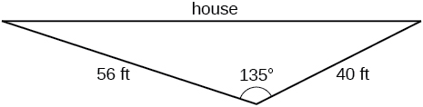{: #Figure_08_01_238}

The Bermuda triangle is a region of the Atlantic Ocean that connects Bermuda, Florida, and Puerto Rico. Find the area of the Bermuda triangle if the distance from Florida to Bermuda is 1030 miles, the distance from Puerto Rico to Bermuda is 980 miles, and the angle created by the two distances is 62°.

445,624 square miles

A yield sign measures 30 inches on all three sides. What is the area of the sign?

Naomi bought a modern dining table whose top is in the shape of a triangle. Find the area of the table top if two of the sides measure 4 feet and 4.5 feet, and the smaller angles measure 32° and 42°, as shown in [[link]](#Figure_08_01_239).

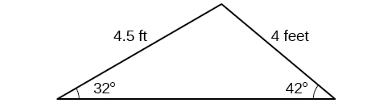{: #Figure_08_01_239}

8\.65 ft2

### Glossary
{: data-type="glossary-title"}

altitude
: a perpendicular line from one vertex of a triangle to the opposite side, or in the case of an obtuse triangle, to the line containing the opposite side, forming two right triangles
^

ambiguous case
: a scenario in which more than one triangle is a valid solution for a given oblique SSA triangle
^

Law of Sines
: states that the ratio of the measurement of one angle of a triangle to the length of its opposite side is equal to the remaining two ratios of angle measure to opposite side; any pair of proportions may be used to solve for a missing angle or side
^

oblique triangle
: any triangle that is not a right triangle

[1]: http://openstaxcollege.org/l/sinesbasic
[2]: http://openstaxcollege.org/l/sinesambiguous
