

In this section, you will:
* Use the Law of Cosines to solve oblique triangles.
* Solve applied problems using the Law of Cosines.
* Use Heron’s formula to find the area of a triangle.

Suppose a boat leaves port, travels 10 miles, turns 20 degrees, and travels another 8 miles as shown in [\[link\]](#Figure_08_02_001). How far from port is the boat?

 {: #Figure_08_02_001}

Unfortunately, while the Law of Sines enables us to address many non-right triangle cases, it does not help us with triangles where the known angle is between two known sides, a **SAS (side-angle-side) triangle**{: data-type="term" .no-emphasis}, or when all three sides are known, but no angles are known, a **SSS (side-side-side) triangle**{: data-type="term" .no-emphasis}. In this section, we will investigate another tool for solving oblique triangles described by these last two cases.

### Using the Law of Cosines to Solve Oblique Triangles

The tool we need to solve the problem of the boat’s distance from the port is the **Law of Cosines**, which defines the relationship among angle measurements and side lengths in oblique triangles. Three formulas make up the Law of Cosines. At first glance, the formulas may appear complicated because they include many variables. However, once the pattern is understood, the Law of Cosines is easier to work with than most formulas at this mathematical level.

Understanding how the Law of Cosines is derived will be helpful in using the formulas. The derivation begins with the **Generalized Pythagorean Theorem**{: data-type="term"}, which is an extension of the **Pythagorean Theorem**{: data-type="term" .no-emphasis} to non-right triangles. Here is how it works: An arbitrary non-right triangle<math xmlns="http://www.w3.org/1998/Math/MathML"> <mrow> <mtext> </mtext><mi>A</mi><mi>B</mi><mi>C</mi><mtext> </mtext></mrow> </math>

is placed in the coordinate plane with vertex<math xmlns="http://www.w3.org/1998/Math/MathML"> <mrow> <mtext> </mtext><mi>A</mi><mtext> </mtext></mrow> </math>

at the origin, side<math xmlns="http://www.w3.org/1998/Math/MathML"> <mrow> <mtext> </mtext><mi>c</mi><mtext> </mtext></mrow> </math>

drawn along the *x*-axis, and vertex<math xmlns="http://www.w3.org/1998/Math/MathML"> <mrow> <mtext> </mtext><mi>C</mi><mtext> </mtext></mrow> </math>

located at some point<math xmlns="http://www.w3.org/1998/Math/MathML"> <mrow> <mtext> </mtext><mrow><mo>(</mo> <mrow> <mi>x</mi><mo>,</mo><mi>y</mi></mrow> <mo>)</mo></mrow><mtext> </mtext></mrow> </math>

in the plane, as illustrated in [\[link\]](#Figure_08_02_002). Generally, triangles exist anywhere in the plane, but for this explanation we will place the triangle as noted.

{: #Figure_08_02_002}

We can drop a perpendicular from<math xmlns="http://www.w3.org/1998/Math/MathML"> <mrow> <mtext> </mtext><mi>C</mi><mtext> </mtext></mrow> </math>

to the *x-*axis (this is the altitude or height). Recalling the basic **trigonometric identities**{: data-type="term" .no-emphasis}, we know that

<math xmlns="http://www.w3.org/1998/Math/MathML" display="block"> <mrow> <mi>cos</mi><mtext> </mtext><mi>θ</mi><mo>=</mo><mfrac> <mrow> <mi>x</mi><mtext>(adjacent)</mtext></mrow> <mrow> <mi>b</mi><mtext>(hypotenuse)</mtext></mrow> </mfrac> <mtext> and </mtext><mi>sin</mi><mtext> </mtext><mi>θ</mi><mo>=</mo><mfrac> <mrow> <mi>y</mi><mtext>(opposite)</mtext></mrow> <mrow> <mi>b</mi><mtext>(hypotenuse)</mtext></mrow> </mfrac> </mrow> </math>

In terms of<math xmlns="http://www.w3.org/1998/Math/MathML"> <mrow> <mtext> </mtext><mi>θ</mi><mo>,</mo><mtext> </mtext><mi>x</mi><mo>=</mo><mi>b</mi><mi>cos</mi><mtext> </mtext><mi>θ</mi><mtext> </mtext> </mrow> </math>

and<math xmlns="http://www.w3.org/1998/Math/MathML"> <mrow> <mi>y</mi><mo>=</mo><mi>b</mi><mi>sin</mi><mtext> </mtext><mi>θ</mi><mo>.</mo><mtext> </mtext> </mrow> </math>

The<math xmlns="http://www.w3.org/1998/Math/MathML"> <mrow> <mtext> </mtext><mo stretchy="false">(</mo><mi>x</mi><mo>,</mo><mi>y</mi><mo stretchy="false">)</mo><mtext> </mtext></mrow> </math>

point located at<math xmlns="http://www.w3.org/1998/Math/MathML"> <mrow> <mtext> </mtext><mi>C</mi><mtext> </mtext></mrow> </math>

has coordinates<math xmlns="http://www.w3.org/1998/Math/MathML"> <mrow> <mtext> </mtext><mrow><mo>(</mo> <mrow> <mi>b</mi><mi>cos</mi><mtext> </mtext><mi>θ</mi><mo>,</mo><mtext> </mtext><mtext> </mtext><mi>b</mi><mi>sin</mi><mtext> </mtext><mi>θ</mi></mrow> <mo>)</mo></mrow><mo>.</mo><mtext> </mtext></mrow> </math>

Using the side<math xmlns="http://www.w3.org/1998/Math/MathML"> <mrow> <mtext> </mtext><mrow><mo>(</mo> <mrow> <mi>x</mi><mo>−</mo><mi>c</mi></mrow> <mo>)</mo></mrow><mtext> </mtext></mrow> </math>

as one leg of a right triangle and<math xmlns="http://www.w3.org/1998/Math/MathML"> <mrow> <mtext> </mtext><mi>y</mi><mtext> </mtext></mrow> </math>

as the second leg, we can find the length of hypotenuse<math xmlns="http://www.w3.org/1998/Math/MathML"> <mrow> <mtext> </mtext><mi>a</mi><mtext> </mtext></mrow> </math>

using the Pythagorean Theorem. Thus,

<math xmlns="http://www.w3.org/1998/Math/MathML" display="block"> <mrow> <mtable columnalign="left"> <mtr columnalign="left"> <mtd columnalign="left"> <mrow> <mo> </mo><msup> <mi>a</mi> <mn>2</mn> </msup> <mo>=</mo><msup> <mrow> <mo stretchy="false">(</mo><mi>x</mi><mo>−</mo><mi>c</mi><mo stretchy="false">)</mo> </mrow> <mn>2</mn> </msup> <mo>+</mo><msup> <mi>y</mi> <mn>2</mn> </msup> </mrow> </mtd> <mtd columnalign="left"> <mrow /> </mtd> <mtd columnalign="left"> <mrow /> </mtd> <mtd columnalign="left"> <mrow /> </mtd> <mtd columnalign="left"> <mrow /> </mtd> <mtd columnalign="left"> <mrow /> </mtd> </mtr> <mtr columnalign="left"> <mtd columnalign="left"> <mrow> <mtext>       </mtext><mo>=</mo><msup> <mrow> <mo stretchy="false">(</mo><mi>b</mi><mi>cos</mi><mtext> </mtext><mi>θ</mi><mo>−</mo><mi>c</mi><mo stretchy="false">)</mo> </mrow> <mn>2</mn> </msup> <mo>+</mo><msup> <mrow> <mo stretchy="false">(</mo><mi>b</mi><mi>sin</mi><mtext> </mtext><mi>θ</mi><mo stretchy="false">)</mo> </mrow> <mn>2</mn> </msup> </mrow> </mtd> <mtd columnalign="left"> <mrow /> </mtd> <mtd columnalign="left"> <mrow /> </mtd> <mtd columnalign="left"> <mrow /> </mtd> <mtd columnalign="left"> <mrow /> </mtd> <mtd columnalign="left"> <mrow> <mtext>Substitute </mtext><mo stretchy="false">(</mo><mi>b</mi><mi>cos</mi><mtext> </mtext><mi>θ</mi><mo stretchy="false">)</mo><mtext> for</mtext><mtext> </mtext><mi>x</mi><mtext> </mtext><mtext> </mtext><mtext>and </mtext><mo stretchy="false">(</mo><mi>b</mi><mi>sin</mi><mtext> </mtext><mi>θ</mi><mo stretchy="false">)</mo><mtext> </mtext><mtext>for </mtext><mi>y</mi><mo>.</mo> </mrow> </mtd> </mtr> <mtr columnalign="left"> <mtd columnalign="left"> <mrow> <mtext>       </mtext><mo>=</mo><mrow><mo>(</mo> <mrow> <msup> <mi>b</mi> <mn>2</mn> </msup> <msup> <mrow> <mi>cos</mi> </mrow> <mn>2</mn> </msup> <mi>θ</mi><mo>−</mo><mn>2</mn><mi>b</mi><mi>c</mi><mi>cos</mi><mtext> </mtext><mi>θ</mi><mo>+</mo><msup> <mi>c</mi> <mn>2</mn> </msup> </mrow> <mo>)</mo></mrow><mo>+</mo><msup> <mi>b</mi> <mn>2</mn> </msup> <msup> <mrow> <mi>sin</mi> </mrow> <mn>2</mn> </msup> <mi>θ</mi> </mrow> </mtd> <mtd columnalign="left"> <mrow /> </mtd> <mtd columnalign="left"> <mrow /> </mtd> <mtd columnalign="left"> <mrow /> </mtd> <mtd columnalign="left"> <mrow /> </mtd> <mtd columnalign="left"> <mrow> <mtext>Expand the perfect square</mtext><mo>.</mo> </mrow> </mtd> </mtr> <mtr columnalign="left"> <mtd columnalign="left"> <mrow> <mtext>       </mtext><mo>=</mo><msup> <mi>b</mi> <mn>2</mn> </msup> <msup> <mrow> <mi>cos</mi> </mrow> <mn>2</mn> </msup> <mi>θ</mi><mo>+</mo><msup> <mi>b</mi> <mn>2</mn> </msup> <msup> <mrow> <mi>sin</mi> </mrow> <mn>2</mn> </msup> <mi>θ</mi><mo>+</mo><msup> <mi>c</mi> <mn>2</mn> </msup> <mo>−</mo><mn>2</mn><mi>b</mi><mi>c</mi><mi>cos</mi><mtext> </mtext><mi>θ</mi> </mrow> </mtd> <mtd columnalign="left"> <mrow /> </mtd> <mtd columnalign="left"> <mrow /> </mtd> <mtd columnalign="left"> <mrow /> </mtd> <mtd columnalign="left"> <mrow /> </mtd> <mtd columnalign="left"> <mrow> <mtext>Group terms noting that </mtext><msup> <mrow> <mi>cos</mi> </mrow> <mn>2</mn> </msup> <mi>θ</mi><mo>+</mo><msup> <mrow> <mi>sin</mi> </mrow> <mn>2</mn> </msup> <mi>θ</mi><mo>=</mo><mn>1.</mn> </mrow> </mtd> </mtr> <mtr columnalign="left"> <mtd columnalign="left"> <mrow> <mtext>       </mtext><mo>=</mo><msup> <mi>b</mi> <mn>2</mn> </msup> <mrow><mo>(</mo> <mrow> <msup> <mrow> <mi>cos</mi> </mrow> <mn>2</mn> </msup> <mi>θ</mi><mo>+</mo><msup> <mrow> <mi>sin</mi> </mrow> <mn>2</mn> </msup> <mi>θ</mi> </mrow> <mo>)</mo></mrow><mo>+</mo><msup> <mi>c</mi> <mn>2</mn> </msup> <mo>−</mo><mn>2</mn><mi>b</mi><mi>c</mi><mi>cos</mi><mtext> </mtext><mi>θ</mi> </mrow> </mtd> <mtd columnalign="left"> <mrow /> </mtd> <mtd columnalign="left"> <mrow /> </mtd> <mtd columnalign="left"> <mrow /> </mtd> <mtd columnalign="left"> <mrow /> </mtd> <mtd columnalign="left"> <mrow> <mtext>Factor out </mtext><msup> <mi>b</mi> <mn>2</mn> </msup> <mo>.</mo> </mrow> </mtd> </mtr> <mtr columnalign="left"> <mtd columnalign="left"> <mrow> <mo> </mo><msup> <mi>a</mi> <mn>2</mn> </msup> <mo>=</mo><msup> <mi>b</mi> <mn>2</mn> </msup> <mo>+</mo><msup> <mi>c</mi> <mn>2</mn> </msup> <mo>−</mo><mn>2</mn><mi>b</mi><mi>c</mi><mi>cos</mi><mtext> </mtext><mi>θ</mi> </mrow> </mtd> <mtd columnalign="left"> <mrow /> </mtd> <mtd columnalign="left"> <mrow /> </mtd> <mtd columnalign="left"> <mrow /> </mtd> <mtd columnalign="left"> <mrow /> </mtd> <mtd columnalign="left"> <mrow /> </mtd> </mtr> </mtable> </mrow> </math>

The formula derived is one of the three equations of the Law of Cosines. The other equations are found in a similar fashion.

Keep in mind that it is always helpful to sketch the triangle when solving for angles or sides. In a real-world scenario, try to draw a diagram of the situation. As more information emerges, the diagram may have to be altered. Make those alterations to the diagram and, in the end, the problem will be easier to solve.

Law of Cosines

The **Law of Cosines**{: data-type="term"} states that the square of any side of a triangle is equal to the sum of the squares of the other two sides minus twice the product of the other two sides and the cosine of the included angle. For triangles labeled as in [\[link\]](#Figure_08_02_003), with angles<math xmlns="http://www.w3.org/1998/Math/MathML"> <mrow> <mtext> </mtext><mi>α</mi><mo>,</mo><mi>β</mi><mo>,</mo></mrow> </math>

 and<math xmlns="http://www.w3.org/1998/Math/MathML"> <mrow> <mtext> </mtext><mi>γ</mi><mo>,</mo></mrow> </math>

 and opposite corresponding sides<math xmlns="http://www.w3.org/1998/Math/MathML"> <mrow> <mtext> </mtext><mi>a</mi><mo>,</mo><mi>b</mi><mo>,</mo></mrow> </math>

 and<math xmlns="http://www.w3.org/1998/Math/MathML"> <mrow> <mtext> </mtext><mi>c</mi><mo>,</mo><mtext> </mtext></mrow> </math>

respectively, the Law of Cosines is given as three equations.

<math xmlns="http://www.w3.org/1998/Math/MathML" display="block"> <mtable columnalign="left"> <mtr> <mtd> <msup> <mi>a</mi> <mn>2</mn> </msup> <mo>=</mo><msup> <mi>b</mi> <mn>2</mn> </msup> <mo>+</mo><msup> <mi>c</mi> <mn>2</mn> </msup> <mo>−</mo><mn>2</mn><mi>b</mi><mi>c</mi><mtext> </mtext><mtext> </mtext><mi>cos</mi><mtext> </mtext><mi>α</mi> </mtd> </mtr> <mtr> <mtd> <msup> <mi>b</mi> <mn>2</mn> </msup> <mo>=</mo><msup> <mi>a</mi> <mn>2</mn> </msup> <mo>+</mo><msup> <mi>c</mi> <mn>2</mn> </msup> <mo>−</mo><mn>2</mn><mi>a</mi><mi>c</mi><mtext> </mtext><mtext> </mtext><mi>cos</mi><mtext> </mtext><mi>β</mi> </mtd> </mtr> <mtr> <mtd> <msup> <mi>c</mi> <mn>2</mn> </msup> <mo>=</mo><msup> <mi>a</mi> <mn>2</mn> </msup> <mo>+</mo><msup> <mi>b</mi> <mn>2</mn> </msup> <mo>−</mo><mn>2</mn><mi>a</mi><mi>b</mi><mtext> </mtext><mtext> </mtext><mi>cos</mi><mtext> </mtext><mi>γ</mi> </mtd> </mtr> </mtable> </math>

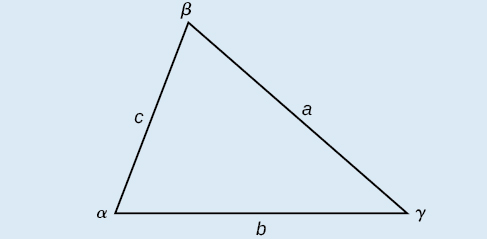{: #Figure_08_02_003}

To solve for a missing side measurement, the corresponding opposite angle measure is needed.

When solving for an angle, the corresponding opposite side measure is needed. We can use another version of the Law of Cosines to solve for an angle.

<math xmlns="http://www.w3.org/1998/Math/MathML" display="block"> <mrow> <mtable columnalign="left"> <mtr columnalign="left"> <mtd columnalign="left"> <mrow /> </mtd> </mtr> <mtr columnalign="left"> <mtd columnalign="left"> <mrow> <mtable columnalign="left"> <mtr columnalign="left"> <mtd columnalign="left"> <mrow> <mtable columnalign="left"> <mtr columnalign="left"> <mtd columnalign="left"> <mrow /> </mtd> </mtr> <mtr columnalign="left"> <mtd columnalign="left"> <mrow> <mi>cos</mi><mtext> </mtext><mi>α</mi><mo>=</mo><mfrac> <mrow> <msup> <mi>b</mi> <mn>2</mn> </msup> <mo>+</mo><msup> <mi>c</mi> <mn>2</mn> </msup> <mo>−</mo><msup> <mi>a</mi> <mn>2</mn> </msup> </mrow> <mrow> <mn>2</mn><mi>b</mi><mi>c</mi> </mrow> </mfrac> </mrow> </mtd> </mtr> </mtable> </mrow> </mtd> </mtr> <mtr columnalign="left"> <mtd columnalign="left"> <mrow> <mi>cos</mi><mtext> </mtext><mi>β</mi><mo>=</mo><mfrac> <mrow> <msup> <mi>a</mi> <mn>2</mn> </msup> <mo>+</mo><msup> <mi>c</mi> <mn>2</mn> </msup> <mo>−</mo><msup> <mi>b</mi> <mn>2</mn> </msup> </mrow> <mrow> <mn>2</mn><mi>a</mi><mi>c</mi> </mrow> </mfrac> </mrow> </mtd> </mtr> <mtr columnalign="left"> <mtd columnalign="left"> <mrow> <mi>cos</mi><mtext> </mtext><mi>γ</mi><mo>=</mo><mfrac> <mrow> <msup> <mi>a</mi> <mn>2</mn> </msup> <mo>+</mo><msup> <mi>b</mi> <mn>2</mn> </msup> <mo>−</mo><msup> <mi>c</mi> <mn>2</mn> </msup> </mrow> <mrow> <mn>2</mn><mi>a</mi><mi>b</mi> </mrow> </mfrac> </mrow> </mtd> </mtr> </mtable> </mrow> </mtd> </mtr> </mtable> </mrow> </math>

**Given two sides and the angle between them (SAS), find the measures of the remaining side and angles of a triangle.**

1.  Sketch the triangle. Identify the measures of the known sides and angles. Use variables to represent the measures of the unknown sides and angles.
2.  Apply the Law of Cosines to find the length of the unknown side or angle.
3.  Apply the **Law of Sines**{: data-type="term" .no-emphasis} or Cosines to find the measure of a second angle.
4.  Compute the measure of the remaining angle.
{: data-number-style="arabic"}

Finding the Unknown Side and Angles of a SAS Triangle

Find the unknown side and angles of the triangle in [[link]](#Figure_08_02_004).

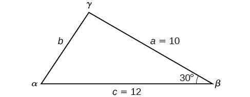{: #Figure_08_02_004}

First, make note of what is given: two sides and the angle between them. This arrangement is classified as SAS and supplies the data needed to apply the Law of Cosines.

Each one of the three laws of cosines begins with the square of an unknown side opposite a known angle. For this example, the first side to solve for is side<math xmlns="http://www.w3.org/1998/Math/MathML"> <mrow> <mtext> </mtext><mi>b</mi><mo>,</mo><mtext> </mtext></mrow> </math>

as we know the measurement of the opposite angle<math xmlns="http://www.w3.org/1998/Math/MathML"> <mrow> <mtext> </mtext><mi>β</mi><mo>.</mo></mrow> </math>

<math xmlns="http://www.w3.org/1998/Math/MathML" display="block"> <mrow> <mtable columnalign="left"> <mtr columnalign="left"> <mtd columnalign="left"> <mrow> <msup> <mi>b</mi> <mn>2</mn> </msup> <mo>=</mo><msup> <mi>a</mi> <mn>2</mn> </msup> <mo>+</mo><msup> <mi>c</mi> <mn>2</mn> </msup> <mo>−</mo><mn>2</mn><mi>a</mi><mi>c</mi><mi>cos</mi><mtext> </mtext><mi>β</mi> </mrow> </mtd> <mtd columnalign="left"> <mrow /> </mtd> </mtr> <mtr columnalign="left"> <mtd columnalign="left"> <mrow> <msup> <mi>b</mi> <mn>2</mn> </msup> <mo>=</mo><msup> <mrow> <mn>10</mn> </mrow> <mn>2</mn> </msup> <mo>+</mo><msup> <mrow> <mn>12</mn> </mrow> <mn>2</mn> </msup> <mo>−</mo><mn>2</mn><mo stretchy="false">(</mo><mn>10</mn><mo stretchy="false">)</mo><mo stretchy="false">(</mo><mn>12</mn><mo stretchy="false">)</mo><mi>cos</mi><mo stretchy="false">(</mo><msup> <mrow> <mn>30</mn> </mrow> <mo>∘</mo> </msup> <mo stretchy="false">)</mo><mtable> <mtr> <mtd> <mrow /> </mtd> <mtd> <mrow /> </mtd> <mtd> <mrow /> </mtd> <mtd> <mrow /> </mtd> </mtr> </mtable> </mrow> </mtd> <mtd columnalign="left"> <mrow> <mtext>Substitute the measurements for the known quantities</mtext><mo>.</mo> </mrow> </mtd> </mtr> <mtr columnalign="left"> <mtd columnalign="left"> <mrow> <msup> <mi>b</mi> <mn>2</mn> </msup> <mo>=</mo><mn>100</mn><mo>+</mo><mn>144</mn><mo>−</mo><mn>240</mn><mrow><mo>(</mo> <mrow> <mfrac> <mrow> <msqrt> <mn>3</mn> </msqrt> </mrow> <mn>2</mn> </mfrac> </mrow> <mo>)</mo></mrow> </mrow> </mtd> <mtd columnalign="left"> <mrow> <mtext>Evaluate the cosine and begin to simplify</mtext><mo>.</mo> </mrow> </mtd> </mtr> <mtr columnalign="left"> <mtd columnalign="left"> <mrow> <msup> <mi>b</mi> <mn>2</mn> </msup> <mo>=</mo><mn>244</mn><mo>−</mo><mn>120</mn><msqrt> <mn>3</mn> </msqrt> </mrow> </mtd> <mtd columnalign="left"> <mrow /> </mtd> </mtr> <mtr columnalign="left"> <mtd columnalign="left"> <mrow> <mtext> </mtext><mtext> </mtext><mtext> </mtext><mi>b</mi><mo>=</mo><msqrt> <mrow> <mn>244</mn><mo>−</mo><mn>120</mn><msqrt> <mn>3</mn> </msqrt> </mrow> </msqrt> </mrow> </mtd> <mtd columnalign="left"> <mrow> <mtext> </mtext><mtext>Use the square root property</mtext><mo>.</mo> </mrow> </mtd> </mtr> <mtr columnalign="left"> <mtd columnalign="left"> <mrow> <mtext> </mtext><mtext> </mtext><mtext> </mtext><mi>b</mi><mo>≈</mo><mn>6.013</mn> </mrow> </mtd> <mtd columnalign="left"> <mrow /> </mtd> </mtr> </mtable> </mrow> </math>

Because we are solving for a length, we use only the positive square root. Now that we know the length<math xmlns="http://www.w3.org/1998/Math/MathML"> <mrow> <mtext> </mtext><mi>b</mi><mo>,</mo><mtext> </mtext></mrow> </math>

we can use the Law of Sines to fill in the remaining angles of the triangle. Solving for angle<math xmlns="http://www.w3.org/1998/Math/MathML"> <mrow> <mtext> </mtext><mi>α</mi><mo>,</mo><mtext> </mtext></mrow> </math>

we have

<math xmlns="http://www.w3.org/1998/Math/MathML" display="block"> <mrow> <mtable columnalign="left"> <mtr columnalign="left"> <mtd columnalign="left"> <mrow> <mfrac> <mrow> <mi>sin</mi><mtext> </mtext><mi>α</mi> </mrow> <mi>a</mi> </mfrac> <mo>=</mo><mfrac> <mrow> <mi>sin</mi><mtext> </mtext><mi>β</mi> </mrow> <mi>b</mi> </mfrac> </mrow> </mtd> <mtd columnalign="left"> <mrow /> </mtd> </mtr> <mtr columnalign="left"> <mtd columnalign="left"> <mrow> <mfrac> <mrow> <mi>sin</mi><mtext> </mtext><mi>α</mi> </mrow> <mrow> <mn>10</mn> </mrow> </mfrac> <mo>=</mo><mfrac> <mrow> <mi>sin</mi><mo stretchy="false">(</mo><mn>30°</mn><mo stretchy="false">)</mo> </mrow> <mrow> <mn>6.013</mn> </mrow> </mfrac> </mrow> </mtd> <mtd columnalign="left"> <mrow /> </mtd> </mtr> <mtr columnalign="left"> <mtd columnalign="left"> <mrow> <mtext> </mtext><mi>sin</mi><mtext> </mtext><mi>α</mi><mo>=</mo><mfrac> <mrow> <mn>10</mn><mi>sin</mi><mo stretchy="false">(</mo><mn>30°</mn><mo stretchy="false">)</mo> </mrow> <mrow> <mn>6.013</mn> </mrow> </mfrac> </mrow> </mtd> <mtd columnalign="left"> <mrow> <mtext>Multiply both sides of the equation by 10</mtext><mo>.</mo> </mrow> </mtd> </mtr> <mtr columnalign="left"> <mtd columnalign="left"> <mrow> <mtext> </mtext><mtext> </mtext><mtext> </mtext><mtext> </mtext><mtext> </mtext><mtext> </mtext><mtext> </mtext><mtext> </mtext><mi>α</mi><mo>=</mo><msup> <mrow> <mi>sin</mi> </mrow> <mrow> <mo>−</mo><mn>1</mn> </mrow> </msup> <mrow><mo>(</mo> <mrow> <mfrac> <mrow> <mn>10</mn><mi>sin</mi><mo stretchy="false">(</mo><mn>30°</mn><mo stretchy="false">)</mo> </mrow> <mrow> <mn>6.013</mn> </mrow> </mfrac> </mrow> <mo>)</mo></mrow><mtable> <mtr> <mtd> <mrow /> </mtd> <mtd> <mrow /> </mtd> <mtd> <mrow /> </mtd> <mtd> <mrow /> </mtd> </mtr> </mtable> </mrow> </mtd> <mtd columnalign="left"> <mrow> <mtext>Find the inverse sine of </mtext><mfrac> <mrow> <mn>10</mn><mi>sin</mi><mo stretchy="false">(</mo><mn>30°</mn><mo stretchy="false">)</mo> </mrow> <mrow> <mn>6.013</mn> </mrow> </mfrac> <mo>.</mo> </mrow> </mtd> </mtr> <mtr columnalign="left"> <mtd columnalign="left"> <mrow> <mtext> </mtext><mtext> </mtext><mtext> </mtext><mtext> </mtext><mtext> </mtext><mtext> </mtext><mtext> </mtext><mtext> </mtext><mi>α</mi><mo>≈</mo><mn>56.3°</mn> </mrow> </mtd> <mtd columnalign="left"> <mrow /> </mtd> </mtr> </mtable> </mrow> </math>

The other possibility for<math xmlns="http://www.w3.org/1998/Math/MathML"> <mrow> <mtext> </mtext><mi>α</mi><mtext> </mtext></mrow> </math>

would be<math xmlns="http://www.w3.org/1998/Math/MathML"> <mrow> <mtext> </mtext><mi>α</mi><mo>=</mo><mn>180°</mn><mo>–</mo><mn>56.3°</mn><mo>≈</mo><mn>123.7°.</mn><mtext> </mtext></mrow> </math>

In the original diagram,<math xmlns="http://www.w3.org/1998/Math/MathML"> <mrow> <mtext> </mtext><mi>α</mi><mtext> </mtext></mrow> </math>

is adjacent to the longest side, so<math xmlns="http://www.w3.org/1998/Math/MathML"> <mrow> <mtext> </mtext><mi>α</mi><mtext> </mtext></mrow> </math>

is an acute angle and, therefore,<math xmlns="http://www.w3.org/1998/Math/MathML"> <mrow> <mtext> </mtext><mn>123.7°</mn><mtext> </mtext></mrow> </math>

does not make sense. Notice that if we choose to apply the **Law of Cosines**{: data-type="term" .no-emphasis}, we arrive at a unique answer. We do not have to consider the other possibilities, as cosine is unique for angles between<math xmlns="http://www.w3.org/1998/Math/MathML"> <mrow> <mtext> </mtext> <mn>0°</mn> <mtext> </mtext></mrow> </math>

and<math xmlns="http://www.w3.org/1998/Math/MathML"> <mrow> <mtext> </mtext> <mrow> <mn>180°.</mn></mrow> <mtext> </mtext></mrow> </math>

Proceeding with<math xmlns="http://www.w3.org/1998/Math/MathML"> <mrow> <mtext> </mtext><mi>α</mi><mo>≈</mo><mn>56.3°</mn><mo>,</mo><mtext> </mtext></mrow> </math>

we can then find the third angle of the triangle.

<math xmlns="http://www.w3.org/1998/Math/MathML"> <mrow> <mi>γ</mi><mo>=</mo><mn>180°</mn><mo>−</mo><mn>30°</mn><mo>−</mo><mn>56.3°</mn><mo>≈</mo><mn>93.7°</mn></mrow> </math>

The complete set of angles and sides is

<math xmlns="http://www.w3.org/1998/Math/MathML" display="block"> <mrow> <mtable columnalign="left"> <mtr columnalign="left"> <mtd columnalign="left"> <mrow> <mi>α</mi><mo>≈</mo><mn>56.3°</mn><mtable> <mtr> <mtd> <mrow /> </mtd> <mtd> <mrow /> </mtd> <mtd> <mrow /> </mtd> <mtd> <mrow /> </mtd> </mtr> </mtable> </mrow> </mtd> <mtd columnalign="left"> <mrow> <mi>a</mi><mo>=</mo><mn>10</mn> </mrow> </mtd> </mtr> <mtr columnalign="left"> <mtd columnalign="left"> <mrow> <mi>β</mi><mo>=</mo><mn>30°</mn> </mrow> </mtd> <mtd columnalign="left"> <mrow> <mi>b</mi><mo>≈</mo><mn>6.013</mn> </mrow> </mtd> </mtr> <mtr columnalign="left"> <mtd columnalign="left"> <mrow> <mtext> </mtext><mi>γ</mi><mo>≈</mo><mn>93.7°</mn> </mrow> </mtd> <mtd columnalign="left"> <mrow> <mi>c</mi><mo>=</mo><mn>12</mn> </mrow> </mtd> </mtr> </mtable> </mrow> </math>

Find the missing side and angles of the given triangle:<math xmlns="http://www.w3.org/1998/Math/MathML"> <mrow> <mtext> </mtext><mi>α</mi><mo>=</mo><mn>30°</mn><mo>,</mo><mtext> </mtext><mtext> </mtext><mi>b</mi><mo>=</mo><mn>12</mn><mo>,</mo><mtext> </mtext><mtext> </mtext><mi>c</mi><mo>=</mo><mn>24.</mn> </mrow> </math>

<math xmlns="http://www.w3.org/1998/Math/MathML"> <mrow> <mi>a</mi><mo>≈</mo><mn>14.9</mn><mo>,</mo><mtext> </mtext><mtext> </mtext><mi>β</mi><mo>≈</mo><mn>23.8°</mn><mo>,</mo><mtext> </mtext><mtext> </mtext><mi>γ</mi><mo>≈</mo><mn>126.2°</mn><mo>.</mo> </mrow> </math>

Solving for an Angle of a SSS Triangle

Find the angle<math xmlns="http://www.w3.org/1998/Math/MathML"> <mrow> <mtext> </mtext><mi>α</mi><mtext> </mtext></mrow> </math>

for the given triangle if side<math xmlns="http://www.w3.org/1998/Math/MathML"> <mrow> <mtext> </mtext><mi>a</mi><mo>=</mo><mn>20</mn><mo>,</mo><mtext> </mtext></mrow> </math>

side<math xmlns="http://www.w3.org/1998/Math/MathML"> <mrow> <mtext> </mtext><mi>b</mi><mo>=</mo><mn>25</mn><mo>,</mo><mtext> </mtext></mrow> </math>

and side<math xmlns="http://www.w3.org/1998/Math/MathML"> <mrow> <mtext> </mtext><mi>c</mi><mo>=</mo><mn>18.</mn></mrow> </math>

For this example, we have no angles. We can solve for any angle using the Law of Cosines. To solve for angle<math xmlns="http://www.w3.org/1998/Math/MathML"> <mrow> <mtext> </mtext><mi>α</mi><mo>,</mo><mtext> </mtext></mrow> </math>

we have

<math xmlns="http://www.w3.org/1998/Math/MathML" display="block"> <mrow> <mtable columnalign="left"> <mtr columnalign="left"> <mtd columnalign="left"> <mrow /> </mtd> <mtd columnalign="left"> <mrow /> </mtd> <mtd columnalign="left"> <mrow /> </mtd> <mtd columnalign="left"> <mrow /> </mtd> </mtr> <mtr columnalign="left"> <mtd columnalign="left"> <mrow> <mtext> </mtext><mtext> </mtext><mtext>              </mtext><msup> <mi>a</mi> <mn>2</mn> </msup> <mo>=</mo><msup> <mi>b</mi> <mn>2</mn> </msup> <mo>+</mo><msup> <mi>c</mi> <mn>2</mn> </msup> <mn>−2</mn><mi>b</mi><mi>c</mi><mi>cos</mi><mtext> </mtext><mi>α</mi> </mrow> </mtd> <mtd columnalign="left"> <mrow /> </mtd> <mtd columnalign="left"> <mrow /> </mtd> <mtd columnalign="left"> <mrow /> </mtd> </mtr> <mtr columnalign="left"> <mtd columnalign="left"> <mrow> <mtext>             </mtext><msup> <mrow> <mn>20</mn> </mrow> <mn>2</mn> </msup> <mo>=</mo><msup> <mrow> <mn>25</mn> </mrow> <mn>2</mn> </msup> <mo>+</mo><msup> <mrow> <mn>18</mn> </mrow> <mn>2</mn> </msup> <mn>−2</mn><mo stretchy="false">(</mo><mn>25</mn><mo stretchy="false">)</mo><mo stretchy="false">(</mo><mn>18</mn><mo stretchy="false">)</mo><mi>cos</mi><mtext> </mtext><mi>α</mi> </mrow> </mtd> <mtd columnalign="left"> <mrow /> </mtd> <mtd columnalign="left"> <mrow /> </mtd> <mtd columnalign="left"> <mrow> <mtext>Substitute the appropriate measurements</mtext><mo>.</mo> </mrow> </mtd> </mtr> <mtr columnalign="left"> <mtd columnalign="left"> <mrow> <mtext>             </mtext><mn>400</mn><mo>=</mo><mn>625</mn><mo>+</mo><mn>324</mn><mo>−</mo><mn>900</mn><mi>cos</mi><mtext> </mtext><mi>α</mi> </mrow> </mtd> <mtd columnalign="left"> <mrow /> </mtd> <mtd columnalign="left"> <mrow /> </mtd> <mtd columnalign="left"> <mrow> <mtext>Simplify in each step</mtext><mo>.</mo> </mrow> </mtd> </mtr> <mtr columnalign="left"> <mtd columnalign="left"> <mrow> <mtext>             </mtext><mn>400</mn><mo>=</mo><mn>949</mn><mo>−</mo><mn>900</mn><mi>cos</mi><mtext> </mtext><mi>α</mi> </mrow> </mtd> <mtd columnalign="left"> <mrow /> </mtd> <mtd columnalign="left"> <mrow /> </mtd> <mtd columnalign="left"> <mrow /> </mtd> </mtr> <mtr columnalign="left"> <mtd columnalign="left"> <mrow> <mtext> </mtext><mtext>          </mtext><mn>−549</mn><mo>=</mo><mn>−900</mn><mi>cos</mi><mtext> </mtext><mi>α</mi> </mrow> </mtd> <mtd columnalign="left"> <mrow /> </mtd> <mtd columnalign="left"> <mrow /> </mtd> <mtd columnalign="left"> <mrow> <mtext>Isolate cos </mtext><mi>α</mi><mo>.</mo> </mrow> </mtd> </mtr> <mtr columnalign="left"> <mtd columnalign="left"> <mrow> <mtext>          </mtext><mfrac> <mrow> <mn>−549</mn> </mrow> <mrow> <mn>−900</mn> </mrow> </mfrac> <mo>=</mo><mi>cos</mi><mtext> </mtext><mi>α</mi> </mrow> </mtd> <mtd columnalign="left"> <mrow /> </mtd> <mtd columnalign="left"> <mrow /> </mtd> <mtd columnalign="left"> <mrow /> </mtd> </mtr> <mtr columnalign="left"> <mtd columnalign="left"> <mrow> <mtext> </mtext><mtext>           </mtext><mn>0.61</mn><mo>≈</mo><mi>cos</mi><mtext> </mtext><mi>α</mi> </mrow> </mtd> <mtd columnalign="left"> <mrow /> </mtd> <mtd columnalign="left"> <mrow /> </mtd> <mtd columnalign="left"> <mrow /> </mtd> </mtr> <mtr columnalign="left"> <mtd columnalign="left"> <mrow> <msup> <mrow> <mi>cos</mi> </mrow> <mrow> <mn>−1</mn> </mrow> </msup> <mo stretchy="false">(</mo><mn>0.61</mn><mo stretchy="false">)</mo><mo>≈</mo><mi>α</mi> </mrow> </mtd> <mtd columnalign="left"> <mrow /> </mtd> <mtd columnalign="left"> <mrow /> </mtd> <mtd columnalign="left"> <mrow> <mtext>Find the inverse cosine</mtext><mo>.</mo> </mrow> </mtd> </mtr> <mtr columnalign="left"> <mtd columnalign="left"> <mrow> <mtext>                 </mtext><mi>α</mi><mo>≈</mo><mn>52.4°</mn> </mrow> </mtd> <mtd columnalign="left"> <mrow /> </mtd> <mtd columnalign="left"> <mrow /> </mtd> <mtd columnalign="left"> <mrow /> </mtd> </mtr> </mtable> </mrow> </math>

See [[link]](#Figure_08_02_005).

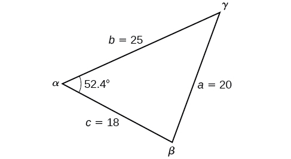{: #Figure_08_02_005}

Analysis

Because the inverse cosine can return any angle between 0 and 180 degrees, there will not be any ambiguous cases using this method.

Given<math xmlns="http://www.w3.org/1998/Math/MathML"> <mrow> <mtext> </mtext><mi>a</mi><mo>=</mo><mn>5</mn><mo>,</mo><mi>b</mi><mo>=</mo><mn>7</mn><mo>,</mo><mtext> </mtext></mrow> </math>

and<math xmlns="http://www.w3.org/1998/Math/MathML"> <mrow> <mtext> </mtext><mi>c</mi><mo>=</mo><mn>10</mn><mo>,</mo><mtext> </mtext></mrow> </math>

find the missing angles.

<math xmlns="http://www.w3.org/1998/Math/MathML"> <mrow> <mi>α</mi><mo>≈</mo><mn>27.7°</mn><mo>,</mo><mtext> </mtext><mtext> </mtext><mi>β</mi><mo>≈</mo><mn>40.5°</mn><mo>,</mo><mtext> </mtext><mtext> </mtext><mi>γ</mi><mo>≈</mo><mn>111.8°</mn> </mrow> </math>

### Solving Applied Problems Using the Law of Cosines

Just as the Law of Sines provided the appropriate equations to solve a number of applications, the Law of Cosines is applicable to situations in which the given data fits the cosine models. We may see these in the fields of navigation, surveying, astronomy, and geometry, just to name a few.

Using the Law of Cosines to Solve a Communication Problem

On many cell phones with GPS, an approximate location can be given before the GPS signal is received. This is accomplished through a process called triangulation, which works by using the distances from two known points. Suppose there are two cell phone towers within range of a cell phone. The two towers are located 6000 feet apart along a straight highway, running east to west, and the cell phone is north of the highway. Based on the signal delay, it can be determined that the signal is 5050 feet from the first tower and 2420 feet from the second tower. Determine the position of the cell phone north and east of the first tower, and determine how far it is from the highway.

For simplicity, we start by drawing a diagram similar to [[link]](#Figure_08_02_006) and labeling our given information.

{: #Figure_08_02_006}

Using the Law of Cosines, we can solve for the angle<math xmlns="http://www.w3.org/1998/Math/MathML"> <mrow> <mtext> </mtext><mi>θ</mi><mo>.</mo><mtext> </mtext></mrow> </math>

Remember that the Law of Cosines uses the square of one side to find the cosine of the opposite angle. For this example, let<math xmlns="http://www.w3.org/1998/Math/MathML"> <mrow> <mtext> </mtext><mi>a</mi><mo>=</mo><mn>2420</mn><mo>,</mo><mi>b</mi><mo>=</mo><mn>5050</mn><mo>,</mo><mtext> </mtext></mrow> </math>

and<math xmlns="http://www.w3.org/1998/Math/MathML"> <mrow> <mtext> </mtext><mi>c</mi><mo>=</mo><mn>6000.</mn><mtext> </mtext></mrow> </math>

Thus,<math xmlns="http://www.w3.org/1998/Math/MathML"> <mrow> <mtext> </mtext><mi>θ</mi><mtext> </mtext></mrow> </math>

corresponds to the opposite side<math xmlns="http://www.w3.org/1998/Math/MathML"> <mrow> <mtext> </mtext><mi>a</mi><mo>=</mo><mn>2420.</mn><mtext> </mtext></mrow> </math>

<math xmlns="http://www.w3.org/1998/Math/MathML" display="block"> <mrow> <mtable columnalign="left"> <mtr columnalign="left"> <mtd columnalign="left"> <mrow> <mtable columnalign="left"> <mtr columnalign="left"> <mtd columnalign="left"> <mrow /> </mtd> </mtr> <mtr columnalign="left"> <mtd columnalign="left"> <mrow> <mtext> </mtext><mtext>                                              </mtext><msup> <mi>a</mi> <mn>2</mn> </msup> <mo>=</mo><msup> <mi>b</mi> <mn>2</mn> </msup> <mo>+</mo><msup> <mi>c</mi> <mn>2</mn> </msup> <mo>−</mo><mn>2</mn><mi>b</mi><mi>c</mi><mi>cos</mi><mtext> </mtext><mi>θ</mi> </mrow> </mtd> </mtr> </mtable> </mrow> </mtd> </mtr> <mtr columnalign="left"> <mtd columnalign="left"> <mrow> <mtext>                                      </mtext><msup> <mrow> <mo stretchy="false">(</mo><mn>2420</mn><mo stretchy="false">)</mo> </mrow> <mn>2</mn> </msup> <mo>=</mo><msup> <mrow> <mo stretchy="false">(</mo><mn>5050</mn><mo stretchy="false">)</mo> </mrow> <mn>2</mn> </msup> <mo>+</mo><msup> <mrow> <mo stretchy="false">(</mo><mn>6000</mn><mo stretchy="false">)</mo> </mrow> <mn>2</mn> </msup> <mo>−</mo><mn>2</mn><mo stretchy="false">(</mo><mn>5050</mn><mo stretchy="false">)</mo><mo stretchy="false">(</mo><mn>6000</mn><mo stretchy="false">)</mo><mi>cos</mi><mtext> </mtext><mi>θ</mi> </mrow> </mtd> </mtr> <mtr columnalign="left"> <mtd columnalign="left"> <mrow> <mtext> </mtext><mtext> </mtext><mtext> </mtext><mtext> </mtext><mtext> </mtext><mtext> </mtext><msup> <mrow> <mo stretchy="false">(</mo><mn>2420</mn><mo stretchy="false">)</mo> </mrow> <mn>2</mn> </msup> <mo>−</mo><msup> <mrow> <mo stretchy="false">(</mo><mn>5050</mn><mo stretchy="false">)</mo> </mrow> <mn>2</mn> </msup> <mo>−</mo><msup> <mrow> <mo stretchy="false">(</mo><mn>6000</mn><mo stretchy="false">)</mo> </mrow> <mn>2</mn> </msup> <mo>=</mo><mo>−</mo><mn>2</mn><mo stretchy="false">(</mo><mn>5050</mn><mo stretchy="false">)</mo><mo stretchy="false">(</mo><mn>6000</mn><mo stretchy="false">)</mo><mi>cos</mi><mtext> </mtext><mi>θ</mi> </mrow> </mtd> </mtr> <mtr columnalign="left"> <mtd columnalign="left"> <mrow> <mtext>   </mtext><mfrac> <mrow> <msup> <mrow> <mo stretchy="false">(</mo><mn>2420</mn><mo stretchy="false">)</mo> </mrow> <mn>2</mn> </msup> <mo>−</mo><msup> <mrow> <mo stretchy="false">(</mo><mn>5050</mn><mo stretchy="false">)</mo> </mrow> <mn>2</mn> </msup> <mo>−</mo><msup> <mrow> <mo stretchy="false">(</mo><mn>6000</mn><mo stretchy="false">)</mo> </mrow> <mn>2</mn> </msup> </mrow> <mrow> <mo>−</mo><mn>2</mn><mo stretchy="false">(</mo><mn>5050</mn><mo stretchy="false">)</mo><mo stretchy="false">(</mo><mn>6000</mn><mo stretchy="false">)</mo> </mrow> </mfrac> <mo>=</mo><mi>cos</mi><mtext> </mtext><mi>θ</mi> </mrow> </mtd> </mtr> <mtr columnalign="left"> <mtd columnalign="left"> <mrow> <mtext>                                          </mtext><mi>cos</mi><mtext> </mtext><mi>θ</mi><mo>≈</mo><mn>0.9183</mn> </mrow> </mtd> </mtr> <mtr columnalign="left"> <mtd columnalign="left"> <mrow> <mtext>                                                </mtext><mi>θ</mi><mo>≈</mo><msup> <mrow> <mi>cos</mi> </mrow> <mrow> <mo>−</mo><mn>1</mn> </mrow> </msup> <mo stretchy="false">(</mo><mn>0.9183</mn><mo stretchy="false">)</mo> </mrow> </mtd> </mtr> <mtr columnalign="left"> <mtd columnalign="left"> <mrow> <mtext>                                                </mtext><mi>θ</mi><mo>≈</mo><mn>23.3°</mn> </mrow> </mtd> </mtr> </mtable> </mrow> </math>

To answer the questions about the phone’s position north and east of the tower, and the distance to the highway, drop a perpendicular from the position of the cell phone, as in [[link]](#Figure_08_02_007). This forms two right triangles, although we only need the right triangle that includes the first tower for this problem.

{: #Figure_08_02_007}

Using the angle<math xmlns="http://www.w3.org/1998/Math/MathML"> <mrow> <mtext> </mtext><mi>θ</mi><mo>=</mo> <mrow> <mn>23.3°</mn></mrow> <mtext> </mtext></mrow> </math>

and the basic trigonometric identities, we can find the solutions. Thus

<math xmlns="http://www.w3.org/1998/Math/MathML" display="block"> <mrow> <mtable columnalign="left"> <mtr columnalign="left"> <mtd columnalign="left"> <mrow> <mtable columnalign="left"> <mtr columnalign="left"> <mtd columnalign="left"> <mrow /> </mtd> </mtr> <mtr columnalign="left"> <mtd columnalign="left"> <mrow> <mo> </mo><mtext> </mtext><mtext> </mtext><mtext> </mtext><mtext> </mtext><mtext> </mtext><mtext> </mtext><mi>cos</mi><mo stretchy="false">(</mo><mn>23.3°</mn><mo stretchy="false">)</mo><mo>=</mo><mfrac> <mi>x</mi> <mrow> <mn>5050</mn> </mrow> </mfrac> </mrow> </mtd> </mtr> </mtable> </mrow> </mtd> </mtr> <mtr columnalign="left"> <mtd columnalign="left"> <mrow> <mtext>                   </mtext><mi>x</mi><mo>=</mo><mn>5050</mn><mi>cos</mi><mo stretchy="false">(</mo><mn>23.3°</mn><mo stretchy="false">)</mo> </mrow> </mtd> </mtr> <mtr columnalign="left"> <mtd columnalign="left"> <mrow> <mtext>                   </mtext><mi>x</mi><mo>≈</mo><mn>4638.15</mn><mtext> </mtext><mtext>feet</mtext> </mrow> </mtd> </mtr> <mtr columnalign="left"> <mtd columnalign="left"> <mrow> <mo> </mo><mtext>  </mtext><mi>sin</mi><mo stretchy="false">(</mo><mn>23.3°</mn><mo stretchy="false">)</mo><mo>=</mo><mfrac> <mi>y</mi> <mrow> <mn>5050</mn> </mrow> </mfrac> </mrow> </mtd> </mtr> <mtr columnalign="left"> <mtd columnalign="left"> <mrow> <mtext>                   </mtext><mi>y</mi><mo>=</mo><mn>5050</mn><mi>sin</mi><mo stretchy="false">(</mo><mn>23.3°</mn><mo stretchy="false">)</mo> </mrow> </mtd> </mtr> <mtr columnalign="left"> <mtd columnalign="left"> <mrow> <mtext>                   </mtext><mi>y</mi><mo>≈</mo><mn>1997.5</mn><mtext> </mtext><mtext>feet</mtext> </mrow> </mtd> </mtr> <mtr columnalign="left"> <mtd columnalign="left"> <mrow /> </mtd> </mtr> </mtable> </mrow> </math>

The cell phone is approximately 4638 feet east and 1998 feet north of the first tower, and 1998 feet from the highway.

Calculating Distance Traveled Using a SAS Triangle

Returning to our problem at the beginning of this section, suppose a boat leaves port, travels 10 miles, turns 20 degrees, and travels another 8 miles. How far from port is the boat? The diagram is repeated here in [[link]](#Figure_08_02_009).

{: #Figure_08_02_009}

The boat turned 20 degrees, so the obtuse angle of the non-right triangle is the supplemental angle,<math xmlns="http://www.w3.org/1998/Math/MathML"> <mrow> <mn>180°</mn><mo>−</mo><mn>20°</mn><mo>=</mo><mn>160°</mn><mo>.</mo><mtext> </mtext> </mrow> </math>

With this, we can utilize the Law of Cosines to find the missing side of the obtuse triangle—the distance of the boat to the port.

<math xmlns="http://www.w3.org/1998/Math/MathML" display="block"> <mrow> <mtable columnalign="left"> <mtr columnalign="left"> <mtd columnalign="left"> <mrow> <mtext> </mtext><msup> <mi>x</mi> <mn>2</mn> </msup> <mo>=</mo><msup> <mn>8</mn> <mn>2</mn> </msup> <mo>+</mo><msup> <mrow> <mn>10</mn> </mrow> <mn>2</mn> </msup> <mo>−</mo><mn>2</mn><mo stretchy="false">(</mo><mn>8</mn><mo stretchy="false">)</mo><mo stretchy="false">(</mo><mn>10</mn><mo stretchy="false">)</mo><mi>cos</mi><mo stretchy="false">(</mo><mn>160°</mn><mo stretchy="false">)</mo> </mrow> </mtd> </mtr> <mtr columnalign="left"> <mtd columnalign="left"> <mrow> <mtext> </mtext><msup> <mi>x</mi> <mn>2</mn> </msup> <mo>=</mo><mn>314.35</mn> </mrow> </mtd> </mtr> <mtr columnalign="left"> <mtd columnalign="left"> <mrow> <mtext> </mtext><mtext> </mtext><mtext> </mtext><mtext> </mtext><mi>x</mi><mo>=</mo><msqrt> <mrow> <mn>314.35</mn> </mrow> </msqrt> </mrow> </mtd> </mtr> <mtr columnalign="left"> <mtd columnalign="left"> <mrow> <mtext> </mtext><mtext> </mtext><mtext> </mtext><mtext> </mtext><mi>x</mi><mo>≈</mo><mn>17.7</mn><mtext> </mtext><mtext>miles</mtext> </mrow> </mtd> </mtr> </mtable> </mrow> </math>

The boat is about 17.7 miles from port.

### Using Heron’s Formula to Find the Area of a Triangle

We already learned how to find the area of an oblique triangle when we know two sides and an angle. We also know the formula to find the area of a triangle using the base and the height. When we know the three sides, however, we can use **Heron’s formula**{: data-type="term" .no-emphasis} instead of finding the height. **Heron of Alexandria**{: data-type="term" .no-emphasis} was a geometer who lived during the first century A.D. He discovered a formula for finding the area of oblique triangles when three sides are known.

Heron’s Formula

Heron’s formula finds the area of oblique triangles in which sides<math xmlns="http://www.w3.org/1998/Math/MathML"> <mrow> <mtext> </mtext><mi>a</mi><mo>,</mo><mi>b</mi><mtext>,</mtext> </mrow> </math>

and<math xmlns="http://www.w3.org/1998/Math/MathML"> <mrow> <mtext> </mtext><mi>c</mi><mtext> </mtext></mrow> </math>

are known.

<math xmlns="http://www.w3.org/1998/Math/MathML" display="block"> <mrow> <mtext>Area</mtext><mo>=</mo><msqrt> <mrow> <mi>s</mi><mrow><mo>(</mo> <mrow> <mi>s</mi><mo>−</mo><mi>a</mi></mrow> <mo>)</mo></mrow><mrow><mo>(</mo> <mrow> <mi>s</mi><mo>−</mo><mi>b</mi></mrow> <mo>)</mo></mrow><mrow><mo>(</mo> <mrow> <mi>s</mi><mo>−</mo><mi>c</mi></mrow> <mo>)</mo></mrow></mrow> </msqrt> </mrow> </math>

where<math xmlns="http://www.w3.org/1998/Math/MathML"> <mrow> <mtext> </mtext><mi>s</mi><mo>=</mo><mfrac> <mrow> <mrow><mo>(</mo> <mrow> <mi>a</mi><mo>+</mo><mi>b</mi><mo>+</mo><mi>c</mi></mrow> <mo>)</mo></mrow></mrow> <mn>2</mn> </mfrac> <mtext> </mtext></mrow> </math>

 is one half of the perimeter of the triangle, sometimes called the semi-perimeter.

Using Heron’s Formula to Find the Area of a Given Triangle

Find the area of the triangle in [[link]](#Figure_08_02_010) using Heron’s formula.

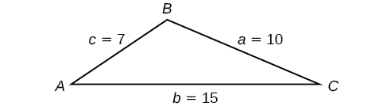{: #Figure_08_02_010}

First, we calculate<math xmlns="http://www.w3.org/1998/Math/MathML"> <mrow> <mtext> </mtext><mi>s</mi><mo>.</mo></mrow> </math>

<math xmlns="http://www.w3.org/1998/Math/MathML" display="block"> <mrow> <mtable columnalign="left"> <mtr columnalign="left"> <mtd columnalign="left"> <mtable columnalign="left"> <mtr> <mtd> <mrow /> </mtd> </mtr> <mtr> <mtd> <mi>s</mi><mo>=</mo><mfrac> <mrow> <mo stretchy="false">(</mo><mi>a</mi><mo>+</mo><mi>b</mi><mo>+</mo><mi>c</mi><mo stretchy="false">)</mo> </mrow> <mn>2</mn> </mfrac> </mtd> </mtr> </mtable> </mtd> </mtr> <mtr columnalign="left"> <mtd columnalign="left"> <mrow> <mi>s</mi><mo>=</mo><mfrac> <mrow> <mo stretchy="false">(</mo><mn>10</mn><mo>+</mo><mn>15</mn><mo>+</mo><mn>7</mn><mo stretchy="false">)</mo> </mrow> <mn>2</mn> </mfrac> <mo>=</mo><mn>16</mn> </mrow> </mtd> </mtr> </mtable> </mrow> </math>

Then we apply the formula.

<math xmlns="http://www.w3.org/1998/Math/MathML" display="block"> <mrow> <mtable columnalign="left"> <mtr columnalign="left"> <mtd columnalign="left"> <mtable columnalign="left"> <mtr> <mtd> <mrow /> </mtd> </mtr> <mtr> <mtd> <mtext>Area</mtext><mo>=</mo><msqrt> <mrow> <mi>s</mi><mo stretchy="false">(</mo><mi>s</mi><mo>−</mo><mi>a</mi><mo stretchy="false">)</mo><mo stretchy="false">(</mo><mi>s</mi><mo>−</mo><mi>b</mi><mo stretchy="false">)</mo><mo stretchy="false">(</mo><mi>s</mi><mo>−</mo><mi>c</mi><mo stretchy="false">)</mo> </mrow> </msqrt> </mtd> </mtr> </mtable> </mtd> </mtr> <mtr columnalign="left"> <mtd columnalign="left"> <mrow> <mtext>Area</mtext><mo>=</mo><msqrt> <mrow> <mn>16</mn><mo stretchy="false">(</mo><mn>16</mn><mo>−</mo><mn>10</mn><mo stretchy="false">)</mo><mo stretchy="false">(</mo><mn>16</mn><mo>−</mo><mn>15</mn><mo stretchy="false">)</mo><mo stretchy="false">(</mo><mn>16</mn><mo>−</mo><mn>7</mn><mo stretchy="false">)</mo> </mrow> </msqrt> </mrow> </mtd> </mtr> <mtr columnalign="left"> <mtd columnalign="left"> <mrow> <mtext>Area</mtext><mo>≈</mo><mn>29.4</mn> </mrow> </mtd> </mtr> </mtable> </mrow> </math>

The area is approximately 29.4 square units.

Use Heron’s formula to find the area of a triangle with sides of lengths<math xmlns="http://www.w3.org/1998/Math/MathML"> <mrow> <mtext> </mtext><mi>a</mi><mo>=</mo><mn>29.7</mn><mtext> </mtext><mtext>ft</mtext><mo>,</mo><mi>b</mi><mo>=</mo><mn>42.3</mn><mtext> </mtext><mtext>ft</mtext><mo>,</mo><mtext> </mtext> </mrow> </math>

and<math xmlns="http://www.w3.org/1998/Math/MathML"> <mrow> <mtext> </mtext><mi>c</mi><mo>=</mo><mn>38.4</mn><mtext> </mtext><mtext>ft</mtext><mo>.</mo> </mrow> </math>

Area = 552 square feet

Applying Heron’s Formula to a Real-World Problem

A Chicago city developer wants to construct a building consisting of artist’s lofts on a triangular lot bordered by Rush Street, Wabash Avenue, and Pearson Street. The frontage along Rush Street is approximately 62.4 meters, along Wabash Avenue it is approximately 43.5 meters, and along Pearson Street it is approximately 34.1 meters. How many square meters are available to the developer? See [[link]](#Figure_08_02_011) for a view of the city property.

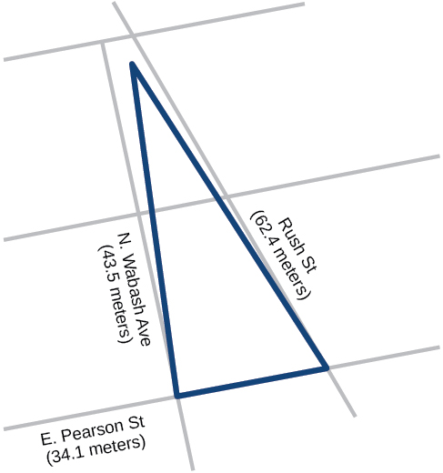{: #Figure_08_02_011}

Find the measurement for<math xmlns="http://www.w3.org/1998/Math/MathML"> <mrow> <mtext> </mtext><mi>s</mi><mo>,</mo><mtext> </mtext></mrow> </math>

which is one-half of the perimeter.

<math xmlns="http://www.w3.org/1998/Math/MathML" display="block"> <mrow> <mtable columnalign="left"> <mtr columnalign="left"> <mtd columnalign="left"> <mrow> <mi>s</mi><mo>=</mo><mfrac> <mrow> <mo stretchy="false">(</mo><mn>62.4</mn><mo>+</mo><mn>43.5</mn><mo>+</mo><mn>34.1</mn><mo stretchy="false">)</mo> </mrow> <mn>2</mn> </mfrac> </mrow> </mtd> </mtr> <mtr columnalign="left"> <mtd columnalign="left"> <mrow> <mi>s</mi><mo>=</mo><mn>70</mn><mtext> </mtext><mtext>m</mtext> </mrow> </mtd> </mtr> </mtable> </mrow> </math>

Apply Heron’s formula.

<math xmlns="http://www.w3.org/1998/Math/MathML" display="block"> <mrow> <mtable columnalign="left"> <mtr columnalign="left"> <mtd columnalign="left"> <mrow> <mtext>Area</mtext><mo>=</mo><msqrt> <mrow> <mn>70</mn><mo stretchy="false">(</mo><mn>70</mn><mo>−</mo><mn>62.4</mn><mo stretchy="false">)</mo><mo stretchy="false">(</mo><mn>70</mn><mo>−</mo><mn>43.5</mn><mo stretchy="false">)</mo><mo stretchy="false">(</mo><mn>70</mn><mo>−</mo><mn>34.1</mn><mo stretchy="false">)</mo> </mrow> </msqrt> </mrow> </mtd> </mtr> <mtr columnalign="left"> <mtd columnalign="left"> <mrow> <mtext>Area</mtext><mo>=</mo><msqrt> <mrow> <mn>506,118.2</mn> </mrow> </msqrt> </mrow> </mtd> </mtr> <mtr columnalign="left"> <mtd columnalign="left"> <mrow> <mtext>Area</mtext><mo>≈</mo><mn>711.4</mn> </mrow> </mtd> </mtr> </mtable> </mrow> </math>

The developer has about 711.4 square meters.

Find the area of a triangle given<math xmlns="http://www.w3.org/1998/Math/MathML"> <mrow> <mtext> </mtext><mi>a</mi><mo>=</mo><mn>4.38</mn><mtext> </mtext><mtext>ft</mtext><mtext> </mtext><mo>,</mo><mi>b</mi><mo>=</mo><mn>3.79</mn><mtext> </mtext><mtext>ft,</mtext><mtext> </mtext></mrow> </math>

and<math xmlns="http://www.w3.org/1998/Math/MathML"> <mrow> <mtext> </mtext><mi>c</mi><mo>=</mo><mn>5.22</mn><mtext> </mtext><mtext>ft</mtext><mtext>.</mtext></mrow> </math>

about 8.15 square feet

Access these online resources for additional instruction and practice with the Law of Cosines.

* [Law of Cosines][1]
* [Law of Cosines: Applications][2]
* [Law of Cosines: Applications 2][3]

### Key Equations

| Law of Cosines | <math xmlns="http://www.w3.org/1998/Math/MathML"> <mrow> <mtable columnalign="left"> <mtr columnalign="left"> <mtd columnalign="left"> <mrow> <msup> <mi>a</mi> <mn>2</mn> </msup> <mo>=</mo><msup> <mi>b</mi> <mn>2</mn> </msup> <mo>+</mo><msup> <mi>c</mi> <mn>2</mn> </msup> <mo>−</mo><mn>2</mn><mi>b</mi><mi>c</mi><mi>cos</mi><mtext> </mtext><mi>α</mi> </mrow> </mtd> </mtr> <mtr columnalign="left"> <mtd columnalign="left"> <mrow> <msup> <mi>b</mi> <mn>2</mn> </msup> <mo>=</mo><msup> <mi>a</mi> <mn>2</mn> </msup> <mo>+</mo><msup> <mi>c</mi> <mn>2</mn> </msup> <mo>−</mo><mn>2</mn><mi>a</mi><mi>c</mi><mi>cos</mi><mtext> </mtext><mi>β</mi> </mrow> </mtd> </mtr> <mtr columnalign="left"> <mtd columnalign="left"> <mrow> <msup> <mi>c</mi> <mn>2</mn> </msup> <mo>=</mo><msup> <mi>a</mi> <mn>2</mn> </msup> <mo>+</mo><msup> <mi>b</mi> <mn>2</mn> </msup> <mo>−</mo><mn>2</mn><mi>a</mi><mi>b</mi><mi>c</mi><mi>o</mi><mi>s</mi><mtext> </mtext><mi>γ</mi> </mrow> </mtd> </mtr> </mtable> </mrow> </math>

 |
| Heron’s formula | <math xmlns="http://www.w3.org/1998/Math/MathML"> <mrow> <mtable columnalign="left"> <mtr columnalign="left"> <mtd columnalign="left"> <mrow> <mtext>    Area</mtext><mo>=</mo><msqrt> <mrow> <mi>s</mi><mo stretchy="false">(</mo><mi>s</mi><mo>−</mo><mi>a</mi><mo stretchy="false">)</mo><mo stretchy="false">(</mo><mi>s</mi><mo>−</mo><mi>b</mi><mo stretchy="false">)</mo><mo stretchy="false">(</mo><mi>s</mi><mo>−</mo><mi>c</mi><mo stretchy="false">)</mo> </mrow> </msqrt> </mrow> </mtd> </mtr> <mtr columnalign="left"> <mtd columnalign="left"> <mrow> <mtext>where </mtext><mi>s</mi><mo>=</mo><mfrac> <mrow> <mo stretchy="false">(</mo><mi>a</mi><mo>+</mo><mi>b</mi><mo>+</mo><mi>c</mi><mo stretchy="false">)</mo> </mrow> <mn>2</mn> </mfrac> </mrow> </mtd> </mtr> </mtable> </mrow> </math>

 |
{: #eip-id1956425 summary=".."}

### Key Concepts

* The Law of Cosines defines the relationship among angle measurements and lengths of sides in oblique triangles.
* The Generalized Pythagorean Theorem is the Law of Cosines for two cases of oblique triangles: SAS and SSS. Dropping an imaginary perpendicular splits the oblique triangle into two right triangles or forms one right triangle, which allows sides to be related and measurements to be calculated. See [\[link\]](#Example_08_02_01) and [\[link\]](#Example_08_02_02).
* The Law of Cosines is useful for many types of applied problems. The first step in solving such problems is generally to draw a sketch of the problem presented. If the information given fits one of the three models (the three equations), then apply the Law of Cosines to find a solution. See [\[link\]](#Example_08_02_03) and [\[link\]](#Example_08_02_04).
* Heron’s formula allows the calculation of area in oblique triangles. All three sides must be known to apply Heron’s formula. See [\[link\]](#Example_08_02_05) and See [\[link\]](#Example_08_02_06).

### Section Exercises

#### Verbal

If you are looking for a missing side of a triangle, what do you need to know when using the Law of Cosines?

two sides and the angle opposite the missing side.

If you are looking for a missing angle of a triangle, what do you need to know when using the Law of Cosines?

Explain what<math xmlns="http://www.w3.org/1998/Math/MathML"> <mrow> <mtext> </mtext><mi>s</mi><mtext> </mtext></mrow> </math>

represents in Heron’s formula.

<math xmlns="http://www.w3.org/1998/Math/MathML"> <mrow> <mtext> </mtext><mi>s</mi><mtext> </mtext></mrow> </math>

is the semi-perimeter, which is half the perimeter of the triangle.

Explain the relationship between the Pythagorean Theorem and the Law of Cosines.

When must you use the Law of Cosines instead of the Pythagorean Theorem?

The Law of Cosines must be used for any oblique (non-right) triangle.

#### Algebraic

For the following exercises, assume<math xmlns="http://www.w3.org/1998/Math/MathML"> <mrow> <mtext> </mtext><mi>α</mi><mtext> </mtext></mrow> </math>

is opposite side<math xmlns="http://www.w3.org/1998/Math/MathML"> <mrow> <mtext> </mtext><mi>a</mi><mo>,</mo><mi>β</mi><mtext> </mtext></mrow> </math>

 is opposite side<math xmlns="http://www.w3.org/1998/Math/MathML"> <mrow> <mtext> </mtext><mi>b</mi><mo>,</mo><mtext> </mtext></mrow> </math>

and<math xmlns="http://www.w3.org/1998/Math/MathML"> <mrow> <mtext> </mtext><mi>γ</mi><mtext> </mtext></mrow> </math>

 is opposite side<math xmlns="http://www.w3.org/1998/Math/MathML"> <mrow> <mtext> </mtext><mi>c</mi><mo>.</mo><mtext> </mtext></mrow> </math>

If possible, solve each triangle for the unknown side. Round to the nearest tenth.

<math xmlns="http://www.w3.org/1998/Math/MathML"> <mrow> <mi>γ</mi><mo>=</mo><mn>41.2°</mn><mo>,</mo><mi>a</mi><mo>=</mo><mn>2.49</mn><mo>,</mo><mi>b</mi><mo>=</mo><mn>3.13</mn></mrow> </math>

<math xmlns="http://www.w3.org/1998/Math/MathML"> <mrow> <mi>α</mi><mo>=</mo><mn>120°</mn><mo>,</mo><mi>b</mi><mo>=</mo><mn>6</mn><mo>,</mo><mi>c</mi><mo>=</mo><mn>7</mn></mrow> </math>

11\.3

<math xmlns="http://www.w3.org/1998/Math/MathML"> <mrow> <mi>β</mi><mo>=</mo><mn>58.7°</mn><mo>,</mo><mi>a</mi><mo>=</mo><mn>10.6</mn><mo>,</mo><mi>c</mi><mo>=</mo><mn>15.7</mn></mrow> </math>

<math xmlns="http://www.w3.org/1998/Math/MathML"> <mrow> <mi>γ</mi><mo>=</mo><mn>115°</mn><mo>,</mo><mi>a</mi><mo>=</mo><mn>18</mn><mo>,</mo><mi>b</mi><mo>=</mo><mn>23</mn></mrow> </math>

34\.7

<math xmlns="http://www.w3.org/1998/Math/MathML"> <mrow> <mi>α</mi><mo>=</mo><mn>119°</mn><mo>,</mo><mi>a</mi><mo>=</mo><mn>26</mn><mo>,</mo><mi>b</mi><mo>=</mo><mn>14</mn></mrow> </math>

<math xmlns="http://www.w3.org/1998/Math/MathML"> <mrow> <mi>γ</mi><mo>=</mo><mn>113°</mn><mo>,</mo><mi>b</mi><mo>=</mo><mn>10</mn><mo>,</mo><mi>c</mi><mo>=</mo><mn>32</mn></mrow> </math>

26\.7

<math xmlns="http://www.w3.org/1998/Math/MathML"> <mrow> <mi>β</mi><mo>=</mo><mn>67°</mn><mo>,</mo><mi>a</mi><mo>=</mo><mn>49</mn><mo>,</mo><mi>b</mi><mo>=</mo><mn>38</mn></mrow> </math>

<math xmlns="http://www.w3.org/1998/Math/MathML"> <mrow> <mi>α</mi><mo>=</mo><mn>43.1°</mn><mo>,</mo><mi>a</mi><mo>=</mo><mn>184.2</mn><mo>,</mo><mi>b</mi><mo>=</mo><mn>242.8</mn></mrow> </math>

257\.4

<math xmlns="http://www.w3.org/1998/Math/MathML"> <mrow> <mi>α</mi><mo>=</mo><mn>36.6°</mn><mo>,</mo><mi>a</mi><mo>=</mo><mn>186.2</mn><mo>,</mo><mi>b</mi><mo>=</mo><mn>242.2</mn></mrow> </math>

<math xmlns="http://www.w3.org/1998/Math/MathML"> <mrow> <mi>β</mi><mo>=</mo> <mrow> <mn>50°</mn></mrow> <mo>,</mo><mi>a</mi><mo>=</mo><mn>105</mn><mo>,</mo><mi>b</mi><mo>=</mo><mn>45</mn><mmultiscripts> <mrow /> <mprescripts /> <mrow /> <mrow /> </mmultiscripts> </mrow> </math>

not possible

For the following exercises, use the Law of Cosines to solve for the missing angle of the oblique triangle. Round to the nearest tenth.

<math xmlns="http://www.w3.org/1998/Math/MathML"> <mrow> <mtext> </mtext><mi>a</mi><mo>=</mo><mn>42</mn><mo>,</mo><mi>b</mi><mo>=</mo><mn>19</mn><mo>,</mo><mi>c</mi><mo>=</mo><mn>30</mn><mo>;</mo><mtext> </mtext></mrow> </math>

find angle<math xmlns="http://www.w3.org/1998/Math/MathML"> <mrow> <mtext> </mtext><mi>A</mi><mo>.</mo></mrow> </math>

<math xmlns="http://www.w3.org/1998/Math/MathML"> <mrow> <mtext> </mtext><mi>a</mi><mo>=</mo><mn>14</mn><mo>,</mo><mtext> </mtext><mi>b</mi><mo>=</mo><mn>13</mn><mo>,</mo><mtext> </mtext><mi>c</mi><mo>=</mo><mn>20</mn><mo>;</mo><mtext> </mtext> </mrow> </math>

find angle<math xmlns="http://www.w3.org/1998/Math/MathML"> <mrow> <mtext> </mtext><mi>C</mi><mo>.</mo></mrow> </math>

95\.5°

<math xmlns="http://www.w3.org/1998/Math/MathML"> <mrow> <mtext> </mtext><mi>a</mi><mo>=</mo><mn>16</mn><mo>,</mo><mi>b</mi><mo>=</mo><mn>31</mn><mo>,</mo><mi>c</mi><mo>=</mo><mn>20</mn><mo>;</mo><mtext> </mtext></mrow> </math>

find angle<math xmlns="http://www.w3.org/1998/Math/MathML"> <mrow> <mtext> </mtext><mi>B</mi><mo>.</mo></mrow> </math>

<math xmlns="http://www.w3.org/1998/Math/MathML"> <mrow> <mtext> </mtext><mi>a</mi><mo>=</mo><mn>13</mn><mo>,</mo><mtext> </mtext><mi>b</mi><mo>=</mo><mn>22</mn><mo>,</mo><mtext> </mtext><mi>c</mi><mo>=</mo><mn>28</mn><mo>;</mo><mtext> </mtext></mrow> </math>

find angle<math xmlns="http://www.w3.org/1998/Math/MathML"> <mrow> <mtext> </mtext><mi>A</mi><mo>.</mo></mrow> </math>

26\.9°

<math xmlns="http://www.w3.org/1998/Math/MathML"> <mrow> <mi>a</mi><mo>=</mo><mn>108</mn><mo>,</mo><mtext> </mtext><mi>b</mi><mo>=</mo><mn>132</mn><mo>,</mo><mtext> </mtext><mi>c</mi><mo>=</mo><mn>160</mn><mo>;</mo><mtext> </mtext></mrow> </math>

find angle<math xmlns="http://www.w3.org/1998/Math/MathML"> <mrow> <mtext> </mtext><mi>C</mi><mo>.</mo><mtext> </mtext></mrow> </math>

For the following exercises, solve the triangle. Round to the nearest tenth.

<math xmlns="http://www.w3.org/1998/Math/MathML"> <mrow> <mi>A</mi><mo>=</mo><mn>35°</mn><mo>,</mo><mi>b</mi><mo>=</mo><mn>8</mn><mo>,</mo><mi>c</mi><mo>=</mo><mn>11</mn></mrow> </math>

<math xmlns="http://www.w3.org/1998/Math/MathML"> <mrow> <mi>B</mi><mo>≈</mo><mn>45.9°</mn><mo>,</mo><mi>C</mi><mo>≈</mo><mn>99.1°</mn><mo>,</mo><mi>a</mi><mo>≈</mo><mn>6.4</mn></mrow> </math>

<math xmlns="http://www.w3.org/1998/Math/MathML"> <mrow> <mi>B</mi><mo>=</mo><mn>88°</mn><mo>,</mo><mi>a</mi><mo>=</mo><mn>4.4</mn><mo>,</mo><mi>c</mi><mo>=</mo><mn>5.2</mn></mrow> </math>

<math xmlns="http://www.w3.org/1998/Math/MathML"> <mrow> <mi>C</mi><mo>=</mo><mn>121°</mn><mo>,</mo><mi>a</mi><mo>=</mo><mn>21</mn><mo>,</mo><mi>b</mi><mo>=</mo><mn>37</mn></mrow> </math>

<math xmlns="http://www.w3.org/1998/Math/MathML"> <mrow> <mi>A</mi><mo>≈</mo><mn>20.6°</mn><mo>,</mo><mi>B</mi><mo>≈</mo><mn>38.4°</mn><mo>,</mo><mi>c</mi><mo>≈</mo><mn>51.1</mn></mrow> </math>

<math xmlns="http://www.w3.org/1998/Math/MathML"> <mrow> <mi>a</mi><mo>=</mo><mn>13</mn><mo>,</mo><mi>b</mi><mo>=</mo><mn>11</mn><mo>,</mo><mi>c</mi><mo>=</mo><mn>15</mn></mrow> </math>

<math xmlns="http://www.w3.org/1998/Math/MathML"> <mrow> <mi>a</mi><mo>=</mo><mn>3.1</mn><mo>,</mo><mi>b</mi><mo>=</mo><mn>3.5</mn><mo>,</mo><mi>c</mi><mo>=</mo><mn>5</mn></mrow> </math>

<math xmlns="http://www.w3.org/1998/Math/MathML"> <mrow> <mi>A</mi><mo>≈</mo><mn>37.8°</mn><mo>,</mo><mi>B</mi><mo>≈</mo><mn>43.8</mn><mo>,</mo><mi>C</mi><mo>≈</mo><mn>98.4°</mn></mrow> </math>

<math xmlns="http://www.w3.org/1998/Math/MathML"> <mrow> <mi>a</mi><mo>=</mo><mn>51</mn><mo>,</mo><mi>b</mi><mo>=</mo><mn>25</mn><mo>,</mo><mi>c</mi><mo>=</mo><mn>29</mn></mrow> </math>

For the following exercises, use Heron’s formula to find the area of the triangle. Round to the nearest hundredth.

Find the area of a triangle with sides of length 18 in, 21 in, and 32 in. Round to the nearest tenth.

177\.56 in2

Find the area of a triangle with sides of length 20 cm, 26 cm, and 37 cm. Round to the nearest tenth.

<math xmlns="http://www.w3.org/1998/Math/MathML"> <mrow> <mi>a</mi><mo>=</mo><mfrac> <mn>1</mn> <mn>2</mn> </mfrac> <mtext> </mtext><mtext>m</mtext><mo>,</mo><mi>b</mi><mo>=</mo><mfrac> <mn>1</mn> <mn>3</mn> </mfrac> <mtext> </mtext><mtext>m</mtext><mo>,</mo><mi>c</mi><mo>=</mo><mfrac> <mn>1</mn> <mn>4</mn> </mfrac> <mtext> </mtext><mtext>m</mtext> </mrow> </math>

0\.04 m2

<math xmlns="http://www.w3.org/1998/Math/MathML"> <mrow> <mi>a</mi><mo>=</mo><mn>12.4</mn><mtext> ft</mtext><mo>,</mo><mtext> </mtext><mi>b</mi><mo>=</mo><mn>13.7</mn><mtext> ft</mtext><mo>,</mo><mtext> </mtext><mi>c</mi><mo>=</mo><mn>20.2</mn><mtext> ft</mtext></mrow> </math>

<math xmlns="http://www.w3.org/1998/Math/MathML"> <mrow> <mi>a</mi><mo>=</mo><mn>1.6</mn><mtext> yd</mtext><mo>,</mo><mtext> </mtext><mi>b</mi><mo>=</mo><mn>2.6</mn><mtext> yd</mtext><mo>,</mo><mtext> </mtext><mi>c</mi><mo>=</mo><mn>4.1</mn><mtext> yd</mtext></mrow> </math>

0\.91 yd2

#### Graphical

For the following exercises, find the length of side <math xmlns="http://www.w3.org/1998/Math/MathML"> <mrow> <mi>x</mi><mo>.</mo> </mrow> </math>

 Round to the nearest tenth.

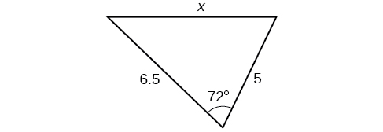

3\.0

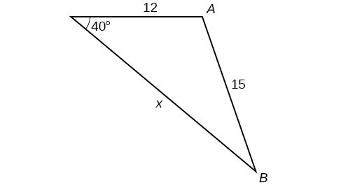

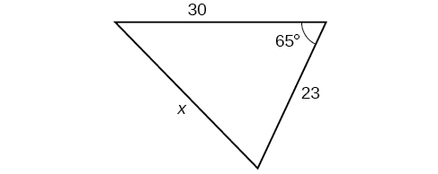

29\.1

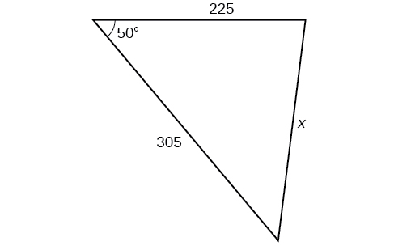

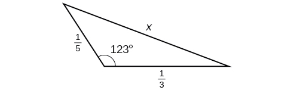

0\.5

For the following exercises, find the measurement of angle<math xmlns="http://www.w3.org/1998/Math/MathML"> <mrow> <mtext> </mtext><mi>A</mi><mo>.</mo></mrow> </math>

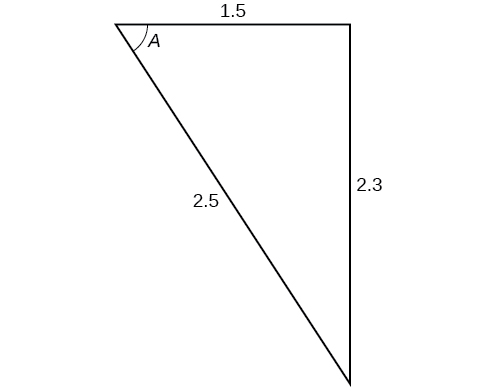

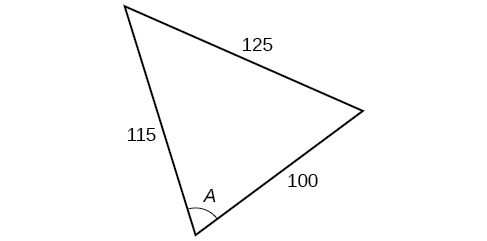

70\.7°

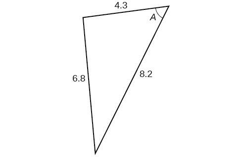

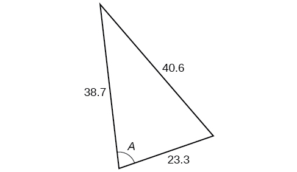

77\.4°

Find the measure of each angle in the triangle shown in [[link]](#Figure_08_02_211). Round to the nearest tenth.

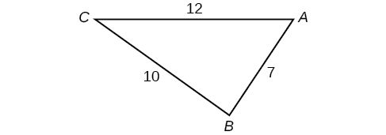{: #Figure_08_02_211}

For the following exercises, solve for the unknown side. Round to the nearest tenth.

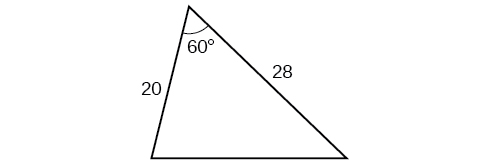

25\.0

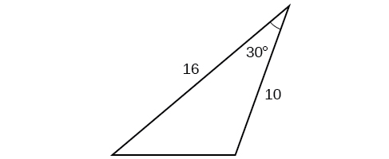

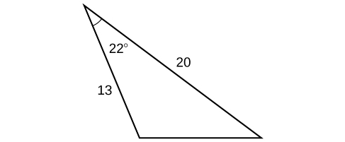

9\.3

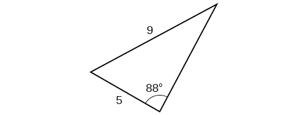

For the following exercises, find the area of the triangle. Round to the nearest hundredth.

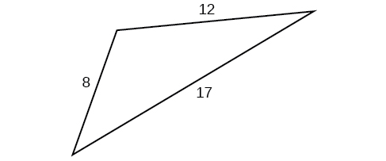

43\.52

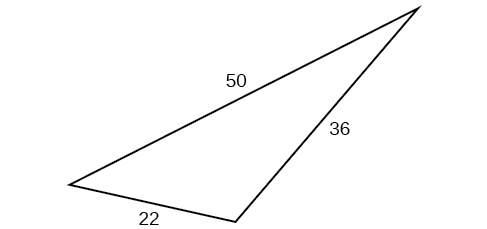

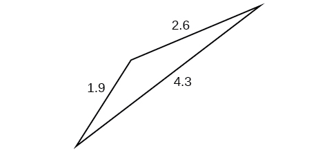

1\.41

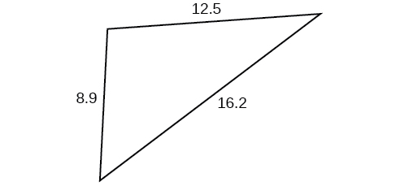

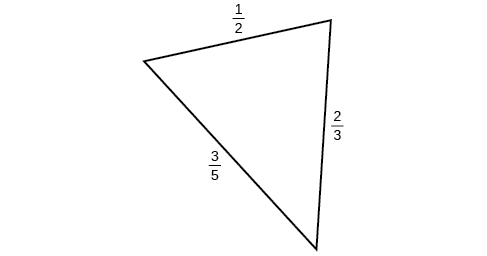

0\.14

#### Extensions

A parallelogram has sides of length 16 units and 10 units. The shorter diagonal is 12 units. Find the measure of the longer diagonal.

The sides of a parallelogram are 11 feet and 17 feet. The longer diagonal is 22 feet. Find the length of the shorter diagonal.

18\.3

The sides of a parallelogram are 28 centimeters and 40 centimeters. The measure of the larger angle is 100°. Find the length of the shorter diagonal.

A regular octagon is inscribed in a circle with a radius of 8 inches. (See [[link]](#Figure_08_02_221).) Find the perimeter of the octagon.

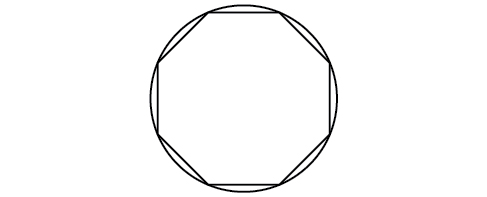{: #Figure_08_02_221}

48\.98

A regular pentagon is inscribed in a circle of radius 12 cm. (See [[link]](#Figure_08_02_222).) Find the perimeter of the pentagon. Round to the nearest tenth of a centimeter.

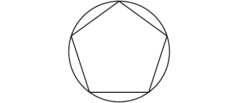{: #Figure_08_02_222}

For the following exercises, suppose that<math xmlns="http://www.w3.org/1998/Math/MathML"> <mrow> <mtext> </mtext><msup> <mi>x</mi> <mn>2</mn> </msup> <mo>=</mo><mn>25</mn><mo>+</mo><mn>36</mn><mo>−</mo><mn>60</mn><mi>cos</mi><mrow><mo>(</mo> <mrow> <mn>52</mn></mrow> <mo>)</mo></mrow><mtext> </mtext></mrow> </math>

represents the relationship of three sides of a triangle and the cosine of an angle.

Draw the triangle.

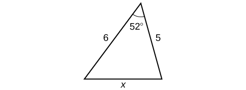

Find the length of the third side.

For the following exercises, find the area of the triangle.

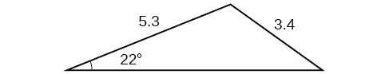

7\.62

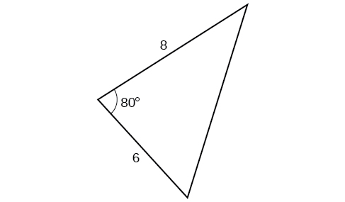

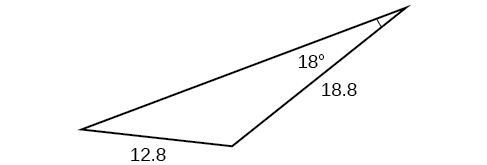

85\.1

#### Real-World Applications

A surveyor has taken the measurements shown in [[link]](#Figure_08_02_227). Find the distance across the lake. Round answers to the nearest tenth.

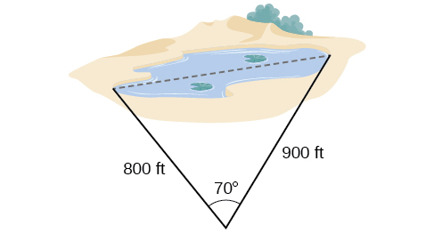{: #Figure_08_02_227}

A satellite calculates the distances and angle shown in [[link]](#Figure_08_02_228) (not to scale). Find the distance between the two cities. Round answers to the nearest tenth.

{: #Figure_08_02_228}

24\.0 km

An airplane flies 220 miles with a heading of 40°, and then flies 180 miles with a heading of 170°. How far is the plane from its starting point, and at what heading? Round answers to the nearest tenth.

A 113-foot tower is located on a hill that is inclined 34° to the horizontal, as shown in [[link]](#Figure_08_02_230). A guy-wire is to be attached to the top of the tower and anchored at a point 98 feet uphill from the base of the tower. Find the length of wire needed.

{: #Figure_08_02_230}

99\.9 ft

Two ships left a port at the same time. One ship traveled at a speed of 18 miles per hour at a heading of 320°. The other ship traveled at a speed of 22 miles per hour at a heading of 194°. Find the distance between the two ships after 10 hours of travel.

The graph in [[link]](#Figure_08_02_231) represents two boats departing at the same time from the same dock. The first boat is traveling at 18 miles per hour at a heading of 327° and the second boat is traveling at 4 miles per hour at a heading of 60°. Find the distance between the two boats after 2 hours.

{: #Figure_08_02_231}

37\.3 miles

A triangular swimming pool measures 40 feet on one side and 65 feet on another side. These sides form an angle that measures 50°. How long is the third side (to the nearest tenth)?

A pilot flies in a straight path for 1 hour 30 min. She then makes a course correction, heading 10° to the right of her original course, and flies 2 hours in the new direction. If she maintains a constant speed of 680 miles per hour, how far is she from her starting position?

2371 miles

Los Angeles is 1,744 miles from Chicago, Chicago is 714 miles from New York, and New York is 2,451 miles from Los Angeles. Draw a triangle connecting these three cities, and find the angles in the triangle.

Philadelphia is 140 miles from Washington, D.C., Washington, D.C. is 442 miles from Boston, and Boston is 315 miles from Philadelphia. Draw a triangle connecting these three cities and find the angles in the triangle.

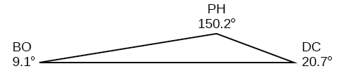

Two planes leave the same airport at the same time. One flies at 20° east of north at 500 miles per hour. The second flies at 30° east of south at 600 miles per hour. How far apart are the planes after 2 hours?

Two airplanes take off in different directions. One travels 300 mph due west and the other travels 25° north of west at 420 mph. After 90 minutes, how far apart are they, assuming they are flying at the same altitude?

599\.8 miles

A parallelogram has sides of length 15.4 units and 9.8 units. Its area is 72.9 square units. Find the measure of the longer diagonal.

The four sequential sides of a quadrilateral have lengths 4.5 cm, 7.9 cm, 9.4 cm, and 12.9 cm. The angle between the two smallest sides is 117°. What is the area of this quadrilateral?

65\.4 cm2

The four sequential sides of a quadrilateral have lengths 5.7 cm, 7.2 cm, 9.4 cm, and 12.8 cm. The angle between the two smallest sides is 106°. What is the area of this quadrilateral?

Find the area of a triangular piece of land that measures 30 feet on one side and 42 feet on another; the included angle measures 132°. Round to the nearest whole square foot.

468 ft2

Find the area of a triangular piece of land that measures 110 feet on one side and 250 feet on another; the included angle measures 85°. Round to the nearest whole square foot.

### Glossary
{: data-type="glossary-title"}

Law of Cosines
: states that the square of any side of a triangle is equal to the sum of the squares of the other two sides minus twice the product of the other two sides and the cosine of the included angle
^

Generalized Pythagorean Theorem
: an extension of the Law of Cosines; relates the sides of an oblique triangle and is used for SAS and SSS triangles

[1]: http://openstaxcollege.org/l/lawcosines
[2]: http://openstaxcollege.org/l/cosineapp
[3]: http://openstaxcollege.org/l/cosineapp2
