

In this section, you will:
* Plot points using polar coordinates.
* Convert from polar coordinates to rectangular coordinates.
* Convert from rectangular coordinates to polar coordinates.
* Transform equations between polar and rectangular forms.
* Identify and graph polar equations by converting to rectangular equations.

Over 12 kilometers from port, a sailboat encounters rough weather and is blown off course by a 16-knot wind (see [\[link\]](#Figure_08_03_001)). How can the sailor indicate his location to the Coast Guard? In this section, we will investigate a method of representing location that is different from a standard coordinate grid.

 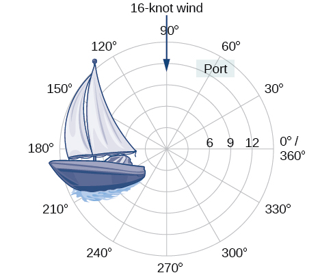{: #Figure_08_03_001}

### Plotting Points Using Polar Coordinates

When we think about plotting points in the plane, we usually think of **rectangular coordinates**{: data-type="term" .no-emphasis}<math xmlns="http://www.w3.org/1998/Math/MathML"> <mrow> <mtext> </mtext><mrow><mo>(</mo> <mrow> <mi>x</mi><mo>,</mo><mi>y</mi></mrow> <mo>)</mo></mrow><mtext> </mtext></mrow> </math>

in the Cartesian coordinate plane. However, there are other ways of writing a coordinate pair and other types of grid systems. In this section, we introduce to **polar coordinates**{: data-type="term"}, which are points labeled<math xmlns="http://www.w3.org/1998/Math/MathML"> <mrow> <mtext> </mtext><mrow><mo>(</mo> <mrow> <mi>r</mi><mo>,</mo><mi>θ</mi></mrow> <mo>)</mo></mrow><mtext> </mtext></mrow> </math>

and plotted on a polar grid. The polar grid is represented as a series of concentric circles radiating out from the **pole**{: data-type="term"}, or the origin of the coordinate plane.

The **polar grid**{: data-type="term" .no-emphasis} is scaled as the unit circle with the positive *x-*axis now viewed as the **polar axis**{: data-type="term"} and the origin as the pole. The first coordinate<math xmlns="http://www.w3.org/1998/Math/MathML"> <mrow> <mtext> </mtext><mi>r</mi><mtext> </mtext></mrow> </math>

is the radius or length of the directed line segment from the pole. The angle<math xmlns="http://www.w3.org/1998/Math/MathML"> <mrow> <mtext> </mtext><mi>θ</mi><mo>,</mo></mrow> </math>

 measured in radians, indicates the direction of<math xmlns="http://www.w3.org/1998/Math/MathML"> <mrow> <mtext> </mtext><mi>r</mi><mo>.</mo><mtext> </mtext></mrow> </math>

We move counterclockwise from the polar axis by an angle of<math xmlns="http://www.w3.org/1998/Math/MathML"> <mrow> <mtext> </mtext><mi>θ</mi><mo>,</mo></mrow> </math>

and measure a directed line segment the length of<math xmlns="http://www.w3.org/1998/Math/MathML"> <mrow> <mtext> </mtext><mi>r</mi><mtext> </mtext></mrow> </math>

in the direction of<math xmlns="http://www.w3.org/1998/Math/MathML"> <mrow> <mtext> </mtext><mi>θ</mi><mo>.</mo><mtext> </mtext></mrow> </math>

Even though we measure<math xmlns="http://www.w3.org/1998/Math/MathML"> <mrow> <mtext> </mtext><mi>θ</mi><mtext> </mtext></mrow> </math>

first and then<math xmlns="http://www.w3.org/1998/Math/MathML"> <mrow> <mtext> </mtext><mi>r</mi><mo>,</mo></mrow> </math>

 the polar point is written with the *r*-coordinate first. For example, to plot the point<math xmlns="http://www.w3.org/1998/Math/MathML"> <mrow> <mtext> </mtext><mrow><mo>(</mo> <mrow> <mn>2</mn><mo>,</mo><mfrac> <mi>π</mi> <mn>4</mn> </mfrac> </mrow> <mo>)</mo></mrow><mo>,</mo></mrow> </math>

we would move<math xmlns="http://www.w3.org/1998/Math/MathML"> <mrow> <mtext> </mtext><mfrac> <mi>π</mi> <mn>4</mn> </mfrac> <mtext> </mtext></mrow> </math>

units in the counterclockwise direction and then a length of 2 from the pole. This point is plotted on the grid in [\[link\]](#Figure_08_03_002).

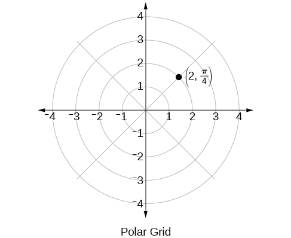{: #Figure_08_03_002}

Plotting a Point on the Polar Grid

Plot the point<math xmlns="http://www.w3.org/1998/Math/MathML"> <mrow> <mtext> </mtext><mrow><mo>(</mo> <mrow> <mn>3</mn><mo>,</mo><mfrac> <mi>π</mi> <mn>2</mn> </mfrac> </mrow> <mo>)</mo></mrow><mtext> </mtext></mrow> </math>

on the polar grid.

The angle<math xmlns="http://www.w3.org/1998/Math/MathML"> <mrow> <mtext> </mtext><mfrac> <mi>π</mi> <mn>2</mn> </mfrac> <mtext> </mtext></mrow> </math>

is found by sweeping in a counterclockwise direction 90° from the polar axis. The point is located at a length of 3 units from the pole in the<math xmlns="http://www.w3.org/1998/Math/MathML"> <mrow> <mtext> </mtext><mfrac> <mi>π</mi> <mn>2</mn> </mfrac> <mtext> </mtext></mrow> </math>

direction, as shown in [[link]](#Figure_08_03_003).

{: #Figure_08_03_003}

Plot the point<math xmlns="http://www.w3.org/1998/Math/MathML"> <mrow> <mtext> </mtext><mrow><mo>(</mo> <mrow> <mn>2</mn><mo>,</mo><mtext> </mtext><mfrac> <mi>π</mi> <mn>3</mn> </mfrac> </mrow> <mo>)</mo></mrow><mtext> </mtext></mrow> </math>

in the **polar grid**{: data-type="term" .no-emphasis}.

 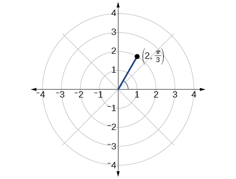 

Plotting a Point in the Polar Coordinate System with a Negative Component

Plot the point<math xmlns="http://www.w3.org/1998/Math/MathML"> <mrow> <mtext> </mtext><mrow><mo>(</mo> <mrow> <mo>−</mo><mn>2</mn><mo>,</mo><mtext> </mtext><mfrac> <mi>π</mi> <mn>6</mn> </mfrac> </mrow> <mo>)</mo></mrow><mtext> </mtext></mrow> </math>

on the polar grid.

We know that<math xmlns="http://www.w3.org/1998/Math/MathML"> <mrow> <mtext> </mtext><mfrac> <mi>π</mi> <mn>6</mn> </mfrac> <mtext> </mtext></mrow> </math>

is located in the first quadrant. However,<math xmlns="http://www.w3.org/1998/Math/MathML"> <mrow> <mtext> </mtext><mi>r</mi><mo>=</mo><mn>−2.</mn><mtext> </mtext></mrow> </math>

We can approach plotting a point with a negative<math xmlns="http://www.w3.org/1998/Math/MathML"> <mrow> <mtext> </mtext><mi>r</mi><mtext> </mtext></mrow> </math>

in two ways:

1.  Plot the point
    <math xmlns="http://www.w3.org/1998/Math/MathML"> <mrow> <mtext> </mtext><mrow><mo>(</mo> <mrow> <mn>2</mn><mo>,</mo><mfrac> <mi>π</mi> <mn>6</mn> </mfrac> </mrow> <mo>)</mo></mrow><mtext> </mtext></mrow> </math>
    
    by moving
    <math xmlns="http://www.w3.org/1998/Math/MathML"> <mrow> <mtext> </mtext><mfrac> <mi>π</mi> <mn>6</mn> </mfrac> <mtext> </mtext></mrow> </math>
    
    in the counterclockwise direction and extending a directed line segment 2 units into the first quadrant. Then retrace the directed line segment back through the pole, and continue 2 units into the third quadrant;
2.  Move
    <math xmlns="http://www.w3.org/1998/Math/MathML"> <mrow> <mtext> </mtext><mfrac> <mi>π</mi> <mn>6</mn> </mfrac> <mtext> </mtext></mrow> </math>
    
    in the counterclockwise direction, and draw the directed line segment from the pole 2 units in the negative direction, into the third quadrant.
{: data-number-style="arabic"}

See [[link]](#Figure_08_03_005)(a). Compare this to the graph of the polar coordinate<math xmlns="http://www.w3.org/1998/Math/MathML"> <mrow> <mtext> </mtext><mrow><mo>(</mo> <mrow> <mn>2</mn><mo>,</mo><mfrac> <mi>π</mi> <mn>6</mn> </mfrac> </mrow> <mo>)</mo></mrow><mtext> </mtext></mrow> </math>

shown in [[link]](#Figure_08_03_005)(b).

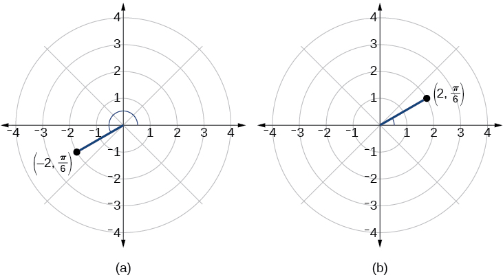{: #Figure_08_03_005}

Plot the points<math xmlns="http://www.w3.org/1998/Math/MathML"> <mrow> <mtext> </mtext><mrow><mo>(</mo> <mrow> <mn>3</mn><mo>,</mo><mo>−</mo><mfrac> <mi>π</mi> <mn>6</mn> </mfrac> </mrow> <mo>)</mo></mrow></mrow> </math>

and<math xmlns="http://www.w3.org/1998/Math/MathML"> <mrow> <mtext> </mtext><mrow><mo>(</mo> <mrow> <mn>2</mn><mo>,</mo><mfrac> <mrow> <mn>9</mn><mi>π</mi></mrow> <mn>4</mn> </mfrac> </mrow> <mo>)</mo></mrow><mtext> </mtext></mrow> </math>

on the same polar grid.

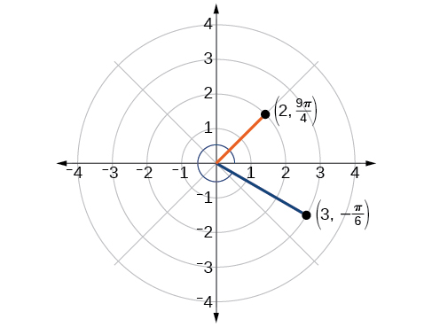

### Converting from Polar Coordinates to Rectangular Coordinates

When given a set of **polar coordinates**{: data-type="term" .no-emphasis}, we may need to convert them to **rectangular coordinates**{: data-type="term" .no-emphasis}. To do so, we can recall the relationships that exist among the variables<math xmlns="http://www.w3.org/1998/Math/MathML"> <mrow> <mtext> </mtext><mi>x</mi><mo>,</mo><mtext> </mtext><mi>y</mi><mo>,</mo><mtext> </mtext><mi>r</mi><mo>,</mo><mtext> </mtext></mrow> </math>

and<math xmlns="http://www.w3.org/1998/Math/MathML"> <mrow> <mtext> </mtext><mi>θ</mi><mo>.</mo></mrow> </math>

<math xmlns="http://www.w3.org/1998/Math/MathML" display="block"> <mrow> <mtable columnalign="left"> <mtr columnalign="left"> <mtd columnalign="left"> <mtable columnalign="left"> <mtr> <mtd> <mrow /> </mtd> </mtr> <mtr> <mtd> <mi>cos</mi><mtext> </mtext><mi>θ</mi><mo>=</mo><mfrac> <mi>x</mi> <mi>r</mi> </mfrac> <mo stretchy="false">→</mo><mi>x</mi><mo>=</mo><mi>r</mi><mi>cos</mi><mtext> </mtext><mi>θ</mi> </mtd> </mtr> </mtable> </mtd> </mtr> <mtr columnalign="left"> <mtd columnalign="left"> <mrow> <mi>sin</mi><mtext> </mtext><mi>θ</mi><mo>=</mo><mfrac> <mi>y</mi> <mi>r</mi> </mfrac> <mo stretchy="false">→</mo><mi>y</mi><mo>=</mo><mi>r</mi><mi>sin</mi><mtext> </mtext><mi>θ</mi> </mrow> </mtd> </mtr> </mtable> </mrow> </math>

Dropping a perpendicular from the point in the plane to the *x-*axis forms a right triangle, as illustrated in [\[link\]](#Figure_08_03_007). An easy way to remember the equations above is to think of<math xmlns="http://www.w3.org/1998/Math/MathML"> <mrow> <mtext> </mtext><mi>cos</mi><mtext> </mtext><mi>θ</mi><mtext> </mtext> </mrow> </math>

as the adjacent side over the hypotenuse and<math xmlns="http://www.w3.org/1998/Math/MathML"> <mrow> <mtext> </mtext><mi>sin</mi><mtext> </mtext><mi>θ</mi><mtext> </mtext></mrow> </math>

as the opposite side over the hypotenuse.

![Comparison between polar coordinates and rectangular coordinates. There is a right triangle plotted on the x,y axis. The sides are a horizontal line on the x-axis of length x, a vertical line extending from thex-axis to some point in quadrant 1, and a hypotenuse r extending from the origin to that same point in quadrant 1. The vertices are at the origin (0,0), some point along the x-axis at (x,0), and that point in quadrant 1. This last point is (x,y) or (r, theta), depending which system of coordinates you use.](../resources/CNX_Precalc_Figure_08_03_007.jpg){: #Figure_08_03_007}

Converting from Polar Coordinates to Rectangular Coordinates

To convert polar coordinates<math xmlns="http://www.w3.org/1998/Math/MathML"> <mrow> <mtext> </mtext><mrow><mo>(</mo> <mrow> <mi>r</mi><mo>,</mo><mtext> </mtext><mi>θ</mi></mrow> <mo>)</mo></mrow><mtext> </mtext></mrow> </math>

to rectangular coordinates<math xmlns="http://www.w3.org/1998/Math/MathML"> <mrow> <mtext> </mtext><mrow><mo>(</mo> <mrow> <mi>x</mi><mo>,</mo><mtext> </mtext><mi>y</mi></mrow> <mo>)</mo></mrow><mo>,</mo></mrow> </math>

 let

<math xmlns="http://www.w3.org/1998/Math/MathML" display="block"> <mrow> <mi>cos</mi><mtext> </mtext><mi>θ</mi><mo>=</mo><mfrac> <mi>x</mi> <mi>r</mi> </mfrac> <mo stretchy="false">→</mo><mi>x</mi><mo>=</mo><mi>r</mi><mi>cos</mi><mtext> </mtext><mi>θ</mi> </mrow> </math>

<math xmlns="http://www.w3.org/1998/Math/MathML" display="block"> <mrow> <mi>sin</mi><mtext> </mtext><mi>θ</mi><mo>=</mo><mfrac> <mi>y</mi> <mi>r</mi> </mfrac> <mo stretchy="false">→</mo><mi>y</mi><mo>=</mo><mi>r</mi><mi>sin</mi><mtext> </mtext><mi>θ</mi> </mrow> </math>

<strong>Given polar coordinates, convert to rectangular coordinates. </strong>

1.  Given the polar coordinate
    <math xmlns="http://www.w3.org/1998/Math/MathML"> <mrow> <mtext> </mtext><mrow><mo>(</mo> <mrow> <mi>r</mi><mo>,</mo><mi>θ</mi></mrow> <mo>)</mo></mrow><mo>,</mo></mrow> </math>
    
    write
    <math xmlns="http://www.w3.org/1998/Math/MathML"> <mrow> <mtext> </mtext><mi>x</mi><mo>=</mo><mi>r</mi><mi>cos</mi><mtext> </mtext><mi>θ</mi><mtext> </mtext></mrow> </math>
    
    and
    <math xmlns="http://www.w3.org/1998/Math/MathML"> <mrow> <mtext> </mtext><mi>y</mi><mo>=</mo><mi>r</mi><mi>sin</mi><mtext> </mtext><mi>θ</mi><mo>.</mo></mrow> </math>

2.  Evaluate
    <math xmlns="http://www.w3.org/1998/Math/MathML"> <mrow> <mtext> </mtext><mi>cos</mi><mtext> </mtext><mi>θ</mi><mtext> </mtext></mrow> </math>
    
    and
    <math xmlns="http://www.w3.org/1998/Math/MathML"> <mrow> <mtext> </mtext><mi>sin</mi><mtext> </mtext><mi>θ</mi><mo>.</mo></mrow> </math>

3.  Multiply
    <math xmlns="http://www.w3.org/1998/Math/MathML"> <mrow> <mtext> </mtext><mi>cos</mi><mtext> </mtext><mi>θ</mi><mtext> </mtext></mrow> </math>
    
    by
    <math xmlns="http://www.w3.org/1998/Math/MathML"> <mrow> <mtext> </mtext><mi>r</mi><mtext> </mtext></mrow> </math>
    
    to find the *x-*coordinate of the rectangular form.
4.  Multiply
    <math xmlns="http://www.w3.org/1998/Math/MathML"> <mrow> <mtext> </mtext><mi>sin</mi><mtext> </mtext><mi>θ</mi><mtext> </mtext></mrow> </math>
    
    by
    <math xmlns="http://www.w3.org/1998/Math/MathML"> <mrow> <mtext> </mtext><mi>r</mi><mtext> </mtext></mrow> </math>
    
    to find the *y-*coordinate of the rectangular form.
{: data-number-style="arabic"}

Writing Polar Coordinates as Rectangular Coordinates

Write the polar coordinates<math xmlns="http://www.w3.org/1998/Math/MathML"> <mrow> <mtext> </mtext><mrow><mo>(</mo> <mrow> <mn>3</mn><mo>,</mo><mfrac> <mi>π</mi> <mn>2</mn> </mfrac> </mrow> <mo>)</mo></mrow><mtext> </mtext></mrow> </math>

as rectangular coordinates.

Use the equivalent relationships.

<math xmlns="http://www.w3.org/1998/Math/MathML" display="block"> <mrow> <mtable columnalign="left"> <mtr columnalign="left"> <mtd columnalign="left"> <mtable columnalign="left"> <mtr> <mtd> <mrow /> </mtd> </mtr> <mtr> <mtd> <mi>x</mi><mo>=</mo><mi>r</mi><mi>cos</mi><mtext> </mtext><mi>θ</mi> </mtd> </mtr> </mtable> </mtd> </mtr> <mtr columnalign="left"> <mtd columnalign="left"> <mrow> <mi>x</mi><mo>=</mo><mn>3</mn><mi>cos</mi><mtext> </mtext><mfrac> <mi>π</mi> <mn>2</mn> </mfrac> <mo>=</mo><mn>0</mn> </mrow> </mtd> </mtr> <mtr columnalign="left"> <mtd columnalign="left"> <mrow> <mi>y</mi><mo>=</mo><mi>r</mi><mi>sin</mi><mtext> </mtext><mi>θ</mi> </mrow> </mtd> </mtr> <mtr columnalign="left"> <mtd columnalign="left"> <mrow> <mi>y</mi><mo>=</mo><mn>3</mn><mi>sin</mi><mtext> </mtext><mfrac> <mi>π</mi> <mn>2</mn> </mfrac> <mo>=</mo><mn>3</mn> </mrow> </mtd> </mtr> </mtable> </mrow> </math>

The rectangular coordinates are<math xmlns="http://www.w3.org/1998/Math/MathML"> <mrow> <mtext> </mtext><mrow><mo>(</mo> <mrow> <mn>0</mn><mo>,</mo><mn>3</mn></mrow> <mo>)</mo></mrow><mo>.</mo><mtext> </mtext></mrow> </math>

See [[link]](#Figure_08_03_008).

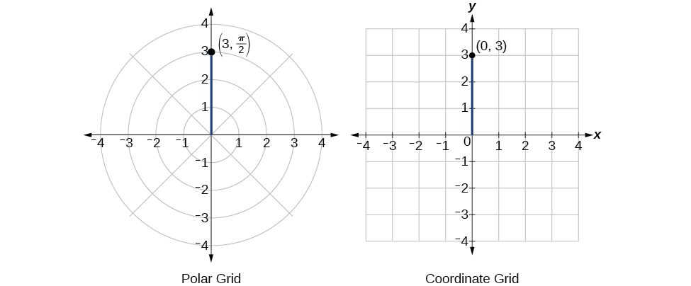{: #Figure_08_03_008}

Writing Polar Coordinates as Rectangular Coordinates

Write the polar coordinates<math xmlns="http://www.w3.org/1998/Math/MathML"> <mrow> <mtext> </mtext><mrow><mo>(</mo> <mrow> <mo>−</mo><mn>2</mn><mo>,</mo><mn>0</mn></mrow> <mo>)</mo></mrow><mtext> </mtext></mrow> </math>

as rectangular coordinates.

See [[link]](#Figure_08_03_009). Writing the polar coordinates as rectangular, we have

<math xmlns="http://www.w3.org/1998/Math/MathML" display="block"> <mrow> <mtable columnalign="left"> <mtr columnalign="left"> <mtd columnalign="left"> <mrow> <mi>x</mi><mo>=</mo><mi>r</mi><mi>cos</mi><mtext> </mtext><mi>θ</mi></mrow> </mtd> </mtr> <mtr columnalign="left"> <mtd columnalign="left"> <mrow> <mi>x</mi><mo>=</mo><mn>−2</mn><mi>cos</mi><mrow><mo>(</mo> <mn>0</mn> <mo>)</mo></mrow><mo>=</mo><mn>−2</mn></mrow> </mtd> </mtr> <mtr columnalign="left"> <mtd columnalign="left"> <mrow /> </mtd> </mtr> <mtr columnalign="left"> <mtd columnalign="left"> <mrow> <mi>y</mi><mo>=</mo><mi>r</mi><mi>sin</mi><mtext> </mtext><mi>θ</mi></mrow> </mtd> </mtr> <mtr columnalign="left"> <mtd columnalign="left"> <mrow> <mi>y</mi><mo>=</mo><mn>−2</mn><mi>sin</mi><mrow><mo>(</mo> <mn>0</mn> <mo>)</mo></mrow><mo>=</mo><mn>0</mn></mrow> </mtd> </mtr> </mtable></mrow> </math>

The rectangular coordinates are also<math xmlns="http://www.w3.org/1998/Math/MathML"> <mrow> <mtext> </mtext><mrow><mo>(</mo> <mrow> <mo>−</mo><mn>2</mn><mo>,</mo><mn>0</mn></mrow> <mo>)</mo></mrow><mo>.</mo></mrow> </math>

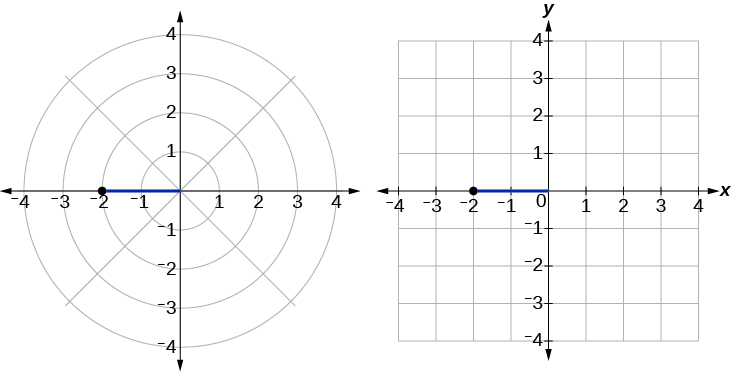{: #Figure_08_03_009}

Write the polar coordinates<math xmlns="http://www.w3.org/1998/Math/MathML"> <mrow> <mtext> </mtext><mrow><mo>(</mo> <mrow> <mo>−</mo><mn>1</mn><mo>,</mo><mfrac> <mrow> <mn>2</mn><mi>π</mi></mrow> <mn>3</mn> </mfrac> </mrow> <mo>)</mo></mrow><mtext> </mtext></mrow> </math>

as rectangular coordinates.

<math xmlns="http://www.w3.org/1998/Math/MathML"> <mrow> <mrow><mo>(</mo> <mrow> <mi>x</mi><mo>,</mo><mi>y</mi></mrow> <mo>)</mo></mrow><mo>=</mo><mrow><mo>(</mo> <mrow> <mfrac> <mn>1</mn> <mn>2</mn> </mfrac> <mo>,</mo><mo>−</mo><mfrac> <mrow> <msqrt> <mn>3</mn> </msqrt> </mrow> <mn>2</mn> </mfrac> </mrow> <mo>)</mo></mrow></mrow> </math>

### Converting from Rectangular Coordinates to Polar Coordinates

To convert **rectangular coordinates**{: data-type="term" .no-emphasis} to **polar coordinates**{: data-type="term" .no-emphasis}, we will use two other familiar relationships. With this conversion, however, we need to be aware that a set of rectangular coordinates will yield more than one polar point.

Converting from Rectangular Coordinates to Polar Coordinates

Converting from rectangular coordinates to polar coordinates requires the use of one or more of the relationships illustrated in [\[link\]](#Figure_08_03_010).

<math xmlns="http://www.w3.org/1998/Math/MathML" display="block"> <mrow> <mtable columnalign="left"> <mtr columnalign="left"> <mtd columnalign="left"> <mrow> <mi>cos</mi><mtext> </mtext><mi>θ</mi><mo>=</mo><mfrac> <mi>x</mi> <mi>r</mi> </mfrac> <mtext> </mtext><mtext> </mtext><mtext> or</mtext><mtext> </mtext><mtext> </mtext><mtext> </mtext><mi>x</mi><mo>=</mo><mi>r</mi><mi>cos</mi><mtext> </mtext><mi>θ</mi> </mrow> </mtd> </mtr> <mtr columnalign="left"> <mtd columnalign="left"> <mrow> <mi>sin</mi><mtext> </mtext><mi>θ</mi><mo>=</mo><mfrac> <mi>y</mi> <mi>r</mi> </mfrac> <mtext> </mtext><mtext> </mtext><mtext> or</mtext><mtext> </mtext><mtext> </mtext><mtext> </mtext><mi>y</mi><mo>=</mo><mi>r</mi><mi>sin</mi><mtext> </mtext><mi>θ</mi> </mrow> </mtd> </mtr> <mtr columnalign="left"> <mtd columnalign="left"> <mrow> <mtext> </mtext><mtext> </mtext><mtext> </mtext><mtext> </mtext><mtext> </mtext><mtext> </mtext><msup> <mi>r</mi> <mn>2</mn> </msup> <mo>=</mo><msup> <mi>x</mi> <mn>2</mn> </msup> <mo>+</mo><msup> <mi>y</mi> <mn>2</mn> </msup> </mrow> </mtd> </mtr> <mtr columnalign="left"> <mtd columnalign="left"> <mrow> <mi>tan</mi><mtext> </mtext><mi>θ</mi><mo>=</mo><mfrac> <mi>y</mi> <mi>x</mi> </mfrac> <mtext> </mtext> </mrow> </mtd> </mtr> </mtable> </mrow> </math>

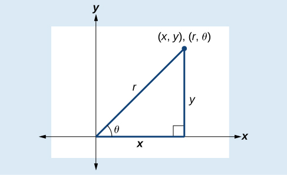{: #Figure_08_03_010}

Writing Rectangular Coordinates as Polar Coordinates

Convert the rectangular coordinates<math xmlns="http://www.w3.org/1998/Math/MathML"> <mrow> <mtext> </mtext><mrow><mo>(</mo> <mrow> <mn>3</mn><mo>,</mo><mn>3</mn></mrow> <mo>)</mo></mrow><mtext> </mtext></mrow> </math>

to polar coordinates.

We see that the original point<math xmlns="http://www.w3.org/1998/Math/MathML"> <mrow> <mtext> </mtext><mrow><mo>(</mo> <mrow> <mn>3</mn><mo>,</mo><mn>3</mn></mrow> <mo>)</mo></mrow><mtext> </mtext></mrow> </math>

is in the first quadrant. To find<math xmlns="http://www.w3.org/1998/Math/MathML"> <mrow> <mtext> </mtext><mi>θ</mi><mo>,</mo><mtext> </mtext></mrow> </math>

use the formula<math xmlns="http://www.w3.org/1998/Math/MathML"> <mrow> <mtext> </mtext><mi>tan</mi><mtext> </mtext><mi>θ</mi><mo>=</mo><mfrac> <mi>y</mi> <mi>x</mi> </mfrac> <mo>.</mo><mtext> </mtext></mrow> </math>

This gives

<math xmlns="http://www.w3.org/1998/Math/MathML" display="block"> <mrow> <mtable columnalign="left"> <mtr columnalign="left"> <mtd columnalign="left"> <mrow> <mtext> </mtext><mtext> </mtext><mtext> </mtext><mtext> </mtext><mtext> </mtext><mtext> </mtext><mtext> </mtext><mtext> </mtext><mtext> </mtext><mtext> </mtext><mtext> </mtext><mi>tan</mi><mtext> </mtext><mi>θ</mi><mo>=</mo><mfrac> <mn>3</mn> <mn>3</mn> </mfrac> </mrow> </mtd> </mtr> <mtr columnalign="left"> <mtd columnalign="left"> <mrow> <mtext> </mtext><mtext> </mtext><mtext> </mtext><mtext> </mtext><mtext> </mtext><mtext> </mtext><mtext> </mtext><mtext> </mtext><mtext> </mtext><mtext> </mtext><mtext> </mtext><mi>tan</mi><mtext> </mtext><mi>θ</mi><mo>=</mo><mn>1</mn> </mrow> </mtd> </mtr> <mtr columnalign="left"> <mtd columnalign="left"> <mrow> <mtext> </mtext><mtext> </mtext><mtext> </mtext><msup> <mrow> <mi>tan</mi> </mrow> <mrow> <mn>−1</mn> </mrow> </msup> <mo stretchy="false">(</mo><mn>1</mn><mo stretchy="false">)</mo><mo>=</mo><mfrac> <mi>π</mi> <mn>4</mn> </mfrac> </mrow> </mtd> </mtr> </mtable> </mrow> </math>

To find<math xmlns="http://www.w3.org/1998/Math/MathML"> <mrow> <mtext> </mtext><mi>r</mi><mo>,</mo><mtext> </mtext></mrow> </math>

we substitute the values for<math xmlns="http://www.w3.org/1998/Math/MathML"> <mrow> <mtext> </mtext><mi>x</mi><mtext> </mtext></mrow> </math>

and<math xmlns="http://www.w3.org/1998/Math/MathML"> <mrow> <mtext> </mtext><mi>y</mi><mtext> </mtext></mrow> </math>

into the formula<math xmlns="http://www.w3.org/1998/Math/MathML"> <mrow> <mtext> </mtext><mi>r</mi><mo>=</mo><msqrt> <mrow> <msup> <mi>x</mi> <mn>2</mn> </msup> <mo>+</mo><msup> <mi>y</mi> <mn>2</mn> </msup> </mrow> </msqrt> <mo>.</mo><mtext> </mtext></mrow> </math>

We know that<math xmlns="http://www.w3.org/1998/Math/MathML"> <mrow> <mtext> </mtext><mi>r</mi><mtext> </mtext></mrow> </math>

must be positive, as<math xmlns="http://www.w3.org/1998/Math/MathML"> <mrow> <mtext> </mtext><mfrac> <mi>π</mi> <mn>4</mn> </mfrac> <mtext> </mtext></mrow> </math>

is in the first quadrant. Thus

<math xmlns="http://www.w3.org/1998/Math/MathML" display="block"> <mrow> <mtable columnalign="left"> <mtr columnalign="left"> <mtd columnalign="left"> <mtable columnalign="left"> <mtr> <mtd> <mrow /> </mtd> </mtr> <mtr> <mtd> <mi>r</mi><mo>=</mo><msqrt> <mrow> <msup> <mn>3</mn> <mn>2</mn> </msup> <mo>+</mo><msup> <mn>3</mn> <mn>2</mn> </msup> </mrow> </msqrt> </mtd> </mtr> </mtable> </mtd> </mtr> <mtr columnalign="left"> <mtd columnalign="left"> <mrow> <mi>r</mi><mo>=</mo><msqrt> <mrow> <mn>9</mn><mo>+</mo><mn>9</mn> </mrow> </msqrt> </mrow> </mtd> </mtr> <mtr columnalign="left"> <mtd columnalign="left"> <mrow> <mi>r</mi><mo>=</mo><msqrt> <mrow> <mn>18</mn> </mrow> </msqrt> <mo>=</mo><mn>3</mn><msqrt> <mn>2</mn> </msqrt> </mrow> </mtd> </mtr> </mtable> </mrow> </math>

So,<math xmlns="http://www.w3.org/1998/Math/MathML"> <mrow> <mtext> </mtext><mi>r</mi><mo>=</mo><mn>3</mn><msqrt> <mn>2</mn> </msqrt> <mtext> </mtext><mtext> </mtext></mrow> </math>

and<math xmlns="http://www.w3.org/1998/Math/MathML"> <mrow> <mtext> </mtext><mi>θ</mi><mtext>=</mtext><mfrac> <mi>π</mi> <mn>4</mn> </mfrac> <mo>,</mo><mtext> </mtext></mrow> </math>

giving us the polar point<math xmlns="http://www.w3.org/1998/Math/MathML"> <mrow> <mtext> </mtext><mrow><mo>(</mo> <mrow> <mn>3</mn><msqrt> <mn>2</mn> </msqrt> <mo>,</mo><mfrac> <mi>π</mi> <mn>4</mn> </mfrac> </mrow> <mo>)</mo></mrow><mo>.</mo><mtext> </mtext></mrow> </math>

See [[link]](#Figure_08_03_011).

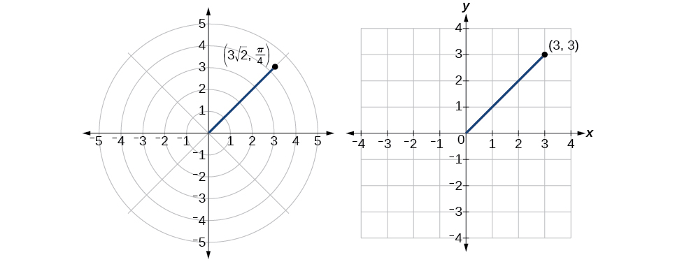{: #Figure_08_03_011}

Analysis

There are other sets of polar coordinates that will be the same as our first solution. For example, the points<math xmlns="http://www.w3.org/1998/Math/MathML"> <mrow> <mtext> </mtext><mrow><mo>(</mo> <mrow> <mo>−</mo><mn>3</mn><msqrt> <mn>2</mn> </msqrt> <mo>,</mo><mtext> </mtext><mfrac> <mrow> <mn>5</mn><mi>π</mi></mrow> <mn>4</mn> </mfrac> </mrow> <mo>)</mo></mrow><mtext> </mtext></mrow> </math>

and<math xmlns="http://www.w3.org/1998/Math/MathML"> <mrow> <mtext> </mtext><mrow><mo>(</mo> <mrow> <mn>3</mn><msqrt> <mn>2</mn> </msqrt> <mo>,</mo><mo>−</mo><mfrac> <mrow> <mn>7</mn><mi>π</mi></mrow> <mn>4</mn> </mfrac> </mrow> <mo>)</mo></mrow><mtext> </mtext></mrow> </math>

will coincide with the original solution of<math xmlns="http://www.w3.org/1998/Math/MathML"> <mrow> <mtext> </mtext><mrow><mo>(</mo> <mrow> <mn>3</mn><msqrt> <mn>2</mn> </msqrt> <mo>,</mo><mtext> </mtext><mfrac> <mi>π</mi> <mn>4</mn> </mfrac> </mrow> <mo>)</mo></mrow><mo>.</mo><mtext> </mtext></mrow> </math>

The point<math xmlns="http://www.w3.org/1998/Math/MathML"> <mrow> <mtext> </mtext><mrow><mo>(</mo> <mrow> <mo>−</mo><mn>3</mn><msqrt> <mn>2</mn> </msqrt> <mo>,</mo><mtext> </mtext><mfrac> <mrow> <mn>5</mn><mi>π</mi></mrow> <mn>4</mn> </mfrac> </mrow> <mo>)</mo></mrow><mtext> </mtext></mrow> </math>

indicates a move further counterclockwise by<math xmlns="http://www.w3.org/1998/Math/MathML"> <mrow> <mtext> </mtext><mi>π</mi><mo>,</mo><mtext> </mtext></mrow> </math>

which is directly opposite<math xmlns="http://www.w3.org/1998/Math/MathML"> <mrow> <mtext> </mtext><mfrac> <mi>π</mi> <mn>4</mn> </mfrac> <mo>.</mo><mtext> </mtext></mrow> </math>

The radius is expressed as<math xmlns="http://www.w3.org/1998/Math/MathML"> <mrow> <mtext> </mtext><mo>−</mo><mn>3</mn><msqrt> <mn>2</mn> </msqrt> <mo>.</mo><mtext> </mtext></mrow> </math>

However, the angle<math xmlns="http://www.w3.org/1998/Math/MathML"> <mrow> <mtext> </mtext><mfrac> <mrow> <mn>5</mn><mi>π</mi></mrow> <mn>4</mn> </mfrac> <mtext> </mtext></mrow> </math>

is located in the third quadrant and, as<math xmlns="http://www.w3.org/1998/Math/MathML"> <mrow> <mtext> </mtext><mi>r</mi><mtext> </mtext></mrow> </math>

is negative, we extend the directed line segment in the opposite direction, into the first quadrant. This is the same point as<math xmlns="http://www.w3.org/1998/Math/MathML"> <mrow> <mtext> </mtext><mrow><mo>(</mo> <mrow> <mn>3</mn><msqrt> <mn>2</mn> </msqrt> <mo>,</mo><mtext> </mtext><mtext> </mtext><mfrac> <mi>π</mi> <mn>4</mn> </mfrac> </mrow> <mo>)</mo></mrow><mo>.</mo><mtext> </mtext></mrow> </math>

The point<math xmlns="http://www.w3.org/1998/Math/MathML"> <mrow> <mtext> </mtext><mrow><mo>(</mo> <mrow> <mn>3</mn><msqrt> <mn>2</mn> </msqrt> <mo>,</mo><mtext> </mtext><mo>−</mo><mfrac> <mrow> <mn>7</mn><mi>π</mi></mrow> <mn>4</mn> </mfrac> </mrow> <mo>)</mo></mrow><mtext> </mtext></mrow> </math>

is a move further clockwise by<math xmlns="http://www.w3.org/1998/Math/MathML"> <mrow> <mtext> </mtext><mo>−</mo><mfrac> <mrow> <mn>7</mn><mi>π</mi></mrow> <mn>4</mn> </mfrac> <mo>,</mo><mtext> </mtext></mrow> </math>

from<math xmlns="http://www.w3.org/1998/Math/MathML"> <mrow> <mtext> </mtext><mfrac> <mi>π</mi> <mn>4</mn> </mfrac> <mo>.</mo><mtext> </mtext></mrow> </math>

The radius,<math xmlns="http://www.w3.org/1998/Math/MathML"> <mrow> <mtext> </mtext><mn>3</mn><msqrt> <mn>2</mn> </msqrt> <mo>,</mo><mtext> </mtext></mrow> </math>

is the same.

### Transforming Equations between Polar and Rectangular Forms

We can now convert coordinates between polar and rectangular form. Converting equations can be more difficult, but it can be beneficial to be able to convert between the two forms. Since there are a number of polar equations that cannot be expressed clearly in Cartesian form, and vice versa, we can use the same procedures we used to convert points between the coordinate systems. We can then use a graphing calculator to graph either the rectangular form or the polar form of the equation.

<strong>Given an equation in polar form, graph it using a graphing calculator. </strong>

1.  Change the **MODE** to **POL**, representing polar form.
2.  Press the <strong>Y= </strong>button to bring up a screen allowing the input of six equations:
    <math xmlns="http://www.w3.org/1998/Math/MathML"> <mrow> <mtext> </mtext><msub> <mi>r</mi> <mn>1</mn> </msub> <mo>,</mo><mtext> </mtext><mtext> </mtext><msub> <mi>r</mi> <mn>2</mn> </msub> <mo>,</mo><mtext> </mtext><mtext> </mtext><mo>.</mo><mtext> </mtext><mtext> </mtext><mo>.</mo><mtext> </mtext><mtext> </mtext><mo>.</mo><mtext> </mtext><mtext> </mtext><mo>,</mo><mtext> </mtext><mtext> </mtext><msub> <mi>r</mi> <mn>6</mn> </msub> <mo>.</mo></mrow> </math>

3.  Enter the polar equation, set equal to
    <math xmlns="http://www.w3.org/1998/Math/MathML"> <mrow> <mtext> </mtext><mi>r</mi><mo>.</mo></mrow> </math>

4.  Press **GRAPH**.
{: data-number-style="arabic"}

Writing a Cartesian Equation in Polar Form

Write the Cartesian equation<math xmlns="http://www.w3.org/1998/Math/MathML"> <mrow> <mtext> </mtext><msup> <mi>x</mi> <mn>2</mn> </msup> <mo>+</mo><msup> <mi>y</mi> <mn>2</mn> </msup> <mo>=</mo><mn>9</mn><mtext> </mtext></mrow> </math>

in polar form.

The goal is to eliminate<math xmlns="http://www.w3.org/1998/Math/MathML"> <mrow> <mtext> </mtext><mi>x</mi><mtext> </mtext></mrow> </math>

and<math xmlns="http://www.w3.org/1998/Math/MathML"> <mrow> <mtext> </mtext><mi>y</mi><mtext> </mtext></mrow> </math>

from the equation and introduce<math xmlns="http://www.w3.org/1998/Math/MathML"> <mrow> <mtext> </mtext><mi>r</mi><mtext> </mtext></mrow> </math>

and <math xmlns="http://www.w3.org/1998/Math/MathML"> <mrow> <mtext> </mtext><mi>θ</mi><mo>.</mo><mtext> </mtext></mrow> </math>

Ideally, we would write the equation<math xmlns="http://www.w3.org/1998/Math/MathML"> <mrow> <mtext> </mtext><mi>r</mi><mtext> </mtext></mrow> </math>

as a function of<math xmlns="http://www.w3.org/1998/Math/MathML"> <mrow> <mtext> </mtext><mi>θ</mi><mo>.</mo><mtext> </mtext></mrow> </math>

To obtain the polar form, we will use the relationships between<math xmlns="http://www.w3.org/1998/Math/MathML"> <mrow> <mtext> </mtext><mrow><mo>(</mo> <mrow> <mi>x</mi><mo>,</mo><mi>y</mi></mrow> <mo>)</mo></mrow><mtext> </mtext></mrow> </math>

and<math xmlns="http://www.w3.org/1998/Math/MathML"> <mrow> <mtext> </mtext><mrow><mo>(</mo> <mrow> <mi>r</mi><mo>,</mo><mi>θ</mi></mrow> <mo>)</mo></mrow><mo>.</mo><mtext> </mtext></mrow> </math>

Since<math xmlns="http://www.w3.org/1998/Math/MathML"> <mrow> <mtext> </mtext><mi>x</mi><mo>=</mo><mi>r</mi><mi>cos</mi><mtext> </mtext><mi>θ</mi><mtext> </mtext></mrow> </math>

 and<math xmlns="http://www.w3.org/1998/Math/MathML"> <mrow> <mtext> </mtext><mi>y</mi><mo>=</mo><mi>r</mi><mi>sin</mi><mtext> </mtext><mi>θ</mi><mo>,</mo><mtext> </mtext></mrow> </math>

we can substitute and solve for<math xmlns="http://www.w3.org/1998/Math/MathML"> <mrow> <mtext> </mtext><mi>r</mi><mo>.</mo></mrow> </math>

<math xmlns="http://www.w3.org/1998/Math/MathML" display="block"> <mrow> <mtable columnalign="left"> <mtr columnalign="left"> <mtd columnalign="left"> <mrow> <mtext>   </mtext><msup> <mrow> <mo stretchy="false">(</mo><mi>r</mi><mi>cos</mi><mtext> </mtext><mi>θ</mi><mo stretchy="false">)</mo> </mrow> <mn>2</mn> </msup> <mo>+</mo><msup> <mrow> <mo stretchy="false">(</mo><mi>r</mi><mi>sin</mi><mtext> </mtext><mi>θ</mi><mo stretchy="false">)</mo> </mrow> <mn>2</mn> </msup> <mo>=</mo><mn>9</mn> </mrow> </mtd> <mtd columnalign="left"> <mrow /> </mtd> </mtr> <mtr columnalign="left"> <mtd columnalign="left"> <mrow> <mtext>   </mtext><msup> <mi>r</mi> <mn>2</mn> </msup> <msup> <mrow> <mi>cos</mi> </mrow> <mn>2</mn> </msup> <mi>θ</mi><mo>+</mo><msup> <mi>r</mi> <mn>2</mn> </msup> <msup> <mrow> <mi>sin</mi> </mrow> <mn>2</mn> </msup> <mi>θ</mi><mo>=</mo><mn>9</mn> </mrow> </mtd> <mtd columnalign="left"> <mrow /> </mtd> </mtr> <mtr columnalign="left"> <mtd columnalign="left"> <mrow> <mo> </mo><mtext>  </mtext><msup> <mi>r</mi> <mn>2</mn> </msup> <mo stretchy="false">(</mo><msup> <mrow> <mi>cos</mi> </mrow> <mn>2</mn> </msup> <mi>θ</mi><mo>+</mo><msup> <mrow> <mi>sin</mi> </mrow> <mn>2</mn> </msup> <mi>θ</mi><mo stretchy="false">)</mo><mo>=</mo><mn>9</mn> </mrow> </mtd> <mtd columnalign="left"> <mrow /> </mtd> </mtr> <mtr columnalign="left"> <mtd columnalign="left"> <mrow> <mtext> </mtext><mtext>                          </mtext><msup> <mi>r</mi> <mn>2</mn> </msup> <mo stretchy="false">(</mo><mn>1</mn><mo stretchy="false">)</mo><mo>=</mo><mn>9</mn><mo> </mo> </mrow> </mtd> <mtd columnalign="left"> <mrow> <msup> <mrow> <mtext>Substitute cos</mtext> </mrow> <mn>2</mn> </msup> <mi>θ</mi><mo>+</mo><msup> <mrow> <mi>sin</mi> </mrow> <mn>2</mn> </msup> <mi>θ</mi><mo>=</mo><mn>1.</mn> </mrow> </mtd> </mtr> <mtr columnalign="left"> <mtd columnalign="left"> <mrow> <mtext>                                 </mtext><mi>r</mi><mo>=</mo><mo>±</mo><mn>3</mn><mtable> <mtr> <mtd> <mrow /> </mtd> <mtd> <mrow /> </mtd> <mtd> <mrow /> </mtd> <mtd> <mrow /> </mtd> </mtr> </mtable> </mrow> </mtd> <mtd columnalign="left"> <mrow> <mtext>Use the square root property</mtext><mo>.</mo> </mrow> </mtd> </mtr> </mtable> </mrow> </math>

Thus,<math xmlns="http://www.w3.org/1998/Math/MathML"> <mrow> <mtext> </mtext><msup> <mi>x</mi> <mn>2</mn> </msup> <mo>+</mo><msup> <mi>y</mi> <mn>2</mn> </msup> <mo>=</mo><mn>9</mn><mo>,</mo><mi>r</mi><mo>=</mo><mn>3</mn><mo>,</mo></mrow> </math>

and<math xmlns="http://www.w3.org/1998/Math/MathML"> <mrow> <mtext> </mtext><mi>r</mi><mo>=</mo><mo>−</mo><mn>3</mn><mtext> </mtext></mrow> </math>

should generate the same graph. See [[link]](#Figure_08_03_016).

 Cartesian form&#10; &#10;  &#x2009;&#10;   x&#10;   2&#10;  &#10;  +&#10;   y&#10;   2&#10;  &#10;  =9&#x2009;&#10;(b) Polar form&#10; &#10;  &#x2009;r=3&#10;&#10;"){: #Figure_08_03_016}

To graph a circle in rectangular form, we must first solve for<math xmlns="http://www.w3.org/1998/Math/MathML"> <mrow> <mtext> </mtext><mi>y</mi><mo>.</mo></mrow> </math>

<math xmlns="http://www.w3.org/1998/Math/MathML" display="block"> <mrow> <mtable columnalign="left"> <mtr columnalign="left"> <mtd columnalign="left"> <mtable columnalign="left"> <mtr> <mtd> <mrow /> </mtd> </mtr> <mtr> <mtd> <msup> <mi>x</mi> <mn>2</mn> </msup> <mo>+</mo><msup> <mi>y</mi> <mn>2</mn> </msup> <mo>=</mo><mn>9</mn> </mtd> </mtr> </mtable> </mtd> </mtr> <mtr columnalign="left"> <mtd columnalign="left"> <mrow> <mtext>        </mtext><msup> <mi>y</mi> <mn>2</mn> </msup> <mo>=</mo><mn>9</mn><mo>−</mo><msup> <mi>x</mi> <mn>2</mn> </msup> </mrow> </mtd> </mtr> <mtr columnalign="left"> <mtd columnalign="left"> <mrow> <mtext>          </mtext><mi>y</mi><mo>=</mo><mo>±</mo><msqrt> <mrow> <mn>9</mn><mo>−</mo><msup> <mi>x</mi> <mn>2</mn> </msup> </mrow> </msqrt> </mrow> </mtd> </mtr> </mtable> </mrow> </math>

Note that this is two separate functions, since a circle fails the vertical line test. Therefore, we need to enter the positive and negative square roots into the calculator separately, as two equations in the form<math xmlns="http://www.w3.org/1998/Math/MathML"> <mrow> <mtext> </mtext><msub> <mi>Y</mi> <mn>1</mn> </msub> <mo>=</mo><msqrt> <mrow> <mn>9</mn><mo>−</mo><msup> <mi>x</mi> <mn>2</mn> </msup> </mrow> </msqrt> <mtext> </mtext></mrow> </math>

and<math xmlns="http://www.w3.org/1998/Math/MathML"> <mrow> <mtext> </mtext><msub> <mi>Y</mi> <mn>2</mn> </msub> <mo>=</mo><mo>−</mo><msqrt> <mrow> <mn>9</mn><mo>−</mo><msup> <mi>x</mi> <mn>2</mn> </msup> </mrow> </msqrt> <mo>.</mo><mtext> </mtext></mrow> </math>

Press **GRAPH.**

Rewriting a Cartesian Equation as a Polar Equation

Rewrite the **Cartesian equation**{: data-type="term" .no-emphasis}<math xmlns="http://www.w3.org/1998/Math/MathML"> <mrow> <mtext> </mtext><msup> <mi>x</mi> <mn>2</mn> </msup> <mo>+</mo><msup> <mi>y</mi> <mn>2</mn> </msup> <mo>=</mo><mn>6</mn><mi>y</mi><mtext> </mtext></mrow> </math>

as a polar equation.

This equation appears similar to the previous example, but it requires different steps to convert the equation.

We can still follow the same procedures we have already learned and make the following substitutions:

<math xmlns="http://www.w3.org/1998/Math/MathML" display="block"> <mrow> <mtable columnalign="left"> <mtr columnalign="left"> <mtd columnalign="left"> <mrow> <mtext> </mtext><mtext> </mtext><mtext> </mtext><mtext> </mtext><mtext> </mtext><mtext> </mtext><mtext> </mtext><mtext> </mtext><mtext> </mtext><mtext> </mtext><mtext> </mtext><mtext> </mtext><mtext> </mtext><mtext> </mtext><mtext> </mtext><mtext> </mtext><mtext> </mtext><mtext> </mtext><mtext> </mtext><mtext> </mtext><mtext> </mtext><mtext> </mtext><mtext> </mtext><mtext> </mtext><mtext> </mtext><mtext> </mtext><mtext> </mtext><mtext> </mtext><mtext> </mtext><mtext> </mtext><mtext> </mtext><mtext> </mtext><mtext> </mtext><msup> <mi>r</mi> <mn>2</mn> </msup> <mo>=</mo><mn>6</mn><mi>y</mi> </mrow> </mtd> <mtd columnalign="left"> <mrow> <mtext>Use </mtext><msup> <mi>x</mi> <mn>2</mn> </msup> <mo>+</mo><msup> <mi>y</mi> <mn>2</mn> </msup> <mo>=</mo><msup> <mi>r</mi> <mn>2</mn> </msup> <mo>.</mo> </mrow> </mtd> </mtr> <mtr columnalign="left"> <mtd columnalign="left"> <mrow> <mtext> </mtext><mtext> </mtext><mtext> </mtext><mtext> </mtext><mtext> </mtext><mtext> </mtext><mtext> </mtext><mtext> </mtext><mtext> </mtext><mtext> </mtext><mtext> </mtext><mtext> </mtext><mtext> </mtext><mtext> </mtext><mtext> </mtext><mtext> </mtext><mtext> </mtext><mtext> </mtext><mtext> </mtext><mtext> </mtext><mtext> </mtext><mtext> </mtext><mtext> </mtext><mtext> </mtext><mtext> </mtext><mtext> </mtext><mtext> </mtext><mtext> </mtext><mtext> </mtext><mtext> </mtext><mtext> </mtext><mtext> </mtext><mtext> </mtext><msup> <mi>r</mi> <mn>2</mn> </msup> <mo>=</mo><mn>6</mn><mi>r</mi><mi>sin</mi><mtext> </mtext><mi>θ</mi> </mrow> </mtd> <mtd columnalign="left"> <mrow> <mtext>Substitute</mtext><mtext> </mtext><mi>y</mi><mo>=</mo><mi>r</mi><mi>sin</mi><mtext> </mtext><mi>θ</mi><mo>.</mo> </mrow> </mtd> </mtr> <mtr columnalign="left"> <mtd columnalign="left"> <mrow> <mtext>       </mtext><msup> <mi>r</mi> <mn>2</mn> </msup> <mo>−</mo><mn>6</mn><mi>r</mi><mi>sin</mi><mtext> </mtext><mi>θ</mi><mo>=</mo><mn>0</mn> </mrow> </mtd> <mtd columnalign="left"> <mrow> <mtext>Set equal to 0</mtext><mo>.</mo> </mrow> </mtd> </mtr> <mtr columnalign="left"> <mtd columnalign="left"> <mrow> <mtext>      </mtext><mi>r</mi><mo stretchy="false">(</mo><mi>r</mi><mo>−</mo><mn>6</mn><mi>sin</mi><mtext> </mtext><mi>θ</mi><mo stretchy="false">)</mo><mo>=</mo><mn>0</mn> </mrow> </mtd> <mtd columnalign="left"> <mrow> <mtext>Factor and solve</mtext><mo>.</mo> </mrow> </mtd> </mtr> <mtr columnalign="left"> <mtd columnalign="left"> <mrow> <mtext> </mtext><mtext> </mtext><mtext> </mtext><mtext> </mtext><mtext> </mtext><mtext> </mtext><mtext> </mtext><mtext> </mtext><mtext> </mtext><mtext> </mtext><mtext> </mtext><mtext> </mtext><mtext> </mtext><mtext> </mtext><mtext> </mtext><mtext> </mtext><mtext> </mtext><mtext> </mtext><mtext> </mtext><mtext> </mtext><mtext> </mtext><mtext> </mtext><mtext> </mtext><mtext> </mtext><mtext> </mtext><mtext> </mtext><mtext> </mtext><mtext> </mtext><mtext> </mtext><mtext> </mtext><mtext> </mtext><mtext> </mtext><mtext> </mtext><mtext> </mtext><mtext> </mtext><mtext> </mtext><mi>r</mi><mo>=</mo><mn>0</mn> </mrow> </mtd> <mtd columnalign="left"> <mrow> <mtext>We reject </mtext><mi>r</mi><mo>=</mo><mn>0</mn><mo>,</mo><mtext> </mtext><mtext>as it only represents one point, </mtext><mo stretchy="false">(</mo><mn>0</mn><mo>,</mo><mn>0</mn><mo stretchy="false">)</mo><mo>.</mo> </mrow> </mtd> </mtr> <mtr columnalign="left"> <mtd columnalign="left"> <mrow> <mtext> </mtext><mtext> </mtext><mtext> </mtext><mtext> </mtext><mtext> </mtext><mtext> </mtext><mtext> </mtext><mtext> </mtext><mtext> </mtext><mtext> </mtext><mtext> </mtext><mtext> </mtext><mtext> </mtext><mtext> </mtext><mtext> </mtext><mtext> </mtext><mtext> </mtext><mtext> </mtext><mtext> </mtext><mtext> </mtext><mtext> </mtext><mtext> </mtext><mtext> </mtext><mtext> </mtext><mtext> </mtext><mtext> </mtext><mtext> </mtext><mtext> </mtext><mtext> </mtext><mtext> </mtext><mtext>or</mtext><mtext> </mtext><mi>r</mi><mo>=</mo><mn>6</mn><mi>sin</mi><mtext> </mtext><mi>θ</mi><mtable> <mtr> <mtd> <mrow /> </mtd> <mtd> <mrow /> </mtd> <mtd> <mrow /> </mtd> <mtd> <mrow /> </mtd> </mtr> </mtable> </mrow> </mtd> <mtd columnalign="left"> <mrow /> </mtd> </mtr> </mtable> </mrow> </math>

Therefore, the equations<math xmlns="http://www.w3.org/1998/Math/MathML"> <mrow> <mtext> </mtext><msup> <mi>x</mi> <mn>2</mn> </msup> <mo>+</mo><msup> <mi>y</mi> <mn>2</mn> </msup> <mo>=</mo><mn>6</mn><mi>y</mi><mtext> </mtext></mrow> </math>

and<math xmlns="http://www.w3.org/1998/Math/MathML"> <mrow> <mtext> </mtext><mi>r</mi><mo>=</mo><mn>6</mn><mi>sin</mi><mtext> </mtext><mi>θ</mi><mtext> </mtext> </mrow> </math>

 should give us the same graph. See [[link]](#Figure_08_03_012).

 Cartesian form&#10; &#10;  &#x2009;&#10;   x&#10;   2&#10;  &#10;  +&#10;   y&#10;   2&#10;  &#10;  =6y&#10;(b) polar form&#10; &#10;  &#x2009;r=6sin&#x2009;&#x3B8;&#10; &#10;&#10;"){: #Figure_08_03_012}

The Cartesian or **rectangular equation**{: data-type="term" .no-emphasis} is plotted on the rectangular grid, and the **polar equation**{: data-type="term" .no-emphasis} is plotted on the polar grid. Clearly, the graphs are identical.

Rewriting a Cartesian Equation in Polar Form

Rewrite the Cartesian equation<math xmlns="http://www.w3.org/1998/Math/MathML"> <mrow> <mtext> </mtext><mi>y</mi><mo>=</mo><mn>3</mn><mi>x</mi><mo>+</mo><mn>2</mn><mtext> </mtext></mrow> </math>

as a polar equation.

We will use the relationships<math xmlns="http://www.w3.org/1998/Math/MathML"> <mrow> <mtext> </mtext><mi>x</mi><mo>=</mo><mi>r</mi><mi>cos</mi><mtext> </mtext><mi>θ</mi><mtext> </mtext></mrow> </math>

 and <math xmlns="http://www.w3.org/1998/Math/MathML"> <mrow> <mtext> </mtext><mi>y</mi><mo>=</mo><mi>r</mi><mi>sin</mi><mtext> </mtext><mi>θ</mi><mo>.</mo></mrow> </math>

<math xmlns="http://www.w3.org/1998/Math/MathML" display="block"> <mrow> <mtable columnalign="left"> <mtr columnalign="left"> <mtd columnalign="left"> <mrow> <mtext>                        </mtext><mi>y</mi><mo>=</mo><mn>3</mn><mi>x</mi><mo>+</mo><mn>2</mn> </mrow> </mtd> <mtd columnalign="left"> <mrow /> </mtd> </mtr> <mtr columnalign="left"> <mtd columnalign="left"> <mrow> <mtext>                 </mtext><mi>r</mi><mi>sin</mi><mtext> </mtext><mi>θ</mi><mo>=</mo><mn>3</mn><mi>r</mi><mi>cos</mi><mtext> </mtext><mi>θ</mi><mo>+</mo><mn>2</mn> </mrow> </mtd> <mtd columnalign="left"> <mrow /> </mtd> </mtr> <mtr columnalign="left"> <mtd columnalign="left"> <mrow> <mtext> </mtext><mi>r</mi><mi>sin</mi><mtext> </mtext><mi>θ</mi><mo>−</mo><mn>3</mn><mi>r</mi><mi>cos</mi><mtext> </mtext><mi>θ</mi><mo>=</mo><mn>2</mn> </mrow> </mtd> <mtd columnalign="left"> <mrow /> </mtd> </mtr> <mtr columnalign="left"> <mtd columnalign="left"> <mrow> <mi>r</mi><mo stretchy="false">(</mo><mi>sin</mi><mtext> </mtext><mi>θ</mi><mo>−</mo><mn>3</mn><mi>cos</mi><mtext> </mtext><mi>θ</mi><mo stretchy="false">)</mo><mo>=</mo><mn>2</mn> </mrow> </mtd> <mtd columnalign="left"> <mrow> <mtext>Isolate </mtext><mi>r</mi><mo>.</mo> </mrow> </mtd> </mtr> <mtr columnalign="left"> <mtd columnalign="left"> <mrow> <mtext>                      </mtext><mtext> </mtext><mtext> </mtext><mtext> </mtext><mi>r</mi><mo>=</mo><mfrac> <mn>2</mn> <mrow> <mi>sin</mi><mtext> </mtext><mi>θ</mi><mo>−</mo><mn>3</mn><mi>cos</mi><mtext> </mtext><mi>θ</mi> </mrow> </mfrac> <mtable> <mtr> <mtd> <mrow /> </mtd> <mtd> <mrow /> </mtd> <mtd> <mrow /> </mtd> <mtd> <mrow /> </mtd> </mtr> </mtable> </mrow> </mtd> <mtd columnalign="left"> <mrow> <mtext>Solve for </mtext><mi>r</mi><mo>.</mo> </mrow> </mtd> </mtr> </mtable> </mrow> </math>

Rewrite the Cartesian equation<math xmlns="http://www.w3.org/1998/Math/MathML"> <mrow> <mtext> </mtext><msup> <mi>y</mi> <mn>2</mn> </msup> <mo>=</mo><mn>3</mn><mo>−</mo><msup> <mi>x</mi> <mn>2</mn> </msup> <mtext> </mtext></mrow> </math>

in polar form.

<math xmlns="http://www.w3.org/1998/Math/MathML"> <mrow> <mi>r</mi><mo>=</mo><msqrt> <mn>3</mn> </msqrt> </mrow> </math>

###  Identify and Graph Polar Equations by Converting to Rectangular Equations

We have learned how to convert rectangular coordinates to polar coordinates, and we have seen that the points are indeed the same. We have also transformed polar equations to rectangular equations and vice versa. Now we will demonstrate that their graphs, while drawn on different grids, are identical.

Graphing a Polar Equation by Converting to a Rectangular Equation

Covert the polar equation<math xmlns="http://www.w3.org/1998/Math/MathML"> <mrow> <mtext> </mtext><mi>r</mi><mo>=</mo><mn>2</mn><mi>sec</mi><mtext> </mtext><mi>θ</mi><mtext> </mtext></mrow> </math>

 to a rectangular equation, and draw its corresponding graph.

The conversion is

<math xmlns="http://www.w3.org/1998/Math/MathML" display="block"> <mrow> <mtable columnalign="left"> <mtr columnalign="left"> <mtd columnalign="left"> <mrow> <mtext>           </mtext><mi>r</mi><mo>=</mo><mn>2</mn><mi>sec</mi><mtext> </mtext><mi>θ</mi> </mrow> </mtd> </mtr> <mtr columnalign="left"> <mtd columnalign="left"> <mrow> <mtext> </mtext><mtext> </mtext><mtext> </mtext><mtext> </mtext><mtext>        </mtext><mi>r</mi><mo>=</mo><mfrac> <mn>2</mn> <mrow> <mi>cos</mi><mtext> </mtext><mi>θ</mi> </mrow> </mfrac> </mrow> </mtd> </mtr> <mtr columnalign="left"> <mtd columnalign="left"> <mrow> <mo> </mo><mi>r</mi><mi>cos</mi><mtext> </mtext><mi>θ</mi><mo>=</mo><mn>2</mn> </mrow> </mtd> </mtr> <mtr columnalign="left"> <mtd columnalign="left"> <mrow> <mtext> </mtext><mtext> </mtext><mtext> </mtext><mtext> </mtext><mtext> </mtext><mtext> </mtext><mtext> </mtext><mtext> </mtext><mtext> </mtext><mtext> </mtext><mtext> </mtext><mtext> </mtext><mtext> </mtext><mtext> </mtext><mtext> </mtext><mtext> </mtext><mi>x</mi><mo>=</mo><mn>2</mn> </mrow> </mtd> </mtr> </mtable> </mrow> </math>

Notice that the equation<math xmlns="http://www.w3.org/1998/Math/MathML"> <mrow> <mtext> </mtext><mi>r</mi><mo>=</mo><mn>2</mn><mi>sec</mi><mtext> </mtext><mi>θ</mi><mtext> </mtext></mrow> </math>

drawn on the polar grid is clearly the same as the vertical line<math xmlns="http://www.w3.org/1998/Math/MathML"> <mrow> <mtext> </mtext><mi>x</mi><mo>=</mo><mn>2</mn><mtext> </mtext></mrow> </math>

drawn on the rectangular grid (see [[link]](#Figure_08_03_013)). Just as<math xmlns="http://www.w3.org/1998/Math/MathML"> <mrow> <mtext> </mtext><mi>x</mi><mo>=</mo><mi>c</mi><mtext> </mtext></mrow> </math>

is the standard form for a vertical line in rectangular form,<math xmlns="http://www.w3.org/1998/Math/MathML"> <mrow> <mtext> </mtext><mi>r</mi><mo>=</mo><mi>c</mi><mi>sec</mi><mtext> </mtext><mi>θ</mi><mtext> </mtext></mrow> </math>

is the standard form for a vertical line in polar form.

 Polar grid (b) Rectangular coordinate system"){: #Figure_08_03_013}

A similar discussion would demonstrate that the graph of the function<math xmlns="http://www.w3.org/1998/Math/MathML"> <mrow> <mtext> </mtext><mi>r</mi><mo>=</mo><mn>2</mn><mi>csc</mi><mtext> </mtext><mi>θ</mi><mtext> </mtext> </mrow> </math>

 will be the horizontal line<math xmlns="http://www.w3.org/1998/Math/MathML"> <mrow> <mtext> </mtext><mi>y</mi><mo>=</mo><mn>2.</mn><mtext> </mtext></mrow> </math>

In fact,<math xmlns="http://www.w3.org/1998/Math/MathML"> <mrow> <mtext> </mtext><mi>r</mi><mo>=</mo><mi>c</mi><mi>csc</mi><mtext> </mtext><mi>θ</mi><mtext> </mtext></mrow> </math>

 is the standard form for a horizontal line in polar form, corresponding to the rectangular form<math xmlns="http://www.w3.org/1998/Math/MathML"> <mrow> <mtext> </mtext><mi>y</mi><mo>=</mo><mi>c</mi><mo>.</mo></mrow> </math>

Rewriting a Polar Equation in Cartesian Form

Rewrite the polar equation<math xmlns="http://www.w3.org/1998/Math/MathML"> <mrow> <mtext> </mtext><mi>r</mi><mo>=</mo><mfrac> <mn>3</mn> <mrow> <mn>1</mn><mo>−</mo><mn>2</mn><mi>cos</mi><mtext> </mtext><mi>θ</mi> </mrow> </mfrac> <mtext> </mtext> </mrow> </math>

as a Cartesian equation.

The goal is to eliminate<math xmlns="http://www.w3.org/1998/Math/MathML"> <mrow> <mtext> </mtext><mi>θ</mi><mtext> </mtext></mrow> </math>

and<math xmlns="http://www.w3.org/1998/Math/MathML"> <mrow> <mtext> </mtext><mi>r</mi><mo>,</mo></mrow> </math>

and introduce<math xmlns="http://www.w3.org/1998/Math/MathML"> <mrow> <mtext> </mtext><mi>x</mi><mtext> </mtext></mrow> </math>

 and <math xmlns="http://www.w3.org/1998/Math/MathML"> <mrow> <mtext> </mtext><mi>y</mi><mo>.</mo><mtext> </mtext></mrow> </math>

We clear the fraction, and then use substitution. In order to replace<math xmlns="http://www.w3.org/1998/Math/MathML"> <mrow> <mtext> </mtext><mi>r</mi><mtext> </mtext></mrow> </math>

 with <math xmlns="http://www.w3.org/1998/Math/MathML"> <mrow> <mtext> </mtext><mi>x</mi><mtext> </mtext></mrow> </math>

and<math xmlns="http://www.w3.org/1998/Math/MathML"> <mrow> <mtext> </mtext><mi>y</mi><mo>,</mo></mrow> </math>

 we must use the expression<math xmlns="http://www.w3.org/1998/Math/MathML"> <mrow> <mtext> </mtext><msup> <mi>x</mi> <mn>2</mn> </msup> <mo>+</mo><msup> <mi>y</mi> <mn>2</mn> </msup> <mo>=</mo><msup> <mi>r</mi> <mn>2</mn> </msup> <mo>.</mo></mrow> </math>

<math xmlns="http://www.w3.org/1998/Math/MathML" display="block"> <mrow> <mtable columnalign="left"> <mtr columnalign="left"> <mtd columnalign="left"> <mrow> <mtext>                   </mtext><mi>r</mi><mo>=</mo><mfrac> <mn>3</mn> <mrow> <mn>1</mn><mo>−</mo><mn>2</mn><mi>cos</mi><mtext> </mtext><mi>θ</mi> </mrow> </mfrac> </mrow> </mtd> <mtd columnalign="left"> <mrow /> </mtd> <mtd columnalign="left"> <mrow /> </mtd> <mtd columnalign="left"> <mrow /> </mtd> </mtr> <mtr columnalign="left"> <mtd columnalign="left"> <mrow> <mi>r</mi><mo stretchy="false">(</mo><mn>1</mn><mo>−</mo><mn>2</mn><mi>cos</mi><mtext> </mtext><mi>θ</mi><mo stretchy="false">)</mo><mo>=</mo><mn>3</mn> </mrow> </mtd> <mtd columnalign="left"> <mrow /> </mtd> <mtd columnalign="left"> <mrow /> </mtd> <mtd columnalign="left"> <mrow /> </mtd> </mtr> <mtr columnalign="left"> <mtd columnalign="left"> <mrow> <mtext> </mtext><mtext> </mtext><mtext> </mtext><mtext> </mtext><mtext> </mtext><mtext> </mtext><mi>r</mi><mrow><mo>(</mo> <mrow> <mn>1</mn><mo>−</mo><mn>2</mn><mrow><mo>(</mo> <mrow> <mfrac> <mi>x</mi> <mi>r</mi> </mfrac> </mrow> <mo>)</mo></mrow> </mrow> <mo>)</mo></mrow><mo>=</mo><mn>3</mn> </mrow> </mtd> <mtd columnalign="left"> <mrow /> </mtd> <mtd columnalign="left"> <mrow /> </mtd> <mtd columnalign="left"> <mrow> <mtext>Use </mtext><mi>cos</mi><mtext> </mtext><mi>θ</mi><mo>=</mo><mfrac> <mi>x</mi> <mi>r</mi> </mfrac> <mtext> to eliminate </mtext><mi>θ</mi><mo>.</mo> </mrow> </mtd> </mtr> <mtr columnalign="left"> <mtd columnalign="left"> <mrow> <mtext>         </mtext><mtext> </mtext><mtext> </mtext><mtext> </mtext><mi>r</mi><mo>−</mo><mn>2</mn><mi>x</mi><mo>=</mo><mn>3</mn> </mrow> </mtd> <mtd columnalign="left"> <mrow /> </mtd> <mtd columnalign="left"> <mrow /> </mtd> <mtd columnalign="left"> <mrow /> </mtd> </mtr> <mtr columnalign="left"> <mtd columnalign="left"> <mrow> <mtext>                   </mtext><mi>r</mi><mo>=</mo><mn>3</mn><mo>+</mo><mn>2</mn><mi>x</mi> </mrow> </mtd> <mtd columnalign="left"> <mrow /> </mtd> <mtd columnalign="left"> <mrow /> </mtd> <mtd columnalign="left"> <mrow> <mtext>Isolate </mtext><mi>r</mi><mo>.</mo> </mrow> </mtd> </mtr> <mtr columnalign="left"> <mtd columnalign="left"> <mrow> <mtext>                 </mtext><msup> <mi>r</mi> <mn>2</mn> </msup> <mo>=</mo><msup> <mrow> <mo stretchy="false">(</mo><mn>3</mn><mo>+</mo><mn>2</mn><mi>x</mi><mo stretchy="false">)</mo> </mrow> <mn>2</mn> </msup> </mrow> </mtd> <mtd columnalign="left"> <mrow /> </mtd> <mtd columnalign="left"> <mrow /> </mtd> <mtd columnalign="left"> <mrow> <mtext>Square both sides</mtext><mo>.</mo> </mrow> </mtd> </mtr> <mtr columnalign="left"> <mtd columnalign="left"> <mrow> <mtext>        </mtext><mtext> </mtext><msup> <mi>x</mi> <mn>2</mn> </msup> <mo>+</mo><msup> <mi>y</mi> <mn>2</mn> </msup> <mo>=</mo><msup> <mrow> <mo stretchy="false">(</mo><mn>3</mn><mo>+</mo><mn>2</mn><mi>x</mi><mo stretchy="false">)</mo> </mrow> <mn>2</mn> </msup> </mrow> </mtd> <mtd columnalign="left"> <mrow /> </mtd> <mtd columnalign="left"> <mrow /> </mtd> <mtd columnalign="left"> <mrow> <mtext>Use </mtext><msup> <mi>x</mi> <mn>2</mn> </msup> <mo>+</mo><msup> <mi>y</mi> <mn>2</mn> </msup> <mo>=</mo><msup> <mi>r</mi> <mn>2</mn> </msup> <mo>.</mo> </mrow> </mtd> </mtr> </mtable> </mrow> </math>

The Cartesian equation is<math xmlns="http://www.w3.org/1998/Math/MathML"> <mrow> <mtext> </mtext><msup> <mi>x</mi> <mn>2</mn> </msup> <mo>+</mo><msup> <mi>y</mi> <mn>2</mn> </msup> <mo>=</mo><msup> <mrow> <mrow><mo>(</mo> <mrow> <mn>3</mn><mo>+</mo><mn>2</mn><mi>x</mi></mrow> <mo>)</mo></mrow></mrow> <mn>2</mn> </msup> <mo>.</mo><mtext> </mtext></mrow> </math>

However, to graph it, especially using a graphing calculator or computer program, we want to isolate<math xmlns="http://www.w3.org/1998/Math/MathML"> <mrow> <mtext> </mtext><mi>y</mi><mo>.</mo></mrow> </math>

<math xmlns="http://www.w3.org/1998/Math/MathML" display="block"> <mrow> <mtable columnalign="left"> <mtr columnalign="left"> <mtd columnalign="left"> <mrow> <msup> <mi>x</mi> <mn>2</mn> </msup> <mo>+</mo><msup> <mi>y</mi> <mn>2</mn> </msup> <mo>=</mo><msup> <mrow> <mrow><mo>(</mo> <mrow> <mn>3</mn><mo>+</mo><mn>2</mn><mi>x</mi></mrow> <mo>)</mo></mrow></mrow> <mn>2</mn> </msup> </mrow> </mtd> </mtr> <mtr columnalign="left"> <mtd columnalign="left"> <mrow> <mtext>        </mtext><msup> <mi>y</mi> <mn>2</mn> </msup> <mo>=</mo><msup> <mrow> <mrow><mo>(</mo> <mrow> <mn>3</mn><mo>+</mo><mn>2</mn><mi>x</mi></mrow> <mo>)</mo></mrow></mrow> <mn>2</mn> </msup> <mo>−</mo><msup> <mi>x</mi> <mn>2</mn> </msup> </mrow> </mtd> </mtr> <mtr columnalign="left"> <mtd columnalign="left"> <mrow> <mtext>          </mtext><mi>y</mi><mo>=</mo><mo>±</mo><msqrt> <mrow> <msup> <mrow> <mrow><mo>(</mo> <mrow> <mn>3</mn><mo>+</mo><mn>2</mn><mi>x</mi></mrow> <mo>)</mo></mrow></mrow> <mn>2</mn> </msup> <mo>−</mo><msup> <mi>x</mi> <mn>2</mn> </msup> </mrow> </msqrt> </mrow> </mtd> </mtr> </mtable></mrow> </math>

When our entire equation has been changed from<math xmlns="http://www.w3.org/1998/Math/MathML"> <mrow> <mtext> </mtext><mi>r</mi><mtext> </mtext></mrow> </math>

and<math xmlns="http://www.w3.org/1998/Math/MathML"> <mrow> <mtext>  </mtext><mi>θ</mi><mtext>  </mtext></mrow> </math>

to <math xmlns="http://www.w3.org/1998/Math/MathML"> <mrow> <mtext> </mtext><mi>x</mi><mtext> </mtext></mrow> </math>

 and <math xmlns="http://www.w3.org/1998/Math/MathML"> <mrow> <mtext> </mtext><mi>y</mi><mo>,</mo><mtext> </mtext></mrow> </math>

we can stop, unless asked to solve for<math xmlns="http://www.w3.org/1998/Math/MathML"> <mrow> <mtext> </mtext><mi>y</mi><mtext> </mtext></mrow> </math>

or simplify. See [[link]](#Figure_08_03_015).

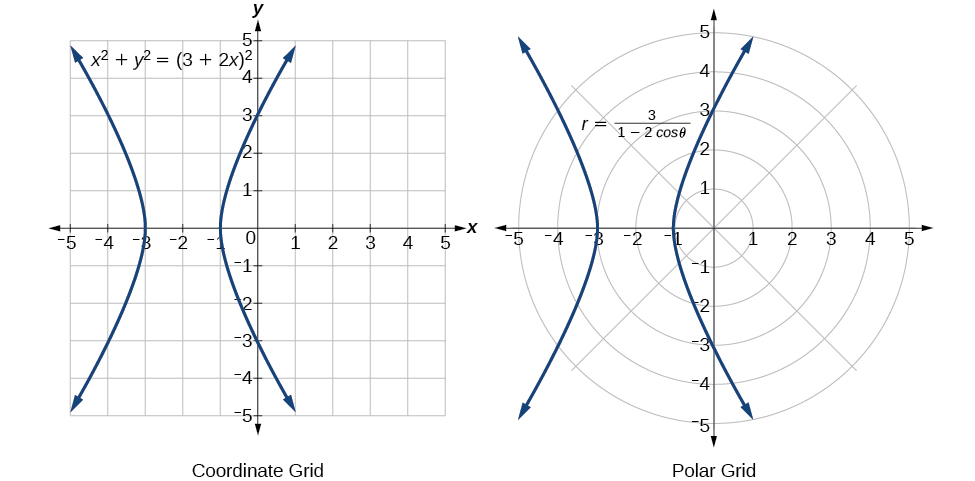{: #Figure_08_03_015}

The “hour-glass” shape of the graph is called a *hyperbola*. Hyperbolas have many interesting geometric features and applications, which we will investigate further in [Analytic Geometry](/m49437){: .target-chapter}.

Analysis

In this example, the right side of the equation can be expanded and the equation simplified further, as shown above. However, the equation cannot be written as a single function in Cartesian form. We may wish to write the rectangular equation in the hyperbola’s standard form. To do this, we can start with the initial equation.

<math xmlns="http://www.w3.org/1998/Math/MathML" display="block"> <mrow> <mtable columnalign="left"> <mtr columnalign="left"> <mtd columnalign="left"> <mrow> <mtext> </mtext><mtext>                             </mtext><msup> <mi>x</mi> <mn>2</mn> </msup> <mo>+</mo><msup> <mi>y</mi> <mn>2</mn> </msup> <mo>=</mo><msup> <mrow> <mo stretchy="false">(</mo><mn>3</mn><mo>+</mo><mn>2</mn><mi>x</mi><mo stretchy="false">)</mo> </mrow> <mn>2</mn> </msup> </mrow> </mtd> <mtd columnalign="left"> <mrow /> </mtd> </mtr> <mtr columnalign="left"> <mtd columnalign="left"> <mrow> <mtext> </mtext><mtext> </mtext><mtext>         </mtext><msup> <mi>x</mi> <mn>2</mn> </msup> <mo>+</mo><msup> <mi>y</mi> <mn>2</mn> </msup> <mo>−</mo><msup> <mrow> <mo stretchy="false">(</mo><mn>3</mn><mo>+</mo><mn>2</mn><mi>x</mi><mo stretchy="false">)</mo> </mrow> <mn>2</mn> </msup> <mo>=</mo><mn>0</mn> </mrow> </mtd> <mtd columnalign="left"> <mrow /> </mtd> </mtr> <mtr columnalign="left"> <mtd columnalign="left"> <mrow> <msup> <mi>x</mi> <mn>2</mn> </msup> <mo>+</mo><msup> <mi>y</mi> <mn>2</mn> </msup> <mo>−</mo><mo stretchy="false">(</mo><mn>9</mn><mo>+</mo><mn>12</mn><mi>x</mi><mo>+</mo><mn>4</mn><msup> <mi>x</mi> <mn>2</mn> </msup> <mo stretchy="false">)</mo><mo>=</mo><mn>0</mn> </mrow> </mtd> <mtd columnalign="left"> <mrow /> </mtd> </mtr> <mtr columnalign="left"> <mtd columnalign="left"> <mrow> <mtext> </mtext><mtext>  </mtext><msup> <mi>x</mi> <mn>2</mn> </msup> <mo>+</mo><msup> <mi>y</mi> <mn>2</mn> </msup> <mo>−</mo><mn>9</mn><mo>−</mo><mn>12</mn><mi>x</mi><mo>−</mo><mn>4</mn><msup> <mi>x</mi> <mn>2</mn> </msup> <mo>=</mo><mn>0</mn> </mrow> </mtd> <mtd columnalign="left"> <mrow /> </mtd> </mtr> <mtr columnalign="left"> <mtd columnalign="left"> <mrow> <mtext> </mtext><mtext>            </mtext><mo>−</mo><mn>3</mn><msup> <mi>x</mi> <mn>2</mn> </msup> <mo>−</mo><mn>12</mn><mi>x</mi><mo>+</mo><msup> <mi>y</mi> <mn>2</mn> </msup> <mo>=</mo><mn>9</mn> </mrow> </mtd> <mtd columnalign="left"> <mrow> <mtext>Multiply through by </mtext><mn>−1.</mn> </mrow> </mtd> </mtr> <mtr columnalign="left"> <mtd columnalign="left"> <mrow> <mtext> </mtext><mtext> </mtext><mtext>               </mtext><mtext> </mtext><mn>3</mn><msup> <mi>x</mi> <mn>2</mn> </msup> <mo>+</mo><mn>12</mn><mi>x</mi><mo>−</mo><msup> <mi>y</mi> <mn>2</mn> </msup> <mo>=</mo><mo>−</mo><mn>9</mn> </mrow> </mtd> <mtd columnalign="left"> <mrow /> </mtd> </mtr> <mtr columnalign="left"> <mtd columnalign="left"> <mrow> <mtext> </mtext><mtext> </mtext><mtext>    </mtext><mtext> </mtext><mn>3</mn><mo stretchy="false">(</mo><msup> <mi>x</mi> <mn>2</mn> </msup> <mo>+</mo><mn>4</mn><mi>x</mi><mo>+</mo><mtext> </mtext><mtext> </mtext><mtext> </mtext><mtext> </mtext><mtext> </mtext><mtext> </mtext><mtext> </mtext><mtext> </mtext><mtext> </mtext><mo stretchy="false">)</mo><mo>−</mo><msup> <mi>y</mi> <mn>2</mn> </msup> <mo>=</mo><mo>−</mo><mn>9</mn> </mrow> </mtd> <mtd columnalign="left"> <mrow> <mtext>Organize terms to complete the square for</mtext><mtext> </mtext><mi>x</mi><mo>.</mo> </mrow> </mtd> </mtr> <mtr columnalign="left"> <mtd columnalign="left"> <mrow> <mtext> </mtext><mtext> </mtext><mtext>        </mtext><mtext> </mtext><mn>3</mn><mo stretchy="false">(</mo><msup> <mi>x</mi> <mn>2</mn> </msup> <mo>+</mo><mn>4</mn><mi>x</mi><mo>+</mo><mn>4</mn><mo stretchy="false">)</mo><mo>−</mo><msup> <mi>y</mi> <mn>2</mn> </msup> <mo>=</mo><mo>−</mo><mn>9</mn><mo>+</mo><mn>12</mn> </mrow> </mtd> <mtd columnalign="left"> <mrow /> </mtd> </mtr> <mtr columnalign="left"> <mtd columnalign="left"> <mrow> <mtext>                  </mtext><mn>3</mn><msup> <mrow> <mo stretchy="false">(</mo><mi>x</mi><mo>+</mo><mn>2</mn><mo stretchy="false">)</mo> </mrow> <mn>2</mn> </msup> <mo>−</mo><msup> <mi>y</mi> <mn>2</mn> </msup> <mo>=</mo><mn>3</mn> </mrow> </mtd> <mtd columnalign="left"> <mrow /> </mtd> </mtr> <mtr columnalign="left"> <mtd columnalign="left"> <mrow> <mtext> </mtext><mtext>                   </mtext><msup> <mrow> <mo stretchy="false">(</mo><mi>x</mi><mo>+</mo><mn>2</mn><mo stretchy="false">)</mo> </mrow> <mn>2</mn> </msup> <mo>−</mo><mfrac> <mrow> <msup> <mi>y</mi> <mn>2</mn> </msup> </mrow> <mn>3</mn> </mfrac> <mo>=</mo><mn>1</mn> </mrow> </mtd> <mtd columnalign="left"> <mrow /> </mtd> </mtr> </mtable> </mrow> </math>

Rewrite the polar equation<math xmlns="http://www.w3.org/1998/Math/MathML"> <mrow> <mtext> </mtext><mi>r</mi><mo>=</mo><mn>2</mn><mi>sin</mi><mtext> </mtext><mi>θ</mi><mtext> </mtext></mrow> </math>

 in Cartesian form.

<math xmlns="http://www.w3.org/1998/Math/MathML"> <mrow> <msup> <mi>x</mi> <mn>2</mn> </msup> <mo>+</mo><msup> <mi>y</mi> <mn>2</mn> </msup> <mo>=</mo><mn>2</mn><mi>y</mi><mtext> </mtext></mrow> </math>

or, in the standard form for a circle,<math xmlns="http://www.w3.org/1998/Math/MathML"> <mrow> <mtext> </mtext><msup> <mi>x</mi> <mn>2</mn> </msup> <mo>+</mo><msup> <mrow> <mrow><mo>(</mo> <mrow> <mi>y</mi><mo>−</mo><mn>1</mn></mrow> <mo>)</mo></mrow></mrow> <mn>2</mn> </msup> <mo>=</mo><mn>1</mn></mrow> </math>

 ****

Rewriting a Polar Equation in Cartesian Form

Rewrite the polar equation<math xmlns="http://www.w3.org/1998/Math/MathML"> <mrow> <mtext> </mtext><mi>r</mi><mo>=</mo><mi>sin</mi><mrow><mo>(</mo> <mrow> <mn>2</mn><mi>θ</mi></mrow> <mo>)</mo></mrow><mtext> </mtext></mrow> </math>

in Cartesian form.

<math xmlns="http://www.w3.org/1998/Math/MathML" display="block"> <mrow> <mtable columnalign="left"> <mtr columnalign="left"> <mtd columnalign="left"> <mrow> <mtext>                 </mtext><mi>r</mi><mo>=</mo><mi>sin</mi><mo stretchy="false">(</mo><mn>2</mn><mi>θ</mi><mo stretchy="false">)</mo> </mrow> </mtd> <mtd columnalign="left"> <mrow> <mtext>Use the double angle identity for sine</mtext><mo>.</mo> </mrow> </mtd> </mtr> <mtr columnalign="left"> <mtd columnalign="left"> <mrow> <mtext>                 </mtext><mi>r</mi><mo>=</mo><mn>2</mn><mi>sin</mi><mtext> </mtext><mi>θ</mi><mi>cos</mi><mtext> </mtext><mi>θ</mi><mtable> <mtr> <mtd> <mrow /> </mtd> <mtd> <mrow /> </mtd> <mtd> <mrow /> </mtd> <mtd> <mrow /> </mtd> </mtr> </mtable> </mrow> </mtd> <mtd columnalign="left"> <mrow> <mtext>Use </mtext><mi>cos</mi><mtext> </mtext><mi>θ</mi><mo>=</mo><mfrac> <mi>x</mi> <mi>r</mi> </mfrac> <mtext> and </mtext><mi>sin</mi><mtext> </mtext><mi>θ</mi><mo>=</mo><mfrac> <mi>y</mi> <mi>r</mi> </mfrac> <mo>.</mo> </mrow> </mtd> </mtr> <mtr columnalign="left"> <mtd columnalign="left"> <mrow> <mtext>                 </mtext><mi>r</mi><mo>=</mo><mn>2</mn><mrow><mo>(</mo> <mrow> <mfrac> <mi>x</mi> <mi>r</mi> </mfrac> </mrow> <mo>)</mo></mrow><mrow><mo>(</mo> <mrow> <mfrac> <mi>y</mi> <mi>r</mi> </mfrac> </mrow> <mo>)</mo></mrow> </mrow> </mtd> <mtd columnalign="left"> <mrow> <mtext>Simplify</mtext><mo>.</mo> </mrow> </mtd> </mtr> <mtr columnalign="left"> <mtd columnalign="left"> <mrow> <mtext>                 </mtext><mi>r</mi><mo>=</mo><mfrac> <mrow> <mn>2</mn><mi>x</mi><mi>y</mi> </mrow> <mrow> <msup> <mi>r</mi> <mn>2</mn> </msup> </mrow> </mfrac> </mrow> </mtd> <mtd columnalign="left"> <mrow> <mtext> Multiply both sides by </mtext><msup> <mi>r</mi> <mn>2</mn> </msup> <mo>.</mo> </mrow> </mtd> </mtr> <mtr columnalign="left"> <mtd columnalign="left"> <mrow> <mtext>               </mtext><msup> <mi>r</mi> <mn>3</mn> </msup> <mo>=</mo><mn>2</mn><mi>x</mi><mi>y</mi> </mrow> </mtd> <mtd columnalign="left"> <mrow /> </mtd> </mtr> <mtr columnalign="left"> <mtd columnalign="left"> <mrow> <msup> <mrow> <mrow><mo>(</mo> <mrow> <msqrt> <mrow> <msup> <mi>x</mi> <mn>2</mn> </msup> <mo>+</mo><msup> <mi>y</mi> <mn>2</mn> </msup> </mrow> </msqrt> </mrow> <mo>)</mo></mrow> </mrow> <mn>3</mn> </msup> <mo>=</mo><mn>2</mn><mi>x</mi><mi>y</mi> </mrow> </mtd> <mtd columnalign="left"> <mrow> <mtext>As</mtext><mtext> </mtext><msup> <mi>x</mi> <mn>2</mn> </msup> <mo>+</mo><msup> <mi>y</mi> <mn>2</mn> </msup> <mo>=</mo><msup> <mi>r</mi> <mn>2</mn> </msup> <mo>,</mo><mi>r</mi><mo>=</mo><msqrt> <mrow> <msup> <mi>x</mi> <mn>2</mn> </msup> <mo>+</mo><msup> <mi>y</mi> <mn>2</mn> </msup> </mrow> </msqrt> <mo>.</mo> </mrow> </mtd> </mtr> </mtable> </mrow> </math>

This equation can also be written as

<math xmlns="http://www.w3.org/1998/Math/MathML" display="block"> <mrow> <msup> <mrow> <mrow><mo>(</mo> <mrow> <msup> <mi>x</mi> <mn>2</mn> </msup> <mo>+</mo><msup> <mi>y</mi> <mn>2</mn> </msup> </mrow> <mo>)</mo></mrow> </mrow> <mrow> <mfrac> <mn>3</mn> <mn>2</mn> </mfrac> </mrow> </msup> <mo>=</mo><mn>2</mn><mi>x</mi><mi>y</mi><mtext> </mtext><mtext>or</mtext><mtext> </mtext><msup> <mi>x</mi> <mn>2</mn> </msup> <mo>+</mo><msup> <mi>y</mi> <mn>2</mn> </msup> <mo>=</mo><msup> <mrow> <mrow><mo>(</mo> <mrow> <mn>2</mn><mi>x</mi><mi>y</mi> </mrow> <mo>)</mo></mrow> </mrow> <mrow> <mfrac> <mn>2</mn> <mn>3</mn> </mfrac> </mrow> </msup> </mrow> </math>

Access these online resources for additional instruction and practice with polar coordinates.

* [Introduction to Polar Coordinates][1]
* [Comparing Polar and Rectangular Coordinates][2]

### Key Equations

| Conversion formulas | <math xmlns="http://www.w3.org/1998/Math/MathML"> <mrow> <mtable columnalign="left"> <mtr columnalign="left"> <mtd columnalign="left"> <mrow /> </mtd> <mtd columnalign="left"> <mrow> <mi>cos</mi><mtext> </mtext><mi>θ</mi><mo>=</mo><mfrac> <mi>x</mi> <mi>r</mi> </mfrac> <mo stretchy="false">→</mo><mi>x</mi><mo>=</mo><mi>r</mi><mi>cos</mi><mtext> </mtext><mi>θ</mi> </mrow> </mtd> </mtr> <mtr columnalign="left"> <mtd columnalign="left"> <mrow /> </mtd> <mtd columnalign="left"> <mrow> <mi>sin</mi><mtext> </mtext><mi>θ</mi><mo>=</mo><mfrac> <mi>y</mi> <mi>r</mi> </mfrac> <mo stretchy="false">→</mo><mi>y</mi><mo>=</mo><mi>r</mi><mi>sin</mi><mtext> </mtext><mi>θ</mi> </mrow> </mtd> </mtr> <mtr columnalign="left"> <mtd columnalign="left"> <mrow /> </mtd> <mtd columnalign="left"> <mrow> <mtext> </mtext><mtext> </mtext><mtext> </mtext><mtext> </mtext><mtext> </mtext><mtext> </mtext><mtext> </mtext><msup> <mi>r</mi> <mn>2</mn> </msup> <mo>=</mo><msup> <mi>x</mi> <mn>2</mn> </msup> <mo>+</mo><msup> <mi>y</mi> <mn>2</mn> </msup> </mrow> </mtd> </mtr> <mtr columnalign="left"> <mtd columnalign="left"> <mrow /> </mtd> <mtd columnalign="left"> <mrow> <mi>tan</mi><mtext> </mtext><mi>θ</mi><mo>=</mo><mfrac> <mi>y</mi> <mi>x</mi> </mfrac> </mrow> </mtd> </mtr> </mtable> </mrow> </math>

 |
{: #eip-id3984733 summary=".."}

### Key Concepts

* The polar grid is represented as a series of concentric circles radiating out from the pole, or origin.
* To plot a point in the form
  <math xmlns="http://www.w3.org/1998/Math/MathML"> <mrow> <mtext> </mtext><mrow><mo>(</mo> <mrow> <mi>r</mi><mo>,</mo><mi>θ</mi></mrow> <mo>)</mo></mrow><mo>,</mo><mtext> </mtext><mi>θ</mi><mo>&gt;</mo><mn>0</mn><mo>,</mo><mtext> </mtext></mrow> </math>
  
  move in a counterclockwise direction from the polar axis by an angle of
  <math xmlns="http://www.w3.org/1998/Math/MathML"> <mrow> <mtext> </mtext><mi>θ</mi><mo>,</mo><mtext> </mtext></mrow> </math>
  
  and then extend a directed line segment from the pole the length of
  <math xmlns="http://www.w3.org/1998/Math/MathML"> <mrow> <mtext> </mtext><mi>r</mi><mtext> </mtext></mrow> </math>
  
  in the direction of
  <math xmlns="http://www.w3.org/1998/Math/MathML"> <mrow> <mtext> </mtext><mi>θ</mi><mo>.</mo><mtext> </mtext></mrow> </math>
  
  If
  <math xmlns="http://www.w3.org/1998/Math/MathML"> <mrow> <mtext> </mtext><mi>θ</mi><mtext> </mtext></mrow> </math>
  
  is negative, move in a clockwise direction, and extend a directed line segment the length of
  <math xmlns="http://www.w3.org/1998/Math/MathML"> <mrow> <mtext> </mtext><mi>r</mi><mtext> </mtext></mrow> </math>
  
  in the direction of
  <math xmlns="http://www.w3.org/1998/Math/MathML"> <mrow> <mtext> </mtext><mi>θ</mi><mo>.</mo></mrow> </math>
  
  See [\[link\]](#Example_08_03_01).
* If
  <math xmlns="http://www.w3.org/1998/Math/MathML"> <mrow> <mtext> </mtext><mi>r</mi><mtext> </mtext></mrow> </math>
  
  is negative, extend the directed line segment in the opposite direction of
  <math xmlns="http://www.w3.org/1998/Math/MathML"> <mrow> <mtext> </mtext><mi>θ</mi><mo>.</mo><mtext> </mtext></mrow> </math>
  
  See [\[link\]](#Example_08_03_02).
* To convert from polar coordinates to rectangular coordinates, use the formulas
  <math xmlns="http://www.w3.org/1998/Math/MathML"> <mrow> <mtext> </mtext><mi>x</mi><mo>=</mo><mi>r</mi><mi>cos</mi><mtext> </mtext><mi>θ</mi><mtext> </mtext></mrow> </math>
  
  and
  <math xmlns="http://www.w3.org/1998/Math/MathML"> <mrow> <mtext> </mtext><mi>y</mi><mo>=</mo><mi>r</mi><mi>sin</mi><mtext> </mtext><mi>θ</mi><mo>.</mo><mtext> </mtext></mrow> </math>
  
  See [\[link\]](#Example_08_03_03) and [\[link\]](#Example_08_03_04).
* To convert from rectangular coordinates to polar coordinates, use one or more of the formulas:
  <math xmlns="http://www.w3.org/1998/Math/MathML"> <mrow> <mtext> </mtext><mi>cos</mi><mtext> </mtext><mi>θ</mi><mo>=</mo><mfrac> <mi>x</mi> <mi>r</mi> </mfrac> <mo>,</mo><mi>sin</mi><mtext> </mtext><mi>θ</mi><mo>=</mo><mfrac> <mi>y</mi> <mi>r</mi> </mfrac> <mo>,</mo><mi>tan</mi><mtext> </mtext><mi>θ</mi><mo>=</mo><mfrac> <mi>y</mi> <mi>x</mi> </mfrac> <mo>,</mo><mtext> </mtext></mrow> </math>
  
  and
  <math xmlns="http://www.w3.org/1998/Math/MathML"> <mrow> <mtext> </mtext><mi>r</mi><mo>=</mo><msqrt> <mrow> <msup> <mi>x</mi> <mn>2</mn> </msup> <mo>+</mo><msup> <mi>y</mi> <mn>2</mn> </msup> </mrow> </msqrt> <mo>.</mo><mtext> </mtext></mrow> </math>
  
  See [\[link\]](#Example_08_03_05).
* Transforming equations between polar and rectangular forms means making the appropriate substitutions based on the available formulas, together with algebraic manipulations. See [\[link\]](#Example_08_03_06), [\[link\]](#Example_08_03_07), and [\[link\]](#Example_08_03_08).
* Using the appropriate substitutions makes it possible to rewrite a polar equation as a rectangular equation, and then graph it in the rectangular plane. See [\[link\]](#Example_08_03_09), [\[link\]](#Example_08_03_10), and [\[link\]](#Example_08_03_11).

### Section Exercises

#### Verbal

How are polar coordinates different from rectangular coordinates?

For polar coordinates, the point in the plane depends on the angle from the positive *x-*axis and distance from the origin, while in Cartesian coordinates, the point represents the horizontal and vertical distances from the origin. For each point in the coordinate plane, there is one representation, but for each point in the polar plane, there are infinite representations.

How are the polar axes different from the *x*- and *y*-axes of the Cartesian plane?

Explain how polar coordinates are graphed.

Determine<math xmlns="http://www.w3.org/1998/Math/MathML"> <mrow> <mtext> </mtext><mi>θ</mi><mtext> </mtext></mrow> </math>

for the point, then move<math xmlns="http://www.w3.org/1998/Math/MathML"> <mrow> <mtext> </mtext><mi>r</mi><mtext> </mtext></mrow> </math>

units from the pole to plot the point. If<math xmlns="http://www.w3.org/1998/Math/MathML"> <mrow> <mtext> </mtext><mi>r</mi><mtext> </mtext></mrow> </math>

is negative, move<math xmlns="http://www.w3.org/1998/Math/MathML"> <mrow> <mtext> </mtext><mi>r</mi><mtext> </mtext></mrow> </math>

units from the pole in the opposite direction but along the same angle. The point is a distance of<math xmlns="http://www.w3.org/1998/Math/MathML"> <mrow> <mtext> </mtext><mi>r</mi><mtext> </mtext></mrow> </math>

away from the origin at an angle of<math xmlns="http://www.w3.org/1998/Math/MathML"> <mrow> <mtext> </mtext><mi>θ</mi><mtext> </mtext></mrow> </math>

from the polar axis.

How are the points<math xmlns="http://www.w3.org/1998/Math/MathML"> <mrow> <mtext> </mtext><mrow><mo>(</mo> <mrow> <mn>3</mn><mo>,</mo><mfrac> <mi>π</mi> <mn>2</mn> </mfrac> </mrow> <mo>)</mo></mrow><mtext> </mtext></mrow> </math>

and<math xmlns="http://www.w3.org/1998/Math/MathML"> <mrow> <mtext> </mtext><mrow><mo>(</mo> <mrow> <mo>−</mo><mn>3</mn><mo>,</mo><mfrac> <mi>π</mi> <mn>2</mn> </mfrac> </mrow> <mo>)</mo></mrow><mtext> </mtext></mrow> </math>

related?

Explain why the points<math xmlns="http://www.w3.org/1998/Math/MathML"> <mrow> <mtext> </mtext><mrow><mo>(</mo> <mrow> <mo>−</mo><mn>3</mn><mo>,</mo><mfrac> <mi>π</mi> <mn>2</mn> </mfrac> </mrow> <mo>)</mo></mrow><mtext> </mtext></mrow> </math>

and<math xmlns="http://www.w3.org/1998/Math/MathML"> <mrow> <mtext> </mtext><mrow><mo>(</mo> <mrow> <mn>3</mn><mo>,</mo><mo>−</mo><mfrac> <mi>π</mi> <mn>2</mn> </mfrac> </mrow> <mo>)</mo></mrow><mtext> </mtext></mrow> </math>

are the same.

The point<math xmlns="http://www.w3.org/1998/Math/MathML"> <mrow> <mtext> </mtext><mrow><mo>(</mo> <mrow> <mo>−</mo><mn>3</mn><mo>,</mo><mfrac> <mi>π</mi> <mn>2</mn> </mfrac> </mrow> <mo>)</mo></mrow><mtext> </mtext></mrow> </math>

has a positive angle but a negative radius and is plotted by moving to an angle of<math xmlns="http://www.w3.org/1998/Math/MathML"> <mrow> <mtext> </mtext><mfrac> <mi>π</mi> <mn>2</mn> </mfrac> <mtext> </mtext></mrow> </math>

and then moving 3 units in the negative direction. This places the point 3 units down the negative *y*-axis. The point<math xmlns="http://www.w3.org/1998/Math/MathML"> <mrow> <mtext> </mtext><mrow><mo>(</mo> <mrow> <mn>3</mn><mo>,</mo><mo>−</mo><mfrac> <mi>π</mi> <mn>2</mn> </mfrac> </mrow> <mo>)</mo></mrow><mtext> </mtext></mrow> </math>

has a negative angle and a positive radius and is plotted by first moving to an angle of<math xmlns="http://www.w3.org/1998/Math/MathML"> <mrow> <mtext> </mtext><mo>−</mo><mfrac> <mi>π</mi> <mn>2</mn> </mfrac> <mtext> </mtext></mrow> </math>

and then moving 3 units down, which is the positive direction for a negative angle. The point is also 3 units down the negative *y*-axis.

#### Algebraic

For the following exercises, convert the given polar coordinates to Cartesian coordinates with<math xmlns="http://www.w3.org/1998/Math/MathML"> <mrow> <mtext> </mtext><mi>r</mi><mo>&gt;</mo><mn>0</mn><mtext> </mtext></mrow> </math>

and<math xmlns="http://www.w3.org/1998/Math/MathML"> <mrow> <mtext> </mtext><mn>0</mn><mo>≤</mo><mi>θ</mi><mo>≤</mo><mn>2</mn><mi>π</mi><mo>.</mo><mtext> </mtext></mrow> </math>

Remember to consider the quadrant in which the given point is located when determining<math xmlns="http://www.w3.org/1998/Math/MathML"> <mrow> <mtext> </mtext><mi>θ</mi><mtext> </mtext></mrow> </math>

for the point.

<math xmlns="http://www.w3.org/1998/Math/MathML"> <mrow> <mrow><mo>(</mo> <mrow> <mn>7</mn><mo>,</mo><mfrac> <mrow> <mn>7</mn><mi>π</mi></mrow> <mn>6</mn> </mfrac> </mrow> <mo>)</mo></mrow></mrow> </math>

<math xmlns="http://www.w3.org/1998/Math/MathML"> <mrow> <mrow><mo>(</mo> <mrow> <mn>5</mn><mo>,</mo><mi>π</mi></mrow> <mo>)</mo></mrow></mrow> </math>

<math xmlns="http://www.w3.org/1998/Math/MathML"> <mrow> <mrow><mo>(</mo> <mrow> <mo>−</mo><mn>5</mn><mo>,</mo><mn>0</mn></mrow> <mo>)</mo></mrow></mrow> </math>

<math xmlns="http://www.w3.org/1998/Math/MathML"> <mrow> <mrow><mo>(</mo> <mrow> <mn>6</mn><mo>,</mo><mo>−</mo><mfrac> <mi>π</mi> <mn>4</mn> </mfrac> </mrow> <mo>)</mo></mrow></mrow> </math>

<math xmlns="http://www.w3.org/1998/Math/MathML"> <mrow> <mrow><mo>(</mo> <mrow> <mo>−</mo><mn>3</mn><mo>,</mo><mfrac> <mi>π</mi> <mn>6</mn> </mfrac> </mrow> <mo>)</mo></mrow></mrow> </math>

<math xmlns="http://www.w3.org/1998/Math/MathML"> <mrow> <mrow><mo>(</mo> <mrow> <mo>−</mo><mfrac> <mrow> <mn>3</mn><msqrt> <mn>3</mn> </msqrt> </mrow> <mn>2</mn> </mfrac> <mo>,</mo><mo>−</mo><mfrac> <mn>3</mn> <mn>2</mn> </mfrac> </mrow> <mo>)</mo></mrow></mrow> </math>

<math xmlns="http://www.w3.org/1998/Math/MathML"> <mrow> <mrow><mo>(</mo> <mrow> <mn>4</mn><mo>,</mo><mfrac> <mrow> <mn>7</mn><mi>π</mi></mrow> <mn>4</mn> </mfrac> </mrow> <mo>)</mo></mrow></mrow> </math>

For the following exercises, convert the given Cartesian coordinates to polar coordinates with<math xmlns="http://www.w3.org/1998/Math/MathML"> <mrow> <mtext> </mtext><mi>r</mi><mo>&gt;</mo><mn>0</mn><mo>,</mo><mtext> </mtext><mtext> </mtext><mn>0</mn><mo>≤</mo><mi>θ</mi><mo>&lt;</mo><mn>2</mn><mi>π</mi><mo>.</mo><mtext> </mtext></mrow> </math>

Remember to consider the quadrant in which the given point is located.

<math xmlns="http://www.w3.org/1998/Math/MathML"> <mrow> <mrow><mo>(</mo> <mrow> <mn>4</mn><mo>,</mo><mn>2</mn></mrow> <mo>)</mo></mrow></mrow> </math>

<math xmlns="http://www.w3.org/1998/Math/MathML"> <mrow> <mrow><mo>(</mo> <mrow> <mn>2</mn><msqrt> <mn>5</mn> </msqrt> <mo>,</mo><mo> </mo><mn>0.464</mn></mrow> <mo>)</mo></mrow></mrow> </math>

<math xmlns="http://www.w3.org/1998/Math/MathML"> <mrow> <mrow><mo>(</mo> <mrow> <mo>−</mo><mn>4</mn><mo>,</mo><mn>6</mn></mrow> <mo>)</mo></mrow></mrow> </math>

<math xmlns="http://www.w3.org/1998/Math/MathML"> <mrow> <mrow><mo>(</mo> <mrow> <mn>3</mn><mo>,</mo><mn>−5</mn></mrow> <mo>)</mo></mrow></mrow> </math>

<math xmlns="http://www.w3.org/1998/Math/MathML"> <mrow> <mrow><mo>(</mo> <mrow> <msqrt> <mrow> <mn>34</mn></mrow> </msqrt> <mo>,</mo><mn>5.253</mn></mrow> <mo>)</mo></mrow></mrow> </math>

<math xmlns="http://www.w3.org/1998/Math/MathML"> <mrow> <mrow><mo>(</mo> <mrow> <mn>−10</mn><mo>,</mo><mn>−13</mn></mrow> <mo>)</mo></mrow></mrow> </math>

<math xmlns="http://www.w3.org/1998/Math/MathML"> <mrow> <mrow><mo>(</mo> <mrow> <mn>8</mn><mo>,</mo><mn>8</mn></mrow> <mo>)</mo></mrow></mrow> </math>

<math xmlns="http://www.w3.org/1998/Math/MathML"> <mrow> <mrow><mo>(</mo> <mrow> <mn>8</mn><msqrt> <mn>2</mn> </msqrt> <mo>,</mo><mfrac> <mi>π</mi> <mn>4</mn> </mfrac> </mrow> <mo>)</mo></mrow></mrow> </math>

For the following exercises, convert the given Cartesian equation to a polar equation.

<math xmlns="http://www.w3.org/1998/Math/MathML"> <mrow> <mi>x</mi><mo>=</mo><mn>3</mn></mrow> </math>

<math xmlns="http://www.w3.org/1998/Math/MathML"> <mrow> <mi>y</mi><mo>=</mo><mn>4</mn></mrow> </math>

<math xmlns="http://www.w3.org/1998/Math/MathML"> <mrow> <mi>r</mi><mo>=</mo><mn>4</mn><mi>csc</mi><mi>θ</mi></mrow> </math>

<math xmlns="http://www.w3.org/1998/Math/MathML"> <mrow> <mi>y</mi><mo>=</mo><mn>4</mn><msup> <mi>x</mi> <mn>2</mn> </msup> </mrow> </math>

<math xmlns="http://www.w3.org/1998/Math/MathML"> <mrow> <mi>y</mi><mo>=</mo><mn>2</mn><msup> <mi>x</mi> <mn>4</mn> </msup> </mrow> </math>

<math xmlns="http://www.w3.org/1998/Math/MathML"> <mrow> <mi>r</mi><mo>=</mo><mroot> <mrow> <mfrac> <mrow> <mi>s</mi><mi>i</mi><mi>n</mi><mi>θ</mi></mrow> <mrow> <mn>2</mn><mi>c</mi><mi>o</mi><msup> <mi>s</mi> <mn>4</mn> </msup> <mi>θ</mi></mrow> </mfrac> </mrow> <mn>3</mn> </mroot> </mrow> </math>

<math xmlns="http://www.w3.org/1998/Math/MathML"> <mrow> <msup> <mi>x</mi> <mn>2</mn> </msup> <mo>+</mo><msup> <mi>y</mi> <mn>2</mn> </msup> <mo>=</mo><mn>4</mn><mi>y</mi></mrow> </math>

<math xmlns="http://www.w3.org/1998/Math/MathML"> <mrow> <msup> <mi>x</mi> <mn>2</mn> </msup> <mo>+</mo><msup> <mi>y</mi> <mn>2</mn> </msup> <mo>=</mo><mn>3</mn><mi>x</mi></mrow> </math>

<math xmlns="http://www.w3.org/1998/Math/MathML"> <mrow> <mi>r</mi><mo>=</mo><mn>3</mn><mi>cos</mi><mi>θ</mi></mrow> </math>

<math xmlns="http://www.w3.org/1998/Math/MathML"> <mrow> <msup> <mi>x</mi> <mn>2</mn> </msup> <mo>−</mo><msup> <mi>y</mi> <mn>2</mn> </msup> <mo>=</mo><mi>x</mi></mrow> </math>

<math xmlns="http://www.w3.org/1998/Math/MathML"> <mrow> <msup> <mi>x</mi> <mn>2</mn> </msup> <mo>−</mo><msup> <mi>y</mi> <mn>2</mn> </msup> <mo>=</mo><mn>3</mn><mi>y</mi></mrow> </math>

<math xmlns="http://www.w3.org/1998/Math/MathML"> <mrow> <mi>r</mi><mo>=</mo><mfrac> <mrow> <mn>3</mn><mi>sin</mi><mi>θ</mi></mrow> <mrow> <mi>cos</mi><mrow><mo>(</mo> <mrow> <mn>2</mn><mi>θ</mi></mrow> <mo>)</mo></mrow></mrow> </mfrac> </mrow> </math>

<math xmlns="http://www.w3.org/1998/Math/MathML"> <mrow> <msup> <mi>x</mi> <mn>2</mn> </msup> <mo>+</mo><msup> <mi>y</mi> <mn>2</mn> </msup> <mo>=</mo><mn>9</mn></mrow> </math>

<math xmlns="http://www.w3.org/1998/Math/MathML"> <mrow> <msup> <mi>x</mi> <mn>2</mn> </msup> <mo>=</mo><mn>9</mn><mi>y</mi></mrow> </math>

<math xmlns="http://www.w3.org/1998/Math/MathML"> <mrow> <mi>r</mi><mo>=</mo><mfrac> <mrow> <mn>9</mn><mi>sin</mi><mi>θ</mi> </mrow> <mrow> <msup> <mrow> <mi>cos</mi> </mrow> <mn>2</mn> </msup> <mi>θ</mi> </mrow> </mfrac> </mrow> </math>

<math xmlns="http://www.w3.org/1998/Math/MathML"> <mrow> <msup> <mi>y</mi> <mn>2</mn> </msup> <mo>=</mo><mn>9</mn><mi>x</mi></mrow> </math>

<math xmlns="http://www.w3.org/1998/Math/MathML"> <mrow> <mn>9</mn><mi>x</mi><mi>y</mi><mo>=</mo><mn>1</mn></mrow> </math>

<math xmlns="http://www.w3.org/1998/Math/MathML"> <mrow> <mi>r</mi><mo>=</mo><msqrt> <mrow> <mfrac> <mn>1</mn> <mrow> <mn>9</mn><mi>cos</mi><mi>θ</mi><mi>sin</mi><mi>θ</mi> </mrow> </mfrac> </mrow> </msqrt> </mrow> </math>

For the following exercises, convert the given polar equation to a Cartesian equation. Write in the standard form of a conic if possible, and identify the conic section represented.

<math xmlns="http://www.w3.org/1998/Math/MathML"> <mrow> <mi>r</mi><mo>=</mo><mn>3</mn><mi>sin</mi><mtext> </mtext><mi>θ</mi> </mrow> </math>

<math xmlns="http://www.w3.org/1998/Math/MathML"> <mrow> <mi>r</mi><mo>=</mo><mn>4</mn><mi>cos</mi><mtext> </mtext><mi>θ</mi> </mrow> </math>

<math xmlns="http://www.w3.org/1998/Math/MathML"> <mrow> <msup> <mi>x</mi> <mn>2</mn> </msup> <mo>+</mo><msup> <mi>y</mi> <mn>2</mn> </msup> <mo>=</mo><mn>4</mn><mi>x</mi><mtext> </mtext></mrow> </math>

or<math xmlns="http://www.w3.org/1998/Math/MathML"> <mrow> <mtext> </mtext><mfrac> <mrow> <msup> <mrow> <mrow><mo>(</mo> <mrow> <mi>x</mi><mo>−</mo><mn>2</mn></mrow> <mo>)</mo></mrow></mrow> <mn>2</mn> </msup> </mrow> <mn>4</mn> </mfrac> <mo>+</mo><mfrac> <mrow> <msup> <mi>y</mi> <mn>2</mn> </msup> </mrow> <mn>4</mn> </mfrac> <mo>=</mo><mn>1</mn><mo>;</mo></mrow> </math>

circle

<math xmlns="http://www.w3.org/1998/Math/MathML"> <mrow> <mi>r</mi><mo>=</mo><mfrac> <mn>4</mn> <mrow> <mi>sin</mi><mtext> </mtext><mi>θ</mi><mo>+</mo><mn>7</mn><mi>cos</mi><mtext> </mtext><mi>θ</mi> </mrow> </mfrac> </mrow> </math>

<math xmlns="http://www.w3.org/1998/Math/MathML"> <mrow> <mi>r</mi><mo>=</mo><mfrac> <mn>6</mn> <mrow> <mi>cos</mi><mtext> </mtext><mi>θ</mi><mo>+</mo><mn>3</mn><mi>sin</mi><mtext> </mtext><mi>θ</mi> </mrow> </mfrac> </mrow> </math>

<math xmlns="http://www.w3.org/1998/Math/MathML"> <mrow> <mn>3</mn><mi>y</mi><mo>+</mo><mi>x</mi><mo>=</mo><mn>6</mn><mo>;</mo><mtext> </mtext></mrow> </math>

line

<math xmlns="http://www.w3.org/1998/Math/MathML"> <mrow> <mi>r</mi><mo>=</mo><mn>2</mn><mi>sec</mi><mtext> </mtext><mi>θ</mi> </mrow> </math>

<math xmlns="http://www.w3.org/1998/Math/MathML"> <mrow> <mi>r</mi><mo>=</mo><mn>3</mn><mi>csc</mi><mtext> </mtext><mi>θ</mi> </mrow> </math>

<math xmlns="http://www.w3.org/1998/Math/MathML"> <mrow> <mi>y</mi><mo>=</mo><mn>3</mn><mo>;</mo><mtext> </mtext></mrow> </math>

 line

<math xmlns="http://www.w3.org/1998/Math/MathML"> <mrow> <mi>r</mi><mo>=</mo><msqrt> <mrow> <mi>r</mi><mi>cos</mi><mtext> </mtext><mi>θ</mi><mo>+</mo><mn>2</mn> </mrow> </msqrt> </mrow> </math>

<math xmlns="http://www.w3.org/1998/Math/MathML"> <mrow> <msup> <mi>r</mi> <mn>2</mn> </msup> <mo>=</mo><mn>4</mn><mi>sec</mi><mtext> </mtext><mi>θ</mi><mtext> </mtext><mi>csc</mi><mtext> </mtext><mi>θ</mi> </mrow> </math>

<math xmlns="http://www.w3.org/1998/Math/MathML"> <mrow> <mi>x</mi><mi>y</mi><mo>=</mo><mn>4</mn><mo>;</mo><mtext> </mtext></mrow> </math>

hyperbola

<math xmlns="http://www.w3.org/1998/Math/MathML"> <mrow> <mi>r</mi><mo>=</mo><mn>4</mn></mrow> </math>

<math xmlns="http://www.w3.org/1998/Math/MathML"> <mrow> <msup> <mi>r</mi> <mn>2</mn> </msup> <mo>=</mo><mn>4</mn></mrow> </math>

<math xmlns="http://www.w3.org/1998/Math/MathML"> <mrow> <msup> <mi>x</mi> <mn>2</mn> </msup> <mo>+</mo><msup> <mi>y</mi> <mn>2</mn> </msup> <mo>=</mo><mn>4</mn><mo>;</mo><mtext> </mtext></mrow> </math>

circle

<math xmlns="http://www.w3.org/1998/Math/MathML"> <mrow> <mi>r</mi><mo>=</mo><mfrac> <mn>1</mn> <mrow> <mn>4</mn><mi>cos</mi><mtext> </mtext><mi>θ</mi><mo>−</mo><mn>3</mn><mi>sin</mi><mtext> </mtext><mi>θ</mi></mrow> </mfrac> </mrow> </math>

<math xmlns="http://www.w3.org/1998/Math/MathML"> <mrow> <mi>r</mi><mo>=</mo><mfrac> <mn>3</mn> <mrow> <mi>cos</mi><mtext> </mtext><mi>θ</mi><mo>−</mo><mn>5</mn><mi>sin</mi><mtext> </mtext><mi>θ</mi></mrow> </mfrac> </mrow> </math>

<math xmlns="http://www.w3.org/1998/Math/MathML"> <mrow> <mi>x</mi><mo>−</mo><mn>5</mn><mi>y</mi><mo>=</mo><mn>3</mn><mo>;</mo><mtext> </mtext></mrow> </math>

line

#### Graphical

For the following exercises, find the polar coordinates of the point.

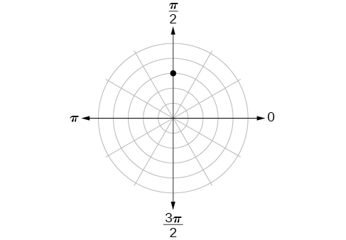

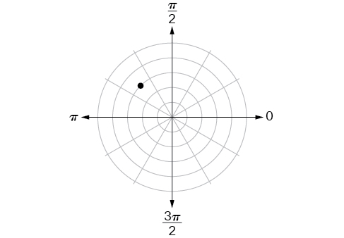

<math xmlns="http://www.w3.org/1998/Math/MathML"> <mrow> <mrow><mo>(</mo> <mrow> <mn>3</mn><mo>,</mo><mfrac> <mrow> <mn>3</mn><mi>π</mi></mrow> <mn>4</mn> </mfrac> </mrow> <mo>)</mo></mrow></mrow> </math>

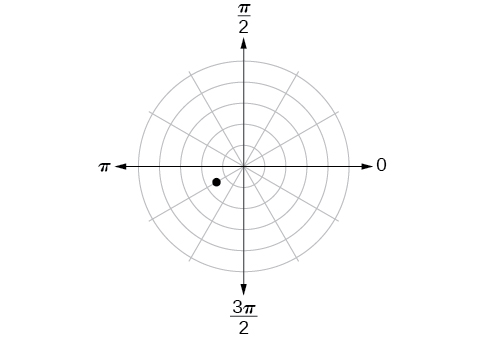

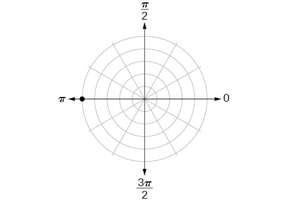

<math xmlns="http://www.w3.org/1998/Math/MathML"> <mrow> <mrow><mo>(</mo> <mrow> <mn>5</mn><mo>,</mo><mi>π</mi></mrow> <mo>)</mo></mrow></mrow> </math>

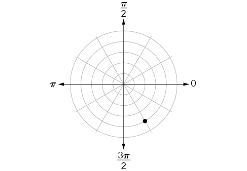

For the following exercises, plot the points.

<math xmlns="http://www.w3.org/1998/Math/MathML"> <mrow> <mrow><mo>(</mo> <mrow> <mo>−</mo><mn>2</mn><mo>,</mo><mfrac> <mi>π</mi> <mn>3</mn> </mfrac> </mrow> <mo>)</mo></mrow></mrow> </math>

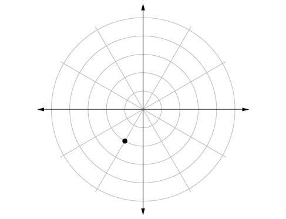

<math xmlns="http://www.w3.org/1998/Math/MathML"> <mrow> <mrow><mo>(</mo> <mrow> <mo>−</mo><mn>1</mn><mo>,</mo><mo>−</mo><mfrac> <mi>π</mi> <mn>2</mn> </mfrac> </mrow> <mo>)</mo></mrow></mrow> </math>

<math xmlns="http://www.w3.org/1998/Math/MathML"> <mrow> <mrow><mo>(</mo> <mrow> <mn>3.5</mn><mo>,</mo><mfrac> <mrow> <mn>7</mn><mi>π</mi></mrow> <mn>4</mn> </mfrac> </mrow> <mo>)</mo></mrow></mrow> </math>

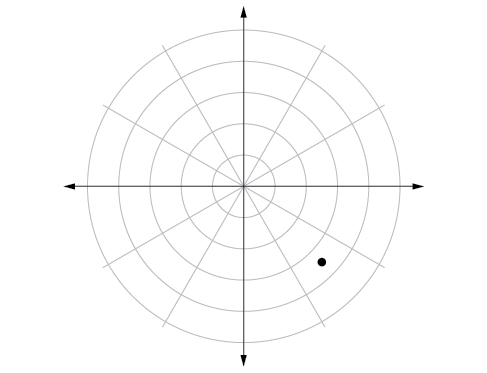

<math xmlns="http://www.w3.org/1998/Math/MathML"> <mrow> <mrow><mo>(</mo> <mrow> <mo>−</mo><mn>4</mn><mo>,</mo><mfrac> <mi>π</mi> <mn>3</mn> </mfrac> </mrow> <mo>)</mo></mrow></mrow> </math>

<math xmlns="http://www.w3.org/1998/Math/MathML"> <mrow> <mrow><mo>(</mo> <mrow> <mn>5</mn><mo>,</mo><mfrac> <mi>π</mi> <mn>2</mn> </mfrac> </mrow> <mo>)</mo></mrow></mrow> </math>

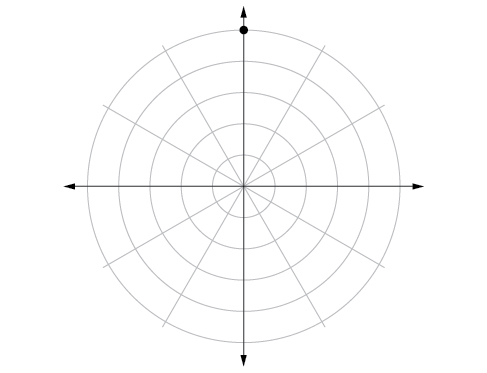

<math xmlns="http://www.w3.org/1998/Math/MathML"> <mrow> <mrow><mo>(</mo> <mrow> <mn>4</mn><mo>,</mo><mfrac> <mrow> <mo>−</mo><mn>5</mn><mi>π</mi></mrow> <mn>4</mn> </mfrac> </mrow> <mo>)</mo></mrow></mrow> </math>

<math xmlns="http://www.w3.org/1998/Math/MathML"> <mrow> <mrow><mo>(</mo> <mrow> <mn>3</mn><mo>,</mo><mfrac> <mrow> <mn>5</mn><mi>π</mi></mrow> <mn>6</mn> </mfrac> </mrow> <mo>)</mo></mrow></mrow> </math>

<math xmlns="http://www.w3.org/1998/Math/MathML"> <mrow> <mrow><mo>(</mo> <mrow> <mo>−</mo><mn>1.5</mn><mo>,</mo><mfrac> <mrow> <mn>7</mn><mi>π</mi></mrow> <mn>6</mn> </mfrac> </mrow> <mo>)</mo></mrow></mrow> </math>

<math xmlns="http://www.w3.org/1998/Math/MathML"> <mrow> <mrow><mo>(</mo> <mrow> <mo>−</mo><mn>2</mn><mo>,</mo><mfrac> <mi>π</mi> <mn>4</mn> </mfrac> </mrow> <mo>)</mo></mrow></mrow> </math>

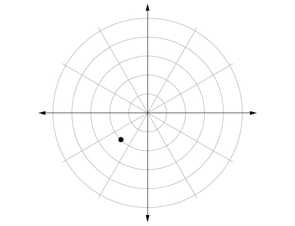

<math xmlns="http://www.w3.org/1998/Math/MathML"> <mrow> <mrow><mo>(</mo> <mrow> <mn>1</mn><mo>,</mo><mfrac> <mrow> <mn>3</mn><mi>π</mi></mrow> <mn>2</mn> </mfrac> </mrow> <mo>)</mo></mrow></mrow> </math>

For the following exercises, convert the equation from rectangular to polar form and graph on the polar axis.

<math xmlns="http://www.w3.org/1998/Math/MathML"> <mrow> <mn>5</mn><mi>x</mi><mo>−</mo><mi>y</mi><mo>=</mo><mn>6</mn></mrow> </math>

<math xmlns="http://www.w3.org/1998/Math/MathML"> <mrow> <mi>r</mi><mo>=</mo><mfrac> <mn>6</mn> <mrow> <mn>5</mn><mi>cos</mi><mi>θ</mi><mo>−</mo><mi>sin</mi><mi>θ</mi></mrow> </mfrac> </mrow> </math>

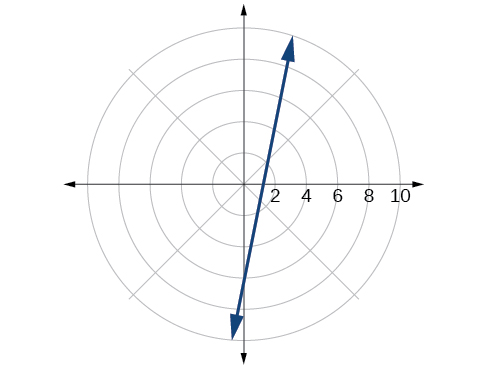

<math xmlns="http://www.w3.org/1998/Math/MathML"> <mrow> <mn>2</mn><mi>x</mi><mo>+</mo><mn>7</mn><mi>y</mi><mo>=</mo><mo>−</mo><mn>3</mn></mrow> </math>

<math xmlns="http://www.w3.org/1998/Math/MathML"> <mrow> <msup> <mi>x</mi> <mn>2</mn> </msup> <mo>+</mo><msup> <mrow> <mrow><mo>(</mo> <mrow> <mi>y</mi><mo>−</mo><mn>1</mn></mrow> <mo>)</mo></mrow></mrow> <mn>2</mn> </msup> <mo>=</mo><mn>1</mn></mrow> </math>

<math xmlns="http://www.w3.org/1998/Math/MathML"> <mrow> <mi>r</mi><mo>=</mo><mn>2</mn><mi>sin</mi><mi>θ</mi></mrow> </math>

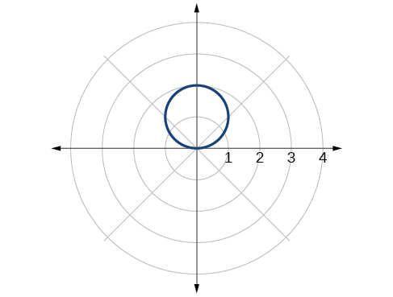

<math xmlns="http://www.w3.org/1998/Math/MathML"> <mrow> <msup> <mrow> <mrow><mo>(</mo> <mrow> <mi>x</mi><mo>+</mo><mn>2</mn></mrow> <mo>)</mo></mrow></mrow> <mn>2</mn> </msup> <mo>+</mo><msup> <mrow> <mrow><mo>(</mo> <mrow> <mi>y</mi><mo>+</mo><mn>3</mn></mrow> <mo>)</mo></mrow></mrow> <mn>2</mn> </msup> <mo>=</mo><mn>13</mn></mrow> </math>

<math xmlns="http://www.w3.org/1998/Math/MathML"> <mrow> <mi>x</mi><mo>=</mo><mn>2</mn></mrow> </math>

<math xmlns="http://www.w3.org/1998/Math/MathML"> <mrow> <mi>r</mi><mo>=</mo><mfrac> <mn>2</mn> <mrow> <mi>cos</mi><mi>θ</mi></mrow> </mfrac> </mrow> </math>

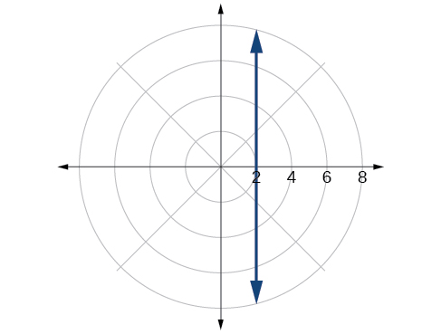

<math xmlns="http://www.w3.org/1998/Math/MathML"> <mrow> <msup> <mi>x</mi> <mn>2</mn> </msup> <mo>+</mo><msup> <mi>y</mi> <mn>2</mn> </msup> <mo>=</mo><mn>5</mn><mi>y</mi></mrow> </math>

<math xmlns="http://www.w3.org/1998/Math/MathML"> <mrow> <msup> <mi>x</mi> <mn>2</mn> </msup> <mo>+</mo><msup> <mi>y</mi> <mn>2</mn> </msup> <mo>=</mo><mn>3</mn><mi>x</mi></mrow> </math>

<math xmlns="http://www.w3.org/1998/Math/MathML"> <mrow> <mi>r</mi><mo>=</mo><mn>3</mn><mi>cos</mi><mi>θ</mi></mrow> </math>

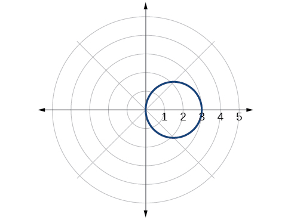

For the following exercises, convert the equation from polar to rectangular form and graph on the rectangular plane.

<math xmlns="http://www.w3.org/1998/Math/MathML"> <mrow> <mi>r</mi><mo>=</mo><mn>6</mn></mrow> </math>

<math xmlns="http://www.w3.org/1998/Math/MathML"> <mrow> <mi>r</mi><mo>=</mo><mo>−</mo><mn>4</mn></mrow> </math>

<math xmlns="http://www.w3.org/1998/Math/MathML"> <mrow> <msup> <mi>x</mi> <mn>2</mn> </msup> <mo>+</mo><msup> <mi>y</mi> <mn>2</mn> </msup> <mo>=</mo><mn>16</mn></mrow> </math>

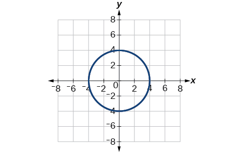

<math xmlns="http://www.w3.org/1998/Math/MathML"> <mrow> <mi>θ</mi><mo>=</mo><mo>−</mo><mfrac> <mrow> <mn>2</mn><mi>π</mi></mrow> <mn>3</mn> </mfrac> </mrow> </math>

<math xmlns="http://www.w3.org/1998/Math/MathML"> <mrow> <mi>θ</mi><mo>=</mo><mfrac> <mi>π</mi> <mn>4</mn> </mfrac> </mrow> </math>

<math xmlns="http://www.w3.org/1998/Math/MathML"> <mrow> <mi>y</mi><mo>=</mo><mi>x</mi></mrow> </math>

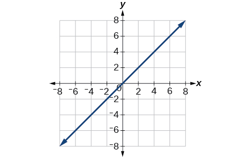

<math xmlns="http://www.w3.org/1998/Math/MathML"> <mrow> <mi>r</mi><mo>=</mo><mi>sec</mi><mtext> </mtext><mi>θ</mi></mrow> </math>

<math xmlns="http://www.w3.org/1998/Math/MathML"> <mrow> <mi>r</mi><mo>=</mo><mn>−10</mn><mi>sin</mi><mtext> </mtext><mi>θ</mi></mrow> </math>

<math xmlns="http://www.w3.org/1998/Math/MathML"> <mrow> <msup> <mi>x</mi> <mn>2</mn> </msup> <mo>+</mo><msup> <mrow> <mrow><mo>(</mo> <mrow> <mi>y</mi><mo>+</mo><mn>5</mn></mrow> <mo>)</mo></mrow></mrow> <mn>2</mn> </msup> <mo>=</mo><mn>25</mn></mrow> </math>

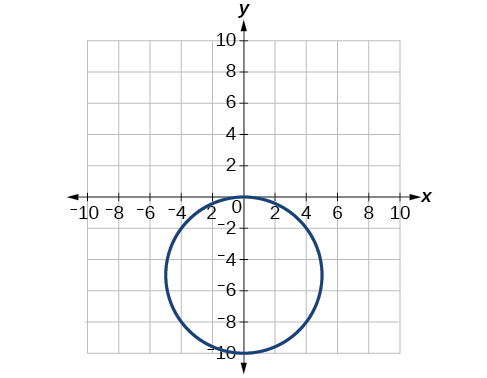

<math xmlns="http://www.w3.org/1998/Math/MathML"> <mrow> <mi>r</mi><mo>=</mo><mn>3</mn><mi>cos</mi><mtext> </mtext><mi>θ</mi></mrow> </math>

#### Technology

Use a graphing calculator to find the rectangular coordinates of<math xmlns="http://www.w3.org/1998/Math/MathML"> <mrow> <mtext> </mtext><mrow><mo>(</mo> <mrow> <mn>2</mn><mo>,</mo><mo>−</mo><mfrac> <mi>π</mi> <mn>5</mn> </mfrac> </mrow> <mo>)</mo></mrow><mo>.</mo><mtext> </mtext></mrow> </math>

Round to the nearest thousandth.

<math xmlns="http://www.w3.org/1998/Math/MathML"> <mrow> <mrow><mo>(</mo> <mrow> <mn>1.618</mn><mo>,</mo><mo>−</mo><mn>1.176</mn></mrow> <mo>)</mo></mrow></mrow> </math>

Use a graphing calculator to find the rectangular coordinates of<math xmlns="http://www.w3.org/1998/Math/MathML"> <mrow> <mtext> </mtext><mrow><mo>(</mo> <mrow> <mo>−</mo><mn>3</mn><mo>,</mo><mfrac> <mrow> <mn>3</mn><mi>π</mi></mrow> <mn>7</mn> </mfrac> </mrow> <mo>)</mo></mrow><mo>.</mo><mtext> </mtext></mrow> </math>

Round to the nearest thousandth.

Use a graphing calculator to find the polar coordinates of<math xmlns="http://www.w3.org/1998/Math/MathML"> <mrow> <mtext> </mtext><mrow><mo>(</mo> <mrow> <mo>−</mo><mn>7</mn><mo>,</mo><mn>8</mn></mrow> <mo>)</mo></mrow><mtext> </mtext></mrow> </math>

in degrees. Round to the nearest thousandth.

<math xmlns="http://www.w3.org/1998/Math/MathML"> <mrow> <mrow><mo>(</mo> <mrow> <mn>10.630</mn><mo>,</mo><mn>131.186°</mn></mrow> <mo>)</mo></mrow></mrow> </math>

Use a graphing calculator to find the polar coordinates of<math xmlns="http://www.w3.org/1998/Math/MathML"> <mrow> <mtext> </mtext><mrow><mo>(</mo> <mrow> <mn>3</mn><mo>,</mo><mo>−</mo><mn>4</mn></mrow> <mo>)</mo></mrow><mtext> </mtext></mrow> </math>

in degrees. Round to the nearest hundredth.

Use a graphing calculator to find the polar coordinates of<math xmlns="http://www.w3.org/1998/Math/MathML"> <mrow> <mtext> </mtext><mrow><mo>(</mo> <mrow> <mo>−</mo><mn>2</mn><mo>,</mo><mn>0</mn></mrow> <mo>)</mo></mrow><mtext> </mtext></mrow> </math>

in radians. Round to the nearest hundredth.

<math xmlns="http://www.w3.org/1998/Math/MathML"> <mrow> <mtext> </mtext><mrow><mo>(</mo> <mrow> <mn>2</mn><mo>,</mo><mn>3.14</mn></mrow> <mo>)</mo></mrow><mi>o</mi><mi>r</mi><mrow><mo>(</mo> <mrow> <mn>2</mn><mo>,</mo><mi>π</mi></mrow> <mo>)</mo></mrow><mtext> </mtext></mrow> </math>

#### Extensions

Describe the graph of<math xmlns="http://www.w3.org/1998/Math/MathML"> <mrow> <mtext> </mtext><mi>r</mi><mo>=</mo><mi>a</mi><mi>sec</mi><mtext> </mtext><mi>θ</mi><mo>;</mo><mi>a</mi><mo>&gt;</mo><mn>0.</mn></mrow> </math>

Describe the graph of<math xmlns="http://www.w3.org/1998/Math/MathML"> <mrow> <mtext> </mtext><mi>r</mi><mo>=</mo><mi>a</mi><mi>sec</mi><mtext> </mtext><mi>θ</mi><mo>;</mo><mi>a</mi><mo>&lt;</mo><mn>0.</mn></mrow> </math>

A vertical line with<math xmlns="http://www.w3.org/1998/Math/MathML"> <mrow> <mtext> </mtext><mi>a</mi><mtext> </mtext></mrow> </math>

units left of the *y*-axis. 

Describe the graph of<math xmlns="http://www.w3.org/1998/Math/MathML"> <mrow> <mtext> </mtext><mi>r</mi><mo>=</mo><mi>a</mi><mi>csc</mi><mtext> </mtext><mi>θ</mi><mo>;</mo><mi>a</mi><mo>&gt;</mo><mn>0.</mn></mrow> </math>

Describe the graph of<math xmlns="http://www.w3.org/1998/Math/MathML"> <mrow> <mtext> </mtext><mi>r</mi><mo>=</mo><mi>a</mi><mi>csc</mi><mtext> </mtext><mi>θ</mi><mo>;</mo><mi>a</mi><mo>&lt;</mo><mn>0.</mn></mrow> </math>

A horizontal line with<math xmlns="http://www.w3.org/1998/Math/MathML"> <mrow> <mtext> </mtext><mi>a</mi><mtext> </mtext></mrow> </math>

units below the *x*-axis.

What polar equations will give an oblique line?

For the following exercise, graph the polar inequality.

<math xmlns="http://www.w3.org/1998/Math/MathML"> <mrow> <mi>r</mi><mo>&lt;</mo><mn>4</mn></mrow> </math>

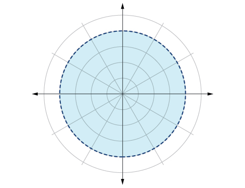

<math xmlns="http://www.w3.org/1998/Math/MathML"> <mrow> <mn>0</mn><mo>≤</mo><mi>θ</mi><mo>≤</mo><mfrac> <mi>π</mi> <mn>4</mn> </mfrac> </mrow> </math>

<math xmlns="http://www.w3.org/1998/Math/MathML"> <mrow> <mi>θ</mi><mo>=</mo><mfrac> <mi>π</mi> <mn>4</mn> </mfrac> <mo>,</mo><mtext> </mtext><mi>r</mi><mtext> </mtext><mo>≥</mo><mtext> </mtext><mn>2</mn></mrow> </math>

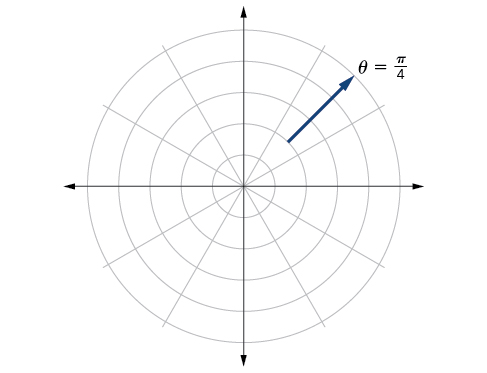

<math xmlns="http://www.w3.org/1998/Math/MathML"> <mrow> <mi>θ</mi><mo>=</mo><mfrac> <mi>π</mi> <mn>4</mn> </mfrac> <mo>,</mo><mtext> </mtext><mi>r</mi><mtext> </mtext><mo>≥</mo><mn>−3</mn></mrow> </math>

<math xmlns="http://www.w3.org/1998/Math/MathML"> <mrow> <mn>0</mn><mo>≤</mo><mi>θ</mi><mo>≤</mo><mfrac> <mi>π</mi> <mn>3</mn> </mfrac> <mo>,</mo><mtext> </mtext><mi>r</mi><mtext> </mtext><mo>&lt;</mo><mtext> </mtext><mn>2</mn></mrow> </math>

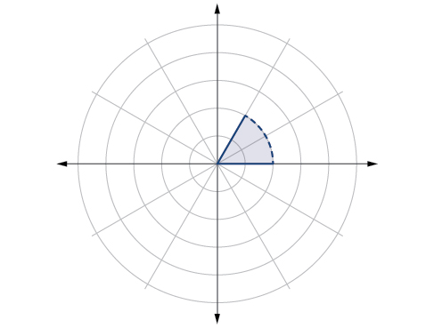

<math xmlns="http://www.w3.org/1998/Math/MathML"> <mrow> <mfrac> <mrow> <mo>−</mo><mi>π</mi></mrow> <mn>6</mn> </mfrac> <mo>&lt;</mo><mi>θ</mi><mo>≤</mo><mfrac> <mi>π</mi> <mn>3</mn> </mfrac> <mo>,</mo><mo>−</mo><mn>3</mn><mo>&lt;</mo><mi>r</mi><mtext> </mtext><mo>&lt;</mo><mtext> </mtext><mn>2</mn></mrow> </math>

### Glossary
{: data-type="glossary-title"}

polar axis
: on the polar grid, the equivalent of the positive *x-*axis on the rectangular grid
^

polar coordinates
: on the polar grid, the coordinates of a point labeled
  <math xmlns="http://www.w3.org/1998/Math/MathML"> <mrow> <mtext> </mtext><mrow><mo>(</mo> <mrow> <mi>r</mi><mo>,</mo><mi>θ</mi></mrow> <mo>)</mo></mrow><mo>,</mo><mtext> </mtext></mrow> </math>
  
  where
  <math xmlns="http://www.w3.org/1998/Math/MathML"> <mrow> <mtext> </mtext><mi>θ</mi><mtext> </mtext></mrow> </math>
  
  indicates the angle of rotation from the polar axis and
  <math xmlns="http://www.w3.org/1998/Math/MathML"> <mrow> <mtext> </mtext><mi>r</mi><mtext> </mtext></mrow> </math>
  
  represents the radius, or the distance of the point from the pole in the direction of
  <math xmlns="http://www.w3.org/1998/Math/MathML"> <mrow> <mtext> </mtext><mi>θ</mi></mrow> </math>
^

pole
: the origin of the polar grid

[1]: http://openstaxcollege.org/l/intropolar
[2]: http://openstaxcollege.org/l/polarrect
