

In this section you will:
* Test polar equations for symmetry.
* Graph polar equations by plotting points.

The planets move through space in elliptical, periodic orbits about the sun, as shown in [\[link\]](#Figure_08_04_001). They are in constant motion, so fixing an exact position of any planet is valid only for a moment. In other words, we can fix only a planet’s <em>instantaneous </em>position. This is one application of **polar coordinates**{: data-type="term" .no-emphasis}, represented as <math xmlns="http://www.w3.org/1998/Math/MathML"> <mrow> <mtext> </mtext><mo stretchy="false">(</mo><mi>r</mi><mo>,</mo><mi>θ</mi><mo stretchy="false">)</mo><mo>.</mo><mtext> </mtext> </mrow> </math>

 We interpret<math xmlns="http://www.w3.org/1998/Math/MathML"> <mrow> <mtext> </mtext><mi>r</mi><mtext> </mtext> </mrow> </math>

as the distance from the sun and<math xmlns="http://www.w3.org/1998/Math/MathML"> <mrow> <mtext> </mtext><mi>θ</mi><mtext> </mtext> </mrow> </math>

as the planet’s angular bearing, or its direction from a fixed point on the sun. In this section, we will focus on the polar system and the graphs that are generated directly from polar coordinates.

 "){: #Figure_08_04_001}

### Testing Polar Equations for Symmetry

Just as a rectangular equation such as<math xmlns="http://www.w3.org/1998/Math/MathML"> <mrow> <mtext> </mtext><mi>y</mi><mo>=</mo><msup> <mi>x</mi> <mn>2</mn> </msup> <mtext> </mtext> </mrow> </math>

describes the relationship between<math xmlns="http://www.w3.org/1998/Math/MathML"> <mrow> <mtext> </mtext><mi>x</mi><mtext> </mtext> </mrow> </math>

and<math xmlns="http://www.w3.org/1998/Math/MathML"> <mrow> <mtext> </mtext><mi>y</mi><mtext> </mtext> </mrow> </math>

on a Cartesian grid, a <strong>polar equation </strong>describes a relationship between<math xmlns="http://www.w3.org/1998/Math/MathML"> <mrow> <mtext> </mtext><mi>r</mi><mtext> </mtext> </mrow> </math>

and<math xmlns="http://www.w3.org/1998/Math/MathML"> <mrow> <mtext> </mtext><mi>θ</mi><mtext> </mtext> </mrow> </math>

on a polar grid. Recall that the coordinate pair<math xmlns="http://www.w3.org/1998/Math/MathML"> <mrow> <mtext> </mtext><mo stretchy="false">(</mo><mi>r</mi><mo>,</mo><mi>θ</mi><mo stretchy="false">)</mo><mtext> </mtext> </mrow> </math>

indicates that we move counterclockwise from the polar axis (positive *x*-axis) by an angle of<math xmlns="http://www.w3.org/1998/Math/MathML"> <mrow> <mtext> </mtext><mi>θ</mi><mo>,</mo><mtext> </mtext> </mrow> </math>

and extend a ray from the pole (origin)<math xmlns="http://www.w3.org/1998/Math/MathML"> <mrow> <mtext> </mtext><mi>r</mi><mtext> </mtext> </mrow> </math>

units in the direction of<math xmlns="http://www.w3.org/1998/Math/MathML"> <mrow> <mtext> </mtext><mi>θ</mi><mo>.</mo><mtext> </mtext> </mrow> </math>

All points that satisfy the polar equation are on the graph.

Symmetry is a property that helps us recognize and plot the graph of any equation. If an equation has a graph that is symmetric with respect to an axis, it means that if we folded the graph in half over that axis, the portion of the graph on one side would coincide with the portion on the other side. By performing three tests, we will see how to apply the properties of symmetry to polar equations. Further, we will use symmetry (in addition to plotting key points, zeros, and maximums of<math xmlns="http://www.w3.org/1998/Math/MathML"> <mrow> <mtext> </mtext><mi>r</mi><mo>)</mo><mtext> </mtext> </mrow> </math>

 to determine the graph of a polar equation.

In the first test, we consider symmetry with respect to the line<math xmlns="http://www.w3.org/1998/Math/MathML"> <mrow> <mtext> </mtext><mi>θ</mi><mo>=</mo><mfrac> <mi>π</mi> <mn>2</mn> </mfrac> <mtext> </mtext> </mrow> </math>

(*y*-axis). We replace<math xmlns="http://www.w3.org/1998/Math/MathML"> <mrow> <mtext> </mtext><mo stretchy="false">(</mo><mi>r</mi><mo>,</mo><mi>θ</mi><mo stretchy="false">)</mo><mtext> </mtext> </mrow> </math>

with<math xmlns="http://www.w3.org/1998/Math/MathML"> <mrow> <mtext> </mtext><mo stretchy="false">(</mo><mi>−</mi><mi>r</mi><mo>,</mo><mo>−</mo><mi>θ</mi><mo stretchy="false">)</mo><mtext> </mtext> </mrow> </math>

to determine if the new equation is equivalent to the original equation. For example, suppose we are given the equation<math xmlns="http://www.w3.org/1998/Math/MathML"> <mrow> <mtext> </mtext><mi>r</mi><mo>=</mo><mn>2</mn><mi>sin</mi><mtext> </mtext><mi>θ</mi><mo>;</mo> </mrow> </math>

<math xmlns="http://www.w3.org/1998/Math/MathML" display="block"> <mrow> <mtable columnalign="left"> <mtr columnalign="left"> <mtd columnalign="left"> <mrow> <mtext> </mtext><mtext> </mtext><mtext> </mtext><mtext> </mtext><mi>r</mi><mo>=</mo><mn>2</mn><mi>sin</mi><mtext> </mtext><mi>θ</mi> </mrow> </mtd> <mtd columnalign="left"> <mrow /> </mtd> </mtr> <mtr columnalign="left"> <mtd columnalign="left"> <mrow> <mi>−</mi><mi>r</mi><mo>=</mo><mn>2</mn><mi>sin</mi><mo stretchy="false">(</mo><mi>−</mi><mi>θ</mi><mo stretchy="false">)</mo><mtable> <mtr> <mtd> <mrow /> </mtd> <mtd> <mrow /> </mtd> <mtd> <mrow /> </mtd> <mtd> <mrow /> </mtd> </mtr> </mtable> </mrow> </mtd> <mtd columnalign="left"> <mrow> <mtext>Replace</mtext><mtext> </mtext><mo stretchy="false">(</mo><mi>r</mi><mo>,</mo><mi>θ</mi><mo stretchy="false">)</mo><mtext> </mtext><mtext>with </mtext><mo stretchy="false">(</mo><mi>−</mi><mi>r</mi><mo>,</mo><mi>−</mi><mi>θ</mi><mo stretchy="false">)</mo><mo>.</mo> </mrow> </mtd> </mtr> <mtr columnalign="left"> <mtd columnalign="left"> <mrow> <mi>−</mi><mi>r</mi><mo>=</mo><mn>−2</mn><mi>sin</mi><mtext> </mtext><mi>θ</mi> </mrow> </mtd> <mtd columnalign="left"> <mrow> <mtext>Identity: </mtext><mi>sin</mi><mo stretchy="false">(</mo><mi>−</mi><mi>θ</mi><mo stretchy="false">)</mo><mo>=</mo><mi>−</mi><mi>sin</mi><mtext> </mtext><mi>θ</mi><mo>.</mo> </mrow> </mtd> </mtr> <mtr columnalign="left"> <mtd columnalign="left"> <mrow> <mtext> </mtext><mtext> </mtext><mtext> </mtext><mtext> </mtext><mtext> </mtext><mi>r</mi><mo>=</mo><mn>2</mn><mi>sin</mi><mtext> </mtext><mi>θ</mi> </mrow> </mtd> <mtd columnalign="left"> <mrow> <mtext>Multiply both sides by</mtext><mn>−1.</mn> </mrow> </mtd> </mtr> </mtable> </mrow> </math>

This equation exhibits symmetry with respect to the line<math xmlns="http://www.w3.org/1998/Math/MathML"> <mrow> <mtext> </mtext><mi>θ</mi><mo>=</mo><mfrac> <mi>π</mi> <mn>2</mn> </mfrac> <mo>.</mo> </mrow> </math>

In the second test, we consider symmetry with respect to the polar axis (<math xmlns="http://www.w3.org/1998/Math/MathML"> <mrow> <mtext> </mtext><mi>x</mi> </mrow> </math>

-axis). We replace<math xmlns="http://www.w3.org/1998/Math/MathML"> <mrow> <mtext> </mtext><mo stretchy="false">(</mo><mi>r</mi><mo>,</mo><mi>θ</mi><mo stretchy="false">)</mo><mtext> </mtext> </mrow> </math>

with<math xmlns="http://www.w3.org/1998/Math/MathML"> <mrow> <mtext> </mtext><mrow><mo>(</mo> <mrow> <mi>r</mi><mo>,</mo><mo>−</mo><mi>θ</mi> </mrow> <mo>)</mo></mrow><mtext> </mtext> </mrow> </math>

or<math xmlns="http://www.w3.org/1998/Math/MathML"> <mrow> <mtext> </mtext><mrow><mo>(</mo> <mrow> <mo>−</mo><mi>r</mi><mo>,</mo><mi>π</mi><mo>−</mo><mi>θ</mi> </mrow> <mo>)</mo></mrow><mtext> </mtext> </mrow> </math>

to determine equivalency between the tested equation and the original. For example, suppose we are given the equation<math xmlns="http://www.w3.org/1998/Math/MathML"> <mrow> <mtext> </mtext><mi>r</mi><mo>=</mo><mn>1</mn><mo>−</mo><mn>2</mn><mi>cos</mi><mtext> </mtext><mi>θ</mi><mo>.</mo> </mrow> </math>

<math xmlns="http://www.w3.org/1998/Math/MathML" display="block"> <mrow> <mtable columnalign="left"> <mtr columnalign="left"> <mtd columnalign="left"> <mrow> <mi>r</mi><mo>=</mo><mn>1</mn><mo>−</mo><mn>2</mn><mi>cos</mi><mtext> </mtext><mi>θ</mi> </mrow> </mtd> <mtd columnalign="left"> <mrow /> </mtd> </mtr> <mtr columnalign="left"> <mtd columnalign="left"> <mrow> <mi>r</mi><mo>=</mo><mn>1</mn><mo>−</mo><mn>2</mn><mi>cos</mi><mo stretchy="false">(</mo><mi>−</mi><mi>θ</mi><mo stretchy="false">)</mo><mtable> <mtr> <mtd> <mrow /> </mtd> <mtd> <mrow /> </mtd> <mtd> <mrow /> </mtd> <mtd> <mrow /> </mtd> </mtr> </mtable> </mrow> </mtd> <mtd columnalign="left"> <mrow> <mtext>Replace </mtext><mo stretchy="false">(</mo><mi>r</mi><mo>,</mo><mi>θ</mi><mo stretchy="false">)</mo><mtext> </mtext><mtext>with</mtext><mtext> </mtext><mo stretchy="false">(</mo><mi>r</mi><mo>,</mo><mi>−</mi><mi>θ</mi><mo stretchy="false">)</mo><mo>.</mo> </mrow> </mtd> </mtr> <mtr columnalign="left"> <mtd columnalign="left"> <mrow> <mi>r</mi><mo>=</mo><mn>1</mn><mo>−</mo><mn>2</mn><mi>cos</mi><mtext> </mtext><mi>θ</mi> </mrow> </mtd> <mtd columnalign="left"> <mrow> <mtext>Even/Odd identity</mtext> </mrow> </mtd> </mtr> </mtable> </mrow> </math>

The graph of this equation exhibits symmetry with respect to the polar axis.

In the third test, we consider symmetry with respect to the pole (origin). We replace<math xmlns="http://www.w3.org/1998/Math/MathML"> <mrow> <mtext> </mtext><mo stretchy="false">(</mo><mi>r</mi><mo>,</mo><mi>θ</mi><mo stretchy="false">)</mo><mtext> </mtext> </mrow> </math>

with<math xmlns="http://www.w3.org/1998/Math/MathML"> <mrow> <mtext> </mtext><mrow><mo>(</mo> <mrow> <mo>−</mo><mi>r</mi><mo>,</mo><mi>θ</mi> </mrow> <mo>)</mo></mrow><mtext> </mtext> </mrow> </math>

to determine if the tested equation is equivalent to the original equation. For example, suppose we are given the equation<math xmlns="http://www.w3.org/1998/Math/MathML"> <mrow> <mtext> </mtext><mi>r</mi><mo>=</mo><mn>2</mn><mi>sin</mi><mo stretchy="false">(</mo><mn>3</mn><mi>θ</mi><mo stretchy="false">).</mo> </mrow> </math>

<math xmlns="http://www.w3.org/1998/Math/MathML" display="block"> <mrow> <mtable> <mtr> <mtd> <mrow> <mtext> </mtext><mtext> </mtext><mtext> </mtext><mtext> </mtext><mtext> </mtext><mi>r</mi><mo>=</mo><mn>2</mn><mi>sin</mi><mo stretchy="false">(</mo><mn>3</mn><mi>θ</mi><mo stretchy="false">)</mo> </mrow> </mtd> </mtr> <mtr> <mtd> <mrow> <mo>−</mo><mi>r</mi><mo>=</mo><mn>2</mn><mi>sin</mi><mo stretchy="false">(</mo><mn>3</mn><mi>θ</mi><mo stretchy="false">)</mo> </mrow> </mtd> </mtr> </mtable> </mrow> </math>

The equation has failed the **symmetry test**{: data-type="term" .no-emphasis}, but that does not mean that it is not symmetric with respect to the pole. Passing one or more of the symmetry tests verifies that symmetry will be exhibited in a graph. However, failing the symmetry tests does not necessarily indicate that a graph will not be symmetric about the line<math xmlns="http://www.w3.org/1998/Math/MathML"> <mrow> <mtext> </mtext><mi>θ</mi><mo>=</mo><mfrac> <mi>π</mi> <mn>2</mn> </mfrac> <mo>,</mo><mtext> </mtext> </mrow> </math>

the polar axis, or the pole. In these instances, we can confirm that symmetry exists by plotting reflecting points across the apparent axis of symmetry or the pole. Testing for symmetry is a technique that simplifies the graphing of polar equations, but its application is not perfect.

Symmetry Tests

A **polar equation**{: data-type="term"} describes a curve on the polar grid. The graph of a polar equation can be evaluated for three types of symmetry, as shown in [\[link\]](#Figure_08_04_002).

 A graph is symmetric with respect to the line&#10; &#10;  &#x2009;&#x3B8;=&#10;   &#x3C0;&#10;   2&#10;  &#10;  &#x2009;&#10; &#10;(y-axis) if replacing&#10; &#10;  &#x2009;(r,&#x3B8;)&#x2009;&#10; &#10;with&#10; &#10;  &#x2009;(&#x2212;r,&#x2212;&#x3B8;)&#x2009;&#10; &#10;yields an equivalent equation. (b) A graph is symmetric with respect to the polar axis (x-axis) if replacing&#10; &#10;  &#x2009;(&#10;   &#10;    r,&#x3B8;&#10;   &#10;  )&#x2009;&#10; &#10;with&#10; &#10;  &#x2009;(&#10;   &#10;    r,&#x2212;&#x3B8;&#10;   &#10;  )&#x2009;&#10; &#10;or&#10; &#10;  &#x2009;(&#10;   &#10;&#x2212;r,&#x3C0;&#x2212;&#x3B8;&#10;   &#10;  )&#x2009;&#10; &#10;yields an equivalent equation. (c) A graph is symmetric with respect to the pole (origin) if replacing&#10; &#10;  &#x2009;(r,&#x3B8;)&#x2009;&#10; &#10;with&#10; &#10;  &#x2009;(&#x2212;r,&#x3B8;)&#x2009;&#10; &#10;yields an equivalent equation."){: #Figure_08_04_002}

**Given a polar equation, test for symmetry.**

1.  Substitute the appropriate combination of components for
    <math xmlns="http://www.w3.org/1998/Math/MathML"> <mrow> <mtext> </mtext><mrow><mo>(</mo> <mrow> <mi>r</mi><mo>,</mo><mi>θ</mi> </mrow> <mo>)</mo></mrow><mo>:</mo> </mrow> </math>
    
    <math xmlns="http://www.w3.org/1998/Math/MathML"> <mrow> <mtext> </mtext><mrow><mo>(</mo> <mrow> <mo>−</mo><mi>r</mi><mo>,</mo><mo>−</mo><mi>θ</mi> </mrow> <mo>)</mo></mrow><mtext> </mtext> </mrow> </math>
    
    for
    <math xmlns="http://www.w3.org/1998/Math/MathML"> <mrow> <mtext> </mtext><mi>θ</mi><mo>=</mo><mfrac> <mi>π</mi> <mn>2</mn> </mfrac> <mtext> </mtext> </mrow> </math>
    
    symmetry;
    <math xmlns="http://www.w3.org/1998/Math/MathML"> <mrow> <mtext> </mtext><mrow><mo>(</mo> <mrow> <mi>r</mi><mo>,</mo><mo>−</mo><mi>θ</mi> </mrow> <mo>)</mo></mrow><mtext> </mtext> </mrow> </math>
    
    for polar axis symmetry; and
    <math xmlns="http://www.w3.org/1998/Math/MathML"> <mrow> <mtext> </mtext><mrow><mo>(</mo> <mrow> <mo>−</mo><mi>r</mi><mo>,</mo><mi>θ</mi> </mrow> <mo>)</mo></mrow><mtext> </mtext> </mrow> </math>
    
    for symmetry with respect to the pole.
2.  If the resulting equations are equivalent in one or more of the tests, the graph produces the expected symmetry.
{: type="1"}

Testing a Polar Equation for Symmetry

Test the equation<math xmlns="http://www.w3.org/1998/Math/MathML"> <mrow> <mtext> </mtext><mi>r</mi><mo>=</mo><mn>2</mn><mi>sin</mi><mtext> </mtext><mi>θ</mi><mtext> </mtext> </mrow> </math>

 for symmetry.

Test for each of the three types of symmetry.

| 1) Replacing<math xmlns="http://www.w3.org/1998/Math/MathML"> <mrow> <mtext> </mtext><mo stretchy="false">(</mo><mi>r</mi><mo>,</mo><mi>θ</mi><mo stretchy="false">)</mo><mtext> </mtext> </mrow> </math>

with<math xmlns="http://www.w3.org/1998/Math/MathML"> <mrow> <mtext> </mtext><mo stretchy="false">(</mo><mo>−</mo><mi>r</mi><mo>,</mo><mo>−</mo><mi>θ</mi><mo stretchy="false">)</mo><mtext> </mtext> </mrow> </math>

yields the same result. Thus, the graph is symmetric with respect to the line<math xmlns="http://www.w3.org/1998/Math/MathML"> <mrow> <mtext> </mtext><mi>θ</mi><mo>=</mo><mfrac> <mi>π</mi> <mn>2</mn> </mfrac> <mo>.</mo> </mrow> </math>

 | <math xmlns="http://www.w3.org/1998/Math/MathML"> <mrow> <mtable columnalign="left"> <mtr columnalign="left"> <mtd columnalign="left"> <mrow> <mi>−</mi><mi>r</mi><mo>=</mo><mn>2</mn><mi>sin</mi><mo stretchy="false">(</mo><mi>−</mi><mi>θ</mi><mo stretchy="false">)</mo> </mrow> </mtd> <mtd columnalign="left"> <mrow /> </mtd> </mtr> <mtr columnalign="left"> <mtd columnalign="left"> <mrow> <mi>−</mi><mi>r</mi><mo>=</mo><mn>−2</mn><mi>sin</mi><mtext> </mtext><mi>θ</mi> </mrow> </mtd> <mtd columnalign="left"> <mrow> <mtext>Even-odd identity</mtext> </mrow> </mtd> </mtr> <mtr columnalign="left"> <mtd columnalign="left"> <mrow> <mtext> </mtext><mtext> </mtext><mtext> </mtext><mtext> </mtext><mi>r</mi><mo>=</mo><mn>2</mn><mi>sin</mi><mtext> </mtext><mi>θ</mi> </mrow> </mtd> <mtd columnalign="left"> <mrow> <mtext>Multiply</mtext><mtext> </mtext><mtext>by</mtext><mtext> </mtext><mn>−1</mn> </mrow> </mtd> </mtr> <mtr columnalign="left"> <mtd columnalign="left"> <mrow> <mtext>Passed</mtext> </mrow> </mtd> <mtd columnalign="left"> <mrow /> </mtd> </mtr> </mtable> </mrow> </math>

 |
| 2) Replacing<math xmlns="http://www.w3.org/1998/Math/MathML"> <mrow> <mtext> </mtext><mi>θ</mi><mtext> </mtext> </mrow> </math>

with<math xmlns="http://www.w3.org/1998/Math/MathML"> <mrow> <mtext> </mtext><mo>−</mo><mi>θ</mi><mtext> </mtext> </mrow> </math>

does not yield the same equation. Therefore, the graph fails the test and may or may not be symmetric with respect to the polar axis. | <math xmlns="http://www.w3.org/1998/Math/MathML"> <mrow> <mtable columnalign="left"> <mtr columnalign="left"> <mtd columnalign="left"> <mrow> <mi>r</mi><mo>=</mo><mn>2</mn><mi>sin</mi><mo stretchy="false">(</mo><mi>−</mi><mi>θ</mi><mo stretchy="false">)</mo> </mrow> </mtd> <mtd columnalign="left"> <mrow /> </mtd> </mtr> <mtr columnalign="left"> <mtd columnalign="left"> <mrow> <mi>r</mi><mo>=</mo><mn>−2</mn><mi>sin</mi><mtext> </mtext><mi>θ</mi> </mrow> </mtd> <mtd columnalign="left"> <mrow> <mtext>Even-odd identity</mtext> </mrow> </mtd> </mtr> <mtr columnalign="left"> <mtd columnalign="left"> <mrow> <mi>r</mi><mo>=</mo><mn>−2</mn><mi>sin</mi><mtext> </mtext><mi>θ</mi><mo>≠</mo><mn>2</mn><mi>sin</mi><mtext> </mtext><mi>θ</mi> </mrow> </mtd> <mtd columnalign="left"> <mrow /> </mtd> </mtr> <mtr columnalign="left"> <mtd columnalign="left"> <mrow> <mtext>Failed</mtext> </mrow> </mtd> <mtd columnalign="left"> <mrow /> </mtd> </mtr> </mtable> </mrow> </math>

 |
| 3) Replacing<math xmlns="http://www.w3.org/1998/Math/MathML"> <mrow> <mtext> </mtext><mi>r</mi><mtext> </mtext> </mrow> </math>

with<math xmlns="http://www.w3.org/1998/Math/MathML"> <mrow> <mo>–</mo><mi>r</mi><mtext> </mtext> </mrow> </math>

changes the equation and fails the test. The graph may or may not be symmetric with respect to the pole. | <math xmlns="http://www.w3.org/1998/Math/MathML"> <mrow> <mtable columnalign="left"> <mtr columnalign="left"> <mtd columnalign="left"> <mrow> <mi>−</mi><mi>r</mi><mo>=</mo><mn>2</mn><mi>sin</mi><mtext> </mtext><mi>θ</mi> </mrow> </mtd> </mtr> <mtr columnalign="left"> <mtd columnalign="left"> <mrow> <mtext>  </mtext><mi>r</mi><mo>=</mo><mn>−2</mn><mi>sin</mi><mtext> </mtext><mi>θ</mi><mo>≠</mo><mn>2</mn><mi>sin</mi><mtext> </mtext><mi>θ</mi> </mrow> </mtd> </mtr> <mtr columnalign="left"> <mtd columnalign="left"> <mrow> <mtext>Failed</mtext> </mrow> </mtd> </mtr> </mtable> </mrow> </math>

 |
{: #eip-id3747579 summary="Three rows and two columns. The first column contains the steps to test for a type of symmetry, and the second column gives an example. The first column, first row tests symmetry with respect to theta= pi/2. Test: Replacing (r, theta) with (-r, -theta) yields the same result. Thus, the graph is symmetric with respect to the line pi/2. The example is -r = 2sin(-theta). By the even-odd identity, -r = -2sin(theta). After multiplying by -1, r=2sin(theta), so it passes the test. The next test is symmetry with respect to the polar axis. Test: Replacing theta with -theta does not yield the same equation. Therefore, the graph fails the test and may or may not be symmetric with respect to the polar axis. Example: r=2sin(-theta). By the even-odd identity, r=-2sin(theta). We have then r=-2sin(theta) which does not equal 2 sin(theta), so it fails. Finally, there is symmetry with respect to the pole. Test: Replacing r with -r changes the equation and fails the test. The graph may or may not be symmetric with respect to the pole. Example: -r = 2sin(theta). r=-2sin(theta) which does not equal 2sin(theta), so it fails the test."}

Analysis

Using a graphing calculator, we can see that the equation<math xmlns="http://www.w3.org/1998/Math/MathML"> <mrow> <mtext> </mtext><mi>r</mi><mo>=</mo><mn>2</mn><mi>sin</mi><mtext> </mtext><mi>θ</mi><mtext> </mtext> </mrow> </math>

 is a circle centered at<math xmlns="http://www.w3.org/1998/Math/MathML"> <mrow> <mtext> </mtext><mo stretchy="false">(</mo><mn>0</mn><mo>,</mo><mn>1</mn><mo stretchy="false">)</mo><mtext> </mtext> </mrow> </math>

with radius<math xmlns="http://www.w3.org/1998/Math/MathML"> <mrow> <mtext> </mtext><mi>r</mi><mo>=</mo><mn>1</mn><mtext> </mtext> </mrow> </math>

and is indeed symmetric to the line<math xmlns="http://www.w3.org/1998/Math/MathML"> <mrow> <mtext> </mtext><mi>θ</mi><mo>=</mo><mfrac> <mi>π</mi> <mn>2</mn> </mfrac> <mo>.</mo><mtext> </mtext> </mrow> </math>

We can also see that the graph is not symmetric with the polar axis or the pole. See [[link]](#Figure_08_04_003).

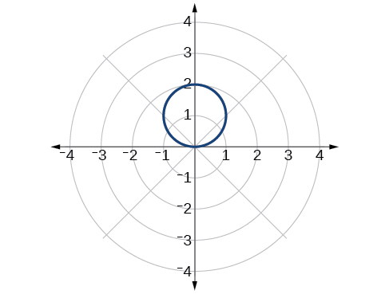{: #Figure_08_04_003}

Test the equation for symmetry:<math xmlns="http://www.w3.org/1998/Math/MathML"> <mrow> <mtext> </mtext><mi>r</mi><mo>=</mo><mo>−</mo><mn>2</mn><mi>cos</mi><mtext> </mtext><mi>θ</mi><mo>.</mo> </mrow> </math>

The equation fails the symmetry test with respect to the line<math xmlns="http://www.w3.org/1998/Math/MathML"> <mrow> <mtext> </mtext><mi>θ</mi><mo>=</mo><mfrac> <mi>π</mi> <mn>2</mn> </mfrac> <mtext> </mtext> </mrow> </math>

and with respect to the pole. It passes the polar axis symmetry test.

### Graphing Polar Equations by Plotting Points

To graph in the rectangular coordinate system we construct a table of<math xmlns="http://www.w3.org/1998/Math/MathML"> <mrow> <mtext> </mtext><mi>x</mi><mtext> </mtext> </mrow> </math>

and<math xmlns="http://www.w3.org/1998/Math/MathML"> <mrow> <mtext> </mtext><mi>y</mi><mtext> </mtext> </mrow> </math>

values. To graph in the polar coordinate system we construct a table of<math xmlns="http://www.w3.org/1998/Math/MathML"> <mrow> <mtext> </mtext><mi>θ</mi><mtext> </mtext> </mrow> </math>

and<math xmlns="http://www.w3.org/1998/Math/MathML"> <mrow> <mtext> </mtext><mi>r</mi><mtext> </mtext> </mrow> </math>

values. We enter values of<math xmlns="http://www.w3.org/1998/Math/MathML"> <mrow> <mtext> </mtext><mi>θ</mi><mtext> </mtext> </mrow> </math>

 into a **polar equation**{: data-type="term" .no-emphasis} and calculate<math xmlns="http://www.w3.org/1998/Math/MathML"> <mrow> <mtext> </mtext><mi>r</mi><mo>.</mo><mtext> </mtext> </mrow> </math>

However, using the properties of symmetry and finding key values of<math xmlns="http://www.w3.org/1998/Math/MathML"> <mrow> <mtext> </mtext><mi>θ</mi><mtext> </mtext> </mrow> </math>

and<math xmlns="http://www.w3.org/1998/Math/MathML"> <mrow> <mtext> </mtext><mi>r</mi><mtext> </mtext> </mrow> </math>

means fewer calculations will be needed.

#### Finding Zeros and Maxima

To find the zeros of a polar equation, we solve for the values of<math xmlns="http://www.w3.org/1998/Math/MathML"> <mrow> <mtext> </mtext><mi>θ</mi><mtext> </mtext> </mrow> </math>

that result in<math xmlns="http://www.w3.org/1998/Math/MathML"> <mrow> <mtext> </mtext><mi>r</mi><mo>=</mo><mn>0.</mn><mtext> </mtext> </mrow> </math>

 Recall that, to find the zeros of polynomial functions, we set the equation equal to zero and then solve for<math xmlns="http://www.w3.org/1998/Math/MathML"> <mrow> <mtext> </mtext><mi>x</mi><mo>.</mo><mtext> </mtext> </mrow> </math>

We use the same process for polar equations. Set<math xmlns="http://www.w3.org/1998/Math/MathML"> <mrow> <mtext> </mtext><mi>r</mi><mo>=</mo><mn>0</mn><mo>,</mo><mtext> </mtext> </mrow> </math>

and solve for<math xmlns="http://www.w3.org/1998/Math/MathML"> <mrow> <mtext> </mtext><mi>θ</mi><mo>.</mo> </mrow> </math>

For many of the forms we will encounter, the maximum value of a polar equation is found by substituting those values of<math xmlns="http://www.w3.org/1998/Math/MathML"> <mrow> <mtext> </mtext><mi>θ</mi><mtext> </mtext> </mrow> </math>

into the equation that result in the maximum value of the trigonometric functions. Consider<math xmlns="http://www.w3.org/1998/Math/MathML"> <mrow> <mtext> </mtext><mi>r</mi><mo>=</mo><mn>5</mn><mi>cos</mi><mtext> </mtext><mi>θ</mi><mo>;</mo><mtext> </mtext> </mrow> </math>

the maximum distance between the curve and the pole is 5 units. The maximum value of the cosine function is 1 when<math xmlns="http://www.w3.org/1998/Math/MathML"> <mrow> <mtext> </mtext><mi>θ</mi><mo>=</mo><mn>0</mn><mo>,</mo><mtext> </mtext> </mrow> </math>

so our polar equation is<math xmlns="http://www.w3.org/1998/Math/MathML"> <mrow> <mtext> </mtext><mn>5</mn><mi>cos</mi><mtext> </mtext><mi>θ</mi><mo>,</mo><mtext> </mtext> </mrow> </math>

and the value<math xmlns="http://www.w3.org/1998/Math/MathML"> <mrow> <mtext> </mtext><mi>θ</mi><mo>=</mo><mn>0</mn><mtext> </mtext> </mrow> </math>

 will yield the maximum<math xmlns="http://www.w3.org/1998/Math/MathML"> <mrow> <mtext> </mtext><mrow><mo>\|</mo> <mi>r</mi> <mo>\|</mo></mrow><mo>.</mo> </mrow> </math>

Similarly, the maximum value of the sine function is 1 when<math xmlns="http://www.w3.org/1998/Math/MathML"> <mrow> <mtext> </mtext><mi>θ</mi><mo>=</mo><mfrac> <mi>π</mi> <mn>2</mn> </mfrac> <mo>,</mo><mtext> </mtext> </mrow> </math>

and if our polar equation is<math xmlns="http://www.w3.org/1998/Math/MathML"> <mrow> <mtext> </mtext><mi>r</mi><mo>=</mo><mn>5</mn><mi>sin</mi><mtext> </mtext><mi>θ</mi><mo>,</mo><mtext> </mtext> </mrow> </math>

the value<math xmlns="http://www.w3.org/1998/Math/MathML"> <mrow> <mtext> </mtext><mi>θ</mi><mo>=</mo><mfrac> <mi>π</mi> <mn>2</mn> </mfrac> <mtext> </mtext> </mrow> </math>

will yield the maximum<math xmlns="http://www.w3.org/1998/Math/MathML"> <mrow> <mtext> </mtext><mrow><mo>\|</mo> <mi>r</mi> <mo>\|</mo></mrow><mo>.</mo><mtext> </mtext> </mrow> </math>

We may find additional information by calculating values of<math xmlns="http://www.w3.org/1998/Math/MathML"> <mrow> <mtext> </mtext><mi>r</mi><mtext> </mtext> </mrow> </math>

when<math xmlns="http://www.w3.org/1998/Math/MathML"> <mrow> <mtext> </mtext><mi>θ</mi><mo>=</mo><mn>0.</mn><mtext> </mtext> </mrow> </math>

These points would be polar axis intercepts, which may be helpful in drawing the graph and identifying the curve of a polar equation.

Finding Zeros and Maximum Values for a Polar Equation

Using the equation in [[link]](#Example_08_04_01), find the zeros and maximum<math xmlns="http://www.w3.org/1998/Math/MathML"> <mrow> <mtext> </mtext><mrow><mo>\|</mo> <mi>r</mi> <mo>\|</mo></mrow><mtext> </mtext> </mrow> </math>

and, if necessary, the polar axis intercepts of<math xmlns="http://www.w3.org/1998/Math/MathML"> <mrow> <mtext> </mtext><mi>r</mi><mo>=</mo><mn>2</mn><mi>sin</mi><mtext> </mtext><mi>θ</mi><mo>.</mo> </mrow> </math>

To find the zeros, set<math xmlns="http://www.w3.org/1998/Math/MathML"> <mrow> <mtext> </mtext><mi>r</mi><mtext> </mtext> </mrow> </math>

equal to zero and solve for<math xmlns="http://www.w3.org/1998/Math/MathML"> <mrow> <mtext> </mtext><mi>θ</mi><mo>.</mo> </mrow> </math>

<math xmlns="http://www.w3.org/1998/Math/MathML" display="block"> <mrow> <mtable columnalign="left"> <mtr columnalign="left"> <mtd columnalign="left"> <mrow> <mn>2</mn><mi>sin</mi><mtext> </mtext><mi>θ</mi><mo>=</mo><mn>0</mn> </mrow> </mtd> <mtd columnalign="left"> <mrow /> </mtd> </mtr> <mtr columnalign="left"> <mtd columnalign="left"> <mrow> <mtext> </mtext><mtext> </mtext><mtext> </mtext><mi>sin</mi><mtext> </mtext><mi>θ</mi><mo>=</mo><mn>0</mn> </mrow> </mtd> <mtd columnalign="left"> <mrow /> </mtd> </mtr> <mtr columnalign="left"> <mtd columnalign="left"> <mrow> <mtext> </mtext><mtext> </mtext><mtext> </mtext><mtext> </mtext><mtext> </mtext><mtext> </mtext><mtext> </mtext><mtext> </mtext><mtext> </mtext><mtext> </mtext><mtext> </mtext><mi>θ</mi><mo>=</mo><msup> <mrow> <mi>sin</mi> </mrow> <mrow> <mo>−</mo><mn>1</mn> </mrow> </msup> <mn>0</mn> </mrow> </mtd> <mtd columnalign="left"> <mrow /> </mtd> </mtr> <mtr columnalign="left"> <mtd columnalign="left"> <mrow> <mtext> </mtext><mtext> </mtext><mtext> </mtext><mtext> </mtext><mtext> </mtext><mtext> </mtext><mtext> </mtext><mtext> </mtext><mtext> </mtext><mtext> </mtext><mtext> </mtext><mi>θ</mi><mo>=</mo><mi>n</mi><mi>π</mi> </mrow> </mtd> <mtd columnalign="left"> <mrow> <mtext>where </mtext><mi>n</mi><mtext> is an integer</mtext> </mrow> </mtd> </mtr> </mtable> </mrow> </math>

Substitute any one of the<math xmlns="http://www.w3.org/1998/Math/MathML"> <mrow> <mtext> </mtext><mi>θ</mi><mtext> </mtext> </mrow> </math>

values into the equation. We will use<math xmlns="http://www.w3.org/1998/Math/MathML"> <mrow> <mtext> </mtext><mn>0.</mn> </mrow> </math>

<math xmlns="http://www.w3.org/1998/Math/MathML" display="block"> <mrow> <mtable columnalign="left"> <mtr columnalign="left"> <mtd columnalign="left"> <mtable columnalign="left"> <mtr> <mtd> <mrow /> </mtd> </mtr> <mtr> <mtd> <mi>r</mi><mo>=</mo><mn>2</mn><mi>sin</mi><mo stretchy="false">(</mo><mn>0</mn><mo stretchy="false">)</mo> </mtd> </mtr> </mtable> </mtd> </mtr> <mtr columnalign="left"> <mtd columnalign="left"> <mrow> <mi>r</mi><mo>=</mo><mn>0</mn> </mrow> </mtd> </mtr> </mtable> </mrow> </math>

The points<math xmlns="http://www.w3.org/1998/Math/MathML"> <mrow> <mtext> </mtext><mo stretchy="false">(</mo><mn>0</mn><mo>,</mo><mn>0</mn><mo stretchy="false">)</mo><mtext> </mtext> </mrow> </math>

and<math xmlns="http://www.w3.org/1998/Math/MathML"> <mrow> <mtext> </mtext><mo stretchy="false">(</mo><mn>0</mn><mo>,</mo><mo>±</mo><mi>n</mi><mi>π</mi><mo stretchy="false">)</mo><mtext> </mtext> </mrow> </math>

are the zeros of the equation. They all coincide, so only one point is visible on the graph. This point is also the only polar axis intercept.

To find the maximum value of the equation, look at the maximum value of the trigonometric function<math xmlns="http://www.w3.org/1998/Math/MathML"> <mrow> <mtext> </mtext><mi>sin</mi><mtext> </mtext><mi>θ</mi><mo>,</mo><mtext> </mtext> </mrow> </math>

which occurs when<math xmlns="http://www.w3.org/1998/Math/MathML"> <mrow> <mtext> </mtext><mi>θ</mi><mo>=</mo><mfrac> <mi>π</mi> <mn>2</mn> </mfrac> <mo>±</mo><mn>2</mn><mi>k</mi><mi>π</mi><mtext> </mtext> </mrow> </math>

resulting in<math xmlns="http://www.w3.org/1998/Math/MathML"> <mrow> <mtext> </mtext><mi>sin</mi><mrow><mo>(</mo> <mrow> <mfrac> <mi>π</mi> <mn>2</mn> </mfrac> </mrow> <mo>)</mo></mrow><mo>=</mo><mn>1.</mn><mtext> </mtext> </mrow> </math>

Substitute<math xmlns="http://www.w3.org/1998/Math/MathML"> <mrow> <mtext> </mtext><mfrac> <mi>π</mi> <mn>2</mn> </mfrac> <mtext> </mtext> </mrow> </math>

for<math xmlns="http://www.w3.org/1998/Math/MathML"> <mrow> <mtext> </mtext><mi>θ.</mi> </mrow> </math>

<math xmlns="http://www.w3.org/1998/Math/MathML" display="block"> <mrow> <mtable columnalign="left"> <mtr columnalign="left"> <mtd columnalign="left"> <mrow> <mi>r</mi><mo>=</mo><mn>2</mn><mi>sin</mi><mrow><mo>(</mo> <mrow> <mfrac> <mi>π</mi> <mn>2</mn> </mfrac> </mrow> <mo>)</mo></mrow> </mrow> </mtd> </mtr> <mtr columnalign="left"> <mtd columnalign="left"> <mrow> <mi>r</mi><mo>=</mo><mn>2</mn><mo stretchy="false">(</mo><mn>1</mn><mo stretchy="false">)</mo> </mrow> </mtd> </mtr> <mtr columnalign="left"> <mtd columnalign="left"> <mrow> <mi>r</mi><mo>=</mo><mn>2</mn> </mrow> </mtd> </mtr> </mtable> </mrow> </math>

Analysis

The point<math xmlns="http://www.w3.org/1998/Math/MathML"> <mrow> <mtext> </mtext><mrow><mo>(</mo> <mrow> <mn>2</mn><mo>,</mo><mfrac> <mi>π</mi> <mn>2</mn> </mfrac> </mrow> <mo>)</mo></mrow><mtext> </mtext> </mrow> </math>

will be the maximum value on the graph. Let’s plot a few more points to verify the graph of a circle. See [[link]](#Table_08_04_01) and [[link]](#Figure_08_04_004).

| <math xmlns="http://www.w3.org/1998/Math/MathML"> <mi>θ</mi> </math>

 | <math xmlns="http://www.w3.org/1998/Math/MathML"> <mrow> <mi>r</mi><mo>=</mo><mn>2</mn><mi>sin</mi><mtext> </mtext><mi>θ</mi> </mrow> </math>

 | <math xmlns="http://www.w3.org/1998/Math/MathML"> <mi>r</mi> </math>

 |
|----------
| 0 | <math xmlns="http://www.w3.org/1998/Math/MathML"> <mrow> <mi>r</mi><mo>=</mo><mn>2</mn><mi>sin</mi><mo stretchy="false">(</mo><mn>0</mn><mo stretchy="false">)</mo><mo>=</mo><mn>0</mn> </mrow> </math>

 | <math xmlns="http://www.w3.org/1998/Math/MathML"> <mn>0</mn> </math>

 |
| <math xmlns="http://www.w3.org/1998/Math/MathML"> <mrow> <mfrac> <mi>π</mi> <mn>6</mn> </mfrac> </mrow> </math>

 | <math xmlns="http://www.w3.org/1998/Math/MathML"> <mrow> <mi>r</mi><mo>=</mo><mn>2</mn><mi>sin</mi><mrow><mo>(</mo> <mrow> <mfrac> <mi>π</mi> <mn>6</mn> </mfrac> </mrow> <mo>)</mo></mrow><mo>=</mo><mn>1</mn> </mrow> </math>

 | <math xmlns="http://www.w3.org/1998/Math/MathML"> <mn>1</mn> </math>

 |
| <math xmlns="http://www.w3.org/1998/Math/MathML"> <mrow> <mfrac> <mi>π</mi> <mn>3</mn> </mfrac> </mrow> </math>

 | <math xmlns="http://www.w3.org/1998/Math/MathML"> <mrow> <mi>r</mi><mo>=</mo><mn>2</mn><mi>sin</mi><mrow><mo>(</mo> <mrow> <mfrac> <mi>π</mi> <mn>3</mn> </mfrac> </mrow> <mo>)</mo></mrow><mo>≈</mo><mn>1.73</mn> </mrow> </math>

 | <math xmlns="http://www.w3.org/1998/Math/MathML"> <mrow> <mn>1.73</mn> </mrow> </math>

 |
| <math xmlns="http://www.w3.org/1998/Math/MathML"> <mrow> <mfrac> <mi>π</mi> <mn>2</mn> </mfrac> </mrow> </math>

 | <math xmlns="http://www.w3.org/1998/Math/MathML"> <mrow> <mi>r</mi><mo>=</mo><mn>2</mn><mi>sin</mi><mrow><mo>(</mo> <mrow> <mfrac> <mi>π</mi> <mn>2</mn> </mfrac> </mrow> <mo>)</mo></mrow><mo>=</mo><mn>2</mn> </mrow> </math>

 | <math xmlns="http://www.w3.org/1998/Math/MathML"> <mn>2</mn> </math>

 |
| <math xmlns="http://www.w3.org/1998/Math/MathML"> <mrow> <mfrac> <mrow> <mn>2</mn><mi>π</mi> </mrow> <mn>3</mn> </mfrac> </mrow> </math>

 | <math xmlns="http://www.w3.org/1998/Math/MathML"> <mrow> <mi>r</mi><mo>=</mo><mn>2</mn><mi>sin</mi><mrow><mo>(</mo> <mrow> <mfrac> <mrow> <mn>2</mn><mi>π</mi> </mrow> <mn>3</mn> </mfrac> </mrow> <mo>)</mo></mrow><mo>≈</mo><mn>1.73</mn> </mrow> </math>

 | <math xmlns="http://www.w3.org/1998/Math/MathML"> <mrow> <mn>1.73</mn> </mrow> </math>

 |
| <math xmlns="http://www.w3.org/1998/Math/MathML"> <mrow> <mfrac> <mrow> <mn>5</mn><mi>π</mi> </mrow> <mn>6</mn> </mfrac> </mrow> </math>

 | <math xmlns="http://www.w3.org/1998/Math/MathML"> <mrow> <mi>r</mi><mo>=</mo><mn>2</mn><mi>sin</mi><mrow><mo>(</mo> <mrow> <mfrac> <mrow> <mn>5</mn><mi>π</mi> </mrow> <mn>6</mn> </mfrac> </mrow> <mo>)</mo></mrow><mo>=</mo><mn>1</mn> </mrow> </math>

 | <math xmlns="http://www.w3.org/1998/Math/MathML"> <mn>1</mn> </math>

 |
| <math xmlns="http://www.w3.org/1998/Math/MathML"> <mi>π</mi> </math>

 | <math xmlns="http://www.w3.org/1998/Math/MathML"> <mrow> <mi>r</mi><mo>=</mo><mn>2</mn><mi>sin</mi><mrow><mo>(</mo> <mi>π</mi> <mo>)</mo></mrow><mo>=</mo><mn>0</mn> </mrow> </math>

 | <math xmlns="http://www.w3.org/1998/Math/MathML"> <mn>0</mn> </math>

 |
{: #Table_08_04_01 summary="Eight rows and 3 columns. First column is labeled theta, second column is labeled r=2sin(theta), and third column is labeled r. The table has ordered triples of these column values: (0, r=2sin(0)=0, 0), (pi/6, r=2sin(pi/6)=1, 1), (pi/3, r=2sin(pi/3) = approx. 1.73, 1.73), (pi/2, r=2sin(pi/2) = 2, 2), (2pi/3, r=2sin(2pi/3)=approx. 1.73, 1.73), (5pi/6, r=2sin(5pi/6)=1, 1), and (pi, r=2sin(pi)=0)."}

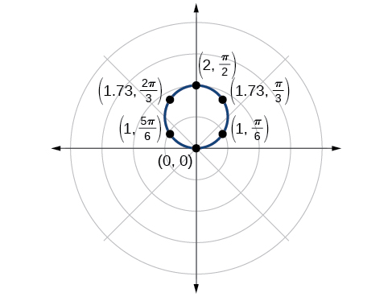{: #Figure_08_04_004}

Without converting to Cartesian coordinates, test the given equation for symmetry and find the zeros and maximum values of<math xmlns="http://www.w3.org/1998/Math/MathML"> <mrow> <mtext> </mtext><mrow><mo>\|</mo> <mi>r</mi> <mo>\|</mo></mrow><mo>:</mo><mtext> </mtext> </mrow> </math>

<math xmlns="http://www.w3.org/1998/Math/MathML"> <mrow> <mtext> </mtext><mi>r</mi><mo>=</mo><mn>3</mn><mi>cos</mi><mtext> </mtext><mi>θ</mi><mo>.</mo> </mrow> </math>

Tests will reveal symmetry about the polar axis. The zero is<math xmlns="http://www.w3.org/1998/Math/MathML"> <mrow> <mtext> </mtext><mrow><mo>(</mo> <mrow> <mn>0</mn><mo>,</mo><mfrac> <mi>π</mi> <mn>2</mn> </mfrac> </mrow> <mo>)</mo></mrow><mo>,</mo><mtext> </mtext> </mrow> </math>

and the maximum value is<math xmlns="http://www.w3.org/1998/Math/MathML"> <mrow> <mtext> </mtext><mo stretchy="false">(</mo><mn>3</mn><mo>,</mo><mn>0</mn><mo stretchy="false">)</mo><mo>.</mo> </mrow> </math>

#### Investigating Circles

Now we have seen the equation of a circle in the polar coordinate system. In the last two examples, the same equation was used to illustrate the properties of symmetry and demonstrate how to find the zeros, maximum values, and plotted points that produced the graphs. However, the circle is only one of many shapes in the set of polar curves.

There are five classic polar curves**\: cardioids**, **limaҫons, lemniscates, rose curves**, and **Archimedes’ spirals**. We will briefly touch on the polar formulas for the circle before moving on to the classic curves and their variations.

Formulas for the Equation of a Circle

Some of the formulas that produce the graph of a circle in polar coordinates are given by<math xmlns="http://www.w3.org/1998/Math/MathML"> <mrow> <mtext> </mtext><mi>r</mi><mo>=</mo><mi>a</mi><mi>cos</mi><mtext> </mtext><mi>θ</mi><mtext> </mtext> </mrow> </math>

and<math xmlns="http://www.w3.org/1998/Math/MathML"> <mrow> <mtext> </mtext><mi>r</mi><mo>=</mo><mi>a</mi><mi>sin</mi><mtext> </mtext><mi>θ</mi><mo>,</mo> </mrow> </math>

 where<math xmlns="http://www.w3.org/1998/Math/MathML"> <mrow> <mtext> </mtext><mi>a</mi><mtext> </mtext> </mrow> </math>

is the diameter of the circle or the distance from the pole to the farthest point on the circumference. The radius is<math xmlns="http://www.w3.org/1998/Math/MathML"> <mrow> <mtext> </mtext><mfrac> <mrow> <mrow><mo>\|</mo> <mi>a</mi> <mo>\|</mo></mrow> </mrow> <mn>2</mn> </mfrac> <mo>,</mo> </mrow> </math>

 or one-half the diameter. For<math xmlns="http://www.w3.org/1998/Math/MathML"> <mrow> <mtext> </mtext><mi>r</mi><mo>=</mo><mi>a</mi><mi>cos</mi><mtext> </mtext><mi>θ</mi><mo>, </mo> </mrow> </math>

 the center is<math xmlns="http://www.w3.org/1998/Math/MathML"> <mrow> <mtext> </mtext><mrow><mo>(</mo> <mrow> <mfrac> <mi>a</mi> <mn>2</mn> </mfrac> <mo>,</mo><mn>0</mn> </mrow> <mo>)</mo></mrow><mo>.</mo><mtext> </mtext> </mrow> </math>

For<math xmlns="http://www.w3.org/1998/Math/MathML"> <mrow> <mtext> </mtext><mi>r</mi><mo>=</mo><mi>a</mi><mi>sin</mi><mtext> </mtext><mi>θ</mi><mo>,</mo> </mrow> </math>

 the center is<math xmlns="http://www.w3.org/1998/Math/MathML"> <mrow> <mtext> </mtext><mrow><mo>(</mo> <mrow> <mfrac> <mi>a</mi> <mn>2</mn> </mfrac> <mo>,</mo><mfrac><mi>π</mi><mn>2</mn></mfrac> </mrow> <mo>)</mo></mrow><mo>.</mo><mtext> </mtext> </mrow> </math>

[\[link\]](#Figure_08_04_005) shows the graphs of these four circles.

{: #Figure_08_04_005}

Sketching the Graph of a Polar Equation for a Circle

Sketch the graph of<math xmlns="http://www.w3.org/1998/Math/MathML"> <mrow> <mtext> </mtext><mi>r</mi><mo>=</mo><mn>4</mn><mi>cos</mi><mtext> </mtext><mi>θ</mi><mo>.</mo> </mrow> </math>

First, testing the equation for symmetry, we find that the graph is symmetric about the polar axis. Next, we find the **zeros**{: data-type="term" .no-emphasis} and maximum<math xmlns="http://www.w3.org/1998/Math/MathML"> <mrow> <mtext> </mtext><mrow><mo>\|</mo> <mi>r</mi> <mo>\|</mo></mrow><mtext> </mtext> </mrow> </math>

for<math xmlns="http://www.w3.org/1998/Math/MathML"> <mrow> <mtext> </mtext><mi>r</mi><mo>=</mo><mn>4</mn><mi>cos</mi><mtext> </mtext><mi>θ</mi><mo>.</mo><mtext> </mtext> </mrow> </math>

First, set<math xmlns="http://www.w3.org/1998/Math/MathML"> <mrow> <mtext> </mtext><mi>r</mi><mo>=</mo><mn>0</mn><mo>,</mo><mtext> </mtext> </mrow> </math>

and solve for<math xmlns="http://www.w3.org/1998/Math/MathML"> <mrow> <mtext> </mtext><mi>θ</mi> </mrow> </math>

. Thus, a zero occurs at<math xmlns="http://www.w3.org/1998/Math/MathML"> <mrow> <mtext> </mtext><mi>θ</mi><mo>=</mo><mfrac> <mi>π</mi> <mn>2</mn> </mfrac> <mo>±</mo><mi>k</mi><mi>π</mi><mo>.</mo><mtext> </mtext> </mrow> </math>

A key point to plot is<math xmlns="http://www.w3.org/1998/Math/MathML"> <mrow> <mtext> </mtext><mrow><mo>(</mo> <mrow> <mn>0</mn><mo>,</mo><mtext>​</mtext><mtext>​</mtext><mfrac> <mi>π</mi> <mn>2</mn> </mfrac> </mrow> <mo>)</mo></mrow><mtext> </mtext><mo>.</mo> </mrow> </math>

To find the maximum value of<math xmlns="http://www.w3.org/1998/Math/MathML"> <mrow> <mtext> </mtext><mi>r</mi><mo>,</mo> </mrow> </math>

 note that the maximum value of the cosine function is 1 when<math xmlns="http://www.w3.org/1998/Math/MathML"> <mrow> <mtext> </mtext><mi>θ</mi><mo>=</mo><mn>0</mn><mo>±</mo><mn>2</mn><mi>k</mi><mi>π</mi><mo>.</mo><mtext> </mtext> </mrow> </math>

Substitute<math xmlns="http://www.w3.org/1998/Math/MathML"> <mrow> <mtext> </mtext><mi>θ</mi><mo>=</mo><mn>0</mn><mtext> </mtext> </mrow> </math>

into the equation:

<math xmlns="http://www.w3.org/1998/Math/MathML" display="block"> <mrow> <mtable> <mtr> <mtd> <mrow> <mi>r</mi><mo>=</mo><mn>4</mn><mi>cos</mi><mtext> </mtext><mi>θ</mi> </mrow> </mtd> </mtr> <mtr> <mtd> <mrow> <mtext> </mtext><mtext> </mtext><mtext> </mtext><mtext> </mtext><mtext> </mtext><mi>r</mi><mo>=</mo><mn>4</mn><mi>cos</mi><mo stretchy="false">(</mo><mn>0</mn><mo stretchy="false">)</mo> </mrow> </mtd> </mtr> <mtr> <mtd> <mrow> <mtext> </mtext><mtext> </mtext><mtext> </mtext><mtext> </mtext><mtext> </mtext><mtext> </mtext><mtext> </mtext><mi>r</mi><mo>=</mo><mn>4</mn><mo stretchy="false">(</mo><mn>1</mn><mo stretchy="false">)</mo><mo>=</mo><mn>4</mn> </mrow> </mtd> </mtr> </mtable> </mrow> </math>

The maximum value of the equation is 4. A key point to plot is<math xmlns="http://www.w3.org/1998/Math/MathML"> <mrow> <mtext> </mtext><mo stretchy="false">(</mo><mn>4</mn><mo>,</mo><mtext> </mtext><mn>0</mn><mo stretchy="false">)</mo><mo>.</mo> </mrow> </math>

As<math xmlns="http://www.w3.org/1998/Math/MathML"> <mrow> <mtext> </mtext><mi>r</mi><mo>=</mo><mn>4</mn><mi>cos</mi><mtext> </mtext><mi>θ</mi><mtext> </mtext> </mrow> </math>

 is symmetric with respect to the polar axis, we only need to calculate *r*-values for<math xmlns="http://www.w3.org/1998/Math/MathML"> <mrow> <mtext> </mtext><mi>θ</mi><mtext> </mtext> </mrow> </math>

over the interval<math xmlns="http://www.w3.org/1998/Math/MathML"> <mrow> <mtext> </mtext><mo stretchy="false">[</mo><mn>0</mn><mo>,</mo><mtext> </mtext><mtext> </mtext><mi>π</mi><mo stretchy="false">]</mo><mo>.</mo><mtext> </mtext> </mrow> </math>

Points in the upper quadrant can then be reflected to the lower quadrant. Make a table of values similar to [[link]](#Table_08_04_02). The graph is shown in [[link]](#Figure_08_04_006)**.**

| <strong><math xmlns="http://www.w3.org/1998/Math/MathML">
 <mi>θ</mi>
</math></strong> | 0 | <math xmlns="http://www.w3.org/1998/Math/MathML"> <mrow> <mfrac> <mi>π</mi> <mn>6</mn> </mfrac> </mrow> </math>

 | <math xmlns="http://www.w3.org/1998/Math/MathML"> <mrow> <mfrac> <mi>π</mi> <mn>4</mn> </mfrac> </mrow> </math>

 | <math xmlns="http://www.w3.org/1998/Math/MathML"> <mrow> <mfrac> <mi>π</mi> <mn>3</mn> </mfrac> </mrow> </math>

 | <math xmlns="http://www.w3.org/1998/Math/MathML"> <mrow> <mfrac> <mi>π</mi> <mn>2</mn> </mfrac> </mrow> </math>

 | <math xmlns="http://www.w3.org/1998/Math/MathML"> <mrow> <mfrac> <mrow> <mn>2</mn><mi>π</mi> </mrow> <mn>3</mn> </mfrac> </mrow> </math>

 | <math xmlns="http://www.w3.org/1998/Math/MathML"> <mrow> <mfrac> <mrow> <mn>3</mn><mi>π</mi> </mrow> <mn>4</mn> </mfrac> </mrow> </math>

 | <math xmlns="http://www.w3.org/1998/Math/MathML"> <mrow> <mfrac> <mrow> <mn>5</mn><mi>π</mi> </mrow> <mn>6</mn> </mfrac> </mrow> </math>

 | <math xmlns="http://www.w3.org/1998/Math/MathML"> <mi>π</mi> </math>

 |
| <strong><math xmlns="http://www.w3.org/1998/Math/MathML">
 <mi>r</mi>
</math></strong> | 4 | 3.46 | 2.83 | 2 | 0 | −2 | −2.83 | −3.46 | 4 |
{: #Table_08_04_02 summary="Two rows and ten columns. First row is labeled theta and second row is labeled r. The table has ordered pairs of each of these column values: (0,4), (pi/6, 3.46), (pi/4, 2.83), (pi/3,2), (pi/2,0), (2pi/3,-2), (3pi/4,-2.83), (5pi/6, -3.46), and (pi,4)."}

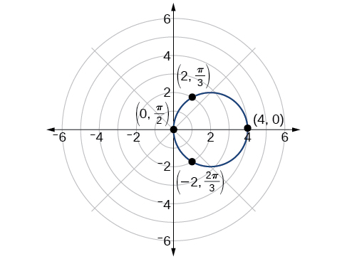{: #Figure_08_04_006}

#### Investigating Cardioids

While translating from polar coordinates to Cartesian coordinates may seem simpler in some instances, graphing the classic curves is actually less complicated in the polar system. The next curve is called a cardioid, as it resembles a heart. This shape is often included with the family of curves called limaçons, but here we will discuss the cardioid on its own.

Formulas for a Cardioid

The formulas that produce the graphs of a **cardioid**{: data-type="term"} are given by<math xmlns="http://www.w3.org/1998/Math/MathML"> <mrow> <mtext> </mtext><mi>r</mi><mo>=</mo><mi>a</mi><mo>±</mo><mi>b</mi><mi>cos</mi><mtext> </mtext><mi>θ</mi><mtext> </mtext> </mrow> </math>

and<math xmlns="http://www.w3.org/1998/Math/MathML"> <mrow> <mtext> </mtext><mi>r</mi><mo>=</mo><mi>a</mi><mo>±</mo><mi>b</mi><mi>sin</mi><mtext> </mtext><mi>θ</mi><mtext> </mtext> </mrow> </math>

where<math xmlns="http://www.w3.org/1998/Math/MathML"> <mrow> <mtext> </mtext><mi>a</mi><mo>&gt;</mo><mn>0</mn><mo>,</mo><mtext> </mtext><mtext> </mtext><mi>b</mi><mo>&gt;</mo><mn>0</mn><mo>,</mo><mtext> </mtext> </mrow> </math>

and<math xmlns="http://www.w3.org/1998/Math/MathML"> <mrow> <mtext> </mtext><mfrac> <mi>a</mi> <mi>b</mi> </mfrac> <mo>=</mo><mn>1.</mn><mtext> </mtext> </mrow> </math>

The cardioid graph passes through the pole, as we can see in [\[link\]](#Figure_08_04_007).

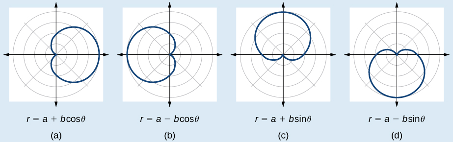{: #Figure_08_04_007}

**Given the polar equation of a cardioid, sketch its graph.**

1.  Check equation for the three types of symmetry.
2.  Find the zeros. Set
    <math xmlns="http://www.w3.org/1998/Math/MathML"> <mrow> <mtext> </mtext><mi>r</mi><mo>=</mo><mn>0.</mn> </mrow> </math>

3.  Find the maximum value of the equation according to the maximum value of the trigonometric expression.
4.  Make a table of values for
    <math xmlns="http://www.w3.org/1998/Math/MathML"> <mrow> <mtext> </mtext><mi>r</mi><mtext> </mtext> </mrow> </math>
    
    and
    <math xmlns="http://www.w3.org/1998/Math/MathML"> <mrow> <mtext> </mtext><mi>θ</mi><mo>.</mo> </mrow> </math>

5.  Plot the points and sketch the graph.
{: type="1"}

Sketching the Graph of a Cardioid

Sketch the graph of<math xmlns="http://www.w3.org/1998/Math/MathML"> <mrow> <mtext> </mtext><mi>r</mi><mo>=</mo><mn>2</mn><mo>+</mo><mn>2</mn><mi>cos</mi><mtext> </mtext><mi>θ</mi><mo>.</mo> </mrow> </math>

First, testing the equation for symmetry, we find that the graph of this equation will be symmetric about the polar axis. Next, we find the zeros and maximums. Setting<math xmlns="http://www.w3.org/1998/Math/MathML"> <mrow> <mtext> </mtext><mi>r</mi><mo>=</mo><mn>0</mn><mo>,</mo><mtext> </mtext> </mrow> </math>

we have<math xmlns="http://www.w3.org/1998/Math/MathML"> <mrow> <mtext> </mtext><mi>θ</mi><mo>=</mo><mi>π</mi><mo>+</mo><mn>2</mn><mi>k</mi><mi>π</mi><mo>.</mo><mtext> </mtext> </mrow> </math>

The zero of the equation is located at<math xmlns="http://www.w3.org/1998/Math/MathML"> <mrow> <mtext> </mtext><mrow><mo>(</mo> <mrow> <mn>0</mn><mo>,</mo><mi>π</mi> </mrow> <mo>)</mo></mrow><mo>.</mo><mtext> </mtext> </mrow> </math>

The graph passes through this point.

The maximum value of<math xmlns="http://www.w3.org/1998/Math/MathML"> <mrow> <mtext> </mtext><mi>r</mi><mo>=</mo><mn>2</mn><mo>+</mo><mn>2</mn><mi>cos</mi><mtext> </mtext><mi>θ</mi><mtext> </mtext> </mrow> </math>

occurs when<math xmlns="http://www.w3.org/1998/Math/MathML"> <mrow> <mtext> </mtext><mi>cos</mi><mtext> </mtext><mi>θ</mi><mtext> </mtext> </mrow> </math>

 is a maximum, which is when<math xmlns="http://www.w3.org/1998/Math/MathML"> <mrow> <mtext> </mtext><mi>cos</mi><mtext> </mtext><mi>θ</mi><mo>=</mo><mn>1</mn><mtext> </mtext> </mrow> </math>

or when<math xmlns="http://www.w3.org/1998/Math/MathML"> <mrow> <mtext> </mtext><mi>θ</mi><mo>=</mo><mn>0.</mn><mtext> </mtext> </mrow> </math>

Substitute<math xmlns="http://www.w3.org/1998/Math/MathML"> <mrow> <mtext> </mtext><mi>θ</mi><mo>=</mo><mn>0</mn><mtext> </mtext> </mrow> </math>

into the equation, and solve for<math xmlns="http://www.w3.org/1998/Math/MathML"> <mrow> <mtext> </mtext><mi>r</mi><mo>.</mo><mtext> </mtext> </mrow> </math>

<math xmlns="http://www.w3.org/1998/Math/MathML" display="block"> <mrow> <mtable columnalign="left"> <mtr columnalign="left"> <mtd columnalign="left"> <mtable columnalign="left"> <mtr> <mtd> <mrow /> </mtd> </mtr> <mtr> <mtd> <mi>r</mi><mo>=</mo><mn>2</mn><mo>+</mo><mn>2</mn><mi>cos</mi><mo stretchy="false">(</mo><mn>0</mn><mo stretchy="false">)</mo> </mtd> </mtr> </mtable> </mtd> </mtr> <mtr columnalign="left"> <mtd columnalign="left"> <mrow> <mi>r</mi><mo>=</mo><mn>2</mn><mo>+</mo><mn>2</mn><mo stretchy="false">(</mo><mn>1</mn><mo stretchy="false">)</mo><mo>=</mo><mn>4</mn> </mrow> </mtd> </mtr> </mtable> </mrow> </math>

The point<math xmlns="http://www.w3.org/1998/Math/MathML"> <mrow> <mtext> </mtext><mo stretchy="false">(</mo><mn>4</mn><mo>,</mo><mn>0</mn><mo stretchy="false">)</mo><mtext> </mtext> </mrow> </math>

is the maximum value on the graph.

We found that the polar equation is symmetric with respect to the polar axis, but as it extends to all four quadrants, we need to plot values over the interval<math xmlns="http://www.w3.org/1998/Math/MathML"> <mrow> <mtext> </mtext><mo stretchy="false">[</mo><mn>0</mn><mo>,</mo><mtext> </mtext><mi>π</mi><mo stretchy="false">]</mo><mo>.</mo><mtext> </mtext> </mrow> </math>

The upper portion of the graph is then reflected over the polar axis. Next, we make a table of values, as in [[link]](#Table_08_04_03), and then we plot the points and draw the graph. See [[link]](#Figure_08_04_008).

<table id="Table_08_04_03" summary="Two rows and six columns. First row is labeled theta and second row is labeled r. The table has ordered pairs of each of these column values: (0,4), (pi/4, 3.41), (pi/2, 2), (2pi/3, 1), and (pi, 0)."><caption></caption><tbody>
        <tr>
          <td><strong><math xmlns="http://www.w3.org/1998/Math/MathML">
 <mi>θ</mi>
</math></strong>
</td>
          <td><math xmlns="http://www.w3.org/1998/Math/MathML">
 <mn>0</mn>
</math>
</td>
          <td><math xmlns="http://www.w3.org/1998/Math/MathML">
 <mrow>
  <mfrac>
   <mi>π</mi>
   <mn>4</mn>
  </mfrac>
  
 </mrow>
</math>
</td>
          <td><math xmlns="http://www.w3.org/1998/Math/MathML">
 <mrow>
  <mfrac>
   <mi>π</mi>
   <mn>2</mn>
  </mfrac>
  
 </mrow>
</math>
</td>
          <td><math xmlns="http://www.w3.org/1998/Math/MathML">
 <mrow>
  <mfrac>
   <mrow>
    <mn>2</mn><mi>π</mi>
   </mrow>
   <mn>3</mn>
  </mfrac>
  
 </mrow>
</math>
</td>
          <td><math xmlns="http://www.w3.org/1998/Math/MathML">
 <mi>π</mi>
</math>
</td>
        </tr>

        <tr>
          <td><strong><math xmlns="http://www.w3.org/1998/Math/MathML">
 <mi>r</mi>
</math></strong>
</td>
          <td>4</td>
          <td>3.41</td>
          <td>2</td>
          <td>1</td>
          <td>0</td>
        </tr>
      </tbody></table>
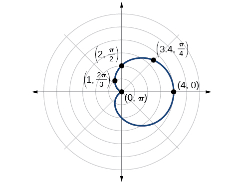{: #Figure_08_04_008}

#### Investigating Limaçons

The word *limaçon* is Old French for “snail,” a name that describes the shape of the graph. As mentioned earlier, the cardioid is a member of the limaçon family, and we can see the similarities in the graphs. The other images in this category include the one-loop limaçon and the two-loop (or inner-loop) limaçon. **One-loop limaçons** are sometimes referred to as **dimpled limaçons**{: data-type="term"} when<math xmlns="http://www.w3.org/1998/Math/MathML"> <mrow> <mtext> </mtext><mn>1</mn><mo>&lt;</mo><mfrac> <mi>a</mi> <mi>b</mi> </mfrac> <mo>&lt;</mo><mn>2</mn><mtext> </mtext> </mrow> </math>

and **convex limaçons**{: data-type="term"} when<math xmlns="http://www.w3.org/1998/Math/MathML"> <mrow> <mtext> </mtext><mfrac> <mi>a</mi> <mi>b</mi> </mfrac> <mo>≥</mo><mn>2.</mn><mtext> </mtext> </mrow> </math>

Formulas for One-Loop Limaçons

The formulas that produce the graph of a dimpled **one-loop limaçon**{: data-type="term"} are given by<math xmlns="http://www.w3.org/1998/Math/MathML"> <mrow> <mtext> </mtext><mi>r</mi><mo>=</mo><mi>a</mi><mo>±</mo><mi>b</mi><mi>cos</mi><mtext> </mtext><mi>θ</mi><mtext> </mtext> </mrow> </math>

and<math xmlns="http://www.w3.org/1998/Math/MathML"> <mrow> <mtext> </mtext><mi>r</mi><mo>=</mo><mi>a</mi><mo>±</mo><mi>b</mi><mi>sin</mi><mtext> </mtext><mi>θ</mi><mtext> </mtext> </mrow> </math>

where<math xmlns="http://www.w3.org/1998/Math/MathML"> <mrow> <mtext> </mtext><mi>a</mi><mo>&gt;</mo><mn>0</mn><mo>,</mo><mtext> </mtext><mi>b</mi><mo>&gt;</mo><mn>0</mn><mo>,</mo><mtext> </mtext><mtext> </mtext><mtext>and 1&lt;</mtext><mfrac> <mi>a</mi> <mi>b</mi> </mfrac> <mo>&lt;</mo><mn>2.</mn><mtext> </mtext> </mrow> </math>

All four graphs are shown in [\[link\]](#Figure_08_04_009).

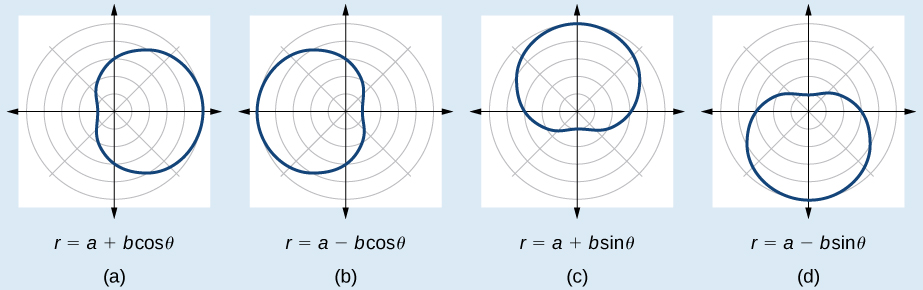{: #Figure_08_04_009}

**Given a polar equation for a one-loop limaçon, sketch the graph.**

1.  Test the equation for symmetry. Remember that failing a symmetry test does not mean that the shape will not exhibit symmetry. Often the symmetry may reveal itself when the points are plotted.
2.  Find the zeros.
3.  Find the maximum values according to the trigonometric expression.
4.  Make a table.
5.  Plot the points and sketch the graph.
{: type="1"}

Sketching the Graph of a One-Loop Limaçon

Graph the equation<math xmlns="http://www.w3.org/1998/Math/MathML"> <mrow> <mtext> </mtext><mi>r</mi><mo>=</mo><mn>4</mn><mo>−</mo><mn>3</mn><mi>sin</mi><mtext> </mtext><mi>θ</mi><mo>.</mo> </mrow> </math>

First, testing the equation for symmetry, we find that it fails all three symmetry tests, meaning that the graph may or may not exhibit symmetry, so we cannot use the symmetry to help us graph it. However, this equation has a graph that clearly displays symmetry with respect to the line<math xmlns="http://www.w3.org/1998/Math/MathML"> <mrow> <mtext> </mtext><mi>θ</mi><mo>=</mo><mfrac> <mi>π</mi> <mn>2</mn> </mfrac> <mo>,</mo><mtext> </mtext> </mrow> </math>

yet it fails all the three symmetry tests. A graphing calculator will immediately illustrate the graph’s reflective quality.

Next, we find the zeros and maximum, and plot the reflecting points to verify any symmetry. Setting<math xmlns="http://www.w3.org/1998/Math/MathML"> <mrow> <mtext> </mtext><mi>r</mi><mo>=</mo><mn>0</mn><mtext> </mtext> </mrow> </math>

results in<math xmlns="http://www.w3.org/1998/Math/MathML"> <mrow> <mtext> </mtext><mi>θ</mi><mtext> </mtext> </mrow> </math>

being undefined. What does this mean? How could<math xmlns="http://www.w3.org/1998/Math/MathML"> <mrow> <mtext> </mtext><mi>θ</mi><mtext> </mtext> </mrow> </math>

be undefined? The angle<math xmlns="http://www.w3.org/1998/Math/MathML"> <mrow> <mtext> </mtext><mi>θ</mi><mtext> </mtext> </mrow> </math>

is undefined for any value of<math xmlns="http://www.w3.org/1998/Math/MathML"> <mrow> <mtext> </mtext><mi>sin</mi><mtext> </mtext><mi>θ</mi><mo>&gt;</mo><mn>1.</mn><mtext> </mtext> </mrow> </math>

Therefore,<math xmlns="http://www.w3.org/1998/Math/MathML"> <mrow> <mtext> </mtext><mi>θ</mi><mtext> </mtext> </mrow> </math>

is undefined because there is no value of<math xmlns="http://www.w3.org/1998/Math/MathML"> <mrow> <mtext> </mtext><mi>θ</mi><mtext> </mtext> </mrow> </math>

for which<math xmlns="http://www.w3.org/1998/Math/MathML"> <mrow> <mtext> </mtext><mi>sin</mi><mtext> </mtext><mi>θ</mi><mo>&gt;</mo><mn>1.</mn><mtext> </mtext> </mrow> </math>

Consequently, the graph does not pass through the pole. Perhaps the graph does cross the polar axis, but not at the pole. We can investigate other intercepts by calculating <math xmlns="http://www.w3.org/1998/Math/MathML"> <mrow> <mi>r</mi> </mrow> </math>

 when<math xmlns="http://www.w3.org/1998/Math/MathML"> <mrow> <mtext> </mtext><mi>θ</mi><mo>=</mo><mn>0.</mn><mtext> </mtext> </mrow> </math>

<math xmlns="http://www.w3.org/1998/Math/MathML" display="block"> <mrow> <mtable columnalign="left"> <mtr columnalign="left"> <mtd columnalign="left"> <mrow> <mi>r</mi><mo stretchy="false">(</mo><mn>0</mn><mo stretchy="false">)</mo><mo>=</mo><mn>4</mn><mo>−</mo><mn>3</mn><mi>sin</mi><mo stretchy="false">(</mo><mn>0</mn><mo stretchy="false">)</mo> </mrow> </mtd> </mtr> <mtr columnalign="left"> <mtd columnalign="left"> <mrow> <mtext> </mtext><mtext> </mtext><mtext> </mtext><mtext> </mtext><mtext> </mtext><mtext> </mtext><mtext> </mtext><mi>r</mi><mo>=</mo><mn>4</mn><mo>−</mo><mn>3</mn><mo>⋅</mo><mn>0</mn><mo>=</mo><mn>4</mn> </mrow> </mtd> </mtr> </mtable> </mrow> </math>

So, there is at least one polar axis intercept at<math xmlns="http://www.w3.org/1998/Math/MathML"> <mrow> <mtext> </mtext><mo stretchy="false">(</mo><mn>4</mn><mo>,</mo><mn>0</mn><mo stretchy="false">)</mo><mo>.</mo> </mrow> </math>

Next, as the maximum value of the sine function is 1 when <math xmlns="http://www.w3.org/1998/Math/MathML"> <mrow> <mtext> </mtext><mi>θ</mi><mo>=</mo><mfrac> <mi>π</mi> <mn>2</mn> </mfrac> <mo>,</mo><mtext> </mtext> </mrow> </math>

we will substitute<math xmlns="http://www.w3.org/1998/Math/MathML"> <mrow> <mtext> </mtext><mi>θ</mi><mo>=</mo><mfrac> <mi>π</mi> <mn>2</mn> </mfrac> <mtext> </mtext> </mrow> </math>

 into the equation and solve for<math xmlns="http://www.w3.org/1998/Math/MathML"> <mrow> <mtext> </mtext><mi>r</mi><mo>.</mo><mtext> </mtext> </mrow> </math>

Thus,<math xmlns="http://www.w3.org/1998/Math/MathML"> <mrow> <mtext> </mtext><mi>r</mi><mo>=</mo><mn>1.</mn> </mrow> </math>

Make a table of the coordinates similar to [[link]](#Table_08_04_04).

| <strong><math xmlns="http://www.w3.org/1998/Math/MathML">
 <mi>θ</mi>
</math></strong> | <math xmlns="http://www.w3.org/1998/Math/MathML"> <mn>0</mn> </math>

 | <math xmlns="http://www.w3.org/1998/Math/MathML"> <mrow> <mfrac> <mi>π</mi> <mn>6</mn> </mfrac> </mrow> </math>

 | <math xmlns="http://www.w3.org/1998/Math/MathML"> <mrow> <mfrac> <mi>π</mi> <mn>3</mn> </mfrac> </mrow> </math>

 | <math xmlns="http://www.w3.org/1998/Math/MathML"> <mrow> <mfrac> <mi>π</mi> <mn>2</mn> </mfrac> </mrow> </math>

 | <math xmlns="http://www.w3.org/1998/Math/MathML"> <mrow> <mfrac> <mrow> <mn>2</mn><mi>π</mi> </mrow> <mn>3</mn> </mfrac> </mrow> </math>

 | <math xmlns="http://www.w3.org/1998/Math/MathML"> <mrow> <mfrac> <mrow> <mn>5</mn><mi>π</mi> </mrow> <mn>6</mn> </mfrac> </mrow> </math>

 | <math xmlns="http://www.w3.org/1998/Math/MathML"> <mi>π</mi> </math>

 | <math xmlns="http://www.w3.org/1998/Math/MathML"> <mrow> <mfrac> <mrow> <mn>7</mn><mi>π</mi> </mrow> <mn>6</mn> </mfrac> </mrow> </math>

 | <math xmlns="http://www.w3.org/1998/Math/MathML"> <mrow> <mfrac> <mrow> <mn>4</mn><mi>π</mi> </mrow> <mn>3</mn> </mfrac> </mrow> </math>

 | <math xmlns="http://www.w3.org/1998/Math/MathML"> <mrow> <mfrac> <mrow> <mn>3</mn><mi>π</mi> </mrow> <mn>2</mn> </mfrac> </mrow> </math>

 | <math xmlns="http://www.w3.org/1998/Math/MathML"> <mrow> <mfrac> <mrow> <mn>5</mn><mi>π</mi> </mrow> <mn>3</mn> </mfrac> </mrow> </math>

 | <math xmlns="http://www.w3.org/1998/Math/MathML"> <mrow> <mfrac> <mrow> <mn>11</mn><mi>π</mi> </mrow> <mn>6</mn> </mfrac> </mrow> </math>

 | <math xmlns="http://www.w3.org/1998/Math/MathML"> <mrow> <mn>2</mn><mi>π</mi> </mrow> </math>

 |
| <strong><math xmlns="http://www.w3.org/1998/Math/MathML">
 <mi>r</mi>
</math></strong> | 4 | 2.5 | 1.4 | 1 | 1.4 | 2.5 | 4 | 5.5 | 6.6 | 7 | 6.6 | 5.5 | 4 |
{: #Table_08_04_04 summary="Two rows and fourteen columns. First row is labeled theta and second row is labeled r. The table has ordered pairs of each of these column values: (0,4), (pi/6, 2.5), (pi/3,1.4), (pi/2, 1), (2pi/3, 1.4), (5pi/6, 2.5), (pi,4), (7pi/6, 5.5), (4pi/3,6.6), (3pi/2, 7), (5pi/3, 6.6), (11pi/6, 5.5), and (2pi, 4)."}

The graph is shown in [[link]](#Figure_08_04_010).

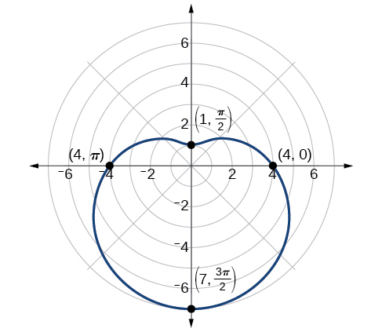{: #Figure_08_04_010}

Analysis

This is an example of a curve for which making a table of values is critical to producing an accurate graph. The symmetry tests fail; the zero is undefined. While it may be apparent that an equation involving<math xmlns="http://www.w3.org/1998/Math/MathML"> <mrow> <mtext> </mtext><mi>sin</mi><mtext> </mtext><mi>θ</mi><mtext> </mtext> </mrow> </math>

 is likely symmetric with respect to the line<math xmlns="http://www.w3.org/1998/Math/MathML"> <mrow> <mtext> </mtext><mi>θ</mi><mo>=</mo><mfrac> <mi>π</mi> <mn>2</mn> </mfrac> <mo>,</mo> </mrow> </math>

 evaluating more points helps to verify that the graph is correct.

Sketch the graph of<math xmlns="http://www.w3.org/1998/Math/MathML"> <mrow> <mtext> </mtext><mi>r</mi><mo>=</mo><mn>3</mn><mo>−</mo><mn>2</mn><mi>cos</mi><mtext> </mtext><mi>θ</mi><mo>.</mo> </mrow> </math>

 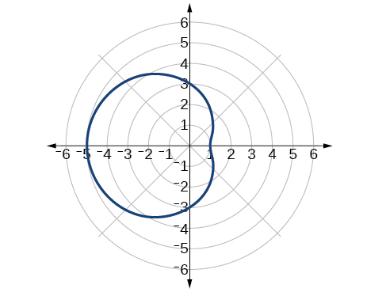 

Another type of limaçon, the **inner-loop limaçon**, is named for the loop formed inside the general limaçon shape. It was discovered by the German artist Albrecht **Dürer**{: data-type="term" .no-emphasis}(1471-1528), who revealed a method for drawing the inner-loop limaçon in his 1525 book *Underweysung der Messing*. A century later, the father of mathematician Blaise **Pascal**{: data-type="term" .no-emphasis}, Étienne Pascal(1588-1651), rediscovered it.

Formulas for Inner-Loop Limaçons

The formulas that generate the **inner-loop limaçons**{: data-type="term"} are given by<math xmlns="http://www.w3.org/1998/Math/MathML"> <mrow> <mtext> </mtext><mi>r</mi><mo>=</mo><mi>a</mi><mo>±</mo><mi>b</mi><mi>cos</mi><mtext> </mtext><mi>θ</mi><mtext> </mtext> </mrow> </math>

and<math xmlns="http://www.w3.org/1998/Math/MathML"> <mrow> <mtext> </mtext><mi>r</mi><mo>=</mo><mi>a</mi><mo>±</mo><mi>b</mi><mi>sin</mi><mtext> </mtext><mi>θ</mi><mtext> </mtext> </mrow> </math>

where<math xmlns="http://www.w3.org/1998/Math/MathML"> <mrow> <mtext> </mtext><mi>a</mi><mo>&gt;</mo><mn>0</mn><mo>,</mo><mtext> </mtext><mtext> </mtext><mi>b</mi><mo>&gt;</mo><mn>0</mn><mo>,</mo><mtext> </mtext> </mrow> </math>

and<math xmlns="http://www.w3.org/1998/Math/MathML"> <mrow> <mtext> </mtext><mtext> </mtext><mi>a</mi><mo>&lt;</mo><mi>b</mi><mo>.</mo><mtext> </mtext> </mrow> </math>

The graph of the inner-loop limaçon passes through the pole twice: once for the outer loop, and once for the inner loop. See [\[link\]](#Figure_08_04_012) for the graphs.

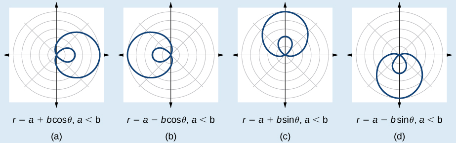{: #Figure_08_04_012}

Sketching the Graph of an Inner-Loop Limaçon

Sketch the graph of<math xmlns="http://www.w3.org/1998/Math/MathML"> <mrow> <mtext> </mtext><mi>r</mi><mo>=</mo><mn>2</mn><mo>+</mo><mn>5</mn><mtext>cos</mtext><mtext> </mtext><mi>θ</mi><mo>.</mo> </mrow> </math>

Testing for symmetry, we find that the graph of the equation is symmetric about the polar axis. Next, finding the zeros reveals that when<math xmlns="http://www.w3.org/1998/Math/MathML"> <mrow> <mtext> </mtext><mi>r</mi><mo>=</mo><mn>0</mn><mo>,</mo><mtext> </mtext><mtext> </mtext><mi>θ</mi><mo>=</mo><mn>1.98.</mn><mtext> </mtext> </mrow> </math>

 The maximum<math xmlns="http://www.w3.org/1998/Math/MathML"> <mrow> <mtext> </mtext><mrow><mo>\|</mo> <mi>r</mi> <mo>\|</mo></mrow><mtext> </mtext> </mrow> </math>

is found when<math xmlns="http://www.w3.org/1998/Math/MathML"> <mrow> <mtext> </mtext><mi>cos</mi><mtext> </mtext><mi>θ</mi><mo>=</mo><mn>1</mn><mtext> </mtext> </mrow> </math>

or when<math xmlns="http://www.w3.org/1998/Math/MathML"> <mrow> <mtext> </mtext><mi>θ</mi><mo>=</mo><mn>0.</mn><mtext> </mtext> </mrow> </math>

Thus, the maximum is found at the point (7, 0).

Even though we have found symmetry, the zero, and the maximum, plotting more points will help to define the shape, and then a pattern will emerge.

See [[link]](#Table_08_04_05).

| <strong><math xmlns="http://www.w3.org/1998/Math/MathML">
 <mi>θ</mi>
</math></strong> | <math xmlns="http://www.w3.org/1998/Math/MathML"> <mn>0</mn> </math>

 | <math xmlns="http://www.w3.org/1998/Math/MathML"> <mrow> <mfrac> <mi>π</mi> <mn>6</mn> </mfrac> </mrow> </math>

 | <math xmlns="http://www.w3.org/1998/Math/MathML"> <mrow> <mfrac> <mi>π</mi> <mn>3</mn> </mfrac> </mrow> </math>

 | <math xmlns="http://www.w3.org/1998/Math/MathML"> <mrow> <mfrac> <mi>π</mi> <mn>2</mn> </mfrac> </mrow> </math>

 | <math xmlns="http://www.w3.org/1998/Math/MathML"> <mrow> <mfrac> <mrow> <mn>2</mn><mi>π</mi> </mrow> <mn>3</mn> </mfrac> </mrow> </math>

 | <math xmlns="http://www.w3.org/1998/Math/MathML"> <mrow> <mfrac> <mrow> <mn>5</mn><mi>π</mi> </mrow> <mn>6</mn> </mfrac> </mrow> </math>

 | <math xmlns="http://www.w3.org/1998/Math/MathML"> <mi>π</mi> </math>

 | <math xmlns="http://www.w3.org/1998/Math/MathML"> <mrow> <mfrac> <mrow> <mn>7</mn><mi>π</mi> </mrow> <mn>6</mn> </mfrac> </mrow> </math>

 | <math xmlns="http://www.w3.org/1998/Math/MathML"> <mrow> <mfrac> <mrow> <mn>4</mn><mi>π</mi> </mrow> <mn>3</mn> </mfrac> </mrow> </math>

 | <math xmlns="http://www.w3.org/1998/Math/MathML"> <mrow> <mfrac> <mrow> <mn>3</mn><mi>π</mi> </mrow> <mn>2</mn> </mfrac> </mrow> </math>

 | <math xmlns="http://www.w3.org/1998/Math/MathML"> <mrow> <mfrac> <mrow> <mn>5</mn><mi>π</mi> </mrow> <mn>3</mn> </mfrac> </mrow> </math>

 | <math xmlns="http://www.w3.org/1998/Math/MathML"> <mrow> <mfrac> <mrow> <mn>11</mn><mi>π</mi> </mrow> <mn>6</mn> </mfrac> </mrow> </math>

 | <math xmlns="http://www.w3.org/1998/Math/MathML"> <mrow> <mn>2</mn><mi>π</mi> </mrow> </math>

 |
| <strong><math xmlns="http://www.w3.org/1998/Math/MathML">
 <mi>r</mi>
</math>
</strong> | 7 | 6.3 | 4.5 | 2 | −0.5 | −2.3 | −3 | −2.3 | −0.5 | 2 | 4.5 | 6.3 | 7 |
{: #Table_08_04_05 summary="Two rows and fourteen columns. First row is labeled theta and second row is labeled r. The table has ordered pairs of each of these column values: (0,7), (pi/6, 6.3.), (pi/3,4.5), (pi/2, 2), (2pi/3, -.5), (5pi/6, -2.3), (pi,-3), (7pi/6, -2.3), (4pi/3,-.5), (3pi/2, 2), (5pi/3, 4.5), (11pi/6, 6.3), and (2pi, 7)."}

As expected, the values begin to repeat after<math xmlns="http://www.w3.org/1998/Math/MathML"> <mrow> <mtext> </mtext><mi>θ</mi><mo>=</mo><mi>π</mi><mo>.</mo><mtext> </mtext> </mrow> </math>

The graph is shown in [[link]](#Figure_08_04_013).

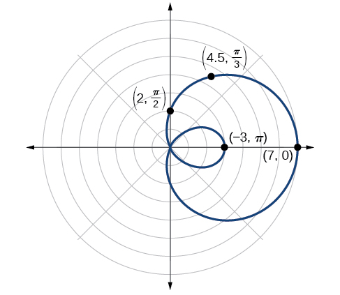{: #Figure_08_04_013}

#### Investigating Lemniscates

The lemniscate is a polar curve resembling the infinity symbol<math xmlns="http://www.w3.org/1998/Math/MathML"> <mrow> <mtext> </mtext><mi>∞</mi><mtext> </mtext> </mrow> </math>

or a figure 8. Centered at the pole, a lemniscate is symmetrical by definition.

Formulas for Lemniscates

The formulas that generate the graph of a **lemniscate**{: data-type="term"} are given by<math xmlns="http://www.w3.org/1998/Math/MathML"> <mrow> <mtext> </mtext><msup> <mi>r</mi> <mn>2</mn> </msup> <mo>=</mo><msup> <mi>a</mi> <mn>2</mn> </msup> <mi>cos</mi><mtext> </mtext><mn>2</mn><mi>θ</mi><mtext> </mtext> </mrow> </math>

and<math xmlns="http://www.w3.org/1998/Math/MathML"> <mrow> <mtext> </mtext><msup> <mi>r</mi> <mn>2</mn> </msup> <mo>=</mo><msup> <mi>a</mi> <mn>2</mn> </msup> <mi>sin</mi><mtext> </mtext><mn>2</mn><mi>θ</mi><mtext> </mtext> </mrow> </math>

where<math xmlns="http://www.w3.org/1998/Math/MathML"> <mrow> <mtext> </mtext><mi>a</mi><mo>≠</mo><mn>0.</mn><mtext> </mtext> </mrow> </math>

The formula<math xmlns="http://www.w3.org/1998/Math/MathML"> <mrow> <mtext> </mtext><msup> <mi>r</mi> <mn>2</mn> </msup> <mo>=</mo><msup> <mi>a</mi> <mn>2</mn> </msup> <mi>sin</mi><mtext> </mtext><mn>2</mn><mi>θ</mi><mtext> </mtext> </mrow> </math>

is symmetric with respect to the pole. The formula<math xmlns="http://www.w3.org/1998/Math/MathML"> <mrow> <mtext> </mtext><msup> <mi>r</mi> <mn>2</mn> </msup> <mo>=</mo><msup> <mi>a</mi> <mn>2</mn> </msup> <mi>cos</mi><mtext> </mtext><mn>2</mn><mi>θ</mi><mtext> </mtext> </mrow> </math>

is symmetric with respect to the pole, the line<math xmlns="http://www.w3.org/1998/Math/MathML"> <mrow> <mtext> </mtext><mi>θ</mi><mo>=</mo><mfrac> <mi>π</mi> <mn>2</mn> </mfrac> <mo>,</mo><mtext> </mtext> </mrow> </math>

and the polar axis. See [\[link\]](#Figure_08_04_014) for the graphs.

{: #Figure_08_04_014}

Sketching the Graph of a Lemniscate

Sketch the graph of<math xmlns="http://www.w3.org/1998/Math/MathML"> <mrow> <mtext> </mtext><msup> <mi>r</mi> <mn>2</mn> </msup> <mo>=</mo><mn>4</mn><mi>cos</mi><mtext> </mtext><mn>2</mn><mi>θ</mi><mo>.</mo> </mrow> </math>

The equation exhibits symmetry with respect to the line<math xmlns="http://www.w3.org/1998/Math/MathML"> <mrow> <mtext> </mtext><mi>θ</mi><mo>=</mo><mfrac> <mi>π</mi> <mn>2</mn> </mfrac> <mo>,</mo><mtext> </mtext> </mrow> </math>

the polar axis, and the pole.

Let’s find the zeros. It should be routine by now, but we will approach this equation a little differently by making the substitution<math xmlns="http://www.w3.org/1998/Math/MathML"> <mrow> <mtext> </mtext><mi>u</mi><mo>=</mo><mn>2</mn><mi>θ</mi><mo>.</mo> </mrow> </math>

<math xmlns="http://www.w3.org/1998/Math/MathML" display="block"> <mrow> <mtable columnalign="left"> <mtr columnalign="left"> <mtd columnalign="left"> <mrow> <mtext> </mtext><mtext> </mtext><mtext> </mtext><mtext> </mtext><mtext> </mtext><mtext> </mtext><mtext> </mtext><mtext> </mtext><mtext> </mtext><mtext> </mtext><mtext> </mtext><mtext> </mtext><mtext> </mtext><mtext> </mtext><mtext> </mtext><mn>0</mn><mo>=</mo><mn>4</mn><mi>cos</mi><mtext> </mtext><mn>2</mn><mi>θ</mi> </mrow> </mtd> <mtd columnalign="left"> <mrow /> </mtd> </mtr> <mtr columnalign="left"> <mtd columnalign="left"> <mrow> <mtext> </mtext><mtext> </mtext><mtext> </mtext><mtext> </mtext><mtext> </mtext><mtext> </mtext><mtext> </mtext><mtext> </mtext><mtext> </mtext><mtext> </mtext><mtext> </mtext><mtext> </mtext><mtext> </mtext><mtext> </mtext><mtext> </mtext><mn>0</mn><mo>=</mo><mn>4</mn><mi>cos</mi><mtext> </mtext><mi>u</mi> </mrow> </mtd> <mtd columnalign="left"> <mrow /> </mtd> </mtr> <mtr columnalign="left"> <mtd columnalign="left"> <mrow> <mtext> </mtext><mtext> </mtext><mtext> </mtext><mtext> </mtext><mtext> </mtext><mtext> </mtext><mtext> </mtext><mtext> </mtext><mtext> </mtext><mtext> </mtext><mtext> </mtext><mtext> </mtext><mtext> </mtext><mtext> </mtext><mtext> </mtext><mn>0</mn><mo>=</mo><mi>cos</mi><mtext> </mtext><mi>u</mi> </mrow> </mtd> <mtd columnalign="left"> <mrow /> </mtd> </mtr> <mtr columnalign="left"> <mtd columnalign="left"> <mrow> <msup> <mrow> <mi>cos</mi> </mrow> <mrow> <mo>−</mo><mn>1</mn> </mrow> </msup> <mn>0</mn><mo>=</mo><mfrac> <mi>π</mi> <mn>2</mn> </mfrac> </mrow> </mtd> <mtd columnalign="left"> <mrow /> </mtd> </mtr> <mtr columnalign="left"> <mtd columnalign="left"> <mrow> <mtext> </mtext><mtext> </mtext><mtext> </mtext><mtext> </mtext><mtext> </mtext><mtext> </mtext><mtext> </mtext><mtext> </mtext><mtext> </mtext><mtext> </mtext><mtext> </mtext><mtext> </mtext><mtext> </mtext><mtext> </mtext><mtext> </mtext><mi>u</mi><mo>=</mo><mfrac> <mi>π</mi> <mn>2</mn> </mfrac> </mrow> </mtd> <mtd columnalign="left"> <mrow> <mtext>Substitute </mtext><mn>2</mn><mi>θ</mi><mtext> back in for </mtext><mi>u</mi><mo>.</mo> </mrow> </mtd> </mtr> <mtr columnalign="left"> <mtd columnalign="left"> <mrow> <mtext> </mtext><mtext> </mtext><mtext> </mtext><mtext> </mtext><mtext> </mtext><mtext> </mtext><mtext> </mtext><mtext> </mtext><mtext> </mtext><mtext> </mtext><mtext> </mtext><mtext> </mtext><mn>2</mn><mi>θ</mi><mo>=</mo><mfrac> <mi>π</mi> <mn>2</mn> </mfrac> </mrow> </mtd> <mtd columnalign="left"> <mrow /> </mtd> </mtr> <mtr columnalign="left"> <mtd columnalign="left"> <mrow> <mtext> </mtext><mtext> </mtext><mtext> </mtext><mtext> </mtext><mtext> </mtext><mtext> </mtext><mtext> </mtext><mtext> </mtext><mtext> </mtext><mtext> </mtext><mtext> </mtext><mtext> </mtext><mtext> </mtext><mtext> </mtext><mtext> </mtext><mi>θ</mi><mo>=</mo><mfrac> <mi>π</mi> <mn>4</mn> </mfrac> </mrow> </mtd> <mtd columnalign="left"> <mrow /> </mtd> </mtr> </mtable> </mrow> </math>

So, the point<math xmlns="http://www.w3.org/1998/Math/MathML"> <mrow> <mrow><mo>(</mo> <mrow> <mn>0</mn><mo>,</mo><mfrac> <mi>π</mi> <mn>4</mn> </mfrac> </mrow> <mo>)</mo></mrow> </mrow> </math>

is a zero of the equation.

Now let’s find the maximum value. Since the maximum of<math xmlns="http://www.w3.org/1998/Math/MathML"> <mrow> <mtext> </mtext><mi>cos</mi><mtext> </mtext><mi>u</mi><mo>=</mo><mn>1</mn><mtext> </mtext> </mrow> </math>

when<math xmlns="http://www.w3.org/1998/Math/MathML"> <mrow> <mtext> </mtext><mi>u</mi><mo>=</mo><mn>0</mn><mo>,</mo><mtext> </mtext> </mrow> </math>

the maximum<math xmlns="http://www.w3.org/1998/Math/MathML"> <mrow> <mtext> </mtext><mi>cos</mi><mtext> </mtext><mn>2</mn><mi>θ</mi><mo>=</mo><mn>1</mn><mtext> </mtext> </mrow> </math>

when<math xmlns="http://www.w3.org/1998/Math/MathML"> <mrow> <mtext> </mtext><mn>2</mn><mi>θ</mi><mo>=</mo><mn>0.</mn><mtext> </mtext> </mrow> </math>

Thus,

<math xmlns="http://www.w3.org/1998/Math/MathML" display="block"> <mrow> <mtable> <mtr> <mtd> <mrow> <mtext> </mtext><msup> <mi>r</mi> <mn>2</mn> </msup> <mo>=</mo><mn>4</mn><mi>cos</mi><mo stretchy="false">(</mo><mn>0</mn><mo stretchy="false">)</mo> </mrow> </mtd> </mtr> <mtr> <mtd> <mrow> <mtext> </mtext><mtext> </mtext><mtext> </mtext><msup> <mi>r</mi> <mn>2</mn> </msup> <mo>=</mo><mn>4</mn><mo stretchy="false">(</mo><mn>1</mn><mo stretchy="false">)</mo><mo>=</mo><mn>4</mn> </mrow> </mtd> </mtr> <mtr> <mtd> <mrow> <mtext> </mtext><mtext> </mtext><mtext> </mtext><mtext> </mtext><mtext> </mtext><mtext> </mtext><mtext> </mtext><mtext> </mtext><mtext> </mtext><mtext> </mtext><mi>r</mi><mo>=</mo><mo>±</mo><msqrt> <mn>4</mn> </msqrt> <mtext> </mtext><mo>=</mo><mn>2</mn> </mrow> </mtd> </mtr> </mtable> </mrow> </math>

We have a maximum at (2, 0). Since this graph is symmetric with respect to the pole, the line<math xmlns="http://www.w3.org/1998/Math/MathML"> <mrow> <mtext> </mtext><mi>θ</mi><mo>=</mo><mfrac> <mi>π</mi> <mn>2</mn> </mfrac> <mo>,</mo> </mrow> </math>

 and the polar axis, we only need to plot points in the first quadrant.

Make a table similar to [[link]](#Table_08_04_06).

| <strong><math xmlns="http://www.w3.org/1998/Math/MathML">
 <mi>θ</mi>
</math></strong> | 0 | <math xmlns="http://www.w3.org/1998/Math/MathML"> <mrow> <mfrac> <mi>π</mi> <mn>6</mn> </mfrac> </mrow> </math>

 | <math xmlns="http://www.w3.org/1998/Math/MathML"> <mrow> <mfrac> <mi>π</mi> <mn>4</mn> </mfrac> </mrow> </math>

 | <math xmlns="http://www.w3.org/1998/Math/MathML"> <mrow> <mfrac> <mi>π</mi> <mn>3</mn> </mfrac> </mrow> </math>

 | <math xmlns="http://www.w3.org/1998/Math/MathML"> <mrow> <mfrac> <mi>π</mi> <mn>2</mn> </mfrac> </mrow> </math>

 |
| <strong><math xmlns="http://www.w3.org/1998/Math/MathML">
 <mi>r</mi>
</math></strong> | 2 | <math xmlns="http://www.w3.org/1998/Math/MathML"> <mrow> <msqrt> <mn>2</mn> </msqrt> </mrow> </math>

 | 0 | <math xmlns="http://www.w3.org/1998/Math/MathML"> <mrow> <msqrt> <mn>2</mn> </msqrt> </mrow> </math>

 | 0 |
{: #Table_08_04_06 summary="Two rows and six columns. First row is labeled theta and second row is labeled r. The table has ordered pairs of each of these column values: (0,2), (pi/6, rad2), (pi/4,0), (pi/3, rad2), (pi/2,0)."}

Plot the points on the graph, such as the one shown in [[link]](#Figure_08_04_015).

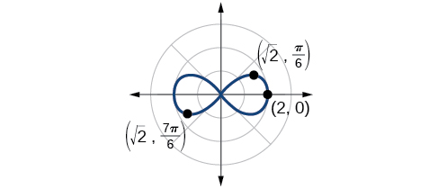{: #Figure_08_04_015}

Analysis

Making a substitution such as<math xmlns="http://www.w3.org/1998/Math/MathML"> <mrow> <mtext> </mtext><mi>u</mi><mo>=</mo><mn>2</mn><mi>θ</mi><mtext> </mtext> </mrow> </math>

is a common practice in mathematics because it can make calculations simpler. However, we must not forget to replace the substitution term with the original term at the end, and then solve for the unknown.

Some of the points on this graph may not show up using the Trace function on the TI-84 graphing calculator, and the calculator table may show an error for these same points of<math xmlns="http://www.w3.org/1998/Math/MathML"> <mrow> <mtext> </mtext><mi>r</mi><mo>.</mo><mtext> </mtext> </mrow> </math>

This is because there are no real square roots for these values of<math xmlns="http://www.w3.org/1998/Math/MathML"> <mrow> <mtext> </mtext><mi>θ</mi><mo>.</mo><mtext> </mtext> </mrow> </math>

In other words, the corresponding *r*-values of<math xmlns="http://www.w3.org/1998/Math/MathML"> <mrow> <mtext> </mtext><msqrt> <mrow> <mn>4</mn><mi>cos</mi><mo stretchy="false">(</mo><mn>2</mn><mi>θ</mi><mo stretchy="false">)</mo> </mrow> </msqrt> <mtext> </mtext> </mrow> </math>

 are complex numbers because there is a negative number under the radical.

####  Investigating Rose Curves 

The next type of polar equation produces a petal-like shape called a rose curve. Although the graphs look complex, a simple polar equation generates the pattern.

Rose Curves

The formulas that generate the graph of a **rose curve**{: data-type="term"} are given by<math xmlns="http://www.w3.org/1998/Math/MathML"> <mrow> <mtext> </mtext><mi>r</mi><mo>=</mo><mi>a</mi><mi>cos</mi><mtext> </mtext><mi>n</mi><mi>θ</mi><mtext> </mtext> </mrow> </math>

and<math xmlns="http://www.w3.org/1998/Math/MathML"> <mrow> <mtext> </mtext><mi>r</mi><mo>=</mo><mi>a</mi><mi>sin</mi><mtext> </mtext><mi>n</mi><mi>θ</mi><mtext> </mtext> </mrow> </math>

where<math xmlns="http://www.w3.org/1998/Math/MathML"> <mrow> <mtext> </mtext><mi>a</mi><mo>≠</mo><mn>0.</mn><mtext> </mtext> </mrow> </math>

If<math xmlns="http://www.w3.org/1998/Math/MathML"> <mrow> <mtext> </mtext><mi>n</mi><mtext> </mtext> </mrow> </math>

is even, the curve has<math xmlns="http://www.w3.org/1998/Math/MathML"> <mrow> <mtext> </mtext><mn>2</mn><mi>n</mi><mtext> </mtext> </mrow> </math>

petals. If<math xmlns="http://www.w3.org/1998/Math/MathML"> <mrow> <mtext> </mtext><mi>n</mi><mtext> </mtext> </mrow> </math>

is odd, the curve has<math xmlns="http://www.w3.org/1998/Math/MathML"> <mrow> <mtext> </mtext><mi>n</mi><mtext> </mtext> </mrow> </math>

petals. See [\[link\]](#Figure_08_04_016).

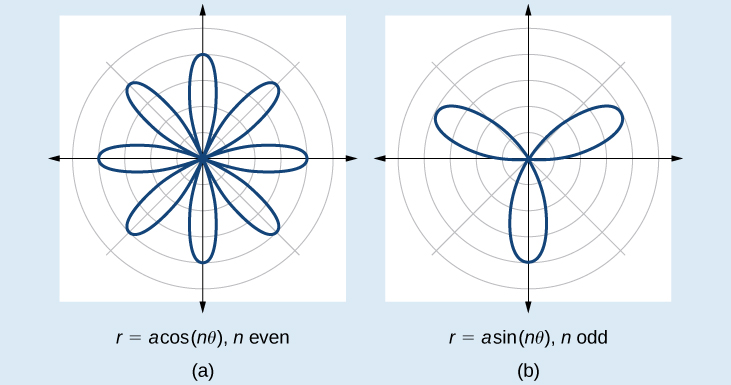{: #Figure_08_04_016}

Sketching the Graph of a Rose Curve (*n* Even)

Sketch the graph of<math xmlns="http://www.w3.org/1998/Math/MathML"> <mrow> <mtext> </mtext><mi>r</mi><mo>=</mo><mn>2</mn><mi>cos</mi><mtext> </mtext><mn>4</mn><mi>θ</mi><mo>.</mo> </mrow> </math>

Testing for symmetry, we find again that the symmetry tests do not tell the whole story. The graph is not only symmetric with respect to the polar axis, but also with respect to the line<math xmlns="http://www.w3.org/1998/Math/MathML"> <mrow> <mtext> </mtext><mi>θ</mi><mo>=</mo><mfrac> <mi>π</mi> <mn>2</mn> </mfrac> <mtext> </mtext> </mrow> </math>

and the pole.

Now we will find the zeros. First make the substitution<math xmlns="http://www.w3.org/1998/Math/MathML"> <mrow> <mtext> </mtext><mi>u</mi><mo>=</mo><mn>4</mn><mi>θ</mi><mo>.</mo> </mrow> </math>

<math xmlns="http://www.w3.org/1998/Math/MathML" display="block"> <mrow> <mtable> <mtr> <mtd> <mrow> <mtext> </mtext><mtext> </mtext><mtext> </mtext><mtext> </mtext><mtext> </mtext><mtext> </mtext><mtext> </mtext><mtext> </mtext><mtext> </mtext><mtext> </mtext><mtext> </mtext><mtext> </mtext><mtext> </mtext><mtext> </mtext><mtext> </mtext><mtext> </mtext><mtext> </mtext><mtext> </mtext><mtext> </mtext><mtext> </mtext><mtext> </mtext><mtext> </mtext><mtext> </mtext><mtext> </mtext><mtext> </mtext><mtext> </mtext><mtext> </mtext><mtext> </mtext><mtext> </mtext><mtext> </mtext><mn>0</mn><mo>=</mo><mn>2</mn><mi>cos</mi><mtext> </mtext><mn>4</mn><mi>θ</mi> </mrow> </mtd> </mtr> <mtr> <mtd> <mrow> <mtext> </mtext><mtext> </mtext><mtext> </mtext><mtext> </mtext><mtext> </mtext><mtext> </mtext><mtext> </mtext><mtext> </mtext><mtext> </mtext><mtext> </mtext><mtext> </mtext><mtext> </mtext><mtext> </mtext><mtext> </mtext><mtext> </mtext><mtext> </mtext><mtext> </mtext><mtext> </mtext><mtext> </mtext><mtext> </mtext><mtext> </mtext><mtext> </mtext><mtext> </mtext><mtext> </mtext><mtext> </mtext><mtext> </mtext><mtext> </mtext><mn>0</mn><mo>=</mo><mi>cos</mi><mtext> </mtext><mn>4</mn><mi>θ</mi> </mrow> </mtd> </mtr> <mtr> <mtd> <mrow> <mtext> </mtext><mtext> </mtext><mtext> </mtext><mtext> </mtext><mtext> </mtext><mtext> </mtext><mtext> </mtext><mtext> </mtext><mtext> </mtext><mtext> </mtext><mtext> </mtext><mtext> </mtext><mtext> </mtext><mtext> </mtext><mtext> </mtext><mtext> </mtext><mtext> </mtext><mtext> </mtext><mtext> </mtext><mtext> </mtext><mtext> </mtext><mtext> </mtext><mtext> </mtext><mtext> </mtext><mn>0</mn><mo>=</mo><mi>cos</mi><mtext> </mtext><mi>u</mi> </mrow> </mtd> </mtr> <mtr> <mtd> <mrow> <msup> <mrow> <mi>cos</mi> </mrow> <mrow> <mo>−</mo><mn>1</mn> </mrow> </msup> <mn>0</mn><mo>=</mo><mi>u</mi> </mrow> </mtd> </mtr> <mtr> <mtd> <mrow> <mtext> </mtext><mtext> </mtext><mtext> </mtext><mtext> </mtext><mtext> </mtext><mtext> </mtext><mtext> </mtext><mtext> </mtext><mtext> </mtext><mtext> </mtext><mtext> </mtext><mtext> </mtext><mtext> </mtext><mtext> </mtext><mtext> </mtext><mtext> </mtext><mtext> </mtext><mi>u</mi><mo>=</mo><mfrac> <mi>π</mi> <mn>2</mn> </mfrac> </mrow> </mtd> </mtr> <mtr> <mtd> <mrow> <mtext> </mtext><mtext> </mtext><mtext> </mtext><mtext> </mtext><mtext> </mtext><mtext> </mtext><mtext> </mtext><mtext> </mtext><mtext> </mtext><mtext> </mtext><mtext> </mtext><mtext> </mtext><mtext> </mtext><mtext> </mtext><mn>4</mn><mi>θ</mi><mo>=</mo><mfrac> <mi>π</mi> <mn>2</mn> </mfrac> </mrow> </mtd> </mtr> <mtr> <mtd> <mrow> <mtext> </mtext><mtext> </mtext><mtext> </mtext><mtext> </mtext><mtext> </mtext><mtext> </mtext><mtext> </mtext><mtext> </mtext><mtext> </mtext><mtext> </mtext><mtext> </mtext><mtext> </mtext><mtext> </mtext><mtext> </mtext><mtext> </mtext><mtext> </mtext><mtext> </mtext><mtext> </mtext><mi>θ</mi><mo>=</mo><mfrac> <mi>π</mi> <mn>8</mn> </mfrac> </mrow> </mtd> </mtr> </mtable> </mrow> </math>

The zero is<math xmlns="http://www.w3.org/1998/Math/MathML"> <mrow> <mtext> </mtext><mi>θ</mi><mo>=</mo><mfrac> <mi>π</mi> <mn>8</mn> </mfrac> <mo>.</mo><mtext> </mtext> </mrow> </math>

The point<math xmlns="http://www.w3.org/1998/Math/MathML"> <mrow> <mtext> </mtext><mrow><mo>(</mo> <mrow> <mn>0</mn><mo>,</mo><mfrac> <mi>π</mi> <mn>8</mn> </mfrac> </mrow> <mo>)</mo></mrow><mtext> </mtext> </mrow> </math>

is on the curve.

Next, we find the maximum<math xmlns="http://www.w3.org/1998/Math/MathML"> <mrow> <mtext> </mtext><mrow><mo>\|</mo> <mi>r</mi> <mo>\|</mo></mrow><mo>.</mo><mtext> </mtext> </mrow> </math>

We know that the maximum value of<math xmlns="http://www.w3.org/1998/Math/MathML"> <mrow> <mtext> </mtext><mi>cos</mi><mtext> </mtext><mi>u</mi><mo>=</mo><mn>1</mn><mtext> </mtext> </mrow> </math>

when<math xmlns="http://www.w3.org/1998/Math/MathML"> <mrow> <mtext> </mtext><mi>θ</mi><mo>=</mo><mn>0.</mn><mtext> </mtext> </mrow> </math>

Thus,

<math xmlns="http://www.w3.org/1998/Math/MathML" display="block"> <mtable columnalign="left"> <mtr> <mtd> <mrow /> </mtd> </mtr> <mtr> <mtd> <mtable columnalign="left"> <mtr columnalign="left"> <mtd columnalign="left"> <mrow> <mi>r</mi><mo>=</mo><mn>2</mn><mi>cos</mi><mo stretchy="false">(</mo><mn>4</mn><mo>⋅</mo><mn>0</mn><mo stretchy="false">)</mo> </mrow> </mtd> </mtr> <mtr columnalign="left"> <mtd columnalign="left"> <mrow> <mi>r</mi><mo>=</mo><mn>2</mn><mi>cos</mi><mo stretchy="false">(</mo><mn>0</mn><mo stretchy="false">)</mo> </mrow> </mtd> </mtr> <mtr columnalign="left"> <mtd columnalign="left"> <mrow> <mi>r</mi><mo>=</mo><mn>2</mn><mo stretchy="false">(</mo><mn>1</mn><mo stretchy="false">)</mo><mo>=</mo><mn>2</mn> </mrow> </mtd> </mtr> </mtable> </mtd> </mtr> </mtable> </math>

The point<math xmlns="http://www.w3.org/1998/Math/MathML"> <mrow> <mtext> </mtext><mrow><mo>(</mo> <mrow> <mn>2</mn><mo>,</mo><mn>0</mn> </mrow> <mo>)</mo></mrow><mtext> </mtext> </mrow> </math>

is on the curve.

The graph of the rose curve has unique properties, which are revealed in [[link]](#Table_08_04_07).

| <strong><math xmlns="http://www.w3.org/1998/Math/MathML">
 <mi>θ</mi>
</math></strong> | 0 | <math xmlns="http://www.w3.org/1998/Math/MathML"> <mrow> <mfrac> <mi>π</mi> <mn>8</mn> </mfrac> </mrow> </math>

 | <math xmlns="http://www.w3.org/1998/Math/MathML"> <mrow> <mfrac> <mi>π</mi> <mn>4</mn> </mfrac> </mrow> </math>

 | <math xmlns="http://www.w3.org/1998/Math/MathML"> <mrow> <mfrac> <mrow> <mn>3</mn><mi>π</mi> </mrow> <mn>8</mn> </mfrac> </mrow> </math>

 | <math xmlns="http://www.w3.org/1998/Math/MathML"> <mrow> <mfrac> <mi>π</mi> <mn>2</mn> </mfrac> </mrow> </math>

 | <math xmlns="http://www.w3.org/1998/Math/MathML"> <mrow> <mfrac> <mrow> <mn>5</mn><mi>π</mi> </mrow> <mn>8</mn> </mfrac> </mrow> </math>

 | <math xmlns="http://www.w3.org/1998/Math/MathML"> <mrow> <mfrac> <mrow> <mn>3</mn><mi>π</mi> </mrow> <mn>4</mn> </mfrac> </mrow> </math>

 |
| <strong><math xmlns="http://www.w3.org/1998/Math/MathML">
 <mi>r</mi>
</math></strong> | 2 | 0 | −2 | 0 | 2 | 0 | −2 |
{: #Table_08_04_07 summary="Two rows and eight columns. First row is labeled theta and second row is labeled r. The table has ordered pairs of each of these column values: (0,2), (pi/8, 0), (pi/4, -2), (3pi/8, 0), (pi/2, 2), (5pi/8, 0), (3pi/4, -2)."}

As<math xmlns="http://www.w3.org/1998/Math/MathML"> <mrow> <mtext> </mtext><mi>r</mi><mo>=</mo><mn>0</mn><mtext> </mtext> </mrow> </math>

when<math xmlns="http://www.w3.org/1998/Math/MathML"> <mrow> <mtext> </mtext><mi>θ</mi><mo>=</mo><mfrac> <mi>π</mi> <mn>8</mn> </mfrac> <mo>,</mo><mtext> </mtext> </mrow> </math>

it makes sense to divide values in the table by<math xmlns="http://www.w3.org/1998/Math/MathML"> <mrow> <mtext> </mtext><mfrac> <mi>π</mi> <mn>8</mn> </mfrac> <mtext> </mtext> </mrow> </math>

units. A definite pattern emerges. Look at the range of *r*-values: 2, 0, −2, 0, 2, 0, −2, and so on. This represents the development of the curve one petal at a time. Starting at<math xmlns="http://www.w3.org/1998/Math/MathML"> <mrow> <mtext> </mtext><mi>r</mi><mo>=</mo><mn>0</mn><mo>,</mo><mtext> </mtext> </mrow> </math>

each petal extends out a distance of<math xmlns="http://www.w3.org/1998/Math/MathML"> <mrow> <mtext> </mtext><mi>r</mi><mo>=</mo><mn>2</mn><mo>,</mo><mtext> </mtext> </mrow> </math>

and then turns back to zero<math xmlns="http://www.w3.org/1998/Math/MathML"> <mrow> <mtext> </mtext><mn>2</mn><mi>n</mi><mtext> </mtext> </mrow> </math>

times for a total of eight petals. See the graph in [[link]](#Figure_08_04_017).

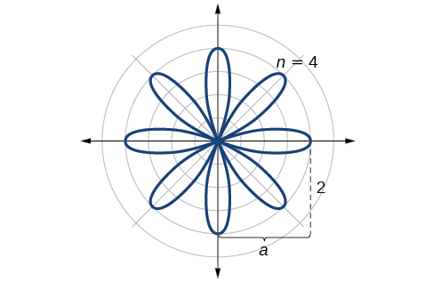{: #Figure_08_04_017}

Analysis

When these curves are drawn, it is best to plot the points in order, as in the [[link]](#Table_08_04_07). This allows us to see how the graph hits a maximum (the tip of a petal), loops back crossing the pole, hits the opposite maximum, and loops back to the pole. The action is continuous until all the petals are drawn.

Sketch the graph of<math xmlns="http://www.w3.org/1998/Math/MathML"> <mrow> <mtext> </mtext><mi>r</mi><mo>=</mo><mn>4</mn><mi>sin</mi><mrow><mo>(</mo> <mrow> <mn>2</mn><mi>θ</mi> </mrow> <mo>)</mo></mrow><mo>.</mo> </mrow> </math>

The graph is a rose curve,<math xmlns="http://www.w3.org/1998/Math/MathML"> <mrow> <mtext> </mtext><mi>n</mi><mtext> </mtext> </mrow> </math>

even * * *
{: data-type="newline"}

 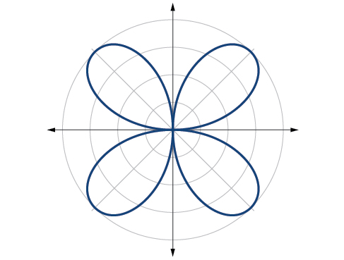 

Sketching the Graph of a Rose Curve (*n* Odd)

Sketch the graph of<math xmlns="http://www.w3.org/1998/Math/MathML"> <mrow> <mtext> </mtext><mi>r</mi><mo>=</mo><mn>2</mn><mi>sin</mi><mrow><mo>(</mo> <mrow> <mn>5</mn><mi>θ</mi> </mrow> <mo>)</mo></mrow><mo>.</mo> </mrow> </math>

The graph of the equation shows symmetry with respect to the line<math xmlns="http://www.w3.org/1998/Math/MathML"> <mrow> <mtext> </mtext><mi>θ</mi><mo>=</mo><mfrac> <mi>π</mi> <mn>2</mn> </mfrac> <mo>.</mo><mtext> </mtext> </mrow> </math>

Next, find the zeros and maximum. We will want to make the substitution<math xmlns="http://www.w3.org/1998/Math/MathML"> <mrow> <mtext> </mtext><mi>u</mi><mo>=</mo><mn>5</mn><mi>θ</mi><mo>.</mo> </mrow> </math>

<math xmlns="http://www.w3.org/1998/Math/MathML" display="block"> <mrow> <mtable> <mtr> <mtd> <mrow> <mtext> </mtext><mtext> </mtext><mtext> </mtext><mtext> </mtext><mtext> </mtext><mtext> </mtext><mtext> </mtext><mtext> </mtext><mtext> </mtext><mtext> </mtext><mtext> </mtext><mtext> </mtext><mtext> </mtext><mtext> </mtext><mtext> </mtext><mtext> </mtext><mtext> </mtext><mtext> </mtext><mtext> </mtext><mtext> </mtext><mtext> </mtext><mtext> </mtext><mtext> </mtext><mtext> </mtext><mtext> </mtext><mtext> </mtext><mtext> </mtext><mtext> </mtext><mtext> </mtext><mtext> </mtext><mtext> </mtext><mn>0</mn><mo>=</mo><mn>2</mn><mi>sin</mi><mo stretchy="false">(</mo><mn>5</mn><mi>θ</mi><mo stretchy="false">)</mo> </mrow> </mtd> </mtr> <mtr> <mtd> <mrow> <mtext> </mtext><mtext> </mtext><mtext> </mtext><mtext> </mtext><mtext> </mtext><mtext> </mtext><mtext> </mtext><mtext> </mtext><mtext> </mtext><mtext> </mtext><mtext> </mtext><mtext> </mtext><mtext> </mtext><mtext> </mtext><mtext> </mtext><mtext> </mtext><mtext> </mtext><mtext> </mtext><mtext> </mtext><mtext> </mtext><mtext> </mtext><mtext> </mtext><mn>0</mn><mo>=</mo><mi>sin</mi><mtext> </mtext><mi>u</mi> </mrow> </mtd> </mtr> <mtr> <mtd> <mrow> <msup> <mrow> <mi>sin</mi> </mrow> <mrow> <mo>−</mo><mn>1</mn> </mrow> </msup> <mn>0</mn><mo>=</mo><mn>0</mn> </mrow> </mtd> </mtr> <mtr> <mtd> <mrow> <mtext> </mtext><mtext> </mtext><mtext> </mtext><mtext> </mtext><mtext> </mtext><mtext> </mtext><mtext> </mtext><mtext> </mtext><mtext> </mtext><mtext> </mtext><mtext> </mtext><mtext> </mtext><mtext> </mtext><mtext> </mtext><mi>u</mi><mo>=</mo><mn>0</mn> </mrow> </mtd> </mtr> <mtr> <mtd> <mrow> <mtext> </mtext><mtext> </mtext><mtext> </mtext><mtext> </mtext><mtext> </mtext><mtext> </mtext><mtext> </mtext><mtext> </mtext><mtext> </mtext><mtext> </mtext><mtext> </mtext><mn>5</mn><mi>θ</mi><mo>=</mo><mn>0</mn> </mrow> </mtd> </mtr> <mtr> <mtd> <mrow> <mtext> </mtext><mtext> </mtext><mtext> </mtext><mtext> </mtext><mtext> </mtext><mtext> </mtext><mtext> </mtext><mtext> </mtext><mtext> </mtext><mtext> </mtext><mtext> </mtext><mtext> </mtext><mtext> </mtext><mtext> </mtext><mi>θ</mi><mo>=</mo><mn>0</mn> </mrow> </mtd> </mtr> </mtable> </mrow> </math>

The maximum value is calculated at the angle where<math xmlns="http://www.w3.org/1998/Math/MathML"> <mrow> <mtext> </mtext><mi>sin</mi><mtext> </mtext><mi>θ</mi><mtext> </mtext> </mrow> </math>

 is a maximum. Therefore,

<math xmlns="http://www.w3.org/1998/Math/MathML"> <mrow> <mtable columnalign="left"> <mtr columnalign="left"> <mtd columnalign="left"> <mtable columnalign="left"> <mtr> <mtd> <mrow /> </mtd> </mtr> <mtr> <mtd> <mi>r</mi><mo>=</mo><mn>2</mn><mi>sin</mi><mrow><mo>(</mo> <mrow> <mn>5</mn><mo>⋅</mo><mfrac> <mi>π</mi> <mn>2</mn> </mfrac> </mrow> <mo>)</mo></mrow> </mtd> </mtr> </mtable> </mtd> </mtr> <mtr columnalign="left"> <mtd columnalign="left"> <mrow> <mi>r</mi><mo>=</mo><mn>2</mn><mo stretchy="false">(</mo><mn>1</mn><mo stretchy="false">)</mo><mo>=</mo><mn>2</mn> </mrow> </mtd> </mtr> </mtable> </mrow> </math>

Thus, the maximum value of the polar equation is 2. This is the length of each petal. As the curve for<math xmlns="http://www.w3.org/1998/Math/MathML"> <mrow> <mtext> </mtext><mi>n</mi><mtext> </mtext> </mrow> </math>

odd yields the same number of petals as<math xmlns="http://www.w3.org/1998/Math/MathML"> <mrow> <mtext> </mtext><mi>n</mi><mo>,</mo><mtext> </mtext> </mrow> </math>

there will be five petals on the graph. See [[link]](#Figure_08_04_019).

Create a table of values similar to [[link]](#Table_08_04_08).

| <strong><math xmlns="http://www.w3.org/1998/Math/MathML">
 <mi>θ</mi>
</math></strong> | 0 | <math xmlns="http://www.w3.org/1998/Math/MathML"> <mrow> <mfrac> <mi>π</mi> <mn>6</mn> </mfrac> </mrow> </math>

 | <math xmlns="http://www.w3.org/1998/Math/MathML"> <mrow> <mfrac> <mi>π</mi> <mn>3</mn> </mfrac> </mrow> </math>

 | <math xmlns="http://www.w3.org/1998/Math/MathML"> <mrow> <mfrac> <mi>π</mi> <mn>2</mn> </mfrac> </mrow> </math>

 | <math xmlns="http://www.w3.org/1998/Math/MathML"> <mrow> <mfrac> <mrow> <mn>2</mn><mi>π</mi> </mrow> <mn>3</mn> </mfrac> </mrow> </math>

 | <math xmlns="http://www.w3.org/1998/Math/MathML"> <mrow> <mfrac> <mrow> <mn>5</mn><mi>π</mi> </mrow> <mn>6</mn> </mfrac> </mrow> </math>

 | <math xmlns="http://www.w3.org/1998/Math/MathML"> <mi>π</mi> </math>

 |
| <strong><math xmlns="http://www.w3.org/1998/Math/MathML">
 <mi>r</mi>
</math></strong> | 0 | 1 | −1.73 | 2 | −1.73 | 1 | 0 |
{: #Table_08_04_08 summary="Two rows and seven columns. First row is labeled theta and second row is labeled r. The table has ordered pairs of each of these column values: (0,0), (pi/6, 1), (pi/3, -1.73), (pi/2, 2), (2pi/3, -1.73), (5pi/6, 1), (pi, 0)."}

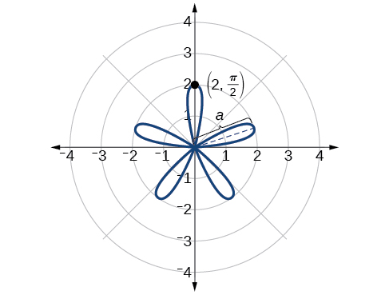{: #Figure_08_04_019}

Sketch the graph of<math xmlns="http://www.w3.org/1998/Math/MathML"> <mrow> <mi>r</mi><mo>=</mo><mn>3</mn><mi>cos</mi><mo stretchy="false">(</mo><mn>3</mn><mi>θ</mi><mo stretchy="false">).</mo> </mrow> </math>

 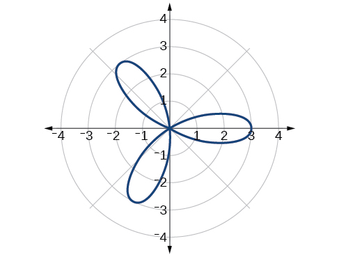 
Rose curve,<math xmlns="http://www.w3.org/1998/Math/MathML"> <mrow> <mtext> </mtext><mi>n</mi><mtext> </mtext> </mrow> </math>

odd

#### Investigating the Archimedes’ Spiral

The final polar equation we will discuss is the Archimedes’ spiral, named for its discoverer, the Greek mathematician Archimedes (c. 287 BCE - c. 212 BCE), who is credited with numerous discoveries in the fields of geometry and mechanics.

Archimedes’ Spiral

The formula that generates the graph of the **Archimedes’ spiral**{: data-type="term"} is given by<math xmlns="http://www.w3.org/1998/Math/MathML"> <mrow> <mtext> </mtext><mi>r</mi><mo>=</mo><mi>θ</mi><mtext> </mtext> </mrow> </math>

 for<math xmlns="http://www.w3.org/1998/Math/MathML"> <mrow> <mtext> </mtext><mi>θ</mi><mo>≥</mo><mn>0.</mn><mtext> </mtext> </mrow> </math>

As<math xmlns="http://www.w3.org/1998/Math/MathML"> <mrow> <mtext> </mtext><mi>θ</mi><mtext> </mtext> </mrow> </math>

increases,<math xmlns="http://www.w3.org/1998/Math/MathML"> <mrow> <mtext> </mtext><mi>r</mi><mtext> </mtext> </mrow> </math>

 increases at a constant rate in an ever-widening, never-ending, spiraling path. See [\[link\]](#Figure_08_04_020).

![Two graphs side by side of Archimedes\' spiral. (A) is r= theta, \[0, 2pi\]. (B) is r=theta, \[0, 4pi\]. Both start at origin and spiral out counterclockwise. The second has two spirals out while the first has one.](../resources/CNX_Precalc_Figure_08_04_020new.jpg){: #Figure_08_04_020}

**Given an Archimedes’ spiral over<math xmlns="http://www.w3.org/1998/Math/MathML"> <mrow> <mtext> </mtext><mrow><mo>[</mo> <mrow> <mn>0</mn><mo>,</mo><mn>2</mn><mi>π</mi> </mrow> <mo>]</mo></mrow><mo>,</mo> </mrow> </math>

sketch the graph.**

1.  Make a table of values for
    <math xmlns="http://www.w3.org/1998/Math/MathML"> <mrow> <mtext> </mtext><mi>r</mi><mtext> </mtext> </mrow> </math>
    
    and
    <math xmlns="http://www.w3.org/1998/Math/MathML"> <mrow> <mtext> </mtext><mi>θ</mi><mtext> </mtext> </mrow> </math>
    
    over the given domain.
2.  Plot the points and sketch the graph.
{: type="1"}

Sketching the Graph of an Archimedes’ Spiral

Sketch the graph of<math xmlns="http://www.w3.org/1998/Math/MathML"> <mrow> <mtext> </mtext><mi>r</mi><mo>=</mo><mi>θ</mi><mtext> </mtext> </mrow> </math>

over<math xmlns="http://www.w3.org/1998/Math/MathML"> <mrow> <mtext> </mtext><mo stretchy="false">[</mo><mn>0</mn><mo>,</mo><mn>2</mn><mi>π</mi><mo stretchy="false">]</mo><mo>.</mo> </mrow> </math>

As<math xmlns="http://www.w3.org/1998/Math/MathML"> <mrow> <mtext> </mtext><mi>r</mi><mtext> </mtext> </mrow> </math>

is equal to<math xmlns="http://www.w3.org/1998/Math/MathML"> <mrow> <mtext> </mtext><mi>θ</mi><mo>,</mo><mtext> </mtext> </mrow> </math>

the plot of the Archimedes’ spiral begins at the pole at the point (0, 0). While the graph hints of symmetry, there is no formal symmetry with regard to passing the symmetry tests. Further, there is no maximum value, unless the domain is restricted.

Create a table such as [[link]](#Table_08_04_09).

| <strong><math xmlns="http://www.w3.org/1998/Math/MathML">
 <mi>θ</mi>
</math></strong> | <math xmlns="http://www.w3.org/1998/Math/MathML"> <mrow> <mfrac> <mi>π</mi> <mn>4</mn> </mfrac> </mrow> </math>

 | <math xmlns="http://www.w3.org/1998/Math/MathML"> <mrow> <mfrac> <mi>π</mi> <mn>2</mn> </mfrac> </mrow> </math>

 | <math xmlns="http://www.w3.org/1998/Math/MathML"> <mi>π</mi> </math>

 | <math xmlns="http://www.w3.org/1998/Math/MathML"> <mrow> <mfrac> <mrow> <mn>3</mn><mi>π</mi> </mrow> <mn>2</mn> </mfrac> </mrow> </math>

 | <math xmlns="http://www.w3.org/1998/Math/MathML"> <mrow> <mfrac> <mrow> <mn>7</mn><mi>π</mi> </mrow> <mn>4</mn> </mfrac> </mrow> </math>

 | <math xmlns="http://www.w3.org/1998/Math/MathML"> <mrow> <mn>2</mn><mi>π</mi> </mrow> </math>

 |
| <strong><math xmlns="http://www.w3.org/1998/Math/MathML">
 <mi>r</mi>
</math></strong> | 0.785 | 1.57 | 3.14 | 4.71 | 5.50 | 6.28 |
{: #Table_08_04_09 summary="Two rows and seven columns. First row is labeled theta and second row is labeled r. The table has ordered pairs of each of these column values: (pi/4, 0.785), (pi/2, 1.57), (pi, 3.14), (3pi/2, 4.71), (7pi/4, 5.5), (2pi, 6.28)."}

Notice that the *r*-values are just the decimal form of the angle measured in radians. We can see them on a graph in [[link]](#Figure_08_04_021).

![Graph of Archimedes\' spiral r=theta over \[0,2pi\]. Starts at origin and spirals out in one loop counterclockwise. Points (pi/4, pi/4), (pi/2,pi/2), (pi,pi), (5pi/4, 5pi/4), (7pi/4, pi/4), and (2pi, 2pi) are marked.](../resources/CNX_Precalc_Figure_08_04_021F.jpg "Archimedes&#x2019; spiral"){: #Figure_08_04_021}

Analysis

The domain of this polar curve is<math xmlns="http://www.w3.org/1998/Math/MathML"> <mrow> <mtext> </mtext><mrow><mo>[</mo> <mrow> <mn>0</mn><mo>,</mo><mn>2</mn><mi>π</mi> </mrow> <mo>]</mo></mrow><mo>.</mo><mtext> </mtext> </mrow> </math>

In general, however, the domain of this function is<math xmlns="http://www.w3.org/1998/Math/MathML"> <mrow> <mtext> </mtext><mrow><mo>(</mo> <mrow> <mo>−</mo><mi>∞</mi><mo>,</mo><mi>∞</mi> </mrow> <mo>)</mo></mrow><mo>.</mo><mtext> </mtext> </mrow> </math>

Graphing the equation of the Archimedes’ spiral is rather simple, although the image makes it seem like it would be complex.

Sketch the graph of<math xmlns="http://www.w3.org/1998/Math/MathML"> <mrow> <mtext> </mtext><mi>r</mi><mo>=</mo><mo>−</mo><mi>θ</mi><mtext> </mtext> </mrow> </math>

over the interval<math xmlns="http://www.w3.org/1998/Math/MathML"> <mrow> <mtext> </mtext><mrow><mo>[</mo> <mrow> <mn>0</mn><mo>,</mo><mn>4</mn><mi>π</mi> </mrow> <mo>]</mo></mrow><mo>.</mo> </mrow> </math>

 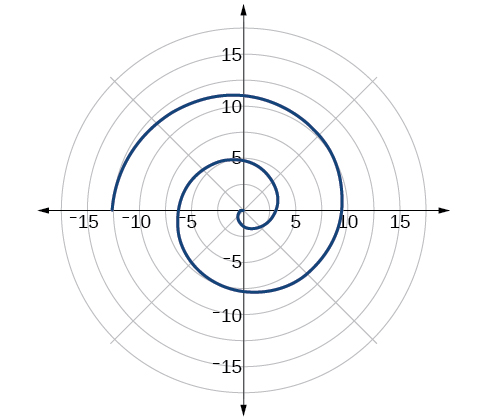 

### Summary of Curves

We have explored a number of seemingly complex polar curves in this section. [\[link\]](#Figure_08_04_023) and [\[link\]](#Figure_08_04_024) summarize the graphs and equations for each of these curves.

{: #Figure_08_04_023}

{: #Figure_08_04_024}

Access these online resources for additional instruction and practice with graphs of polar coordinates.

* [Graphing Polar Equations Part 1][1]
* [Graphing Polar Equations Part 2][2]
* [Animation: The Graphs of Polar Equations][3]
* [Graphing Polar Equations on the TI-84][4]

### Key Concepts

* It is easier to graph polar equations if we can test the equations for symmetry with respect to the line
  <math xmlns="http://www.w3.org/1998/Math/MathML"> <mrow> <mtext> </mtext><mi>θ</mi><mo>=</mo><mfrac> <mi>π</mi> <mn>2</mn> </mfrac> <mo>,</mo><mtext> </mtext> </mrow> </math>
  
  the polar axis, or the pole.
* There are three symmetry tests that indicate whether the graph of a polar equation will exhibit symmetry. If an equation fails a symmetry test, the graph may or may not exhibit symmetry. See [\[link\]](#Example_08_04_01).
* Polar equations may be graphed by making a table of values for
  <math xmlns="http://www.w3.org/1998/Math/MathML"> <mrow> <mtext> </mtext><mi>θ</mi><mtext> </mtext> </mrow> </math>
  
  and
  <math xmlns="http://www.w3.org/1998/Math/MathML"> <mrow> <mtext> </mtext><mi>r</mi><mo>.</mo> </mrow> </math>

* The maximum value of a polar equation is found by substituting the value
  <math xmlns="http://www.w3.org/1998/Math/MathML"> <mrow> <mtext> </mtext><mi>θ</mi><mtext> </mtext> </mrow> </math>
  
  that leads to the maximum value of the trigonometric expression.
* The zeros of a polar equation are found by setting
  <math xmlns="http://www.w3.org/1998/Math/MathML"> <mrow> <mtext> </mtext><mi>r</mi><mo>=</mo><mn>0</mn><mtext> </mtext> </mrow> </math>
  
  and solving for
  <math xmlns="http://www.w3.org/1998/Math/MathML"> <mrow> <mtext> </mtext><mi>θ</mi><mo>.</mo><mtext> </mtext> </mrow> </math>
  
  See [\[link\]](#Example_08_04_02).
* Some formulas that produce the graph of a circle in polar coordinates are given by
  <math xmlns="http://www.w3.org/1998/Math/MathML"> <mrow> <mtext> </mtext><mi>r</mi><mo>=</mo><mi>a</mi><mi>cos</mi><mtext> </mtext><mi>θ</mi><mtext> </mtext> </mrow> </math>
  
  and
  <math xmlns="http://www.w3.org/1998/Math/MathML"> <mrow> <mtext> </mtext><mi>r</mi><mo>=</mo><mi>a</mi><mi>sin</mi><mtext> </mtext><mi>θ</mi><mo>.</mo><mtext> </mtext> </mrow> </math>
  
  See [\[link\]](#Example_08_04_03).
* The formulas that produce the graphs of a cardioid are given by
  <math xmlns="http://www.w3.org/1998/Math/MathML"> <mrow> <mtext> </mtext><mi>r</mi><mo>=</mo><mi>a</mi><mo>±</mo><mi>b</mi><mi>cos</mi><mtext> </mtext><mi>θ</mi><mtext> </mtext> </mrow> </math>
  
  and
  <math xmlns="http://www.w3.org/1998/Math/MathML"> <mrow> <mtext> </mtext><mi>r</mi><mo>=</mo><mi>a</mi><mo>±</mo><mi>b</mi><mi>sin</mi><mtext> </mtext><mi>θ</mi><mo>,</mo><mtext> </mtext> </mrow> </math>
  
  for
  <math xmlns="http://www.w3.org/1998/Math/MathML"> <mrow> <mtext> </mtext><mi>a</mi><mo>&gt;</mo><mn>0</mn><mo>,</mo><mtext> </mtext><mtext> </mtext><mi>b</mi><mo>&gt;</mo><mn>0</mn><mo>,</mo><mtext> </mtext> </mrow> </math>
  
  and
  <math xmlns="http://www.w3.org/1998/Math/MathML"> <mrow> <mtext> </mtext><mfrac> <mi>a</mi> <mi>b</mi> </mfrac> <mo>=</mo><mn>1.</mn><mtext> </mtext> </mrow> </math>
  
  See [\[link\]](#Example_08_04_04).
* The formulas that produce the graphs of a one-loop limaçon are given by
  <math xmlns="http://www.w3.org/1998/Math/MathML"> <mrow> <mtext> </mtext><mi>r</mi><mo>=</mo><mi>a</mi><mo>±</mo><mi>b</mi><mi>cos</mi><mtext> </mtext><mi>θ</mi><mtext> </mtext> </mrow> </math>
  
  and
  <math xmlns="http://www.w3.org/1998/Math/MathML"> <mrow> <mtext> </mtext><mi>r</mi><mo>=</mo><mi>a</mi><mo>±</mo><mi>b</mi><mi>sin</mi><mtext> </mtext><mi>θ</mi><mtext> </mtext> </mrow> </math>
  
  for
  <math xmlns="http://www.w3.org/1998/Math/MathML"> <mrow> <mtext> </mtext><mn>1</mn><mo>&lt;</mo><mfrac> <mi>a</mi> <mi>b</mi> </mfrac> <mo>&lt;</mo><mn>2.</mn><mtext> </mtext> </mrow> </math>
  
  See [\[link\]](#Example_08_04_05).
* The formulas that produce the graphs of an inner-loop limaçon are given by
  <math xmlns="http://www.w3.org/1998/Math/MathML"> <mrow> <mtext> </mtext><mi>r</mi><mo>=</mo><mi>a</mi><mo>±</mo><mi>b</mi><mi>cos</mi><mtext> </mtext><mi>θ</mi><mtext> </mtext> </mrow> </math>
  
  and
  <math xmlns="http://www.w3.org/1998/Math/MathML"> <mrow> <mtext> </mtext><mi>r</mi><mo>=</mo><mi>a</mi><mo>±</mo><mi>b</mi><mi>sin</mi><mtext> </mtext><mi>θ</mi><mtext> </mtext> </mrow> </math>
  
  for
  <math xmlns="http://www.w3.org/1998/Math/MathML"> <mrow> <mtext> </mtext><mi>a</mi><mo>&gt;</mo><mn>0</mn><mo>,</mo><mtext> </mtext><mtext> </mtext><mi>b</mi><mo>&gt;</mo><mn>0</mn><mo>,</mo><mtext> </mtext> </mrow> </math>
  
  and
  <math xmlns="http://www.w3.org/1998/Math/MathML"> <mrow> <mtext> </mtext><mi>a</mi><mo>&lt;</mo><mi>b</mi><mo>.</mo><mtext> </mtext> </mrow> </math>
  
  See [\[link\]](#Example_08_04_06).
* The formulas that produce the graphs of a lemniscates are given by
  <math xmlns="http://www.w3.org/1998/Math/MathML"> <mrow> <mtext> </mtext><msup> <mi>r</mi> <mn>2</mn> </msup> <mo>=</mo><msup> <mi>a</mi> <mn>2</mn> </msup> <mi>cos</mi><mtext> </mtext><mn>2</mn><mi>θ</mi><mtext> </mtext> </mrow> </math>
  
  and
  <math xmlns="http://www.w3.org/1998/Math/MathML"> <mrow> <mtext> </mtext><msup> <mi>r</mi> <mn>2</mn> </msup> <mo>=</mo><msup> <mi>a</mi> <mn>2</mn> </msup> <mi>sin</mi><mtext> </mtext><mn>2</mn><mi>θ</mi><mo>,</mo><mtext> </mtext> </mrow> </math>
  
  where
  <math xmlns="http://www.w3.org/1998/Math/MathML"> <mrow> <mtext> </mtext><mi>a</mi><mo>≠</mo><mn>0.</mn> </mrow> </math>
  
  See [\[link\]](#Example_08_04_07).
* The formulas that produce the graphs of rose curves are given by
  <math xmlns="http://www.w3.org/1998/Math/MathML"> <mrow> <mtext> </mtext><mi>r</mi><mo>=</mo><mi>a</mi><mi>cos</mi><mtext> </mtext><mi>n</mi><mi>θ</mi><mtext> </mtext> </mrow> </math>
  
  and
  <math xmlns="http://www.w3.org/1998/Math/MathML"> <mrow> <mtext> </mtext><mi>r</mi><mo>=</mo><mi>a</mi><mi>sin</mi><mtext> </mtext><mi>n</mi><mi>θ</mi><mo>,</mo><mtext> </mtext> </mrow> </math>
  
  where
  <math xmlns="http://www.w3.org/1998/Math/MathML"> <mrow> <mtext> </mtext><mi>a</mi><mo>≠</mo><mn>0</mn><mo>;</mo><mtext> </mtext> </mrow> </math>
  
  if
  <math xmlns="http://www.w3.org/1998/Math/MathML"> <mrow> <mtext> </mtext><mi>n</mi><mtext> </mtext> </mrow> </math>
  
  is even, there are
  <math xmlns="http://www.w3.org/1998/Math/MathML"> <mrow> <mtext> </mtext><mn>2</mn><mi>n</mi><mtext> </mtext> </mrow> </math>
  
  petals, and if
  <math xmlns="http://www.w3.org/1998/Math/MathML"> <mrow> <mtext> </mtext><mi>n</mi><mtext> </mtext> </mrow> </math>
  
  is odd, there are
  <math xmlns="http://www.w3.org/1998/Math/MathML"> <mrow> <mtext> </mtext><mi>n</mi><mtext> </mtext> </mrow> </math>
  
  petals. See [\[link\]](#Example_08_04_08) and [\[link\]](#Example_08_04_09).
* The formula that produces the graph of an Archimedes’ spiral is given by
  <math xmlns="http://www.w3.org/1998/Math/MathML"> <mrow> <mtext> </mtext><mi>r</mi><mo>=</mo><mi>θ</mi><mo>,</mo><mtext> </mtext><mtext> </mtext><mi>θ</mi><mo>≥</mo><mn>0.</mn><mtext> </mtext> </mrow> </math>
  
  See [\[link\]](#Example_08_04_10).

### Section Exercises

#### Verbal

Describe the three types of symmetry in polar graphs, and compare them to the symmetry of the Cartesian plane.

Symmetry with respect to the polar axis is similar to symmetry about the<math xmlns="http://www.w3.org/1998/Math/MathML"> <mrow> <mtext> </mtext><mi>x</mi> </mrow> </math>

-axis, symmetry with respect to the pole is similar to symmetry about the origin, and symmetric with respect to the line<math xmlns="http://www.w3.org/1998/Math/MathML"> <mrow> <mtext> </mtext><mi>θ</mi><mo>=</mo><mfrac> <mi>π</mi> <mn>2</mn> </mfrac> <mtext> </mtext> </mrow> </math>

is similar to symmetry about the<math xmlns="http://www.w3.org/1998/Math/MathML"> <mrow> <mtext> </mtext><mi>y</mi> </mrow> </math>

-axis.

Which of the three types of symmetries for polar graphs correspond to the symmetries with respect to the *x*-axis, *y*-axis, and origin?

What are the steps to follow when graphing polar equations?

Test for symmetry; find zeros, intercepts, and maxima; make a table of values. Decide the general type of graph, cardioid, limaçon, lemniscate, etc., then plot points at <math xmlns="http://www.w3.org/1998/Math/MathML"> <mrow> <mtext> </mtext><mi>θ</mi><mo>=</mo><mn>0</mn><mo>,</mo><mtext> </mtext><mfrac> <mi>π</mi> <mn>2</mn> </mfrac> <mo>,</mo><mtext> </mtext><mtext> </mtext><mi>π</mi><mtext> </mtext><mtext> </mtext><mtext>and </mtext><mfrac> <mrow> <mn>3</mn><mi>π</mi> </mrow> <mn>2</mn> </mfrac> <mo>,</mo><mtext> </mtext> </mrow> </math>

and sketch the graph.

Describe the shapes of the graphs of cardioids, limaçons, and lemniscates.

What part of the equation determines the shape of the graph of a polar equation?

The shape of the polar graph is determined by whether or not it includes a sine, a cosine, and constants in the equation.

#### Graphical

For the following exercises, test the equation for symmetry.

<math xmlns="http://www.w3.org/1998/Math/MathML"> <mrow> <mi>r</mi><mo>=</mo><mn>5</mn><mi>cos</mi><mtext> </mtext><mn>3</mn><mi>θ</mi> </mrow> </math>

<math xmlns="http://www.w3.org/1998/Math/MathML"> <mrow> <mi>r</mi><mo>=</mo><mn>3</mn><mo>−</mo><mn>3</mn><mi>cos</mi><mtext> </mtext><mi>θ</mi> </mrow> </math>

symmetric with respect to the polar axis

<math xmlns="http://www.w3.org/1998/Math/MathML"> <mrow> <mi>r</mi><mo>=</mo><mn>3</mn><mo>+</mo><mn>2</mn><mi>sin</mi><mtext> </mtext><mi>θ</mi> </mrow> </math>

<math xmlns="http://www.w3.org/1998/Math/MathML"> <mrow> <mi>r</mi><mo>=</mo><mn>3</mn><mi>sin</mi><mtext> </mtext><mn>2</mn><mi>θ</mi> </mrow> </math>

symmetric with respect to the polar axis, symmetric with respect to the line <math xmlns="http://www.w3.org/1998/Math/MathML"> <mrow> <mi>θ</mi><mo>=</mo><mfrac> <mi>π</mi> <mn>2</mn> </mfrac> <mo>,</mo> </mrow> </math>

 symmetric with respect to the pole

<math xmlns="http://www.w3.org/1998/Math/MathML"> <mrow> <mi>r</mi><mo>=</mo><mn>4</mn> </mrow> </math>

<math xmlns="http://www.w3.org/1998/Math/MathML"> <mrow> <mi>r</mi><mo>=</mo><mn>2</mn><mi>θ</mi> </mrow> </math>

no symmetry

<math xmlns="http://www.w3.org/1998/Math/MathML"> <mrow> <mi>r</mi><mo>=</mo><mn>4</mn><mi>cos</mi><mtext> </mtext><mfrac> <mi>θ</mi> <mn>2</mn> </mfrac> </mrow> </math>

<math xmlns="http://www.w3.org/1998/Math/MathML"> <mrow> <mi>r</mi><mo>=</mo><mfrac> <mn>2</mn> <mi>θ</mi> </mfrac> </mrow> </math>

no symmetry

<math xmlns="http://www.w3.org/1998/Math/MathML"> <mrow> <mi>r</mi><mo>=</mo><mn>3</mn><msqrt> <mrow> <mn>1</mn><mo>−</mo><msup> <mrow> <mi>cos</mi> </mrow> <mn>2</mn> </msup> <mi>θ</mi> </mrow> </msqrt> </mrow> </math>

<math xmlns="http://www.w3.org/1998/Math/MathML"> <mrow> <mi>r</mi><mo>=</mo><msqrt> <mrow> <mn>5</mn><mi>sin</mi><mtext> </mtext><mn>2</mn><mi>θ</mi> </mrow> </msqrt> </mrow> </math>

symmetric with respect to the pole

For the following exercises, graph the polar equation. Identify the name of the shape.

<math xmlns="http://www.w3.org/1998/Math/MathML"> <mrow> <mi>r</mi><mo>=</mo><mn>3</mn><mi>cos</mi><mtext> </mtext><mi>θ</mi> </mrow> </math>

<math xmlns="http://www.w3.org/1998/Math/MathML"> <mrow> <mi>r</mi><mo>=</mo><mn>4</mn><mi>sin</mi><mtext> </mtext><mi>θ</mi> </mrow> </math>

circle * * *
{: data-type="newline"}

 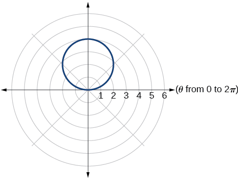 

<math xmlns="http://www.w3.org/1998/Math/MathML"> <mrow> <mi>r</mi><mo>=</mo><mn>2</mn><mo>+</mo><mn>2</mn><mi>cos</mi><mtext> </mtext><mi>θ</mi> </mrow> </math>

<math xmlns="http://www.w3.org/1998/Math/MathML"> <mrow> <mi>r</mi><mo>=</mo><mn>2</mn><mo>−</mo><mn>2</mn><mi>cos</mi><mtext> </mtext><mi>θ</mi> </mrow> </math>

cardioid * * *
{: data-type="newline"}

 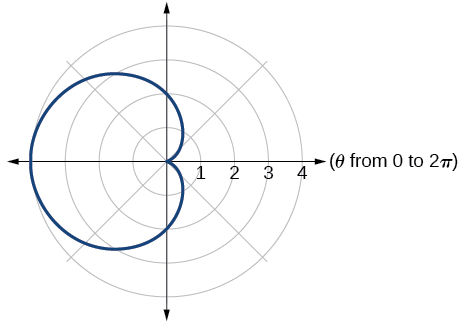 

<math xmlns="http://www.w3.org/1998/Math/MathML"> <mrow> <mi>r</mi><mo>=</mo><mn>5</mn><mo>−</mo><mn>5</mn><mi>sin</mi><mtext> </mtext><mi>θ</mi> </mrow> </math>

<math xmlns="http://www.w3.org/1998/Math/MathML"> <mrow> <mi>r</mi><mo>=</mo><mn>3</mn><mo>+</mo><mn>3</mn><mi>sin</mi><mtext> </mtext><mi>θ</mi> </mrow> </math>

cardioid * * *
{: data-type="newline"}

 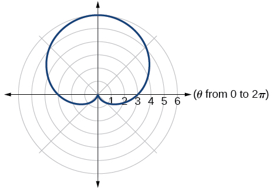 

<math xmlns="http://www.w3.org/1998/Math/MathML"> <mrow> <mi>r</mi><mo>=</mo><mn>3</mn><mo>+</mo><mn>2</mn><mi>sin</mi><mtext> </mtext><mi>θ</mi> </mrow> </math>

<math xmlns="http://www.w3.org/1998/Math/MathML"> <mrow> <mi>r</mi><mo>=</mo><mn>7</mn><mo>+</mo><mn>4</mn><mi>sin</mi><mtext> </mtext><mi>θ</mi> </mrow> </math>

one-loop/dimpled limaçon

 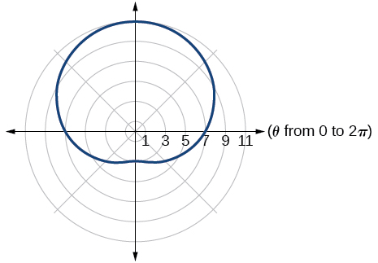 

<math xmlns="http://www.w3.org/1998/Math/MathML"> <mrow> <mi>r</mi><mo>=</mo><mn>4</mn><mo>+</mo><mn>3</mn><mi>cos</mi><mtext> </mtext><mi>θ</mi> </mrow> </math>

<math xmlns="http://www.w3.org/1998/Math/MathML"> <mrow> <mi>r</mi><mo>=</mo><mn>5</mn><mo>+</mo><mn>4</mn><mi>cos</mi><mtext> </mtext><mi>θ</mi> </mrow> </math>

one-loop/dimpled limaçon * * *
{: data-type="newline"}

 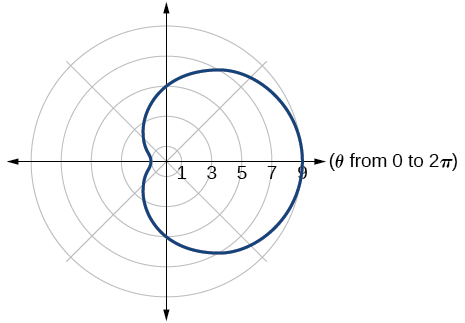 

<math xmlns="http://www.w3.org/1998/Math/MathML"> <mrow> <mi>r</mi><mo>=</mo><mn>10</mn><mo>+</mo><mn>9</mn><mi>cos</mi><mtext> </mtext><mi>θ</mi> </mrow> </math>

<math xmlns="http://www.w3.org/1998/Math/MathML"> <mrow> <mi>r</mi><mo>=</mo><mn>1</mn><mo>+</mo><mn>3</mn><mi>sin</mi><mtext> </mtext><mi>θ</mi> </mrow> </math>

inner loop/two-loop limaçon

 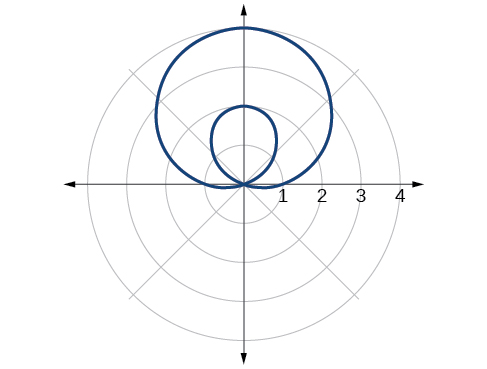 

<math xmlns="http://www.w3.org/1998/Math/MathML"> <mrow> <mi>r</mi><mo>=</mo><mn>2</mn><mo>+</mo><mn>5</mn><mi>sin</mi><mtext> </mtext><mi>θ</mi> </mrow> </math>

<math xmlns="http://www.w3.org/1998/Math/MathML"> <mrow> <mi>r</mi><mo>=</mo><mn>5</mn><mo>+</mo><mn>7</mn><mi>sin</mi><mtext> </mtext><mi>θ</mi> </mrow> </math>

inner loop/two-loop limaçon

 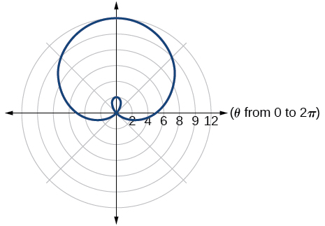 

<math xmlns="http://www.w3.org/1998/Math/MathML"> <mrow> <mi>r</mi><mo>=</mo><mn>2</mn><mo>+</mo><mn>4</mn><mi>cos</mi><mtext> </mtext><mi>θ</mi> </mrow> </math>

<math xmlns="http://www.w3.org/1998/Math/MathML"> <mrow> <mi>r</mi><mo>=</mo><mn>5</mn><mo>+</mo><mn>6</mn><mi>cos</mi><mtext> </mtext><mi>θ</mi> </mrow> </math>

inner loop/two-loop limaçon * * *
{: data-type="newline"}

 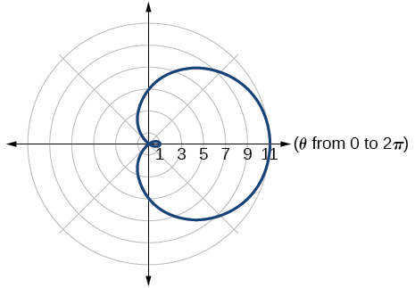 

<math xmlns="http://www.w3.org/1998/Math/MathML"> <mrow> <msup> <mi>r</mi> <mn>2</mn> </msup> <mo>=</mo><mn>36</mn><mi>cos</mi><mrow><mo>(</mo> <mrow> <mn>2</mn><mi>θ</mi> </mrow> <mo>)</mo></mrow> </mrow> </math>

<math xmlns="http://www.w3.org/1998/Math/MathML"> <mrow> <msup> <mi>r</mi> <mn>2</mn> </msup> <mo>=</mo><mn>10</mn><mi>cos</mi><mrow><mo>(</mo> <mrow> <mn>2</mn><mi>θ</mi> </mrow> <mo>)</mo></mrow> </mrow> </math>

lemniscate

 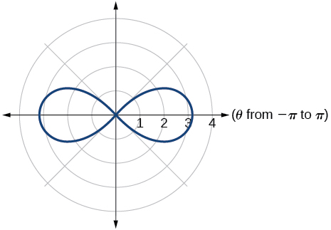 

<math xmlns="http://www.w3.org/1998/Math/MathML"> <mrow> <msup> <mi>r</mi> <mn>2</mn> </msup> <mo>=</mo><mn>4</mn><mi>sin</mi><mrow><mo>(</mo> <mrow> <mn>2</mn><mi>θ</mi> </mrow> <mo>)</mo></mrow> </mrow> </math>

<math xmlns="http://www.w3.org/1998/Math/MathML"> <mrow> <msup> <mi>r</mi> <mn>2</mn> </msup> <mo>=</mo><mn>10</mn><mi>sin</mi><mrow><mo>(</mo> <mrow> <mn>2</mn><mi>θ</mi> </mrow> <mo>)</mo></mrow> </mrow> </math>

lemniscate

 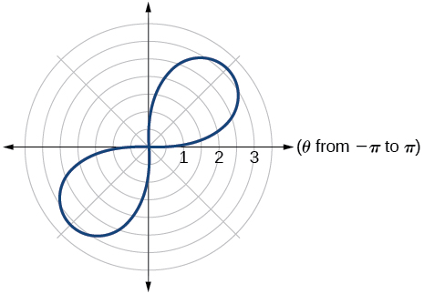 

<math xmlns="http://www.w3.org/1998/Math/MathML"> <mrow> <mi>r</mi><mo>=</mo><mn>3</mn><mtext>sin</mtext><mo stretchy="false">(</mo><mn>2</mn><mi>θ</mi><mo stretchy="false">)</mo> </mrow> </math>

<math xmlns="http://www.w3.org/1998/Math/MathML"> <mrow> <mi>r</mi><mo>=</mo><mn>3</mn><mtext>cos</mtext><mo stretchy="false">(</mo><mn>2</mn><mi>θ</mi><mo stretchy="false">)</mo> </mrow> </math>

rose curve

 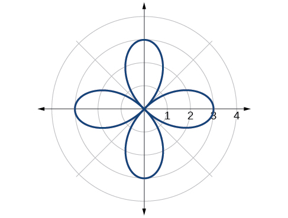 

<math xmlns="http://www.w3.org/1998/Math/MathML"> <mrow> <mi>r</mi><mo>=</mo><mn>5</mn><mtext>sin</mtext><mo stretchy="false">(</mo><mn>3</mn><mi>θ</mi><mo stretchy="false">)</mo> </mrow> </math>

<math xmlns="http://www.w3.org/1998/Math/MathML"> <mrow> <mi>r</mi><mo>=</mo><mn>4</mn><mtext>sin</mtext><mo stretchy="false">(</mo><mn>4</mn><mi>θ</mi><mo stretchy="false">)</mo> </mrow> </math>

rose curve

 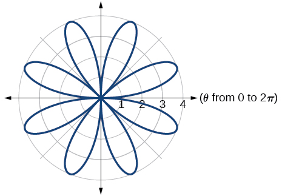 

<math xmlns="http://www.w3.org/1998/Math/MathML"> <mrow> <mi>r</mi><mo>=</mo><mn>4</mn><mtext>sin</mtext><mo stretchy="false">(</mo><mn>5</mn><mi>θ</mi><mo stretchy="false">)</mo> </mrow> </math>

<math xmlns="http://www.w3.org/1998/Math/MathML"> <mrow> <mi>r</mi><mo>=</mo><mi>−</mi><mi>θ</mi> </mrow> </math>

Archimedes’ spiral

 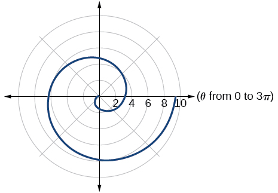 

<math xmlns="http://www.w3.org/1998/Math/MathML"> <mrow> <mi>r</mi><mo>=</mo><mn>2</mn><mi>θ</mi> </mrow> </math>

<math xmlns="http://www.w3.org/1998/Math/MathML"> <mrow> <mi>r</mi><mo>=</mo><mo>−</mo><mn>3</mn><mi>θ</mi> </mrow> </math>

Archimedes’ spiral

 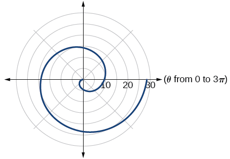 

#### Technology

For the following exercises, use a graphing calculator to sketch the graph of the polar equation.

<math xmlns="http://www.w3.org/1998/Math/MathML"> <mrow> <mi>r</mi><mo>=</mo><mfrac> <mn>1</mn> <mi>θ</mi> </mfrac> </mrow> </math>

<math xmlns="http://www.w3.org/1998/Math/MathML"> <mrow> <mi>r</mi><mo>=</mo><mfrac> <mn>1</mn> <mrow> <msqrt> <mi>θ</mi> </msqrt> </mrow> </mfrac> </mrow> </math>

 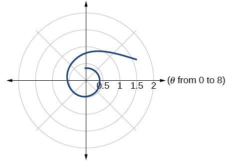 

<math xmlns="http://www.w3.org/1998/Math/MathML"> <mrow> <mi>r</mi><mo>=</mo><mn>2</mn><mi>sin</mi><mtext> </mtext><mi>θ</mi><mi>tan</mi><mtext> </mtext><mi>θ</mi><mo>,</mo> </mrow> </math>

 a cissoid

<math xmlns="http://www.w3.org/1998/Math/MathML"> <mrow> <mi>r</mi><mo>=</mo><mn>2</mn><msqrt> <mrow> <mn>1</mn><mo>−</mo><msup> <mrow> <mi>sin</mi> </mrow> <mn>2</mn> </msup> <mi>θ</mi> </mrow> </msqrt> </mrow> </math>

, a hippopede

 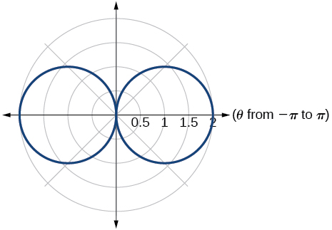 

<math xmlns="http://www.w3.org/1998/Math/MathML"> <mrow> <mi>r</mi><mo>=</mo><mn>5</mn><mo>+</mo><mi>cos</mi><mrow><mo>(</mo> <mrow> <mn>4</mn><mi>θ</mi> </mrow> <mo>)</mo></mrow> </mrow> </math>

<math xmlns="http://www.w3.org/1998/Math/MathML"> <mrow> <mi>r</mi><mo>=</mo><mn>2</mn><mo>−</mo><mi>sin</mi><mrow><mo>(</mo> <mrow> <mn>2</mn><mi>θ</mi> </mrow> <mo>)</mo></mrow> </mrow> </math>

 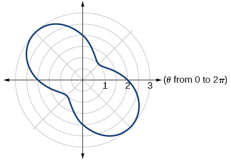 

<math xmlns="http://www.w3.org/1998/Math/MathML"> <mrow> <mi>r</mi><mo>=</mo><msup> <mi>θ</mi> <mn>2</mn> </msup> </mrow> </math>

<math xmlns="http://www.w3.org/1998/Math/MathML"> <mrow> <mi>r</mi><mo>=</mo><mi>θ</mi><mo>+</mo><mn>1</mn> </mrow> </math>

 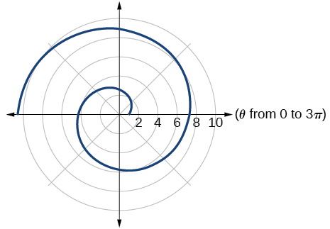 

<math xmlns="http://www.w3.org/1998/Math/MathML"> <mrow> <mi>r</mi><mo>=</mo><mi>θ</mi><mi>sin</mi><mtext> </mtext><mi>θ</mi> </mrow> </math>

<math xmlns="http://www.w3.org/1998/Math/MathML"> <mrow> <mi>r</mi><mo>=</mo><mi>θ</mi><mi>cos</mi><mtext> </mtext><mi>θ</mi> </mrow> </math>

 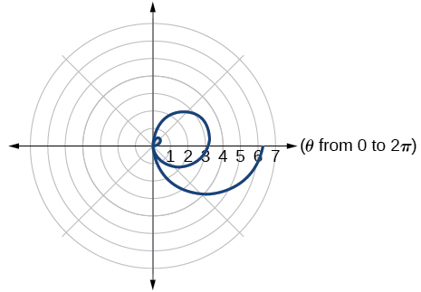 

For the following exercises, use a graphing utility to graph each pair of polar equations on a domain of <math xmlns="http://www.w3.org/1998/Math/MathML"> <mrow> <mtext> </mtext><mrow><mo>[</mo> <mrow> <mn>0</mn><mo>,</mo><mn>4</mn><mi>π</mi> </mrow> <mo>]</mo></mrow><mtext> </mtext> </mrow> </math>

 and then explain the differences shown in the graphs.

<math xmlns="http://www.w3.org/1998/Math/MathML"> <mrow> <mi>r</mi><mo>=</mo><mi>θ</mi><mo>,</mo><mi>r</mi><mo>=</mo><mo>−</mo><mi>θ</mi> </mrow> </math>

<math xmlns="http://www.w3.org/1998/Math/MathML"> <mrow> <mi>r</mi><mo>=</mo><mi>θ</mi><mo>,</mo><mi>r</mi><mo>=</mo><mi>θ</mi><mo>+</mo><mi>sin</mi><mtext> </mtext><mi>θ</mi> </mrow> </math>

They are both spirals, but not quite the same.

<math xmlns="http://www.w3.org/1998/Math/MathML"> <mrow> <mi>r</mi><mo>=</mo><mi>sin</mi><mtext> </mtext><mi>θ</mi><mo>+</mo><mi>θ</mi><mo>,</mo><mi>r</mi><mo>=</mo><mi>sin</mi><mtext> </mtext><mi>θ</mi><mo>−</mo><mi>θ</mi> </mrow> </math>

<math xmlns="http://www.w3.org/1998/Math/MathML"> <mrow> <mi>r</mi><mo>=</mo><mn>2</mn><mi>sin</mi><mrow><mo>(</mo> <mrow> <mfrac> <mi>θ</mi> <mn>2</mn> </mfrac> </mrow> <mo>)</mo></mrow><mo>,</mo><mi>r</mi><mo>=</mo><mi>θ</mi><mi>sin</mi><mrow><mo>(</mo> <mrow> <mfrac> <mi>θ</mi> <mn>2</mn> </mfrac> </mrow> <mo>)</mo></mrow> </mrow> </math>

Both graphs are curves with 2 loops. The equation with a coefficient of<math xmlns="http://www.w3.org/1998/Math/MathML"> <mrow> <mtext> </mtext><mi>θ</mi><mtext> </mtext> </mrow> </math>

 has two loops on the left, the equation with a coefficient of 2 has two loops side by side. Graph these from 0 to<math xmlns="http://www.w3.org/1998/Math/MathML"> <mrow> <mtext> </mtext><mn>4</mn><mi>π</mi><mtext> </mtext> </mrow> </math>

to get a better picture.

<math xmlns="http://www.w3.org/1998/Math/MathML"> <mrow> <mi>r</mi><mo>=</mo><mi>sin</mi><mrow><mo>(</mo> <mrow> <mi>cos</mi><mo stretchy="false">(</mo><mn>3</mn><mi>θ</mi><mo stretchy="false">)</mo> </mrow> <mo>)</mo></mrow><mtext> </mtext><mtext> </mtext><mi>r</mi><mo>=</mo><mi>sin</mi><mo stretchy="false">(</mo><mn>3</mn><mi>θ</mi><mo stretchy="false">)</mo> </mrow> </math>

On a graphing utility, graph<math xmlns="http://www.w3.org/1998/Math/MathML"> <mrow> <mtext> </mtext><mi>r</mi><mo>=</mo><mi>sin</mi><mrow><mo>(</mo> <mrow> <mfrac> <mrow> <mn>16</mn> </mrow> <mn>5</mn> </mfrac> <mi>θ</mi> </mrow> <mo>)</mo></mrow><mtext> </mtext> </mrow> </math>

on<math xmlns="http://www.w3.org/1998/Math/MathML"> <mrow> <mtext> </mtext><mrow><mo>[</mo> <mrow> <mn>0</mn><mo>,</mo><mn>4</mn><mi>π</mi> </mrow> <mo>]</mo></mrow><mo>,</mo><mrow><mo>[</mo> <mrow> <mn>0</mn><mo>,</mo><mn>8</mn><mi>π</mi> </mrow> <mo>]</mo></mrow><mo>,</mo><mrow><mo>[</mo> <mrow> <mn>0</mn><mo>,</mo><mn>12</mn><mi>π</mi> </mrow> <mo>]</mo></mrow><mo>,</mo><mtext> </mtext> </mrow> </math>

and<math xmlns="http://www.w3.org/1998/Math/MathML"> <mrow> <mtext> </mtext><mrow><mo>[</mo> <mrow> <mn>0</mn><mo>,</mo><mn>16</mn><mi>π</mi> </mrow> <mo>]</mo></mrow><mo>.</mo><mtext> </mtext> </mrow> </math>

Describe the effect of increasing the width of the domain.

When the width of the domain is increased, more petals of the flower are visible.

On a graphing utility, graph and sketch<math xmlns="http://www.w3.org/1998/Math/MathML"> <mrow> <mtext> </mtext><mi>r</mi><mo>=</mo><mi>sin</mi><mtext> </mtext><mi>θ</mi><mo>+</mo><msup> <mrow> <mrow><mo>(</mo> <mrow> <mi>sin</mi><mrow><mo>(</mo> <mrow> <mfrac> <mn>5</mn> <mn>2</mn> </mfrac> <mi>θ</mi> </mrow> <mo>)</mo></mrow> </mrow> <mo>)</mo></mrow> </mrow> <mn>3</mn> </msup> <mtext> </mtext> </mrow> </math>

on<math xmlns="http://www.w3.org/1998/Math/MathML"> <mrow> <mtext> </mtext><mrow><mo>[</mo> <mrow> <mn>0</mn><mo>,</mo><mn>4</mn><mi>π</mi> </mrow> <mo>]</mo></mrow><mo>.</mo> </mrow> </math>

On a graphing utility, graph each polar equation. Explain the similarities and differences you observe in the graphs.

<math xmlns="http://www.w3.org/1998/Math/MathML"> <mrow> <mtable columnalign="left"> <mtr columnalign="left"> <mtd columnalign="left"> <mtable columnalign="left"> <mtr> <mtd> <mrow /> </mtd> </mtr> <mtr> <mtd> <msub> <mi>r</mi> <mn>1</mn> </msub> <mo>=</mo><mn>3</mn><mi>sin</mi><mo stretchy="false">(</mo><mn>3</mn><mi>θ</mi><mo stretchy="false">)</mo> </mtd> </mtr> </mtable> </mtd> </mtr> <mtr columnalign="left"> <mtd columnalign="left"> <mrow> <msub> <mi>r</mi> <mn>2</mn> </msub> <mo>=</mo><mn>2</mn><mi>sin</mi><mo stretchy="false">(</mo><mn>3</mn><mi>θ</mi><mo stretchy="false">)</mo> </mrow> </mtd> </mtr> <mtr columnalign="left"> <mtd columnalign="left"> <mrow> <msub> <mi>r</mi> <mn>3</mn> </msub> <mo>=</mo><mi>sin</mi><mo stretchy="false">(</mo><mn>3</mn><mi>θ</mi><mo stretchy="false">)</mo> </mrow> </mtd> </mtr> </mtable> </mrow> </math>

The graphs are three-petal, rose curves. The larger the coefficient, the greater the curve’s distance from the pole.

On a graphing utility, graph each polar equation. Explain the similarities and differences you observe in the graphs.

<math xmlns="http://www.w3.org/1998/Math/MathML"> <mrow> <mtable columnalign="left"> <mtr columnalign="left"> <mtd columnalign="left"> <mtable columnalign="left"> <mtr> <mtd> <mrow /> </mtd> </mtr> <mtr> <mtd> <msub> <mi>r</mi> <mn>1</mn> </msub> <mo>=</mo><mn>3</mn><mo>+</mo><mn>3</mn><mi>cos</mi><mtext> </mtext><mi>θ</mi> </mtd> </mtr> </mtable> </mtd> </mtr> <mtr columnalign="left"> <mtd columnalign="left"> <mrow> <msub> <mi>r</mi> <mn>2</mn> </msub> <mo>=</mo><mn>2</mn><mo>+</mo><mn>2</mn><mi>cos</mi><mtext> </mtext><mi>θ</mi> </mrow> </mtd> </mtr> <mtr columnalign="left"> <mtd columnalign="left"> <mrow> <msub> <mi>r</mi> <mn>3</mn> </msub> <mo>=</mo><mn>1</mn><mo>+</mo><mi>cos</mi><mtext> </mtext><mi>θ</mi> </mrow> </mtd> </mtr> </mtable> </mrow> </math>

On a graphing utility, graph each polar equation. Explain the similarities and differences you observe in the graphs.

<math xmlns="http://www.w3.org/1998/Math/MathML"> <mrow> <mtable columnalign="left"> <mtr columnalign="left"> <mtd columnalign="left"> <mtable columnalign="left"> <mtr> <mtd> <mrow /> </mtd> </mtr> <mtr> <mtd> <msub> <mi>r</mi> <mn>1</mn> </msub> <mo>=</mo><mn>3</mn><mi>θ</mi> </mtd> </mtr> </mtable> </mtd> </mtr> <mtr columnalign="left"> <mtd columnalign="left"> <mrow> <msub> <mi>r</mi> <mn>2</mn> </msub> <mo>=</mo><mn>2</mn><mi>θ</mi> </mrow> </mtd> </mtr> <mtr columnalign="left"> <mtd columnalign="left"> <mrow> <msub> <mi>r</mi> <mn>3</mn> </msub> <mo>=</mo><mi>θ</mi> </mrow> </mtd> </mtr> </mtable> </mrow> </math>

The graphs are spirals. The smaller the coefficient, the tighter the spiral.

#### Extensions

For the following exercises, draw each polar equation on the same set of polar axes, and find the points of intersection.

<math xmlns="http://www.w3.org/1998/Math/MathML"> <mrow> <msub> <mi>r</mi> <mn>1</mn> </msub> <mo>=</mo><mn>3</mn><mo>+</mo><mn>2</mn><mi>sin</mi><mtext> </mtext><mi>θ</mi><mo>,</mo><mtext> </mtext><msub> <mi>r</mi> <mn>2</mn> </msub> <mo>=</mo><mn>2</mn> </mrow> </math>

<math xmlns="http://www.w3.org/1998/Math/MathML"> <mrow> <msub> <mi>r</mi> <mn>1</mn> </msub> <mo>=</mo><mn>6</mn><mo>−</mo><mn>4</mn><mi>cos</mi><mtext> </mtext><mi>θ</mi><mo>,</mo><mtext> </mtext><msub> <mi>r</mi> <mn>2</mn> </msub> <mo>=</mo><mn>4</mn> </mrow> </math>

<math xmlns="http://www.w3.org/1998/Math/MathML"> <mrow> <mrow><mo>(</mo> <mrow> <mn>4</mn><mo>,</mo><mfrac> <mi>π</mi> <mn>3</mn> </mfrac> </mrow> <mo>)</mo></mrow><mo>,</mo><mrow><mo>(</mo> <mrow> <mn>4</mn><mo>,</mo><mfrac> <mrow> <mn>5</mn><mi>π</mi> </mrow> <mn>3</mn> </mfrac> </mrow> <mo>)</mo></mrow> </mrow> </math>

<math xmlns="http://www.w3.org/1998/Math/MathML"> <mrow> <msub> <mi>r</mi> <mn>1</mn> </msub> <mo>=</mo><mn>1</mn><mo>+</mo><mi>sin</mi><mtext> </mtext><mi>θ</mi><mo>,</mo><mtext> </mtext><msub> <mi>r</mi> <mn>2</mn> </msub> <mo>=</mo><mn>3</mn><mi>sin</mi><mtext> </mtext><mi>θ</mi> </mrow> </math>

<math xmlns="http://www.w3.org/1998/Math/MathML"> <mrow> <msub> <mi>r</mi> <mn>1</mn> </msub> <mo>=</mo><mn>1</mn><mo>+</mo><mi>cos</mi><mtext> </mtext><mi>θ</mi><mo>,</mo><mtext> </mtext><msub> <mi>r</mi> <mn>2</mn> </msub> <mo>=</mo><mn>3</mn><mi>cos</mi><mtext> </mtext><mi>θ</mi> </mrow> </math>

<math xmlns="http://www.w3.org/1998/Math/MathML"> <mrow> <mrow><mo>(</mo> <mrow> <mfrac> <mn>3</mn> <mn>2</mn> </mfrac> <mo>,</mo><mfrac> <mi>π</mi> <mn>3</mn> </mfrac> </mrow> <mo>)</mo></mrow><mo>,</mo><mrow><mo>(</mo> <mrow> <mfrac> <mn>3</mn> <mn>2</mn> </mfrac> <mo>,</mo><mfrac> <mrow> <mn>5</mn><mi>π</mi> </mrow> <mn>3</mn> </mfrac> </mrow> <mo>)</mo></mrow> </mrow> </math>

<math xmlns="http://www.w3.org/1998/Math/MathML"> <mrow> <msub> <mi>r</mi> <mn>1</mn> </msub> <mo>=</mo><mi>cos</mi><mrow><mo>(</mo> <mrow> <mn>2</mn><mi>θ</mi> </mrow> <mo>)</mo></mrow><mo>,</mo><mtext> </mtext><msub> <mi>r</mi> <mn>2</mn> </msub> <mo>=</mo><mi>sin</mi><mrow><mo>(</mo> <mrow> <mn>2</mn><mi>θ</mi> </mrow> <mo>)</mo></mrow> </mrow> </math>

<math xmlns="http://www.w3.org/1998/Math/MathML"> <mrow> <msub> <mi>r</mi> <mn>1</mn> </msub> <mo>=</mo><msup> <mrow> <mi>sin</mi> </mrow> <mn>2</mn> </msup> <mrow><mo>(</mo> <mrow> <mn>2</mn><mi>θ</mi> </mrow> <mo>)</mo></mrow><mo>,</mo><mtext> </mtext><msub> <mi>r</mi> <mn>2</mn> </msub> <mo>=</mo><mn>1</mn><mo>−</mo><mi>cos</mi><mrow><mo>(</mo> <mrow> <mn>4</mn><mi>θ</mi> </mrow> <mo>)</mo></mrow> </mrow> </math>

<math xmlns="http://www.w3.org/1998/Math/MathML"> <mrow> <mrow><mo>(</mo> <mrow> <mn>0</mn><mo>,</mo><mfrac> <mi>π</mi> <mn>2</mn> </mfrac> </mrow> <mo>)</mo></mrow><mo>,</mo><mtext> </mtext><mrow><mo>(</mo> <mrow> <mn>0</mn><mo>,</mo><mi>π</mi> </mrow> <mo>)</mo></mrow><mo>,</mo><mtext> </mtext><mrow><mo>(</mo> <mrow> <mn>0</mn><mo>,</mo><mfrac> <mrow> <mn>3</mn><mi>π</mi> </mrow> <mn>2</mn> </mfrac> </mrow> <mo>)</mo></mrow><mo>,</mo><mtext> </mtext><mrow><mo>(</mo> <mrow> <mn>0</mn><mo>,</mo><mn>2</mn><mi>π</mi> </mrow> <mo>)</mo></mrow> </mrow> </math>

<math xmlns="http://www.w3.org/1998/Math/MathML"> <mrow> <msub> <mi>r</mi> <mn>1</mn> </msub> <mo>=</mo><msqrt> <mn>3</mn> </msqrt> <mo>,</mo><mtext> </mtext><msub> <mi>r</mi> <mn>2</mn> </msub> <mo>=</mo><mn>2</mn><mi>sin</mi><mrow><mo>(</mo> <mi>θ</mi> <mo>)</mo></mrow> </mrow> </math>

<math xmlns="http://www.w3.org/1998/Math/MathML"> <mrow> <msub> <mi>r</mi> <mn>1</mn> </msub> <msup> <mrow /> <mn>2</mn> </msup> <mo>=</mo><mi>sin</mi><mtext> </mtext><mi>θ</mi><mo>,</mo><msub> <mi>r</mi> <mn>2</mn> </msub> <msup> <mrow /> <mn>2</mn> </msup> <mo>=</mo><mi>cos</mi><mtext> </mtext><mi>θ</mi> </mrow> </math>

<math xmlns="http://www.w3.org/1998/Math/MathML"> <mrow> <mrow><mo>(</mo> <mrow> <mfrac> <mrow> <mroot> <mn>8</mn> <mn>4</mn> </mroot> </mrow> <mn>2</mn> </mfrac> <mo>,</mo><mfrac> <mi>π</mi> <mn>4</mn> </mfrac> </mrow> <mo>)</mo></mrow><mo>,</mo><mtext> </mtext><mrow><mo>(</mo> <mrow> <mfrac> <mrow> <mroot> <mn>8</mn> <mn>4</mn> </mroot> </mrow> <mn>2</mn> </mfrac> <mo>,</mo><mfrac> <mrow> <mn>5</mn><mi>π</mi> </mrow> <mn>4</mn> </mfrac> </mrow> <mo>)</mo></mrow><mtext> </mtext> </mrow> </math>

 and at<math xmlns="http://www.w3.org/1998/Math/MathML"> <mrow> <mtext> </mtext><mi>θ</mi><mo>=</mo><mfrac> <mrow> <mn>3</mn><mi>π</mi> </mrow> <mn>4</mn> </mfrac> <mo>,</mo><mtext> </mtext><mtext> </mtext><mfrac> <mrow> <mn>7</mn><mi>π</mi> </mrow> <mn>4</mn> </mfrac> <mtext> </mtext><mtext> </mtext> </mrow> </math>

 since<math xmlns="http://www.w3.org/1998/Math/MathML"> <mrow> <mtext> </mtext><mi>r</mi><mtext> </mtext> </mrow> </math>

is squared

<math xmlns="http://www.w3.org/1998/Math/MathML"> <mrow> <msub> <mi>r</mi> <mn>1</mn> </msub> <mo>=</mo><mn>1</mn><mo>+</mo><mi>cos</mi><mtext> </mtext><mi>θ</mi><mo>,</mo><mtext> </mtext><msub> <mi>r</mi> <mn>2</mn> </msub> <mo>=</mo><mn>1</mn><mo>−</mo><mi>sin</mi><mtext> </mtext><mi>θ</mi> </mrow> </math>

### Glossary
{: data-type="glossary-title"}

Archimedes’ spiral
: a polar curve given by
  <math xmlns="http://www.w3.org/1998/Math/MathML"> <mrow> <mtext> </mtext><mi>r</mi><mo>=</mo><mi>θ</mi><mo>.</mo><mtext> </mtext> </mrow> </math>
  
  When multiplied by a constant, the equation appears as
  <math xmlns="http://www.w3.org/1998/Math/MathML"> <mrow> <mtext> </mtext><mi>r</mi><mo>=</mo><mi>a</mi><mi>θ</mi><mo>.</mo><mtext> </mtext> </mrow> </math>
  
  As
  <math xmlns="http://www.w3.org/1998/Math/MathML"> <mrow> <mtext> </mtext><mi>r</mi><mo>=</mo><mi>θ</mi><mo>,</mo><mtext> </mtext> </mrow> </math>
  
  the curve continues to widen in a spiral path over the domain.
^

cardioid
: a member of the limaçon family of curves, named for its resemblance to a heart; its equation is given as
  <math xmlns="http://www.w3.org/1998/Math/MathML"> <mrow> <mtext> </mtext><mi>r</mi><mo>=</mo><mi>a</mi><mo>±</mo><mi>b</mi><mi>cos</mi><mtext> </mtext><mi>θ</mi><mtext> </mtext> </mrow> </math>
  
  and
  <math xmlns="http://www.w3.org/1998/Math/MathML"> <mrow> <mtext> </mtext><mi>r</mi><mo>=</mo><mi>a</mi><mo>±</mo><mi>b</mi><mi>sin</mi><mtext> </mtext><mi>θ</mi><mo>,</mo><mtext> </mtext> </mrow> </math>
  
  where
  <math xmlns="http://www.w3.org/1998/Math/MathML"> <mrow> <mtext> </mtext><mfrac> <mi>a</mi> <mi>b</mi> </mfrac> <mo>=</mo><mn>1</mn> </mrow> </math>
^

convex limaҫon
: a type of one-loop limaçon represented by
  <math xmlns="http://www.w3.org/1998/Math/MathML"> <mrow> <mtext> </mtext><mi>r</mi><mo>=</mo><mi>a</mi><mo>±</mo><mi>b</mi><mi>cos</mi><mtext> </mtext><mi>θ</mi><mtext> </mtext> </mrow> </math>
  
  and
  <math xmlns="http://www.w3.org/1998/Math/MathML"> <mrow> <mtext> </mtext><mi>r</mi><mo>=</mo><mi>a</mi><mo>±</mo><mi>b</mi><mi>sin</mi><mtext> </mtext><mi>θ</mi><mtext> </mtext> </mrow> </math>
  
  such that
  <math xmlns="http://www.w3.org/1998/Math/MathML"> <mrow> <mtext> </mtext><mfrac> <mi>a</mi> <mi>b</mi> </mfrac> <mo>≥</mo><mn>2</mn> </mrow> </math>
^

dimpled limaҫon
: a type of one-loop limaçon represented by
  <math xmlns="http://www.w3.org/1998/Math/MathML"> <mrow> <mtext> </mtext><mi>r</mi><mo>=</mo><mi>a</mi><mo>±</mo><mi>b</mi><mi>cos</mi><mtext> </mtext><mi>θ</mi><mtext> </mtext> </mrow> </math>
  
  and
  <math xmlns="http://www.w3.org/1998/Math/MathML"> <mrow> <mtext> </mtext><mi>r</mi><mo>=</mo><mi>a</mi><mo>±</mo><mi>b</mi><mi>sin</mi><mtext> </mtext><mi>θ</mi><mtext> </mtext> </mrow> </math>
  
  such that
  <math xmlns="http://www.w3.org/1998/Math/MathML"> <mrow> <mtext> </mtext><mn>1</mn><mo>&lt;</mo><mfrac> <mi>a</mi> <mi>b</mi> </mfrac> <mo>&lt;</mo><mn>2</mn> </mrow> </math>
^

inner-loop limaçon
: a polar curve similar to the cardioid, but with an inner loop; passes through the pole twice; represented by
  <math xmlns="http://www.w3.org/1998/Math/MathML"> <mrow> <mtext> </mtext><mi>r</mi><mo>=</mo><mi>a</mi><mo>±</mo><mi>b</mi><mi>cos</mi><mtext> </mtext><mi>θ</mi><mtext> </mtext> </mrow> </math>
  
  and
  <math xmlns="http://www.w3.org/1998/Math/MathML"> <mrow> <mtext> </mtext><mi>r</mi><mo>=</mo><mi>a</mi><mo>±</mo><mi>b</mi><mi> </mi><mi>sin</mi><mtext> </mtext><mi>θ</mi><mtext> </mtext> </mrow> </math>
  
  where
  <math xmlns="http://www.w3.org/1998/Math/MathML"> <mrow> <mtext> </mtext><mi>a</mi><mo>&lt;</mo><mi>b</mi> </mrow> </math>
^

lemniscate
: a polar curve resembling a figure 8 and given by the equation
  <math xmlns="http://www.w3.org/1998/Math/MathML"> <mrow> <mtext> </mtext><msup> <mi>r</mi> <mn>2</mn> </msup> <mo>=</mo><msup> <mi>a</mi> <mn>2</mn> </msup> <mi>cos</mi><mtext> </mtext><mn>2</mn><mi>θ</mi><mtext> </mtext> </mrow> </math>
  
  and
  <math xmlns="http://www.w3.org/1998/Math/MathML"> <mrow> <mtext> </mtext><msup> <mi>r</mi> <mn>2</mn> </msup> <mo>=</mo><msup> <mi>a</mi> <mn>2</mn> </msup> <mi>sin</mi><mtext> </mtext><mn>2</mn><mi>θ</mi><mo>,</mo><mtext> </mtext><mtext> </mtext><mi>a</mi><mo>≠</mo><mn>0</mn> </mrow> </math>
^

one-loop limaҫon
: a polar curve represented by
  <math xmlns="http://www.w3.org/1998/Math/MathML"> <mrow> <mtext> </mtext><mi>r</mi><mo>=</mo><mi>a</mi><mo>±</mo><mi>b</mi><mi>cos</mi><mtext> </mtext><mi>θ</mi><mtext> </mtext> </mrow> </math>
  
  and
  <math xmlns="http://www.w3.org/1998/Math/MathML"> <mrow> <mtext> </mtext><mi>r</mi><mo>=</mo><mi>a</mi><mo>±</mo><mi>b</mi><mi>sin</mi><mtext> </mtext><mi>θ</mi><mtext> </mtext> </mrow> </math>
  
  such that
  <math xmlns="http://www.w3.org/1998/Math/MathML"> <mrow> <mi>a</mi><mo>&gt;</mo><mn>0</mn><mo>,</mo><mi>b</mi><mo>&gt;</mo><mn>0</mn><mo>,</mo> </mrow> </math>
  
  and
  <math xmlns="http://www.w3.org/1998/Math/MathML"> <mrow> <mtext> </mtext><mfrac> <mi>a</mi> <mi>b</mi> </mfrac> <mo>&gt;</mo><mn>1</mn><mo>;</mo> </mrow> </math>
  
  may be dimpled or convex; does not pass through the pole
^

polar equation
: an equation describing a curve on the polar grid.
^

rose curve
: a polar equation resembling a flower, given by the equations
  <math xmlns="http://www.w3.org/1998/Math/MathML"> <mrow> <mtext> </mtext><mi>r</mi><mo>=</mo><mi>a</mi><mi>cos</mi><mtext> </mtext><mi>n</mi><mi>θ</mi><mtext> </mtext> </mrow> </math>
  
  and
  <math xmlns="http://www.w3.org/1998/Math/MathML"> <mrow> <mtext> </mtext><mi>r</mi><mo>=</mo><mi>a</mi><mi>sin</mi><mtext> </mtext><mi>n</mi><mi>θ</mi><mo>;</mo><mtext> </mtext> </mrow> </math>
  
  when
  <math xmlns="http://www.w3.org/1998/Math/MathML"> <mrow> <mtext> </mtext><mi>n</mi><mtext> </mtext> </mrow> </math>
  
  is even there are
  <math xmlns="http://www.w3.org/1998/Math/MathML"> <mrow> <mtext> </mtext><mn>2</mn><mi>n</mi><mtext> </mtext> </mrow> </math>
  
  petals, and the curve is highly symmetrical; when
  <math xmlns="http://www.w3.org/1998/Math/MathML"> <mrow> <mtext> </mtext><mi>n</mi><mtext> </mtext> </mrow> </math>
  
  is odd there are
  <math xmlns="http://www.w3.org/1998/Math/MathML"> <mrow> <mi>n</mi> </mrow> </math>
  
  petals.

[1]: http://openstaxcollege.org/l/polargraph1
[2]: http://openstaxcollege.org/l/polargraph2
[3]: http://openstaxcollege.org/l/polaranim
[4]: http://openstaxcollege.org/l/polarTI84
