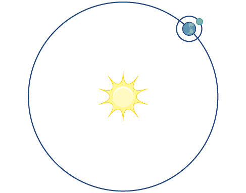
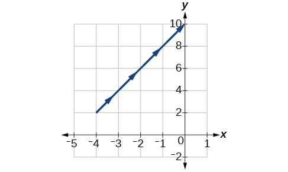
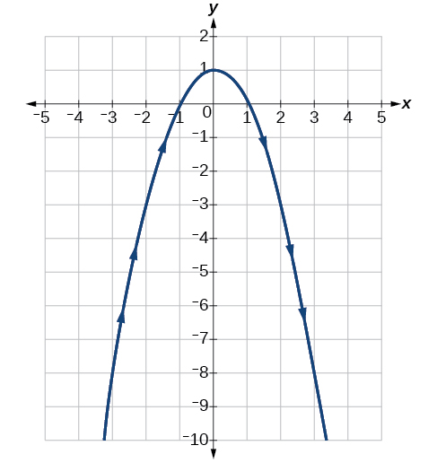
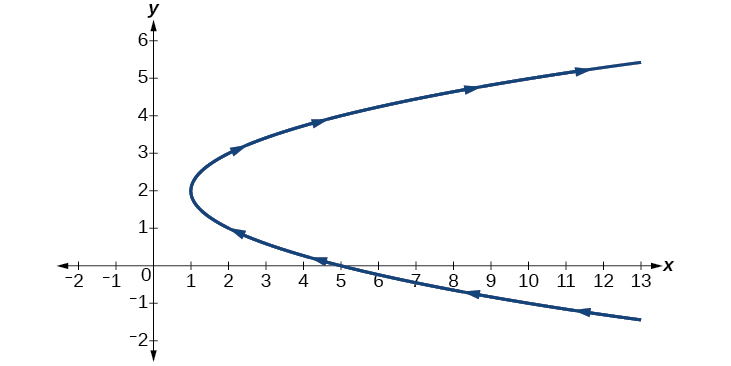
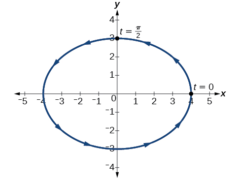
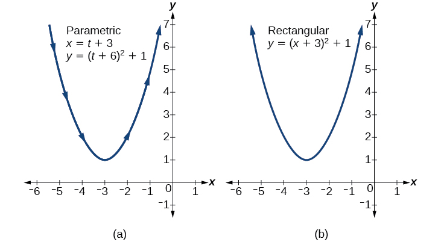

In this section, you will:
* Parameterize a curve.
* Eliminate the parameter.
* Find a rectangular equation for a curve defined parametrically.
* Find parametric equations for curves defined by rectangular equations.

Consider the path a moon follows as it orbits a planet, which simultaneously rotates around the sun, as seen in [\[link\]](#Figure_08_06_001). At any moment, the moon is located at a particular spot relative to the planet. But how do we write and solve the equation for the position of the moon when the distance from the planet, the speed of the moon’s orbit around the planet, and the speed of rotation around the sun are all unknowns? We can solve only for one variable at a time.

{: #Figure_08_06_001}

In this section, we will consider sets of equations given by <math xmlns="http://www.w3.org/1998/Math/MathML"> <mrow> <mtext> </mtext><mi>x</mi><mrow><mo>(</mo> <mi>t</mi> <mo>)</mo></mrow><mtext> </mtext></mrow> </math>

 and <math xmlns="http://www.w3.org/1998/Math/MathML"> <mrow> <mtext> </mtext><mi>y</mi><mrow><mo>(</mo> <mi>t</mi> <mo>)</mo></mrow><mtext> </mtext></mrow> </math>

 where <math xmlns="http://www.w3.org/1998/Math/MathML"> <mrow> <mi>t</mi></mrow> </math>

 is the independent variable of time. We can use these parametric equations in a number of applications when we are looking for not only a particular position but also the direction of the movement. As we trace out successive values of<math xmlns="http://www.w3.org/1998/Math/MathML"> <mrow> <mtext> </mtext><mi>t</mi><mo>,</mo><mtext> </mtext></mrow> </math>

the orientation of the curve becomes clear. This is one of the primary advantages of using **parametric equations**{: data-type="term" .no-emphasis}\: we are able to trace the movement of an object along a path according to time. We begin this section with a look at the basic components of parametric equations and what it means to parameterize a curve. Then we will learn how to eliminate the parameter, translate the equations of a curve defined parametrically into rectangular equations, and find the parametric equations for curves defined by rectangular equations.

### Parameterizing a Curve

When an object moves along a curve—or **curvilinear path**{: data-type="term" .no-emphasis}—in a given direction and in a given amount of time, the position of the object in the plane is given by the *x-*coordinate and the *y-*coordinate. However, both<math xmlns="http://www.w3.org/1998/Math/MathML"> <mrow> <mtext> </mtext><mi>x</mi><mtext> </mtext></mrow> </math>

and<math xmlns="http://www.w3.org/1998/Math/MathML"> <mrow> <mtext> </mtext><mi>y</mi><mtext> </mtext></mrow> </math>

 vary over time and so are functions of time. For this reason, we add another variable, the **parameter**{: data-type="term"}, upon which both<math xmlns="http://www.w3.org/1998/Math/MathML"> <mrow> <mtext> </mtext><mi>x</mi><mtext> </mtext></mrow> </math>

and<math xmlns="http://www.w3.org/1998/Math/MathML"> <mrow> <mtext> </mtext><mi>y</mi><mtext> </mtext></mrow> </math>

are dependent functions. In the example in the section opener, the parameter is time,<math xmlns="http://www.w3.org/1998/Math/MathML"> <mrow> <mtext> </mtext><mi>t</mi><mo>.</mo><mtext> </mtext></mrow> </math>

The<math xmlns="http://www.w3.org/1998/Math/MathML"> <mrow> <mtext> </mtext><mi>x</mi><mtext> </mtext></mrow> </math>

position of the moon at time,<math xmlns="http://www.w3.org/1998/Math/MathML"> <mrow> <mtext> </mtext><mi>t</mi><mo>,</mo><mtext> </mtext></mrow> </math>

is represented as the function<math xmlns="http://www.w3.org/1998/Math/MathML"> <mrow> <mtext> </mtext><mi>x</mi><mo stretchy="false">(</mo><mi>t</mi><mo stretchy="false">)</mo><mo>,</mo><mtext> </mtext></mrow> </math>

and the<math xmlns="http://www.w3.org/1998/Math/MathML"> <mrow> <mtext> </mtext><mi>y</mi><mtext> </mtext></mrow> </math>

position of the moon at time,<math xmlns="http://www.w3.org/1998/Math/MathML"> <mrow> <mtext> </mtext><mi>t</mi><mo>,</mo><mtext> </mtext></mrow> </math>

is represented as the function<math xmlns="http://www.w3.org/1998/Math/MathML"> <mrow> <mtext> </mtext><mi>y</mi><mo stretchy="false">(</mo><mi>t</mi><mo stretchy="false">)</mo><mo>.</mo><mtext> </mtext></mrow> </math>

Together,<math xmlns="http://www.w3.org/1998/Math/MathML"> <mrow> <mtext> </mtext><mi>x</mi><mo stretchy="false">(</mo><mi>t</mi><mo stretchy="false">)</mo><mtext> </mtext></mrow> </math>

 and <math xmlns="http://www.w3.org/1998/Math/MathML"> <mrow> <mtext> </mtext><mi>y</mi><mo stretchy="false">(</mo><mi>t</mi><mo stretchy="false">)</mo><mtext> </mtext></mrow> </math>

 are called parametric equations, and generate an ordered pair<math xmlns="http://www.w3.org/1998/Math/MathML"> <mrow> <mtext> </mtext><mrow><mo>(</mo> <mrow> <mi>x</mi><mo stretchy="false">(</mo><mi>t</mi><mo stretchy="false">)</mo><mo>,</mo><mtext> </mtext><mi>y</mi><mo stretchy="false">(</mo><mi>t</mi><mo stretchy="false">)</mo> </mrow> <mo>)</mo></mrow><mo>.</mo><mtext> </mtext> </mrow> </math>

Parametric equations primarily describe motion and direction.

When we parameterize a curve, we are translating a single equation in two variables, such as<math xmlns="http://www.w3.org/1998/Math/MathML"> <mrow> <mtext> </mtext><mi>x</mi><mtext> </mtext></mrow> </math>

and<math xmlns="http://www.w3.org/1998/Math/MathML"> <mrow> <mtext> </mtext><mi>y</mi><mo> ,</mo></mrow> </math>

into an equivalent pair of equations in three variables,<math xmlns="http://www.w3.org/1998/Math/MathML"> <mrow> <mtext> </mtext><mi>x</mi><mo>,</mo><mi>y</mi><mo>,</mo><mtext> </mtext></mrow> </math>

and<math xmlns="http://www.w3.org/1998/Math/MathML"> <mrow> <mtext> </mtext><mi>t</mi><mo>.</mo><mtext> </mtext></mrow> </math>

One of the reasons we parameterize a curve is because the parametric equations yield more information: specifically, the direction of the object’s motion over time.

When we graph parametric equations, we can observe the individual behaviors of<math xmlns="http://www.w3.org/1998/Math/MathML"> <mrow> <mtext> </mtext><mi>x</mi><mtext> </mtext></mrow> </math>

and of<math xmlns="http://www.w3.org/1998/Math/MathML"> <mrow> <mtext> </mtext><mi>y</mi><mo>.</mo><mtext> </mtext></mrow> </math>

There are a number of shapes that cannot be represented in the form<math xmlns="http://www.w3.org/1998/Math/MathML"> <mrow> <mtext> </mtext><mi>y</mi><mo>=</mo><mi>f</mi><mo stretchy="false">(</mo><mi>x</mi><mo stretchy="false">)</mo><mo>,</mo><mtext> </mtext></mrow> </math>

meaning that they are not functions. For example, consider the graph of a circle, given as<math xmlns="http://www.w3.org/1998/Math/MathML"> <mrow> <mtext> </mtext><msup> <mi>r</mi> <mn>2</mn> </msup> <mo>=</mo><msup> <mi>x</mi> <mn>2</mn> </msup> <mo>+</mo><msup> <mi>y</mi> <mn>2</mn> </msup> <mo>.</mo><mtext> </mtext></mrow> </math>

Solving for<math xmlns="http://www.w3.org/1998/Math/MathML"> <mrow> <mtext> </mtext><mi>y</mi><mtext> </mtext></mrow> </math>

gives<math xmlns="http://www.w3.org/1998/Math/MathML"> <mrow> <mtext> </mtext><mi>y</mi><mo>=</mo><mo>±</mo><msqrt> <mrow> <msup> <mi>r</mi> <mn>2</mn> </msup> <mo>−</mo><msup> <mi>x</mi> <mn>2</mn> </msup> </mrow> </msqrt> <mo>,</mo><mtext> </mtext></mrow> </math>

or two equations:<math xmlns="http://www.w3.org/1998/Math/MathML"> <mrow> <mtext> </mtext><msub> <mi>y</mi> <mn>1</mn> </msub> <mo>=</mo><msqrt> <mrow> <msup> <mi>r</mi> <mn>2</mn> </msup> <mo>−</mo><msup> <mi>x</mi> <mn>2</mn> </msup> </mrow> </msqrt> <mtext> </mtext></mrow> </math>

and<math xmlns="http://www.w3.org/1998/Math/MathML"> <mrow> <mtext> </mtext><msub> <mi>y</mi> <mn>2</mn> </msub> <mo>=</mo><mo>−</mo><msqrt> <mrow> <msup> <mi>r</mi> <mn>2</mn> </msup> <mo>−</mo><msup> <mi>x</mi> <mn>2</mn> </msup> </mrow> </msqrt> <mo>.</mo><mtext> </mtext></mrow> </math>

If we graph<math xmlns="http://www.w3.org/1998/Math/MathML"> <mrow> <mtext> </mtext><msub> <mi>y</mi> <mn>1</mn> </msub> <mtext> </mtext></mrow> </math>

and<math xmlns="http://www.w3.org/1998/Math/MathML"> <mrow> <mtext> </mtext><msub> <mi>y</mi> <mn>2</mn> </msub> <mtext> </mtext></mrow> </math>

together, the graph will not pass the vertical line test, as shown in [\[link\]](#Figure_08_06_002). Thus, the equation for the graph of a circle is not a function.

 {: #Figure_08_06_002}

However, if we were to graph each equation on its own, each one would pass the vertical line test and therefore would represent a function. In some instances, the concept of breaking up the equation for a circle into two functions is similar to the concept of creating parametric equations, as we use two functions to produce a non-function. This will become clearer as we move forward.

Parametric Equations

Suppose<math xmlns="http://www.w3.org/1998/Math/MathML"> <mrow> <mtext> </mtext><mi>t</mi><mtext> </mtext></mrow> </math>

is a number on an interval,<math xmlns="http://www.w3.org/1998/Math/MathML"> <mrow> <mtext> </mtext><mi>I</mi><mo>.</mo><mtext> </mtext></mrow> </math>

The set of ordered pairs,<math xmlns="http://www.w3.org/1998/Math/MathML"> <mrow> <mtext> </mtext><mrow><mo>(</mo> <mrow> <mi>x</mi><mo stretchy="false">(</mo><mi>t</mi><mo stretchy="false">)</mo><mo>,</mo><mtext> </mtext><mtext> </mtext><mi>y</mi><mo stretchy="false">(</mo><mi>t</mi><mo stretchy="false">)</mo></mrow> <mo>)</mo></mrow><mo>,</mo><mtext> </mtext></mrow> </math>

where<math xmlns="http://www.w3.org/1998/Math/MathML"> <mrow> <mtext> </mtext><mi>x</mi><mo>=</mo><mi>f</mi><mo stretchy="false">(</mo><mi>t</mi><mo stretchy="false">)</mo><mtext> </mtext></mrow> </math>

and<math xmlns="http://www.w3.org/1998/Math/MathML"> <mrow> <mtext> </mtext><mi>y</mi><mo>=</mo><mi>g</mi><mo stretchy="false">(</mo><mi>t</mi><mo stretchy="false">)</mo><mo>,</mo></mrow> </math>

forms a plane curve based on the parameter<math xmlns="http://www.w3.org/1998/Math/MathML"> <mrow> <mtext> </mtext><mi>t</mi><mo>.</mo><mtext> </mtext></mrow> </math>

The equations<math xmlns="http://www.w3.org/1998/Math/MathML"> <mrow> <mtext> </mtext><mi>x</mi><mo>=</mo><mi>f</mi><mo stretchy="false">(</mo><mi>t</mi><mo stretchy="false">)</mo><mtext> </mtext></mrow> </math>

and<math xmlns="http://www.w3.org/1998/Math/MathML"> <mrow> <mtext> </mtext><mi>y</mi><mo>=</mo><mi>g</mi><mo stretchy="false">(</mo><mi>t</mi><mo stretchy="false">)</mo><mtext> </mtext></mrow> </math>

are the parametric equations.

Parameterizing a Curve

Parameterize the curve<math xmlns="http://www.w3.org/1998/Math/MathML"> <mrow> <mtext> </mtext><mi>y</mi><mo>=</mo><msup> <mi>x</mi> <mn>2</mn> </msup> <mo>−</mo><mn>1</mn><mtext> </mtext></mrow> </math>

letting<math xmlns="http://www.w3.org/1998/Math/MathML"> <mrow> <mtext> </mtext><mi>x</mi><mo stretchy="false">(</mo><mi>t</mi><mo stretchy="false">)</mo><mo>=</mo><mi>t</mi><mo>.</mo><mtext> </mtext></mrow> </math>

Graph both equations.

If<math xmlns="http://www.w3.org/1998/Math/MathML"> <mrow> <mtext> </mtext><mi>x</mi><mrow><mo>(</mo> <mi>t</mi> <mo>)</mo></mrow><mo>=</mo><mi>t</mi><mo>,</mo><mtext> </mtext></mrow> </math>

then to find<math xmlns="http://www.w3.org/1998/Math/MathML"> <mrow> <mtext> </mtext><mi>y</mi><mrow><mo>(</mo> <mi>t</mi> <mo>)</mo></mrow><mtext> </mtext></mrow> </math>

we replace the variable<math xmlns="http://www.w3.org/1998/Math/MathML"> <mrow> <mtext> </mtext><mi>x</mi><mtext> </mtext></mrow> </math>

with the expression given in<math xmlns="http://www.w3.org/1998/Math/MathML"> <mrow> <mtext> </mtext><mi>x</mi><mrow><mo>(</mo> <mi>t</mi> <mo>)</mo></mrow><mo>.</mo><mtext> </mtext></mrow> </math>

In other words,<math xmlns="http://www.w3.org/1998/Math/MathML"> <mrow> <mtext> </mtext><mi>y</mi><mrow><mo>(</mo> <mi>t</mi> <mo>)</mo></mrow><mo>=</mo><msup> <mi>t</mi> <mn>2</mn> </msup> <mo>−</mo><mn>1.</mn></mrow> </math>

 Make a table of values similar to [[link]](#Table_08_06_001), and sketch the graph.

| <math xmlns="http://www.w3.org/1998/Math/MathML"> <mi>t</mi> </math>

 | <math xmlns="http://www.w3.org/1998/Math/MathML"> <mrow> <mi>x</mi><mo stretchy="false">(</mo><mi>t</mi><mo stretchy="false">)</mo></mrow> </math>

 | <math xmlns="http://www.w3.org/1998/Math/MathML"> <mrow> <mi>y</mi><mo stretchy="false">(</mo><mi>t</mi><mo stretchy="false">)</mo></mrow> </math>

 |
|----------
| <math xmlns="http://www.w3.org/1998/Math/MathML"> <mrow> <mo>−</mo><mn>4</mn></mrow> </math>

 | <math xmlns="http://www.w3.org/1998/Math/MathML"> <mrow> <mo>−</mo><mn>4</mn></mrow> </math>

 | <math xmlns="http://www.w3.org/1998/Math/MathML"> <mrow> <mi>y</mi><mrow><mo>(</mo> <mrow> <mo>−</mo><mn>4</mn></mrow> <mo>)</mo></mrow><mo>=</mo><msup> <mrow> <mrow><mo>(</mo> <mrow> <mo>−</mo><mn>4</mn></mrow> <mo>)</mo></mrow></mrow> <mn>2</mn> </msup> <mo>−</mo><mn>1</mn><mo>=</mo><mn>15</mn></mrow> </math>

 |
| <math xmlns="http://www.w3.org/1998/Math/MathML"> <mrow> <mo>−</mo><mn>3</mn></mrow> </math>

 | <math xmlns="http://www.w3.org/1998/Math/MathML"> <mrow> <mo>−</mo><mn>3</mn></mrow> </math>

 | <math xmlns="http://www.w3.org/1998/Math/MathML"> <mrow> <mi>y</mi><mrow><mo>(</mo> <mrow> <mo>−</mo><mn>3</mn></mrow> <mo>)</mo></mrow><mo>=</mo><msup> <mrow> <mrow><mo>(</mo> <mrow> <mo>−</mo><mn>3</mn></mrow> <mo>)</mo></mrow></mrow> <mn>2</mn> </msup> <mo>−</mo><mn>1</mn><mo>=</mo><mn>8</mn></mrow> </math>

 |
| <math xmlns="http://www.w3.org/1998/Math/MathML"> <mrow> <mo>−</mo><mn>2</mn></mrow> </math>

 | <math xmlns="http://www.w3.org/1998/Math/MathML"> <mrow> <mo>−</mo><mn>2</mn></mrow> </math>

 | <math xmlns="http://www.w3.org/1998/Math/MathML"> <mrow> <mi>y</mi><mrow><mo>(</mo> <mrow> <mo>−</mo><mn>2</mn></mrow> <mo>)</mo></mrow><mo>=</mo><msup> <mrow> <mrow><mo>(</mo> <mrow> <mo>−</mo><mn>2</mn></mrow> <mo>)</mo></mrow></mrow> <mn>2</mn> </msup> <mo>−</mo><mn>1</mn><mo>=</mo><mn>3</mn></mrow> </math>

 |
| <math xmlns="http://www.w3.org/1998/Math/MathML"> <mrow> <mo>−</mo><mn>1</mn></mrow> </math>

 | <math xmlns="http://www.w3.org/1998/Math/MathML"> <mrow> <mo>−</mo><mn>1</mn></mrow> </math>

 | <math xmlns="http://www.w3.org/1998/Math/MathML"> <mrow> <mi>y</mi><mrow><mo>(</mo> <mrow> <mo>−</mo><mn>1</mn></mrow> <mo>)</mo></mrow><mo>=</mo><msup> <mrow> <mrow><mo>(</mo> <mrow> <mo>−</mo><mn>1</mn></mrow> <mo>)</mo></mrow></mrow> <mn>2</mn> </msup> <mo>−</mo><mn>1</mn><mo>=</mo><mn>0</mn></mrow> </math>

 |
| <math xmlns="http://www.w3.org/1998/Math/MathML"> <mn>0</mn> </math>

 | <math xmlns="http://www.w3.org/1998/Math/MathML"> <mn>0</mn> </math>

 | <math xmlns="http://www.w3.org/1998/Math/MathML"> <mrow> <mi>y</mi><mrow><mo>(</mo> <mn>0</mn> <mo>)</mo></mrow><mo>=</mo><msup> <mrow> <mrow><mo>(</mo> <mn>0</mn> <mo>)</mo></mrow></mrow> <mn>2</mn> </msup> <mo>−</mo><mn>1</mn><mo>=</mo><mo>−</mo><mn>1</mn></mrow> </math>

 |
| <math xmlns="http://www.w3.org/1998/Math/MathML"> <mn>1</mn> </math>

 | <math xmlns="http://www.w3.org/1998/Math/MathML"> <mn>1</mn> </math>

 | <math xmlns="http://www.w3.org/1998/Math/MathML"> <mrow> <mi>y</mi><mrow><mo>(</mo> <mn>1</mn> <mo>)</mo></mrow><mo>=</mo><msup> <mrow> <mrow><mo>(</mo> <mn>1</mn> <mo>)</mo></mrow></mrow> <mn>2</mn> </msup> <mo>−</mo><mn>1</mn><mo>=</mo><mn>0</mn></mrow> </math>

 |
| <math xmlns="http://www.w3.org/1998/Math/MathML"> <mn>2</mn> </math>

 | <math xmlns="http://www.w3.org/1998/Math/MathML"> <mn>2</mn> </math>

 | <math xmlns="http://www.w3.org/1998/Math/MathML"> <mrow> <mi>y</mi><mrow><mo>(</mo> <mn>2</mn> <mo>)</mo></mrow><mo>=</mo><msup> <mrow> <mrow><mo>(</mo> <mn>2</mn> <mo>)</mo></mrow></mrow> <mn>2</mn> </msup> <mo>−</mo><mn>1</mn><mo>=</mo><mn>3</mn></mrow> </math>

 |
| <math xmlns="http://www.w3.org/1998/Math/MathML"> <mn>3</mn> </math>

 | <math xmlns="http://www.w3.org/1998/Math/MathML"> <mn>3</mn> </math>

 | <math xmlns="http://www.w3.org/1998/Math/MathML"> <mrow> <mi>y</mi><mrow><mo>(</mo> <mn>3</mn> <mo>)</mo></mrow><mo>=</mo><msup> <mrow> <mrow><mo>(</mo> <mn>3</mn> <mo>)</mo></mrow></mrow> <mn>2</mn> </msup> <mo>−</mo><mn>1</mn><mo>=</mo><mn>8</mn></mrow> </math>

 |
| <math xmlns="http://www.w3.org/1998/Math/MathML"> <mn>4</mn> </math>

 | <math xmlns="http://www.w3.org/1998/Math/MathML"> <mn>4</mn> </math>

 | <math xmlns="http://www.w3.org/1998/Math/MathML"> <mrow> <mi>y</mi><mrow><mo>(</mo> <mn>4</mn> <mo>)</mo></mrow><mo>=</mo><msup> <mrow> <mrow><mo>(</mo> <mn>4</mn> <mo>)</mo></mrow></mrow> <mn>2</mn> </msup> <mo>−</mo><mn>1</mn><mo>=</mo><mn>15</mn></mrow> </math>

 |
{: #Table_08_06_001 summary="Ten rows and three columns. First column is labeled t, second column is labeled x(t), third column is labeled y(t). The table has ordered triples of each of these row values: (-4,-4, y(-4)=(-4)^2 - 1 = 15), (-3,-3, y(-3)= (-3)^2 -1 = 8), (-2,-2, y(-2) = (-2)^2 -1 = 3), (-1,-1, y(-1)= (-1)^2 -1 = 0), (0,0, y(0) = (0)^2 -1 = -1), (1,1, y(1) = (1)^2 -1 = 0), (2,2, y(2) = (2)^2 -1 =3), (3,3, y(3) = (3)^2 - 1 = 8), (4,4, y(4) = (4)^2 - 1 = 15)."}

See the graphs in [[link]](#Figure_08_06_015). It may be helpful to use the TRACE feature of a graphing calculator to see how the points are generated as<math xmlns="http://www.w3.org/1998/Math/MathML"> <mrow> <mtext> </mtext><mi>t</mi><mtext> </mtext></mrow> </math>

increases.

 Parametric&#10; &#10;  &#x2009;y(&#10;   t&#10;  )=&#10;   t&#10;   2&#10;  &#10;  &#x2212;1&#x2009;&#10;(b) Rectangular&#10; &#10;  &#x2009;y=&#10;   x&#10;   2&#10;  &#10;  &#x2212;1&#10;&#10;"){: #Figure_08_06_015}

Analysis

The arrows indicate the direction in which the curve is generated. Notice the curve is identical to the curve of<math xmlns="http://www.w3.org/1998/Math/MathML"> <mrow> <mtext> </mtext><mi>y</mi><mo>=</mo><msup> <mi>x</mi> <mn>2</mn> </msup> <mo>−</mo><mn>1.</mn></mrow> </math>

Construct a table of values and plot the parametric equations:<math xmlns="http://www.w3.org/1998/Math/MathML"> <mrow> <mtext> </mtext><mi>x</mi><mrow><mo>(</mo> <mi>t</mi> <mo>)</mo></mrow><mo>=</mo><mi>t</mi><mo>−</mo><mn>3</mn><mo>,</mo><mtext> </mtext><mtext> </mtext><mi>y</mi><mrow><mo>(</mo> <mi>t</mi> <mo>)</mo></mrow><mo>=</mo><mn>2</mn><mi>t</mi><mo>+</mo><mn>4</mn><mo>;</mo><mtext> </mtext><mtext> </mtext><mtext> </mtext><mo>−</mo><mn>1</mn><mo>≤</mo><mi>t</mi><mo>≤</mo><mn>2.</mn></mrow> </math>

<table class="unnumbered" summary="Five rows and three columns. First column is labeled t, second column is labeled x(t), third column is labeled y(t). The table has ordered triples of each of these row values: (-1, -4, 2), (0,-3,4), (1,-2,6), (2,-1,8)." data-label=""><caption></caption><tbody>
<tr>
<td><math xmlns="http://www.w3.org/1998/Math/MathML">
 <mi>t</mi>
</math>
</td>
<td><math xmlns="http://www.w3.org/1998/Math/MathML">
 <mrow>
  <mi>x</mi><mrow><mo>(</mo>
   <mi>t</mi>
  <mo>)</mo></mrow></mrow>
</math>
</td>
<td><math xmlns="http://www.w3.org/1998/Math/MathML">
 <mrow>
  <mi>y</mi><mrow><mo>(</mo>
   <mi>t</mi>
  <mo>)</mo></mrow></mrow>
</math>
</td>
</tr>

<tr>
<td><math xmlns="http://www.w3.org/1998/Math/MathML">
 <mrow>
  <mo>−</mo><mn>1</mn></mrow>
</math>
</td>
<td><math xmlns="http://www.w3.org/1998/Math/MathML">
 <mrow>
  <mo>−</mo><mn>4</mn></mrow>
</math>
</td>
<td><math xmlns="http://www.w3.org/1998/Math/MathML">
 <mn>2</mn>
</math>
</td>
</tr>
<tr>
<td><math xmlns="http://www.w3.org/1998/Math/MathML">
 <mn>0</mn>
</math>
</td>
<td><math xmlns="http://www.w3.org/1998/Math/MathML">
 <mrow>
  <mo>−</mo><mn>3</mn></mrow>
</math>
</td>
<td><math xmlns="http://www.w3.org/1998/Math/MathML">
 <mn>4</mn>
</math>
</td>
</tr>
<tr>
<td><math xmlns="http://www.w3.org/1998/Math/MathML">
 <mn>1</mn>
</math>
</td>
<td><math xmlns="http://www.w3.org/1998/Math/MathML">
 <mrow>
  <mo>−</mo><mn>2</mn></mrow>
</math>
</td>
<td><math xmlns="http://www.w3.org/1998/Math/MathML">
 <mn>6</mn>
</math>
</td>
</tr>
<tr>
<td><math xmlns="http://www.w3.org/1998/Math/MathML">
 <mn>2</mn>
</math>
</td>
<td><math xmlns="http://www.w3.org/1998/Math/MathML">
 <mrow>
  <mo>−</mo><mn>1</mn></mrow>
</math>
</td>
<td><math xmlns="http://www.w3.org/1998/Math/MathML">
 <mn>8</mn>
</math>
</td>
</tr>
</tbody></table>
  

Finding a Pair of Parametric Equations

Find a pair of parametric equations that models the graph of<math xmlns="http://www.w3.org/1998/Math/MathML"> <mrow> <mtext> </mtext><mi>y</mi><mo>=</mo><mn>1</mn><mo>−</mo><msup> <mi>x</mi> <mn>2</mn> </msup> <mo>,</mo><mtext> </mtext></mrow> </math>

using the parameter<math xmlns="http://www.w3.org/1998/Math/MathML"> <mrow> <mtext> </mtext><mi>x</mi><mrow><mo>(</mo> <mi>t</mi> <mo>)</mo></mrow><mo>=</mo><mi>t</mi><mo>.</mo><mtext> </mtext></mrow> </math>

Plot some points and sketch the graph.

If<math xmlns="http://www.w3.org/1998/Math/MathML"> <mrow> <mtext> </mtext><mi>x</mi><mo stretchy="false">(</mo><mi>t</mi><mo stretchy="false">)</mo><mo>=</mo><mi>t</mi><mtext> </mtext> </mrow> </math>

and we substitute<math xmlns="http://www.w3.org/1998/Math/MathML"> <mrow> <mtext> </mtext> <mi>t</mi> <mtext> </mtext></mrow> </math>

for<math xmlns="http://www.w3.org/1998/Math/MathML"> <mrow> <mtext> </mtext><mi>x</mi><mtext> </mtext></mrow> </math>

into the<math xmlns="http://www.w3.org/1998/Math/MathML"> <mrow> <mtext> </mtext><mi>y</mi><mtext> </mtext></mrow> </math>

equation, then<math xmlns="http://www.w3.org/1998/Math/MathML"> <mrow> <mtext> </mtext><mi>y</mi><mrow><mo>(</mo> <mi>t</mi> <mo>)</mo></mrow><mo>=</mo><mn>1</mn><mo>−</mo><msup> <mi>t</mi> <mn>2</mn> </msup> <mo>.</mo><mtext> </mtext></mrow> </math>

Our pair of parametric equations is

<math xmlns="http://www.w3.org/1998/Math/MathML"> <mtable columnalign="left"> <mtr> <mtd> <mi>x</mi><mo stretchy="false">(</mo><mi>t</mi><mo stretchy="false">)</mo><mo>=</mo><mi>t</mi> </mtd> </mtr> <mtr> <mtd> <mi>y</mi><mo stretchy="false">(</mo><mi>t</mi><mo stretchy="false">)</mo><mo>=</mo><mn>1</mn><mo>−</mo><msup> <mi>t</mi> <mn>2</mn> </msup> </mtd> </mtr> </mtable> </math>

To graph the equations, first we construct a table of values like that in [[link]](#Table_08_06_02). We can choose values around<math xmlns="http://www.w3.org/1998/Math/MathML"> <mrow> <mtext> </mtext><mi>t</mi><mo>=</mo><mn>0</mn><mo>,</mo><mtext> </mtext></mrow> </math>

from<math xmlns="http://www.w3.org/1998/Math/MathML"> <mrow> <mtext> </mtext><mi>t</mi><mo>=</mo><mo>−</mo><mn>3</mn><mtext> </mtext></mrow> </math>

to<math xmlns="http://www.w3.org/1998/Math/MathML"> <mrow> <mtext> </mtext><mi>t</mi><mo>=</mo><mn>3.</mn><mtext> </mtext></mrow> </math>

The values in the<math xmlns="http://www.w3.org/1998/Math/MathML"> <mrow> <mtext> </mtext><mi>x</mi><mo stretchy="false">(</mo><mi>t</mi><mo stretchy="false">)</mo><mtext> </mtext></mrow> </math>

column will be the same as those in the<math xmlns="http://www.w3.org/1998/Math/MathML"> <mrow> <mtext> </mtext><mi>t</mi><mtext> </mtext></mrow> </math>

column because<math xmlns="http://www.w3.org/1998/Math/MathML"> <mrow> <mtext> </mtext><mi>x</mi><mo stretchy="false">(</mo><mi>t</mi><mo stretchy="false">)</mo><mo>=</mo><mi>t</mi><mo>.</mo><mtext> </mtext></mrow> </math>

Calculate values for the column<math xmlns="http://www.w3.org/1998/Math/MathML"> <mrow> <mtext> </mtext><mi>y</mi><mo stretchy="false">(</mo><mi>t</mi><mo stretchy="false">)</mo><mo>.</mo><mtext> </mtext></mrow> </math>

| <math xmlns="http://www.w3.org/1998/Math/MathML"> <mi>t</mi> </math>

 | <math xmlns="http://www.w3.org/1998/Math/MathML"> <mrow> <mi>x</mi><mo stretchy="false">(</mo><mi>t</mi><mo stretchy="false">)</mo><mo>=</mo><mi>t</mi></mrow> </math>

 | <math xmlns="http://www.w3.org/1998/Math/MathML"> <mrow> <mi>y</mi><mo stretchy="false">(</mo><mi>t</mi><mo stretchy="false">)</mo><mo>=</mo><mn>1</mn><mo>−</mo><msup> <mi>t</mi> <mn>2</mn> </msup> </mrow> </math>

 |
|----------
| <math xmlns="http://www.w3.org/1998/Math/MathML"> <mrow> <mo>−</mo><mn>3</mn></mrow> </math>

 | <math xmlns="http://www.w3.org/1998/Math/MathML"> <mrow> <mo>−</mo><mn>3</mn></mrow> </math>

 | <math xmlns="http://www.w3.org/1998/Math/MathML"> <mrow> <mi>y</mi><mrow><mo>(</mo> <mrow> <mo>−</mo><mn>3</mn></mrow> <mo>)</mo></mrow><mo>=</mo><mn>1</mn><mo>−</mo><msup> <mrow> <mrow><mo>(</mo> <mrow> <mo>−</mo><mn>3</mn></mrow> <mo>)</mo></mrow></mrow> <mn>2</mn> </msup> <mo>=</mo><mo>−</mo><mn>8</mn></mrow> </math>

 |
| <math xmlns="http://www.w3.org/1998/Math/MathML"> <mrow> <mo>−</mo><mn>2</mn></mrow> </math>

 | <math xmlns="http://www.w3.org/1998/Math/MathML"> <mrow> <mo>−</mo><mn>2</mn></mrow> </math>

 | <math xmlns="http://www.w3.org/1998/Math/MathML"> <mrow> <mi>y</mi><mrow><mo>(</mo> <mrow> <mo>−</mo><mn>2</mn></mrow> <mo>)</mo></mrow><mo>=</mo><mn>1</mn><mo>−</mo><msup> <mrow> <mrow><mo>(</mo> <mrow> <mo>−</mo><mn>2</mn></mrow> <mo>)</mo></mrow></mrow> <mn>2</mn> </msup> <mo>=</mo><mo>−</mo><mn>3</mn></mrow> </math>

 |
| <math xmlns="http://www.w3.org/1998/Math/MathML"> <mrow> <mo>−</mo><mn>1</mn></mrow> </math>

 | <math xmlns="http://www.w3.org/1998/Math/MathML"> <mrow> <mo>−</mo><mn>1</mn></mrow> </math>

 | <math xmlns="http://www.w3.org/1998/Math/MathML"> <mrow> <mi>y</mi><mrow><mo>(</mo> <mrow> <mo>−</mo><mn>1</mn></mrow> <mo>)</mo></mrow><mo>=</mo><mn>1</mn><mo>−</mo><msup> <mrow> <mrow><mo>(</mo> <mrow> <mo>−</mo><mn>1</mn></mrow> <mo>)</mo></mrow></mrow> <mn>2</mn> </msup> <mo>=</mo><mn>0</mn></mrow> </math>

 |
| <math xmlns="http://www.w3.org/1998/Math/MathML"> <mn>0</mn> </math>

 | <math xmlns="http://www.w3.org/1998/Math/MathML"> <mn>0</mn> </math>

 | <math xmlns="http://www.w3.org/1998/Math/MathML"> <mrow> <mi>y</mi><mo stretchy="false">(</mo><mn>0</mn><mo stretchy="false">)</mo><mo>=</mo><mn>1</mn><mo>−</mo><mn>0</mn><mo>=</mo><mn>1</mn></mrow> </math>

 |
| <math xmlns="http://www.w3.org/1998/Math/MathML"> <mn>1</mn> </math>

 | <math xmlns="http://www.w3.org/1998/Math/MathML"> <mn>1</mn> </math>

 | <math xmlns="http://www.w3.org/1998/Math/MathML"> <mrow> <mi>y</mi><mo stretchy="false">(</mo><mn>1</mn><mo stretchy="false">)</mo><mo>=</mo><mn>1</mn><mo>−</mo><msup> <mrow> <mo stretchy="false">(</mo><mn>1</mn><mo stretchy="false">)</mo></mrow> <mn>2</mn> </msup> <mo>=</mo><mn>0</mn></mrow> </math>

 |
| <math xmlns="http://www.w3.org/1998/Math/MathML"> <mn>2</mn> </math>

 | <math xmlns="http://www.w3.org/1998/Math/MathML"> <mn>2</mn> </math>

 | <math xmlns="http://www.w3.org/1998/Math/MathML"> <mrow> <mi>y</mi><mo stretchy="false">(</mo><mn>2</mn><mo stretchy="false">)</mo><mo>=</mo><mn>1</mn><mo>−</mo><msup> <mrow> <mo stretchy="false">(</mo><mn>2</mn><mo stretchy="false">)</mo></mrow> <mn>2</mn> </msup> <mo>=</mo><mo>−</mo><mn>3</mn></mrow> </math>

 |
| <math xmlns="http://www.w3.org/1998/Math/MathML"> <mn>3</mn> </math>

 | <math xmlns="http://www.w3.org/1998/Math/MathML"> <mn>3</mn> </math>

 | <math xmlns="http://www.w3.org/1998/Math/MathML"> <mrow> <mi>y</mi><mo stretchy="false">(</mo><mn>3</mn><mo stretchy="false">)</mo><mo>=</mo><mn>1</mn><mo>−</mo><msup> <mrow> <mo stretchy="false">(</mo><mn>3</mn><mo stretchy="false">)</mo></mrow> <mn>2</mn> </msup> <mo>=</mo><mo>−</mo><mn>8</mn></mrow> </math>

 |
{: #Table_08_06_02 summary="Eight rows and three columns. First column is labeled t, second column is labeled x(t)=t, third column is labeled y(t)=1-t^2. The table has ordered triples of each of these row values: (-3,-3, y(-3) = 1 - (-3)^2 = -8 ), (-2,-2, y(-2) = 1 - (-2)^2 = -3), (-1, -1, y(-1) = 1 - (-1)^2 = 0), (0,0, y(0) = 1 - 0 = 1), (1,1, y(1) = 1 - (1)^2 = 0), (2,2, y(2) = 1 - (2)^2 = -3), (3,3, y(3) = 1 - (3)^2 = -8)."}

The graph of<math xmlns="http://www.w3.org/1998/Math/MathML"> <mrow> <mtext> </mtext><mi>y</mi><mo>=</mo><mn>1</mn><mo>−</mo><msup> <mi>t</mi> <mn>2</mn> </msup> <mtext> </mtext></mrow> </math>

is a parabola facing downward, as shown in [[link]](#Figure_08_06_007). We have mapped the curve over the interval<math xmlns="http://www.w3.org/1998/Math/MathML"> <mrow> <mtext> </mtext><mo stretchy="false">[</mo><mn>−3</mn><mo>,</mo><mtext> </mtext><mn>3</mn><mo stretchy="false">]</mo><mo>,</mo></mrow> </math>

 shown as a solid line with arrows indicating the orientation of the curve according to<math xmlns="http://www.w3.org/1998/Math/MathML"> <mrow> <mtext> </mtext><mi>t</mi><mo>.</mo><mtext> </mtext></mrow> </math>

Orientation refers to the path traced along the curve in terms of increasing values of<math xmlns="http://www.w3.org/1998/Math/MathML"> <mrow> <mtext> </mtext><mi>t</mi><mo>.</mo><mtext> </mtext></mrow> </math>

As this parabola is symmetric with respect to the line<math xmlns="http://www.w3.org/1998/Math/MathML"> <mrow> <mtext> </mtext><mi>x</mi><mo>=</mo><mn>0</mn><mo>,</mo><mtext> </mtext></mrow> </math>

the values of<math xmlns="http://www.w3.org/1998/Math/MathML"> <mrow> <mtext> </mtext><mi>x</mi><mtext> </mtext></mrow> </math>

are reflected across the *y*-axis.

{: #Figure_08_06_007}

Parameterize the curve given by<math xmlns="http://www.w3.org/1998/Math/MathML"> <mrow> <mtext> </mtext><mi>x</mi><mo>=</mo><msup> <mi>y</mi> <mn>3</mn> </msup> <mo>−</mo><mn>2</mn><mi>y</mi><mo>.</mo></mrow> </math>

<math xmlns="http://www.w3.org/1998/Math/MathML"> <mtable columnalign="left"> <mtr> <mtd> <mi>x</mi><mo stretchy="false">(</mo><mi>t</mi><mo stretchy="false">)</mo><mo>=</mo><msup> <mi>t</mi> <mn>3</mn> </msup> <mo>−</mo><mn>2</mn><mi>t</mi> </mtd> </mtr> <mtr> <mtd> <mi>y</mi><mo stretchy="false">(</mo><mi>t</mi><mo stretchy="false">)</mo><mo>=</mo><mi>t</mi> </mtd> </mtr> </mtable> </math>

Finding Parametric Equations That Model Given Criteria

An object travels at a steady rate along a straight path <math xmlns="http://www.w3.org/1998/Math/MathML"> <mrow> <mtext> </mtext><mo stretchy="false">(</mo><mn>−5</mn><mo>,</mo><mtext> </mtext><mn>3</mn><mo stretchy="false">)</mo><mtext> </mtext></mrow> </math>

to<math xmlns="http://www.w3.org/1998/Math/MathML"> <mrow> <mtext> </mtext><mo stretchy="false">(</mo><mn>3</mn><mo>,</mo><mtext> </mtext><mn>−1</mn><mo stretchy="false">)</mo><mtext> </mtext></mrow> </math>

in the same plane in four seconds. The coordinates are measured in meters. Find parametric equations for the position of the object.

The parametric equations are simple linear expressions, but we need to view this problem in a step-by-step fashion. The *x*-value of the object starts at<math xmlns="http://www.w3.org/1998/Math/MathML"> <mrow> <mtext> </mtext><mn>−5</mn><mtext> </mtext></mrow> </math>

meters and goes to 3 meters. This means the distance *x* has changed by 8 meters in 4 seconds, which is a rate of<math xmlns="http://www.w3.org/1998/Math/MathML"> <mrow> <mtext> </mtext><mfrac> <mrow> <mtext>8 m</mtext></mrow> <mrow> <mn>4</mn><mtext> s</mtext></mrow> </mfrac> <mo>,</mo></mrow> </math>

 or<math xmlns="http://www.w3.org/1998/Math/MathML"> <mrow> <mtext> </mtext><mn>2</mn><mtext> </mtext><mtext>m</mtext><mo>/</mo><mtext>s</mtext><mo>.</mo><mtext> </mtext> </mrow> </math>

We can write the *x*-coordinate as a linear function with respect to time as<math xmlns="http://www.w3.org/1998/Math/MathML"> <mrow> <mtext> </mtext><mi>x</mi><mo stretchy="false">(</mo><mi>t</mi><mo stretchy="false">)</mo><mo>=</mo><mn>2</mn><mi>t</mi><mo>−</mo><mn>5.</mn><mtext> </mtext></mrow> </math>

In the linear function template<math xmlns="http://www.w3.org/1998/Math/MathML"> <mrow> <mtext> </mtext><mi>y</mi><mo>=</mo><mi>m</mi><mi>x</mi><mo>+</mo><mi>b</mi><mo>,</mo><mn>2</mn><mi>t</mi><mo>=</mo><mi>m</mi><mi>x</mi><mtext> </mtext></mrow> </math>

and<math xmlns="http://www.w3.org/1998/Math/MathML"> <mrow> <mtext> </mtext><mo>−</mo><mn>5</mn><mo>=</mo><mi>b</mi><mo>.</mo></mrow> </math>

Similarly, the *y*-value of the object starts at 3 and goes to<math xmlns="http://www.w3.org/1998/Math/MathML"> <mrow> <mtext> </mtext><mn>−1</mn><mo>,</mo><mtext> </mtext></mrow> </math>

which is a change in the distance *y* of −4 meters in 4 seconds, which is a rate of<math xmlns="http://www.w3.org/1998/Math/MathML"> <mrow> <mtext> </mtext><mfrac> <mrow> <mo>−</mo><mn>4</mn><mtext> m</mtext></mrow> <mrow> <mn>4</mn><mtext> s</mtext></mrow> </mfrac> <mo>,</mo></mrow> </math>

 or<math xmlns="http://www.w3.org/1998/Math/MathML"> <mrow> <mtext> </mtext><mo>−</mo><mn>1</mn><mtext>m</mtext><mo>/</mo><mtext>s</mtext><mo>.</mo><mtext> </mtext> </mrow> </math>

We can also write the *y*-coordinate as the linear function<math xmlns="http://www.w3.org/1998/Math/MathML"> <mrow> <mtext> </mtext><mi>y</mi><mo stretchy="false">(</mo><mi>t</mi><mo stretchy="false">)</mo><mo>=</mo><mo>−</mo><mi>t</mi><mo>+</mo><mn>3.</mn><mtext> </mtext></mrow> </math>

Together, these are the parametric equations for the position of the object, where<math xmlns="http://www.w3.org/1998/Math/MathML"> <mrow> <mtext> </mtext><mi>x</mi><mtext> </mtext></mrow> </math>

 and<math xmlns="http://www.w3.org/1998/Math/MathML"> <mrow> <mtext> </mtext><mi>y</mi><mtext> </mtext></mrow> </math>

 are expressed in meters and<math xmlns="http://www.w3.org/1998/Math/MathML"> <mrow> <mtext> </mtext><mi>t</mi><mtext> </mtext></mrow> </math>

 represents time:

<math xmlns="http://www.w3.org/1998/Math/MathML" display="block"> <mrow> <mtable columnalign="left"> <mtr columnalign="left"> <mtd columnalign="left"> <mrow> <mi>x</mi><mo stretchy="false">(</mo><mi>t</mi><mo stretchy="false">)</mo><mo>=</mo><mn>2</mn><mi>t</mi><mo>−</mo><mn>5</mn></mrow> </mtd> </mtr> <mtr columnalign="left"> <mtd columnalign="left"> <mrow> <mi>y</mi><mo stretchy="false">(</mo><mi>t</mi><mo stretchy="false">)</mo><mo>=</mo><mo>−</mo><mi>t</mi><mo>+</mo><mn>3</mn></mrow> </mtd> </mtr> </mtable></mrow> </math>

Using these equations, we can build a table of values for <math xmlns="http://www.w3.org/1998/Math/MathML"> <mrow> <mtext> </mtext><mi>t</mi><mo>,</mo><mi>x</mi><mo>,</mo><mtext> </mtext></mrow> </math>

and<math xmlns="http://www.w3.org/1998/Math/MathML"> <mrow> <mtext> </mtext><mi>y</mi></mrow> </math>

 (see [[link]](#Table_08_06_03)). In this example, we limited values of<math xmlns="http://www.w3.org/1998/Math/MathML"> <mrow> <mtext> </mtext><mi>t</mi><mtext> </mtext></mrow> </math>

to non-negative numbers. In general, any value of<math xmlns="http://www.w3.org/1998/Math/MathML"> <mrow> <mtext> </mtext><mi>t</mi><mtext> </mtext></mrow> </math>

can be used.

| <math xmlns="http://www.w3.org/1998/Math/MathML"> <mi>t</mi> </math>

 | <math xmlns="http://www.w3.org/1998/Math/MathML"> <mrow> <mi>x</mi><mo stretchy="false">(</mo><mi>t</mi><mo stretchy="false">)</mo><mo>=</mo><mn>2</mn><mi>t</mi><mo>−</mo><mn>5</mn></mrow> </math>

 | <math xmlns="http://www.w3.org/1998/Math/MathML"> <mrow> <mi>y</mi><mo stretchy="false">(</mo><mi>t</mi><mo stretchy="false">)</mo><mo>=</mo><mo>−</mo><mi>t</mi><mo>+</mo><mn>3</mn></mrow> </math>

 |
|----------
| <math xmlns="http://www.w3.org/1998/Math/MathML"> <mn>0</mn> </math>

 | <math xmlns="http://www.w3.org/1998/Math/MathML"> <mrow> <mi>x</mi><mo>=</mo><mn>2</mn><mo stretchy="false">(</mo><mn>0</mn><mo stretchy="false">)</mo><mo>−</mo><mn>5</mn><mo>=</mo><mo>−</mo><mn>5</mn></mrow> </math>

 | <math xmlns="http://www.w3.org/1998/Math/MathML"> <mrow> <mi>y</mi><mo>=</mo><mo>−</mo><mo stretchy="false">(</mo><mn>0</mn><mo stretchy="false">)</mo><mo>+</mo><mn>3</mn><mo>=</mo><mn>3</mn></mrow> </math>

 |
| <math xmlns="http://www.w3.org/1998/Math/MathML"> <mn>1</mn> </math>

 | <math xmlns="http://www.w3.org/1998/Math/MathML"> <mrow> <mi>x</mi><mo>=</mo><mn>2</mn><mo stretchy="false">(</mo><mn>1</mn><mo stretchy="false">)</mo><mo>−</mo><mn>5</mn><mo>=</mo><mo>−</mo><mn>3</mn></mrow> </math>

 | <math xmlns="http://www.w3.org/1998/Math/MathML"> <mrow> <mi>y</mi><mo>=</mo><mo>−</mo><mo stretchy="false">(</mo><mn>1</mn><mo stretchy="false">)</mo><mo>+</mo><mn>3</mn><mo>=</mo><mn>2</mn></mrow> </math>

 |
| <math xmlns="http://www.w3.org/1998/Math/MathML"> <mn>2</mn> </math>

 | <math xmlns="http://www.w3.org/1998/Math/MathML"> <mrow> <mi>x</mi><mo>=</mo><mn>2</mn><mo stretchy="false">(</mo><mn>2</mn><mo stretchy="false">)</mo><mo>−</mo><mn>5</mn><mo>=</mo><mo>−</mo><mn>1</mn></mrow> </math>

 | <math xmlns="http://www.w3.org/1998/Math/MathML"> <mrow> <mi>y</mi><mo>=</mo><mo>−</mo><mo stretchy="false">(</mo><mn>2</mn><mo stretchy="false">)</mo><mo>+</mo><mn>3</mn><mo>=</mo><mn>1</mn></mrow> </math>

 |
| <math xmlns="http://www.w3.org/1998/Math/MathML"> <mn>3</mn> </math>

 | <math xmlns="http://www.w3.org/1998/Math/MathML"> <mrow> <mi>x</mi><mo>=</mo><mn>2</mn><mo stretchy="false">(</mo><mn>3</mn><mo stretchy="false">)</mo><mo>−</mo><mn>5</mn><mo>=</mo><mn>1</mn></mrow> </math>

 | <math xmlns="http://www.w3.org/1998/Math/MathML"> <mrow> <mi>y</mi><mo>=</mo><mo>−</mo><mo stretchy="false">(</mo><mn>3</mn><mo stretchy="false">)</mo><mo>+</mo><mn>3</mn><mo>=</mo><mn>0</mn></mrow> </math>

 |
| <math xmlns="http://www.w3.org/1998/Math/MathML"> <mn>4</mn> </math>

 | <math xmlns="http://www.w3.org/1998/Math/MathML"> <mrow> <mi>x</mi><mo>=</mo><mn>2</mn><mo stretchy="false">(</mo><mn>4</mn><mo stretchy="false">)</mo><mo>−</mo><mn>5</mn><mo>=</mo><mn>3</mn></mrow> </math>

 | <math xmlns="http://www.w3.org/1998/Math/MathML"> <mrow> <mi>y</mi><mo>=</mo><mo>−</mo><mo stretchy="false">(</mo><mn>4</mn><mo stretchy="false">)</mo><mo>+</mo><mn>3</mn><mo>=</mo><mo>−</mo><mn>1</mn></mrow> </math>

 |
{: #Table_08_06_03 summary="Six rows and three columns. First column is labeled t, second column is labeled x(t)=2t-5, third column is labeled y(t)=-t+3. The table has ordered triples of each of these row values: (0, x=2(0)-5 = -5, y=-(0) +3 = 3), (1, x=2(1)-5 = -3, y=-(1) + 3 = 2), (2, x=2(2) - 5 = -1, y=-(2) + 3 = 1), (3, x=2(3) - 5 = 1, y = -(3) + 3 =0), (4, x=2(4) -5 = 3, y=-(4) + 3 = -1)."}

From this table, we can create three graphs, as shown in [[link]](#Figure_08_06_003).

 A graph of&#10; &#10;  &#x2009;x&#x2009;&#10;vs.&#10; &#10;  &#x2009;t,&#x2009;&#10;representing the horizontal position over time. (b) A graph of &#10; &#10;  y&#10; vs. &#10; &#10;  &#x2009;t,&#x2009;&#10;representing the vertical position over time. (c) A graph of &#10; &#10;  &#x2009;y&#x2009;&#10; vs. &#10; &#10;  &#x2009;x,&#x2009;&#10;representing the position of the object in the plane at time&#10; &#10;  &#x2009;t.&#10;&#10;"){: #Figure_08_06_003}

Analysis

Again, we see that, in [[link]](#Figure_08_06_003)(c), when the parameter represents time, we can indicate the movement of the object along the path with arrows.

### Eliminating the Parameter

In many cases, we may have a pair of parametric equations but find that it is simpler to draw a curve if the equation involves only two variables, such as<math xmlns="http://www.w3.org/1998/Math/MathML"> <mrow> <mtext> </mtext><mi>x</mi><mtext> </mtext></mrow> </math>

and<math xmlns="http://www.w3.org/1998/Math/MathML"> <mrow> <mtext> </mtext><mi>y</mi><mo>.</mo><mtext> </mtext> </mrow> </math>

Eliminating the parameter is a method that may make graphing some curves easier. However, if we are concerned with the mapping of the equation according to time, then it will be necessary to indicate the orientation of the curve as well. There are various methods for eliminating the parameter<math xmlns="http://www.w3.org/1998/Math/MathML"> <mrow> <mtext> </mtext><mi>t</mi><mtext> </mtext></mrow> </math>

from a set of parametric equations; not every method works for every type of equation. Here we will review the methods for the most common types of equations.

#### Eliminating the Parameter from Polynomial, Exponential, and Logarithmic Equations

For polynomial, exponential, or logarithmic equations expressed as two parametric equations, we choose the equation that is most easily manipulated and solve for<math xmlns="http://www.w3.org/1998/Math/MathML"> <mrow> <mtext> </mtext><mi>t</mi><mo>.</mo><mtext> </mtext></mrow> </math>

We substitute the resulting expression for<math xmlns="http://www.w3.org/1998/Math/MathML"> <mrow> <mtext> </mtext><mi>t</mi><mtext> </mtext></mrow> </math>

 into the second equation. This gives one equation in<math xmlns="http://www.w3.org/1998/Math/MathML"> <mrow> <mtext> </mtext><mi>x</mi><mtext> </mtext></mrow> </math>

and<math xmlns="http://www.w3.org/1998/Math/MathML"> <mrow> <mtext> </mtext><mi>y</mi><mo>.</mo><mtext> </mtext></mrow> </math>

Eliminating the Parameter in Polynomials

Given<math xmlns="http://www.w3.org/1998/Math/MathML"> <mrow> <mtext> </mtext><mi>x</mi><mo stretchy="false">(</mo><mi>t</mi><mo stretchy="false">)</mo><mo>=</mo><msup> <mi>t</mi> <mn>2</mn> </msup> <mo>+</mo><mn>1</mn><mtext> </mtext></mrow> </math>

and<math xmlns="http://www.w3.org/1998/Math/MathML"> <mrow> <mtext> </mtext><mi>y</mi><mo stretchy="false">(</mo><mi>t</mi><mo stretchy="false">)</mo><mo>=</mo><mn>2</mn><mo>+</mo><mi>t</mi><mo>,</mo><mtext> </mtext></mrow> </math>

eliminate the parameter, and write the parametric equations as a Cartesian equation.

We will begin with the equation for<math xmlns="http://www.w3.org/1998/Math/MathML"> <mrow> <mtext> </mtext><mi>y</mi><mtext> </mtext></mrow> </math>

because the linear equation is easier to solve for<math xmlns="http://www.w3.org/1998/Math/MathML"> <mrow> <mtext> </mtext><mi>t</mi><mo>.</mo></mrow> </math>

<math xmlns="http://www.w3.org/1998/Math/MathML" display="block"> <mrow> <mtable columnalign="left"> <mtr columnalign="left"> <mtd columnalign="left"> <mrow> <mtext> </mtext><mtext> </mtext><mtext> </mtext><mtext> </mtext><mtext> </mtext><mtext> </mtext><mtext> </mtext><mtext> </mtext><mtext> </mtext><mtext> </mtext><mi>y</mi><mo>=</mo><mn>2</mn><mo>+</mo><mi>t</mi> </mrow> </mtd> </mtr> <mtr columnalign="left"> <mtd columnalign="left"> <mrow> <mi>y</mi><mo>−</mo><mn>2</mn><mo>=</mo><mi>t</mi> </mrow> </mtd> </mtr> </mtable> </mrow> </math>

Next, substitute<math xmlns="http://www.w3.org/1998/Math/MathML"> <mrow> <mtext> </mtext><mi>y</mi><mo>−</mo><mn>2</mn><mtext> </mtext></mrow> </math>

for<math xmlns="http://www.w3.org/1998/Math/MathML"> <mrow> <mtext> </mtext><mi>t</mi><mtext> </mtext></mrow> </math>

in<math xmlns="http://www.w3.org/1998/Math/MathML"> <mrow> <mtext> </mtext><mi>x</mi><mo stretchy="false">(</mo><mi>t</mi><mo stretchy="false">)</mo><mo>.</mo></mrow> </math>

<math xmlns="http://www.w3.org/1998/Math/MathML" display="block"> <mrow> <mtable columnalign="left"> <mtr columnalign="left"> <mtd columnalign="left"> <mrow> <mi>x</mi><mo>=</mo><msup> <mi>t</mi> <mn>2</mn> </msup> <mo>+</mo><mn>1</mn></mrow> </mtd> <mtd columnalign="left"> <mrow /> </mtd> </mtr> <mtr columnalign="left"> <mtd columnalign="left"> <mrow> <mi>x</mi><mo>=</mo><msup> <mrow> <mo stretchy="false">(</mo><mi>y</mi><mo>−</mo><mn>2</mn><mo stretchy="false">)</mo></mrow> <mn>2</mn> </msup> <mo>+</mo><mn>1</mn></mrow> </mtd> <mtd columnalign="left"> <mrow> <mtext>Substitute the expression for </mtext><mi>t</mi><mtext> into </mtext><mi>x</mi><mo>.</mo></mrow> </mtd> </mtr> <mtr columnalign="left"> <mtd columnalign="left"> <mrow> <mi>x</mi><mo>=</mo><msup> <mi>y</mi> <mn>2</mn> </msup> <mo>−</mo><mn>4</mn><mi>y</mi><mo>+</mo><mn>4</mn><mo>+</mo><mn>1</mn></mrow> </mtd> <mtd columnalign="left"> <mrow /> </mtd> </mtr> <mtr columnalign="left"> <mtd columnalign="left"> <mrow> <mi>x</mi><mo>=</mo><msup> <mi>y</mi> <mn>2</mn> </msup> <mo>−</mo><mn>4</mn><mi>y</mi><mo>+</mo><mn>5</mn></mrow> </mtd> <mtd columnalign="left"> <mrow /> </mtd> </mtr> <mtr columnalign="left"> <mtd columnalign="left"> <mrow> <mi>x</mi><mo>=</mo><msup> <mi>y</mi> <mn>2</mn> </msup> <mo>−</mo><mn>4</mn><mi>y</mi><mo>+</mo><mn>5</mn></mrow> </mtd> <mtd columnalign="left"> <mrow /> </mtd> </mtr> </mtable></mrow> </math>

The Cartesian form is<math xmlns="http://www.w3.org/1998/Math/MathML"> <mrow> <mtext> </mtext><mi>x</mi><mo>=</mo><msup> <mi>y</mi> <mn>2</mn> </msup> <mo>−</mo><mn>4</mn><mi>y</mi><mo>+</mo><mn>5.</mn></mrow> </math>

Analysis

This is an equation for a parabola in which, in rectangular terms,<math xmlns="http://www.w3.org/1998/Math/MathML"> <mrow> <mtext> </mtext><mi>x</mi><mtext> </mtext></mrow> </math>

is dependent on<math xmlns="http://www.w3.org/1998/Math/MathML"> <mrow> <mtext> </mtext><mi>y</mi><mo>.</mo><mtext> </mtext></mrow> </math>

From the curve’s vertex at<math xmlns="http://www.w3.org/1998/Math/MathML"> <mrow> <mtext> </mtext><mrow><mo>(</mo> <mrow> <mn>1</mn><mo>,</mo><mn>2</mn></mrow> <mo>)</mo></mrow><mo>,</mo><mtext> </mtext></mrow> </math>

the graph sweeps out to the right. See [[link]](#Figure_08_06_008). In this section, we consider sets of equations given by the functions<math xmlns="http://www.w3.org/1998/Math/MathML"> <mrow> <mtext> </mtext><mi>x</mi><mrow><mo>(</mo> <mi>t</mi> <mo>)</mo></mrow><mtext> </mtext></mrow> </math>

and<math xmlns="http://www.w3.org/1998/Math/MathML"> <mrow> <mtext> </mtext><mi>y</mi><mrow><mo>(</mo> <mi>t</mi> <mo>)</mo></mrow><mo>,</mo><mtext> </mtext></mrow> </math>

where<math xmlns="http://www.w3.org/1998/Math/MathML"> <mrow> <mtext> </mtext><mi>t</mi><mtext> </mtext></mrow> </math>

is the independent variable of time. Notice, both<math xmlns="http://www.w3.org/1998/Math/MathML"> <mrow> <mtext> </mtext><mi>x</mi><mtext> </mtext></mrow> </math>

and<math xmlns="http://www.w3.org/1998/Math/MathML"> <mrow> <mtext> </mtext><mi>y</mi><mtext> </mtext></mrow> </math>

are functions of time; so in general<math xmlns="http://www.w3.org/1998/Math/MathML"> <mrow> <mtext> </mtext><mi>y</mi><mtext> </mtext></mrow> </math>

is not a function of<math xmlns="http://www.w3.org/1998/Math/MathML"> <mrow> <mtext> </mtext><mi>x</mi><mo>.</mo></mrow> </math>

{: #Figure_08_06_008}

Given the equations below, eliminate the parameter and write as a rectangular equation for<math xmlns="http://www.w3.org/1998/Math/MathML"> <mrow> <mtext> </mtext><mi>y</mi><mtext> </mtext></mrow> </math>

as a function * * *
{: data-type="newline"}

of<math xmlns="http://www.w3.org/1998/Math/MathML"> <mrow> <mtext> </mtext><mi>x</mi><mo>.</mo></mrow> </math>

<math xmlns="http://www.w3.org/1998/Math/MathML" display="block"> <mtable columnalign="left"> <mtr> <mtd> <mrow /> </mtd> </mtr> <mtr> <mtd> <mtable columnalign="left"> <mtr columnalign="left"> <mtd columnalign="left"> <mrow> <mi>x</mi><mo stretchy="false">(</mo><mi>t</mi><mo stretchy="false">)</mo><mo>=</mo><mn>2</mn><msup> <mi>t</mi> <mn>2</mn> </msup> <mo>+</mo><mn>6</mn> </mrow> </mtd> </mtr> <mtr columnalign="left"> <mtd columnalign="left"> <mrow> <mi>y</mi><mo stretchy="false">(</mo><mi>t</mi><mo stretchy="false">)</mo><mo>=</mo><mn>5</mn><mo>−</mo><mi>t</mi> </mrow> </mtd> </mtr> </mtable> </mtd> </mtr> </mtable> </math>

<math xmlns="http://www.w3.org/1998/Math/MathML"> <mrow> <mi>y</mi><mo>=</mo><mn>5</mn><mo>−</mo><msqrt> <mrow> <mstyle scriptlevel="+1"> <mfrac> <mn>1</mn> <mn>2</mn> </mfrac> </mstyle> <mi>x</mi><mo>−</mo><mn>3</mn></mrow> </msqrt> </mrow> </math>

Eliminating the Parameter in Exponential Equations

Eliminate the parameter and write as a Cartesian equation:<math xmlns="http://www.w3.org/1998/Math/MathML"> <mrow> <mtext> </mtext><mi>x</mi><mo stretchy="false">(</mo><mi>t</mi><mo stretchy="false">)</mo><mo>=</mo><msup> <mi>e</mi> <mrow> <mo>−</mo><mi>t</mi></mrow> </msup> <mtext> </mtext></mrow> </math>

 and <math xmlns="http://www.w3.org/1998/Math/MathML"> <mrow> <mtext> </mtext><mi>y</mi><mo stretchy="false">(</mo><mi>t</mi><mo stretchy="false">)</mo><mo>=</mo><mn>3</mn><msup> <mi>e</mi> <mi>t</mi> </msup> <mo>,</mo><mtext> </mtext><mtext> </mtext><mi>t</mi><mo>&gt;</mo><mn>0.</mn><mtext> </mtext></mrow> </math>

Isolate<math xmlns="http://www.w3.org/1998/Math/MathML"> <mrow> <mtext> </mtext><msup> <mi>e</mi> <mi>t</mi> </msup> <mo>.</mo><mtext> </mtext></mrow> </math>

<math xmlns="http://www.w3.org/1998/Math/MathML"> <mrow> <mtable columnalign="left"> <mtr columnalign="left"> <mtd columnalign="left"> <mrow> <mtext> </mtext><mtext> </mtext><mi>x</mi><mo>=</mo><msup> <mi>e</mi> <mrow> <mo>−</mo><mi>t</mi> </mrow> </msup> </mrow> </mtd> </mtr> <mtr columnalign="left"> <mtd columnalign="left"> <mrow> <msup> <mi>e</mi> <mi>t</mi> </msup> <mo>=</mo><mfrac> <mn>1</mn> <mi>x</mi> </mfrac> </mrow> </mtd> </mtr> </mtable> </mrow> </math>

Substitute the expression into<math xmlns="http://www.w3.org/1998/Math/MathML"> <mrow> <mtext> </mtext><mi>y</mi><mo stretchy="false">(</mo><mi>t</mi><mo stretchy="false">)</mo><mo>.</mo></mrow> </math>

<math xmlns="http://www.w3.org/1998/Math/MathML" display="block"> <mrow> <mtable columnalign="left"> <mtr columnalign="left"> <mtd columnalign="left"> <mrow> <mi>y</mi><mo>=</mo><mn>3</mn><msup> <mi>e</mi> <mi>t</mi> </msup> </mrow> </mtd> </mtr> <mtr columnalign="left"> <mtd columnalign="left"> <mrow> <mi>y</mi><mo>=</mo><mn>3</mn><mrow><mo>(</mo> <mrow> <mfrac> <mn>1</mn> <mi>x</mi> </mfrac> </mrow> <mo>)</mo></mrow></mrow> </mtd> </mtr> <mtr columnalign="left"> <mtd columnalign="left"> <mrow> <mi>y</mi><mo>=</mo><mfrac> <mn>3</mn> <mi>x</mi> </mfrac> </mrow> </mtd> </mtr> </mtable></mrow> </math>

The Cartesian form is<math xmlns="http://www.w3.org/1998/Math/MathML"> <mrow> <mtext> </mtext><mi>y</mi><mo>=</mo><mfrac> <mn>3</mn> <mi>x</mi> </mfrac> <mo>.</mo></mrow> </math>

Analysis

The graph of the parametric equation is shown in [[link]](#Figure_08_06_009)**(a)**. The domain is restricted to<math xmlns="http://www.w3.org/1998/Math/MathML"> <mrow> <mtext> </mtext><mi>t</mi><mo>&gt;</mo><mn>0.</mn><mtext> </mtext></mrow> </math>

The Cartesian equation,<math xmlns="http://www.w3.org/1998/Math/MathML"> <mrow> <mtext> </mtext><mi>y</mi><mo>=</mo><mfrac> <mn>3</mn> <mi>x</mi> </mfrac> <mtext> </mtext></mrow> </math>

is shown in [[link]](#Figure_08_06_009)**(b)** and has only one restriction on the domain,<math xmlns="http://www.w3.org/1998/Math/MathML"> <mrow> <mtext> </mtext><mi>x</mi><mo>≠</mo><mn>0.</mn></mrow> </math>

{: #Figure_08_06_009}

Eliminating the Parameter in Logarithmic Equations

Eliminate the parameter and write as a Cartesian equation:<math xmlns="http://www.w3.org/1998/Math/MathML"> <mrow> <mtext> </mtext><mi>x</mi><mo stretchy="false">(</mo><mi>t</mi><mo stretchy="false">)</mo><mo>=</mo><msqrt> <mi>t</mi> </msqrt> <mo>+</mo><mn>2</mn><mtext> </mtext></mrow> </math>

and<math xmlns="http://www.w3.org/1998/Math/MathML"> <mrow> <mtext> </mtext><mi>y</mi><mo stretchy="false">(</mo><mi>t</mi><mo stretchy="false">)</mo><mo>=</mo><mi>log</mi><mo stretchy="false">(</mo><mi>t</mi><mo stretchy="false">)</mo><mo>.</mo></mrow> </math>

Solve the first equation for<math xmlns="http://www.w3.org/1998/Math/MathML"> <mrow> <mtext> </mtext><mi>t</mi><mo>.</mo></mrow> </math>

<math xmlns="http://www.w3.org/1998/Math/MathML" display="block"> <mrow> <mtable columnalign="left"> <mtr columnalign="left"> <mtd columnalign="left"> <mrow> <mtext>           </mtext><mi>x</mi><mo>=</mo><msqrt> <mi>t</mi> </msqrt> <mo>+</mo><mn>2</mn> </mrow> </mtd> <mtd columnalign="left"> <mrow /> </mtd> </mtr> <mtr columnalign="left"> <mtd columnalign="left"> <mrow> <mtext>    </mtext><mi>x</mi><mo>−</mo><mn>2</mn><mo>=</mo><msqrt> <mi>t</mi> </msqrt> </mrow> </mtd> <mtd columnalign="left"> <mrow /> </mtd> </mtr> <mtr columnalign="left"> <mtd columnalign="left"> <mrow> <msup> <mrow> <mo stretchy="false">(</mo><mi>x</mi><mo>−</mo><mn>2</mn><mo stretchy="false">)</mo> </mrow> <mn>2</mn> </msup> <mo>=</mo><mi>t</mi> </mrow> </mtd> <mtd columnalign="left"> <mrow> <mtext>Square both sides</mtext><mo>.</mo> </mrow> </mtd> </mtr> </mtable> </mrow> </math>

Then, substitute the expression for <math xmlns="http://www.w3.org/1998/Math/MathML"> <mrow> <mi>t</mi></mrow> </math>

 into the <math xmlns="http://www.w3.org/1998/Math/MathML"> <mrow> <mi>y</mi></mrow> </math>

 equation.

<math xmlns="http://www.w3.org/1998/Math/MathML" display="block"> <mtable columnalign="left"> <mtr> <mtd> <mi>y</mi><mo>=</mo><mi>log</mi><mrow><mo>(</mo> <mi>t</mi> <mo>)</mo></mrow> </mtd> </mtr> <mtr> <mtd> <mi>y</mi><mo>=</mo><mi>log</mi><msup> <mrow><mo>(</mo> <mrow> <mi>x</mi><mo>−</mo><mn>2</mn></mrow> <mo>)</mo></mrow> <mn>2</mn> </msup> </mtd> </mtr> </mtable> </math>

The Cartesian form is<math xmlns="http://www.w3.org/1998/Math/MathML"> <mrow> <mtext> </mtext><mi>y</mi><mo>=</mo><mi>log</mi><msup> <mrow> <mrow><mo>(</mo> <mrow> <mi>x</mi><mo>−</mo><mn>2</mn></mrow> <mo>)</mo></mrow></mrow> <mn>2</mn> </msup> <mo>.</mo></mrow> </math>

Analysis

To be sure that the parametric equations are equivalent to the Cartesian equation, check the domains. The parametric equations restrict the domain on<math xmlns="http://www.w3.org/1998/Math/MathML"> <mrow> <mtext> </mtext><mi>x</mi><mo>=</mo><msqrt> <mi>t</mi> </msqrt> <mo>+</mo><mn>2</mn><mtext> </mtext></mrow> </math>

to<math xmlns="http://www.w3.org/1998/Math/MathML"> <mrow> <mtext> </mtext><mi>t</mi><mo>&gt;</mo><mn>0</mn><mo>;</mo></mrow> </math>

 we restrict the domain on<math xmlns="http://www.w3.org/1998/Math/MathML"> <mrow> <mtext> </mtext><mi>x</mi><mtext> </mtext></mrow> </math>

to<math xmlns="http://www.w3.org/1998/Math/MathML"> <mrow> <mtext> </mtext><mi>x</mi><mo>&gt;</mo><mn>2.</mn><mtext> </mtext></mrow> </math>

The domain for the parametric equation<math xmlns="http://www.w3.org/1998/Math/MathML"> <mrow> <mtext> </mtext><mi>y</mi><mo>=</mo><mi>log</mi><mo stretchy="false">(</mo><mi>t</mi><mo stretchy="false">)</mo><mtext> </mtext></mrow> </math>

is restricted to<math xmlns="http://www.w3.org/1998/Math/MathML"> <mrow> <mtext> </mtext><mi>t</mi><mo>&gt;</mo><mn>0</mn><mo>;</mo></mrow> </math>

 we limit the domain on<math xmlns="http://www.w3.org/1998/Math/MathML"> <mrow> <mtext> </mtext><mi>y</mi><mo>=</mo><mi>log</mi><msup> <mrow> <mrow><mo>(</mo> <mrow> <mi>x</mi><mo>−</mo><mn>2</mn></mrow> <mo>)</mo></mrow></mrow> <mn>2</mn> </msup> <mtext> </mtext></mrow> </math>

to<math xmlns="http://www.w3.org/1998/Math/MathML"> <mrow> <mtext> </mtext><mi>x</mi><mo>&gt;</mo><mn>2.</mn></mrow> </math>

Eliminate the parameter and write as a **rectangular equation**{: data-type="term" .no-emphasis}.

<math xmlns="http://www.w3.org/1998/Math/MathML" display="block"> <mtable columnalign="left"> <mtr> <mtd> <mrow /> </mtd> </mtr> <mtr> <mtd> <mtable columnalign="left"> <mtr columnalign="left"> <mtd columnalign="left"> <mrow> <mi>x</mi><mo stretchy="false">(</mo><mi>t</mi><mo stretchy="false">)</mo><mo>=</mo><msup> <mi>t</mi> <mn>2</mn> </msup> </mrow> </mtd> </mtr> <mtr columnalign="left"> <mtd columnalign="left"> <mrow> <mi>y</mi><mo stretchy="false">(</mo><mi>t</mi><mo stretchy="false">)</mo><mo>=</mo><mi>ln</mi><mtext> </mtext><mi>t</mi><mtext> </mtext><mtext> </mtext><mtext> </mtext><mtext> </mtext><mtext> </mtext><mtext> </mtext><mtext> </mtext><mtext> </mtext><mi>t</mi><mo>&gt;</mo><mn>0</mn> </mrow> </mtd> </mtr> </mtable> </mtd> </mtr> </mtable> </math>

<math xmlns="http://www.w3.org/1998/Math/MathML"> <mrow> <mi>y</mi><mo>=</mo><mi>ln</mi><msqrt> <mi>x</mi> </msqrt> </mrow> </math>

#### Eliminating the Parameter from Trigonometric Equations

Eliminating the parameter from trigonometric equations is a straightforward substitution. We can use a few of the familiar trigonometric identities and the Pythagorean Theorem.

First, we use the identities:

<math xmlns="http://www.w3.org/1998/Math/MathML"> <mtable columnalign="left"> <mtr> <mtd> <mi>x</mi><mrow><mo>(</mo> <mi>t</mi> <mo>)</mo></mrow><mo>=</mo><mi>a</mi><mi>cos</mi><mtext> </mtext><mi>t</mi> </mtd> </mtr> <mtr> <mtd> <mi>y</mi><mrow><mo>(</mo> <mi>t</mi> <mo>)</mo></mrow><mo>=</mo><mi>b</mi><mi>sin</mi><mtext> </mtext><mi>t</mi> </mtd> </mtr> </mtable> </math>

Solving for<math xmlns="http://www.w3.org/1998/Math/MathML"> <mrow> <mtext> </mtext><mi>cos</mi><mtext> </mtext><mi>t</mi><mtext> </mtext></mrow> </math>

and<math xmlns="http://www.w3.org/1998/Math/MathML"> <mrow> <mtext> </mtext><mi>sin</mi><mtext> </mtext><mi>t</mi><mo>,</mo><mtext> </mtext></mrow> </math>

we have

<math xmlns="http://www.w3.org/1998/Math/MathML" display="block"> <mtable columnalign="left"> <mtr> <mtd> <mfrac> <mi>x</mi> <mi>a</mi> </mfrac> <mo>=</mo><mi>cos</mi><mtext> </mtext><mi>t</mi> </mtd> </mtr> <mtr> <mtd> <mfrac> <mi>y</mi> <mi>b</mi> </mfrac> <mo>=</mo><mi>sin</mi><mtext> </mtext><mi>t</mi> </mtd> </mtr> </mtable> </math>

Then, use the Pythagorean Theorem:

<math xmlns="http://www.w3.org/1998/Math/MathML" display="block"> <mrow> <msup> <mrow> <mi>cos</mi></mrow> <mn>2</mn> </msup> <mi>t</mi><mo>+</mo><msup> <mrow> <mi>sin</mi></mrow> <mn>2</mn> </msup> <mi>t</mi><mo>=</mo><mn>1</mn></mrow> </math>

Substituting gives

<math xmlns="http://www.w3.org/1998/Math/MathML" display="block"> <mrow> <msup> <mrow> <mi>cos</mi></mrow> <mn>2</mn> </msup> <mi>t</mi><mo>+</mo><msup> <mrow> <mi>sin</mi></mrow> <mn>2</mn> </msup> <mi>t</mi><mo>=</mo><msup> <mrow> <mrow><mo>(</mo> <mrow> <mfrac> <mi>x</mi> <mi>a</mi> </mfrac> </mrow> <mo>)</mo></mrow></mrow> <mn>2</mn> </msup> <mo>+</mo><msup> <mrow> <mrow><mo>(</mo> <mrow> <mfrac> <mi>y</mi> <mi>b</mi> </mfrac> </mrow> <mo>)</mo></mrow></mrow> <mn>2</mn> </msup> <mo>=</mo><mn>1</mn></mrow> </math>

Eliminating the Parameter from a Pair of Trigonometric Parametric Equations

Eliminate the parameter from the given pair of **trigonometric equations**{: data-type="term" .no-emphasis} where<math xmlns="http://www.w3.org/1998/Math/MathML"> <mrow> <mtext> </mtext><mn>0</mn><mo>≤</mo><mi>t</mi><mo>≤</mo><mn>2</mn><mi>π</mi><mtext> </mtext></mrow> </math>

and sketch the graph.

<math xmlns="http://www.w3.org/1998/Math/MathML"> <mtable columnalign="left"> <mtr> <mtd> <mi>x</mi><mo stretchy="false">(</mo><mi>t</mi><mo stretchy="false">)</mo><mo>=</mo><mn>4</mn><mi>cos</mi><mtext> </mtext><mi>t</mi> </mtd> </mtr> <mtr> <mtd> <mi>y</mi><mo stretchy="false">(</mo><mi>t</mi><mo stretchy="false">)</mo><mo>=</mo><mn>3</mn><mi>sin</mi><mtext> </mtext><mi>t</mi> </mtd> </mtr> </mtable> </math>

Solving for<math xmlns="http://www.w3.org/1998/Math/MathML"> <mrow> <mtext> </mtext><mi>cos</mi><mtext> </mtext><mi>t</mi><mtext> </mtext></mrow> </math>

and<math xmlns="http://www.w3.org/1998/Math/MathML"> <mrow> <mtext> </mtext><mi>sin</mi><mtext> </mtext><mi>t</mi><mo>,</mo></mrow> </math>

 we have

<math xmlns="http://www.w3.org/1998/Math/MathML"> <mrow> <mtable columnalign="left"> <mtr columnalign="left"> <mtd columnalign="left"> <mrow> <mtext> </mtext><mi>x</mi><mo>=</mo><mn>4</mn><mi>cos</mi><mtext> </mtext><mi>t</mi></mrow> </mtd> </mtr> <mtr columnalign="left"> <mtd columnalign="left"> <mrow> <mfrac> <mi>x</mi> <mn>4</mn> </mfrac> <mo>=</mo><mi>cos</mi><mtext> </mtext><mi>t</mi></mrow> </mtd> </mtr> <mtr columnalign="left"> <mtd columnalign="left"> <mrow> <mtext> </mtext><mi>y</mi><mo>=</mo><mn>3</mn><mi>sin</mi><mtext> </mtext><mi>t</mi></mrow> </mtd> </mtr> <mtr columnalign="left"> <mtd columnalign="left"> <mrow> <mfrac> <mi>y</mi> <mn>3</mn> </mfrac> <mo>=</mo><mi>sin</mi><mtext> </mtext><mi>t</mi></mrow> </mtd> </mtr> </mtable></mrow> </math>

Next, use the Pythagorean identity and make the substitutions.

<math xmlns="http://www.w3.org/1998/Math/MathML" display="block"> <mrow> <mtable columnalign="right"> <mtr columnalign="right"> <mtd columnalign="right"> <mrow> <msup> <mrow> <mi>cos</mi> </mrow> <mn>2</mn> </msup> <mi>t</mi><mo>+</mo><msup> <mrow> <mi>sin</mi> </mrow> <mn>2</mn> </msup> <mi>t</mi><mo>=</mo><mn>1</mn> </mrow> </mtd> </mtr> <mtr columnalign="right"> <mtd columnalign="right"> <mrow> <msup> <mrow> <mrow><mo>(</mo> <mrow> <mfrac> <mi>x</mi> <mn>4</mn> </mfrac> </mrow> <mo>)</mo></mrow> </mrow> <mn>2</mn> </msup> <mo>+</mo><msup> <mrow> <mrow><mo>(</mo> <mrow> <mfrac> <mi>y</mi> <mn>3</mn> </mfrac> </mrow> <mo>)</mo></mrow> </mrow> <mn>2</mn> </msup> <mo>=</mo><mn>1</mn> </mrow> </mtd> </mtr> <mtr columnalign="right"> <mtd columnalign="right"> <mrow> <mfrac> <mrow> <msup> <mi>x</mi> <mn>2</mn> </msup> </mrow> <mrow> <mn>16</mn> </mrow> </mfrac> <mo>+</mo><mfrac> <mrow> <msup> <mi>y</mi> <mn>2</mn> </msup> </mrow> <mn>9</mn> </mfrac> <mo>=</mo><mn>1</mn> </mrow> </mtd> </mtr> </mtable> </mrow> </math>

The graph for the equation is shown in [[link]](#Figure_08_06_011).

{: #Figure_08_06_011}

Analysis

Applying the general equations for **conic sections**{: data-type="term" .no-emphasis} (introduced in [Analytic Geometry](/m49437){: .target-chapter}, we can identify<math xmlns="http://www.w3.org/1998/Math/MathML"> <mrow> <mtext> </mtext><mfrac> <mrow> <msup> <mi>x</mi> <mn>2</mn> </msup> </mrow> <mrow> <mn>16</mn></mrow> </mfrac> <mo>+</mo><mfrac> <mrow> <msup> <mi>y</mi> <mn>2</mn> </msup> </mrow> <mn>9</mn> </mfrac> <mo>=</mo><mn>1</mn><mtext> </mtext></mrow> </math>

as an ellipse centered at<math xmlns="http://www.w3.org/1998/Math/MathML"> <mrow> <mtext> </mtext><mrow><mo>(</mo> <mrow> <mn>0</mn><mo>,</mo><mn>0</mn></mrow> <mo>)</mo></mrow><mo>.</mo><mtext> </mtext></mrow> </math>

Notice that when<math xmlns="http://www.w3.org/1998/Math/MathML"> <mrow> <mtext> </mtext><mi>t</mi><mo>=</mo><mn>0</mn><mtext> </mtext></mrow> </math>

the coordinates are<math xmlns="http://www.w3.org/1998/Math/MathML"> <mrow> <mtext> </mtext><mrow><mo>(</mo> <mrow> <mn>4</mn><mo>,</mo><mn>0</mn></mrow> <mo>)</mo></mrow><mo>,</mo><mtext> </mtext></mrow> </math>

and when<math xmlns="http://www.w3.org/1998/Math/MathML"> <mrow> <mtext> </mtext><mi>t</mi><mo>=</mo><mfrac> <mi>π</mi> <mn>2</mn> </mfrac> <mtext> </mtext></mrow> </math>

the coordinates are<math xmlns="http://www.w3.org/1998/Math/MathML"> <mrow> <mtext> </mtext><mrow><mo>(</mo> <mrow> <mn>0</mn><mo>,</mo><mn>3</mn></mrow> <mo>)</mo></mrow><mo>.</mo><mtext> </mtext></mrow> </math>

This shows the orientation of the curve with increasing values of<math xmlns="http://www.w3.org/1998/Math/MathML"> <mrow> <mtext> </mtext><mi>t</mi><mo>.</mo></mrow> </math>

Eliminate the parameter from the given pair of parametric equations and write as a Cartesian equation:<math xmlns="http://www.w3.org/1998/Math/MathML"> <mrow> <mtext> </mtext><mi>x</mi><mo stretchy="false">(</mo><mi>t</mi><mo stretchy="false">)</mo><mo>=</mo><mn>2</mn><mi>cos</mi><mtext> </mtext><mi>t</mi><mtext> </mtext></mrow> </math>

and<math xmlns="http://www.w3.org/1998/Math/MathML"> <mrow> <mtext> </mtext><mi>y</mi><mo stretchy="false">(</mo><mi>t</mi><mo stretchy="false">)</mo><mo>=</mo><mn>3</mn><mi>sin</mi><mtext> </mtext><mi>t</mi><mo>.</mo></mrow> </math>

<math xmlns="http://www.w3.org/1998/Math/MathML"> <mrow> <mfrac> <mrow> <msup> <mi>x</mi> <mn>2</mn> </msup> </mrow> <mn>4</mn> </mfrac> <mo>+</mo><mfrac> <mrow> <msup> <mi>y</mi> <mn>2</mn> </msup> </mrow> <mn>9</mn> </mfrac> <mo>=</mo><mn>1</mn></mrow> </math>

### Finding Cartesian Equations from Curves Defined Parametrically

When we are given a set of parametric equations and need to find an equivalent Cartesian equation, we are essentially “eliminating the parameter.” However, there are various methods we can use to rewrite a set of parametric equations as a Cartesian equation. The simplest method is to set one equation equal to the parameter, such as<math xmlns="http://www.w3.org/1998/Math/MathML"> <mrow> <mtext> </mtext><mi>x</mi><mrow><mo>(</mo> <mi>t</mi> <mo>)</mo></mrow><mo>=</mo><mi>t</mi><mo>.</mo><mtext> </mtext></mrow> </math>

In this case, <math xmlns="http://www.w3.org/1998/Math/MathML"> <mrow> <mtext> </mtext><mi>y</mi><mrow><mo>(</mo> <mi>t</mi> <mo>)</mo></mrow><mtext> </mtext></mrow> </math>

can be any expression. For example, consider the following pair of equations.

<math xmlns="http://www.w3.org/1998/Math/MathML" display="block"> <mtable columnalign="left"> <mtr> <mtd> <mi>x</mi><mrow><mo>(</mo> <mi>t</mi> <mo>)</mo></mrow><mo>=</mo><mi>t</mi> </mtd> </mtr> <mtr> <mtd> <mi>y</mi><mrow><mo>(</mo> <mi>t</mi> <mo>)</mo></mrow><mo>=</mo><msup> <mi>t</mi> <mn>2</mn> </msup> <mo>−</mo><mn>3</mn> </mtd> </mtr> </mtable> </math>

Rewriting this set of parametric equations is a matter of substituting<math xmlns="http://www.w3.org/1998/Math/MathML"> <mrow> <mtext> </mtext><mi>x</mi><mtext> </mtext></mrow> </math>

for<math xmlns="http://www.w3.org/1998/Math/MathML"> <mrow> <mtext> </mtext><mi>t</mi><mo>.</mo><mtext> </mtext></mrow> </math>

Thus, the Cartesian equation is<math xmlns="http://www.w3.org/1998/Math/MathML"> <mrow> <mtext> </mtext><mi>y</mi><mo>=</mo><msup> <mi>x</mi> <mn>2</mn> </msup> <mo>−</mo><mn>3.</mn> </mrow> </math>

Finding a Cartesian Equation Using Alternate Methods

Use two different methods to find the Cartesian equation equivalent to the given set of parametric equations.

<math xmlns="http://www.w3.org/1998/Math/MathML" display="block"> <mtable columnalign="left"> <mtr> <mtd> <mrow /> </mtd> </mtr> <mtr> <mtd> <mtable columnalign="left"> <mtr columnalign="left"> <mtd columnalign="left"> <mrow> <mi>x</mi><mo stretchy="false">(</mo><mi>t</mi><mo stretchy="false">)</mo><mo>=</mo><mn>3</mn><mi>t</mi><mo>−</mo><mn>2</mn> </mrow> </mtd> </mtr> <mtr columnalign="left"> <mtd columnalign="left"> <mrow> <mi>y</mi><mo stretchy="false">(</mo><mi>t</mi><mo stretchy="false">)</mo><mo>=</mo><mi>t</mi><mo>+</mo><mn>1</mn> </mrow> </mtd> </mtr> </mtable> </mtd> </mtr> </mtable> </math>

*Method 1*. First, let’s solve the<math xmlns="http://www.w3.org/1998/Math/MathML"> <mrow> <mtext> </mtext><mi>x</mi><mtext> </mtext></mrow> </math>

equation for<math xmlns="http://www.w3.org/1998/Math/MathML"> <mrow> <mtext> </mtext><mi>t</mi><mo>.</mo><mtext> </mtext></mrow> </math>

Then we can substitute the result into the <math xmlns="http://www.w3.org/1998/Math/MathML"> <mrow> <mi>y</mi></mrow> </math>

 equation.

<math xmlns="http://www.w3.org/1998/Math/MathML" display="block"> <mrow> <mtable columnalign="left"> <mtr columnalign="left"> <mtd columnalign="left"> <mrow> <mtext>       </mtext><mi>x</mi><mo>=</mo><mn>3</mn><mi>t</mi><mo>−</mo><mn>2</mn> </mrow> </mtd> </mtr> <mtr columnalign="left"> <mtd columnalign="left"> <mrow> <mtext> </mtext><mi>x</mi><mo>+</mo><mn>2</mn><mo>=</mo><mn>3</mn><mi>t</mi> </mrow> </mtd> </mtr> <mtr columnalign="left"> <mtd columnalign="left"> <mrow> <mfrac> <mrow> <mi>x</mi><mo>+</mo><mn>2</mn> </mrow> <mn>3</mn> </mfrac> <mo>=</mo><mi>t</mi> </mrow> </mtd> </mtr> </mtable> </mrow> </math>

Now substitute the expression for<math xmlns="http://www.w3.org/1998/Math/MathML"> <mrow> <mtext> </mtext><mi>t</mi><mtext> </mtext></mrow> </math>

into the<math xmlns="http://www.w3.org/1998/Math/MathML"> <mrow> <mtext> </mtext><mi>y</mi><mtext> </mtext></mrow> </math>

equation.

<math xmlns="http://www.w3.org/1998/Math/MathML" display="block"> <mrow> <mtable columnalign="left"> <mtr columnalign="left"> <mtd columnalign="left"> <mrow> <mi>y</mi><mo>=</mo><mi>t</mi><mo>+</mo><mn>1</mn></mrow> </mtd> </mtr> <mtr columnalign="left"> <mtd columnalign="left"> <mrow> <mi>y</mi><mo>=</mo><mrow><mo>(</mo> <mrow> <mfrac> <mrow> <mi>x</mi><mo>+</mo><mn>2</mn></mrow> <mn>3</mn> </mfrac> </mrow> <mo>)</mo></mrow><mo>+</mo><mn>1</mn></mrow> </mtd> </mtr> <mtr columnalign="left"> <mtd columnalign="left"> <mrow> <mi>y</mi><mo>=</mo><mfrac> <mi>x</mi> <mn>3</mn> </mfrac> <mo>+</mo><mfrac> <mn>2</mn> <mn>3</mn> </mfrac> <mo>+</mo><mn>1</mn></mrow> </mtd> </mtr> <mtr columnalign="left"> <mtd columnalign="left"> <mrow> <mi>y</mi><mo>=</mo><mfrac> <mn>1</mn> <mn>3</mn> </mfrac> <mi>x</mi><mo>+</mo><mfrac> <mn>5</mn> <mn>3</mn> </mfrac> </mrow> </mtd> </mtr> </mtable></mrow> </math>

*Method 2*. Solve the<math xmlns="http://www.w3.org/1998/Math/MathML"> <mrow> <mtext> </mtext><mi>y</mi><mtext> </mtext></mrow> </math>

equation for<math xmlns="http://www.w3.org/1998/Math/MathML"> <mrow> <mtext> </mtext><mi>t</mi><mtext> </mtext></mrow> </math>

and substitute this expression in the<math xmlns="http://www.w3.org/1998/Math/MathML"> <mrow> <mtext> </mtext><mi>x</mi><mtext> </mtext></mrow> </math>

equation.

<math xmlns="http://www.w3.org/1998/Math/MathML" display="block"> <mrow> <mtable columnalign="left"> <mtr columnalign="left"> <mtd columnalign="left"> <mrow> <mtext>      </mtext><mi>y</mi><mo>=</mo><mi>t</mi><mo>+</mo><mn>1</mn> </mrow> </mtd> </mtr> <mtr columnalign="left"> <mtd columnalign="left"> <mrow> <mi>y</mi><mo>−</mo><mn>1</mn><mo>=</mo><mi>t</mi> </mrow> </mtd> </mtr> </mtable> </mrow> </math>

Make the substitution and then solve for<math xmlns="http://www.w3.org/1998/Math/MathML"> <mrow> <mtext> </mtext><mi>y</mi><mo>.</mo></mrow> </math>

<math xmlns="http://www.w3.org/1998/Math/MathML" display="block"> <mrow> <mtable columnalign="left"> <mtr columnalign="left"> <mtd columnalign="left"> <mrow> <mtext>       </mtext><mi>x</mi><mo>=</mo><mn>3</mn><mo stretchy="false">(</mo><mi>y</mi><mo>−</mo><mn>1</mn><mo stretchy="false">)</mo><mo>−</mo><mn>2</mn> </mrow> </mtd> </mtr> <mtr columnalign="left"> <mtd columnalign="left"> <mrow> <mtext>       </mtext><mi>x</mi><mo>=</mo><mn>3</mn><mi>y</mi><mo>−</mo><mn>3</mn><mo>−</mo><mn>2</mn> </mrow> </mtd> </mtr> <mtr columnalign="left"> <mtd columnalign="left"> <mrow> <mtext>       </mtext><mi>x</mi><mo>=</mo><mn>3</mn><mi>y</mi><mo>−</mo><mn>5</mn> </mrow> </mtd> </mtr> <mtr columnalign="left"> <mtd columnalign="left"> <mrow> <mtext> </mtext><mi>x</mi><mo>+</mo><mn>5</mn><mo>=</mo><mn>3</mn><mi>y</mi> </mrow> </mtd> </mtr> <mtr columnalign="left"> <mtd columnalign="left"> <mrow> <mfrac> <mrow> <mi>x</mi><mo>+</mo><mn>5</mn> </mrow> <mn>3</mn> </mfrac> <mo>=</mo><mi>y</mi> </mrow> </mtd> </mtr> <mtr columnalign="left"> <mtd columnalign="left"> <mrow> <mtext>       </mtext><mi>y</mi><mo>=</mo><mfrac> <mn>1</mn> <mn>3</mn> </mfrac> <mi>x</mi><mo>+</mo><mfrac> <mn>5</mn> <mn>3</mn> </mfrac> </mrow> </mtd> </mtr> </mtable> </mrow> </math>

Write the given parametric equations as a Cartesian equation:<math xmlns="http://www.w3.org/1998/Math/MathML"> <mrow> <mtext> </mtext><mi>x</mi><mo stretchy="false">(</mo><mi>t</mi><mo stretchy="false">)</mo><mo>=</mo><msup> <mi>t</mi> <mn>3</mn> </msup> <mtext> </mtext></mrow> </math>

 and <math xmlns="http://www.w3.org/1998/Math/MathML"> <mrow> <mtext> </mtext><mi>y</mi><mo stretchy="false">(</mo><mi>t</mi><mo stretchy="false">)</mo><mo>=</mo><msup> <mi>t</mi> <mn>6</mn> </msup> <mo>.</mo></mrow> </math>

<math xmlns="http://www.w3.org/1998/Math/MathML"> <mrow> <mi>y</mi><mo>=</mo><msup> <mi>x</mi> <mn>2</mn> </msup> </mrow> </math>

### Finding Parametric Equations for Curves Defined by Rectangular Equations

Although we have just shown that there is only one way to interpret a set of parametric equations as a rectangular equation, there are multiple ways to interpret a rectangular equation as a set of parametric equations. Any strategy we may use to find the parametric equations is valid if it produces equivalency. In other words, if we choose an expression to represent<math xmlns="http://www.w3.org/1998/Math/MathML"> <mrow> <mtext> </mtext><mi>x</mi><mo>,</mo><mtext> </mtext></mrow> </math>

and then substitute it into the<math xmlns="http://www.w3.org/1998/Math/MathML"> <mrow> <mtext> </mtext><mi>y</mi><mtext> </mtext></mrow> </math>

equation, and it produces the same graph over the same domain as the rectangular equation, then the set of parametric equations is valid. If the domain becomes restricted in the set of parametric equations, and the function does not allow the same values for<math xmlns="http://www.w3.org/1998/Math/MathML"> <mrow> <mtext> </mtext><mi>x</mi><mtext> </mtext></mrow> </math>

as the domain of the rectangular equation, then the graphs will be different.

Finding a Set of Parametric Equations for Curves Defined by Rectangular Equations

Find a set of equivalent parametric equations for<math xmlns="http://www.w3.org/1998/Math/MathML"> <mrow> <mtext> </mtext><mi>y</mi><mo>=</mo><msup> <mrow> <mrow><mo>(</mo> <mrow> <mi>x</mi><mo>+</mo><mn>3</mn></mrow> <mo>)</mo></mrow></mrow> <mn>2</mn> </msup> <mo>+</mo><mn>1.</mn></mrow> </math>

An obvious choice would be to let<math xmlns="http://www.w3.org/1998/Math/MathML"> <mrow> <mtext> </mtext><mi>x</mi><mrow><mo>(</mo> <mi>t</mi> <mo>)</mo></mrow><mo>=</mo><mi>t</mi><mo>.</mo><mtext> </mtext></mrow> </math>

Then<math xmlns="http://www.w3.org/1998/Math/MathML"> <mrow> <mtext> </mtext><mi>y</mi><mrow><mo>(</mo> <mi>t</mi> <mo>)</mo></mrow><mo>=</mo><msup> <mrow> <mrow><mo>(</mo> <mrow> <mi>t</mi><mo>+</mo><mn>3</mn></mrow> <mo>)</mo></mrow></mrow> <mn>2</mn> </msup> <mo>+</mo><mn>1.</mn></mrow> </math>

 But let’s try something more interesting. What if we let<math xmlns="http://www.w3.org/1998/Math/MathML"> <mrow> <mtext> </mtext><mi>x</mi><mo>=</mo><mi>t</mi><mo>+</mo><mn>3</mn><mo>?</mo><mtext> </mtext></mrow> </math>

Then we have

<math xmlns="http://www.w3.org/1998/Math/MathML" display="block"> <mrow> <mtable columnalign="left"> <mtr columnalign="left"> <mtd columnalign="left"> <mrow> <mi>y</mi><mo>=</mo><msup> <mrow> <mo stretchy="false">(</mo><mi>x</mi><mo>+</mo><mn>3</mn><mo stretchy="false">)</mo> </mrow> <mn>2</mn> </msup> <mo>+</mo><mn>1</mn> </mrow> </mtd> </mtr> <mtr columnalign="left"> <mtd columnalign="left"> <mrow> <mi>y</mi><mo>=</mo><msup> <mrow> <mrow><mo>(</mo> <mrow> <mo stretchy="false">(</mo><mi>t</mi><mo>+</mo><mn>3</mn><mo stretchy="false">)</mo><mo>+</mo><mn>3</mn> </mrow> <mo>)</mo></mrow> </mrow> <mn>2</mn> </msup> <mo>+</mo><mn>1</mn> </mrow> </mtd> </mtr> <mtr columnalign="left"> <mtd columnalign="left"> <mrow> <mi>y</mi><mo>=</mo><msup> <mrow> <mo stretchy="false">(</mo><mi>t</mi><mo>+</mo><mn>6</mn><mo stretchy="false">)</mo> </mrow> <mn>2</mn> </msup> <mo>+</mo><mn>1</mn> </mrow> </mtd> </mtr> </mtable> </mrow> </math>

The set of parametric equations is

<math xmlns="http://www.w3.org/1998/Math/MathML"> <mrow> <mtable columnalign="left"> <mtr columnalign="left"> <mtd columnalign="left"> <mrow /> </mtd> </mtr> <mtr columnalign="left"> <mtd columnalign="left"> <mrow> <mi>x</mi><mo stretchy="false">(</mo><mi>t</mi><mo stretchy="false">)</mo><mo>=</mo><mi>t</mi><mo>+</mo><mn>3</mn> </mrow> </mtd> </mtr> <mtr columnalign="left"> <mtd columnalign="left"> <mrow> <mi>y</mi><mo stretchy="false">(</mo><mi>t</mi><mo stretchy="false">)</mo><mo>=</mo><msup> <mrow> <mo stretchy="false">(</mo><mi>t</mi><mo>+</mo><mn>6</mn><mo stretchy="false">)</mo> </mrow> <mn>2</mn> </msup> <mo>+</mo><mn>1</mn> </mrow> </mtd> </mtr> </mtable> </mrow> </math>

See [[link]](#Figure_08_06_012).

{: #Figure_08_06_012}

Access these online resources for additional instruction and practice with parametric equations.

* [Introduction to Parametric Equations][1]
* [Converting Parametric Equations to Rectangular Form][2]

### Key Concepts

* Parameterizing a curve involves translating a rectangular equation in two variables,
  <math xmlns="http://www.w3.org/1998/Math/MathML"> <mrow> <mtext> </mtext><mi>x</mi><mtext> </mtext></mrow> </math>
  
  and
  <math xmlns="http://www.w3.org/1998/Math/MathML"> <mrow> <mtext> </mtext><mi>y</mi><mo>,</mo><mtext> </mtext></mrow> </math>
  
  into two equations in three variables, *x*, *y*, and *t*. Often, more information is obtained from a set of parametric equations. See [\[link\]](#Example_08_06_01), [\[link\]](#Example_08_06_02), and [\[link\]](#Example_08_06_03).
* Sometimes equations are simpler to graph when written in rectangular form. By eliminating
  <math xmlns="http://www.w3.org/1998/Math/MathML"> <mrow> <mtext> </mtext><mi>t</mi><mo>,</mo><mtext> </mtext></mrow> </math>
  
  an equation in
  <math xmlns="http://www.w3.org/1998/Math/MathML"> <mrow> <mtext> </mtext><mi>x</mi><mtext> </mtext></mrow> </math>
  
  and
  <math xmlns="http://www.w3.org/1998/Math/MathML"> <mrow> <mtext> </mtext><mi>y</mi><mtext> </mtext></mrow> </math>
  
  is the result.
* To eliminate
  <math xmlns="http://www.w3.org/1998/Math/MathML"> <mrow> <mtext> </mtext><mi>t</mi><mo>,</mo><mtext> </mtext></mrow> </math>
  
  solve one of the equations for
  <math xmlns="http://www.w3.org/1998/Math/MathML"> <mrow> <mtext> </mtext><mi>t</mi><mo>,</mo><mtext> </mtext></mrow> </math>
  
  and substitute the expression into the second equation. See [\[link\]](#Example_08_06_04), [\[link\]](#Example_08_06_05), [\[link\]](#Example_08_06_06), and [\[link\]](#Example_08_06_07).
* Finding the rectangular equation for a curve defined parametrically is basically the same as eliminating the parameter. Solve for
  <math xmlns="http://www.w3.org/1998/Math/MathML"> <mrow> <mtext> </mtext><mi>t</mi><mtext> </mtext></mrow> </math>
  
  in one of the equations, and substitute the expression into the second equation. See [\[link\]](#Example_08_06_08).
* There are an infinite number of ways to choose a set of parametric equations for a curve defined as a rectangular equation.
* Find an expression for
  <math xmlns="http://www.w3.org/1998/Math/MathML"> <mrow> <mtext> </mtext><mi>x</mi><mtext> </mtext></mrow> </math>
  
  such that the domain of the set of parametric equations remains the same as the original rectangular equation. See [\[link\]](#Example_08_06_09).

### Section Exercises

#### Verbal

What is a system of parametric equations?

A pair of functions that is dependent on an external factor. The two functions are written in terms of the same parameter. For example,<math xmlns="http://www.w3.org/1998/Math/MathML"> <mrow> <mtext> </mtext><mi>x</mi><mo>=</mo><mi>f</mi><mrow><mo>(</mo> <mi>t</mi> <mo>)</mo></mrow><mtext> </mtext></mrow> </math>

and<math xmlns="http://www.w3.org/1998/Math/MathML"> <mrow> <mtext> </mtext><mi>y</mi><mo>=</mo><mi>f</mi><mrow><mo>(</mo> <mi>t</mi> <mo>)</mo></mrow><mo>.</mo></mrow> </math>

Some examples of a third parameter are time, length, speed, and scale. Explain when time is used as a parameter.

Explain how to eliminate a parameter given a set of parametric equations.

Choose one equation to solve for<math xmlns="http://www.w3.org/1998/Math/MathML"> <mrow> <mtext> </mtext><mi>t</mi><mo>,</mo><mtext> </mtext></mrow> </math>

substitute into the other equation and simplify.

What is a benefit of writing a system of parametric equations as a Cartesian equation?

What is a benefit of using parametric equations?

Some equations cannot be written as functions, like a circle. However, when written as two parametric equations, separately the equations are functions.

Why are there many sets of parametric equations to represent on Cartesian function?

#### Algebraic

For the following exercises, eliminate the parameter<math xmlns="http://www.w3.org/1998/Math/MathML"> <mrow> <mtext> </mtext><mi>t</mi><mtext> </mtext></mrow> </math>

to rewrite the parametric equation as a Cartesian equation.

<math xmlns="http://www.w3.org/1998/Math/MathML"> <mrow> <mrow><mo>{</mo> <mrow> <mtable columnalign="left"> <mtr columnalign="left"> <mtd columnalign="left"> <mrow> <mi>x</mi><mrow><mo>(</mo> <mi>t</mi> <mo>)</mo></mrow><mo>=</mo><mn>5</mn><mo>−</mo><mi>t</mi></mrow> </mtd> </mtr> <mtr columnalign="left"> <mtd columnalign="left"> <mrow> <mi>y</mi><mrow><mo>(</mo> <mi>t</mi> <mo>)</mo></mrow><mo>=</mo><mn>8</mn><mo>−</mo><mn>2</mn><mi>t</mi></mrow> </mtd> </mtr> </mtable></mrow> </mrow></mrow> </math>

<math xmlns="http://www.w3.org/1998/Math/MathML"> <mrow> <mi>y</mi><mo>=</mo><mo>−</mo><mn>2</mn><mo>+</mo><mn>2</mn><mi>x</mi></mrow> </math>

<math xmlns="http://www.w3.org/1998/Math/MathML"> <mrow> <mrow><mo>{</mo> <mrow> <mtable columnalign="left"> <mtr columnalign="left"> <mtd columnalign="left"> <mrow> <mi>x</mi><mrow><mo>(</mo> <mi>t</mi> <mo>)</mo></mrow><mo>=</mo><mn>6</mn><mo>−</mo><mn>3</mn><mi>t</mi></mrow> </mtd> </mtr> <mtr columnalign="left"> <mtd columnalign="left"> <mrow> <mi>y</mi><mrow><mo>(</mo> <mi>t</mi> <mo>)</mo></mrow><mo>=</mo><mn>10</mn><mo>−</mo><mi>t</mi></mrow> </mtd> </mtr> </mtable></mrow> </mrow></mrow> </math>

<math xmlns="http://www.w3.org/1998/Math/MathML"> <mrow> <mrow><mo>{</mo> <mrow> <mtable columnalign="left"> <mtr columnalign="left"> <mtd columnalign="left"> <mrow> <mi>x</mi><mrow><mo>(</mo> <mi>t</mi> <mo>)</mo></mrow><mo>=</mo><mn>2</mn><mi>t</mi><mo>+</mo><mn>1</mn></mrow> </mtd> </mtr> <mtr columnalign="left"> <mtd columnalign="left"> <mrow> <mi>y</mi><mrow><mo>(</mo> <mi>t</mi> <mo>)</mo></mrow><mo>=</mo><mn>3</mn><msqrt> <mi>t</mi> </msqrt> </mrow> </mtd> </mtr> </mtable></mrow> </mrow></mrow> </math>

<math xmlns="http://www.w3.org/1998/Math/MathML"> <mrow> <mi>y</mi><mo>=</mo><mn>3</mn><msqrt> <mrow> <mfrac> <mrow> <mi>x</mi><mo>−</mo><mn>1</mn></mrow> <mn>2</mn> </mfrac> </mrow> </msqrt> </mrow> </math>

<math xmlns="http://www.w3.org/1998/Math/MathML"> <mrow> <mrow><mo>{</mo> <mrow> <mtable columnalign="left"> <mtr columnalign="left"> <mtd columnalign="left"> <mrow> <mi>x</mi><mrow><mo>(</mo> <mi>t</mi> <mo>)</mo></mrow><mo>=</mo><mn>3</mn><mi>t</mi><mo>−</mo><mn>1</mn></mrow> </mtd> </mtr> <mtr columnalign="left"> <mtd columnalign="left"> <mrow> <mi>y</mi><mrow><mo>(</mo> <mi>t</mi> <mo>)</mo></mrow><mo>=</mo><mn>2</mn><msup> <mi>t</mi> <mn>2</mn> </msup> </mrow> </mtd> </mtr> </mtable></mrow> </mrow></mrow> </math>

<math xmlns="http://www.w3.org/1998/Math/MathML"> <mrow> <mrow><mo>{</mo> <mrow> <mtable columnalign="left"> <mtr columnalign="left"> <mtd columnalign="left"> <mrow> <mi>x</mi><mrow><mo>(</mo> <mi>t</mi> <mo>)</mo></mrow><mo>=</mo><mn>2</mn><msup> <mi>e</mi> <mi>t</mi> </msup> </mrow> </mtd> </mtr> <mtr columnalign="left"> <mtd columnalign="left"> <mrow> <mi>y</mi><mrow><mo>(</mo> <mi>t</mi> <mo>)</mo></mrow><mo>=</mo><mn>1</mn><mo>−</mo><mn>5</mn><mi>t</mi></mrow> </mtd> </mtr> </mtable></mrow> </mrow></mrow> </math>

<math xmlns="http://www.w3.org/1998/Math/MathML"> <mrow> <mi>x</mi><mo>=</mo><mn>2</mn><msup> <mi>e</mi> <mrow> <mfrac> <mrow> <mn>1</mn><mo>−</mo><mi>y</mi></mrow> <mn>5</mn> </mfrac> </mrow> </msup> <mtext> </mtext></mrow> </math>

or<math xmlns="http://www.w3.org/1998/Math/MathML"> <mrow> <mtext> </mtext><mi>y</mi><mo>=</mo><mn>1</mn><mo>−</mo><mn>5</mn><mi>l</mi><mi>n</mi><mrow><mo>(</mo> <mrow> <mfrac> <mi>x</mi> <mn>2</mn> </mfrac> </mrow> <mo>)</mo></mrow></mrow> </math>

<math xmlns="http://www.w3.org/1998/Math/MathML"> <mrow> <mrow><mo>{</mo> <mrow> <mtable columnalign="left"> <mtr columnalign="left"> <mtd columnalign="left"> <mrow> <mi>x</mi><mrow><mo>(</mo> <mi>t</mi> <mo>)</mo></mrow><mo>=</mo><msup> <mi>e</mi> <mrow> <mo>−</mo><mn>2</mn><mi>t</mi></mrow> </msup> </mrow> </mtd> </mtr> <mtr columnalign="left"> <mtd columnalign="left"> <mrow> <mi>y</mi><mrow><mo>(</mo> <mi>t</mi> <mo>)</mo></mrow><mo>=</mo><mn>2</mn><msup> <mi>e</mi> <mrow> <mo>−</mo><mi>t</mi></mrow> </msup> </mrow> </mtd> </mtr> </mtable></mrow> </mrow></mrow> </math>

<math xmlns="http://www.w3.org/1998/Math/MathML"> <mrow> <mo>{</mo><mtable columnalign="left"> <mtr columnalign="left"> <mtd columnalign="left"> <mrow> <mi>x</mi><mo stretchy="false">(</mo><mi>t</mi><mo stretchy="false">)</mo><mo>=</mo><mn>4</mn><mtext>log</mtext><mo stretchy="false">(</mo><mi>t</mi><mo stretchy="false">)</mo> </mrow> </mtd> </mtr> <mtr columnalign="left"> <mtd columnalign="left"> <mrow> <mi>y</mi><mo stretchy="false">(</mo><mi>t</mi><mo stretchy="false">)</mo><mo>=</mo><mn>3</mn><mo>+</mo><mn>2</mn><mi>t</mi> </mrow> </mtd> </mtr> </mtable> </mrow> </math>

<math xmlns="http://www.w3.org/1998/Math/MathML"> <mrow> <mi>x</mi><mo>=</mo><mn>4</mn><mi>log</mi><mrow><mo>(</mo> <mrow> <mfrac> <mrow> <mi>y</mi><mo>−</mo><mn>3</mn></mrow> <mn>2</mn> </mfrac> </mrow> <mo>)</mo></mrow></mrow> </math>

<math xmlns="http://www.w3.org/1998/Math/MathML"> <mrow> <mo>{</mo><mtable columnalign="left"> <mtr columnalign="left"> <mtd columnalign="left"> <mrow> <mi>x</mi><mo stretchy="false">(</mo><mi>t</mi><mo stretchy="false">)</mo><mo>=</mo><mtext>log</mtext><mo stretchy="false">(</mo><mn>2</mn><mi>t</mi><mo stretchy="false">)</mo> </mrow> </mtd> </mtr> <mtr columnalign="left"> <mtd columnalign="left"> <mrow> <mi>y</mi><mo stretchy="false">(</mo><mi>t</mi><mo stretchy="false">)</mo><mo>=</mo><msqrt> <mrow> <mi>t</mi><mo>−</mo><mn>1</mn> </mrow> </msqrt> </mrow> </mtd> </mtr> </mtable> </mrow> </math>

<math xmlns="http://www.w3.org/1998/Math/MathML"> <mrow> <mrow><mo>{</mo> <mrow> <mtable columnalign="left"> <mtr columnalign="left"> <mtd columnalign="left"> <mrow> <mi>x</mi><mrow><mo>(</mo> <mi>t</mi> <mo>)</mo></mrow><mo>=</mo><msup> <mi>t</mi> <mn>3</mn> </msup> <mo>−</mo><mi>t</mi></mrow> </mtd> </mtr> <mtr columnalign="left"> <mtd columnalign="left"> <mrow> <mi>y</mi><mrow><mo>(</mo> <mi>t</mi> <mo>)</mo></mrow><mo>=</mo><mn>2</mn><mi>t</mi></mrow> </mtd> </mtr> </mtable></mrow> </mrow></mrow> </math>

<math xmlns="http://www.w3.org/1998/Math/MathML"> <mrow> <mi>x</mi><mo>=</mo><msup> <mrow> <mrow><mo>(</mo> <mrow> <mfrac> <mi>y</mi> <mn>2</mn> </mfrac> </mrow> <mo>)</mo></mrow></mrow> <mn>3</mn> </msup> <mo>−</mo><mfrac> <mi>y</mi> <mn>2</mn> </mfrac> </mrow> </math>

<math xmlns="http://www.w3.org/1998/Math/MathML"> <mrow> <mrow><mo>{</mo> <mrow> <mtable columnalign="left"> <mtr columnalign="left"> <mtd columnalign="left"> <mrow> <mi>x</mi><mrow><mo>(</mo> <mi>t</mi> <mo>)</mo></mrow><mo>=</mo><mi>t</mi><mo>−</mo><msup> <mi>t</mi> <mn>4</mn> </msup> </mrow> </mtd> </mtr> <mtr columnalign="left"> <mtd columnalign="left"> <mrow> <mi>y</mi><mrow><mo>(</mo> <mi>t</mi> <mo>)</mo></mrow><mo>=</mo><mi>t</mi><mo>+</mo><mn>2</mn></mrow> </mtd> </mtr> </mtable></mrow> </mrow></mrow> </math>

<math xmlns="http://www.w3.org/1998/Math/MathML"> <mrow> <mrow><mo>{</mo> <mrow> <mtable columnalign="left"> <mtr columnalign="left"> <mtd columnalign="left"> <mrow> <mi>x</mi><mrow><mo>(</mo> <mi>t</mi> <mo>)</mo></mrow><mo>=</mo><msup> <mi>e</mi> <mrow> <mn>2</mn><mi>t</mi></mrow> </msup> </mrow> </mtd> </mtr> <mtr columnalign="left"> <mtd columnalign="left"> <mrow> <mi>y</mi><mrow><mo>(</mo> <mi>t</mi> <mo>)</mo></mrow><mo>=</mo><msup> <mi>e</mi> <mrow> <mn>6</mn><mi>t</mi></mrow> </msup> </mrow> </mtd> </mtr> </mtable></mrow> </mrow></mrow> </math>

<math xmlns="http://www.w3.org/1998/Math/MathML"> <mrow> <mi>y</mi><mo>=</mo><msup> <mi>x</mi> <mn>3</mn> </msup> </mrow> </math>

<math xmlns="http://www.w3.org/1998/Math/MathML"> <mrow> <mrow><mo>{</mo> <mrow> <mtable columnalign="left"> <mtr columnalign="left"> <mtd columnalign="left"> <mrow> <mi>x</mi><mrow><mo>(</mo> <mi>t</mi> <mo>)</mo></mrow><mo>=</mo><msup> <mi>t</mi> <mn>5</mn> </msup> </mrow> </mtd> </mtr> <mtr columnalign="left"> <mtd columnalign="left"> <mrow> <mi>y</mi><mrow><mo>(</mo> <mi>t</mi> <mo>)</mo></mrow><mo>=</mo><msup> <mi>t</mi> <mrow> <mn>10</mn></mrow> </msup> </mrow> </mtd> </mtr> </mtable></mrow> </mrow></mrow> </math>

<math xmlns="http://www.w3.org/1998/Math/MathML"> <mrow> <mo>{</mo><mtable columnalign="left"> <mtr columnalign="left"> <mtd columnalign="left"> <mrow> <mi>x</mi><mo stretchy="false">(</mo><mi>t</mi><mo stretchy="false">)</mo><mo>=</mo><mn>4</mn><mtext>cos</mtext><mtext> </mtext><mi>t</mi> </mrow> </mtd> </mtr> <mtr columnalign="left"> <mtd columnalign="left"> <mrow> <mi>y</mi><mo stretchy="false">(</mo><mi>t</mi><mo stretchy="false">)</mo><mo>=</mo><mn>5</mn><mi>sin</mi><mtext> </mtext><mi>t</mi><mo> </mo> </mrow> </mtd> </mtr> </mtable> </mrow> </math>

<math xmlns="http://www.w3.org/1998/Math/MathML"> <mrow> <msup> <mrow> <mrow><mo>(</mo> <mrow> <mfrac> <mi>x</mi> <mn>4</mn> </mfrac> </mrow> <mo>)</mo></mrow></mrow> <mn>2</mn> </msup> <mo>+</mo><msup> <mrow> <mrow><mo>(</mo> <mrow> <mfrac> <mi>y</mi> <mn>5</mn> </mfrac> </mrow> <mo>)</mo></mrow></mrow> <mn>2</mn> </msup> <mo>=</mo><mn>1</mn></mrow> </math>

<math xmlns="http://www.w3.org/1998/Math/MathML"> <mrow> <mrow><mo>{</mo> <mrow> <mtable columnalign="left"> <mtr columnalign="left"> <mtd columnalign="left"> <mrow> <mi>x</mi><mrow><mo>(</mo> <mi>t</mi> <mo>)</mo></mrow><mo>=</mo><mn>3</mn><mi>sin</mi><mtext> </mtext><mi>t</mi></mrow> </mtd> </mtr> <mtr columnalign="left"> <mtd columnalign="left"> <mrow> <mi>y</mi><mrow><mo>(</mo> <mi>t</mi> <mo>)</mo></mrow><mo>=</mo><mn>6</mn><mi>cos</mi><mtext> </mtext><mi>t</mi></mrow> </mtd> </mtr> </mtable></mrow> </mrow></mrow> </math>

<math xmlns="http://www.w3.org/1998/Math/MathML"> <mrow> <mo>{</mo><mtable columnalign="left"> <mtr columnalign="left"> <mtd columnalign="left"> <mrow> <mi>x</mi><mo stretchy="false">(</mo><mi>t</mi><mo stretchy="false">)</mo><mo>=</mo><mn>2</mn><msup> <mrow> <mtext>cos</mtext> </mrow> <mn>2</mn> </msup> <mi>t</mi> </mrow> </mtd> </mtr> <mtr columnalign="left"> <mtd columnalign="left"> <mrow> <mi>y</mi><mo stretchy="false">(</mo><mi>t</mi><mo stretchy="false">)</mo><mo>=</mo><mo>−</mo><mi>sin</mi><mtext> </mtext><mi>t</mi><mo> </mo> </mrow> </mtd> </mtr> </mtable> </mrow> </math>

<math xmlns="http://www.w3.org/1998/Math/MathML"> <mrow> <msup> <mi>y</mi> <mn>2</mn> </msup> <mo>=</mo><mn>1</mn><mo>−</mo><mfrac> <mn>1</mn> <mn>2</mn> </mfrac> <mi>x</mi></mrow> </math>

<math xmlns="http://www.w3.org/1998/Math/MathML"> <mrow> <mrow><mo>{</mo> <mtable columnalign="left"> <mtr> <mtd> <mi>x</mi><mo stretchy="false">(</mo><mi>t</mi><mo stretchy="false">)</mo><mo>=</mo><mi>cos</mi><mtext> </mtext><mi>t</mi><mo>+</mo><mn>4</mn> </mtd> </mtr> <mtr> <mtd> <mi>y</mi><mo stretchy="false">(</mo><mi>t</mi><mo stretchy="false">)</mo><mo>=</mo><mn>2</mn><msup> <mi>sin</mi> <mn>2</mn> </msup> <mi>t</mi> </mtd> </mtr> </mtable> </mrow></mrow> </math>

<math xmlns="http://www.w3.org/1998/Math/MathML"> <mrow> <mrow><mo>{</mo> <mtable columnalign="left"> <mtr> <mtd> <mi>x</mi><mo stretchy="false">(</mo><mi>t</mi><mo stretchy="false">)</mo><mo>=</mo><mi>t</mi><mo>−</mo><mn>1</mn> </mtd> </mtr> <mtr> <mtd> <mi>y</mi><mo stretchy="false">(</mo><mi>t</mi><mo stretchy="false">)</mo><mo>=</mo><msup> <mi>t</mi> <mn>2</mn> </msup> </mtd> </mtr> </mtable> </mrow></mrow> </math>

<math xmlns="http://www.w3.org/1998/Math/MathML"> <mrow> <mi>y</mi><mo>=</mo><msup> <mi>x</mi> <mn>2</mn> </msup> <mo>+</mo><mn>2</mn><mi>x</mi><mo>+</mo><mn>1</mn></mrow> </math>

<math xmlns="http://www.w3.org/1998/Math/MathML"> <mrow> <mrow><mo>{</mo> <mtable columnalign="left"> <mtr> <mtd> <mi>x</mi><mo stretchy="false">(</mo><mi>t</mi><mo stretchy="false">)</mo><mo>=</mo><mo>−</mo><mi>t</mi> </mtd> </mtr> <mtr> <mtd> <mi>y</mi><mo stretchy="false">(</mo><mi>t</mi><mo stretchy="false">)</mo><mo>=</mo><msup> <mi>t</mi> <mn>3</mn> </msup> <mo>+</mo><mn>1</mn> </mtd> </mtr> </mtable> </mrow></mrow> </math>

<math xmlns="http://www.w3.org/1998/Math/MathML"> <mrow> <mrow><mo>{</mo> <mtable columnalign="left"> <mtr> <mtd> <mi>x</mi><mo stretchy="false">(</mo><mi>t</mi><mo stretchy="false">)</mo><mo>=</mo><mn>2</mn><mi>t</mi><mo>−</mo><mn>1</mn> </mtd> </mtr> <mtr> <mtd> <mi>y</mi><mo stretchy="false">(</mo><mi>t</mi><mo stretchy="false">)</mo><mo>=</mo><msup> <mi>t</mi> <mn>3</mn> </msup> <mo>−</mo><mn>2</mn> </mtd> </mtr> </mtable> </mrow></mrow> </math>

<math xmlns="http://www.w3.org/1998/Math/MathML"> <mrow> <mi>y</mi><mo>=</mo><msup> <mrow> <mrow><mo>(</mo> <mrow> <mfrac> <mrow> <mi>x</mi><mo>+</mo><mn>1</mn></mrow> <mn>2</mn> </mfrac> </mrow> <mo>)</mo></mrow></mrow> <mn>3</mn> </msup> <mo>−</mo><mn>2</mn></mrow> </math>

For the following exercises, rewrite the parametric equation as a Cartesian equation by building an <math xmlns="http://www.w3.org/1998/Math/MathML"> <mrow> <mi>x</mi><mtext>-</mtext><mi>y</mi> </mrow> </math>

 table.

<math xmlns="http://www.w3.org/1998/Math/MathML"> <mrow> <mrow><mo>{</mo> <mtable columnalign="left"> <mtr> <mtd> <mi>x</mi><mo stretchy="false">(</mo><mi>t</mi><mo stretchy="false">)</mo><mo>=</mo><mn>2</mn><mi>t</mi><mo>−</mo><mn>1</mn> </mtd> </mtr> <mtr> <mtd> <mi>y</mi><mo stretchy="false">(</mo><mi>t</mi><mo stretchy="false">)</mo><mo>=</mo><mi>t</mi><mo>+</mo><mn>4</mn> </mtd> </mtr> </mtable> </mrow></mrow> </math>

<math xmlns="http://www.w3.org/1998/Math/MathML"> <mrow> <mrow><mo>{</mo> <mtable columnalign="left"> <mtr> <mtd> <mi>x</mi><mo stretchy="false">(</mo><mi>t</mi><mo stretchy="false">)</mo><mo>=</mo><mn>4</mn><mo>−</mo><mi>t</mi> </mtd> </mtr> <mtr> <mtd> <mi>y</mi><mo stretchy="false">(</mo><mi>t</mi><mo stretchy="false">)</mo><mo>=</mo><mn>3</mn><mi>t</mi><mo>+</mo><mn>2</mn> </mtd> </mtr> </mtable> </mrow></mrow> </math>

<math xmlns="http://www.w3.org/1998/Math/MathML"> <mrow> <mi>y</mi><mo>=</mo><mo>−</mo><mn>3</mn><mi>x</mi><mo>+</mo><mn>14</mn></mrow> </math>

<math xmlns="http://www.w3.org/1998/Math/MathML"> <mrow> <mrow><mo>{</mo> <mtable columnalign="left"> <mtr> <mtd> <mi>x</mi><mo stretchy="false">(</mo><mi>t</mi><mo stretchy="false">)</mo><mo>=</mo><mn>2</mn><mi>t</mi><mo>−</mo><mn>1</mn> </mtd> </mtr> <mtr> <mtd> <mi>y</mi><mo stretchy="false">(</mo><mi>t</mi><mo stretchy="false">)</mo><mo>=</mo><mn>5</mn><mi>t</mi> </mtd> </mtr> </mtable> </mrow></mrow> </math>

<math xmlns="http://www.w3.org/1998/Math/MathML"> <mrow> <mrow><mo>{</mo> <mtable columnalign="left"> <mtr> <mtd> <mi>x</mi><mo stretchy="false">(</mo><mi>t</mi><mo stretchy="false">)</mo><mo>=</mo><mn>4</mn><mi>t</mi><mo>−</mo><mn>1</mn> </mtd> </mtr> <mtr> <mtd> <mi>y</mi><mo stretchy="false">(</mo><mi>t</mi><mo stretchy="false">)</mo><mo>=</mo><mn>4</mn><mi>t</mi><mo>+</mo><mn>2</mn> </mtd> </mtr> </mtable> </mrow></mrow> </math>

<math xmlns="http://www.w3.org/1998/Math/MathML"> <mrow> <mi>y</mi><mo>=</mo><mi>x</mi><mo>+</mo><mn>3</mn></mrow> </math>

For the following exercises, parameterize (write parametric equations for) each Cartesian equation by setting <math xmlns="http://www.w3.org/1998/Math/MathML"> <mrow> <mi>x</mi><mrow><mo>(</mo> <mi>t</mi> <mo>)</mo></mrow><mo>=</mo><mi>t</mi></mrow> </math>

 or by setting<math xmlns="http://www.w3.org/1998/Math/MathML"> <mrow> <mtext> </mtext><mi>y</mi><mo stretchy="false">(</mo><mi>t</mi><mo stretchy="false">)</mo><mo>=</mo><mi>t</mi><mo>.</mo></mrow> </math>

<math xmlns="http://www.w3.org/1998/Math/MathML"> <mrow> <mi>y</mi><mrow><mo>(</mo> <mi>x</mi> <mo>)</mo></mrow><mo>=</mo><mn>3</mn><msup> <mi>x</mi> <mn>2</mn> </msup> <mo>+</mo><mn>3</mn></mrow> </math>

<math xmlns="http://www.w3.org/1998/Math/MathML"> <mrow> <mi>y</mi><mrow><mo>(</mo> <mi>x</mi> <mo>)</mo></mrow><mo>=</mo><mn>2</mn><mi>sin</mi><mtext> </mtext><mi>x</mi><mo>+</mo><mn>1</mn></mrow> </math>

<math xmlns="http://www.w3.org/1998/Math/MathML"> <mrow> <mrow><mo>{</mo> <mrow> <mtable columnalign="left"> <mtr columnalign="left"> <mtd columnalign="left"> <mrow> <mi>x</mi><mrow><mo>(</mo> <mi>t</mi> <mo>)</mo></mrow><mo>=</mo><mi>t</mi></mrow> </mtd> </mtr> <mtr columnalign="left"> <mtd columnalign="left"> <mrow> <mi>y</mi><mrow><mo>(</mo> <mi>t</mi> <mo>)</mo></mrow><mo>=</mo><mn>2</mn><mi>sin</mi><mi>t</mi><mo>+</mo><mn>1</mn></mrow> </mtd> </mtr> </mtable></mrow> </mrow></mrow> </math>

<math xmlns="http://www.w3.org/1998/Math/MathML"> <mrow> <mi>x</mi><mrow><mo>(</mo> <mi>y</mi> <mo>)</mo></mrow><mo>=</mo><mn>3</mn><mi>log</mi><mrow><mo>(</mo> <mi>y</mi> <mo>)</mo></mrow><mo>+</mo><mi>y</mi></mrow> </math>

<math xmlns="http://www.w3.org/1998/Math/MathML"> <mrow> <mi>x</mi><mrow><mo>(</mo> <mi>y</mi> <mo>)</mo></mrow><mo>=</mo><msqrt> <mi>y</mi> </msqrt> <mo>+</mo><mn>2</mn><mi>y</mi></mrow> </math>

<math xmlns="http://www.w3.org/1998/Math/MathML"> <mrow> <mrow><mo>{</mo> <mrow> <mtable columnalign="left"> <mtr columnalign="left"> <mtd columnalign="left"> <mrow> <mi>x</mi><mrow><mo>(</mo> <mi>t</mi> <mo>)</mo></mrow><mo>=</mo><msqrt> <mi>t</mi> </msqrt> <mo>+</mo><mn>2</mn><mi>t</mi></mrow> </mtd> </mtr> <mtr columnalign="left"> <mtd columnalign="left"> <mrow> <mi>y</mi><mrow><mo>(</mo> <mi>t</mi> <mo>)</mo></mrow><mo>=</mo><mi>t</mi></mrow> </mtd> </mtr> </mtable></mrow> </mrow></mrow> </math>

For the following exercises, parameterize (write parametric equations for) each Cartesian equation by using <math xmlns="http://www.w3.org/1998/Math/MathML"> <mrow> <mi>x</mi><mrow><mo>(</mo> <mi>t</mi> <mo>)</mo></mrow><mo>=</mo><mi>a</mi><mi>cos</mi><mtext> </mtext><mi>t</mi></mrow> </math>

 and<math xmlns="http://www.w3.org/1998/Math/MathML"> <mrow> <mtext> </mtext><mi>y</mi><mo stretchy="false">(</mo><mi>t</mi><mo stretchy="false">)</mo><mo>=</mo><mi>b</mi><mi>sin</mi><mtext> </mtext><mi>t</mi><mo>.</mo><mtext> </mtext></mrow> </math>

Identify the curve.

<math xmlns="http://www.w3.org/1998/Math/MathML"> <mrow> <mfrac> <mrow> <msup> <mi>x</mi> <mn>2</mn> </msup> </mrow> <mn>4</mn> </mfrac> <mo>+</mo><mfrac> <mrow> <msup> <mi>y</mi> <mn>2</mn> </msup> </mrow> <mn>9</mn> </mfrac> <mo>=</mo><mn>1</mn></mrow> </math>

<math xmlns="http://www.w3.org/1998/Math/MathML"> <mrow> <mfrac> <mrow> <msup> <mi>x</mi> <mn>2</mn> </msup> </mrow> <mrow> <mn>16</mn></mrow> </mfrac> <mo>+</mo><mfrac> <mrow> <msup> <mi>y</mi> <mn>2</mn> </msup> </mrow> <mrow> <mn>36</mn></mrow> </mfrac> <mo>=</mo><mn>1</mn></mrow> </math>

<math xmlns="http://www.w3.org/1998/Math/MathML"> <mrow> <mrow><mo>{</mo> <mrow> <mtable columnalign="left"> <mtr columnalign="left"> <mtd columnalign="left"> <mrow> <mi>x</mi><mrow><mo>(</mo> <mi>t</mi> <mo>)</mo></mrow><mo>=</mo><mn>4</mn><mi>cos</mi><mtext> </mtext><mi>t</mi></mrow> </mtd> </mtr> <mtr columnalign="left"> <mtd columnalign="left"> <mrow> <mi>y</mi><mrow><mo>(</mo> <mi>t</mi> <mo>)</mo></mrow><mo>=</mo><mn>6</mn><mi>sin</mi><mtext> </mtext><mi>t</mi></mrow> </mtd> </mtr> </mtable></mrow> </mrow><mo>;</mo><mtext> </mtext></mrow> </math>

Ellipse

<math xmlns="http://www.w3.org/1998/Math/MathML"> <mrow> <msup> <mi>x</mi> <mn>2</mn> </msup> <mo>+</mo><msup> <mi>y</mi> <mn>2</mn> </msup> <mo>=</mo><mn>16</mn></mrow> </math>

<math xmlns="http://www.w3.org/1998/Math/MathML"> <mrow> <msup> <mi>x</mi> <mn>2</mn> </msup> <mo>+</mo><msup> <mi>y</mi> <mn>2</mn> </msup> <mo>=</mo><mn>10</mn></mrow> </math>

<math xmlns="http://www.w3.org/1998/Math/MathML"> <mrow> <mrow><mo>{</mo> <mrow> <mtable columnalign="left"> <mtr columnalign="left"> <mtd columnalign="left"> <mrow> <mi>x</mi><mrow><mo>(</mo> <mi>t</mi> <mo>)</mo></mrow><mo>=</mo><msqrt> <mrow> <mn>10</mn></mrow> </msqrt> <mi>cos</mi><mi>t</mi></mrow> </mtd> </mtr> <mtr columnalign="left"> <mtd columnalign="left"> <mrow> <mi>y</mi><mrow><mo>(</mo> <mi>t</mi> <mo>)</mo></mrow><mo>=</mo><msqrt> <mrow> <mn>10</mn></mrow> </msqrt> <mi>sin</mi><mi>t</mi></mrow> </mtd> </mtr> </mtable></mrow> </mrow><mo>;</mo><mtext> </mtext></mrow> </math>

 Circle

Parameterize the line from<math xmlns="http://www.w3.org/1998/Math/MathML"> <mrow> <mtext> </mtext><mo stretchy="false">(</mo><mn>3</mn><mo>,</mo><mn>0</mn><mo stretchy="false">)</mo><mtext> </mtext></mrow> </math>

to<math xmlns="http://www.w3.org/1998/Math/MathML"> <mrow> <mtext> </mtext><mo stretchy="false">(</mo><mn>−2</mn><mo>,</mo><mn>−5</mn><mo stretchy="false">)</mo><mtext> </mtext></mrow> </math>

so that the line is at<math xmlns="http://www.w3.org/1998/Math/MathML"> <mrow> <mtext> </mtext><mo stretchy="false">(</mo><mn>3</mn><mo>,</mo><mn>0</mn><mo stretchy="false">)</mo><mtext> </mtext></mrow> </math>

at<math xmlns="http://www.w3.org/1998/Math/MathML"> <mrow> <mtext> </mtext><mi>t</mi><mo>=</mo><mn>0</mn><mo>,</mo><mtext> </mtext></mrow> </math>

and at<math xmlns="http://www.w3.org/1998/Math/MathML"> <mrow> <mtext> </mtext><mo stretchy="false">(</mo><mn>−2</mn><mo>,</mo><mn>−5</mn><mo stretchy="false">)</mo><mtext> </mtext></mrow> </math>

at<math xmlns="http://www.w3.org/1998/Math/MathML"> <mrow> <mtext> </mtext><mi>t</mi><mo>=</mo><mn>1.</mn></mrow> </math>

Parameterize the line from<math xmlns="http://www.w3.org/1998/Math/MathML"> <mrow> <mtext> </mtext><mo stretchy="false">(</mo><mn>−1</mn><mo>,</mo><mn>0</mn><mo stretchy="false">)</mo><mtext> </mtext></mrow> </math>

to<math xmlns="http://www.w3.org/1998/Math/MathML"> <mrow> <mtext> </mtext><mo stretchy="false">(</mo><mn>3</mn><mo>,</mo><mn>−2</mn><mo stretchy="false">)</mo><mtext> </mtext></mrow> </math>

so that the line is at<math xmlns="http://www.w3.org/1998/Math/MathML"> <mrow> <mtext> </mtext><mo stretchy="false">(</mo><mn>−1</mn><mo>,</mo><mn>0</mn><mo stretchy="false">)</mo><mtext> </mtext></mrow> </math>

at<math xmlns="http://www.w3.org/1998/Math/MathML"> <mrow> <mtext> </mtext><mi>t</mi><mo>=</mo><mn>0</mn><mo>,</mo><mtext> </mtext></mrow> </math>

and at<math xmlns="http://www.w3.org/1998/Math/MathML"> <mrow> <mtext> </mtext><mo stretchy="false">(</mo><mn>3</mn><mo>,</mo><mn>−2</mn><mo stretchy="false">)</mo><mtext> </mtext></mrow> </math>

at<math xmlns="http://www.w3.org/1998/Math/MathML"> <mrow> <mtext> </mtext><mi>t</mi><mo>=</mo><mn>1.</mn></mrow> </math>

<math xmlns="http://www.w3.org/1998/Math/MathML"> <mrow> <mrow><mo>{</mo> <mrow> <mtable columnalign="left"> <mtr columnalign="left"> <mtd columnalign="left"> <mrow> <mi>x</mi><mrow><mo>(</mo> <mi>t</mi> <mo>)</mo></mrow><mo>=</mo><mo>−</mo><mn>1</mn><mo>+</mo><mn>4</mn><mi>t</mi></mrow> </mtd> </mtr> <mtr columnalign="left"> <mtd columnalign="left"> <mrow> <mi>y</mi><mrow><mo>(</mo> <mi>t</mi> <mo>)</mo></mrow><mo>=</mo><mo>−</mo><mn>2</mn><mi>t</mi></mrow> </mtd> </mtr> </mtable></mrow> </mrow></mrow> </math>

Parameterize the line from<math xmlns="http://www.w3.org/1998/Math/MathML"> <mrow> <mtext> </mtext><mo stretchy="false">(</mo><mn>−1</mn><mo>,</mo><mn>5</mn><mo stretchy="false">)</mo><mtext> </mtext></mrow> </math>

to<math xmlns="http://www.w3.org/1998/Math/MathML"> <mrow> <mtext> </mtext><mo stretchy="false">(</mo><mn>2</mn><mo>,</mo><mn>3</mn><mo stretchy="false">)</mo></mrow> </math>

so that the line is at<math xmlns="http://www.w3.org/1998/Math/MathML"> <mrow> <mtext> </mtext><mo stretchy="false">(</mo><mn>−1</mn><mo>,</mo><mn>5</mn><mo stretchy="false">)</mo><mtext> </mtext></mrow> </math>

at<math xmlns="http://www.w3.org/1998/Math/MathML"> <mrow> <mtext> </mtext><mi>t</mi><mo>=</mo><mn>0</mn><mo>,</mo><mtext> </mtext></mrow> </math>

and at<math xmlns="http://www.w3.org/1998/Math/MathML"> <mrow> <mtext> </mtext><mo stretchy="false">(</mo><mn>2</mn><mo>,</mo><mn>3</mn><mo stretchy="false">)</mo><mtext> </mtext></mrow> </math>

at<math xmlns="http://www.w3.org/1998/Math/MathML"> <mrow> <mtext> </mtext><mi>t</mi><mo>=</mo><mn>1.</mn></mrow> </math>

Parameterize the line from<math xmlns="http://www.w3.org/1998/Math/MathML"> <mrow> <mtext> </mtext><mo stretchy="false">(</mo><mn>4</mn><mo>,</mo><mn>1</mn><mo stretchy="false">)</mo><mtext> </mtext></mrow> </math>

to<math xmlns="http://www.w3.org/1998/Math/MathML"> <mrow> <mtext> </mtext><mo stretchy="false">(</mo><mn>6</mn><mo>,</mo><mn>−2</mn><mo stretchy="false">)</mo><mtext> </mtext></mrow> </math>

so that the line is at<math xmlns="http://www.w3.org/1998/Math/MathML"> <mrow> <mtext> </mtext><mo stretchy="false">(</mo><mn>4</mn><mo>,</mo><mn>1</mn><mo stretchy="false">)</mo><mtext> </mtext></mrow> </math>

at<math xmlns="http://www.w3.org/1998/Math/MathML"> <mrow> <mtext> </mtext><mi>t</mi><mo>=</mo><mn>0</mn><mo>,</mo><mtext> </mtext></mrow> </math>

and at<math xmlns="http://www.w3.org/1998/Math/MathML"> <mrow> <mtext> </mtext><mo stretchy="false">(</mo><mn>6</mn><mo>,</mo><mn>−2</mn><mo stretchy="false">)</mo><mtext> </mtext></mrow> </math>

at<math xmlns="http://www.w3.org/1998/Math/MathML"> <mrow> <mtext> </mtext><mi>t</mi><mo>=</mo><mn>1.</mn></mrow> </math>

<math xmlns="http://www.w3.org/1998/Math/MathML"> <mrow> <mrow><mo>{</mo> <mrow> <mtable columnalign="left"> <mtr columnalign="left"> <mtd columnalign="left"> <mrow> <mi>x</mi><mrow><mo>(</mo> <mi>t</mi> <mo>)</mo></mrow><mo>=</mo><mn>4</mn><mo>+</mo><mn>2</mn><mi>t</mi></mrow> </mtd> </mtr> <mtr columnalign="left"> <mtd columnalign="left"> <mrow> <mi>y</mi><mrow><mo>(</mo> <mi>t</mi> <mo>)</mo></mrow><mo>=</mo><mn>1</mn><mo>−</mo><mn>3</mn><mi>t</mi></mrow> </mtd> </mtr> </mtable></mrow> </mrow></mrow> </math>

#### Technology

For the following exercises, use the table feature in the graphing calculator to determine whether the graphs intersect.

<math xmlns="http://www.w3.org/1998/Math/MathML"> <mrow> <mrow><mo>{</mo> <mrow> <mtable columnalign="left"> <mtr columnalign="left"> <mtd columnalign="left"> <mrow> <msub> <mi>x</mi> <mn>1</mn> </msub> <mo stretchy="false">(</mo><mi>t</mi><mo stretchy="false">)</mo><mo>=</mo><mn>3</mn><mi>t</mi> </mrow> </mtd> </mtr> <mtr columnalign="left"> <mtd columnalign="left"> <mrow> <msub> <mi>y</mi> <mn>1</mn> </msub> <mo stretchy="false">(</mo><mi>t</mi><mo stretchy="false">)</mo><mo>=</mo><mn>2</mn><mi>t</mi><mo>−</mo><mn>1</mn> </mrow> </mtd> </mtr> </mtable> </mrow> </mrow><mtext> and </mtext><mrow><mo>{</mo> <mrow> <mtable columnalign="left"> <mtr columnalign="left"> <mtd columnalign="left"> <mrow> <msub> <mi>x</mi> <mn>2</mn> </msub> <mo stretchy="false">(</mo><mi>t</mi><mo stretchy="false">)</mo><mo>=</mo><mi>t</mi><mo>+</mo><mn>3</mn> </mrow> </mtd> </mtr> <mtr columnalign="left"> <mtd columnalign="left"> <mrow> <msub> <mi>y</mi> <mn>2</mn> </msub> <mo stretchy="false">(</mo><mi>t</mi><mo stretchy="false">)</mo><mo>=</mo><mn>4</mn><mi>t</mi><mo>−</mo><mn>4</mn> </mrow> </mtd> </mtr> </mtable> </mrow> </mrow> </mrow> </math>

<math xmlns="http://www.w3.org/1998/Math/MathML"> <mrow> <mrow><mo>{</mo> <mrow> <mtable columnalign="left"> <mtr columnalign="left"> <mtd columnalign="left"> <mrow> <msub> <mi>x</mi> <mn>1</mn> </msub> <mo stretchy="false">(</mo><mi>t</mi><mo stretchy="false">)</mo><mo>=</mo><msup> <mi>t</mi> <mn>2</mn> </msup> </mrow> </mtd> </mtr> <mtr columnalign="left"> <mtd columnalign="left"> <mrow> <msub> <mi>y</mi> <mn>1</mn> </msub> <mo stretchy="false">(</mo><mi>t</mi><mo stretchy="false">)</mo><mo>=</mo><mn>2</mn><mi>t</mi><mo>−</mo><mn>1</mn> </mrow> </mtd> </mtr> </mtable> </mrow> </mrow><mtext> and </mtext><mrow><mo>{</mo> <mrow> <mtable columnalign="left"> <mtr columnalign="left"> <mtd columnalign="left"> <mrow> <msub> <mi>x</mi> <mn>2</mn> </msub> <mo stretchy="false">(</mo><mi>t</mi><mo stretchy="false">)</mo><mo>=</mo><mo>−</mo><mi>t</mi><mo>+</mo><mn>6</mn> </mrow> </mtd> </mtr> <mtr columnalign="left"> <mtd columnalign="left"> <mrow> <msub> <mi>y</mi> <mn>2</mn> </msub> <mo stretchy="false">(</mo><mi>t</mi><mo stretchy="false">)</mo><mo>=</mo><mi>t</mi><mo>+</mo><mn>1</mn> </mrow> </mtd> </mtr> </mtable> </mrow> </mrow> </mrow> </math>

yes, at <math xmlns="http://www.w3.org/1998/Math/MathML"> <mrow> <mi>t</mi><mo>=</mo><mn>2</mn></mrow> </math>

For the following exercises, use a graphing calculator to complete the table of values for each set of parametric equations.

<math xmlns="http://www.w3.org/1998/Math/MathML"> <mrow> <mrow><mo>{</mo> <mrow> <mtable columnalign="left"> <mtr columnalign="left"> <mtd columnalign="left"> <mrow> <msub> <mi>x</mi> <mn>1</mn> </msub> <mrow><mo>(</mo> <mi>t</mi> <mo>)</mo></mrow><mo>=</mo><mn>3</mn><msup> <mi>t</mi> <mn>2</mn> </msup> <mo>−</mo><mn>3</mn><mi>t</mi><mo>+</mo><mn>7</mn></mrow> </mtd> </mtr> <mtr columnalign="left"> <mtd columnalign="left"> <mrow> <msub> <mi>y</mi> <mn>1</mn> </msub> <mrow><mo>(</mo> <mi>t</mi> <mo>)</mo></mrow><mo>=</mo><mn>2</mn><mi>t</mi><mo>+</mo><mn>3</mn></mrow> </mtd> </mtr> </mtable></mrow> </mrow></mrow> </math>

<table summary="Four rows and 3 columns. First column is labeled t, second is labeled x, and third is labeled y. The first column contains -1, 0, 1. The rest of the values in columns x and y are blank." class="unnumbered" data-label=""><caption></caption><thead>
<tr>
<th data-align="center"><math xmlns="http://www.w3.org/1998/Math/MathML">
 <mi>t</mi>
</math>
</th>
<th data-align="center"><math xmlns="http://www.w3.org/1998/Math/MathML">
 <mi>x</mi>
</math>
</th>
<th data-align="center"><math xmlns="http://www.w3.org/1998/Math/MathML">
 <mi>y</mi>
</math>
</th>
</tr>
</thead><tbody>
<tr>
<td data-align="center">–1</td>
<td data-align="center" />
<td data-align="center" />
</tr>
<tr>
<td data-align="center">0</td>
<td data-align="center" />
<td data-align="center" />
</tr>
<tr>
<td data-align="center">1</td>
<td data-align="center" />
<td data-align="center" />
</tr>
</tbody></table>

<math xmlns="http://www.w3.org/1998/Math/MathML"> <mrow> <mrow><mo>{</mo> <mrow> <mtable columnalign="left"> <mtr columnalign="left"> <mtd columnalign="left"> <mrow> <msub> <mi>x</mi> <mn>1</mn> </msub> <mrow><mo>(</mo> <mi>t</mi> <mo>)</mo></mrow><mo>=</mo><msup> <mi>t</mi> <mn>2</mn> </msup> <mo>−</mo><mn>4</mn></mrow> </mtd> </mtr> <mtr columnalign="left"> <mtd columnalign="left"> <mrow> <msub> <mi>y</mi> <mn>1</mn> </msub> <mrow><mo>(</mo> <mi>t</mi> <mo>)</mo></mrow><mo>=</mo><mn>2</mn><msup> <mi>t</mi> <mn>2</mn> </msup> <mo>−</mo><mn>1</mn></mrow> </mtd> </mtr> </mtable></mrow> </mrow></mrow> </math>

<table summary="Four rows and 3 columns. First column is labeled t, second is labeled x, and third is labeled y. The first column contains 1, 2, 3. The rest of the values in columns x and y are blank." class="unnumbered" data-label=""><caption></caption><thead>
<tr>
<th data-align="center"><math xmlns="http://www.w3.org/1998/Math/MathML">
 <mi>t</mi>
</math>
</th>
<th data-align="center"><math xmlns="http://www.w3.org/1998/Math/MathML">
 <mi>x</mi>
</math>
</th>
<th data-align="center"><math xmlns="http://www.w3.org/1998/Math/MathML">
 <mi>y</mi>
</math>
</th>
</tr>
</thead><tbody>
<tr>
<td data-align="center">1</td>
<td data-align="center" />
<td data-align="center" />
</tr>
<tr>
<td data-align="center">2</td>
<td data-align="center" />
<td data-align="center" />
</tr>
<tr>
<td data-align="center">3</td>
<td data-align="center" />
<td data-align="center" />
</tr>
</tbody></table>

<table summary=".." class="unnumbered" data-label=""><caption></caption><thead>
<tr>
<th data-align="center"><math xmlns="http://www.w3.org/1998/Math/MathML">
 <mi>t</mi>
</math>
</th>
<th data-align="center"><math xmlns="http://www.w3.org/1998/Math/MathML">
 <mi>x</mi>
</math>
</th>
<th data-align="center"><math xmlns="http://www.w3.org/1998/Math/MathML">
 <mi>y</mi>
</math>
</th>
</tr>
</thead><tbody>
<tr>
<td data-align="center">1</td>
<td data-align="center">-3</td>
<td data-align="center">1</td>
</tr>
<tr>
<td data-align="center">2</td>
<td data-align="center">0</td>
<td data-align="center">7</td>
</tr>
<tr>
<td data-align="center">3</td>
<td data-align="center">5</td>
<td data-align="center">17</td>
</tr>
</tbody></table>

<math xmlns="http://www.w3.org/1998/Math/MathML"> <mrow> <mrow><mo>{</mo> <mrow> <mtable columnalign="left"> <mtr columnalign="left"> <mtd columnalign="left"> <mrow> <msub> <mi>x</mi> <mn>1</mn> </msub> <mrow><mo>(</mo> <mi>t</mi> <mo>)</mo></mrow><mo>=</mo><msup> <mi>t</mi> <mn>4</mn> </msup> </mrow> </mtd> </mtr> <mtr columnalign="left"> <mtd columnalign="left"> <mrow> <msub> <mi>y</mi> <mn>1</mn> </msub> <mrow><mo>(</mo> <mi>t</mi> <mo>)</mo></mrow><mo>=</mo><msup> <mi>t</mi> <mn>3</mn> </msup> <mo>+</mo><mn>4</mn></mrow> </mtd> </mtr> </mtable></mrow> </mrow></mrow> </math>

<table summary="Five rows and 3 columns. First column is labeled t, second is labeled x, and third is labeled y. The first column contains -1, 0, 1, 2. The rest of the values in columns x and y are blank." class="unnumbered" data-label=""><caption></caption><thead>
<tr>
<th data-align="center"><math xmlns="http://www.w3.org/1998/Math/MathML">
 <mi>t</mi>
</math>
</th>
<th data-align="center"><math xmlns="http://www.w3.org/1998/Math/MathML">
 <mi>x</mi>
</math>
</th>
<th data-align="center"><math xmlns="http://www.w3.org/1998/Math/MathML">
 <mi>y</mi>
</math>
</th>
</tr>
</thead><tbody>
<tr>
<td data-align="center">-1</td>
<td data-align="center" />
<td data-align="center" />
</tr>
<tr>
<td data-align="center">0</td>
<td data-align="center" />
<td data-align="center" />
</tr>
<tr>
<td data-align="center">1</td>
<td data-align="center" />
<td data-align="center" />
</tr>
<tr>
<td data-align="center">2</td>
<td data-align="center" />
<td data-align="center" />
</tr>
</tbody></table>

#### Extensions

Find two different sets of parametric equations for<math xmlns="http://www.w3.org/1998/Math/MathML"> <mrow> <mtext> </mtext><mi>y</mi><mo>=</mo><msup> <mrow> <mrow><mo>(</mo> <mrow> <mi>x</mi><mo>+</mo><mn>1</mn></mrow> <mo>)</mo></mrow></mrow> <mn>2</mn> </msup> <mo>.</mo></mrow> </math>

answers may vary:<math xmlns="http://www.w3.org/1998/Math/MathML"> <mrow> <mtext> </mtext><mrow><mo>{</mo> <mrow> <mtable columnalign="left"> <mtr columnalign="left"> <mtd columnalign="left"> <mrow> <mi>x</mi><mrow><mo>(</mo> <mi>t</mi> <mo>)</mo></mrow><mo>=</mo><mi>t</mi><mo>−</mo><mn>1</mn></mrow> </mtd> </mtr> <mtr columnalign="left"> <mtd columnalign="left"> <mrow> <mi>y</mi><mrow><mo>(</mo> <mi>t</mi> <mo>)</mo></mrow><mo>=</mo><msup> <mi>t</mi> <mn>2</mn> </msup> </mrow> </mtd> </mtr> </mtable></mrow> </mrow><mtext> and </mtext><mrow><mo>{</mo> <mrow> <mtable columnalign="left"> <mtr columnalign="left"> <mtd columnalign="left"> <mrow> <mi>x</mi><mrow><mo>(</mo> <mi>t</mi> <mo>)</mo></mrow><mo>=</mo><mi>t</mi><mo>+</mo><mn>1</mn></mrow> </mtd> </mtr> <mtr columnalign="left"> <mtd columnalign="left"> <mrow> <mi>y</mi><mrow><mo>(</mo> <mi>t</mi> <mo>)</mo></mrow><mo>=</mo><msup> <mrow> <mrow><mo>(</mo> <mrow> <mi>t</mi><mo>+</mo><mn>2</mn></mrow> <mo>)</mo></mrow></mrow> <mn>2</mn> </msup> </mrow> </mtd> </mtr> </mtable></mrow> </mrow></mrow> </math>

Find two different sets of parametric equations for<math xmlns="http://www.w3.org/1998/Math/MathML"> <mrow> <mtext> </mtext><mi>y</mi><mo>=</mo><mn>3</mn><mi>x</mi><mo>−</mo><mn>2.</mn></mrow> </math>

Find two different sets of parametric equations for<math xmlns="http://www.w3.org/1998/Math/MathML"> <mrow> <mtext> </mtext><mi>y</mi><mo>=</mo><msup> <mi>x</mi> <mn>2</mn> </msup> <mo>−</mo><mn>4</mn><mi>x</mi><mo>+</mo><mn>4.</mn> </mrow> </math>

answers may vary: ,<math xmlns="http://www.w3.org/1998/Math/MathML"> <mrow> <mtext> </mtext><mrow><mo>{</mo> <mrow> <mtable columnalign="left"> <mtr columnalign="left"> <mtd columnalign="left"> <mrow> <mi>x</mi><mrow><mo>(</mo> <mi>t</mi> <mo>)</mo></mrow><mo>=</mo><mi>t</mi></mrow> </mtd> </mtr> <mtr columnalign="left"> <mtd columnalign="left"> <mrow> <mi>y</mi><mrow><mo>(</mo> <mi>t</mi> <mo>)</mo></mrow><mo>=</mo><msup> <mi>t</mi> <mn>2</mn> </msup> <mo>−</mo><mn>4</mn><mi>t</mi><mo>+</mo><mn>4</mn></mrow> </mtd> </mtr> </mtable></mrow> </mrow><mtext> and </mtext><mrow><mo>{</mo> <mrow> <mtable columnalign="left"> <mtr columnalign="left"> <mtd columnalign="left"> <mrow> <mi>x</mi><mrow><mo>(</mo> <mi>t</mi> <mo>)</mo></mrow><mo>=</mo><mi>t</mi><mo>+</mo><mn>2</mn></mrow> </mtd> </mtr> <mtr columnalign="left"> <mtd columnalign="left"> <mrow> <mi>y</mi><mrow><mo>(</mo> <mi>t</mi> <mo>)</mo></mrow><mo>=</mo><msup> <mi>t</mi> <mn>2</mn> </msup> </mrow> </mtd> </mtr> </mtable></mrow> </mrow></mrow> </math>

### Glossary
{: data-type="glossary-title"}

parameter
: a variable, often representing time, upon which
  <math xmlns="http://www.w3.org/1998/Math/MathML"> <mrow> <mtext> </mtext><mi>x</mi><mtext> </mtext></mrow> </math>
  
  and
  <math xmlns="http://www.w3.org/1998/Math/MathML"> <mrow> <mtext> </mtext><mi>y</mi><mtext> </mtext></mrow> </math>
  
  are both dependent

[1]: http://openstax.org/l/introparametric
[2]: http://openstax.org/l/convertpara
