

In this section you will:
* Graph plane curves described by parametric equations by plotting points.
* Graph parametric equations.

It is the bottom of the ninth inning, with two outs and two men on base. The home team is losing by two runs. The batter swings and hits the baseball at 140 feet per second and at an angle of approximately<math xmlns="http://www.w3.org/1998/Math/MathML"> <mrow> <mtext> </mtext><mn>45°</mn><mtext> </mtext> </mrow> </math>

to the horizontal. How far will the ball travel? Will it clear the fence for a game-winning home run? The outcome may depend partly on other factors (for example, the wind), but mathematicians can model the path of a projectile and predict approximately how far it will travel using **parametric equations**{: data-type="term" .no-emphasis}. In this section, we’ll discuss parametric equations and some common applications, such as projectile motion problems.

 "){: #Figure_08_07_001}

# Graphing Parametric Equations by Plotting Points

In lieu of a graphing calculator or a computer graphing program, plotting points to represent the graph of an equation is the standard method. As long as we are careful in calculating the values, point-plotting is highly dependable.

**Given a pair of parametric equations, sketch a graph by plotting points.**

1.  Construct a table with three columns:
    <math xmlns="http://www.w3.org/1998/Math/MathML"> <mrow> <mtext> </mtext><mi>t</mi><mo>,</mo><mi>x</mi><mo stretchy="false">(</mo><mi>t</mi><mo stretchy="false">)</mo><mo>,</mo><mtext>and</mtext><mtext> </mtext><mtext> </mtext><mi>y</mi><mo stretchy="false">(</mo><mi>t</mi><mo stretchy="false">)</mo><mo>.</mo> </mrow> </math>

2.  Evaluate
    <math xmlns="http://www.w3.org/1998/Math/MathML"> <mrow> <mi>x</mi> </mrow> </math>
    
    and
    <math xmlns="http://www.w3.org/1998/Math/MathML"> <mrow> <mi>y</mi> </mrow> </math>
    
    for values of
    <math xmlns="http://www.w3.org/1998/Math/MathML"> <mrow> <mi>t</mi> </mrow> </math>
    
    over the interval for which the functions are defined.
3.  Plot the resulting pairs
    <math xmlns="http://www.w3.org/1998/Math/MathML"> <mrow> <mtext> </mtext><mrow><mo>(</mo> <mrow> <mi>x</mi><mo>,</mo><mi>y</mi> </mrow> <mo>)</mo></mrow><mo>.</mo> </mrow> </math>
{: data-number-style="arabic"}

Sketching the Graph of a Pair of Parametric Equations by Plotting Points

Sketch the graph of the **parametric equations**{: data-type="term" .no-emphasis} <math xmlns="http://www.w3.org/1998/Math/MathML"> <mrow> <mi>x</mi><mo stretchy="false">(</mo><mi>t</mi><mo stretchy="false">)</mo><mo>=</mo><msup> <mi>t</mi> <mn>2</mn> </msup> <mo>+</mo><mn>1</mn><mo>,</mo><mtext> </mtext><mtext> </mtext><mi>y</mi><mo stretchy="false">(</mo><mi>t</mi><mo stretchy="false">)</mo><mo>=</mo><mn>2</mn><mo>+</mo><mi>t</mi><mo>.</mo> </mrow> </math>

Construct a table of values for<math xmlns="http://www.w3.org/1998/Math/MathML"> <mrow> <mtext> </mtext><mi>t</mi><mo>,</mo><mi>x</mi><mo stretchy="false">(</mo><mi>t</mi><mo stretchy="false">)</mo><mo>,</mo><mtext> </mtext> </mrow> </math>

and<math xmlns="http://www.w3.org/1998/Math/MathML"> <mrow> <mtext> </mtext><mi>y</mi><mo stretchy="false">(</mo><mi>t</mi><mo stretchy="false">)</mo><mo>,</mo><mtext> </mtext> </mrow> </math>

as in [[link]](#Table_08_07_01), and plot the points in a plane.

| <math xmlns="http://www.w3.org/1998/Math/MathML"> <mi>t</mi> </math>

 | <math xmlns="http://www.w3.org/1998/Math/MathML"> <mrow> <mi>x</mi><mrow><mo>(</mo> <mi>t</mi> <mo>)</mo></mrow><mo>=</mo><msup> <mi>t</mi> <mn>2</mn> </msup> <mo>+</mo><mn>1</mn> </mrow> </math>

 | <math xmlns="http://www.w3.org/1998/Math/MathML"> <mrow> <mi>y</mi><mrow><mo>(</mo> <mi>t</mi> <mo>)</mo></mrow><mo>=</mo><mn>2</mn><mo>+</mo><mi>t</mi> </mrow> </math>

 |
|----------
| <math xmlns="http://www.w3.org/1998/Math/MathML"> <mrow> <mo>−</mo><mn>5</mn> </mrow> </math>

 | <math xmlns="http://www.w3.org/1998/Math/MathML"> <mrow> <mn>26</mn> </mrow> </math>

 | <math xmlns="http://www.w3.org/1998/Math/MathML"> <mrow> <mo>−</mo><mn>3</mn> </mrow> </math>

 |
| <math xmlns="http://www.w3.org/1998/Math/MathML"> <mrow> <mo>−</mo><mn>4</mn> </mrow> </math>

 | <math xmlns="http://www.w3.org/1998/Math/MathML"> <mrow> <mn>17</mn> </mrow> </math>

 | <math xmlns="http://www.w3.org/1998/Math/MathML"> <mrow> <mo>−</mo><mn>2</mn> </mrow> </math>

 |
| <math xmlns="http://www.w3.org/1998/Math/MathML"> <mrow> <mo>−</mo><mn>3</mn> </mrow> </math>

 | <math xmlns="http://www.w3.org/1998/Math/MathML"> <mrow> <mn>10</mn> </mrow> </math>

 | <math xmlns="http://www.w3.org/1998/Math/MathML"> <mrow> <mo>−</mo><mn>1</mn> </mrow> </math>

 |
| <math xmlns="http://www.w3.org/1998/Math/MathML"> <mrow> <mo>−</mo><mn>2</mn> </mrow> </math>

 | <math xmlns="http://www.w3.org/1998/Math/MathML"> <mn>5</mn> </math>

 | <math xmlns="http://www.w3.org/1998/Math/MathML"> <mn>0</mn> </math>

 |
| <math xmlns="http://www.w3.org/1998/Math/MathML"> <mrow> <mo>−</mo><mn>1</mn> </mrow> </math>

 | <math xmlns="http://www.w3.org/1998/Math/MathML"> <mn>2</mn> </math>

 | <math xmlns="http://www.w3.org/1998/Math/MathML"> <mn>1</mn> </math>

 |
| <math xmlns="http://www.w3.org/1998/Math/MathML"> <mn>0</mn> </math>

 | <math xmlns="http://www.w3.org/1998/Math/MathML"> <mn>1</mn> </math>

 | <math xmlns="http://www.w3.org/1998/Math/MathML"> <mn>2</mn> </math>

 |
| <math xmlns="http://www.w3.org/1998/Math/MathML"> <mn>1</mn> </math>

 | <math xmlns="http://www.w3.org/1998/Math/MathML"> <mn>2</mn> </math>

 | <math xmlns="http://www.w3.org/1998/Math/MathML"> <mn>3</mn> </math>

 |
| <math xmlns="http://www.w3.org/1998/Math/MathML"> <mn>2</mn> </math>

 | <math xmlns="http://www.w3.org/1998/Math/MathML"> <mn>5</mn> </math>

 | <math xmlns="http://www.w3.org/1998/Math/MathML"> <mn>4</mn> </math>

 |
| <math xmlns="http://www.w3.org/1998/Math/MathML"> <mn>3</mn> </math>

 | <math xmlns="http://www.w3.org/1998/Math/MathML"> <mn>10</mn> </math>

 | <math xmlns="http://www.w3.org/1998/Math/MathML"> <mn>5</mn> </math>

 |
| <math xmlns="http://www.w3.org/1998/Math/MathML"> <mn>4</mn> </math>

 | <math xmlns="http://www.w3.org/1998/Math/MathML"> <mn>17</mn> </math>

 | <math xmlns="http://www.w3.org/1998/Math/MathML"> <mn>6</mn> </math>

 |
| <math xmlns="http://www.w3.org/1998/Math/MathML"> <mn>5</mn> </math>

 | <math xmlns="http://www.w3.org/1998/Math/MathML"> <mn>26</mn> </math>

 | <math xmlns="http://www.w3.org/1998/Math/MathML"> <mn>7</mn> </math>

 |
{: #Table_08_07_01 summary="Twelve rows and three columns. First column is labeled t, second column is labeled x(t)=t^2 + 1, third column is labeled y(t) = 2 + t. The table has ordered triples of each of these row values: (-5, 26, -3), (-4, 17, -2), (-3, 10, -1), (-2, 5, 0), (-1, 2, 1), (0, 1, 2), (1, 2, 3), (2, 5, 4), (3, 10, 5), (4, 17, 6), (5, 26, 7)."}

The graph is a **parabola**{: data-type="term" .no-emphasis} with vertex at the point<math xmlns="http://www.w3.org/1998/Math/MathML"> <mrow> <mtext> </mtext><mrow><mo>(</mo> <mrow> <mn>1</mn><mo>,</mo><mn>2</mn> </mrow> <mo>)</mo></mrow><mo>,</mo> </mrow> </math>

opening to the right. See [[link]](#Figure_08_07_002).

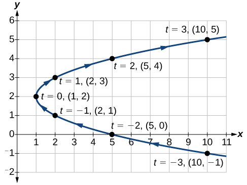{: #Figure_08_07_002}

Analysis

As values for<math xmlns="http://www.w3.org/1998/Math/MathML"> <mrow> <mtext> </mtext><mi>t</mi><mtext> </mtext> </mrow> </math>

progress in a positive direction from 0 to 5, the plotted points trace out the top half of the parabola. As values of<math xmlns="http://www.w3.org/1998/Math/MathML"> <mrow> <mtext> </mtext><mi>t</mi><mtext> </mtext> </mrow> </math>

become negative, they trace out the lower half of the parabola. There are no restrictions on the domain. The arrows indicate direction according to increasing values of <math xmlns="http://www.w3.org/1998/Math/MathML"> <mrow> <mtext> </mtext><mi>t</mi><mo>.</mo><mtext> </mtext> </mrow> </math>

The graph does not represent a function, as it will fail the vertical line test. The graph is drawn in two parts: the positive values for <math xmlns="http://www.w3.org/1998/Math/MathML"> <mrow> <mi>t</mi><mo>,</mo> </mrow> </math>

 and the negative values for <math xmlns="http://www.w3.org/1998/Math/MathML"> <mrow> <mi>t</mi><mo>.</mo> </mrow> </math>

Sketch the graph of the parametric equations<math xmlns="http://www.w3.org/1998/Math/MathML"> <mrow> <mtext> </mtext><mi>x</mi><mo>=</mo><msqrt> <mi>t</mi> </msqrt> <mo>,</mo><mtext> </mtext><mtext> </mtext><mi>y</mi><mo>=</mo><mn>2</mn><mi>t</mi><mo>+</mo><mn>3</mn><mo>,</mo><mtext> </mtext><mtext> </mtext><mtext> </mtext><mn>0</mn><mo>≤</mo><mi>t</mi><mo>≤</mo><mn>3.</mn> </mrow> </math>

  

Sketching the Graph of Trigonometric Parametric Equations

Construct a table of values for the given parametric equations and sketch the graph:

<math xmlns="http://www.w3.org/1998/Math/MathML"> <mtable columnalign="left"> <mtr> <mtd> <mrow /> </mtd> </mtr> <mtr> <mtd> <mtable columnalign="left"> <mtr columnalign="left"> <mtd columnalign="left"> <mrow> <mi>x</mi><mo>=</mo><mn>2</mn><mi>cos</mi><mtext> </mtext><mi>t</mi> </mrow> </mtd> </mtr> <mtr columnalign="left"> <mtd columnalign="left"> <mrow> <mi>y</mi><mo>=</mo><mn>4</mn><mi>sin</mi><mtext> </mtext><mi>t</mi> </mrow> </mtd> </mtr> </mtable> </mtd> </mtr> </mtable> </math>

Construct a table like that in [[link]](#Table_08_07_02) using angle measure in radians as inputs for<math xmlns="http://www.w3.org/1998/Math/MathML"> <mrow> <mtext> </mtext><mi>t</mi><mo>,</mo><mtext> </mtext> </mrow> </math>

and evaluating<math xmlns="http://www.w3.org/1998/Math/MathML"> <mrow> <mtext> </mtext><mi>x</mi><mtext> </mtext> </mrow> </math>

and<math xmlns="http://www.w3.org/1998/Math/MathML"> <mrow> <mtext> </mtext><mi>y</mi><mo>.</mo><mtext> </mtext> </mrow> </math>

Using angles with known sine and cosine values for<math xmlns="http://www.w3.org/1998/Math/MathML"> <mrow> <mtext> </mtext><mi>t</mi><mtext> </mtext> </mrow> </math>

makes calculations easier.

| <math xmlns="http://www.w3.org/1998/Math/MathML"> <mi>t</mi> </math>

 | <math xmlns="http://www.w3.org/1998/Math/MathML"> <mrow> <mi>x</mi><mo>=</mo><mn>2</mn><mi>cos</mi><mtext> </mtext><mi>t</mi> </mrow> </math>

 | <math xmlns="http://www.w3.org/1998/Math/MathML"> <mrow> <mi>y</mi><mo>=</mo><mn>4</mn><mi>sin</mi><mtext> </mtext><mi>t</mi> </mrow> </math>

 |
|----------
| 0 | <math xmlns="http://www.w3.org/1998/Math/MathML"> <mrow> <mi>x</mi><mo>=</mo><mn>2</mn><mi>cos</mi><mo stretchy="false">(</mo><mn>0</mn><mo stretchy="false">)</mo><mo>=</mo><mn>2</mn> </mrow> </math>

 | <math xmlns="http://www.w3.org/1998/Math/MathML"> <mrow> <mi>y</mi><mo>=</mo><mn>4</mn><mi>sin</mi><mo stretchy="false">(</mo><mn>0</mn><mo stretchy="false">)</mo><mo>=</mo><mn>0</mn> </mrow> </math>

 |
| <math xmlns="http://www.w3.org/1998/Math/MathML"> <mrow> <mfrac> <mi>π</mi> <mn>6</mn> </mfrac> </mrow> </math>

 | <math xmlns="http://www.w3.org/1998/Math/MathML"> <mrow> <mi>x</mi><mo>=</mo><mn>2</mn><mi>cos</mi><mrow><mo>(</mo> <mrow> <mfrac> <mi>π</mi> <mn>6</mn> </mfrac> </mrow> <mo>)</mo></mrow><mo>=</mo><msqrt> <mn>3</mn> </msqrt> </mrow> </math>

 | <math xmlns="http://www.w3.org/1998/Math/MathML"> <mrow> <mi>y</mi><mo>=</mo><mn>4</mn><mi>sin</mi><mrow><mo>(</mo> <mrow> <mfrac> <mi>π</mi> <mn>6</mn> </mfrac> </mrow> <mo>)</mo></mrow><mo>=</mo><mn>2</mn> </mrow> </math>

 |
| <math xmlns="http://www.w3.org/1998/Math/MathML"> <mrow> <mfrac> <mi>π</mi> <mn>3</mn> </mfrac> </mrow> </math>

 | <math xmlns="http://www.w3.org/1998/Math/MathML"> <mrow> <mi>x</mi><mo>=</mo><mn>2</mn><mi>cos</mi><mrow><mo>(</mo> <mrow> <mfrac> <mi>π</mi> <mn>3</mn> </mfrac> </mrow> <mo>)</mo></mrow><mo>=</mo><mn>1</mn> </mrow> </math>

 | <math xmlns="http://www.w3.org/1998/Math/MathML"> <mrow> <mi>y</mi><mo>=</mo><mn>4</mn><mi>sin</mi><mrow><mo>(</mo> <mrow> <mfrac> <mi>π</mi> <mn>3</mn> </mfrac> </mrow> <mo>)</mo></mrow><mo>=</mo><mn>2</mn><msqrt> <mn>3</mn> </msqrt> </mrow> </math>

 |
| <math xmlns="http://www.w3.org/1998/Math/MathML"> <mrow> <mfrac> <mi>π</mi> <mn>2</mn> </mfrac> </mrow> </math>

 | <math xmlns="http://www.w3.org/1998/Math/MathML"> <mrow> <mi>x</mi><mo>=</mo><mn>2</mn><mi>cos</mi><mrow><mo>(</mo> <mrow> <mfrac> <mi>π</mi> <mn>2</mn> </mfrac> </mrow> <mo>)</mo></mrow><mo>=</mo><mn>0</mn> </mrow> </math>

 | <math xmlns="http://www.w3.org/1998/Math/MathML"> <mrow> <mi>y</mi><mo>=</mo><mn>4</mn><mi>sin</mi><mrow><mo>(</mo> <mrow> <mfrac> <mi>π</mi> <mn>2</mn> </mfrac> </mrow> <mo>)</mo></mrow><mo>=</mo><mn>4</mn> </mrow> </math>

 |
| <math xmlns="http://www.w3.org/1998/Math/MathML"> <mrow> <mfrac> <mrow> <mn>2</mn><mi>π</mi> </mrow> <mn>3</mn> </mfrac> </mrow> </math>

 | <math xmlns="http://www.w3.org/1998/Math/MathML"> <mrow> <mi>x</mi><mo>=</mo><mn>2</mn><mi>cos</mi><mrow><mo>(</mo> <mrow> <mfrac> <mrow> <mn>2</mn><mi>π</mi> </mrow> <mn>3</mn> </mfrac> </mrow> <mo>)</mo></mrow><mo>=</mo><mo>−</mo><mn>1</mn> </mrow> </math>

 | <math xmlns="http://www.w3.org/1998/Math/MathML"> <mrow> <mi>y</mi><mo>=</mo><mn>4</mn><mi>sin</mi><mrow><mo>(</mo> <mrow> <mfrac> <mrow> <mn>2</mn><mi>π</mi> </mrow> <mn>3</mn> </mfrac> </mrow> <mo>)</mo></mrow><mo>=</mo><mn>2</mn><msqrt> <mn>3</mn> </msqrt> </mrow> </math>

 |
| <math xmlns="http://www.w3.org/1998/Math/MathML"> <mrow> <mfrac> <mrow> <mn>5</mn><mi>π</mi> </mrow> <mn>6</mn> </mfrac> </mrow> </math>

 | <math xmlns="http://www.w3.org/1998/Math/MathML"> <mrow> <mi>x</mi><mo>=</mo><mn>2</mn><mi>cos</mi><mrow><mo>(</mo> <mrow> <mfrac> <mrow> <mn>5</mn><mi>π</mi> </mrow> <mn>6</mn> </mfrac> </mrow> <mo>)</mo></mrow><mo>=</mo><mo>−</mo><msqrt> <mn>3</mn> </msqrt> </mrow> </math>

 | <math xmlns="http://www.w3.org/1998/Math/MathML"> <mrow> <mi>y</mi><mo>=</mo><mn>4</mn><mi>sin</mi><mrow><mo>(</mo> <mrow> <mfrac> <mrow> <mn>5</mn><mi>π</mi> </mrow> <mn>6</mn> </mfrac> </mrow> <mo>)</mo></mrow><mo>=</mo><mn>2</mn> </mrow> </math>

 |
| <math xmlns="http://www.w3.org/1998/Math/MathML"> <mi>π</mi> </math>

 | <math xmlns="http://www.w3.org/1998/Math/MathML"> <mrow> <mi>x</mi><mo>=</mo><mn>2</mn><mi>cos</mi><mo stretchy="false">(</mo><mi>π</mi><mo stretchy="false">)</mo><mo>=</mo><mo>−</mo><mn>2</mn> </mrow> </math>

 | <math xmlns="http://www.w3.org/1998/Math/MathML"> <mrow> <mi>y</mi><mo>=</mo><mn>4</mn><mi>sin</mi><mrow><mo>(</mo> <mi>π</mi> <mo>)</mo></mrow><mo>=</mo><mn>0</mn> </mrow> </math>

 |
| <math xmlns="http://www.w3.org/1998/Math/MathML"> <mrow> <mfrac> <mrow> <mn>7</mn><mi>π</mi> </mrow> <mn>6</mn> </mfrac> </mrow> </math>

 | <math xmlns="http://www.w3.org/1998/Math/MathML"> <mrow> <mi>x</mi><mo>=</mo><mn>2</mn><mi>cos</mi><mrow><mo>(</mo> <mrow> <mfrac> <mrow> <mn>7</mn><mi>π</mi> </mrow> <mn>6</mn> </mfrac> </mrow> <mo>)</mo></mrow><mo>=</mo><mo>−</mo><msqrt> <mn>3</mn> </msqrt> </mrow> </math>

 | <math xmlns="http://www.w3.org/1998/Math/MathML"> <mrow> <mi>y</mi><mo>=</mo><mn>4</mn><mi>sin</mi><mrow><mo>(</mo> <mrow> <mfrac> <mrow> <mn>7</mn><mi>π</mi> </mrow> <mn>6</mn> </mfrac> </mrow> <mo>)</mo></mrow><mo>=</mo><mo>−</mo><mn>2</mn> </mrow> </math>

 |
| <math xmlns="http://www.w3.org/1998/Math/MathML"> <mrow> <mfrac> <mrow> <mn>4</mn><mi>π</mi> </mrow> <mn>3</mn> </mfrac> </mrow> </math>

 | <math xmlns="http://www.w3.org/1998/Math/MathML"> <mrow> <mi>x</mi><mo>=</mo><mn>2</mn><mi>cos</mi><mrow><mo>(</mo> <mrow> <mfrac> <mrow> <mn>4</mn><mi>π</mi> </mrow> <mn>3</mn> </mfrac> </mrow> <mo>)</mo></mrow><mo>=</mo><mo>−</mo><mn>1</mn> </mrow> </math>

 | <math xmlns="http://www.w3.org/1998/Math/MathML"> <mrow> <mi>y</mi><mo>=</mo><mn>4</mn><mi>sin</mi><mrow><mo>(</mo> <mrow> <mfrac> <mrow> <mn>4</mn><mi>π</mi> </mrow> <mn>3</mn> </mfrac> </mrow> <mo>)</mo></mrow><mo>=</mo><mo>−</mo><mn>2</mn><msqrt> <mn>3</mn> </msqrt> </mrow> </math>

 |
| <math xmlns="http://www.w3.org/1998/Math/MathML"> <mrow> <mfrac> <mrow> <mn>3</mn><mi>π</mi> </mrow> <mn>2</mn> </mfrac> </mrow> </math>

 | <math xmlns="http://www.w3.org/1998/Math/MathML"> <mrow> <mi>x</mi><mo>=</mo><mn>2</mn><mi>cos</mi><mrow><mo>(</mo> <mrow> <mfrac> <mrow> <mn>3</mn><mi>π</mi> </mrow> <mn>2</mn> </mfrac> </mrow> <mo>)</mo></mrow><mo>=</mo><mn>0</mn> </mrow> </math>

 | <math xmlns="http://www.w3.org/1998/Math/MathML"> <mrow> <mi>y</mi><mo>=</mo><mn>4</mn><mi>sin</mi><mrow><mo>(</mo> <mrow> <mfrac> <mrow> <mn>3</mn><mi>π</mi> </mrow> <mn>2</mn> </mfrac> </mrow> <mo>)</mo></mrow><mo>=</mo><mo>−</mo><mn>4</mn> </mrow> </math>

 |
| <math xmlns="http://www.w3.org/1998/Math/MathML"> <mrow> <mfrac> <mrow> <mn>5</mn><mi>π</mi> </mrow> <mn>3</mn> </mfrac> </mrow> </math>

 | <math xmlns="http://www.w3.org/1998/Math/MathML"> <mrow> <mi>x</mi><mo>=</mo><mn>2</mn><mi>cos</mi><mrow><mo>(</mo> <mrow> <mfrac> <mrow> <mn>5</mn><mi>π</mi> </mrow> <mn>3</mn> </mfrac> </mrow> <mo>)</mo></mrow><mo>=</mo><mn>1</mn> </mrow> </math>

 | <math xmlns="http://www.w3.org/1998/Math/MathML"> <mrow> <mi>y</mi><mo>=</mo><mn>4</mn><mi>sin</mi><mrow><mo>(</mo> <mrow> <mfrac> <mrow> <mn>5</mn><mi>π</mi> </mrow> <mn>3</mn> </mfrac> </mrow> <mo>)</mo></mrow><mo>=</mo><mo>−</mo><mn>2</mn><msqrt> <mn>3</mn> </msqrt> </mrow> </math>

 |
| <math xmlns="http://www.w3.org/1998/Math/MathML"> <mrow> <mfrac> <mrow> <mn>11</mn><mi>π</mi> </mrow> <mn>6</mn> </mfrac> </mrow> </math>

 | <math xmlns="http://www.w3.org/1998/Math/MathML"> <mrow> <mi>x</mi><mo>=</mo><mn>2</mn><mi>cos</mi><mrow><mo>(</mo> <mrow> <mfrac> <mrow> <mn>11</mn><mi>π</mi> </mrow> <mn>6</mn> </mfrac> </mrow> <mo>)</mo></mrow><mo>=</mo><msqrt> <mn>3</mn> </msqrt> </mrow> </math>

 | <math xmlns="http://www.w3.org/1998/Math/MathML"> <mrow> <mi>y</mi><mo>=</mo><mn>4</mn><mi>sin</mi><mrow><mo>(</mo> <mrow> <mfrac> <mrow> <mn>11</mn><mi>π</mi> </mrow> <mn>6</mn> </mfrac> </mrow> <mo>)</mo></mrow><mo>=</mo><mo>−</mo><mn>2</mn> </mrow> </math>

 |
| <math xmlns="http://www.w3.org/1998/Math/MathML"> <mrow> <mn>2</mn><mi>π</mi> </mrow> </math>

 | <math xmlns="http://www.w3.org/1998/Math/MathML"> <mrow> <mi>x</mi><mo>=</mo><mn>2</mn><mi>cos</mi><mo stretchy="false">(</mo><mn>2</mn><mi>π</mi><mo stretchy="false">)</mo><mo>=</mo><mn>2</mn> </mrow> </math>

 | <math xmlns="http://www.w3.org/1998/Math/MathML"> <mrow> <mi>y</mi><mo>=</mo><mn>4</mn><mi>sin</mi><mrow><mo>(</mo> <mrow> <mn>2</mn><mi>π</mi> </mrow> <mo>)</mo></mrow><mo>=</mo><mn>0</mn> </mrow> </math>

 |
{: #Table_08_07_02 summary="Fourteen rows and three columns. First column is labeled t, second column is labeled x(t)=2cos(1), third column is labeled y(t)=4sin(1). The table has ordered triples of each of these row values: (0, x=2cos(0)=2, y=4sin(0)=0), (pi/6, x=2cos(pi/6)=rad3, y=4sin(pi/6)=2), (pi/3, x=2cos(pi/3)=1, y=4sin(pi/3)=2rad3), (pi/2, x=2cos(pi/2)=0, y=4sin(pi/2)=4), (2pi/3, x=2cos(2pi/3)=-1, y=4sin(2pi/3)=2rad3), (5pi/6, x=2cos(5pi/6)=-rad3, y=4sin(5pi/6)=2), (pi, x=2cos(pi)=-2, y=4sin(pi)=0), (7pi/6, x=2cos(7pi/6) = -rad3, y=4sin(7pi/6)=-2), (4pi/3, x=2cos(4pi/3)=-1, y=4sin(4pi/3)=-2rad3), (3pi/2, x=2cos(3pi/2)=0, y=4sin(3pi/2)=-4), (5pi/3, x=2cos(5pi/3)=1, y=4sin(5pi/3)=-2rad3), (11pi/6, x=2cos(11pi/6)=rad3, y=4sin(11pi/6)=-2), (2pi, x=2cos(2pi)=2, y=4sin(2pi)=0)."}

[[link]](#Figure_08_07_004) shows the graph.

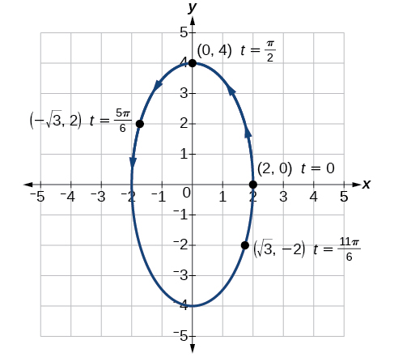{: #Figure_08_07_004}

By the symmetry shown in the values of <math xmlns="http://www.w3.org/1998/Math/MathML"> <mrow> <mi>x</mi> </mrow> </math>

 and <math xmlns="http://www.w3.org/1998/Math/MathML"> <mrow> <mtext> </mtext><mi>y</mi><mo>,</mo><mtext> </mtext> </mrow> </math>

we see that the parametric equations represent an **ellipse**{: data-type="term" .no-emphasis}. The **ellipse**{: data-type="term" .no-emphasis} is mapped in a counterclockwise direction as shown by the arrows indicating increasing<math xmlns="http://www.w3.org/1998/Math/MathML"> <mrow> <mtext> </mtext><mi>t</mi><mtext> </mtext> </mrow> </math>

values.

Analysis

We have seen that parametric equations can be graphed by plotting points. However, a graphing calculator will save some time and reveal nuances in a graph that may be too tedious to discover using only hand calculations.

Make sure to change the mode on the calculator to parametric (PAR). To confirm, the<math xmlns="http://www.w3.org/1998/Math/MathML"> <mrow> <mtext> </mtext><mi>Y</mi><mo>=</mo><mtext> </mtext> </mrow> </math>

window should show

<math xmlns="http://www.w3.org/1998/Math/MathML" display="block"> <mtable> <mtr> <mtd> <msub> <mi>X</mi> <mrow> <mn>1</mn><mi>T</mi> </mrow> </msub> <mo>=</mo> </mtd> </mtr> <mtr> <mtd> <msub> <mi>Y</mi> <mrow> <mn>1</mn><mi>T</mi> </mrow> </msub> <mo>=</mo> </mtd> </mtr> </mtable> </math>

instead of<math xmlns="http://www.w3.org/1998/Math/MathML"> <mrow> <mtext> </mtext><msub> <mi>Y</mi> <mn>1</mn> </msub> <mo>=</mo><mo>.</mo> </mrow> </math>

Graph the parametric equations:<math xmlns="http://www.w3.org/1998/Math/MathML"> <mrow> <mtext> </mtext><mi>x</mi><mo>=</mo><mn>5</mn><mi>cos</mi><mtext> </mtext><mi>t</mi><mo>,</mo><mtext> </mtext><mtext> </mtext><mi>y</mi><mo>=</mo><mn>3</mn><mi>sin</mi><mtext> </mtext><mi>t</mi><mo>.</mo> </mrow> </math>

 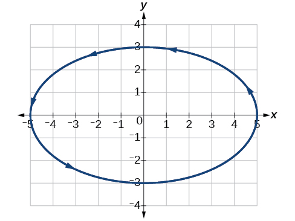 

<section data-depth="1">

Graphing Parametric Equations and Rectangular Form Together

Graph the parametric equations<math xmlns="http://www.w3.org/1998/Math/MathML"> <mrow> <mtext> </mtext><mi>x</mi><mo>=</mo><mn>5</mn><mi>cos</mi><mtext> </mtext><mi>t</mi><mtext> </mtext> </mrow> </math>

and<math xmlns="http://www.w3.org/1998/Math/MathML"> <mrow> <mtext> </mtext><mi>y</mi><mo>=</mo><mn>2</mn><mi>sin</mi><mtext> </mtext><mi>t</mi><mo>.</mo><mtext> </mtext> </mrow> </math>

First, construct the graph using data points generated from the **parametric form**{: data-type="term" .no-emphasis}. Then graph the **rectangular form**{: data-type="term" .no-emphasis} of the equation. Compare the two graphs.

Construct a table of values like that in [[link]](#Table_08_07_03).

| <math xmlns="http://www.w3.org/1998/Math/MathML"> <mi>t</mi> </math>

 | <math xmlns="http://www.w3.org/1998/Math/MathML"> <mrow> <mi>x</mi><mo>=</mo><mn>5</mn><mi>cos</mi><mtext> </mtext><mi>t</mi> </mrow> </math>

 | <math xmlns="http://www.w3.org/1998/Math/MathML"> <mrow> <mi>y</mi><mo>=</mo><mn>2</mn><mi>sin</mi><mtext> </mtext><mi>t</mi> </mrow> </math>

 |
|----------
| <math xmlns="http://www.w3.org/1998/Math/MathML"> <mtext>0</mtext> </math>

 | <math xmlns="http://www.w3.org/1998/Math/MathML"> <mrow> <mi>x</mi><mo>=</mo><mn>5</mn><mi>cos</mi><mo stretchy="false">(</mo><mn>0</mn><mo stretchy="false">)</mo><mo>=</mo><mn>5</mn> </mrow> </math>

 | <math xmlns="http://www.w3.org/1998/Math/MathML"> <mrow> <mi>y</mi><mo>=</mo><mn>2</mn><mi>sin</mi><mo stretchy="false">(</mo><mn>0</mn><mo stretchy="false">)</mo><mo>=</mo><mn>0</mn> </mrow> </math>

 |
| <math xmlns="http://www.w3.org/1998/Math/MathML"> <mtext>1</mtext> </math>

 | <math xmlns="http://www.w3.org/1998/Math/MathML"> <mrow> <mi>x</mi><mo>=</mo><mn>5</mn><mi>cos</mi><mo stretchy="false">(</mo><mn>1</mn><mo stretchy="false">)</mo><mo>≈</mo><mn>2.7</mn> </mrow> </math>

 | <math xmlns="http://www.w3.org/1998/Math/MathML"> <mrow> <mi>y</mi><mo>=</mo><mn>2</mn><mi>sin</mi><mo stretchy="false">(</mo><mn>1</mn><mo stretchy="false">)</mo><mo>≈</mo><mn>1.7</mn> </mrow> </math>

 |
| <math xmlns="http://www.w3.org/1998/Math/MathML"> <mtext>2</mtext> </math>

 | <math xmlns="http://www.w3.org/1998/Math/MathML"> <mrow> <mi>x</mi><mo>=</mo><mn>5</mn><mi>cos</mi><mo stretchy="false">(</mo><mn>2</mn><mo stretchy="false">)</mo><mo>≈</mo><mn>−2.1</mn> </mrow> </math>

 | <math xmlns="http://www.w3.org/1998/Math/MathML"> <mrow> <mi>y</mi><mo>=</mo><mn>2</mn><mi>sin</mi><mo stretchy="false">(</mo><mn>2</mn><mo stretchy="false">)</mo><mo>≈</mo><mn>1.8</mn> </mrow> </math>

 |
| <math xmlns="http://www.w3.org/1998/Math/MathML"> <mtext>3</mtext> </math>

 | <math xmlns="http://www.w3.org/1998/Math/MathML"> <mrow> <mi>x</mi><mo>=</mo><mn>5</mn><mi>cos</mi><mo stretchy="false">(</mo><mn>3</mn><mo stretchy="false">)</mo><mo>≈</mo><mn>−4.95</mn> </mrow> </math>

 | <math xmlns="http://www.w3.org/1998/Math/MathML"> <mrow> <mi>y</mi><mo>=</mo><mn>2</mn><mi>sin</mi><mo stretchy="false">(</mo><mn>3</mn><mo stretchy="false">)</mo><mo>≈</mo><mn>0.28</mn> </mrow> </math>

 |
| <math xmlns="http://www.w3.org/1998/Math/MathML"> <mtext>4</mtext> </math>

 | <math xmlns="http://www.w3.org/1998/Math/MathML"> <mrow> <mi>x</mi><mo>=</mo><mn>5</mn><mi>cos</mi><mo stretchy="false">(</mo><mn>4</mn><mo stretchy="false">)</mo><mo>≈</mo><mn>−3.3</mn> </mrow> </math>

 | <math xmlns="http://www.w3.org/1998/Math/MathML"> <mrow> <mi>y</mi><mo>=</mo><mn>2</mn><mi>sin</mi><mo stretchy="false">(</mo><mn>4</mn><mo stretchy="false">)</mo><mo>≈</mo><mn>−1.5</mn> </mrow> </math>

 |
| <math xmlns="http://www.w3.org/1998/Math/MathML"> <mtext>5</mtext> </math>

 | <math xmlns="http://www.w3.org/1998/Math/MathML"> <mrow> <mi>x</mi><mo>=</mo><mn>5</mn><mi>cos</mi><mo stretchy="false">(</mo><mn>5</mn><mo stretchy="false">)</mo><mo>≈</mo><mn>1.4</mn> </mrow> </math>

 | <math xmlns="http://www.w3.org/1998/Math/MathML"> <mrow> <mi>y</mi><mo>=</mo><mn>2</mn><mi>sin</mi><mo stretchy="false">(</mo><mn>5</mn><mo stretchy="false">)</mo><mo>≈</mo><mn>−1.9</mn> </mrow> </math>

 |
| <math xmlns="http://www.w3.org/1998/Math/MathML"> <mrow> <mn>−1</mn> </mrow> </math>

 | <math xmlns="http://www.w3.org/1998/Math/MathML"> <mrow> <mi>x</mi><mo>=</mo><mn>5</mn><mi>cos</mi><mo stretchy="false">(</mo><mn>−1</mn><mo stretchy="false">)</mo><mo>≈</mo><mn>2.7</mn> </mrow> </math>

 | <math xmlns="http://www.w3.org/1998/Math/MathML"> <mrow> <mi>y</mi><mo>=</mo><mn>2</mn><mi>sin</mi><mo stretchy="false">(</mo><mn>−1</mn><mo stretchy="false">)</mo><mo>≈</mo><mn>−1.7</mn> </mrow> </math>

 |
| <math xmlns="http://www.w3.org/1998/Math/MathML"> <mrow> <mn>−2</mn> </mrow> </math>

 | <math xmlns="http://www.w3.org/1998/Math/MathML"> <mrow> <mi>x</mi><mo>=</mo><mn>5</mn><mi>cos</mi><mo stretchy="false">(</mo><mn>−2</mn><mo stretchy="false">)</mo><mo>≈</mo><mn>−2.1</mn> </mrow> </math>

 | <math xmlns="http://www.w3.org/1998/Math/MathML"> <mrow> <mi>y</mi><mo>=</mo><mn>2</mn><mi>sin</mi><mo stretchy="false">(</mo><mn>−2</mn><mo stretchy="false">)</mo><mo>≈</mo><mn>−1.8</mn> </mrow> </math>

 |
| <math xmlns="http://www.w3.org/1998/Math/MathML"> <mrow> <mn>−3</mn> </mrow> </math>

 | <math xmlns="http://www.w3.org/1998/Math/MathML"> <mrow> <mi>x</mi><mo>=</mo><mn>5</mn><mi>cos</mi><mo stretchy="false">(</mo><mn>−3</mn><mo stretchy="false">)</mo><mo>≈</mo><mn>−4.95</mn> </mrow> </math>

 | <math xmlns="http://www.w3.org/1998/Math/MathML"> <mrow> <mi>y</mi><mo>=</mo><mn>2</mn><mi>sin</mi><mo stretchy="false">(</mo><mn>−3</mn><mo stretchy="false">)</mo><mo>≈</mo><mn>−0.28</mn> </mrow> </math>

 |
| <math xmlns="http://www.w3.org/1998/Math/MathML"> <mrow> <mn>−4</mn> </mrow> </math>

 | <math xmlns="http://www.w3.org/1998/Math/MathML"> <mrow> <mi>x</mi><mo>=</mo><mn>5</mn><mi>cos</mi><mo stretchy="false">(</mo><mn>−4</mn><mo stretchy="false">)</mo><mo>≈</mo><mn>−3.3</mn> </mrow> </math>

 | <math xmlns="http://www.w3.org/1998/Math/MathML"> <mrow> <mi>y</mi><mo>=</mo><mn>2</mn><mi>sin</mi><mo stretchy="false">(</mo><mn>−4</mn><mo stretchy="false">)</mo><mo>≈</mo><mn>1.5</mn> </mrow> </math>

 |
| <math xmlns="http://www.w3.org/1998/Math/MathML"> <mrow> <mn>−5</mn> </mrow> </math>

 | <math xmlns="http://www.w3.org/1998/Math/MathML"> <mrow> <mi>x</mi><mo>=</mo><mn>5</mn><mi>cos</mi><mo stretchy="false">(</mo><mn>−5</mn><mo stretchy="false">)</mo><mo>≈</mo><mn>1.4</mn> </mrow> </math>

 | <math xmlns="http://www.w3.org/1998/Math/MathML"> <mrow> <mi>y</mi><mo>=</mo><mn>2</mn><mi>sin</mi><mo stretchy="false">(</mo><mn>−5</mn><mo stretchy="false">)</mo><mo>≈</mo><mn>1.9</mn> </mrow> </math>

 |
{: #Table_08_07_03 summary="Twelve rows and three columns. First column is labeled t, second column is labeled x(t)=5cos(t), third column is labeled y(t) = 2sin(t). The table has ordered triples of each of these row values: (0, x=5cos(0)=5, y=2sin(0)=0), (1, x=5cos(1) =approx 2.7, y=2sin(1) =approx 1.7), (2, x=5cos(2) =approx -2.1, y=2sin(2) =approx 1.8), (3, x=5cos(3) =approx -4.95, y=2sin(3) =approx 0.28), (4, x=5cos(4) =approx -3.3, y=2sin(4) =approx -1.5), (5, x=5cos(5) =approx 1.4, y=2sin(5) =approx -1.9), (-1, x=5cos(-1) =approx 2.7, y=2sin(-1) =approx -1.7), (-2, x=5cos(-2) =approx -2.1, y=2sin(-2) =approx -1.8), (-3, x=5cos(-3) =approx -4.95, y=2sin(-3) =approx -0.28), (-4, x=5cos(-4) =approx -3.3, y=2sin(-4) =approx 1.5), (-5, x=5cos(-5) =approx 1.4, y=2sin(-5) =approx 1.9)."}

Plot the<math xmlns="http://www.w3.org/1998/Math/MathML"> <mrow> <mtext> </mtext><mrow><mo>(</mo> <mrow> <mi>x</mi><mo>,</mo><mi>y</mi> </mrow> <mo>)</mo></mrow><mtext> </mtext> </mrow> </math>

values from the table. See [[link]](#Figure_08_07_006).

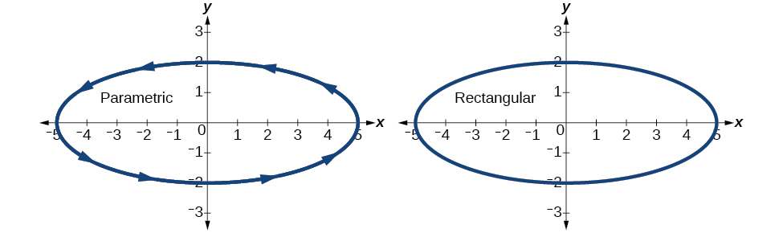{: #Figure_08_07_006}

Next, translate the parametric equations to rectangular form. To do this, we solve for<math xmlns="http://www.w3.org/1998/Math/MathML"> <mrow> <mtext> </mtext><mi>t</mi><mtext> </mtext> </mrow> </math>

in either<math xmlns="http://www.w3.org/1998/Math/MathML"> <mrow> <mtext> </mtext><mi>x</mi><mrow><mo>(</mo> <mi>t</mi> <mo>)</mo></mrow><mtext> </mtext> </mrow> </math>

or<math xmlns="http://www.w3.org/1998/Math/MathML"> <mrow> <mtext> </mtext><mi>y</mi><mrow><mo>(</mo> <mi>t</mi> <mo>)</mo></mrow><mo>,</mo><mtext> </mtext> </mrow> </math>

and then substitute the expression for<math xmlns="http://www.w3.org/1998/Math/MathML"> <mrow> <mtext> </mtext><mi>t</mi><mtext> </mtext> </mrow> </math>

in the other equation. The result will be a function <math xmlns="http://www.w3.org/1998/Math/MathML"> <mrow> <mi>y</mi><mrow><mo>(</mo> <mi>x</mi> <mo>)</mo></mrow> </mrow> </math>

 if solving for<math xmlns="http://www.w3.org/1998/Math/MathML"> <mrow> <mtext> </mtext><mi>t</mi><mtext> </mtext> </mrow> </math>

as a function of<math xmlns="http://www.w3.org/1998/Math/MathML"> <mrow> <mtext> </mtext><mi>x</mi><mo>,</mo><mtext> </mtext> </mrow> </math>

or<math xmlns="http://www.w3.org/1998/Math/MathML"> <mrow> <mtext> </mtext><mi>x</mi><mo stretchy="false">(</mo><mi>y</mi><mo stretchy="false">)</mo> </mrow> </math>

 if solving for<math xmlns="http://www.w3.org/1998/Math/MathML"> <mrow> <mtext> </mtext><mi>t</mi><mtext> </mtext> </mrow> </math>

as a function of<math xmlns="http://www.w3.org/1998/Math/MathML"> <mrow> <mtext> </mtext><mi>y</mi><mo>.</mo><mtext> </mtext> </mrow> </math>

<math xmlns="http://www.w3.org/1998/Math/MathML" display="block"> <mrow> <mtable columnalign="left"> <mtr columnalign="left"> <mtd columnalign="left"> <mrow> <mtext> </mtext><mi>x</mi><mo>=</mo><mn>5</mn><mi>cos</mi><mtext> </mtext><mi>t</mi> </mrow> </mtd> <mtd columnalign="left"> <mrow /> </mtd> </mtr> <mtr columnalign="left"> <mtd columnalign="left"> <mrow> <mfrac> <mi>x</mi> <mn>5</mn> </mfrac> <mo>=</mo><mi>cos</mi><mtext> </mtext><mi>t</mi> </mrow> </mtd> <mtd columnalign="left"> <mrow> <mtext>Solve for </mtext><mi>cos</mi><mtext> </mtext><mi>t</mi><mo>.</mo> </mrow> </mtd> </mtr> <mtr columnalign="left"> <mtd columnalign="left"> <mrow> <mtext> </mtext><mi>y</mi><mo>=</mo><mn>2</mn><mi>sin</mi><mtext> </mtext><mi>t</mi><mtable> <mtr> <mtd> <mrow /> </mtd> <mtd> <mrow /> </mtd> <mtd> <mrow /> </mtd> <mtd> <mrow /> </mtd> </mtr> </mtable><mo> </mo> </mrow> </mtd> <mtd columnalign="left"> <mrow> <mtext>Solve for </mtext><mi>sin</mi><mtext> </mtext><mi>t</mi><mo>.</mo> </mrow> </mtd> </mtr> <mtr columnalign="left"> <mtd columnalign="left"> <mrow> <mfrac> <mi>y</mi> <mn>2</mn> </mfrac> <mo>=</mo><mi>sin</mi><mtext> </mtext><mi>t</mi> </mrow> </mtd> <mtd columnalign="left"> <mrow /> </mtd> </mtr> </mtable> </mrow> </math>

Then, use the **Pythagorean Theorem**{: data-type="term" .no-emphasis}.

<math xmlns="http://www.w3.org/1998/Math/MathML" display="block"> <mrow> <mtable columnalign="right"> <mtr columnalign="right"> <mtd columnalign="right"> <mrow> <msup> <mrow> <mi>cos</mi> </mrow> <mn>2</mn> </msup> <mi>t</mi><mo>+</mo><msup> <mrow> <mi>sin</mi> </mrow> <mn>2</mn> </msup> <mi>t</mi><mo>=</mo><mn>1</mn> </mrow> </mtd> </mtr> <mtr columnalign="right"> <mtd columnalign="right"> <mrow> <msup> <mrow> <mrow><mo>(</mo> <mrow> <mfrac> <mi>x</mi> <mn>5</mn> </mfrac> </mrow> <mo>)</mo></mrow> </mrow> <mn>2</mn> </msup> <mo>+</mo><msup> <mrow> <mrow><mo>(</mo> <mrow> <mfrac> <mi>y</mi> <mn>2</mn> </mfrac> </mrow> <mo>)</mo></mrow> </mrow> <mn>2</mn> </msup> <mo>=</mo><mn>1</mn> </mrow> </mtd> </mtr> <mtr columnalign="right"> <mtd columnalign="right"> <mrow> <mfrac> <mrow> <msup> <mi>x</mi> <mn>2</mn> </msup> </mrow> <mrow> <mn>25</mn> </mrow> </mfrac> <mo>+</mo><mfrac> <mrow> <msup> <mi>y</mi> <mn>2</mn> </msup> </mrow> <mn>4</mn> </mfrac> <mo>=</mo><mn>1</mn> </mrow> </mtd> </mtr> </mtable> </mrow> </math>

Analysis

In [[link]](#Figure_08_07_007), the data from the parametric equations and the rectangular equation are plotted together. The parametric equations are plotted in blue; the graph for the rectangular equation is drawn on top of the parametric in a dashed style colored red. Clearly, both forms produce the same graph.

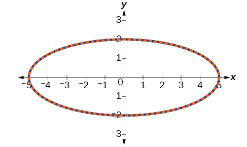{: #Figure_08_07_007}

Graphing Parametric Equations and Rectangular Equations on the Coordinate System

Graph the parametric equations<math xmlns="http://www.w3.org/1998/Math/MathML"> <mrow> <mtext> </mtext><mi>x</mi><mo>=</mo><mi>t</mi><mo>+</mo><mn>1</mn><mtext> </mtext> </mrow> </math>

 and<math xmlns="http://www.w3.org/1998/Math/MathML"> <mrow> <mtext> </mtext><mi>y</mi><mo>=</mo><msqrt> <mi>t</mi> </msqrt> <mo>,</mo><mtext> </mtext><mtext> </mtext><mi>t</mi><mo>≥</mo><mn>0</mn><mo>,</mo><mtext> </mtext> </mrow> </math>

and the rectangular equivalent <math xmlns="http://www.w3.org/1998/Math/MathML"> <mrow> <mi>y</mi><mo>=</mo><msqrt> <mrow> <mi>x</mi><mo>−</mo><mn>1</mn> </mrow> </msqrt> <mtext> </mtext> </mrow> </math>

on the same coordinate system.

Construct a table of values for the parametric equations, as we did in the previous example, and graph<math xmlns="http://www.w3.org/1998/Math/MathML"> <mrow> <mtext> </mtext><mi>y</mi><mo>=</mo><msqrt> <mi>t</mi> </msqrt> <mo>,</mo><mtext> </mtext><mtext> </mtext><mi>t</mi><mo>≥</mo><mn>0</mn><mtext> </mtext> </mrow> </math>

on the same grid, as in [[link]](#Figure_08_07_008).

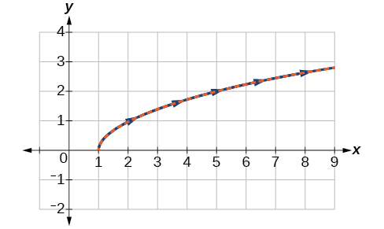{: #Figure_08_07_008}

Analysis

With the domain on<math xmlns="http://www.w3.org/1998/Math/MathML"> <mrow> <mtext> </mtext><mi>t</mi><mtext> </mtext> </mrow> </math>

restricted, we only plot positive values of<math xmlns="http://www.w3.org/1998/Math/MathML"> <mrow> <mtext> </mtext><mi>t</mi><mo>.</mo><mtext> </mtext> </mrow> </math>

The parametric data is graphed in blue and the graph of the rectangular equation is dashed in red. Once again, we see that the two forms overlap.

Sketch the graph of the parametric equations<math xmlns="http://www.w3.org/1998/Math/MathML"> <mrow> <mtext> </mtext><mi>x</mi><mo>=</mo><mn>2</mn><mi>cos</mi><mtext> </mtext><mi>θ</mi><mtext> </mtext><mtext> </mtext><mtext> </mtext><mtext>and</mtext><mtext> </mtext><mtext> </mtext><mi>y</mi><mo>=</mo><mn>4</mn><mi>sin</mi><mtext> </mtext><mi>θ</mi><mo>,</mo><mtext> </mtext> </mrow> </math>

along with the rectangular equation on the same grid.

The graph of the parametric equations is in red and the graph of the rectangular equation is drawn in blue dots on top of the parametric equations.

 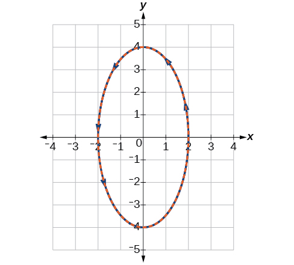 

</section>

# Applications of Parametric Equations

Many of the advantages of parametric equations become obvious when applied to solving real-world problems. Although rectangular equations in *x* and *y* give an overall picture of an object\'s path, they do not reveal the position of an object at a specific time. Parametric equations, however, illustrate how the values of *x* and *y* change depending on *t*, as the location of a moving object at a particular time.

A common application of parametric equations is solving problems involving projectile motion. In this type of motion, an object is propelled forward in an upward direction forming an angle of <math xmlns="http://www.w3.org/1998/Math/MathML"> <mrow> <mi>θ</mi> </mrow> </math>

 to the horizontal, with an initial speed of <math xmlns="http://www.w3.org/1998/Math/MathML"> <mrow> <msub> <mi>v</mi> <mn>0</mn> </msub> <mo>,</mo><mtext> </mtext> </mrow> </math>

and at a height <math xmlns="http://www.w3.org/1998/Math/MathML"> <mrow> <mi>h</mi> </mrow> </math>

 above the horizontal.

The path of an object propelled at an inclination of <math xmlns="http://www.w3.org/1998/Math/MathML"> <mrow> <mi>θ</mi> </mrow> </math>

 to the horizontal, with initial speed <math xmlns="http://www.w3.org/1998/Math/MathML"> <mrow> <msub> <mi>v</mi> <mn>0</mn> </msub> <mo>,</mo><mtext> </mtext> </mrow> </math>

and at a height <math xmlns="http://www.w3.org/1998/Math/MathML"> <mrow> <mi>h</mi> </mrow> </math>

 above the horizontal, is given by

<math xmlns="http://www.w3.org/1998/Math/MathML" display="block"> <mrow> <mtable columnalign="left"> <mtr columnalign="left"> <mtd columnalign="left"> <mrow> <mi>x</mi><mo>=</mo><mo stretchy="false">(</mo><msub> <mi>v</mi> <mn>0</mn> </msub> <mi>cos</mi><mi>θ</mi><mo stretchy="false">)</mo><mi>t</mi><mtext>  </mtext> </mrow> </mtd> </mtr> <mtr columnalign="left"> <mtd columnalign="left"> <mrow> <mi>y</mi><mo>=</mo><mo>−</mo><mfrac> <mn>1</mn> <mn>2</mn> </mfrac> <mi>g</mi><msup> <mi>t</mi> <mn>2</mn> </msup> <mo>+</mo><mo stretchy="false">(</mo><msub> <mi>v</mi> <mn>0</mn> </msub> <mi>sin</mi><mi>θ</mi><mo stretchy="false">)</mo><mi>t</mi><mo>+</mo><mi>h</mi> </mrow> </mtd> </mtr> </mtable> </mrow> </math>

where<math xmlns="http://www.w3.org/1998/Math/MathML"> <mrow> <mtext> </mtext><mi>g</mi><mtext> </mtext> </mrow> </math>

accounts for the effects of **gravity**{: data-type="term" .no-emphasis} and <math xmlns="http://www.w3.org/1998/Math/MathML"> <mrow> <mi>h</mi> </mrow> </math>

 is the initial height of the object. Depending on the units involved in the problem, use<math xmlns="http://www.w3.org/1998/Math/MathML"> <mrow> <mtext> </mtext><mi>g</mi><mo>=</mo><mn>32</mn><mtext> </mtext><mtext>ft</mtext><mtext> </mtext><mtext>/</mtext><mtext> </mtext><msup> <mtext>s</mtext> <mn>2</mn> </msup> <mtext> </mtext> </mrow> </math>

or<math xmlns="http://www.w3.org/1998/Math/MathML"> <mrow> <mtext> </mtext><mi>g</mi><mo>=</mo><mn>9.8</mn><mtext> </mtext><mtext>m</mtext><mtext> </mtext><mtext>/</mtext><mtext> </mtext><msup> <mtext>s</mtext> <mn>2</mn> </msup> <mo>.</mo><mtext> </mtext> </mrow> </math>

The equation for<math xmlns="http://www.w3.org/1998/Math/MathML"> <mrow> <mtext> </mtext><mi>x</mi><mtext> </mtext> </mrow> </math>

gives horizontal distance, and the equation for<math xmlns="http://www.w3.org/1998/Math/MathML"> <mrow> <mtext> </mtext><mi>y</mi><mtext> </mtext> </mrow> </math>

 gives the vertical distance.

**Given a projectile motion problem, use parametric equations to solve.**

1.  The horizontal distance is given by
    <math xmlns="http://www.w3.org/1998/Math/MathML"> <mrow> <mtext> </mtext><mi>x</mi><mo>=</mo><mrow><mo>(</mo> <mrow> <msub> <mi>v</mi> <mn>0</mn> </msub> <mi>cos</mi><mtext> </mtext><mi>θ</mi> </mrow> <mo>)</mo></mrow><mi>t</mi><mo>.</mo><mtext> </mtext> </mrow> </math>
    
    Substitute the initial speed of the object for
    <math xmlns="http://www.w3.org/1998/Math/MathML"> <mrow> <mtext> </mtext><msub> <mi>v</mi> <mn>0</mn> </msub> <mo>.</mo> </mrow> </math>

2.  The expression
    <math xmlns="http://www.w3.org/1998/Math/MathML"> <mrow> <mtext> </mtext><mi>cos</mi><mtext> </mtext><mi>θ</mi><mtext> </mtext> </mrow> </math>
    
    indicates the angle at which the object is propelled. Substitute that angle in degrees for
    <math xmlns="http://www.w3.org/1998/Math/MathML"> <mrow> <mtext> </mtext><mi>cos</mi><mtext> </mtext><mi>θ</mi><mo>.</mo> </mrow> </math>

3.  The vertical distance is given by the formula
    <math xmlns="http://www.w3.org/1998/Math/MathML"> <mrow> <mtext> </mtext><mi>y</mi><mo>=</mo><mo>−</mo><mfrac> <mn>1</mn> <mn>2</mn> </mfrac> <mi>g</mi><msup> <mi>t</mi> <mn>2</mn> </msup> <mo>+</mo><mrow><mo>(</mo> <mrow> <msub> <mi>v</mi> <mn>0</mn> </msub> <mi>sin</mi><mtext> </mtext><mi>θ</mi> </mrow> <mo>)</mo></mrow><mi>t</mi><mo>+</mo><mi>h</mi><mo>.</mo><mtext> </mtext> </mrow> </math>
    
    The term
    <math xmlns="http://www.w3.org/1998/Math/MathML"> <mrow> <mtext> </mtext><mo>−</mo><mfrac> <mn>1</mn> <mn>2</mn> </mfrac> <mi>g</mi><msup> <mi>t</mi> <mn>2</mn> </msup> <mtext> </mtext> </mrow> </math>
    
    represents the effect of gravity. Depending on units involved, use
    <math xmlns="http://www.w3.org/1998/Math/MathML"> <mrow> <mtext> </mtext><mi>g</mi><mo>=</mo><mn>32</mn><mtext> </mtext><msup> <mrow> <mtext>ft/s</mtext> </mrow> <mn>2</mn> </msup> <mtext> </mtext> </mrow> </math>
    
    or
    <math xmlns="http://www.w3.org/1998/Math/MathML"> <mrow> <mtext> </mtext><mi>g</mi><mo>=</mo><mn>9.8</mn><mtext> </mtext><msup> <mrow> <mtext>m/s</mtext> </mrow> <mn>2</mn> </msup> <mo>.</mo><mtext> </mtext> </mrow> </math>
    
    Again, substitute the initial speed for
    <math xmlns="http://www.w3.org/1998/Math/MathML"> <mrow> <mtext> </mtext><msub> <mi>v</mi> <mn>0</mn> </msub> <mo>,</mo><mtext> </mtext> </mrow> </math>
    
    and the height at which the object was propelled for
    <math xmlns="http://www.w3.org/1998/Math/MathML"> <mrow> <mtext> </mtext><mi>h</mi><mo>.</mo> </mrow> </math>

4.  Proceed by calculating each term to solve for
    <math xmlns="http://www.w3.org/1998/Math/MathML"> <mrow> <mtext> </mtext><mi>t</mi><mo>.</mo> </mrow> </math>
{: data-number-style="arabic"}

Finding the Parametric Equations to Describe the Motion of a Baseball

Solve the problem presented at the beginning of this section. Does the batter hit the game-winning home run? Assume that the ball is hit with an initial velocity of 140 feet per second at an angle of<math xmlns="http://www.w3.org/1998/Math/MathML"> <mrow> <mtext> </mtext><mn>45°</mn><mtext> </mtext> </mrow> </math>

to the horizontal, making contact 3 feet above the ground.

1.  Find the parametric equations to model the path of the baseball.
2.  Where is the ball after 2 seconds?
3.  How long is the ball in the air?
4.  Is it a home run?
{: data-number-style="lower-alpha"}

1.  Use the formulas to set up the equations. The horizontal position is found using the parametric equation for<math xmlns="http://www.w3.org/1998/Math/MathML"> <mrow> <mtext> </mtext><mi>x</mi><mo>.</mo><mtext> </mtext> </mrow> </math>
    
    Thus,
    
    

    <math xmlns="http://www.w3.org/1998/Math/MathML" display="block"> <mrow> <mtable columnalign="left"> <mtr columnalign="left"> <mtd columnalign="left"> <mrow> <mi>x</mi><mo>=</mo><mo stretchy="false">(</mo><msub> <mi>v</mi> <mn>0</mn> </msub> <mi>cos</mi><mtext> </mtext><mi>θ</mi><mo stretchy="false">)</mo><mi>t</mi> </mrow> </mtd> </mtr> <mtr columnalign="left"> <mtd columnalign="left"> <mrow> <mi>x</mi><mo>=</mo><mo stretchy="false">(</mo><mn>140</mn><mi>cos</mi><mo stretchy="false">(</mo><mn>45°</mn><mo stretchy="false">)</mo><mo stretchy="false">)</mo><mi>t</mi> </mrow> </mtd> </mtr> </mtable> </mrow> </math>
    

    
    The vertical position is found using the parametric equation for<math xmlns="http://www.w3.org/1998/Math/MathML"> <mrow> <mtext> </mtext><mi>y</mi><mo>.</mo><mtext> </mtext> </mrow> </math>
    
    Thus,
    
    

    <math xmlns="http://www.w3.org/1998/Math/MathML" display="block"> <mrow> <mtable columnalign="left"> <mtr columnalign="left"> <mtd columnalign="left"> <mrow /> </mtd> </mtr> <mtr columnalign="left"> <mtd columnalign="left"> <mrow> <mtable columnalign="left"> <mtr columnalign="left"> <mtd columnalign="left"> <mrow> <mi>y</mi><mo>=</mo><mo>−</mo><mn>16</mn><msup> <mi>t</mi> <mn>2</mn> </msup> <mo>+</mo><mo stretchy="false">(</mo><msub> <mi>v</mi> <mn>0</mn> </msub> <mi>sin</mi><mtext> </mtext><mi>θ</mi><mo stretchy="false">)</mo><mi>t</mi><mo>+</mo><mi>h</mi> </mrow> </mtd> </mtr> <mtr columnalign="left"> <mtd columnalign="left"> <mrow> <mi>y</mi><mo>=</mo><mo>−</mo><mn>16</mn><msup> <mi>t</mi> <mn>2</mn> </msup> <mo>+</mo><mo stretchy="false">(</mo><mn>140</mn><mi>sin</mi><mo stretchy="false">(</mo><mn>45°</mn><mo stretchy="false">)</mo><mo stretchy="false">)</mo><mi>t</mi><mo>+</mo><mn>3</mn> </mrow> </mtd> </mtr> </mtable> </mrow> </mtd> </mtr> </mtable> </mrow> </math>
    

2.  Substitute 2 into the equations to find the horizontal and vertical positions of the ball.
    
    

    <math xmlns="http://www.w3.org/1998/Math/MathML" display="block"> <mrow> <mtable columnalign="left"> <mtr columnalign="left"> <mtd columnalign="left"> <mrow /> </mtd> </mtr> <mtr columnalign="left"> <mtd columnalign="left"> <mrow> <mi>x</mi><mo>=</mo><mo stretchy="false">(</mo><mn>140</mn><mi>cos</mi><mo stretchy="false">(</mo><mn>45°</mn><mo stretchy="false">)</mo><mo stretchy="false">)</mo><mo stretchy="false">(</mo><mn>2</mn><mo stretchy="false">)</mo> </mrow> </mtd> </mtr> <mtr columnalign="left"> <mtd columnalign="left"> <mrow> <mi>x</mi><mo>=</mo><mn>198</mn><mtext> feet</mtext> </mrow> </mtd> </mtr> <mtr columnalign="left"> <mtd columnalign="left"> <mrow /> </mtd> </mtr> <mtr columnalign="left"> <mtd columnalign="left"> <mrow> <mi>y</mi><mo>=</mo><mo>−</mo><mn>16</mn><msup> <mrow> <mo stretchy="false">(</mo><mn>2</mn><mo stretchy="false">)</mo> </mrow> <mn>2</mn> </msup> <mo>+</mo><mo stretchy="false">(</mo><mn>140</mn><mi>sin</mi><mo stretchy="false">(</mo><mn>45°</mn><mo stretchy="false">)</mo><mo stretchy="false">)</mo><mo stretchy="false">(</mo><mn>2</mn><mo stretchy="false">)</mo><mo>+</mo><mn>3</mn> </mrow> </mtd> </mtr> <mtr columnalign="left"> <mtd columnalign="left"> <mrow> <mi>y</mi><mo>=</mo><mn>137</mn><mtext> feet</mtext> </mrow> </mtd> </mtr> </mtable> </mrow> </math>
    

    
    After 2 seconds, the ball is 198 feet away from the batter’s box and 137 feet above the ground.

3.  To calculate how long the ball is in the air, we have to find out when it will hit ground, or when<math xmlns="http://www.w3.org/1998/Math/MathML"> <mrow> <mtext> </mtext><mi>y</mi><mo>=</mo><mn>0.</mn><mtext> </mtext> </mrow> </math>
    
    Thus,
    
    

    <math xmlns="http://www.w3.org/1998/Math/MathML" display="block"> <mrow> <mtable columnalign="left"> <mtr columnalign="left"> <mtd columnalign="left"> <mrow> <mi>y</mi><mo>=</mo><mo>−</mo><mn>16</mn><msup> <mi>t</mi> <mn>2</mn> </msup> <mo>+</mo><mrow><mo>(</mo> <mrow> <mn>140</mn><mi>sin</mi><mo stretchy="false">(</mo><msup> <mrow> <mn>45</mn> </mrow> <mo>∘</mo> </msup> <mo stretchy="false">)</mo> </mrow> <mo>)</mo></mrow><mi>t</mi><mo>+</mo><mn>3</mn> </mrow> </mtd> <mtd columnalign="left"> <mrow /> </mtd> </mtr> <mtr columnalign="left"> <mtd columnalign="left"> <mrow> <mi>y</mi><mo>=</mo><mn>0</mn> </mrow> </mtd> <mtd columnalign="left"> <mrow> <mtext>Set </mtext><mi>y</mi><mo stretchy="false">(</mo><mi>t</mi><mo stretchy="false">)</mo><mo>=</mo><mn>0</mn><mtext> and solve the quadratic</mtext><mo>.</mo> </mrow> </mtd> </mtr> <mtr columnalign="left"> <mtd columnalign="left"> <mrow> <mi>t</mi><mo>=</mo><mn>6.2173</mn> </mrow> </mtd> <mtd columnalign="left"> <mrow /> </mtd> </mtr> </mtable> </mrow> </math>
    

    
    When<math xmlns="http://www.w3.org/1998/Math/MathML"> <mrow> <mtext> </mtext><mi>t</mi><mo>=</mo><mn>6.2173</mn><mtext> </mtext> </mrow> </math>
    
    seconds, the ball has hit the ground. (The quadratic equation can be solved in various ways, but this problem was solved using a computer math program.)

4.  We cannot confirm that the hit was a home run without considering the size of the outfield, which varies from field to field. However, for simplicity’s sake, let’s assume that the outfield wall is 400 feet from home plate in the deepest part of the park. Let’s also assume that the wall is 10 feet high. In order to determine whether the ball clears the wall, we need to calculate how high the ball is when *x* = 400 feet. So we will set *x* = 400, solve for <math xmlns="http://www.w3.org/1998/Math/MathML"> <mrow> <mi>t</mi><mo>,</mo><mtext> </mtext> </mrow> </math>
    
    and input <math xmlns="http://www.w3.org/1998/Math/MathML"> <mrow> <mi>t</mi> </mrow> </math>
    
     into<math xmlns="http://www.w3.org/1998/Math/MathML"> <mrow> <mtext> </mtext><mi>y</mi><mo>.</mo><mtext> </mtext> </mrow> </math>
    
    

    <math xmlns="http://www.w3.org/1998/Math/MathML" display="block"> <mrow> <mtable columnalign="left"> <mtr columnalign="left"> <mtd columnalign="left"> <mrow> <mtable columnalign="left"> <mtr columnalign="left"> <mtd columnalign="left"> <mrow> <mtext>    </mtext><mi>x</mi><mo>=</mo><mrow><mo>(</mo> <mrow> <mn>140</mn><mi>cos</mi><mo stretchy="false">(</mo><mn>45°</mn><mo stretchy="false">)</mo> </mrow> <mo>)</mo></mrow><mi>t</mi> </mrow> </mtd> </mtr> <mtr columnalign="left"> <mtd columnalign="left"> <mrow> <mn>400</mn><mo>=</mo><mrow><mo>(</mo> <mrow> <mn>140</mn><mi>cos</mi><mo stretchy="false">(</mo><mn>45°</mn><mo stretchy="false">)</mo> </mrow> <mo>)</mo></mrow><mi>t</mi> </mrow> </mtd> </mtr> <mtr columnalign="left"> <mtd columnalign="left"> <mrow> <mtext>     </mtext><mi>t</mi><mo>=</mo><mn>4.04</mn> </mrow> </mtd> </mtr> </mtable> </mrow> </mtd> </mtr> <mtr columnalign="left"> <mtd columnalign="left"> <mrow /> </mtd> </mtr> <mtr columnalign="left"> <mtd columnalign="left"> <mrow /> </mtd> </mtr> <mtr columnalign="left"> <mtd columnalign="left"> <mrow> <mtable columnalign="left"> <mtr columnalign="left"> <mtd columnalign="left"> <mrow> <mtext>    </mtext><mi>y</mi><mo>=</mo><mo>−</mo><mn>16</mn><msup> <mrow> <mo stretchy="false">(</mo><mn>4.04</mn><mo stretchy="false">)</mo> </mrow> <mn>2</mn> </msup> <mo>+</mo><mrow><mo>(</mo> <mrow> <mn>140</mn><mi>sin</mi><mo stretchy="false">(</mo><mn>45°</mn><mo stretchy="false">)</mo> </mrow> <mo>)</mo></mrow><mo stretchy="false">(</mo><mn>4.04</mn><mo stretchy="false">)</mo><mo>+</mo><mn>3</mn> </mrow> </mtd> </mtr> <mtr columnalign="left"> <mtd columnalign="left"> <mrow> <mtext>    </mtext><mi>y</mi><mo>=</mo><mn>141.8</mn> </mrow> </mtd> </mtr> </mtable> </mrow> </mtd> </mtr> </mtable> </mrow> </math>
    

    
    The ball is 141.8 feet in the air when it soars out of the ballpark. It was indeed a home run. See [[link]](#Figure_08_07_010).
{: data-number-style="lower-alpha"}

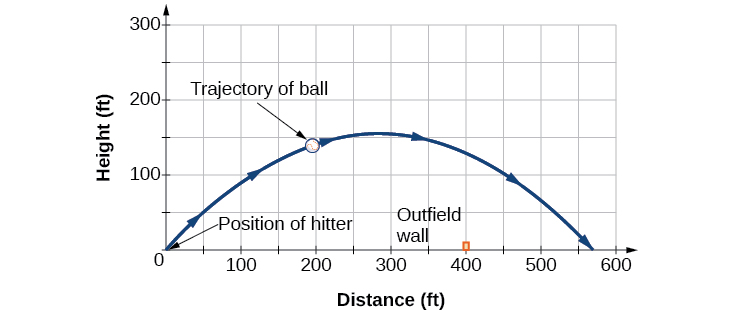{: #Figure_08_07_010}

Access the following online resource for additional instruction and practice with graphs of parametric equations.

* [Graphing Parametric Equations on the TI-84][1]

# Key Concepts

* When there is a third variable, a third parameter on which
  <math xmlns="http://www.w3.org/1998/Math/MathML"> <mrow> <mtext> </mtext><mi>x</mi><mtext> </mtext> </mrow> </math>
  
  and
  <math xmlns="http://www.w3.org/1998/Math/MathML"> <mrow> <mtext> </mtext><mi>y</mi><mtext> </mtext> </mrow> </math>
  
  depend, parametric equations can be used.
* To graph parametric equations by plotting points, make a table with three columns labeled
  <math xmlns="http://www.w3.org/1998/Math/MathML"> <mrow> <mtext> </mtext><mi>t</mi><mo>,</mo><mi>x</mi><mrow><mo>(</mo> <mi>t</mi> <mo>)</mo></mrow><mo>,</mo><mtext> </mtext> </mrow> </math>
  
  and
  <math xmlns="http://www.w3.org/1998/Math/MathML"> <mrow> <mtext> </mtext><mi>y</mi><mo stretchy="false">(</mo><mi>t</mi><mo stretchy="false">)</mo><mo>.</mo><mtext> </mtext> </mrow> </math>
  
  Choose values for
  <math xmlns="http://www.w3.org/1998/Math/MathML"> <mrow> <mtext> </mtext><mi>t</mi><mtext> </mtext> </mrow> </math>
  
  in increasing order. Plot the last two columns for
  <math xmlns="http://www.w3.org/1998/Math/MathML"> <mrow> <mtext> </mtext><mi>x</mi><mtext> </mtext> </mrow> </math>
  
  and
  <math xmlns="http://www.w3.org/1998/Math/MathML"> <mrow> <mtext> </mtext><mi>y</mi><mo>.</mo><mtext> </mtext> </mrow> </math>
  
  See [\[link\]](#Example_08_07_01) and [\[link\]](#Example_08_07_02).
* When graphing a parametric curve by plotting points, note the associated *t*-values and show arrows on the graph indicating the orientation of the curve. See [\[link\]](#Example_08_07_03) and [\[link\]](#Example_08_07_04).
* Parametric equations allow the direction or the orientation of the curve to be shown on the graph. Equations that are not functions can be graphed and used in many applications involving motion. See [\[link\]](#Example_08_07_05).
* Projectile motion depends on two parametric equations:
  <math xmlns="http://www.w3.org/1998/Math/MathML"> <mrow> <mtext> </mtext><mi>x</mi><mo>=</mo><mo stretchy="false">(</mo><msub> <mi>v</mi> <mn>0</mn> </msub> <mi>cos</mi><mtext> </mtext><mi>θ</mi><mo stretchy="false">)</mo><mi>t</mi><mtext> </mtext> </mrow> </math>
  
  and
  <math xmlns="http://www.w3.org/1998/Math/MathML"> <mrow> <mtext> </mtext><mi>y</mi><mo>=</mo><mo>−</mo><mn>16</mn><msup> <mi>t</mi> <mn>2</mn> </msup> <mo>+</mo><mo stretchy="false">(</mo><msub> <mi>v</mi> <mn>0</mn> </msub> <mi>sin</mi><mtext> </mtext><mi>θ</mi><mo stretchy="false">)</mo><mi>t</mi><mo>+</mo><mi>h</mi><mo>.</mo><mtext> </mtext> </mrow> </math>
  
  Initial velocity is symbolized as
  <math xmlns="http://www.w3.org/1998/Math/MathML"> <mrow> <mtext> </mtext><msub> <mi>v</mi> <mn>0</mn> </msub> <mo>.</mo><mtext> </mtext><mi>θ</mi> </mrow> </math>
  
  represents the initial angle of the object when thrown, and
  <math xmlns="http://www.w3.org/1998/Math/MathML"> <mrow> <mtext> </mtext><mi>h</mi><mtext> </mtext> </mrow> </math>
  
  represents the height at which the object is propelled.

# Section Exercises

## Verbal

What are two methods used to graph parametric equations?

plotting points with the orientation arrow and a graphing calculator

What is one difference in point-plotting parametric equations compared to Cartesian equations?

Why are some graphs drawn with arrows?

The arrows show the orientation, the direction of motion according to increasing values of<math xmlns="http://www.w3.org/1998/Math/MathML"> <mrow> <mtext> </mtext><mi>t</mi><mo>.</mo> </mrow> </math>

Name a few common types of graphs of parametric equations.

Why are parametric graphs important in understanding projectile motion?

The parametric equations show the different vertical and horizontal motions over time.

## Graphical

For the following exercises, graph each set of parametric equations by making a table of values. Include the orientation on the graph.

<math xmlns="http://www.w3.org/1998/Math/MathML"> <mrow> <mrow><mo>{</mo> <mrow> <mtable columnalign="left"> <mtr columnalign="left"> <mtd columnalign="left"> <mrow> <mi>x</mi><mrow><mo>(</mo> <mi>t</mi> <mo>)</mo></mrow><mo>=</mo><mi>t</mi> </mrow> </mtd> </mtr> <mtr columnalign="left"> <mtd columnalign="left"> <mrow> <mi>y</mi><mrow><mo>(</mo> <mi>t</mi> <mo>)</mo></mrow><mo>=</mo><msup> <mi>t</mi> <mn>2</mn> </msup> <mo>−</mo><mn>1</mn> </mrow> </mtd> </mtr> </mtable> </mrow> </mrow> </mrow> </math>

<table id="eip-id3065206" summary="Three columns and eight rows. The first row is labeled t, the second is labeled x, and the third is labeled y. The first columns contains the numbers -3, -2, -1, 0, 1, 2, 3. The other two columns are left blank for completion." class="unnumbered" data-label=""><caption></caption><tbody>
<tr>
<td><strong><math xmlns="http://www.w3.org/1998/Math/MathML">
 <mi>t</mi>
</math>
</strong></td><td><strong><math xmlns="http://www.w3.org/1998/Math/MathML">
 <mi>x</mi>
</math>
</strong></td><td><strong><math xmlns="http://www.w3.org/1998/Math/MathML">
 <mi>y</mi>
</math>
</strong></td>
 </tr>
<tr>
<td><math xmlns="http://www.w3.org/1998/Math/MathML">
 <mrow>
  <mo>−</mo><mn>3</mn>
 </mrow>
</math>
</td><td /><td />
 </tr>
<tr>
<td><math xmlns="http://www.w3.org/1998/Math/MathML">
 <mrow>
  <mo>−</mo><mn>2</mn>
 </mrow>
</math></td><td /><td />
 </tr>
<tr>
<td><math xmlns="http://www.w3.org/1998/Math/MathML">
 <mrow>
  <mo>−</mo><mn>1</mn>
 </mrow>
</math></td><td /><td />
 </tr>
<tr>
<td><math xmlns="http://www.w3.org/1998/Math/MathML">
 <mrow>
  <mn>0</mn>
 </mrow>
</math></td><td /><td />
 </tr>
<tr>
<td><math xmlns="http://www.w3.org/1998/Math/MathML">
 <mrow>
  <mn>1</mn>
 </mrow>
</math></td><td /><td />
 </tr>
<tr>
<td><math xmlns="http://www.w3.org/1998/Math/MathML">
 <mrow>
  <mn>2</mn>
 </mrow>
</math></td><td /><td />
 </tr>
<tr>
<td><math xmlns="http://www.w3.org/1998/Math/MathML">
 <mrow>
  <mn>3</mn>
 </mrow>
</math></td><td /><td />
</tr>

</tbody></table>

<math xmlns="http://www.w3.org/1998/Math/MathML" display="block"> <mrow> <mrow><mo>{</mo> <mrow> <mtable columnalign="left"> <mtr columnalign="left"> <mtd columnalign="left"> <mrow> <mi>x</mi><mrow><mo>(</mo> <mi>t</mi> <mo>)</mo></mrow><mo>=</mo><mi>t</mi><mo>−</mo><mn>1</mn> </mrow> </mtd> </mtr> <mtr columnalign="left"> <mtd columnalign="left"> <mrow> <mi>y</mi><mrow><mo>(</mo> <mi>t</mi> <mo>)</mo></mrow><mo>=</mo><msup> <mi>t</mi> <mn>2</mn> </msup> </mrow> </mtd> </mtr> </mtable> </mrow> </mrow> </mrow> </math>

<table id="eip-id2869464" summary="Three rows and eight columns. The first row is labeled t, the second is labeled x, and the third is labeled y. The first row contains the numbers -3, -2, -1, 0, 1, 2. The other two columns are left blank for completion." class="unnumbered" data-label=""><caption></caption><tbody>
<tr>
<td><strong><math xmlns="http://www.w3.org/1998/Math/MathML">
 <mi>t</mi>
</math>
</strong></td>
<td><math xmlns="http://www.w3.org/1998/Math/MathML">
 <mrow>
  <mo>−</mo><mn>3</mn>
 </mrow>
</math>
</td>
<td><math xmlns="http://www.w3.org/1998/Math/MathML">
 <mrow>
  <mo>−</mo><mn>2</mn>
 </mrow>
</math></td>
<td><math xmlns="http://www.w3.org/1998/Math/MathML">
 <mrow>
  <mo>−</mo><mn>1</mn>
 </mrow>
</math></td>
<td><math xmlns="http://www.w3.org/1998/Math/MathML">
 <mrow>
  <mn>0</mn>
 </mrow>
</math></td>
<td><math xmlns="http://www.w3.org/1998/Math/MathML">
 <mrow>
  <mn>1</mn>
 </mrow>
</math></td>
<td><math xmlns="http://www.w3.org/1998/Math/MathML">
 <mrow>
  <mn>2</mn>
 </mrow>
</math></td>

</tr>

<tr>
<td><strong><math xmlns="http://www.w3.org/1998/Math/MathML">
 <mi>x</mi>
</math>
</strong></td>
<td />
<td />
<td />
<td />
<td />
<td />

</tr>
<tr>
<td><strong><math xmlns="http://www.w3.org/1998/Math/MathML">
 <mi>y</mi>
</math>
</strong></td>
<td />
<td />
<td />
<td />
<td />
<td />

</tr>
</tbody></table>

 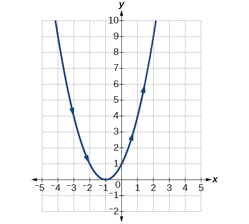 

<math xmlns="http://www.w3.org/1998/Math/MathML"> <mrow> <mrow><mo>{</mo> <mrow> <mtable columnalign="left"> <mtr columnalign="left"> <mtd columnalign="left"> <mrow> <mi>x</mi><mrow><mo>(</mo> <mi>t</mi> <mo>)</mo></mrow><mo>=</mo><mn>2</mn><mo>+</mo><mi>t</mi> </mrow> </mtd> </mtr> <mtr columnalign="left"> <mtd columnalign="left"> <mrow> <mi>y</mi><mrow><mo>(</mo> <mi>t</mi> <mo>)</mo></mrow><mo>=</mo><mn>3</mn><mo>−</mo><mn>2</mn><mi>t</mi> </mrow> </mtd> </mtr> </mtable> </mrow> </mrow> </mrow> </math>

<table id="eip-id2018706" summary="Three rows and eight columns. The first row is labeled t, the second is labeled x, and the third is labeled y. The first row contains the numbers  -2, -1, 0, 1, 2, 3. The other two columns are left blank for completion." class="unnumbered" data-label=""><caption></caption><tbody>
<tr>
<td><strong><math xmlns="http://www.w3.org/1998/Math/MathML">
 <mi>t</mi>
</math>
</strong></td>

<td><math xmlns="http://www.w3.org/1998/Math/MathML">
 <mrow>
  <mo>−</mo><mn>2</mn>
 </mrow>
</math></td>
<td><math xmlns="http://www.w3.org/1998/Math/MathML">
 <mrow>
  <mo>−</mo><mn>1</mn>
 </mrow>
</math></td>
<td><math xmlns="http://www.w3.org/1998/Math/MathML">
 <mrow>
  <mn>0</mn>
 </mrow>
</math></td>
<td><math xmlns="http://www.w3.org/1998/Math/MathML">
 <mrow>
  <mn>1</mn>
 </mrow>
</math></td>
<td><math xmlns="http://www.w3.org/1998/Math/MathML">
 <mrow>
  <mn>2</mn>
 </mrow>
</math></td>
<td><math xmlns="http://www.w3.org/1998/Math/MathML">
 <mrow>
  <mn>3</mn>
 </mrow>
</math></td>
</tr>

<tr>
<td><strong><math xmlns="http://www.w3.org/1998/Math/MathML">
 <mi>x</mi>
</math>
</strong></td>

<td />
<td />
<td />
<td />
<td />
<td />
</tr>
<tr>
<td><strong><math xmlns="http://www.w3.org/1998/Math/MathML">
 <mi>y</mi>
</math>
</strong></td>

<td />
<td />
<td />
<td />
<td />
<td />
</tr>
</tbody></table>

<math xmlns="http://www.w3.org/1998/Math/MathML"> <mrow> <mrow><mo>{</mo> <mrow> <mtable columnalign="left"> <mtr columnalign="left"> <mtd columnalign="left"> <mrow> <mi>x</mi><mrow><mo>(</mo> <mi>t</mi> <mo>)</mo></mrow><mo>=</mo><mo>−</mo><mn>2</mn><mo>−</mo><mn>2</mn><mi>t</mi> </mrow> </mtd> </mtr> <mtr columnalign="left"> <mtd columnalign="left"> <mrow> <mi>y</mi><mrow><mo>(</mo> <mi>t</mi> <mo>)</mo></mrow><mo>=</mo><mn>3</mn><mo>+</mo><mi>t</mi> </mrow> </mtd> </mtr> </mtable> </mrow> </mrow> </mrow> </math>

<table id="eip-id2478452" summary="Three rows and eight columns. The first row is labeled t, the second is labeled x, and the third is labeled y. The first row contains the numbers -3, -2, -1, 0, 1. The other two columns are left blank for completion." class="unnumbered" data-label=""><caption></caption><tbody>
<tr>
<td><strong><math xmlns="http://www.w3.org/1998/Math/MathML">
 <mi>t</mi>
</math>
</strong></td>
<td><math xmlns="http://www.w3.org/1998/Math/MathML">
 <mrow>
  <mo>−</mo><mn>3</mn>
 </mrow>
</math>
</td>
<td><math xmlns="http://www.w3.org/1998/Math/MathML">
 <mrow>
  <mo>−</mo><mn>2</mn>
 </mrow>
</math></td>
<td><math xmlns="http://www.w3.org/1998/Math/MathML">
 <mrow>
  <mo>−</mo><mn>1</mn>
 </mrow>
</math></td>
<td><math xmlns="http://www.w3.org/1998/Math/MathML">
 <mrow>
  <mn>0</mn>
 </mrow>
</math></td>
<td><math xmlns="http://www.w3.org/1998/Math/MathML">
 <mrow>
  <mn>1</mn>
 </mrow>
</math></td>

</tr>

<tr>
<td><strong><math xmlns="http://www.w3.org/1998/Math/MathML">
 <mi>x</mi>
</math>
</strong></td>
<td />
<td />
<td />
<td />
<td />

</tr>
<tr>
<td><strong><math xmlns="http://www.w3.org/1998/Math/MathML">
 <mi>y</mi>
</math>
</strong></td>
<td />
<td />
<td />
<td />
<td />

</tr>
</tbody></table>

 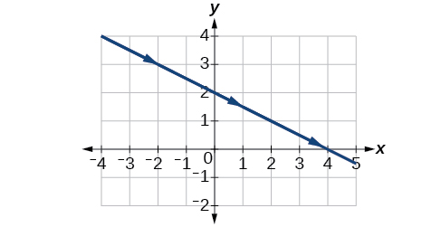 

<math xmlns="http://www.w3.org/1998/Math/MathML"> <mrow> <mrow><mo>{</mo> <mrow> <mtable columnalign="left"> <mtr columnalign="left"> <mtd columnalign="left"> <mrow> <mi>x</mi><mrow><mo>(</mo> <mi>t</mi> <mo>)</mo></mrow><mo>=</mo><msup> <mi>t</mi> <mn>3</mn> </msup> </mrow> </mtd> </mtr> <mtr columnalign="left"> <mtd columnalign="left"> <mrow> <mi>y</mi><mrow><mo>(</mo> <mi>t</mi> <mo>)</mo></mrow><mo>=</mo><mi>t</mi><mo>+</mo><mn>2</mn> </mrow> </mtd> </mtr> </mtable> </mrow> </mrow> </mrow> </math>

<table id="eip-id1838664" summary="Three rows and eight columns. The first row is labeled t, the second is labeled x, and the third is labeled y. The first row contains the numbers - -2, -1, 0, 1, 2. The other two columns are left blank for completion." class="unnumbered" data-label=""><caption></caption><tbody>
<tr>
<td><strong><math xmlns="http://www.w3.org/1998/Math/MathML">
 <mi>t</mi>
</math>
</strong></td>
<td><math xmlns="http://www.w3.org/1998/Math/MathML">
 <mrow>
  <mo>−</mo><mn>2</mn>
 </mrow>
</math></td>
<td><math xmlns="http://www.w3.org/1998/Math/MathML">
 <mrow>
  <mo>−</mo><mn>1</mn>
 </mrow>
</math></td>
<td><math xmlns="http://www.w3.org/1998/Math/MathML">
 <mrow>
  <mn>0</mn>
 </mrow>
</math></td>
<td><math xmlns="http://www.w3.org/1998/Math/MathML">
 <mrow>
  <mn>1</mn>
 </mrow>
</math></td>
<td><math xmlns="http://www.w3.org/1998/Math/MathML">
 <mrow>
  <mn>2</mn>
 </mrow>
</math></td>
</tr>

<tr>
<td><strong><math xmlns="http://www.w3.org/1998/Math/MathML">
 <mi>x</mi>
</math>
</strong></td>
<td />
<td />
<td />
<td />
<td />

</tr>
<tr>
<td><strong><math xmlns="http://www.w3.org/1998/Math/MathML">
 <mi>y</mi>
</math>
</strong></td>
<td />
<td />
<td />
<td />
<td />

</tr>
</tbody></table>

<math xmlns="http://www.w3.org/1998/Math/MathML"> <mrow> <mrow><mo>{</mo> <mrow> <mtable columnalign="left"> <mtr columnalign="left"> <mtd columnalign="left"> <mrow> <mi>x</mi><mrow><mo>(</mo> <mi>t</mi> <mo>)</mo></mrow><mo>=</mo><msup> <mi>t</mi> <mn>2</mn> </msup> </mrow> </mtd> </mtr> <mtr columnalign="left"> <mtd columnalign="left"> <mrow> <mi>y</mi><mrow><mo>(</mo> <mi>t</mi> <mo>)</mo></mrow><mo>=</mo><mi>t</mi><mo>+</mo><mn>3</mn> </mrow> </mtd> </mtr> </mtable> </mrow> </mrow> </mrow> </math>

<table id="eip-id2086049" summary="Three rows and eight columns. The first row is labeled t, the second is labeled x, and the third is labeled y. The first row contains the numbers - -2, -1, 0, 1, 2. The other two columns are left blank for completion." class="unnumbered" data-label=""><caption></caption><tbody>
<tr>
<td><strong><math xmlns="http://www.w3.org/1998/Math/MathML">
 <mi>t</mi>
</math>
</strong></td>
<td><math xmlns="http://www.w3.org/1998/Math/MathML">
 <mrow>
  <mo>−</mo><mn>2</mn>
 </mrow>
</math></td>
<td><math xmlns="http://www.w3.org/1998/Math/MathML">
 <mrow>
  <mo>−</mo><mn>1</mn>
 </mrow>
</math></td>
<td><math xmlns="http://www.w3.org/1998/Math/MathML">
 <mrow>
  <mn>0</mn>
 </mrow>
</math></td>
<td><math xmlns="http://www.w3.org/1998/Math/MathML">
 <mrow>
  <mn>1</mn>
 </mrow>
</math></td>
<td><math xmlns="http://www.w3.org/1998/Math/MathML">
 <mrow>
  <mn>2</mn>
 </mrow>
</math></td>
</tr>

<tr>
<td><strong><math xmlns="http://www.w3.org/1998/Math/MathML">
 <mi>x</mi>
</math>
</strong></td>
<td />
<td />
<td />
<td />
<td />

</tr>
<tr>
<td><strong><math xmlns="http://www.w3.org/1998/Math/MathML">
 <mi>y</mi>
</math>
</strong></td>
<td />
<td />
<td />
<td />
<td />

</tr>
</tbody></table>

  

For the following exercises, sketch the curve and include the orientation.

<math xmlns="http://www.w3.org/1998/Math/MathML"> <mrow> <mrow><mo>{</mo> <mtable columnalign="left"> <mtr> <mtd> <mi>x</mi><mo stretchy="false">(</mo><mi>t</mi><mo stretchy="false">)</mo><mo>=</mo><mi>t</mi> </mtd> </mtr> <mtr> <mtd> <mi>y</mi><mo stretchy="false">(</mo><mi>t</mi><mo stretchy="false">)</mo><mo>=</mo><msqrt> <mi>t</mi> </msqrt> </mtd> </mtr> </mtable> </mrow> </mrow> </math>

<math xmlns="http://www.w3.org/1998/Math/MathML"> <mrow> <mrow><mo>{</mo> <mtable columnalign="left"> <mtr> <mtd> <mi>x</mi><mo stretchy="false">(</mo><mi>t</mi><mo stretchy="false">)</mo><mo>=</mo><mo>−</mo><mtext> </mtext><msqrt> <mi>t</mi> </msqrt> </mtd> </mtr> <mtr> <mtd> <mi>y</mi><mo stretchy="false">(</mo><mi>t</mi><mo stretchy="false">)</mo><mo>=</mo><mi>t</mi> </mtd> </mtr> </mtable> </mrow> </mrow> </math>

 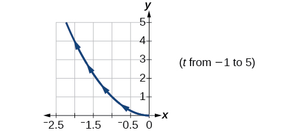 

<math xmlns="http://www.w3.org/1998/Math/MathML"> <mrow> <mrow><mo>{</mo> <mtable columnalign="left"> <mtr> <mtd> <mi>x</mi><mo stretchy="false">(</mo><mi>t</mi><mo stretchy="false">)</mo><mo>=</mo><mn>5</mn><mo>−</mo><mrow><mo>\|</mo> <mi>t</mi> <mo>\|</mo></mrow> </mtd> </mtr> <mtr> <mtd> <mi>y</mi><mo stretchy="false">(</mo><mi>t</mi><mo stretchy="false">)</mo><mo>=</mo><mi>t</mi><mo>+</mo><mn>2</mn> </mtd> </mtr> </mtable> </mrow> </mrow> </math>

<math xmlns="http://www.w3.org/1998/Math/MathML"> <mrow> <mrow><mo>{</mo> <mtable columnalign="left"> <mtr> <mtd> <mi>x</mi><mo stretchy="false">(</mo><mi>t</mi><mo stretchy="false">)</mo><mo>=</mo><mo>−</mo><mi>t</mi><mo>+</mo><mn>2</mn> </mtd> </mtr> <mtr> <mtd> <mi>y</mi><mo stretchy="false">(</mo><mi>t</mi><mo stretchy="false">)</mo><mo>=</mo><mn>5</mn><mo>−</mo><mrow><mo>\|</mo> <mi>t</mi> <mo>\|</mo></mrow> </mtd> </mtr> </mtable> </mrow> </mrow> </math>

 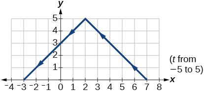 

<math xmlns="http://www.w3.org/1998/Math/MathML"> <mrow> <mrow><mo>{</mo> <mrow> <mtable columnalign="left"> <mtr columnalign="left"> <mtd columnalign="left"> <mrow> <mi>x</mi><mo stretchy="false">(</mo><mi>t</mi><mo stretchy="false">)</mo><mo>=</mo><mn>4</mn><mtext>sin</mtext><mtext> </mtext><mi>t</mi> </mrow> </mtd> </mtr> <mtr columnalign="left"> <mtd columnalign="left"> <mrow> <mi>y</mi><mo stretchy="false">(</mo><mi>t</mi><mo stretchy="false">)</mo><mo>=</mo><mn>2</mn><mi>cos</mi><mtext> </mtext><mi>t</mi> </mrow> </mtd> </mtr> </mtable> </mrow> </mrow> </mrow> </math>

<math xmlns="http://www.w3.org/1998/Math/MathML"> <mrow> <mo>{</mo><mtable columnalign="left"> <mtr columnalign="left"> <mtd columnalign="left"> <mrow> <mi>x</mi><mo stretchy="false">(</mo><mi>t</mi><mo stretchy="false">)</mo><mo>=</mo><mn>2</mn><mtext>sin</mtext><mtext> </mtext><mi>t</mi> </mrow> </mtd> </mtr> <mtr columnalign="left"> <mtd columnalign="left"> <mrow> <mi>y</mi><mo stretchy="false">(</mo><mi>t</mi><mo stretchy="false">)</mo><mo>=</mo><mn>4</mn><mtext>cos</mtext><mtext> </mtext><mi>t</mi> </mrow> </mtd> </mtr> </mtable> </mrow> </math>

 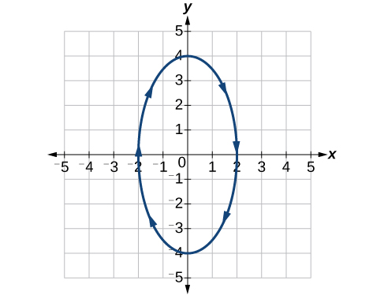 

<math xmlns="http://www.w3.org/1998/Math/MathML"> <mrow> <mrow><mo>{</mo> <mtable columnalign="left"> <mtr> <mtd> <mi>x</mi><mo stretchy="false">(</mo><mi>t</mi><mo stretchy="false">)</mo><mo>=</mo><mn>3</mn><msup> <mi>cos</mi> <mn>2</mn> </msup> <mi>t</mi> </mtd> </mtr> <mtr> <mtd> <mi>y</mi><mo stretchy="false">(</mo><mi>t</mi><mo stretchy="false">)</mo><mo>=</mo><mn>−3</mn><mi>sin</mi><mtext> </mtext><mi>t</mi> </mtd> </mtr> </mtable> </mrow> </mrow> </math>

<math xmlns="http://www.w3.org/1998/Math/MathML"> <mrow> <mrow><mo>{</mo> <mtable columnalign="left"> <mtr> <mtd> <mi>x</mi><mo stretchy="false">(</mo><mi>t</mi><mo stretchy="false">)</mo><mo>=</mo><mn>3</mn><msup> <mi>cos</mi> <mn>2</mn> </msup> <mi>t</mi> </mtd> </mtr> <mtr> <mtd> <mi>y</mi><mo stretchy="false">(</mo><mi>t</mi><mo stretchy="false">)</mo><mo>=</mo><mn>−3</mn><msup> <mi>sin</mi> <mn>2</mn> </msup> <mi>t</mi> </mtd> </mtr> </mtable> </mrow> </mrow> </math>

  

<math xmlns="http://www.w3.org/1998/Math/MathML"> <mrow> <mrow><mo>{</mo> <mtable columnalign="left"> <mtr> <mtd> <mi>x</mi><mo stretchy="false">(</mo><mi>t</mi><mo stretchy="false">)</mo><mo>=</mo><mi>sec</mi><mtext> </mtext><mi>t</mi> </mtd> </mtr> <mtr> <mtd> <mi>y</mi><mo stretchy="false">(</mo><mi>t</mi><mo stretchy="false">)</mo><mo>=</mo><mi>tan</mi><mtext> </mtext><mi>t</mi> </mtd> </mtr> </mtable> </mrow> </mrow> </math>

<math xmlns="http://www.w3.org/1998/Math/MathML"> <mrow> <mrow><mo>{</mo> <mtable columnalign="left"> <mtr> <mtd> <mi>x</mi><mo stretchy="false">(</mo><mi>t</mi><mo stretchy="false">)</mo><mo>=</mo><mi>sec</mi><mtext> </mtext><mi>t</mi> </mtd> </mtr> <mtr> <mtd> <mi>y</mi><mo stretchy="false">(</mo><mi>t</mi><mo stretchy="false">)</mo><mo>=</mo><msup> <mi>tan</mi> <mn>2</mn> </msup> <mi>t</mi> </mtd> </mtr> </mtable> </mrow> </mrow> </math>

 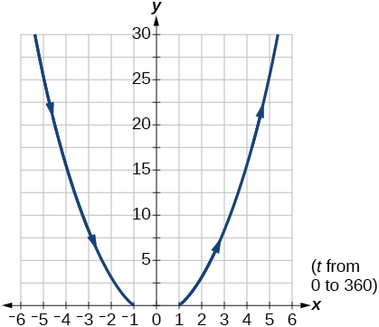 

<math xmlns="http://www.w3.org/1998/Math/MathML"> <mrow> <mrow><mo>{</mo> <mtable columnalign="left"> <mtr> <mtd> <mi>x</mi><mo stretchy="false">(</mo><mi>t</mi><mo stretchy="false">)</mo><mo>=</mo><mfrac> <mn>1</mn> <mrow> <msup> <mi>e</mi> <mrow> <mn>2</mn><mi>t</mi> </mrow> </msup> </mrow> </mfrac> </mtd> </mtr> <mtr> <mtd> <mi>y</mi><mo stretchy="false">(</mo><mi>t</mi><mo stretchy="false">)</mo><mo>=</mo><msup> <mi>e</mi> <mrow> <mo>−</mo><mtext> </mtext><mi>t</mi> </mrow> </msup> </mtd> </mtr> </mtable> </mrow> </mrow> </math>

For the following exercises, graph the equation and include the orientation. Then, write the Cartesian equation.

<math xmlns="http://www.w3.org/1998/Math/MathML"> <mrow> <mrow><mo>{</mo> <mrow> <mtable columnalign="left"> <mtr columnalign="left"> <mtd columnalign="left"> <mrow> <mi>x</mi><mrow><mo>(</mo> <mi>t</mi> <mo>)</mo></mrow><mo>=</mo><mi>t</mi><mo>−</mo><mn>1</mn> </mrow> </mtd> </mtr> <mtr columnalign="left"> <mtd columnalign="left"> <mrow> <mi>y</mi><mrow><mo>(</mo> <mi>t</mi> <mo>)</mo></mrow><mo>=</mo><mo>−</mo><msup> <mi>t</mi> <mn>2</mn> </msup> </mrow> </mtd> </mtr> </mtable> </mrow> </mrow> </mrow> </math>

 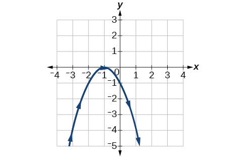 

<math xmlns="http://www.w3.org/1998/Math/MathML"> <mrow> <mrow><mo>{</mo> <mrow> <mtable columnalign="left"> <mtr columnalign="left"> <mtd columnalign="left"> <mrow> <mi>x</mi><mrow><mo>(</mo> <mi>t</mi> <mo>)</mo></mrow><mo>=</mo><msup> <mi>t</mi> <mn>3</mn> </msup> </mrow> </mtd> </mtr> <mtr columnalign="left"> <mtd columnalign="left"> <mrow> <mi>y</mi><mrow><mo>(</mo> <mi>t</mi> <mo>)</mo></mrow><mo>=</mo><mi>t</mi><mo>+</mo><mn>3</mn> </mrow> </mtd> </mtr> </mtable> </mrow> </mrow> </mrow> </math>

<math xmlns="http://www.w3.org/1998/Math/MathML"> <mrow> <mrow><mo>{</mo> <mtable columnalign="left"> <mtr> <mtd> <mi>x</mi><mo stretchy="false">(</mo><mi>t</mi><mo stretchy="false">)</mo><mo>=</mo><mn>2</mn><mi>cos</mi><mtext> </mtext><mi>t</mi> </mtd> </mtr> <mtr> <mtd> <mi>y</mi><mo stretchy="false">(</mo><mi>t</mi><mo stretchy="false">)</mo><mo>=</mo><mo>−</mo><mi>sin</mi><mtext> </mtext><mi>t</mi> </mtd> </mtr> </mtable> </mrow> </mrow> </math>

 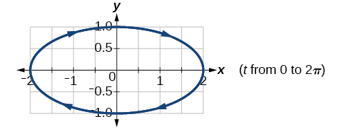 

<math xmlns="http://www.w3.org/1998/Math/MathML"> <mrow> <mrow><mo>{</mo> <mtable columnalign="left"> <mtr> <mtd> <mi>x</mi><mo stretchy="false">(</mo><mi>t</mi><mo stretchy="false">)</mo><mo>=</mo><mn>7</mn><mi>cos</mi><mtext> </mtext><mi>t</mi> </mtd> </mtr> <mtr> <mtd> <mi>y</mi><mo stretchy="false">(</mo><mi>t</mi><mo stretchy="false">)</mo><mo>=</mo><mn>7</mn><mi>sin</mi><mtext> </mtext><mi>t</mi> </mtd> </mtr> </mtable> </mrow> </mrow> </math>

<math xmlns="http://www.w3.org/1998/Math/MathML"> <mrow> <mrow><mo>{</mo> <mtable columnalign="left"> <mtr> <mtd> <mi>x</mi><mo stretchy="false">(</mo><mi>t</mi><mo stretchy="false">)</mo><mo>=</mo><msup> <mi>e</mi> <mrow> <mn>2</mn><mi>t</mi> </mrow> </msup> </mtd> </mtr> <mtr> <mtd> <mi>y</mi><mo stretchy="false">(</mo><mi>t</mi><mo stretchy="false">)</mo><mo>=</mo><mo>−</mo><msup> <mi>e</mi> <mrow> <mtext> </mtext><mi>t</mi> </mrow> </msup> </mtd> </mtr> </mtable> </mrow> </mrow> </math>

 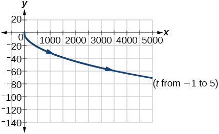 

For the following exercises, graph the equation and include the orientation.

<math xmlns="http://www.w3.org/1998/Math/MathML"> <mrow> <mi>x</mi><mo>=</mo><msup> <mi>t</mi> <mn>2</mn> </msup> <mo>,</mo><mtext> </mtext><mi>y</mi><mtext> </mtext><mo>=</mo><mtext> </mtext><mn>3</mn><mi>t</mi><mo>,</mo><mtext> </mtext><mn>0</mn><mo>≤</mo><mi>t</mi><mo>≤</mo><mn>5</mn> </mrow> </math>

<math xmlns="http://www.w3.org/1998/Math/MathML"> <mrow> <mi>x</mi><mo>=</mo><mn>2</mn><mi>t</mi><mo>,</mo><mtext> </mtext><mi>y</mi><mtext> </mtext><mo>=</mo><mtext> </mtext><mtext> </mtext><msup> <mi>t</mi> <mn>2</mn> </msup> <mo>,</mo><mtext> </mtext><mo>−</mo><mn>5</mn><mo>≤</mo><mi>t</mi><mo>≤</mo><mn>5</mn> </mrow> </math>

 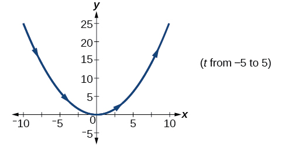 

<math xmlns="http://www.w3.org/1998/Math/MathML"> <mrow> <mi>x</mi><mo>=</mo><mi>t</mi><mo>,</mo><mtext> </mtext><mi>y</mi><mo>=</mo><msqrt> <mrow> <mn>25</mn><mo>−</mo><msup> <mi>t</mi> <mn>2</mn> </msup> </mrow> </msqrt> <mo>,</mo><mtext> </mtext><mn>0</mn><mo>&lt;</mo><mi>t</mi><mo>≤</mo><mn>5</mn> </mrow> </math>

<math xmlns="http://www.w3.org/1998/Math/MathML"> <mrow> <mi>x</mi><mo stretchy="false">(</mo><mi>t</mi><mo stretchy="false">)</mo><mo>=</mo><mo>−</mo><mi>t</mi><mo>,</mo><mi>y</mi><mo stretchy="false">(</mo><mi>t</mi><mo stretchy="false">)</mo><mo>=</mo><msqrt> <mi>t</mi> </msqrt> <mo>,</mo><mtext> </mtext><mi>t</mi><mo>≥</mo><mn>0</mn> </mrow> </math>

 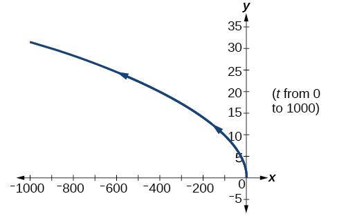 

<math xmlns="http://www.w3.org/1998/Math/MathML"> <mrow> <mi>x</mi><mo>=</mo><mo>−</mo><mn>2</mn><mi>cos</mi><mtext> </mtext><mi>t</mi><mo>,</mo><mtext> </mtext><mi>y</mi><mo>=</mo><mn>6</mn><mtext> </mtext><mi>sin</mi><mtext> </mtext><mi>t</mi><mo>,</mo><mtext> </mtext><mn>0</mn><mo>≤</mo><mi>t</mi><mo>≤</mo><mi>π</mi> </mrow> </math>

<math xmlns="http://www.w3.org/1998/Math/MathML"> <mrow> <mi>x</mi><mo>=</mo><mo>−</mo><mi>sec</mi><mtext> </mtext><mi>t</mi><mo>,</mo><mtext> </mtext><mi>y</mi><mo>=</mo><mi>tan</mi><mtext> </mtext><mi>t</mi><mo>,</mo><mtext> </mtext><mo>−</mo><mfrac> <mrow> <mtext> </mtext><mi>π</mi> </mrow> <mn>2</mn> </mfrac> <mo>&lt;</mo><mi>t</mi><mo>&lt;</mo><mfrac> <mi>π</mi> <mn>2</mn> </mfrac> </mrow> </math>

 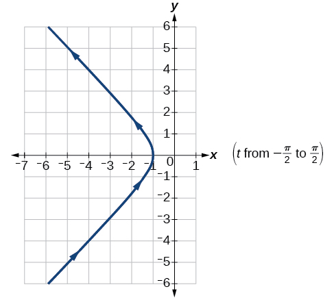 

For the following exercises, use the parametric equations for integers <em>a </em>and *b*\:

<math xmlns="http://www.w3.org/1998/Math/MathML" display="block"> <mtable columnalign="left"> <mtr> <mtd> <mi>x</mi><mo stretchy="false">(</mo><mi>t</mi><mo stretchy="false">)</mo><mo>=</mo><mi>a</mi><mi>cos</mi><mo stretchy="false">(</mo><mo stretchy="false">(</mo><mi>a</mi><mo>+</mo><mi>b</mi><mo stretchy="false">)</mo><mi>t</mi><mo stretchy="false">)</mo> </mtd> </mtr> <mtr> <mtd> <mi>y</mi><mo stretchy="false">(</mo><mi>t</mi><mo stretchy="false">)</mo><mo>=</mo><mi>a</mi><mi>cos</mi><mo stretchy="false">(</mo><mo stretchy="false">(</mo><mi>a</mi><mo>−</mo><mi>b</mi><mo stretchy="false">)</mo><mi>t</mi><mo stretchy="false">)</mo> </mtd> </mtr> </mtable> </math>

Graph on the domain<math xmlns="http://www.w3.org/1998/Math/MathML"> <mrow> <mtext> </mtext><mrow><mo>[</mo> <mrow> <mo>−</mo><mi>π</mi><mo>,</mo><mn>0</mn> </mrow> <mo>]</mo></mrow><mo>,</mo><mtext> </mtext> </mrow> </math>

where<math xmlns="http://www.w3.org/1998/Math/MathML"> <mrow> <mtext> </mtext><mi>a</mi><mo>=</mo><mn>2</mn><mtext> </mtext> </mrow> </math>

and<math xmlns="http://www.w3.org/1998/Math/MathML"> <mrow> <mtext> </mtext><mi>b</mi><mo>=</mo><mn>1</mn><mo>,</mo><mtext> </mtext> </mrow> </math>

and include the orientation.

Graph on the domain<math xmlns="http://www.w3.org/1998/Math/MathML"> <mrow> <mtext> </mtext><mrow><mo>[</mo> <mrow> <mo>−</mo><mi>π</mi><mo>,</mo><mn>0</mn> </mrow> <mo>]</mo></mrow><mo>,</mo><mtext> </mtext> </mrow> </math>

where<math xmlns="http://www.w3.org/1998/Math/MathML"> <mrow> <mtext> </mtext><mi>a</mi><mo>=</mo><mn>3</mn><mtext> </mtext> </mrow> </math>

and<math xmlns="http://www.w3.org/1998/Math/MathML"> <mrow> <mtext> </mtext><mi>b</mi><mo>=</mo><mn>2</mn> </mrow> </math>

, and include the orientation.

 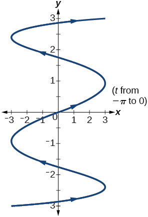 

Graph on the domain<math xmlns="http://www.w3.org/1998/Math/MathML"> <mrow> <mtext> </mtext><mrow><mo>[</mo> <mrow> <mo>−</mo><mi>π</mi><mo>,</mo><mn>0</mn> </mrow> <mo>]</mo></mrow><mo>,</mo><mtext> </mtext> </mrow> </math>

where<math xmlns="http://www.w3.org/1998/Math/MathML"> <mrow> <mtext> </mtext><mi>a</mi><mo>=</mo><mn>4</mn><mtext> </mtext> </mrow> </math>

and<math xmlns="http://www.w3.org/1998/Math/MathML"> <mrow> <mtext> </mtext><mi>b</mi><mo>=</mo><mn>3</mn> </mrow> </math>

, and include the orientation.

Graph on the domain<math xmlns="http://www.w3.org/1998/Math/MathML"> <mrow> <mtext> </mtext><mrow><mo>[</mo> <mrow> <mo>−</mo><mi>π</mi><mo>,</mo><mn>0</mn> </mrow> <mo>]</mo></mrow><mo>,</mo><mtext> </mtext> </mrow> </math>

where<math xmlns="http://www.w3.org/1998/Math/MathML"> <mrow> <mtext> </mtext><mi>a</mi><mo>=</mo><mn>5</mn><mtext> </mtext> </mrow> </math>

and<math xmlns="http://www.w3.org/1998/Math/MathML"> <mrow> <mtext> </mtext><mi>b</mi><mo>=</mo><mn>4</mn> </mrow> </math>

, and include the orientation.

 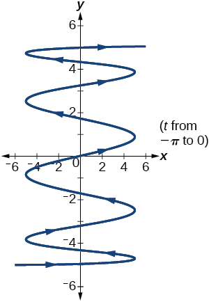 

If<math xmlns="http://www.w3.org/1998/Math/MathML"> <mrow> <mtext> </mtext><mi>a</mi><mtext> </mtext> </mrow> </math>

is 1 more than<math xmlns="http://www.w3.org/1998/Math/MathML"> <mrow> <mtext> </mtext><mi>b</mi><mo>,</mo><mtext> </mtext> </mrow> </math>

describe the effect the values of<math xmlns="http://www.w3.org/1998/Math/MathML"> <mrow> <mtext> </mtext><mi>a</mi><mtext> </mtext> </mrow> </math>

and<math xmlns="http://www.w3.org/1998/Math/MathML"> <mrow> <mtext> </mtext><mi>b</mi><mtext> </mtext> </mrow> </math>

have on the graph of the parametric equations.

Describe the graph if<math xmlns="http://www.w3.org/1998/Math/MathML"> <mrow> <mtext> </mtext><mi>a</mi><mo>=</mo><mn>100</mn><mtext> </mtext> </mrow> </math>

and<math xmlns="http://www.w3.org/1998/Math/MathML"> <mrow> <mtext> </mtext><mi>b</mi><mo>=</mo><mn>99.</mn> </mrow> </math>

There will be 100 back-and-forth motions.

What happens if<math xmlns="http://www.w3.org/1998/Math/MathML"> <mrow> <mtext> </mtext><mi>b</mi><mtext> </mtext> </mrow> </math>

is 1 more than<math xmlns="http://www.w3.org/1998/Math/MathML"> <mrow> <mtext> </mtext><mi>a</mi><mo>?</mo><mtext> </mtext> </mrow> </math>

Describe the graph.

If the parametric equations<math xmlns="http://www.w3.org/1998/Math/MathML"> <mrow> <mtext> </mtext><mi>x</mi><mo stretchy="false">(</mo><mi>t</mi><mo stretchy="false">)</mo><mo>=</mo><msup> <mi>t</mi> <mn>2</mn> </msup> <mtext> </mtext> </mrow> </math>

and<math xmlns="http://www.w3.org/1998/Math/MathML"> <mrow> <mtext> </mtext><mi>y</mi><mrow><mo>(</mo> <mi>t</mi> <mo>)</mo></mrow><mo>=</mo><mn>6</mn><mo>−</mo><mn>3</mn><mi>t</mi><mtext> </mtext> </mrow> </math>

have the graph of a horizontal parabola opening to the right, what would change the direction of the curve?

Take the opposite of the<math xmlns="http://www.w3.org/1998/Math/MathML"> <mrow> <mtext> </mtext><mi>x</mi><mrow><mo>(</mo> <mi>t</mi> <mo>)</mo></mrow><mtext> </mtext> </mrow> </math>

equation.

For the following exercises, describe the graph of the set of parametric equations.

<math xmlns="http://www.w3.org/1998/Math/MathML"> <mrow> <mi>x</mi><mo stretchy="false">(</mo><mi>t</mi><mo stretchy="false">)</mo><mo>=</mo><mo>−</mo><msup> <mi>t</mi> <mn>2</mn> </msup> <mtext> </mtext> </mrow> </math>

and<math xmlns="http://www.w3.org/1998/Math/MathML"> <mrow> <mtext> </mtext><mi>y</mi><mrow><mo>(</mo> <mi>t</mi> <mo>)</mo></mrow><mtext> </mtext> </mrow> </math>

is linear

<math xmlns="http://www.w3.org/1998/Math/MathML"> <mrow> <mi>y</mi><mo stretchy="false">(</mo><mi>t</mi><mo stretchy="false">)</mo><mo>=</mo><msup> <mi>t</mi> <mn>2</mn> </msup> <mtext> </mtext> </mrow> </math>

and<math xmlns="http://www.w3.org/1998/Math/MathML"> <mrow> <mtext> </mtext><mi>x</mi><mrow><mo>(</mo> <mi>t</mi> <mo>)</mo></mrow><mtext> </mtext> </mrow> </math>

is linear

The parabola opens up.

<math xmlns="http://www.w3.org/1998/Math/MathML"> <mrow> <mi>y</mi><mo stretchy="false">(</mo><mi>t</mi><mo stretchy="false">)</mo><mo>=</mo><mo>−</mo><msup> <mi>t</mi> <mn>2</mn> </msup> <mtext> </mtext> </mrow> </math>

and<math xmlns="http://www.w3.org/1998/Math/MathML"> <mrow> <mtext> </mtext><mi>x</mi><mrow><mo>(</mo> <mi>t</mi> <mo>)</mo></mrow><mtext> </mtext> </mrow> </math>

is linear

Write the parametric equations of a circle with center<math xmlns="http://www.w3.org/1998/Math/MathML"> <mrow> <mtext> </mtext><mrow><mo>(</mo> <mrow> <mn>0</mn><mo>,</mo><mn>0</mn> </mrow> <mo>)</mo></mrow><mo>,</mo> </mrow> </math>

radius 5, and a counterclockwise orientation.

<math xmlns="http://www.w3.org/1998/Math/MathML"> <mrow> <mrow><mo>{</mo> <mtable columnalign="left"> <mtr> <mtd> <mi>x</mi><mrow><mo>(</mo> <mi>t</mi> <mo>)</mo></mrow><mo>=</mo><mn>5</mn><mi>cos</mi><mi>t</mi> </mtd> </mtr> <mtr> <mtd> <mi>y</mi><mrow><mo>(</mo> <mi>t</mi> <mo>)</mo></mrow><mo>=</mo><mn>5</mn><mi>sin</mi><mi>t</mi> </mtd> </mtr> </mtable> </mrow> </mrow> </math>

Write the parametric equations of an ellipse with center<math xmlns="http://www.w3.org/1998/Math/MathML"> <mrow> <mtext> </mtext><mrow><mo>(</mo> <mrow> <mn>0</mn><mo>,</mo><mn>0</mn> </mrow> <mo>)</mo></mrow><mo>,</mo> </mrow> </math>

major axis of length 10, minor axis of length 6, and a counterclockwise orientation.

For the following exercises, use a graphing utility to graph on the window<math xmlns="http://www.w3.org/1998/Math/MathML"> <mrow> <mtext> </mtext><mrow><mo>[</mo> <mrow> <mo>−</mo><mn>3</mn><mo>,</mo><mn>3</mn> </mrow> <mo>]</mo></mrow><mtext> </mtext> </mrow> </math>

by<math xmlns="http://www.w3.org/1998/Math/MathML"> <mrow> <mtext> </mtext><mrow><mo>[</mo> <mrow> <mo>−</mo><mn>3</mn><mo>,</mo><mn>3</mn> </mrow> <mo>]</mo></mrow><mtext> </mtext> </mrow> </math>

on the domain<math xmlns="http://www.w3.org/1998/Math/MathML"> <mrow> <mtext> </mtext><mo stretchy="false">[</mo><mn>0</mn><mo>,</mo><mn>2</mn><mi>π</mi><mo stretchy="false">)</mo><mtext> </mtext> </mrow> </math>

for the following values of<math xmlns="http://www.w3.org/1998/Math/MathML"> <mrow> <mtext> </mtext><mi>a</mi><mtext> </mtext> </mrow> </math>

and<math xmlns="http://www.w3.org/1998/Math/MathML"> <mrow> <mtext> </mtext><mi>b</mi> </mrow> </math>

, and include the orientation.

<math xmlns="http://www.w3.org/1998/Math/MathML"> <mrow> <mrow><mo>{</mo> <mtable columnalign="left"> <mtr> <mtd> <mi>x</mi><mo stretchy="false">(</mo><mi>t</mi><mo stretchy="false">)</mo><mo>=</mo><mi>sin</mi><mo stretchy="false">(</mo><mi>a</mi><mi>t</mi><mo stretchy="false">)</mo> </mtd> </mtr> <mtr> <mtd> <mi>y</mi><mo stretchy="false">(</mo><mi>t</mi><mo stretchy="false">)</mo><mo>=</mo><mi>sin</mi><mo stretchy="false">(</mo><mi>b</mi><mi>t</mi><mo stretchy="false">)</mo> </mtd> </mtr> </mtable> </mrow> </mrow> </math>

<math xmlns="http://www.w3.org/1998/Math/MathML"> <mrow> <mi>a</mi><mo>=</mo><mn>1</mn><mo>,</mo><mi>b</mi><mo>=</mo><mn>2</mn> </mrow> </math>

 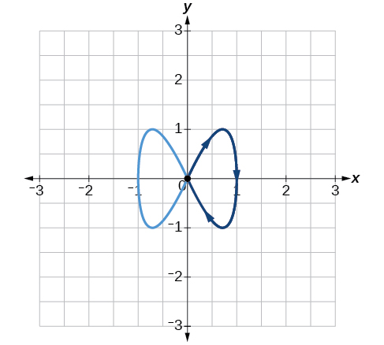 

<math xmlns="http://www.w3.org/1998/Math/MathML"> <mrow> <mi>a</mi><mo>=</mo><mn>2</mn><mo>,</mo><mi>b</mi><mo>=</mo><mn>1</mn> </mrow> </math>

<math xmlns="http://www.w3.org/1998/Math/MathML"> <mrow> <mi>a</mi><mo>=</mo><mn>3</mn><mo>,</mo><mi>b</mi><mo>=</mo><mn>3</mn> </mrow> </math>

 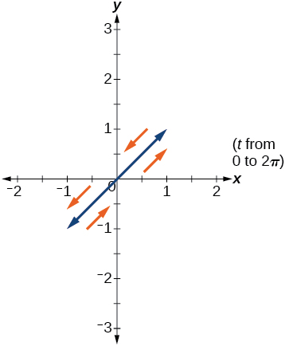 

<math xmlns="http://www.w3.org/1998/Math/MathML"> <mrow> <mi>a</mi><mo>=</mo><mn>5</mn><mo>,</mo><mi>b</mi><mo>=</mo><mn>5</mn> </mrow> </math>

<math xmlns="http://www.w3.org/1998/Math/MathML"> <mrow> <mi>a</mi><mo>=</mo><mn>2</mn><mo>,</mo><mi>b</mi><mo>=</mo><mn>5</mn> </mrow> </math>

  

<math xmlns="http://www.w3.org/1998/Math/MathML"> <mrow> <mi>a</mi><mo>=</mo><mn>5</mn><mo>,</mo><mi>b</mi><mo>=</mo><mn>2</mn> </mrow> </math>

## Technology

For the following exercises, look at the graphs that were created by parametric equations of the form<math xmlns="http://www.w3.org/1998/Math/MathML"> <mrow> <mtext> </mtext><mo>{</mo><mtable columnalign="left"> <mtr columnalign="left"> <mtd columnalign="left"> <mrow> <mi>x</mi><mo stretchy="false">(</mo><mi>t</mi><mo stretchy="false">)</mo><mo>=</mo><mi>a</mi><mtext>cos</mtext><mo stretchy="false">(</mo><mi>b</mi><mi>t</mi><mo stretchy="false">)</mo> </mrow> </mtd> </mtr> <mtr columnalign="left"> <mtd columnalign="left"> <mrow> <mi>y</mi><mo stretchy="false">(</mo><mi>t</mi><mo stretchy="false">)</mo><mo>=</mo><mi>c</mi><mtext>sin</mtext><mo stretchy="false">(</mo><mi>d</mi><mi>t</mi><mo stretchy="false">)</mo> </mrow> </mtd> </mtr> </mtable><mo>.</mo><mtext> </mtext> </mrow> </math>

Use the parametric mode on the graphing calculator to find the values of <math xmlns="http://www.w3.org/1998/Math/MathML"> <mrow> <mi>a</mi><mo>,</mo><mi>b</mi><mo>,</mo><mi>c</mi><mo>,</mo> </mrow> </math>

 and <math xmlns="http://www.w3.org/1998/Math/MathML"> <mrow> <mi>d</mi> </mrow> </math>

 to achieve each graph.

 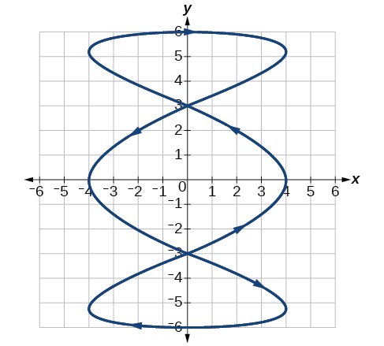 

<math xmlns="http://www.w3.org/1998/Math/MathML"> <mrow> <mi>a</mi><mo>=</mo><mn>4</mn><mo>,</mo><mtext> </mtext><mi>b</mi><mo>=</mo><mn>3</mn><mo>,</mo><mtext> </mtext><mi>c</mi><mo>=</mo><mn>6</mn><mo>,</mo><mtext> </mtext><mi>d</mi><mo>=</mo><mn>1</mn> </mrow> </math>

 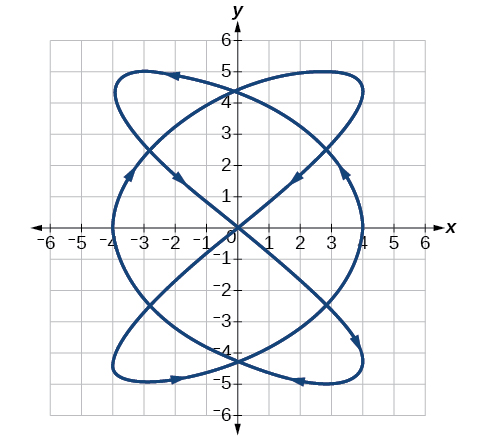 

 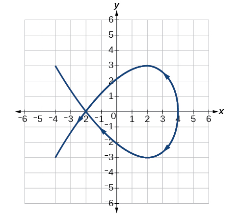 

<math xmlns="http://www.w3.org/1998/Math/MathML"> <mrow> <mi>a</mi><mo>=</mo><mn>4</mn><mo>,</mo><mtext> </mtext><mi>b</mi><mo>=</mo><mn>2</mn><mo>,</mo><mtext> </mtext><mi>c</mi><mo>=</mo><mn>3</mn><mo>,</mo><mtext> </mtext><mi>d</mi><mo>=</mo><mn>3</mn> </mrow> </math>

 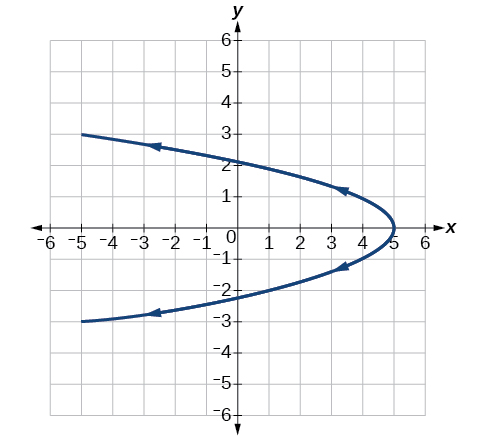 

For the following exercises, use a graphing utility to graph the given parametric equations.

1.  <math xmlns="http://www.w3.org/1998/Math/MathML"> <mrow> <mrow><mo>{</mo> <mtable columnalign="left"> <mtr> <mtd> <mi>x</mi><mo stretchy="false">(</mo><mi>t</mi><mo stretchy="false">)</mo><mo>=</mo><mi>cos</mi><mi>t</mi><mo>−</mo><mn>1</mn> </mtd> </mtr> <mtr> <mtd> <mi>y</mi><mo stretchy="false">(</mo><mi>t</mi><mo stretchy="false">)</mo><mo>=</mo><mi>sin</mi><mi>t</mi><mo>+</mo><mi>t</mi> </mtd> </mtr> </mtable> </mrow> </mrow> </math>

2.  <math xmlns="http://www.w3.org/1998/Math/MathML"> <mrow> <mrow><mo>{</mo> <mtable columnalign="left"> <mtr> <mtd> <mi>x</mi><mo stretchy="false">(</mo><mi>t</mi><mo stretchy="false">)</mo><mo>=</mo><mi>cos</mi><mi>t</mi><mo>+</mo><mi>t</mi> </mtd> </mtr> <mtr> <mtd> <mi>y</mi><mo stretchy="false">(</mo><mi>t</mi><mo stretchy="false">)</mo><mo>=</mo><mi>sin</mi><mi>t</mi><mo>−</mo><mn>1</mn> </mtd> </mtr> </mtable> </mrow> </mrow> </math>

3.  <math xmlns="http://www.w3.org/1998/Math/MathML"> <mrow> <mrow><mo>{</mo> <mtable columnalign="left"> <mtr> <mtd> <mi>x</mi><mrow><mo>(</mo> <mi>t</mi> <mo>)</mo></mrow><mo>=</mo><mi>t</mi><mo>−</mo><mi>sin</mi><mi>t</mi> </mtd> </mtr> <mtr> <mtd> <mi>y</mi><mrow><mo>(</mo> <mi>t</mi> <mo>)</mo></mrow><mo>=</mo><mi>cos</mi><mi>t</mi><mo>−</mo><mn>1</mn> </mtd> </mtr> </mtable> </mrow> </mrow> </math>
{: data-number-style="lower-alpha"}

Graph all three sets of parametric equations on the domain<math xmlns="http://www.w3.org/1998/Math/MathML"> <mrow> <mtext> </mtext><mo stretchy="false">[</mo><mn>0</mn><mo>,</mo><mtext> </mtext><mn>2</mn><mi>π</mi><mo stretchy="false">]</mo><mo>.</mo> </mrow> </math>

 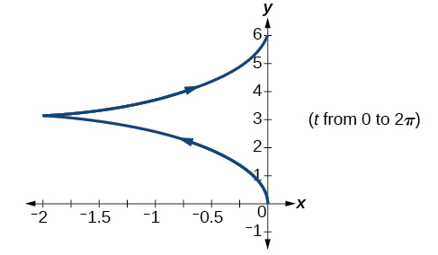 

 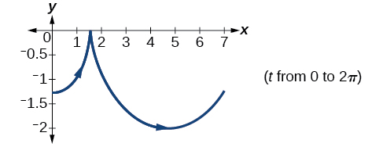 

 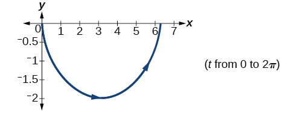 

Graph all three sets of parametric equations on the domain<math xmlns="http://www.w3.org/1998/Math/MathML"> <mrow> <mtext> </mtext><mrow><mo>[</mo> <mrow> <mn>0</mn><mo>,</mo><mn>4</mn><mi>π</mi> </mrow> <mo>]</mo></mrow><mo>.</mo> </mrow> </math>

Graph all three sets of parametric equations on the domain<math xmlns="http://www.w3.org/1998/Math/MathML"> <mrow> <mtext> </mtext><mrow><mo>[</mo> <mrow> <mo>−</mo><mn>4</mn><mi>π</mi><mo>,</mo><mn>6</mn><mi>π</mi> </mrow> <mo>]</mo></mrow><mo>.</mo> </mrow> </math>

 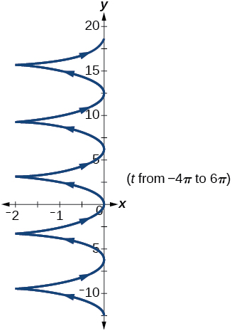 

 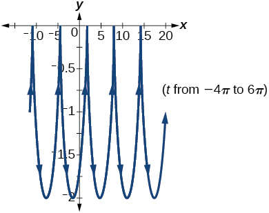 

 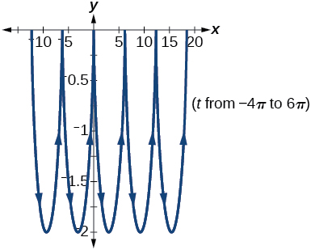 

The graph of each set of parametric equations appears to “creep” along one of the axes. What controls which axis the graph creeps along?

Explain the effect on the graph of the parametric equation when we switched<math xmlns="http://www.w3.org/1998/Math/MathML"> <mrow> <mtext> </mtext><mi>sin</mi><mtext> </mtext><mi>t</mi><mtext> </mtext> </mrow> </math>

and<math xmlns="http://www.w3.org/1998/Math/MathML"> <mrow> <mtext> </mtext><mi>cos</mi><mtext> </mtext><mi>t</mi> </mrow> </math>

.

The<math xmlns="http://www.w3.org/1998/Math/MathML"> <mrow> <mtext> </mtext><mi>y</mi> </mrow> </math>

-intercept changes.

Explain the effect on the graph of the parametric equation when we changed the domain.

## Extensions

An object is thrown in the air with vertical velocity of 20 ft/s and horizontal velocity of 15 ft/s. The object’s height can be described by the equation<math xmlns="http://www.w3.org/1998/Math/MathML"> <mrow> <mtext> </mtext><mi>y</mi><mrow><mo>(</mo> <mi>t</mi> <mo>)</mo></mrow><mo>=</mo><mo>−</mo><mn>16</mn><msup> <mi>t</mi> <mn>2</mn> </msup> <mo>+</mo><mn>20</mn><mi>t</mi> </mrow> </math>

, while the object moves horizontally with constant velocity 15 ft/s. Write parametric equations for the object’s position, and then eliminate time to write height as a function of horizontal position.

<math xmlns="http://www.w3.org/1998/Math/MathML"> <mrow> <mi>y</mi><mrow><mo>(</mo> <mi>x</mi> <mo>)</mo></mrow><mo>=</mo><mo>−</mo><mn>16</mn><msup> <mrow> <mrow><mo>(</mo> <mrow> <mfrac> <mi>x</mi> <mrow> <mn>15</mn> </mrow> </mfrac> </mrow> <mo>)</mo></mrow> </mrow> <mn>2</mn> </msup> <mo>+</mo><mn>20</mn><mrow><mo>(</mo> <mrow> <mfrac> <mi>x</mi> <mrow> <mn>15</mn> </mrow> </mfrac> </mrow> <mo>)</mo></mrow> </mrow> </math>

A skateboarder riding on a level surface at a constant speed of 9 ft/s throws a ball in the air, the height of which can be described by the equation<math xmlns="http://www.w3.org/1998/Math/MathML"> <mrow> <mtext> </mtext><mi>y</mi><mrow><mo>(</mo> <mi>t</mi> <mo>)</mo></mrow><mo>=</mo><mo>−</mo><mn>16</mn><msup> <mi>t</mi> <mn>2</mn> </msup> <mo>+</mo><mn>10</mn><mi>t</mi><mo>+</mo><mn>5</mn><mo>.</mo><mtext> </mtext> </mrow> </math>

Write parametric equations for the ball’s position, and then eliminate time to write height as a function of horizontal position.

For the following exercises, use this scenario: A dart is thrown upward with an initial velocity of 65 ft/s at an angle of elevation of 52°. Consider the position of the dart at any time<math xmlns="http://www.w3.org/1998/Math/MathML"> <mrow> <mtext> </mtext><mi>t</mi><mo>.</mo><mtext> </mtext> </mrow> </math>

Neglect air resistance.

Find parametric equations that model the problem situation.

<math xmlns="http://www.w3.org/1998/Math/MathML"> <mrow> <mrow><mo>{</mo> <mtable columnalign="left"> <mtr> <mtd> <mi>x</mi><mo stretchy="false">(</mo><mi>t</mi><mo stretchy="false">)</mo><mo>=</mo><mn>64</mn><mi>t</mi><mi>cos</mi><mrow><mo>(</mo> <mrow> <mn>52</mn><mo>°</mo> </mrow> <mo>)</mo></mrow> </mtd> </mtr> <mtr> <mtd> <mi>y</mi><mo stretchy="false">(</mo><mi>t</mi><mo stretchy="false">)</mo><mo>=</mo><mo>−</mo><mn>16</mn><msup> <mi>t</mi> <mn>2</mn> </msup> <mo>+</mo><mn>64</mn><mi>t</mi><mi>sin</mi><mrow><mo>(</mo> <mrow> <mn>52</mn><mo>°</mo> </mrow> <mo>)</mo></mrow> </mtd> </mtr> </mtable> </mrow> </mrow> </math>

Find all possible values of<math xmlns="http://www.w3.org/1998/Math/MathML"> <mrow> <mtext> </mtext><mi>x</mi><mtext> </mtext> </mrow> </math>

that represent the situation.

When will the dart hit the ground?

approximately 3.2 seconds

Find the maximum height of the dart.

At what time will the dart reach maximum height?

1\.6 seconds

For the following exercises, look at the graphs of each of the four parametric equations. Although they look unusual and beautiful, they are so common that they have names, as indicated in each exercise. Use a graphing utility to graph each on the indicated domain.

An epicycloid:<math xmlns="http://www.w3.org/1998/Math/MathML"> <mrow> <mtext> </mtext><mo>{</mo><mtable columnalign="left"> <mtr columnalign="left"> <mtd columnalign="left"> <mrow> <mi>x</mi><mo stretchy="false">(</mo><mi>t</mi><mo stretchy="false">)</mo><mo>=</mo><mn>14</mn><mi>cos</mi><mtext> </mtext><mi>t</mi><mo>−</mo><mi>cos</mi><mo stretchy="false">(</mo><mn>14</mn><mi>t</mi><mo stretchy="false">)</mo> </mrow> </mtd> </mtr> <mtr columnalign="left"> <mtd columnalign="left"> <mrow> <mi>y</mi><mo stretchy="false">(</mo><mi>t</mi><mo stretchy="false">)</mo><mo>=</mo><mn>14</mn><mi>sin</mi><mtext> </mtext><mi>t</mi><mo>+</mo><mi>sin</mi><mo stretchy="false">(</mo><mn>14</mn><mi>t</mi><mo stretchy="false">)</mo> </mrow> </mtd> </mtr> </mtable><mtext> </mtext> </mrow> </math>

on the domain<math xmlns="http://www.w3.org/1998/Math/MathML"> <mrow> <mtext> </mtext><mo stretchy="false">[</mo><mn>0</mn><mo>,</mo><mn>2</mn><mi>π</mi><mo stretchy="false">]</mo> </mrow> </math>

.

A hypocycloid:<math xmlns="http://www.w3.org/1998/Math/MathML"> <mrow> <mrow><mo>{</mo> <mrow> <mtable columnalign="left"> <mtr columnalign="left"> <mtd columnalign="left"> <mrow> <mi>x</mi><mo stretchy="false">(</mo><mi>t</mi><mo stretchy="false">)</mo><mo>=</mo><mn>6</mn><mi>sin</mi><mtext> </mtext><mi>t</mi><mo>+</mo><mn>2</mn><mi>sin</mi><mo stretchy="false">(</mo><mn>6</mn><mi>t</mi><mo stretchy="false">)</mo> </mrow> </mtd> </mtr> <mtr columnalign="left"> <mtd columnalign="left"> <mrow> <mi>y</mi><mo stretchy="false">(</mo><mi>t</mi><mo stretchy="false">)</mo><mo>=</mo><mn>6</mn><mi>cos</mi><mtext> </mtext><mi>t</mi><mo>−</mo><mn>2</mn><mi>cos</mi><mo stretchy="false">(</mo><mn>6</mn><mi>t</mi><mo stretchy="false">)</mo> </mrow> </mtd> </mtr> </mtable><mtext> </mtext> </mrow> </mrow> </mrow> </math>

on the domain<math xmlns="http://www.w3.org/1998/Math/MathML"> <mrow> <mtext> </mtext><mo stretchy="false">[</mo><mn>0</mn><mo>,</mo><mn>2</mn><mi>π</mi><mo stretchy="false">]</mo> </mrow> </math>

.

  

A hypotrochoid:<math xmlns="http://www.w3.org/1998/Math/MathML"> <mrow> <mrow><mo>{</mo> <mrow> <mtable columnalign="left"> <mtr columnalign="left"> <mtd columnalign="left"> <mrow> <mi>x</mi><mo stretchy="false">(</mo><mi>t</mi><mo stretchy="false">)</mo><mo>=</mo><mn>2</mn><mi>sin</mi><mtext> </mtext><mi>t</mi><mo>+</mo><mn>5</mn><mi>cos</mi><mo stretchy="false">(</mo><mn>6</mn><mi>t</mi><mo stretchy="false">)</mo> </mrow> </mtd> </mtr> <mtr columnalign="left"> <mtd columnalign="left"> <mrow> <mi>y</mi><mo stretchy="false">(</mo><mi>t</mi><mo stretchy="false">)</mo><mo>=</mo><mn>5</mn><mi>cos</mi><mtext> </mtext><mi>t</mi><mo>−</mo><mn>2</mn><mi>sin</mi><mo stretchy="false">(</mo><mn>6</mn><mi>t</mi><mo stretchy="false">)</mo> </mrow> </mtd> </mtr> </mtable><mtext> </mtext> </mrow> </mrow> </mrow> </math>

on the domain<math xmlns="http://www.w3.org/1998/Math/MathML"> <mrow> <mtext> </mtext><mo stretchy="false">[</mo><mn>0</mn><mo>,</mo><mn>2</mn><mi>π</mi><mo stretchy="false">]</mo> </mrow> </math>

.

A rose:<math xmlns="http://www.w3.org/1998/Math/MathML"> <mrow> <mtext> </mtext><mrow><mo>{</mo> <mrow> <mtable columnalign="left"> <mtr columnalign="left"> <mtd columnalign="left"> <mrow> <mi>x</mi><mo stretchy="false">(</mo><mi>t</mi><mo stretchy="false">)</mo><mo>=</mo><mn>5</mn><mi>sin</mi><mo stretchy="false">(</mo><mn>2</mn><mi>t</mi><mo stretchy="false">)</mo><mi>sin</mi><mi>t</mi> </mrow> </mtd> </mtr> <mtr columnalign="left"> <mtd columnalign="left"> <mrow> <mi>y</mi><mo stretchy="false">(</mo><mi>t</mi><mo stretchy="false">)</mo><mo>=</mo><mn>5</mn><mi>sin</mi><mo stretchy="false">(</mo><mn>2</mn><mi>t</mi><mo stretchy="false">)</mo><mi>cos</mi><mi>t</mi> </mrow> </mtd> </mtr> </mtable> </mrow> </mrow><mtext> </mtext> </mrow> </math>

on the domain<math xmlns="http://www.w3.org/1998/Math/MathML"> <mrow> <mtext> </mtext><mo stretchy="false">[</mo><mn>0</mn><mo>,</mo><mn>2</mn><mi>π</mi><mo stretchy="false">]</mo> </mrow> </math>

.

 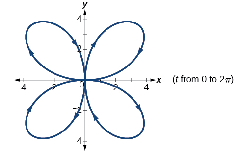 

[1]: http://openstaxcollege.org/l/graphpara84
