

In this section you will:
* View vectors geometrically.
* Find magnitude and direction.
* Perform vector addition and scalar multiplication.
* Find the component form of a vector.
* Find the unit vector in the direction of 
  <math xmlns="http://www.w3.org/1998/Math/MathML"><mrow><mi>v</mi></mrow></math>
  
  .
* Perform operations with vectors in terms of 
  <math xmlns="http://www.w3.org/1998/Math/MathML"><mrow><mi>i</mi></mrow></math>
  
   and 
  <math xmlns="http://www.w3.org/1998/Math/MathML"><mrow><mi>j</mi></mrow></math>
  
  .
* Find the dot product of two vectors.

An airplane is flying at an airspeed of 200 miles per hour headed on a SE bearing of 140°. A north wind (from north to south) is blowing at 16.2 miles per hour, as shown in [\[link\]](#Figure_08_08_001). What are the ground speed and actual bearing of the plane?

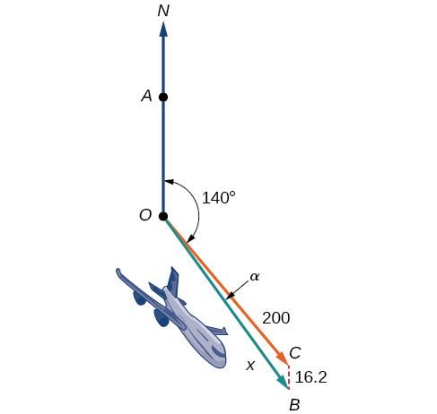{: #Figure_08_08_001}

Ground speed refers to the speed of a plane relative to the ground. Airspeed refers to the speed a plane can travel relative to its surrounding air mass. These two quantities are not the same because of the effect of wind. In an earlier section, we used triangles to solve a similar problem involving the movement of boats. Later in this section, we will find the airplane’s groundspeed and bearing, while investigating another approach to problems of this type. First, however, let’s examine the basics of vectors.

### A Geometric View of Vectors 

A **vector**{: data-type="term"} is a specific quantity drawn as a line segment with an arrowhead at one end. It has an **initial point**{: data-type="term"}, where it begins, and a **terminal point**{: data-type="term"}, where it ends. A vector is defined by its **magnitude**{: data-type="term"}, or the length of the line, and its direction, indicated by an arrowhead at the terminal point. Thus, a vector is a directed line segment. There are various symbols that distinguish vectors from other quantities:

* Lower case, boldfaced type, with or without an arrow on top such as <strong><math xmlns="http://www.w3.org/1998/Math/MathML">
   <mrow><mi>v</mi><mo>,</mo><mtext> </mtext><mtext> </mtext><mi>u</mi><mo>,</mo><mtext> </mtext><mtext> </mtext><mi>w</mi><mo>,</mo><mtext> </mtext><mtext> </mtext><mover accent="true">
     <mi>v</mi>
     <mo>→</mo>
    </mover>
    <mo>,</mo><mtext> </mtext><mtext> </mtext><mover accent="true">
     <mi>u</mi>
     <mo>→</mo>
    </mover>
    <mo>,</mo><mtext> </mtext><mover accent="true">
     <mi>w</mi>
     <mo>→</mo>
    </mover>
    <mo>.</mo>
   </mrow>
  </math></strong>
* Given initial point
  <math xmlns="http://www.w3.org/1998/Math/MathML"> <mrow> <mtext> </mtext><mi>P</mi><mtext> </mtext></mrow> </math>
  
  and terminal point
  <math xmlns="http://www.w3.org/1998/Math/MathML"> <mrow> <mtext> </mtext><mi>Q</mi><mo>,</mo><mtext> </mtext></mrow> </math>
  
  a vector can be represented as
  <math xmlns="http://www.w3.org/1998/Math/MathML"> <mrow> <mtext> </mtext><mover accent="true"> <mrow> <mi>P</mi><mi>Q</mi></mrow> <mo stretchy="true">→</mo> </mover> <mtext> </mtext><mo>.</mo><mtext> </mtext><mtext> </mtext></mrow> </math>
  
  The arrowhead on top is what indicates that it is not just a line, but a directed line segment.
* Given an initial point of
  <math xmlns="http://www.w3.org/1998/Math/MathML"> <mrow> <mtext> </mtext><mrow><mo>(</mo> <mrow> <mn>0</mn><mo>,</mo><mn>0</mn></mrow> <mo>)</mo></mrow><mtext> </mtext></mrow> </math>
  
  and terminal point
  <math xmlns="http://www.w3.org/1998/Math/MathML"> <mrow> <mtext> </mtext><mrow><mo>(</mo> <mrow> <mi>a</mi><mo>,</mo><mi>b</mi></mrow> <mo>)</mo></mrow><mo>,</mo><mtext> </mtext></mrow> </math>
  
  a vector may be represented as
  <math xmlns="http://www.w3.org/1998/Math/MathML"> <mrow> <mrow><mo>〈</mo> <mrow> <mi>a</mi><mo>,</mo><mi>b</mi></mrow> <mo>〉</mo></mrow><mo>.</mo></mrow> </math>

This last symbol <math xmlns="http://www.w3.org/1998/Math/MathML"> <mrow> <mrow><mo>〈</mo> <mrow> <mi>a</mi><mo>,</mo><mi>b</mi></mrow> <mo>〉</mo></mrow></mrow> </math>

 has special significance. It is called the **standard position**{: data-type="term"}. The **position vector**{: data-type="term" .no-emphasis} has an initial point <math xmlns="http://www.w3.org/1998/Math/MathML"> <mrow><mrow><mo>(</mo> <mrow> <mn>0</mn><mo>,</mo><mn>0</mn></mrow> <mo>)</mo></mrow><mtext> </mtext></mrow> </math>

and a terminal point<math xmlns="http://www.w3.org/1998/Math/MathML"> <mrow> <mrow><mo>〈</mo> <mrow> <mi>a</mi><mo>,</mo><mi>b</mi></mrow> <mo>〉</mo></mrow><mo>.</mo></mrow> </math>

To change any vector into the position vector, we think about the change in the *x*-coordinates and the change in the *y*-coordinates. Thus, if the initial point of a vector<math xmlns="http://www.w3.org/1998/Math/MathML"> <mrow> <mtext> </mtext><mover accent="true"> <mrow> <mi>C</mi><mi>D</mi></mrow> <mo stretchy="true">→</mo> </mover> <mtext> </mtext></mrow> </math>

is<math xmlns="http://www.w3.org/1998/Math/MathML"> <mrow> <mtext> </mtext><mi>C</mi><mrow><mo>(</mo> <mrow> <msub> <mi>x</mi> <mn>1</mn> </msub> <mo>,</mo><msub> <mi>y</mi> <mn>1</mn> </msub> </mrow> <mo>)</mo></mrow><mtext> </mtext></mrow> </math>

and the terminal point is<math xmlns="http://www.w3.org/1998/Math/MathML"> <mrow> <mtext> </mtext><mi>D</mi><mrow><mo>(</mo> <mrow> <msub> <mi>x</mi> <mn>2</mn> </msub> <mo>,</mo><msub> <mi>y</mi> <mn>2</mn> </msub> </mrow> <mo>)</mo></mrow><mo>,</mo><mtext> </mtext></mrow> </math>

then the position vector is found by calculating

<math xmlns="http://www.w3.org/1998/Math/MathML" display="block"> <mrow> <mtable columnalign="left"> <mtr columnalign="left"> <mtd columnalign="left"> <mrow> <mover accent="true"> <mrow> <mi>A</mi><mi>B</mi></mrow> <mo stretchy="true">→</mo> </mover> <mtext> </mtext><mo>=</mo><mtext> </mtext><mrow><mo>〈</mo> <mrow> <msub> <mi>x</mi> <mn>2</mn> </msub> <mo>−</mo><msub> <mi>x</mi> <mn>1</mn> </msub> <mo>,</mo><msub> <mi>y</mi> <mn>2</mn> </msub> <mo>−</mo><msub> <mi>y</mi> <mn>1</mn> </msub> </mrow> <mo>〉</mo></mrow></mrow> </mtd> </mtr> <mtr columnalign="left"> <mtd columnalign="left"> <mrow> <mtext> </mtext><mtext> </mtext><mtext> </mtext><mtext> </mtext><mtext> </mtext><mtext> </mtext><mtext> </mtext><mtext> </mtext><mtext> </mtext><mtext> </mtext><mo>=</mo><mtext> </mtext><mrow><mo>〈</mo> <mrow> <mi>a</mi><mo>,</mo><mi>b</mi></mrow> <mo>〉</mo></mrow></mrow> </mtd> </mtr> </mtable></mrow> </math>

In [\[link\]](#Figure_08_08_003), we see the original vector<math xmlns="http://www.w3.org/1998/Math/MathML"> <mrow> <mtext> </mtext><mover accent="true"> <mrow> <mi>C</mi><mi>D</mi></mrow> <mo stretchy="true">→</mo> </mover> <mtext> </mtext></mrow> </math>

and the position vector<math xmlns="http://www.w3.org/1998/Math/MathML"> <mrow> <mtext> </mtext><mover accent="true"> <mrow> <mi>A</mi><mi>B</mi></mrow> <mo stretchy="true">→</mo> </mover> <mo>.</mo></mrow> </math>

 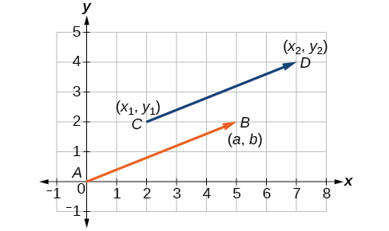{: #Figure_08_08_003}

Properties of Vectors

A vector is a directed line segment with an initial point and a terminal point. Vectors are identified by magnitude, or the length of the line, and direction, represented by the arrowhead pointing toward the terminal point. The position vector has an initial point at<math xmlns="http://www.w3.org/1998/Math/MathML"> <mrow> <mtext> </mtext><mrow><mo>(</mo> <mrow> <mn>0</mn><mo>,</mo><mn>0</mn></mrow> <mo>)</mo></mrow><mtext> </mtext></mrow> </math>

and is identified by its terminal point<math xmlns="http://www.w3.org/1998/Math/MathML"> <mrow> <mrow><mo>〈</mo> <mrow> <mi>a</mi><mo>,</mo><mi>b</mi></mrow> <mo>〉</mo></mrow><mo>.</mo></mrow> </math>

Find the Position Vector

Consider the vector whose initial point is<math xmlns="http://www.w3.org/1998/Math/MathML"> <mrow> <mtext> </mtext><mi>P</mi><mrow><mo>(</mo> <mrow> <mn>2</mn><mo>,</mo><mn>3</mn></mrow> <mo>)</mo></mrow><mtext> </mtext></mrow> </math>

and terminal point is<math xmlns="http://www.w3.org/1998/Math/MathML"> <mrow> <mtext> </mtext><mi>Q</mi><mrow><mo>(</mo> <mrow> <mn>6</mn><mo>,</mo><mn>4</mn></mrow> <mo>)</mo></mrow><mo>.</mo><mtext> </mtext></mrow> </math>

Find the position vector.

The position vector is found by subtracting one *x*-coordinate from the other *x*-coordinate, and one *y*-coordinate from the other *y*-coordinate. Thus

<math xmlns="http://www.w3.org/1998/Math/MathML" display="block"> <mrow> <mtable columnalign="left"> <mtr columnalign="left"> <mtd columnalign="left"> <mrow> <mi>v</mi><mo>=</mo><mrow><mo>〈</mo> <mrow> <mn>6</mn><mo>−</mo><mn>2</mn><mo>,</mo><mn>4</mn><mo>−</mo><mn>3</mn></mrow> <mo>〉</mo></mrow></mrow> </mtd> </mtr> <mtr columnalign="left"> <mtd columnalign="left"> <mrow> <mtext> </mtext><mtext> </mtext><mtext> </mtext><mo>=</mo><mrow><mo>〈</mo> <mrow> <mn>4</mn><mo>,</mo><mn>1</mn></mrow> <mo>〉</mo></mrow></mrow> </mtd> </mtr> </mtable></mrow> </math>

The position vector begins at<math xmlns="http://www.w3.org/1998/Math/MathML"> <mrow> <mtext> </mtext><mrow><mo>(</mo> <mrow> <mn>0</mn><mo>,</mo><mn>0</mn></mrow> <mo>)</mo></mrow><mtext> </mtext></mrow> </math>

and terminates at<math xmlns="http://www.w3.org/1998/Math/MathML"> <mrow> <mtext> </mtext><mrow><mo>(</mo> <mrow> <mn>4</mn><mo>,</mo><mn>1</mn></mrow> <mo>)</mo></mrow><mo>.</mo><mtext> </mtext></mrow> </math>

The graphs of both vectors are shown in [[link]](#Figure_08_08_022).

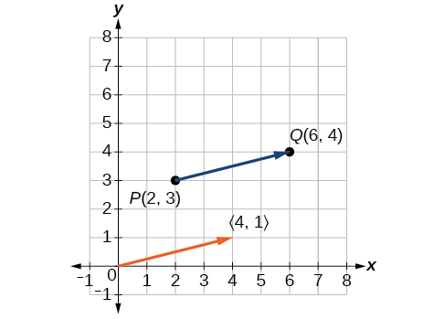{: #Figure_08_08_022}

We see that the position vector is<math xmlns="http://www.w3.org/1998/Math/MathML"> <mrow> <mrow><mo>〈</mo> <mrow> <mn>4</mn><mo>,</mo><mn>1</mn></mrow> <mo>〉</mo></mrow><mo>.</mo></mrow> </math>

Drawing a Vector with the Given Criteria and Its Equivalent Position Vector

Find the position vector given that vector<strong><math xmlns="http://www.w3.org/1998/Math/MathML">
 <mrow>
  <mtext> </mtext><mi>v</mi><mtext> </mtext></mrow>
</math></strong>has an initial point at <math xmlns="http://www.w3.org/1998/Math/MathML"> <mrow> <mtext> </mtext><mrow><mo>(</mo> <mrow> <mo>−</mo><mn>3</mn><mo>,</mo><mn>2</mn></mrow> <mo>)</mo></mrow><mtext> </mtext></mrow> </math>

and a terminal point at<math xmlns="http://www.w3.org/1998/Math/MathML"> <mrow> <mtext> </mtext><mrow><mo>(</mo> <mrow> <mn>4</mn><mo>,</mo><mn>5</mn></mrow> <mo>)</mo></mrow><mo>,</mo><mtext> </mtext></mrow> </math>

then graph both vectors in the same plane.

The position vector is found using the following calculation:

<math xmlns="http://www.w3.org/1998/Math/MathML" display="block"> <mrow> <mtable columnalign="left"> <mtr columnalign="left"> <mtd columnalign="left"> <mrow> <mi>v</mi><mo>=</mo><mrow><mo>〈</mo> <mrow> <mn>4</mn><mo>−</mo><mo stretchy="false">(</mo><mo>−</mo><mn>3</mn><mo stretchy="false">)</mo><mo>,</mo><mn>5</mn><mo>−</mo><mn>2</mn></mrow> <mo>〉</mo></mrow></mrow> </mtd> </mtr> <mtr columnalign="left"> <mtd columnalign="left"> <mrow> <mtext>  </mtext><mo>=</mo><mrow><mo>〈</mo> <mrow> <mn>7</mn><mo>,</mo><mn>3</mn></mrow> <mo>〉</mo></mrow></mrow> </mtd> </mtr> </mtable></mrow> </math>

Thus, the position vector begins at<math xmlns="http://www.w3.org/1998/Math/MathML"> <mrow> <mtext> </mtext><mrow><mo>(</mo> <mrow> <mn>0</mn><mo>,</mo><mn>0</mn></mrow> <mo>)</mo></mrow><mtext> </mtext></mrow> </math>

and terminates at<math xmlns="http://www.w3.org/1998/Math/MathML"> <mrow> <mtext> </mtext><mrow><mo>(</mo> <mrow> <mn>7</mn><mo>,</mo><mn>3</mn></mrow> <mo>)</mo></mrow><mo>.</mo><mtext> </mtext></mrow> </math>

See [[link]](#Figure_08_08_004).

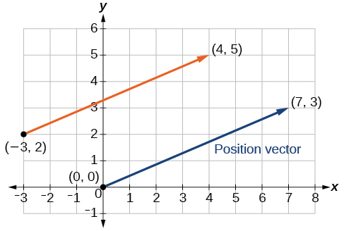{: #Figure_08_08_004}

Draw a vector<strong><math xmlns="http://www.w3.org/1998/Math/MathML">
 <mrow>
  <mtext> </mtext><mi>v</mi><mtext> </mtext></mrow>
</math></strong>that connects from the origin to the point<math xmlns="http://www.w3.org/1998/Math/MathML"> <mrow> <mtext> </mtext><mo stretchy="false">(</mo><mn>3</mn><mo>,</mo><mn>5</mn><mo stretchy="false">)</mo><mo>.</mo></mrow> </math>

 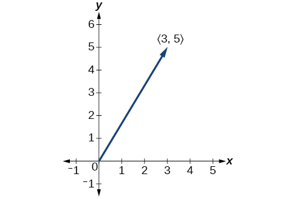 

### Finding Magnitude and Direction 

To work with a vector, we need to be able to find its magnitude and its direction. We find its magnitude using the Pythagorean Theorem or the distance formula, and we find its direction using the inverse tangent function.

Magnitude and Direction of a Vector

Given a position vector<strong><math xmlns="http://www.w3.org/1998/Math/MathML">
 <mrow>
  <mtext> </mtext><mi>v</mi>
 </mrow>
</math></strong><math xmlns="http://www.w3.org/1998/Math/MathML"> <mrow> <mo>=</mo><mrow><mo>〈</mo> <mrow> <mi>a</mi><mo>,</mo><mi>b</mi></mrow> <mo>〉</mo></mrow><mo>,</mo></mrow> </math>

the magnitude is found by<math xmlns="http://www.w3.org/1998/Math/MathML"> <mrow> <mrow><mo>\|</mo> <mi>v</mi> <mo>\|</mo></mrow><mo>=</mo><msqrt> <mrow> <msup> <mi>a</mi> <mn>2</mn> </msup> <mo>+</mo><msup> <mi>b</mi> <mn>2</mn> </msup> </mrow> </msqrt> <mo>.</mo></mrow> </math>

The direction is equal to the angle formed with the *x*-axis, or with the *y*-axis, depending on the application. For a position vector, the direction is found by<math xmlns="http://www.w3.org/1998/Math/MathML"> <mrow> <mtext> </mtext><mi>tan</mi><mtext> </mtext><mi>θ</mi><mo>=</mo><mrow><mo>(</mo> <mrow> <mfrac> <mi>b</mi> <mi>a</mi> </mfrac> </mrow> <mo>)</mo></mrow><mo stretchy="false">⇒</mo><mi>θ</mi><mo>=</mo><msup> <mrow> <mi>tan</mi></mrow> <mrow> <mo>−</mo><mn>1</mn></mrow> </msup> <mrow><mo>(</mo> <mrow> <mfrac> <mi>b</mi> <mi>a</mi> </mfrac> </mrow> <mo>)</mo></mrow><mo>,</mo><mtext> </mtext></mrow> </math>

as illustrated in [\[link\]](#Figure_08_08_017).

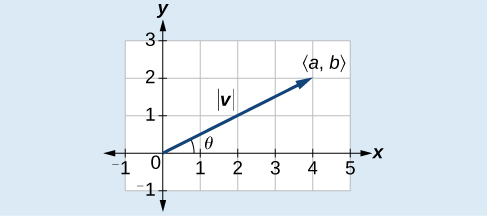{: #Figure_08_08_017}

Two vectors ***v*** and ***u*** are considered equal if they have the same magnitude and the same direction. Additionally, if both vectors have the same position vector, they are equal.

Finding the Magnitude and Direction of a Vector

Find the magnitude and direction of the vector with initial point<math xmlns="http://www.w3.org/1998/Math/MathML"> <mrow> <mtext> </mtext><mi>P</mi><mrow><mo>(</mo> <mrow> <mo>−</mo><mn>8</mn><mo>,</mo><mn>1</mn></mrow> <mo>)</mo></mrow><mtext> </mtext></mrow> </math>

and terminal point<math xmlns="http://www.w3.org/1998/Math/MathML"> <mrow> <mtext> </mtext><mi>Q</mi><mrow><mo>(</mo> <mrow> <mo>−</mo><mn>2</mn><mo>,</mo><mo>−</mo><mn>5</mn></mrow> <mo>)</mo></mrow><mo>.</mo></mrow> </math>

Draw the vector.

First, find the **position vector**{: data-type="term" .no-emphasis}.

<math xmlns="http://www.w3.org/1998/Math/MathML" display="block"> <mrow> <mtable columnalign="left"> <mtr columnalign="left"> <mtd columnalign="left"> <mrow> <mi>u</mi><mo>=</mo><mrow><mo>〈</mo> <mrow> <mn>−2</mn><mo>,</mo><mo>−</mo><mo stretchy="false">(</mo><mn>−8</mn><mo stretchy="false">)</mo><mo>,</mo><mn>−5</mn><mo /><mn>−1</mn></mrow> <mo>〉</mo></mrow></mrow> </mtd> </mtr> <mtr columnalign="left"> <mtd columnalign="left"> <mrow> <mtext>  </mtext><mo>=</mo><mrow><mo>〈</mo> <mrow> <mn>6</mn><mo>,</mo><mo>−</mo><mn>6</mn></mrow> <mo>〉</mo></mrow></mrow> </mtd> </mtr> </mtable></mrow> </math>

We use the Pythagorean Theorem to find the magnitude.

<math xmlns="http://www.w3.org/1998/Math/MathML" display="block"> <mrow> <mtable columnalign="left"> <mtr columnalign="left"> <mtd columnalign="left"> <mrow> <mo>\|</mo><mi>u</mi><mo>\|</mo><mo>=</mo><msqrt> <mrow> <msup> <mrow> <mo stretchy="false">(</mo><mn>6</mn><mo stretchy="false">)</mo> </mrow> <mn>2</mn> </msup> <mo>+</mo><msup> <mrow> <mo stretchy="false">(</mo><mo>−</mo><mn>6</mn><mo stretchy="false">)</mo> </mrow> <mn>2</mn> </msup> </mrow> </msqrt> </mrow> </mtd> </mtr> <mtr columnalign="left"> <mtd columnalign="left"> <mrow> <mtext> </mtext><mtext> </mtext><mtext> </mtext><mtext> </mtext><mtext> </mtext><mtext> </mtext><mo>=</mo><msqrt> <mrow> <mn>72</mn> </mrow> </msqrt> </mrow> </mtd> </mtr> <mtr columnalign="left"> <mtd columnalign="left"> <mrow> <mtext> </mtext><mtext> </mtext><mtext> </mtext><mtext> </mtext><mtext> </mtext><mtext> </mtext><mo>=</mo><mn>6</mn><msqrt> <mn>2</mn> </msqrt> </mrow> </mtd> </mtr> </mtable> </mrow> </math>

The direction is given as

<math xmlns="http://www.w3.org/1998/Math/MathML" display="block"> <mrow> <mtable columnalign="left"> <mtr columnalign="left"> <mtd columnalign="left"> <mrow> <mi>tan</mi><mtext> </mtext><mi>θ</mi><mo>=</mo><mfrac> <mrow> <mn>−6</mn></mrow> <mn>6</mn> </mfrac> <mo>=</mo><mn>−1</mn><mo stretchy="false">⇒</mo><mi>θ</mi><mo>=</mo><msup> <mrow> <mi>tan</mi></mrow> <mrow> <mn>−1</mn></mrow> </msup> <mo stretchy="false">(</mo><mn>−1</mn><mo stretchy="false">)</mo></mrow> </mtd> </mtr> <mtr columnalign="left"> <mtd columnalign="left"> <mrow> <mtext> </mtext><mtext> </mtext><mtext> </mtext><mtext> </mtext><mtext> </mtext><mtext> </mtext><mtext> </mtext><mtext> </mtext><mtext> </mtext><mtext> </mtext><mtext> </mtext><mtext> </mtext><mo>=</mo><mo>−</mo><mn>45°</mn></mrow> </mtd> </mtr> </mtable></mrow> </math>

However, the angle terminates in the fourth quadrant, so we add 360° to obtain a positive angle. Thus,<math xmlns="http://www.w3.org/1998/Math/MathML"> <mrow> <mtext> </mtext><mo>−</mo><mn>45°</mn><mo>+</mo><mn>360°</mn><mo>=</mo><mn>315°</mn><mo>.</mo><mtext> </mtext> </mrow> </math>

See [[link]](#Figure_08_08_018).

{: #Figure_08_08_018}

Showing That Two Vectors Are Equal

Show that vector ***v*** with **initial point**{: data-type="term" .no-emphasis} at<math xmlns="http://www.w3.org/1998/Math/MathML"> <mrow> <mtext> </mtext><mrow><mo>(</mo> <mrow> <mn>5</mn><mo>,</mo><mn>−3</mn></mrow> <mo>)</mo></mrow><mtext> </mtext></mrow> </math>

and **terminal point**{: data-type="term" .no-emphasis} at<math xmlns="http://www.w3.org/1998/Math/MathML"> <mrow> <mtext> </mtext><mrow><mo>(</mo> <mrow> <mn>−1</mn><mo>,</mo><mn>2</mn></mrow> <mo>)</mo></mrow><mtext> </mtext></mrow> </math>

is equal to vector ***u*** with initial point at<math xmlns="http://www.w3.org/1998/Math/MathML"> <mrow> <mtext> </mtext><mrow><mo>(</mo> <mrow> <mn>−1</mn><mo>,</mo><mn>−3</mn></mrow> <mo>)</mo></mrow><mtext> </mtext></mrow> </math>

and terminal point at<math xmlns="http://www.w3.org/1998/Math/MathML"> <mrow> <mtext> </mtext><mrow><mo>(</mo> <mrow> <mn>−7</mn><mo>,</mo><mn>2</mn></mrow> <mo>)</mo></mrow><mo>.</mo><mtext> </mtext></mrow> </math>

Draw the position vector on the same grid as ***v*** and ***u***. Next, find the magnitude and direction of each vector.

As shown in [[link]](#Figure_08_08_005), draw the vector<math xmlns="http://www.w3.org/1998/Math/MathML"> <mrow> <mtext> </mtext><mi>v</mi><mtext> </mtext></mrow> </math>

starting at initial<math xmlns="http://www.w3.org/1998/Math/MathML"> <mrow> <mtext> </mtext><mrow><mo>(</mo> <mrow> <mn>5</mn><mo>,</mo><mn>−3</mn></mrow> <mo>)</mo></mrow><mtext> </mtext></mrow> </math>

and terminal point<math xmlns="http://www.w3.org/1998/Math/MathML"> <mrow> <mtext> </mtext><mrow><mo>(</mo> <mrow> <mn>−1</mn><mo>,</mo><mn>2</mn></mrow> <mo>)</mo></mrow><mo>.</mo><mtext> </mtext></mrow> </math>

Draw the vector<math xmlns="http://www.w3.org/1998/Math/MathML"> <mrow> <mtext> </mtext><mi>u</mi><mtext> </mtext></mrow> </math>

with initial point<math xmlns="http://www.w3.org/1998/Math/MathML"> <mrow> <mtext> </mtext><mrow><mo>(</mo> <mrow> <mn>−1</mn><mo>,</mo><mn>−3</mn></mrow> <mo>)</mo></mrow><mtext> </mtext></mrow> </math>

and terminal point<math xmlns="http://www.w3.org/1998/Math/MathML"> <mrow> <mtext> </mtext><mrow><mo>(</mo> <mrow> <mn>−7</mn><mo>,</mo><mn>2</mn></mrow> <mo>)</mo></mrow><mo>.</mo><mtext> </mtext></mrow> </math>

Find the standard position for each.

Next, find and sketch the position vector for ***v*** and ***u***. We have

<math xmlns="http://www.w3.org/1998/Math/MathML" display="block"> <mrow> <mtable columnalign="left"> <mtr columnalign="left"> <mtd columnalign="left"> <mrow> <mi>v</mi><mo>=</mo><mo>〈</mo><mn>−1</mn><mo>−</mo><mn>5</mn><mo>,</mo><mn>2</mn><mo>−</mo><mo stretchy="false">(</mo><mo>−</mo><mn>3</mn><mo stretchy="false">)</mo><mo>〉</mo></mrow> </mtd> </mtr> <mtr columnalign="left"> <mtd columnalign="left"> <mrow> <mtext>  </mtext><mo>=</mo><mo>〈</mo><mn>−6</mn><mo>,</mo><mn>5</mn><mo>〉</mo></mrow> </mtd> </mtr> <mtr columnalign="left"> <mtd columnalign="left"> <mrow /> </mtd> </mtr> <mtr columnalign="left"> <mtd columnalign="left"> <mrow> <mi>u</mi><mo>=</mo><mo>〈</mo><mn>−7</mn><mo>−</mo><mo stretchy="false">(</mo><mn>−1</mn><mo stretchy="false">)</mo><mo>,</mo><mn>2</mn><mo>−</mo><mo stretchy="false">(</mo><mn>−3</mn><mo stretchy="false">)</mo><mo>〉</mo></mrow> </mtd> </mtr> <mtr columnalign="left"> <mtd columnalign="left"> <mrow> <mtext>  </mtext><mo>=</mo><mo>〈</mo><mn>−6</mn><mo>,</mo><mn>5</mn><mo>〉</mo></mrow> </mtd> </mtr> </mtable></mrow> </math>

Since the position vectors are the same, ***v*** and ***u*** are the same.

An alternative way to check for vector equality is to show that the magnitude and direction are the same for both vectors. To show that the magnitudes are equal, use the Pythagorean Theorem.

<math xmlns="http://www.w3.org/1998/Math/MathML" display="block"> <mrow> <mtable columnalign="left"> <mtr columnalign="left"> <mtd columnalign="left"> <mrow> <mo>\|</mo><mi>v</mi><mo>\|</mo><mo>=</mo><msqrt> <mrow> <msup> <mrow> <mo stretchy="false">(</mo><mn>−1</mn><mo>−</mo><mn>5</mn><mo stretchy="false">)</mo> </mrow> <mn>2</mn> </msup> <mo>+</mo><msup> <mrow> <mo stretchy="false">(</mo><mn>2</mn><mo>−</mo><mo stretchy="false">(</mo><mn>−3</mn><mo stretchy="false">)</mo><mo stretchy="false">)</mo> </mrow> <mn>2</mn> </msup> </mrow> </msqrt> </mrow> </mtd> </mtr> <mtr columnalign="left"> <mtd columnalign="left"> <mrow> <mtext> </mtext><mtext> </mtext><mtext> </mtext><mtext> </mtext><mtext> </mtext><mtext> </mtext><mo>=</mo><msqrt> <mrow> <msup> <mrow> <mo stretchy="false">(</mo><mn>−6</mn><mo stretchy="false">)</mo> </mrow> <mn>2</mn> </msup> <mo>+</mo><msup> <mrow> <mo stretchy="false">(</mo><mn>5</mn><mo stretchy="false">)</mo> </mrow> <mn>2</mn> </msup> </mrow> </msqrt> </mrow> </mtd> </mtr> <mtr columnalign="left"> <mtd columnalign="left"> <mrow> <mtext> </mtext><mtext> </mtext><mtext> </mtext><mtext> </mtext><mtext> </mtext><mtext> </mtext><mo>=</mo><msqrt> <mrow> <mn>36</mn><mo>+</mo><mn>25</mn> </mrow> </msqrt> </mrow> </mtd> </mtr> <mtr columnalign="left"> <mtd columnalign="left"> <mrow> <mtext> </mtext><mtext> </mtext><mtext> </mtext><mtext> </mtext><mtext> </mtext><mtext> </mtext><mo>=</mo><msqrt> <mrow> <mn>61</mn> </mrow> </msqrt> </mrow> </mtd> </mtr> <mtr columnalign="left"> <mtd columnalign="left"> <mrow> <mo>\|</mo><mi>u</mi><mo>\|</mo><mo>=</mo><msqrt> <mrow> <msup> <mrow> <mo stretchy="false">(</mo><mn>−7</mn><mo>−</mo><mo stretchy="false">(</mo><mn>−1</mn><mo stretchy="false">)</mo><mo stretchy="false">)</mo> </mrow> <mn>2</mn> </msup> <mo>+</mo><msup> <mrow> <mo stretchy="false">(</mo><mn>2</mn><mo>−</mo><mo stretchy="false">(</mo><mn>−3</mn><mo stretchy="false">)</mo><mo stretchy="false">)</mo> </mrow> <mn>2</mn> </msup> </mrow> </msqrt> </mrow> </mtd> </mtr> <mtr columnalign="left"> <mtd columnalign="left"> <mrow> <mtext> </mtext><mtext> </mtext><mtext> </mtext><mtext> </mtext><mtext> </mtext><mtext> </mtext><mo>=</mo><msqrt> <mrow> <msup> <mrow> <mo stretchy="false">(</mo><mn>−6</mn><mo stretchy="false">)</mo> </mrow> <mn>2</mn> </msup> <mo>+</mo><msup> <mrow> <mo stretchy="false">(</mo><mn>5</mn><mo stretchy="false">)</mo> </mrow> <mn>2</mn> </msup> </mrow> </msqrt> </mrow> </mtd> </mtr> <mtr columnalign="left"> <mtd columnalign="left"> <mrow> <mtext> </mtext><mtext> </mtext><mtext> </mtext><mtext> </mtext><mtext> </mtext><mtext> </mtext><mo>=</mo><msqrt> <mrow> <mn>36</mn><mo>+</mo><mn>25</mn> </mrow> </msqrt> </mrow> </mtd> </mtr> <mtr columnalign="left"> <mtd columnalign="left"> <mrow> <mtext> </mtext><mtext> </mtext><mtext> </mtext><mtext> </mtext><mtext> </mtext><mtext> </mtext><mo>=</mo><msqrt> <mrow> <mn>61</mn> </mrow> </msqrt> </mrow> </mtd> </mtr> </mtable> </mrow> </math>

As the magnitudes are equal, we now need to verify the direction. Using the tangent function with the position vector gives

<math xmlns="http://www.w3.org/1998/Math/MathML" display="block"> <mrow> <mtable columnalign="left"> <mtr columnalign="left"> <mtd columnalign="left"> <mrow> <mi>tan</mi><mtext> </mtext><mi>θ</mi><mo>=</mo><mo>−</mo><mfrac> <mn>5</mn> <mn>6</mn> </mfrac> <mo stretchy="false">⇒</mo><mi>θ</mi><mo>=</mo><msup> <mrow> <mi>tan</mi></mrow> <mrow> <mo>−</mo><mn>1</mn></mrow> </msup> <mrow><mo>(</mo> <mrow> <mo>−</mo><mfrac> <mn>5</mn> <mn>6</mn> </mfrac> </mrow> <mo>)</mo></mrow></mrow> </mtd> </mtr> <mtr columnalign="left"> <mtd columnalign="left"> <mrow> <mtext> </mtext><mtext> </mtext><mtext> </mtext><mtext> </mtext><mtext> </mtext><mtext> </mtext><mtext> </mtext><mtext> </mtext><mtext> </mtext><mtext> </mtext><mtext> </mtext><mtext> </mtext><mo>=</mo><mo>−</mo><mn>39.8°</mn></mrow> </mtd> </mtr> </mtable></mrow> </math>

However, we can see that the position vector terminates in the second quadrant, so we add<math xmlns="http://www.w3.org/1998/Math/MathML"> <mrow> <mtext> </mtext><mn>180°</mn><mo>.</mo><mtext> </mtext> </mrow> </math>

Thus, the direction is<math xmlns="http://www.w3.org/1998/Math/MathML"> <mrow> <mtext> </mtext><mo>−</mo><mn>39.8°</mn><mo>+</mo><mn>180°</mn><mo>=</mo><mn>140.2°</mn><mo>.</mo> </mrow> </math>

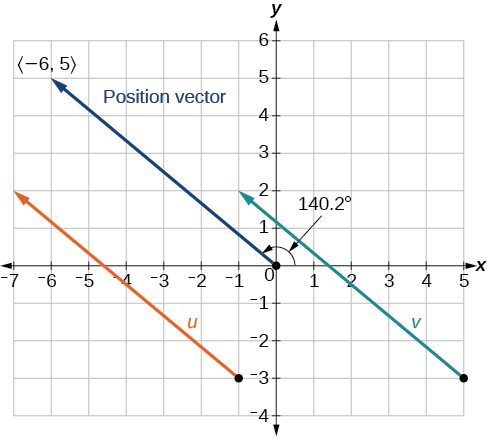{: #Figure_08_08_005}

### Performing Vector Addition and Scalar Multiplication

Now that we understand the properties of vectors, we can perform operations involving them. While it is convenient to think of the vector **<math xmlns="http://www.w3.org/1998/Math/MathML"><mi>u</mi></math>

**<math xmlns="http://www.w3.org/1998/Math/MathML"> <mrow> <mo>=</mo><mrow><mo>〈</mo> <mrow> <mi>x</mi><mo>,</mo><mi>y</mi></mrow> <mo>〉</mo></mrow></mrow> </math>

as an arrow or directed line segment from the origin to the point<math xmlns="http://www.w3.org/1998/Math/MathML"> <mrow> <mtext> </mtext><mo stretchy="false">(</mo><mi>x</mi><mo>,</mo><mi>y</mi><mo stretchy="false">)</mo><mo>,</mo><mtext> </mtext></mrow> </math>

vectors can be situated anywhere in the plane. The sum of two vectors ***u*** and ***v***, or **vector addition**{: data-type="term"}, produces a third vector ***u***+ ***v***, the **resultant**{: data-type="term"} vector.

To find ***u*** + ***v***, we first draw the vector ***u***, and from the terminal end of ***u***, we drawn the vector ***v***. In other words, we have the initial point of ***v*** meet the terminal end of ***u***. This position corresponds to the notion that we move along the first vector and then, from its terminal point, we move along the second vector. The sum ***u*** + ***v*** is the resultant vector because it results from addition or subtraction of two vectors. The resultant vector travels directly from the beginning of ***u*** to the end of ***v*** in a straight path, as shown in [\[link\]](#Figure_08_08_008).

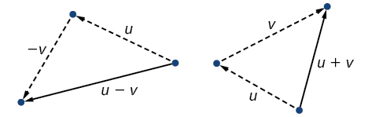{: #Figure_08_08_008}

Vector subtraction is similar to vector addition. To find ***u*** − ***v***, view it as ***u*** + (−***v***). Adding −***v*** is reversing direction of ***v*** and adding it to the end of ***u***. The new vector begins at the start of ***u*** and stops at the end point of −***v***. See [\[link\]](#Figure_08_08_009) for a visual that compares vector addition and vector subtraction using **parallelograms**{: data-type="term" .no-emphasis}.

{: #Figure_08_08_009}

Adding and Subtracting Vectors

Given <strong><math xmlns="http://www.w3.org/1998/Math/MathML">
 <mi>u</mi>
</math></strong><math xmlns="http://www.w3.org/1998/Math/MathML"> <mrow> <mo>=</mo><mrow><mo>〈</mo> <mrow> <mn>3</mn><mo>,</mo><mo>−</mo><mn>2</mn></mrow> <mo>〉</mo></mrow></mrow> </math>

and<strong><math xmlns="http://www.w3.org/1998/Math/MathML">
 <mi>v</mi>
</math></strong><math xmlns="http://www.w3.org/1998/Math/MathML"> <mrow> <mo>=</mo><mrow><mo>〈</mo> <mrow> <mn>−1</mn><mo>,</mo><mn>4</mn></mrow> <mo>〉</mo></mrow><mo>,</mo></mrow> </math>

find two new vectors ***u*** + ***v***, and ***u*** − ***v***.

To find the sum of two vectors, we add the components. Thus,

<math xmlns="http://www.w3.org/1998/Math/MathML" display="block"> <mrow> <mtable columnalign="left"> <mtr columnalign="left"> <mtd columnalign="left"> <mrow> <mi>u</mi><mo>+</mo><mi>v</mi><mo>=</mo><mrow><mo>〈</mo> <mrow> <mn>3</mn><mo>,</mo><mo>−</mo><mn>2</mn></mrow> <mo>〉</mo></mrow><mo>+</mo><mrow><mo>〈</mo> <mrow> <mo>−</mo><mn>1</mn><mo>,</mo><mn>4</mn></mrow> <mo>〉</mo></mrow></mrow> </mtd> </mtr> <mtr columnalign="left"> <mtd columnalign="left"> <mrow> <mtext> </mtext><mtext> </mtext><mtext> </mtext><mtext> </mtext><mtext> </mtext><mtext> </mtext><mtext> </mtext><mtext> </mtext><mtext> </mtext><mtext> </mtext><mtext> </mtext><mtext> </mtext><mo>=</mo><mrow><mo>〈</mo> <mrow> <mn>3</mn><mo>+</mo><mo stretchy="false">(</mo><mo>−</mo><mn>1</mn><mo stretchy="false">)</mo><mo>,</mo><mo>−</mo><mn>2</mn><mo>+</mo><mn>4</mn></mrow> <mo>〉</mo></mrow></mrow> </mtd> </mtr> <mtr columnalign="left"> <mtd columnalign="left"> <mrow> <mtext> </mtext><mtext> </mtext><mtext> </mtext><mtext> </mtext><mtext> </mtext><mtext> </mtext><mtext> </mtext><mtext> </mtext><mtext> </mtext><mtext> </mtext><mtext> </mtext><mtext> </mtext><mo>=</mo><mrow><mo>〈</mo> <mrow> <mn>2</mn><mo>,</mo><mn>2</mn></mrow> <mo>〉</mo></mrow></mrow> </mtd> </mtr> </mtable></mrow> </math>

See [[link]](#Figure_08_08_019)**(a)**.

To find the difference of two vectors, add the negative components of<strong><math xmlns="http://www.w3.org/1998/Math/MathML">
 <mrow>
  <mtext> </mtext><mi>v</mi><mtext> </mtext></mrow>
</math></strong>to<strong><math xmlns="http://www.w3.org/1998/Math/MathML">
 <mrow>
  <mtext> </mtext><mi>u</mi><mo>.</mo><mtext> </mtext></mrow>
</math></strong>Thus,

<math xmlns="http://www.w3.org/1998/Math/MathML" display="block"> <mrow> <mtable columnalign="left"> <mtr columnalign="left"> <mtd columnalign="left"> <mrow> <mi>u</mi><mo>+</mo><mo stretchy="false">(</mo><mo>−</mo><mi>v</mi><mo stretchy="false">)</mo><mo>=</mo><mrow><mo>〈</mo> <mrow> <mn>3</mn><mo>,</mo><mo>−</mo><mn>2</mn></mrow> <mo>〉</mo></mrow><mo>+</mo><mrow><mo>〈</mo> <mrow> <mn>1</mn><mo>,</mo><mo>−</mo><mn>4</mn></mrow> <mo>〉</mo></mrow></mrow> </mtd> </mtr> <mtr columnalign="left"> <mtd columnalign="left"> <mrow> <mtext> </mtext><mtext> </mtext><mtext> </mtext><mtext> </mtext><mtext> </mtext><mtext> </mtext><mtext> </mtext><mtext> </mtext><mtext> </mtext><mtext> </mtext><mtext> </mtext><mtext> </mtext><mtext> </mtext><mtext> </mtext><mtext> </mtext><mtext> </mtext><mtext> </mtext><mtext> </mtext><mtext> </mtext><mtext> </mtext><mtext> </mtext><mtext> </mtext><mo>=</mo><mrow><mo>〈</mo> <mrow> <mn>3</mn><mo>+</mo><mn>1</mn><mo>,</mo><mo>−</mo><mn>2</mn><mo>+</mo><mo stretchy="false">(</mo><mo>−</mo><mn>4</mn><mo stretchy="false">)</mo></mrow> <mo>〉</mo></mrow></mrow> </mtd> </mtr> <mtr columnalign="left"> <mtd columnalign="left"> <mrow> <mtext> </mtext><mtext> </mtext><mtext> </mtext><mtext> </mtext><mtext> </mtext><mtext> </mtext><mtext> </mtext><mtext> </mtext><mtext> </mtext><mtext> </mtext><mtext> </mtext><mtext> </mtext><mtext> </mtext><mtext> </mtext><mtext> </mtext><mtext> </mtext><mtext> </mtext><mtext> </mtext><mtext> </mtext><mtext> </mtext><mtext> </mtext><mtext> </mtext><mo>=</mo><mrow><mo>〈</mo> <mrow> <mn>4</mn><mo>,</mo><mo>−</mo><mn>6</mn></mrow> <mo>〉</mo></mrow></mrow> </mtd> </mtr> </mtable></mrow> </math>

See [[link]](#Figure_08_08_019)**(b).**

 Sum of two vectors (b) Difference of two vectors"){: #Figure_08_08_019}

### Multiplying By a Scalar

While adding and subtracting vectors gives us a new vector with a different magnitude and direction, the process of multiplying a vector by a **scalar**{: data-type="term"}, a constant, changes only the magnitude of the vector or the length of the line. Scalar multiplication has no effect on the direction unless the scalar is negative, in which case the direction of the resulting vector is opposite the direction of the original vector.

Scalar Multiplication

**Scalar multiplication**{: data-type="term"} involves the product of a vector and a scalar. Each component of the vector is multiplied by the scalar. Thus, to multiply <strong><math xmlns="http://www.w3.org/1998/Math/MathML">
 <mi>v</mi>
</math></strong><math xmlns="http://www.w3.org/1998/Math/MathML"> <mrow> <mo>=</mo><mrow><mo>〈</mo> <mrow> <mi>a</mi><mo>,</mo><mi>b</mi></mrow> <mo>〉</mo></mrow></mrow> </math>

 by <math xmlns="http://www.w3.org/1998/Math/MathML"> <mrow> <mi>k</mi></mrow> </math>

, we have

<math xmlns="http://www.w3.org/1998/Math/MathML" display="block"> <mrow> <mi>k</mi><mi>v</mi><mo>=</mo><mrow><mo>〈</mo> <mrow> <mi>k</mi><mi>a</mi><mo>,</mo><mi>k</mi><mi>b</mi></mrow> <mo>〉</mo></mrow></mrow> </math>

Only the magnitude changes, unless<math xmlns="http://www.w3.org/1998/Math/MathML"> <mrow> <mtext> </mtext><mi>k</mi><mtext> </mtext></mrow> </math>

is negative, and then the vector reverses direction.

Performing Scalar Multiplication

Given vector<strong><math xmlns="http://www.w3.org/1998/Math/MathML">
 <mtext> </mtext><mi>v</mi>
</math></strong><math xmlns="http://www.w3.org/1998/Math/MathML"> <mrow> <mo>=</mo><mrow><mo>〈</mo> <mrow> <mn>3</mn><mo>,</mo><mn>1</mn></mrow> <mo>〉</mo></mrow><mo>,</mo><mtext> </mtext></mrow> </math>

find 3***v***, <math xmlns="http://www.w3.org/1998/Math/MathML"> <mrow> <mfrac> <mn>1</mn> <mn>2</mn> </mfrac> </mrow> </math>

<strong><math xmlns="http://www.w3.org/1998/Math/MathML">
 <mrow>
  <mi>v</mi><mo>,</mo><mtext> </mtext>
 </mrow>
</math></strong>and −***v***.

See [[link]](#Figure_08_08_007) for a geometric interpretation. If<strong><math xmlns="http://www.w3.org/1998/Math/MathML">
 <mtext> </mtext><mi>v</mi>
</math></strong><math xmlns="http://www.w3.org/1998/Math/MathML"> <mrow> <mo>=</mo><mrow><mo>〈</mo> <mrow> <mn>3</mn><mo>,</mo><mn>1</mn></mrow> <mo>〉</mo></mrow><mo>,</mo></mrow> </math>

then

<math xmlns="http://www.w3.org/1998/Math/MathML" display="block"> <mrow> <mtable columnalign="left"> <mtr columnalign="left"> <mtd columnalign="left"> <mrow> <mtext> </mtext><mtext> </mtext><mn>3</mn><mi>v</mi><mo>=</mo><mrow><mo>〈</mo> <mrow> <mn>3</mn><mo>⋅</mo><mn>3</mn><mo>,</mo><mn>3</mn><mo>⋅</mo><mn>1</mn></mrow> <mo>〉</mo></mrow></mrow> </mtd> </mtr> <mtr columnalign="left"> <mtd columnalign="left"> <mrow> <mtext> </mtext><mtext> </mtext><mtext> </mtext><mtext> </mtext><mtext> </mtext><mtext> </mtext><mtext> </mtext><mtext> </mtext><mo>=</mo><mrow><mo>〈</mo> <mrow> <mn>9</mn><mo>,</mo><mn>3</mn></mrow> <mo>〉</mo></mrow></mrow> </mtd> </mtr> <mtr columnalign="left"> <mtd columnalign="left"> <mrow> <mtext> </mtext><mfrac> <mn>1</mn> <mn>2</mn> </mfrac> <mi>v</mi><mo>=</mo><mrow><mo>〈</mo> <mrow> <mfrac> <mn>1</mn> <mn>2</mn> </mfrac> <mo>⋅</mo><mn>3</mn><mo>,</mo><mfrac> <mn>1</mn> <mn>2</mn> </mfrac> <mo>⋅</mo><mn>1</mn></mrow> <mo>〉</mo></mrow></mrow> </mtd> </mtr> <mtr columnalign="left"> <mtd columnalign="left"> <mrow> <mtext> </mtext><mtext> </mtext><mtext> </mtext><mtext> </mtext><mtext> </mtext><mtext> </mtext><mtext> </mtext><mtext> </mtext><mo>=</mo><mrow><mo>〈</mo> <mrow> <mfrac> <mn>3</mn> <mn>2</mn> </mfrac> <mo>,</mo><mfrac> <mn>1</mn> <mn>2</mn> </mfrac> </mrow> <mo>〉</mo></mrow></mrow> </mtd> </mtr> <mtr columnalign="left"> <mtd columnalign="left"> <mrow> <mi>−</mi><mi>v</mi><mo>=</mo><mrow><mo>〈</mo> <mrow> <mn>−3</mn><mo>,</mo><mn>−1</mn></mrow> <mo>〉</mo></mrow></mrow> </mtd> </mtr> </mtable></mrow> </math>

{: #Figure_08_08_007}

Analysis

Notice that the vector 3***v*** is three times the length of ***v***, <math xmlns="http://www.w3.org/1998/Math/MathML"> <mfrac> <mn>1</mn> <mn>2</mn> </mfrac></math>

<strong><math xmlns="http://www.w3.org/1998/Math/MathML">
 <mi>v</mi><mtext> </mtext>
</math></strong>is half the length of ***v***, and –***v*** is the same length of ***v***, but in the opposite direction.

Find the **scalar multiple**{: data-type="term" .no-emphasis} 3<strong><math xmlns="http://www.w3.org/1998/Math/MathML">
 <mi>u</mi>
</math></strong> given <strong><math xmlns="http://www.w3.org/1998/Math/MathML">
 <mi>u</mi></math></strong><math xmlns="http://www.w3.org/1998/Math/MathML"> <mrow> <mo>=</mo><mrow><mo>〈</mo> <mrow> <mn>5</mn><mo>,</mo><mn>4</mn></mrow> <mo>〉</mo></mrow><mo>.</mo></mrow> </math>

<math xmlns="http://www.w3.org/1998/Math/MathML"> <mrow> <mn>3</mn><mi>u</mi><mo>=</mo><mrow><mo>〈</mo> <mrow> <mn>15</mn><mo>,</mo><mn>12</mn></mrow> <mo>〉</mo></mrow></mrow> </math>

Using Vector Addition and Scalar Multiplication to Find a New Vector

Given <strong><math xmlns="http://www.w3.org/1998/Math/MathML">
 <mi>u</mi>
</math></strong><math xmlns="http://www.w3.org/1998/Math/MathML"> <mrow> <mo>=</mo><mrow><mo>〈</mo> <mrow> <mn>3</mn><mo>,</mo><mo>−</mo><mn>2</mn></mrow> <mo>〉</mo></mrow></mrow> </math>

and<strong><math xmlns="http://www.w3.org/1998/Math/MathML">
 <mi>v</mi>
</math></strong><math xmlns="http://www.w3.org/1998/Math/MathML"> <mrow> <mo>=</mo><mrow><mo>〈</mo> <mrow> <mo>−</mo><mn>1</mn><mo>,</mo><mn>4</mn></mrow> <mo>〉</mo></mrow><mo>,</mo></mrow> </math>

find a new vector ***w*** = 3***u*** + 2***v***.

First, we must multiply each vector by the scalar.

<math xmlns="http://www.w3.org/1998/Math/MathML" display="block"> <mrow> <mtable columnalign="left"> <mtr columnalign="left"> <mtd columnalign="left"> <mrow> <mn>3</mn><mi>u</mi><mo>=</mo><mn>3</mn><mrow><mo>〈</mo> <mrow> <mn>3</mn><mo>,</mo><mo>−</mo><mn>2</mn></mrow> <mo>〉</mo></mrow></mrow> </mtd> </mtr> <mtr columnalign="left"> <mtd columnalign="left"> <mrow> <mtext> </mtext><mtext> </mtext><mtext> </mtext><mtext> </mtext><mtext> </mtext><mtext> </mtext><mo>=</mo><mrow><mo>〈</mo> <mrow> <mn>9</mn><mo>,</mo><mo>−</mo><mn>6</mn></mrow> <mo>〉</mo></mrow></mrow> </mtd> </mtr> <mtr columnalign="left"> <mtd columnalign="left"> <mrow> <mn>2</mn><mi>v</mi><mo>=</mo><mn>2</mn><mrow><mo>〈</mo> <mrow> <mo>−</mo><mn>1</mn><mo>,</mo><mn>4</mn></mrow> <mo>〉</mo></mrow></mrow> </mtd> </mtr> <mtr columnalign="left"> <mtd columnalign="left"> <mrow> <mtext> </mtext><mtext> </mtext><mtext> </mtext><mtext> </mtext><mtext> </mtext><mtext> </mtext><mo>=</mo><mrow><mo>〈</mo> <mrow> <mo>−</mo><mn>2</mn><mo>,</mo><mn>8</mn></mrow> <mo>〉</mo></mrow></mrow> </mtd> </mtr> </mtable></mrow> </math>

Then, add the two together.

<math xmlns="http://www.w3.org/1998/Math/MathML" display="block"> <mrow> <mtable columnalign="left"> <mtr columnalign="left"> <mtd columnalign="left"> <mrow> <mi>w</mi><mo>=</mo><mn>3</mn><mi>u</mi><mo>+</mo><mn>2</mn><mi>v</mi></mrow> </mtd> </mtr> <mtr columnalign="left"> <mtd columnalign="left"> <mrow> <mtext> </mtext><mtext> </mtext><mtext> </mtext><mtext> </mtext><mtext> </mtext><mo>=</mo><mrow><mo>〈</mo> <mrow> <mn>9</mn><mo>,</mo><mo>−</mo><mn>6</mn></mrow> <mo>〉</mo></mrow><mo>+</mo><mrow><mo>〈</mo> <mrow> <mo>−</mo><mn>2</mn><mo>,</mo><mn>8</mn></mrow> <mo>〉</mo></mrow></mrow> </mtd> </mtr> <mtr columnalign="left"> <mtd columnalign="left"> <mrow> <mtext> </mtext><mtext> </mtext><mtext> </mtext><mtext> </mtext><mtext> </mtext><mo>=</mo><mrow><mo>〈</mo> <mrow> <mn>9</mn><mo>−</mo><mn>2</mn><mo>,</mo><mo>−</mo><mn>6</mn><mo>+</mo><mn>8</mn></mrow> <mo>〉</mo></mrow></mrow> </mtd> </mtr> <mtr columnalign="left"> <mtd columnalign="left"> <mrow> <mtext> </mtext><mtext> </mtext><mtext> </mtext><mtext> </mtext><mtext> </mtext><mo>=</mo><mrow><mo>〈</mo> <mrow> <mn>7</mn><mo>,</mo><mn>2</mn></mrow> <mo>〉</mo></mrow></mrow> </mtd> </mtr> </mtable></mrow> </math>

So, <strong><math xmlns="http://www.w3.org/1998/Math/MathML">
 <mi>w</mi>
</math></strong><math xmlns="http://www.w3.org/1998/Math/MathML"> <mrow> <mo>=</mo><mrow><mo>〈</mo> <mrow> <mn>7</mn><mo>,</mo><mn>2</mn></mrow> <mo>〉</mo></mrow><mo>.</mo></mrow> </math>

### Finding Component Form

In some applications involving vectors, it is helpful for us to be able to break a vector down into its components. Vectors are comprised of two components: the horizontal component is the<math xmlns="http://www.w3.org/1998/Math/MathML"> <mrow> <mtext> </mtext><mi>x</mi><mtext> </mtext></mrow> </math>

direction, and the vertical component is the<math xmlns="http://www.w3.org/1998/Math/MathML"> <mrow> <mtext> </mtext><mi>y</mi><mtext> </mtext></mrow> </math>

direction. For example, we can see in the graph in [\[link\]](#Figure_08_08_020) that the position vector<math xmlns="http://www.w3.org/1998/Math/MathML"> <mrow> <mrow><mo>〈</mo> <mrow> <mn>2</mn><mo>,</mo><mn>3</mn></mrow> <mo>〉</mo></mrow></mrow> </math>

comes from adding the vectors ***v***1 and ***v***2. We have ***v***1 with initial point<math xmlns="http://www.w3.org/1998/Math/MathML"> <mrow> <mtext> </mtext><mrow><mo>(</mo> <mrow> <mn>0</mn><mo>,</mo><mn>0</mn></mrow> <mo>)</mo></mrow><mtext> </mtext></mrow> </math>

and terminal point<math xmlns="http://www.w3.org/1998/Math/MathML"> <mrow> <mtext> </mtext><mrow><mo>(</mo> <mrow> <mn>2</mn><mo>,</mo><mn>0</mn></mrow> <mo>)</mo></mrow><mo>.</mo><mtext> </mtext></mrow> </math>

<math xmlns="http://www.w3.org/1998/Math/MathML" display="block"> <mrow> <mtable columnalign="left"> <mtr columnalign="left"> <mtd columnalign="left"> <mrow> <msub> <mi>v</mi> <mn>1</mn> </msub> <mo>=</mo><mrow><mo>〈</mo> <mrow> <mn>2</mn><mo>−</mo><mn>0</mn><mo>,</mo><mn>0</mn><mo>−</mo><mn>0</mn></mrow> <mo>〉</mo></mrow></mrow> </mtd> </mtr> <mtr columnalign="left"> <mtd columnalign="left"> <mrow> <mtext> </mtext><mtext> </mtext><mtext> </mtext><mtext> </mtext><mtext> </mtext><mtext> </mtext><mo>=</mo><mrow><mo>〈</mo> <mrow> <mn>2</mn><mo>,</mo><mn>0</mn></mrow> <mo>〉</mo></mrow></mrow> </mtd> </mtr> </mtable></mrow> </math>

We also have ***v***2 with initial point<math xmlns="http://www.w3.org/1998/Math/MathML"> <mrow> <mtext> </mtext><mrow><mo>(</mo> <mrow> <mn>0</mn><mo>,</mo><mn>0</mn></mrow> <mo>)</mo></mrow><mtext> </mtext></mrow> </math>

and terminal point<math xmlns="http://www.w3.org/1998/Math/MathML"> <mrow> <mtext> </mtext><mrow><mo>(</mo> <mrow> <mn>0</mn><mo>,</mo><mtext> </mtext><mn>3</mn></mrow> <mo>)</mo></mrow><mo>.</mo><mtext> </mtext></mrow> </math>

<math xmlns="http://www.w3.org/1998/Math/MathML" display="block"> <mrow> <mtable columnalign="left"> <mtr columnalign="left"> <mtd columnalign="left"> <mrow> <msub> <mi>v</mi> <mn>2</mn> </msub> <mo>=</mo><mrow><mo>〈</mo> <mrow> <mn>0</mn><mo>−</mo><mn>0</mn><mo>,</mo><mn>3</mn><mo>−</mo><mn>0</mn></mrow> <mo>〉</mo></mrow></mrow> </mtd> </mtr> <mtr columnalign="left"> <mtd columnalign="left"> <mrow> <mtext> </mtext><mtext> </mtext><mtext> </mtext><mtext> </mtext><mtext> </mtext><mtext> </mtext><mtext> </mtext><mo>=</mo><mrow><mo>〈</mo> <mrow> <mn>0</mn><mo>,</mo><mn>3</mn></mrow> <mo>〉</mo></mrow></mrow> </mtd> </mtr> </mtable></mrow> </math>

Therefore, the position vector is

<math xmlns="http://www.w3.org/1998/Math/MathML" display="block"> <mrow> <mtable columnalign="left"> <mtr columnalign="left"> <mtd columnalign="left"> <mrow> <mi>v</mi><mo>=</mo><mrow><mo>〈</mo> <mrow> <mn>2</mn><mo>+</mo><mn>0</mn><mo>,</mo><mn>3</mn><mo>+</mo><mn>0</mn></mrow> <mo>〉</mo></mrow></mrow> </mtd> </mtr> <mtr columnalign="left"> <mtd columnalign="left"> <mrow> <mtext> </mtext><mtext> </mtext><mtext> </mtext><mo>=</mo><mrow><mo>〈</mo> <mrow> <mn>2</mn><mo>,</mo><mn>3</mn></mrow> <mo>〉</mo></mrow></mrow> </mtd> </mtr> </mtable></mrow> </math>

Using the Pythagorean Theorem, the magnitude of ***v***1 is 2, and the magnitude of ***v***2 is 3. To find the magnitude of ***v***, use the formula with the position vector.

<math xmlns="http://www.w3.org/1998/Math/MathML" display="block"> <mrow> <mtable columnalign="left"> <mtr columnalign="left"> <mtd columnalign="left"> <mrow /> </mtd> </mtr> <mtr columnalign="left"> <mtd columnalign="left"> <mrow> <mtable columnalign="left"> <mtr columnalign="left"> <mtd columnalign="left"> <mrow> <mo>\|</mo><mi>v</mi><mo>\|</mo><mo>=</mo><msqrt> <mrow> <mo>\|</mo><msub> <mi>v</mi> <mn>1</mn> </msub> <msup> <mo>\|</mo> <mn>2</mn> </msup> <mo>+</mo><mo>\|</mo><msub> <mi>v</mi> <mn>2</mn> </msub> <msup> <mo>\|</mo> <mn>2</mn> </msup> </mrow> </msqrt> </mrow> </mtd> </mtr> <mtr columnalign="left"> <mtd columnalign="left"> <mrow> <mtable columnalign="left"> <mtr columnalign="left"> <mtd columnalign="left"> <mrow> <mtext> </mtext><mtext> </mtext><mtext> </mtext><mtext> </mtext><mtext> </mtext><mo>=</mo><msqrt> <mrow> <msup> <mn>2</mn> <mn>2</mn> </msup> <mo>+</mo><msup> <mn>3</mn> <mn>2</mn> </msup> </mrow> </msqrt> </mrow> </mtd> </mtr> <mtr columnalign="left"> <mtd columnalign="left"> <mrow> <mtext> </mtext><mtext> </mtext><mtext> </mtext><mtext> </mtext><mtext> </mtext><mo>=</mo><msqrt> <mrow> <mn>13</mn> </mrow> </msqrt> </mrow> </mtd> </mtr> </mtable> </mrow> </mtd> </mtr> </mtable> </mrow> </mtd> </mtr> </mtable> </mrow> </math>

The magnitude of ***v*** is<math xmlns="http://www.w3.org/1998/Math/MathML"> <mrow> <mtext> </mtext><msqrt> <mrow> <mn>13</mn></mrow> </msqrt> <mo>.</mo><mtext> </mtext></mrow> </math>

To find the direction, we use the tangent function<math xmlns="http://www.w3.org/1998/Math/MathML"> <mrow> <mtext> </mtext><mi>tan</mi><mtext> </mtext><mi>θ</mi><mo>=</mo><mfrac> <mi>y</mi> <mi>x</mi> </mfrac> <mo>.</mo></mrow> </math>

<math xmlns="http://www.w3.org/1998/Math/MathML" display="block"> <mrow> <mtable columnalign="left"> <mtr columnalign="left"> <mtd columnalign="left"> <mrow> <mi>tan</mi><mtext> </mtext><mi>θ</mi><mo>=</mo><mfrac> <mrow> <msub> <mi>v</mi> <mn>2</mn> </msub> </mrow> <mrow> <msub> <mi>v</mi> <mn>1</mn> </msub> </mrow> </mfrac> </mrow> </mtd> </mtr> <mtr columnalign="left"> <mtd columnalign="left"> <mrow> <mi>tan</mi><mtext> </mtext><mi>θ</mi><mo>=</mo><mfrac> <mn>3</mn> <mn>2</mn> </mfrac> </mrow> </mtd> </mtr> <mtr columnalign="left"> <mtd columnalign="left"> <mrow> <mtext> </mtext><mtext> </mtext><mtext> </mtext><mtext> </mtext><mtext> </mtext><mtext> </mtext><mtext> </mtext><mtext> </mtext><mtext> </mtext><mi>θ</mi><mo>=</mo><msup> <mrow> <mi>tan</mi></mrow> <mrow> <mo>−</mo><mn>1</mn></mrow> </msup> <mrow><mo>(</mo> <mrow> <mfrac> <mn>3</mn> <mn>2</mn> </mfrac> </mrow> <mo>)</mo></mrow><mo>=</mo><mn>56.3°</mn></mrow> </mtd> </mtr> </mtable></mrow> </math>

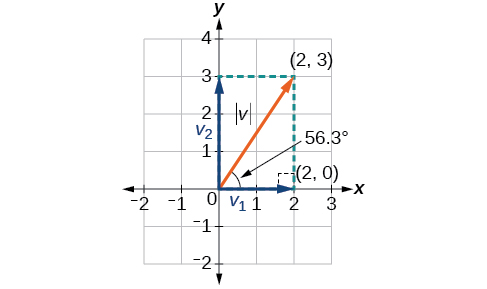{: #Figure_08_08_020}

Thus, the magnitude of<strong><math xmlns="http://www.w3.org/1998/Math/MathML">
 <mrow>
  <mtext> </mtext><mi>v</mi><mtext> </mtext></mrow>
</math></strong>is<math xmlns="http://www.w3.org/1998/Math/MathML"> <mrow> <mtext> </mtext><msqrt> <mrow> <mn>13</mn></mrow> </msqrt> <mtext> </mtext></mrow> </math>

and the direction is<math xmlns="http://www.w3.org/1998/Math/MathML"> <mrow> <mtext> </mtext><msup> <mrow> <mn>56.3</mn></mrow> <mo>∘</mo> </msup> </mrow> </math>

off the horizontal.

Finding the Components of the Vector

Find the components of the vector<strong><math xmlns="http://www.w3.org/1998/Math/MathML">
 <mrow>
  <mtext> </mtext><mi>v</mi><mtext> </mtext></mrow>
</math></strong>with initial point<math xmlns="http://www.w3.org/1998/Math/MathML"> <mrow> <mtext> </mtext><mrow><mo>(</mo> <mrow> <mn>3</mn><mo>,</mo><mn>2</mn></mrow> <mo>)</mo></mrow><mtext> </mtext></mrow> </math>

and terminal point<math xmlns="http://www.w3.org/1998/Math/MathML"> <mrow> <mtext> </mtext><mrow><mo>(</mo> <mrow> <mn>7</mn><mo>,</mo><mn>4</mn></mrow> <mo>)</mo></mrow><mo>.</mo></mrow> </math>

First find the standard position.

<math xmlns="http://www.w3.org/1998/Math/MathML" display="block"> <mrow> <mtable columnalign="left"> <mtr columnalign="left"> <mtd columnalign="left"> <mrow> <mi>v</mi><mo>=</mo><mrow><mo>〈</mo> <mrow> <mn>7</mn><mo>−</mo><mn>3</mn><mo>,</mo><mn>4</mn><mo>−</mo><mn>2</mn></mrow> <mo>〉</mo></mrow></mrow> </mtd> </mtr> <mtr columnalign="left"> <mtd columnalign="left"> <mrow> <mtext> </mtext><mtext> </mtext><mtext> </mtext><mo>=</mo><mrow><mo>〈</mo> <mrow> <mn>4</mn><mo>,</mo><mn>2</mn></mrow> <mo>〉</mo></mrow></mrow> </mtd> </mtr> </mtable></mrow> </math>

See the illustration in [[link]](#Figure_08_08_021).

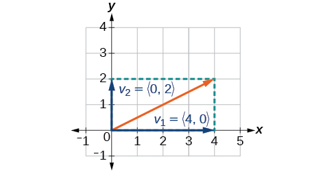{: #Figure_08_08_021}

The horizontal component is <strong><math xmlns="http://www.w3.org/1998/Math/MathML">
 <msub>
  <mi>v</mi>
  <mn>1</mn>
 </msub></math></strong><math xmlns="http://www.w3.org/1998/Math/MathML"><mrow> <mo>=</mo><mrow><mo>〈</mo> <mrow> <mn>4</mn><mo>,</mo><mn>0</mn> </mrow> <mo>〉</mo></mrow><mtext> </mtext> </mrow> </math>

and the vertical component is<strong><math xmlns="http://www.w3.org/1998/Math/MathML">
 <mtext> </mtext><msub>
  <mi>v</mi>
  <mn>2</mn>
 </msub></math></strong><math xmlns="http://www.w3.org/1998/Math/MathML"> <mrow> <mo>=</mo><mrow><mo>〈</mo> <mrow> <mn>0</mn><mo>,</mo><mn>2</mn> </mrow> <mo>〉.</mo></mrow></mrow> </math>

### Finding the Unit Vector in the Direction of *v*

In addition to finding a vector’s components, it is also useful in solving problems to find a vector in the same direction as the given vector, but of magnitude 1. We call a vector with a magnitude of 1 a **unit vector**{: data-type="term"}. We can then preserve the direction of the original vector while simplifying calculations.

Unit vectors are defined in terms of components. The horizontal unit vector is written as <strong><math xmlns="http://www.w3.org/1998/Math/MathML">
 <mi>i</mi></math></strong><math xmlns="http://www.w3.org/1998/Math/MathML"> <mo>=</mo><mrow><mo>〈</mo> <mrow> <mn>1</mn><mo>,</mo><mn>0</mn> </mrow> <mo>〉</mo></mrow> </math>

and is directed along the positive horizontal axis. The vertical unit vector is written as<strong><math xmlns="http://www.w3.org/1998/Math/MathML">
 <mi>j</mi>
</math></strong><math xmlns="http://www.w3.org/1998/Math/MathML"> <mo>=</mo><mrow><mo>〈</mo> <mrow> <mn>0</mn><mo>,</mo><mn>1</mn> </mrow> <mo>〉</mo></mrow> </math>

and is directed along the positive vertical axis. See [\[link\]](#Figure_08_08_011).

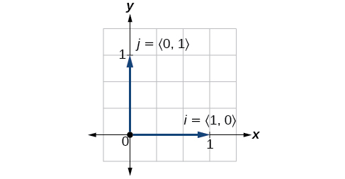{: #Figure_08_08_011}

The Unit Vectors

If<strong><math xmlns="http://www.w3.org/1998/Math/MathML">
 <mrow>
  <mtext> </mtext><mi>v</mi><mtext> </mtext></mrow>
</math></strong>is a nonzero vector, then<strong><math xmlns="http://www.w3.org/1998/Math/MathML">
 <mrow>
  <mtext> </mtext><mfrac>
   <mi>v</mi>
   <mrow>
    <mrow><mo>\|</mo> <mi>v</mi> <mo>\|</mo></mrow></mrow>
  </mfrac>
  <mtext> </mtext></mrow>
</math></strong>is a unit vector in the direction of<strong><math xmlns="http://www.w3.org/1998/Math/MathML">
 <mrow>
  <mtext> </mtext><mi>v</mi><mo>.</mo><mtext> </mtext></mrow>
</math></strong>Any vector divided by its magnitude is a unit vector. Notice that magnitude is always a scalar, and dividing by a scalar is the same as multiplying by the reciprocal of the scalar.

Finding the Unit Vector in the Direction of *v*

Find a unit vector in the same direction as <strong><math xmlns="http://www.w3.org/1998/Math/MathML">
 <mi>v</mi>
</math></strong><math xmlns="http://www.w3.org/1998/Math/MathML"> <mo>=</mo><mrow><mo>〈</mo> <mrow> <mn>−5</mn><mo>,</mo><mn>12</mn> </mrow> <mo>〉.</mo></mrow></math>

First, we will find the magnitude.

<math xmlns="http://www.w3.org/1998/Math/MathML" display="block"> <mrow> <mtable columnalign="left"> <mtr columnalign="left"> <mtd columnalign="left"> <mrow> <mo>\|</mo><mi>v</mi><mo>\|</mo><mo>=</mo><msqrt> <mrow> <msup> <mrow> <mo stretchy="false">(</mo><mo>−</mo><mn>5</mn><mo stretchy="false">)</mo> </mrow> <mn>2</mn> </msup> <mo>+</mo><msup> <mrow> <mo stretchy="false">(</mo><mn>12</mn><mo stretchy="false">)</mo> </mrow> <mn>2</mn> </msup> </mrow> </msqrt> </mrow> </mtd> </mtr> <mtr columnalign="left"> <mtd columnalign="left"> <mrow> <mtext> </mtext><mtext> </mtext><mtext> </mtext><mtext> </mtext><mtext> </mtext><mtext> </mtext><mo>=</mo><msqrt> <mrow> <mn>25</mn><mo>+</mo><mn>144</mn> </mrow> </msqrt> </mrow> </mtd> </mtr> <mtr columnalign="left"> <mtd columnalign="left"> <mrow> <mtext> </mtext><mtext> </mtext><mtext> </mtext><mtext> </mtext><mtext> </mtext><mtext> </mtext><mo>=</mo><msqrt> <mrow> <mn>169</mn> </mrow> </msqrt> </mrow> </mtd> </mtr> <mtr columnalign="left"> <mtd columnalign="left"> <mrow> <mtext> </mtext><mtext> </mtext><mtext> </mtext><mtext> </mtext><mtext> </mtext><mtext> </mtext><mo>=</mo><mn>13</mn> </mrow> </mtd> </mtr> </mtable> </mrow> </math>

Then we divide each component by<math xmlns="http://www.w3.org/1998/Math/MathML"> <mrow> <mtext> </mtext><mrow><mo>\|</mo> <mi>v</mi> <mo>\|,</mo></mrow><mtext> </mtext></mrow> </math>

which gives a unit vector in the same direction as ***v***:

<math xmlns="http://www.w3.org/1998/Math/MathML" display="block"> <mrow> <mfrac> <mi>v</mi> <mrow> <mrow><mo>\|</mo> <mi>v</mi> <mo>\|</mo></mrow></mrow> </mfrac> <mo>=</mo><mo>−</mo><mfrac> <mn>5</mn> <mrow> <mn>13</mn></mrow> </mfrac> <mi>i</mi><mo>+</mo><mfrac> <mrow> <mn>12</mn></mrow> <mrow> <mn>13</mn></mrow> </mfrac> <mi>j</mi></mrow> </math>

or, in component form

<math xmlns="http://www.w3.org/1998/Math/MathML" display="block"> <mrow> <mfrac> <mi>v</mi> <mrow> <mrow><mo>\|</mo> <mi>v</mi> <mo>\|</mo></mrow></mrow> </mfrac> <mo>=</mo><mrow><mo>〈</mo> <mrow> <mo>−</mo><mfrac> <mn>5</mn> <mrow> <mn>13</mn></mrow> </mfrac> <mo>,</mo><mfrac> <mrow> <mn>12</mn></mrow> <mrow> <mn>13</mn></mrow> </mfrac> </mrow> <mo>〉</mo></mrow></mrow> </math>

See [[link]](#Figure_08_08_012).

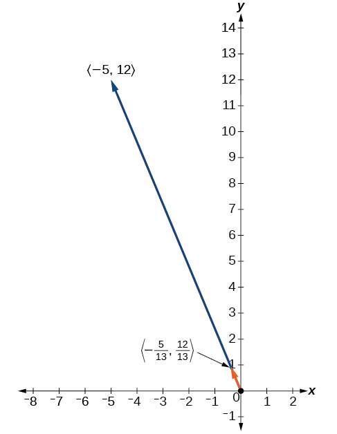{: #Figure_08_08_012}

Verify that the magnitude of the unit vector equals 1. The magnitude of<math xmlns="http://www.w3.org/1998/Math/MathML"> <mrow> <mtext> </mtext><mo>−</mo><mfrac> <mn>5</mn> <mrow> <mn>13</mn></mrow> </mfrac> <mi>i</mi><mo>+</mo><mfrac> <mrow> <mn>12</mn></mrow> <mrow> <mn>13</mn></mrow> </mfrac> <mi>j</mi><mtext> </mtext></mrow> </math>

is given as

<math xmlns="http://www.w3.org/1998/Math/MathML" display="block"> <mrow> <mtable columnalign="left"> <mtr columnalign="left"> <mtd columnalign="left"> <mrow> <msqrt> <mrow> <msup> <mrow> <mrow><mo>(</mo> <mrow> <mo>−</mo><mfrac> <mn>5</mn> <mrow> <mn>13</mn> </mrow> </mfrac> </mrow> <mo>)</mo></mrow> </mrow> <mn>2</mn> </msup> <mo>+</mo><msup> <mrow> <mrow><mo>(</mo> <mrow> <mfrac> <mrow> <mn>12</mn> </mrow> <mrow> <mn>13</mn> </mrow> </mfrac> </mrow> <mo>)</mo></mrow> </mrow> <mn>2</mn> </msup> </mrow> </msqrt> <mo>=</mo><msqrt> <mrow> <mfrac> <mrow> <mn>25</mn> </mrow> <mrow> <mn>169</mn> </mrow> </mfrac> <mo>+</mo><mfrac> <mrow> <mn>144</mn> </mrow> <mrow> <mn>169</mn> </mrow> </mfrac> </mrow> </msqrt> </mrow> </mtd> </mtr> <mtr columnalign="left"> <mtd columnalign="left"> <mrow> <mtext>                            </mtext><mo>=</mo><msqrt> <mrow> <mfrac> <mrow> <mn>169</mn> </mrow> <mrow> <mn>169</mn> </mrow> </mfrac> </mrow> </msqrt> <mo>=</mo><mn>1</mn> </mrow> </mtd> </mtr> </mtable> </mrow> </math>

The vector ***u***<math xmlns="http://www.w3.org/1998/Math/MathML"> <mrow> <mo>=</mo><mfrac> <mn>5</mn> <mrow> <mn>13</mn> </mrow> </mfrac> </mrow> </math>

***i***<math xmlns="http://www.w3.org/1998/Math/MathML"> <mrow> <mo>+</mo><mfrac> <mrow> <mn>12</mn> </mrow> <mrow> <mn>13</mn> </mrow> </mfrac> </mrow> </math>

***j*** is the unit vector in the same direction as ***v***<math xmlns="http://www.w3.org/1998/Math/MathML"> <mrow> <mo>=</mo><mrow><mo>〈</mo> <mrow> <mo>−</mo><mn>5</mn><mo>,</mo><mn>12</mn> </mrow> <mo>〉</mo></mrow><mo>.</mo> </mrow> </math>

### Performing Operations with Vectors in Terms of *i* and <em>j </em>

So far, we have investigated the basics of vectors: magnitude and direction, vector addition and subtraction, scalar multiplication, the components of vectors, and the representation of vectors geometrically. Now that we are familiar with the general strategies used in working with vectors, we will represent vectors in rectangular coordinates in terms of ***i*** and ***j***.

Vectors in the Rectangular Plane

Given a vector<strong><math xmlns="http://www.w3.org/1998/Math/MathML">
 <mrow>
  <mtext> </mtext><mi>v</mi><mtext> </mtext></mrow>
</math></strong>with initial point<math xmlns="http://www.w3.org/1998/Math/MathML"> <mrow> <mtext> </mtext><mi>P</mi><mo>=</mo><mrow><mo>(</mo> <mrow> <msub> <mi>x</mi> <mn>1</mn> </msub> <mo>,</mo><msub> <mi>y</mi> <mn>1</mn> </msub> </mrow> <mo>)</mo></mrow><mtext> </mtext></mrow> </math>

and terminal point <math xmlns="http://www.w3.org/1998/Math/MathML"> <mrow> <mi>Q</mi><mo>=</mo><mo stretchy="false">(</mo><msub> <mi>x</mi> <mn>2</mn> </msub> <mo>,</mo><msub> <mi>y</mi> <mn>2</mn> </msub> <mo stretchy="false">),</mo> </mrow> </math>

 ***v*** is written as

<math xmlns="http://www.w3.org/1998/Math/MathML"> <mrow> <mi>v</mi><mo>=</mo><mrow><mo>(</mo> <mrow> <msub> <mi>x</mi> <mn>2</mn> </msub> <mo>−</mo><msub> <mi>x</mi> <mn>1</mn> </msub> </mrow> <mo>)</mo></mrow><mi>i</mi><mo>+</mo><mrow><mo>(</mo> <mrow> <msub> <mi>y</mi> <mn>2</mn> </msub> <mo>−</mo><msub> <mi>y</mi> <mn>1</mn> </msub> </mrow> <mo>)</mo></mrow><mi>j</mi></mrow> </math>

The position vector from<math xmlns="http://www.w3.org/1998/Math/MathML"> <mrow> <mtext> </mtext><mrow><mo>(</mo> <mrow> <mn>0</mn><mo>,</mo><mn>0</mn></mrow> <mo>)</mo></mrow><mtext> </mtext></mrow> </math>

to<math xmlns="http://www.w3.org/1998/Math/MathML"> <mrow> <mtext> </mtext><mrow><mo>(</mo> <mrow> <mi>a</mi><mo>,</mo><mi>b</mi></mrow> <mo>)</mo></mrow><mo>,</mo><mtext> </mtext></mrow> </math>

where<math xmlns="http://www.w3.org/1998/Math/MathML"> <mrow> <mtext> </mtext><mrow><mo>(</mo> <mrow> <msub> <mi>x</mi> <mn>2</mn> </msub> <mo>−</mo><msub> <mi>x</mi> <mn>1</mn> </msub> </mrow> <mo>)</mo></mrow><mo>=</mo><mi>a</mi><mtext> </mtext></mrow> </math>

and<math xmlns="http://www.w3.org/1998/Math/MathML"> <mrow> <mtext> </mtext><mrow><mo>(</mo> <mrow> <msub> <mi>y</mi> <mn>2</mn> </msub> <mo>−</mo><msub> <mi>y</mi> <mn>1</mn> </msub> </mrow> <mo>)</mo></mrow><mo>=</mo><mi>b</mi><mo>,</mo><mtext> </mtext></mrow> </math>

is written as ***v*** = *a**i*** + *b**j***. This vector sum is called a linear combination of the vectors ***i*** and ***j***.

The magnitude of ***v*** = *a**i*** + *b**j*** is given as<math xmlns="http://www.w3.org/1998/Math/MathML"> <mrow> <mtext> </mtext><mrow><mo>\|</mo> <mi>v</mi> <mo>\|</mo></mrow><mo>=</mo><msqrt> <mrow> <msup> <mi>a</mi> <mn>2</mn> </msup> <mo>+</mo><msup> <mi>b</mi> <mn>2</mn> </msup> </mrow> </msqrt> <mo>.</mo><mtext> </mtext> </mrow> </math>

See [\[link\]](#Figure_08_08_010).

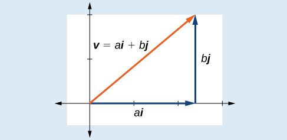{: #Figure_08_08_010}

Writing a Vector in Terms of *i* and *j*

Given a vector<strong><math xmlns="http://www.w3.org/1998/Math/MathML">
 <mrow>
  <mtext> </mtext><mi>v</mi><mtext> </mtext></mrow>
</math></strong>with initial point<math xmlns="http://www.w3.org/1998/Math/MathML"> <mrow> <mtext> </mtext><mi>P</mi><mo>=</mo><mrow><mo>(</mo> <mrow> <mn>2</mn><mo>,</mo><mn>−6</mn></mrow> <mo>)</mo></mrow><mtext> </mtext></mrow> </math>

and terminal point<math xmlns="http://www.w3.org/1998/Math/MathML"> <mrow> <mtext> </mtext><mi>Q</mi><mo>=</mo><mrow><mo>(</mo> <mrow> <mn>−6</mn><mo>,</mo><mn>6</mn></mrow> <mo>)</mo></mrow><mo>,</mo><mtext> </mtext></mrow> </math>

write the vector in terms of<strong><math xmlns="http://www.w3.org/1998/Math/MathML">
 <mrow>
  <mtext> </mtext><mi>i</mi><mtext> </mtext></mrow>
</math></strong>and<strong><math xmlns="http://www.w3.org/1998/Math/MathML">
 <mrow>
  <mtext> </mtext><mi>j</mi><mo>.</mo></mrow>
</math></strong>

Begin by writing the general form of the vector. Then replace the coordinates with the given values.

<math xmlns="http://www.w3.org/1998/Math/MathML" display="block"> <mrow> <mtable columnalign="left"> <mtr columnalign="left"> <mtd columnalign="left"> <mrow> <mi>v</mi><mo>=</mo><mo stretchy="false">(</mo><msub> <mi>x</mi> <mn>2</mn> </msub> <mo>−</mo><msub> <mi>x</mi> <mn>1</mn> </msub> <mo stretchy="false">)</mo><mi>i</mi><mo>+</mo><mo stretchy="false">(</mo><msub> <mi>y</mi> <mn>2</mn> </msub> <mo>−</mo><msub> <mi>y</mi> <mn>1</mn> </msub> <mo stretchy="false">)</mo><mi>j</mi> </mrow> </mtd> </mtr> <mtr columnalign="left"> <mtd columnalign="left"> <mrow> <mtext> </mtext><mtext> </mtext><mtext> </mtext><mo>=</mo><mo stretchy="false">(</mo><mo>−</mo><mn>6</mn><mo>−</mo><mn>2</mn><mo stretchy="false">)</mo><mi>i</mi><mo>+</mo><mo stretchy="false">(</mo><mn>6</mn><mo>−</mo><mo stretchy="false">(</mo><mo>−</mo><mn>6</mn><mo stretchy="false">)</mo><mo stretchy="false">)</mo><mi>j</mi> </mrow> </mtd> </mtr> <mtr columnalign="left"> <mtd columnalign="left"> <mrow> <mtext> </mtext><mtext> </mtext><mtext> </mtext><mo>=</mo><mo>−</mo><mn>8</mn><mi>i</mi><mo>+</mo><mn>12</mn><mi>j</mi> </mrow> </mtd> </mtr> </mtable> </mrow> </math>

Writing a Vector in Terms of *i* and *j* Using Initial and Terminal Points

Given initial point<math xmlns="http://www.w3.org/1998/Math/MathML"> <mrow> <mtext> </mtext><msub> <mi>P</mi> <mn>1</mn> </msub> <mo>=</mo><mrow><mo>(</mo> <mrow> <mo>−</mo><mn>1</mn><mo>,</mo><mn>3</mn></mrow> <mo>)</mo></mrow><mtext> </mtext></mrow> </math>

and terminal point<math xmlns="http://www.w3.org/1998/Math/MathML"> <mrow> <mtext> </mtext><msub> <mi>P</mi> <mn>2</mn> </msub> <mo>=</mo><mrow><mo>(</mo> <mrow> <mn>2</mn><mo>,</mo><mn>7</mn></mrow> <mo>)</mo></mrow><mo>,</mo><mtext> </mtext></mrow> </math>

write the vector<strong><math xmlns="http://www.w3.org/1998/Math/MathML">
 <mrow>
  <mtext> </mtext><mi>v</mi><mtext> </mtext></mrow>
</math></strong>in terms of<strong><math xmlns="http://www.w3.org/1998/Math/MathML">
 <mrow>
  <mtext> </mtext><mi>i</mi><mtext> </mtext></mrow>
</math></strong>and<strong><math xmlns="http://www.w3.org/1998/Math/MathML">
 <mrow>
  <mtext> </mtext><mi>j</mi><mo>.</mo><mtext> </mtext></mrow>
</math></strong>

Begin by writing the general form of the vector. Then replace the coordinates with the given values.

<math xmlns="http://www.w3.org/1998/Math/MathML" display="block"> <mrow> <mtable columnalign="left"> <mtr columnalign="left"> <mtd columnalign="left"> <mrow> <mi>v</mi><mo>=</mo><mo stretchy="false">(</mo><msub> <mi>x</mi> <mn>2</mn> </msub> <mo>−</mo><msub> <mi>x</mi> <mn>1</mn> </msub> <mo stretchy="false">)</mo><mi>i</mi><mo>+</mo><mo stretchy="false">(</mo><msub> <mi>y</mi> <mn>2</mn> </msub> <mo>−</mo><msub> <mi>y</mi> <mn>1</mn> </msub> <mo stretchy="false">)</mo><mi>j</mi> </mrow> </mtd> </mtr> <mtr columnalign="left"> <mtd columnalign="left"> <mrow> <mi>v</mi><mo>=</mo><mo stretchy="false">(</mo><mn>2</mn><mo>−</mo><mo stretchy="false">(</mo><mo>−</mo><mn>1</mn><mo stretchy="false">)</mo><mo stretchy="false">)</mo><mi>i</mi><mo>+</mo><mo stretchy="false">(</mo><mn>7</mn><mo>−</mo><mn>3</mn><mo stretchy="false">)</mo><mi>j</mi> </mrow> </mtd> </mtr> <mtr columnalign="left"> <mtd columnalign="left"> <mrow> <mtext> </mtext><mtext> </mtext><mo>=</mo><mn>3</mn><mi>i</mi><mo>+</mo><mn>4</mn><mi>j</mi> </mrow> </mtd> </mtr> </mtable> </mrow> </math>

Write the vector<strong><math xmlns="http://www.w3.org/1998/Math/MathML">
 <mrow>
  <mtext> </mtext><mi>u</mi><mtext> </mtext></mrow>
</math></strong>with initial point<math xmlns="http://www.w3.org/1998/Math/MathML"> <mrow> <mtext> </mtext><mi>P</mi><mo>=</mo><mrow><mo>(</mo> <mrow> <mo>−</mo><mn>1</mn><mo>,</mo><mn>6</mn></mrow> <mo>)</mo></mrow><mtext> </mtext></mrow> </math>

and terminal point<math xmlns="http://www.w3.org/1998/Math/MathML"> <mrow> <mtext> </mtext><mi>Q</mi><mo>=</mo><mrow><mo>(</mo> <mrow> <mn>7</mn><mo>,</mo><mo>−</mo><mn>5</mn></mrow> <mo>)</mo></mrow><mtext> </mtext></mrow> </math>

in terms of<strong><math xmlns="http://www.w3.org/1998/Math/MathML">
 <mrow>
  <mtext> </mtext><mi>i</mi><mtext> </mtext></mrow>
</math></strong>and<strong><math xmlns="http://www.w3.org/1998/Math/MathML">
 <mrow>
  <mtext> </mtext><mi>j</mi><mo>.</mo></mrow>
</math></strong>

<math xmlns="http://www.w3.org/1998/Math/MathML"> <mrow> <mi>u</mi><mo>=</mo><mn>8</mn><mi>i</mi><mo>−</mo><mn>11</mn><mi>j</mi></mrow> </math>

### Performing Operations on Vectors in Terms of *i* and *j*

When vectors are written in terms of<strong><math xmlns="http://www.w3.org/1998/Math/MathML">
 <mrow>
  <mtext> </mtext><mi>i</mi><mtext> </mtext></mrow>
</math></strong>and<strong><math xmlns="http://www.w3.org/1998/Math/MathML">
 <mrow>
  <mtext> </mtext><mi>j</mi><mo>,</mo><mtext> </mtext></mrow>
</math></strong>we can carry out addition, subtraction, and scalar multiplication by performing operations on corresponding components.

Adding and Subtracting Vectors in Rectangular Coordinates

Given ***v*** = *a**i*** + *b**j*** and ***u*** = *c**i*** + *d**j***, then

<math xmlns="http://www.w3.org/1998/Math/MathML" display="block"> <mtable> <mtr> <mtd> <mi>v</mi><mo>+</mo><mi>u</mi><mo>=</mo><mrow><mo>(</mo> <mrow> <mi>a</mi><mo>+</mo><mi>c</mi></mrow> <mo>)</mo></mrow><mi>i</mi><mo>+</mo><mrow><mo>(</mo> <mrow> <mi>b</mi><mo>+</mo><mi>d</mi></mrow> <mo>)</mo></mrow><mi>j</mi> </mtd> </mtr> <mtr> <mtd> <mi>v</mi><mo>−</mo><mi>u</mi><mo>=</mo><mrow><mo>(</mo> <mrow> <mi>a</mi><mo>−</mo><mi>c</mi></mrow> <mo>)</mo></mrow><mi>i</mi><mo>+</mo><mrow><mo>(</mo> <mrow> <mi>b</mi><mo>−</mo><mi>d</mi></mrow> <mo>)</mo></mrow><mi>j</mi> </mtd> </mtr> </mtable> </math>

Finding the Sum of the Vectors

Find the sum of<math xmlns="http://www.w3.org/1998/Math/MathML"> <mrow> <mtext> </mtext><msub> <mi>v</mi> <mn>1</mn> </msub> <mo>=</mo><mn>2</mn><mi>i</mi><mo>−</mo><mn>3</mn><mi>j</mi><mtext> </mtext></mrow> </math>

and<math xmlns="http://www.w3.org/1998/Math/MathML"> <mrow> <mtext> </mtext><msub> <mi>v</mi> <mn>2</mn> </msub> <mo>=</mo><mn>4</mn><mi>i</mi><mo>+</mo><mn>5</mn><mi>j</mi><mo>.</mo></mrow> </math>

According to the formula, we have

<math xmlns="http://www.w3.org/1998/Math/MathML" display="block"> <mrow> <mtable columnalign="left"> <mtr columnalign="left"> <mtd columnalign="left"> <mrow> <msub> <mi>v</mi> <mn>1</mn> </msub> <mo>+</mo><msub> <mi>v</mi> <mn>2</mn> </msub> <mo>=</mo><mo stretchy="false">(</mo><mn>2</mn><mo>+</mo><mn>4</mn><mo stretchy="false">)</mo><mi>i</mi><mo>+</mo><mo stretchy="false">(</mo><mo>−</mo><mn>3</mn><mo>+</mo><mn>5</mn><mo stretchy="false">)</mo><mi>j</mi> </mrow> </mtd> </mtr> <mtr columnalign="left"> <mtd columnalign="left"> <mrow> <mtext> </mtext><mtext> </mtext><mtext> </mtext><mtext> </mtext><mtext> </mtext><mtext> </mtext><mtext> </mtext><mtext> </mtext><mtext> </mtext><mtext> </mtext><mtext> </mtext><mtext> </mtext><mtext> </mtext><mtext> </mtext><mtext> </mtext><mtext> </mtext><mtext> </mtext><mo>=</mo><mn>6</mn><mi>i</mi><mo>+</mo><mn>2</mn><mi>j</mi> </mrow> </mtd> </mtr> </mtable> </mrow> </math>

### Calculating the Component Form of a Vector: Direction 

We have seen how to draw vectors according to their initial and terminal points and how to find the position vector. We have also examined notation for vectors drawn specifically in the Cartesian coordinate plane using<math xmlns="http://www.w3.org/1998/Math/MathML"> <mrow> <mtext> </mtext><mi>i</mi><mtext> </mtext><mtext> </mtext><mtext>and</mtext><mtext> </mtext><mtext> </mtext><mi>j</mi><mo>.</mo><mtext> </mtext></mrow> </math>

For any of these vectors, we can calculate the magnitude. Now, we want to combine the key points, and look further at the ideas of magnitude and direction.

Calculating direction follows the same straightforward process we used for polar coordinates. We find the direction of the vector by finding the angle to the horizontal. We do this by using the basic trigonometric identities, but with<strong><math xmlns="http://www.w3.org/1998/Math/MathML">
 <mrow>
  <mtext> </mtext><mrow><mo>\|</mo> <mi>v</mi> <mo>\|</mo></mrow><mtext> </mtext></mrow>
</math></strong>replacing<strong><math xmlns="http://www.w3.org/1998/Math/MathML">
 <mrow>
  <mtext> </mtext><mi>r</mi><mo>.</mo></mrow>
</math></strong>

Vector Components in Terms of Magnitude and Direction

Given a position vector<math xmlns="http://www.w3.org/1998/Math/MathML"> <mrow> <mtext> </mtext><mi>v</mi><mo>=</mo><mrow><mo>〈</mo> <mrow> <mi>x</mi><mo>,</mo><mi>y</mi></mrow> <mo>〉</mo></mrow><mtext> </mtext></mrow> </math>

and a direction angle<math xmlns="http://www.w3.org/1998/Math/MathML"> <mrow> <mtext> </mtext><mi>θ</mi><mo>,</mo></mrow> </math>

<math xmlns="http://www.w3.org/1998/Math/MathML" display="block"> <mrow> <mtable columnalign="left"> <mtr columnalign="left"> <mtd columnalign="left"> <mrow> <mi>cos</mi><mtext> </mtext><mi>θ</mi><mo>=</mo><mfrac> <mi>x</mi> <mrow> <mo>\|</mo><mi>v</mi><mo>\|</mo> </mrow> </mfrac> </mrow> </mtd> <mtd columnalign="left"> <mrow> <mtext>and</mtext><mtable> <mtr> <mtd> <mrow /> </mtd> <mtd> <mrow /> </mtd> </mtr> </mtable> </mrow> </mtd> <mtd columnalign="left"> <mrow> <mi>sin</mi><mtext> </mtext><mi>θ</mi><mo>=</mo><mfrac> <mi>y</mi> <mrow> <mo>\|</mo><mi>v</mi><mo>\|</mo> </mrow> </mfrac> </mrow> </mtd> </mtr> <mtr columnalign="left"> <mtd columnalign="left"> <mrow> <mtext> </mtext><mtext> </mtext><mtext> </mtext><mtext> </mtext><mtext> </mtext><mtext> </mtext><mtext> </mtext><mtext> </mtext><mi>x</mi><mo>=</mo><mo>\|</mo><mi>v</mi><mo>\|</mo><mi>cos</mi><mtext> </mtext><mi>θ</mi><mtable> <mtr> <mtd> <mrow /> </mtd> <mtd> <mrow /> </mtd> </mtr> </mtable> </mrow> </mtd> <mtd columnalign="left"> <mrow /> </mtd> <mtd columnalign="left"> <mrow> <mtext> </mtext><mtext> </mtext><mtext> </mtext><mtext> </mtext><mtext> </mtext><mtext> </mtext><mtext> </mtext><mi>y</mi><mo>=</mo><mo>\|</mo><mi>v</mi><mo>\|</mo><mi>sin</mi><mtext> </mtext><mi>θ</mi> </mrow> </mtd> </mtr> </mtable> </mrow> </math>

Thus,<math xmlns="http://www.w3.org/1998/Math/MathML"> <mrow> <mtext> </mtext><mi>v</mi><mo>=</mo><mi>x</mi><mi>i</mi><mo>+</mo><mi>y</mi><mi>j</mi><mo>=</mo><mrow><mo>\|</mo> <mi>v</mi> <mo>\|</mo></mrow><mi>cos</mi><mtext> </mtext><mi>θ</mi><mi>i</mi><mo>+</mo><mrow><mo>\|</mo> <mi>v</mi> <mo>\|</mo></mrow><mi>sin</mi><mtext> </mtext><mi>θ</mi><mi>j</mi><mo>,</mo><mtext> </mtext></mrow> </math>

and magnitude is expressed as<math xmlns="http://www.w3.org/1998/Math/MathML"> <mrow> <mtext> </mtext><mrow><mo>\|</mo> <mi>v</mi> <mo>\|</mo></mrow><mo>=</mo><msqrt> <mrow> <msup> <mi>x</mi> <mn>2</mn> </msup> <mo>+</mo><msup> <mi>y</mi> <mn>2</mn> </msup> </mrow> </msqrt> <mo>.</mo></mrow> </math>

Writing a Vector in Terms of Magnitude and Direction

Write a vector with length 7 at an angle of 135° to the positive *x*-axis in terms of magnitude and direction.

Using the conversion formulas<math xmlns="http://www.w3.org/1998/Math/MathML"> <mrow> <mtext> </mtext><mi>x</mi><mo>=</mo><mrow><mo>\|</mo> <mi>v</mi> <mo>\|</mo></mrow><mi>cos</mi><mtext> </mtext><mi>θ</mi><mi>i</mi><mtext> </mtext></mrow> </math>

and<math xmlns="http://www.w3.org/1998/Math/MathML"> <mrow> <mtext> </mtext><mi>y</mi><mo>=</mo><mrow><mo>\|</mo> <mi>v</mi> <mo>\|</mo></mrow><mi>sin</mi><mtext> </mtext><mi>θ</mi><mi>j</mi><mo>,</mo><mtext> </mtext></mrow> </math>

we find that

<math xmlns="http://www.w3.org/1998/Math/MathML" display="block"> <mrow> <mtable columnalign="left"> <mtr columnalign="left"> <mtd columnalign="left"> <mrow> <mi>x</mi><mo>=</mo><mn>7</mn><mi>cos</mi><mo stretchy="false">(</mo><mn>135°</mn><mo stretchy="false">)</mo><mi>i</mi> </mrow> </mtd> </mtr> <mtr columnalign="left"> <mtd columnalign="left"> <mrow> <mtext> </mtext><mtext> </mtext><mtext> </mtext><mo>=</mo><mo>−</mo><mfrac> <mrow> <mn>7</mn><msqrt> <mn>2</mn> </msqrt> </mrow> <mn>2</mn> </mfrac> </mrow> </mtd> </mtr> <mtr columnalign="left"> <mtd columnalign="left"> <mrow> <mi>y</mi><mo>=</mo><mn>7</mn><mi>sin</mi><mo stretchy="false">(</mo><mn>135°</mn><mo stretchy="false">)</mo><mi>j</mi> </mrow> </mtd> </mtr> <mtr columnalign="left"> <mtd columnalign="left"> <mrow> <mtext> </mtext><mtext> </mtext><mtext> </mtext><mo>=</mo><mfrac> <mrow> <mn>7</mn><msqrt> <mn>2</mn> </msqrt> </mrow> <mn>2</mn> </mfrac> </mrow> </mtd> </mtr> </mtable> </mrow> </math>

This vector can be written as<math xmlns="http://www.w3.org/1998/Math/MathML"> <mrow> <mtext> </mtext><mi>v</mi><mo>=</mo><mn>7</mn><mi>cos</mi><mo stretchy="false">(</mo><mn>135°</mn><mo stretchy="false">)</mo><mi>i</mi><mo>+</mo><mn>7</mn><mi>sin</mi><mo stretchy="false">(</mo><mn>135°</mn><mo stretchy="false">)</mo><mi>j</mi><mtext> </mtext> </mrow> </math>

or simplified as

<math xmlns="http://www.w3.org/1998/Math/MathML"> <mrow> <mi>v</mi><mo>=</mo><mo>−</mo><mfrac> <mrow> <mn>7</mn><msqrt> <mn>2</mn> </msqrt> </mrow> <mn>2</mn> </mfrac> <mi>i</mi><mo>+</mo><mfrac> <mrow> <mn>7</mn><msqrt> <mn>2</mn> </msqrt> </mrow> <mn>2</mn> </mfrac> <mi>j</mi><mo /></mrow> </math>

A vector travels from the origin to the point<math xmlns="http://www.w3.org/1998/Math/MathML"> <mrow> <mtext> </mtext><mrow><mo>(</mo> <mrow> <mn>3</mn><mo>,</mo><mn>5</mn></mrow> <mo>)</mo></mrow><mo>.</mo><mtext> </mtext></mrow> </math>

Write the vector in terms of magnitude and direction.

<math xmlns="http://www.w3.org/1998/Math/MathML"> <mrow> <mi>v</mi><mo>=</mo><msqrt> <mrow> <mn>34</mn> </mrow> </msqrt> <mi>cos</mi><mo stretchy="false">(</mo><mn>59°</mn><mo stretchy="false">)</mo><mi>i</mi><mo>+</mo><msqrt> <mrow> <mn>34</mn> </mrow> </msqrt> <mi>sin</mi><mo stretchy="false">(</mo><mn>59°</mn><mo stretchy="false">)</mo><mi>j</mi> </mrow> </math>

Magnitude =<math xmlns="http://www.w3.org/1998/Math/MathML"> <mrow> <mtext> </mtext><msqrt> <mrow> <mn>34</mn></mrow> </msqrt> </mrow> </math>

<math xmlns="http://www.w3.org/1998/Math/MathML"> <mrow> <mi>θ</mi><mo>=</mo><msup> <mrow> <mi>tan</mi> </mrow> <mrow> <mo>−</mo><mn>1</mn> </mrow> </msup> <mrow><mo>(</mo> <mrow> <mfrac> <mn>5</mn> <mn>3</mn> </mfrac> </mrow> <mo>)</mo></mrow><mo>=</mo><mn>59.04°</mn> </mrow> </math>

### Finding the Dot Product of Two Vectors 

As we discussed earlier in the section, scalar multiplication involves multiplying a vector by a scalar, and the result is a vector. As we have seen, multiplying a vector by a number is called scalar multiplication. If we multiply a vector by a vector, there are two possibilities: the *dot product* and the *cross product*. We will only examine the dot product here; you may encounter the cross product in more advanced mathematics courses.

The dot product of two vectors involves multiplying two vectors together, and the result is a scalar.

Dot Product

The **dot product**{: data-type="term"} of two vectors<math xmlns="http://www.w3.org/1998/Math/MathML"> <mrow> <mtext> </mtext><mi>v</mi><mo>=</mo><mrow><mo>〈</mo> <mrow> <mi>a</mi><mo>,</mo><mi>b</mi> </mrow> <mo>〉</mo></mrow><mtext> </mtext> </mrow> </math>

and<math xmlns="http://www.w3.org/1998/Math/MathML"> <mrow> <mtext> </mtext><mi>u</mi><mo>=</mo><mrow><mo>〈</mo> <mrow> <mi>c</mi><mo>,</mo><mi>d</mi> </mrow> <mo>〉</mo></mrow><mtext> </mtext> </mrow> </math>

is the sum of the product of the horizontal components and the product of the vertical components.

<math xmlns="http://www.w3.org/1998/Math/MathML"> <mrow> <mi>v</mi><mo>⋅</mo><mi>u</mi><mo>=</mo><mi>a</mi><mi>c</mi><mo>+</mo><mi>b</mi><mi>d</mi></mrow> </math>

To find the angle between the two vectors, use the formula below.

<math xmlns="http://www.w3.org/1998/Math/MathML"> <mrow> <mi>cos</mi><mtext> </mtext><mi>θ</mi><mo>=</mo><mfrac> <mi>v</mi> <mrow> <mrow><mo>\|</mo> <mi>v</mi> <mo>\|</mo></mrow></mrow> </mfrac> <mo>⋅</mo><mfrac> <mi>u</mi> <mrow> <mrow><mo>\|</mo> <mi>u</mi> <mo>\|</mo></mrow></mrow> </mfrac> </mrow> </math>

Finding the Dot Product of Two Vectors

Find the dot product of<strong><math xmlns="http://www.w3.org/1998/Math/MathML">
 <mrow>
  <mtext> </mtext><mi>v</mi><mo>=</mo><mrow><mo>〈</mo> <mrow>
   <mn>5</mn><mo>,</mo><mn>12</mn></mrow> <mo>〉</mo></mrow><mtext> </mtext></mrow>
</math></strong>and<strong><math xmlns="http://www.w3.org/1998/Math/MathML">
 <mrow>
  <mtext> </mtext><mi>u</mi><mo>=</mo><mrow><mo>〈</mo> <mrow>
   <mn>−3</mn><mo>,</mo><mn>4</mn></mrow> <mo>〉</mo></mrow><mo>.</mo></mrow>
</math></strong>

Using the formula, we have

<math xmlns="http://www.w3.org/1998/Math/MathML" display="block"> <mrow> <mtable columnalign="left"> <mtr columnalign="left"> <mtd columnalign="left"> <mrow> <mi>v</mi><mo>⋅</mo><mi>u</mi><mo>=</mo><mrow><mo>〈</mo> <mrow> <mn>5</mn><mo>,</mo><mn>12</mn></mrow> <mo>〉</mo></mrow><mo>⋅</mo><mrow><mo>〈</mo> <mrow> <mo>−</mo><mn>3</mn><mo>,</mo><mn>4</mn></mrow> <mo>〉</mo></mrow></mrow> </mtd> </mtr> <mtr columnalign="left"> <mtd columnalign="left"> <mrow> <mtext> </mtext><mtext> </mtext><mtext> </mtext><mtext> </mtext><mtext> </mtext><mtext> </mtext><mtext> </mtext><mtext> </mtext><mtext> </mtext><mtext> </mtext><mo>=</mo><mn>5</mn><mo>⋅</mo><mo stretchy="false">(</mo><mo>−</mo><mn>3</mn><mo stretchy="false">)</mo><mo>+</mo><mn>12</mn><mo>⋅</mo><mn>4</mn></mrow> </mtd> </mtr> <mtr columnalign="left"> <mtd columnalign="left"> <mrow> <mtext> </mtext><mtext> </mtext><mtext> </mtext><mtext> </mtext><mtext> </mtext><mtext> </mtext><mtext> </mtext><mtext> </mtext><mtext> </mtext><mtext> </mtext><mo>=</mo><mo>−</mo><mn>15</mn><mo>+</mo><mn>48</mn></mrow> </mtd> </mtr> <mtr columnalign="left"> <mtd columnalign="left"> <mrow> <mtext> </mtext><mtext> </mtext><mtext> </mtext><mtext> </mtext><mtext> </mtext><mtext> </mtext><mtext> </mtext><mtext> </mtext><mtext> </mtext><mtext> </mtext><mo>=</mo><mn>33</mn></mrow> </mtd> </mtr> </mtable></mrow> </math>

Finding the Dot Product of Two Vectors and the Angle between Them

Find the dot product of ***v***1 = 5***i*** + 2***j*** and ***v***2 = 3***i*** + 7***j***. Then, find the angle between the two vectors.

Finding the dot product, we multiply corresponding components.

<math xmlns="http://www.w3.org/1998/Math/MathML" display="block"> <mrow> <mtable columnalign="left"> <mtr columnalign="left"> <mtd columnalign="left"> <mrow> <msub> <mi>v</mi> <mn>1</mn> </msub> <mo>⋅</mo><msub> <mi>v</mi> <mn>2</mn> </msub> <mo>=</mo><mrow><mo>〈</mo> <mrow> <mn>5</mn><mo>,</mo><mn>2</mn></mrow> <mo>〉</mo></mrow><mo>⋅</mo><mrow><mo>〈</mo> <mrow> <mn>3</mn><mo>,</mo><mn>7</mn></mrow> <mo>〉</mo></mrow></mrow> </mtd> </mtr> <mtr columnalign="left"> <mtd columnalign="left"> <mrow> <mtext> </mtext><mtext> </mtext><mtext> </mtext><mtext> </mtext><mtext> </mtext><mtext> </mtext><mtext> </mtext><mtext> </mtext><mtext> </mtext><mtext> </mtext><mtext> </mtext><mtext> </mtext><mtext> </mtext><mtext> </mtext><mtext> </mtext><mtext> </mtext><mo>=</mo><mn>5</mn><mo>⋅</mo><mn>3</mn><mo>+</mo><mn>2</mn><mo>⋅</mo><mn>7</mn></mrow> </mtd> </mtr> <mtr columnalign="left"> <mtd columnalign="left"> <mrow> <mtext> </mtext><mtext> </mtext><mtext> </mtext><mtext> </mtext><mtext> </mtext><mtext> </mtext><mtext> </mtext><mtext> </mtext><mtext> </mtext><mtext> </mtext><mtext> </mtext><mtext> </mtext><mtext> </mtext><mtext> </mtext><mtext> </mtext><mtext> </mtext><mo>=</mo><mn>15</mn><mo>+</mo><mn>14</mn></mrow> </mtd> </mtr> <mtr columnalign="left"> <mtd columnalign="left"> <mrow> <mtext> </mtext><mtext> </mtext><mtext> </mtext><mtext> </mtext><mtext> </mtext><mtext> </mtext><mtext> </mtext><mtext> </mtext><mtext> </mtext><mtext> </mtext><mtext> </mtext><mtext> </mtext><mtext> </mtext><mtext> </mtext><mtext> </mtext><mtext> </mtext><mo>=</mo><mn>29</mn></mrow> </mtd> </mtr> </mtable></mrow> </math>

To find the angle between them, we use the formula<math xmlns="http://www.w3.org/1998/Math/MathML"> <mrow> <mtext> </mtext><mi>cos</mi><mtext> </mtext><mi>θ</mi><mo>=</mo><mfrac> <mi>v</mi> <mrow> <mo>\|</mo><mi>v</mi><mo>\|</mo> </mrow> </mfrac> <mo>⋅</mo><mfrac> <mi>u</mi> <mrow> <mo>\|</mo><mi>u</mi><mo>\|</mo> </mrow> </mfrac> <mo>.</mo> </mrow> </math>

<math xmlns="http://www.w3.org/1998/Math/MathML" display="block"> <mrow> <mtable columnalign="left"> <mtr columnalign="left"> <mtd columnalign="left"> <mrow> <mtext> </mtext><mtext> </mtext><mtext> </mtext><mtext> </mtext><mtext> </mtext><mtext> </mtext><mtext> </mtext><mtext> </mtext><mtext> </mtext><mtext> </mtext><mtext> </mtext><mtext> </mtext><mtext> </mtext><mtext> </mtext><mtext> </mtext><mtext> </mtext><mtext> </mtext><mtext> </mtext><mtext> </mtext><mtext> </mtext><mtext> </mtext><mtext> </mtext><mtext> </mtext><mtext> </mtext><mfrac> <mi>v</mi> <mrow> <mo>\|</mo><mi>v</mi><mo>\|</mo> </mrow> </mfrac> <mo>⋅</mo><mfrac> <mi>u</mi> <mrow> <mo>\|</mo><mi>u</mi><mo>\|</mo> </mrow> </mfrac> <mo>=</mo><mrow><mo>〈</mo> <mrow> <mfrac> <mn>5</mn> <mrow> <msqrt> <mrow> <mn>29</mn> </mrow> </msqrt> </mrow> </mfrac> <mo>+</mo><mfrac> <mn>2</mn> <mrow> <msqrt> <mrow> <mn>29</mn> </mrow> </msqrt> </mrow> </mfrac> </mrow> <mo>〉</mo></mrow><mo>⋅</mo><mrow><mo>〈</mo> <mrow> <mfrac> <mn>3</mn> <mrow> <msqrt> <mrow> <mn>58</mn> </mrow> </msqrt> </mrow> </mfrac> <mo>+</mo><mfrac> <mn>7</mn> <mrow> <msqrt> <mrow> <mn>58</mn> </mrow> </msqrt> </mrow> </mfrac> </mrow> <mo>〉</mo></mrow> </mrow> </mtd> </mtr> <mtr columnalign="left"> <mtd columnalign="left"> <mrow> <mtext> </mtext><mtext> </mtext><mtext> </mtext><mtext> </mtext><mtext> </mtext><mtext> </mtext><mtext> </mtext><mtext> </mtext><mtext> </mtext><mtext> </mtext><mtext> </mtext><mtext> </mtext><mtext> </mtext><mtext> </mtext><mtext> </mtext><mtext> </mtext><mtext> </mtext><mtext> </mtext><mtext> </mtext><mtext> </mtext><mtext> </mtext><mtext> </mtext><mtext> </mtext><mtext> </mtext><mtext> </mtext><mtext> </mtext><mtext> </mtext><mtext> </mtext><mtext> </mtext><mtext> </mtext><mtext> </mtext><mtext> </mtext><mtext> </mtext><mtext> </mtext><mtext> </mtext><mtext> </mtext><mtext> </mtext><mtext> </mtext><mtext> </mtext><mtext> </mtext><mtext> </mtext><mo>=</mo><mfrac> <mn>5</mn> <mrow> <msqrt> <mrow> <mn>29</mn> </mrow> </msqrt> </mrow> </mfrac> <mo>⋅</mo><mfrac> <mn>3</mn> <mrow> <msqrt> <mrow> <mn>58</mn> </mrow> </msqrt> </mrow> </mfrac> <mo>+</mo><mfrac> <mn>2</mn> <mrow> <msqrt> <mrow> <mn>29</mn> </mrow> </msqrt> </mrow> </mfrac> <mo>⋅</mo><mfrac> <mn>7</mn> <mrow> <msqrt> <mrow> <mn>58</mn> </mrow> </msqrt> </mrow> </mfrac> </mrow> </mtd> </mtr> <mtr columnalign="left"> <mtd columnalign="left"> <mrow> <mtext> </mtext><mtext> </mtext><mtext> </mtext><mtext> </mtext><mtext> </mtext><mtext> </mtext><mtext> </mtext><mtext> </mtext><mtext> </mtext><mtext> </mtext><mtext> </mtext><mtext> </mtext><mtext> </mtext><mtext> </mtext><mtext> </mtext><mtext> </mtext><mtext> </mtext><mtext> </mtext><mtext> </mtext><mtext> </mtext><mtext> </mtext><mtext> </mtext><mtext> </mtext><mtext> </mtext><mtext> </mtext><mtext> </mtext><mtext> </mtext><mtext> </mtext><mtext> </mtext><mtext> </mtext><mtext> </mtext><mtext> </mtext><mtext> </mtext><mtext> </mtext><mtext> </mtext><mtext> </mtext><mtext> </mtext><mtext> </mtext><mtext> </mtext><mtext> </mtext><mtext> </mtext><mo>=</mo><mfrac> <mrow> <mn>15</mn> </mrow> <mrow> <msqrt> <mrow> <mn>1682</mn> </mrow> </msqrt> </mrow> </mfrac> <mo>+</mo><mfrac> <mrow> <mn>14</mn> </mrow> <mrow> <msqrt> <mrow> <mn>1682</mn> </mrow> </msqrt> </mrow> </mfrac> <mo>=</mo><mfrac> <mrow> <mn>29</mn> </mrow> <mrow> <msqrt> <mrow> <mn>1682</mn> </mrow> </msqrt> </mrow> </mfrac> </mrow> </mtd> </mtr> <mtr columnalign="left"> <mtd columnalign="left"> <mrow> <mtable columnalign="left"> <mtr columnalign="left"> <mtd columnalign="left"> <mrow> <mtext> </mtext><mtext> </mtext><mtext> </mtext><mtext> </mtext><mtext> </mtext><mtext> </mtext><mtext> </mtext><mtext> </mtext><mtext> </mtext><mtext> </mtext><mtext> </mtext><mtext> </mtext><mtext> </mtext><mtext> </mtext><mtext> </mtext><mtext> </mtext><mtext> </mtext><mtext> </mtext><mtext> </mtext><mtext> </mtext><mtext> </mtext><mtext> </mtext><mtext> </mtext><mtext> </mtext><mtext> </mtext><mtext> </mtext><mtext> </mtext><mtext> </mtext><mtext> </mtext><mtext> </mtext><mtext> </mtext><mtext> </mtext><mtext> </mtext><mtext> </mtext><mtext> </mtext><mtext> </mtext><mtext> </mtext><mtext> </mtext><mtext> </mtext><mtext> </mtext><mtext> </mtext><mo>=</mo><mn>0.707107</mn> </mrow> </mtd> </mtr> <mtr columnalign="left"> <mtd columnalign="left"> <mrow> <msup> <mrow> <mi>cos</mi> </mrow> <mrow> <mo>−</mo><mn>1</mn> </mrow> </msup> <mo stretchy="false">(</mo><mn>0.707107</mn><mo stretchy="false">)</mo><mo>=</mo><mn>45°</mn> </mrow> </mtd> </mtr> </mtable> </mrow> </mtd> </mtr> </mtable> </mrow> </math>

See [[link]](#Figure_08_08_014).

{: #Figure_08_08_014}

Finding the Angle between Two Vectors

Find the angle between<math xmlns="http://www.w3.org/1998/Math/MathML"> <mrow> <mtext> </mtext><mi>u</mi><mo>=</mo><mrow><mo>〈</mo> <mrow> <mo>−</mo><mn>3</mn><mo>,</mo><mn>4</mn></mrow> <mo>〉</mo></mrow><mtext> </mtext></mrow> </math>

and<math xmlns="http://www.w3.org/1998/Math/MathML"> <mrow> <mtext> </mtext><mi>v</mi><mo>=</mo><mrow><mo>〈</mo> <mrow> <mn>5</mn><mo>,</mo><mn>12</mn></mrow> <mo>〉</mo></mrow><mo>.</mo></mrow> </math>

Using the formula, we have

<math xmlns="http://www.w3.org/1998/Math/MathML" display="block"> <mrow> <mtable columnalign="left"> <mtr columnalign="left"> <mtd columnalign="left"> <mrow> <mtext> </mtext><mtext> </mtext><mtext> </mtext><mtext> </mtext><mtext> </mtext><mtext> </mtext><mtext> </mtext><mtext> </mtext><mtext> </mtext><mtext> </mtext><mtext> </mtext><mtext> </mtext><mtext> </mtext><mtext> </mtext><mtext> </mtext><mtext> </mtext><mtext> </mtext><mtext> </mtext><mtext> </mtext><mi>θ</mi><mo>=</mo><msup> <mrow> <mi>cos</mi> </mrow> <mrow> <mo>−</mo><mn>1</mn> </mrow> </msup> <mrow><mo>(</mo> <mrow> <mfrac> <mi>u</mi> <mrow> <mo>\|</mo><mi>u</mi><mo>\|</mo> </mrow> </mfrac> <mo>⋅</mo><mfrac> <mi>v</mi> <mrow> <mo>\|</mo><mi>v</mi><mo>\|</mo> </mrow> </mfrac> </mrow> <mo>)</mo></mrow> </mrow> </mtd> </mtr> <mtr columnalign="left"> <mtd columnalign="left"> <mrow> <mrow><mo>(</mo> <mrow> <mfrac> <mi>u</mi> <mrow> <mo>\|</mo><mi>u</mi><mo>\|</mo> </mrow> </mfrac> <mo>⋅</mo><mfrac> <mi>v</mi> <mrow> <mo>\|</mo><mi>v</mi><mo>\|</mo> </mrow> </mfrac> </mrow> <mo>)</mo></mrow><mo>=</mo><mfrac> <mrow> <mo>−</mo><mn>3</mn><mi>i</mi><mo>+</mo><mn>4</mn><mi>j</mi> </mrow> <mn>5</mn> </mfrac> <mo>⋅</mo><mfrac> <mrow> <mn>5</mn><mi>i</mi><mo>+</mo><mn>12</mn><mi>j</mi> </mrow> <mrow> <mn>13</mn> </mrow> </mfrac> </mrow> </mtd> </mtr> <mtr columnalign="left"> <mtd columnalign="left"> <mrow> <mtext> </mtext><mtext> </mtext><mtext> </mtext><mtext> </mtext><mtext> </mtext><mtext> </mtext><mtext> </mtext><mtext> </mtext><mtext> </mtext><mtext> </mtext><mtext> </mtext><mtext> </mtext><mtext> </mtext><mtext> </mtext><mtext> </mtext><mtext> </mtext><mtext> </mtext><mtext> </mtext><mtext> </mtext><mtext> </mtext><mtext> </mtext><mtext> </mtext><mo>=</mo><mrow><mo>(</mo> <mrow> <mo>−</mo><mfrac> <mn>3</mn> <mn>5</mn> </mfrac> <mo>⋅</mo><mfrac> <mn>5</mn> <mrow> <mn>13</mn> </mrow> </mfrac> </mrow> <mo>)</mo></mrow><mo>+</mo><mrow><mo>(</mo> <mrow> <mfrac> <mn>4</mn> <mn>5</mn> </mfrac> <mo>⋅</mo><mfrac> <mrow> <mn>12</mn> </mrow> <mrow> <mn>13</mn> </mrow> </mfrac> </mrow> <mo>)</mo></mrow> </mrow> </mtd> </mtr> <mtr columnalign="left"> <mtd columnalign="left"> <mrow> <mtext> </mtext><mtext> </mtext><mtext> </mtext><mtext> </mtext><mtext> </mtext><mtext> </mtext><mtext> </mtext><mtext> </mtext><mtext> </mtext><mtext> </mtext><mtext> </mtext><mtext> </mtext><mtext> </mtext><mtext> </mtext><mtext> </mtext><mtext> </mtext><mtext> </mtext><mtext> </mtext><mtext> </mtext><mtext> </mtext><mtext> </mtext><mtext> </mtext><mo>=</mo><mo>−</mo><mfrac> <mrow> <mn>15</mn> </mrow> <mrow> <mn>65</mn> </mrow> </mfrac> <mo>+</mo><mfrac> <mrow> <mn>48</mn> </mrow> <mrow> <mn>65</mn> </mrow> </mfrac> </mrow> </mtd> </mtr> <mtr columnalign="left"> <mtd columnalign="left"> <mrow> <mtext> </mtext><mtext> </mtext><mtext> </mtext><mtext> </mtext><mtext> </mtext><mtext> </mtext><mtext> </mtext><mtext> </mtext><mtext> </mtext><mtext> </mtext><mtext> </mtext><mtext> </mtext><mtext> </mtext><mtext> </mtext><mtext> </mtext><mtext> </mtext><mtext> </mtext><mtext> </mtext><mtext> </mtext><mtext> </mtext><mtext> </mtext><mtext> </mtext><mo>=</mo><mfrac> <mrow> <mn>33</mn> </mrow> <mrow> <mn>65</mn> </mrow> </mfrac> </mrow> </mtd> </mtr> <mtr columnalign="left"> <mtd columnalign="left"> <mrow> <mtext> </mtext><mtext> </mtext><mtext> </mtext><mtext> </mtext><mtext> </mtext><mtext> </mtext><mtext> </mtext><mtext> </mtext><mtext> </mtext><mtext> </mtext><mtext> </mtext><mtext> </mtext><mtext> </mtext><mtext> </mtext><mtext> </mtext><mtext> </mtext><mtext> </mtext><mtext> </mtext><mtext> </mtext><mi>θ</mi><mo>=</mo><msup> <mrow> <mi>cos</mi> </mrow> <mrow> <mo>−</mo><mn>1</mn> </mrow> </msup> <mrow><mo>(</mo> <mrow> <mfrac> <mrow> <mn>33</mn> </mrow> <mrow> <mn>65</mn> </mrow> </mfrac> </mrow> <mo>)</mo></mrow> </mrow> </mtd> </mtr> <mtr columnalign="left"> <mtd columnalign="left"> <mrow> <mtext> </mtext><mtext> </mtext><mtext> </mtext><mtext> </mtext><mtext> </mtext><mtext> </mtext><mtext> </mtext><mtext> </mtext><mtext> </mtext><mtext> </mtext><mtext> </mtext><mtext> </mtext><mtext> </mtext><mtext> </mtext><mtext> </mtext><mtext> </mtext><mtext> </mtext><mtext> </mtext><mtext> </mtext><mtext> </mtext><mtext> </mtext><mtext> </mtext><mo>=</mo><msup> <mrow> <mn>59.5</mn> </mrow> <mo>∘</mo> </msup> </mrow> </mtd> </mtr> </mtable> </mrow> </math>

See [[link]](#Figure_08_08_013).

{: #Figure_08_08_013}

Finding Ground Speed and Bearing Using Vectors

We now have the tools to solve the problem we introduced in the opening of the section.

An airplane is flying at an airspeed of 200 miles per hour headed on a SE bearing of 140°. A north wind (from north to south) is blowing at 16.2 miles per hour. What are the ground speed and actual bearing of the plane? See [[link]](#Figure_08_08_015).

{: #Figure_08_08_015}

The ground speed is represented by<math xmlns="http://www.w3.org/1998/Math/MathML"> <mrow> <mtext> </mtext><mi>x</mi><mtext> </mtext></mrow> </math>

in the diagram, and we need to find the angle<math xmlns="http://www.w3.org/1998/Math/MathML"> <mrow> <mtext> </mtext><mi>α</mi><mtext> </mtext></mrow> </math>

in order to calculate the adjusted bearing, which will be<math xmlns="http://www.w3.org/1998/Math/MathML"> <mrow> <mtext> </mtext><mtext> </mtext><mn>140°</mn><mo>+</mo><mi>α</mi><mtext> </mtext><mo>.</mo></mrow> </math>

Notice in [[link]](#Figure_08_08_015), that angle<math xmlns="http://www.w3.org/1998/Math/MathML"> <mrow> <mtext> </mtext><mi>B</mi><mi>C</mi><mi>O</mi><mtext> </mtext></mrow> </math>

must be equal to angle<math xmlns="http://www.w3.org/1998/Math/MathML"> <mrow> <mtext> </mtext><mi>A</mi><mi>O</mi><mi>C</mi><mtext> </mtext></mrow> </math>

by the rule of alternating interior angles, so angle<math xmlns="http://www.w3.org/1998/Math/MathML"> <mrow> <mtext> </mtext><mi>B</mi><mi>C</mi><mi>O</mi><mtext> </mtext></mrow> </math>

is 140°. We can find<math xmlns="http://www.w3.org/1998/Math/MathML"> <mrow> <mtext> </mtext><mi>x</mi><mtext> </mtext></mrow> </math>

by the Law of Cosines:

<math xmlns="http://www.w3.org/1998/Math/MathML" display="block"> <mrow> <mtable columnalign="left"> <mtr columnalign="left"> <mtd columnalign="left"> <mrow> <msup> <mi>x</mi> <mn>2</mn> </msup> <mo>=</mo><msup> <mrow> <mo stretchy="false">(</mo><mn>16.2</mn><mo stretchy="false">)</mo> </mrow> <mn>2</mn> </msup> <mo>+</mo><msup> <mrow> <mo stretchy="false">(</mo><mn>200</mn><mo stretchy="false">)</mo> </mrow> <mn>2</mn> </msup> <mo>−</mo><mn>2</mn><mo stretchy="false">(</mo><mn>16.2</mn><mo stretchy="false">)</mo><mo stretchy="false">(</mo><mn>200</mn><mo stretchy="false">)</mo><mi>cos</mi><mo stretchy="false">(</mo><mn>140°</mn><mo stretchy="false">)</mo> </mrow> </mtd> </mtr> <mtr columnalign="left"> <mtd columnalign="left"> <mrow> <msup> <mi>x</mi> <mn>2</mn> </msup> <mo>=</mo><mn>45</mn><mo>,</mo><mn>226.41</mn> </mrow> </mtd> </mtr> <mtr columnalign="left"> <mtd columnalign="left"> <mrow> <mtext> </mtext><mtext> </mtext><mtext> </mtext><mi>x</mi><mo>=</mo><msqrt> <mrow> <mn>45</mn><mo>,</mo><mn>226.41</mn> </mrow> </msqrt> </mrow> </mtd> </mtr> <mtr columnalign="left"> <mtd columnalign="left"> <mrow> <mtext> </mtext><mtext> </mtext><mtext> </mtext><mi>x</mi><mo>=</mo><mn>212.7</mn> </mrow> </mtd> </mtr> </mtable> </mrow> </math>

The ground speed is approximately 213 miles per hour. Now we can calculate the bearing using the Law of Sines.

<math xmlns="http://www.w3.org/1998/Math/MathML" display="block"> <mrow> <mtable columnalign="left"> <mtr columnalign="left"> <mtd columnalign="left"> <mrow> <mtext> </mtext><mtext> </mtext><mtext> </mtext><mtext> </mtext><mtext> </mtext><mtext> </mtext><mtext> </mtext><mtext> </mtext><mtext> </mtext><mtext> </mtext><mtext> </mtext><mtext> </mtext><mtext> </mtext><mtext> </mtext><mtext> </mtext><mtext> </mtext><mtext> </mtext><mtext> </mtext><mtext> </mtext><mtext> </mtext><mtext> </mtext><mtext> </mtext><mtext> </mtext><mtext> </mtext><mfrac> <mrow> <mi>sin</mi><mtext> </mtext><mi>α</mi> </mrow> <mrow> <mn>16.2</mn> </mrow> </mfrac> <mo>=</mo><mfrac> <mrow> <mi>sin</mi><mo stretchy="false">(</mo><mn>140°</mn><mo stretchy="false">)</mo> </mrow> <mrow> <mn>212.7</mn> </mrow> </mfrac> </mrow> </mtd> </mtr> <mtr columnalign="left"> <mtd columnalign="left"> <mrow> <mtext> </mtext><mtext> </mtext><mtext> </mtext><mtext> </mtext><mtext> </mtext><mtext> </mtext><mtext> </mtext><mtext> </mtext><mtext> </mtext><mtext> </mtext><mtext> </mtext><mtext> </mtext><mtext> </mtext><mtext> </mtext><mtext> </mtext><mtext> </mtext><mtext> </mtext><mtext> </mtext><mtext> </mtext><mtext> </mtext><mtext> </mtext><mtext> </mtext><mtext> </mtext><mtext> </mtext><mtext> </mtext><mtext> </mtext><mi>sin</mi><mtext> </mtext><mi>α</mi><mo>=</mo><mfrac> <mrow> <mn>16.2</mn><mi>sin</mi><mo stretchy="false">(</mo><mn>140°</mn><mo stretchy="false">)</mo> </mrow> <mrow> <mn>212.7</mn> </mrow> </mfrac> </mrow> </mtd> </mtr> <mtr columnalign="left"> <mtd columnalign="left"> <mrow> <mtext> </mtext><mtext> </mtext><mtext> </mtext><mtext> </mtext><mtext> </mtext><mtext> </mtext><mtext> </mtext><mtext> </mtext><mtext> </mtext><mtext> </mtext><mtext> </mtext><mtext> </mtext><mtext> </mtext><mtext> </mtext><mtext> </mtext><mtext> </mtext><mtext> </mtext><mtext> </mtext><mtext> </mtext><mtext> </mtext><mtext> </mtext><mtext> </mtext><mtext> </mtext><mtext> </mtext><mtext> </mtext><mtext> </mtext><mtext> </mtext><mtext> </mtext><mtext> </mtext><mtext> </mtext><mtext> </mtext><mtext> </mtext><mtext> </mtext><mtext> </mtext><mtext> </mtext><mtext> </mtext><mtext> </mtext><mo>=</mo><mn>0.04896</mn> </mrow> </mtd> </mtr> <mtr columnalign="left"> <mtd columnalign="left"> <mrow> <msup> <mrow> <mi>sin</mi> </mrow> <mrow> <mo>−</mo><mn>1</mn> </mrow> </msup> <mo stretchy="false">(</mo><mn>0.04896</mn><mo stretchy="false">)</mo><mo>=</mo><mn>2.8°</mn> </mrow> </mtd> </mtr> </mtable> </mrow> </math>

Therefore, the plane has a SE bearing of 140°+2.8°=142.8°. The ground speed is 212.7 miles per hour.

Access these online resources for additional instruction and practice with vectors.

* [Introduction to Vectors][1]
* [Vector Operations][2]
* [The Unit Vector][3]

### Key Concepts

* The position vector has its initial point at the origin. See [\[link\]](#Example_08_08_01).
* If the position vector is the same for two vectors, they are equal. See [\[link\]](#Example_08_08_02).
* Vectors are defined by their magnitude and direction. See [\[link\]](#Example_08_08_03).
* If two vectors have the same magnitude and direction, they are equal. See [\[link\]](#Example_08_08_04).
* Vector addition and subtraction result in a new vector found by adding or subtracting corresponding elements. See [\[link\]](#Example_08_08_05).
* Scalar multiplication is multiplying a vector by a constant. Only the magnitude changes; the direction stays the same. See [\[link\]](#Example_08_08_06) and [\[link\]](#Example_08_08_07).
* Vectors are comprised of two components: the horizontal component along the positive *x*-axis, and the vertical component along the positive *y*-axis. See [\[link\]](#Example_08_08_08).
* The unit vector in the same direction of any nonzero vector is found by dividing the vector by its magnitude.
* The magnitude of a vector in the rectangular coordinate system is
  <math xmlns="http://www.w3.org/1998/Math/MathML"> <mrow> <mtext> </mtext><mrow><mo>\|</mo> <mi>v</mi> <mo>\|</mo></mrow><mo>=</mo><msqrt> <mrow> <msup> <mi>a</mi> <mn>2</mn> </msup> <mo>+</mo><msup> <mi>b</mi> <mn>2</mn> </msup> </mrow> </msqrt> <mo>.</mo><mtext> </mtext></mrow> </math>
  
  See [\[link\]](#Example_08_08_09)**.**
* In the rectangular coordinate system, unit vectors may be represented in terms of <strong><math xmlns="http://www.w3.org/1998/Math/MathML">
   <mi>i</mi>
  </math></strong> and <strong><math xmlns="http://www.w3.org/1998/Math/MathML">
   <mi>j</mi>
  </math></strong> where<strong><math xmlns="http://www.w3.org/1998/Math/MathML">
   <mrow>
    <mtext> </mtext><mi>i</mi><mtext> </mtext></mrow>
  </math></strong>represents the horizontal component and<strong><math xmlns="http://www.w3.org/1998/Math/MathML">
   <mrow>
    <mtext> </mtext><mi>j</mi><mtext> </mtext></mrow>
  </math></strong>represents the vertical component. Then, ***v*** = a***i*** + b***j***  is a scalar multiple of<strong><math xmlns="http://www.w3.org/1998/Math/MathML">
   <mrow>
    <mtext> </mtext><mi>v</mi><mtext> </mtext></mrow>
  </math></strong>by real numbers
  <math xmlns="http://www.w3.org/1998/Math/MathML"> <mrow> <mtext> </mtext><mi>a</mi><mtext> </mtext><mtext>and</mtext><mtext> </mtext><mi>b</mi><mo>.</mo><mtext> </mtext></mrow> </math>
  
  See [\[link\]](#Example_08_08_10) and [\[link\]](#Example_08_08_11).
* Adding and subtracting vectors in terms of *i* and *j* consists of adding or subtracting corresponding coefficients of *i* and corresponding coefficients of *j*. See [\[link\]](#Example_08_08_12).
* A vector *v* = *a**i*** + *b**j*** is written in terms of magnitude and direction as
  <math xmlns="http://www.w3.org/1998/Math/MathML"> <mrow> <mtext> </mtext><mi>v</mi><mo>=</mo><mrow><mo>\|</mo> <mi>v</mi> <mo>\|</mo></mrow><mi>cos</mi><mtext> </mtext><mi>θ</mi><mi>i</mi><mo>+</mo><mrow><mo>\|</mo> <mi>v</mi> <mo>\|</mo></mrow><mi>sin</mi><mtext> </mtext><mi>θ</mi><mi>j</mi><mo>.</mo><mtext> </mtext></mrow> </math>
  
  See [\[link\]](#Example_08_08_13).
* The dot product of two vectors is the product of the<strong><math xmlns="http://www.w3.org/1998/Math/MathML">
   <mrow>
    <mtext> </mtext><mi>i</mi><mtext> </mtext></mrow>
  </math></strong>terms plus the product of the<strong><math xmlns="http://www.w3.org/1998/Math/MathML">
   <mrow>
    <mtext> </mtext><mi>j</mi><mtext> </mtext>
   </mrow>
  </math></strong>terms. See [\[link\]](#Example_08_08_14).
* We can use the dot product to find the angle between two vectors. [\[link\]](#Example_08_08_15) and [\[link\]](#Example_08_08_16).
* Dot products are useful for many types of physics applications. See [\[link\]](#Example_08_08_17).

### Section Exercises

#### Verbal

What are the characteristics of the letters that are commonly used to represent vectors?

lowercase, bold letter, usually<math xmlns="http://www.w3.org/1998/Math/MathML"> <mrow> <mtext> </mtext><mi>u</mi><mo>,</mo><mi>v</mi><mo>,</mo><mi>w</mi></mrow> </math>

How is a vector more specific than a line segment?

What are<strong><math xmlns="http://www.w3.org/1998/Math/MathML">
 <mrow>
  <mtext> </mtext><mi>i</mi><mtext> </mtext></mrow>
</math></strong>and<strong><math xmlns="http://www.w3.org/1998/Math/MathML">
 <mrow>
  <mtext> </mtext><mi>j</mi><mo>,</mo></mrow>
</math></strong>and what do they represent?

They are unit vectors. They are used to represent the horizontal and vertical components of a vector. They each have a magnitude of 1.

What is component form?

When a unit vector is expressed as<math xmlns="http://www.w3.org/1998/Math/MathML"> <mrow> <mrow><mo>〈</mo> <mrow> <mi>a</mi><mo>,</mo><mi>b</mi></mrow> <mo>〉</mo></mrow><mo>,</mo></mrow> </math>

which letter is the coefficient of the<strong><math xmlns="http://www.w3.org/1998/Math/MathML">
 <mrow>
  <mtext> </mtext><mi>i</mi><mtext> </mtext>
 </mrow>
</math></strong>and which the<strong><math xmlns="http://www.w3.org/1998/Math/MathML">
 <mrow>
  <mtext> </mtext><mi>j</mi><mo>?</mo></mrow>
</math></strong>

The first number always represents the coefficient of the<math xmlns="http://www.w3.org/1998/Math/MathML"> <mrow> <mtext> </mtext><mi>i</mi><mo>,</mo><mtext> </mtext></mrow> </math>

and the second represents the<math xmlns="http://www.w3.org/1998/Math/MathML"> <mrow> <mtext> </mtext><mi>j</mi><mo>.</mo></mrow> </math>

#### Algebraic

Given a vector with initial point<math xmlns="http://www.w3.org/1998/Math/MathML"> <mrow> <mtext> </mtext><mrow><mo>(</mo> <mrow> <mn>5</mn><mo>,</mo><mn>2</mn></mrow> <mo>)</mo></mrow><mtext> </mtext></mrow> </math>

and terminal point<math xmlns="http://www.w3.org/1998/Math/MathML"> <mrow> <mtext> </mtext><mrow><mo>(</mo> <mrow> <mo>−</mo><mn>1</mn><mo>,</mo><mo>−</mo><mn>3</mn></mrow> <mo>)</mo></mrow><mo>,</mo><mtext> </mtext></mrow> </math>

find an equivalent vector whose initial point is<math xmlns="http://www.w3.org/1998/Math/MathML"> <mrow> <mtext> </mtext><mrow><mo>(</mo> <mrow> <mn>0</mn><mo>,</mo><mn>0</mn></mrow> <mo>)</mo></mrow><mo>.</mo><mtext> </mtext></mrow> </math>

Write the vector in component form<math xmlns="http://www.w3.org/1998/Math/MathML"> <mrow> <mrow><mo>〈</mo> <mrow> <mi>a</mi><mo>,</mo><mi>b</mi></mrow> <mo>〉</mo></mrow><mo>.</mo></mrow> </math>

Given a vector with initial point<math xmlns="http://www.w3.org/1998/Math/MathML"> <mrow> <mtext> </mtext><mrow><mo>(</mo> <mrow> <mo>−</mo><mn>4</mn><mo>,</mo><mn>2</mn></mrow> <mo>)</mo></mrow><mtext> </mtext></mrow> </math>

and terminal point<math xmlns="http://www.w3.org/1998/Math/MathML"> <mrow> <mtext> </mtext><mrow><mo>(</mo> <mrow> <mn>3</mn><mo>,</mo><mo>−</mo><mn>3</mn></mrow> <mo>)</mo></mrow><mo>,</mo><mtext> </mtext></mrow> </math>

find an equivalent vector whose initial point is<math xmlns="http://www.w3.org/1998/Math/MathML"> <mrow> <mtext> </mtext><mrow><mo>(</mo> <mrow> <mn>0</mn><mo>,</mo><mn>0</mn></mrow> <mo>)</mo></mrow><mo>.</mo><mtext> </mtext></mrow> </math>

Write the vector in component form<math xmlns="http://www.w3.org/1998/Math/MathML"> <mrow> <mrow><mo>〈</mo> <mrow> <mi>a</mi><mo>,</mo><mi>b</mi></mrow> <mo>〉</mo></mrow><mo>.</mo></mrow> </math>

<math xmlns="http://www.w3.org/1998/Math/MathML"> <mrow> <mrow><mo>〈</mo> <mrow> <mn>7</mn><mo>,</mo><mo>−</mo><mn>5</mn></mrow> <mo>〉</mo></mrow></mrow> </math>

Given a vector with initial point<math xmlns="http://www.w3.org/1998/Math/MathML"> <mrow> <mtext> </mtext><mrow><mo>(</mo> <mrow> <mn>7</mn><mo>,</mo><mo>−</mo><mn>1</mn></mrow> <mo>)</mo></mrow><mtext> </mtext></mrow> </math>

and terminal point<math xmlns="http://www.w3.org/1998/Math/MathML"> <mrow> <mtext> </mtext><mrow><mo>(</mo> <mrow> <mo>−</mo><mn>1</mn><mo>,</mo><mo>−</mo><mn>7</mn></mrow> <mo>)</mo></mrow><mo>,</mo><mtext> </mtext></mrow> </math>

find an equivalent vector whose initial point is<math xmlns="http://www.w3.org/1998/Math/MathML"> <mrow> <mtext> </mtext><mrow><mo>(</mo> <mrow> <mn>0</mn><mo>,</mo><mn>0</mn></mrow> <mo>)</mo></mrow><mo>.</mo><mtext> </mtext></mrow> </math>

Write the vector in component form<math xmlns="http://www.w3.org/1998/Math/MathML"> <mrow> <mrow><mo>〈</mo> <mrow> <mi>a</mi><mo>,</mo><mi>b</mi></mrow> <mo>〉</mo></mrow><mo>.</mo></mrow> </math>

For the following exercises, determine whether the two vectors<strong><math xmlns="http://www.w3.org/1998/Math/MathML">
 <mrow>
  <mtext> </mtext><mi>u</mi><mtext> </mtext></mrow>
</math></strong>and<strong><math xmlns="http://www.w3.org/1998/Math/MathML">
 <mrow>
  <mtext> </mtext><mi>v</mi><mtext> </mtext></mrow>
</math></strong>are equal, where<strong><math xmlns="http://www.w3.org/1998/Math/MathML">
 <mrow>
  <mtext> </mtext><mi>u</mi><mtext> </mtext></mrow>
</math></strong>has an initial point<math xmlns="http://www.w3.org/1998/Math/MathML"> <mrow> <mtext> </mtext><msub> <mi>P</mi> <mn>1</mn> </msub> <mtext> </mtext></mrow> </math>

and a terminal point<math xmlns="http://www.w3.org/1998/Math/MathML"> <mrow> <mtext> </mtext><msub> <mi>P</mi> <mn>2</mn> </msub> <mtext> </mtext></mrow> </math>

and <strong><math xmlns="http://www.w3.org/1998/Math/MathML">
 <mi>v</mi>
</math></strong> has an initial point<math xmlns="http://www.w3.org/1998/Math/MathML"> <mrow> <mtext> </mtext><msub> <mi>P</mi> <mn>3</mn> </msub> <mtext> </mtext></mrow> </math>

and a terminal point<math xmlns="http://www.w3.org/1998/Math/MathML"> <mrow> <mtext> </mtext><msub> <mi>P</mi> <mn>4</mn> </msub> </mrow> </math>

.

<math xmlns="http://www.w3.org/1998/Math/MathML"> <mrow> <msub> <mi>P</mi> <mn>1</mn> </msub> <mo>=</mo><mrow><mo>(</mo> <mrow> <mn>5</mn><mo>,</mo><mn>1</mn></mrow> <mo>)</mo></mrow><mo>,</mo><msub> <mi>P</mi> <mn>2</mn> </msub> <mo>=</mo><mrow><mo>(</mo> <mrow> <mn>3</mn><mo>,</mo><mo>−</mo><mn>2</mn></mrow> <mo>)</mo></mrow><mo>,</mo><msub> <mi>P</mi> <mn>3</mn> </msub> <mo>=</mo><mrow><mo>(</mo> <mrow> <mo>−</mo><mn>1</mn><mo>,</mo><mn>3</mn></mrow> <mo>)</mo></mrow><mo>,</mo><mtext> </mtext></mrow> </math>

and<math xmlns="http://www.w3.org/1998/Math/MathML"> <mrow> <mtext> </mtext><msub> <mi>P</mi> <mn>4</mn> </msub> <mo>=</mo><mrow><mo>(</mo> <mrow> <mn>9</mn><mo>,</mo><mo>−</mo><mn>4</mn></mrow> <mo>)</mo></mrow></mrow> </math>

not equal

<math xmlns="http://www.w3.org/1998/Math/MathML"> <mrow> <msub> <mi>P</mi> <mn>1</mn> </msub> <mo>=</mo><mrow><mo>(</mo> <mrow> <mn>2</mn><mo>,</mo><mo>−</mo><mn>3</mn></mrow> <mo>)</mo></mrow><mo>,</mo><msub> <mi>P</mi> <mn>2</mn> </msub> <mo>=</mo><mrow><mo>(</mo> <mrow> <mn>5</mn><mo>,</mo><mn>1</mn></mrow> <mo>)</mo></mrow><mo>,</mo><msub> <mi>P</mi> <mn>3</mn> </msub> <mo>=</mo><mrow><mo>(</mo> <mrow> <mn>6</mn><mo>,</mo><mo>−</mo><mn>1</mn></mrow> <mo>)</mo></mrow><mo>,</mo><mtext> </mtext></mrow> </math>

and<math xmlns="http://www.w3.org/1998/Math/MathML"> <mrow> <mtext> </mtext><msub> <mi>P</mi> <mn>4</mn> </msub> <mo>=</mo><mrow><mo>(</mo> <mrow> <mn>9</mn><mo>,</mo><mn>3</mn></mrow> <mo>)</mo></mrow></mrow> </math>

<math xmlns="http://www.w3.org/1998/Math/MathML"> <mrow> <msub> <mi>P</mi> <mn>1</mn> </msub> <mo>=</mo><mrow><mo>(</mo> <mrow> <mo>−</mo><mn>1</mn><mo>,</mo><mo>−</mo><mn>1</mn></mrow> <mo>)</mo></mrow><mo>,</mo><msub> <mi>P</mi> <mn>2</mn> </msub> <mo>=</mo><mrow><mo>(</mo> <mrow> <mo>−</mo><mn>4</mn><mo>,</mo><mn>5</mn></mrow> <mo>)</mo></mrow><mo>,</mo><msub> <mi>P</mi> <mn>3</mn> </msub> <mo>=</mo><mrow><mo>(</mo> <mrow> <mo>−</mo><mn>10</mn><mo>,</mo><mn>6</mn></mrow> <mo>)</mo></mrow><mo>,</mo><mtext> </mtext></mrow> </math>

and<math xmlns="http://www.w3.org/1998/Math/MathML"> <mrow> <mtext> </mtext><msub> <mi>P</mi> <mn>4</mn> </msub> <mo>=</mo><mrow><mo>(</mo> <mrow> <mo>−</mo><mn>13</mn><mo>,</mo><mn>12</mn></mrow> <mo>)</mo></mrow></mrow> </math>

equal

<math xmlns="http://www.w3.org/1998/Math/MathML"> <mrow> <msub> <mi>P</mi> <mn>1</mn> </msub> <mo>=</mo><mrow><mo>(</mo> <mrow> <mn>3</mn><mo>,</mo><mn>7</mn></mrow> <mo>)</mo></mrow><mo>,</mo><msub> <mi>P</mi> <mn>2</mn> </msub> <mo>=</mo><mrow><mo>(</mo> <mrow> <mn>2</mn><mo>,</mo><mn>1</mn></mrow> <mo>)</mo></mrow><mo>,</mo><msub> <mi>P</mi> <mn>3</mn> </msub> <mo>=</mo><mrow><mo>(</mo> <mrow> <mn>1</mn><mo>,</mo><mn>2</mn></mrow> <mo>)</mo></mrow><mo>,</mo><mtext> </mtext></mrow> </math>

and<math xmlns="http://www.w3.org/1998/Math/MathML"> <mrow> <mtext> </mtext><msub> <mi>P</mi> <mn>4</mn> </msub> <mo>=</mo><mrow><mo>(</mo> <mrow> <mo>−</mo><mn>1</mn><mo>,</mo><mo>−</mo><mn>4</mn></mrow> <mo>)</mo></mrow></mrow> </math>

<math xmlns="http://www.w3.org/1998/Math/MathML"> <mrow> <msub> <mi>P</mi> <mn>1</mn> </msub> <mo>=</mo><mrow><mo>(</mo> <mrow> <mn>8</mn><mo>,</mo><mn>3</mn></mrow> <mo>)</mo></mrow><mo>,</mo><msub> <mi>P</mi> <mn>2</mn> </msub> <mo>=</mo><mrow><mo>(</mo> <mrow> <mn>6</mn><mo>,</mo><mn>5</mn></mrow> <mo>)</mo></mrow><mo>,</mo><msub> <mi>P</mi> <mn>3</mn> </msub> <mo>=</mo><mrow><mo>(</mo> <mrow> <mn>11</mn><mo>,</mo><mn>8</mn></mrow> <mo>)</mo></mrow><mo>,</mo><mtext> </mtext></mrow> </math>

and<math xmlns="http://www.w3.org/1998/Math/MathML"> <mrow> <msub> <mi>P</mi> <mn>4</mn> </msub> <mo>=</mo><mrow><mo>(</mo> <mrow> <mn>9</mn><mo>,</mo><mn>10</mn></mrow> <mo>)</mo></mrow></mrow> </math>

equal

Given initial point<math xmlns="http://www.w3.org/1998/Math/MathML"> <mrow> <mtext> </mtext><msub> <mi>P</mi> <mn>1</mn> </msub> <mo>=</mo><mrow><mo>(</mo> <mrow> <mo>−</mo><mn>3</mn><mo>,</mo><mn>1</mn></mrow> <mo>)</mo></mrow><mtext> </mtext></mrow> </math>

and terminal point<math xmlns="http://www.w3.org/1998/Math/MathML"> <mrow> <mtext> </mtext><msub> <mi>P</mi> <mn>2</mn> </msub> <mo>=</mo><mrow><mo>(</mo> <mrow> <mn>5</mn><mo>,</mo><mn>2</mn></mrow> <mo>)</mo></mrow><mo>,</mo><mtext> </mtext></mrow> </math>

write the vector<strong><math xmlns="http://www.w3.org/1998/Math/MathML">
 <mrow>
  <mtext> </mtext><mi>v</mi><mtext> </mtext></mrow>
</math></strong>in terms of<strong><math xmlns="http://www.w3.org/1998/Math/MathML">
 <mrow>
  <mtext> </mtext><mi>i</mi><mtext> </mtext></mrow>
</math></strong>and<strong><math xmlns="http://www.w3.org/1998/Math/MathML">
 <mrow>
  <mtext> </mtext><mi>j</mi><mo>.</mo><mtext> </mtext>
 </mrow>
</math></strong>

Given initial point<math xmlns="http://www.w3.org/1998/Math/MathML"> <mrow> <mtext> </mtext><msub> <mi>P</mi> <mn>1</mn> </msub> <mo>=</mo><mrow><mo>(</mo> <mrow> <mn>6</mn><mo>,</mo><mn>0</mn></mrow> <mo>)</mo></mrow><mtext> </mtext></mrow> </math>

and terminal point<math xmlns="http://www.w3.org/1998/Math/MathML"> <mrow> <mtext> </mtext><msub> <mi>P</mi> <mn>2</mn> </msub> <mo>=</mo><mrow><mo>(</mo> <mrow> <mo>−</mo><mn>1</mn><mo>,</mo><mo>−</mo><mn>3</mn></mrow> <mo>)</mo></mrow><mo>,</mo><mtext> </mtext></mrow> </math>

write the vector<strong><math xmlns="http://www.w3.org/1998/Math/MathML">
 <mrow>
  <mtext> </mtext><mi>v</mi><mtext> </mtext></mrow>
</math></strong>in terms of<strong><math xmlns="http://www.w3.org/1998/Math/MathML">
 <mrow>
  <mtext> </mtext><mi>i</mi><mtext> </mtext></mrow>
</math></strong>and<strong><math xmlns="http://www.w3.org/1998/Math/MathML">
 <mrow>
  <mtext> </mtext><mi>j</mi><mo>.</mo><mtext> </mtext>
 </mrow>
</math></strong>

<math xmlns="http://www.w3.org/1998/Math/MathML"> <mrow> <mn>7</mn><mi>i</mi><mo>−</mo><mn>3</mn><mi>j</mi></mrow> </math>

For the following exercises, use the vectors ***u*** = ***i*** + 5***j***, ***v*** = −2***i***− 3***j***,  and ***w*** = 4***i*** − ***j***.

Find ***u*** + (***v*** − ***w***)

Find 4***v*** + 2***u***

<math xmlns="http://www.w3.org/1998/Math/MathML"> <mrow> <mo>−</mo><mn>6</mn><mi>i</mi><mo>−</mo><mn>2</mn><mi>j</mi></mrow> </math>

For the following exercises, use the given vectors to compute ***u*** + ***v***, ***u*** − ***v***, and 2***u*** − 3***v***.

<math xmlns="http://www.w3.org/1998/Math/MathML"> <mrow> <mi>u</mi><mo>=</mo><mrow><mo>〈</mo> <mrow> <mn>2</mn><mo>,</mo><mo>−</mo><mn>3</mn></mrow> <mo>〉</mo></mrow><mo>,</mo><mi>v</mi><mo>=</mo><mrow><mo>〈</mo> <mrow> <mn>1</mn><mo>,</mo><mn>5</mn></mrow> <mo>〉</mo></mrow></mrow> </math>

<math xmlns="http://www.w3.org/1998/Math/MathML"> <mrow> <mi>u</mi><mo>=</mo><mrow><mo>〈</mo> <mrow> <mo>−</mo><mn>3</mn><mo>,</mo><mn>4</mn></mrow> <mo>〉</mo></mrow><mo>,</mo><mi>v</mi><mo>=</mo><mrow><mo>〈</mo> <mrow> <mo>−</mo><mn>2</mn><mo>,</mo><mn>1</mn></mrow> <mo>〉</mo></mrow></mrow> </math>

<math xmlns="http://www.w3.org/1998/Math/MathML"> <mrow> <mi>u</mi><mo>+</mo><mi>v</mi><mo>=</mo><mrow><mo>〈</mo> <mrow> <mo>−</mo><mn>5</mn><mo>,</mo><mn>5</mn> </mrow> <mo>〉</mo></mrow><mo>,</mo><mi>u</mi><mo>−</mo><mi>v</mi><mo>=</mo><mrow><mo>〈</mo> <mrow> <mo>−</mo><mn>1</mn><mo>,</mo><mn>3</mn> </mrow> <mo>〉</mo></mrow><mo>,</mo><mn>2</mn><mi>u</mi><mo>−</mo><mn>3</mn><mi>v</mi><mo>=</mo><mrow><mo>〈</mo> <mrow> <mn>0</mn><mo>,</mo><mn>5</mn> </mrow> <mo>〉</mo></mrow> </mrow> </math>

Let ***v*** = −4***i*** + 3***j***. Find a vector that is half the length and points in the same direction as<strong><math xmlns="http://www.w3.org/1998/Math/MathML">
 <mrow>
  <mtext> </mtext><mi>v</mi><mo>.</mo></mrow>
</math></strong>

Let ***v*** = 5***i*** + 2***j***. Find a vector that is twice the length and points in the opposite direction as<strong><math xmlns="http://www.w3.org/1998/Math/MathML">
 <mrow>
  <mtext> </mtext><mi>v</mi><mo>.</mo></mrow>
</math></strong>

<math xmlns="http://www.w3.org/1998/Math/MathML"> <mrow> <mo>−</mo><mn>10</mn><mi>i</mi><mo>–</mo><mn>4</mn><mi>j</mi></mrow> </math>

For the following exercises, find a unit vector in the same direction as the given vector.

***a*** = 3***i*** + 4***j***

***b*** = −2***i*** + 5***j***

<math xmlns="http://www.w3.org/1998/Math/MathML"> <mrow> <mo>−</mo><mfrac> <mrow> <mn>2</mn><msqrt> <mrow> <mn>29</mn></mrow> </msqrt> </mrow> <mrow> <mn>29</mn></mrow> </mfrac> <mi>i</mi><mo>+</mo><mfrac> <mrow> <mn>5</mn><msqrt> <mrow> <mn>29</mn></mrow> </msqrt> </mrow> <mrow> <mn>29</mn></mrow> </mfrac> <mi>j</mi></mrow> </math>

***c*** = 10***i*** – ***j***

<math xmlns="http://www.w3.org/1998/Math/MathML"> <mrow> <mi>d</mi><mo>=</mo><mo>−</mo><mfrac> <mn>1</mn> <mn>3</mn> </mfrac> <mi>i</mi><mo>+</mo><mfrac> <mn>5</mn> <mn>2</mn> </mfrac> <mi>j</mi></mrow> </math>

<math xmlns="http://www.w3.org/1998/Math/MathML"> <mrow> <mo>−</mo><mfrac> <mrow> <mn>2</mn><msqrt> <mrow> <mn>229</mn> </mrow> </msqrt> </mrow> <mrow> <mn>229</mn> </mrow> </mfrac> <mi>i</mi><mo>+</mo><mfrac> <mrow> <mn>15</mn><msqrt> <mrow> <mn>229</mn> </mrow> </msqrt> </mrow> <mrow> <mn>229</mn> </mrow> </mfrac> <mi>j</mi> </mrow> </math>

***u*** = 100***i*** + 200***j***

***u*** = −14***i*** + 2***j***

<math xmlns="http://www.w3.org/1998/Math/MathML"> <mrow> <mo>−</mo><mfrac> <mrow> <mn>7</mn><msqrt> <mn>2</mn> </msqrt> </mrow> <mrow> <mn>10</mn></mrow> </mfrac> <mi>i</mi><mo>+</mo><mfrac> <mrow> <msqrt> <mn>2</mn> </msqrt> </mrow> <mrow> <mn>10</mn></mrow> </mfrac> <mi>j</mi></mrow> </math>

For the following exercises, find the magnitude and direction of the vector,<math xmlns="http://www.w3.org/1998/Math/MathML"> <mrow> <mtext> </mtext><mn>0</mn><mo>≤</mo><mi>θ</mi><mo>&lt;</mo><mn>2</mn><mi>π</mi><mo>.</mo></mrow> </math>

<math xmlns="http://www.w3.org/1998/Math/MathML"> <mrow> <mrow><mo>〈</mo> <mrow> <mn>0</mn><mo>,</mo><mn>4</mn></mrow> <mo>〉</mo></mrow></mrow> </math>

<math xmlns="http://www.w3.org/1998/Math/MathML"> <mrow> <mrow><mo>〈</mo> <mrow> <mn>6</mn><mo>,</mo><mn>5</mn></mrow> <mo>〉</mo></mrow></mrow> </math>

<math xmlns="http://www.w3.org/1998/Math/MathML"> <mrow> <mrow><mo>\|</mo> <mi>v</mi> <mo>\|</mo></mrow><mo>=</mo><mn>7.810</mn><mo>,</mo><mi>θ</mi><mo>=</mo><mn>39.806</mn><mo>°</mo></mrow> </math>

<math xmlns="http://www.w3.org/1998/Math/MathML"> <mrow> <mrow><mo>〈</mo> <mrow> <mn>2</mn><mo>,</mo><mn>−5</mn></mrow> <mo>〉</mo></mrow></mrow> </math>

<math xmlns="http://www.w3.org/1998/Math/MathML"> <mrow> <mrow><mo>〈</mo> <mrow> <mn>−4</mn><mo>,</mo><mn>−6</mn></mrow> <mo>〉</mo></mrow></mrow> </math>

<math xmlns="http://www.w3.org/1998/Math/MathML"> <mrow> <mrow><mo>\|</mo> <mi>v</mi> <mo>\|</mo></mrow><mo>=</mo><mn>7.211</mn><mo>,</mo><mi>θ</mi><mo>=</mo><mn>236.310°</mn></mrow> </math>

Given ***u*** = 3***i*** − 4***j*** and ***v*** = −2***i*** + 3***j***, calculate<strong><math xmlns="http://www.w3.org/1998/Math/MathML">
 <mrow>
  <mtext> </mtext><mi>u</mi><mo>⋅</mo><mi>v</mi><mo>.</mo></mrow>
</math></strong>

Given ***u*** = −***i*** − ***j*** and ***v*** = ***i*** + 5***j***, calculate<strong><math xmlns="http://www.w3.org/1998/Math/MathML">
 <mrow>
  <mtext> </mtext><mi>u</mi><mo>⋅</mo><mi>v</mi><mo>.</mo></mrow>
</math></strong>

<math xmlns="http://www.w3.org/1998/Math/MathML"> <mrow> <mo>−</mo><mn>6</mn></mrow> </math>

Given<math xmlns="http://www.w3.org/1998/Math/MathML"> <mrow> <mtext> </mtext><mi>u</mi><mo>=</mo><mrow><mo>〈</mo> <mrow> <mo>−</mo><mn>2</mn><mo>,</mo><mn>4</mn></mrow> <mo>〉</mo></mrow><mtext> </mtext></mrow> </math>

and<math xmlns="http://www.w3.org/1998/Math/MathML"> <mrow> <mtext> </mtext><mi>v</mi><mo>=</mo><mrow><mo>〈</mo> <mrow> <mo>−</mo><mn>3</mn><mo>,</mo><mn>1</mn></mrow> <mo>〉</mo></mrow><mo>,</mo><mtext> </mtext></mrow> </math>

calculate<strong><math xmlns="http://www.w3.org/1998/Math/MathML">
 <mrow>
  <mtext> </mtext><mi>u</mi><mo>⋅</mo><mi>v</mi><mo>.</mo></mrow>
</math></strong>

Given ***u***<math xmlns="http://www.w3.org/1998/Math/MathML"> <mrow> <mo>=</mo><mrow><mo>〈</mo> <mrow> <mo>−</mo><mn>1</mn><mo>,</mo><mn>6</mn> </mrow> <mo>〉</mo></mrow> </mrow> </math>

and ***v***<math xmlns="http://www.w3.org/1998/Math/MathML"> <mrow> <mo>=</mo><mrow><mo>〈</mo> <mrow> <mn>6</mn><mo>,</mo><mo>−</mo><mn>1</mn> </mrow> <mo>〉</mo></mrow><mo>,</mo> </mrow> </math>

calculate<strong><math xmlns="http://www.w3.org/1998/Math/MathML">
 <mrow>
  <mtext> </mtext><mi>u</mi><mo>⋅</mo><mi>v</mi><mo>.</mo></mrow>
</math></strong>

<math xmlns="http://www.w3.org/1998/Math/MathML"> <mrow> <mo>−</mo><mn>12</mn></mrow> </math>

#### Graphical

For the following exercises, given<strong><math xmlns="http://www.w3.org/1998/Math/MathML">
 <mrow>
  <mtext> </mtext><mi>v</mi><mo>,</mo><mtext> </mtext></mrow>
</math></strong>draw<strong><math xmlns="http://www.w3.org/1998/Math/MathML">
 <mrow>
  <mi>v</mi><mo>,</mo>
 </mrow>
</math></strong>3***v*** and<math xmlns="http://www.w3.org/1998/Math/MathML"> <mrow> <mtext> </mtext><mfrac> <mn>1</mn> <mn>2</mn> </mfrac> <mi>v</mi><mo>.</mo></mrow> </math>

<math xmlns="http://www.w3.org/1998/Math/MathML"> <mrow> <mrow><mo>〈</mo> <mrow> <mn>2</mn><mo>,</mo><mn>−1</mn></mrow> <mo>〉</mo></mrow></mrow> </math>

<math xmlns="http://www.w3.org/1998/Math/MathML"> <mrow> <mrow><mo>〈</mo> <mrow> <mn>−1</mn><mo>,</mo><mn>4</mn></mrow> <mo>〉</mo></mrow></mrow> </math>

 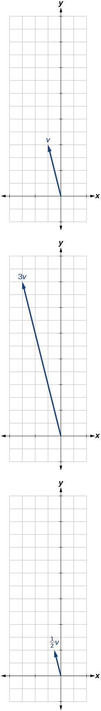 

<math xmlns="http://www.w3.org/1998/Math/MathML"> <mrow> <mrow><mo>〈</mo> <mrow> <mn>−3</mn><mo>,</mo><mn>−2</mn></mrow> <mo>〉</mo></mrow></mrow> </math>

For the following exercises, use the vectors shown to sketch ***u*** + ***v***, ***u*** − ***v***, and 2***u***.

  

 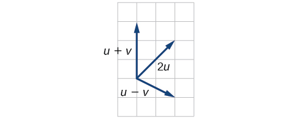 

  

 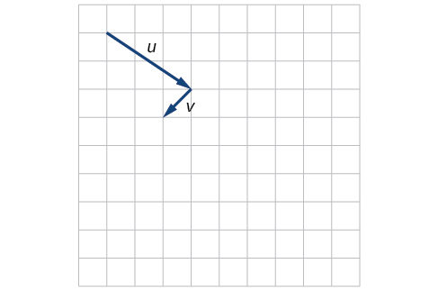 

 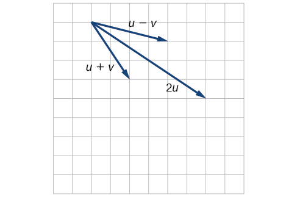 

For the following exercises, use the vectors shown to sketch 2***u*** + ***v***.

 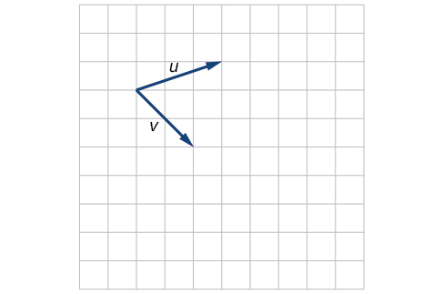 

 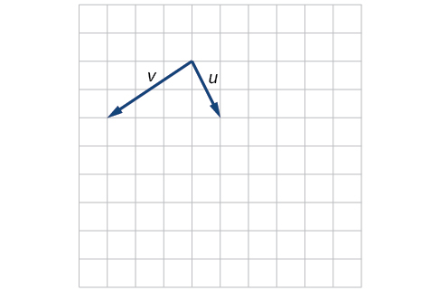 

 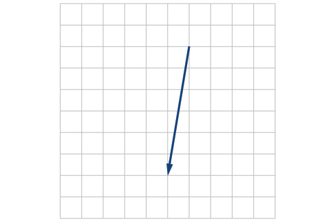 

For the following exercises, use the vectors shown to sketch ***u*** − 3***v***.

 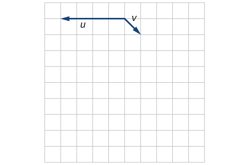 

 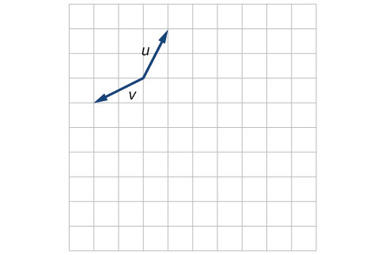 

 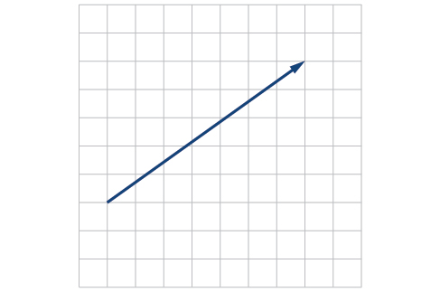 

For the following exercises, write the vector shown in component form.

  

  

<math xmlns="http://www.w3.org/1998/Math/MathML"> <mrow> <mrow><mo>〈</mo> <mrow> <mn>4</mn><mo>,</mo><mn>1</mn></mrow> <mo>〉</mo></mrow></mrow> </math>

Given initial point<math xmlns="http://www.w3.org/1998/Math/MathML"> <mrow> <mtext> </mtext><msub> <mi>P</mi> <mn>1</mn> </msub> <mo>=</mo><mrow><mo>(</mo> <mrow> <mn>2</mn><mo>,</mo><mn>1</mn></mrow> <mo>)</mo></mrow><mtext> </mtext></mrow> </math>

and terminal point<math xmlns="http://www.w3.org/1998/Math/MathML"> <mrow> <mtext> </mtext><msub> <mi>P</mi> <mn>2</mn> </msub> <mo>=</mo><mrow><mo>(</mo> <mrow> <mo>−</mo><mn>1</mn><mo>,</mo><mn>2</mn></mrow> <mo>)</mo></mrow><mo>,</mo><mtext> </mtext></mrow> </math>

write the vector<strong><math xmlns="http://www.w3.org/1998/Math/MathML">
 <mrow>
  <mtext> </mtext><mi>v</mi><mtext> </mtext></mrow>
</math></strong>in terms of<strong><math xmlns="http://www.w3.org/1998/Math/MathML">
 <mrow>
  <mtext> </mtext><mi>i</mi><mtext> </mtext></mrow>
</math></strong>and<strong><math xmlns="http://www.w3.org/1998/Math/MathML">
 <mrow>
  <mtext> </mtext><mi>j</mi><mo>,</mo><mtext> </mtext></mrow>
</math></strong>then draw the vector on the graph.

Given initial point<math xmlns="http://www.w3.org/1998/Math/MathML"> <mrow> <mtext> </mtext><msub> <mi>P</mi> <mn>1</mn> </msub> <mo>=</mo><mrow><mo>(</mo> <mrow> <mn>4</mn><mo>,</mo><mo>−</mo><mn>1</mn></mrow> <mo>)</mo></mrow><mtext> </mtext></mrow> </math>

and terminal point<math xmlns="http://www.w3.org/1998/Math/MathML"> <mrow> <mtext> </mtext><msub> <mi>P</mi> <mn>2</mn> </msub> <mo>=</mo><mrow><mo>(</mo> <mrow> <mo>−</mo><mn>3</mn><mo>,</mo><mn>2</mn></mrow> <mo>)</mo></mrow><mo>,</mo><mtext> </mtext></mrow> </math>

write the vector<strong><math xmlns="http://www.w3.org/1998/Math/MathML">
 <mrow>
  <mtext> </mtext><mi>v</mi><mtext> </mtext></mrow>
</math></strong>in terms of<strong><math xmlns="http://www.w3.org/1998/Math/MathML">
 <mrow>
  <mtext> </mtext><mi>i</mi><mtext> </mtext></mrow>
</math></strong>and<strong><math xmlns="http://www.w3.org/1998/Math/MathML">
 <mrow>
  <mtext> </mtext><mi>j</mi><mo>.</mo><mtext> </mtext>
 </mrow>
</math></strong>Draw the points and the vector on the graph.

<math xmlns="http://www.w3.org/1998/Math/MathML"> <mrow> <mi>v</mi><mo>=</mo><mo>−</mo><mn>7</mn><mi>i</mi><mo>+</mo><mn>3</mn><mi>j</mi></mrow> </math>

 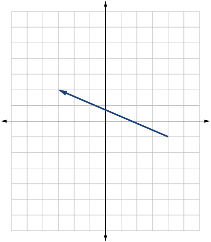 

Given initial point<math xmlns="http://www.w3.org/1998/Math/MathML"> <mrow> <mtext> </mtext><msub> <mi>P</mi> <mn>1</mn> </msub> <mo>=</mo><mrow><mo>(</mo> <mrow> <mn>3</mn><mo>,</mo><mn>3</mn></mrow> <mo>)</mo></mrow><mtext> </mtext></mrow> </math>

and terminal point<math xmlns="http://www.w3.org/1998/Math/MathML"> <mrow> <mtext> </mtext><msub> <mi>P</mi> <mn>2</mn> </msub> <mo>=</mo><mrow><mo>(</mo> <mrow> <mo>−</mo><mn>3</mn><mo>,</mo><mn>3</mn></mrow> <mo>)</mo></mrow><mo>,</mo><mtext> </mtext></mrow> </math>

write the vector<strong><math xmlns="http://www.w3.org/1998/Math/MathML">
 <mrow>
  <mtext> </mtext><mi>v</mi><mtext> </mtext></mrow>
</math></strong>in terms of<strong><math xmlns="http://www.w3.org/1998/Math/MathML">
 <mrow>
  <mtext> </mtext><mi>i</mi><mtext> </mtext></mrow>
</math></strong>and<strong><math xmlns="http://www.w3.org/1998/Math/MathML">
 <mrow>
  <mtext> </mtext><mi>j</mi><mo>.</mo><mtext> </mtext></mrow>
</math></strong>Draw the points and the vector on the graph.

#### Extensions

For the following exercises, use the given magnitude and direction in standard position, write the vector in component form.

<math xmlns="http://www.w3.org/1998/Math/MathML"> <mrow> <mrow><mo>\|</mo> <mi>v</mi> <mo>\|</mo></mrow><mo>=</mo><mn>6</mn><mo>,</mo><mi>θ</mi><mo>=</mo><mn>45</mn><mo>°</mo></mrow> </math>

<math xmlns="http://www.w3.org/1998/Math/MathML"> <mrow> <mn>3</mn><msqrt> <mn>2</mn> </msqrt> <mi>i</mi><mo>+</mo><mn>3</mn><msqrt> <mn>2</mn> </msqrt> <mi>j</mi></mrow> </math>

<math xmlns="http://www.w3.org/1998/Math/MathML"> <mrow> <mrow><mo>\|</mo> <mi>v</mi> <mo>\|</mo></mrow><mo>=</mo><mn>8</mn><mo>,</mo><mi>θ</mi><mo>=</mo><mn>220°</mn></mrow> </math>

<math xmlns="http://www.w3.org/1998/Math/MathML"> <mrow> <mrow><mo>\|</mo> <mi>v</mi> <mo>\|</mo></mrow><mo>=</mo><mn>2</mn><mo>,</mo><mi>θ</mi><mo>=</mo><mn>300°</mn></mrow> </math>

<math xmlns="http://www.w3.org/1998/Math/MathML"> <mrow> <mi>i</mi><mo>−</mo><msqrt> <mn>3</mn> </msqrt> <mi>j</mi></mrow> </math>

<math xmlns="http://www.w3.org/1998/Math/MathML"> <mrow> <mrow><mo>\|</mo> <mi>v</mi> <mo>\|</mo></mrow><mo>=</mo><mn>5</mn><mo>,</mo><mi>θ</mi><mo>=</mo><mn>135°</mn></mrow> </math>

A 60-pound box is resting on a ramp that is inclined 12°. Rounding to the nearest tenth,

1.  Find the magnitude of the normal (perpendicular) component of the force.
2.  Find the magnitude of the component of the force that is parallel to the ramp.
{: type="a"}

a. 58.7; b. 12.5

A 25-pound box is resting on a ramp that is inclined 8°. Rounding to the nearest tenth,

1.  Find the magnitude of the normal (perpendicular) component of the force.
2.  Find the magnitude of the component of the force that is parallel to the ramp.
{: type="a"}

Find the magnitude of the horizontal and vertical components of a vector with magnitude 8 pounds pointed in a direction of 27° above the horizontal. Round to the nearest hundredth.

<math xmlns="http://www.w3.org/1998/Math/MathML"> <mrow> <mi>x</mi><mo>=</mo><mn>7.13</mn><mtext> </mtext></mrow> </math>

pounds,<math xmlns="http://www.w3.org/1998/Math/MathML"> <mrow> <mtext> </mtext><mi>y</mi><mo>=</mo><mn>3.63</mn><mtext> </mtext></mrow> </math>

pounds

Find the magnitude of the horizontal and vertical components of the vector with magnitude 4 pounds pointed in a direction of 127° above the horizontal. Round to the nearest hundredth.

Find the magnitude of the horizontal and vertical components of a vector with magnitude 5 pounds pointed in a direction of 55° above the horizontal. Round to the nearest hundredth.

<math xmlns="http://www.w3.org/1998/Math/MathML"> <mrow> <mi>x</mi><mo>=</mo><mn>2.87</mn><mtext> </mtext></mrow> </math>

pounds,<math xmlns="http://www.w3.org/1998/Math/MathML"> <mrow> <mtext> </mtext><mi>y</mi><mo>=</mo><mn>4.10</mn><mtext> </mtext></mrow> </math>

pounds

Find the magnitude of the horizontal and vertical components of the vector with magnitude 1 pound pointed in a direction of 8° above the horizontal. Round to the nearest hundredth.

#### Real-World Applications

A woman leaves home and walks 3 miles west, then 2 miles southwest. How far from home is she, and in what direction must she walk to head directly home?

4\.635 miles, 17.764° N of E

A boat leaves the marina and sails 6 miles north, then 2 miles northeast. How far from the marina is the boat, and in what direction must it sail to head directly back to the marina?

A man starts walking from home and walks 4 miles east, 2 miles southeast, 5 miles south, 4 miles southwest, and 2 miles east. How far has he walked? If he walked straight home, how far would he have to walk?

17 miles. 10.318 miles

A woman starts walking from home and walks 4 miles east, 7 miles southeast, 6 miles south, 5 miles southwest, and 3 miles east. How far has she walked? If she walked straight home, how far would she have to walk?

A man starts walking from home and walks 3 miles at 20° north of west, then 5 miles at 10° west of south, then 4 miles at 15° north of east. If he walked straight home, how far would he have to the walk, and in what direction?

Distance: 2.868. Direction: 86.474° North of West, or 3.526° West of North

A woman starts walking from home and walks 6 miles at 40° north of east, then 2 miles at 15° east of south, then 5 miles at 30° south of west. If she walked straight home, how far would she have to walk, and in what direction?

An airplane is heading north at an airspeed of 600 km/hr, but there is a wind blowing from the southwest at 80 km/hr. How many degrees off course will the plane end up flying, and what is the plane’s speed relative to the ground?

4\.924°. 659 km/hr

An airplane is heading north at an airspeed of 500 km/hr, but there is a wind blowing from the northwest at 50 km/hr. How many degrees off course will the plane end up flying, and what is the plane’s speed relative to the ground?

An airplane needs to head due north, but there is a wind blowing from the southwest at 60 km/hr. The plane flies with an airspeed of 550 km/hr. To end up flying due north, how many degrees west of north will the pilot need to fly the plane?

4\.424°

An airplane needs to head due north, but there is a wind blowing from the northwest at 80 km/hr. The plane flies with an airspeed of 500 km/hr. To end up flying due north, how many degrees west of north will the pilot need to fly the plane?

As part of a video game, the point<math xmlns="http://www.w3.org/1998/Math/MathML"> <mrow> <mtext> </mtext><mrow><mo>(</mo> <mrow> <mn>5</mn><mo>,</mo><mn>7</mn></mrow> <mo>)</mo></mrow><mtext> </mtext></mrow> </math>

is rotated counterclockwise about the origin through an angle of 35°. Find the new coordinates of this point.

<math xmlns="http://www.w3.org/1998/Math/MathML"> <mrow> <mrow><mo>(</mo> <mrow> <mn>0.081</mn><mo>,</mo><mn>8.602</mn></mrow> <mo>)</mo></mrow></mrow> </math>

As part of a video game, the point<math xmlns="http://www.w3.org/1998/Math/MathML"> <mrow> <mtext> </mtext><mrow><mo>(</mo> <mrow> <mn>7</mn><mo>,</mo><mn>3</mn></mrow> <mo>)</mo></mrow><mtext> </mtext></mrow> </math>

is rotated counterclockwise about the origin through an angle of 40°. Find the new coordinates of this point.

Two children are throwing a ball back and forth straight across the back seat of a car. The ball is being thrown 10 mph relative to the car, and the car is traveling 25 mph down the road. If one child doesn't catch the ball, and it flies out the window, in what direction does the ball fly (ignoring wind resistance)?

21\.801°, relative to the car’s forward direction

Two children are throwing a ball back and forth straight across the back seat of a car. The ball is being thrown 8 mph relative to the car, and the car is traveling 45 mph down the road. If one child doesn't catch the ball, and it flies out the window, in what direction does the ball fly (ignoring wind resistance)?

A 50-pound object rests on a ramp that is inclined 19°. Find the magnitude of the components of the force parallel to and perpendicular to (normal) the ramp to the nearest tenth of a pound.

parallel: 16.28, perpendicular: 47.28 pounds

Suppose a body has a force of 10 pounds acting on it to the right, 25 pounds acting on it upward, and 5 pounds acting on it 45° from the horizontal. What single force is the resultant force acting on the body?

Suppose a body has a force of 10 pounds acting on it to the right, 25 pounds acting on it ─135° from the horizontal, and 5 pounds acting on it directed 150° from the horizontal. What single force is the resultant force acting on the body?

19\.35 pounds, 231.54° from the horizontal

The condition of equilibrium is when the sum of the forces acting on a body is the zero vector. Suppose a body has a force of 2 pounds acting on it to the right, 5 pounds acting on it upward, and 3 pounds acting on it 45° from the horizontal. What single force is needed to produce a state of equilibrium on the body?

Suppose a body has a force of 3 pounds acting on it to the left, 4 pounds acting on it upward, and 2 pounds acting on it 30° from the horizontal. What single force is needed to produce a state of equilibrium on the body? Draw the vector.

5\.1583 pounds, 75.8° from the horizontal

### Chapter Review Exercises

#### [Non-right Triangles: Law of Sines](/m49404){: .target-chapter}

For the following exercises, assume<math xmlns="http://www.w3.org/1998/Math/MathML"> <mrow> <mtext> </mtext><mi>α</mi><mtext> </mtext></mrow> </math>

is opposite side<math xmlns="http://www.w3.org/1998/Math/MathML"> <mrow> <mtext> </mtext><mi>a</mi><mo>,</mo><mi>β</mi><mtext> </mtext></mrow> </math>

is opposite side<math xmlns="http://www.w3.org/1998/Math/MathML"> <mrow> <mtext> </mtext><mi>b</mi><mo>,</mo><mtext> </mtext></mrow> </math>

and<math xmlns="http://www.w3.org/1998/Math/MathML"> <mrow> <mtext> </mtext><mi>γ</mi><mtext> </mtext></mrow> </math>

is opposite side<math xmlns="http://www.w3.org/1998/Math/MathML"> <mrow> <mtext> </mtext><mi>c</mi><mo>.</mo><mtext> </mtext></mrow> </math>

Solve each triangle, if possible. Round each answer to the nearest tenth.

<math xmlns="http://www.w3.org/1998/Math/MathML"> <mrow> <mi>β</mi><mo>=</mo><mn>50°</mn><mo>,</mo><mi>a</mi><mo>=</mo><mn>105</mn><mo>,</mo><mi>b</mi><mo>=</mo><mn>45</mn></mrow> </math>

Not possible

<math xmlns="http://www.w3.org/1998/Math/MathML"> <mrow> <mi>α</mi><mo>=</mo><mn>43.1°</mn><mo>,</mo><mi>a</mi><mo>=</mo><mn>184.2</mn><mo>,</mo><mi>b</mi><mo>=</mo><mn>242.8</mn></mrow> </math>

Solve the triangle.

 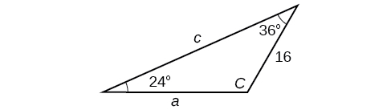 

<math xmlns="http://www.w3.org/1998/Math/MathML"> <mrow> <mi>C</mi><mo>=</mo><mn>120°</mn><mo>,</mo><mi>a</mi><mo>=</mo><mn>23.1</mn><mo>,</mo><mi>c</mi><mo>=</mo><mn>34.1</mn></mrow> </math>

Find the area of the triangle.

 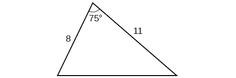 

A pilot is flying over a straight highway. He determines the angles of depression to two mileposts, 2.1 km apart, to be 25° and 49°, as shown in [[link]](#Image_08_08_225). Find the distance of the plane from point<math xmlns="http://www.w3.org/1998/Math/MathML"> <mrow> <mtext> </mtext><mi>A</mi><mtext> </mtext></mrow> </math>

and the elevation of the plane.

{: #Image_08_08_225}

distance of the plane from point<math xmlns="http://www.w3.org/1998/Math/MathML"> <mrow> <mtext> </mtext><mi>A</mi><mo>:</mo><mtext> </mtext></mrow> </math>

2.2 km, elevation of the plane: 1.6 km

#### [Non-right Triangles: Law of Cosines](/m49405){: .target-chapter}

Solve the triangle, rounding to the nearest tenth, assuming<math xmlns="http://www.w3.org/1998/Math/MathML"> <mrow> <mtext> </mtext><mi>α</mi><mtext> </mtext></mrow> </math>

is opposite side<math xmlns="http://www.w3.org/1998/Math/MathML"> <mrow> <mtext> </mtext><mi>a</mi><mo>,</mo><mi>β</mi><mtext> </mtext></mrow> </math>

is opposite side<math xmlns="http://www.w3.org/1998/Math/MathML"> <mrow> <mtext> </mtext><mi>b</mi><mo>,</mo><mtext> </mtext></mrow> </math>

and<math xmlns="http://www.w3.org/1998/Math/MathML"> <mrow> <mtext> </mtext><mi>γ</mi><mtext> </mtext></mrow> </math>

s opposite side<math xmlns="http://www.w3.org/1998/Math/MathML"> <mrow> <mi>c</mi><mo>:</mo><mtext> </mtext><mi>a</mi><mo>=</mo><mn>4</mn><mo>,</mo><mo> </mo><mi>b</mi><mo>=</mo><mn>6</mn><mo>,</mo><mi>c</mi><mo>=</mo><mn>8.</mn></mrow> </math>

Solve the triangle in [[link]](#Image_08_08_226), rounding to the nearest tenth.

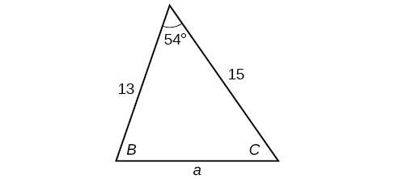{: #Image_08_08_226}

<math xmlns="http://www.w3.org/1998/Math/MathML"> <mrow> <mi>B</mi><mo>=</mo><mn>71.0°</mn><mo>,</mo><mi>C</mi><mo>=</mo><mn>55.0°</mn><mo>,</mo><mi>a</mi><mo>=</mo><mn>12.8</mn></mrow> </math>

Find the area of a triangle with sides of length 8.3, 6.6, and 9.1.

To find the distance between two cities, a satellite calculates the distances and angle shown in [[link]](#Image_08_08_227) (not to scale). Find the distance between the cities. Round answers to the nearest tenth.

{: #Image_08_08_227}

40\.6 km

#### [Polar Coordinates](/m49406){: .target-chapter}

Plot the point with polar coordinates<math xmlns="http://www.w3.org/1998/Math/MathML"> <mrow> <mtext> </mtext><mrow><mo>(</mo> <mrow> <mn>3</mn><mo>,</mo><mfrac> <mi>π</mi> <mn>6</mn> </mfrac> </mrow> <mo>)</mo></mrow><mo>.</mo></mrow> </math>

Plot the point with polar coordinates<math xmlns="http://www.w3.org/1998/Math/MathML"> <mrow> <mtext> </mtext><mrow><mo>(</mo> <mrow> <mn>5</mn><mo>,</mo><mo>−</mo><mfrac> <mrow> <mn>2</mn><mi>π</mi></mrow> <mn>3</mn> </mfrac> </mrow> <mo>)</mo></mrow></mrow> </math>

* * *
{: data-type="newline"}

 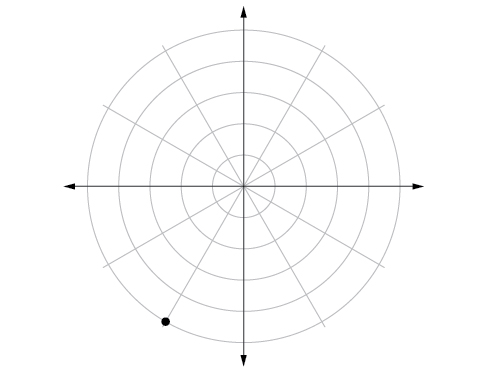 

Convert<math xmlns="http://www.w3.org/1998/Math/MathML"> <mrow> <mtext> </mtext><mrow><mo>(</mo> <mrow> <mn>6</mn><mo>,</mo><mo>−</mo><mfrac> <mrow> <mn>3</mn><mi>π</mi></mrow> <mn>4</mn> </mfrac> </mrow> <mo>)</mo></mrow><mtext> </mtext></mrow> </math>

to rectangular coordinates.

Convert<math xmlns="http://www.w3.org/1998/Math/MathML"> <mrow> <mtext> </mtext><mrow><mo>(</mo> <mrow> <mo>−</mo><mn>2</mn><mo>,</mo><mfrac> <mrow> <mn>3</mn><mi>π</mi></mrow> <mn>2</mn> </mfrac> </mrow> <mo>)</mo></mrow><mtext> </mtext></mrow> </math>

to rectangular coordinates.

<math xmlns="http://www.w3.org/1998/Math/MathML"> <mrow> <mtext> </mtext><mrow><mo>(</mo> <mrow> <mn>0</mn><mo>,</mo><mn>2</mn></mrow> <mo>)</mo></mrow><mtext> </mtext></mrow> </math>

Convert<math xmlns="http://www.w3.org/1998/Math/MathML"> <mrow> <mrow><mo>(</mo> <mrow> <mn>7</mn><mo>,</mo><mo>−</mo><mn>2</mn></mrow> <mo>)</mo></mrow></mrow> </math>

to polar coordinates.

Convert<math xmlns="http://www.w3.org/1998/Math/MathML"> <mrow> <mrow><mo>(</mo> <mrow> <mo>−</mo><mn>9</mn><mo>,</mo><mo>−</mo><mn>4</mn></mrow> <mo>)</mo></mrow></mrow> </math>

 to polar coordinates.

<math xmlns="http://www.w3.org/1998/Math/MathML"> <mrow> <mrow><mo>(</mo> <mrow> <mn>9.8489</mn><mo>,</mo><mn>203.96°</mn></mrow> <mo>)</mo></mrow></mrow> </math>

For the following exercises, convert the given Cartesian equation to a polar equation.

<math xmlns="http://www.w3.org/1998/Math/MathML"> <mrow> <mi>x</mi><mo>=</mo><mo>−</mo><mn>2</mn></mrow> </math>

<math xmlns="http://www.w3.org/1998/Math/MathML"> <mrow> <msup> <mi>x</mi> <mn>2</mn> </msup> <mo>+</mo><msup> <mi>y</mi> <mn>2</mn> </msup> <mo>=</mo><mn>64</mn></mrow> </math>

<math xmlns="http://www.w3.org/1998/Math/MathML"> <mrow> <mi>r</mi><mo>=</mo><mn>8</mn></mrow> </math>

<math xmlns="http://www.w3.org/1998/Math/MathML"> <mrow> <msup> <mi>x</mi> <mn>2</mn> </msup> <mo>+</mo><msup> <mi>y</mi> <mn>2</mn> </msup> <mo>=</mo><mo>−</mo><mn>2</mn><mi>y</mi></mrow> </math>

For the following exercises, convert the given polar equation to a Cartesian equation.

<math xmlns="http://www.w3.org/1998/Math/MathML"> <mrow> <mi>r</mi><mo>=</mo><mn>7</mn><mtext>cos</mtext><mtext> </mtext><mi>θ</mi> </mrow> </math>

<math xmlns="http://www.w3.org/1998/Math/MathML"> <mrow> <msup> <mi>x</mi> <mn>2</mn> </msup> <mo>+</mo><msup> <mi>y</mi> <mn>2</mn> </msup> <mo>=</mo><mn>7</mn><mi>x</mi></mrow> </math>

<math xmlns="http://www.w3.org/1998/Math/MathML"> <mrow> <mi>r</mi><mo>=</mo><mfrac> <mrow> <mo>−</mo><mn>2</mn> </mrow> <mrow> <mn>4</mn><mi>cos</mi><mtext> </mtext><mi>θ</mi><mo>+</mo><mi>sin</mi><mtext> </mtext><mi>θ</mi> </mrow> </mfrac> </mrow> </math>

For the following exercises, convert to rectangular form and graph.

<math xmlns="http://www.w3.org/1998/Math/MathML"> <mrow> <mi>θ</mi><mo>=</mo><mfrac> <mrow> <mn>3</mn><mi>π</mi></mrow> <mn>4</mn> </mfrac> </mrow> </math>

<math xmlns="http://www.w3.org/1998/Math/MathML"> <mrow> <mi>y</mi><mo>=</mo><mo>−</mo><mi>x</mi></mrow> </math>

 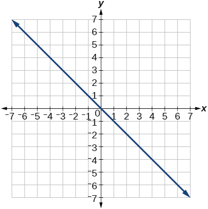 

<math xmlns="http://www.w3.org/1998/Math/MathML"> <mrow> <mi>r</mi><mo>=</mo><mn>5</mn><mi>sec</mi><mtext> </mtext><mi>θ</mi> </mrow> </math>

#### [Polar Coordinates: Graphs](/m49407){: .target-chapter}

For the following exercises, test each equation for symmetry.

<math xmlns="http://www.w3.org/1998/Math/MathML"> <mrow> <mi>r</mi><mo>=</mo><mn>4</mn><mo>+</mo><mn>4</mn><mi>sin</mi><mtext> </mtext><mi>θ</mi></mrow> </math>

symmetric with respect to the line<math xmlns="http://www.w3.org/1998/Math/MathML"> <mrow> <mi>θ</mi><mo>=</mo><mfrac> <mi>π</mi> <mn>2</mn> </mfrac> </mrow> </math>

<math xmlns="http://www.w3.org/1998/Math/MathML"> <mrow> <mi>r</mi><mo>=</mo><mn>7</mn></mrow> </math>

Sketch a graph of the polar equation<math xmlns="http://www.w3.org/1998/Math/MathML"> <mrow> <mtext> </mtext><mi>r</mi><mo>=</mo><mn>1</mn><mo>−</mo><mn>5</mn><mi>sin</mi><mtext> </mtext><mi>θ</mi><mo>.</mo><mtext> </mtext></mrow> </math>

Label the axis intercepts.

* * *
{: data-type="newline"}

 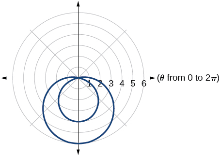 

Sketch a graph of the polar equation<math xmlns="http://www.w3.org/1998/Math/MathML"> <mrow> <mtext> </mtext><mi>r</mi><mo>=</mo><mn>5</mn><mi>sin</mi><mrow><mo>(</mo> <mrow> <mn>7</mn><mi>θ</mi></mrow> <mo>)</mo></mrow><mo>.</mo></mrow> </math>

Sketch a graph of the polar equation<math xmlns="http://www.w3.org/1998/Math/MathML"> <mrow> <mtext> </mtext><mi>r</mi><mo>=</mo><mn>3</mn><mo>−</mo><mn>3</mn><mi>cos</mi><mtext> </mtext><mi>θ</mi></mrow> </math>

* * *
{: data-type="newline"}

 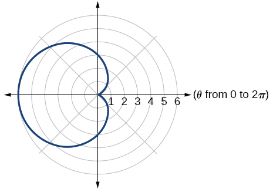 

#### [Polar Form of Complex Numbers](/m49408){: .target-chapter}

For the following exercises, find the absolute value of each complex number.

<math xmlns="http://www.w3.org/1998/Math/MathML"> <mrow> <mo>−</mo><mn>2</mn><mo>+</mo><mn>6</mn><mi>i</mi></mrow> </math>

<math xmlns="http://www.w3.org/1998/Math/MathML"> <mrow> <mn>4</mn><mo>−</mo><mtext>​</mtext><mn>3</mn><mi>i</mi></mrow> </math>

5

Write the complex number in polar form.

<math xmlns="http://www.w3.org/1998/Math/MathML"> <mrow> <mn>5</mn><mo>+</mo><mn>9</mn><mi>i</mi></mrow> </math>

<math xmlns="http://www.w3.org/1998/Math/MathML"> <mrow> <mfrac> <mn>1</mn> <mn>2</mn> </mfrac> <mo>−</mo><mfrac> <mrow> <msqrt> <mn>3</mn> </msqrt> </mrow> <mn>2</mn> </mfrac> <mtext>​</mtext><mi>i</mi></mrow> </math>

<math xmlns="http://www.w3.org/1998/Math/MathML"> <mrow> <mi mathvariant="normal">cis</mi><mrow><mo>(</mo> <mrow> <mo>−</mo><mfrac> <mi>π</mi> <mn>3</mn> </mfrac> </mrow> <mo>)</mo></mrow></mrow> </math>

For the following exercises, convert the complex number from polar to rectangular form.

<math xmlns="http://www.w3.org/1998/Math/MathML"> <mrow> <mi>z</mi><mo>=</mo><mn>5</mn><mi mathvariant="normal">cis</mi><mrow><mo>(</mo> <mrow> <mfrac> <mrow> <mn>5</mn><mi>π</mi></mrow> <mn>6</mn> </mfrac> </mrow> <mo>)</mo></mrow></mrow> </math>

<math xmlns="http://www.w3.org/1998/Math/MathML"> <mrow> <mi>z</mi><mo>=</mo><mn>3</mn><mi mathvariant="normal">cis</mi><mrow><mo>(</mo> <mrow> <mn>40°</mn></mrow> <mo>)</mo></mrow></mrow> </math>

<math xmlns="http://www.w3.org/1998/Math/MathML"> <mrow> <mn>2.3</mn><mo>+</mo><mn>1.9</mn><mi>i</mi></mrow> </math>

For the following exercises, find the product<math xmlns="http://www.w3.org/1998/Math/MathML"> <mrow> <mtext> </mtext><msub> <mi>z</mi> <mn>1</mn> </msub> <msub> <mi>z</mi> <mn>2</mn> </msub> <mtext> </mtext></mrow> </math>

in polar form.

<math xmlns="http://www.w3.org/1998/Math/MathML"> <mrow> <msub> <mi>z</mi> <mn>1</mn> </msub> <mo>=</mo><mn>2</mn><mi mathvariant="normal">cis</mi><mrow><mo>(</mo> <mrow> <mn>89°</mn></mrow> <mo>)</mo></mrow></mrow> </math>

<math xmlns="http://www.w3.org/1998/Math/MathML"> <mrow> <msub> <mi>z</mi> <mn>2</mn> </msub> <mo>=</mo><mn>5</mn><mi mathvariant="normal">cis</mi><mrow><mo>(</mo> <mrow> <mn>23°</mn></mrow> <mo>)</mo></mrow></mrow> </math>

<math xmlns="http://www.w3.org/1998/Math/MathML"> <mrow> <msub> <mi>z</mi> <mn>1</mn> </msub> <mo>=</mo><mn>10</mn><mi mathvariant="normal">cis</mi><mrow><mo>(</mo> <mrow> <mfrac> <mi>π</mi> <mn>6</mn> </mfrac> </mrow> <mo>)</mo></mrow></mrow> </math>

<math xmlns="http://www.w3.org/1998/Math/MathML"> <mrow> <msub> <mi>z</mi> <mn>2</mn> </msub> <mo>=</mo><mn>6</mn><mi mathvariant="normal">cis</mi><mrow><mo>(</mo> <mrow> <mfrac> <mi>π</mi> <mn>3</mn> </mfrac> </mrow> <mo>)</mo></mrow></mrow> </math>

<math xmlns="http://www.w3.org/1998/Math/MathML"> <mrow> <mn>60</mn><mi mathvariant="normal">cis</mi><mrow><mo>(</mo> <mrow> <mfrac> <mi>π</mi> <mn>2</mn> </mfrac> </mrow> <mo>)</mo></mrow></mrow> </math>

For the following exercises, find the quotient<math xmlns="http://www.w3.org/1998/Math/MathML"> <mrow> <mtext> </mtext><mfrac> <mrow> <msub> <mi>z</mi> <mn>1</mn> </msub> </mrow> <mrow> <msub> <mi>z</mi> <mn>2</mn> </msub> </mrow> </mfrac> <mtext> </mtext></mrow> </math>

in polar form.

<math xmlns="http://www.w3.org/1998/Math/MathML"> <mrow> <msub> <mi>z</mi> <mn>1</mn> </msub> <mo>=</mo><mn>12</mn><mi mathvariant="normal">cis</mi><mrow><mo>(</mo> <mrow> <mn>55°</mn></mrow> <mo>)</mo></mrow></mrow> </math>

<math xmlns="http://www.w3.org/1998/Math/MathML"> <mrow> <msub> <mi>z</mi> <mn>2</mn> </msub> <mo>=</mo><mn>3</mn><mi mathvariant="normal">cis</mi><mrow><mo>(</mo> <mrow> <mn>18°</mn></mrow> <mo>)</mo></mrow></mrow> </math>

<math xmlns="http://www.w3.org/1998/Math/MathML"> <mrow> <msub> <mi>z</mi> <mn>1</mn> </msub> <mo>=</mo><mn>27</mn><mi mathvariant="normal">cis</mi><mrow><mo>(</mo> <mrow> <mfrac> <mrow> <mn>5</mn><mi>π</mi></mrow> <mn>3</mn> </mfrac> </mrow> <mo>)</mo></mrow></mrow> </math>

<math xmlns="http://www.w3.org/1998/Math/MathML"> <mrow> <msub> <mi>z</mi> <mn>2</mn> </msub> <mo>=</mo><mn>9</mn><mi mathvariant="normal">cis</mi><mrow><mo>(</mo> <mrow> <mfrac> <mi>π</mi> <mn>3</mn> </mfrac> </mrow> <mo>)</mo></mrow></mrow> </math>

<math xmlns="http://www.w3.org/1998/Math/MathML"> <mrow> <mn>3</mn><mi mathvariant="normal">cis</mi><mrow><mo>(</mo> <mrow> <mfrac> <mrow> <mn>4</mn><mi>π</mi></mrow> <mn>3</mn> </mfrac> </mrow> <mo>)</mo></mrow></mrow> </math>

For the following exercises, find the powers of each complex number in polar form.

Find<math xmlns="http://www.w3.org/1998/Math/MathML"> <mrow> <mtext> </mtext><msup> <mi>z</mi> <mn>4</mn> </msup> <mtext> </mtext></mrow> </math>

when<math xmlns="http://www.w3.org/1998/Math/MathML"> <mrow> <mtext> </mtext><mi>z</mi><mo>=</mo><mn>2</mn><mi mathvariant="normal">cis</mi><mrow><mo>(</mo> <mrow> <mn>70°</mn></mrow> <mo>)</mo></mrow></mrow> </math>

Find<math xmlns="http://www.w3.org/1998/Math/MathML"> <mrow> <mtext> </mtext><msup> <mi>z</mi> <mn>2</mn> </msup> <mtext> </mtext></mrow> </math>

when<math xmlns="http://www.w3.org/1998/Math/MathML"> <mrow> <mtext> </mtext><mi>z</mi><mo>=</mo><mn>5</mn><mi mathvariant="normal">cis</mi><mrow><mo>(</mo> <mrow> <mfrac> <mrow> <mn>3</mn><mi>π</mi></mrow> <mn>4</mn> </mfrac> </mrow> <mo>)</mo></mrow></mrow> </math>

<math xmlns="http://www.w3.org/1998/Math/MathML"> <mrow> <mn>25</mn><mi mathvariant="normal">cis</mi><mrow><mo>(</mo> <mrow> <mfrac> <mrow> <mn>3</mn><mi>π</mi></mrow> <mn>2</mn> </mfrac> </mrow> <mo>)</mo></mrow></mrow> </math>

For the following exercises, evaluate each root.

Evaluate the cube root of<math xmlns="http://www.w3.org/1998/Math/MathML"> <mrow> <mtext> </mtext><mi>z</mi><mtext> </mtext></mrow> </math>

when<math xmlns="http://www.w3.org/1998/Math/MathML"> <mrow> <mtext> </mtext><mi>z</mi><mo>=</mo><mn>64</mn><mi mathvariant="normal">cis</mi><mrow><mo>(</mo> <mrow> <mn>210°</mn></mrow> <mo>)</mo></mrow><mo>.</mo></mrow> </math>

Evaluate the square root of<math xmlns="http://www.w3.org/1998/Math/MathML"> <mrow> <mtext> </mtext><mi>z</mi><mtext> </mtext></mrow> </math>

when<math xmlns="http://www.w3.org/1998/Math/MathML"> <mrow> <mtext> </mtext><mi>z</mi><mo>=</mo><mn>25</mn><mi mathvariant="normal">cis</mi><mrow><mo>(</mo> <mrow> <mfrac> <mrow> <mn>3</mn><mi>π</mi></mrow> <mn>2</mn> </mfrac> </mrow> <mo>)</mo></mrow><mo>.</mo></mrow> </math>

<math xmlns="http://www.w3.org/1998/Math/MathML"> <mrow> <mn>5</mn><mi mathvariant="normal">cis</mi><mrow><mo>(</mo> <mrow> <mfrac> <mrow> <mn>3</mn><mi>π</mi></mrow> <mn>4</mn> </mfrac> </mrow> <mo>)</mo></mrow><mo>,</mo><mn>5</mn><mi mathvariant="normal">cis</mi><mrow><mo>(</mo> <mrow> <mfrac> <mrow> <mn>7</mn><mi>π</mi></mrow> <mn>4</mn> </mfrac> </mrow> <mo>)</mo></mrow></mrow> </math>

For the following exercises, plot the complex number in the complex plane.

<math xmlns="http://www.w3.org/1998/Math/MathML"> <mrow> <mn>6</mn><mo>−</mo><mn>2</mn><mi>i</mi></mrow> </math>

<math xmlns="http://www.w3.org/1998/Math/MathML"> <mrow> <mo>−</mo><mn>1</mn><mo>+</mo><mn>3</mn><mi>i</mi></mrow> </math>

 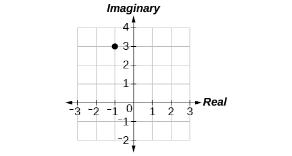 

#### [Parametric Equations](/m49409){: .target-chapter}

For the following exercises, eliminate the parameter<math xmlns="http://www.w3.org/1998/Math/MathML"> <mrow> <mtext> </mtext><mi>t</mi><mtext> </mtext></mrow> </math>

to rewrite the parametric equation as a Cartesian equation.

<math xmlns="http://www.w3.org/1998/Math/MathML"> <mrow> <mrow><mo>{</mo> <mrow> <mtable columnalign="left"> <mtr columnalign="left"> <mtd columnalign="left"> <mrow> <mi>x</mi><mrow><mo>(</mo> <mi>t</mi> <mo>)</mo></mrow><mo>=</mo><mn>3</mn><mi>t</mi><mo>−</mo><mn>1</mn></mrow> </mtd> </mtr> <mtr columnalign="left"> <mtd columnalign="left"> <mrow> <mi>y</mi><mrow><mo>(</mo> <mi>t</mi> <mo>)</mo></mrow><mo>=</mo><msqrt> <mi>t</mi> </msqrt> </mrow> </mtd> </mtr> </mtable></mrow> </mrow></mrow> </math>

<math xmlns="http://www.w3.org/1998/Math/MathML"> <mrow> <mo>{</mo><mtable columnalign="left"> <mtr columnalign="left"> <mtd columnalign="left"> <mrow> <mi>x</mi><mo stretchy="false">(</mo><mi>t</mi><mo stretchy="false">)</mo><mo>=</mo><mo>−</mo><mi>cos</mi><mtext> </mtext><mi>t</mi> </mrow> </mtd> </mtr> <mtr columnalign="left"> <mtd columnalign="left"> <mrow> <mi>y</mi><mo stretchy="false">(</mo><mi>t</mi><mo stretchy="false">)</mo><mo>=</mo><mn>2</mn><msup> <mrow> <mi>sin</mi> </mrow> <mn>2</mn> </msup> <mi>t</mi><mo> </mo> </mrow> </mtd> </mtr> </mtable> </mrow> </math>

<math xmlns="http://www.w3.org/1998/Math/MathML"> <mrow> <msup> <mi>x</mi> <mn>2</mn> </msup> <mo>+</mo><mfrac> <mn>1</mn> <mn>2</mn> </mfrac> <mi>y</mi><mo>=</mo><mn>1</mn></mrow> </math>

Parameterize (write a parametric equation for) each Cartesian equation by using<math xmlns="http://www.w3.org/1998/Math/MathML"> <mrow> <mtext> </mtext><mi>x</mi><mrow><mo>(</mo> <mi>t</mi> <mo>)</mo></mrow><mo>=</mo><mi>a</mi><mi>cos</mi><mtext> </mtext><mi>t</mi><mtext> </mtext></mrow> </math>

and<math xmlns="http://www.w3.org/1998/Math/MathML"> <mrow> <mtext> </mtext><mi>y</mi><mo stretchy="false">(</mo><mi>t</mi><mo stretchy="false">)</mo><mo>=</mo><mi>b</mi><mi>sin</mi><mtext> </mtext><mi>t</mi><mtext> </mtext></mrow> </math>

for<math xmlns="http://www.w3.org/1998/Math/MathML"> <mrow> <mtext> </mtext><mfrac> <mrow> <msup> <mi>x</mi> <mn>2</mn> </msup> </mrow> <mrow> <mn>25</mn></mrow> </mfrac> <mo>+</mo><mfrac> <mrow> <msup> <mi>y</mi> <mn>2</mn> </msup> </mrow> <mrow> <mn>16</mn></mrow> </mfrac> <mo>=</mo><mn>1.</mn></mrow> </math>

Parameterize the line from<math xmlns="http://www.w3.org/1998/Math/MathML"> <mrow> <mtext> </mtext><mo stretchy="false">(</mo><mo>−</mo><mn>2</mn><mo>,</mo><mn>3</mn><mo stretchy="false">)</mo><mtext> </mtext></mrow> </math>

to<math xmlns="http://www.w3.org/1998/Math/MathML"> <mrow> <mtext> </mtext><mo stretchy="false">(</mo><mn>4</mn><mo>,</mo><mn>7</mn><mo stretchy="false">)</mo><mtext> </mtext></mrow> </math>

so that the line is at<math xmlns="http://www.w3.org/1998/Math/MathML"> <mrow> <mtext> </mtext><mo stretchy="false">(</mo><mo>−</mo><mn>2</mn><mo>,</mo><mn>3</mn><mo stretchy="false">)</mo><mtext> </mtext></mrow> </math>

at<math xmlns="http://www.w3.org/1998/Math/MathML"> <mrow> <mtext> </mtext><mi>t</mi><mo>=</mo><mn>0</mn><mtext> </mtext></mrow> </math>

and<math xmlns="http://www.w3.org/1998/Math/MathML"> <mrow> <mtext> </mtext><mo stretchy="false">(</mo><mn>4</mn><mo>,</mo><mn>7</mn><mo stretchy="false">)</mo><mtext> </mtext></mrow> </math>

at<math xmlns="http://www.w3.org/1998/Math/MathML"> <mrow> <mtext> </mtext><mi>t</mi><mo>=</mo><mn>1.</mn></mrow> </math>

<math xmlns="http://www.w3.org/1998/Math/MathML"> <mrow> <mrow><mo>{</mo> <mrow> <mtable columnalign="left"> <mtr columnalign="left"> <mtd columnalign="left"> <mrow> <mi>x</mi><mrow><mo>(</mo> <mi>t</mi> <mo>)</mo></mrow><mo>=</mo><mo>−</mo><mn>2</mn><mo>+</mo><mn>6</mn><mi>t</mi> </mrow> </mtd> </mtr> <mtr columnalign="left"> <mtd columnalign="left"> <mrow> <mi>y</mi><mrow><mo>(</mo> <mi>t</mi> <mo>)</mo></mrow><mo>=</mo><mn>3</mn><mo>+</mo><mn>4</mn><mi>t</mi> </mrow> </mtd> </mtr> </mtable> </mrow> </mrow> </mrow> </math>

#### [Parametric Equations: Graphs](/m49411){: .target-chapter}

For the following exercises, make a table of values for each set of parametric equations, graph the equations, and include an orientation; then write the Cartesian equation.

<math xmlns="http://www.w3.org/1998/Math/MathML"> <mrow> <mrow><mo>{</mo> <mrow> <mtable columnalign="left"> <mtr columnalign="left"> <mtd columnalign="left"> <mrow> <mi>x</mi><mrow><mo>(</mo> <mi>t</mi> <mo>)</mo></mrow><mo>=</mo><mn>3</mn><msup> <mi>t</mi> <mn>2</mn> </msup> </mrow> </mtd> </mtr> <mtr columnalign="left"> <mtd columnalign="left"> <mrow> <mi>y</mi><mrow><mo>(</mo> <mi>t</mi> <mo>)</mo></mrow><mo>=</mo><mn>2</mn><mi>t</mi><mo>−</mo><mn>1</mn></mrow> </mtd> </mtr> </mtable></mrow> </mrow></mrow> </math>

<math xmlns="http://www.w3.org/1998/Math/MathML"> <mrow> <mrow><mo>{</mo> <mrow> <mtable columnalign="left"> <mtr columnalign="left"> <mtd columnalign="left"> <mrow> <mi>x</mi><mo stretchy="false">(</mo><mi>t</mi><mo stretchy="false">)</mo><mo>=</mo><msup> <mi>e</mi> <mi>t</mi> </msup> </mrow> </mtd> </mtr> <mtr columnalign="left"> <mtd columnalign="left"> <mrow> <mi>y</mi><mo stretchy="false">(</mo><mi>t</mi><mo stretchy="false">)</mo><mo>=</mo><mo>−</mo><mn>2</mn><msup> <mi>e</mi> <mrow> <mn>5</mn><mtext> </mtext><mi>t</mi> </mrow> </msup> </mrow> </mtd> </mtr> </mtable> </mrow> </mrow> </mrow> </math>

<math xmlns="http://www.w3.org/1998/Math/MathML"> <mrow> <mi>y</mi><mo>=</mo><mo>−</mo><mn>2</mn><msup> <mi>x</mi> <mn>5</mn> </msup> </mrow> </math>

 * * *
{: data-type="newline"}

 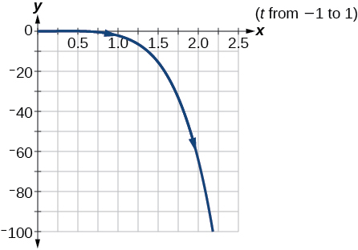 

<math xmlns="http://www.w3.org/1998/Math/MathML"> <mrow> <mrow><mo>{</mo> <mrow> <mtable columnalign="left"> <mtr columnalign="left"> <mtd columnalign="left"> <mrow> <mi>x</mi><mo stretchy="false">(</mo><mi>t</mi><mo stretchy="false">)</mo><mo>=</mo><mn>3</mn><mi>cos</mi><mtext> </mtext><mi>t</mi> </mrow> </mtd> </mtr> <mtr columnalign="left"> <mtd columnalign="left"> <mrow> <mi>y</mi><mo stretchy="false">(</mo><mi>t</mi><mo stretchy="false">)</mo><mo>=</mo><mn>2</mn><mi>sin</mi><mtext> </mtext><mi>t</mi> </mrow> </mtd> </mtr> </mtable> </mrow> </mrow> </mrow> </math>

A ball is launched with an initial velocity of 80 feet per second at an angle of 40° to the horizontal. The ball is released at a height of 4 feet above the ground.

1.  Find the parametric equations to model the path of the ball.
2.  Where is the ball after 3 seconds?
3.  How long is the ball in the air?
{: type="a"}

1.  <math xmlns="http://www.w3.org/1998/Math/MathML"> <mrow> <mrow><mo>{</mo> <mtable columnalign="left"> <mtr> <mtd> <mi>x</mi><mrow><mo>(</mo> <mi>t</mi> <mo>)</mo></mrow><mo>=</mo><mrow><mo>(</mo> <mrow> <mn>80</mn><mi>cos</mi><mrow><mo>(</mo> <mrow> <mn>40°</mn></mrow> <mo>)</mo></mrow></mrow> <mo>)</mo></mrow><mi>t</mi> </mtd> </mtr> <mtr> <mtd> <mi>y</mi><mrow><mo>(</mo> <mi>t</mi> <mo>)</mo></mrow><mo>=</mo><mo>−</mo><mn>16</mn><msup> <mi>t</mi> <mn>2</mn> </msup> <mo>+</mo><mrow><mo>(</mo> <mrow> <mn>80</mn><mi>sin</mi><mrow><mo>(</mo> <mrow> <mn>40°</mn></mrow> <mo>)</mo></mrow></mrow> <mo>)</mo></mrow><mi>t</mi><mo>+</mo><mn>4</mn> </mtd> </mtr> </mtable> </mrow></mrow> </math>

2.  The ball is 14 feet high and 184 feet from where it was launched.
3.  3\.3 seconds
{: type="a"}

#### [Vectors](/m49412){: .target-chapter}

For the following exercises, determine whether the two vectors,<strong><math xmlns="http://www.w3.org/1998/Math/MathML">
 <mrow>
  <mtext> </mtext><mi>u</mi><mtext> </mtext></mrow>
</math></strong>and<strong><math xmlns="http://www.w3.org/1998/Math/MathML">
 <mrow>
  <mtext> </mtext><mi>v</mi><mo>,</mo><mtext> </mtext></mrow>
</math></strong>are equal, where<strong><math xmlns="http://www.w3.org/1998/Math/MathML">
 <mrow>
  <mtext> </mtext><mi>u</mi><mtext> </mtext></mrow>
</math></strong>has an initial point<math xmlns="http://www.w3.org/1998/Math/MathML"> <mrow> <mtext> </mtext><msub> <mi>P</mi> <mn>1</mn> </msub> <mtext> </mtext></mrow> </math>

and a terminal point<math xmlns="http://www.w3.org/1998/Math/MathML"> <mrow> <mtext> </mtext><msub> <mi>P</mi> <mn>2</mn> </msub> <mo>,</mo><mtext> </mtext></mrow> </math>

and<strong><math xmlns="http://www.w3.org/1998/Math/MathML">
 <mrow>
  <mtext> </mtext><mi>v</mi><mtext> </mtext></mrow>
</math></strong>has an initial point<math xmlns="http://www.w3.org/1998/Math/MathML"> <mrow> <mtext> </mtext><msub> <mi>P</mi> <mn>3</mn> </msub> <mtext> </mtext></mrow> </math>

and a terminal point<math xmlns="http://www.w3.org/1998/Math/MathML"> <mrow> <mtext> </mtext><msub> <mi>P</mi> <mn>4</mn> </msub> <mo>.</mo></mrow> </math>

<math xmlns="http://www.w3.org/1998/Math/MathML"> <mrow> <msub> <mi>P</mi> <mn>1</mn> </msub> <mo>=</mo><mrow><mo>(</mo> <mrow> <mo>−</mo><mn>1</mn><mo>,</mo><mn>4</mn></mrow> <mo>)</mo></mrow><mo>,</mo><msub> <mi>P</mi> <mn>2</mn> </msub> <mo>=</mo><mrow><mo>(</mo> <mrow> <mn>3</mn><mo>,</mo><mn>1</mn></mrow> <mo>)</mo></mrow><mo>,</mo><msub> <mi>P</mi> <mn>3</mn> </msub> <mo>=</mo><mrow><mo>(</mo> <mrow> <mn>5</mn><mo>,</mo><mn>5</mn></mrow> <mo>)</mo></mrow></mrow> </math>

and<math xmlns="http://www.w3.org/1998/Math/MathML"> <mrow> <mtext> </mtext><msub> <mi>P</mi> <mn>4</mn> </msub> <mo>=</mo><mrow><mo>(</mo> <mrow> <mn>9</mn><mo>,</mo><mn>2</mn></mrow> <mo>)</mo></mrow></mrow> </math>

<math xmlns="http://www.w3.org/1998/Math/MathML"> <mrow> <msub> <mi>P</mi> <mn>1</mn> </msub> <mo>=</mo><mrow><mo>(</mo> <mrow> <mn>6</mn><mo>,</mo><mn>11</mn></mrow> <mo>)</mo></mrow><mo>,</mo><msub> <mi>P</mi> <mn>2</mn> </msub> <mo>=</mo><mrow><mo>(</mo> <mrow> <mo>−</mo><mn>2</mn><mo>,</mo><mn>8</mn></mrow> <mo>)</mo></mrow><mo>,</mo><msub> <mi>P</mi> <mn>3</mn> </msub> <mo>=</mo><mrow><mo>(</mo> <mrow> <mn>0</mn><mo>,</mo><mo>−</mo><mn>1</mn></mrow> <mo>)</mo></mrow><mtext> </mtext></mrow> </math>

and<math xmlns="http://www.w3.org/1998/Math/MathML"> <mrow> <mtext> </mtext><msub> <mi>P</mi> <mn>4</mn> </msub> <mo>=</mo><mrow><mo>(</mo> <mrow> <mo>−</mo><mn>8</mn><mo>,</mo><mn>2</mn></mrow> <mo>)</mo></mrow></mrow> </math>

not equal

For the following exercises, use the vectors<strong><math xmlns="http://www.w3.org/1998/Math/MathML">
 <mrow>
  <mtext> </mtext><mi>u</mi><mstyle mathvariant="bold" mathsize="normal"><mo>=</mo></mstyle><mn>2</mn><mi>i</mi><mo>−</mo><mi>j</mi><mtext>,</mtext><mi>v</mi><mo>=</mo><mn>4</mn><mi>i</mi><mo>−</mo><mn>3</mn><mi>j</mi><mtext>,</mtext><mtext> </mtext></mrow>
</math></strong>and<strong><math xmlns="http://www.w3.org/1998/Math/MathML">
 <mrow>
  <mtext> </mtext><mi>w</mi><mo>=</mo><mo>−</mo><mn>2</mn><mi>i</mi><mo>+</mo><mn>5</mn><mi>j</mi><mtext> </mtext></mrow>
</math></strong>to evaluate the expression.

***u*** − ***v***

2***v*** − ***u*** + ***w***

4***i***

For the following exercises, find a unit vector in the same direction as the given vector.

***a*** = 8***i*** − 6***j***

***b*** = −3***i*** − ***j***

<math xmlns="http://www.w3.org/1998/Math/MathML"> <mrow> <mo>−</mo><mfrac> <mrow> <mn>3</mn><msqrt> <mrow> <mn>10</mn> </mrow> </msqrt> </mrow> <mrow> <mn>10</mn> </mrow> </mfrac> </mrow> </math>

***i***<math xmlns="http://www.w3.org/1998/Math/MathML"> <mrow> <mo>−</mo><mfrac> <mrow> <msqrt> <mrow> <mn>10</mn> </mrow> </msqrt> </mrow> <mrow> <mn>10</mn> </mrow> </mfrac> </mrow> </math>

***j***

For the following exercises, find the magnitude and direction of the vector.

<math xmlns="http://www.w3.org/1998/Math/MathML"> <mrow> <mrow><mo>〈</mo> <mrow> <mn>6</mn><mo>,</mo><mn>−2</mn> </mrow> <mo>〉</mo></mrow> </mrow> </math>

<math xmlns="http://www.w3.org/1998/Math/MathML"> <mrow> <mrow><mo>〈</mo> <mrow> <mn>−3</mn><mo>,</mo><mn>−3</mn> </mrow> <mo>〉</mo></mrow> </mrow> </math>

Magnitude:<math xmlns="http://www.w3.org/1998/Math/MathML"> <mrow> <mtext> </mtext><mn>3</mn><msqrt> <mn>2</mn> </msqrt> <mo>,</mo><mtext> </mtext></mrow> </math>

Direction:<math xmlns="http://www.w3.org/1998/Math/MathML"> <mrow> <mtext>225°</mtext> </mrow> </math>

For the following exercises, calculate<strong><math xmlns="http://www.w3.org/1998/Math/MathML">
 <mrow>
  <mtext> </mtext><mi>u</mi><mo>⋅</mo><mi>v</mi><mtext>.</mtext></mrow>
</math></strong>

***u*** = −2***i*** + ***j*** and ***v*** = 3***i*** + 7***j***

***u*** = ***i*** + 4***j*** and ***v*** = 4***i*** + 3***j***

<math xmlns="http://www.w3.org/1998/Math/MathML"> <mrow> <mtext>16</mtext> </mrow> </math>

Given ***v***<math xmlns="http://www.w3.org/1998/Math/MathML"> <mrow> <mo>=</mo><mrow><mo>〈</mo> <mrow> <mn>−3</mn><mo>,</mo><mn>4</mn> </mrow> <mo>〉</mo></mrow> </mrow> </math>

draw ***v***, 2***v***, and <math xmlns="http://www.w3.org/1998/Math/MathML"> <mrow> <mtext> </mtext><mfrac> <mn>1</mn> <mn>2</mn> </mfrac> </mrow> </math>

***v***.

Given the vectors shown in [[link]](#Image_08_08_241), sketch ***u*** + ***v***, ***u*** − ***v*** and 3***v***.

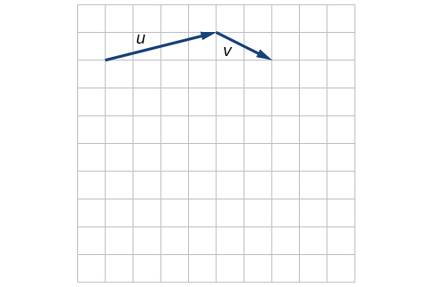{: #Image_08_08_241}

* * *
{: data-type="newline"}

 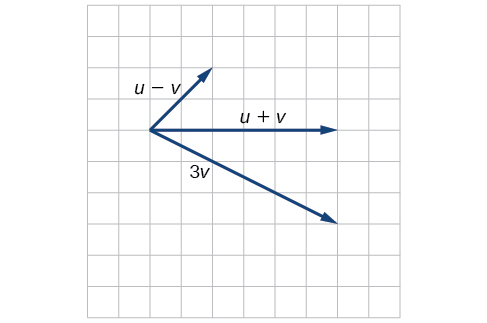 

Given initial point<math xmlns="http://www.w3.org/1998/Math/MathML"> <mrow> <mtext> </mtext><msub> <mi>P</mi> <mn>1</mn> </msub> <mo>=</mo><mrow><mo>(</mo> <mrow> <mn>3</mn><mo>,</mo><mn>2</mn></mrow> <mo>)</mo></mrow><mtext> </mtext></mrow> </math>

and terminal point<math xmlns="http://www.w3.org/1998/Math/MathML"> <mrow> <mtext> </mtext><msub> <mi>P</mi> <mn>2</mn> </msub> <mo>=</mo><mrow><mo>(</mo> <mrow> <mo>−</mo><mn>5</mn><mo>,</mo><mo>−</mo><mn>1</mn></mrow> <mo>)</mo></mrow><mo>,</mo><mtext> </mtext></mrow> </math>

write the vector<strong><math xmlns="http://www.w3.org/1998/Math/MathML">
 <mrow>
  <mtext> </mtext><mi>v</mi><mtext> </mtext></mrow>
</math></strong>in terms of<strong><math xmlns="http://www.w3.org/1998/Math/MathML">
 <mrow>
  <mtext> </mtext><mtext> </mtext><mi>i</mi><mtext> </mtext><mtext> </mtext></mrow>
</math></strong>and<strong><math xmlns="http://www.w3.org/1998/Math/MathML">
 <mrow>
  <mtext> </mtext><mi>j</mi><mo>.</mo><mtext> </mtext></mrow>
</math></strong>Draw the points and the vector on the graph.

### Practice Test

Assume<math xmlns="http://www.w3.org/1998/Math/MathML"> <mrow> <mtext> </mtext><mi>α</mi><mtext> </mtext></mrow> </math>

is opposite side<math xmlns="http://www.w3.org/1998/Math/MathML"> <mrow> <mtext> </mtext><mi>a</mi><mo>,</mo><mi>β</mi><mtext> </mtext> </mrow> </math>

is opposite side<math xmlns="http://www.w3.org/1998/Math/MathML"> <mrow> <mtext> </mtext><mi>b</mi><mo>,</mo><mtext> </mtext></mrow> </math>

and<math xmlns="http://www.w3.org/1998/Math/MathML"> <mrow> <mtext> </mtext><mi>γ</mi><mtext> </mtext></mrow> </math>

is opposite side<math xmlns="http://www.w3.org/1998/Math/MathML"> <mrow> <mtext> </mtext><mi>c</mi><mo>.</mo><mtext> </mtext></mrow> </math>

Solve the triangle, if possible, and round each answer to the nearest tenth, given<math xmlns="http://www.w3.org/1998/Math/MathML"> <mrow> <mtext> </mtext><mi>β</mi><mo>=</mo><mn>68°</mn><mo>,</mo><mi>b</mi><mo>=</mo><mn>21</mn><mo>,</mo><mi>c</mi><mo>=</mo><mn>16.</mn></mrow> </math>

<math xmlns="http://www.w3.org/1998/Math/MathML"> <mrow> <mi>α</mi><mo>=</mo><mn>67.1°</mn><mo>,</mo><mi>γ</mi><mo>=</mo><mn>44.9°</mn><mo>,</mo><mi>a</mi><mo>=</mo><mn>20.9</mn></mrow> </math>

Find the area of the triangle in [[link]](#Image_08_08_244). Round each answer to the nearest tenth.

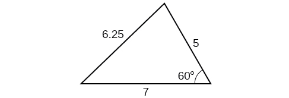{: #Image_08_08_244}

A pilot flies in a straight path for 2 hours. He then makes a course correction, heading 15° to the right of his original course, and flies 1 hour in the new direction. If he maintains a constant speed of 575 miles per hour, how far is he from his starting position?

<math xmlns="http://www.w3.org/1998/Math/MathML"> <mrow> <mtext>1712 miles</mtext> </mrow> </math>

Convert<math xmlns="http://www.w3.org/1998/Math/MathML"> <mrow> <mtext> </mtext><mrow><mo>(</mo> <mrow> <mn>2</mn><mo>,</mo><mn>2</mn></mrow> <mo>)</mo></mrow><mtext> </mtext></mrow> </math>

 to polar coordinates, and then plot the point.

Convert<math xmlns="http://www.w3.org/1998/Math/MathML"> <mrow> <mtext> </mtext><mrow><mo>(</mo> <mrow> <mn>2</mn><mo>,</mo><mfrac> <mi>π</mi> <mn>3</mn> </mfrac> </mrow> <mo>)</mo></mrow><mtext> </mtext></mrow> </math>

to rectangular coordinates.

<math xmlns="http://www.w3.org/1998/Math/MathML"> <mrow> <mrow><mo>(</mo> <mrow> <mn>1</mn><mo>,</mo><msqrt> <mn>3</mn> </msqrt> </mrow> <mo>)</mo></mrow></mrow> </math>

Convert the polar equation to a Cartesian equation:<math xmlns="http://www.w3.org/1998/Math/MathML"> <mrow> <mtext> </mtext><msup> <mi>x</mi> <mn>2</mn> </msup> <mo>+</mo><msup> <mi>y</mi> <mn>2</mn> </msup> <mo>=</mo><mn>5</mn><mi>y.</mi></mrow> </math>

Convert to rectangular form and graph:<math xmlns="http://www.w3.org/1998/Math/MathML"> <mrow> <mi>r</mi><mo>=</mo><mo>−</mo><mn>3</mn><mi>csc</mi><mtext> </mtext><mi>θ</mi><mo>.</mo> </mrow> </math>

<math xmlns="http://www.w3.org/1998/Math/MathML"> <mrow> <mi>y</mi><mo>=</mo><mo>−</mo><mn>3</mn></mrow> </math>

 * * *
{: data-type="newline"}

 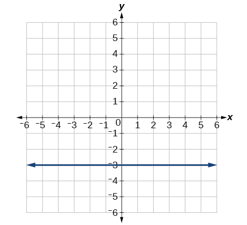 

Test the equation for symmetry:<math xmlns="http://www.w3.org/1998/Math/MathML"> <mrow> <mtext> </mtext><mi>r</mi><mo>=</mo><mo>−</mo><mn>4</mn><mi>sin</mi><mrow><mo>(</mo> <mrow> <mn>2</mn><mi>θ</mi></mrow> <mo>).</mo></mrow></mrow> </math>

Graph<math xmlns="http://www.w3.org/1998/Math/MathML"> <mrow> <mtext> </mtext><mi>r</mi><mo>=</mo><mn>3</mn><mo>+</mo><mn>3</mn><mi>cos</mi><mtext> </mtext><mi>θ</mi><mo>.</mo> </mrow> </math>

* * *
{: data-type="newline"}

 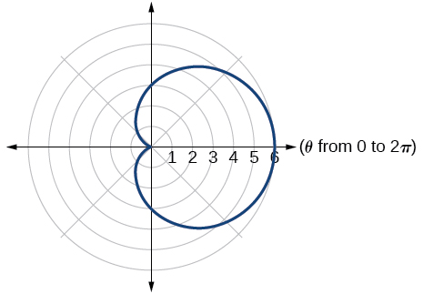 

Graph<math xmlns="http://www.w3.org/1998/Math/MathML"> <mrow> <mtext> </mtext><mi>r</mi><mo>=</mo><mn>3</mn><mo>−</mo><mn>5</mn><mtext>sin</mtext><mtext> </mtext><mi>θ</mi><mo>.</mo> </mrow> </math>

Find the absolute value of the complex number <math xmlns="http://www.w3.org/1998/Math/MathML"> <mrow> <mn>5</mn><mo>−</mo><mn>9</mn><mi>i</mi><mo>.</mo> </mrow> </math>

<math xmlns="http://www.w3.org/1998/Math/MathML"> <mrow> <msqrt> <mrow> <mn>106</mn> </mrow> </msqrt> </mrow> </math>

Write the complex number in polar form:<math xmlns="http://www.w3.org/1998/Math/MathML"><mtext> </mtext> <mrow> <mn>4</mn><mo>+</mo><mi>i</mi><mtext>.</mtext> </mrow> </math>

Convert the complex number from polar to rectangular form:<math xmlns="http://www.w3.org/1998/Math/MathML"> <mrow> <mtext> </mtext><mi>z</mi><mo>=</mo><mn>5</mn><mtext>cis</mtext><mrow><mo>(</mo> <mrow> <mfrac> <mrow> <mn>2</mn><mi>π</mi> </mrow> <mn>3</mn> </mfrac> </mrow> <mo>)</mo></mrow><mo>.</mo> </mrow> </math>

<math xmlns="http://www.w3.org/1998/Math/MathML"> <mrow> <mfrac> <mrow> <mo>−</mo><mn>5</mn> </mrow> <mn>2</mn> </mfrac> <mo>+</mo><mi>i</mi><mfrac> <mrow> <mn>5</mn><msqrt> <mn>3</mn> </msqrt> </mrow> <mn>2</mn> </mfrac> </mrow> </math>

Given<math xmlns="http://www.w3.org/1998/Math/MathML"> <mrow> <mtext> </mtext><msub> <mi>z</mi> <mn>1</mn> </msub> <mo>=</mo><mn>8</mn><mi>cis</mi><mrow><mo>(</mo> <mrow> <mn>36°</mn> </mrow> <mo>)</mo></mrow><mtext> </mtext> </mrow> </math>

and<math xmlns="http://www.w3.org/1998/Math/MathML"> <mrow> <mtext> </mtext><msub> <mi>z</mi> <mn>2</mn> </msub> <mo>=</mo><mn>2</mn><mi>cis</mi><mrow><mo>(</mo> <mrow> <mn>15°</mn> </mrow> <mo>)</mo></mrow><mo>,</mo> </mrow> </math>

evaluate each expression.

<math xmlns="http://www.w3.org/1998/Math/MathML"> <mrow> <msub> <mi>z</mi> <mn>1</mn> </msub> <msub> <mi>z</mi> <mn>2</mn> </msub> </mrow> </math>

<math xmlns="http://www.w3.org/1998/Math/MathML"> <mrow> <mfrac> <mrow> <msub> <mi>z</mi> <mn>1</mn> </msub> </mrow> <mrow> <msub> <mi>z</mi> <mn>2</mn> </msub> </mrow> </mfrac> </mrow> </math>

<math xmlns="http://www.w3.org/1998/Math/MathML"> <mrow> <mn>4</mn><mi>cis</mi><mrow><mo>(</mo> <mrow> <mn>21°</mn> </mrow> <mo>)</mo></mrow> </mrow> </math>

<math xmlns="http://www.w3.org/1998/Math/MathML"> <mrow> <msup> <mrow> <mrow><mo>(</mo> <mrow> <msub> <mi>z</mi> <mn>2</mn> </msub> </mrow> <mo>)</mo></mrow> </mrow> <mn>3</mn> </msup> </mrow> </math>

<math xmlns="http://www.w3.org/1998/Math/MathML"> <mrow> <msqrt> <mrow> <msub> <mi>z</mi> <mn>1</mn> </msub> </mrow> </msqrt> </mrow> </math>

<math xmlns="http://www.w3.org/1998/Math/MathML"> <mrow> <mn>2</mn><msqrt> <mn>2</mn> </msqrt> <mi>cis</mi><mrow><mo>(</mo> <mrow> <mn>18°</mn> </mrow> <mo>)</mo></mrow><mo>,</mo><mn>2</mn><msqrt> <mn>2</mn> </msqrt> <mi>cis</mi><mrow><mo>(</mo> <mrow> <mn>198°</mn> </mrow> <mo>)</mo></mrow> </mrow> </math>

Plot the complex number<math xmlns="http://www.w3.org/1998/Math/MathML"> <mrow> <mtext> </mtext><mn>−5</mn><mo>−</mo><mi>i</mi><mtext> </mtext> </mrow> </math>

in the complex plane.

Eliminate the parameter<math xmlns="http://www.w3.org/1998/Math/MathML"> <mrow> <mtext> </mtext><mi>t</mi><mtext> </mtext> </mrow> </math>

to rewrite the following parametric equations as a Cartesian equation: <math xmlns="http://www.w3.org/1998/Math/MathML"> <mrow> <mtext> </mtext><mrow><mo>{</mo> <mrow> <mtable columnalign="left"> <mtr columnalign="left"> <mtd columnalign="left"> <mrow> <mi>x</mi><mo stretchy="false">(</mo><mi>t</mi><mo stretchy="false">)</mo><mo>=</mo><mi>t</mi><mo>+</mo><mn>1</mn> </mrow> </mtd> </mtr> <mtr columnalign="left"> <mtd columnalign="left"> <mrow> <mi>y</mi><mo stretchy="false">(</mo><mi>t</mi><mo stretchy="false">)</mo><mo>=</mo><mn>2</mn><msup> <mi>t</mi> <mn>2</mn> </msup> </mrow> </mtd> </mtr> </mtable> </mrow> </mrow><mo>.</mo> </mrow> </math>

<math xmlns="http://www.w3.org/1998/Math/MathML"> <mrow> <mi>y</mi><mo>=</mo><mn>2</mn><msup> <mrow> <mrow><mo>(</mo> <mrow> <mi>x</mi><mo>−</mo><mn>1</mn> </mrow> <mo>)</mo></mrow> </mrow> <mn>2</mn> </msup> </mrow> </math>

Parameterize (write a parametric equation for) the following Cartesian equation by using<math xmlns="http://www.w3.org/1998/Math/MathML"> <mrow> <mtext> </mtext><mi>x</mi><mrow><mo>(</mo> <mi>t</mi> <mo>)</mo></mrow><mo>=</mo><mi>a</mi><mi>cos</mi><mtext> </mtext><mi>t</mi><mtext> </mtext> </mrow> </math>

and<math xmlns="http://www.w3.org/1998/Math/MathML"> <mrow> <mtext> </mtext><mi>y</mi><mo stretchy="false">(</mo><mi>t</mi><mo stretchy="false">)</mo><mo>=</mo><mi>b</mi><mi>sin</mi><mtext> </mtext><mi>t</mi><mo>:</mo> </mrow> </math>

<math xmlns="http://www.w3.org/1998/Math/MathML"> <mrow> <mfrac> <mrow> <msup> <mi>x</mi> <mn>2</mn> </msup> </mrow> <mrow> <mn>36</mn> </mrow> </mfrac> <mo>+</mo><mfrac> <mrow> <msup> <mi>y</mi> <mn>2</mn> </msup> </mrow> <mrow> <mn>100</mn> </mrow> </mfrac> <mo>=</mo><mn>1.</mn> </mrow> </math>

Graph the set of parametric equations and find the Cartesian equation:<math xmlns="http://www.w3.org/1998/Math/MathML"> <mrow> <mtext> </mtext><mrow><mo>{</mo> <mrow> <mtable columnalign="left"> <mtr columnalign="left"> <mtd columnalign="left"> <mrow> <mi>x</mi><mo stretchy="false">(</mo><mi>t</mi><mo stretchy="false">)</mo><mo>=</mo><mo>−</mo><mn>2</mn><mi>sin</mi><mtext> </mtext><mi>t</mi> </mrow> </mtd> </mtr> <mtr columnalign="left"> <mtd columnalign="left"> <mrow> <mi>y</mi><mo stretchy="false">(</mo><mi>t</mi><mo stretchy="false">)</mo><mo>=</mo><mn>5</mn><mi>cos</mi><mtext> </mtext><mi>t</mi> </mrow> </mtd> </mtr> </mtable> </mrow> </mrow><mo>.</mo> </mrow> </math>

* * *
{: data-type="newline"}

 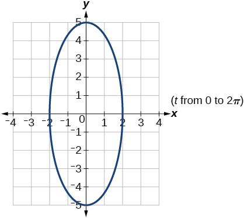 

A ball is launched with an initial velocity of 95 feet per second at an angle of 52° to the horizontal. The ball is released at a height of 3.5 feet above the ground.

1.  Find the parametric equations to model the path of the ball.
2.  Where is the ball after 2 seconds?
3.  How long is the ball in the air?
{: type="a"}

For the following exercises, use the vectors ***u*** = ***i*** − 3***j*** and ***v*** = 2***i*** + 3***j***.

Find 2***u*** − 3***v***.

−4***i*** − 15***j***

Calculate<strong><math xmlns="http://www.w3.org/1998/Math/MathML">
 <mrow>
  <mtext> </mtext><mi>u</mi><mo>⋅</mo><mi>v</mi><mo>.</mo>
 </mrow>
</math></strong>

Find a unit vector in the same direction as<strong><math xmlns="http://www.w3.org/1998/Math/MathML">
 <mrow>
  <mtext> </mtext><mi>v</mi><mo>.</mo>
 </mrow>
</math></strong>

<math xmlns="http://www.w3.org/1998/Math/MathML"> <mrow> <mfrac> <mrow> <mn>2</mn><msqrt> <mrow> <mn>13</mn> </mrow> </msqrt> </mrow> <mrow> <mn>13</mn> </mrow> </mfrac> <mi>i</mi><mo>+</mo><mfrac> <mrow> <mn>3</mn><msqrt> <mrow> <mn>13</mn> </mrow> </msqrt> </mrow> <mrow> <mn>13</mn> </mrow> </mfrac> <mi>j</mi> </mrow> </math>

Given vector<strong><math xmlns="http://www.w3.org/1998/Math/MathML">
 <mrow>
  <mtext> </mtext><mi>v</mi><mtext> </mtext>
 </mrow>
</math></strong>has an initial point<math xmlns="http://www.w3.org/1998/Math/MathML"> <mrow> <mtext> </mtext><msub> <mi>P</mi> <mn>1</mn> </msub> <mo>=</mo><mrow><mo>(</mo> <mrow> <mn>2</mn><mo>,</mo><mn>2</mn> </mrow> <mo>)</mo></mrow><mtext> </mtext> </mrow> </math>

and terminal point<math xmlns="http://www.w3.org/1998/Math/MathML"> <mrow> <mtext> </mtext><msub> <mi>P</mi> <mn>2</mn> </msub> <mo>=</mo><mrow><mo>(</mo> <mrow> <mo>−</mo><mn>1</mn><mo>,</mo><mn>0</mn> </mrow> <mo>)</mo></mrow><mo>,</mo><mtext> </mtext> </mrow> </math>

write the vector<strong><math xmlns="http://www.w3.org/1998/Math/MathML">
 <mrow>
  <mtext> </mtext><mi>v</mi><mtext> </mtext>
 </mrow>
</math></strong>in terms of<strong><math xmlns="http://www.w3.org/1998/Math/MathML">
 <mrow>
  <mtext> </mtext><mi>i</mi><mtext> </mtext>
 </mrow>
</math></strong>and<strong><math xmlns="http://www.w3.org/1998/Math/MathML">
 <mrow>
  <mtext> </mtext><mi>j</mi><mo>.</mo><mtext> </mtext>
 </mrow>
</math></strong>On the graph, draw<strong><math xmlns="http://www.w3.org/1998/Math/MathML">
 <mrow>
  <mtext> </mtext><mi>v</mi><mo>,</mo><mtext> </mtext>
 </mrow>
</math></strong>and<strong><math xmlns="http://www.w3.org/1998/Math/MathML">
 <mrow>
  <mtext> </mtext><mo>−</mo><mi>v</mi><mo>.</mo><mtext> </mtext>
 </mrow>
</math></strong>

### Glossary
{: data-type="glossary-title"}

dot product
: given two vectors, the sum of the product of the horizontal components and the product of the vertical components
^

initial point
: the origin of a vector
^

magnitude
: the length of a vector; may represent a quantity such as speed, and is calculated using the Pythagorean Theorem
^

resultant
: a vector that results from addition or subtraction of two vectors, or from scalar multiplication
^

scalar
: a quantity associated with magnitude but not direction; a constant
^

scalar multiplication
: the product of a constant and each component of a vector
^

standard position
: the placement of a vector with the initial point at
  <math xmlns="http://www.w3.org/1998/Math/MathML"> <mrow> <mtext> </mtext><mrow><mo>(</mo> <mrow> <mn>0</mn><mo>,</mo><mn>0</mn> </mrow> <mo>)</mo></mrow><mtext> </mtext> </mrow> </math>
  
  and the terminal point
  <math xmlns="http://www.w3.org/1998/Math/MathML"> <mrow> <mtext> </mtext><mo stretchy="false">(</mo><mi>a</mi><mo>,</mo><mi>b</mi><mo stretchy="false">)</mo><mo>,</mo><mtext> </mtext> </mrow> </math>
  
  represented by the change in the *x*-coordinates and the change in the *y*-coordinates of the original vector
^

terminal point
: the end point of a vector, usually represented by an arrow indicating its direction
^

unit vector
: a vector that begins at the origin and has magnitude of 1; the horizontal unit vector runs along the *x*-axis and is defined as
  <math xmlns="http://www.w3.org/1998/Math/MathML"> <mrow> <mtext> </mtext><msub> <mi>v</mi> <mn>1</mn> </msub> <mo>=</mo><mrow><mo>〈</mo> <mrow> <mn>1</mn><mo>,</mo><mn>0</mn></mrow> <mo>〉</mo></mrow><mtext> </mtext></mrow> </math>
  
  the vertical unit vector runs along the *y*-axis and is defined as
  <math xmlns="http://www.w3.org/1998/Math/MathML"> <mrow> <mtext> </mtext><msub> <mi>v</mi> <mn>2</mn> </msub> <mo>=</mo><mrow><mo>〈</mo> <mrow> <mn>0</mn><mo>,</mo><mn>1</mn></mrow> <mo>〉</mo></mrow><mo>.</mo></mrow> </math>
^

vector
: a quantity associated with both magnitude and direction, represented as a directed line segment with a starting point (initial point) and an end point (terminal point)
^

vector addition
: the sum of two vectors, found by adding corresponding components

[1]: http://openstax.org/l/introvectors
[2]: http://openstax.org/l/vectoroperation
[3]: http://openstax.org/l/unitvector
