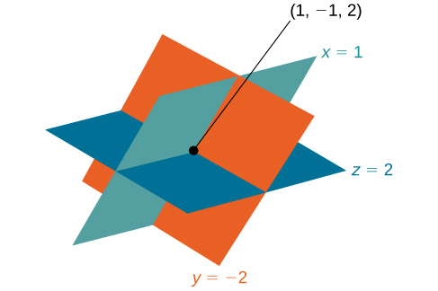
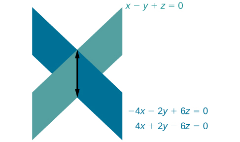

In this section, you will:
* Solve systems of three equations in three variables.
* Identify inconsistent systems of equations containing three variables.
* Express the solution of a system of dependent equations containing three variables.

 "){: #Figure_09_02_005}

John received an inheritance of $12,000 that he divided into three parts and invested in three ways: in a money-market fund paying 3% annual interest; in municipal bonds paying 4% annual interest; and in mutual funds paying 7% annual interest. John invested $4,000 more in municipal funds than in municipal bonds. He earned $670 in interest the first year. How much did John invest in each type of fund?

Understanding the correct approach to setting up problems such as this one makes finding a solution a matter of following a pattern. We will solve this and similar problems involving three equations and three variables in this section. Doing so uses similar techniques as those used to solve systems of two equations in two variables. However, finding solutions to systems of three equations requires a bit more organization and a touch of visual gymnastics.

### Solving Systems of Three Equations in Three Variables

In order to solve systems of equations in three variables, known as three-by-three systems, the primary tool we will be using is called **Gaussian elimination**{: data-type="term" .no-emphasis}, named after the prolific German mathematician Karl Friedrich **Gauss**{: data-type="term" .no-emphasis}. While there is no definitive order in which operations are to be performed, there are specific guidelines as to what type of moves can be made. We may number the equations to keep track of the steps we apply. The goal is to eliminate one variable at a time to achieve **upper triangular form**{: data-type="term" .no-emphasis}, the ideal form for a three-by-three system because it allows for straightforward back-substitution to find a solution<math xmlns="http://www.w3.org/1998/Math/MathML"> <mrow> <mtext> </mtext><mrow><mo>(</mo> <mrow> <mi>x</mi><mo>,</mo><mi>y</mi><mo>,</mo><mi>z</mi> </mrow> <mo>)</mo></mrow><mo>,</mo><mtext> </mtext> </mrow> </math>

which we call an **ordered triple**{: data-type="term" .no-emphasis}. A system in upper triangular form looks like the following:

<math xmlns="http://www.w3.org/1998/Math/MathML" display="block"> <mrow> <mtable columnalign="left"> <mtr columnalign="left"> <mtd columnalign="left"> <mrow> <mi>A</mi><mi>x</mi><mo>+</mo><mi>B</mi><mi>y</mi><mo>+</mo><mi>C</mi><mi>z</mi><mo>=</mo><mi>D</mi> </mrow> </mtd> </mtr> <mtr columnalign="left"> <mtd columnalign="left"> <mrow> <mtext>         </mtext><mi>E</mi><mi>y</mi><mo>+</mo><mi>F</mi><mi>z</mi><mo>=</mo><mi>G</mi> </mrow> </mtd> </mtr> <mtr columnalign="left"> <mtd columnalign="left"> <mrow> <mtext>                 </mtext><mi>H</mi><mi>z</mi><mo>=</mo><mi>K</mi> </mrow> </mtd> </mtr> </mtable> </mrow> </math>

The third equation can be solved for<math xmlns="http://www.w3.org/1998/Math/MathML"> <mrow> <mtext> </mtext><mi>z</mi><mo>,</mo><mtext> </mtext> </mrow> </math>

and then we back-substitute to find<math xmlns="http://www.w3.org/1998/Math/MathML"> <mrow> <mtext> </mtext><mi>y</mi><mtext> </mtext> </mrow> </math>

and<math xmlns="http://www.w3.org/1998/Math/MathML"> <mrow> <mtext> </mtext><mi>x</mi><mo>.</mo><mtext> </mtext> </mrow> </math>

To write the system in upper triangular form, we can perform the following operations:

1.  Interchange the order of any two equations.
2.  Multiply both sides of an equation by a nonzero constant.
3.  Add a nonzero multiple of one equation to another equation.
{: type="1"}

The **solution set** to a three-by-three system is an ordered triple<math xmlns="http://www.w3.org/1998/Math/MathML"> <mrow> <mtext> </mtext><mrow><mo>{</mo> <mrow> <mrow><mo>(</mo> <mrow> <mi>x</mi><mo>,</mo><mi>y</mi><mo>,</mo><mi>z</mi> </mrow> <mo>)</mo></mrow> </mrow> <mo>}</mo></mrow><mo>.</mo><mtext> </mtext> </mrow> </math>

Graphically, the ordered triple defines the point that is the intersection of three planes in space. You can visualize such an intersection by imagining any corner in a rectangular room. A corner is defined by three planes: two adjoining walls and the floor (or ceiling). Any point where two walls and the floor meet represents the intersection of three planes.

Number of Possible Solutions

[\[link\]](#Figure_09_02_006) and [\[link\]](#Figure_09_02_007) illustrate possible solution scenarios for three-by-three systems.

* Systems that have a single solution are those which, after elimination, result in a **solution set**{: data-type="term"} consisting of an ordered triple
  <math xmlns="http://www.w3.org/1998/Math/MathML"> <mrow> <mtext> </mtext><mrow><mo>{</mo> <mrow> <mrow><mo>(</mo> <mrow> <mi>x</mi><mo>,</mo><mi>y</mi><mo>,</mo><mi>z</mi> </mrow> <mo>)</mo></mrow> </mrow> <mo>}</mo></mrow><mo>.</mo><mtext> </mtext> </mrow> </math>
  
  Graphically, the ordered triple defines a point that is the intersection of three planes in space.
* Systems that have an infinite number of solutions are those which, after elimination, result in an expression that is always true, such as
  <math xmlns="http://www.w3.org/1998/Math/MathML"> <mrow> <mtext> </mtext><mn>0</mn><mo>=</mo><mn>0.</mn><mtext> </mtext> </mrow> </math>
  
  Graphically, an infinite number of solutions represents a line or coincident plane that serves as the intersection of three planes in space.
* Systems that have no solution are those that, after elimination, result in a statement that is a contradiction, such as
  <math xmlns="http://www.w3.org/1998/Math/MathML"> <mrow> <mtext> </mtext><mn>3</mn><mo>=</mo><mn>0.</mn><mtext> </mtext> </mrow> </math>
  
  Graphically, a system with no solution is represented by three planes with no point in common.

Three planes intersect at a single point, representing a three-by-three system with a single solution. (b) Three planes intersect in a line, representing a three-by-three system with infinite solutions."){: #Figure_09_02_006}

 The three planes intersect with each other, but not at a common point. (b) Two of the planes are parallel and intersect with the third plane, but not with each other. (c) All three planes are parallel, so there is no point of intersection."){: #Figure_09_02_007}

Determining Whether an Ordered Triple Is a Solution to a System

Determine whether the ordered triple<math xmlns="http://www.w3.org/1998/Math/MathML"> <mrow> <mtext> </mtext><mrow><mo>(</mo> <mrow> <mn>3</mn><mo>,</mo><mn>−2</mn><mo>,</mo><mn>1</mn> </mrow> <mo>)</mo></mrow><mtext> </mtext> </mrow> </math>

is a solution to the system.

<math xmlns="http://www.w3.org/1998/Math/MathML" display="block"> <mrow> <mtable columnalign="left"> <mtr columnalign="left"> <mtd columnalign="left"> <mrow> <mtext>      </mtext><mi>x</mi><mo>+</mo><mi>y</mi><mo>+</mo><mi>z</mi><mo>=</mo><mn>2</mn> </mrow> </mtd> </mtr> <mtr columnalign="left"> <mtd columnalign="left"> <mrow> <mtext> </mtext><mn>6</mn><mi>x</mi><mo>−</mo><mn>4</mn><mi>y</mi><mo>+</mo><mn>5</mn><mi>z</mi><mo>=</mo><mn>31</mn> </mrow> </mtd> </mtr> <mtr columnalign="left"> <mtd columnalign="left"> <mrow> <mn>5</mn><mi>x</mi><mo>+</mo><mn>2</mn><mi>y</mi><mo>+</mo><mn>2</mn><mi>z</mi><mo>=</mo><mn>13</mn> </mrow> </mtd> </mtr> </mtable> </mrow> </math>

We will check each equation by substituting in the values of the ordered triple for<math xmlns="http://www.w3.org/1998/Math/MathML"> <mrow> <mtext> </mtext><mi>x</mi><mo>,</mo><mi>y</mi><mo>,</mo> </mrow> </math>

 and<math xmlns="http://www.w3.org/1998/Math/MathML"> <mrow> <mtext> </mtext><mi>z</mi><mo>.</mo> </mrow> </math>

<math xmlns="http://www.w3.org/1998/Math/MathML"> <mtable> <mtr> <mtd><mtable columnalign="right"> <mtr columnalign="right"> <mtd columnalign="right"> <mrow> <mi>x</mi><mo>+</mo><mi>y</mi><mo>+</mo><mi>z</mi><mo>=</mo><mn>2</mn> </mrow> </mtd> </mtr> <mtr columnalign="right"> <mtd columnalign="right"> <mrow> <mo stretchy="false">(</mo><mn>3</mn><mo stretchy="false">)</mo><mo>+</mo><mo stretchy="false">(</mo><mn>−2</mn><mo stretchy="false">)</mo><mo>+</mo><mo stretchy="false">(</mo><mn>1</mn><mo stretchy="false">)</mo><mo>=</mo><mn>2</mn> </mrow> </mtd> </mtr> <mtr columnalign="right"> <mtd columnalign="right"> <mrow> <mtext> True</mtext> </mrow> </mtd> </mtr> </mtable></mtd> <mtd><mspace width="3em" /></mtd> <mtd> <mtable columnalign="right"> <mtr columnalign="right"> <mtd columnalign="right"> <mrow> <mtext> </mtext><mn>6</mn><mi>x</mi><mn>−4</mn><mi>y</mi><mo>+</mo><mn>5</mn><mi>z</mi><mo>=</mo><mn>31</mn> </mrow> </mtd> </mtr> <mtr columnalign="right"> <mtd columnalign="right"> <mrow> <mn>6</mn><mo stretchy="false">(</mo><mn>3</mn><mo stretchy="false">)</mo><mn>−4</mn><mo stretchy="false">(</mo><mn>−2</mn><mo stretchy="false">)</mo><mo>+</mo><mn>5</mn><mo stretchy="false">(</mo><mn>1</mn><mo stretchy="false">)</mo><mo>=</mo><mn>31</mn> </mrow> </mtd> </mtr> <mtr columnalign="right"> <mtd columnalign="right"> <mrow> <mn>18</mn><mo>+</mo><mn>8</mn><mo>+</mo><mn>5</mn><mo>=</mo><mn>31</mn> </mrow> </mtd> </mtr> <mtr columnalign="right"> <mtd columnalign="right"> <mrow> <mtext> True</mtext> </mrow> </mtd> </mtr> </mtable></mtd> <mtd><mspace width="3em" /></mtd> <mtd> <mtable columnalign="right"> <mtr columnalign="right"> <mtd columnalign="right"> <mrow> <mtext> </mtext><mn>5</mn><mi>x</mi><mo>+</mo><mn>2</mn><mi>y</mi><mo>+</mo><mn>2</mn><mi>z</mi><mo>=</mo><mn>13</mn> </mrow> </mtd> </mtr> <mtr columnalign="right"> <mtd columnalign="right"> <mrow> <mn>5</mn><mo stretchy="false">(</mo><mn>3</mn><mo stretchy="false">)</mo><mo>+</mo><mn>2</mn><mo stretchy="false">(</mo><mn>−2</mn><mo stretchy="false">)</mo><mo>+</mo><mn>2</mn><mo stretchy="false">(</mo><mn>1</mn><mo stretchy="false">)</mo><mo>=</mo><mn>13</mn> </mrow> </mtd> </mtr> <mtr columnalign="right"> <mtd columnalign="right"> <mrow> <mtext> </mtext><mn>15</mn><mn>−4</mn><mo>+</mo><mn>2</mn><mo>=</mo><mn>13</mn> </mrow> </mtd> </mtr> <mtr columnalign="right"> <mtd columnalign="right"> <mrow> <mtext> True</mtext> </mrow> </mtd> </mtr> </mtable></mtd> </mtr> </mtable> </math>

The ordered triple<math xmlns="http://www.w3.org/1998/Math/MathML"> <mrow> <mtext> </mtext><mrow><mo>(</mo> <mrow> <mn>3</mn><mo>,</mo><mn>−2</mn><mo>,</mo><mn>1</mn> </mrow> <mo>)</mo></mrow><mtext> </mtext> </mrow> </math>

is indeed a solution to the system.

<strong>Given a linear system of three equations, solve for three unknowns. </strong>

1.  Pick any pair of equations and solve for one variable.
2.  Pick another pair of equations and solve for the same variable.
3.  You have created a system of two equations in two unknowns. Solve the resulting two-by-two system.
4.  Back-substitute known variables into any one of the original equations and solve for the missing variable.
{: type="1"}

Solving a System of Three Equations in Three Variables by Elimination

Find a solution to the following system:

<math xmlns="http://www.w3.org/1998/Math/MathML" display="block"> <mrow> <mtable columnalign="left"> <mtr columnalign="left"> <mtd columnalign="left"> <mrow> <mtext>    </mtext><mtext> </mtext><mtext> </mtext><mtext> </mtext><mtext> </mtext><mi>x</mi><mn>−2</mn><mi>y</mi><mo>+</mo><mn>3</mn><mi>z</mi><mo>=</mo><mn>9</mn> </mrow> </mtd> <mtd columnalign="left"> <mrow> <mtext>(1)</mtext> </mrow> </mtd> </mtr> <mtr columnalign="left"> <mtd columnalign="left"> <mrow> <mtext>   </mtext><mo>−</mo><mi>x</mi><mo>+</mo><mn>3</mn><mi>y</mi><mo>−</mo><mi>z</mi><mo>=</mo><mn>−6</mn> </mrow> </mtd> <mtd columnalign="left"> <mrow> <mtext>(2)</mtext> </mrow> </mtd> </mtr> <mtr columnalign="left"> <mtd columnalign="left"> <mrow> <mtext> </mtext><mtext> </mtext><mtext> </mtext><mtext> </mtext><mtext> </mtext><mtext> </mtext><mtext> </mtext><mn>2</mn><mi>x</mi><mn>−5</mn><mi>y</mi><mo>+</mo><mn>5</mn><mi>z</mi><mo>=</mo><mn>17</mn> </mrow> </mtd> <mtd columnalign="left"> <mrow> <mtext>(3)</mtext> </mrow> </mtd> </mtr> </mtable> </mrow> </math>

There will always be several choices as to where to begin, but the most obvious first step here is to eliminate<math xmlns="http://www.w3.org/1998/Math/MathML"> <mrow> <mtext> </mtext><mi>x</mi><mtext> </mtext> </mrow> </math>

by adding equations (1) and (2).

<math xmlns="http://www.w3.org/1998/Math/MathML" display="block"> <mrow> <mfrac> <mrow> <mtable columnalign="left"> <mtr columnalign="left"> <mtd columnalign="left"> <mrow> <mtext>     </mtext><mtext /><mi>x</mi><mo>−</mo><mn>2</mn><mi>y</mi><mo>+</mo><mn>3</mn><mi>z</mi><mo>=</mo><mn>9</mn> </mrow> </mtd> <mtd columnalign="left"> <mrow> <mtext>(1)</mtext> </mrow> </mtd> </mtr> <mtr columnalign="left"> <mtd columnalign="left"> <mrow> <mtext>  </mtext><mo>−</mo><mi>x</mi><mo>+</mo><mn>3</mn><mi>y</mi><mo>−</mo><mi>z</mi><mo>=</mo><mn>−6</mn> </mrow> </mtd> <mtd columnalign="left"> <mrow> <mtext> (2)</mtext> </mrow> </mtd> </mtr> </mtable> </mrow> <mrow> <mtable columnalign="left"> <mtr columnalign="left"> <mtd columnalign="left"> <mrow> <mtext>            </mtext><mtext /><mtext> </mtext><mi>y</mi><mo>+</mo><mn>2</mn><mi>z</mi><mo>=</mo><mn>3</mn> </mrow> </mtd> <mtd columnalign="left"> <mrow> <mtext>    (3)</mtext> </mrow> </mtd> </mtr> </mtable> </mrow> </mfrac> </mrow> </math>

The second step is multiplying equation (1) by<math xmlns="http://www.w3.org/1998/Math/MathML"> <mrow> <mtext> </mtext><mn>−2</mn><mtext> </mtext> </mrow> </math>

and adding the result to equation (3). These two steps will eliminate the variable<math xmlns="http://www.w3.org/1998/Math/MathML"> <mrow> <mtext> </mtext><mi>x</mi><mo>.</mo> </mrow> </math>

<math xmlns="http://www.w3.org/1998/Math/MathML" display="block"> <mrow> <mtable columnalign="left"> <mtr columnalign="left"> <mtd columnalign="left"> <mrow> <munder accentunder="true"> <mrow> <mtable columnalign="left"> <mtr columnalign="left"> <mtd columnalign="left"> <mrow /> </mtd> <mtd columnalign="left"> <mrow /> </mtd> </mtr> <mtr columnalign="left"> <mtd columnalign="left"> <mrow> <mn>−2</mn><mi>x</mi><mo>+</mo><mn>4</mn><mi>y</mi><mo>−</mo><mn>6</mn><mi>z</mi><mo>=</mo><mn>−18</mn> </mrow> </mtd> <mtd columnalign="left"> <mrow> <mo stretchy="false">(</mo><mn>1</mn><mo stretchy="false">)</mo><mtext> </mtext><mtext>multiplied</mtext><mtext> </mtext><mtext>by</mtext><mtext> </mtext><mo>−</mo><mn>2</mn> </mrow> </mtd> </mtr> <mtr columnalign="left"> <mtd columnalign="left"> <mrow> <mtext> </mtext><mtext> </mtext><mtext> </mtext><mtext> </mtext><mn>2</mn><mi>x</mi><mo>−</mo><mn>5</mn><mi>y</mi><mo>+</mo><mn>5</mn><mi>z</mi><mo>=</mo><mn>17</mn> </mrow> </mtd> <mtd columnalign="left"> <mrow> <mo stretchy="false">(</mo><mn>3</mn><mo stretchy="false">)</mo> </mrow> </mtd> </mtr> </mtable> </mrow> <mo stretchy="true">\_\_\_\_\_\_\_\_\_\_\_\_\_\_\_\_\_\_\_\_\_\_\_\_\_\_\_\_\_\_\_\_\_\_\_\_</mo> </munder> </mrow> </mtd> </mtr> <mtr columnalign="left"> <mtd columnalign="left"> <mrow> <mtext>            </mtext><mtext /><mtext /><mo>−</mo><mi>y</mi><mo>−</mo><mi>z</mi><mo>=</mo><mn>−1</mn><mo> </mo><mtext> </mtext><mo stretchy="false">(</mo><mn>5</mn><mo stretchy="false">)</mo> </mrow> </mtd> </mtr> </mtable> </mrow> </math>

In equations (4) and (5), we have created a new two-by-two system. We can solve for<math xmlns="http://www.w3.org/1998/Math/MathML"> <mrow> <mtext> </mtext><mi>z</mi><mtext> </mtext> </mrow> </math>

by adding the two equations.

<math xmlns="http://www.w3.org/1998/Math/MathML" display="block"> <mrow> <mfrac> <mrow> <mtable columnalign="left"> <mtr columnalign="left"> <mtd columnalign="left"> <mrow> <mtable columnalign="left"> <mtr columnalign="left"> <mtd columnalign="left"> <mrow /> </mtd> </mtr> <mtr columnalign="left"> <mtd columnalign="left"> <mrow> <mtext /><mi>y</mi><mo>+</mo><mn>2</mn><mi>z</mi><mo>=</mo><mn>3</mn><mtext>    </mtext><mtext> </mtext><mtext> </mtext><mtext> </mtext><mtext> </mtext><mo stretchy="false">(</mo><mn>4</mn><mo stretchy="false">)</mo> </mrow> </mtd> </mtr> </mtable> </mrow> </mtd> </mtr> <mtr columnalign="left"> <mtd columnalign="left"> <mrow> <mo>−</mo><mi>y</mi><mo>−</mo><mi>z</mi><mo>=</mo><mo>−</mo><mn>1</mn><mtext>  </mtext><mo stretchy="false">(</mo><mn>5</mn><mo stretchy="false">)</mo> </mrow> </mtd> </mtr> </mtable> </mrow> <mrow> <mtext> </mtext><mtext> </mtext><mtext> </mtext><mtext> </mtext><mtext> </mtext><mtext> </mtext><mtext> </mtext><mtext> </mtext><mtext> </mtext><mtext> </mtext><mtext> </mtext><mtext> </mtext><mtext> </mtext><mi>z</mi><mo>=</mo><mn>2</mn><mtext>   </mtext><mtext> </mtext><mtext> </mtext><mtext> </mtext><mtext> </mtext><mtext> </mtext><mo stretchy="false">(</mo><mn>6</mn><mo stretchy="false">)</mo> </mrow> </mfrac> </mrow> </math>

Choosing one equation from each new system, we obtain the upper triangular form:

<math xmlns="http://www.w3.org/1998/Math/MathML" display="block"> <mrow> <mtable columnalign="left"> <mtr columnalign="left"> <mtd columnalign="left"> <mrow> <mtext /><mtext /><mi>x</mi><mn>−2</mn><mi>y</mi><mo>+</mo><mn>3</mn><mi>z</mi><mo>=</mo><mn>9</mn><mtext> </mtext> </mrow> </mtd> <mtd columnalign="left"> <mrow> <mo stretchy="false">(</mo><mn>1</mn><mo stretchy="false">)</mo> </mrow> </mtd> </mtr> <mtr columnalign="left"> <mtd columnalign="left"> <mrow> <mtext>        </mtext><mi>y</mi><mo>+</mo><mn>2</mn><mi>z</mi><mo>=</mo><mn>3</mn> </mrow> </mtd> <mtd columnalign="left"> <mrow> <mo stretchy="false">(</mo><mn>4</mn><mo stretchy="false">)</mo> </mrow> </mtd> </mtr> <mtr columnalign="left"> <mtd columnalign="left"> <mrow> <mtext>                 </mtext><mi>z</mi><mo>=</mo><mn>2</mn> </mrow> </mtd> <mtd columnalign="left"> <mrow> <mo stretchy="false">(</mo><mn>6</mn><mo stretchy="false">)</mo> </mrow> </mtd> </mtr> </mtable> </mrow> </math>

Next, we back-substitute<math xmlns="http://www.w3.org/1998/Math/MathML"> <mrow> <mtext> </mtext><mi>z</mi><mo>=</mo><mn>2</mn><mtext> </mtext> </mrow> </math>

into equation (4) and solve for<math xmlns="http://www.w3.org/1998/Math/MathML"> <mrow> <mtext> </mtext><mi>y</mi><mo>.</mo> </mrow> </math>

<math xmlns="http://www.w3.org/1998/Math/MathML" display="block"> <mrow> <mtable columnalign="left"> <mtr columnalign="left"> <mtd columnalign="left"> <mrow> <mi>y</mi><mo>+</mo><mn>2</mn><mo stretchy="false">(</mo><mn>2</mn><mo stretchy="false">)</mo><mo>=</mo><mn>3</mn> </mrow> </mtd> </mtr> <mtr columnalign="left"> <mtd columnalign="left"> <mrow> <mtext>     </mtext><mi>y</mi><mo>+</mo><mn>4</mn><mo>=</mo><mn>3</mn> </mrow> </mtd> </mtr> <mtr columnalign="left"> <mtd columnalign="left"> <mrow> <mtext>            </mtext><mi>y</mi><mo>=</mo><mn>−1</mn> </mrow> </mtd> </mtr> </mtable> </mrow> </math>

Finally, we can back-substitute<math xmlns="http://www.w3.org/1998/Math/MathML"> <mrow> <mtext> </mtext><mi>z</mi><mo>=</mo><mn>2</mn><mtext> </mtext> </mrow> </math>

and<math xmlns="http://www.w3.org/1998/Math/MathML"> <mrow> <mtext> </mtext><mi>y</mi><mo>=</mo><mn>−1</mn><mtext> </mtext> </mrow> </math>

into equation (1). This will yield the solution for<math xmlns="http://www.w3.org/1998/Math/MathML"> <mrow> <mtext> </mtext><mi>x</mi><mo>.</mo> </mrow> </math>

<math xmlns="http://www.w3.org/1998/Math/MathML" display="block"> <mrow> <mtable columnalign="right"> <mtr columnalign="right"> <mtd columnalign="right"> <mrow> <mi>x</mi><mn>−2</mn><mo stretchy="false">(</mo><mn>−1</mn><mo stretchy="false">)</mo><mo>+</mo><mn>3</mn><mo stretchy="false">(</mo><mn>2</mn><mo stretchy="false">)</mo><mo>=</mo><mn>9</mn> </mrow> </mtd> </mtr> <mtr columnalign="right"> <mtd columnalign="right"> <mrow> <mtext>            </mtext><mi>x</mi><mo>+</mo><mn>2</mn><mo>+</mo><mn>6</mn><mo>=</mo><mn>9</mn> </mrow> </mtd> </mtr> <mtr columnalign="right"> <mtd columnalign="right"> <mrow> <mtext>                       </mtext><mi>x</mi><mo>=</mo><mn>1</mn> </mrow> </mtd> </mtr> </mtable> </mrow> </math>

The solution is the ordered triple <math xmlns="http://www.w3.org/1998/Math/MathML"> <mrow> <mtext> </mtext><mrow><mo>(</mo> <mrow> <mn>1</mn><mo>,</mo><mn>−1</mn><mo>,</mo><mn>2</mn> </mrow> <mo>)</mo></mrow><mo>.</mo><mtext> </mtext> </mrow> </math>

See [[link]](#Figure_09_02_008).

{: #Figure_09_02_008}

Solving a Real-World Problem Using a System of Three Equations in Three Variables

In the problem posed at the beginning of the section, John invested his inheritance of $12,000 in three different funds: part in a money-market fund paying 3% interest annually; part in municipal bonds paying 4% annually; and the rest in mutual funds paying 7% annually. John invested $4,000 more in mutual funds than he invested in municipal bonds. The total interest earned in one year was $670. How much did he invest in each type of fund?

To solve this problem, we use all of the information given and set up three equations. First, we assign a variable to each of the three investment amounts:

<math xmlns="http://www.w3.org/1998/Math/MathML" display="block"> <mrow> <mtable columnalign="left"> <mtr columnalign="left"> <mtd columnalign="left"> <mrow> <mi>x</mi><mo>=</mo><mtext>amount invested in money-market fund</mtext> </mrow> </mtd> </mtr> <mtr columnalign="left"> <mtd columnalign="left"> <mrow> <mi>y</mi><mo>=</mo><mtext>amount invested in municipal bonds</mtext> </mrow> </mtd> </mtr> <mtr columnalign="left"> <mtd columnalign="left"> <mrow> <mi>z</mi><mo>=</mo><mtext>amount invested in mutual funds</mtext> </mrow> </mtd> </mtr> </mtable> </mrow> </math>

The first equation indicates that the sum of the three principal amounts is $12,000.

<math xmlns="http://www.w3.org/1998/Math/MathML"> <mrow> <mi>x</mi><mo>+</mo><mi>y</mi><mo>+</mo><mi>z</mi><mo>=</mo><mn>12,000</mn> </mrow> </math>

We form the second equation according to the information that John invested $4,000 more in mutual funds than he invested in municipal bonds.

<math xmlns="http://www.w3.org/1998/Math/MathML"> <mrow> <mi>z</mi><mo>=</mo><mi>y</mi><mo>+</mo><mn>4,000</mn> </mrow> </math>

The third equation shows that the total amount of interest earned from each fund equals $670.

<math xmlns="http://www.w3.org/1998/Math/MathML"> <mrow> <mn>0.03</mn><mi>x</mi><mo>+</mo><mn>0.04</mn><mi>y</mi><mo>+</mo><mn>0.07</mn><mi>z</mi><mo>=</mo><mn>670</mn> </mrow> </math>

Then, we write the three equations as a system.

<math xmlns="http://www.w3.org/1998/Math/MathML" display="block"> <mrow> <mtable columnalign="left"> <mtr columnalign="left"> <mtd columnalign="left"> <mrow> <mtext>                    </mtext><mi>x</mi><mo>+</mo><mi>y</mi><mo>+</mo><mi>z</mi><mo>=</mo><mn>12,000</mn> </mrow> </mtd> </mtr> <mtr columnalign="left"> <mtd columnalign="left"> <mrow> <mtext>                      </mtext><mo>−</mo><mi>y</mi><mo>+</mo><mi>z</mi><mo>=</mo><mn>4,000</mn> </mrow> </mtd> </mtr> <mtr columnalign="left"> <mtd columnalign="left"> <mrow> <mn>0.03</mn><mi>x</mi><mo>+</mo><mn>0.04</mn><mi>y</mi><mo>+</mo><mn>0.07</mn><mi>z</mi><mo>=</mo><mn>670</mn> </mrow> </mtd> </mtr> </mtable> </mrow> </math>

To make the calculations simpler, we can multiply the third equation by 100. Thus,

<math xmlns="http://www.w3.org/1998/Math/MathML" display="block"> <mrow> <mtable columnalign="left"> <mtr columnalign="left"> <mtd columnalign="left"> <mrow> <mtext>  </mtext><mi>x</mi><mo>+</mo><mtext>   </mtext><mi>y</mi><mo>+</mo><mi>z</mi><mtext> </mtext><mo>=</mo><mn>12,000</mn> </mrow> </mtd> <mtd columnalign="left"> <mrow> <mo stretchy="false">(</mo><mn>1</mn><mo stretchy="false">)</mo> </mrow> </mtd> </mtr> <mtr columnalign="left"> <mtd columnalign="left"> <mrow> <mtext>       </mtext><mo>−</mo><mi>y</mi><mo>+</mo><mi>z</mi><mtext> </mtext><mo>=</mo><mn>4,000</mn> </mrow> </mtd> <mtd columnalign="left"> <mrow> <mo stretchy="false">(</mo><mn>2</mn><mo stretchy="false">)</mo> </mrow> </mtd> </mtr> <mtr columnalign="left"> <mtd columnalign="left"> <mrow> <mn>3</mn><mi>x</mi><mo>+</mo><mn>4</mn><mi>y</mi><mo>+</mo><mn>7</mn><mi>z</mi><mo>=</mo><mn>67,000</mn> </mrow> </mtd> <mtd columnalign="left"> <mrow> <mo stretchy="false">(</mo><mn>3</mn><mo stretchy="false">)</mo> </mrow> </mtd> </mtr> </mtable> </mrow> </math>

Step 1. Interchange equation (2) and equation (3) so that the two equations with three variables will line up.

<math xmlns="http://www.w3.org/1998/Math/MathML" display="block"> <mrow> <mtable columnalign="left"> <mtr columnalign="left"> <mtd columnalign="left"> <mrow> <mtext>  </mtext><mi>x</mi><mo>+</mo><mtext>  </mtext><mi>y</mi><mo> </mo><mo>+</mo><mtext>  </mtext><mi>z</mi><mo>=</mo><mn>12,000</mn> </mrow> </mtd> </mtr> <mtr columnalign="left"> <mtd columnalign="left"> <mrow> <mn>3</mn><mi>x</mi><mo>+</mo><mn>4</mn><mi>y</mi><mo> </mo><mo>+</mo><mn>7</mn><mi>z</mi><mo>=</mo><mn>67,000</mn> </mrow> </mtd> </mtr> <mtr columnalign="left"> <mtd columnalign="left"> <mrow> <mtext>        </mtext><mo>−</mo><mi>y</mi><mtext>  </mtext><mo>+</mo><mtext>  </mtext><mi>z</mi><mo>=</mo><mn>4,000</mn> </mrow> </mtd> </mtr> </mtable> </mrow> </math>

Step 2. Multiply equation (1) by<math xmlns="http://www.w3.org/1998/Math/MathML"> <mrow> <mtext> </mtext><mn>−3</mn><mtext> </mtext> </mrow> </math>

and add to equation (2). Write the result as row 2.

<math xmlns="http://www.w3.org/1998/Math/MathML" display="block"> <mrow> <mtable columnalign="left"> <mtr columnalign="left"> <mtd columnalign="left"> <mrow> <mi>x</mi><mo>+</mo><mi>y</mi><mo>+</mo><mi>z</mi><mtext> </mtext><mo>=</mo><mn>12,000</mn> </mrow> </mtd> </mtr> <mtr columnalign="left"> <mtd columnalign="left"> <mrow> <mtext>     </mtext><mi>y</mi><mo>+</mo><mn>4</mn><mi>z</mi><mo>=</mo><mn>31,000</mn> </mrow> </mtd> </mtr> <mtr columnalign="left"> <mtd columnalign="left"> <mrow> <mtext>  </mtext><mo>−</mo><mi>y</mi><mo>+</mo><mi>z</mi><mtext> </mtext><mo>=</mo><mn>4,000</mn> </mrow> </mtd> </mtr> </mtable> </mrow> </math>

Step 3. Add equation (2) to equation (3) and write the result as equation (3).

<math xmlns="http://www.w3.org/1998/Math/MathML" display="block"> <mrow> <mtable columnalign="left"> <mtr columnalign="left"> <mtd columnalign="left"> <mrow> <mi>x</mi><mo>+</mo><mi>y</mi><mo>+</mo><mtext>  </mtext><mi>z</mi><mo>=</mo><mn>12,000</mn> </mrow> </mtd> </mtr> <mtr columnalign="left"> <mtd columnalign="left"> <mrow> <mtext>      </mtext><mi>y</mi><mo>+</mo><mn>4</mn><mi>z</mi><mo>=</mo><mn>31,000</mn> </mrow> </mtd> </mtr> <mtr columnalign="left"> <mtd columnalign="left"> <mrow> <mtext>            </mtext><mn>5</mn><mi>z</mi><mtext> </mtext><mo>=</mo><mn>35,000</mn> </mrow> </mtd> </mtr> </mtable> </mrow> </math>

Step 4. Solve for<math xmlns="http://www.w3.org/1998/Math/MathML"> <mrow> <mtext> </mtext><mi>z</mi><mtext> </mtext> </mrow> </math>

in equation (3). Back-substitute that value in equation (2) and solve for<math xmlns="http://www.w3.org/1998/Math/MathML"> <mrow> <mtext> </mtext><mi>y</mi><mo>.</mo><mtext> </mtext> </mrow> </math>

Then, back-substitute the values for<math xmlns="http://www.w3.org/1998/Math/MathML"> <mrow> <mtext> </mtext><mi>z</mi><mtext> </mtext> </mrow> </math>

and<math xmlns="http://www.w3.org/1998/Math/MathML"> <mrow> <mtext> </mtext><mi>y</mi><mtext> </mtext> </mrow> </math>

into equation (1) and solve for<math xmlns="http://www.w3.org/1998/Math/MathML"> <mrow> <mtext> </mtext><mi>x</mi><mo>.</mo> </mrow> </math>

<math xmlns="http://www.w3.org/1998/Math/MathML" display="block"> <mrow> <mtable columnalign="left"> <mtr columnalign="left"> <mtd columnalign="left"> <mrow> <mtext>                       </mtext><mn>5</mn><mi>z</mi><mo>=</mo><mn>35,000</mn> </mrow> </mtd> </mtr> <mtr columnalign="left"> <mtd columnalign="left"> <mrow> <mtext>                         </mtext><mi>z</mi><mo>=</mo><mn>7,000</mn> </mrow> </mtd> </mtr> <mtr columnalign="left"> <mtd columnalign="left"> <mrow /> </mtd> </mtr> <mtr columnalign="left"> <mtd columnalign="left"> <mrow /> </mtd> </mtr> <mtr columnalign="left"> <mtd columnalign="left"> <mrow> <mtext>       </mtext><mi>y</mi><mo>+</mo><mn>4</mn><mo stretchy="false">(</mo><mn>7,000</mn><mo stretchy="false">)</mo><mo>=</mo><mn>31,000</mn> </mrow> </mtd> </mtr> <mtr columnalign="left"> <mtd columnalign="left"> <mrow> <mtext>                          </mtext><mi>y</mi><mo>=</mo><mn>3,000</mn> </mrow> </mtd> </mtr> <mtr columnalign="left"> <mtd columnalign="left"> <mrow /> </mtd> </mtr> <mtr columnalign="left"> <mtd columnalign="left"> <mrow /> </mtd> </mtr> <mtr columnalign="left"> <mtd columnalign="left"> <mrow> <mo> </mo><mi>x</mi><mo>+</mo><mn>3,000</mn><mo>+</mo><mn>7,000</mn><mo>=</mo><mn>12,000</mn> </mrow> </mtd> </mtr> <mtr columnalign="left"> <mtd columnalign="left"> <mrow> <mtext>                                 </mtext><mi>x</mi><mo>=</mo><mn>2,000</mn> </mrow> </mtd> </mtr> </mtable> </mrow> </math>

John invested $2,000 in a money-market fund, $3,000 in municipal bonds, and $7,000 in mutual funds.

Solve the system of equations in three variables.

<math xmlns="http://www.w3.org/1998/Math/MathML" display="block"> <mrow> <mtable columnalign="left"> <mtr columnalign="left"> <mtd columnalign="left"> <mrow> <mn>2</mn><mi>x</mi><mo>+</mo><mi>y</mi><mn>−2</mn><mi>z</mi><mo>=</mo><mn>−1</mn> </mrow> </mtd> </mtr> <mtr columnalign="left"> <mtd columnalign="left"> <mrow> <mn>3</mn><mi>x</mi><mn>−3</mn><mi>y</mi><mo>−</mo><mi>z</mi><mo>=</mo><mn>5</mn> </mrow> </mtd> </mtr> <mtr columnalign="left"> <mtd columnalign="left"> <mrow> <mi>x</mi><mn>−2</mn><mi>y</mi><mo>+</mo><mn>3</mn><mi>z</mi><mo>=</mo><mn>6</mn> </mrow> </mtd> </mtr> </mtable> </mrow> </math>

<math xmlns="http://www.w3.org/1998/Math/MathML"> <mrow> <mrow><mo>(</mo> <mrow> <mn>1</mn><mo>,</mo><mn>−1</mn><mo>,</mo><mn>1</mn> </mrow> <mo>)</mo></mrow> </mrow> </math>

### Identifying Inconsistent Systems of Equations Containing Three Variables

Just as with systems of equations in two variables, we may come across an **inconsistent system**{: data-type="term" .no-emphasis} of equations in three variables, which means that it does not have a solution that satisfies all three equations. The equations could represent three parallel planes, two parallel planes and one intersecting plane, or three planes that intersect the other two but not at the same location. The process of elimination will result in a false statement, such as<math xmlns="http://www.w3.org/1998/Math/MathML"> <mrow> <mtext> </mtext><mn>3</mn><mo>=</mo><mn>7</mn><mtext> </mtext> </mrow> </math>

or some other contradiction.

Solving an Inconsistent System of Three Equations in Three Variables

Solve the following system.

<math xmlns="http://www.w3.org/1998/Math/MathML" display="block"> <mrow> <mtable columnalign="left"> <mtr columnalign="left"> <mtd columnalign="left"> <mrow> <mtext>       </mtext><mi>x</mi><mn>−3</mn><mi>y</mi><mo>+</mo><mi>z</mi><mo>=</mo><mn>4</mn> </mrow> </mtd> <mtd columnalign="left"> <mrow> <mo stretchy="false">(</mo><mn>1</mn><mo stretchy="false">)</mo> </mrow> </mtd> </mtr> <mtr columnalign="left"> <mtd columnalign="left"> <mrow> <mtext> </mtext><mo>−</mo><mi>x</mi><mo>+</mo><mn>2</mn><mi>y</mi><mn>−5</mn><mi>z</mi><mo>=</mo><mn>3</mn> </mrow> </mtd> <mtd columnalign="left"> <mrow> <mo stretchy="false">(</mo><mn>2</mn><mo stretchy="false">)</mo> </mrow> </mtd> </mtr> <mtr columnalign="left"> <mtd columnalign="left"> <mrow> <mn>5</mn><mi>x</mi><mn>−13</mn><mi>y</mi><mo>+</mo><mn>13</mn><mi>z</mi><mo>=</mo><mn>8</mn> </mrow> </mtd> <mtd columnalign="left"> <mrow> <mo stretchy="false">(</mo><mn>3</mn><mo stretchy="false">)</mo> </mrow> </mtd> </mtr> </mtable> </mrow> </math>

Looking at the coefficients of<math xmlns="http://www.w3.org/1998/Math/MathML"> <mrow> <mtext> </mtext><mi>x</mi><mo>,</mo><mtext>  </mtext> </mrow> </math>

we can see that we can eliminate<math xmlns="http://www.w3.org/1998/Math/MathML"> <mrow> <mtext>  </mtext><mi>x</mi><mtext>  </mtext> </mrow> </math>

by adding equation (1) to equation (2).

<math xmlns="http://www.w3.org/1998/Math/MathML" display="block"> <mrow> <mfrac> <mrow> <mtable columnalign="left"> <mtr columnalign="left"> <mtd columnalign="left"> <mrow> <mtext>     </mtext><mi>x</mi><mn>−3</mn><mi>y</mi><mo>+</mo><mi>z</mi><mo>=</mo><mn>4</mn><mtext>    </mtext><mo stretchy="false">(</mo><mn>1</mn><mo stretchy="false">)</mo> </mrow> </mtd> </mtr> <mtr columnalign="left"> <mtd columnalign="left"> <mrow> <mo>−</mo><mi>x</mi><mo>+</mo><mn>2</mn><mi>y</mi><mn>−5</mn><mi>z</mi><mo>=</mo><mn>3</mn><mtext>    </mtext><mo stretchy="false">(</mo><mn>2</mn><mo stretchy="false">)</mo> </mrow> </mtd> </mtr> </mtable> </mrow> <mrow> <mtext>        </mtext><mo>−</mo><mi>y</mi><mn>−4</mn><mi>z</mi><mo>=</mo><mn>7</mn><mtext>    </mtext><mo stretchy="false">(</mo><mn>4</mn><mo stretchy="false">)</mo> </mrow> </mfrac> </mrow> </math>

Next, we multiply equation (1) by<math xmlns="http://www.w3.org/1998/Math/MathML"> <mrow> <mtext> </mtext><mn>−5</mn><mtext> </mtext> </mrow> </math>

and add it to equation (3).

<math xmlns="http://www.w3.org/1998/Math/MathML" display="block"> <mrow> <mtable columnalign="left"> <mtr columnalign="left"> <mtd columnalign="left"> <mrow> <munder accentunder="true"> <mrow> <mtable columnalign="left"> <mtr columnalign="left"> <mtd columnalign="left"> <mrow> <mo>−</mo><mn>5</mn><mi>x</mi><mo>+</mo><mn>15</mn><mi>y</mi><mo>−</mo><mn>5</mn><mi>z</mi><mo>=</mo><mn>−20</mn> </mrow> </mtd> <mtd columnalign="left"> <mrow /> </mtd> <mtd columnalign="left"> <mrow /> </mtd> <mtd columnalign="left"> <mrow> <mo stretchy="false">(</mo><mn>1</mn><mo stretchy="false">)</mo><mtext> </mtext><mtext>multiplied</mtext><mtext> </mtext><mtext>by</mtext><mtext> </mtext><mn>−5</mn> </mrow> </mtd> </mtr> <mtr columnalign="left"> <mtd columnalign="left"> <mrow> <mtext> </mtext><mtext> </mtext><mn>5</mn><mi>x</mi><mo>−</mo><mn>13</mn><mi>y</mi><mo>+</mo><mn>13</mn><mi>z</mi><mo>=</mo><mn>8</mn> </mrow> </mtd> <mtd columnalign="left"> <mrow /> </mtd> <mtd columnalign="left"> <mrow /> </mtd> <mtd columnalign="left"> <mrow> <mo stretchy="false">(</mo><mn>3</mn><mo stretchy="false">)</mo> </mrow> </mtd> </mtr> </mtable> </mrow> <mo stretchy="true">\_\_\_\_\_\_\_\_\_\_\_\_\_\_\_\_\_\_\_\_\_\_\_\_\_\_\_\_\_\_\_\_\_\_\_\_\_\_</mo> </munder> </mrow> </mtd> </mtr> <mtr columnalign="left"> <mtd columnalign="left"> <mrow> <mtable columnalign="left"> <mtr columnalign="left"> <mtd columnalign="left"> <mrow> <mtext>              </mtext><mn>2</mn><mi>y</mi><mo>+</mo><mn>8</mn><mi>z</mi><mo>=</mo><mn>−12</mn> </mrow> </mtd> <mtd columnalign="left"> <mrow /> </mtd> <mtd columnalign="left"> <mrow /> </mtd> <mtd columnalign="left"> <mrow> <mo stretchy="false">(</mo><mn>5</mn><mo stretchy="false">)</mo> </mrow> </mtd> </mtr> </mtable> </mrow> </mtd> </mtr> </mtable> </mrow> </math>

Then, we multiply equation (4) by 2 and add it to equation (5).

<math xmlns="http://www.w3.org/1998/Math/MathML" display="block"> <mrow> <mtable columnalign="left"> <mtr columnalign="left"> <mtd columnalign="left"> <mrow> <munder> <mrow> <mtable columnalign="left"> <mtr columnalign="left"> <mtd columnalign="left"> <mrow> <mn>−2</mn><mi>y</mi><mo>−</mo><mn>8</mn><mi>z</mi><mo>=</mo><mn>14</mn><mtext>     </mtext><mo stretchy="false">(</mo><mn>4</mn><mo stretchy="false">)</mo><mtext> </mtext><mtext>multiplied</mtext><mtext> </mtext><mtext>by</mtext><mtext> </mtext><mn>2</mn> </mrow> </mtd> </mtr> <mtr columnalign="left"> <mtd columnalign="left"> <mrow> <mtext> </mtext><mtext> </mtext><mtext> </mtext><mtext> </mtext><mn>2</mn><mi>y</mi><mo>+</mo><mn>8</mn><mi>z</mi><mo>=</mo><mo>−</mo><mn>12</mn><mtext>  </mtext><mo stretchy="false">(</mo><mn>5</mn><mo stretchy="false">)</mo> </mrow> </mtd> </mtr> </mtable> </mrow> <mrow> <mo stretchy="true">\_\_\_\_\_\_\_\_\_\_\_\_\_\_\_\_\_\_\_\_\_\_\_\_\_\_\_\_\_\_\_\_\_\_\_\_\_\_\_</mo> </mrow> </munder> </mrow> </mtd> </mtr> <mtr columnalign="left"> <mtd columnalign="left"> <mrow> <mtext> </mtext><mtext> </mtext><mtext> </mtext><mtext> </mtext><mtext> </mtext><mtext> </mtext><mtext> </mtext><mtext> </mtext><mtext> </mtext><mtext> </mtext><mtext> </mtext><mtext> </mtext><mtext> </mtext><mtext> </mtext><mtext> </mtext><mtext> </mtext><mtext> </mtext><mtext> </mtext><mtext> </mtext><mtext> </mtext><mtext> </mtext><mtext> </mtext><mtext> </mtext><mn>0</mn><mo>=</mo><mn>2</mn> </mrow> </mtd> </mtr> </mtable><mtext> </mtext> </mrow> </math>

The final equation<math xmlns="http://www.w3.org/1998/Math/MathML"> <mrow> <mtext> </mtext><mn>0</mn><mo>=</mo><mn>2</mn><mtext> </mtext> </mrow> </math>

is a contradiction, so we conclude that the system of equations in inconsistent and, therefore, has no solution.

Analysis

In this system, each plane intersects the other two, but not at the same location. Therefore, the system is inconsistent.

Solve the system of three equations in three variables.

<math xmlns="http://www.w3.org/1998/Math/MathML" display="block"> <mrow> <mtable columnalign="left"> <mtr columnalign="left"> <mtd columnalign="left"> <mrow> <mtext>   </mtext><mi>x</mi><mo>+</mo><mi>y</mi><mo>+</mo><mi>z</mi><mo>=</mo><mn>2</mn> </mrow> </mtd> </mtr> <mtr columnalign="left"> <mtd columnalign="left"> <mrow> <mtext>        </mtext><mi>y</mi><mn>−3</mn><mi>z</mi><mo>=</mo><mn>1</mn> </mrow> </mtd> </mtr> <mtr columnalign="left"> <mtd columnalign="left"> <mrow> <mn>2</mn><mi>x</mi><mo>+</mo><mi>y</mi><mo>+</mo><mn>5</mn><mi>z</mi><mo>=</mo><mn>0</mn> </mrow> </mtd> </mtr> </mtable> </mrow> </math>

No solution.

### Expressing the Solution of a System of Dependent Equations Containing Three Variables

We know from working with systems of equations in two variables that a **dependent system**{: data-type="term" .no-emphasis} of equations has an infinite number of solutions. The same is true for dependent systems of equations in three variables. An infinite number of solutions can result from several situations. The three planes could be the same, so that a solution to one equation will be the solution to the other two equations. All three equations could be different but they intersect on a line, which has infinite solutions. Or two of the equations could be the same and intersect the third on a line.

Finding the Solution to a Dependent System of Equations

Find the solution to the given system of three equations in three variables.

<math xmlns="http://www.w3.org/1998/Math/MathML" display="block"> <mrow> <mtable columnalign="right"> <mtr columnalign="right"> <mtd columnalign="right"> <mrow> <mtext>  </mtext><mn>2</mn><mi>x</mi><mo>+</mo><mi>y</mi><mn>−3</mn><mi>z</mi><mo>=</mo><mn>0</mn> </mrow> </mtd> <mtd columnalign="right"> <mrow> <mo stretchy="false">(</mo><mn>1</mn><mo stretchy="false">)</mo> </mrow> </mtd> </mtr> <mtr columnalign="right"> <mtd columnalign="right"> <mrow> <mn>4</mn><mi>x</mi><mo>+</mo><mn>2</mn><mi>y</mi><mn>−6</mn><mi>z</mi><mo>=</mo><mn>0</mn> </mrow> </mtd> <mtd columnalign="right"> <mrow> <mo stretchy="false">(</mo><mn>2</mn><mo stretchy="false">)</mo> </mrow> </mtd> </mtr> <mtr columnalign="right"> <mtd columnalign="right"> <mrow> <mtext>     </mtext><mi>x</mi><mo>−</mo><mi>y</mi><mo>+</mo><mi>z</mi><mo>=</mo><mn>0</mn> </mrow> </mtd> <mtd columnalign="right"> <mrow> <mo stretchy="false">(</mo><mn>3</mn><mo stretchy="false">)</mo> </mrow> </mtd> </mtr> </mtable> </mrow> </math>

First, we can multiply equation (1) by<math xmlns="http://www.w3.org/1998/Math/MathML"> <mrow> <mtext> </mtext><mn>−2</mn><mtext> </mtext> </mrow> </math>

and add it to equation (2).

<math xmlns="http://www.w3.org/1998/Math/MathML" display="block"> <mrow> <mtable columnalign="left"> <mtr columnalign="left"> <mtd columnalign="left"> <mrow> <munder accentunder="true"> <mrow> <mtable columnalign="left"> <mtr columnalign="left"> <mtd columnalign="left"> <mrow> <mn>−4</mn><mi>x</mi><mn>−2</mn><mi>y</mi><mo>+</mo><mn>6</mn><mi>z</mi><mo>=</mo><mn>0</mn><mtext>    equation </mtext><mo stretchy="false">(</mo><mn>1</mn><mo stretchy="false">)</mo><mtext> </mtext><mtext>multiplied</mtext><mtext> </mtext><mtext>by</mtext><mtext> </mtext><mn>−2</mn> </mrow> </mtd> </mtr> <mtr columnalign="left"> <mtd columnalign="left"> <mrow> <mtext>​</mtext><mtext>​</mtext><mtext>​</mtext><mtext>​</mtext><mtext> </mtext><mtext> </mtext><mtext> </mtext><mtext> </mtext><mn>4</mn><mi>x</mi><mo>+</mo><mn>2</mn><mi>y</mi><mn>−6</mn><mi>z</mi><mo>=</mo><mn>0</mn><mtext>                  </mtext><mtext> </mtext><mo stretchy="false">(</mo><mn>2</mn><mo stretchy="false">)</mo> </mrow> </mtd> </mtr> </mtable> </mrow> <mo stretchy="true">\_\_\_\_\_\_\_\_\_\_\_\_\_\_\_\_\_\_\_\_\_\_\_\_\_\_\_\_\_\_\_\_\_\_\_\_\_\_\_\_\_\_\_\_</mo> </munder> </mrow> </mtd> </mtr> <mtr columnalign="left"> <mtd columnalign="left"> <mrow> <mtext> </mtext><mtext> </mtext><mtext> </mtext><mtext> </mtext><mtext> </mtext><mtext> </mtext><mtext> </mtext><mtext> </mtext><mtext> </mtext><mtext> </mtext><mtext> </mtext><mtext> </mtext><mtext> </mtext><mtext> </mtext><mtext> </mtext><mtext> </mtext><mtext> </mtext><mtext> </mtext><mtext> </mtext><mtext> </mtext><mtext> </mtext><mtext> </mtext><mtext> </mtext><mtext> </mtext><mtext> </mtext><mtext> </mtext><mtext> </mtext><mtext> </mtext><mtext> </mtext><mtext> </mtext><mtext> </mtext><mtext> </mtext><mtext> </mtext><mtext> </mtext><mtext> </mtext><mtext> </mtext><mtext> </mtext><mn>0</mn><mo>=</mo><mn>0</mn> </mrow> </mtd> </mtr> </mtable> </mrow> </math>

We do not need to proceed any further. The result we get is an identity,<math xmlns="http://www.w3.org/1998/Math/MathML"> <mrow> <mtext> </mtext><mn>0</mn><mo>=</mo><mn>0</mn><mo>,</mo> </mrow> </math>

which tells us that this system has an infinite number of solutions. There are other ways to begin to solve this system, such as multiplying equation (3) by<math xmlns="http://www.w3.org/1998/Math/MathML"> <mrow> <mtext> </mtext><mn>−2</mn><mo>,</mo> </mrow> </math>

and adding it to equation (1). We then perform the same steps as above and find the same result, <math xmlns="http://www.w3.org/1998/Math/MathML"> <mrow> <mtext> </mtext><mn>0</mn><mo>=</mo><mn>0.</mn> </mrow> </math>

When a system is dependent, we can find general expressions for the solutions. Adding equations (1) and (3), we have

<math xmlns="http://www.w3.org/1998/Math/MathML" display="block"> <mrow> <mtable columnalign="left"> <mtr columnalign="left"> <mtd columnalign="left"> <mrow> <munder accentunder="true"> <mrow> <mtable columnalign="left"> <mtr columnalign="left"> <mtd columnalign="left"> <mtable columnalign="left"> <mtr> <mtd> <mrow /> </mtd> </mtr> <mtr> <mtd> <mn>2</mn><mi>x</mi><mo>+</mo><mi>y</mi><mn>−3</mn><mi>z</mi><mo>=</mo><mn>0</mn> </mtd> </mtr> </mtable> </mtd> </mtr> <mtr columnalign="left"> <mtd columnalign="left"> <mrow> <mtext>   </mtext><mi>x</mi><mo>−</mo><mi>y</mi><mo>+</mo><mi>z</mi><mo>=</mo><mn>0</mn> </mrow> </mtd> </mtr> </mtable> </mrow> <mo stretchy="true">\_\_\_\_\_\_\_\_\_\_\_\_\_</mo> </munder> </mrow> </mtd> </mtr> <mtr columnalign="left"> <mtd columnalign="left"> <mrow> <mtext>      </mtext><mtext> </mtext><mtext> </mtext><mn>3</mn><mi>x</mi><mn>−2</mn><mi>z</mi><mo>=</mo><mn>0</mn> </mrow> </mtd> </mtr> </mtable> </mrow> </math>

We then solve the resulting equation for<math xmlns="http://www.w3.org/1998/Math/MathML"> <mrow> <mtext> </mtext><mi>z</mi><mo>.</mo> </mrow> </math>

<math xmlns="http://www.w3.org/1998/Math/MathML" display="block"> <mrow> <mtable columnalign="left"> <mtr columnalign="left"> <mtd columnalign="left"> <mrow> <mn>3</mn><mi>x</mi><mn>−2</mn><mi>z</mi><mo>=</mo><mn>0</mn> </mrow> </mtd> </mtr> <mtr columnalign="left"> <mtd columnalign="left"> <mrow> <mtext>          </mtext><mi>z</mi><mo>=</mo><mfrac> <mn>3</mn> <mn>2</mn> </mfrac> <mi>x</mi> </mrow> </mtd> </mtr> </mtable> </mrow> </math>

We back-substitute the expression for<math xmlns="http://www.w3.org/1998/Math/MathML"> <mrow> <mtext> </mtext><mi>z</mi><mtext> </mtext> </mrow> </math>

into one of the equations and solve for<math xmlns="http://www.w3.org/1998/Math/MathML"> <mrow> <mtext> </mtext><mi>y</mi><mo>.</mo> </mrow> </math>

<math xmlns="http://www.w3.org/1998/Math/MathML" display="block"> <mrow> <mtable columnalign="left"> <mtr columnalign="left"> <mtd columnalign="left"> <mrow> <mn>2</mn><mi>x</mi><mo>+</mo><mi>y</mi><mo>−</mo><mn>3</mn><mrow><mo>(</mo> <mrow> <mfrac> <mn>3</mn> <mn>2</mn> </mfrac> <mi>x</mi> </mrow> <mo>)</mo></mrow><mo>=</mo><mn>0</mn> </mrow> </mtd> </mtr> <mtr columnalign="left"> <mtd columnalign="left"> <mrow> <mtext>     </mtext><mn>2</mn><mi>x</mi><mo>+</mo><mi>y</mi><mo>−</mo><mfrac> <mn>9</mn> <mn>2</mn> </mfrac> <mi>x</mi><mo>=</mo><mn>0</mn> </mrow> </mtd> </mtr> <mtr columnalign="left"> <mtd columnalign="left"> <mrow> <mtext>                       </mtext><mi>y</mi><mo>=</mo><mfrac> <mn>9</mn> <mn>2</mn> </mfrac> <mi>x</mi><mo>−</mo><mn>2</mn><mi>x</mi> </mrow> </mtd> </mtr> <mtr columnalign="left"> <mtd columnalign="left"> <mrow> <mtext>                       </mtext><mi>y</mi><mo>=</mo><mfrac> <mn>5</mn> <mn>2</mn> </mfrac> <mi>x</mi> </mrow> </mtd> </mtr> </mtable> </mrow> </math>

So the general solution is<math xmlns="http://www.w3.org/1998/Math/MathML"> <mrow> <mtext> </mtext><mrow><mo>(</mo> <mrow> <mi>x</mi><mo>,</mo><mfrac> <mn>5</mn> <mn>2</mn> </mfrac> <mi>x</mi><mo>,</mo><mfrac> <mn>3</mn> <mn>2</mn> </mfrac> <mi>x</mi> </mrow> <mo>)</mo></mrow><mo>.</mo><mtext> </mtext> </mrow> </math>

In this solution,<math xmlns="http://www.w3.org/1998/Math/MathML"> <mrow> <mtext> </mtext><mi>x</mi><mtext> </mtext> </mrow> </math>

can be any real number. The values of<math xmlns="http://www.w3.org/1998/Math/MathML"> <mrow> <mtext> </mtext><mi>y</mi><mtext> </mtext> </mrow> </math>

and<math xmlns="http://www.w3.org/1998/Math/MathML"> <mrow> <mtext> </mtext><mi>z</mi><mtext> </mtext> </mrow> </math>

are dependent on the value selected for<math xmlns="http://www.w3.org/1998/Math/MathML"> <mrow> <mtext> </mtext><mi>x</mi><mo>.</mo> </mrow> </math>

Analysis

As shown in [[link]](#Figure_09_02_009), two of the planes are the same and they intersect the third plane on a line. The solution set is infinite, as all points along the intersection line will satisfy all three equations.

{: #Figure_09_02_009}

<strong>Does the generic solution to a dependent system always have to be written in terms of<math xmlns="http://www.w3.org/1998/Math/MathML">
 <mrow>
  <mtext> </mtext><mi>x</mi><mo>?</mo>
 </mrow>
</math> </strong>

<em>No, you can write the generic solution in terms of any of the variables, but it is common to write it in terms of x and if needed<math xmlns="http://www.w3.org/1998/Math/MathML">
 <mrow>
  <mtext> </mtext><mi>x</mi><mtext> </mtext>
 </mrow>
</math>and<math xmlns="http://www.w3.org/1998/Math/MathML">
 <mrow>
  <mtext> </mtext><mi>y</mi><mo>.</mo>
 </mrow>
</math> </em>

Solve the following system.

<math xmlns="http://www.w3.org/1998/Math/MathML" display="block"> <mrow> <mtable columnalign="left"> <mtr columnalign="left"> <mtd columnalign="left"> <mrow> <mtext>    </mtext><mtext> </mtext><mi>x</mi><mo>+</mo><mi>y</mi><mo>+</mo><mi>z</mi><mo>=</mo><mn>7</mn> </mrow> </mtd> </mtr> <mtr columnalign="left"> <mtd columnalign="left"> <mrow> <mtext> </mtext><mn>3</mn><mi>x</mi><mo>−</mo><mn>2</mn><mi>y</mi><mo>−</mo><mi>z</mi><mo>=</mo><mn>4</mn> </mrow> </mtd> </mtr> <mtr columnalign="left"> <mtd columnalign="left"> <mrow> <mtext> </mtext><mi>x</mi><mo>+</mo><mn>6</mn><mi>y</mi><mo>+</mo><mn>5</mn><mi>z</mi><mo>=</mo><mn>24</mn> </mrow> </mtd> </mtr> </mtable> </mrow> </math>

Infinite number of solutions of the form<math xmlns="http://www.w3.org/1998/Math/MathML"> <mrow> <mtext> </mtext><mrow><mo>(</mo> <mrow> <mi>x</mi><mo>,</mo><mn>4</mn><mi>x</mi><mn>−11</mn><mo>,</mo><mn>−5</mn><mi>x</mi><mo>+</mo><mn>18</mn> </mrow> <mo>)</mo></mrow><mo>.</mo><mtext> </mtext> </mrow> </math>

Access these online resources for additional instruction and practice with systems of equations in three variables.

* [Ex 1: System of Three Equations with Three Unknowns Using Elimination][1]
* [Ex. 2: System of Three Equations with Three Unknowns Using Elimination][2]

### Key Concepts

* A solution set is an ordered triple
  <math xmlns="http://www.w3.org/1998/Math/MathML"> <mrow> <mtext> </mtext><mrow><mo>{</mo> <mrow> <mrow><mo>(</mo> <mrow> <mi>x</mi><mo>,</mo><mi>y</mi><mo>,</mo><mi>z</mi> </mrow> <mo>)</mo></mrow> </mrow> <mo>}</mo></mrow><mtext> </mtext> </mrow> </math>
  
  that represents the intersection of three planes in space. See
  * * *
  {: data-type="newline"}
  
  [\[link\]](#Example_09_02_01).
* A system of three equations in three variables can be solved by using a series of steps that forces a variable to be eliminated. The steps include interchanging the order of equations, multiplying both sides of an equation by a nonzero constant, and adding a nonzero multiple of one equation to another equation. See [\[link\]](#Example_09_02_02).
* Systems of three equations in three variables are useful for solving many different types of real-world problems. See [\[link\]](#Example_09_02_03).
* A system of equations in three variables is inconsistent if no solution exists. After performing elimination operations, the result is a contradiction. See [\[link\]](#Example_09_02_04).
* Systems of equations in three variables that are inconsistent could result from three parallel planes, two parallel planes and one intersecting plane, or three planes that intersect the other two but not at the same location.
* A system of equations in three variables is dependent if it has an infinite number of solutions. After performing elimination operations, the result is an identity. See [\[link\]](#Example_09_02_05).
* Systems of equations in three variables that are dependent could result from three identical planes, three planes intersecting at a line, or two identical planes that intersect the third on a line.

### Section Exercises

#### Verbal

Can a linear system of three equations have exactly two solutions? Explain why or why not

No, there can be only one, zero, or infinitely many solutions.

If a given ordered triple solves the system of equations, is that solution unique? If so, explain why. If not, give an example where it is not unique.

If a given ordered triple does not solve the system of equations, is there no solution? If so, explain why. If not, give an example.

Not necessarily. There could be zero, one, or infinitely many solutions. For example,<math xmlns="http://www.w3.org/1998/Math/MathML"> <mrow> <mtext> </mtext><mrow><mo>(</mo> <mrow> <mn>0</mn><mo>,</mo><mn>0</mn><mo>,</mo><mn>0</mn> </mrow> <mo>)</mo></mrow><mtext> </mtext> </mrow> </math>

is not a solution to the system below, but that does not mean that it has no solution.

<math xmlns="http://www.w3.org/1998/Math/MathML"> <mrow> <mtable columnalign="left"> <mtr columnalign="left"> <mtd columnalign="left"> <mrow> <mtext>    </mtext><mn>2</mn><mi>x</mi><mo>+</mo><mn>3</mn><mi>y</mi><mn>−6</mn><mi>z</mi><mo>=</mo><mn>1</mn> </mrow> </mtd> </mtr> <mtr columnalign="left"> <mtd columnalign="left"> <mrow> <mn>−4</mn><mi>x</mi><mn>−6</mn><mi>y</mi><mo>+</mo><mn>12</mn><mi>z</mi><mo>=</mo><mn>−2</mn> </mrow> </mtd> </mtr> <mtr columnalign="left"> <mtd columnalign="left"> <mrow> <mtext>      </mtext><mi>x</mi><mo>+</mo><mn>2</mn><mi>y</mi><mo>+</mo><mn>5</mn><mi>z</mi><mo>=</mo><mn>10</mn> </mrow> </mtd> </mtr> </mtable> </mrow> </math>

Using the method of addition, is there only one way to solve the system?

Can you explain whether there can be only one method to solve a linear system of equations? If yes, give an example of such a system of equations. If not, explain why not.

Every system of equations can be solved graphically, by substitution, and by addition. However, systems of three equations become very complex to solve graphically so other methods are usually preferable.

#### Algebraic

For the following exercises, determine whether the ordered triple given is the solution to the system of equations.

<math xmlns="http://www.w3.org/1998/Math/MathML"> <mrow> <mtable columnalign="left"> <mtr columnalign="left"> <mtd columnalign="left"> <mrow> <mn>2</mn><mi>x</mi><mn>−6</mn><mi>y</mi><mo>+</mo><mn>6</mn><mi>z</mi><mo>=</mo><mn>−12</mn> </mrow> </mtd> </mtr> <mtr columnalign="left"> <mtd columnalign="left"> <mrow> <mtext>  </mtext><mi>x</mi><mo>+</mo><mn>4</mn><mi>y</mi><mo>+</mo><mn>5</mn><mi>z</mi><mo>=</mo><mn>−1</mn> </mrow> </mtd> </mtr> <mtr columnalign="left"> <mtd columnalign="left"> <mrow> <mi>−x</mi><mo>+</mo><mn>2</mn><mi>y</mi><mo>+</mo><mn>3</mn><mi>z</mi><mo>=</mo><mn>−1</mn><mtext> </mtext> </mrow> </mtd> </mtr> </mtable> </mrow> </math>

and<math xmlns="http://www.w3.org/1998/Math/MathML"> <mrow> <mtext> </mtext><mo stretchy="false">(</mo><mn>0</mn><mo>,</mo><mn>1</mn><mo>,</mo><mn>−1</mn><mo stretchy="false">)</mo> </mrow> </math>

<math xmlns="http://www.w3.org/1998/Math/MathML"> <mrow> <mtable columnalign="left"> <mtr columnalign="left"> <mtd columnalign="left"> <mrow> <mtext> </mtext><mn>6</mn><mi>x</mi><mo>−</mo><mi>y</mi><mo>+</mo><mn>3</mn><mi>z</mi><mo>=</mo><mn>6</mn> </mrow> </mtd> </mtr> <mtr columnalign="left"> <mtd columnalign="left"> <mrow> <mn>3</mn><mi>x</mi><mo>+</mo><mn>5</mn><mi>y</mi><mo>+</mo><mn>2</mn><mi>z</mi><mo>=</mo><mn>0</mn><mtext> </mtext> </mrow> </mtd> </mtr> <mtr columnalign="left"> <mtd columnalign="left"> <mrow> <mtext>           </mtext><mi>x</mi><mo>+</mo><mi>y</mi><mo>=</mo><mn>0</mn> </mrow> </mtd> </mtr> </mtable> </mrow> </math>

and<math xmlns="http://www.w3.org/1998/Math/MathML"> <mrow> <mo stretchy="false">(</mo><mn>3</mn><mo>,</mo><mn>−3</mn><mo>,</mo><mn>−5</mn><mo stretchy="false">)</mo> </mrow> </math>

No

<math xmlns="http://www.w3.org/1998/Math/MathML"> <mrow> <mtable columnalign="left"> <mtr columnalign="left"> <mtd columnalign="left"> <mrow> <mn>6</mn><mi>x</mi><mn>−7</mn><mi>y</mi><mo>+</mo><mi>z</mi><mo>=</mo><mn>2</mn> </mrow> </mtd> </mtr> <mtr columnalign="left"> <mtd columnalign="left"> <mrow> <mi>−x</mi><mo>−</mo><mi>y</mi><mo>+</mo><mn>3</mn><mi>z</mi><mo>=</mo><mn>4</mn><mtext> </mtext> </mrow> </mtd> </mtr> <mtr columnalign="left"> <mtd columnalign="left"> <mrow> <mtext>  </mtext><mn>2</mn><mi>x</mi><mo>+</mo><mi>y</mi><mo>−</mo><mi>z</mi><mo>=</mo><mn>1</mn> </mrow> </mtd> </mtr> </mtable> </mrow> </math>

and<math xmlns="http://www.w3.org/1998/Math/MathML"> <mrow> <mtext> </mtext><mo stretchy="false">(</mo><mn>4</mn><mo>,</mo><mn>2</mn><mo>,</mo><mn>−6</mn><mo stretchy="false">)</mo> </mrow> </math>

<math xmlns="http://www.w3.org/1998/Math/MathML"> <mrow> <mtable columnalign="left"> <mtr columnalign="left"> <mtd columnalign="left"> <mrow> <mtext>     </mtext><mi>x</mi><mo>−</mo><mi>y</mi><mo>=</mo><mn>0</mn> </mrow> </mtd> </mtr> <mtr columnalign="left"> <mtd columnalign="left"> <mrow> <mtext>      </mtext><mi>x</mi><mo>−</mo><mi>z</mi><mo>=</mo><mn>5</mn> </mrow> </mtd> </mtr> <mtr columnalign="left"> <mtd columnalign="left"> <mrow> <mi>x</mi><mo>−</mo><mi>y</mi><mo>+</mo><mi>z</mi><mo>=</mo><mn>−1</mn><mtext> </mtext> </mrow> </mtd> </mtr> </mtable> </mrow> </math>

and<math xmlns="http://www.w3.org/1998/Math/MathML"> <mrow> <mtext> </mtext><mo stretchy="false">(</mo><mn>4</mn><mo>,</mo><mn>4</mn><mo>,</mo><mn>−1</mn><mo stretchy="false">)</mo> </mrow> </math>

Yes

<math xmlns="http://www.w3.org/1998/Math/MathML"> <mrow> <mtable columnalign="left"> <mtr columnalign="left"> <mtd columnalign="left"> <mrow> <mo> </mo><mi>−x</mi><mo>−</mo><mi>y</mi><mo>+</mo><mn>2</mn><mi>z</mi><mo>=</mo><mn>3</mn> </mrow> </mtd> </mtr> <mtr columnalign="left"> <mtd columnalign="left"> <mrow> <mtext> </mtext><mn>5</mn><mi>x</mi><mo>+</mo><mn>8</mn><mi>y</mi><mn>−3</mn><mi>z</mi><mo>=</mo><mn>4</mn> </mrow> </mtd> </mtr> <mtr columnalign="left"> <mtd columnalign="left"> <mrow> <mi>−x</mi><mo>+</mo><mn>3</mn><mi>y</mi><mn>−5</mn><mi>z</mi><mo>=</mo><mo /><mn>−5</mn><mtext> </mtext> </mrow> </mtd> </mtr> </mtable> </mrow> </math>

and<math xmlns="http://www.w3.org/1998/Math/MathML"> <mrow> <mtext> </mtext><mo stretchy="false">(</mo><mn>4</mn><mo>,</mo><mn>1</mn><mo>,</mo><mn>−7</mn><mo stretchy="false">)</mo> </mrow> </math>

For the following exercises, solve each system by substitution.

<math xmlns="http://www.w3.org/1998/Math/MathML"> <mrow> <mtable columnalign="left"> <mtr columnalign="left"> <mtd columnalign="left"> <mrow> <mn>3</mn><mi>x</mi><mn>−4</mn><mi>y</mi><mo>+</mo><mn>2</mn><mi>z</mi><mo>=</mo><mn>−15</mn> </mrow> </mtd> </mtr> <mtr columnalign="left"> <mtd columnalign="left"> <mrow> <mtext>  </mtext><mn>2</mn><mi>x</mi><mo>+</mo><mn>4</mn><mi>y</mi><mo>+</mo><mi>z</mi><mo>=</mo><mn>16</mn> </mrow> </mtd> </mtr> <mtr columnalign="left"> <mtd columnalign="left"> <mrow> <mtext> </mtext><mn>2</mn><mi>x</mi><mo>+</mo><mn>3</mn><mi>y</mi><mo>+</mo><mn>5</mn><mi>z</mi><mo>=</mo><mn>20</mn> </mrow> </mtd> </mtr> </mtable> </mrow> </math>

<math xmlns="http://www.w3.org/1998/Math/MathML"> <mrow> <mrow><mo>(</mo> <mrow> <mn>−1</mn><mo>,</mo><mn>4</mn><mo>,</mo><mn>2</mn> </mrow> <mo>)</mo></mrow> </mrow> </math>

<math xmlns="http://www.w3.org/1998/Math/MathML"> <mrow> <mtable columnalign="left"> <mtr columnalign="left"> <mtd columnalign="left"> <mrow> <mn>5</mn><mi>x</mi><mn>−2</mn><mi>y</mi><mo>+</mo><mn>3</mn><mi>z</mi><mo>=</mo><mn>20</mn> </mrow> </mtd> </mtr> <mtr columnalign="left"> <mtd columnalign="left"> <mrow> <mn>2</mn><mi>x</mi><mn>−4</mn><mi>y</mi><mn>−3</mn><mi>z</mi><mo>=</mo><mn>−9</mn> </mrow> </mtd> </mtr> <mtr columnalign="left"> <mtd columnalign="left"> <mrow> <mtext>  </mtext><mi>x</mi><mo>+</mo><mn>6</mn><mi>y</mi><mn>−8</mn><mi>z</mi><mo>=</mo><mn>21</mn> </mrow> </mtd> </mtr> </mtable> </mrow> </math>

<math xmlns="http://www.w3.org/1998/Math/MathML"> <mrow> <mtable columnalign="left"> <mtr columnalign="left"> <mtd columnalign="left"> <mrow> <mtext> </mtext><mn>5</mn><mi>x</mi><mo>+</mo><mn>2</mn><mi>y</mi><mo>+</mo><mn>4</mn><mi>z</mi><mo>=</mo><mn>9</mn> </mrow> </mtd> </mtr> <mtr columnalign="left"> <mtd columnalign="left"> <mrow> <mn>−3</mn><mi>x</mi><mo>+</mo><mn>2</mn><mi>y</mi><mo>+</mo><mi>z</mi><mo>=</mo><mn>10</mn> </mrow> </mtd> </mtr> <mtr columnalign="left"> <mtd columnalign="left"> <mrow> <mtext> </mtext><mn>4</mn><mi>x</mi><mn>−3</mn><mi>y</mi><mo>+</mo><mn>5</mn><mi>z</mi><mo>=</mo><mn>−3</mn> </mrow> </mtd> </mtr> </mtable> </mrow> </math>

<math xmlns="http://www.w3.org/1998/Math/MathML"> <mrow> <mrow><mo>(</mo> <mrow> <mo>−</mo><mfrac> <mrow> <mn>85</mn> </mrow> <mrow> <mn>107</mn> </mrow> </mfrac> <mo>,</mo><mfrac> <mrow> <mn>312</mn> </mrow> <mrow> <mn>107</mn> </mrow> </mfrac> <mo>,</mo><mfrac> <mrow> <mn>191</mn> </mrow> <mrow> <mn>107</mn> </mrow> </mfrac> </mrow> <mo>)</mo></mrow> </mrow> </math>

<math xmlns="http://www.w3.org/1998/Math/MathML"> <mrow> <mtable columnalign="left"> <mtr columnalign="left"> <mtd columnalign="left"> <mrow> <mn>4</mn><mi>x</mi><mn>−3</mn><mi>y</mi><mo>+</mo><mn>5</mn><mi>z</mi><mo>=</mo><mn>31</mn> </mrow> </mtd> </mtr> <mtr columnalign="left"> <mtd columnalign="left"> <mrow> <mo>−</mo><mi>x</mi><mo>+</mo><mn>2</mn><mi>y</mi><mo>+</mo><mn>4</mn><mi>z</mi><mo>=</mo><mn>20</mn> </mrow> </mtd> </mtr> <mtr columnalign="left"> <mtd columnalign="left"> <mrow> <mtext>   </mtext><mi>x</mi><mo>+</mo><mn>5</mn><mi>y</mi><mn>−2</mn><mi>z</mi><mo>=</mo><mn>−29</mn> </mrow> </mtd> </mtr> </mtable> </mrow> </math>

<math xmlns="http://www.w3.org/1998/Math/MathML"> <mrow> <mtable columnalign="left"> <mtr columnalign="left"> <mtd columnalign="left"> <mrow> <mtext>  </mtext><mn>5</mn><mi>x</mi><mn>−2</mn><mi>y</mi><mo>+</mo><mn>3</mn><mi>z</mi><mo>=</mo><mn>4</mn> </mrow> </mtd> </mtr> <mtr columnalign="left"> <mtd columnalign="left"> <mrow> <mn>−4</mn><mi>x</mi><mo>+</mo><mn>6</mn><mi>y</mi><mn>−7</mn><mi>z</mi><mo>=</mo><mn>−1</mn> </mrow> </mtd> </mtr> <mtr columnalign="left"> <mtd columnalign="left"> <mrow> <mtext>    </mtext><mn>3</mn><mi>x</mi><mo>+</mo><mn>2</mn><mi>y</mi><mo>−</mo><mi>z</mi><mo>=</mo><mn>4</mn> </mrow> </mtd> </mtr> </mtable> </mrow> </math>

<math xmlns="http://www.w3.org/1998/Math/MathML"> <mrow> <mrow><mo>(</mo> <mrow> <mn>1</mn><mo>,</mo><mfrac> <mn>1</mn> <mn>2</mn> </mfrac> <mo>,</mo><mn>0</mn> </mrow> <mo>)</mo></mrow> </mrow> </math>

<math xmlns="http://www.w3.org/1998/Math/MathML"> <mrow> <mtable columnalign="left"> <mtr columnalign="left"> <mtd columnalign="left"> <mrow> <mo> </mo><mo> </mo><mtext> </mtext><mtext> </mtext><mn>4</mn><mi>x</mi><mo>+</mo><mn>6</mn><mi>y</mi><mo>+</mo><mn>9</mn><mi>z</mi><mo>=</mo><mn>0</mn> </mrow> </mtd> </mtr> <mtr columnalign="left"> <mtd columnalign="left"> <mrow> <mn>−5</mn><mi>x</mi><mo>+</mo><mn>2</mn><mi>y</mi><mn>−6</mn><mi>z</mi><mo>=</mo><mn>3</mn> </mrow> </mtd> </mtr> <mtr columnalign="left"> <mtd columnalign="left"> <mrow> <mo> </mo><mo> </mo><mtext> </mtext><mtext> </mtext><mn>7</mn><mi>x</mi><mn>−4</mn><mi>y</mi><mo>+</mo><mn>3</mn><mi>z</mi><mo>=</mo><mn>−3</mn> </mrow> </mtd> </mtr> </mtable> </mrow> </math>

For the following exercises, solve each system by Gaussian elimination.

<math xmlns="http://www.w3.org/1998/Math/MathML"> <mrow> <mtable columnalign="left"> <mtr columnalign="left"> <mtd columnalign="left"> <mrow> <mtext>    </mtext><mn>2</mn><mi>x</mi><mo>−</mo><mi>y</mi><mo>+</mo><mn>3</mn><mi>z</mi><mo>=</mo><mn>17</mn> </mrow> </mtd> </mtr> <mtr columnalign="left"> <mtd columnalign="left"> <mrow> <mn>−5</mn><mi>x</mi><mo>+</mo><mn>4</mn><mi>y</mi><mn>−2</mn><mi>z</mi><mo>=</mo><mn>−46</mn> </mrow> </mtd> </mtr> <mtr columnalign="left"> <mtd columnalign="left"> <mrow> <mtext>           </mtext><mn>2</mn><mi>y</mi><mo>+</mo><mn>5</mn><mi>z</mi><mo>=</mo><mn>−7</mn> </mrow> </mtd> </mtr> </mtable> </mrow> </math>

<math xmlns="http://www.w3.org/1998/Math/MathML"> <mrow> <mrow><mo>(</mo> <mrow> <mn>4</mn><mo>,</mo><mn>−6</mn><mo>,</mo><mn>1</mn> </mrow> <mo>)</mo></mrow> </mrow> </math>

<math xmlns="http://www.w3.org/1998/Math/MathML"> <mrow> <mtable columnalign="left"> <mtr columnalign="left"> <mtd columnalign="left"> <mrow> <mn>5</mn><mi>x</mi><mn>−6</mn><mi>y</mi><mo>+</mo><mn>3</mn><mi>z</mi><mo>=</mo><mn>50</mn> </mrow> </mtd> </mtr> <mtr columnalign="left"> <mtd columnalign="left"> <mrow> <mtext>     </mtext><mo>−</mo><mi>x</mi><mo>+</mo><mn>4</mn><mi>y</mi><mo>=</mo><mn>10</mn> </mrow> </mtd> </mtr> <mtr columnalign="left"> <mtd columnalign="left"> <mrow> <mtext>         </mtext><mn>2</mn><mi>x</mi><mo>−</mo><mi>z</mi><mo>=</mo><mn>10</mn> </mrow> </mtd> </mtr> </mtable> </mrow> </math>

<math xmlns="http://www.w3.org/1998/Math/MathML"> <mrow> <mtable columnalign="left"> <mtr columnalign="left"> <mtd columnalign="left"> <mrow> <mtext>    </mtext><mn>2</mn><mi>x</mi><mo>+</mo><mn>3</mn><mi>y</mi><mn>−6</mn><mi>z</mi><mo>=</mo><mn>1</mn> </mrow> </mtd> </mtr> <mtr columnalign="left"> <mtd columnalign="left"> <mrow> <mn>−4</mn><mi>x</mi><mn>−6</mn><mi>y</mi><mo>+</mo><mn>12</mn><mi>z</mi><mo>=</mo><mn>−2</mn> </mrow> </mtd> </mtr> <mtr columnalign="left"> <mtd columnalign="left"> <mrow> <mtext>      </mtext><mi>x</mi><mo>+</mo><mn>2</mn><mi>y</mi><mo>+</mo><mn>5</mn><mi>z</mi><mo>=</mo><mn>10</mn> </mrow> </mtd> </mtr> </mtable> </mrow> </math>

<math xmlns="http://www.w3.org/1998/Math/MathML"> <mrow> <mrow><mo>(</mo> <mrow> <mi>x</mi><mo>,</mo><mfrac> <mn>1</mn> <mrow> <mn>27</mn> </mrow> </mfrac> <mo stretchy="false">(</mo><mn>65</mn><mn>−16</mn><mi>x</mi><mo stretchy="false">)</mo><mo>,</mo><mfrac> <mrow> <mi>x</mi><mo>+</mo><mn>28</mn> </mrow> <mrow> <mn>27</mn> </mrow> </mfrac> </mrow> <mo>)</mo></mrow> </mrow> </math>

<math xmlns="http://www.w3.org/1998/Math/MathML"> <mrow> <mtable columnalign="left"> <mtr columnalign="left"> <mtd columnalign="left"> <mrow> <mtext> </mtext><mn>4</mn><mi>x</mi><mo>+</mo><mn>6</mn><mi>y</mi><mn>−2</mn><mi>z</mi><mo>=</mo><mn>8</mn> </mrow> </mtd> </mtr> <mtr columnalign="left"> <mtd columnalign="left"> <mrow> <mtext> </mtext><mn>6</mn><mi>x</mi><mo>+</mo><mn>9</mn><mi>y</mi><mn>−3</mn><mi>z</mi><mo>=</mo><mn>12</mn> </mrow> </mtd> </mtr> <mtr columnalign="left"> <mtd columnalign="left"> <mrow> <mn>−2</mn><mi>x</mi><mn>−3</mn><mi>y</mi><mo>+</mo><mi>z</mi><mo>=</mo><mn>−4</mn> </mrow> </mtd> </mtr> </mtable> </mrow> </math>

<math xmlns="http://www.w3.org/1998/Math/MathML"> <mrow> <mtable columnalign="left"> <mtr columnalign="left"> <mtd columnalign="left"> <mrow> <mtext> </mtext><mn>2</mn><mi>x</mi><mo>+</mo><mn>3</mn><mi>y</mi><mn>−4</mn><mi>z</mi><mo>=</mo><mn>5</mn> </mrow> </mtd> </mtr> <mtr columnalign="left"> <mtd columnalign="left"> <mrow> <mn>−3</mn><mi>x</mi><mo>+</mo><mn>2</mn><mi>y</mi><mo>+</mo><mi>z</mi><mo>=</mo><mn>11</mn> </mrow> </mtd> </mtr> <mtr columnalign="left"> <mtd columnalign="left"> <mrow> <mo>−</mo><mi>x</mi><mo>+</mo><mn>5</mn><mi>y</mi><mo>+</mo><mn>3</mn><mi>z</mi><mo>=</mo><mn>4</mn> </mrow> </mtd> </mtr> </mtable> </mrow> </math>

<math xmlns="http://www.w3.org/1998/Math/MathML"> <mrow> <mrow><mo>(</mo> <mrow> <mo>−</mo><mfrac> <mrow> <mn>45</mn> </mrow> <mrow> <mn>13</mn> </mrow> </mfrac> <mo>,</mo><mfrac> <mrow> <mn>17</mn> </mrow> <mrow> <mn>13</mn> </mrow> </mfrac> <mo>,</mo><mn>−2</mn> </mrow> <mo>)</mo></mrow> </mrow> </math>

<math xmlns="http://www.w3.org/1998/Math/MathML"> <mrow> <mtable columnalign="left"> <mtr columnalign="left"> <mtd columnalign="left"> <mrow> <mn>10</mn><mi>x</mi><mo>+</mo><mn>2</mn><mi>y</mi><mn>−14</mn><mi>z</mi><mo>=</mo><mn>8</mn> </mrow> </mtd> </mtr> <mtr columnalign="left"> <mtd columnalign="left"> <mrow> <mtext>  </mtext><mi>−x</mi><mn>−2</mn><mi>y</mi><mn>−4</mn><mi>z</mi><mo>=</mo><mn>−1</mn> </mrow> </mtd> </mtr> <mtr columnalign="left"> <mtd columnalign="left"> <mrow> <mn>−12</mn><mi>x</mi><mn>−6</mn><mi>y</mi><mo>+</mo><mn>6</mn><mi>z</mi><mo>=</mo><mn>−12</mn> </mrow> </mtd> </mtr> </mtable> </mrow> </math>

<math xmlns="http://www.w3.org/1998/Math/MathML"> <mrow> <mtable columnalign="left"> <mtr columnalign="left"> <mtd columnalign="left"> <mrow> <mtext>    </mtext><mi>x</mi><mo>+</mo><mi>y</mi><mo>+</mo><mi>z</mi><mo>=</mo><mn>14</mn> </mrow> </mtd> </mtr> <mtr columnalign="left"> <mtd columnalign="left"> <mrow> <mtext>      </mtext><mn>2</mn><mi>y</mi><mo>+</mo><mn>3</mn><mi>z</mi><mo>=</mo><mn>−14</mn> </mrow> </mtd> </mtr> <mtr columnalign="left"> <mtd columnalign="left"> <mrow> <mn>−16</mn><mi>y</mi><mn>−24</mn><mi>z</mi><mo>=</mo><mn>−112</mn> </mrow> </mtd> </mtr> </mtable> </mrow> </math>

No solutions exist

<math xmlns="http://www.w3.org/1998/Math/MathML"> <mrow> <mtable columnalign="left"> <mtr columnalign="left"> <mtd columnalign="left"> <mrow> <mtext>  </mtext><mn>5</mn><mi>x</mi><mn>−3</mn><mi>y</mi><mo>+</mo><mn>4</mn><mi>z</mi><mo>=</mo><mn>−1</mn> </mrow> </mtd> </mtr> <mtr columnalign="left"> <mtd columnalign="left"> <mrow> <mn>−4</mn><mi>x</mi><mo>+</mo><mn>2</mn><mi>y</mi><mn>−3</mn><mi>z</mi><mo>=</mo><mn>0</mn> </mrow> </mtd> </mtr> <mtr columnalign="left"> <mtd columnalign="left"> <mrow> <mtext> </mtext><mi>−x</mi><mo>+</mo><mn>5</mn><mi>y</mi><mo>+</mo><mn>7</mn><mi>z</mi><mo>=</mo><mn>−11</mn> </mrow> </mtd> </mtr> </mtable> </mrow> </math>

<math xmlns="http://www.w3.org/1998/Math/MathML"> <mrow> <mtable columnalign="left"> <mtr columnalign="left"> <mtd columnalign="left"> <mrow> <mtext>       </mtext><mi>x</mi><mo>+</mo><mi>y</mi><mo>+</mo><mi>z</mi><mo>=</mo><mn>0</mn> </mrow> </mtd> </mtr> <mtr columnalign="left"> <mtd columnalign="left"> <mrow> <mtext>   </mtext><mn>2</mn><mi>x</mi><mo>−</mo><mi>y</mi><mo>+</mo><mn>3</mn><mi>z</mi><mo>=</mo><mn>0</mn> </mrow> </mtd> </mtr> <mtr columnalign="left"> <mtd columnalign="left"> <mrow> <mtext>             </mtext><mi>x</mi><mo>−</mo><mi>z</mi><mo>=</mo><mn>0</mn> </mrow> </mtd> </mtr> </mtable> </mrow> </math>

<math xmlns="http://www.w3.org/1998/Math/MathML"> <mrow> <mrow><mo>(</mo> <mrow> <mn>0</mn><mo>,</mo><mn>0</mn><mo>,</mo><mn>0</mn> </mrow> <mo>)</mo></mrow> </mrow> </math>

<math xmlns="http://www.w3.org/1998/Math/MathML"> <mtable columnalign="left"> <mtr> <mtd> <mn>3</mn><mi>x</mi><mo>+</mo><mn>2</mn><mi>y</mi><mn>−5</mn><mi>z</mi><mo>=</mo><mn>6</mn> </mtd> </mtr> <mtr> <mtd> <mn>5</mn><mi>x</mi><mn>−4</mn><mi>y</mi><mo>+</mo><mn>3</mn><mi>z</mi><mo>=</mo><mn>−12</mn> </mtd> </mtr> <mtr> <mtd> <mn>4</mn><mi>x</mi><mo>+</mo><mn>5</mn><mi>y</mi><mn>−2</mn><mi>z</mi><mo>=</mo><mn>15</mn> </mtd> </mtr> </mtable> </math>

<math xmlns="http://www.w3.org/1998/Math/MathML"> <mrow> <mtable columnalign="left"> <mtr columnalign="left"> <mtd columnalign="left"> <mrow> <mtext>    </mtext><mi>x</mi><mo>+</mo><mi>y</mi><mo>+</mo><mi>z</mi><mo>=</mo><mn>0</mn> </mrow> </mtd> </mtr> <mtr columnalign="left"> <mtd columnalign="left"> <mrow> <mn>2</mn><mi>x</mi><mo>−</mo><mi>y</mi><mo>+</mo><mn>3</mn><mi>z</mi><mo>=</mo><mn>0</mn> </mrow> </mtd> </mtr> <mtr columnalign="left"> <mtd columnalign="left"> <mrow> <mtext>          </mtext><mi>x</mi><mo>−</mo><mi>z</mi><mo>=</mo><mn>1</mn> </mrow> </mtd> </mtr> </mtable> </mrow> </math>

<math xmlns="http://www.w3.org/1998/Math/MathML"> <mrow> <mrow><mo>(</mo> <mrow> <mfrac> <mn>4</mn> <mn>7</mn> </mfrac> <mo>,</mo><mo>−</mo><mfrac> <mn>1</mn> <mn>7</mn> </mfrac> <mo>,</mo><mo>−</mo><mfrac> <mn>3</mn> <mn>7</mn> </mfrac> </mrow> <mo>)</mo></mrow> </mrow> </math>

<math xmlns="http://www.w3.org/1998/Math/MathML"> <mrow> <mtable columnalign="left"> <mtr columnalign="left"> <mtd columnalign="left"> <mtable columnalign="left"> <mtr> <mtd> <mrow /> </mtd> </mtr> <mtr> <mtd> <mn>3</mn><mi>x</mi><mo>−</mo><mfrac> <mn>1</mn> <mn>2</mn> </mfrac> <mi>y</mi><mo>−</mo><mi>z</mi><mo>=</mo><mo>−</mo><mfrac> <mn>1</mn> <mn>2</mn> </mfrac> </mtd> </mtr> </mtable> </mtd> </mtr> <mtr columnalign="left"> <mtd columnalign="left"> <mrow> <mtext>         </mtext><mn>4</mn><mi>x</mi><mo>+</mo><mi>z</mi><mo>=</mo><mn>3</mn> </mrow> </mtd> </mtr> <mtr columnalign="left"> <mtd columnalign="left"> <mrow> <mtext>    </mtext><mo>−</mo><mi>x</mi><mo>+</mo><mfrac> <mn>3</mn> <mn>2</mn> </mfrac> <mi>y</mi><mo>=</mo><mfrac> <mn>5</mn> <mn>2</mn> </mfrac> </mrow> </mtd> </mtr> </mtable> </mrow> </math>

<math xmlns="http://www.w3.org/1998/Math/MathML"> <mrow> <mtable columnalign="left"> <mtr columnalign="left"> <mtd columnalign="left"> <mrow> <mtext>    </mtext><mn>6</mn><mi>x</mi><mn>−5</mn><mi>y</mi><mo>+</mo><mn>6</mn><mi>z</mi><mo>=</mo><mn>38</mn> </mrow> </mtd> </mtr> <mtr columnalign="left"> <mtd columnalign="left"> <mrow> <mfrac> <mn>1</mn> <mn>5</mn> </mfrac> <mi>x</mi><mo>−</mo><mfrac> <mn>1</mn> <mn>2</mn> </mfrac> <mi>y</mi><mo>+</mo><mfrac> <mn>3</mn> <mn>5</mn> </mfrac> <mi>z</mi><mo>=</mo><mn>1</mn> </mrow> </mtd> </mtr> <mtr columnalign="left"> <mtd columnalign="left"> <mrow> <mtext> </mtext><mn>−4</mn><mi>x</mi><mo>−</mo><mfrac> <mn>3</mn> <mn>2</mn> </mfrac> <mi>y</mi><mo>−</mo><mi>z</mi><mo>=</mo><mn>−74</mn> </mrow> </mtd> </mtr> </mtable> </mrow> </math>

<math xmlns="http://www.w3.org/1998/Math/MathML"> <mrow> <mrow><mo>(</mo> <mrow> <mn>7</mn><mo>,</mo><mn>20</mn><mo>,</mo><mn>16</mn> </mrow> <mo>)</mo></mrow> </mrow> </math>

<math xmlns="http://www.w3.org/1998/Math/MathML"> <mrow> <mtable columnalign="left"> <mtr columnalign="left"> <mtd columnalign="left"> <mrow> <mtext> </mtext><mtext> </mtext><mtext> </mtext><mtext> </mtext><mfrac> <mn>1</mn> <mn>2</mn> </mfrac> <mi>x</mi><mo>−</mo><mfrac> <mn>1</mn> <mn>5</mn> </mfrac> <mi>y</mi><mo>+</mo><mfrac> <mn>2</mn> <mn>5</mn> </mfrac> <mi>z</mi><mo>=</mo><mo>−</mo><mfrac> <mrow> <mn>13</mn> </mrow> <mrow> <mn>10</mn> </mrow> </mfrac> </mrow> </mtd> </mtr> <mtr columnalign="left"> <mtd columnalign="left"> <mrow> <mtext> </mtext><mtext> </mtext><mtext> </mtext><mtext> </mtext><mfrac> <mn>1</mn> <mn>4</mn> </mfrac> <mi>x</mi><mo>−</mo><mfrac> <mn>2</mn> <mn>5</mn> </mfrac> <mi>y</mi><mo>−</mo><mfrac> <mn>1</mn> <mn>5</mn> </mfrac> <mi>z</mi><mo>=</mo><mo>−</mo><mfrac> <mn>7</mn> <mrow> <mn>20</mn> </mrow> </mfrac> </mrow> </mtd> </mtr> <mtr columnalign="left"> <mtd columnalign="left"> <mrow> <mo>−</mo><mfrac> <mn>1</mn> <mn>2</mn> </mfrac> <mi>x</mi><mo>−</mo><mfrac> <mn>3</mn> <mn>4</mn> </mfrac> <mi>y</mi><mo>−</mo><mfrac> <mn>1</mn> <mn>2</mn> </mfrac> <mi>z</mi><mo>=</mo><mo>−</mo><mfrac> <mn>5</mn> <mn>4</mn> </mfrac> </mrow> </mtd> </mtr> </mtable> </mrow> </math>

<math xmlns="http://www.w3.org/1998/Math/MathML"> <mrow> <mtable columnalign="left"> <mtr columnalign="left"> <mtd columnalign="left"> <mtable columnalign="left"> <mtr> <mtd> <mrow /> </mtd> </mtr> <mtr> <mtd> <mo>−</mo><mfrac> <mn>1</mn> <mn>3</mn> </mfrac> <mi>x</mi><mo>−</mo><mfrac> <mn>1</mn> <mn>2</mn> </mfrac> <mi>y</mi><mo>−</mo><mfrac> <mn>1</mn> <mn>4</mn> </mfrac> <mi>z</mi><mo>=</mo><mfrac> <mn>3</mn> <mn>4</mn> </mfrac> </mtd> </mtr> </mtable> </mtd> </mtr> <mtr columnalign="left"> <mtd columnalign="left"> <mrow> <mo>−</mo><mfrac> <mn>1</mn> <mn>2</mn> </mfrac> <mi>x</mi><mo>−</mo><mfrac> <mn>1</mn> <mn>4</mn> </mfrac> <mi>y</mi><mo>−</mo><mfrac> <mn>1</mn> <mn>2</mn> </mfrac> <mi>z</mi><mo>=</mo><mn>2</mn> </mrow> </mtd> </mtr> <mtr columnalign="left"> <mtd columnalign="left"> <mrow> <mo>−</mo><mfrac> <mn>1</mn> <mn>4</mn> </mfrac> <mi>x</mi><mo>−</mo><mfrac> <mn>3</mn> <mn>4</mn> </mfrac> <mi>y</mi><mo>−</mo><mfrac> <mn>1</mn> <mn>2</mn> </mfrac> <mi>z</mi><mo>=</mo><mo>−</mo><mfrac> <mn>1</mn> <mn>2</mn> </mfrac> </mrow> </mtd> </mtr> </mtable> </mrow> </math>

<math xmlns="http://www.w3.org/1998/Math/MathML"> <mrow> <mrow><mo>(</mo> <mrow> <mn>−6</mn><mo>,</mo><mn>2</mn><mo>,</mo><mn>1</mn> </mrow> <mo>)</mo></mrow> </mrow> </math>

<math xmlns="http://www.w3.org/1998/Math/MathML"> <mtable columnalign="left"> <mtr> <mtd> <mfrac> <mn>1</mn> <mn>2</mn> </mfrac> <mi>x</mi><mo>−</mo><mfrac> <mn>1</mn> <mn>4</mn> </mfrac> <mi>y</mi><mo>+</mo><mfrac> <mn>3</mn> <mn>4</mn> </mfrac> <mi>z</mi><mo>=</mo><mn>0</mn> </mtd> </mtr> <mtr> <mtd> <mfrac> <mn>1</mn> <mn>4</mn> </mfrac> <mi>x</mi><mo>−</mo><mfrac> <mn>1</mn> <mrow> <mn>10</mn> </mrow> </mfrac> <mi>y</mi><mo>+</mo><mfrac> <mn>2</mn> <mn>5</mn> </mfrac> <mi>z</mi><mo>=</mo><mn>−2</mn> </mtd> </mtr> <mtr> <mtd> <mfrac> <mn>1</mn> <mn>8</mn> </mfrac> <mi>x</mi><mo>+</mo><mfrac> <mn>1</mn> <mn>5</mn> </mfrac> <mi>y</mi><mo>−</mo><mfrac> <mn>1</mn> <mn>8</mn> </mfrac> <mi>z</mi><mo>=</mo><mn>2</mn> </mtd> </mtr> </mtable> </math>

<math xmlns="http://www.w3.org/1998/Math/MathML"> <mrow> <mtable columnalign="left"> <mtr columnalign="left"> <mtd columnalign="left"> <mrow> <mtext>  </mtext><mfrac> <mn>4</mn> <mn>5</mn> </mfrac> <mi>x</mi><mo>−</mo><mfrac> <mn>7</mn> <mn>8</mn> </mfrac> <mi>y</mi><mo>+</mo><mfrac> <mn>1</mn> <mn>2</mn> </mfrac> <mi>z</mi><mo>=</mo><mn>1</mn> </mrow> </mtd> </mtr> <mtr columnalign="left"> <mtd columnalign="left"> <mrow> <mo>−</mo><mfrac> <mn>4</mn> <mn>5</mn> </mfrac> <mi>x</mi><mo>−</mo><mfrac> <mn>3</mn> <mn>4</mn> </mfrac> <mi>y</mi><mo>+</mo><mfrac> <mn>1</mn> <mn>3</mn> </mfrac> <mi>z</mi><mo>=</mo><mn>−8</mn> </mrow> </mtd> </mtr> <mtr columnalign="left"> <mtd columnalign="left"> <mrow> <mo>−</mo><mfrac> <mn>2</mn> <mn>5</mn> </mfrac> <mi>x</mi><mo>−</mo><mfrac> <mn>7</mn> <mn>8</mn> </mfrac> <mi>y</mi><mo>+</mo><mfrac> <mn>1</mn> <mn>2</mn> </mfrac> <mi>z</mi><mo>=</mo><mn>−5</mn> </mrow> </mtd> </mtr> </mtable> </mrow> </math>

<math xmlns="http://www.w3.org/1998/Math/MathML"> <mrow> <mrow><mo>(</mo> <mrow> <mn>5</mn><mo>,</mo><mn>12</mn><mo>,</mo><mn>15</mn> </mrow> <mo>)</mo></mrow> </mrow> </math>

<math xmlns="http://www.w3.org/1998/Math/MathML"> <mrow> <mtable columnalign="left"> <mtr columnalign="left"> <mtd columnalign="left"> <mtable columnalign="left"> <mtr> <mtd> <mrow /> </mtd> </mtr> <mtr> <mtd> <mo>−</mo><mfrac> <mn>1</mn> <mn>3</mn> </mfrac> <mi>x</mi><mo>−</mo><mfrac> <mn>1</mn> <mn>8</mn> </mfrac> <mi>y</mi><mo>+</mo><mfrac> <mn>1</mn> <mn>6</mn> </mfrac> <mi>z</mi><mo>=</mo><mo>−</mo><mfrac> <mn>4</mn> <mn>3</mn> </mfrac> </mtd> </mtr> </mtable> </mtd> </mtr> <mtr columnalign="left"> <mtd columnalign="left"> <mrow> <mo>−</mo><mfrac> <mn>2</mn> <mn>3</mn> </mfrac> <mi>x</mi><mo>−</mo><mfrac> <mn>7</mn> <mn>8</mn> </mfrac> <mi>y</mi><mo>+</mo><mfrac> <mn>1</mn> <mn>3</mn> </mfrac> <mi>z</mi><mo>=</mo><mo>−</mo><mfrac> <mrow> <mn>23</mn> </mrow> <mn>3</mn> </mfrac> </mrow> </mtd> </mtr> <mtr columnalign="left"> <mtd columnalign="left"> <mrow> <mo>−</mo><mfrac> <mn>1</mn> <mn>3</mn> </mfrac> <mi>x</mi><mo>−</mo><mfrac> <mn>5</mn> <mn>8</mn> </mfrac> <mi>y</mi><mo>+</mo><mfrac> <mn>5</mn> <mn>6</mn> </mfrac> <mi>z</mi><mo>=</mo><mn>0</mn> </mrow> </mtd> </mtr> </mtable> </mrow> </math>

<math xmlns="http://www.w3.org/1998/Math/MathML"> <mrow> <mtable columnalign="left"> <mtr columnalign="left"> <mtd columnalign="left"> <mtable columnalign="left"> <mtr> <mtd> <mrow /> </mtd> </mtr> <mtr> <mtd> <mo>−</mo><mfrac> <mn>1</mn> <mn>4</mn> </mfrac> <mi>x</mi><mo>−</mo><mfrac> <mn>5</mn> <mn>4</mn> </mfrac> <mi>y</mi><mo>+</mo><mfrac> <mn>5</mn> <mn>2</mn> </mfrac> <mi>z</mi><mo>=</mo><mn>−5</mn> </mtd> </mtr> </mtable> </mtd> </mtr> <mtr columnalign="left"> <mtd columnalign="left"> <mrow> <mo>−</mo><mfrac> <mn>1</mn> <mn>2</mn> </mfrac> <mi>x</mi><mo>−</mo><mfrac> <mn>5</mn> <mn>3</mn> </mfrac> <mi>y</mi><mo>+</mo><mfrac> <mn>5</mn> <mn>4</mn> </mfrac> <mi>z</mi><mo>=</mo><mfrac> <mrow> <mn>55</mn> </mrow> <mrow> <mn>12</mn> </mrow> </mfrac> </mrow> </mtd> </mtr> <mtr columnalign="left"> <mtd columnalign="left"> <mrow> <mo>−</mo><mfrac> <mn>1</mn> <mn>3</mn> </mfrac> <mi>x</mi><mo>−</mo><mfrac> <mn>1</mn> <mn>3</mn> </mfrac> <mi>y</mi><mo>+</mo><mfrac> <mn>1</mn> <mn>3</mn> </mfrac> <mi>z</mi><mo>=</mo><mfrac> <mn>5</mn> <mn>3</mn> </mfrac> </mrow> </mtd> </mtr> </mtable> </mrow> </math>

<math xmlns="http://www.w3.org/1998/Math/MathML"> <mrow> <mrow><mo>(</mo> <mrow> <mn>−5</mn><mo>,</mo><mn>−5</mn><mo>,</mo><mn>−5</mn> </mrow> <mo>)</mo></mrow> </mrow> </math>

<math xmlns="http://www.w3.org/1998/Math/MathML"> <mrow> <mtable columnalign="left"> <mtr columnalign="left"> <mtd columnalign="left"> <mrow> <mfrac> <mn>1</mn> <mrow> <mn>40</mn> </mrow> </mfrac> <mi>x</mi><mo>+</mo><mfrac> <mn>1</mn> <mrow> <mn>60</mn> </mrow> </mfrac> <mi>y</mi><mo>+</mo><mfrac> <mn>1</mn> <mrow> <mn>80</mn> </mrow> </mfrac> <mi>z</mi><mo>=</mo><mfrac> <mn>1</mn> <mrow> <mn>100</mn> </mrow> </mfrac> </mrow> </mtd> </mtr> <mtr columnalign="left"> <mtd columnalign="left"> <mrow> <mtext> </mtext><mo>−</mo><mfrac> <mn>1</mn> <mn>2</mn> </mfrac> <mi>x</mi><mo>−</mo><mfrac> <mn>1</mn> <mn>3</mn> </mfrac> <mi>y</mi><mo>−</mo><mfrac> <mn>1</mn> <mn>4</mn> </mfrac> <mi>z</mi><mo>=</mo><mo>−</mo><mfrac> <mn>1</mn> <mn>5</mn> </mfrac> </mrow> </mtd> </mtr> <mtr columnalign="left"> <mtd columnalign="left"> <mrow> <mtext> </mtext><mtext> </mtext><mtext> </mtext><mfrac> <mn>3</mn> <mn>8</mn> </mfrac> <mi>x</mi><mo>+</mo><mfrac> <mn>3</mn> <mrow> <mn>12</mn> </mrow> </mfrac> <mi>y</mi><mo>+</mo><mfrac> <mn>3</mn> <mrow> <mn>16</mn> </mrow> </mfrac> <mi>z</mi><mo>=</mo><mfrac> <mn>3</mn> <mrow> <mn>20</mn> </mrow> </mfrac> </mrow> </mtd> </mtr> </mtable> </mrow> </math>

<math xmlns="http://www.w3.org/1998/Math/MathML"> <mtable columnalign="left"> <mtr> <mtd> <mn>0.1</mn><mi>x</mi><mn>−0.2</mn><mi>y</mi><mo>+</mo><mn>0.3</mn><mi>z</mi><mo>=</mo><mn>2</mn> </mtd> </mtr> <mtr> <mtd> <mn>0.5</mn><mi>x</mi><mn>−0.1</mn><mi>y</mi><mo>+</mo><mn>0.4</mn><mi>z</mi><mo>=</mo><mn>8</mn> </mtd> </mtr> <mtr> <mtd> <mn>0.7</mn><mi>x</mi><mn>−0.2</mn><mi>y</mi><mo>+</mo><mn>0.3</mn><mi>z</mi><mo>=</mo><mn>8</mn> </mtd> </mtr> </mtable> </math>

<math xmlns="http://www.w3.org/1998/Math/MathML"> <mrow> <mrow><mo>(</mo> <mrow> <mn>10</mn><mo>,</mo><mn>10</mn><mo>,</mo><mn>10</mn> </mrow> <mo>)</mo></mrow> </mrow> </math>

<math xmlns="http://www.w3.org/1998/Math/MathML"> <mtable columnalign="left"> <mtr> <mtd> <mn>0.2</mn><mi>x</mi><mo>+</mo><mn>0.1</mn><mi>y</mi><mn>−0.3</mn><mi>z</mi><mo>=</mo><mn>0.2</mn> </mtd> </mtr> <mtr> <mtd> <mn>0.8</mn><mi>x</mi><mo>+</mo><mn>0.4</mn><mi>y</mi><mn>−1.2</mn><mi>z</mi><mo>=</mo><mn>0.1</mn> </mtd> </mtr> <mtr> <mtd> <mn>1.6</mn><mi>x</mi><mo>+</mo><mn>0.8</mn><mi>y</mi><mn>−2.4</mn><mi>z</mi><mo>=</mo><mn>0.2</mn> </mtd> </mtr> </mtable> </math>

<math xmlns="http://www.w3.org/1998/Math/MathML"> <mtable columnalign="left"> <mtr> <mtd> <mn>1.1</mn><mi>x</mi><mo>+</mo><mn>0.7</mn><mi>y</mi><mn>−3.1</mn><mi>z</mi><mo>=</mo><mn>−1.79</mn> </mtd> </mtr> <mtr> <mtd> <mn>2.1</mn><mi>x</mi><mo>+</mo><mn>0.5</mn><mi>y</mi><mn>−1.6</mn><mi>z</mi><mo>=</mo><mn>−0.13</mn> </mtd> </mtr> <mtr> <mtd> <mn>0.5</mn><mi>x</mi><mo>+</mo><mn>0.4</mn><mi>y</mi><mn>−0.5</mn><mi>z</mi><mo>=</mo><mn>−0.07</mn> </mtd> </mtr> </mtable> </math>

<math xmlns="http://www.w3.org/1998/Math/MathML"> <mrow> <mrow><mo>(</mo> <mrow> <mfrac> <mn>1</mn> <mn>2</mn> </mfrac> <mo>,</mo><mfrac> <mn>1</mn> <mn>5</mn> </mfrac> <mo>,</mo><mfrac> <mn>4</mn> <mn>5</mn> </mfrac> </mrow> <mo>)</mo></mrow> </mrow> </math>

<math xmlns="http://www.w3.org/1998/Math/MathML"> <mtable columnalign="left"> <mtr> <mtd> <mn>0.5</mn><mi>x</mi><mn>−0.5</mn><mi>y</mi><mo>+</mo><mn>0.5</mn><mi>z</mi><mo>=</mo><mn>10</mn> </mtd> </mtr> <mtr> <mtd> <mn>0.2</mn><mi>x</mi><mn>−0.2</mn><mi>y</mi><mo>+</mo><mn>0.2</mn><mi>z</mi><mo>=</mo><mn>4</mn> </mtd> </mtr> <mtr> <mtd> <mn>0.1</mn><mi>x</mi><mn>−0.1</mn><mi>y</mi><mo>+</mo><mn>0.1</mn><mi>z</mi><mo>=</mo><mn>2</mn> </mtd> </mtr> </mtable> </math>

<math xmlns="http://www.w3.org/1998/Math/MathML"> <mtable columnalign="left"> <mtr> <mtd> <mn>0.1</mn><mi>x</mi><mo>+</mo><mn>0.2</mn><mi>y</mi><mo>+</mo><mn>0.3</mn><mi>z</mi><mo>=</mo><mn>0.37</mn> </mtd> </mtr> <mtr> <mtd> <mn>0.1</mn><mi>x</mi><mn>−0.2</mn><mi>y</mi><mn>−0.3</mn><mi>z</mi><mo>=</mo><mn>−0.27</mn> </mtd> </mtr> <mtr> <mtd> <mn>0.5</mn><mi>x</mi><mn>−0.1</mn><mi>y</mi><mn>−0.3</mn><mi>z</mi><mo>=</mo><mn>−0.03</mn> </mtd> </mtr> </mtable> </math>

<math xmlns="http://www.w3.org/1998/Math/MathML"> <mrow> <mrow><mo>(</mo> <mrow> <mfrac> <mn>1</mn> <mn>2</mn> </mfrac> <mo>,</mo><mfrac> <mn>2</mn> <mn>5</mn> </mfrac> <mo>,</mo><mfrac> <mn>4</mn> <mn>5</mn> </mfrac> </mrow> <mo>)</mo></mrow> </mrow> </math>

<math xmlns="http://www.w3.org/1998/Math/MathML"> <mtable columnalign="left"> <mtr> <mtd> <mn>0.5</mn><mi>x</mi><mn>−0.5</mn><mi>y</mi><mn>−0.3</mn><mi>z</mi><mo>=</mo><mn>0.13</mn> </mtd> </mtr> <mtr> <mtd> <mn>0.4</mn><mi>x</mi><mn>−0.1</mn><mi>y</mi><mn>−0.3</mn><mi>z</mi><mo>=</mo><mn>0.11</mn> </mtd> </mtr> <mtr> <mtd> <mn>0.2</mn><mi>x</mi><mn>−0.8</mn><mi>y</mi><mn>−0.9</mn><mi>z</mi><mo>=</mo><mn>−0.32</mn> </mtd> </mtr> </mtable> </math>

<math xmlns="http://www.w3.org/1998/Math/MathML"> <mtable columnalign="left"> <mtr> <mtd> <mn>0.5</mn><mi>x</mi><mo>+</mo><mn>0.2</mn><mi>y</mi><mn>−0.3</mn><mi>z</mi><mo>=</mo><mn>1</mn> </mtd> </mtr> <mtr> <mtd> <mn>0.4</mn><mi>x</mi><mn>−0.6</mn><mi>y</mi><mo>+</mo><mn>0.7</mn><mi>z</mi><mo>=</mo><mn>0.8</mn> </mtd> </mtr> <mtr> <mtd> <mn>0.3</mn><mi>x</mi><mn>−0.1</mn><mi>y</mi><mn>−0.9</mn><mi>z</mi><mo>=</mo><mn>0.6</mn> </mtd> </mtr> </mtable> </math>

<math xmlns="http://www.w3.org/1998/Math/MathML"> <mrow> <mrow><mo>(</mo> <mrow> <mn>2</mn><mo>,</mo><mn>0</mn><mo>,</mo><mn>0</mn> </mrow> <mo>)</mo></mrow> </mrow> </math>

<math xmlns="http://www.w3.org/1998/Math/MathML"> <mtable columnalign="left"> <mtr> <mtd> <mn>0.3</mn><mi>x</mi><mo>+</mo><mn>0.3</mn><mi>y</mi><mo>+</mo><mn>0.5</mn><mi>z</mi><mo>=</mo><mn>0.6</mn> </mtd> </mtr> <mtr> <mtd> <mn>0.4</mn><mi>x</mi><mo>+</mo><mn>0.4</mn><mi>y</mi><mo>+</mo><mn>0.4</mn><mi>z</mi><mo>=</mo><mn>1.8</mn> </mtd> </mtr> <mtr> <mtd> <mn>0.4</mn><mi>x</mi><mo>+</mo><mn>0.2</mn><mi>y</mi><mo>+</mo><mn>0.1</mn><mi>z</mi><mo>=</mo><mn>1.6</mn> </mtd> </mtr> </mtable> </math>

<math xmlns="http://www.w3.org/1998/Math/MathML"> <mtable columnalign="left"> <mtr> <mtd> <mn>0.8</mn><mi>x</mi><mo>+</mo><mn>0.8</mn><mi>y</mi><mo>+</mo><mn>0.8</mn><mi>z</mi><mo>=</mo><mn>2.4</mn> </mtd> </mtr> <mtr> <mtd> <mn>0.3</mn><mi>x</mi><mn>−0.5</mn><mi>y</mi><mo>+</mo><mn>0.2</mn><mi>z</mi><mo>=</mo><mn>0</mn> </mtd> </mtr> <mtr> <mtd> <mn>0.1</mn><mi>x</mi><mo>+</mo><mn>0.2</mn><mi>y</mi><mo>+</mo><mn>0.3</mn><mi>z</mi><mo>=</mo><mn>0.6</mn> </mtd> </mtr> </mtable> </math>

<math xmlns="http://www.w3.org/1998/Math/MathML"> <mrow> <mrow><mo>(</mo> <mrow> <mn>1</mn><mo>,</mo><mn>1</mn><mo>,</mo><mn>1</mn> </mrow> <mo>)</mo></mrow> </mrow> </math>

#### Extensions

For the following exercises, solve the system for<math xmlns="http://www.w3.org/1998/Math/MathML"> <mrow> <mtext> </mtext><mi>x</mi><mo>,</mo><mi>y</mi><mo>,</mo> </mrow> </math>

 and<math xmlns="http://www.w3.org/1998/Math/MathML"> <mrow> <mtext> </mtext><mi>z</mi><mo>.</mo> </mrow> </math>

<math xmlns="http://www.w3.org/1998/Math/MathML"> <mrow> <mtable columnalign="left"> <mtr columnalign="left"> <mtd columnalign="left"> <mrow> <mtext>                 </mtext><mi>x</mi><mo>+</mo><mi>y</mi><mo>+</mo><mi>z</mi><mo>=</mo><mn>3</mn> </mrow> </mtd> </mtr> <mtr columnalign="left"> <mtd columnalign="left"> <mrow> <mfrac> <mrow> <mi>x</mi><mn>−1</mn> </mrow> <mn>2</mn> </mfrac> <mo>+</mo><mfrac> <mrow> <mi>y</mi><mn>−3</mn> </mrow> <mn>2</mn> </mfrac> <mo>+</mo><mfrac> <mrow> <mi>z</mi><mo>+</mo><mn>1</mn> </mrow> <mn>2</mn> </mfrac> <mo>=</mo><mn>0</mn> </mrow> </mtd> </mtr> <mtr columnalign="left"> <mtd columnalign="left"> <mrow> <mfrac> <mrow> <mi>x</mi><mn>−2</mn> </mrow> <mn>3</mn> </mfrac> <mo>+</mo><mfrac> <mrow> <mi>y</mi><mo>+</mo><mn>4</mn> </mrow> <mn>3</mn> </mfrac> <mo>+</mo><mfrac> <mrow> <mi>z</mi><mn>−3</mn> </mrow> <mn>3</mn> </mfrac> <mo>=</mo><mfrac> <mn>2</mn> <mn>3</mn> </mfrac> </mrow> </mtd> </mtr> </mtable> </mrow> </math>

<math xmlns="http://www.w3.org/1998/Math/MathML"> <mrow> <mtable columnalign="left"> <mtr columnalign="left"> <mtd columnalign="left"> <mrow> <mn>5</mn><mi>x</mi><mn>−3</mn><mi>y</mi><mo>−</mo><mfrac> <mrow> <mi>z</mi><mo>+</mo><mn>1</mn> </mrow> <mn>2</mn> </mfrac> <mo>=</mo><mfrac> <mn>1</mn> <mn>2</mn> </mfrac> </mrow> </mtd> </mtr> <mtr columnalign="left"> <mtd columnalign="left"> <mrow> <mn>6</mn><mi>x</mi><mo>+</mo><mfrac> <mrow> <mi>y</mi><mn>−9</mn> </mrow> <mn>2</mn> </mfrac> <mo>+</mo><mn>2</mn><mi>z</mi><mo>=</mo><mn>−3</mn> </mrow> </mtd> </mtr> <mtr columnalign="left"> <mtd columnalign="left"> <mrow> <mtext>  </mtext><mfrac> <mrow> <mi>x</mi><mo>+</mo><mn>8</mn> </mrow> <mn>2</mn> </mfrac> <mn>−4</mn><mi>y</mi><mo>+</mo><mi>z</mi><mo>=</mo><mn>4</mn> </mrow> </mtd> </mtr> </mtable> </mrow> </math>

<math xmlns="http://www.w3.org/1998/Math/MathML"> <mrow> <mrow><mo>(</mo> <mrow> <mfrac> <mrow> <mn>128</mn> </mrow> <mrow> <mn>557</mn> </mrow> </mfrac> <mo>,</mo><mfrac> <mrow> <mn>23</mn> </mrow> <mrow> <mn>557</mn> </mrow> </mfrac> <mo>,</mo><mfrac> <mrow> <mn>28</mn> </mrow> <mrow> <mn>557</mn> </mrow> </mfrac> </mrow> <mo>)</mo></mrow> </mrow> </math>

<math xmlns="http://www.w3.org/1998/Math/MathML"> <mtable columnalign="left"> <mtr> <mtd> <mfrac> <mrow> <mi>x</mi><mo>+</mo><mn>4</mn> </mrow> <mn>7</mn> </mfrac> <mo>−</mo><mfrac> <mrow> <mi>y</mi><mn>−1</mn> </mrow> <mn>6</mn> </mfrac> <mo>+</mo><mfrac> <mrow> <mi>z</mi><mo>+</mo><mn>2</mn> </mrow> <mn>3</mn> </mfrac> <mo>=</mo><mn>1</mn> </mtd> </mtr> <mtr> <mtd> <mfrac> <mrow> <mi>x</mi><mn>−2</mn> </mrow> <mn>4</mn> </mfrac> <mo>+</mo><mfrac> <mrow> <mi>y</mi><mo>+</mo><mn>1</mn> </mrow> <mn>8</mn> </mfrac> <mo>−</mo><mfrac> <mrow> <mi>z</mi><mo>+</mo><mn>8</mn> </mrow> <mrow> <mn>12</mn> </mrow> </mfrac> <mo>=</mo><mn>0</mn> </mtd> </mtr> <mtr> <mtd> <mfrac> <mrow> <mi>x</mi><mo>+</mo><mn>6</mn> </mrow> <mn>3</mn> </mfrac> <mo>−</mo><mfrac> <mrow> <mi>y</mi><mo>+</mo><mn>2</mn> </mrow> <mn>3</mn> </mfrac> <mo>+</mo><mfrac> <mrow> <mi>z</mi><mo>+</mo><mn>4</mn> </mrow> <mn>2</mn> </mfrac> <mo>=</mo><mn>3</mn> </mtd> </mtr> </mtable> </math>

<math xmlns="http://www.w3.org/1998/Math/MathML"> <mtable columnalign="left"> <mtr> <mtd> <mfrac> <mrow> <mi>x</mi><mn>−3</mn> </mrow> <mn>6</mn> </mfrac> <mo>+</mo><mfrac> <mrow> <mi>y</mi><mo>+</mo><mn>2</mn> </mrow> <mn>2</mn> </mfrac> <mo>−</mo><mfrac> <mrow> <mi>z</mi><mn>−3</mn> </mrow> <mn>3</mn> </mfrac> <mo>=</mo><mn>2</mn> </mtd> </mtr> <mtr> <mtd> <mfrac> <mrow> <mi>x</mi><mo>+</mo><mn>2</mn> </mrow> <mn>4</mn> </mfrac> <mo>+</mo><mfrac> <mrow> <mi>y</mi><mn>−5</mn> </mrow> <mn>2</mn> </mfrac> <mo>+</mo><mfrac> <mrow> <mi>z</mi><mo>+</mo><mn>4</mn> </mrow> <mn>2</mn> </mfrac> <mo>=</mo><mn>1</mn> </mtd> </mtr> <mtr> <mtd> <mfrac> <mrow> <mi>x</mi><mo>+</mo><mn>6</mn> </mrow> <mn>2</mn> </mfrac> <mo>−</mo><mfrac> <mrow> <mi>y</mi><mn>−3</mn> </mrow> <mn>2</mn> </mfrac> <mo>+</mo><mi>z</mi><mo>+</mo><mn>1</mn><mo>=</mo><mn>9</mn> </mtd> </mtr> </mtable> </math>

<math xmlns="http://www.w3.org/1998/Math/MathML"> <mrow> <mrow><mo>(</mo> <mrow> <mn>6</mn><mo>,</mo><mn>−1</mn><mo>,</mo><mn>0</mn> </mrow> <mo>)</mo></mrow> </mrow> </math>

<math xmlns="http://www.w3.org/1998/Math/MathML"> <mrow> <mtable columnalign="left"> <mtr columnalign="left"> <mtd columnalign="left"> <mrow> <mtext>    </mtext><mfrac> <mrow> <mi>x</mi><mn>−1</mn> </mrow> <mn>3</mn> </mfrac> <mo>+</mo><mfrac> <mrow> <mi>y</mi><mo>+</mo><mn>3</mn> </mrow> <mn>4</mn> </mfrac> <mo>+</mo><mfrac> <mrow> <mi>z</mi><mo>+</mo><mn>2</mn> </mrow> <mn>6</mn> </mfrac> <mo>=</mo><mn>1</mn> </mrow> </mtd> </mtr> <mtr columnalign="left"> <mtd columnalign="left"> <mrow> <mtext>                </mtext><mn>4</mn><mi>x</mi><mo>+</mo><mn>3</mn><mi>y</mi><mn>−2</mn><mi>z</mi><mo>=</mo><mn>11</mn> </mrow> </mtd> </mtr> <mtr columnalign="left"> <mtd columnalign="left"> <mrow> <mn>0.02</mn><mi>x</mi><mo>+</mo><mn>0.015</mn><mi>y</mi><mn>−0.01</mn><mi>z</mi><mo>=</mo><mn>0.065</mn> </mrow> </mtd> </mtr> </mtable> </mrow> </math>

#### Real-World Applications

Three even numbers sum up to 108. The smaller is half the larger and the middle number is<math xmlns="http://www.w3.org/1998/Math/MathML"> <mrow> <mtext> </mtext><mfrac> <mn>3</mn> <mn>4</mn> </mfrac> <mtext> </mtext> </mrow> </math>

 the larger. What are the three numbers?

24, 36, 48

Three numbers sum up to 147. The smallest number is half the middle number, which is half the largest number. What are the three numbers?

At a family reunion, there were only blood relatives, consisting of children, parents, and grandparents, in attendance. There were 400 people total. There were twice as many parents as grandparents, and 50 more children than parents. How many children, parents, and grandparents were in attendance?

70 grandparents, 140 parents, 190 children

An animal shelter has a total of 350 animals comprised of cats, dogs, and rabbits. If the number of rabbits is 5 less than one-half the number of cats, and there are 20 more cats than dogs, how many of each animal are at the shelter?

Your roommate, Sarah, offered to buy groceries for you and your other roommate. The total bill was $82. She forgot to save the individual receipts but remembered that your groceries were $0.05 cheaper than half of her groceries, and that your other roommate’s groceries were $2.10 more than your groceries. How much was each of your share of the groceries?

Your share was $19.95, Sarah’s share was $40, and your other roommate’s share was $22.05.

Your roommate, John, offered to buy household supplies for you and your other roommate. You live near the border of three states, each of which has a different sales tax. The total amount of money spent was $100.75. Your supplies were bought with 5% tax, John’s with 8% tax, and your third roommate’s with 9% sales tax. The total amount of money spent without taxes is $93.50. If your supplies before tax were $1 more than half of what your third roommate’s supplies were before tax, how much did each of you spend? Give your answer both with and without taxes.

Three coworkers work for the same employer. Their jobs are warehouse manager, office manager, and truck driver. The sum of the annual salaries of the warehouse manager and office manager is $82,000. The office manager makes $4,000 more than the truck driver annually. The annual salaries of the warehouse manager and the truck driver total $78,000. What is the annual salary of each of the co-workers?

There are infinitely many solutions; we need more information

At a carnival, $2,914.25 in receipts were taken at the end of the day. The cost of a child’s ticket was $20.50, an adult ticket was $29.75, and a senior citizen ticket was $15.25. There were twice as many senior citizens as adults in attendance, and 20 more children than senior citizens. How many children, adult, and senior citizen tickets were sold?

A local band sells out for their concert. They sell all 1,175 tickets for a total purse of $28,112.50. The tickets were priced at $20 for student tickets, $22.50 for children, and $29 for adult tickets. If the band sold twice as many adult as children tickets, how many of each type was sold?

500 students, 225 children, and 450 adults

In a bag, a child has 325 coins worth $19.50. There were three types of coins: pennies, nickels, and dimes. If the bag contained the same number of nickels as dimes, how many of each type of coin was in the bag?

Last year, at Haven’s Pond Car Dealership, for a particular model of BMW, Jeep, and Toyota, one could purchase all three cars for a total of $140,000. This year, due to inflation, the same cars would cost $151,830. The cost of the BMW increased by 8%, the Jeep by 5%, and the Toyota by 12%. If the price of last year’s Jeep was $7,000 less than the price of last year’s BMW, what was the price of each of the three cars last year?

The BMW was $49,636, the Jeep was $42,636, and the Toyota was $47,727.

A recent college graduate took advantage of his business education and invested in three investments immediately after graduating. He invested $80,500 into three accounts, one that paid 4% simple interest, one that paid<math xmlns="http://www.w3.org/1998/Math/MathML"> <mrow> <mtext> </mtext><mn>3</mn><mfrac> <mn>1</mn> <mn>8</mn> </mfrac> <mtext>%</mtext><mtext> </mtext> </mrow> </math>

 simple interest, and one that paid<math xmlns="http://www.w3.org/1998/Math/MathML"> <mrow> <mtext> </mtext><mn>2</mn><mfrac> <mn>1</mn> <mn>2</mn> </mfrac> <mtext>%</mtext><mtext> </mtext> </mrow> </math>

simple interest. He earned $2,670 interest at the end of one year. If the amount of the money invested in the second account was four times the amount invested in the third account, how much was invested in each account?

You inherit one million dollars. You invest it all in three accounts for one year. The first account pays 3% compounded annually, the second account pays 4% compounded annually, and the third account pays 2% compounded annually. After one year, you earn $34,000 in interest. If you invest four times the money into the account that pays 3% compared to 2%, how much did you invest in each account?

$400,000 in the account that pays 3% interest, $500,000 in the account that pays 4% interest, and $100,000 in the account that pays 2% interest.

You inherit one hundred thousand dollars. You invest it all in three accounts for one year. The first account pays 4% compounded annually, the second account pays 3% compounded annually, and the third account pays 2% compounded annually. After one year, you earn $3,650 in interest. If you invest five times the money in the account that pays 4% compared to 3%, how much did you invest in each account?

The top three countries in oil consumption in a certain year are as follows: the United States, Japan, and China. In millions of barrels per day, the three top countries consumed 39.8% of the world’s consumed oil. The United States consumed 0.7% more than four times China’s consumption. The United States consumed 5% more than triple Japan’s consumption. What percent of the world oil consumption did the United States, Japan, and China consume?[1](#footnote1){: data-type="footnote-link"}

The United States consumed 26.3%, Japan 7.1%, and China 6.4% of the world’s oil.

The top three countries in oil production in the same year are Saudi Arabia, the United States, and Russia. In millions of barrels per day, the top three countries produced 31.4% of the world’s produced oil. Saudi Arabia and the United States combined for 22.1% of the world’s production, and Saudi Arabia produced 2% more oil than Russia. What percent of the world oil production did Saudi Arabia, the United States, and Russia produce?[2](#footnote2){: data-type="footnote-link"}

The top three sources of oil imports for the United States in the same year were Saudi Arabia, Mexico, and Canada. The three top countries accounted for 47% of oil imports. The United States imported 1.8% more from Saudi Arabia than they did from Mexico, and 1.7% more from Saudi Arabia than they did from Canada. What percent of the United States oil imports were from these three countries?[3](#footnote3){: data-type="footnote-link"}

Saudi Arabia imported 16.8%, Canada imported 15.1%, and Mexico 15.0%

The top three oil producers in the United States in a certain year are the Gulf of Mexico, Texas, and Alaska. The three regions were responsible for 64% of the United States oil production. The Gulf of Mexico and Texas combined for 47% of oil production. Texas produced 3% more than Alaska. What percent of United States oil production came from these regions?[4](#footnote4){: data-type="footnote-link"}

At one time, in the United States, 398 species of animals were on the endangered species list. The top groups were mammals, birds, and fish, which comprised 55% of the endangered species. Birds accounted for 0.7% more than fish, and fish accounted for 1.5% more than mammals. What percent of the endangered species came from mammals, birds, and fish?

Birds were 19.3%, fish were 18.6%, and mammals were 17.1% of endangered species

Meat consumption in the United States can be broken into three categories: red meat, poultry, and fish. If fish makes up 4% less than one-quarter of poultry consumption, and red meat consumption is 18.2% higher than poultry consumption, what are the percentages of meat consumption?[5](#footnote5){: data-type="footnote-link"}

### Footnotes
{: data-type="footnote-refs-title"}

* {: data-type="footnote-ref" #footnote1} [1](#footnote-ref1){: data-type="footnote-ref-link"} “Oil reserves, production and consumption in 2001,” accessed April 6, 2014, http://scaruffi.com/politics/oil.html.
* {: data-type="footnote-ref" #footnote2} [2](#footnote-ref2){: data-type="footnote-ref-link"} “Oil reserves, production and consumption in 2001,” accessed April 6, 2014, http://scaruffi.com/politics/oil.html.
* {: data-type="footnote-ref" #footnote3} [3](#footnote-ref3){: data-type="footnote-ref-link"} “Oil reserves, production and consumption in 2001,” accessed April 6, 2014, http://scaruffi.com/politics/oil.html.
* {: data-type="footnote-ref" #footnote4} [4](#footnote-ref4){: data-type="footnote-ref-link"} “USA: The coming global oil crisis,” accessed April 6, 2014, http://www.oilcrisis.com/us/.
* {: data-type="footnote-ref" #footnote5} [5](#footnote-ref5){: data-type="footnote-ref-link"} “The United States Meat Industry at a Glance,” accessed April 6, 2014, http://www.meatami.com/ht/d/sp/i/47465/pid/47465.
{: data-list-type="bulleted" data-bullet-style="none"}

### Glossary
{: data-type="glossary-title"}

solution set
: the set of all ordered pairs or triples that satisfy all equations in a system of equations

[1]: http://openstax.org/l/systhree
[2]: http://openstax.org/l/systhelim
