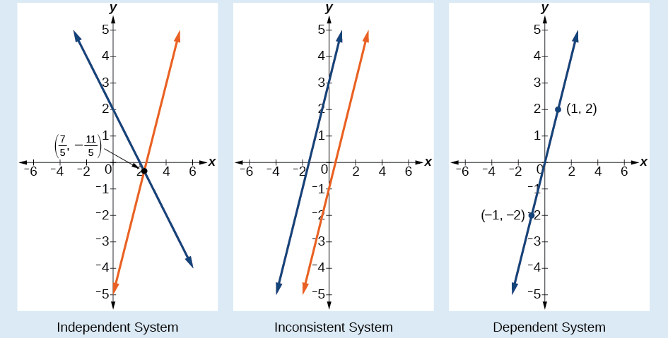
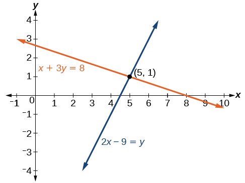
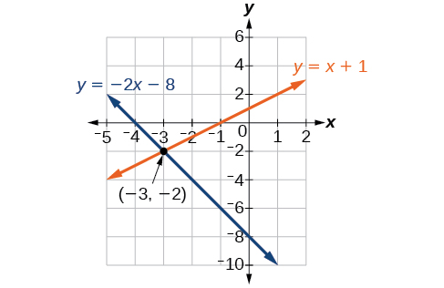
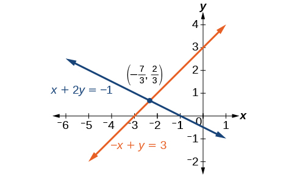
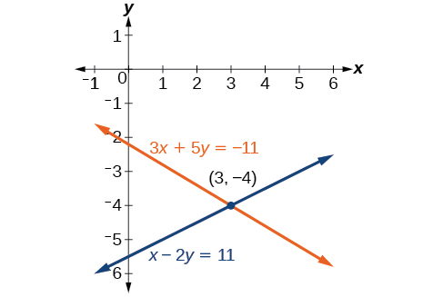
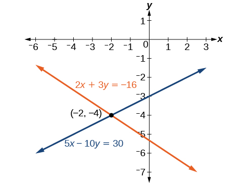
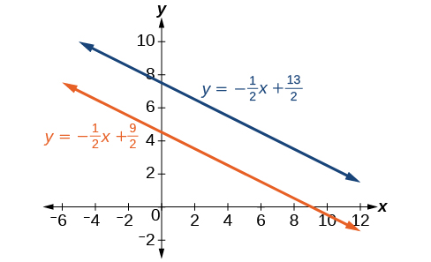
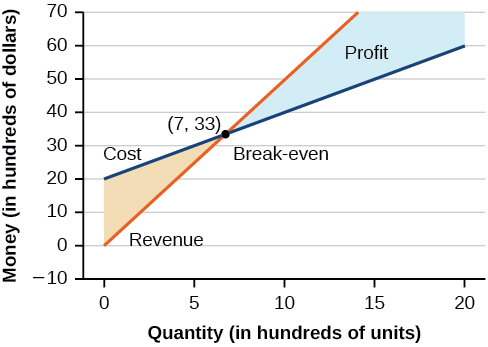
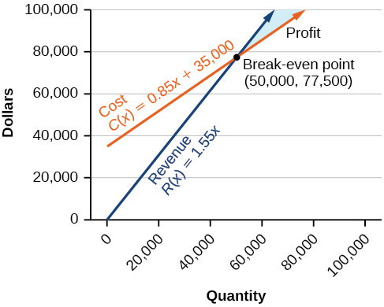
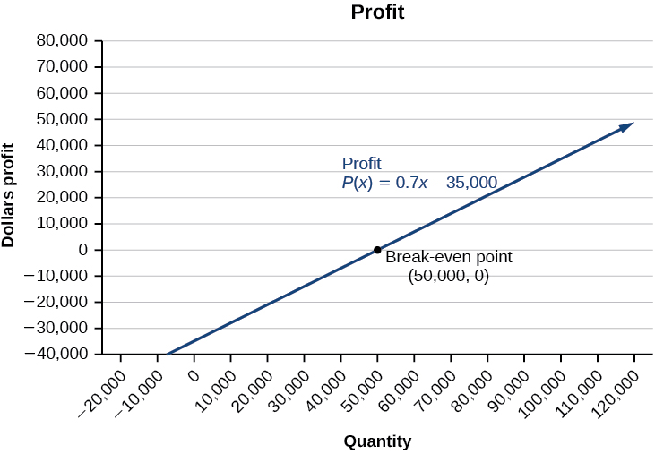

In this section, you will:
* Solve systems of equations by graphing.
* Solve systems of equations by substitution.
* Solve systems of equations by addition.
* Identify inconsistent systems of equations containing two variables.
* Express the solution of a system of dependent equations containing two variables.

 "){: #Figure_09_01_001}

A skateboard manufacturer introduces a new line of boards. The manufacturer tracks its costs, which is the amount it spends to produce the boards, and its revenue, which is the amount it earns through sales of its boards. How can the company determine if it is making a profit with its new line? How many skateboards must be produced and sold before a profit is possible? In this section, we will consider linear equations with two variables to answer these and similar questions.

### Introduction to Systems of Equations 

In order to investigate situations such as that of the skateboard manufacturer, we need to recognize that we are dealing with more than one variable and likely more than one equation. A **system of linear equations**{: data-type="term"} consists of two or more linear equations made up of two or more variables such that all equations in the system are considered simultaneously. To find the unique solution to a system of linear equations, we must find a numerical value for each variable in the system that will satisfy all equations in the system at the same time. Some linear systems may not have a solution and others may have an infinite number of solutions. In order for a linear system to have a unique solution, there must be at least as many equations as there are variables. Even so, this does not guarantee a unique solution.

In this section, we will look at systems of linear equations in two variables, which consist of two equations that contain two different variables. For example, consider the following system of linear equations in two variables.

<math xmlns="http://www.w3.org/1998/Math/MathML" display="block"> <mtable> <mtr> <mtd> <mn>2</mn><mi>x</mi><mo>+</mo><mi>y</mi><mo>=</mo><mtext> </mtext><mn>15</mn> </mtd> </mtr> <mtr> <mtd> <mn>3</mn><mi>x</mi><mo>–</mo><mi>y</mi><mo>=</mo><mtext> </mtext><mn>5</mn> </mtd> </mtr> </mtable> </math>

The *solution* to a system of linear equations in two variables is any ordered pair that satisfies each equation independently. In this example, the ordered pair (4, 7) is the solution to the system of linear equations. We can verify the solution by substituting the values into each equation to see if the ordered pair satisfies both equations. Shortly we will investigate methods of finding such a solution if it exists.

<math xmlns="http://www.w3.org/1998/Math/MathML" display="block"> <mrow> <mtable columnalign="left"> <mtr columnalign="left"> <mtd columnalign="left"> <mrow> <mn>2</mn><mo stretchy="false">(</mo><mn>4</mn><mo stretchy="false">)</mo><mo>+</mo><mo stretchy="false">(</mo><mn>7</mn><mo stretchy="false">)</mo><mo>=</mo><mn>15</mn><mtext> </mtext><mtext>True</mtext> </mrow> </mtd> </mtr> <mtr columnalign="left"> <mtd columnalign="left"> <mrow> <mn>3</mn><mo stretchy="false">(</mo><mn>4</mn><mo stretchy="false">)</mo><mo>−</mo><mo stretchy="false">(</mo><mn>7</mn><mo stretchy="false">)</mo><mo>=</mo><mn>5</mn><mtext> </mtext><mtext> </mtext><mtext> </mtext><mtext> </mtext><mtext>True</mtext> </mrow> </mtd> </mtr> </mtable> </mrow> </math>

In addition to considering the number of equations and variables, we can categorize systems of linear equations by the number of solutions. A **consistent system**{: data-type="term"} of equations has at least one solution. A consistent system is considered to be an **independent system** if it has a single solution, such as the example we just explored. The two lines have different slopes and intersect at one point in the plane. A consistent system is considered to be a **dependent system** if the equations have the same slope and the same *y*-intercepts. In other words, the lines coincide so the equations represent the same line. Every point on the line represents a coordinate pair that satisfies the system. Thus, there are an infinite number of solutions.

Another type of system of linear equations is an **inconsistent system**, which is one in which the equations represent two parallel lines. The lines have the same slope and different *y-*intercepts. There are no points common to both lines; hence, there is no solution to the system.

Types of Linear Systems

There are three types of systems of linear equations in two variables, and three types of solutions.

* An **independent system**{: data-type="term"} has exactly one solution pair
  <math xmlns="http://www.w3.org/1998/Math/MathML"> <mrow> <mtext> </mtext><mrow><mo>(</mo> <mrow> <mi>x</mi><mo>,</mo><mi>y</mi> </mrow> <mo>)</mo></mrow><mo>.</mo><mtext> </mtext> </mrow> </math>
  
  The point where the two lines intersect is the only solution.
* An **inconsistent system**{: data-type="term"} has no solution. Notice that the two lines are parallel and will never intersect.
* A **dependent system**{: data-type="term"} has infinitely many solutions. The lines are coincident. They are the same line, so every coordinate pair on the line is a solution to both equations.

[\[link\]](#Figure_09_01_002) compares graphical representations of each type of system.

{: #Figure_09_01_002}

**Given a system of linear equations and an ordered pair, determine whether the ordered pair is a solution.**

1.  Substitute the ordered pair into each equation in the system.
2.  Determine whether true statements result from the substitution in both equations; if so, the ordered pair is a solution.
{: type="1"}

Determining Whether an Ordered Pair Is a Solution to a System of Equations

Determine whether the ordered pair<math xmlns="http://www.w3.org/1998/Math/MathML"> <mrow> <mtext> </mtext><mrow><mo>(</mo> <mrow> <mn>5</mn><mo>,</mo><mn>1</mn> </mrow> <mo>)</mo></mrow><mtext> </mtext> </mrow> </math>

is a solution to the given system of equations.

<math xmlns="http://www.w3.org/1998/Math/MathML" display="block"> <mrow> <mtable columnalign="left"> <mtr columnalign="left"> <mtd columnalign="left"> <mrow> <mtext> </mtext><mi>x</mi><mo>+</mo><mn>3</mn><mi>y</mi><mo>=</mo><mn>8</mn> </mrow> </mtd> </mtr> <mtr columnalign="left"> <mtd columnalign="left"> <mrow> <mtext> </mtext><mn>2</mn><mi>x</mi><mo>−</mo><mn>9</mn><mo>=</mo><mi>y</mi> </mrow> </mtd> </mtr> </mtable> </mrow> </math>

Substitute the ordered pair<math xmlns="http://www.w3.org/1998/Math/MathML"> <mrow> <mtext> </mtext><mrow><mo>(</mo> <mrow> <mn>5</mn><mo>,</mo><mn>1</mn> </mrow> <mo>)</mo></mrow><mtext> </mtext> </mrow> </math>

into both equations.

<math xmlns="http://www.w3.org/1998/Math/MathML" display="block"> <mrow> <mtable columnalign="left"> <mtr columnalign="left"> <mtd columnalign="left"> <mrow> <mtext> </mtext><mtext> </mtext><mo stretchy="false">(</mo><mn>5</mn><mo stretchy="false">)</mo><mo>+</mo><mn>3</mn><mo stretchy="false">(</mo><mn>1</mn><mo stretchy="false">)</mo><mo>=</mo><mn>8</mn> </mrow> </mtd> <mtd columnalign="left"> <mrow /> </mtd> </mtr> <mtr columnalign="left"> <mtd columnalign="left"> <mrow> <mtext>             </mtext><mtext> </mtext><mtext> </mtext><mtext> </mtext><mtext> </mtext><mn>8</mn><mo>=</mo><mn>8</mn> </mrow> </mtd> <mtd columnalign="left"> <mrow> <mtext>True</mtext> </mrow> </mtd> </mtr> <mtr columnalign="left"> <mtd columnalign="left"> <mrow> <mtext> </mtext><mtext> </mtext><mtext> </mtext><mtext> </mtext><mtext> </mtext><mtext> </mtext><mtext> </mtext><mn>2</mn><mo stretchy="false">(</mo><mn>5</mn><mo stretchy="false">)</mo><mo>−</mo><mn>9</mn><mo>=</mo><mo stretchy="false">(</mo><mn>1</mn><mo stretchy="false">)</mo> </mrow> </mtd> <mtd columnalign="left"> <mrow /> </mtd> </mtr> <mtr columnalign="left"> <mtd columnalign="left"> <mrow> <mtext>           </mtext><mtext> </mtext><mtext> </mtext><mtext> </mtext><mtext> </mtext><mtext> </mtext><mtext> </mtext><mtext> </mtext><mtext> </mtext><mtext>1=1</mtext> </mrow> </mtd> <mtd columnalign="left"> <mrow> <mtext>True</mtext> </mrow> </mtd> </mtr> </mtable> </mrow> </math>

The ordered pair<math xmlns="http://www.w3.org/1998/Math/MathML"> <mrow> <mtext> </mtext><mrow><mo>(</mo> <mrow> <mn>5</mn><mo>,</mo><mn>1</mn> </mrow> <mo>)</mo></mrow><mtext> </mtext> </mrow> </math>

satisfies both equations, so it is the solution to the system.

Analysis

We can see the solution clearly by plotting the graph of each equation. Since the solution is an ordered pair that satisfies both equations, it is a point on both of the lines and thus the point of intersection of the two lines. See [[link]](#Figure_09_01_003).

{: #Figure_09_01_003}

Determine whether the ordered pair<math xmlns="http://www.w3.org/1998/Math/MathML"> <mrow> <mtext> </mtext><mrow><mo>(</mo> <mrow> <mn>8</mn><mo>,</mo><mn>5</mn> </mrow> <mo>)</mo></mrow><mtext> </mtext> </mrow> </math>

is a solution to the following system.

<math xmlns="http://www.w3.org/1998/Math/MathML"> <mrow> <mtable> <mtr> <mtd> <mrow> <mn>5</mn><mi>x</mi><mn>−4</mn><mi>y</mi><mo>=</mo><mn>20</mn> </mrow> </mtd> </mtr> <mtr> <mtd> <mrow> <mtext> </mtext><mtext> </mtext><mtext> </mtext><mn>2</mn><mi>x</mi><mo>+</mo><mn>1</mn><mo>=</mo><mn>3</mn><mi>y</mi> </mrow> </mtd> </mtr> </mtable> </mrow> </math>

Not a solution.

###  Solving Systems of Equations by Graphing

There are multiple methods of solving systems of linear equations. For a **system of linear equations**{: data-type="term" .no-emphasis} in two variables, we can determine both the type of system and the solution by graphing the system of equations on the same set of axes.

Solving a System of Equations in Two Variables by Graphing

Solve the following system of equations by graphing. Identify the type of system.

<math xmlns="http://www.w3.org/1998/Math/MathML" display="block"> <mrow> <mtable> <mtr> <mtd> <mrow> <mn>2</mn><mi>x</mi><mo>+</mo><mi>y</mi><mo>=</mo><mn>−8</mn> </mrow> </mtd> </mtr> <mtr> <mtd> <mrow> <mtext> </mtext><mtext> </mtext><mtext> </mtext><mi>x</mi><mo>−</mo><mi>y</mi><mo>=</mo><mn>−1</mn> </mrow> </mtd> </mtr> </mtable> </mrow> </math>

Solve the first equation for<math xmlns="http://www.w3.org/1998/Math/MathML"> <mrow> <mtext> </mtext><mi>y</mi><mo>.</mo> </mrow> </math>

<math xmlns="http://www.w3.org/1998/Math/MathML" display="block"> <mrow> <mtable> <mtr> <mtd> <mrow> <mn>2</mn><mi>x</mi><mo>+</mo><mi>y</mi><mo>=</mo><mn>−8</mn> </mrow> </mtd> </mtr> <mtr> <mtd> <mrow> <mtext> </mtext><mtext> </mtext><mtext> </mtext><mtext> </mtext><mtext> </mtext><mtext> </mtext><mtext> </mtext><mtext> </mtext><mtext> </mtext><mtext> </mtext><mtext> </mtext><mtext> </mtext><mtext> </mtext><mtext> </mtext><mtext> </mtext><mtext> </mtext><mtext> </mtext><mtext> </mtext><mtext> </mtext><mtext> </mtext><mtext> </mtext><mtext> </mtext><mtext> </mtext><mtext> </mtext><mtext> </mtext><mtext> </mtext><mi>y</mi><mo>=</mo><mn>−2</mn><mi>x</mi><mn>−8</mn> </mrow> </mtd> </mtr> </mtable> </mrow> </math>

Solve the second equation for<math xmlns="http://www.w3.org/1998/Math/MathML"> <mrow> <mtext> </mtext><mi>y</mi><mo>.</mo> </mrow> </math>

<math xmlns="http://www.w3.org/1998/Math/MathML" display="block"> <mrow> <mtable> <mtr> <mtd> <mrow> <mi>x</mi><mo>−</mo><mi>y</mi><mo>=</mo><mn>−1</mn> </mrow> </mtd> </mtr> <mtr> <mtd> <mrow> <mtext> </mtext><mtext> </mtext><mtext> </mtext><mtext> </mtext><mtext> </mtext><mtext> </mtext><mtext> </mtext><mtext> </mtext><mtext> </mtext><mtext> </mtext><mtext> </mtext><mtext> </mtext><mtext> </mtext><mtext> </mtext><mtext> </mtext><mi>y</mi><mo>=</mo><mi>x</mi><mo>+</mo><mn>1</mn> </mrow> </mtd> </mtr> </mtable> </mrow> </math>

Graph both equations on the same set of axes as in [[link]](#Figure_09_01_012).

{: #Figure_09_01_012}

The lines appear to intersect at the point<math xmlns="http://www.w3.org/1998/Math/MathML"> <mrow> <mtext> </mtext><mrow><mo>(</mo> <mrow> <mn>−3,</mn><mn>−2</mn> </mrow> <mo>)</mo></mrow><mo>.</mo><mtext> </mtext> </mrow> </math>

We can check to make sure that this is the solution to the system by substituting the ordered pair into both equations.

<math xmlns="http://www.w3.org/1998/Math/MathML" display="block"> <mrow> <mtable columnalign="left"> <mtr columnalign="left"> <mtd columnalign="left"> <mrow> <mn>2</mn><mo stretchy="false">(</mo><mn>−3</mn><mo stretchy="false">)</mo><mo>+</mo><mo stretchy="false">(</mo><mn>−2</mn><mo stretchy="false">)</mo><mo>=</mo><mn>−8</mn> </mrow> </mtd> <mtd columnalign="left"> <mrow /> </mtd> </mtr> <mtr columnalign="left"> <mtd columnalign="left"> <mrow> <mtext>                 </mtext><mn>−8</mn><mo>=</mo><mn>−8</mn> </mrow> </mtd> <mtd columnalign="left"> <mrow> <mtext>True</mtext> </mrow> </mtd> </mtr> <mtr columnalign="left"> <mtd columnalign="left"> <mrow> <mtext>  </mtext><mo stretchy="false">(</mo><mn>−3</mn><mo stretchy="false">)</mo><mo>−</mo><mo stretchy="false">(</mo><mn>−2</mn><mo stretchy="false">)</mo><mo>=</mo><mn>−1</mn> </mrow> </mtd> <mtd columnalign="left"> <mrow /> </mtd> </mtr> <mtr columnalign="left"> <mtd columnalign="left"> <mrow> <mtext>                 </mtext><mn>−1</mn><mo>=</mo><mn>−1</mn> </mrow> </mtd> <mtd columnalign="left"> <mrow> <mtext>True</mtext> </mrow> </mtd> </mtr> </mtable> </mrow> </math>

The solution to the system is the ordered pair<math xmlns="http://www.w3.org/1998/Math/MathML"> <mrow> <mtext> </mtext><mrow><mo>(</mo> <mrow> <mn>−3,</mn><mn>−2</mn> </mrow> <mo>)</mo></mrow><mo>,</mo> </mrow> </math>

so the system is independent.

Solve the following system of equations by graphing.

<math xmlns="http://www.w3.org/1998/Math/MathML" display="block"> <mrow> <mtable columnalign="left"> <mtr columnalign="left"> <mtd columnalign="left"> <mrow> <mtext>  </mtext><mn>2</mn><mi>x</mi><mo>−</mo><mn>5</mn><mi>y</mi><mo>=</mo><mn>−25</mn> </mrow> </mtd> </mtr> <mtr columnalign="left"> <mtd columnalign="left"> <mrow> <mo>−</mo><mn>4</mn><mi>x</mi><mo>+</mo><mn>5</mn><mi>y</mi><mo>=</mo><mn>35</mn> </mrow> </mtd> </mtr> </mtable> </mrow> </math>

The solution to the system is the ordered pair<math xmlns="http://www.w3.org/1998/Math/MathML"> <mrow> <mtext> </mtext><mrow><mo>(</mo> <mrow> <mn>−5</mn><mo>,</mo><mn>3</mn> </mrow> <mo>)</mo></mrow><mo>.</mo> </mrow> </math>

  

**Can graphing be used if the system is inconsistent or dependent?**

*Yes, in both cases we can still graph the system to determine the type of system and solution. If the two lines are parallel, the system has no solution and is inconsistent. If the two lines are identical, the system has infinite solutions and is a dependent system.*

### Solving Systems of Equations by Substitution

Solving a linear system in two variables by graphing works well when the solution consists of integer values, but if our solution contains decimals or fractions, it is not the most precise method. We will consider two more methods of solving a **system of linear equations**{: data-type="term" .no-emphasis} that are more precise than graphing. One such method is solving a system of equations by the **substitution method**{: data-type="term"}, in which we solve one of the equations for one variable and then substitute the result into the second equation to solve for the second variable. Recall that we can solve for only one variable at a time, which is the reason the substitution method is both valuable and practical.

**Given a system of two equations in two variables, solve using the substitution method.**

1.  Solve one of the two equations for one of the variables in terms of the other.
2.  Substitute the expression for this variable into the second equation, then solve for the remaining variable.
3.  Substitute that solution into either of the original equations to find the value of the first variable. If possible, write the solution as an ordered pair.
4.  Check the solution in both equations.
{: type="1"}

Solving a System of Equations in Two Variables by Substitution

Solve the following system of equations by substitution.

<math xmlns="http://www.w3.org/1998/Math/MathML" display="block"> <mrow> <mtable columnalign="left"> <mtr columnalign="left"> <mtd columnalign="left"> <mrow> <mtext> </mtext><mo>−</mo><mi>x</mi><mo>+</mo><mi>y</mi><mo>=</mo><mn>−5</mn> </mrow> </mtd> </mtr> <mtr columnalign="left"> <mtd columnalign="left"> <mrow> <mtext> </mtext><mn>2</mn><mi>x</mi><mo>−</mo><mn>5</mn><mi>y</mi><mo>=</mo><mn>1</mn> </mrow> </mtd> </mtr> </mtable> </mrow> </math>

First, we will solve the first equation for<math xmlns="http://www.w3.org/1998/Math/MathML"> <mrow> <mtext> </mtext><mi>y</mi><mo>.</mo> </mrow> </math>

<math xmlns="http://www.w3.org/1998/Math/MathML" display="block"> <mrow> <mtable columnalign="left"> <mtr columnalign="left"> <mtd columnalign="left"> <mrow> <mo>−</mo><mi>x</mi><mo>+</mo><mi>y</mi><mo>=</mo><mn>−5</mn> </mrow> </mtd> </mtr> <mtr columnalign="left"> <mtd columnalign="left"> <mrow> <mtext> </mtext><mtext> </mtext><mtext> </mtext><mtext> </mtext><mtext> </mtext><mtext> </mtext><mtext> </mtext><mtext> </mtext><mtext> </mtext><mtext> </mtext><mtext> </mtext><mtext>  </mtext><mi>y</mi><mo>=</mo><mi>x</mi><mn>−5</mn> </mrow> </mtd> </mtr> </mtable> </mrow> </math>

Now we can substitute the expression<math xmlns="http://www.w3.org/1998/Math/MathML"> <mrow> <mtext> </mtext><mi>x</mi><mn>−5</mn><mtext> </mtext> </mrow> </math>

for<math xmlns="http://www.w3.org/1998/Math/MathML"> <mrow> <mtext> </mtext><mi>y</mi><mtext> </mtext> </mrow> </math>

in the second equation.

<math xmlns="http://www.w3.org/1998/Math/MathML" display="block"> <mrow> <mtable columnalign="left"> <mtr columnalign="left"> <mtd columnalign="left"> <mrow> <mtext>          </mtext><mn>2</mn><mi>x</mi><mo>−</mo><mn>5</mn><mi>y</mi><mo>=</mo><mn>1</mn> </mrow> </mtd> </mtr> <mtr columnalign="left"> <mtd columnalign="left"> <mrow> <mn>2</mn><mi>x</mi><mo>−</mo><mn>5</mn><mo stretchy="false">(</mo><mi>x</mi><mo>−</mo><mn>5</mn><mo stretchy="false">)</mo><mo>=</mo><mn>1</mn> </mrow> </mtd> </mtr> <mtr columnalign="left"> <mtd columnalign="left"> <mrow> <mtext>  </mtext><mn>2</mn><mi>x</mi><mo>−</mo><mn>5</mn><mi>x</mi><mo>+</mo><mn>25</mn><mo>=</mo><mn>1</mn> </mrow> </mtd> </mtr> <mtr columnalign="left"> <mtd columnalign="left"> <mrow> <mtext>              </mtext><mo>−</mo><mn>3</mn><mi>x</mi><mo>=</mo><mn>−24</mn> </mrow> </mtd> </mtr> <mtr columnalign="left"> <mtd columnalign="left"> <mrow> <mtext>                     </mtext><mi>x</mi><mo>=</mo><mn>8</mn> </mrow> </mtd> </mtr> </mtable> </mrow> </math>

Now, we substitute<math xmlns="http://www.w3.org/1998/Math/MathML"> <mrow> <mtext> </mtext><mi>x</mi><mo>=</mo><mn>8</mn><mtext> </mtext> </mrow> </math>

into the first equation and solve for<math xmlns="http://www.w3.org/1998/Math/MathML"> <mrow> <mtext> </mtext><mi>y</mi><mo>.</mo> </mrow> </math>

<math xmlns="http://www.w3.org/1998/Math/MathML" display="block"> <mrow> <mtable columnalign="left"> <mtr columnalign="left"> <mtd columnalign="left"> <mrow> <mo>−</mo><mo stretchy="false">(</mo><mn>8</mn><mo stretchy="false">)</mo><mo>+</mo><mi>y</mi><mo>=</mo><mn>−5</mn> </mrow> </mtd> </mtr> <mtr columnalign="left"> <mtd columnalign="left"> <mrow> <mtext> </mtext><mtext> </mtext><mtext> </mtext><mtext> </mtext><mtext> </mtext><mtext> </mtext><mtext> </mtext><mtext> </mtext><mtext> </mtext><mtext> </mtext><mtext> </mtext><mtext> </mtext><mtext> </mtext><mtext> </mtext><mtext>   </mtext><mi>y</mi><mo>=</mo><mn>3</mn> </mrow> </mtd> </mtr> </mtable> </mrow> </math>

Our solution is<math xmlns="http://www.w3.org/1998/Math/MathML"> <mrow> <mtext> </mtext><mrow><mo>(</mo> <mrow> <mn>8</mn><mo>,</mo><mn>3</mn> </mrow> <mo>)</mo></mrow><mo>.</mo> </mrow> </math>

Check the solution by substituting<math xmlns="http://www.w3.org/1998/Math/MathML"> <mrow> <mtext> </mtext><mrow><mo>(</mo> <mrow> <mn>8</mn><mo>,</mo><mn>3</mn> </mrow> <mo>)</mo></mrow><mtext> </mtext> </mrow> </math>

into both equations.

<math xmlns="http://www.w3.org/1998/Math/MathML" display="block"> <mrow> <mtable columnalign="left"> <mtr columnalign="left"> <mtd columnalign="left"> <mrow> <mtext> </mtext><mtext> </mtext><mtext> </mtext><mtext> </mtext><mtext> </mtext><mtext> </mtext><mtext> </mtext><mtext> </mtext><mtext> </mtext><mtext> </mtext><mo>−</mo><mi>x</mi><mo>+</mo><mi>y</mi><mo>=</mo><mo>−</mo><mn>5</mn> </mrow> </mtd> <mtd columnalign="left"> <mrow /> </mtd> <mtd columnalign="left"> <mrow /> </mtd> <mtd columnalign="left"> <mrow /> </mtd> </mtr> <mtr columnalign="left"> <mtd columnalign="left"> <mrow> <mtext> </mtext><mtext> </mtext><mo>−</mo><mo stretchy="false">(</mo><mn>8</mn><mo stretchy="false">)</mo><mo>+</mo><mo stretchy="false">(</mo><mn>3</mn><mo stretchy="false">)</mo><mo>=</mo><mo>−</mo><mn>5</mn> </mrow> </mtd> <mtd columnalign="left"> <mrow /> </mtd> <mtd columnalign="left"> <mrow /> </mtd> <mtd columnalign="left"> <mrow> <mtext>True</mtext> </mrow> </mtd> </mtr> <mtr columnalign="left"> <mtd columnalign="left"> <mrow> <mtext> </mtext><mtext> </mtext><mtext> </mtext><mtext> </mtext><mtext> </mtext><mtext> </mtext><mtext> </mtext><mtext> </mtext><mtext> </mtext><mtext> </mtext><mtext> </mtext><mn>2</mn><mi>x</mi><mo>−</mo><mn>5</mn><mi>y</mi><mo>=</mo><mn>1</mn> </mrow> </mtd> <mtd columnalign="left"> <mrow /> </mtd> <mtd columnalign="left"> <mrow /> </mtd> <mtd columnalign="left"> <mrow /> </mtd> </mtr> <mtr columnalign="left"> <mtd columnalign="left"> <mrow> <mtext> </mtext><mtext> </mtext><mtext> </mtext><mn>2</mn><mo stretchy="false">(</mo><mn>8</mn><mo stretchy="false">)</mo><mo>−</mo><mn>5</mn><mo stretchy="false">(</mo><mn>3</mn><mo stretchy="false">)</mo><mo>=</mo><mn>1</mn> </mrow> </mtd> <mtd columnalign="left"> <mrow /> </mtd> <mtd columnalign="left"> <mrow /> </mtd> <mtd columnalign="left"> <mrow> <mtext>True</mtext> </mrow> </mtd> </mtr> </mtable> </mrow> </math>

Solve the following system of equations by substitution.

<math xmlns="http://www.w3.org/1998/Math/MathML" display="block"> <mrow> <mtable columnalign="left"> <mtr columnalign="left"> <mtd columnalign="left"> <mrow> <mi>x</mi><mo>=</mo><mi>y</mi><mo>+</mo><mn>3</mn> </mrow> </mtd> </mtr> <mtr columnalign="left"> <mtd columnalign="left"> <mrow> <mn>4</mn><mo>=</mo><mn>3</mn><mi>x</mi><mn>−2</mn><mi>y</mi> </mrow> </mtd> </mtr> </mtable> </mrow> </math>

<math xmlns="http://www.w3.org/1998/Math/MathML"> <mrow> <mrow><mo>(</mo> <mrow> <mn>−2</mn><mo>,</mo><mn>−5</mn> </mrow> <mo>)</mo></mrow> </mrow> </math>

**Can the substitution method be used to solve any linear system in two variables?**

*Yes, but the method works best if one of the equations contains a coefficient of 1 or –1 so that we do not have to deal with fractions.*

### Solving Systems of Equations in Two Variables by the Addition Method

A third method of **solving systems of linear equations**{: data-type="term" .no-emphasis} is the **addition method**{: data-type="term"}. In this method, we add two terms with the same variable, but opposite coefficients, so that the sum is zero. Of course, not all systems are set up with the two terms of one variable having opposite coefficients. Often we must adjust one or both of the equations by multiplication so that one variable will be eliminated by addition.

**Given a system of equations, solve using the addition method.**

1.  Write both equations with *x*- and *y*-variables on the left side of the equal sign and constants on the right.
2.  Write one equation above the other, lining up corresponding variables. If one of the variables in the top equation has the opposite coefficient of the same variable in the bottom equation, add the equations together, eliminating one variable. If not, use multiplication by a nonzero number so that one of the variables in the top equation has the opposite coefficient of the same variable in the bottom equation, then add the equations to eliminate the variable.
3.  Solve the resulting equation for the remaining variable.
4.  Substitute that value into one of the original equations and solve for the second variable.
5.  Check the solution by substituting the values into the other equation.
{: type="1"}

Solving a System by the Addition Method

Solve the given system of equations by addition.

<math xmlns="http://www.w3.org/1998/Math/MathML" display="block"> <mrow> <mtable columnalign="left"> <mtr columnalign="left"> <mtd columnalign="left"> <mrow> <mtext> </mtext><mi>x</mi><mo>+</mo><mn>2</mn><mi>y</mi><mo>=</mo><mn>−1</mn> </mrow> </mtd> </mtr> <mtr columnalign="left"> <mtd columnalign="left"> <mrow> <mo>−</mo><mi>x</mi><mo>+</mo><mi>y</mi><mo>=</mo><mn>3</mn> </mrow> </mtd> </mtr> </mtable> </mrow> </math>

Both equations are already set equal to a constant. Notice that the coefficient of<math xmlns="http://www.w3.org/1998/Math/MathML"> <mrow> <mtext> </mtext><mi>x</mi><mtext> </mtext> </mrow> </math>

in the second equation, –1, is the opposite of the coefficient of<math xmlns="http://www.w3.org/1998/Math/MathML"> <mrow> <mtext> </mtext><mi>x</mi><mtext> </mtext> </mrow> </math>

in the first equation, 1. We can add the two equations to eliminate<math xmlns="http://www.w3.org/1998/Math/MathML"> <mrow> <mtext> </mtext><mi>x</mi><mtext> </mtext> </mrow> </math>

without needing to multiply by a constant.

<math xmlns="http://www.w3.org/1998/Math/MathML" display="block"> <mrow> <mfrac> <mrow> <mtable columnalign="left"> <mtr columnalign="left"> <mtd columnalign="left"> <mrow /> </mtd> </mtr> <mtr columnalign="left"> <mtd columnalign="left"> <mrow> <mtext> </mtext><mi>x</mi><mo>+</mo><mn>2</mn><mi>y</mi><mo>=</mo><mo>−</mo><mn>1</mn> </mrow> </mtd> </mtr> <mtr columnalign="left"> <mtd columnalign="left"> <mrow> <mo>−</mo><mi>x</mi><mo>+</mo><mi>y</mi><mo>=</mo><mn>3</mn> </mrow> </mtd> </mtr> </mtable> </mrow> <mrow> <mtext /><mtext /><mtext /><mtext /><mtext /><mn>3</mn><mi>y</mi><mo>=</mo><mn>2</mn> </mrow> </mfrac> </mrow> </math>

Now that we have eliminated<math xmlns="http://www.w3.org/1998/Math/MathML"> <mrow> <mtext> </mtext><mi>x</mi><mo>,</mo> </mrow> </math>

 we can solve the resulting equation for<math xmlns="http://www.w3.org/1998/Math/MathML"> <mrow> <mtext> </mtext><mi>y</mi><mo>.</mo> </mrow> </math>

<math xmlns="http://www.w3.org/1998/Math/MathML" display="block"> <mrow> <mtable columnalign="left"> <mtr columnalign="left"> <mtd columnalign="left"> <mrow> <mn>3</mn><mi>y</mi><mo>=</mo><mn>2</mn> </mrow> </mtd> </mtr> <mtr columnalign="left"> <mtd columnalign="left"> <mrow> <mtext>  </mtext><mi>y</mi><mo>=</mo><mfrac> <mn>2</mn> <mn>3</mn> </mfrac> </mrow> </mtd> </mtr> </mtable> </mrow> </math>

Then, we substitute this value for<math xmlns="http://www.w3.org/1998/Math/MathML"> <mrow> <mtext> </mtext><mi>y</mi><mtext>  </mtext> </mrow> </math>

into one of the original equations and solve for<math xmlns="http://www.w3.org/1998/Math/MathML"> <mrow> <mtext> </mtext><mi>x</mi><mo>.</mo> </mrow> </math>

<math xmlns="http://www.w3.org/1998/Math/MathML" display="block"> <mrow> <mtable columnalign="left"> <mtr columnalign="left"> <mtd columnalign="left"> <mrow> <mtext>   </mtext><mo>−</mo><mi>x</mi><mo>+</mo><mi>y</mi><mo>=</mo><mn>3</mn> </mrow> </mtd> </mtr> <mtr columnalign="left"> <mtd columnalign="left"> <mrow> <mtext>  </mtext><mo>−</mo><mi>x</mi><mo>+</mo><mfrac> <mn>2</mn> <mn>3</mn> </mfrac> <mo>=</mo><mn>3</mn> </mrow> </mtd> </mtr> <mtr columnalign="left"> <mtd columnalign="left"> <mrow> <mtext>         </mtext><mo>−</mo><mi>x</mi><mo>=</mo><mn>3</mn><mo>−</mo><mfrac> <mn>2</mn> <mn>3</mn> </mfrac> </mrow> </mtd> </mtr> <mtr columnalign="left"> <mtd columnalign="left"> <mrow> <mtext>         </mtext><mo>−</mo><mi>x</mi><mo>=</mo><mfrac> <mn>7</mn> <mn>3</mn> </mfrac> </mrow> </mtd> </mtr> <mtr columnalign="left"> <mtd columnalign="left"> <mrow> <mtext>              </mtext><mi>x</mi><mo>=</mo><mo>−</mo><mfrac> <mn>7</mn> <mn>3</mn> </mfrac> </mrow> </mtd> </mtr> </mtable> </mrow> </math>

The solution to this system is<math xmlns="http://www.w3.org/1998/Math/MathML"> <mrow> <mtext> </mtext><mrow><mo>(</mo> <mrow> <mo>−</mo><mfrac> <mn>7</mn> <mn>3</mn> </mfrac> <mo>,</mo><mfrac> <mn>2</mn> <mn>3</mn> </mfrac> </mrow> <mo>)</mo></mrow><mo>.</mo> </mrow> </math>

Check the solution in the first equation.

<math xmlns="http://www.w3.org/1998/Math/MathML" display="block"> <mrow> <mtable columnalign="left"> <mtr columnalign="left"> <mtd columnalign="left"> <mrow> <mtext>              </mtext><mi>x</mi><mo>+</mo><mn>2</mn><mi>y</mi><mo>=</mo><mn>−1</mn> </mrow> </mtd> <mtd columnalign="left"> <mrow /> </mtd> <mtd columnalign="left"> <mrow /> </mtd> <mtd columnalign="left"> <mrow /> </mtd> </mtr> <mtr columnalign="left"> <mtd columnalign="left"> <mrow> <mtext>     </mtext><mrow><mo>(</mo> <mrow> <mo>−</mo><mfrac> <mn>7</mn> <mn>3</mn> </mfrac> </mrow> <mo>)</mo></mrow><mo>+</mo><mn>2</mn><mrow><mo>(</mo> <mrow> <mfrac> <mn>2</mn> <mn>3</mn> </mfrac> </mrow> <mo>)</mo></mrow><mo>=</mo> </mrow> </mtd> <mtd columnalign="left"> <mrow /> </mtd> <mtd columnalign="left"> <mrow /> </mtd> <mtd columnalign="left"> <mrow /> </mtd> </mtr> <mtr columnalign="left"> <mtd columnalign="left"> <mrow> <mtext>           </mtext><mo>−</mo><mfrac> <mn>7</mn> <mn>3</mn> </mfrac> <mo>+</mo><mfrac> <mn>4</mn> <mn>3</mn> </mfrac> <mo>=</mo> </mrow> </mtd> <mtd columnalign="left"> <mrow /> </mtd> <mtd columnalign="left"> <mrow /> </mtd> <mtd columnalign="left"> <mrow /> </mtd> </mtr> <mtr columnalign="left"> <mtd columnalign="left"> <mrow> <mtext>                  </mtext><mo>−</mo><mfrac> <mn>3</mn> <mn>3</mn> </mfrac> <mo>=</mo> </mrow> </mtd> <mtd columnalign="left"> <mrow /> </mtd> <mtd columnalign="left"> <mrow /> </mtd> <mtd columnalign="left"> <mrow /> </mtd> </mtr> <mtr columnalign="left"> <mtd columnalign="left"> <mrow> <mtext>                    </mtext><mn>−1</mn><mo>=</mo><mn>−1</mn> </mrow> </mtd> <mtd columnalign="left"> <mrow /> </mtd> <mtd columnalign="left"> <mrow /> </mtd> <mtd columnalign="left"> <mrow> <mtext>True</mtext> </mrow> </mtd> </mtr> </mtable> </mrow> </math>

Analysis

We gain an important perspective on systems of equations by looking at the graphical representation. See [[link]](#Figure_09_01_004) to find that the equations intersect at the solution. We do not need to ask whether there may be a second solution because observing the graph confirms that the system has exactly one solution.

{: #Figure_09_01_004}

Using the Addition Method When Multiplication of One Equation Is Required

Solve the given system of equations by the **addition method**{: data-type="term" .no-emphasis}.

<math xmlns="http://www.w3.org/1998/Math/MathML" display="block"> <mrow> <mtable columnalign="left"> <mtr columnalign="left"> <mtd columnalign="left"> <mrow> <mn>3</mn><mi>x</mi><mo>+</mo><mn>5</mn><mi>y</mi><mo>=</mo><mn>−11</mn> </mrow> </mtd> </mtr> <mtr columnalign="left"> <mtd columnalign="left"> <mrow /> </mtd> </mtr> <mtr columnalign="left"> <mtd columnalign="left"> <mrow> <mtext> </mtext><mtext> </mtext><mtext> </mtext><mi>x</mi><mo>−</mo><mn>2</mn><mi>y</mi><mo>=</mo><mn>11</mn> </mrow> </mtd> </mtr> </mtable> </mrow> </math>

Adding these equations as presented will not eliminate a variable. However, we see that the first equation has<math xmlns="http://www.w3.org/1998/Math/MathML"> <mrow> <mtext> </mtext><mn>3</mn><mi>x</mi><mtext> </mtext> </mrow> </math>

in it and the second equation has<math xmlns="http://www.w3.org/1998/Math/MathML"> <mrow> <mtext> </mtext><mi>x</mi><mo>.</mo><mtext> </mtext> </mrow> </math>

So if we multiply the second equation by<math xmlns="http://www.w3.org/1998/Math/MathML"> <mrow> <mtext> </mtext><mn>−3</mn><mo>,</mo><mtext> </mtext> </mrow> </math>

the *x*-terms will add to zero.

<math xmlns="http://www.w3.org/1998/Math/MathML" display="block"> <mrow> <mtable columnalign="left"> <mtr columnalign="left"> <mtd columnalign="left"> <mrow> <mtext>       </mtext><mi>x</mi><mn>−2</mn><mi>y</mi><mo>=</mo><mn>11</mn> </mrow> </mtd> <mtd columnalign="left"> <mrow /> </mtd> <mtd columnalign="left"> <mrow /> </mtd> <mtd columnalign="left"> <mrow /> </mtd> </mtr> <mtr columnalign="left"> <mtd columnalign="left"> <mrow> <mn>−3</mn><mo stretchy="false">(</mo><mi>x</mi><mn>−2</mn><mi>y</mi><mo stretchy="false">)</mo><mo>=</mo><mn>−3</mn><mo stretchy="false">(</mo><mn>11</mn><mo stretchy="false">)</mo> </mrow> </mtd> <mtd columnalign="left"> <mrow /> </mtd> <mtd columnalign="left"> <mrow /> </mtd> <mtd columnalign="left"> <mrow> <mtext>Multiply both sides by </mtext><mn>−3.</mn> </mrow> </mtd> </mtr> <mtr columnalign="left"> <mtd columnalign="left"> <mrow> <mtext> </mtext><mn>−3</mn><mi>x</mi><mo>+</mo><mn>6</mn><mi>y</mi><mo>=</mo><mn>−33</mn> </mrow> </mtd> <mtd columnalign="left"> <mrow /> </mtd> <mtd columnalign="left"> <mrow /> </mtd> <mtd columnalign="left"> <mrow> <mtext>Use the distributive property</mtext><mo>.</mo> </mrow> </mtd> </mtr> </mtable> </mrow> </math>

Now, let’s add them.

<math xmlns="http://www.w3.org/1998/Math/MathML" display="block"> <mrow> <mtable columnalign="left"> <mtr columnalign="left"> <mtd columnalign="left"> <mrow> <munder> <mrow> <mtable columnalign="left"> <mtr columnalign="left"> <mtd columnalign="left"> <mrow /> </mtd> </mtr> <mtr columnalign="left"> <mtd columnalign="left"> <mrow> <mtable columnalign="left"> <mtr columnalign="left"> <mtd columnalign="left"> <mrow> <mtext>   </mtext><mn>3</mn><mi>x</mi><mo>+</mo><mn>5</mn><mi>y</mi><mo>=</mo><mn>−11</mn> </mrow> </mtd> </mtr> <mtr columnalign="left"> <mtd columnalign="left"> <mrow> <mn>−3</mn><mi>x</mi><mo>+</mo><mn>6</mn><mi>y</mi><mo>=</mo><mn>−33</mn> </mrow> </mtd> </mtr> </mtable> </mrow> </mtd> </mtr> </mtable> </mrow> <mo stretchy="true">\_\_\_\_\_\_\_\_\_\_\_\_\_\_\_</mo> </munder> </mrow> </mtd> </mtr> <mtr columnalign="left"> <mtd columnalign="left"> <mrow> <mtext>         </mtext><mn>11</mn><mi>y</mi><mo>=</mo><mn>−44</mn> </mrow> </mtd> </mtr> <mtr columnalign="left"> <mtd columnalign="left"> <mrow> <mtext>             </mtext><mi>y</mi><mo>=</mo><mn>−4</mn> </mrow> </mtd> </mtr> </mtable> </mrow> </math>

For the last step, we substitute<math xmlns="http://www.w3.org/1998/Math/MathML"> <mrow> <mtext> </mtext><mi>y</mi><mo>=</mo><mn>−4</mn><mtext>  </mtext> </mrow> </math>

into one of the original equations and solve for<math xmlns="http://www.w3.org/1998/Math/MathML"> <mrow> <mtext> </mtext><mi>x</mi><mo>.</mo> </mrow> </math>

<math xmlns="http://www.w3.org/1998/Math/MathML" display="block"> <mrow> <mtable> <mtr> <mtd> <mrow> <mtext> </mtext><mtext> </mtext><mtext> </mtext><mtext> </mtext><mtext> </mtext><mtext> </mtext><mtext> </mtext><mtext> </mtext><mtext> </mtext><mtext> </mtext><mtext> </mtext><mn>3</mn><mi>x</mi><mo>+</mo><mn>5</mn><mi>y</mi><mo>=</mo><mo>−</mo><mn>11</mn> </mrow> </mtd> </mtr> <mtr> <mtd> <mrow> <mtext> </mtext><mtext> </mtext><mn>3</mn><mi>x</mi><mo>+</mo><mn>5</mn><mo stretchy="false">(</mo><mo>−</mo><mn>4</mn><mo stretchy="false">)</mo><mo>=</mo><mo>−</mo><mn>11</mn> </mrow> </mtd> </mtr> <mtr> <mtd> <mrow> <mtext> </mtext><mtext> </mtext><mtext> </mtext><mtext> </mtext><mtext> </mtext><mtext> </mtext><mtext> </mtext><mtext> </mtext><mtext> </mtext><mtext> </mtext><mtext> </mtext><mtext> </mtext><mn>3</mn><mi>x</mi><mo>−</mo><mn>20</mn><mo>=</mo><mo>−</mo><mn>11</mn> </mrow> </mtd> </mtr> <mtr> <mtd> <mrow> <mtext> </mtext><mtext> </mtext><mtext> </mtext><mtext> </mtext><mtext> </mtext><mtext> </mtext><mtext> </mtext><mtext> </mtext><mtext> </mtext><mtext> </mtext><mtext> </mtext><mtext> </mtext><mtext> </mtext><mtext> </mtext><mtext> </mtext><mtext> </mtext><mn>3</mn><mi>x</mi><mo>=</mo><mn>9</mn> </mrow> </mtd> </mtr> <mtr> <mtd> <mrow> <mtext> </mtext><mtext> </mtext><mtext> </mtext><mtext> </mtext><mtext> </mtext><mtext> </mtext><mtext> </mtext><mtext> </mtext><mtext> </mtext><mtext> </mtext><mtext> </mtext><mtext> </mtext><mtext> </mtext><mtext> </mtext><mtext> </mtext><mtext> </mtext><mtext> </mtext><mtext> </mtext><mtext> </mtext><mi>x</mi><mo>=</mo><mn>3</mn> </mrow> </mtd> </mtr> </mtable> </mrow> </math>

Our solution is the ordered pair<math xmlns="http://www.w3.org/1998/Math/MathML"> <mrow> <mtext> </mtext><mrow><mo>(</mo> <mrow> <mn>3</mn><mo>,</mo><mn>−4</mn> </mrow> <mo>)</mo></mrow><mo>.</mo><mtext> </mtext> </mrow> </math>

See [[link]](#Figure_09_01_005). Check the solution in the original second equation.

<math xmlns="http://www.w3.org/1998/Math/MathML" display="block"> <mrow> <mtable columnalign="left"> <mtr columnalign="left"> <mtd columnalign="left"> <mrow> <mtext>          </mtext><mi>x</mi><mo>−</mo><mn>2</mn><mi>y</mi><mo>=</mo><mn>11</mn> </mrow> </mtd> <mtd columnalign="left"> <mrow /> </mtd> <mtd columnalign="left"> <mrow /> </mtd> <mtd columnalign="left"> <mrow /> </mtd> </mtr> <mtr columnalign="left"> <mtd columnalign="left"> <mrow> <mo stretchy="false">(</mo><mn>3</mn><mo stretchy="false">)</mo><mo>−</mo><mn>2</mn><mo stretchy="false">(</mo><mo>−</mo><mn>4</mn><mo stretchy="false">)</mo><mo>=</mo><mn>3</mn><mo>+</mo><mn>8</mn> </mrow> </mtd> <mtd columnalign="left"> <mrow /> </mtd> <mtd columnalign="left"> <mrow /> </mtd> <mtd columnalign="left"> <mrow /> </mtd> </mtr> <mtr columnalign="left"> <mtd columnalign="left"> <mrow> <mtext>                    </mtext><mn>11</mn><mo>=</mo><mn>11</mn> </mrow> </mtd> <mtd columnalign="left"> <mrow /> </mtd> <mtd columnalign="left"> <mrow /> </mtd> <mtd columnalign="left"> <mrow> <mtext>True</mtext> </mrow> </mtd> </mtr> </mtable> </mrow> </math>

{: #Figure_09_01_005}

Solve the system of equations by addition.

<math xmlns="http://www.w3.org/1998/Math/MathML"> <mrow> <mtable> <mtr> <mtd> <mrow> <mn>2</mn><mi>x</mi><mn>−7</mn><mi>y</mi><mo>=</mo><mn>2</mn> </mrow> </mtd> </mtr> <mtr> <mtd> <mrow> <mtext> </mtext><mtext> </mtext><mtext> </mtext><mtext> </mtext><mtext> </mtext><mtext> </mtext><mtext> </mtext><mtext> </mtext><mtext> </mtext><mtext> </mtext><mtext> </mtext><mn>3</mn><mi>x</mi><mo>+</mo><mi>y</mi><mo>=</mo><mn>−20</mn> </mrow> </mtd> </mtr> </mtable> </mrow> </math>

<math xmlns="http://www.w3.org/1998/Math/MathML"> <mrow> <mrow><mo>(</mo> <mrow> <mn>−6</mn><mo>,</mo><mn>−2</mn> </mrow> <mo>)</mo></mrow> </mrow> </math>

Using the Addition Method When Multiplication of Both Equations Is Required

Solve the given system of equations in two variables by addition.

<math xmlns="http://www.w3.org/1998/Math/MathML" display="block"> <mrow> <mtable> <mtr> <mtd> <mrow> <mtext> </mtext><mtext> </mtext><mtext> </mtext><mtext> </mtext><mtext> </mtext><mtext> </mtext><mtext> </mtext><mtext> </mtext><mn>2</mn><mi>x</mi><mo>+</mo><mn>3</mn><mi>y</mi><mo>=</mo><mn>−16</mn> </mrow> </mtd> </mtr> <mtr> <mtd> <mrow> <mtext> </mtext><mn>5</mn><mi>x</mi><mn>−10</mn><mi>y</mi><mo>=</mo><mn>30</mn> </mrow> </mtd> </mtr> </mtable> </mrow> </math>

One equation has<math xmlns="http://www.w3.org/1998/Math/MathML"> <mrow> <mtext> </mtext><mn>2</mn><mi>x</mi><mtext> </mtext> </mrow> </math>

and the other has<math xmlns="http://www.w3.org/1998/Math/MathML"> <mrow> <mtext> </mtext><mn>5</mn><mi>x</mi><mo>.</mo><mtext> </mtext> </mrow> </math>

The least common multiple is<math xmlns="http://www.w3.org/1998/Math/MathML"> <mrow> <mtext> </mtext><mn>10</mn><mi>x</mi><mtext> </mtext> </mrow> </math>

so we will have to multiply both equations by a constant in order to eliminate one variable. Let’s eliminate<math xmlns="http://www.w3.org/1998/Math/MathML"> <mrow> <mtext> </mtext><mi>x</mi><mtext> </mtext> </mrow> </math>

by multiplying the first equation by<math xmlns="http://www.w3.org/1998/Math/MathML"> <mrow> <mn>−5</mn><mtext> </mtext> </mrow> </math>

and the second equation by<math xmlns="http://www.w3.org/1998/Math/MathML"> <mrow> <mtext> </mtext><mn>2.</mn> </mrow> </math>

<math xmlns="http://www.w3.org/1998/Math/MathML" display="block"> <mrow> <mtable columnalign="left"> <mtr columnalign="left"> <mtd columnalign="left"> <mrow> <mo> </mo><mo>−</mo><mn>5</mn><mo stretchy="false">(</mo><mn>2</mn><mi>x</mi><mo>+</mo><mn>3</mn><mi>y</mi><mo stretchy="false">)</mo><mo>=</mo><mo>−</mo><mn>5</mn><mo stretchy="false">(</mo><mn>−16</mn><mo stretchy="false">)</mo> </mrow> </mtd> </mtr> <mtr columnalign="left"> <mtd columnalign="left"> <mrow> <mtext>    </mtext><mo>−</mo><mn>10</mn><mi>x</mi><mo>−</mo><mn>15</mn><mi>y</mi><mo>=</mo><mn>80</mn> </mrow> </mtd> </mtr> <mtr columnalign="left"> <mtd columnalign="left"> <mrow> <mtext>      </mtext><mn>2</mn><mo stretchy="false">(</mo><mn>5</mn><mi>x</mi><mo>−</mo><mn>10</mn><mi>y</mi><mo stretchy="false">)</mo><mo>=</mo><mn>2</mn><mo stretchy="false">(</mo><mn>30</mn><mo stretchy="false">)</mo> </mrow> </mtd> </mtr> <mtr columnalign="left"> <mtd columnalign="left"> <mrow> <mtext>         </mtext><mn>10</mn><mi>x</mi><mo>−</mo><mn>20</mn><mi>y</mi><mo>=</mo><mn>60</mn> </mrow> </mtd> </mtr> </mtable> </mrow> </math>

Then, we add the two equations together.

<math xmlns="http://www.w3.org/1998/Math/MathML" display="block"> <mrow> <mtable columnalign="left"> <mtr columnalign="left"> <mtd columnalign="left"> <mrow> <munder accentunder="true"> <mrow> <mtable columnalign="left"> <mtr columnalign="left"> <mtd columnalign="left"> <mrow /> </mtd> </mtr> <mtr columnalign="left"> <mtd columnalign="left"> <mrow> <mtable columnalign="left"> <mtr columnalign="left"> <mtd columnalign="left"> <mrow> <mn>−10</mn><mi>x</mi><mn>−15</mn><mi>y</mi><mo>=</mo><mn>80</mn><mtext>   </mtext> </mrow> </mtd> </mtr> <mtr columnalign="left"> <mtd columnalign="left"> <mrow> <mtext> </mtext><mtext> </mtext><mtext> </mtext><mtext> </mtext><mtext> </mtext><mn>10</mn><mi>x</mi><mn>−20</mn><mi>y</mi><mo>=</mo><mn>60</mn> </mrow> </mtd> </mtr> </mtable> </mrow> </mtd> </mtr> </mtable> </mrow> <mo stretchy="true">\_\_\_\_\_\_\_\_\_\_\_\_\_\_\_\_</mo> </munder> </mrow> </mtd> </mtr> <mtr columnalign="left"> <mtd columnalign="left"> <mrow> <mtext> </mtext><mtext> </mtext><mtext> </mtext><mtext> </mtext><mtext> </mtext><mtext> </mtext><mtext> </mtext><mtext> </mtext><mtext> </mtext><mtext> </mtext><mtext> </mtext><mtext> </mtext><mtext> </mtext><mtext> </mtext><mtext> </mtext><mtext> </mtext><mn>−35</mn><mi>y</mi><mo>=</mo><mn>140</mn> </mrow> </mtd> </mtr> <mtr columnalign="left"> <mtd columnalign="left"> <mrow> <mtext> </mtext><mtext> </mtext><mtext> </mtext><mtext> </mtext><mtext> </mtext><mtext> </mtext><mtext> </mtext><mtext> </mtext><mtext> </mtext><mtext> </mtext><mtext> </mtext><mtext> </mtext><mtext> </mtext><mtext> </mtext><mtext> </mtext><mtext> </mtext><mtext> </mtext><mtext> </mtext><mtext> </mtext><mtext> </mtext><mtext> </mtext><mtext> </mtext><mtext> </mtext><mtext> </mtext><mtext> </mtext><mtext> </mtext><mtext> </mtext><mi>y</mi><mo>=</mo><mn>−4</mn> </mrow> </mtd> </mtr> </mtable> </mrow> </math>

Substitute<math xmlns="http://www.w3.org/1998/Math/MathML"> <mrow> <mtext> </mtext><mi>y</mi><mo>=</mo><mn>−4</mn><mtext>  </mtext> </mrow> </math>

into the original first equation.

<math xmlns="http://www.w3.org/1998/Math/MathML" display="block"> <mrow> <mtable> <mtr> <mtd> <mrow> <mn>2</mn><mi>x</mi><mo>+</mo><mn>3</mn><mo stretchy="false">(</mo><mn>−4</mn><mo stretchy="false">)</mo><mo>=</mo><mn>−16</mn> </mrow> </mtd> </mtr> <mtr> <mtd> <mrow> <mtext> </mtext><mtext> </mtext><mtext> </mtext><mtext> </mtext><mtext> </mtext><mtext> </mtext><mtext> </mtext><mtext> </mtext><mtext> </mtext><mtext> </mtext><mtext> </mtext><mn>2</mn><mi>x</mi><mo>−</mo><mn>12</mn><mo>=</mo><mn>−16</mn> </mrow> </mtd> </mtr> <mtr> <mtd> <mrow> <mtext> </mtext><mtext> </mtext><mtext> </mtext><mtext> </mtext><mtext> </mtext><mtext> </mtext><mtext> </mtext><mtext> </mtext><mtext> </mtext><mtext> </mtext><mtext> </mtext><mtext> </mtext><mtext> </mtext><mtext> </mtext><mtext> </mtext><mtext> </mtext><mtext> </mtext><mtext> </mtext><mtext> </mtext><mtext> </mtext><mtext> </mtext><mn>2</mn><mi>x</mi><mo>=</mo><mn>−4</mn> </mrow> </mtd> </mtr> <mtr> <mtd> <mrow> <mtext> </mtext><mtext> </mtext><mtext> </mtext><mtext> </mtext><mtext> </mtext><mtext> </mtext><mtext> </mtext><mtext> </mtext><mtext> </mtext><mtext> </mtext><mtext> </mtext><mtext> </mtext><mtext> </mtext><mtext> </mtext><mtext> </mtext><mtext> </mtext><mtext> </mtext><mtext> </mtext><mtext> </mtext><mtext> </mtext><mtext> </mtext><mtext> </mtext><mtext> </mtext><mtext> </mtext><mi>x</mi><mo>=</mo><mn>−2</mn> </mrow> </mtd> </mtr> </mtable> </mrow> </math>

The solution is<math xmlns="http://www.w3.org/1998/Math/MathML"> <mrow> <mtext> </mtext><mrow><mo>(</mo> <mrow> <mn>−2</mn><mo>,</mo><mn>−4</mn> </mrow> <mo>)</mo></mrow><mo>.</mo><mtext> </mtext> </mrow> </math>

Check it in the other equation.

<math xmlns="http://www.w3.org/1998/Math/MathML" display="block"> <mrow> <mtable columnalign="right"> <mtr columnalign="right"> <mtd columnalign="right"> <mrow> <mtext>          </mtext><mn>5</mn><mi>x</mi><mn>−10</mn><mi>y</mi><mo>=</mo><mn>30</mn> </mrow> </mtd> </mtr> <mtr columnalign="right"> <mtd columnalign="right"> <mrow> <mn>5</mn><mo stretchy="false">(</mo><mn>−2</mn><mo stretchy="false">)</mo><mn>−10</mn><mo stretchy="false">(</mo><mn>−4</mn><mo stretchy="false">)</mo><mo>=</mo><mn>30</mn> </mrow> </mtd> </mtr> <mtr columnalign="right"> <mtd columnalign="right"> <mrow> <mtext>         </mtext><mn>−10</mn><mo>+</mo><mn>40</mn><mo>=</mo><mn>30</mn> </mrow> </mtd> </mtr> <mtr columnalign="right"> <mtd columnalign="right"> <mrow> <mtext>                    </mtext><mn>30</mn><mo>=</mo><mn>30</mn> </mrow> </mtd> </mtr> </mtable> </mrow> </math>

See [[link]](#Figure_09_01_006).

{: #Figure_09_01_006}

Using the Addition Method in Systems of Equations Containing Fractions

Solve the given system of equations in two variables by addition.

<math xmlns="http://www.w3.org/1998/Math/MathML" display="block"> <mrow> <mtable columnalign="left"> <mtr columnalign="left"> <mtd columnalign="left"> <mrow> <mfrac> <mi>x</mi> <mn>3</mn> </mfrac> <mo>+</mo><mfrac> <mi>y</mi> <mn>6</mn> </mfrac> <mo>=</mo><mn>3</mn> </mrow> </mtd> </mtr> <mtr columnalign="left"> <mtd columnalign="left"> <mrow> <mfrac> <mi>x</mi> <mn>2</mn> </mfrac> <mo>−</mo><mfrac> <mi>y</mi> <mn>4</mn> </mfrac> <mo>=</mo><mtext>​</mtext><mtext> </mtext><mtext> </mtext><mn>1</mn> </mrow> </mtd> </mtr> </mtable> </mrow> </math>

First clear each equation of fractions by multiplying both sides of the equation by the least common denominator.

<math xmlns="http://www.w3.org/1998/Math/MathML" display="block"> <mrow> <mtable columnalign="left"> <mtr columnalign="left"> <mtd columnalign="left"> <mrow> <mn>6</mn><mrow><mo>(</mo> <mrow> <mfrac> <mi>x</mi> <mn>3</mn> </mfrac> <mo>+</mo><mfrac> <mi>y</mi> <mn>6</mn> </mfrac> </mrow> <mo>)</mo></mrow><mo>=</mo><mn>6</mn><mo stretchy="false">(</mo><mn>3</mn><mo stretchy="false">)</mo> </mrow> </mtd> </mtr> <mtr columnalign="left"> <mtd columnalign="left"> <mrow> <mtext>    </mtext><mn>2</mn><mi>x</mi><mo>+</mo><mi>y</mi><mo>=</mo><mn>18</mn> </mrow> </mtd> </mtr> <mtr columnalign="left"> <mtd columnalign="left"> <mrow> <mn>4</mn><mrow><mo>(</mo> <mrow> <mfrac> <mi>x</mi> <mn>2</mn> </mfrac> <mo>−</mo><mfrac> <mi>y</mi> <mn>4</mn> </mfrac> </mrow> <mo>)</mo></mrow><mo>=</mo><mn>4</mn><mo stretchy="false">(</mo><mn>1</mn><mo stretchy="false">)</mo> </mrow> </mtd> </mtr> <mtr columnalign="left"> <mtd columnalign="left"> <mrow> <mtext>    </mtext><mn>2</mn><mi>x</mi><mo>−</mo><mi>y</mi><mo>=</mo><mn>4</mn> </mrow> </mtd> </mtr> </mtable> </mrow> </math>

Now multiply the second equation by<math xmlns="http://www.w3.org/1998/Math/MathML"> <mrow> <mtext> </mtext><mn>−1</mn><mtext> </mtext> </mrow> </math>

so that we can eliminate the *x*-variable.

<math xmlns="http://www.w3.org/1998/Math/MathML" display="block"> <mrow> <mtable columnalign="left"> <mtr columnalign="left"> <mtd columnalign="left"> <mrow> <mn>−1</mn><mo stretchy="false">(</mo><mn>2</mn><mi>x</mi><mo>−</mo><mi>y</mi><mo stretchy="false">)</mo><mo>=</mo><mn>−1</mn><mo stretchy="false">(</mo><mn>4</mn><mo stretchy="false">)</mo> </mrow> </mtd> </mtr> <mtr columnalign="left"> <mtd columnalign="left"> <mrow> <mtext>    </mtext><mn>−2</mn><mi>x</mi><mo>+</mo><mi>y</mi><mo>=</mo><mn>−4</mn> </mrow> </mtd> </mtr> </mtable> </mrow> </math>

Add the two equations to eliminate the *x*-variable and solve the resulting equation.

<math xmlns="http://www.w3.org/1998/Math/MathML" display="block"> <mrow> <mtable columnalign="left"> <mtr columnalign="left"> <mtd columnalign="left"> <mrow> <mtext>  </mtext><mtext> </mtext><mtext> </mtext><mtext> </mtext><mtext> </mtext><mtext> </mtext><mn>2</mn><mi>x</mi><mo>+</mo><mi>y</mi><mo>=</mo><mn>18</mn> </mrow> </mtd> </mtr> <mtr columnalign="left"> <mtd columnalign="left"> <mrow> <munder accentunder="true"> <mrow> <mn>−2</mn><mi>x</mi><mo>+</mo><mi>y</mi><mo>=</mo><mn>−4</mn> </mrow> <mo stretchy="true">\_\_\_\_\_\_\_\_\_\_\_\_\_</mo> </munder> </mrow> </mtd> </mtr> <mtr columnalign="left"> <mtd columnalign="left"> <mrow> <mtext> </mtext><mtext> </mtext><mtext> </mtext><mtext> </mtext><mtext>  </mtext><mtext> </mtext><mtext> </mtext><mtext> </mtext><mn>2</mn><mi>y</mi><mo>=</mo><mn>14</mn> </mrow> </mtd> </mtr> <mtr columnalign="left"> <mtd columnalign="left"> <mrow> <mtext> </mtext><mtext> </mtext><mtext> </mtext><mtext>  </mtext><mtext> </mtext><mtext> </mtext><mtext> </mtext><mtext> </mtext><mtext> </mtext><mtext> </mtext><mtext> </mtext><mi>y</mi><mo>=</mo><mn>7</mn> </mrow> </mtd> </mtr> </mtable> </mrow> </math>

Substitute<math xmlns="http://www.w3.org/1998/Math/MathML"> <mrow> <mtext> </mtext><mi>y</mi><mo>=</mo><mn>7</mn><mtext> </mtext> </mrow> </math>

into the first equation.

<math xmlns="http://www.w3.org/1998/Math/MathML" display="block"> <mrow> <mtable columnalign="left"> <mtr columnalign="left"> <mtd columnalign="left"> <mrow> <mn>2</mn><mi>x</mi><mo>+</mo><mo stretchy="false">(</mo><mn>7</mn><mo stretchy="false">)</mo><mo>=</mo><mn>18</mn> </mrow> </mtd> </mtr> <mtr columnalign="left"> <mtd columnalign="left"> <mrow> <mtext>         </mtext><mn>2</mn><mi>x</mi><mo>=</mo><mn>11</mn> </mrow> </mtd> </mtr> <mtr columnalign="left"> <mtd columnalign="left"> <mrow> <mtext>           </mtext><mi>x</mi><mo>=</mo><mfrac> <mrow> <mn>11</mn> </mrow> <mn>2</mn> </mfrac> </mrow> </mtd> </mtr> <mtr columnalign="left"> <mtd columnalign="left"> <mrow> <mtext>             </mtext><mo>=</mo><mn>5.5</mn> </mrow> </mtd> </mtr> </mtable> </mrow> </math>

The solution is<math xmlns="http://www.w3.org/1998/Math/MathML"> <mrow> <mtext> </mtext><mrow><mo>(</mo> <mrow> <mfrac> <mrow> <mn>11</mn> </mrow> <mn>2</mn> </mfrac> <mo>,</mo><mn>7</mn> </mrow> <mo>)</mo></mrow><mo>.</mo><mtext> </mtext> </mrow> </math>

Check it in the other equation.

<math xmlns="http://www.w3.org/1998/Math/MathML" display="block"> <mrow> <mtable> <mtr> <mtd> <mrow> <mtext> </mtext><mtext> </mtext><mtext> </mtext><mfrac> <mi>x</mi> <mn>2</mn> </mfrac> <mo>−</mo><mfrac> <mi>y</mi> <mn>4</mn> </mfrac> <mo>=</mo><mn>1</mn> </mrow> </mtd> </mtr> <mtr> <mtd> <mrow> <mfrac> <mrow> <mfrac> <mrow> <mn>11</mn> </mrow> <mn>2</mn> </mfrac> </mrow> <mn>2</mn> </mfrac> <mo>−</mo><mfrac> <mn>7</mn> <mn>4</mn> </mfrac> <mo>=</mo><mn>1</mn> </mrow> </mtd> </mtr> <mtr> <mtd> <mrow> <mtext> </mtext><mfrac> <mrow> <mn>11</mn> </mrow> <mn>4</mn> </mfrac> <mo>−</mo><mfrac> <mn>7</mn> <mn>4</mn> </mfrac> <mo>=</mo><mn>1</mn> </mrow> </mtd> </mtr> <mtr> <mtd> <mrow> <mtext> </mtext><mtext> </mtext><mtext> </mtext><mtext> </mtext><mtext> </mtext><mtext> </mtext><mtext> </mtext><mtext> </mtext><mtext> </mtext><mtext> </mtext><mtext> </mtext><mtext> </mtext><mtext> </mtext><mtext> </mtext><mtext> </mtext><mfrac> <mn>4</mn> <mn>4</mn> </mfrac> <mo>=</mo><mn>1</mn> </mrow> </mtd> </mtr> </mtable> </mrow> </math>

Solve the system of equations by addition.

<math xmlns="http://www.w3.org/1998/Math/MathML"> <mrow> <mtable> <mtr> <mtd> <mrow> <mn>2</mn><mi>x</mi><mo>+</mo><mn>3</mn><mi>y</mi><mo>=</mo><mn>8</mn> </mrow> </mtd> </mtr> <mtr> <mtd> <mrow> <mtext> </mtext><mtext> </mtext><mtext> </mtext><mn>3</mn><mi>x</mi><mo>+</mo><mn>5</mn><mi>y</mi><mo>=</mo><mn>10</mn> </mrow> </mtd> </mtr> </mtable> </mrow> </math>

<math xmlns="http://www.w3.org/1998/Math/MathML" display="block"> <mrow> <mrow><mo>(</mo> <mrow> <mn>10</mn><mo>,</mo><mn>−4</mn> </mrow> <mo>)</mo></mrow> </mrow> </math>

### Identifying Inconsistent Systems of Equations Containing Two Variables

Now that we have several methods for solving systems of equations, we can use the methods to identify inconsistent systems. Recall that an **inconsistent system**{: data-type="term" .no-emphasis} consists of parallel lines that have the same slope but different<math xmlns="http://www.w3.org/1998/Math/MathML"> <mrow> <mtext> </mtext><mi>y</mi> </mrow> </math>

-intercepts. They will never intersect. When searching for a solution to an inconsistent system, we will come up with a false statement, such as<math xmlns="http://www.w3.org/1998/Math/MathML"> <mrow> <mtext> </mtext><mn>12</mn><mo>=</mo><mn>0.</mn> </mrow> </math>

Solving an Inconsistent System of Equations

Solve the following system of equations.

<math xmlns="http://www.w3.org/1998/Math/MathML" display="block"> <mrow> <mtable columnalign="left"> <mtr columnalign="left"> <mtd columnalign="left"> <mrow> <mtext>        </mtext><mi>x</mi><mo>=</mo><mn>9</mn><mn>−2</mn><mi>y</mi> </mrow> </mtd> </mtr> <mtr columnalign="left"> <mtd columnalign="left"> <mrow> <mi>x</mi><mo>+</mo><mn>2</mn><mi>y</mi><mo>=</mo><mn>13</mn> </mrow> </mtd> </mtr> </mtable> </mrow> </math>

We can approach this problem in two ways. Because one equation is already solved for<math xmlns="http://www.w3.org/1998/Math/MathML"> <mrow> <mtext> </mtext><mi>x</mi><mo>,</mo> </mrow> </math>

 the most obvious step is to use substitution.

<math xmlns="http://www.w3.org/1998/Math/MathML" display="block"> <mrow> <mtable columnalign="left"> <mtr columnalign="left"> <mtd columnalign="left"> <mrow> <mtext> </mtext><mtext> </mtext><mtext> </mtext><mtext> </mtext><mtext> </mtext><mtext> </mtext><mtext> </mtext><mtext> </mtext><mtext> </mtext><mtext> </mtext><mtext> </mtext><mtext> </mtext><mtext> </mtext><mtext> </mtext><mtext> </mtext><mtext> </mtext><mtext> </mtext><mi>x</mi><mo>+</mo><mn>2</mn><mi>y</mi><mo>=</mo><mn>13</mn> </mrow> </mtd> </mtr> <mtr columnalign="left"> <mtd columnalign="left"> <mrow> <mtext> </mtext><mo stretchy="false">(</mo><mn>9</mn><mo>−</mo><mn>2</mn><mi>y</mi><mo stretchy="false">)</mo><mo>+</mo><mn>2</mn><mi>y</mi><mo>=</mo><mn>13</mn> </mrow> </mtd> </mtr> <mtr columnalign="left"> <mtd columnalign="left"> <mrow> <mtext> </mtext><mtext> </mtext><mtext> </mtext><mtext> </mtext><mtext> </mtext><mtext> </mtext><mtext> </mtext><mtext> </mtext><mtext> </mtext><mtext> </mtext><mtext> </mtext><mtext> </mtext><mtext> </mtext><mtext> </mtext><mtext> </mtext><mtext> </mtext><mtext> </mtext><mn>9</mn><mo>+</mo><mn>0</mn><mi>y</mi><mo>=</mo><mn>13</mn> </mrow> </mtd> </mtr> <mtr columnalign="left"> <mtd columnalign="left"> <mrow> <mtext> </mtext><mtext> </mtext><mtext> </mtext><mtext> </mtext><mtext> </mtext><mtext> </mtext><mtext> </mtext><mtext> </mtext><mtext> </mtext><mtext> </mtext><mtext> </mtext><mtext> </mtext><mtext> </mtext><mtext> </mtext><mtext> </mtext><mtext> </mtext><mtext> </mtext><mtext> </mtext><mtext> </mtext><mtext> </mtext><mtext> </mtext><mtext> </mtext><mtext> </mtext><mtext> </mtext><mtext> </mtext><mtext> </mtext><mtext> </mtext><mtext> </mtext><mtext> </mtext><mtext> </mtext><mn>9</mn><mo>=</mo><mn>13</mn> </mrow> </mtd> </mtr> </mtable> </mrow> </math>

Clearly, this statement is a contradiction because<math xmlns="http://www.w3.org/1998/Math/MathML"> <mrow> <mtext> </mtext><mn>9</mn><mo>≠</mo><mn>13.</mn><mtext> </mtext> </mrow> </math>

Therefore, the system has no solution.

The second approach would be to first manipulate the equations so that they are both in slope-intercept form. We manipulate the first equation as follows.

<math xmlns="http://www.w3.org/1998/Math/MathML" display="block"> <mrow> <mtable columnalign="left"> <mtr columnalign="left"> <mtd columnalign="left"> <mrow> <mtext>  </mtext><mi>x</mi><mo>=</mo><mn>9</mn><mn>−2</mn><mi>y</mi> </mrow> </mtd> </mtr> <mtr columnalign="left"> <mtd columnalign="left"> <mrow> <mn>2</mn><mi>y</mi><mo>=</mo><mo>−</mo><mi>x</mi><mo>+</mo><mn>9</mn> </mrow> </mtd> </mtr> <mtr columnalign="left"> <mtd columnalign="left"> <mrow> <mtext>  </mtext><mi>y</mi><mo>=</mo><mo>−</mo><mfrac> <mn>1</mn> <mn>2</mn> </mfrac> <mi>x</mi><mo>+</mo><mfrac> <mn>9</mn> <mn>2</mn> </mfrac> </mrow> </mtd> </mtr> </mtable> </mrow> </math>

We then convert the second equation expressed to slope-intercept form.

<math xmlns="http://www.w3.org/1998/Math/MathML" display="block"> <mrow> <mtable columnalign="left"> <mtr columnalign="left"> <mtd columnalign="left"> <mrow> <mi>x</mi><mo>+</mo><mn>2</mn><mi>y</mi><mo>=</mo><mn>13</mn> </mrow> </mtd> </mtr> <mtr columnalign="left"> <mtd columnalign="left"> <mrow> <mtext>       </mtext><mn>2</mn><mi>y</mi><mo>=</mo><mo>−</mo><mi>x</mi><mo>+</mo><mn>13</mn> </mrow> </mtd> </mtr> <mtr columnalign="left"> <mtd columnalign="left"> <mrow> <mtext>         </mtext><mi>y</mi><mo>=</mo><mo>−</mo><mfrac> <mn>1</mn> <mn>2</mn> </mfrac> <mi>x</mi><mo>+</mo><mfrac> <mrow> <mn>13</mn> </mrow> <mn>2</mn> </mfrac> </mrow> </mtd> </mtr> </mtable> </mrow> </math>

Comparing the equations, we see that they have the same slope but different *y*-intercepts. Therefore, the lines are parallel and do not intersect.

<math xmlns="http://www.w3.org/1998/Math/MathML" display="block"> <mrow> <mtable columnalign="left"> <mtr columnalign="left"> <mtd columnalign="left"> <mtable columnalign="left"> <mtr> <mtd> <mrow /> </mtd> </mtr> <mtr> <mtd> <mi>y</mi><mo>=</mo><mo>−</mo><mfrac> <mn>1</mn> <mn>2</mn> </mfrac> <mi>x</mi><mo>+</mo><mfrac> <mn>9</mn> <mn>2</mn> </mfrac> </mtd> </mtr> </mtable> </mtd> </mtr> <mtr columnalign="left"> <mtd columnalign="left"> <mrow> <mi>y</mi><mo>=</mo><mo>−</mo><mfrac> <mn>1</mn> <mn>2</mn> </mfrac> <mi>x</mi><mo>+</mo><mfrac> <mrow> <mn>13</mn> </mrow> <mn>2</mn> </mfrac> </mrow> </mtd> </mtr> </mtable> </mrow> </math>

Analysis

Writing the equations in slope-intercept form confirms that the system is inconsistent because all lines will intersect eventually unless they are parallel. Parallel lines will never intersect; thus, the two lines have no points in common. The graphs of the equations in this example are shown in [[link]](#Figure_09_01_007).

{: #Figure_09_01_007}

Solve the following system of equations in two variables.

<math xmlns="http://www.w3.org/1998/Math/MathML" display="block"> <mtable columnalign="left"> <mtr> <mtd> <mn>2</mn><mi>y</mi><mn>−2</mn><mi>x</mi><mo>=</mo><mn>2</mn> </mtd> </mtr> <mtr> <mtd> <mn>2</mn><mi>y</mi><mn>−2</mn><mi>x</mi><mo>=</mo><mn>6</mn> </mtd> </mtr> </mtable> </math>

No solution. It is an inconsistent system.

### Expressing the Solution of a System of Dependent Equations Containing Two Variables 

Recall that a **dependent system**{: data-type="term" .no-emphasis} of equations in two variables is a system in which the two equations represent the same line. Dependent systems have an infinite number of solutions because all of the points on one line are also on the other line. After using substitution or addition, the resulting equation will be an identity, such as<math xmlns="http://www.w3.org/1998/Math/MathML"> <mrow> <mtext> </mtext><mn>0</mn><mo>=</mo><mn>0.</mn> </mrow> </math>

Finding a Solution to a Dependent System of Linear Equations

Find a solution to the system of equations using the **addition method**{: data-type="term" .no-emphasis}.

<math xmlns="http://www.w3.org/1998/Math/MathML" display="block"> <mrow> <mtable> <mtr> <mtd> <mrow> <mtext> </mtext><mtext> </mtext><mtext> </mtext><mi>x</mi><mo>+</mo><mn>3</mn><mi>y</mi><mo>=</mo><mn>2</mn> </mrow> </mtd> </mtr> <mtr> <mtd> <mrow> <mn>3</mn><mi>x</mi><mo>+</mo><mn>9</mn><mi>y</mi><mo>=</mo><mn>6</mn> </mrow> </mtd> </mtr> </mtable> </mrow> </math>

With the addition method, we want to eliminate one of the variables by adding the equations. In this case, let’s focus on eliminating<math xmlns="http://www.w3.org/1998/Math/MathML"> <mrow> <mtext> </mtext><mi>x</mi><mo>.</mo><mtext> </mtext> </mrow> </math>

If we multiply both sides of the first equation by<math xmlns="http://www.w3.org/1998/Math/MathML"> <mrow> <mtext> </mtext><mn>−3</mn><mo>,</mo> </mrow> </math>

 then we will be able to eliminate the<math xmlns="http://www.w3.org/1998/Math/MathML"> <mrow> <mtext> </mtext><mi>x</mi> </mrow> </math>

-variable.

<math xmlns="http://www.w3.org/1998/Math/MathML" display="block"> <mrow> <mtable columnalign="left"> <mtr columnalign="left"> <mtd columnalign="left"> <mrow> <mtext>             </mtext><mi>x</mi><mo>+</mo><mn>3</mn><mi>y</mi><mo>=</mo><mn>2</mn> </mrow> </mtd> </mtr> <mtr columnalign="left"> <mtd columnalign="left"> <mrow> <mo>  </mo><mo stretchy="false">(</mo><mn>−3</mn><mo stretchy="false">)</mo><mo stretchy="false">(</mo><mi>x</mi><mo>+</mo><mn>3</mn><mi>y</mi><mo stretchy="false">)</mo><mo>=</mo><mo stretchy="false">(</mo><mn>−3</mn><mo stretchy="false">)</mo><mo stretchy="false">(</mo><mn>2</mn><mo stretchy="false">)</mo> </mrow> </mtd> </mtr> <mtr columnalign="left"> <mtd columnalign="left"> <mrow> <mtext>        </mtext><mn>−3</mn><mi>x</mi><mo>−</mo><mn>9</mn><mi>y</mi><mo>=</mo><mo>−</mo><mn>6</mn> </mrow> </mtd> </mtr> </mtable> </mrow> </math>

Now add the equations.

<math xmlns="http://www.w3.org/1998/Math/MathML" display="block"> <mrow> <mtable columnalign="left"> <mtr columnalign="left"> <mtd columnalign="left"> <mrow> <munder accentunder="true"> <mrow> <mtable columnalign="left"> <mtr columnalign="left"> <mtd columnalign="left"> <mrow> <mtext> </mtext><mtext> </mtext><mtext> </mtext><mtext> </mtext><mtext> </mtext><mo>−</mo><mn>3</mn><mi>x</mi><mo>−</mo><mn>9</mn><mi>y</mi> </mrow> </mtd> <mtd columnalign="left"> <mrow> <mo>=</mo><mn>−6</mn> </mrow> </mtd> </mtr> <mtr columnalign="left"> <mtd columnalign="left"> <mrow> <mo>+</mo><mtext> </mtext><mtext> </mtext><mtext> </mtext><mtext> </mtext><mtext> </mtext><mtext> </mtext><mtext> </mtext><mn>3</mn><mi>x</mi><mo>+</mo><mn>9</mn><mi>y</mi> </mrow> </mtd> <mtd columnalign="left"> <mrow> <mo>=</mo><mn>6</mn> </mrow> </mtd> </mtr> </mtable> </mrow> <mo stretchy="true">\_\_\_\_\_\_\_\_\_\_\_\_\_\_</mo> </munder> </mrow> </mtd> </mtr> <mtr columnalign="left"> <mtd columnalign="left"> <mrow> <mtable columnalign="left"> <mtr columnalign="left"> <mtd columnalign="left"> <mrow> <mtext> </mtext><mtext> </mtext><mtext> </mtext><mtext> </mtext><mtext> </mtext><mtext> </mtext><mtext> </mtext><mtext> </mtext><mtext> </mtext><mtext> </mtext><mtext> </mtext><mtext> </mtext><mtext> </mtext><mtext> </mtext><mtext> </mtext><mtext> </mtext><mtext> </mtext><mtext> </mtext><mtext> </mtext><mtext> </mtext><mtext> </mtext><mtext> </mtext><mtext> </mtext><mtext> </mtext><mtext> </mtext><mtext> </mtext><mtext> </mtext><mn>0</mn> </mrow> </mtd> <mtd columnalign="left"> <mrow> <mo>=</mo><mn>0</mn> </mrow> </mtd> </mtr> </mtable> </mrow> </mtd> </mtr> </mtable> </mrow> </math>

We can see that there will be an infinite number of solutions that satisfy both equations.

Analysis

If we rewrote both equations in the slope-intercept form, we might know what the solution would look like before adding. Let’s look at what happens when we convert the system to slope-intercept form.

<math xmlns="http://www.w3.org/1998/Math/MathML" display="block"> <mrow> <mtable columnalign="left"> <mtr columnalign="left"> <mtd columnalign="left"> <mrow> <mtext>  </mtext><mi>x</mi><mo>+</mo><mn>3</mn><mi>y</mi><mo>=</mo><mn>2</mn> </mrow> </mtd> </mtr> <mtr columnalign="left"> <mtd columnalign="left"> <mrow> <mtext>        </mtext><mn>3</mn><mi>y</mi><mo>=</mo><mo>−</mo><mi>x</mi><mo>+</mo><mn>2</mn> </mrow> </mtd> </mtr> <mtr columnalign="left"> <mtd columnalign="left"> <mrow> <mtext>          </mtext><mi>y</mi><mo>=</mo><mo>−</mo><mfrac> <mn>1</mn> <mn>3</mn> </mfrac> <mi>x</mi><mo>+</mo><mfrac> <mn>2</mn> <mn>3</mn> </mfrac> </mrow> </mtd> </mtr> <mtr columnalign="left"> <mtd columnalign="left"> <mrow> <mn>3</mn><mi>x</mi><mo>+</mo><mn>9</mn><mi>y</mi><mo>=</mo><mn>6</mn> </mrow> </mtd> </mtr> <mtr columnalign="left"> <mtd columnalign="left"> <mrow> <mtext>        </mtext><mn>9</mn><mi>y</mi><mo>=</mo><mn>−3</mn><mi>x</mi><mo>+</mo><mn>6</mn> </mrow> </mtd> </mtr> <mtr columnalign="left"> <mtd columnalign="left"> <mrow> <mtext>          </mtext><mi>y</mi><mo>=</mo><mo>−</mo><mfrac> <mn>3</mn> <mn>9</mn> </mfrac> <mi>x</mi><mo>+</mo><mfrac> <mn>6</mn> <mn>9</mn> </mfrac> </mrow> </mtd> </mtr> <mtr columnalign="left"> <mtd columnalign="left"> <mrow> <mtext>          </mtext><mi>y</mi><mo>=</mo><mo>−</mo><mfrac> <mn>1</mn> <mn>3</mn> </mfrac> <mi>x</mi><mo>+</mo><mfrac> <mn>2</mn> <mn>3</mn> </mfrac> </mrow> </mtd> </mtr> </mtable> </mrow> </math>

See [[link]](#Figure_09_01_008). Notice the results are the same. The general solution to the system is<math xmlns="http://www.w3.org/1998/Math/MathML"> <mrow> <mtext> </mtext><mrow><mo>(</mo> <mrow> <mi>x</mi><mo>, −</mo><mfrac> <mn>1</mn> <mn>3</mn> </mfrac> <mi>x</mi><mo>+</mo><mfrac> <mn>2</mn> <mn>3</mn> </mfrac> </mrow> <mo>)</mo></mrow><mo>.</mo> </mrow> </math>

{: #Figure_09_01_008}

Solve the following system of equations in two variables.

<math xmlns="http://www.w3.org/1998/Math/MathML" display="block"> <mrow> <mtable columnalign="left"> <mtr columnalign="left"> <mtd columnalign="left"> <mtable columnalign="left"> <mtr> <mtd> <mrow /> </mtd> </mtr> <mtr> <mtd> <mtext>    </mtext><mtext /><mtext /><mi>y</mi><mn>−2</mn><mi>x</mi><mo>=</mo><mn>5</mn> </mtd> </mtr> </mtable> </mtd> </mtr> <mtr columnalign="left"> <mtd columnalign="left"> <mrow> <mn>−3</mn><mi>y</mi><mo>+</mo><mn>6</mn><mi>x</mi><mo>=</mo><mn>−15</mn> </mrow> </mtd> </mtr> </mtable> </mrow> </math>

The system is dependent so there are infinite solutions of the form<math xmlns="http://www.w3.org/1998/Math/MathML"> <mrow> <mtext> </mtext><mo stretchy="false">(</mo><mi>x</mi><mo>,</mo><mn>2</mn><mi>x</mi><mo>+</mo><mn>5</mn><mo stretchy="false">)</mo><mo>.</mo> </mrow> </math>

###  Using Systems of Equations to Investigate Profits

Using what we have learned about systems of equations, we can return to the skateboard manufacturing problem at the beginning of the section. The skateboard manufacturer’s **revenue function**{: data-type="term"} is the function used to calculate the amount of money that comes into the business. It can be represented by the equation<math xmlns="http://www.w3.org/1998/Math/MathML"> <mrow> <mtext> </mtext><mi>R</mi><mo>=</mo><mi>x</mi><mi>p</mi><mo>,</mo> </mrow> </math>

 where<math xmlns="http://www.w3.org/1998/Math/MathML"> <mrow> <mtext> </mtext><mi>x</mi><mo>=</mo> </mrow> </math>

quantity and<math xmlns="http://www.w3.org/1998/Math/MathML"> <mrow> <mtext> </mtext><mi>p</mi><mo>=</mo> </mrow> </math>

price. The revenue function is shown in orange in [\[link\]](#Figure_09_01_009).

The **cost function**{: data-type="term"} is the function used to calculate the costs of doing business. It includes fixed costs, such as rent and salaries, and variable costs, such as utilities. The cost function is shown in blue in [\[link\]](#Figure_09_01_009). The<math xmlns="http://www.w3.org/1998/Math/MathML"> <mrow> <mtext> </mtext><mi>x</mi> </mrow> </math>

-axis represents quantity in hundreds of units. The *y*-axis represents either cost or revenue in hundreds of dollars.

{: #Figure_09_01_009}

The point at which the two lines intersect is called the **break-even point**{: data-type="term"}. We can see from the graph that if 700 units are produced, the cost is $3,300 and the revenue is also $3,300. In other words, the company breaks even if they produce and sell 700 units. They neither make money nor lose money.

The shaded region to the right of the break-even point represents quantities for which the company makes a profit. The shaded region to the left represents quantities for which the company suffers a loss. The **profit function**{: data-type="term"} is the revenue function minus the cost function, written as<math xmlns="http://www.w3.org/1998/Math/MathML"> <mrow> <mtext> </mtext><mi>P</mi><mo stretchy="false">(</mo><mi>x</mi><mo stretchy="false">)</mo><mo>=</mo><mi>R</mi><mo stretchy="false">(</mo><mi>x</mi><mo stretchy="false">)</mo><mo>−</mo><mi>C</mi><mo stretchy="false">(</mo><mi>x</mi><mo stretchy="false">)</mo><mo>.</mo><mtext> </mtext> </mrow> </math>

Clearly, knowing the quantity for which the cost equals the revenue is of great importance to businesses.

Finding the Break-Even Point and the Profit Function Using Substitution

Given the cost function<math xmlns="http://www.w3.org/1998/Math/MathML"> <mrow> <mtext> </mtext><mi>C</mi><mo stretchy="false">(</mo><mi>x</mi><mo stretchy="false">)</mo><mo>=</mo><mn>0.85</mn><mi>x</mi><mo>+</mo><mn>35,000</mn><mtext> </mtext> </mrow> </math>

and the revenue function<math xmlns="http://www.w3.org/1998/Math/MathML"> <mrow> <mtext> </mtext><mi>R</mi><mo stretchy="false">(</mo><mi>x</mi><mo stretchy="false">)</mo><mo>=</mo><mn>1.55</mn><mi>x</mi><mo>,</mo> </mrow> </math>

find the break-even point and the profit function.

Write the system of equations using<math xmlns="http://www.w3.org/1998/Math/MathML"> <mrow> <mtext>  </mtext><mi>y</mi><mtext>  </mtext> </mrow> </math>

to replace function notation.

<math xmlns="http://www.w3.org/1998/Math/MathML" display="block"> <mrow> <mtable columnalign="left"> <mtr columnalign="left"> <mtd columnalign="left"> <mtable columnalign="left"> <mtr> <mtd> <mrow /> </mtd> </mtr> <mtr> <mtd> <mi>y</mi><mo>=</mo><mn>0.85</mn><mi>x</mi><mo>+</mo><mn>35,000</mn> </mtd> </mtr> </mtable> </mtd> </mtr> <mtr columnalign="left"> <mtd columnalign="left"> <mrow> <mi>y</mi><mo>=</mo><mn>1.55</mn><mi>x</mi> </mrow> </mtd> </mtr> </mtable> </mrow> </math>

Substitute the expression<math xmlns="http://www.w3.org/1998/Math/MathML"> <mrow> <mtext> </mtext><mn>0.85</mn><mi>x</mi><mo>+</mo><mn>35,000</mn><mtext>  </mtext> </mrow> </math>

from the first equation into the second equation and solve for<math xmlns="http://www.w3.org/1998/Math/MathML"> <mrow> <mtext> </mtext><mi>x</mi><mo>.</mo> </mrow> </math>

<math xmlns="http://www.w3.org/1998/Math/MathML" display="block"> <mrow> <mtable> <mtr> <mtd> <mrow> <mn>0.85</mn><mi>x</mi><mo>+</mo><mn>35,000</mn><mo>=</mo><mn>1.55</mn><mi>x</mi> </mrow> </mtd> </mtr> <mtr> <mtd> <mrow> <mtext> </mtext><mtext> </mtext><mtext> </mtext><mtext> </mtext><mtext> </mtext><mtext> </mtext><mtext> </mtext><mtext> </mtext><mtext> </mtext><mtext> </mtext><mtext> </mtext><mtext> </mtext><mtext> </mtext><mtext> </mtext><mtext> </mtext><mtext> </mtext><mtext> </mtext><mtext> </mtext><mn>35,000</mn><mo>=</mo><mn>0.7</mn><mi>x</mi> </mrow> </mtd> </mtr> <mtr> <mtd> <mrow> <mtext> </mtext><mtext> </mtext><mtext> </mtext><mtext> </mtext><mtext> </mtext><mtext> </mtext><mtext> </mtext><mtext> </mtext><mtext> </mtext><mtext> </mtext><mn>50,000</mn><mo>=</mo><mi>x</mi> </mrow> </mtd> </mtr> </mtable> </mrow> </math>

Then, we substitute<math xmlns="http://www.w3.org/1998/Math/MathML"> <mrow> <mtext>  </mtext><mi>x</mi><mo>=</mo><mn>50,000</mn><mtext>  </mtext> </mrow> </math>

into either the cost function or the revenue function.

<math xmlns="http://www.w3.org/1998/Math/MathML" display="block"> <mrow> <mn>1.55</mn><mrow><mo>(</mo> <mrow> <mn>50,000</mn> </mrow> <mo>)</mo></mrow><mo>=</mo><mn>77,500</mn> </mrow> </math>

The break-even point is<math xmlns="http://www.w3.org/1998/Math/MathML"> <mrow> <mtext> </mtext><mrow><mo>(</mo> <mrow> <mn>50,000</mn><mo>,</mo><mn>77,500</mn> </mrow> <mo>)</mo></mrow><mo>.</mo> </mrow> </math>

The profit function is found using the formula<math xmlns="http://www.w3.org/1998/Math/MathML"> <mrow> <mtext> </mtext><mi>P</mi><mo stretchy="false">(</mo><mi>x</mi><mo stretchy="false">)</mo><mo>=</mo><mi>R</mi><mo stretchy="false">(</mo><mi>x</mi><mo stretchy="false">)</mo><mo>−</mo><mi>C</mi><mo stretchy="false">(</mo><mi>x</mi><mo stretchy="false">)</mo><mo>.</mo> </mrow> </math>

<math xmlns="http://www.w3.org/1998/Math/MathML" display="block"> <mrow> <mtable columnalign="left"> <mtr columnalign="left"> <mtd columnalign="left"> <mrow> <mi>P</mi><mo stretchy="false">(</mo><mi>x</mi><mo stretchy="false">)</mo><mo>=</mo><mn>1.55</mn><mi>x</mi><mo>−</mo><mo stretchy="false">(</mo><mn>0.85</mn><mi>x</mi><mo>+</mo><mn>35</mn><mo>,</mo><mn>000</mn><mo stretchy="false">)</mo> </mrow> </mtd> </mtr> <mtr columnalign="left"> <mtd columnalign="left"> <mrow> <mtext>        </mtext><mo>=</mo><mn>0.7</mn><mi>x</mi><mo>−</mo><mn>35</mn><mo>,</mo><mn>000</mn> </mrow> </mtd> </mtr> </mtable> </mrow> </math>

The profit function is<math xmlns="http://www.w3.org/1998/Math/MathML"> <mrow> <mtext> </mtext><mi>P</mi><mo stretchy="false">(</mo><mi>x</mi><mo stretchy="false">)</mo><mo>=</mo><mn>0.7</mn><mi>x</mi><mn>−35,000.</mn> </mrow> </math>

Analysis

The cost to produce 50,000 units is $77,500, and the revenue from the sales of 50,000 units is also $77,500. To make a profit, the business must produce and sell more than 50,000 units. See [[link]](#Figure_09_01_010).

{: #Figure_09_01_010}

We see from the graph in [[link]](#Figure_09_01_011) that the profit function has a negative value until<math xmlns="http://www.w3.org/1998/Math/MathML"> <mrow> <mtext>  </mtext><mi>x</mi><mo>=</mo><mn>50,000</mn><mo>,</mo> </mrow></math>

 when the graph crosses the *x*-axis. Then, the graph emerges into positive *y*-values and continues on this path as the profit function is a straight line. This illustrates that the break-even point for businesses occurs when the profit function is 0. The area to the left of the break-even point represents operating at a loss.

{: #Figure_09_01_011}

Writing and Solving a System of Equations in Two Variables

The cost of a ticket to the circus is<math xmlns="http://www.w3.org/1998/Math/MathML"> <mrow> <mtext> </mtext><mtext>$</mtext><mn>25.00</mn><mtext> </mtext> </mrow> </math>

for children and<math xmlns="http://www.w3.org/1998/Math/MathML"> <mrow> <mtext> </mtext><mtext>$</mtext><mn>50.00</mn><mtext> </mtext> </mrow> </math>

for adults. On a certain day, attendance at the circus is<math xmlns="http://www.w3.org/1998/Math/MathML"> <mrow> <mtext> </mtext><mn>2,000</mn><mtext> </mtext> </mrow> </math>

and the total gate revenue is<math xmlns="http://www.w3.org/1998/Math/MathML"> <mrow> <mtext> </mtext><mtext>$</mtext><mn>70,000.</mn><mtext> </mtext> </mrow> </math>

How many children and how many adults bought tickets?

Let *c* = the number of children and *a* = the number of adults in attendance.

The total number of people is<math xmlns="http://www.w3.org/1998/Math/MathML"> <mrow> <mtext> </mtext><mn>2,000.</mn><mtext> </mtext> </mrow> </math>

We can use this to write an equation for the number of people at the circus that day.

<math xmlns="http://www.w3.org/1998/Math/MathML" display="block"> <mrow> <mi>c</mi><mo>+</mo><mi>a</mi><mo>=</mo><mn>2,000</mn> </mrow> </math>

The revenue from all children can be found by multiplying<math xmlns="http://www.w3.org/1998/Math/MathML"> <mrow> <mtext> </mtext><mtext>$</mtext><mn>25.00</mn><mtext> </mtext> </mrow> </math>

by the number of children,<math xmlns="http://www.w3.org/1998/Math/MathML"> <mrow> <mtext> </mtext><mn>25</mn><mi>c</mi><mo>.</mo><mtext> </mtext> </mrow> </math>

The revenue from all adults can be found by multiplying<math xmlns="http://www.w3.org/1998/Math/MathML"> <mrow> <mtext> </mtext><mtext>$</mtext><mn>50.00</mn><mtext> </mtext> </mrow> </math>

by the number of adults,<math xmlns="http://www.w3.org/1998/Math/MathML"> <mrow> <mtext> </mtext><mn>50</mn><mi>a</mi><mo>.</mo><mtext> </mtext> </mrow> </math>

The total revenue is<math xmlns="http://www.w3.org/1998/Math/MathML"> <mrow> <mtext>$</mtext><mn>70,000.</mn><mtext> </mtext> </mrow> </math>

We can use this to write an equation for the revenue.

<math xmlns="http://www.w3.org/1998/Math/MathML" display="block"> <mrow> <mn>25</mn><mi>c</mi><mo>+</mo><mn>50</mn><mi>a</mi><mo>=</mo><mn>70,000</mn> </mrow> </math>

We now have a system of linear equations in two variables.

<math xmlns="http://www.w3.org/1998/Math/MathML" display="block"> <mrow> <mtable> <mtr> <mtd> <mrow> <mtext> </mtext><mtext> </mtext><mtext> </mtext><mtext> </mtext><mtext> </mtext><mtext> </mtext><mtext> </mtext><mtext> </mtext><mtext> </mtext><mi>c</mi><mo>+</mo><mi>a</mi><mo>=</mo><mn>2,000</mn> </mrow> </mtd> </mtr> <mtr> <mtd> <mrow> <mn>25</mn><mi>c</mi><mo>+</mo><mn>50</mn><mi>a</mi><mo>=</mo><mn>70,000</mn> </mrow> </mtd> </mtr> </mtable> </mrow> </math>

In the first equation, the coefficient of both variables is 1. We can quickly solve the first equation for either<math xmlns="http://www.w3.org/1998/Math/MathML"> <mrow> <mtext> </mtext><mi>c</mi><mtext> </mtext> </mrow> </math>

or<math xmlns="http://www.w3.org/1998/Math/MathML"> <mrow> <mtext> </mtext><mi>a</mi><mo>.</mo><mtext> </mtext> </mrow> </math>

We will solve for<math xmlns="http://www.w3.org/1998/Math/MathML"> <mrow> <mtext> </mtext><mi>a</mi><mo>.</mo> </mrow> </math>

<math xmlns="http://www.w3.org/1998/Math/MathML" display="block"> <mrow> <mtable> <mtr> <mtd> <mrow> <mi>c</mi><mo>+</mo><mi>a</mi><mo>=</mo><mn>2,000</mn> </mrow> </mtd> </mtr> <mtr> <mtd> <mrow> <mtext> </mtext><mtext> </mtext><mtext> </mtext><mtext> </mtext><mtext> </mtext><mtext> </mtext><mtext> </mtext><mtext> </mtext><mtext> </mtext><mtext> </mtext><mtext> </mtext><mtext> </mtext><mtext> </mtext><mtext> </mtext><mtext> </mtext><mtext> </mtext><mtext> </mtext><mtext> </mtext><mtext> </mtext><mi>a</mi><mo>=</mo><mn>2,000</mn><mo>−</mo><mi>c</mi> </mrow> </mtd> </mtr> </mtable> </mrow> </math>

Substitute the expression<math xmlns="http://www.w3.org/1998/Math/MathML"> <mrow> <mtext> </mtext><mn>2,000</mn><mo>−</mo><mi>c</mi><mtext> </mtext> </mrow> </math>

in the second equation for<math xmlns="http://www.w3.org/1998/Math/MathML"> <mrow> <mtext> </mtext><mi>a</mi><mtext> </mtext> </mrow> </math>

and solve for<math xmlns="http://www.w3.org/1998/Math/MathML"> <mrow> <mtext> </mtext><mi>c</mi><mo>.</mo> </mrow> </math>

<math xmlns="http://www.w3.org/1998/Math/MathML" display="block"> <mrow> <mtable columnalign="left"> <mtr columnalign="left"> <mtd columnalign="left"> <mrow> <mo> </mo><mtext> </mtext><mtext> </mtext><mn>25</mn><mi>c</mi><mo>+</mo><mn>50</mn><mo stretchy="false">(</mo><mn>2,000</mn><mo>−</mo><mi>c</mi><mo stretchy="false">)</mo><mo>=</mo><mn>70,000</mn> </mrow> </mtd> </mtr> <mtr columnalign="left"> <mtd columnalign="left"> <mrow> <mo> </mo><mn>25</mn><mi>c</mi><mo>+</mo><mn>100,000</mn><mo>−</mo><mn>50</mn><mi>c</mi><mo>=</mo><mn>70,000</mn> </mrow> </mtd> </mtr> <mtr columnalign="left"> <mtd columnalign="left"> <mrow> <mtext>                        </mtext><mtext> </mtext><mtext> </mtext><mtext> </mtext><mtext> </mtext><mo>−</mo><mn>25</mn><mi>c</mi><mo>=</mo><mn>−30,000</mn> </mrow> </mtd> </mtr> <mtr columnalign="left"> <mtd columnalign="left"> <mrow> <mtext>                               </mtext><mtext> </mtext><mtext> </mtext><mtext> </mtext><mtext> </mtext><mtext> </mtext><mtext> </mtext><mi>c</mi><mo>=</mo><mn>1,200</mn> </mrow> </mtd> </mtr> </mtable> </mrow> </math>

Substitute<math xmlns="http://www.w3.org/1998/Math/MathML"> <mrow> <mtext> </mtext><mi>c</mi><mo>=</mo><mn>1,200</mn><mtext> </mtext> </mrow> </math>

into the first equation to solve for<math xmlns="http://www.w3.org/1998/Math/MathML"> <mrow> <mtext> </mtext><mi>a</mi><mo>.</mo> </mrow> </math>

<math xmlns="http://www.w3.org/1998/Math/MathML" display="block"> <mrow> <mtable columnalign="left"> <mtr columnalign="left"> <mtd columnalign="left"> <mrow> <mn>1,200</mn><mo>+</mo><mi>a</mi><mo>=</mo><mn>2,000</mn> </mrow> </mtd> </mtr> <mtr columnalign="left"> <mtd columnalign="left"> <mrow> <mtext>               </mtext><mtext /><mi>a</mi><mo>=</mo><mn>800</mn> </mrow> </mtd> </mtr> </mtable> </mrow> </math>

We find that<math xmlns="http://www.w3.org/1998/Math/MathML"> <mrow> <mtext> </mtext><mn>1,200</mn><mtext> </mtext> </mrow> </math>

children and<math xmlns="http://www.w3.org/1998/Math/MathML"> <mrow> <mtext> </mtext><mn>800</mn><mtext> </mtext> </mrow> </math>

adults bought tickets to the circus that day.

Meal tickets at the circus cost<math xmlns="http://www.w3.org/1998/Math/MathML"> <mrow> <mtext> </mtext><mtext>$</mtext><mn>4.00</mn><mtext> </mtext> </mrow> </math>

for children and<math xmlns="http://www.w3.org/1998/Math/MathML"> <mrow> <mtext> </mtext><mtext>$</mtext><mn>12.00</mn><mtext> </mtext> </mrow> </math>

for adults. If<math xmlns="http://www.w3.org/1998/Math/MathML"> <mrow> <mtext> </mtext><mn>1,650</mn><mtext> </mtext> </mrow> </math>

meal tickets were bought for a total of<math xmlns="http://www.w3.org/1998/Math/MathML"> <mrow> <mtext> </mtext><mtext>$</mtext><mn>14,200</mn><mo>,</mo> </mrow> </math>

 how many children and how many adults bought meal tickets?

700 children, 950 adults

Access these online resources for additional instruction and practice with systems of linear equations.

* [Solving Systems of Equations Using Substitution][1]
* [Solving Systems of Equations Using Elimination][2]
* [Applications of Systems of Equations][3]

### Key Concepts

* A system of linear equations consists of two or more equations made up of two or more variables such that all equations in the system are considered simultaneously.
* The solution to a system of linear equations in two variables is any ordered pair that satisfies each equation independently. See [\[link\]](#Example_09_01_01).
* Systems of equations are classified as independent with one solution, dependent with an infinite number of solutions, or inconsistent with no solution.
* One method of solving a system of linear equations in two variables is by graphing. In this method, we graph the equations on the same set of axes. See [\[link\]](#Example_09_01_02).
* Another method of solving a system of linear equations is by substitution. In this method, we solve for one variable in one equation and substitute the result into the second equation. See [\[link\]](#Example_09_01_03).
* A third method of solving a system of linear equations is by addition, in which we can eliminate a variable by adding opposite coefficients of corresponding variables. See [\[link\]](#Example_09_01_04).
* It is often necessary to multiply one or both equations by a constant to facilitate elimination of a variable when adding the two equations together. See [\[link\]](#Example_09_01_05), [\[link\]](#Example_09_01_06), and [\[link\]](#Example_09_01_07).
* Either method of solving a system of equations results in a false statement for inconsistent systems because they are made up of parallel lines that never intersect. See [\[link\]](#Example_09_01_08).
* The solution to a system of dependent equations will always be true because both equations describe the same line. See [\[link\]](#Example_09_01_09).
* Systems of equations can be used to solve real-world problems that involve more than one variable, such as those relating to revenue, cost, and profit. See [\[link\]](#Example_09_01_010) and [\[link\]](#Example_09_01_011).

### Section Exercises

#### Verbal

Can a system of linear equations have exactly two solutions? Explain why or why not.

No, you can either have zero, one, or infinitely many. Examine graphs.

If you are performing a break-even analysis for a business and their cost and revenue equations are dependent, explain what this means for the company’s profit margins.

If you are solving a break-even analysis and get a negative break-even point, explain what this signifies for the company?

This means there is no realistic break-even point. By the time the company produces one unit they are already making profit.

If you are solving a break-even analysis and there is no break-even point, explain what this means for the company. How should they ensure there is a break-even point?

Given a system of equations, explain at least two different methods of solving that system.

You can solve by substitution (isolating<math xmlns="http://www.w3.org/1998/Math/MathML"> <mrow> <mtext> </mtext><mi>x</mi><mtext> </mtext> </mrow> </math>

or<math xmlns="http://www.w3.org/1998/Math/MathML"> <mrow> <mtext> </mtext><mi>y</mi><mtext> </mtext> </mrow> </math>

), graphically, or by addition.

#### Algebraic

For the following exercises, determine whether the given ordered pair is a solution to the system of equations.

<math xmlns="http://www.w3.org/1998/Math/MathML"> <mtable> <mtr> <mtd> <mn>5</mn><mi>x</mi><mo>−</mo><mi>y</mi><mo>=</mo><mn>4</mn><mtext> </mtext> </mtd> </mtr> <mtr> <mtd> <mi>x</mi><mo>+</mo><mn>6</mn><mi>y</mi><mo>=</mo><mn>2</mn> </mtd> </mtr> </mtable> </math>

and<math xmlns="http://www.w3.org/1998/Math/MathML"> <mrow> <mtext> </mtext><mo stretchy="false">(</mo><mn>4</mn><mo>,</mo><mn>0</mn><mo stretchy="false">)</mo> </mrow> </math>

<math xmlns="http://www.w3.org/1998/Math/MathML"> <mrow> <mtable columnalign="left"> <mtr columnalign="left"> <mtd columnalign="left"> <mrow> <mn>−3</mn><mi>x</mi><mo>−</mo><mn>5</mn><mi>y</mi><mo>=</mo><mn>13</mn> </mrow> </mtd> </mtr> <mtr columnalign="left"> <mtd columnalign="left"> <mrow> <mo> </mo><mo>−</mo><mi>x</mi><mo>+</mo><mn>4</mn><mi>y</mi><mo>=</mo><mn>10</mn> </mrow> </mtd> </mtr> </mtable> </mrow> </math>

and<math xmlns="http://www.w3.org/1998/Math/MathML"> <mrow> <mo stretchy="false">(</mo><mn>−6</mn><mo>,</mo><mn>1</mn><mo stretchy="false">)</mo> </mrow> </math>

Yes

<math xmlns="http://www.w3.org/1998/Math/MathML"> <mtable> <mtr> <mtd> <mn>3</mn><mi>x</mi><mo>+</mo><mn>7</mn><mi>y</mi><mo>=</mo><mn>1</mn><mtext> </mtext> </mtd> </mtr> <mtr> <mtd> <mn>2</mn><mi>x</mi><mo>+</mo><mn>4</mn><mi>y</mi><mo>=</mo><mn>0</mn> </mtd> </mtr> </mtable> </math>

and<math xmlns="http://www.w3.org/1998/Math/MathML"> <mrow> <mtext> </mtext><mo stretchy="false">(</mo><mn>2</mn><mo>,</mo><mn>3</mn><mo stretchy="false">)</mo> </mrow> </math>

<math xmlns="http://www.w3.org/1998/Math/MathML"> <mrow> <mtable columnalign="left"> <mtr columnalign="left"> <mtd columnalign="left"> <mrow> <mn>−2</mn><mi>x</mi><mo>+</mo><mn>5</mn><mi>y</mi><mo>=</mo><mn>7</mn> </mrow> </mtd> </mtr> <mtr columnalign="left"> <mtd columnalign="left"> <mrow> <mtext>  </mtext><mn>2</mn><mi>x</mi><mo>+</mo><mn>9</mn><mi>y</mi><mo>=</mo><mn>7</mn> </mrow> </mtd> </mtr> </mtable> </mrow> </math>

and<math xmlns="http://www.w3.org/1998/Math/MathML"> <mrow> <mo stretchy="false">(</mo><mn>−1</mn><mo>,</mo><mn>1</mn><mo stretchy="false">)</mo> </mrow> </math>

Yes

<math xmlns="http://www.w3.org/1998/Math/MathML"> <mtable> <mtr> <mtd> <mi>x</mi><mo>+</mo><mn>8</mn><mi>y</mi><mo>=</mo><mn>43</mn><mtext> </mtext> </mtd> </mtr> <mtr> <mtd> <mn>3</mn><mi>x</mi><mn>−2</mn><mi>y</mi><mo>=</mo><mn>−1</mn> </mtd> </mtr> </mtable> </math>

and<math xmlns="http://www.w3.org/1998/Math/MathML"> <mrow> <mtext> </mtext><mo stretchy="false">(</mo><mn>3</mn><mo>,</mo><mn>5</mn><mo stretchy="false">)</mo> </mrow> </math>

For the following exercises, solve each system by substitution.

<math xmlns="http://www.w3.org/1998/Math/MathML"> <mrow> <mtable columnalign="left"> <mtr columnalign="left"> <mtd columnalign="left"> <mrow> <mtext>  </mtext><mi>x</mi><mo>+</mo><mn>3</mn><mi>y</mi><mo>=</mo><mn>5</mn> </mrow> </mtd> </mtr> <mtr columnalign="left"> <mtd columnalign="left"> <mrow> <mn>2</mn><mi>x</mi><mo>+</mo><mn>3</mn><mi>y</mi><mo>=</mo><mn>4</mn> </mrow> </mtd> </mtr> </mtable> </mrow> </math>

<math xmlns="http://www.w3.org/1998/Math/MathML"> <mrow> <mo stretchy="false">(</mo><mn>−1</mn><mo>,</mo><mn>2</mn><mo stretchy="false">)</mo> </mrow> </math>

<math xmlns="http://www.w3.org/1998/Math/MathML"> <mrow> <mtable columnalign="left"> <mtr columnalign="left"> <mtd columnalign="left"> <mrow> <mtext> </mtext><mn>3</mn><mi>x</mi><mn>−2</mn><mi>y</mi><mo>=</mo><mn>18</mn> </mrow> </mtd> </mtr> <mtr columnalign="left"> <mtd columnalign="left"> <mrow> <mn>5</mn><mi>x</mi><mo>+</mo><mn>10</mn><mi>y</mi><mo>=</mo><mn>−10</mn> </mrow> </mtd> </mtr> </mtable> </mrow> </math>

<math xmlns="http://www.w3.org/1998/Math/MathML"> <mtable columnalign="left"> <mtr> <mtd> <mn>4</mn><mi>x</mi><mo>+</mo><mn>2</mn><mi>y</mi><mo>=</mo><mn>−10</mn> </mtd> </mtr> <mtr> <mtd> <mn>3</mn><mi>x</mi><mo>+</mo><mn>9</mn><mi>y</mi><mo>=</mo><mn>0</mn> </mtd> </mtr> </mtable> </math>

<math xmlns="http://www.w3.org/1998/Math/MathML"> <mrow> <mo stretchy="false">(</mo><mn>−3</mn><mo>,</mo><mn>1</mn><mo stretchy="false">)</mo> </mrow> </math>

<math xmlns="http://www.w3.org/1998/Math/MathML"> <mtable columnalign="left"> <mtr> <mtd> <mn>2</mn><mi>x</mi><mo>+</mo><mn>4</mn><mi>y</mi><mo>=</mo><mn>−3.8</mn> </mtd> </mtr> <mtr> <mtd> <mn>9</mn><mi>x</mi><mn>−5</mn><mi>y</mi><mo>=</mo><mn>1.3</mn> </mtd> </mtr> </mtable> </math>

<math xmlns="http://www.w3.org/1998/Math/MathML"> <mrow> <mtable columnalign="left"> <mtr columnalign="left"> <mtd columnalign="left"> <mrow /> </mtd> </mtr> <mtr columnalign="left"> <mtd columnalign="left"> <mtable columnalign="left"> <mtr> <mtd> <mrow /> </mtd> </mtr> <mtr> <mtd> <mtable columnalign="left"> <mtr columnalign="left"> <mtd columnalign="left"> <mrow> <mo>−</mo><mn>2</mn><mi>x</mi><mo>+</mo><mn>3</mn><mi>y</mi><mo>=</mo><mn>1.2</mn> </mrow> </mtd> </mtr> <mtr columnalign="left"> <mtd columnalign="left"> <mrow> <mo>−</mo><mn>3</mn><mi>x</mi><mo>−</mo><mn>6</mn><mi>y</mi><mo>=</mo><mn>1.8</mn> </mrow> </mtd> </mtr> </mtable> </mtd> </mtr> </mtable> </mtd> </mtr> </mtable> </mrow> </math>

<math xmlns="http://www.w3.org/1998/Math/MathML"> <mrow> <mrow><mo>(</mo> <mrow> <mo>−</mo><mfrac> <mn>3</mn> <mn>5</mn> </mfrac> <mo>,</mo><mn>0</mn> </mrow> <mo>)</mo></mrow> </mrow> </math>

<math xmlns="http://www.w3.org/1998/Math/MathML"> <mrow> <mtable columnalign="left"> <mtr columnalign="left"> <mtd columnalign="left"> <mrow> <mtext>   </mtext><mi>x</mi><mn>−0.2</mn><mi>y</mi><mo>=</mo><mn>1</mn> </mrow> </mtd> </mtr> <mtr columnalign="left"> <mtd columnalign="left"> <mrow> <mn>−10</mn><mi>x</mi><mo>+</mo><mn>2</mn><mi>y</mi><mo>=</mo><mn>5</mn> </mrow> </mtd> </mtr> </mtable> </mrow> </math>

<math xmlns="http://www.w3.org/1998/Math/MathML"> <mrow> <mtable columnalign="left"> <mtr columnalign="left"> <mtd columnalign="left"> <mrow> <mtext>    </mtext><mn>3</mn><mi>x</mi><mo>+</mo><mn>5</mn><mi>y</mi><mo>=</mo><mn>9</mn> </mrow> </mtd> </mtr> <mtr columnalign="left"> <mtd columnalign="left"> <mrow> <mn>30</mn><mi>x</mi><mo>+</mo><mn>50</mn><mi>y</mi><mo>=</mo><mn>−90</mn> </mrow> </mtd> </mtr> </mtable> </mrow> </math>

No solutions exist.

<math xmlns="http://www.w3.org/1998/Math/MathML"> <mrow> <mtable columnalign="left"> <mtr columnalign="left"> <mtd columnalign="left"> <mrow /> </mtd> </mtr> <mtr columnalign="left"> <mtd columnalign="left"> <mrow> <mtable columnalign="left"> <mtr columnalign="left"> <mtd columnalign="left"> <mrow> <mtext> </mtext><mn>−3</mn><mi>x</mi><mo>+</mo><mi>y</mi><mo>=</mo><mn>2</mn> </mrow> </mtd> </mtr> <mtr columnalign="left"> <mtd columnalign="left"> <mrow> <mn>12</mn><mi>x</mi><mn>−4</mn><mi>y</mi><mo>=</mo><mn>−8</mn> </mrow> </mtd> </mtr> </mtable> </mrow> </mtd> </mtr> </mtable> </mrow> </math>

<math xmlns="http://www.w3.org/1998/Math/MathML"> <mtable columnalign="left"> <mtr> <mtd> <mfrac> <mn>1</mn> <mn>2</mn> </mfrac> <mi>x</mi><mo>+</mo><mfrac> <mn>1</mn> <mn>3</mn> </mfrac> <mi>y</mi><mo>=</mo><mn>16</mn> </mtd> </mtr> <mtr> <mtd> <mfrac> <mn>1</mn> <mn>6</mn> </mfrac> <mi>x</mi><mo>+</mo><mfrac> <mn>1</mn> <mn>4</mn> </mfrac> <mi>y</mi><mo>=</mo><mn>9</mn> </mtd> </mtr> </mtable> </math>

<math xmlns="http://www.w3.org/1998/Math/MathML"> <mrow> <mrow><mo>(</mo> <mrow> <mfrac> <mrow> <mn>72</mn> </mrow> <mn>5</mn> </mfrac> <mo>,</mo><mfrac> <mrow> <mn>132</mn> </mrow> <mn>5</mn> </mfrac> </mrow> <mo>)</mo></mrow> </mrow> </math>

<math xmlns="http://www.w3.org/1998/Math/MathML"> <mtable columnalign="left"> <mtr> <mtd> <mrow /> </mtd> </mtr> <mtr> <mtd> <mtable columnalign="left"> <mtr columnalign="left"> <mtd columnalign="left"> <mrow> <mo>−</mo><mfrac> <mn>1</mn> <mn>4</mn> </mfrac> <mi>x</mi><mo>+</mo><mfrac> <mn>3</mn> <mn>2</mn> </mfrac> <mi>y</mi><mo>=</mo><mn>11</mn> </mrow> </mtd> </mtr> <mtr columnalign="left"> <mtd columnalign="left"> <mrow> <mo>−</mo><mfrac> <mn>1</mn> <mn>8</mn> </mfrac> <mi>x</mi><mo>+</mo><mfrac> <mn>1</mn> <mn>3</mn> </mfrac> <mi>y</mi><mo>=</mo><mn>3</mn> </mrow> </mtd> </mtr> </mtable> </mtd> </mtr> </mtable> </math>

For the following exercises, solve each system by addition.

<math xmlns="http://www.w3.org/1998/Math/MathML"> <mrow> <mtable columnalign="left"> <mtr columnalign="left"> <mtd columnalign="left"> <mrow /> </mtd> </mtr> <mtr columnalign="left"> <mtd columnalign="left"> <mrow> <mtable columnalign="left"> <mtr columnalign="left"> <mtd columnalign="left"> <mrow> <mn>−2</mn><mi>x</mi><mo>+</mo><mn>5</mn><mi>y</mi><mo>=</mo><mn>−42</mn> </mrow> </mtd> </mtr> <mtr columnalign="left"> <mtd columnalign="left"> <mrow> <mtext>  </mtext><mn>7</mn><mi>x</mi><mo>+</mo><mn>2</mn><mi>y</mi><mo>=</mo><mn>30</mn> </mrow> </mtd> </mtr> </mtable> </mrow> </mtd> </mtr> </mtable> </mrow> </math>

<math xmlns="http://www.w3.org/1998/Math/MathML"> <mrow> <mrow><mo>(</mo> <mrow> <mn>6</mn><mo>,</mo><mn>−6</mn> </mrow> <mo>)</mo></mrow> </mrow> </math>

<math xmlns="http://www.w3.org/1998/Math/MathML"> <mtable columnalign="left"> <mtr> <mtd> <mn>6</mn><mi>x</mi><mn>−5</mn><mi>y</mi><mo>=</mo><mn>−34</mn> </mtd> </mtr> <mtr> <mtd> <mn>2</mn><mi>x</mi><mo>+</mo><mn>6</mn><mi>y</mi><mo>=</mo><mn>4</mn> </mtd> </mtr> </mtable> </math>

<math xmlns="http://www.w3.org/1998/Math/MathML"> <mrow> <mtable columnalign="left"> <mtr columnalign="left"> <mtd columnalign="left"> <mrow> <mtext>    </mtext><mn>5</mn><mi>x</mi><mo>−</mo><mi>y</mi><mo>=</mo><mn>−2.6</mn> </mrow> </mtd> </mtr> <mtr columnalign="left"> <mtd columnalign="left"> <mrow> <mn>−4</mn><mi>x</mi><mn>−6</mn><mi>y</mi><mo>=</mo><mn>1.4</mn> </mrow> </mtd> </mtr> </mtable> </mrow> </math>

<math xmlns="http://www.w3.org/1998/Math/MathML"> <mrow> <mrow><mo>(</mo> <mrow> <mo>−</mo><mfrac> <mn>1</mn> <mn>2</mn> </mfrac> <mo>,</mo><mfrac> <mn>1</mn> <mrow> <mn>10</mn> </mrow> </mfrac> </mrow> <mo>)</mo></mrow> </mrow> </math>

<math xmlns="http://www.w3.org/1998/Math/MathML"> <mtable columnalign="left"> <mtr> <mtd> <mn>7</mn><mi>x</mi><mn>−2</mn><mi>y</mi><mo>=</mo><mn>3</mn> </mtd> </mtr> <mtr> <mtd> <mn>4</mn><mi>x</mi><mo>+</mo><mn>5</mn><mi>y</mi><mo>=</mo><mn>3.25</mn> </mtd> </mtr> </mtable> </math>

<math xmlns="http://www.w3.org/1998/Math/MathML"> <mrow> <mtable columnalign="left"> <mtr columnalign="left"> <mtd columnalign="left"> <mrow /> </mtd> </mtr> <mtr columnalign="left"> <mtd columnalign="left"> <mrow> <mtable columnalign="left"> <mtr columnalign="left"> <mtd columnalign="left"> <mrow> <mtext> </mtext><mi>−x</mi><mo>+</mo><mn>2</mn><mi>y</mi><mo>=</mo><mn>−1</mn> </mrow> </mtd> </mtr> <mtr columnalign="left"> <mtd columnalign="left"> <mrow> <mn>5</mn><mi>x</mi><mn>−10</mn><mi>y</mi><mo>=</mo><mn>6</mn> </mrow> </mtd> </mtr> </mtable> </mrow> </mtd> </mtr> </mtable> </mrow> </math>

No solutions exist.

<math xmlns="http://www.w3.org/1998/Math/MathML"> <mrow> <mtable columnalign="left"> <mtr columnalign="left"> <mtd columnalign="left"> <mrow> <mtext>      </mtext><mn>7</mn><mi>x</mi><mo>+</mo><mn>6</mn><mi>y</mi><mo>=</mo><mn>2</mn> </mrow> </mtd> </mtr> <mtr columnalign="left"> <mtd columnalign="left"> <mrow> <mn>−28</mn><mi>x</mi><mn>−24</mn><mi>y</mi><mo>=</mo><mn>−8</mn> </mrow> </mtd> </mtr> </mtable> </mrow> </math>

<math xmlns="http://www.w3.org/1998/Math/MathML"> <mtable columnalign="left"> <mtr> <mtd> <mfrac> <mn>5</mn> <mn>6</mn> </mfrac> <mi>x</mi><mo>+</mo><mfrac> <mn>1</mn> <mn>4</mn> </mfrac> <mi>y</mi><mo>=</mo><mn>0</mn> </mtd> </mtr> <mtr> <mtd> <mfrac> <mn>1</mn> <mn>8</mn> </mfrac> <mi>x</mi><mo>−</mo><mfrac> <mn>1</mn> <mn>2</mn> </mfrac> <mi>y</mi><mo>=</mo><mo>−</mo><mfrac> <mrow> <mn>43</mn> </mrow> <mrow> <mn>120</mn> </mrow> </mfrac> </mtd> </mtr> </mtable> </math>

<math xmlns="http://www.w3.org/1998/Math/MathML"> <mrow> <mrow><mo>(</mo> <mrow> <mo>−</mo><mfrac> <mn>1</mn> <mn>5</mn> </mfrac> <mo>,</mo><mfrac> <mn>2</mn> <mn>3</mn> </mfrac> </mrow> <mo>)</mo></mrow> </mrow> </math>

<math xmlns="http://www.w3.org/1998/Math/MathML"> <mrow> <mtable columnalign="left"> <mtr columnalign="left"> <mtd columnalign="left"> <mrow> <mtext>  </mtext><mfrac> <mn>1</mn> <mn>3</mn> </mfrac> <mi>x</mi><mo>+</mo><mfrac> <mn>1</mn> <mn>9</mn> </mfrac> <mi>y</mi><mo>=</mo><mfrac> <mn>2</mn> <mn>9</mn> </mfrac> </mrow> </mtd> </mtr> <mtr columnalign="left"> <mtd columnalign="left"> <mrow> <mo>−</mo><mfrac> <mn>1</mn> <mn>2</mn> </mfrac> <mi>x</mi><mo>+</mo><mfrac> <mn>4</mn> <mn>5</mn> </mfrac> <mi>y</mi><mo>=</mo><mo>−</mo><mfrac> <mn>1</mn> <mn>3</mn> </mfrac> </mrow> </mtd> </mtr> </mtable> </mrow> </math>

<math xmlns="http://www.w3.org/1998/Math/MathML"> <mrow> <mtable columnalign="left"> <mtr columnalign="left"> <mtd columnalign="left"> <mrow /> </mtd> </mtr> <mtr columnalign="left"> <mtd columnalign="left"> <mrow> <mtable columnalign="left"> <mtr columnalign="left"> <mtd columnalign="left"> <mrow> <mn>−0.2</mn><mi>x</mi><mo>+</mo><mn>0.4</mn><mi>y</mi><mo>=</mo><mn>0.6</mn> </mrow> </mtd> </mtr> <mtr columnalign="left"> <mtd columnalign="left"> <mrow> <mtext>           </mtext><mi>x</mi><mn>−2</mn><mi>y</mi><mo>=</mo><mn>−3</mn> </mrow> </mtd> </mtr> </mtable> </mrow> </mtd> </mtr> </mtable> </mrow> </math>

<math xmlns="http://www.w3.org/1998/Math/MathML"> <mrow> <mrow><mo>(</mo> <mrow> <mi>x</mi><mo>,</mo><mfrac> <mrow> <mi>x</mi><mo>+</mo><mn>3</mn> </mrow> <mn>2</mn> </mfrac> </mrow> <mo>)</mo></mrow> </mrow> </math>

<math xmlns="http://www.w3.org/1998/Math/MathML"> <mrow> <mtable columnalign="left"> <mtr columnalign="left"> <mtd columnalign="left"> <mtable columnalign="left"> <mtr> <mtd> <mrow /> </mtd> </mtr> <mtr> <mtd> <mn>−0.1</mn><mi>x</mi><mo>+</mo><mn>0.2</mn><mi>y</mi><mo>=</mo><mn>0.6</mn> </mtd> </mtr> </mtable> </mtd> </mtr> <mtr columnalign="left"> <mtd columnalign="left"> <mrow> <mtext> </mtext><mtext>     </mtext><mn>5</mn><mi>x</mi><mn>−10</mn><mi>y</mi><mo>=</mo><mn>1</mn> </mrow> </mtd> </mtr> </mtable> </mrow> </math>

For the following exercises, solve each system by any method.

<math xmlns="http://www.w3.org/1998/Math/MathML"> <mrow> <mtable columnalign="left"> <mtr columnalign="left"> <mtd columnalign="left"> <mrow> <mn>5</mn><mi>x</mi><mo>+</mo><mn>9</mn><mi>y</mi><mo>=</mo><mn>16</mn> </mrow> </mtd> </mtr> <mtr columnalign="left"> <mtd columnalign="left"> <mrow> <mtext>  </mtext><mi>x</mi><mo>+</mo><mn>2</mn><mi>y</mi><mo>=</mo><mn>4</mn> </mrow> </mtd> </mtr> </mtable> </mrow> </math>

<math xmlns="http://www.w3.org/1998/Math/MathML"> <mrow> <mo stretchy="false">(</mo><mn>−4</mn><mo>,</mo><mn>4</mn><mo stretchy="false">)</mo> </mrow> </math>

<math xmlns="http://www.w3.org/1998/Math/MathML"> <mtable columnalign="left"> <mtr> <mtd> <mn>6</mn><mi>x</mi><mn>−8</mn><mi>y</mi><mo>=</mo><mn>−0.6</mn> </mtd> </mtr> <mtr> <mtd> <mn>3</mn><mi>x</mi><mo>+</mo><mn>2</mn><mi>y</mi><mo>=</mo><mn>0.9</mn> </mtd> </mtr> </mtable> </math>

<math xmlns="http://www.w3.org/1998/Math/MathML"> <mtable columnalign="left"> <mtr> <mtd> <mn>5</mn><mi>x</mi><mn>−2</mn><mi>y</mi><mo>=</mo><mn>2.25</mn> </mtd> </mtr> <mtr> <mtd> <mn>7</mn><mi>x</mi><mn>−4</mn><mi>y</mi><mo>=</mo><mn>3</mn> </mtd> </mtr> </mtable> </math>

<math xmlns="http://www.w3.org/1998/Math/MathML"> <mrow> <mrow><mo>(</mo> <mrow> <mfrac> <mn>1</mn> <mn>2</mn> </mfrac> <mo>,</mo><mfrac> <mn>1</mn> <mn>8</mn> </mfrac> </mrow> <mo>)</mo></mrow> </mrow> </math>

<math xmlns="http://www.w3.org/1998/Math/MathML"> <mrow> <mtable columnalign="left"> <mtr columnalign="left"> <mtd columnalign="left"> <mrow> <mtable columnalign="left"> <mtr columnalign="left"> <mtd columnalign="left"> <mrow /> </mtd> </mtr> <mtr columnalign="left"> <mtd columnalign="left"> <mrow> <mtext>  </mtext><mi>x</mi><mo>−</mo><mfrac> <mn>5</mn> <mrow> <mn>12</mn> </mrow> </mfrac> <mi>y</mi><mo>=</mo><mo>−</mo><mfrac> <mrow> <mn>55</mn> </mrow> <mrow> <mn>12</mn> </mrow> </mfrac> </mrow> </mtd> </mtr> </mtable> </mrow> </mtd> </mtr> <mtr columnalign="left"> <mtd columnalign="left"> <mrow> <mn>−6</mn><mi>x</mi><mo>+</mo><mfrac> <mn>5</mn> <mn>2</mn> </mfrac> <mi>y</mi><mo>=</mo><mfrac> <mrow> <mn>55</mn> </mrow> <mn>2</mn> </mfrac> </mrow> </mtd> </mtr> </mtable> </mrow> </math>

<math xmlns="http://www.w3.org/1998/Math/MathML"> <mtable columnalign="left"> <mtr> <mtd> <mrow /> </mtd> </mtr> <mtr> <mtd> <mtable columnalign="left"> <mtr columnalign="left"> <mtd columnalign="left"> <mrow> <mn>7</mn><mi>x</mi><mn>−4</mn><mi>y</mi><mo>=</mo><mfrac> <mn>7</mn> <mn>6</mn> </mfrac> </mrow> </mtd> </mtr> <mtr columnalign="left"> <mtd columnalign="left"> <mrow> <mn>2</mn><mi>x</mi><mo>+</mo><mn>4</mn><mi>y</mi><mo>=</mo><mfrac> <mn>1</mn> <mn>3</mn> </mfrac> </mrow> </mtd> </mtr> </mtable> </mtd> </mtr> </mtable> </math>

<math xmlns="http://www.w3.org/1998/Math/MathML"> <mrow> <mrow><mo>(</mo> <mrow> <mfrac> <mn>1</mn> <mn>6</mn> </mfrac> <mo>,</mo><mn>0</mn> </mrow> <mo>)</mo></mrow> </mrow> </math>

<math xmlns="http://www.w3.org/1998/Math/MathML"> <mtable columnalign="left"> <mtr> <mtd> <mn>3</mn><mi>x</mi><mo>+</mo><mn>6</mn><mi>y</mi><mo>=</mo><mn>11</mn> </mtd> </mtr> <mtr> <mtd> <mn>2</mn><mi>x</mi><mo>+</mo><mn>4</mn><mi>y</mi><mo>=</mo><mn>9</mn> </mtd> </mtr> </mtable> </math>

<math xmlns="http://www.w3.org/1998/Math/MathML"> <mrow> <mtable columnalign="left"> <mtr columnalign="left"> <mtd columnalign="left"> <mrow> <mtext>      </mtext><mfrac> <mn>7</mn> <mn>3</mn> </mfrac> <mi>x</mi><mo>−</mo><mfrac> <mn>1</mn> <mn>6</mn> </mfrac> <mi>y</mi><mo>=</mo><mn>2</mn> </mrow> </mtd> </mtr> <mtr columnalign="left"> <mtd columnalign="left"> <mrow> <mo>−</mo><mfrac> <mrow> <mn>21</mn> </mrow> <mn>6</mn> </mfrac> <mi>x</mi><mo>+</mo><mfrac> <mn>3</mn> <mrow> <mn>12</mn> </mrow> </mfrac> <mi>y</mi><mo>=</mo><mn>−3</mn> </mrow> </mtd> </mtr> </mtable> </mrow> </math>

<math xmlns="http://www.w3.org/1998/Math/MathML"> <mrow> <mrow><mo>(</mo> <mrow> <mi>x</mi><mo>,</mo><mn>2</mn><mo stretchy="false">(</mo><mn>7</mn><mi>x</mi><mn>−6</mn><mo stretchy="false">)</mo> </mrow> <mo>)</mo></mrow> </mrow> </math>

<math xmlns="http://www.w3.org/1998/Math/MathML"> <mtable columnalign="left"> <mtr> <mtd> <mfrac> <mn>1</mn> <mn>2</mn> </mfrac> <mi>x</mi><mo>+</mo><mfrac> <mn>1</mn> <mn>3</mn> </mfrac> <mi>y</mi><mo>=</mo><mfrac> <mn>1</mn> <mn>3</mn> </mfrac> </mtd> </mtr> <mtr> <mtd> <mfrac> <mn>3</mn> <mn>2</mn> </mfrac> <mi>x</mi><mo>+</mo><mfrac> <mn>1</mn> <mn>4</mn> </mfrac> <mi>y</mi><mo>=</mo><mo>−</mo><mfrac> <mn>1</mn> <mn>8</mn> </mfrac> </mtd> </mtr> </mtable> </math>

<math xmlns="http://www.w3.org/1998/Math/MathML"> <mtable columnalign="left"> <mtr> <mtd> <mn>2.2</mn><mi>x</mi><mo>+</mo><mn>1.3</mn><mi>y</mi><mo>=</mo><mn>−0.1</mn> </mtd> </mtr> <mtr> <mtd> <mn>4.2</mn><mi>x</mi><mo>+</mo><mn>4.2</mn><mi>y</mi><mo>=</mo><mn>2.1</mn> </mtd> </mtr> </mtable> </math>

<math xmlns="http://www.w3.org/1998/Math/MathML"> <mrow> <mrow><mo>(</mo> <mrow> <mo>−</mo><mfrac> <mn>5</mn> <mn>6</mn> </mfrac> <mo>,</mo><mfrac> <mn>4</mn> <mn>3</mn> </mfrac> </mrow> <mo>)</mo></mrow> </mrow> </math>

<math xmlns="http://www.w3.org/1998/Math/MathML"> <mrow> <mtable columnalign="left"> <mtr columnalign="left"> <mtd columnalign="left"> <mrow> <mtext> </mtext><mn>0.1</mn><mi>x</mi><mo>+</mo><mn>0.2</mn><mi>y</mi><mo>=</mo><mn>2</mn> </mrow> </mtd> </mtr> <mtr columnalign="left"> <mtd columnalign="left"> <mrow> <mn>0.35</mn><mi>x</mi><mn>−0.3</mn><mi>y</mi><mo>=</mo><mn>0</mn> </mrow> </mtd> </mtr> </mtable> </mrow> </math>

#### Graphical

For the following exercises, graph the system of equations and state whether the system is consistent, inconsistent, or dependent and whether the system has one solution, no solution, or infinite solutions.

<math xmlns="http://www.w3.org/1998/Math/MathML"> <mtable columnalign="left"> <mtr> <mtd> <mn>3</mn><mi>x</mi><mo>−</mo><mi>y</mi><mo>=</mo><mn>0.6</mn> </mtd> </mtr> <mtr> <mtd> <mi>x</mi><mn>−2</mn><mi>y</mi><mo>=</mo><mn>1.3</mn> </mtd> </mtr> </mtable> </math>

Consistent with one solution

<math xmlns="http://www.w3.org/1998/Math/MathML"> <mrow> <mtable columnalign="left"> <mtr columnalign="left"> <mtd columnalign="left"> <mtable columnalign="left"> <mtr> <mtd> <mrow /> </mtd> </mtr> <mtr> <mtd> <mo>−</mo><mi>x</mi><mo>+</mo><mn>2</mn><mi>y</mi><mo>=</mo><mn>4</mn> </mtd> </mtr> </mtable> </mtd> </mtr> <mtr columnalign="left"> <mtd columnalign="left"> <mrow> <mtext> </mtext><mn>2</mn><mi>x</mi><mn>−4</mn><mi>y</mi><mo>=</mo><mn>1</mn> </mrow> </mtd> </mtr> </mtable> </mrow> </math>

<math xmlns="http://www.w3.org/1998/Math/MathML"> <mrow> <mtable columnalign="left"> <mtr columnalign="left"> <mtd columnalign="left"> <mrow> <mtext>  </mtext><mi>x</mi><mo>+</mo><mn>2</mn><mi>y</mi><mo>=</mo><mn>7</mn> </mrow> </mtd> </mtr> <mtr columnalign="left"> <mtd columnalign="left"> <mrow> <mn>2</mn><mi>x</mi><mo>+</mo><mn>6</mn><mi>y</mi><mo>=</mo><mn>12</mn> </mrow> </mtd> </mtr> </mtable> </mrow> </math>

Consistent with one solution

<math xmlns="http://www.w3.org/1998/Math/MathML"> <mrow> <mtable columnalign="left"> <mtr columnalign="left"> <mtd columnalign="left"> <mrow> <mn>3</mn><mi>x</mi><mn>−5</mn><mi>y</mi><mo>=</mo><mn>7</mn> </mrow> </mtd> </mtr> <mtr columnalign="left"> <mtd columnalign="left"> <mrow> <mtext>  </mtext><mi>x</mi><mn>−2</mn><mi>y</mi><mo>=</mo><mn>3</mn> </mrow> </mtd> </mtr> </mtable> </mrow> </math>

<math xmlns="http://www.w3.org/1998/Math/MathML"> <mrow> <mtable columnalign="left"> <mtr columnalign="left"> <mtd columnalign="left"> <mrow> <mtext>  </mtext><mn>3</mn><mi>x</mi><mn>−2</mn><mi>y</mi><mo>=</mo><mn>5</mn> </mrow> </mtd> </mtr> <mtr columnalign="left"> <mtd columnalign="left"> <mrow> <mn>−9</mn><mi>x</mi><mo>+</mo><mn>6</mn><mi>y</mi><mo>=</mo><mn>−15</mn> </mrow> </mtd> </mtr> </mtable> </mrow> </math>

Dependent with infinitely many solutions

#### Technology

For the following exercises, use the intersect function on a graphing device to solve each system. Round all answers to the nearest hundredth.

<math xmlns="http://www.w3.org/1998/Math/MathML"> <mrow> <mtable columnalign="left"> <mtr columnalign="left"> <mtd columnalign="left"> <mrow> <mtext>   </mtext><mn>0.1</mn><mi>x</mi><mo>+</mo><mn>0.2</mn><mi>y</mi><mo>=</mo><mn>0.3</mn> </mrow> </mtd> </mtr> <mtr columnalign="left"> <mtd columnalign="left"> <mrow> <mn>−0.3</mn><mi>x</mi><mo>+</mo><mn>0.5</mn><mi>y</mi><mo>=</mo><mn>1</mn> </mrow> </mtd> </mtr> </mtable> </mrow> </math>

<math xmlns="http://www.w3.org/1998/Math/MathML"> <mrow> <mtable columnalign="left"> <mtr columnalign="left"> <mtd columnalign="left"> <mrow /> </mtd> </mtr> <mtr columnalign="left"> <mtd columnalign="left"> <mrow> <mtable columnalign="left"> <mtr columnalign="left"> <mtd columnalign="left"> <mrow> <mn>−0.01</mn><mi>x</mi><mo>+</mo><mn>0.12</mn><mi>y</mi><mo>=</mo><mn>0.62</mn> </mrow> </mtd> </mtr> <mtr columnalign="left"> <mtd columnalign="left"> <mrow> <mtext> </mtext><mtext> </mtext><mtext> </mtext><mtext> </mtext><mn>0.15</mn><mi>x</mi><mo>+</mo><mn>0.20</mn><mi>y</mi><mo>=</mo><mn>0.52</mn> </mrow> </mtd> </mtr> </mtable> </mrow> </mtd> </mtr> </mtable> </mrow> </math>

<math xmlns="http://www.w3.org/1998/Math/MathML"> <mrow> <mrow><mo>(</mo> <mrow> <mn>−3.08</mn><mo>,</mo><mn>4.91</mn> </mrow> <mo>)</mo></mrow> </mrow> </math>

<math xmlns="http://www.w3.org/1998/Math/MathML"> <mrow> <mtable columnalign="left"> <mtr columnalign="left"> <mtd columnalign="left"> <mrow> <mtext> </mtext><mtext> </mtext><mtext> </mtext><mn>0.5</mn><mi>x</mi><mo>+</mo><mn>0.3</mn><mi>y</mi><mo>=</mo><mn>4</mn> </mrow> </mtd> </mtr> <mtr columnalign="left"> <mtd columnalign="left"> <mrow> <mn>0.25</mn><mi>x</mi><mn>−0.9</mn><mi>y</mi><mo>=</mo><mn>0.46</mn> </mrow> </mtd> </mtr> </mtable> </mrow> </math>

<math xmlns="http://www.w3.org/1998/Math/MathML"> <mrow> <mtable columnalign="left"> <mtr columnalign="left"> <mtd columnalign="left"> <mrow> <mtext> </mtext><mtext> </mtext><mtext> </mtext><mtext> </mtext><mtext> </mtext><mn>0.15</mn><mi>x</mi><mo>+</mo><mn>0.27</mn><mi>y</mi><mo>=</mo><mn>0.39</mn> </mrow> </mtd> </mtr> <mtr columnalign="left"> <mtd columnalign="left"> <mrow> <mn>−0.34</mn><mi>x</mi><mo>+</mo><mn>0.56</mn><mi>y</mi><mo>=</mo><mn>1.8</mn> </mrow> </mtd> </mtr> </mtable> </mrow> </math>

<math xmlns="http://www.w3.org/1998/Math/MathML"> <mrow> <mrow><mo>(</mo> <mrow> <mn>−1.52</mn><mo>,</mo><mn>2.29</mn> </mrow> <mo>)</mo></mrow> </mrow> </math>

<math xmlns="http://www.w3.org/1998/Math/MathML"> <mrow> <mtable columnalign="left"> <mtr columnalign="left"> <mtd columnalign="left"> <mtable columnalign="left"> <mtr> <mtd> <mrow /> </mtd> </mtr> <mtr> <mtd> <mn>−0.71</mn><mi>x</mi><mo>+</mo><mn>0.92</mn><mi>y</mi><mo>=</mo><mn>0.13</mn> </mtd> </mtr> </mtable> </mtd> </mtr> <mtr columnalign="left"> <mtd columnalign="left"> <mrow> <mtext> </mtext><mtext> </mtext><mtext> </mtext><mtext> </mtext><mtext> </mtext><mn>0.83</mn><mi>x</mi><mo>+</mo><mn>0.05</mn><mi>y</mi><mo>=</mo><mn>2.1</mn> </mrow> </mtd> </mtr> </mtable> </mrow> </math>

#### Extensions

For the following exercises, solve each system in terms of<math xmlns="http://www.w3.org/1998/Math/MathML"> <mrow> <mtext> </mtext><mi>A</mi><mo>,</mo><mi>B</mi><mo>,</mo><mi>C</mi><mo>,</mo><mi>D</mi><mo>,</mo><mi>E</mi><mo>,</mo><mtext> </mtext> </mrow> </math>

and<math xmlns="http://www.w3.org/1998/Math/MathML"> <mrow> <mtext> </mtext><mi>F</mi><mtext> </mtext> </mrow> </math>

where<math xmlns="http://www.w3.org/1998/Math/MathML"> <mrow> <mtext> </mtext><mi>A</mi><mo>–</mo><mi>F</mi><mtext> </mtext> </mrow> </math>

are nonzero numbers. Note that<math xmlns="http://www.w3.org/1998/Math/MathML"> <mrow> <mtext> </mtext><mi>A</mi><mo>≠</mo><mi>B</mi><mtext> </mtext> </mrow> </math>

and<math xmlns="http://www.w3.org/1998/Math/MathML"> <mrow> <mtext> </mtext><mi>A</mi><mi>E</mi><mo>≠</mo><mi>B</mi><mi>D</mi><mo>.</mo> </mrow> </math>

<math xmlns="http://www.w3.org/1998/Math/MathML"> <mtable columnalign="left"> <mtr> <mtd> <mi>x</mi><mo>+</mo><mi>y</mi><mo>=</mo><mi>A</mi> </mtd> </mtr> <mtr> <mtd> <mi>x</mi><mo>−</mo><mi>y</mi><mo>=</mo><mi>B</mi> </mtd> </mtr> </mtable> </math>

<math xmlns="http://www.w3.org/1998/Math/MathML"> <mrow> <mrow><mo>(</mo> <mrow> <mfrac> <mrow> <mi>A</mi><mo>+</mo><mi>B</mi> </mrow> <mn>2</mn> </mfrac> <mo>,</mo><mfrac> <mrow> <mi>A</mi><mo>−</mo><mi>B</mi> </mrow> <mn>2</mn> </mfrac> </mrow> <mo>)</mo></mrow> </mrow> </math>

<math xmlns="http://www.w3.org/1998/Math/MathML"> <mtable columnalign="left"> <mtr> <mtd> <mi>x</mi><mo>+</mo><mi>A</mi><mi>y</mi><mo>=</mo><mn>1</mn> </mtd> </mtr> <mtr> <mtd> <mi>x</mi><mo>+</mo><mi>B</mi><mi>y</mi><mo>=</mo><mn>1</mn> </mtd> </mtr> </mtable> </math>

<math xmlns="http://www.w3.org/1998/Math/MathML"> <mtable columnalign="left"> <mtr> <mtd> <mi>A</mi><mi>x</mi><mo>+</mo><mi>y</mi><mo>=</mo><mn>0</mn> </mtd> </mtr> <mtr> <mtd> <mi>B</mi><mi>x</mi><mo>+</mo><mi>y</mi><mo>=</mo><mn>1</mn> </mtd> </mtr> </mtable> </math>

<math xmlns="http://www.w3.org/1998/Math/MathML"> <mrow> <mrow><mo>(</mo> <mrow> <mfrac> <mrow> <mn>−1</mn> </mrow> <mrow> <mi>A</mi><mo>−</mo><mi>B</mi> </mrow> </mfrac> <mo>,</mo><mfrac> <mi>A</mi> <mrow> <mi>A</mi><mo>−</mo><mi>B</mi> </mrow> </mfrac> </mrow> <mo>)</mo></mrow> </mrow> </math>

<math xmlns="http://www.w3.org/1998/Math/MathML"> <mtable columnalign="left"> <mtr> <mtd> <mi>A</mi><mi>x</mi><mo>+</mo><mi>B</mi><mi>y</mi><mo>=</mo><mi>C</mi> </mtd> </mtr> <mtr> <mtd> <mi>x</mi><mo>+</mo><mi>y</mi><mo>=</mo><mn>1</mn> </mtd> </mtr> </mtable> </math>

<math xmlns="http://www.w3.org/1998/Math/MathML"> <mtable columnalign="left"> <mtr> <mtd> <mi>A</mi><mi>x</mi><mo>+</mo><mi>B</mi><mi>y</mi><mo>=</mo><mi>C</mi> </mtd> </mtr> <mtr> <mtd> <mi>D</mi><mi>x</mi><mo>+</mo><mi>E</mi><mi>y</mi><mo>=</mo><mi>F</mi> </mtd> </mtr> </mtable> </math>

<math xmlns="http://www.w3.org/1998/Math/MathML"> <mrow> <mrow><mo>(</mo> <mrow> <mfrac> <mrow> <mi>C</mi><mi>E</mi><mo>−</mo><mi>B</mi><mi>F</mi> </mrow> <mrow> <mi>B</mi><mi>D</mi><mo>−</mo><mi>A</mi><mi>E</mi> </mrow> </mfrac> <mo>,</mo><mfrac> <mrow> <mi>A</mi><mi>F</mi><mo>−</mo><mi>C</mi><mi>D</mi> </mrow> <mrow> <mi>B</mi><mi>D</mi><mo>−</mo><mi>A</mi><mi>E</mi> </mrow> </mfrac> </mrow> <mo>)</mo></mrow> </mrow> </math>

#### Real-World Applications

For the following exercises, solve for the desired quantity.

A stuffed animal business has a total cost of production<math xmlns="http://www.w3.org/1998/Math/MathML"> <mrow> <mtext> </mtext><mi>C</mi><mo>=</mo><mn>12</mn><mi>x</mi><mo>+</mo><mn>30</mn><mtext> </mtext> </mrow> </math>

and a revenue function<math xmlns="http://www.w3.org/1998/Math/MathML"> <mrow> <mtext> </mtext><mi>R</mi><mo>=</mo><mn>20</mn><mi>x</mi><mo>.</mo><mtext> </mtext> </mrow> </math>

Find the break-even point.

A fast-food restaurant has a cost of production<math xmlns="http://www.w3.org/1998/Math/MathML"> <mrow> <mtext> </mtext><mi>C</mi><mo stretchy="false">(</mo><mi>x</mi><mo stretchy="false">)</mo><mo>=</mo><mn>11</mn><mi>x</mi><mo>+</mo><mn>120</mn><mtext> </mtext> </mrow> </math>

and a revenue function<math xmlns="http://www.w3.org/1998/Math/MathML"> <mrow> <mtext> </mtext><mi>R</mi><mo stretchy="false">(</mo><mi>x</mi><mo stretchy="false">)</mo><mo>=</mo><mn>5</mn><mi>x</mi><mo>.</mo><mtext> </mtext> </mrow> </math>

When does the company start to turn a profit?

They never turn a profit.

A cell phone factory has a cost of production<math xmlns="http://www.w3.org/1998/Math/MathML"> <mrow> <mtext> </mtext><mi>C</mi><mo stretchy="false">(</mo><mi>x</mi><mo stretchy="false">)</mo><mo>=</mo><mn>150</mn><mi>x</mi><mo>+</mo><mn>10</mn><mo>,</mo><mn>000</mn><mtext> </mtext> </mrow> </math>

and a revenue function<math xmlns="http://www.w3.org/1998/Math/MathML"> <mrow> <mtext> </mtext><mi>R</mi><mo stretchy="false">(</mo><mi>x</mi><mo stretchy="false">)</mo><mo>=</mo><mn>200</mn><mi>x</mi><mo>.</mo><mtext> </mtext> </mrow> </math>

What is the break-even point?

A musician charges<math xmlns="http://www.w3.org/1998/Math/MathML"> <mrow> <mtext> </mtext><mi>C</mi><mo stretchy="false">(</mo><mi>x</mi><mo stretchy="false">)</mo><mo>=</mo><mn>64</mn><mi>x</mi><mo>+</mo><mn>20,000</mn><mo>,</mo><mtext> </mtext> </mrow> </math>

where<math xmlns="http://www.w3.org/1998/Math/MathML"> <mrow> <mtext>  </mtext><mi>x</mi><mtext>  </mtext> </mrow> </math>

is the total number of attendees at the concert. The venue charges $80 per ticket. After how many people buy tickets does the venue break even, and what is the value of the total tickets sold at that point?

<math xmlns="http://www.w3.org/1998/Math/MathML"> <mrow> <mo stretchy="false">(</mo><mn>1</mn><mo>,</mo><mn>250</mn><mo>,</mo><mn>100</mn><mo>,</mo><mn>000</mn><mo stretchy="false">)</mo> </mrow> </math>

A guitar factory has a cost of production<math xmlns="http://www.w3.org/1998/Math/MathML"> <mrow> <mtext> </mtext><mi>C</mi><mo stretchy="false">(</mo><mi>x</mi><mo stretchy="false">)</mo><mo>=</mo><mn>75</mn><mi>x</mi><mo>+</mo><mn>50,000.</mn><mtext>  </mtext> </mrow> </math>

If the company needs to break even after 150 units sold, at what price should they sell each guitar? Round up to the nearest dollar, and write the revenue function.

For the following exercises, use a system of linear equations with two variables and two equations to solve.

Find two numbers whose sum is 28 and difference is 13.

The numbers are 7.5 and 20.5.

A number is 9 more than another number. Twice the sum of the two numbers is 10. Find the two numbers.

The startup cost for a restaurant is $120,000, and each meal costs $10 for the restaurant to make. If each meal is then sold for $15, after how many meals does the restaurant break even?

24,000

A moving company charges a flat rate of $150, and an additional $5 for each box. If a taxi service would charge $20 for each box, how many boxes would you need for it to be cheaper to use the moving company, and what would be the total cost?

A total of 1,595 first- and second-year college students gathered at a pep rally. The number of freshmen exceeded the number of sophomores by 15. How many freshmen and sophomores were in attendance?

790 sophomores, 805 freshman

276 students enrolled in a freshman-level chemistry class. By the end of the semester, 5 times the number of students passed as failed. Find the number of students who passed, and the number of students who failed.

There were 130 faculty at a conference. If there were 18 more women than men attending, how many of each gender attended the conference?

56 men, 74 women

A jeep and BMW enter a highway running east-west at the same exit heading in opposite directions. The jeep entered the highway 30 minutes before the BMW did, and traveled 7 mph slower than the BMW. After 2 hours from the time the BMW entered the highway, the cars were 306.5 miles apart. Find the speed of each car, assuming they were driven on cruise control.

If a scientist mixed 10% saline solution with 60% saline solution to get 25 gallons of 40% saline solution, how many gallons of 10% and 60% solutions were mixed?

10 gallons of 10% solution, 15 gallons of 60% solution

An investor earned triple the profits of what she earned last year. If she made $500,000.48 total for both years, how much did she earn in profits each year?

An investor who dabbles in real estate invested 1.1 million dollars into two land investments. On the first investment, Swan Peak, her return was a 110% increase on the money she invested. On the second investment, Riverside Community, she earned 50% over what she invested. If she earned $1 million in profits, how much did she invest in each of the land deals?

Swan Peak: $750,000, Riverside: $350,000

If an investor invests a total of $25,000 into two bonds, one that pays 3% simple interest, and the other that pays<math xmlns="http://www.w3.org/1998/Math/MathML"> <mrow> <mtext> </mtext><mn>2</mn><mfrac> <mn>7</mn> <mn>8</mn> </mfrac> <mtext>%</mtext><mtext> </mtext> </mrow> </math>

interest, and the investor earns $737.50 annual interest, how much was invested in each account?

If an investor invests $23,000 into two bonds, one that pays 4% in simple interest, and the other paying 2% simple interest, and the investor earns $710.00 annual interest, how much was invested in each account?

$12,500 in the first account, $10,500 in the second account.

CDs cost $5.96 more than DVDs at All Bets Are Off Electronics. How much would 6 CDs and 2 DVDs cost if 5 CDs and 2 DVDs cost $127.73?

A store clerk sold 60 pairs of sneakers. The high-tops sold for $98.99 and the low-tops sold for $129.99. If the receipts for the two types of sales totaled $6,404.40, how many of each type of sneaker were sold?

High-tops: 45, Low-tops: 15

A concert manager counted 350 ticket receipts the day after a concert. The price for a student ticket was $12.50, and the price for an adult ticket was $16.00. The register confirms that $5,075 was taken in. How many student tickets and adult tickets were sold?

Admission into an amusement park for 4 children and 2 adults is $116.90. For 6 children and 3 adults, the admission is $175.35. Assuming a different price for children and adults, what is the price of the child’s ticket and the price of the adult ticket?

Infinitely many solutions. We need more information.

### Glossary
{: data-type="glossary-title"}

addition method
: an algebraic technique used to solve systems of linear equations in which the equations are added in a way that eliminates one variable, allowing the resulting equation to be solved for the remaining variable; substitution is then used to solve for the first variable
^

break-even point
: the point at which a cost function intersects a revenue function; where profit is zero
^

consistent system
: a system for which there is a single solution to all equations in the system and it is an independent system, or if there are an infinite number of solutions and it is a dependent system
^

cost function
: the function used to calculate the costs of doing business; it usually has two parts, fixed costs and variable costs
^

dependent system
: a system of linear equations in which the two equations represent the same line; there are an infinite number of solutions to a dependent system
^

inconsistent system
: a system of linear equations with no common solution because they represent parallel lines, which have no point or line in common
^

independent system
: a system of linear equations with exactly one solution pair
  <math xmlns="http://www.w3.org/1998/Math/MathML"> <mrow> <mtext> </mtext><mrow><mo>(</mo> <mrow> <mi>x</mi><mo>,</mo><mi>y</mi> </mrow> <mo>)</mo></mrow> </mrow> </math>
^

profit function
: the profit function is written as
  <math xmlns="http://www.w3.org/1998/Math/MathML"> <mrow> <mtext> </mtext><mi>P</mi><mo stretchy="false">(</mo><mi>x</mi><mo stretchy="false">)</mo><mo>=</mo><mi>R</mi><mo stretchy="false">(</mo><mi>x</mi><mo stretchy="false">)</mo><mo>−</mo><mi>C</mi><mo stretchy="false">(</mo><mi>x</mi><mo stretchy="false">)</mo><mo>,</mo> </mrow> </math>
  
  revenue minus cost
^

revenue function
: the function that is used to calculate revenue, simply written as
  <math xmlns="http://www.w3.org/1998/Math/MathML"> <mrow> <mtext> </mtext><mi>R</mi><mo>=</mo><mi>x</mi><mi>p</mi><mo>,</mo> </mrow> </math>
  
  where
  <math xmlns="http://www.w3.org/1998/Math/MathML"> <mrow> <mtext> </mtext><mi>x</mi><mo>=</mo><mtext> </mtext> </mrow> </math>
  
  quantity and
  <math xmlns="http://www.w3.org/1998/Math/MathML"> <mrow> <mtext> </mtext><mi>p</mi><mo>=</mo><mtext> </mtext> </mrow> </math>
  
  price
^

substitution method
: an algebraic technique used to solve systems of linear equations in which one of the two equations is solved for one variable and then substituted into the second equation to solve for the second variable
^

system of linear equations
: a set of two or more equations in two or more variables that must be considered simultaneously.

[1]: http://openstaxcollege.org/l/syssubst
[2]: http://openstaxcollege.org/l/syselim
[3]: http://openstaxcollege.org/l/sysapp
