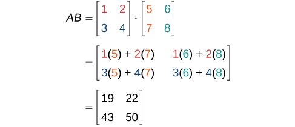

In this section, you will:
* Find the sum and difference of two matrices.
* Find scalar multiples of a matrix.
* Find the product of two matrices.

 "){: #Figure_09_05_001}

Two club soccer teams, the Wildcats and the Mud Cats, are hoping to obtain new equipment for an upcoming season. [\[link\]](#Table_09_05_01) shows the needs of both teams.

|  | Wildcats | Mud Cats |
|----------
| **Goals** | 6 | 10 |
| **Balls** | 30 | 24 |
| **Jerseys** | 14 | 20 |
{: #Table_09_05_01 summary=".."}

A goal costs $300; a ball costs $10; and a jersey costs $30. How can we find the total cost for the equipment needed for each team? In this section, we discover a method in which the data in the soccer equipment table can be displayed and used for calculating other information. Then, we will be able to calculate the cost of the equipment.

# Finding the Sum and Difference of Two Matrices

To solve a problem like the one described for the soccer teams, we can use a **matrix**{: data-type="term" .no-emphasis}, which is a rectangular array of numbers. A **row**{: data-type="term" .no-emphasis} in a matrix is a set of numbers that are aligned horizontally. A **column**{: data-type="term" .no-emphasis} in a matrix is a set of numbers that are aligned vertically. Each number is an **entry**{: data-type="term" .no-emphasis}, sometimes called an element, of the matrix. Matrices (plural) are enclosed in \[ \] or ( ), and are usually named with capital letters. For example, three matrices named<math xmlns="http://www.w3.org/1998/Math/MathML"> <mrow> <mtext> </mtext><mi>A</mi><mo>,</mo><mi>B</mi><mo>,</mo><mtext> </mtext> </mrow> </math>

and<math xmlns="http://www.w3.org/1998/Math/MathML"> <mrow> <mtext> </mtext><mi>C</mi><mtext> </mtext> </mrow> </math>

are shown below.

<math xmlns="http://www.w3.org/1998/Math/MathML" display="block"> <mrow> <mi>A</mi><mo>=</mo><mrow><mo>[</mo> <mrow> <mtable> <mtr> <mtd> <mn>1</mn> </mtd> <mtd> <mn>2</mn> </mtd> </mtr> <mtr> <mtd> <mn>3</mn> </mtd> <mtd> <mn>4</mn> </mtd> </mtr> </mtable> </mrow> <mo>]</mo></mrow><mo>,</mo><mi>B</mi><mo>=</mo><mrow><mo>[</mo> <mrow> <mtable> <mtr> <mtd> <mn>1</mn> </mtd> <mtd> <mn>2</mn> </mtd> <mtd> <mn>7</mn> </mtd> </mtr> <mtr> <mtd> <mn>0</mn> </mtd> <mtd> <mrow> <mn>−5</mn> </mrow> </mtd> <mtd> <mn>6</mn> </mtd> </mtr> <mtr> <mtd> <mn>7</mn> </mtd> <mtd> <mn>8</mn> </mtd> <mtd> <mn>2</mn> </mtd> </mtr> </mtable> </mrow> <mo>]</mo></mrow><mo>,</mo><mi>C</mi><mo>=</mo><mrow><mo>[</mo> <mrow> <mtable> <mtr> <mtd> <mrow> <mn>−1</mn> </mrow> </mtd> </mtr> <mtr> <mtd> <mrow> <mtext> </mtext><mtext> </mtext><mtext> </mtext><mn>0</mn> </mrow> </mtd> </mtr> <mtr> <mtd> <mrow> <mtext> </mtext><mtext> </mtext><mtext> </mtext><mn>3</mn> </mrow> </mtd> </mtr> </mtable><mtext> </mtext><mtext> </mtext><mtext> </mtext><mtext> </mtext><mtable> <mtr> <mtd> <mn>3</mn> </mtd> </mtr> <mtr> <mtd> <mn>2</mn> </mtd> </mtr> <mtr> <mtd> <mn>1</mn> </mtd> </mtr> </mtable> </mrow> <mo>]</mo></mrow> </mrow> </math>

##  Describing Matrices

A matrix is often referred to by its size or dimensions:<math xmlns="http://www.w3.org/1998/Math/MathML"> <mrow> <mtext> </mtext><mi>m</mi><mtext> </mtext><mo>×</mo><mtext> </mtext><mi>n</mi><mtext> </mtext> </mrow> </math>

indicating<math xmlns="http://www.w3.org/1998/Math/MathML"> <mrow> <mtext> </mtext><mi>m</mi><mtext> </mtext> </mrow> </math>

rows and<math xmlns="http://www.w3.org/1998/Math/MathML"> <mrow> <mtext> </mtext><mi>n</mi><mtext> </mtext> </mrow> </math>

columns. Matrix entries are defined first by row and then by column. For example, to locate the entry in matrix<math xmlns="http://www.w3.org/1998/Math/MathML"> <mrow> <mtext> </mtext><mi>A</mi><mtext> </mtext> </mrow> </math>

identified as<math xmlns="http://www.w3.org/1998/Math/MathML"> <mrow> <mtext> </mtext><msub> <mi>a</mi> <mrow> <mi>i</mi><mi>j</mi> </mrow> </msub> <mo>,</mo><mtext> </mtext> </mrow> </math>

we look for the entry in row<math xmlns="http://www.w3.org/1998/Math/MathML"> <mrow> <mtext> </mtext><mi>i</mi><mo>,</mo><mtext> </mtext> </mrow> </math>

column<math xmlns="http://www.w3.org/1998/Math/MathML"> <mrow> <mtext> </mtext><mi>j</mi><mo>.</mo><mtext> </mtext> </mrow> </math>

In matrix<math xmlns="http://www.w3.org/1998/Math/MathML"> <mrow> <mtext> </mtext><mi>A</mi><mtext>,  </mtext> </mrow> </math>

shown below, the entry in row 2, column 3 is<math xmlns="http://www.w3.org/1998/Math/MathML"> <mrow> <mtext> </mtext><msub> <mi>a</mi> <mrow> <mn>23</mn> </mrow> </msub> <mo>.</mo> </mrow> </math>

<math xmlns="http://www.w3.org/1998/Math/MathML" display="block"> <mrow> <mi>A</mi><mo>=</mo><mrow><mo>[</mo> <mrow> <mtable> <mtr> <mtd> <mrow> <msub> <mi>a</mi> <mrow> <mn>11</mn> </mrow> </msub> </mrow> </mtd> <mtd> <mrow> <msub> <mi>a</mi> <mrow> <mn>12</mn> </mrow> </msub> </mrow> </mtd> <mtd> <mrow> <msub> <mi>a</mi> <mrow> <mn>13</mn> </mrow> </msub> </mrow> </mtd> </mtr> <mtr> <mtd> <mrow> <msub> <mi>a</mi> <mrow> <mn>21</mn> </mrow> </msub> </mrow> </mtd> <mtd> <mrow> <msub> <mi>a</mi> <mrow> <mn>22</mn> </mrow> </msub> </mrow> </mtd> <mtd> <mrow> <msub> <mi>a</mi> <mrow> <mn>23</mn> </mrow> </msub> </mrow> </mtd> </mtr> <mtr> <mtd> <mrow> <msub> <mi>a</mi> <mrow> <mn>31</mn> </mrow> </msub> </mrow> </mtd> <mtd> <mrow> <msub> <mi>a</mi> <mrow> <mn>32</mn> </mrow> </msub> </mrow> </mtd> <mtd> <mrow> <msub> <mi>a</mi> <mrow> <mn>33</mn> </mrow> </msub> </mrow> </mtd> </mtr> </mtable> </mrow> <mo>]</mo></mrow> </mrow> </math>

A **square matrix**{: data-type="term" .no-emphasis} is a matrix with dimensions<math xmlns="http://www.w3.org/1998/Math/MathML"> <mrow> <mtext> </mtext><mi>n</mi><mtext> </mtext><mo>×</mo><mtext> </mtext><mi>n</mi><mo>,</mo><mtext> </mtext> </mrow> </math>

meaning that it has the same number of rows as columns. The<math xmlns="http://www.w3.org/1998/Math/MathML"> <mrow> <mtext> </mtext><mn>3</mn><mo>×</mo><mn>3</mn><mtext> </mtext> </mrow> </math>

matrix above is an example of a square matrix.

A **row matrix**{: data-type="term" .no-emphasis} is a matrix consisting of one row with dimensions<math xmlns="http://www.w3.org/1998/Math/MathML"> <mrow> <mtext> </mtext><mn>1</mn><mtext> </mtext><mo>×</mo><mtext> </mtext><mi>n</mi><mo>.</mo> </mrow> </math>

<math xmlns="http://www.w3.org/1998/Math/MathML" display="block"> <mrow> <mrow><mo>[</mo> <mrow> <mtable> <mtr> <mtd> <mrow> <msub> <mi>a</mi> <mrow> <mn>11</mn> </mrow> </msub> </mrow> </mtd> <mtd> <mrow> <msub> <mi>a</mi> <mrow> <mn>12</mn> </mrow> </msub> </mrow> </mtd> <mtd> <mrow> <msub> <mi>a</mi> <mrow> <mn>13</mn> </mrow> </msub> </mrow> </mtd> </mtr> </mtable> </mrow> <mo>]</mo></mrow> </mrow> </math>

A **column matrix**{: data-type="term" .no-emphasis} is a matrix consisting of one column with dimensions<math xmlns="http://www.w3.org/1998/Math/MathML"> <mrow> <mtext> </mtext><mi>m</mi><mtext> </mtext><mo>×</mo><mtext> </mtext><mn>1.</mn> </mrow> </math>

<math xmlns="http://www.w3.org/1998/Math/MathML" display="block"> <mrow> <mrow><mo>[</mo> <mrow> <mtable> <mtr> <mtd> <mrow> <msub> <mi>a</mi> <mrow> <mn>11</mn> </mrow> </msub> </mrow> </mtd> </mtr> <mtr> <mtd> <mrow> <msub> <mi>a</mi> <mrow> <mn>21</mn> </mrow> </msub> </mrow> </mtd> </mtr> <mtr> <mtd> <mrow> <msub> <mi>a</mi> <mrow> <mn>31</mn> </mrow> </msub> </mrow> </mtd> </mtr> </mtable> </mrow> <mo>]</mo></mrow> </mrow> </math>

A matrix may be used to represent a system of equations. In these cases, the numbers represent the coefficients of the variables in the system. Matrices often make solving systems of equations easier because they are not encumbered with variables. We will investigate this idea further in the next section, but first we will look at basic **matrix operations**{: data-type="term" .no-emphasis}.

Matrices

A **matrix**{: data-type="term"} is a rectangular array of numbers that is usually named by a capital letter:<math xmlns="http://www.w3.org/1998/Math/MathML"> <mrow> <mtext> </mtext><mi>A</mi><mo>,</mo><mi>B</mi><mo>,</mo><mi>C</mi><mo>,</mo><mtext> </mtext> </mrow> </math>

and so on. Each entry in a matrix is referred to as<math xmlns="http://www.w3.org/1998/Math/MathML"> <mrow> <mtext> </mtext><msub> <mi>a</mi> <mrow> <mi>i</mi><mi>j</mi> </mrow> </msub> <mo>,</mo> </mrow> </math>

such that<math xmlns="http://www.w3.org/1998/Math/MathML"> <mrow> <mtext> </mtext><mi>i</mi><mtext> </mtext> </mrow> </math>

represents the row and<math xmlns="http://www.w3.org/1998/Math/MathML"> <mrow> <mtext> </mtext><mi>j</mi><mtext> </mtext> </mrow> </math>

represents the column. Matrices are often referred to by their dimensions:<math xmlns="http://www.w3.org/1998/Math/MathML"> <mrow> <mtext> </mtext><mi>m</mi><mtext> </mtext><mo>×</mo><mtext> </mtext><mi>n</mi><mtext> </mtext> </mrow> </math>

indicating<math xmlns="http://www.w3.org/1998/Math/MathML"> <mrow> <mtext> </mtext><mi>m</mi><mtext> </mtext> </mrow> </math>

rows and<math xmlns="http://www.w3.org/1998/Math/MathML"> <mrow> <mtext> </mtext><mi>n</mi><mtext> </mtext> </mrow> </math>

columns.

Finding the Dimensions of the Given Matrix and Locating Entries

Given matrix<math xmlns="http://www.w3.org/1998/Math/MathML"> <mrow> <mtext> </mtext><mi>A</mi><mo>:</mo> </mrow> </math>

1.  What are the dimensions of matrix
    <math xmlns="http://www.w3.org/1998/Math/MathML"> <mrow> <mtext> </mtext><mi>A</mi><mo>?</mo> </mrow> </math>

2.  What are the entries at
    <math xmlns="http://www.w3.org/1998/Math/MathML"> <mrow> <mtext> </mtext><msub> <mi>a</mi> <mrow> <mn>31</mn> </mrow> </msub> <mtext> </mtext> </mrow> </math>
    
    and
    <math xmlns="http://www.w3.org/1998/Math/MathML"> <mrow> <mtext> </mtext><msub> <mi>a</mi> <mrow> <mn>22</mn> </mrow> </msub> <mo>?</mo> </mrow> </math>
    
    

    <math xmlns="http://www.w3.org/1998/Math/MathML" display="block"> <mrow> <mi>A</mi><mo>=</mo><mrow><mo>[</mo> <mrow> <mtable columnalign="right"> <mtr columnalign="right"> <mtd columnalign="right"> <mn>2</mn> </mtd> <mtd columnalign="right"> <mrow /> </mtd> <mtd columnalign="right"> <mn>1</mn> </mtd> <mtd columnalign="right"> <mn>0</mn> </mtd> </mtr> <mtr columnalign="right"> <mtd columnalign="right"> <mn>2</mn> </mtd> <mtd columnalign="right"> <mrow /> </mtd> <mtd columnalign="right"> <mn>4</mn> </mtd> <mtd columnalign="right"> <mn>7</mn> </mtd> </mtr> <mtr columnalign="right"> <mtd columnalign="right"> <mn>3</mn> </mtd> <mtd columnalign="right"> <mrow /> </mtd> <mtd columnalign="right"> <mn>1</mn> </mtd> <mtd columnalign="right"> <mrow> <mo>−</mo><mn>2</mn> </mrow> </mtd> </mtr> </mtable> </mrow> <mo>]</mo></mrow> </mrow> </math>
    

{: data-number-style="lower-alpha"}

1.  The dimensions are
    <math xmlns="http://www.w3.org/1998/Math/MathML"> <mrow> <mtext> </mtext><mn>3</mn><mtext> </mtext><mo>×</mo><mtext> </mtext><mn>3</mn><mtext> </mtext> </mrow> </math>
    
    because there are three rows and three columns.
2.  Entry
    <math xmlns="http://www.w3.org/1998/Math/MathML"> <mrow> <mtext> </mtext><msub> <mi>a</mi> <mrow> <mn>31</mn> </mrow> </msub> <mtext> </mtext> </mrow> </math>
    
    is the number at row 3, column 1, which is 3. The entry
    <math xmlns="http://www.w3.org/1998/Math/MathML"> <mrow> <mtext> </mtext><msub> <mi>a</mi> <mrow> <mn>22</mn> </mrow> </msub> <mtext> </mtext> </mrow> </math>
    
    is the number at row 2, column 2, which is 4. Remember, the row comes first, then the column.
{: data-number-style="lower-alpha"}

##  Adding and Subtracting Matrices

We use matrices to list data or to represent systems. Because the entries are numbers, we can perform operations on matrices. We add or subtract matrices by adding or subtracting corresponding entries.

In order to do this, the entries must correspond. Therefore, *addition and subtraction of matrices is only possible when the matrices have the same dimensions*. We can add or subtract a<math xmlns="http://www.w3.org/1998/Math/MathML"> <mrow> <mtext> </mtext><mn>3</mn><mtext> </mtext><mo>×</mo><mtext> </mtext><mn>3</mn><mtext> </mtext> </mrow> </math>

matrix and another<math xmlns="http://www.w3.org/1998/Math/MathML"> <mrow> <mtext> </mtext><mn>3</mn><mtext> </mtext><mo>×</mo><mtext> </mtext><mn>3</mn><mtext> </mtext> </mrow> </math>

matrix, but we cannot add or subtract a<math xmlns="http://www.w3.org/1998/Math/MathML"> <mrow> <mtext> </mtext><mn>2</mn><mtext> </mtext><mo>×</mo><mtext> </mtext><mn>3</mn><mtext> </mtext> </mrow> </math>

matrix and a<math xmlns="http://www.w3.org/1998/Math/MathML"> <mrow> <mtext> </mtext><mn>3</mn><mtext> </mtext><mo>×</mo><mtext> </mtext><mn>3</mn><mtext> </mtext> </mrow> </math>

matrix because some entries in one matrix will not have a corresponding entry in the other matrix.

Adding and Subtracting Matrices

Given matrices<math xmlns="http://www.w3.org/1998/Math/MathML"> <mrow> <mtext> </mtext><mi>A</mi><mtext> </mtext> </mrow> </math>

and<math xmlns="http://www.w3.org/1998/Math/MathML"> <mrow> <mtext> </mtext><mi>B</mi><mtext> </mtext> </mrow> </math>

of like dimensions, addition and subtraction of<math xmlns="http://www.w3.org/1998/Math/MathML"> <mrow> <mtext> </mtext><mi>A</mi><mtext> </mtext> </mrow> </math>

and<math xmlns="http://www.w3.org/1998/Math/MathML"> <mrow> <mtext> </mtext><mi>B</mi><mtext> </mtext> </mrow> </math>

will produce matrix<math xmlns="http://www.w3.org/1998/Math/MathML"> <mrow> <mtext> </mtext><mi>C</mi><mtext> </mtext> </mrow> </math>

or * * *
{: data-type="newline"}

matrix<math xmlns="http://www.w3.org/1998/Math/MathML"> <mrow> <mtext> </mtext><mi>D</mi><mtext> </mtext> </mrow> </math>

of the same dimension.

<math xmlns="http://www.w3.org/1998/Math/MathML"> <mrow> <mi>A</mi><mo>+</mo><mi>B</mi><mo>=</mo><mi>C</mi><mtext> such that </mtext><msub> <mi>a</mi> <mrow> <mi>i</mi><mi>j</mi> </mrow> </msub> <mo>+</mo><msub> <mi>b</mi> <mrow> <mi>i</mi><mi>j</mi> </mrow> </msub> <mo>=</mo><msub> <mi>c</mi> <mrow> <mi>i</mi><mi>j</mi> </mrow> </msub> </mrow> </math>

<math xmlns="http://www.w3.org/1998/Math/MathML"> <mrow> <mi>A</mi><mo>−</mo><mi>B</mi><mo>=</mo><mi>D</mi><mtext> such that </mtext><msub> <mi>a</mi> <mrow> <mi>i</mi><mi>j</mi> </mrow> </msub> <mo>−</mo><msub> <mi>b</mi> <mrow> <mi>i</mi><mi>j</mi> </mrow> </msub> <mo>=</mo><msub> <mi>d</mi> <mrow> <mi>i</mi><mi>j</mi> </mrow> </msub> </mrow> </math>

Matrix addition is commutative.

<math xmlns="http://www.w3.org/1998/Math/MathML" display="block"> <mrow> <mi>A</mi><mo>+</mo><mi>B</mi><mo>=</mo><mi>B</mi><mo>+</mo><mi>A</mi> </mrow> </math>

It is also associative.

<math xmlns="http://www.w3.org/1998/Math/MathML" display="block"> <mrow> <mrow><mo>(</mo> <mrow> <mi>A</mi><mo>+</mo><mi>B</mi> </mrow> <mo>)</mo></mrow><mo>+</mo><mi>C</mi><mo>=</mo><mi>A</mi><mo>+</mo><mrow><mo>(</mo> <mrow> <mi>B</mi><mo>+</mo><mi>C</mi> </mrow> <mo>)</mo></mrow> </mrow> </math>

Finding the Sum of Matrices

Find the sum of<math xmlns="http://www.w3.org/1998/Math/MathML"> <mrow> <mtext> </mtext><mi>A</mi><mtext> </mtext> </mrow> </math>

and<math xmlns="http://www.w3.org/1998/Math/MathML"> <mrow> <mtext> </mtext><mi>B</mi><mo>,</mo><mtext> </mtext> </mrow> </math>

given

<math xmlns="http://www.w3.org/1998/Math/MathML" display="block"> <mrow> <mi>A</mi><mo>=</mo><mrow><mo>[</mo> <mrow> <mtable> <mtr> <mtd> <mi>a</mi> </mtd> <mtd> <mi>b</mi> </mtd> </mtr> <mtr> <mtd> <mi>c</mi> </mtd> <mtd> <mi>d</mi> </mtd> </mtr> </mtable> </mrow> <mo>]</mo></mrow><mtext>   and  </mtext><mi>B</mi><mo>=</mo><mrow><mo>[</mo> <mrow> <mtable> <mtr> <mtd> <mi>e</mi> </mtd> <mtd> <mi>f</mi> </mtd> </mtr> <mtr> <mtd> <mi>g</mi> </mtd> <mtd> <mi>h</mi> </mtd> </mtr> </mtable> </mrow> <mo>]</mo></mrow> </mrow> </math>

Add corresponding entries.

<math xmlns="http://www.w3.org/1998/Math/MathML" display="block"> <mrow> <mtable columnalign="left"> <mtr columnalign="left"> <mtd columnalign="left"> <mrow> <mi>A</mi><mo>+</mo><mi>B</mi><mo>=</mo><mrow><mo>[</mo> <mrow> <mtable> <mtr> <mtd> <mi>a</mi> </mtd> <mtd> <mi>b</mi> </mtd> </mtr> <mtr> <mtd> <mi>c</mi> </mtd> <mtd> <mi>d</mi> </mtd> </mtr> </mtable> </mrow> <mo>]</mo></mrow><mo>+</mo><mrow><mo>[</mo> <mrow> <mtable> <mtr> <mtd> <mi>e</mi> </mtd> <mtd> <mi>f</mi> </mtd> </mtr> <mtr> <mtd> <mi>g</mi> </mtd> <mtd> <mi>h</mi> </mtd> </mtr> </mtable> </mrow> <mo>]</mo></mrow> </mrow> </mtd> </mtr> <mtr columnalign="left"> <mtd columnalign="left"> <mrow> <mtext>         </mtext><mo>=</mo><mrow><mo>[</mo> <mrow> <mtable> <mtr> <mtd> <mrow> <mi>a</mi><mo>+</mo><mi>e</mi> </mrow> </mtd> <mtd> <mrow /> </mtd> <mtd> <mrow> <mi>b</mi><mo>+</mo><mi>f</mi> </mrow> </mtd> </mtr> <mtr> <mtd> <mrow> <mi>c</mi><mo>+</mo><mi>g</mi> </mrow> </mtd> <mtd> <mrow /> </mtd> <mtd> <mrow> <mi>d</mi><mo>+</mo><mi>h</mi> </mrow> </mtd> </mtr> </mtable> </mrow> <mo>]</mo></mrow> </mrow> </mtd> </mtr> </mtable> </mrow> </math>

Adding Matrix <em>A </em>and Matrix *B*

Find the sum of<math xmlns="http://www.w3.org/1998/Math/MathML"> <mrow> <mtext> </mtext><mi>A</mi><mtext> </mtext> </mrow> </math>

and<math xmlns="http://www.w3.org/1998/Math/MathML"> <mrow> <mtext> </mtext><mi>B</mi><mo>.</mo> </mrow> </math>

<math xmlns="http://www.w3.org/1998/Math/MathML" display="block"> <mrow> <mi>A</mi><mo>=</mo><mrow><mo>[</mo> <mrow> <mtable> <mtr> <mtd> <mn>4</mn> </mtd> <mtd> <mn>1</mn> </mtd> </mtr> <mtr> <mtd> <mn>3</mn> </mtd> <mtd> <mn>2</mn> </mtd> </mtr> </mtable> </mrow> <mo>]</mo></mrow><mtext>  and  </mtext><mi>B</mi><mo>=</mo><mrow><mo>[</mo> <mrow> <mtable> <mtr> <mtd> <mn>5</mn> </mtd> <mtd> <mn>9</mn> </mtd> </mtr> <mtr> <mtd> <mn>0</mn> </mtd> <mtd> <mn>7</mn> </mtd> </mtr> </mtable> </mrow> <mo>]</mo></mrow> </mrow> </math>

Add corresponding entries. Add the entry in row 1, column 1,<math xmlns="http://www.w3.org/1998/Math/MathML"> <mrow> <mtext> </mtext><msub> <mi>a</mi> <mrow> <mn>11</mn> </mrow> </msub> <mo>,</mo><mtext> </mtext> </mrow> </math>

of matrix<math xmlns="http://www.w3.org/1998/Math/MathML"> <mrow> <mtext> </mtext><mi>A</mi><mtext> </mtext> </mrow> </math>

to the entry in row 1, column 1,<math xmlns="http://www.w3.org/1998/Math/MathML"> <mrow> <mtext> </mtext><msub> <mi>b</mi> <mrow> <mn>11</mn> </mrow> </msub> <mo>,</mo> </mrow> </math>

of<math xmlns="http://www.w3.org/1998/Math/MathML"> <mrow> <mtext> </mtext><mi>B</mi><mo>.</mo><mtext> </mtext> </mrow> </math>

Continue the pattern until all entries have been added.

<math xmlns="http://www.w3.org/1998/Math/MathML" display="block"> <mrow> <mtable columnalign="left"> <mtr columnalign="left"> <mtd columnalign="left"> <mrow> <mi>A</mi><mo>+</mo><mi>B</mi><mo>=</mo><mrow><mo>[</mo> <mrow> <mtable> <mtr> <mtd> <mn>4</mn> </mtd> <mtd> <mn>1</mn> </mtd> </mtr> <mtr> <mtd> <mn>3</mn> </mtd> <mtd> <mn>2</mn> </mtd> </mtr> </mtable> </mrow> <mo>]</mo></mrow><mo>+</mo><mrow><mo>[</mo> <mrow> <mtable> <mtr> <mtd> <mn>5</mn> </mtd> <mtd> <mn>9</mn> </mtd> </mtr> <mtr> <mtd> <mn>0</mn> </mtd> <mtd> <mn>7</mn> </mtd> </mtr> </mtable> </mrow> <mo>]</mo></mrow> </mrow> </mtd> </mtr> <mtr columnalign="left"> <mtd columnalign="left"> <mrow> <mtext>         </mtext><mo>=</mo><mrow><mo>[</mo> <mrow> <mtable> <mtr> <mtd> <mrow> <mn>4</mn><mo>+</mo><mn>5</mn> </mrow> </mtd> <mtd> <mrow /> </mtd> <mtd> <mrow> <mn>1</mn><mo>+</mo><mn>9</mn> </mrow> </mtd> </mtr> <mtr> <mtd> <mrow> <mn>3</mn><mo>+</mo><mn>0</mn> </mrow> </mtd> <mtd> <mrow /> </mtd> <mtd> <mrow> <mn>2</mn><mo>+</mo><mn>7</mn> </mrow> </mtd> </mtr> </mtable> </mrow> <mo>]</mo></mrow> </mrow> </mtd> </mtr> <mtr columnalign="left"> <mtd columnalign="left"> <mrow> <mtext>         </mtext><mo>=</mo><mrow><mo>[</mo> <mrow> <mtable> <mtr> <mtd> <mn>9</mn> </mtd> <mtd> <mrow> <mn>10</mn> </mrow> </mtd> </mtr> <mtr> <mtd> <mn>3</mn> </mtd> <mtd> <mn>9</mn> </mtd> </mtr> </mtable> </mrow> <mo>]</mo></mrow> </mrow> </mtd> </mtr> </mtable> </mrow> </math>

Finding the Difference of Two Matrices

Find the difference of<math xmlns="http://www.w3.org/1998/Math/MathML"> <mrow> <mtext> </mtext><mi>A</mi><mtext> </mtext> </mrow> </math>

and<math xmlns="http://www.w3.org/1998/Math/MathML"> <mrow> <mtext> </mtext><mi>B</mi><mo>.</mo> </mrow> </math>

<math xmlns="http://www.w3.org/1998/Math/MathML" display="block"> <mrow> <mi>A</mi><mo>=</mo><mrow><mo>[</mo> <mrow> <mtable> <mtr> <mtd> <mrow> <mn>−2</mn> </mrow> </mtd> <mtd> <mn>3</mn> </mtd> </mtr> <mtr> <mtd> <mn>0</mn> </mtd> <mtd> <mn>1</mn> </mtd> </mtr> </mtable> </mrow> <mo>]</mo></mrow><mtext>  and  </mtext><mi>B</mi><mo>=</mo><mrow><mo>[</mo> <mrow> <mtable> <mtr> <mtd> <mn>8</mn> </mtd> <mtd> <mn>1</mn> </mtd> </mtr> <mtr> <mtd> <mn>5</mn> </mtd> <mtd> <mn>4</mn> </mtd> </mtr> </mtable> </mrow> <mo>]</mo></mrow> </mrow> </math>

We subtract the corresponding entries of each matrix.

<math xmlns="http://www.w3.org/1998/Math/MathML" display="block"> <mrow> <mtable columnalign="left"> <mtr columnalign="left"> <mtd columnalign="left"> <mrow> <mi>A</mi><mo>−</mo><mi>B</mi><mo>=</mo><mrow><mo>[</mo> <mrow> <mtable columnalign="right"> <mtr columnalign="right"> <mtd columnalign="right"> <mrow> <mo>−</mo><mn>2</mn> </mrow> </mtd> <mtd columnalign="right"> <mn>3</mn> </mtd> </mtr> <mtr columnalign="right"> <mtd columnalign="right"> <mn>0</mn> </mtd> <mtd columnalign="right"> <mn>1</mn> </mtd> </mtr> </mtable> </mrow> <mo>]</mo></mrow><mo>−</mo><mrow><mo>[</mo> <mrow> <mtable columnalign="right"> <mtr columnalign="right"> <mtd columnalign="right"> <mn>8</mn> </mtd> <mtd columnalign="right"> <mn>1</mn> </mtd> </mtr> <mtr columnalign="right"> <mtd columnalign="right"> <mn>5</mn> </mtd> <mtd columnalign="right"> <mn>4</mn> </mtd> </mtr> </mtable> </mrow> <mo>]</mo></mrow> </mrow> </mtd> </mtr> <mtr columnalign="left"> <mtd columnalign="left"> <mrow> <mtext>         </mtext><mo>=</mo><mrow><mo>[</mo> <mrow> <mtable columnalign="right"> <mtr columnalign="right"> <mtd columnalign="right"> <mrow> <mo>−</mo><mn>2</mn><mo>−</mo><mn>8</mn> </mrow> </mtd> <mtd columnalign="right"> <mrow /> </mtd> <mtd columnalign="right"> <mrow> <mn>3</mn><mo>−</mo><mn>1</mn> </mrow> </mtd> </mtr> <mtr columnalign="right"> <mtd columnalign="right"> <mrow> <mn>0</mn><mo>−</mo><mn>5</mn> </mrow> </mtd> <mtd columnalign="right"> <mrow /> </mtd> <mtd columnalign="right"> <mrow> <mn>1</mn><mo>−</mo><mn>4</mn> </mrow> </mtd> </mtr> </mtable> </mrow> <mo>]</mo></mrow> </mrow> </mtd> </mtr> <mtr columnalign="left"> <mtd columnalign="left"> <mrow> <mtext>         </mtext><mo>=</mo><mrow><mo>[</mo> <mrow> <mtable columnalign="right"> <mtr columnalign="right"> <mtd columnalign="right"> <mrow> <mo>−</mo><mn>10</mn> </mrow> </mtd> <mtd columnalign="right"> <mrow /> </mtd> <mtd columnalign="right"> <mn>2</mn> </mtd> </mtr> <mtr columnalign="right"> <mtd columnalign="right"> <mrow> <mo>−</mo><mn>5</mn> </mrow> </mtd> <mtd columnalign="right"> <mrow /> </mtd> <mtd columnalign="right"> <mrow> <mo>−</mo><mn>3</mn> </mrow> </mtd> </mtr> </mtable> </mrow> <mo>]</mo></mrow> </mrow> </mtd> </mtr> </mtable> </mrow> </math>

Finding the Sum and Difference of Two 3 x 3 Matrices

Given<math xmlns="http://www.w3.org/1998/Math/MathML"> <mrow> <mtext> </mtext><mi>A</mi><mtext> </mtext> </mrow> </math>

and<math xmlns="http://www.w3.org/1998/Math/MathML"> <mrow> <mtext> </mtext><mi>B</mi><mo>:</mo> </mrow> </math>

1.  Find the sum.
2.  Find the difference.
{: data-number-style="lower-alpha"}

<math xmlns="http://www.w3.org/1998/Math/MathML" display="block"> <mrow> <mi>A</mi><mo>=</mo><mrow><mo>[</mo> <mrow> <mtable columnalign="right"> <mtr columnalign="right"> <mtd columnalign="right"> <mn>2</mn> </mtd> <mtd columnalign="right"> <mrow> <mn>−10</mn> </mrow> </mtd> <mtd columnalign="right"> <mrow> <mn>−2</mn> </mrow> </mtd> </mtr> <mtr columnalign="right"> <mtd columnalign="right"> <mrow> <mn>14</mn> </mrow> </mtd> <mtd columnalign="right"> <mrow> <mn>12</mn> </mrow> </mtd> <mtd columnalign="right"> <mrow> <mn>10</mn> </mrow> </mtd> </mtr> <mtr columnalign="right"> <mtd columnalign="right"> <mn>4</mn> </mtd> <mtd columnalign="right"> <mrow> <mn>−2</mn> </mrow> </mtd> <mtd columnalign="right"> <mn>2</mn> </mtd> </mtr> </mtable> </mrow> <mo>]</mo></mrow><mtext> and </mtext><mi>B</mi><mo>=</mo><mrow><mo>[</mo> <mrow> <mtable columnalign="right"> <mtr columnalign="right"> <mtd columnalign="right"> <mn>6</mn> </mtd> <mtd columnalign="right"> <mrow> <mn>10</mn> </mrow> </mtd> <mtd columnalign="right"> <mrow> <mn>−2</mn> </mrow> </mtd> </mtr> <mtr columnalign="right"> <mtd columnalign="right"> <mn>0</mn> </mtd> <mtd columnalign="right"> <mrow> <mn>−12</mn> </mrow> </mtd> <mtd columnalign="right"> <mrow> <mn>−4</mn> </mrow> </mtd> </mtr> <mtr columnalign="right"> <mtd columnalign="right"> <mrow> <mn>−5</mn> </mrow> </mtd> <mtd columnalign="right"> <mn>2</mn> </mtd> <mtd columnalign="right"> <mrow> <mn>−2</mn> </mrow> </mtd> </mtr> </mtable> </mrow> <mo>]</mo></mrow> </mrow> </math>

1.  Add the corresponding entries.
    

    <math xmlns="http://www.w3.org/1998/Math/MathML" display="block"> <mrow> <mtable columnalign="left"> <mtr columnalign="left"> <mtd columnalign="left"> <mrow /> </mtd> </mtr> <mtr columnalign="left"> <mtd columnalign="left"> <mrow> <mi>A</mi><mo>+</mo><mi>B</mi><mo>=</mo><mrow><mo>[</mo> <mrow> <mtable columnalign="right"> <mtr columnalign="right"> <mtd columnalign="right"> <mn>2</mn> </mtd> <mtd columnalign="right"> <mrow> <mtext> </mtext><mtext> </mtext><mo>−</mo><mn>10</mn> </mrow> </mtd> <mtd columnalign="right"> <mrow> <mtext> </mtext><mtext> </mtext><mo>−</mo><mn>2</mn> </mrow> </mtd> </mtr> <mtr columnalign="right"> <mtd columnalign="right"> <mrow> <mn>14</mn> </mrow> </mtd> <mtd columnalign="right"> <mrow> <mtext> </mtext><mtext> </mtext><mn>12</mn> </mrow> </mtd> <mtd columnalign="right"> <mrow> <mtext> </mtext><mtext> </mtext><mn>10</mn> </mrow> </mtd> </mtr> <mtr columnalign="right"> <mtd columnalign="right"> <mn>4</mn> </mtd> <mtd columnalign="right"> <mrow> <mtext> </mtext><mtext> </mtext><mo>−</mo><mn>2</mn> </mrow> </mtd> <mtd columnalign="right"> <mrow> <mtext> </mtext><mtext> </mtext><mn>2</mn> </mrow> </mtd> </mtr> </mtable> </mrow> <mo>]</mo></mrow><mo>+</mo><mrow><mo>[</mo> <mrow> <mtable columnalign="right"> <mtr columnalign="right"> <mtd columnalign="right"> <mn>6</mn> </mtd> <mtd columnalign="right"> <mrow> <mtext> </mtext><mtext> </mtext><mn>10</mn> </mrow> </mtd> <mtd columnalign="right"> <mrow> <mtext> </mtext><mtext> </mtext><mo>−</mo><mn>2</mn> </mrow> </mtd> </mtr> <mtr columnalign="right"> <mtd columnalign="right"> <mn>0</mn> </mtd> <mtd columnalign="right"> <mrow> <mtext> </mtext><mtext> </mtext><mo>−</mo><mn>12</mn> </mrow> </mtd> <mtd columnalign="right"> <mrow> <mtext> </mtext><mtext> </mtext><mo>−</mo><mn>4</mn> </mrow> </mtd> </mtr> <mtr columnalign="right"> <mtd columnalign="right"> <mrow> <mo>−</mo><mn>5</mn> </mrow> </mtd> <mtd columnalign="right"> <mrow> <mtext> </mtext><mtext> </mtext><mn>2</mn> </mrow> </mtd> <mtd columnalign="right"> <mrow> <mtext> </mtext><mtext> </mtext><mo>−</mo><mn>2</mn> </mrow> </mtd> </mtr> </mtable> </mrow> <mo>]</mo></mrow> </mrow> </mtd> </mtr> <mtr columnalign="left"> <mtd columnalign="left"> <mrow> <mtext> </mtext><mtext> </mtext><mtext> </mtext><mtext> </mtext><mtext> </mtext><mtext> </mtext><mtext> </mtext><mtext> </mtext><mtext> </mtext><mtext> </mtext><mtext> </mtext><mtext> </mtext><mtext> </mtext><mtext> </mtext><mtext> </mtext><mo>=</mo><mrow><mo>[</mo> <mrow> <mtable columnalign="right"> <mtr columnalign="right"> <mtd columnalign="right"> <mrow> <mn>2</mn><mo>+</mo><mn>6</mn> </mrow> </mtd> <mtd columnalign="right"> <mrow> <mtext> </mtext><mtext> </mtext><mo>−</mo><mn>10</mn><mo>+</mo><mn>10</mn> </mrow> </mtd> <mtd columnalign="right"> <mrow> <mtext> </mtext><mtext> </mtext><mo>−</mo><mn>2</mn><mo>−</mo><mn>2</mn> </mrow> </mtd> </mtr> <mtr columnalign="right"> <mtd columnalign="right"> <mrow> <mn>14</mn><mo>+</mo><mn>0</mn> </mrow> </mtd> <mtd columnalign="right"> <mrow> <mtext> </mtext><mtext> </mtext><mn>12</mn><mo>−</mo><mn>12</mn> </mrow> </mtd> <mtd columnalign="right"> <mrow> <mtext> </mtext><mtext> </mtext><mn>10</mn><mo>−</mo><mn>4</mn> </mrow> </mtd> </mtr> <mtr columnalign="right"> <mtd columnalign="right"> <mrow> <mn>4</mn><mo>−</mo><mn>5</mn> </mrow> </mtd> <mtd columnalign="right"> <mrow> <mtext> </mtext><mtext> </mtext><mo>−</mo><mn>2</mn><mo>+</mo><mn>2</mn> </mrow> </mtd> <mtd columnalign="right"> <mrow> <mtext> </mtext><mtext> </mtext><mn>2</mn><mo>−</mo><mn>2</mn> </mrow> </mtd> </mtr> </mtable> </mrow> <mo>]</mo></mrow> </mrow> </mtd> </mtr> <mtr columnalign="left"> <mtd columnalign="left"> <mrow> <mtext> </mtext><mtext> </mtext><mtext> </mtext><mtext> </mtext><mtext> </mtext><mtext> </mtext><mtext> </mtext><mtext> </mtext><mtext> </mtext><mtext> </mtext><mtext> </mtext><mtext> </mtext><mtext> </mtext><mtext> </mtext><mtext> </mtext><mo>=</mo><mrow><mo>[</mo> <mrow> <mtable columnalign="right"> <mtr columnalign="right"> <mtd columnalign="right"> <mn>8</mn> </mtd> <mtd columnalign="right"> <mrow> <mtext> </mtext><mtext> </mtext><mn>0</mn> </mrow> </mtd> <mtd columnalign="right"> <mrow> <mtext> </mtext><mtext> </mtext><mo>−</mo><mn>4</mn> </mrow> </mtd> </mtr> <mtr columnalign="right"> <mtd columnalign="right"> <mrow> <mn>14</mn> </mrow> </mtd> <mtd columnalign="right"> <mrow> <mtext> </mtext><mtext> </mtext><mn>0</mn> </mrow> </mtd> <mtd columnalign="right"> <mrow> <mtext> </mtext><mtext> </mtext><mn>6</mn> </mrow> </mtd> </mtr> <mtr columnalign="right"> <mtd columnalign="right"> <mrow> <mo>−</mo><mn>1</mn> </mrow> </mtd> <mtd columnalign="right"> <mrow> <mtext> </mtext><mtext> </mtext><mn>0</mn> </mrow> </mtd> <mtd columnalign="right"> <mrow> <mtext> </mtext><mtext> </mtext><mn>0</mn> </mrow> </mtd> </mtr> </mtable> </mrow> <mo>]</mo></mrow> </mrow> </mtd> </mtr> </mtable> </mrow> </math>
    

2.  Subtract the corresponding entries.
    

    <math xmlns="http://www.w3.org/1998/Math/MathML" display="block"> <mrow> <mtable columnalign="left"> <mtr columnalign="left"> <mtd columnalign="left"> <mrow /> </mtd> </mtr> <mtr columnalign="left"> <mtd columnalign="left"> <mrow> <mi>A</mi><mo>−</mo><mi>B</mi><mo>=</mo><mrow><mo>[</mo> <mrow> <mtable columnalign="right"> <mtr columnalign="right"> <mtd columnalign="right"> <mn>2</mn> </mtd> <mtd columnalign="right"> <mrow> <mn>−10</mn> </mrow> </mtd> <mtd columnalign="right"> <mrow> <mn>−2</mn> </mrow> </mtd> </mtr> <mtr columnalign="right"> <mtd columnalign="right"> <mrow> <mn>14</mn> </mrow> </mtd> <mtd columnalign="right"> <mrow> <mn>12</mn> </mrow> </mtd> <mtd columnalign="right"> <mrow> <mn>10</mn> </mrow> </mtd> </mtr> <mtr columnalign="right"> <mtd columnalign="right"> <mn>4</mn> </mtd> <mtd columnalign="right"> <mrow> <mn>−2</mn> </mrow> </mtd> <mtd columnalign="right"> <mn>2</mn> </mtd> </mtr> </mtable> </mrow> <mo>]</mo></mrow><mo>−</mo><mrow><mo>[</mo> <mrow> <mtable columnalign="right"> <mtr columnalign="right"> <mtd columnalign="right"> <mn>6</mn> </mtd> <mtd columnalign="right"> <mrow> <mn>10</mn> </mrow> </mtd> <mtd columnalign="right"> <mrow> <mn>−2</mn> </mrow> </mtd> </mtr> <mtr columnalign="right"> <mtd columnalign="right"> <mn>0</mn> </mtd> <mtd columnalign="right"> <mrow> <mn>−12</mn> </mrow> </mtd> <mtd columnalign="right"> <mrow> <mn>−4</mn> </mrow> </mtd> </mtr> <mtr columnalign="right"> <mtd columnalign="right"> <mrow> <mn>−5</mn> </mrow> </mtd> <mtd columnalign="right"> <mn>2</mn> </mtd> <mtd columnalign="right"> <mrow> <mn>−2</mn> </mrow> </mtd> </mtr> </mtable> </mrow> <mo>]</mo></mrow> </mrow> </mtd> </mtr> <mtr columnalign="left"> <mtd columnalign="left"> <mrow> <mtext> </mtext><mtext> </mtext><mtext> </mtext><mtext> </mtext><mtext> </mtext><mtext> </mtext><mtext> </mtext><mtext> </mtext><mtext> </mtext><mtext> </mtext><mtext> </mtext><mtext> </mtext><mtext> </mtext><mtext> </mtext><mtext> </mtext><mo>=</mo><mrow><mo>[</mo> <mrow> <mtable columnalign="right"> <mtr columnalign="right"> <mtd columnalign="right"> <mrow> <mn>2</mn><mo>−</mo><mn>6</mn> </mrow> </mtd> <mtd columnalign="right"> <mrow> <mtext> </mtext><mtext> </mtext><mn>−10</mn><mo>−</mo><mn>10</mn> </mrow> </mtd> <mtd columnalign="right"> <mrow> <mtext> </mtext><mtext> </mtext><mn>−2</mn><mo>+</mo><mn>2</mn> </mrow> </mtd> </mtr> <mtr columnalign="right"> <mtd columnalign="right"> <mrow> <mn>14</mn><mo>−</mo><mn>0</mn> </mrow> </mtd> <mtd columnalign="right"> <mrow> <mtext> </mtext><mtext> </mtext><mn>12</mn><mo>+</mo><mn>12</mn> </mrow> </mtd> <mtd columnalign="right"> <mrow> <mtext> </mtext><mtext> </mtext><mn>10</mn><mo>+</mo><mn>4</mn> </mrow> </mtd> </mtr> <mtr columnalign="right"> <mtd columnalign="right"> <mrow> <mn>4</mn><mo>+</mo><mn>5</mn> </mrow> </mtd> <mtd columnalign="right"> <mrow> <mtext> </mtext><mtext> </mtext><mn>−2</mn><mo>−</mo><mn>2</mn> </mrow> </mtd> <mtd columnalign="right"> <mrow> <mtext> </mtext><mtext> </mtext><mn>2</mn><mo>+</mo><mn>2</mn> </mrow> </mtd> </mtr> </mtable> </mrow> <mo>]</mo></mrow> </mrow> </mtd> </mtr> <mtr columnalign="left"> <mtd columnalign="left"> <mrow> <mtext> </mtext><mtext> </mtext><mtext> </mtext><mtext> </mtext><mtext> </mtext><mtext> </mtext><mtext> </mtext><mtext> </mtext><mtext> </mtext><mtext> </mtext><mtext> </mtext><mtext> </mtext><mtext> </mtext><mtext> </mtext><mtext> </mtext><mo>=</mo><mrow><mo>[</mo> <mrow> <mtable columnalign="right"> <mtr columnalign="right"> <mtd columnalign="right"> <mrow> <mn>−4</mn> </mrow> </mtd> <mtd columnalign="right"> <mrow> <mtext> </mtext><mtext> </mtext><mn>−20</mn> </mrow> </mtd> <mtd columnalign="right"> <mrow> <mtext> </mtext><mtext> </mtext><mn>0</mn> </mrow> </mtd> </mtr> <mtr columnalign="right"> <mtd columnalign="right"> <mrow> <mn>14</mn> </mrow> </mtd> <mtd columnalign="right"> <mrow> <mtext> </mtext><mtext> </mtext><mn>24</mn> </mrow> </mtd> <mtd columnalign="right"> <mrow> <mtext> </mtext><mtext> </mtext><mn>14</mn> </mrow> </mtd> </mtr> <mtr columnalign="right"> <mtd columnalign="right"> <mn>9</mn> </mtd> <mtd columnalign="right"> <mrow> <mtext> </mtext><mtext> </mtext><mn>−4</mn> </mrow> </mtd> <mtd columnalign="right"> <mrow> <mtext> </mtext><mtext> </mtext><mn>4</mn> </mrow> </mtd> </mtr> </mtable> </mrow> <mo>]</mo></mrow> </mrow> </mtd> </mtr> </mtable> </mrow> </math>
    

{: data-number-style="lower-alpha"}

Add matrix<math xmlns="http://www.w3.org/1998/Math/MathML"> <mrow> <mtext> </mtext><mi>A</mi><mtext> </mtext> </mrow> </math>

and matrix<math xmlns="http://www.w3.org/1998/Math/MathML"> <mrow> <mtext> </mtext><mi>B</mi><mo>.</mo> </mrow> </math>

<math xmlns="http://www.w3.org/1998/Math/MathML" display="block"> <mrow> <mi>A</mi><mo>=</mo><mrow><mo>[</mo> <mrow> <mtable columnalign="right"> <mtr columnalign="right"> <mtd columnalign="right"> <mn>2</mn> </mtd> <mtd columnalign="right"> <mn>6</mn> </mtd> </mtr> <mtr columnalign="right"> <mtd columnalign="right"> <mn>1</mn> </mtd> <mtd columnalign="right"> <mn>0</mn> </mtd> </mtr> <mtr columnalign="right"> <mtd columnalign="right"> <mn>1</mn> </mtd> <mtd columnalign="right"> <mrow> <mn>−3</mn> </mrow> </mtd> </mtr> </mtable> </mrow> <mo>]</mo></mrow><mtext>  and  </mtext><mi>B</mi><mo>=</mo><mrow><mo>[</mo> <mrow> <mtable columnalign="right"> <mtr columnalign="right"> <mtd columnalign="right"> <mn>3</mn> </mtd> <mtd columnalign="right"> <mrow> <mn>−2</mn> </mrow> </mtd> </mtr> <mtr columnalign="right"> <mtd columnalign="right"> <mn>1</mn> </mtd> <mtd columnalign="right"> <mn>5</mn> </mtd> </mtr> <mtr columnalign="right"> <mtd columnalign="right"> <mrow> <mn>−4</mn> </mrow> </mtd> <mtd columnalign="right"> <mn>3</mn> </mtd> </mtr> </mtable> </mrow> <mo>]</mo></mrow> </mrow> </math>

<math xmlns="http://www.w3.org/1998/Math/MathML" display="block"> <mrow> <mi>A</mi><mo>+</mo><mi>B</mi><mo>=</mo><mrow><mo>[</mo> <mrow> <mtable> <mtr> <mtd> <mn>2</mn> </mtd> </mtr> <mtr> <mtd> <mn>1</mn> </mtd> </mtr> <mtr> <mtd> <mn>1</mn> </mtd> </mtr> </mtable><mtable> <mtr> <mtd> <mrow> <mtext> </mtext><mtext> </mtext><mtext> </mtext><mtext> </mtext><mn>6</mn> </mrow> </mtd> </mtr> <mtr> <mtd> <mrow> <mtext>​</mtext><mtext>​</mtext><mtext>​</mtext><mtext> </mtext><mtext> </mtext><mtext> </mtext><mtext> </mtext><mtext> </mtext><mn>0</mn> </mrow> </mtd> </mtr> <mtr> <mtd> <mrow> <mtext> </mtext><mtext> </mtext><mtext> </mtext><mn>−3</mn> </mrow> </mtd> </mtr> </mtable> </mrow> <mo>]</mo></mrow><mo>+</mo><mrow><mo>[</mo> <mrow> <mtext> </mtext><mtable> <mtr> <mtd> <mrow> <mtext> </mtext><mn>3</mn> </mrow> </mtd> </mtr> <mtr> <mtd> <mrow> <mtext> </mtext><mn>1</mn> </mrow> </mtd> </mtr> <mtr> <mtd> <mrow> <mn>−4</mn> </mrow> </mtd> </mtr> </mtable><mtable> <mtr> <mtd> <mrow> <mtext> </mtext><mtext> </mtext><mn>−2</mn> </mrow> </mtd> </mtr> <mtr> <mtd> <mrow> <mtext> </mtext><mtext> </mtext><mtext> </mtext><mtext> </mtext><mtext> </mtext><mn>5</mn> </mrow> </mtd> </mtr> <mtr> <mtd> <mrow> <mtext> </mtext><mtext> </mtext><mtext> </mtext><mtext> </mtext><mtext> </mtext><mtext> </mtext><mn>3</mn> </mrow> </mtd> </mtr> </mtable> </mrow> <mo>]</mo></mrow><mo>=</mo><mrow><mo>[</mo> <mrow> <mtable> <mtr> <mtd> <mrow> <mn>2</mn><mtext> </mtext><mtext> </mtext><mo>+</mo><mtext> </mtext><mn>3</mn> </mrow> </mtd> </mtr> <mtr> <mtd> <mrow> <mn>1</mn><mtext> </mtext><mtext> </mtext><mtext> </mtext><mo>+</mo><mtext> </mtext><mtext> </mtext><mtext> </mtext><mn>1</mn> </mrow> </mtd> </mtr> <mtr> <mtd> <mrow> <mn>1</mn><mo>+</mo><mo stretchy="false">(</mo><mn>−4</mn><mo stretchy="false">)</mo> </mrow> </mtd> </mtr> </mtable><mtext> </mtext><mtext> </mtext><mtext> </mtext><mtext> </mtext><mtext> </mtext><mtext> </mtext><mtable> <mtr> <mtd> <mrow> <mn>6</mn><mo>+</mo><mo stretchy="false">(</mo><mn>−2</mn><mo stretchy="false">)</mo> </mrow> </mtd> </mtr> <mtr> <mtd> <mrow> <mn>0</mn><mtext> </mtext><mtext> </mtext><mo>+</mo><mtext> </mtext><mtext> </mtext><mn>5</mn> </mrow> </mtd> </mtr> <mtr> <mtd> <mrow> <mn>−3</mn><mtext> </mtext><mtext> </mtext><mtext> </mtext><mo>+</mo><mtext> </mtext><mtext> </mtext><mtext> </mtext><mn>3</mn> </mrow> </mtd> </mtr> </mtable> </mrow> <mo>]</mo></mrow><mo>=</mo><mrow><mo>[</mo> <mrow> <mtable> <mtr> <mtd> <mrow> <mtext> </mtext><mn>5</mn> </mrow> </mtd> </mtr> <mtr> <mtd> <mrow> <mtext> </mtext><mtext> </mtext><mn>2</mn> </mrow> </mtd> </mtr> <mtr> <mtd> <mrow> <mn>−3</mn> </mrow> </mtd> </mtr> </mtable><mtext> </mtext><mtext> </mtext><mtext> </mtext><mtext> </mtext><mtext> </mtext><mtext> </mtext><mtable> <mtr> <mtd> <mn>4</mn> </mtd> </mtr> <mtr> <mtd> <mn>5</mn> </mtd> </mtr> <mtr> <mtd> <mn>0</mn> </mtd> </mtr> </mtable> </mrow> <mo>]</mo></mrow> </mrow> </math>

# Finding Scalar Multiples of a Matrix

Besides adding and subtracting whole matrices, there are many situations in which we need to multiply a matrix by a constant called a scalar. Recall that a **scalar**{: data-type="term" .no-emphasis} is a real number quantity that has magnitude, but not direction. For example, time, temperature, and distance are scalar quantities. The process of **scalar multiplication**{: data-type="term" .no-emphasis} involves multiplying each entry in a matrix by a scalar. A **scalar multiple**{: data-type="term"} is any entry of a matrix that results from scalar multiplication.

Consider a real-world scenario in which a university needs to add to its inventory of computers, computer tables, and chairs in two of the campus labs due to increased enrollment. They estimate that 15% more equipment is needed in both labs. The school’s current inventory is displayed in [\[link\]](#Table_09_05_02).

|  | Lab A | Lab B |
|----------
| **Computers** | 15 | 27 |
| **Computer Tables** | 16 | 34 |
| **Chairs** | 16 | 34 |
{: #Table_09_05_02 summary=".."}

Converting the data to a matrix, we have

<math xmlns="http://www.w3.org/1998/Math/MathML" display="block"> <mrow> <msub> <mi>C</mi> <mrow> <mn>2013</mn> </mrow> </msub> <mo>=</mo><mrow><mo>[</mo> <mrow> <mtable> <mtr> <mtd> <mrow> <mn>15</mn> </mrow> </mtd> </mtr> <mtr> <mtd> <mrow> <mn>16</mn> </mrow> </mtd> </mtr> <mtr> <mtd> <mrow> <mn>16</mn> </mrow> </mtd> </mtr> </mtable><mtext> </mtext><mtext> </mtext><mtext> </mtext><mtext> </mtext><mtext> </mtext><mtext> </mtext><mtext> </mtext><mtable> <mtr> <mtd> <mrow> <mn>27</mn> </mrow> </mtd> </mtr> <mtr> <mtd> <mrow> <mn>34</mn> </mrow> </mtd> </mtr> <mtr> <mtd> <mrow> <mn>34</mn> </mrow> </mtd> </mtr> </mtable> </mrow> <mo>]</mo></mrow> </mrow> </math>

To calculate how much computer equipment will be needed, we multiply all entries in matrix<math xmlns="http://www.w3.org/1998/Math/MathML"> <mrow> <mtext> </mtext><mi>C</mi><mtext> </mtext> </mrow> </math>

by 0.15.

<math xmlns="http://www.w3.org/1998/Math/MathML" display="block"> <mrow> <mo stretchy="false">(</mo><mn>0.15</mn><mo stretchy="false">)</mo><msub> <mi>C</mi> <mrow> <mn>2013</mn> </mrow> </msub> <mo>=</mo><mrow><mo>[</mo> <mrow> <mtable> <mtr> <mtd> <mrow> <mo stretchy="false">(</mo><mn>0.15</mn><mo stretchy="false">)</mo><mn>15</mn> </mrow> </mtd> </mtr> <mtr> <mtd> <mrow> <mo stretchy="false">(</mo><mn>0.15</mn><mo stretchy="false">)</mo><mn>16</mn> </mrow> </mtd> </mtr> <mtr> <mtd> <mrow> <mo stretchy="false">(</mo><mn>0.15</mn><mo stretchy="false">)</mo><mn>16</mn> </mrow> </mtd> </mtr> </mtable><mtext> </mtext><mtext> </mtext><mtext> </mtext><mtext> </mtext><mtext> </mtext><mtext> </mtext><mtext> </mtext><mtext> </mtext><mtable> <mtr> <mtd> <mrow> <mo stretchy="false">(</mo><mn>0.15</mn><mo stretchy="false">)</mo><mn>27</mn> </mrow> </mtd> </mtr> <mtr> <mtd> <mrow> <mo stretchy="false">(</mo><mn>0.15</mn><mo stretchy="false">)</mo><mn>34</mn> </mrow> </mtd> </mtr> <mtr> <mtd> <mrow> <mo stretchy="false">(</mo><mn>0.15</mn><mo stretchy="false">)</mo><mn>34</mn> </mrow> </mtd> </mtr> </mtable> </mrow> <mo>]</mo></mrow><mo>=</mo><mrow><mo>[</mo> <mrow> <mtable> <mtr> <mtd> <mrow> <mn>2.25</mn> </mrow> </mtd> </mtr> <mtr> <mtd> <mrow> <mn>2.4</mn> </mrow> </mtd> </mtr> <mtr> <mtd> <mrow> <mn>2.4</mn> </mrow> </mtd> </mtr> </mtable><mtext> </mtext><mtext> </mtext><mtext> </mtext><mtext> </mtext><mtext> </mtext><mtable> <mtr> <mtd> <mrow> <mn>4.05</mn> </mrow> </mtd> </mtr> <mtr> <mtd> <mrow> <mn>5.1</mn> </mrow> </mtd> </mtr> <mtr> <mtd> <mrow> <mn>5.1</mn> </mrow> </mtd> </mtr> </mtable> </mrow> <mo>]</mo></mrow> </mrow> </math>

We must round up to the next integer, so the amount of new equipment needed is

<math xmlns="http://www.w3.org/1998/Math/MathML" display="block"> <mrow> <mrow><mo>[</mo> <mrow> <mtable> <mtr> <mtd> <mn>3</mn> </mtd> </mtr> <mtr> <mtd> <mn>3</mn> </mtd> </mtr> <mtr> <mtd> <mn>3</mn> </mtd> </mtr> </mtable><mtext> </mtext><mtext> </mtext><mtext> </mtext><mtext> </mtext><mtext> </mtext><mtable> <mtr> <mtd> <mn>5</mn> </mtd> </mtr> <mtr> <mtd> <mn>6</mn> </mtd> </mtr> <mtr> <mtd> <mn>6</mn> </mtd> </mtr> </mtable> </mrow> <mo>]</mo></mrow> </mrow> </math>

Adding the two matrices as shown below, we see the new inventory amounts.

<math xmlns="http://www.w3.org/1998/Math/MathML" display="block"> <mrow> <mrow><mo>[</mo> <mrow> <mtable> <mtr> <mtd> <mrow> <mn>15</mn> </mrow> </mtd> </mtr> <mtr> <mtd> <mrow> <mn>16</mn> </mrow> </mtd> </mtr> <mtr> <mtd> <mrow> <mn>16</mn> </mrow> </mtd> </mtr> </mtable><mtext> </mtext><mtext> </mtext><mtext> </mtext><mtext> </mtext><mtext> </mtext><mtext> </mtext><mtext> </mtext><mtable> <mtr> <mtd> <mrow> <mn>27</mn> </mrow> </mtd> </mtr> <mtr> <mtd> <mrow> <mn>34</mn> </mrow> </mtd> </mtr> <mtr> <mtd> <mrow> <mn>34</mn> </mrow> </mtd> </mtr> </mtable> </mrow> <mo>]</mo></mrow><mo>+</mo><mrow><mo>[</mo> <mrow> <mtable> <mtr> <mtd> <mn>3</mn> </mtd> </mtr> <mtr> <mtd> <mn>3</mn> </mtd> </mtr> <mtr> <mtd> <mn>3</mn> </mtd> </mtr> </mtable><mtext> </mtext><mtext> </mtext><mtext> </mtext><mtext> </mtext><mtext> </mtext><mtable> <mtr> <mtd> <mn>5</mn> </mtd> </mtr> <mtr> <mtd> <mn>6</mn> </mtd> </mtr> <mtr> <mtd> <mn>6</mn> </mtd> </mtr> </mtable> </mrow> <mo>]</mo></mrow><mo>=</mo><mrow><mo>[</mo> <mrow> <mtable> <mtr> <mtd> <mrow> <mn>18</mn> </mrow> </mtd> </mtr> <mtr> <mtd> <mrow> <mn>19</mn> </mrow> </mtd> </mtr> <mtr> <mtd> <mrow> <mn>19</mn> </mrow> </mtd> </mtr> </mtable><mtext> </mtext><mtext> </mtext><mtext> </mtext><mtext> </mtext><mtext> </mtext><mtable> <mtr> <mtd> <mrow> <mn>32</mn> </mrow> </mtd> </mtr> <mtr> <mtd> <mrow> <mn>40</mn> </mrow> </mtd> </mtr> <mtr> <mtd> <mrow> <mn>40</mn> </mrow> </mtd> </mtr> </mtable> </mrow> <mo>]</mo></mrow> </mrow> </math>

This means

<math xmlns="http://www.w3.org/1998/Math/MathML" display="block"> <mrow> <msub> <mi>C</mi> <mrow> <mn>2014</mn> </mrow> </msub> <mo>=</mo><mrow><mo>[</mo> <mrow> <mtable> <mtr> <mtd> <mrow> <mn>18</mn> </mrow> </mtd> </mtr> <mtr> <mtd> <mrow> <mn>19</mn> </mrow> </mtd> </mtr> <mtr> <mtd> <mrow> <mn>19</mn> </mrow> </mtd> </mtr> </mtable><mtext> </mtext><mtext> </mtext><mtext> </mtext><mtext> </mtext><mtext> </mtext><mtable> <mtr> <mtd> <mrow> <mn>32</mn> </mrow> </mtd> </mtr> <mtr> <mtd> <mrow> <mn>40</mn> </mrow> </mtd> </mtr> <mtr> <mtd> <mrow> <mn>40</mn> </mrow> </mtd> </mtr> </mtable> </mrow> <mo>]</mo></mrow> </mrow> </math>

Thus, Lab A will have 18 computers, 19 computer tables, and 19 chairs; Lab B will have 32 computers, 40 computer tables, and 40 chairs.

Scalar Multiplication

Scalar multiplication involves finding the product of a constant by each entry in the matrix. Given

<math xmlns="http://www.w3.org/1998/Math/MathML" display="block"> <mrow> <mi>A</mi><mo>=</mo><mrow><mo>[</mo> <mrow> <mtable> <mtr> <mtd> <mrow> <msub> <mi>a</mi> <mrow> <mn>11</mn> </mrow> </msub> </mrow> </mtd> <mtd> <mrow /> </mtd> <mtd> <mrow /> </mtd> <mtd> <mrow> <msub> <mi>a</mi> <mrow> <mn>12</mn> </mrow> </msub> </mrow> </mtd> </mtr> <mtr> <mtd> <mrow> <msub> <mi>a</mi> <mrow> <mn>21</mn> </mrow> </msub> </mrow> </mtd> <mtd> <mrow /> </mtd> <mtd> <mrow /> </mtd> <mtd> <mrow> <msub> <mi>a</mi> <mrow> <mn>22</mn> </mrow> </msub> </mrow> </mtd> </mtr> </mtable> </mrow> <mo>]</mo></mrow> </mrow> </math>

the scalar multiple<math xmlns="http://www.w3.org/1998/Math/MathML"> <mrow> <mtext> </mtext><mi>c</mi><mi>A</mi><mtext> </mtext> </mrow> </math>

is

<math xmlns="http://www.w3.org/1998/Math/MathML" display="block"> <mrow> <mtable columnalign="left"> <mtr columnalign="left"> <mtd columnalign="left"> <mrow> <mi>c</mi><mi>A</mi><mo>=</mo><mi>c</mi><mrow><mo>[</mo> <mrow> <mtable> <mtr> <mtd> <mrow> <msub> <mi>a</mi> <mrow> <mn>11</mn> </mrow> </msub> </mrow> </mtd> <mtd> <mrow /> </mtd> <mtd> <mrow> <msub> <mi>a</mi> <mrow> <mn>12</mn> </mrow> </msub> </mrow> </mtd> </mtr> <mtr> <mtd> <mrow> <msub> <mi>a</mi> <mrow> <mn>21</mn> </mrow> </msub> </mrow> </mtd> <mtd> <mrow /> </mtd> <mtd> <mrow> <msub> <mi>a</mi> <mrow> <mn>22</mn> </mrow> </msub> </mrow> </mtd> </mtr> </mtable> </mrow> <mo>]</mo></mrow> </mrow> </mtd> </mtr> <mtr columnalign="left"> <mtd columnalign="left"> <mrow> <mtext>    </mtext><mo>=</mo><mrow><mo>[</mo> <mrow> <mtable> <mtr> <mtd> <mrow> <mi>c</mi><msub> <mi>a</mi> <mrow> <mn>11</mn> </mrow> </msub> </mrow> </mtd> <mtd> <mrow /> </mtd> <mtd> <mrow> <mi>c</mi><msub> <mi>a</mi> <mrow> <mn>12</mn> </mrow> </msub> </mrow> </mtd> </mtr> <mtr> <mtd> <mrow> <mi>c</mi><msub> <mi>a</mi> <mrow> <mn>21</mn> </mrow> </msub> </mrow> </mtd> <mtd> <mrow /> </mtd> <mtd> <mrow> <mi>c</mi><msub> <mi>a</mi> <mrow> <mn>22</mn> </mrow> </msub> </mrow> </mtd> </mtr> </mtable> </mrow> <mo>]</mo></mrow> </mrow> </mtd> </mtr> </mtable> </mrow> </math>

Scalar multiplication is distributive. For the matrices<math xmlns="http://www.w3.org/1998/Math/MathML"> <mrow> <mtext> </mtext><mi>A</mi><mo>,</mo><mi>B</mi><mo>,</mo> </mrow> </math>

and<math xmlns="http://www.w3.org/1998/Math/MathML"> <mrow> <mtext> </mtext><mi>C</mi><mtext> </mtext> </mrow> </math>

 with scalars<math xmlns="http://www.w3.org/1998/Math/MathML"> <mrow> <mtext> </mtext><mi>a</mi><mtext>  </mtext> </mrow> </math>

and<math xmlns="http://www.w3.org/1998/Math/MathML"> <mrow> <mtext> </mtext><mi>b</mi><mo>,</mo> </mrow> </math>

<math xmlns="http://www.w3.org/1998/Math/MathML"> <mtable columnalign="left"> <mtr> <mtd> <mrow /> </mtd> </mtr> <mtr> <mtd> <mtable> <mtr> <mtd> <mrow> <mi>a</mi><mo stretchy="false">(</mo><mi>A</mi><mo>+</mo><mi>B</mi><mo stretchy="false">)</mo><mo>=</mo><mi>a</mi><mi>A</mi><mo>+</mo><mi>a</mi><mi>B</mi> </mrow> </mtd> </mtr> <mtr> <mtd> <mrow> <mo stretchy="false">(</mo><mi>a</mi><mo>+</mo><mi>b</mi><mo stretchy="false">)</mo><mi>A</mi><mo>=</mo><mi>a</mi><mi>A</mi><mo>+</mo><mi>b</mi><mi>A</mi> </mrow> </mtd> </mtr> </mtable> </mtd> </mtr> </mtable> </math>

Multiplying the Matrix by a Scalar

Multiply matrix<math xmlns="http://www.w3.org/1998/Math/MathML"> <mrow> <mtext> </mtext><mi>A</mi><mtext> </mtext> </mrow> </math>

by the scalar 3.

<math xmlns="http://www.w3.org/1998/Math/MathML" display="block"> <mrow> <mi>A</mi><mo>=</mo><mrow><mo>[</mo> <mrow> <mtable> <mtr> <mtd> <mn>8</mn> </mtd> <mtd> <mn>1</mn> </mtd> </mtr> <mtr> <mtd> <mn>5</mn> </mtd> <mtd> <mn>4</mn> </mtd> </mtr> </mtable> </mrow> <mo>]</mo></mrow> </mrow> </math>

Multiply each entry in<math xmlns="http://www.w3.org/1998/Math/MathML"> <mrow> <mtext> </mtext><mi>A</mi><mtext> </mtext> </mrow> </math>

by the scalar 3.

<math xmlns="http://www.w3.org/1998/Math/MathML" display="block"> <mrow> <mtable columnalign="left"> <mtr columnalign="left"> <mtd columnalign="left"> <mrow> <mn>3</mn><mi>A</mi><mo>=</mo><mn>3</mn><mrow><mo>[</mo> <mrow> <mtable columnalign="right"> <mtr columnalign="right"> <mtd columnalign="right"> <mn>8</mn> </mtd> <mtd columnalign="right"> <mrow> <mtext> </mtext><mtext> </mtext><mn>1</mn> </mrow> </mtd> </mtr> <mtr columnalign="right"> <mtd columnalign="right"> <mn>5</mn> </mtd> <mtd columnalign="right"> <mrow> <mtext> </mtext><mtext> </mtext><mn>4</mn> </mrow> </mtd> </mtr> </mtable> </mrow> <mo>]</mo></mrow> </mrow> </mtd> </mtr> <mtr columnalign="left"> <mtd columnalign="left"> <mrow> <mtext> </mtext><mtext> </mtext><mtext> </mtext><mtext> </mtext><mtext> </mtext><mtext> </mtext><mtext> </mtext><mtext> </mtext><mo>=</mo><mo> </mo><mrow><mo>[</mo> <mrow> <mtable columnalign="right"> <mtr columnalign="right"> <mtd columnalign="right"> <mrow> <mn>3</mn><mo>⋅</mo><mn>8</mn> </mrow> </mtd> <mtd columnalign="right"> <mrow> <mtext> </mtext><mtext> </mtext><mn>3</mn><mo>⋅</mo><mn>1</mn> </mrow> </mtd> </mtr> <mtr columnalign="right"> <mtd columnalign="right"> <mrow> <mn>3</mn><mo>⋅</mo><mn>5</mn> </mrow> </mtd> <mtd columnalign="right"> <mrow> <mtext> </mtext><mtext> </mtext><mn>3</mn><mo>⋅</mo><mn>4</mn> </mrow> </mtd> </mtr> </mtable> </mrow> <mo>]</mo></mrow> </mrow> </mtd> </mtr> <mtr columnalign="left"> <mtd columnalign="left"> <mrow> <mtext> </mtext><mtext> </mtext><mtext> </mtext><mtext> </mtext><mtext> </mtext><mtext> </mtext><mtext> </mtext><mtext> </mtext><mo>=</mo><mo> </mo><mrow><mo>[</mo> <mrow> <mtable columnalign="right"> <mtr columnalign="right"> <mtd columnalign="right"> <mrow> <mn>24</mn> </mrow> </mtd> <mtd columnalign="right"> <mn>3</mn> </mtd> </mtr> <mtr columnalign="right"> <mtd columnalign="right"> <mrow> <mn>15</mn> </mrow> </mtd> <mtd columnalign="right"> <mrow> <mn>12</mn> </mrow> </mtd> </mtr> </mtable> </mrow> <mo>]</mo></mrow> </mrow> </mtd> </mtr> </mtable> </mrow> </math>

Given matrix<math xmlns="http://www.w3.org/1998/Math/MathML"> <mrow> <mtext> </mtext><mi>B</mi><mo>,</mo><mtext> </mtext> </mrow> </math>

find<math xmlns="http://www.w3.org/1998/Math/MathML"> <mrow> <mtext> </mtext><mn>−2</mn><mi>B</mi><mtext> </mtext> </mrow> </math>

where

<math xmlns="http://www.w3.org/1998/Math/MathML"> <mrow> <mi>B</mi><mo>=</mo><mrow><mo>[</mo> <mrow> <mtable> <mtr> <mtd> <mn>4</mn> </mtd> <mtd> <mn>1</mn> </mtd> </mtr> <mtr> <mtd> <mn>3</mn> </mtd> <mtd> <mn>2</mn> </mtd> </mtr> </mtable> </mrow> <mo>]</mo></mrow> </mrow> </math>

<math xmlns="http://www.w3.org/1998/Math/MathML"> <mrow> <mn>−2</mn><mi>B</mi><mo>=</mo><mrow><mo>[</mo> <mrow> <mtable> <mtr> <mtd> <mrow> <mn>−8</mn> </mrow> </mtd> <mtd> <mrow> <mn>−2</mn> </mrow> </mtd> </mtr> <mtr> <mtd> <mrow> <mn>−6</mn> </mrow> </mtd> <mtd> <mrow> <mn>−4</mn> </mrow> </mtd> </mtr> </mtable> </mrow> <mo>]</mo></mrow> </mrow> </math>

Finding the Sum of Scalar Multiples

Find the sum<math xmlns="http://www.w3.org/1998/Math/MathML"> <mrow> <mtext> </mtext><mn>3</mn><mi>A</mi><mo>+</mo><mn>2</mn><mi>B</mi><mo>.</mo> </mrow> </math>

<math xmlns="http://www.w3.org/1998/Math/MathML" display="block"> <mrow> <mi>A</mi><mo>=</mo><mrow><mo>[</mo> <mrow> <mtable columnalign="right"> <mtr columnalign="right"> <mtd columnalign="right"> <mn>1</mn> </mtd> <mtd columnalign="right"> <mrow> <mn>−2</mn> </mrow> </mtd> <mtd columnalign="right"> <mn>0</mn> </mtd> </mtr> <mtr columnalign="right"> <mtd columnalign="right"> <mn>0</mn> </mtd> <mtd columnalign="right"> <mrow> <mn>−1</mn> </mrow> </mtd> <mtd columnalign="right"> <mn>2</mn> </mtd> </mtr> <mtr columnalign="right"> <mtd columnalign="right"> <mn>4</mn> </mtd> <mtd columnalign="right"> <mn>3</mn> </mtd> <mtd columnalign="right"> <mrow> <mn>−6</mn> </mrow> </mtd> </mtr> </mtable> </mrow> <mo>]</mo></mrow><mtext> and </mtext><mi>B</mi><mo>=</mo><mrow><mo>[</mo> <mrow> <mtable columnalign="right"> <mtr columnalign="right"> <mtd columnalign="right"> <mrow> <mn>−1</mn> </mrow> </mtd> <mtd columnalign="right"> <mn>2</mn> </mtd> <mtd columnalign="right"> <mn>1</mn> </mtd> </mtr> <mtr columnalign="right"> <mtd columnalign="right"> <mn>0</mn> </mtd> <mtd columnalign="right"> <mrow> <mn>−3</mn> </mrow> </mtd> <mtd columnalign="right"> <mn>2</mn> </mtd> </mtr> <mtr columnalign="right"> <mtd columnalign="right"> <mn>0</mn> </mtd> <mtd columnalign="right"> <mn>1</mn> </mtd> <mtd columnalign="right"> <mrow> <mn>−4</mn> </mrow> </mtd> </mtr> </mtable> </mrow> <mo>]</mo></mrow> </mrow> </math>

First, find<math xmlns="http://www.w3.org/1998/Math/MathML"> <mrow> <mtext> </mtext><mn>3</mn><mi>A</mi><mo>,</mo><mtext> </mtext> </mrow> </math>

then<math xmlns="http://www.w3.org/1998/Math/MathML"> <mrow> <mtext> </mtext><mn>2</mn><mi>B</mi><mo>.</mo> </mrow> </math>

 * * *
{: data-type="newline" data-count="1"}

<math xmlns="http://www.w3.org/1998/Math/MathML" display="block"> <mrow> <mtable columnalign="left"> <mtr columnalign="left"> <mtd columnalign="left"> <mrow> <mtable columnalign="left"> <mtr columnalign="left"> <mtd columnalign="left"> <mrow /> </mtd> </mtr> <mtr columnalign="left"> <mtd columnalign="left"> <mrow /> </mtd> </mtr> <mtr columnalign="left"> <mtd columnalign="left"> <mrow> <mn>3</mn><mi>A</mi><mo>=</mo><mrow><mo>[</mo> <mrow> <mtable columnalign="left"> <mtr columnalign="left"> <mtd columnalign="left"> <mrow> <mn>3</mn><mo>⋅</mo><mn>1</mn> </mrow> </mtd> <mtd columnalign="left"> <mrow> <mtext> </mtext><mtext> </mtext><mn>3</mn><mo stretchy="false">(</mo><mn>−2</mn><mo stretchy="false">)</mo> </mrow> </mtd> <mtd columnalign="left"> <mrow> <mtext> </mtext><mtext> </mtext><mn>3</mn><mo>⋅</mo><mn>0</mn> </mrow> </mtd> </mtr> <mtr columnalign="left"> <mtd columnalign="left"> <mrow> <mn>3</mn><mo>⋅</mo><mn>0</mn> </mrow> </mtd> <mtd columnalign="left"> <mrow> <mtext> </mtext><mtext> </mtext><mn>3</mn><mo stretchy="false">(</mo><mn>−1</mn><mo stretchy="false">)</mo> </mrow> </mtd> <mtd columnalign="left"> <mrow> <mtext> </mtext><mtext> </mtext><mn>3</mn><mo>⋅</mo><mn>2</mn> </mrow> </mtd> </mtr> <mtr columnalign="left"> <mtd columnalign="left"> <mrow> <mn>3</mn><mo>⋅</mo><mn>4</mn> </mrow> </mtd> <mtd columnalign="left"> <mrow> <mtext> </mtext><mtext> </mtext><mn>3</mn><mo>⋅</mo><mn>3</mn> </mrow> </mtd> <mtd columnalign="left"> <mrow> <mtext> </mtext><mtext> </mtext><mn>3</mn><mo stretchy="false">(</mo><mn>−6</mn><mo stretchy="false">)</mo> </mrow> </mtd> </mtr> </mtable> </mrow> <mo>]</mo></mrow> </mrow> </mtd> </mtr> </mtable> </mrow> </mtd> </mtr> <mtr columnalign="left"> <mtd columnalign="left"> <mrow> <mtext> </mtext><mtext> </mtext><mtext> </mtext><mtext> </mtext><mtext> </mtext><mtext> </mtext><mtext> </mtext><mo>=</mo><mrow><mo>[</mo> <mrow> <mtable columnalign="right"> <mtr columnalign="right"> <mtd columnalign="right"> <mn>3</mn> </mtd> <mtd columnalign="right"> <mrow> <mtext> </mtext><mtext> </mtext><mn>−6</mn> </mrow> </mtd> <mtd columnalign="right"> <mrow> <mtext> </mtext><mtext> </mtext><mn>0</mn> </mrow> </mtd> </mtr> <mtr columnalign="right"> <mtd columnalign="right"> <mn>0</mn> </mtd> <mtd columnalign="right"> <mrow> <mtext> </mtext><mtext> </mtext><mn>−3</mn> </mrow> </mtd> <mtd columnalign="right"> <mrow> <mtext> </mtext><mtext> </mtext><mn>6</mn> </mrow> </mtd> </mtr> <mtr columnalign="right"> <mtd columnalign="right"> <mrow> <mn>12</mn> </mrow> </mtd> <mtd columnalign="right"> <mrow> <mtext> </mtext><mtext> </mtext><mn>9</mn> </mrow> </mtd> <mtd columnalign="right"> <mrow> <mtext> </mtext><mtext> </mtext><mn>−18</mn> </mrow> </mtd> </mtr> </mtable> </mrow> <mo>]</mo></mrow> </mrow> </mtd> </mtr> </mtable> </mrow> </math>

<math xmlns="http://www.w3.org/1998/Math/MathML" display="block"> <mrow> <mtable columnalign="left"> <mtr columnalign="left"> <mtd columnalign="left"> <mrow> <mtable columnalign="left"> <mtr columnalign="left"> <mtd columnalign="left"> <mrow /> </mtd> </mtr> <mtr columnalign="left"> <mtd columnalign="left"> <mrow /> </mtd> </mtr> <mtr columnalign="left"> <mtd columnalign="left"> <mrow> <mn>2</mn><mi>B</mi><mo>=</mo><mrow><mo>[</mo> <mrow> <mtable columnalign="left"> <mtr columnalign="left"> <mtd columnalign="left"> <mrow> <mn>2</mn><mo stretchy="false">(</mo><mn>−1</mn><mo stretchy="false">)</mo> </mrow> </mtd> <mtd columnalign="left"> <mrow> <mtext> </mtext><mtext> </mtext><mn>2</mn><mo>⋅</mo><mn>2</mn> </mrow> </mtd> <mtd columnalign="left"> <mrow> <mtext> </mtext><mtext> </mtext><mn>2</mn><mo>⋅</mo><mn>1</mn> </mrow> </mtd> </mtr> <mtr columnalign="left"> <mtd columnalign="left"> <mrow> <mn>2</mn><mo>⋅</mo><mn>0</mn> </mrow> </mtd> <mtd columnalign="left"> <mrow> <mtext> </mtext><mtext> </mtext><mn>2</mn><mo stretchy="false">(</mo><mn>−3</mn><mo stretchy="false">)</mo> </mrow> </mtd> <mtd columnalign="left"> <mrow> <mtext> </mtext><mtext> </mtext><mn>2</mn><mo>⋅</mo><mn>2</mn> </mrow> </mtd> </mtr> <mtr columnalign="left"> <mtd columnalign="left"> <mrow> <mn>2</mn><mo>⋅</mo><mn>0</mn> </mrow> </mtd> <mtd columnalign="left"> <mrow> <mtext> </mtext><mtext> </mtext><mn>2</mn><mo>⋅</mo><mn>1</mn> </mrow> </mtd> <mtd columnalign="left"> <mrow> <mtext> </mtext><mtext> </mtext><mn>2</mn><mo stretchy="false">(</mo><mn>−4</mn><mo stretchy="false">)</mo> </mrow> </mtd> </mtr> </mtable> </mrow> <mo>]</mo></mrow> </mrow> </mtd> </mtr> </mtable> </mrow> </mtd> </mtr> <mtr columnalign="left"> <mtd columnalign="left"> <mrow> <mtext> </mtext><mtext> </mtext><mtext> </mtext><mtext> </mtext><mtext> </mtext><mtext> </mtext><mtext> </mtext><mo>=</mo><mrow><mo>[</mo> <mrow> <mtable columnalign="right"> <mtr columnalign="right"> <mtd columnalign="right"> <mrow> <mn>−2</mn> </mrow> </mtd> <mtd columnalign="right"> <mn>4</mn> </mtd> <mtd columnalign="right"> <mn>2</mn> </mtd> </mtr> <mtr columnalign="right"> <mtd columnalign="right"> <mn>0</mn> </mtd> <mtd columnalign="right"> <mrow> <mn>−6</mn> </mrow> </mtd> <mtd columnalign="right"> <mn>4</mn> </mtd> </mtr> <mtr columnalign="right"> <mtd columnalign="right"> <mn>0</mn> </mtd> <mtd columnalign="right"> <mn>2</mn> </mtd> <mtd columnalign="right"> <mrow> <mn>−8</mn> </mrow> </mtd> </mtr> </mtable> </mrow> <mo>]</mo></mrow> </mrow> </mtd> </mtr> </mtable> </mrow> </math>

Now, add<math xmlns="http://www.w3.org/1998/Math/MathML"> <mrow> <mtext> </mtext><mn>3</mn><mi>A</mi><mo>+</mo><mn>2</mn><mi>B</mi><mo>.</mo> </mrow> </math>

<math xmlns="http://www.w3.org/1998/Math/MathML" display="block"> <mrow> <mtable columnalign="left"> <mtr columnalign="left"> <mtd columnalign="left"> <mrow /> </mtd> </mtr> <mtr columnalign="left"> <mtd columnalign="left"> <mrow /> </mtd> </mtr> <mtr columnalign="left"> <mtd columnalign="left"> <mrow> <mn>3</mn><mi>A</mi><mo>+</mo><mn>2</mn><mi>B</mi><mo>=</mo><mrow><mo>[</mo> <mrow> <mtable columnalign="right"> <mtr columnalign="right"> <mtd columnalign="right"> <mn>3</mn> </mtd> <mtd columnalign="right"> <mrow> <mn>−6</mn> </mrow> </mtd> <mtd columnalign="right"> <mn>0</mn> </mtd> </mtr> <mtr columnalign="right"> <mtd columnalign="right"> <mn>0</mn> </mtd> <mtd columnalign="right"> <mrow> <mn>−3</mn> </mrow> </mtd> <mtd columnalign="right"> <mn>6</mn> </mtd> </mtr> <mtr columnalign="right"> <mtd columnalign="right"> <mrow> <mn>12</mn> </mrow> </mtd> <mtd columnalign="right"> <mn>9</mn> </mtd> <mtd columnalign="right"> <mrow> <mn>−18</mn> </mrow> </mtd> </mtr> </mtable> </mrow> <mo>]</mo></mrow><mo>+</mo><mrow><mo>[</mo> <mrow> <mtable columnalign="right"> <mtr columnalign="right"> <mtd columnalign="right"> <mrow> <mn>−2</mn> </mrow> </mtd> <mtd columnalign="right"> <mn>4</mn> </mtd> <mtd columnalign="right"> <mn>2</mn> </mtd> </mtr> <mtr columnalign="right"> <mtd columnalign="right"> <mn>0</mn> </mtd> <mtd columnalign="right"> <mrow> <mn>−6</mn> </mrow> </mtd> <mtd columnalign="right"> <mn>4</mn> </mtd> </mtr> <mtr columnalign="right"> <mtd columnalign="right"> <mn>0</mn> </mtd> <mtd columnalign="right"> <mn>2</mn> </mtd> <mtd columnalign="right"> <mrow> <mn>−8</mn> </mrow> </mtd> </mtr> </mtable> </mrow> <mo>]</mo></mrow> </mrow> </mtd> </mtr> <mtr columnalign="left"> <mtd columnalign="left"> <mrow> <mtext>             </mtext><mo>=</mo><mrow><mo>[</mo> <mrow> <mtable columnalign="right"> <mtr columnalign="right"> <mtd columnalign="right"> <mrow> <mn>3</mn><mo>−</mo><mn>2</mn> </mrow> </mtd> <mtd columnalign="right"> <mrow> <mtext> </mtext><mtext> </mtext><mn>−6</mn><mo>+</mo><mn>4</mn> </mrow> </mtd> <mtd columnalign="right"> <mrow> <mn>0</mn><mo>+</mo><mn>2</mn> </mrow> </mtd> </mtr> <mtr columnalign="right"> <mtd columnalign="right"> <mrow> <mn>0</mn><mo>+</mo><mn>0</mn> </mrow> </mtd> <mtd columnalign="right"> <mrow> <mtext> </mtext><mtext> </mtext><mn>−3</mn><mo>−</mo><mn>6</mn> </mrow> </mtd> <mtd columnalign="right"> <mrow> <mn>6</mn><mo>+</mo><mn>4</mn> </mrow> </mtd> </mtr> <mtr columnalign="right"> <mtd columnalign="right"> <mrow> <mn>12</mn><mo>+</mo><mn>0</mn> </mrow> </mtd> <mtd columnalign="right"> <mrow> <mtext> </mtext><mtext> </mtext><mn>9</mn><mo>+</mo><mn>2</mn> </mrow> </mtd> <mtd columnalign="right"> <mrow> <mn>−18</mn><mn>−8</mn> </mrow> </mtd> </mtr> </mtable> </mrow> <mo>]</mo></mrow> </mrow> </mtd> </mtr> <mtr columnalign="left"> <mtd columnalign="left"> <mrow> <mtext>             </mtext><mo>=</mo><mrow><mo>[</mo> <mrow> <mtable columnalign="right"> <mtr columnalign="right"> <mtd columnalign="right"> <mn>1</mn> </mtd> <mtd columnalign="right"> <mrow> <mtext> </mtext><mtext> </mtext><mn>−2</mn> </mrow> </mtd> <mtd columnalign="right"> <mn>2</mn> </mtd> </mtr> <mtr columnalign="right"> <mtd columnalign="right"> <mn>0</mn> </mtd> <mtd columnalign="right"> <mrow> <mtext> </mtext><mtext> </mtext><mn>−9</mn> </mrow> </mtd> <mtd columnalign="right"> <mrow> <mn>10</mn> </mrow> </mtd> </mtr> <mtr columnalign="right"> <mtd columnalign="right"> <mrow> <mn>12</mn> </mrow> </mtd> <mtd columnalign="right"> <mrow> <mtext> </mtext><mtext> </mtext><mn>11</mn> </mrow> </mtd> <mtd columnalign="right"> <mrow> <mo>−</mo><mn>26</mn> </mrow> </mtd> </mtr> </mtable> </mrow> <mo>]</mo></mrow> </mrow> </mtd> </mtr> </mtable> </mrow> </math>

# Finding the Product of Two Matrices

In addition to multiplying a matrix by a scalar, we can multiply two matrices. Finding the **product of two matrices**{: data-type="term" .no-emphasis} is only possible when the inner dimensions are the same, meaning that the number of columns of the first matrix is equal to the number of rows of the second matrix. If<math xmlns="http://www.w3.org/1998/Math/MathML"> <mrow> <mtext> </mtext><mi>A</mi><mtext> </mtext> </mrow> </math>

is an<math xmlns="http://www.w3.org/1998/Math/MathML"> <mrow> <mtext> </mtext><mi>m</mi><mtext> </mtext><mo>×</mo><mtext> </mtext><mi>r</mi><mtext> </mtext> </mrow> </math>

matrix and<math xmlns="http://www.w3.org/1998/Math/MathML"> <mrow> <mtext> </mtext><mi>B</mi><mtext> </mtext> </mrow> </math>

is an<math xmlns="http://www.w3.org/1998/Math/MathML"> <mrow> <mtext> </mtext><mi>r</mi><mtext> </mtext><mo>×</mo><mtext> </mtext><mi>n</mi><mtext> </mtext> </mrow> </math>

matrix, then the product matrix<math xmlns="http://www.w3.org/1998/Math/MathML"> <mrow> <mtext> </mtext><mi>A</mi><mi>B</mi><mtext>  </mtext> </mrow> </math>

is an<math xmlns="http://www.w3.org/1998/Math/MathML"> <mrow> <mtext> </mtext><mi>m</mi><mtext> </mtext><mo>×</mo><mtext> </mtext><mi>n</mi><mtext> </mtext> </mrow> </math>

matrix. For example, the product<math xmlns="http://www.w3.org/1998/Math/MathML"> <mrow> <mtext> </mtext><mi>A</mi><mi>B</mi><mtext>  </mtext> </mrow> </math>

is possible because the number of columns in<math xmlns="http://www.w3.org/1998/Math/MathML"> <mrow> <mtext> </mtext><mi>A</mi><mtext> </mtext> </mrow> </math>

is the same as the number of rows in<math xmlns="http://www.w3.org/1998/Math/MathML"> <mrow> <mtext> </mtext><mi>B</mi><mo>.</mo><mtext> </mtext> </mrow> </math>

If the inner dimensions do not match, the product is not defined.

   We multiply entries of<math xmlns="http://www.w3.org/1998/Math/MathML"> <mrow> <mtext> </mtext><mi>A</mi><mtext> </mtext> </mrow> </math>

with entries of<math xmlns="http://www.w3.org/1998/Math/MathML"> <mrow> <mtext> </mtext><mi>B</mi><mtext> </mtext> </mrow> </math>

according to a specific pattern as outlined below. The process of **matrix multiplication**{: data-type="term" .no-emphasis} becomes clearer when working a problem with real numbers.

To obtain the entries in row<math xmlns="http://www.w3.org/1998/Math/MathML"> <mrow> <mtext> </mtext><mi>i</mi><mtext> </mtext> </mrow> </math>

of<math xmlns="http://www.w3.org/1998/Math/MathML"> <mrow> <mtext> </mtext><mi>A</mi><mi>B</mi><mo>,</mo><mtext> </mtext> </mrow> </math>

we multiply the entries in row<math xmlns="http://www.w3.org/1998/Math/MathML"> <mrow> <mtext> </mtext><mi>i</mi><mtext> </mtext> </mrow> </math>

of<math xmlns="http://www.w3.org/1998/Math/MathML"> <mrow> <mtext> </mtext><mi>A</mi><mtext> </mtext> </mrow> </math>

 by column<math xmlns="http://www.w3.org/1998/Math/MathML"> <mrow> <mtext> </mtext><mi>j</mi><mtext> </mtext> </mrow> </math>

in<math xmlns="http://www.w3.org/1998/Math/MathML"> <mrow> <mtext> </mtext><mi>B</mi><mtext> </mtext> </mrow> </math>

and add. For example, given matrices<math xmlns="http://www.w3.org/1998/Math/MathML"> <mrow> <mtext> </mtext><mi>A</mi><mtext> </mtext> </mrow> </math>

 and<math xmlns="http://www.w3.org/1998/Math/MathML"> <mrow> <mtext> </mtext><mi>B</mi><mo>,</mo><mtext> </mtext> </mrow> </math>

where the dimensions of<math xmlns="http://www.w3.org/1998/Math/MathML"> <mrow> <mtext> </mtext><mi>A</mi><mtext> </mtext> </mrow> </math>

are<math xmlns="http://www.w3.org/1998/Math/MathML"> <mrow> <mtext> </mtext><mn>2</mn><mtext> </mtext><mo>×</mo><mtext> </mtext><mn>3</mn><mtext> </mtext> </mrow> </math>

and the dimensions of<math xmlns="http://www.w3.org/1998/Math/MathML"> <mrow> <mtext> </mtext><mi>B</mi><mtext> </mtext> </mrow> </math>

are<math xmlns="http://www.w3.org/1998/Math/MathML"> <mrow> <mtext> </mtext><mn>3</mn><mtext> </mtext><mo>×</mo><mtext> </mtext><mn>3</mn><mo>,</mo><mtext> </mtext> </mrow> </math>

the product of<math xmlns="http://www.w3.org/1998/Math/MathML"> <mrow> <mtext> </mtext><mi>A</mi><mi>B</mi><mtext> </mtext> </mrow> </math>

will be a<math xmlns="http://www.w3.org/1998/Math/MathML"> <mrow> <mtext> </mtext><mn>2</mn><mtext> </mtext><mo>×</mo><mtext> </mtext><mn>3</mn><mtext> </mtext> </mrow> </math>

matrix.

<math xmlns="http://www.w3.org/1998/Math/MathML" display="block"> <mrow> <mi>A</mi><mo>=</mo><mrow><mo>[</mo> <mrow> <mtable columnalign="right"> <mtr columnalign="right"> <mtd columnalign="right"> <mrow> <msub> <mi>a</mi> <mrow> <mn>11</mn> </mrow> </msub> </mrow> </mtd> <mtd columnalign="right"> <mrow> <msub> <mi>a</mi> <mrow> <mn>12</mn> </mrow> </msub> </mrow> </mtd> <mtd columnalign="right"> <mrow> <msub> <mi>a</mi> <mrow> <mn>13</mn> </mrow> </msub> </mrow> </mtd> </mtr> <mtr columnalign="right"> <mtd columnalign="right"> <mrow> <msub> <mi>a</mi> <mrow> <mn>21</mn> </mrow> </msub> </mrow> </mtd> <mtd columnalign="right"> <mrow> <msub> <mi>a</mi> <mrow> <mn>22</mn> </mrow> </msub> </mrow> </mtd> <mtd columnalign="right"> <mrow> <msub> <mi>a</mi> <mrow> <mn>23</mn> </mrow> </msub> </mrow> </mtd> </mtr> </mtable> </mrow> <mo>]</mo></mrow><mtext> and </mtext><mi>B</mi><mo>=</mo><mrow><mo>[</mo> <mrow> <mtable columnalign="right"> <mtr columnalign="right"> <mtd columnalign="right"> <mrow> <msub> <mi>b</mi> <mrow> <mn>11</mn> </mrow> </msub> </mrow> </mtd> <mtd columnalign="right"> <mrow> <msub> <mi>b</mi> <mrow> <mn>12</mn> </mrow> </msub> </mrow> </mtd> <mtd columnalign="right"> <mrow> <msub> <mi>b</mi> <mrow> <mn>13</mn> </mrow> </msub> </mrow> </mtd> </mtr> <mtr columnalign="right"> <mtd columnalign="right"> <mrow> <msub> <mi>b</mi> <mrow> <mn>21</mn> </mrow> </msub> </mrow> </mtd> <mtd columnalign="right"> <mrow> <msub> <mi>b</mi> <mrow> <mn>22</mn> </mrow> </msub> </mrow> </mtd> <mtd columnalign="right"> <mrow> <msub> <mi>b</mi> <mrow> <mn>23</mn> </mrow> </msub> </mrow> </mtd> </mtr> <mtr columnalign="right"> <mtd columnalign="right"> <mrow> <msub> <mi>b</mi> <mrow> <mn>31</mn> </mrow> </msub> </mrow> </mtd> <mtd columnalign="right"> <mrow> <msub> <mi>b</mi> <mrow> <mn>32</mn> </mrow> </msub> </mrow> </mtd> <mtd columnalign="right"> <mrow> <msub> <mi>b</mi> <mrow> <mn>33</mn> </mrow> </msub> </mrow> </mtd> </mtr> </mtable> </mrow> <mo>]</mo></mrow> </mrow> </math>

Multiply and add as follows to obtain the first entry of the product matrix<math xmlns="http://www.w3.org/1998/Math/MathML"> <mrow> <mtext> </mtext><mi>A</mi><mi>B</mi><mo>.</mo> </mrow> </math>

1.  To obtain the entry in row 1, column 1 of
    <math xmlns="http://www.w3.org/1998/Math/MathML"> <mrow> <mtext> </mtext><mi>A</mi><mi>B</mi><mo>,</mo><mtext> </mtext> </mrow> </math>
    
    multiply the first row in
    <math xmlns="http://www.w3.org/1998/Math/MathML"> <mrow> <mtext> </mtext><mi>A</mi><mtext> </mtext> </mrow> </math>
    
    by the first column in
    <math xmlns="http://www.w3.org/1998/Math/MathML"> <mrow> <mtext> </mtext><mi>B</mi><mo>,</mo> </mrow> </math>
    
    and add.
    

    <math xmlns="http://www.w3.org/1998/Math/MathML" display="block"> <mrow> <mrow><mo>[</mo> <mrow> <mtable> <mtr> <mtd> <mrow> <msub> <mi>a</mi> <mrow> <mn>11</mn> </mrow> </msub> </mrow> </mtd> <mtd> <mrow> <msub> <mi>a</mi> <mrow> <mn>12</mn> </mrow> </msub> </mrow> </mtd> <mtd> <mrow> <msub> <mi>a</mi> <mrow> <mn>13</mn> </mrow> </msub> </mrow> </mtd> </mtr> </mtable> </mrow> <mo>]</mo></mrow><mo>⋅</mo><mrow><mo>[</mo> <mrow> <mtable> <mtr> <mtd> <mrow> <msub> <mi>b</mi> <mrow> <mn>11</mn> </mrow> </msub> </mrow> </mtd> </mtr> <mtr> <mtd> <mrow> <msub> <mi>b</mi> <mrow> <mn>21</mn> </mrow> </msub> </mrow> </mtd> </mtr> <mtr> <mtd> <mrow> <msub> <mi>b</mi> <mrow> <mn>31</mn> </mrow> </msub> </mrow> </mtd> </mtr> </mtable> </mrow> <mo>]</mo></mrow><mo>=</mo><msub> <mi>a</mi> <mrow> <mn>11</mn> </mrow> </msub> <mo>⋅</mo><msub> <mi>b</mi> <mrow> <mn>11</mn> </mrow> </msub> <mo>+</mo><msub> <mi>a</mi> <mrow> <mn>12</mn> </mrow> </msub> <mo>⋅</mo><msub> <mi>b</mi> <mrow> <mn>21</mn> </mrow> </msub> <mo>+</mo><msub> <mi>a</mi> <mrow> <mn>13</mn> </mrow> </msub> <mo>⋅</mo><msub> <mi>b</mi> <mrow> <mn>31</mn> </mrow> </msub> </mrow> </math>
    

2.  To obtain the entry in row 1, column 2 of
    <math xmlns="http://www.w3.org/1998/Math/MathML"> <mrow> <mtext> </mtext><mi>A</mi><mi>B</mi><mo>,</mo><mtext> </mtext> </mrow> </math>
    
    multiply the first row of
    <math xmlns="http://www.w3.org/1998/Math/MathML"> <mrow> <mtext> </mtext><mi>A</mi><mtext> </mtext> </mrow> </math>
    
    by the second column in
    <math xmlns="http://www.w3.org/1998/Math/MathML"> <mrow> <mtext> </mtext><mi>B</mi><mo>,</mo> </mrow> </math>
    
    and add.
    

    <math xmlns="http://www.w3.org/1998/Math/MathML" display="block"> <mrow> <mrow><mo>[</mo> <mrow> <mtable> <mtr> <mtd> <mrow> <msub> <mi>a</mi> <mrow> <mn>11</mn> </mrow> </msub> </mrow> </mtd> <mtd> <mrow> <msub> <mi>a</mi> <mrow> <mn>12</mn> </mrow> </msub> </mrow> </mtd> <mtd> <mrow> <msub> <mi>a</mi> <mrow> <mn>13</mn> </mrow> </msub> </mrow> </mtd> </mtr> </mtable> </mrow> <mo>]</mo></mrow><mo>⋅</mo><mrow><mo>[</mo> <mrow> <mtable> <mtr> <mtd> <mrow> <msub> <mi>b</mi> <mrow> <mn>12</mn> </mrow> </msub> </mrow> </mtd> </mtr> <mtr> <mtd> <mrow> <msub> <mi>b</mi> <mrow> <mn>22</mn> </mrow> </msub> </mrow> </mtd> </mtr> <mtr> <mtd> <mrow> <msub> <mi>b</mi> <mrow> <mn>32</mn> </mrow> </msub> </mrow> </mtd> </mtr> </mtable> </mrow> <mo>]</mo></mrow><mo>=</mo><msub> <mi>a</mi> <mrow> <mn>11</mn> </mrow> </msub> <mo>⋅</mo><msub> <mi>b</mi> <mrow> <mn>12</mn> </mrow> </msub> <mo>+</mo><msub> <mi>a</mi> <mrow> <mn>12</mn> </mrow> </msub> <mo>⋅</mo><msub> <mi>b</mi> <mrow> <mn>22</mn> </mrow> </msub> <mo>+</mo><msub> <mi>a</mi> <mrow> <mn>13</mn> </mrow> </msub> <mo>⋅</mo><msub> <mi>b</mi> <mrow> <mn>32</mn> </mrow> </msub> </mrow> </math>
    

3.  To obtain the entry in row 1, column 3 of
    <math xmlns="http://www.w3.org/1998/Math/MathML"> <mrow> <mtext> </mtext><mi>A</mi><mi>B</mi><mo>,</mo><mtext> </mtext> </mrow> </math>
    
    multiply the first row of
    <math xmlns="http://www.w3.org/1998/Math/MathML"> <mrow> <mtext> </mtext><mi>A</mi><mtext> </mtext> </mrow> </math>
    
    by the third column in
    <math xmlns="http://www.w3.org/1998/Math/MathML"> <mrow> <mtext> </mtext><mi>B</mi><mo>,</mo> </mrow> </math>
    
    and add.
    

    <math xmlns="http://www.w3.org/1998/Math/MathML" display="block"> <mrow> <mrow><mo>[</mo> <mrow> <mtable> <mtr> <mtd> <mrow> <msub> <mi>a</mi> <mrow> <mn>11</mn> </mrow> </msub> </mrow> </mtd> <mtd> <mrow> <msub> <mi>a</mi> <mrow> <mn>12</mn> </mrow> </msub> </mrow> </mtd> <mtd> <mrow> <msub> <mi>a</mi> <mrow> <mn>13</mn> </mrow> </msub> </mrow> </mtd> </mtr> </mtable> </mrow> <mo>]</mo></mrow><mo>⋅</mo><mrow><mo>[</mo> <mrow> <mtable> <mtr> <mtd> <mrow> <msub> <mi>b</mi> <mrow> <mn>13</mn> </mrow> </msub> </mrow> </mtd> </mtr> <mtr> <mtd> <mrow> <msub> <mi>b</mi> <mrow> <mn>23</mn> </mrow> </msub> </mrow> </mtd> </mtr> <mtr> <mtd> <mrow> <msub> <mi>b</mi> <mrow> <mn>33</mn> </mrow> </msub> </mrow> </mtd> </mtr> </mtable> </mrow> <mo>]</mo></mrow><mo>=</mo><msub> <mi>a</mi> <mrow> <mn>11</mn> </mrow> </msub> <mo>⋅</mo><msub> <mi>b</mi> <mrow> <mn>13</mn> </mrow> </msub> <mo>+</mo><msub> <mi>a</mi> <mrow> <mn>12</mn> </mrow> </msub> <mo>⋅</mo><msub> <mi>b</mi> <mrow> <mn>23</mn> </mrow> </msub> <mo>+</mo><msub> <mi>a</mi> <mrow> <mn>13</mn> </mrow> </msub> <mo>⋅</mo><msub> <mi>b</mi> <mrow> <mn>33</mn> </mrow> </msub> </mrow> </math>
    

{: data-number-style="arabic"}

We proceed the same way to obtain the second row of<math xmlns="http://www.w3.org/1998/Math/MathML"> <mrow> <mtext> </mtext><mi>A</mi><mi>B</mi><mo>.</mo><mtext> </mtext> </mrow> </math>

In other words, row 2 of<math xmlns="http://www.w3.org/1998/Math/MathML"> <mrow> <mtext> </mtext><mi>A</mi><mtext> </mtext> </mrow> </math>

times column 1 of<math xmlns="http://www.w3.org/1998/Math/MathML"> <mrow> <mtext> </mtext><mi>B</mi><mo>;</mo><mtext> </mtext> </mrow> </math>

row 2 of<math xmlns="http://www.w3.org/1998/Math/MathML"> <mrow> <mtext> </mtext><mi>A</mi><mtext> </mtext> </mrow> </math>

times column 2 of<math xmlns="http://www.w3.org/1998/Math/MathML"> <mrow> <mtext> </mtext><mi>B</mi><mo>;</mo><mtext> </mtext> </mrow> </math>

row 2 of<math xmlns="http://www.w3.org/1998/Math/MathML"> <mrow> <mtext> </mtext><mi>A</mi><mtext> </mtext> </mrow> </math>

times column 3 of<math xmlns="http://www.w3.org/1998/Math/MathML"> <mrow> <mtext> </mtext><mi>B</mi><mo>.</mo><mtext> </mtext> </mrow> </math>

When complete, the product matrix will be

<math xmlns="http://www.w3.org/1998/Math/MathML" display="block"> <mrow> <mi>A</mi><mi>B</mi><mo>=</mo><mrow><mo>[</mo> <mrow> <mtable> <mtr> <mtd> <mtable columnalign="left"> <mtr> <mtd> <msub> <mi>a</mi> <mrow> <mn>11</mn> </mrow> </msub> <mo>⋅</mo><msub> <mi>b</mi> <mrow> <mn>11</mn> </mrow> </msub> <mo>+</mo><msub> <mi>a</mi> <mrow> <mn>12</mn> </mrow> </msub> <mo>⋅</mo><msub> <mi>b</mi> <mrow> <mn>21</mn> </mrow> </msub> <mo>+</mo><msub> <mi>a</mi> <mrow> <mn>13</mn> </mrow> </msub> <mo>⋅</mo><msub> <mi>b</mi> <mrow> <mn>31</mn> </mrow> </msub> </mtd> </mtr> <mtr> <mtd> <mrow /> </mtd> </mtr> </mtable> </mtd> </mtr> <mtr> <mtd> <mrow> <msub> <mi>a</mi> <mrow> <mn>21</mn> </mrow> </msub> <mo>⋅</mo><msub> <mi>b</mi> <mrow> <mn>11</mn> </mrow> </msub> <mo>+</mo><msub> <mi>a</mi> <mrow> <mn>22</mn> </mrow> </msub> <mo>⋅</mo><msub> <mi>b</mi> <mrow> <mn>21</mn> </mrow> </msub> <mo>+</mo><msub> <mi>a</mi> <mrow> <mn>23</mn> </mrow> </msub> <mo>⋅</mo><msub> <mi>b</mi> <mrow> <mn>31</mn> </mrow> </msub> </mrow> </mtd> </mtr> </mtable><mtext> </mtext><mtext> </mtext><mtext> </mtext><mtext> </mtext><mtext> </mtext><mtext> </mtext><mtext> </mtext><mtext> </mtext><mtext> </mtext><mtable> <mtr> <mtd> <mtable columnalign="left"> <mtr> <mtd> <msub> <mi>a</mi> <mrow> <mn>11</mn> </mrow> </msub> <mo>⋅</mo><msub> <mi>b</mi> <mrow> <mn>12</mn> </mrow> </msub> <mo>+</mo><msub> <mi>a</mi> <mrow> <mn>12</mn> </mrow> </msub> <mo>⋅</mo><msub> <mi>b</mi> <mrow> <mn>22</mn> </mrow> </msub> <mo>+</mo><msub> <mi>a</mi> <mrow> <mn>13</mn> </mrow> </msub> <mo>⋅</mo><msub> <mi>b</mi> <mrow> <mn>32</mn> </mrow> </msub> </mtd> </mtr> <mtr> <mtd> <mrow /> </mtd> </mtr> </mtable> </mtd> </mtr> <mtr> <mtd> <mrow> <msub> <mi>a</mi> <mrow> <mn>21</mn> </mrow> </msub> <mo>⋅</mo><msub> <mi>b</mi> <mrow> <mn>12</mn> </mrow> </msub> <mo>+</mo><msub> <mi>a</mi> <mrow> <mn>22</mn> </mrow> </msub> <mo>⋅</mo><msub> <mi>b</mi> <mrow> <mn>22</mn> </mrow> </msub> <mo>+</mo><msub> <mi>a</mi> <mrow> <mn>23</mn> </mrow> </msub> <mo>⋅</mo><msub> <mi>b</mi> <mrow> <mn>32</mn> </mrow> </msub> </mrow> </mtd> </mtr> </mtable><mtext> </mtext><mtext> </mtext><mtext> </mtext><mtext> </mtext><mtext> </mtext><mtext> </mtext><mtext> </mtext><mtext> </mtext><mtable> <mtr> <mtd> <mtable columnalign="left"> <mtr> <mtd> <msub> <mi>a</mi> <mrow> <mn>11</mn> </mrow> </msub> <mo>⋅</mo><msub> <mi>b</mi> <mrow> <mn>13</mn> </mrow> </msub> <mo>+</mo><msub> <mi>a</mi> <mrow> <mn>12</mn> </mrow> </msub> <mo>⋅</mo><msub> <mi>b</mi> <mrow> <mn>23</mn> </mrow> </msub> <mo>+</mo><msub> <mi>a</mi> <mrow> <mn>13</mn> </mrow> </msub> <mo>⋅</mo><msub> <mi>b</mi> <mrow> <mn>33</mn> </mrow> </msub> </mtd> </mtr> <mtr> <mtd> <mrow /> </mtd> </mtr> </mtable> </mtd> </mtr> <mtr> <mtd> <mrow> <msub> <mi>a</mi> <mrow> <mn>21</mn> </mrow> </msub> <mo>⋅</mo><msub> <mi>b</mi> <mrow> <mn>13</mn> </mrow> </msub> <mo>+</mo><msub> <mi>a</mi> <mrow> <mn>22</mn> </mrow> </msub> <mo>⋅</mo><msub> <mi>b</mi> <mrow> <mn>23</mn> </mrow> </msub> <mo>+</mo><msub> <mi>a</mi> <mrow> <mn>23</mn> </mrow> </msub> <mo>⋅</mo><msub> <mi>b</mi> <mrow> <mn>33</mn> </mrow> </msub> </mrow> </mtd> </mtr> </mtable> </mrow> <mo>]</mo></mrow> </mrow> </math>

Properties of Matrix Multiplication

For the matrices<math xmlns="http://www.w3.org/1998/Math/MathML"> <mrow> <mtext> </mtext><mi>A</mi><mo>,</mo><mi>B</mi><mo>,</mo><mtext> </mtext> </mrow> </math>

and<math xmlns="http://www.w3.org/1998/Math/MathML"> <mrow> <mtext> </mtext><mi>C</mi><mtext> </mtext> </mrow> </math>

the following properties hold.

* Matrix multiplication is associative:
  <math xmlns="http://www.w3.org/1998/Math/MathML"> <mrow> <mtext> </mtext><mrow><mo>(</mo> <mrow> <mi>A</mi><mi>B</mi> </mrow> <mo>)</mo></mrow><mi>C</mi><mo>=</mo><mi>A</mi><mrow><mo>(</mo> <mrow> <mi>B</mi><mi>C</mi> </mrow> <mo>)</mo></mrow><mo>.</mo> </mrow> </math>

* Matrix multiplication is distributive:
  <math xmlns="http://www.w3.org/1998/Math/MathML"> <mrow> <mtable columnalign="left"> <mtr columnalign="left"> <mtd columnalign="left"> <mtable columnalign="left"> <mtr> <mtd> <mrow /> </mtd> </mtr> <mtr> <mtd> <mtext> </mtext><mi>C</mi><mo stretchy="false">(</mo><mi>A</mi><mo>+</mo><mi>B</mi><mo stretchy="false">)</mo><mo>=</mo><mi>C</mi><mi>A</mi><mo>+</mo><mi>C</mi><mi>B</mi><mo>,</mo> </mtd> </mtr> </mtable> </mtd> </mtr> <mtr columnalign="left"> <mtd columnalign="left"> <mrow> <mtext> </mtext><mo stretchy="false">(</mo><mi>A</mi><mo>+</mo><mi>B</mi><mo stretchy="false">)</mo><mi>C</mi><mo>=</mo><mi>A</mi><mi>C</mi><mo>+</mo><mi>B</mi><mi>C</mi><mo>.</mo> </mrow> </mtd> </mtr> </mtable> </mrow> </math>

Note that matrix multiplication is not commutative.

Multiplying Two Matrices

Multiply matrix<math xmlns="http://www.w3.org/1998/Math/MathML"> <mrow> <mtext> </mtext><mi>A</mi><mtext> </mtext> </mrow> </math>

and matrix<math xmlns="http://www.w3.org/1998/Math/MathML"> <mrow> <mtext> </mtext><mi>B</mi><mo>.</mo> </mrow> </math>

<math xmlns="http://www.w3.org/1998/Math/MathML" display="block"> <mrow> <mi>A</mi><mo>=</mo><mrow><mo>[</mo> <mrow> <mtable> <mtr> <mtd> <mn>1</mn> </mtd> <mtd> <mn>2</mn> </mtd> </mtr> <mtr> <mtd> <mn>3</mn> </mtd> <mtd> <mn>4</mn> </mtd> </mtr> </mtable> </mrow> <mo>]</mo></mrow><mtext>  and  </mtext><mi>B</mi><mo>=</mo><mrow><mo>[</mo> <mrow> <mtable> <mtr> <mtd> <mn>5</mn> </mtd> <mtd> <mn>6</mn> </mtd> </mtr> <mtr> <mtd> <mn>7</mn> </mtd> <mtd> <mn>8</mn> </mtd> </mtr> </mtable> </mrow> <mo>]</mo></mrow> </mrow> </math>

First, we check the dimensions of the matrices. Matrix<math xmlns="http://www.w3.org/1998/Math/MathML"> <mrow> <mtext> </mtext><mi>A</mi><mtext> </mtext> </mrow> </math>

has dimensions<math xmlns="http://www.w3.org/1998/Math/MathML"> <mrow> <mtext> </mtext><mn>2</mn><mtext> </mtext><mo>×</mo><mtext> </mtext><mn>2</mn><mtext> </mtext> </mrow> </math>

and matrix<math xmlns="http://www.w3.org/1998/Math/MathML"> <mrow> <mtext> </mtext><mi>B</mi><mtext> </mtext> </mrow> </math>

has dimensions<math xmlns="http://www.w3.org/1998/Math/MathML"> <mrow> <mtext> </mtext><mn>2</mn><mtext> </mtext><mo>×</mo><mtext> </mtext><mn>2.</mn><mtext> </mtext> </mrow> </math>

The inner dimensions are the same so we can perform the multiplication. The product will have the dimensions<math xmlns="http://www.w3.org/1998/Math/MathML"> <mrow> <mtext> </mtext><mn>2</mn><mtext> </mtext><mo>×</mo><mtext> </mtext><mn>2.</mn> </mrow> </math>

We perform the operations outlined previously.

  

Multiplying Two Matrices

Given<math xmlns="http://www.w3.org/1998/Math/MathML"> <mrow> <mtext> </mtext><mi>A</mi><mtext> </mtext> </mrow> </math>

and<math xmlns="http://www.w3.org/1998/Math/MathML"> <mrow> <mtext> </mtext><mi>B</mi><mo>:</mo> </mrow> </math>

1.  Find
    <math xmlns="http://www.w3.org/1998/Math/MathML"> <mrow> <mtext> </mtext><mi>A</mi><mi>B</mi><mo>.</mo> </mrow> </math>

2.  Find
    <math xmlns="http://www.w3.org/1998/Math/MathML"> <mrow> <mtext> </mtext><mi>B</mi><mi>A</mi><mo>.</mo> </mrow> </math>
{: data-number-style="lower-alpha"}

<math xmlns="http://www.w3.org/1998/Math/MathML" display="block"> <mrow> <mi>A</mi><mo>=</mo><mrow><mo>[</mo> <mrow> <mtable columnalign="left"> <mtr columnalign="left"> <mtd columnalign="left"> <mrow> <mtable> <mtr> <mtd> <mrow> <mn>−1</mn> </mrow> </mtd> <mtd> <mn>2</mn> </mtd> <mtd> <mn>3</mn> </mtd> </mtr> </mtable> </mrow> </mtd> </mtr> <mtr columnalign="left"> <mtd columnalign="left"> <mrow> <mtable> <mtr> <mtd> <mrow> <mtext> </mtext><mtext> </mtext><mtext> </mtext><mn>4</mn> </mrow> </mtd> <mtd> <mn>0</mn> </mtd> <mtd> <mn>5</mn> </mtd> </mtr> </mtable> </mrow> </mtd> </mtr> </mtable> </mrow> <mo>]</mo></mrow><mtext> and  </mtext><mi>B</mi><mo>=</mo><mrow><mo>[</mo> <mrow> <mtable> <mtr> <mtd> <mrow> <mtext> </mtext><mtext> </mtext><mn>5</mn> </mrow> </mtd> </mtr> <mtr> <mtd> <mrow> <mn>−4</mn> </mrow> </mtd> </mtr> <mtr> <mtd> <mrow> <mtext> </mtext><mtext> </mtext><mn>2</mn> </mrow> </mtd> </mtr> </mtable><mtext> </mtext><mtext> </mtext><mtext> </mtext><mtable> <mtr> <mtd> <mrow> <mn>−1</mn> </mrow> </mtd> </mtr> <mtr> <mtd> <mrow> <mtext> </mtext><mtext> </mtext><mn>0</mn> </mrow> </mtd> </mtr> <mtr> <mtd> <mrow> <mtext> </mtext><mtext> </mtext><mn>3</mn> </mrow> </mtd> </mtr> </mtable> </mrow> <mo>]</mo></mrow> </mrow> </math>

1.  As the dimensions of
    <math xmlns="http://www.w3.org/1998/Math/MathML"> <mrow> <mtext> </mtext><mi>A</mi><mtext> </mtext> </mrow> </math>
    
    are
    <math xmlns="http://www.w3.org/1998/Math/MathML"> <mrow> <mtext> </mtext><mn>2</mn><mtext> </mtext><mo>×</mo><mtext> </mtext><mn>3</mn><mtext> </mtext> </mrow> </math>
    
    and the dimensions of
    <math xmlns="http://www.w3.org/1998/Math/MathML"> <mrow> <mtext> </mtext><mi>B</mi><mtext> </mtext> </mrow> </math>
    
    are
    <math xmlns="http://www.w3.org/1998/Math/MathML"> <mrow> <mtext> </mtext><mn>3</mn><mtext> </mtext><mo>×</mo><mtext> </mtext><mn>2</mn><mo>,</mo><mtext> </mtext> </mrow> </math>
    
    these matrices can be multiplied together because the number of columns in
    <math xmlns="http://www.w3.org/1998/Math/MathML"> <mrow> <mtext> </mtext><mi>A</mi><mtext> </mtext> </mrow> </math>
    
    matches the number of rows in
    <math xmlns="http://www.w3.org/1998/Math/MathML"> <mrow> <mtext> </mtext><mi>B</mi><mo>.</mo><mtext> </mtext> </mrow> </math>
    
    The resulting product will be a
    <math xmlns="http://www.w3.org/1998/Math/MathML"> <mrow> <mtext> </mtext><mn>2</mn><mtext> </mtext><mo>×</mo><mtext> </mtext><mn>2</mn><mtext> </mtext> </mrow> </math>
    
    matrix, the number of rows in
    <math xmlns="http://www.w3.org/1998/Math/MathML"> <mrow> <mtext> </mtext><mi>A</mi><mtext> </mtext> </mrow> </math>
    
    by the number of columns in
    <math xmlns="http://www.w3.org/1998/Math/MathML"> <mrow> <mtext> </mtext><mi>B</mi><mo>.</mo> </mrow> </math>
    
    

    <math xmlns="http://www.w3.org/1998/Math/MathML" display="block"> <mrow> <mtable columnalign="left"> <mtr columnalign="left"> <mtd columnalign="left"> <mrow /> </mtd> </mtr> <mtr columnalign="left"> <mtd columnalign="left"> <mrow> <mi>A</mi><mi>B</mi><mo>=</mo><mrow><mo>[</mo> <mrow> <mtable columnalign="right"> <mtr columnalign="right"> <mtd columnalign="right"> <mrow> <mn>−1</mn> </mrow> </mtd> <mtd columnalign="right"> <mn>2</mn> </mtd> <mtd columnalign="right"> <mn>3</mn> </mtd> </mtr> <mtr columnalign="right"> <mtd columnalign="right"> <mn>4</mn> </mtd> <mtd columnalign="right"> <mn>0</mn> </mtd> <mtd columnalign="right"> <mn>5</mn> </mtd> </mtr> </mtable> </mrow> <mo>]</mo></mrow><mtext>   </mtext><mrow><mo>[</mo> <mrow> <mtable columnalign="right"> <mtr columnalign="right"> <mtd columnalign="right"> <mn>5</mn> </mtd> <mtd columnalign="right"> <mrow> <mn>−1</mn> </mrow> </mtd> </mtr> <mtr columnalign="right"> <mtd columnalign="right"> <mrow> <mo>−</mo><mn>4</mn> </mrow> </mtd> <mtd columnalign="right"> <mn>0</mn> </mtd> </mtr> <mtr columnalign="right"> <mtd columnalign="right"> <mn>2</mn> </mtd> <mtd columnalign="right"> <mn>3</mn> </mtd> </mtr> </mtable> </mrow> <mo>]</mo></mrow> </mrow> </mtd> </mtr> <mtr columnalign="left"> <mtd columnalign="left"> <mrow> <mtext>     </mtext><mo>=</mo><mrow><mo>[</mo> <mrow> <mtable columnalign="right"> <mtr columnalign="right"> <mtd columnalign="right"> <mrow> <mn>−1</mn><mo stretchy="false">(</mo><mn>5</mn><mo stretchy="false">)</mo><mo>+</mo><mn>2</mn><mo stretchy="false">(</mo><mn>−4</mn><mo stretchy="false">)</mo><mo>+</mo><mn>3</mn><mo stretchy="false">(</mo><mn>2</mn><mo stretchy="false">)</mo> </mrow> </mtd> <mtd columnalign="right"> <mrow> <mtext> </mtext><mtext> </mtext><mn>−1</mn><mo stretchy="false">(</mo><mn>−1</mn><mo stretchy="false">)</mo><mo>+</mo><mn>2</mn><mo stretchy="false">(</mo><mn>0</mn><mo stretchy="false">)</mo><mo>+</mo><mn>3</mn><mo stretchy="false">(</mo><mn>3</mn><mo stretchy="false">)</mo> </mrow> </mtd> </mtr> <mtr columnalign="right"> <mtd columnalign="right"> <mrow> <mn>4</mn><mo stretchy="false">(</mo><mn>5</mn><mo stretchy="false">)</mo><mo>+</mo><mn>0</mn><mo stretchy="false">(</mo><mn>−4</mn><mo stretchy="false">)</mo><mo>+</mo><mn>5</mn><mo stretchy="false">(</mo><mn>2</mn><mo stretchy="false">)</mo> </mrow> </mtd> <mtd columnalign="right"> <mrow> <mtext> </mtext><mtext> </mtext><mn>4</mn><mo stretchy="false">(</mo><mn>−1</mn><mo stretchy="false">)</mo><mo>+</mo><mn>0</mn><mo stretchy="false">(</mo><mn>0</mn><mo stretchy="false">)</mo><mo>+</mo><mn>5</mn><mo stretchy="false">(</mo><mn>3</mn><mo stretchy="false">)</mo> </mrow> </mtd> </mtr> </mtable> </mrow> <mo>]</mo></mrow> </mrow> </mtd> </mtr> <mtr columnalign="left"> <mtd columnalign="left"> <mrow> <mtext>     </mtext><mo>=</mo><mrow><mo>[</mo> <mrow> <mtable columnalign="right"> <mtr columnalign="right"> <mtd columnalign="right"> <mrow> <mn>−7</mn> </mrow> </mtd> <mtd columnalign="right"> <mrow> <mn>10</mn> </mrow> </mtd> </mtr> <mtr columnalign="right"> <mtd columnalign="right"> <mrow> <mn>30</mn> </mrow> </mtd> <mtd columnalign="right"> <mrow> <mn>11</mn> </mrow> </mtd> </mtr> </mtable> </mrow> <mo>]</mo></mrow> </mrow> </mtd> </mtr> </mtable> </mrow> </math>
    

2.  The dimensions of
    <math xmlns="http://www.w3.org/1998/Math/MathML"> <mrow> <mtext> </mtext><mi>B</mi><mtext> </mtext> </mrow> </math>
    
    are
    <math xmlns="http://www.w3.org/1998/Math/MathML"> <mrow> <mtext> </mtext><mn>3</mn><mo> × </mo><mn>2</mn><mtext> </mtext> </mrow> </math>
    
    and the dimensions of
    <math xmlns="http://www.w3.org/1998/Math/MathML"> <mrow> <mtext> </mtext><mi>A</mi><mtext> </mtext> </mrow> </math>
    
    are
    <math xmlns="http://www.w3.org/1998/Math/MathML"> <mrow> <mtext> </mtext><mn>2</mn><mo> × </mo><mn>3.</mn><mtext> </mtext> </mrow> </math>
    
    The inner dimensions match so the product is defined and will be a
    <math xmlns="http://www.w3.org/1998/Math/MathML"> <mrow> <mtext> </mtext><mn>3</mn><mo> × </mo><mn>3</mn><mtext> </mtext> </mrow> </math>
    
    matrix.
    

    <math xmlns="http://www.w3.org/1998/Math/MathML" display="block"> <mrow> <mtable columnalign="left"> <mtr columnalign="left"> <mtd columnalign="left"> <mrow /> </mtd> </mtr> <mtr columnalign="left"> <mtd columnalign="left"> <mrow> <mi>B</mi><mi>A</mi><mo>=</mo><mrow><mo>[</mo> <mrow> <mtable columnalign="right"> <mtr columnalign="right"> <mtd columnalign="right"> <mn>5</mn> </mtd> <mtd columnalign="right"> <mrow> <mn>−1</mn> </mrow> </mtd> </mtr> <mtr columnalign="right"> <mtd columnalign="right"> <mrow> <mn>−4</mn> </mrow> </mtd> <mtd columnalign="right"> <mn>0</mn> </mtd> </mtr> <mtr columnalign="right"> <mtd columnalign="right"> <mn>2</mn> </mtd> <mtd columnalign="right"> <mn>3</mn> </mtd> </mtr> </mtable> </mrow> <mo>]</mo></mrow><mtext>   </mtext><mrow><mo>[</mo> <mrow> <mtable columnalign="right"> <mtr columnalign="right"> <mtd columnalign="right"> <mrow> <mn>−1</mn> </mrow> </mtd> <mtd columnalign="right"> <mn>2</mn> </mtd> <mtd columnalign="right"> <mn>3</mn> </mtd> </mtr> <mtr columnalign="right"> <mtd columnalign="right"> <mn>4</mn> </mtd> <mtd columnalign="right"> <mn>0</mn> </mtd> <mtd columnalign="right"> <mn>5</mn> </mtd> </mtr> </mtable> </mrow> <mo>]</mo></mrow> </mrow> </mtd> </mtr> <mtr columnalign="left"> <mtd columnalign="left"> <mrow> <mtext>     </mtext><mo>=</mo><mrow><mo>[</mo> <mrow> <mtable columnalign="right"> <mtr columnalign="right"> <mtd columnalign="right"> <mrow> <mn>5</mn><mo stretchy="false">(</mo><mn>−1</mn><mo stretchy="false">)</mo><mo>+</mo><mn>−1</mn><mo stretchy="false">(</mo><mn>4</mn><mo stretchy="false">)</mo> </mrow> </mtd> <mtd columnalign="right"> <mrow> <mtext> </mtext><mtext> </mtext><mn>5</mn><mo stretchy="false">(</mo><mn>2</mn><mo stretchy="false">)</mo><mo>+</mo><mn>−1</mn><mo stretchy="false">(</mo><mn>0</mn><mo stretchy="false">)</mo> </mrow> </mtd> <mtd columnalign="right"> <mrow> <mtext> </mtext><mtext> </mtext><mn>5</mn><mo stretchy="false">(</mo><mn>3</mn><mo stretchy="false">)</mo><mo>+</mo><mn>−1</mn><mo stretchy="false">(</mo><mn>5</mn><mo stretchy="false">)</mo> </mrow> </mtd> </mtr> <mtr columnalign="right"> <mtd columnalign="right"> <mrow> <mn>−4</mn><mo stretchy="false">(</mo><mn>−1</mn><mo stretchy="false">)</mo><mo>+</mo><mn>0</mn><mo stretchy="false">(</mo><mn>4</mn><mo stretchy="false">)</mo> </mrow> </mtd> <mtd columnalign="right"> <mrow> <mtext> </mtext><mtext> </mtext><mn>−4</mn><mo stretchy="false">(</mo><mn>2</mn><mo stretchy="false">)</mo><mo>+</mo><mn>0</mn><mo stretchy="false">(</mo><mn>0</mn><mo stretchy="false">)</mo> </mrow> </mtd> <mtd columnalign="right"> <mrow> <mtext> </mtext><mtext> </mtext><mn>−4</mn><mo stretchy="false">(</mo><mn>3</mn><mo stretchy="false">)</mo><mo>+</mo><mn>0</mn><mo stretchy="false">(</mo><mn>5</mn><mo stretchy="false">)</mo> </mrow> </mtd> </mtr> <mtr columnalign="right"> <mtd columnalign="right"> <mrow> <mn>2</mn><mo stretchy="false">(</mo><mn>−1</mn><mo stretchy="false">)</mo><mo>+</mo><mn>3</mn><mo stretchy="false">(</mo><mn>4</mn><mo stretchy="false">)</mo> </mrow> </mtd> <mtd columnalign="right"> <mrow> <mtext> </mtext><mtext> </mtext><mn>2</mn><mo stretchy="false">(</mo><mn>2</mn><mo stretchy="false">)</mo><mo>+</mo><mn>3</mn><mo stretchy="false">(</mo><mn>0</mn><mo stretchy="false">)</mo> </mrow> </mtd> <mtd columnalign="right"> <mrow> <mtext> </mtext><mtext> </mtext><mn>2</mn><mo stretchy="false">(</mo><mn>3</mn><mo stretchy="false">)</mo><mo>+</mo><mn>3</mn><mo stretchy="false">(</mo><mn>5</mn><mo stretchy="false">)</mo> </mrow> </mtd> </mtr> </mtable> </mrow> <mo>]</mo></mrow> </mrow> </mtd> </mtr> <mtr columnalign="left"> <mtd columnalign="left"> <mrow> <mtext>     </mtext><mo>=</mo><mrow><mo>[</mo> <mrow> <mtable columnalign="right"> <mtr columnalign="right"> <mtd columnalign="right"> <mrow> <mn>−9</mn> </mrow> </mtd> <mtd columnalign="right"> <mrow> <mn>10</mn> </mrow> </mtd> <mtd columnalign="right"> <mrow> <mn>10</mn> </mrow> </mtd> </mtr> <mtr columnalign="right"> <mtd columnalign="right"> <mn>4</mn> </mtd> <mtd columnalign="right"> <mrow> <mn>−8</mn> </mrow> </mtd> <mtd columnalign="right"> <mrow> <mn>−12</mn> </mrow> </mtd> </mtr> <mtr columnalign="right"> <mtd columnalign="right"> <mrow> <mn>10</mn> </mrow> </mtd> <mtd columnalign="right"> <mn>4</mn> </mtd> <mtd columnalign="right"> <mrow> <mn>21</mn> </mrow> </mtd> </mtr> </mtable> </mrow> <mo>]</mo></mrow> </mrow> </mtd> </mtr> </mtable> </mrow> </math>
    

{: data-number-style="lower-alpha"}

Analysis

Notice that the products<math xmlns="http://www.w3.org/1998/Math/MathML"> <mrow> <mtext> </mtext><mi>A</mi><mi>B</mi><mtext> </mtext> </mrow> </math>

and<math xmlns="http://www.w3.org/1998/Math/MathML"> <mrow> <mtext> </mtext><mi>B</mi><mi>A</mi><mtext> </mtext> </mrow> </math>

are not equal.

<math xmlns="http://www.w3.org/1998/Math/MathML" display="block"> <mrow> <mi>A</mi><mi>B</mi><mo>=</mo><mrow><mo>[</mo> <mrow> <mtable> <mtr> <mtd> <mrow> <mn>−7</mn> </mrow> </mtd> <mtd> <mrow> <mn>10</mn> </mrow> </mtd> </mtr> <mtr> <mtd> <mrow> <mn>30</mn> </mrow> </mtd> <mtd> <mrow> <mn>11</mn> </mrow> </mtd> </mtr> </mtable> </mrow> <mo>]</mo></mrow><mo>≠</mo><mrow><mo>[</mo> <mrow> <mtable> <mtr> <mtd> <mrow> <mn>−9</mn> </mrow> </mtd> <mtd> <mrow> <mn>10</mn> </mrow> </mtd> <mtd> <mrow> <mn>10</mn> </mrow> </mtd> </mtr> <mtr> <mtd> <mn>4</mn> </mtd> <mtd> <mrow> <mn>−8</mn> </mrow> </mtd> <mtd> <mrow> <mn>−12</mn> </mrow> </mtd> </mtr> <mtr> <mtd> <mrow> <mn>10</mn> </mrow> </mtd> <mtd> <mn>4</mn> </mtd> <mtd> <mrow> <mn>21</mn> </mrow> </mtd> </mtr> </mtable> </mrow> <mo>]</mo></mrow><mo>=</mo><mi>B</mi><mi>A</mi> </mrow> </math>

This illustrates the fact that matrix multiplication is not commutative.

**Is it possible for *AB* to be defined but not *BA*?**

*Yes, consider a matrix A with dimension<math xmlns="http://www.w3.org/1998/Math/MathML"> <mrow> <mtext> </mtext><mn>3</mn><mtext> </mtext><mo>×</mo><mtext> </mtext><mn>4</mn><mtext> </mtext> </mrow> </math>

and matrix B with dimension<math xmlns="http://www.w3.org/1998/Math/MathML"> <mrow> <mtext> </mtext><mn>4</mn><mtext> </mtext><mo>×</mo><mtext> </mtext><mn>2.</mn><mtext> </mtext> </mrow> </math>

For the product AB the inner dimensions are 4 and the product is defined, but for the product BA the inner dimensions are 2 and 3 so the product is undefined.*

Using Matrices in Real-World Problems

Let’s return to the problem presented at the opening of this section. We have [[link]](#Table_09_05_03), representing the equipment needs of two soccer teams.

|  | Wildcats | Mud Cats |
|----------
| **Goals** | 6 | 10 |
| **Balls** | 30 | 24 |
| **Jerseys** | 14 | 20 |
{: #Table_09_05_03 summary=".."}

We are also given the prices of the equipment, as shown in [[link]](#Table_09_05_04).

| **Goal** | $300 |
| **Ball** | $10 |
| **Jersey** | $30 |
{: #Table_09_05_04 summary=".."}

We will convert the data to matrices. Thus, the equipment need matrix is written as

<math xmlns="http://www.w3.org/1998/Math/MathML" display="block"> <mrow> <mi>E</mi><mo>=</mo><mrow><mo>[</mo> <mrow> <mtable> <mtr> <mtd> <mn>6</mn> </mtd> </mtr> <mtr> <mtd> <mrow> <mn>30</mn> </mrow> </mtd> </mtr> <mtr> <mtd> <mrow> <mn>14</mn> </mrow> </mtd> </mtr> </mtable><mtext> </mtext><mtext> </mtext><mtext> </mtext><mtext> </mtext><mtext> </mtext><mtable> <mtr> <mtd> <mrow> <mn>10</mn> </mrow> </mtd> </mtr> <mtr> <mtd> <mrow> <mn>24</mn> </mrow> </mtd> </mtr> <mtr> <mtd> <mrow> <mn>20</mn> </mrow> </mtd> </mtr> </mtable> </mrow> <mo>]</mo></mrow> </mrow> </math>

The cost matrix is written as

<math xmlns="http://www.w3.org/1998/Math/MathML" display="block"> <mrow> <mi>C</mi><mo>=</mo><mrow><mo>[</mo> <mrow> <mtable> <mtr> <mtd> <mrow> <mn>300</mn> </mrow> </mtd> <mtd> <mrow> <mn>10</mn> </mrow> </mtd> <mtd> <mrow> <mn>30</mn> </mrow> </mtd> </mtr> </mtable> </mrow> <mo>]</mo></mrow> </mrow> </math>

We perform matrix multiplication to obtain costs for the equipment.* * *
{: data-type="newline" data-count="2"}

<math xmlns="http://www.w3.org/1998/Math/MathML" display="block"> <mrow> <mtable columnalign="left"> <mtr columnalign="left"> <mtd columnalign="left"> <mrow /> </mtd> </mtr> <mtr columnalign="left"> <mtd columnalign="left"> <mrow /> </mtd> </mtr> <mtr columnalign="left"> <mtd columnalign="left"> <mrow> <mi>C</mi><mi>E</mi><mo>=</mo><mrow><mo>[</mo> <mrow> <mtable columnalign="right"> <mtr columnalign="right"> <mtd columnalign="right"> <mrow> <mn>300</mn> </mrow> </mtd> <mtd columnalign="right"> <mrow> <mn>10</mn> </mrow> </mtd> <mtd columnalign="right"> <mrow> <mn>30</mn> </mrow> </mtd> </mtr> </mtable> </mrow> <mo>]</mo></mrow><mo>⋅</mo><mrow><mo>[</mo> <mrow> <mtable columnalign="right"> <mtr columnalign="right"> <mtd columnalign="right"> <mn>6</mn> </mtd> <mtd columnalign="right"> <mrow> <mn>10</mn> </mrow> </mtd> </mtr> <mtr columnalign="right"> <mtd columnalign="right"> <mrow> <mn>30</mn> </mrow> </mtd> <mtd columnalign="right"> <mrow> <mn>24</mn> </mrow> </mtd> </mtr> <mtr columnalign="right"> <mtd columnalign="right"> <mrow> <mn>14</mn> </mrow> </mtd> <mtd columnalign="right"> <mrow> <mn>20</mn> </mrow> </mtd> </mtr> </mtable> </mrow> <mo>]</mo></mrow> </mrow> </mtd> </mtr> <mtr columnalign="left"> <mtd columnalign="left"> <mrow> <mtext>     </mtext><mo>=</mo><mrow><mo>[</mo> <mrow> <mtable columnalign="right"> <mtr columnalign="right"> <mtd columnalign="right"> <mrow> <mn>300</mn><mo stretchy="false">(</mo><mn>6</mn><mo stretchy="false">)</mo><mo>+</mo><mn>10</mn><mo stretchy="false">(</mo><mn>30</mn><mo stretchy="false">)</mo><mo>+</mo><mn>30</mn><mo stretchy="false">(</mo><mn>14</mn><mo stretchy="false">)</mo> </mrow> </mtd> <mtd columnalign="right"> <mrow> <mn>300</mn><mo stretchy="false">(</mo><mn>10</mn><mo stretchy="false">)</mo><mo>+</mo><mn>10</mn><mo stretchy="false">(</mo><mn>24</mn><mo stretchy="false">)</mo><mo>+</mo><mn>30</mn><mo stretchy="false">(</mo><mn>20</mn><mo stretchy="false">)</mo> </mrow> </mtd> </mtr> </mtable> </mrow> <mo>]</mo></mrow> </mrow> </mtd> </mtr> <mtr columnalign="left"> <mtd columnalign="left"> <mrow> <mtext>     </mtext><mo>=</mo><mrow><mo>[</mo> <mrow> <mtable columnalign="right"> <mtr columnalign="right"> <mtd columnalign="right"> <mrow> <mn>2,520</mn> </mrow> </mtd> <mtd columnalign="right"> <mrow> <mn>3,840</mn> </mrow> </mtd> </mtr> </mtable> </mrow> <mo>]</mo></mrow> </mrow> </mtd> </mtr> </mtable> </mrow> </math>

The total cost for equipment for the Wildcats is $2,520, and the total cost for equipment for the Mud Cats is $3,840.

<strong>Given a matrix operation, evaluate using a calculator. </strong>

1.  Save each matrix as a matrix variable
    <math xmlns="http://www.w3.org/1998/Math/MathML"> <mrow> <mtext> </mtext><mrow><mo>[</mo> <mi>A</mi> <mo>]</mo></mrow><mo>,</mo><mrow><mo>[</mo> <mi>B</mi> <mo>]</mo></mrow><mo>,</mo><mrow><mo>[</mo> <mi>C</mi> <mo>]</mo></mrow><mo>,</mo><mn>...</mn> </mrow> </math>

2.  Enter the operation into the calculator, calling up each matrix variable as needed.
3.  If the operation is defined, the calculator will present the solution matrix; if the operation is undefined, it will display an error message.
{: data-number-style="arabic"}

Using a Calculator to Perform Matrix Operations

Find<math xmlns="http://www.w3.org/1998/Math/MathML"> <mrow> <mtext> </mtext><mi>A</mi><mi>B</mi><mo>−</mo><mi>C</mi><mtext> </mtext> </mrow> </math>

 given

<math xmlns="http://www.w3.org/1998/Math/MathML" display="block"> <mrow> <mi>A</mi><mo>=</mo><mrow><mo>[</mo> <mrow> <mtable columnalign="right"> <mtr columnalign="right"> <mtd columnalign="right"> <mrow> <mn>−15</mn> </mrow> </mtd> <mtd columnalign="right"> <mrow> <mn>25</mn> </mrow> </mtd> <mtd columnalign="right"> <mrow> <mn>32</mn> </mrow> </mtd> </mtr> <mtr columnalign="right"> <mtd columnalign="right"> <mrow> <mn>41</mn> </mrow> </mtd> <mtd columnalign="right"> <mrow> <mn>−7</mn> </mrow> </mtd> <mtd columnalign="right"> <mrow> <mn>−28</mn> </mrow> </mtd> </mtr> <mtr columnalign="right"> <mtd columnalign="right"> <mrow> <mn>10</mn> </mrow> </mtd> <mtd columnalign="right"> <mrow> <mn>34</mn> </mrow> </mtd> <mtd columnalign="right"> <mrow> <mn>−2</mn> </mrow> </mtd> </mtr> </mtable> </mrow> <mo>]</mo></mrow><mo>,</mo><mi>B</mi><mo>=</mo><mrow><mo>[</mo> <mrow> <mtable columnalign="right"> <mtr columnalign="right"> <mtd columnalign="right"> <mrow> <mn>45</mn> </mrow> </mtd> <mtd columnalign="right"> <mrow> <mn>21</mn> </mrow> </mtd> <mtd columnalign="right"> <mrow> <mn>−37</mn> </mrow> </mtd> </mtr> <mtr columnalign="right"> <mtd columnalign="right"> <mrow> <mn>−24</mn> </mrow> </mtd> <mtd columnalign="right"> <mrow> <mn>52</mn> </mrow> </mtd> <mtd columnalign="right"> <mrow> <mn>19</mn> </mrow> </mtd> </mtr> <mtr columnalign="right"> <mtd columnalign="right"> <mn>6</mn> </mtd> <mtd columnalign="right"> <mrow> <mn>−48</mn> </mrow> </mtd> <mtd columnalign="right"> <mrow> <mn>−31</mn> </mrow> </mtd> </mtr> </mtable> </mrow> <mo>]</mo></mrow><mo>,</mo><mtext>and </mtext><mi>C</mi><mo>=</mo><mrow><mo>[</mo> <mrow> <mtable columnalign="right"> <mtr columnalign="right"> <mtd columnalign="right"> <mrow> <mn>−100</mn> </mrow> </mtd> <mtd columnalign="right"> <mrow> <mn>−89</mn> </mrow> </mtd> <mtd columnalign="right"> <mrow> <mn>−98</mn> </mrow> </mtd> </mtr> <mtr columnalign="right"> <mtd columnalign="right"> <mrow> <mn>25</mn> </mrow> </mtd> <mtd columnalign="right"> <mrow> <mn>−56</mn> </mrow> </mtd> <mtd columnalign="right"> <mrow> <mn>74</mn> </mrow> </mtd> </mtr> <mtr columnalign="right"> <mtd columnalign="right"> <mrow> <mn>−67</mn> </mrow> </mtd> <mtd columnalign="right"> <mrow> <mn>42</mn> </mrow> </mtd> <mtd columnalign="right"> <mrow> <mn>−75</mn> </mrow> </mtd> </mtr> </mtable> </mrow> <mo>]</mo></mrow><mo>.</mo> </mrow> </math>

On the matrix page of the calculator, we enter matrix<math xmlns="http://www.w3.org/1998/Math/MathML"> <mrow> <mtext> </mtext><mi>A</mi><mtext> </mtext> </mrow> </math>

above as the matrix variable<math xmlns="http://www.w3.org/1998/Math/MathML"> <mrow> <mtext> </mtext><mrow><mo>[</mo> <mi>A</mi> <mo>]</mo></mrow><mo>,</mo> </mrow> </math>

matrix<math xmlns="http://www.w3.org/1998/Math/MathML"> <mrow> <mtext> </mtext><mi>B</mi><mtext> </mtext> </mrow> </math>

above as the matrix variable<math xmlns="http://www.w3.org/1998/Math/MathML"> <mrow> <mtext> </mtext><mrow><mo>[</mo> <mi>B</mi> <mo>]</mo></mrow><mo>,</mo> </mrow> </math>

and matrix<math xmlns="http://www.w3.org/1998/Math/MathML"> <mrow> <mtext> </mtext><mi>C</mi><mtext> </mtext> </mrow> </math>

above as the matrix variable<math xmlns="http://www.w3.org/1998/Math/MathML"> <mrow> <mtext> </mtext><mrow><mo>[</mo> <mi>C</mi> <mo>]</mo></mrow><mo>.</mo> </mrow> </math>

On the home screen of the calculator, we type in the problem and call up each matrix variable as needed.

<math xmlns="http://www.w3.org/1998/Math/MathML"> <mrow> <mrow><mo>[</mo> <mi>A</mi> <mo>]</mo></mrow><mo>×</mo><mrow><mo>[</mo> <mi>B</mi> <mo>]</mo></mrow><mo>−</mo><mrow><mo>[</mo> <mi>C</mi> <mo>]</mo></mrow> </mrow> </math>

The calculator gives us the following matrix.

<math xmlns="http://www.w3.org/1998/Math/MathML" display="block"> <mrow> <mrow><mo>[</mo> <mrow> <mtable columnalign="right"> <mtr columnalign="right"> <mtd columnalign="right"> <mrow> <mo>−</mo><mn>983</mn> </mrow> </mtd> <mtd columnalign="right"> <mrow> <mtext> </mtext><mtext> </mtext><mo>−</mo><mn>462</mn> </mrow> </mtd> <mtd columnalign="right"> <mrow> <mtext> </mtext><mtext> </mtext><mn>136</mn> </mrow> </mtd> </mtr> <mtr columnalign="right"> <mtd columnalign="right"> <mrow> <mn>1</mn><mo>,</mo><mn>820</mn> </mrow> </mtd> <mtd columnalign="right"> <mrow> <mtext> </mtext><mtext> </mtext><mn>1</mn><mo>,</mo><mn>897</mn> </mrow> </mtd> <mtd columnalign="right"> <mrow> <mtext> </mtext><mtext> </mtext><mo>−</mo><mn>856</mn> </mrow> </mtd> </mtr> <mtr columnalign="right"> <mtd columnalign="right"> <mrow> <mo>−</mo><mn>311</mn> </mrow> </mtd> <mtd columnalign="right"> <mrow> <mtext> </mtext><mtext> </mtext><mn>2</mn><mo>,</mo><mn>032</mn> </mrow> </mtd> <mtd columnalign="right"> <mrow> <mtext> </mtext><mtext> </mtext><mn>413</mn> </mrow> </mtd> </mtr> </mtable> </mrow> <mo>]</mo></mrow> </mrow> </math>

Access these online resources for additional instruction and practice with matrices and matrix operations.

* [Dimensions of a Matrix][1]
* [Matrix Addition and Subtraction][2]
* [Matrix Operations][3]
* [Matrix Multiplication][4]

# Key Concepts

* A matrix is a rectangular array of numbers. Entries are arranged in rows and columns.
* The dimensions of a matrix refer to the number of rows and the number of columns. A
  <math xmlns="http://www.w3.org/1998/Math/MathML"> <mrow> <mtext> </mtext><mn>3</mn><mo>×</mo><mn>2</mn><mtext> </mtext> </mrow> </math>
  
  matrix has three rows and two columns. See [\[link\]](#Example_09_05_01).
* We add and subtract matrices of equal dimensions by adding and subtracting corresponding entries of each matrix. See [\[link\]](#Example_09_05_02), [\[link\]](#Example_09_05_03), [\[link\]](#Example_09_05_04), and [\[link\]](#Example_09_05_05).
* Scalar multiplication involves multiplying each entry in a matrix by a constant. See [\[link\]](#Example_09_05_06).
* Scalar multiplication is often required before addition or subtraction can occur. See [\[link\]](#Example_09_05_07).
* Multiplying matrices is possible when inner dimensions are the same—the number of columns in the first matrix must match the number of rows in the second.
* The product of two matrices,
  <math xmlns="http://www.w3.org/1998/Math/MathML"> <mrow> <mtext> </mtext><mi>A</mi><mtext> </mtext> </mrow> </math>
  
  and
  <math xmlns="http://www.w3.org/1998/Math/MathML"> <mrow> <mtext> </mtext><mi>B</mi><mo>,</mo> </mrow> </math>
  
  is obtained by multiplying each entry in row 1 of
  <math xmlns="http://www.w3.org/1998/Math/MathML"> <mrow> <mtext> </mtext><mi>A</mi><mtext> </mtext> </mrow> </math>
  
  by each entry in column 1 of
  <math xmlns="http://www.w3.org/1998/Math/MathML"> <mrow> <mtext> </mtext><mi>B</mi><mo>;</mo><mtext> </mtext> </mrow> </math>
  
  then multiply each entry of row 1 of
  <math xmlns="http://www.w3.org/1998/Math/MathML"> <mrow> <mtext> </mtext><mi>A</mi><mtext> </mtext> </mrow> </math>
  
  by each entry in columns 2 of
  <math xmlns="http://www.w3.org/1998/Math/MathML"> <mrow> <mtext> </mtext><mi>B</mi><mo>,</mo><mtext> </mtext> </mrow> </math>
  
  and so on. See [\[link\]](#Example_09_05_08) and [\[link\]](#Example_09_05_09).
* Many real-world problems can often be solved using matrices. See [\[link\]](#Example_09_05_10).
* We can use a calculator to perform matrix operations after saving each matrix as a matrix variable. See [\[link\]](#Example_09_05_11).

# Section Exercises

## Verbal

Can we add any two matrices together? If so, explain why; if not, explain why not and give an example of two matrices that cannot be added together.

No, they must have the same dimensions. An example would include two matrices of different dimensions. One cannot add the following two matrices because the first is a<math xmlns="http://www.w3.org/1998/Math/MathML"> <mrow> <mtext> </mtext><mn>2</mn><mo>×</mo><mn>2</mn><mtext> </mtext> </mrow> </math>

matrix and the second is a<math xmlns="http://www.w3.org/1998/Math/MathML"> <mrow> <mtext> </mtext><mn>2</mn><mo>×</mo><mn>3</mn><mtext> </mtext> </mrow> </math>

matrix.<math xmlns="http://www.w3.org/1998/Math/MathML"> <mrow> <mtext> </mtext><mrow><mo>[</mo> <mrow> <mtable> <mtr> <mtd> <mn>1</mn> </mtd> <mtd> <mn>2</mn> </mtd> </mtr> <mtr> <mtd> <mn>3</mn> </mtd> <mtd> <mn>4</mn> </mtd> </mtr> </mtable> </mrow> <mo>]</mo></mrow><mo>+</mo><mrow><mo>[</mo> <mrow> <mtable> <mtr> <mtd> <mn>6</mn> </mtd> <mtd> <mn>5</mn> </mtd> <mtd> <mn>4</mn> </mtd> </mtr> <mtr> <mtd> <mn>3</mn> </mtd> <mtd> <mn>2</mn> </mtd> <mtd> <mn>1</mn> </mtd> </mtr> </mtable> </mrow> <mo>]</mo></mrow><mtext> </mtext> </mrow> </math>

has no sum.

Can we multiply any column matrix by any row matrix? Explain why or why not.

Can both the products<math xmlns="http://www.w3.org/1998/Math/MathML"> <mrow> <mtext> </mtext><mi>A</mi><mi>B</mi><mtext> </mtext> </mrow> </math>

and<math xmlns="http://www.w3.org/1998/Math/MathML"> <mrow> <mtext> </mtext><mi>B</mi><mi>A</mi><mtext> </mtext> </mrow> </math>

be defined? If so, explain how; if not, explain why.

Yes, if the dimensions of<math xmlns="http://www.w3.org/1998/Math/MathML"> <mrow> <mtext> </mtext><mi>A</mi><mtext> </mtext> </mrow> </math>

are<math xmlns="http://www.w3.org/1998/Math/MathML"> <mrow> <mtext> </mtext><mi>m</mi><mo>×</mo><mi>n</mi><mtext> </mtext> </mrow> </math>

and the dimensions of<math xmlns="http://www.w3.org/1998/Math/MathML"> <mrow> <mtext> </mtext><mi>B</mi><mtext> </mtext> </mrow> </math>

are<math xmlns="http://www.w3.org/1998/Math/MathML"> <mrow> <mtext> </mtext><mi>n</mi><mo>×</mo><mi>m</mi><mo>,</mo><mtext> </mtext> </mrow> </math>

both products will be defined.

Can any two matrices of the same size be multiplied? If so, explain why, and if not, explain why not and give an example of two matrices of the same size that cannot be multiplied together.

Does matrix multiplication commute? That is, does<math xmlns="http://www.w3.org/1998/Math/MathML"> <mrow> <mtext> </mtext><mi>A</mi><mi>B</mi><mo>=</mo><mi>B</mi><mi>A</mi><mo>?</mo><mtext> </mtext> </mrow> </math>

If so, prove why it does. If not, explain why it does not.

Not necessarily. To find<math xmlns="http://www.w3.org/1998/Math/MathML"> <mrow> <mtext> </mtext><mi>A</mi><mi>B</mi><mo>,</mo><mtext> </mtext> </mrow> </math>

we multiply the first row of<math xmlns="http://www.w3.org/1998/Math/MathML"> <mrow> <mtext> </mtext><mi>A</mi><mtext> </mtext> </mrow> </math>

by the first column of<math xmlns="http://www.w3.org/1998/Math/MathML"> <mrow> <mtext> </mtext><mi>B</mi><mtext> </mtext> </mrow> </math>

to get the first entry of<math xmlns="http://www.w3.org/1998/Math/MathML"> <mrow> <mtext> </mtext><mi>A</mi><mi>B</mi><mo>.</mo><mtext> </mtext> </mrow> </math>

To find<math xmlns="http://www.w3.org/1998/Math/MathML"> <mrow> <mtext> </mtext><mi>B</mi><mi>A</mi><mo>,</mo><mtext> </mtext> </mrow> </math>

we multiply the first row of<math xmlns="http://www.w3.org/1998/Math/MathML"> <mrow> <mtext> </mtext><mi>B</mi><mtext> </mtext> </mrow> </math>

by the first column of<math xmlns="http://www.w3.org/1998/Math/MathML"> <mrow> <mtext> </mtext><mi>A</mi><mtext> </mtext> </mrow> </math>

to get the first entry of<math xmlns="http://www.w3.org/1998/Math/MathML"> <mrow> <mtext> </mtext><mi>B</mi><mi>A</mi><mo>.</mo><mtext> </mtext> </mrow> </math>

Thus, if those are unequal, then the matrix multiplication does not commute.

## Algebraic

For the following exercises, use the matrices below and perform the matrix addition or subtraction. Indicate if the operation is undefined.

<math xmlns="http://www.w3.org/1998/Math/MathML" display="block"> <mrow> <mi>A</mi><mo>=</mo><mrow><mo>[</mo> <mrow> <mtable> <mtr> <mtd> <mn>1</mn> </mtd> <mtd> <mn>3</mn> </mtd> </mtr> <mtr> <mtd> <mn>0</mn> </mtd> <mtd> <mn>7</mn> </mtd> </mtr> </mtable> </mrow> <mo>]</mo></mrow><mo>,</mo><mi>B</mi><mo>=</mo><mrow><mo>[</mo> <mrow> <mtable> <mtr> <mtd> <mn>2</mn> </mtd> <mtd> <mrow> <mn>14</mn> </mrow> </mtd> </mtr> <mtr> <mtd> <mrow> <mn>22</mn> </mrow> </mtd> <mtd> <mn>6</mn> </mtd> </mtr> </mtable> </mrow> <mo>]</mo></mrow><mo>,</mo><mi>C</mi><mo>=</mo><mrow><mo>[</mo> <mrow> <mtable> <mtr> <mtd> <mn>1</mn> </mtd> <mtd> <mn>5</mn> </mtd> </mtr> <mtr> <mtd> <mn>8</mn> </mtd> <mtd> <mrow> <mn>92</mn> </mrow> </mtd> </mtr> <mtr> <mtd> <mrow> <mn>12</mn> </mrow> </mtd> <mtd> <mn>6</mn> </mtd> </mtr> </mtable> </mrow> <mo>]</mo></mrow><mo>,</mo><mi>D</mi><mo>=</mo><mrow><mo>[</mo> <mrow> <mtable> <mtr> <mtd> <mrow> <mn>10</mn> </mrow> </mtd> <mtd> <mrow> <mn>14</mn> </mrow> </mtd> </mtr> <mtr> <mtd> <mn>7</mn> </mtd> <mtd> <mn>2</mn> </mtd> </mtr> <mtr> <mtd> <mn>5</mn> </mtd> <mtd> <mrow> <mn>61</mn> </mrow> </mtd> </mtr> </mtable> </mrow> <mo>]</mo></mrow><mo>,</mo><mi>E</mi><mo>=</mo><mrow><mo>[</mo> <mrow> <mtable> <mtr> <mtd> <mn>6</mn> </mtd> <mtd> <mrow> <mn>12</mn> </mrow> </mtd> </mtr> <mtr> <mtd> <mrow> <mn>14</mn> </mrow> </mtd> <mtd> <mn>5</mn> </mtd> </mtr> </mtable> </mrow> <mo>]</mo></mrow><mo>,</mo><mi>F</mi><mo>=</mo><mrow><mo>[</mo> <mrow> <mtable> <mtr> <mtd> <mn>0</mn> </mtd> <mtd> <mn>9</mn> </mtd> </mtr> <mtr> <mtd> <mrow> <mn>78</mn> </mrow> </mtd> <mtd> <mrow> <mn>17</mn> </mrow> </mtd> </mtr> <mtr> <mtd> <mrow> <mn>15</mn> </mrow> </mtd> <mtd> <mn>4</mn> </mtd> </mtr> </mtable> </mrow> <mo>]</mo></mrow> </mrow> </math>

<math xmlns="http://www.w3.org/1998/Math/MathML"> <mrow> <mi>A</mi><mo>+</mo><mi>B</mi> </mrow> </math>

<math xmlns="http://www.w3.org/1998/Math/MathML"> <mrow> <mi>C</mi><mo>+</mo><mi>D</mi> </mrow> </math>

<math xmlns="http://www.w3.org/1998/Math/MathML"> <mrow> <mrow><mo>[</mo> <mrow> <mtable> <mtr> <mtd> <mrow> <mn>11</mn> </mrow> </mtd> <mtd> <mrow> <mn>19</mn> </mrow> </mtd> </mtr> <mtr> <mtd> <mrow> <mn>15</mn> </mrow> </mtd> <mtd> <mrow> <mn>94</mn> </mrow> </mtd> </mtr> <mtr> <mtd> <mrow> <mn>17</mn> </mrow> </mtd> <mtd> <mrow> <mn>67</mn> </mrow> </mtd> </mtr> </mtable> </mrow> <mo>]</mo></mrow> </mrow> </math>

<math xmlns="http://www.w3.org/1998/Math/MathML"> <mrow> <mi>A</mi><mo>+</mo><mi>C</mi> </mrow> </math>

<math xmlns="http://www.w3.org/1998/Math/MathML"> <mrow> <mi>B</mi><mo>−</mo><mi>E</mi> </mrow> </math>

<math xmlns="http://www.w3.org/1998/Math/MathML"> <mrow> <mrow><mo>[</mo> <mrow> <mtable> <mtr> <mtd> <mrow> <mn>−4</mn> </mrow> </mtd> <mtd> <mn>2</mn> </mtd> </mtr> <mtr> <mtd> <mn>8</mn> </mtd> <mtd> <mn>1</mn> </mtd> </mtr> </mtable> </mrow> <mo>]</mo></mrow> </mrow> </math>

<math xmlns="http://www.w3.org/1998/Math/MathML"> <mrow> <mi>C</mi><mo>+</mo><mi>F</mi> </mrow> </math>

<math xmlns="http://www.w3.org/1998/Math/MathML"> <mrow> <mi>D</mi><mo>−</mo><mi>B</mi> </mrow> </math>

Undidentified; dimensions do not match

For the following exercises, use the matrices below to perform scalar multiplication.

<math xmlns="http://www.w3.org/1998/Math/MathML" display="block"> <mrow> <mi>A</mi><mo>=</mo><mrow><mo>[</mo> <mrow> <mtable columnalign="right"> <mtr columnalign="right"> <mtd columnalign="right"> <mn>4</mn> </mtd> <mtd columnalign="right"> <mn>6</mn> </mtd> </mtr> <mtr columnalign="right"> <mtd columnalign="right"> <mrow> <mn>13</mn> </mrow> </mtd> <mtd columnalign="right"> <mrow> <mn>12</mn> </mrow> </mtd> </mtr> </mtable> </mrow> <mo>]</mo></mrow><mo>,</mo><mi>B</mi><mo>=</mo><mrow><mo>[</mo> <mrow> <mtable columnalign="right"> <mtr columnalign="right"> <mtd columnalign="right"> <mn>3</mn> </mtd> <mtd columnalign="right"> <mn>9</mn> </mtd> </mtr> <mtr columnalign="right"> <mtd columnalign="right"> <mrow> <mn>21</mn> </mrow> </mtd> <mtd columnalign="right"> <mrow> <mn>12</mn> </mrow> </mtd> </mtr> <mtr columnalign="right"> <mtd columnalign="right"> <mn>0</mn> </mtd> <mtd columnalign="right"> <mrow> <mn>64</mn> </mrow> </mtd> </mtr> </mtable> </mrow> <mo>]</mo></mrow><mo>,</mo><mi>C</mi><mo>=</mo><mrow><mo>[</mo> <mrow> <mtable columnalign="right"> <mtr columnalign="right"> <mtd columnalign="right"> <mrow> <mn>16</mn> </mrow> </mtd> <mtd columnalign="right"> <mn>3</mn> </mtd> <mtd columnalign="right"> <mn>7</mn> </mtd> <mtd columnalign="right"> <mrow> <mn>18</mn> </mrow> </mtd> </mtr> <mtr columnalign="right"> <mtd columnalign="right"> <mrow> <mn>90</mn> </mrow> </mtd> <mtd columnalign="right"> <mn>5</mn> </mtd> <mtd columnalign="right"> <mn>3</mn> </mtd> <mtd columnalign="right"> <mrow> <mn>29</mn> </mrow> </mtd> </mtr> </mtable> </mrow> <mo>]</mo></mrow><mo>,</mo><mi>D</mi><mo>=</mo><mrow><mo>[</mo> <mrow> <mtable columnalign="right"> <mtr columnalign="right"> <mtd columnalign="right"> <mrow> <mn>18</mn> </mrow> </mtd> <mtd columnalign="right"> <mrow> <mn>12</mn> </mrow> </mtd> <mtd columnalign="right"> <mrow> <mn>13</mn> </mrow> </mtd> </mtr> <mtr columnalign="right"> <mtd columnalign="right"> <mn>8</mn> </mtd> <mtd columnalign="right"> <mrow> <mn>14</mn> </mrow> </mtd> <mtd columnalign="right"> <mn>6</mn> </mtd> </mtr> <mtr columnalign="right"> <mtd columnalign="right"> <mn>7</mn> </mtd> <mtd columnalign="right"> <mn>4</mn> </mtd> <mtd columnalign="right"> <mrow> <mn>21</mn> </mrow> </mtd> </mtr> </mtable> </mrow> <mo>]</mo></mrow> </mrow> </math>

<math xmlns="http://www.w3.org/1998/Math/MathML"> <mrow> <mn>5</mn><mi>A</mi> </mrow> </math>

<math xmlns="http://www.w3.org/1998/Math/MathML"> <mrow> <mn>3</mn><mi>B</mi> </mrow> </math>

<math xmlns="http://www.w3.org/1998/Math/MathML"> <mrow> <mrow><mo>[</mo> <mrow> <mtable> <mtr> <mtd> <mn>9</mn> </mtd> <mtd> <mrow> <mn>27</mn> </mrow> </mtd> </mtr> <mtr> <mtd> <mrow> <mn>63</mn> </mrow> </mtd> <mtd> <mrow> <mn>36</mn> </mrow> </mtd> </mtr> <mtr> <mtd> <mn>0</mn> </mtd> <mtd> <mrow> <mn>192</mn> </mrow> </mtd> </mtr> </mtable> </mrow> <mo>]</mo></mrow> </mrow> </math>

<math xmlns="http://www.w3.org/1998/Math/MathML"> <mrow> <mn>−2</mn><mi>B</mi> </mrow> </math>

<math xmlns="http://www.w3.org/1998/Math/MathML"> <mrow> <mn>−4</mn><mi>C</mi> </mrow> </math>

<math xmlns="http://www.w3.org/1998/Math/MathML"> <mrow> <mrow><mo>[</mo> <mrow> <mtable> <mtr> <mtd> <mrow> <mn>−64</mn> </mrow> </mtd> <mtd> <mrow> <mn>−12</mn> </mrow> </mtd> <mtd> <mrow> <mn>−28</mn> </mrow> </mtd> <mtd> <mrow> <mn>−72</mn> </mrow> </mtd> </mtr> <mtr> <mtd> <mrow> <mn>−360</mn> </mrow> </mtd> <mtd> <mrow> <mn>−20</mn> </mrow> </mtd> <mtd> <mrow> <mn>−12</mn> </mrow> </mtd> <mtd> <mrow> <mn>−116</mn> </mrow> </mtd> </mtr> </mtable> </mrow> <mo>]</mo></mrow> </mrow> </math>

<math xmlns="http://www.w3.org/1998/Math/MathML"> <mrow> <mfrac> <mn>1</mn> <mn>2</mn> </mfrac> <mi>C</mi> </mrow> </math>

<math xmlns="http://www.w3.org/1998/Math/MathML"> <mrow> <mn>100</mn><mi>D</mi> </mrow> </math>

<math xmlns="http://www.w3.org/1998/Math/MathML"> <mrow> <mrow><mo>[</mo> <mrow> <mtable> <mtr> <mtd> <mrow> <mn>1</mn><mo>,</mo><mn>800</mn> </mrow> </mtd> <mtd> <mrow> <mn>1</mn><mo>,</mo><mn>200</mn> </mrow> </mtd> <mtd> <mrow> <mn>1</mn><mo>,</mo><mn>300</mn> </mrow> </mtd> </mtr> <mtr> <mtd> <mrow> <mn>800</mn> </mrow> </mtd> <mtd> <mrow> <mn>1</mn><mo>,</mo><mn>400</mn> </mrow> </mtd> <mtd> <mrow> <mn>600</mn> </mrow> </mtd> </mtr> <mtr> <mtd> <mrow> <mn>700</mn> </mrow> </mtd> <mtd> <mrow> <mn>400</mn> </mrow> </mtd> <mtd> <mrow> <mn>2</mn><mo>,</mo><mn>100</mn> </mrow> </mtd> </mtr> </mtable> </mrow> <mo>]</mo></mrow> </mrow> </math>

For the following exercises, use the matrices below to perform matrix multiplication.

<math xmlns="http://www.w3.org/1998/Math/MathML" display="block"> <mrow> <mi>A</mi><mo>=</mo><mrow><mo>[</mo> <mrow> <mtable columnalign="right"> <mtr columnalign="right"> <mtd columnalign="right"> <mrow> <mn>−1</mn> </mrow> </mtd> <mtd columnalign="right"> <mn>5</mn> </mtd> </mtr> <mtr columnalign="right"> <mtd columnalign="right"> <mn>3</mn> </mtd> <mtd columnalign="right"> <mn>2</mn> </mtd> </mtr> </mtable> </mrow> <mo>]</mo></mrow><mo>,</mo><mi>B</mi><mo>=</mo><mrow><mo>[</mo> <mrow> <mtable columnalign="right"> <mtr columnalign="right"> <mtd columnalign="right"> <mn>3</mn> </mtd> <mtd columnalign="right"> <mn>6</mn> </mtd> <mtd columnalign="right"> <mn>4</mn> </mtd> </mtr> <mtr columnalign="right"> <mtd columnalign="right"> <mrow> <mn>−8</mn> </mrow> </mtd> <mtd columnalign="right"> <mn>0</mn> </mtd> <mtd columnalign="right"> <mrow> <mn>12</mn> </mrow> </mtd> </mtr> </mtable> </mrow> <mo>]</mo></mrow><mo>,</mo><mi>C</mi><mo>=</mo><mrow><mo>[</mo> <mrow> <mtable columnalign="right"> <mtr columnalign="right"> <mtd columnalign="right"> <mn>4</mn> </mtd> <mtd columnalign="right"> <mrow> <mn>10</mn> </mrow> </mtd> </mtr> <mtr columnalign="right"> <mtd columnalign="right"> <mrow> <mn>−2</mn> </mrow> </mtd> <mtd columnalign="right"> <mn>6</mn> </mtd> </mtr> <mtr columnalign="right"> <mtd columnalign="right"> <mn>5</mn> </mtd> <mtd columnalign="right"> <mn>9</mn> </mtd> </mtr> </mtable> </mrow> <mo>]</mo></mrow><mo>,</mo><mi>D</mi><mo>=</mo><mrow><mo>[</mo> <mrow> <mtable columnalign="right"> <mtr columnalign="right"> <mtd columnalign="right"> <mn>2</mn> </mtd> <mtd columnalign="right"> <mrow> <mn>−3</mn> </mrow> </mtd> <mtd columnalign="right"> <mrow> <mn>12</mn> </mrow> </mtd> </mtr> <mtr columnalign="right"> <mtd columnalign="right"> <mn>9</mn> </mtd> <mtd columnalign="right"> <mn>3</mn> </mtd> <mtd columnalign="right"> <mn>1</mn> </mtd> </mtr> <mtr columnalign="right"> <mtd columnalign="right"> <mn>0</mn> </mtd> <mtd columnalign="right"> <mn>8</mn> </mtd> <mtd columnalign="right"> <mrow> <mn>−10</mn> </mrow> </mtd> </mtr> </mtable> </mrow> <mo>]</mo></mrow> </mrow> </math>

<math xmlns="http://www.w3.org/1998/Math/MathML"> <mrow> <mi>A</mi><mi>B</mi> </mrow> </math>

<math xmlns="http://www.w3.org/1998/Math/MathML"> <mrow> <mi>B</mi><mi>C</mi> </mrow> </math>

<math xmlns="http://www.w3.org/1998/Math/MathML"> <mrow> <mrow><mo>[</mo> <mrow> <mtable> <mtr> <mtd> <mrow> <mn>20</mn> </mrow> </mtd> <mtd> <mrow> <mn>102</mn> </mrow> </mtd> </mtr> <mtr> <mtd> <mrow> <mn>28</mn> </mrow> </mtd> <mtd> <mrow> <mn>28</mn> </mrow> </mtd> </mtr> </mtable> </mrow> <mo>]</mo></mrow> </mrow> </math>

<math xmlns="http://www.w3.org/1998/Math/MathML"> <mrow> <mi>C</mi><mi>A</mi> </mrow> </math>

<math xmlns="http://www.w3.org/1998/Math/MathML"> <mrow> <mi>B</mi><mi>D</mi> </mrow> </math>

<math xmlns="http://www.w3.org/1998/Math/MathML"> <mrow> <mrow><mo>[</mo> <mrow> <mtable> <mtr> <mtd> <mrow> <mn>60</mn> </mrow> </mtd> <mtd> <mrow> <mn>41</mn> </mrow> </mtd> <mtd> <mn>2</mn> </mtd> </mtr> <mtr> <mtd> <mrow> <mn>−16</mn> </mrow> </mtd> <mtd> <mrow> <mn>120</mn> </mrow> </mtd> <mtd> <mrow> <mn>−216</mn> </mrow> </mtd> </mtr> </mtable> </mrow> <mo>]</mo></mrow> </mrow> </math>

<math xmlns="http://www.w3.org/1998/Math/MathML"> <mrow> <mi>D</mi><mi>C</mi> </mrow> </math>

<math xmlns="http://www.w3.org/1998/Math/MathML"> <mrow> <mi>C</mi><mi>B</mi> </mrow> </math>

<math xmlns="http://www.w3.org/1998/Math/MathML"> <mrow> <mrow><mo>[</mo> <mrow> <mtable> <mtr> <mtd> <mrow> <mn>−68</mn> </mrow> </mtd> <mtd> <mrow> <mn>24</mn> </mrow> </mtd> <mtd> <mrow> <mn>136</mn> </mrow> </mtd> </mtr> <mtr> <mtd> <mrow> <mn>−54</mn> </mrow> </mtd> <mtd> <mrow> <mn>−12</mn> </mrow> </mtd> <mtd> <mrow> <mn>64</mn> </mrow> </mtd> </mtr> <mtr> <mtd> <mrow> <mn>−57</mn> </mrow> </mtd> <mtd> <mrow> <mn>30</mn> </mrow> </mtd> <mtd> <mrow> <mn>128</mn> </mrow> </mtd> </mtr> </mtable> </mrow> <mo>]</mo></mrow> </mrow> </math>

For the following exercises, use the matrices below to perform the indicated operation if possible. If not possible, explain why the operation cannot be performed.

<math xmlns="http://www.w3.org/1998/Math/MathML" display="block"> <mrow> <mi>A</mi><mo>=</mo><mrow><mo>[</mo> <mrow> <mtable columnalign="right"> <mtr columnalign="right"> <mtd columnalign="right"> <mn>2</mn> </mtd> <mtd columnalign="right"> <mrow> <mn>−5</mn> </mrow> </mtd> </mtr> <mtr columnalign="right"> <mtd columnalign="right"> <mn>6</mn> </mtd> <mtd columnalign="right"> <mn>7</mn> </mtd> </mtr> </mtable> </mrow> <mo>]</mo></mrow><mo>,</mo><mi>B</mi><mo>=</mo><mrow><mo>[</mo> <mrow> <mtable columnalign="right"> <mtr columnalign="right"> <mtd columnalign="right"> <mrow> <mn>−9</mn> </mrow> </mtd> <mtd columnalign="right"> <mn>6</mn> </mtd> </mtr> <mtr columnalign="right"> <mtd columnalign="right"> <mrow> <mn>−4</mn> </mrow> </mtd> <mtd columnalign="right"> <mn>2</mn> </mtd> </mtr> </mtable> </mrow> <mo>]</mo></mrow><mo>,</mo><mi>C</mi><mo>=</mo><mrow><mo>[</mo> <mrow> <mtable columnalign="right"> <mtr columnalign="right"> <mtd columnalign="right"> <mn>0</mn> </mtd> <mtd columnalign="right"> <mn>9</mn> </mtd> </mtr> <mtr columnalign="right"> <mtd columnalign="right"> <mn>7</mn> </mtd> <mtd columnalign="right"> <mn>1</mn> </mtd> </mtr> </mtable> </mrow> <mo>]</mo></mrow><mo>,</mo><mi>D</mi><mo>=</mo><mrow><mo>[</mo> <mrow> <mtable columnalign="right"> <mtr columnalign="right"> <mtd columnalign="right"> <mrow> <mn>−8</mn> </mrow> </mtd> <mtd columnalign="right"> <mn>7</mn> </mtd> <mtd columnalign="right"> <mrow> <mn>−5</mn> </mrow> </mtd> </mtr> <mtr columnalign="right"> <mtd columnalign="right"> <mn>4</mn> </mtd> <mtd columnalign="right"> <mn>3</mn> </mtd> <mtd columnalign="right"> <mn>2</mn> </mtd> </mtr> <mtr columnalign="right"> <mtd columnalign="right"> <mn>0</mn> </mtd> <mtd columnalign="right"> <mn>9</mn> </mtd> <mtd columnalign="right"> <mn>2</mn> </mtd> </mtr> </mtable> </mrow> <mo>]</mo></mrow><mo>,</mo><mi>E</mi><mo>=</mo><mrow><mo>[</mo> <mrow> <mtable columnalign="right"> <mtr columnalign="right"> <mtd columnalign="right"> <mn>4</mn> </mtd> <mtd columnalign="right"> <mn>5</mn> </mtd> <mtd columnalign="right"> <mn>3</mn> </mtd> </mtr> <mtr columnalign="right"> <mtd columnalign="right"> <mn>7</mn> </mtd> <mtd columnalign="right"> <mrow> <mn>−6</mn> </mrow> </mtd> <mtd columnalign="right"> <mrow> <mn>−5</mn> </mrow> </mtd> </mtr> <mtr columnalign="right"> <mtd columnalign="right"> <mn>1</mn> </mtd> <mtd columnalign="right"> <mn>0</mn> </mtd> <mtd columnalign="right"> <mn>9</mn> </mtd> </mtr> </mtable> </mrow> <mo>]</mo></mrow> </mrow> </math>

<math xmlns="http://www.w3.org/1998/Math/MathML"> <mrow> <mi>A</mi><mo>+</mo><mi>B</mi><mo>−</mo><mi>C</mi> </mrow> </math>

<math xmlns="http://www.w3.org/1998/Math/MathML"> <mrow> <mn>4</mn><mi>A</mi><mo>+</mo><mn>5</mn><mi>D</mi> </mrow> </math>

Undefined; dimensions do not match.

<math xmlns="http://www.w3.org/1998/Math/MathML"> <mrow> <mn>2</mn><mi>C</mi><mo>+</mo><mi>B</mi> </mrow> </math>

<math xmlns="http://www.w3.org/1998/Math/MathML"> <mrow> <mn>3</mn><mi>D</mi><mo>+</mo><mn>4</mn><mi>E</mi> </mrow> </math>

<math xmlns="http://www.w3.org/1998/Math/MathML"> <mrow> <mrow><mo>[</mo> <mrow> <mtable> <mtr> <mtd> <mrow> <mn>−8</mn> </mrow> </mtd> <mtd> <mrow> <mn>41</mn> </mrow> </mtd> <mtd> <mrow> <mn>−3</mn> </mrow> </mtd> </mtr> <mtr> <mtd> <mrow> <mn>40</mn> </mrow> </mtd> <mtd> <mrow> <mn>−15</mn> </mrow> </mtd> <mtd> <mrow> <mn>−14</mn> </mrow> </mtd> </mtr> <mtr> <mtd> <mn>4</mn> </mtd> <mtd> <mrow> <mn>27</mn> </mrow> </mtd> <mtd> <mrow> <mn>42</mn> </mrow> </mtd> </mtr> </mtable> </mrow> <mo>]</mo></mrow> </mrow> </math>

<math xmlns="http://www.w3.org/1998/Math/MathML"> <mrow> <mi>C</mi><mn>−0.5</mn><mi>D</mi> </mrow> </math>

<math xmlns="http://www.w3.org/1998/Math/MathML"> <mrow> <mn>100</mn><mi>D</mi><mn>−10</mn><mi>E</mi> </mrow> </math>

<math xmlns="http://www.w3.org/1998/Math/MathML"> <mrow> <mrow><mo>[</mo> <mrow> <mtable> <mtr> <mtd> <mrow> <mn>−840</mn> </mrow> </mtd> <mtd> <mrow> <mn>650</mn> </mrow> </mtd> <mtd> <mrow> <mn>−530</mn> </mrow> </mtd> </mtr> <mtr> <mtd> <mrow> <mn>330</mn> </mrow> </mtd> <mtd> <mrow> <mn>360</mn> </mrow> </mtd> <mtd> <mrow> <mn>250</mn> </mrow> </mtd> </mtr> <mtr> <mtd> <mrow> <mn>−10</mn> </mrow> </mtd> <mtd> <mrow> <mn>900</mn> </mrow> </mtd> <mtd> <mrow> <mn>110</mn> </mrow> </mtd> </mtr> </mtable> </mrow> <mo>]</mo></mrow> </mrow> </math>

For the following exercises, use the matrices below to perform the indicated operation if possible. If not possible, explain why the operation cannot be performed. (Hint:<math xmlns="http://www.w3.org/1998/Math/MathML"> <mrow> <mtext> </mtext><msup> <mi>A</mi> <mn>2</mn> </msup> <mo>=</mo><mi>A</mi><mo>⋅</mo><mi>A</mi> </mrow> </math>

 )

<math xmlns="http://www.w3.org/1998/Math/MathML" display="block"> <mrow> <mi>A</mi><mo>=</mo><mrow><mo>[</mo> <mrow> <mtable columnalign="right"> <mtr columnalign="right"> <mtd columnalign="right"> <mrow> <mn>−10</mn> </mrow> </mtd> <mtd columnalign="right"> <mrow> <mn>20</mn> </mrow> </mtd> </mtr> <mtr columnalign="right"> <mtd columnalign="right"> <mn>5</mn> </mtd> <mtd columnalign="right"> <mrow> <mn>25</mn> </mrow> </mtd> </mtr> </mtable> </mrow> <mo>]</mo></mrow><mo>,</mo><mi>B</mi><mo>=</mo><mrow><mo>[</mo> <mrow> <mtable columnalign="right"> <mtr columnalign="right"> <mtd columnalign="right"> <mrow> <mn>40</mn> </mrow> </mtd> <mtd columnalign="right"> <mrow> <mn>10</mn> </mrow> </mtd> </mtr> <mtr columnalign="right"> <mtd columnalign="right"> <mrow> <mn>−20</mn> </mrow> </mtd> <mtd columnalign="right"> <mrow> <mn>30</mn> </mrow> </mtd> </mtr> </mtable> </mrow> <mo>]</mo></mrow><mo>,</mo><mi>C</mi><mo>=</mo><mrow><mo>[</mo> <mrow> <mtable columnalign="right"> <mtr columnalign="right"> <mtd columnalign="right"> <mrow> <mn>−1</mn> </mrow> </mtd> <mtd columnalign="right"> <mn>0</mn> </mtd> </mtr> <mtr columnalign="right"> <mtd columnalign="right"> <mn>0</mn> </mtd> <mtd columnalign="right"> <mrow> <mn>−1</mn> </mrow> </mtd> </mtr> <mtr columnalign="right"> <mtd columnalign="right"> <mn>1</mn> </mtd> <mtd columnalign="right"> <mn>0</mn> </mtd> </mtr> </mtable> </mrow> <mo>]</mo></mrow> </mrow> </math>

<math xmlns="http://www.w3.org/1998/Math/MathML"> <mrow> <mi>A</mi><mi>B</mi> </mrow> </math>

<math xmlns="http://www.w3.org/1998/Math/MathML"> <mrow> <mi>B</mi><mi>A</mi> </mrow> </math>

<math xmlns="http://www.w3.org/1998/Math/MathML"> <mrow> <mrow><mo>[</mo> <mrow> <mtable> <mtr> <mtd> <mrow> <mn>−350</mn> </mrow> </mtd> <mtd> <mrow> <mn>1</mn><mo>,</mo><mn>050</mn> </mrow> </mtd> </mtr> <mtr> <mtd> <mrow> <mn>350</mn> </mrow> </mtd> <mtd> <mrow> <mn>350</mn> </mrow> </mtd> </mtr> </mtable> </mrow> <mo>]</mo></mrow> </mrow> </math>

<math xmlns="http://www.w3.org/1998/Math/MathML"> <mrow> <mi>C</mi><mi>A</mi> </mrow> </math>

<math xmlns="http://www.w3.org/1998/Math/MathML"> <mrow> <mi>B</mi><mi>C</mi> </mrow> </math>

Undefined; inner dimensions do not match.

<math xmlns="http://www.w3.org/1998/Math/MathML"> <mrow> <msup> <mi>A</mi> <mn>2</mn> </msup> </mrow> </math>

<math xmlns="http://www.w3.org/1998/Math/MathML"> <mrow> <msup> <mi>B</mi> <mn>2</mn> </msup> </mrow> </math>

<math xmlns="http://www.w3.org/1998/Math/MathML"> <mrow> <mrow><mo>[</mo> <mrow> <mtable> <mtr> <mtd> <mrow> <mn>1</mn><mo>,</mo><mn>400</mn> </mrow> </mtd> <mtd> <mrow> <mn>700</mn> </mrow> </mtd> </mtr> <mtr> <mtd> <mrow> <mn>−1</mn><mo>,</mo><mn>400</mn> </mrow> </mtd> <mtd> <mrow> <mn>700</mn> </mrow> </mtd> </mtr> </mtable> </mrow> <mo>]</mo></mrow> </mrow> </math>

<math xmlns="http://www.w3.org/1998/Math/MathML"> <mrow> <msup> <mi>C</mi> <mn>2</mn> </msup> </mrow> </math>

<math xmlns="http://www.w3.org/1998/Math/MathML"> <mrow> <msup> <mi>B</mi> <mn>2</mn> </msup> <msup> <mi>A</mi> <mn>2</mn> </msup> </mrow> </math>

<math xmlns="http://www.w3.org/1998/Math/MathML"> <mrow> <mrow><mo>[</mo> <mrow> <mtable> <mtr> <mtd> <mrow> <mn>332</mn><mo>,</mo><mn>500</mn> </mrow> </mtd> <mtd> <mrow> <mn>927</mn><mo>,</mo><mn>500</mn> </mrow> </mtd> </mtr> <mtr> <mtd> <mrow> <mn>−227</mn><mo>,</mo><mn>500</mn> </mrow> </mtd> <mtd> <mrow> <mn>87</mn><mo>,</mo><mn>500</mn> </mrow> </mtd> </mtr> </mtable> </mrow> <mo>]</mo></mrow> </mrow> </math>

<math xmlns="http://www.w3.org/1998/Math/MathML"> <mrow> <msup> <mi>A</mi> <mn>2</mn> </msup> <msup> <mi>B</mi> <mn>2</mn> </msup> </mrow> </math>

<math xmlns="http://www.w3.org/1998/Math/MathML"> <mrow> <msup> <mrow> <mo stretchy="false">(</mo><mi>A</mi><mi>B</mi><mo stretchy="false">)</mo> </mrow> <mn>2</mn> </msup> </mrow> </math>

<math xmlns="http://www.w3.org/1998/Math/MathML"> <mrow> <mrow><mo>[</mo> <mrow> <mtable> <mtr> <mtd> <mrow> <mn>490</mn><mo>,</mo><mn>000</mn> </mrow> </mtd> <mtd> <mn>0</mn> </mtd> </mtr> <mtr> <mtd> <mn>0</mn> </mtd> <mtd> <mrow> <mn>490</mn><mo>,</mo><mn>000</mn> </mrow> </mtd> </mtr> </mtable> </mrow> <mo>]</mo></mrow> </mrow> </math>

<math xmlns="http://www.w3.org/1998/Math/MathML"> <mrow> <msup> <mrow> <mo stretchy="false">(</mo><mi>B</mi><mi>A</mi><mo stretchy="false">)</mo> </mrow> <mn>2</mn> </msup> </mrow> </math>

For the following exercises, use the matrices below to perform the indicated operation if possible. If not possible, explain why the operation cannot be performed. (Hint:<math xmlns="http://www.w3.org/1998/Math/MathML"> <mrow> <mtext> </mtext><msup> <mi>A</mi> <mn>2</mn> </msup> <mo>=</mo><mi>A</mi><mo>⋅</mo><mi>A</mi> </mrow> </math>

 )

<math xmlns="http://www.w3.org/1998/Math/MathML" display="block"> <mrow> <mi>A</mi><mo>=</mo><mrow><mo>[</mo> <mrow> <mtable columnalign="right"> <mtr columnalign="right"> <mtd columnalign="right"> <mn>1</mn> </mtd> <mtd columnalign="right"> <mn>0</mn> </mtd> </mtr> <mtr columnalign="right"> <mtd columnalign="right"> <mn>2</mn> </mtd> <mtd columnalign="right"> <mn>3</mn> </mtd> </mtr> </mtable> </mrow> <mo>]</mo></mrow><mo>,</mo><mi>B</mi><mo>=</mo><mrow><mo>[</mo> <mrow> <mtable columnalign="right"> <mtr columnalign="right"> <mtd columnalign="right"> <mrow> <mn>−2</mn> </mrow> </mtd> <mtd columnalign="right"> <mn>3</mn> </mtd> <mtd columnalign="right"> <mn>4</mn> </mtd> </mtr> <mtr columnalign="right"> <mtd columnalign="right"> <mrow> <mn>−1</mn> </mrow> </mtd> <mtd columnalign="right"> <mn>1</mn> </mtd> <mtd columnalign="right"> <mrow> <mn>−5</mn> </mrow> </mtd> </mtr> </mtable> </mrow> <mo>]</mo></mrow><mo>,</mo><mi>C</mi><mo>=</mo><mrow><mo>[</mo> <mrow> <mtable columnalign="right"> <mtr columnalign="right"> <mtd columnalign="right"> <mrow> <mn>0.5</mn> </mrow> </mtd> <mtd columnalign="right"> <mrow> <mn>0.1</mn> </mrow> </mtd> </mtr> <mtr columnalign="right"> <mtd columnalign="right"> <mn>1</mn> </mtd> <mtd columnalign="right"> <mrow> <mn>0.2</mn> </mrow> </mtd> </mtr> <mtr columnalign="right"> <mtd columnalign="right"> <mrow> <mn>−0.5</mn> </mrow> </mtd> <mtd columnalign="right"> <mrow> <mn>0.3</mn> </mrow> </mtd> </mtr> </mtable> </mrow> <mo>]</mo></mrow><mo>,</mo><mi>D</mi><mo>=</mo><mrow><mo>[</mo> <mrow> <mtable columnalign="right"> <mtr columnalign="right"> <mtd columnalign="right"> <mn>1</mn> </mtd> <mtd columnalign="right"> <mn>0</mn> </mtd> <mtd columnalign="right"> <mrow> <mn>−1</mn> </mrow> </mtd> </mtr> <mtr columnalign="right"> <mtd columnalign="right"> <mrow> <mn>−6</mn> </mrow> </mtd> <mtd columnalign="right"> <mn>7</mn> </mtd> <mtd columnalign="right"> <mn>5</mn> </mtd> </mtr> <mtr columnalign="right"> <mtd columnalign="right"> <mn>4</mn> </mtd> <mtd columnalign="right"> <mn>2</mn> </mtd> <mtd columnalign="right"> <mn>1</mn> </mtd> </mtr> </mtable> </mrow> <mo>]</mo></mrow> </mrow> </math>

<math xmlns="http://www.w3.org/1998/Math/MathML"> <mrow> <mi>A</mi><mi>B</mi> </mrow> </math>

<math xmlns="http://www.w3.org/1998/Math/MathML"> <mrow> <mrow><mo>[</mo> <mrow> <mtable> <mtr> <mtd> <mrow> <mn>−2</mn> </mrow> </mtd> <mtd> <mn>3</mn> </mtd> <mtd> <mn>4</mn> </mtd> </mtr> <mtr> <mtd> <mrow> <mn>−7</mn> </mrow> </mtd> <mtd> <mn>9</mn> </mtd> <mtd> <mrow> <mn>−7</mn> </mrow> </mtd> </mtr> </mtable> </mrow> <mo>]</mo></mrow> </mrow> </math>

<math xmlns="http://www.w3.org/1998/Math/MathML"> <mrow> <mi>B</mi><mi>A</mi> </mrow> </math>

<math xmlns="http://www.w3.org/1998/Math/MathML"> <mrow> <mi>B</mi><mi>D</mi> </mrow> </math>

<math xmlns="http://www.w3.org/1998/Math/MathML"> <mrow> <mrow><mo>[</mo> <mrow> <mtable> <mtr> <mtd> <mrow> <mn>−4</mn> </mrow> </mtd> <mtd> <mrow> <mn>29</mn> </mrow> </mtd> <mtd> <mrow> <mn>21</mn> </mrow> </mtd> </mtr> <mtr> <mtd> <mrow> <mn>−27</mn> </mrow> </mtd> <mtd> <mrow> <mn>−3</mn> </mrow> </mtd> <mtd> <mn>1</mn> </mtd> </mtr> </mtable> </mrow> <mo>]</mo></mrow> </mrow> </math>

<math xmlns="http://www.w3.org/1998/Math/MathML"> <mrow> <mi>D</mi><mi>C</mi> </mrow> </math>

<math xmlns="http://www.w3.org/1998/Math/MathML"> <mrow> <msup> <mi>D</mi> <mn>2</mn> </msup> </mrow> </math>

<math xmlns="http://www.w3.org/1998/Math/MathML"> <mrow> <mrow><mo>[</mo> <mrow> <mtable> <mtr> <mtd> <mrow> <mn>−3</mn> </mrow> </mtd> <mtd> <mrow> <mn>−2</mn> </mrow> </mtd> <mtd> <mrow> <mn>−2</mn> </mrow> </mtd> </mtr> <mtr> <mtd> <mrow> <mn>−28</mn> </mrow> </mtd> <mtd> <mrow> <mn>59</mn> </mrow> </mtd> <mtd> <mrow> <mn>46</mn> </mrow> </mtd> </mtr> <mtr> <mtd> <mrow> <mn>−4</mn> </mrow> </mtd> <mtd> <mrow> <mn>16</mn> </mrow> </mtd> <mtd> <mn>7</mn> </mtd> </mtr> </mtable> </mrow> <mo>]</mo></mrow> </mrow> </math>

<math xmlns="http://www.w3.org/1998/Math/MathML"> <mrow> <msup> <mi>A</mi> <mn>2</mn> </msup> </mrow> </math>

<math xmlns="http://www.w3.org/1998/Math/MathML"> <mrow> <msup> <mi>D</mi> <mn>3</mn> </msup> </mrow> </math>

<math xmlns="http://www.w3.org/1998/Math/MathML"> <mrow> <mrow><mo>[</mo> <mrow> <mtable> <mtr> <mtd> <mn>1</mn> </mtd> <mtd> <mrow> <mn>−18</mn> </mrow> </mtd> <mtd> <mrow> <mn>−9</mn> </mrow> </mtd> </mtr> <mtr> <mtd> <mrow> <mn>−198</mn> </mrow> </mtd> <mtd> <mrow> <mn>505</mn> </mrow> </mtd> <mtd> <mrow> <mn>369</mn> </mrow> </mtd> </mtr> <mtr> <mtd> <mrow> <mn>−72</mn> </mrow> </mtd> <mtd> <mrow> <mn>126</mn> </mrow> </mtd> <mtd> <mrow> <mn>91</mn> </mrow> </mtd> </mtr> </mtable> </mrow> <mo>]</mo></mrow> </mrow> </math>

<math xmlns="http://www.w3.org/1998/Math/MathML"> <mrow> <mo stretchy="false">(</mo><mi>A</mi><mi>B</mi><mo stretchy="false">)</mo><mi>C</mi> </mrow> </math>

<math xmlns="http://www.w3.org/1998/Math/MathML"> <mrow> <mi>A</mi><mo stretchy="false">(</mo><mi>B</mi><mi>C</mi><mo stretchy="false">)</mo> </mrow> </math>

<math xmlns="http://www.w3.org/1998/Math/MathML" display="block"> <mrow> <mrow><mo>[</mo> <mrow> <mtable> <mtr> <mtd> <mn>0</mn> </mtd> <mtd> <mrow> <mn>1.6</mn> </mrow> </mtd> </mtr> <mtr> <mtd> <mn>9</mn> </mtd> <mtd> <mrow> <mn>−1</mn> </mrow> </mtd> </mtr> </mtable> </mrow> <mo>]</mo></mrow> </mrow> </math>

## Technology

For the following exercises, use the matrices below to perform the indicated operation if possible. If not possible, explain why the operation cannot be performed. Use a calculator to verify your solution.

<math xmlns="http://www.w3.org/1998/Math/MathML" display="block"> <mrow> <mi>A</mi><mo>=</mo><mrow><mo>[</mo> <mrow> <mtable columnalign="right"> <mtr columnalign="right"> <mtd columnalign="right"> <mrow> <mn>−2</mn> </mrow> </mtd> <mtd columnalign="right"> <mn>0</mn> </mtd> <mtd columnalign="right"> <mn>9</mn> </mtd> </mtr> <mtr columnalign="right"> <mtd columnalign="right"> <mn>1</mn> </mtd> <mtd columnalign="right"> <mn>8</mn> </mtd> <mtd columnalign="right"> <mrow> <mn>−3</mn> </mrow> </mtd> </mtr> <mtr columnalign="right"> <mtd columnalign="right"> <mrow> <mn>0.5</mn> </mrow> </mtd> <mtd columnalign="right"> <mn>4</mn> </mtd> <mtd columnalign="right"> <mn>5</mn> </mtd> </mtr> </mtable> </mrow> <mo>]</mo></mrow><mo>,</mo><mi>B</mi><mo>=</mo><mrow><mo>[</mo> <mrow> <mtable columnalign="right"> <mtr columnalign="right"> <mtd columnalign="right"> <mrow> <mn>0.5</mn> </mrow> </mtd> <mtd columnalign="right"> <mn>3</mn> </mtd> <mtd columnalign="right"> <mn>0</mn> </mtd> </mtr> <mtr columnalign="right"> <mtd columnalign="right"> <mrow> <mn>−4</mn> </mrow> </mtd> <mtd columnalign="right"> <mn>1</mn> </mtd> <mtd columnalign="right"> <mn>6</mn> </mtd> </mtr> <mtr columnalign="right"> <mtd columnalign="right"> <mn>8</mn> </mtd> <mtd columnalign="right"> <mn>7</mn> </mtd> <mtd columnalign="right"> <mn>2</mn> </mtd> </mtr> </mtable> </mrow> <mo>]</mo></mrow><mo>,</mo><mi>C</mi><mo>=</mo><mrow><mo>[</mo> <mrow> <mtable columnalign="right"> <mtr columnalign="right"> <mtd columnalign="right"> <mn>1</mn> </mtd> <mtd columnalign="right"> <mn>0</mn> </mtd> <mtd columnalign="right"> <mn>1</mn> </mtd> </mtr> <mtr columnalign="right"> <mtd columnalign="right"> <mn>0</mn> </mtd> <mtd columnalign="right"> <mn>1</mn> </mtd> <mtd columnalign="right"> <mn>0</mn> </mtd> </mtr> <mtr columnalign="right"> <mtd columnalign="right"> <mn>1</mn> </mtd> <mtd columnalign="right"> <mn>0</mn> </mtd> <mtd columnalign="right"> <mn>1</mn> </mtd> </mtr> </mtable> </mrow> <mo>]</mo></mrow> </mrow> </math>

<math xmlns="http://www.w3.org/1998/Math/MathML"> <mrow> <mi>A</mi><mi>B</mi> </mrow> </math>

<math xmlns="http://www.w3.org/1998/Math/MathML"> <mrow> <mi>B</mi><mi>A</mi> </mrow> </math>

<math xmlns="http://www.w3.org/1998/Math/MathML"> <mrow> <mrow><mo>[</mo> <mrow> <mtable> <mtr> <mtd> <mn>2</mn> </mtd> <mtd> <mrow> <mn>24</mn> </mrow> </mtd> <mtd> <mrow> <mn>−4.5</mn> </mrow> </mtd> </mtr> <mtr> <mtd> <mrow> <mn>12</mn> </mrow> </mtd> <mtd> <mrow> <mn>32</mn> </mrow> </mtd> <mtd> <mrow> <mn>−9</mn> </mrow> </mtd> </mtr> <mtr> <mtd> <mrow> <mn>−8</mn> </mrow> </mtd> <mtd> <mrow> <mn>64</mn> </mrow> </mtd> <mtd> <mrow> <mn>61</mn> </mrow> </mtd> </mtr> </mtable> </mrow> <mo>]</mo></mrow> </mrow> </math>

<math xmlns="http://www.w3.org/1998/Math/MathML"> <mrow> <mi>C</mi><mi>A</mi> </mrow> </math>

<math xmlns="http://www.w3.org/1998/Math/MathML"> <mrow> <mi>B</mi><mi>C</mi> </mrow> </math>

<math xmlns="http://www.w3.org/1998/Math/MathML"> <mrow> <mrow><mo>[</mo> <mrow> <mtable> <mtr> <mtd> <mrow> <mn>0.5</mn> </mrow> </mtd> <mtd> <mn>3</mn> </mtd> <mtd> <mrow> <mn>0.5</mn> </mrow> </mtd> </mtr> <mtr> <mtd> <mn>2</mn> </mtd> <mtd> <mn>1</mn> </mtd> <mtd> <mn>2</mn> </mtd> </mtr> <mtr> <mtd> <mrow> <mn>10</mn> </mrow> </mtd> <mtd> <mn>7</mn> </mtd> <mtd> <mrow> <mn>10</mn> </mrow> </mtd> </mtr> </mtable> </mrow> <mo>]</mo></mrow> </mrow> </math>

<math xmlns="http://www.w3.org/1998/Math/MathML"> <mrow> <mi>A</mi><mi>B</mi><mi>C</mi> </mrow> </math>

## Extensions

For the following exercises, use the matrix below to perform the indicated operation on the given matrix.

<math xmlns="http://www.w3.org/1998/Math/MathML"> <mrow> <mi>B</mi><mo>=</mo><mrow><mo>[</mo> <mrow> <mtable columnalign="right"> <mtr columnalign="right"> <mtd columnalign="right"> <mn>1</mn> </mtd> <mtd columnalign="right"> <mn>0</mn> </mtd> <mtd columnalign="right"> <mn>0</mn> </mtd> </mtr> <mtr columnalign="right"> <mtd columnalign="right"> <mn>0</mn> </mtd> <mtd columnalign="right"> <mn>0</mn> </mtd> <mtd columnalign="right"> <mn>1</mn> </mtd> </mtr> <mtr columnalign="right"> <mtd columnalign="right"> <mn>0</mn> </mtd> <mtd columnalign="right"> <mn>1</mn> </mtd> <mtd columnalign="right"> <mn>0</mn> </mtd> </mtr> </mtable> </mrow> <mo>]</mo></mrow> </mrow> </math>

<math xmlns="http://www.w3.org/1998/Math/MathML"> <mrow> <msup> <mi>B</mi> <mn>2</mn> </msup> </mrow> </math>

<math xmlns="http://www.w3.org/1998/Math/MathML"> <mrow> <mrow><mo>[</mo> <mrow> <mtable> <mtr> <mtd> <mn>1</mn> </mtd> <mtd> <mn>0</mn> </mtd> <mtd> <mn>0</mn> </mtd> </mtr> <mtr> <mtd> <mn>0</mn> </mtd> <mtd> <mn>1</mn> </mtd> <mtd> <mn>0</mn> </mtd> </mtr> <mtr> <mtd> <mn>0</mn> </mtd> <mtd> <mn>0</mn> </mtd> <mtd> <mn>1</mn> </mtd> </mtr> </mtable> </mrow> <mo>]</mo></mrow> </mrow> </math>

<math xmlns="http://www.w3.org/1998/Math/MathML"> <mrow> <msup> <mi>B</mi> <mn>3</mn> </msup> </mrow> </math>

<math xmlns="http://www.w3.org/1998/Math/MathML"> <mrow> <msup> <mi>B</mi> <mn>4</mn> </msup> </mrow> </math>

<math xmlns="http://www.w3.org/1998/Math/MathML"> <mrow> <mrow><mo>[</mo> <mrow> <mtable> <mtr> <mtd> <mn>1</mn> </mtd> <mtd> <mn>0</mn> </mtd> <mtd> <mn>0</mn> </mtd> </mtr> <mtr> <mtd> <mn>0</mn> </mtd> <mtd> <mn>1</mn> </mtd> <mtd> <mn>0</mn> </mtd> </mtr> <mtr> <mtd> <mn>0</mn> </mtd> <mtd> <mn>0</mn> </mtd> <mtd> <mn>1</mn> </mtd> </mtr> </mtable> </mrow> <mo>]</mo></mrow> </mrow> </math>

<math xmlns="http://www.w3.org/1998/Math/MathML"> <mrow> <msup> <mi>B</mi> <mn>5</mn> </msup> </mrow> </math>

Using the above questions, find a formula for<math xmlns="http://www.w3.org/1998/Math/MathML"> <mrow> <mtext> </mtext><msup> <mi>B</mi> <mi>n</mi> </msup> <mo>.</mo><mtext> </mtext> </mrow> </math>

Test the formula for<math xmlns="http://www.w3.org/1998/Math/MathML"> <mrow> <mtext> </mtext><msup> <mi>B</mi> <mrow> <mn>201</mn> </mrow> </msup> <mtext> </mtext> </mrow> </math>

and<math xmlns="http://www.w3.org/1998/Math/MathML"> <mrow> <mtext> </mtext><msup> <mi>B</mi> <mrow> <mn>202</mn> </mrow> </msup> <mo>,</mo><mtext> </mtext> </mrow> </math>

using a calculator.

<math xmlns="http://www.w3.org/1998/Math/MathML"> <mrow> <msup> <mi>B</mi> <mi>n</mi> </msup> <mo>=</mo><mrow><mo>{</mo> <mtable columnalign="left"> <mtr> <mtd> <mrow><mo>[</mo> <mrow> <mtable> <mtr> <mtd> <mn>1</mn> </mtd> <mtd> <mn>0</mn> </mtd> <mtd> <mn>0</mn> </mtd> </mtr> <mtr> <mtd> <mn>0</mn> </mtd> <mtd> <mn>1</mn> </mtd> <mtd> <mn>0</mn> </mtd> </mtr> <mtr> <mtd> <mn>0</mn> </mtd> <mtd> <mn>0</mn> </mtd> <mtd> <mn>1</mn> </mtd> </mtr> </mtable> </mrow> <mo>]</mo></mrow><mo>,</mo><mtext> </mtext><mi>n</mi><mtext> </mtext><mtext>even,</mtext> </mtd> </mtr> <mtr> <mtd> <mrow><mo>[</mo> <mrow> <mtable> <mtr> <mtd> <mn>1</mn> </mtd> <mtd> <mn>0</mn> </mtd> <mtd> <mn>0</mn> </mtd> </mtr> <mtr> <mtd> <mn>0</mn> </mtd> <mtd> <mn>0</mn> </mtd> <mtd> <mn>1</mn> </mtd> </mtr> <mtr> <mtd> <mn>0</mn> </mtd> <mtd> <mn>1</mn> </mtd> <mtd> <mn>0</mn> </mtd> </mtr> </mtable> </mrow> <mo>]</mo></mrow><mo>,</mo><mtext> </mtext><mi>n</mi><mtext> </mtext><mtext>odd</mtext><mtext>.</mtext> </mtd> </mtr> </mtable> </mrow> </mrow> </math>

## Glossary
{: data-type="glossary-title"}

column
: a set of numbers aligned vertically in a matrix
{: .definition}

entry
: an element, coefficient, or constant in a matrix
{: .definition}

matrix
: a rectangular array of numbers
{: .definition}

row
: a set of numbers aligned horizontally in a matrix
{: .definition}

scalar multiple
: an entry of a matrix that has been multiplied by a scalar
{: .definition}

[1]: http://openstaxcollege.org/l/matrixdimen
[2]: http://openstaxcollege.org/l/matrixaddsub
[3]: http://openstaxcollege.org/l/matrixoper
[4]: http://openstaxcollege.org/l/matrixmult
