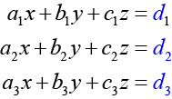
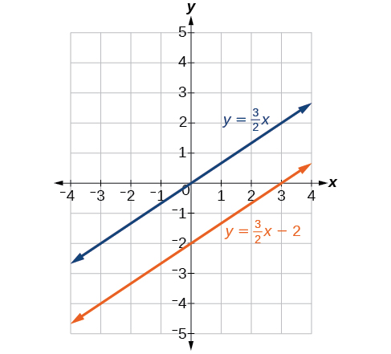
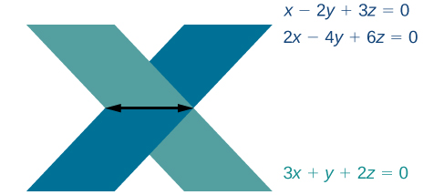
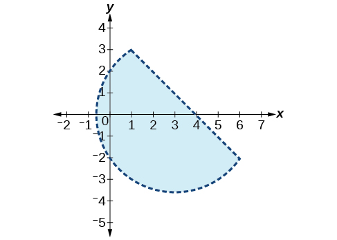
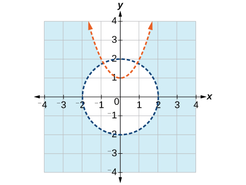

In this section, you will:
* Evaluate  2 × 2  determinants.
* Use Cramer’s Rule to solve a system of equations in two variables.
* Evaluate  3 × 3  determinants.
* Use Cramer’s Rule to solve a system of three equations in three variables.
* Know the properties of determinants.

We have learned how to solve systems of equations in two variables and three variables, and by multiple methods: substitution, addition, Gaussian elimination, using the inverse of a matrix, and graphing. Some of these methods are easier to apply than others and are more appropriate in certain situations. In this section, we will study two more strategies for solving systems of equations.

### Evaluating the Determinant of a 2×2 Matrix

A determinant is a real number that can be very useful in mathematics because it has multiple applications, such as calculating area, volume, and other quantities. Here, we will use determinants to reveal whether a matrix is invertible by using the entries of a **square matrix**{: data-type="term" .no-emphasis} to determine whether there is a solution to the system of equations. Perhaps one of the more interesting applications, however, is their use in cryptography. Secure signals or messages are sometimes sent encoded in a matrix. The data can only be decrypted with an **invertible matrix**{: data-type="term" .no-emphasis} and the determinant. For our purposes, we focus on the determinant as an indication of the invertibility of the matrix. Calculating the determinant of a matrix involves following the specific patterns that are outlined in this section.

Find the Determinant of a 2 × 2 Matrix

The **determinant**{: data-type="term"} of a<math xmlns="http://www.w3.org/1998/Math/MathML"> <mrow> <mtext> </mtext><mn>2</mn><mtext> </mtext><mo>×</mo><mtext> </mtext><mn>2</mn><mtext> </mtext> </mrow> </math>

matrix, given

<math xmlns="http://www.w3.org/1998/Math/MathML" display="block"> <mrow> <mi>A</mi><mo>=</mo><mrow><mo>[</mo> <mrow> <mtable> <mtr> <mtd> <mi>a</mi> </mtd> <mtd> <mi>b</mi> </mtd> </mtr> <mtr> <mtd> <mi>c</mi> </mtd> <mtd> <mi>d</mi> </mtd> </mtr> </mtable> </mrow> <mo>]</mo></mrow> </mrow> </math>

is defined as

  
Notice the change in notation. There are several ways to indicate the determinant, including<math xmlns="http://www.w3.org/1998/Math/MathML"> <mrow> <mtext> </mtext><mi>det</mi><mrow><mo>(</mo> <mi>A</mi> <mo>)</mo></mrow><mtext> </mtext> </mrow> </math>

and replacing the brackets in a matrix with straight lines,<math xmlns="http://www.w3.org/1998/Math/MathML"> <mrow> <mtext> </mtext><mrow><mo>\|</mo> <mi>A</mi> <mo>\|</mo></mrow><mo>.</mo> </mrow> </math>

Finding the Determinant of a 2 × 2 Matrix

Find the determinant of the given matrix.

<math xmlns="http://www.w3.org/1998/Math/MathML" display="block"> <mrow> <mi>A</mi><mo>=</mo><mrow><mo>[</mo> <mrow> <mtable> <mtr> <mtd> <mn>5</mn> </mtd> <mtd> <mn>2</mn> </mtd> </mtr> <mtr> <mtd> <mrow> <mo>−</mo><mn>6</mn> </mrow> </mtd> <mtd> <mn>3</mn> </mtd> </mtr> </mtable> </mrow> <mo>]</mo></mrow> </mrow> </math>

<math xmlns="http://www.w3.org/1998/Math/MathML" display="block"> <mrow> <mtable columnalign="left"> <mtr columnalign="left"> <mtd columnalign="left"> <mrow> <mi>det</mi><mo stretchy="false">(</mo><mi>A</mi><mo stretchy="false">)</mo><mo>=</mo><mrow><mo>\|</mo> <mrow> <mtable> <mtr> <mtd> <mn>5</mn> </mtd> <mtd> <mn>2</mn> </mtd> </mtr> <mtr> <mtd> <mrow> <mo>−</mo><mn>6</mn> </mrow> </mtd> <mtd> <mn>3</mn> </mtd> </mtr> </mtable> </mrow> <mo>\|</mo></mrow> </mrow> </mtd> </mtr> <mtr columnalign="left"> <mtd columnalign="left"> <mrow> <mtext> </mtext><mtext> </mtext><mtext> </mtext><mtext> </mtext><mtext> </mtext><mtext> </mtext><mtext> </mtext><mtext> </mtext><mtext> </mtext><mtext> </mtext><mtext> </mtext><mtext> </mtext><mtext> </mtext><mtext> </mtext><mtext> </mtext><mtext> </mtext><mo>=</mo><mn>5</mn><mo stretchy="false">(</mo><mn>3</mn><mo stretchy="false">)</mo><mo>−</mo><mo stretchy="false">(</mo><mn>−6</mn><mo stretchy="false">)</mo><mo stretchy="false">(</mo><mn>2</mn><mo stretchy="false">)</mo> </mrow> </mtd> </mtr> <mtr columnalign="left"> <mtd columnalign="left"> <mrow> <mtext> </mtext><mtext> </mtext><mtext> </mtext><mtext> </mtext><mtext> </mtext><mtext> </mtext><mtext> </mtext><mtext> </mtext><mtext> </mtext><mtext> </mtext><mtext> </mtext><mtext> </mtext><mtext> </mtext><mtext> </mtext><mtext> </mtext><mtext> </mtext><mo>=</mo><mn>27</mn> </mrow> </mtd> </mtr> </mtable> </mrow> </math>

### Using Cramer’s Rule to Solve a System of Two Equations in Two Variables

We will now introduce a final method for solving systems of equations that uses determinants. Known as **Cramer’s Rule**{: data-type="term" .no-emphasis}, this technique dates back to the middle of the 18th century and is named for its innovator, the Swiss mathematician Gabriel Cramer (1704-1752), who introduced it in 1750 in Introduction à l\'Analyse des lignes Courbes algébriques. Cramer’s Rule is a viable and efficient method for finding solutions to systems with an arbitrary number of unknowns, provided that we have the same number of equations as unknowns.

Cramer’s Rule will give us the unique solution to a system of equations, if it exists. However, if the system has no solution or an infinite number of solutions, this will be indicated by a determinant of zero. To find out if the system is inconsistent or dependent, another method, such as elimination, will have to be used.

To understand Cramer’s Rule, let’s look closely at how we solve systems of linear equations using basic row operations. Consider a system of two equations in two variables.

<math xmlns="http://www.w3.org/1998/Math/MathML" display="block"> <mtable> <mtr> <mtd> <msub> <mi>a</mi> <mn>1</mn> </msub> <mi>x</mi><mo>+</mo><msub> <mi>b</mi> <mn>1</mn> </msub> <mi>y</mi><mo>=</mo><msub> <mi>c</mi> <mn>1</mn> </msub> <mtext> </mtext><mtext> </mtext><mtext> </mtext><mtext> </mtext><mrow><mo>(</mo> <mn>1</mn> <mo>)</mo></mrow> </mtd> </mtr> <mtr> <mtd> <msub> <mi>a</mi> <mn>2</mn> </msub> <mi>x</mi><mo>+</mo><msub> <mi>b</mi> <mn>2</mn> </msub> <mi>y</mi><mo>=</mo><msub> <mi>c</mi> <mn>2</mn> </msub> <mtext> </mtext><mtext> </mtext><mtext> </mtext><mtext> </mtext><mrow><mo>(</mo> <mn>2</mn> <mo>)</mo></mrow> </mtd> </mtr> </mtable> </math>

We eliminate one variable using row operations and solve for the other. Say that we wish to solve for<math xmlns="http://www.w3.org/1998/Math/MathML"> <mrow> <mtext> </mtext><mi>x</mi><mo>.</mo><mtext> </mtext> </mrow> </math>

If equation (2) is multiplied by the opposite of the coefficient of<math xmlns="http://www.w3.org/1998/Math/MathML"> <mrow> <mtext> </mtext><mi>y</mi><mtext> </mtext> </mrow> </math>

in equation (1), equation (1) is multiplied by the coefficient of<math xmlns="http://www.w3.org/1998/Math/MathML"> <mrow> <mtext> </mtext><mi>y</mi><mtext> </mtext> </mrow> </math>

in equation (2), and we add the two equations, the variable<math xmlns="http://www.w3.org/1998/Math/MathML"> <mrow> <mtext> </mtext><mi>y</mi><mtext> </mtext> </mrow> </math>

will be eliminated.

<math xmlns="http://www.w3.org/1998/Math/MathML" display="block"> <mrow> <mtable columnalign="left"> <mtr columnalign="left"> <mtd columnalign="left"> <mrow> <munder> <mrow> <mtable columnalign="left"> <mtr columnalign="left"> <mtd columnalign="left"> <mrow /> </mtd> <mtd columnalign="left"> <mrow /> </mtd> <mtd columnalign="left"> <mrow /> </mtd> <mtd columnalign="left"> <mrow /> </mtd> </mtr> <mtr columnalign="left"> <mtd columnalign="left"> <mrow> <mtext> </mtext><mtext> </mtext><mtext> </mtext><mtext> </mtext><msub> <mi>b</mi> <mn>2</mn> </msub> <msub> <mi>a</mi> <mn>1</mn> </msub> <mi>x</mi><mo>+</mo><msub> <mi>b</mi> <mn>2</mn> </msub> <msub> <mi>b</mi> <mn>1</mn> </msub> <mi>y</mi><mo>=</mo><msub> <mi>b</mi> <mn>2</mn> </msub> <msub> <mi>c</mi> <mn>1</mn> </msub> </mrow> </mtd> <mtd columnalign="left"> <mrow /> </mtd> <mtd columnalign="left"> <mrow /> </mtd> <mtd columnalign="left"> <mrow> <mtext>Multiply </mtext><msub> <mi>R</mi> <mn>1</mn> </msub> <mtext> by </mtext><msub> <mi>b</mi> <mn>2</mn> </msub> </mrow> </mtd> </mtr> <mtr columnalign="left"> <mtd columnalign="left"> <mrow> <mo>−</mo><msub> <mi>b</mi> <mn>1</mn> </msub> <msub> <mi>a</mi> <mn>2</mn> </msub> <mi>x</mi><mo>−</mo><msub> <mi>b</mi> <mn>1</mn> </msub> <msub> <mi>b</mi> <mn>2</mn> </msub> <mi>y</mi><mo>=</mo><mo>−</mo><msub> <mi>b</mi> <mn>1</mn> </msub> <msub> <mi>c</mi> <mn>2</mn> </msub> </mrow> </mtd> <mtd columnalign="left"> <mrow /> </mtd> <mtd columnalign="left"> <mrow /> </mtd> <mtd columnalign="left"> <mrow> <mtext>Multiply </mtext><msub> <mi>R</mi> <mn>2</mn> </msub> <mtext> by</mtext><mo>−</mo><msub> <mi>b</mi> <mn>1</mn> </msub> </mrow> </mtd> </mtr> </mtable> </mrow> <mrow> <mo stretchy="true">\_\_\_\_\_\_\_\_\_\_\_\_\_\_\_\_\_\_\_\_\_\_\_\_\_\_\_\_\_\_\_\_\_\_\_\_\_\_\_\_\_\_\_\_\_\_\_\_\_\_\_\_\_\_\_\_</mo> </mrow> </munder> </mrow> </mtd> </mtr> <mtr columnalign="left"> <mtd columnalign="left"> <mrow> <mtext> </mtext><mtext> </mtext><mtext> </mtext><mtable columnalign="left"> <mtr columnalign="left"> <mtd columnalign="left"> <mrow> <mo> </mo><msub> <mi>b</mi> <mn>2</mn> </msub> <msub> <mi>a</mi> <mn>1</mn> </msub> <mi>x</mi><mo>−</mo><msub> <mi>b</mi> <mn>1</mn> </msub> <msub> <mi>a</mi> <mn>2</mn> </msub> <mi>x</mi><mo>=</mo><msub> <mi>b</mi> <mn>2</mn> </msub> <msub> <mi>c</mi> <mn>1</mn> </msub> <mo>−</mo><msub> <mi>b</mi> <mn>1</mn> </msub> <msub> <mi>c</mi> <mn>2</mn> </msub> </mrow> </mtd> <mtd columnalign="left"> <mrow /> </mtd> </mtr> </mtable> </mrow> </mtd> </mtr> </mtable> </mrow> </math>

Now, solve for<math xmlns="http://www.w3.org/1998/Math/MathML"> <mrow> <mtext> </mtext><mi>x</mi><mo>.</mo> </mrow> </math>

<math xmlns="http://www.w3.org/1998/Math/MathML" display="block"> <mrow> <mtable columnalign="left"> <mtr columnalign="left"> <mtd columnalign="left"> <mrow> <mtext> </mtext><mtext> </mtext><mtext> </mtext><msub> <mi>b</mi> <mn>2</mn> </msub> <msub> <mi>a</mi> <mn>1</mn> </msub> <mi>x</mi><mo>−</mo><msub> <mi>b</mi> <mn>1</mn> </msub> <msub> <mi>a</mi> <mn>2</mn> </msub> <mi>x</mi><mo>=</mo><msub> <mi>b</mi> <mn>2</mn> </msub> <msub> <mi>c</mi> <mn>1</mn> </msub> <mo>−</mo><msub> <mi>b</mi> <mn>1</mn> </msub> <msub> <mi>c</mi> <mn>2</mn> </msub> </mrow> </mtd> </mtr> <mtr columnalign="left"> <mtd columnalign="left"> <mrow> <mtext> </mtext><mtext> </mtext><mtext> </mtext><mi>x</mi><mo stretchy="false">(</mo><msub> <mi>b</mi> <mn>2</mn> </msub> <msub> <mi>a</mi> <mn>1</mn> </msub> <mo>−</mo><msub> <mi>b</mi> <mn>1</mn> </msub> <msub> <mi>a</mi> <mn>2</mn> </msub> <mo stretchy="false">)</mo><mo>=</mo><msub> <mi>b</mi> <mn>2</mn> </msub> <msub> <mi>c</mi> <mn>1</mn> </msub> <mo>−</mo><msub> <mi>b</mi> <mn>1</mn> </msub> <msub> <mi>c</mi> <mn>2</mn> </msub> </mrow> </mtd> </mtr> <mtr columnalign="left"> <mtd columnalign="left"> <mrow> <mtext>                       </mtext><mi>x</mi><mo>=</mo><mfrac> <mrow> <msub> <mi>b</mi> <mn>2</mn> </msub> <msub> <mi>c</mi> <mn>1</mn> </msub> <mo>−</mo><msub> <mi>b</mi> <mn>1</mn> </msub> <msub> <mi>c</mi> <mn>2</mn> </msub> </mrow> <mrow> <msub> <mi>b</mi> <mn>2</mn> </msub> <msub> <mi>a</mi> <mn>1</mn> </msub> <mo>−</mo><msub> <mi>b</mi> <mn>1</mn> </msub> <msub> <mi>a</mi> <mn>2</mn> </msub> </mrow> </mfrac> <mo>=</mo><mfrac> <mrow> <mrow><mo>[</mo> <mrow> <mtable> <mtr> <mtd> <mrow> <msub> <mi>c</mi> <mn>1</mn> </msub> </mrow> </mtd> <mtd> <mrow> <msub> <mi>b</mi> <mn>1</mn> </msub> </mrow> </mtd> </mtr> <mtr> <mtd> <mrow> <msub> <mi>c</mi> <mn>2</mn> </msub> </mrow> </mtd> <mtd> <mrow> <msub> <mi>b</mi> <mn>2</mn> </msub> </mrow> </mtd> </mtr> </mtable> </mrow> <mo>]</mo></mrow> </mrow> <mrow> <mrow><mo>[</mo> <mrow> <mtable> <mtr> <mtd> <mrow> <msub> <mi>a</mi> <mn>1</mn> </msub> </mrow> </mtd> <mtd> <mrow> <msub> <mi>b</mi> <mn>1</mn> </msub> </mrow> </mtd> </mtr> <mtr> <mtd> <mrow> <msub> <mi>a</mi> <mn>2</mn> </msub> </mrow> </mtd> <mtd> <mrow> <msub> <mi>b</mi> <mn>2</mn> </msub> </mrow> </mtd> </mtr> </mtable> </mrow> <mo>]</mo></mrow> </mrow> </mfrac> </mrow> </mtd> </mtr> </mtable> </mrow> </math>

Similarly, to solve for<math xmlns="http://www.w3.org/1998/Math/MathML"> <mrow> <mtext> </mtext><mi>y</mi><mo>,</mo> </mrow> </math>

we will eliminate<math xmlns="http://www.w3.org/1998/Math/MathML"> <mrow> <mtext> </mtext><mi>x</mi><mo>.</mo> </mrow> </math>

<math xmlns="http://www.w3.org/1998/Math/MathML" display="block"> <mrow> <mtable columnalign="left"> <mtr columnalign="left"> <mtd columnalign="left"> <mrow> <munder> <mrow> <mtable columnalign="left"> <mtr columnalign="left"> <mtd columnalign="left"> <mrow /> </mtd> <mtd columnalign="left"> <mrow /> </mtd> <mtd columnalign="left"> <mrow /> </mtd> <mtd columnalign="left"> <mrow /> </mtd> </mtr> <mtr columnalign="left"> <mtd columnalign="left"> <mrow> <mtext> </mtext><mtext> </mtext><mtext> </mtext><mtext> </mtext><msub> <mi>a</mi> <mn>2</mn> </msub> <msub> <mi>a</mi> <mn>1</mn> </msub> <mi>x</mi><mo>+</mo><msub> <mi>a</mi> <mn>2</mn> </msub> <msub> <mi>b</mi> <mn>1</mn> </msub> <mi>y</mi><mo>=</mo><msub> <mi>a</mi> <mn>2</mn> </msub> <msub> <mi>c</mi> <mn>1</mn> </msub> </mrow> </mtd> <mtd columnalign="left"> <mrow /> </mtd> <mtd columnalign="left"> <mrow /> </mtd> <mtd columnalign="left"> <mrow> <mtext>Multiply </mtext><msub> <mi>R</mi> <mn>1</mn> </msub> <mtext> by </mtext><msub> <mi>a</mi> <mn>2</mn> </msub> </mrow> </mtd> </mtr> <mtr columnalign="left"> <mtd columnalign="left"> <mrow> <mo>−</mo><msub> <mi>a</mi> <mn>1</mn> </msub> <msub> <mi>a</mi> <mn>2</mn> </msub> <mi>x</mi><mo>−</mo><msub> <mi>a</mi> <mn>1</mn> </msub> <msub> <mi>b</mi> <mn>2</mn> </msub> <mi>y</mi><mo>=</mo><mo>−</mo><msub> <mi>a</mi> <mn>1</mn> </msub> <msub> <mi>c</mi> <mn>2</mn> </msub> </mrow> </mtd> <mtd columnalign="left"> <mrow /> </mtd> <mtd columnalign="left"> <mrow /> </mtd> <mtd columnalign="left"> <mrow> <mtext>Multiply </mtext><msub> <mi>R</mi> <mn>2</mn> </msub> <mtext> by</mtext><mo>−</mo><msub> <mi>a</mi> <mn>1</mn> </msub> </mrow> </mtd> </mtr> </mtable> </mrow> <mrow> <mo stretchy="true">\_\_\_\_\_\_\_\_\_\_\_\_\_\_\_\_\_\_\_\_\_\_\_\_\_\_\_\_\_\_\_\_\_\_\_\_\_\_\_\_\_\_\_\_\_\_\_\_\_\_\_\_\_\_\_\_</mo> </mrow> </munder> </mrow> </mtd> </mtr> <mtr columnalign="left"> <mtd columnalign="left"> <mrow> <mtext> </mtext><mtext> </mtext><mtext> </mtext><mtext> </mtext><mtext> </mtext><mtext> </mtext><mtable columnalign="left"> <mtr columnalign="left"> <mtd columnalign="left"> <mrow> <msub> <mi>a</mi> <mn>2</mn> </msub> <msub> <mi>b</mi> <mn>1</mn> </msub> <mi>y</mi><mo>−</mo><msub> <mi>a</mi> <mn>1</mn> </msub> <msub> <mi>b</mi> <mn>2</mn> </msub> <mi>y</mi><mo>=</mo><msub> <mi>a</mi> <mn>2</mn> </msub> <msub> <mi>c</mi> <mn>1</mn> </msub> <mo>−</mo><msub> <mi>a</mi> <mn>1</mn> </msub> <msub> <mi>c</mi> <mn>2</mn> </msub> </mrow> </mtd> <mtd columnalign="left"> <mrow /> </mtd> </mtr> </mtable> </mrow> </mtd> </mtr> </mtable> </mrow> </math>

Solving for<math xmlns="http://www.w3.org/1998/Math/MathML"> <mrow> <mtext> </mtext><mi>y</mi><mtext> </mtext> </mrow> </math>

gives

<math xmlns="http://www.w3.org/1998/Math/MathML" display="block"> <mrow> <mtable columnalign="left"> <mtr columnalign="left"> <mtd columnalign="left"> <mrow> <msub> <mi>a</mi> <mn>2</mn> </msub> <msub> <mi>b</mi> <mn>1</mn> </msub> <mi>y</mi><mo>−</mo><msub> <mi>a</mi> <mn>1</mn> </msub> <msub> <mi>b</mi> <mn>2</mn> </msub> <mi>y</mi><mo>=</mo><msub> <mi>a</mi> <mn>2</mn> </msub> <msub> <mi>c</mi> <mn>1</mn> </msub> <mo>−</mo><msub> <mi>a</mi> <mn>1</mn> </msub> <msub> <mi>c</mi> <mn>2</mn> </msub> </mrow> </mtd> </mtr> <mtr columnalign="left"> <mtd columnalign="left"> <mrow> <mi>y</mi><mo stretchy="false">(</mo><msub> <mi>a</mi> <mn>2</mn> </msub> <msub> <mi>b</mi> <mn>1</mn> </msub> <mo>−</mo><msub> <mi>a</mi> <mn>1</mn> </msub> <msub> <mi>b</mi> <mn>2</mn> </msub> <mo stretchy="false">)</mo><mo>=</mo><msub> <mi>a</mi> <mn>2</mn> </msub> <msub> <mi>c</mi> <mn>1</mn> </msub> <mo>−</mo><msub> <mi>a</mi> <mn>1</mn> </msub> <msub> <mi>c</mi> <mn>2</mn> </msub> </mrow> </mtd> </mtr> <mtr columnalign="left"> <mtd columnalign="left"> <mrow> <mtext>                        </mtext><mi>y</mi><mo>=</mo><mfrac> <mrow> <msub> <mi>a</mi> <mn>2</mn> </msub> <msub> <mi>c</mi> <mn>1</mn> </msub> <mo>−</mo><msub> <mi>a</mi> <mn>1</mn> </msub> <msub> <mi>c</mi> <mn>2</mn> </msub> </mrow> <mrow> <msub> <mi>a</mi> <mn>2</mn> </msub> <msub> <mi>b</mi> <mn>1</mn> </msub> <mo>−</mo><msub> <mi>a</mi> <mn>1</mn> </msub> <msub> <mi>b</mi> <mn>2</mn> </msub> </mrow> </mfrac> <mo>=</mo><mfrac> <mrow> <msub> <mi>a</mi> <mn>1</mn> </msub> <msub> <mi>c</mi> <mn>2</mn> </msub> <mo>−</mo><msub> <mi>a</mi> <mn>2</mn> </msub> <msub> <mi>c</mi> <mn>1</mn> </msub> </mrow> <mrow> <msub> <mi>a</mi> <mn>1</mn> </msub> <msub> <mi>b</mi> <mn>2</mn> </msub> <mo>−</mo><msub> <mi>a</mi> <mn>2</mn> </msub> <msub> <mi>b</mi> <mn>1</mn> </msub> </mrow> </mfrac> <mo>=</mo><mfrac> <mrow> <mo>\|</mo><mtable> <mtr> <mtd> <mrow> <msub> <mi>a</mi> <mn>1</mn> </msub> </mrow> </mtd> <mtd> <mrow> <msub> <mi>c</mi> <mn>1</mn> </msub> </mrow> </mtd> </mtr> <mtr> <mtd> <mrow> <msub> <mi>a</mi> <mn>2</mn> </msub> </mrow> </mtd> <mtd> <mrow> <msub> <mi>c</mi> <mn>2</mn> </msub> </mrow> </mtd> </mtr> </mtable><mo>\|</mo> </mrow> <mrow> <mo>\|</mo><mtable> <mtr> <mtd> <mrow> <msub> <mi>a</mi> <mn>1</mn> </msub> </mrow> </mtd> <mtd> <mrow> <msub> <mi>b</mi> <mn>1</mn> </msub> </mrow> </mtd> </mtr> <mtr> <mtd> <mrow> <msub> <mi>a</mi> <mn>2</mn> </msub> </mrow> </mtd> <mtd> <mrow> <msub> <mi>b</mi> <mn>2</mn> </msub> </mrow> </mtd> </mtr> </mtable><mo>\|</mo> </mrow> </mfrac> </mrow> </mtd> </mtr> </mtable> </mrow> </math>

Notice that the denominator for both<math xmlns="http://www.w3.org/1998/Math/MathML"> <mrow> <mtext> </mtext><mi>x</mi><mtext> </mtext> </mrow> </math>

and<math xmlns="http://www.w3.org/1998/Math/MathML"> <mrow> <mtext> </mtext><mi>y</mi><mtext> </mtext> </mrow> </math>

is the determinant of the coefficient matrix.

We can use these formulas to solve for<math xmlns="http://www.w3.org/1998/Math/MathML"> <mrow> <mtext> </mtext><mi>x</mi><mtext> </mtext> </mrow> </math>

and<math xmlns="http://www.w3.org/1998/Math/MathML"> <mrow> <mtext> </mtext><mi>y</mi><mo>,</mo><mtext> </mtext> </mrow> </math>

but Cramer’s Rule also introduces new notation:

* <math xmlns="http://www.w3.org/1998/Math/MathML"> <mrow> <mtext> </mtext><mtext> </mtext><mi>D</mi><mo>:</mo> </mrow> </math>
  
  determinant of the coefficient matrix
* <math xmlns="http://www.w3.org/1998/Math/MathML"> <mrow> <msub> <mi>D</mi> <mi>x</mi> </msub> <mo>:</mo> </mrow> </math>
  
  determinant of the numerator in the solution of
  <math xmlns="http://www.w3.org/1998/Math/MathML"> <mi>x</mi> </math>
  
  

  <math xmlns="http://www.w3.org/1998/Math/MathML" display="block"> <mrow> <mi>x</mi><mo>=</mo><mfrac> <mrow> <msub> <mi>D</mi> <mi>x</mi> </msub> </mrow> <mi>D</mi> </mfrac> </mrow> </math>
  

* <math xmlns="http://www.w3.org/1998/Math/MathML"> <mrow> <msub> <mi>D</mi> <mi>y</mi> </msub> <mo>:</mo> </mrow> </math>
  
  determinant of the numerator in the solution of
  <math xmlns="http://www.w3.org/1998/Math/MathML"> <mrow> <mtext> </mtext><mi>y</mi> </mrow> </math>
  
  

  <math xmlns="http://www.w3.org/1998/Math/MathML"> <mrow> <mi>y</mi><mo>=</mo><mfrac> <mrow> <msub> <mi>D</mi> <mi>y</mi> </msub> </mrow> <mi>D</mi> </mfrac> </mrow> </math>
  

{: data-bullet-style="bullet"}

The key to Cramer’s Rule is replacing the variable column of interest with the constant column and calculating the determinants. We can then express<math xmlns="http://www.w3.org/1998/Math/MathML"> <mrow> <mtext> </mtext><mi>x</mi><mtext> </mtext> </mrow> </math>

and<math xmlns="http://www.w3.org/1998/Math/MathML"> <mrow> <mtext> </mtext><mi>y</mi><mtext> </mtext> </mrow> </math>

as a quotient of two determinants.

Cramer’s Rule for 2×2 Systems

**Cramer’s Rule**{: data-type="term"} is a method that uses determinants to solve systems of equations that have the same number of equations as variables.

Consider a system of two linear equations in two variables.

<math xmlns="http://www.w3.org/1998/Math/MathML" display="block"> <mtable> <mtr> <mtd> <msub> <mi>a</mi> <mn>1</mn> </msub> <mi>x</mi><mo>+</mo><msub> <mi>b</mi> <mn>1</mn> </msub> <mi>y</mi><mo>=</mo><msub> <mi>c</mi> <mn>1</mn> </msub> </mtd> </mtr> <mtr> <mtd> <msub> <mi>a</mi> <mn>2</mn> </msub> <mi>x</mi><mo>+</mo><msub> <mi>b</mi> <mn>2</mn> </msub> <mi>y</mi><mo>=</mo><msub> <mi>c</mi> <mn>2</mn> </msub> </mtd> </mtr> </mtable> </math>

The solution using Cramer’s Rule is given as

<math xmlns="http://www.w3.org/1998/Math/MathML" display="block"> <mrow> <mi>x</mi><mo>=</mo><mfrac> <mrow> <msub> <mi>D</mi> <mi>x</mi> </msub> </mrow> <mi>D</mi> </mfrac> <mo>=</mo><mfrac> <mrow> <mrow><mo>\|</mo> <mrow> <mtable> <mtr> <mtd> <mrow> <msub> <mi>c</mi> <mn>1</mn> </msub> </mrow> </mtd> <mtd> <mrow> <msub> <mi>b</mi> <mn>1</mn> </msub> </mrow> </mtd> </mtr> <mtr> <mtd> <mrow> <msub> <mi>c</mi> <mn>2</mn> </msub> </mrow> </mtd> <mtd> <mrow> <msub> <mi>b</mi> <mn>2</mn> </msub> </mrow> </mtd> </mtr> </mtable> </mrow> <mo>\|</mo></mrow> </mrow> <mrow> <mrow><mo>\|</mo> <mrow> <mtable> <mtr> <mtd> <mrow> <msub> <mi>a</mi> <mn>1</mn> </msub> </mrow> </mtd> <mtd> <mrow> <msub> <mi>b</mi> <mn>1</mn> </msub> </mrow> </mtd> </mtr> <mtr> <mtd> <mrow> <msub> <mi>a</mi> <mn>2</mn> </msub> </mrow> </mtd> <mtd> <mrow> <msub> <mi>b</mi> <mn>2</mn> </msub> </mrow> </mtd> </mtr> </mtable> </mrow> <mo>\|</mo></mrow> </mrow> </mfrac> <mo>,</mo><mtext> </mtext><mtext> </mtext><mi>D</mi><mo>≠</mo><mn>0</mn><mo>;</mo><mtext> </mtext><mtext> </mtext><mtext>​</mtext><mtext>​</mtext><mtext> </mtext><mi>y</mi><mo>=</mo><mfrac> <mrow> <msub> <mi>D</mi> <mi>y</mi> </msub> </mrow> <mi>D</mi> </mfrac> <mo>=</mo><mfrac> <mrow> <mrow><mo>\|</mo> <mrow> <mtable> <mtr> <mtd> <mrow> <msub> <mi>a</mi> <mn>1</mn> </msub> </mrow> </mtd> <mtd> <mrow> <msub> <mi>c</mi> <mn>1</mn> </msub> </mrow> </mtd> </mtr> <mtr> <mtd> <mrow> <msub> <mi>a</mi> <mn>2</mn> </msub> </mrow> </mtd> <mtd> <mrow> <msub> <mi>c</mi> <mn>2</mn> </msub> </mrow> </mtd> </mtr> </mtable> </mrow> <mo>\|</mo></mrow> </mrow> <mrow> <mrow><mo>\|</mo> <mrow> <mtable> <mtr> <mtd> <mrow> <msub> <mi>a</mi> <mn>1</mn> </msub> </mrow> </mtd> <mtd> <mrow> <msub> <mi>b</mi> <mn>1</mn> </msub> </mrow> </mtd> </mtr> <mtr> <mtd> <mrow> <msub> <mi>a</mi> <mn>2</mn> </msub> </mrow> </mtd> <mtd> <mrow> <msub> <mi>b</mi> <mn>2</mn> </msub> </mrow> </mtd> </mtr> </mtable> </mrow> <mo>\|</mo></mrow> </mrow> </mfrac> <mo>,</mo><mtext> </mtext><mtext> </mtext><mi>D</mi><mo>≠</mo><mn>0.</mn> </mrow> </math>

If we are solving for<math xmlns="http://www.w3.org/1998/Math/MathML"> <mrow> <mtext> </mtext><mi>x</mi><mo>,</mo><mtext> </mtext> </mrow> </math>

the<math xmlns="http://www.w3.org/1998/Math/MathML"> <mrow> <mtext> </mtext><mi>x</mi><mtext> </mtext> </mrow> </math>

column is replaced with the constant column. If we are solving for<math xmlns="http://www.w3.org/1998/Math/MathML"> <mrow> <mtext> </mtext><mi>y</mi><mo>,</mo><mtext> </mtext> </mrow> </math>

the<math xmlns="http://www.w3.org/1998/Math/MathML"> <mrow> <mtext> </mtext><mi>y</mi><mtext> </mtext> </mrow> </math>

column is replaced with the constant column.

Using Cramer’s Rule to Solve a 2 × 2 System

Solve the following<math xmlns="http://www.w3.org/1998/Math/MathML"> <mrow> <mtext> </mtext><mn>2</mn><mtext> </mtext><mo>×</mo><mtext> </mtext><mn>2</mn><mtext> </mtext> </mrow> </math>

system using Cramer’s Rule.

<math xmlns="http://www.w3.org/1998/Math/MathML" display="block"> <mrow> <mtable> <mtr> <mtd> <mrow> <mn>12</mn><mi>x</mi><mo>+</mo><mn>3</mn><mi>y</mi><mo>=</mo><mn>15</mn> </mrow> </mtd> </mtr> <mtr> <mtd> <mrow> <mtext>  </mtext><mn>2</mn><mi>x</mi><mo>−</mo><mn>3</mn><mi>y</mi><mo>=</mo><mn>13</mn> </mrow> </mtd> </mtr> </mtable> </mrow> </math>

Solve for<math xmlns="http://www.w3.org/1998/Math/MathML"> <mrow> <mtext> </mtext><mi>x</mi><mo>.</mo> </mrow> </math>

<math xmlns="http://www.w3.org/1998/Math/MathML" display="block"> <mrow> <mi>x</mi><mo>=</mo><mfrac> <mrow> <msub> <mi>D</mi> <mi>x</mi> </msub> </mrow> <mi>D</mi> </mfrac> <mo>=</mo><mfrac> <mrow> <mrow><mo>\|</mo> <mrow> <mtable columnalign="right"> <mtr columnalign="right"> <mtd columnalign="right"> <mrow> <mn>15</mn> </mrow> </mtd> <mtd columnalign="right"> <mn>3</mn> </mtd> </mtr> <mtr columnalign="right"> <mtd columnalign="right"> <mrow> <mn>13</mn> </mrow> </mtd> <mtd columnalign="right"> <mrow> <mo>−</mo><mn>3</mn> </mrow> </mtd> </mtr> </mtable> </mrow> <mo>\|</mo></mrow> </mrow> <mrow> <mrow><mo>\|</mo> <mrow> <mtable columnalign="right"> <mtr columnalign="right"> <mtd columnalign="right"> <mrow> <mn>12</mn> </mrow> </mtd> <mtd columnalign="right"> <mn>3</mn> </mtd> </mtr> <mtr columnalign="right"> <mtd columnalign="right"> <mn>2</mn> </mtd> <mtd columnalign="right"> <mrow> <mo>−</mo><mn>3</mn> </mrow> </mtd> </mtr> </mtable> </mrow> <mo>\|</mo></mrow> </mrow> </mfrac> <mo>=</mo><mfrac> <mrow> <mo>−</mo><mn>45</mn><mo>−</mo><mn>39</mn> </mrow> <mrow> <mo>−</mo><mn>36</mn><mo>−</mo><mn>6</mn> </mrow> </mfrac> <mo>=</mo><mfrac> <mrow> <mo>−</mo><mn>84</mn> </mrow> <mrow> <mo>−</mo><mn>42</mn> </mrow> </mfrac> <mo>=</mo><mn>2</mn> </mrow> </math>

Solve for<math xmlns="http://www.w3.org/1998/Math/MathML"> <mrow> <mtext> </mtext><mi>y</mi><mo>.</mo> </mrow> </math>

<math xmlns="http://www.w3.org/1998/Math/MathML" display="block"> <mrow> <mi>y</mi><mo>=</mo><mfrac> <mrow> <msub> <mi>D</mi> <mi>y</mi> </msub> </mrow> <mi>D</mi> </mfrac> <mo>=</mo><mfrac> <mrow> <mrow><mo>\|</mo> <mrow> <mtable columnalign="right"> <mtr columnalign="right"> <mtd columnalign="right"> <mrow> <mn>12</mn> </mrow> </mtd> <mtd columnalign="right"> <mrow> <mn>15</mn> </mrow> </mtd> </mtr> <mtr columnalign="right"> <mtd columnalign="right"> <mn>2</mn> </mtd> <mtd columnalign="right"> <mrow> <mn>13</mn> </mrow> </mtd> </mtr> </mtable> </mrow> <mo>\|</mo></mrow> </mrow> <mrow> <mrow><mo>\|</mo> <mrow> <mtable columnalign="right"> <mtr columnalign="right"> <mtd columnalign="right"> <mrow> <mn>12</mn> </mrow> </mtd> <mtd columnalign="right"> <mn>3</mn> </mtd> </mtr> <mtr columnalign="right"> <mtd columnalign="right"> <mn>2</mn> </mtd> <mtd columnalign="right"> <mrow> <mo>−</mo><mn>3</mn> </mrow> </mtd> </mtr> </mtable> </mrow> <mo>\|</mo></mrow> </mrow> </mfrac> <mo>=</mo><mfrac> <mrow> <mn>156</mn><mo>−</mo><mn>30</mn> </mrow> <mrow> <mo>−</mo><mn>36</mn><mo>−</mo><mn>6</mn> </mrow> </mfrac> <mo>=</mo><mo>−</mo><mfrac> <mrow> <mn>126</mn> </mrow> <mrow> <mn>42</mn> </mrow> </mfrac> <mo>=</mo><mn>−3</mn> </mrow> </math>

The solution is<math xmlns="http://www.w3.org/1998/Math/MathML"> <mrow> <mtext> </mtext><mrow><mo>(</mo> <mrow> <mn>2</mn><mo>,</mo><mn>−3</mn> </mrow> <mo>)</mo></mrow><mo>.</mo> </mrow> </math>

Use Cramer’s Rule to solve the 2 × 2 system of equations.

<math xmlns="http://www.w3.org/1998/Math/MathML" display="block"> <mrow> <mtable columnalign="left"> <mtr columnalign="left"> <mtd columnalign="left"> <mrow> <mtext>   </mtext><mi>x</mi><mo>+</mo><mn>2</mn><mi>y</mi><mo>=</mo><mn>−11</mn> </mrow> </mtd> </mtr> <mtr columnalign="left"> <mtd columnalign="left"> <mrow> <mo>−</mo><mn>2</mn><mi>x</mi><mo>+</mo><mi>y</mi><mo>=</mo><mn>−13</mn> </mrow> </mtd> </mtr> </mtable> </mrow> </math>

<math xmlns="http://www.w3.org/1998/Math/MathML"> <mrow> <mrow><mo>(</mo> <mrow> <mn>3</mn><mo>,</mo><mo>−</mo><mn>7</mn> </mrow> <mo>)</mo></mrow> </mrow> </math>

### Evaluating the Determinant of a 3 × 3 Matrix

Finding the determinant of a 2×2 matrix is straightforward, but finding the determinant of a 3×3 matrix is more complicated. One method is to augment the 3×3 matrix with a repetition of the first two columns, giving a 3×5 matrix. Then we calculate the sum of the products of entries *down* each of the three diagonals (upper left to lower right), and subtract the products of entries *up* each of the three diagonals (lower left to upper right). This is more easily understood with a visual and an example.

Find the **determinant**{: data-type="term" .no-emphasis} of the 3×3 matrix.

<math xmlns="http://www.w3.org/1998/Math/MathML" display="block"> <mrow> <mi>A</mi><mo>=</mo><mrow><mo>[</mo> <mrow> <mtable> <mtr> <mtd> <mrow> <msub> <mi>a</mi> <mn>1</mn> </msub> </mrow> </mtd> <mtd> <mrow> <msub> <mi>b</mi> <mn>1</mn> </msub> </mrow> </mtd> <mtd> <mrow> <msub> <mi>c</mi> <mn>1</mn> </msub> </mrow> </mtd> </mtr> <mtr> <mtd> <mrow> <msub> <mi>a</mi> <mn>2</mn> </msub> </mrow> </mtd> <mtd> <mrow> <msub> <mi>b</mi> <mn>2</mn> </msub> </mrow> </mtd> <mtd> <mrow> <msub> <mi>c</mi> <mn>2</mn> </msub> </mrow> </mtd> </mtr> <mtr> <mtd> <mrow> <msub> <mi>a</mi> <mn>3</mn> </msub> </mrow> </mtd> <mtd> <mrow> <msub> <mi>b</mi> <mn>3</mn> </msub> </mrow> </mtd> <mtd> <mrow> <msub> <mi>c</mi> <mn>3</mn> </msub> </mrow> </mtd> </mtr> </mtable> </mrow> <mo>]</mo></mrow> </mrow> </math>

1.  Augment
    <math xmlns="http://www.w3.org/1998/Math/MathML"> <mrow> <mtext> </mtext><mi>A</mi><mtext> </mtext> </mrow> </math>
    
    with the first two columns.
    

    <math xmlns="http://www.w3.org/1998/Math/MathML" display="block"> <mrow> <mi>det</mi><mo stretchy="false">(</mo><mi>A</mi><mo stretchy="false">)</mo><mo>=</mo><mrow><mo>\|</mo> <mrow> <mtable> <mtr> <mtd> <mrow> <msub> <mi>a</mi> <mn>1</mn> </msub> </mrow> </mtd> <mtd> <mrow> <msub> <mi>b</mi> <mn>1</mn> </msub> </mrow> </mtd> <mtd> <mrow> <msub> <mi>c</mi> <mn>1</mn> </msub> </mrow> </mtd> </mtr> <mtr> <mtd> <mrow> <msub> <mi>a</mi> <mn>2</mn> </msub> </mrow> </mtd> <mtd> <mrow> <msub> <mi>b</mi> <mn>2</mn> </msub> </mrow> </mtd> <mtd> <mrow> <msub> <mi>c</mi> <mn>2</mn> </msub> </mrow> </mtd> </mtr> <mtr> <mtd> <mrow> <msub> <mi>a</mi> <mn>3</mn> </msub> </mrow> </mtd> <mtd> <mrow> <msub> <mi>b</mi> <mn>3</mn> </msub> </mrow> </mtd> <mtd> <mrow> <msub> <mi>c</mi> <mn>3</mn> </msub> </mrow> </mtd> </mtr> </mtable><mtext> </mtext><mtext> </mtext><mtext> </mtext><mrow><mo>\|</mo><mrow> <mtext> </mtext><mtext> </mtext><mtext> </mtext><mtable> <mtr> <mtd> <mrow> <msub> <mi>a</mi> <mn>1</mn> </msub> </mrow> </mtd> </mtr> <mtr> <mtd> <mrow> <msub> <mi>a</mi> <mn>2</mn> </msub> </mrow> </mtd> </mtr> <mtr> <mtd> <mrow> <msub> <mi>a</mi> <mn>3</mn> </msub> </mrow> </mtd> </mtr> </mtable> </mrow></mrow><mtext> </mtext><mtext> </mtext><mtext> </mtext><mtext> </mtext><mtable> <mtr> <mtd> <mrow> <msub> <mi>b</mi> <mn>1</mn> </msub> </mrow> </mtd> </mtr> <mtr> <mtd> <mrow> <msub> <mi>b</mi> <mn>2</mn> </msub> </mrow> </mtd> </mtr> <mtr> <mtd> <mrow> <msub> <mi>b</mi> <mn>3</mn> </msub> </mrow> </mtd> </mtr> </mtable> </mrow> <mo>\|</mo></mrow> </mrow> </math>
    

2.  From upper left to lower right: Multiply the entries down the first diagonal. Add the result to the product of entries down the second diagonal. Add this result to the product of the entries down the third diagonal.
3.  From lower left to upper right: Subtract the product of entries up the first diagonal. From this result subtract the product of entries up the second diagonal. From this result, subtract the product of entries up the third diagonal.
{: type="1"}

    The algebra is as follows:

<math xmlns="http://www.w3.org/1998/Math/MathML" display="block"> <mrow> <mrow><mo>\|</mo> <mi>A</mi> <mo>\|</mo></mrow><mo>=</mo><msub> <mi>a</mi> <mn>1</mn> </msub> <msub> <mi>b</mi> <mn>2</mn> </msub> <msub> <mi>c</mi> <mn>3</mn> </msub> <mo>+</mo><msub> <mi>b</mi> <mn>1</mn> </msub> <msub> <mi>c</mi> <mn>2</mn> </msub> <msub> <mi>a</mi> <mn>3</mn> </msub> <mo>+</mo><msub> <mi>c</mi> <mn>1</mn> </msub> <msub> <mi>a</mi> <mn>2</mn> </msub> <msub> <mi>b</mi> <mn>3</mn> </msub> <mo>−</mo><msub> <mi>a</mi> <mn>3</mn> </msub> <msub> <mi>b</mi> <mn>2</mn> </msub> <msub> <mi>c</mi> <mn>1</mn> </msub> <mo>−</mo><msub> <mi>b</mi> <mn>3</mn> </msub> <msub> <mi>c</mi> <mn>2</mn> </msub> <msub> <mi>a</mi> <mn>1</mn> </msub> <mo>−</mo><msub> <mi>c</mi> <mn>3</mn> </msub> <msub> <mi>a</mi> <mn>2</mn> </msub> <msub> <mi>b</mi> <mn>1</mn> </msub> </mrow> </math>

Finding the Determinant of a 3 × 3 Matrix

Find the determinant of the 3 × 3 matrix given

<math xmlns="http://www.w3.org/1998/Math/MathML" display="block"> <mrow> <mi>A</mi><mo>=</mo><mrow><mo>[</mo> <mrow> <mtable> <mtr> <mtd> <mn>0</mn> </mtd> <mtd> <mn>2</mn> </mtd> <mtd> <mn>1</mn> </mtd> </mtr> <mtr> <mtd> <mn>3</mn> </mtd> <mtd> <mrow> <mo>−</mo><mn>1</mn> </mrow> </mtd> <mtd> <mn>1</mn> </mtd> </mtr> <mtr> <mtd> <mn>4</mn> </mtd> <mtd> <mn>0</mn> </mtd> <mtd> <mn>1</mn> </mtd> </mtr> </mtable> </mrow> <mo>]</mo></mrow> </mrow> </math>

Augment the matrix with the first two columns and then follow the formula. Thus,

<math xmlns="http://www.w3.org/1998/Math/MathML" display="block"> <mrow> <mtable columnalign="left"> <mtr columnalign="left"> <mtd columnalign="left"> <mrow> <mrow><mo>\|</mo> <mi>A</mi> <mo>\|</mo></mrow><mo>=</mo><mrow><mo>\|</mo> <mrow> <mtable> <mtr> <mtd> <mn>0</mn> </mtd> <mtd> <mn>2</mn> </mtd> <mtd> <mn>1</mn> </mtd> </mtr> <mtr> <mtd> <mn>3</mn> </mtd> <mtd> <mrow> <mo>−</mo><mn>1</mn> </mrow> </mtd> <mtd> <mn>1</mn> </mtd> </mtr> <mtr> <mtd> <mn>4</mn> </mtd> <mtd> <mn>0</mn> </mtd> <mtd> <mn>1</mn> </mtd> </mtr> </mtable><mtext> </mtext><mtext> </mtext><mrow><mo>\|</mo><mrow> <mtable> <mtr> <mtd> <mn>0</mn> </mtd> </mtr> <mtr> <mtd> <mn>3</mn> </mtd> </mtr> <mtr> <mtd> <mrow> <mtext> </mtext><mtext> </mtext><mn>4</mn> </mrow> </mtd> </mtr> </mtable> </mrow></mrow><mtext> </mtext><mtext> </mtext><mtext> </mtext><mtext> </mtext><mtable> <mtr> <mtd> <mn>2</mn> </mtd> </mtr> <mtr> <mtd> <mrow> <mo>−</mo><mn>1</mn> </mrow> </mtd> </mtr> <mtr> <mtd> <mn>0</mn> </mtd> </mtr> </mtable> </mrow> <mo>\|</mo></mrow> </mrow> </mtd> </mtr> <mtr columnalign="left"> <mtd columnalign="left"> <mrow> <mtext> </mtext><mtext> </mtext><mtext> </mtext><mtext> </mtext><mtext> </mtext><mtext> </mtext><mtext> </mtext><mo>=</mo><mn>0</mn><mrow><mo>(</mo> <mrow> <mo>−</mo><mn>1</mn> </mrow> <mo>)</mo></mrow><mrow><mo>(</mo> <mn>1</mn> <mo>)</mo></mrow><mo>+</mo><mn>2</mn><mrow><mo>(</mo> <mn>1</mn> <mo>)</mo></mrow><mrow><mo>(</mo> <mn>4</mn> <mo>)</mo></mrow><mo>+</mo><mn>1</mn><mrow><mo>(</mo> <mn>3</mn> <mo>)</mo></mrow><mrow><mo>(</mo> <mn>0</mn> <mo>)</mo></mrow><mo>−</mo><mn>4</mn><mrow><mo>(</mo> <mrow> <mo>−</mo><mn>1</mn> </mrow> <mo>)</mo></mrow><mrow><mo>(</mo> <mn>1</mn> <mo>)</mo></mrow><mo>−</mo><mn>0</mn><mrow><mo>(</mo> <mn>1</mn> <mo>)</mo></mrow><mrow><mo>(</mo> <mn>0</mn> <mo>)</mo></mrow><mo>−</mo><mn>1</mn><mrow><mo>(</mo> <mn>3</mn> <mo>)</mo></mrow><mrow><mo>(</mo> <mn>2</mn> <mo>)</mo></mrow> </mrow> </mtd> </mtr> <mtr columnalign="left"> <mtd columnalign="left"> <mrow> <mtext> </mtext><mtext> </mtext><mtext> </mtext><mtext> </mtext><mtext> </mtext><mtext> </mtext><mtext> </mtext><mo>=</mo><mn>0</mn><mo>+</mo><mn>8</mn><mo>+</mo><mn>0</mn><mo>+</mo><mn>4</mn><mo>−</mo><mn>0</mn><mo>−</mo><mn>6</mn> </mrow> </mtd> </mtr> <mtr columnalign="left"> <mtd columnalign="left"> <mrow> <mtext> </mtext><mtext> </mtext><mtext> </mtext><mtext> </mtext><mtext> </mtext><mtext> </mtext><mtext> </mtext><mo>=</mo><mn>6</mn> </mrow> </mtd> </mtr> </mtable> </mrow> </math>

Find the determinant of the 3 × 3 matrix.

<math xmlns="http://www.w3.org/1998/Math/MathML" display="block"> <mrow> <mi>det</mi><mo stretchy="false">(</mo><mi>A</mi><mo stretchy="false">)</mo><mo>=</mo><mrow><mo>\|</mo> <mrow> <mtable> <mtr> <mtd> <mn>1</mn> </mtd> <mtd> <mrow> <mo>−</mo><mn>3</mn> </mrow> </mtd> <mtd> <mn>7</mn> </mtd> </mtr> <mtr> <mtd> <mn>1</mn> </mtd> <mtd> <mn>1</mn> </mtd> <mtd> <mn>1</mn> </mtd> </mtr> <mtr> <mtd> <mn>1</mn> </mtd> <mtd> <mrow> <mo>−</mo><mn>2</mn> </mrow> </mtd> <mtd> <mn>3</mn> </mtd> </mtr> </mtable> </mrow> <mo>\|</mo></mrow> </mrow> </math>

<math xmlns="http://www.w3.org/1998/Math/MathML"> <mrow> <mo>−</mo><mn>10</mn> </mrow> </math>

**Can we use the same method to find the determinant of a larger matrix?**

*No, this method only works for<math xmlns="http://www.w3.org/1998/Math/MathML"> <mrow> <mtext> </mtext><mn>2</mn><mtext> </mtext><mo>×</mo><mtext> </mtext><mn>2</mn><mtext> </mtext> </mrow> </math>

and<math xmlns="http://www.w3.org/1998/Math/MathML"> <mrow> <mtext> </mtext><mtext>3</mtext><mtext> </mtext><mo>×</mo><mtext> </mtext><mn>3</mn><mtext> </mtext> </mrow> </math>

matrices. For larger matrices it is best to use a graphing utility or computer software.*

### Using Cramer’s Rule to Solve a System of Three Equations in Three Variables

Now that we can find the **determinant**{: data-type="term" .no-emphasis} of a 3 × 3 matrix, we can apply **Cramer’s Rule**{: data-type="term" .no-emphasis} to solve a **system of three equations in three variables**{: data-type="term" .no-emphasis}. Cramer’s Rule is straightforward, following a pattern consistent with Cramer’s Rule for 2 × 2 matrices. As the order of the matrix increases to 3 × 3, however, there are many more calculations required.

When we calculate the determinant to be zero, Cramer’s Rule gives no indication as to whether the system has no solution or an infinite number of solutions. To find out, we have to perform elimination on the system.

Consider a 3 × 3 system of equations.

   

<math xmlns="http://www.w3.org/1998/Math/MathML" display="block"> <mrow> <mi>x</mi><mo>=</mo><mfrac> <mrow> <msub> <mi>D</mi> <mi>x</mi> </msub> </mrow> <mi>D</mi> </mfrac> <mo>,</mo><mi>y</mi><mo>=</mo><mfrac> <mrow> <msub> <mi>D</mi> <mi>y</mi> </msub> </mrow> <mi>D</mi> </mfrac> <mo>,</mo><mi>z</mi><mo>=</mo><mfrac> <mrow> <msub> <mi>D</mi> <mi>z</mi> </msub> </mrow> <mi>D</mi> </mfrac> <mo>,</mo><mi>D</mi><mo>≠</mo><mn>0</mn> </mrow> </math>

where

    If we are writing the determinant<math xmlns="http://www.w3.org/1998/Math/MathML"> <mrow> <mtext> </mtext><msub> <mi>D</mi> <mi>x</mi> </msub> <mo>,</mo> </mrow> </math>

we replace the<math xmlns="http://www.w3.org/1998/Math/MathML"> <mrow> <mtext> </mtext><mi>x</mi><mtext> </mtext> </mrow> </math>

column with the constant column. If we are writing the determinant<math xmlns="http://www.w3.org/1998/Math/MathML"> <mrow> <msub> <mi>D</mi> <mi>y</mi> </msub> <mo>,</mo> </mrow> </math>

we replace the<math xmlns="http://www.w3.org/1998/Math/MathML"> <mrow> <mtext> </mtext><mi>y</mi><mtext> </mtext> </mrow> </math>

column with the constant column. If we are writing the determinant<math xmlns="http://www.w3.org/1998/Math/MathML"> <mrow> <mtext> </mtext><msub> <mi>D</mi> <mi>z</mi> </msub> <mo>,</mo> </mrow> </math>

we replace the<math xmlns="http://www.w3.org/1998/Math/MathML"> <mrow> <mtext> </mtext><mi>z</mi><mtext> </mtext> </mrow> </math>

column with the constant column. Always check the answer.

Solving a 3 × 3 System Using Cramer’s Rule

Find the solution to the given 3 × 3 system using Cramer’s Rule.

<math xmlns="http://www.w3.org/1998/Math/MathML" display="block"> <mtable> <mtr> <mtd> <mi>x</mi><mo>+</mo><mi>y</mi><mo>−</mo><mi>z</mi><mo>=</mo><mn>6</mn> </mtd> </mtr> <mtr> <mtd> <mn>3</mn><mi>x</mi><mo>−</mo><mn>2</mn><mi>y</mi><mo>+</mo><mi>z</mi><mo>=</mo><mn>−5</mn> </mtd> </mtr> <mtr> <mtd> <mi>x</mi><mo>+</mo><mn>3</mn><mi>y</mi><mo>−</mo><mn>2</mn><mi>z</mi><mo>=</mo><mn>14</mn> </mtd> </mtr> </mtable> </math>

Use Cramer’s Rule.

<math xmlns="http://www.w3.org/1998/Math/MathML" display="block"> <mrow> <mi>D</mi><mo>=</mo><mrow><mo>\|</mo> <mrow> <mtable> <mtr> <mtd> <mn>1</mn> </mtd> <mtd> <mrow> <mtext> </mtext><mtext> </mtext><mn>1</mn> </mrow> </mtd> <mtd> <mrow> <mo>−</mo><mn>1</mn> </mrow> </mtd> </mtr> <mtr> <mtd> <mn>3</mn> </mtd> <mtd> <mrow> <mo>−</mo><mn>2</mn> </mrow> </mtd> <mtd> <mrow> <mtext> </mtext><mtext> </mtext><mtext> </mtext><mn>1</mn> </mrow> </mtd> </mtr> <mtr> <mtd> <mn>1</mn> </mtd> <mtd> <mrow> <mtext> </mtext><mtext> </mtext><mn>3</mn> </mrow> </mtd> <mtd> <mrow> <mo>−</mo><mn>2</mn> </mrow> </mtd> </mtr> </mtable> </mrow> <mo>\|</mo></mrow><mo>,</mo><msub> <mi>D</mi> <mi>x</mi> </msub> <mo>=</mo><mrow><mo>\|</mo> <mrow> <mtable> <mtr> <mtd> <mn>6</mn> </mtd> <mtd> <mn>1</mn> </mtd> <mtd> <mrow> <mo>−</mo><mn>1</mn> </mrow> </mtd> </mtr> <mtr> <mtd> <mrow> <mo>−</mo><mn>5</mn> </mrow> </mtd> <mtd> <mrow> <mo>−</mo><mn>2</mn> </mrow> </mtd> <mtd> <mrow> <mtext> </mtext><mtext> </mtext><mtext> </mtext><mn>1</mn> </mrow> </mtd> </mtr> <mtr> <mtd> <mrow> <mn>14</mn> </mrow> </mtd> <mtd> <mrow> <mtext> </mtext><mtext> </mtext><mn>3</mn> </mrow> </mtd> <mtd> <mrow> <mo>−</mo><mn>2</mn> </mrow> </mtd> </mtr> </mtable> </mrow> <mo>\|</mo></mrow><mo>,</mo><msub> <mi>D</mi> <mi>y</mi> </msub> <mo>=</mo><mrow><mo>\|</mo> <mrow> <mtable> <mtr> <mtd> <mn>1</mn> </mtd> <mtd> <mrow> <mtext> </mtext><mn>6</mn> </mrow> </mtd> <mtd> <mrow> <mo>−</mo><mn>1</mn> </mrow> </mtd> </mtr> <mtr> <mtd> <mn>3</mn> </mtd> <mtd> <mrow> <mo>−</mo><mn>5</mn> </mrow> </mtd> <mtd> <mrow> <mtext> </mtext><mtext> </mtext><mn>1</mn> </mrow> </mtd> </mtr> <mtr> <mtd> <mn>1</mn> </mtd> <mtd> <mrow> <mn>14</mn> </mrow> </mtd> <mtd> <mrow> <mo>−</mo><mn>2</mn> </mrow> </mtd> </mtr> </mtable> </mrow> <mo>\|</mo></mrow><mo>,</mo><msub> <mi>D</mi> <mi>z</mi> </msub> <mo>=</mo><mrow><mo>\|</mo> <mrow> <mtable> <mtr> <mtd> <mn>1</mn> </mtd> <mtd> <mrow> <mtext> </mtext><mn>1</mn> </mrow> </mtd> <mtd> <mn>6</mn> </mtd> </mtr> <mtr> <mtd> <mn>3</mn> </mtd> <mtd> <mrow> <mo>−</mo><mn>2</mn> </mrow> </mtd> <mtd> <mrow> <mo>−</mo><mn>5</mn> </mrow> </mtd> </mtr> <mtr> <mtd> <mn>1</mn> </mtd> <mtd> <mrow> <mtext> </mtext><mtext> </mtext><mn>3</mn> </mrow> </mtd> <mtd> <mrow> <mn>14</mn> </mrow> </mtd> </mtr> </mtable> </mrow> <mo>\|</mo></mrow> </mrow> </math>

Then,

<math xmlns="http://www.w3.org/1998/Math/MathML" display="block"> <mrow> <mtable columnalign="left"> <mtr columnalign="left"> <mtd columnalign="left"> <mrow> <mi>x</mi><mo>=</mo><mfrac> <mrow> <msub> <mi>D</mi> <mi>x</mi> </msub> </mrow> <mi>D</mi> </mfrac> <mo>=</mo><mfrac> <mrow> <mo>−</mo><mn>3</mn> </mrow> <mrow> <mo>−</mo><mn>3</mn> </mrow> </mfrac> <mo>=</mo><mn>1</mn> </mrow> </mtd> </mtr> <mtr columnalign="left"> <mtd columnalign="left"> <mrow> <mi>y</mi><mo>=</mo><mfrac> <mrow> <msub> <mi>D</mi> <mi>y</mi> </msub> </mrow> <mi>D</mi> </mfrac> <mo>=</mo><mfrac> <mrow> <mo>−</mo><mn>9</mn> </mrow> <mrow> <mo>−</mo><mn>3</mn> </mrow> </mfrac> <mo>=</mo><mn>3</mn> </mrow> </mtd> </mtr> <mtr columnalign="left"> <mtd columnalign="left"> <mrow> <mi>z</mi><mo>=</mo><mfrac> <mrow> <msub> <mi>D</mi> <mi>z</mi> </msub> </mrow> <mi>D</mi> </mfrac> <mo>=</mo><mfrac> <mn>6</mn> <mrow> <mo>−</mo><mn>3</mn> </mrow> </mfrac> <mo>=</mo><mo>−</mo><mn>2</mn> </mrow> </mtd> </mtr> </mtable> </mrow> </math>

The solution is<math xmlns="http://www.w3.org/1998/Math/MathML"> <mrow> <mrow><mo>(</mo> <mrow> <mn>1</mn><mo>,</mo><mn>3</mn><mo>,</mo><mn>−2</mn> </mrow> <mo>)</mo></mrow><mo>.</mo> </mrow> </math>

Use Cramer’s Rule to solve the 3 × 3 matrix.

<math xmlns="http://www.w3.org/1998/Math/MathML" display="block"> <mrow> <mtable columnalign="right"> <mtr columnalign="right"> <mtd columnalign="right"> <mrow> <mi>x</mi><mo>−</mo><mn>3</mn><mi>y</mi><mo>+</mo><mn>7</mn><mi>z</mi><mo>=</mo><mn>13</mn> </mrow> </mtd> </mtr> <mtr columnalign="right"> <mtd columnalign="right"> <mrow> <mi>x</mi><mo>+</mo><mi>y</mi><mo>+</mo><mi>z</mi><mo>=</mo><mn>1</mn><mtext> </mtext><mtext> </mtext><mtext> </mtext> </mrow> </mtd> </mtr> <mtr columnalign="right"> <mtd columnalign="right"> <mrow> <mi>x</mi><mo>−</mo><mn>2</mn><mi>y</mi><mo>+</mo><mn>3</mn><mi>z</mi><mo>=</mo><mn>4</mn><mtext> </mtext><mtext> </mtext><mtext> </mtext> </mrow> </mtd> </mtr> </mtable> </mrow> </math>

<math xmlns="http://www.w3.org/1998/Math/MathML"> <mrow> <mrow><mo>(</mo> <mrow> <mo>−</mo><mn>2</mn><mo>,</mo><mfrac> <mn>3</mn> <mn>5</mn> </mfrac> <mo>,</mo><mfrac> <mrow> <mn>12</mn> </mrow> <mn>5</mn> </mfrac> </mrow> <mo>)</mo></mrow> </mrow> </math>

Using Cramer’s Rule to Solve an Inconsistent System

Solve the system of equations using Cramer’s Rule.

<math xmlns="http://www.w3.org/1998/Math/MathML" display="block"> <mtable columnalign="left"> <mtr> <mtd> <mn>3</mn><mi>x</mi><mo>−</mo><mn>2</mn><mi>y</mi><mo>=</mo><mn>4</mn><mtext> </mtext><mo stretchy="false">(</mo><mn>1</mn><mo stretchy="false">)</mo> </mtd> </mtr> <mtr> <mtd> <mn>6</mn><mi>x</mi><mo>−</mo><mn>4</mn><mi>y</mi><mo>=</mo><mn>0</mn><mtext> </mtext><mo stretchy="false">(</mo><mn>2</mn><mo stretchy="false">)</mo> </mtd> </mtr> </mtable> </math>

We begin by finding the determinants<math xmlns="http://www.w3.org/1998/Math/MathML"> <mrow> <mtext> </mtext><mi>D</mi><mo>,</mo><msub> <mi>D</mi> <mi>x</mi> </msub> <mo>,</mo><mtext>and </mtext><msub> <mi>D</mi> <mi>y</mi> </msub> <mo>.</mo> </mrow> </math>

<math xmlns="http://www.w3.org/1998/Math/MathML" display="block"> <mrow> <mi>D</mi><mo>=</mo><mrow><mo>\|</mo> <mrow> <mtable> <mtr> <mtd> <mn>3</mn> </mtd> <mtd> <mrow> <mo>−</mo><mn>2</mn> </mrow> </mtd> </mtr> <mtr> <mtd> <mn>6</mn> </mtd> <mtd> <mrow> <mo>−</mo><mn>4</mn> </mrow> </mtd> </mtr> </mtable> </mrow> <mo>\|</mo></mrow><mo>=</mo><mn>3</mn><mrow><mo>(</mo> <mrow> <mo>−</mo><mn>4</mn> </mrow> <mo>)</mo></mrow><mo>−</mo><mn>6</mn><mrow><mo>(</mo> <mrow> <mo>−</mo><mn>2</mn> </mrow> <mo>)</mo></mrow><mo>=</mo><mn>0</mn> </mrow> </math>

We know that a determinant of zero means that either the system has no solution or it has an infinite number of solutions. To see which one, we use the process of elimination. Our goal is to eliminate one of the variables.

1.  Multiply equation (1) by
    <math xmlns="http://www.w3.org/1998/Math/MathML"> <mrow> <mtext> </mtext><mn>−2.</mn> </mrow> </math>

2.  Add the result to equation
    <math xmlns="http://www.w3.org/1998/Math/MathML"> <mrow> <mtext> </mtext><mrow><mo>(</mo> <mn>2</mn> <mo>)</mo></mrow><mo>.</mo> </mrow> </math>
{: type="1"}

<math xmlns="http://www.w3.org/1998/Math/MathML" display="block"> <mrow> <mtable columnalign="left"> <mtr columnalign="left"> <mtd columnalign="left"> <mrow> <munder accentunder="true"> <mrow> <mtable columnalign="left"> <mtr columnalign="left"> <mtd columnalign="left"> <mrow> <mtable columnalign="left"> <mtr columnalign="left"> <mtd columnalign="left"> <mrow /> </mtd> </mtr> <mtr columnalign="left"> <mtd columnalign="left"> <mrow> <mo>−</mo><mn>6</mn><mi>x</mi><mo>+</mo><mn>4</mn><mi>y</mi><mtext> </mtext><mtext> </mtext><mtext> </mtext><mtext> </mtext><mo>=</mo><mn>−8</mn> </mrow> </mtd> </mtr> </mtable> </mrow> </mtd> </mtr> <mtr columnalign="left"> <mtd columnalign="left"> <mrow> <mtext> </mtext><mtext> </mtext><mtext> </mtext><mn>6</mn><mi>x</mi><mo>−</mo><mn>4</mn><mi>y</mi><mtext> </mtext><mtext> </mtext><mtext> </mtext><mtext> </mtext><mtext> </mtext><mtext> </mtext><mo>=</mo><mtext> </mtext><mtext> </mtext><mtext> </mtext><mtext> </mtext><mn>0</mn> </mrow> </mtd> </mtr> </mtable> </mrow> <mo stretchy="true">\_\_\_\_\_\_\_\_\_\_\_\_\_\_\_</mo> </munder> </mrow> </mtd> </mtr> <mtr columnalign="left"> <mtd columnalign="left"> <mrow> <mtext> </mtext><mtext> </mtext><mtext> </mtext><mtext> </mtext><mtext> </mtext><mtext> </mtext><mtext> </mtext><mtext> </mtext><mtext> </mtext><mtext> </mtext><mtext> </mtext><mtext> </mtext><mtext> </mtext><mtext> </mtext><mtext> </mtext><mtext> </mtext><mtext> </mtext><mtext> </mtext><mtext> </mtext><mn>0</mn><mtext> </mtext><mtext> </mtext><mtext> </mtext><mtext> </mtext><mtext> </mtext><mtext> </mtext><mo>=</mo><mtext> </mtext><mn>−8</mn> </mrow> </mtd> </mtr> </mtable> </mrow> </math>

We obtain the equation<math xmlns="http://www.w3.org/1998/Math/MathML"> <mrow> <mtext> </mtext><mn>0</mn><mo>=</mo><mn>−8</mn><mo>,</mo><mtext> </mtext> </mrow> </math>

which is false. Therefore, the system has no solution. Graphing the system reveals two parallel lines. See [[link]](#Figure_09_08_003).

{: #Figure_09_08_003}

Use Cramer’s Rule to Solve a Dependent System

Solve the system with an infinite number of solutions.

<math xmlns="http://www.w3.org/1998/Math/MathML" display="block"> <mrow> <mtable columnalign="right"> <mtr columnalign="right"> <mtd columnalign="right"> <mrow> <mi>x</mi><mo>−</mo><mn>2</mn><mi>y</mi><mo>+</mo><mn>3</mn><mi>z</mi><mo>=</mo><mn>0</mn> </mrow> </mtd> <mtd columnalign="right"> <mrow> <mo stretchy="false">(</mo><mn>1</mn><mo stretchy="false">)</mo> </mrow> </mtd> </mtr> <mtr columnalign="right"> <mtd columnalign="right"> <mrow> <mn>3</mn><mi>x</mi><mo>+</mo><mi>y</mi><mo>−</mo><mn>2</mn><mi>z</mi><mo>=</mo><mn>0</mn> </mrow> </mtd> <mtd columnalign="right"> <mrow> <mo stretchy="false">(</mo><mn>2</mn><mo stretchy="false">)</mo> </mrow> </mtd> </mtr> <mtr columnalign="right"> <mtd columnalign="right"> <mrow> <mn>2</mn><mi>x</mi><mo>−</mo><mn>4</mn><mi>y</mi><mo>+</mo><mn>6</mn><mi>z</mi><mo>=</mo><mn>0</mn> </mrow> </mtd> <mtd columnalign="right"> <mrow> <mo stretchy="false">(</mo><mn>3</mn><mo stretchy="false">)</mo> </mrow> </mtd> </mtr> </mtable> </mrow> </math>

Let’s find the determinant first. Set up a matrix augmented by the first two columns.

<math xmlns="http://www.w3.org/1998/Math/MathML" display="block"> <mrow> <mrow><mo>\|</mo> <mrow> <mtable columnalign="right"> <mtr columnalign="right"> <mtd columnalign="right"> <mn>1</mn> </mtd> <mtd columnalign="right"> <mrow> <mn>−2</mn> </mrow> </mtd> <mtd columnalign="right"> <mn>3</mn> </mtd> </mtr> <mtr columnalign="right"> <mtd columnalign="right"> <mn>3</mn> </mtd> <mtd columnalign="right"> <mn>1</mn> </mtd> <mtd columnalign="right"> <mrow> <mn>−2</mn> </mrow> </mtd> </mtr> <mtr columnalign="right"> <mtd columnalign="right"> <mn>2</mn> </mtd> <mtd columnalign="right"> <mrow> <mn>−4</mn> </mrow> </mtd> <mtd columnalign="right"> <mn>6</mn> </mtd> </mtr> </mtable><mtext>   </mtext><mrow><mo>\|</mo><mrow> <mtext>   </mtext><mtable columnalign="right"> <mtr columnalign="right"> <mtd columnalign="right"> <mn>1</mn> </mtd> <mtd columnalign="right"> <mrow> <mn>−2</mn> </mrow> </mtd> </mtr> <mtr columnalign="right"> <mtd columnalign="right"> <mn>3</mn> </mtd> <mtd columnalign="right"> <mn>1</mn> </mtd> </mtr> <mtr columnalign="right"> <mtd columnalign="right"> <mn>2</mn> </mtd> <mtd columnalign="right"> <mrow> <mn>−4</mn> </mrow> </mtd> </mtr> </mtable> </mrow></mrow> </mrow> <mo>\|</mo></mrow> </mrow> </math>

Then,

<math xmlns="http://www.w3.org/1998/Math/MathML" display="block"> <mrow> <mn>1</mn><mrow><mo>(</mo> <mn>1</mn> <mo>)</mo></mrow><mrow><mo>(</mo> <mn>6</mn> <mo>)</mo></mrow><mo>+</mo><mrow><mo>(</mo> <mrow> <mo>−</mo><mn>2</mn> </mrow> <mo>)</mo></mrow><mrow><mo>(</mo> <mrow> <mo>−</mo><mn>2</mn> </mrow> <mo>)</mo></mrow><mrow><mo>(</mo> <mn>2</mn> <mo>)</mo></mrow><mo>+</mo><mn>3</mn><mrow><mo>(</mo> <mn>3</mn> <mo>)</mo></mrow><mrow><mo>(</mo> <mrow> <mo>−</mo><mn>4</mn> </mrow> <mo>)</mo></mrow><mo>−</mo><mn>2</mn><mrow><mo>(</mo> <mn>1</mn> <mo>)</mo></mrow><mrow><mo>(</mo> <mn>3</mn> <mo>)</mo></mrow><mo>−</mo><mrow><mo>(</mo> <mrow> <mo>−</mo><mn>4</mn> </mrow> <mo>)</mo></mrow><mrow><mo>(</mo> <mrow> <mo>−</mo><mn>2</mn> </mrow> <mo>)</mo></mrow><mrow><mo>(</mo> <mn>1</mn> <mo>)</mo></mrow><mo>−</mo><mn>6</mn><mrow><mo>(</mo> <mn>3</mn> <mo>)</mo></mrow><mrow><mo>(</mo> <mrow> <mo>−</mo><mn>2</mn> </mrow> <mo>)</mo></mrow><mo>=</mo><mn>0</mn> </mrow> </math>

As the determinant equals zero, there is either no solution or an infinite number of solutions. We have to perform elimination to find out.

1.  Multiply equation (1) by
    <math xmlns="http://www.w3.org/1998/Math/MathML"> <mrow> <mtext> </mtext><mn>−2</mn><mtext> </mtext> </mrow> </math>
    
    and add the result to equation (3):
    

    <math xmlns="http://www.w3.org/1998/Math/MathML" display="block"> <mrow> <mfrac> <mrow> <mtable columnalign="right"> <mtr columnalign="right"> <mtd columnalign="right"> <mrow> <mo>−</mo><mn>2</mn><mi>x</mi><mo>+</mo><mn>4</mn><mi>y</mi><mo>−</mo><mn>6</mn><mi>x</mi><mo>=</mo><mn>0</mn> </mrow> </mtd> </mtr> <mtr columnalign="right"> <mtd columnalign="right"> <mrow> <mn>2</mn><mi>x</mi><mo>−</mo><mn>4</mn><mi>y</mi><mo>+</mo><mn>6</mn><mi>z</mi><mo>=</mo><mn>0</mn> </mrow> </mtd> </mtr> </mtable> </mrow> <mrow> <mtext> </mtext><mtext> </mtext><mtext> </mtext><mtext> </mtext><mtext> </mtext><mtext> </mtext><mtext> </mtext><mtext> </mtext><mtext> </mtext><mtext> </mtext><mtext> </mtext><mtext> </mtext><mtext> </mtext><mtext> </mtext><mtext> </mtext><mtext> </mtext><mtext> </mtext><mtext> </mtext><mtext> </mtext><mtext> </mtext><mtext> </mtext><mtext> </mtext><mtext> </mtext><mtext> </mtext><mtext> </mtext><mtext> </mtext><mtext> </mtext><mtext> </mtext><mtext> </mtext><mtext> </mtext><mtext> </mtext><mn>0</mn><mo>=</mo><mn>0</mn> </mrow> </mfrac> </mrow> </math>
    

2.  Obtaining an answer of
    <math xmlns="http://www.w3.org/1998/Math/MathML"> <mrow> <mtext> </mtext><mn>0</mn><mo>=</mo><mn>0</mn><mo>,</mo><mtext> </mtext> </mrow> </math>
    
    a statement that is always true, means that the system has an infinite number of solutions. Graphing the system, we can see that two of the planes are the same and they both intersect the third plane on a line. See [[link]](#Figure_09_08_005).
{: type="1"}

{: #Figure_09_08_005}

### Understanding Properties of Determinants

There are many **properties of determinants**{: data-type="term" .no-emphasis}. Listed here are some properties that may be helpful in calculating the determinant of a matrix.

Properties of Determinants

1.  If the matrix is in upper triangular form, the determinant equals the product of entries down the main diagonal.
2.  When two rows are interchanged, the determinant changes sign.
3.  If either two rows or two columns are identical, the determinant equals zero.
4.  If a matrix contains either a row of zeros or a column of zeros, the determinant equals zero.
5.  The determinant of an inverse matrix
    <math xmlns="http://www.w3.org/1998/Math/MathML"> <mrow> <mtext> </mtext><msup> <mi>A</mi> <mrow> <mo>−</mo><mn>1</mn> </mrow> </msup> <mtext> </mtext> </mrow> </math>
    
    is the reciprocal of the determinant of the matrix
    <math xmlns="http://www.w3.org/1998/Math/MathML"> <mrow> <mtext> </mtext><mi>A</mi><mo>.</mo> </mrow> </math>

6.  If any row or column is multiplied by a constant, the determinant is multiplied by the same factor.
{: type="1"}

Illustrating Properties of Determinants

Illustrate each of the properties of determinants.

Property 1 states that if the matrix is in upper triangular form, the determinant is the product of the entries down the main diagonal.

<math xmlns="http://www.w3.org/1998/Math/MathML" display="block"> <mrow> <mi>A</mi><mo>=</mo><mrow><mo>[</mo> <mrow> <mtable columnalign="right"> <mtr columnalign="right"> <mtd columnalign="right"> <mn>1</mn> </mtd> <mtd columnalign="right"> <mrow> <mtext> </mtext><mtext> </mtext><mn>2</mn> </mrow> </mtd> <mtd columnalign="right"> <mn>3</mn> </mtd> </mtr> <mtr columnalign="right"> <mtd columnalign="right"> <mn>0</mn> </mtd> <mtd columnalign="right"> <mrow> <mtext> </mtext><mtext> </mtext><mn>2</mn> </mrow> </mtd> <mtd columnalign="right"> <mn>1</mn> </mtd> </mtr> <mtr columnalign="right"> <mtd columnalign="right"> <mn>0</mn> </mtd> <mtd columnalign="right"> <mrow> <mtext> </mtext><mtext> </mtext><mn>0</mn> </mrow> </mtd> <mtd columnalign="right"> <mrow> <mo>−</mo><mn>1</mn> </mrow> </mtd> </mtr> </mtable> </mrow> <mo>]</mo></mrow> </mrow> </math>

Augment<math xmlns="http://www.w3.org/1998/Math/MathML"> <mrow> <mtext> </mtext><mi>A</mi><mtext> </mtext> </mrow> </math>

with the first two columns.

<math xmlns="http://www.w3.org/1998/Math/MathML" display="block"> <mrow> <mi>A</mi><mo>=</mo><mrow><mo>[</mo> <mrow> <mtable> <mtr> <mtd> <mn>1</mn> </mtd> <mtd> <mn>2</mn> </mtd> <mtd> <mn>3</mn> </mtd> </mtr> <mtr> <mtd> <mn>0</mn> </mtd> <mtd> <mn>2</mn> </mtd> <mtd> <mn>1</mn> </mtd> </mtr> <mtr> <mtd> <mn>0</mn> </mtd> <mtd> <mn>0</mn> </mtd> <mtd> <mrow> <mo>−</mo><mn>1</mn> </mrow> </mtd> </mtr> </mtable><mrow><mo>\|</mo><mrow> <mtext> </mtext><mtext> </mtext><mtext> </mtext><mtable> <mtr> <mtd> <mn>1</mn> </mtd> </mtr> <mtr> <mtd> <mn>0</mn> </mtd> </mtr> <mtr> <mtd> <mn>0</mn> </mtd> </mtr> </mtable> </mrow></mrow><mtext> </mtext><mtext> </mtext><mtext> </mtext><mtext> </mtext><mtable> <mtr> <mtd> <mn>2</mn> </mtd> </mtr> <mtr> <mtd> <mn>2</mn> </mtd> </mtr> <mtr> <mtd> <mn>0</mn> </mtd> </mtr> </mtable> </mrow> <mo>]</mo></mrow> </mrow> </math>

Then

<math xmlns="http://www.w3.org/1998/Math/MathML" display="block"> <mrow> <mtable columnalign="left"> <mtr columnalign="left"> <mtd columnalign="left"> <mrow> <mi>det</mi><mo stretchy="false">(</mo><mi>A</mi><mo stretchy="false">)</mo><mo>=</mo><mn>1</mn><mo stretchy="false">(</mo><mn>2</mn><mo stretchy="false">)</mo><mo stretchy="false">(</mo><mn>−1</mn><mo stretchy="false">)</mo><mo>+</mo><mn>2</mn><mo stretchy="false">(</mo><mn>1</mn><mo stretchy="false">)</mo><mo stretchy="false">(</mo><mn>0</mn><mo stretchy="false">)</mo><mo>+</mo><mn>3</mn><mo stretchy="false">(</mo><mn>0</mn><mo stretchy="false">)</mo><mo stretchy="false">(</mo><mn>0</mn><mo stretchy="false">)</mo><mo>−</mo><mn>0</mn><mo stretchy="false">(</mo><mn>2</mn><mo stretchy="false">)</mo><mo stretchy="false">(</mo><mn>3</mn><mo stretchy="false">)</mo><mo>−</mo><mn>0</mn><mo stretchy="false">(</mo><mn>1</mn><mo stretchy="false">)</mo><mo stretchy="false">(</mo><mn>1</mn><mo stretchy="false">)</mo><mo>+</mo><mn>1</mn><mo stretchy="false">(</mo><mn>0</mn><mo stretchy="false">)</mo><mo stretchy="false">(</mo><mn>2</mn><mo stretchy="false">)</mo> </mrow> </mtd> </mtr> <mtr columnalign="left"> <mtd columnalign="left"> <mrow> <mtext> </mtext><mtext> </mtext><mtext> </mtext><mtext> </mtext><mtext> </mtext><mtext> </mtext><mtext> </mtext><mtext> </mtext><mtext> </mtext><mtext> </mtext><mtext> </mtext><mtext> </mtext><mtext> </mtext><mtext> </mtext><mtext> </mtext><mtext> </mtext><mo>=</mo><mn>−2</mn> </mrow> </mtd> </mtr> </mtable> </mrow> </math>

Property 2 states that interchanging rows changes the sign. Given

<math xmlns="http://www.w3.org/1998/Math/MathML" display="block"> <mrow> <mtable columnalign="left"> <mtr columnalign="left"> <mtd columnalign="left"> <mtable columnalign="left"> <mtr> <mtd> <mrow /> </mtd> </mtr> <mtr> <mtd> <mi>A</mi><mo>=</mo><mrow><mo>[</mo> <mrow> <mtable> <mtr> <mtd> <mrow> <mn>−1</mn> </mrow> </mtd> <mtd> <mn>5</mn> </mtd> </mtr> <mtr> <mtd> <mn>4</mn> </mtd> <mtd> <mrow> <mn>−3</mn> </mrow> </mtd> </mtr> </mtable> </mrow> <mo>]</mo></mrow><mo>,</mo><mtext> </mtext><mtext> </mtext><mi>det</mi><mo stretchy="false">(</mo><mi>A</mi><mo stretchy="false">)</mo><mo>=</mo><mo stretchy="false">(</mo><mn>−1</mn><mo stretchy="false">)</mo><mo stretchy="false">(</mo><mn>−3</mn><mo stretchy="false">)</mo><mo>−</mo><mo stretchy="false">(</mo><mn>4</mn><mo stretchy="false">)</mo><mo stretchy="false">(</mo><mn>5</mn><mo stretchy="false">)</mo><mo>=</mo><mn>3</mn><mo>−</mo><mn>20</mn><mo>=</mo><mn>−17</mn> </mtd> </mtr> </mtable> </mtd> </mtr> <mtr columnalign="left"> <mtd columnalign="left"> <mrow /> </mtd> </mtr> <mtr columnalign="left"> <mtd columnalign="left"> <mrow> <mi>B</mi><mo>=</mo><mrow><mo>[</mo> <mrow> <mtable> <mtr> <mtd> <mn>4</mn> </mtd> <mtd> <mrow> <mo>−</mo><mn>3</mn> </mrow> </mtd> </mtr> <mtr> <mtd> <mrow> <mo>−</mo><mn>1</mn> </mrow> </mtd> <mtd> <mn>5</mn> </mtd> </mtr> </mtable> </mrow> <mo>]</mo></mrow><mo>,</mo><mtext> </mtext><mtext> </mtext><mi>det</mi><mo stretchy="false">(</mo><mi>B</mi><mo stretchy="false">)</mo><mo>=</mo><mo stretchy="false">(</mo><mn>4</mn><mo stretchy="false">)</mo><mo stretchy="false">(</mo><mn>5</mn><mo stretchy="false">)</mo><mo>−</mo><mo stretchy="false">(</mo><mn>−1</mn><mo stretchy="false">)</mo><mo stretchy="false">(</mo><mn>−3</mn><mo stretchy="false">)</mo><mo>=</mo><mn>20</mn><mo>−</mo><mn>3</mn><mo>=</mo><mn>17</mn> </mrow> </mtd> </mtr> </mtable> </mrow> </math>

Property 3 states that if two rows or two columns are identical, the determinant equals zero.

<math xmlns="http://www.w3.org/1998/Math/MathML" display="block"> <mrow> <mtable columnalign="left"> <mtr columnalign="left"> <mtd columnalign="left"> <mrow> <mtext> </mtext><mtext> </mtext><mtext> </mtext><mtext> </mtext><mtext> </mtext><mtext> </mtext><mtext> </mtext><mtext> </mtext><mtext> </mtext><mtext> </mtext><mtext> </mtext><mi>A</mi><mo>=</mo><mrow><mo>[</mo> <mrow> <mtable> <mtr> <mtd> <mn>1</mn> </mtd> <mtd> <mn>2</mn> </mtd> <mtd> <mn>2</mn> </mtd> </mtr> <mtr> <mtd> <mn>2</mn> </mtd> <mtd> <mn>2</mn> </mtd> <mtd> <mn>2</mn> </mtd> </mtr> <mtr> <mtd> <mrow> <mn>−1</mn> </mrow> </mtd> <mtd> <mn>2</mn> </mtd> <mtd> <mn>2</mn> </mtd> </mtr> </mtable><mtext>  </mtext><mrow><mo>\|</mo><mrow> <mtext>  </mtext><mtable> <mtr> <mtd> <mn>1</mn> </mtd> </mtr> <mtr> <mtd> <mn>2</mn> </mtd> </mtr> <mtr> <mtd> <mrow> <mn>−1</mn> </mrow> </mtd> </mtr> </mtable><mo> </mo><mtable> <mtr> <mtd> <mn>2</mn> </mtd> </mtr> <mtr> <mtd> <mn>2</mn> </mtd> </mtr> <mtr> <mtd> <mn>2</mn> </mtd> </mtr> </mtable> </mrow></mrow> </mrow> <mo>]</mo></mrow> </mrow> </mtd> </mtr> <mtr columnalign="left"> <mtd columnalign="left"> <mrow /> </mtd> </mtr> <mtr columnalign="left"> <mtd columnalign="left"> <mrow> <mi>det</mi><mo stretchy="false">(</mo><mi>A</mi><mo stretchy="false">)</mo><mo>=</mo><mn>1</mn><mo stretchy="false">(</mo><mn>2</mn><mo stretchy="false">)</mo><mo stretchy="false">(</mo><mn>2</mn><mo stretchy="false">)</mo><mo>+</mo><mn>2</mn><mo stretchy="false">(</mo><mn>2</mn><mo stretchy="false">)</mo><mo stretchy="false">(</mo><mn>−1</mn><mo stretchy="false">)</mo><mo>+</mo><mn>2</mn><mo stretchy="false">(</mo><mn>2</mn><mo stretchy="false">)</mo><mo stretchy="false">(</mo><mn>2</mn><mo stretchy="false">)</mo><mo>+</mo><mn>1</mn><mo stretchy="false">(</mo><mn>2</mn><mo stretchy="false">)</mo><mo stretchy="false">(</mo><mn>2</mn><mo stretchy="false">)</mo><mo>−</mo><mn>2</mn><mo stretchy="false">(</mo><mn>2</mn><mo stretchy="false">)</mo><mo stretchy="false">(</mo><mn>1</mn><mo stretchy="false">)</mo><mo>−</mo><mn>2</mn><mo stretchy="false">(</mo><mn>2</mn><mo stretchy="false">)</mo><mo stretchy="false">(</mo><mn>2</mn><mo stretchy="false">)</mo> </mrow> </mtd> </mtr> <mtr columnalign="left"> <mtd columnalign="left"> <mrow> <mtext> </mtext><mtext> </mtext><mtext> </mtext><mtext> </mtext><mtext> </mtext><mtext> </mtext><mtext> </mtext><mtext> </mtext><mtext> </mtext><mtext> </mtext><mtext> </mtext><mtext> </mtext><mtext> </mtext><mtext> </mtext><mtext> </mtext><mo>=</mo><mn>4</mn><mo>−</mo><mn>4</mn><mo>+</mo><mn>8</mn><mo>+</mo><mn>4</mn><mo>−</mo><mn>4</mn><mo>−</mo><mn>8</mn><mo>=</mo><mn>0</mn> </mrow> </mtd> </mtr> </mtable> </mrow> </math>

Property 4 states that if a row or column equals zero, the determinant equals zero. Thus,

<math xmlns="http://www.w3.org/1998/Math/MathML" display="block"> <mrow> <mi>A</mi><mo>=</mo><mrow><mo>[</mo> <mrow> <mtable> <mtr> <mtd> <mn>1</mn> </mtd> <mtd> <mn>2</mn> </mtd> </mtr> <mtr> <mtd> <mn>0</mn> </mtd> <mtd> <mn>0</mn> </mtd> </mtr> </mtable> </mrow> <mo>]</mo></mrow><mo>,</mo><mtext> </mtext><mtext> </mtext><mtext> </mtext><mi>det</mi><mo stretchy="false">(</mo><mi>A</mi><mo stretchy="false">)</mo><mo>=</mo><mn>1</mn><mrow><mo>(</mo> <mn>0</mn> <mo>)</mo></mrow><mo>−</mo><mn>2</mn><mrow><mo>(</mo> <mn>0</mn> <mo>)</mo></mrow><mo>=</mo><mn>0</mn> </mrow> </math>

Property 5 states that the determinant of an inverse matrix<math xmlns="http://www.w3.org/1998/Math/MathML"> <mrow> <mtext> </mtext><msup> <mi>A</mi> <mrow> <mo>−</mo><mn>1</mn> </mrow> </msup> <mtext> </mtext> </mrow> </math>

is the reciprocal of the determinant<math xmlns="http://www.w3.org/1998/Math/MathML"> <mrow> <mtext> </mtext><mi>A</mi><mo>.</mo><mtext> </mtext> </mrow> </math>

Thus,

<math xmlns="http://www.w3.org/1998/Math/MathML" display="block"> <mrow> <mtable columnalign="left"> <mtr columnalign="left"> <mtd columnalign="left"> <mrow> <mtext> </mtext><mtext> </mtext><mtext> </mtext><mtext> </mtext><mtext> </mtext><mtext> </mtext><mi>A</mi><mo>=</mo><mrow><mo>[</mo> <mrow> <mtable> <mtr> <mtd> <mn>1</mn> </mtd> <mtd> <mn>2</mn> </mtd> </mtr> <mtr> <mtd> <mn>3</mn> </mtd> <mtd> <mn>4</mn> </mtd> </mtr> </mtable> </mrow> <mo>]</mo></mrow><mo>,</mo><mi>det</mi><mrow><mo>(</mo> <mi>A</mi> <mo>)</mo></mrow><mo>=</mo><mn>1</mn><mrow><mo>(</mo> <mn>4</mn> <mo>)</mo></mrow><mo>−</mo><mn>3</mn><mrow><mo>(</mo> <mn>2</mn> <mo>)</mo></mrow><mo>=</mo><mn>−2</mn> </mrow> </mtd> </mtr> <mtr columnalign="left"> <mtd columnalign="left"> <mrow /> </mtd> </mtr> <mtr columnalign="left"> <mtd columnalign="left"> <mrow> <msup> <mi>A</mi> <mrow> <mo>−</mo><mn>1</mn> </mrow> </msup> <mo>=</mo><mrow><mo>[</mo> <mrow> <mtable> <mtr> <mtd> <mrow> <mo>−</mo><mn>2</mn> </mrow> </mtd> <mtd> <mn>1</mn> </mtd> </mtr> <mtr> <mtd> <mrow> <mfrac> <mn>3</mn> <mn>2</mn> </mfrac> </mrow> </mtd> <mtd> <mrow> <mo>−</mo><mfrac> <mn>1</mn> <mn>2</mn> </mfrac> </mrow> </mtd> </mtr> </mtable> </mrow> <mo>]</mo></mrow><mo>,</mo><mi>det</mi><mrow><mo>(</mo> <mrow> <msup> <mi>A</mi> <mrow> <mo>−</mo><mn>1</mn> </mrow> </msup> </mrow> <mo>)</mo></mrow><mo>=</mo><mo>−</mo><mn>2</mn><mrow><mo>(</mo> <mrow> <mo>−</mo><mfrac> <mn>1</mn> <mn>2</mn> </mfrac> </mrow> <mo>)</mo></mrow><mo>−</mo><mrow><mo>(</mo> <mrow> <mfrac> <mn>3</mn> <mn>2</mn> </mfrac> </mrow> <mo>)</mo></mrow><mrow><mo>(</mo> <mn>1</mn> <mo>)</mo></mrow><mo>=</mo><mo>−</mo><mfrac> <mn>1</mn> <mn>2</mn> </mfrac> </mrow> </mtd> </mtr> </mtable> </mrow> </math>

Property 6 states that if any row or column of a matrix is multiplied by a constant, the determinant is multiplied by the same factor. Thus,

<math xmlns="http://www.w3.org/1998/Math/MathML" display="block"> <mrow> <mtable columnalign="left"> <mtr columnalign="left"> <mtd columnalign="left"> <mrow> <mi>A</mi><mo>=</mo><mrow><mo>[</mo> <mrow> <mtable> <mtr> <mtd> <mn>1</mn> </mtd> <mtd> <mn>2</mn> </mtd> </mtr> <mtr> <mtd> <mn>3</mn> </mtd> <mtd> <mn>4</mn> </mtd> </mtr> </mtable> </mrow> <mo>]</mo></mrow><mo>,</mo><mi>det</mi><mrow><mo>(</mo> <mi>A</mi> <mo>)</mo></mrow><mo>=</mo><mn>1</mn><mrow><mo>(</mo> <mn>4</mn> <mo>)</mo></mrow><mo>−</mo><mn>2</mn><mrow><mo>(</mo> <mn>3</mn> <mo>)</mo></mrow><mo>=</mo><mn>−2</mn> </mrow> </mtd> </mtr> <mtr columnalign="left"> <mtd columnalign="left"> <mrow /> </mtd> </mtr> <mtr columnalign="left"> <mtd columnalign="left"> <mrow> <mi>B</mi><mo>=</mo><mrow><mo>[</mo> <mrow> <mtable> <mtr> <mtd> <mrow> <mn>2</mn><mrow><mo>(</mo> <mn>1</mn> <mo>)</mo></mrow> </mrow> </mtd> <mtd> <mrow> <mn>2</mn><mrow><mo>(</mo> <mn>2</mn> <mo>)</mo></mrow> </mrow> </mtd> </mtr> <mtr> <mtd> <mn>3</mn> </mtd> <mtd> <mn>4</mn> </mtd> </mtr> </mtable> </mrow> <mo>]</mo></mrow><mo>,</mo><mi>det</mi><mrow><mo>(</mo> <mi>B</mi> <mo>)</mo></mrow><mo>=</mo><mn>2</mn><mrow><mo>(</mo> <mn>4</mn> <mo>)</mo></mrow><mo>−</mo><mn>3</mn><mrow><mo>(</mo> <mn>4</mn> <mo>)</mo></mrow><mo>=</mo><mn>−4</mn> </mrow> </mtd> </mtr> </mtable> </mrow> </math>

Using Cramer’s Rule and Determinant Properties to Solve a System

Find the solution to the given 3 × 3 system.

<math xmlns="http://www.w3.org/1998/Math/MathML" display="block"> <mrow> <mtable columnalign="left"> <mtr columnalign="left"> <mtd columnalign="left"> <mrow> <mn>2</mn><mi>x</mi><mo>+</mo><mn>4</mn><mi>y</mi><mo>+</mo><mn>4</mn><mi>z</mi><mo>=</mo><mn>2</mn> </mrow> </mtd> <mtd columnalign="left"> <mrow> <mo stretchy="false">(</mo><mn>1</mn><mo stretchy="false">)</mo> </mrow> </mtd> </mtr> <mtr columnalign="left"> <mtd columnalign="left"> <mrow> <mn>3</mn><mi>x</mi><mo>+</mo><mn>7</mn><mi>y</mi><mo>+</mo><mn>7</mn><mi>z</mi><mo>=</mo><mn>−5</mn> </mrow> </mtd> <mtd columnalign="left"> <mrow> <mo stretchy="false">(</mo><mn>2</mn><mo stretchy="false">)</mo> </mrow> </mtd> </mtr> <mtr columnalign="left"> <mtd columnalign="left"> <mrow> <mtext>  </mtext><mi>x</mi><mo>+</mo><mn>2</mn><mi>y</mi><mo>+</mo><mn>2</mn><mi>z</mi><mo>=</mo><mn>4</mn> </mrow> </mtd> <mtd columnalign="left"> <mrow> <mo stretchy="false">(</mo><mn>3</mn><mo stretchy="false">)</mo> </mrow> </mtd> </mtr> </mtable> </mrow> </math>

Using **Cramer’s Rule**{: data-type="term" .no-emphasis}, we have

<math xmlns="http://www.w3.org/1998/Math/MathML" display="block"> <mrow> <mi>D</mi><mo>=</mo><mrow><mo>\|</mo> <mrow> <mtable> <mtr> <mtd> <mn>2</mn> </mtd> <mtd> <mn>4</mn> </mtd> <mtd> <mn>4</mn> </mtd> </mtr> <mtr> <mtd> <mn>3</mn> </mtd> <mtd> <mn>7</mn> </mtd> <mtd> <mn>7</mn> </mtd> </mtr> <mtr> <mtd> <mn>1</mn> </mtd> <mtd> <mn>2</mn> </mtd> <mtd> <mn>2</mn> </mtd> </mtr> </mtable> </mrow> <mo>\|</mo></mrow> </mrow> </math>

Notice that the second and third columns are identical. According to Property 3, the determinant will be zero, so there is either no solution or an infinite number of solutions. We have to perform elimination to find out.

1.  Multiply equation (3) by –2 and add the result to equation (1).
    

    <math xmlns="http://www.w3.org/1998/Math/MathML" display="block"> <mrow> <mfrac> <mrow> <mtable columnalign="left"> <mtr columnalign="left"> <mtd columnalign="left"> <mrow> <mo>−</mo><mn>2</mn><mi>x</mi><mo>−</mo><mn>4</mn><mi>y</mi><mo>−</mo><mn>4</mn><mi>x</mi><mo>=</mo><mo>−</mo><mn>8</mn> </mrow> </mtd> </mtr> <mtr columnalign="left"> <mtd columnalign="left"> <mrow> <mtext>   </mtext><mn>2</mn><mi>x</mi><mo>+</mo><mn>4</mn><mi>y</mi><mo>+</mo><mn>4</mn><mi>z</mi><mo>=</mo><mn>2</mn><mtext> </mtext><mtext> </mtext><mtext> </mtext><mtext> </mtext><mtext> </mtext> </mrow> </mtd> </mtr> </mtable> </mrow> <mrow> <mtext> </mtext><mtext> </mtext><mtext> </mtext><mtext> </mtext><mtext> </mtext><mtext> </mtext><mtext> </mtext><mtext> </mtext><mtext> </mtext><mtext> </mtext><mtext> </mtext><mtext> </mtext><mtext> </mtext><mtext> </mtext><mtext> </mtext><mtext> </mtext><mtext> </mtext><mtext> </mtext><mtext> </mtext><mtext> </mtext><mtext> </mtext><mtext> </mtext><mtext> </mtext><mtext> </mtext><mtext> </mtext><mtext> </mtext><mtext> </mtext><mtext> </mtext><mtext> </mtext><mtext> </mtext><mtext> </mtext><mn>0</mn><mo>=</mo><mo>−</mo><mn>6</mn> </mrow> </mfrac> </mrow> </math>
    

{: type="1"}

Obtaining a statement that is a contradiction means that the system has no solution.

Access these online resources for additional instruction and practice with Cramer’s Rule.

* [Solve a System of Two Equations Using Cramer\'s Rule][1]
* [Solve a Systems of Three Equations using Cramer\'s Rule][2]

### Key Concepts

* The determinant for
  <math xmlns="http://www.w3.org/1998/Math/MathML"> <mrow> <mtext> </mtext><mrow><mo>[</mo> <mrow> <mtable> <mtr> <mtd> <mi>a</mi> </mtd> <mtd> <mi>b</mi> </mtd> </mtr> <mtr> <mtd> <mi>c</mi> </mtd> <mtd> <mi>d</mi> </mtd> </mtr> </mtable> </mrow> <mo>]</mo></mrow><mtext> </mtext> </mrow> </math>
  
  is
  <math xmlns="http://www.w3.org/1998/Math/MathML"> <mrow> <mtext> </mtext><mi>a</mi><mi>d</mi><mo>−</mo><mi>b</mi><mi>c</mi><mo>.</mo><mtext> </mtext> </mrow> </math>
  
  See [\[link\]](#Example_09_08_01).
* Cramer’s Rule replaces a variable column with the constant column. Solutions are
  <math xmlns="http://www.w3.org/1998/Math/MathML"> <mrow> <mtext> </mtext><mi>x</mi><mo>=</mo><mfrac> <mrow> <msub> <mi>D</mi> <mi>x</mi> </msub> </mrow> <mi>D</mi> </mfrac> <mo>,</mo><mi>y</mi><mo>=</mo><mfrac> <mrow> <msub> <mi>D</mi> <mi>y</mi> </msub> </mrow> <mi>D</mi> </mfrac> <mo>.</mo><mtext> </mtext> </mrow> </math>
  
  See [\[link\]](#Example_09_08_02).
* To find the determinant of a 3×3 matrix, augment with the first two columns. Add the three diagonal entries (upper left to lower right) and subtract the three diagonal entries (lower left to upper right). See [\[link\]](#Example_09_08_03).
* To solve a system of three equations in three variables using Cramer’s Rule, replace a variable column with the constant column for each desired solution:
  <math xmlns="http://www.w3.org/1998/Math/MathML"> <mrow> <mtext> </mtext><mi>x</mi><mo>=</mo><mfrac> <mrow> <msub> <mi>D</mi> <mi>x</mi> </msub> </mrow> <mi>D</mi> </mfrac> <mo>,</mo><mi>y</mi><mo>=</mo><mfrac> <mrow> <msub> <mi>D</mi> <mi>y</mi> </msub> </mrow> <mi>D</mi> </mfrac> <mo>,</mo><mi>z</mi><mo>=</mo><mfrac> <mrow> <msub> <mi>D</mi> <mi>z</mi> </msub> </mrow> <mi>D</mi> </mfrac> <mo>.</mo><mtext> </mtext> </mrow> </math>
  
  See [\[link\]](#Example_09_08_04).
* Cramer’s Rule is also useful for finding the solution of a system of equations with no solution or infinite solutions. See [\[link\]](#Example_09_08_05) and [\[link\]](#Example_09_08_06).
* Certain properties of determinants are useful for solving problems. For example:
  * If the matrix is in upper triangular form, the determinant equals the product of entries down the main diagonal.
  * When two rows are interchanged, the determinant changes sign.
  * If either two rows or two columns are identical, the determinant equals zero.
  * If a matrix contains either a row of zeros or a column of zeros, the determinant equals zero.
  * The determinant of an inverse matrix
    <math xmlns="http://www.w3.org/1998/Math/MathML"> <mrow> <mtext> </mtext><msup> <mi>A</mi> <mrow> <mo>−</mo><mn>1</mn> </mrow> </msup> <mtext> </mtext> </mrow> </math>
    
    is the reciprocal of the determinant of the matrix
    <math xmlns="http://www.w3.org/1998/Math/MathML"> <mrow> <mtext> </mtext><mi>A</mi><mo>.</mo> </mrow> </math>
  
  * If any row or column is multiplied by a constant, the determinant is multiplied by the same factor. See [\[link\]](#Example_09_08_07) and [\[link\]](#Example_09_08_08).

### Section Exercises

#### Verbal

Explain why we can always evaluate the determinant of a square matrix.

A determinant is the sum and products of the entries in the matrix, so you can always evaluate that product—even if it does end up being 0.

Examining Cramer’s Rule, explain why there is no unique solution to the system when the determinant of your matrix is 0. For simplicity, use a<math xmlns="http://www.w3.org/1998/Math/MathML"> <mrow> <mtext> </mtext><mn>2</mn><mtext> </mtext><mo>×</mo><mtext> </mtext><mn>2</mn><mtext> </mtext> </mrow> </math>

matrix.

Explain what it means in terms of an inverse for a matrix to have a 0 determinant.

The inverse does not exist.

The determinant of<math xmlns="http://www.w3.org/1998/Math/MathML"> <mrow> <mtext> </mtext><mn>2</mn><mtext> </mtext><mo>×</mo><mtext> </mtext><mn>2</mn><mtext> </mtext> </mrow> </math>

matrix<math xmlns="http://www.w3.org/1998/Math/MathML"> <mrow> <mtext> </mtext><mi>A</mi><mtext> </mtext> </mrow> </math>

is 3. If you switch the rows and multiply the first row by 6 and the second row by 2, explain how to find the determinant and provide the answer.

#### Algebraic

For the following exercises, find the determinant.

<math xmlns="http://www.w3.org/1998/Math/MathML"> <mrow> <mrow><mo>\|</mo> <mrow> <mtable> <mtr> <mtd> <mn>1</mn> </mtd> <mtd> <mn>2</mn> </mtd> </mtr> <mtr> <mtd> <mn>3</mn> </mtd> <mtd> <mn>4</mn> </mtd> </mtr> </mtable> </mrow> <mo>\|</mo></mrow> </mrow> </math>

<math xmlns="http://www.w3.org/1998/Math/MathML"> <mrow> <mo>−</mo><mn>2</mn> </mrow> </math>

<math xmlns="http://www.w3.org/1998/Math/MathML"> <mrow> <mrow><mo>\|</mo> <mrow> <mtable columnalign="right"> <mtr columnalign="right"> <mtd columnalign="right"> <mrow> <mo>−</mo><mn>1</mn> </mrow> </mtd> <mtd columnalign="right"> <mn>2</mn> </mtd> </mtr> <mtr columnalign="right"> <mtd columnalign="right"> <mn>3</mn> </mtd> <mtd columnalign="right"> <mrow> <mo>−</mo><mn>4</mn> </mrow> </mtd> </mtr> </mtable> </mrow> <mo>\|</mo></mrow> </mrow> </math>

<math xmlns="http://www.w3.org/1998/Math/MathML" display="block"> <mrow> <mrow><mo>\|</mo> <mrow> <mtable columnalign="right"> <mtr columnalign="right"> <mtd columnalign="right"> <mn>2</mn> </mtd> <mtd columnalign="right"> <mrow> <mo>−</mo><mn>5</mn> </mrow> </mtd> </mtr> <mtr columnalign="right"> <mtd columnalign="right"> <mrow> <mo>−</mo><mn>1</mn> </mrow> </mtd> <mtd columnalign="right"> <mn>6</mn> </mtd> </mtr> </mtable> </mrow> <mo>\|</mo></mrow> </mrow> </math>

<math xmlns="http://www.w3.org/1998/Math/MathML"> <mn>7</mn> </math>

<math xmlns="http://www.w3.org/1998/Math/MathML"> <mrow> <mrow><mo>\|</mo> <mrow> <mtable> <mtr> <mtd> <mrow> <mo>−</mo><mn>8</mn> </mrow> </mtd> <mtd> <mn>4</mn> </mtd> </mtr> <mtr> <mtd> <mrow> <mo>−</mo><mn>1</mn> </mrow> </mtd> <mtd> <mn>5</mn> </mtd> </mtr> </mtable> </mrow> <mo>\|</mo></mrow> </mrow> </math>

<math xmlns="http://www.w3.org/1998/Math/MathML"> <mrow> <mrow><mo>\|</mo> <mrow> <mtable columnalign="right"> <mtr columnalign="right"> <mtd columnalign="right"> <mn>1</mn> </mtd> <mtd columnalign="right"> <mn>0</mn> </mtd> </mtr> <mtr columnalign="right"> <mtd columnalign="right"> <mn>3</mn> </mtd> <mtd columnalign="right"> <mrow> <mo>−</mo><mn>4</mn> </mrow> </mtd> </mtr> </mtable> </mrow> <mo>\|</mo></mrow> </mrow> </math>

<math xmlns="http://www.w3.org/1998/Math/MathML"> <mrow> <mo>−</mo><mn>4</mn> </mrow> </math>

<math xmlns="http://www.w3.org/1998/Math/MathML"> <mrow> <mrow><mo>\|</mo> <mrow> <mtable columnalign="right"> <mtr columnalign="right"> <mtd columnalign="right"> <mrow> <mn>10</mn> </mrow> </mtd> <mtd columnalign="right"> <mrow> <mn>20</mn> </mrow> </mtd> </mtr> <mtr columnalign="right"> <mtd columnalign="right"> <mn>0</mn> </mtd> <mtd columnalign="right"> <mrow> <mo>−</mo><mn>10</mn> </mrow> </mtd> </mtr> </mtable> </mrow> <mo>\|</mo></mrow> </mrow> </math>

<math xmlns="http://www.w3.org/1998/Math/MathML"> <mrow> <mrow><mo>\|</mo> <mrow> <mtable> <mtr> <mtd> <mrow> <mn>10</mn> </mrow> </mtd> <mtd> <mrow> <mn>0.2</mn> </mrow> </mtd> </mtr> <mtr> <mtd> <mn>5</mn> </mtd> <mtd> <mrow> <mn>0.1</mn> </mrow> </mtd> </mtr> </mtable> </mrow> <mo>\|</mo></mrow> </mrow> </math>

<math xmlns="http://www.w3.org/1998/Math/MathML"> <mn>0</mn> </math>

<math xmlns="http://www.w3.org/1998/Math/MathML"> <mrow> <mrow><mo>\|</mo> <mrow> <mtable columnalign="right"> <mtr columnalign="right"> <mtd columnalign="right"> <mn>6</mn> </mtd> <mtd columnalign="right"> <mrow> <mo>−</mo><mn>3</mn> </mrow> </mtd> </mtr> <mtr columnalign="right"> <mtd columnalign="right"> <mn>8</mn> </mtd> <mtd columnalign="right"> <mn>4</mn> </mtd> </mtr> </mtable> </mrow> <mo>\|</mo></mrow> </mrow> </math>

<math xmlns="http://www.w3.org/1998/Math/MathML"> <mrow> <mrow><mo>\|</mo> <mrow> <mtable columnalign="right"> <mtr columnalign="right"> <mtd columnalign="right"> <mrow> <mo>−</mo><mn>2</mn> </mrow> </mtd> <mtd columnalign="right"> <mrow> <mo>−</mo><mn>3</mn> </mrow> </mtd> </mtr> <mtr columnalign="right"> <mtd columnalign="right"> <mrow> <mn>3.1</mn> </mrow> </mtd> <mtd columnalign="right"> <mrow> <mn>4</mn><mo>,</mo><mn>000</mn> </mrow> </mtd> </mtr> </mtable> </mrow> <mo>\|</mo></mrow> </mrow> </math>

<math xmlns="http://www.w3.org/1998/Math/MathML"> <mrow> <mo>−</mo><mn>7</mn><mo>,</mo><mn>990.7</mn> </mrow> </math>

<math xmlns="http://www.w3.org/1998/Math/MathML"> <mrow> <mrow><mo>\|</mo> <mrow> <mtable columnalign="right"> <mtr columnalign="right"> <mtd columnalign="right"> <mrow> <mo>−</mo><mn>1.1</mn> </mrow> </mtd> <mtd columnalign="right"> <mrow> <mn>0.6</mn> </mrow> </mtd> </mtr> <mtr columnalign="right"> <mtd columnalign="right"> <mrow> <mn>7.2</mn> </mrow> </mtd> <mtd columnalign="right"> <mrow> <mo>−</mo><mn>0.5</mn> </mrow> </mtd> </mtr> </mtable> </mrow> <mo>\|</mo></mrow> </mrow> </math>

<math xmlns="http://www.w3.org/1998/Math/MathML"> <mrow> <mrow><mo>\|</mo> <mrow> <mtable columnalign="right"> <mtr columnalign="right"> <mtd columnalign="right"> <mrow> <mo>−</mo><mn>1</mn> </mrow> </mtd> <mtd columnalign="right"> <mn>0</mn> </mtd> <mtd columnalign="right"> <mn>0</mn> </mtd> </mtr> <mtr columnalign="right"> <mtd columnalign="right"> <mn>0</mn> </mtd> <mtd columnalign="right"> <mn>1</mn> </mtd> <mtd columnalign="right"> <mn>0</mn> </mtd> </mtr> <mtr columnalign="right"> <mtd columnalign="right"> <mn>0</mn> </mtd> <mtd columnalign="right"> <mn>0</mn> </mtd> <mtd columnalign="right"> <mrow> <mo>−</mo><mn>3</mn> </mrow> </mtd> </mtr> </mtable> </mrow> <mo>\|</mo></mrow> </mrow> </math>

<math xmlns="http://www.w3.org/1998/Math/MathML"> <mn>3</mn> </math>

<math xmlns="http://www.w3.org/1998/Math/MathML"> <mrow> <mrow><mo>\|</mo> <mrow> <mtable columnalign="right"> <mtr columnalign="right"> <mtd columnalign="right"> <mrow> <mo>−</mo><mn>1</mn> </mrow> </mtd> <mtd columnalign="right"> <mn>4</mn> </mtd> <mtd columnalign="right"> <mn>0</mn> </mtd> </mtr> <mtr columnalign="right"> <mtd columnalign="right"> <mn>0</mn> </mtd> <mtd columnalign="right"> <mn>2</mn> </mtd> <mtd columnalign="right"> <mn>3</mn> </mtd> </mtr> <mtr columnalign="right"> <mtd columnalign="right"> <mn>0</mn> </mtd> <mtd columnalign="right"> <mn>0</mn> </mtd> <mtd columnalign="right"> <mrow> <mo>−</mo><mn>3</mn> </mrow> </mtd> </mtr> </mtable> </mrow> <mo>\|</mo></mrow> </mrow> </math>

<math xmlns="http://www.w3.org/1998/Math/MathML"> <mrow> <mrow><mo>\|</mo> <mrow> <mtable> <mtr> <mtd> <mn>1</mn> </mtd> <mtd> <mn>0</mn> </mtd> <mtd> <mn>1</mn> </mtd> </mtr> <mtr> <mtd> <mn>0</mn> </mtd> <mtd> <mn>1</mn> </mtd> <mtd> <mn>0</mn> </mtd> </mtr> <mtr> <mtd> <mn>1</mn> </mtd> <mtd> <mn>0</mn> </mtd> <mtd> <mn>0</mn> </mtd> </mtr> </mtable> </mrow> <mo>\|</mo></mrow> </mrow> </math>

<math xmlns="http://www.w3.org/1998/Math/MathML"> <mrow> <mo>−</mo><mn>1</mn> </mrow> </math>

<math xmlns="http://www.w3.org/1998/Math/MathML"> <mrow> <mrow><mo>\|</mo> <mrow> <mtable columnalign="right"> <mtr columnalign="right"> <mtd columnalign="right"> <mn>2</mn> </mtd> <mtd columnalign="right"> <mrow> <mo>−</mo><mn>3</mn> </mrow> </mtd> <mtd columnalign="right"> <mn>1</mn> </mtd> </mtr> <mtr columnalign="right"> <mtd columnalign="right"> <mn>3</mn> </mtd> <mtd columnalign="right"> <mrow> <mo>−</mo><mn>4</mn> </mrow> </mtd> <mtd columnalign="right"> <mn>1</mn> </mtd> </mtr> <mtr columnalign="right"> <mtd columnalign="right"> <mrow> <mo>−</mo><mn>5</mn> </mrow> </mtd> <mtd columnalign="right"> <mn>6</mn> </mtd> <mtd columnalign="right"> <mn>1</mn> </mtd> </mtr> </mtable> </mrow> <mo>\|</mo></mrow> </mrow> </math>

<math xmlns="http://www.w3.org/1998/Math/MathML"> <mrow> <mrow><mo>\|</mo> <mrow> <mtable columnalign="right"> <mtr columnalign="right"> <mtd columnalign="right"> <mrow> <mo>−</mo><mn>2</mn> </mrow> </mtd> <mtd columnalign="right"> <mn>1</mn> </mtd> <mtd columnalign="right"> <mn>4</mn> </mtd> </mtr> <mtr columnalign="right"> <mtd columnalign="right"> <mrow> <mo>−</mo><mn>4</mn> </mrow> </mtd> <mtd columnalign="right"> <mn>2</mn> </mtd> <mtd columnalign="right"> <mrow> <mo>−</mo><mn>8</mn> </mrow> </mtd> </mtr> <mtr columnalign="right"> <mtd columnalign="right"> <mn>2</mn> </mtd> <mtd columnalign="right"> <mrow> <mo>−</mo><mn>8</mn> </mrow> </mtd> <mtd columnalign="right"> <mrow> <mo>−</mo><mn>3</mn> </mrow> </mtd> </mtr> </mtable> </mrow> <mo>\|</mo></mrow> </mrow> </math>

<math xmlns="http://www.w3.org/1998/Math/MathML"> <mrow> <mn>224</mn> </mrow> </math>

<math xmlns="http://www.w3.org/1998/Math/MathML"> <mrow> <mrow><mo>\|</mo> <mrow> <mtable columnalign="right"> <mtr columnalign="right"> <mtd columnalign="right"> <mn>6</mn> </mtd> <mtd columnalign="right"> <mrow> <mo>−</mo><mn>1</mn> </mrow> </mtd> <mtd columnalign="right"> <mn>2</mn> </mtd> </mtr> <mtr columnalign="right"> <mtd columnalign="right"> <mrow> <mo>−</mo><mn>4</mn> </mrow> </mtd> <mtd columnalign="right"> <mrow> <mo>−</mo><mn>3</mn> </mrow> </mtd> <mtd columnalign="right"> <mn>5</mn> </mtd> </mtr> <mtr columnalign="right"> <mtd columnalign="right"> <mn>1</mn> </mtd> <mtd columnalign="right"> <mn>9</mn> </mtd> <mtd columnalign="right"> <mrow> <mo>−</mo><mn>1</mn> </mrow> </mtd> </mtr> </mtable> </mrow> <mo>\|</mo></mrow> </mrow> </math>

<math xmlns="http://www.w3.org/1998/Math/MathML"> <mrow> <mrow><mo>\|</mo> <mrow> <mtable columnalign="right"> <mtr columnalign="right"> <mtd columnalign="right"> <mn>5</mn> </mtd> <mtd columnalign="right"> <mn>1</mn> </mtd> <mtd columnalign="right"> <mrow> <mo>−</mo><mn>1</mn> </mrow> </mtd> </mtr> <mtr columnalign="right"> <mtd columnalign="right"> <mn>2</mn> </mtd> <mtd columnalign="right"> <mn>3</mn> </mtd> <mtd columnalign="right"> <mn>1</mn> </mtd> </mtr> <mtr columnalign="right"> <mtd columnalign="right"> <mn>3</mn> </mtd> <mtd columnalign="right"> <mrow> <mo>−</mo><mn>6</mn> </mrow> </mtd> <mtd columnalign="right"> <mrow> <mo>−</mo><mn>3</mn> </mrow> </mtd> </mtr> </mtable> </mrow> <mo>\|</mo></mrow> </mrow> </math>

<math xmlns="http://www.w3.org/1998/Math/MathML"> <mrow> <mn>15</mn> </mrow> </math>

<math xmlns="http://www.w3.org/1998/Math/MathML"> <mrow> <mrow><mo>\|</mo> <mrow> <mtable columnalign="right"> <mtr columnalign="right"> <mtd columnalign="right"> <mrow> <mn>1.1</mn> </mrow> </mtd> <mtd columnalign="right"> <mn>2</mn> </mtd> <mtd columnalign="right"> <mrow> <mo>−</mo><mn>1</mn> </mrow> </mtd> </mtr> <mtr columnalign="right"> <mtd columnalign="right"> <mrow> <mo>−</mo><mn>4</mn> </mrow> </mtd> <mtd columnalign="right"> <mn>0</mn> </mtd> <mtd columnalign="right"> <mn>0</mn> </mtd> </mtr> <mtr columnalign="right"> <mtd columnalign="right"> <mrow> <mn>4.1</mn> </mrow> </mtd> <mtd columnalign="right"> <mrow> <mo>−</mo><mn>0.4</mn> </mrow> </mtd> <mtd columnalign="right"> <mrow> <mn>2.5</mn> </mrow> </mtd> </mtr> </mtable> </mrow> <mo>\|</mo></mrow> </mrow> </math>

<math xmlns="http://www.w3.org/1998/Math/MathML"> <mrow> <mrow><mo>\|</mo> <mrow> <mtable columnalign="right"> <mtr columnalign="right"> <mtd columnalign="right"> <mn>2</mn> </mtd> <mtd columnalign="right"> <mrow> <mo>−</mo><mn>1.6</mn> </mrow> </mtd> <mtd columnalign="right"> <mrow> <mn>3.1</mn> </mrow> </mtd> </mtr> <mtr columnalign="right"> <mtd columnalign="right"> <mrow> <mn>1.1</mn> </mrow> </mtd> <mtd columnalign="right"> <mn>3</mn> </mtd> <mtd columnalign="right"> <mrow> <mo>−</mo><mn>8</mn> </mrow> </mtd> </mtr> <mtr columnalign="right"> <mtd columnalign="right"> <mrow> <mo>−</mo><mn>9.3</mn> </mrow> </mtd> <mtd columnalign="right"> <mn>0</mn> </mtd> <mtd columnalign="right"> <mn>2</mn> </mtd> </mtr> </mtable> </mrow> <mo>\|</mo></mrow> </mrow> </math>

<math xmlns="http://www.w3.org/1998/Math/MathML"> <mrow> <mo>−</mo><mn>17.03</mn> </mrow> </math>

<math xmlns="http://www.w3.org/1998/Math/MathML"> <mrow> <mrow><mo>\|</mo> <mrow> <mtable> <mtr> <mtd> <mrow> <mo>−</mo><mfrac> <mn>1</mn> <mn>2</mn> </mfrac> </mrow> </mtd> <mtd> <mrow> <mfrac> <mn>1</mn> <mn>3</mn> </mfrac> </mrow> </mtd> <mtd> <mrow> <mfrac> <mn>1</mn> <mn>4</mn> </mfrac> </mrow> </mtd> </mtr> <mtr> <mtd> <mrow> <mfrac> <mn>1</mn> <mn>5</mn> </mfrac> </mrow> </mtd> <mtd> <mrow> <mo>−</mo><mfrac> <mn>1</mn> <mn>6</mn> </mfrac> </mrow> </mtd> <mtd> <mrow> <mfrac> <mn>1</mn> <mn>7</mn> </mfrac> </mrow> </mtd> </mtr> <mtr> <mtd> <mn>0</mn> </mtd> <mtd> <mn>0</mn> </mtd> <mtd> <mrow> <mfrac> <mn>1</mn> <mn>8</mn> </mfrac> </mrow> </mtd> </mtr> </mtable> </mrow> <mo>\|</mo></mrow> </mrow> </math>

For the following exercises, solve the system of linear equations using Cramer’s Rule.

<math xmlns="http://www.w3.org/1998/Math/MathML"> <mtable columnalign="left"> <mtr> <mtd> <mn>2</mn><mi>x</mi><mo>−</mo><mn>3</mn><mi>y</mi><mo>=</mo><mn>−1</mn> </mtd> </mtr> <mtr> <mtd> <mn>4</mn><mi>x</mi><mo>+</mo><mn>5</mn><mi>y</mi><mo>=</mo><mn>9</mn> </mtd> </mtr> </mtable> </math>

<math xmlns="http://www.w3.org/1998/Math/MathML"> <mrow> <mrow><mo>(</mo> <mrow> <mn>1</mn><mo>,</mo><mn>1</mn> </mrow> <mo>)</mo></mrow> </mrow> </math>

<math xmlns="http://www.w3.org/1998/Math/MathML"> <mtable columnalign="right"> <mtr> <mtd> <mn>5</mn><mi>x</mi><mo>−</mo><mn>4</mn><mi>y</mi><mo>=</mo><mn>2</mn> </mtd> </mtr> <mtr> <mtd> <mo>−</mo><mn>4</mn><mi>x</mi><mo>+</mo><mn>7</mn><mi>y</mi><mo>=</mo><mn>6</mn> </mtd> </mtr> </mtable> </math>

<math xmlns="http://www.w3.org/1998/Math/MathML"> <mrow> <mtable columnalign="left"> <mtr columnalign="left"> <mtd columnalign="left"> <mrow> <mtext>  </mtext><mn>6</mn><mi>x</mi><mo>−</mo><mn>3</mn><mi>y</mi><mo>=</mo><mn>2</mn><mtext> </mtext><mtext> </mtext><mtext> </mtext><mtext> </mtext><mtext> </mtext> </mrow> </mtd> </mtr> <mtr columnalign="left"> <mtd columnalign="left"> <mrow> <mo>−</mo><mn>8</mn><mi>x</mi><mo>+</mo><mn>9</mn><mi>y</mi><mo>=</mo><mn>−1</mn> </mrow> </mtd> </mtr> </mtable> </mrow> </math>

<math xmlns="http://www.w3.org/1998/Math/MathML"> <mrow> <mrow><mo>(</mo> <mrow> <mfrac> <mn>1</mn> <mn>2</mn> </mfrac> <mo>,</mo><mfrac> <mn>1</mn> <mn>3</mn> </mfrac> </mrow> <mo>)</mo></mrow> </mrow> </math>

<math xmlns="http://www.w3.org/1998/Math/MathML"> <mtable columnalign="left"> <mtr> <mtd> <mn>2</mn><mi>x</mi><mo>+</mo><mn>6</mn><mi>y</mi><mo>=</mo><mn>12</mn> </mtd> </mtr> <mtr> <mtd> <mn>5</mn><mi>x</mi><mo>−</mo><mn>2</mn><mi>y</mi><mo>=</mo><mn>13</mn> </mtd> </mtr> </mtable> </math>

<math xmlns="http://www.w3.org/1998/Math/MathML"> <mrow> <mtable columnalign="left"> <mtr columnalign="left"> <mtd columnalign="left"> <mrow> <mn>4</mn><mi>x</mi><mo>+</mo><mn>3</mn><mi>y</mi><mo>=</mo><mn>23</mn><mtext> </mtext><mtext> </mtext> </mrow> </mtd> </mtr> <mtr columnalign="left"> <mtd columnalign="left"> <mrow> <mtext>  </mtext><mn>2</mn><mi>x</mi><mo>−</mo><mi>y</mi><mo>=</mo><mn>−1</mn> </mrow> </mtd> </mtr> </mtable> </mrow> </math>

<math xmlns="http://www.w3.org/1998/Math/MathML"> <mrow> <mrow><mo>(</mo> <mrow> <mn>2</mn><mo>,</mo><mn>5</mn> </mrow> <mo>)</mo></mrow> </mrow> </math>

<math xmlns="http://www.w3.org/1998/Math/MathML"> <mrow> <mtable columnalign="left"> <mtr columnalign="left"> <mtd columnalign="left"> <mrow> <mn>10</mn><mi>x</mi><mo>−</mo><mn>6</mn><mi>y</mi><mo>=</mo><mn>2</mn><mtext> </mtext><mtext> </mtext><mtext> </mtext><mtext> </mtext> </mrow> </mtd> </mtr> <mtr columnalign="left"> <mtd columnalign="left"> <mrow> <mo>−</mo><mn>5</mn><mi>x</mi><mo>+</mo><mn>8</mn><mi>y</mi><mo>=</mo><mn>−1</mn> </mrow> </mtd> </mtr> </mtable> </mrow> </math>

<math xmlns="http://www.w3.org/1998/Math/MathML"> <mtable columnalign="left"> <mtr> <mtd> <mn>4</mn><mi>x</mi><mo>−</mo><mn>3</mn><mi>y</mi><mo>=</mo><mn>−3</mn> </mtd> </mtr> <mtr> <mtd> <mn>2</mn><mi>x</mi><mo>+</mo><mn>6</mn><mi>y</mi><mo>=</mo><mn>−4</mn> </mtd> </mtr> </mtable> </math>

<math xmlns="http://www.w3.org/1998/Math/MathML"> <mrow> <mrow><mo>(</mo> <mrow> <mo>−</mo><mn>1</mn><mo>,</mo><mo>−</mo><mfrac> <mn>1</mn> <mn>3</mn> </mfrac> </mrow> <mo>)</mo></mrow> </mrow> </math>

<math xmlns="http://www.w3.org/1998/Math/MathML"> <mtable columnalign="right"> <mtr> <mtd> <mn>4</mn><mi>x</mi><mo>−</mo><mn>5</mn><mi>y</mi><mo>=</mo><mn>7</mn> </mtd> </mtr> <mtr> <mtd> <mo>−</mo><mn>3</mn><mi>x</mi><mo>+</mo><mn>9</mn><mi>y</mi><mo>=</mo><mn>0</mn> </mtd> </mtr> </mtable> </math>

<math xmlns="http://www.w3.org/1998/Math/MathML"> <mrow> <mtable columnalign="left"> <mtr columnalign="left"> <mtd columnalign="left"> <mrow> <mn>4</mn><mi>x</mi><mo>+</mo><mn>10</mn><mi>y</mi><mo>=</mo><mn>180</mn><mtext> </mtext><mtext> </mtext><mtext> </mtext><mtext> </mtext> </mrow> </mtd> </mtr> <mtr columnalign="left"> <mtd columnalign="left"> <mrow> <mo>−</mo><mn>3</mn><mi>x</mi><mo>−</mo><mn>5</mn><mi>y</mi><mo>=</mo><mn>−105</mn> </mrow> </mtd> </mtr> </mtable> </mrow> </math>

<math xmlns="http://www.w3.org/1998/Math/MathML"> <mrow> <mrow><mo>(</mo> <mrow> <mn>15</mn><mo>,</mo><mn>12</mn> </mrow> <mo>)</mo></mrow> </mrow> </math>

<math xmlns="http://www.w3.org/1998/Math/MathML"> <mrow> <mtable columnalign="left"> <mtr columnalign="left"> <mtd columnalign="left"> <mrow> <mtext>  </mtext><mn>8</mn><mi>x</mi><mo>−</mo><mn>2</mn><mi>y</mi><mo>=</mo><mn>−3</mn> </mrow> </mtd> </mtr> <mtr columnalign="left"> <mtd columnalign="left"> <mrow> <mo>−</mo><mn>4</mn><mi>x</mi><mo>+</mo><mn>6</mn><mi>y</mi><mo>=</mo><mn>4</mn><mtext> </mtext><mtext> </mtext><mtext> </mtext><mtext> </mtext> </mrow> </mtd> </mtr> </mtable> </mrow> </math>

For the following exercises, solve the system of linear equations using Cramer’s Rule.

<math xmlns="http://www.w3.org/1998/Math/MathML"> <mrow> <mtable columnalign="left"> <mtr columnalign="left"> <mtd columnalign="left"> <mrow> <mtext>    </mtext><mi>x</mi><mo>+</mo><mn>2</mn><mi>y</mi><mo>−</mo><mn>4</mn><mi>z</mi><mo>=</mo><mo>−</mo><mn>1</mn> </mrow> </mtd> </mtr> <mtr columnalign="left"> <mtd columnalign="left"> <mrow> <mtext>  </mtext><mn>7</mn><mi>x</mi><mo>+</mo><mn>3</mn><mi>y</mi><mo>+</mo><mn>5</mn><mi>z</mi><mo>=</mo><mn>26</mn><mtext> </mtext><mtext> </mtext> </mrow> </mtd> </mtr> <mtr columnalign="left"> <mtd columnalign="left"> <mrow> <mo>−</mo><mn>2</mn><mi>x</mi><mo>−</mo><mn>6</mn><mi>y</mi><mo>+</mo><mn>7</mn><mi>z</mi><mo>=</mo><mo>−</mo><mn>6</mn> </mrow> </mtd> </mtr> </mtable> </mrow> </math>

<math xmlns="http://www.w3.org/1998/Math/MathML"> <mrow> <mrow><mo>(</mo> <mrow> <mn>1</mn><mo>,</mo><mn>3</mn><mo>,</mo><mn>2</mn> </mrow> <mo>)</mo></mrow> </mrow> </math>

<math xmlns="http://www.w3.org/1998/Math/MathML"> <mrow> <mtable columnalign="left"> <mtr columnalign="left"> <mtd columnalign="left"> <mrow> <mo>−</mo><mn>5</mn><mi>x</mi><mo>+</mo><mn>2</mn><mi>y</mi><mo>−</mo><mn>4</mn><mi>z</mi><mo>=</mo><mo>−</mo><mn>47</mn> </mrow> </mtd> </mtr> <mtr columnalign="left"> <mtd columnalign="left"> <mrow> <mtext>    </mtext><mn>4</mn><mi>x</mi><mo>−</mo><mn>3</mn><mi>y</mi><mo>−</mo><mi>z</mi><mo>=</mo><mo>−</mo><mn>94</mn> </mrow> </mtd> </mtr> <mtr columnalign="left"> <mtd columnalign="left"> <mrow> <mtext>   </mtext><mn>3</mn><mi>x</mi><mo>−</mo><mn>3</mn><mi>y</mi><mo>+</mo><mn>2</mn><mi>z</mi><mo>=</mo><mn>94</mn><mtext> </mtext><mtext> </mtext><mtext> </mtext><mtext> </mtext> </mrow> </mtd> </mtr> </mtable> </mrow> </math>

<math xmlns="http://www.w3.org/1998/Math/MathML"> <mrow> <mtable columnalign="left"> <mtr columnalign="left"> <mtd columnalign="left"> <mrow> <mtext>    </mtext><mn>4</mn><mi>x</mi><mo>+</mo><mn>5</mn><mi>y</mi><mo>−</mo><mi>z</mi><mo>=</mo><mn>−7</mn> </mrow> </mtd> </mtr> <mtr columnalign="left"> <mtd columnalign="left"> <mrow> <mn>−2</mn><mi>x</mi><mo>−</mo><mn>9</mn><mi>y</mi><mo>+</mo><mn>2</mn><mi>z</mi><mo>=</mo><mn>8</mn><mtext> </mtext><mtext> </mtext><mtext> </mtext><mtext> </mtext> </mrow> </mtd> </mtr> <mtr columnalign="left"> <mtd columnalign="left"> <mrow> <mtext>          </mtext><mn>5</mn><mi>y</mi><mo>+</mo><mn>7</mn><mi>z</mi><mo>=</mo><mn>21</mn><mtext> </mtext> </mrow> </mtd> </mtr> </mtable> </mrow> </math>

<math xmlns="http://www.w3.org/1998/Math/MathML"> <mrow> <mrow><mo>(</mo> <mrow> <mo>−</mo><mn>1</mn><mo>,</mo><mn>0</mn><mo>,</mo><mn>3</mn> </mrow> <mo>)</mo></mrow> </mrow> </math>

<math xmlns="http://www.w3.org/1998/Math/MathML"> <mtable columnalign="right"> <mtr> <mtd> <mn>4</mn><mi>x</mi><mo>−</mo><mn>3</mn><mi>y</mi><mo>+</mo><mn>4</mn><mi>z</mi><mo>=</mo><mn>10</mn> </mtd> </mtr> <mtr> <mtd> <mn>5</mn><mi>x</mi><mo>−</mo><mn>2</mn><mi>z</mi><mo>=</mo><mo>−</mo><mn>2</mn> </mtd> </mtr> <mtr> <mtd> <mn>3</mn><mi>x</mi><mo>+</mo><mn>2</mn><mi>y</mi><mo>−</mo><mn>5</mn><mi>z</mi><mo>=</mo><mo>−</mo><mn>9</mn> </mtd> </mtr> </mtable> </math>

<math xmlns="http://www.w3.org/1998/Math/MathML"> <mrow> <mtable columnalign="left"> <mtr columnalign="left"> <mtd columnalign="left"> <mrow> <mn>4</mn><mi>x</mi><mo>−</mo><mn>2</mn><mi>y</mi><mo>+</mo><mn>3</mn><mi>z</mi><mo>=</mo><mn>6</mn><mtext> </mtext><mtext> </mtext><mtext> </mtext> </mrow> </mtd> </mtr> <mtr columnalign="left"> <mtd columnalign="left"> <mrow> <mtext>     </mtext><mo>−</mo><mn>6</mn><mi>x</mi><mo>+</mo><mi>y</mi><mo>=</mo><mo>−</mo><mn>2</mn> </mrow> </mtd> </mtr> <mtr columnalign="left"> <mtd columnalign="left"> <mrow> <mn>2</mn><mi>x</mi><mo>+</mo><mn>7</mn><mi>y</mi><mo>+</mo><mn>8</mn><mi>z</mi><mo>=</mo><mn>24</mn> </mrow> </mtd> </mtr> </mtable> </mrow> </math>

<math xmlns="http://www.w3.org/1998/Math/MathML"> <mrow> <mrow><mo>(</mo> <mrow> <mfrac> <mn>1</mn> <mn>2</mn> </mfrac> <mo>,</mo><mn>1</mn><mo>,</mo><mn>2</mn> </mrow> <mo>)</mo></mrow> </mrow> </math>

<math xmlns="http://www.w3.org/1998/Math/MathML"> <mrow> <mtable columnalign="right"> <mtr columnalign="right"> <mtd columnalign="right"> <mrow> <mn>5</mn><mi>x</mi><mo>+</mo><mn>2</mn><mi>y</mi><mo>−</mo><mi>z</mi><mo>=</mo><mn>1</mn><mtext> </mtext><mtext> </mtext><mtext> </mtext><mtext> </mtext><mtext> </mtext> </mrow> </mtd> </mtr> <mtr columnalign="right"> <mtd columnalign="right"> <mrow> <mo>−</mo><mn>7</mn><mi>x</mi><mo>−</mo><mn>8</mn><mi>y</mi><mo>+</mo><mn>3</mn><mi>z</mi><mo>=</mo><mn>1.5</mn> </mrow> </mtd> </mtr> <mtr columnalign="right"> <mtd columnalign="right"> <mrow> <mn>6</mn><mi>x</mi><mo>−</mo><mn>12</mn><mi>y</mi><mo>+</mo><mi>z</mi><mo>=</mo><mn>7</mn><mtext> </mtext><mtext> </mtext><mtext> </mtext><mtext> </mtext> </mrow> </mtd> </mtr> </mtable> </mrow> </math>

<math xmlns="http://www.w3.org/1998/Math/MathML"> <mrow> <mtable columnalign="left"> <mtr columnalign="left"> <mtd columnalign="left"> <mrow> <mtext>  </mtext><mn>13</mn><mi>x</mi><mo>−</mo><mn>17</mn><mi>y</mi><mo>+</mo><mn>16</mn><mi>z</mi><mo>=</mo><mn>73</mn><mtext> </mtext><mtext> </mtext><mtext> </mtext><mtext> </mtext> </mrow> </mtd> </mtr> <mtr columnalign="left"> <mtd columnalign="left"> <mrow> <mo>−</mo><mn>11</mn><mi>x</mi><mo>+</mo><mn>15</mn><mi>y</mi><mo>+</mo><mn>17</mn><mi>z</mi><mo>=</mo><mn>61</mn><mtext> </mtext><mtext> </mtext><mtext> </mtext><mtext> </mtext> </mrow> </mtd> </mtr> <mtr columnalign="left"> <mtd columnalign="left"> <mrow> <mtext>  </mtext><mn>46</mn><mi>x</mi><mo>+</mo><mn>10</mn><mi>y</mi><mo>−</mo><mn>30</mn><mi>z</mi><mo>=</mo><mo>−</mo><mn>18</mn> </mrow> </mtd> </mtr> </mtable> </mrow> </math>

<math xmlns="http://www.w3.org/1998/Math/MathML"> <mrow> <mrow><mo>(</mo> <mrow> <mn>2</mn><mo>,</mo><mn>1</mn><mo>,</mo><mn>4</mn> </mrow> <mo>)</mo></mrow> </mrow> </math>

<math xmlns="http://www.w3.org/1998/Math/MathML"> <mrow> <mtable columnalign="left"> <mtr columnalign="left"> <mtd columnalign="left"> <mrow> <mtable columnalign="left"> <mtr columnalign="left"> <mtd columnalign="left"> <mrow /> </mtd> </mtr> <mtr columnalign="left"> <mtd columnalign="left"> <mrow> <mo>−</mo><mn>4</mn><mi>x</mi><mo>−</mo><mn>3</mn><mi>y</mi><mo>−</mo><mn>8</mn><mi>z</mi><mo>=</mo><mo>−</mo><mn>7</mn> </mrow> </mtd> </mtr> </mtable> </mrow> </mtd> </mtr> <mtr columnalign="left"> <mtd columnalign="left"> <mrow> <mtext>  </mtext><mn>2</mn><mi>x</mi><mo>−</mo><mn>9</mn><mi>y</mi><mo>+</mo><mn>5</mn><mi>z</mi><mo>=</mo><mn>0.5</mn> </mrow> </mtd> </mtr> <mtr columnalign="left"> <mtd columnalign="left"> <mrow> <mtext>  </mtext><mn>5</mn><mi>x</mi><mo>−</mo><mn>6</mn><mi>y</mi><mo>−</mo><mn>5</mn><mi>z</mi><mo>=</mo><mo>−</mo><mn>2</mn> </mrow> </mtd> </mtr> </mtable> </mrow> </math>

<math xmlns="http://www.w3.org/1998/Math/MathML"> <mrow> <mtable columnalign="left"> <mtr columnalign="left"> <mtd columnalign="left"> <mrow> <mtext>  </mtext><mn>4</mn><mi>x</mi><mo>−</mo><mn>6</mn><mi>y</mi><mo>+</mo><mn>8</mn><mi>z</mi><mo>=</mo><mn>10</mn><mtext> </mtext><mtext> </mtext> </mrow> </mtd> </mtr> <mtr columnalign="left"> <mtd columnalign="left"> <mrow> <mo>−</mo><mn>2</mn><mi>x</mi><mo>+</mo><mn>3</mn><mi>y</mi><mo>−</mo><mn>4</mn><mi>z</mi><mo>=</mo><mo>−</mo><mn>5</mn> </mrow> </mtd> </mtr> <mtr columnalign="left"> <mtd columnalign="left"> <mrow> <mtext>         </mtext><mi>x</mi><mo>+</mo><mi>y</mi><mo>+</mo><mi>z</mi><mo>=</mo><mn>1</mn><mtext> </mtext><mtext> </mtext><mtext> </mtext><mtext> </mtext><mtext> </mtext> </mrow> </mtd> </mtr> </mtable> </mrow> </math>

Infinite solutions

<math xmlns="http://www.w3.org/1998/Math/MathML"> <mrow> <mtable columnalign="right"> <mtr columnalign="right"> <mtd columnalign="right"> <mrow> <mn>4</mn><mi>x</mi><mo>−</mo><mn>6</mn><mi>y</mi><mo>+</mo><mn>8</mn><mi>z</mi><mo>=</mo><mn>10</mn><mtext> </mtext><mtext> </mtext><mtext> </mtext><mtext> </mtext><mtext> </mtext> </mrow> </mtd> </mtr> <mtr columnalign="right"> <mtd columnalign="right"> <mrow> <mo>−</mo><mn>2</mn><mi>x</mi><mo>+</mo><mn>3</mn><mi>y</mi><mo>−</mo><mn>4</mn><mi>z</mi><mo>=</mo><mo>−</mo><mn>5</mn><mtext> </mtext><mtext> </mtext><mtext> </mtext> </mrow> </mtd> </mtr> <mtr columnalign="right"> <mtd columnalign="right"> <mrow> <mn>12</mn><mi>x</mi><mo>+</mo><mn>18</mn><mi>y</mi><mo>−</mo><mn>24</mn><mi>z</mi><mo>=</mo><mo>−</mo><mn>30</mn> </mrow> </mtd> </mtr> </mtable> </mrow> </math>

#### Technology

For the following exercises, use the determinant function on a graphing utility.

<math xmlns="http://www.w3.org/1998/Math/MathML"> <mrow> <mrow><mo>\|</mo> <mrow> <mtable columnalign="right"> <mtr columnalign="right"> <mtd columnalign="right"> <mn>1</mn> </mtd> <mtd columnalign="right"> <mn>0</mn> </mtd> <mtd columnalign="right"> <mn>8</mn> </mtd> <mtd columnalign="right"> <mn>9</mn> </mtd> </mtr> <mtr columnalign="right"> <mtd columnalign="right"> <mn>0</mn> </mtd> <mtd columnalign="right"> <mn>2</mn> </mtd> <mtd columnalign="right"> <mn>1</mn> </mtd> <mtd columnalign="right"> <mn>0</mn> </mtd> </mtr> <mtr columnalign="right"> <mtd columnalign="right"> <mn>1</mn> </mtd> <mtd columnalign="right"> <mn>0</mn> </mtd> <mtd columnalign="right"> <mn>3</mn> </mtd> <mtd columnalign="right"> <mn>0</mn> </mtd> </mtr> <mtr columnalign="right"> <mtd columnalign="right"> <mn>0</mn> </mtd> <mtd columnalign="right"> <mn>2</mn> </mtd> <mtd columnalign="right"> <mn>4</mn> </mtd> <mtd columnalign="right"> <mn>3</mn> </mtd> </mtr> </mtable> </mrow> <mo>\|</mo></mrow> </mrow> </math>

<math xmlns="http://www.w3.org/1998/Math/MathML"> <mrow> <mn>24</mn> </mrow> </math>

<math xmlns="http://www.w3.org/1998/Math/MathML"> <mrow> <mrow><mo>\|</mo> <mrow> <mtable columnalign="right"> <mtr columnalign="right"> <mtd columnalign="right"> <mn>1</mn> </mtd> <mtd columnalign="right"> <mn>0</mn> </mtd> <mtd columnalign="right"> <mn>2</mn> </mtd> <mtd columnalign="right"> <mn>1</mn> </mtd> </mtr> <mtr columnalign="right"> <mtd columnalign="right"> <mn>0</mn> </mtd> <mtd columnalign="right"> <mrow> <mn>−9</mn> </mrow> </mtd> <mtd columnalign="right"> <mn>1</mn> </mtd> <mtd columnalign="right"> <mn>3</mn> </mtd> </mtr> <mtr columnalign="right"> <mtd columnalign="right"> <mn>3</mn> </mtd> <mtd columnalign="right"> <mn>0</mn> </mtd> <mtd columnalign="right"> <mrow> <mn>−2</mn> </mrow> </mtd> <mtd columnalign="right"> <mrow> <mn>−1</mn> </mrow> </mtd> </mtr> <mtr columnalign="right"> <mtd columnalign="right"> <mn>0</mn> </mtd> <mtd columnalign="right"> <mn>1</mn> </mtd> <mtd columnalign="right"> <mn>1</mn> </mtd> <mtd columnalign="right"> <mrow> <mn>−2</mn> </mrow> </mtd> </mtr> </mtable> </mrow> <mo>\|</mo></mrow> </mrow> </math>

<math xmlns="http://www.w3.org/1998/Math/MathML"> <mrow> <mrow><mo>\|</mo> <mrow> <mtable columnalign="right"> <mtr columnalign="right"> <mtd columnalign="right"> <mrow> <mfrac> <mn>1</mn> <mn>2</mn> </mfrac> </mrow> </mtd> <mtd columnalign="right"> <mn>1</mn> </mtd> <mtd columnalign="right"> <mn>7</mn> </mtd> <mtd columnalign="right"> <mn>4</mn> </mtd> </mtr> <mtr columnalign="right"> <mtd columnalign="right"> <mn>0</mn> </mtd> <mtd columnalign="right"> <mrow> <mfrac> <mn>1</mn> <mn>2</mn> </mfrac> </mrow> </mtd> <mtd columnalign="right"> <mrow> <mn>100</mn> </mrow> </mtd> <mtd columnalign="right"> <mn>5</mn> </mtd> </mtr> <mtr columnalign="right"> <mtd columnalign="right"> <mn>0</mn> </mtd> <mtd columnalign="right"> <mn>0</mn> </mtd> <mtd columnalign="right"> <mn>2</mn> </mtd> <mtd columnalign="right"> <mrow> <mn>2,000</mn> </mrow> </mtd> </mtr> <mtr columnalign="right"> <mtd columnalign="right"> <mn>0</mn> </mtd> <mtd columnalign="right"> <mn>0</mn> </mtd> <mtd columnalign="right"> <mn>0</mn> </mtd> <mtd columnalign="right"> <mn>2</mn> </mtd> </mtr> </mtable> </mrow> <mo>\|</mo></mrow> </mrow> </math>

<math xmlns="http://www.w3.org/1998/Math/MathML"> <mn>1</mn> </math>

<math xmlns="http://www.w3.org/1998/Math/MathML"> <mrow> <mrow><mo>\|</mo> <mrow> <mtable columnalign="right"> <mtr columnalign="right"> <mtd columnalign="right"> <mn>1</mn> </mtd> <mtd columnalign="right"> <mn>0</mn> </mtd> <mtd columnalign="right"> <mn>0</mn> </mtd> <mtd columnalign="right"> <mn>0</mn> </mtd> </mtr> <mtr columnalign="right"> <mtd columnalign="right"> <mn>2</mn> </mtd> <mtd columnalign="right"> <mn>3</mn> </mtd> <mtd columnalign="right"> <mn>0</mn> </mtd> <mtd columnalign="right"> <mn>0</mn> </mtd> </mtr> <mtr columnalign="right"> <mtd columnalign="right"> <mn>4</mn> </mtd> <mtd columnalign="right"> <mn>5</mn> </mtd> <mtd columnalign="right"> <mn>6</mn> </mtd> <mtd columnalign="right"> <mn>0</mn> </mtd> </mtr> <mtr columnalign="right"> <mtd columnalign="right"> <mn>7</mn> </mtd> <mtd columnalign="right"> <mn>8</mn> </mtd> <mtd columnalign="right"> <mn>9</mn> </mtd> <mtd columnalign="right"> <mn>0</mn> </mtd> </mtr> </mtable> </mrow> <mo>\|</mo></mrow> </mrow> </math>

#### Real-World Applications

For the following exercises, create a system of linear equations to describe the behavior. Then, calculate the determinant. Will there be a unique solution? If so, find the unique solution.

Two numbers add up to 56. One number is 20 less than the other.

Yes; 18, 38

Two numbers add up to 104. If you add two times the first number plus two times the second number, your total is 208

Three numbers add up to 106. The first number is 3 less than the second number. The third number is 4 more than the first number.

Yes; 33, 36, 37

Three numbers add to 216. The sum of the first two numbers is 112. The third number is 8 less than the first two numbers combined.

For the following exercises, create a system of linear equations to describe the behavior. Then, solve the system for all solutions using Cramer’s Rule.

You invest $10,000 into two accounts, which receive 8% interest and 5% interest. At the end of a year, you had $10,710 in your combined accounts. How much was invested in each account?

$7,000 in first account, $3,000 in second account.

You invest $80,000 into two accounts, $22,000 in one account, and $58,000 in the other account. At the end of one year, assuming simple interest, you have earned $2,470 in interest. The second account receives half a percent less than twice the interest on the first account. What are the interest rates for your accounts?

A movie theater needs to know how many adult tickets and children tickets were sold out of the 1,200 total tickets. If children’s tickets are $5.95, adult tickets are $11.15, and the total amount of revenue was $12,756, how many children’s tickets and adult tickets were sold?

120 children, 1,080 adult

A concert venue sells single tickets for $40 each and couple’s tickets for $65. If the total revenue was $18,090 and the 321 tickets were sold, how many single tickets and how many couple’s tickets were sold?

You decide to paint your kitchen green. You create the color of paint by mixing yellow and blue paints. You cannot remember how many gallons of each color went into your mix, but you know there were 10 gal total. Additionally, you kept your receipt, and know the total amount spent was $29.50. If each gallon of yellow costs $2.59, and each gallon of blue costs $3.19, how many gallons of each color go into your green mix?

4 gal yellow, 6 gal blue

You sold two types of scarves at a farmers’ market and would like to know which one was more popular. The total number of scarves sold was 56, the yellow scarf cost $10, and the purple scarf cost $11. If you had total revenue of $583, how many yellow scarves and how many purple scarves were sold?

Your garden produced two types of tomatoes, one green and one red. The red weigh 10 oz, and the green weigh 4 oz. You have 30 tomatoes, and a total weight of 13 lb, 14 oz. How many of each type of tomato do you have?

13 green tomatoes, 17 red tomatoes

At a market, the three most popular vegetables make up 53% of vegetable sales. Corn has 4% higher sales than broccoli, which has 5% more sales than onions. What percentage does each vegetable have in the market share?

At the same market, the three most popular fruits make up 37% of the total fruit sold. Strawberries sell twice as much as oranges, and kiwis sell one more percentage point than oranges. For each fruit, find the percentage of total fruit sold.

Strawberries 18%, oranges 9%, kiwi 10%

Three bands performed at a concert venue. The first band charged $15 per ticket, the second band charged $45 per ticket, and the final band charged $22 per ticket. There were 510 tickets sold, for a total of $12,700. If the first band had 40 more audience members than the second band, how many tickets were sold for each band?

A movie theatre sold tickets to three movies. The tickets to the first movie were $5, the tickets to the second movie were $11, and the third movie was $12. 100 tickets were sold to the first movie. The total number of tickets sold was 642, for a total revenue of $6,774. How many tickets for each movie were sold?

100 for movie 1, 230 for movie 2, 312 for movie 3

Men aged 20–29, 30–39, and 40–49 made up 78% of the population at a prison last year. This year, the same age groups made up 82.08% of the population. The 20–29 age group increased by 20%, the 30–39 age group increased by 2%, and the 40–49 age group decreased to<math xmlns="http://www.w3.org/1998/Math/MathML"> <mrow> <mtext> </mtext><mfrac> <mn>3</mn> <mn>4</mn> </mfrac> <mtext> </mtext> </mrow> </math>

of their previous population. Originally, the 30–39 age group had 2% more prisoners than the 20–29 age group. Determine the prison population percentage for each age group last year.

At a women’s prison down the road, the total number of inmates aged 20–49 totaled 5,525. This year, the 20–29 age group increased by 10%, the 30–39 age group decreased by 20%, and the 40–49 age group doubled. There are now 6,040 prisoners. Originally, there were 500 more in the 30–39 age group than the 20–29 age group. Determine the prison population for each age group last year.

20–29: 2,100, 30–39: 2,600, 40–49: 825

For the following exercises, use this scenario: A health-conscious company decides to make a trail mix out of almonds, dried cranberries, and chocolate-covered cashews. The nutritional information for these items is shown in [\[link\]](#Table_09_08_01).

|  | Fat (g) | Protein (g) | Carbohydrates (g) |
|----------
| **Almonds (10)** | 6 | 2 | 3 |
| **Cranberries (10)** | 0.02 | 0 | 8 |
| **Cashews (10)** | 7 | 3.5 | 5.5 |
{: #Table_09_08_01 summary=".."}

For the special “low-carb”trail mix, there are 1,000 pieces of mix. The total number of carbohydrates is 425 g, and the total amount of fat is 570.2 g. If there are 200 more pieces of cashews than cranberries, how many of each item is in the trail mix?

For the “hiking” mix, there are 1,000 pieces in the mix, containing 390.8 g of fat, and 165 g of protein. If there is the same amount of almonds as cashews, how many of each item is in the trail mix?

300 almonds, 400 cranberries, 300 cashews

For the “energy-booster” mix, there are 1,000 pieces in the mix, containing 145 g of protein and 625 g of carbohydrates. If the number of almonds and cashews summed together is equivalent to the amount of cranberries, how many of each item is in the trail mix?

### Review Exercises

#### [Systems of Linear Equations: Two Variables](/m49420){: .target-chapter}

For the following exercises, determine whether the ordered pair is a solution to the system of equations.

<math xmlns="http://www.w3.org/1998/Math/MathML"> <mtable columnalign="left"> <mtr> <mtd> <mn>3</mn><mi>x</mi><mo>−</mo><mi>y</mi><mo>=</mo><mn>4</mn> </mtd> </mtr> <mtr> <mtd> <mi>x</mi><mo>+</mo><mn>4</mn><mi>y</mi><mo>=</mo><mo>−</mo><mn>3</mn><mtext> </mtext> </mtd> </mtr> </mtable> </math>

and<math xmlns="http://www.w3.org/1998/Math/MathML"> <mrow> <mtext> </mtext><mo stretchy="false">(</mo><mo>−</mo><mn>1</mn><mo>,</mo><mn>1</mn><mo stretchy="false">)</mo> </mrow> </math>

No

<math xmlns="http://www.w3.org/1998/Math/MathML"> <mtable columnalign="left"> <mtr> <mtd> <mn>6</mn><mi>x</mi><mo>−</mo><mn>2</mn><mi>y</mi><mo>=</mo><mn>24</mn> </mtd> </mtr> <mtr> <mtd> <mo>−</mo><mn>3</mn><mi>x</mi><mo>+</mo><mn>3</mn><mi>y</mi><mo>=</mo><mn>18</mn><mtext> </mtext> </mtd> </mtr> </mtable> </math>

and<math xmlns="http://www.w3.org/1998/Math/MathML"> <mrow> <mtext> </mtext><mo stretchy="false">(</mo><mn>9</mn><mo>,</mo><mn>15</mn><mo stretchy="false">)</mo> </mrow> </math>

For the following exercises, use substitution to solve the system of equations.

<math xmlns="http://www.w3.org/1998/Math/MathML"> <mrow> <mtable columnalign="left"> <mtr columnalign="left"> <mtd columnalign="left"> <mrow> <mn>10</mn><mi>x</mi><mo>+</mo><mn>5</mn><mi>y</mi><mo>=</mo><mn>−5</mn> </mrow> </mtd> </mtr> <mtr columnalign="left"> <mtd columnalign="left"> <mrow> <mtext> </mtext><mtext> </mtext><mtext> </mtext><mn>3</mn><mi>x</mi><mo>−</mo><mn>2</mn><mi>y</mi><mo>=</mo><mn>−12</mn> </mrow> </mtd> </mtr> </mtable> </mrow> </math>

<math xmlns="http://www.w3.org/1998/Math/MathML"> <mrow> <mrow><mo>(</mo> <mrow> <mo>−</mo><mn>2</mn><mo>,</mo><mn>3</mn> </mrow> <mo>)</mo></mrow> </mrow> </math>

<math xmlns="http://www.w3.org/1998/Math/MathML"> <mtable columnalign="left"> <mtr> <mtd> <mfrac> <mn>4</mn> <mn>7</mn> </mfrac> <mi>x</mi><mo>+</mo><mfrac> <mn>1</mn> <mn>5</mn> </mfrac> <mi>y</mi><mo>=</mo><mfrac> <mrow> <mn>43</mn> </mrow> <mrow> <mn>70</mn> </mrow> </mfrac> </mtd> </mtr> <mtr> <mtd> <mfrac> <mn>5</mn> <mn>6</mn> </mfrac> <mi>x</mi><mo>−</mo><mfrac> <mn>1</mn> <mn>3</mn> </mfrac> <mi>y</mi><mo>=</mo><mo>−</mo><mfrac> <mn>2</mn> <mn>3</mn> </mfrac> </mtd> </mtr> </mtable> </math>

<math xmlns="http://www.w3.org/1998/Math/MathML"> <mtable columnalign="left"> <mtr> <mtd> <mn>5</mn><mi>x</mi><mo>+</mo><mn>6</mn><mi>y</mi><mo>=</mo><mn>14</mn> </mtd> </mtr> <mtr> <mtd> <mn>4</mn><mi>x</mi><mo>+</mo><mn>8</mn><mi>y</mi><mo>=</mo><mn>8</mn> </mtd> </mtr> </mtable> </math>

<math xmlns="http://www.w3.org/1998/Math/MathML"> <mrow> <mrow><mo>(</mo> <mrow> <mn>4</mn><mo>,</mo><mo>−</mo><mn>1</mn> </mrow> <mo>)</mo></mrow> </mrow> </math>

For the following exercises, use addition to solve the system of equations.

<math xmlns="http://www.w3.org/1998/Math/MathML"> <mtable columnalign="left"> <mtr> <mtd> <mn>3</mn><mi>x</mi><mo>+</mo><mn>2</mn><mi>y</mi><mo>=</mo><mn>−7</mn> </mtd> </mtr> <mtr> <mtd> <mn>2</mn><mi>x</mi><mo>+</mo><mn>4</mn><mi>y</mi><mo>=</mo><mn>6</mn> </mtd> </mtr> </mtable> </math>

<math xmlns="http://www.w3.org/1998/Math/MathML"> <mtable columnalign="right"> <mtr> <mtd> <mn>3</mn><mi>x</mi><mo>+</mo><mn>4</mn><mi>y</mi><mo>=</mo><mn>2</mn> </mtd> </mtr> <mtr> <mtd> <mn>9</mn><mi>x</mi><mo>+</mo><mn>12</mn><mi>y</mi><mo>=</mo><mn>3</mn> </mtd> </mtr> </mtable> </math>

No solutions exist.

<math xmlns="http://www.w3.org/1998/Math/MathML"> <mtable columnalign="left"> <mtr> <mtd> <mn>8</mn><mi>x</mi><mo>+</mo><mn>4</mn><mi>y</mi><mo>=</mo><mn>2</mn> </mtd> </mtr> <mtr> <mtd> <mn>6</mn><mi>x</mi><mo>−</mo><mn>5</mn><mi>y</mi><mo>=</mo><mn>0.7</mn> </mtd> </mtr> </mtable> </math>

For the following exercises, write a system of equations to solve each problem. Solve the system of equations.

A factory has a cost of production<math xmlns="http://www.w3.org/1998/Math/MathML"> <mrow> <mtext> </mtext><mi>C</mi><mo stretchy="false">(</mo><mi>x</mi><mo stretchy="false">)</mo><mo>=</mo><mn>150</mn><mi>x</mi><mo>+</mo><mn>15</mn><mtext>,</mtext><mn>000</mn><mtext> </mtext> </mrow> </math>

and a revenue function<math xmlns="http://www.w3.org/1998/Math/MathML"> <mrow> <mtext> </mtext><mi>R</mi><mo stretchy="false">(</mo><mi>x</mi><mo stretchy="false">)</mo><mo>=</mo><mn>200</mn><mi>x</mi><mo>.</mo><mtext> </mtext> </mrow> </math>

What is the break-even point?

<math xmlns="http://www.w3.org/1998/Math/MathML"> <mrow> <mo stretchy="false">(</mo><mn>300</mn><mo>,</mo><mn>60</mn><mo>,</mo><mn>000</mn><mo stretchy="false">)</mo> </mrow> </math>

A performer charges<math xmlns="http://www.w3.org/1998/Math/MathML"> <mrow> <mtext> </mtext><mi>C</mi><mo stretchy="false">(</mo><mi>x</mi><mo stretchy="false">)</mo><mo>=</mo><mn>50</mn><mi>x</mi><mo>+</mo><mn>10</mn><mtext>,</mtext><mn>000</mn><mo>,</mo><mtext> </mtext> </mrow> </math>

where<math xmlns="http://www.w3.org/1998/Math/MathML"> <mrow> <mtext> </mtext><mi>x</mi><mtext> </mtext> </mrow> </math>

is the total number of attendees at a show. The venue charges $75 per ticket. After how many people buy tickets does the venue break even, and what is the value of the total tickets sold at that point?

<math xmlns="http://www.w3.org/1998/Math/MathML"> <mrow> <mo stretchy="false">(</mo><mn>400</mn><mo>,</mo><mn>30</mn><mo>,</mo><mn>000</mn><mo stretchy="false">)</mo> </mrow> </math>

#### [Systems of Linear Equations: Three Variables](/m49419){: .target-chapter}

For the following exercises, solve the system of three equations using substitution or addition.

<math xmlns="http://www.w3.org/1998/Math/MathML"> <mrow> <mtable columnalign="left"> <mtr columnalign="left"> <mtd columnalign="left"> <mrow> <mtext>     </mtext><mn>0.5</mn><mi>x</mi><mo>−</mo><mn>0.5</mn><mi>y</mi><mo>=</mo><mn>10</mn> </mrow> </mtd> </mtr> <mtr columnalign="left"> <mtd columnalign="left"> <mrow> <mtext> </mtext><mo>−</mo><mn>0.2</mn><mi>y</mi><mo>+</mo><mn>0.2</mn><mi>x</mi><mo>=</mo><mn>4</mn> </mrow> </mtd> </mtr> <mtr columnalign="left"> <mtd columnalign="left"> <mrow> <mtext>      </mtext><mn>0.1</mn><mi>x</mi><mo>+</mo><mn>0.1</mn><mi>z</mi><mo>=</mo><mn>2</mn> </mrow> </mtd> </mtr> </mtable> </mrow> </math>

<math xmlns="http://www.w3.org/1998/Math/MathML"> <mrow> <mrow><mo>(</mo> <mrow> <mn>10</mn><mo>,</mo><mo>−</mo><mn>10</mn><mo>,</mo><mn>10</mn> </mrow> <mo>)</mo></mrow> </mrow> </math>

<math xmlns="http://www.w3.org/1998/Math/MathML"> <mrow> <mtable columnalign="right"> <mtr columnalign="right"> <mtd columnalign="right"> <mrow> <mn>5</mn><mi>x</mi><mo>+</mo><mn>3</mn><mi>y</mi><mo>−</mo><mi>z</mi><mo>=</mo><mn>5</mn><mtext> </mtext><mtext> </mtext><mtext> </mtext> </mrow> </mtd> </mtr> <mtr columnalign="right"> <mtd columnalign="right"> <mrow> <mn>3</mn><mi>x</mi><mo>−</mo><mn>2</mn><mi>y</mi><mo>+</mo><mn>4</mn><mi>z</mi><mo>=</mo><mn>13</mn> </mrow> </mtd> </mtr> <mtr columnalign="right"> <mtd columnalign="right"> <mrow> <mn>4</mn><mi>x</mi><mo>+</mo><mn>3</mn><mi>y</mi><mo>+</mo><mn>5</mn><mi>z</mi><mo>=</mo><mn>22</mn> </mrow> </mtd> </mtr> </mtable> </mrow> </math>

<math xmlns="http://www.w3.org/1998/Math/MathML"> <mtable columnalign="right"> <mtr> <mtd> <mi>x</mi><mo>+</mo><mi>y</mi><mo>+</mo><mi>z</mi><mo>=</mo><mn>1</mn> </mtd> </mtr> <mtr> <mtd> <mn>2</mn><mi>x</mi><mo>+</mo><mn>2</mn><mi>y</mi><mo>+</mo><mn>2</mn><mi>z</mi><mo>=</mo><mn>1</mn> </mtd> </mtr> <mtr> <mtd> <mn>3</mn><mi>x</mi><mo>+</mo><mn>3</mn><mi>y</mi><mo>=</mo><mn>2</mn> </mtd> </mtr> </mtable> </math>

No solutions exist.

<math xmlns="http://www.w3.org/1998/Math/MathML"> <mrow> <mtable columnalign="left"> <mtr columnalign="left"> <mtd columnalign="left"> <mrow> <mtext>    </mtext><mn>2</mn><mi>x</mi><mo>−</mo><mn>3</mn><mi>y</mi><mo>+</mo><mi>z</mi><mo>=</mo><mn>−1</mn> </mrow> </mtd> </mtr> <mtr columnalign="left"> <mtd columnalign="left"> <mrow> <mtext>         </mtext><mi>x</mi><mo>+</mo><mi>y</mi><mo>+</mo><mi>z</mi><mo>=</mo><mn>−4</mn> </mrow> </mtd> </mtr> <mtr columnalign="left"> <mtd columnalign="left"> <mrow> <mtext>   </mtext><mn>4</mn><mi>x</mi><mo>+</mo><mn>2</mn><mi>y</mi><mo>−</mo><mn>3</mn><mi>z</mi><mo>=</mo><mn>33</mn> </mrow> </mtd> </mtr> </mtable> </mrow> </math>

<math xmlns="http://www.w3.org/1998/Math/MathML"> <mrow> <mtable columnalign="left"> <mtr columnalign="left"> <mtd columnalign="left"> <mrow> <mtext> </mtext><mtext> </mtext><mn>3</mn><mi>x</mi><mo>+</mo><mn>2</mn><mi>y</mi><mo>−</mo><mi>z</mi><mo>=</mo><mn>−10</mn> </mrow> </mtd> </mtr> <mtr columnalign="left"> <mtd columnalign="left"> <mrow> <mtext> </mtext><mtext> </mtext><mtext> </mtext><mtext> </mtext><mi>x</mi><mo>−</mo><mi>y</mi><mo>+</mo><mn>2</mn><mi>z</mi><mo>=</mo><mn>7</mn> </mrow> </mtd> </mtr> <mtr columnalign="left"> <mtd columnalign="left"> <mrow> <mo>−</mo><mi>x</mi><mo>+</mo><mn>3</mn><mi>y</mi><mo>+</mo><mi>z</mi><mo>=</mo><mn>−2</mn> </mrow> </mtd> </mtr> </mtable> </mrow> </math>

<math xmlns="http://www.w3.org/1998/Math/MathML"> <mrow> <mrow><mo>(</mo> <mrow> <mo>−</mo><mn>1</mn><mo>,</mo><mo>−</mo><mn>2</mn><mo>,</mo><mn>3</mn> </mrow> <mo>)</mo></mrow> </mrow> </math>

<math xmlns="http://www.w3.org/1998/Math/MathML"> <mrow> <mtable columnalign="right"> <mtr columnalign="right"> <mtd columnalign="right"> <mrow> <mn>3</mn><mi>x</mi><mo>+</mo><mn>4</mn><mi>z</mi><mo>=</mo><mn>−11</mn> </mrow> </mtd> </mtr> <mtr columnalign="right"> <mtd columnalign="right"> <mrow> <mi>x</mi><mo>−</mo><mn>2</mn><mi>y</mi><mo>=</mo><mn>5</mn><mtext> </mtext><mtext> </mtext><mtext> </mtext><mtext> </mtext><mtext> </mtext><mtext> </mtext><mtext> </mtext> </mrow> </mtd> </mtr> <mtr columnalign="right"> <mtd columnalign="right"> <mrow> <mn>4</mn><mi>y</mi><mo>−</mo><mi>z</mi><mo>=</mo><mn>−10</mn> </mrow> </mtd> </mtr> </mtable> </mrow> </math>

<math xmlns="http://www.w3.org/1998/Math/MathML"> <mtable columnalign="right"> <mtr> <mtd> <mn>2</mn><mi>x</mi><mo>−</mo><mn>3</mn><mi>y</mi><mo>+</mo><mi>z</mi><mo>=</mo><mn>0</mn> </mtd> </mtr> <mtr> <mtd> <mn>2</mn><mi>x</mi><mo>+</mo><mn>4</mn><mi>y</mi><mo>−</mo><mn>3</mn><mi>z</mi><mo>=</mo><mn>0</mn> </mtd> </mtr> <mtr> <mtd> <mn>6</mn><mi>x</mi><mo>−</mo><mn>2</mn><mi>y</mi><mo>−</mo><mi>z</mi><mo>=</mo><mn>0</mn> </mtd> </mtr> </mtable> </math>

<math xmlns="http://www.w3.org/1998/Math/MathML"> <mrow> <mrow><mo>(</mo> <mrow> <mi>x</mi><mo>,</mo><mfrac> <mrow> <mn>8</mn><mi>x</mi> </mrow> <mn>5</mn> </mfrac> <mo>,</mo><mfrac> <mrow> <mn>14</mn><mi>x</mi> </mrow> <mn>5</mn> </mfrac> </mrow> <mo>)</mo></mrow> </mrow> </math>

<math xmlns="http://www.w3.org/1998/Math/MathML"> <mtable columnalign="right"> <mtr> <mtd> <mn>6</mn><mi>x</mi><mo>−</mo><mn>4</mn><mi>y</mi><mo>−</mo><mn>2</mn><mi>z</mi><mo>=</mo><mn>2</mn> </mtd> </mtr> <mtr> <mtd> <mn>3</mn><mi>x</mi><mo>+</mo><mn>2</mn><mi>y</mi><mo>−</mo><mn>5</mn><mi>z</mi><mo>=</mo><mn>4</mn> </mtd> </mtr> <mtr> <mtd> <mn>6</mn><mi>y</mi><mo>−</mo><mn>7</mn><mi>z</mi><mo>=</mo><mn>5</mn> </mtd> </mtr> </mtable> </math>

For the following exercises, write a system of equations to solve each problem. Solve the system of equations.

Three odd numbers sum up to 61. The smaller is one-third the larger and the middle number is 16 less than the larger. What are the three numbers?

11, 17, 33

A local theatre sells out for their show. They sell all 500 tickets for a total purse of $8,070.00. The tickets were priced at $15 for students, $12 for children, and $18 for adults. If the band sold three times as many adult tickets as children’s tickets, how many of each type was sold?

#### [Systems of Nonlinear Equations and Inequalities: Two Variables](/m49431){: .target-chapter}

For the following exercises, solve the system of nonlinear equations.

<math xmlns="http://www.w3.org/1998/Math/MathML"> <mrow> <mtable columnalign="left"> <mtr columnalign="left"> <mtd columnalign="left"> <mtable columnalign="left"> <mtr> <mtd> <mrow /> </mtd> </mtr> <mtr> <mtd> <mi>y</mi><mo>=</mo><msup> <mi>x</mi> <mn>2</mn> </msup> <mo>−</mo><mn>7</mn> </mtd> </mtr> </mtable> </mtd> </mtr> <mtr columnalign="left"> <mtd columnalign="left"> <mrow> <mi>y</mi><mo>=</mo><mn>5</mn><mi>x</mi><mo>−</mo><mn>13</mn> </mrow> </mtd> </mtr> </mtable> </mrow> </math>

<math xmlns="http://www.w3.org/1998/Math/MathML"> <mrow> <mrow><mo>(</mo> <mrow> <mn>2</mn><mo>,</mo><mo>−</mo><mn>3</mn> </mrow> <mo>)</mo></mrow><mo>,</mo><mrow><mo>(</mo> <mrow> <mn>3</mn><mo>,</mo><mn>2</mn> </mrow> <mo>)</mo></mrow> </mrow> </math>

<math xmlns="http://www.w3.org/1998/Math/MathML"> <mrow> <mtable columnalign="left"> <mtr columnalign="left"> <mtd columnalign="left"> <mtable columnalign="left"> <mtr> <mtd> <mrow /> </mtd> </mtr> <mtr> <mtd> <mi>y</mi><mo>=</mo><msup> <mi>x</mi> <mn>2</mn> </msup> <mo>−</mo><mn>4</mn> </mtd> </mtr> </mtable> </mtd> </mtr> <mtr columnalign="left"> <mtd columnalign="left"> <mrow> <mi>y</mi><mo>=</mo><mn>5</mn><mi>x</mi><mo>+</mo><mn>10</mn> </mrow> </mtd> </mtr> </mtable> </mrow> </math>

<math xmlns="http://www.w3.org/1998/Math/MathML"> <mrow> <mtable columnalign="left"> <mtr columnalign="left"> <mtd columnalign="left"> <mrow> <msup> <mi>x</mi> <mn>2</mn> </msup> <mo>+</mo><msup> <mi>y</mi> <mn>2</mn> </msup> <mo>=</mo><mn>16</mn> </mrow> </mtd> </mtr> <mtr columnalign="left"> <mtd columnalign="left"> <mrow> <mtext> </mtext><mtext> </mtext><mtext> </mtext><mtext> </mtext><mtext> </mtext><mtext> </mtext><mtext> </mtext><mtext> </mtext><mtext> </mtext><mtext> </mtext><mtext> </mtext><mtext> </mtext><mtext> </mtext><mtext> </mtext><mtext> </mtext><mtext> </mtext><mi>y</mi><mo>=</mo><mi>x</mi><mo>−</mo><mn>8</mn> </mrow> </mtd> </mtr> </mtable> </mrow> </math>

No solution

<math xmlns="http://www.w3.org/1998/Math/MathML"> <mrow> <mtable columnalign="left"> <mtr columnalign="left"> <mtd columnalign="left"> <mrow> <msup> <mi>x</mi> <mn>2</mn> </msup> <mo>+</mo><msup> <mi>y</mi> <mn>2</mn> </msup> <mo>=</mo><mn>25</mn> </mrow> </mtd> </mtr> <mtr columnalign="left"> <mtd columnalign="left"> <mrow> <mtext> </mtext><mtext> </mtext><mtext> </mtext><mtext> </mtext><mtext> </mtext><mtext> </mtext><mtext> </mtext><mtext> </mtext><mtext> </mtext><mtext> </mtext><mtext> </mtext><mtext> </mtext><mtext> </mtext><mtext> </mtext><mtext> </mtext><mtext> </mtext><mi>y</mi><mo>=</mo><msup> <mi>x</mi> <mn>2</mn> </msup> <mo>+</mo><mn>5</mn> </mrow> </mtd> </mtr> </mtable> </mrow> </math>

<math xmlns="http://www.w3.org/1998/Math/MathML"> <mtable columnalign="right"> <mtr> <mtd> <msup> <mi>x</mi> <mn>2</mn> </msup> <mo>+</mo><msup> <mi>y</mi> <mn>2</mn> </msup> <mo>=</mo><mn>4</mn> </mtd> </mtr> <mtr> <mtd> <mi>y</mi><mo>−</mo><msup> <mi>x</mi> <mn>2</mn> </msup> <mo>=</mo><mn>3</mn> </mtd> </mtr> </mtable> </math>

No solution

For the following exercises, graph the inequality.

<math xmlns="http://www.w3.org/1998/Math/MathML"> <mrow> <mi>y</mi><mo>&gt;</mo><msup> <mi>x</mi> <mn>2</mn> </msup> <mo>−</mo><mn>1</mn> </mrow> </math>

<math xmlns="http://www.w3.org/1998/Math/MathML"> <mrow> <mfrac> <mn>1</mn> <mn>4</mn> </mfrac> <msup> <mi>x</mi> <mn>2</mn> </msup> <mo>+</mo><msup> <mi>y</mi> <mn>2</mn> </msup> <mo>&lt;</mo><mn>4</mn> </mrow> </math>

  

For the following exercises, graph the system of inequalities.

<math xmlns="http://www.w3.org/1998/Math/MathML"> <mrow> <mtable columnalign="left"> <mtr columnalign="left"> <mtd columnalign="left"> <mrow> <msup> <mi>x</mi> <mn>2</mn> </msup> <mo>+</mo><msup> <mi>y</mi> <mn>2</mn> </msup> <mo>+</mo><mn>2</mn><mi>x</mi><mo>&lt;</mo><mn>3</mn> </mrow> </mtd> </mtr> <mtr columnalign="left"> <mtd columnalign="left"> <mrow> <mtext> </mtext><mtext> </mtext><mtext> </mtext><mtext> </mtext><mtext> </mtext><mtext> </mtext><mtext> </mtext><mtext> </mtext><mtext> </mtext><mtext> </mtext><mtext> </mtext><mtext> </mtext><mtext> </mtext><mtext> </mtext><mtext> </mtext><mtext> </mtext><mtext> </mtext><mtext> </mtext><mtext> </mtext><mtext> </mtext><mtext> </mtext><mtext> </mtext><mtext> </mtext><mtext> </mtext><mtext> </mtext><mtext> </mtext><mtext> </mtext><mtext> </mtext><mtext> </mtext><mi>y</mi><mo>&gt;</mo><mo>−</mo><msup> <mi>x</mi> <mn>2</mn> </msup> <mo>−</mo><mn>3</mn> </mrow> </mtd> </mtr> </mtable> </mrow> </math>

<math xmlns="http://www.w3.org/1998/Math/MathML"> <mrow> <mtable columnalign="left"> <mtr columnalign="left"> <mtd columnalign="left"> <mrow> <msup> <mi>x</mi> <mn>2</mn> </msup> <mo>−</mo><mn>2</mn><mi>x</mi><mo>+</mo><msup> <mi>y</mi> <mn>2</mn> </msup> <mo>−</mo><mn>4</mn><mi>x</mi><mo>&lt;</mo><mn>4</mn> </mrow> </mtd> </mtr> <mtr columnalign="left"> <mtd columnalign="left"> <mrow> <mtext> </mtext><mtext> </mtext><mtext> </mtext><mtext> </mtext><mtext> </mtext><mtext> </mtext><mtext> </mtext><mtext> </mtext><mtext> </mtext><mtext> </mtext><mtext> </mtext><mtext> </mtext><mtext> </mtext><mtext> </mtext><mtext> </mtext><mtext> </mtext><mtext> </mtext><mtext> </mtext><mtext> </mtext><mtext> </mtext><mtext> </mtext><mtext> </mtext><mtext> </mtext><mtext> </mtext><mtext> </mtext><mtext> </mtext><mtext> </mtext><mtext> </mtext><mtext> </mtext><mtext> </mtext><mtext> </mtext><mtext> </mtext><mtext> </mtext><mtext> </mtext><mtext> </mtext><mtext> </mtext><mtext> </mtext><mtext> </mtext><mtext> </mtext><mtext> </mtext><mtext> </mtext><mtext> </mtext><mi>y</mi><mo>&lt;</mo><mo>−</mo><mi>x</mi><mo>+</mo><mn>4</mn> </mrow> </mtd> </mtr> </mtable> </mrow> </math>

  

<math xmlns="http://www.w3.org/1998/Math/MathML"> <mrow> <mtable columnalign="left"> <mtr columnalign="left"> <mtd columnalign="left"> <mrow> <msup> <mi>x</mi> <mn>2</mn> </msup> <mo>+</mo><msup> <mi>y</mi> <mn>2</mn> </msup> <mo>&lt;</mo><mn>1</mn> </mrow> </mtd> </mtr> <mtr columnalign="left"> <mtd columnalign="left"> <mrow> <mtext> </mtext><mtext> </mtext><mtext> </mtext><mtext> </mtext><mtext> </mtext><mtext> </mtext><mtext> </mtext><mtext> </mtext><mtext> </mtext><mtext> </mtext><mtext> </mtext><mtext> </mtext><mtext> </mtext><msup> <mi>y</mi> <mn>2</mn> </msup> <mo>&lt;</mo><mi>x</mi> </mrow> </mtd> </mtr> </mtable> </mrow> </math>

#### [Partial Fractions](/m49432){: .target-chapter}

For the following exercises, decompose into partial fractions.

<math xmlns="http://www.w3.org/1998/Math/MathML"> <mrow> <mfrac> <mrow> <mo>−</mo><mn>2</mn><mi>x</mi><mo>+</mo><mn>6</mn> </mrow> <mrow> <msup> <mi>x</mi> <mn>2</mn> </msup> <mo>+</mo><mn>3</mn><mi>x</mi><mo>+</mo><mn>2</mn> </mrow> </mfrac> </mrow> </math>

<math xmlns="http://www.w3.org/1998/Math/MathML"> <mrow> <mfrac> <mn>2</mn> <mrow> <mi>x</mi><mo>+</mo><mn>2</mn> </mrow> </mfrac> <mo>,</mo><mfrac> <mrow> <mo>−</mo><mn>4</mn> </mrow> <mrow> <mi>x</mi><mo>+</mo><mn>1</mn> </mrow> </mfrac> </mrow> </math>

<math xmlns="http://www.w3.org/1998/Math/MathML"> <mrow> <mfrac> <mrow> <mn>10</mn><mi>x</mi><mo>+</mo><mn>2</mn> </mrow> <mrow> <mn>4</mn><msup> <mi>x</mi> <mn>2</mn> </msup> <mo>+</mo><mn>4</mn><mi>x</mi><mo>+</mo><mn>1</mn> </mrow> </mfrac> </mrow> </math>

<math xmlns="http://www.w3.org/1998/Math/MathML"> <mrow> <mfrac> <mrow> <mn>7</mn><mi>x</mi><mo>+</mo><mn>20</mn> </mrow> <mrow> <msup> <mi>x</mi> <mn>2</mn> </msup> <mo>+</mo><mn>10</mn><mi>x</mi><mo>+</mo><mn>25</mn> </mrow> </mfrac> </mrow> </math>

<math xmlns="http://www.w3.org/1998/Math/MathML"> <mrow> <mfrac> <mn>7</mn> <mrow> <mi>x</mi><mo>+</mo><mn>5</mn> </mrow> </mfrac> <mo>,</mo><mfrac> <mrow> <mo>−</mo><mn>15</mn> </mrow> <mrow> <msup> <mrow> <mo stretchy="false">(</mo><mi>x</mi><mo>+</mo><mn>5</mn><mo stretchy="false">)</mo> </mrow> <mn>2</mn> </msup> </mrow> </mfrac> </mrow> </math>

<math xmlns="http://www.w3.org/1998/Math/MathML"> <mrow> <mfrac> <mrow> <mi>x</mi><mo>−</mo><mn>18</mn> </mrow> <mrow> <msup> <mi>x</mi> <mn>2</mn> </msup> <mo>−</mo><mn>12</mn><mi>x</mi><mo>+</mo><mn>36</mn> </mrow> </mfrac> </mrow> </math>

<math xmlns="http://www.w3.org/1998/Math/MathML"> <mrow> <mfrac> <mrow> <mo>−</mo><msup> <mi>x</mi> <mn>2</mn> </msup> <mo>+</mo><mn>36</mn><mi>x</mi><mo>+</mo><mn>70</mn> </mrow> <mrow> <msup> <mi>x</mi> <mn>3</mn> </msup> <mo>−</mo><mn>125</mn> </mrow> </mfrac> </mrow> </math>

<math xmlns="http://www.w3.org/1998/Math/MathML"> <mrow> <mfrac> <mn>3</mn> <mrow> <mi>x</mi><mo>−</mo><mn>5</mn> </mrow> </mfrac> <mo>,</mo><mfrac> <mrow> <mo>−</mo><mn>4</mn><mi>x</mi><mo>+</mo><mn>1</mn> </mrow> <mrow> <msup> <mi>x</mi> <mn>2</mn> </msup> <mo>+</mo><mn>5</mn><mi>x</mi><mo>+</mo><mn>25</mn> </mrow> </mfrac> </mrow> </math>

<math xmlns="http://www.w3.org/1998/Math/MathML"> <mrow> <mfrac> <mrow> <mo>−</mo><mn>5</mn><msup> <mi>x</mi> <mn>2</mn> </msup> <mo>+</mo><mn>6</mn><mi>x</mi><mo>−</mo><mn>2</mn> </mrow> <mrow> <msup> <mi>x</mi> <mn>3</mn> </msup> <mo>+</mo><mn>27</mn> </mrow> </mfrac> </mrow> </math>

<math xmlns="http://www.w3.org/1998/Math/MathML"> <mrow> <mfrac> <mrow> <msup> <mi>x</mi> <mn>3</mn> </msup> <mo>−</mo><mn>4</mn><msup> <mi>x</mi> <mn>2</mn> </msup> <mo>+</mo><mn>3</mn><mi>x</mi><mo>+</mo><mn>11</mn> </mrow> <mrow> <msup> <mrow> <mo stretchy="false">(</mo><msup> <mi>x</mi> <mn>2</mn> </msup> <mo>−</mo><mn>2</mn><mo stretchy="false">)</mo> </mrow> <mn>2</mn> </msup> </mrow> </mfrac> </mrow> </math>

<math xmlns="http://www.w3.org/1998/Math/MathML"> <mrow> <mfrac> <mrow> <mi>x</mi><mo>−</mo><mn>4</mn> </mrow> <mrow> <mo stretchy="false">(</mo><msup> <mi>x</mi> <mn>2</mn> </msup> <mo>−</mo><mn>2</mn><mo stretchy="false">)</mo> </mrow> </mfrac> <mo>,</mo><mfrac> <mrow> <mn>5</mn><mi>x</mi><mo>+</mo><mn>3</mn> </mrow> <mrow> <msup> <mrow> <mo stretchy="false">(</mo><msup> <mi>x</mi> <mn>2</mn> </msup> <mo>−</mo><mn>2</mn><mo stretchy="false">)</mo> </mrow> <mn>2</mn> </msup> </mrow> </mfrac> </mrow> </math>

<math xmlns="http://www.w3.org/1998/Math/MathML"> <mrow> <mfrac> <mrow> <mn>4</mn><msup> <mi>x</mi> <mn>4</mn> </msup> <mo>−</mo><mn>2</mn><msup> <mi>x</mi> <mn>3</mn> </msup> <mo>+</mo><mn>22</mn><msup> <mi>x</mi> <mn>2</mn> </msup> <mo>−</mo><mn>6</mn><mi>x</mi><mo>+</mo><mn>48</mn> </mrow> <mrow> <mi>x</mi><msup> <mrow> <mo stretchy="false">(</mo><msup> <mi>x</mi> <mn>2</mn> </msup> <mo>+</mo><mn>4</mn><mo stretchy="false">)</mo> </mrow> <mn>2</mn> </msup> </mrow> </mfrac> </mrow> </math>

#### [Matrices and Matrix Operations](/m49433){: .target-chapter}

For the following exercises, perform the requested operations on the given matrices.

<math xmlns="http://www.w3.org/1998/Math/MathML" display="block"> <mrow> <mi>A</mi><mo>=</mo><mrow><mo>[</mo> <mrow> <mtable columnalign="right"> <mtr columnalign="right"> <mtd columnalign="right"> <mn>4</mn> </mtd> <mtd columnalign="right"> <mrow> <mo>−</mo><mn>2</mn> </mrow> </mtd> </mtr> <mtr columnalign="right"> <mtd columnalign="right"> <mn>1</mn> </mtd> <mtd columnalign="right"> <mn>3</mn> </mtd> </mtr> </mtable> </mrow> <mo>]</mo></mrow><mo>,</mo><mi>B</mi><mo>=</mo><mrow><mo>[</mo> <mrow> <mtable columnalign="right"> <mtr columnalign="right"> <mtd columnalign="right"> <mn>6</mn> </mtd> <mtd columnalign="right"> <mn>7</mn> </mtd> <mtd columnalign="right"> <mrow> <mo>−</mo><mn>3</mn> </mrow> </mtd> </mtr> <mtr columnalign="right"> <mtd columnalign="right"> <mrow> <mn>11</mn> </mrow> </mtd> <mtd columnalign="right"> <mrow> <mo>−</mo><mn>2</mn> </mrow> </mtd> <mtd columnalign="right"> <mn>4</mn> </mtd> </mtr> </mtable> </mrow> <mo>]</mo></mrow><mo>,</mo><mi>C</mi><mo>=</mo><mrow><mo>[</mo> <mrow> <mtable columnalign="right"> <mtr columnalign="right"> <mtd columnalign="right"> <mrow> <mtable> <mtr> <mtd> <mn>6</mn> </mtd> <mtd> <mn>7</mn> </mtd> </mtr> <mtr> <mtd> <mrow> <mn>11</mn> </mrow> </mtd> <mtd> <mrow> <mo>−</mo><mn>2</mn> </mrow> </mtd> </mtr> </mtable> </mrow> </mtd> </mtr> <mtr columnalign="right"> <mtd columnalign="right"> <mrow> <mtable> <mtr> <mtd> <mrow> <mn>14</mn> </mrow> </mtd> <mtd> <mn>0</mn> </mtd> </mtr> </mtable> </mrow> </mtd> </mtr> </mtable> </mrow> <mo>]</mo></mrow><mo>,</mo><mi>D</mi><mo>=</mo><mrow><mo>[</mo> <mrow> <mtable columnalign="right"> <mtr columnalign="right"> <mtd columnalign="right"> <mn>1</mn> </mtd> <mtd columnalign="right"> <mrow> <mo>−</mo><mn>4</mn> </mrow> </mtd> <mtd columnalign="right"> <mn>9</mn> </mtd> </mtr> <mtr columnalign="right"> <mtd columnalign="right"> <mrow> <mn>10</mn> </mrow> </mtd> <mtd columnalign="right"> <mn>5</mn> </mtd> <mtd columnalign="right"> <mrow> <mo>−</mo><mn>7</mn> </mrow> </mtd> </mtr> <mtr columnalign="right"> <mtd columnalign="right"> <mn>2</mn> </mtd> <mtd columnalign="right"> <mn>8</mn> </mtd> <mtd columnalign="right"> <mn>5</mn> </mtd> </mtr> </mtable> </mrow> <mo>]</mo></mrow><mo>,</mo><mi>E</mi><mo>=</mo><mrow><mo>[</mo> <mrow> <mtable columnalign="right"> <mtr columnalign="right"> <mtd columnalign="right"> <mn>7</mn> </mtd> <mtd columnalign="right"> <mrow> <mo>−</mo><mn>14</mn> </mrow> </mtd> <mtd columnalign="right"> <mn>3</mn> </mtd> </mtr> <mtr columnalign="right"> <mtd columnalign="right"> <mn>2</mn> </mtd> <mtd columnalign="right"> <mrow> <mo>−</mo><mn>1</mn> </mrow> </mtd> <mtd columnalign="right"> <mn>3</mn> </mtd> </mtr> <mtr columnalign="right"> <mtd columnalign="right"> <mn>0</mn> </mtd> <mtd columnalign="right"> <mn>1</mn> </mtd> <mtd columnalign="right"> <mn>9</mn> </mtd> </mtr> </mtable> </mrow> <mo>]</mo></mrow> </mrow> </math>

<math xmlns="http://www.w3.org/1998/Math/MathML"> <mrow> <mo>−</mo><mn>4</mn><mi>A</mi> </mrow> </math>

<math xmlns="http://www.w3.org/1998/Math/MathML"> <mrow> <mrow><mo>[</mo> <mrow> <mtable> <mtr> <mtd> <mrow> <mo>−</mo><mn>16</mn> </mrow> </mtd> <mtd> <mn>8</mn> </mtd> </mtr> <mtr> <mtd> <mrow> <mo>−</mo><mn>4</mn> </mrow> </mtd> <mtd> <mrow> <mo>−</mo><mn>12</mn> </mrow> </mtd> </mtr> </mtable> </mrow> <mo>]</mo></mrow> </mrow> </math>

<math xmlns="http://www.w3.org/1998/Math/MathML"> <mrow> <mn>10</mn><mi>D</mi><mo>−</mo><mn>6</mn><mi>E</mi> </mrow> </math>

<math xmlns="http://www.w3.org/1998/Math/MathML"> <mrow> <mi>B</mi><mo>+</mo><mi>C</mi> </mrow> </math>

undefined; dimensions do not match

<math xmlns="http://www.w3.org/1998/Math/MathML"> <mrow> <mi>A</mi><mi>B</mi> </mrow> </math>

<math xmlns="http://www.w3.org/1998/Math/MathML"> <mrow> <mi>B</mi><mi>A</mi> </mrow> </math>

undefined; inner dimensions do not match

<math xmlns="http://www.w3.org/1998/Math/MathML"> <mrow> <mi>B</mi><mi>C</mi> </mrow> </math>

<math xmlns="http://www.w3.org/1998/Math/MathML"> <mrow> <mi>C</mi><mi>B</mi> </mrow> </math>

<math xmlns="http://www.w3.org/1998/Math/MathML"> <mrow> <mrow><mo>[</mo> <mrow> <mtable> <mtr> <mtd> <mrow> <mn>113</mn> </mrow> </mtd> <mtd> <mrow> <mn>28</mn> </mrow> </mtd> <mtd> <mrow> <mn>10</mn> </mrow> </mtd> </mtr> <mtr> <mtd> <mrow> <mn>44</mn> </mrow> </mtd> <mtd> <mrow> <mn>81</mn> </mrow> </mtd> <mtd> <mrow> <mo>−</mo><mn>41</mn> </mrow> </mtd> </mtr> <mtr> <mtd> <mrow> <mn>84</mn> </mrow> </mtd> <mtd> <mrow> <mn>98</mn> </mrow> </mtd> <mtd> <mrow> <mo>−</mo><mn>42</mn> </mrow> </mtd> </mtr> </mtable> </mrow> <mo>]</mo></mrow> </mrow> </math>

<math xmlns="http://www.w3.org/1998/Math/MathML"> <mrow> <mi>D</mi><mi>E</mi> </mrow> </math>

<math xmlns="http://www.w3.org/1998/Math/MathML"> <mrow> <mi>E</mi><mi>D</mi> </mrow> </math>

<math xmlns="http://www.w3.org/1998/Math/MathML"> <mrow> <mrow><mo>[</mo> <mrow> <mtable> <mtr> <mtd> <mrow> <mo>−</mo><mn>127</mn> </mrow> </mtd> <mtd> <mrow> <mo>−</mo><mn>74</mn> </mrow> </mtd> <mtd> <mrow> <mn>176</mn> </mrow> </mtd> </mtr> <mtr> <mtd> <mrow> <mo>−</mo><mn>2</mn> </mrow> </mtd> <mtd> <mrow> <mn>11</mn> </mrow> </mtd> <mtd> <mrow> <mn>40</mn> </mrow> </mtd> </mtr> <mtr> <mtd> <mrow> <mn>28</mn> </mrow> </mtd> <mtd> <mrow> <mn>77</mn> </mrow> </mtd> <mtd> <mrow> <mn>38</mn> </mrow> </mtd> </mtr> </mtable> </mrow> <mo>]</mo></mrow> </mrow> </math>

<math xmlns="http://www.w3.org/1998/Math/MathML"> <mrow> <mi>E</mi><mi>C</mi> </mrow> </math>

<math xmlns="http://www.w3.org/1998/Math/MathML"> <mrow> <mi>C</mi><mi>E</mi> </mrow> </math>

undefined; inner dimensions do not match

<math xmlns="http://www.w3.org/1998/Math/MathML"> <mrow> <msup> <mi>A</mi> <mn>3</mn> </msup> </mrow> </math>

#### [Solving Systems with Gaussian Elimination](/m49434){: .target-chapter}

For the following exercises, write the system of linear equations from the augmented matrix. Indicate whether there will be a unique solution.

<math xmlns="http://www.w3.org/1998/Math/MathML"> <mrow> <mrow><mo>[</mo> <mrow> <mtable columnalign="right"> <mtr columnalign="right"> <mtd columnalign="right"> <mn>1</mn> </mtd> <mtd columnalign="right"> <mn>0</mn> </mtd> <mtd columnalign="right"> <mrow> <mn>−3</mn> </mrow> </mtd> </mtr> <mtr columnalign="right"> <mtd columnalign="right"> <mn>0</mn> </mtd> <mtd columnalign="right"> <mn>1</mn> </mtd> <mtd columnalign="right"> <mn>2</mn> </mtd> </mtr> <mtr columnalign="right"> <mtd columnalign="right"> <mn>0</mn> </mtd> <mtd columnalign="right"> <mn>0</mn> </mtd> <mtd columnalign="right"> <mn>0</mn> </mtd> </mtr> </mtable><mtext>  </mtext><mrow><mo>\|</mo><mrow> <mtext>  </mtext><mtable columnalign="right"> <mtr columnalign="right"> <mtd columnalign="right"> <mn>7</mn> </mtd> </mtr> <mtr columnalign="right"> <mtd columnalign="right"> <mrow> <mn>−5</mn> </mrow> </mtd> </mtr> <mtr columnalign="right"> <mtd columnalign="right"> <mn>0</mn> </mtd> </mtr> </mtable> </mrow></mrow> </mrow> <mo>]</mo></mrow> </mrow> </math>

<math xmlns="http://www.w3.org/1998/Math/MathML"> <mtable columnalign="left"> <mtr> <mtd> <mi>x</mi><mo>−</mo><mn>3</mn><mi>z</mi><mo>=</mo><mn>7</mn> </mtd> </mtr> <mtr> <mtd> <mi>y</mi><mo>+</mo><mn>2</mn><mi>z</mi><mo>=</mo><mo>−</mo><mn>5</mn><mtext> </mtext> </mtd> </mtr> </mtable> </math>

with infinite solutions

<math xmlns="http://www.w3.org/1998/Math/MathML"> <mrow> <mrow><mo>[</mo> <mrow> <mtable columnalign="right"> <mtr columnalign="right"> <mtd columnalign="right"> <mn>1</mn> </mtd> <mtd columnalign="right"> <mn>0</mn> </mtd> <mtd columnalign="right"> <mn>5</mn> </mtd> </mtr> <mtr columnalign="right"> <mtd columnalign="right"> <mn>0</mn> </mtd> <mtd columnalign="right"> <mn>1</mn> </mtd> <mtd columnalign="right"> <mrow> <mn>−2</mn> </mrow> </mtd> </mtr> <mtr columnalign="right"> <mtd columnalign="right"> <mn>0</mn> </mtd> <mtd columnalign="right"> <mn>0</mn> </mtd> <mtd columnalign="right"> <mn>0</mn> </mtd> </mtr> </mtable><mtext>  </mtext><mrow><mo>\|</mo><mrow> <mtext>  </mtext><mtable columnalign="right"> <mtr columnalign="right"> <mtd columnalign="right"> <mrow> <mn>−9</mn> </mrow> </mtd> </mtr> <mtr columnalign="right"> <mtd columnalign="right"> <mn>4</mn> </mtd> </mtr> <mtr columnalign="right"> <mtd columnalign="right"> <mn>3</mn> </mtd> </mtr> </mtable> </mrow></mrow> </mrow> <mo>]</mo></mrow> </mrow> </math>

For the following exercises, write the augmented matrix from the system of linear equations.

<math xmlns="http://www.w3.org/1998/Math/MathML"> <mtable columnalign="left"> <mtr> <mtd> <mrow /> </mtd> </mtr> <mtr> <mtd> <mtable columnalign="right"> <mtr columnalign="right"> <mtd columnalign="right"> <mrow> <mo>−</mo><mn>2</mn><mi>x</mi><mo>+</mo><mn>2</mn><mi>y</mi><mo>+</mo><mi>z</mi><mo>=</mo><mn>7</mn> </mrow> </mtd> </mtr> <mtr columnalign="right"> <mtd columnalign="right"> <mrow> <mn>2</mn><mi>x</mi><mo>−</mo><mn>8</mn><mi>y</mi><mo>+</mo><mn>5</mn><mi>z</mi><mo>=</mo><mn>0</mn> </mrow> </mtd> </mtr> <mtr columnalign="right"> <mtd columnalign="right"> <mrow> <mn>19</mn><mi>x</mi><mo>−</mo><mn>10</mn><mi>y</mi><mo>+</mo><mn>22</mn><mi>z</mi><mo>=</mo><mn>3</mn> </mrow> </mtd> </mtr> </mtable> </mtd> </mtr> </mtable> </math>

<math xmlns="http://www.w3.org/1998/Math/MathML"> <mrow> <mrow><mo>[</mo> <mrow> <mtable columnalign="right"> <mtr columnalign="right"> <mtd columnalign="right"> <mrow> <mo>−</mo><mn>2</mn> </mrow> </mtd> <mtd columnalign="right"> <mn>2</mn> </mtd> <mtd columnalign="right"> <mn>1</mn> </mtd> </mtr> <mtr columnalign="right"> <mtd columnalign="right"> <mn>2</mn> </mtd> <mtd columnalign="right"> <mrow> <mo>−</mo><mn>8</mn> </mrow> </mtd> <mtd columnalign="right"> <mn>5</mn> </mtd> </mtr> <mtr columnalign="right"> <mtd columnalign="right"> <mrow> <mn>19</mn> </mrow> </mtd> <mtd columnalign="right"> <mrow> <mo>−</mo><mn>10</mn> </mrow> </mtd> <mtd columnalign="right"> <mrow> <mn>22</mn> </mrow> </mtd> </mtr> </mtable><mtext>  </mtext><mrow><mo>\|</mo><mrow> <mtext>  </mtext><mtable columnalign="right"> <mtr columnalign="right"> <mtd columnalign="right"> <mn>7</mn> </mtd> </mtr> <mtr columnalign="right"> <mtd columnalign="right"> <mn>0</mn> </mtd> </mtr> <mtr columnalign="right"> <mtd columnalign="right"> <mn>3</mn> </mtd> </mtr> </mtable> </mrow></mrow> </mrow> <mo>]</mo></mrow> </mrow> </math>

<math xmlns="http://www.w3.org/1998/Math/MathML"> <mrow> <mtable columnalign="left"> <mtr columnalign="left"> <mtd columnalign="left"> <mrow> <mtext> </mtext><mtext> </mtext><mtext> </mtext><mtext> </mtext><mtext> </mtext><mn>4</mn><mi>x</mi><mo>+</mo><mn>2</mn><mi>y</mi><mo>−</mo><mn>3</mn><mi>z</mi><mo>=</mo><mn>14</mn> </mrow> </mtd> </mtr> <mtr columnalign="left"> <mtd columnalign="left"> <mrow> <mo>−</mo><mn>12</mn><mi>x</mi><mo>+</mo><mn>3</mn><mi>y</mi><mo>+</mo><mi>z</mi><mo>=</mo><mn>100</mn> </mrow> </mtd> </mtr> <mtr columnalign="left"> <mtd columnalign="left"> <mrow> <mtext> </mtext><mtext> </mtext><mtext> </mtext><mtext> </mtext><mtext> </mtext><mn>9</mn><mi>x</mi><mo>−</mo><mn>6</mn><mi>y</mi><mo>+</mo><mn>2</mn><mi>z</mi><mo>=</mo><mn>31</mn> </mrow> </mtd> </mtr> </mtable> </mrow> </math>

<math xmlns="http://www.w3.org/1998/Math/MathML"> <mrow> <mtable columnalign="right"> <mtr columnalign="right"> <mtd columnalign="right"> <mrow> <mi>x</mi><mo>+</mo><mn>3</mn><mi>z</mi><mo>=</mo><mn>12</mn><mtext> </mtext> </mrow> </mtd> </mtr> <mtr columnalign="right"> <mtd columnalign="right"> <mrow> <mo>−</mo><mi>x</mi><mo>+</mo><mn>4</mn><mi>y</mi><mo>=</mo><mn>0</mn><mtext> </mtext><mtext> </mtext><mtext> </mtext><mtext> </mtext> </mrow> </mtd> </mtr> <mtr columnalign="right"> <mtd columnalign="right"> <mrow> <mi>y</mi><mo>+</mo><mn>2</mn><mi>z</mi><mo>=</mo><mo>−</mo><mn>7</mn> </mrow> </mtd> </mtr> </mtable> </mrow> </math>

<math xmlns="http://www.w3.org/1998/Math/MathML"> <mrow> <mrow><mo>[</mo> <mrow> <mtable columnalign="right"> <mtr columnalign="right"> <mtd columnalign="right"> <mn>1</mn> </mtd> <mtd columnalign="right"> <mn>0</mn> </mtd> <mtd columnalign="right"> <mn>3</mn> </mtd> </mtr> <mtr columnalign="right"> <mtd columnalign="right"> <mrow> <mn>−1</mn> </mrow> </mtd> <mtd columnalign="right"> <mn>4</mn> </mtd> <mtd columnalign="right"> <mn>0</mn> </mtd> </mtr> <mtr columnalign="right"> <mtd columnalign="right"> <mn>0</mn> </mtd> <mtd columnalign="right"> <mn>1</mn> </mtd> <mtd columnalign="right"> <mn>2</mn> </mtd> </mtr> </mtable><mtext>  </mtext><mrow><mo>\|</mo><mrow> <mtext>  </mtext><mtable columnalign="right"> <mtr columnalign="right"> <mtd columnalign="right"> <mrow> <mn>12</mn> </mrow> </mtd> </mtr> <mtr columnalign="right"> <mtd columnalign="right"> <mn>0</mn> </mtd> </mtr> <mtr columnalign="right"> <mtd columnalign="right"> <mrow> <mn>−7</mn> </mrow> </mtd> </mtr> </mtable> </mrow></mrow> </mrow> <mo>]</mo></mrow> </mrow> </math>

For the following exercises, solve the system of linear equations using Gaussian elimination.

<math xmlns="http://www.w3.org/1998/Math/MathML"> <mtable columnalign="right"> <mtr> <mtd> <mn>3</mn><mi>x</mi><mo>−</mo><mn>4</mn><mi>y</mi><mo>=</mo><mo>−</mo><mn>7</mn> </mtd> </mtr> <mtr> <mtd> <mo>−</mo><mn>6</mn><mi>x</mi><mo>+</mo><mn>8</mn><mi>y</mi><mo>=</mo><mn>14</mn> </mtd> </mtr> </mtable> </math>

<math xmlns="http://www.w3.org/1998/Math/MathML"> <mtable columnalign="right"> <mtr> <mtd> <mn>3</mn><mi>x</mi><mo>−</mo><mn>4</mn><mi>y</mi><mo>=</mo><mn>1</mn> </mtd> </mtr> <mtr> <mtd> <mo>−</mo><mn>6</mn><mi>x</mi><mo>+</mo><mn>8</mn><mi>y</mi><mo>=</mo><mn>6</mn> </mtd> </mtr> </mtable> </math>

No solutions exist.

<math xmlns="http://www.w3.org/1998/Math/MathML"> <mrow> <mtable columnalign="left"> <mtr columnalign="left"> <mtd columnalign="left"> <mtable columnalign="left"> <mtr> <mtd> <mrow /> </mtd> </mtr> <mtr> <mtd> <mo>−</mo><mn>1.1</mn><mi>x</mi><mo>−</mo><mn>2.3</mn><mi>y</mi><mo>=</mo><mn>6.2</mn> </mtd> </mtr> </mtable> </mtd> </mtr> <mtr columnalign="left"> <mtd columnalign="left"> <mrow> <mo>−</mo><mn>5.2</mn><mi>x</mi><mo>−</mo><mn>4.1</mn><mi>y</mi><mo>=</mo><mn>4.3</mn> </mrow> </mtd> </mtr> </mtable> </mrow> </math>

<math xmlns="http://www.w3.org/1998/Math/MathML"> <mrow> <mtable columnalign="right"> <mtr columnalign="right"> <mtd columnalign="right"> <mrow> <mn>2</mn><mi>x</mi><mo>+</mo><mn>3</mn><mi>y</mi><mo>+</mo><mn>2</mn><mi>z</mi><mo>=</mo><mn>1</mn><mtext> </mtext><mtext> </mtext><mtext> </mtext><mtext> </mtext><mtext> </mtext> </mrow> </mtd> </mtr> <mtr columnalign="right"> <mtd columnalign="right"> <mrow> <mo>−</mo><mn>4</mn><mi>x</mi><mo>−</mo><mn>6</mn><mi>y</mi><mo>−</mo><mn>4</mn><mi>z</mi><mo>=</mo><mo>−</mo><mn>2</mn> </mrow> </mtd> </mtr> <mtr columnalign="right"> <mtd columnalign="right"> <mrow> <mn>10</mn><mi>x</mi><mo>+</mo><mn>15</mn><mi>y</mi><mo>+</mo><mn>10</mn><mi>z</mi><mo>=</mo><mn>0</mn><mtext> </mtext><mtext> </mtext><mtext> </mtext><mtext> </mtext><mtext> </mtext> </mrow> </mtd> </mtr> </mtable> </mrow> </math>

No solutions exist.

<math xmlns="http://www.w3.org/1998/Math/MathML"> <mrow> <mtable columnalign="right"> <mtr columnalign="right"> <mtd columnalign="right"> <mrow> <mo>−</mo><mi>x</mi><mo>+</mo><mn>2</mn><mi>y</mi><mo>−</mo><mn>4</mn><mi>z</mi><mo>=</mo><mn>8</mn><mtext> </mtext><mtext> </mtext><mtext> </mtext><mtext> </mtext> </mrow> </mtd> </mtr> <mtr columnalign="right"> <mtd columnalign="right"> <mrow> <mn>3</mn><mi>y</mi><mo>+</mo><mn>8</mn><mi>z</mi><mo>=</mo><mo>−</mo><mn>4</mn> </mrow> </mtd> </mtr> <mtr columnalign="right"> <mtd columnalign="right"> <mrow> <mo>−</mo><mn>7</mn><mi>x</mi><mo>+</mo><mi>y</mi><mo>+</mo><mn>2</mn><mi>z</mi><mo>=</mo><mn>1</mn><mtext> </mtext><mtext> </mtext><mtext> </mtext><mtext> </mtext> </mrow> </mtd> </mtr> </mtable> </mrow> </math>

#### [Solving Systems with Inverses](/m49435){: .target-chapter}

For the following exercises, find the inverse of the matrix.

<math xmlns="http://www.w3.org/1998/Math/MathML"> <mrow> <mrow><mo>[</mo> <mrow> <mtable columnalign="right"> <mtr columnalign="right"> <mtd columnalign="right"> <mrow> <mo>−</mo><mn>0.2</mn> </mrow> </mtd> <mtd columnalign="right"> <mrow> <mn>1.4</mn> </mrow> </mtd> </mtr> <mtr columnalign="right"> <mtd columnalign="right"> <mrow> <mn>1.2</mn> </mrow> </mtd> <mtd columnalign="right"> <mrow> <mo>−</mo><mn>0.4</mn> </mrow> </mtd> </mtr> </mtable> </mrow> <mo>]</mo></mrow> </mrow> </math>

<math xmlns="http://www.w3.org/1998/Math/MathML"> <mrow> <mfrac> <mn>1</mn> <mn>8</mn> </mfrac> <mrow><mo>[</mo> <mrow> <mtable> <mtr> <mtd> <mn>2</mn> </mtd> <mtd> <mn>7</mn> </mtd> </mtr> <mtr> <mtd> <mn>6</mn> </mtd> <mtd> <mn>1</mn> </mtd> </mtr> </mtable> </mrow> <mo>]</mo></mrow> </mrow> </math>

<math xmlns="http://www.w3.org/1998/Math/MathML"> <mrow> <mrow><mo>[</mo> <mrow> <mtable columnalign="right"> <mtr columnalign="right"> <mtd columnalign="right"> <mrow> <mfrac> <mn>1</mn> <mn>2</mn> </mfrac> </mrow> </mtd> <mtd columnalign="right"> <mrow> <mo>−</mo><mfrac> <mn>1</mn> <mn>2</mn> </mfrac> </mrow> </mtd> </mtr> <mtr columnalign="right"> <mtd columnalign="right"> <mrow> <mo>−</mo><mfrac> <mn>1</mn> <mn>4</mn> </mfrac> </mrow> </mtd> <mtd columnalign="right"> <mrow> <mfrac> <mn>3</mn> <mn>4</mn> </mfrac> </mrow> </mtd> </mtr> </mtable> </mrow> <mo>]</mo></mrow> </mrow> </math>

<math xmlns="http://www.w3.org/1998/Math/MathML"> <mrow> <mrow><mo>[</mo> <mrow> <mtable> <mtr> <mtd> <mrow> <mn>12</mn> </mrow> </mtd> <mtd> <mn>9</mn> </mtd> <mtd> <mrow> <mo>−</mo><mn>6</mn> </mrow> </mtd> </mtr> <mtr> <mtd> <mrow> <mo>−</mo><mn>1</mn> </mrow> </mtd> <mtd> <mn>3</mn> </mtd> <mtd> <mn>2</mn> </mtd> </mtr> <mtr> <mtd> <mrow> <mo>−</mo><mn>4</mn> </mrow> </mtd> <mtd> <mrow> <mo>−</mo><mn>3</mn> </mrow> </mtd> <mtd> <mn>2</mn> </mtd> </mtr> </mtable> </mrow> <mo>]</mo></mrow> </mrow> </math>

No inverse exists.

<math xmlns="http://www.w3.org/1998/Math/MathML"> <mrow> <mrow><mo>[</mo> <mrow> <mtable> <mtr> <mtd> <mn>2</mn> </mtd> <mtd> <mn>1</mn> </mtd> <mtd> <mn>3</mn> </mtd> </mtr> <mtr> <mtd> <mn>1</mn> </mtd> <mtd> <mn>2</mn> </mtd> <mtd> <mn>3</mn> </mtd> </mtr> <mtr> <mtd> <mn>3</mn> </mtd> <mtd> <mn>2</mn> </mtd> <mtd> <mn>1</mn> </mtd> </mtr> </mtable> </mrow> <mo>]</mo></mrow> </mrow> </math>

For the following exercises, find the solutions by computing the inverse of the matrix.

<math xmlns="http://www.w3.org/1998/Math/MathML"> <mrow> <mtable columnalign="left"> <mtr columnalign="left"> <mtd columnalign="left"> <mrow> <mtext> </mtext><mtext> </mtext><mtext> </mtext><mtext> </mtext><mn>0.3</mn><mi>x</mi><mo>−</mo><mn>0.1</mn><mi>y</mi><mo>=</mo><mo>−</mo><mn>10</mn> </mrow> </mtd> </mtr> <mtr columnalign="left"> <mtd columnalign="left"> <mrow> <mo>−</mo><mn>0.1</mn><mi>x</mi><mo>+</mo><mn>0.3</mn><mi>y</mi><mo>=</mo><mn>14</mn> </mrow> </mtd> </mtr> </mtable> </mrow> </math>

<math xmlns="http://www.w3.org/1998/Math/MathML"> <mrow> <mrow><mo>(</mo> <mrow> <mo>−</mo><mn>20</mn><mo>,</mo><mn>40</mn> </mrow> <mo>)</mo></mrow> </mrow> </math>

<math xmlns="http://www.w3.org/1998/Math/MathML"> <mrow> <mtable columnalign="left"> <mtr columnalign="left"> <mtd columnalign="left"> <mrow> <mtext> </mtext><mtext> </mtext><mtext> </mtext><mtext> </mtext><mtext> </mtext><mtext> </mtext><mtext> </mtext><mtext> </mtext><mn>0.4</mn><mi>x</mi><mo>−</mo><mn>0.2</mn><mi>y</mi><mo>=</mo><mo>−</mo><mn>0.6</mn> </mrow> </mtd> </mtr> <mtr columnalign="left"> <mtd columnalign="left"> <mrow> <mo>−</mo><mn>0.1</mn><mi>x</mi><mo>+</mo><mn>0.05</mn><mi>y</mi><mo>=</mo><mn>0.3</mn> </mrow> </mtd> </mtr> </mtable> </mrow> </math>

<math xmlns="http://www.w3.org/1998/Math/MathML"> <mtable columnalign="right"> <mtr> <mtd> <mn>4</mn><mi>x</mi><mo>+</mo><mn>3</mn><mi>y</mi><mo>−</mo><mn>3</mn><mi>z</mi><mo>=</mo><mo>−</mo><mn>4.3</mn> </mtd> </mtr> <mtr> <mtd> <mn>5</mn><mi>x</mi><mo>−</mo><mn>4</mn><mi>y</mi><mo>−</mo><mi>z</mi><mo>=</mo><mo>−</mo><mn>6.1</mn> </mtd> </mtr> <mtr> <mtd> <mi>x</mi><mo>+</mo><mi>z</mi><mo>=</mo><mo>−</mo><mn>0.7</mn> </mtd> </mtr> </mtable> </math>

<math xmlns="http://www.w3.org/1998/Math/MathML"> <mrow> <mrow><mo>(</mo> <mrow> <mo>−</mo><mn>1</mn><mo>,</mo><mn>0.2</mn><mo>,</mo><mn>0.3</mn> </mrow> <mo>)</mo></mrow> </mrow> </math>

<math xmlns="http://www.w3.org/1998/Math/MathML"> <mrow> <mtable columnalign="right"> <mtr columnalign="right"> <mtd columnalign="right"> <mtable columnalign="left"> <mtr> <mtd> <mrow /> </mtd> </mtr> <mtr> <mtd> <mo>−</mo><mn>2</mn><mi>x</mi><mo>−</mo><mn>3</mn><mi>y</mi><mo>+</mo><mn>2</mn><mi>z</mi><mo>=</mo><mn>3</mn> </mtd> </mtr> </mtable> </mtd> </mtr> <mtr columnalign="right"> <mtd columnalign="right"> <mrow> <mo>−</mo><mi>x</mi><mo>+</mo><mn>2</mn><mi>y</mi><mo>+</mo><mn>4</mn><mi>z</mi><mo>=</mo><mo>−</mo><mn>5</mn> </mrow> </mtd> </mtr> <mtr columnalign="right"> <mtd columnalign="right"> <mrow> <mo>−</mo><mn>2</mn><mi>y</mi><mo>+</mo><mn>5</mn><mi>z</mi><mo>=</mo><mo>−</mo><mn>3</mn> </mrow> </mtd> </mtr> </mtable> </mrow> </math>

For the following exercises, write a system of equations to solve each problem. Solve the system of equations.

Students were asked to bring their favorite fruit to class. 90% of the fruits consisted of banana, apple, and oranges. If oranges were half as popular as bananas and apples were 5% more popular than bananas, what are the percentages of each individual fruit?

17% oranges, 34% bananas, 39% apples

A sorority held a bake sale to raise money and sold brownies and chocolate chip cookies. They priced the brownies at $2 and the chocolate chip cookies at $1. They raised $250 and sold 175 items. How many brownies and how many cookies were sold?

#### [Solving Systems with Cramer\'s Rule](/m49436){: .target-chapter}

For the following exercises, find the determinant.

<math xmlns="http://www.w3.org/1998/Math/MathML"> <mrow> <mrow><mo>\|</mo> <mrow> <mtable> <mtr> <mtd> <mrow> <mn>100</mn> </mrow> </mtd> <mtd> <mn>0</mn> </mtd> </mtr> <mtr> <mtd> <mn>0</mn> </mtd> <mtd> <mn>0</mn> </mtd> </mtr> </mtable> </mrow> <mo>\|</mo></mrow> </mrow> </math>

0

<math xmlns="http://www.w3.org/1998/Math/MathML"> <mrow> <mrow><mo>\|</mo> <mrow> <mtable> <mtr> <mtd> <mrow> <mn>0.2</mn> </mrow> </mtd> <mtd> <mrow> <mo>−</mo><mn>0.6</mn> </mrow> </mtd> </mtr> <mtr> <mtd> <mrow> <mn>0.7</mn> </mrow> </mtd> <mtd> <mrow> <mo>−</mo><mn>1.1</mn> </mrow> </mtd> </mtr> </mtable> </mrow> <mo>\|</mo></mrow> </mrow> </math>

<math xmlns="http://www.w3.org/1998/Math/MathML"> <mrow> <mrow><mo>\|</mo> <mrow> <mtable> <mtr> <mtd> <mrow> <mo>−</mo><mn>1</mn> </mrow> </mtd> <mtd> <mn>4</mn> </mtd> <mtd> <mn>3</mn> </mtd> </mtr> <mtr> <mtd> <mn>0</mn> </mtd> <mtd> <mn>2</mn> </mtd> <mtd> <mn>3</mn> </mtd> </mtr> <mtr> <mtd> <mn>0</mn> </mtd> <mtd> <mn>0</mn> </mtd> <mtd> <mrow> <mo>−</mo><mn>3</mn> </mrow> </mtd> </mtr> </mtable> </mrow> <mo>\|</mo></mrow> </mrow> </math>

6

<math xmlns="http://www.w3.org/1998/Math/MathML"> <mrow> <mrow><mo>\|</mo> <mrow> <mtable> <mtr> <mtd> <mrow> <msqrt> <mn>2</mn> </msqrt> </mrow> </mtd> <mtd> <mn>0</mn> </mtd> <mtd> <mn>0</mn> </mtd> </mtr> <mtr> <mtd> <mn>0</mn> </mtd> <mtd> <mrow> <msqrt> <mn>2</mn> </msqrt> </mrow> </mtd> <mtd> <mn>0</mn> </mtd> </mtr> <mtr> <mtd> <mn>0</mn> </mtd> <mtd> <mn>0</mn> </mtd> <mtd> <mrow> <msqrt> <mn>2</mn> </msqrt> </mrow> </mtd> </mtr> </mtable> </mrow> <mo>\|</mo></mrow> </mrow> </math>

For the following exercises, use Cramer’s Rule to solve the linear systems of equations.

<math xmlns="http://www.w3.org/1998/Math/MathML"> <mrow> <mtable columnalign="right"> <mtr columnalign="right"> <mtd columnalign="right"> <mrow> <mn>4</mn><mi>x</mi><mo>−</mo><mn>2</mn><mi>y</mi><mo>=</mo><mn>23</mn><mtext> </mtext><mtext> </mtext><mtext> </mtext><mtext> </mtext> </mrow> </mtd> </mtr> <mtr columnalign="right"> <mtd columnalign="right"> <mrow> <mo>−</mo><mn>5</mn><mi>x</mi><mo>−</mo><mn>10</mn><mi>y</mi><mo>=</mo><mo>−</mo><mn>35</mn> </mrow> </mtd> </mtr> </mtable> </mrow> </math>

<math xmlns="http://www.w3.org/1998/Math/MathML"> <mrow> <mrow><mo>(</mo> <mrow> <mn>6</mn><mo>,</mo><mfrac> <mn>1</mn> <mn>2</mn> </mfrac> </mrow> <mo>)</mo></mrow> </mrow> </math>

<math xmlns="http://www.w3.org/1998/Math/MathML"> <mtable columnalign="left"> <mtr> <mtd> <mn>0.2</mn><mi>x</mi><mo>−</mo><mn>0.1</mn><mi>y</mi><mo>=</mo><mn>0</mn> </mtd> </mtr> <mtr> <mtd> <mo>−</mo><mn>0.3</mn><mi>x</mi><mo>+</mo><mn>0.3</mn><mi>y</mi><mo>=</mo><mn>2.5</mn> </mtd> </mtr> </mtable> </math>

<math xmlns="http://www.w3.org/1998/Math/MathML"> <mrow> <mtable columnalign="right"> <mtr columnalign="right"> <mtd columnalign="right"> <mrow> <mo>−</mo><mn>0.5</mn><mi>x</mi><mo>+</mo><mn>0.1</mn><mi>y</mi><mo>=</mo><mn>0.3</mn><mtext> </mtext><mtext> </mtext><mtext> </mtext> </mrow> </mtd> </mtr> <mtr columnalign="right"> <mtd columnalign="right"> <mrow> <mo>−</mo><mn>0.25</mn><mi>x</mi><mo>+</mo><mn>0.05</mn><mi>y</mi><mo>=</mo><mn>0.15</mn> </mrow> </mtd> </mtr> </mtable> </mrow> </math>

(*x*, 5<em>x </em>+ 3)

<math xmlns="http://www.w3.org/1998/Math/MathML"> <mtable columnalign="left"> <mtr> <mtd> <mi>x</mi><mo>+</mo><mn>6</mn><mi>y</mi><mo>+</mo><mn>3</mn><mi>z</mi><mo>=</mo><mn>4</mn> </mtd> </mtr> <mtr> <mtd> <mn>2</mn><mi>x</mi><mo>+</mo><mi>y</mi><mo>+</mo><mn>2</mn><mi>z</mi><mo>=</mo><mn>3</mn> </mtd> </mtr> <mtr> <mtd> <mn>3</mn><mi>x</mi><mo>−</mo><mn>2</mn><mi>y</mi><mo>+</mo><mi>z</mi><mo>=</mo><mn>0</mn> </mtd> </mtr> </mtable> </math>

<math xmlns="http://www.w3.org/1998/Math/MathML"> <mrow> <mtable columnalign="right"> <mtr columnalign="right"> <mtd columnalign="right"> <mrow> <mn>4</mn><mi>x</mi><mo>−</mo><mn>3</mn><mi>y</mi><mo>+</mo><mn>5</mn><mi>z</mi><mo>=</mo><mo>−</mo><mfrac> <mn>5</mn> <mn>2</mn> </mfrac> </mrow> </mtd> </mtr> <mtr columnalign="right"> <mtd columnalign="right"> <mrow> <mn>7</mn><mi>x</mi><mo>−</mo><mn>9</mn><mi>y</mi><mo>−</mo><mn>3</mn><mi>z</mi><mo>=</mo><mfrac> <mn>3</mn> <mn>2</mn> </mfrac> <mtext> </mtext><mtext> </mtext><mtext> </mtext><mtext> </mtext> </mrow> </mtd> </mtr> <mtr columnalign="right"> <mtd columnalign="right"> <mrow> <mi>x</mi><mo>−</mo><mn>5</mn><mi>y</mi><mo>−</mo><mn>5</mn><mi>z</mi><mo>=</mo><mfrac> <mn>5</mn> <mn>2</mn> </mfrac> <mtext> </mtext><mtext> </mtext><mtext> </mtext><mtext> </mtext> </mrow> </mtd> </mtr> </mtable> </mrow> </math>

<math xmlns="http://www.w3.org/1998/Math/MathML"> <mrow> <mrow><mo>(</mo> <mrow> <mn>0</mn><mo>,</mo><mn>0</mn><mo>,</mo><mo>−</mo><mfrac> <mn>1</mn> <mn>2</mn> </mfrac> </mrow> <mo>)</mo></mrow> </mrow> </math>

<math xmlns="http://www.w3.org/1998/Math/MathML"> <mtable columnalign="right"> <mtr> <mtd> <mfrac> <mn>3</mn> <mrow> <mn>10</mn> </mrow> </mfrac> <mi>x</mi><mo>−</mo><mfrac> <mn>1</mn> <mn>5</mn> </mfrac> <mi>y</mi><mo>−</mo><mfrac> <mn>3</mn> <mrow> <mn>10</mn> </mrow> </mfrac> <mi>z</mi><mo>=</mo><mo>−</mo><mfrac> <mn>1</mn> <mrow> <mn>50</mn> </mrow> </mfrac> </mtd> </mtr> <mtr> <mtd> <mfrac> <mn>1</mn> <mrow> <mn>10</mn> </mrow> </mfrac> <mi>x</mi><mo>−</mo><mfrac> <mn>1</mn> <mrow> <mn>10</mn> </mrow> </mfrac> <mi>y</mi><mo>−</mo><mfrac> <mn>1</mn> <mn>2</mn> </mfrac> <mi>z</mi><mo>=</mo><mo>−</mo><mfrac> <mn>9</mn> <mrow> <mn>50</mn> </mrow> </mfrac> </mtd> </mtr> <mtr> <mtd> <mfrac> <mn>2</mn> <mn>5</mn> </mfrac> <mi>x</mi><mo>−</mo><mfrac> <mn>1</mn> <mn>2</mn> </mfrac> <mi>y</mi><mo>−</mo><mfrac> <mn>3</mn> <mn>5</mn> </mfrac> <mi>z</mi><mo>=</mo><mo>−</mo><mfrac> <mn>1</mn> <mn>5</mn> </mfrac> </mtd> </mtr> </mtable> </math>

### Practice Test

Is the following ordered pair a solution to the system of equations?

<math xmlns="http://www.w3.org/1998/Math/MathML"> <mtable columnalign="left"> <mtr> <mtd> <mrow /> </mtd> </mtr> <mtr> <mtd> <mtable columnalign="left"> <mtr columnalign="left"> <mtd columnalign="left"> <mrow> <mo>−</mo><mn>5</mn><mi>x</mi><mo>−</mo><mi>y</mi><mo>=</mo><mn>12</mn><mtext> </mtext> </mrow> </mtd> </mtr> <mtr columnalign="left"> <mtd columnalign="left"> <mrow> <mi>x</mi><mo>+</mo><mn>4</mn><mi>y</mi><mo>=</mo><mn>9</mn> </mrow> </mtd> </mtr> </mtable> </mtd> </mtr> </mtable> </math>

with<math xmlns="http://www.w3.org/1998/Math/MathML"> <mrow> <mtext> </mtext><mo stretchy="false">(</mo><mo>−</mo><mn>3</mn><mo>,</mo><mn>3</mn><mo stretchy="false">)</mo> </mrow> </math>

Yes

For the following exercises, solve the systems of linear and nonlinear equations using substitution or elimination. Indicate if no solution exists.

<math xmlns="http://www.w3.org/1998/Math/MathML"> <mtable columnalign="right"> <mtr> <mtd> <mfrac> <mn>1</mn> <mn>2</mn> </mfrac> <mi>x</mi><mo>−</mo><mfrac> <mn>1</mn> <mn>3</mn> </mfrac> <mi>y</mi><mo>=</mo><mn>4</mn> </mtd> </mtr> <mtr> <mtd> <mfrac> <mn>3</mn> <mn>2</mn> </mfrac> <mi>x</mi><mo>−</mo><mi>y</mi><mo>=</mo><mn>0</mn> </mtd> </mtr> </mtable> </math>

<math xmlns="http://www.w3.org/1998/Math/MathML"> <mrow> <mtable columnalign="right"> <mtr columnalign="right"> <mtd columnalign="right"> <mtable columnalign="left"> <mtr> <mtd> <mrow /> </mtd> </mtr> <mtr> <mtd> <mo>−</mo><mfrac> <mn>1</mn> <mn>2</mn> </mfrac> <mi>x</mi><mo>−</mo><mn>4</mn><mi>y</mi><mo>=</mo><mn>4</mn> </mtd> </mtr> </mtable> </mtd> </mtr> <mtr columnalign="right"> <mtd columnalign="right"> <mrow> <mn>2</mn><mi>x</mi><mo>+</mo><mn>16</mn><mi>y</mi><mo>=</mo><mn>2</mn> </mrow> </mtd> </mtr> </mtable> </mrow> </math>

No solutions exist.

<math xmlns="http://www.w3.org/1998/Math/MathML"> <mrow> <mtable columnalign="right"> <mtr columnalign="right"> <mtd columnalign="right"> <mrow> <mn>5</mn><mi>x</mi><mo>−</mo><mi>y</mi><mo>=</mo><mn>1</mn><mtext> </mtext><mtext> </mtext><mtext> </mtext><mtext> </mtext> </mrow> </mtd> </mtr> <mtr columnalign="right"> <mtd columnalign="right"> <mrow> <mo>−</mo><mn>10</mn><mi>x</mi><mo>+</mo><mn>2</mn><mi>y</mi><mo>=</mo><mo>−</mo><mn>2</mn> </mrow> </mtd> </mtr> </mtable> </mrow> </math>

<math xmlns="http://www.w3.org/1998/Math/MathML"> <mrow> <mtable columnalign="left"> <mtr columnalign="left"> <mtd columnalign="left"> <mrow> <mn>4</mn><mi>x</mi><mo>−</mo><mn>6</mn><mi>y</mi><mo>−</mo><mn>2</mn><mi>z</mi><mo>=</mo><mfrac> <mn>1</mn> <mrow> <mn>10</mn> </mrow> </mfrac> </mrow> </mtd> </mtr> <mtr columnalign="left"> <mtd columnalign="left"> <mrow> <mtext> </mtext><mtext> </mtext><mtext> </mtext><mi>x</mi><mo>−</mo><mn>7</mn><mi>y</mi><mo>+</mo><mn>5</mn><mi>z</mi><mo>=</mo><mo>−</mo><mfrac> <mn>1</mn> <mn>4</mn> </mfrac> </mrow> </mtd> </mtr> <mtr columnalign="left"> <mtd columnalign="left"> <mrow> <mn>3</mn><mi>x</mi><mo>+</mo><mn>6</mn><mi>y</mi><mo>−</mo><mn>9</mn><mi>z</mi><mo>=</mo><mfrac> <mn>6</mn> <mn>5</mn> </mfrac> </mrow> </mtd> </mtr> </mtable> </mrow> </math>

<math xmlns="http://www.w3.org/1998/Math/MathML"> <mrow> <mfrac> <mn>1</mn> <mrow> <mn>20</mn> </mrow> </mfrac> <mrow><mo>(</mo> <mrow> <mn>10</mn><mo>,</mo><mn>5</mn><mo>,</mo><mn>4</mn> </mrow> <mo>)</mo></mrow> </mrow> </math>

<math xmlns="http://www.w3.org/1998/Math/MathML"> <mtable columnalign="right"> <mtr> <mtd> <mi>x</mi><mo>+</mo><mi>z</mi><mo>=</mo><mn>20</mn> </mtd> </mtr> <mtr> <mtd> <mi>x</mi><mo>+</mo><mi>y</mi><mo>+</mo><mi>z</mi><mo>=</mo><mn>20</mn> </mtd> </mtr> <mtr> <mtd> <mi>x</mi><mo>+</mo><mn>2</mn><mi>y</mi><mo>+</mo><mi>z</mi><mo>=</mo><mn>10</mn> </mtd> </mtr> </mtable> </math>

<math xmlns="http://www.w3.org/1998/Math/MathML"> <mtable columnalign="right"> <mtr> <mtd> <mn>5</mn><mi>x</mi><mo>−</mo><mn>4</mn><mi>y</mi><mo>−</mo><mn>3</mn><mi>z</mi><mo>=</mo><mn>0</mn> </mtd> </mtr> <mtr> <mtd> <mn>2</mn><mi>x</mi><mo>+</mo><mi>y</mi><mo>+</mo><mn>2</mn><mi>z</mi><mo>=</mo><mn>0</mn> </mtd> </mtr> <mtr> <mtd> <mi>x</mi><mo>−</mo><mn>6</mn><mi>y</mi><mo>−</mo><mn>7</mn><mi>z</mi><mo>=</mo><mn>0</mn> </mtd> </mtr> </mtable> </math>

<math xmlns="http://www.w3.org/1998/Math/MathML"> <mrow> <mrow><mo>(</mo> <mrow> <mi>x</mi><mo>,</mo><mfrac> <mrow> <mn>16</mn><mi>x</mi> </mrow> <mn>5</mn> </mfrac> <mo>−</mo><mfrac> <mrow> <mn>13</mn><mi>x</mi> </mrow> <mn>5</mn> </mfrac> </mrow> <mo>)</mo></mrow> </mrow> </math>

<math xmlns="http://www.w3.org/1998/Math/MathML"> <mtable columnalign="left"> <mtr> <mtd> <mi>y</mi><mo>=</mo><msup> <mi>x</mi> <mn>2</mn> </msup> <mo>+</mo><mn>2</mn><mi>x</mi><mo>−</mo><mn>3</mn> </mtd> </mtr> <mtr> <mtd> <mi>y</mi><mo>=</mo><mi>x</mi><mo>−</mo><mn>1</mn> </mtd> </mtr> </mtable> </math>

<math xmlns="http://www.w3.org/1998/Math/MathML"> <mtable columnalign="left"> <mtr> <mtd> <msup> <mi>y</mi> <mn>2</mn> </msup> <mo>+</mo><msup> <mi>x</mi> <mn>2</mn> </msup> <mo>=</mo><mn>25</mn> </mtd> </mtr> <mtr> <mtd> <msup> <mi>y</mi> <mn>2</mn> </msup> <mo>−</mo><mn>2</mn><msup> <mi>x</mi> <mn>2</mn> </msup> <mo>=</mo><mn>1</mn> </mtd> </mtr> </mtable> </math>

<math xmlns="http://www.w3.org/1998/Math/MathML"> <mrow> <mo stretchy="false">(</mo><mo>−</mo><mn>2</mn><msqrt> <mn>2</mn> </msqrt> <mo>,</mo><mo>−</mo><msqrt> <mrow> <mn>17</mn> </mrow> </msqrt> <mo stretchy="false">)</mo><mo>,</mo><mrow><mo>(</mo> <mrow> <mo>−</mo><mn>2</mn><msqrt> <mn>2</mn> </msqrt> <mo>,</mo><msqrt> <mrow> <mn>17</mn> </mrow> </msqrt> </mrow> <mo>)</mo></mrow><mo>,</mo><mrow><mo>(</mo> <mrow> <mn>2</mn><msqrt> <mn>2</mn> </msqrt> <mo>,</mo><mo>−</mo><msqrt> <mrow> <mn>17</mn> </mrow> </msqrt> </mrow> <mo>)</mo></mrow><mo>,</mo><mrow><mo>(</mo> <mrow> <mn>2</mn><msqrt> <mn>2</mn> </msqrt> <mo>,</mo><msqrt> <mrow> <mn>17</mn> </mrow> </msqrt> </mrow> <mo>)</mo></mrow> </mrow> </math>

For the following exercises, graph the following inequalities.

<math xmlns="http://www.w3.org/1998/Math/MathML"> <mrow> <mi>y</mi><mo>&lt;</mo><msup> <mi>x</mi> <mn>2</mn> </msup> <mo>+</mo><mn>9</mn> </mrow> </math>

<math xmlns="http://www.w3.org/1998/Math/MathML"> <mtable columnalign="left"> <mtr> <mtd> <msup> <mi>x</mi> <mn>2</mn> </msup> <mo>+</mo><msup> <mi>y</mi> <mn>2</mn> </msup> <mo>&gt;</mo><mn>4</mn> </mtd> </mtr> <mtr> <mtd> <mi>y</mi><mo>&lt;</mo><msup> <mi>x</mi> <mn>2</mn> </msup> <mo>+</mo><mn>1</mn> </mtd> </mtr> </mtable> </math>

  

For the following exercises, write the partial fraction decomposition.

<math xmlns="http://www.w3.org/1998/Math/MathML"> <mrow> <mfrac> <mrow> <mo>−</mo><mn>8</mn><mi>x</mi><mo>−</mo><mn>30</mn> </mrow> <mrow> <msup> <mi>x</mi> <mn>2</mn> </msup> <mo>+</mo><mn>10</mn><mi>x</mi><mo>+</mo><mn>25</mn> </mrow> </mfrac> </mrow> </math>

<math xmlns="http://www.w3.org/1998/Math/MathML"> <mrow> <mfrac> <mrow> <mn>13</mn><mi>x</mi><mo>+</mo><mn>2</mn> </mrow> <mrow> <msup> <mrow> <mo stretchy="false">(</mo><mn>3</mn><mi>x</mi><mo>+</mo><mn>1</mn><mo stretchy="false">)</mo> </mrow> <mn>2</mn> </msup> </mrow> </mfrac> </mrow> </math>

<math xmlns="http://www.w3.org/1998/Math/MathML"> <mrow> <mfrac> <mn>5</mn> <mrow> <mn>3</mn><mi>x</mi><mo>+</mo><mn>1</mn> </mrow> </mfrac> <mo>−</mo><mfrac> <mrow> <mn>2</mn><mi>x</mi><mo>+</mo><mn>3</mn> </mrow> <mrow> <msup> <mrow> <mo stretchy="false">(</mo><mn>3</mn><mi>x</mi><mo>+</mo><mn>1</mn><mo stretchy="false">)</mo> </mrow> <mn>2</mn> </msup> </mrow> </mfrac> </mrow> </math>

<math xmlns="http://www.w3.org/1998/Math/MathML"> <mrow> <mfrac> <mrow> <msup> <mi>x</mi> <mn>4</mn> </msup> <mo>−</mo><msup> <mi>x</mi> <mn>3</mn> </msup> <mo>+</mo><mn>2</mn><mi>x</mi><mo>−</mo><mn>1</mn> </mrow> <mrow> <mi>x</mi><msup> <mrow> <mo stretchy="false">(</mo><msup> <mi>x</mi> <mn>2</mn> </msup> <mo>+</mo><mn>1</mn><mo stretchy="false">)</mo> </mrow> <mn>2</mn> </msup> </mrow> </mfrac> </mrow> </math>

For the following exercises, perform the given matrix operations.

<math xmlns="http://www.w3.org/1998/Math/MathML"> <mrow> <mn>5</mn><mrow><mo>[</mo> <mrow> <mtable> <mtr> <mtd> <mn>4</mn> </mtd> <mtd> <mn>9</mn> </mtd> </mtr> <mtr> <mtd> <mrow> <mo>−</mo><mn>2</mn> </mrow> </mtd> <mtd> <mn>3</mn> </mtd> </mtr> </mtable> </mrow> <mo>]</mo></mrow><mo>+</mo><mfrac> <mn>1</mn> <mn>2</mn> </mfrac> <mrow><mo>[</mo> <mrow> <mtable> <mtr> <mtd> <mrow> <mo>−</mo><mn>6</mn> </mrow> </mtd> <mtd> <mrow> <mn>12</mn> </mrow> </mtd> </mtr> <mtr> <mtd> <mn>4</mn> </mtd> <mtd> <mrow> <mo>−</mo><mn>8</mn> </mrow> </mtd> </mtr> </mtable> </mrow> <mo>]</mo></mrow> </mrow> </math>

<math xmlns="http://www.w3.org/1998/Math/MathML"> <mrow> <mrow><mo>[</mo> <mrow> <mtable> <mtr> <mtd> <mrow> <mn>17</mn> </mrow> </mtd> <mtd> <mrow> <mn>51</mn> </mrow> </mtd> </mtr> <mtr> <mtd> <mrow> <mo>−</mo><mn>8</mn> </mrow> </mtd> <mtd> <mrow> <mn>11</mn> </mrow> </mtd> </mtr> </mtable> </mrow> <mo>]</mo></mrow> </mrow> </math>

<math xmlns="http://www.w3.org/1998/Math/MathML"> <mrow> <mrow><mo>[</mo> <mrow> <mtable columnalign="right"> <mtr columnalign="right"> <mtd columnalign="right"> <mn>1</mn> </mtd> <mtd columnalign="right"> <mn>4</mn> </mtd> <mtd columnalign="right"> <mrow> <mo>−</mo><mn>7</mn> </mrow> </mtd> </mtr> <mtr columnalign="right"> <mtd columnalign="right"> <mrow> <mo>−</mo><mn>2</mn> </mrow> </mtd> <mtd columnalign="right"> <mn>9</mn> </mtd> <mtd columnalign="right"> <mn>5</mn> </mtd> </mtr> <mtr columnalign="right"> <mtd columnalign="right"> <mrow> <mn>12</mn> </mrow> </mtd> <mtd columnalign="right"> <mn>0</mn> </mtd> <mtd columnalign="right"> <mrow> <mo>−</mo><mn>4</mn> </mrow> </mtd> </mtr> </mtable> </mrow> <mo>]</mo></mrow><mtext>   </mtext><mrow><mo>[</mo> <mrow> <mtable> <mtr> <mtd> <mn>3</mn> </mtd> <mtd> <mrow> <mo>−</mo><mn>4</mn> </mrow> </mtd> </mtr> <mtr> <mtd> <mn>1</mn> </mtd> <mtd> <mn>3</mn> </mtd> </mtr> <mtr> <mtd> <mn>5</mn> </mtd> <mtd> <mrow> <mn>10</mn> </mrow> </mtd> </mtr> </mtable> </mrow> <mo>]</mo></mrow> </mrow> </math>

<math xmlns="http://www.w3.org/1998/Math/MathML"> <mrow> <msup> <mrow> <mrow><mo>[</mo> <mrow> <mtable columnalign="right"> <mtr columnalign="right"> <mtd columnalign="right"> <mrow> <mfrac> <mn>1</mn> <mn>2</mn> </mfrac> </mrow> </mtd> <mtd columnalign="right"> <mrow> <mfrac> <mn>1</mn> <mn>3</mn> </mfrac> </mrow> </mtd> </mtr> <mtr columnalign="right"> <mtd columnalign="right"> <mrow> <mfrac> <mn>1</mn> <mn>4</mn> </mfrac> </mrow> </mtd> <mtd columnalign="right"> <mrow> <mfrac> <mn>1</mn> <mn>5</mn> </mfrac> </mrow> </mtd> </mtr> </mtable> </mrow> <mo>]</mo></mrow> </mrow> <mrow> <mo>−</mo><mn>1</mn> </mrow> </msup> </mrow> </math>

<math xmlns="http://www.w3.org/1998/Math/MathML"> <mrow> <mrow><mo>[</mo> <mrow> <mtable> <mtr> <mtd> <mrow> <mn>12</mn> </mrow> </mtd> <mtd> <mrow> <mo>−</mo><mn>20</mn> </mrow> </mtd> </mtr> <mtr> <mtd> <mrow> <mo>−</mo><mn>15</mn> </mrow> </mtd> <mtd> <mrow> <mn>30</mn> </mrow> </mtd> </mtr> </mtable> </mrow> <mo>]</mo></mrow> </mrow> </math>

<math xmlns="http://www.w3.org/1998/Math/MathML"> <mrow> <mi>det</mi><mrow><mo>\|</mo> <mrow> <mtable> <mtr> <mtd> <mn>0</mn> </mtd> <mtd> <mn>0</mn> </mtd> </mtr> <mtr> <mtd> <mrow> <mn>400</mn> </mrow> </mtd> <mtd> <mrow> <mn>4</mn><mtext>,</mtext><mn>000</mn> </mrow> </mtd> </mtr> </mtable> </mrow> <mo>\|</mo></mrow> </mrow> </math>

<math xmlns="http://www.w3.org/1998/Math/MathML"> <mrow> <mi>det</mi><mrow><mo>\|</mo> <mrow> <mtable columnalign="right"> <mtr columnalign="right"> <mtd columnalign="right"> <mrow> <mfrac> <mn>1</mn> <mn>2</mn> </mfrac> </mrow> </mtd> <mtd columnalign="right"> <mrow> <mo>−</mo><mfrac> <mn>1</mn> <mn>2</mn> </mfrac> </mrow> </mtd> <mtd columnalign="right"> <mn>0</mn> </mtd> </mtr> <mtr columnalign="right"> <mtd columnalign="right"> <mrow> <mo>−</mo><mfrac> <mn>1</mn> <mn>2</mn> </mfrac> </mrow> </mtd> <mtd columnalign="right"> <mn>0</mn> </mtd> <mtd columnalign="right"> <mrow> <mfrac> <mn>1</mn> <mn>2</mn> </mfrac> </mrow> </mtd> </mtr> <mtr columnalign="right"> <mtd columnalign="right"> <mn>0</mn> </mtd> <mtd columnalign="right"> <mrow> <mfrac> <mn>1</mn> <mn>2</mn> </mfrac> </mrow> </mtd> <mtd columnalign="right"> <mn>0</mn> </mtd> </mtr> </mtable> </mrow> <mo>\|</mo></mrow> </mrow> </math>

<math xmlns="http://www.w3.org/1998/Math/MathML"> <mrow> <mo>−</mo><mfrac> <mn>1</mn> <mn>8</mn> </mfrac> </mrow> </math>

If<math xmlns="http://www.w3.org/1998/Math/MathML"> <mrow> <mtext> </mtext><mi>det</mi><mo stretchy="false">(</mo><mi>A</mi><mo stretchy="false">)</mo><mo>=</mo><mn>−6</mn><mo>,</mo><mtext> </mtext> </mrow> </math>

 what would be the determinant if you switched rows 1 and 3, multiplied the second row by 12, and took the inverse?

Rewrite the system of linear equations as an augmented matrix.

<math xmlns="http://www.w3.org/1998/Math/MathML"> <mrow> <mtable columnalign="left"> <mtr columnalign="left"> <mtd columnalign="left"> <mrow> <mn>14</mn><mi>x</mi><mo>−</mo><mn>2</mn><mi>y</mi><mo>+</mo><mn>13</mn><mi>z</mi><mo>=</mo><mn>140</mn> </mrow> </mtd> </mtr> <mtr columnalign="left"> <mtd columnalign="left"> <mrow> <mo>−</mo><mn>2</mn><mi>x</mi><mo>+</mo><mn>3</mn><mi>y</mi><mo>−</mo><mn>6</mn><mi>z</mi><mo>=</mo><mo>−</mo><mn>1</mn> </mrow> </mtd> </mtr> <mtr columnalign="left"> <mtd columnalign="left"> <mrow> <mi>x</mi><mo>−</mo><mn>5</mn><mi>y</mi><mo>+</mo><mn>12</mn><mi>z</mi><mo>=</mo><mn>11</mn> </mrow> </mtd> </mtr> </mtable> </mrow> </math>

<math xmlns="http://www.w3.org/1998/Math/MathML"> <mrow> <mrow><mo>[</mo> <mrow> <mtable columnalign="right"> <mtr columnalign="right"> <mtd columnalign="right"> <mrow> <mn>14</mn> </mrow> </mtd> <mtd columnalign="right"> <mrow> <mo>−</mo><mn>2</mn> </mrow> </mtd> <mtd columnalign="right"> <mrow> <mn>13</mn> </mrow> </mtd> </mtr> <mtr columnalign="right"> <mtd columnalign="right"> <mrow> <mo>−</mo><mn>2</mn> </mrow> </mtd> <mtd columnalign="right"> <mn>3</mn> </mtd> <mtd columnalign="right"> <mrow> <mo>−</mo><mn>6</mn> </mrow> </mtd> </mtr> <mtr columnalign="right"> <mtd columnalign="right"> <mn>1</mn> </mtd> <mtd columnalign="right"> <mrow> <mo>−</mo><mn>5</mn> </mrow> </mtd> <mtd columnalign="right"> <mrow> <mn>12</mn> </mrow> </mtd> </mtr> </mtable><mtext>  </mtext><mrow><mo>\|</mo><mrow> <mtext>  </mtext><mtable columnalign="right"> <mtr columnalign="right"> <mtd columnalign="right"> <mrow> <mn>140</mn> </mrow> </mtd> </mtr> <mtr columnalign="right"> <mtd columnalign="right"> <mrow> <mo>−</mo><mn>1</mn> </mrow> </mtd> </mtr> <mtr columnalign="right"> <mtd columnalign="right"> <mrow> <mn>11</mn> </mrow> </mtd> </mtr> </mtable> </mrow></mrow> </mrow> <mo>]</mo></mrow> </mrow> </math>

Rewrite the augmented matrix as a system of linear equations.

<math xmlns="http://www.w3.org/1998/Math/MathML"> <mrow> <mrow><mo>[</mo> <mrow> <mrow><mrow> <mtable columnalign="right"> <mtr columnalign="right"> <mtd columnalign="right"> <mn>1</mn> </mtd> <mtd columnalign="right"> <mn>0</mn> </mtd> <mtd columnalign="right"> <mn>3</mn> </mtd> </mtr> <mtr columnalign="right"> <mtd columnalign="right"> <mrow> <mo>−</mo><mn>2</mn> </mrow> </mtd> <mtd columnalign="right"> <mn>4</mn> </mtd> <mtd columnalign="right"> <mn>9</mn> </mtd> </mtr> <mtr columnalign="right"> <mtd columnalign="right"> <mrow> <mo>−</mo><mn>6</mn> </mrow> </mtd> <mtd columnalign="right"> <mn>1</mn> </mtd> <mtd columnalign="right"> <mn>2</mn> </mtd> </mtr> </mtable> </mrow><mo>\|</mo></mrow><mtable columnalign="right"> <mtr columnalign="right"> <mtd columnalign="right"> <mrow> <mn>12</mn> </mrow> </mtd> </mtr> <mtr columnalign="right"> <mtd columnalign="right"> <mrow> <mo>−</mo><mn>5</mn> </mrow> </mtd> </mtr> <mtr columnalign="right"> <mtd columnalign="right"> <mn>8</mn> </mtd> </mtr> </mtable> </mrow> <mo>]</mo></mrow> </mrow> </math>

For the following exercises, use Gaussian elimination to solve the systems of equations.

<math xmlns="http://www.w3.org/1998/Math/MathML"> <mtable columnalign="right"> <mtr> <mtd> <mi>x</mi><mo>−</mo><mn>6</mn><mi>y</mi><mo>=</mo><mn>4</mn> </mtd> </mtr> <mtr> <mtd> <mn>2</mn><mi>x</mi><mo>−</mo><mn>12</mn><mi>y</mi><mo>=</mo><mn>0</mn> </mtd> </mtr> </mtable> </math>

No solutions exist.

<math xmlns="http://www.w3.org/1998/Math/MathML" display="block"> <mrow> <mtable columnalign="right"> <mtr columnalign="right"> <mtd columnalign="right"> <mrow> <mn>2</mn><mi>x</mi><mo>+</mo><mi>y</mi><mo>+</mo><mi>z</mi><mo>=</mo><mo>−</mo><mn>3</mn> </mrow> </mtd> </mtr> <mtr columnalign="right"> <mtd columnalign="right"> <mrow> <mi>x</mi><mo>−</mo><mn>2</mn><mi>y</mi><mo>+</mo><mn>3</mn><mi>z</mi><mo>=</mo><mn>6</mn><mtext> </mtext><mtext> </mtext><mtext> </mtext><mtext> </mtext> </mrow> </mtd> </mtr> <mtr columnalign="right"> <mtd columnalign="right"> <mrow> <mi>x</mi><mo>−</mo><mi>y</mi><mo>−</mo><mi>z</mi><mo>=</mo><mn>6</mn><mtext> </mtext><mtext> </mtext><mtext> </mtext><mtext> </mtext> </mrow> </mtd> </mtr> </mtable> </mrow> </math>

For the following exercises, use the inverse of a matrix to solve the systems of equations.

<math xmlns="http://www.w3.org/1998/Math/MathML"> <mrow> <mtable columnalign="right"> <mtr columnalign="right"> <mtd columnalign="right"> <mrow> <mn>4</mn><mi>x</mi><mo>−</mo><mn>5</mn><mi>y</mi><mo>=</mo><mo>−</mo><mn>50</mn> </mrow> </mtd> </mtr> <mtr columnalign="right"> <mtd columnalign="right"> <mrow> <mo>−</mo><mi>x</mi><mo>+</mo><mn>2</mn><mi>y</mi><mo>=</mo><mn>80</mn><mtext> </mtext><mtext> </mtext><mtext> </mtext><mtext> </mtext> </mrow> </mtd> </mtr> </mtable> </mrow> </math>

<math xmlns="http://www.w3.org/1998/Math/MathML"> <mrow> <mrow><mo>(</mo> <mrow> <mn>100</mn><mo>,</mo><mn>90</mn> </mrow> <mo>)</mo></mrow> </mrow> </math>

<math xmlns="http://www.w3.org/1998/Math/MathML"> <mrow> <mtable columnalign="right"> <mtr columnalign="right"> <mtd columnalign="right"> <mrow> <mfrac> <mn>1</mn> <mrow> <mn>100</mn> </mrow> </mfrac> <mi>x</mi><mo>−</mo><mfrac> <mn>3</mn> <mrow> <mn>100</mn> </mrow> </mfrac> <mi>y</mi><mo>+</mo><mfrac> <mn>1</mn> <mrow> <mn>20</mn> </mrow> </mfrac> <mi>z</mi><mo>=</mo><mo>−</mo><mn>49</mn> </mrow> </mtd> </mtr> <mtr columnalign="right"> <mtd columnalign="right"> <mrow> <mfrac> <mn>3</mn> <mrow> <mn>100</mn> </mrow> </mfrac> <mi>x</mi><mo>−</mo><mfrac> <mn>7</mn> <mrow> <mn>100</mn> </mrow> </mfrac> <mi>y</mi><mo>−</mo><mfrac> <mn>1</mn> <mrow> <mn>100</mn> </mrow> </mfrac> <mi>z</mi><mo>=</mo><mn>13</mn><mtext> </mtext><mtext> </mtext><mtext> </mtext><mtext> </mtext> </mrow> </mtd> </mtr> <mtr columnalign="right"> <mtd columnalign="right"> <mrow> <mfrac> <mn>9</mn> <mrow> <mn>100</mn> </mrow> </mfrac> <mi>x</mi><mo>−</mo><mfrac> <mn>9</mn> <mrow> <mn>100</mn> </mrow> </mfrac> <mi>y</mi><mo>−</mo><mfrac> <mn>9</mn> <mrow> <mn>100</mn> </mrow> </mfrac> <mi>z</mi><mo>=</mo><mn>99</mn><mtext> </mtext><mtext> </mtext><mtext> </mtext><mtext> </mtext> </mrow> </mtd> </mtr> </mtable> </mrow> </math>

For the following exercises, use Cramer’s Rule to solve the systems of equations.

<math xmlns="http://www.w3.org/1998/Math/MathML"> <mtable columnalign="left"> <mtr> <mtd> <mn>200</mn><mi>x</mi><mo>−</mo><mn>300</mn><mi>y</mi><mo>=</mo><mn>2</mn> </mtd> </mtr> <mtr> <mtd> <mn>400</mn><mi>x</mi><mo>+</mo><mn>715</mn><mi>y</mi><mo>=</mo><mn>4</mn> </mtd> </mtr> </mtable> </math>

<math xmlns="http://www.w3.org/1998/Math/MathML"> <mrow> <mrow><mo>(</mo> <mrow> <mfrac> <mn>1</mn> <mrow> <mn>100</mn> </mrow> </mfrac> <mo>,</mo><mn>0</mn> </mrow> <mo>)</mo></mrow> </mrow> </math>

<math xmlns="http://www.w3.org/1998/Math/MathML"> <mtable columnalign="left"> <mtr> <mtd> <mn>0.1</mn><mi>x</mi><mo>+</mo><mn>0.1</mn><mi>y</mi><mo>−</mo><mn>0.1</mn><mi>z</mi><mo>=</mo><mo>−</mo><mn>1.2</mn> </mtd> </mtr> <mtr> <mtd> <mn>0.1</mn><mi>x</mi><mo>−</mo><mn>0.2</mn><mi>y</mi><mo>+</mo><mn>0.4</mn><mi>z</mi><mo>=</mo><mo>−</mo><mn>1.2</mn> </mtd> </mtr> <mtr> <mtd> <mn>0.5</mn><mi>x</mi><mo>−</mo><mn>0.3</mn><mi>y</mi><mo>+</mo><mn>0.8</mn><mi>z</mi><mo>=</mo><mo>−</mo><mn>5.9</mn> </mtd> </mtr> </mtable> </math>

For the following exercises, solve using a system of linear equations.

A factory producing cell phones has the following cost and revenue functions:<math xmlns="http://www.w3.org/1998/Math/MathML"> <mrow> <mtext> </mtext><mi>C</mi><mo stretchy="false">(</mo><mi>x</mi><mo stretchy="false">)</mo><mo>=</mo><msup> <mi>x</mi> <mn>2</mn> </msup> <mo>+</mo><mn>75</mn><mi>x</mi><mo>+</mo><mn>2</mn><mtext>,</mtext><mn>688</mn><mtext> </mtext> </mrow> </math>

and<math xmlns="http://www.w3.org/1998/Math/MathML"> <mrow> <mtext> </mtext><mi>R</mi><mo stretchy="false">(</mo><mi>x</mi><mo stretchy="false">)</mo><mo>=</mo><msup> <mi>x</mi> <mn>2</mn> </msup> <mo>+</mo><mn>160</mn><mi>x</mi><mo>.</mo><mtext> </mtext> </mrow> </math>

What is the range of cell phones they should produce each day so there is profit? Round to the nearest number that generates profit.

32 or more cell phones per day

A small fair charges $1.50 for students, $1 for children, and $2 for adults. In one day, three times as many children as adults attended. A total of 800 tickets were sold for a total revenue of $1,050. How many of each type of ticket was sold?

### Glossary
{: data-type="glossary-title"}

Cramer’s Rule
: a method for solving systems of equations that have the same number of equations as variables using determinants
^

determinant
: a number calculated using the entries of a square matrix that determines such information as whether there is a solution to a system of equations

[1]: http://openstax.org/l/system2cramer
[2]: http://openstax.org/l/system3cramer
