

In this section, you will:
* Write equations of ellipses in standard form.
* Graph ellipses centered at the origin.
* Graph ellipses not centered at the origin.
* Solve applied problems involving ellipses.

 "){: #Figure_10_01_001}

Can you imagine standing at one end of a large room and still being able to hear a whisper from a person standing at the other end? The National Statuary Hall in Washington, D.C., shown in [\[link\]](#Figure_10_01_001), is such a room.Architect of the Capitol. http://www.aoc.gov. Accessed April 15, 2014. It is an oval-shaped room called a *whispering chamber* because the shape makes it possible for sound to travel along the walls. In this section, we will investigate the shape of this room and its real-world applications, including how far apart two people in Statuary Hall can stand and still hear each other whisper.

# Writing Equations of Ellipses in Standard Form

A conic section, or **conic**{: data-type="term"}, is a shape resulting from intersecting a right circular cone with a plane. The angle at which the plane intersects the cone determines the shape, as shown in [\[link\]](#Figure_10_01_002).

 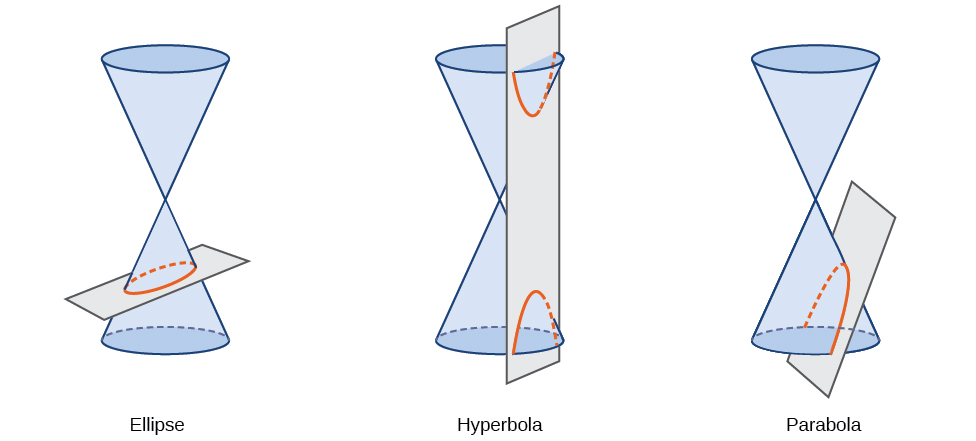{: #Figure_10_01_002}

Conic sections can also be described by a set of points in the coordinate plane. Later in this chapter, we will see that the graph of any quadratic equation in two variables is a conic section. The signs of the equations and the coefficients of the variable terms determine the shape. This section focuses on the four variations of the standard form of the equation for the ellipse. An **ellipse**{: data-type="term"} is the set of all points<math xmlns="http://www.w3.org/1998/Math/MathML"> <mrow> <mtext> </mtext><mrow><mo>(</mo> <mrow> <mi>x</mi><mo>,</mo><mi>y</mi> </mrow> <mo>)</mo></mrow><mtext> </mtext> </mrow> </math>

in a plane such that the sum of their distances from two fixed points is a constant. Each fixed point is called a **focus**{: data-type="term"} (plural: **foci**{: data-type="term"}).

We can draw an ellipse using a piece of cardboard, two thumbtacks, a pencil, and string. Place the thumbtacks in the cardboard to form the foci of the ellipse. Cut a piece of string longer than the distance between the two thumbtacks (the length of the string represents the constant in the definition). Tack each end of the string to the cardboard, and trace a curve with a pencil held taut against the string. The result is an ellipse. See [\[link\]](#Figure_10_01_003).

 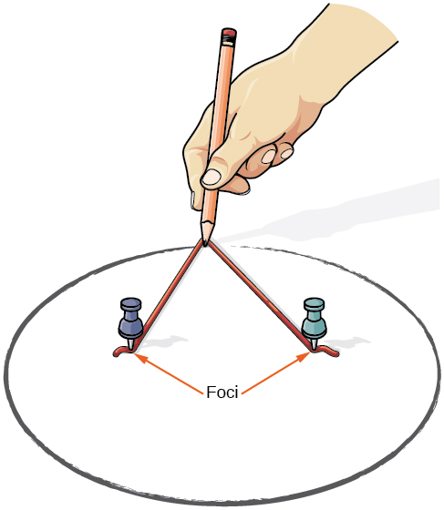{: #Figure_10_01_003}

Every ellipse has two axes of symmetry. The longer axis is called the **major axis**{: data-type="term"}, and the shorter axis is called the **minor axis**{: data-type="term"}. Each endpoint of the major axis is the **vertex**{: data-type="term"} of the ellipse (plural: **vertices**{: data-type="term"}), and each endpoint of the minor axis is a **co-vertex**{: data-type="term"} of the ellipse. The **center of an ellipse**{: data-type="term"} is the midpoint of both the major and minor axes. The axes are perpendicular at the center. The foci always lie on the major axis, and the sum of the distances from the foci to any point on the ellipse (the constant sum) is greater than the distance between the foci. See [\[link\]](#Figure_10_01_004).

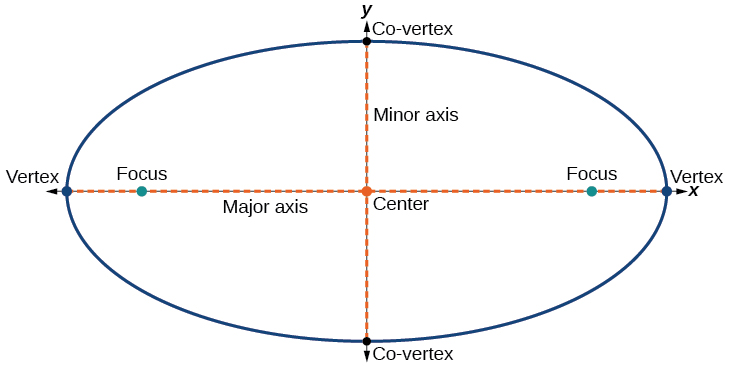{: #Figure_10_01_004}

In this section, we restrict ellipses to those that are positioned vertically or horizontally in the coordinate plane. That is, the axes will either lie on or be parallel to the *x*- and *y*-axes. Later in the chapter, we will see ellipses that are rotated in the coordinate plane.

To work with horizontal and vertical ellipses in the coordinate plane, we consider two cases: those that are centered at the origin and those that are centered at a point other than the origin. First we will learn to derive the equations of ellipses, and then we will learn how to write the equations of ellipses in standard form. Later we will use what we learn to draw the graphs.

## Deriving the Equation of an Ellipse Centered at the Origin

To derive the equation of an **ellipse**{: data-type="term" .no-emphasis} centered at the origin, we begin with the foci<math xmlns="http://www.w3.org/1998/Math/MathML"> <mrow> <mtext> </mtext><mrow><mo>(</mo> <mrow> <mo>−</mo><mi>c</mi><mo>,</mo><mn>0</mn> </mrow> <mo>)</mo></mrow><mtext> </mtext> </mrow> </math>

and<math xmlns="http://www.w3.org/1998/Math/MathML"> <mrow> <mtext> </mtext><mo stretchy="false">(</mo><mi>c</mi><mo>,</mo><mn>0</mn><mo stretchy="false">)</mo><mo>.</mo><mtext> </mtext> </mrow> </math>

The ellipse is the set of all points<math xmlns="http://www.w3.org/1998/Math/MathML"> <mrow> <mtext> </mtext><mrow><mo>(</mo> <mrow> <mi>x</mi><mo>,</mo><mi>y</mi> </mrow> <mo>)</mo></mrow><mtext> </mtext> </mrow> </math>

such that the sum of the distances from<math xmlns="http://www.w3.org/1998/Math/MathML"> <mrow> <mtext> </mtext><mrow><mo>(</mo> <mrow> <mi>x</mi><mo>,</mo><mi>y</mi> </mrow> <mo>)</mo></mrow><mtext> </mtext> </mrow> </math>

to the foci is constant, as shown in [\[link\]](#Figure_10_01_014).

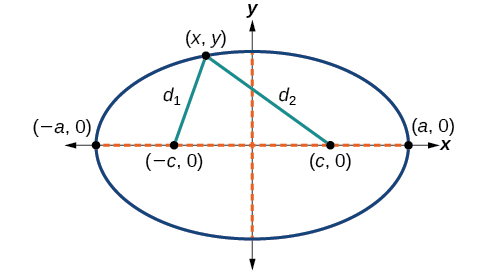{: #Figure_10_01_014}

If<math xmlns="http://www.w3.org/1998/Math/MathML"> <mrow> <mtext> </mtext><mrow><mo>(</mo> <mrow> <mi>a</mi><mo>,</mo><mn>0</mn> </mrow> <mo>)</mo></mrow><mtext> </mtext> </mrow> </math>

is a **vertex**{: data-type="term" .no-emphasis} of the ellipse, the distance from<math xmlns="http://www.w3.org/1998/Math/MathML"> <mrow> <mtext> </mtext><mrow><mo>(</mo> <mrow> <mo>−</mo><mi>c</mi><mo>,</mo><mn>0</mn> </mrow> <mo>)</mo></mrow><mtext> </mtext> </mrow> </math>

to<math xmlns="http://www.w3.org/1998/Math/MathML"> <mrow> <mtext> </mtext><mo stretchy="false">(</mo><mi>a</mi><mo>,</mo><mn>0</mn><mo stretchy="false">)</mo><mtext> </mtext> </mrow> </math>

is<math xmlns="http://www.w3.org/1998/Math/MathML"> <mrow> <mtext> </mtext><mi>a</mi><mo>−</mo><mo stretchy="false">(</mo><mo>−</mo><mi>c</mi><mo stretchy="false">)</mo><mo>=</mo><mi>a</mi><mo>+</mo><mi>c</mi><mo>.</mo><mtext> </mtext> </mrow> </math>

The distance from<math xmlns="http://www.w3.org/1998/Math/MathML"> <mrow> <mtext> </mtext><mrow><mo>(</mo> <mrow> <mi>c</mi><mo>,</mo><mn>0</mn> </mrow> <mo>)</mo></mrow><mtext> </mtext> </mrow> </math>

to<math xmlns="http://www.w3.org/1998/Math/MathML"> <mrow> <mtext> </mtext><mrow><mo>(</mo> <mrow> <mi>a</mi><mo>,</mo><mn>0</mn> </mrow> <mo>)</mo></mrow><mtext> </mtext> </mrow> </math>

is<math xmlns="http://www.w3.org/1998/Math/MathML"> <mrow> <mtext> </mtext><mi>a</mi><mo>−</mo><mi>c</mi> </mrow> </math>

. The sum of the distances from the **foci**{: data-type="term" .no-emphasis} to the vertex is

<math xmlns="http://www.w3.org/1998/Math/MathML"> <mrow> <mrow><mo>(</mo> <mrow> <mi>a</mi><mo>+</mo><mi>c</mi> </mrow> <mo>)</mo></mrow><mo>+</mo><mrow><mo>(</mo> <mrow> <mi>a</mi><mo>−</mo><mi>c</mi> </mrow> <mo>)</mo></mrow><mo>=</mo><mn>2</mn><mi>a</mi> </mrow> </math>

If<math xmlns="http://www.w3.org/1998/Math/MathML"> <mrow> <mtext> </mtext><mrow><mo>(</mo> <mrow> <mi>x</mi><mo>,</mo><mi>y</mi> </mrow> <mo>)</mo></mrow><mtext> </mtext> </mrow> </math>

is a point on the ellipse, then we can define the following variables:

<math xmlns="http://www.w3.org/1998/Math/MathML"> <mrow> <mtable columnalign="left"> <mtr columnalign="left"> <mtd columnalign="left"> <mrow> <msub> <mi>d</mi> <mn>1</mn> </msub> <mo>=</mo><mtext>the distance from </mtext><mo stretchy="false">(</mo><mi>−</mi><mi>c</mi><mo>,</mo><mn>0</mn><mo stretchy="false">)</mo><mtext> to </mtext><mo stretchy="false">(</mo><mi>x</mi><mo>,</mo><mi>y</mi><mo stretchy="false">)</mo> </mrow> </mtd> </mtr> <mtr columnalign="left"> <mtd columnalign="left"> <mrow> <msub> <mi>d</mi> <mn>2</mn> </msub> <mo>=</mo><mtext>the distance from </mtext><mo stretchy="false">(</mo><mi>c</mi><mo>,</mo><mn>0</mn><mo stretchy="false">)</mo><mtext> to </mtext><mo stretchy="false">(</mo><mi>x</mi><mo>,</mo><mi>y</mi><mo stretchy="false">)</mo> </mrow> </mtd> </mtr> </mtable> </mrow> </math>

By the definition of an ellipse,<math xmlns="http://www.w3.org/1998/Math/MathML"> <mrow> <mtext> </mtext><msub> <mi>d</mi> <mn>1</mn> </msub> <mo>+</mo><msub> <mi>d</mi> <mn>2</mn> </msub> <mtext> </mtext> </mrow> </math>

is constant for any point<math xmlns="http://www.w3.org/1998/Math/MathML"> <mrow> <mtext> </mtext><mrow><mo>(</mo> <mrow> <mi>x</mi><mo>,</mo><mi>y</mi> </mrow> <mo>)</mo></mrow><mtext> </mtext> </mrow> </math>

on the ellipse. We know that the sum of these distances is<math xmlns="http://www.w3.org/1998/Math/MathML"> <mrow> <mtext> </mtext><mn>2</mn><mi>a</mi><mtext> </mtext> </mrow> </math>

for the vertex<math xmlns="http://www.w3.org/1998/Math/MathML"> <mrow> <mtext> </mtext><mo stretchy="false">(</mo><mi>a</mi><mo>,</mo><mn>0</mn><mo stretchy="false">)</mo><mo>.</mo><mtext> </mtext> </mrow> </math>

It follows that<math xmlns="http://www.w3.org/1998/Math/MathML"> <mrow> <mtext> </mtext><msub> <mi>d</mi> <mn>1</mn> </msub> <mo>+</mo><msub> <mi>d</mi> <mn>2</mn> </msub> <mo>=</mo><mn>2</mn><mi>a</mi><mtext> </mtext> </mrow> </math>

for any point on the ellipse. We will begin the derivation by applying the distance formula. The rest of the derivation is algebraic.

<math xmlns="http://www.w3.org/1998/Math/MathML" display="block"> <mrow> <mtable columnalign="left"> <mtr columnalign="left"> <mtd columnalign="left"> <mrow> <mtext>                                      </mtext><msub> <mi>d</mi> <mn>1</mn> </msub> <mo>+</mo><msub> <mi>d</mi> <mn>2</mn> </msub> <mo>=</mo><msqrt> <mrow> <msup> <mrow> <mo stretchy="false">(</mo><mi>x</mi><mo>−</mo><mo stretchy="false">(</mo><mo>−</mo><mi>c</mi><mo stretchy="false">)</mo><mo stretchy="false">)</mo></mrow> <mn>2</mn> </msup> <mo>+</mo><msup> <mrow> <mo stretchy="false">(</mo><mi>y</mi><mo>−</mo><mn>0</mn><mo stretchy="false">)</mo></mrow> <mn>2</mn> </msup> </mrow> </msqrt> <mo>+</mo><msqrt> <mrow> <msup> <mrow> <mo stretchy="false">(</mo><mi>x</mi><mo>−</mo><mi>c</mi><mo stretchy="false">)</mo></mrow> <mn>2</mn> </msup> <mo>+</mo><msup> <mrow> <mo stretchy="false">(</mo><mi>y</mi><mo>−</mo><mn>0</mn><mo stretchy="false">)</mo></mrow> <mn>2</mn> </msup> </mrow> </msqrt> <mo>=</mo><mn>2</mn><mi>a</mi></mrow> </mtd> <mtd columnalign="left"> <mrow> <mtext>Distance formula</mtext></mrow> </mtd> </mtr> <mtr columnalign="left"> <mtd columnalign="left"> <mrow> <msqrt> <mrow> <msup> <mrow> <mo stretchy="false">(</mo><mi>x</mi><mo>+</mo><mi>c</mi><mo stretchy="false">)</mo></mrow> <mn>2</mn> </msup> <mo>+</mo><msup> <mi>y</mi> <mn>2</mn> </msup> </mrow> </msqrt> <mo>+</mo><msqrt> <mrow> <msup> <mrow> <mo stretchy="false">(</mo><mi>x</mi><mo>−</mo><mi>c</mi><mo stretchy="false">)</mo></mrow> <mn>2</mn> </msup> <mo>+</mo><msup> <mi>y</mi> <mn>2</mn> </msup> </mrow> </msqrt> <mo>=</mo><mn>2</mn><mi>a</mi></mrow> </mtd> <mtd columnalign="left"> <mrow> <mtext>Simplify expressions</mtext><mtext>.</mtext></mrow> </mtd> </mtr> <mtr columnalign="left"> <mtd columnalign="left"> <mrow> <mtext>                            </mtext><msqrt> <mrow> <msup> <mrow> <mo stretchy="false">(</mo><mi>x</mi><mo>+</mo><mi>c</mi><mo stretchy="false">)</mo></mrow> <mn>2</mn> </msup> <mo>+</mo><msup> <mi>y</mi> <mn>2</mn> </msup> </mrow> </msqrt> <mo>=</mo><mn>2</mn><mi>a</mi><mo>−</mo><msqrt> <mrow> <msup> <mrow> <mo stretchy="false">(</mo><mi>x</mi><mo>−</mo><mi>c</mi><mo stretchy="false">)</mo></mrow> <mn>2</mn> </msup> <mo>+</mo><msup> <mi>y</mi> <mn>2</mn> </msup> </mrow> </msqrt> </mrow> </mtd> <mtd columnalign="left"> <mrow> <mtext>Move radical to opposite side</mtext><mtext>.</mtext></mrow> </mtd> </mtr> <mtr columnalign="left"> <mtd columnalign="left"> <mrow> <mtext>                              </mtext><msup> <mrow> <mo stretchy="false">(</mo><mi>x</mi><mo>+</mo><mi>c</mi><mo stretchy="false">)</mo></mrow> <mn>2</mn> </msup> <mo>+</mo><msup> <mi>y</mi> <mn>2</mn> </msup> <mo>=</mo><msup> <mrow> <mrow><mo>[</mo> <mrow> <mn>2</mn><mi>a</mi><mo>−</mo><msqrt> <mrow> <msup> <mrow> <mo stretchy="false">(</mo><mi>x</mi><mo>−</mo><mi>c</mi><mo stretchy="false">)</mo></mrow> <mn>2</mn> </msup> <mo>+</mo><msup> <mi>y</mi> <mn>2</mn> </msup> </mrow> </msqrt> </mrow> <mo>]</mo></mrow></mrow> <mn>2</mn> </msup> </mrow> </mtd> <mtd columnalign="left"> <mrow> <mtext>Square both sides</mtext><mtext>.</mtext></mrow> </mtd> </mtr> <mtr columnalign="left"> <mtd columnalign="left"> <mrow> <mtext>                    </mtext><msup> <mi>x</mi> <mn>2</mn> </msup> <mo>+</mo><mn>2</mn><mi>c</mi><mi>x</mi><mo>+</mo><msup> <mi>c</mi> <mn>2</mn> </msup> <mo>+</mo><msup> <mi>y</mi> <mn>2</mn> </msup> <mo>=</mo><mn>4</mn><msup> <mi>a</mi> <mn>2</mn> </msup> <mo>−</mo><mn>4</mn><mi>a</mi><msqrt> <mrow> <msup> <mrow> <mo stretchy="false">(</mo><mi>x</mi><mo>−</mo><mi>c</mi><mo stretchy="false">)</mo></mrow> <mn>2</mn> </msup> <mo>+</mo><msup> <mi>y</mi> <mn>2</mn> </msup> </mrow> </msqrt> <mo>+</mo><msup> <mrow> <mo stretchy="false">(</mo><mi>x</mi><mo>−</mo><mi>c</mi><mo stretchy="false">)</mo></mrow> <mn>2</mn> </msup> <mo>+</mo><msup> <mi>y</mi> <mn>2</mn> </msup> </mrow> </mtd> <mtd columnalign="left"> <mrow> <mtext>Expand the squares</mtext><mtext>.</mtext></mrow> </mtd> </mtr> <mtr columnalign="left"> <mtd columnalign="left"> <mrow> <mtext>                    </mtext><msup> <mi>x</mi> <mn>2</mn> </msup> <mo>+</mo><mn>2</mn><mi>c</mi><mi>x</mi><mo>+</mo><msup> <mi>c</mi> <mn>2</mn> </msup> <mo>+</mo><msup> <mi>y</mi> <mn>2</mn> </msup> <mo>=</mo><mn>4</mn><msup> <mi>a</mi> <mn>2</mn> </msup> <mo>−</mo><mn>4</mn><mi>a</mi><msqrt> <mrow> <msup> <mrow> <mo stretchy="false">(</mo><mi>x</mi><mo>−</mo><mi>c</mi><mo stretchy="false">)</mo></mrow> <mn>2</mn> </msup> <mo>+</mo><msup> <mi>y</mi> <mn>2</mn> </msup> </mrow> </msqrt> <mo>+</mo><msup> <mi>x</mi> <mn>2</mn> </msup> <mo>−</mo><mn>2</mn><mi>c</mi><mi>x</mi><mo>+</mo><msup> <mi>c</mi> <mn>2</mn> </msup> <mo>+</mo><msup> <mi>y</mi> <mn>2</mn> </msup> </mrow> </mtd> <mtd columnalign="left"> <mrow> <mtext>Expand remaining squares</mtext><mtext>.</mtext></mrow> </mtd> </mtr> <mtr columnalign="left"> <mtd columnalign="left"> <mrow> <mtext>                                             </mtext><mn>2</mn><mi>c</mi><mi>x</mi><mo>=</mo><mn>4</mn><msup> <mi>a</mi> <mn>2</mn> </msup> <mo>−</mo><mn>4</mn><mi>a</mi><msqrt> <mrow> <msup> <mrow> <mo stretchy="false">(</mo><mi>x</mi><mo>−</mo><mi>c</mi><mo stretchy="false">)</mo></mrow> <mn>2</mn> </msup> <mo>+</mo><msup> <mi>y</mi> <mn>2</mn> </msup> </mrow> </msqrt> <mo>−</mo><mn>2</mn><mi>c</mi><mi>x</mi></mrow> </mtd> <mtd columnalign="left"> <mrow> <mtext>Combine like terms</mtext><mtext>.</mtext></mrow> </mtd> </mtr> <mtr columnalign="left"> <mtd columnalign="left"> <mrow> <mtext>                                   </mtext><mn>4</mn><mi>c</mi><mi>x</mi><mo>−</mo><mn>4</mn><msup> <mi>a</mi> <mn>2</mn> </msup> <mo>=</mo><mo>−</mo><mn>4</mn><mi>a</mi><msqrt> <mrow> <msup> <mrow> <mo stretchy="false">(</mo><mi>x</mi><mo>−</mo><mi>c</mi><mo stretchy="false">)</mo></mrow> <mn>2</mn> </msup> <mo>+</mo><msup> <mi>y</mi> <mn>2</mn> </msup> </mrow> </msqrt> </mrow> </mtd> <mtd columnalign="left"> <mrow> <mtext>Isolate the radical</mtext><mtext>.</mtext></mrow> </mtd> </mtr> <mtr columnalign="left"> <mtd columnalign="left"> <mrow> <mtext>                                       </mtext><mi>c</mi><mi>x</mi><mo>−</mo><msup> <mi>a</mi> <mn>2</mn> </msup> <mo>=</mo><mo>−</mo><mi>a</mi><msqrt> <mrow> <msup> <mrow> <mo stretchy="false">(</mo><mi>x</mi><mo>−</mo><mi>c</mi><mo stretchy="false">)</mo></mrow> <mn>2</mn> </msup> <mo>+</mo><msup> <mi>y</mi> <mn>2</mn> </msup> </mrow> </msqrt> </mrow> </mtd> <mtd columnalign="left"> <mrow> <mtext>Divide by 4</mtext><mtext>.</mtext></mrow> </mtd> </mtr> <mtr columnalign="left"> <mtd columnalign="left"> <mrow> <mtext>                                   </mtext><msup> <mrow> <mrow><mo>[</mo> <mrow> <mi>c</mi><mi>x</mi><mo>−</mo><msup> <mi>a</mi> <mn>2</mn> </msup> </mrow> <mo>]</mo></mrow></mrow> <mn>2</mn> </msup> <mo>=</mo><msup> <mi>a</mi> <mn>2</mn> </msup> <msup> <mrow> <mrow><mo>[</mo> <mrow> <msqrt> <mrow> <msup> <mrow> <mo stretchy="false">(</mo><mi>x</mi><mo>−</mo><mi>c</mi><mo stretchy="false">)</mo></mrow> <mn>2</mn> </msup> <mo>+</mo><msup> <mi>y</mi> <mn>2</mn> </msup> </mrow> </msqrt> </mrow> <mo>]</mo></mrow></mrow> <mn>2</mn> </msup> </mrow> </mtd> <mtd columnalign="left"> <mrow> <mtext>Square both sides</mtext><mtext>.</mtext></mrow> </mtd> </mtr> <mtr columnalign="left"> <mtd columnalign="left"> <mrow> <mtext>                    </mtext><msup> <mi>c</mi> <mn>2</mn> </msup> <msup> <mi>x</mi> <mn>2</mn> </msup> <mo>−</mo><mn>2</mn><msup> <mi>a</mi> <mn>2</mn> </msup> <mi>c</mi><mi>x</mi><mo>+</mo><msup> <mi>a</mi> <mn>4</mn> </msup> <mo>=</mo><msup> <mi>a</mi> <mn>2</mn> </msup> <mrow><mo>(</mo> <mrow> <msup> <mi>x</mi> <mn>2</mn> </msup> <mo>−</mo><mn>2</mn><mi>c</mi><mi>x</mi><mo>+</mo><msup> <mi>c</mi> <mn>2</mn> </msup> <mo>+</mo><msup> <mi>y</mi> <mn>2</mn> </msup> </mrow> <mo>)</mo></mrow></mrow> </mtd> <mtd columnalign="left"> <mrow> <mtext>Expand the squares</mtext><mtext>.</mtext></mrow> </mtd> </mtr> <mtr columnalign="left"> <mtd columnalign="left"> <mrow> <mtext>                    </mtext><msup> <mi>c</mi> <mn>2</mn> </msup> <msup> <mi>x</mi> <mn>2</mn> </msup> <mo>−</mo><mn>2</mn><msup> <mi>a</mi> <mn>2</mn> </msup> <mi>c</mi><mi>x</mi><mo>+</mo><msup> <mi>a</mi> <mn>4</mn> </msup> <mo>=</mo><msup> <mi>a</mi> <mn>2</mn> </msup> <msup> <mi>x</mi> <mn>2</mn> </msup> <mo>−</mo><mn>2</mn><msup> <mi>a</mi> <mn>2</mn> </msup> <mi>c</mi><mi>x</mi><mo>+</mo><msup> <mi>a</mi> <mn>2</mn> </msup> <msup> <mi>c</mi> <mn>2</mn> </msup> <mo>+</mo><msup> <mi>a</mi> <mn>2</mn> </msup> <msup> <mi>y</mi> <mn>2</mn> </msup> </mrow> </mtd> <mtd columnalign="left"> <mrow> <mtext>Distribute </mtext><msup> <mi>a</mi> <mn>2</mn> </msup> <mo>.</mo></mrow> </mtd> </mtr> <mtr columnalign="left"> <mtd columnalign="left"> <mrow> <mtext>                 </mtext><msup> <mi>a</mi> <mn>2</mn> </msup> <msup> <mi>x</mi> <mn>2</mn> </msup> <mo>−</mo><msup> <mi>c</mi> <mn>2</mn> </msup> <msup> <mi>x</mi> <mn>2</mn> </msup> <mo>+</mo><msup> <mi>a</mi> <mn>2</mn> </msup> <msup> <mi>y</mi> <mn>2</mn> </msup> <mo>=</mo><msup> <mi>a</mi> <mn>4</mn> </msup> <mo>−</mo><msup> <mi>a</mi> <mn>2</mn> </msup> <msup> <mi>c</mi> <mn>2</mn> </msup> </mrow> </mtd> <mtd columnalign="left"> <mrow> <mtext>Rewrite</mtext><mtext>.</mtext></mrow> </mtd> </mtr> <mtr columnalign="left"> <mtd columnalign="left"> <mrow> <mtext>                   </mtext><msup> <mi>x</mi> <mn>2</mn> </msup> <mrow><mo>(</mo> <mrow> <msup> <mi>a</mi> <mn>2</mn> </msup> <mo>−</mo><msup> <mi>c</mi> <mn>2</mn> </msup> </mrow> <mo>)</mo></mrow><mo>+</mo><msup> <mi>a</mi> <mn>2</mn> </msup> <msup> <mi>y</mi> <mn>2</mn> </msup> <mo>=</mo><msup> <mi>a</mi> <mn>2</mn> </msup> <mrow><mo>(</mo> <mrow> <msup> <mi>a</mi> <mn>2</mn> </msup> <mo>−</mo><msup> <mi>c</mi> <mn>2</mn> </msup> </mrow> <mo>)</mo></mrow></mrow> </mtd> <mtd columnalign="left"> <mrow> <mtext>Factor common terms</mtext><mtext>.</mtext></mrow> </mtd> </mtr> <mtr columnalign="left"> <mtd columnalign="left"> <mrow> <mtext>                              </mtext><msup> <mi>x</mi> <mn>2</mn> </msup> <msup> <mi>b</mi> <mn>2</mn> </msup> <mo>+</mo><msup> <mi>a</mi> <mn>2</mn> </msup> <msup> <mi>y</mi> <mn>2</mn> </msup> <mo>=</mo><msup> <mi>a</mi> <mn>2</mn> </msup> <msup> <mi>b</mi> <mn>2</mn> </msup> </mrow> </mtd> <mtd columnalign="left"> <mrow> <mtext>Set </mtext><msup> <mi>b</mi> <mn>2</mn> </msup> <mo>=</mo><msup> <mi>a</mi> <mn>2</mn> </msup> <mo>−</mo><msup> <mi>c</mi> <mn>2</mn> </msup> <mo>.</mo></mrow> </mtd> </mtr> <mtr columnalign="left"> <mtd columnalign="left"> <mrow> <mtext>                            </mtext><mfrac> <mrow> <msup> <mi>x</mi> <mn>2</mn> </msup> <msup> <mi>b</mi> <mn>2</mn> </msup> </mrow> <mrow> <msup> <mi>a</mi> <mn>2</mn> </msup> <msup> <mi>b</mi> <mn>2</mn> </msup> </mrow> </mfrac> <mo>+</mo><mfrac> <mrow> <msup> <mi>a</mi> <mn>2</mn> </msup> <msup> <mi>y</mi> <mn>2</mn> </msup> </mrow> <mrow> <msup> <mi>a</mi> <mn>2</mn> </msup> <msup> <mi>b</mi> <mn>2</mn> </msup> </mrow> </mfrac> <mo>=</mo><mfrac> <mrow> <msup> <mi>a</mi> <mn>2</mn> </msup> <msup> <mi>b</mi> <mn>2</mn> </msup> </mrow> <mrow> <msup> <mi>a</mi> <mn>2</mn> </msup> <msup> <mi>b</mi> <mn>2</mn> </msup> </mrow> </mfrac> </mrow> </mtd> <mtd columnalign="left"> <mrow> <mtext>Divide both sides by </mtext><msup> <mi>a</mi> <mn>2</mn> </msup> <msup> <mi>b</mi> <mn>2</mn> </msup> <mo>.</mo></mrow> </mtd> </mtr> <mtr columnalign="left"> <mtd columnalign="left"> <mrow> <mtext>                                     </mtext><mfrac> <mrow> <msup> <mi>x</mi> <mn>2</mn> </msup> </mrow> <mrow> <msup> <mi>a</mi> <mn>2</mn> </msup> </mrow> </mfrac> <mo>+</mo><mfrac> <mrow> <msup> <mi>y</mi> <mn>2</mn> </msup> </mrow> <mrow> <msup> <mi>b</mi> <mn>2</mn> </msup> </mrow> </mfrac> <mo>=</mo><mn>1</mn></mrow> </mtd> <mtd columnalign="left"> <mrow> <mtext>Simplify</mtext><mtext>.</mtext></mrow> </mtd> </mtr> </mtable></mrow> </math>

Thus, the standard equation of an ellipse is<math xmlns="http://www.w3.org/1998/Math/MathML"> <mrow> <mtext> </mtext><mfrac> <mrow> <msup> <mi>x</mi> <mn>2</mn> </msup> </mrow> <mrow> <msup> <mi>a</mi> <mn>2</mn> </msup> </mrow> </mfrac> <mo>+</mo><mfrac> <mrow> <msup> <mi>y</mi> <mn>2</mn> </msup> </mrow> <mrow> <msup> <mi>b</mi> <mn>2</mn> </msup> </mrow> </mfrac> <mo>=</mo><mn>1.</mn> </mrow> </math>

This equation defines an ellipse centered at the origin. If<math xmlns="http://www.w3.org/1998/Math/MathML"> <mrow> <mtext> </mtext><mi>a</mi><mo>&gt;</mo><mi>b</mi><mo>,</mo> </mrow> </math>

the ellipse is stretched further in the horizontal direction, and if<math xmlns="http://www.w3.org/1998/Math/MathML"> <mrow> <mtext> </mtext><mi>b</mi><mo>&gt;</mo><mi>a</mi><mo>,</mo> </mrow> </math>

 the ellipse is stretched further in the vertical direction.

## Writing Equations of Ellipses Centered at the Origin in Standard Form

Standard forms of equations tell us about key features of graphs. Take a moment to recall some of the standard forms of equations we’ve worked with in the past: linear, quadratic, cubic, exponential, logarithmic, and so on. By learning to interpret standard forms of equations, we are bridging the relationship between algebraic and geometric representations of mathematical phenomena.

The key features of the **ellipse**{: data-type="term" .no-emphasis} are its center, **vertices**{: data-type="term" .no-emphasis}, **co-vertices**{: data-type="term" .no-emphasis}, **foci**{: data-type="term" .no-emphasis}, and lengths and positions of the **major and minor axes**{: data-type="term" .no-emphasis}. Just as with other equations, we can identify all of these features just by looking at the standard form of the equation. There are four variations of the standard form of the ellipse. These variations are categorized first by the location of the center (the origin or not the origin), and then by the position (horizontal or vertical). Each is presented along with a description of how the parts of the equation relate to the graph. Interpreting these parts allows us to form a mental picture of the ellipse.

Standard Forms of the Equation of an Ellipse with Center (0,0)

The standard form of the equation of an ellipse with center<math xmlns="http://www.w3.org/1998/Math/MathML"> <mrow> <mtext> </mtext><mrow><mo>(</mo> <mrow> <mn>0</mn><mo>,</mo><mn>0</mn> </mrow> <mo>)</mo></mrow><mtext> </mtext> </mrow> </math>

and major axis on the *x-axis* is

<math xmlns="http://www.w3.org/1998/Math/MathML"> <mrow> <mfrac> <mrow> <msup> <mi>x</mi> <mn>2</mn> </msup> </mrow> <mrow> <msup> <mi>a</mi> <mn>2</mn> </msup> </mrow> </mfrac> <mo>+</mo><mfrac> <mrow> <msup> <mi>y</mi> <mn>2</mn> </msup> </mrow> <mrow> <msup> <mi>b</mi> <mn>2</mn> </msup> </mrow> </mfrac> <mo>=</mo><mn>1</mn> </mrow> </math>

where

* <math xmlns="http://www.w3.org/1998/Math/MathML"> <mrow> <mi>a</mi><mo>&gt;</mo><mi>b</mi> </mrow> </math>

* the length of the major axis is
  <math xmlns="http://www.w3.org/1998/Math/MathML"> <mrow> <mtext> </mtext><mn>2</mn><mi>a</mi> </mrow> </math>

* the coordinates of the vertices are
  <math xmlns="http://www.w3.org/1998/Math/MathML"> <mrow> <mtext> </mtext><mrow><mo>(</mo> <mrow> <mo>±</mo><mi>a</mi><mo>,</mo><mn>0</mn> </mrow> <mo>)</mo></mrow> </mrow> </math>

* the length of the minor axis is
  <math xmlns="http://www.w3.org/1998/Math/MathML"> <mrow> <mtext> </mtext><mn>2</mn><mi>b</mi> </mrow> </math>

* the coordinates of the co-vertices are
  <math xmlns="http://www.w3.org/1998/Math/MathML"> <mrow> <mtext> </mtext><mrow><mo>(</mo> <mrow> <mn>0,</mn><mo>±</mo><mi>b</mi> </mrow> <mo>)</mo></mrow> </mrow> </math>

* the coordinates of the foci are
  <math xmlns="http://www.w3.org/1998/Math/MathML"> <mrow> <mtext> </mtext><mrow><mo>(</mo> <mrow> <mo>±</mo><mi>c</mi><mo>,</mo><mn>0</mn> </mrow> <mo>)</mo></mrow> </mrow> </math>
  
  , where
  <math xmlns="http://www.w3.org/1998/Math/MathML"> <mrow> <mtext> </mtext><msup> <mi>c</mi> <mn>2</mn> </msup> <mo>=</mo><msup> <mi>a</mi> <mn>2</mn> </msup> <mo>−</mo><msup> <mi>b</mi> <mn>2</mn> </msup> <mo>.</mo><mtext> </mtext> </mrow> </math>
  
  See [\[link\]](#Figure_10_01_005)**a**

The standard form of the equation of an ellipse with center<math xmlns="http://www.w3.org/1998/Math/MathML"> <mrow> <mtext> </mtext><mrow><mo>(</mo> <mrow> <mn>0</mn><mo>,</mo><mn>0</mn> </mrow> <mo>)</mo></mrow><mtext> </mtext> </mrow> </math>

and major axis on the *y-axis* is

<math xmlns="http://www.w3.org/1998/Math/MathML"> <mrow> <mfrac> <mrow> <msup> <mi>x</mi> <mn>2</mn> </msup> </mrow> <mrow> <msup> <mi>b</mi> <mn>2</mn> </msup> </mrow> </mfrac> <mo>+</mo><mfrac> <mrow> <msup> <mi>y</mi> <mn>2</mn> </msup> </mrow> <mrow> <msup> <mi>a</mi> <mn>2</mn> </msup> </mrow> </mfrac> <mo>=</mo><mn>1</mn> </mrow> </math>

where

* <math xmlns="http://www.w3.org/1998/Math/MathML"> <mrow> <mi>a</mi><mo>&gt;</mo><mi>b</mi> </mrow> </math>

* the length of the major axis is
  <math xmlns="http://www.w3.org/1998/Math/MathML"> <mrow> <mtext> </mtext><mn>2</mn><mi>a</mi> </mrow> </math>

* the coordinates of the vertices are
  <math xmlns="http://www.w3.org/1998/Math/MathML"> <mrow> <mtext> </mtext><mrow><mo>(</mo> <mrow> <mn>0,</mn><mo>±</mo><mi>a</mi> </mrow> <mo>)</mo></mrow> </mrow> </math>

* the length of the minor axis is
  <math xmlns="http://www.w3.org/1998/Math/MathML"> <mrow> <mtext> </mtext><mn>2</mn><mi>b</mi> </mrow> </math>

* the coordinates of the co-vertices are
  <math xmlns="http://www.w3.org/1998/Math/MathML"> <mrow> <mtext> </mtext><mrow><mo>(</mo> <mrow> <mo>±</mo><mi>b</mi><mo>,</mo><mn>0</mn> </mrow> <mo>)</mo></mrow> </mrow> </math>

* the coordinates of the foci are
  <math xmlns="http://www.w3.org/1998/Math/MathML"> <mrow> <mtext> </mtext><mrow><mo>(</mo> <mrow> <mn>0,</mn><mo>±</mo><mi>c</mi> </mrow> <mo>)</mo></mrow> </mrow> </math>
  
  , where
  <math xmlns="http://www.w3.org/1998/Math/MathML"> <mrow> <mtext> </mtext><msup> <mi>c</mi> <mn>2</mn> </msup> <mo>=</mo><msup> <mi>a</mi> <mn>2</mn> </msup> <mo>−</mo><msup> <mi>b</mi> <mn>2</mn> </msup> <mo>.</mo><mtext> </mtext> </mrow> </math>
  
  See [\[link\]](#Figure_10_01_005)**b**

Note that the vertices, co-vertices, and foci are related by the equation<math xmlns="http://www.w3.org/1998/Math/MathML"> <mrow> <mtext> </mtext><msup> <mi>c</mi> <mn>2</mn> </msup> <mo>=</mo><msup> <mi>a</mi> <mn>2</mn> </msup> <mo>−</mo><msup> <mi>b</mi> <mn>2</mn> </msup> <mo>.</mo><mtext> </mtext> </mrow> </math>

When we are given the coordinates of the foci and vertices of an ellipse, we can use this relationship to find the equation of the ellipse in standard form.

 Horizontal ellipse with center&#10; &#10;  &#x2009;(&#10;   &#10;    0,0&#10;   &#10;  )&#x2009;&#10; &#10;(b) Vertical ellipse with center&#10; &#10;  &#x2009;(&#10;   &#10;    0,0&#10;   &#10;  )&#10; &#10;&#10;"){: #Figure_10_01_005}

**Given the vertices and foci of an ellipse centered at the origin, write its equation in standard form.**

1.  Determine whether the major axis lies on the *x*- or *y*-axis.
    1.  If the given coordinates of the vertices and foci have the form
        <math xmlns="http://www.w3.org/1998/Math/MathML"> <mrow> <mtext> </mtext><mrow><mo>(</mo> <mrow> <mo>±</mo><mi>a</mi><mo>,</mo><mn>0</mn> </mrow> <mo>)</mo></mrow><mtext> </mtext> </mrow> </math>
        
        and
        <math xmlns="http://www.w3.org/1998/Math/MathML"> <mrow> <mtext> </mtext><mo stretchy="false">(</mo><mo>±</mo><mi>c</mi><mo>,</mo><mn>0</mn><mo stretchy="false">)</mo><mtext> </mtext> </mrow> </math>
        
        respectively, then the major axis is the *x*-axis. Use the standard form
        <math xmlns="http://www.w3.org/1998/Math/MathML"> <mrow> <mtext> </mtext><mfrac> <mrow> <msup> <mi>x</mi> <mn>2</mn> </msup> </mrow> <mrow> <msup> <mi>a</mi> <mn>2</mn> </msup> </mrow> </mfrac> <mo>+</mo><mfrac> <mrow> <msup> <mi>y</mi> <mn>2</mn> </msup> </mrow> <mrow> <msup> <mi>b</mi> <mn>2</mn> </msup> </mrow> </mfrac> <mo>=</mo><mn>1.</mn> </mrow> </math>
    
    2.  If the given coordinates of the vertices and foci have the form
        <math xmlns="http://www.w3.org/1998/Math/MathML"> <mrow> <mtext> </mtext><mrow><mo>(</mo> <mrow> <mn>0,</mn><mo>±</mo><mi>a</mi> </mrow> <mo>)</mo></mrow><mtext> </mtext> </mrow> </math>
        
        and
        <math xmlns="http://www.w3.org/1998/Math/MathML"> <mrow> <mtext> </mtext><mo stretchy="false">(</mo><mo>±</mo><mi>c</mi><mo>,</mo><mn>0</mn><mo stretchy="false">)</mo><mo>,</mo> </mrow> </math>
        
        respectively, then the major axis is the *y*-axis. Use the standard form
        <math xmlns="http://www.w3.org/1998/Math/MathML"> <mrow> <mtext> </mtext><mfrac> <mrow> <msup> <mi>x</mi> <mn>2</mn> </msup> </mrow> <mrow> <msup> <mi>b</mi> <mn>2</mn> </msup> </mrow> </mfrac> <mo>+</mo><mfrac> <mrow> <msup> <mi>y</mi> <mn>2</mn> </msup> </mrow> <mrow> <msup> <mi>a</mi> <mn>2</mn> </msup> </mrow> </mfrac> <mo>=</mo><mn>1.</mn> </mrow> </math>
    {: data-number-style="lower-alpha"}

2.  Use the equation
    <math xmlns="http://www.w3.org/1998/Math/MathML"> <mrow> <mtext> </mtext><msup> <mi>c</mi> <mn>2</mn> </msup> <mo>=</mo><msup> <mi>a</mi> <mn>2</mn> </msup> <mo>−</mo><msup> <mi>b</mi> <mn>2</mn> </msup> <mo>,</mo><mtext> </mtext> </mrow> </math>
    
    along with the given coordinates of the vertices and foci, to solve for
    <math xmlns="http://www.w3.org/1998/Math/MathML"> <mrow> <mtext> </mtext><msup> <mi>b</mi> <mn>2</mn> </msup> <mo>.</mo> </mrow> </math>

3.  Substitute the values for
    <math xmlns="http://www.w3.org/1998/Math/MathML"> <mrow> <mtext> </mtext><msup> <mi>a</mi> <mn>2</mn> </msup> <mtext> </mtext> </mrow> </math>
    
    and
    <math xmlns="http://www.w3.org/1998/Math/MathML"> <mrow> <mtext> </mtext><msup> <mi>b</mi> <mn>2</mn> </msup> <mtext> </mtext> </mrow> </math>
    
    into the standard form of the equation determined in Step 1.
{: data-number-style="arabic"}

Writing the Equation of an Ellipse Centered at the Origin in Standard Form

What is the standard form equation of the ellipse that has vertices<math xmlns="http://www.w3.org/1998/Math/MathML"> <mrow> <mtext> </mtext><mrow><mo>(</mo> <mrow> <mo>±</mo><mn>8</mn><mo>,</mo><mn>0</mn> </mrow> <mo>)</mo></mrow><mtext> </mtext> </mrow> </math>

and foci<math xmlns="http://www.w3.org/1998/Math/MathML"> <mrow> <mtext> </mtext><mrow><mo>(</mo> <mrow> <mo>±</mo><mn>5</mn><mo>,</mo><mn>0</mn> </mrow> <mo>)</mo></mrow><mo>?</mo><mtext> </mtext> </mrow> </math>

The foci are on the *x*-axis, so the major axis is the *x*-axis. Thus, the equation will have the form

<math xmlns="http://www.w3.org/1998/Math/MathML"> <mrow> <mfrac> <mrow> <msup> <mi>x</mi> <mn>2</mn> </msup> </mrow> <mrow> <msup> <mi>a</mi> <mn>2</mn> </msup> </mrow> </mfrac> <mo>+</mo><mfrac> <mrow> <msup> <mi>y</mi> <mn>2</mn> </msup> </mrow> <mrow> <msup> <mi>b</mi> <mn>2</mn> </msup> </mrow> </mfrac> <mo>=</mo><mn>1</mn> </mrow> </math>

The vertices are<math xmlns="http://www.w3.org/1998/Math/MathML"> <mrow> <mtext> </mtext><mrow><mo>(</mo> <mrow> <mo>±</mo><mn>8</mn><mo>,</mo><mn>0</mn> </mrow> <mo>)</mo></mrow><mo>,</mo> </mrow> </math>

so<math xmlns="http://www.w3.org/1998/Math/MathML"> <mrow> <mtext> </mtext><mi>a</mi><mo>=</mo><mn>8</mn><mtext> </mtext> </mrow> </math>

and<math xmlns="http://www.w3.org/1998/Math/MathML"> <mrow> <mtext> </mtext><msup> <mi>a</mi> <mn>2</mn> </msup> <mo>=</mo><mn>64.</mn> </mrow> </math>

The foci are<math xmlns="http://www.w3.org/1998/Math/MathML"> <mrow> <mtext> </mtext><mrow><mo>(</mo> <mrow> <mo>±</mo><mn>5</mn><mo>,</mo><mn>0</mn> </mrow> <mo>)</mo></mrow><mo>,</mo> </mrow> </math>

so<math xmlns="http://www.w3.org/1998/Math/MathML"> <mrow> <mtext> </mtext><mi>c</mi><mo>=</mo><mn>5</mn><mtext> </mtext> </mrow> </math>

and<math xmlns="http://www.w3.org/1998/Math/MathML"> <mrow> <mtext> </mtext><msup> <mi>c</mi> <mn>2</mn> </msup> <mo>=</mo><mn>25.</mn> </mrow> </math>

We know that the vertices and foci are related by the equation<math xmlns="http://www.w3.org/1998/Math/MathML"> <mrow> <mtext> </mtext><msup> <mi>c</mi> <mn>2</mn> </msup> <mo>=</mo><msup> <mi>a</mi> <mn>2</mn> </msup> <mo>−</mo><msup> <mi>b</mi> <mn>2</mn> </msup> <mo>.</mo><mtext> </mtext> </mrow> </math>

Solving for<math xmlns="http://www.w3.org/1998/Math/MathML"> <mrow> <mtext> </mtext><msup> <mi>b</mi> <mn>2</mn> </msup> <mo>,</mo> </mrow> </math>

 we have:

<math xmlns="http://www.w3.org/1998/Math/MathML" display="block"> <mrow> <mtable columnalign="left"> <mtr columnalign="left"> <mtd columnalign="left"> <mrow> <msup> <mi>c</mi> <mn>2</mn> </msup> <mo>=</mo><msup> <mi>a</mi> <mn>2</mn> </msup> <mo>−</mo><msup> <mi>b</mi> <mn>2</mn> </msup> </mrow> </mtd> <mtd columnalign="left"> <mrow /> </mtd> </mtr> <mtr columnalign="left"> <mtd columnalign="left"> <mrow> <mn>25</mn><mo>=</mo><mn>64</mn><mo>−</mo><msup> <mi>b</mi> <mn>2</mn> </msup> <mtable> <mtr> <mtd> <mrow /> </mtd> <mtd> <mrow /> </mtd> <mtd> <mrow /> </mtd> <mtd> <mrow /> </mtd> </mtr> </mtable> </mrow> </mtd> <mtd columnalign="left"> <mrow> <mtext>Substitute for </mtext><msup> <mi>c</mi> <mn>2</mn> </msup> <mtext> and </mtext><msup> <mi>a</mi> <mn>2</mn> </msup> <mo>.</mo> </mrow> </mtd> </mtr> <mtr columnalign="left"> <mtd columnalign="left"> <mrow> <msup> <mi>b</mi> <mn>2</mn> </msup> <mo>=</mo><mn>39</mn> </mrow> </mtd> <mtd columnalign="left"> <mrow> <mtext>Solve for </mtext><msup> <mi>b</mi> <mn>2</mn> </msup> <mo>.</mo> </mrow> </mtd> </mtr> </mtable> </mrow> </math>

Now we need only substitute<math xmlns="http://www.w3.org/1998/Math/MathML"> <mrow> <mtext> </mtext><msup> <mi>a</mi> <mn>2</mn> </msup> <mo>=</mo><mn>64</mn><mtext> </mtext> </mrow> </math>

and<math xmlns="http://www.w3.org/1998/Math/MathML"> <mrow> <mtext> </mtext><msup> <mi>b</mi> <mn>2</mn> </msup> <mo>=</mo><mn>39</mn><mtext>  </mtext> </mrow> </math>

into the standard form of the equation. The equation of the ellipse is<math xmlns="http://www.w3.org/1998/Math/MathML"> <mrow> <mtext> </mtext><mfrac> <mrow> <msup> <mi>x</mi> <mn>2</mn> </msup> </mrow> <mrow> <mn>64</mn> </mrow> </mfrac> <mo>+</mo><mfrac> <mrow> <msup> <mi>y</mi> <mn>2</mn> </msup> </mrow> <mrow> <mn>39</mn> </mrow> </mfrac> <mo>=</mo><mn>1.</mn> </mrow> </math>

What is the standard form equation of the ellipse that has vertices<math xmlns="http://www.w3.org/1998/Math/MathML"> <mrow> <mtext> </mtext><mrow><mo>(</mo> <mrow> <mn>0,</mn><mo>±</mo><mn>4</mn> </mrow> <mo>)</mo></mrow><mtext> </mtext> </mrow> </math>

and foci<math xmlns="http://www.w3.org/1998/Math/MathML"> <mrow> <mtext> </mtext><mrow><mo>(</mo> <mrow> <mn>0,</mn><mo>±</mo><msqrt> <mrow> <mn>15</mn> </mrow> </msqrt> </mrow> <mo>)</mo></mrow><mo>?</mo> </mrow> </math>

<math xmlns="http://www.w3.org/1998/Math/MathML"> <mrow> <msup> <mi>x</mi> <mn>2</mn> </msup> <mo>+</mo><mfrac> <mrow> <msup> <mi>y</mi> <mn>2</mn> </msup> </mrow> <mrow> <mn>16</mn> </mrow> </mfrac> <mo>=</mo><mn>1</mn> </mrow> </math>

**Can we write the equation of an ellipse centered at the origin given coordinates of just one focus and vertex?**

<em>Yes. Ellipses are symmetrical, so the coordinates of the vertices of an ellipse centered around the origin will always have the form<math xmlns="http://www.w3.org/1998/Math/MathML">
 <mrow>
  <mtext> </mtext><mrow><mo>(</mo>
   <mrow>
    <mo>±</mo><mi>a</mi><mo>,</mo><mn>0</mn>
   </mrow>
  <mo>)</mo></mrow><mtext> </mtext>
 </mrow>
</math>or<math xmlns="http://www.w3.org/1998/Math/MathML">
 <mtext> </mtext><mo stretchy="false">(</mo><mn>0</mn><mo>,</mo><mtext> </mtext><mo>±</mo><mi>a</mi><mo stretchy="false">)</mo><mo>.</mo><mtext> </mtext>
</math>Similarly, the coordinates of the foci will always have the form<math xmlns="http://www.w3.org/1998/Math/MathML">
 <mrow>
  <mtext> </mtext><mrow><mo>(</mo>
   <mrow>
    <mo>±</mo><mi>c</mi><mo>,</mo><mn>0</mn>
   </mrow>
  <mo>)</mo></mrow><mtext> </mtext>
 </mrow>
</math>or<math xmlns="http://www.w3.org/1998/Math/MathML">
 <mtext> </mtext><mo stretchy="false">(</mo><mn>0</mn><mo>,</mo><mtext> </mtext><mo>±</mo><mi>c</mi><mo stretchy="false">)</mo><mo>.</mo><mtext> </mtext>
</math>Knowing this, we can use<math xmlns="http://www.w3.org/1998/Math/MathML">
 <mrow>
  <mtext> </mtext><mi>a</mi><mtext> </mtext>
 </mrow>
</math>and<math xmlns="http://www.w3.org/1998/Math/MathML">
 <mrow>
  <mtext> </mtext><mi>c</mi><mtext> </mtext>
 </mrow>
</math>from the given points, along with the equation<math xmlns="http://www.w3.org/1998/Math/MathML">
 <mrow>
  <mtext> </mtext><msup>
   <mi>c</mi>
   <mn>2</mn>
  </msup>
  <mo>=</mo><msup>
   <mi>a</mi>
   <mn>2</mn>
  </msup>
  <mo>−</mo><msup>
   <mi>b</mi>
   <mn>2</mn>
  </msup>
  <mo>,</mo>
 </mrow>
</math>to find<math xmlns="http://www.w3.org/1998/Math/MathML">
 <mrow>
  <mtext> </mtext><msup>
   <mi>b</mi>
   <mn>2</mn>
  </msup>
  <mo>.</mo>
 </mrow>
</math></em>

## Writing Equations of Ellipses Not Centered at the Origin

Like the graphs of other equations, the graph of an **ellipse**{: data-type="term" .no-emphasis} can be translated. If an ellipse is translated<math xmlns="http://www.w3.org/1998/Math/MathML"> <mrow> <mtext> </mtext><mi>h</mi><mtext> </mtext> </mrow> </math>

units horizontally and<math xmlns="http://www.w3.org/1998/Math/MathML"> <mrow> <mtext> </mtext><mi>k</mi><mtext> </mtext> </mrow> </math>

units vertically, the center of the ellipse will be<math xmlns="http://www.w3.org/1998/Math/MathML"> <mrow> <mtext> </mtext><mrow><mo>(</mo> <mrow> <mi>h</mi><mo>,</mo><mi>k</mi> </mrow> <mo>)</mo></mrow><mo>.</mo><mtext> </mtext> </mrow> </math>

This **translation**{: data-type="term" .no-emphasis} results in the standard form of the equation we saw previously, with<math xmlns="http://www.w3.org/1998/Math/MathML"> <mrow> <mtext> </mtext><mi>x</mi><mtext> </mtext> </mrow> </math>

replaced by<math xmlns="http://www.w3.org/1998/Math/MathML"> <mrow> <mtext> </mtext><mrow><mo>(</mo> <mrow> <mi>x</mi><mo>−</mo><mi>h</mi> </mrow> <mo>)</mo></mrow><mtext> </mtext> </mrow> </math>

and *y* replaced by<math xmlns="http://www.w3.org/1998/Math/MathML"> <mrow> <mtext> </mtext><mrow><mo>(</mo> <mrow> <mi>y</mi><mo>−</mo><mi>k</mi> </mrow> <mo>)</mo></mrow><mo>.</mo> </mrow> </math>

Standard Forms of the Equation of an Ellipse with Center (*h*, *k*)

The standard form of the equation of an ellipse with center<math xmlns="http://www.w3.org/1998/Math/MathML"> <mrow> <mtext> </mtext><mrow><mo>(</mo> <mrow> <mi>h</mi><mo>,</mo><mtext> </mtext><mi>k</mi> </mrow> <mo>)</mo></mrow><mtext> </mtext> </mrow> </math>

and **major axis**{: data-type="term" .no-emphasis} parallel to the *x*-axis is

<math xmlns="http://www.w3.org/1998/Math/MathML"> <mrow> <mfrac> <mrow> <msup> <mrow> <mrow><mo>(</mo> <mrow> <mi>x</mi><mo>−</mo><mi>h</mi> </mrow> <mo>)</mo></mrow> </mrow> <mn>2</mn> </msup> </mrow> <mrow> <msup> <mi>a</mi> <mn>2</mn> </msup> </mrow> </mfrac> <mo>+</mo><mfrac> <mrow> <msup> <mrow> <mrow><mo>(</mo> <mrow> <mi>y</mi><mo>−</mo><mi>k</mi> </mrow> <mo>)</mo></mrow> </mrow> <mn>2</mn> </msup> </mrow> <mrow> <msup> <mi>b</mi> <mn>2</mn> </msup> </mrow> </mfrac> <mo>=</mo><mn>1</mn> </mrow> </math>

where

* <math xmlns="http://www.w3.org/1998/Math/MathML"> <mrow> <mi>a</mi><mo>&gt;</mo><mi>b</mi> </mrow> </math>

* the length of the major axis is
  <math xmlns="http://www.w3.org/1998/Math/MathML"> <mrow> <mtext> </mtext><mn>2</mn><mi>a</mi> </mrow> </math>

* the coordinates of the vertices are
  <math xmlns="http://www.w3.org/1998/Math/MathML"> <mrow> <mtext> </mtext><mrow><mo>(</mo> <mrow> <mi>h</mi><mo>±</mo><mi>a</mi><mo>,</mo><mi>k</mi> </mrow> <mo>)</mo></mrow> </mrow> </math>

* the length of the minor axis is
  <math xmlns="http://www.w3.org/1998/Math/MathML"> <mrow> <mtext> </mtext><mn>2</mn><mi>b</mi> </mrow> </math>

* the coordinates of the co-vertices are
  <math xmlns="http://www.w3.org/1998/Math/MathML"> <mrow> <mtext> </mtext><mrow><mo>(</mo> <mrow> <mi>h</mi><mo>,</mo><mi>k</mi><mo>±</mo><mi>b</mi> </mrow> <mo>)</mo></mrow> </mrow> </math>

* the coordinates of the foci are
  <math xmlns="http://www.w3.org/1998/Math/MathML"> <mrow> <mtext> </mtext><mrow><mo>(</mo> <mrow> <mi>h</mi><mo>±</mo><mi>c</mi><mo>,</mo><mi>k</mi> </mrow> <mo>)</mo></mrow><mo>,</mo> </mrow> </math>
  
  where
  <math xmlns="http://www.w3.org/1998/Math/MathML"> <mrow> <mtext> </mtext><msup> <mi>c</mi> <mn>2</mn> </msup> <mo>=</mo><msup> <mi>a</mi> <mn>2</mn> </msup> <mo>−</mo><msup> <mi>b</mi> <mn>2</mn> </msup> <mo>.</mo><mtext> </mtext> </mrow> </math>
  
  See [\[link\]](#Figure_10_01_006)**a**

The standard form of the equation of an ellipse with center<math xmlns="http://www.w3.org/1998/Math/MathML"> <mrow> <mtext> </mtext><mrow><mo>(</mo> <mrow> <mi>h</mi><mo>,</mo><mi>k</mi> </mrow> <mo>)</mo></mrow><mtext> </mtext> </mrow> </math>

and major axis parallel to the *y*-axis is

<math xmlns="http://www.w3.org/1998/Math/MathML"> <mrow> <mfrac> <mrow> <msup> <mrow> <mrow><mo>(</mo> <mrow> <mi>x</mi><mo>−</mo><mi>h</mi> </mrow> <mo>)</mo></mrow> </mrow> <mn>2</mn> </msup> </mrow> <mrow> <msup> <mi>b</mi> <mn>2</mn> </msup> </mrow> </mfrac> <mo>+</mo><mfrac> <mrow> <msup> <mrow> <mrow><mo>(</mo> <mrow> <mi>y</mi><mo>−</mo><mi>k</mi> </mrow> <mo>)</mo></mrow> </mrow> <mn>2</mn> </msup> </mrow> <mrow> <msup> <mi>a</mi> <mn>2</mn> </msup> </mrow> </mfrac> <mo>=</mo><mn>1</mn> </mrow> </math>

where

* <math xmlns="http://www.w3.org/1998/Math/MathML"> <mrow> <mi>a</mi><mo>&gt;</mo><mi>b</mi> </mrow> </math>

* the length of the major axis is
  <math xmlns="http://www.w3.org/1998/Math/MathML"> <mrow> <mtext> </mtext><mn>2</mn><mi>a</mi> </mrow> </math>

* the coordinates of the vertices are
  <math xmlns="http://www.w3.org/1998/Math/MathML"> <mrow> <mtext> </mtext><mrow><mo>(</mo> <mrow> <mi>h</mi><mo>,</mo><mi>k</mi><mo>±</mo><mi>a</mi> </mrow> <mo>)</mo></mrow> </mrow> </math>

* the length of the minor axis is
  <math xmlns="http://www.w3.org/1998/Math/MathML"> <mrow> <mtext> </mtext><mn>2</mn><mi>b</mi> </mrow> </math>

* the coordinates of the co-vertices are
  <math xmlns="http://www.w3.org/1998/Math/MathML"> <mrow> <mtext> </mtext><mrow><mo>(</mo> <mrow> <mi>h</mi><mo>±</mo><mi>b</mi><mo>,</mo><mi>k</mi> </mrow> <mo>)</mo></mrow> </mrow> </math>

* the coordinates of the foci are
  <math xmlns="http://www.w3.org/1998/Math/MathML"> <mrow> <mtext> </mtext><mrow><mo>(</mo> <mrow> <mi>h</mi><mo>,</mo><mi>k</mi><mo>±</mo><mi>c</mi> </mrow> <mo>)</mo></mrow><mo>,</mo><mtext> </mtext> </mrow> </math>
  
  where
  <math xmlns="http://www.w3.org/1998/Math/MathML"> <mrow> <mtext> </mtext><msup> <mi>c</mi> <mn>2</mn> </msup> <mo>=</mo><msup> <mi>a</mi> <mn>2</mn> </msup> <mo>−</mo><msup> <mi>b</mi> <mn>2</mn> </msup> <mo>.</mo><mtext> </mtext> </mrow> </math>
  
  See [\[link\]](#Figure_10_01_006)**b**

Just as with ellipses centered at the origin, ellipses that are centered at a point<math xmlns="http://www.w3.org/1998/Math/MathML"> <mrow> <mtext> </mtext><mrow><mo>(</mo> <mrow> <mi>h</mi><mo>,</mo><mi>k</mi> </mrow> <mo>)</mo></mrow><mtext> </mtext> </mrow> </math>

have vertices, co-vertices, and foci that are related by the equation<math xmlns="http://www.w3.org/1998/Math/MathML"> <mrow> <mtext> </mtext><msup> <mi>c</mi> <mn>2</mn> </msup> <mo>=</mo><msup> <mi>a</mi> <mn>2</mn> </msup> <mo>−</mo><msup> <mi>b</mi> <mn>2</mn> </msup> <mo>.</mo><mtext> </mtext> </mrow> </math>

We can use this relationship along with the midpoint and distance formulas to find the equation of the ellipse in standard form when the vertices and foci are given.

 Horizontal ellipse with center&#10; &#10;  &#x2009;(&#10;   &#10;    h,k&#10;   &#10;  )&#x2009;&#10; &#10;(b) Vertical ellipse with center&#10; &#10;  &#x2009;(&#10;   &#10;    h,k&#10;   &#10;  )&#10; &#10;&#10;"){: #Figure_10_01_006}

**Given the vertices and foci of an ellipse not centered at the origin, write its equation in standard form.**

1.  Determine whether the major axis is parallel to the *x*- or *y*-axis.
    1.  If the *y*-coordinates of the given vertices and foci are the same, then the major axis is parallel to the *x*-axis. Use the standard form
        <math xmlns="http://www.w3.org/1998/Math/MathML"> <mrow> <mtext> </mtext><mfrac> <mrow> <msup> <mrow> <mrow><mo>(</mo> <mrow> <mi>x</mi><mo>−</mo><mi>h</mi> </mrow> <mo>)</mo></mrow> </mrow> <mn>2</mn> </msup> </mrow> <mrow> <msup> <mi>a</mi> <mn>2</mn> </msup> </mrow> </mfrac> <mo>+</mo><mfrac> <mrow> <msup> <mrow> <mrow><mo>(</mo> <mrow> <mi>y</mi><mo>−</mo><mi>k</mi> </mrow> <mo>)</mo></mrow> </mrow> <mn>2</mn> </msup> </mrow> <mrow> <msup> <mi>b</mi> <mn>2</mn> </msup> </mrow> </mfrac> <mo>=</mo><mn>1.</mn> </mrow> </math>
    
    2.  If the *x*-coordinates of the given vertices and foci are the same, then the major axis is parallel to the *y*-axis. Use the standard form
        <math xmlns="http://www.w3.org/1998/Math/MathML"> <mrow> <mtext> </mtext><mfrac> <mrow> <msup> <mrow> <mrow><mo>(</mo> <mrow> <mi>x</mi><mo>−</mo><mi>h</mi> </mrow> <mo>)</mo></mrow> </mrow> <mn>2</mn> </msup> </mrow> <mrow> <msup> <mi>b</mi> <mn>2</mn> </msup> </mrow> </mfrac> <mo>+</mo><mfrac> <mrow> <msup> <mrow> <mrow><mo>(</mo> <mrow> <mi>y</mi><mo>−</mo><mi>k</mi> </mrow> <mo>)</mo></mrow> </mrow> <mn>2</mn> </msup> </mrow> <mrow> <msup> <mi>a</mi> <mn>2</mn> </msup> </mrow> </mfrac> <mo>=</mo><mn>1.</mn> </mrow> </math>
    {: data-number-style="lower-alpha"}

2.  Identify the center of the ellipse
    <math xmlns="http://www.w3.org/1998/Math/MathML"> <mrow> <mtext> </mtext><mrow><mo>(</mo> <mrow> <mi>h</mi><mo>,</mo><mi>k</mi> </mrow> <mo>)</mo></mrow><mtext> </mtext> </mrow> </math>
    
    using the midpoint formula and the given coordinates for the vertices.
3.  Find
    <math xmlns="http://www.w3.org/1998/Math/MathML"> <mrow> <mtext> </mtext><msup> <mi>a</mi> <mn>2</mn> </msup> <mtext> </mtext> </mrow> </math>
    
    by solving for the length of the major axis,
    <math xmlns="http://www.w3.org/1998/Math/MathML"> <mrow> <mtext> </mtext><mn>2</mn><mi>a</mi><mo>,</mo> </mrow> </math>
    
    which is the distance between the given vertices.
4.  Find
    <math xmlns="http://www.w3.org/1998/Math/MathML"> <mrow> <mtext> </mtext><msup> <mi>c</mi> <mn>2</mn> </msup> <mtext> </mtext> </mrow> </math>
    
    using
    <math xmlns="http://www.w3.org/1998/Math/MathML"> <mrow> <mtext> </mtext><mi>h</mi><mtext> </mtext> </mrow> </math>
    
    and
    <math xmlns="http://www.w3.org/1998/Math/MathML"> <mrow> <mtext> </mtext><mi>k</mi><mo>,</mo> </mrow> </math>
    
    found in Step 2, along with the given coordinates for the foci.
5.  Solve for
    <math xmlns="http://www.w3.org/1998/Math/MathML"> <mrow> <mtext> </mtext><msup> <mi>b</mi> <mn>2</mn> </msup> <mtext> </mtext> </mrow> </math>
    
    using the equation
    <math xmlns="http://www.w3.org/1998/Math/MathML"> <mrow> <mtext> </mtext><msup> <mi>c</mi> <mn>2</mn> </msup> <mo>=</mo><msup> <mi>a</mi> <mn>2</mn> </msup> <mo>−</mo><msup> <mi>b</mi> <mn>2</mn> </msup> <mo>.</mo> </mrow> </math>

6.  Substitute the values for
    <math xmlns="http://www.w3.org/1998/Math/MathML"> <mrow> <mtext> </mtext><mi>h</mi><mo>, </mo><mi>k</mi><mo>, </mo><msup> <mi>a</mi> <mn>2</mn> </msup> <mo>,</mo> </mrow> </math>
    
    and
    <math xmlns="http://www.w3.org/1998/Math/MathML"> <mrow> <mtext> </mtext><msup> <mi>b</mi> <mn>2</mn> </msup> <mtext> </mtext> </mrow> </math>
    
    into the standard form of the equation determined in Step 1.
{: data-number-style="arabic"}

Writing the Equation of an Ellipse Centered at a Point Other Than the Origin

What is the standard form equation of the ellipse that has vertices<math xmlns="http://www.w3.org/1998/Math/MathML"> <mrow> <mtext> </mtext><mrow><mo>(</mo> <mrow> <mn>−2</mn><mo>,</mo><mn>−8</mn> </mrow> <mo>)</mo></mrow><mtext> </mtext> </mrow> </math>

and<math xmlns="http://www.w3.org/1998/Math/MathML"> <mrow> <mtext> </mtext><mrow><mo>(</mo> <mrow> <mn>−2</mn><mo>,</mo><mtext>2</mtext> </mrow> <mo>)</mo></mrow> </mrow> </math>

and foci<math xmlns="http://www.w3.org/1998/Math/MathML"> <mrow> <mtext> </mtext><mrow><mo>(</mo> <mrow> <mn>−2</mn><mo>,</mo><mn>−7</mn> </mrow> <mo>)</mo></mrow><mtext> </mtext> </mrow> </math>

and<math xmlns="http://www.w3.org/1998/Math/MathML"> <mrow> <mtext> </mtext><mrow><mo>(</mo> <mrow> <mn>−2</mn><mo>,</mo><mtext>1</mtext> </mrow> <mo>)</mo></mrow><mo>?</mo> </mrow> </math>

The *x*-coordinates of the vertices and foci are the same, so the major axis is parallel to the *y*-axis. Thus, the equation of the ellipse will have the form

<math xmlns="http://www.w3.org/1998/Math/MathML"> <mrow> <mfrac> <mrow> <msup> <mrow> <mrow><mo>(</mo> <mrow> <mi>x</mi><mo>−</mo><mi>h</mi> </mrow> <mo>)</mo></mrow> </mrow> <mn>2</mn> </msup> </mrow> <mrow> <msup> <mi>b</mi> <mn>2</mn> </msup> </mrow> </mfrac> <mo>+</mo><mfrac> <mrow> <msup> <mrow> <mrow><mo>(</mo> <mrow> <mi>y</mi><mo>−</mo><mi>k</mi> </mrow> <mo>)</mo></mrow> </mrow> <mn>2</mn> </msup> </mrow> <mrow> <msup> <mi>a</mi> <mn>2</mn> </msup> </mrow> </mfrac> <mo>=</mo><mn>1</mn> </mrow> </math>

First, we identify the center,<math xmlns="http://www.w3.org/1998/Math/MathML"> <mrow> <mtext> </mtext><mrow><mo>(</mo> <mrow> <mi>h</mi><mo>,</mo><mi>k</mi> </mrow> <mo>)</mo></mrow><mo>.</mo><mtext> </mtext> </mrow> </math>

The center is halfway between the vertices,<math xmlns="http://www.w3.org/1998/Math/MathML"> <mrow> <mtext> </mtext><mrow><mo>(</mo> <mrow> <mo>−</mo><mn>2,</mn><mo>−</mo><mn>8</mn> </mrow> <mo>)</mo></mrow><mtext> </mtext> </mrow> </math>

and<math xmlns="http://www.w3.org/1998/Math/MathML"> <mrow> <mtext> </mtext><mrow><mo>(</mo> <mrow> <mo>−</mo><mn>2</mn><mo>,</mo><mtext>2</mtext> </mrow> <mo>)</mo></mrow><mo>.</mo><mtext> </mtext> </mrow> </math>

Applying the midpoint formula, we have:

<math xmlns="http://www.w3.org/1998/Math/MathML" display="block"> <mrow> <mtable columnalign="left"> <mtr columnalign="left"> <mtd columnalign="left"> <mrow> <mo stretchy="false">(</mo><mi>h</mi><mo>,</mo><mi>k</mi><mo stretchy="false">)</mo><mo>=</mo><mrow><mo>(</mo> <mrow> <mfrac> <mrow> <mn>−2</mn><mo>+</mo><mo stretchy="false">(</mo><mn>−2</mn><mo stretchy="false">)</mo> </mrow> <mn>2</mn> </mfrac> <mo>,</mo><mfrac> <mrow> <mn>−8</mn><mo>+</mo><mn>2</mn> </mrow> <mn>2</mn> </mfrac> </mrow> <mo>)</mo></mrow> </mrow> </mtd> </mtr> <mtr columnalign="left"> <mtd columnalign="left"> <mrow> <mtext>         </mtext><mo>=</mo><mo stretchy="false">(</mo><mn>−2</mn><mo>,</mo><mn>−3</mn><mo stretchy="false">)</mo> </mrow> </mtd> </mtr> </mtable> </mrow> </math>

Next, we find<math xmlns="http://www.w3.org/1998/Math/MathML"> <mrow> <mtext> </mtext><msup> <mi>a</mi> <mn>2</mn> </msup> <mo>.</mo><mtext> </mtext> </mrow> </math>

The length of the major axis,<math xmlns="http://www.w3.org/1998/Math/MathML"> <mrow> <mtext> </mtext><mn>2</mn><mi>a</mi><mo>,</mo> </mrow> </math>

 is bounded by the vertices. We solve for<math xmlns="http://www.w3.org/1998/Math/MathML"> <mrow> <mtext> </mtext><mi>a</mi><mtext> </mtext> </mrow> </math>

by finding the distance between the *y*-coordinates of the vertices.

<math xmlns="http://www.w3.org/1998/Math/MathML"> <mrow> <mtable> <mtr> <mtd> <mrow> <mtext> </mtext><mtext> </mtext><mtext> </mtext><mtext> </mtext><mtext> </mtext><mtext> </mtext><mtext> </mtext><mtext> </mtext><mtext> </mtext><mtext> </mtext><mtext> </mtext><mtext> </mtext><mtext> </mtext><mtext> </mtext><mtext> </mtext><mtext> </mtext><mn>2</mn><mi>a</mi><mo>=</mo><mn>2</mn><mo>−</mo><mo stretchy="false">(</mo><mn>−8</mn><mo stretchy="false">)</mo> </mrow> </mtd> </mtr> <mtr> <mtd> <mrow> <mn>2</mn><mi>a</mi><mo>=</mo><mn>10</mn> </mrow> </mtd> </mtr> <mtr> <mtd> <mrow> <mi>a</mi><mo>=</mo><mn>5</mn> </mrow> </mtd> </mtr> </mtable> </mrow> </math>

So<math xmlns="http://www.w3.org/1998/Math/MathML"> <mrow> <mtext> </mtext><msup> <mi>a</mi> <mn>2</mn> </msup> <mo>=</mo><mn>25.</mn> </mrow> </math>

Now we find<math xmlns="http://www.w3.org/1998/Math/MathML"> <mrow> <mtext> </mtext><msup> <mi>c</mi> <mn>2</mn> </msup> <mo>.</mo><mtext> </mtext> </mrow> </math>

The foci are given by<math xmlns="http://www.w3.org/1998/Math/MathML"> <mrow> <mtext> </mtext><mrow><mo>(</mo> <mrow> <mi>h</mi><mo>,</mo><mi>k</mi><mo>±</mo><mi>c</mi> </mrow> <mo>)</mo></mrow><mo>.</mo><mtext> </mtext> </mrow> </math>

So,<math xmlns="http://www.w3.org/1998/Math/MathML"> <mrow> <mtext> </mtext><mrow><mo>(</mo> <mrow> <mi>h</mi><mo>,</mo><mi>k</mi><mo>−</mo><mi>c</mi> </mrow> <mo>)</mo></mrow><mo>=</mo><mrow><mo>(</mo> <mrow> <mn>−2</mn><mo>,</mo><mn>−7</mn> </mrow> <mo>)</mo></mrow><mtext>  </mtext> </mrow> </math>

and<math xmlns="http://www.w3.org/1998/Math/MathML"> <mrow> <mtext> </mtext><mrow><mo>(</mo> <mrow> <mi>h</mi><mo>,</mo><mi>k</mi><mo>+</mo><mi>c</mi> </mrow> <mo>)</mo></mrow><mo>=</mo><mrow><mo>(</mo> <mrow> <mn>−2</mn><mo>,</mo><mtext>1</mtext> </mrow> <mo>)</mo></mrow><mo>.</mo><mtext> </mtext> </mrow> </math>

We substitute<math xmlns="http://www.w3.org/1998/Math/MathML"> <mrow> <mtext> </mtext><mi>k</mi><mo>=</mo><mn>−3</mn><mtext>  </mtext> </mrow> </math>

using either of these points to solve for<math xmlns="http://www.w3.org/1998/Math/MathML"> <mrow> <mtext> </mtext><mi>c</mi><mo>.</mo> </mrow> </math>

<math xmlns="http://www.w3.org/1998/Math/MathML"> <mrow> <mtable> <mtr> <mtd> <mrow> <mtext> </mtext><mtext> </mtext><mtext> </mtext><mtext> </mtext><mi>k</mi><mo>+</mo><mi>c</mi><mo>=</mo><mn>1</mn> </mrow> </mtd> </mtr> <mtr> <mtd> <mrow> <mn>−3</mn><mo>+</mo><mi>c</mi><mo>=</mo><mn>1</mn> </mrow> </mtd> </mtr> <mtr> <mtd> <mrow> <mtext> </mtext><mtext> </mtext><mtext> </mtext><mtext> </mtext><mtext> </mtext><mtext> </mtext><mtext> </mtext><mtext> </mtext><mtext> </mtext><mtext> </mtext><mtext> </mtext><mtext> </mtext><mtext> </mtext><mtext> </mtext><mi>c</mi><mo>=</mo><mn>4</mn> </mrow> </mtd> </mtr> </mtable> </mrow> </math>

So<math xmlns="http://www.w3.org/1998/Math/MathML"> <mrow> <mtext> </mtext><msup> <mi>c</mi> <mn>2</mn> </msup> <mo>=</mo><mn>16.</mn> </mrow> </math>

Next, we solve for<math xmlns="http://www.w3.org/1998/Math/MathML"> <mrow> <mtext> </mtext><msup> <mi>b</mi> <mn>2</mn> </msup> <mtext> </mtext> </mrow> </math>

using the equation<math xmlns="http://www.w3.org/1998/Math/MathML"> <mrow> <mtext> </mtext><msup> <mi>c</mi> <mn>2</mn> </msup> <mo>=</mo><msup> <mi>a</mi> <mn>2</mn> </msup> <mo>−</mo><msup> <mi>b</mi> <mn>2</mn> </msup> <mo>.</mo> </mrow> </math>

<math xmlns="http://www.w3.org/1998/Math/MathML"> <mrow> <mtable> <mtr> <mtd> <mrow> <mtext> </mtext><mtext> </mtext><mtext> </mtext><mtext> </mtext><mtext> </mtext><mtext> </mtext><mtext> </mtext><mtext> </mtext><mtext> </mtext><mtext> </mtext><mtext> </mtext><mtext> </mtext><mtext> </mtext><mtext> </mtext><msup> <mi>c</mi> <mn>2</mn> </msup> <mo>=</mo><msup> <mi>a</mi> <mn>2</mn> </msup> <mo>−</mo><msup> <mi>b</mi> <mn>2</mn> </msup> </mrow> </mtd> </mtr> <mtr> <mtd> <mrow> <mtext> </mtext><mtext> </mtext><mtext> </mtext><mtext> </mtext><mtext> </mtext><mtext> </mtext><mtext> </mtext><mtext> </mtext><mtext> </mtext><mtext> </mtext><mtext> </mtext><mtext> </mtext><mtext> </mtext><mtext> </mtext><mn>16</mn><mo>=</mo><mn>25</mn><mo>−</mo><msup> <mi>b</mi> <mn>2</mn> </msup> </mrow> </mtd> </mtr> <mtr> <mtd> <mrow> <msup> <mi>b</mi> <mn>2</mn> </msup> <mo>=</mo><mn>9</mn> </mrow> </mtd> </mtr> </mtable> </mrow> </math>

Finally, we substitute the values found for<math xmlns="http://www.w3.org/1998/Math/MathML"> <mrow> <mtext> </mtext><mi>h</mi><mo>,</mo><mi>k</mi><mo>,</mo><msup> <mi>a</mi> <mn>2</mn> </msup> <mo>,</mo> </mrow> </math>

 and<math xmlns="http://www.w3.org/1998/Math/MathML"> <mrow> <mtext> </mtext><msup> <mi>b</mi> <mn>2</mn> </msup> <mtext> </mtext> </mrow> </math>

into the standard form equation for an ellipse:

<math xmlns="http://www.w3.org/1998/Math/MathML"> <mrow> <mtext> </mtext><mfrac> <mrow> <msup> <mrow> <mrow><mo>(</mo> <mrow> <mi>x</mi><mo>+</mo><mn>2</mn> </mrow> <mo>)</mo></mrow> </mrow> <mn>2</mn> </msup> </mrow> <mn>9</mn> </mfrac> <mo>+</mo><mfrac> <mrow> <msup> <mrow> <mrow><mo>(</mo> <mrow> <mi>y</mi><mo>+</mo><mn>3</mn> </mrow> <mo>)</mo></mrow> </mrow> <mn>2</mn> </msup> </mrow> <mrow> <mn>25</mn> </mrow> </mfrac> <mo>=</mo><mn>1</mn> </mrow> </math>

What is the standard form equation of the ellipse that has vertices<math xmlns="http://www.w3.org/1998/Math/MathML"> <mrow> <mtext> </mtext><mrow><mo>(</mo> <mrow> <mn>−3</mn><mo>,</mo><mn>3</mn> </mrow> <mo>)</mo></mrow><mtext> </mtext> </mrow> </math>

and<math xmlns="http://www.w3.org/1998/Math/MathML"> <mrow> <mtext> </mtext><mrow><mo>(</mo> <mrow> <mn>5</mn><mo>,</mo><mn>3</mn> </mrow> <mo>)</mo></mrow><mtext> </mtext> </mrow> </math>

and foci<math xmlns="http://www.w3.org/1998/Math/MathML"> <mrow> <mtext> </mtext><mrow><mo>(</mo> <mrow> <mn>1</mn><mo>−</mo><mn>2</mn><msqrt> <mn>3</mn> </msqrt> <mo>,</mo><mn>3</mn> </mrow> <mo>)</mo></mrow><mtext> </mtext> </mrow> </math>

and<math xmlns="http://www.w3.org/1998/Math/MathML"> <mrow> <mtext> </mtext><mrow><mo>(</mo> <mrow> <mn>1</mn><mo>+</mo><mn>2</mn><msqrt> <mn>3</mn> </msqrt> <mo>,</mo><mn>3</mn> </mrow> <mo>)</mo></mrow><mo>?</mo> </mrow> </math>

<math xmlns="http://www.w3.org/1998/Math/MathML"> <mrow> <mfrac> <mrow> <msup> <mrow> <mrow><mo>(</mo> <mrow> <mi>x</mi><mo>−</mo><mn>1</mn> </mrow> <mo>)</mo></mrow> </mrow> <mn>2</mn> </msup> </mrow> <mrow> <mn>16</mn> </mrow> </mfrac> <mo>+</mo><mfrac> <mrow> <msup> <mrow> <mrow><mo>(</mo> <mrow> <mi>y</mi><mo>−</mo><mn>3</mn> </mrow> <mo>)</mo></mrow> </mrow> <mn>2</mn> </msup> </mrow> <mn>4</mn> </mfrac> <mo>=</mo><mn>1</mn> </mrow> </math>

#  Graphing Ellipses Centered at the Origin

Just as we can write the equation for an ellipse given its graph, we can graph an ellipse given its equation. To graph ellipses centered at the origin, we use the standard form<math xmlns="http://www.w3.org/1998/Math/MathML"> <mrow> <mtext> </mtext><mfrac> <mrow> <msup> <mi>x</mi> <mn>2</mn> </msup> </mrow> <mrow> <msup> <mi>a</mi> <mn>2</mn> </msup> </mrow> </mfrac> <mo>+</mo><mfrac> <mrow> <msup> <mi>y</mi> <mn>2</mn> </msup> </mrow> <mrow> <msup> <mi>b</mi> <mn>2</mn> </msup> </mrow> </mfrac> <mo>=</mo><mn>1</mn><mo>,</mo><mtext> </mtext><mi>a</mi><mo>&gt;</mo><mi>b</mi><mtext> </mtext> </mrow> </math>

for horizontal ellipses and<math xmlns="http://www.w3.org/1998/Math/MathML"> <mrow> <mtext> </mtext><mfrac> <mrow> <msup> <mi>x</mi> <mn>2</mn> </msup> </mrow> <mrow> <msup> <mi>b</mi> <mn>2</mn> </msup> </mrow> </mfrac> <mo>+</mo><mfrac> <mrow> <msup> <mi>y</mi> <mn>2</mn> </msup> </mrow> <mrow> <msup> <mi>a</mi> <mn>2</mn> </msup> </mrow> </mfrac> <mo>=</mo><mn>1</mn><mo>,</mo><mtext> </mtext><mi>a</mi><mo>&gt;</mo><mi>b</mi><mtext> </mtext> </mrow> </math>

for vertical ellipses.

**Given the standard form of an equation for an ellipse centered at<math xmlns="http://www.w3.org/1998/Math/MathML"> <mrow> <mtext> </mtext><mrow><mo>(</mo> <mrow> <mn>0</mn><mo>,</mo><mi> </mi><mn>0</mn> </mrow> <mo>)</mo></mrow><mo>,</mo> </mrow> </math>

 sketch the graph.**

1.  Use the standard forms of the equations of an ellipse to determine the major axis, vertices, co-vertices, and foci.
    1.  If the equation is in the form
        <math xmlns="http://www.w3.org/1998/Math/MathML"> <mrow> <mtext> </mtext><mfrac> <mrow> <msup> <mi>x</mi> <mn>2</mn> </msup> </mrow> <mrow> <msup> <mi>a</mi> <mn>2</mn> </msup> </mrow> </mfrac> <mo>+</mo><mfrac> <mrow> <msup> <mi>y</mi> <mn>2</mn> </msup> </mrow> <mrow> <msup> <mi>b</mi> <mn>2</mn> </msup> </mrow> </mfrac> <mo>=</mo><mn>1</mn><mo>,</mo><mtext>  </mtext> </mrow> </math>
        
        where
        <math xmlns="http://www.w3.org/1998/Math/MathML"> <mrow> <mtext> </mtext><mi>a</mi><mo>&gt;</mo><mi>b</mi><mo>,</mo><mtext> </mtext> </mrow> </math>
        
        then
        * the major axis is the *x*-axis
        * the coordinates of the vertices are
          <math xmlns="http://www.w3.org/1998/Math/MathML"> <mrow> <mtext> </mtext><mrow><mo>(</mo> <mrow> <mo>±</mo><mi>a</mi><mo>,</mo><mn>0</mn> </mrow> <mo>)</mo></mrow> </mrow> </math>
        
        * the coordinates of the co-vertices are
          <math xmlns="http://www.w3.org/1998/Math/MathML"> <mrow> <mtext> </mtext><mrow><mo>(</mo> <mrow> <mn>0,</mn><mo>±</mo><mi>b</mi> </mrow> <mo>)</mo></mrow> </mrow> </math>
        
        * the coordinates of the foci are
          <math xmlns="http://www.w3.org/1998/Math/MathML"> <mrow> <mtext> </mtext><mrow><mo>(</mo> <mrow> <mo>±</mo><mi>c</mi><mo>,</mo><mn>0</mn> </mrow> <mo>)</mo></mrow> </mrow> </math>
    
    2.  If the equation is in the form
        <math xmlns="http://www.w3.org/1998/Math/MathML"> <mrow> <mtext> </mtext><mfrac> <mrow> <msup> <mi>x</mi> <mn>2</mn> </msup> </mrow> <mrow> <msup> <mi>b</mi> <mn>2</mn> </msup> </mrow> </mfrac> <mo>+</mo><mfrac> <mrow> <msup> <mi>y</mi> <mn>2</mn> </msup> </mrow> <mrow> <msup> <mi>a</mi> <mn>2</mn> </msup> </mrow> </mfrac> <mo>=</mo><mn>1</mn><mo>,</mo> </mrow> </math>
        
        where
        <math xmlns="http://www.w3.org/1998/Math/MathML"> <mrow> <mtext> </mtext><mi>a</mi><mo>&gt;</mo><mi>b</mi><mo>,</mo><mtext> </mtext> </mrow> </math>
        
        then
        * the major axis is the *y*-axis
        * the coordinates of the vertices are
          <math xmlns="http://www.w3.org/1998/Math/MathML"> <mrow> <mtext> </mtext><mrow><mo>(</mo> <mrow> <mn>0,</mn><mo>±</mo><mi>a</mi> </mrow> <mo>)</mo></mrow> </mrow> </math>
        
        * the coordinates of the co-vertices are
          <math xmlns="http://www.w3.org/1998/Math/MathML"> <mrow> <mtext> </mtext><mrow><mo>(</mo> <mrow> <mo>±</mo><mi>b</mi><mo>,</mo><mn>0</mn> </mrow> <mo>)</mo></mrow> </mrow> </math>
        
        * the coordinates of the foci are
          <math xmlns="http://www.w3.org/1998/Math/MathML"> <mrow> <mtext> </mtext><mrow><mo>(</mo> <mrow> <mn>0,</mn><mo>±</mo><mi>c</mi> </mrow> <mo>)</mo></mrow> </mrow> </math>
    {: data-number-style="lower-alpha"}

2.  Solve for
    <math xmlns="http://www.w3.org/1998/Math/MathML"> <mrow> <mtext> </mtext><mi>c</mi><mtext> </mtext> </mrow> </math>
    
    using the equation
    <math xmlns="http://www.w3.org/1998/Math/MathML"> <mrow> <mtext> </mtext><msup> <mi>c</mi> <mn>2</mn> </msup> <mo>=</mo><msup> <mi>a</mi> <mn>2</mn> </msup> <mo>−</mo><msup> <mi>b</mi> <mn>2</mn> </msup> <mo>.</mo> </mrow> </math>

3.  Plot the center, vertices, co-vertices, and foci in the coordinate plane, and draw a smooth curve to form the ellipse.
{: data-number-style="arabic"}

Graphing an Ellipse Centered at the Origin

Graph the ellipse given by the equation,<math xmlns="http://www.w3.org/1998/Math/MathML"> <mrow> <mtext> </mtext><mfrac> <mrow> <msup> <mi>x</mi> <mn>2</mn> </msup> </mrow> <mn>9</mn> </mfrac> <mo>+</mo><mfrac> <mrow> <msup> <mi>y</mi> <mn>2</mn> </msup> </mrow> <mrow> <mn>25</mn> </mrow> </mfrac> <mo>=</mo><mn>1.</mn><mtext> </mtext> </mrow> </math>

Identify and label the center, vertices, co-vertices, and foci.

First, we determine the position of the major axis. Because<math xmlns="http://www.w3.org/1998/Math/MathML"> <mrow> <mtext> </mtext><mn>25</mn><mo>&gt;</mo><mn>9</mn><mo>,</mo> </mrow> </math>

the major axis is on the *y*-axis. Therefore, the equation is in the form<math xmlns="http://www.w3.org/1998/Math/MathML"> <mrow> <mtext> </mtext><mfrac> <mrow> <msup> <mi>x</mi> <mn>2</mn> </msup> </mrow> <mrow> <msup> <mi>b</mi> <mn>2</mn> </msup> </mrow> </mfrac> <mo>+</mo><mfrac> <mrow> <msup> <mi>y</mi> <mn>2</mn> </msup> </mrow> <mrow> <msup> <mi>a</mi> <mn>2</mn> </msup> </mrow> </mfrac> <mo>=</mo><mn>1</mn><mo>,</mo> </mrow> </math>

where<math xmlns="http://www.w3.org/1998/Math/MathML"> <mrow> <mtext> </mtext><msup> <mi>b</mi> <mn>2</mn> </msup> <mo>=</mo><mn>9</mn><mtext> </mtext> </mrow> </math>

and<math xmlns="http://www.w3.org/1998/Math/MathML"> <mrow> <mtext> </mtext><msup> <mi>a</mi> <mn>2</mn> </msup> <mo>=</mo><mn>25.</mn><mtext> </mtext> </mrow> </math>

It follows that: the center of the ellipse is<math xmlns="http://www.w3.org/1998/Math/MathML"> <mrow> <mtext> </mtext><mrow><mo>(</mo> <mrow> <mn>0</mn><mo>,</mo><mn>0</mn> </mrow> <mo>)</mo></mrow> </mrow> </math>
  the coordinates of the vertices are<math xmlns="http://www.w3.org/1998/Math/MathML"> <mrow> <mtext> </mtext><mrow><mo>(</mo> <mrow> <mn>0,</mn><mo>±</mo><mi>a</mi> </mrow> <mo>)</mo></mrow><mo>=</mo><mrow><mo>(</mo> <mrow> <mn>0,</mn><mo>±</mo><msqrt> <mrow> <mn>25</mn> </mrow> </msqrt> </mrow> <mo>)</mo></mrow><mo>=</mo><mrow><mo>(</mo> <mrow> <mn>0,</mn><mo>±</mo><mn>5</mn> </mrow> <mo>)</mo></mrow> </mrow> </math>
  the coordinates of the co-vertices are<math xmlns="http://www.w3.org/1998/Math/MathML"> <mrow> <mtext> </mtext><mrow><mo>(</mo> <mrow> <mo>±</mo><mi>b</mi><mo>,</mo><mn>0</mn> </mrow> <mo>)</mo></mrow><mo>=</mo><mrow><mo>(</mo> <mrow> <mo>±</mo><msqrt> <mn>9</mn> </msqrt> <mo>,</mo><mn>0</mn> </mrow> <mo>)</mo></mrow><mo>=</mo><mrow><mo>(</mo> <mrow> <mo>±</mo><mn>3</mn><mo>,</mo><mn>0</mn> </mrow> <mo>)</mo></mrow> </mrow> </math>
  the coordinates of the foci are<math xmlns="http://www.w3.org/1998/Math/MathML"> <mrow> <mtext> </mtext><mrow><mo>(</mo> <mrow> <mn>0,</mn><mo>±</mo><mi>c</mi> </mrow> <mo>)</mo></mrow><mo>,</mo><mtext> </mtext> </mrow> </math>
where<math xmlns="http://www.w3.org/1998/Math/MathML"> <mrow> <mtext> </mtext><msup> <mi>c</mi> <mn>2</mn> </msup> <mo>=</mo><msup> <mi>a</mi> <mn>2</mn> </msup> <mo>−</mo><msup> <mi>b</mi> <mn>2</mn> </msup> <mtext> </mtext> </mrow> </math>
Solving for<math xmlns="http://www.w3.org/1998/Math/MathML"> <mrow> <mtext> </mtext><mi>c</mi><mo>,</mo> </mrow> </math>
 we have: 

<math xmlns="http://www.w3.org/1998/Math/MathML" display="block"> <mrow> <mtable columnalign="left"> <mtr columnalign="left"> <mtd columnalign="left"> <mrow> <mi>c</mi><mo>=</mo><mo>±</mo><msqrt> <mrow> <msup> <mi>a</mi> <mn>2</mn> </msup> <mo>−</mo><msup> <mi>b</mi> <mn>2</mn> </msup> </mrow> </msqrt> </mrow> </mtd> </mtr> <mtr columnalign="left"> <mtd columnalign="left"> <mrow> <mtext> </mtext><mtext> </mtext><mtext> </mtext><mo>=</mo><mo>±</mo><msqrt> <mrow> <mn>25</mn><mo>−</mo><mn>9</mn> </mrow> </msqrt> </mrow> </mtd> </mtr> <mtr columnalign="left"> <mtd columnalign="left"> <mrow> <mtext> </mtext><mtext> </mtext><mtext> </mtext><mo>=</mo><mo>±</mo><msqrt> <mrow> <mn>16</mn> </mrow> </msqrt> </mrow> </mtd> </mtr> <mtr columnalign="left"> <mtd columnalign="left"> <mrow> <mtext> </mtext><mtext> </mtext><mtext> </mtext><mo>=</mo><mo>±</mo><mn>4</mn> </mrow> </mtd> </mtr> </mtable> </mrow> </math>

Therefore, the coordinates of the foci are<math xmlns="http://www.w3.org/1998/Math/MathML"> <mrow> <mtext> </mtext><mrow><mo>(</mo> <mrow> <mn>0,</mn><mo>±</mo><mn>4</mn> </mrow> <mo>)</mo></mrow><mo>.</mo> </mrow> </math>

Next, we plot and label the center, vertices, co-vertices, and foci, and draw a smooth curve to form the ellipse. See [[link]](#Figure_10_01_007).

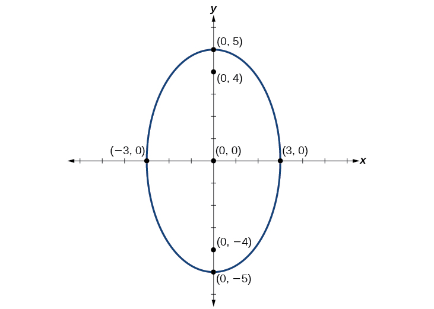{: #Figure_10_01_007}

Graph the ellipse given by the equation<math xmlns="http://www.w3.org/1998/Math/MathML"> <mrow> <mtext> </mtext><mfrac> <mrow> <msup> <mi>x</mi> <mn>2</mn> </msup> </mrow> <mrow> <mn>36</mn> </mrow> </mfrac> <mo>+</mo><mfrac> <mrow> <msup> <mi>y</mi> <mn>2</mn> </msup> </mrow> <mn>4</mn> </mfrac> <mo>=</mo><mn>1.</mn><mtext> </mtext> </mrow> </math>

Identify and label the center, vertices, co-vertices, and foci.

center:<math xmlns="http://www.w3.org/1998/Math/MathML"> <mrow> <mtext> </mtext><mrow><mo>(</mo> <mrow> <mn>0</mn><mo>,</mo><mn>0</mn> </mrow> <mo>)</mo></mrow><mo>;</mo><mtext> </mtext> </mrow> </math>

vertices:<math xmlns="http://www.w3.org/1998/Math/MathML"> <mrow> <mtext> </mtext><mrow><mo>(</mo> <mrow> <mo>±</mo><mn>6</mn><mo>,</mo><mn>0</mn> </mrow> <mo>)</mo></mrow><mo>;</mo><mtext> </mtext> </mrow> </math>

co-vertices:<math xmlns="http://www.w3.org/1998/Math/MathML"> <mrow> <mtext> </mtext><mrow><mo>(</mo> <mrow> <mn>0</mn><mo>,</mo><mo>±</mo><mn>2</mn> </mrow> <mo>)</mo></mrow><mo>;</mo><mtext> </mtext> </mrow> </math>

foci:<math xmlns="http://www.w3.org/1998/Math/MathML"> <mrow> <mtext> </mtext><mrow><mo>(</mo> <mrow> <mo>±</mo><mn>4</mn><msqrt> <mn>2</mn> </msqrt> <mo>,</mo><mn>0</mn> </mrow> <mo>)</mo></mrow> </mrow> </math>

 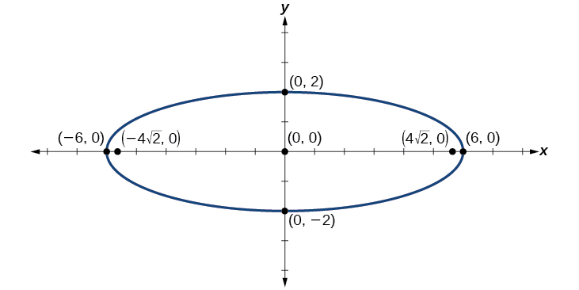 

Graphing an Ellipse Centered at the Origin from an Equation Not in Standard Form

Graph the ellipse given by the equation<math xmlns="http://www.w3.org/1998/Math/MathML"> <mrow> <mtext> </mtext><mn>4</mn><msup> <mi>x</mi> <mn>2</mn> </msup> <mo>+</mo><mn>25</mn><msup> <mi>y</mi> <mn>2</mn> </msup> <mo>=</mo><mn>100.</mn><mtext> </mtext> </mrow> </math>

Rewrite the equation in standard form. Then identify and label the center, vertices, co-vertices, and foci.

First, use algebra to rewrite the equation in standard form.

<math xmlns="http://www.w3.org/1998/Math/MathML"> <mrow> <mtable columnalign="left"> <mtr columnalign="left"> <mtd columnalign="left"> <mrow> <mo> </mo><mn>4</mn><msup> <mi>x</mi> <mn>2</mn> </msup> <mo>+</mo><mn>25</mn><msup> <mi>y</mi> <mn>2</mn> </msup> <mo>=</mo><mn>100</mn> </mrow> </mtd> </mtr> <mtr columnalign="left"> <mtd columnalign="left"> <mrow> <mtext>  </mtext><mfrac> <mrow> <mn>4</mn><msup> <mi>x</mi> <mn>2</mn> </msup> </mrow> <mrow> <mn>100</mn> </mrow> </mfrac> <mo>+</mo><mfrac> <mrow> <mn>25</mn><msup> <mi>y</mi> <mn>2</mn> </msup> </mrow> <mrow> <mn>100</mn> </mrow> </mfrac> <mo>=</mo><mfrac> <mrow> <mn>100</mn> </mrow> <mrow> <mn>100</mn> </mrow> </mfrac> </mrow> </mtd> </mtr> <mtr columnalign="left"> <mtd columnalign="left"> <mrow> <mtext>        </mtext><mfrac> <mrow> <msup> <mi>x</mi> <mn>2</mn> </msup> </mrow> <mrow> <mn>25</mn> </mrow> </mfrac> <mo>+</mo><mfrac> <mrow> <msup> <mi>y</mi> <mn>2</mn> </msup> </mrow> <mn>4</mn> </mfrac> <mo>=</mo><mn>1</mn> </mrow> </mtd> </mtr> </mtable> </mrow> </math>

Next, we determine the position of the major axis. Because<math xmlns="http://www.w3.org/1998/Math/MathML"> <mrow> <mtext> </mtext><mn>25</mn><mo>&gt;</mo><mn>4</mn><mo>,</mo><mtext> </mtext> </mrow> </math>

the major axis is on the *x*-axis. Therefore, the equation is in the form<math xmlns="http://www.w3.org/1998/Math/MathML"> <mrow> <mtext> </mtext><mfrac> <mrow> <msup> <mi>x</mi> <mn>2</mn> </msup> </mrow> <mrow> <msup> <mi>a</mi> <mn>2</mn> </msup> </mrow> </mfrac> <mo>+</mo><mfrac> <mrow> <msup> <mi>y</mi> <mn>2</mn> </msup> </mrow> <mrow> <msup> <mi>b</mi> <mn>2</mn> </msup> </mrow> </mfrac> <mo>=</mo><mn>1</mn><mo>,</mo><mtext> </mtext> </mrow> </math>

where<math xmlns="http://www.w3.org/1998/Math/MathML"> <mrow> <mtext> </mtext><msup> <mi>a</mi> <mn>2</mn> </msup> <mo>=</mo><mn>25</mn><mtext> </mtext> </mrow> </math>

and<math xmlns="http://www.w3.org/1998/Math/MathML"> <mrow> <mtext> </mtext><msup> <mi>b</mi> <mn>2</mn> </msup> <mo>=</mo><mn>4.</mn><mtext> </mtext> </mrow> </math>

It follows that: the center of the ellipse is<math xmlns="http://www.w3.org/1998/Math/MathML"> <mrow> <mtext> </mtext><mrow><mo>(</mo> <mrow> <mn>0</mn><mo>,</mo><mn>0</mn> </mrow> <mo>)</mo></mrow> </mrow> </math>
  the coordinates of the vertices are<math xmlns="http://www.w3.org/1998/Math/MathML"> <mrow> <mtext> </mtext><mrow><mo>(</mo> <mrow> <mo>±</mo><mi>a</mi><mo>,</mo><mn>0</mn> </mrow> <mo>)</mo></mrow><mo>=</mo><mrow><mo>(</mo> <mrow> <mo>±</mo><msqrt> <mrow> <mn>25</mn> </mrow> </msqrt> <mo>,</mo><mn>0</mn> </mrow> <mo>)</mo></mrow><mo>=</mo><mrow><mo>(</mo> <mrow> <mo>±</mo><mn>5</mn><mo>,</mo><mn>0</mn> </mrow> <mo>)</mo></mrow> </mrow> </math>
  the coordinates of the co-vertices are<math xmlns="http://www.w3.org/1998/Math/MathML"> <mrow> <mtext> </mtext><mrow><mo>(</mo> <mrow> <mn>0,</mn><mo>±</mo><mi>b</mi> </mrow> <mo>)</mo></mrow><mo>=</mo><mrow><mo>(</mo> <mrow> <mn>0,</mn><mo>±</mo><msqrt> <mn>4</mn> </msqrt> </mrow> <mo>)</mo></mrow><mo>=</mo><mrow><mo>(</mo> <mrow> <mn>0,</mn><mo>±</mo><mn>2</mn> </mrow> <mo>)</mo></mrow> </mrow> </math>
  the coordinates of the foci are<math xmlns="http://www.w3.org/1998/Math/MathML"> <mrow> <mtext> </mtext><mrow><mo>(</mo> <mrow> <mo>±</mo><mi>c</mi><mo>,</mo><mn>0</mn> </mrow> <mo>)</mo></mrow><mo>,</mo><mtext> </mtext> </mrow> </math>
where<math xmlns="http://www.w3.org/1998/Math/MathML"> <mrow> <mtext> </mtext><msup> <mi>c</mi> <mn>2</mn> </msup> <mo>=</mo><msup> <mi>a</mi> <mn>2</mn> </msup> <mo>−</mo><msup> <mi>b</mi> <mn>2</mn> </msup> <mo>.</mo><mtext> </mtext> </mrow> </math>
Solving for<math xmlns="http://www.w3.org/1998/Math/MathML"> <mrow> <mtext> </mtext><mi>c</mi><mo>,</mo><mtext> </mtext> </mrow> </math>
we have: 

<math xmlns="http://www.w3.org/1998/Math/MathML" display="block"> <mrow> <mtable columnalign="left"> <mtr columnalign="left"> <mtd columnalign="left"> <mrow> <mi>c</mi><mo>=</mo><mo>±</mo><msqrt> <mrow> <msup> <mi>a</mi> <mn>2</mn> </msup> <mo>−</mo><msup> <mi>b</mi> <mn>2</mn> </msup> </mrow> </msqrt> </mrow> </mtd> </mtr> <mtr columnalign="left"> <mtd columnalign="left"> <mrow> <mtext> </mtext><mtext> </mtext><mtext> </mtext><mo>=</mo><mo>±</mo><msqrt> <mrow> <mn>25</mn><mo>−</mo><mn>4</mn> </mrow> </msqrt> </mrow> </mtd> </mtr> <mtr columnalign="left"> <mtd columnalign="left"> <mrow> <mtext> </mtext><mtext> </mtext><mtext> </mtext><mo>=</mo><mo>±</mo><msqrt> <mrow> <mn>21</mn> </mrow> </msqrt> </mrow> </mtd> </mtr> </mtable> </mrow> </math>

Therefore the coordinates of the foci are<math xmlns="http://www.w3.org/1998/Math/MathML"> <mrow> <mtext> </mtext><mrow><mo>(</mo> <mrow> <mo>±</mo><msqrt> <mrow> <mn>21</mn> </mrow> </msqrt> <mo>,</mo><mn>0</mn> </mrow> <mo>)</mo></mrow><mo>.</mo> </mrow> </math>

Next, we plot and label the center, vertices, co-vertices, and foci, and draw a smooth curve to form the ellipse.

{: #Figure_10_01_009}

Graph the ellipse given by the equation<math xmlns="http://www.w3.org/1998/Math/MathML"> <mrow> <mtext> </mtext><mn>49</mn><msup> <mi>x</mi> <mn>2</mn> </msup> <mo>+</mo><mn>16</mn><msup> <mi>y</mi> <mn>2</mn> </msup> <mo>=</mo><mn>784.</mn><mtext> </mtext> </mrow> </math>

Rewrite the equation in standard form. Then identify and label the center, vertices, co-vertices, and foci.

Standard form:<math xmlns="http://www.w3.org/1998/Math/MathML"> <mrow> <mtext> </mtext><mfrac> <mrow> <msup> <mi>x</mi> <mn>2</mn> </msup> </mrow> <mrow> <mn>16</mn> </mrow> </mfrac> <mo>+</mo><mfrac> <mrow> <msup> <mi>y</mi> <mn>2</mn> </msup> </mrow> <mrow> <mn>49</mn> </mrow> </mfrac> <mo>=</mo><mn>1</mn><mo>;</mo><mtext> </mtext> </mrow> </math>

center:<math xmlns="http://www.w3.org/1998/Math/MathML"> <mrow> <mtext> </mtext><mrow><mo>(</mo> <mrow> <mn>0</mn><mo>,</mo><mn>0</mn> </mrow> <mo>)</mo></mrow><mo>;</mo><mtext> </mtext> </mrow> </math>

vertices:<math xmlns="http://www.w3.org/1998/Math/MathML"> <mrow> <mtext> </mtext><mrow><mo>(</mo> <mrow> <mn>0</mn><mo>,</mo><mo>±</mo><mn>7</mn> </mrow> <mo>)</mo></mrow><mo>;</mo><mtext> </mtext> </mrow> </math>

co-vertices:<math xmlns="http://www.w3.org/1998/Math/MathML"> <mrow> <mtext> </mtext><mrow><mo>(</mo> <mrow> <mo>±</mo><mn>4</mn><mo>,</mo><mn>0</mn> </mrow> <mo>)</mo></mrow><mo>;</mo><mtext> </mtext> </mrow> </math>

foci:<math xmlns="http://www.w3.org/1998/Math/MathML"> <mrow> <mtext> </mtext><mrow><mo>(</mo> <mrow> <mn>0</mn><mo>,</mo><mo>±</mo><msqrt> <mrow> <mn>33</mn> </mrow> </msqrt> </mrow> <mo>)</mo></mrow> </mrow> </math>

 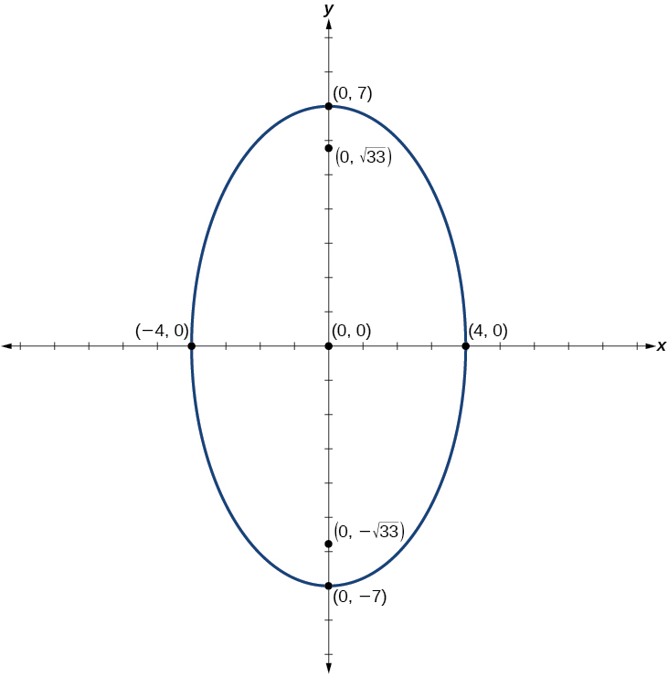 

# Graphing Ellipses Not Centered at the Origin

When an **ellipse**{: data-type="term" .no-emphasis} is not centered at the origin, we can still use the standard forms to find the key features of the graph. When the ellipse is centered at some point,<math xmlns="http://www.w3.org/1998/Math/MathML"> <mrow> <mtext> </mtext><mrow><mo>(</mo> <mrow> <mi>h</mi><mo>,</mo><mi>k</mi> </mrow> <mo>)</mo></mrow><mo>,</mo> </mrow> </math>

we use the standard forms<math xmlns="http://www.w3.org/1998/Math/MathML"> <mrow> <mtext> </mtext><mfrac> <mrow> <msup> <mrow> <mrow><mo>(</mo> <mrow> <mi>x</mi><mo>−</mo><mi>h</mi> </mrow> <mo>)</mo></mrow> </mrow> <mn>2</mn> </msup> </mrow> <mrow> <msup> <mi>a</mi> <mn>2</mn> </msup> </mrow> </mfrac> <mo>+</mo><mfrac> <mrow> <msup> <mrow> <mrow><mo>(</mo> <mrow> <mi>y</mi><mo>−</mo><mi>k</mi> </mrow> <mo>)</mo></mrow> </mrow> <mn>2</mn> </msup> </mrow> <mrow> <msup> <mi>b</mi> <mn>2</mn> </msup> </mrow> </mfrac> <mo>=</mo><mn>1</mn><mo>,</mo><mtext> </mtext><mi>a</mi><mo>&gt;</mo><mi>b</mi><mtext> </mtext> </mrow> </math>

for horizontal ellipses and<math xmlns="http://www.w3.org/1998/Math/MathML"> <mrow> <mtext> </mtext><mfrac> <mrow> <msup> <mrow> <mrow><mo>(</mo> <mrow> <mi>x</mi><mo>−</mo><mi>h</mi> </mrow> <mo>)</mo></mrow> </mrow> <mn>2</mn> </msup> </mrow> <mrow> <msup> <mi>b</mi> <mn>2</mn> </msup> </mrow> </mfrac> <mo>+</mo><mfrac> <mrow> <msup> <mrow> <mrow><mo>(</mo> <mrow> <mi>y</mi><mo>−</mo><mi>k</mi> </mrow> <mo>)</mo></mrow> </mrow> <mn>2</mn> </msup> </mrow> <mrow> <msup> <mi>a</mi> <mn>2</mn> </msup> </mrow> </mfrac> <mo>=</mo><mn>1</mn><mo>,</mo><mtext> </mtext><mi>a</mi><mo>&gt;</mo><mi>b</mi><mtext> </mtext> </mrow> </math>

for vertical ellipses. From these standard equations, we can easily determine the center, vertices, co-vertices, foci, and positions of the major and minor axes.

**Given the standard form of an equation for an ellipse centered at<math xmlns="http://www.w3.org/1998/Math/MathML"> <mrow> <mtext> </mtext><mrow><mo>(</mo> <mrow> <mi>h</mi><mo>,</mo><mi> </mi><mi>k</mi> </mrow> <mo>)</mo></mrow><mo>,</mo> </mrow> </math>

 sketch the graph.**

1.  Use the standard forms of the equations of an ellipse to determine the center, position of the major axis, vertices, co-vertices, and foci.
    1.  If the equation is in the form
        <math xmlns="http://www.w3.org/1998/Math/MathML"> <mrow> <mtext> </mtext><mfrac> <mrow> <msup> <mrow> <mrow><mo>(</mo> <mrow> <mi>x</mi><mo>−</mo><mi>h</mi> </mrow> <mo>)</mo></mrow> </mrow> <mn>2</mn> </msup> </mrow> <mrow> <msup> <mi>a</mi> <mn>2</mn> </msup> </mrow> </mfrac> <mo>+</mo><mfrac> <mrow> <msup> <mrow> <mrow><mo>(</mo> <mrow> <mi>y</mi><mo>−</mo><mi>k</mi> </mrow> <mo>)</mo></mrow> </mrow> <mn>2</mn> </msup> </mrow> <mrow> <msup> <mi>b</mi> <mn>2</mn> </msup> </mrow> </mfrac> <mo>=</mo><mn>1</mn><mo>,</mo><mtext> </mtext> </mrow> </math>
        
        where
        <math xmlns="http://www.w3.org/1998/Math/MathML"> <mrow> <mtext> </mtext><mi>a</mi><mo>&gt;</mo><mi>b</mi><mo>,</mo><mtext> </mtext> </mrow> </math>
        
        then
        * the center is
          <math xmlns="http://www.w3.org/1998/Math/MathML"> <mrow> <mtext> </mtext><mrow><mo>(</mo> <mrow> <mi>h</mi><mo>,</mo><mi>k</mi> </mrow> <mo>)</mo></mrow> </mrow> </math>
        
        * the major axis is parallel to the *x*-axis
        * the coordinates of the vertices are
          <math xmlns="http://www.w3.org/1998/Math/MathML"> <mrow> <mtext> </mtext><mrow><mo>(</mo> <mrow> <mi>h</mi><mo>±</mo><mi>a</mi><mo>,</mo><mi>k</mi> </mrow> <mo>)</mo></mrow> </mrow> </math>
        
        * the coordinates of the co-vertices are
          <math xmlns="http://www.w3.org/1998/Math/MathML"> <mrow> <mtext> </mtext><mrow><mo>(</mo> <mrow> <mi>h</mi><mo>,</mo><mi>k</mi><mo>±</mo><mi>b</mi> </mrow> <mo>)</mo></mrow> </mrow> </math>
        
        * the coordinates of the foci are
          <math xmlns="http://www.w3.org/1998/Math/MathML"> <mrow> <mtext> </mtext><mrow><mo>(</mo> <mrow> <mi>h</mi><mo>±</mo><mi>c</mi><mo>,</mo><mi>k</mi> </mrow> <mo>)</mo></mrow> </mrow> </math>
    
    2.  If the equation is in the form
        <math xmlns="http://www.w3.org/1998/Math/MathML"> <mrow> <mtext> </mtext><mfrac> <mrow> <msup> <mrow> <mrow><mo>(</mo> <mrow> <mi>x</mi><mo>−</mo><mi>h</mi> </mrow> <mo>)</mo></mrow> </mrow> <mn>2</mn> </msup> </mrow> <mrow> <msup> <mi>b</mi> <mn>2</mn> </msup> </mrow> </mfrac> <mo>+</mo><mfrac> <mrow> <msup> <mrow> <mrow><mo>(</mo> <mrow> <mi>y</mi><mo>−</mo><mi>k</mi> </mrow> <mo>)</mo></mrow> </mrow> <mn>2</mn> </msup> </mrow> <mrow> <msup> <mi>a</mi> <mn>2</mn> </msup> </mrow> </mfrac> <mo>=</mo><mn>1</mn><mo>,</mo><mtext> </mtext> </mrow> </math>
        
        where
        <math xmlns="http://www.w3.org/1998/Math/MathML"> <mrow> <mtext> </mtext><mi>a</mi><mo>&gt;</mo><mi>b</mi><mo>,</mo><mtext> </mtext> </mrow> </math>
        
        then
        * the center is
          <math xmlns="http://www.w3.org/1998/Math/MathML"> <mrow> <mtext> </mtext><mrow><mo>(</mo> <mrow> <mi>h</mi><mo>,</mo><mi>k</mi> </mrow> <mo>)</mo></mrow> </mrow> </math>
        
        * the major axis is parallel to the *y*-axis
        * the coordinates of the vertices are
          <math xmlns="http://www.w3.org/1998/Math/MathML"> <mrow> <mtext> </mtext><mrow><mo>(</mo> <mrow> <mi>h</mi><mo>,</mo><mi>k</mi><mo>±</mo><mi>a</mi> </mrow> <mo>)</mo></mrow> </mrow> </math>
        
        * the coordinates of the co-vertices are
          <math xmlns="http://www.w3.org/1998/Math/MathML"> <mrow> <mtext> </mtext><mrow><mo>(</mo> <mrow> <mi>h</mi><mo>±</mo><mi>b</mi><mo>,</mo><mi>k</mi> </mrow> <mo>)</mo></mrow> </mrow> </math>
        
        * the coordinates of the foci are
          <math xmlns="http://www.w3.org/1998/Math/MathML"> <mrow> <mtext> </mtext><mrow><mo>(</mo> <mrow> <mi>h</mi><mo>,</mo><mi>k</mi><mo>±</mo><mi>c</mi> </mrow> <mo>)</mo></mrow> </mrow> </math>
    {: data-number-style="lower-alpha"}

2.  Solve for
    <math xmlns="http://www.w3.org/1998/Math/MathML"> <mrow> <mtext> </mtext><mi>c</mi><mtext> </mtext> </mrow> </math>
    
    using the equation
    <math xmlns="http://www.w3.org/1998/Math/MathML"> <mrow> <mtext> </mtext><msup> <mi>c</mi> <mn>2</mn> </msup> <mo>=</mo><msup> <mi>a</mi> <mn>2</mn> </msup> <mo>−</mo><msup> <mi>b</mi> <mn>2</mn> </msup> <mo>.</mo> </mrow> </math>

3.  Plot the center, vertices, co-vertices, and foci in the coordinate plane, and draw a smooth curve to form the ellipse.
{: data-number-style="arabic"}

Graphing an Ellipse Centered at (*h*, *k*)

Graph the ellipse given by the equation,<math xmlns="http://www.w3.org/1998/Math/MathML"> <mrow> <mtext> </mtext><mfrac> <mrow> <msup> <mrow> <mrow><mo>(</mo> <mrow> <mi>x</mi><mo>+</mo><mn>2</mn> </mrow> <mo>)</mo></mrow> </mrow> <mn>2</mn> </msup> </mrow> <mn>4</mn> </mfrac> <mo>+</mo><mfrac> <mrow> <msup> <mrow> <mrow><mo>(</mo> <mrow> <mi>y</mi><mo>−</mo><mn>5</mn> </mrow> <mo>)</mo></mrow> </mrow> <mn>2</mn> </msup> </mrow> <mn>9</mn> </mfrac> <mo>=</mo><mn>1.</mn><mtext> </mtext> </mrow> </math>

Identify and label the center, vertices, co-vertices, and foci.

First, we determine the position of the major axis. Because<math xmlns="http://www.w3.org/1998/Math/MathML"> <mrow> <mtext> </mtext><mn>9</mn><mo>&gt;</mo><mn>4</mn><mo>,</mo> </mrow> </math>

 the major axis is parallel to the *y*-axis. Therefore, the equation is in the form<math xmlns="http://www.w3.org/1998/Math/MathML"> <mrow> <mtext> </mtext><mfrac> <mrow> <msup> <mrow> <mrow><mo>(</mo> <mrow> <mi>x</mi><mo>−</mo><mi>h</mi> </mrow> <mo>)</mo></mrow> </mrow> <mn>2</mn> </msup> </mrow> <mrow> <msup> <mi>b</mi> <mn>2</mn> </msup> </mrow> </mfrac> <mo>+</mo><mfrac> <mrow> <msup> <mrow> <mrow><mo>(</mo> <mrow> <mi>y</mi><mo>−</mo><mi>k</mi> </mrow> <mo>)</mo></mrow> </mrow> <mn>2</mn> </msup> </mrow> <mrow> <msup> <mi>a</mi> <mn>2</mn> </msup> </mrow> </mfrac> <mo>=</mo><mn>1</mn><mo>,</mo><mtext> </mtext> </mrow> </math>

where<math xmlns="http://www.w3.org/1998/Math/MathML"> <mrow> <mtext> </mtext><msup> <mi>b</mi> <mn>2</mn> </msup> <mo>=</mo><mn>4</mn><mtext> </mtext> </mrow> </math>

and<math xmlns="http://www.w3.org/1998/Math/MathML"> <mrow> <mtext> </mtext><msup> <mi>a</mi> <mn>2</mn> </msup> <mo>=</mo><mn>9.</mn><mtext> </mtext> </mrow> </math>

It follows that:

* the center of the ellipse is
  <math xmlns="http://www.w3.org/1998/Math/MathML"> <mrow> <mtext> </mtext><mrow><mo>(</mo> <mrow> <mi>h</mi><mo>,</mo><mi>k</mi> </mrow> <mo>)</mo></mrow><mo>=</mo><mrow><mo>(</mo> <mrow> <mn>−2</mn><mo>,</mo><mtext>5</mtext> </mrow> <mo>)</mo></mrow> </mrow> </math>

* the coordinates of the vertices are
  <math xmlns="http://www.w3.org/1998/Math/MathML"> <mrow> <mtext> </mtext><mo stretchy="false">(</mo><mi>h</mi><mo>,</mo><mi>k</mi><mo>±</mo><mi>a</mi><mo stretchy="false">)</mo><mo>=</mo><mo stretchy="false">(</mo><mo>−</mo><mn>2</mn><mo>,</mo><mn>5</mn><mo>±</mo><msqrt> <mn>9</mn> </msqrt> <mo stretchy="false">)</mo><mo>=</mo><mo stretchy="false">(</mo><mo>−</mo><mn>2</mn><mo>,</mo><mn>5</mn><mo>±</mo><mn>3</mn><mo stretchy="false">)</mo><mo>,</mo> </mrow> </math>
  
  or
  <math xmlns="http://www.w3.org/1998/Math/MathML"> <mrow> <mtext> </mtext><mrow><mo>(</mo> <mrow> <mn>−2</mn><mo>,</mo><mtext>2</mtext> </mrow> <mo>)</mo></mrow><mtext> </mtext> </mrow> </math>
  
  and
  <math xmlns="http://www.w3.org/1998/Math/MathML"> <mrow> <mtext> </mtext><mrow><mo>(</mo> <mrow> <mn>−2</mn><mo>,</mo><mtext>8</mtext> </mrow> <mo>)</mo></mrow> </mrow> </math>

* the coordinates of the co-vertices are
  <math xmlns="http://www.w3.org/1998/Math/MathML"> <mrow> <mtext> </mtext><mo stretchy="false">(</mo><mi>h</mi><mo>±</mo><mi>b</mi><mo>,</mo><mi>k</mi><mo stretchy="false">)</mo><mo>=</mo><mo stretchy="false">(</mo><mo>−</mo><mn>2</mn><mo>±</mo><msqrt> <mn>4</mn> </msqrt> <mo>,</mo><mn>5</mn><mo stretchy="false">)</mo><mo>=</mo><mo stretchy="false">(</mo><mo>−</mo><mn>2</mn><mo>±</mo><mn>2</mn><mo>,</mo><mn>5</mn><mo stretchy="false">)</mo><mo>,</mo> </mrow> </math>
  
  or
  <math xmlns="http://www.w3.org/1998/Math/MathML"> <mrow> <mtext> </mtext><mrow><mo>(</mo> <mrow> <mo /><mn>−4</mn><mo>,</mo><mn>5</mn> </mrow> <mo>)</mo></mrow><mtext> </mtext> </mrow> </math>
  
  and
  <math xmlns="http://www.w3.org/1998/Math/MathML"> <mrow> <mtext> </mtext><mrow><mo>(</mo> <mrow> <mn>0</mn><mo>,</mo><mtext>5</mtext> </mrow> <mo>)</mo></mrow> </mrow> </math>

* the coordinates of the foci are
  <math xmlns="http://www.w3.org/1998/Math/MathML"> <mrow> <mtext> </mtext><mrow><mo>(</mo> <mrow> <mi>h</mi><mo>,</mo><mi>k</mi><mo>±</mo><mi>c</mi> </mrow> <mo>)</mo></mrow><mo>,</mo><mtext> </mtext> </mrow> </math>
  
  where
  <math xmlns="http://www.w3.org/1998/Math/MathML"> <mrow> <mtext> </mtext><msup> <mi>c</mi> <mn>2</mn> </msup> <mo>=</mo><msup> <mi>a</mi> <mn>2</mn> </msup> <mo>−</mo><msup> <mi>b</mi> <mn>2</mn> </msup> <mo>.</mo><mtext> </mtext> </mrow> </math>
  
  Solving for
  <math xmlns="http://www.w3.org/1998/Math/MathML"> <mrow> <mtext> </mtext><mi>c</mi><mo>,</mo> </mrow> </math>
  
  we have:

<math xmlns="http://www.w3.org/1998/Math/MathML" display="block"> <mrow> <mtable columnalign="left"> <mtr columnalign="left"> <mtd columnalign="left"> <mtable columnalign="left"> <mtr> <mtd> <mrow /> </mtd> </mtr> <mtr> <mtd> <mi>c</mi><mo>=</mo><mo>±</mo><msqrt> <mrow> <msup> <mi>a</mi> <mn>2</mn> </msup> <mo>−</mo><msup> <mi>b</mi> <mn>2</mn> </msup> </mrow> </msqrt> </mtd> </mtr> </mtable> </mtd> </mtr> <mtr columnalign="left"> <mtd columnalign="left"> <mrow> <mtext> </mtext><mtext> </mtext><mtext> </mtext><mo>=</mo><mo>±</mo><msqrt> <mrow> <mn>9</mn><mo>−</mo><mn>4</mn> </mrow> </msqrt> </mrow> </mtd> </mtr> <mtr columnalign="left"> <mtd columnalign="left"> <mrow> <mtext> </mtext><mtext> </mtext><mtext> </mtext><mo>=</mo><mo>±</mo><msqrt> <mn>5</mn> </msqrt> </mrow> </mtd> </mtr> </mtable> </mrow> </math>

Therefore, the coordinates of the foci are<math xmlns="http://www.w3.org/1998/Math/MathML"> <mrow> <mtext> </mtext><mrow><mo>(</mo> <mrow> <mn>−2</mn><mo>,</mo><mtext>5</mtext><mo>−</mo><msqrt> <mn>5</mn> </msqrt> </mrow> <mo>)</mo></mrow><mtext> </mtext> </mrow> </math>

and<math xmlns="http://www.w3.org/1998/Math/MathML"> <mrow> <mtext> </mtext><mrow><mo>(</mo> <mrow> <mn>−2</mn><mo>,</mo><mtext>5+</mtext><msqrt> <mn>5</mn> </msqrt> </mrow> <mo>)</mo></mrow><mo>.</mo> </mrow> </math>

Next, we plot and label the center, vertices, co-vertices, and foci, and draw a smooth curve to form the ellipse.

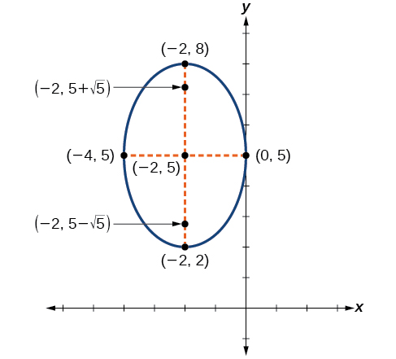{: #Figure_10_01_011}

Graph the ellipse given by the equation<math xmlns="http://www.w3.org/1998/Math/MathML"> <mrow> <mtext> </mtext><mfrac> <mrow> <msup> <mrow> <mrow><mo>(</mo> <mrow> <mi>x</mi><mo>−</mo><mn>4</mn> </mrow> <mo>)</mo></mrow> </mrow> <mn>2</mn> </msup> </mrow> <mrow> <mn>36</mn> </mrow> </mfrac> <mo>+</mo><mfrac> <mrow> <msup> <mrow> <mrow><mo>(</mo> <mrow> <mi>y</mi><mo>−</mo><mn>2</mn> </mrow> <mo>)</mo></mrow> </mrow> <mn>2</mn> </msup> </mrow> <mrow> <mn>20</mn> </mrow> </mfrac> <mo>=</mo><mn>1.</mn><mtext> </mtext> </mrow> </math>

Identify and label the center, vertices, co-vertices, and foci.

Center:<math xmlns="http://www.w3.org/1998/Math/MathML"> <mrow> <mtext> </mtext><mrow><mo>(</mo> <mrow> <mn>4</mn><mo>,</mo><mn>2</mn> </mrow> <mo>)</mo></mrow><mo>;</mo><mtext> </mtext> </mrow> </math>

vertices:<math xmlns="http://www.w3.org/1998/Math/MathML"> <mrow> <mtext> </mtext><mrow><mo>(</mo> <mrow> <mo>−</mo><mn>2</mn><mo>,</mo><mn>2</mn> </mrow> <mo>)</mo></mrow><mtext> </mtext> </mrow> </math>

and<math xmlns="http://www.w3.org/1998/Math/MathML"> <mrow> <mtext> </mtext><mrow><mo>(</mo> <mrow> <mn>10</mn><mo>,</mo><mn>2</mn> </mrow> <mo>)</mo></mrow><mo>;</mo><mtext> </mtext> </mrow> </math>

co-vertices:<math xmlns="http://www.w3.org/1998/Math/MathML"> <mrow> <mtext> </mtext><mrow><mo>(</mo> <mrow> <mn>4</mn><mo>,</mo><mn>2</mn><mo>−</mo><mn>2</mn><msqrt> <mn>5</mn> </msqrt> </mrow> <mo>)</mo></mrow><mtext> </mtext> </mrow> </math>

and<math xmlns="http://www.w3.org/1998/Math/MathML"> <mrow> <mtext> </mtext><mrow><mo>(</mo> <mrow> <mn>4</mn><mo>,</mo><mn>2</mn><mo>+</mo><mn>2</mn><msqrt> <mn>5</mn> </msqrt> </mrow> <mo>)</mo></mrow><mo>;</mo><mtext> </mtext> </mrow> </math>

foci:<math xmlns="http://www.w3.org/1998/Math/MathML"> <mrow> <mtext> </mtext><mrow><mo>(</mo> <mrow> <mn>0</mn><mo>,</mo><mn>2</mn> </mrow> <mo>)</mo></mrow><mtext> </mtext> </mrow> </math>

and<math xmlns="http://www.w3.org/1998/Math/MathML"> <mrow> <mtext> </mtext><mrow><mo>(</mo> <mrow> <mn>8</mn><mo>,</mo><mn>2</mn> </mrow> <mo>)</mo></mrow> </mrow> </math>

 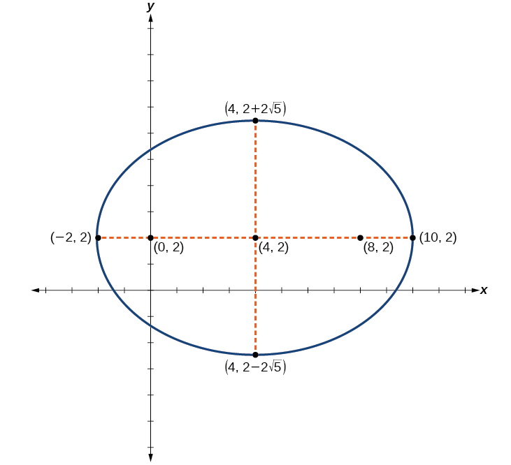 

**Given the general form of an equation for an ellipse centered at (*h*, *k*), express the equation in standard form.**

1.  Recognize that an ellipse described by an equation in the form
    <math xmlns="http://www.w3.org/1998/Math/MathML"> <mtext> </mtext><mi>a</mi><msup> <mi>x</mi> <mn>2</mn> </msup> <mo>+</mo><mi>b</mi><msup> <mi>y</mi> <mn>2</mn> </msup> <mo>+</mo><mi>c</mi><mi>x</mi><mo>+</mo><mi>d</mi><mi>y</mi><mo>+</mo><mi>e</mi><mo>=</mo><mn>0</mn><mtext> </mtext> </math>
    
    is in general form.
2.  Rearrange the equation by grouping terms that contain the same variable. Move the constant term to the opposite side of the equation.
3.  Factor out the coefficients of the
    <math xmlns="http://www.w3.org/1998/Math/MathML"> <mrow> <mtext> </mtext><msup> <mi>x</mi> <mn>2</mn> </msup> <mtext> </mtext> </mrow> </math>
    
    and
    <math xmlns="http://www.w3.org/1998/Math/MathML"> <mrow> <mtext> </mtext><msup> <mi>y</mi> <mn>2</mn> </msup> <mtext> </mtext> </mrow> </math>
    
    terms in preparation for completing the square.
4.  Complete the square for each variable to rewrite the equation in the form of the sum of multiples of two binomials squared set equal to a constant,
    <math xmlns="http://www.w3.org/1998/Math/MathML"> <mrow> <mtext> </mtext><msub> <mi>m</mi> <mn>1</mn> </msub> <msup> <mrow> <mrow><mo>(</mo> <mrow> <mi>x</mi><mo>−</mo><mi>h</mi> </mrow> <mo>)</mo></mrow> </mrow> <mn>2</mn> </msup> <mo>+</mo><msub> <mi>m</mi> <mn>2</mn> </msub> <msup> <mrow> <mrow><mo>(</mo> <mrow> <mi>y</mi><mo>−</mo><mi>k</mi> </mrow> <mo>)</mo></mrow> </mrow> <mn>2</mn> </msup> <mo>=</mo><msub> <mi>m</mi> <mn>3</mn> </msub> <mo>,</mo> </mrow> </math>
    
    where
    <math xmlns="http://www.w3.org/1998/Math/MathML"> <mrow> <mtext> </mtext><msub> <mi>m</mi> <mn>1</mn> </msub> <mo>,</mo><msub> <mi>m</mi> <mn>2</mn> </msub> <mo>,</mo> </mrow> </math>
    
    and
    <math xmlns="http://www.w3.org/1998/Math/MathML"> <mrow> <mtext> </mtext><msub> <mi>m</mi> <mn>3</mn> </msub> <mtext> </mtext> </mrow> </math>
    
    are constants.
5.  Divide both sides of the equation by the constant term to express the equation in standard form.
{: data-number-style="arabic"}

Graphing an Ellipse Centered at (*h*, *k*) by First Writing It in Standard Form

Graph the ellipse given by the equation<math xmlns="http://www.w3.org/1998/Math/MathML"> <mrow> <mtext> </mtext><mn>4</mn><msup> <mi>x</mi> <mn>2</mn> </msup> <mo>+</mo><mn>9</mn><msup> <mi>y</mi> <mn>2</mn> </msup> <mo>−</mo><mn>40</mn><mi>x</mi><mo>+</mo><mn>36</mn><mi>y</mi><mo>+</mo><mn>100</mn><mo>=</mo><mn>0.</mn><mtext> </mtext> </mrow> </math>

Identify and label the center, vertices, co-vertices, and foci.

We must begin by rewriting the equation in standard form.

<math xmlns="http://www.w3.org/1998/Math/MathML"> <mrow> <mn>4</mn><msup> <mi>x</mi> <mn>2</mn> </msup> <mo>+</mo><mn>9</mn><msup> <mi>y</mi> <mn>2</mn> </msup> <mo>−</mo><mn>40</mn><mi>x</mi><mo>+</mo><mn>36</mn><mi>y</mi><mo>+</mo><mn>100</mn><mo>=</mo><mn>0</mn> </mrow> </math>

Group terms that contain the same variable, and move the constant to the opposite side of the equation.

<math xmlns="http://www.w3.org/1998/Math/MathML"> <mrow> <mrow><mo>(</mo> <mrow> <mn>4</mn><msup> <mi>x</mi> <mn>2</mn> </msup> <mo>−</mo><mn>40</mn><mi>x</mi> </mrow> <mo>)</mo></mrow><mo>+</mo><mrow><mo>(</mo> <mrow> <mn>9</mn><msup> <mi>y</mi> <mn>2</mn> </msup> <mo>+</mo><mn>36</mn><mi>y</mi> </mrow> <mo>)</mo></mrow><mo>=</mo><mn>−100</mn> </mrow> </math>

Factor out the coefficients of the squared terms.

<math xmlns="http://www.w3.org/1998/Math/MathML"> <mrow> <mn>4</mn><mrow><mo>(</mo> <mrow> <msup> <mi>x</mi> <mn>2</mn> </msup> <mo>−</mo><mn>10</mn><mi>x</mi> </mrow> <mo>)</mo></mrow><mo>+</mo><mn>9</mn><mrow><mo>(</mo> <mrow> <msup> <mi>y</mi> <mn>2</mn> </msup> <mo>+</mo><mn>4</mn><mi>y</mi> </mrow> <mo>)</mo></mrow><mo>=</mo><mn>−100</mn> </mrow> </math>

Complete the square twice. Remember to balance the equation by adding the same constants to each side.

<math xmlns="http://www.w3.org/1998/Math/MathML"> <mrow> <mn>4</mn><mrow><mo>(</mo> <mrow> <msup> <mi>x</mi> <mn>2</mn> </msup> <mo>−</mo><mn>10</mn><mi>x</mi><mo>+</mo><mn>25</mn> </mrow> <mo>)</mo></mrow><mo>+</mo><mn>9</mn><mrow><mo>(</mo> <mrow> <msup> <mi>y</mi> <mn>2</mn> </msup> <mo>+</mo><mn>4</mn><mi>y</mi><mo>+</mo><mn>4</mn> </mrow> <mo>)</mo></mrow><mo>=</mo><mn>−100</mn><mo>+</mo><mn>100</mn><mo>+</mo><mn>36</mn> </mrow> </math>

Rewrite as perfect squares.

<math xmlns="http://www.w3.org/1998/Math/MathML"> <mrow> <mn>4</mn><msup> <mrow> <mrow><mo>(</mo> <mrow> <mi>x</mi><mo>−</mo><mn>5</mn> </mrow> <mo>)</mo></mrow> </mrow> <mn>2</mn> </msup> <mo>+</mo><mn>9</mn><msup> <mrow> <mrow><mo>(</mo> <mrow> <mi>y</mi><mo>+</mo><mn>2</mn> </mrow> <mo>)</mo></mrow> </mrow> <mn>2</mn> </msup> <mo>=</mo><mn>36</mn> </mrow> </math>

Divide both sides by the constant term to place the equation in standard form.

<math xmlns="http://www.w3.org/1998/Math/MathML"> <mrow> <mfrac> <mrow> <msup> <mrow> <mrow><mo>(</mo> <mrow> <mi>x</mi><mo>−</mo><mn>5</mn> </mrow> <mo>)</mo></mrow> </mrow> <mn>2</mn> </msup> </mrow> <mn>9</mn> </mfrac> <mo>+</mo><mfrac> <mrow> <msup> <mrow> <mrow><mo>(</mo> <mrow> <mi>y</mi><mo>+</mo><mn>2</mn> </mrow> <mo>)</mo></mrow> </mrow> <mn>2</mn> </msup> </mrow> <mn>4</mn> </mfrac> <mo>=</mo><mn>1</mn> </mrow> </math>

Now that the equation is in standard form, we can determine the position of the major axis. Because<math xmlns="http://www.w3.org/1998/Math/MathML"> <mrow> <mtext> </mtext><mn>9</mn><mo>&gt;</mo><mn>4</mn><mo>,</mo><mtext> </mtext> </mrow> </math>

 the major axis is parallel to the *x*-axis. Therefore, the equation is in the form<math xmlns="http://www.w3.org/1998/Math/MathML"> <mrow> <mtext> </mtext><mfrac> <mrow> <msup> <mrow> <mrow><mo>(</mo> <mrow> <mi>x</mi><mo>−</mo><mi>h</mi> </mrow> <mo>)</mo></mrow> </mrow> <mn>2</mn> </msup> </mrow> <mrow> <msup> <mi>a</mi> <mn>2</mn> </msup> </mrow> </mfrac> <mo>+</mo><mfrac> <mrow> <msup> <mrow> <mrow><mo>(</mo> <mrow> <mi>y</mi><mo>−</mo><mi>k</mi> </mrow> <mo>)</mo></mrow> </mrow> <mn>2</mn> </msup> </mrow> <mrow> <msup> <mi>b</mi> <mn>2</mn> </msup> </mrow> </mfrac> <mo>=</mo><mn>1</mn><mo>,</mo><mtext> </mtext> </mrow> </math>

where<math xmlns="http://www.w3.org/1998/Math/MathML"> <mrow> <mtext> </mtext><msup> <mi>a</mi> <mn>2</mn> </msup> <mo>=</mo><mn>9</mn><mtext> </mtext> </mrow> </math>

and<math xmlns="http://www.w3.org/1998/Math/MathML"> <mrow> <mtext> </mtext><msup> <mi>b</mi> <mn>2</mn> </msup> <mo>=</mo><mn>4.</mn><mtext> </mtext> </mrow> </math>

It follows that:

* the center of the ellipse is
  <math xmlns="http://www.w3.org/1998/Math/MathML"> <mrow> <mtext> </mtext><mrow><mo>(</mo> <mrow> <mi>h</mi><mo>,</mo><mi>k</mi> </mrow> <mo>)</mo></mrow><mo>=</mo><mrow><mo>(</mo> <mrow> <mn>5</mn><mo>,</mo><mn>−2</mn> </mrow> <mo>)</mo></mrow> </mrow> </math>

* the coordinates of the vertices are
  <math xmlns="http://www.w3.org/1998/Math/MathML"> <mrow> <mtext> </mtext><mrow><mo>(</mo> <mrow> <mi>h</mi><mo>±</mo><mi>a</mi><mo>,</mo><mi>k</mi> </mrow> <mo>)</mo></mrow><mo>=</mo><mrow><mo>(</mo> <mrow> <mn>5</mn><mo>±</mo><msqrt> <mn>9</mn> </msqrt> <mo>,</mo><mn>−2</mn> </mrow> <mo>)</mo></mrow><mo>=</mo><mrow><mo>(</mo> <mrow> <mn>5</mn><mo>±</mo><mn>3</mn><mo>,</mo><mn>−2</mn> </mrow> <mo>)</mo></mrow><mo>,</mo><mtext> </mtext> </mrow> </math>
  
  or
  <math xmlns="http://www.w3.org/1998/Math/MathML"> <mrow> <mtext> </mtext><mrow><mo>(</mo> <mrow> <mn>2</mn><mo>,</mo><mn>−2</mn> </mrow> <mo>)</mo></mrow><mtext> </mtext> </mrow> </math>
  
  and
  <math xmlns="http://www.w3.org/1998/Math/MathML"> <mrow> <mtext> </mtext><mrow><mo>(</mo> <mrow> <mn>8</mn><mo>,</mo><mn>−2</mn> </mrow> <mo>)</mo></mrow> </mrow> </math>

* the coordinates of the co-vertices are
  <math xmlns="http://www.w3.org/1998/Math/MathML"> <mrow> <mtext> </mtext><mrow><mo>(</mo> <mrow> <mi>h</mi><mo>,</mo><mi>k</mi><mo>±</mo><mi>b</mi> </mrow> <mo>)</mo></mrow><mo>=</mo><mrow><mo>(</mo> <mrow> <mtext>5</mtext><mo>,</mo><mn>−2</mn><mo>±</mo><msqrt> <mn>4</mn> </msqrt> </mrow> <mo>)</mo></mrow><mo>=</mo><mrow><mo>(</mo> <mrow> <mtext>5</mtext><mo>,</mo><mn>−2</mn><mo>±</mo><mn>2</mn> </mrow> <mo>)</mo></mrow><mo>,</mo><mtext> </mtext> </mrow> </math>
  
  or
  <math xmlns="http://www.w3.org/1998/Math/MathML"> <mrow> <mtext> </mtext><mrow><mo>(</mo> <mrow> <mn>5</mn><mo>,</mo><mn>−4</mn> </mrow> <mo>)</mo></mrow><mtext> </mtext> </mrow> </math>
  
  and
  <math xmlns="http://www.w3.org/1998/Math/MathML"> <mrow> <mtext> </mtext><mrow><mo>(</mo> <mrow> <mn>5</mn><mo>,</mo><mtext>0</mtext> </mrow> <mo>)</mo></mrow> </mrow> </math>

* the coordinates of the foci are
  <math xmlns="http://www.w3.org/1998/Math/MathML"> <mrow> <mtext> </mtext><mrow><mo>(</mo> <mrow> <mi>h</mi><mo>±</mo><mi>c</mi><mo>,</mo><mi>k</mi> </mrow> <mo>)</mo></mrow><mo>,</mo><mtext> </mtext> </mrow> </math>
  
  where
  <math xmlns="http://www.w3.org/1998/Math/MathML"> <mrow> <mtext> </mtext><msup> <mi>c</mi> <mn>2</mn> </msup> <mo>=</mo><msup> <mi>a</mi> <mn>2</mn> </msup> <mo>−</mo><msup> <mi>b</mi> <mn>2</mn> </msup> <mo>.</mo><mtext> </mtext> </mrow> </math>
  
  Solving for
  <math xmlns="http://www.w3.org/1998/Math/MathML"> <mrow> <mtext> </mtext><mi>c</mi><mo>,</mo><mtext> </mtext> </mrow> </math>
  
  we have:

<math xmlns="http://www.w3.org/1998/Math/MathML" display="block"> <mrow> <mtable columnalign="left"> <mtr columnalign="left"> <mtd columnalign="left"> <mrow> <mi>c</mi><mo>=</mo><mo>±</mo><msqrt> <mrow> <msup> <mi>a</mi> <mn>2</mn> </msup> <mo>−</mo><msup> <mi>b</mi> <mn>2</mn> </msup> </mrow> </msqrt> </mrow> </mtd> </mtr> <mtr columnalign="left"> <mtd columnalign="left"> <mrow> <mtext> </mtext><mtext> </mtext><mtext> </mtext><mo>=</mo><mo>±</mo><msqrt> <mrow> <mn>9</mn><mo>−</mo><mn>4</mn> </mrow> </msqrt> </mrow> </mtd> </mtr> <mtr columnalign="left"> <mtd columnalign="left"> <mrow> <mtext> </mtext><mtext> </mtext><mtext> </mtext><mo>=</mo><mo>±</mo><msqrt> <mn>5</mn> </msqrt> </mrow> </mtd> </mtr> </mtable> </mrow> </math>

Therefore, the coordinates of the foci are<math xmlns="http://www.w3.org/1998/Math/MathML"> <mrow> <mtext> </mtext><mrow><mo>(</mo> <mrow> <mtext>5</mtext><mo>−</mo><msqrt> <mn>5</mn> </msqrt> <mo>,</mo><mn>−2</mn> </mrow> <mo>)</mo></mrow><mtext> </mtext> </mrow> </math>

and<math xmlns="http://www.w3.org/1998/Math/MathML"> <mrow> <mtext> </mtext><mrow><mo>(</mo> <mrow> <mtext>5+</mtext><msqrt> <mn>5</mn> </msqrt> <mo>,</mo><mn>−2</mn> </mrow> <mo>)</mo></mrow><mo>.</mo> </mrow> </math>

Next we plot and label the center, vertices, co-vertices, and foci, and draw a smooth curve to form the ellipse as shown in [[link]](#Figure_10_01_018).

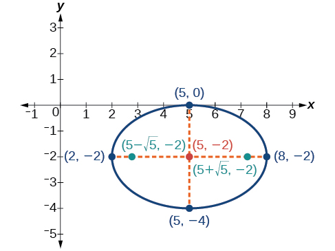{: #Figure_10_01_018}

Express the equation of the ellipse given in standard form. Identify the center, vertices, co-vertices, and foci of the ellipse.

<math xmlns="http://www.w3.org/1998/Math/MathML"> <mrow> <mn>4</mn><msup> <mi>x</mi> <mn>2</mn> </msup> <mo>+</mo><msup> <mi>y</mi> <mn>2</mn> </msup> <mo>−</mo><mn>24</mn><mi>x</mi><mo>+</mo><mn>2</mn><mi>y</mi><mo>+</mo><mn>21</mn><mo>=</mo><mn>0</mn> </mrow> </math>

<math xmlns="http://www.w3.org/1998/Math/MathML"> <mrow> <mtext> </mtext><mfrac> <mrow> <msup> <mrow> <mo stretchy="false">(</mo><mi>x</mi><mo>−</mo><mn>3</mn><mo stretchy="false">)</mo> </mrow> <mn>2</mn> </msup> </mrow> <mn>4</mn> </mfrac> <mo>+</mo><mfrac> <mrow> <msup> <mrow> <mrow><mo>(</mo> <mrow> <mi>y</mi><mo>+</mo><mn>1</mn> </mrow> <mo>)</mo></mrow> </mrow> <mn>2</mn> </msup> </mrow> <mrow> <mn>16</mn> </mrow> </mfrac> <mo>=</mo><mn>1</mn><mo>;</mo><mtext> </mtext> </mrow> </math>

center:<math xmlns="http://www.w3.org/1998/Math/MathML"> <mrow> <mtext> </mtext><mrow><mo>(</mo> <mrow> <mn>3</mn><mo>,</mo><mo>−</mo><mn>1</mn> </mrow> <mo>)</mo></mrow><mo>;</mo><mtext> </mtext> </mrow> </math>

vertices:<math xmlns="http://www.w3.org/1998/Math/MathML"> <mrow> <mtext> </mtext><mrow><mo>(</mo> <mrow> <mn>3</mn><mo>,</mo><mo>−</mo><mtext>5</mtext> </mrow> <mo>)</mo></mrow><mtext> </mtext> </mrow> </math>

and<math xmlns="http://www.w3.org/1998/Math/MathML"> <mrow> <mtext> </mtext><mrow><mo>(</mo> <mrow> <mn>3</mn><mo>,</mo><mtext>3</mtext> </mrow> <mo>)</mo></mrow><mo>;</mo><mtext> </mtext> </mrow> </math>

co-vertices:<math xmlns="http://www.w3.org/1998/Math/MathML"> <mrow> <mtext> </mtext><mrow><mo>(</mo> <mrow> <mn>1</mn><mo>,</mo><mo>−</mo><mn>1</mn> </mrow> <mo>)</mo></mrow><mtext> </mtext> </mrow> </math>

and<math xmlns="http://www.w3.org/1998/Math/MathML"> <mrow> <mtext> </mtext><mrow><mo>(</mo> <mrow> <mn>5</mn><mo>,</mo><mo>−</mo><mn>1</mn> </mrow> <mo>)</mo></mrow><mo>;</mo><mtext> </mtext> </mrow> </math>

foci:<math xmlns="http://www.w3.org/1998/Math/MathML"> <mrow> <mtext> </mtext><mrow><mo>(</mo> <mrow> <mn>3</mn><mo>,</mo><mo>−</mo><mtext>1</mtext><mo>−</mo><mn>2</mn><msqrt> <mn>3</mn> </msqrt> </mrow> <mo>)</mo></mrow><mtext> </mtext> </mrow> </math>

and<math xmlns="http://www.w3.org/1998/Math/MathML"> <mrow> <mtext> </mtext><mrow><mo>(</mo> <mrow> <mn>3</mn><mo>,</mo><mo>−</mo><mtext>1+</mtext><mn>2</mn><msqrt> <mn>3</mn> </msqrt> </mrow> <mo>)</mo></mrow> </mrow> </math>

# Solving Applied Problems Involving Ellipses

Many real-world situations can be represented by ellipses, including orbits of planets, satellites, moons and comets, and shapes of boat keels, rudders, and some airplane wings. A medical device called a lithotripter uses elliptical reflectors to break up kidney stones by generating sound waves. Some buildings, called whispering chambers, are designed with elliptical domes so that a person whispering at one focus can easily be heard by someone standing at the other focus. This occurs because of the acoustic properties of an ellipse. When a sound wave originates at one focus of a whispering chamber, the sound wave will be reflected off the elliptical dome and back to the other focus. See [\[link\]](#Figure_10_01_013). In the whisper chamber at the Museum of Science and Industry in Chicago, two people standing at the foci—about 43 feet apart—can hear each other whisper.

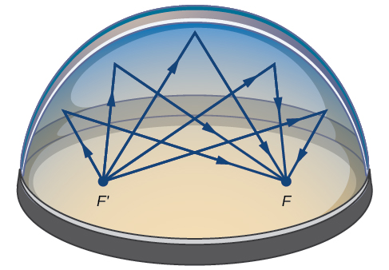{: #Figure_10_01_013}

Locating the Foci of a Whispering Chamber

The Statuary Hall in the Capitol Building in Washington, D.C. is a whispering chamber. Its dimensions are 46 feet wide by 96 feet long as shown in [[link]](#Figure_10_01_015).

1.  What is the standard form of the equation of the ellipse representing the outline of the room? Hint: assume a horizontal ellipse, and let the center of the room be the point
    <math xmlns="http://www.w3.org/1998/Math/MathML"> <mrow> <mtext> </mtext><mrow><mo>(</mo> <mrow> <mn>0</mn><mo>,</mo><mn>0</mn> </mrow> <mo>)</mo></mrow><mo>.</mo> </mrow> </math>

2.  If two senators standing at the foci of this room can hear each other whisper, how far apart are the senators? Round to the nearest foot.
{: data-number-style="lower-alpha"}

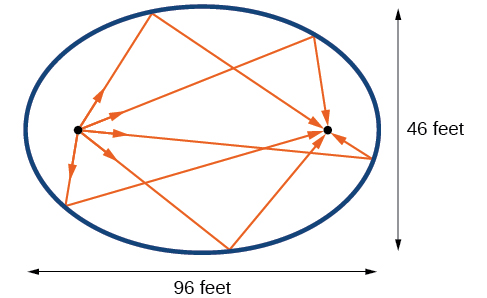{: #Figure_10_01_015}

1.  We are assuming a horizontal ellipse with center
    <math xmlns="http://www.w3.org/1998/Math/MathML"> <mrow> <mtext> </mtext><mrow><mo>(</mo> <mrow> <mn>0</mn><mo>,</mo><mn>0</mn> </mrow> <mo>)</mo></mrow><mo>,</mo> </mrow> </math>
    
    so we need to find an equation of the form
    <math xmlns="http://www.w3.org/1998/Math/MathML"> <mrow> <mtext> </mtext><mfrac> <mrow> <msup> <mi>x</mi> <mn>2</mn> </msup> </mrow> <mrow> <msup> <mi>a</mi> <mn>2</mn> </msup> </mrow> </mfrac> <mo>+</mo><mfrac> <mrow> <msup> <mi>y</mi> <mn>2</mn> </msup> </mrow> <mrow> <msup> <mi>b</mi> <mn>2</mn> </msup> </mrow> </mfrac> <mo>=</mo><mn>1</mn><mo>,</mo><mtext> </mtext> </mrow> </math>
    
    where
    <math xmlns="http://www.w3.org/1998/Math/MathML"> <mrow> <mtext> </mtext><mi>a</mi><mo>&gt;</mo><mi>b</mi><mo>.</mo><mtext> </mtext> </mrow> </math>
    
    We know that the length of the major axis,
    <math xmlns="http://www.w3.org/1998/Math/MathML"> <mrow> <mtext> </mtext><mn>2</mn><mi>a</mi><mo>,</mo><mtext> </mtext> </mrow> </math>
    
    is longer than the length of the minor axis,
    <math xmlns="http://www.w3.org/1998/Math/MathML"> <mrow> <mtext> </mtext><mn>2</mn><mi>b</mi><mo>.</mo><mtext> </mtext> </mrow> </math>
    
    So the length of the room, 96, is represented by the major axis, and the width of the room, 46, is represented by the minor axis.
    * Solving for
      <math xmlns="http://www.w3.org/1998/Math/MathML"> <mrow> <mtext> </mtext><mi>a</mi><mo>,</mo> </mrow> </math>
      
      we have
      <math xmlns="http://www.w3.org/1998/Math/MathML"> <mrow> <mtext> </mtext><mn>2</mn><mi>a</mi><mo>=</mo><mn>96</mn><mo>,</mo> </mrow> </math>
      
      so
      <math xmlns="http://www.w3.org/1998/Math/MathML"> <mrow> <mtext> </mtext><mi>a</mi><mo>=</mo><mn>48</mn><mo>,</mo> </mrow> </math>
      
      and
      <math xmlns="http://www.w3.org/1998/Math/MathML"> <mrow> <mtext> </mtext><msup> <mi>a</mi> <mn>2</mn> </msup> <mo>=</mo><mn>2304.</mn> </mrow> </math>
    
    * Solving for
      <math xmlns="http://www.w3.org/1998/Math/MathML"> <mrow> <mtext> </mtext><mi>b</mi><mo>,</mo> </mrow> </math>
      
      we have
      <math xmlns="http://www.w3.org/1998/Math/MathML"> <mrow> <mtext> </mtext><mn>2</mn><mi>b</mi><mo>=</mo><mn>46</mn><mo>,</mo> </mrow> </math>
      
      so
      <math xmlns="http://www.w3.org/1998/Math/MathML"> <mrow> <mtext> </mtext><mi>b</mi><mo>=</mo><mn>23</mn><mo>,</mo> </mrow> </math>
      
      and
      <math xmlns="http://www.w3.org/1998/Math/MathML"> <mrow> <mtext> </mtext><msup> <mi>b</mi> <mn>2</mn> </msup> <mo>=</mo><mn>529.</mn> </mrow> </math>
    
    Therefore, the equation of the ellipse is<math xmlns="http://www.w3.org/1998/Math/MathML"> <mrow> <mtext> </mtext><mfrac> <mrow> <msup> <mi>x</mi> <mn>2</mn> </msup> </mrow> <mrow> <mn>2304</mn> </mrow> </mfrac> <mo>+</mo><mfrac> <mrow> <msup> <mi>y</mi> <mn>2</mn> </msup> </mrow> <mrow> <mn>529</mn> </mrow> </mfrac> <mo>=</mo><mn>1.</mn> </mrow> </math>

2.  To find the distance between the senators, we must find the distance between the foci,
    <math xmlns="http://www.w3.org/1998/Math/MathML"> <mrow> <mtext> </mtext><mrow><mo>(</mo> <mrow> <mo>±</mo><mi>c</mi><mo>,</mo><mn>0</mn> </mrow> <mo>)</mo></mrow><mo>,</mo><mtext> </mtext> </mrow> </math>
    
    where
    <math xmlns="http://www.w3.org/1998/Math/MathML"> <mrow> <mtext> </mtext><msup> <mi>c</mi> <mn>2</mn> </msup> <mo>=</mo><msup> <mi>a</mi> <mn>2</mn> </msup> <mo>−</mo><msup> <mi>b</mi> <mn>2</mn> </msup> <mo>.</mo><mtext> </mtext> </mrow> </math>
    
    Solving for
    <math xmlns="http://www.w3.org/1998/Math/MathML"> <mrow> <mtext> </mtext><mi>c</mi><mo>,</mo> </mrow> </math>
    
    we have:
    

    <math xmlns="http://www.w3.org/1998/Math/MathML" display="block"> <mrow> <mtable columnalign="left"> <mtr columnalign="left"> <mtd columnalign="left"> <mrow> <msup> <mi>c</mi> <mn>2</mn> </msup> <mo>=</mo><msup> <mi>a</mi> <mn>2</mn> </msup> <mo>−</mo><msup> <mi>b</mi> <mn>2</mn> </msup> </mrow> </mtd> <mtd columnalign="left"> <mrow /> </mtd> </mtr> <mtr columnalign="left"> <mtd columnalign="left"> <mrow> <msup> <mi>c</mi> <mn>2</mn> </msup> <mo>=</mo><mn>2304</mn><mo>−</mo><mn>529</mn> </mrow> </mtd> <mtd columnalign="left"> <mrow> <mtable> <mtr> <mtd> <mrow /> </mtd> <mtd> <mrow /> </mtd> <mtd> <mrow /> </mtd> <mtd> <mrow /> </mtd> </mtr> </mtable><mtext>Substitute using the values found in part (a)</mtext><mo>.</mo> </mrow> </mtd> </mtr> <mtr columnalign="left"> <mtd columnalign="left"> <mrow> <mtext> </mtext><mtext> </mtext><mtext> </mtext><mi>c</mi><mo>=</mo><mo>±</mo><msqrt> <mrow> <mn>2304</mn><mo>−</mo><mn>529</mn> </mrow> </msqrt> </mrow> </mtd> <mtd columnalign="left"> <mrow> <mtable> <mtr> <mtd> <mrow /> </mtd> <mtd> <mrow /> </mtd> <mtd> <mrow /> </mtd> <mtd> <mrow /> </mtd> </mtr> </mtable><mtext>Take the square root of both sides</mtext><mo>.</mo> </mrow> </mtd> </mtr> <mtr columnalign="left"> <mtd columnalign="left"> <mrow> <mtext> </mtext><mtext> </mtext><mtext> </mtext><mi>c</mi><mo>=</mo><mo>±</mo><msqrt> <mrow> <mn>1775</mn> </mrow> </msqrt> <mo> </mo> </mrow> </mtd> <mtd columnalign="left"> <mrow> <mtable> <mtr> <mtd> <mrow /> </mtd> <mtd> <mrow /> </mtd> <mtd> <mrow /> </mtd> <mtd> <mrow /> </mtd> </mtr> </mtable><mtext>Subtract</mtext><mo>.</mo> </mrow> </mtd> </mtr> <mtr columnalign="left"> <mtd columnalign="left"> <mrow> <mtext> </mtext><mtext> </mtext><mtext> </mtext><mi>c</mi><mo>≈</mo><mo>±</mo><mn>42</mn> </mrow> </mtd> <mtd columnalign="left"> <mrow> <mtable> <mtr> <mtd> <mrow /> </mtd> <mtd> <mrow /> </mtd> <mtd> <mrow /> </mtd> <mtd> <mrow /> </mtd> </mtr> </mtable><mtext>Round to the nearest foot</mtext><mo>.</mo> </mrow> </mtd> </mtr> </mtable> </mrow> </math>
    

    
    The points<math xmlns="http://www.w3.org/1998/Math/MathML"> <mrow> <mtext> </mtext><mrow><mo>(</mo> <mrow> <mo>±</mo><mn>42</mn><mo>,</mo><mn>0</mn> </mrow> <mo>)</mo></mrow><mtext> </mtext> </mrow> </math>
    
    represent the foci. Thus, the distance between the senators is<math xmlns="http://www.w3.org/1998/Math/MathML"> <mrow> <mtext> </mtext><mn>2</mn><mrow><mo>(</mo> <mrow> <mn>42</mn> </mrow> <mo>)</mo></mrow><mo>=</mo><mn>84</mn><mtext>  </mtext> </mrow> </math>
    
    feet.
{: data-number-style="lower-alpha"}

Suppose a whispering chamber is 480 feet long and 320 feet wide.

1.  What is the standard form of the equation of the ellipse representing the room? Hint: assume a horizontal ellipse, and let the center of the room be the point
    <math xmlns="http://www.w3.org/1998/Math/MathML"> <mrow> <mtext> </mtext><mrow><mo>(</mo> <mrow> <mn>0</mn><mo>,</mo><mn>0</mn> </mrow> <mo>)</mo></mrow><mo>.</mo> </mrow> </math>

2.  If two people are standing at the foci of this room and can hear each other whisper, how far apart are the people? Round to the nearest foot.
{: data-number-style="lower-alpha"}

1.  <math xmlns="http://www.w3.org/1998/Math/MathML"> <mrow> <mfrac> <mrow> <msup> <mi>x</mi> <mn>2</mn> </msup> </mrow> <mrow> <mn>57</mn><mo>,</mo><mn>600</mn> </mrow> </mfrac> <mo>+</mo><mfrac> <mrow> <msup> <mi>y</mi> <mn>2</mn> </msup> </mrow> <mrow> <mn>25</mn><mo>,</mo><mn>600</mn> </mrow> </mfrac> <mo>=</mo><mn>1</mn> </mrow> </math>

2.  The people are standing 358 feet apart.
{: data-number-style="lower-alpha"}

Access these online resources for additional instruction and practice with ellipses.

* [Conic Sections: The Ellipse][1]
* [Graph an Ellipse with Center at the Origin][2]
* [Graph an Ellipse with Center Not at the Origin][3]

# Key Equations

| Horizontal ellipse, center at origin | <math xmlns="http://www.w3.org/1998/Math/MathML"> <mrow> <mfrac> <mrow> <msup> <mi>x</mi> <mn>2</mn> </msup> </mrow> <mrow> <msup> <mi>a</mi> <mn>2</mn> </msup> </mrow> </mfrac> <mo>+</mo><mfrac> <mrow> <msup> <mi>y</mi> <mn>2</mn> </msup> </mrow> <mrow> <msup> <mi>b</mi> <mn>2</mn> </msup> </mrow> </mfrac> <mo>=</mo><mn>1</mn><mo>,</mo><mtext> </mtext><mi>a</mi><mo>&gt;</mo><mi>b</mi> </mrow> </math>

 |
| Vertical ellipse, center at origin | <math xmlns="http://www.w3.org/1998/Math/MathML"> <mrow> <mfrac> <mrow> <msup> <mi>x</mi> <mn>2</mn> </msup> </mrow> <mrow> <msup> <mi>b</mi> <mn>2</mn> </msup> </mrow> </mfrac> <mo>+</mo><mfrac> <mrow> <msup> <mi>y</mi> <mn>2</mn> </msup> </mrow> <mrow> <msup> <mi>a</mi> <mn>2</mn> </msup> </mrow> </mfrac> <mo>=</mo><mn>1</mn><mo>,</mo><mtext> </mtext><mi>a</mi><mo>&gt;</mo><mi>b</mi> </mrow> </math>

 |
| Horizontal ellipse, center <math xmlns="http://www.w3.org/1998/Math/MathML"> <mrow> <mtext> </mtext><mo stretchy="false">(</mo><mi>h</mi><mo>,</mo><mi>k</mi><mo stretchy="false">)</mo> </mrow> </math>

 | <math xmlns="http://www.w3.org/1998/Math/MathML"> <mrow> <mfrac> <mrow> <msup> <mrow> <mrow><mo>(</mo> <mrow> <mi>x</mi><mo>−</mo><mi>h</mi> </mrow> <mo>)</mo></mrow> </mrow> <mn>2</mn> </msup> </mrow> <mrow> <msup> <mi>a</mi> <mn>2</mn> </msup> </mrow> </mfrac> <mo>+</mo><mfrac> <mrow> <msup> <mrow> <mrow><mo>(</mo> <mrow> <mi>y</mi><mo>−</mo><mi>k</mi> </mrow> <mo>)</mo></mrow> </mrow> <mn>2</mn> </msup> </mrow> <mrow> <msup> <mi>b</mi> <mn>2</mn> </msup> </mrow> </mfrac> <mo>=</mo><mn>1</mn><mo>,</mo><mtext> </mtext><mi>a</mi><mo>&gt;</mo><mi>b</mi> </mrow> </math>

 |
| Vertical ellipse, center<math xmlns="http://www.w3.org/1998/Math/MathML"> <mrow> <mtext> </mtext><mo stretchy="false">(</mo><mi>h</mi><mo>,</mo><mi>k</mi><mo stretchy="false">)</mo> </mrow> </math>

 | <math xmlns="http://www.w3.org/1998/Math/MathML"> <mrow> <mfrac> <mrow> <msup> <mrow> <mrow><mo>(</mo> <mrow> <mi>x</mi><mo>−</mo><mi>h</mi> </mrow> <mo>)</mo></mrow> </mrow> <mn>2</mn> </msup> </mrow> <mrow> <msup> <mi>b</mi> <mn>2</mn> </msup> </mrow> </mfrac> <mo>+</mo><mfrac> <mrow> <msup> <mrow> <mrow><mo>(</mo> <mrow> <mi>y</mi><mo>−</mo><mi>k</mi> </mrow> <mo>)</mo></mrow> </mrow> <mn>2</mn> </msup> </mrow> <mrow> <msup> <mi>a</mi> <mn>2</mn> </msup> </mrow> </mfrac> <mo>=</mo><mn>1</mn><mo>,</mo><mtext> </mtext><mi>a</mi><mo>&gt;</mo><mi>b</mi> </mrow> </math>

 |
{: summary=".."}

# Key Concepts

* An ellipse is the set of all points
  <math xmlns="http://www.w3.org/1998/Math/MathML"> <mrow> <mtext> </mtext><mrow><mo>(</mo> <mrow> <mi>x</mi><mo>,</mo><mi>y</mi> </mrow> <mo>)</mo></mrow><mtext> </mtext> </mrow> </math>
  
  in a plane such that the sum of their distances from two fixed points is a constant. Each fixed point is called a focus (plural: foci).
* When given the coordinates of the foci and vertices of an ellipse, we can write the equation of the ellipse in standard form. See [\[link\]](#Example_10_01_01) and [\[link\]](#Example_10_01_02).
* When given an equation for an ellipse centered at the origin in standard form, we can identify its vertices, co-vertices, foci, and the lengths and positions of the major and minor axes in order to graph the ellipse. See [\[link\]](#Example_10_01_03) and [\[link\]](#Example_10_01_04).
* When given the equation for an ellipse centered at some point other than the origin, we can identify its key features and graph the ellipse. See [\[link\]](#Example_10_01_05) and [\[link\]](#Example_10_01_06).
* Real-world situations can be modeled using the standard equations of ellipses and then evaluated to find key features, such as lengths of axes and distance between foci. See [\[link\]](#Example_10_01_07).

# Section Exercises

## Verbal

Define an ellipse in terms of its foci.

An ellipse is the set of all points in the plane the sum of whose distances from two fixed points, called the foci, is a constant.

Where must the foci of an ellipse lie?

What special case of the ellipse do we have when the major and minor axis are of the same length?

This special case would be a circle.

For the special case mentioned above, what would be true about the foci of that ellipse?

What can be said about the symmetry of the graph of an ellipse with center at the origin and foci along the *y*-axis?

It is symmetric about the *x*-axis, *y*-axis, and the origin.

## Algebraic

For the following exercises, determine whether the given equations represent ellipses. If yes, write in standard form.

<math xmlns="http://www.w3.org/1998/Math/MathML"> <mrow> <mn>2</mn><msup> <mi>x</mi> <mn>2</mn> </msup> <mo>+</mo><mi>y</mi><mo>=</mo><mn>4</mn> </mrow> </math>

<math xmlns="http://www.w3.org/1998/Math/MathML"> <mrow> <mn>4</mn><msup> <mi>x</mi> <mn>2</mn> </msup> <mo>+</mo><mn>9</mn><msup> <mi>y</mi> <mn>2</mn> </msup> <mo>=</mo><mn>36</mn> </mrow> </math>

yes;<math xmlns="http://www.w3.org/1998/Math/MathML"> <mrow> <mtext> </mtext><mfrac> <mrow> <msup> <mi>x</mi> <mn>2</mn> </msup> </mrow> <mrow> <msup> <mn>3</mn> <mn>2</mn> </msup> </mrow> </mfrac> <mo>+</mo><mfrac> <mrow> <msup> <mi>y</mi> <mn>2</mn> </msup> </mrow> <mrow> <msup> <mn>2</mn> <mn>2</mn> </msup> </mrow> </mfrac> <mo>=</mo><mn>1</mn> </mrow> </math>

<math xmlns="http://www.w3.org/1998/Math/MathML"> <mrow> <mn>4</mn><msup> <mi>x</mi> <mn>2</mn> </msup> <mo>−</mo><msup> <mi>y</mi> <mn>2</mn> </msup> <mo>=</mo><mn>4</mn> </mrow> </math>

<math xmlns="http://www.w3.org/1998/Math/MathML"> <mrow> <mn>4</mn><msup> <mi>x</mi> <mn>2</mn> </msup> <mo>+</mo><mn>9</mn><msup> <mi>y</mi> <mn>2</mn> </msup> <mo>=</mo><mn>1</mn> </mrow> </math>

yes;<math xmlns="http://www.w3.org/1998/Math/MathML"> <mrow> <mfrac> <mrow> <msup> <mi>x</mi> <mn>2</mn> </msup> </mrow> <mrow> <msup> <mrow> <mrow><mo>(</mo> <mrow> <mfrac> <mn>1</mn> <mn>2</mn> </mfrac> </mrow> <mo>)</mo></mrow> </mrow> <mn>2</mn> </msup> </mrow> </mfrac> <mo>+</mo><mfrac> <mrow> <msup> <mi>y</mi> <mn>2</mn> </msup> </mrow> <mrow> <msup> <mrow> <mrow><mo>(</mo> <mrow> <mfrac> <mn>1</mn> <mn>3</mn> </mfrac> </mrow> <mo>)</mo></mrow> </mrow> <mn>2</mn> </msup> </mrow> </mfrac> <mo>=</mo><mn>1</mn> </mrow> </math>

<math xmlns="http://www.w3.org/1998/Math/MathML"> <mrow> <mn>4</mn><msup> <mi>x</mi> <mn>2</mn> </msup> <mo>−</mo><mn>8</mn><mi>x</mi><mo>+</mo><mn>9</mn><msup> <mi>y</mi> <mn>2</mn> </msup> <mo>−</mo><mn>72</mn><mi>y</mi><mo>+</mo><mn>112</mn><mo>=</mo><mn>0</mn> </mrow> </math>

For the following exercises, write the equation of an ellipse in standard form, and identify the end points of the major and minor axes as well as the foci.

<math xmlns="http://www.w3.org/1998/Math/MathML"> <mrow> <mfrac> <mrow> <msup> <mi>x</mi> <mn>2</mn> </msup> </mrow> <mn>4</mn> </mfrac> <mo>+</mo><mfrac> <mrow> <msup> <mi>y</mi> <mn>2</mn> </msup> </mrow> <mrow> <mn>49</mn> </mrow> </mfrac> <mo>=</mo><mn>1</mn> </mrow> </math>

<math xmlns="http://www.w3.org/1998/Math/MathML"> <mrow> <mfrac> <mrow> <msup> <mi>x</mi> <mn>2</mn> </msup> </mrow> <mrow> <msup> <mn>2</mn> <mn>2</mn> </msup> </mrow> </mfrac> <mo>+</mo><mfrac> <mrow> <msup> <mi>y</mi> <mn>2</mn> </msup> </mrow> <mrow> <msup> <mn>7</mn> <mn>2</mn> </msup> </mrow> </mfrac> <mo>=</mo><mn>1</mn><mo>;</mo><mtext> </mtext> </mrow> </math>

Endpoints of major axis<math xmlns="http://www.w3.org/1998/Math/MathML"> <mrow> <mtext> </mtext><mrow><mo>(</mo> <mrow> <mn>0</mn><mo>,</mo><mn>7</mn> </mrow> <mo>)</mo></mrow><mtext> </mtext> </mrow> </math>

and<math xmlns="http://www.w3.org/1998/Math/MathML"> <mrow> <mtext> </mtext><mrow><mo>(</mo> <mrow> <mn>0</mn><mo>,</mo><mo>−</mo><mn>7</mn> </mrow> <mo>)</mo></mrow><mo>.</mo><mtext> </mtext> </mrow> </math>

Endpoints of minor axis<math xmlns="http://www.w3.org/1998/Math/MathML"> <mrow> <mtext> </mtext><mrow><mo>(</mo> <mrow> <mn>2</mn><mo>,</mo><mn>0</mn> </mrow> <mo>)</mo></mrow><mtext> </mtext> </mrow> </math>

and<math xmlns="http://www.w3.org/1998/Math/MathML"> <mrow> <mtext> </mtext><mrow><mo>(</mo> <mrow> <mo>−</mo><mn>2</mn><mo>,</mo><mn>0</mn> </mrow> <mo>)</mo></mrow><mo>.</mo><mtext> </mtext> </mrow> </math>

Foci at<math xmlns="http://www.w3.org/1998/Math/MathML"> <mrow> <mtext> </mtext><mrow><mo>(</mo> <mrow> <mn>0</mn><mo>,</mo><mn>3</mn><msqrt> <mn>5</mn> </msqrt> </mrow> <mo>)</mo></mrow><mo>,</mo><mrow><mo>(</mo> <mrow> <mn>0</mn><mo>,</mo><mo>−</mo><mn>3</mn><msqrt> <mn>5</mn> </msqrt> </mrow> <mo>)</mo></mrow><mo>.</mo> </mrow> </math>

<math xmlns="http://www.w3.org/1998/Math/MathML"> <mrow> <mfrac> <mrow> <msup> <mi>x</mi> <mn>2</mn> </msup> </mrow> <mrow> <mn>100</mn> </mrow> </mfrac> <mo>+</mo><mfrac> <mrow> <msup> <mi>y</mi> <mn>2</mn> </msup> </mrow> <mrow> <mn>64</mn> </mrow> </mfrac> <mo>=</mo><mn>1</mn> </mrow> </math>

<math xmlns="http://www.w3.org/1998/Math/MathML"> <mrow> <msup> <mi>x</mi> <mn>2</mn> </msup> <mo>+</mo><mn>9</mn><msup> <mi>y</mi> <mn>2</mn> </msup> <mo>=</mo><mn>1</mn> </mrow> </math>

<math xmlns="http://www.w3.org/1998/Math/MathML"> <mrow> <mfrac> <mrow> <msup> <mi>x</mi> <mn>2</mn> </msup> </mrow> <mrow> <msup> <mrow> <mrow><mo>(</mo> <mn>1</mn> <mo>)</mo></mrow> </mrow> <mn>2</mn> </msup> </mrow> </mfrac> <mo>+</mo><mfrac> <mrow> <msup> <mi>y</mi> <mn>2</mn> </msup> </mrow> <mrow> <msup> <mrow> <mrow><mo>(</mo> <mrow> <mfrac> <mn>1</mn> <mn>3</mn> </mfrac> </mrow> <mo>)</mo></mrow> </mrow> <mn>2</mn> </msup> </mrow> </mfrac> <mo>=</mo><mn>1</mn><mo>;</mo><mtext> </mtext> </mrow> </math>

Endpoints of major axis<math xmlns="http://www.w3.org/1998/Math/MathML"> <mrow> <mtext> </mtext><mrow><mo>(</mo> <mrow> <mn>1</mn><mo>,</mo><mn>0</mn> </mrow> <mo>)</mo></mrow><mtext> </mtext> </mrow> </math>

and<math xmlns="http://www.w3.org/1998/Math/MathML"> <mrow> <mtext> </mtext><mrow><mo>(</mo> <mrow> <mo>−</mo><mn>1</mn><mo>,</mo><mn>0</mn> </mrow> <mo>)</mo></mrow><mo>.</mo><mtext> </mtext> </mrow> </math>

Endpoints of minor axis<math xmlns="http://www.w3.org/1998/Math/MathML"> <mrow> <mtext> </mtext><mrow><mo>(</mo> <mrow> <mn>0</mn><mo>,</mo><mfrac> <mn>1</mn> <mn>3</mn> </mfrac> </mrow> <mo>)</mo></mrow><mo>,</mo><mrow><mo>(</mo> <mrow> <mn>0</mn><mo>,</mo><mo>−</mo><mfrac> <mn>1</mn> <mn>3</mn> </mfrac> </mrow> <mo>)</mo></mrow><mo>.</mo><mtext> </mtext> </mrow> </math>

Foci at<math xmlns="http://www.w3.org/1998/Math/MathML"> <mrow> <mtext> </mtext><mrow><mo>(</mo> <mrow> <mfrac> <mrow> <mn>2</mn><msqrt> <mn>2</mn> </msqrt> </mrow> <mn>3</mn> </mfrac> <mo>,</mo><mn>0</mn> </mrow> <mo>)</mo></mrow><mo>,</mo><mrow><mo>(</mo> <mrow> <mo>−</mo><mfrac> <mrow> <mn>2</mn><msqrt> <mn>2</mn> </msqrt> </mrow> <mn>3</mn> </mfrac> <mo>,</mo><mn>0</mn> </mrow> <mo>)</mo></mrow><mo>.</mo> </mrow> </math>

<math xmlns="http://www.w3.org/1998/Math/MathML"> <mrow> <mn>4</mn><msup> <mi>x</mi> <mn>2</mn> </msup> <mo>+</mo><mn>16</mn><msup> <mi>y</mi> <mn>2</mn> </msup> <mo>=</mo><mn>1</mn> </mrow> </math>

<math xmlns="http://www.w3.org/1998/Math/MathML"> <mrow> <mfrac> <mrow> <msup> <mrow> <mrow><mo>(</mo> <mrow> <mi>x</mi><mo>−</mo><mn>2</mn> </mrow> <mo>)</mo></mrow> </mrow> <mn>2</mn> </msup> </mrow> <mrow> <mn>49</mn> </mrow> </mfrac> <mo>+</mo><mfrac> <mrow> <msup> <mrow> <mrow><mo>(</mo> <mrow> <mi>y</mi><mo>−</mo><mn>4</mn> </mrow> <mo>)</mo></mrow> </mrow> <mn>2</mn> </msup> </mrow> <mrow> <mn>25</mn> </mrow> </mfrac> <mo>=</mo><mn>1</mn> </mrow> </math>

<math xmlns="http://www.w3.org/1998/Math/MathML"> <mrow> <mfrac> <mrow> <msup> <mrow> <mrow><mo>(</mo> <mrow> <mi>x</mi><mo>−</mo><mn>2</mn> </mrow> <mo>)</mo></mrow> </mrow> <mn>2</mn> </msup> </mrow> <mrow> <msup> <mn>7</mn> <mn>2</mn> </msup> </mrow> </mfrac> <mo>+</mo><mfrac> <mrow> <msup> <mrow> <mrow><mo>(</mo> <mrow> <mi>y</mi><mo>−</mo><mn>4</mn> </mrow> <mo>)</mo></mrow> </mrow> <mn>2</mn> </msup> </mrow> <mrow> <msup> <mn>5</mn> <mn>2</mn> </msup> </mrow> </mfrac> <mo>=</mo><mn>1</mn><mo>;</mo><mtext> </mtext> </mrow> </math>

Endpoints of major axis<math xmlns="http://www.w3.org/1998/Math/MathML"> <mrow> <mtext> </mtext><mrow><mo>(</mo> <mrow> <mn>9</mn><mo>,</mo><mn>4</mn> </mrow> <mo>)</mo></mrow><mo>,</mo><mrow><mo>(</mo> <mrow> <mo>−</mo><mn>5</mn><mo>,</mo><mn>4</mn> </mrow> <mo>)</mo></mrow><mo>.</mo><mtext> </mtext> </mrow> </math>

Endpoints of minor axis<math xmlns="http://www.w3.org/1998/Math/MathML"> <mrow> <mtext> </mtext><mrow><mo>(</mo> <mrow> <mn>2</mn><mo>,</mo><mn>9</mn> </mrow> <mo>)</mo></mrow><mo>,</mo><mrow><mo>(</mo> <mrow> <mn>2</mn><mo>,</mo><mo>−</mo><mn>1</mn> </mrow> <mo>)</mo></mrow><mo>.</mo><mtext> </mtext> </mrow> </math>

Foci at<math xmlns="http://www.w3.org/1998/Math/MathML"> <mrow> <mtext> </mtext><mrow><mo>(</mo> <mrow> <mn>2</mn><mo>+</mo><mn>2</mn><msqrt> <mn>6</mn> </msqrt> <mo>,</mo><mn>4</mn> </mrow> <mo>)</mo></mrow><mo>,</mo><mrow><mo>(</mo> <mrow> <mn>2</mn><mo>−</mo><mn>2</mn><msqrt> <mn>6</mn> </msqrt> <mo>,</mo><mn>4</mn> </mrow> <mo>)</mo></mrow><mo>.</mo> </mrow> </math>

<math xmlns="http://www.w3.org/1998/Math/MathML"> <mrow> <mfrac> <mrow> <msup> <mrow> <mrow><mo>(</mo> <mrow> <mi>x</mi><mo>−</mo><mn>2</mn> </mrow> <mo>)</mo></mrow> </mrow> <mn>2</mn> </msup> </mrow> <mrow> <mn>81</mn> </mrow> </mfrac> <mo>+</mo><mfrac> <mrow> <msup> <mrow> <mrow><mo>(</mo> <mrow> <mi>y</mi><mo>+</mo><mn>1</mn> </mrow> <mo>)</mo></mrow> </mrow> <mn>2</mn> </msup> </mrow> <mrow> <mn>16</mn> </mrow> </mfrac> <mo>=</mo><mn>1</mn> </mrow> </math>

<math xmlns="http://www.w3.org/1998/Math/MathML"> <mrow> <mfrac> <mrow> <msup> <mrow> <mrow><mo>(</mo> <mrow> <mi>x</mi><mo>+</mo><mn>5</mn> </mrow> <mo>)</mo></mrow> </mrow> <mn>2</mn> </msup> </mrow> <mn>4</mn> </mfrac> <mo>+</mo><mfrac> <mrow> <msup> <mrow> <mrow><mo>(</mo> <mrow> <mi>y</mi><mo>−</mo><mn>7</mn> </mrow> <mo>)</mo></mrow> </mrow> <mn>2</mn> </msup> </mrow> <mn>9</mn> </mfrac> <mo>=</mo><mn>1</mn> </mrow> </math>

<math xmlns="http://www.w3.org/1998/Math/MathML"> <mrow> <mfrac> <mrow> <msup> <mrow> <mrow><mo>(</mo> <mrow> <mi>x</mi><mo>+</mo><mn>5</mn> </mrow> <mo>)</mo></mrow> </mrow> <mn>2</mn> </msup> </mrow> <mrow> <msup> <mn>2</mn> <mn>2</mn> </msup> </mrow> </mfrac> <mo>+</mo><mfrac> <mrow> <msup> <mrow> <mrow><mo>(</mo> <mrow> <mi>y</mi><mo>−</mo><mn>7</mn> </mrow> <mo>)</mo></mrow> </mrow> <mn>2</mn> </msup> </mrow> <mrow> <msup> <mn>3</mn> <mn>2</mn> </msup> </mrow> </mfrac> <mo>=</mo><mn>1</mn><mo>;</mo><mtext> </mtext> </mrow> </math>

Endpoints of major axis<math xmlns="http://www.w3.org/1998/Math/MathML"> <mrow> <mtext> </mtext><mrow><mo>(</mo> <mrow> <mo>−</mo><mn>5</mn><mo>,</mo><mn>10</mn> </mrow> <mo>)</mo></mrow><mo>,</mo><mrow><mo>(</mo> <mrow> <mo>−</mo><mn>5</mn><mo>,</mo><mn>4</mn> </mrow> <mo>)</mo></mrow><mo>.</mo><mtext> </mtext> </mrow> </math>

Endpoints of minor axis<math xmlns="http://www.w3.org/1998/Math/MathML"> <mrow> <mtext> </mtext><mrow><mo>(</mo> <mrow> <mo>−</mo><mn>3</mn><mo>,</mo><mn>7</mn> </mrow> <mo>)</mo></mrow><mo>,</mo><mrow><mo>(</mo> <mrow> <mo>−</mo><mn>7</mn><mo>,</mo><mn>7</mn> </mrow> <mo>)</mo></mrow><mo>.</mo><mtext> </mtext> </mrow> </math>

Foci at<math xmlns="http://www.w3.org/1998/Math/MathML"> <mrow> <mtext> </mtext><mrow><mo>(</mo> <mrow> <mo>−</mo><mn>5</mn><mo>,</mo><mn>7</mn><mo>+</mo><msqrt> <mn>5</mn> </msqrt> </mrow> <mo>)</mo></mrow><mo>,</mo><mrow><mo>(</mo> <mrow> <mo>−</mo><mn>5</mn><mo>,</mo><mn>7</mn><mo>−</mo><msqrt> <mn>5</mn> </msqrt> </mrow> <mo>)</mo></mrow><mo>.</mo> </mrow> </math>

<math xmlns="http://www.w3.org/1998/Math/MathML"> <mrow> <mfrac> <mrow> <msup> <mrow> <mrow><mo>(</mo> <mrow> <mi>x</mi><mo>−</mo><mn>7</mn> </mrow> <mo>)</mo></mrow> </mrow> <mn>2</mn> </msup> </mrow> <mrow> <mn>49</mn> </mrow> </mfrac> <mo>+</mo><mfrac> <mrow> <msup> <mrow> <mrow><mo>(</mo> <mrow> <mi>y</mi><mo>−</mo><mn>7</mn> </mrow> <mo>)</mo></mrow> </mrow> <mn>2</mn> </msup> </mrow> <mrow> <mn>49</mn> </mrow> </mfrac> <mo>=</mo><mn>1</mn> </mrow> </math>

<math xmlns="http://www.w3.org/1998/Math/MathML"> <mrow> <mn>4</mn><msup> <mi>x</mi> <mn>2</mn> </msup> <mo>−</mo><mn>8</mn><mi>x</mi><mo>+</mo><mn>9</mn><msup> <mi>y</mi> <mn>2</mn> </msup> <mo>−</mo><mn>72</mn><mi>y</mi><mo>+</mo><mn>112</mn><mo>=</mo><mn>0</mn> </mrow> </math>

<math xmlns="http://www.w3.org/1998/Math/MathML"> <mrow> <mfrac> <mrow> <msup> <mrow> <mrow><mo>(</mo> <mrow> <mi>x</mi><mo>−</mo><mn>1</mn> </mrow> <mo>)</mo></mrow> </mrow> <mn>2</mn> </msup> </mrow> <mrow> <msup> <mn>3</mn> <mn>2</mn> </msup> </mrow> </mfrac> <mo>+</mo><mfrac> <mrow> <msup> <mrow> <mrow><mo>(</mo> <mrow> <mi>y</mi><mo>−</mo><mn>4</mn> </mrow> <mo>)</mo></mrow> </mrow> <mn>2</mn> </msup> </mrow> <mrow> <msup> <mn>2</mn> <mn>2</mn> </msup> </mrow> </mfrac> <mo>=</mo><mn>1</mn><mo>;</mo><mtext> </mtext> </mrow> </math>

Endpoints of major axis<math xmlns="http://www.w3.org/1998/Math/MathML"> <mrow> <mtext> </mtext><mrow><mo>(</mo> <mrow> <mn>4</mn><mo>,</mo><mn>4</mn> </mrow> <mo>)</mo></mrow><mo>,</mo><mrow><mo>(</mo> <mrow> <mo>−</mo><mn>2</mn><mo>,</mo><mn>4</mn> </mrow> <mo>)</mo></mrow><mo>.</mo><mtext> </mtext> </mrow> </math>

Endpoints of minor axis<math xmlns="http://www.w3.org/1998/Math/MathML"> <mrow> <mtext> </mtext><mrow><mo>(</mo> <mrow> <mn>1</mn><mo>,</mo><mn>6</mn> </mrow> <mo>)</mo></mrow><mo>,</mo><mrow><mo>(</mo> <mrow> <mn>1</mn><mo>,</mo><mn>2</mn> </mrow> <mo>)</mo></mrow><mo>.</mo><mtext> </mtext> </mrow> </math>

Foci at<math xmlns="http://www.w3.org/1998/Math/MathML"> <mrow> <mtext> </mtext><mrow><mo>(</mo> <mrow> <mn>1</mn><mo>+</mo><msqrt> <mn>5</mn> </msqrt> <mo>,</mo><mn>4</mn> </mrow> <mo>)</mo></mrow><mo>,</mo><mrow><mo>(</mo> <mrow> <mn>1</mn><mo>−</mo><msqrt> <mn>5</mn> </msqrt> <mo>,</mo><mn>4</mn> </mrow> <mo>)</mo></mrow><mo>.</mo> </mrow> </math>

<math xmlns="http://www.w3.org/1998/Math/MathML"> <mrow> <mn>9</mn><msup> <mi>x</mi> <mn>2</mn> </msup> <mo>−</mo><mn>54</mn><mi>x</mi><mo>+</mo><mn>9</mn><msup> <mi>y</mi> <mn>2</mn> </msup> <mo>−</mo><mn>54</mn><mi>y</mi><mo>+</mo><mn>81</mn><mo>=</mo><mn>0</mn> </mrow> </math>

<math xmlns="http://www.w3.org/1998/Math/MathML"> <mrow> <mn>4</mn><msup> <mi>x</mi> <mn>2</mn> </msup> <mo>−</mo><mn>24</mn><mi>x</mi><mo>+</mo><mn>36</mn><msup> <mi>y</mi> <mn>2</mn> </msup> <mo>−</mo><mn>360</mn><mi>y</mi><mo>+</mo><mn>864</mn><mo>=</mo><mn>0</mn> </mrow> </math>

<math xmlns="http://www.w3.org/1998/Math/MathML"> <mrow> <mfrac> <mrow> <msup> <mrow> <mrow><mo>(</mo> <mrow> <mi>x</mi><mo>−</mo><mn>3</mn> </mrow> <mo>)</mo></mrow> </mrow> <mn>2</mn> </msup> </mrow> <mrow> <msup> <mrow> <mrow><mo>(</mo> <mrow> <mn>3</mn><msqrt> <mn>2</mn> </msqrt> </mrow> <mo>)</mo></mrow> </mrow> <mn>2</mn> </msup> </mrow> </mfrac> <mo>+</mo><mfrac> <mrow> <msup> <mrow> <mrow><mo>(</mo> <mrow> <mi>y</mi><mo>−</mo><mn>5</mn> </mrow> <mo>)</mo></mrow> </mrow> <mn>2</mn> </msup> </mrow> <mrow> <msup> <mrow> <mrow><mo>(</mo> <mrow> <msqrt> <mn>2</mn> </msqrt> </mrow> <mo>)</mo></mrow> </mrow> <mn>2</mn> </msup> </mrow> </mfrac> <mo>=</mo><mn>1</mn><mo>;</mo><mtext> </mtext> </mrow> </math>

Endpoints of major axis<math xmlns="http://www.w3.org/1998/Math/MathML"> <mrow> <mtext> </mtext><mrow><mo>(</mo> <mrow> <mn>3</mn><mo>+</mo><mn>3</mn><msqrt> <mn>2</mn> </msqrt> <mo>,</mo><mn>5</mn> </mrow> <mo>)</mo></mrow><mo>,</mo><mrow><mo>(</mo> <mrow> <mn>3</mn><mo>−</mo><mn>3</mn><msqrt> <mn>2</mn> </msqrt> <mo>,</mo><mn>5</mn> </mrow> <mo>)</mo></mrow><mo>.</mo><mtext>  </mtext> </mrow> </math>

Endpoints of minor axis<math xmlns="http://www.w3.org/1998/Math/MathML"> <mrow> <mtext> </mtext><mrow><mo>(</mo> <mrow> <mn>3</mn><mo>,</mo><mn>5</mn><mo>+</mo><msqrt> <mn>2</mn> </msqrt> </mrow> <mo>)</mo></mrow><mo>,</mo><mrow><mo>(</mo> <mrow> <mn>3</mn><mo>,</mo><mn>5</mn><mo>−</mo><msqrt> <mn>2</mn> </msqrt> </mrow> <mo>)</mo></mrow><mo>.</mo><mtext>  </mtext> </mrow> </math>

Foci at<math xmlns="http://www.w3.org/1998/Math/MathML"> <mrow> <mtext> </mtext><mrow><mo>(</mo> <mrow> <mn>7</mn><mo>,</mo><mn>5</mn> </mrow> <mo>)</mo></mrow><mo>,</mo><mrow><mo>(</mo> <mrow> <mo>−</mo><mn>1</mn><mo>,</mo><mn>5</mn> </mrow> <mo>)</mo></mrow><mo>.</mo> </mrow> </math>

<math xmlns="http://www.w3.org/1998/Math/MathML"> <mrow> <mn>4</mn><msup> <mi>x</mi> <mn>2</mn> </msup> <mo>+</mo><mn>24</mn><mi>x</mi><mo>+</mo><mn>16</mn><msup> <mi>y</mi> <mn>2</mn> </msup> <mo>−</mo><mn>128</mn><mi>y</mi><mo>+</mo><mn>228</mn><mo>=</mo><mn>0</mn> </mrow> </math>

<math xmlns="http://www.w3.org/1998/Math/MathML"> <mrow> <mn>4</mn><msup> <mi>x</mi> <mn>2</mn> </msup> <mo>+</mo><mn>40</mn><mi>x</mi><mo>+</mo><mn>25</mn><msup> <mi>y</mi> <mn>2</mn> </msup> <mo>−</mo><mn>100</mn><mi>y</mi><mo>+</mo><mn>100</mn><mo>=</mo><mn>0</mn> </mrow> </math>

<math xmlns="http://www.w3.org/1998/Math/MathML"> <mrow> <mfrac> <mrow> <msup> <mrow> <mrow><mo>(</mo> <mrow> <mi>x</mi><mo>+</mo><mn>5</mn> </mrow> <mo>)</mo></mrow> </mrow> <mn>2</mn> </msup> </mrow> <mrow> <msup> <mrow> <mrow><mo>(</mo> <mn>5</mn> <mo>)</mo></mrow> </mrow> <mn>2</mn> </msup> </mrow> </mfrac> <mo>+</mo><mfrac> <mrow> <msup> <mrow> <mrow><mo>(</mo> <mrow> <mi>y</mi><mo>−</mo><mn>2</mn> </mrow> <mo>)</mo></mrow> </mrow> <mn>2</mn> </msup> </mrow> <mrow> <msup> <mrow> <mrow><mo>(</mo> <mn>2</mn> <mo>)</mo></mrow> </mrow> <mn>2</mn> </msup> </mrow> </mfrac> <mo>=</mo><mn>1</mn><mo>;</mo><mtext> </mtext> </mrow> </math>

Endpoints of major axis<math xmlns="http://www.w3.org/1998/Math/MathML"> <mrow> <mtext> </mtext><mrow><mo>(</mo> <mrow> <mn>0</mn><mo>,</mo><mn>2</mn> </mrow> <mo>)</mo></mrow><mo>,</mo><mrow><mo>(</mo> <mrow> <mo>−</mo><mn>10</mn><mo>,</mo><mn>2</mn> </mrow> <mo>)</mo></mrow><mo>.</mo><mtext> </mtext> </mrow> </math>

Endpoints of minor axis<math xmlns="http://www.w3.org/1998/Math/MathML"> <mrow> <mtext> </mtext><mrow><mo>(</mo> <mrow> <mo>−</mo><mn>5</mn><mo>,</mo><mn>4</mn> </mrow> <mo>)</mo></mrow><mo>,</mo><mrow><mo>(</mo> <mrow> <mo>−</mo><mn>5</mn><mo>,</mo><mn>0</mn> </mrow> <mo>)</mo></mrow><mo>.</mo><mtext> </mtext> </mrow> </math>

Foci at<math xmlns="http://www.w3.org/1998/Math/MathML"> <mrow> <mtext> </mtext><mrow><mo>(</mo> <mrow> <mo>−</mo><mn>5</mn><mo>+</mo><msqrt> <mrow> <mn>21</mn> </mrow> </msqrt> <mo>,</mo><mn>2</mn> </mrow> <mo>)</mo></mrow><mo>,</mo><mrow><mo>(</mo> <mrow> <mo>−</mo><mn>5</mn><mo>−</mo><msqrt> <mrow> <mn>21</mn> </mrow> </msqrt> <mo>,</mo><mn>2</mn> </mrow> <mo>)</mo></mrow><mo>.</mo> </mrow> </math>

<math xmlns="http://www.w3.org/1998/Math/MathML"> <mrow> <msup> <mi>x</mi> <mn>2</mn> </msup> <mo>+</mo><mn>2</mn><mi>x</mi><mo>+</mo><mn>100</mn><msup> <mi>y</mi> <mn>2</mn> </msup> <mo>−</mo><mn>1000</mn><mi>y</mi><mo>+</mo><mn>2401</mn><mo>=</mo><mn>0</mn> </mrow> </math>

<math xmlns="http://www.w3.org/1998/Math/MathML"> <mrow> <mn>4</mn><msup> <mi>x</mi> <mn>2</mn> </msup> <mo>+</mo><mn>24</mn><mi>x</mi><mo>+</mo><mn>25</mn><msup> <mi>y</mi> <mn>2</mn> </msup> <mo>+</mo><mn>200</mn><mi>y</mi><mo>+</mo><mn>336</mn><mo>=</mo><mn>0</mn> </mrow> </math>

<math xmlns="http://www.w3.org/1998/Math/MathML"> <mrow> <mfrac> <mrow> <msup> <mrow> <mrow><mo>(</mo> <mrow> <mi>x</mi><mo>+</mo><mn>3</mn> </mrow> <mo>)</mo></mrow> </mrow> <mn>2</mn> </msup> </mrow> <mrow> <msup> <mrow> <mrow><mo>(</mo> <mn>5</mn> <mo>)</mo></mrow> </mrow> <mn>2</mn> </msup> </mrow> </mfrac> <mo>+</mo><mfrac> <mrow> <msup> <mrow> <mrow><mo>(</mo> <mrow> <mi>y</mi><mo>+</mo><mn>4</mn> </mrow> <mo>)</mo></mrow> </mrow> <mn>2</mn> </msup> </mrow> <mrow> <msup> <mrow> <mrow><mo>(</mo> <mn>2</mn> <mo>)</mo></mrow> </mrow> <mn>2</mn> </msup> </mrow> </mfrac> <mo>=</mo><mn>1</mn><mo>;</mo><mtext> </mtext> </mrow> </math>

Endpoints of major axis<math xmlns="http://www.w3.org/1998/Math/MathML"> <mrow> <mtext> </mtext><mrow><mo>(</mo> <mrow> <mn>2</mn><mo>,</mo><mo>−</mo><mn>4</mn> </mrow> <mo>)</mo></mrow><mo>,</mo><mrow><mo>(</mo> <mrow> <mo>−</mo><mn>8</mn><mo>,</mo><mo>−</mo><mn>4</mn> </mrow> <mo>)</mo></mrow><mo>.</mo><mtext> </mtext> </mrow> </math>

Endpoints of minor axis<math xmlns="http://www.w3.org/1998/Math/MathML"> <mrow> <mtext> </mtext><mrow><mo>(</mo> <mrow> <mo>−</mo><mn>3</mn><mo>,</mo><mo>−</mo><mn>2</mn> </mrow> <mo>)</mo></mrow><mo>,</mo><mrow><mo>(</mo> <mrow> <mo>−</mo><mn>3</mn><mo>,</mo><mo>−</mo><mn>6</mn> </mrow> <mo>)</mo></mrow><mo>.</mo><mtext> </mtext> </mrow> </math>

Foci at<math xmlns="http://www.w3.org/1998/Math/MathML"> <mrow> <mtext> </mtext><mrow><mo>(</mo> <mrow> <mo>−</mo><mn>3</mn><mo>+</mo><msqrt> <mrow> <mn>21</mn> </mrow> </msqrt> <mo>,</mo><mo>−</mo><mn>4</mn> </mrow> <mo>)</mo></mrow><mo>,</mo><mrow><mo>(</mo> <mrow> <mo>−</mo><mn>3</mn><mo>−</mo><msqrt> <mrow> <mn>21</mn> </mrow> </msqrt> <mo>,</mo><mo>−</mo><mn>4</mn> </mrow> <mo>)</mo></mrow><mo>.</mo> </mrow> </math>

<math xmlns="http://www.w3.org/1998/Math/MathML"> <mrow> <mn>9</mn><msup> <mi>x</mi> <mn>2</mn> </msup> <mo>+</mo><mn>72</mn><mi>x</mi><mo>+</mo><mn>16</mn><msup> <mi>y</mi> <mn>2</mn> </msup> <mo>+</mo><mn>16</mn><mi>y</mi><mo>+</mo><mn>4</mn><mo>=</mo><mn>0</mn> </mrow> </math>

For the following exercises, find the foci for the given ellipses.

<math xmlns="http://www.w3.org/1998/Math/MathML"> <mrow> <mfrac> <mrow> <msup> <mrow> <mrow><mo>(</mo> <mrow> <mi>x</mi><mo>+</mo><mn>3</mn> </mrow> <mo>)</mo></mrow> </mrow> <mn>2</mn> </msup> </mrow> <mrow> <mn>25</mn> </mrow> </mfrac> <mo>+</mo><mfrac> <mrow> <msup> <mrow> <mrow><mo>(</mo> <mrow> <mi>y</mi><mo>+</mo><mn>1</mn> </mrow> <mo>)</mo></mrow> </mrow> <mn>2</mn> </msup> </mrow> <mrow> <mn>36</mn> </mrow> </mfrac> <mo>=</mo><mn>1</mn> </mrow> </math>

Foci<math xmlns="http://www.w3.org/1998/Math/MathML"> <mrow> <mtext> </mtext><mrow><mo>(</mo> <mrow> <mo>−</mo><mn>3</mn><mo>,</mo><mo>−</mo><mn>1</mn><mo>+</mo><msqrt> <mrow> <mn>11</mn> </mrow> </msqrt> </mrow> <mo>)</mo></mrow><mo>,</mo><mrow><mo>(</mo> <mrow> <mo>−</mo><mn>3</mn><mo>,</mo><mo>−</mo><mn>1</mn><mo>−</mo><msqrt> <mrow> <mn>11</mn> </mrow> </msqrt> </mrow> <mo>)</mo></mrow> </mrow> </math>

<math xmlns="http://www.w3.org/1998/Math/MathML"> <mrow> <mfrac> <mrow> <msup> <mrow> <mrow><mo>(</mo> <mrow> <mi>x</mi><mo>+</mo><mn>1</mn> </mrow> <mo>)</mo></mrow> </mrow> <mn>2</mn> </msup> </mrow> <mrow> <mn>100</mn> </mrow> </mfrac> <mo>+</mo><mfrac> <mrow> <msup> <mrow> <mrow><mo>(</mo> <mrow> <mi>y</mi><mo>−</mo><mn>2</mn> </mrow> <mo>)</mo></mrow> </mrow> <mn>2</mn> </msup> </mrow> <mn>4</mn> </mfrac> <mo>=</mo><mn>1</mn> </mrow> </math>

<math xmlns="http://www.w3.org/1998/Math/MathML"> <mrow> <msup> <mi>x</mi> <mn>2</mn> </msup> <mo>+</mo><msup> <mi>y</mi> <mn>2</mn> </msup> <mo>=</mo><mn>1</mn> </mrow> </math>

Focus<math xmlns="http://www.w3.org/1998/Math/MathML"> <mrow> <mtext> </mtext><mrow><mo>(</mo> <mrow> <mn>0</mn><mo>,</mo><mn>0</mn> </mrow> <mo>)</mo></mrow> </mrow> </math>

<math xmlns="http://www.w3.org/1998/Math/MathML"> <mrow> <msup> <mi>x</mi> <mn>2</mn> </msup> <mo>+</mo><mn>4</mn><msup> <mi>y</mi> <mn>2</mn> </msup> <mo>+</mo><mn>4</mn><mi>x</mi><mo>+</mo><mn>8</mn><mi>y</mi><mo>=</mo><mn>1</mn> </mrow> </math>

<math xmlns="http://www.w3.org/1998/Math/MathML"> <mrow> <mn>10</mn><msup> <mi>x</mi> <mn>2</mn> </msup> <mo>+</mo><msup> <mi>y</mi> <mn>2</mn> </msup> <mo>+</mo><mn>200</mn><mi>x</mi><mo>=</mo><mn>0</mn> </mrow> </math>

Foci<math xmlns="http://www.w3.org/1998/Math/MathML"> <mrow> <mtext> </mtext><mrow><mo>(</mo> <mrow> <mo>−</mo><mn>10</mn><mo>,</mo><mn>30</mn> </mrow> <mo>)</mo></mrow><mo>,</mo><mrow><mo>(</mo> <mrow> <mo>−</mo><mn>10</mn><mo>,</mo><mo>−</mo><mn>30</mn> </mrow> <mo>)</mo></mrow> </mrow> </math>

## Graphical

For the following exercises, graph the given ellipses, noting center, vertices, and foci.

<math xmlns="http://www.w3.org/1998/Math/MathML"> <mrow> <mfrac> <mrow> <msup> <mi>x</mi> <mn>2</mn> </msup> </mrow> <mrow> <mn>25</mn> </mrow> </mfrac> <mo>+</mo><mfrac> <mrow> <msup> <mi>y</mi> <mn>2</mn> </msup> </mrow> <mrow> <mn>36</mn> </mrow> </mfrac> <mo>=</mo><mn>1</mn> </mrow> </math>

<math xmlns="http://www.w3.org/1998/Math/MathML"> <mrow> <mfrac> <mrow> <msup> <mi>x</mi> <mn>2</mn> </msup> </mrow> <mrow> <mn>16</mn> </mrow> </mfrac> <mo>+</mo><mfrac> <mrow> <msup> <mi>y</mi> <mn>2</mn> </msup> </mrow> <mn>9</mn> </mfrac> <mo>=</mo><mn>1</mn> </mrow> </math>

Center<math xmlns="http://www.w3.org/1998/Math/MathML"> <mrow> <mtext> </mtext><mrow><mo>(</mo> <mrow> <mn>0</mn><mo>,</mo><mn>0</mn> </mrow> <mo>)</mo></mrow><mo>,</mo><mtext> </mtext> </mrow> </math>

Vertices<math xmlns="http://www.w3.org/1998/Math/MathML"> <mrow> <mtext> </mtext><mrow><mo>(</mo> <mrow> <mn>4</mn><mo>,</mo><mn>0</mn> </mrow> <mo>)</mo></mrow><mo>,</mo><mrow><mo>(</mo> <mrow> <mo>−</mo><mn>4</mn><mo>,</mo><mn>0</mn> </mrow> <mo>)</mo></mrow><mo>,</mo><mo stretchy="false">(</mo><mn>0</mn><mo>,</mo><mn>3</mn><mo stretchy="false">)</mo><mo>,</mo><mo stretchy="false">(</mo><mn>0</mn><mo>,</mo><mo>−</mo><mn>3</mn><mo stretchy="false">)</mo><mo>,</mo><mtext> </mtext> </mrow> </math>

Foci<math xmlns="http://www.w3.org/1998/Math/MathML"> <mrow> <mtext> </mtext><mrow><mo>(</mo> <mrow> <msqrt> <mn>7</mn> </msqrt> <mo>,</mo><mn>0</mn> </mrow> <mo>)</mo></mrow><mo>,</mo><mrow><mo>(</mo> <mrow> <mo>−</mo><msqrt> <mn>7</mn> </msqrt> <mo>,</mo><mn>0</mn> </mrow> <mo>)</mo></mrow> </mrow> </math>

 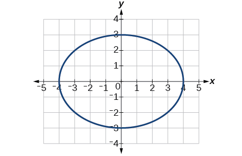 

<math xmlns="http://www.w3.org/1998/Math/MathML"> <mrow> <mn>4</mn><msup> <mi>x</mi> <mn>2</mn> </msup> <mo>+</mo><mn>9</mn><msup> <mi>y</mi> <mn>2</mn> </msup> <mo>=</mo><mn>1</mn> </mrow> </math>

<math xmlns="http://www.w3.org/1998/Math/MathML"> <mrow> <mn>81</mn><msup> <mi>x</mi> <mn>2</mn> </msup> <mo>+</mo><mn>49</mn><msup> <mi>y</mi> <mn>2</mn> </msup> <mo>=</mo><mn>1</mn> </mrow> </math>

Center<math xmlns="http://www.w3.org/1998/Math/MathML"> <mrow> <mtext> </mtext><mrow><mo>(</mo> <mrow> <mn>0</mn><mo>,</mo><mn>0</mn> </mrow> <mo>)</mo></mrow><mo>,</mo><mtext> </mtext> </mrow> </math>

Vertices<math xmlns="http://www.w3.org/1998/Math/MathML"> <mrow> <mtext> </mtext><mrow><mo>(</mo> <mrow> <mfrac> <mn>1</mn> <mn>9</mn> </mfrac> <mo>,</mo><mn>0</mn> </mrow> <mo>)</mo></mrow><mo>,</mo><mrow><mo>(</mo> <mrow> <mo>−</mo><mfrac> <mn>1</mn> <mn>9</mn> </mfrac> <mo>,</mo><mn>0</mn> </mrow> <mo>)</mo></mrow><mo>,</mo><mrow><mo>(</mo> <mrow> <mn>0</mn><mo>,</mo><mfrac> <mn>1</mn> <mn>7</mn> </mfrac> </mrow> <mo>)</mo></mrow><mo>,</mo><mrow><mo>(</mo> <mrow> <mn>0</mn><mo>,</mo><mo>−</mo><mfrac> <mn>1</mn> <mn>7</mn> </mfrac> </mrow> <mo>)</mo></mrow><mo>,</mo><mtext>  </mtext> </mrow> </math>

Foci<math xmlns="http://www.w3.org/1998/Math/MathML"> <mrow> <mtext> </mtext><mrow><mo>(</mo> <mrow> <mn>0</mn><mo>,</mo><mfrac> <mrow> <mn>4</mn><msqrt> <mn>2</mn> </msqrt> </mrow> <mrow> <mn>63</mn> </mrow> </mfrac> </mrow> <mo>)</mo></mrow><mo>,</mo><mrow><mo>(</mo> <mrow> <mn>0</mn><mo>,</mo><mo>−</mo><mfrac> <mrow> <mn>4</mn><msqrt> <mn>2</mn> </msqrt> </mrow> <mrow> <mn>63</mn> </mrow> </mfrac> </mrow> <mo>)</mo></mrow> </mrow> </math>

 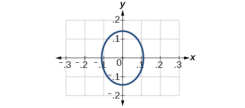 

<math xmlns="http://www.w3.org/1998/Math/MathML"> <mrow> <mfrac> <mrow> <msup> <mrow> <mrow><mo>(</mo> <mrow> <mi>x</mi><mo>−</mo><mn>2</mn> </mrow> <mo>)</mo></mrow> </mrow> <mn>2</mn> </msup> </mrow> <mrow> <mn>64</mn> </mrow> </mfrac> <mo>+</mo><mfrac> <mrow> <msup> <mrow> <mrow><mo>(</mo> <mrow> <mi>y</mi><mo>−</mo><mn>4</mn> </mrow> <mo>)</mo></mrow> </mrow> <mn>2</mn> </msup> </mrow> <mrow> <mn>16</mn> </mrow> </mfrac> <mo>=</mo><mn>1</mn> </mrow> </math>

<math xmlns="http://www.w3.org/1998/Math/MathML"> <mrow> <mfrac> <mrow> <msup> <mrow> <mrow><mo>(</mo> <mrow> <mi>x</mi><mo>+</mo><mn>3</mn> </mrow> <mo>)</mo></mrow> </mrow> <mn>2</mn> </msup> </mrow> <mn>9</mn> </mfrac> <mo>+</mo><mfrac> <mrow> <msup> <mrow> <mrow><mo>(</mo> <mrow> <mi>y</mi><mo>−</mo><mn>3</mn> </mrow> <mo>)</mo></mrow> </mrow> <mn>2</mn> </msup> </mrow> <mn>9</mn> </mfrac> <mo>=</mo><mn>1</mn> </mrow> </math>

Center<math xmlns="http://www.w3.org/1998/Math/MathML"> <mrow> <mtext> </mtext><mrow><mo>(</mo> <mrow> <mo>−</mo><mn>3</mn><mo>,</mo><mn>3</mn> </mrow> <mo>)</mo></mrow><mo>,</mo><mtext> </mtext> </mrow> </math>

Vertices<math xmlns="http://www.w3.org/1998/Math/MathML"> <mrow> <mtext> </mtext><mrow><mo>(</mo> <mrow> <mn>0</mn><mo>,</mo><mn>3</mn> </mrow> <mo>)</mo></mrow><mo>,</mo><mrow><mo>(</mo> <mrow> <mo>−</mo><mn>6</mn><mo>,</mo><mn>3</mn> </mrow> <mo>)</mo></mrow><mo>,</mo><mrow><mo>(</mo> <mrow> <mo>−</mo><mn>3</mn><mo>,</mo><mn>0</mn> </mrow> <mo>)</mo></mrow><mo>,</mo><mrow><mo>(</mo> <mrow> <mo>−</mo><mn>3</mn><mo>,</mo><mn>6</mn> </mrow> <mo>)</mo></mrow><mo>,</mo><mtext> </mtext> </mrow> </math>

Focus<math xmlns="http://www.w3.org/1998/Math/MathML"> <mrow> <mtext> </mtext><mrow><mo>(</mo> <mrow> <mo>−</mo><mn>3</mn><mo>,</mo><mn>3</mn> </mrow> <mo>)</mo></mrow><mtext> </mtext> </mrow> </math>

Note that this ellipse is a circle. The circle has only one focus, which coincides with the center.

 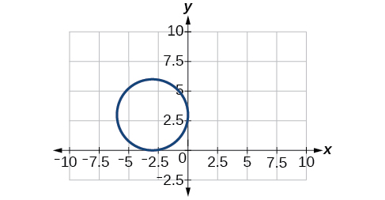 

<math xmlns="http://www.w3.org/1998/Math/MathML"> <mrow> <mfrac> <mrow> <msup> <mi>x</mi> <mn>2</mn> </msup> </mrow> <mn>2</mn> </mfrac> <mo>+</mo><mfrac> <mrow> <msup> <mrow> <mrow><mo>(</mo> <mrow> <mi>y</mi><mo>+</mo><mn>1</mn> </mrow> <mo>)</mo></mrow> </mrow> <mn>2</mn> </msup> </mrow> <mn>5</mn> </mfrac> <mo>=</mo><mn>1</mn> </mrow> </math>

<math xmlns="http://www.w3.org/1998/Math/MathML"> <mrow> <mn>4</mn><msup> <mi>x</mi> <mn>2</mn> </msup> <mo>−</mo><mn>8</mn><mi>x</mi><mo>+</mo><mn>16</mn><msup> <mi>y</mi> <mn>2</mn> </msup> <mo>−</mo><mn>32</mn><mi>y</mi><mo>−</mo><mn>44</mn><mo>=</mo><mn>0</mn> </mrow> </math>

Center<math xmlns="http://www.w3.org/1998/Math/MathML"> <mrow> <mtext> </mtext><mrow><mo>(</mo> <mrow> <mn>1</mn><mo>,</mo><mn>1</mn> </mrow> <mo>)</mo></mrow><mo>,</mo><mtext> </mtext> </mrow> </math>

Vertices<math xmlns="http://www.w3.org/1998/Math/MathML"> <mrow> <mtext> </mtext><mrow><mo>(</mo> <mrow> <mn>5</mn><mo>,</mo><mn>1</mn> </mrow> <mo>)</mo></mrow><mo>,</mo><mrow><mo>(</mo> <mrow> <mo>−</mo><mn>3</mn><mo>,</mo><mn>1</mn> </mrow> <mo>)</mo></mrow><mo>,</mo><mrow><mo>(</mo> <mrow> <mn>1</mn><mo>,</mo><mn>3</mn> </mrow> <mo>)</mo></mrow><mo>,</mo><mrow><mo>(</mo> <mrow> <mn>1</mn><mo>,</mo><mo>−</mo><mn>1</mn> </mrow> <mo>)</mo></mrow><mo>,</mo><mtext> </mtext> </mrow> </math>

Foci<math xmlns="http://www.w3.org/1998/Math/MathML"> <mrow> <mtext> </mtext><mrow><mo>(</mo> <mrow> <mn>1</mn><mo>,</mo><mn>1</mn><mo>+</mo><mn>4</mn><msqrt> <mn>3</mn> </msqrt> </mrow> <mo>)</mo></mrow><mo>,</mo><mrow><mo>(</mo> <mrow> <mn>1</mn><mo>,</mo><mn>1</mn><mo>−</mo><mn>4</mn><msqrt> <mn>3</mn> </msqrt> </mrow> <mo>)</mo></mrow> </mrow> </math>

 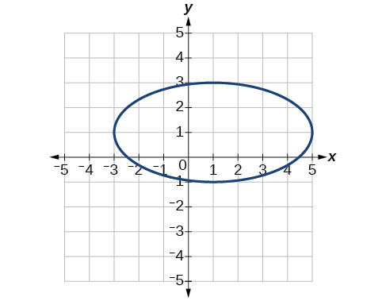 

<math xmlns="http://www.w3.org/1998/Math/MathML"> <mrow> <msup> <mi>x</mi> <mn>2</mn> </msup> <mo>−</mo><mn>8</mn><mi>x</mi><mo>+</mo><mn>25</mn><msup> <mi>y</mi> <mn>2</mn> </msup> <mo>−</mo><mn>100</mn><mi>y</mi><mo>+</mo><mn>91</mn><mo>=</mo><mn>0</mn> </mrow> </math>

<math xmlns="http://www.w3.org/1998/Math/MathML"> <mrow> <msup> <mi>x</mi> <mn>2</mn> </msup> <mo>+</mo><mn>8</mn><mi>x</mi><mo>+</mo><mn>4</mn><msup> <mi>y</mi> <mn>2</mn> </msup> <mo>−</mo><mn>40</mn><mi>y</mi><mo>+</mo><mn>112</mn><mo>=</mo><mn>0</mn> </mrow> </math>

Center<math xmlns="http://www.w3.org/1998/Math/MathML"> <mrow> <mtext> </mtext><mrow><mo>(</mo> <mrow> <mo>−</mo><mn>4</mn><mo>,</mo><mn>5</mn> </mrow> <mo>)</mo></mrow><mo>,</mo><mtext> </mtext> </mrow> </math>

Vertices<math xmlns="http://www.w3.org/1998/Math/MathML"> <mrow> <mtext> </mtext><mrow><mo>(</mo> <mrow> <mo>−</mo><mn>2</mn><mo>,</mo><mn>5</mn> </mrow> <mo>)</mo></mrow><mo>,</mo><mrow><mo>(</mo> <mrow> <mo>−</mo><mn>6</mn><mo>,</mo><mn>4</mn> </mrow> <mo>)</mo></mrow><mo>,</mo><mrow><mo>(</mo> <mrow> <mo>−</mo><mn>4</mn><mo>,</mo><mn>6</mn> </mrow> <mo>)</mo></mrow><mo>,</mo><mrow><mo>(</mo> <mrow> <mo>−</mo><mn>4</mn><mo>,</mo><mn>4</mn> </mrow> <mo>)</mo></mrow><mo>,</mo><mtext> </mtext> </mrow> </math>

Foci<math xmlns="http://www.w3.org/1998/Math/MathML"> <mrow> <mtext> </mtext><mrow><mo>(</mo> <mrow> <mo>−</mo><mn>4</mn><mo>+</mo><msqrt> <mn>3</mn> </msqrt> <mo>,</mo><mn>5</mn> </mrow> <mo>)</mo></mrow><mo>,</mo><mrow><mo>(</mo> <mrow> <mo>−</mo><mn>4</mn><mo>−</mo><msqrt> <mn>3</mn> </msqrt> <mo>,</mo><mn>5</mn> </mrow> <mo>)</mo></mrow> </mrow> </math>

 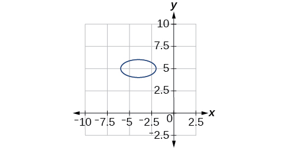 

<math xmlns="http://www.w3.org/1998/Math/MathML"> <mrow> <mn>64</mn><msup> <mi>x</mi> <mn>2</mn> </msup> <mo>+</mo><mn>128</mn><mi>x</mi><mo>+</mo><mn>9</mn><msup> <mi>y</mi> <mn>2</mn> </msup> <mo>−</mo><mn>72</mn><mi>y</mi><mo>−</mo><mn>368</mn><mo>=</mo><mn>0</mn> </mrow> </math>

<math xmlns="http://www.w3.org/1998/Math/MathML"> <mrow> <mn>16</mn><msup> <mi>x</mi> <mn>2</mn> </msup> <mo>+</mo><mn>64</mn><mi>x</mi><mo>+</mo><mn>4</mn><msup> <mi>y</mi> <mn>2</mn> </msup> <mo>−</mo><mn>8</mn><mi>y</mi><mo>+</mo><mn>4</mn><mo>=</mo><mn>0</mn> </mrow> </math>

Center<math xmlns="http://www.w3.org/1998/Math/MathML"> <mrow> <mtext> </mtext><mrow><mo>(</mo> <mrow> <mo>−</mo><mn>2</mn><mo>,</mo><mn>1</mn> </mrow> <mo>)</mo></mrow><mo>,</mo><mtext> </mtext> </mrow> </math>

Vertices<math xmlns="http://www.w3.org/1998/Math/MathML"> <mrow> <mtext> </mtext><mrow><mo>(</mo> <mrow> <mn>0</mn><mo>,</mo><mn>1</mn> </mrow> <mo>)</mo></mrow><mo>,</mo><mrow><mo>(</mo> <mrow> <mo>−</mo><mn>4</mn><mo>,</mo><mn>1</mn> </mrow> <mo>)</mo></mrow><mo>,</mo><mrow><mo>(</mo> <mrow> <mo>−</mo><mn>2</mn><mo>,</mo><mn>5</mn> </mrow> <mo>)</mo></mrow><mo>,</mo><mrow><mo>(</mo> <mrow> <mo>−</mo><mn>2</mn><mo>,</mo><mo>−</mo><mn>3</mn> </mrow> <mo>)</mo></mrow><mo>,</mo><mtext> </mtext> </mrow> </math>

Foci<math xmlns="http://www.w3.org/1998/Math/MathML"> <mrow> <mtext> </mtext><mrow><mo>(</mo> <mrow> <mo>−</mo><mn>2</mn><mo>,</mo><mn>1</mn><mo>+</mo><mn>2</mn><msqrt> <mn>3</mn> </msqrt> </mrow> <mo>)</mo></mrow><mo>,</mo><mrow><mo>(</mo> <mrow> <mo>−</mo><mn>2</mn><mo>,</mo><mn>1</mn><mo>−</mo><mn>2</mn><msqrt> <mn>3</mn> </msqrt> </mrow> <mo>)</mo></mrow> </mrow> </math>

 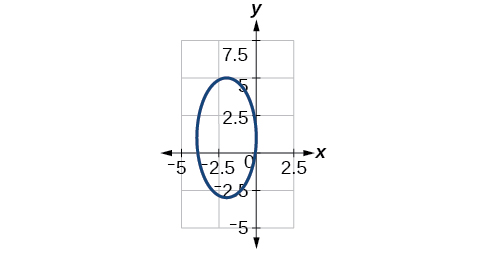 

<math xmlns="http://www.w3.org/1998/Math/MathML"> <mrow> <mn>100</mn><msup> <mi>x</mi> <mn>2</mn> </msup> <mo>+</mo><mn>1000</mn><mi>x</mi><mo>+</mo><msup> <mi>y</mi> <mn>2</mn> </msup> <mo>−</mo><mn>10</mn><mi>y</mi><mo>+</mo><mn>2425</mn><mo>=</mo><mn>0</mn> </mrow> </math>

<math xmlns="http://www.w3.org/1998/Math/MathML"> <mrow> <mn>4</mn><msup> <mi>x</mi> <mn>2</mn> </msup> <mo>+</mo><mn>16</mn><mi>x</mi><mo>+</mo><mn>4</mn><msup> <mi>y</mi> <mn>2</mn> </msup> <mo>+</mo><mn>16</mn><mi>y</mi><mo>+</mo><mn>16</mn><mo>=</mo><mn>0</mn> </mrow> </math>

Center<math xmlns="http://www.w3.org/1998/Math/MathML"> <mrow> <mtext> </mtext><mrow><mo>(</mo> <mrow> <mo>−</mo><mn>2</mn><mo>,</mo><mo>−</mo><mn>2</mn> </mrow> <mo>)</mo></mrow><mo>,</mo><mtext> </mtext> </mrow> </math>

Vertices<math xmlns="http://www.w3.org/1998/Math/MathML"> <mrow> <mtext> </mtext><mrow><mo>(</mo> <mrow> <mn>0</mn><mo>,</mo><mo>−</mo><mn>2</mn> </mrow> <mo>)</mo></mrow><mo>,</mo><mrow><mo>(</mo> <mrow> <mo>−</mo><mn>4</mn><mo>,</mo><mo>−</mo><mn>2</mn> </mrow> <mo>)</mo></mrow><mo>,</mo><mrow><mo>(</mo> <mrow> <mo>−</mo><mn>2</mn><mo>,</mo><mn>0</mn> </mrow> <mo>)</mo></mrow><mo>,</mo><mrow><mo>(</mo> <mrow> <mo>−</mo><mn>2</mn><mo>,</mo><mo>−</mo><mn>4</mn> </mrow> <mo>)</mo></mrow><mo>,</mo><mtext> </mtext> </mrow> </math>

Focus<math xmlns="http://www.w3.org/1998/Math/MathML"> <mrow> <mtext> </mtext><mrow><mo>(</mo> <mrow> <mo>−</mo><mn>2</mn><mo>,</mo><mo>−</mo><mn>2</mn> </mrow> <mo>)</mo></mrow> </mrow> </math>

 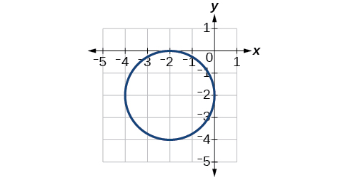 

For the following exercises, use the given information about the graph of each ellipse to determine its equation.

Center at the origin, symmetric with respect to the *x*- and *y*-axes, focus at<math xmlns="http://www.w3.org/1998/Math/MathML"> <mrow> <mtext> </mtext><mo stretchy="false">(</mo><mn>4</mn><mo>,</mo><mn>0</mn><mo stretchy="false">)</mo><mo>,</mo> </mrow> </math>

 and point on graph<math xmlns="http://www.w3.org/1998/Math/MathML"> <mrow> <mtext> </mtext><mo stretchy="false">(</mo><mn>0</mn><mo>,</mo><mn>3</mn><mo stretchy="false">)</mo><mo>.</mo> </mrow> </math>

Center at the origin, symmetric with respect to the *x*- and *y*-axes, focus at<math xmlns="http://www.w3.org/1998/Math/MathML"> <mrow> <mtext> </mtext><mo stretchy="false">(</mo><mn>0</mn><mo>,</mo><mn>−2</mn><mo stretchy="false">)</mo><mo>,</mo> </mrow> </math>

 and point on graph<math xmlns="http://www.w3.org/1998/Math/MathML"> <mrow> <mtext> </mtext><mo stretchy="false">(</mo><mn>5</mn><mo>,</mo><mn>0</mn><mo stretchy="false">)</mo><mo>.</mo> </mrow> </math>

<math xmlns="http://www.w3.org/1998/Math/MathML"> <mrow> <mfrac> <mrow> <msup> <mi>x</mi> <mn>2</mn> </msup> </mrow> <mrow> <mn>25</mn> </mrow> </mfrac> <mo>+</mo><mfrac> <mrow> <msup> <mi>y</mi> <mn>2</mn> </msup> </mrow> <mrow> <mn>29</mn> </mrow> </mfrac> <mo>=</mo><mn>1</mn> </mrow> </math>

Center at the origin, symmetric with respect to the *x*- and *y*-axes, focus at<math xmlns="http://www.w3.org/1998/Math/MathML"> <mrow> <mtext> </mtext><mo stretchy="false">(</mo><mn>3</mn><mo>,</mo><mn>0</mn><mo stretchy="false">)</mo><mo>,</mo> </mrow> </math>

 and major axis is twice as long as minor axis.

Center<math xmlns="http://www.w3.org/1998/Math/MathML"> <mrow> <mtext> </mtext><mrow><mo>(</mo> <mrow> <mn>4</mn><mo>,</mo><mn>2</mn> </mrow> <mo>)</mo></mrow> </mrow> </math>

; vertex<math xmlns="http://www.w3.org/1998/Math/MathML"> <mrow> <mtext> </mtext><mrow><mo>(</mo> <mrow> <mn>9</mn><mo>,</mo><mn>2</mn> </mrow> <mo>)</mo></mrow> </mrow> </math>

; one focus:<math xmlns="http://www.w3.org/1998/Math/MathML"> <mrow> <mtext> </mtext><mrow><mo>(</mo> <mrow> <mn>4</mn><mo>+</mo><mn>2</mn><msqrt> <mn>6</mn> </msqrt> <mo>,</mo><mn>2</mn> </mrow> <mo>)</mo></mrow> </mrow> </math>

.

<math xmlns="http://www.w3.org/1998/Math/MathML"> <mrow> <mfrac> <mrow> <msup> <mrow> <mrow><mo>(</mo> <mrow> <mi>x</mi><mo>−</mo><mn>4</mn> </mrow> <mo>)</mo></mrow> </mrow> <mn>2</mn> </msup> </mrow> <mrow> <mn>25</mn> </mrow> </mfrac> <mo>+</mo><mfrac> <mrow> <msup> <mrow> <mrow><mo>(</mo> <mrow> <mi>y</mi><mo>−</mo><mn>2</mn> </mrow> <mo>)</mo></mrow> </mrow> <mn>2</mn> </msup> </mrow> <mn>1</mn> </mfrac> <mo>=</mo><mn>1</mn> </mrow> </math>

Center<math xmlns="http://www.w3.org/1998/Math/MathML"> <mrow> <mtext> </mtext><mrow><mo>(</mo> <mrow> <mn>3</mn><mo>,</mo><mn>5</mn> </mrow> <mo>)</mo></mrow> </mrow> </math>

; vertex<math xmlns="http://www.w3.org/1998/Math/MathML"> <mrow> <mtext> </mtext><mrow><mo>(</mo> <mrow> <mn>3</mn><mo>,</mo><mn>11</mn> </mrow> <mo>)</mo></mrow> </mrow> </math>

; one focus:<math xmlns="http://www.w3.org/1998/Math/MathML"> <mrow> <mtext> </mtext><mrow><mo>(</mo> <mrow> <mn>3</mn><mo>,</mo><mtext> 5+4</mtext><msqrt> <mtext>2</mtext> </msqrt> </mrow> <mo>)</mo></mrow> </mrow> </math>

Center<math xmlns="http://www.w3.org/1998/Math/MathML"> <mrow> <mtext> </mtext><mrow><mo>(</mo> <mrow> <mn>−3</mn><mo>,</mo><mn>4</mn> </mrow> <mo>)</mo></mrow> </mrow> </math>

; vertex<math xmlns="http://www.w3.org/1998/Math/MathML"> <mrow> <mtext> </mtext><mrow><mo>(</mo> <mrow> <mn>1</mn><mo>,</mo><mn>4</mn> </mrow> <mo>)</mo></mrow> </mrow> </math>

; one focus:<math xmlns="http://www.w3.org/1998/Math/MathML"> <mrow> <mtext> </mtext><mrow><mo>(</mo> <mrow> <mn>−3</mn><mo>+</mo><mn>2</mn><msqrt> <mn>3</mn> </msqrt> <mo>,</mo><mn>4</mn> </mrow> <mo>)</mo></mrow> </mrow> </math>

<math xmlns="http://www.w3.org/1998/Math/MathML"> <mrow> <mfrac> <mrow> <msup> <mrow> <mrow><mo>(</mo> <mrow> <mi>x</mi><mo>+</mo><mn>3</mn> </mrow> <mo>)</mo></mrow> </mrow> <mn>2</mn> </msup> </mrow> <mrow> <mn>16</mn> </mrow> </mfrac> <mo>+</mo><mfrac> <mrow> <msup> <mrow> <mrow><mo>(</mo> <mrow> <mi>y</mi><mo>−</mo><mn>4</mn> </mrow> <mo>)</mo></mrow> </mrow> <mn>2</mn> </msup> </mrow> <mn>4</mn> </mfrac> <mo>=</mo><mn>1</mn> </mrow> </math>

For the following exercises, given the graph of the ellipse, determine its equation.

 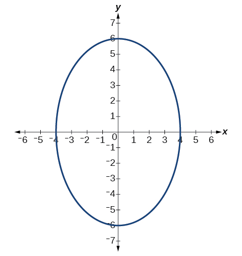 

  

<math xmlns="http://www.w3.org/1998/Math/MathML"> <mrow> <mfrac> <mrow> <msup> <mi>x</mi> <mn>2</mn> </msup> </mrow> <mrow> <mn>81</mn> </mrow> </mfrac> <mo>+</mo><mfrac> <mrow> <msup> <mi>y</mi> <mn>2</mn> </msup> </mrow> <mn>9</mn> </mfrac> <mo>=</mo><mn>1</mn> </mrow> </math>

 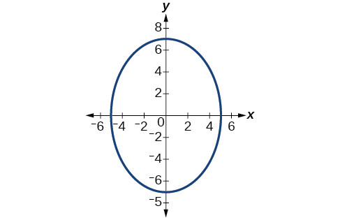 

 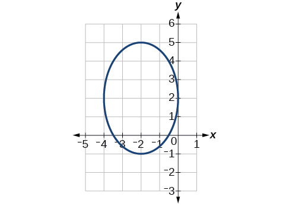 

<math xmlns="http://www.w3.org/1998/Math/MathML"> <mrow> <mfrac> <mrow> <msup> <mrow> <mrow><mo>(</mo> <mrow> <mi>x</mi><mo>+</mo><mn>2</mn> </mrow> <mo>)</mo></mrow> </mrow> <mn>2</mn> </msup> </mrow> <mn>4</mn> </mfrac> <mo>+</mo><mfrac> <mrow> <msup> <mrow> <mrow><mo>(</mo> <mrow> <mi>y</mi><mo>−</mo><mn>2</mn> </mrow> <mo>)</mo></mrow> </mrow> <mn>2</mn> </msup> </mrow> <mn>9</mn> </mfrac> <mo>=</mo><mn>1</mn> </mrow> </math>

 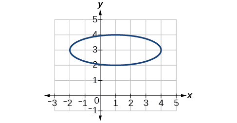 

##  Extensions

For the following exercises, find the area of the ellipse. The area of an ellipse is given by the formula<math xmlns="http://www.w3.org/1998/Math/MathML"> <mrow> <mtext> </mtext><mtext>Area</mtext><mo>=</mo><mi>a</mi><mo>⋅</mo><mi>b</mi><mo>⋅</mo><mi>π</mi><mo>.</mo> </mrow> </math>

<math xmlns="http://www.w3.org/1998/Math/MathML"> <mrow> <mfrac> <mrow> <msup> <mrow> <mrow><mo>(</mo> <mrow> <mi>x</mi><mo>−</mo><mn>3</mn> </mrow> <mo>)</mo></mrow> </mrow> <mn>2</mn> </msup> </mrow> <mn>9</mn> </mfrac> <mo>+</mo><mfrac> <mrow> <msup> <mrow> <mrow><mo>(</mo> <mrow> <mi>y</mi><mo>−</mo><mn>3</mn> </mrow> <mo>)</mo></mrow> </mrow> <mn>2</mn> </msup> </mrow> <mrow> <mn>16</mn> </mrow> </mfrac> <mo>=</mo><mn>1</mn> </mrow> </math>

<math xmlns="http://www.w3.org/1998/Math/MathML"> <mrow> <mtext>Area = 12π</mtext><mtext> </mtext><mtext>square</mtext><mtext> </mtext><mtext>units</mtext> </mrow> </math>

<math xmlns="http://www.w3.org/1998/Math/MathML"> <mrow> <mfrac> <mrow> <msup> <mrow> <mrow><mo>(</mo> <mrow> <mi>x</mi><mo>+</mo><mn>6</mn> </mrow> <mo>)</mo></mrow> </mrow> <mn>2</mn> </msup> </mrow> <mrow> <mn>16</mn> </mrow> </mfrac> <mo>+</mo><mfrac> <mrow> <msup> <mrow> <mrow><mo>(</mo> <mrow> <mi>y</mi><mo>−</mo><mn>6</mn> </mrow> <mo>)</mo></mrow> </mrow> <mn>2</mn> </msup> </mrow> <mrow> <mn>36</mn> </mrow> </mfrac> <mo>=</mo><mn>1</mn> </mrow> </math>

<math xmlns="http://www.w3.org/1998/Math/MathML"> <mrow> <mfrac> <mrow> <msup> <mrow> <mrow><mo>(</mo> <mrow> <mi>x</mi><mo>+</mo><mn>1</mn> </mrow> <mo>)</mo></mrow> </mrow> <mn>2</mn> </msup> </mrow> <mn>4</mn> </mfrac> <mo>+</mo><mfrac> <mrow> <msup> <mrow> <mrow><mo>(</mo> <mrow> <mi>y</mi><mo>−</mo><mn>2</mn> </mrow> <mo>)</mo></mrow> </mrow> <mn>2</mn> </msup> </mrow> <mn>5</mn> </mfrac> <mo>=</mo><mn>1</mn> </mrow> </math>

<math xmlns="http://www.w3.org/1998/Math/MathML"> <mrow> <mtext>Area = 2</mtext><msqrt> <mtext>5</mtext> </msqrt> <mtext>π</mtext><mtext> </mtext><mtext>square</mtext><mtext> </mtext><mtext>units</mtext> </mrow> </math>

<math xmlns="http://www.w3.org/1998/Math/MathML"> <mrow> <mn>4</mn><msup> <mi>x</mi> <mn>2</mn> </msup> <mo>−</mo><mn>8</mn><mi>x</mi><mo>+</mo><mn>9</mn><msup> <mi>y</mi> <mn>2</mn> </msup> <mo>−</mo><mn>72</mn><mi>y</mi><mo>+</mo><mn>112</mn><mo>=</mo><mn>0</mn> </mrow> </math>

<math xmlns="http://www.w3.org/1998/Math/MathML"> <mrow> <mn>9</mn><msup> <mi>x</mi> <mn>2</mn> </msup> <mo>−</mo><mn>54</mn><mi>x</mi><mo>+</mo><mn>9</mn><msup> <mi>y</mi> <mn>2</mn> </msup> <mo>−</mo><mn>54</mn><mi>y</mi><mo>+</mo><mn>81</mn><mo>=</mo><mn>0</mn> </mrow> </math>

<math xmlns="http://www.w3.org/1998/Math/MathML"> <mrow> <mtext>Area = 9π</mtext><mtext> </mtext><mtext>square</mtext><mtext> </mtext><mtext>units</mtext> </mrow> </math>

##  Real-World Applications

Find the equation of the ellipse that will just fit inside a box that is 8 units wide and 4 units high.

Find the equation of the ellipse that will just fit inside a box that is four times as wide as it is high. Express in terms of<math xmlns="http://www.w3.org/1998/Math/MathML"> <mrow> <mtext> </mtext><mi>h</mi><mo>,</mo> </mrow> </math>

 the height.

<math xmlns="http://www.w3.org/1998/Math/MathML"> <mrow> <mfrac> <mrow> <msup> <mi>x</mi> <mn>2</mn> </msup> </mrow> <mrow> <mn>4</mn><msup> <mi>h</mi> <mn>2</mn> </msup> </mrow> </mfrac> <mo>+</mo><mfrac> <mrow> <msup> <mi>y</mi> <mn>2</mn> </msup> </mrow> <mrow> <mfrac> <mn>1</mn> <mn>4</mn> </mfrac> <msup> <mi>h</mi> <mn>2</mn> </msup> </mrow> </mfrac> <mo>=</mo><mn>1</mn> </mrow> </math>

An arch has the shape of a semi-ellipse (the top half of an ellipse). The arch has a height of 8 feet and a span of 20 feet. Find an equation for the ellipse, and use that to find the height to the nearest 0.01 foot of the arch at a distance of 4 feet from the center.

An arch has the shape of a semi-ellipse. The arch has a height of 12 feet and a span of 40 feet. Find an equation for the ellipse, and use that to find the distance from the center to a point at which the height is 6 feet. Round to the nearest hundredth.

<math xmlns="http://www.w3.org/1998/Math/MathML"> <mrow> <mfrac> <mrow> <msup> <mi>x</mi> <mn>2</mn> </msup> </mrow> <mrow> <mn>400</mn> </mrow> </mfrac> <mo>+</mo><mfrac> <mrow> <msup> <mi>y</mi> <mn>2</mn> </msup> </mrow> <mrow> <mn>144</mn> </mrow> </mfrac> <mo>=</mo><mn>1</mn> </mrow> </math>

. Distance = 17.32 feet

A bridge is to be built in the shape of a semi-elliptical arch and is to have a span of 120 feet. The height of the arch at a distance of 40 feet from the center is to be 8 feet. Find the height of the arch at its center.

A person in a whispering gallery standing at one focus of the ellipse can whisper and be heard by a person standing at the other focus because all the sound waves that reach the ceiling are reflected to the other person. If a whispering gallery has a length of 120 feet, and the foci are located 30 feet from the center, find the height of the ceiling at the center.

Approximately 51.96 feet

A person is standing 8 feet from the nearest wall in a whispering gallery. If that person is at one focus, and the other focus is 80 feet away, what is the length and height at the center of the gallery?

[1]: http://openstaxcollege.org/l/conicellipse
[2]: http://openstaxcollege.org/l/grphellorigin
[3]: http://openstaxcollege.org/l/grphellnot
