

In this section, you will:
* Locate a hyperbola’s vertices and foci.
* Write equations of hyperbolas in standard form.
* Graph hyperbolas centered at the origin.
* Graph hyperbolas not centered at the origin.
* Solve applied problems involving hyperbolas.

What do paths of comets, supersonic booms, ancient Grecian pillars, and natural draft cooling towers have in common? They can all be modeled by the same type of **conic**{: data-type="term" .no-emphasis}. For instance, when something moves faster than the speed of sound, a shock wave in the form of a cone is created. A portion of a conic is formed when the wave intersects the ground, resulting in a sonic boom. See [\[link\]](#Figure_10_02_001).

 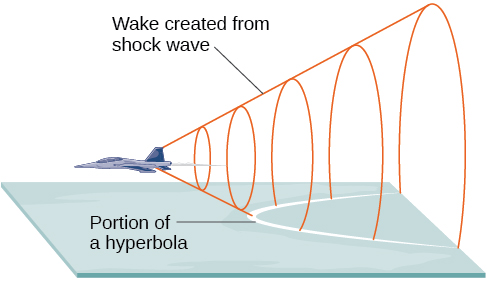{: #Figure_10_02_001}

Most people are familiar with the sonic boom created by supersonic aircraft, but humans were breaking the sound barrier long before the first supersonic flight. The crack of a whip occurs because the tip is exceeding the speed of sound. The bullets shot from many firearms also break the sound barrier, although the bang of the gun usually supersedes the sound of the sonic boom.

### Locating the Vertices and Foci of a Hyperbola

In analytic geometry, a **hyperbola**{: data-type="term"} is a conic section formed by intersecting a right circular cone with a plane at an angle such that both halves of the cone are intersected. This intersection produces two separate unbounded curves that are mirror images of each other. See [\[link\]](#Figure_10_02_002).

 {: #Figure_10_02_002}

Like the ellipse, the hyperbola can also be defined as a set of points in the coordinate plane. A hyperbola is the set of all points<math xmlns="http://www.w3.org/1998/Math/MathML"> <mrow> <mtext> </mtext><mrow><mo>(</mo> <mrow> <mi>x</mi><mo>,</mo><mi>y</mi> </mrow> <mo>)</mo></mrow><mtext> </mtext> </mrow> </math>

in a plane such that the difference of the distances between<math xmlns="http://www.w3.org/1998/Math/MathML"> <mrow> <mtext> </mtext><mrow><mo>(</mo> <mrow> <mi>x</mi><mo>,</mo><mi>y</mi> </mrow> <mo>)</mo></mrow><mtext> </mtext> </mrow> </math>

and the foci is a positive constant.

Notice that the definition of a hyperbola is very similar to that of an ellipse. The distinction is that the hyperbola is defined in terms of the *difference* of two distances, whereas the ellipse is defined in terms of the *sum* of two distances.

As with the ellipse, every hyperbola has two **axes of symmetry**{: data-type="term" .no-emphasis}. The **transverse axis**{: data-type="term"} is a line segment that passes through the center of the hyperbola and has vertices as its endpoints. The foci lie on the line that contains the transverse axis. The **conjugate axis**{: data-type="term"} is perpendicular to the transverse axis and has the co-vertices as its endpoints. The **center of a hyperbola**{: data-type="term"} is the midpoint of both the transverse and conjugate axes, where they intersect. Every hyperbola also has two **asymptotes**{: data-type="term"} that pass through its center. As a hyperbola recedes from the center, its branches approach these asymptotes. The **central rectangle**{: data-type="term"} of the hyperbola is centered at the origin with sides that pass through each vertex and co-vertex; it is a useful tool for graphing the hyperbola and its asymptotes. To sketch the asymptotes of the hyperbola, simply sketch and extend the diagonals of the central rectangle. See [\[link\]](#Figure_10_02_003).

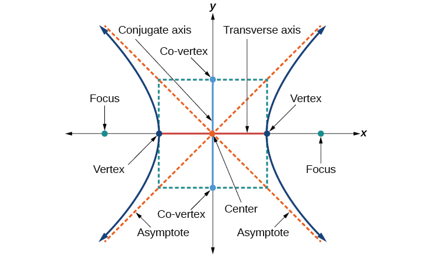{: #Figure_10_02_003}

In this section, we will limit our discussion to hyperbolas that are positioned vertically or horizontally in the coordinate plane; the axes will either lie on or be parallel to the *x*- and *y*-axes. We will consider two cases: those that are centered at the origin, and those that are centered at a point other than the origin.

#### Deriving the Equation of a Hyperbola Centered at the Origin

Let<math xmlns="http://www.w3.org/1998/Math/MathML"> <mrow> <mtext> </mtext><mrow><mo>(</mo> <mrow> <mo>−</mo><mi>c</mi><mo>,</mo><mn>0</mn> </mrow> <mo>)</mo></mrow><mtext> </mtext> </mrow> </math>

and<math xmlns="http://www.w3.org/1998/Math/MathML"> <mrow> <mtext> </mtext><mrow><mo>(</mo> <mrow> <mi>c</mi><mo>,</mo><mn>0</mn> </mrow> <mo>)</mo></mrow><mtext> </mtext> </mrow> </math>

be the **foci**{: data-type="term" .no-emphasis} of a hyperbola centered at the origin. The hyperbola is the set of all points<math xmlns="http://www.w3.org/1998/Math/MathML"> <mrow> <mtext> </mtext><mrow><mo>(</mo> <mrow> <mi>x</mi><mo>,</mo><mi>y</mi> </mrow> <mo>)</mo></mrow><mtext> </mtext> </mrow> </math>

such that the difference of the distances from<math xmlns="http://www.w3.org/1998/Math/MathML"> <mrow> <mtext> </mtext><mrow><mo>(</mo> <mrow> <mi>x</mi><mo>,</mo><mi>y</mi> </mrow> <mo>)</mo></mrow><mtext> </mtext> </mrow> </math>

to the foci is constant. See [\[link\]](#Figure_10_02_013).

 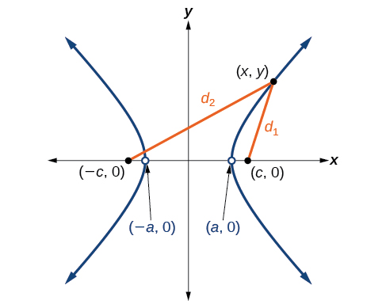{: #Figure_10_02_013}

If<math xmlns="http://www.w3.org/1998/Math/MathML"> <mrow> <mtext> </mtext><mrow><mo>(</mo> <mrow> <mi>a</mi><mo>,</mo><mn>0</mn> </mrow> <mo>)</mo></mrow><mtext> </mtext> </mrow> </math>

is a vertex of the hyperbola, the distance from<math xmlns="http://www.w3.org/1998/Math/MathML"> <mrow> <mtext> </mtext><mrow><mo>(</mo> <mrow> <mo>−</mo><mi>c</mi><mo>,</mo><mn>0</mn> </mrow> <mo>)</mo></mrow><mtext> </mtext> </mrow> </math>

to<math xmlns="http://www.w3.org/1998/Math/MathML"> <mrow> <mtext> </mtext><mrow><mo>(</mo> <mrow> <mi>a</mi><mo>,</mo><mn>0</mn> </mrow> <mo>)</mo></mrow><mtext> </mtext> </mrow> </math>

is<math xmlns="http://www.w3.org/1998/Math/MathML"> <mrow> <mtext> </mtext><mi>a</mi><mo>−</mo><mrow><mo>(</mo> <mrow> <mo>−</mo><mi>c</mi> </mrow> <mo>)</mo></mrow><mo>=</mo><mi>a</mi><mo>+</mo><mi>c</mi><mo>.</mo><mtext> </mtext> </mrow> </math>

The distance from<math xmlns="http://www.w3.org/1998/Math/MathML"> <mrow> <mtext> </mtext><mrow><mo>(</mo> <mrow> <mi>c</mi><mo>,</mo><mn>0</mn> </mrow> <mo>)</mo></mrow><mtext> </mtext> </mrow> </math>

to<math xmlns="http://www.w3.org/1998/Math/MathML"> <mrow> <mtext> </mtext><mrow><mo>(</mo> <mrow> <mi>a</mi><mo>,</mo><mn>0</mn> </mrow> <mo>)</mo></mrow><mtext> </mtext> </mrow> </math>

is<math xmlns="http://www.w3.org/1998/Math/MathML"> <mrow> <mtext> </mtext><mi>c</mi><mo>−</mo><mi>a</mi><mo>.</mo><mtext> </mtext> </mrow> </math>

The sum of the distances from the foci to the vertex is

<math xmlns="http://www.w3.org/1998/Math/MathML"> <mrow> <mrow><mo>(</mo> <mrow> <mi>a</mi><mo>+</mo><mi>c</mi> </mrow> <mo>)</mo></mrow><mo>−</mo><mrow><mo>(</mo> <mrow> <mi>c</mi><mo>−</mo><mi>a</mi> </mrow> <mo>)</mo></mrow><mo>=</mo><mn>2</mn><mi>a</mi> </mrow> </math>

If<math xmlns="http://www.w3.org/1998/Math/MathML"> <mrow> <mtext> </mtext><mrow><mo>(</mo> <mrow> <mi>x</mi><mo>,</mo><mi>y</mi> </mrow> <mo>)</mo></mrow><mtext> </mtext> </mrow> </math>

is a point on the hyperbola, we can define the following variables:

<math xmlns="http://www.w3.org/1998/Math/MathML"> <mtable columnalign="left"> <mtr> <mtd> <msub> <mi>d</mi> <mn>2</mn> </msub> <mo>=</mo><mtext>the distance from </mtext><mrow><mo>(</mo> <mrow> <mo>−</mo><mi>c</mi><mo>,</mo><mn>0</mn> </mrow> <mo>)</mo></mrow><mtext> to </mtext><mrow><mo>(</mo> <mrow> <mi>x</mi><mo>,</mo><mi>y</mi> </mrow> <mo>)</mo></mrow> </mtd> </mtr> <mtr> <mtd> <msub> <mi>d</mi> <mn>1</mn> </msub> <mo>=</mo><mtext>the distance from </mtext><mrow><mo>(</mo> <mrow> <mi>c</mi><mo>,</mo><mn>0</mn> </mrow> <mo>)</mo></mrow><mtext> to </mtext><mrow><mo>(</mo> <mrow> <mi>x</mi><mo>,</mo><mi>y</mi> </mrow> <mo>)</mo></mrow> </mtd> </mtr> </mtable> </math>

By definition of a hyperbola,<math xmlns="http://www.w3.org/1998/Math/MathML"> <mrow> <mtext> </mtext><msub> <mi>d</mi> <mn>2</mn> </msub> <mo>−</mo><msub> <mi>d</mi> <mn>1</mn> </msub> <mtext> </mtext> </mrow> </math>

is constant for any point<math xmlns="http://www.w3.org/1998/Math/MathML"> <mrow> <mtext> </mtext><mrow><mo>(</mo> <mrow> <mi>x</mi><mo>,</mo><mi>y</mi> </mrow> <mo>)</mo></mrow><mtext> </mtext> </mrow> </math>

on the hyperbola. We know that the difference of these distances is<math xmlns="http://www.w3.org/1998/Math/MathML"> <mrow> <mtext> </mtext><mn>2</mn><mi>a</mi><mtext> </mtext> </mrow> </math>

for the vertex<math xmlns="http://www.w3.org/1998/Math/MathML"> <mrow> <mtext> </mtext><mo stretchy="false">(</mo><mi>a</mi><mo>,</mo><mn>0</mn><mo stretchy="false">)</mo><mo>.</mo><mtext> </mtext> </mrow> </math>

It follows that<math xmlns="http://www.w3.org/1998/Math/MathML"> <mrow> <mtext> </mtext><msub> <mi>d</mi> <mn>2</mn> </msub> <mo>−</mo><msub> <mi>d</mi> <mn>1</mn> </msub> <mo>=</mo><mn>2</mn><mi>a</mi><mtext> </mtext> </mrow> </math>

for any point on the hyperbola. As with the derivation of the equation of an ellipse, we will begin by applying the **distance formula**{: data-type="term" .no-emphasis}. The rest of the derivation is algebraic. Compare this derivation with the one from the previous section for ellipses.

<math xmlns="http://www.w3.org/1998/Math/MathML" display="block"> <mrow> <mtable columnalign="left"> <mtr columnalign="left"> <mtd columnalign="left"> <mrow> <mtext>                                      </mtext><msub> <mi>d</mi> <mn>2</mn> </msub> <mo>−</mo><msub> <mi>d</mi> <mn>1</mn> </msub> <mo>=</mo><msqrt> <mrow> <msup> <mrow> <mo stretchy="false">(</mo><mi>x</mi><mo>−</mo><mo stretchy="false">(</mo><mo>−</mo><mi>c</mi><mo stretchy="false">)</mo><mo stretchy="false">)</mo></mrow> <mn>2</mn> </msup> <mo>+</mo><msup> <mrow> <mo stretchy="false">(</mo><mi>y</mi><mo>−</mo><mn>0</mn><mo stretchy="false">)</mo></mrow> <mn>2</mn> </msup> </mrow> </msqrt> <mo>−</mo><msqrt> <mrow> <msup> <mrow> <mo stretchy="false">(</mo><mi>x</mi><mo>−</mo><mi>c</mi><mo stretchy="false">)</mo></mrow> <mn>2</mn> </msup> <mo>+</mo><msup> <mrow> <mo stretchy="false">(</mo><mi>y</mi><mo>−</mo><mn>0</mn><mo stretchy="false">)</mo></mrow> <mn>2</mn> </msup> </mrow> </msqrt> <mo>=</mo><mn>2</mn><mi>a</mi></mrow> </mtd> <mtd columnalign="left"> <mrow> <mtext>Distance Formula</mtext></mrow> </mtd> </mtr> <mtr columnalign="left"> <mtd columnalign="left"> <mrow> <msqrt> <mrow> <msup> <mrow> <mo stretchy="false">(</mo><mi>x</mi><mo>+</mo><mi>c</mi><mo stretchy="false">)</mo></mrow> <mn>2</mn> </msup> <mo>+</mo><msup> <mi>y</mi> <mn>2</mn> </msup> </mrow> </msqrt> <mo>−</mo><msqrt> <mrow> <msup> <mrow> <mo stretchy="false">(</mo><mi>x</mi><mo>−</mo><mi>c</mi><mo stretchy="false">)</mo></mrow> <mn>2</mn> </msup> <mo>+</mo><msup> <mi>y</mi> <mn>2</mn> </msup> </mrow> </msqrt> <mo>=</mo><mn>2</mn><mi>a</mi></mrow> </mtd> <mtd columnalign="left"> <mrow> <mtext>Simplify expressions</mtext><mtext>.</mtext></mrow> </mtd> </mtr> <mtr columnalign="left"> <mtd columnalign="left"> <mrow> <mtext>                           </mtext><msqrt> <mrow> <msup> <mrow> <mo stretchy="false">(</mo><mi>x</mi><mo>+</mo><mi>c</mi><mo stretchy="false">)</mo></mrow> <mn>2</mn> </msup> <mo>+</mo><msup> <mi>y</mi> <mn>2</mn> </msup> </mrow> </msqrt> <mo>=</mo><mn>2</mn><mi>a</mi><mo>+</mo><msqrt> <mrow> <msup> <mrow> <mo stretchy="false">(</mo><mi>x</mi><mo>−</mo><mi>c</mi><mo stretchy="false">)</mo></mrow> <mn>2</mn> </msup> <mo>+</mo><msup> <mi>y</mi> <mn>2</mn> </msup> </mrow> </msqrt> </mrow> </mtd> <mtd columnalign="left"> <mrow> <mtext>Move radical to opposite side</mtext><mtext>.</mtext></mrow> </mtd> </mtr> <mtr columnalign="left"> <mtd columnalign="left"> <mrow> <mtext>                             </mtext><msup> <mrow> <mo stretchy="false">(</mo><mi>x</mi><mo>+</mo><mi>c</mi><mo stretchy="false">)</mo></mrow> <mn>2</mn> </msup> <mo>+</mo><msup> <mi>y</mi> <mn>2</mn> </msup> <mo>=</mo><msup> <mrow> <mrow><mo>(</mo> <mrow> <mn>2</mn><mi>a</mi><mo>+</mo><msqrt> <mrow> <msup> <mrow> <mo stretchy="false">(</mo><mi>x</mi><mo>−</mo><mi>c</mi><mo stretchy="false">)</mo></mrow> <mn>2</mn> </msup> <mo>+</mo><msup> <mi>y</mi> <mn>2</mn> </msup> </mrow> </msqrt> </mrow> <mo>)</mo></mrow></mrow> <mn>2</mn> </msup> </mrow> </mtd> <mtd columnalign="left"> <mrow> <mtext>Square both sides</mtext><mtext>.</mtext></mrow> </mtd> </mtr> <mtr columnalign="left"> <mtd columnalign="left"> <mrow> <mtext>                    </mtext><msup> <mi>x</mi> <mn>2</mn> </msup> <mo>+</mo><mn>2</mn><mi>c</mi><mi>x</mi><mo>+</mo><msup> <mi>c</mi> <mn>2</mn> </msup> <mo>+</mo><msup> <mi>y</mi> <mn>2</mn> </msup> <mo>=</mo><mn>4</mn><msup> <mi>a</mi> <mn>2</mn> </msup> <mo>+</mo><mn>4</mn><mi>a</mi><msqrt> <mrow> <msup> <mrow> <mo stretchy="false">(</mo><mi>x</mi><mo>−</mo><mi>c</mi><mo stretchy="false">)</mo></mrow> <mn>2</mn> </msup> <mo>+</mo><msup> <mi>y</mi> <mn>2</mn> </msup> </mrow> </msqrt> <mo>+</mo><msup> <mrow> <mo stretchy="false">(</mo><mi>x</mi><mo>−</mo><mi>c</mi><mo stretchy="false">)</mo></mrow> <mn>2</mn> </msup> <mo>+</mo><msup> <mi>y</mi> <mn>2</mn> </msup> </mrow> </mtd> <mtd columnalign="left"> <mrow> <mtext>Expand the squares</mtext><mtext>.</mtext></mrow> </mtd> </mtr> <mtr columnalign="left"> <mtd columnalign="left"> <mrow> <mtext>                    </mtext><msup> <mi>x</mi> <mn>2</mn> </msup> <mo>+</mo><mn>2</mn><mi>c</mi><mi>x</mi><mo>+</mo><msup> <mi>c</mi> <mn>2</mn> </msup> <mo>+</mo><msup> <mi>y</mi> <mn>2</mn> </msup> <mo>=</mo><mn>4</mn><msup> <mi>a</mi> <mn>2</mn> </msup> <mo>+</mo><mn>4</mn><mi>a</mi><msqrt> <mrow> <msup> <mrow> <mo stretchy="false">(</mo><mi>x</mi><mo>−</mo><mi>c</mi><mo stretchy="false">)</mo></mrow> <mn>2</mn> </msup> <mo>+</mo><msup> <mi>y</mi> <mn>2</mn> </msup> </mrow> </msqrt> <mo>+</mo><msup> <mi>x</mi> <mn>2</mn> </msup> <mo>−</mo><mn>2</mn><mi>c</mi><mi>x</mi><mo>+</mo><msup> <mi>c</mi> <mn>2</mn> </msup> <mo>+</mo><msup> <mi>y</mi> <mn>2</mn> </msup> </mrow> </mtd> <mtd columnalign="left"> <mrow> <mtext>Expand remaining square</mtext><mtext>.</mtext></mrow> </mtd> </mtr> <mtr columnalign="left"> <mtd columnalign="left"> <mrow> <mtext>                                             </mtext><mn>2</mn><mi>c</mi><mi>x</mi><mo>=</mo><mn>4</mn><msup> <mi>a</mi> <mn>2</mn> </msup> <mo>+</mo><mn>4</mn><mi>a</mi><msqrt> <mrow> <msup> <mrow> <mo stretchy="false">(</mo><mi>x</mi><mo>−</mo><mi>c</mi><mo stretchy="false">)</mo></mrow> <mn>2</mn> </msup> <mo>+</mo><msup> <mi>y</mi> <mn>2</mn> </msup> </mrow> </msqrt> <mo>−</mo><mn>2</mn><mi>c</mi><mi>x</mi></mrow> </mtd> <mtd columnalign="left"> <mrow> <mtext>Combine like terms</mtext><mtext>.</mtext></mrow> </mtd> </mtr> <mtr columnalign="left"> <mtd columnalign="left"> <mrow> <mtext>                                  </mtext><mn>4</mn><mi>c</mi><mi>x</mi><mo>−</mo><mn>4</mn><msup> <mi>a</mi> <mn>2</mn> </msup> <mo>=</mo><mn>4</mn><mi>a</mi><msqrt> <mrow> <msup> <mrow> <mo stretchy="false">(</mo><mi>x</mi><mo>−</mo><mi>c</mi><mo stretchy="false">)</mo></mrow> <mn>2</mn> </msup> <mo>+</mo><msup> <mi>y</mi> <mn>2</mn> </msup> </mrow> </msqrt> </mrow> </mtd> <mtd columnalign="left"> <mrow> <mtext>Isolate the radical</mtext><mtext>.</mtext></mrow> </mtd> </mtr> <mtr columnalign="left"> <mtd columnalign="left"> <mrow> <mtext>                                      </mtext><mi>c</mi><mi>x</mi><mo>−</mo><msup> <mi>a</mi> <mn>2</mn> </msup> <mo>=</mo><mi>a</mi><msqrt> <mrow> <msup> <mrow> <mo stretchy="false">(</mo><mi>x</mi><mo>−</mo><mi>c</mi><mo stretchy="false">)</mo></mrow> <mn>2</mn> </msup> <mo>+</mo><msup> <mi>y</mi> <mn>2</mn> </msup> </mrow> </msqrt> </mrow> </mtd> <mtd columnalign="left"> <mrow> <mtext>Divide by 4</mtext><mtext>.</mtext></mrow> </mtd> </mtr> <mtr columnalign="left"> <mtd columnalign="left"> <mrow> <mtext>                                  </mtext><msup> <mrow> <mrow><mo>(</mo> <mrow> <mi>c</mi><mi>x</mi><mo>−</mo><msup> <mi>a</mi> <mn>2</mn> </msup> </mrow> <mo>)</mo></mrow></mrow> <mn>2</mn> </msup> <mo>=</mo><msup> <mi>a</mi> <mn>2</mn> </msup> <msup> <mrow> <mrow><mo>[</mo> <mrow> <msqrt> <mrow> <msup> <mrow> <mo stretchy="false">(</mo><mi>x</mi><mo>−</mo><mi>c</mi><mo stretchy="false">)</mo></mrow> <mn>2</mn> </msup> <mo>+</mo><msup> <mi>y</mi> <mn>2</mn> </msup> </mrow> </msqrt> </mrow> <mo>]</mo></mrow></mrow> <mn>2</mn> </msup> </mrow> </mtd> <mtd columnalign="left"> <mrow> <mtext>Square both sides</mtext><mtext>.</mtext></mrow> </mtd> </mtr> <mtr columnalign="left"> <mtd columnalign="left"> <mrow> <mtext>                    </mtext><msup> <mi>c</mi> <mn>2</mn> </msup> <msup> <mi>x</mi> <mn>2</mn> </msup> <mo>−</mo><mn>2</mn><msup> <mi>a</mi> <mn>2</mn> </msup> <mi>c</mi><mi>x</mi><mo>+</mo><msup> <mi>a</mi> <mn>4</mn> </msup> <mo>=</mo><msup> <mi>a</mi> <mn>2</mn> </msup> <mrow><mo>(</mo> <mrow> <msup> <mi>x</mi> <mn>2</mn> </msup> <mo>−</mo><mn>2</mn><mi>c</mi><mi>x</mi><mo>+</mo><msup> <mi>c</mi> <mn>2</mn> </msup> <mo>+</mo><msup> <mi>y</mi> <mn>2</mn> </msup> </mrow> <mo>)</mo></mrow></mrow> </mtd> <mtd columnalign="left"> <mrow> <mtext>Expand the squares</mtext><mtext>.</mtext></mrow> </mtd> </mtr> <mtr columnalign="left"> <mtd columnalign="left"> <mrow> <mtext>                   </mtext><msup> <mi>c</mi> <mn>2</mn> </msup> <msup> <mi>x</mi> <mn>2</mn> </msup> <mo>−</mo><mn>2</mn><msup> <mi>a</mi> <mn>2</mn> </msup> <mi>c</mi><mi>x</mi><mo>+</mo><msup> <mi>a</mi> <mn>4</mn> </msup> <mo>=</mo><msup> <mi>a</mi> <mn>2</mn> </msup> <msup> <mi>x</mi> <mn>2</mn> </msup> <mo>−</mo><mn>2</mn><msup> <mi>a</mi> <mn>2</mn> </msup> <mi>c</mi><mi>x</mi><mo>+</mo><msup> <mi>a</mi> <mn>2</mn> </msup> <msup> <mi>c</mi> <mn>2</mn> </msup> <mo>+</mo><msup> <mi>a</mi> <mn>2</mn> </msup> <msup> <mi>y</mi> <mn>2</mn> </msup> </mrow> </mtd> <mtd columnalign="left"> <mrow> <mtext>Distribute </mtext><msup> <mi>a</mi> <mn>2</mn> </msup> <mtext>.</mtext></mrow> </mtd> </mtr> <mtr columnalign="left"> <mtd columnalign="left"> <mrow> <mtext>                                  </mtext><msup> <mi>a</mi> <mn>4</mn> </msup> <mo>+</mo><msup> <mi>c</mi> <mn>2</mn> </msup> <msup> <mi>x</mi> <mn>2</mn> </msup> <mo>=</mo><msup> <mi>a</mi> <mn>2</mn> </msup> <msup> <mi>x</mi> <mn>2</mn> </msup> <mo>+</mo><msup> <mi>a</mi> <mn>2</mn> </msup> <msup> <mi>c</mi> <mn>2</mn> </msup> <mo>+</mo><msup> <mi>a</mi> <mn>2</mn> </msup> <msup> <mi>y</mi> <mn>2</mn> </msup> </mrow> </mtd> <mtd columnalign="left"> <mrow> <mtext>Combine like terms</mtext><mtext>.</mtext></mrow> </mtd> </mtr> <mtr columnalign="left"> <mtd columnalign="left"> <mrow> <mtext>                 </mtext><msup> <mi>c</mi> <mn>2</mn> </msup> <msup> <mi>x</mi> <mn>2</mn> </msup> <mo>−</mo><msup> <mi>a</mi> <mn>2</mn> </msup> <msup> <mi>x</mi> <mn>2</mn> </msup> <mo>−</mo><msup> <mi>a</mi> <mn>2</mn> </msup> <msup> <mi>y</mi> <mn>2</mn> </msup> <mo>=</mo><msup> <mi>a</mi> <mn>2</mn> </msup> <msup> <mi>c</mi> <mn>2</mn> </msup> <mo>−</mo><msup> <mi>a</mi> <mn>4</mn> </msup> </mrow> </mtd> <mtd columnalign="left"> <mrow> <mtext>Rearrange terms</mtext><mtext>.</mtext></mrow> </mtd> </mtr> <mtr columnalign="left"> <mtd columnalign="left"> <mrow> <mtext>                   </mtext><msup> <mi>x</mi> <mn>2</mn> </msup> <mrow><mo>(</mo> <mrow> <msup> <mi>c</mi> <mn>2</mn> </msup> <mo>−</mo><msup> <mi>a</mi> <mn>2</mn> </msup> </mrow> <mo>)</mo></mrow><mo>−</mo><msup> <mi>a</mi> <mn>2</mn> </msup> <msup> <mi>y</mi> <mn>2</mn> </msup> <mo>=</mo><msup> <mi>a</mi> <mn>2</mn> </msup> <mrow><mo>(</mo> <mrow> <msup> <mi>c</mi> <mn>2</mn> </msup> <mo>−</mo><msup> <mi>a</mi> <mn>2</mn> </msup> </mrow> <mo>)</mo></mrow></mrow> </mtd> <mtd columnalign="left"> <mrow> <mtext>Factor common terms</mtext><mtext>.</mtext></mrow> </mtd> </mtr> <mtr columnalign="left"> <mtd columnalign="left"> <mrow> <mtext>                             </mtext><msup> <mi>x</mi> <mn>2</mn> </msup> <msup> <mi>b</mi> <mn>2</mn> </msup> <mo>−</mo><msup> <mi>a</mi> <mn>2</mn> </msup> <msup> <mi>y</mi> <mn>2</mn> </msup> <mo>=</mo><msup> <mi>a</mi> <mn>2</mn> </msup> <msup> <mi>b</mi> <mn>2</mn> </msup> </mrow> </mtd> <mtd columnalign="left"> <mrow> <mtext>Set </mtext><msup> <mi>b</mi> <mn>2</mn> </msup> <mo>=</mo><msup> <mi>c</mi> <mn>2</mn> </msup> <mo>−</mo><msup> <mi>a</mi> <mn>2</mn> </msup> <mo>.</mo></mrow> </mtd> </mtr> <mtr columnalign="left"> <mtd columnalign="left"> <mrow> <mtext>                            </mtext><mfrac> <mrow> <msup> <mi>x</mi> <mn>2</mn> </msup> <msup> <mi>b</mi> <mn>2</mn> </msup> </mrow> <mrow> <msup> <mi>a</mi> <mn>2</mn> </msup> <msup> <mi>b</mi> <mn>2</mn> </msup> </mrow> </mfrac> <mo>−</mo><mfrac> <mrow> <msup> <mi>a</mi> <mn>2</mn> </msup> <msup> <mi>y</mi> <mn>2</mn> </msup> </mrow> <mrow> <msup> <mi>a</mi> <mn>2</mn> </msup> <msup> <mi>b</mi> <mn>2</mn> </msup> </mrow> </mfrac> <mo>=</mo><mfrac> <mrow> <msup> <mi>a</mi> <mn>2</mn> </msup> <msup> <mi>b</mi> <mn>2</mn> </msup> </mrow> <mrow> <msup> <mi>a</mi> <mn>2</mn> </msup> <msup> <mi>b</mi> <mn>2</mn> </msup> </mrow> </mfrac> </mrow> </mtd> <mtd columnalign="left"> <mrow> <mtext>Divide both sides by </mtext><msup> <mi>a</mi> <mn>2</mn> </msup> <msup> <mi>b</mi> <mn>2</mn> </msup> </mrow> </mtd> </mtr> <mtr columnalign="left"> <mtd columnalign="left"> <mrow> <mtext>                                    </mtext><mfrac> <mrow> <msup> <mi>x</mi> <mn>2</mn> </msup> </mrow> <mrow> <msup> <mi>a</mi> <mn>2</mn> </msup> </mrow> </mfrac> <mo>−</mo><mfrac> <mrow> <msup> <mi>y</mi> <mn>2</mn> </msup> </mrow> <mrow> <msup> <mi>b</mi> <mn>2</mn> </msup> </mrow> </mfrac> <mo>=</mo><mn>1</mn></mrow> </mtd> <mtd columnalign="left"> <mrow /> </mtd> </mtr> </mtable></mrow> </math>

This equation defines a hyperbola centered at the origin with vertices<math xmlns="http://www.w3.org/1998/Math/MathML"> <mrow> <mtext> </mtext><mrow><mo>(</mo> <mrow> <mo>±</mo><mi>a</mi><mo>,</mo><mn>0</mn> </mrow> <mo>)</mo></mrow><mtext> </mtext> </mrow> </math>

and co-vertices<math xmlns="http://www.w3.org/1998/Math/MathML"> <mrow> <mtext> </mtext><mrow><mo>(</mo> <mrow> <mn>0</mn><mo>±</mo><mi>b</mi> </mrow> <mo>)</mo></mrow><mo>.</mo> </mrow> </math>

Standard Forms of the Equation of a Hyperbola with Center (0,0)

The standard form of the equation of a hyperbola with center<math xmlns="http://www.w3.org/1998/Math/MathML"> <mrow> <mtext> </mtext><mrow><mo>(</mo> <mrow> <mn>0</mn><mo>,</mo><mn>0</mn> </mrow> <mo>)</mo></mrow><mtext> </mtext> </mrow> </math>

and transverse axis on the *x*-axis is

<math xmlns="http://www.w3.org/1998/Math/MathML"> <mrow> <mfrac> <mrow> <msup> <mi>x</mi> <mn>2</mn> </msup> </mrow> <mrow> <msup> <mi>a</mi> <mn>2</mn> </msup> </mrow> </mfrac> <mo>−</mo><mfrac> <mrow> <msup> <mi>y</mi> <mn>2</mn> </msup> </mrow> <mrow> <msup> <mi>b</mi> <mn>2</mn> </msup> </mrow> </mfrac> <mo>=</mo><mn>1</mn> </mrow> </math>

where

* the length of the transverse axis is
  <math xmlns="http://www.w3.org/1998/Math/MathML"> <mrow> <mtext> </mtext><mn>2</mn><mi>a</mi> </mrow> </math>

* the coordinates of the vertices are
  <math xmlns="http://www.w3.org/1998/Math/MathML"> <mrow> <mtext> </mtext><mrow><mo>(</mo> <mrow> <mo>±</mo><mi>a</mi><mo>,</mo><mn>0</mn> </mrow> <mo>)</mo></mrow> </mrow> </math>

* the length of the conjugate axis is
  <math xmlns="http://www.w3.org/1998/Math/MathML"> <mrow> <mtext> </mtext><mn>2</mn><mi>b</mi> </mrow> </math>

* the coordinates of the co-vertices are
  <math xmlns="http://www.w3.org/1998/Math/MathML"> <mrow> <mtext> </mtext><mrow><mo>(</mo> <mrow> <mn>0,</mn><mo>±</mo><mi>b</mi> </mrow> <mo>)</mo></mrow> </mrow> </math>

* the distance between the foci is
  <math xmlns="http://www.w3.org/1998/Math/MathML"> <mrow> <mtext> </mtext><mn>2</mn><mi>c</mi><mo>,</mo> </mrow> </math>
  
  where
  <math xmlns="http://www.w3.org/1998/Math/MathML"> <mrow> <mtext> </mtext><msup> <mi>c</mi> <mn>2</mn> </msup> <mo>=</mo><msup> <mi>a</mi> <mn>2</mn> </msup> <mo>+</mo><msup> <mi>b</mi> <mn>2</mn> </msup> </mrow> </math>

* the coordinates of the foci are
  <math xmlns="http://www.w3.org/1998/Math/MathML"> <mrow> <mtext> </mtext><mrow><mo>(</mo> <mrow> <mo>±</mo><mi>c</mi><mo>,</mo><mn>0</mn> </mrow> <mo>)</mo></mrow> </mrow> </math>

* the equations of the asymptotes are
  <math xmlns="http://www.w3.org/1998/Math/MathML"> <mrow> <mtext> </mtext><mi>y</mi><mo>=</mo><mo>±</mo><mfrac> <mi>b</mi> <mi>a</mi> </mfrac> <mi>x</mi> </mrow> </math>

See [\[link\]](#Figure_10_02_004)**a**.

The standard form of the equation of a hyperbola with center<math xmlns="http://www.w3.org/1998/Math/MathML"> <mrow> <mtext> </mtext><mrow><mo>(</mo> <mrow> <mn>0</mn><mo>,</mo><mn>0</mn> </mrow> <mo>)</mo></mrow><mtext> </mtext> </mrow> </math>

and transverse axis on the *y*-axis is

<math xmlns="http://www.w3.org/1998/Math/MathML"> <mrow> <mfrac> <mrow> <msup> <mi>y</mi> <mn>2</mn> </msup> </mrow> <mrow> <msup> <mi>a</mi> <mn>2</mn> </msup> </mrow> </mfrac> <mo>−</mo><mfrac> <mrow> <msup> <mi>x</mi> <mn>2</mn> </msup> </mrow> <mrow> <msup> <mi>b</mi> <mn>2</mn> </msup> </mrow> </mfrac> <mo>=</mo><mn>1</mn> </mrow> </math>

where

* the length of the transverse axis is
  <math xmlns="http://www.w3.org/1998/Math/MathML"> <mrow> <mtext> </mtext><mn>2</mn><mi>a</mi> </mrow> </math>

* the coordinates of the vertices are
  <math xmlns="http://www.w3.org/1998/Math/MathML"> <mrow> <mtext> </mtext><mrow><mo>(</mo> <mrow> <mn>0,</mn><mo>±</mo><mi>a</mi> </mrow> <mo>)</mo></mrow> </mrow> </math>

* the length of the conjugate axis is
  <math xmlns="http://www.w3.org/1998/Math/MathML"> <mrow> <mtext> </mtext><mn>2</mn><mi>b</mi> </mrow> </math>

* the coordinates of the co-vertices are
  <math xmlns="http://www.w3.org/1998/Math/MathML"> <mrow> <mtext> </mtext><mrow><mo>(</mo> <mrow> <mo>±</mo><mi>b</mi><mo>,</mo><mn>0</mn> </mrow> <mo>)</mo></mrow> </mrow> </math>

* the distance between the foci is
  <math xmlns="http://www.w3.org/1998/Math/MathML"> <mrow> <mtext> </mtext><mn>2</mn><mi>c</mi><mo>,</mo> </mrow> </math>
  
  where
  <math xmlns="http://www.w3.org/1998/Math/MathML"> <mrow> <mtext> </mtext><msup> <mi>c</mi> <mn>2</mn> </msup> <mo>=</mo><msup> <mi>a</mi> <mn>2</mn> </msup> <mo>+</mo><msup> <mi>b</mi> <mn>2</mn> </msup> </mrow> </math>

* the coordinates of the foci are
  <math xmlns="http://www.w3.org/1998/Math/MathML"> <mrow> <mtext> </mtext><mrow><mo>(</mo> <mrow> <mn>0,</mn><mo>±</mo><mi>c</mi> </mrow> <mo>)</mo></mrow> </mrow> </math>

* the equations of the asymptotes are
  <math xmlns="http://www.w3.org/1998/Math/MathML"> <mrow> <mtext> </mtext><mi>y</mi><mo>=</mo><mo>±</mo><mfrac> <mi>a</mi> <mi>b</mi> </mfrac> <mi>x</mi> </mrow> </math>

See [\[link\]](#Figure_10_02_004)**b**.

Note that the vertices, co-vertices, and foci are related by the equation<math xmlns="http://www.w3.org/1998/Math/MathML"> <mrow> <mtext> </mtext><msup> <mi>c</mi> <mn>2</mn> </msup> <mo>=</mo><msup> <mi>a</mi> <mn>2</mn> </msup> <mo>+</mo><msup> <mi>b</mi> <mn>2</mn> </msup> <mo>.</mo><mtext> </mtext> </mrow> </math>

When we are given the equation of a hyperbola, we can use this relationship to identify its vertices and foci.

 Horizontal hyperbola with center&#10; &#10;  &#x2009;(&#10;   &#10;    0,0&#10;   &#10;  )&#x2009;&#10; &#10;(b) Vertical hyperbola with center&#10; &#10;  &#x2009;(&#10;   &#10;    0,0&#10;   &#10;  )&#10; &#10;&#10;"){: #Figure_10_02_004}

**Given the equation of a hyperbola in standard form, locate its vertices and foci.**

1.  Determine whether the transverse axis lies on the *x*- or *y*-axis. Notice that
    <math xmlns="http://www.w3.org/1998/Math/MathML"> <mrow> <mtext> </mtext><msup> <mi>a</mi> <mn>2</mn> </msup> <mtext> </mtext> </mrow> </math>
    
    is always under the variable with the positive coefficient. So, if you set the other variable equal to zero, you can easily find the intercepts. In the case where the hyperbola is centered at the origin, the intercepts coincide with the vertices.
    1.  If the equation has the form
        <math xmlns="http://www.w3.org/1998/Math/MathML"> <mrow> <mtext> </mtext><mfrac> <mrow> <msup> <mi>x</mi> <mn>2</mn> </msup> </mrow> <mrow> <msup> <mi>a</mi> <mn>2</mn> </msup> </mrow> </mfrac> <mo>−</mo><mfrac> <mrow> <msup> <mi>y</mi> <mn>2</mn> </msup> </mrow> <mrow> <msup> <mi>b</mi> <mn>2</mn> </msup> </mrow> </mfrac> <mo>=</mo><mn>1</mn><mo>,</mo> </mrow> </math>
        
        then the transverse axis lies on the *x*-axis. The vertices are located at
        <math xmlns="http://www.w3.org/1998/Math/MathML"> <mrow> <mtext> </mtext><mo stretchy="false">(</mo><mo>±</mo><mi>a</mi><mo>,</mo><mn>0</mn><mo stretchy="false">)</mo><mo>,</mo> </mrow> </math>
        
        and the foci are located at
        <math xmlns="http://www.w3.org/1998/Math/MathML"> <mrow> <mtext> </mtext><mrow><mo>(</mo> <mrow> <mo>±</mo><mi>c</mi><mo>,</mo><mn>0</mn> </mrow> <mo>)</mo></mrow><mo>.</mo> </mrow> </math>
    
    2.  If the equation has the form
        <math xmlns="http://www.w3.org/1998/Math/MathML"> <mrow> <mtext> </mtext><mfrac> <mrow> <msup> <mi>y</mi> <mn>2</mn> </msup> </mrow> <mrow> <msup> <mi>a</mi> <mn>2</mn> </msup> </mrow> </mfrac> <mo>−</mo><mfrac> <mrow> <msup> <mi>x</mi> <mn>2</mn> </msup> </mrow> <mrow> <msup> <mi>b</mi> <mn>2</mn> </msup> </mrow> </mfrac> <mo>=</mo><mn>1</mn><mo>,</mo> </mrow> </math>
        
        then the transverse axis lies on the *y*-axis. The vertices are located at
        <math xmlns="http://www.w3.org/1998/Math/MathML"> <mrow> <mtext> </mtext><mo stretchy="false">(</mo><mn>0</mn><mo>,</mo><mo>±</mo><mi>a</mi><mo stretchy="false">)</mo><mo>,</mo> </mrow> </math>
        
        and the foci are located at
        <math xmlns="http://www.w3.org/1998/Math/MathML"> <mrow> <mtext> </mtext><mrow><mo>(</mo> <mrow> <mn>0,</mn><mo>±</mo><mi>c</mi> </mrow> <mo>)</mo></mrow><mo>.</mo> </mrow> </math>
    {: data-number-style="lower-alpha"}

2.  Solve for
    <math xmlns="http://www.w3.org/1998/Math/MathML"> <mrow> <mtext> </mtext><mi>a</mi><mtext> </mtext> </mrow> </math>
    
    using the equation
    <math xmlns="http://www.w3.org/1998/Math/MathML"> <mrow> <mtext> </mtext><mi>a</mi><mo>=</mo><msqrt> <mrow> <msup> <mi>a</mi> <mn>2</mn> </msup> </mrow> </msqrt> <mo>.</mo> </mrow> </math>

3.  Solve for
    <math xmlns="http://www.w3.org/1998/Math/MathML"> <mrow> <mtext> </mtext><mi>c</mi><mtext> </mtext> </mrow> </math>
    
    using the equation
    <math xmlns="http://www.w3.org/1998/Math/MathML"> <mrow> <mtext> </mtext><mi>c</mi><mo>=</mo><msqrt> <mrow> <msup> <mi>a</mi> <mn>2</mn> </msup> <mo>+</mo><msup> <mi>b</mi> <mn>2</mn> </msup> </mrow> </msqrt> <mo>.</mo> </mrow> </math>
{: data-number-style="arabic"}

Locating a Hyperbola’s Vertices and Foci

Identify the vertices and foci of the **hyperbola**{: data-type="term" .no-emphasis} with equation<math xmlns="http://www.w3.org/1998/Math/MathML"> <mrow> <mtext> </mtext><mfrac> <mrow> <msup> <mi>y</mi> <mn>2</mn> </msup> </mrow> <mrow> <mn>49</mn> </mrow> </mfrac> <mo>−</mo><mfrac> <mrow> <msup> <mi>x</mi> <mn>2</mn> </msup> </mrow> <mrow> <mn>32</mn> </mrow> </mfrac> <mo>=</mo><mn>1.</mn> </mrow> </math>

The equation has the form<math xmlns="http://www.w3.org/1998/Math/MathML"> <mrow> <mtext> </mtext><mfrac> <mrow> <msup> <mi>y</mi> <mn>2</mn> </msup> </mrow> <mrow> <msup> <mi>a</mi> <mn>2</mn> </msup> </mrow> </mfrac> <mo>−</mo><mfrac> <mrow> <msup> <mi>x</mi> <mn>2</mn> </msup> </mrow> <mrow> <msup> <mi>b</mi> <mn>2</mn> </msup> </mrow> </mfrac> <mo>=</mo><mn>1</mn><mo>,</mo> </mrow> </math>

 so the transverse axis lies on the *y*-axis. The hyperbola is centered at the origin, so the vertices serve as the *y*-intercepts of the graph. To find the vertices, set<math xmlns="http://www.w3.org/1998/Math/MathML"> <mrow> <mtext> </mtext><mi>x</mi><mo>=</mo><mn>0</mn><mo>,</mo> </mrow> </math>

 and solve for<math xmlns="http://www.w3.org/1998/Math/MathML"> <mrow> <mtext> </mtext><mi>y</mi><mo>.</mo> </mrow> </math>

<math xmlns="http://www.w3.org/1998/Math/MathML"> <mrow> <mtable columnalign="left"> <mtr columnalign="left"> <mtd columnalign="left"> <mrow> <mtext> </mtext><mtext> </mtext><mtext> </mtext><mn>1</mn><mo>=</mo><mfrac> <mrow> <msup> <mi>y</mi> <mn>2</mn> </msup> </mrow> <mrow> <mn>49</mn> </mrow> </mfrac> <mo>−</mo><mfrac> <mrow> <msup> <mi>x</mi> <mn>2</mn> </msup> </mrow> <mrow> <mn>32</mn> </mrow> </mfrac> </mrow> </mtd> </mtr> <mtr columnalign="left"> <mtd columnalign="left"> <mrow> <mtext> </mtext><mtext> </mtext><mtext> </mtext><mn>1</mn><mo>=</mo><mfrac> <mrow> <msup> <mi>y</mi> <mn>2</mn> </msup> </mrow> <mrow> <mn>49</mn> </mrow> </mfrac> <mo>−</mo><mfrac> <mrow> <msup> <mn>0</mn> <mn>2</mn> </msup> </mrow> <mrow> <mn>32</mn> </mrow> </mfrac> </mrow> </mtd> </mtr> <mtr columnalign="left"> <mtd columnalign="left"> <mrow> <mtext> </mtext><mtext> </mtext><mtext> </mtext><mn>1</mn><mo>=</mo><mfrac> <mrow> <msup> <mi>y</mi> <mn>2</mn> </msup> </mrow> <mrow> <mn>49</mn> </mrow> </mfrac> </mrow> </mtd> </mtr> <mtr columnalign="left"> <mtd columnalign="left"> <mrow> <msup> <mi>y</mi> <mn>2</mn> </msup> <mo>=</mo><mn>49</mn> </mrow> </mtd> </mtr> <mtr columnalign="left"> <mtd columnalign="left"> <mrow> <mtext> </mtext><mtext> </mtext><mtext> </mtext><mi>y</mi><mo>=</mo><mo>±</mo><msqrt> <mrow> <mn>49</mn> </mrow> </msqrt> <mo>=</mo><mo>±</mo><mn>7</mn> </mrow> </mtd> </mtr> </mtable> </mrow> </math>

The foci are located at<math xmlns="http://www.w3.org/1998/Math/MathML"> <mrow> <mtext> </mtext><mrow><mo>(</mo> <mrow> <mn>0,</mn><mo>±</mo><mi>c</mi> </mrow> <mo>)</mo></mrow><mo>.</mo><mtext> </mtext> </mrow> </math>

Solving for<math xmlns="http://www.w3.org/1998/Math/MathML"> <mrow> <mtext> </mtext><mi>c</mi><mo>,</mo> </mrow> </math>

<math xmlns="http://www.w3.org/1998/Math/MathML"> <mrow> <mi>c</mi><mo>=</mo><msqrt> <mrow> <msup> <mi>a</mi> <mn>2</mn> </msup> <mo>+</mo><msup> <mi>b</mi> <mn>2</mn> </msup> </mrow> </msqrt> <mo>=</mo><msqrt> <mrow> <mn>49</mn><mo>+</mo><mn>32</mn> </mrow> </msqrt> <mo>=</mo><msqrt> <mrow> <mn>81</mn> </mrow> </msqrt> <mo>=</mo><mn>9</mn> </mrow> </math>

Therefore, the vertices are located at<math xmlns="http://www.w3.org/1998/Math/MathML"> <mrow> <mtext> </mtext><mrow><mo>(</mo> <mrow> <mn>0,</mn><mo>±</mo><mn>7</mn> </mrow> <mo>)</mo></mrow><mo>,</mo> </mrow> </math>

 and the foci are located at<math xmlns="http://www.w3.org/1998/Math/MathML"> <mrow> <mtext> </mtext><mrow><mo>(</mo> <mrow> <mn>0</mn><mo>,</mo><mn>9</mn> </mrow> <mo>)</mo></mrow><mo>.</mo> </mrow> </math>

Identify the vertices and foci of the hyperbola with equation<math xmlns="http://www.w3.org/1998/Math/MathML"> <mrow> <mtext> </mtext><mfrac> <mrow> <msup> <mi>x</mi> <mn>2</mn> </msup> </mrow> <mn>9</mn> </mfrac> <mo>−</mo><mfrac> <mrow> <msup> <mi>y</mi> <mn>2</mn> </msup> </mrow> <mrow> <mn>25</mn> </mrow> </mfrac> <mo>=</mo><mn>1.</mn> </mrow> </math>

Vertices:<math xmlns="http://www.w3.org/1998/Math/MathML"> <mrow> <mtext> </mtext><mrow><mo>(</mo> <mrow> <mo>±</mo><mn>3</mn><mo>,</mo><mn>0</mn> </mrow> <mo>)</mo></mrow><mo>;</mo><mtext> </mtext> </mrow> </math>

Foci:<math xmlns="http://www.w3.org/1998/Math/MathML"> <mrow> <mtext> </mtext><mrow><mo>(</mo> <mrow> <mo>±</mo><msqrt> <mrow> <mn>34</mn> </mrow> </msqrt> <mo>,</mo><mn>0</mn> </mrow> <mo>)</mo></mrow> </mrow> </math>

### Writing Equations of Hyperbolas in Standard Form

Just as with ellipses, writing the equation for a hyperbola in standard form allows us to calculate the key features: its center, vertices, co-vertices, foci, asymptotes, and the lengths and positions of the transverse and conjugate axes. Conversely, an equation for a hyperbola can be found given its key features. We begin by finding standard equations for hyperbolas centered at the origin. Then we will turn our attention to finding standard equations for hyperbolas centered at some point other than the origin.

#### Hyperbolas Centered at the Origin

Reviewing the standard forms given for hyperbolas centered at<math xmlns="http://www.w3.org/1998/Math/MathML"> <mrow> <mtext> </mtext><mrow><mo>(</mo> <mrow> <mn>0</mn><mo>,</mo><mn>0</mn> </mrow> <mo>)</mo></mrow><mo>,</mo> </mrow> </math>

we see that the vertices, co-vertices, and foci are related by the equation<math xmlns="http://www.w3.org/1998/Math/MathML"> <mrow> <mtext> </mtext><msup> <mi>c</mi> <mn>2</mn> </msup> <mo>=</mo><msup> <mi>a</mi> <mn>2</mn> </msup> <mo>+</mo><msup> <mi>b</mi> <mn>2</mn> </msup> <mo>.</mo><mtext> </mtext> </mrow> </math>

Note that this equation can also be rewritten as<math xmlns="http://www.w3.org/1998/Math/MathML"> <mrow> <mtext> </mtext><msup> <mi>b</mi> <mn>2</mn> </msup> <mo>=</mo><msup> <mi>c</mi> <mn>2</mn> </msup> <mo>−</mo><msup> <mi>a</mi> <mn>2</mn> </msup> <mo>.</mo><mtext> </mtext> </mrow> </math>

This relationship is used to write the equation for a hyperbola when given the coordinates of its foci and vertices.

**Given the vertices and foci of a hyperbola centered at<math xmlns="http://www.w3.org/1998/Math/MathML"> <mrow> <mtext> </mtext><mrow><mo>(</mo> <mrow> <mn>0</mn><mo>,</mo><mtext> </mtext><mtext>0</mtext> </mrow> <mo>)</mo></mrow><mo>,</mo> </mrow> </math>

 write its equation in standard form.**

1.  Determine whether the transverse axis lies on the *x*- or *y*-axis.
    1.  If the given coordinates of the vertices and foci have the form
        <math xmlns="http://www.w3.org/1998/Math/MathML"> <mrow> <mtext> </mtext><mrow><mo>(</mo> <mrow> <mo>±</mo><mi>a</mi><mo>,</mo><mn>0</mn> </mrow> <mo>)</mo></mrow><mtext> </mtext> </mrow> </math>
        
        and
        <math xmlns="http://www.w3.org/1998/Math/MathML"> <mrow> <mtext> </mtext><mrow><mo>(</mo> <mrow> <mo>±</mo><mi>c</mi><mo>,</mo><mn>0</mn> </mrow> <mo>)</mo></mrow><mo>,</mo><mtext> </mtext> </mrow> </math>
        
        respectively, then the transverse axis is the *x*-axis. Use the standard form
        <math xmlns="http://www.w3.org/1998/Math/MathML"> <mrow> <mtext> </mtext><mfrac> <mrow> <msup> <mi>x</mi> <mn>2</mn> </msup> </mrow> <mrow> <msup> <mi>a</mi> <mn>2</mn> </msup> </mrow> </mfrac> <mo>−</mo><mfrac> <mrow> <msup> <mi>y</mi> <mn>2</mn> </msup> </mrow> <mrow> <msup> <mi>b</mi> <mn>2</mn> </msup> </mrow> </mfrac> <mo>=</mo><mn>1.</mn> </mrow> </math>
    
    2.  If the given coordinates of the vertices and foci have the form
        <math xmlns="http://www.w3.org/1998/Math/MathML"> <mrow> <mtext> </mtext><mrow><mo>(</mo> <mrow> <mn>0,</mn><mo>±</mo><mi>a</mi> </mrow> <mo>)</mo></mrow><mtext> </mtext> </mrow> </math>
        
        and
        <math xmlns="http://www.w3.org/1998/Math/MathML"> <mrow> <mtext> </mtext><mrow><mo>(</mo> <mrow> <mn>0,</mn><mo>±</mo><mi>c</mi> </mrow> <mo>)</mo></mrow><mo>,</mo><mtext> </mtext> </mrow> </math>
        
        respectively, then the transverse axis is the *y*-axis. Use the standard form
        <math xmlns="http://www.w3.org/1998/Math/MathML"> <mrow> <mtext> </mtext><mfrac> <mrow> <msup> <mi>y</mi> <mn>2</mn> </msup> </mrow> <mrow> <msup> <mi>a</mi> <mn>2</mn> </msup> </mrow> </mfrac> <mo>−</mo><mfrac> <mrow> <msup> <mi>x</mi> <mn>2</mn> </msup> </mrow> <mrow> <msup> <mi>b</mi> <mn>2</mn> </msup> </mrow> </mfrac> <mo>=</mo><mn>1.</mn> </mrow> </math>
    {: data-number-style="lower-alpha"}

2.  Find
    <math xmlns="http://www.w3.org/1998/Math/MathML"> <mrow> <mtext> </mtext><msup> <mi>b</mi> <mn>2</mn> </msup> <mtext> </mtext> </mrow> </math>
    
    using the equation
    <math xmlns="http://www.w3.org/1998/Math/MathML"> <mrow> <mtext> </mtext><msup> <mi>b</mi> <mn>2</mn> </msup> <mo>=</mo><msup> <mi>c</mi> <mn>2</mn> </msup> <mo>−</mo><msup> <mi>a</mi> <mn>2</mn> </msup> <mo>.</mo> </mrow> </math>

3.  Substitute the values for
    <math xmlns="http://www.w3.org/1998/Math/MathML"> <mrow> <mtext> </mtext><msup> <mi>a</mi> <mn>2</mn> </msup> <mtext> </mtext> </mrow> </math>
    
    and
    <math xmlns="http://www.w3.org/1998/Math/MathML"> <mrow> <mtext> </mtext><msup> <mi>b</mi> <mn>2</mn> </msup> <mtext> </mtext> </mrow> </math>
    
    into the standard form of the equation determined in Step 1.
{: data-number-style="arabic"}

Finding the Equation of a Hyperbola Centered at (0,0) Given its Foci and Vertices

What is the standard form equation of the **hyperbola**{: data-type="term" .no-emphasis} that has vertices<math xmlns="http://www.w3.org/1998/Math/MathML"> <mrow> <mtext> </mtext><mrow><mo>(</mo> <mrow> <mo>±</mo><mn>6</mn><mo>,</mo><mn>0</mn> </mrow> <mo>)</mo></mrow><mtext> </mtext> </mrow> </math>

and foci<math xmlns="http://www.w3.org/1998/Math/MathML"> <mrow> <mtext> </mtext><mrow><mo>(</mo> <mrow> <mo>±</mo><mn>2</mn><msqrt> <mrow> <mn>10</mn> </mrow> </msqrt> <mo>,</mo><mn>0</mn> </mrow> <mo>)</mo></mrow><mo>?</mo> </mrow> </math>

The vertices and foci are on the *x*-axis. Thus, the equation for the hyperbola will have the form<math xmlns="http://www.w3.org/1998/Math/MathML"> <mrow> <mtext> </mtext><mfrac> <mrow> <msup> <mi>x</mi> <mn>2</mn> </msup> </mrow> <mrow> <msup> <mi>a</mi> <mn>2</mn> </msup> </mrow> </mfrac> <mo>−</mo><mfrac> <mrow> <msup> <mi>y</mi> <mn>2</mn> </msup> </mrow> <mrow> <msup> <mi>b</mi> <mn>2</mn> </msup> </mrow> </mfrac> <mo>=</mo><mn>1.</mn> </mrow> </math>

The vertices are<math xmlns="http://www.w3.org/1998/Math/MathML"> <mrow> <mtext> </mtext><mrow><mo>(</mo> <mrow> <mo>±</mo><mn>6</mn><mo>,</mo><mn>0</mn> </mrow> <mo>)</mo></mrow><mo>,</mo><mtext> </mtext> </mrow> </math>

so<math xmlns="http://www.w3.org/1998/Math/MathML"> <mrow> <mtext> </mtext><mi>a</mi><mo>=</mo><mn>6</mn><mtext> </mtext> </mrow> </math>

and<math xmlns="http://www.w3.org/1998/Math/MathML"> <mrow> <mtext> </mtext><msup> <mi>a</mi> <mn>2</mn> </msup> <mo>=</mo><mn>36.</mn> </mrow> </math>

The foci are<math xmlns="http://www.w3.org/1998/Math/MathML"> <mrow> <mtext> </mtext><mrow><mo>(</mo> <mrow> <mo>±</mo><mn>2</mn><msqrt> <mrow> <mn>10</mn> </mrow> </msqrt> <mo>,</mo><mn>0</mn> </mrow> <mo>)</mo></mrow><mo>,</mo><mtext> </mtext> </mrow> </math>

so<math xmlns="http://www.w3.org/1998/Math/MathML"> <mrow> <mtext> </mtext><mi>c</mi><mo>=</mo><mn>2</mn><msqrt> <mrow> <mn>10</mn> </mrow> </msqrt> <mtext> </mtext> </mrow> </math>

and<math xmlns="http://www.w3.org/1998/Math/MathML"> <mrow> <mtext> </mtext><msup> <mi>c</mi> <mn>2</mn> </msup> <mo>=</mo><mn>40.</mn> </mrow> </math>

Solving for<math xmlns="http://www.w3.org/1998/Math/MathML"> <mrow> <mtext> </mtext><msup> <mi>b</mi> <mn>2</mn> </msup> <mo>,</mo> </mrow> </math>

 we have

<math xmlns="http://www.w3.org/1998/Math/MathML" display="block"> <mrow> <mtable columnalign="left"> <mtr columnalign="left"> <mtd columnalign="left"> <mrow> <msup> <mi>b</mi> <mn>2</mn> </msup> <mo>=</mo><msup> <mi>c</mi> <mn>2</mn> </msup> <mo>−</mo><msup> <mi>a</mi> <mn>2</mn> </msup> </mrow> </mtd> <mtd columnalign="left"> <mrow /> </mtd> </mtr> <mtr columnalign="left"> <mtd columnalign="left"> <mrow> <msup> <mi>b</mi> <mn>2</mn> </msup> <mo>=</mo><mn>40</mn><mo>−</mo><mn>36</mn> </mrow> </mtd> <mtd columnalign="left"> <mrow> <mtable> <mtr> <mtd> <mrow /> </mtd> <mtd> <mrow /> </mtd> <mtd> <mrow /> </mtd> <mtd> <mrow /> </mtd> </mtr> </mtable><mtext>Substitute for </mtext><msup> <mi>c</mi> <mn>2</mn> </msup> <mtext> and </mtext><msup> <mi>a</mi> <mn>2</mn> </msup> <mo>.</mo> </mrow> </mtd> </mtr> <mtr columnalign="left"> <mtd columnalign="left"> <mrow> <msup> <mi>b</mi> <mn>2</mn> </msup> <mo>=</mo><mn>4</mn> </mrow> </mtd> <mtd columnalign="left"> <mrow> <mtable> <mtr> <mtd> <mrow /> </mtd> <mtd> <mrow /> </mtd> <mtd> <mrow /> </mtd> <mtd> <mrow /> </mtd> </mtr> </mtable><mtext>Subtract</mtext><mo>.</mo> </mrow> </mtd> </mtr> </mtable> </mrow> </math>

Finally, we substitute<math xmlns="http://www.w3.org/1998/Math/MathML"> <mrow> <mtext> </mtext><msup> <mi>a</mi> <mn>2</mn> </msup> <mo>=</mo><mn>36</mn><mtext> </mtext> </mrow> </math>

and<math xmlns="http://www.w3.org/1998/Math/MathML"> <mrow> <mtext> </mtext><msup> <mi>b</mi> <mn>2</mn> </msup> <mo>=</mo><mn>4</mn><mtext> </mtext> </mrow> </math>

into the standard form of the equation,<math xmlns="http://www.w3.org/1998/Math/MathML"> <mrow> <mtext> </mtext><mfrac> <mrow> <msup> <mi>x</mi> <mn>2</mn> </msup> </mrow> <mrow> <msup> <mi>a</mi> <mn>2</mn> </msup> </mrow> </mfrac> <mo>−</mo><mfrac> <mrow> <msup> <mi>y</mi> <mn>2</mn> </msup> </mrow> <mrow> <msup> <mi>b</mi> <mn>2</mn> </msup> </mrow> </mfrac> <mo>=</mo><mn>1.</mn><mtext>  </mtext> </mrow> </math>

The equation of the hyperbola is<math xmlns="http://www.w3.org/1998/Math/MathML"> <mrow> <mtext> </mtext><mfrac> <mrow> <msup> <mi>x</mi> <mn>2</mn> </msup> </mrow> <mrow> <mn>36</mn> </mrow> </mfrac> <mo>−</mo><mfrac> <mrow> <msup> <mi>y</mi> <mn>2</mn> </msup> </mrow> <mn>4</mn> </mfrac> <mo>=</mo><mn>1</mn><mo>,</mo> </mrow> </math>

 as shown in [[link]](#Figure_10_02_014).

{: #Figure_10_02_014}

What is the standard form equation of the hyperbola that has vertices<math xmlns="http://www.w3.org/1998/Math/MathML"> <mrow> <mtext> </mtext><mrow><mo>(</mo> <mrow> <mn>0,</mn><mo>±</mo><mn>2</mn> </mrow> <mo>)</mo></mrow><mtext> </mtext> </mrow> </math>

and foci<math xmlns="http://www.w3.org/1998/Math/MathML"> <mrow> <mtext> </mtext><mrow><mo>(</mo> <mrow> <mn>0,</mn><mo>±</mo><mn>2</mn><msqrt> <mn>5</mn> </msqrt> </mrow> <mo>)</mo></mrow><mo>?</mo> </mrow> </math>

<math xmlns="http://www.w3.org/1998/Math/MathML"> <mrow> <mfrac> <mrow> <msup> <mi>y</mi> <mn>2</mn> </msup> </mrow> <mn>4</mn> </mfrac> <mo>−</mo><mfrac> <mrow> <msup> <mi>x</mi> <mn>2</mn> </msup> </mrow> <mrow> <mn>16</mn> </mrow> </mfrac> <mo>=</mo><mn>1</mn> </mrow> </math>

#### Hyperbolas Not Centered at the Origin 

Like the graphs for other equations, the graph of a hyperbola can be translated. If a hyperbola is translated<math xmlns="http://www.w3.org/1998/Math/MathML"> <mrow> <mtext> </mtext><mi>h</mi><mtext> </mtext> </mrow> </math>

units horizontally and<math xmlns="http://www.w3.org/1998/Math/MathML"> <mrow> <mtext> </mtext><mi>k</mi><mtext> </mtext> </mrow> </math>

units vertically, the center of the **hyperbola**{: data-type="term" .no-emphasis} will be<math xmlns="http://www.w3.org/1998/Math/MathML"> <mrow> <mtext> </mtext><mrow><mo>(</mo> <mrow> <mi>h</mi><mo>,</mo><mi>k</mi> </mrow> <mo>)</mo></mrow><mo>.</mo><mtext> </mtext> </mrow> </math>

This translation results in the standard form of the equation we saw previously, with<math xmlns="http://www.w3.org/1998/Math/MathML"> <mrow> <mtext> </mtext><mi>x</mi><mtext> </mtext> </mrow> </math>

replaced by<math xmlns="http://www.w3.org/1998/Math/MathML"> <mrow> <mtext> </mtext><mrow><mo>(</mo> <mrow> <mi>x</mi><mo>−</mo><mi>h</mi> </mrow> <mo>)</mo></mrow><mtext> </mtext> </mrow> </math>

and<math xmlns="http://www.w3.org/1998/Math/MathML"> <mrow> <mtext> </mtext><mi>y</mi><mtext> </mtext> </mrow> </math>

replaced by<math xmlns="http://www.w3.org/1998/Math/MathML"> <mrow> <mtext> </mtext><mrow><mo>(</mo> <mrow> <mi>y</mi><mo>−</mo><mi>k</mi> </mrow> <mo>)</mo></mrow><mo>.</mo> </mrow> </math>

Standard Forms of the Equation of a Hyperbola with Center (*h*, *k*)

The standard form of the equation of a hyperbola with center<math xmlns="http://www.w3.org/1998/Math/MathML"> <mrow> <mtext> </mtext><mrow><mo>(</mo> <mrow> <mi>h</mi><mo>,</mo><mi>k</mi> </mrow> <mo>)</mo></mrow><mtext> </mtext> </mrow> </math>

and transverse axis parallel to the *x*-axis is

<math xmlns="http://www.w3.org/1998/Math/MathML"> <mrow> <mtext> </mtext><mfrac> <mrow> <msup> <mrow> <mrow><mo>(</mo> <mrow> <mi>x</mi><mo>−</mo><mi>h</mi> </mrow> <mo>)</mo></mrow> </mrow> <mn>2</mn> </msup> </mrow> <mrow> <msup> <mi>a</mi> <mn>2</mn> </msup> </mrow> </mfrac> <mo>−</mo><mfrac> <mrow> <msup> <mrow> <mrow><mo>(</mo> <mrow> <mi>y</mi><mo>−</mo><mi>k</mi> </mrow> <mo>)</mo></mrow> </mrow> <mn>2</mn> </msup> </mrow> <mrow> <msup> <mi>b</mi> <mn>2</mn> </msup> </mrow> </mfrac> <mo>=</mo><mn>1</mn><mtext> </mtext> </mrow> </math>

where

* the length of the transverse axis is
  <math xmlns="http://www.w3.org/1998/Math/MathML"> <mrow> <mtext> </mtext><mn>2</mn><mi>a</mi> </mrow> </math>

* the coordinates of the vertices are
  <math xmlns="http://www.w3.org/1998/Math/MathML"> <mrow> <mtext> </mtext><mrow><mo>(</mo> <mrow> <mi>h</mi><mo>±</mo><mi>a</mi><mo>,</mo><mi>k</mi> </mrow> <mo>)</mo></mrow> </mrow> </math>

* the length of the conjugate axis is
  <math xmlns="http://www.w3.org/1998/Math/MathML"> <mrow> <mtext> </mtext><mn>2</mn><mi>b</mi> </mrow> </math>

* the coordinates of the co-vertices are
  <math xmlns="http://www.w3.org/1998/Math/MathML"> <mrow> <mtext> </mtext><mrow><mo>(</mo> <mrow> <mi>h</mi><mo>,</mo><mi>k</mi><mo>±</mo><mi>b</mi> </mrow> <mo>)</mo></mrow> </mrow> </math>

* the distance between the foci is
  <math xmlns="http://www.w3.org/1998/Math/MathML"> <mrow> <mtext> </mtext><mn>2</mn><mi>c</mi><mo>,</mo><mtext> </mtext> </mrow> </math>
  
  where
  <math xmlns="http://www.w3.org/1998/Math/MathML"> <mrow> <mtext> </mtext><msup> <mi>c</mi> <mn>2</mn> </msup> <mo>=</mo><msup> <mi>a</mi> <mn>2</mn> </msup> <mo>+</mo><msup> <mi>b</mi> <mn>2</mn> </msup> </mrow> </math>

* the coordinates of the foci are
  <math xmlns="http://www.w3.org/1998/Math/MathML"> <mrow> <mtext> </mtext><mrow><mo>(</mo> <mrow> <mi>h</mi><mo>±</mo><mi>c</mi><mo>,</mo><mi>k</mi> </mrow> <mo>)</mo></mrow> </mrow> </math>

The asymptotes of the hyperbola coincide with the diagonals of the central rectangle. The length of the rectangle is<math xmlns="http://www.w3.org/1998/Math/MathML"> <mrow> <mtext> </mtext><mn>2</mn><mi>a</mi><mtext> </mtext> </mrow> </math>

and its width is<math xmlns="http://www.w3.org/1998/Math/MathML"> <mrow> <mtext> </mtext><mn>2</mn><mi>b</mi><mo>.</mo><mtext> </mtext> </mrow> </math>

The slopes of the diagonals are<math xmlns="http://www.w3.org/1998/Math/MathML"> <mrow> <mtext> </mtext><mo>±</mo><mfrac> <mi>b</mi> <mi>a</mi> </mfrac> <mo>,</mo> </mrow> </math>

and each diagonal passes through the center<math xmlns="http://www.w3.org/1998/Math/MathML"> <mrow> <mtext> </mtext><mrow><mo>(</mo> <mrow> <mi>h</mi><mo>,</mo><mi>k</mi> </mrow> <mo>)</mo></mrow><mo>.</mo><mtext> </mtext> </mrow> </math>

Using the **point-slope formula**{: data-type="term"}, it is simple to show that the equations of the asymptotes are<math xmlns="http://www.w3.org/1998/Math/MathML"> <mrow> <mtext> </mtext><mi>y</mi><mo>=</mo><mo>±</mo><mfrac> <mi>b</mi> <mi>a</mi> </mfrac> <mrow><mo>(</mo> <mrow> <mi>x</mi><mo>−</mo><mi>h</mi> </mrow> <mo>)</mo></mrow><mo>+</mo><mi>k</mi><mo>.</mo><mtext> </mtext> </mrow> </math>

See [\[link\]](#Figure_10_02_005)**a**

The standard form of the equation of a hyperbola with center<math xmlns="http://www.w3.org/1998/Math/MathML"> <mrow> <mtext> </mtext><mrow><mo>(</mo> <mrow> <mi>h</mi><mo>,</mo><mi>k</mi> </mrow> <mo>)</mo></mrow><mtext> </mtext> </mrow> </math>

and transverse axis parallel to the *y*-axis is

<math xmlns="http://www.w3.org/1998/Math/MathML"> <mrow> <mfrac> <mrow> <msup> <mrow> <mrow><mo>(</mo> <mrow> <mi>y</mi><mo>−</mo><mi>k</mi> </mrow> <mo>)</mo></mrow> </mrow> <mn>2</mn> </msup> </mrow> <mrow> <msup> <mi>a</mi> <mn>2</mn> </msup> </mrow> </mfrac> <mo>−</mo><mfrac> <mrow> <msup> <mrow> <mrow><mo>(</mo> <mrow> <mi>x</mi><mo>−</mo><mi>h</mi> </mrow> <mo>)</mo></mrow> </mrow> <mn>2</mn> </msup> </mrow> <mrow> <msup> <mi>b</mi> <mn>2</mn> </msup> </mrow> </mfrac> <mo>=</mo><mn>1</mn> </mrow> </math>

where

* the length of the transverse axis is
  <math xmlns="http://www.w3.org/1998/Math/MathML"> <mrow> <mtext> </mtext><mn>2</mn><mi>a</mi> </mrow> </math>

* the coordinates of the vertices are
  <math xmlns="http://www.w3.org/1998/Math/MathML"> <mrow> <mtext> </mtext><mrow><mo>(</mo> <mrow> <mi>h</mi><mo>,</mo><mi>k</mi><mo>±</mo><mi>a</mi> </mrow> <mo>)</mo></mrow> </mrow> </math>

* the length of the conjugate axis is
  <math xmlns="http://www.w3.org/1998/Math/MathML"> <mrow> <mtext> </mtext><mn>2</mn><mi>b</mi> </mrow> </math>

* the coordinates of the co-vertices are
  <math xmlns="http://www.w3.org/1998/Math/MathML"> <mrow> <mtext> </mtext><mrow><mo>(</mo> <mrow> <mi>h</mi><mo>±</mo><mi>b</mi><mo>,</mo><mi>k</mi> </mrow> <mo>)</mo></mrow> </mrow> </math>

* the distance between the foci is
  <math xmlns="http://www.w3.org/1998/Math/MathML"> <mrow> <mtext> </mtext><mn>2</mn><mi>c</mi><mo>,</mo><mtext> </mtext> </mrow> </math>
  
  where
  <math xmlns="http://www.w3.org/1998/Math/MathML"> <mrow> <mtext> </mtext><msup> <mi>c</mi> <mn>2</mn> </msup> <mo>=</mo><msup> <mi>a</mi> <mn>2</mn> </msup> <mo>+</mo><msup> <mi>b</mi> <mn>2</mn> </msup> </mrow> </math>

* the coordinates of the foci are
  <math xmlns="http://www.w3.org/1998/Math/MathML"> <mrow> <mtext> </mtext><mrow><mo>(</mo> <mrow> <mi>h</mi><mo>,</mo><mi>k</mi><mo>±</mo><mi>c</mi> </mrow> <mo>)</mo></mrow> </mrow> </math>
{: data-bullet-style="bullet"}

Using the reasoning above, the equations of the asymptotes are<math xmlns="http://www.w3.org/1998/Math/MathML"> <mrow> <mtext> </mtext><mi>y</mi><mo>=</mo><mo>±</mo><mfrac> <mi>a</mi> <mi>b</mi> </mfrac> <mrow><mo>(</mo> <mrow> <mi>x</mi><mo>−</mo><mi>h</mi> </mrow> <mo>)</mo></mrow><mo>+</mo><mi>k</mi><mo>.</mo><mtext> </mtext> </mrow> </math>

See [\[link\]](#Figure_10_02_005)**b**.

 Horizontal hyperbola with center&#10; &#10;  &#x2009;(&#10;   &#10;    h,k&#10;   &#10;  )&#x2009;&#10; &#10;(b) Vertical hyperbola with center&#10; &#10;  &#x2009;(&#10;   &#10;    h,k&#10;   &#10;  )&#10; &#10;&#10;"){: #Figure_10_02_005}

Like hyperbolas centered at the origin, hyperbolas centered at a point<math xmlns="http://www.w3.org/1998/Math/MathML"> <mrow> <mtext> </mtext><mrow><mo>(</mo> <mrow> <mi>h</mi><mo>,</mo><mi>k</mi> </mrow> <mo>)</mo></mrow><mtext> </mtext> </mrow> </math>

have vertices, co-vertices, and foci that are related by the equation<math xmlns="http://www.w3.org/1998/Math/MathML"> <mrow> <mtext> </mtext><msup> <mi>c</mi> <mn>2</mn> </msup> <mo>=</mo><msup> <mi>a</mi> <mn>2</mn> </msup> <mo>+</mo><msup> <mi>b</mi> <mn>2</mn> </msup> <mo>.</mo><mtext> </mtext> </mrow> </math>

We can use this relationship along with the midpoint and distance formulas to find the standard equation of a hyperbola when the vertices and foci are given.

**Given the vertices and foci of a hyperbola centered at<math xmlns="http://www.w3.org/1998/Math/MathML"> <mrow> <mtext> </mtext><mrow><mo>(</mo> <mrow> <mi>h</mi><mo>,</mo><mi>k</mi> </mrow> <mo>)</mo></mrow><mo>,</mo> </mrow> </math>

write its equation in standard form.**

1.  Determine whether the transverse axis is parallel to the *x*- or *y*-axis.
    1.  If the *y*-coordinates of the given vertices and foci are the same, then the transverse axis is parallel to the *x*-axis. Use the standard form
        <math xmlns="http://www.w3.org/1998/Math/MathML"> <mrow> <mtext> </mtext><mfrac> <mrow> <msup> <mrow> <mrow><mo>(</mo> <mrow> <mi>x</mi><mo>−</mo><mi>h</mi> </mrow> <mo>)</mo></mrow> </mrow> <mn>2</mn> </msup> </mrow> <mrow> <msup> <mi>a</mi> <mn>2</mn> </msup> </mrow> </mfrac> <mo>−</mo><mfrac> <mrow> <msup> <mrow> <mrow><mo>(</mo> <mrow> <mi>y</mi><mo>−</mo><mi>k</mi> </mrow> <mo>)</mo></mrow> </mrow> <mn>2</mn> </msup> </mrow> <mrow> <msup> <mi>b</mi> <mn>2</mn> </msup> </mrow> </mfrac> <mo>=</mo><mn>1.</mn> </mrow> </math>
    
    2.  If the *x*-coordinates of the given vertices and foci are the same, then the transverse axis is parallel to the *y*-axis. Use the standard form
        <math xmlns="http://www.w3.org/1998/Math/MathML"> <mrow> <mtext> </mtext><mfrac> <mrow> <msup> <mrow> <mrow><mo>(</mo> <mrow> <mi>y</mi><mo>−</mo><mi>k</mi> </mrow> <mo>)</mo></mrow> </mrow> <mn>2</mn> </msup> </mrow> <mrow> <msup> <mi>a</mi> <mn>2</mn> </msup> </mrow> </mfrac> <mo>−</mo><mfrac> <mrow> <msup> <mrow> <mrow><mo>(</mo> <mrow> <mi>x</mi><mo>−</mo><mi>h</mi> </mrow> <mo>)</mo></mrow> </mrow> <mn>2</mn> </msup> </mrow> <mrow> <msup> <mi>b</mi> <mn>2</mn> </msup> </mrow> </mfrac> <mo>=</mo><mn>1.</mn> </mrow> </math>
    {: data-number-style="lower-alpha"}

2.  Identify the center of the hyperbola,
    <math xmlns="http://www.w3.org/1998/Math/MathML"> <mrow> <mtext> </mtext><mrow><mo>(</mo> <mrow> <mi>h</mi><mo>,</mo><mi>k</mi> </mrow> <mo>)</mo></mrow><mo>,</mo> </mrow> </math>
    
    using the midpoint formula and the given coordinates for the vertices.
3.  Find
    <math xmlns="http://www.w3.org/1998/Math/MathML"> <mrow> <mtext> </mtext><msup> <mi>a</mi> <mn>2</mn> </msup> <mtext> </mtext> </mrow> </math>
    
    by solving for the length of the transverse axis,
    <math xmlns="http://www.w3.org/1998/Math/MathML"> <mrow> <mtext> </mtext><mn>2</mn><mi>a</mi> </mrow> </math>
    
    , which is the distance between the given vertices.
4.  Find
    <math xmlns="http://www.w3.org/1998/Math/MathML"> <mrow> <mtext> </mtext><msup> <mi>c</mi> <mn>2</mn> </msup> <mtext> </mtext> </mrow> </math>
    
    using
    <math xmlns="http://www.w3.org/1998/Math/MathML"> <mrow> <mtext> </mtext><mi>h</mi><mtext> </mtext> </mrow> </math>
    
    and
    <math xmlns="http://www.w3.org/1998/Math/MathML"> <mrow> <mtext> </mtext><mi>k</mi><mtext> </mtext> </mrow> </math>
    
    found in Step 2 along with the given coordinates for the foci.
5.  Solve for
    <math xmlns="http://www.w3.org/1998/Math/MathML"> <mrow> <mtext> </mtext><msup> <mi>b</mi> <mn>2</mn> </msup> <mtext> </mtext> </mrow> </math>
    
    using the equation
    <math xmlns="http://www.w3.org/1998/Math/MathML"> <mrow> <mtext> </mtext><msup> <mi>b</mi> <mn>2</mn> </msup> <mo>=</mo><msup> <mi>c</mi> <mn>2</mn> </msup> <mo>−</mo><msup> <mi>a</mi> <mn>2</mn> </msup> <mo>.</mo> </mrow> </math>

6.  Substitute the values for
    <math xmlns="http://www.w3.org/1998/Math/MathML"> <mrow> <mtext> </mtext><mi>h</mi><mo>, </mo><mi>k</mi><mo>, </mo><msup> <mi>a</mi> <mn>2</mn> </msup> <mo>,</mo> </mrow> </math>
    
    and
    <math xmlns="http://www.w3.org/1998/Math/MathML"> <mrow> <mtext> </mtext><msup> <mi>b</mi> <mn>2</mn> </msup> <mtext> </mtext> </mrow> </math>
    
    into the standard form of the equation determined in Step 1.
{: data-number-style="arabic"}

Finding the Equation of a Hyperbola Centered at (*h*, *k*) Given its Foci and Vertices

What is the standard form equation of the **hyperbola**{: data-type="term" .no-emphasis} that has vertices at<math xmlns="http://www.w3.org/1998/Math/MathML"> <mrow> <mo stretchy="false">(</mo><mn>0</mn><mo>,</mo><mn>−2</mn><mo stretchy="false">)</mo></mrow> </math>

and<math xmlns="http://www.w3.org/1998/Math/MathML"> <mrow> <mo stretchy="false">(</mo><mn>6</mn><mo>,</mo><mn>−2</mn><mo stretchy="false">)</mo></mrow> </math>

and foci at<math xmlns="http://www.w3.org/1998/Math/MathML"> <mrow> <mo stretchy="false">(</mo><mn>−2</mn><mo>,</mo><mn>−2</mn><mo stretchy="false">)</mo></mrow> </math>

and<math xmlns="http://www.w3.org/1998/Math/MathML"> <mrow> <mo stretchy="false">(</mo><mn>8</mn><mo>,</mo><mn>−2</mn><mo stretchy="false">)</mo><mo>?</mo></mrow> </math>

The *y*-coordinates of the vertices and foci are the same, so the transverse axis is parallel to the *x*-axis. Thus, the equation of the hyperbola will have the form

<math xmlns="http://www.w3.org/1998/Math/MathML"> <mrow> <mfrac> <mrow> <msup> <mrow> <mrow><mo>(</mo> <mrow> <mi>x</mi><mo>−</mo><mi>h</mi> </mrow> <mo>)</mo></mrow> </mrow> <mn>2</mn> </msup> </mrow> <mrow> <msup> <mi>a</mi> <mn>2</mn> </msup> </mrow> </mfrac> <mo>−</mo><mfrac> <mrow> <msup> <mrow> <mrow><mo>(</mo> <mrow> <mi>y</mi><mo>−</mo><mi>k</mi> </mrow> <mo>)</mo></mrow> </mrow> <mn>2</mn> </msup> </mrow> <mrow> <msup> <mi>b</mi> <mn>2</mn> </msup> </mrow> </mfrac> <mo>=</mo><mn>1</mn> </mrow> </math>

First, we identify the center,<math xmlns="http://www.w3.org/1998/Math/MathML"> <mrow> <mtext> </mtext><mrow><mo>(</mo> <mrow> <mi>h</mi><mo>,</mo><mi>k</mi> </mrow> <mo>)</mo></mrow><mo>.</mo><mtext> </mtext> </mrow> </math>

The center is halfway between the vertices<math xmlns="http://www.w3.org/1998/Math/MathML"> <mrow> <mtext> </mtext><mrow><mo>(</mo> <mrow> <mn>0</mn><mo>,</mo><mn>−2</mn> </mrow> <mo>)</mo></mrow><mtext> </mtext> </mrow> </math>

and<math xmlns="http://www.w3.org/1998/Math/MathML"> <mrow> <mtext> </mtext><mrow><mo>(</mo> <mrow> <mn>6</mn><mo>,</mo><mn>−2</mn> </mrow> <mo>)</mo></mrow><mo>.</mo><mtext> </mtext> </mrow> </math>

Applying the midpoint formula, we have

<math xmlns="http://www.w3.org/1998/Math/MathML"> <mrow> <mrow><mo>(</mo> <mrow> <mi>h</mi><mo>,</mo><mi>k</mi> </mrow> <mo>)</mo></mrow><mo>=</mo><mrow><mo>(</mo> <mrow> <mfrac> <mrow> <mn>0</mn><mo>+</mo><mn>6</mn> </mrow> <mn>2</mn> </mfrac> <mo>,</mo><mfrac> <mrow> <mn>−2</mn><mo>+</mo><mrow><mo>(</mo> <mrow> <mn>−2</mn> </mrow> <mo>)</mo></mrow> </mrow> <mn>2</mn> </mfrac> </mrow> <mo>)</mo></mrow><mo>=</mo><mrow><mo>(</mo> <mrow> <mn>3</mn><mo>,</mo><mn>−2</mn> </mrow> <mo>)</mo></mrow> </mrow> </math>

Next, we find<math xmlns="http://www.w3.org/1998/Math/MathML"> <mrow> <mtext> </mtext><msup> <mi>a</mi> <mn>2</mn> </msup> <mo>.</mo><mtext> </mtext> </mrow> </math>

The length of the transverse axis,<math xmlns="http://www.w3.org/1998/Math/MathML"> <mrow> <mtext> </mtext><mn>2</mn><mi>a</mi><mo>,</mo> </mrow> </math>

is bounded by the vertices. So, we can find<math xmlns="http://www.w3.org/1998/Math/MathML"> <mrow> <mtext> </mtext><msup> <mi>a</mi> <mn>2</mn> </msup> <mtext> </mtext> </mrow> </math>

by finding the distance between the *x*-coordinates of the vertices.

<math xmlns="http://www.w3.org/1998/Math/MathML" display="block"> <mrow> <mtable columnalign="left"> <mtr columnalign="left"> <mtd columnalign="left"> <mrow> <mn>2</mn><mi>a</mi><mo>=</mo><mrow><mo>\|</mo> <mrow> <mn>0</mn><mo>−</mo><mn>6</mn> </mrow> <mo>\|</mo></mrow> </mrow> </mtd> </mtr> <mtr columnalign="left"> <mtd columnalign="left"> <mrow> <mn>2</mn><mi>a</mi><mo>=</mo><mn>6</mn> </mrow> </mtd> </mtr> <mtr columnalign="left"> <mtd columnalign="left"> <mrow> <mtext>  </mtext><mi>a</mi><mo>=</mo><mn>3</mn> </mrow> </mtd> </mtr> <mtr columnalign="left"> <mtd columnalign="left"> <mrow> <msup> <mi>a</mi> <mn>2</mn> </msup> <mo>=</mo><mn>9</mn> </mrow> </mtd> </mtr> </mtable> </mrow> </math>

Now we need to find<math xmlns="http://www.w3.org/1998/Math/MathML"> <mrow> <mtext> </mtext><msup> <mi>c</mi> <mn>2</mn> </msup> <mo>.</mo><mtext> </mtext> </mrow> </math>

The coordinates of the foci are<math xmlns="http://www.w3.org/1998/Math/MathML"> <mrow> <mtext> </mtext><mrow><mo>(</mo> <mrow> <mi>h</mi><mo>±</mo><mi>c</mi><mo>,</mo><mi>k</mi> </mrow> <mo>)</mo></mrow><mo>.</mo><mtext> </mtext> </mrow> </math>

So<math xmlns="http://www.w3.org/1998/Math/MathML"> <mrow> <mtext> </mtext><mrow><mo>(</mo> <mrow> <mi>h</mi><mo>−</mo><mi>c</mi><mo>,</mo><mi>k</mi> </mrow> <mo>)</mo></mrow><mo>=</mo><mrow><mo>(</mo> <mrow> <mo>−</mo><mn>2</mn><mo>,</mo><mn>−2</mn> </mrow> <mo>)</mo></mrow><mtext> </mtext> </mrow> </math>

and<math xmlns="http://www.w3.org/1998/Math/MathML"> <mrow> <mrow><mo>(</mo> <mrow> <mi>h</mi><mo>+</mo><mi>c</mi><mo>,</mo><mi>k</mi> </mrow> <mo>)</mo></mrow><mo>=</mo><mrow><mo>(</mo> <mrow> <mn>8</mn><mo>,</mo><mn>−2</mn> </mrow> <mo>)</mo></mrow><mo>.</mo><mtext> </mtext> </mrow> </math>

We can use the *x*-coordinate from either of these points to solve for<math xmlns="http://www.w3.org/1998/Math/MathML"> <mrow> <mtext> </mtext><mi>c</mi><mo>.</mo><mtext> </mtext> </mrow> </math>

Using the point<math xmlns="http://www.w3.org/1998/Math/MathML"> <mrow> <mrow><mo>(</mo> <mrow> <mn>8</mn><mo>,</mo><mn>−2</mn> </mrow> <mo>)</mo></mrow><mo>,</mo><mtext> </mtext> </mrow> </math>

and substituting<math xmlns="http://www.w3.org/1998/Math/MathML"> <mrow> <mtext> </mtext><mi>h</mi><mo>=</mo><mn>3</mn><mo>,</mo> </mrow> </math>

<math xmlns="http://www.w3.org/1998/Math/MathML" display="block"> <mrow> <mtable columnalign="left"> <mtr columnalign="left"> <mtd columnalign="left"> <mrow> <mi>h</mi><mo>+</mo><mi>c</mi><mo>=</mo><mn>8</mn> </mrow> </mtd> </mtr> <mtr columnalign="left"> <mtd columnalign="left"> <mrow> <mn>3</mn><mo>+</mo><mi>c</mi><mo>=</mo><mn>8</mn> </mrow> </mtd> </mtr> <mtr columnalign="left"> <mtd columnalign="left"> <mrow> <mtext>      </mtext><mi>c</mi><mo>=</mo><mn>5</mn> </mrow> </mtd> </mtr> <mtr columnalign="left"> <mtd columnalign="left"> <mrow> <mtext>    </mtext><msup> <mi>c</mi> <mn>2</mn> </msup> <mo>=</mo><mn>25</mn> </mrow> </mtd> </mtr> </mtable> </mrow> </math>

Next, solve for<math xmlns="http://www.w3.org/1998/Math/MathML"> <mrow> <mtext> </mtext><msup> <mi>b</mi> <mn>2</mn> </msup> <mtext> </mtext> </mrow> </math>

using the equation<math xmlns="http://www.w3.org/1998/Math/MathML"> <mrow> <mtext> </mtext><msup> <mi>b</mi> <mn>2</mn> </msup> <mo>=</mo><msup> <mi>c</mi> <mn>2</mn> </msup> <mo>−</mo><msup> <mi>a</mi> <mn>2</mn> </msup> <mo>:</mo> </mrow> </math>

<math xmlns="http://www.w3.org/1998/Math/MathML" display="block"> <mrow> <mtable columnalign="left"> <mtr columnalign="left"> <mtd columnalign="left"> <mrow> <msup> <mi>b</mi> <mn>2</mn> </msup> <mo>=</mo><msup> <mi>c</mi> <mn>2</mn> </msup> <mo>−</mo><msup> <mi>a</mi> <mn>2</mn> </msup> </mrow> </mtd> </mtr> <mtr columnalign="left"> <mtd columnalign="left"> <mrow> <mtext>    </mtext><mo>=</mo><mn>25</mn><mo>−</mo><mn>9</mn> </mrow> </mtd> </mtr> <mtr columnalign="left"> <mtd columnalign="left"> <mrow> <mtext>    </mtext><mo>=</mo><mn>16</mn> </mrow> </mtd> </mtr> </mtable> </mrow> </math>

Finally, substitute the values found for<math xmlns="http://www.w3.org/1998/Math/MathML"> <mrow> <mtext> </mtext><mi>h</mi><mo>,</mo><mi>k</mi><mo>,</mo><msup> <mi>a</mi> <mn>2</mn> </msup> <mo>,</mo> </mrow> </math>

and<math xmlns="http://www.w3.org/1998/Math/MathML"> <mrow> <mtext> </mtext><msup> <mi>b</mi> <mn>2</mn> </msup> <mtext> </mtext> </mrow> </math>

into the standard form of the equation.

<math xmlns="http://www.w3.org/1998/Math/MathML"> <mrow> <mtext> </mtext><mfrac> <mrow> <msup> <mrow> <mo stretchy="false">(</mo><mi>x</mi><mo>−</mo><mn>3</mn><mo stretchy="false">)</mo> </mrow> <mn>2</mn> </msup> </mrow> <mn>9</mn> </mfrac> <mo>−</mo><mfrac> <mrow> <msup> <mrow> <mo stretchy="false">(</mo><mi>y</mi><mo>+</mo><mn>2</mn><mo stretchy="false">)</mo> </mrow> <mn>2</mn> </msup> </mrow> <mrow> <mn>16</mn> </mrow> </mfrac> <mo>=</mo><mn>1</mn> </mrow> </math>

What is the standard form equation of the hyperbola that has vertices<math xmlns="http://www.w3.org/1998/Math/MathML"> <mrow> <mtext> </mtext><mrow><mo>(</mo> <mrow> <mn>1</mn><mo>,</mo><mn>−2</mn> </mrow> <mo>)</mo></mrow><mtext> </mtext> </mrow> </math>

and<math xmlns="http://www.w3.org/1998/Math/MathML"> <mrow> <mtext> </mtext><mrow><mo>(</mo> <mrow> <mn>1</mn><mo>,</mo><mtext>8</mtext> </mrow> <mo>)</mo></mrow><mtext> </mtext> </mrow> </math>

and foci<math xmlns="http://www.w3.org/1998/Math/MathML"> <mrow> <mtext> </mtext><mrow><mo>(</mo> <mrow> <mn>1</mn><mo>,</mo><mn>−10</mn> </mrow> <mo>)</mo></mrow><mtext> </mtext> </mrow> </math>

and<math xmlns="http://www.w3.org/1998/Math/MathML"> <mrow> <mtext> </mtext><mrow><mo>(</mo> <mrow> <mn>1</mn><mo>,</mo><mn>16</mn> </mrow> <mo>)</mo></mrow><mo>?</mo> </mrow> </math>

<math xmlns="http://www.w3.org/1998/Math/MathML"> <mrow> <mfrac> <mrow> <msup> <mrow> <mrow><mo>(</mo> <mrow> <mi>y</mi><mo>−</mo><mn>3</mn> </mrow> <mo>)</mo></mrow> </mrow> <mn>2</mn> </msup> </mrow> <mrow> <mn>25</mn> </mrow> </mfrac> <mo>+</mo><mfrac> <mrow> <msup> <mrow> <mrow><mo>(</mo> <mrow> <mi>x</mi><mo>−</mo><mn>1</mn> </mrow> <mo>)</mo></mrow> </mrow> <mn>2</mn> </msup> </mrow> <mrow> <mn>144</mn> </mrow> </mfrac> <mo>=</mo><mn>1</mn> </mrow> </math>

###  Graphing Hyperbolas Centered at the Origin

When we have an equation in standard form for a hyperbola centered at the origin, we can interpret its parts to identify the key features of its graph: the center, vertices, co-vertices, asymptotes, foci, and lengths and positions of the transverse and conjugate axes. To graph hyperbolas centered at the origin, we use the standard form<math xmlns="http://www.w3.org/1998/Math/MathML"> <mrow> <mtext> </mtext><mfrac> <mrow> <msup> <mi>x</mi> <mn>2</mn> </msup> </mrow> <mrow> <msup> <mi>a</mi> <mn>2</mn> </msup> </mrow> </mfrac> <mo>−</mo><mfrac> <mrow> <msup> <mi>y</mi> <mn>2</mn> </msup> </mrow> <mrow> <msup> <mi>b</mi> <mn>2</mn> </msup> </mrow> </mfrac> <mo>=</mo><mn>1</mn><mtext> </mtext> </mrow> </math>

for horizontal hyperbolas and the standard form<math xmlns="http://www.w3.org/1998/Math/MathML"> <mrow> <mtext> </mtext><mfrac> <mrow> <msup> <mi>y</mi> <mn>2</mn> </msup> </mrow> <mrow> <msup> <mi>a</mi> <mn>2</mn> </msup> </mrow> </mfrac> <mo>−</mo><mfrac> <mrow> <msup> <mi>x</mi> <mn>2</mn> </msup> </mrow> <mrow> <msup> <mi>b</mi> <mn>2</mn> </msup> </mrow> </mfrac> <mo>=</mo><mn>1</mn><mtext> </mtext> </mrow> </math>

for vertical hyperbolas.

**Given a standard form equation for a hyperbola centered at<math xmlns="http://www.w3.org/1998/Math/MathML"> <mrow> <mtext> </mtext><mrow><mo>(</mo> <mrow> <mn>0</mn><mo>,</mo><mn>0</mn> </mrow> <mo>)</mo></mrow><mo>,</mo><mtext> </mtext> </mrow> </math>

sketch the graph.**

1.  Determine which of the standard forms applies to the given equation.
2.  Use the standard form identified in Step 1 to determine the position of the transverse axis; coordinates for the vertices, co-vertices, and foci; and the equations for the asymptotes.
    1.  If the equation is in the form
        <math xmlns="http://www.w3.org/1998/Math/MathML"> <mrow> <mtext> </mtext><mfrac> <mrow> <msup> <mi>x</mi> <mn>2</mn> </msup> </mrow> <mrow> <msup> <mi>a</mi> <mn>2</mn> </msup> </mrow> </mfrac> <mo>−</mo><mfrac> <mrow> <msup> <mi>y</mi> <mn>2</mn> </msup> </mrow> <mrow> <msup> <mi>b</mi> <mn>2</mn> </msup> </mrow> </mfrac> <mo>=</mo><mn>1</mn><mo>,</mo><mtext>  </mtext> </mrow> </math>
        
        then
        * the transverse axis is on the *x*-axis
        * the coordinates of the vertices are
          <math xmlns="http://www.w3.org/1998/Math/MathML"> <mrow> <mtext> </mtext><mrow><mo>(</mo> <mrow> <mo>±</mo><mi>a</mi><mo>,</mo><mn>0</mn> </mrow> <mo>)</mo></mrow> </mrow> </math>
        
        * the coordinates of the co-vertices are
          <math xmlns="http://www.w3.org/1998/Math/MathML"> <mrow> <mtext> </mtext><mrow><mo>(</mo> <mrow> <mn>0,</mn><mo>±</mo><mi>b</mi> </mrow> <mo>)</mo></mrow> </mrow> </math>
        
        * the coordinates of the foci are
          <math xmlns="http://www.w3.org/1998/Math/MathML"> <mrow> <mtext> </mtext><mrow><mo>(</mo> <mrow> <mo>±</mo><mi>c</mi><mo>,</mo><mn>0</mn> </mrow> <mo>)</mo></mrow> </mrow> </math>
        
        * the equations of the asymptotes are
          <math xmlns="http://www.w3.org/1998/Math/MathML"> <mrow> <mtext> </mtext><mi>y</mi><mo>=</mo><mo>±</mo><mfrac> <mi>b</mi> <mi>a</mi> </mfrac> <mi>x</mi> </mrow> </math>
    
    2.  If the equation is in the form
        <math xmlns="http://www.w3.org/1998/Math/MathML"> <mrow> <mtext> </mtext><mfrac> <mrow> <msup> <mi>y</mi> <mn>2</mn> </msup> </mrow> <mrow> <msup> <mi>a</mi> <mn>2</mn> </msup> </mrow> </mfrac> <mo>−</mo><mfrac> <mrow> <msup> <mi>x</mi> <mn>2</mn> </msup> </mrow> <mrow> <msup> <mi>b</mi> <mn>2</mn> </msup> </mrow> </mfrac> <mo>=</mo><mn>1</mn><mo>,</mo> </mrow> </math>
        
        then
        * the transverse axis is on the *y*-axis
        * the coordinates of the vertices are
          <math xmlns="http://www.w3.org/1998/Math/MathML"> <mrow> <mtext> </mtext><mrow><mo>(</mo> <mrow> <mn>0,</mn><mo>±</mo><mi>a</mi> </mrow> <mo>)</mo></mrow> </mrow> </math>
        
        * the coordinates of the co-vertices are
          <math xmlns="http://www.w3.org/1998/Math/MathML"> <mrow> <mtext> </mtext><mrow><mo>(</mo> <mrow> <mo>±</mo><mi>b</mi><mo>,</mo><mn>0</mn> </mrow> <mo>)</mo></mrow> </mrow> </math>
        
        * the coordinates of the foci are
          <math xmlns="http://www.w3.org/1998/Math/MathML"> <mrow> <mtext> </mtext><mrow><mo>(</mo> <mrow> <mn>0,</mn><mo>±</mo><mi>c</mi> </mrow> <mo>)</mo></mrow> </mrow> </math>
        
        * the equations of the asymptotes are
          <math xmlns="http://www.w3.org/1998/Math/MathML"> <mrow> <mtext> </mtext><mi>y</mi><mo>=</mo><mo>±</mo><mfrac> <mi>a</mi> <mi>b</mi> </mfrac> <mi>x</mi> </mrow> </math>
    {: data-number-style="lower-alpha"}

3.  Solve for the coordinates of the foci using the equation
    <math xmlns="http://www.w3.org/1998/Math/MathML"> <mrow> <mtext> </mtext><mi>c</mi><mo>=</mo><mo>±</mo><msqrt> <mrow> <msup> <mi>a</mi> <mn>2</mn> </msup> <mo>+</mo><msup> <mi>b</mi> <mn>2</mn> </msup> </mrow> </msqrt> <mo>.</mo> </mrow> </math>

4.  Plot the vertices, co-vertices, foci, and asymptotes in the coordinate plane, and draw a smooth curve to form the hyperbola.
{: data-number-style="arabic"}

Graphing a Hyperbola Centered at (0, 0) Given an Equation in Standard Form

Graph the **hyperbola**{: data-type="term" .no-emphasis} given by the equation<math xmlns="http://www.w3.org/1998/Math/MathML"> <mrow> <mtext> </mtext><mfrac> <mrow> <msup> <mi>y</mi> <mn>2</mn> </msup> </mrow> <mrow> <mn>64</mn> </mrow> </mfrac> <mo>−</mo><mfrac> <mrow> <msup> <mi>x</mi> <mn>2</mn> </msup> </mrow> <mrow> <mn>36</mn> </mrow> </mfrac> <mo>=</mo><mn>1.</mn><mtext>  </mtext> </mrow> </math>

Identify and label the vertices, co-vertices, foci, and asymptotes.

The standard form that applies to the given equation is<math xmlns="http://www.w3.org/1998/Math/MathML"> <mrow> <mtext> </mtext><mfrac> <mrow> <msup> <mi>y</mi> <mn>2</mn> </msup> </mrow> <mrow> <msup> <mi>a</mi> <mn>2</mn> </msup> </mrow> </mfrac> <mo>−</mo><mfrac> <mrow> <msup> <mi>x</mi> <mn>2</mn> </msup> </mrow> <mrow> <msup> <mi>b</mi> <mn>2</mn> </msup> </mrow> </mfrac> <mo>=</mo><mn>1.</mn><mtext>  </mtext> </mrow> </math>

Thus, the transverse axis is on the *y*-axis

The coordinates of the vertices are<math xmlns="http://www.w3.org/1998/Math/MathML"> <mrow> <mtext> </mtext><mrow><mo>(</mo> <mrow> <mn>0,</mn><mo>±</mo><mi>a</mi> </mrow> <mo>)</mo></mrow><mo>=</mo><mrow><mo>(</mo> <mrow> <mn>0</mn><mo>,</mo><mo>±</mo><msqrt> <mrow> <mn>64</mn> </mrow> </msqrt> </mrow> <mo>)</mo></mrow><mo>=</mo><mrow><mo>(</mo> <mrow> <mn>0,</mn><mo>±</mo><mn>8</mn> </mrow> <mo>)</mo></mrow> </mrow> </math>

The coordinates of the co-vertices are<math xmlns="http://www.w3.org/1998/Math/MathML"> <mrow> <mtext> </mtext><mrow><mo>(</mo> <mrow> <mo>±</mo><mi>b</mi><mo>,</mo><mn>0</mn> </mrow> <mo>)</mo></mrow><mo>=</mo><mrow><mo>(</mo> <mrow> <mo>±</mo><msqrt> <mrow> <mn>36</mn> </mrow> </msqrt> <mo>,</mo><mtext> </mtext><mn>0</mn> </mrow> <mo>)</mo></mrow><mo>=</mo><mrow><mo>(</mo> <mrow> <mo>±</mo><mn>6</mn><mo>,</mo><mn>0</mn> </mrow> <mo>)</mo></mrow> </mrow> </math>

The coordinates of the foci are<math xmlns="http://www.w3.org/1998/Math/MathML"> <mrow> <mtext> </mtext><mrow><mo>(</mo> <mrow> <mn>0,</mn><mo>±</mo><mi>c</mi> </mrow> <mo>)</mo></mrow><mo>,</mo><mtext> </mtext> </mrow> </math>

where<math xmlns="http://www.w3.org/1998/Math/MathML"> <mrow> <mtext> </mtext><mi>c</mi><mo>=</mo><mo>±</mo><msqrt> <mrow> <msup> <mi>a</mi> <mn>2</mn> </msup> <mo>+</mo><msup> <mi>b</mi> <mn>2</mn> </msup> </mrow> </msqrt> <mo>.</mo><mtext> </mtext> </mrow> </math>

Solving for<math xmlns="http://www.w3.org/1998/Math/MathML"> <mrow> <mtext> </mtext><mi>c</mi><mo>,</mo><mtext> </mtext> </mrow> </math>

we have

<math xmlns="http://www.w3.org/1998/Math/MathML" display="block"> <mrow> <mi>c</mi><mo>=</mo><mo>±</mo><msqrt> <mrow> <msup> <mi>a</mi> <mn>2</mn> </msup> <mo>+</mo><msup> <mi>b</mi> <mn>2</mn> </msup> </mrow> </msqrt> <mo>=</mo><mo>±</mo><msqrt> <mrow> <mn>64</mn><mo>+</mo><mn>36</mn> </mrow> </msqrt> <mo>=</mo><mo>±</mo><msqrt> <mrow> <mn>100</mn> </mrow> </msqrt> <mo>=</mo><mo>±</mo><mn>10</mn> </mrow> </math>

Therefore, the coordinates of the foci are<math xmlns="http://www.w3.org/1998/Math/MathML"> <mrow> <mtext> </mtext><mrow><mo>(</mo> <mrow> <mn>0,</mn><mo>±</mo><mn>10</mn> </mrow> <mo>)</mo></mrow> </mrow> </math>

The equations of the asymptotes are<math xmlns="http://www.w3.org/1998/Math/MathML"> <mrow> <mtext> </mtext><mi>y</mi><mo>=</mo><mo>±</mo><mfrac> <mi>a</mi> <mi>b</mi> </mfrac> <mi>x</mi><mo>=</mo><mo>±</mo><mfrac> <mn>8</mn> <mn>6</mn> </mfrac> <mi>x</mi><mo>=</mo><mo>±</mo><mfrac> <mn>4</mn> <mn>3</mn> </mfrac> <mi>x</mi> </mrow> </math>

Plot and label the vertices and co-vertices, and then sketch the central rectangle. Sides of the rectangle are parallel to the axes and pass through the vertices and co-vertices. Sketch and extend the diagonals of the central rectangle to show the asymptotes. The central rectangle and asymptotes provide the framework needed to sketch an accurate graph of the hyperbola. Label the foci and asymptotes, and draw a smooth curve to form the hyperbola, as shown in [[link]](#Figure_10_02_006).

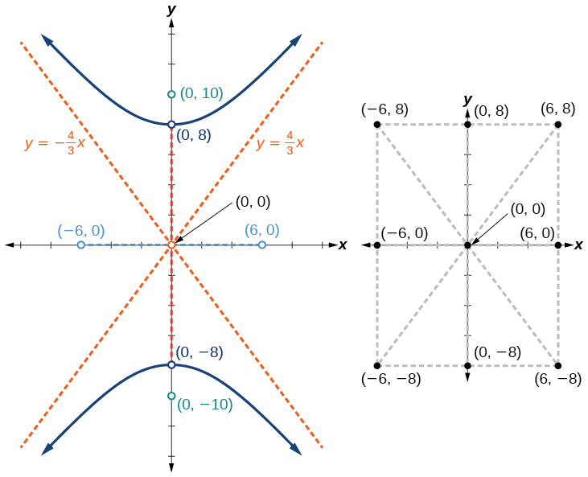{: #Figure_10_02_006}

Graph the hyperbola given by the equation<math xmlns="http://www.w3.org/1998/Math/MathML"> <mrow> <mtext> </mtext><mfrac> <mrow> <msup> <mi>x</mi> <mn>2</mn> </msup> </mrow> <mrow> <mn>144</mn> </mrow> </mfrac> <mo>−</mo><mfrac> <mrow> <msup> <mi>y</mi> <mn>2</mn> </msup> </mrow> <mrow> <mn>81</mn> </mrow> </mfrac> <mo>=</mo><mn>1.</mn><mtext> </mtext> </mrow> </math>

Identify and label the vertices, co-vertices, foci, and asymptotes.

vertices:<math xmlns="http://www.w3.org/1998/Math/MathML"> <mrow> <mtext> </mtext><mrow><mo>(</mo> <mrow> <mo>±</mo><mn>12</mn><mo>,</mo><mn>0</mn> </mrow> <mo>)</mo></mrow><mo>;</mo><mtext> </mtext> </mrow> </math>

co-vertices:<math xmlns="http://www.w3.org/1998/Math/MathML"> <mrow> <mtext> </mtext><mrow><mo>(</mo> <mrow> <mn>0</mn><mo>,</mo><mo>±</mo><mn>9</mn> </mrow> <mo>)</mo></mrow><mo>;</mo><mtext> </mtext> </mrow> </math>

foci:<math xmlns="http://www.w3.org/1998/Math/MathML"> <mrow> <mtext> </mtext><mrow><mo>(</mo> <mrow> <mo>±</mo><mn>15</mn><mo>,</mo><mn>0</mn> </mrow> <mo>)</mo></mrow><mo>;</mo><mtext> </mtext> </mrow> </math>

asymptotes:<math xmlns="http://www.w3.org/1998/Math/MathML"> <mrow> <mtext> </mtext><mi>y</mi><mo>=</mo><mo>±</mo><mfrac> <mn>3</mn> <mn>4</mn> </mfrac> <mi>x</mi><mo>;</mo> </mrow> </math>

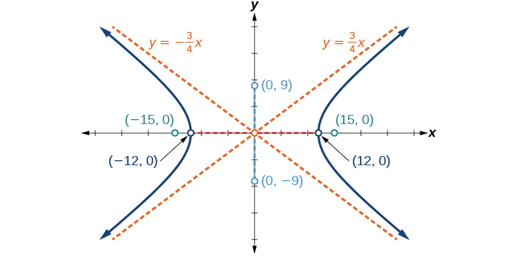

###  Graphing Hyperbolas Not Centered at the Origin

Graphing hyperbolas centered at a point<math xmlns="http://www.w3.org/1998/Math/MathML"> <mrow> <mtext> </mtext><mrow><mo>(</mo> <mrow> <mi>h</mi><mo>,</mo><mi>k</mi> </mrow> <mo>)</mo></mrow> </mrow> </math>

other than the origin is similar to graphing ellipses centered at a point other than the origin. We use the standard forms<math xmlns="http://www.w3.org/1998/Math/MathML"> <mrow> <mtext> </mtext><mfrac> <mrow> <msup> <mrow> <mrow><mo>(</mo> <mrow> <mi>x</mi><mo>−</mo><mi>h</mi> </mrow> <mo>)</mo></mrow> </mrow> <mn>2</mn> </msup> </mrow> <mrow> <msup> <mi>a</mi> <mn>2</mn> </msup> </mrow> </mfrac> <mo>−</mo><mfrac> <mrow> <msup> <mrow> <mrow><mo>(</mo> <mrow> <mi>y</mi><mo>−</mo><mi>k</mi> </mrow> <mo>)</mo></mrow> </mrow> <mn>2</mn> </msup> </mrow> <mrow> <msup> <mi>b</mi> <mn>2</mn> </msup> </mrow> </mfrac> <mo>=</mo><mn>1</mn><mtext> </mtext> </mrow> </math>

for horizontal hyperbolas, and<math xmlns="http://www.w3.org/1998/Math/MathML"> <mrow> <mtext> </mtext><mfrac> <mrow> <msup> <mrow> <mrow><mo>(</mo> <mrow> <mi>y</mi><mo>−</mo><mi>k</mi> </mrow> <mo>)</mo></mrow> </mrow> <mn>2</mn> </msup> </mrow> <mrow> <msup> <mi>a</mi> <mn>2</mn> </msup> </mrow> </mfrac> <mo>−</mo><mfrac> <mrow> <msup> <mrow> <mrow><mo>(</mo> <mrow> <mi>x</mi><mo>−</mo><mi>h</mi> </mrow> <mo>)</mo></mrow> </mrow> <mn>2</mn> </msup> </mrow> <mrow> <msup> <mi>b</mi> <mn>2</mn> </msup> </mrow> </mfrac> <mo>=</mo><mn>1</mn><mtext> </mtext> </mrow> </math>

for vertical hyperbolas. From these standard form equations we can easily calculate and plot key features of the graph: the coordinates of its center, vertices, co-vertices, and foci; the equations of its asymptotes; and the positions of the transverse and conjugate axes.

**Given a general form for a hyperbola centered at<math xmlns="http://www.w3.org/1998/Math/MathML"> <mrow> <mtext> </mtext><mrow><mo>(</mo> <mrow> <mi>h</mi><mo>,</mo><mi> </mi><mi>k</mi> </mrow> <mo>)</mo></mrow><mo>,</mo> </mrow> </math>

 sketch the graph.**

1.  Convert the general form to that standard form. Determine which of the standard forms applies to the given equation.
2.  Use the standard form identified in Step 1 to determine the position of the transverse axis; coordinates for the center, vertices, co-vertices, foci; and equations for the asymptotes.
    1.  If the equation is in the form
        <math xmlns="http://www.w3.org/1998/Math/MathML"> <mrow> <mtext> </mtext><mfrac> <mrow> <msup> <mrow> <mrow><mo>(</mo> <mrow> <mi>x</mi><mo>−</mo><mi>h</mi> </mrow> <mo>)</mo></mrow> </mrow> <mn>2</mn> </msup> </mrow> <mrow> <msup> <mi>a</mi> <mn>2</mn> </msup> </mrow> </mfrac> <mo>−</mo><mfrac> <mrow> <msup> <mrow> <mrow><mo>(</mo> <mrow> <mi>y</mi><mo>−</mo><mi>k</mi> </mrow> <mo>)</mo></mrow> </mrow> <mn>2</mn> </msup> </mrow> <mrow> <msup> <mi>b</mi> <mn>2</mn> </msup> </mrow> </mfrac> <mo>=</mo><mn>1</mn><mo>,</mo><mtext> </mtext> </mrow> </math>
        
        then
        * the transverse axis is parallel to the *x*-axis
        * the center is
          <math xmlns="http://www.w3.org/1998/Math/MathML"> <mrow> <mtext> </mtext><mrow><mo>(</mo> <mrow> <mi>h</mi><mo>,</mo><mi>k</mi> </mrow> <mo>)</mo></mrow> </mrow> </math>
        
        * the coordinates of the vertices are
          <math xmlns="http://www.w3.org/1998/Math/MathML"> <mrow> <mtext> </mtext><mrow><mo>(</mo> <mrow> <mi>h</mi><mo>±</mo><mi>a</mi><mo>,</mo><mi>k</mi> </mrow> <mo>)</mo></mrow> </mrow> </math>
        
        * the coordinates of the co-vertices are
          <math xmlns="http://www.w3.org/1998/Math/MathML"> <mrow> <mtext> </mtext><mrow><mo>(</mo> <mrow> <mi>h</mi><mo>,</mo><mi>k</mi><mo>±</mo><mi>b</mi> </mrow> <mo>)</mo></mrow> </mrow> </math>
        
        * the coordinates of the foci are
          <math xmlns="http://www.w3.org/1998/Math/MathML"> <mrow> <mtext> </mtext><mrow><mo>(</mo> <mrow> <mi>h</mi><mo>±</mo><mi>c</mi><mo>,</mo><mi>k</mi> </mrow> <mo>)</mo></mrow> </mrow> </math>
        
        * the equations of the asymptotes are
          <math xmlns="http://www.w3.org/1998/Math/MathML"> <mrow> <mtext> </mtext><mi>y</mi><mo>=</mo><mo>±</mo><mfrac> <mi>b</mi> <mi>a</mi> </mfrac> <mrow><mo>(</mo> <mrow> <mi>x</mi><mo>−</mo><mi>h</mi> </mrow> <mo>)</mo></mrow><mo>+</mo><mi>k</mi> </mrow> </math>
    
    2.  If the equation is in the form
        <math xmlns="http://www.w3.org/1998/Math/MathML"> <mrow> <mtext> </mtext><mfrac> <mrow> <msup> <mrow> <mrow><mo>(</mo> <mrow> <mi>y</mi><mo>−</mo><mi>k</mi> </mrow> <mo>)</mo></mrow> </mrow> <mn>2</mn> </msup> </mrow> <mrow> <msup> <mi>a</mi> <mn>2</mn> </msup> </mrow> </mfrac> <mo>−</mo><mfrac> <mrow> <msup> <mrow> <mrow><mo>(</mo> <mrow> <mi>x</mi><mo>−</mo><mi>h</mi> </mrow> <mo>)</mo></mrow> </mrow> <mn>2</mn> </msup> </mrow> <mrow> <msup> <mi>b</mi> <mn>2</mn> </msup> </mrow> </mfrac> <mo>=</mo><mn>1</mn><mo>,</mo><mtext> </mtext> </mrow> </math>
        
        then
        * the transverse axis is parallel to the *y*-axis
        * the center is
          <math xmlns="http://www.w3.org/1998/Math/MathML"> <mrow> <mtext> </mtext><mrow><mo>(</mo> <mrow> <mi>h</mi><mo>,</mo><mi>k</mi> </mrow> <mo>)</mo></mrow> </mrow> </math>
        
        * the coordinates of the vertices are
          <math xmlns="http://www.w3.org/1998/Math/MathML"> <mrow> <mtext> </mtext><mrow><mo>(</mo> <mrow> <mi>h</mi><mo>,</mo><mi>k</mi><mo>±</mo><mi>a</mi> </mrow> <mo>)</mo></mrow> </mrow> </math>
        
        * the coordinates of the co-vertices are
          <math xmlns="http://www.w3.org/1998/Math/MathML"> <mrow> <mtext> </mtext><mrow><mo>(</mo> <mrow> <mi>h</mi><mo>±</mo><mi>b</mi><mo>,</mo><mi>k</mi> </mrow> <mo>)</mo></mrow> </mrow> </math>
        
        * the coordinates of the foci are
          <math xmlns="http://www.w3.org/1998/Math/MathML"> <mrow> <mtext> </mtext><mrow><mo>(</mo> <mrow> <mi>h</mi><mo>,</mo><mi>k</mi><mo>±</mo><mi>c</mi> </mrow> <mo>)</mo></mrow> </mrow> </math>
        
        * the equations of the asymptotes are
          <math xmlns="http://www.w3.org/1998/Math/MathML"> <mrow> <mtext> </mtext><mi>y</mi><mo>=</mo><mo>±</mo><mfrac> <mi>a</mi> <mi>b</mi> </mfrac> <mrow><mo>(</mo> <mrow> <mi>x</mi><mo>−</mo><mi>h</mi> </mrow> <mo>)</mo></mrow><mo>+</mo><mi>k</mi> </mrow> </math>
    {: data-number-style="lower-alpha"}

3.  Solve for the coordinates of the foci using the equation
    <math xmlns="http://www.w3.org/1998/Math/MathML"> <mrow> <mtext> </mtext><mi>c</mi><mo>=</mo><mo>±</mo><msqrt> <mrow> <msup> <mi>a</mi> <mn>2</mn> </msup> <mo>+</mo><msup> <mi>b</mi> <mn>2</mn> </msup> </mrow> </msqrt> <mo>.</mo> </mrow> </math>

4.  Plot the center, vertices, co-vertices, foci, and asymptotes in the coordinate plane and draw a smooth curve to form the hyperbola.
{: data-number-style="arabic"}

Graphing a Hyperbola Centered at (*h*, *k*) Given an Equation in General Form

Graph the **hyperbola**{: data-type="term" .no-emphasis} given by the equation<math xmlns="http://www.w3.org/1998/Math/MathML"> <mrow> <mtext> </mtext><mn>9</mn><msup> <mi>x</mi> <mn>2</mn> </msup> <mo>−</mo><mn>4</mn><msup> <mi>y</mi> <mn>2</mn> </msup> <mo>−</mo><mn>36</mn><mi>x</mi><mo>−</mo><mn>40</mn><mi>y</mi><mo>−</mo><mn>388</mn><mo>=</mo><mn>0.</mn><mtext> </mtext> </mrow> </math>

Identify and label the center, vertices, co-vertices, foci, and asymptotes.

Start by expressing the equation in standard form. Group terms that contain the same variable, and move the constant to the opposite side of the equation.

<math xmlns="http://www.w3.org/1998/Math/MathML"> <mrow> <mrow><mo>(</mo> <mrow> <mn>9</mn><msup> <mi>x</mi> <mn>2</mn> </msup> <mo>−</mo><mn>36</mn><mi>x</mi> </mrow> <mo>)</mo></mrow><mo>−</mo><mrow><mo>(</mo> <mrow> <mn>4</mn><msup> <mi>y</mi> <mn>2</mn> </msup> <mo>+</mo><mn>40</mn><mi>y</mi> </mrow> <mo>)</mo></mrow><mo>=</mo><mn>388</mn> </mrow> </math>

Factor the leading coefficient of each expression.

<math xmlns="http://www.w3.org/1998/Math/MathML"> <mrow> <mn>9</mn><mrow><mo>(</mo> <mrow> <msup> <mi>x</mi> <mn>2</mn> </msup> <mo>−</mo><mn>4</mn><mi>x</mi> </mrow> <mo>)</mo></mrow><mo>−</mo><mn>4</mn><mrow><mo>(</mo> <mrow> <msup> <mi>y</mi> <mn>2</mn> </msup> <mo>+</mo><mn>10</mn><mi>y</mi> </mrow> <mo>)</mo></mrow><mo>=</mo><mn>388</mn> </mrow> </math>

Complete the square twice. Remember to balance the equation by adding the same constants to each side.

<math xmlns="http://www.w3.org/1998/Math/MathML"> <mrow> <mn>9</mn><mrow><mo>(</mo> <mrow> <msup> <mi>x</mi> <mn>2</mn> </msup> <mo>−</mo><mn>4</mn><mi>x</mi><mo>+</mo><mn>4</mn> </mrow> <mo>)</mo></mrow><mo>−</mo><mn>4</mn><mrow><mo>(</mo> <mrow> <msup> <mi>y</mi> <mn>2</mn> </msup> <mo>+</mo><mn>10</mn><mi>y</mi><mo>+</mo><mn>25</mn> </mrow> <mo>)</mo></mrow><mo>=</mo><mn>388</mn><mo>+</mo><mn>36</mn><mo>−</mo><mn>100</mn> </mrow> </math>

Rewrite as perfect squares.

<math xmlns="http://www.w3.org/1998/Math/MathML"> <mrow> <mn>9</mn><msup> <mrow> <mrow><mo>(</mo> <mrow> <mi>x</mi><mo>−</mo><mn>2</mn> </mrow> <mo>)</mo></mrow> </mrow> <mn>2</mn> </msup> <mo>−</mo><mn>4</mn><msup> <mrow> <mrow><mo>(</mo> <mrow> <mi>y</mi><mo>+</mo><mn>5</mn> </mrow> <mo>)</mo></mrow> </mrow> <mn>2</mn> </msup> <mo>=</mo><mn>324</mn> </mrow> </math>

Divide both sides by the constant term to place the equation in standard form.

<math xmlns="http://www.w3.org/1998/Math/MathML"> <mrow> <mfrac> <mrow> <msup> <mrow> <mrow><mo>(</mo> <mrow> <mi>x</mi><mo>−</mo><mn>2</mn> </mrow> <mo>)</mo></mrow> </mrow> <mn>2</mn> </msup> </mrow> <mrow> <mn>36</mn> </mrow> </mfrac> <mo>−</mo><mfrac> <mrow> <msup> <mrow> <mrow><mo>(</mo> <mrow> <mi>y</mi><mo>+</mo><mn>5</mn> </mrow> <mo>)</mo></mrow> </mrow> <mn>2</mn> </msup> </mrow> <mrow> <mn>81</mn> </mrow> </mfrac> <mo>=</mo><mn>1</mn> </mrow> </math>

The standard form that applies to the given equation is<math xmlns="http://www.w3.org/1998/Math/MathML"> <mrow> <mtext> </mtext><mfrac> <mrow> <msup> <mrow> <mrow><mo>(</mo> <mrow> <mi>x</mi><mo>−</mo><mi>h</mi> </mrow> <mo>)</mo></mrow> </mrow> <mn>2</mn> </msup> </mrow> <mrow> <msup> <mi>a</mi> <mn>2</mn> </msup> </mrow> </mfrac> <mo>−</mo><mfrac> <mrow> <msup> <mrow> <mrow><mo>(</mo> <mrow> <mi>y</mi><mo>−</mo><mi>k</mi> </mrow> <mo>)</mo></mrow> </mrow> <mn>2</mn> </msup> </mrow> <mrow> <msup> <mi>b</mi> <mn>2</mn> </msup> </mrow> </mfrac> <mo>=</mo><mn>1</mn><mo>,</mo> </mrow> </math>

 where<math xmlns="http://www.w3.org/1998/Math/MathML"> <mrow> <mtext> </mtext><msup> <mi>a</mi> <mn>2</mn> </msup> <mo>=</mo><mn>36</mn><mtext> </mtext> </mrow> </math>

and<math xmlns="http://www.w3.org/1998/Math/MathML"> <mrow> <mtext> </mtext><msup> <mi>b</mi> <mn>2</mn> </msup> <mo>=</mo><mn>81</mn><mo>,</mo> </mrow> </math>

or<math xmlns="http://www.w3.org/1998/Math/MathML"> <mrow> <mtext> </mtext><mi>a</mi><mo>=</mo><mn>6</mn><mtext> </mtext> </mrow> </math>

and<math xmlns="http://www.w3.org/1998/Math/MathML"> <mrow> <mtext> </mtext><mi>b</mi><mo>=</mo><mn>9.</mn><mtext> </mtext> </mrow> </math>

Thus, the transverse axis is parallel to the *x*-axis. It follows that:

the center of the ellipse is
<math xmlns="http://www.w3.org/1998/Math/MathML"> <mrow> <mtext> </mtext><mrow><mo>(</mo> <mrow> <mi>h</mi><mo>,</mo><mi>k</mi> </mrow> <mo>)</mo></mrow><mo>=</mo><mrow><mo>(</mo> <mrow> <mn>2</mn><mo>,</mo><mn>−5</mn> </mrow> <mo>)</mo></mrow> </mrow> </math>

the coordinates of the vertices are
<math xmlns="http://www.w3.org/1998/Math/MathML"> <mrow> <mtext> </mtext><mrow><mo>(</mo> <mrow> <mi>h</mi><mo>±</mo><mi>a</mi><mo>,</mo><mi>k</mi> </mrow> <mo>)</mo></mrow><mo>=</mo><mrow><mo>(</mo> <mrow> <mn>2</mn><mo>±</mo><mn>6</mn><mo>,</mo><mn>−5</mn> </mrow> <mo>)</mo></mrow><mo>,</mo><mtext> </mtext> </mrow> </math>
or
<math xmlns="http://www.w3.org/1998/Math/MathML"> <mrow> <mtext> </mtext><mrow><mo>(</mo> <mrow> <mo>−</mo><mn>4</mn><mo>,</mo><mn>−5</mn> </mrow> <mo>)</mo></mrow><mtext> </mtext> </mrow> </math>
and
<math xmlns="http://www.w3.org/1998/Math/MathML"> <mrow> <mtext> </mtext><mrow><mo>(</mo> <mrow> <mn>8</mn><mo>,</mo><mn>−5</mn> </mrow> <mo>)</mo></mrow> </mrow> </math>

the coordinates of the co-vertices are
<math xmlns="http://www.w3.org/1998/Math/MathML"> <mrow> <mtext> </mtext><mrow><mo>(</mo> <mrow> <mi>h</mi><mo>,</mo><mi>k</mi><mo>±</mo><mi>b</mi> </mrow> <mo>)</mo></mrow><mo>=</mo><mrow><mo>(</mo> <mrow> <mn>2</mn><mo>,</mo><mo>−</mo><mn>5</mn><mo>±</mo><mn>9</mn> </mrow> <mo>)</mo></mrow><mo>,</mo><mtext> </mtext> </mrow> </math>
or
<math xmlns="http://www.w3.org/1998/Math/MathML"> <mrow> <mtext> </mtext><mrow><mo>(</mo> <mrow> <mn>2</mn><mo>,</mo><mo>−</mo><mn>14</mn> </mrow> <mo>)</mo></mrow><mtext> </mtext> </mrow> </math>
and
<math xmlns="http://www.w3.org/1998/Math/MathML"> <mrow> <mtext> </mtext><mrow><mo>(</mo> <mrow> <mn>2</mn><mo>,</mo><mn>4</mn> </mrow> <mo>)</mo></mrow> </mrow> </math>

the coordinates of the foci are
<math xmlns="http://www.w3.org/1998/Math/MathML"> <mrow> <mtext> </mtext><mrow><mo>(</mo> <mrow> <mi>h</mi><mo>±</mo><mi>c</mi><mo>,</mo><mi>k</mi> </mrow> <mo>)</mo></mrow><mo>,</mo><mtext> </mtext> </mrow> </math>
where
<math xmlns="http://www.w3.org/1998/Math/MathML"> <mrow> <mtext> </mtext><mi>c</mi><mo>=</mo><mo>±</mo><msqrt> <mrow> <msup> <mi>a</mi> <mn>2</mn> </msup> <mo>+</mo><msup> <mi>b</mi> <mn>2</mn> </msup> </mrow> </msqrt> <mo>.</mo><mtext> </mtext> </mrow> </math>
Solving for
<math xmlns="http://www.w3.org/1998/Math/MathML"> <mrow> <mtext> </mtext><mi>c</mi><mo>,</mo> </mrow> </math>
we have

<math xmlns="http://www.w3.org/1998/Math/MathML" display="block"> <mrow> <mi>c</mi><mo>=</mo><mo>±</mo><msqrt> <mrow> <mn>36</mn><mo>+</mo><mn>81</mn> </mrow> </msqrt> <mo>=</mo><mo>±</mo><msqrt> <mrow> <mn>117</mn> </mrow> </msqrt> <mo>=</mo><mo>±</mo><mn>3</mn><msqrt> <mrow> <mn>13</mn> </mrow> </msqrt> </mrow> </math>

Therefore, the coordinates of the foci are<math xmlns="http://www.w3.org/1998/Math/MathML"> <mrow> <mtext> </mtext><mrow><mo>(</mo> <mrow> <mn>2</mn><mo>−</mo><mn>3</mn><msqrt> <mrow> <mn>13</mn> </mrow> </msqrt> <mo>,</mo><mn>−5</mn> </mrow> <mo>)</mo></mrow><mtext> </mtext> </mrow> </math>

and<math xmlns="http://www.w3.org/1998/Math/MathML"> <mrow> <mtext> </mtext><mrow><mo>(</mo> <mrow> <mn>2</mn><mo>+</mo><mn>3</mn><msqrt> <mrow> <mn>13</mn> </mrow> </msqrt> <mo>,</mo><mn>−5</mn> </mrow> <mo>)</mo></mrow><mo>.</mo> </mrow> </math>

The equations of the asymptotes are<math xmlns="http://www.w3.org/1998/Math/MathML"> <mrow> <mtext> </mtext><mi>y</mi><mo>=</mo><mo>±</mo><mfrac> <mi>b</mi> <mi>a</mi> </mfrac> <mrow><mo>(</mo> <mrow> <mi>x</mi><mo>−</mo><mi>h</mi> </mrow> <mo>)</mo></mrow><mo>+</mo><mi>k</mi><mo>=</mo><mo>±</mo><mfrac> <mn>3</mn> <mn>2</mn> </mfrac> <mrow><mo>(</mo> <mrow> <mi>x</mi><mo>−</mo><mn>2</mn> </mrow> <mo>)</mo></mrow><mo>−</mo><mn>5.</mn> </mrow> </math>

Next, we plot and label the center, vertices, co-vertices, foci, and asymptotes and draw smooth curves to form the hyperbola, as shown in [[link]](#Figure_10_02_008).

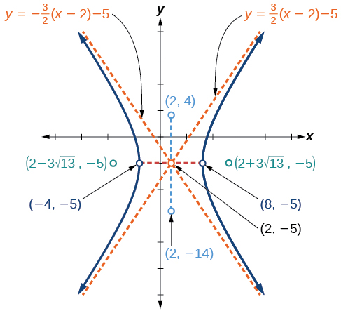{: #Figure_10_02_008}

Graph the hyperbola given by the standard form of an equation<math xmlns="http://www.w3.org/1998/Math/MathML"> <mrow> <mtext> </mtext><mfrac> <mrow> <msup> <mrow> <mrow><mo>(</mo> <mrow> <mi>y</mi><mo>+</mo><mn>4</mn> </mrow> <mo>)</mo></mrow> </mrow> <mn>2</mn> </msup> </mrow> <mrow> <mn>100</mn> </mrow> </mfrac> <mo>−</mo><mfrac> <mrow> <msup> <mrow> <mrow><mo>(</mo> <mrow> <mi>x</mi><mo>−</mo><mn>3</mn> </mrow> <mo>)</mo></mrow> </mrow> <mn>2</mn> </msup> </mrow> <mrow> <mn>64</mn> </mrow> </mfrac> <mo>=</mo><mn>1.</mn><mtext> </mtext> </mrow> </math>

Identify and label the center, vertices, co-vertices, foci, and asymptotes.

center:<math xmlns="http://www.w3.org/1998/Math/MathML"> <mrow> <mtext> </mtext><mrow><mo>(</mo> <mrow> <mn>3</mn><mo>,</mo><mo>−</mo><mn>4</mn> </mrow> <mo>)</mo></mrow><mo>;</mo><mtext> </mtext> </mrow> </math>

vertices:<math xmlns="http://www.w3.org/1998/Math/MathML"> <mrow> <mtext> </mtext><mrow><mo>(</mo> <mrow> <mn>3</mn><mo>,</mo><mo>−</mo><mn>14</mn> </mrow> <mo>)</mo></mrow><mtext> </mtext> </mrow> </math>

and<math xmlns="http://www.w3.org/1998/Math/MathML"> <mrow> <mtext> </mtext><mrow><mo>(</mo> <mrow> <mn>3</mn><mo>,</mo><mn>6</mn> </mrow> <mo>)</mo></mrow><mo>;</mo><mtext> </mtext> </mrow> </math>

co-vertices:<math xmlns="http://www.w3.org/1998/Math/MathML"> <mrow> <mtext> </mtext><mrow><mo>(</mo> <mrow> <mo>−</mo><mn>5</mn><mo>,</mo><mo>−</mo><mn>4</mn> </mrow> <mo>)</mo></mrow><mo>;</mo><mtext> </mtext> </mrow> </math>

and<math xmlns="http://www.w3.org/1998/Math/MathML"> <mrow> <mtext> </mtext><mrow><mo>(</mo> <mrow> <mn>11</mn><mo>,</mo><mo>−</mo><mn>4</mn> </mrow> <mo>)</mo></mrow><mo>;</mo><mtext> </mtext> </mrow> </math>

foci:<math xmlns="http://www.w3.org/1998/Math/MathML"> <mrow> <mtext> </mtext><mrow><mo>(</mo> <mrow> <mn>3</mn><mo>,</mo><mo>−</mo><mn>4</mn><mo>−</mo><mn>2</mn><msqrt> <mrow> <mn>41</mn> </mrow> </msqrt> </mrow> <mo>)</mo></mrow><mtext> </mtext> </mrow> </math>

and<math xmlns="http://www.w3.org/1998/Math/MathML"> <mrow> <mtext> </mtext><mrow><mo>(</mo> <mrow> <mn>3</mn><mo>,</mo><mo>−</mo><mn>4</mn><mo>+</mo><mn>2</mn><msqrt> <mrow> <mn>41</mn> </mrow> </msqrt> </mrow> <mo>)</mo></mrow><mo>;</mo><mtext> </mtext> </mrow> </math>

asymptotes:<math xmlns="http://www.w3.org/1998/Math/MathML"> <mrow> <mtext> </mtext><mi>y</mi><mo>=</mo><mo>±</mo><mfrac> <mn>5</mn> <mn>4</mn> </mfrac> <mrow><mo>(</mo> <mrow> <mi>x</mi><mo>−</mo><mn>3</mn> </mrow> <mo>)</mo></mrow><mo>−</mo><mn>4</mn> </mrow> </math>

### Solving Applied Problems Involving Hyperbolas

As we discussed at the beginning of this section, hyperbolas have real-world applications in many fields, such as astronomy, physics, engineering, and architecture. The design efficiency of hyperbolic cooling towers is particularly interesting. Cooling towers are used to transfer waste heat to the atmosphere and are often touted for their ability to generate power efficiently. Because of their hyperbolic form, these structures are able to withstand extreme winds while requiring less material than any other forms of their size and strength. See [\[link\]](#Figure_10_02_010). For example, a 500-foot tower can be made of a reinforced concrete shell only 6 or 8 inches wide!

"){: #Figure_10_02_010}

The first hyperbolic towers were designed in 1914 and were 35 meters high. Today, the tallest cooling towers are in France, standing a remarkable 170 meters tall. In [\[link\]](#Example_10_02_06) we will use the design layout of a cooling tower to find a hyperbolic equation that models its sides.

Solving Applied Problems Involving Hyperbolas

The design layout of a cooling tower is shown in [[link]](#Figure_10_02_011). The tower stands 179.6 meters tall. The diameter of the top is 72 meters. At their closest, the sides of the tower are 60 meters apart.

{: #Figure_10_02_011}

Find the equation of the hyperbola that models the sides of the cooling tower. Assume that the center of the **hyperbola**{: data-type="term" .no-emphasis}—indicated by the intersection of dashed perpendicular lines in the figure—is the origin of the coordinate plane. Round final values to four decimal places.

We are assuming the center of the tower is at the origin, so we can use the standard form of a horizontal hyperbola centered at the origin:<math xmlns="http://www.w3.org/1998/Math/MathML"> <mrow> <mtext> </mtext><mfrac> <mrow> <msup> <mi>x</mi> <mn>2</mn> </msup> </mrow> <mrow> <msup> <mi>a</mi> <mn>2</mn> </msup> </mrow> </mfrac> <mo>−</mo><mfrac> <mrow> <msup> <mi>y</mi> <mn>2</mn> </msup> </mrow> <mrow> <msup> <mi>b</mi> <mn>2</mn> </msup> </mrow> </mfrac> <mo>=</mo><mn>1</mn><mo>,</mo> </mrow> </math>

where the branches of the hyperbola form the sides of the cooling tower. We must find the values of<math xmlns="http://www.w3.org/1998/Math/MathML"> <mrow> <mtext> </mtext><msup> <mi>a</mi> <mn>2</mn> </msup> <mtext> </mtext> </mrow> </math>

and<math xmlns="http://www.w3.org/1998/Math/MathML"> <mrow> <mtext> </mtext><msup> <mi>b</mi> <mn>2</mn> </msup> </mrow> </math>

to complete the model.

First, we find<math xmlns="http://www.w3.org/1998/Math/MathML"> <mrow> <mtext> </mtext><msup> <mi>a</mi> <mn>2</mn> </msup> <mo>.</mo><mtext> </mtext> </mrow> </math>

Recall that the length of the transverse axis of a hyperbola is<math xmlns="http://www.w3.org/1998/Math/MathML"> <mrow> <mtext> </mtext><mn>2</mn><mi>a</mi><mo>.</mo><mtext> </mtext> </mrow> </math>

This length is represented by the distance where the sides are closest, which is given as<math xmlns="http://www.w3.org/1998/Math/MathML"> <mrow> <mtext> </mtext><mn>65.3</mn><mtext> </mtext> </mrow> </math>

meters. So,<math xmlns="http://www.w3.org/1998/Math/MathML"> <mrow> <mtext> </mtext><mn>2</mn><mi>a</mi><mo>=</mo><mn>60.</mn><mtext> </mtext> </mrow> </math>

Therefore,<math xmlns="http://www.w3.org/1998/Math/MathML"> <mrow> <mtext> </mtext><mi>a</mi><mo>=</mo><mn>30</mn><mtext> </mtext> </mrow> </math>

and<math xmlns="http://www.w3.org/1998/Math/MathML"> <mrow> <mtext> </mtext><msup> <mi>a</mi> <mn>2</mn> </msup> <mo>=</mo><mn>900.</mn> </mrow> </math>

To solve for<math xmlns="http://www.w3.org/1998/Math/MathML"> <mrow> <mtext> </mtext><msup> <mi>b</mi> <mn>2</mn> </msup> <mo>,</mo> </mrow> </math>

we need to substitute for<math xmlns="http://www.w3.org/1998/Math/MathML"> <mrow> <mtext> </mtext><mi>x</mi><mtext> </mtext> </mrow> </math>

and<math xmlns="http://www.w3.org/1998/Math/MathML"> <mrow> <mtext> </mtext><mi>y</mi><mtext> </mtext> </mrow> </math>

in our equation using a known point. To do this, we can use the dimensions of the tower to find some point<math xmlns="http://www.w3.org/1998/Math/MathML"> <mrow> <mtext> </mtext><mrow><mo>(</mo> <mrow> <mi>x</mi><mo>,</mo><mi>y</mi> </mrow> <mo>)</mo></mrow><mtext> </mtext> </mrow> </math>

that lies on the hyperbola. We will use the top right corner of the tower to represent that point. Since the *y*-axis bisects the tower, our *x*-value can be represented by the radius of the top, or 36 meters. The *y*-value is represented by the distance from the origin to the top, which is given as 79.6 meters. Therefore,

<math xmlns="http://www.w3.org/1998/Math/MathML" display="block"> <mrow> <mtable columnalign="left"> <mtr columnalign="left"> <mtd columnalign="left"> <mrow> <mfrac> <mrow> <msup> <mi>x</mi> <mn>2</mn> </msup> </mrow> <mrow> <msup> <mi>a</mi> <mn>2</mn> </msup> </mrow> </mfrac> <mo>−</mo><mfrac> <mrow> <msup> <mi>y</mi> <mn>2</mn> </msup> </mrow> <mrow> <msup> <mi>b</mi> <mn>2</mn> </msup> </mrow> </mfrac> <mo>=</mo><mn>1</mn> </mrow> </mtd> <mtd columnalign="left"> <mrow> <mtable> <mtr> <mtd> <mrow /> </mtd> <mtd> <mrow /> </mtd> <mtd> <mrow /> </mtd> <mtd> <mrow /> </mtd> </mtr> </mtable><mtext>Standard form of horizontal hyperbola</mtext><mo>.</mo> </mrow> </mtd> </mtr> <mtr columnalign="left"> <mtd columnalign="left"> <mrow> <mtext>          </mtext><msup> <mi>b</mi> <mn>2</mn> </msup> <mo>=</mo><mfrac> <mrow> <msup> <mi>y</mi> <mn>2</mn> </msup> </mrow> <mrow> <mfrac> <mrow> <msup> <mi>x</mi> <mn>2</mn> </msup> </mrow> <mrow> <msup> <mi>a</mi> <mn>2</mn> </msup> </mrow> </mfrac> <mo>−</mo><mn>1</mn> </mrow> </mfrac> </mrow> </mtd> <mtd columnalign="left"> <mrow> <mtable> <mtr> <mtd> <mrow /> </mtd> <mtd> <mrow /> </mtd> <mtd> <mrow /> </mtd> <mtd> <mrow /> </mtd> </mtr> </mtable><mtext>Isolate </mtext><msup> <mi>b</mi> <mn>2</mn> </msup> </mrow> </mtd> </mtr> <mtr columnalign="left"> <mtd columnalign="left"> <mrow> <mtext>             </mtext><mo>=</mo><mfrac> <mrow> <msup> <mrow> <mo stretchy="false">(</mo><mn>79.6</mn><mo stretchy="false">)</mo> </mrow> <mn>2</mn> </msup> </mrow> <mrow> <mfrac> <mrow> <msup> <mrow> <mo stretchy="false">(</mo><mn>36</mn><mo stretchy="false">)</mo> </mrow> <mn>2</mn> </msup> </mrow> <mrow> <mn>900</mn> </mrow> </mfrac> <mo>−</mo><mn>1</mn> </mrow> </mfrac> </mrow> </mtd> <mtd columnalign="left"> <mrow> <mtable> <mtr> <mtd> <mrow /> </mtd> <mtd> <mrow /> </mtd> <mtd> <mrow /> </mtd> <mtd> <mrow /> </mtd> </mtr> </mtable><mtext>Substitute for </mtext><msup> <mi>a</mi> <mn>2</mn> </msup> <mo>,</mo><mi>x</mi><mo>,</mo><mtext> and </mtext><mi>y</mi> </mrow> </mtd> </mtr> <mtr columnalign="left"> <mtd columnalign="left"> <mrow> <mtext>             </mtext><mo>≈</mo><mn>14400.3636</mn> </mrow> </mtd> <mtd columnalign="left"> <mrow> <mtable> <mtr> <mtd> <mrow /> </mtd> <mtd> <mrow /> </mtd> <mtd> <mrow /> </mtd> <mtd> <mrow /> </mtd> </mtr> </mtable><mtext>Round to four decimal places</mtext> </mrow> </mtd> </mtr> </mtable> </mrow> </math>

The sides of the tower can be modeled by the hyperbolic equation

<math xmlns="http://www.w3.org/1998/Math/MathML" display="block"> <mrow> <mfrac> <mrow> <msup> <mi>x</mi> <mn>2</mn> </msup> </mrow> <mrow> <mn>900</mn> </mrow> </mfrac> <mo>−</mo><mfrac> <mrow> <msup> <mi>y</mi> <mn>2</mn> </msup> </mrow> <mrow> <mn>14400.3636</mn><mo> </mo> </mrow> </mfrac> <mo>=</mo><mn>1</mn><mo>,</mo><mtext>or</mtext><mtext> </mtext><mtext> </mtext><mfrac> <mrow> <msup> <mi>x</mi> <mn>2</mn> </msup> </mrow> <mrow> <msup> <mrow> <mn>30</mn> </mrow> <mn>2</mn> </msup> </mrow> </mfrac> <mo>−</mo><mfrac> <mrow> <msup> <mi>y</mi> <mn>2</mn> </msup> </mrow> <mrow> <msup> <mrow> <mn>120.0015</mn> </mrow> <mn>2</mn> </msup> <mo> </mo> </mrow> </mfrac> <mo>=</mo><mn>1</mn> </mrow> </math>

A design for a cooling tower project is shown in [[link]](#Figure_10_02_012). Find the equation of the hyperbola that models the sides of the cooling tower. Assume that the center of the hyperbola—indicated by the intersection of dashed perpendicular lines in the figure—is the origin of the coordinate plane. Round final values to four decimal places.

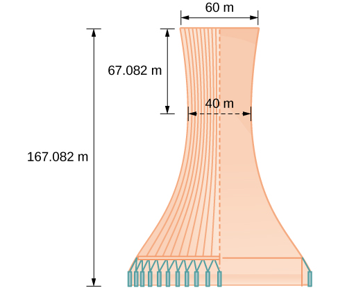{: #Figure_10_02_012}

The sides of the tower can be modeled by the hyperbolic equation.<math xmlns="http://www.w3.org/1998/Math/MathML"> <mrow> <mtext> </mtext><mfrac> <mrow> <msup> <mi>x</mi> <mn>2</mn> </msup> </mrow> <mrow> <mn>400</mn> </mrow> </mfrac> <mo>−</mo><mfrac> <mrow> <msup> <mi>y</mi> <mn>2</mn> </msup> </mrow> <mrow> <mn>3600</mn> </mrow> </mfrac> <mo>=</mo><mn>1</mn><mtext>or </mtext><mfrac> <mrow> <msup> <mi>x</mi> <mn>2</mn> </msup> </mrow> <mrow> <msup> <mrow> <mn>20</mn> </mrow> <mn>2</mn> </msup> </mrow> </mfrac> <mo>−</mo><mfrac> <mrow> <msup> <mi>y</mi> <mn>2</mn> </msup> </mrow> <mrow> <msup> <mrow> <mn>60</mn> </mrow> <mn>2</mn> </msup> </mrow> </mfrac> <mo>=</mo><mn>1.</mn> </mrow> </math>

Access these online resources for additional instruction and practice with hyperbolas.

* [Conic Sections: The Hyperbola Part 1 of 2][1]
* [Conic Sections: The Hyperbola Part 2 of 2][2]
* [Graph a Hyperbola with Center at Origin][3]
* [Graph a Hyperbola with Center not at Origin][4]

### Key Equations

| Hyperbola, center at origin, transverse axis on *x*-axis | <math xmlns="http://www.w3.org/1998/Math/MathML"> <mrow> <mfrac> <mrow> <msup> <mi>x</mi> <mn>2</mn> </msup> </mrow> <mrow> <msup> <mi>a</mi> <mn>2</mn> </msup> </mrow> </mfrac> <mo>−</mo><mfrac> <mrow> <msup> <mi>y</mi> <mn>2</mn> </msup> </mrow> <mrow> <msup> <mi>b</mi> <mn>2</mn> </msup> </mrow> </mfrac> <mo>=</mo><mn>1</mn> </mrow> </math>

 |
| Hyperbola, center at origin, transverse axis on *y*-axis | <math xmlns="http://www.w3.org/1998/Math/MathML"> <mrow> <mfrac> <mrow> <msup> <mi>y</mi> <mn>2</mn> </msup> </mrow> <mrow> <msup> <mi>a</mi> <mn>2</mn> </msup> </mrow> </mfrac> <mo>−</mo><mfrac> <mrow> <msup> <mi>x</mi> <mn>2</mn> </msup> </mrow> <mrow> <msup> <mi>b</mi> <mn>2</mn> </msup> </mrow> </mfrac> <mo>=</mo><mn>1</mn> </mrow> </math>

 |
| Hyperbola, center at<math xmlns="http://www.w3.org/1998/Math/MathML"> <mrow> <mtext> </mtext><mo stretchy="false">(</mo><mi>h</mi><mo>,</mo><mi>k</mi><mo stretchy="false">)</mo><mo>,</mo> </mrow> </math>

transverse axis parallel to *x*-axis | <math xmlns="http://www.w3.org/1998/Math/MathML"> <mrow> <mfrac> <mrow> <msup> <mrow> <mrow><mo>(</mo> <mrow> <mi>x</mi><mo>−</mo><mi>h</mi> </mrow> <mo>)</mo></mrow> </mrow> <mn>2</mn> </msup> </mrow> <mrow> <msup> <mi>a</mi> <mn>2</mn> </msup> </mrow> </mfrac> <mo>−</mo><mfrac> <mrow> <msup> <mrow> <mrow><mo>(</mo> <mrow> <mi>y</mi><mo>−</mo><mi>k</mi> </mrow> <mo>)</mo></mrow> </mrow> <mn>2</mn> </msup> </mrow> <mrow> <msup> <mi>b</mi> <mn>2</mn> </msup> </mrow> </mfrac> <mo>=</mo><mn>1</mn> </mrow> </math>

 |
| Hyperbola, center at<math xmlns="http://www.w3.org/1998/Math/MathML"> <mrow> <mtext> </mtext><mo stretchy="false">(</mo><mi>h</mi><mo>,</mo><mi>k</mi><mo stretchy="false">)</mo><mo>,</mo> </mrow> </math>

transverse axis parallel to *y*-axis | <math xmlns="http://www.w3.org/1998/Math/MathML"> <mrow> <mfrac> <mrow> <msup> <mrow> <mrow><mo>(</mo> <mrow> <mi>y</mi><mo>−</mo><mi>k</mi> </mrow> <mo>)</mo></mrow> </mrow> <mn>2</mn> </msup> </mrow> <mrow> <msup> <mi>a</mi> <mn>2</mn> </msup> </mrow> </mfrac> <mo>−</mo><mfrac> <mrow> <msup> <mrow> <mrow><mo>(</mo> <mrow> <mi>x</mi><mo>−</mo><mi>h</mi> </mrow> <mo>)</mo></mrow> </mrow> <mn>2</mn> </msup> </mrow> <mrow> <msup> <mi>b</mi> <mn>2</mn> </msup> </mrow> </mfrac> <mo>=</mo><mn>1</mn> </mrow> </math>

 |
{: summary=".."}

### Key Concepts

* A hyperbola is the set of all points
  <math xmlns="http://www.w3.org/1998/Math/MathML"> <mrow> <mtext> </mtext><mrow><mo>(</mo> <mrow> <mi>x</mi><mo>,</mo><mi>y</mi> </mrow> <mo>)</mo></mrow><mtext> </mtext> </mrow> </math>
  
  in a plane such that the difference of the distances between
  <math xmlns="http://www.w3.org/1998/Math/MathML"> <mrow> <mtext> </mtext><mrow><mo>(</mo> <mrow> <mi>x</mi><mo>,</mo><mi>y</mi> </mrow> <mo>)</mo></mrow><mtext> </mtext> </mrow> </math>
  
  and the foci is a positive constant.
* The standard form of a hyperbola can be used to locate its vertices and foci. See [\[link\]](#Example_10_02_01).
* When given the coordinates of the foci and vertices of a hyperbola, we can write the equation of the hyperbola in standard form. See [\[link\]](#Example_10_02_02) and [\[link\]](#Example_10_02_03).
* When given an equation for a hyperbola, we can identify its vertices, co-vertices, foci, asymptotes, and lengths and positions of the transverse and conjugate axes in order to graph the hyperbola. See [\[link\]](#Example_10_02_04) and [\[link\]](#Example_10_02_05).
* Real-world situations can be modeled using the standard equations of hyperbolas. For instance, given the dimensions of a natural draft cooling tower, we can find a hyperbolic equation that models its sides. See [\[link\]](#Example_10_02_06).

### Section Exercises

#### Verbal

Define a hyperbola in terms of its foci.

A hyperbola is the set of points in a plane the difference of whose distances from two fixed points (foci) is a positive constant.

What can we conclude about a hyperbola if its asymptotes intersect at the origin?

What must be true of the foci of a hyperbola?

The foci must lie on the transverse axis and be in the interior of the hyperbola.

If the transverse axis of a hyperbola is vertical, what do we know about the graph?

Where must the center of hyperbola be relative to its foci?

The center must be the midpoint of the line segment joining the foci.

####  Algebraic

For the following exercises, determine whether the following equations represent hyperbolas. If so, write in standard form.

<math xmlns="http://www.w3.org/1998/Math/MathML"> <mrow> <mn>3</mn><msup> <mi>y</mi> <mn>2</mn> </msup> <mo>+</mo><mn>2</mn><mi>x</mi><mo>=</mo><mn>6</mn> </mrow> </math>

<math xmlns="http://www.w3.org/1998/Math/MathML"> <mrow> <mfrac> <mrow> <msup> <mi>x</mi> <mn>2</mn> </msup> </mrow> <mrow> <mn>36</mn> </mrow> </mfrac> <mo>−</mo><mfrac> <mrow> <msup> <mi>y</mi> <mn>2</mn> </msup> </mrow> <mn>9</mn> </mfrac> <mo>=</mo><mn>1</mn> </mrow> </math>

yes<math xmlns="http://www.w3.org/1998/Math/MathML"> <mrow> <mtext> </mtext><mfrac> <mrow> <msup> <mi>x</mi> <mn>2</mn> </msup> </mrow> <mrow> <msup> <mn>6</mn> <mn>2</mn> </msup> </mrow> </mfrac> <mo>−</mo><mfrac> <mrow> <msup> <mi>y</mi> <mn>2</mn> </msup> </mrow> <mrow> <msup> <mn>3</mn> <mn>2</mn> </msup> </mrow> </mfrac> <mo>=</mo><mn>1</mn> </mrow> </math>

<math xmlns="http://www.w3.org/1998/Math/MathML"> <mrow> <mn>5</mn><msup> <mi>y</mi> <mn>2</mn> </msup> <mo>+</mo><mn>4</mn><msup> <mi>x</mi> <mn>2</mn> </msup> <mo>=</mo><mn>6</mn><mi>x</mi> </mrow> </math>

<math xmlns="http://www.w3.org/1998/Math/MathML"> <mrow> <mn>25</mn><msup> <mi>x</mi> <mn>2</mn> </msup> <mo>−</mo><mn>16</mn><msup> <mi>y</mi> <mn>2</mn> </msup> <mo>=</mo><mn>400</mn> </mrow> </math>

yes<math xmlns="http://www.w3.org/1998/Math/MathML"> <mrow> <mtext> </mtext><mfrac> <mrow> <msup> <mi>x</mi> <mn>2</mn> </msup> </mrow> <mrow> <msup> <mn>4</mn> <mn>2</mn> </msup> </mrow> </mfrac> <mo>−</mo><mfrac> <mrow> <msup> <mi>y</mi> <mn>2</mn> </msup> </mrow> <mrow> <msup> <mn>5</mn> <mn>2</mn> </msup> </mrow> </mfrac> <mo>=</mo><mn>1</mn> </mrow> </math>

<math xmlns="http://www.w3.org/1998/Math/MathML"> <mrow> <mo>−</mo><mn>9</mn><msup> <mi>x</mi> <mn>2</mn> </msup> <mo>+</mo><mn>18</mn><mi>x</mi><mo>+</mo><msup> <mi>y</mi> <mn>2</mn> </msup> <mo>+</mo><mn>4</mn><mi>y</mi><mo>−</mo><mn>14</mn><mo>=</mo><mn>0</mn> </mrow> </math>

For the following exercises, write the equation for the hyperbola in standard form if it is not already, and identify the vertices and foci, and write equations of asymptotes.

<math xmlns="http://www.w3.org/1998/Math/MathML"> <mrow> <mfrac> <mrow> <msup> <mi>x</mi> <mn>2</mn> </msup> </mrow> <mrow> <mn>25</mn> </mrow> </mfrac> <mo>−</mo><mfrac> <mrow> <msup> <mi>y</mi> <mn>2</mn> </msup> </mrow> <mrow> <mn>36</mn> </mrow> </mfrac> <mo>=</mo><mn>1</mn> </mrow> </math>

<math xmlns="http://www.w3.org/1998/Math/MathML"> <mrow> <mfrac> <mrow> <msup> <mi>x</mi> <mn>2</mn> </msup> </mrow> <mrow> <msup> <mn>5</mn> <mn>2</mn> </msup> </mrow> </mfrac> <mo>−</mo><mfrac> <mrow> <msup> <mi>y</mi> <mn>2</mn> </msup> </mrow> <mrow> <msup> <mn>6</mn> <mn>2</mn> </msup> </mrow> </mfrac> <mo>=</mo><mn>1</mn><mo>;</mo><mtext> </mtext> </mrow> </math>

vertices:<math xmlns="http://www.w3.org/1998/Math/MathML"> <mrow> <mtext> </mtext><mrow><mo>(</mo> <mrow> <mn>5</mn><mo>,</mo><mn>0</mn> </mrow> <mo>)</mo></mrow><mo>,</mo><mrow><mo>(</mo> <mrow> <mo>−</mo><mn>5</mn><mo>,</mo><mn>0</mn> </mrow> <mo>)</mo></mrow><mo>;</mo><mtext> </mtext> </mrow> </math>

foci:<math xmlns="http://www.w3.org/1998/Math/MathML"> <mrow> <mtext> </mtext><mrow><mo>(</mo> <mrow> <msqrt> <mrow> <mn>61</mn> </mrow> </msqrt> <mo>,</mo><mn>0</mn> </mrow> <mo>)</mo></mrow><mo>,</mo><mrow><mo>(</mo> <mrow> <mo>−</mo><msqrt> <mrow> <mn>61</mn> </mrow> </msqrt> <mo>,</mo><mn>0</mn> </mrow> <mo>)</mo></mrow><mo>;</mo><mtext> </mtext> </mrow> </math>

asymptotes:<math xmlns="http://www.w3.org/1998/Math/MathML"> <mrow> <mtext> </mtext><mi>y</mi><mo>=</mo><mfrac> <mn>6</mn> <mn>5</mn> </mfrac> <mi>x</mi><mo>,</mo><mi>y</mi><mo>=</mo><mo>−</mo><mfrac> <mn>6</mn> <mn>5</mn> </mfrac> <mi>x</mi><mtext> </mtext> </mrow> </math>

<math xmlns="http://www.w3.org/1998/Math/MathML"> <mrow> <mfrac> <mrow> <msup> <mi>x</mi> <mn>2</mn> </msup> </mrow> <mrow> <mn>100</mn> </mrow> </mfrac> <mo>−</mo><mfrac> <mrow> <msup> <mi>y</mi> <mn>2</mn> </msup> </mrow> <mn>9</mn> </mfrac> <mo>=</mo><mn>1</mn> </mrow> </math>

<math xmlns="http://www.w3.org/1998/Math/MathML"> <mrow> <mfrac> <mrow> <msup> <mi>y</mi> <mn>2</mn> </msup> </mrow> <mn>4</mn> </mfrac> <mo>−</mo><mfrac> <mrow> <msup> <mi>x</mi> <mn>2</mn> </msup> </mrow> <mrow> <mn>81</mn> </mrow> </mfrac> <mo>=</mo><mn>1</mn> </mrow> </math>

<math xmlns="http://www.w3.org/1998/Math/MathML"> <mrow> <mfrac> <mrow> <msup> <mi>y</mi> <mn>2</mn> </msup> </mrow> <mrow> <msup> <mn>2</mn> <mn>2</mn> </msup> </mrow> </mfrac> <mo>−</mo><mfrac> <mrow> <msup> <mi>x</mi> <mn>2</mn> </msup> </mrow> <mrow> <msup> <mn>9</mn> <mn>2</mn> </msup> </mrow> </mfrac> <mo>=</mo><mn>1</mn><mo>;</mo><mtext> </mtext> </mrow> </math>

vertices:<math xmlns="http://www.w3.org/1998/Math/MathML"> <mrow> <mtext> </mtext><mrow><mo>(</mo> <mrow> <mn>0</mn><mo>,</mo><mn>2</mn> </mrow> <mo>)</mo></mrow><mo>,</mo><mrow><mo>(</mo> <mrow> <mn>0</mn><mo>,</mo><mo>−</mo><mn>2</mn> </mrow> <mo>)</mo></mrow><mo>;</mo><mtext> </mtext> </mrow> </math>

foci:<math xmlns="http://www.w3.org/1998/Math/MathML"> <mrow> <mtext> </mtext><mrow><mo>(</mo> <mrow> <mn>0</mn><mo>,</mo><msqrt> <mrow> <mn>85</mn> </mrow> </msqrt> </mrow> <mo>)</mo></mrow><mo>,</mo><mrow><mo>(</mo> <mrow> <mn>0</mn><mo>,</mo><mo>−</mo><msqrt> <mrow> <mn>85</mn> </mrow> </msqrt> </mrow> <mo>)</mo></mrow><mo>;</mo><mtext> </mtext> </mrow> </math>

asymptotes:<math xmlns="http://www.w3.org/1998/Math/MathML"> <mrow> <mtext> </mtext><mi>y</mi><mo>=</mo><mfrac> <mn>2</mn> <mn>9</mn> </mfrac> <mi>x</mi><mo>,</mo><mi>y</mi><mo>=</mo><mo>−</mo><mfrac> <mn>2</mn> <mn>9</mn> </mfrac> <mi>x</mi> </mrow> </math>

<math xmlns="http://www.w3.org/1998/Math/MathML"> <mrow> <mn>9</mn><msup> <mi>y</mi> <mn>2</mn> </msup> <mo>−</mo><mn>4</mn><msup> <mi>x</mi> <mn>2</mn> </msup> <mo>=</mo><mn>1</mn> </mrow> </math>

<math xmlns="http://www.w3.org/1998/Math/MathML"> <mrow> <mfrac> <mrow> <msup> <mrow> <mrow><mo>(</mo> <mrow> <mi>x</mi><mo>−</mo><mn>1</mn> </mrow> <mo>)</mo></mrow> </mrow> <mn>2</mn> </msup> </mrow> <mn>9</mn> </mfrac> <mo>−</mo><mfrac> <mrow> <msup> <mrow> <mrow><mo>(</mo> <mrow> <mi>y</mi><mo>−</mo><mn>2</mn> </mrow> <mo>)</mo></mrow> </mrow> <mn>2</mn> </msup> </mrow> <mrow> <mn>16</mn> </mrow> </mfrac> <mo>=</mo><mn>1</mn> </mrow> </math>

<math xmlns="http://www.w3.org/1998/Math/MathML"> <mrow> <mfrac> <mrow> <msup> <mrow> <mrow><mo>(</mo> <mrow> <mi>x</mi><mo>−</mo><mn>1</mn> </mrow> <mo>)</mo></mrow> </mrow> <mn>2</mn> </msup> </mrow> <mrow> <msup> <mn>3</mn> <mn>2</mn> </msup> </mrow> </mfrac> <mo>−</mo><mfrac> <mrow> <msup> <mrow> <mrow><mo>(</mo> <mrow> <mi>y</mi><mo>−</mo><mn>2</mn> </mrow> <mo>)</mo></mrow> </mrow> <mn>2</mn> </msup> </mrow> <mrow> <msup> <mn>4</mn> <mn>2</mn> </msup> </mrow> </mfrac> <mo>=</mo><mn>1</mn><mo>;</mo><mtext> </mtext> </mrow> </math>

vertices:<math xmlns="http://www.w3.org/1998/Math/MathML"> <mrow> <mtext> </mtext><mrow><mo>(</mo> <mrow> <mn>4</mn><mo>,</mo><mn>2</mn> </mrow> <mo>)</mo></mrow><mo>,</mo><mrow><mo>(</mo> <mrow> <mo>−</mo><mn>2</mn><mo>,</mo><mn>2</mn> </mrow> <mo>)</mo></mrow><mo>;</mo><mtext> </mtext> </mrow> </math>

foci:<math xmlns="http://www.w3.org/1998/Math/MathML"> <mrow> <mtext> </mtext><mrow><mo>(</mo> <mrow> <mn>6</mn><mo>,</mo><mn>2</mn> </mrow> <mo>)</mo></mrow><mo>,</mo><mrow><mo>(</mo> <mrow> <mo>−</mo><mn>4</mn><mo>,</mo><mn>2</mn> </mrow> <mo>)</mo></mrow><mo>;</mo><mtext> </mtext> </mrow> </math>

asymptotes:<math xmlns="http://www.w3.org/1998/Math/MathML"> <mrow> <mtext> </mtext><mi>y</mi><mo>=</mo><mfrac> <mn>4</mn> <mn>3</mn> </mfrac> <mrow><mo>(</mo> <mrow> <mi>x</mi><mo>−</mo><mn>1</mn> </mrow> <mo>)</mo></mrow><mo>+</mo><mn>2</mn><mo>,</mo><mi>y</mi><mo>=</mo><mo>−</mo><mfrac> <mn>4</mn> <mn>3</mn> </mfrac> <mrow><mo>(</mo> <mrow> <mi>x</mi><mo>−</mo><mn>1</mn> </mrow> <mo>)</mo></mrow><mo>+</mo><mn>2</mn> </mrow> </math>

<math xmlns="http://www.w3.org/1998/Math/MathML"> <mrow> <mfrac> <mrow> <msup> <mrow> <mrow><mo>(</mo> <mrow> <mi>y</mi><mo>−</mo><mn>6</mn> </mrow> <mo>)</mo></mrow> </mrow> <mn>2</mn> </msup> </mrow> <mrow> <mn>36</mn> </mrow> </mfrac> <mo>−</mo><mfrac> <mrow> <msup> <mrow> <mrow><mo>(</mo> <mrow> <mi>x</mi><mo>+</mo><mn>1</mn> </mrow> <mo>)</mo></mrow> </mrow> <mn>2</mn> </msup> </mrow> <mrow> <mn>16</mn> </mrow> </mfrac> <mo>=</mo><mn>1</mn> </mrow> </math>

<math xmlns="http://www.w3.org/1998/Math/MathML"> <mrow> <mfrac> <mrow> <msup> <mrow> <mrow><mo>(</mo> <mrow> <mi>x</mi><mo>−</mo><mn>2</mn> </mrow> <mo>)</mo></mrow> </mrow> <mn>2</mn> </msup> </mrow> <mrow> <mn>49</mn> </mrow> </mfrac> <mo>−</mo><mfrac> <mrow> <msup> <mrow> <mrow><mo>(</mo> <mrow> <mi>y</mi><mo>+</mo><mn>7</mn> </mrow> <mo>)</mo></mrow> </mrow> <mn>2</mn> </msup> </mrow> <mrow> <mn>49</mn> </mrow> </mfrac> <mo>=</mo><mn>1</mn> </mrow> </math>

<math xmlns="http://www.w3.org/1998/Math/MathML"> <mrow> <mfrac> <mrow> <msup> <mrow> <mrow><mo>(</mo> <mrow> <mi>x</mi><mo>−</mo><mn>2</mn> </mrow> <mo>)</mo></mrow> </mrow> <mn>2</mn> </msup> </mrow> <mrow> <msup> <mn>7</mn> <mn>2</mn> </msup> </mrow> </mfrac> <mo>−</mo><mfrac> <mrow> <msup> <mrow> <mrow><mo>(</mo> <mrow> <mi>y</mi><mo>+</mo><mn>7</mn> </mrow> <mo>)</mo></mrow> </mrow> <mn>2</mn> </msup> </mrow> <mrow> <msup> <mn>7</mn> <mn>2</mn> </msup> </mrow> </mfrac> <mo>=</mo><mn>1</mn><mo>;</mo><mtext> </mtext> </mrow> </math>

vertices:<math xmlns="http://www.w3.org/1998/Math/MathML"> <mrow> <mtext> </mtext><mrow><mo>(</mo> <mrow> <mn>9</mn><mo>,</mo><mo>−</mo><mn>7</mn> </mrow> <mo>)</mo></mrow><mo>,</mo><mrow><mo>(</mo> <mrow> <mo>−</mo><mn>5</mn><mo>,</mo><mo>−</mo><mn>7</mn> </mrow> <mo>)</mo></mrow><mo>;</mo><mtext> </mtext> </mrow> </math>

foci:<math xmlns="http://www.w3.org/1998/Math/MathML"> <mrow> <mtext> </mtext><mrow><mo>(</mo> <mrow> <mn>2</mn><mo>+</mo><mn>7</mn><msqrt> <mn>2</mn> </msqrt> <mo>,</mo><mo>−</mo><mn>7</mn> </mrow> <mo>)</mo></mrow><mo>,</mo><mrow><mo>(</mo> <mrow> <mn>2</mn><mo>−</mo><mn>7</mn><msqrt> <mn>2</mn> </msqrt> <mo>,</mo><mo>−</mo><mn>7</mn> </mrow> <mo>)</mo></mrow><mo>;</mo><mtext> </mtext> </mrow> </math>

asymptotes:<math xmlns="http://www.w3.org/1998/Math/MathML"> <mrow> <mtext> </mtext><mi>y</mi><mo>=</mo><mi>x</mi><mo>−</mo><mn>9</mn><mo>,</mo><mi>y</mi><mo>=</mo><mo>−</mo><mi>x</mi><mo>−</mo><mn>5</mn> </mrow> </math>

<math xmlns="http://www.w3.org/1998/Math/MathML"> <mrow> <mn>4</mn><msup> <mi>x</mi> <mn>2</mn> </msup> <mo>−</mo><mn>8</mn><mi>x</mi><mo>−</mo><mn>9</mn><msup> <mi>y</mi> <mn>2</mn> </msup> <mo>−</mo><mn>72</mn><mi>y</mi><mo>+</mo><mn>112</mn><mo>=</mo><mn>0</mn> </mrow> </math>

<math xmlns="http://www.w3.org/1998/Math/MathML"> <mrow> <mo>−</mo><mn>9</mn><msup> <mi>x</mi> <mn>2</mn> </msup> <mo>−</mo><mn>54</mn><mi>x</mi><mo>+</mo><mn>9</mn><msup> <mi>y</mi> <mn>2</mn> </msup> <mo>−</mo><mn>54</mn><mi>y</mi><mo>+</mo><mn>81</mn><mo>=</mo><mn>0</mn> </mrow> </math>

<math xmlns="http://www.w3.org/1998/Math/MathML"> <mrow> <mfrac> <mrow> <msup> <mrow> <mrow><mo>(</mo> <mrow> <mi>x</mi><mo>+</mo><mn>3</mn> </mrow> <mo>)</mo></mrow> </mrow> <mn>2</mn> </msup> </mrow> <mrow> <msup> <mn>3</mn> <mn>2</mn> </msup> </mrow> </mfrac> <mo>−</mo><mfrac> <mrow> <msup> <mrow> <mrow><mo>(</mo> <mrow> <mi>y</mi><mo>−</mo><mn>3</mn> </mrow> <mo>)</mo></mrow> </mrow> <mn>2</mn> </msup> </mrow> <mrow> <msup> <mn>3</mn> <mn>2</mn> </msup> </mrow> </mfrac> <mo>=</mo><mn>1</mn><mo>;</mo><mtext> </mtext> </mrow> </math>

vertices:<math xmlns="http://www.w3.org/1998/Math/MathML"> <mrow> <mtext> </mtext><mrow><mo>(</mo> <mrow> <mn>0</mn><mo>,</mo><mn>3</mn> </mrow> <mo>)</mo></mrow><mo>,</mo><mrow><mo>(</mo> <mrow> <mo>−</mo><mn>6</mn><mo>,</mo><mn>3</mn> </mrow> <mo>)</mo></mrow><mo>;</mo><mtext> </mtext> </mrow> </math>

foci:<math xmlns="http://www.w3.org/1998/Math/MathML"> <mrow> <mtext> </mtext><mrow><mo>(</mo> <mrow> <mo>−</mo><mn>3</mn><mo>+</mo><mn>3</mn><msqrt> <mn>2</mn> </msqrt> <mo>,</mo><mn>1</mn> </mrow> <mo>)</mo></mrow><mo>,</mo><mrow><mo>(</mo> <mrow> <mo>−</mo><mn>3</mn><mo>−</mo><mn>3</mn><msqrt> <mn>2</mn> </msqrt> <mo>,</mo><mn>1</mn> </mrow> <mo>)</mo></mrow><mo>;</mo><mtext> </mtext> </mrow> </math>

asymptotes:<math xmlns="http://www.w3.org/1998/Math/MathML"> <mrow> <mtext> </mtext><mi>y</mi><mo>=</mo><mi>x</mi><mo>+</mo><mn>6</mn><mo>,</mo><mi>y</mi><mo>=</mo><mo>−</mo><mi>x</mi> </mrow> </math>

<math xmlns="http://www.w3.org/1998/Math/MathML"> <mrow> <mn>4</mn><msup> <mi>x</mi> <mn>2</mn> </msup> <mo>−</mo><mn>24</mn><mi>x</mi><mo>−</mo><mn>36</mn><msup> <mi>y</mi> <mn>2</mn> </msup> <mo>−</mo><mn>360</mn><mi>y</mi><mo>+</mo><mn>864</mn><mo>=</mo><mn>0</mn> </mrow> </math>

<math xmlns="http://www.w3.org/1998/Math/MathML"> <mrow> <mo>−</mo><mn>4</mn><msup> <mi>x</mi> <mn>2</mn> </msup> <mo>+</mo><mn>24</mn><mi>x</mi><mo>+</mo><mn>16</mn><msup> <mi>y</mi> <mn>2</mn> </msup> <mo>−</mo><mn>128</mn><mi>y</mi><mo>+</mo><mn>156</mn><mo>=</mo><mn>0</mn> </mrow> </math>

<math xmlns="http://www.w3.org/1998/Math/MathML"> <mrow> <mfrac> <mrow> <msup> <mrow> <mrow><mo>(</mo> <mrow> <mi>y</mi><mo>−</mo><mn>4</mn> </mrow> <mo>)</mo></mrow> </mrow> <mn>2</mn> </msup> </mrow> <mrow> <msup> <mn>2</mn> <mn>2</mn> </msup> </mrow> </mfrac> <mo>−</mo><mfrac> <mrow> <msup> <mrow> <mrow><mo>(</mo> <mrow> <mi>x</mi><mo>−</mo><mn>3</mn> </mrow> <mo>)</mo></mrow> </mrow> <mn>2</mn> </msup> </mrow> <mrow> <msup> <mn>4</mn> <mn>2</mn> </msup> </mrow> </mfrac> <mo>=</mo><mn>1</mn><mo>;</mo><mtext> </mtext> </mrow> </math>

vertices:<math xmlns="http://www.w3.org/1998/Math/MathML"> <mrow> <mtext> </mtext><mrow><mo>(</mo> <mrow> <mn>3</mn><mo>,</mo><mn>6</mn> </mrow> <mo>)</mo></mrow><mo>,</mo><mrow><mo>(</mo> <mrow> <mn>3</mn><mo>,</mo><mn>2</mn> </mrow> <mo>)</mo></mrow><mo>;</mo><mtext> </mtext> </mrow> </math>

foci:<math xmlns="http://www.w3.org/1998/Math/MathML"> <mrow> <mtext> </mtext><mrow><mo>(</mo> <mrow> <mn>3</mn><mo>,</mo><mn>4</mn><mo>+</mo><mn>2</mn><msqrt> <mn>5</mn> </msqrt> </mrow> <mo>)</mo></mrow><mo>,</mo><mrow><mo>(</mo> <mrow> <mn>3</mn><mo>,</mo><mn>4</mn><mo>−</mo><mn>2</mn><msqrt> <mn>5</mn> </msqrt> </mrow> <mo>)</mo></mrow><mo>;</mo><mtext> </mtext> </mrow> </math>

asymptotes:<math xmlns="http://www.w3.org/1998/Math/MathML"> <mrow> <mtext> </mtext><mi>y</mi><mo>=</mo><mfrac> <mn>1</mn> <mn>2</mn> </mfrac> <mrow><mo>(</mo> <mrow> <mi>x</mi><mo>−</mo><mn>3</mn> </mrow> <mo>)</mo></mrow><mo>+</mo><mn>4</mn><mo>,</mo><mi>y</mi><mo>=</mo><mo>−</mo><mfrac> <mn>1</mn> <mn>2</mn> </mfrac> <mrow><mo>(</mo> <mrow> <mi>x</mi><mo>−</mo><mn>3</mn> </mrow> <mo>)</mo></mrow><mo>+</mo><mn>4</mn> </mrow> </math>

<math xmlns="http://www.w3.org/1998/Math/MathML"> <mrow> <mo>−</mo><mn>4</mn><msup> <mi>x</mi> <mn>2</mn> </msup> <mo>+</mo><mn>40</mn><mi>x</mi><mo>+</mo><mn>25</mn><msup> <mi>y</mi> <mn>2</mn> </msup> <mo>−</mo><mn>100</mn><mi>y</mi><mo>+</mo><mn>100</mn><mo>=</mo><mn>0</mn> </mrow> </math>

<math xmlns="http://www.w3.org/1998/Math/MathML"> <mrow> <msup> <mi>x</mi> <mn>2</mn> </msup> <mo>+</mo><mn>2</mn><mi>x</mi><mo>−</mo><mn>100</mn><msup> <mi>y</mi> <mn>2</mn> </msup> <mo>−</mo><mn>1000</mn><mi>y</mi><mo>+</mo><mn>2401</mn><mo>=</mo><mn>0</mn> </mrow> </math>

<math xmlns="http://www.w3.org/1998/Math/MathML"> <mrow> <mfrac> <mrow> <msup> <mrow> <mrow><mo>(</mo> <mrow> <mi>y</mi><mo>+</mo><mn>5</mn> </mrow> <mo>)</mo></mrow> </mrow> <mn>2</mn> </msup> </mrow> <mrow> <msup> <mn>7</mn> <mn>2</mn> </msup> </mrow> </mfrac> <mo>−</mo><mfrac> <mrow> <msup> <mrow> <mrow><mo>(</mo> <mrow> <mi>x</mi><mo>+</mo><mn>1</mn> </mrow> <mo>)</mo></mrow> </mrow> <mn>2</mn> </msup> </mrow> <mrow> <msup> <mrow> <mn>70</mn> </mrow> <mn>2</mn> </msup> </mrow> </mfrac> <mo>=</mo><mn>1</mn><mo>;</mo><mtext> </mtext> </mrow> </math>

vertices:<math xmlns="http://www.w3.org/1998/Math/MathML"> <mrow> <mtext> </mtext><mrow><mo>(</mo> <mrow> <mo>−</mo><mn>1</mn><mo>,</mo><mn>2</mn> </mrow> <mo>)</mo></mrow><mo>,</mo><mrow><mo>(</mo> <mrow> <mo>−</mo><mn>1</mn><mo>,</mo><mo>−</mo><mn>12</mn> </mrow> <mo>)</mo></mrow><mo>;</mo><mtext> </mtext> </mrow> </math>

foci:<math xmlns="http://www.w3.org/1998/Math/MathML"> <mrow> <mtext> </mtext><mrow><mo>(</mo> <mrow> <mo>−</mo><mn>1</mn><mo>,</mo><mo>−</mo><mn>5</mn><mo>+</mo><mn>7</mn><msqrt> <mrow> <mn>101</mn> </mrow> </msqrt> </mrow> <mo>)</mo></mrow><mo>,</mo><mrow><mo>(</mo> <mrow> <mo>−</mo><mn>1</mn><mo>,</mo><mo>−</mo><mn>5</mn><mo>−</mo><mn>7</mn><msqrt> <mrow> <mn>101</mn> </mrow> </msqrt> </mrow> <mo>)</mo></mrow><mo>;</mo><mtext> </mtext> </mrow> </math>

asymptotes:<math xmlns="http://www.w3.org/1998/Math/MathML"> <mrow> <mtext> </mtext><mi>y</mi><mo>=</mo><mfrac> <mn>1</mn> <mrow> <mn>10</mn> </mrow> </mfrac> <mrow><mo>(</mo> <mrow> <mi>x</mi><mo>+</mo><mn>1</mn> </mrow> <mo>)</mo></mrow><mo>−</mo><mn>5</mn><mo>,</mo><mi>y</mi><mo>=</mo><mo>−</mo><mfrac> <mn>1</mn> <mrow> <mn>10</mn> </mrow> </mfrac> <mrow><mo>(</mo> <mrow> <mi>x</mi><mo>+</mo><mn>1</mn> </mrow> <mo>)</mo></mrow><mo>−</mo><mn>5</mn> </mrow> </math>

<math xmlns="http://www.w3.org/1998/Math/MathML"> <mrow> <mo>−</mo><mn>9</mn><msup> <mi>x</mi> <mn>2</mn> </msup> <mo>+</mo><mn>72</mn><mi>x</mi><mo>+</mo><mn>16</mn><msup> <mi>y</mi> <mn>2</mn> </msup> <mo>+</mo><mn>16</mn><mi>y</mi><mo>+</mo><mn>4</mn><mo>=</mo><mn>0</mn> </mrow> </math>

<math xmlns="http://www.w3.org/1998/Math/MathML"> <mrow> <mn>4</mn><msup> <mi>x</mi> <mn>2</mn> </msup> <mo>+</mo><mn>24</mn><mi>x</mi><mo>−</mo><mn>25</mn><msup> <mi>y</mi> <mn>2</mn> </msup> <mo>+</mo><mn>200</mn><mi>y</mi><mo>−</mo><mn>464</mn><mo>=</mo><mn>0</mn> </mrow> </math>

<math xmlns="http://www.w3.org/1998/Math/MathML"> <mrow> <mfrac> <mrow> <msup> <mrow> <mrow><mo>(</mo> <mrow> <mi>x</mi><mo>+</mo><mn>3</mn> </mrow> <mo>)</mo></mrow> </mrow> <mn>2</mn> </msup> </mrow> <mrow> <msup> <mn>5</mn> <mn>2</mn> </msup> </mrow> </mfrac> <mo>−</mo><mfrac> <mrow> <msup> <mrow> <mrow><mo>(</mo> <mrow> <mi>y</mi><mo>−</mo><mn>4</mn> </mrow> <mo>)</mo></mrow> </mrow> <mn>2</mn> </msup> </mrow> <mrow> <msup> <mn>2</mn> <mn>2</mn> </msup> </mrow> </mfrac> <mo>=</mo><mn>1</mn><mo>;</mo><mtext> </mtext> </mrow> </math>

vertices:<math xmlns="http://www.w3.org/1998/Math/MathML"> <mrow> <mtext> </mtext><mrow><mo>(</mo> <mrow> <mn>2</mn><mo>,</mo><mn>4</mn> </mrow> <mo>)</mo></mrow><mo>,</mo><mrow><mo>(</mo> <mrow> <mo>−</mo><mn>8</mn><mo>,</mo><mn>4</mn> </mrow> <mo>)</mo></mrow><mo>;</mo><mtext> </mtext> </mrow> </math>

foci:<math xmlns="http://www.w3.org/1998/Math/MathML"> <mrow> <mtext> </mtext><mrow><mo>(</mo> <mrow> <mo>−</mo><mn>3</mn><mo>+</mo><msqrt> <mrow> <mn>29</mn> </mrow> </msqrt> <mo>,</mo><mn>4</mn> </mrow> <mo>)</mo></mrow><mo>,</mo><mrow><mo>(</mo> <mrow> <mo>−</mo><mn>3</mn><mo>−</mo><msqrt> <mrow> <mn>29</mn> </mrow> </msqrt> <mo>,</mo><mn>4</mn> </mrow> <mo>)</mo></mrow><mo>;</mo><mtext> </mtext> </mrow> </math>

asymptotes:<math xmlns="http://www.w3.org/1998/Math/MathML"> <mrow> <mtext> </mtext><mi>y</mi><mo>=</mo><mfrac> <mn>2</mn> <mn>5</mn> </mfrac> <mrow><mo>(</mo> <mrow> <mi>x</mi><mo>+</mo><mn>3</mn> </mrow> <mo>)</mo></mrow><mo>+</mo><mn>4</mn><mo>,</mo><mi>y</mi><mo>=</mo><mo>−</mo><mfrac> <mn>2</mn> <mn>5</mn> </mfrac> <mrow><mo>(</mo> <mrow> <mi>x</mi><mo>+</mo><mn>3</mn> </mrow> <mo>)</mo></mrow><mo>+</mo><mn>4</mn> </mrow> </math>

For the following exercises, find the equations of the asymptotes for each hyperbola.

<math xmlns="http://www.w3.org/1998/Math/MathML"> <mrow> <mfrac> <mrow> <msup> <mi>y</mi> <mn>2</mn> </msup> </mrow> <mrow> <msup> <mn>3</mn> <mn>2</mn> </msup> </mrow> </mfrac> <mo>−</mo><mfrac> <mrow> <msup> <mi>x</mi> <mn>2</mn> </msup> </mrow> <mrow> <msup> <mn>3</mn> <mn>2</mn> </msup> </mrow> </mfrac> <mo>=</mo><mn>1</mn> </mrow> </math>

<math xmlns="http://www.w3.org/1998/Math/MathML"> <mrow> <mfrac> <mrow> <msup> <mrow> <mrow><mo>(</mo> <mrow> <mi>x</mi><mo>−</mo><mn>3</mn> </mrow> <mo>)</mo></mrow> </mrow> <mn>2</mn> </msup> </mrow> <mrow> <msup> <mn>5</mn> <mn>2</mn> </msup> </mrow> </mfrac> <mo>−</mo><mfrac> <mrow> <msup> <mrow> <mrow><mo>(</mo> <mrow> <mi>y</mi><mo>+</mo><mn>4</mn> </mrow> <mo>)</mo></mrow> </mrow> <mn>2</mn> </msup> </mrow> <mrow> <msup> <mn>2</mn> <mn>2</mn> </msup> </mrow> </mfrac> <mo>=</mo><mn>1</mn> </mrow> </math>

<math xmlns="http://www.w3.org/1998/Math/MathML"> <mrow> <mi>y</mi><mo>=</mo><mfrac> <mn>2</mn> <mn>5</mn> </mfrac> <mrow><mo>(</mo> <mrow> <mi>x</mi><mo>−</mo><mn>3</mn> </mrow> <mo>)</mo></mrow><mo>−</mo><mn>4</mn><mo>,</mo><mi>y</mi><mo>=</mo><mo>−</mo><mfrac> <mn>2</mn> <mn>5</mn> </mfrac> <mrow><mo>(</mo> <mrow> <mi>x</mi><mo>−</mo><mn>3</mn> </mrow> <mo>)</mo></mrow><mo>−</mo><mn>4</mn> </mrow> </math>

<math xmlns="http://www.w3.org/1998/Math/MathML"> <mrow> <mfrac> <mrow> <msup> <mrow> <mrow><mo>(</mo> <mrow> <mi>y</mi><mo>−</mo><mn>3</mn> </mrow> <mo>)</mo></mrow> </mrow> <mn>2</mn> </msup> </mrow> <mrow> <msup> <mn>3</mn> <mn>2</mn> </msup> </mrow> </mfrac> <mo>−</mo><mfrac> <mrow> <msup> <mrow> <mrow><mo>(</mo> <mrow> <mi>x</mi><mo>+</mo><mn>5</mn> </mrow> <mo>)</mo></mrow> </mrow> <mn>2</mn> </msup> </mrow> <mrow> <msup> <mn>6</mn> <mn>2</mn> </msup> </mrow> </mfrac> <mo>=</mo><mn>1</mn> </mrow> </math>

<math xmlns="http://www.w3.org/1998/Math/MathML"> <mrow> <mn>9</mn><msup> <mi>x</mi> <mn>2</mn> </msup> <mo>−</mo><mn>18</mn><mi>x</mi><mo>−</mo><mn>16</mn><msup> <mi>y</mi> <mn>2</mn> </msup> <mo>+</mo><mn>32</mn><mi>y</mi><mo>−</mo><mn>151</mn><mo>=</mo><mn>0</mn> </mrow> </math>

<math xmlns="http://www.w3.org/1998/Math/MathML"> <mrow> <mi>y</mi><mo>=</mo><mfrac> <mn>3</mn> <mn>4</mn> </mfrac> <mrow><mo>(</mo> <mrow> <mi>x</mi><mo>−</mo><mn>1</mn> </mrow> <mo>)</mo></mrow><mo>+</mo><mn>1</mn><mo>,</mo><mi>y</mi><mo>=</mo><mo>−</mo><mfrac> <mn>3</mn> <mn>4</mn> </mfrac> <mrow><mo>(</mo> <mrow> <mi>x</mi><mo>−</mo><mn>1</mn> </mrow> <mo>)</mo></mrow><mo>+</mo><mn>1</mn> </mrow> </math>

<math xmlns="http://www.w3.org/1998/Math/MathML"> <mrow> <mn>16</mn><msup> <mi>y</mi> <mn>2</mn> </msup> <mo>+</mo><mn>96</mn><mi>y</mi><mo>−</mo><mn>4</mn><msup> <mi>x</mi> <mn>2</mn> </msup> <mo>+</mo><mn>16</mn><mi>x</mi><mo>+</mo><mn>112</mn><mo>=</mo><mn>0</mn> </mrow> </math>

#### Graphical

For the following exercises, sketch a graph of the hyperbola, labeling vertices and foci.

<math xmlns="http://www.w3.org/1998/Math/MathML"> <mrow> <mfrac> <mrow> <msup> <mi>x</mi> <mn>2</mn> </msup> </mrow> <mrow> <mn>49</mn> </mrow> </mfrac> <mo>−</mo><mfrac> <mrow> <msup> <mi>y</mi> <mn>2</mn> </msup> </mrow> <mrow> <mn>16</mn> </mrow> </mfrac> <mo>=</mo><mn>1</mn> </mrow> </math>

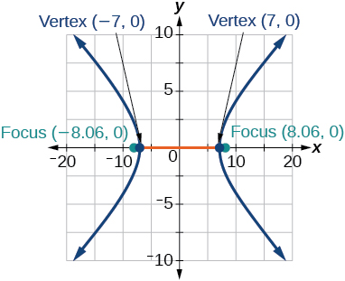

<math xmlns="http://www.w3.org/1998/Math/MathML"> <mrow> <mfrac> <mrow> <msup> <mi>x</mi> <mn>2</mn> </msup> </mrow> <mrow> <mn>64</mn> </mrow> </mfrac> <mo>−</mo><mfrac> <mrow> <msup> <mi>y</mi> <mn>2</mn> </msup> </mrow> <mn>4</mn> </mfrac> <mo>=</mo><mn>1</mn> </mrow> </math>

<math xmlns="http://www.w3.org/1998/Math/MathML"> <mrow> <mfrac> <mrow> <msup> <mi>y</mi> <mn>2</mn> </msup> </mrow> <mn>9</mn> </mfrac> <mo>−</mo><mfrac> <mrow> <msup> <mi>x</mi> <mn>2</mn> </msup> </mrow> <mrow> <mn>25</mn> </mrow> </mfrac> <mo>=</mo><mn>1</mn> </mrow> </math>

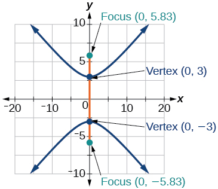

<math xmlns="http://www.w3.org/1998/Math/MathML"> <mrow> <mn>81</mn><msup> <mi>x</mi> <mn>2</mn> </msup> <mo>−</mo><mn>9</mn><msup> <mi>y</mi> <mn>2</mn> </msup> <mo>=</mo><mn>1</mn> </mrow> </math>

<math xmlns="http://www.w3.org/1998/Math/MathML"> <mrow> <mfrac> <mrow> <msup> <mrow> <mrow><mo>(</mo> <mrow> <mi>y</mi><mo>+</mo><mn>5</mn> </mrow> <mo>)</mo></mrow> </mrow> <mn>2</mn> </msup> </mrow> <mn>9</mn> </mfrac> <mo>−</mo><mfrac> <mrow> <msup> <mrow> <mrow><mo>(</mo> <mrow> <mi>x</mi><mo>−</mo><mn>4</mn> </mrow> <mo>)</mo></mrow> </mrow> <mn>2</mn> </msup> </mrow> <mrow> <mn>25</mn> </mrow> </mfrac> <mo>=</mo><mn>1</mn> </mrow> </math>

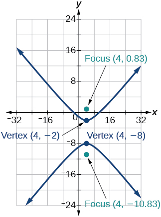

<math xmlns="http://www.w3.org/1998/Math/MathML"> <mrow> <mfrac> <mrow> <msup> <mrow> <mrow><mo>(</mo> <mrow> <mi>x</mi><mo>−</mo><mn>2</mn> </mrow> <mo>)</mo></mrow> </mrow> <mn>2</mn> </msup> </mrow> <mn>8</mn> </mfrac> <mo>−</mo><mfrac> <mrow> <msup> <mrow> <mrow><mo>(</mo> <mrow> <mi>y</mi><mo>+</mo><mn>3</mn> </mrow> <mo>)</mo></mrow> </mrow> <mn>2</mn> </msup> </mrow> <mrow> <mn>27</mn> </mrow> </mfrac> <mo>=</mo><mn>1</mn> </mrow> </math>

<math xmlns="http://www.w3.org/1998/Math/MathML"> <mrow> <mfrac> <mrow> <msup> <mrow> <mrow><mo>(</mo> <mrow> <mi>y</mi><mo>−</mo><mn>3</mn> </mrow> <mo>)</mo></mrow> </mrow> <mn>2</mn> </msup> </mrow> <mn>9</mn> </mfrac> <mo>−</mo><mfrac> <mrow> <msup> <mrow> <mrow><mo>(</mo> <mrow> <mi>x</mi><mo>−</mo><mn>3</mn> </mrow> <mo>)</mo></mrow> </mrow> <mn>2</mn> </msup> </mrow> <mn>9</mn> </mfrac> <mo>=</mo><mn>1</mn> </mrow> </math>

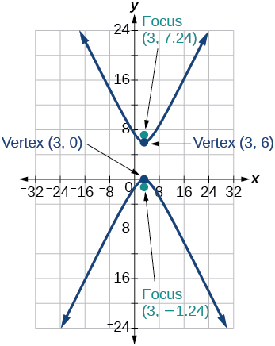

<math xmlns="http://www.w3.org/1998/Math/MathML"> <mrow> <mo>−</mo><mn>4</mn><msup> <mi>x</mi> <mn>2</mn> </msup> <mo>−</mo><mn>8</mn><mi>x</mi><mo>+</mo><mn>16</mn><msup> <mi>y</mi> <mn>2</mn> </msup> <mo>−</mo><mn>32</mn><mi>y</mi><mo>−</mo><mn>52</mn><mo>=</mo><mn>0</mn> </mrow> </math>

<math xmlns="http://www.w3.org/1998/Math/MathML"> <mrow> <msup> <mi>x</mi> <mn>2</mn> </msup> <mo>−</mo><mn>8</mn><mi>x</mi><mo>−</mo><mn>25</mn><msup> <mi>y</mi> <mn>2</mn> </msup> <mo>−</mo><mn>100</mn><mi>y</mi><mo>−</mo><mn>109</mn><mo>=</mo><mn>0</mn> </mrow> </math>

<math xmlns="http://www.w3.org/1998/Math/MathML"> <mrow> <mo>−</mo><msup> <mi>x</mi> <mn>2</mn> </msup> <mo>+</mo><mn>8</mn><mi>x</mi><mo>+</mo><mn>4</mn><msup> <mi>y</mi> <mn>2</mn> </msup> <mo>−</mo><mn>40</mn><mi>y</mi><mo>+</mo><mn>88</mn><mo>=</mo><mn>0</mn> </mrow> </math>

<math xmlns="http://www.w3.org/1998/Math/MathML"> <mrow> <mn>64</mn><msup> <mi>x</mi> <mn>2</mn> </msup> <mo>+</mo><mn>128</mn><mi>x</mi><mo>−</mo><mn>9</mn><msup> <mi>y</mi> <mn>2</mn> </msup> <mo>−</mo><mn>72</mn><mi>y</mi><mo>−</mo><mn>656</mn><mo>=</mo><mn>0</mn> </mrow> </math>

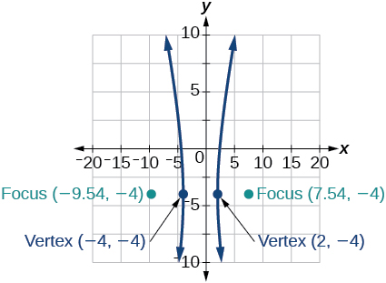

<math xmlns="http://www.w3.org/1998/Math/MathML"> <mrow> <mn>16</mn><msup> <mi>x</mi> <mn>2</mn> </msup> <mo>+</mo><mn>64</mn><mi>x</mi><mo>−</mo><mn>4</mn><msup> <mi>y</mi> <mn>2</mn> </msup> <mo>−</mo><mn>8</mn><mi>y</mi><mo>−</mo><mn>4</mn><mo>=</mo><mn>0</mn> </mrow> </math>

<math xmlns="http://www.w3.org/1998/Math/MathML"> <mrow> <mo>−</mo><mn>100</mn><msup> <mi>x</mi> <mn>2</mn> </msup> <mo>+</mo><mn>1000</mn><mi>x</mi><mo>+</mo><msup> <mi>y</mi> <mn>2</mn> </msup> <mo>−</mo><mn>10</mn><mi>y</mi><mo>−</mo><mn>2575</mn><mo>=</mo><mn>0</mn> </mrow> </math>

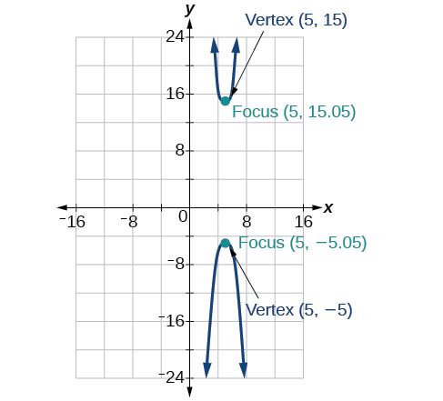

<math xmlns="http://www.w3.org/1998/Math/MathML"> <mrow> <mn>4</mn><msup> <mi>x</mi> <mn>2</mn> </msup> <mo>+</mo><mn>16</mn><mi>x</mi><mo>−</mo><mn>4</mn><msup> <mi>y</mi> <mn>2</mn> </msup> <mo>+</mo><mn>16</mn><mi>y</mi><mo>+</mo><mn>16</mn><mo>=</mo><mn>0</mn> </mrow> </math>

For the following exercises, given information about the graph of the hyperbola, find its equation.

Vertices at<math xmlns="http://www.w3.org/1998/Math/MathML"> <mrow> <mtext> </mtext><mrow><mo>(</mo> <mrow> <mn>3</mn><mo>,</mo><mn>0</mn> </mrow> <mo>)</mo></mrow><mtext> </mtext> </mrow> </math>

and<math xmlns="http://www.w3.org/1998/Math/MathML"> <mrow> <mtext> </mtext><mrow><mo>(</mo> <mrow> <mn>−3</mn><mo>,</mo><mn>0</mn> </mrow> <mo>)</mo></mrow><mtext> </mtext> </mrow> </math>

and one focus at<math xmlns="http://www.w3.org/1998/Math/MathML"> <mrow> <mtext> </mtext><mrow><mo>(</mo> <mrow> <mn>5</mn><mo>,</mo><mn>0</mn> </mrow> <mo>)</mo></mrow><mo>.</mo> </mrow> </math>

<math xmlns="http://www.w3.org/1998/Math/MathML"> <mrow> <mfrac> <mrow> <msup> <mi>x</mi> <mn>2</mn> </msup> </mrow> <mn>9</mn> </mfrac> <mo>−</mo><mfrac> <mrow> <msup> <mi>y</mi> <mn>2</mn> </msup> </mrow> <mrow> <mn>16</mn> </mrow> </mfrac> <mo>=</mo><mn>1</mn> </mrow> </math>

Vertices at<math xmlns="http://www.w3.org/1998/Math/MathML"> <mrow> <mtext> </mtext><mrow><mo>(</mo> <mrow> <mn>0</mn><mo>,</mo><mn>6</mn> </mrow> <mo>)</mo></mrow><mtext> </mtext> </mrow> </math>

and<math xmlns="http://www.w3.org/1998/Math/MathML"> <mrow> <mtext> </mtext><mrow><mo>(</mo> <mrow> <mn>0</mn><mo>,</mo><mn>−6</mn> </mrow> <mo>)</mo></mrow><mtext> </mtext> </mrow> </math>

and one focus at<math xmlns="http://www.w3.org/1998/Math/MathML"> <mrow> <mtext> </mtext><mrow><mo>(</mo> <mrow> <mn>0</mn><mo>,</mo><mn>−8</mn> </mrow> <mo>)</mo></mrow><mo>.</mo> </mrow> </math>

Vertices at<math xmlns="http://www.w3.org/1998/Math/MathML"> <mrow> <mtext> </mtext><mrow><mo>(</mo> <mrow> <mn>1</mn><mo>,</mo><mn>1</mn> </mrow> <mo>)</mo></mrow><mtext> </mtext> </mrow> </math>

and<math xmlns="http://www.w3.org/1998/Math/MathML"> <mrow> <mtext> </mtext><mrow><mo>(</mo> <mrow> <mn>11</mn><mo>,</mo><mn>1</mn> </mrow> <mo>)</mo></mrow><mtext> </mtext> </mrow> </math>

and one focus at<math xmlns="http://www.w3.org/1998/Math/MathML"> <mrow> <mtext> </mtext><mrow><mo>(</mo> <mrow> <mn>12</mn><mo>,</mo><mn>1</mn> </mrow> <mo>)</mo></mrow><mo>.</mo> </mrow> </math>

<math xmlns="http://www.w3.org/1998/Math/MathML"> <mrow> <mfrac> <mrow> <msup> <mrow> <mrow><mo>(</mo> <mrow> <mi>x</mi><mo>−</mo><mn>6</mn> </mrow> <mo>)</mo></mrow> </mrow> <mn>2</mn> </msup> </mrow> <mrow> <mn>25</mn> </mrow> </mfrac> <mo>−</mo><mfrac> <mrow> <msup> <mrow> <mrow><mo>(</mo> <mrow> <mi>y</mi><mo>−</mo><mn>1</mn> </mrow> <mo>)</mo></mrow> </mrow> <mn>2</mn> </msup> </mrow> <mrow> <mn>11</mn> </mrow> </mfrac> <mo>=</mo><mn>1</mn> </mrow> </math>

Center:<math xmlns="http://www.w3.org/1998/Math/MathML"> <mrow> <mtext> </mtext><mrow><mo>(</mo> <mrow> <mn>0</mn><mo>,</mo><mn>0</mn> </mrow> <mo>)</mo></mrow><mo>;</mo> </mrow> </math>

vertex:<math xmlns="http://www.w3.org/1998/Math/MathML"> <mrow> <mtext> </mtext><mrow><mo>(</mo> <mrow> <mn>0</mn><mo>,</mo><mn>−13</mn> </mrow> <mo>)</mo></mrow><mo>;</mo> </mrow> </math>

one focus:<math xmlns="http://www.w3.org/1998/Math/MathML"> <mrow> <mtext> </mtext><mrow><mo>(</mo> <mrow> <mn>0</mn><mo>,</mo><msqrt> <mrow> <mn>313</mn> </mrow> </msqrt> </mrow> <mo>)</mo></mrow><mo>.</mo> </mrow> </math>

Center:<math xmlns="http://www.w3.org/1998/Math/MathML"> <mrow> <mtext> </mtext><mrow><mo>(</mo> <mrow> <mn>4</mn><mo>,</mo><mn>2</mn> </mrow> <mo>)</mo></mrow><mo>;</mo> </mrow> </math>

vertex:<math xmlns="http://www.w3.org/1998/Math/MathML"> <mrow> <mtext> </mtext><mrow><mo>(</mo> <mrow> <mn>9</mn><mo>,</mo><mn>2</mn> </mrow> <mo>)</mo></mrow><mo>;</mo> </mrow> </math>

one focus:<math xmlns="http://www.w3.org/1998/Math/MathML"> <mrow> <mtext> </mtext><mrow><mo>(</mo> <mrow> <mn>4</mn><mo>+</mo><msqrt> <mrow> <mn>26</mn> </mrow> </msqrt> <mo>,</mo><mn>2</mn> </mrow> <mo>)</mo></mrow><mo>.</mo> </mrow> </math>

<math xmlns="http://www.w3.org/1998/Math/MathML"> <mrow> <mfrac> <mrow> <msup> <mrow> <mrow><mo>(</mo> <mrow> <mi>x</mi><mo>−</mo><mn>4</mn> </mrow> <mo>)</mo></mrow> </mrow> <mn>2</mn> </msup> </mrow> <mrow> <mn>25</mn> </mrow> </mfrac> <mo>−</mo><mfrac> <mrow> <msup> <mrow> <mrow><mo>(</mo> <mrow> <mi>y</mi><mo>−</mo><mn>2</mn> </mrow> <mo>)</mo></mrow> </mrow> <mn>2</mn> </msup> </mrow> <mn>1</mn> </mfrac> <mo>=</mo><mn>1</mn> </mrow> </math>

Center:<math xmlns="http://www.w3.org/1998/Math/MathML"> <mrow> <mtext> </mtext><mrow><mo>(</mo> <mrow> <mn>3</mn><mo>,</mo><mn>5</mn> </mrow> <mo>)</mo></mrow><mo>;</mo><mtext> </mtext> </mrow> </math>

vertex:<math xmlns="http://www.w3.org/1998/Math/MathML"> <mrow> <mtext> </mtext><mrow><mo>(</mo> <mrow> <mn>3</mn><mo>,</mo><mn>11</mn> </mrow> <mo>)</mo></mrow><mo>;</mo><mtext> </mtext> </mrow> </math>

one focus:<math xmlns="http://www.w3.org/1998/Math/MathML"> <mrow> <mtext> </mtext><mrow><mo>(</mo> <mrow> <mn>3</mn><mo>,</mo><mn>5</mn><mo>+</mo><mn>2</mn><msqrt> <mrow> <mn>10</mn> </mrow> </msqrt> </mrow> <mo>)</mo></mrow><mo>.</mo> </mrow> </math>

For the following exercises, given the graph of the hyperbola, find its equation.

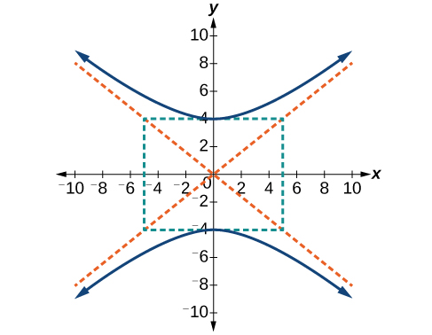

<math xmlns="http://www.w3.org/1998/Math/MathML"> <mrow> <mfrac> <mrow> <msup> <mi>y</mi> <mn>2</mn> </msup> </mrow> <mrow> <mn>16</mn> </mrow> </mfrac> <mo>−</mo><mfrac> <mrow> <msup> <mi>x</mi> <mn>2</mn> </msup> </mrow> <mrow> <mn>25</mn> </mrow> </mfrac> <mo>=</mo><mn>1</mn> </mrow> </math>

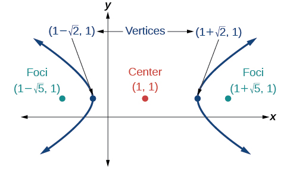

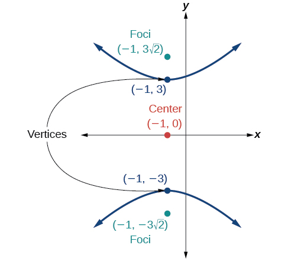

<math xmlns="http://www.w3.org/1998/Math/MathML"> <mrow> <mfrac> <mrow> <msup> <mi>y</mi> <mn>2</mn> </msup> </mrow> <mn>9</mn> </mfrac> <mo>−</mo><mfrac> <mrow> <msup> <mrow> <mrow><mo>(</mo> <mrow> <mi>x</mi><mo>+</mo><mn>1</mn> </mrow> <mo>)</mo></mrow> </mrow> <mn>2</mn> </msup> </mrow> <mn>9</mn> </mfrac> <mo>=</mo><mn>1</mn> </mrow> </math>

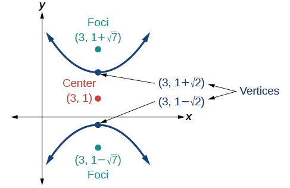

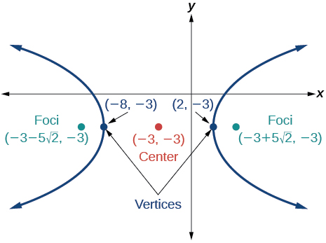

<math xmlns="http://www.w3.org/1998/Math/MathML"> <mrow> <mfrac> <mrow> <msup> <mrow> <mrow><mo>(</mo> <mrow> <mi>x</mi><mo>+</mo><mn>3</mn> </mrow> <mo>)</mo></mrow> </mrow> <mn>2</mn> </msup> </mrow> <mrow> <mn>25</mn> </mrow> </mfrac> <mo>−</mo><mfrac> <mrow> <msup> <mrow> <mrow><mo>(</mo> <mrow> <mi>y</mi><mo>+</mo><mn>3</mn> </mrow> <mo>)</mo></mrow> </mrow> <mn>2</mn> </msup> </mrow> <mrow> <mn>25</mn> </mrow> </mfrac> <mo>=</mo><mn>1</mn> </mrow> </math>

####  Extensions

For the following exercises, express the equation for the hyperbola as two functions, with<math xmlns="http://www.w3.org/1998/Math/MathML"> <mrow> <mtext> </mtext><mi>y</mi><mtext> </mtext> </mrow> </math>

as a function of<math xmlns="http://www.w3.org/1998/Math/MathML"> <mrow> <mtext> </mtext><mi>x</mi><mo>.</mo><mtext> </mtext> </mrow> </math>

Express as simply as possible. Use a graphing calculator to sketch the graph of the two functions on the same axes.

<math xmlns="http://www.w3.org/1998/Math/MathML"> <mrow> <mfrac> <mrow> <msup> <mi>x</mi> <mn>2</mn> </msup> </mrow> <mn>4</mn> </mfrac> <mo>−</mo><mfrac> <mrow> <msup> <mi>y</mi> <mn>2</mn> </msup> </mrow> <mn>9</mn> </mfrac> <mo>=</mo><mn>1</mn> </mrow> </math>

<math xmlns="http://www.w3.org/1998/Math/MathML"> <mrow> <mfrac> <mrow> <msup> <mi>y</mi> <mn>2</mn> </msup> </mrow> <mn>9</mn> </mfrac> <mo>−</mo><mfrac> <mrow> <msup> <mi>x</mi> <mn>2</mn> </msup> </mrow> <mn>1</mn> </mfrac> <mo>=</mo><mn>1</mn> </mrow> </math>

<math xmlns="http://www.w3.org/1998/Math/MathML"> <mrow> <mi>y</mi><mrow><mo>(</mo> <mi>x</mi> <mo>)</mo></mrow><mo>=</mo><mn>3</mn><msqrt> <mrow> <msup> <mi>x</mi> <mn>2</mn> </msup> <mo>+</mo><mn>1</mn> </mrow> </msqrt> <mo>,</mo><mi>y</mi><mrow><mo>(</mo> <mi>x</mi> <mo>)</mo></mrow><mo>=</mo><mo>−</mo><mn>3</mn><msqrt> <mrow> <msup> <mi>x</mi> <mn>2</mn> </msup> <mo>+</mo><mn>1</mn> </mrow> </msqrt> </mrow> </math>

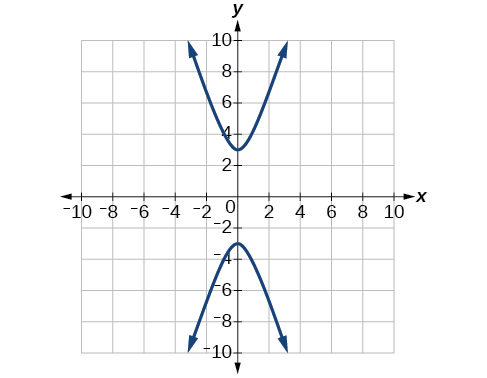

<math xmlns="http://www.w3.org/1998/Math/MathML"> <mrow> <mfrac> <mrow> <msup> <mrow> <mrow><mo>(</mo> <mrow> <mi>x</mi><mo>−</mo><mn>2</mn> </mrow> <mo>)</mo></mrow> </mrow> <mn>2</mn> </msup> </mrow> <mrow> <mn>16</mn> </mrow> </mfrac> <mo>−</mo><mfrac> <mrow> <msup> <mrow> <mrow><mo>(</mo> <mrow> <mi>y</mi><mo>+</mo><mn>3</mn> </mrow> <mo>)</mo></mrow> </mrow> <mn>2</mn> </msup> </mrow> <mrow> <mn>25</mn> </mrow> </mfrac> <mo>=</mo><mn>1</mn> </mrow> </math>

<math xmlns="http://www.w3.org/1998/Math/MathML"> <mrow> <mo>−</mo><mn>4</mn><msup> <mi>x</mi> <mn>2</mn> </msup> <mo>−</mo><mn>16</mn><mi>x</mi><mo>+</mo><msup> <mi>y</mi> <mn>2</mn> </msup> <mo>−</mo><mn>2</mn><mi>y</mi><mo>−</mo><mn>19</mn><mo>=</mo><mn>0</mn> </mrow> </math>

<math xmlns="http://www.w3.org/1998/Math/MathML"> <mrow> <mi>y</mi><mrow><mo>(</mo> <mi>x</mi> <mo>)</mo></mrow><mo>=</mo><mn>1</mn><mo>+</mo><mn>2</mn><msqrt> <mrow> <msup> <mi>x</mi> <mn>2</mn> </msup> <mo>+</mo><mn>4</mn><mi>x</mi><mo>+</mo><mn>5</mn> </mrow> </msqrt> <mo>,</mo><mi>y</mi><mrow><mo>(</mo> <mi>x</mi> <mo>)</mo></mrow><mo>=</mo><mn>1</mn><mo>−</mo><mn>2</mn><msqrt> <mrow> <msup> <mi>x</mi> <mn>2</mn> </msup> <mo>+</mo><mn>4</mn><mi>x</mi><mo>+</mo><mn>5</mn> </mrow> </msqrt> </mrow> </math>

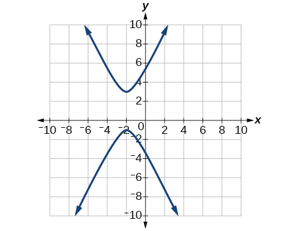

<math xmlns="http://www.w3.org/1998/Math/MathML"> <mrow> <mn>4</mn><msup> <mi>x</mi> <mn>2</mn> </msup> <mo>−</mo><mn>24</mn><mi>x</mi><mo>−</mo><msup> <mi>y</mi> <mn>2</mn> </msup> <mo>−</mo><mn>4</mn><mi>y</mi><mo>+</mo><mn>16</mn><mo>=</mo><mn>0</mn> </mrow> </math>

####  Real-World Applications

For the following exercises, a hedge is to be constructed in the shape of a hyperbola near a fountain at the center of the yard. Find the equation of the hyperbola and sketch the graph.

The hedge will follow the asymptotes<math xmlns="http://www.w3.org/1998/Math/MathML"> <mrow> <mtext> </mtext><mi>y</mi><mo>=</mo><mi>x</mi><mtext> and </mtext><mi>y</mi><mo>=</mo><mo>−</mo><mi>x</mi><mo>,</mo> </mrow> </math>

 and its closest distance to the center fountain is 5 yards.

<math xmlns="http://www.w3.org/1998/Math/MathML"> <mrow> <mfrac> <mrow> <msup> <mi>x</mi> <mn>2</mn> </msup> </mrow> <mrow> <mn>25</mn> </mrow> </mfrac> <mo>−</mo><mfrac> <mrow> <msup> <mi>y</mi> <mn>2</mn> </msup> </mrow> <mrow> <mn>25</mn> </mrow> </mfrac> <mo>=</mo><mn>1</mn> </mrow> </math>

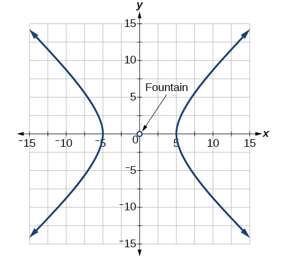

The hedge will follow the asymptotes<math xmlns="http://www.w3.org/1998/Math/MathML"> <mrow> <mtext> </mtext><mi>y</mi><mo>=</mo><mn>2</mn><mi>x</mi><mtext> and </mtext><mi>y</mi><mo>=</mo><mn>−2</mn><mi>x</mi><mo>,</mo> </mrow> </math>

 and its closest distance to the center fountain is 6 yards.

The hedge will follow the asymptotes<math xmlns="http://www.w3.org/1998/Math/MathML"> <mrow> <mtext> </mtext><mi>y</mi><mo>=</mo><mfrac> <mn>1</mn> <mn>2</mn> </mfrac> <mi>x</mi><mtext>  </mtext> </mrow> </math>

and<math xmlns="http://www.w3.org/1998/Math/MathML"> <mrow> <mtext> </mtext><mi>y</mi><mo>=</mo><mo>−</mo><mfrac> <mn>1</mn> <mn>2</mn> </mfrac> <mi>x</mi><mo>,</mo> </mrow> </math>

 and its closest distance to the center fountain is 10 yards.

<math xmlns="http://www.w3.org/1998/Math/MathML"> <mrow> <mfrac> <mrow> <msup> <mi>x</mi> <mn>2</mn> </msup> </mrow> <mrow> <mn>100</mn> </mrow> </mfrac> <mo>−</mo><mfrac> <mrow> <msup> <mi>y</mi> <mn>2</mn> </msup> </mrow> <mrow> <mn>25</mn> </mrow> </mfrac> <mo>=</mo><mn>1</mn> </mrow> </math>

The hedge will follow the asymptotes<math xmlns="http://www.w3.org/1998/Math/MathML"> <mrow> <mtext> </mtext><mi>y</mi><mo>=</mo><mfrac> <mn>2</mn> <mn>3</mn> </mfrac> <mi>x</mi><mtext> </mtext> </mrow> </math>

and<math xmlns="http://www.w3.org/1998/Math/MathML"> <mrow> <mtext> </mtext><mi>y</mi><mo>=</mo><mo>−</mo><mfrac> <mn>2</mn> <mn>3</mn> </mfrac> <mi>x</mi><mo>,</mo> </mrow> </math>

 and its closest distance to the center fountain is 12 yards.

The hedge will follow the asymptotes<math xmlns="http://www.w3.org/1998/Math/MathML"> <mrow> <mtext> </mtext><mi>y</mi><mo>=</mo><mfrac> <mn>3</mn> <mn>4</mn> </mfrac> <mi>x</mi><mtext> and </mtext><mi>y</mi><mo>=</mo><mo>−</mo><mfrac> <mn>3</mn> <mn>4</mn> </mfrac> <mi>x</mi><mo>,</mo> </mrow> </math>

 and its closest distance to the center fountain is 20 yards.

<math xmlns="http://www.w3.org/1998/Math/MathML"> <mrow> <mfrac> <mrow> <msup> <mi>x</mi> <mn>2</mn> </msup> </mrow> <mrow> <mn>400</mn> </mrow> </mfrac> <mo>−</mo><mfrac> <mrow> <msup> <mi>y</mi> <mn>2</mn> </msup> </mrow> <mrow> <mn>225</mn> </mrow> </mfrac> <mo>=</mo><mn>1</mn> </mrow> </math>

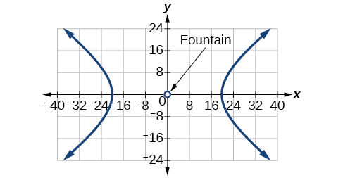

For the following exercises, assume an object enters our solar system and we want to graph its path on a coordinate system with the sun at the origin and the x-axis as the axis of symmetry for the object\'s path. Give the equation of the flight path of each object using the given information.

The object enters along a path approximated by the line<math xmlns="http://www.w3.org/1998/Math/MathML"> <mrow> <mtext> </mtext><mi>y</mi><mo>=</mo><mi>x</mi><mo>−</mo><mn>2</mn><mtext> </mtext> </mrow> </math>

and passes within 1 au (astronomical unit) of the sun at its closest approach, so that the sun is one focus of the hyperbola. It then departs the solar system along a path approximated by the line<math xmlns="http://www.w3.org/1998/Math/MathML"> <mrow> <mtext> </mtext><mi>y</mi><mo>=</mo><mo>−</mo><mi>x</mi><mo>+</mo><mn>2.</mn><mtext> </mtext> </mrow> </math>

The object enters along a path approximated by the line<math xmlns="http://www.w3.org/1998/Math/MathML"> <mrow> <mtext> </mtext><mi>y</mi><mo>=</mo><mn>2</mn><mi>x</mi><mo>−</mo><mn>2</mn><mtext> </mtext> </mrow> </math>

and passes within 0.5 au of the sun at its closest approach, so the sun is one focus of the hyperbola. It then departs the solar system along a path approximated by the line<math xmlns="http://www.w3.org/1998/Math/MathML"> <mrow> <mtext> </mtext><mi>y</mi><mo>=</mo><mn>−2</mn><mi>x</mi><mo>+</mo><mn>2.</mn><mtext> </mtext> </mrow> </math>

<math xmlns="http://www.w3.org/1998/Math/MathML"> <mrow> <mfrac> <mrow> <msup> <mrow> <mrow><mo>(</mo> <mrow> <mi>x</mi><mo>−</mo><mn>1</mn> </mrow> <mo>)</mo></mrow> </mrow> <mn>2</mn> </msup> </mrow> <mrow> <mn>0.25</mn> </mrow> </mfrac> <mo>−</mo><mfrac> <mrow> <msup> <mi>y</mi> <mn>2</mn> </msup> </mrow> <mrow> <mn>0.75</mn> </mrow> </mfrac> <mo>=</mo><mn>1</mn> </mrow> </math>

The object enters along a path approximated by the line<math xmlns="http://www.w3.org/1998/Math/MathML"> <mrow> <mtext> </mtext><mi>y</mi><mo>=</mo><mn>0.5</mn><mi>x</mi><mo>+</mo><mn>2</mn><mtext> </mtext> </mrow> </math>

and passes within 1 au of the sun at its closest approach, so the sun is one focus of the hyperbola. It then departs the solar system along a path approximated by the line<math xmlns="http://www.w3.org/1998/Math/MathML"> <mrow> <mtext> </mtext><mi>y</mi><mo>=</mo><mn>−0.5</mn><mi>x</mi><mo>−</mo><mn>2.</mn><mtext> </mtext> </mrow> </math>

The object enters along a path approximated by the line<math xmlns="http://www.w3.org/1998/Math/MathML"> <mrow> <mtext> </mtext><mi>y</mi><mo>=</mo><mfrac> <mn>1</mn> <mn>3</mn> </mfrac> <mi>x</mi><mo>−</mo><mn>1</mn><mtext> </mtext> </mrow> </math>

and passes within 1 au of the sun at its closest approach, so the sun is one focus of the hyperbola. It then departs the solar system along a path approximated by the line<math xmlns="http://www.w3.org/1998/Math/MathML"> <mrow> <mtext> </mtext><mi>y</mi><mo>=</mo><mo>−</mo><mfrac> <mn>1</mn> <mn>3</mn> </mfrac> <mi>x</mi><mo>+</mo><mn>1.</mn> </mrow> </math>

<math xmlns="http://www.w3.org/1998/Math/MathML"> <mrow> <mfrac> <mrow> <msup> <mrow> <mrow><mo>(</mo> <mrow> <mi>x</mi><mo>−</mo><mn>3</mn> </mrow> <mo>)</mo></mrow> </mrow> <mn>2</mn> </msup> </mrow> <mn>4</mn> </mfrac> <mo>−</mo><mfrac> <mrow> <msup> <mi>y</mi> <mn>2</mn> </msup> </mrow> <mn>5</mn> </mfrac> <mo>=</mo><mn>1</mn> </mrow> </math>

The object It enters along a path approximated by the line<math xmlns="http://www.w3.org/1998/Math/MathML"> <mrow> <mtext> </mtext><mi>y</mi><mo>=</mo><mn>3</mn><mi>x</mi><mo>−</mo><mn>9</mn><mtext> </mtext> </mrow> </math>

and passes within 1 au of the sun at its closest approach, so the sun is one focus of the hyperbola. It then departs the solar system along a path approximated by the line<math xmlns="http://www.w3.org/1998/Math/MathML"> <mrow> <mtext> </mtext><mi>y</mi><mo>=</mo><mn>−3</mn><mi>x</mi><mo>+</mo><mn>9.</mn><mtext> </mtext> </mrow> </math>

### Glossary
{: data-type="glossary-title"}

center of a hyperbola
: the midpoint of both the transverse and conjugate axes of a hyperbola
^

conjugate axis
: the axis of a hyperbola that is perpendicular to the transverse axis and has the co-vertices as its endpoints
^

hyperbola
: the set of all points
  <math xmlns="http://www.w3.org/1998/Math/MathML"> <mrow> <mtext> </mtext><mrow><mo>(</mo> <mrow> <mi>x</mi><mo>,</mo><mi>y</mi> </mrow> <mo>)</mo></mrow><mtext> </mtext> </mrow> </math>
  
  in a plane such that the difference of the distances between
  <math xmlns="http://www.w3.org/1998/Math/MathML"> <mrow> <mtext> </mtext><mrow><mo>(</mo> <mrow> <mi>x</mi><mo>,</mo><mi>y</mi> </mrow> <mo>)</mo></mrow><mtext> </mtext> </mrow> </math>
  
  and the foci is a positive constant
^

transverse axis
: the axis of a hyperbola that includes the foci and has the vertices as its endpoints

[1]: http://openstaxcollege.org/l/hyperbola1
[2]: http://openstaxcollege.org/l/hyperbola2
[3]: http://openstaxcollege.org/l/hyperbolaorigin
[4]: http://openstaxcollege.org/l/hbnotorigin
