

In this section, you will:
* Identify nondegenerate conic sections given their general form equations.
* Use rotation of axes formulas.
* Write equations of rotated conics in standard form.
* Identify conics without rotating axes.

As we have seen, conic sections are formed when a plane intersects two right circular cones aligned tip to tip and extending infinitely far in opposite directions, which we also call a *cone*. The way in which we slice the cone will determine the type of conic section formed at the intersection. A circle is formed by slicing a cone with a plane perpendicular to the axis of symmetry of the cone. An ellipse is formed by slicing a single cone with a slanted plane not perpendicular to the axis of symmetry. A parabola is formed by slicing the plane through the top or bottom of the double-cone, whereas a hyperbola is formed when the plane slices both the top and bottom of the cone. See [\[link\]](#Figure_10_04_001).

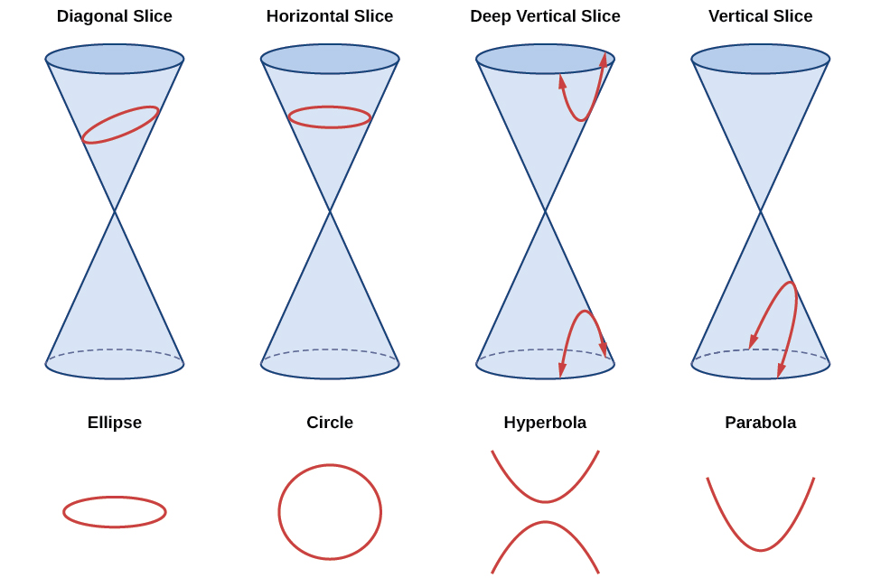{: #Figure_10_04_001}

Ellipses, circles, hyperbolas, and parabolas are sometimes called the **nondegenerate conic sections**{: data-type="term"}, in contrast to the **degenerate conic sections**{: data-type="term"}, which are shown in [\[link\]](#Figure_10_04_002). A degenerate conic results when a plane intersects the double cone and passes through the apex. Depending on the angle of the plane, three types of degenerate conic sections are possible: a point, a line, or two intersecting lines.

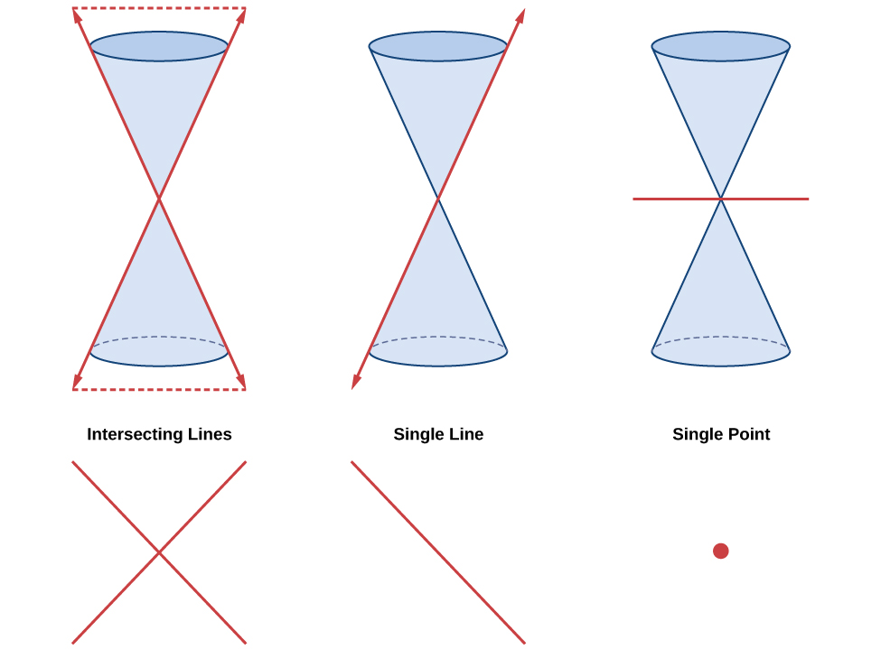{: #Figure_10_04_002}

### Identifying Nondegenerate Conics in General Form

In previous sections of this chapter, we have focused on the standard form equations for nondegenerate conic sections. In this section, we will shift our focus to the general form equation, which can be used for any conic. The general form is set equal to zero, and the terms and coefficients are given in a particular order, as shown below.

<math xmlns="http://www.w3.org/1998/Math/MathML"> <mrow> <mi>A</mi><msup> <mi>x</mi> <mn>2</mn> </msup> <mo>+</mo><mi>B</mi><mi>x</mi><mi>y</mi><mo>+</mo><mi>C</mi><msup> <mi>y</mi> <mn>2</mn> </msup> <mo>+</mo><mi>D</mi><mi>x</mi><mo>+</mo><mi>E</mi><mi>y</mi><mo>+</mo><mi>F</mi><mo>=</mo><mn>0</mn> </mrow> </math>

where<math xmlns="http://www.w3.org/1998/Math/MathML"> <mrow> <mtext> </mtext><mi>A</mi><mo>,</mo><mi>B</mi><mo>,</mo> </mrow> </math>

 and <math xmlns="http://www.w3.org/1998/Math/MathML"> <mrow> <mtext> </mtext><mi>C</mi><mtext> </mtext> </mrow> </math>

are not all zero. We can use the values of the coefficients to identify which type conic is represented by a given equation.

You may notice that the general form equation has an<math xmlns="http://www.w3.org/1998/Math/MathML"> <mrow> <mtext> </mtext><mi>x</mi><mi>y</mi><mtext> </mtext> </mrow> </math>

term that we have not seen in any of the standard form equations. As we will discuss later, the<math xmlns="http://www.w3.org/1998/Math/MathML"> <mrow> <mtext> </mtext><mi>x</mi><mi>y</mi><mtext> </mtext> </mrow> </math>

term rotates the conic whenever<math xmlns="http://www.w3.org/1998/Math/MathML"> <mrow> <mtext> </mtext><mi>B</mi><mtext> </mtext> </mrow> </math>

is not equal to zero.

| **Conic Sections** | **Example** |
|----------
| ellipse | <math xmlns="http://www.w3.org/1998/Math/MathML"> <mrow> <mn>4</mn><msup> <mi>x</mi> <mn>2</mn> </msup> <mo>+</mo><mn>9</mn><msup> <mi>y</mi> <mn>2</mn> </msup> <mo>=</mo><mn>1</mn> </mrow> </math>

 |
| circle | <math xmlns="http://www.w3.org/1998/Math/MathML"> <mrow> <mn>4</mn><msup> <mi>x</mi> <mn>2</mn> </msup> <mo>+</mo><mn>4</mn><msup> <mi>y</mi> <mn>2</mn> </msup> <mo>=</mo><mn>1</mn> </mrow> </math>

 |
| hyperbola | <math xmlns="http://www.w3.org/1998/Math/MathML"> <mrow> <mn>4</mn><msup> <mi>x</mi> <mn>2</mn> </msup> <mo>−</mo><mn>9</mn><msup> <mi>y</mi> <mn>2</mn> </msup> <mo>=</mo><mn>1</mn> </mrow> </math>

 |
| parabola | <math xmlns="http://www.w3.org/1998/Math/MathML"> <mrow> <mn>4</mn><msup> <mi>x</mi> <mn>2</mn> </msup> <mo>=</mo><mn>9</mn><mi>y</mi><mtext> or </mtext><mn>4</mn><msup> <mi>y</mi> <mn>2</mn> </msup> <mo>=</mo><mn>9</mn><mi>x</mi> </mrow> </math>

 |
| one line | <math xmlns="http://www.w3.org/1998/Math/MathML"> <mrow> <mn>4</mn><mi>x</mi><mo>+</mo><mn>9</mn><mi>y</mi><mo>=</mo><mn>1</mn> </mrow> </math>

 |
| intersecting lines | <math xmlns="http://www.w3.org/1998/Math/MathML"> <mrow> <mrow><mo>(</mo> <mrow> <mi>x</mi><mo>−</mo><mn>4</mn> </mrow> <mo>)</mo></mrow><mrow><mo>(</mo> <mrow> <mi>y</mi><mo>+</mo><mn>4</mn> </mrow> <mo>)</mo></mrow><mo>=</mo><mn>0</mn> </mrow> </math>

 |
| parallel lines | <math xmlns="http://www.w3.org/1998/Math/MathML"> <mrow> <mrow><mo>(</mo> <mrow> <mi>x</mi><mo>−</mo><mn>4</mn> </mrow> <mo>)</mo></mrow><mrow><mo>(</mo> <mrow> <mi>x</mi><mo>−</mo><mn>9</mn> </mrow> <mo>)</mo></mrow><mo>=</mo><mn>0</mn> </mrow> </math>

 |
| a point | <math xmlns="http://www.w3.org/1998/Math/MathML"> <mrow> <mn>4</mn><msup> <mi>x</mi> <mn>2</mn> </msup> <mo>+</mo><mn>4</mn><msup> <mi>y</mi> <mn>2</mn> </msup> <mo>=</mo><mn>0</mn> </mrow> </math>

 |
| no graph | <math xmlns="http://www.w3.org/1998/Math/MathML"> <mrow> <mn>4</mn><msup> <mi>x</mi> <mn>2</mn> </msup> <mo>+</mo><mn>4</mn><msup> <mi>y</mi> <mn>2</mn> </msup> <mo>=</mo><mtext> </mtext><mo>−</mo><mtext> </mtext><mn>1</mn> </mrow> </math>

 |
{: #Table_10_04_01 summary=".."}

General Form of Conic Sections

A **conic section**{: data-type="term"} has the general form

<math xmlns="http://www.w3.org/1998/Math/MathML"> <mrow> <mi>A</mi><msup> <mi>x</mi> <mn>2</mn> </msup> <mo>+</mo><mi>B</mi><mi>x</mi><mi>y</mi><mo>+</mo><mi>C</mi><msup> <mi>y</mi> <mn>2</mn> </msup> <mo>+</mo><mi>D</mi><mi>x</mi><mo>+</mo><mi>E</mi><mi>y</mi><mo>+</mo><mi>F</mi><mo>=</mo><mn>0</mn> </mrow> </math>

where<math xmlns="http://www.w3.org/1998/Math/MathML"> <mrow> <mtext> </mtext><mi>A</mi><mo>,</mo><mi>B</mi><mo>,</mo> </mrow> </math>

 and<math xmlns="http://www.w3.org/1998/Math/MathML"> <mrow> <mtext> </mtext><mi>C</mi><mtext> </mtext> </mrow> </math>

are not all zero.

[\[link\]](#Table_10_04_02) summarizes the different conic sections where<math xmlns="http://www.w3.org/1998/Math/MathML"> <mrow> <mtext> </mtext><mi>B</mi><mo>=</mo><mn>0</mn><mo>,</mo> </mrow> </math>

 and<math xmlns="http://www.w3.org/1998/Math/MathML"> <mrow> <mtext>  </mtext><mi>A</mi><mtext>  </mtext> </mrow> </math>

and<math xmlns="http://www.w3.org/1998/Math/MathML"> <mrow> <mtext>  </mtext><mi>C</mi><mtext>  </mtext> </mrow> </math>

are nonzero real numbers. This indicates that the conic has not been rotated.

<table id="Table_10_04_02" summary=".."><colgroup><col data-width="20" data-align="left" /><col data-width="70" /></colgroup><tbody>
      <tr>
       <td><strong>ellipse</strong></td>
       <td><math xmlns="http://www.w3.org/1998/Math/MathML">
 <mrow>
  <mi>A</mi><msup>
   <mi>x</mi>
   <mn>2</mn>
  </msup>
  <mo>+</mo><mi>C</mi><msup>
   <mi>y</mi>
   <mn>2</mn>
  </msup>
  <mo>+</mo><mi>D</mi><mi>x</mi><mo>+</mo><mi>E</mi><mi>y</mi><mo>+</mo><mi>F</mi><mo>=</mo><mn>0</mn><mo>,</mo><mtext> </mtext><mi>A</mi><mo>≠</mo><mi>C</mi><mtext> and </mtext><mi>A</mi><mi>C</mi><mo>&gt;</mo><mn>0</mn>
 </mrow>
</math>
       </td>
      </tr>
   
      <tr>
       <td><strong>circle</strong></td>
       <td><math xmlns="http://www.w3.org/1998/Math/MathML">
 <mrow>
  <mi>A</mi><msup>
   <mi>x</mi>
   <mn>2</mn>
  </msup>
  <mo>+</mo><mi>C</mi><msup>
   <mi>y</mi>
   <mn>2</mn>
  </msup>
  <mo>+</mo><mi>D</mi><mi>x</mi><mo>+</mo><mi>E</mi><mi>y</mi><mo>+</mo><mi>F</mi><mo>=</mo><mn>0</mn><mo>,</mo><mtext> </mtext><mi>A</mi><mo>=</mo><mi>C</mi>
 </mrow>
</math>
       </td>
      </tr>
      <tr>
       <td><strong>hyperbola</strong></td>
       <td><math xmlns="http://www.w3.org/1998/Math/MathML">
 <mrow>
  <mi>A</mi><msup>
   <mi>x</mi>
   <mn>2</mn>
  </msup>
  <mo>−</mo><mi>C</mi><msup>
   <mi>y</mi>
   <mn>2</mn>
  </msup>
  <mo>+</mo><mi>D</mi><mi>x</mi><mo>+</mo><mi>E</mi><mi>y</mi><mo>+</mo><mi>F</mi><mo>=</mo><mn>0</mn><mtext> or </mtext><mo>−</mo><mi>A</mi><msup>
   <mi>x</mi>
   <mn>2</mn>
  </msup>
  <mo>+</mo><mi>C</mi><msup>
   <mi>y</mi>
   <mn>2</mn>
  </msup>
  <mo>+</mo><mi>D</mi><mi>x</mi><mo>+</mo><mi>E</mi><mi>y</mi><mo>+</mo><mi>F</mi><mo>=</mo><mn>0</mn><mo>,</mo></mrow>
</math>where<math xmlns="http://www.w3.org/1998/Math/MathML">
 <mrow>
  <mtext> </mtext><mi>A</mi><mtext> </mtext>
 </mrow>
</math>and<math xmlns="http://www.w3.org/1998/Math/MathML">
 <mrow>
  <mtext> </mtext><mi>C</mi><mtext> </mtext>
 </mrow>
</math>are positive</td>
      </tr>
      <tr>
       <td><strong>parabola</strong></td>
       <td><math xmlns="http://www.w3.org/1998/Math/MathML">
 <mrow>
  <mi>A</mi><msup>
   <mi>x</mi>
   <mn>2</mn>
  </msup>
  <mo>+</mo><mi>D</mi><mi>x</mi><mo>+</mo><mi>E</mi><mi>y</mi><mo>+</mo><mi>F</mi><mo>=</mo><mn>0</mn><mtext> or </mtext><mi>C</mi><msup>
   <mi>y</mi>
   <mn>2</mn>
  </msup>
  <mo>+</mo><mi>D</mi><mi>x</mi><mo>+</mo><mi>E</mi><mi>y</mi><mo>+</mo><mi>F</mi><mo>=</mo><mn>0</mn>
 </mrow>
</math>
       </td>
      </tr>
     </tbody></table>

<strong>Given the equation of a conic, identify the type of conic. </strong>

1.  Rewrite the equation in the general form,
    <math xmlns="http://www.w3.org/1998/Math/MathML"> <mrow> <mi>A</mi><msup> <mi>x</mi> <mn>2</mn> </msup> <mo>+</mo><mi>B</mi><mi>x</mi><mi>y</mi><mo>+</mo><mi>C</mi><msup> <mi>y</mi> <mn>2</mn> </msup> <mo>+</mo><mi>D</mi><mi>x</mi><mo>+</mo><mi>E</mi><mi>y</mi><mo>+</mo><mi>F</mi><mo>=</mo><mn>0.</mn> </mrow> </math>

2.  Identify the values of
    <math xmlns="http://www.w3.org/1998/Math/MathML"> <mrow> <mtext> </mtext><mi>A</mi><mtext> </mtext> </mrow> </math>
    
    and
    <math xmlns="http://www.w3.org/1998/Math/MathML"> <mrow> <mtext> </mtext><mi>C</mi><mtext> </mtext> </mrow> </math>
    
    from the general form.
    1.  If
        <math xmlns="http://www.w3.org/1998/Math/MathML"> <mrow> <mtext> </mtext><mi>A</mi><mtext> </mtext> </mrow> </math>
        
        and
        <math xmlns="http://www.w3.org/1998/Math/MathML"> <mrow> <mtext> </mtext><mi>C</mi><mtext> </mtext> </mrow> </math>
        
        are nonzero, have the same sign, and are not equal to each other, then the graph may be an ellipse.
    2.  If
        <math xmlns="http://www.w3.org/1998/Math/MathML"> <mrow> <mtext> </mtext><mi>A</mi><mtext> </mtext> </mrow> </math>
        
        and
        <math xmlns="http://www.w3.org/1998/Math/MathML"> <mrow> <mtext> </mtext><mi>C</mi><mtext> </mtext> </mrow> </math>
        
        are equal and nonzero and have the same sign, then the graph may be a circle.
    3.  If
        <math xmlns="http://www.w3.org/1998/Math/MathML"> <mrow> <mtext> </mtext><mi>A</mi><mtext> </mtext> </mrow> </math>
        
        and
        <math xmlns="http://www.w3.org/1998/Math/MathML"> <mrow> <mtext> </mtext><mi>C</mi><mtext> </mtext> </mrow> </math>
        
        are nonzero and have opposite signs, then the graph may be a hyperbola.
    4.  If either
        <math xmlns="http://www.w3.org/1998/Math/MathML"> <mrow> <mtext> </mtext><mi>A</mi><mtext> </mtext> </mrow> </math>
        
        or
        <math xmlns="http://www.w3.org/1998/Math/MathML"> <mrow> <mtext> </mtext><mi>C</mi><mtext> </mtext> </mrow> </math>
        
        is zero, then the graph may be a parabola.
    {: type="a"}
    
    If *B* = 0, the conic section will have a vertical and/or horizontal axes. If *B* does not equal 0, as shown below, the conic section is rotated. Notice the phrase “may be” in the definitions. That is because the equation may not represent a conic section at all, depending on the values of *A*, *B*, *C*, *D*, *E*, and *F*. For example, the degenerate case of a circle or an ellipse is a point: * * *
    {: data-type="newline"}
    
     <math xmlns="http://www.w3.org/1998/Math/MathML"> <mrow> <mi>A</mi><msup> <mi>x</mi> <mn>2</mn> </msup> <mo>+</mo><mi>B</mi><msup><mi>y</mi><mn>2</mn></msup><mo>=</mo><mn>0</mn><mtext>, </mtext> </mrow> </math>
    
     when *A* and *B* have the same sign. * * *
    {: data-type="newline"}
    
     The degenerate case of a hyperbola is two intersecting straight lines: <math xmlns="http://www.w3.org/1998/Math/MathML"> <mrow> <mi>A</mi><msup> <mi>x</mi> <mn>2</mn> </msup> <mo>+</mo><mi>B</mi><msup><mi>y</mi><mn>2</mn></msup><mo>=</mo><mn>0</mn><mtext>, </mtext> </mrow> </math>
    
     when A and B have opposite signs. * * *
    {: data-type="newline"}
    
     On the other hand, the equation, <math xmlns="http://www.w3.org/1998/Math/MathML"> <mrow> <mi>A</mi><msup> <mi>x</mi> <mn>2</mn> </msup> <mo>+</mo><mi>B</mi><msup><mi>y</mi><mn>2</mn></msup><mo>+</mo><mn>1</mn><mo>=</mo><mn>0</mn><mtext>, </mtext> </mrow> </math>
    
     when A and B are positive does not represent a graph at all, since there are no real ordered pairs which satisfy it.
{: type="1"}

Identifying a Conic from Its General Form

Identify the graph of each of the following nondegenerate conic sections.

1.  <math xmlns="http://www.w3.org/1998/Math/MathML"> <mrow> <mn>4</mn><msup> <mi>x</mi> <mn>2</mn> </msup> <mo>−</mo><mn>9</mn><msup> <mi>y</mi> <mn>2</mn> </msup> <mo>+</mo><mn>36</mn><mi>x</mi><mo>+</mo><mn>36</mn><mi>y</mi><mo>−</mo><mn>125</mn><mo>=</mo><mn>0</mn> </mrow> </math>

2.  <math xmlns="http://www.w3.org/1998/Math/MathML"> <mrow> <mn>9</mn><msup> <mi>y</mi> <mn>2</mn> </msup> <mo>+</mo><mn>16</mn><mi>x</mi><mo>+</mo><mn>36</mn><mi>y</mi><mo>−</mo><mn>10</mn><mo>=</mo><mn>0</mn> </mrow> </math>

3.  <math xmlns="http://www.w3.org/1998/Math/MathML"> <mrow> <mn>3</mn><msup> <mi>x</mi> <mn>2</mn> </msup> <mo>+</mo><mn>3</mn><msup> <mi>y</mi> <mn>2</mn> </msup> <mo>−</mo><mn>2</mn><mi>x</mi><mo>−</mo><mn>6</mn><mi>y</mi><mo>−</mo><mn>4</mn><mo>=</mo><mn>0</mn> </mrow> </math>

4.  <math xmlns="http://www.w3.org/1998/Math/MathML"> <mrow> <mo>−</mo><mn>25</mn><msup> <mi>x</mi> <mn>2</mn> </msup> <mo>−</mo><mn>4</mn><msup> <mi>y</mi> <mn>2</mn> </msup> <mo>+</mo><mn>100</mn><mi>x</mi><mo>+</mo><mn>16</mn><mi>y</mi><mo>+</mo><mn>20</mn><mo>=</mo><mn>0</mn> </mrow> </math>
{: type="a"}

1.  Rewriting the general form, we have  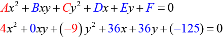 
    <math xmlns="http://www.w3.org/1998/Math/MathML"> <mrow> <mi>A</mi><mo>=</mo><mn>4</mn><mtext> </mtext> </mrow> </math>
    
    and<math xmlns="http://www.w3.org/1998/Math/MathML"> <mrow> <mtext> </mtext><mi>C</mi><mo>=</mo><mn>−9</mn><mo>,</mo> </mrow> </math>
    
     so we observe that<math xmlns="http://www.w3.org/1998/Math/MathML"> <mrow> <mtext> </mtext><mi>A</mi><mtext> </mtext> </mrow> </math>
    
    and<math xmlns="http://www.w3.org/1998/Math/MathML"> <mrow> <mtext> </mtext><mi>C</mi><mtext>  </mtext> </mrow> </math>
    
    have opposite signs. The graph of this equation is a hyperbola.

2.  Rewriting the general form, we have  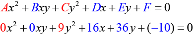 
    <math xmlns="http://www.w3.org/1998/Math/MathML"> <mrow> <mi>A</mi><mo>=</mo><mn>0</mn><mtext> </mtext> </mrow> </math>
    
    and<math xmlns="http://www.w3.org/1998/Math/MathML"> <mrow> <mtext> </mtext><mi>C</mi><mo>=</mo><mn>9.</mn><mtext>  </mtext> </mrow> </math>
    
    We can determine that the equation is a parabola, since<math xmlns="http://www.w3.org/1998/Math/MathML"> <mrow> <mtext> </mtext><mi>A</mi><mtext> </mtext> </mrow> </math>
    
    is zero.

3.  Rewriting the general form, we have  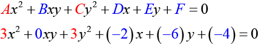 
    <math xmlns="http://www.w3.org/1998/Math/MathML"> <mrow> <mi>A</mi><mo>=</mo><mn>3</mn><mtext> </mtext> </mrow> </math>
    
    and<math xmlns="http://www.w3.org/1998/Math/MathML"> <mrow> <mtext> </mtext><mi>C</mi><mo>=</mo><mn>3.</mn><mtext> </mtext> </mrow> </math>
    
    Because<math xmlns="http://www.w3.org/1998/Math/MathML"> <mrow> <mtext> </mtext><mi>A</mi><mo>=</mo><mi>C</mi><mo>,</mo> </mrow> </math>
    
     the graph of this equation is a circle.

4.  Rewriting the general form, we have  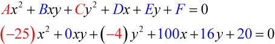 
    <math xmlns="http://www.w3.org/1998/Math/MathML"> <mrow> <mi>A</mi><mo>=</mo><mn>−25</mn><mtext> </mtext> </mrow> </math>
    
    and<math xmlns="http://www.w3.org/1998/Math/MathML"> <mrow> <mtext> </mtext><mi>C</mi><mo>=</mo><mn>−4.</mn><mtext> </mtext> </mrow> </math>
    
    Because<math xmlns="http://www.w3.org/1998/Math/MathML"> <mrow> <mtext> </mtext><mi>A</mi><mi>C</mi><mo>&gt;</mo><mn>0</mn><mtext> </mtext> </mrow> </math>
    
    and<math xmlns="http://www.w3.org/1998/Math/MathML"> <mrow> <mtext> </mtext><mi>A</mi><mo>≠</mo><mi>C</mi><mo>,</mo> </mrow> </math>
    
     the graph of this equation is an ellipse.
{: type="a"}

Identify the graph of each of the following nondegenerate conic sections.

1.  <math xmlns="http://www.w3.org/1998/Math/MathML"> <mrow> <mn>16</mn><msup> <mi>y</mi> <mn>2</mn> </msup> <mo>−</mo><msup> <mi>x</mi> <mn>2</mn> </msup> <mo>+</mo><mi>x</mi><mo>−</mo><mn>4</mn><mi>y</mi><mo>−</mo><mn>9</mn><mo>=</mo><mn>0</mn> </mrow> </math>

2.  <math xmlns="http://www.w3.org/1998/Math/MathML"> <mrow> <mn>16</mn><msup> <mi>x</mi> <mn>2</mn> </msup> <mo>+</mo><mn>4</mn><msup> <mi>y</mi> <mn>2</mn> </msup> <mo>+</mo><mn>16</mn><mi>x</mi><mo>+</mo><mn>49</mn><mi>y</mi><mo>−</mo><mn>81</mn><mo>=</mo><mn>0</mn> </mrow> </math>
{: type="a"}

1.  hyperbola
2.  ellipse
{: type="a"}

#### Finding a New Representation of the Given Equation after Rotating through a Given Angle

Until now, we have looked at equations of conic sections without an<math xmlns="http://www.w3.org/1998/Math/MathML"> <mrow> <mtext> </mtext><mi>x</mi><mi>y</mi><mtext> </mtext> </mrow> </math>

term, which aligns the graphs with the *x*- and *y*-axes. When we add an<math xmlns="http://www.w3.org/1998/Math/MathML"> <mrow> <mtext> </mtext><mi>x</mi><mi>y</mi><mtext> </mtext> </mrow> </math>

term, we are rotating the conic about the origin. If the *x*- and *y*-axes are rotated through an angle, say<math xmlns="http://www.w3.org/1998/Math/MathML"> <mrow> <mtext> </mtext><mi>θ</mi><mo>,</mo> </mrow> </math>

then every point on the plane may be thought of as having two representations:<math xmlns="http://www.w3.org/1998/Math/MathML"> <mrow> <mtext> </mtext><mrow><mo>(</mo> <mrow> <mi>x</mi><mo>,</mo><mi>y</mi> </mrow> <mo>)</mo></mrow><mtext> </mtext> </mrow> </math>

on the Cartesian plane with the original *x*-axis and *y*-axis, and<math xmlns="http://www.w3.org/1998/Math/MathML"> <mrow> <mtext> </mtext><mrow><mo>(</mo> <mrow> <msup> <mi>x</mi> <mo>′</mo> </msup> <mo>,</mo><msup> <mi>y</mi> <mo>′</mo> </msup> </mrow> <mo>)</mo></mrow><mtext> </mtext></mrow> </math>

on the new plane defined by the new, rotated axes, called the *x\'*-axis and *y\'*-axis. See [\[link\]](#Figure_10_04_003).

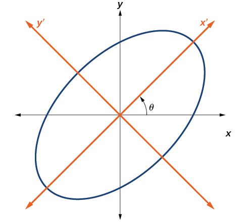{: #Figure_10_04_003}

We will find the relationships between<math xmlns="http://www.w3.org/1998/Math/MathML"> <mrow> <mtext> </mtext><mi>x</mi><mtext> </mtext> </mrow> </math>

and<math xmlns="http://www.w3.org/1998/Math/MathML"> <mrow> <mtext> </mtext><mi>y</mi><mtext> </mtext> </mrow> </math>

on the Cartesian plane with<math xmlns="http://www.w3.org/1998/Math/MathML"> <mrow> <mtext> </mtext><msup> <mi>x</mi> <mo>′</mo> </msup> <mtext> </mtext> </mrow> </math>

and<math xmlns="http://www.w3.org/1998/Math/MathML"> <mrow> <mtext> </mtext><msup> <mi>y</mi> <mo>′</mo> </msup> <mtext> </mtext> </mrow> </math>

on the new rotated plane. See [\[link\]](#Figure_10_04_004).

 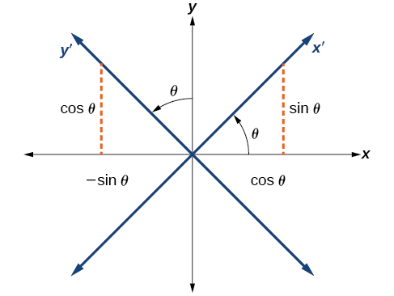{: #Figure_10_04_004}

The original coordinate *x*- and *y*-axes have unit vectors<math xmlns="http://www.w3.org/1998/Math/MathML"> <mrow> <mtext> </mtext><mi>i</mi><mtext> </mtext> </mrow> </math>

and<math xmlns="http://www.w3.org/1998/Math/MathML"> <mrow> <mtext> </mtext><mi>j</mi><mtext>  </mtext> </mrow><mo>.</mo> </math>

The rotated coordinate axes have unit vectors<math xmlns="http://www.w3.org/1998/Math/MathML"> <mrow> <mtext> </mtext><msup> <mi>i</mi> <mo>′</mo> </msup> <mtext> </mtext> </mrow> </math>

and<math xmlns="http://www.w3.org/1998/Math/MathML"> <mrow> <mtext> </mtext><msup> <mi>j</mi> <mo>′</mo> </msup> <mo>.</mo> </mrow> </math>

The angle<math xmlns="http://www.w3.org/1998/Math/MathML"> <mrow> <mtext> </mtext><mi>θ</mi><mtext> </mtext> </mrow> </math>

is known as the **angle of rotation**{: data-type="term"}. See [\[link\]](#Figure_10_04_005). We may write the new unit vectors in terms of the original ones.

<math xmlns="http://www.w3.org/1998/Math/MathML" display="block"> <mrow> <mtable columnalign="left"> <mtr columnalign="left"> <mtd columnalign="left"> <mrow> <msup> <mi>i</mi> <mo>′</mo> </msup> <mo>=</mo><mi>cos</mi><mtext> </mtext><mi>θ</mi><mi>i</mi><mo>+</mo><mi>sin</mi><mtext> </mtext><mi>θ</mi><mi>j</mi> </mrow> </mtd> </mtr> <mtr columnalign="left"> <mtd columnalign="left"> <mrow> <msup> <mi>j</mi> <mo>′</mo> </msup> <mo>=</mo><mo>−</mo><mi>sin</mi><mtext> </mtext><mi>θ</mi><mi>i</mi><mo>+</mo><mi>cos</mi><mtext> </mtext><mi>θ</mi><mi>j</mi> </mrow> </mtd> </mtr> </mtable> </mrow> </math>

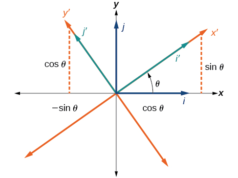{: #Figure_10_04_005}

Consider a vector<strong><math xmlns="http://www.w3.org/1998/Math/MathML">
 <mrow>
  <mtext> </mtext><mi>u</mi><mtext> </mtext>
 </mrow>
</math></strong>in the new coordinate plane. It may be represented in terms of its coordinate axes.

<math xmlns="http://www.w3.org/1998/Math/MathML" display="block"> <mrow> <mtable columnalign="left"> <mtr columnalign="left"> <mtd columnalign="left"> <mrow> <mi>u</mi><mo>=</mo><msup> <mi>x</mi> <mo>′</mo> </msup> <msup> <mi>i</mi> <mo>′</mo> </msup> <mo>+</mo><msup> <mi>y</mi> <mo>′</mo> </msup> <msup> <mi>j</mi> <mo>′</mo> </msup> </mrow> </mtd> <mtd columnalign="left"> <mrow /> </mtd> </mtr> <mtr columnalign="left"> <mtd columnalign="left"> <mrow> <mi>u</mi><mo>=</mo><msup> <mi>x</mi> <mo>′</mo> </msup> <mo stretchy="false">(</mo><mi>i</mi><mtext> </mtext><mi>cos</mi><mtext> </mtext><mi>θ</mi><mo>+</mo><mi>j</mi><mtext> </mtext><mi>sin</mi><mtext> </mtext><mi>θ</mi><mo stretchy="false">)</mo><mo>+</mo><msup> <mi>y</mi> <mo>′</mo> </msup> <mo stretchy="false">(</mo><mo>−</mo><mi>i</mi><mtext> </mtext><mi>sin</mi><mtext> </mtext><mi>θ</mi><mo>+</mo><mi>j</mi><mtext> </mtext><mi>cos</mi><mtext> </mtext><mi>θ</mi><mo stretchy="false">)</mo> </mrow> </mtd> <mtd columnalign="left"> <mrow> <mtable> <mtr> <mtd> <mrow /> </mtd> <mtd> <mrow /> </mtd> <mtd> <mrow /> </mtd> <mtd> <mrow /> </mtd> </mtr> </mtable><mtext>Substitute</mtext><mo>.</mo> </mrow> </mtd> </mtr> <mtr columnalign="left"> <mtd columnalign="left"> <mrow> <mi>u</mi><mo>=</mo><mi>i</mi><mi>x</mi><mo>'</mo><mtext> </mtext><mi>cos</mi><mtext> </mtext><mi>θ</mi><mo>+</mo><mi>j</mi><mi>x</mi><mo>'</mo><mtext> </mtext><mi>sin</mi><mtext> </mtext><mi>θ</mi><mo>−</mo><mi>i</mi><mi>y</mi><mo>'</mo><mtext> </mtext><mi>sin</mi><mtext> </mtext><mi>θ</mi><mo>+</mo><mi>j</mi><mi>y</mi><mo>'</mo><mtext> </mtext><mi>cos</mi><mtext> </mtext><mi>θ</mi> </mrow> </mtd> <mtd columnalign="left"> <mrow> <mtable> <mtr> <mtd> <mrow /> </mtd> <mtd> <mrow /> </mtd> <mtd> <mrow /> </mtd> <mtd> <mrow /> </mtd> </mtr> </mtable><mtext>Distribute</mtext><mo>.</mo> </mrow> </mtd> </mtr> <mtr columnalign="left"> <mtd columnalign="left"> <mrow> <mi>u</mi><mo>=</mo><mi>i</mi><mi>x</mi><mo>'</mo><mtext> </mtext><mi>cos</mi><mtext> </mtext><mi>θ</mi><mo>−</mo><mi>i</mi><mi>y</mi><mo>'</mo><mtext> </mtext><mi>sin</mi><mtext> </mtext><mi>θ</mi><mo>+</mo><mi>j</mi><mi>x</mi><mo>'</mo><mtext> </mtext><mi>sin</mi><mtext> </mtext><mi>θ</mi><mo>+</mo><mi>j</mi><mi>y</mi><mo>'</mo><mtext> </mtext><mi>cos</mi><mtext> </mtext><mi>θ</mi> </mrow> </mtd> <mtd columnalign="left"> <mrow> <mtable> <mtr> <mtd> <mrow /> </mtd> <mtd> <mrow /> </mtd> <mtd> <mrow /> </mtd> <mtd> <mrow /> </mtd> </mtr> </mtable><mtext>Apply commutative property</mtext><mo>.</mo> </mrow> </mtd> </mtr> <mtr columnalign="left"> <mtd columnalign="left"> <mrow> <mi>u</mi><mo>=</mo><mo stretchy="false">(</mo><mi>x</mi><mo>'</mo><mtext> </mtext><mi>cos</mi><mtext> </mtext><mi>θ</mi><mo>−</mo><mi>y</mi><mo>'</mo><mtext> </mtext><mi>sin</mi><mtext> </mtext><mi>θ</mi><mo stretchy="false">)</mo><mi>i</mi><mo>+</mo><mo stretchy="false">(</mo><mi>x</mi><mo>'</mo><mtext> </mtext><mi>sin</mi><mtext> </mtext><mi>θ</mi><mo>+</mo><mi>y</mi><mo>'</mo><mtext> </mtext><mi>cos</mi><mtext> </mtext><mi>θ</mi><mo stretchy="false">)</mo><mi>j</mi> </mrow> </mtd> <mtd columnalign="left"> <mrow> <mtable> <mtr> <mtd> <mrow /> </mtd> <mtd> <mrow /> </mtd> <mtd> <mrow /> </mtd> <mtd> <mrow /> </mtd> </mtr> </mtable><mtext>Factor by grouping</mtext><mo>.</mo> </mrow> </mtd> </mtr> </mtable> </mrow> </math>

Because<math xmlns="http://www.w3.org/1998/Math/MathML"> <mrow> <mtext> </mtext><mi>u</mi><mo>=</mo><msup> <mi>x</mi> <mo>′</mo> </msup> <msup> <mi>i</mi> <mo>′</mo> </msup> <mo>+</mo><msup> <mi>y</mi> <mo>′</mo> </msup> <msup> <mi>j</mi> <mo>′</mo> </msup> <mo>,</mo> </mrow> </math>

 we have representations of<math xmlns="http://www.w3.org/1998/Math/MathML"> <mrow> <mtext> </mtext><mi>x</mi><mtext> </mtext> </mrow> </math>

and<math xmlns="http://www.w3.org/1998/Math/MathML"> <mrow> <mtext> </mtext><mi>y</mi><mtext> </mtext> </mrow> </math>

in terms of the new coordinate system.

<math xmlns="http://www.w3.org/1998/Math/MathML" display="block"> <mrow> <mtable> <mtr> <mtd> <mrow> <mi>x</mi><mo>=</mo><msup> <mi>x</mi> <mo>′</mo> </msup> <mi>cos</mi><mtext> </mtext><mi>θ</mi><mo>−</mo><msup> <mi>y</mi> <mo>′</mo> </msup> <mi>sin</mi><mtext> </mtext><mi>θ</mi> </mrow> </mtd> </mtr> <mtr> <mtd> <mrow> <mtext>and</mtext> </mrow> </mtd> </mtr> <mtr> <mtd> <mrow> <mi>y</mi><mo>=</mo><msup> <mi>x</mi> <mo>′</mo> </msup> <mi>sin</mi><mtext> </mtext><mi>θ</mi><mo>+</mo><msup> <mi>y</mi> <mo>′</mo> </msup> <mi>cos</mi><mtext> </mtext><mi>θ</mi> </mrow> </mtd> </mtr> </mtable> </mrow> </math>

Equations of Rotation

If a point<math xmlns="http://www.w3.org/1998/Math/MathML"> <mrow> <mtext> </mtext><mrow><mo>(</mo> <mrow> <mi>x</mi><mo>,</mo><mi>y</mi> </mrow> <mo>)</mo></mrow><mtext> </mtext> </mrow> </math>

on the Cartesian plane is represented on a new coordinate plane where the axes of rotation are formed by rotating an angle<math xmlns="http://www.w3.org/1998/Math/MathML"> <mrow> <mtext> </mtext><mi>θ</mi><mtext> </mtext> </mrow> </math>

from the positive *x*-axis, then the coordinates of the point with respect to the new axes are<math xmlns="http://www.w3.org/1998/Math/MathML"> <mrow> <mtext> </mtext><mrow><mo>(</mo> <mrow> <msup> <mi>x</mi> <mo>′</mo> </msup> <mo>,</mo><msup> <mi>y</mi> <mo>′</mo> </msup> </mrow> <mo>)</mo></mrow><mo>.</mo><mtext> </mtext> </mrow> </math>

We can use the following equations of rotation to define the relationship between<math xmlns="http://www.w3.org/1998/Math/MathML"> <mrow> <mtext> </mtext><mrow><mo>(</mo> <mrow> <mi>x</mi><mo>,</mo><mi>y</mi> </mrow> <mo>)</mo></mrow><mtext> </mtext> </mrow> </math>

and<math xmlns="http://www.w3.org/1998/Math/MathML"> <mrow> <mtext> </mtext><mrow><mo>(</mo> <mrow> <msup> <mi>x</mi> <mo>′</mo> </msup> <mo>,</mo><msup> <mi>y</mi> <mo>′</mo> </msup> </mrow> <mo>)</mo></mrow><mo>:</mo> </mrow> </math>

<math xmlns="http://www.w3.org/1998/Math/MathML" display="block"> <mrow> <mi>x</mi><mo>=</mo><msup> <mi>x</mi> <mo>′</mo> </msup> <mi>cos</mi><mtext> </mtext><mi>θ</mi><mo>−</mo><msup> <mi>y</mi> <mo>′</mo> </msup> <mi>sin</mi><mtext> </mtext><mi>θ</mi> </mrow> </math>

and

<math xmlns="http://www.w3.org/1998/Math/MathML" display="block"> <mrow> <mi>y</mi><mo>=</mo><msup> <mi>x</mi> <mo>′</mo> </msup> <mi>sin</mi><mtext> </mtext><mi>θ</mi><mo>+</mo><msup> <mi>y</mi> <mo>′</mo> </msup> <mi>cos</mi><mtext> </mtext><mi>θ</mi> </mrow> </math>

<strong>Given the equation of a conic, find a new representation after rotating through an angle. </strong>

1.  Find
    <math xmlns="http://www.w3.org/1998/Math/MathML"> <mrow> <mtext> </mtext><mi>x</mi><mtext> </mtext> </mrow> </math>
    
    and
    <math xmlns="http://www.w3.org/1998/Math/MathML"> <mrow> <mtext> </mtext><mi>y</mi><mtext> </mtext> </mrow> </math>
    
    where
    <math xmlns="http://www.w3.org/1998/Math/MathML"> <mrow> <mtext> </mtext><mi>x</mi><mo>=</mo><msup> <mi>x</mi> <mo>′</mo> </msup> <mi>cos</mi><mtext> </mtext><mi>θ</mi><mo>−</mo><msup> <mi>y</mi> <mo>′</mo> </msup> <mi>sin</mi><mtext> </mtext><mi>θ</mi><mtext> </mtext> </mrow> </math>
    
    and
    <math xmlns="http://www.w3.org/1998/Math/MathML"> <mrow> <mtext> </mtext><mi>y</mi><mo>=</mo><msup> <mi>x</mi> <mo>′</mo> </msup> <mi>sin</mi><mtext> </mtext><mi>θ</mi><mo>+</mo><msup> <mi>y</mi> <mo>′</mo> </msup> <mi>cos</mi><mtext> </mtext><mi>θ</mi><mo>.</mo> </mrow> </math>

2.  Substitute the expression for
    <math xmlns="http://www.w3.org/1998/Math/MathML"> <mrow> <mtext> </mtext><mi>x</mi><mtext> </mtext> </mrow> </math>
    
    and
    <math xmlns="http://www.w3.org/1998/Math/MathML"> <mrow> <mtext> </mtext><mi>y</mi><mtext> </mtext> </mrow> </math>
    
    into in the given equation, then simplify.
3.  Write the equations with
    <math xmlns="http://www.w3.org/1998/Math/MathML"> <mrow> <mtext> </mtext><msup> <mi>x</mi> <mo>′</mo> </msup> <mtext> </mtext> </mrow> </math>
    
    and
    <math xmlns="http://www.w3.org/1998/Math/MathML"> <mrow> <mtext> </mtext><msup> <mi>y</mi> <mo>′</mo> </msup> <mtext> </mtext> </mrow> </math>
    
    in standard form.
{: type="1"}

Finding a New Representation of an Equation after Rotating through a Given Angle

Find a new representation of the equation<math xmlns="http://www.w3.org/1998/Math/MathML"> <mrow> <mtext> </mtext><mn>2</mn><msup> <mi>x</mi> <mn>2</mn> </msup> <mo>−</mo><mi>x</mi><mi>y</mi><mo>+</mo><mn>2</mn><msup> <mi>y</mi> <mn>2</mn> </msup> <mo>−</mo><mn>30</mn><mo>=</mo><mn>0</mn><mtext> </mtext> </mrow> </math>

after rotating through an angle of<math xmlns="http://www.w3.org/1998/Math/MathML"> <mrow> <mtext> </mtext><mi>θ</mi><mo>=</mo><mn>45°</mn><mo>.</mo> </mrow> </math>

Find<math xmlns="http://www.w3.org/1998/Math/MathML"> <mrow> <mtext> </mtext><mi>x</mi><mtext> </mtext> </mrow> </math>

and<math xmlns="http://www.w3.org/1998/Math/MathML"> <mrow> <mtext> </mtext><mi>y</mi><mo>,</mo> </mrow> </math>

where<math xmlns="http://www.w3.org/1998/Math/MathML"> <mrow> <mtext> </mtext><mi>x</mi><mo>=</mo><msup> <mi>x</mi> <mo>′</mo> </msup> <mi>cos</mi><mtext> </mtext><mi>θ</mi><mo>−</mo><msup> <mi>y</mi> <mo>′</mo> </msup> <mi>sin</mi><mtext> </mtext><mi>θ</mi><mtext> </mtext> </mrow> </math>

and<math xmlns="http://www.w3.org/1998/Math/MathML"> <mrow> <mtext> </mtext><mi>y</mi><mo>=</mo><msup> <mi>x</mi> <mo>′</mo> </msup> <mi>sin</mi><mtext> </mtext><mi>θ</mi><mo>+</mo><msup> <mi>y</mi> <mo>′</mo> </msup> <mi>cos</mi><mtext> </mtext><mi>θ</mi><mo>.</mo> </mrow> </math>

Because<math xmlns="http://www.w3.org/1998/Math/MathML"> <mrow> <mtext> </mtext><mi>θ</mi><mo>=</mo><mn>45°</mn><mo>,</mo> </mrow> </math>

<math xmlns="http://www.w3.org/1998/Math/MathML" display="block"> <mrow> <mtable columnalign="left"> <mtr columnalign="left"> <mtd columnalign="left"> <mrow /> </mtd> </mtr> <mtr columnalign="left"> <mtd columnalign="left"> <mrow> <mi>x</mi><mo>=</mo><msup> <mi>x</mi> <mo>′</mo> </msup> <mi>cos</mi><mrow><mo>(</mo> <mrow> <mn>45°</mn></mrow> <mo>)</mo></mrow><mo>−</mo><msup> <mi>y</mi> <mo>′</mo> </msup> <mi>sin</mi><mrow><mo>(</mo> <mrow> <mn>45°</mn></mrow> <mo>)</mo></mrow></mrow> </mtd> </mtr> <mtr columnalign="left"> <mtd columnalign="left"> <mrow> <mi>x</mi><mo>=</mo><msup> <mi>x</mi> <mo>′</mo> </msup> <mrow><mo>(</mo> <mrow> <mfrac> <mn>1</mn> <mrow> <msqrt> <mn>2</mn> </msqrt> </mrow> </mfrac> </mrow> <mo>)</mo></mrow><mo>−</mo><msup> <mi>y</mi> <mo>′</mo> </msup> <mrow><mo>(</mo> <mrow> <mfrac> <mn>1</mn> <mrow> <msqrt> <mn>2</mn> </msqrt> </mrow> </mfrac> </mrow> <mo>)</mo></mrow></mrow> </mtd> </mtr> <mtr columnalign="left"> <mtd columnalign="left"> <mrow> <mi>x</mi><mo>=</mo><mfrac> <mrow> <msup> <mi>x</mi> <mo>′</mo> </msup> <mo>−</mo><msup> <mi>y</mi> <mo>′</mo> </msup> </mrow> <mrow> <msqrt> <mn>2</mn> </msqrt> </mrow> </mfrac> </mrow> </mtd> </mtr> </mtable></mrow> </math>

and

<math xmlns="http://www.w3.org/1998/Math/MathML" display="block"> <mtable columnalign="left"> <mtr> <mtd> <mrow /> </mtd> </mtr> <mtr> <mtd> <mtable columnalign="left"> <mtr columnalign="left"> <mtd columnalign="left"> <mrow> <mi>y</mi><mo>=</mo><msup> <mi>x</mi> <mo>′</mo> </msup> <mi>sin</mi><mo stretchy="false">(</mo><mn>45°</mn><mo stretchy="false">)</mo><mo>+</mo><msup> <mi>y</mi> <mo>′</mo> </msup> <mi>cos</mi><mo stretchy="false">(</mo><mn>45°</mn><mo stretchy="false">)</mo> </mrow> </mtd> </mtr> <mtr columnalign="left"> <mtd columnalign="left"> <mrow> <mi>y</mi><mo>=</mo><msup> <mi>x</mi> <mo>′</mo> </msup> <mrow><mo>(</mo> <mrow> <mfrac> <mn>1</mn> <mrow> <msqrt> <mn>2</mn> </msqrt> </mrow> </mfrac> </mrow> <mo>)</mo></mrow><mo>+</mo><msup> <mi>y</mi> <mo>′</mo> </msup> <mrow><mo>(</mo> <mrow> <mfrac> <mn>1</mn> <mrow> <msqrt> <mn>2</mn> </msqrt> </mrow> </mfrac> </mrow> <mo>)</mo></mrow> </mrow> </mtd> </mtr> <mtr columnalign="left"> <mtd columnalign="left"> <mrow> <mi>y</mi><mo>=</mo><mfrac> <mrow> <msup> <mi>x</mi> <mo>′</mo> </msup> <mo>+</mo><msup> <mi>y</mi> <mo>′</mo> </msup> </mrow> <mrow> <msqrt> <mn>2</mn> </msqrt> </mrow> </mfrac> </mrow> </mtd> </mtr> </mtable> </mtd> </mtr> </mtable> </math>

Substitute<math xmlns="http://www.w3.org/1998/Math/MathML"> <mrow> <mtext> </mtext><mi>x</mi><mo>=</mo><msup> <mi>x</mi> <mo>′</mo> </msup> <mi>cos</mi><mi>θ</mi><mo>−</mo><msup> <mi>y</mi> <mo>′</mo> </msup> <mi>sin</mi><mi>θ</mi><mtext> </mtext> </mrow> </math>

and<math xmlns="http://www.w3.org/1998/Math/MathML"> <mrow> <mtext> </mtext><mi>y</mi><mo>=</mo><msup> <mi>x</mi> <mo>′</mo> </msup> <mi>sin</mi><mtext> </mtext><mi>θ</mi><mo>+</mo><msup> <mi>y</mi> <mo>′</mo> </msup> <mi>cos</mi><mtext> </mtext><mi>θ</mi><mtext> </mtext> </mrow> </math>

into<math xmlns="http://www.w3.org/1998/Math/MathML"> <mrow> <mtext> </mtext><mn>2</mn><msup> <mi>x</mi> <mn>2</mn> </msup> <mo>−</mo><mi>x</mi><mi>y</mi><mo>+</mo><mn>2</mn><msup> <mi>y</mi> <mn>2</mn> </msup> <mo>−</mo><mn>30</mn><mo>=</mo><mn>0.</mn> </mrow> </math>

<math xmlns="http://www.w3.org/1998/Math/MathML" display="block"> <mrow> <mn>2</mn><msup> <mrow> <mrow><mo>(</mo> <mrow> <mfrac> <mrow> <msup> <mi>x</mi> <mo>′</mo> </msup> <mo>−</mo><msup> <mi>y</mi> <mo>′</mo> </msup> </mrow> <mrow> <msqrt> <mn>2</mn> </msqrt> </mrow> </mfrac> </mrow> <mo>)</mo></mrow> </mrow> <mn>2</mn> </msup> <mo>−</mo><mrow><mo>(</mo> <mrow> <mfrac> <mrow> <msup> <mi>x</mi> <mo>′</mo> </msup> <mo>−</mo><msup> <mi>y</mi> <mo>′</mo> </msup> </mrow> <mrow> <msqrt> <mn>2</mn> </msqrt> </mrow> </mfrac> </mrow> <mo>)</mo></mrow><mrow><mo>(</mo> <mrow> <mfrac> <mrow> <msup> <mi>x</mi> <mo>′</mo> </msup> <mo>+</mo><msup> <mi>y</mi> <mo>′</mo> </msup> </mrow> <mrow> <msqrt> <mn>2</mn> </msqrt> </mrow> </mfrac> </mrow> <mo>)</mo></mrow><mo>+</mo><mn>2</mn><msup> <mrow> <mrow><mo>(</mo> <mrow> <mfrac> <mrow> <msup> <mi>x</mi> <mo>′</mo> </msup> <mo>+</mo><msup> <mi>y</mi> <mo>′</mo> </msup> </mrow> <mrow> <msqrt> <mn>2</mn> </msqrt> </mrow> </mfrac> </mrow> <mo>)</mo></mrow> </mrow> <mn>2</mn> </msup> <mo>−</mo><mn>30</mn><mo>=</mo><mn>0</mn> </mrow> </math>

Simplify.

<math xmlns="http://www.w3.org/1998/Math/MathML" display="block"> <mrow> <mtable columnalign="left"> <mtr columnalign="left"> <mtd columnalign="left"> <mrow> <menclose notation="updiagonalstrike"> <mn>2</mn> </menclose> <mfrac> <mrow> <mo stretchy="false">(</mo><msup> <mi>x</mi> <mo>′</mo> </msup> <mo>−</mo><msup> <mi>y</mi> <mo>′</mo> </msup> <mo stretchy="false">)</mo><mo stretchy="false">(</mo><msup> <mi>x</mi> <mo>′</mo> </msup> <mo>−</mo><msup> <mi>y</mi> <mo>′</mo> </msup> <mo stretchy="false">)</mo> </mrow> <mrow> <menclose notation="updiagonalstrike"> <mn>2</mn> </menclose> </mrow> </mfrac> <mo>−</mo><mfrac> <mrow> <mo stretchy="false">(</mo><msup> <mi>x</mi> <mo>′</mo> </msup> <mo>−</mo><msup> <mi>y</mi> <mo>′</mo> </msup> <mo stretchy="false">)</mo><mo stretchy="false">(</mo><msup> <mi>x</mi> <mo>′</mo> </msup> <mo>+</mo><msup> <mi>y</mi> <mo>′</mo> </msup> <mo stretchy="false">)</mo> </mrow> <mn>2</mn> </mfrac> <mo>+</mo><menclose notation="updiagonalstrike"> <mn>2</mn> </menclose> <mfrac> <mrow> <mo stretchy="false">(</mo><msup> <mi>x</mi> <mo>′</mo> </msup> <mo>+</mo><msup> <mi>y</mi> <mo>′</mo> </msup> <mo stretchy="false">)</mo><mo stretchy="false">(</mo><msup> <mi>x</mi> <mo>′</mo> </msup> <mo>+</mo><msup> <mi>y</mi> <mo>′</mo> </msup> <mo stretchy="false">)</mo> </mrow> <mrow> <menclose notation="updiagonalstrike"> <mn>2</mn> </menclose> </mrow> </mfrac> <mo>−</mo><mn>30</mn><mo>=</mo><mn>0</mn> </mrow> </mtd> <mtd columnalign="left"> <mrow> <mtable> <mtr> <mtd> <mrow /> </mtd> <mtd> <mrow /> </mtd> <mtd> <mrow /> </mtd> <mtd> <mrow /> </mtd> </mtr> </mtable><mtext>FOIL method</mtext> </mrow> </mtd> </mtr> <mtr columnalign="left"> <mtd columnalign="left"> <mrow> <mtext>           </mtext><msup> <mi>x</mi> <mo>′</mo> </msup> <msup> <mrow /> <mn>2</mn> </msup> <msup> <mrow> <menclose notation="updiagonalstrike"> <mrow> <mo>−</mo><mn>2</mn><msup> <mi>x</mi> <mo>′</mo> </msup> <mi>y</mi> </mrow> </menclose> </mrow> <mo>′</mo> </msup> <mo>+</mo><msup> <mi>y</mi> <mo>′</mo> </msup> <msup> <mrow /> <mn>2</mn> </msup> <mo>−</mo><mfrac> <mrow> <mo stretchy="false">(</mo><msup> <mi>x</mi> <mo>′</mo> </msup> <msup> <mrow /> <mn>2</mn> </msup> <mo>−</mo><msup> <mi>y</mi> <mo>′</mo> </msup> <msup> <mrow /> <mn>2</mn> </msup> <mo stretchy="false">)</mo> </mrow> <mn>2</mn> </mfrac> <mo>+</mo><msup> <mi>x</mi> <mo>′</mo> </msup> <msup> <mrow /> <mn>2</mn> </msup> <menclose notation="updiagonalstrike"> <mrow> <mo>+</mo><mn>2</mn><msup> <mi>x</mi> <mo>′</mo> </msup> <msup> <mi>y</mi> <mo>′</mo> </msup> </mrow> </menclose> <mo>+</mo><msup> <mi>y</mi> <mo>′</mo> </msup> <msup> <mrow /> <mn>2</mn> </msup> <mo>−</mo><mn>30</mn><mo>=</mo><mn>0</mn> </mrow> </mtd> <mtd columnalign="left"> <mrow> <mtable> <mtr> <mtd> <mrow /> </mtd> <mtd> <mrow /> </mtd> <mtd> <mrow /> </mtd> <mtd> <mrow /> </mtd> </mtr> </mtable><mtext>Combine like terms</mtext><mo>.</mo> </mrow> </mtd> </mtr> <mtr columnalign="left"> <mtd columnalign="left"> <mrow> <mtext>                                                             </mtext><mn>2</mn><msup> <mi>x</mi> <mo>′</mo> </msup> <msup> <mrow /> <mn>2</mn> </msup> <mo>+</mo><mn>2</mn><msup> <mi>y</mi> <mo>′</mo> </msup> <msup> <mrow /> <mn>2</mn> </msup> <mo>−</mo><mfrac> <mrow> <mo stretchy="false">(</mo><msup> <mi>x</mi> <mo>′</mo> </msup> <msup> <mrow /> <mn>2</mn> </msup> <mo>−</mo><msup> <mi>y</mi> <mo>′</mo> </msup> <msup> <mrow /> <mn>2</mn> </msup> <mo stretchy="false">)</mo> </mrow> <mn>2</mn> </mfrac> <mo>=</mo><mn>30</mn> </mrow> </mtd> <mtd columnalign="left"> <mrow> <mtable> <mtr> <mtd> <mrow /> </mtd> <mtd> <mrow /> </mtd> <mtd> <mrow /> </mtd> <mtd> <mrow /> </mtd> </mtr> </mtable><mtext>Combine like terms</mtext><mo>.</mo> </mrow> </mtd> </mtr> <mtr columnalign="left"> <mtd columnalign="left"> <mrow> <mtext>                                                       </mtext><mn>2</mn><mrow><mo>(</mo> <mrow> <mn>2</mn><msup> <mi>x</mi> <mo>′</mo> </msup> <msup> <mrow /> <mn>2</mn> </msup> <mo>+</mo><mn>2</mn><msup> <mi>y</mi> <mo>′</mo> </msup> <msup> <mrow /> <mn>2</mn> </msup> <mo>−</mo><mfrac> <mrow> <mo stretchy="false">(</mo><msup> <mi>x</mi> <mo>′</mo> </msup> <msup> <mrow /> <mn>2</mn> </msup> <mo>−</mo><msup> <mi>y</mi> <mo>′</mo> </msup> <msup> <mrow /> <mn>2</mn> </msup> <mo stretchy="false">)</mo> </mrow> <mn>2</mn> </mfrac> </mrow> <mo>)</mo></mrow><mo>=</mo><mn>2</mn><mo stretchy="false">(</mo><mn>30</mn><mo stretchy="false">)</mo> </mrow> </mtd> <mtd columnalign="left"> <mrow> <mtable> <mtr> <mtd> <mrow /> </mtd> <mtd> <mrow /> </mtd> <mtd> <mrow /> </mtd> <mtd> <mrow /> </mtd> </mtr> </mtable><mtext>Multiply both sides by 2</mtext><mo>.</mo> </mrow> </mtd> </mtr> <mtr columnalign="left"> <mtd columnalign="left"> <mrow> <mtext>                                                              </mtext><mn>4</mn><msup> <mi>x</mi> <mo>′</mo> </msup> <msup> <mrow /> <mn>2</mn> </msup> <mo>+</mo><mn>4</mn><msup> <mi>y</mi> <mo>′</mo> </msup> <msup> <mrow /> <mn>2</mn> </msup> <mo>−</mo><mo stretchy="false">(</mo><msup> <mi>x</mi> <mo>′</mo> </msup> <msup> <mrow /> <mn>2</mn> </msup> <mo>−</mo><msup> <mi>y</mi> <mo>′</mo> </msup> <msup> <mrow /> <mn>2</mn> </msup> <mo stretchy="false">)</mo><mo>=</mo><mn>60</mn> </mrow> </mtd> <mtd columnalign="left"> <mrow> <mtable> <mtr> <mtd> <mrow /> </mtd> <mtd> <mrow /> </mtd> <mtd> <mrow /> </mtd> <mtd> <mrow /> </mtd> </mtr> </mtable><mtext>Simplify</mtext><mo>.</mo> </mrow> </mtd> </mtr> <mtr columnalign="left"> <mtd columnalign="left"> <mrow> <mtext>                                                                 </mtext><mn>4</mn><msup> <mi>x</mi> <mo>′</mo> </msup> <msup> <mrow /> <mn>2</mn> </msup> <mo>+</mo><mn>4</mn><msup> <mi>y</mi> <mo>′</mo> </msup> <msup> <mrow /> <mn>2</mn> </msup> <mo>−</mo><msup> <mi>x</mi> <mo>′</mo> </msup> <msup> <mrow /> <mn>2</mn> </msup> <mo>+</mo><msup> <mi>y</mi> <mo>′</mo> </msup> <msup> <mrow /> <mn>2</mn> </msup> <mo>=</mo><mn>60</mn> </mrow> </mtd> <mtd columnalign="left"> <mrow> <mtable> <mtr> <mtd> <mrow /> </mtd> <mtd> <mrow /> </mtd> <mtd> <mrow /> </mtd> <mtd> <mrow /> </mtd> </mtr> </mtable><mtext>Distribute</mtext><mo>.</mo> </mrow> </mtd> </mtr> <mtr columnalign="left"> <mtd columnalign="left"> <mrow> <mtext>                                                                                    </mtext><mfrac> <mrow> <mn>3</mn><msup> <mi>x</mi> <mo>′</mo> </msup> <msup> <mrow /> <mn>2</mn> </msup> </mrow> <mrow> <mn>60</mn> </mrow> </mfrac> <mo>+</mo><mfrac> <mrow> <mn>5</mn><msup> <mi>y</mi> <mo>′</mo> </msup> <msup> <mrow /> <mn>2</mn> </msup> </mrow> <mrow> <mn>60</mn> </mrow> </mfrac> <mo>=</mo><mfrac> <mrow> <mn>60</mn> </mrow> <mrow> <mn>60</mn> </mrow> </mfrac> </mrow> </mtd> <mtd columnalign="left"> <mrow> <mtable> <mtr> <mtd> <mrow /> </mtd> <mtd> <mrow /> </mtd> <mtd> <mrow /> </mtd> <mtd> <mrow /> </mtd> </mtr> </mtable><mtext>Set equal to 1</mtext><mo>.</mo> </mrow> </mtd> </mtr> </mtable> </mrow> </math>

Write the equations with<math xmlns="http://www.w3.org/1998/Math/MathML"> <mrow> <mtext> </mtext><msup> <mi>x</mi> <mo>′</mo> </msup> <mtext> </mtext> </mrow> </math>

and<math xmlns="http://www.w3.org/1998/Math/MathML"> <mrow> <mtext> </mtext><msup> <mi>y</mi> <mo>′</mo> </msup> <mtext> </mtext> </mrow> </math>

in the standard form.

<math xmlns="http://www.w3.org/1998/Math/MathML" display="block"> <mrow> <mfrac> <mrow> <msup> <msup> <mi>x</mi> <mo>′</mo> </msup> <mn>2</mn> </msup> </mrow> <mrow> <mn>20</mn> </mrow> </mfrac> <mo>+</mo><mfrac> <mrow> <msup> <msup> <mi>y</mi> <mo>′</mo> </msup> <mn>2</mn> </msup> </mrow> <mrow> <mn>12</mn> </mrow> </mfrac> <mo>=</mo><mn>1</mn> </mrow> </math>

This equation is an ellipse. [[link]](#Figure_10_04_006) shows the graph.

{: #Figure_10_04_006}

### Writing Equations of Rotated Conics in Standard Form

Now that we can find the standard form of a conic when we are given an angle of rotation, we will learn how to transform the equation of a conic given in the form<math xmlns="http://www.w3.org/1998/Math/MathML"> <mrow> <mtext> </mtext><mi>A</mi><msup> <mi>x</mi> <mn>2</mn> </msup> <mo>+</mo><mi>B</mi><mi>x</mi><mi>y</mi><mo>+</mo><mi>C</mi><msup> <mi>y</mi> <mn>2</mn> </msup> <mo>+</mo><mi>D</mi><mi>x</mi><mo>+</mo><mi>E</mi><mi>y</mi><mo>+</mo><mi>F</mi><mo>=</mo><mn>0</mn><mtext> </mtext> </mrow> </math>

into standard form by rotating the axes. To do so, we will rewrite the general form as an equation in the<math xmlns="http://www.w3.org/1998/Math/MathML"> <mrow> <mtext> </mtext><msup> <mi>x</mi> <mo>′</mo> </msup> <mtext> </mtext> </mrow> </math>

and<math xmlns="http://www.w3.org/1998/Math/MathML"> <mrow> <mtext> </mtext><msup> <mi>y</mi> <mo>′</mo> </msup> <mtext> </mtext> </mrow> </math>

coordinate system without the<math xmlns="http://www.w3.org/1998/Math/MathML"> <mrow> <mtext> </mtext><msup> <mi>x</mi> <mo>′</mo> </msup> <msup> <mi>y</mi> <mo>′</mo> </msup> <mtext> </mtext> </mrow> </math>

term, by rotating the axes by a measure of<math xmlns="http://www.w3.org/1998/Math/MathML"> <mrow> <mtext> </mtext><mi>θ</mi><mtext> </mtext> </mrow> </math>

that satisfies

<math xmlns="http://www.w3.org/1998/Math/MathML" display="block"> <mrow> <mi>cot</mi><mrow><mo>(</mo> <mrow> <mn>2</mn><mi>θ</mi> </mrow> <mo>)</mo></mrow><mo>=</mo><mfrac> <mrow> <mi>A</mi><mo>−</mo><mi>C</mi> </mrow> <mi>B</mi> </mfrac> </mrow> </math>

We have learned already that any conic may be represented by the second degree equation

<math xmlns="http://www.w3.org/1998/Math/MathML" display="block"> <mrow> <mi>A</mi><msup> <mi>x</mi> <mn>2</mn> </msup> <mo>+</mo><mi>B</mi><mi>x</mi><mi>y</mi><mo>+</mo><mi>C</mi><msup> <mi>y</mi> <mn>2</mn> </msup> <mo>+</mo><mi>D</mi><mi>x</mi><mo>+</mo><mi>E</mi><mi>y</mi><mo>+</mo><mi>F</mi><mo>=</mo><mn>0</mn> </mrow> </math>

where<math xmlns="http://www.w3.org/1998/Math/MathML"> <mrow> <mtext> </mtext><mi>A</mi><mo>,</mo><mi>B</mi><mo>,</mo> </mrow> </math>

and<math xmlns="http://www.w3.org/1998/Math/MathML"> <mrow> <mtext> </mtext><mi>C</mi><mtext> </mtext> </mrow> </math>

are not all zero. However, if<math xmlns="http://www.w3.org/1998/Math/MathML"> <mrow> <mtext> </mtext><mi>B</mi><mo>≠</mo><mn>0</mn><mo>,</mo> </mrow> </math>

 then we have an<math xmlns="http://www.w3.org/1998/Math/MathML"> <mrow> <mtext> </mtext><mi>x</mi><mi>y</mi><mtext> </mtext> </mrow> </math>

term that prevents us from rewriting the equation in standard form. To eliminate it, we can rotate the axes by an acute angle<math xmlns="http://www.w3.org/1998/Math/MathML"> <mrow> <mtext> </mtext><mi>θ</mi><mtext> </mtext> </mrow> </math>

where<math xmlns="http://www.w3.org/1998/Math/MathML"> <mrow> <mtext> </mtext><mi>cot</mi><mrow><mo>(</mo> <mrow> <mn>2</mn><mi>θ</mi> </mrow> <mo>)</mo></mrow><mo>=</mo><mfrac> <mrow> <mi>A</mi><mo>−</mo><mi>C</mi> </mrow> <mi>B</mi> </mfrac> <mo>.</mo> </mrow> </math>

* If
  <math xmlns="http://www.w3.org/1998/Math/MathML"> <mrow> <mtext> </mtext><mi>cot</mi><mo stretchy="false">(</mo><mn>2</mn><mi>θ</mi><mo stretchy="false">)</mo><mo>&gt;</mo><mn>0</mn><mo>,</mo> </mrow> </math>
  
  then
  <math xmlns="http://www.w3.org/1998/Math/MathML"> <mrow> <mtext> </mtext><mn>2</mn><mi>θ</mi><mtext> </mtext> </mrow> </math>
  
  is in the first quadrant, and
  <math xmlns="http://www.w3.org/1998/Math/MathML"> <mrow> <mtext> </mtext><mi>θ</mi><mtext> </mtext> </mrow> </math>
  
  is between
  <math xmlns="http://www.w3.org/1998/Math/MathML"> <mrow> <mtext> </mtext><mo stretchy="false">(</mo><mn>0°</mn><mo>,</mo><mn>45°</mn><mo stretchy="false">)</mo><mo>.</mo> </mrow> </math>

* If
  <math xmlns="http://www.w3.org/1998/Math/MathML"> <mrow> <mtext> </mtext><mi>cot</mi><mo stretchy="false">(</mo><mn>2</mn><mi>θ</mi><mo stretchy="false">)</mo><mo>&lt;</mo><mn>0</mn><mo>,</mo> </mrow> </math>
  
  then
  <math xmlns="http://www.w3.org/1998/Math/MathML"> <mrow> <mtext> </mtext><mn>2</mn><mi>θ</mi><mtext> </mtext> </mrow> </math>
  
  is in the second quadrant, and
  <math xmlns="http://www.w3.org/1998/Math/MathML"> <mrow> <mtext> </mtext><mi>θ</mi><mtext> </mtext> </mrow> </math>
  
  is between
  <math xmlns="http://www.w3.org/1998/Math/MathML"> <mrow> <mtext> </mtext><mo stretchy="false">(</mo><mn>45°</mn><mo>,</mo><mn>90°</mn><mo stretchy="false">)</mo><mo>.</mo> </mrow> </math>

* If
  <math xmlns="http://www.w3.org/1998/Math/MathML"> <mrow> <mtext> </mtext><mi>A</mi><mo>=</mo><mi>C</mi><mo>,</mo> </mrow> </math>
  
  then
  <math xmlns="http://www.w3.org/1998/Math/MathML"> <mrow> <mtext> </mtext><mi>θ</mi><mo>=</mo><mn>45°</mn><mo>.</mo> </mrow> </math>

**Given an equation for a conic in the<math xmlns="http://www.w3.org/1998/Math/MathML"> <mrow> <mtext> </mtext><msup> <mi>x</mi> <mo>′</mo> </msup> <msup> <mi>y</mi> <mo>′</mo> </msup> <mtext> </mtext> </mrow> </math>

system, rewrite the equation without the<math xmlns="http://www.w3.org/1998/Math/MathML"> <mrow> <mtext> </mtext><msup> <mi>x</mi> <mo>′</mo> </msup> <msup> <mi>y</mi> <mo>′</mo> </msup> <mtext> </mtext> </mrow> </math>

term in terms of<math xmlns="http://www.w3.org/1998/Math/MathML"> <mrow> <mtext> </mtext><msup> <mi>x</mi> <mo>′</mo> </msup> <mtext> </mtext> </mrow> </math>

and<math xmlns="http://www.w3.org/1998/Math/MathML"> <mrow> <mtext> </mtext><msup> <mi>y</mi> <mo>′</mo> </msup> <mo>,</mo> </mrow> </math>

where the<math xmlns="http://www.w3.org/1998/Math/MathML"> <mrow> <mtext> </mtext><msup> <mi>x</mi> <mo>′</mo> </msup> <mtext> </mtext> </mrow> </math>

and<math xmlns="http://www.w3.org/1998/Math/MathML"> <mrow> <mtext> </mtext><msup> <mi>y</mi> <mo>′</mo> </msup> <mtext> </mtext> </mrow> </math>

axes are rotations of the standard axes by<math xmlns="http://www.w3.org/1998/Math/MathML"> <mrow> <mtext> </mtext><mi>θ</mi><mtext> </mtext> </mrow> </math>

degrees.**

1.  Find
    <math xmlns="http://www.w3.org/1998/Math/MathML"> <mrow> <mtext> </mtext><mi>cot</mi><mo stretchy="false">(</mo><mn>2</mn><mi>θ</mi><mo stretchy="false">)</mo><mo>.</mo> </mrow> </math>

2.  Find
    <math xmlns="http://www.w3.org/1998/Math/MathML"> <mrow> <mtext> </mtext><mi>sin</mi><mtext> </mtext><mi>θ</mi><mtext> </mtext> </mrow> </math>
    
    and
    <math xmlns="http://www.w3.org/1998/Math/MathML"> <mrow> <mtext> </mtext><mi>cos</mi><mtext> </mtext><mi>θ</mi><mo>.</mo> </mrow> </math>

3.  Substitute
    <math xmlns="http://www.w3.org/1998/Math/MathML"> <mrow> <mtext> </mtext><mi>sin</mi><mtext> </mtext><mi>θ</mi><mtext> </mtext> </mrow> </math>
    
    and
    <math xmlns="http://www.w3.org/1998/Math/MathML"> <mrow> <mtext> </mtext><mi>cos</mi><mtext> </mtext><mi>θ</mi><mtext> </mtext> </mrow> </math>
    
    into
    <math xmlns="http://www.w3.org/1998/Math/MathML"> <mrow> <mtext> </mtext><mi>x</mi><mo>=</mo><msup> <mi>x</mi> <mo>′</mo> </msup> <mi>cos</mi><mtext> </mtext><mi>θ</mi><mo>−</mo><msup> <mi>y</mi> <mo>′</mo> </msup> <mi>sin</mi><mtext> </mtext><mi>θ</mi><mtext> </mtext> </mrow> </math>
    
    and
    <math xmlns="http://www.w3.org/1998/Math/MathML"> <mrow> <mtext> </mtext><mi>y</mi><mo>=</mo><msup> <mi>x</mi> <mo>′</mo> </msup> <mi>sin</mi><mtext> </mtext><mi>θ</mi><mo>+</mo><msup> <mi>y</mi> <mo>′</mo> </msup> <mi>cos</mi><mtext> </mtext><mi>θ</mi><mo>.</mo> </mrow> </math>

4.  Substitute the expression for
    <math xmlns="http://www.w3.org/1998/Math/MathML"> <mrow> <mtext> </mtext><mi>x</mi><mtext> </mtext> </mrow> </math>
    
    and
    <math xmlns="http://www.w3.org/1998/Math/MathML"> <mrow> <mtext> </mtext><mi>y</mi><mtext> </mtext> </mrow> </math>
    
    into in the given equation, and then simplify.
5.  Write the equations with
    <math xmlns="http://www.w3.org/1998/Math/MathML"> <mrow> <mtext> </mtext><msup> <mi>x</mi> <mo>′</mo> </msup> <mtext> </mtext> </mrow> </math>
    
    and
    <math xmlns="http://www.w3.org/1998/Math/MathML"> <mrow> <mtext> </mtext><msup> <mi>y</mi> <mo>′</mo> </msup> <mtext> </mtext> </mrow> </math>
    
    in the standard form with respect to the rotated axes.
{: type="1"}

Rewriting an Equation with respect to the *x′* and *y′* axes without the *x′y′* Term

Rewrite the equation<math xmlns="http://www.w3.org/1998/Math/MathML"> <mrow> <mtext> </mtext><mn>8</mn><msup> <mi>x</mi> <mn>2</mn> </msup> <mo>−</mo><mn>12</mn><mi>x</mi><mi>y</mi><mo>+</mo><mn>17</mn><msup> <mi>y</mi> <mn>2</mn> </msup> <mo>=</mo><mn>20</mn><mtext> </mtext> </mrow> </math>

in the<math xmlns="http://www.w3.org/1998/Math/MathML"> <mrow> <mtext> </mtext><msup> <mi>x</mi> <mo>′</mo> </msup> <msup> <mi>y</mi> <mo>′</mo> </msup> <mtext> </mtext> </mrow> </math>

system without an<math xmlns="http://www.w3.org/1998/Math/MathML"> <mrow> <mtext> </mtext><msup> <mi>x</mi> <mo>′</mo> </msup> <msup> <mi>y</mi> <mo>′</mo> </msup> <mtext> </mtext> </mrow> </math>

term.

First, we find<math xmlns="http://www.w3.org/1998/Math/MathML"> <mrow> <mtext> </mtext><mi>cot</mi><mo stretchy="false">(</mo><mn>2</mn><mi>θ</mi><mo stretchy="false">)</mo><mo>.</mo><mtext> </mtext> </mrow> </math>

See [[link]](#Figure_10_04_007).

<math xmlns="http://www.w3.org/1998/Math/MathML" display="block"> <mrow> <mtable columnalign="left"> <mtr columnalign="left"> <mtd columnalign="left"> <mrow> <mn>8</mn><msup> <mi>x</mi> <mn>2</mn> </msup> <mo>−</mo><mn>12</mn><mi>x</mi><mi>y</mi><mo>+</mo><mn>17</mn><msup> <mi>y</mi> <mn>2</mn> </msup> <mo>=</mo><mn>20</mn><mo stretchy="false">⇒</mo><mi>A</mi><mo>=</mo><mn>8</mn><mo>,</mo><mtext> </mtext><mi>B</mi><mo>=</mo><mo>−</mo><mn>12</mn><mtext> </mtext><mtext>and</mtext><mtext> </mtext><mi>C</mi><mo>=</mo><mn>17</mn></mrow> </mtd> </mtr> <mtr columnalign="left"> <mtd columnalign="left"> <mrow> <mtext>                 </mtext><mtext> </mtext><mtext> </mtext><mtext> </mtext><mi>cot</mi><mo stretchy="false">(</mo><mn>2</mn><mi>θ</mi><mo stretchy="false">)</mo><mo>=</mo><mfrac> <mrow> <mi>A</mi><mo>−</mo><mi>C</mi></mrow> <mi>B</mi> </mfrac> <mo>=</mo><mfrac> <mrow> <mn>8</mn><mo>−</mo><mn>17</mn></mrow> <mrow> <mo>−</mo><mn>12</mn></mrow> </mfrac> </mrow> </mtd> </mtr> <mtr columnalign="left"> <mtd columnalign="left"> <mrow> <mtext>                 </mtext><mtext> </mtext><mtext> </mtext><mtext> </mtext><mi>cot</mi><mo stretchy="false">(</mo><mn>2</mn><mi>θ</mi><mo stretchy="false">)</mo><mo>=</mo><mfrac> <mrow> <mo>−</mo><mn>9</mn></mrow> <mrow> <mo>−</mo><mn>12</mn></mrow> </mfrac> <mo>=</mo><mfrac> <mn>3</mn> <mn>4</mn> </mfrac> </mrow> </mtd> </mtr> </mtable></mrow> </math>

{: #Figure_10_04_007}

<math xmlns="http://www.w3.org/1998/Math/MathML" display="block"> <mrow> <mi>cot</mi><mrow><mo>(</mo> <mrow> <mn>2</mn><mi>θ</mi> </mrow> <mo>)</mo></mrow><mo>=</mo><mfrac> <mn>3</mn> <mn>4</mn> </mfrac> <mo>=</mo><mfrac> <mrow> <mtext>adjacent</mtext> </mrow> <mrow> <mtext>opposite</mtext> </mrow> </mfrac> </mrow> </math>

So the hypotenuse is

<math xmlns="http://www.w3.org/1998/Math/MathML" display="block"> <mrow> <mtable columnalign="right"> <mtr columnalign="right"> <mtd columnalign="right"> <mrow> <msup> <mn>3</mn> <mn>2</mn> </msup> <mo>+</mo><msup> <mn>4</mn> <mn>2</mn> </msup> <mo>=</mo><msup> <mi>h</mi> <mn>2</mn> </msup> </mrow> </mtd> </mtr> <mtr columnalign="right"> <mtd columnalign="right"> <mrow> <mn>9</mn><mo>+</mo><mn>16</mn><mo>=</mo><msup> <mi>h</mi> <mn>2</mn> </msup> </mrow> </mtd> </mtr> <mtr columnalign="right"> <mtd columnalign="right"> <mrow> <mn>25</mn><mo>=</mo><msup> <mi>h</mi> <mn>2</mn> </msup> </mrow> </mtd> </mtr> <mtr columnalign="right"> <mtd columnalign="right"> <mrow> <mi>h</mi><mo>=</mo><mn>5</mn><mtext> </mtext><mtext> </mtext><mtext> </mtext> </mrow> </mtd> </mtr> </mtable> </mrow> </math>

Next, we find<math xmlns="http://www.w3.org/1998/Math/MathML"> <mrow> <mtext> </mtext><mi>sin</mi><mtext> </mtext><mi>θ</mi> </mrow> </math>

 and <math xmlns="http://www.w3.org/1998/Math/MathML"> <mrow><mi>cos</mi><mtext> </mtext><mi>θ</mi><mo>.</mo> </mrow> </math>

<math xmlns="http://www.w3.org/1998/Math/MathML" display="block"> <mrow> <mtable columnalign="left"> <mtr columnalign="left"> <mtd columnalign="left"> <mrow> <mtable columnalign="left"> <mtr columnalign="left"> <mtd columnalign="left"> <mrow /> </mtd> </mtr> <mtr columnalign="left"> <mtd columnalign="left"> <mrow /> </mtd> </mtr> <mtr columnalign="left"> <mtd columnalign="left"> <mrow> <mi>sin</mi><mtext> </mtext><mi>θ</mi><mo>=</mo><msqrt> <mrow> <mfrac> <mrow> <mn>1</mn><mo>−</mo><mi>cos</mi><mo stretchy="false">(</mo><mn>2</mn><mi>θ</mi><mo stretchy="false">)</mo> </mrow> <mn>2</mn> </mfrac> </mrow> </msqrt> <mo>=</mo><msqrt> <mrow> <mfrac> <mrow> <mn>1</mn><mo>−</mo><mfrac> <mn>3</mn> <mn>5</mn> </mfrac> </mrow> <mn>2</mn> </mfrac> </mrow> </msqrt> <mo>=</mo><msqrt> <mrow> <mfrac> <mrow> <mfrac> <mn>5</mn> <mn>5</mn> </mfrac> <mo>−</mo><mfrac> <mn>3</mn> <mn>5</mn> </mfrac> </mrow> <mn>2</mn> </mfrac> </mrow> </msqrt> <mo>=</mo><msqrt> <mrow> <mfrac> <mrow> <mn>5</mn><mo>−</mo><mn>3</mn> </mrow> <mn>5</mn> </mfrac> <mo>⋅</mo><mfrac> <mn>1</mn> <mn>2</mn> </mfrac> </mrow> </msqrt> <mo>=</mo><msqrt> <mrow> <mfrac> <mn>2</mn> <mrow> <mn>10</mn> </mrow> </mfrac> </mrow> </msqrt> <mo>=</mo><msqrt> <mrow> <mfrac> <mn>1</mn> <mn>5</mn> </mfrac> </mrow> </msqrt> </mrow> </mtd> </mtr> </mtable> </mrow> </mtd> </mtr> <mtr columnalign="left"> <mtd columnalign="left"> <mrow> <mi>sin</mi><mtext> </mtext><mi>θ</mi><mo>=</mo><mfrac> <mn>1</mn> <mrow> <msqrt> <mn>5</mn> </msqrt> </mrow> </mfrac> </mrow> </mtd> </mtr> <mtr columnalign="left"> <mtd columnalign="left"> <mrow> <mi>cos</mi><mtext> </mtext><mi>θ</mi><mo>=</mo><msqrt> <mrow> <mfrac> <mrow> <mn>1</mn><mo>+</mo><mi>cos</mi><mo stretchy="false">(</mo><mn>2</mn><mi>θ</mi><mo stretchy="false">)</mo> </mrow> <mn>2</mn> </mfrac> </mrow> </msqrt> <mo>=</mo><msqrt> <mrow> <mfrac> <mrow> <mn>1</mn><mo>+</mo><mfrac> <mn>3</mn> <mn>5</mn> </mfrac> </mrow> <mn>2</mn> </mfrac> </mrow> </msqrt> <mo>=</mo><msqrt> <mrow> <mfrac> <mrow> <mfrac> <mn>5</mn> <mn>5</mn> </mfrac> <mo>+</mo><mfrac> <mn>3</mn> <mn>5</mn> </mfrac> </mrow> <mn>2</mn> </mfrac> </mrow> </msqrt> <mo>=</mo><msqrt> <mrow> <mfrac> <mrow> <mn>5</mn><mo>+</mo><mn>3</mn> </mrow> <mn>5</mn> </mfrac> <mo>⋅</mo><mfrac> <mn>1</mn> <mn>2</mn> </mfrac> </mrow> </msqrt> <mo>=</mo><msqrt> <mrow> <mfrac> <mn>8</mn> <mrow> <mn>10</mn> </mrow> </mfrac> </mrow> </msqrt> <mo>=</mo><msqrt> <mrow> <mfrac> <mn>4</mn> <mn>5</mn> </mfrac> </mrow> </msqrt> </mrow> </mtd> </mtr> <mtr columnalign="left"> <mtd columnalign="left"> <mrow> <mi>cos</mi><mtext> </mtext><mi>θ</mi><mo>=</mo><mfrac> <mn>2</mn> <mrow> <msqrt> <mn>5</mn> </msqrt> </mrow> </mfrac> </mrow> </mtd> </mtr> </mtable> </mrow> </math>

Substitute the values of<math xmlns="http://www.w3.org/1998/Math/MathML"> <mrow> <mtext> </mtext><mi>sin</mi><mtext> </mtext><mi>θ</mi><mtext> </mtext> </mrow> </math>

and<math xmlns="http://www.w3.org/1998/Math/MathML"> <mrow> <mtext> </mtext><mi>cos</mi><mtext> </mtext><mi>θ</mi><mtext> </mtext> </mrow> </math>

into<math xmlns="http://www.w3.org/1998/Math/MathML"> <mrow> <mtext> </mtext><mi>x</mi><mo>=</mo><msup> <mi>x</mi> <mo>′</mo> </msup> <mi>cos</mi><mtext> </mtext><mi>θ</mi><mo>−</mo><msup> <mi>y</mi> <mo>′</mo> </msup> <mi>sin</mi><mtext> </mtext><mi>θ</mi><mtext> </mtext> </mrow> </math>

and<math xmlns="http://www.w3.org/1998/Math/MathML"> <mrow> <mtext> </mtext><mi>y</mi><mo>=</mo><msup> <mi>x</mi> <mo>′</mo> </msup> <mi>sin</mi><mtext> </mtext><mi>θ</mi><mo>+</mo><msup> <mi>y</mi> <mo>′</mo> </msup> <mi>cos</mi><mtext> </mtext><mi>θ</mi><mo>.</mo> </mrow> </math>

<math xmlns="http://www.w3.org/1998/Math/MathML" display="block"> <mrow> <mtable columnalign="left"> <mtr columnalign="left"> <mtd columnalign="left"> <mrow /> </mtd> </mtr> <mtr columnalign="left"> <mtd columnalign="left"> <mrow> <mtable columnalign="left"> <mtr columnalign="left"> <mtd columnalign="left"> <mrow> <mi>x</mi><mo>=</mo><msup> <mi>x</mi> <mo>′</mo> </msup> <mi>cos</mi><mtext> </mtext><mi>θ</mi><mo>−</mo><msup> <mi>y</mi> <mo>′</mo> </msup> <mi>sin</mi><mtext> </mtext><mi>θ</mi></mrow> </mtd> </mtr> <mtr columnalign="left"> <mtd columnalign="left"> <mrow> <mi>x</mi><mo>=</mo><msup> <mi>x</mi> <mo>′</mo> </msup> <mrow><mo>(</mo> <mrow> <mfrac> <mn>2</mn> <mrow> <msqrt> <mn>5</mn> </msqrt> </mrow> </mfrac> </mrow> <mo>)</mo></mrow><mo>−</mo><msup> <mi>y</mi> <mo>′</mo> </msup> <mrow><mo>(</mo> <mrow> <mfrac> <mn>1</mn> <mrow> <msqrt> <mn>5</mn> </msqrt> </mrow> </mfrac> </mrow> <mo>)</mo></mrow></mrow> </mtd> </mtr> <mtr columnalign="left"> <mtd columnalign="left"> <mrow> <mi>x</mi><mo>=</mo><mfrac> <mrow> <mn>2</mn><msup> <mi>x</mi> <mo>′</mo> </msup> <mo>−</mo><msup> <mi>y</mi> <mo>′</mo> </msup> </mrow> <mrow> <msqrt> <mn>5</mn> </msqrt> </mrow> </mfrac> </mrow> </mtd> </mtr> </mtable></mrow> </mtd> </mtr> </mtable></mrow> </math>

and

<math xmlns="http://www.w3.org/1998/Math/MathML" display="block"> <mrow> <mtable columnalign="left"> <mtr columnalign="left"> <mtd columnalign="left"> <mrow> <mtable columnalign="left"> <mtr columnalign="left"> <mtd columnalign="left"> <mrow /> </mtd> </mtr> <mtr columnalign="left"> <mtd columnalign="left"> <mrow> <mi>y</mi><mo>=</mo><msup> <mi>x</mi> <mo>′</mo> </msup> <mi>sin</mi><mtext> </mtext><mi>θ</mi><mo>+</mo><msup> <mi>y</mi> <mo>′</mo> </msup> <mi>cos</mi><mtext> </mtext><mi>θ</mi></mrow> </mtd> </mtr> </mtable></mrow> </mtd> </mtr> <mtr columnalign="left"> <mtd columnalign="left"> <mrow> <mi>y</mi><mo>=</mo><msup> <mi>x</mi> <mo>′</mo> </msup> <mrow><mo>(</mo> <mrow> <mfrac> <mn>1</mn> <mrow> <msqrt> <mn>5</mn> </msqrt> </mrow> </mfrac> </mrow> <mo>)</mo></mrow><mo>+</mo><msup> <mi>y</mi> <mo>′</mo> </msup> <mrow><mo>(</mo> <mrow> <mfrac> <mn>2</mn> <mrow> <msqrt> <mn>5</mn> </msqrt> </mrow> </mfrac> </mrow> <mo>)</mo></mrow></mrow> </mtd> </mtr> <mtr columnalign="left"> <mtd columnalign="left"> <mrow> <mi>y</mi><mo>=</mo><mfrac> <mrow> <msup> <mi>x</mi> <mo>′</mo> </msup> <mo>+</mo><mn>2</mn><msup> <mi>y</mi> <mo>′</mo> </msup> </mrow> <mrow> <msqrt> <mn>5</mn> </msqrt> </mrow> </mfrac> </mrow> </mtd> </mtr> </mtable></mrow> </math>

Substitute the expressions for<math xmlns="http://www.w3.org/1998/Math/MathML"> <mrow> <mtext> </mtext><mi>x</mi><mtext> </mtext> </mrow> </math>

and<math xmlns="http://www.w3.org/1998/Math/MathML"> <mrow> <mtext> </mtext><mi>y</mi><mtext> </mtext> </mrow> </math>

into in the given equation, and then simplify.

<math xmlns="http://www.w3.org/1998/Math/MathML" display="block"> <mrow> <mtable columnalign="left"> <mtr columnalign="left"> <mtd columnalign="left"> <mrow> <mtext>                                  </mtext><mn>8</mn><msup> <mrow> <mrow><mo>(</mo> <mrow> <mfrac> <mrow> <mn>2</mn><msup> <mi>x</mi> <mo>′</mo> </msup> <mo>−</mo><msup> <mi>y</mi> <mo>′</mo> </msup> </mrow> <mrow> <msqrt> <mn>5</mn> </msqrt> </mrow> </mfrac> </mrow> <mo>)</mo></mrow> </mrow> <mn>2</mn> </msup> <mo>−</mo><mn>12</mn><mrow><mo>(</mo> <mrow> <mfrac> <mrow> <mn>2</mn><msup> <mi>x</mi> <mo>′</mo> </msup> <mo>−</mo><msup> <mi>y</mi> <mo>′</mo> </msup> </mrow> <mrow> <msqrt> <mn>5</mn> </msqrt> </mrow> </mfrac> </mrow> <mo>)</mo></mrow><mrow><mo>(</mo> <mrow> <mfrac> <mrow> <msup> <mi>x</mi> <mo>′</mo> </msup> <mo>+</mo><mn>2</mn><msup> <mi>y</mi> <mo>′</mo> </msup> </mrow> <mrow> <msqrt> <mn>5</mn> </msqrt> </mrow> </mfrac> </mrow> <mo>)</mo></mrow><mo>+</mo><mn>17</mn><msup> <mrow> <mrow><mo>(</mo> <mrow> <mfrac> <mrow> <msup> <mi>x</mi> <mo>′</mo> </msup> <mo>+</mo><mn>2</mn><msup> <mi>y</mi> <mo>′</mo> </msup> </mrow> <mrow> <msqrt> <mn>5</mn> </msqrt> </mrow> </mfrac> </mrow> <mo>)</mo></mrow> </mrow> <mn>2</mn> </msup> <mo>=</mo><mn>20</mn><mtext>    </mtext> </mrow> </mtd> </mtr> <mtr columnalign="left"> <mtd columnalign="left"> <mrow> <mtext> </mtext><mn>8</mn><mrow><mo>(</mo> <mrow> <mfrac> <mrow> <mo stretchy="false">(</mo><mn>2</mn><msup> <mi>x</mi> <mo>′</mo> </msup> <mo>−</mo><msup> <mi>y</mi> <mo>′</mo> </msup> <mo stretchy="false">)</mo><mo stretchy="false">(</mo><mn>2</mn><msup> <mi>x</mi> <mo>′</mo> </msup> <mo>−</mo><msup> <mi>y</mi> <mo>′</mo> </msup> <mo stretchy="false">)</mo> </mrow> <mn>5</mn> </mfrac> </mrow> <mo>)</mo></mrow><mo>−</mo><mn>12</mn><mrow><mo>(</mo> <mrow> <mfrac> <mrow> <mo stretchy="false">(</mo><mn>2</mn><msup> <mi>x</mi> <mo>′</mo> </msup> <mo>−</mo><msup> <mi>y</mi> <mo>′</mo> </msup> <mo stretchy="false">)</mo><mo stretchy="false">(</mo><msup> <mi>x</mi> <mo>′</mo> </msup> <mo>+</mo><mn>2</mn><msup> <mi>y</mi> <mo>′</mo> </msup> <mo stretchy="false">)</mo> </mrow> <mn>5</mn> </mfrac> </mrow> <mo>)</mo></mrow><mo>+</mo><mn>17</mn><mrow><mo>(</mo> <mrow> <mfrac> <mrow> <mo stretchy="false">(</mo><msup> <mi>x</mi> <mo>′</mo> </msup> <mo>+</mo><mn>2</mn><msup> <mi>y</mi> <mo>′</mo> </msup> <mo stretchy="false">)</mo><mo stretchy="false">(</mo><msup> <mi>x</mi> <mo>′</mo> </msup> <mo>+</mo><mn>2</mn><msup> <mi>y</mi> <mo>′</mo> </msup> <mo stretchy="false">)</mo> </mrow> <mn>5</mn> </mfrac> </mrow> <mo>)</mo></mrow><mo>=</mo><mn>20</mn><mtext>    </mtext> </mrow> </mtd> </mtr> <mtr columnalign="left"> <mtd columnalign="left"> <mrow> <mtext>   </mtext><mn>8</mn><mrow><mo>(</mo> <mrow> <mn>4</mn><msup> <mi>x</mi> <mo>′</mo> </msup> <msup> <mrow /> <mn>2</mn> </msup> <mo>−</mo><mn>4</mn><msup> <mi>x</mi> <mo>′</mo> </msup> <msup> <mi>y</mi> <mo>′</mo> </msup> <mo>+</mo><msup> <mi>y</mi> <mo>′</mo> </msup> <msup> <mrow /> <mn>2</mn> </msup> </mrow> <mo>)</mo></mrow><mo>−</mo><mn>12</mn><mrow><mo>(</mo> <mrow> <mn>2</mn><msup> <mi>x</mi> <mo>′</mo> </msup> <msup> <mrow /> <mn>2</mn> </msup> <mo>+</mo><mn>3</mn><msup> <mi>x</mi> <mo>′</mo> </msup> <msup> <mi>y</mi> <mo>′</mo> </msup> <mo>−</mo><mn>2</mn><msup> <mi>y</mi> <mo>′</mo> </msup> <msup> <mrow /> <mn>2</mn> </msup> </mrow> <mo>)</mo></mrow><mo>+</mo><mn>17</mn><mrow><mo>(</mo> <mrow> <msup> <mi>x</mi> <mo>′</mo> </msup> <msup> <mrow /> <mn>2</mn> </msup> <mo>+</mo><mn>4</mn><msup> <mi>x</mi> <mo>′</mo> </msup> <msup> <mi>y</mi> <mo>′</mo> </msup> <mo>+</mo><mn>4</mn><msup> <mi>y</mi> <mo>′</mo> </msup> <msup> <mrow /> <mn>2</mn> </msup> </mrow> <mo>)</mo></mrow><mo>=</mo><mn>100</mn> </mrow> </mtd> </mtr> <mtr columnalign="left"> <mtd columnalign="left"> <mrow> <mn>32</mn><msup> <mi>x</mi> <mo>′</mo> </msup> <msup> <mrow /> <mn>2</mn> </msup> <mo>−</mo><mn>32</mn><msup> <mi>x</mi> <mo>′</mo> </msup> <msup> <mi>y</mi> <mo>′</mo> </msup> <mo>+</mo><mn>8</mn><msup> <mi>y</mi> <mo>′</mo> </msup> <msup> <mrow /> <mn>2</mn> </msup> <mo>−</mo><mn>24</mn><msup> <mi>x</mi> <mo>′</mo> </msup> <msup> <mrow /> <mn>2</mn> </msup> <mo>−</mo><mn>36</mn><msup> <mi>x</mi> <mo>′</mo> </msup> <msup> <mi>y</mi> <mo>′</mo> </msup> <mo>+</mo><mn>24</mn><msup> <mi>y</mi> <mo>′</mo> </msup> <msup> <mrow /> <mn>2</mn> </msup> <mo>+</mo><mn>17</mn><msup> <mi>x</mi> <mo>′</mo> </msup> <msup> <mrow /> <mn>2</mn> </msup> <mo>+</mo><mn>68</mn><msup> <mi>x</mi> <mo>′</mo> </msup> <msup> <mi>y</mi> <mo>′</mo> </msup> <mo>+</mo><mn>68</mn><msup> <mi>y</mi> <mo>′</mo> </msup> <msup> <mrow /> <mn>2</mn> </msup> <mo>=</mo><mn>100</mn> </mrow> </mtd> </mtr> <mtr columnalign="left"> <mtd columnalign="left"> <mrow> <mtext>                                                                                                  </mtext><mn>25</mn><msup> <mi>x</mi> <mo>′</mo> </msup> <msup> <mrow /> <mn>2</mn> </msup> <mo>+</mo><mn>100</mn><msup> <mi>y</mi> <mo>′</mo> </msup> <msup> <mrow /> <mn>2</mn> </msup> <mo>=</mo><mn>100</mn><mtext>  </mtext> </mrow> </mtd> </mtr> <mtr columnalign="left"> <mtd columnalign="left"> <mrow> <mtext>                                                                                               </mtext><mfrac> <mrow> <mn>25</mn> </mrow> <mrow> <mn>100</mn> </mrow> </mfrac> <msup> <mi>x</mi> <mo>′</mo> </msup> <msup> <mrow /> <mn>2</mn> </msup> <mo>+</mo><mfrac> <mrow> <mn>100</mn> </mrow> <mrow> <mn>100</mn> </mrow> </mfrac> <msup> <mi>y</mi> <mo>′</mo> </msup> <msup> <mrow /> <mn>2</mn> </msup> <mo>=</mo><mfrac> <mrow> <mn>100</mn> </mrow> <mrow> <mn>100</mn> </mrow> </mfrac> <mo> </mo> </mrow> </mtd> </mtr> </mtable> </mrow> </math>

Write the equations with<math xmlns="http://www.w3.org/1998/Math/MathML"> <mrow> <mtext> </mtext><msup> <mi>x</mi> <mo>′</mo> </msup> <mtext> </mtext> </mrow> </math>

and<math xmlns="http://www.w3.org/1998/Math/MathML"> <mrow> <mtext> </mtext><msup> <mi>y</mi> <mo>′</mo> </msup> <mtext> </mtext> </mrow> </math>

in the standard form with respect to the new coordinate system.

<math xmlns="http://www.w3.org/1998/Math/MathML" display="block"> <mrow> <mfrac> <mrow> <msup> <msup> <mi>x</mi> <mo>′</mo> </msup> <mn>2</mn> </msup> </mrow> <mn>4</mn> </mfrac> <mo>+</mo><mfrac> <mrow> <msup> <msup> <mi>y</mi> <mo>′</mo> </msup> <mn>2</mn> </msup> </mrow> <mn>1</mn> </mfrac> <mo>=</mo><mn>1</mn> </mrow> </math>

[[link]](#Figure_10_04_008) shows the graph of the ellipse.

{: #Figure_10_04_008}

Rewrite the<math xmlns="http://www.w3.org/1998/Math/MathML"> <mrow> <mtext> </mtext><mn>13</mn><msup> <mi>x</mi> <mn>2</mn> </msup> <mo>−</mo><mn>6</mn><msqrt> <mn>3</mn> </msqrt> <mi>x</mi><mi>y</mi><mo>+</mo><mn>7</mn><msup> <mi>y</mi> <mn>2</mn> </msup> <mo>=</mo><mn>16</mn><mtext> </mtext> </mrow> </math>

in the<math xmlns="http://www.w3.org/1998/Math/MathML"> <mrow> <mtext> </mtext><msup> <mi>x</mi> <mo>′</mo> </msup> <msup> <mi>y</mi> <mo>′</mo> </msup> <mtext> </mtext> </mrow> </math>

system without the<math xmlns="http://www.w3.org/1998/Math/MathML"> <mrow> <mtext> </mtext><msup> <mi>x</mi> <mo>′</mo> </msup> <msup> <mi>y</mi> <mo>′</mo> </msup> <mtext> </mtext> </mrow> </math>

term.

<math xmlns="http://www.w3.org/1998/Math/MathML"> <mrow> <mfrac> <mrow> <msup> <msup> <mi>x</mi> <mo>′</mo> </msup> <mn>2</mn> </msup> </mrow> <mn>4</mn> </mfrac> <mo>+</mo><mfrac> <mrow> <msup> <msup> <mi>y</mi> <mo>′</mo> </msup> <mn>2</mn> </msup> </mrow> <mn>1</mn> </mfrac> <mo>=</mo><mn>1</mn> </mrow> </math>

Graphing an Equation That Has No *x′y′* Terms

Graph the following equation relative to the<math xmlns="http://www.w3.org/1998/Math/MathML"> <mrow> <mtext> </mtext><msup> <mi>x</mi> <mo>′</mo> </msup> <msup> <mi>y</mi> <mo>′</mo> </msup> <mtext> </mtext> </mrow> </math>

system:

<math xmlns="http://www.w3.org/1998/Math/MathML" display="block"> <mrow> <msup> <mi>x</mi> <mn>2</mn> </msup> <mo>+</mo><mn>12</mn><mi>x</mi><mi>y</mi><mo>−</mo><mn>4</mn><msup> <mi>y</mi> <mn>2</mn> </msup> <mo>=</mo><mn>30</mn> </mrow> </math>

First, we find<math xmlns="http://www.w3.org/1998/Math/MathML"> <mrow> <mtext> </mtext><mi>cot</mi><mrow><mo>(</mo> <mrow> <mn>2</mn><mi>θ</mi> </mrow> <mo>)</mo></mrow><mo>.</mo> </mrow> </math>

<math xmlns="http://www.w3.org/1998/Math/MathML"> <mrow> <msup> <mi>x</mi> <mn>2</mn> </msup> <mo>+</mo><mn>12</mn><mi>x</mi><mi>y</mi><mo>−</mo><mn>4</mn><msup> <mi>y</mi> <mn>2</mn> </msup> <mo>=</mo><mn>20</mn><mo stretchy="false">⇒</mo><mi>A</mi><mo>=</mo><mn>1</mn><mo>,</mo><mtext> </mtext><mi>B</mi><mo>=</mo><mn>12</mn><mo>,</mo><mtext>and </mtext><mi>C</mi><mo>=</mo><mn>−4</mn> </mrow> </math>

<math xmlns="http://www.w3.org/1998/Math/MathML" display="block"> <mrow> <mtable columnalign="left"> <mtr columnalign="left"> <mtd columnalign="left"> <mrow> <mi>cot</mi><mo stretchy="false">(</mo><mn>2</mn><mi>θ</mi><mo stretchy="false">)</mo><mo>=</mo><mfrac> <mrow> <mi>A</mi><mo>−</mo><mi>C</mi> </mrow> <mi>B</mi> </mfrac> </mrow> </mtd> </mtr> <mtr columnalign="left"> <mtd columnalign="left"> <mrow> <mi>cot</mi><mo stretchy="false">(</mo><mn>2</mn><mi>θ</mi><mo stretchy="false">)</mo><mo>=</mo><mfrac> <mrow> <mn>1</mn><mo>−</mo><mo stretchy="false">(</mo><mn>−4</mn><mo stretchy="false">)</mo> </mrow> <mrow> <mn>12</mn> </mrow> </mfrac> </mrow> </mtd> </mtr> <mtr columnalign="left"> <mtd columnalign="left"> <mrow> <mi>cot</mi><mo stretchy="false">(</mo><mn>2</mn><mi>θ</mi><mo stretchy="false">)</mo><mo>=</mo><mfrac> <mn>5</mn> <mrow> <mn>12</mn> </mrow> </mfrac> </mrow> </mtd> </mtr> </mtable> </mrow> </math>

Because<math xmlns="http://www.w3.org/1998/Math/MathML"> <mrow> <mtext> </mtext><mi>cot</mi><mrow><mo>(</mo> <mrow> <mn>2</mn><mi>θ</mi> </mrow> <mo>)</mo></mrow><mo>=</mo><mfrac> <mn>5</mn> <mrow> <mn>12</mn> </mrow> </mfrac> <mo>,</mo> </mrow> </math>

 we can draw a reference triangle as in [[link]](#Figure_10_04_009).

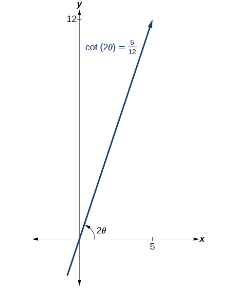{: #Figure_10_04_009}

<math xmlns="http://www.w3.org/1998/Math/MathML" display="block"> <mrow> <mi>cot</mi><mrow><mo>(</mo> <mrow> <mn>2</mn><mi>θ</mi> </mrow> <mo>)</mo></mrow><mo>=</mo><mfrac> <mn>5</mn> <mrow> <mn>12</mn> </mrow> </mfrac> <mo>=</mo><mfrac> <mrow> <mtext>adjacent</mtext> </mrow> <mrow> <mtext>opposite</mtext> </mrow> </mfrac> </mrow> </math>

Thus, the hypotenuse is

<math xmlns="http://www.w3.org/1998/Math/MathML" display="block"> <mrow> <mtable columnalign="right"> <mtr columnalign="right"> <mtd columnalign="right"> <mrow> <msup> <mn>5</mn> <mn>2</mn> </msup> <mo>+</mo><msup> <mrow> <mn>12</mn> </mrow> <mn>2</mn> </msup> <mo>=</mo><msup> <mi>h</mi> <mn>2</mn> </msup> </mrow> </mtd> </mtr> <mtr columnalign="right"> <mtd columnalign="right"> <mrow> <mn>25</mn><mo>+</mo><mn>144</mn><mo>=</mo><msup> <mi>h</mi> <mn>2</mn> </msup> </mrow> </mtd> </mtr> <mtr columnalign="right"> <mtd columnalign="right"> <mrow> <mn>169</mn><mo>=</mo><msup> <mi>h</mi> <mn>2</mn> </msup> </mrow> </mtd> </mtr> <mtr columnalign="right"> <mtd columnalign="right"> <mrow> <mi>h</mi><mo>=</mo><mn>13</mn> </mrow> </mtd> </mtr> </mtable> </mrow> </math>

Next, we find<math xmlns="http://www.w3.org/1998/Math/MathML"> <mrow> <mtext> </mtext><mi>sin</mi><mtext> </mtext><mi>θ</mi><mtext> </mtext> </mrow> </math>

and<math xmlns="http://www.w3.org/1998/Math/MathML"> <mrow> <mtext> </mtext><mi>cos</mi><mtext> </mtext><mi>θ</mi><mo>.</mo><mtext> </mtext> </mrow> </math>

We will use half-angle identities.

<math xmlns="http://www.w3.org/1998/Math/MathML" display="block"> <mrow> <mtable columnalign="left"> <mtr columnalign="left"> <mtd columnalign="left"> <mrow> <mtable columnalign="left"> <mtr columnalign="left"> <mtd columnalign="left"> <mrow /> </mtd> </mtr> <mtr columnalign="left"> <mtd columnalign="left"> <mrow /> </mtd> </mtr> <mtr columnalign="left"> <mtd columnalign="left"> <mrow> <mi>sin</mi><mtext> </mtext><mi>θ</mi><mo>=</mo><msqrt> <mrow> <mfrac> <mrow> <mn>1</mn><mo>−</mo><mi>cos</mi><mo stretchy="false">(</mo><mn>2</mn><mi>θ</mi><mo stretchy="false">)</mo> </mrow> <mn>2</mn> </mfrac> </mrow> </msqrt> <mo>=</mo><msqrt> <mrow> <mfrac> <mrow> <mn>1</mn><mo>−</mo><mfrac> <mn>5</mn> <mrow> <mn>13</mn> </mrow> </mfrac> </mrow> <mn>2</mn> </mfrac> </mrow> </msqrt> <mo>=</mo><msqrt> <mrow> <mfrac> <mrow> <mfrac> <mrow> <mn>13</mn> </mrow> <mrow> <mn>13</mn> </mrow> </mfrac> <mo>−</mo><mfrac> <mn>5</mn> <mrow> <mn>13</mn> </mrow> </mfrac> </mrow> <mn>2</mn> </mfrac> </mrow> </msqrt> <mo>=</mo><msqrt> <mrow> <mfrac> <mn>8</mn> <mrow> <mn>13</mn> </mrow> </mfrac> <mo>⋅</mo><mfrac> <mn>1</mn> <mn>2</mn> </mfrac> </mrow> </msqrt> <mo>=</mo><mfrac> <mn>2</mn> <mrow> <msqrt> <mrow> <mn>13</mn> </mrow> </msqrt> </mrow> </mfrac> </mrow> </mtd> </mtr> </mtable> </mrow> </mtd> </mtr> <mtr columnalign="left"> <mtd columnalign="left"> <mrow> <mi>cos</mi><mtext> </mtext><mi>θ</mi><mo>=</mo><msqrt> <mrow> <mfrac> <mrow> <mn>1</mn><mo>+</mo><mi>cos</mi><mo stretchy="false">(</mo><mn>2</mn><mi>θ</mi><mo stretchy="false">)</mo> </mrow> <mn>2</mn> </mfrac> </mrow> </msqrt> <mo>=</mo><msqrt> <mrow> <mfrac> <mrow> <mn>1</mn><mo>+</mo><mfrac> <mn>5</mn> <mrow> <mn>13</mn> </mrow> </mfrac> </mrow> <mn>2</mn> </mfrac> </mrow> </msqrt> <mo>=</mo><msqrt> <mrow> <mfrac> <mrow> <mfrac> <mrow> <mn>13</mn> </mrow> <mrow> <mn>13</mn> </mrow> </mfrac> <mo>+</mo><mfrac> <mn>5</mn> <mrow> <mn>13</mn> </mrow> </mfrac> </mrow> <mn>2</mn> </mfrac> </mrow> </msqrt> <mo>=</mo><msqrt> <mrow> <mfrac> <mrow> <mn>18</mn> </mrow> <mrow> <mn>13</mn> </mrow> </mfrac> <mo>⋅</mo><mfrac> <mn>1</mn> <mn>2</mn> </mfrac> </mrow> </msqrt> <mo>=</mo><mfrac> <mn>3</mn> <mrow> <msqrt> <mrow> <mn>13</mn> </mrow> </msqrt> </mrow> </mfrac> </mrow> </mtd> </mtr> </mtable> </mrow> </math>

Now we find<math xmlns="http://www.w3.org/1998/Math/MathML"> <mrow> <mtext> </mtext><mi>x</mi><mtext> </mtext> </mrow> </math>

and<math xmlns="http://www.w3.org/1998/Math/MathML"> <mrow> <mtext> </mtext><mi>y</mi><mtext>. </mtext> </mrow> </math>

<math xmlns="http://www.w3.org/1998/Math/MathML" display="block"> <mrow> <mtable columnalign="left"> <mtr columnalign="left"> <mtd columnalign="left"> <mrow /> </mtd> </mtr> <mtr columnalign="left"> <mtd columnalign="left"> <mrow> <mi>x</mi><mo>=</mo><msup> <mi>x</mi> <mo>′</mo> </msup> <mi>cos</mi><mtext> </mtext><mi>θ</mi><mo>−</mo><msup> <mi>y</mi> <mo>′</mo> </msup> <mi>sin</mi><mtext> </mtext><mi>θ</mi></mrow> </mtd> </mtr> <mtr columnalign="left"> <mtd columnalign="left"> <mrow> <mi>x</mi><mo>=</mo><msup> <mi>x</mi> <mo>′</mo> </msup> <mrow><mo>(</mo> <mrow> <mfrac> <mn>3</mn> <mrow> <msqrt> <mrow> <mn>13</mn></mrow> </msqrt> </mrow> </mfrac> </mrow> <mo>)</mo></mrow><mo>−</mo><msup> <mi>y</mi> <mo>′</mo> </msup> <mrow><mo>(</mo> <mrow> <mfrac> <mn>2</mn> <mrow> <msqrt> <mrow> <mn>13</mn></mrow> </msqrt> </mrow> </mfrac> </mrow> <mo>)</mo></mrow></mrow> </mtd> </mtr> <mtr columnalign="left"> <mtd columnalign="left"> <mrow> <mi>x</mi><mo>=</mo><mfrac> <mrow> <mn>3</mn><msup> <mi>x</mi> <mo>′</mo> </msup> <mo>−</mo><mn>2</mn><msup> <mi>y</mi> <mo>′</mo> </msup> </mrow> <mrow> <msqrt> <mrow> <mn>13</mn></mrow> </msqrt> </mrow> </mfrac> </mrow> </mtd> </mtr> </mtable></mrow> </math>

and

<math xmlns="http://www.w3.org/1998/Math/MathML" display="block"> <mrow> <mtable columnalign="left"> <mtr columnalign="left"> <mtd columnalign="left"> <mrow /> </mtd> </mtr> <mtr columnalign="left"> <mtd columnalign="left"> <mrow> <mi>y</mi><mo>=</mo><msup> <mi>x</mi> <mo>′</mo> </msup> <mi>sin</mi><mtext> </mtext><mi>θ</mi><mo>+</mo><msup> <mi>y</mi> <mo>′</mo> </msup> <mi>cos</mi><mtext> </mtext><mi>θ</mi></mrow> </mtd> </mtr> <mtr columnalign="left"> <mtd columnalign="left"> <mrow> <mi>y</mi><mo>=</mo><msup> <mi>x</mi> <mo>′</mo> </msup> <mrow><mo>(</mo> <mrow> <mfrac> <mn>2</mn> <mrow> <msqrt> <mrow> <mn>13</mn></mrow> </msqrt> </mrow> </mfrac> </mrow> <mo>)</mo></mrow><mo>+</mo><msup> <mi>y</mi> <mo>′</mo> </msup> <mrow><mo>(</mo> <mrow> <mfrac> <mn>3</mn> <mrow> <msqrt> <mrow> <mn>13</mn></mrow> </msqrt> </mrow> </mfrac> </mrow> <mo>)</mo></mrow></mrow> </mtd> </mtr> <mtr columnalign="left"> <mtd columnalign="left"> <mrow> <mi>y</mi><mo>=</mo><mfrac> <mrow> <mn>2</mn><msup> <mi>x</mi> <mo>′</mo> </msup> <mo>+</mo><mn>3</mn><msup> <mi>y</mi> <mo>′</mo> </msup> </mrow> <mrow> <msqrt> <mrow> <mn>13</mn></mrow> </msqrt> </mrow> </mfrac> </mrow> </mtd> </mtr> </mtable></mrow> </math>

Now we substitute<math xmlns="http://www.w3.org/1998/Math/MathML"> <mrow> <mtext> </mtext><mi>x</mi><mo>=</mo><mfrac> <mrow> <mn>3</mn><msup> <mi>x</mi> <mo>′</mo> </msup> <mo>−</mo><mn>2</mn><msup> <mi>y</mi> <mo>′</mo> </msup> </mrow> <mrow> <msqrt> <mrow> <mn>13</mn> </mrow> </msqrt> </mrow> </mfrac> <mtext> </mtext> </mrow> </math>

and<math xmlns="http://www.w3.org/1998/Math/MathML"> <mrow> <mtext> </mtext><mi>y</mi><mo>=</mo><mfrac> <mrow> <mn>2</mn><msup> <mi>x</mi> <mo>′</mo> </msup> <mo>+</mo><mn>3</mn><msup> <mi>y</mi> <mo>′</mo> </msup> </mrow> <mrow> <msqrt> <mrow> <mn>13</mn> </mrow> </msqrt> </mrow> </mfrac> <mtext> </mtext> </mrow> </math>

into<math xmlns="http://www.w3.org/1998/Math/MathML"> <mrow> <mtext> </mtext><msup> <mi>x</mi> <mn>2</mn> </msup> <mo>+</mo><mn>12</mn><mi>x</mi><mi>y</mi><mo>−</mo><mn>4</mn><msup> <mi>y</mi> <mn>2</mn> </msup> <mo>=</mo><mn>30.</mn> </mrow> </math>

<math xmlns="http://www.w3.org/1998/Math/MathML" display="block"> <mrow> <mtable columnalign="left"> <mtr columnalign="left"> <mtd columnalign="left"> <mrow> <mtext>                                        </mtext><msup> <mrow> <mrow><mo>(</mo> <mrow> <mfrac> <mrow> <mn>3</mn><msup> <mi>x</mi> <mo>′</mo> </msup> <mo>−</mo><mn>2</mn><msup> <mi>y</mi> <mo>′</mo> </msup> </mrow> <mrow> <msqrt> <mrow> <mn>13</mn></mrow> </msqrt> </mrow> </mfrac> </mrow> <mo>)</mo></mrow></mrow> <mn>2</mn> </msup> <mo>+</mo><mn>12</mn><mrow><mo>(</mo> <mrow> <mfrac> <mrow> <mn>3</mn><msup> <mi>x</mi> <mo>′</mo> </msup> <mo>−</mo><mn>2</mn><msup> <mi>y</mi> <mo>′</mo> </msup> </mrow> <mrow> <msqrt> <mrow> <mn>13</mn></mrow> </msqrt> </mrow> </mfrac> </mrow> <mo>)</mo></mrow><mrow><mo>(</mo> <mrow> <mfrac> <mrow> <mn>2</mn><msup> <mi>x</mi> <mo>′</mo> </msup> <mo>+</mo><mn>3</mn><msup> <mi>y</mi> <mo>′</mo> </msup> </mrow> <mrow> <msqrt> <mrow> <mn>13</mn></mrow> </msqrt> </mrow> </mfrac> </mrow> <mo>)</mo></mrow><mo>−</mo><mn>4</mn><msup> <mrow> <mrow><mo>(</mo> <mrow> <mfrac> <mrow> <mn>2</mn><msup> <mi>x</mi> <mo>′</mo> </msup> <mo>+</mo><mn>3</mn><msup> <mi>y</mi> <mo>′</mo> </msup> </mrow> <mrow> <msqrt> <mrow> <mn>13</mn></mrow> </msqrt> </mrow> </mfrac> </mrow> <mo>)</mo></mrow></mrow> <mn>2</mn> </msup> <mo>=</mo><mn>30</mn></mrow> </mtd> <mtd columnalign="left"> <mrow /> </mtd> <mtd columnalign="left"> <mrow /> </mtd> <mtd columnalign="left"> <mrow /> </mtd> </mtr> <mtr columnalign="left"> <mtd columnalign="left"> <mrow> <mtext>                                  </mtext><mtext> </mtext><mtext> </mtext><mrow><mo>(</mo> <mrow> <mfrac> <mn>1</mn> <mrow> <mn>13</mn></mrow> </mfrac> </mrow> <mo>)</mo></mrow><mrow><mo>[</mo> <mrow> <msup> <mrow> <mo stretchy="false">(</mo><mn>3</mn><msup> <mi>x</mi> <mo>′</mo> </msup> <mo>−</mo><mn>2</mn><msup> <mi>y</mi> <mo>′</mo> </msup> <mo stretchy="false">)</mo></mrow> <mn>2</mn> </msup> <mo>+</mo><mn>12</mn><mo stretchy="false">(</mo><mn>3</mn><msup> <mi>x</mi> <mo>′</mo> </msup> <mo>−</mo><mn>2</mn><msup> <mi>y</mi> <mo>′</mo> </msup> <mo stretchy="false">)</mo><mo stretchy="false">(</mo><mn>2</mn><msup> <mi>x</mi> <mo>′</mo> </msup> <mo>+</mo><mn>3</mn><msup> <mi>y</mi> <mo>′</mo> </msup> <mo stretchy="false">)</mo><mo>−</mo><mn>4</mn><msup> <mrow> <mo stretchy="false">(</mo><mn>2</mn><msup> <mi>x</mi> <mo>′</mo> </msup> <mo>+</mo><mn>3</mn><msup> <mi>y</mi> <mo>′</mo> </msup> <mo stretchy="false">)</mo></mrow> <mn>2</mn> </msup> </mrow> <mo>]</mo></mrow><mo>=</mo><mn>30</mn><mo> </mo></mrow> </mtd> <mtd columnalign="left"> <mrow /> </mtd> <mtd columnalign="left"> <mrow /> </mtd> <mtd columnalign="left"> <mrow> <mtext>Factor</mtext><mo>.</mo></mrow> </mtd> </mtr> <mtr columnalign="left"> <mtd columnalign="left"> <mrow> <mrow><mo>(</mo> <mrow> <mfrac> <mn>1</mn> <mrow> <mn>13</mn></mrow> </mfrac> </mrow> <mo>)</mo></mrow><mrow><mo>[</mo> <mrow> <mn>9</mn><msup> <mi>x</mi> <mo>′</mo> </msup> <msup> <mrow /> <mn>2</mn> </msup> <mo>−</mo><mn>12</mn><msup> <mi>x</mi> <mo>′</mo> </msup> <msup> <mi>y</mi> <mo>′</mo> </msup> <mo>+</mo><mn>4</mn><msup> <mi>y</mi> <mo>′</mo> </msup> <msup> <mrow /> <mn>2</mn> </msup> <mo>+</mo><mn>12</mn><mrow><mo>(</mo> <mrow> <mn>6</mn><msup> <mi>x</mi> <mo>′</mo> </msup> <msup> <mrow /> <mn>2</mn> </msup> <mo>+</mo><mn>5</mn><msup> <mi>x</mi> <mo>′</mo> </msup> <msup> <mi>y</mi> <mo>′</mo> </msup> <mo>−</mo><mn>6</mn><msup> <mi>y</mi> <mo>′</mo> </msup> <msup> <mrow /> <mn>2</mn> </msup> </mrow> <mo>)</mo></mrow><mo>−</mo><mn>4</mn><mrow><mo>(</mo> <mrow> <mn>4</mn><msup> <mi>x</mi> <mo>′</mo> </msup> <msup> <mrow /> <mn>2</mn> </msup> <mo>+</mo><mn>12</mn><msup> <mi>x</mi> <mo>′</mo> </msup> <msup> <mi>y</mi> <mo>′</mo> </msup> <mo>+</mo><mn>9</mn><msup> <mi>y</mi> <mo>′</mo> </msup> <msup> <mrow /> <mn>2</mn> </msup> </mrow> <mo>)</mo></mrow></mrow> <mo>]</mo></mrow><mo>=</mo><mn>30</mn></mrow> </mtd> <mtd columnalign="left"> <mrow /> </mtd> <mtd columnalign="left"> <mrow /> </mtd> <mtd columnalign="left"> <mrow> <mtext>Multiply</mtext><mo>.</mo></mrow> </mtd> </mtr> <mtr columnalign="left"> <mtd columnalign="left"> <mrow> <mtext>  </mtext><mrow><mo>(</mo> <mrow> <mfrac> <mn>1</mn> <mrow> <mn>13</mn></mrow> </mfrac> </mrow> <mo>)</mo></mrow><mrow><mo>[</mo> <mrow> <mn>9</mn><msup> <mi>x</mi> <mo>′</mo> </msup> <msup> <mrow /> <mn>2</mn> </msup> <mo>−</mo><mn>12</mn><msup> <mi>x</mi> <mo>′</mo> </msup> <msup> <mi>y</mi> <mo>′</mo> </msup> <mo>+</mo><mn>4</mn><msup> <mi>y</mi> <mo>′</mo> </msup> <msup> <mrow /> <mn>2</mn> </msup> <mo>+</mo><mn>72</mn><msup> <mi>x</mi> <mo>′</mo> </msup> <msup> <mrow /> <mn>2</mn> </msup> <mo>+</mo><mn>60</mn><msup> <mi>x</mi> <mo>′</mo> </msup> <msup> <mi>y</mi> <mo>′</mo> </msup> <mo>−</mo><mn>72</mn><msup> <mi>y</mi> <mo>′</mo> </msup> <msup> <mrow /> <mn>2</mn> </msup> <mo>−</mo><mn>16</mn><msup> <mi>x</mi> <mo>′</mo> </msup> <msup> <mrow /> <mn>2</mn> </msup> <mo>−</mo><mn>48</mn><msup> <mi>x</mi> <mo>′</mo> </msup> <msup> <mi>y</mi> <mo>′</mo> </msup> <mo>−</mo><mn>36</mn><msup> <mi>y</mi> <mo>′</mo> </msup> <msup> <mrow /> <mn>2</mn> </msup> </mrow> <mo>]</mo></mrow><mo>=</mo><mn>30</mn></mrow> </mtd> <mtd columnalign="left"> <mrow /> </mtd> <mtd columnalign="left"> <mrow /> </mtd> <mtd columnalign="left"> <mrow> <mtext>Distribute</mtext><mo>.</mo></mrow> </mtd> </mtr> <mtr columnalign="left"> <mtd columnalign="left"> <mrow> <mtext>                                                                                                </mtext><mtext> </mtext><mtext> </mtext><mrow><mo>(</mo> <mrow> <mfrac> <mn>1</mn> <mrow> <mn>13</mn></mrow> </mfrac> </mrow> <mo>)</mo></mrow><mrow><mo>[</mo> <mrow> <mn>65</mn><msup> <mi>x</mi> <mo>′</mo> </msup> <msup> <mrow /> <mn>2</mn> </msup> <mo>−</mo><mn>104</mn><msup> <mi>y</mi> <mo>′</mo> </msup> <msup> <mrow /> <mn>2</mn> </msup> </mrow> <mo>]</mo></mrow><mo>=</mo><mn>30</mn></mrow> </mtd> <mtd columnalign="left"> <mrow /> </mtd> <mtd columnalign="left"> <mrow /> </mtd> <mtd columnalign="left"> <mrow> <mtext>Combine like terms</mtext><mo>.</mo></mrow> </mtd> </mtr> <mtr columnalign="left"> <mtd columnalign="left"> <mrow> <mtext>                                                                                                           </mtext><mn>65</mn><msup> <mi>x</mi> <mo>′</mo> </msup> <msup> <mrow /> <mn>2</mn> </msup> <mo>−</mo><mn>104</mn><msup> <mi>y</mi> <mo>′</mo> </msup> <msup> <mrow /> <mn>2</mn> </msup> <mo>=</mo><mn>390</mn></mrow> </mtd> <mtd columnalign="left"> <mrow /> </mtd> <mtd columnalign="left"> <mrow /> </mtd> <mtd columnalign="left"> <mrow> <mtext>Multiply</mtext><mo>.</mo><mtext>                </mtext></mrow> </mtd> </mtr> <mtr columnalign="left"> <mtd columnalign="left"> <mrow> <mtext>                                                                                                                  </mtext><mfrac> <mrow> <msup> <mi>x</mi> <mo>′</mo> </msup> <msup> <mrow /> <mn>2</mn> </msup> </mrow> <mn>6</mn> </mfrac> <mo>−</mo><mfrac> <mrow> <mn>4</mn><msup> <mi>y</mi> <mo>′</mo> </msup> <msup> <mrow /> <mn>2</mn> </msup> </mrow> <mrow> <mn>15</mn></mrow> </mfrac> <mo>=</mo><mn>1</mn><mo> </mo></mrow> </mtd> <mtd columnalign="left"> <mrow /> </mtd> <mtd columnalign="left"> <mrow /> </mtd> <mtd columnalign="left"> <mrow> <mtext>Divide by 390</mtext><mo>.</mo></mrow> </mtd> </mtr> </mtable></mrow> </math>

[[link]](#Figure_10_04_010) shows the graph of the hyperbola<math xmlns="http://www.w3.org/1998/Math/MathML"> <mrow> <mtext> </mtext><mfrac> <mrow> <msup> <msup> <mi>x</mi> <mo>′</mo> </msup> <mn>2</mn> </msup> </mrow> <mn>6</mn> </mfrac> <mo>−</mo><mfrac> <mrow> <mn>4</mn><msup> <msup> <mi>y</mi> <mo>′</mo> </msup> <mn>2</mn> </msup> </mrow> <mrow> <mn>15</mn> </mrow> </mfrac> <mo>=</mo><mn>1.</mn><mtext>      </mtext> </mrow> </math>

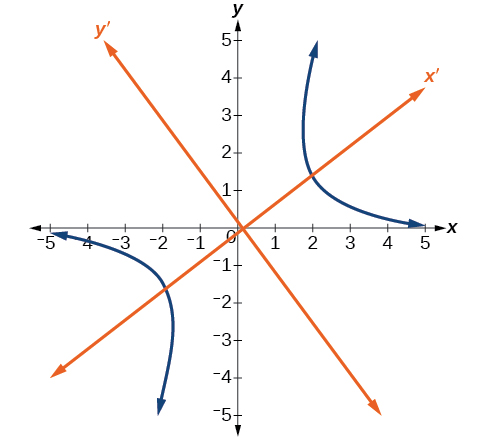{: #Figure_10_04_010}

###  Identifying Conics without Rotating Axes

Now we have come full circle. How do we identify the type of conic described by an equation? What happens when the axes are rotated? Recall, the general form of a conic is

<math xmlns="http://www.w3.org/1998/Math/MathML" display="block"> <mrow> <mi>A</mi><msup> <mi>x</mi> <mn>2</mn> </msup> <mo>+</mo><mi>B</mi><mi>x</mi><mi>y</mi><mo>+</mo><mi>C</mi><msup> <mi>y</mi> <mn>2</mn> </msup> <mo>+</mo><mi>D</mi><mi>x</mi><mo>+</mo><mi>E</mi><mi>y</mi><mo>+</mo><mi>F</mi><mo>=</mo><mn>0</mn> </mrow> </math>

If we apply the rotation formulas to this equation we get the form

<math xmlns="http://www.w3.org/1998/Math/MathML" display="block"> <mrow> <msup> <mi>A</mi> <mo>′</mo> </msup> <msup> <msup> <mi>x</mi> <mo>′</mo> </msup> <mn>2</mn> </msup> <mo>+</mo><msup> <mi>B</mi> <mo>′</mo> </msup> <msup> <mi>x</mi> <mo>′</mo> </msup> <msup> <mi>y</mi> <mo>′</mo> </msup> <mo>+</mo><msup> <mi>C</mi> <mo>′</mo> </msup> <msup> <msup> <mi>y</mi> <mo>′</mo> </msup> <mn>2</mn> </msup> <mo>+</mo><msup> <mi>D</mi> <mo>′</mo> </msup> <msup> <mi>x</mi> <mo>′</mo> </msup> <mo>+</mo><msup> <mi>E</mi> <mo>′</mo> </msup> <msup> <mi>y</mi> <mo>′</mo> </msup> <mo>+</mo><msup> <mi>F</mi> <mo>′</mo> </msup> <mo>=</mo><mn>0</mn> </mrow> </math>

It may be shown that<math xmlns="http://www.w3.org/1998/Math/MathML"> <mrow> <mtext> </mtext><msup> <mi>B</mi> <mn>2</mn> </msup> <mo>−</mo><mn>4</mn><mi>A</mi><mi>C</mi><mo>=</mo><msup> <msup> <mi>B</mi> <mo>′</mo> </msup> <mn>2</mn> </msup> <mo>−</mo><mn>4</mn><msup> <mi>A</mi> <mo>′</mo> </msup> <msup> <mi>C</mi> <mo>′</mo> </msup> <mo>.</mo><mtext> </mtext> </mrow> </math>

The expression does not vary after rotation, so we call the expression invariant**.** The discriminant,<math xmlns="http://www.w3.org/1998/Math/MathML"> <mrow> <mtext> </mtext><msup> <mi>B</mi> <mn>2</mn> </msup> <mo>−</mo><mn>4</mn><mi>A</mi><mi>C</mi><mo>,</mo> </mrow> </math>

 is invariant and remains unchanged after rotation. Because the discriminant remains unchanged, observing the discriminant enables us to identify the conic section.

Using the Discriminant to Identify a Conic

If the equation<math xmlns="http://www.w3.org/1998/Math/MathML"> <mrow> <mtext> </mtext><mi>A</mi><msup> <mi>x</mi> <mn>2</mn> </msup> <mo>+</mo><mi>B</mi><mi>x</mi><mi>y</mi><mo>+</mo><mi>C</mi><msup> <mi>y</mi> <mn>2</mn> </msup> <mo>+</mo><mi>D</mi><mi>x</mi><mo>+</mo><mi>E</mi><mi>y</mi><mo>+</mo><mi>F</mi><mo>=</mo><mn>0</mn><mtext> </mtext> </mrow> </math>

is transformed by rotating axes into the equation<math xmlns="http://www.w3.org/1998/Math/MathML"> <mrow> <mtext> </mtext><msup> <mi>A</mi> <mo>′</mo> </msup> <msup> <msup> <mi>x</mi> <mo>′</mo> </msup> <mn>2</mn> </msup> <mo>+</mo><msup> <mi>B</mi> <mo>′</mo> </msup> <msup> <mi>x</mi> <mo>′</mo> </msup> <msup> <mi>y</mi> <mo>′</mo> </msup> <mo>+</mo><msup> <mi>C</mi> <mo>′</mo> </msup> <msup> <msup> <mi>y</mi> <mo>′</mo> </msup> <mn>2</mn> </msup> <mo>+</mo><msup> <mi>D</mi> <mo>′</mo> </msup> <msup> <mi>x</mi> <mo>′</mo> </msup> <mo>+</mo><msup> <mi>E</mi> <mo>′</mo> </msup> <msup> <mi>y</mi> <mo>′</mo> </msup> <mo>+</mo><msup> <mi>F</mi> <mo>′</mo> </msup> <mo>=</mo><mn>0</mn><mo>,</mo> </mrow> </math>

 then<math xmlns="http://www.w3.org/1998/Math/MathML"> <mrow> <mtext> </mtext><msup> <mi>B</mi> <mn>2</mn> </msup> <mo>−</mo><mn>4</mn><mi>A</mi><mi>C</mi><mo>=</mo><msup> <msup> <mi>B</mi> <mo>′</mo> </msup> <mn>2</mn> </msup> <mo>−</mo><mn>4</mn><msup> <mi>A</mi> <mo>′</mo> </msup> <msup> <mi>C</mi> <mo>′</mo> </msup> <mo>.</mo> </mrow> </math>

The equation<math xmlns="http://www.w3.org/1998/Math/MathML"> <mrow> <mtext> </mtext><mi>A</mi><msup> <mi>x</mi> <mn>2</mn> </msup> <mo>+</mo><mi>B</mi><mi>x</mi><mi>y</mi><mo>+</mo><mi>C</mi><msup> <mi>y</mi> <mn>2</mn> </msup> <mo>+</mo><mi>D</mi><mi>x</mi><mo>+</mo><mi>E</mi><mi>y</mi><mo>+</mo><mi>F</mi><mo>=</mo><mn>0</mn><mtext> </mtext> </mrow> </math>

is an ellipse, a parabola, or a hyperbola, or a degenerate case of one of these.

If the discriminant,<math xmlns="http://www.w3.org/1998/Math/MathML"> <mrow> <mtext> </mtext><msup> <mi>B</mi> <mn>2</mn> </msup> <mo>−</mo><mn>4</mn><mi>A</mi><mi>C</mi><mo>,</mo> </mrow> </math>

is

* <math xmlns="http://www.w3.org/1998/Math/MathML"> <mrow> <mo>&lt;</mo><mn>0</mn><mo>,</mo> </mrow> </math>
  
  the conic section is an ellipse
* <math xmlns="http://www.w3.org/1998/Math/MathML"> <mrow> <mo>=</mo><mn>0</mn><mo>,</mo> </mrow> </math>
  
  the conic section is a parabola
* <math xmlns="http://www.w3.org/1998/Math/MathML"> <mrow> <mo>&gt;</mo><mn>0</mn><mo>,</mo> </mrow> </math>
  
  the conic section is a hyperbola

Identifying the Conic without Rotating Axes

Identify the conic for each of the following without rotating axes.

1.  <math xmlns="http://www.w3.org/1998/Math/MathML"> <mrow> <mn>5</mn><msup> <mi>x</mi> <mn>2</mn> </msup> <mo>+</mo><mn>2</mn><msqrt> <mn>3</mn> </msqrt> <mi>x</mi><mi>y</mi><mo>+</mo><mn>2</mn><msup> <mi>y</mi> <mn>2</mn> </msup> <mo>−</mo><mn>5</mn><mo>=</mo><mn>0</mn> </mrow> </math>

2.  <math xmlns="http://www.w3.org/1998/Math/MathML"> <mrow> <mn>5</mn><msup> <mi>x</mi> <mn>2</mn> </msup> <mo>+</mo><mn>2</mn><msqrt> <mn>3</mn> </msqrt> <mi>x</mi><mi>y</mi><mo>+</mo><mn>12</mn><msup> <mi>y</mi> <mn>2</mn> </msup> <mo>−</mo><mn>5</mn><mo>=</mo><mn>0</mn> </mrow> </math>
{: type="a"}

1.  Let’s begin by determining
    <math xmlns="http://www.w3.org/1998/Math/MathML"> <mrow> <mtext> </mtext><mi>A</mi><mo>,</mo><mi>B</mi><mo>,</mo> </mrow> </math>
    
    and
    <math xmlns="http://www.w3.org/1998/Math/MathML"> <mrow> <mtext> </mtext><mi>C</mi><mo>.</mo> </mrow> </math>
    
    

    <math xmlns="http://www.w3.org/1998/Math/MathML" display="block"> <mrow> <munder> <mrow> <munder> <mn>5</mn> <mo>︸</mo> </munder> </mrow> <mi>A</mi> </munder> <msup> <mi>x</mi> <mn>2</mn> </msup> <mo>+</mo><munder> <mrow> <munder> <mrow> <mn>2</mn><msqrt> <mn>3</mn> </msqrt> </mrow> <mo>︸</mo> </munder> </mrow> <mi>B</mi> </munder> <mi>x</mi><mi>y</mi><mo>+</mo><munder> <mrow> <munder> <mn>2</mn> <mo>︸</mo> </munder> </mrow> <mi>C</mi> </munder> <msup> <mi>y</mi> <mn>2</mn> </msup> <mo>−</mo><mn>5</mn><mo>=</mo><mn>0</mn> </mrow> </math>
    

    
    Now, we find the discriminant.
    
    

    <math xmlns="http://www.w3.org/1998/Math/MathML" display="block"> <mrow> <mtable columnalign="left"> <mtr columnalign="left"> <mtd columnalign="left"> <mrow> <msup> <mi>B</mi> <mn>2</mn> </msup> <mo>−</mo><mn>4</mn><mi>A</mi><mi>C</mi><mo>=</mo><msup> <mrow> <mrow><mo>(</mo> <mrow> <mn>2</mn><msqrt> <mn>3</mn> </msqrt> </mrow> <mo>)</mo></mrow> </mrow> <mn>2</mn> </msup> <mo>−</mo><mn>4</mn><mo stretchy="false">(</mo><mn>5</mn><mo stretchy="false">)</mo><mo stretchy="false">(</mo><mn>2</mn><mo stretchy="false">)</mo> </mrow> </mtd> </mtr> <mtr columnalign="left"> <mtd columnalign="left"> <mrow> <mtext>                </mtext><mo>=</mo><mn>4</mn><mo stretchy="false">(</mo><mn>3</mn><mo stretchy="false">)</mo><mo>−</mo><mn>40</mn> </mrow> </mtd> </mtr> <mtr columnalign="left"> <mtd columnalign="left"> <mrow> <mtext>                </mtext><mo>=</mo><mn>12</mn><mo>−</mo><mn>40</mn> </mrow> </mtd> </mtr> <mtr columnalign="left"> <mtd columnalign="left"> <mrow> <mtext>                </mtext><mo>=</mo><mo>−</mo><mn>28</mn><mo>&lt;</mo><mn>0</mn> </mrow> </mtd> </mtr> </mtable> </mrow> </math>
    

    
    Therefore,<math xmlns="http://www.w3.org/1998/Math/MathML"> <mrow> <mtext> </mtext><mn>5</mn><msup> <mi>x</mi> <mn>2</mn> </msup> <mo>+</mo><mn>2</mn><msqrt> <mn>3</mn> </msqrt> <mi>x</mi><mi>y</mi><mo>+</mo><mn>2</mn><msup> <mi>y</mi> <mn>2</mn> </msup> <mo>−</mo><mn>5</mn><mo>=</mo><mn>0</mn><mtext>  </mtext> </mrow> </math>
    
    represents an ellipse.

2.  Again, let’s begin by determining
    <math xmlns="http://www.w3.org/1998/Math/MathML"> <mrow> <mtext> </mtext><mi>A</mi><mo>,</mo><mi>B</mi><mo>,</mo> </mrow> </math>
    
    and
    <math xmlns="http://www.w3.org/1998/Math/MathML"> <mrow> <mtext> </mtext><mi>C</mi><mo>.</mo> </mrow> </math>
    
    

    <math xmlns="http://www.w3.org/1998/Math/MathML" display="block"> <mrow> <munder> <munder> <mn>5</mn> <mo stretchy="true">︸</mo> </munder> <mi>A</mi> </munder> <msup> <mi>x</mi> <mn>2</mn> </msup> <mo>+</mo><munder> <munder> <mrow> <mn>2</mn><msqrt> <mn>3</mn> </msqrt> </mrow> <mo stretchy="true">︸</mo> </munder> <mi>B</mi> </munder> <mi>x</mi><mi>y</mi><mo>+</mo><munder> <munder> <mrow> <mn>12</mn> </mrow> <mo stretchy="true">︸</mo> </munder> <mi>C</mi> </munder> <msup> <mi>y</mi> <mn>2</mn> </msup> <mo>−</mo><mn>5</mn><mo>=</mo><mn>0</mn> </mrow> </math>
    

    
    Now, we find the discriminant.
    
    

    <math xmlns="http://www.w3.org/1998/Math/MathML" display="block"> <mrow> <mtable columnalign="left"> <mtr columnalign="left"> <mtd columnalign="left"> <mrow> <msup> <mi>B</mi> <mn>2</mn> </msup> <mo>−</mo><mn>4</mn><mi>A</mi><mi>C</mi><mo>=</mo><msup> <mrow> <mrow><mo>(</mo> <mrow> <mn>2</mn><msqrt> <mn>3</mn> </msqrt> </mrow> <mo>)</mo></mrow> </mrow> <mn>2</mn> </msup> <mo>−</mo><mn>4</mn><mo stretchy="false">(</mo><mn>5</mn><mo stretchy="false">)</mo><mo stretchy="false">(</mo><mn>12</mn><mo stretchy="false">)</mo> </mrow> </mtd> </mtr> <mtr columnalign="left"> <mtd columnalign="left"> <mrow> <mtext>                </mtext><mo>=</mo><mn>4</mn><mo stretchy="false">(</mo><mn>3</mn><mo stretchy="false">)</mo><mo>−</mo><mn>240</mn> </mrow> </mtd> </mtr> <mtr columnalign="left"> <mtd columnalign="left"> <mrow> <mtext>                </mtext><mo>=</mo><mn>12</mn><mo>−</mo><mn>240</mn> </mrow> </mtd> </mtr> <mtr columnalign="left"> <mtd columnalign="left"> <mrow> <mtext>                </mtext><mo>=</mo><mo>−</mo><mn>228</mn><mo>&lt;</mo><mn>0</mn> </mrow> </mtd> </mtr> </mtable> </mrow> </math>
    

    
    Therefore,<math xmlns="http://www.w3.org/1998/Math/MathML"> <mrow> <mtext> </mtext><mn>5</mn><msup> <mi>x</mi> <mn>2</mn> </msup> <mo>+</mo><mn>2</mn><msqrt> <mn>3</mn> </msqrt> <mi>x</mi><mi>y</mi><mo>+</mo><mn>12</mn><msup> <mi>y</mi> <mn>2</mn> </msup> <mo>−</mo><mn>5</mn><mo>=</mo><mn>0</mn><mtext>  </mtext> </mrow> </math>
    
    represents an ellipse.
{: type="a"}

Identify the conic for each of the following without rotating axes.

1.  <math xmlns="http://www.w3.org/1998/Math/MathML"> <mrow> <msup> <mi>x</mi> <mn>2</mn> </msup> <mo>−</mo><mn>9</mn><mi>x</mi><mi>y</mi><mo>+</mo><mn>3</mn><msup> <mi>y</mi> <mn>2</mn> </msup> <mo>−</mo><mn>12</mn><mo>=</mo><mn>0</mn> </mrow> </math>

2.  <math xmlns="http://www.w3.org/1998/Math/MathML"> <mrow> <mn>10</mn><msup> <mi>x</mi> <mn>2</mn> </msup> <mo>−</mo><mn>9</mn><mi>x</mi><mi>y</mi><mo>+</mo><mn>4</mn><msup> <mi>y</mi> <mn>2</mn> </msup> <mo>−</mo><mn>4</mn><mo>=</mo><mn>0</mn> </mrow> </math>
{: type="a"}

1.  hyperbola
2.  ellipse
{: type="a"}

Access this online resource for additional instruction and practice with conic sections and rotation of axes.

* [Introduction to Conic Sections][1]

### Key Equations

| General Form equation of a conic section | <math xmlns="http://www.w3.org/1998/Math/MathML"> <mrow> <mi>A</mi><msup> <mi>x</mi> <mn>2</mn> </msup> <mo>+</mo><mi>B</mi><mi>x</mi><mi>y</mi><mo>+</mo><mi>C</mi><msup> <mi>y</mi> <mn>2</mn> </msup> <mo>+</mo><mi>D</mi><mi>x</mi><mo>+</mo><mi>E</mi><mi>y</mi><mo>+</mo><mi>F</mi><mo>=</mo><mn>0</mn> </mrow> </math>

 |
| Rotation of a conic section | <math xmlns="http://www.w3.org/1998/Math/MathML" display="block"> <mrow> <mtable columnalign="left"> <mtr columnalign="left"> <mtd columnalign="left"> <mrow> <mi>x</mi><mo>=</mo><msup> <mi>x</mi> <mo>′</mo> </msup> <mi>cos</mi><mtext> </mtext><mi>θ</mi><mo>−</mo><msup> <mi>y</mi> <mo>′</mo> </msup> <mi>sin</mi><mtext> </mtext><mi>θ</mi> </mrow> </mtd> </mtr> <mtr columnalign="left"> <mtd columnalign="left"> <mrow> <mi>y</mi><mo>=</mo><msup> <mi>x</mi> <mo>′</mo> </msup> <mi>sin</mi><mtext> </mtext><mi>θ</mi><mo>+</mo><msup> <mi>y</mi> <mo>′</mo> </msup> <mi>cos</mi><mtext> </mtext><mi>θ</mi> </mrow> </mtd> </mtr> </mtable> </mrow> </math>

 |
| Angle of rotation | <math xmlns="http://www.w3.org/1998/Math/MathML"> <mrow> <mi>θ</mi><mo>,</mo><mtext>where </mtext><mi>cot</mi><mrow><mo>(</mo> <mrow> <mn>2</mn><mi>θ</mi> </mrow> <mo>)</mo></mrow><mo>=</mo><mfrac> <mrow> <mi>A</mi><mo>−</mo><mi>C</mi> </mrow> <mi>B</mi> </mfrac> </mrow> </math>

 |
{: summary=".."}

### Key Concepts

* Four basic shapes can result from the intersection of a plane with a pair of right circular cones connected tail to tail. They include an ellipse, a circle, a hyperbola, and a parabola.
* A nondegenerate conic section has the general form
  <math xmlns="http://www.w3.org/1998/Math/MathML"> <mrow> <mtext> </mtext><mi>A</mi><msup> <mi>x</mi> <mn>2</mn> </msup> <mo>+</mo><mi>B</mi><mi>x</mi><mi>y</mi><mo>+</mo><mi>C</mi><msup> <mi>y</mi> <mn>2</mn> </msup> <mo>+</mo><mi>D</mi><mi>x</mi><mo>+</mo><mi>E</mi><mi>y</mi><mo>+</mo><mi>F</mi><mo>=</mo><mn>0</mn><mtext> </mtext> </mrow> </math>
  
  where
  <math xmlns="http://www.w3.org/1998/Math/MathML"> <mrow> <mtext> </mtext><mi>A</mi><mo>,</mo><mi>B</mi><mtext> </mtext> </mrow> </math>
  
  and
  <math xmlns="http://www.w3.org/1998/Math/MathML"> <mrow> <mtext> </mtext><mi>C</mi><mtext> </mtext> </mrow> </math>
  
  are not all zero. The values of
  <math xmlns="http://www.w3.org/1998/Math/MathML"> <mrow> <mtext> </mtext><mi>A</mi><mo>,</mo><mi>B</mi><mo>,</mo> </mrow> </math>
  
  and
  <math xmlns="http://www.w3.org/1998/Math/MathML"> <mrow> <mtext> </mtext><mi>C</mi><mtext> </mtext> </mrow> </math>
  
  determine the type of conic. See [\[link\]](#Example_10_04_01).
* Equations of conic sections with an
  <math xmlns="http://www.w3.org/1998/Math/MathML"> <mrow> <mtext> </mtext><mi>x</mi><mi>y</mi><mtext> </mtext> </mrow> </math>
  
  term have been rotated about the origin. See [\[link\]](#Example_10_04_02).
* The general form can be transformed into an equation in the
  <math xmlns="http://www.w3.org/1998/Math/MathML"> <mrow> <mtext> </mtext><msup> <mi>x</mi> <mo>′</mo> </msup> <mtext> </mtext> </mrow> </math>
  
  and
  <math xmlns="http://www.w3.org/1998/Math/MathML"> <mrow> <mtext> </mtext><msup> <mi>y</mi> <mo>′</mo> </msup> <mtext> </mtext> </mrow> </math>
  
  coordinate system without the
  <math xmlns="http://www.w3.org/1998/Math/MathML"> <mrow> <mtext> </mtext><msup> <mi>x</mi> <mo>′</mo> </msup> <msup> <mi>y</mi> <mo>′</mo> </msup> <mtext> </mtext> </mrow> </math>
  
  term. See [\[link\]](#Example_10_04_03) and [\[link\]](#Example_10_04_04).
* An expression is described as invariant if it remains unchanged after rotating. Because the discriminant is invariant, observing it enables us to identify the conic section. See [\[link\]](#Example_10_04_05).

### Section Exercises

#### Verbal

What effect does the<math xmlns="http://www.w3.org/1998/Math/MathML"> <mrow> <mtext> </mtext><mi>x</mi><mi>y</mi><mtext> </mtext> </mrow> </math>

term have on the graph of a conic section?

The<math xmlns="http://www.w3.org/1998/Math/MathML"> <mrow> <mtext> </mtext><mi>x</mi><mi>y</mi><mtext> </mtext> </mrow> </math>

term causes a rotation of the graph to occur.

If the equation of a conic section is written in the form<math xmlns="http://www.w3.org/1998/Math/MathML"> <mrow> <mtext> </mtext><mi>A</mi><msup> <mi>x</mi> <mn>2</mn> </msup> <mo>+</mo><mi>B</mi><msup> <mi>y</mi> <mn>2</mn> </msup> <mo>+</mo><mi>C</mi><mi>x</mi><mo>+</mo><mi>D</mi><mi>y</mi><mo>+</mo><mi>E</mi><mo>=</mo><mn>0</mn><mtext> </mtext> </mrow> </math>

and<math xmlns="http://www.w3.org/1998/Math/MathML"> <mrow> <mtext> </mtext><mi>A</mi><mi>B</mi><mo>=</mo><mn>0</mn><mo>,</mo> </mrow> </math>

 what can we conclude?

If the equation of a conic section is written in the form<math xmlns="http://www.w3.org/1998/Math/MathML"> <mrow> <mtext> </mtext><mi>A</mi><msup> <mi>x</mi> <mn>2</mn> </msup> <mo>+</mo><mi>B</mi><mi>x</mi><mi>y</mi><mo>+</mo><mi>C</mi><msup> <mi>y</mi> <mn>2</mn> </msup> <mo>+</mo><mi>D</mi><mi>x</mi><mo>+</mo><mi>E</mi><mi>y</mi><mo>+</mo><mi>F</mi><mo>=</mo><mn>0</mn><mo>,</mo> </mrow> </math>

and<math xmlns="http://www.w3.org/1998/Math/MathML"> <mrow> <mtext> </mtext><msup> <mi>B</mi> <mn>2</mn> </msup> <mo>−</mo><mn>4</mn><mi>A</mi><mi>C</mi><mo>&gt;</mo><mn>0</mn><mo>,</mo> </mrow> </math>

 what can we conclude?

The conic section is a hyperbola.

Given the equation<math xmlns="http://www.w3.org/1998/Math/MathML"> <mrow> <mtext> </mtext><mi>a</mi><msup> <mi>x</mi> <mn>2</mn> </msup> <mo>+</mo><mn>4</mn><mi>x</mi><mo>+</mo><mn>3</mn><msup> <mi>y</mi> <mn>2</mn> </msup> <mo>−</mo><mn>12</mn><mo>=</mo><mn>0</mn><mo>,</mo> </mrow> </math>

 what can we conclude if<math xmlns="http://www.w3.org/1998/Math/MathML"> <mrow> <mtext> </mtext><mi>a</mi><mo>&gt;</mo><mn>0</mn><mo>?</mo> </mrow> </math>

For the equation<math xmlns="http://www.w3.org/1998/Math/MathML"> <mrow> <mtext> </mtext><mi>A</mi><msup> <mi>x</mi> <mn>2</mn> </msup> <mo>+</mo><mi>B</mi><mi>x</mi><mi>y</mi><mo>+</mo><mi>C</mi><msup> <mi>y</mi> <mn>2</mn> </msup> <mo>+</mo><mi>D</mi><mi>x</mi><mo>+</mo><mi>E</mi><mi>y</mi><mo>+</mo><mi>F</mi><mo>=</mo><mn>0</mn><mo>,</mo> </mrow> </math>

 the value of<math xmlns="http://www.w3.org/1998/Math/MathML"> <mrow> <mtext> </mtext><mi>θ</mi><mtext> </mtext> </mrow> </math>

that satisfies<math xmlns="http://www.w3.org/1998/Math/MathML"> <mrow> <mtext> </mtext><mi>cot</mi><mrow><mo>(</mo> <mrow> <mn>2</mn><mi>θ</mi> </mrow> <mo>)</mo></mrow><mo>=</mo><mfrac> <mrow> <mi>A</mi><mo>−</mo><mi>C</mi> </mrow> <mi>B</mi> </mfrac> <mtext> </mtext> </mrow> </math>

gives us what information?

It gives the angle of rotation of the axes in order to eliminate the<math xmlns="http://www.w3.org/1998/Math/MathML"> <mrow> <mtext> </mtext><mi>x</mi><mi>y</mi><mtext> </mtext> </mrow> </math>

term.

####  Algebraic

For the following exercises, determine which conic section is represented based on the given equation.

<math xmlns="http://www.w3.org/1998/Math/MathML"> <mrow> <mn>9</mn><msup> <mi>x</mi> <mn>2</mn> </msup> <mo>+</mo><mn>4</mn><msup> <mi>y</mi> <mn>2</mn> </msup> <mo>+</mo><mn>72</mn><mi>x</mi><mo>+</mo><mn>36</mn><mi>y</mi><mo>−</mo><mn>500</mn><mo>=</mo><mn>0</mn> </mrow> </math>

<math xmlns="http://www.w3.org/1998/Math/MathML"> <mrow> <msup> <mi>x</mi> <mn>2</mn> </msup> <mo>−</mo><mn>10</mn><mi>x</mi><mo>+</mo><mn>4</mn><mi>y</mi><mo>−</mo><mn>10</mn><mo>=</mo><mn>0</mn> </mrow> </math>

<math xmlns="http://www.w3.org/1998/Math/MathML"> <mrow> <mi>A</mi><mi>B</mi><mo>=</mo><mn>0</mn><mo>,</mo> </mrow> </math>

 parabola

<math xmlns="http://www.w3.org/1998/Math/MathML"> <mrow> <mn>2</mn><msup> <mi>x</mi> <mn>2</mn> </msup> <mo>−</mo><mn>2</mn><msup> <mi>y</mi> <mn>2</mn> </msup> <mo>+</mo><mn>4</mn><mi>x</mi><mo>−</mo><mn>6</mn><mi>y</mi><mo>−</mo><mn>2</mn><mo>=</mo><mn>0</mn> </mrow> </math>

<math xmlns="http://www.w3.org/1998/Math/MathML"> <mrow> <mn>4</mn><msup> <mi>x</mi> <mn>2</mn> </msup> <mo>−</mo><msup> <mi>y</mi> <mn>2</mn> </msup> <mo>+</mo><mn>8</mn><mi>x</mi><mo>−</mo><mn>1</mn><mo>=</mo><mn>0</mn> </mrow> </math>

<math xmlns="http://www.w3.org/1998/Math/MathML"> <mrow> <mi>A</mi><mi>B</mi><mo>=</mo><mo>−</mo><mn>4</mn><mo>&lt;</mo><mn>0</mn><mo>,</mo> </mrow> </math>

 hyperbola

<math xmlns="http://www.w3.org/1998/Math/MathML"> <mrow> <mn>4</mn><msup> <mi>y</mi> <mn>2</mn> </msup> <mo>−</mo><mn>5</mn><mi>x</mi><mo>+</mo><mn>9</mn><mi>y</mi><mo>+</mo><mn>1</mn><mo>=</mo><mn>0</mn> </mrow> </math>

<math xmlns="http://www.w3.org/1998/Math/MathML"> <mrow> <mn>2</mn><msup> <mi>x</mi> <mn>2</mn> </msup> <mo>+</mo><mn>3</mn><msup> <mi>y</mi> <mn>2</mn> </msup> <mo>−</mo><mn>8</mn><mi>x</mi><mo>−</mo><mn>12</mn><mi>y</mi><mo>+</mo><mn>2</mn><mo>=</mo><mn>0</mn> </mrow> </math>

<math xmlns="http://www.w3.org/1998/Math/MathML"> <mrow> <mi>A</mi><mi>B</mi><mo>=</mo><mn>6</mn><mo>&gt;</mo><mn>0</mn><mo>,</mo> </mrow> </math>

 ellipse

<math xmlns="http://www.w3.org/1998/Math/MathML"> <mrow> <mn>4</mn><msup> <mi>x</mi> <mn>2</mn> </msup> <mo>+</mo><mn>9</mn><mi>x</mi><mi>y</mi><mo>+</mo><mn>4</mn><msup> <mi>y</mi> <mn>2</mn> </msup> <mo>−</mo><mn>36</mn><mi>y</mi><mo>−</mo><mn>125</mn><mo>=</mo><mn>0</mn> </mrow> </math>

<math xmlns="http://www.w3.org/1998/Math/MathML"> <mrow> <mn>3</mn><msup> <mi>x</mi> <mn>2</mn> </msup> <mo>+</mo><mn>6</mn><mi>x</mi><mi>y</mi><mo>+</mo><mn>3</mn><msup> <mi>y</mi> <mn>2</mn> </msup> <mo>−</mo><mn>36</mn><mi>y</mi><mo>−</mo><mn>125</mn><mo>=</mo><mn>0</mn> </mrow> </math>

<math xmlns="http://www.w3.org/1998/Math/MathML"> <mrow> <msup> <mi>B</mi> <mn>2</mn> </msup> <mo>−</mo><mn>4</mn><mi>A</mi><mi>C</mi><mo>=</mo><mn>0</mn><mo>,</mo> </mrow> </math>

 parabola

<math xmlns="http://www.w3.org/1998/Math/MathML"> <mrow> <mo>−</mo><mn>3</mn><msup> <mi>x</mi> <mn>2</mn> </msup> <mo>+</mo><mn>3</mn><msqrt> <mn>3</mn> </msqrt> <mi>x</mi><mi>y</mi><mo>−</mo><mn>4</mn><msup> <mi>y</mi> <mn>2</mn> </msup> <mo>+</mo><mn>9</mn><mo>=</mo><mn>0</mn> </mrow> </math>

<math xmlns="http://www.w3.org/1998/Math/MathML"> <mrow> <mn>2</mn><msup> <mi>x</mi> <mn>2</mn> </msup> <mo>+</mo><mn>4</mn><msqrt> <mn>3</mn> </msqrt> <mi>x</mi><mi>y</mi><mo>+</mo><mn>6</mn><msup> <mi>y</mi> <mn>2</mn> </msup> <mo>−</mo><mn>6</mn><mi>x</mi><mo>−</mo><mn>3</mn><mo>=</mo><mn>0</mn> </mrow> </math>

<math xmlns="http://www.w3.org/1998/Math/MathML"> <mrow> <msup> <mi>B</mi> <mn>2</mn> </msup> <mo>−</mo><mn>4</mn><mi>A</mi><mi>C</mi><mo>=</mo><mn>0</mn><mo>,</mo> </mrow> </math>

 parabola

<math xmlns="http://www.w3.org/1998/Math/MathML"> <mrow> <mo>−</mo><msup> <mi>x</mi> <mn>2</mn> </msup> <mo>+</mo><mn>4</mn><msqrt> <mn>2</mn> </msqrt> <mi>x</mi><mi>y</mi><mo>+</mo><mn>2</mn><msup> <mi>y</mi> <mn>2</mn> </msup> <mo>−</mo><mn>2</mn><mi>y</mi><mo>+</mo><mn>1</mn><mo>=</mo><mn>0</mn> </mrow> </math>

<math xmlns="http://www.w3.org/1998/Math/MathML"> <mrow> <mn>8</mn><msup> <mi>x</mi> <mn>2</mn> </msup> <mo>+</mo><mn>4</mn><msqrt> <mn>2</mn> </msqrt> <mi>x</mi><mi>y</mi><mo>+</mo><mn>4</mn><msup> <mi>y</mi> <mn>2</mn> </msup> <mo>−</mo><mn>10</mn><mi>x</mi><mo>+</mo><mn>1</mn><mo>=</mo><mn>0</mn> </mrow> </math>

<math xmlns="http://www.w3.org/1998/Math/MathML"> <mrow> <msup> <mi>B</mi> <mn>2</mn> </msup> <mo>−</mo><mn>4</mn><mi>A</mi><mi>C</mi><mo>=</mo><mo>−</mo><mn>96</mn><mo>&lt;</mo><mn>0</mn><mo>,</mo> </mrow> </math>

 ellipse

For the following exercises, find a new representation of the given equation after rotating through the given angle.

<math xmlns="http://www.w3.org/1998/Math/MathML"> <mrow> <mn>3</mn><msup> <mi>x</mi> <mn>2</mn> </msup> <mo>+</mo><mi>x</mi><mi>y</mi><mo>+</mo><mn>3</mn><msup> <mi>y</mi> <mn>2</mn> </msup> <mo>−</mo><mn>5</mn><mo>=</mo><mn>0</mn><mo>,</mo><mi>θ</mi><mo>=</mo><mn>45°</mn> </mrow> </math>

<math xmlns="http://www.w3.org/1998/Math/MathML"> <mrow> <mn>4</mn><msup> <mi>x</mi> <mn>2</mn> </msup> <mo>−</mo><mi>x</mi><mi>y</mi><mo>+</mo><mn>4</mn><msup> <mi>y</mi> <mn>2</mn> </msup> <mo>−</mo><mn>2</mn><mo>=</mo><mn>0</mn><mo>,</mo><mi>θ</mi><mo>=</mo><mn>45°</mn> </mrow> </math>

<math xmlns="http://www.w3.org/1998/Math/MathML"> <mrow> <mn>7</mn><msup> <msup> <mi>x</mi> <mo>′</mo> </msup> <mn>2</mn> </msup> <mo>+</mo><mn>9</mn><msup> <msup> <mi>y</mi> <mo>′</mo> </msup> <mn>2</mn> </msup> <mo>−</mo><mn>4</mn><mo>=</mo><mn>0</mn> </mrow> </math>

<math xmlns="http://www.w3.org/1998/Math/MathML"> <mrow> <mn>2</mn><msup> <mi>x</mi> <mn>2</mn> </msup> <mo>+</mo><mn>8</mn><mi>x</mi><mi>y</mi><mo>−</mo><mn>1</mn><mo>=</mo><mn>0</mn><mo>,</mo><mi>θ</mi><mo>=</mo><mn>30°</mn> </mrow> </math>

<math xmlns="http://www.w3.org/1998/Math/MathML"> <mrow> <mo>−</mo><mn>2</mn><msup> <mi>x</mi> <mn>2</mn> </msup> <mo>+</mo><mn>8</mn><mi>x</mi><mi>y</mi><mo>+</mo><mn>1</mn><mo>=</mo><mn>0</mn><mo>,</mo><mi>θ</mi><mo>=</mo><mn>45°</mn> </mrow> </math>

<math xmlns="http://www.w3.org/1998/Math/MathML"> <mrow> <mn>3</mn><msup> <msup> <mi>x</mi> <mo>′</mo> </msup> <mn>2</mn> </msup> <mo>+</mo><mn>2</mn><msup> <mi>x</mi> <mo>′</mo> </msup> <msup> <mi>y</mi> <mo>′</mo> </msup> <mo>−</mo><mn>5</mn><msup> <msup> <mi>y</mi> <mo>′</mo> </msup> <mn>2</mn> </msup> <mo>+</mo><mn>1</mn><mo>=</mo><mn>0</mn> </mrow> </math>

<math xmlns="http://www.w3.org/1998/Math/MathML"> <mrow> <mn>4</mn><msup> <mi>x</mi> <mn>2</mn> </msup> <mo>+</mo><msqrt> <mn>2</mn> </msqrt> <mi>x</mi><mi>y</mi><mo>+</mo><mn>4</mn><msup> <mi>y</mi> <mn>2</mn> </msup> <mo>+</mo><mi>y</mi><mo>+</mo><mn>2</mn><mo>=</mo><mn>0</mn><mo>,</mo><mi>θ</mi><mo>=</mo><mn>45°</mn> </mrow> </math>

For the following exercises, determine the angle<math xmlns="http://www.w3.org/1998/Math/MathML"> <mrow> <mtext> </mtext><mi>θ</mi><mtext> </mtext> </mrow> </math>

that will eliminate the<math xmlns="http://www.w3.org/1998/Math/MathML"> <mrow> <mtext> </mtext><mi>x</mi><mi>y</mi><mtext> </mtext> </mrow> </math>

term and write the corresponding equation without the<math xmlns="http://www.w3.org/1998/Math/MathML"> <mrow> <mtext> </mtext><mi>x</mi><mi>y</mi><mtext> </mtext> </mrow> </math>

term.

<math xmlns="http://www.w3.org/1998/Math/MathML"> <mrow> <msup> <mi>x</mi> <mn>2</mn> </msup> <mo>+</mo><mn>3</mn><msqrt> <mn>3</mn> </msqrt> <mi>x</mi><mi>y</mi><mo>+</mo><mn>4</mn><msup> <mi>y</mi> <mn>2</mn> </msup> <mo>+</mo><mi>y</mi><mo>−</mo><mn>2</mn><mo>=</mo><mn>0</mn> </mrow> </math>

<math xmlns="http://www.w3.org/1998/Math/MathML"> <mrow> <mi>θ</mi><mo>=</mo><msup> <mrow> <mn>60</mn> </mrow> <mo>∘</mo> </msup> <mo>,</mo><mn>11</mn><msup> <msup> <mi>x</mi> <mo>′</mo> </msup> <mn>2</mn> </msup> <mo>−</mo><msup> <msup> <mi>y</mi> <mo>′</mo> </msup> <mn>2</mn> </msup> <mo>+</mo><msqrt> <mn>3</mn> </msqrt> <msup> <mi>x</mi> <mo>′</mo> </msup> <mo>+</mo><msup> <mi>y</mi> <mo>′</mo> </msup> <mo>−</mo><mn>4</mn><mo>=</mo><mn>0</mn> </mrow> </math>

<math xmlns="http://www.w3.org/1998/Math/MathML"> <mrow> <mn>4</mn><msup> <mi>x</mi> <mn>2</mn> </msup> <mo>+</mo><mn>2</mn><msqrt> <mn>3</mn> </msqrt> <mi>x</mi><mi>y</mi><mo>+</mo><mn>6</mn><msup> <mi>y</mi> <mn>2</mn> </msup> <mo>+</mo><mi>y</mi><mo>−</mo><mn>2</mn><mo>=</mo><mn>0</mn> </mrow> </math>

<math xmlns="http://www.w3.org/1998/Math/MathML"> <mrow> <mn>9</mn><msup> <mi>x</mi> <mn>2</mn> </msup> <mo>−</mo><mn>3</mn><msqrt> <mn>3</mn> </msqrt> <mi>x</mi><mi>y</mi><mo>+</mo><mn>6</mn><msup> <mi>y</mi> <mn>2</mn> </msup> <mo>+</mo><mn>4</mn><mi>y</mi><mo>−</mo><mn>3</mn><mo>=</mo><mn>0</mn> </mrow> </math>

<math xmlns="http://www.w3.org/1998/Math/MathML"> <mrow> <mi>θ</mi><mo>=</mo><msup> <mrow> <mn>150</mn> </mrow> <mo>∘</mo> </msup> <mo>,</mo><mn>21</mn><msup> <msup> <mi>x</mi> <mo>′</mo> </msup> <mn>2</mn> </msup> <mo>+</mo><mn>9</mn><msup> <msup> <mi>y</mi> <mo>′</mo> </msup> <mn>2</mn> </msup> <mo>+</mo><mn>4</mn><msup> <mi>x</mi> <mo>′</mo> </msup> <mo>−</mo><mn>4</mn><msqrt> <mn>3</mn> </msqrt> <msup> <mi>y</mi> <mo>′</mo> </msup> <mo>−</mo><mn>6</mn><mo>=</mo><mn>0</mn> </mrow> </math>

<math xmlns="http://www.w3.org/1998/Math/MathML"> <mrow> <mn>−3</mn><msup> <mi>x</mi> <mn>2</mn> </msup> <mo>−</mo><msqrt> <mn>3</mn> </msqrt> <mi>x</mi><mi>y</mi><mo>−</mo><mn>2</mn><msup> <mi>y</mi> <mn>2</mn> </msup> <mo>−</mo><mi>x</mi><mo>=</mo><mn>0</mn> </mrow> </math>

<math xmlns="http://www.w3.org/1998/Math/MathML"> <mrow> <mn>16</mn><msup> <mi>x</mi> <mn>2</mn> </msup> <mo>+</mo><mn>24</mn><mi>x</mi><mi>y</mi><mo>+</mo><mn>9</mn><msup> <mi>y</mi> <mn>2</mn> </msup> <mo>+</mo><mn>6</mn><mi>x</mi><mo>−</mo><mn>6</mn><mi>y</mi><mo>+</mo><mn>2</mn><mo>=</mo><mn>0</mn> </mrow> </math>

<math xmlns="http://www.w3.org/1998/Math/MathML"> <mrow> <mi>θ</mi><mo>≈</mo><msup> <mrow> <mn>36.9</mn> </mrow> <mo>∘</mo> </msup> <mo>,</mo><mn>125</mn><msup> <msup> <mi>x</mi> <mo>′</mo> </msup> <mn>2</mn> </msup> <mo>+</mo><mn>6</mn><msup> <mi>x</mi> <mo>′</mo> </msup> <mo>−</mo><mn>42</mn><msup> <mi>y</mi> <mo>′</mo> </msup> <mo>+</mo><mn>10</mn><mo>=</mo><mn>0</mn> </mrow> </math>

<math xmlns="http://www.w3.org/1998/Math/MathML"> <mrow> <msup> <mi>x</mi> <mn>2</mn> </msup> <mo>+</mo><mn>4</mn><mi>x</mi><mi>y</mi><mo>+</mo><mn>4</mn><msup> <mi>y</mi> <mn>2</mn> </msup> <mo>+</mo><mn>3</mn><mi>x</mi><mo>−</mo><mn>2</mn><mo>=</mo><mn>0</mn> </mrow> </math>

<math xmlns="http://www.w3.org/1998/Math/MathML"> <mrow> <msup> <mi>x</mi> <mn>2</mn> </msup> <mo>+</mo><mn>4</mn><mi>x</mi><mi>y</mi><mo>+</mo><msup> <mi>y</mi> <mn>2</mn> </msup> <mo>−</mo><mn>2</mn><mi>x</mi><mo>+</mo><mn>1</mn><mo>=</mo><mn>0</mn> </mrow> </math>

<math xmlns="http://www.w3.org/1998/Math/MathML"> <mrow> <mi>θ</mi><mo>=</mo><msup> <mrow> <mn>45</mn> </mrow> <mo>∘</mo> </msup> <mo>,</mo><mn>3</mn><msup> <msup> <mi>x</mi> <mo>′</mo> </msup> <mn>2</mn> </msup> <mo>−</mo><msup> <msup> <mi>y</mi> <mo>′</mo> </msup> <mn>2</mn> </msup> <mo>−</mo><msqrt> <mn>2</mn> </msqrt> <msup> <mi>x</mi> <mo>′</mo> </msup> <mo>+</mo><msqrt> <mn>2</mn> </msqrt> <msup> <mi>y</mi> <mo>′</mo> </msup> <mo>+</mo><mn>1</mn><mo>=</mo><mn>0</mn> </mrow> </math>

<math xmlns="http://www.w3.org/1998/Math/MathML"> <mrow> <mn>4</mn><msup> <mi>x</mi> <mn>2</mn> </msup> <mo>−</mo><mn>2</mn><msqrt> <mn>3</mn> </msqrt> <mi>x</mi><mi>y</mi><mo>+</mo><mn>6</mn><msup> <mi>y</mi> <mn>2</mn> </msup> <mo>−</mo><mn>1</mn><mo>=</mo><mn>0</mn> </mrow> </math>

#### Graphical

For the following exercises, rotate through the given angle based on the given equation. Give the new equation and graph the original and rotated equation.

<math xmlns="http://www.w3.org/1998/Math/MathML"> <mrow> <mi>y</mi><mo>=</mo><mo>−</mo><msup> <mi>x</mi> <mn>2</mn> </msup> <mo>,</mo><mi>θ</mi><mo>=</mo><mo>−</mo><msup> <mrow> <mn>45</mn> </mrow> <mo>∘</mo> </msup> </mrow> </math>

<math xmlns="http://www.w3.org/1998/Math/MathML"> <mrow> <mfrac> <mrow> <msqrt> <mn>2</mn> </msqrt> </mrow> <mn>2</mn> </mfrac> <mrow><mo>(</mo> <mrow> <msup> <mi>x</mi> <mo>′</mo> </msup> <mo>+</mo><msup> <mi>y</mi> <mo>′</mo> </msup> </mrow> <mo>)</mo></mrow><mo>=</mo><mfrac> <mn>1</mn> <mn>2</mn> </mfrac> <msup> <mrow> <mrow><mo>(</mo> <mrow> <msup> <mi>x</mi> <mo>′</mo> </msup> <mo>−</mo><msup> <mi>y</mi> <mo>′</mo> </msup> </mrow> <mo>)</mo></mrow> </mrow> <mn>2</mn> </msup> </mrow> </math>

  

<math xmlns="http://www.w3.org/1998/Math/MathML"> <mrow> <mi>x</mi><mo>=</mo><msup> <mi>y</mi> <mn>2</mn> </msup> <mo>,</mo><mi>θ</mi><mo>=</mo><msup> <mrow> <mn>45</mn> </mrow> <mo>∘</mo> </msup> </mrow> </math>

<math xmlns="http://www.w3.org/1998/Math/MathML"> <mrow> <mfrac> <mrow> <msup> <mi>x</mi> <mn>2</mn> </msup> </mrow> <mn>4</mn> </mfrac> <mo>+</mo><mfrac> <mrow> <msup> <mi>y</mi> <mn>2</mn> </msup> </mrow> <mn>1</mn> </mfrac> <mo>=</mo><mn>1</mn><mo>,</mo><mi>θ</mi><mo>=</mo><msup> <mrow> <mn>45</mn> </mrow> <mo>∘</mo> </msup> </mrow> </math>

<math xmlns="http://www.w3.org/1998/Math/MathML"> <mrow> <mfrac> <mrow> <msup> <mrow> <mrow><mo>(</mo> <mrow> <msup> <mi>x</mi> <mo>′</mo> </msup> <mo>−</mo><msup> <mi>y</mi> <mo>′</mo> </msup> </mrow> <mo>)</mo></mrow> </mrow> <mn>2</mn> </msup> </mrow> <mn>8</mn> </mfrac> <mo>+</mo><mfrac> <mrow> <msup> <mrow> <mrow><mo>(</mo> <mrow> <msup> <mi>x</mi> <mo>′</mo> </msup> <mo>+</mo><msup> <mi>y</mi> <mo>′</mo> </msup> </mrow> <mo>)</mo></mrow> </mrow> <mn>2</mn> </msup> </mrow> <mn>2</mn> </mfrac> <mo>=</mo><mn>1</mn> </mrow> </math>

  

<math xmlns="http://www.w3.org/1998/Math/MathML"> <mrow> <mfrac> <mrow> <msup> <mi>y</mi> <mn>2</mn> </msup> </mrow> <mrow> <mn>16</mn> </mrow> </mfrac> <mo>+</mo><mfrac> <mrow> <msup> <mi>x</mi> <mn>2</mn> </msup> </mrow> <mn>9</mn> </mfrac> <mo>=</mo><mn>1</mn><mo>,</mo><mi>θ</mi><mo>=</mo><msup> <mrow> <mn>45</mn> </mrow> <mo>∘</mo> </msup> </mrow> </math>

<math xmlns="http://www.w3.org/1998/Math/MathML"> <mrow> <msup> <mi>y</mi> <mn>2</mn> </msup> <mo>−</mo><msup> <mi>x</mi> <mn>2</mn> </msup> <mo>=</mo><mn>1</mn><mo>,</mo><mi>θ</mi><mo>=</mo><msup> <mrow> <mn>45</mn> </mrow> <mo>∘</mo> </msup> </mrow> </math>

<math xmlns="http://www.w3.org/1998/Math/MathML"> <mrow> <mfrac> <mrow> <msup> <mrow> <mrow><mo>(</mo> <mrow> <msup> <mi>x</mi> <mo>′</mo> </msup> <mo>+</mo><msup> <mi>y</mi> <mo>′</mo> </msup> </mrow> <mo>)</mo></mrow> </mrow> <mn>2</mn> </msup> </mrow> <mn>2</mn> </mfrac> <mo>−</mo><mfrac> <mrow> <msup> <mrow> <mrow><mo>(</mo> <mrow> <msup> <mi>x</mi> <mo>′</mo> </msup> <mo>−</mo><msup> <mi>y</mi> <mo>′</mo> </msup> </mrow> <mo>)</mo></mrow> </mrow> <mn>2</mn> </msup> </mrow> <mn>2</mn> </mfrac> <mo>=</mo><mn>1</mn> </mrow> </math>

  

<math xmlns="http://www.w3.org/1998/Math/MathML"> <mrow> <mi>y</mi><mo>=</mo><mfrac> <mrow> <msup> <mi>x</mi> <mn>2</mn> </msup> </mrow> <mn>2</mn> </mfrac> <mo>,</mo><mi>θ</mi><mo>=</mo><msup> <mrow> <mn>30</mn> </mrow> <mo>∘</mo> </msup> </mrow> </math>

<math xmlns="http://www.w3.org/1998/Math/MathML"> <mrow> <mi>x</mi><mo>=</mo><msup> <mrow> <mrow><mo>(</mo> <mrow> <mi>y</mi><mo>−</mo><mn>1</mn> </mrow> <mo>)</mo></mrow> </mrow> <mn>2</mn> </msup> <mo>,</mo><mi>θ</mi><mo>=</mo><msup> <mrow> <mn>30</mn> </mrow> <mo>∘</mo> </msup> </mrow> </math>

<math xmlns="http://www.w3.org/1998/Math/MathML"> <mrow> <mfrac> <mrow> <msqrt> <mn>3</mn> </msqrt> </mrow> <mn>2</mn> </mfrac> <msup> <mi>x</mi> <mo>′</mo> </msup> <mo>−</mo><mfrac> <mn>1</mn> <mn>2</mn> </mfrac> <msup> <mi>y</mi> <mo>′</mo> </msup> <mo>=</mo><msup> <mrow> <mrow><mo>(</mo> <mrow> <mfrac> <mn>1</mn> <mn>2</mn> </mfrac> <msup> <mi>x</mi> <mo>′</mo> </msup> <mo>+</mo><mfrac> <mrow> <msqrt> <mn>3</mn> </msqrt> </mrow> <mn>2</mn> </mfrac> <msup> <mi>y</mi> <mo>′</mo> </msup> <mo>−</mo><mn>1</mn> </mrow> <mo>)</mo></mrow> </mrow> <mn>2</mn> </msup> </mrow> </math>

  

<math xmlns="http://www.w3.org/1998/Math/MathML"> <mrow> <mfrac> <mrow> <msup> <mi>x</mi> <mn>2</mn> </msup> </mrow> <mn>9</mn> </mfrac> <mo>+</mo><mfrac> <mrow> <msup> <mi>y</mi> <mn>2</mn> </msup> </mrow> <mn>4</mn> </mfrac> <mo>=</mo><mn>1</mn><mo>,</mo><mi>θ</mi><mo>=</mo><msup> <mrow> <mn>30</mn> </mrow> <mo>∘</mo> </msup> </mrow> </math>

For the following exercises, graph the equation relative to the<math xmlns="http://www.w3.org/1998/Math/MathML"> <mrow> <mtext> </mtext><msup> <mi>x</mi> <mo>′</mo> </msup> <msup> <mi>y</mi> <mo>′</mo> </msup> <mtext> </mtext> </mrow> </math>

system in which the equation has no<math xmlns="http://www.w3.org/1998/Math/MathML"> <mrow> <mtext> </mtext><msup> <mi>x</mi> <mo>′</mo> </msup> <msup> <mi>y</mi> <mo>′</mo> </msup> <mtext> </mtext> </mrow> </math>

term.

<math xmlns="http://www.w3.org/1998/Math/MathML"> <mrow> <mi>x</mi><mi>y</mi><mo>=</mo><mn>9</mn> </mrow> </math>

  

<math xmlns="http://www.w3.org/1998/Math/MathML"> <mrow> <msup> <mi>x</mi> <mn>2</mn> </msup> <mo>+</mo><mn>10</mn><mi>x</mi><mi>y</mi><mo>+</mo><msup> <mi>y</mi> <mn>2</mn> </msup> <mo>−</mo><mn>6</mn><mo>=</mo><mn>0</mn> </mrow> </math>

<math xmlns="http://www.w3.org/1998/Math/MathML"> <mrow> <msup> <mi>x</mi> <mn>2</mn> </msup> <mo>−</mo><mn>10</mn><mi>x</mi><mi>y</mi><mo>+</mo><msup> <mi>y</mi> <mn>2</mn> </msup> <mo>−</mo><mn>24</mn><mo>=</mo><mn>0</mn> </mrow> </math>

  

<math xmlns="http://www.w3.org/1998/Math/MathML"> <mrow> <mn>4</mn><msup> <mi>x</mi> <mn>2</mn> </msup> <mo>−</mo><mn>3</mn><msqrt> <mn>3</mn> </msqrt> <mi>x</mi><mi>y</mi><mo>+</mo><msup> <mi>y</mi> <mn>2</mn> </msup> <mo>−</mo><mn>22</mn><mo>=</mo><mn>0</mn> </mrow> </math>

<math xmlns="http://www.w3.org/1998/Math/MathML"> <mrow> <mn>6</mn><msup> <mi>x</mi> <mn>2</mn> </msup> <mo>+</mo><mn>2</mn><msqrt> <mn>3</mn> </msqrt> <mi>x</mi><mi>y</mi><mo>+</mo><mn>4</mn><msup> <mi>y</mi> <mn>2</mn> </msup> <mo>−</mo><mn>21</mn><mo>=</mo><mn>0</mn> </mrow> </math>

  

<math xmlns="http://www.w3.org/1998/Math/MathML"> <mrow> <mn>11</mn><msup> <mi>x</mi> <mn>2</mn> </msup> <mo>+</mo><mn>10</mn><msqrt> <mn>3</mn> </msqrt> <mi>x</mi><mi>y</mi><mo>+</mo><msup> <mi>y</mi> <mn>2</mn> </msup> <mo>−</mo><mn>64</mn><mo>=</mo><mn>0</mn> </mrow> </math>

<math xmlns="http://www.w3.org/1998/Math/MathML"> <mrow> <mn>21</mn><msup> <mi>x</mi> <mn>2</mn> </msup> <mo>+</mo><mn>2</mn><msqrt> <mn>3</mn> </msqrt> <mi>x</mi><mi>y</mi><mo>+</mo><mn>19</mn><msup> <mi>y</mi> <mn>2</mn> </msup> <mo>−</mo><mn>18</mn><mo>=</mo><mn>0</mn> </mrow> </math>

  

<math xmlns="http://www.w3.org/1998/Math/MathML"> <mrow> <mn>16</mn><msup> <mi>x</mi> <mn>2</mn> </msup> <mo>+</mo><mn>24</mn><mi>x</mi><mi>y</mi><mo>+</mo><mn>9</mn><msup> <mi>y</mi> <mn>2</mn> </msup> <mo>−</mo><mn>130</mn><mi>x</mi><mo>+</mo><mn>90</mn><mi>y</mi><mo>=</mo><mn>0</mn> </mrow> </math>

<math xmlns="http://www.w3.org/1998/Math/MathML"> <mrow> <mn>16</mn><msup> <mi>x</mi> <mn>2</mn> </msup> <mo>+</mo><mn>24</mn><mi>x</mi><mi>y</mi><mo>+</mo><mn>9</mn><msup> <mi>y</mi> <mn>2</mn> </msup> <mo>−</mo><mn>60</mn><mi>x</mi><mo>+</mo><mn>80</mn><mi>y</mi><mo>=</mo><mn>0</mn> </mrow> </math>

  

<math xmlns="http://www.w3.org/1998/Math/MathML"> <mrow> <mn>13</mn><msup> <mi>x</mi> <mn>2</mn> </msup> <mo>−</mo><mn>6</mn><msqrt> <mn>3</mn> </msqrt> <mi>x</mi><mi>y</mi><mo>+</mo><mn>7</mn><msup> <mi>y</mi> <mn>2</mn> </msup> <mo>−</mo><mn>16</mn><mo>=</mo><mn>0</mn> </mrow> </math>

<math xmlns="http://www.w3.org/1998/Math/MathML"> <mrow> <mn>4</mn><msup> <mi>x</mi> <mn>2</mn> </msup> <mo>−</mo><mn>4</mn><mi>x</mi><mi>y</mi><mo>+</mo><msup> <mi>y</mi> <mn>2</mn> </msup> <mo>−</mo><mn>8</mn><msqrt> <mn>5</mn> </msqrt> <mi>x</mi><mo>−</mo><mn>16</mn><msqrt> <mn>5</mn> </msqrt> <mi>y</mi><mo>=</mo><mn>0</mn> </mrow> </math>

 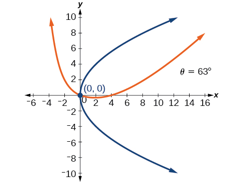 

For the following exercises, determine the angle of rotation in order to eliminate the<math xmlns="http://www.w3.org/1998/Math/MathML"> <mrow> <mtext> </mtext><mi>x</mi><mi>y</mi><mtext> </mtext> </mrow> </math>

term. Then graph the new set of axes.

<math xmlns="http://www.w3.org/1998/Math/MathML"> <mrow> <mn>6</mn><msup> <mi>x</mi> <mn>2</mn> </msup> <mo>−</mo><mn>5</mn><msqrt> <mn>3</mn> </msqrt> <mi>x</mi><mi>y</mi><mo>+</mo><msup> <mi>y</mi> <mn>2</mn> </msup> <mo>+</mo><mn>10</mn><mi>x</mi><mo>−</mo><mn>12</mn><mi>y</mi><mo>=</mo><mn>0</mn> </mrow> </math>

<math xmlns="http://www.w3.org/1998/Math/MathML"> <mrow> <mn>6</mn><msup> <mi>x</mi> <mn>2</mn> </msup> <mo>−</mo><mn>5</mn><mi>x</mi><mi>y</mi><mo>+</mo><mn>6</mn><msup> <mi>y</mi> <mn>2</mn> </msup> <mo>+</mo><mn>20</mn><mi>x</mi><mo>−</mo><mi>y</mi><mo>=</mo><mn>0</mn> </mrow> </math>

<math xmlns="http://www.w3.org/1998/Math/MathML"> <mrow> <mi>θ</mi><mo>=</mo><msup> <mrow> <mn>45</mn> </mrow> <mo>∘</mo> </msup> </mrow> </math>

 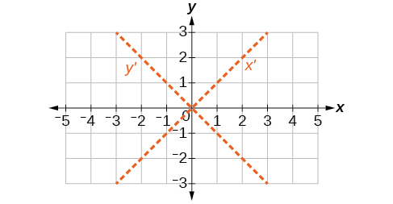 

<math xmlns="http://www.w3.org/1998/Math/MathML"> <mrow> <mn>6</mn><msup> <mi>x</mi> <mn>2</mn> </msup> <mo>−</mo><mn>8</mn><msqrt> <mn>3</mn> </msqrt> <mi>x</mi><mi>y</mi><mo>+</mo><mn>14</mn><msup> <mi>y</mi> <mn>2</mn> </msup> <mo>+</mo><mn>10</mn><mi>x</mi><mo>−</mo><mn>3</mn><mi>y</mi><mo>=</mo><mn>0</mn> </mrow> </math>

<math xmlns="http://www.w3.org/1998/Math/MathML"> <mrow> <mn>4</mn><msup> <mi>x</mi> <mn>2</mn> </msup> <mo>+</mo><mn>6</mn><msqrt> <mn>3</mn> </msqrt> <mi>x</mi><mi>y</mi><mo>+</mo><mn>10</mn><msup> <mi>y</mi> <mn>2</mn> </msup> <mo>+</mo><mn>20</mn><mi>x</mi><mo>−</mo><mn>40</mn><mi>y</mi><mo>=</mo><mn>0</mn> </mrow> </math>

<math xmlns="http://www.w3.org/1998/Math/MathML"> <mrow> <mi>θ</mi><mo>=</mo><msup> <mrow> <mn>60</mn> </mrow> <mo>∘</mo> </msup> </mrow> </math>

 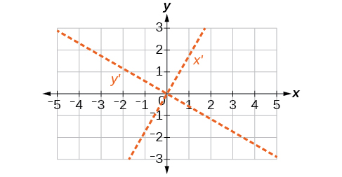 

<math xmlns="http://www.w3.org/1998/Math/MathML"> <mrow> <mn>8</mn><msup> <mi>x</mi> <mn>2</mn> </msup> <mo>+</mo><mn>3</mn><mi>x</mi><mi>y</mi><mo>+</mo><mn>4</mn><msup> <mi>y</mi> <mn>2</mn> </msup> <mo>+</mo><mn>2</mn><mi>x</mi><mo>−</mo><mn>4</mn><mo>=</mo><mn>0</mn> </mrow> </math>

<math xmlns="http://www.w3.org/1998/Math/MathML"> <mrow> <mn>16</mn><msup> <mi>x</mi> <mn>2</mn> </msup> <mo>+</mo><mn>24</mn><mi>x</mi><mi>y</mi><mo>+</mo><mn>9</mn><msup> <mi>y</mi> <mn>2</mn> </msup> <mo>+</mo><mn>20</mn><mi>x</mi><mo>−</mo><mn>44</mn><mi>y</mi><mo>=</mo><mn>0</mn> </mrow> </math>

<math xmlns="http://www.w3.org/1998/Math/MathML"> <mrow> <mi>θ</mi><mo>≈</mo><msup> <mrow> <mn>36.9</mn> </mrow> <mo>∘</mo> </msup> </mrow> </math>

 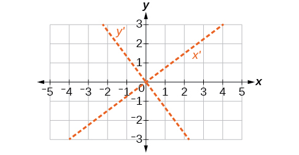 

For the following exercises, determine the value of<math xmlns="http://www.w3.org/1998/Math/MathML"> <mrow> <mtext>  </mtext><mi>k</mi><mtext>  </mtext> </mrow> </math>

based on the given equation.

Given<math xmlns="http://www.w3.org/1998/Math/MathML"> <mrow> <mtext> </mtext><mn>4</mn><msup> <mi>x</mi> <mn>2</mn> </msup> <mo>+</mo><mi>k</mi><mi>x</mi><mi>y</mi><mo>+</mo><mn>16</mn><msup> <mi>y</mi> <mn>2</mn> </msup> <mo>+</mo><mn>8</mn><mi>x</mi><mo>+</mo><mn>24</mn><mi>y</mi><mo>−</mo><mn>48</mn><mo>=</mo><mn>0</mn><mo>,</mo> </mrow> </math>

 find<math xmlns="http://www.w3.org/1998/Math/MathML"> <mrow> <mtext> </mtext><mi>k</mi><mtext> </mtext> </mrow> </math>

for the graph to be a parabola.

Given<math xmlns="http://www.w3.org/1998/Math/MathML"> <mrow> <mtext> </mtext><mn>2</mn><msup> <mi>x</mi> <mn>2</mn> </msup> <mo>+</mo><mi>k</mi><mi>x</mi><mi>y</mi><mo>+</mo><mn>12</mn><msup> <mi>y</mi> <mn>2</mn> </msup> <mo>+</mo><mn>10</mn><mi>x</mi><mo>−</mo><mn>16</mn><mi>y</mi><mo>+</mo><mn>28</mn><mo>=</mo><mn>0</mn><mo>,</mo> </mrow> </math>

 find<math xmlns="http://www.w3.org/1998/Math/MathML"> <mrow> <mtext> </mtext><mi>k</mi><mtext> </mtext> </mrow> </math>

for the graph to be an ellipse.

<math xmlns="http://www.w3.org/1998/Math/MathML"> <mrow> <mo>−</mo><mn>4</mn><msqrt> <mn>6</mn> </msqrt> <mo>&lt;</mo><mi>k</mi><mo>&lt;</mo><mn>4</mn><msqrt> <mn>6</mn> </msqrt> </mrow> </math>

Given<math xmlns="http://www.w3.org/1998/Math/MathML"> <mrow> <mtext> </mtext><mn>3</mn><msup> <mi>x</mi> <mn>2</mn> </msup> <mo>+</mo><mi>k</mi><mi>x</mi><mi>y</mi><mo>+</mo><mn>4</mn><msup> <mi>y</mi> <mn>2</mn> </msup> <mo>−</mo><mn>6</mn><mi>x</mi><mo>+</mo><mn>20</mn><mi>y</mi><mo>+</mo><mn>128</mn><mo>=</mo><mn>0</mn><mo>,</mo> </mrow> </math>

 find<math xmlns="http://www.w3.org/1998/Math/MathML"> <mrow> <mtext> </mtext><mi>k</mi><mtext> </mtext> </mrow> </math>

for the graph to be a hyperbola.

Given<math xmlns="http://www.w3.org/1998/Math/MathML"> <mrow> <mtext> </mtext><mi>k</mi><msup> <mi>x</mi> <mn>2</mn> </msup> <mo>+</mo><mn>8</mn><mi>x</mi><mi>y</mi><mo>+</mo><mn>8</mn><msup> <mi>y</mi> <mn>2</mn> </msup> <mo>−</mo><mn>12</mn><mi>x</mi><mo>+</mo><mn>16</mn><mi>y</mi><mo>+</mo><mn>18</mn><mo>=</mo><mn>0</mn><mo>,</mo> </mrow> </math>

 find<math xmlns="http://www.w3.org/1998/Math/MathML"> <mrow> <mtext> </mtext><mi>k</mi><mtext> </mtext> </mrow> </math>

for the graph to be a parabola.

<math xmlns="http://www.w3.org/1998/Math/MathML"> <mrow> <mi>k</mi><mo>=</mo><mn>2</mn> </mrow> </math>

Given<math xmlns="http://www.w3.org/1998/Math/MathML"> <mrow> <mtext> </mtext><mn>6</mn><msup> <mi>x</mi> <mn>2</mn> </msup> <mo>+</mo><mn>12</mn><mi>x</mi><mi>y</mi><mo>+</mo><mi>k</mi><msup> <mi>y</mi> <mn>2</mn> </msup> <mo>+</mo><mn>16</mn><mi>x</mi><mo>+</mo><mn>10</mn><mi>y</mi><mo>+</mo><mn>4</mn><mo>=</mo><mn>0</mn><mo>,</mo> </mrow> </math>

 find<math xmlns="http://www.w3.org/1998/Math/MathML"> <mrow> <mtext> </mtext><mi>k</mi><mtext> </mtext> </mrow> </math>

for the graph to be an ellipse.

### Glossary
{: data-type="glossary-title"}

angle of rotation
: an acute angle formed by a set of axes rotated from the Cartesian plane where, if
  <math xmlns="http://www.w3.org/1998/Math/MathML"> <mrow> <mtext> </mtext><mi>cot</mi><mrow><mo>(</mo> <mrow> <mn>2</mn><mi>θ</mi> </mrow> <mo>)</mo></mrow><mo>&gt;</mo><mn>0</mn><mo>,</mo> </mrow> </math>
  
  then
  <math xmlns="http://www.w3.org/1998/Math/MathML"> <mrow> <mtext> </mtext><mi>θ</mi><mtext> </mtext> </mrow> </math>
  
  is between
  <math xmlns="http://www.w3.org/1998/Math/MathML"> <mrow> <mtext> </mtext><mo stretchy="false">(</mo><mn>0°</mn><mo>,</mo><mn>45°</mn><mo stretchy="false">)</mo><mo>;</mo> </mrow> </math>
  
  if
  <math xmlns="http://www.w3.org/1998/Math/MathML"> <mrow> <mtext> </mtext><mi>cot</mi><mo stretchy="false">(</mo><mn>2</mn><mi>θ</mi><mo stretchy="false">)</mo><mo>&lt;</mo><mn>0</mn><mo>,</mo> </mrow> </math>
  
  then
  <math xmlns="http://www.w3.org/1998/Math/MathML"> <mrow> <mtext> </mtext><mi>θ</mi><mtext> </mtext> </mrow> </math>
  
  is between
  <math xmlns="http://www.w3.org/1998/Math/MathML"> <mrow> <mtext> </mtext><mo stretchy="false">(</mo><mn>45°</mn><mo>,</mo><mn>90°</mn><mo stretchy="false">)</mo><mo>;</mo><mtext> </mtext> </mrow> </math>
  
  and if
  <math xmlns="http://www.w3.org/1998/Math/MathML"> <mrow> <mtext> </mtext><mi>cot</mi><mrow><mo>(</mo> <mrow> <mn>2</mn><mi>θ</mi> </mrow> <mo>)</mo></mrow><mo>=</mo><mn>0</mn><mo>,</mo> </mrow> </math>
  
  then
  <math xmlns="http://www.w3.org/1998/Math/MathML"> <mrow> <mtext> </mtext><mi>θ</mi><mo>=</mo><mn>45°</mn> </mrow> </math>
^

degenerate conic sections
: any of the possible shapes formed when a plane intersects a double cone through the apex. Types of degenerate conic sections include a point, a line, and intersecting lines.
^

nondegenerate conic section
: a shape formed by the intersection of a plane with a double right cone such that the plane does not pass through the apex; nondegenerate conics include circles, ellipses, hyperbolas, and parabolas

[1]: http://openstax.org/l/introconic
