

In this section, you will:
* Identify a conic in polar form.
* Graph the polar equations of conics.
* Define conics in terms of a focus and a directrix.

 "){: #Figure_10_05_008}

Most of us are familiar with orbital motion, such as the motion of a planet around the sun or an electron around an atomic nucleus. Within the planetary system, orbits of planets, asteroids, and comets around a larger celestial body are often elliptical. Comets, however, may take on a parabolic or hyperbolic orbit instead. And, in reality, the characteristics of the planets’ orbits may vary over time. Each orbit is tied to the location of the celestial body being orbited and the distance and direction of the planet or other object from that body. As a result, we tend to use polar coordinates to represent these orbits.

In an elliptical orbit, the **periapsis**{: data-type="term" .no-emphasis} is the point at which the two objects are closest, and the **apoapsis**{: data-type="term" .no-emphasis} is the point at which they are farthest apart. Generally, the velocity of the orbiting body tends to increase as it approaches the periapsis and decrease as it approaches the apoapsis. Some objects reach an escape velocity, which results in an infinite orbit. These bodies exhibit either a parabolic or a hyperbolic orbit about a body; the orbiting body breaks free of the celestial body’s gravitational pull and fires off into space. Each of these orbits can be modeled by a conic section in the polar coordinate system.

### Identifying a Conic in Polar Form

Any conic may be determined by three characteristics: a single **focus**{: data-type="term" .no-emphasis}, a fixed line called the **directrix**{: data-type="term" .no-emphasis}, and the ratio of the distances of each to a point on the graph. Consider the **parabola**{: data-type="term" .no-emphasis}<math xmlns="http://www.w3.org/1998/Math/MathML"> <mrow> <mtext> </mtext><mi>x</mi><mo>=</mo><mn>2</mn><mo>+</mo><msup> <mi>y</mi> <mn>2</mn> </msup> <mtext> </mtext> </mrow> </math>

shown in [\[link\]](#Figure_10_05_001).

 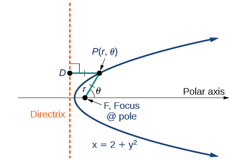{: #Figure_10_05_001}

In [The Parabola](/m49440){: .target-chapter}, we learned how a parabola is defined by the focus (a fixed point) and the directrix (a fixed line). In this section, we will learn how to define any conic in the polar coordinate system in terms of a fixed point, the focus<math xmlns="http://www.w3.org/1998/Math/MathML"> <mrow> <mtext> </mtext><mi>P</mi><mo stretchy="false">(</mo><mi>r</mi><mo>,</mo><mi>θ</mi><mo stretchy="false">)</mo><mtext> </mtext> </mrow> </math>

at the pole, and a line, the directrix, which is perpendicular to the polar axis.

If<math xmlns="http://www.w3.org/1998/Math/MathML"> <mrow> <mtext> </mtext><mi>F</mi><mtext> </mtext> </mrow> </math>

is a fixed point, the focus, and<math xmlns="http://www.w3.org/1998/Math/MathML"> <mrow> <mtext> </mtext><mi>D</mi><mtext> </mtext> </mrow> </math>

is a fixed line, the directrix, then we can let<math xmlns="http://www.w3.org/1998/Math/MathML"> <mrow> <mtext> </mtext><mi>e</mi><mtext> </mtext> </mrow> </math>

be a fixed positive number, called the **eccentricity**, which we can define as the ratio of the distances from a point on the graph to the focus and the point on the graph to the directrix. Then the set of all points<math xmlns="http://www.w3.org/1998/Math/MathML"> <mrow> <mtext> </mtext><mi>P</mi><mtext> </mtext> </mrow> </math>

such that<math xmlns="http://www.w3.org/1998/Math/MathML"> <mrow> <mtext> </mtext><mi>e</mi><mo>=</mo><mfrac> <mrow> <mi>P</mi><mi>F</mi> </mrow> <mrow> <mi>P</mi><mi>D</mi> </mrow> </mfrac> <mtext> </mtext> </mrow> </math>

is a conic. In other words, we can define a conic as the set of all points<math xmlns="http://www.w3.org/1998/Math/MathML"> <mrow> <mtext> </mtext><mi>P</mi><mtext> </mtext> </mrow> </math>

with the property that the ratio of the distance from<math xmlns="http://www.w3.org/1998/Math/MathML"> <mrow> <mtext> </mtext><mi>P</mi><mtext> </mtext> </mrow> </math>

to<math xmlns="http://www.w3.org/1998/Math/MathML"> <mrow> <mtext> </mtext><mi>F</mi><mtext> </mtext> </mrow> </math>

to the distance from<math xmlns="http://www.w3.org/1998/Math/MathML"> <mrow> <mtext> </mtext><mi>P</mi><mtext> </mtext> </mrow> </math>

to<math xmlns="http://www.w3.org/1998/Math/MathML"> <mrow> <mtext> </mtext><mi>D</mi><mtext> </mtext> </mrow> </math>

is equal to the constant<math xmlns="http://www.w3.org/1998/Math/MathML"> <mrow> <mtext> </mtext><mi>e</mi><mo>.</mo> </mrow> </math>

For a conic with eccentricity<math xmlns="http://www.w3.org/1998/Math/MathML"> <mrow> <mtext> </mtext><mi>e</mi><mo>,</mo> </mrow> </math>

* if
  <math xmlns="http://www.w3.org/1998/Math/MathML"> <mrow> <mtext> </mtext><mn>0</mn><mo>≤</mo><mi>e</mi><mo>&lt;</mo><mn>1</mn><mo>,</mo> </mrow> </math>
  
  the conic is an ellipse
* if
  <math xmlns="http://www.w3.org/1998/Math/MathML"> <mrow> <mtext> </mtext><mi>e</mi><mo>=</mo><mn>1</mn><mo>,</mo> </mrow> </math>
  
  the conic is a parabola
* if
  <math xmlns="http://www.w3.org/1998/Math/MathML"> <mrow> <mtext> </mtext><mi>e</mi><mo>&gt;</mo><mn>1</mn><mo>,</mo> </mrow> </math>
  
  the conic is an hyperbola

With this definition, we may now define a conic in terms of the directrix,<math xmlns="http://www.w3.org/1998/Math/MathML"> <mrow> <mtext> </mtext><mi>x</mi><mo>=</mo><mo>±</mo><mi>p</mi><mo>,</mo> </mrow> </math>

 the eccentricity<math xmlns="http://www.w3.org/1998/Math/MathML"> <mrow> <mtext> </mtext><mi>e</mi><mo>,</mo> </mrow> </math>

 and the angle<math xmlns="http://www.w3.org/1998/Math/MathML"> <mrow> <mtext> </mtext><mi>θ</mi><mo>.</mo> </mrow> </math>

 Thus, each conic may be written as a **polar equation**, an equation written in terms of<math xmlns="http://www.w3.org/1998/Math/MathML"> <mrow> <mtext> </mtext><mi>r</mi><mtext> </mtext> </mrow> </math>

and<math xmlns="http://www.w3.org/1998/Math/MathML"> <mrow> <mtext> </mtext><mi>θ</mi><mo>.</mo> </mrow> </math>

The Polar Equation for a Conic

For a conic with a focus at the origin, if the directrix is<math xmlns="http://www.w3.org/1998/Math/MathML"> <mrow> <mtext> </mtext><mi>x</mi><mo>=</mo><mo>±</mo><mi>p</mi><mo>,</mo> </mrow> </math>

 where<math xmlns="http://www.w3.org/1998/Math/MathML"> <mrow> <mtext> </mtext><mi>p</mi><mtext> </mtext> </mrow> </math>

is a positive real number, and the **eccentricity**{: data-type="term"} is a positive real number<math xmlns="http://www.w3.org/1998/Math/MathML"> <mrow> <mtext> </mtext><mi>e</mi><mo>,</mo> </mrow> </math>

 the conic has a **polar equation**{: data-type="term"}

<math xmlns="http://www.w3.org/1998/Math/MathML" display="block"> <mrow> <mi>r</mi><mo>=</mo><mfrac> <mrow> <mi>e</mi><mi>p</mi> </mrow> <mrow> <mn>1</mn><mo>±</mo><mi>e</mi><mtext> </mtext><mi>cos</mi><mtext> </mtext><mi>θ</mi> </mrow> </mfrac> </mrow> </math>

For a conic with a focus at the origin, if the directrix is<math xmlns="http://www.w3.org/1998/Math/MathML"> <mrow> <mtext> </mtext><mi>y</mi><mo>=</mo><mo>±</mo><mi>p</mi><mo>,</mo> </mrow> </math>

 where<math xmlns="http://www.w3.org/1998/Math/MathML"> <mrow> <mtext> </mtext><mi>p</mi><mtext> </mtext> </mrow> </math>

 is a positive real number, and the eccentricity is a positive real number<math xmlns="http://www.w3.org/1998/Math/MathML"> <mrow> <mtext> </mtext><mi>e</mi><mo>,</mo> </mrow> </math>

 the conic has a polar equation

<math xmlns="http://www.w3.org/1998/Math/MathML"> <mrow> <mi>r</mi><mo>=</mo><mfrac> <mrow> <mi>e</mi><mi>p</mi> </mrow> <mrow> <mn>1</mn><mo>±</mo><mi>e</mi><mtext> </mtext><mi>sin</mi><mtext> </mtext><mi>θ</mi> </mrow> </mfrac> </mrow> </math>

**Given the polar equation for a conic, identify the type of conic, the directrix, and the eccentricity.**

1.  Multiply the numerator and denominator by the reciprocal of the constant in the denominator to rewrite the equation in standard form.
2.  Identify the eccentricity
    <math xmlns="http://www.w3.org/1998/Math/MathML"> <mrow> <mtext> </mtext><mi>e</mi><mtext> </mtext> </mrow> </math>
    
    as the coefficient of the trigonometric function in the denominator.
3.  Compare
    <math xmlns="http://www.w3.org/1998/Math/MathML"> <mrow> <mtext> </mtext><mi>e</mi><mtext> </mtext> </mrow> </math>
    
    with 1 to determine the shape of the conic.
4.  Determine the directrix as
    <math xmlns="http://www.w3.org/1998/Math/MathML"> <mrow> <mtext> </mtext><mi>x</mi><mo>=</mo><mi>p</mi><mtext> </mtext> </mrow> </math>
    
    if cosine is in the denominator and
    <math xmlns="http://www.w3.org/1998/Math/MathML"> <mrow> <mtext> </mtext><mi>y</mi><mo>=</mo><mi>p</mi><mtext> </mtext> </mrow> </math>
    
    if sine is in the denominator. Set
    <math xmlns="http://www.w3.org/1998/Math/MathML"> <mrow> <mtext> </mtext><mi>e</mi><mi>p</mi><mtext> </mtext> </mrow> </math>
    
    equal to the numerator in standard form to solve for
    <math xmlns="http://www.w3.org/1998/Math/MathML"> <mrow> <mtext> </mtext><mi>x</mi><mtext> </mtext> </mrow> </math>
    
    or
    <math xmlns="http://www.w3.org/1998/Math/MathML"> <mrow> <mtext> </mtext><mi>y</mi><mo>.</mo> </mrow> </math>
{: data-number-style="arabic"}

Identifying a Conic Given the Polar Form

For each of the following equations, identify the conic with focus at the origin, the **directrix**{: data-type="term" .no-emphasis}, and the **eccentricity**{: data-type="term" .no-emphasis}.

1.  <math xmlns="http://www.w3.org/1998/Math/MathML"> <mrow> <mi>r</mi><mo>=</mo><mfrac> <mn>6</mn> <mrow> <mn>3</mn><mo>+</mo><mn>2</mn><mtext> </mtext><mi>sin</mi><mtext> </mtext><mi>θ</mi> </mrow> </mfrac> </mrow> </math>

2.  <math xmlns="http://www.w3.org/1998/Math/MathML"> <mrow> <mi>r</mi><mo>=</mo><mfrac> <mrow> <mn>12</mn> </mrow> <mrow> <mn>4</mn><mo>+</mo><mn>5</mn><mtext> </mtext><mi>cos</mi><mtext> </mtext><mi>θ</mi> </mrow> </mfrac> </mrow> </math>

3.  <math xmlns="http://www.w3.org/1998/Math/MathML"> <mrow> <mi>r</mi><mo>=</mo><mfrac> <mn>7</mn> <mrow> <mn>2</mn><mo>−</mo><mn>2</mn><mtext> </mtext><mi>sin</mi><mtext> </mtext><mi>θ</mi> </mrow> </mfrac> </mrow> </math>
{: data-number-style="lower-alpha"}

For each of the three conics, we will rewrite the equation in standard form. Standard form has a 1 as the constant in the denominator. Therefore, in all three parts, the first step will be to multiply the numerator and denominator by the reciprocal of the constant of the original equation,<math xmlns="http://www.w3.org/1998/Math/MathML"> <mrow> <mtext> </mtext><mfrac> <mn>1</mn> <mi>c</mi> </mfrac> <mo>,</mo> </mrow> </math>

 where<math xmlns="http://www.w3.org/1998/Math/MathML"> <mrow> <mtext> </mtext><mi>c</mi><mtext> </mtext> </mrow> </math>

is that constant.

1.  Multiply the numerator and denominator by
    <math xmlns="http://www.w3.org/1998/Math/MathML"> <mrow> <mtext> </mtext><mfrac> <mn>1</mn> <mn>3</mn> </mfrac> <mo>.</mo> </mrow> </math>
    
    

    <math xmlns="http://www.w3.org/1998/Math/MathML" display="block"> <mrow> <mi>r</mi><mo>=</mo><mfrac> <mn>6</mn> <mrow> <mn>3</mn><mo>+</mo><mn>2</mn><mi>sin</mi><mtext> </mtext><mi>θ</mi> </mrow> </mfrac> <mo>⋅</mo><mfrac> <mrow> <mrow><mo>(</mo> <mrow> <mfrac> <mn>1</mn> <mn>3</mn> </mfrac> </mrow> <mo>)</mo></mrow> </mrow> <mrow> <mrow><mo>(</mo> <mrow> <mfrac> <mn>1</mn> <mn>3</mn> </mfrac> </mrow> <mo>)</mo></mrow> </mrow> </mfrac> <mo>=</mo><mfrac> <mrow> <mn>6</mn><mrow><mo>(</mo> <mrow> <mfrac> <mn>1</mn> <mn>3</mn> </mfrac> </mrow> <mo>)</mo></mrow> </mrow> <mrow> <mn>3</mn><mrow><mo>(</mo> <mrow> <mfrac> <mn>1</mn> <mn>3</mn> </mfrac> </mrow> <mo>)</mo></mrow><mo>+</mo><mn>2</mn><mrow><mo>(</mo> <mrow> <mfrac> <mn>1</mn> <mn>3</mn> </mfrac> </mrow> <mo>)</mo></mrow><mi>sin</mi><mtext> </mtext><mi>θ</mi> </mrow> </mfrac> <mo>=</mo><mfrac> <mn>2</mn> <mrow> <mn>1</mn><mo>+</mo><mfrac> <mn>2</mn> <mn>3</mn> </mfrac> <mtext> </mtext><mi>sin</mi><mtext> </mtext><mi>θ</mi> </mrow> </mfrac> </mrow> </math>
    

    
    Because<math xmlns="http://www.w3.org/1998/Math/MathML"> <mrow> <mi>sin</mi><mtext> </mtext><mi>θ</mi> </mrow> </math>
    
     is in the denominator, the directrix is<math xmlns="http://www.w3.org/1998/Math/MathML"> <mrow> <mtext> </mtext><mi>y</mi><mo>=</mo><mi>p</mi><mo>.</mo><mtext> </mtext> </mrow> </math>
    
    Comparing to standard form, note that<math xmlns="http://www.w3.org/1998/Math/MathML"> <mrow> <mtext> </mtext><mi>e</mi><mo>=</mo><mfrac> <mn>2</mn> <mn>3</mn> </mfrac> <mo>.</mo> </mrow> </math>
    
    Therefore, from the numerator,
    
    

    <math xmlns="http://www.w3.org/1998/Math/MathML" display="block"> <mrow> <mtable columnalign="left"> <mtr columnalign="left"> <mtd columnalign="left"> <mrow> <mtext>     </mtext><mn>2</mn><mo>=</mo><mi>e</mi><mi>p</mi> </mrow> </mtd> </mtr> <mtr columnalign="left"> <mtd columnalign="left"> <mrow> <mtext>     </mtext><mn>2</mn><mo>=</mo><mfrac> <mn>2</mn> <mn>3</mn> </mfrac> <mi>p</mi> </mrow> </mtd> </mtr> <mtr columnalign="left"> <mtd columnalign="left"> <mrow> <mrow><mo>(</mo> <mrow> <mfrac> <mn>3</mn> <mn>2</mn> </mfrac> </mrow> <mo>)</mo></mrow><mn>2</mn><mo>=</mo><mrow><mo>(</mo> <mrow> <mfrac> <mn>3</mn> <mn>2</mn> </mfrac> </mrow> <mo>)</mo></mrow><mfrac> <mn>2</mn> <mn>3</mn> </mfrac> <mi>p</mi> </mrow> </mtd> </mtr> <mtr columnalign="left"> <mtd columnalign="left"> <mrow> <mtext>     </mtext><mn>3</mn><mo>=</mo><mi>p</mi> </mrow> </mtd> </mtr> </mtable> </mrow> </math>
    

    
    Since<math xmlns="http://www.w3.org/1998/Math/MathML"> <mrow> <mtext> </mtext><mi>e</mi><mo>&lt;</mo><mn>1</mn><mo>,</mo> </mrow> </math>
    
     the conic is an **ellipse**{: data-type="term" .no-emphasis}. The eccentricity is<math xmlns="http://www.w3.org/1998/Math/MathML"> <mrow> <mtext> </mtext><mi>e</mi><mo>=</mo><mfrac> <mn>2</mn> <mn>3</mn> </mfrac> </mrow> </math>
    
    and the directrix is<math xmlns="http://www.w3.org/1998/Math/MathML"> <mrow> <mtext> </mtext><mi>y</mi><mo>=</mo><mn>3.</mn> </mrow> </math>

2.  Multiply the numerator and denominator by
    <math xmlns="http://www.w3.org/1998/Math/MathML"> <mrow> <mtext> </mtext><mfrac> <mn>1</mn> <mn>4</mn> </mfrac> <mo>.</mo> </mrow> </math>
    
    

    <math xmlns="http://www.w3.org/1998/Math/MathML" display="block"> <mrow> <mtable columnalign="left"> <mtr columnalign="left"> <mtd columnalign="left"> <mrow> <mtable columnalign="left"> <mtr columnalign="left"> <mtd columnalign="left"> <mrow /> </mtd> </mtr> <mtr columnalign="left"> <mtd columnalign="left"> <mrow /> </mtd> </mtr> <mtr columnalign="left"> <mtd columnalign="left"> <mrow> <mi>r</mi><mo>=</mo><mfrac> <mrow> <mn>12</mn> </mrow> <mrow> <mn>4</mn><mo>+</mo><mn>5</mn><mtext> </mtext><mi>cos</mi><mtext> </mtext><mi>θ</mi> </mrow> </mfrac> <mo>⋅</mo><mfrac> <mrow> <mrow><mo>(</mo> <mrow> <mfrac> <mn>1</mn> <mn>4</mn> </mfrac> </mrow> <mo>)</mo></mrow> </mrow> <mrow> <mrow><mo>(</mo> <mrow> <mfrac> <mn>1</mn> <mn>4</mn> </mfrac> </mrow> <mo>)</mo></mrow> </mrow> </mfrac> </mrow> </mtd> </mtr> </mtable> </mrow> </mtd> </mtr> <mtr columnalign="left"> <mtd columnalign="left"> <mrow> <mi>r</mi><mo>=</mo><mfrac> <mrow> <mn>12</mn><mrow><mo>(</mo> <mrow> <mfrac> <mn>1</mn> <mn>4</mn> </mfrac> </mrow> <mo>)</mo></mrow> </mrow> <mrow> <mn>4</mn><mrow><mo>(</mo> <mrow> <mfrac> <mn>1</mn> <mn>4</mn> </mfrac> </mrow> <mo>)</mo></mrow><mo>+</mo><mn>5</mn><mrow><mo>(</mo> <mrow> <mfrac> <mn>1</mn> <mn>4</mn> </mfrac> </mrow> <mo>)</mo></mrow><mi>cos</mi><mtext> </mtext><mi>θ</mi> </mrow> </mfrac> </mrow> </mtd> </mtr> <mtr columnalign="left"> <mtd columnalign="left"> <mrow> <mi>r</mi><mo>=</mo><mfrac> <mn>3</mn> <mrow> <mn>1</mn><mo>+</mo><mfrac> <mn>5</mn> <mn>4</mn> </mfrac> <mtext> </mtext><mi>cos</mi><mtext> </mtext><mi>θ</mi> </mrow> </mfrac> </mrow> </mtd> </mtr> </mtable> </mrow> </math>
    

    
    Because<math xmlns="http://www.w3.org/1998/Math/MathML"> <mrow> <mtext> cos</mtext><mtext> </mtext><mi>θ</mi><mo> </mo> </mrow> </math>
    
    is in the denominator, the directrix is<math xmlns="http://www.w3.org/1998/Math/MathML"> <mrow> <mtext> </mtext><mi>x</mi><mo>=</mo><mi>p</mi><mo>.</mo><mtext> </mtext> </mrow> </math>
    
    Comparing to standard form,<math xmlns="http://www.w3.org/1998/Math/MathML"> <mrow> <mtext> </mtext><mi>e</mi><mo>=</mo><mfrac> <mn>5</mn> <mn>4</mn> </mfrac> <mo>.</mo><mtext> </mtext> </mrow> </math>
    
    Therefore, from the numerator,
    
    

    <math xmlns="http://www.w3.org/1998/Math/MathML" display="block"> <mrow> <mtable columnalign="left"> <mtr columnalign="left"> <mtd columnalign="left"> <mrow> <mtext>      </mtext><mn>3</mn><mo>=</mo><mi>e</mi><mi>p</mi> </mrow> </mtd> </mtr> <mtr columnalign="left"> <mtd columnalign="left"> <mrow> <mtext>      </mtext><mn>3</mn><mo>=</mo><mfrac> <mn>5</mn> <mn>4</mn> </mfrac> <mi>p</mi> </mrow> </mtd> </mtr> <mtr columnalign="left"> <mtd columnalign="left"> <mrow> <mtext> </mtext><mrow><mo>(</mo> <mrow> <mfrac> <mn>4</mn> <mn>5</mn> </mfrac> </mrow> <mo>)</mo></mrow><mn>3</mn><mo>=</mo><mrow><mo>(</mo> <mrow> <mfrac> <mn>4</mn> <mn>5</mn> </mfrac> </mrow> <mo>)</mo></mrow><mfrac> <mn>5</mn> <mn>4</mn> </mfrac> <mi>p</mi> </mrow> </mtd> </mtr> <mtr columnalign="left"> <mtd columnalign="left"> <mrow> <mtext>   </mtext><mtext> </mtext><mfrac> <mrow> <mn>12</mn> </mrow> <mn>5</mn> </mfrac> <mo>=</mo><mi>p</mi> </mrow> </mtd> </mtr> </mtable> </mrow> </math>
    

    
    Since<math xmlns="http://www.w3.org/1998/Math/MathML"> <mrow> <mtext> </mtext><mi>e</mi><mo>&gt;</mo><mn>1</mn><mo>,</mo> </mrow> </math>
    
     the conic is a **hyperbola**{: data-type="term" .no-emphasis}. The eccentricity is<math xmlns="http://www.w3.org/1998/Math/MathML"> <mrow> <mtext> </mtext><mi>e</mi><mo>=</mo><mfrac> <mn>5</mn> <mn>4</mn> </mfrac> <mtext> </mtext> </mrow> </math>
    
    and the directrix is<math xmlns="http://www.w3.org/1998/Math/MathML"> <mrow> <mtext> </mtext><mi>x</mi><mo>=</mo><mfrac> <mrow> <mn>12</mn> </mrow> <mn>5</mn> </mfrac> <mo>=</mo><mn>2.4.</mn> </mrow> </math>

3.  Multiply the numerator and denominator by
    <math xmlns="http://www.w3.org/1998/Math/MathML"> <mrow> <mtext> </mtext><mfrac> <mn>1</mn> <mn>2</mn> </mfrac> <mo>.</mo> </mrow> </math>
    
    

    <math xmlns="http://www.w3.org/1998/Math/MathML" display="block"> <mrow> <mtable columnalign="left"> <mtr columnalign="left"> <mtd columnalign="left"> <mrow /> </mtd> </mtr> <mtr columnalign="left"> <mtd columnalign="left"> <mrow /> </mtd> </mtr> <mtr columnalign="left"> <mtd columnalign="left"> <mrow> <mtable columnalign="left"> <mtr columnalign="left"> <mtd columnalign="left"> <mrow> <mi>r</mi><mo>=</mo><mfrac> <mn>7</mn> <mrow> <mn>2</mn><mo>−</mo><mn>2</mn><mtext> </mtext><mi>sin</mi><mtext> </mtext><mi>θ</mi> </mrow> </mfrac> <mo>⋅</mo><mfrac> <mrow> <mrow><mo>(</mo> <mrow> <mfrac> <mn>1</mn> <mn>2</mn> </mfrac> </mrow> <mo>)</mo></mrow> </mrow> <mrow> <mrow><mo>(</mo> <mrow> <mfrac> <mn>1</mn> <mn>2</mn> </mfrac> </mrow> <mo>)</mo></mrow> </mrow> </mfrac> </mrow> </mtd> </mtr> <mtr columnalign="left"> <mtd columnalign="left"> <mrow> <mi>r</mi><mo>=</mo><mfrac> <mrow> <mn>7</mn><mrow><mo>(</mo> <mrow> <mfrac> <mn>1</mn> <mn>2</mn> </mfrac> </mrow> <mo>)</mo></mrow> </mrow> <mrow> <mn>2</mn><mrow><mo>(</mo> <mrow> <mfrac> <mn>1</mn> <mn>2</mn> </mfrac> </mrow> <mo>)</mo></mrow><mo>−</mo><mn>2</mn><mrow><mo>(</mo> <mrow> <mfrac> <mn>1</mn> <mn>2</mn> </mfrac> </mrow> <mo>)</mo></mrow><mtext> </mtext><mi>sin</mi><mtext> </mtext><mi>θ</mi> </mrow> </mfrac> </mrow> </mtd> </mtr> <mtr columnalign="left"> <mtd columnalign="left"> <mrow> <mi>r</mi><mo>=</mo><mfrac> <mrow> <mfrac> <mn>7</mn> <mn>2</mn> </mfrac> </mrow> <mrow> <mn>1</mn><mo>−</mo><mi>sin</mi><mtext> </mtext><mi>θ</mi> </mrow> </mfrac> </mrow> </mtd> </mtr> </mtable> </mrow> </mtd> </mtr> </mtable> </mrow> </math>
    

    
    Because sine is in the denominator, the directrix is<math xmlns="http://www.w3.org/1998/Math/MathML"> <mrow> <mtext> </mtext><mi>y</mi><mo>=</mo><mi>−</mi><mi>p</mi><mo>.</mo><mtext> </mtext> </mrow> </math>
    
    Comparing to standard form,<math xmlns="http://www.w3.org/1998/Math/MathML"> <mrow> <mtext> </mtext><mi>e</mi><mo>=</mo><mn>1.</mn><mtext> </mtext> </mrow> </math>
    
    Therefore, from the numerator,
    
    

    <math xmlns="http://www.w3.org/1998/Math/MathML"> <mtable columnalign="left"> <mtr> <mtd> <mfrac> <mn>7</mn> <mn>2</mn> </mfrac> <mo>=</mo><mi>e</mi><mi>p</mi> </mtd> </mtr> <mtr> <mtd> <mfrac> <mn>7</mn> <mn>2</mn> </mfrac> <mo>=</mo><mrow><mo>(</mo> <mn>1</mn> <mo>)</mo></mrow><mi>p</mi> </mtd> </mtr> <mtr> <mtd> <mfrac> <mn>7</mn> <mn>2</mn> </mfrac> <mo>=</mo><mi>p</mi> </mtd> </mtr> </mtable> </math>
    

    
    Because<math xmlns="http://www.w3.org/1998/Math/MathML"> <mrow> <mtext> </mtext><mi>e</mi><mo>=</mo><mn>1</mn><mo>,</mo> </mrow> </math>
    
     the conic is a **parabola**{: data-type="term" .no-emphasis}. The eccentricity is<math xmlns="http://www.w3.org/1998/Math/MathML"> <mrow> <mtext> </mtext><mi>e</mi><mo>=</mo><mn>1</mn><mtext> </mtext> </mrow> </math>
    
    and the directrix is<math xmlns="http://www.w3.org/1998/Math/MathML"> <mrow> <mtext> </mtext><mi>y</mi><mo>=</mo><mo>−</mo><mfrac> <mn>7</mn> <mn>2</mn> </mfrac> <mo>=</mo><mn>−3.5.</mn> </mrow> </math>
{: data-number-style="lower-alpha"}

Identify the conic with focus at the origin, the directrix, and the eccentricity for<math xmlns="http://www.w3.org/1998/Math/MathML"> <mrow> <mtext> </mtext><mi>r</mi><mo>=</mo><mfrac> <mn>2</mn> <mrow> <mn>3</mn><mo>−</mo><mi>cos</mi><mtext> </mtext><mi>θ</mi> </mrow> </mfrac> <mo>.</mo> </mrow> </math>

ellipse;<math xmlns="http://www.w3.org/1998/Math/MathML"> <mrow> <mtext> </mtext><mi>e</mi><mo>=</mo><mfrac> <mn>1</mn> <mn>3</mn> </mfrac> <mo>;</mo><mtext> </mtext><mi>x</mi><mo>=</mo><mo>−</mo><mn>2</mn> </mrow> </math>

###  Graphing the Polar Equations of Conics

When graphing in Cartesian coordinates, each conic section has a unique equation. This is not the case when graphing in polar coordinates. We must use the eccentricity of a conic section to determine which type of curve to graph, and then determine its specific characteristics. The first step is to rewrite the conic in standard form as we have done in the previous example. In other words, we need to rewrite the equation so that the denominator begins with 1. This enables us to determine<math xmlns="http://www.w3.org/1998/Math/MathML"> <mrow> <mtext> </mtext><mi>e</mi><mtext> </mtext> </mrow> </math>

and, therefore, the shape of the curve. The next step is to substitute values for<math xmlns="http://www.w3.org/1998/Math/MathML"> <mrow> <mtext> </mtext><mi>θ</mi><mtext> </mtext> </mrow> </math>

and solve for<math xmlns="http://www.w3.org/1998/Math/MathML"> <mrow> <mtext> </mtext><mi>r</mi><mtext> </mtext> </mrow> </math>

to plot a few key points. Setting<math xmlns="http://www.w3.org/1998/Math/MathML"> <mrow> <mtext> </mtext><mi>θ</mi><mtext> </mtext> </mrow> </math>

equal to<math xmlns="http://www.w3.org/1998/Math/MathML"> <mrow> <mtext> </mtext><mn>0</mn><mo>,</mo><mfrac> <mi>π</mi> <mn>2</mn> </mfrac> <mo>,</mo><mi>π</mi><mo>,</mo> </mrow> </math>

 and<math xmlns="http://www.w3.org/1998/Math/MathML"> <mrow> <mtext> </mtext><mfrac> <mrow> <mn>3</mn><mi>π</mi> </mrow> <mn>2</mn> </mfrac> <mtext> </mtext> </mrow> </math>

provides the vertices so we can create a rough sketch of the graph.

Graphing a Parabola in Polar Form

Graph<math xmlns="http://www.w3.org/1998/Math/MathML"> <mrow> <mtext> </mtext><mi>r</mi><mo>=</mo><mfrac> <mn>5</mn> <mrow> <mn>3</mn><mo>+</mo><mn>3</mn><mtext> </mtext><mi>cos</mi><mtext> </mtext><mi>θ</mi> </mrow> </mfrac> <mo>.</mo> </mrow> </math>

First, we rewrite the conic in standard form by multiplying the numerator and denominator by the reciprocal of 3, which is<math xmlns="http://www.w3.org/1998/Math/MathML"> <mrow> <mtext> </mtext><mfrac> <mn>1</mn> <mn>3</mn> </mfrac> <mo>.</mo> </mrow> </math>

<math xmlns="http://www.w3.org/1998/Math/MathML" display="block"> <mrow> <mtable columnalign="left"> <mtr columnalign="left"> <mtd columnalign="left"> <mrow> <mtable columnalign="left"> <mtr columnalign="left"> <mtd columnalign="left"> <mrow /> </mtd> </mtr> <mtr columnalign="left"> <mtd columnalign="left"> <mrow /> </mtd> </mtr> <mtr columnalign="left"> <mtd columnalign="left"> <mrow> <mi>r</mi><mo>=</mo><mfrac> <mn>5</mn> <mrow> <mn>3</mn><mo>+</mo><mn>3</mn><mtext> </mtext><mi>cos</mi><mtext> </mtext><mi>θ</mi> </mrow> </mfrac> <mo>=</mo><mfrac> <mrow> <mn>5</mn><mrow><mo>(</mo> <mrow> <mfrac> <mn>1</mn> <mn>3</mn> </mfrac> </mrow> <mo>)</mo></mrow> </mrow> <mrow> <mn>3</mn><mrow><mo>(</mo> <mrow> <mfrac> <mn>1</mn> <mn>3</mn> </mfrac> </mrow> <mo>)</mo></mrow><mo>+</mo><mn>3</mn><mrow><mo>(</mo> <mrow> <mfrac> <mn>1</mn> <mn>3</mn> </mfrac> </mrow> <mo>)</mo></mrow><mi>cos</mi><mtext> </mtext><mi>θ</mi> </mrow> </mfrac> </mrow> </mtd> </mtr> </mtable> </mrow> </mtd> </mtr> <mtr columnalign="left"> <mtd columnalign="left"> <mrow> <mi>r</mi><mo>=</mo><mfrac> <mrow> <mfrac> <mn>5</mn> <mn>3</mn> </mfrac> </mrow> <mrow> <mn>1</mn><mo>+</mo><mi>cos</mi><mtext> </mtext><mi>θ</mi> </mrow> </mfrac> </mrow> </mtd> </mtr> </mtable> </mrow> </math>

Because<math xmlns="http://www.w3.org/1998/Math/MathML"> <mrow> <mtext> </mtext><mi>e</mi><mo>=</mo><mn>1</mn><mo>,</mo> </mrow> </math>

we will graph a **parabola**{: data-type="term" .no-emphasis} with a focus at the origin. The function has a<math xmlns="http://www.w3.org/1998/Math/MathML"> <mrow> <mo> </mo><mi>cos</mi><mtext> </mtext><mi>θ</mi><mo>,</mo> </mrow> </math>

 and there is an addition sign in the denominator, so the directrix is<math xmlns="http://www.w3.org/1998/Math/MathML"> <mrow> <mtext> </mtext><mi>x</mi><mo>=</mo><mi>p</mi><mo>.</mo> </mrow> </math>

<math xmlns="http://www.w3.org/1998/Math/MathML" display="block"> <mtable columnalign="left"> <mtr> <mtd> <mfrac> <mn>5</mn> <mn>3</mn> </mfrac> <mo>=</mo><mi>e</mi><mi>p</mi> </mtd> </mtr> <mtr> <mtd> <mfrac> <mn>5</mn> <mn>3</mn> </mfrac> <mo>=</mo><mo stretchy="false">(</mo><mn>1</mn><mo stretchy="false">)</mo><mi>p</mi> </mtd> </mtr> <mtr> <mtd> <mfrac> <mn>5</mn> <mn>3</mn> </mfrac> <mo>=</mo><mi>p</mi> </mtd> </mtr> </mtable> </math>

The directrix is<math xmlns="http://www.w3.org/1998/Math/MathML"> <mrow> <mtext> </mtext><mi>x</mi><mo>=</mo><mfrac> <mn>5</mn> <mn>3</mn> </mfrac> <mo>.</mo> </mrow> </math>

Plotting a few key points as in [[link]](#Table_10_05_01) will enable us to see the vertices. See [[link]](#Figure_10_05_002).

|  | A | B | C | D |
|----------
| <math xmlns="http://www.w3.org/1998/Math/MathML"> <mi>θ</mi> </math>

 | <math xmlns="http://www.w3.org/1998/Math/MathML"> <mn>0</mn> </math>

 | <math xmlns="http://www.w3.org/1998/Math/MathML"> <mrow> <mfrac> <mi>π</mi> <mn>2</mn> </mfrac> </mrow> </math>

 | <math xmlns="http://www.w3.org/1998/Math/MathML"> <mi>π</mi> </math>

 | <math xmlns="http://www.w3.org/1998/Math/MathML"> <mrow> <mfrac> <mrow> <mn>3</mn><mi>π</mi> </mrow> <mn>2</mn> </mfrac> </mrow> </math>

 |
| <math xmlns="http://www.w3.org/1998/Math/MathML"> <mrow> <mi>r</mi><mo>=</mo><mfrac> <mn>5</mn> <mrow> <mn>3</mn><mo>+</mo><mn>3</mn><mtext> </mtext><mi>cos</mi><mtext> </mtext><mi>θ</mi> </mrow> </mfrac> </mrow> </math>

 | <math xmlns="http://www.w3.org/1998/Math/MathML"> <mrow> <mfrac> <mn>5</mn> <mn>6</mn> </mfrac> <mo>≈</mo><mn>0.83</mn> </mrow> </math>

 | <math xmlns="http://www.w3.org/1998/Math/MathML"> <mrow> <mfrac> <mn>5</mn> <mn>3</mn> </mfrac> <mo>≈</mo><mn>1.67</mn> </mrow> </math>

 | undefined | <math xmlns="http://www.w3.org/1998/Math/MathML"> <mrow> <mfrac> <mn>5</mn> <mn>3</mn> </mfrac> <mo>≈</mo><mn>1.67</mn> </mrow> </math>

 |
{: #Table_10_05_01 summary=".."}

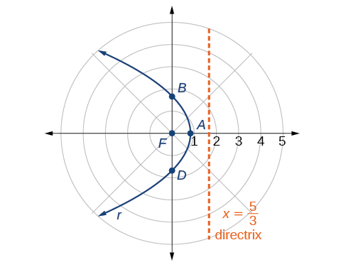{: #Figure_10_05_002}

Analysis

We can check our result with a graphing utility. See [[link]](#Figure_10_05_003).

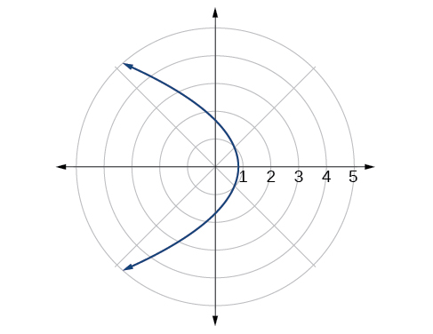{: #Figure_10_05_003}

Graphing a Hyperbola in Polar Form

Graph<math xmlns="http://www.w3.org/1998/Math/MathML"> <mrow> <mtext> </mtext><mi>r</mi><mo>=</mo><mfrac> <mn>8</mn> <mrow> <mn>2</mn><mo>−</mo><mn>3</mn><mtext> </mtext><mi>sin</mi><mtext> </mtext><mi>θ</mi> </mrow> </mfrac> <mo>.</mo> </mrow> </math>

First, we rewrite the conic in standard form by multiplying the numerator and denominator by the reciprocal of 2, which is<math xmlns="http://www.w3.org/1998/Math/MathML"> <mrow> <mtext> </mtext><mfrac> <mn>1</mn> <mn>2</mn> </mfrac> <mo>.</mo> </mrow> </math>

<math xmlns="http://www.w3.org/1998/Math/MathML" display="block"> <mrow> <mtable columnalign="left"> <mtr columnalign="left"> <mtd columnalign="left"> <mrow> <mtable columnalign="left"> <mtr columnalign="left"> <mtd columnalign="left"> <mrow /> </mtd> </mtr> <mtr columnalign="left"> <mtd columnalign="left"> <mrow /> </mtd> </mtr> <mtr columnalign="left"> <mtd columnalign="left"> <mrow> <mi>r</mi><mo>=</mo><mfrac> <mn>8</mn> <mrow> <mn>2</mn><mo>−</mo><mn>3</mn><mi>sin</mi><mtext> </mtext><mi>θ</mi> </mrow> </mfrac> <mo>=</mo><mfrac> <mrow> <mn>8</mn><mrow><mo>(</mo> <mrow> <mfrac> <mn>1</mn> <mn>2</mn> </mfrac> </mrow> <mo>)</mo></mrow> </mrow> <mrow> <mn>2</mn><mrow><mo>(</mo> <mrow> <mfrac> <mn>1</mn> <mn>2</mn> </mfrac> </mrow> <mo>)</mo></mrow><mo>−</mo><mn>3</mn><mrow><mo>(</mo> <mrow> <mfrac> <mn>1</mn> <mn>2</mn> </mfrac> </mrow> <mo>)</mo></mrow><mi>sin</mi><mtext> </mtext><mi>θ</mi> </mrow> </mfrac> </mrow> </mtd> </mtr> </mtable> </mrow> </mtd> </mtr> <mtr columnalign="left"> <mtd columnalign="left"> <mrow> <mi>r</mi><mo>=</mo><mfrac> <mn>4</mn> <mrow> <mn>1</mn><mo>−</mo><mfrac> <mn>3</mn> <mn>2</mn> </mfrac> <mtext> </mtext><mi>sin</mi><mtext> </mtext><mi>θ</mi> </mrow> </mfrac> </mrow> </mtd> </mtr> </mtable> </mrow> </math>

Because<math xmlns="http://www.w3.org/1998/Math/MathML"> <mrow> <mtext> </mtext><mi>e</mi><mo>=</mo><mfrac> <mn>3</mn> <mn>2</mn> </mfrac> <mo>,</mo><mi>e</mi><mo>&gt;</mo><mn>1</mn><mo>,</mo> </mrow> </math>

 so we will graph a **hyperbola**{: data-type="term" .no-emphasis} with a focus at the origin. The function has a<math xmlns="http://www.w3.org/1998/Math/MathML"> <mrow> <mtext> </mtext><mi>sin</mi><mtext> </mtext><mi>θ</mi><mtext> </mtext> </mrow> </math>

term and there is a subtraction sign in the denominator, so the directrix is<math xmlns="http://www.w3.org/1998/Math/MathML"> <mrow> <mtext> </mtext><mi>y</mi><mo>=</mo><mi>−</mi><mi>p</mi><mo>.</mo> </mrow> </math>

<math xmlns="http://www.w3.org/1998/Math/MathML" display="block"> <mrow> <mtable columnalign="left"> <mtr columnalign="left"> <mtd columnalign="left"> <mrow> <mtext>      </mtext><mn>4</mn><mo>=</mo><mi>e</mi><mi>p</mi> </mrow> </mtd> </mtr> <mtr columnalign="left"> <mtd columnalign="left"> <mrow> <mtext>      </mtext><mn>4</mn><mo>=</mo><mrow><mo>(</mo> <mrow> <mfrac> <mn>3</mn> <mn>2</mn> </mfrac> </mrow> <mo>)</mo></mrow><mi>p</mi> </mrow> </mtd> </mtr> <mtr columnalign="left"> <mtd columnalign="left"> <mrow> <mn>4</mn><mrow><mo>(</mo> <mrow> <mfrac> <mn>2</mn> <mn>3</mn> </mfrac> </mrow> <mo>)</mo></mrow><mo>=</mo><mi>p</mi> </mrow> </mtd> </mtr> <mtr columnalign="left"> <mtd columnalign="left"> <mrow> <mtext>     </mtext><mfrac> <mn>8</mn> <mn>3</mn> </mfrac> <mo>=</mo><mi>p</mi> </mrow> </mtd> </mtr> </mtable> </mrow> </math>

The directrix is<math xmlns="http://www.w3.org/1998/Math/MathML"> <mrow> <mtext> </mtext><mi>y</mi><mo>=</mo><mo>−</mo><mfrac> <mn>8</mn> <mn>3</mn> </mfrac> <mo>.</mo> </mrow> </math>

Plotting a few key points as in [[link]](#Table_10_05_02) will enable us to see the vertices. See [[link]](#Figure_10_05_004).

|  | A | B | C | D |
|----------
| <math xmlns="http://www.w3.org/1998/Math/MathML"> <mi>θ</mi> </math>

 | <math xmlns="http://www.w3.org/1998/Math/MathML"> <mn>0</mn> </math>

 | <math xmlns="http://www.w3.org/1998/Math/MathML"> <mrow> <mfrac> <mi>π</mi> <mn>2</mn> </mfrac> </mrow> </math>

 | <math xmlns="http://www.w3.org/1998/Math/MathML"> <mi>π</mi> </math>

 | <math xmlns="http://www.w3.org/1998/Math/MathML"> <mrow> <mfrac> <mrow> <mn>3</mn><mi>π</mi> </mrow> <mn>2</mn> </mfrac> </mrow> </math>

 |
| <math xmlns="http://www.w3.org/1998/Math/MathML" display="block"> <mrow> <mi>r</mi><mo>=</mo><mfrac> <mn>8</mn> <mrow> <mn>2</mn><mo>−</mo><mn>3</mn><mi>sin</mi><mtext> </mtext><mi>θ</mi> </mrow> </mfrac> </mrow> </math>

 | <math xmlns="http://www.w3.org/1998/Math/MathML"> <mn>4</mn> </math>

 | <math xmlns="http://www.w3.org/1998/Math/MathML"> <mrow> <mo>−</mo><mn>8</mn> </mrow> </math>

 | <math xmlns="http://www.w3.org/1998/Math/MathML"> <mn>4</mn> </math>

 | <math xmlns="http://www.w3.org/1998/Math/MathML"> <mrow> <mfrac> <mn>8</mn> <mn>5</mn> </mfrac> <mo>=</mo><mn>1.6</mn> </mrow> </math>

 |
{: #Table_10_05_02 summary=".."}

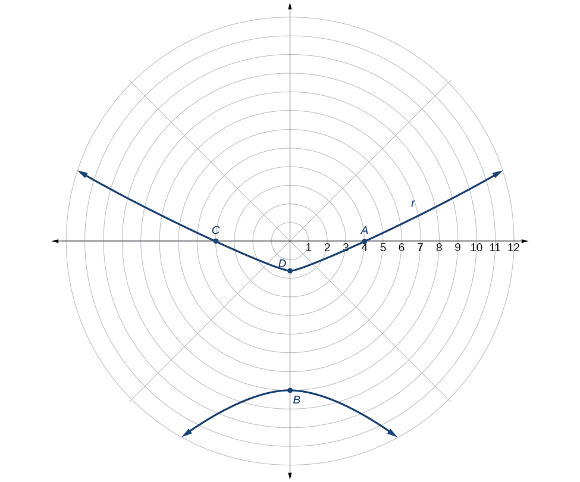{: #Figure_10_05_004}

Graphing an Ellipse in Polar Form

Graph<math xmlns="http://www.w3.org/1998/Math/MathML"> <mrow> <mtext> </mtext><mi>r</mi><mo>=</mo><mfrac> <mrow> <mn>10</mn> </mrow> <mrow> <mn>5</mn><mo>−</mo><mn>4</mn><mtext> </mtext><mi>cos</mi><mtext> </mtext><mi>θ</mi> </mrow> </mfrac> <mo>.</mo> </mrow> </math>

First, we rewrite the conic in standard form by multiplying the numerator and denominator by the reciprocal of 5, which is<math xmlns="http://www.w3.org/1998/Math/MathML"> <mrow> <mtext> </mtext><mfrac> <mn>1</mn> <mn>5</mn> </mfrac> <mo>.</mo> </mrow> </math>

<math xmlns="http://www.w3.org/1998/Math/MathML" display="block"> <mrow> <mtable columnalign="left"> <mtr columnalign="left"> <mtd columnalign="left"> <mrow /> </mtd> </mtr> <mtr columnalign="left"> <mtd columnalign="left"> <mrow> <mtable columnalign="left"> <mtr columnalign="left"> <mtd columnalign="left"> <mrow> <mi>r</mi><mo>=</mo><mfrac> <mrow> <mn>10</mn> </mrow> <mrow> <mn>5</mn><mo>−</mo><mn>4</mn><mi>cos</mi><mtext> </mtext><mi>θ</mi> </mrow> </mfrac> <mo>=</mo><mfrac> <mrow> <mn>10</mn><mrow><mo>(</mo> <mrow> <mfrac> <mn>1</mn> <mn>5</mn> </mfrac> </mrow> <mo>)</mo></mrow> </mrow> <mrow> <mn>5</mn><mrow><mo>(</mo> <mrow> <mfrac> <mn>1</mn> <mn>5</mn> </mfrac> </mrow> <mo>)</mo></mrow><mo>−</mo><mn>4</mn><mrow><mo>(</mo> <mrow> <mfrac> <mn>1</mn> <mn>5</mn> </mfrac> </mrow> <mo>)</mo></mrow><mi>cos</mi><mtext> </mtext><mi>θ</mi> </mrow> </mfrac> </mrow> </mtd> </mtr> <mtr columnalign="left"> <mtd columnalign="left"> <mrow> <mi>r</mi><mo>=</mo><mfrac> <mn>2</mn> <mrow> <mn>1</mn><mo>−</mo><mfrac> <mn>4</mn> <mn>5</mn> </mfrac> <mtext> </mtext><mi>cos</mi><mtext> </mtext><mi>θ</mi> </mrow> </mfrac> </mrow> </mtd> </mtr> </mtable> </mrow> </mtd> </mtr> </mtable> </mrow> </math>

Because<math xmlns="http://www.w3.org/1998/Math/MathML"> <mrow> <mtext> </mtext><mi>e</mi><mo>=</mo><mfrac> <mn>4</mn> <mn>5</mn> </mfrac> <mo>,</mo><mi>e</mi><mo>&lt;</mo><mn>1</mn><mo>,</mo> </mrow> </math>

 so we will graph an **ellipse**{: data-type="term" .no-emphasis} with a **focus**{: data-type="term" .no-emphasis} at the origin. The function has a<math xmlns="http://www.w3.org/1998/Math/MathML"> <mrow> <mtext> </mtext><mtext>cos</mtext><mtext> </mtext><mi>θ</mi><mo>,</mo> </mrow> </math>

 and there is a subtraction sign in the denominator, so the **directrix**{: data-type="term" .no-emphasis} is<math xmlns="http://www.w3.org/1998/Math/MathML"> <mrow> <mtext> </mtext><mi>x</mi><mo>=</mo><mi>−</mi><mi>p</mi><mo>.</mo> </mrow> </math>

<math xmlns="http://www.w3.org/1998/Math/MathML" display="block"> <mrow> <mtable columnalign="left"> <mtr columnalign="left"> <mtd columnalign="left"> <mrow> <mtext>      </mtext><mn>2</mn><mo>=</mo><mi>e</mi><mi>p</mi> </mrow> </mtd> </mtr> <mtr columnalign="left"> <mtd columnalign="left"> <mrow> <mtext>      </mtext><mn>2</mn><mo>=</mo><mrow><mo>(</mo> <mrow> <mfrac> <mn>4</mn> <mn>5</mn> </mfrac> </mrow> <mo>)</mo></mrow><mi>p</mi> </mrow> </mtd> </mtr> <mtr columnalign="left"> <mtd columnalign="left"> <mrow> <mn>2</mn><mrow><mo>(</mo> <mrow> <mfrac> <mn>5</mn> <mn>4</mn> </mfrac> </mrow> <mo>)</mo></mrow><mo>=</mo><mi>p</mi> </mrow> </mtd> </mtr> <mtr columnalign="left"> <mtd columnalign="left"> <mrow> <mtext>     </mtext><mfrac> <mn>5</mn> <mn>2</mn> </mfrac> <mo>=</mo><mi>p</mi> </mrow> </mtd> </mtr> </mtable> </mrow> </math>

The directrix is<math xmlns="http://www.w3.org/1998/Math/MathML"> <mrow> <mtext> </mtext><mi>x</mi><mo>=</mo><mo>−</mo><mfrac> <mn>5</mn> <mn>2</mn> </mfrac> <mo>.</mo> </mrow> </math>

Plotting a few key points as in [[link]](#Table_10_05_03) will enable us to see the vertices. See [[link]](#Figure_10_05_006).

|  | A | B | C | D |
|----------
| <math xmlns="http://www.w3.org/1998/Math/MathML"> <mi>θ</mi> </math>

 | <math xmlns="http://www.w3.org/1998/Math/MathML"> <mn>0</mn> </math>

 | <math xmlns="http://www.w3.org/1998/Math/MathML"> <mrow> <mfrac> <mi>π</mi> <mn>2</mn> </mfrac> </mrow> </math>

 | <math xmlns="http://www.w3.org/1998/Math/MathML"> <mi>π</mi> </math>

 | <math xmlns="http://www.w3.org/1998/Math/MathML"> <mrow> <mfrac> <mrow> <mn>3</mn><mi>π</mi> </mrow> <mn>2</mn> </mfrac> </mrow> </math>

 |
| <math xmlns="http://www.w3.org/1998/Math/MathML"> <mrow> <mi>r</mi><mo>=</mo><mfrac> <mrow> <mn>10</mn> </mrow> <mrow> <mn>5</mn><mo>−</mo><mn>4</mn><mtext> </mtext><mi>cos</mi><mtext> </mtext><mi>θ</mi> </mrow> </mfrac> </mrow> </math>

 | <math xmlns="http://www.w3.org/1998/Math/MathML"> <mrow> <mn>10</mn> </mrow> </math>

 | <math xmlns="http://www.w3.org/1998/Math/MathML"> <mn>2</mn> </math>

 | <math xmlns="http://www.w3.org/1998/Math/MathML"> <mrow> <mfrac> <mrow> <mn>10</mn> </mrow> <mn>9</mn> </mfrac> <mo>≈</mo><mn>1.1</mn> </mrow> </math>

 | <math xmlns="http://www.w3.org/1998/Math/MathML"> <mn>2</mn> </math>

 |
{: #Table_10_05_03 summary=".."}

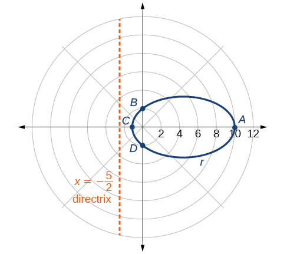{: #Figure_10_05_006}

Analysis

We can check our result using a graphing utility. See [[link]](#Figure_10_05_007).

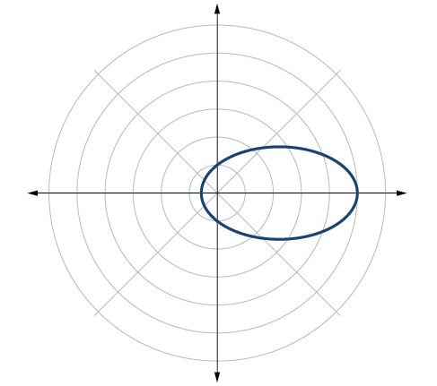{: #Figure_10_05_007}

Graph<math xmlns="http://www.w3.org/1998/Math/MathML"> <mrow> <mtext> </mtext><mi>r</mi><mo>=</mo><mfrac> <mn>2</mn> <mrow> <mn>4</mn><mo>−</mo><mi>cos</mi><mtext> </mtext><mi>θ</mi> </mrow> </mfrac> <mo>.</mo> </mrow> </math>

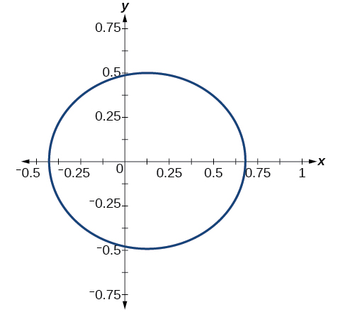

###  Defining Conics in Terms of a Focus and a Directrix

So far we have been using polar equations of conics to describe and graph the curve. Now we will work in reverse; we will use information about the origin, eccentricity, and directrix to determine the polar equation.

<strong>Given the focus, eccentricity, and directrix of a conic, determine the polar equation. </strong>

1.  Determine whether the directrix is horizontal or vertical. If the directrix is given in terms of
    <math xmlns="http://www.w3.org/1998/Math/MathML"> <mrow> <mtext> </mtext><mi>y</mi><mo>,</mo> </mrow> </math>
    
    we use the general polar form in terms of sine. If the directrix is given in terms of
    <math xmlns="http://www.w3.org/1998/Math/MathML"> <mrow> <mtext> </mtext><mi>x</mi><mo>,</mo> </mrow> </math>
    
    we use the general polar form in terms of cosine.
2.  Determine the sign in the denominator. If
    <math xmlns="http://www.w3.org/1998/Math/MathML"> <mrow> <mtext> </mtext><mi>p</mi><mo>&lt;</mo><mn>0</mn><mo>,</mo> </mrow> </math>
    
    use subtraction. If
    <math xmlns="http://www.w3.org/1998/Math/MathML"> <mrow> <mtext> </mtext><mi>p</mi><mo>&gt;</mo><mn>0</mn><mo>,</mo> </mrow> </math>
    
    use addition.
3.  Write the coefficient of the trigonometric function as the given eccentricity.
4.  Write the absolute value of
    <math xmlns="http://www.w3.org/1998/Math/MathML"> <mrow> <mtext> </mtext><mi>p</mi><mtext> </mtext> </mrow> </math>
    
    in the numerator, and simplify the equation.
{: data-number-style="arabic"}

Finding the Polar Form of a Vertical Conic Given a Focus at the Origin and the Eccentricity and Directrix

Find the polar form of the **conic**{: data-type="term" .no-emphasis} given a **focus**{: data-type="term" .no-emphasis} at the origin,<math xmlns="http://www.w3.org/1998/Math/MathML"> <mrow> <mtext> </mtext><mi>e</mi><mo>=</mo><mn>3</mn><mtext> </mtext> </mrow> </math>

and **directrix**{: data-type="term" .no-emphasis}<math xmlns="http://www.w3.org/1998/Math/MathML"> <mrow> <mtext> </mtext><mi>y</mi><mo>=</mo><mo>−</mo><mn>2.</mn> </mrow> </math>

The directrix is<math xmlns="http://www.w3.org/1998/Math/MathML"> <mrow> <mtext> </mtext><mi>y</mi><mo>=</mo><mi>−</mi><mi>p</mi><mo>,</mo> </mrow> </math>

 so we know the trigonometric function in the denominator is sine.

Because<math xmlns="http://www.w3.org/1998/Math/MathML"> <mrow> <mtext> </mtext><mi>y</mi><mo>=</mo><mn>−2</mn><mo>,</mo><mn>–2</mn><mo>&lt;</mo><mn>0</mn><mo>,</mo> </mrow> </math>

 so we know there is a subtraction sign in the denominator. We use the standard form of

<math xmlns="http://www.w3.org/1998/Math/MathML" display="block"> <mrow> <mi>r</mi><mo>=</mo><mfrac> <mrow> <mi>e</mi><mi>p</mi> </mrow> <mrow> <mn>1</mn><mo>−</mo><mi>e</mi><mtext> </mtext><mi>sin</mi><mtext> </mtext><mi>θ</mi> </mrow> </mfrac> </mrow> </math>

and<math xmlns="http://www.w3.org/1998/Math/MathML"> <mrow> <mtext> </mtext><mi>e</mi><mo>=</mo><mn>3</mn><mtext> </mtext> </mrow> </math>

and<math xmlns="http://www.w3.org/1998/Math/MathML"> <mrow> <mtext> </mtext><mrow><mo>\|</mo> <mrow> <mn>−2</mn> </mrow> <mo>\|</mo></mrow><mo>=</mo><mn>2</mn><mo>=</mo><mi>p</mi><mo>.</mo> </mrow> </math>

Therefore,

<math xmlns="http://www.w3.org/1998/Math/MathML"> <mrow> <mtable columnalign="left"> <mtr columnalign="left"> <mtd columnalign="left"> <mrow /> </mtd> </mtr> <mtr columnalign="left"> <mtd columnalign="left"> <mrow> <mtable columnalign="left"> <mtr columnalign="left"> <mtd columnalign="left"> <mrow> <mi>r</mi><mo>=</mo><mfrac> <mrow> <mo stretchy="false">(</mo><mn>3</mn><mo stretchy="false">)</mo><mo stretchy="false">(</mo><mn>2</mn><mo stretchy="false">)</mo> </mrow> <mrow> <mn>1</mn><mo>−</mo><mn>3</mn><mtext> </mtext><mi>sin</mi><mtext> </mtext><mi>θ</mi> </mrow> </mfrac> </mrow> </mtd> </mtr> <mtr columnalign="left"> <mtd columnalign="left"> <mrow> <mi>r</mi><mo>=</mo><mfrac> <mn>6</mn> <mrow> <mn>1</mn><mo>−</mo><mn>3</mn><mtext> </mtext><mi>sin</mi><mtext> </mtext><mi>θ</mi> </mrow> </mfrac> </mrow> </mtd> </mtr> </mtable> </mrow> </mtd> </mtr> </mtable> </mrow> </math>

Finding the Polar Form of a Horizontal Conic Given a Focus at the Origin and the Eccentricity and Directrix

Find the **polar form of a conic**{: data-type="term" .no-emphasis} given a **focus**{: data-type="term" .no-emphasis} at the origin,<math xmlns="http://www.w3.org/1998/Math/MathML"> <mrow> <mtext> </mtext><mi>e</mi><mo>=</mo><mfrac> <mn>3</mn> <mn>5</mn> </mfrac> <mo>,</mo> </mrow> </math>

 and **directrix**{: data-type="term" .no-emphasis}<math xmlns="http://www.w3.org/1998/Math/MathML"> <mrow> <mtext> </mtext><mi>x</mi><mo>=</mo><mn>4.</mn> </mrow> </math>

Because the directrix is<math xmlns="http://www.w3.org/1998/Math/MathML"> <mrow> <mtext> </mtext><mi>x</mi><mo>=</mo><mi>p</mi><mo>,</mo> </mrow> </math>

we know the function in the denominator is cosine. Because<math xmlns="http://www.w3.org/1998/Math/MathML"> <mrow> <mtext> </mtext><mi>x</mi><mo>=</mo><mn>4</mn><mo>,</mo><mn>4</mn><mo>&gt;</mo><mn>0</mn><mo>,</mo> </mrow> </math>

so we know there is an addition sign in the denominator. We use the standard form of

<math xmlns="http://www.w3.org/1998/Math/MathML"> <mrow> <mi>r</mi><mo>=</mo><mfrac> <mrow> <mi>e</mi><mi>p</mi> </mrow> <mrow> <mn>1</mn><mo>+</mo><mi>e</mi><mtext> </mtext><mi>cos</mi><mtext> </mtext><mi>θ</mi> </mrow> </mfrac> </mrow> </math>

and<math xmlns="http://www.w3.org/1998/Math/MathML"> <mrow> <mtext> </mtext><mi>e</mi><mo>=</mo><mfrac> <mn>3</mn> <mn>5</mn> </mfrac> <mtext> </mtext> </mrow> </math>

and<math xmlns="http://www.w3.org/1998/Math/MathML"> <mrow> <mtext> </mtext><mrow><mo>\|</mo> <mn>4</mn> <mo>\|</mo></mrow><mo>=</mo><mn>4</mn><mo>=</mo><mi>p</mi><mo>.</mo> </mrow> </math>

Therefore,

<math xmlns="http://www.w3.org/1998/Math/MathML" display="block"> <mrow> <mtable columnalign="left"> <mtr columnalign="left"> <mtd columnalign="left"> <mrow> <mtable columnalign="left"> <mtr columnalign="left"> <mtd columnalign="left"> <mrow /> </mtd> </mtr> <mtr columnalign="left"> <mtd columnalign="left"> <mrow /> </mtd> </mtr> <mtr columnalign="left"> <mtd columnalign="left"> <mrow> <mi>r</mi><mo>=</mo><mfrac> <mrow> <mrow><mo>(</mo> <mrow> <mfrac> <mn>3</mn> <mn>5</mn> </mfrac> </mrow> <mo>)</mo></mrow><mo stretchy="false">(</mo><mn>4</mn><mo stretchy="false">)</mo></mrow> <mrow> <mn>1</mn><mo>+</mo><mfrac> <mn>3</mn> <mn>5</mn> </mfrac> <mtext> </mtext><mi>cos</mi><mtext> </mtext><mi>θ</mi></mrow> </mfrac> </mrow> </mtd> </mtr> </mtable></mrow> </mtd> </mtr> <mtr columnalign="left"> <mtd columnalign="left"> <mrow> <mi>r</mi><mo>=</mo><mfrac> <mrow> <mfrac> <mrow> <mn>12</mn></mrow> <mn>5</mn> </mfrac> </mrow> <mrow> <mn>1</mn><mo>+</mo><mfrac> <mn>3</mn> <mn>5</mn> </mfrac> <mtext> </mtext><mi>cos</mi><mtext> </mtext><mi>θ</mi></mrow> </mfrac> </mrow> </mtd> </mtr> <mtr columnalign="left"> <mtd columnalign="left"> <mrow> <mi>r</mi><mo>=</mo><mfrac> <mrow> <mfrac> <mrow> <mn>12</mn></mrow> <mn>5</mn> </mfrac> </mrow> <mrow> <mn>1</mn><mrow><mo>(</mo> <mrow> <mfrac> <mn>5</mn> <mn>5</mn> </mfrac> </mrow> <mo>)</mo></mrow><mo>+</mo><mfrac> <mn>3</mn> <mn>5</mn> </mfrac> <mtext> </mtext><mi>cos</mi><mtext> </mtext><mi>θ</mi></mrow> </mfrac> </mrow> </mtd> </mtr> <mtr columnalign="left"> <mtd columnalign="left"> <mrow> <mi>r</mi><mo>=</mo><mfrac> <mrow> <mfrac> <mrow> <mn>12</mn></mrow> <mn>5</mn> </mfrac> </mrow> <mrow> <mfrac> <mn>5</mn> <mn>5</mn> </mfrac> <mo>+</mo><mfrac> <mn>3</mn> <mn>5</mn> </mfrac> <mtext> </mtext><mi>cos</mi><mtext> </mtext><mi>θ</mi></mrow> </mfrac> </mrow> </mtd> </mtr> <mtr columnalign="left"> <mtd columnalign="left"> <mrow> <mi>r</mi><mo>=</mo><mfrac> <mrow> <mn>12</mn></mrow> <mn>5</mn> </mfrac> <mo>⋅</mo><mfrac> <mn>5</mn> <mrow> <mn>5</mn><mo>+</mo><mn>3</mn><mtext> </mtext><mi>cos</mi><mtext> </mtext><mi>θ</mi></mrow> </mfrac> </mrow> </mtd> </mtr> <mtr columnalign="left"> <mtd columnalign="left"> <mrow> <mi>r</mi><mo>=</mo><mfrac> <mrow> <mn>12</mn></mrow> <mrow> <mn>5</mn><mo>+</mo><mn>3</mn><mtext> </mtext><mi>cos</mi><mtext> </mtext><mi>θ</mi></mrow> </mfrac> </mrow> </mtd> </mtr> </mtable></mrow> </math>

Find the polar form of the conic given a focus at the origin,<math xmlns="http://www.w3.org/1998/Math/MathML"> <mrow> <mtext> </mtext><mi>e</mi><mo>=</mo><mn>1</mn><mo>,</mo> </mrow> </math>

 and directrix<math xmlns="http://www.w3.org/1998/Math/MathML"> <mrow> <mtext> </mtext><mi>x</mi><mo>=</mo><mn>−1.</mn> </mrow> </math>

<math xmlns="http://www.w3.org/1998/Math/MathML"> <mrow> <mi>r</mi><mo>=</mo><mfrac> <mn>1</mn> <mrow> <mn>1</mn><mo>−</mo><mi>cos</mi><mi>θ</mi> </mrow> </mfrac> </mrow> </math>

Converting a Conic in Polar Form to Rectangular Form

Convert the conic<math xmlns="http://www.w3.org/1998/Math/MathML"> <mrow> <mtext> </mtext><mi>r</mi><mo>=</mo><mfrac> <mn>1</mn> <mrow> <mn>5</mn><mo>−</mo><mn>5</mn><mi>sin</mi><mtext> </mtext><mi>θ</mi> </mrow> </mfrac> </mrow> </math>

to rectangular form.

We will rearrange the formula to use the identities<math xmlns="http://www.w3.org/1998/Math/MathML"> <mrow> <mo> </mo><mi>r</mi><mo>=</mo><msqrt> <mrow> <msup> <mi>x</mi> <mn>2</mn> </msup> <mo>+</mo><msup> <mi>y</mi> <mn>2</mn> </msup> </mrow> </msqrt> <mo>,</mo><mi>x</mi><mo>=</mo><mi>r</mi><mtext> </mtext><mi>cos</mi><mtext> </mtext><mi>θ</mi><mo>,</mo><mtext>and </mtext><mi>y</mi><mo>=</mo><mi>r</mi><mtext> </mtext><mi>sin</mi><mtext> </mtext><mi>θ</mi><mo>.</mo> </mrow> </math>

<math xmlns="http://www.w3.org/1998/Math/MathML" display="block"> <mrow> <mtable columnalign="left"> <mtr columnalign="left"> <mtd columnalign="left"> <mrow> <mtext>                          </mtext><mi>r</mi><mo>=</mo><mfrac> <mn>1</mn> <mrow> <mn>5</mn><mo>−</mo><mn>5</mn><mtext> </mtext><mi>sin</mi><mtext> </mtext><mi>θ</mi> </mrow> </mfrac> </mrow> </mtd> <mtd columnalign="left"> <mrow /> </mtd> </mtr> <mtr columnalign="left"> <mtd columnalign="left"> <mrow> <mo> </mo><mi>r</mi><mo>⋅</mo><mo stretchy="false">(</mo><mn>5</mn><mo>−</mo><mn>5</mn><mtext> </mtext><mi>sin</mi><mtext> </mtext><mi>θ</mi><mo stretchy="false">)</mo><mo>=</mo><mfrac> <mn>1</mn> <mrow> <mn>5</mn><mo>−</mo><mn>5</mn><mtext> </mtext><mi>sin</mi><mtext> </mtext><mi>θ</mi> </mrow> </mfrac> <mo>⋅</mo><mo stretchy="false">(</mo><mn>5</mn><mo>−</mo><mn>5</mn><mtext> </mtext><mi>sin</mi><mtext> </mtext><mi>θ</mi><mo stretchy="false">)</mo> </mrow> </mtd> <mtd columnalign="left"> <mrow> <mtext>Eliminate the fraction</mtext><mo>.</mo> </mrow> </mtd> </mtr> <mtr columnalign="left"> <mtd columnalign="left"> <mrow> <mtext>       </mtext><mtext> </mtext><mn>5</mn><mi>r</mi><mo>−</mo><mn>5</mn><mi>r</mi><mtext> </mtext><mi>sin</mi><mtext> </mtext><mi>θ</mi><mo>=</mo><mn>1</mn> </mrow> </mtd> <mtd columnalign="left"> <mrow> <mtext>Distribute</mtext><mo>.</mo> </mrow> </mtd> </mtr> <mtr columnalign="left"> <mtd columnalign="left"> <mrow> <mtext>                        </mtext><mn>5</mn><mi>r</mi><mo>=</mo><mn>1</mn><mo>+</mo><mn>5</mn><mi>r</mi><mtext> </mtext><mi>sin</mi><mtext> </mtext><mi>θ</mi> </mrow> </mtd> <mtd columnalign="left"> <mrow> <mtext>Isolate </mtext><mn>5</mn><mi>r</mi><mo>.</mo> </mrow> </mtd> </mtr> <mtr columnalign="left"> <mtd columnalign="left"> <mrow> <mtext>                    </mtext><mn>25</mn><msup> <mi>r</mi> <mn>2</mn> </msup> <mo>=</mo><msup> <mrow> <mo stretchy="false">(</mo><mn>1</mn><mo>+</mo><mn>5</mn><mi>r</mi><mtext> </mtext><mi>sin</mi><mtext> </mtext><mi>θ</mi><mo stretchy="false">)</mo> </mrow> <mn>2</mn> </msup> </mrow> </mtd> <mtd columnalign="left"> <mrow> <mtext>Square both sides</mtext><mo>.</mo> </mrow> </mtd> </mtr> <mtr columnalign="left"> <mtd columnalign="left"> <mrow> <mtext>         </mtext><mn>25</mn><mo stretchy="false">(</mo><msup> <mi>x</mi> <mn>2</mn> </msup> <mo>+</mo><msup> <mi>y</mi> <mn>2</mn> </msup> <mo stretchy="false">)</mo><mo>=</mo><msup> <mrow> <mo stretchy="false">(</mo><mn>1</mn><mo>+</mo><mn>5</mn><mi>y</mi><mo stretchy="false">)</mo> </mrow> <mn>2</mn> </msup> </mrow> </mtd> <mtd columnalign="left"> <mrow> <mtext>Substitute </mtext><mi>r</mi><mo>=</mo><msqrt> <mrow> <msup> <mi>x</mi> <mn>2</mn> </msup> <mo>+</mo><msup> <mi>y</mi> <mn>2</mn> </msup> </mrow> </msqrt> <mtext> and </mtext><mi>y</mi><mo>=</mo><mi>r</mi><mtext> </mtext><mi>sin</mi><mtext> </mtext><mi>θ</mi><mo>.</mo> </mrow> </mtd> </mtr> <mtr columnalign="left"> <mtd columnalign="left"> <mrow> <mtext>       </mtext><mtext> </mtext><mn>25</mn><msup> <mi>x</mi> <mn>2</mn> </msup> <mo>+</mo><mn>25</mn><msup> <mi>y</mi> <mn>2</mn> </msup> <mo>=</mo><mn>1</mn><mo>+</mo><mn>10</mn><mi>y</mi><mo>+</mo><mn>25</mn><msup> <mi>y</mi> <mn>2</mn> </msup> </mrow> </mtd> <mtd columnalign="left"> <mrow> <mtext>Distribute and use FOIL</mtext><mo>.</mo> </mrow> </mtd> </mtr> <mtr columnalign="left"> <mtd columnalign="left"> <mrow> <mtext>         </mtext><mtext> </mtext><mn>25</mn><msup> <mi>x</mi> <mn>2</mn> </msup> <mo>−</mo><mn>10</mn><mi>y</mi><mo>=</mo><mn>1</mn> </mrow> </mtd> <mtd columnalign="left"> <mrow> <mtext>Rearrange terms and set equal to 1</mtext><mo>.</mo> </mrow> </mtd> </mtr> </mtable> </mrow> </math>

Convert the conic<math xmlns="http://www.w3.org/1998/Math/MathML"> <mrow> <mtext> </mtext><mi>r</mi><mo>=</mo><mfrac> <mn>2</mn> <mrow> <mn>1</mn><mo>+</mo><mn>2</mn><mtext> </mtext><mi>cos</mi><mtext> </mtext><mi>θ</mi> </mrow> </mfrac> <mtext> </mtext> </mrow> </math>

to rectangular form.

<math xmlns="http://www.w3.org/1998/Math/MathML"> <mrow> <mn>4</mn><mo>−</mo><mn>8</mn><mi>x</mi><mo>+</mo><mn>3</mn><msup> <mi>x</mi> <mn>2</mn> </msup> <mo>−</mo><msup> <mi>y</mi> <mn>2</mn> </msup> <mo>=</mo><mn>0</mn> </mrow> </math>

Access these online resources for additional instruction and practice with conics in polar coordinates.

* [Polar Equations of Conic Sections][1]
* [Graphing Polar Equations of Conics - 1][2]
* [Graphing Polar Equations of Conics - 2][3]

Visit [this website][4] for additional practice questions from Learningpod.

### Key Concepts

* Any conic may be determined by a single focus, the corresponding eccentricity, and the directrix. We can also define a conic in terms of a fixed point, the focus
  <math xmlns="http://www.w3.org/1998/Math/MathML"> <mrow> <mtext> </mtext><mi>P</mi><mo stretchy="false">(</mo><mi>r</mi><mo>,</mo><mi>θ</mi><mo stretchy="false">)</mo><mtext> </mtext> </mrow> </math>
  
  at the pole, and a line, the directrix, which is perpendicular to the polar axis.
* A conic is the set of all points
  <math xmlns="http://www.w3.org/1998/Math/MathML"> <mrow> <mtext> </mtext><mi>e</mi><mo>=</mo><mfrac> <mrow> <mi>P</mi><mi>F</mi> </mrow> <mrow> <mi>P</mi><mi>D</mi> </mrow> </mfrac> <mo>,</mo> </mrow> </math>
  
  where eccentricity
  <math xmlns="http://www.w3.org/1998/Math/MathML"> <mrow> <mtext> </mtext><mi>e</mi><mtext> </mtext> </mrow> </math>
  
  is a positive real number. Each conic may be written in terms of its polar equation. See [\[link\]](#Example_10_05_01).
* The polar equations of conics can be graphed. See [\[link\]](#Example_10_05_02), [\[link\]](#Example_10_05_03), and [\[link\]](#Example_10_05_04).
* Conics can be defined in terms of a focus, a directrix, and eccentricity. See [\[link\]](#Example_10_05_05) and [\[link\]](#Example_10_05_06).
* We can use the identities
  <math xmlns="http://www.w3.org/1998/Math/MathML"> <mrow> <mtext> </mtext><mi>r</mi><mo>=</mo><msqrt> <mrow> <msup> <mi>x</mi> <mn>2</mn> </msup> <mo>+</mo><msup> <mi>y</mi> <mn>2</mn> </msup> </mrow> </msqrt> <mo>,</mo><mi>x</mi><mo>=</mo><mi>r</mi><mtext> </mtext><mi>cos</mi><mtext> </mtext><mi>θ</mi><mo>,</mo> </mrow> </math>
  
  and
  <math xmlns="http://www.w3.org/1998/Math/MathML"> <mrow> <mtext> </mtext><mi>y</mi><mo>=</mo><mi>r</mi><mtext> </mtext><mi>sin</mi><mtext> </mtext><mi>θ</mi><mtext> </mtext> </mrow> </math>
  
  to convert the equation for a conic from polar to rectangular form. See [\[link\]](#Example_10_05_07).

### Section Exercises

#### Verbal

Explain how eccentricity determines which conic section is given.

If eccentricity is less than 1, it is an ellipse. If eccentricity is equal to 1, it is a parabola. If eccentricity is greater than 1, it is a hyperbola.

If a conic section is written as a polar equation, what must be true of the denominator?

If a conic section is written as a polar equation, and the denominator involves<math xmlns="http://www.w3.org/1998/Math/MathML"> <mrow> <mtext> </mtext><mi>sin</mi><mtext> </mtext><mi>θ</mi><mo>,</mo> </mrow> </math>

what conclusion can be drawn about the directrix?

The directrix will be parallel to the polar axis.

If the directrix of a conic section is perpendicular to the polar axis, what do we know about the equation of the graph?

What do we know about the focus/foci of a conic section if it is written as a polar equation?

One of the foci will be located at the origin.

####  Algebraic

For the following exercises, identify the conic with a focus at the origin, and then give the directrix and eccentricity.

<math xmlns="http://www.w3.org/1998/Math/MathML"> <mrow> <mi>r</mi><mo>=</mo><mfrac> <mn>6</mn> <mrow> <mn>1</mn><mo>−</mo><mn>2</mn><mtext> </mtext><mi>cos</mi><mtext> </mtext><mi>θ</mi> </mrow> </mfrac> </mrow> </math>

<math xmlns="http://www.w3.org/1998/Math/MathML"> <mrow> <mi>r</mi><mo>=</mo><mfrac> <mn>3</mn> <mrow> <mn>4</mn><mo>−</mo><mn>4</mn><mtext> </mtext><mi>sin</mi><mtext> </mtext><mi>θ</mi> </mrow> </mfrac> </mrow> </math>

Parabola with<math xmlns="http://www.w3.org/1998/Math/MathML"> <mrow> <mtext> </mtext><mi>e</mi><mo>=</mo><mn>1</mn><mtext> </mtext> </mrow> </math>

and directrix<math xmlns="http://www.w3.org/1998/Math/MathML"> <mrow> <mtext> </mtext><mfrac> <mn>3</mn> <mn>4</mn> </mfrac> <mtext> </mtext> </mrow> </math>

units below the pole.

<math xmlns="http://www.w3.org/1998/Math/MathML"> <mrow> <mi>r</mi><mo>=</mo><mfrac> <mn>8</mn> <mrow> <mn>4</mn><mo>−</mo><mn>3</mn><mtext> </mtext><mi>cos</mi><mtext> </mtext><mi>θ</mi> </mrow> </mfrac> </mrow> </math>

<math xmlns="http://www.w3.org/1998/Math/MathML"> <mrow> <mi>r</mi><mo>=</mo><mfrac> <mn>5</mn> <mrow> <mn>1</mn><mo>+</mo><mn>2</mn><mtext> </mtext><mi>sin</mi><mtext> </mtext><mi>θ</mi> </mrow> </mfrac> </mrow> </math>

Hyperbola with<math xmlns="http://www.w3.org/1998/Math/MathML"> <mrow> <mtext> </mtext><mi>e</mi><mo>=</mo><mn>2</mn><mtext> </mtext> </mrow> </math>

and directrix<math xmlns="http://www.w3.org/1998/Math/MathML"> <mrow> <mtext> </mtext><mfrac> <mn>5</mn> <mn>2</mn> </mfrac> <mtext> </mtext> </mrow> </math>

units above the pole.

<math xmlns="http://www.w3.org/1998/Math/MathML"> <mrow> <mi>r</mi><mo>=</mo><mfrac> <mrow> <mn>16</mn> </mrow> <mrow> <mn>4</mn><mo>+</mo><mn>3</mn><mtext> </mtext><mi>cos</mi><mtext> </mtext><mi>θ</mi> </mrow> </mfrac> </mrow> </math>

<math xmlns="http://www.w3.org/1998/Math/MathML"> <mrow> <mi>r</mi><mo>=</mo><mfrac> <mn>3</mn> <mrow> <mn>10</mn><mo>+</mo><mn>10</mn><mtext> </mtext><mi>cos</mi><mtext> </mtext><mi>θ</mi> </mrow> </mfrac> </mrow> </math>

Parabola with<math xmlns="http://www.w3.org/1998/Math/MathML"> <mrow> <mtext> </mtext><mi>e</mi><mo>=</mo><mn>1</mn><mtext> </mtext> </mrow> </math>

and directrix<math xmlns="http://www.w3.org/1998/Math/MathML"> <mrow> <mtext> </mtext><mfrac> <mn>3</mn> <mrow> <mn>10</mn> </mrow> </mfrac> <mtext> </mtext> </mrow> </math>

units to the right of the pole.

<math xmlns="http://www.w3.org/1998/Math/MathML"> <mrow> <mi>r</mi><mo>=</mo><mfrac> <mn>2</mn> <mrow> <mn>1</mn><mo>−</mo><mi>cos</mi><mtext> </mtext><mi>θ</mi> </mrow> </mfrac> </mrow> </math>

<math xmlns="http://www.w3.org/1998/Math/MathML"> <mrow> <mi>r</mi><mo>=</mo><mfrac> <mn>4</mn> <mrow> <mn>7</mn><mo>+</mo><mn>2</mn><mtext> </mtext><mi>cos</mi><mtext> </mtext><mi>θ</mi> </mrow> </mfrac> </mrow> </math>

Ellipse with<math xmlns="http://www.w3.org/1998/Math/MathML"> <mrow> <mtext> </mtext><mi>e</mi><mo>=</mo><mfrac> <mn>2</mn> <mn>7</mn> </mfrac> <mtext> </mtext> </mrow> </math>

and directrix<math xmlns="http://www.w3.org/1998/Math/MathML"> <mrow> <mtext> </mtext><mn>2</mn><mtext> </mtext> </mrow> </math>

units to the right of the pole.

<math xmlns="http://www.w3.org/1998/Math/MathML"> <mrow> <mi>r</mi><mo stretchy="false">(</mo><mn>1</mn><mo>−</mo><mi>cos</mi><mtext> </mtext><mi>θ</mi><mo stretchy="false">)</mo><mo>=</mo><mn>3</mn> </mrow> </math>

<math xmlns="http://www.w3.org/1998/Math/MathML"> <mrow> <mi>r</mi><mo stretchy="false">(</mo><mn>3</mn><mo>+</mo><mn>5</mn><mi>sin</mi><mtext> </mtext><mi>θ</mi><mo stretchy="false">)</mo><mo>=</mo><mn>11</mn> </mrow> </math>

Hyperbola with<math xmlns="http://www.w3.org/1998/Math/MathML"> <mrow> <mtext> </mtext><mi>e</mi><mo>=</mo><mfrac> <mn>5</mn> <mn>3</mn> </mfrac> <mtext> </mtext> </mrow> </math>

and directrix<math xmlns="http://www.w3.org/1998/Math/MathML"> <mrow> <mtext> </mtext><mfrac> <mrow> <mn>11</mn> </mrow> <mn>5</mn> </mfrac> <mtext> </mtext> </mrow> </math>

units above the pole.

<math xmlns="http://www.w3.org/1998/Math/MathML"> <mrow> <mi>r</mi><mo stretchy="false">(</mo><mn>4</mn><mo>−</mo><mn>5</mn><mi>sin</mi><mtext> </mtext><mi>θ</mi><mo stretchy="false">)</mo><mo>=</mo><mn>1</mn></mrow> </math>

<math xmlns="http://www.w3.org/1998/Math/MathML"> <mrow> <mi>r</mi><mo stretchy="false">(</mo><mn>7</mn><mo>+</mo><mn>8</mn><mi>cos</mi><mtext> </mtext><mi>θ</mi><mo stretchy="false">)</mo><mo>=</mo><mn>7</mn> </mrow> </math>

Hyperbola with<math xmlns="http://www.w3.org/1998/Math/MathML"> <mrow> <mtext> </mtext><mi>e</mi><mo>=</mo><mfrac> <mn>8</mn> <mn>7</mn> </mfrac> <mtext> </mtext> </mrow> </math>

and directrix<math xmlns="http://www.w3.org/1998/Math/MathML"> <mrow> <mtext> </mtext><mfrac> <mn>7</mn> <mn>8</mn> </mfrac> <mtext> </mtext> </mrow> </math>

units to the right of the pole.

For the following exercises, convert the polar equation of a conic section to a rectangular equation.

<math xmlns="http://www.w3.org/1998/Math/MathML"> <mrow> <mi>r</mi><mo>=</mo><mfrac> <mn>4</mn> <mrow> <mn>1</mn><mo>+</mo><mn>3</mn><mtext> </mtext><mi>sin</mi><mtext> </mtext><mi>θ</mi> </mrow> </mfrac> </mrow> </math>

<math xmlns="http://www.w3.org/1998/Math/MathML"> <mrow> <mi>r</mi><mo>=</mo><mfrac> <mn>2</mn> <mrow> <mn>5</mn><mo>−</mo><mn>3</mn><mtext> </mtext><mi>sin</mi><mtext> </mtext><mi>θ</mi> </mrow> </mfrac> </mrow> </math>

<math xmlns="http://www.w3.org/1998/Math/MathML"> <mrow> <mn>25</mn><msup> <mi>x</mi> <mn>2</mn> </msup> <mo>+</mo><mn>16</mn><msup> <mi>y</mi> <mn>2</mn> </msup> <mo>−</mo><mn>12</mn><mi>y</mi><mo>−</mo><mn>4</mn><mo>=</mo><mn>0</mn> </mrow> </math>

<math xmlns="http://www.w3.org/1998/Math/MathML"> <mrow> <mi>r</mi><mo>=</mo><mfrac> <mn>8</mn> <mrow> <mn>3</mn><mo>−</mo><mn>2</mn><mtext> </mtext><mi>cos</mi><mtext> </mtext><mi>θ</mi> </mrow> </mfrac> </mrow> </math>

<math xmlns="http://www.w3.org/1998/Math/MathML"> <mrow> <mi>r</mi><mo>=</mo><mfrac> <mn>3</mn> <mrow> <mn>2</mn><mo>+</mo><mn>5</mn><mtext> </mtext><mi>cos</mi><mtext> </mtext><mi>θ</mi> </mrow> </mfrac> </mrow> </math>

<math xmlns="http://www.w3.org/1998/Math/MathML"> <mrow> <mn>21</mn><msup> <mi>x</mi> <mn>2</mn> </msup> <mo>−</mo><mn>4</mn><msup> <mi>y</mi> <mn>2</mn> </msup> <mo>−</mo><mn>30</mn><mi>x</mi><mo>+</mo><mn>9</mn><mo>=</mo><mn>0</mn> </mrow> </math>

<math xmlns="http://www.w3.org/1998/Math/MathML"> <mrow> <mi>r</mi><mo>=</mo><mfrac> <mn>4</mn> <mrow> <mn>2</mn><mo>+</mo><mn>2</mn><mtext> </mtext><mi>sin</mi><mtext> </mtext><mi>θ</mi> </mrow> </mfrac> </mrow> </math>

<math xmlns="http://www.w3.org/1998/Math/MathML"> <mrow> <mi>r</mi><mo>=</mo><mfrac> <mn>3</mn> <mrow> <mn>8</mn><mo>−</mo><mn>8</mn><mtext> </mtext><mi>cos</mi><mtext> </mtext><mi>θ</mi> </mrow> </mfrac> </mrow> </math>

<math xmlns="http://www.w3.org/1998/Math/MathML"> <mrow> <mn>64</mn><msup> <mi>y</mi> <mn>2</mn> </msup> <mo>=</mo><mn>48</mn><mi>x</mi><mo>+</mo><mn>9</mn> </mrow> </math>

<math xmlns="http://www.w3.org/1998/Math/MathML"> <mrow> <mi>r</mi><mo>=</mo><mfrac> <mn>2</mn> <mrow> <mn>6</mn><mo>+</mo><mn>7</mn><mtext> </mtext><mi>cos</mi><mtext> </mtext><mi>θ</mi> </mrow> </mfrac> </mrow> </math>

<math xmlns="http://www.w3.org/1998/Math/MathML"> <mrow> <mi>r</mi><mo>=</mo><mfrac> <mn>5</mn> <mrow> <mn>5</mn><mo>−</mo><mn>11</mn><mtext> </mtext><mi>sin</mi><mtext> </mtext><mi>θ</mi> </mrow> </mfrac> </mrow> </math>

<math xmlns="http://www.w3.org/1998/Math/MathML"> <mrow> <mn>96</mn><msup> <mi>y</mi> <mn>2</mn> </msup> <mo>−</mo><mn>25</mn><msup> <mi>x</mi> <mn>2</mn> </msup> <mo>+</mo><mn>110</mn><mi>y</mi><mo>+</mo><mn>25</mn><mo>=</mo><mn>0</mn> </mrow> </math>

<math xmlns="http://www.w3.org/1998/Math/MathML"> <mrow> <mi>r</mi><mo stretchy="false">(</mo><mn>5</mn><mo>+</mo><mn>2</mn><mtext> </mtext><mi>cos</mi><mtext> </mtext><mi>θ</mi><mo stretchy="false">)</mo><mo>=</mo><mn>6</mn> </mrow> </math>

<math xmlns="http://www.w3.org/1998/Math/MathML"> <mrow> <mi>r</mi><mo stretchy="false">(</mo><mn>2</mn><mo>−</mo><mi>cos</mi><mtext> </mtext><mi>θ</mi><mo stretchy="false">)</mo><mo>=</mo><mn>1</mn> </mrow> </math>

<math xmlns="http://www.w3.org/1998/Math/MathML"> <mrow> <mn>3</mn><msup> <mi>x</mi> <mn>2</mn> </msup> <mo>+</mo><mn>4</mn><msup> <mi>y</mi> <mn>2</mn> </msup> <mo>−</mo><mn>2</mn><mi>x</mi><mo>−</mo><mn>1</mn><mo>=</mo><mn>0</mn> </mrow> </math>

<math xmlns="http://www.w3.org/1998/Math/MathML"> <mrow> <mi>r</mi><mo stretchy="false">(</mo><mn>2.5</mn><mo>−</mo><mn>2.5</mn><mtext> </mtext><mi>sin</mi><mtext> </mtext><mi>θ</mi><mo stretchy="false">)</mo><mo>=</mo><mn>5</mn> </mrow> </math>

<math xmlns="http://www.w3.org/1998/Math/MathML"> <mrow> <mi>r</mi><mo>=</mo><mfrac> <mrow> <mn>6</mn><mi>sec</mi><mtext> </mtext><mi>θ</mi> </mrow> <mrow> <mo>−</mo><mn>2</mn><mo>+</mo><mn>3</mn><mtext> </mtext><mi>sec</mi><mtext> </mtext><mi>θ</mi> </mrow> </mfrac> </mrow> </math>

<math xmlns="http://www.w3.org/1998/Math/MathML"> <mrow> <mn>5</mn><msup> <mi>x</mi> <mn>2</mn> </msup> <mo>+</mo><mn>9</mn><msup> <mi>y</mi> <mn>2</mn> </msup> <mo>−</mo><mn>24</mn><mi>x</mi><mo>−</mo><mn>36</mn><mo>=</mo><mn>0</mn> </mrow> </math>

<math xmlns="http://www.w3.org/1998/Math/MathML"> <mrow> <mi>r</mi><mo>=</mo><mfrac> <mrow> <mn>6</mn><mi>csc</mi><mtext> </mtext><mi>θ</mi> </mrow> <mrow> <mn>3</mn><mo>+</mo><mn>2</mn><mtext> </mtext><mi>csc</mi><mtext> </mtext><mi>θ</mi> </mrow> </mfrac> </mrow> </math>

For the following exercises, graph the given conic section. If it is a parabola, label the vertex, focus, and directrix. If it is an ellipse, label the vertices and foci. If it is a hyperbola, label the vertices and foci.

<math xmlns="http://www.w3.org/1998/Math/MathML"> <mrow> <mi>r</mi><mo>=</mo><mfrac> <mn>5</mn> <mrow> <mn>2</mn><mo>+</mo><mi>cos</mi><mtext> </mtext><mi>θ</mi> </mrow> </mfrac> </mrow> </math>

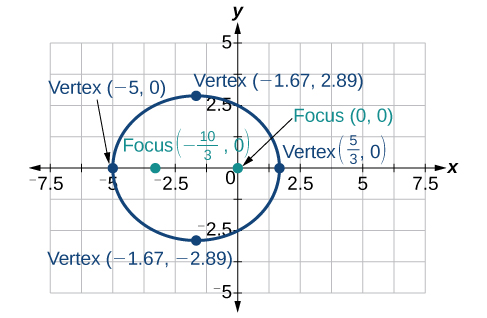

<math xmlns="http://www.w3.org/1998/Math/MathML"> <mrow> <mi>r</mi><mo>=</mo><mfrac> <mn>2</mn> <mrow> <mn>3</mn><mo>+</mo><mn>3</mn><mtext> </mtext><mi>sin</mi><mtext> </mtext><mi>θ</mi> </mrow> </mfrac> </mrow> </math>

<math xmlns="http://www.w3.org/1998/Math/MathML"> <mrow> <mi>r</mi><mo>=</mo><mfrac> <mrow> <mn>10</mn> </mrow> <mrow> <mn>5</mn><mo>−</mo><mn>4</mn><mtext> </mtext><mi>sin</mi><mtext> </mtext><mi>θ</mi> </mrow> </mfrac> </mrow> </math>

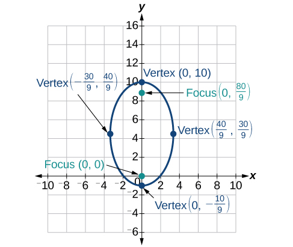

<math xmlns="http://www.w3.org/1998/Math/MathML"> <mrow> <mi>r</mi><mo>=</mo><mfrac> <mn>3</mn> <mrow> <mn>1</mn><mo>+</mo><mn>2</mn><mtext> </mtext><mi>cos</mi><mtext> </mtext><mi>θ</mi> </mrow> </mfrac> </mrow> </math>

<math xmlns="http://www.w3.org/1998/Math/MathML"> <mrow> <mi>r</mi><mo>=</mo><mfrac> <mn>8</mn> <mrow> <mn>4</mn><mo>−</mo><mn>5</mn><mtext> </mtext><mi>cos</mi><mtext> </mtext><mi>θ</mi> </mrow> </mfrac> </mrow> </math>

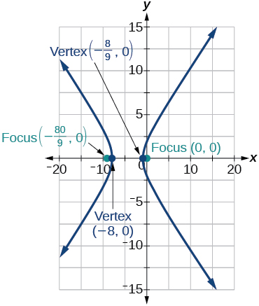

<math xmlns="http://www.w3.org/1998/Math/MathML"> <mrow> <mi>r</mi><mo>=</mo><mfrac> <mn>3</mn> <mrow> <mn>4</mn><mo>−</mo><mn>4</mn><mtext> </mtext><mi>cos</mi><mtext> </mtext><mi>θ</mi> </mrow> </mfrac> </mrow> </math>

<math xmlns="http://www.w3.org/1998/Math/MathML"> <mrow> <mi>r</mi><mo>=</mo><mfrac> <mn>2</mn> <mrow> <mn>1</mn><mo>−</mo><mi>sin</mi><mtext> </mtext><mi>θ</mi> </mrow> </mfrac> </mrow> </math>

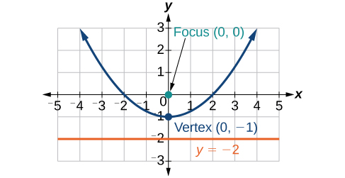

<math xmlns="http://www.w3.org/1998/Math/MathML"> <mrow> <mi>r</mi><mo>=</mo><mfrac> <mn>6</mn> <mrow> <mn>3</mn><mo>+</mo><mn>2</mn><mtext> </mtext><mi>sin</mi><mtext> </mtext><mi>θ</mi> </mrow> </mfrac> </mrow> </math>

<math xmlns="http://www.w3.org/1998/Math/MathML"> <mrow> <mi>r</mi><mo stretchy="false">(</mo><mn>1</mn><mo>+</mo><mi>cos</mi><mtext> </mtext><mi>θ</mi><mo stretchy="false">)</mo><mo>=</mo><mn>5</mn> </mrow> </math>

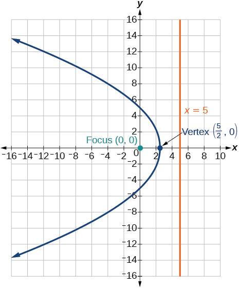

<math xmlns="http://www.w3.org/1998/Math/MathML"> <mrow> <mi>r</mi><mo stretchy="false">(</mo><mn>3</mn><mo>−</mo><mn>4</mn><mi>sin</mi><mtext> </mtext><mi>θ</mi><mo stretchy="false">)</mo><mo>=</mo><mn>9</mn> </mrow> </math>

<math xmlns="http://www.w3.org/1998/Math/MathML"> <mrow> <mi>r</mi><mo stretchy="false">(</mo><mn>3</mn><mo>−</mo><mn>2</mn><mi>sin</mi><mtext> </mtext><mi>θ</mi><mo stretchy="false">)</mo><mo>=</mo><mn>6</mn> </mrow> </math>

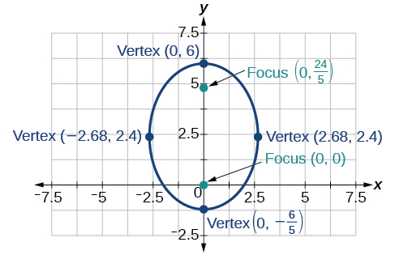

<math xmlns="http://www.w3.org/1998/Math/MathML"> <mrow> <mi>r</mi><mo stretchy="false">(</mo><mn>6</mn><mo>−</mo><mn>4</mn><mi>cos</mi><mtext> </mtext><mi>θ</mi><mo stretchy="false">)</mo><mo>=</mo><mn>5</mn> </mrow> </math>

For the following exercises, find the polar equation of the conic with focus at the origin and the given eccentricity and directrix.

Directrix:<math xmlns="http://www.w3.org/1998/Math/MathML"> <mrow> <mi>x</mi><mo>=</mo><mn>4</mn><mo>;</mo><mtext> </mtext><mi>e</mi><mo>=</mo><mfrac> <mn>1</mn> <mn>5</mn> </mfrac> </mrow> </math>

<math xmlns="http://www.w3.org/1998/Math/MathML"> <mrow> <mi>r</mi><mo>=</mo><mfrac> <mn>4</mn> <mrow> <mn>5</mn><mo>+</mo><mi>cos</mi><mi>θ</mi> </mrow> </mfrac> </mrow> </math>

Directrix:<math xmlns="http://www.w3.org/1998/Math/MathML"> <mrow> <mi>x</mi><mo>=</mo><mo>−</mo><mn>4</mn><mo>;</mo><mtext> </mtext><mi>e</mi><mo>=</mo><mn>5</mn> </mrow> </math>

Directrix:<math xmlns="http://www.w3.org/1998/Math/MathML"> <mrow> <mi>y</mi><mo>=</mo><mn>2</mn><mo>;</mo><mtext> </mtext><mi>e</mi><mo>=</mo><mn>2</mn> </mrow> </math>

<math xmlns="http://www.w3.org/1998/Math/MathML"> <mrow> <mi>r</mi><mo>=</mo><mfrac> <mn>4</mn> <mrow> <mn>1</mn><mo>+</mo><mn>2</mn><mi>sin</mi><mi>θ</mi> </mrow> </mfrac> </mrow> </math>

Directrix: <math xmlns="http://www.w3.org/1998/Math/MathML"> <mrow> <mi>y</mi><mo>=</mo><mo>−</mo><mn>2</mn><mo>;</mo><mtext> </mtext><mi>e</mi><mo>=</mo><mfrac> <mn>1</mn> <mn>2</mn> </mfrac> </mrow> </math>

Directrix:<math xmlns="http://www.w3.org/1998/Math/MathML"> <mrow> <mi>x</mi><mo>=</mo><mn>1</mn><mo>;</mo><mtext> </mtext><mi>e</mi><mo>=</mo><mn>1</mn> </mrow> </math>

<math xmlns="http://www.w3.org/1998/Math/MathML"> <mrow> <mi>r</mi><mo>=</mo><mfrac> <mn>1</mn> <mrow> <mn>1</mn><mo>+</mo><mi>cos</mi><mi>θ</mi> </mrow> </mfrac> </mrow> </math>

Directrix:<math xmlns="http://www.w3.org/1998/Math/MathML"> <mrow> <mi>x</mi><mo>=</mo><mo>−</mo><mn>1</mn><mo>;</mo><mtext> </mtext><mi>e</mi><mo>=</mo><mn>1</mn> </mrow> </math>

Directrix: <math xmlns="http://www.w3.org/1998/Math/MathML"> <mrow> <mi>x</mi><mo>=</mo><mo>−</mo><mfrac> <mn>1</mn> <mn>4</mn> </mfrac> <mo>;</mo><mtext> </mtext><mi>e</mi><mo>=</mo><mfrac> <mn>7</mn> <mn>2</mn> </mfrac> </mrow> </math>

<math xmlns="http://www.w3.org/1998/Math/MathML"> <mrow> <mi>r</mi><mo>=</mo><mfrac> <mn>7</mn> <mrow> <mn>8</mn><mo>−</mo><mn>28</mn><mi>cos</mi><mi>θ</mi> </mrow> </mfrac> </mrow> </math>

Directrix:<math xmlns="http://www.w3.org/1998/Math/MathML"> <mrow> <mi>y</mi><mo>=</mo><mfrac> <mn>2</mn> <mn>5</mn> </mfrac> <mo>;</mo><mtext> </mtext><mi>e</mi><mo>=</mo><mfrac> <mn>7</mn> <mn>2</mn> </mfrac> </mrow> </math>

Directrix: <math xmlns="http://www.w3.org/1998/Math/MathML"> <mrow> <mi>y</mi><mo>=</mo><mn>4</mn><mo>;</mo><mtext> </mtext><mi>e</mi><mo>=</mo><mfrac> <mn>3</mn> <mn>2</mn> </mfrac> </mrow> </math>

<math xmlns="http://www.w3.org/1998/Math/MathML"> <mrow> <mi>r</mi><mo>=</mo><mfrac> <mrow> <mn>12</mn> </mrow> <mrow> <mn>2</mn><mo>+</mo><mn>3</mn><mi>sin</mi><mi>θ</mi> </mrow> </mfrac> </mrow> </math>

Directrix:<math xmlns="http://www.w3.org/1998/Math/MathML"> <mrow> <mi>x</mi><mo>=</mo><mn>−2</mn><mo>;</mo><mtext> </mtext><mi>e</mi><mo>=</mo><mfrac> <mn>8</mn> <mn>3</mn> </mfrac> </mrow> </math>

Directrix:<math xmlns="http://www.w3.org/1998/Math/MathML"> <mrow> <mi>x</mi><mo>=</mo><mn>−5</mn><mo>;</mo><mtext> </mtext><mi>e</mi><mo>=</mo><mfrac> <mn>3</mn> <mn>4</mn> </mfrac> </mrow> </math>

<math xmlns="http://www.w3.org/1998/Math/MathML"> <mrow> <mi>r</mi><mo>=</mo><mfrac> <mrow> <mn>15</mn> </mrow> <mrow> <mn>4</mn><mo>−</mo><mn>3</mn><mi>cos</mi><mi>θ</mi> </mrow> </mfrac> </mrow> </math>

Directrix:<math xmlns="http://www.w3.org/1998/Math/MathML"> <mrow> <mi>y</mi><mo>=</mo><mn>2</mn><mo>;</mo><mtext> </mtext><mi>e</mi><mo>=</mo><mn>2.5</mn> </mrow> </math>

Directrix:<math xmlns="http://www.w3.org/1998/Math/MathML"> <mrow> <mi>x</mi><mo>=</mo><mn>−3</mn><mo>;</mo><mtext> </mtext><mi>e</mi><mo>=</mo><mfrac> <mn>1</mn> <mn>3</mn> </mfrac> </mrow> </math>

<math xmlns="http://www.w3.org/1998/Math/MathML"> <mrow> <mi>r</mi><mo>=</mo><mfrac> <mn>3</mn> <mrow> <mn>3</mn><mo>−</mo><mn>3</mn><mi>cos</mi><mi>θ</mi> </mrow> </mfrac> </mrow> </math>

####  Extensions

Recall from [Rotation of Axes](/m49441){: .target-chapter} that equations of conics with an<math xmlns="http://www.w3.org/1998/Math/MathML"> <mrow> <mtext> </mtext><mi>x</mi><mi>y</mi><mtext> </mtext> </mrow> </math>

term have rotated graphs. For the following exercises, express each equation in polar form with<math xmlns="http://www.w3.org/1998/Math/MathML"> <mrow> <mtext> </mtext><mi>r</mi><mtext> </mtext> </mrow> </math>

as a function of<math xmlns="http://www.w3.org/1998/Math/MathML"> <mrow> <mtext> </mtext><mi>θ</mi><mo>.</mo> </mrow> </math>

<math xmlns="http://www.w3.org/1998/Math/MathML"> <mrow> <mi>x</mi><mi>y</mi><mo>=</mo><mn>2</mn> </mrow> </math>

<math xmlns="http://www.w3.org/1998/Math/MathML"> <mrow> <msup> <mi>x</mi> <mn>2</mn> </msup> <mo>+</mo><mi>x</mi><mi>y</mi><mo>+</mo><msup> <mi>y</mi> <mn>2</mn> </msup> <mo>=</mo><mn>4</mn> </mrow> </math>

<math xmlns="http://www.w3.org/1998/Math/MathML"> <mrow> <mi>r</mi><mo>=</mo><mo>±</mo><mfrac> <mn>2</mn> <mrow> <msqrt> <mrow> <mn>1</mn><mo>+</mo><mi>sin</mi><mi>θ</mi><mi>cos</mi><mi>θ</mi> </mrow> </msqrt> </mrow> </mfrac> </mrow> </math>

<math xmlns="http://www.w3.org/1998/Math/MathML"> <mrow> <mn>2</mn><msup> <mi>x</mi> <mn>2</mn> </msup> <mo>+</mo><mn>4</mn><mi>x</mi><mi>y</mi><mo>+</mo><mn>2</mn><msup> <mi>y</mi> <mn>2</mn> </msup> <mo>=</mo><mn>9</mn> </mrow> </math>

<math xmlns="http://www.w3.org/1998/Math/MathML"> <mrow> <mn>16</mn><msup> <mi>x</mi> <mn>2</mn> </msup> <mo>+</mo><mn>24</mn><mi>x</mi><mi>y</mi><mo>+</mo><mn>9</mn><msup> <mi>y</mi> <mn>2</mn> </msup> <mo>=</mo><mn>4</mn> </mrow> </math>

<math xmlns="http://www.w3.org/1998/Math/MathML"> <mrow> <mi>r</mi><mo>=</mo><mo>±</mo><mfrac> <mn>2</mn> <mrow> <mn>4</mn><mi>cos</mi><mi>θ</mi><mo>+</mo><mn>3</mn><mi>sin</mi><mi>θ</mi> </mrow> </mfrac> </mrow> </math>

<math xmlns="http://www.w3.org/1998/Math/MathML"> <mrow> <mn>2</mn><mi>x</mi><mi>y</mi><mo>+</mo><mi>y</mi><mo>=</mo><mn>1</mn> </mrow> </math>

### Chapter Review Exercises

#### [The Ellipse](/m49438){: .target-chapter}

For the following exercises, write the equation of the ellipse in standard form. Then identify the center, vertices, and foci.

<math xmlns="http://www.w3.org/1998/Math/MathML"> <mrow> <mfrac> <mrow> <msup> <mi>x</mi> <mn>2</mn> </msup> </mrow> <mrow> <mn>25</mn> </mrow> </mfrac> <mo>+</mo><mfrac> <mrow> <msup> <mi>y</mi> <mn>2</mn> </msup> </mrow> <mrow> <mn>64</mn> </mrow> </mfrac> <mo>=</mo><mn>1</mn> </mrow> </math>

<math xmlns="http://www.w3.org/1998/Math/MathML"> <mrow> <mfrac> <mrow> <msup> <mi>x</mi> <mn>2</mn> </msup> </mrow> <mrow> <msup> <mn>5</mn> <mn>2</mn> </msup> </mrow> </mfrac> <mo>+</mo><mfrac> <mrow> <msup> <mi>y</mi> <mn>2</mn> </msup> </mrow> <mrow> <msup> <mn>8</mn> <mn>2</mn> </msup> </mrow> </mfrac> <mo>=</mo><mn>1</mn><mo>;</mo><mtext> </mtext> </mrow> </math>

center:<math xmlns="http://www.w3.org/1998/Math/MathML"> <mrow> <mtext> </mtext><mrow><mo>(</mo> <mrow> <mn>0</mn><mo>,</mo><mn>0</mn> </mrow> <mo>)</mo></mrow><mo>;</mo><mtext> </mtext> </mrow> </math>

vertices:<math xmlns="http://www.w3.org/1998/Math/MathML"> <mrow> <mtext> </mtext><mrow><mo>(</mo> <mrow> <mn>5</mn><mo>,</mo><mn>0</mn> </mrow> <mo>)</mo></mrow><mo>,</mo><mrow><mo>(</mo> <mrow> <mn>−5</mn><mo>,</mo><mn>0</mn> </mrow> <mo>)</mo></mrow><mo>,</mo><mrow><mo>(</mo> <mrow> <mn>0</mn><mo>,</mo><mn>8</mn> </mrow> <mo>)</mo></mrow><mo>,</mo><mrow><mo>(</mo> <mrow> <mn>0</mn><mo>,</mo><mo>−</mo><mn>8</mn> </mrow> <mo>)</mo></mrow><mo>;</mo><mtext> </mtext> </mrow> </math>

foci:<math xmlns="http://www.w3.org/1998/Math/MathML"> <mrow> <mtext> </mtext><mrow><mo>(</mo> <mrow> <mn>0</mn><mo>,</mo><msqrt> <mrow> <mn>39</mn> </mrow> </msqrt> </mrow> <mo>)</mo></mrow><mo>,</mo><mrow><mo>(</mo> <mrow> <mn>0</mn><mo>,</mo><mo>−</mo><msqrt> <mrow> <mn>39</mn> </mrow> </msqrt> </mrow> <mo>)</mo></mrow> </mrow> </math>

<math xmlns="http://www.w3.org/1998/Math/MathML"> <mrow> <mfrac> <mrow> <msup> <mrow> <mo stretchy="false">(</mo><mi>x</mi><mo>−</mo><mn>2</mn><mo stretchy="false">)</mo> </mrow> <mn>2</mn> </msup> </mrow> <mrow> <mn>100</mn> </mrow> </mfrac> <mo>+</mo><mfrac> <mrow> <msup> <mrow> <mrow><mo>(</mo> <mrow> <mi>y</mi><mo>+</mo><mn>3</mn> </mrow> <mo>)</mo></mrow> </mrow> <mn>2</mn> </msup> </mrow> <mrow> <mn>36</mn> </mrow> </mfrac> <mo>=</mo><mn>1</mn> </mrow> </math>

<math xmlns="http://www.w3.org/1998/Math/MathML"> <mrow> <mn>9</mn><msup> <mi>x</mi> <mn>2</mn> </msup> <mo>+</mo><msup> <mi>y</mi> <mn>2</mn> </msup> <mo>+</mo><mn>54</mn><mi>x</mi><mo>−</mo><mn>4</mn><mi>y</mi><mo>+</mo><mn>76</mn><mo>=</mo><mn>0</mn> </mrow> </math>

<math xmlns="http://www.w3.org/1998/Math/MathML"> <mrow> <mfrac> <mrow> <msup> <mrow> <mo stretchy="false">(</mo><mi>x</mi><mo>+</mo><mn>3</mn><mo stretchy="false">)</mo> </mrow> <mn>2</mn> </msup> </mrow> <mrow> <msup> <mn>1</mn> <mn>2</mn> </msup> </mrow> </mfrac> <mo>+</mo><mfrac> <mrow> <msup> <mrow> <mo stretchy="false">(</mo><mi>y</mi><mo>−</mo><mn>2</mn><mo stretchy="false">)</mo> </mrow> <mn>2</mn> </msup> </mrow> <mrow> <msup> <mn>3</mn> <mn>2</mn> </msup> </mrow> </mfrac> <mo>=</mo><mn>1</mn><mtext> </mtext><mtext> </mtext><mo stretchy="false">(</mo><mo>−</mo><mn>3</mn><mo>,</mo><mn>2</mn><mo stretchy="false">)</mo><mo>;</mo><mtext> </mtext><mtext> </mtext><mo stretchy="false">(</mo><mo>−</mo><mn>2</mn><mo>,</mo><mn>2</mn><mo stretchy="false">)</mo><mo>,</mo><mo stretchy="false">(</mo><mo>−</mo><mn>4</mn><mo>,</mo><mn>2</mn><mo stretchy="false">)</mo><mo>,</mo><mo stretchy="false">(</mo><mo>−</mo><mn>3</mn><mo>,</mo><mn>5</mn><mo stretchy="false">)</mo><mo>,</mo><mo stretchy="false">(</mo><mo>−</mo><mn>3</mn><mo>,</mo><mo>−</mo><mn>1</mn><mo stretchy="false">)</mo><mo>;</mo><mtext> </mtext><mtext> </mtext><mrow><mo>(</mo> <mrow> <mo>−</mo><mn>3</mn><mo>,</mo><mn>2</mn><mo>+</mo><mn>2</mn><msqrt> <mn>2</mn> </msqrt> </mrow> <mo>)</mo></mrow><mo>,</mo><mrow><mo>(</mo> <mrow> <mo>−</mo><mn>3</mn><mo>,</mo><mn>2</mn><mo>−</mo><mn>2</mn><msqrt> <mn>2</mn> </msqrt> </mrow> <mo>)</mo></mrow> </mrow> </math>

<math xmlns="http://www.w3.org/1998/Math/MathML"> <mrow> <mn>9</mn><msup> <mi>x</mi> <mn>2</mn> </msup> <mo>+</mo><mn>36</mn><msup> <mi>y</mi> <mn>2</mn> </msup> <mo>−</mo><mn>36</mn><mi>x</mi><mo>+</mo><mn>72</mn><mi>y</mi><mo>+</mo><mn>36</mn><mo>=</mo><mn>0</mn> </mrow> </math>

For the following exercises, graph the ellipse, noting center, vertices, and foci.

<math xmlns="http://www.w3.org/1998/Math/MathML"> <mrow> <mfrac> <mrow> <msup> <mi>x</mi> <mn>2</mn> </msup> </mrow> <mrow> <mn>36</mn> </mrow> </mfrac> <mo>+</mo><mfrac> <mrow> <msup> <mi>y</mi> <mn>2</mn> </msup> </mrow> <mn>9</mn> </mfrac> <mo>=</mo><mn>1</mn> </mrow> </math>

center:<math xmlns="http://www.w3.org/1998/Math/MathML"> <mrow> <mtext> </mtext><mrow><mo>(</mo> <mrow> <mn>0</mn><mo>,</mo><mn>0</mn> </mrow> <mo>)</mo></mrow><mo>;</mo><mtext> </mtext> </mrow> </math>

vertices:<math xmlns="http://www.w3.org/1998/Math/MathML"> <mrow> <mtext> </mtext><mrow><mo>(</mo> <mrow> <mn>6</mn><mo>,</mo><mn>0</mn> </mrow> <mo>)</mo></mrow><mo>,</mo><mrow><mo>(</mo> <mrow> <mn>−6</mn><mo>,</mo><mn>0</mn> </mrow> <mo>)</mo></mrow><mo>,</mo><mrow><mo>(</mo> <mrow> <mn>0</mn><mo>,</mo><mn>3</mn> </mrow> <mo>)</mo></mrow><mo>,</mo><mrow><mo>(</mo> <mrow> <mn>0</mn><mo>,</mo><mn>−3</mn> </mrow> <mo>)</mo></mrow><mo>;</mo><mtext> </mtext> </mrow> </math>

foci:<math xmlns="http://www.w3.org/1998/Math/MathML"> <mrow> <mtext> </mtext><mrow><mo>(</mo> <mrow> <mn>3</mn><msqrt> <mn>3</mn> </msqrt> <mo>,</mo><mn>0</mn> </mrow> <mo>)</mo></mrow><mo>,</mo><mrow><mo>(</mo> <mrow> <mo>−</mo><mn>3</mn><msqrt> <mn>3</mn> </msqrt> <mo>,</mo><mn>0</mn> </mrow> <mo>)</mo></mrow> </mrow> </math>

 * * *
{: data-type="newline" data-count="1"}

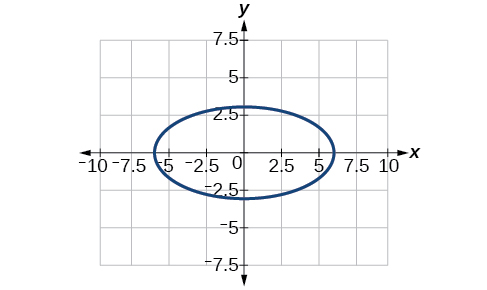

<math xmlns="http://www.w3.org/1998/Math/MathML"> <mrow> <mfrac> <mrow> <msup> <mrow> <mo stretchy="false">(</mo><mi>x</mi><mo>−</mo><mn>4</mn><mo stretchy="false">)</mo> </mrow> <mn>2</mn> </msup> </mrow> <mrow> <mn>25</mn> </mrow> </mfrac> <mo>+</mo><mfrac> <mrow> <msup> <mrow> <mrow><mo>(</mo> <mrow> <mi>y</mi><mo>+</mo><mn>3</mn> </mrow> <mo>)</mo></mrow> </mrow> <mn>2</mn> </msup> </mrow> <mrow> <mn>49</mn> </mrow> </mfrac> <mo>=</mo><mn>1</mn> </mrow> </math>

<math xmlns="http://www.w3.org/1998/Math/MathML"> <mrow> <mn>4</mn><msup> <mi>x</mi> <mn>2</mn> </msup> <mo>+</mo><msup> <mi>y</mi> <mn>2</mn> </msup> <mo>+</mo><mn>16</mn><mi>x</mi><mo>+</mo><mn>4</mn><mi>y</mi><mo>−</mo><mn>44</mn><mo>=</mo><mn>0</mn> </mrow> </math>

center:<math xmlns="http://www.w3.org/1998/Math/MathML"> <mrow> <mtext> </mtext><mrow><mo>(</mo> <mrow> <mn>−2</mn><mo>,</mo><mn>−2</mn> </mrow> <mo>)</mo></mrow><mo>;</mo><mtext> </mtext> </mrow> </math>

vertices:<math xmlns="http://www.w3.org/1998/Math/MathML"> <mrow> <mtext> </mtext><mrow><mo>(</mo> <mrow> <mn>2</mn><mo>,</mo><mn>−2</mn> </mrow> <mo>)</mo></mrow><mo>,</mo><mrow><mo>(</mo> <mrow> <mn>−6</mn><mo>,</mo><mn>−2</mn> </mrow> <mo>)</mo></mrow><mo>,</mo><mrow><mo>(</mo> <mrow> <mn>−2</mn><mo>,</mo><mn>6</mn> </mrow> <mo>)</mo></mrow><mo>,</mo><mrow><mo>(</mo> <mrow> <mn>−2</mn><mo>,</mo><mn>−10</mn> </mrow> <mo>)</mo></mrow><mo>;</mo><mtext> </mtext> </mrow> </math>

foci:<math xmlns="http://www.w3.org/1998/Math/MathML"> <mrow> <mtext> </mtext><mrow><mo>(</mo> <mrow> <mn>−2</mn><mo>,</mo><mn>−2</mn><mo>+</mo><mn>4</mn><msqrt> <mn>3</mn> </msqrt> <mo>,</mo> </mrow> <mo>)</mo></mrow><mo>,</mo><mrow><mo>(</mo> <mrow> <mn>−2</mn><mo>,</mo><mn>−2</mn><mn>−4</mn><msqrt> <mn>3</mn> </msqrt> </mrow> <mo>)</mo></mrow> </mrow> </math>

 * * *
{: data-type="newline" data-count="1"}

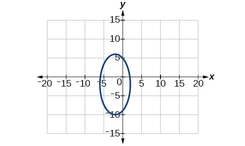

<math xmlns="http://www.w3.org/1998/Math/MathML"> <mrow> <mtext> </mtext><mn>2</mn><msup> <mi>x</mi> <mn>2</mn> </msup> <mo>+</mo><mn>3</mn><msup> <mi>y</mi> <mn>2</mn> </msup> <mo>−</mo><mn>20</mn><mi>x</mi><mo>+</mo><mn>12</mn><mi>y</mi><mo>+</mo><mn>38</mn><mo>=</mo><mn>0</mn> </mrow> </math>

For the following exercises, use the given information to find the equation for the ellipse.

Center at <math xmlns="http://www.w3.org/1998/Math/MathML"> <mrow> <mtext> </mtext><mrow><mo>(</mo> <mrow> <mn>0</mn><mo>,</mo><mn>0</mn> </mrow> <mo>)</mo></mrow><mo>,</mo> </mrow> </math>

focus at<math xmlns="http://www.w3.org/1998/Math/MathML"> <mrow> <mtext> </mtext><mrow><mo>(</mo> <mrow> <mn>3</mn><mo>,</mo><mn>0</mn> </mrow> <mo>)</mo></mrow><mo>,</mo> </mrow> </math>

vertex at<math xmlns="http://www.w3.org/1998/Math/MathML"> <mrow> <mtext> </mtext><mrow><mo>(</mo> <mrow> <mn>−5</mn><mo>,</mo><mn>0</mn> </mrow> <mo>)</mo></mrow> </mrow> </math>

<math xmlns="http://www.w3.org/1998/Math/MathML"> <mrow> <mfrac> <mrow> <msup> <mi>x</mi> <mn>2</mn> </msup> </mrow> <mrow> <mn>25</mn> </mrow> </mfrac> <mo>+</mo><mfrac> <mrow> <msup> <mi>y</mi> <mn>2</mn> </msup> </mrow> <mrow> <mn>16</mn> </mrow> </mfrac> <mo>=</mo><mn>1</mn> </mrow> </math>

Center at<math xmlns="http://www.w3.org/1998/Math/MathML"> <mrow> <mtext> </mtext><mrow><mo>(</mo> <mrow> <mn>2</mn><mo>,</mo><mn>−2</mn> </mrow> <mo>)</mo></mrow><mo>,</mo> </mrow> </math>

vertex at<math xmlns="http://www.w3.org/1998/Math/MathML"> <mrow> <mtext> </mtext><mrow><mo>(</mo> <mrow> <mn>7</mn><mo>,</mo><mn>−2</mn> </mrow> <mo>)</mo></mrow><mo>,</mo> </mrow> </math>

focus at<math xmlns="http://www.w3.org/1998/Math/MathML"> <mrow> <mtext> </mtext><mrow><mo>(</mo> <mrow> <mn>4</mn><mo>,</mo><mn>−2</mn> </mrow> <mo>)</mo></mrow> </mrow> </math>

A whispering gallery is to be constructed such that the foci are located 35 feet from the center. If the length of the gallery is to be 100 feet, what should the height of the ceiling be?

Approximately 35.71 feet

#### [The Hyperbola](/m49439){: .target-chapter}

For the following exercises, write the equation of the hyperbola in standard form. Then give the center, vertices, and foci.

<math xmlns="http://www.w3.org/1998/Math/MathML"> <mrow> <mfrac> <mrow> <msup> <mi>x</mi> <mn>2</mn> </msup> </mrow> <mrow> <mn>81</mn> </mrow> </mfrac> <mo>−</mo><mfrac> <mrow> <msup> <mi>y</mi> <mn>2</mn> </msup> </mrow> <mn>9</mn> </mfrac> <mo>=</mo><mn>1</mn> </mrow> </math>

<math xmlns="http://www.w3.org/1998/Math/MathML"> <mrow> <mfrac> <mrow> <msup> <mrow> <mrow><mo>(</mo> <mrow> <mi>y</mi><mo>+</mo><mn>1</mn> </mrow> <mo>)</mo></mrow> </mrow> <mn>2</mn> </msup> </mrow> <mrow> <mn>16</mn> </mrow> </mfrac> <mo>−</mo><mfrac> <mrow> <msup> <mrow> <mrow><mo>(</mo> <mrow> <mi>x</mi><mo>−</mo><mn>4</mn> </mrow> <mo>)</mo></mrow> </mrow> <mn>2</mn> </msup> </mrow> <mrow> <mn>36</mn> </mrow> </mfrac> <mo>=</mo><mn>1</mn> </mrow> </math>

<math xmlns="http://www.w3.org/1998/Math/MathML"> <mrow> <mfrac> <mrow> <msup> <mrow> <mrow><mo>(</mo> <mrow> <mi>y</mi><mo>+</mo><mn>1</mn> </mrow> <mo>)</mo></mrow> </mrow> <mn>2</mn> </msup> </mrow> <mrow> <msup> <mn>4</mn> <mn>2</mn> </msup> </mrow> </mfrac> <mo>−</mo><mfrac> <mrow> <msup> <mrow> <mrow><mo>(</mo> <mrow> <mi>x</mi><mo>−</mo><mn>4</mn> </mrow> <mo>)</mo></mrow> </mrow> <mn>2</mn> </msup> </mrow> <mrow> <msup> <mn>6</mn> <mn>2</mn> </msup> </mrow> </mfrac> <mo>=</mo><mn>1</mn><mo>;</mo><mtext> </mtext> </mrow> </math>

center:<math xmlns="http://www.w3.org/1998/Math/MathML"> <mrow> <mtext> </mtext><mrow><mo>(</mo> <mrow> <mn>4</mn><mo>,</mo><mn>−1</mn> </mrow> <mo>)</mo></mrow><mo>;</mo><mtext> </mtext> </mrow> </math>

vertices:<math xmlns="http://www.w3.org/1998/Math/MathML"> <mrow> <mtext> </mtext><mrow><mo>(</mo> <mrow> <mn>4</mn><mo>,</mo><mn>3</mn> </mrow> <mo>)</mo></mrow><mo>,</mo><mrow><mo>(</mo> <mrow> <mn>4</mn><mo>,</mo><mn>−5</mn> </mrow> <mo>)</mo></mrow><mo>;</mo><mtext> </mtext> </mrow> </math>

foci:<math xmlns="http://www.w3.org/1998/Math/MathML"> <mrow> <mtext> </mtext><mrow><mo>(</mo> <mrow> <mn>4</mn><mo>,</mo><mn>−1</mn><mo>+</mo><mn>2</mn><msqrt> <mrow> <mn>13</mn> </mrow> </msqrt> </mrow> <mo>)</mo></mrow><mo>,</mo><mrow><mo>(</mo> <mrow> <mn>4</mn><mo>,</mo><mn>−1</mn><mo>−</mo><mn>2</mn><msqrt> <mrow> <mn>13</mn> </mrow> </msqrt> </mrow> <mo>)</mo></mrow> </mrow> </math>

<math xmlns="http://www.w3.org/1998/Math/MathML"> <mrow> <mn>9</mn><msup> <mi>y</mi> <mn>2</mn> </msup> <mo>−</mo><mn>4</mn><msup> <mi>x</mi> <mn>2</mn> </msup> <mo>+</mo><mn>54</mn><mi>y</mi><mo>−</mo><mn>16</mn><mi>x</mi><mo>+</mo><mn>29</mn><mo>=</mo><mn>0</mn> </mrow> </math>

<math xmlns="http://www.w3.org/1998/Math/MathML"> <mrow> <mn>3</mn><msup> <mi>x</mi> <mn>2</mn> </msup> <mo>−</mo><msup> <mi>y</mi> <mn>2</mn> </msup> <mo>−</mo><mn>12</mn><mi>x</mi><mo>−</mo><mn>6</mn><mi>y</mi><mo>−</mo><mn>9</mn><mo>=</mo><mn>0</mn> </mrow> </math>

<math xmlns="http://www.w3.org/1998/Math/MathML"> <mrow> <mfrac> <mrow> <msup> <mrow> <mrow><mo>(</mo> <mrow> <mi>x</mi><mo>−</mo><mn>2</mn> </mrow> <mo>)</mo></mrow> </mrow> <mn>2</mn> </msup> </mrow> <mrow> <msup> <mn>2</mn> <mn>2</mn> </msup> </mrow> </mfrac> <mo>−</mo><mfrac> <mrow> <msup> <mrow> <mrow><mo>(</mo> <mrow> <mi>y</mi><mo>+</mo><mn>3</mn> </mrow> <mo>)</mo></mrow> </mrow> <mn>2</mn> </msup> </mrow> <mrow> <msup> <mrow> <mrow><mo>(</mo> <mrow> <mn>2</mn><msqrt> <mn>3</mn> </msqrt> </mrow> <mo>)</mo></mrow> </mrow> <mn>2</mn> </msup> </mrow> </mfrac> <mo>=</mo><mn>1</mn><mo>;</mo><mtext> </mtext> </mrow> </math>

center:<math xmlns="http://www.w3.org/1998/Math/MathML"> <mrow> <mtext> </mtext><mrow><mo>(</mo> <mrow> <mn>2</mn><mo>,</mo><mn>−3</mn> </mrow> <mo>)</mo></mrow><mo>;</mo><mtext> </mtext> </mrow> </math>

vertices:<math xmlns="http://www.w3.org/1998/Math/MathML"> <mrow> <mtext> </mtext><mrow><mo>(</mo> <mrow> <mn>4</mn><mo>,</mo><mn>−3</mn> </mrow> <mo>)</mo></mrow><mo>,</mo><mrow><mo>(</mo> <mrow> <mn>0</mn><mo>,</mo><mn>−3</mn> </mrow> <mo>)</mo></mrow><mo>;</mo><mtext> </mtext> </mrow> </math>

foci:<math xmlns="http://www.w3.org/1998/Math/MathML"> <mrow> <mtext> </mtext><mrow><mo>(</mo> <mrow> <mn>6</mn><mo>,</mo><mn>−3</mn> </mrow> <mo>)</mo></mrow><mo>,</mo><mrow><mo>(</mo> <mrow> <mn>−2</mn><mo>,</mo><mn>−3</mn> </mrow> <mo>)</mo></mrow> </mrow> </math>

For the following exercises, graph the hyperbola, labeling vertices and foci.

<math xmlns="http://www.w3.org/1998/Math/MathML"> <mrow> <mfrac> <mrow> <msup> <mi>x</mi> <mn>2</mn> </msup> </mrow> <mn>9</mn> </mfrac> <mo>−</mo><mfrac> <mrow> <msup> <mi>y</mi> <mn>2</mn> </msup> </mrow> <mrow> <mn>16</mn> </mrow> </mfrac> <mo>=</mo><mn>1</mn> </mrow> </math>

<math xmlns="http://www.w3.org/1998/Math/MathML"> <mrow> <mfrac> <mrow> <msup> <mrow> <mrow><mo>(</mo> <mrow> <mi>y</mi><mo>−</mo><mn>1</mn> </mrow> <mo>)</mo></mrow> </mrow> <mn>2</mn> </msup> </mrow> <mrow> <mn>49</mn> </mrow> </mfrac> <mo>−</mo><mfrac> <mrow> <msup> <mrow> <mrow><mo>(</mo> <mrow> <mi>x</mi><mo>+</mo><mn>1</mn> </mrow> <mo>)</mo></mrow> </mrow> <mn>2</mn> </msup> </mrow> <mn>4</mn> </mfrac> <mo>=</mo><mn>1</mn> </mrow> </math>

* * *
{: data-type="newline"}

 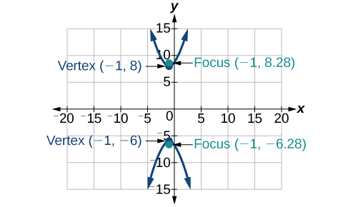 

<math xmlns="http://www.w3.org/1998/Math/MathML"> <mrow> <msup> <mi>x</mi> <mn>2</mn> </msup> <mo>−</mo><mn>4</mn><msup> <mi>y</mi> <mn>2</mn> </msup> <mo>+</mo><mn>6</mn><mi>x</mi><mo>+</mo><mn>32</mn><mi>y</mi><mo>−</mo><mn>91</mn><mo>=</mo><mn>0</mn> </mrow> </math>

<math xmlns="http://www.w3.org/1998/Math/MathML"> <mrow> <mn>2</mn><msup> <mi>y</mi> <mn>2</mn> </msup> <mo>−</mo><msup> <mi>x</mi> <mn>2</mn> </msup> <mo>−</mo><mn>12</mn><mi>y</mi><mo>−</mo><mn>6</mn><mo>=</mo><mn>0</mn> </mrow> </math>

* * *
{: data-type="newline"}

 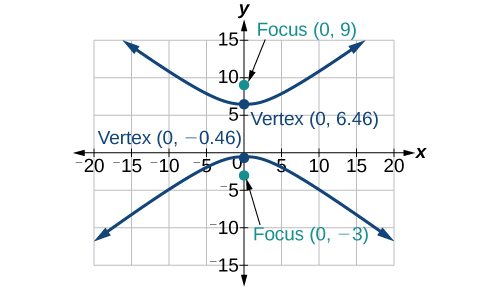 

For the following exercises, find the equation of the hyperbola.

Center at<math xmlns="http://www.w3.org/1998/Math/MathML"> <mrow> <mtext> </mtext><mrow><mo>(</mo> <mrow> <mn>0</mn><mo>,</mo><mn>0</mn> </mrow> <mo>)</mo></mrow><mo>,</mo> </mrow> </math>

vertex at<math xmlns="http://www.w3.org/1998/Math/MathML"> <mrow> <mtext> </mtext><mrow><mo>(</mo> <mrow> <mn>0</mn><mo>,</mo><mn>4</mn> </mrow> <mo>)</mo></mrow><mo>,</mo> </mrow> </math>

focus at<math xmlns="http://www.w3.org/1998/Math/MathML"> <mrow> <mtext> </mtext><mrow><mo>(</mo> <mrow> <mn>0</mn><mo>,</mo><mn>−6</mn> </mrow> <mo>)</mo></mrow> </mrow> </math>

Foci at<math xmlns="http://www.w3.org/1998/Math/MathML"> <mrow> <mtext> </mtext><mrow><mo>(</mo> <mrow> <mn>3</mn><mo>,</mo><mn>7</mn> </mrow> <mo>)</mo></mrow><mtext> </mtext> </mrow> </math>

and<math xmlns="http://www.w3.org/1998/Math/MathML"> <mrow> <mtext> </mtext><mrow><mo>(</mo> <mrow> <mn>7</mn><mo>,</mo><mn>7</mn> </mrow> <mo>)</mo></mrow><mo>,</mo> </mrow> </math>

vertex at<math xmlns="http://www.w3.org/1998/Math/MathML"> <mrow> <mtext> </mtext><mrow><mo>(</mo> <mrow> <mn>6</mn><mo>,</mo><mn>7</mn> </mrow> <mo>)</mo></mrow> </mrow> </math>

<math xmlns="http://www.w3.org/1998/Math/MathML"> <mrow> <mfrac> <mrow> <msup> <mrow> <mrow><mo>(</mo> <mrow> <mi>x</mi><mo>−</mo><mn>5</mn> </mrow> <mo>)</mo></mrow> </mrow> <mn>2</mn> </msup> </mrow> <mn>1</mn> </mfrac> <mo>−</mo><mfrac> <mrow> <msup> <mrow> <mrow><mo>(</mo> <mrow> <mi>y</mi><mo>−</mo><mn>7</mn> </mrow> <mo>)</mo></mrow> </mrow> <mn>2</mn> </msup> </mrow> <mn>3</mn> </mfrac> <mo>=</mo><mn>1</mn> </mrow> </math>

#### [The Parabola](/m49440 ){: .target-chapter}

For the following exercises, write the equation of the parabola in standard form. Then give the vertex, focus, and directrix.

<math xmlns="http://www.w3.org/1998/Math/MathML"> <mrow> <msup> <mi>y</mi> <mn>2</mn> </msup> <mo>=</mo><mn>12</mn><mi>x</mi> </mrow> </math>

<math xmlns="http://www.w3.org/1998/Math/MathML"> <mrow> <msup> <mrow> <mrow><mo>(</mo> <mrow> <mi>x</mi><mo>+</mo><mn>2</mn> </mrow> <mo>)</mo></mrow> </mrow> <mn>2</mn> </msup> <mo>=</mo><mfrac> <mn>1</mn> <mn>2</mn> </mfrac> <mrow><mo>(</mo> <mrow> <mi>y</mi><mo>−</mo><mn>1</mn> </mrow> <mo>)</mo></mrow> </mrow> </math>

<math xmlns="http://www.w3.org/1998/Math/MathML"> <mrow> <msup> <mrow> <mrow><mo>(</mo> <mrow> <mi>x</mi><mo>+</mo><mn>2</mn> </mrow> <mo>)</mo></mrow> </mrow> <mn>2</mn> </msup> <mo>=</mo><mfrac> <mn>1</mn> <mn>2</mn> </mfrac> <mrow><mo>(</mo> <mrow> <mi>y</mi><mo>−</mo><mn>1</mn> </mrow> <mo>)</mo></mrow><mo>;</mo><mtext> </mtext> </mrow> </math>

vertex:<math xmlns="http://www.w3.org/1998/Math/MathML"> <mrow> <mtext> </mtext><mrow><mo>(</mo> <mrow> <mn>−2</mn><mo>,</mo><mn>1</mn> </mrow> <mo>)</mo></mrow><mo>;</mo><mtext> </mtext> </mrow> </math>

focus:<math xmlns="http://www.w3.org/1998/Math/MathML"> <mrow> <mtext> </mtext><mrow><mo>(</mo> <mrow> <mn>−2</mn><mo>,</mo><mfrac> <mn>9</mn> <mn>8</mn> </mfrac> </mrow> <mo>)</mo></mrow><mo>;</mo><mtext> </mtext> </mrow> </math>

directrix:<math xmlns="http://www.w3.org/1998/Math/MathML"> <mrow> <mtext> </mtext><mi>y</mi><mo>=</mo><mfrac> <mn>7</mn> <mn>8</mn> </mfrac> </mrow> </math>

<math xmlns="http://www.w3.org/1998/Math/MathML"> <mrow> <msup> <mi>y</mi> <mn>2</mn> </msup> <mo>−</mo><mn>6</mn><mi>y</mi><mo>−</mo><mn>6</mn><mi>x</mi><mo>−</mo><mn>3</mn><mo>=</mo><mn>0</mn> </mrow> </math>

<math xmlns="http://www.w3.org/1998/Math/MathML"> <mrow> <msup> <mi>x</mi> <mn>2</mn> </msup> <mo>+</mo><mn>10</mn><mi>x</mi><mo>−</mo><mi>y</mi><mo>+</mo><mn>23</mn><mo>=</mo><mn>0</mn> </mrow> </math>

<math xmlns="http://www.w3.org/1998/Math/MathML"> <mrow> <msup> <mrow> <mrow><mo>(</mo> <mrow> <mi>x</mi><mo>+</mo><mn>5</mn> </mrow> <mo>)</mo></mrow> </mrow> <mn>2</mn> </msup> <mo>=</mo><mrow><mo>(</mo> <mrow> <mi>y</mi><mo>+</mo><mn>2</mn> </mrow> <mo>)</mo></mrow><mo>;</mo><mtext> </mtext> </mrow> </math>

vertex:<math xmlns="http://www.w3.org/1998/Math/MathML"> <mrow> <mtext> </mtext><mrow><mo>(</mo> <mrow> <mo>−</mo><mn>5</mn><mo>,</mo><mo>−</mo><mn>2</mn> </mrow> <mo>)</mo></mrow><mo>;</mo><mtext> </mtext> </mrow> </math>

focus:<math xmlns="http://www.w3.org/1998/Math/MathML"> <mrow> <mtext> </mtext><mrow><mo>(</mo> <mrow> <mo>−</mo><mn>5</mn><mo>,</mo><mo>−</mo><mfrac> <mn>7</mn> <mn>4</mn> </mfrac> </mrow> <mo>)</mo></mrow><mo>;</mo><mtext> </mtext> </mrow> </math>

directrix:<math xmlns="http://www.w3.org/1998/Math/MathML"> <mrow> <mtext> </mtext><mi>y</mi><mo>=</mo><mo>−</mo><mfrac> <mn>9</mn> <mn>4</mn> </mfrac> </mrow> </math>

For the following exercises, graph the parabola, labeling vertex, focus, and directrix.

<math xmlns="http://www.w3.org/1998/Math/MathML"> <mrow> <msup> <mi>x</mi> <mn>2</mn> </msup> <mo>+</mo><mn>4</mn><mi>y</mi><mo>=</mo><mn>0</mn> </mrow> </math>

<math xmlns="http://www.w3.org/1998/Math/MathML"> <mrow> <msup> <mrow> <mrow><mo>(</mo> <mrow> <mi>y</mi><mo>−</mo><mn>1</mn> </mrow> <mo>)</mo></mrow> </mrow> <mn>2</mn> </msup> <mo>=</mo><mfrac> <mn>1</mn> <mn>2</mn> </mfrac> <mrow><mo>(</mo> <mrow> <mi>x</mi><mo>+</mo><mn>3</mn> </mrow> <mo>)</mo></mrow> </mrow> </math>

* * *
{: data-type="newline"}

 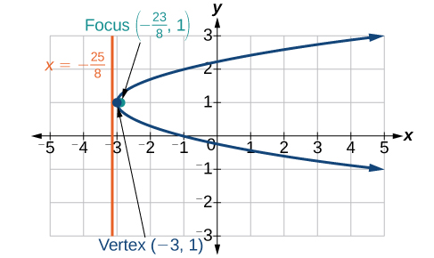 

<math xmlns="http://www.w3.org/1998/Math/MathML"> <mrow> <msup> <mi>x</mi> <mn>2</mn> </msup> <mo>−</mo><mn>8</mn><mi>x</mi><mo>−</mo><mn>10</mn><mi>y</mi><mo>+</mo><mn>46</mn><mo>=</mo><mn>0</mn> </mrow> </math>

<math xmlns="http://www.w3.org/1998/Math/MathML"> <mrow> <mn>2</mn><msup> <mi>y</mi> <mn>2</mn> </msup> <mo>+</mo><mn>12</mn><mi>y</mi><mo>+</mo><mn>6</mn><mi>x</mi><mo>+</mo><mn>15</mn><mo>=</mo><mn>0</mn> </mrow> </math>

* * *
{: data-type="newline"}

 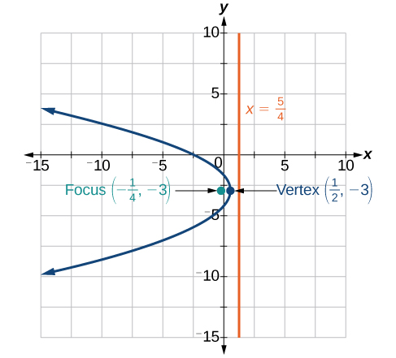 

For the following exercises, write the equation of the parabola using the given information.

Focus at <math xmlns="http://www.w3.org/1998/Math/MathML"> <mrow> <mtext> </mtext><mrow><mo>(</mo> <mrow> <mn>−4</mn><mo>,</mo><mn>0</mn> </mrow> <mo>)</mo></mrow><mo>;</mo><mtext> </mtext> </mrow> </math>

directrix is<math xmlns="http://www.w3.org/1998/Math/MathML"> <mrow> <mtext> </mtext><mi>x</mi><mo>=</mo><mn>4</mn> </mrow> </math>

Focus at<math xmlns="http://www.w3.org/1998/Math/MathML"> <mrow> <mtext> </mtext><mrow><mo>(</mo> <mrow> <mn>2</mn><mo>,</mo><mfrac> <mn>9</mn> <mn>8</mn> </mfrac> </mrow> <mo>)</mo></mrow><mo>;</mo><mtext> </mtext> </mrow> </math>

directrix is<math xmlns="http://www.w3.org/1998/Math/MathML"> <mrow> <mtext> </mtext><mi>y</mi><mo>=</mo><mfrac> <mn>7</mn> <mn>8</mn> </mfrac> </mrow> </math>

<math xmlns="http://www.w3.org/1998/Math/MathML"> <mrow> <msup> <mrow> <mrow><mo>(</mo> <mrow> <mi>x</mi><mo>−</mo><mn>2</mn> </mrow> <mo>)</mo></mrow> </mrow> <mn>2</mn> </msup> <mo>=</mo><mrow><mo>(</mo> <mrow> <mfrac> <mn>1</mn> <mn>2</mn> </mfrac> </mrow> <mo>)</mo></mrow><mrow><mo>(</mo> <mrow> <mi>y</mi><mo>−</mo><mn>1</mn> </mrow> <mo>)</mo></mrow> </mrow> </math>

A cable TV receiving dish is the shape of a paraboloid of revolution. Find the location of the receiver, which is placed at the focus, if the dish is 5 feet across at its opening and 1.5 feet deep.

#### [Rotation of Axes](/m49441){: .target-chapter}

For the following exercises, determine which of the conic sections is represented.

<math xmlns="http://www.w3.org/1998/Math/MathML"> <mrow> <mn>16</mn><msup> <mi>x</mi> <mn>2</mn> </msup> <mo>+</mo><mn>24</mn><mi>x</mi><mi>y</mi><mo>+</mo><mn>9</mn><msup> <mi>y</mi> <mn>2</mn> </msup> <mo>+</mo><mn>24</mn><mi>x</mi><mo>−</mo><mn>60</mn><mi>y</mi><mo>−</mo><mn>60</mn><mo>=</mo><mn>0</mn> </mrow> </math>

<math xmlns="http://www.w3.org/1998/Math/MathML"> <mrow> <msup> <mi>B</mi> <mn>2</mn> </msup> <mo>−</mo><mn>4</mn><mi>A</mi><mi>C</mi><mo>=</mo><mn>0</mn><mo>,</mo> </mrow> </math>

 parabola

<math xmlns="http://www.w3.org/1998/Math/MathML"> <mrow> <mn>4</mn><msup> <mi>x</mi> <mn>2</mn> </msup> <mo>+</mo><mn>14</mn><mi>x</mi><mi>y</mi><mo>+</mo><mn>5</mn><msup> <mi>y</mi> <mn>2</mn> </msup> <mo>+</mo><mn>18</mn><mi>x</mi><mo>−</mo><mn>6</mn><mi>y</mi><mo>+</mo><mn>30</mn><mo>=</mo><mn>0</mn> </mrow> </math>

<math xmlns="http://www.w3.org/1998/Math/MathML"> <mrow> <mn>4</mn><msup> <mi>x</mi> <mn>2</mn> </msup> <mo>+</mo><mi>x</mi><mi>y</mi><mo>+</mo><mn>2</mn><msup> <mi>y</mi> <mn>2</mn> </msup> <mo>+</mo><mn>8</mn><mi>x</mi><mo>−</mo><mn>26</mn><mi>y</mi><mo>+</mo><mn>9</mn><mo>=</mo><mn>0</mn> </mrow> </math>

<math xmlns="http://www.w3.org/1998/Math/MathML"> <mrow> <msup> <mi>B</mi> <mn>2</mn> </msup> <mo>−</mo><mn>4</mn><mi>A</mi><mi>C</mi><mo>=</mo><mo>−</mo><mn>31</mn><mo>&lt;</mo><mn>0</mn><mo>,</mo> </mrow> </math>

 ellipse

For the following exercises, determine the angle<math xmlns="http://www.w3.org/1998/Math/MathML"> <mrow> <mtext> </mtext><mi>θ</mi><mtext> </mtext> </mrow> </math>

that will eliminate the<math xmlns="http://www.w3.org/1998/Math/MathML"> <mrow> <mtext> </mtext><mi>x</mi><mi>y</mi><mtext> </mtext> </mrow> </math>

term, and write the corresponding equation without the<math xmlns="http://www.w3.org/1998/Math/MathML"> <mrow> <mtext> </mtext><mi>x</mi><mi>y</mi><mtext> </mtext> </mrow> </math>

term.

<math xmlns="http://www.w3.org/1998/Math/MathML"> <mrow> <msup> <mi>x</mi> <mn>2</mn> </msup> <mo>+</mo><mn>4</mn><mi>x</mi><mi>y</mi><mo>−</mo><mn>2</mn><msup> <mi>y</mi> <mn>2</mn> </msup> <mo>−</mo><mn>6</mn><mo>=</mo><mn>0</mn> </mrow> </math>

<math xmlns="http://www.w3.org/1998/Math/MathML"> <mrow> <msup> <mi>x</mi> <mn>2</mn> </msup> <mo>−</mo><mi>x</mi><mi>y</mi><mo>+</mo><msup> <mi>y</mi> <mn>2</mn> </msup> <mo>−</mo><mn>6</mn><mo>=</mo><mn>0</mn> </mrow> </math>

<math xmlns="http://www.w3.org/1998/Math/MathML"> <mrow> <mi>θ</mi><mo>=</mo><msup> <mrow> <mn>45</mn> </mrow> <mo>∘</mo> </msup> <mo>,</mo><msup> <msup> <mi>x</mi> <mo>′</mo> </msup> <mn>2</mn> </msup> <mo>+</mo><mn>3</mn><msup> <msup> <mi>y</mi> <mo>′</mo> </msup> <mn>2</mn> </msup> <mo>−</mo><mn>12</mn><mo>=</mo><mn>0</mn> </mrow> </math>

For the following exercises, graph the equation relative to the<math xmlns="http://www.w3.org/1998/Math/MathML"> <mrow> <mtext> </mtext><msup> <mi>x</mi> <mo>′</mo> </msup> <msup> <mi>y</mi> <mo>′</mo> </msup> <mtext> </mtext> </mrow> </math>

system in which the equation has no<math xmlns="http://www.w3.org/1998/Math/MathML"> <mrow> <mtext> </mtext><msup> <mi>x</mi> <mo>′</mo> </msup> <msup> <mi>y</mi> <mo>′</mo> </msup> <mtext> </mtext> </mrow> </math>

term.

<math xmlns="http://www.w3.org/1998/Math/MathML"> <mrow> <mn>9</mn><msup> <mi>x</mi> <mn>2</mn> </msup> <mo>−</mo><mn>24</mn><mi>x</mi><mi>y</mi><mo>+</mo><mn>16</mn><msup> <mi>y</mi> <mn>2</mn> </msup> <mo>−</mo><mn>80</mn><mi>x</mi><mo>−</mo><mn>60</mn><mi>y</mi><mo>+</mo><mn>100</mn><mo>=</mo><mn>0</mn> </mrow> </math>

<math xmlns="http://www.w3.org/1998/Math/MathML"> <mrow> <msup> <mi>x</mi> <mn>2</mn> </msup> <mo>−</mo><mi>x</mi><mi>y</mi><mo>+</mo><msup> <mi>y</mi> <mn>2</mn> </msup> <mo>−</mo><mn>2</mn><mo>=</mo><mn>0</mn> </mrow> </math>

<math xmlns="http://www.w3.org/1998/Math/MathML"> <mrow> <mi>θ</mi><mo>=</mo><msup> <mrow> <mn>45</mn> </mrow> <mo>∘</mo> </msup> </mrow> </math>

* * *
{: data-type="newline"}

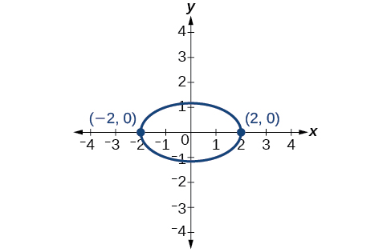

<math xmlns="http://www.w3.org/1998/Math/MathML"> <mrow> <mn>6</mn><msup> <mi>x</mi> <mn>2</mn> </msup> <mo>+</mo><mn>24</mn><mi>x</mi><mi>y</mi><mo>−</mo><msup> <mi>y</mi> <mn>2</mn> </msup> <mo>−</mo><mn>12</mn><mi>x</mi><mo>+</mo><mn>26</mn><mi>y</mi><mo>+</mo><mn>11</mn><mo>=</mo><mn>0</mn> </mrow> </math>

#### [Conic Sections in Polar Coordinates](/m49442){: .target-chapter}

For the following exercises, given the polar equation of the conic with focus at the origin, identify the eccentricity and directrix.

<math xmlns="http://www.w3.org/1998/Math/MathML"> <mrow> <mi>r</mi><mo>=</mo><mfrac> <mrow> <mn>10</mn> </mrow> <mrow> <mn>1</mn><mo>−</mo><mn>5</mn><mtext> </mtext><mi>cos</mi><mtext> </mtext><mi>θ</mi> </mrow> </mfrac> </mrow> </math>

Hyperbola with<math xmlns="http://www.w3.org/1998/Math/MathML"> <mrow> <mtext> </mtext><mi>e</mi><mo>=</mo><mn>5</mn><mtext> </mtext> </mrow> </math>

and directrix<math xmlns="http://www.w3.org/1998/Math/MathML"> <mrow> <mtext> </mtext><mn>2</mn><mtext> </mtext> </mrow> </math>

units to the left of the pole.

<math xmlns="http://www.w3.org/1998/Math/MathML"> <mrow> <mi>r</mi><mo>=</mo><mfrac> <mn>6</mn> <mrow> <mn>3</mn><mo>+</mo><mn>2</mn><mtext> </mtext><mi>cos</mi><mtext> </mtext><mi>θ</mi> </mrow> </mfrac> </mrow> </math>

<math xmlns="http://www.w3.org/1998/Math/MathML"> <mrow> <mi>r</mi><mo>=</mo><mfrac> <mn>1</mn> <mrow> <mn>4</mn><mo>+</mo><mn>3</mn><mtext> </mtext><mi>sin</mi><mtext> </mtext><mi>θ</mi> </mrow> </mfrac> </mrow> </math>

Ellipse with<math xmlns="http://www.w3.org/1998/Math/MathML"> <mrow> <mtext> </mtext><mi>e</mi><mo>=</mo><mfrac> <mn>3</mn> <mn>4</mn> </mfrac> <mtext> </mtext> </mrow> </math>

and directrix<math xmlns="http://www.w3.org/1998/Math/MathML"> <mrow> <mtext> </mtext><mfrac> <mn>1</mn> <mn>3</mn> </mfrac> <mtext> </mtext> </mrow> </math>

unit above the pole.

<math xmlns="http://www.w3.org/1998/Math/MathML"> <mrow> <mi>r</mi><mo>=</mo><mfrac> <mn>3</mn> <mrow> <mn>5</mn><mo>−</mo><mn>5</mn><mtext> </mtext><mi>sin</mi><mtext> </mtext><mi>θ</mi> </mrow> </mfrac> </mrow> </math>

For the following exercises, graph the conic given in polar form. If it is a parabola, label the vertex, focus, and directrix. If it is an ellipse or a hyperbola, label the vertices and foci.

<math xmlns="http://www.w3.org/1998/Math/MathML"> <mrow> <mi>r</mi><mo>=</mo><mfrac> <mn>3</mn> <mrow> <mn>1</mn><mo>−</mo><mi>sin</mi><mtext> </mtext><mi>θ</mi> </mrow> </mfrac> </mrow> </math>

* * *
{: data-type="newline"}

 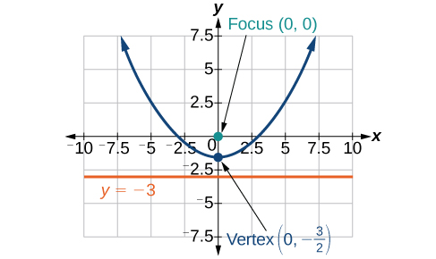 

<math xmlns="http://www.w3.org/1998/Math/MathML"> <mrow> <mi>r</mi><mo>=</mo><mfrac> <mn>8</mn> <mrow> <mn>4</mn><mo>+</mo><mn>3</mn><mtext> </mtext><mi>sin</mi><mtext> </mtext><mi>θ</mi> </mrow> </mfrac> </mrow> </math>

<math xmlns="http://www.w3.org/1998/Math/MathML"> <mrow> <mi>r</mi><mo>=</mo><mfrac> <mrow> <mn>10</mn> </mrow> <mrow> <mn>4</mn><mo>+</mo><mn>5</mn><mtext> </mtext><mi>cos</mi><mtext> </mtext><mi>θ</mi> </mrow> </mfrac> </mrow> </math>

* * *
{: data-type="newline"}

 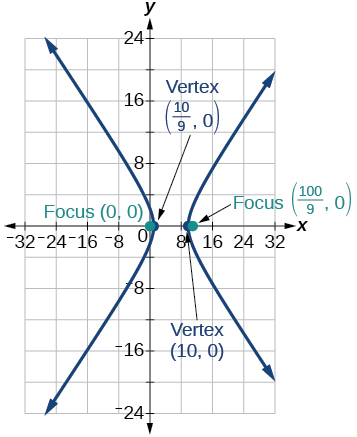 

<math xmlns="http://www.w3.org/1998/Math/MathML"> <mrow> <mi>r</mi><mo>=</mo><mfrac> <mn>9</mn> <mrow> <mn>3</mn><mo>−</mo><mn>6</mn><mtext> </mtext><mi>cos</mi><mtext> </mtext><mi>θ</mi> </mrow> </mfrac> </mrow> </math>

For the following exercises, given information about the graph of a conic with focus at the origin, find the equation in polar form.

Directrix is<math xmlns="http://www.w3.org/1998/Math/MathML"> <mrow> <mtext> </mtext><mi>x</mi><mo>=</mo><mn>3</mn><mtext> </mtext> </mrow> </math>

and eccentricity<math xmlns="http://www.w3.org/1998/Math/MathML"> <mrow> <mtext> </mtext><mi>e</mi><mo>=</mo><mn>1</mn> </mrow> </math>

<math xmlns="http://www.w3.org/1998/Math/MathML"> <mrow> <mi>r</mi><mo>=</mo><mfrac> <mn>3</mn> <mrow> <mn>1</mn><mo>+</mo><mi>cos</mi><mtext> </mtext><mo> </mo><mi>θ</mi> </mrow> </mfrac> </mrow> </math>

Directrix is<math xmlns="http://www.w3.org/1998/Math/MathML"> <mrow> <mtext> </mtext><mi>y</mi><mo>=</mo><mn>−2</mn><mtext> </mtext> </mrow> </math>

and eccentricity<math xmlns="http://www.w3.org/1998/Math/MathML"> <mrow> <mtext> </mtext><mi>e</mi><mo>=</mo><mn>4</mn> </mrow> </math>

### Practice Test

For the following exercises, write the equation in standard form and state the center, vertices, and foci.

<math xmlns="http://www.w3.org/1998/Math/MathML"> <mrow> <mfrac> <mrow> <msup> <mi>x</mi> <mn>2</mn> </msup> </mrow> <mn>9</mn> </mfrac> <mo>+</mo><mfrac> <mrow> <msup> <mi>y</mi> <mn>2</mn> </msup> </mrow> <mn>4</mn> </mfrac> <mo>=</mo><mn>1</mn> </mrow> </math>

<math xmlns="http://www.w3.org/1998/Math/MathML"> <mrow> <mfrac> <mrow> <msup> <mi>x</mi> <mn>2</mn> </msup> </mrow> <mrow> <msup> <mn>3</mn> <mn>2</mn> </msup> </mrow> </mfrac> <mo>+</mo><mfrac> <mrow> <msup> <mi>y</mi> <mn>2</mn> </msup> </mrow> <mrow> <msup> <mn>2</mn> <mn>2</mn> </msup> </mrow> </mfrac> <mo>=</mo><mn>1</mn><mo>;</mo><mtext> </mtext> </mrow> </math>

center:<math xmlns="http://www.w3.org/1998/Math/MathML"> <mrow> <mtext> </mtext><mrow><mo>(</mo> <mrow> <mn>0</mn><mo>,</mo><mn>0</mn> </mrow> <mo>)</mo></mrow><mo>;</mo><mtext> </mtext> </mrow> </math>

vertices:<math xmlns="http://www.w3.org/1998/Math/MathML"> <mrow> <mtext> </mtext><mrow><mo>(</mo> <mrow> <mn>3</mn><mo>,</mo><mn>0</mn> </mrow> <mo>)</mo></mrow><mo>,</mo><mrow><mo>(</mo> <mrow> <mn>–3</mn><mo>,</mo><mn>0</mn> </mrow> <mo>)</mo></mrow><mo>,</mo><mrow><mo>(</mo> <mrow> <mn>0</mn><mo>,</mo><mn>2</mn> </mrow> <mo>)</mo></mrow><mo>,</mo><mrow><mo>(</mo> <mrow> <mn>0</mn><mo>,</mo><mn>−2</mn> </mrow> <mo>)</mo></mrow><mo>;</mo><mtext> </mtext> </mrow> </math>

foci:<math xmlns="http://www.w3.org/1998/Math/MathML"> <mrow> <mrow><mo>(</mo> <mrow> <msqrt> <mn>5</mn> </msqrt> <mo>,</mo><mn>0</mn> </mrow> <mo>)</mo></mrow><mo>,</mo><mrow><mo>(</mo> <mrow> <mo>−</mo><msqrt> <mn>5</mn> </msqrt> <mo>,</mo><mn>0</mn> </mrow> <mo>)</mo></mrow> </mrow> </math>

<math xmlns="http://www.w3.org/1998/Math/MathML"> <mrow> <mn>9</mn><msup> <mi>y</mi> <mn>2</mn> </msup> <mo>+</mo><mn>16</mn><msup> <mi>x</mi> <mn>2</mn> </msup> <mo>−</mo><mn>36</mn><mi>y</mi><mo>+</mo><mn>32</mn><mi>x</mi><mo>−</mo><mn>92</mn><mo>=</mo><mn>0</mn> </mrow> </math>

For the following exercises, sketch the graph, identifying the center, vertices, and foci.

<math xmlns="http://www.w3.org/1998/Math/MathML"> <mrow> <mfrac> <mrow> <msup> <mrow> <mrow><mo>(</mo> <mrow> <mi>x</mi><mo>−</mo><mn>3</mn> </mrow> <mo>)</mo></mrow> </mrow> <mn>2</mn> </msup> </mrow> <mrow> <mn>64</mn> </mrow> </mfrac> <mo>+</mo><mfrac> <mrow> <msup> <mrow> <mrow><mo>(</mo> <mrow> <mi>y</mi><mo>−</mo><mn>2</mn> </mrow> <mo>)</mo></mrow> </mrow> <mn>2</mn> </msup> </mrow> <mrow> <mn>36</mn> </mrow> </mfrac> <mo>=</mo><mn>1</mn> </mrow> </math>

center:<math xmlns="http://www.w3.org/1998/Math/MathML"> <mrow> <mtext> </mtext><mrow><mo>(</mo> <mrow> <mn>3</mn><mo>,</mo><mn>2</mn> </mrow> <mo>)</mo></mrow><mo>;</mo><mtext> </mtext> </mrow> </math>

vertices:<math xmlns="http://www.w3.org/1998/Math/MathML"> <mrow> <mtext> </mtext><mrow><mo>(</mo> <mrow> <mn>11</mn><mo>,</mo><mn>2</mn> </mrow> <mo>)</mo></mrow><mo>,</mo><mrow><mo>(</mo> <mrow> <mn>−5</mn><mo>,</mo><mn>2</mn> </mrow> <mo>)</mo></mrow><mo>,</mo><mrow><mo>(</mo> <mrow> <mn>3</mn><mo>,</mo><mn>8</mn> </mrow> <mo>)</mo></mrow><mo>,</mo><mrow><mo>(</mo> <mrow> <mn>3</mn><mo>,</mo><mn>−4</mn> </mrow> <mo>)</mo></mrow><mo>;</mo><mtext> </mtext> </mrow> </math>

foci:<math xmlns="http://www.w3.org/1998/Math/MathML"> <mrow> <mtext> </mtext><mrow><mo>(</mo> <mrow> <mn>3</mn><mo>+</mo><mn>2</mn><msqrt> <mn>7</mn> </msqrt> <mo>,</mo><mn>2</mn> </mrow> <mo>)</mo></mrow><mo>,</mo><mrow><mo>(</mo> <mrow> <mn>3</mn><mo>−</mo><mn>2</mn><msqrt> <mn>7</mn> </msqrt> <mo>,</mo><mn>2</mn> </mrow> <mo>)</mo></mrow> </mrow> </math>

 * * *
{: data-type="newline"}

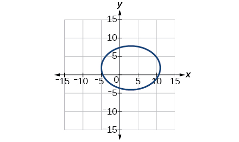

<math xmlns="http://www.w3.org/1998/Math/MathML"> <mrow> <mn>2</mn><msup> <mi>x</mi> <mn>2</mn> </msup> <mo>+</mo><msup> <mi>y</mi> <mn>2</mn> </msup> <mo>+</mo><mn>8</mn><mi>x</mi><mo>−</mo><mn>6</mn><mi>y</mi><mo>−</mo><mn>7</mn><mo>=</mo><mn>0</mn> </mrow> </math>

Write the standard form equation of an ellipse with a center at<math xmlns="http://www.w3.org/1998/Math/MathML"> <mrow> <mtext> </mtext><mrow><mo>(</mo> <mrow> <mn>1</mn><mo>,</mo><mn>2</mn> </mrow> <mo>)</mo></mrow><mo>,</mo> </mrow> </math>

vertex at<math xmlns="http://www.w3.org/1998/Math/MathML"> <mrow> <mtext> </mtext><mrow><mo>(</mo> <mrow> <mn>7</mn><mo>,</mo><mn>2</mn> </mrow> <mo>)</mo></mrow><mo>,</mo> </mrow> </math>

and focus at<math xmlns="http://www.w3.org/1998/Math/MathML"> <mrow> <mtext> </mtext><mrow><mo>(</mo> <mrow> <mn>4</mn><mo>,</mo><mn>2</mn> </mrow> <mo>).</mo></mrow> </mrow> </math>

<math xmlns="http://www.w3.org/1998/Math/MathML"> <mrow> <mfrac> <mrow> <msup> <mrow> <mrow><mo>(</mo> <mrow> <mi>x</mi><mo>−</mo><mn>1</mn> </mrow> <mo>)</mo></mrow> </mrow> <mn>2</mn> </msup> </mrow> <mrow> <mn>36</mn> </mrow> </mfrac> <mo>+</mo><mfrac> <mrow> <msup> <mrow> <mrow><mo>(</mo> <mrow> <mi>y</mi><mo>−</mo><mn>2</mn> </mrow> <mo>)</mo></mrow> </mrow> <mn>2</mn> </msup> </mrow> <mrow> <mn>27</mn> </mrow> </mfrac> <mo>=</mo><mn>1</mn> </mrow> </math>

A whispering gallery is to be constructed with a length of 150 feet. If the foci are to be located 20 feet away from the wall, how high should the ceiling be?

For the following exercises, write the equation of the hyperbola in standard form, and give the center, vertices, foci, and asymptotes.

<math xmlns="http://www.w3.org/1998/Math/MathML"> <mrow> <mfrac> <mrow> <msup> <mi>x</mi> <mn>2</mn> </msup> </mrow> <mrow> <mn>49</mn> </mrow> </mfrac> <mo>−</mo><mfrac> <mrow> <msup> <mi>y</mi> <mn>2</mn> </msup> </mrow> <mrow> <mn>81</mn> </mrow> </mfrac> <mo>=</mo><mn>1</mn> </mrow> </math>

<math xmlns="http://www.w3.org/1998/Math/MathML"> <mrow> <mfrac> <mrow> <msup> <mi>x</mi> <mn>2</mn> </msup> </mrow> <mrow> <msup> <mn>7</mn> <mn>2</mn> </msup> </mrow> </mfrac> <mo>−</mo><mfrac> <mrow> <msup> <mi>y</mi> <mn>2</mn> </msup> </mrow> <mrow> <msup> <mn>9</mn> <mn>2</mn> </msup> </mrow> </mfrac> <mo>=</mo><mn>1</mn><mo>;</mo><mtext> </mtext> </mrow> </math>

center:<math xmlns="http://www.w3.org/1998/Math/MathML"> <mrow> <mtext> </mtext><mrow><mo>(</mo> <mrow> <mn>0</mn><mo>,</mo><mn>0</mn> </mrow> <mo>)</mo></mrow><mo>;</mo><mtext> </mtext> </mrow> </math>

vertices<math xmlns="http://www.w3.org/1998/Math/MathML"> <mrow> <mtext> </mtext><mrow><mo>(</mo> <mrow> <mn>7</mn><mo>,</mo><mn>0</mn> </mrow> <mo>)</mo></mrow><mo>,</mo><mrow><mo>(</mo> <mrow> <mn>−7</mn><mo>,</mo><mn>0</mn> </mrow> <mo>)</mo></mrow><mo>;</mo><mtext> </mtext> </mrow> </math>

foci:<math xmlns="http://www.w3.org/1998/Math/MathML"> <mrow> <mtext> </mtext><mrow><mo>(</mo> <mrow> <msqrt> <mrow> <mn>130</mn> </mrow> </msqrt> <mo>,</mo><mn>0</mn> </mrow> <mo>)</mo></mrow><mo>,</mo><mrow><mo>(</mo> <mrow> <mo>−</mo><msqrt> <mrow> <mn>130</mn> </mrow> </msqrt> <mo>,</mo><mn>0</mn> </mrow> <mo>)</mo></mrow><mo>;</mo><mtext> </mtext> </mrow> </math>

asymptotes:<math xmlns="http://www.w3.org/1998/Math/MathML"> <mrow> <mtext> </mtext><mi>y</mi><mo>=</mo><mo>±</mo><mfrac> <mn>9</mn> <mn>7</mn> </mfrac> <mi>x</mi> </mrow> </math>

<math xmlns="http://www.w3.org/1998/Math/MathML"> <mrow> <mn>16</mn><msup> <mi>y</mi> <mn>2</mn> </msup> <mo>−</mo><mn>9</mn><msup> <mi>x</mi> <mn>2</mn> </msup> <mo>+</mo><mn>128</mn><mi>y</mi><mo>+</mo><mn>112</mn><mo>=</mo><mn>0</mn> </mrow> </math>

For the following exercises, graph the hyperbola, noting its center, vertices, and foci. State the equations of the asymptotes.

<math xmlns="http://www.w3.org/1998/Math/MathML"> <mrow> <mfrac> <mrow> <msup> <mrow> <mrow><mo>(</mo> <mrow> <mi>x</mi><mo>−</mo><mn>3</mn> </mrow> <mo>)</mo></mrow> </mrow> <mn>2</mn> </msup> </mrow> <mrow> <mn>25</mn> </mrow> </mfrac> <mo>−</mo><mfrac> <mrow> <msup> <mrow> <mrow><mo>(</mo> <mrow> <mi>y</mi><mo>+</mo><mn>3</mn> </mrow> <mo>)</mo></mrow> </mrow> <mn>2</mn> </msup> </mrow> <mn>1</mn> </mfrac> <mo>=</mo><mn>1</mn> </mrow> </math>

center:<math xmlns="http://www.w3.org/1998/Math/MathML"> <mrow> <mtext> </mtext><mrow><mo>(</mo> <mrow> <mn>3</mn><mo>,</mo><mn>−3</mn> </mrow> <mo>)</mo></mrow><mo>;</mo><mtext> </mtext> </mrow> </math>

vertices:<math xmlns="http://www.w3.org/1998/Math/MathML"> <mrow> <mtext> </mtext><mrow><mo>(</mo> <mrow> <mn>8</mn><mo>,</mo><mn>−3</mn> </mrow> <mo>)</mo></mrow><mo>,</mo><mrow><mo>(</mo> <mrow> <mn>−2</mn><mo>,</mo><mn>−3</mn> </mrow> <mo>)</mo></mrow><mo>;</mo> </mrow> </math>

foci:<math xmlns="http://www.w3.org/1998/Math/MathML"> <mrow> <mtext> </mtext><mrow><mo>(</mo> <mrow> <mn>3</mn><mo>+</mo><msqrt> <mrow> <mn>26</mn> </mrow> </msqrt> <mo>,</mo><mn>−3</mn> </mrow> <mo>)</mo></mrow><mo>,</mo><mrow><mo>(</mo> <mrow> <mn>3</mn><mo>−</mo><msqrt> <mrow> <mn>26</mn> </mrow> </msqrt> <mo>,</mo><mn>−3</mn> </mrow> <mo>)</mo></mrow><mo>;</mo><mtext> </mtext> </mrow> </math>

asymptotes:<math xmlns="http://www.w3.org/1998/Math/MathML"> <mrow> <mtext> </mtext><mi>y</mi><mo>=</mo><mo>±</mo><mfrac> <mn>1</mn> <mn>5</mn> </mfrac> <mo stretchy="false">(</mo><mi>x</mi><mo>−</mo><mn>3</mn><mo stretchy="false">)</mo><mo>−</mo><mn>3</mn> </mrow> </math>

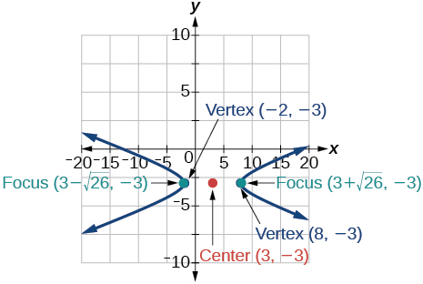

<math xmlns="http://www.w3.org/1998/Math/MathML"> <mrow> <msup> <mi>y</mi> <mn>2</mn> </msup> <mo>−</mo><msup> <mi>x</mi> <mn>2</mn> </msup> <mo>+</mo><mn>4</mn><mi>y</mi><mo>−</mo><mn>4</mn><mi>x</mi><mo>−</mo><mn>18</mn><mo>=</mo><mn>0</mn> </mrow> </math>

Write the standard form equation of a hyperbola with foci at<math xmlns="http://www.w3.org/1998/Math/MathML"> <mrow> <mtext> </mtext><mrow><mo>(</mo> <mrow> <mn>1</mn><mo>,</mo><mn>0</mn> </mrow> <mo>)</mo></mrow><mtext> </mtext> </mrow> </math>

and<math xmlns="http://www.w3.org/1998/Math/MathML"> <mrow> <mtext> </mtext><mrow><mo>(</mo> <mrow> <mn>1</mn><mo>,</mo><mn>6</mn> </mrow> <mo>)</mo></mrow><mo>,</mo> </mrow> </math>

and a vertex at<math xmlns="http://www.w3.org/1998/Math/MathML"> <mrow> <mtext> </mtext><mrow><mo>(</mo> <mrow> <mn>1</mn><mo>,</mo><mn>2</mn> </mrow> <mo>)</mo></mrow><mo>.</mo> </mrow> </math>

<math xmlns="http://www.w3.org/1998/Math/MathML"> <mrow> <mfrac> <mrow> <msup> <mrow> <mrow><mo>(</mo> <mrow> <mi>y</mi><mo>−</mo><mn>3</mn> </mrow> <mo>)</mo></mrow> </mrow> <mn>2</mn> </msup> </mrow> <mn>1</mn> </mfrac> <mo>−</mo><mfrac> <mrow> <msup> <mrow> <mrow><mo>(</mo> <mrow> <mi>x</mi><mo>−</mo><mn>1</mn> </mrow> <mo>)</mo></mrow> </mrow> <mn>2</mn> </msup> </mrow> <mn>8</mn> </mfrac> <mo>=</mo><mn>1</mn> </mrow> </math>

For the following exercises, write the equation of the parabola in standard form, and give the vertex, focus, and equation of the directrix.

<math xmlns="http://www.w3.org/1998/Math/MathML"> <mrow> <msup> <mi>y</mi> <mn>2</mn> </msup> <mo>+</mo><mn>10</mn><mi>x</mi><mo>=</mo><mn>0</mn> </mrow> </math>

<math xmlns="http://www.w3.org/1998/Math/MathML"> <mrow> <mn>3</mn><msup> <mi>x</mi> <mn>2</mn> </msup> <mo>−</mo><mn>12</mn><mi>x</mi><mo>−</mo><mi>y</mi><mo>+</mo><mn>11</mn><mo>=</mo><mn>0</mn> </mrow> </math>

<math xmlns="http://www.w3.org/1998/Math/MathML"> <mrow> <msup> <mrow> <mrow><mo>(</mo> <mrow> <mi>x</mi><mo>−</mo><mn>2</mn> </mrow> <mo>)</mo></mrow> </mrow> <mn>2</mn> </msup> <mo>=</mo><mfrac> <mn>1</mn> <mn>3</mn> </mfrac> <mrow><mo>(</mo> <mrow> <mi>y</mi><mo>+</mo><mn>1</mn> </mrow> <mo>)</mo></mrow><mo>;</mo><mtext> </mtext> </mrow> </math>

vertex:<math xmlns="http://www.w3.org/1998/Math/MathML"> <mrow> <mtext> </mtext><mrow><mo>(</mo> <mrow> <mn>2</mn><mo>,</mo><mn>−1</mn> </mrow> <mo>)</mo></mrow><mo>;</mo><mtext> </mtext> </mrow> </math>

focus:<math xmlns="http://www.w3.org/1998/Math/MathML"> <mrow> <mtext> </mtext><mrow><mo>(</mo> <mrow> <mn>2</mn><mo>,</mo><mo>−</mo><mfrac> <mrow> <mn>11</mn> </mrow> <mrow> <mn>12</mn> </mrow> </mfrac> </mrow> <mo>)</mo></mrow><mo>;</mo><mtext> </mtext> </mrow> </math>

directrix:<math xmlns="http://www.w3.org/1998/Math/MathML"> <mrow> <mtext> </mtext><mi>y</mi><mo>=</mo><mo>−</mo><mfrac> <mrow> <mn>13</mn> </mrow> <mrow> <mn>12</mn> </mrow> </mfrac> </mrow> </math>

For the following exercises, graph the parabola, labeling the vertex, focus, and directrix.

<math xmlns="http://www.w3.org/1998/Math/MathML"> <mrow> <msup> <mrow> <mrow><mo>(</mo> <mrow> <mi>x</mi><mo>−</mo><mn>1</mn> </mrow> <mo>)</mo></mrow> </mrow> <mn>2</mn> </msup> <mo>=</mo><mn>−4</mn><mrow><mo>(</mo> <mrow> <mi>y</mi><mo>+</mo><mn>3</mn> </mrow> <mo>)</mo></mrow> </mrow> </math>

<math xmlns="http://www.w3.org/1998/Math/MathML"> <mrow> <msup> <mi>y</mi> <mn>2</mn> </msup> <mo>+</mo><mn>8</mn><mi>x</mi><mo>−</mo><mn>8</mn><mi>y</mi><mo>+</mo><mn>40</mn><mo>=</mo><mn>0</mn> </mrow> </math>

* * *
{: data-type="newline"}

 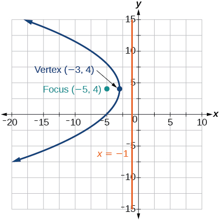 

Write the equation of a parabola with a focus at<math xmlns="http://www.w3.org/1998/Math/MathML"> <mrow> <mtext> </mtext><mrow><mo>(</mo> <mrow> <mn>2</mn><mo>,</mo><mn>3</mn> </mrow> <mo>)</mo></mrow><mtext> </mtext> </mrow> </math>

and directrix<math xmlns="http://www.w3.org/1998/Math/MathML"> <mrow> <mtext> </mtext><mi>y</mi><mo>=</mo><mn>−1.</mn> </mrow> </math>

A searchlight is shaped like a paraboloid of revolution. If the light source is located 1.5 feet from the base along the axis of symmetry, and the depth of the searchlight is 3 feet, what should the width of the opening be?

Approximately<math xmlns="http://www.w3.org/1998/Math/MathML"> <mrow> <mtext> </mtext><mn>8.49</mn><mtext> </mtext> </mrow> </math>

feet

For the following exercises, determine which conic section is represented by the given equation, and then determine the angle<math xmlns="http://www.w3.org/1998/Math/MathML"> <mrow> <mtext> </mtext><mi>θ</mi><mtext> </mtext> </mrow> </math>

that will eliminate the<math xmlns="http://www.w3.org/1998/Math/MathML"> <mrow> <mtext> </mtext><mi>x</mi><mi>y</mi><mtext> </mtext> </mrow> </math>

term.

<math xmlns="http://www.w3.org/1998/Math/MathML"> <mrow> <mn>3</mn><msup> <mi>x</mi> <mn>2</mn> </msup> <mo>−</mo><mn>2</mn><mi>x</mi><mi>y</mi><mo>+</mo><mn>3</mn><msup> <mi>y</mi> <mn>2</mn> </msup> <mo>=</mo><mn>4</mn> </mrow> </math>

<math xmlns="http://www.w3.org/1998/Math/MathML"> <mrow> <msup> <mi>x</mi> <mn>2</mn> </msup> <mo>+</mo><mn>4</mn><mi>x</mi><mi>y</mi><mo>+</mo><mn>4</mn><msup> <mi>y</mi> <mn>2</mn> </msup> <mo>+</mo><mn>6</mn><mi>x</mi><mo>−</mo><mn>8</mn><mi>y</mi><mo>=</mo><mn>0</mn> </mrow> </math>

parabola;<math xmlns="http://www.w3.org/1998/Math/MathML"> <mrow> <mtext> </mtext><mi>θ</mi><mo>≈</mo><msup> <mrow> <mn>63.4</mn> </mrow> <mo>∘</mo> </msup> </mrow> </math>

For the following exercises, rewrite in the<math xmlns="http://www.w3.org/1998/Math/MathML"> <mrow> <mtext> </mtext><msup> <mi>x</mi> <mo>′</mo> </msup> <msup> <mi>y</mi> <mo>′</mo> </msup> <mtext> </mtext> </mrow> </math>

system without the<math xmlns="http://www.w3.org/1998/Math/MathML"> <mrow> <mtext> </mtext><msup> <mi>x</mi> <mo>′</mo> </msup> <msup> <mi>y</mi> <mo>′</mo> </msup> <mtext> </mtext> </mrow> </math>

term, and graph the rotated graph.

<math xmlns="http://www.w3.org/1998/Math/MathML"> <mrow> <mn>11</mn><msup> <mi>x</mi> <mn>2</mn> </msup> <mo>+</mo><mn>10</mn><msqrt> <mn>3</mn> </msqrt> <mi>x</mi><mi>y</mi><mo>+</mo><msup> <mi>y</mi> <mn>2</mn> </msup> <mo>=</mo><mn>4</mn> </mrow> </math>

<math xmlns="http://www.w3.org/1998/Math/MathML"> <mrow> <mn>16</mn><msup> <mi>x</mi> <mn>2</mn> </msup> <mo>+</mo><mn>24</mn><mi>x</mi><mi>y</mi><mo>+</mo><mn>9</mn><msup> <mi>y</mi> <mn>2</mn> </msup> <mo>−</mo><mn>125</mn><mi>x</mi><mo>=</mo><mn>0</mn> </mrow> </math>

<math xmlns="http://www.w3.org/1998/Math/MathML"> <mrow> <msup> <msup> <mi>x</mi> <mo>′</mo> </msup> <mn>2</mn> </msup> <mo>−</mo><mn>4</mn><msup> <mi>x</mi> <mo>′</mo> </msup> <mo>+</mo><mn>3</mn><msup> <mi>y</mi> <mo>′</mo> </msup> <mo>=</mo><mn>0</mn> </mrow> </math>

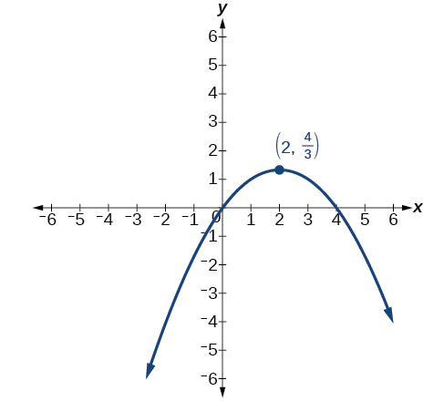

For the following exercises, identify the conic with focus at the origin, and then give the directrix and eccentricity.

<math xmlns="http://www.w3.org/1998/Math/MathML"> <mrow> <mi>r</mi><mo>=</mo><mfrac> <mn>3</mn> <mrow> <mn>2</mn><mo>−</mo><mi>sin</mi><mtext> </mtext><mi>θ</mi> </mrow> </mfrac> </mrow> </math>

<math xmlns="http://www.w3.org/1998/Math/MathML"> <mrow> <mi>r</mi><mo>=</mo><mfrac> <mn>5</mn> <mrow> <mn>4</mn><mo>+</mo><mn>6</mn><mtext> </mtext><mi>cos</mi><mtext> </mtext><mi>θ</mi> </mrow> </mfrac> </mrow> </math>

Hyperbola with<math xmlns="http://www.w3.org/1998/Math/MathML"> <mrow> <mtext> </mtext><mi>e</mi><mo>=</mo><mfrac> <mn>3</mn> <mn>2</mn> </mfrac> <mo>,</mo><mtext> </mtext> </mrow> </math>

and directrix<math xmlns="http://www.w3.org/1998/Math/MathML"> <mrow> <mtext> </mtext><mfrac> <mn>5</mn> <mn>6</mn> </mfrac> <mtext> </mtext> </mrow> </math>

units to the right of the pole.

For the following exercises, graph the given conic section. If it is a parabola, label vertex, focus, and directrix. If it is an ellipse or a hyperbola, label vertices and foci.

<math xmlns="http://www.w3.org/1998/Math/MathML"> <mrow> <mi>r</mi><mo>=</mo><mfrac> <mrow> <mn>12</mn> </mrow> <mrow> <mn>4</mn><mo>−</mo><mn>8</mn><mtext> </mtext><mi>sin</mi><mtext> </mtext><mi>θ</mi> </mrow> </mfrac> </mrow> </math>

<math xmlns="http://www.w3.org/1998/Math/MathML"> <mrow> <mi>r</mi><mo>=</mo><mfrac> <mn>2</mn> <mrow> <mn>4</mn><mo>+</mo><mn>4</mn><mtext> </mtext><mi>sin</mi><mtext> </mtext><mi>θ</mi> </mrow> </mfrac> </mrow> </math>

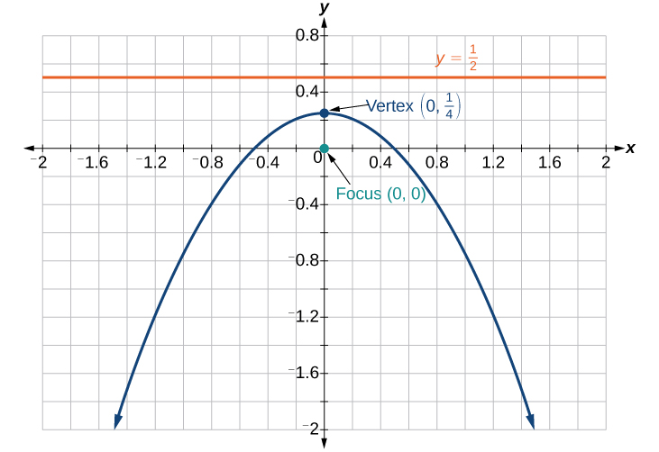

Find a polar equation of the conic with focus at the origin, eccentricity of<math xmlns="http://www.w3.org/1998/Math/MathML"> <mrow> <mtext> </mtext><mi>e</mi><mo>=</mo><mn>2</mn><mo>,</mo> </mrow> </math>

and directrix:<math xmlns="http://www.w3.org/1998/Math/MathML"> <mrow> <mtext> </mtext><mi>x</mi><mo>=</mo><mn>3.</mn> </mrow> </math>

### Glossary
{: data-type="glossary-title"}

eccentricity
: the ratio of the distances from a point
  <math xmlns="http://www.w3.org/1998/Math/MathML"> <mrow> <mtext> </mtext><mi>P</mi><mtext> </mtext> </mrow> </math>
  
  on the graph to the focus
  <math xmlns="http://www.w3.org/1998/Math/MathML"> <mrow> <mtext> </mtext><mi>F</mi><mtext> </mtext> </mrow> </math>
  
  and to the directrix
  <math xmlns="http://www.w3.org/1998/Math/MathML"> <mrow> <mtext> </mtext><mi>D</mi><mtext> </mtext> </mrow> </math>
  
  represented by
  <math xmlns="http://www.w3.org/1998/Math/MathML"> <mrow> <mtext> </mtext><mi>e</mi><mo>=</mo><mfrac> <mrow> <mi>P</mi><mi>F</mi> </mrow> <mrow> <mi>P</mi><mi>D</mi> </mrow> </mfrac> <mo>,</mo> </mrow> </math>
  
  where
  <math xmlns="http://www.w3.org/1998/Math/MathML"> <mrow> <mtext> </mtext><mi>e</mi><mtext> </mtext> </mrow> </math>
  
  is a positive real number
^

polar equation
: an equation of a curve in polar coordinates
  <math xmlns="http://www.w3.org/1998/Math/MathML"> <mrow> <mtext> </mtext><mi>r</mi><mtext> </mtext> </mrow> </math>
  
  and
  <math xmlns="http://www.w3.org/1998/Math/MathML"> <mrow> <mtext> </mtext><mi>θ</mi> </mrow> </math>

[1]: http://openstaxcollege.org/l/determineconic
[2]: http://openstaxcollege.org/l/graphconic1
[3]: http://openstaxcollege.org/l/graphconic2
[4]: http://openstaxcollege.org/l/PreCalcLPC10
