

In this section, you will:
* Write the terms of a sequence defined by an explicit formula.
* Write the terms of a sequence defined by a recursive formula.
* Use factorial notation.

A video game company launches an exciting new advertising campaign. They predict the number of online visits to their website, or hits, will double each day. The model they are using shows 2 hits the first day, 4 hits the second day, 8 hits the third day, and so on. See [\[link\]](#Table_11_01_01).

<table id="Table_11_01_01" summary=""><colgroup><col data-width="50" /><col data-width="30" /><col data-width="30" /><col data-width="30" /><col data-width="30" /><col data-width="30" /><col data-width="30" /></colgroup><tbody>
<tr>
 <td><strong>Day</strong></td>
<td data-align="center">1</td>
<td data-align="center">2</td>
<td data-align="center">3</td>
<td data-align="center">4</td>
<td data-align="center">5</td>
<td>…</td>
</tr>
<tr>
 <td><strong>Hits</strong></td>
<td data-align="center">2</td>
<td data-align="center">4</td>
<td data-align="center">8</td>
<td data-align="center">16</td>
<td data-align="center">32</td>
<td data-align="center">…</td>
</tr>
</tbody></table>

If their model continues, how many hits will there be at the end of the month? To answer this question, we’ll first need to know how to determine a list of numbers written in a specific order. In this section, we will explore these kinds of ordered lists.

### Writing the Terms of a Sequence Defined by an Explicit Formula

One way to describe an ordered list of numbers is as a **sequence**{: data-type="term"}. A sequence is a function whose domain is a subset of the counting numbers. The sequence established by the number of hits on the website is

<math xmlns="http://www.w3.org/1998/Math/MathML" display="block"> <mrow> <mtext> </mtext><mo>{</mo><mn>2</mn><mo>,</mo><mn>4</mn><mo>,</mo><mn>8</mn><mo>,</mo><mn>16</mn><mo>,</mo><mn>32</mn><mo>,</mo><mo>…</mo><mo>}</mo><mo>.</mo> </mrow> </math>

The **ellipsis**{: data-type="term" .no-emphasis} (…) indicates that the sequence continues indefinitely. Each number in the sequence is called a **term**{: data-type="term"}. The first five terms of this sequence are 2, 4, 8, 16, and 32.

Listing all of the terms for a sequence can be cumbersome. For example, finding the number of hits on the website at the end of the month would require listing out as many as 31 terms. A more efficient way to determine a specific term is by writing a formula to define the sequence.

One type of formula is an **explicit formula**{: data-type="term" .no-emphasis}, which defines the terms of a sequence using their position in the sequence. Explicit formulas are helpful if we want to find a specific term of a sequence without finding all of the previous terms. We can use the formula to find the <strong data-type="term" class="no-emphasis"><math xmlns="http://www.w3.org/1998/Math/MathML">
 <mrow>
  <mi>n</mi><mtext>th</mtext>
 </mrow>
</math> term of the sequence</strong>, where <math xmlns="http://www.w3.org/1998/Math/MathML"> <mi>n</mi> </math>

 is any positive number. In our example, each number in the sequence is double the previous number, so we can use powers of 2 to write a formula for the <math xmlns="http://www.w3.org/1998/Math/MathML"> <mrow> <mi>n</mi><mtext>th</mtext> </mrow> </math>

 term.

    The first term of the sequence is<math xmlns="http://www.w3.org/1998/Math/MathML"> <mrow> <mtext> </mtext><msup> <mn>2</mn> <mn>1</mn> </msup> <mo>=</mo><mn>2</mn><mo>,</mo><mtext> </mtext> </mrow> </math>

the second term is<math xmlns="http://www.w3.org/1998/Math/MathML"> <mrow> <mtext> </mtext><msup> <mn>2</mn> <mn>2</mn> </msup> <mo>=</mo><mn>4</mn><mo>,</mo><mtext> </mtext> </mrow> </math>

the third term is<math xmlns="http://www.w3.org/1998/Math/MathML"> <mrow> <mtext> </mtext><msup> <mn>2</mn> <mn>3</mn> </msup> <mo>=</mo><mn>8</mn><mo>,</mo><mtext> </mtext> </mrow> </math>

and so on. The <math xmlns="http://www.w3.org/1998/Math/MathML"> <mrow> <mi>n</mi><mtext>th</mtext> </mrow> </math>

 term of the sequence can be found by raising 2 to the <math xmlns="http://www.w3.org/1998/Math/MathML"> <mrow> <mi>n</mi><mtext>th</mtext> </mrow> </math>

 power. An explicit formula for a sequence is named by a lower case letter <math xmlns="http://www.w3.org/1998/Math/MathML"> <mrow> <mi>a</mi><mo>,</mo><mi>b</mi><mo>,</mo><mi>c</mi><mn>...</mn> </mrow> </math>

 with the subscript <math xmlns="http://www.w3.org/1998/Math/MathML"> <mrow> <mi>n</mi><mo>.</mo> </mrow> </math>

 The explicit formula for this sequence is

<math xmlns="http://www.w3.org/1998/Math/MathML" display="block"> <mrow> <msub> <mi>a</mi> <mi>n</mi> </msub> <mo>=</mo><msup> <mn>2</mn> <mi>n</mi> </msup> <mo>.</mo> </mrow> </math>

Now that we have a formula for the <math xmlns="http://www.w3.org/1998/Math/MathML"> <mrow> <mi>n</mi><mtext>th</mtext> </mrow> </math>

 term of the sequence, we can answer the question posed at the beginning of this section. We were asked to find the number of hits at the end of the month, which we will take to be 31 days. To find the number of hits on the last day of the month, we need to find the 31st term of the sequence. We will substitute 31 for <math xmlns="http://www.w3.org/1998/Math/MathML"> <mi>n</mi> </math>

 in the formula.

<math xmlns="http://www.w3.org/1998/Math/MathML" display="block"> <mrow> <mtable columnalign="left"> <mtr columnalign="left"> <mtd columnalign="left"> <mrow> <msub> <mi>a</mi> <mrow> <mn>31</mn> </mrow> </msub> <mo>=</mo><msup> <mn>2</mn> <mrow> <mn>31</mn> </mrow> </msup> </mrow> </mtd> </mtr> <mtr columnalign="left"> <mtd columnalign="left"> <mrow> <mtext>      </mtext><mo>=</mo><mtext>2,147,483,648</mtext> </mrow> </mtd> </mtr> </mtable> </mrow> </math>

If the doubling trend continues, the company will get <math xmlns="http://www.w3.org/1998/Math/MathML"> <mrow> <mtext>2,147,483,648</mtext> </mrow> </math>

 hits on the last day of the month. That is over 2.1 billion hits! The huge number is probably a little unrealistic because it does not take consumer interest and competition into account. It does, however, give the company a starting point from which to consider business decisions.

Another way to represent the sequence is by using a table. The first five terms of the sequence and the <math xmlns="http://www.w3.org/1998/Math/MathML"> <mrow> <mi>n</mi><mtext>th</mtext> </mrow> </math>

 term of the sequence are shown in [\[link\]](#Table_11_01_02).

<table id="Table_11_01_02" summary=""><colgroup><col /><col data-width="35" /><col data-width="35" /><col data-width="35" /><col data-width="35" /><col data-width="35" /><col data-width="35" /></colgroup><tbody>
<tr>
<td><strong><math xmlns="http://www.w3.org/1998/Math/MathML">
 <mi>n</mi>
</math></strong></td>
<td>1</td>
<td>2</td>
<td>3</td>
<td>4</td>
<td>5</td>
<td><math xmlns="http://www.w3.org/1998/Math/MathML">
 <mi>n</mi>
</math></td>
</tr>
<tr>
<td><strong><math xmlns="http://www.w3.org/1998/Math/MathML">
 <mrow>
  <mi>n</mi><mtext>th</mtext>
 </mrow>
</math> term of the sequence, <math xmlns="http://www.w3.org/1998/Math/MathML">
 <mrow>
  <msub>
   <mi>a</mi>
   <mi>n</mi>
  </msub>
  
 </mrow>
</math></strong></td>
<td>2</td>
<td>4</td>
<td>8</td>
<td>16</td>
<td>32</td>
<td><math xmlns="http://www.w3.org/1998/Math/MathML">
 <mrow>
  <msup>
   <mn>2</mn>
   <mi>n</mi>
  </msup>
  
 </mrow>
</math></td>
</tr>
</tbody></table>

Graphing provides a visual representation of the sequence as a set of distinct points. We can see from the graph in [\[link\]](#CNX_Precalculus_Figure_11_01_002) that the number of hits is rising at an exponential rate. This particular sequence forms an exponential function.

 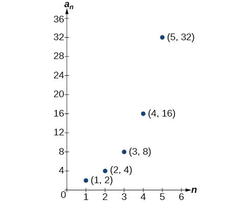{: #CNX_Precalculus_Figure_11_01_002}

Lastly, we can write this particular sequence as

<math xmlns="http://www.w3.org/1998/Math/MathML" display="block"> <mrow> <mtext> </mtext><mo>{</mo><mn>2</mn><mo>,</mo><mn>4</mn><mo>,</mo><mn>8</mn><mo>,</mo><mn>16</mn><mo>,</mo><mn>32</mn><mo>,</mo><mo>…</mo><mo>,</mo><msup> <mn>2</mn> <mi>n</mi> </msup> <mo>,</mo><mo>…</mo><mo>}</mo><mo>.</mo> </mrow> </math>

A sequence that continues indefinitely is called an **infinite sequence**. The domain of an infinite sequence is the set of counting numbers. If we consider only the first 10 terms of the sequence, we could write

<math xmlns="http://www.w3.org/1998/Math/MathML" display="block"> <mrow> <mtext> </mtext><mo>{</mo><mn>2</mn><mo>,</mo><mn>4</mn><mo>,</mo><mn>8</mn><mo>,</mo><mn>16</mn><mo>,</mo><mn>32</mn><mo>,</mo><mo>…</mo><mo>,</mo><msup> <mn>2</mn> <mi>n</mi> </msup> <mo>,</mo><mo>…</mo><mo>,</mo><mn>1024</mn><mo>}</mo><mo>.</mo> </mrow> </math>

This sequence is called a **finite sequence** because it does not continue indefinitely.

Sequence

A **sequence**{: data-type="term"} is a function whose domain is the set of positive integers. A **finite sequence**{: data-type="term"} is a sequence whose domain consists of only the first <math xmlns="http://www.w3.org/1998/Math/MathML"> <mi>n</mi> </math>

 positive integers. The numbers in a sequence are called **terms**. The variable <math xmlns="http://www.w3.org/1998/Math/MathML"> <mi>a</mi> </math>

 with a number subscript is used to represent the terms in a sequence and to indicate the position of the term in the sequence.

<math xmlns="http://www.w3.org/1998/Math/MathML" display="block"> <mrow> <msub> <mi>a</mi> <mn>1</mn> </msub> <mo>,</mo><msub> <mi>a</mi> <mn>2</mn> </msub> <mo>,</mo><msub> <mi>a</mi> <mn>3</mn> </msub> <mo>,</mo><mo>…</mo><mo>,</mo><msub> <mi>a</mi> <mi>n</mi> </msub> <mo>,</mo><mo>…</mo> </mrow> </math>

We call <math xmlns="http://www.w3.org/1998/Math/MathML"> <mrow> <msub> <mi>a</mi> <mn>1</mn> </msub> </mrow> </math>

 the first term of the sequence, <math xmlns="http://www.w3.org/1998/Math/MathML"> <mrow> <msub> <mi>a</mi> <mn>2</mn> </msub> </mrow> </math>

 the second term of the sequence, <math xmlns="http://www.w3.org/1998/Math/MathML"> <mrow> <msub> <mi>a</mi> <mn>3</mn> </msub> </mrow> </math>

 the third term of the sequence, and so on. The term <math xmlns="http://www.w3.org/1998/Math/MathML"> <mrow> <msub> <mi>a</mi> <mi>n</mi> </msub> </mrow> </math>

 is called the <strong data-type="term"><math xmlns="http://www.w3.org/1998/Math/MathML">
 <mrow>
  <mi>n</mi><mtext>th</mtext>
 </mrow>
</math> term of the sequence</strong>, or the general term of the sequence. An **explicit formula**{: data-type="term"} defines the <math xmlns="http://www.w3.org/1998/Math/MathML"> <mrow> <mi>n</mi><mtext>th</mtext> </mrow> </math>

 term of a sequence using the position of the term. A sequence that continues indefinitely is an **infinite sequence**{: data-type="term"}.

**Does a sequence always have to begin with**<math xmlns="http://www.w3.org/1998/Math/MathML"> <mrow> <mtext> </mtext><msub> <mi>a</mi> <mn>1</mn> </msub> <mo>?</mo> </mrow> </math>

*No. In certain problems, it may be useful to define the initial term as <math xmlns="http://www.w3.org/1998/Math/MathML"> <mrow> <msub> <mi>a</mi> <mn>0</mn> </msub> </mrow> </math>

instead of <math xmlns="http://www.w3.org/1998/Math/MathML"> <mrow> <mtext> </mtext><msub> <mi>a</mi> <mn>1</mn> </msub> <mo>.</mo><mtext> </mtext> </mrow> </math>

In these problems, the domain of the function includes 0.*

**Given an explicit formula, write the first**<math xmlns="http://www.w3.org/1998/Math/MathML"> <mrow> <mtext> </mtext><mi>n</mi><mtext> </mtext> </mrow> </math>

**terms of a sequence.**

1.  Substitute each value of
    <math xmlns="http://www.w3.org/1998/Math/MathML"> <mi>n</mi> </math>
    
    into the formula. Begin with
    <math xmlns="http://www.w3.org/1998/Math/MathML"> <mrow> <mi>n</mi><mo>=</mo><mn>1</mn> </mrow> </math>
    
    to find the first term,
    <math xmlns="http://www.w3.org/1998/Math/MathML"> <mrow> <msub> <mi>a</mi> <mn>1</mn> </msub> <mo>.</mo> </mrow> </math>

2.  To find the second term,
    <math xmlns="http://www.w3.org/1998/Math/MathML"> <mrow> <msub> <mi>a</mi> <mn>2</mn> </msub> <mo>,</mo> </mrow> </math>
    
    use
    <math xmlns="http://www.w3.org/1998/Math/MathML"> <mrow> <mi>n</mi><mo>=</mo><mn>2.</mn> </mrow> </math>

3.  Continue in the same manner until you have identified all
    <math xmlns="http://www.w3.org/1998/Math/MathML"> <mi>n</mi> </math>
    
    terms.
{: type="1"}

Writing the Terms of a Sequence Defined by an Explicit Formula

Write the first five terms of the sequence defined by the explicit formula <math xmlns="http://www.w3.org/1998/Math/MathML"> <mrow> <msub> <mi>a</mi> <mi>n</mi> </msub> <mo>=</mo><mo>−</mo><mn>3</mn><mi>n</mi><mo>+</mo><mn>8.</mn> </mrow> </math>

Substitute <math xmlns="http://www.w3.org/1998/Math/MathML"> <mrow> <mi>n</mi><mo>=</mo><mn>1</mn> </mrow> </math>

 into the formula. Repeat with values 2 through 5 for <math xmlns="http://www.w3.org/1998/Math/MathML"> <mrow> <mi>n</mi><mo>.</mo> </mrow> </math>

<math xmlns="http://www.w3.org/1998/Math/MathML" display="block"> <mrow> <mtable columnalign="left"> <mtr columnalign="left"> <mtd columnalign="left"> <mrow> <mi>n</mi><mo>=</mo><mn>1</mn> </mrow> </mtd> <mtd columnalign="left"> <mrow /> </mtd> <mtd columnalign="left"> <mrow /> </mtd> <mtd columnalign="left"> <mrow /> </mtd> <mtd columnalign="left"> <mrow /> </mtd> <mtd columnalign="left"> <mrow> <msub> <mi>a</mi> <mn>1</mn> </msub> <mo>=</mo><mo>−</mo><mn>3</mn><mo stretchy="false">(</mo><mn>1</mn><mo stretchy="false">)</mo><mo>+</mo><mn>8</mn><mo>=</mo><mn>5</mn> </mrow> </mtd> </mtr> <mtr columnalign="left"> <mtd columnalign="left"> <mrow> <mi>n</mi><mo>=</mo><mn>2</mn> </mrow> </mtd> <mtd columnalign="left"> <mrow /> </mtd> <mtd columnalign="left"> <mrow /> </mtd> <mtd columnalign="left"> <mrow /> </mtd> <mtd columnalign="left"> <mrow /> </mtd> <mtd columnalign="left"> <mrow> <msub> <mi>a</mi> <mn>2</mn> </msub> <mo>=</mo><mo>−</mo><mn>3</mn><mo stretchy="false">(</mo><mn>2</mn><mo stretchy="false">)</mo><mo>+</mo><mn>8</mn><mo>=</mo><mn>2</mn> </mrow> </mtd> </mtr> <mtr columnalign="left"> <mtd columnalign="left"> <mrow> <mi>n</mi><mo>=</mo><mn>3</mn> </mrow> </mtd> <mtd columnalign="left"> <mrow /> </mtd> <mtd columnalign="left"> <mrow /> </mtd> <mtd columnalign="left"> <mrow /> </mtd> <mtd columnalign="left"> <mrow /> </mtd> <mtd columnalign="left"> <mrow> <msub> <mi>a</mi> <mn>3</mn> </msub> <mo>=</mo><mo>−</mo><mn>3</mn><mo stretchy="false">(</mo><mn>3</mn><mo stretchy="false">)</mo><mo>+</mo><mn>8</mn><mo>=</mo><mo>−</mo><mn>1</mn> </mrow> </mtd> </mtr> <mtr columnalign="left"> <mtd columnalign="left"> <mrow> <mi>n</mi><mo>=</mo><mn>4</mn> </mrow> </mtd> <mtd columnalign="left"> <mrow /> </mtd> <mtd columnalign="left"> <mrow /> </mtd> <mtd columnalign="left"> <mrow /> </mtd> <mtd columnalign="left"> <mrow /> </mtd> <mtd columnalign="left"> <mrow> <msub> <mi>a</mi> <mn>4</mn> </msub> <mo>=</mo><mo>−</mo><mn>3</mn><mo stretchy="false">(</mo><mn>4</mn><mo stretchy="false">)</mo><mo>+</mo><mn>8</mn><mo>=</mo><mo>−</mo><mn>4</mn> </mrow> </mtd> </mtr> <mtr columnalign="left"> <mtd columnalign="left"> <mrow> <mi>n</mi><mo>=</mo><mn>5</mn> </mrow> </mtd> <mtd columnalign="left"> <mrow /> </mtd> <mtd columnalign="left"> <mrow /> </mtd> <mtd columnalign="left"> <mrow /> </mtd> <mtd columnalign="left"> <mrow /> </mtd> <mtd columnalign="left"> <mrow> <msub> <mi>a</mi> <mn>5</mn> </msub> <mo>=</mo><mo>−</mo><mn>3</mn><mo stretchy="false">(</mo><mn>5</mn><mo stretchy="false">)</mo><mo>+</mo><mn>8</mn><mo>=</mo><mo>−</mo><mn>7</mn> </mrow> </mtd> </mtr> </mtable> </mrow> </math>

The first five terms are<math xmlns="http://www.w3.org/1998/Math/MathML"> <mrow> <mtext> </mtext><mo>{</mo><mn>5</mn><mo>,</mo><mtext> </mtext><mn>2</mn><mo>,</mo><mtext> </mtext><mn>−1</mn><mo>,</mo><mtext> </mtext><mn>−4</mn><mo>,</mo><mtext> </mtext><mn>−7</mn><mo>}</mo><mo>.</mo> </mrow> </math>

Analysis

The sequence values can be listed in a table. A table, such as [[link]](#Table_11_01_03), is a convenient way to input the function into a graphing utility.

<table id="Table_11_01_03" summary=""><colgroup><col data-width="50" /><col data-width="35" /><col data-width="35" /><col data-width="35" /><col data-width="35" /><col data-width="35" /></colgroup><tbody>
<tr>
<td><strong><math xmlns="http://www.w3.org/1998/Math/MathML">
 <mi>n</mi>
</math></strong></td>
<td>1</td>
<td>2</td>
<td>3</td>
<td>4</td>
<td>5</td>
</tr>
<tr>
<td><strong><math xmlns="http://www.w3.org/1998/Math/MathML">
 <mrow>
  <msub>
   <mi>a</mi>
   <mi>n</mi>
  </msub>
  
 </mrow>
</math></strong></td>
<td>5</td>
<td>2</td>
<td>–1</td>
<td>–4</td>
<td>–7</td>
</tr>
</tbody></table>
A graph can be made from this table of values. From the graph in [[link]](#CNX_Precalculus_Figure_11_01_003), we can see that this sequence represents a linear function, but notice the graph is not continuous because the domain is over the positive integers only.

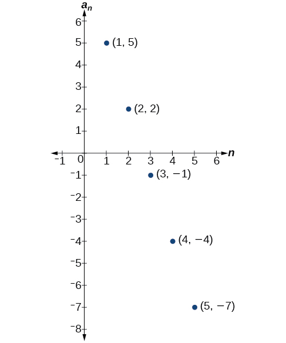{: #CNX_Precalculus_Figure_11_01_003}

Write the first five terms of the sequence defined by the **explicit formula**{: data-type="term" .no-emphasis}<math xmlns="http://www.w3.org/1998/Math/MathML"> <mrow> <mtext> </mtext><msub> <mi>t</mi> <mi>n</mi> </msub> <mo>=</mo><mn>5</mn><mi>n</mi><mo>−</mo><mn>4.</mn> </mrow> </math>

The first five terms are <math xmlns="http://www.w3.org/1998/Math/MathML"> <mrow> <mrow><mo>{</mo> <mrow> <mn>1</mn><mo>,</mo><mn>6</mn><mo>,</mo><mo> </mo><mn>11</mn><mo>,</mo><mo> </mo><mn>16</mn><mo>,</mo><mo> </mo><mn>21</mn> </mrow> <mo>}</mo></mrow><mo>.</mo> </mrow> </math>

#### Investigating Alternating Sequences

Sometimes sequences have terms that are alternate. In fact, the terms may actually alternate in sign. The steps to finding terms of the sequence are the same as if the signs did not alternate. However, the resulting terms will not show increase or decrease as <math xmlns="http://www.w3.org/1998/Math/MathML"> <mrow> <mi>n</mi> </mrow> </math>

 increases. Let’s take a look at the following sequence.

<math xmlns="http://www.w3.org/1998/Math/MathML" display="block"> <mrow> <mo>{</mo><mn>2</mn><mo>,</mo><mn>−4</mn><mo>,</mo><mn>6</mn><mo>,</mo><mn>−8</mn><mo>}</mo> </mrow> </math>

Notice the first term is greater than the second term, the second term is less than the third term, and the third term is greater than the fourth term. This trend continues forever. Do not rearrange the terms in numerical order to interpret the sequence.

**Given an explicit formula with alternating terms, write the first <math xmlns="http://www.w3.org/1998/Math/MathML"> <mi>n</mi> </math>

 terms of a sequence.**

1.  Substitute each value of
    <math xmlns="http://www.w3.org/1998/Math/MathML"> <mi>n</mi> </math>
    
    into the formula. Begin with
    <math xmlns="http://www.w3.org/1998/Math/MathML"> <mrow> <mi>n</mi><mo>=</mo><mn>1</mn> </mrow> </math>
    
    to find the first term,
    <math xmlns="http://www.w3.org/1998/Math/MathML"> <mrow> <msub> <mi>a</mi> <mn>1</mn> </msub> <mo>.</mo> </mrow> </math>
    
    The sign of the term is given by the
    <math xmlns="http://www.w3.org/1998/Math/MathML"> <mrow> <msup> <mrow> <mrow><mo>(</mo> <mrow> <mo>−</mo><mn>1</mn> </mrow> <mo>)</mo></mrow> </mrow> <mi>n</mi> </msup> </mrow> </math>
    
    in the explicit formula.
2.  To find the second term,
    <math xmlns="http://www.w3.org/1998/Math/MathML"> <mrow> <mtext> </mtext><msub> <mi>a</mi> <mn>2</mn> </msub> <mo>,</mo><mtext> </mtext> </mrow> </math>
    
    use
    <math xmlns="http://www.w3.org/1998/Math/MathML"> <mrow> <mtext> </mtext><mi>n</mi><mo>=</mo><mn>2.</mn><mtext> </mtext> </mrow> </math>

3.  Continue in the same manner until you have identified all
    <math xmlns="http://www.w3.org/1998/Math/MathML"> <mrow> <mi>n</mi> </mrow> </math>
    
    terms.
{: type="1"}

Writing the Terms of an Alternating Sequence Defined by an Explicit Formula

Write the first five terms of the sequence.

<math xmlns="http://www.w3.org/1998/Math/MathML" display="block"> <mrow> <msub> <mi>a</mi> <mi>n</mi> </msub> <mo>=</mo><mfrac> <mrow> <msup> <mrow> <mo stretchy="false">(</mo><mo>−</mo><mn>1</mn><mo stretchy="false">)</mo> </mrow> <mi>n</mi> </msup> <msup> <mi>n</mi> <mn>2</mn> </msup> </mrow> <mrow> <mi>n</mi><mo>+</mo><mn>1</mn> </mrow> </mfrac> </mrow> </math>

Substitute <math xmlns="http://www.w3.org/1998/Math/MathML"> <mrow> <mi>n</mi><mo>=</mo><mn>1</mn><mo>,</mo> </mrow> </math>

 <math xmlns="http://www.w3.org/1998/Math/MathML"> <mrow> <mi>n</mi><mo>=</mo><mn>2</mn><mo>,</mo> </mrow> </math>

 and so on in the formula.

<math xmlns="http://www.w3.org/1998/Math/MathML" display="block"> <mrow> <mtable columnalign="left"> <mtr columnalign="left"> <mtd columnalign="left"> <mrow> <mi>n</mi><mo>=</mo><mn>1</mn> </mrow> </mtd> <mtd columnalign="left"> <mrow> <mtable> <mtr> <mtd> <mrow /> </mtd> <mtd> <mrow /> </mtd> </mtr> </mtable> </mrow> </mtd> <mtd columnalign="left"> <mrow> <msub> <mi>a</mi> <mn>1</mn> </msub> <mo>=</mo><mfrac> <mrow> <msup> <mrow> <mo stretchy="false">(</mo><mo>−</mo><mn>1</mn><mo stretchy="false">)</mo> </mrow> <mn>1</mn> </msup> <msup> <mn>1</mn> <mn>2</mn> </msup> </mrow> <mrow> <mn>1</mn><mo>+</mo><mn>1</mn> </mrow> </mfrac> <mo>=</mo><mo>−</mo><mfrac> <mn>1</mn> <mn>2</mn> </mfrac> </mrow> </mtd> </mtr> <mtr columnalign="left"> <mtd columnalign="left"> <mrow> <mi>n</mi><mo>=</mo><mn>2</mn> </mrow> </mtd> <mtd columnalign="left"> <mrow> <mtable> <mtr> <mtd> <mrow /> </mtd> <mtd> <mrow /> </mtd> </mtr> </mtable> </mrow> </mtd> <mtd columnalign="left"> <mrow> <msub> <mi>a</mi> <mn>2</mn> </msub> <mo>=</mo><mfrac> <mrow> <msup> <mrow> <mo stretchy="false">(</mo><mo>−</mo><mn>1</mn><mo stretchy="false">)</mo> </mrow> <mn>2</mn> </msup> <msup> <mn>2</mn> <mn>2</mn> </msup> </mrow> <mrow> <mn>2</mn><mo>+</mo><mn>1</mn> </mrow> </mfrac> <mo>=</mo><mfrac> <mn>4</mn> <mn>3</mn> </mfrac> </mrow> </mtd> </mtr> <mtr columnalign="left"> <mtd columnalign="left"> <mrow> <mi>n</mi><mo>=</mo><mn>3</mn> </mrow> </mtd> <mtd columnalign="left"> <mrow> <mtable> <mtr> <mtd> <mrow /> </mtd> <mtd> <mrow /> </mtd> </mtr> </mtable> </mrow> </mtd> <mtd columnalign="left"> <mrow> <msub> <mi>a</mi> <mn>3</mn> </msub> <mo>=</mo><mfrac> <mrow> <msup> <mrow> <mo stretchy="false">(</mo><mo>−</mo><mn>1</mn><mo stretchy="false">)</mo> </mrow> <mn>3</mn> </msup> <msup> <mn>3</mn> <mn>2</mn> </msup> </mrow> <mrow> <mn>3</mn><mo>+</mo><mn>1</mn> </mrow> </mfrac> <mo>=</mo><mo>−</mo><mfrac> <mn>9</mn> <mn>4</mn> </mfrac> </mrow> </mtd> </mtr> <mtr columnalign="left"> <mtd columnalign="left"> <mrow> <mi>n</mi><mo>=</mo><mn>4</mn> </mrow> </mtd> <mtd columnalign="left"> <mrow> <mtable> <mtr> <mtd> <mrow /> </mtd> <mtd> <mrow /> </mtd> </mtr> </mtable> </mrow> </mtd> <mtd columnalign="left"> <mrow> <msub> <mi>a</mi> <mn>4</mn> </msub> <mo>=</mo><mfrac> <mrow> <msup> <mrow> <mo stretchy="false">(</mo><mo>−</mo><mn>1</mn><mo stretchy="false">)</mo> </mrow> <mn>4</mn> </msup> <msup> <mn>4</mn> <mn>2</mn> </msup> </mrow> <mrow> <mn>4</mn><mo>+</mo><mn>1</mn> </mrow> </mfrac> <mo>=</mo><mfrac> <mrow> <mn>16</mn> </mrow> <mn>5</mn> </mfrac> </mrow> </mtd> </mtr> <mtr columnalign="left"> <mtd columnalign="left"> <mrow> <mi>n</mi><mo>=</mo><mn>5</mn> </mrow> </mtd> <mtd columnalign="left"> <mrow /> </mtd> <mtd columnalign="left"> <mrow> <msub> <mi>a</mi> <mn>5</mn> </msub> <mo>=</mo><mfrac> <mrow> <msup> <mrow> <mo stretchy="false">(</mo><mo>−</mo><mn>1</mn><mo stretchy="false">)</mo> </mrow> <mn>5</mn> </msup> <msup> <mn>5</mn> <mn>2</mn> </msup> </mrow> <mrow> <mn>5</mn><mo>+</mo><mn>1</mn> </mrow> </mfrac> <mo>=</mo><mo>−</mo><mfrac> <mrow> <mn>25</mn> </mrow> <mn>6</mn> </mfrac> </mrow> </mtd> </mtr> </mtable> </mrow> </math>

The first five terms are <math xmlns="http://www.w3.org/1998/Math/MathML"> <mrow> <mrow><mo>{</mo><mrow> <mo>−</mo><mfrac> <mn>1</mn> <mn>2</mn> </mfrac> <mo>,</mo><mfrac> <mn>4</mn> <mn>3</mn> </mfrac> <mo>,−</mo><mfrac> <mn>9</mn> <mn>4</mn> </mfrac> <mo>,</mo><mfrac> <mrow> <mn>16</mn> </mrow> <mn>5</mn> </mfrac> <mo>,−</mo><mfrac> <mrow> <mn>25</mn> </mrow> <mn>6</mn> </mfrac> </mrow> <mo>}</mo></mrow><mo>.</mo> </mrow> </math>

Analysis

The graph of this function, shown in [[link]](#CNX_Precalculus_Figure_11_01_004), looks different from the ones we have seen previously in this section because the terms of the sequence alternate between positive and negative values.

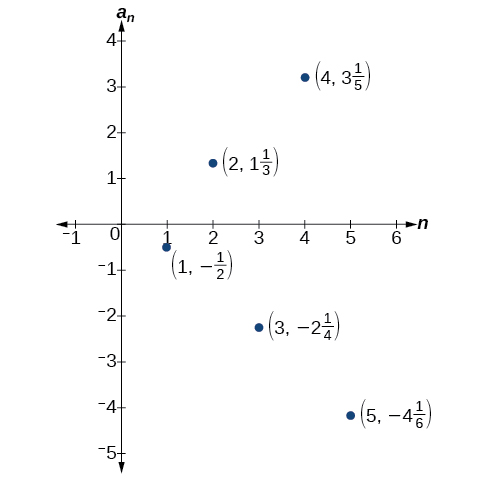{: #CNX_Precalculus_Figure_11_01_004}

**In [\[link\]](#Example_11_01_02), does the (–1) to the power of** <math xmlns="http://www.w3.org/1998/Math/MathML"> <mi>n</mi> </math>

 **account for the oscillations of signs?**

*Yes, the power might be* <math xmlns="http://www.w3.org/1998/Math/MathML"> <mrow> <mi>n</mi><mo>,</mo><mi>n</mi><mo>+</mo><mn>1</mn><mo>,</mo><mi>n</mi><mo>−</mo><mn>1</mn><mo>,</mo><mtext> </mtext> </mrow> </math>

*and so on, but any odd powers will result in a negative term, and any even power will result in a positive term.*

Write the first five terms of the sequence:

<math xmlns="http://www.w3.org/1998/Math/MathML" display="block"> <mrow> <msub> <mi>a</mi> <mi>n</mi> </msub> <mo>=</mo><mfrac> <mrow> <mn>4</mn><mi>n</mi> </mrow> <mrow> <msup> <mrow> <mo stretchy="false">(</mo><mo>−</mo><mn>2</mn><mo stretchy="false">)</mo> </mrow> <mi>n</mi> </msup> </mrow> </mfrac> </mrow> </math>

The first five terms are <math xmlns="http://www.w3.org/1998/Math/MathML"> <mrow> <mrow><mo>{</mo> <mrow> <mo>−</mo><mn>2</mn><mo>,</mo><mo> </mo><mn>2</mn><mo>,</mo><mo> </mo><mo>−</mo><mfrac> <mn>3</mn> <mn>2</mn> </mfrac> <mo>,</mo><mo> </mo><mn>1</mn><mo>,</mo><mtext> </mtext><mo>−</mo><mfrac> <mn>5</mn> <mn>8</mn> </mfrac> </mrow> <mo>}</mo></mrow><mo>.</mo> </mrow> </math>

#### Investigating Piecewise Explicit Formulas

We’ve learned that sequences are functions whose domain is over the positive integers. This is true for other types of functions, including some **piecewise functions**{: data-type="term" .no-emphasis}. Recall that a piecewise function is a function defined by multiple subsections. A different formula might represent each individual subsection.

**Given an explicit formula for a piecewise function, write the first<math xmlns="http://www.w3.org/1998/Math/MathML"> <mrow> <mtext> </mtext><mi>n</mi><mtext> </mtext> </mrow> </math>

terms of a sequence**

1.  Identify the formula to which
    <math xmlns="http://www.w3.org/1998/Math/MathML"> <mrow> <mi>n</mi><mo>=</mo><mn>1</mn> </mrow> </math>
    
    applies.
2.  To find the first term,
    <math xmlns="http://www.w3.org/1998/Math/MathML"> <mrow> <mtext> </mtext><msub> <mi>a</mi> <mn>1</mn> </msub> <mo>,</mo><mtext> </mtext> </mrow> </math>
    
    use
    <math xmlns="http://www.w3.org/1998/Math/MathML"> <mrow> <mtext> </mtext><mi>n</mi><mo>=</mo><mn>1</mn><mtext> </mtext> </mrow> </math>
    
    in the appropriate formula.
3.  Identify the formula to which
    <math xmlns="http://www.w3.org/1998/Math/MathML"> <mrow> <mtext> </mtext><mi>n</mi><mo>=</mo><mn>2</mn><mtext> </mtext> </mrow> </math>
    
    applies.
4.  To find the second term,
    <math xmlns="http://www.w3.org/1998/Math/MathML"> <mrow> <mtext> </mtext><msub> <mi>a</mi> <mn>2</mn> </msub> <mo>,</mo><mtext> </mtext> </mrow> </math>
    
    use
    <math xmlns="http://www.w3.org/1998/Math/MathML"> <mrow> <mtext> </mtext><mi>n</mi><mo>=</mo><mn>2</mn><mtext> </mtext> </mrow> </math>
    
    in the appropriate formula.
5.  Continue in the same manner until you have identified all
    <math xmlns="http://www.w3.org/1998/Math/MathML"> <mrow> <mtext> </mtext><mi>n</mi><mtext> </mtext> </mrow> </math>
    
    terms.
{: type="1"}

Writing the Terms of a Sequence Defined by a Piecewise Explicit Formula

Write the first six terms of the sequence.

<math xmlns="http://www.w3.org/1998/Math/MathML" display="block"> <mrow> <msub> <mi>a</mi> <mi>n</mi> </msub> <mo>=</mo><mrow><mo>{</mo> <mrow> <mtable columnalign="left"> <mtr columnalign="left"> <mtd columnalign="left"> <mrow> <msup> <mi>n</mi> <mn>2</mn> </msup> </mrow> </mtd> <mtd columnalign="left"> <mrow> <mtext>if </mtext><mi>n</mi><mtext> is not divisible by 3</mtext> </mrow> </mtd> </mtr> <mtr columnalign="left"> <mtd columnalign="left"> <mrow> <mfrac> <mi>n</mi> <mn>3</mn> </mfrac> </mrow> </mtd> <mtd columnalign="left"> <mrow> <mtext>if </mtext><mi>n</mi><mtext> is divisible by 3</mtext> </mrow> </mtd> </mtr> </mtable> </mrow> </mrow> </mrow> </math>

Substitute<math xmlns="http://www.w3.org/1998/Math/MathML"> <mrow> <mtext> </mtext><mi>n</mi><mo>=</mo><mn>1</mn><mo>,</mo><mi>n</mi><mo>=</mo><mn>2</mn><mo>,</mo><mtext> </mtext> </mrow> </math>

and so on in the appropriate formula. Use <math xmlns="http://www.w3.org/1998/Math/MathML"> <mrow> <msup> <mi>n</mi> <mn>2</mn> </msup> </mrow> </math>

 when <math xmlns="http://www.w3.org/1998/Math/MathML"> <mi>n</mi> </math>

 is not a multiple of 3. Use <math xmlns="http://www.w3.org/1998/Math/MathML"> <mrow> <mfrac> <mi>n</mi> <mn>3</mn> </mfrac> </mrow> </math>

 when <math xmlns="http://www.w3.org/1998/Math/MathML"> <mi>n</mi> </math>

 is a multiple of 3.

<math xmlns="http://www.w3.org/1998/Math/MathML" display="block"> <mrow> <mtable columnalign="left"> <mtr columnalign="left"> <mtd columnalign="left"> <mrow> <msub> <mi>a</mi> <mn>1</mn> </msub> <mo>=</mo><msup> <mn>1</mn> <mn>2</mn> </msup> <mo>=</mo><mn>1</mn><mtable> <mtr> <mtd> <mrow /> </mtd> <mtd> <mrow /> </mtd> <mtd> <mrow /> </mtd> <mtd> <mrow /> </mtd> </mtr> </mtable> </mrow> </mtd> <mtd columnalign="left"> <mrow> <mtext>1 is not a multiple of 3</mtext><mtext>.  Use </mtext><msup> <mi>n</mi> <mn>2</mn> </msup> <mo>.</mo> </mrow> </mtd> </mtr> <mtr columnalign="left"> <mtd columnalign="left"> <mrow> <msub> <mi>a</mi> <mn>2</mn> </msub> <mo>=</mo><msup> <mn>2</mn> <mn>2</mn> </msup> <mo>=</mo><mn>4</mn> </mrow> </mtd> <mtd columnalign="left"> <mrow> <mtext>2 is not a multiple of 3</mtext><mtext>.  Use </mtext><msup> <mi>n</mi> <mn>2</mn> </msup> <mo>.</mo> </mrow> </mtd> </mtr> <mtr columnalign="left"> <mtd columnalign="left"> <mrow> <msub> <mi>a</mi> <mn>3</mn> </msub> <mo>=</mo><mfrac> <mn>3</mn> <mn>3</mn> </mfrac> <mo>=</mo><mn>1</mn> </mrow> </mtd> <mtd columnalign="left"> <mrow> <mtext>3 is a multiple of 3</mtext><mtext>.  Use </mtext><mfrac> <mi>n</mi> <mn>3</mn> </mfrac> <mo>.</mo> </mrow> </mtd> </mtr> <mtr columnalign="left"> <mtd columnalign="left"> <mrow> <msub> <mi>a</mi> <mn>4</mn> </msub> <mo>=</mo><msup> <mn>4</mn> <mn>2</mn> </msup> <mo>=</mo><mn>16</mn> </mrow> </mtd> <mtd columnalign="left"> <mrow> <mtext>4 is not a multiple of 3</mtext><mtext>.  Use </mtext><msup> <mi>n</mi> <mn>2</mn> </msup> <mo>.</mo> </mrow> </mtd> </mtr> <mtr columnalign="left"> <mtd columnalign="left"> <mrow> <msub> <mi>a</mi> <mn>5</mn> </msub> <mo>=</mo><msup> <mn>5</mn> <mn>2</mn> </msup> <mo>=</mo><mn>25</mn> </mrow> </mtd> <mtd columnalign="left"> <mrow> <mtext>5 is not a multiple of 3</mtext><mtext>.  Use </mtext><msup> <mi>n</mi> <mn>2</mn> </msup> <mo>.</mo> </mrow> </mtd> </mtr> <mtr columnalign="left"> <mtd columnalign="left"> <mrow> <msub> <mi>a</mi> <mn>6</mn> </msub> <mo>=</mo><mfrac> <mn>6</mn> <mn>3</mn> </mfrac> <mo>=</mo><mn>2</mn> </mrow> </mtd> <mtd columnalign="left"> <mrow> <mtext>6 is a multiple of 3</mtext><mtext>.  Use </mtext><mfrac> <mi>n</mi> <mn>3</mn> </mfrac> <mo>.</mo> </mrow> </mtd> </mtr> </mtable> </mrow> </math>

The first six terms are <math xmlns="http://www.w3.org/1998/Math/MathML"> <mrow> <mrow><mo>{</mo> <mrow> <mn>1</mn><mo>,</mo><mtext> </mtext><mn>4</mn><mo>,</mo><mtext> </mtext><mn>1</mn><mo>,</mo><mtext> </mtext><mn>16</mn><mo>,</mo><mtext> </mtext><mn>25</mn><mo>,</mo><mtext> </mtext><mn>2</mn> </mrow> <mo>}</mo></mrow><mo>.</mo> </mrow> </math>

Analysis

Every third point on the graph shown in [[link]](#CNX_Precalculus_Figure_11_01_005) stands out from the two nearby points. This occurs because the sequence was defined by a piecewise function.

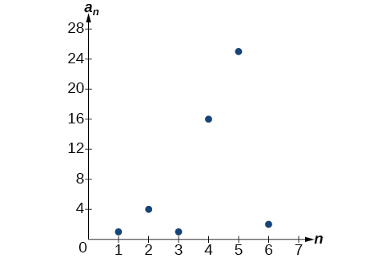{: #CNX_Precalculus_Figure_11_01_005}

Write the first six terms of the sequence.

<math xmlns="http://www.w3.org/1998/Math/MathML" display="block"> <mrow> <msub> <mi>a</mi> <mi>n</mi> </msub> <mo>=</mo><mrow><mo>{</mo> <mrow> <mtable columnalign="left"> <mtr columnalign="left"> <mtd columnalign="left"> <mrow> <mn>2</mn><msup> <mi>n</mi> <mn>3</mn> </msup> </mrow> </mtd> <mtd columnalign="left"> <mrow> <mtext>if </mtext><mi>n</mi><mtext> is odd</mtext> </mrow> </mtd> </mtr> <mtr columnalign="left"> <mtd columnalign="left"> <mrow> <mfrac> <mrow> <mn>5</mn><mi>n</mi> </mrow> <mn>2</mn> </mfrac> </mrow> </mtd> <mtd columnalign="left"> <mrow> <mtext>if </mtext><mi>n</mi><mtext> is even</mtext> </mrow> </mtd> </mtr> </mtable> </mrow> </mrow> </mrow> </math>

The first six terms are <math xmlns="http://www.w3.org/1998/Math/MathML"> <mrow> <mrow><mo>{</mo> <mrow> <mn>2</mn><mo>,</mo><mtext> </mtext><mn>5</mn><mo>,</mo><mtext> </mtext><mn>54</mn><mo>,</mo><mtext> </mtext><mn>10</mn><mo>,</mo><mtext> </mtext><mn>250</mn><mo>,</mo><mtext> </mtext><mn>15</mn> </mrow> <mo>}</mo></mrow><mo>.</mo> </mrow> </math>

#### Finding an Explicit Formula

Thus far, we have been given the explicit formula and asked to find a number of terms of the sequence. Sometimes, the explicit formula for the<math xmlns="http://www.w3.org/1998/Math/MathML"> <mrow> <mtext> </mtext><mi>n</mi><mtext>th</mtext><mtext> </mtext> </mrow> </math>

term of a sequence is not given. Instead, we are given several terms from the sequence. When this happens, we can work in reverse to find an explicit formula from the first few terms of a sequence. The key to finding an explicit formula is to look for a pattern in the terms. Keep in mind that the pattern may involve alternating terms, formulas for numerators, formulas for denominators, exponents, or bases.

**Given the first few terms of a sequence, find an explicit formula for the sequence.**

1.  Look for a pattern among the terms.
2.  If the terms are fractions, look for a separate pattern among the numerators and denominators.
3.  Look for a pattern among the signs of the terms.
4.  Write a formula for
    <math xmlns="http://www.w3.org/1998/Math/MathML"> <mrow> <msub> <mi>a</mi> <mi>n</mi> </msub> </mrow> </math>
    
    in terms of
    <math xmlns="http://www.w3.org/1998/Math/MathML"> <mrow> <mi>n</mi><mo>.</mo> </mrow> </math>
    
    Test your formula for
    <math xmlns="http://www.w3.org/1998/Math/MathML"> <mrow> <mi>n</mi><mo>=</mo><mn>1</mn><mo>,</mo><mtext> </mtext><mi>n</mi><mo>=</mo><mn>2</mn><mo>,</mo> </mrow> </math>
    
    and
    <math xmlns="http://www.w3.org/1998/Math/MathML"> <mrow> <mi>n</mi><mo>=</mo><mn>3.</mn> </mrow> </math>
{: type="1"}

Writing an Explicit Formula for the *n*th Term of a Sequence

Write an explicit formula for the <math xmlns="http://www.w3.org/1998/Math/MathML"> <mrow> <mi>n</mi><mtext>th</mtext> </mrow> </math>

 term of each sequence.

1.  <math xmlns="http://www.w3.org/1998/Math/MathML"> <mrow> <mrow><mo>{</mo> <mrow> <mo>−</mo><mfrac> <mn>2</mn> <mrow> <mn>11</mn> </mrow> </mfrac> <mo>,</mo><mfrac> <mn>3</mn> <mrow> <mn>13</mn> </mrow> </mfrac> <mo>,</mo><mo>−</mo><mfrac> <mn>4</mn> <mrow> <mn>15</mn> </mrow> </mfrac> <mo>,</mo><mfrac> <mn>5</mn> <mrow> <mn>17</mn> </mrow> </mfrac> <mo>,</mo><mo>−</mo><mfrac> <mn>6</mn> <mrow> <mn>19</mn> </mrow> </mfrac> <mo>,</mo><mo>…</mo> </mrow> <mo>}</mo></mrow> </mrow> </math>

2.  <math xmlns="http://www.w3.org/1998/Math/MathML"> <mrow> <mo>{</mo><mo>−</mo><mfrac> <mn>2</mn> <mrow> <mn>25</mn> </mrow> </mfrac> <mtext>,</mtext><mo>−</mo><mfrac> <mn>2</mn> <mrow> <mn>125</mn> </mrow> </mfrac> <mtext>,</mtext><mo>−</mo><mfrac> <mn>2</mn> <mrow> <mn>625</mn> </mrow> </mfrac> <mtext>,</mtext><mo>−</mo><mfrac> <mn>2</mn> <mrow> <mn>3</mn><mtext>,</mtext><mn>125</mn> </mrow> </mfrac> <mtext>,</mtext><mo>−</mo><mfrac> <mn>2</mn> <mrow> <mn>15</mn><mtext>,</mtext><mn>625</mn> </mrow> </mfrac> <mtext>,</mtext><mo>…</mo><mo>}</mo> </mrow> </math>

3.  <math xmlns="http://www.w3.org/1998/Math/MathML"> <mrow> <mo>{</mo><msup> <mi>e</mi> <mn>4</mn> </msup> <mtext>,</mtext><msup> <mi>e</mi> <mn>5</mn> </msup> <mtext>,</mtext><msup> <mi>e</mi> <mn>6</mn> </msup> <mtext>,</mtext><msup> <mi>e</mi> <mn>7</mn> </msup> <mtext>,</mtext><msup> <mi>e</mi> <mn>8</mn> </msup> <mtext>,</mtext><mo>…</mo><mo>}</mo> </mrow> </math>
{: type="a"}

Look for the pattern in each sequence.

1.  The terms alternate between positive and negative. We can use
    <math xmlns="http://www.w3.org/1998/Math/MathML"> <mrow> <mtext> </mtext><msup> <mrow> <mo stretchy="false">(</mo><mo>−</mo><mn>1</mn><mo stretchy="false">)</mo> </mrow> <mi>n</mi> </msup> <mtext> </mtext> </mrow> </math>
    
    to make the terms alternate. The numerator can be represented by
    <math xmlns="http://www.w3.org/1998/Math/MathML"> <mrow> <mi>n</mi><mo>+</mo><mn>1.</mn> </mrow> </math>
    
    The denominator can be represented by
    <math xmlns="http://www.w3.org/1998/Math/MathML"> <mrow> <mn>2</mn><mi>n</mi><mo>+</mo><mn>9.</mn> </mrow> </math>
    
    <math xmlns="http://www.w3.org/1998/Math/MathML"> <mrow> <msub> <mi>a</mi> <mi>n</mi> </msub> <mo>=</mo><mfrac> <mrow> <msup> <mrow> <mo stretchy="false">(</mo><mo>−</mo><mn>1</mn><mo stretchy="false">)</mo> </mrow> <mi>n</mi> </msup> <mo stretchy="false">(</mo><mi>n</mi><mo>+</mo><mn>1</mn><mo stretchy="false">)</mo> </mrow> <mrow> <mn>2</mn><mi>n</mi><mo>+</mo><mn>9</mn> </mrow> </mfrac> </mrow> </math>

2.  The terms are all negative.
    
     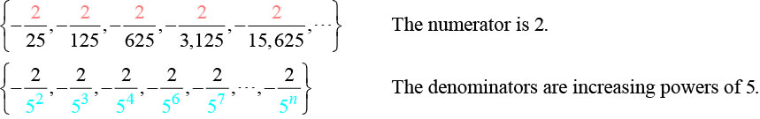 
    So we know that the fraction is negative, the numerator is 2, and the denominator can be represented by <math xmlns="http://www.w3.org/1998/Math/MathML"> <mrow> <msup> <mn>5</mn> <mrow> <mi>n</mi><mo>+</mo><mn>1</mn> </mrow> </msup> <mo>.</mo> </mrow> </math>
    
    

    <math xmlns="http://www.w3.org/1998/Math/MathML" display="block"> <mrow> <msub> <mi>a</mi> <mi>n</mi> </msub> <mo>=</mo><mo>−</mo><mfrac> <mn>2</mn> <mrow> <msup> <mn>5</mn> <mrow> <mi>n</mi><mo>+</mo><mn>1</mn> </mrow> </msup> </mrow> </mfrac> </mrow> </math>
    

3.  The terms are powers of <math xmlns="http://www.w3.org/1998/Math/MathML"> <mrow> <mi>e</mi><mo>.</mo> </mrow> </math>
    
     For <math xmlns="http://www.w3.org/1998/Math/MathML"> <mrow> <mi>n</mi><mo>=</mo><mn>1</mn><mo>,</mo> </mrow> </math>
    
     the first term is <math xmlns="http://www.w3.org/1998/Math/MathML"> <mrow> <msup> <mi>e</mi> <mn>4</mn> </msup> </mrow> </math>
    
     so the exponent must be <math xmlns="http://www.w3.org/1998/Math/MathML"> <mrow> <mi>n</mi><mo>+</mo><mn>3.</mn> </mrow> </math>
    
    

    <math xmlns="http://www.w3.org/1998/Math/MathML" display="block"> <mrow> <msub> <mi>a</mi> <mi>n</mi> </msub> <mo>=</mo><msup> <mi>e</mi> <mrow> <mi>n</mi><mo>+</mo><mn>3</mn> </mrow> </msup> </mrow> </math>
    

{: type="a"}

Write an explicit formula for the <math xmlns="http://www.w3.org/1998/Math/MathML"> <mrow> <mi>n</mi><mtext>th</mtext> </mrow> </math>

 term of the sequence.

<math xmlns="http://www.w3.org/1998/Math/MathML" display="block"> <mrow> <mtext>{9,</mtext><mtext> </mtext><mo>−</mo><mtext>81,</mtext><mtext> </mtext><mtext>729,</mtext><mtext> </mtext><mo>−</mo><mtext>6,561,</mtext><mtext> </mtext><mtext>59,049,</mtext><mtext> </mtext><mtext>…}</mtext> </mrow> </math>

<math xmlns="http://www.w3.org/1998/Math/MathML"> <mrow> <msub> <mi>a</mi> <mi>n</mi> </msub> <mo>=</mo><msup> <mrow> <mo stretchy="false">(</mo><mo>−</mo><mn>1</mn><mo stretchy="false">)</mo> </mrow> <mrow> <mi>n</mi><mo>+</mo><mn>1</mn> </mrow> </msup> <msup> <mn>9</mn> <mi>n</mi> </msup> </mrow> </math>

Write an explicit formula for the<math xmlns="http://www.w3.org/1998/Math/MathML"> <mrow> <mtext> </mtext><mi>n</mi><mtext>th</mtext><mtext> </mtext> </mrow> </math>

term of the sequence.

<math xmlns="http://www.w3.org/1998/Math/MathML" display="block"> <mrow> <mrow><mo>{</mo> <mrow> <mo>−</mo><mfrac> <mn>3</mn> <mn>4</mn> </mfrac> <mo>,</mo><mo>−</mo><mfrac> <mn>9</mn> <mn>8</mn> </mfrac> <mo>,</mo><mo>−</mo><mfrac> <mrow> <mn>27</mn> </mrow> <mrow> <mn>12</mn> </mrow> </mfrac> <mo>,</mo><mo>−</mo><mfrac> <mrow> <mn>81</mn> </mrow> <mrow> <mn>16</mn> </mrow> </mfrac> <mo>,</mo><mo>−</mo><mfrac> <mrow> <mn>243</mn> </mrow> <mrow> <mn>20</mn> </mrow> </mfrac> <mo>,</mo><mn>...</mn> </mrow> <mo>}</mo></mrow> </mrow> </math>

<math xmlns="http://www.w3.org/1998/Math/MathML"> <mrow> <msub> <mi>a</mi> <mi>n</mi> </msub> <mo>=</mo><mo>−</mo><mfrac> <mrow> <msup> <mn>3</mn> <mi>n</mi> </msup> </mrow> <mrow> <mn>4</mn><mi>n</mi> </mrow> </mfrac> </mrow> </math>

Write an explicit formula for the<math xmlns="http://www.w3.org/1998/Math/MathML"> <mrow> <mtext> </mtext><mi>n</mi><mtext>th</mtext><mtext> </mtext> </mrow> </math>

term of the sequence.

<math xmlns="http://www.w3.org/1998/Math/MathML" display="block"> <mrow> <mrow><mo>{</mo> <mrow> <mfrac> <mn>1</mn> <mrow> <msup> <mi>e</mi> <mn>2</mn> </msup> </mrow> </mfrac> <mo>,</mo><mo> </mo><mfrac> <mn>1</mn> <mi>e</mi> </mfrac> <mo>,</mo><mo> </mo><mn>1</mn><mo>,</mo><mo> </mo><mi>e</mi><mo>,</mo><mo> </mo><msup> <mi>e</mi> <mn>2</mn> </msup> <mo>,</mo><mn>...</mn> </mrow> <mo>}</mo></mrow> </mrow> </math>

<math xmlns="http://www.w3.org/1998/Math/MathML"> <mrow> <msub> <mi>a</mi> <mi>n</mi> </msub> <mo>=</mo><msup> <mi>e</mi> <mrow> <mi>n</mi><mo>−</mo><mn>3</mn> </mrow> </msup> </mrow> </math>

### Writing the Terms of a Sequence Defined by a Recursive Formula

Sequences occur naturally in the growth patterns of nautilus shells, pinecones, tree branches, and many other natural structures. We may see the sequence in the leaf or branch arrangement, the number of petals of a flower, or the pattern of the chambers in a nautilus shell. Their growth follows the Fibonacci sequence, a famous sequence in which each term can be found by adding the preceding two terms. The numbers in the sequence are 1, 1, 2, 3, 5, 8, 13, 21, 34,…. Other examples from the natural world that exhibit the Fibonacci sequence are the Calla Lily, which has just one petal, the Black-Eyed Susan with 13 petals, and different varieties of daisies that may have 21 or 34 petals.

Each term of the Fibonacci sequence depends on the terms that come before it. The Fibonacci sequence cannot easily be written using an explicit formula. Instead, we describe the sequence using a **recursive formula**, a formula that defines the terms of a sequence using previous terms.

A recursive formula always has two parts: the value of an initial term (or terms), and an equation defining <math xmlns="http://www.w3.org/1998/Math/MathML"> <mrow> <msub> <mi>a</mi> <mi>n</mi> </msub> </mrow> </math>

 in terms of preceding terms. For example, suppose we know the following:

<math xmlns="http://www.w3.org/1998/Math/MathML" display="block"> <mrow> <mtable columnalign="left"> <mtr columnalign="left"> <mtd columnalign="left"> <mrow> <msub> <mi>a</mi> <mn>1</mn> </msub> <mo>=</mo><mn>3</mn> </mrow> </mtd> </mtr> <mtr columnalign="left"> <mtd columnalign="left"> <mrow> <msub> <mi>a</mi> <mi>n</mi> </msub> <mo>=</mo><mn>2</mn><msub> <mi>a</mi> <mrow> <mi>n</mi><mo>−</mo><mn>1</mn> </mrow> </msub> <mo>−</mo><mn>1</mn><mo> </mo><mtext>for</mtext><mo> </mo><mi>n</mi><mo>≥</mo><mn>2</mn> </mrow> </mtd> </mtr> </mtable> </mrow> </math>

We can find the subsequent terms of the sequence using the first term.

<math xmlns="http://www.w3.org/1998/Math/MathML" display="block"> <mtable columnalign="left"> <mtr> <mtd> <msub> <mi>a</mi> <mn>1</mn> </msub> <mo>=</mo><mn>3</mn> </mtd> </mtr> <mtr> <mtd> <msub> <mi>a</mi> <mn>2</mn> </msub> <mo>=</mo><mn>2</mn><msub> <mi>a</mi> <mn>1</mn> </msub> <mo>−</mo><mn>1</mn><mo>=</mo><mn>2</mn><mo stretchy="false">(</mo><mn>3</mn><mo stretchy="false">)</mo><mo>−</mo><mn>1</mn><mo>=</mo><mn>5</mn> </mtd> </mtr> <mtr> <mtd> <msub> <mi>a</mi> <mn>3</mn> </msub> <mo>=</mo><mn>2</mn><msub> <mi>a</mi> <mn>2</mn> </msub> <mo>−</mo><mn>1</mn><mo>=</mo><mn>2</mn><mo stretchy="false">(</mo><mn>5</mn><mo stretchy="false">)</mo><mo>−</mo><mn>1</mn><mo>=</mo><mn>9</mn> </mtd> </mtr> <mtr> <mtd> <msub> <mi>a</mi> <mn>4</mn> </msub> <mo>=</mo><mn>2</mn><msub> <mi>a</mi> <mn>3</mn> </msub> <mo>−</mo><mn>1</mn><mo>=</mo><mn>2</mn><mo stretchy="false">(</mo><mn>9</mn><mo stretchy="false">)</mo><mo>−</mo><mn>1</mn><mo>=</mo><mn>17</mn> </mtd> </mtr> </mtable> </math>

So the first four terms of the sequence are <math xmlns="http://www.w3.org/1998/Math/MathML"> <mrow> <mrow><mo>{</mo> <mrow> <mn>3</mn><mo>,</mo><mtext> </mtext><mn>5</mn><mo>,</mo><mtext> </mtext><mn>9</mn><mo>,</mo><mtext> </mtext><mn>17</mn> </mrow> <mo>}</mo></mrow> </mrow> </math>

.

The recursive formula for the Fibonacci sequence states the first two terms and defines each successive term as the sum of the preceding two terms.

<math xmlns="http://www.w3.org/1998/Math/MathML" display="block"> <mrow> <mtable columnalign="left"> <mtr columnalign="left"> <mtd columnalign="left"> <mrow> <msub> <mi>a</mi> <mn>1</mn> </msub> <mo>=</mo><mn>1</mn> </mrow> </mtd> </mtr> <mtr columnalign="left"> <mtd columnalign="left"> <mrow> <msub> <mi>a</mi> <mn>2</mn> </msub> <mo>=</mo><mn>1</mn> </mrow> </mtd> </mtr> <mtr columnalign="left"> <mtd columnalign="left"> <mrow> <msub> <mi>a</mi> <mi>n</mi> </msub> <mo>=</mo><msub> <mi>a</mi> <mrow> <mi>n</mi><mo>−</mo><mn>1</mn> </mrow> </msub> <mo>+</mo><msub> <mi>a</mi> <mrow> <mi>n</mi><mo>−</mo><mn>2</mn> </mrow> </msub> <mo> </mo><mtext>for</mtext><mo> </mo><mo> </mo><mi>n</mi><mo>≥</mo><mn>3</mn> </mrow> </mtd> </mtr> </mtable> </mrow> </math>

To find the tenth term of the sequence, for example, we would need to add the eighth and ninth terms. We were told previously that the eighth and ninth terms are 21 and 34, so

<math xmlns="http://www.w3.org/1998/Math/MathML" display="block"> <mrow> <msub> <mi>a</mi> <mrow> <mn>10</mn> </mrow> </msub> <mo>=</mo><msub> <mi>a</mi> <mn>9</mn> </msub> <mo>+</mo><msub> <mi>a</mi> <mn>8</mn> </msub> <mo>=</mo><mn>34</mn><mo>+</mo><mn>21</mn><mo>=</mo><mn>55</mn> </mrow> </math>

Recursive Formula

A **recursive formula**{: data-type="term"} is a formula that defines each term of a sequence using preceding term(s). Recursive formulas must always state the initial term, or terms, of the sequence.

**Must the first two terms always be given in a recursive formula?**

*No. The Fibonacci sequence defines each term using the two preceding terms, but many recursive formulas define each term using only one preceding term. These sequences need only the first term to be defined.*

**Given a recursive formula with only the first term provided, write the first <math xmlns="http://www.w3.org/1998/Math/MathML"> <mi>n</mi> </math>

 terms of a sequence.**

1.  Identify the initial term,
    <math xmlns="http://www.w3.org/1998/Math/MathML"> <mrow> <mtext> </mtext><msub> <mi>a</mi> <mn>1</mn> </msub> <mo>,</mo> </mrow> </math>
    
    which is given as part of the formula. This is the first term.
2.  To find the second term,
    <math xmlns="http://www.w3.org/1998/Math/MathML"> <mrow> <mtext> </mtext><msub> <mi>a</mi> <mn>2</mn> </msub> <mo>,</mo> </mrow> </math>
    
    substitute the initial term into the formula for
    <math xmlns="http://www.w3.org/1998/Math/MathML"> <mrow> <msub> <mi>a</mi> <mrow> <mi>n</mi><mo>−</mo><mn>1</mn> </mrow> </msub> <mo>.</mo> </mrow> </math>
    
    Solve.
3.  To find the third term,
    <math xmlns="http://www.w3.org/1998/Math/MathML"> <mrow> <mtext> </mtext><msub> <mi>a</mi> <mn>3</mn> </msub> <mo>,</mo> </mrow> </math>
    
    substitute the second term into the formula. Solve.
4.  Repeat until you have solved for the
    <math xmlns="http://www.w3.org/1998/Math/MathML"> <mrow> <mi>n</mi><mtext>th</mtext> </mrow> </math>
    
    term.
{: type="1"}

Writing the Terms of a Sequence Defined by a Recursive Formula

Write the first five terms of the sequence defined by the recursive formula.

<math xmlns="http://www.w3.org/1998/Math/MathML" display="block"> <mrow> <mtable columnalign="left"> <mtr columnalign="left"> <mtd columnalign="left"> <mtable columnalign="left"> <mtr> <mtd> <mrow /> </mtd> </mtr> <mtr> <mtd> <msub> <mi>a</mi> <mn>1</mn> </msub> <mo>=</mo><mn>9</mn> </mtd> </mtr> </mtable> </mtd> </mtr> <mtr columnalign="left"> <mtd columnalign="left"> <mrow> <msub> <mi>a</mi> <mi>n</mi> </msub> <mo>=</mo><mn>3</mn><msub> <mi>a</mi> <mrow> <mi>n</mi><mo>−</mo><mn>1</mn> </mrow> </msub> <mo>−</mo><mn>20</mn><mtext>, for </mtext><mi>n</mi><mo>≥</mo><mn>2</mn> </mrow> </mtd> </mtr> </mtable> </mrow> </math>

The first term is given in the formula. For each subsequent term, we replace <math xmlns="http://www.w3.org/1998/Math/MathML"> <mrow> <msub> <mi>a</mi> <mrow> <mi>n</mi><mo>−</mo><mn>1</mn> </mrow> </msub> </mrow> </math>

 with the value of the preceding term.

<math xmlns="http://www.w3.org/1998/Math/MathML" display="block"> <mrow> <mtable columnalign="left"> <mtr columnalign="left"> <mtd columnalign="left"> <mrow> <mi>n</mi><mo>=</mo><mn>1</mn><mtable columnalign="left"> <mtr columnalign="left"> <mtd columnalign="left"> <mrow /> </mtd> <mtd columnalign="left"> <mrow /> </mtd> <mtd columnalign="left"> <mrow /> </mtd> <mtd columnalign="left"> <mrow /> </mtd> <mtd columnalign="left"> <mrow /> </mtd> </mtr> </mtable> </mrow> </mtd> <mtd columnalign="left"> <mrow> <msub> <mi>a</mi> <mn>1</mn> </msub> <mo>=</mo><mn>9</mn> </mrow> </mtd> </mtr> <mtr columnalign="left"> <mtd columnalign="left"> <mrow> <mi>n</mi><mo>=</mo><mn>2</mn> </mrow> </mtd> <mtd columnalign="left"> <mrow> <msub> <mi>a</mi> <mn>2</mn> </msub> <mo>=</mo><mn>3</mn><msub> <mi>a</mi> <mn>1</mn> </msub> <mo>−</mo><mn>20</mn><mo>=</mo><mn>3</mn><mo stretchy="false">(</mo><mn>9</mn><mo stretchy="false">)</mo><mo>−</mo><mn>20</mn><mo>=</mo><mn>27</mn><mo>−</mo><mn>20</mn><mo>=</mo><mn>7</mn> </mrow> </mtd> </mtr> <mtr columnalign="left"> <mtd columnalign="left"> <mrow> <mi>n</mi><mo>=</mo><mn>3</mn> </mrow> </mtd> <mtd columnalign="left"> <mrow> <msub> <mi>a</mi> <mn>3</mn> </msub> <mo>=</mo><mn>3</mn><msub> <mi>a</mi> <mn>2</mn> </msub> <mo>−</mo><mn>20</mn><mo>=</mo><mn>3</mn><mo stretchy="false">(</mo><mn>7</mn><mo stretchy="false">)</mo><mo>−</mo><mn>20</mn><mo>=</mo><mn>21</mn><mo>−</mo><mn>20</mn><mo>=</mo><mn>1</mn> </mrow> </mtd> </mtr> <mtr columnalign="left"> <mtd columnalign="left"> <mrow> <mi>n</mi><mo>=</mo><mn>4</mn> </mrow> </mtd> <mtd columnalign="left"> <mrow> <msub> <mi>a</mi> <mn>4</mn> </msub> <mo>=</mo><mn>3</mn><msub> <mi>a</mi> <mn>3</mn> </msub> <mo>−</mo><mn>20</mn><mo>=</mo><mn>3</mn><mo stretchy="false">(</mo><mn>1</mn><mo stretchy="false">)</mo><mo>−</mo><mn>20</mn><mo>=</mo><mn>3</mn><mo>−</mo><mn>20</mn><mo>=</mo><mo>−</mo><mn>17</mn> </mrow> </mtd> </mtr> <mtr columnalign="left"> <mtd columnalign="left"> <mrow> <mi>n</mi><mo>=</mo><mn>5</mn> </mrow> </mtd> <mtd columnalign="left"> <mrow> <msub> <mi>a</mi> <mn>5</mn> </msub> <mo>=</mo><mn>3</mn><msub> <mi>a</mi> <mn>4</mn> </msub> <mo>−</mo><mn>20</mn><mo>=</mo><mn>3</mn><mo stretchy="false">(</mo><mo>−</mo><mn>17</mn><mo stretchy="false">)</mo><mo>−</mo><mn>20</mn><mo>=</mo><mo>−</mo><mn>51</mn><mo>−</mo><mn>20</mn><mo>=</mo><mo>−</mo><mn>71</mn> </mrow> </mtd> </mtr> </mtable> </mrow> </math>

The first five terms are <math xmlns="http://www.w3.org/1998/Math/MathML"> <mrow> <mrow><mo>{</mo> <mrow> <mn>9</mn><mo>,</mo><mtext> </mtext><mn>7</mn><mo>,</mo><mtext> </mtext><mn>1</mn><mo>,</mo><mtext> </mtext><mo>–</mo><mn>17</mn><mo>,</mo><mtext> </mtext><mo>–</mo><mn>71</mn> </mrow> <mo>}</mo></mrow><mo>.</mo> </mrow> </math>

 See [[link]](#Figure_11_01_006).

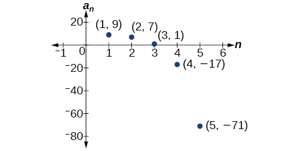{: #Figure_11_01_006}

Write the first five terms of the sequence defined by the recursive formula.

<math xmlns="http://www.w3.org/1998/Math/MathML" display="block"> <mtable columnalign="left"> <mtr> <mtd> <msub> <mi>a</mi> <mn>1</mn> </msub> <mo>=</mo><mn>2</mn> </mtd> </mtr> <mtr> <mtd> <msub> <mi>a</mi> <mi>n</mi> </msub> <mo>=</mo><mn>2</mn><msub> <mi>a</mi> <mrow> <mi>n</mi><mo>−</mo><mn>1</mn> </mrow> </msub> <mo>+</mo><mn>1</mn><mtext>, for </mtext><mi>n</mi><mo>≥</mo><mn>2</mn> </mtd> </mtr> </mtable> </math>

<math xmlns="http://www.w3.org/1998/Math/MathML"> <mrow> <mrow><mo>{</mo> <mrow> <mn>2</mn><mo>,</mo><mo> </mo><mn>5</mn><mo>,</mo><mo> </mo><mn>11</mn><mo>,</mo><mo> </mo><mn>23</mn><mo>,</mo><mo> </mo><mn>47</mn> </mrow> <mo>}</mo></mrow> </mrow> </math>

**Given a recursive formula with two initial terms, write the first <math xmlns="http://www.w3.org/1998/Math/MathML"> <mi>n</mi> </math>

 terms of a sequence.**

1.  Identify the initial term,
    <math xmlns="http://www.w3.org/1998/Math/MathML"> <mrow> <mtext> </mtext><msub> <mi>a</mi> <mn>1</mn> </msub> <mo>,</mo><mtext> </mtext> </mrow> </math>
    
    which is given as part of the formula.
2.  Identify the second term,
    <math xmlns="http://www.w3.org/1998/Math/MathML"> <mrow> <mtext> </mtext><msub> <mi>a</mi> <mn>2</mn> </msub> <mo>,</mo><mtext> </mtext> </mrow> </math>
    
    which is given as part of the formula.
3.  To find the third term, substitute the initial term and the second term into the formula. Evaluate.
4.  Repeat until you have evaluated the
    <math xmlns="http://www.w3.org/1998/Math/MathML"> <mrow> <mi>n</mi><mtext>th</mtext> </mrow> </math>
    
    term.
{: type="1"}

Writing the Terms of a Sequence Defined by a Recursive Formula

Write the first six terms of the sequence defined by the recursive formula.

<math xmlns="http://www.w3.org/1998/Math/MathML" display="block"> <mtable columnalign="left"> <mtr> <mtd> <msub> <mi>a</mi> <mn>1</mn> </msub> <mo>=</mo><mn>1</mn> </mtd> </mtr> <mtr> <mtd> <msub> <mi>a</mi> <mn>2</mn> </msub> <mo>=</mo><mn>2</mn> </mtd> </mtr> <mtr> <mtd> <msub> <mi>a</mi> <mi>n</mi> </msub> <mo>=</mo><mn>3</mn><msub> <mi>a</mi> <mrow> <mi>n</mi><mo>−</mo><mn>1</mn> </mrow> </msub> <mo>+</mo><mn>4</mn><msub> <mi>a</mi> <mrow> <mi>n</mi><mo>−</mo><mn>2</mn> </mrow> </msub> <mtext>, for </mtext><mi>n</mi><mo>≥</mo><mn>3</mn> </mtd> </mtr> </mtable> </math>

The first two terms are given. For each subsequent term, we replace <math xmlns="http://www.w3.org/1998/Math/MathML"> <mrow> <msub> <mi>a</mi> <mrow> <mi>n</mi><mo>−</mo><mn>1</mn> </mrow> </msub> </mrow> </math>

 and <math xmlns="http://www.w3.org/1998/Math/MathML"> <mrow> <msub> <mi>a</mi> <mrow> <mi>n</mi><mo>−</mo><mn>2</mn> </mrow> </msub> </mrow> </math>

 with the values of the two preceding terms.

<math xmlns="http://www.w3.org/1998/Math/MathML" display="block"> <mrow> <mtable columnalign="left"> <mtr columnalign="left"> <mtd columnalign="left"> <mrow> <mi>n</mi><mo>=</mo><mn>3</mn> </mrow> </mtd> <mtd columnalign="left"> <mrow /> </mtd> <mtd columnalign="left"> <mrow /> </mtd> <mtd columnalign="left"> <mrow /> </mtd> <mtd columnalign="left"> <mrow /> </mtd> <mtd columnalign="left"> <mrow /> </mtd> <mtd columnalign="left"> <mrow> <msub> <mi>a</mi> <mn>3</mn> </msub> <mo>=</mo><mn>3</mn><msub> <mi>a</mi> <mn>2</mn> </msub> <mo>+</mo><mn>4</mn><msub> <mi>a</mi> <mn>1</mn> </msub> <mo>=</mo><mn>3</mn><mo stretchy="false">(</mo><mn>2</mn><mo stretchy="false">)</mo><mo>+</mo><mn>4</mn><mo stretchy="false">(</mo><mn>1</mn><mo stretchy="false">)</mo><mo>=</mo><mn>10</mn> </mrow> </mtd> </mtr> <mtr columnalign="left"> <mtd columnalign="left"> <mrow> <mi>n</mi><mo>=</mo><mn>4</mn> </mrow> </mtd> <mtd columnalign="left"> <mrow /> </mtd> <mtd columnalign="left"> <mrow /> </mtd> <mtd columnalign="left"> <mrow /> </mtd> <mtd columnalign="left"> <mrow /> </mtd> <mtd columnalign="left"> <mrow /> </mtd> <mtd columnalign="left"> <mrow> <msub> <mi>a</mi> <mn>4</mn> </msub> <mo>=</mo><mn>3</mn><msub> <mi>a</mi> <mn>3</mn> </msub> <mo>+</mo><mn>4</mn><msub> <mi>a</mi> <mn>2</mn> </msub> <mo>=</mo><mn>3</mn><mo stretchy="false">(</mo><mn>10</mn><mo stretchy="false">)</mo><mo>+</mo><mn>4</mn><mo stretchy="false">(</mo><mn>2</mn><mo stretchy="false">)</mo><mo>=</mo><mn>38</mn> </mrow> </mtd> </mtr> <mtr columnalign="left"> <mtd columnalign="left"> <mrow> <mi>n</mi><mo>=</mo><mn>5</mn> </mrow> </mtd> <mtd columnalign="left"> <mrow /> </mtd> <mtd columnalign="left"> <mrow /> </mtd> <mtd columnalign="left"> <mrow /> </mtd> <mtd columnalign="left"> <mrow /> </mtd> <mtd columnalign="left"> <mrow /> </mtd> <mtd columnalign="left"> <mrow> <msub> <mi>a</mi> <mn>5</mn> </msub> <mo>=</mo><mn>3</mn><msub> <mi>a</mi> <mn>4</mn> </msub> <mo>+</mo><mn>4</mn><msub> <mi>a</mi> <mn>3</mn> </msub> <mo>=</mo><mn>3</mn><mo stretchy="false">(</mo><mn>38</mn><mo stretchy="false">)</mo><mo>+</mo><mn>4</mn><mo stretchy="false">(</mo><mn>10</mn><mo stretchy="false">)</mo><mo>=</mo><mn>154</mn> </mrow> </mtd> </mtr> <mtr columnalign="left"> <mtd columnalign="left"> <mrow> <mi>n</mi><mo>=</mo><mn>6</mn> </mrow> </mtd> <mtd columnalign="left"> <mrow /> </mtd> <mtd columnalign="left"> <mrow /> </mtd> <mtd columnalign="left"> <mrow /> </mtd> <mtd columnalign="left"> <mrow /> </mtd> <mtd columnalign="left"> <mrow /> </mtd> <mtd columnalign="left"> <mrow> <msub> <mi>a</mi> <mn>6</mn> </msub> <mo>=</mo><mn>3</mn><msub> <mi>a</mi> <mn>5</mn> </msub> <mo>+</mo><mn>4</mn><msub> <mi>a</mi> <mn>4</mn> </msub> <mo>=</mo><mn>3</mn><mo stretchy="false">(</mo><mn>154</mn><mo stretchy="false">)</mo><mo>+</mo><mn>4</mn><mo stretchy="false">(</mo><mn>38</mn><mo stretchy="false">)</mo><mo>=</mo><mn>614</mn> </mrow> </mtd> </mtr> </mtable> </mrow> </math>

The first six terms are<math xmlns="http://www.w3.org/1998/Math/MathML" display="inline"> <mrow> <mtext> </mtext><mtext>{1,2,10,38,154,614}</mtext><mtext>.</mtext> </mrow> </math>

 See [[link]](#CNX_Precalculus_Figure_11_01_007).

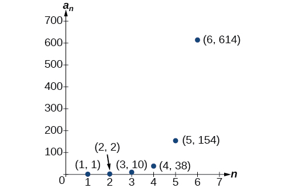{: #CNX_Precalculus_Figure_11_01_007}

Write the first 8 terms of the sequence defined by the recursive formula.

<math xmlns="http://www.w3.org/1998/Math/MathML" display="block"> <mrow> <mtable columnalign="left"> <mtr columnalign="left"> <mtd columnalign="left"> <mtable columnalign="left"> <mtr> <mtd> <mrow /> </mtd> </mtr> <mtr> <mtd> <msub> <mi>a</mi> <mn>1</mn> </msub> <mo>=</mo><mn>0</mn> </mtd> </mtr> </mtable> </mtd> </mtr> <mtr columnalign="left"> <mtd columnalign="left"> <mrow> <msub> <mi>a</mi> <mn>2</mn> </msub> <mo>=</mo><mn>1</mn> </mrow> </mtd> </mtr> <mtr columnalign="left"> <mtd columnalign="left"> <mrow> <msub> <mi>a</mi> <mn>3</mn> </msub> <mo>=</mo><mn>1</mn> </mrow> </mtd> </mtr> <mtr columnalign="left"> <mtd columnalign="left"> <mrow> <msub> <mi>a</mi> <mi>n</mi> </msub> <mo>=</mo><mfrac> <mrow> <msub> <mi>a</mi> <mrow> <mi>n</mi><mo>−</mo><mn>1</mn> </mrow> </msub> </mrow> <mrow> <msub> <mi>a</mi> <mrow> <mi>n</mi><mo>−</mo><mn>2</mn> </mrow> </msub> </mrow> </mfrac> <mo>+</mo><msub> <mi>a</mi> <mrow> <mi>n</mi><mo>−</mo><mn>3</mn> </mrow> </msub> <mtext>, for </mtext><mi>n</mi><mo>≥</mo><mn>4</mn> </mrow> </mtd> </mtr> </mtable> </mrow> </math>

<math xmlns="http://www.w3.org/1998/Math/MathML"> <mrow> <mrow><mo>{</mo> <mrow> <mn>0</mn><mo>,</mo><mo> </mo><mn>1</mn><mo>,</mo><mo> </mo><mn>1</mn><mo>,</mo><mo> </mo><mn>1</mn><mo>,</mo><mo> </mo><mn>2</mn><mo>,</mo><mo> </mo><mn>3</mn><mo>,</mo><mo> </mo><mfrac> <mn>5</mn> <mn>2</mn> </mfrac> <mo>,</mo><mtext> </mtext><mfrac> <mrow> <mn>17</mn> </mrow> <mn>6</mn> </mfrac> </mrow> <mo>}</mo></mrow><mo>.</mo> </mrow> </math>

### Using Factorial Notation

The formulas for some sequences include products of consecutive positive integers. <strong><math xmlns="http://www.w3.org/1998/Math/MathML">
 <mi>n</mi>
</math> factorial</strong>, written as <math xmlns="http://www.w3.org/1998/Math/MathML"> <mrow> <mi>n</mi><mo>!</mo><mo>,</mo> </mrow> </math>

 is the product of the positive integers from 1 to <math xmlns="http://www.w3.org/1998/Math/MathML"> <mrow> <mi>n</mi><mo>.</mo> </mrow> </math>

 For example,

<math xmlns="http://www.w3.org/1998/Math/MathML" display="block"> <mrow> <mtable columnalign="left"> <mtr columnalign="left"> <mtd columnalign="left"> <mrow> <mn>4</mn><mo>!</mo><mo>=</mo><mn>4</mn><mo>⋅</mo><mn>3</mn><mo>⋅</mo><mn>2</mn><mo>⋅</mo><mn>1</mn><mo>=</mo><mn>24</mn> </mrow> </mtd> </mtr> <mtr columnalign="left"> <mtd columnalign="left"> <mrow> <mn>5</mn><mo>!</mo><mo>=</mo><mn>5</mn><mo>⋅</mo><mn>4</mn><mo>⋅</mo><mn>3</mn><mo>⋅</mo><mn>2</mn><mo>⋅</mo><mn>1</mn><mo>=</mo><mn>120</mn> </mrow> </mtd> </mtr> </mtable> </mrow> </math>

An example of formula containing a **factorial**{: data-type="term" .no-emphasis} is <math xmlns="http://www.w3.org/1998/Math/MathML"> <mrow> <msub> <mi>a</mi> <mi>n</mi> </msub> <mo>=</mo><mo stretchy="false">(</mo><mi>n</mi><mo>+</mo><mn>1</mn><mo stretchy="false">)</mo><mo>!</mo><mo>.</mo> </mrow> </math>

 The sixth term of the sequence can be found by substituting 6 for <math xmlns="http://www.w3.org/1998/Math/MathML"> <mrow> <mi>n</mi><mo>.</mo> </mrow> </math>

<math xmlns="http://www.w3.org/1998/Math/MathML" display="block"> <mrow> <msub> <mi>a</mi> <mn>6</mn> </msub> <mo>=</mo><mo stretchy="false">(</mo><mn>6</mn><mo>+</mo><mn>1</mn><mo stretchy="false">)</mo><mo>!</mo><mo>=</mo><mn>7</mn><mo>!</mo><mo>=</mo><mn>7</mn><mo>·</mo><mn>6</mn><mo>·</mo><mn>5</mn><mo>·</mo><mn>4</mn><mo>·</mo><mn>3</mn><mo>·</mo><mn>2</mn><mo>·</mo><mn>1</mn><mo>=</mo><mn>5040</mn> </mrow> </math>

The factorial of any whole number <math xmlns="http://www.w3.org/1998/Math/MathML"> <mi>n</mi> </math>

 is <math xmlns="http://www.w3.org/1998/Math/MathML"> <mrow> <mi>n</mi><mo stretchy="false">(</mo><mi>n</mi><mo>−</mo><mn>1</mn><mo stretchy="false">)</mo><mo>!</mo> </mrow> </math>

 We can therefore also think of <math xmlns="http://www.w3.org/1998/Math/MathML"> <mrow> <mn>5</mn><mo>!</mo> </mrow> </math>

 as<math xmlns="http://www.w3.org/1998/Math/MathML"> <mrow> <mtext> </mtext><mn>5</mn><mo>⋅</mo><mn>4</mn><mo>!</mo><mtext>.</mtext> </mrow> </math>

Factorial

***n* factorial**{: data-type="term"} is a mathematical operation that can be defined using a recursive formula. The factorial of<math xmlns="http://www.w3.org/1998/Math/MathML"> <mrow> <mtext> </mtext><mi>n</mi><mo>,</mo><mtext> </mtext> </mrow> </math>

denoted<math xmlns="http://www.w3.org/1998/Math/MathML"> <mrow> <mtext> </mtext><mi>n</mi><mo>!</mo><mo>,</mo><mtext> </mtext> </mrow> </math>

is defined for a positive integer <math xmlns="http://www.w3.org/1998/Math/MathML"> <mrow> <mi>n</mi> </mrow> </math>

 as:

<math xmlns="http://www.w3.org/1998/Math/MathML" display="block"> <mtable columnalign="left"> <mtr> <mtd> <mn>0</mn><mo>!</mo><mo>=</mo><mn>1</mn> </mtd> </mtr> <mtr> <mtd> <mn>1</mn><mo>!</mo><mo>=</mo><mn>1</mn> </mtd> </mtr> <mtr> <mtd> <mi>n</mi><mo>!</mo><mo>=</mo><mi>n</mi><mrow><mo>(</mo> <mrow> <mi>n</mi><mo>−</mo><mn>1</mn> </mrow> <mo>)</mo></mrow><mrow><mo>(</mo> <mrow> <mi>n</mi><mo>−</mo><mn>2</mn> </mrow> <mo>)</mo></mrow><mo>⋯</mo><mrow><mo>(</mo> <mn>2</mn> <mo>)</mo></mrow><mrow><mo>(</mo> <mn>1</mn> <mo>)</mo></mrow><mtext>, for </mtext><mi>n</mi><mo>≥</mo><mn>2</mn> </mtd> </mtr> </mtable> </math>

The special case <math xmlns="http://www.w3.org/1998/Math/MathML"> <mrow> <mn>0</mn><mo>!</mo> </mrow> </math>

 is defined as <math xmlns="http://www.w3.org/1998/Math/MathML"> <mrow> <mn>0</mn><mo>!</mo><mo>=</mo><mn>1.</mn> </mrow> </math>

**Can factorials always be found using a calculator?**

*No. Factorials get large very quickly—faster than even exponential functions! When the output gets too large for the calculator, it will not be able to calculate the factorial.*

Writing the Terms of a Sequence Using Factorials

Write the first five terms of the sequence defined by the explicit formula <math xmlns="http://www.w3.org/1998/Math/MathML"> <mrow> <msub> <mi>a</mi> <mi>n</mi> </msub> <mo>=</mo><mfrac> <mrow> <mn>5</mn><mi>n</mi> </mrow> <mrow> <mo stretchy="false">(</mo><mi>n</mi><mo>+</mo><mn>2</mn><mo stretchy="false">)</mo><mo>!</mo> </mrow> </mfrac> <mo>.</mo> </mrow> </math>

Substitute<math xmlns="http://www.w3.org/1998/Math/MathML"> <mrow> <mtext> </mtext><mi>n</mi><mo>=</mo><mn>1</mn><mo>,</mo><mi>n</mi><mo>=</mo><mn>2</mn><mo>,</mo><mtext> </mtext> </mrow> </math>

and so on in the formula.

<math xmlns="http://www.w3.org/1998/Math/MathML" display="block"> <mrow> <mtable columnalign="left"> <mtr columnalign="left"> <mtd columnalign="left"> <mrow> <mi>n</mi><mo>=</mo><mn>1</mn> </mrow> </mtd> <mtd columnalign="left"> <mrow /> </mtd> <mtd columnalign="left"> <mrow /> </mtd> <mtd columnalign="left"> <mrow /> </mtd> <mtd columnalign="left"> <mrow> <msub> <mi>a</mi> <mn>1</mn> </msub> <mo>=</mo><mfrac> <mrow> <mn>5</mn><mo stretchy="false">(</mo><mn>1</mn><mo stretchy="false">)</mo> </mrow> <mrow> <mo stretchy="false">(</mo><mn>1</mn><mo>+</mo><mn>2</mn><mo stretchy="false">)</mo><mo>!</mo> </mrow> </mfrac> <mo>=</mo><mfrac> <mn>5</mn> <mrow> <mn>3</mn><mo>!</mo> </mrow> </mfrac> <mo>=</mo><mfrac> <mn>5</mn> <mrow> <mn>3</mn><mo>·</mo><mn>2</mn><mo>·</mo><mn>1</mn> </mrow> </mfrac> <mo>=</mo><mfrac> <mn>5</mn> <mn>6</mn> </mfrac> </mrow> </mtd> </mtr> <mtr columnalign="left"> <mtd columnalign="left"> <mrow> <mi>n</mi><mo>=</mo><mn>2</mn> </mrow> </mtd> <mtd columnalign="left"> <mrow /> </mtd> <mtd columnalign="left"> <mrow /> </mtd> <mtd columnalign="left"> <mrow /> </mtd> <mtd columnalign="left"> <mrow> <msub> <mi>a</mi> <mn>2</mn> </msub> <mo>=</mo><mfrac> <mrow> <mn>5</mn><mo stretchy="false">(</mo><mn>2</mn><mo stretchy="false">)</mo> </mrow> <mrow> <mo stretchy="false">(</mo><mn>2</mn><mo>+</mo><mn>2</mn><mo stretchy="false">)</mo><mo>!</mo> </mrow> </mfrac> <mo>=</mo><mfrac> <mrow> <mn>10</mn> </mrow> <mrow> <mn>4</mn><mo>!</mo> </mrow> </mfrac> <mo>=</mo><mfrac> <mrow> <mn>10</mn> </mrow> <mrow> <mn>4</mn><mo>·</mo><mn>3</mn><mo>·</mo><mn>2</mn><mo>·</mo><mn>1</mn> </mrow> </mfrac> <mo>=</mo><mfrac> <mn>5</mn> <mrow> <mn>12</mn> </mrow> </mfrac> </mrow> </mtd> </mtr> <mtr columnalign="left"> <mtd columnalign="left"> <mrow> <mi>n</mi><mo>=</mo><mn>3</mn> </mrow> </mtd> <mtd columnalign="left"> <mrow /> </mtd> <mtd columnalign="left"> <mrow /> </mtd> <mtd columnalign="left"> <mrow /> </mtd> <mtd columnalign="left"> <mrow> <msub> <mi>a</mi> <mn>3</mn> </msub> <mo>=</mo><mfrac> <mrow> <mn>5</mn><mo stretchy="false">(</mo><mn>3</mn><mo stretchy="false">)</mo> </mrow> <mrow> <mo stretchy="false">(</mo><mn>3</mn><mo>+</mo><mn>2</mn><mo stretchy="false">)</mo><mo>!</mo> </mrow> </mfrac> <mo>=</mo><mfrac> <mrow> <mn>15</mn> </mrow> <mrow> <mn>5</mn><mo>!</mo> </mrow> </mfrac> <mo>=</mo><mfrac> <mrow> <mn>15</mn> </mrow> <mrow> <mn>5</mn><mo>·</mo><mn>4</mn><mo>·</mo><mn>3</mn><mo>·</mo><mn>2</mn><mo>·</mo><mn>1</mn> </mrow> </mfrac> <mo>=</mo><mfrac> <mn>1</mn> <mn>8</mn> </mfrac> </mrow> </mtd> </mtr> <mtr columnalign="left"> <mtd columnalign="left"> <mrow> <mi>n</mi><mo>=</mo><mn>4</mn> </mrow> </mtd> <mtd columnalign="left"> <mrow /> </mtd> <mtd columnalign="left"> <mrow /> </mtd> <mtd columnalign="left"> <mrow /> </mtd> <mtd columnalign="left"> <mrow> <msub> <mi>a</mi> <mn>4</mn> </msub> <mo>=</mo><mfrac> <mrow> <mn>5</mn><mo stretchy="false">(</mo><mn>4</mn><mo stretchy="false">)</mo> </mrow> <mrow> <mo stretchy="false">(</mo><mn>4</mn><mo>+</mo><mn>2</mn><mo stretchy="false">)</mo><mo>!</mo> </mrow> </mfrac> <mo>=</mo><mfrac> <mrow> <mn>20</mn> </mrow> <mrow> <mn>6</mn><mo>!</mo> </mrow> </mfrac> <mo>=</mo><mfrac> <mrow> <mn>20</mn> </mrow> <mrow> <mn>6</mn><mo>·</mo><mn>5</mn><mo>·</mo><mn>4</mn><mo>·</mo><mn>3</mn><mo>·</mo><mn>2</mn><mo>·</mo><mn>1</mn> </mrow> </mfrac> <mo>=</mo><mfrac> <mn>1</mn> <mrow> <mn>36</mn> </mrow> </mfrac> </mrow> </mtd> </mtr> <mtr columnalign="left"> <mtd columnalign="left"> <mrow> <mi>n</mi><mo>=</mo><mn>5</mn> </mrow> </mtd> <mtd columnalign="left"> <mrow /> </mtd> <mtd columnalign="left"> <mrow /> </mtd> <mtd columnalign="left"> <mrow /> </mtd> <mtd columnalign="left"> <mrow> <msub> <mi>a</mi> <mn>5</mn> </msub> <mo>=</mo><mfrac> <mrow> <mn>5</mn><mo stretchy="false">(</mo><mn>5</mn><mo stretchy="false">)</mo> </mrow> <mrow> <mo stretchy="false">(</mo><mn>5</mn><mo>+</mo><mn>2</mn><mo stretchy="false">)</mo><mo>!</mo> </mrow> </mfrac> <mo>=</mo><mfrac> <mrow> <mn>25</mn> </mrow> <mrow> <mn>7</mn><mo>!</mo> </mrow> </mfrac> <mo>=</mo><mfrac> <mrow> <mn>25</mn> </mrow> <mrow> <mn>7</mn><mo>·</mo><mn>6</mn><mo>·</mo><mn>5</mn><mo>·</mo><mn>4</mn><mo>·</mo><mn>3</mn><mo>·</mo><mn>2</mn><mo>·</mo><mn>1</mn> </mrow> </mfrac> <mo>=</mo><mfrac> <mn>5</mn> <mrow> <mn>1</mn><mtext>,</mtext><mn>008</mn> </mrow> </mfrac> </mrow> </mtd> </mtr> </mtable> </mrow> </math>

The first five terms are <math xmlns="http://www.w3.org/1998/Math/MathML"> <mrow> <mo>{</mo><mfrac> <mn>5</mn> <mn>6</mn> </mfrac> <mo>,</mo><mfrac> <mn>5</mn> <mrow> <mn>12</mn> </mrow> </mfrac> <mo>,</mo><mfrac> <mn>1</mn> <mn>8</mn> </mfrac> <mo>,</mo><mfrac> <mn>1</mn> <mrow> <mn>36</mn> </mrow> </mfrac> <mo>,</mo><mfrac> <mn>5</mn> <mrow> <mn>1,008</mn> </mrow> </mfrac> <mo>}</mo><mo>.</mo> </mrow> </math>

Analysis

[[link]](#CNX_Precalculus_Figure_11_01_008) shows the graph of the sequence. Notice that, since factorials grow very quickly, the presence of the factorial term in the denominator results in the denominator becoming much larger than the numerator as <math xmlns="http://www.w3.org/1998/Math/MathML"> <mrow> <mi>n</mi> </mrow> </math>

 increases. This means the quotient gets smaller and, as the plot of the terms shows, the terms are decreasing and nearing zero.

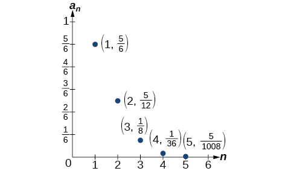{: #CNX_Precalculus_Figure_11_01_008}

Write the first five terms of the sequence defined by the explicit formula <math xmlns="http://www.w3.org/1998/Math/MathML"> <mrow> <msub> <mi>a</mi> <mi>n</mi> </msub> <mo>=</mo><mfrac> <mrow> <mo stretchy="false">(</mo><mi>n</mi><mo>+</mo><mn>1</mn><mo stretchy="false">)</mo><mo>!</mo> </mrow> <mrow> <mn>2</mn><mi>n</mi> </mrow> </mfrac> <mo>.</mo> </mrow> </math>

The first five terms are <math xmlns="http://www.w3.org/1998/Math/MathML"> <mrow> <mrow><mo>{</mo> <mrow> <mn>1</mn><mo>,</mo><mo> </mo><mfrac> <mn>3</mn> <mn>2</mn> </mfrac> <mo>,</mo><mo> </mo><mn>4</mn><mo>,</mo><mtext> </mtext><mn>15</mn><mo>,</mo><mtext> </mtext><mn>72</mn> </mrow> <mo>}</mo></mrow><mo>.</mo> </mrow> </math>

Access this online resource for additional instruction and practice with sequences.

* [Finding Terms in a Sequence][1]

### Key Equations

| Formula for a factorial | <math xmlns="http://www.w3.org/1998/Math/MathML" display="block"> <mtable columnalign="left"> <mtr> <mtd> <mn>0</mn><mo>!</mo><mo>=</mo><mn>1</mn> </mtd> </mtr> <mtr> <mtd> <mn>1</mn><mo>!</mo><mo>=</mo><mn>1</mn> </mtd> </mtr> <mtr> <mtd> <mi>n</mi><mo>!</mo><mo>=</mo><mi>n</mi><mrow><mo>(</mo> <mrow> <mi>n</mi><mo>−</mo><mn>1</mn> </mrow> <mo>)</mo></mrow><mrow><mo>(</mo> <mrow> <mi>n</mi><mo>−</mo><mn>2</mn> </mrow> <mo>)</mo></mrow><mo>⋯</mo><mrow><mo>(</mo> <mn>2</mn> <mo>)</mo></mrow><mrow><mo>(</mo> <mn>1</mn> <mo>)</mo></mrow><mtext>, for </mtext><mi>n</mi><mo>≥</mo><mn>2</mn> </mtd> </mtr> </mtable> </math>

 |
{: #eip-id1165135396212 summary=".."}

### Key Concepts

* A sequence is a list of numbers, called terms, written in a specific order.
* Explicit formulas define each term of a sequence using the position of the term. See [\[link\]](#Example_11_01_01), [\[link\]](#Example_11_01_02), and [\[link\]](#Example_11_01_03).
* An explicit formula for the
  <math xmlns="http://www.w3.org/1998/Math/MathML"> <mrow> <mtext> </mtext><mi>n</mi><mtext>th</mtext><mtext> </mtext> </mrow> </math>
  
  term of a sequence can be written by analyzing the pattern of several terms. See [\[link\]](#Example_11_01_04).
* Recursive formulas define each term of a sequence using previous terms.
* Recursive formulas must state the initial term, or terms, of a sequence.
* A set of terms can be written by using a recursive formula. See [\[link\]](#Example_11_01_05) and [\[link\]](#Example_11_01_06).
* A factorial is a mathematical operation that can be defined recursively.
* The factorial of
  <math xmlns="http://www.w3.org/1998/Math/MathML"> <mrow> <mtext> </mtext><mi>n</mi><mtext> </mtext> </mrow> </math>
  
  is the product of all integers from 1 to
  <math xmlns="http://www.w3.org/1998/Math/MathML"> <mrow> <mtext> </mtext><mi>n</mi><mtext> </mtext> </mrow> </math>
  
  See [\[link\]](#Example_11_01_07).

### Section Exercises

#### Verbal

Discuss the meaning of a sequence. If a finite sequence is defined by a formula, what is its domain? What about an infinite sequence?

A sequence is an ordered list of numbers that can be either finite or infinite in number. When a finite sequence is defined by a formula, its domain is a subset of the non-negative integers. When an infinite sequence is defined by a formula, its domain is all positive or all non-negative integers.

Describe three ways that a sequence can be defined.

Is the ordered set of even numbers an infinite sequence? What about the ordered set of odd numbers? Explain why or why not.

Yes, both sets go on indefinitely, so they are both infinite sequences.

What happens to the terms <math xmlns="http://www.w3.org/1998/Math/MathML"> <mrow> <msub> <mi>a</mi> <mi>n</mi> </msub> </mrow> </math>

 of a sequence when there is a negative factor in the formula that is raised to a power that includes <math xmlns="http://www.w3.org/1998/Math/MathML"> <mrow> <mi>n</mi><mo>?</mo> </mrow> </math>

 What is the term used to describe this phenomenon?

What is a factorial, and how is it denoted? Use an example to illustrate how factorial notation can be beneficial.

A factorial is the product of a positive integer and all the positive integers below it. An exclamation point is used to indicate the operation. Answers may vary. An example of the benefit of using factorial notation is when indicating the product It is much easier to write than it is to write out <math xmlns="http://www.w3.org/1998/Math/MathML"> <mrow> <mtext>13</mtext><mo>⋅</mo><mtext>12</mtext><mo>⋅</mo><mtext>11</mtext><mo>⋅</mo><mtext>10</mtext><mo>⋅</mo><mtext>9</mtext><mo>⋅</mo><mtext>8</mtext><mo>⋅</mo><mtext>7</mtext><mo>⋅</mo><mtext>6</mtext><mo>⋅</mo><mtext>5</mtext><mo>⋅</mo><mtext>4</mtext><mo>⋅</mo><mtext>3</mtext><mo>⋅</mo><mtext>2</mtext><mo>⋅</mo><mtext>1</mtext><mtext>.</mtext> </mrow> </math>

#### Algebraic

For the following exercises, write the first four terms of the sequence.

<math xmlns="http://www.w3.org/1998/Math/MathML"> <mrow> <msub> <mi>a</mi> <mi>n</mi> </msub> <mo>=</mo><msup> <mn>2</mn> <mi>n</mi> </msup> <mo>−</mo><mn>2</mn> </mrow> </math>

<math xmlns="http://www.w3.org/1998/Math/MathML"> <mrow> <msub> <mi>a</mi> <mi>n</mi> </msub> <mo>=</mo><mo>−</mo><mfrac> <mrow> <mn>16</mn> </mrow> <mrow> <mi>n</mi><mo>+</mo><mn>1</mn> </mrow> </mfrac> </mrow> </math>

First four terms: <math xmlns="http://www.w3.org/1998/Math/MathML"> <mrow> <mo>−</mo><mn>8</mn><mo>,</mo><mtext> </mtext><mo>−</mo><mfrac> <mrow> <mn>16</mn> </mrow> <mn>3</mn> </mfrac> <mo>,</mo><mtext> </mtext><mo>−</mo><mn>4</mn><mo>,</mo><mtext> </mtext><mo>−</mo><mfrac> <mrow> <mn>16</mn> </mrow> <mn>5</mn> </mfrac> </mrow> </math>

<math xmlns="http://www.w3.org/1998/Math/MathML"> <mrow> <msub> <mi>a</mi> <mi>n</mi> </msub> <mo>=</mo><mo>−</mo><msup> <mrow> <mrow><mo>(</mo> <mrow> <mo>−</mo><mn>5</mn> </mrow> <mo>)</mo></mrow> </mrow> <mrow> <mi>n</mi><mo>−</mo><mn>1</mn> </mrow> </msup> </mrow> </math>

<math xmlns="http://www.w3.org/1998/Math/MathML"> <mrow> <msub> <mi>a</mi> <mi>n</mi> </msub> <mo>=</mo><mfrac> <mrow> <msup> <mn>2</mn> <mi>n</mi> </msup> </mrow> <mrow> <msup> <mi>n</mi> <mn>3</mn> </msup> </mrow> </mfrac> </mrow> </math>

First four terms: <math xmlns="http://www.w3.org/1998/Math/MathML"> <mrow> <mn>2</mn><mo>,</mo><mtext> </mtext><mfrac> <mn>1</mn> <mn>2</mn> </mfrac> <mo>,</mo><mtext> </mtext><mfrac> <mn>8</mn> <mrow> <mn>27</mn> </mrow> </mfrac> <mo>,</mo><mtext> </mtext><mfrac> <mn>1</mn> <mn>4</mn> </mfrac> </mrow> </math>

.

<math xmlns="http://www.w3.org/1998/Math/MathML"> <mrow> <msub> <mi>a</mi> <mi>n</mi> </msub> <mo>=</mo><mfrac> <mrow> <mn>2</mn><mi>n</mi><mo>+</mo><mn>1</mn> </mrow> <mrow> <msup> <mi>n</mi> <mn>3</mn> </msup> </mrow> </mfrac> </mrow> </math>

<math xmlns="http://www.w3.org/1998/Math/MathML"> <mrow> <msub> <mi>a</mi> <mi>n</mi> </msub> <mo>=</mo><mn>1.25</mn><mo>⋅</mo><msup> <mrow> <mrow><mo>(</mo> <mrow> <mo>−</mo><mn>4</mn> </mrow> <mo>)</mo></mrow> </mrow> <mrow> <mi>n</mi><mo>−</mo><mn>1</mn> </mrow> </msup> </mrow> </math>

First four terms: <math xmlns="http://www.w3.org/1998/Math/MathML"> <mrow> <mn>1.25</mn><mo>,</mo><mtext> </mtext><mo>−</mo><mn>5</mn><mo>,</mo><mtext> </mtext><mn>20</mn><mo>,</mo><mtext> </mtext><mo>−</mo><mn>80</mn> </mrow> </math>

.

<math xmlns="http://www.w3.org/1998/Math/MathML"> <mrow> <msub> <mi>a</mi> <mi>n</mi> </msub> <mo>=</mo><mo>−</mo><mn>4</mn><mo>⋅</mo><msup> <mrow> <mrow><mo>(</mo> <mrow> <mo>−</mo><mn>6</mn> </mrow> <mo>)</mo></mrow> </mrow> <mrow> <mi>n</mi><mo>−</mo><mn>1</mn> </mrow> </msup> </mrow> </math>

<math xmlns="http://www.w3.org/1998/Math/MathML"> <mrow> <msub> <mi>a</mi> <mi>n</mi> </msub> <mo>=</mo><mfrac> <mrow> <msup> <mi>n</mi> <mn>2</mn> </msup> </mrow> <mrow> <mn>2</mn><mi>n</mi><mo>+</mo><mn>1</mn> </mrow> </mfrac> </mrow> </math>

First four terms: <math xmlns="http://www.w3.org/1998/Math/MathML"> <mrow> <mfrac> <mn>1</mn> <mn>3</mn> </mfrac> <mo>,</mo><mtext> </mtext><mfrac> <mn>4</mn> <mn>5</mn> </mfrac> <mo>,</mo><mtext> </mtext><mfrac> <mn>9</mn> <mn>7</mn> </mfrac> <mo>,</mo><mtext> </mtext><mfrac> <mrow> <mn>16</mn> </mrow> <mn>9</mn> </mfrac> </mrow> </math>

.

<math xmlns="http://www.w3.org/1998/Math/MathML"> <mrow> <msub> <mi>a</mi> <mi>n</mi> </msub> <mo>=</mo><msup> <mrow> <mrow><mo>(</mo> <mrow> <mo>−</mo><mn>10</mn> </mrow> <mo>)</mo></mrow> </mrow> <mi>n</mi> </msup> <mo>+</mo><mn>1</mn> </mrow> </math>

<math xmlns="http://www.w3.org/1998/Math/MathML"> <mrow> <msub> <mi>a</mi> <mi>n</mi> </msub> <mo>=</mo><mo>−</mo><mrow><mo>(</mo> <mrow> <mfrac> <mrow> <mn>4</mn><mo>⋅</mo><msup> <mrow> <mo stretchy="false">(</mo><mo>−</mo><mn>5</mn><mo stretchy="false">)</mo> </mrow> <mrow> <mi>n</mi><mo>−</mo><mn>1</mn> </mrow> </msup> </mrow> <mn>5</mn> </mfrac> </mrow> <mo>)</mo></mrow> </mrow> </math>

First four terms: <math xmlns="http://www.w3.org/1998/Math/MathML"> <mrow> <mo>−</mo><mfrac> <mn>4</mn> <mn>5</mn> </mfrac> <mo>,</mo><mtext> </mtext><mn>4</mn><mo>,</mo><mtext> </mtext><mo>−</mo><mn>20</mn><mo>,</mo><mtext> </mtext><mn>100</mn> </mrow> </math>

For the following exercises, write the first eight terms of the piecewise sequence.

<math xmlns="http://www.w3.org/1998/Math/MathML"> <mrow> <msub> <mi>a</mi> <mi>n</mi> </msub> <mo>=</mo><mrow><mo>{</mo> <mrow> <mtable columnalign="left"> <mtr columnalign="left"> <mtd columnalign="left"> <mrow> <msup> <mrow> <mo stretchy="false">(</mo><mo>−</mo><mn>2</mn><mo stretchy="false">)</mo> </mrow> <mi>n</mi> </msup> <mo>−</mo><mn>2</mn> </mrow> </mtd> <mtd columnalign="left"> <mrow> <mtext>if </mtext><mi>n</mi><mtext> is even</mtext> </mrow> </mtd> </mtr> <mtr columnalign="left"> <mtd columnalign="left"> <mrow> <msup> <mrow> <mo stretchy="false">(</mo><mn>3</mn><mo stretchy="false">)</mo> </mrow> <mrow> <mi>n</mi><mo>−</mo><mn>1</mn> </mrow> </msup> </mrow> </mtd> <mtd columnalign="left"> <mrow> <mtext>if </mtext><mi>n</mi><mtext> is odd</mtext> </mrow> </mtd> </mtr> </mtable> </mrow> </mrow> </mrow> </math>

<math xmlns="http://www.w3.org/1998/Math/MathML"> <mrow> <msub> <mi>a</mi> <mi>n</mi> </msub> <mo>=</mo><mrow><mo>{</mo> <mrow> <mtable columnalign="left"> <mtr columnalign="left"> <mtd columnalign="left"> <mrow> <mfrac> <mrow> <msup> <mi>n</mi> <mn>2</mn> </msup> </mrow> <mrow> <mn>2</mn><mi>n</mi><mo>+</mo><mn>1</mn> </mrow> </mfrac> </mrow> </mtd> <mtd columnalign="left"> <mrow> <mtext>if </mtext><mi>n</mi><mtext> </mtext><mo>≤</mo><mtext>5</mtext> </mrow> </mtd> </mtr> <mtr columnalign="left"> <mtd columnalign="left"> <mrow> <msup> <mi>n</mi> <mn>2</mn> </msup> <mo>−</mo><mn>5</mn> </mrow> </mtd> <mtd columnalign="left"> <mrow> <mtext>if </mtext><mi>n</mi><mtext> &gt;5</mtext> </mrow> </mtd> </mtr> </mtable> </mrow> </mrow> </mrow> </math>

<math xmlns="http://www.w3.org/1998/Math/MathML"> <mrow> <mfrac> <mn>1</mn> <mn>3</mn> </mfrac> <mo>,</mo><mtext> </mtext><mfrac> <mn>4</mn> <mn>5</mn> </mfrac> <mo>,</mo><mtext> </mtext><mfrac> <mn>9</mn> <mn>7</mn> </mfrac> <mo>,</mo><mtext> </mtext><mfrac> <mrow> <mn>16</mn> </mrow> <mn>9</mn> </mfrac> <mo>,</mo><mtext> </mtext><mfrac> <mrow> <mn>25</mn> </mrow> <mrow> <mn>11</mn> </mrow> </mfrac> <mo>,</mo><mtext> </mtext><mn>31</mn><mo>,</mo><mtext> </mtext><mn>44</mn><mo>,</mo><mtext> </mtext><mn>59</mn> </mrow> </math>

<math xmlns="http://www.w3.org/1998/Math/MathML"> <mrow> <msub> <mi>a</mi> <mi>n</mi> </msub> <mo>=</mo><mrow><mo>{</mo> <mrow> <mtable columnalign="left"> <mtr columnalign="left"> <mtd columnalign="left"> <mrow> <msup> <mrow> <mo stretchy="false">(</mo><mn>2</mn><mi>n</mi><mo>+</mo><mn>1</mn><mo stretchy="false">)</mo> </mrow> <mn>2</mn> </msup> </mrow> </mtd> <mtd columnalign="left"> <mrow> <mtext>if </mtext><mi>n</mi><mtext> is divisible by 4</mtext> </mrow> </mtd> </mtr> <mtr columnalign="left"> <mtd columnalign="left"> <mrow> <mfrac> <mn>2</mn> <mi>n</mi> </mfrac> </mrow> </mtd> <mtd columnalign="left"> <mrow> <mtext>if </mtext><mi>n</mi><mtext> is not divisible by 4</mtext> </mrow> </mtd> </mtr> </mtable> </mrow> </mrow> </mrow> </math>

<math xmlns="http://www.w3.org/1998/Math/MathML"> <mrow> <msub> <mi>a</mi> <mi>n</mi> </msub> <mo>=</mo><mrow><mo>{</mo> <mrow> <mtable columnalign="left"> <mtr columnalign="left"> <mtd columnalign="left"> <mrow> <mo>−</mo><mn>0.6</mn><mo>⋅</mo><msup> <mn>5</mn> <mrow> <mi>n</mi><mo>−</mo><mn>1</mn> </mrow> </msup> </mrow> </mtd> <mtd columnalign="left"> <mrow> <mtext>if </mtext><mi>n</mi><mtext> is prime or 1</mtext> </mrow> </mtd> </mtr> <mtr columnalign="left"> <mtd columnalign="left"> <mrow> <mn>2.5</mn><mo>⋅</mo><msup> <mrow> <mo stretchy="false">(</mo><mo>−</mo><mn>2</mn><mo stretchy="false">)</mo> </mrow> <mrow> <mi>n</mi><mo>−</mo><mn>1</mn> </mrow> </msup> </mrow> </mtd> <mtd columnalign="left"> <mrow> <mtext>if </mtext><mi>n</mi><mtext> is composite</mtext> </mrow> </mtd> </mtr> </mtable> </mrow> </mrow> </mrow> </math>

<math xmlns="http://www.w3.org/1998/Math/MathML"> <mrow> <mo>−</mo><mn>0.6</mn><mo>,</mo><mo>−</mo><mn>3</mn><mo>,</mo><mo>−</mo><mn>15</mn><mo>,</mo><mo>−</mo><mn>20</mn><mo>,</mo><mo>−</mo><mn>375</mn><mo>,</mo><mo>−</mo><mn>80</mn><mo>,</mo><mo>−</mo><mn>9375</mn><mo>,</mo><mo>−</mo><mn>320</mn> </mrow> </math>

<math xmlns="http://www.w3.org/1998/Math/MathML"> <mrow> <msub> <mi>a</mi> <mi>n</mi> </msub> <mo>=</mo><mrow><mo>{</mo> <mrow> <mtable columnalign="left"> <mtr columnalign="left"> <mtd columnalign="left"> <mrow> <mn>4</mn><mo stretchy="false">(</mo><msup> <mi>n</mi> <mn>2</mn> </msup> <mo>−</mo><mn>2</mn><mo stretchy="false">)</mo> </mrow> </mtd> <mtd columnalign="left"> <mrow> <mtext>if </mtext><mi>n</mi><mtext> </mtext><mo>≤</mo><mn>3</mn><mtext> or </mtext><mi>n</mi><mtext> &gt; 6</mtext> </mrow> </mtd> </mtr> <mtr columnalign="left"> <mtd columnalign="left"> <mrow> <mfrac> <mrow> <msup> <mi>n</mi> <mn>2</mn> </msup> <mo>−</mo><mn>2</mn> </mrow> <mn>4</mn> </mfrac> </mrow> </mtd> <mtd columnalign="left"> <mrow> <mtext>if </mtext><mn>3</mn><mo>&lt;</mo><mi>n</mi><mo>≤</mo><mn>6</mn> </mrow> </mtd> </mtr> </mtable> </mrow> </mrow> </mrow> </math>

For the following exercises, write an explicit formula for each sequence.

<math xmlns="http://www.w3.org/1998/Math/MathML"> <mrow> <mn>4</mn><mo>,</mo><mo> </mo><mn>7</mn><mo>,</mo><mo> </mo><mn>12</mn><mo>,</mo><mo> </mo><mn>19</mn><mo>,</mo><mo> </mo><mn>28</mn><mo>,</mo><mo>…</mo> </mrow> </math>

<math xmlns="http://www.w3.org/1998/Math/MathML"> <mrow> <msub> <mi>a</mi> <mi>n</mi> </msub> <mo>=</mo><msup> <mi>n</mi> <mn>2</mn> </msup> <mo>+</mo><mn>3</mn> </mrow> </math>

<math xmlns="http://www.w3.org/1998/Math/MathML"> <mrow> <mo>−</mo><mn>4</mn><mo>,</mo><mn>2</mn><mo>,</mo><mo>−</mo><mn>10</mn><mo>,</mo><mn>14</mn><mo>,</mo><mo>−</mo><mn>34</mn><mo>,</mo><mo>…</mo> </mrow> </math>

<math xmlns="http://www.w3.org/1998/Math/MathML"> <mrow> <mn>1</mn><mo>,</mo><mn>1</mn><mo>,</mo><mfrac> <mn>4</mn> <mn>3</mn> </mfrac> <mo>,</mo><mn>2</mn><mo>,</mo><mfrac> <mrow> <mn>16</mn> </mrow> <mn>5</mn> </mfrac> <mo>,</mo><mo>…</mo> </mrow> </math>

<math xmlns="http://www.w3.org/1998/Math/MathML"> <mrow> <msub> <mi>a</mi> <mi>n</mi> </msub> <mo>=</mo><mfrac> <mrow> <msup> <mn>2</mn> <mi>n</mi> </msup> </mrow> <mrow> <mn>2</mn><mi>n</mi> </mrow> </mfrac> <mtext> or </mtext><mfrac> <mrow> <msup> <mn>2</mn> <mrow> <mi>n</mi><mo>−</mo><mn>1</mn> </mrow> </msup> </mrow> <mi>n</mi> </mfrac> </mrow> </math>

<math xmlns="http://www.w3.org/1998/Math/MathML"> <mrow> <mn>0</mn><mo>,</mo><mfrac> <mrow> <mn>1</mn><mo>−</mo><msup> <mi>e</mi> <mn>1</mn> </msup> </mrow> <mrow> <mn>1</mn><mo>+</mo><msup> <mi>e</mi> <mn>2</mn> </msup> </mrow> </mfrac> <mo>,</mo><mfrac> <mrow> <mn>1</mn><mo>−</mo><msup> <mi>e</mi> <mn>2</mn> </msup> </mrow> <mrow> <mn>1</mn><mo>+</mo><msup> <mi>e</mi> <mn>3</mn> </msup> </mrow> </mfrac> <mo>,</mo><mfrac> <mrow> <mn>1</mn><mo>−</mo><msup> <mi>e</mi> <mn>3</mn> </msup> </mrow> <mrow> <mn>1</mn><mo>+</mo><msup> <mi>e</mi> <mn>4</mn> </msup> </mrow> </mfrac> <mo>,</mo><mfrac> <mrow> <mn>1</mn><mo>−</mo><msup> <mi>e</mi> <mn>4</mn> </msup> </mrow> <mrow> <mn>1</mn><mo>+</mo><msup> <mi>e</mi> <mn>5</mn> </msup> </mrow> </mfrac> <mo>,</mo><mo>…</mo> </mrow> </math>

<math xmlns="http://www.w3.org/1998/Math/MathML"> <mrow> <mn>1</mn><mo>,</mo><mo>−</mo><mfrac> <mn>1</mn> <mn>2</mn> </mfrac> <mo>,</mo><mfrac> <mn>1</mn> <mn>4</mn> </mfrac> <mo>,</mo><mo>−</mo><mfrac> <mn>1</mn> <mn>8</mn> </mfrac> <mo>,</mo><mfrac> <mn>1</mn> <mrow> <mn>16</mn> </mrow> </mfrac> <mo>,</mo><mo>…</mo> </mrow> </math>

<math xmlns="http://www.w3.org/1998/Math/MathML"> <mrow> <msub> <mi>a</mi> <mi>n</mi> </msub> <mo>=</mo><msup> <mrow> <mrow><mo>(</mo> <mrow> <mo>−</mo><mfrac> <mn>1</mn> <mn>2</mn> </mfrac> </mrow> <mo>)</mo></mrow> </mrow> <mrow> <mi>n</mi><mo>−</mo><mn>1</mn> </mrow> </msup> </mrow> </math>

For the following exercises, write the first five terms of the sequence.

<math xmlns="http://www.w3.org/1998/Math/MathML"> <mrow> <msub> <mi>a</mi> <mn>1</mn> </msub> <mo>=</mo><mn>9</mn><mo>,</mo><mtext> </mtext><msub> <mi>a</mi> <mi>n</mi> </msub> <mo>=</mo><msub> <mi>a</mi> <mrow> <mi>n</mi><mo>−</mo><mn>1</mn> </mrow> </msub> <mo>+</mo><mi>n</mi> </mrow> </math>

<math xmlns="http://www.w3.org/1998/Math/MathML"> <mrow> <msub> <mi>a</mi> <mn>1</mn> </msub> <mo>=</mo><mn>3</mn><mo>,</mo><mtext> </mtext><msub> <mi>a</mi> <mi>n</mi> </msub> <mo>=</mo><mrow><mo>(</mo> <mrow> <mo>−</mo><mn>3</mn> </mrow> <mo>)</mo></mrow><msub> <mi>a</mi> <mrow> <mi>n</mi><mo>−</mo><mn>1</mn> </mrow> </msub> </mrow> </math>

First five terms: <math xmlns="http://www.w3.org/1998/Math/MathML"> <mrow> <mn>3</mn><mo>,</mo><mtext> </mtext><mo>−</mo><mn>9</mn><mo>,</mo><mtext> </mtext><mn>27</mn><mo>,</mo><mtext> </mtext><mo>−</mo><mn>81</mn><mo>,</mo><mtext> </mtext><mn>243</mn> </mrow> </math>

<math xmlns="http://www.w3.org/1998/Math/MathML"> <mrow> <msub> <mi>a</mi> <mn>1</mn> </msub> <mo>=</mo><mo>−</mo><mn>4</mn><mo>,</mo><mtext> </mtext><msub> <mi>a</mi> <mi>n</mi> </msub> <mo>=</mo><mfrac> <mrow> <msub> <mi>a</mi> <mrow> <mi>n</mi><mo>−</mo><mn>1</mn> </mrow> </msub> <mo>+</mo><mn>2</mn><mi>n</mi> </mrow> <mrow> <msub> <mi>a</mi> <mrow> <mi>n</mi><mo>−</mo><mn>1</mn> </mrow> </msub> <mo>−</mo><mn>1</mn> </mrow> </mfrac> </mrow> </math>

<math xmlns="http://www.w3.org/1998/Math/MathML"> <mrow> <msub> <mi>a</mi> <mn>1</mn> </msub> <mo>=</mo><mo>−</mo><mn>1</mn><mo>,</mo><mtext> </mtext><msub> <mi>a</mi> <mi>n</mi> </msub> <mo>=</mo><mfrac> <mrow> <msup> <mrow> <mrow><mo>(</mo> <mrow> <mo>−</mo><mn>3</mn> </mrow> <mo>)</mo></mrow> </mrow> <mrow> <mi>n</mi><mo>−</mo><mn>1</mn> </mrow> </msup> </mrow> <mrow> <msub> <mi>a</mi> <mrow> <mi>n</mi><mo>−</mo><mn>1</mn> </mrow> </msub> <mo>−</mo><mn>2</mn> </mrow> </mfrac> </mrow> </math>

First five terms: <math xmlns="http://www.w3.org/1998/Math/MathML"> <mrow> <mo>−</mo><mn>1</mn><mo>,</mo><mtext> </mtext><mn>1</mn><mo>,</mo><mtext> </mtext><mo>−</mo><mn>9</mn><mo>,</mo><mtext> </mtext><mfrac> <mrow> <mn>27</mn> </mrow> <mrow> <mn>11</mn> </mrow> </mfrac> <mo>,</mo><mtext> </mtext><mfrac> <mrow> <mn>891</mn> </mrow> <mn>5</mn> </mfrac> </mrow> </math>

<math xmlns="http://www.w3.org/1998/Math/MathML"> <mrow> <msub> <mi>a</mi> <mn>1</mn> </msub> <mo>=</mo><mo>−</mo><mn>30</mn><mo>,</mo><mtext> </mtext><msub> <mi>a</mi> <mi>n</mi> </msub> <mo>=</mo><mrow><mo>(</mo> <mrow> <mn>2</mn><mo>+</mo><msub> <mi>a</mi> <mrow> <mi>n</mi><mo>−</mo><mn>1</mn> </mrow> </msub> </mrow> <mo>)</mo></mrow><msup> <mrow> <mrow><mo>(</mo> <mrow> <mfrac> <mn>1</mn> <mn>2</mn> </mfrac> </mrow> <mo>)</mo></mrow> </mrow> <mi>n</mi> </msup> </mrow> </math>

For the following exercises, write the first eight terms of the sequence.

<math xmlns="http://www.w3.org/1998/Math/MathML"> <mrow> <msub> <mi>a</mi> <mn>1</mn> </msub> <mo>=</mo><mfrac> <mn>1</mn> <mrow> <mn>24</mn> </mrow> </mfrac> <mo>,</mo><msub> <mrow> <mtext> a</mtext> </mrow> <mn>2</mn> </msub> <mo>=</mo><mn>1</mn><mo>,</mo><mtext> </mtext><msub> <mi>a</mi> <mi>n</mi> </msub> <mo>=</mo><mrow><mo>(</mo> <mrow> <mn>2</mn><msub> <mi>a</mi> <mrow> <mi>n</mi><mo>−</mo><mn>2</mn> </mrow> </msub> </mrow> <mo>)</mo></mrow><mrow><mo>(</mo> <mrow> <mn>3</mn><msub> <mi>a</mi> <mrow> <mi>n</mi><mo>−</mo><mn>1</mn> </mrow> </msub> </mrow> <mo>)</mo></mrow> </mrow> </math>

<math xmlns="http://www.w3.org/1998/Math/MathML"> <mrow> <mfrac> <mn>1</mn> <mrow> <mn>24</mn> </mrow> </mfrac> <mo>,</mo><mtext> 1, </mtext><mfrac> <mn>1</mn> <mn>4</mn> </mfrac> <mo>,</mo><mtext> </mtext><mfrac> <mn>3</mn> <mn>2</mn> </mfrac> <mo>,</mo><mtext> </mtext><mfrac> <mn>9</mn> <mn>4</mn> </mfrac> <mo>,</mo><mtext> </mtext><mfrac> <mrow> <mn>81</mn> </mrow> <mn>4</mn> </mfrac> <mo>,</mo><mtext> </mtext><mfrac> <mrow> <mn>2187</mn> </mrow> <mn>8</mn> </mfrac> <mo>,</mo><mtext> </mtext><mfrac> <mrow> <mn>531</mn><mo>,</mo><mn>441</mn> </mrow> <mrow> <mn>16</mn> </mrow> </mfrac> </mrow> </math>

<math xmlns="http://www.w3.org/1998/Math/MathML"> <mrow> <msub> <mi>a</mi> <mn>1</mn> </msub> <mo>=</mo><mo>−</mo><mn>1</mn><mo>,</mo><msub> <mrow> <mtext> a</mtext> </mrow> <mn>2</mn> </msub> <mo>=</mo><mn>5</mn><mo>,</mo><mtext> </mtext><msub> <mi>a</mi> <mi>n</mi> </msub> <mo>=</mo><msub> <mi>a</mi> <mrow> <mi>n</mi><mo>−</mo><mn>2</mn> </mrow> </msub> <mrow><mo>(</mo> <mrow> <mn>3</mn><mo>−</mo><msub> <mi>a</mi> <mrow> <mi>n</mi><mo>−</mo><mn>1</mn> </mrow> </msub> </mrow> <mo>)</mo></mrow> </mrow> </math>

<math xmlns="http://www.w3.org/1998/Math/MathML"> <mrow> <msub> <mi>a</mi> <mn>1</mn> </msub> <mo>=</mo><mn>2</mn><mo>,</mo><msub> <mrow> <mtext> a</mtext> </mrow> <mn>2</mn> </msub> <mo>=</mo><mn>10</mn><mo>,</mo><mtext> </mtext><msub> <mi>a</mi> <mi>n</mi> </msub> <mo>=</mo><mfrac> <mrow> <mn>2</mn><mrow><mo>(</mo> <mrow> <msub> <mi>a</mi> <mrow> <mi>n</mi><mo>−</mo><mn>1</mn> </mrow> </msub> <mo>+</mo><mn>2</mn> </mrow> <mo>)</mo></mrow> </mrow> <mrow> <msub> <mi>a</mi> <mrow> <mi>n</mi><mo>−</mo><mn>2</mn> </mrow> </msub> </mrow> </mfrac> </mrow> </math>

<math xmlns="http://www.w3.org/1998/Math/MathML"> <mrow> <mn>2</mn><mo>,</mo><mtext> </mtext><mn>10</mn><mo>,</mo><mtext> </mtext><mn>12</mn><mo>,</mo><mtext> </mtext><mfrac> <mrow> <mn>14</mn> </mrow> <mn>5</mn> </mfrac> <mo>,</mo><mtext> </mtext><mfrac> <mn>4</mn> <mn>5</mn> </mfrac> <mo>,</mo><mtext> </mtext><mn>2</mn><mo>,</mo><mtext> </mtext><mn>10</mn><mo>,</mo><mtext> </mtext><mn>12</mn> </mrow> </math>

For the following exercises, write a recursive formula for each sequence.

<math xmlns="http://www.w3.org/1998/Math/MathML"> <mrow> <mo>−</mo><mn>2.5</mn><mo>,</mo><mo>−</mo><mn>5</mn><mo>,</mo><mo>−</mo><mn>10</mn><mo>,</mo><mo>−</mo><mn>20</mn><mo>,</mo><mo>−</mo><mn>40</mn><mo>,</mo><mo>…</mo> </mrow> </math>

<math xmlns="http://www.w3.org/1998/Math/MathML"> <mrow> <mo>−</mo><mn>8</mn><mo>,</mo><mo>−</mo><mn>6</mn><mo>,</mo><mo>−</mo><mn>3</mn><mo>,</mo><mn>1</mn><mo>,</mo><mn>6</mn><mo>,</mo><mo>…</mo> </mrow> </math>

<math xmlns="http://www.w3.org/1998/Math/MathML"> <mrow> <msub> <mi>a</mi> <mn>1</mn> </msub> <mo>=</mo><mo>−</mo><mn>8</mn><mo>,</mo><msub> <mi>a</mi> <mi>n</mi> </msub> <mo>=</mo><msub> <mi>a</mi> <mrow> <mi>n</mi><mo>−</mo><mn>1</mn> </mrow> </msub> <mo>+</mo><mi>n</mi> </mrow> </math>

<math xmlns="http://www.w3.org/1998/Math/MathML"> <mrow> <mn>2</mn><mo>,</mo><mtext> </mtext><mn>4</mn><mo>,</mo><mtext> </mtext><mn>12</mn><mo>,</mo><mtext> </mtext><mn>48</mn><mo>,</mo><mtext> </mtext><mn>240</mn><mo>,</mo><mtext> </mtext><mo>…</mo> </mrow> </math>

<math xmlns="http://www.w3.org/1998/Math/MathML"> <mrow> <mn>35</mn><mo>,</mo><mtext> </mtext><mn>38</mn><mo>,</mo><mtext> </mtext><mn>41</mn><mo>,</mo><mtext> </mtext><mn>44</mn><mo>,</mo><mtext> </mtext><mn>47</mn><mo>,</mo><mtext> </mtext><mo>…</mo> </mrow> </math>

<math xmlns="http://www.w3.org/1998/Math/MathML"> <mrow> <msub> <mi>a</mi> <mn>1</mn> </msub> <mo>=</mo><mn>35</mn><mo>,</mo><msub> <mi>a</mi> <mi>n</mi> </msub> <mo>=</mo><msub> <mi>a</mi> <mrow> <mi>n</mi><mo>−</mo><mn>1</mn> </mrow> </msub> <mo>+</mo><mn>3</mn> </mrow> </math>

<math xmlns="http://www.w3.org/1998/Math/MathML"> <mrow> <mn>15</mn><mo>,</mo><mn>3</mn><mo>,</mo><mfrac> <mn>3</mn> <mn>5</mn> </mfrac> <mo>,</mo><mfrac> <mn>3</mn> <mrow> <mn>25</mn> </mrow> </mfrac> <mo>,</mo><mfrac> <mn>3</mn> <mrow> <mn>125</mn> </mrow> </mfrac> <mo>,</mo><mo>⋯</mo> </mrow> </math>

For the following exercises, evaluate the factorial.

<math xmlns="http://www.w3.org/1998/Math/MathML"> <mrow> <mn>6</mn><mo>!</mo> </mrow> </math>

<math xmlns="http://www.w3.org/1998/Math/MathML"> <mrow> <mn>720</mn> </mrow> </math>

<math xmlns="http://www.w3.org/1998/Math/MathML"> <mrow> <mrow><mo>(</mo> <mrow> <mfrac> <mrow> <mn>12</mn> </mrow> <mn>6</mn> </mfrac> </mrow> <mo>)</mo></mrow><mo>!</mo> </mrow> </math>

<math xmlns="http://www.w3.org/1998/Math/MathML"> <mrow> <mfrac> <mrow> <mn>12</mn><mo>!</mo> </mrow> <mrow> <mn>6</mn><mo>!</mo> </mrow> </mfrac> </mrow> </math>

<math xmlns="http://www.w3.org/1998/Math/MathML"> <mrow> <mn>665</mn><mo>,</mo><mn>280</mn> </mrow> </math>

<math xmlns="http://www.w3.org/1998/Math/MathML"> <mrow> <mfrac> <mrow> <mn>100</mn><mo>!</mo> </mrow> <mrow> <mn>99</mn><mo>!</mo> </mrow> </mfrac> </mrow> </math>

For the following exercises, write the first four terms of the sequence.

<math xmlns="http://www.w3.org/1998/Math/MathML"> <mrow> <msub> <mi>a</mi> <mi>n</mi> </msub> <mo>=</mo><mfrac> <mrow> <mi>n</mi><mo>!</mo> </mrow> <mrow> <msup> <mi>n</mi> <mtext>2</mtext> </msup> </mrow> </mfrac> </mrow> </math>

First four terms: <math xmlns="http://www.w3.org/1998/Math/MathML"> <mrow> <mn>1</mn><mo>,</mo><mfrac> <mn>1</mn> <mn>2</mn> </mfrac> <mo>,</mo><mfrac> <mn>2</mn> <mn>3</mn> </mfrac> <mo>,</mo><mfrac> <mn>3</mn> <mn>2</mn> </mfrac> </mrow> </math>

<math xmlns="http://www.w3.org/1998/Math/MathML"> <mrow> <msub> <mi>a</mi> <mi>n</mi> </msub> <mo>=</mo><mfrac> <mrow> <mn>3</mn><mo>⋅</mo><mi>n</mi><mo>!</mo> </mrow> <mrow> <mn>4</mn><mo>⋅</mo><mi>n</mi><mo>!</mo> </mrow> </mfrac> </mrow> </math>

<math xmlns="http://www.w3.org/1998/Math/MathML"> <mrow> <msub> <mi>a</mi> <mi>n</mi> </msub> <mo>=</mo><mfrac> <mrow> <mi>n</mi><mo>!</mo> </mrow> <mrow> <msup> <mi>n</mi> <mn>2</mn> </msup> <mo>−</mo><mi>n</mi><mo>−</mo><mn>1</mn> </mrow> </mfrac> </mrow> </math>

First four terms: <math xmlns="http://www.w3.org/1998/Math/MathML"> <mrow> <mo>−</mo><mn>1</mn><mo>,</mo><mn>2</mn><mo>,</mo><mfrac> <mn>6</mn> <mn>5</mn> </mfrac> <mo>,</mo><mfrac> <mrow> <mn>24</mn> </mrow> <mrow> <mn>11</mn> </mrow> </mfrac> </mrow> </math>

<math xmlns="http://www.w3.org/1998/Math/MathML"> <mrow> <msub> <mi>a</mi> <mi>n</mi> </msub> <mo>=</mo><mfrac> <mrow> <mn>100</mn><mo>⋅</mo><mi>n</mi> </mrow> <mrow> <mi>n</mi><mo stretchy="false">(</mo><mi>n</mi><mo>−</mo><mn>1</mn><mo stretchy="false">)</mo><mo>!</mo> </mrow> </mfrac> </mrow> </math>

#### Graphical

For the following exercises, graph the first five terms of the indicated sequence

<math xmlns="http://www.w3.org/1998/Math/MathML"> <mrow> <msub> <mi>a</mi> <mi>n</mi> </msub> <mo>=</mo><mfrac> <mrow> <msup> <mrow> <mrow><mo>(</mo> <mrow> <mo>−</mo><mn>1</mn> </mrow> <mo>)</mo></mrow> </mrow> <mi>n</mi> </msup> </mrow> <mi>n</mi> </mfrac> <mo>+</mo><mi>n</mi> </mrow> </math>

 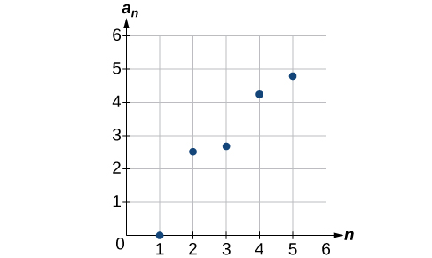 

<math xmlns="http://www.w3.org/1998/Math/MathML"> <mrow> <msub> <mi>a</mi> <mi>n</mi> </msub> <mo>=</mo><mrow><mo>{</mo> <mrow> <mtable columnalign="left"> <mtr columnalign="left"> <mtd columnalign="left"> <mrow> <mfrac> <mrow> <mn>4</mn><mo>+</mo><mi>n</mi> </mrow> <mrow> <mn>2</mn><mi>n</mi> </mrow> </mfrac> </mrow> </mtd> <mtd columnalign="left"> <mrow> <mtext>if </mtext><mi>n</mi><mtext> is even</mtext> </mrow> </mtd> </mtr> <mtr columnalign="left"> <mtd columnalign="left"> <mrow> <mn>3</mn><mo>+</mo><mi>n</mi> </mrow> </mtd> <mtd columnalign="left"> <mrow> <mtext>if </mtext><mi>n</mi><mtext> is odd</mtext> </mrow> </mtd> </mtr> </mtable> </mrow> </mrow> </mrow> </math>

<math xmlns="http://www.w3.org/1998/Math/MathML"> <mrow> <msub> <mi>a</mi> <mn>1</mn> </msub> <mo>=</mo><mn>2</mn><mo>,</mo><mtext> </mtext><msub> <mi>a</mi> <mi>n</mi> </msub> <mo>=</mo><msup> <mrow> <mrow><mo>(</mo> <mrow> <mo>−</mo><msub> <mi>a</mi> <mrow> <mi>n</mi><mo>−</mo><mn>1</mn> </mrow> </msub> <mo>+</mo><mn>1</mn> </mrow> <mo>)</mo></mrow> </mrow> <mn>2</mn> </msup> </mrow> </math>

 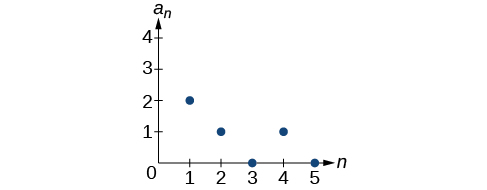 

<math xmlns="http://www.w3.org/1998/Math/MathML"> <mrow> <msub> <mi>a</mi> <mi>n</mi> </msub> <mo>=</mo><mn>1</mn><mo>,</mo><mtext> </mtext><msub> <mi>a</mi> <mi>n</mi> </msub> <mo>=</mo><msub> <mi>a</mi> <mrow> <mi>n</mi><mo>−</mo><mn>1</mn> </mrow> </msub> <mo>+</mo><mn>8</mn> </mrow> </math>

<math xmlns="http://www.w3.org/1998/Math/MathML"> <mrow> <msub> <mi>a</mi> <mi>n</mi> </msub> <mo>=</mo><mfrac> <mrow> <mrow><mo>(</mo> <mrow> <mi>n</mi><mo>+</mo><mn>1</mn> </mrow> <mo>)</mo></mrow><mo>!</mo> </mrow> <mrow> <mrow><mo>(</mo> <mrow> <mi>n</mi><mo>−</mo><mn>1</mn> </mrow> <mo>)</mo></mrow><mo>!</mo> </mrow> </mfrac> </mrow> </math>

 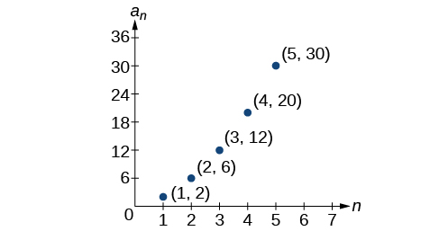 

For the following exercises, write an explicit formula for the sequence using the first five points shown on the graph.

 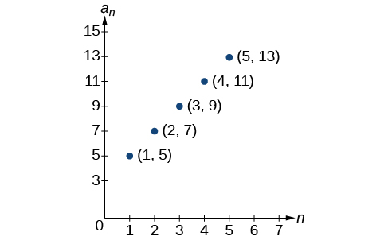 

 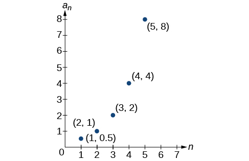 

<math xmlns="http://www.w3.org/1998/Math/MathML"> <mrow> <msub> <mi>a</mi> <mi>n</mi> </msub> <mo>=</mo><msup> <mn>2</mn> <mrow> <mi>n</mi><mo>−</mo><mn>2</mn> </mrow> </msup> </mrow> </math>

 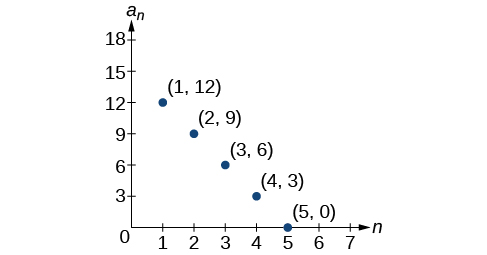 

For the following exercises, write a recursive formula for the sequence using the first five points shown on the graph.

 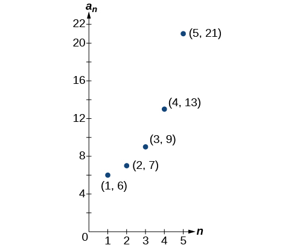 

<math xmlns="http://www.w3.org/1998/Math/MathML"> <mrow> <msub> <mi>a</mi> <mn>1</mn> </msub> <mo>=</mo><mn>6</mn><mo>,</mo><mtext> </mtext><msub> <mi>a</mi> <mi>n</mi> </msub> <mo>=</mo><mn>2</mn><msub> <mi>a</mi> <mrow> <mi>n</mi><mo>−</mo><mn>1</mn> </mrow> </msub> <mo>−</mo><mn>5</mn> </mrow> </math>

 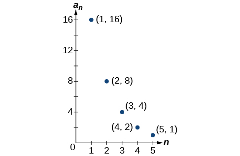 

#### Technology

Follow these steps to evaluate a sequence defined recursively using a graphing calculator:

* On the home screen, key in the value for the initial term
  <math xmlns="http://www.w3.org/1998/Math/MathML"> <mrow> <mtext> </mtext><msub> <mi>a</mi> <mn>1</mn> </msub> <mtext> </mtext> </mrow> </math>
  
  and press **\[ENTER\]**.
* Enter the recursive formula by keying in all numerical values given in the formula, along with the key strokes **\[2ND\] ANS** for the previous term
  <math xmlns="http://www.w3.org/1998/Math/MathML"> <mrow> <mtext> </mtext><msub> <mi>a</mi> <mrow> <mi>n</mi><mo>−</mo><mn>1</mn> </mrow> </msub> <mo>.</mo><mtext> </mtext> </mrow> </math>
  
  Press **\[ENTER\]**.
* Continue pressing **\[ENTER\]** to calculate the values for each successive term.

For the following exercises, use the steps above to find the indicated term or terms for the sequence.

Find the first five terms of the sequence <math xmlns="http://www.w3.org/1998/Math/MathML"> <mrow> <msub> <mi>a</mi> <mn>1</mn> </msub> <mo>=</mo><mfrac> <mrow> <mn>87</mn> </mrow> <mrow> <mn>111</mn> </mrow> </mfrac> <mo>,</mo><mtext> </mtext><msub> <mi>a</mi> <mi>n</mi> </msub> <mo>=</mo><mfrac> <mn>4</mn> <mn>3</mn> </mfrac> <msub> <mi>a</mi> <mrow> <mi>n</mi><mo>−</mo><mn>1</mn> </mrow> </msub> <mo>+</mo><mfrac> <mrow> <mn>12</mn> </mrow> <mrow> <mn>37</mn> </mrow> </mfrac> <mo>.</mo> </mrow> </math>

 Use the &gt;**Frac** feature to give fractional results.

First five terms: <math xmlns="http://www.w3.org/1998/Math/MathML"> <mrow> <mfrac> <mrow> <mn>29</mn> </mrow> <mrow> <mn>37</mn> </mrow> </mfrac> <mo>,</mo><mfrac> <mrow> <mn>152</mn> </mrow> <mrow> <mn>111</mn> </mrow> </mfrac> <mo>,</mo><mfrac> <mrow> <mn>716</mn> </mrow> <mrow> <mn>333</mn> </mrow> </mfrac> <mo>,</mo><mfrac> <mrow> <mn>3188</mn> </mrow> <mrow> <mn>999</mn> </mrow> </mfrac> <mo>,</mo><mfrac> <mrow> <mn>13724</mn> </mrow> <mrow> <mn>2997</mn> </mrow> </mfrac> </mrow> </math>

Find the 15th term of the sequence<math xmlns="http://www.w3.org/1998/Math/MathML"> <mrow> <mtext> </mtext><msub> <mi>a</mi> <mn>1</mn> </msub> <mo>=</mo><mn>625</mn><mo>,</mo><mo> </mo><msub> <mi>a</mi> <mi>n</mi> </msub> <mo>=</mo><mn>0.8</mn><msub> <mi>a</mi> <mrow> <mi>n</mi><mo>−</mo><mn>1</mn> </mrow> </msub> <mo>+</mo><mn>18.</mn> </mrow> </math>

Find the first five terms of the sequence<math xmlns="http://www.w3.org/1998/Math/MathML"> <mrow> <mtext> </mtext><msub> <mi>a</mi> <mn>1</mn> </msub> <mo>=</mo><mn>2</mn><mo>,</mo><mo> </mo><msub> <mi>a</mi> <mi>n</mi> </msub> <mo>=</mo><msup> <mn>2</mn> <mrow> <mo stretchy="false">[</mo><mo stretchy="false">(</mo><msub> <mi>a</mi> <mi>n</mi> </msub> <mo>−</mo><mn>1</mn><mo stretchy="false">)</mo><mo>−</mo><mn>1</mn><mo stretchy="false">]</mo> </mrow> </msup> <mo>+</mo><mn>1.</mn> </mrow> </math>

First five terms: <math xmlns="http://www.w3.org/1998/Math/MathML"> <mrow> <mn>2</mn><mo>,</mo><mn>3</mn><mo>,</mo><mn>5</mn><mo>,</mo><mn>17</mn><mo>,</mo><mn>65537</mn> </mrow> </math>

Find the first ten terms of the sequence <math xmlns="http://www.w3.org/1998/Math/MathML"> <mrow> <msub> <mi>a</mi> <mn>1</mn> </msub> <mo>=</mo><mn>8</mn><mo>,</mo><mtext> </mtext><msub> <mi>a</mi> <mi>n</mi> </msub> <mo>=</mo><mfrac> <mrow> <mrow><mo>(</mo> <mrow> <msub> <mi>a</mi> <mrow> <mi>n</mi><mo>−</mo><mn>1</mn> </mrow> </msub> <mo>+</mo><mn>1</mn> </mrow> <mo>)</mo></mrow><mo>!</mo> </mrow> <mrow> <msub> <mi>a</mi> <mrow> <mi>n</mi><mo>−</mo><mn>1</mn> </mrow> </msub> <mo>!</mo> </mrow> </mfrac> <mo>.</mo> </mrow> </math>

Find the tenth term of the sequence <math xmlns="http://www.w3.org/1998/Math/MathML"> <mrow> <msub> <mi>a</mi> <mn>1</mn> </msub> <mo>=</mo><mn>2</mn><mo>,</mo><mtext> </mtext><msub> <mi>a</mi> <mi>n</mi> </msub> <mo>=</mo><mi>n</mi><msub> <mi>a</mi> <mrow> <mi>n</mi><mo>−</mo><mn>1</mn> </mrow> </msub> </mrow> </math>

<math xmlns="http://www.w3.org/1998/Math/MathML"> <mrow> <msub> <mi>a</mi> <mrow> <mn>10</mn> </mrow> </msub> <mo>=</mo><mn>7</mn><mo>,</mo><mn>257</mn><mo>,</mo><mn>600</mn> </mrow> </math>

Follow these steps to evaluate a finite sequence defined by an explicit formula. Using a TI-84, do the following.

* In the home screen, press **\[2ND\] LIST**.
* Scroll over to **OPS** and choose **“seq(”** from the dropdown list. Press **\[ENTER\]**.
* In the line headed **“Expr:”** type in the explicit formula, using the
  <math xmlns="http://www.w3.org/1998/Math/MathML"> <mrow> <mtext> </mtext><mo stretchy="false">[</mo><mtext>X,T</mtext><mo>,</mo><mi>θ</mi><mo>,</mo><mi>n</mi><mo stretchy="false">]</mo><mtext> </mtext> </mrow> </math>
  
  button for
  <math xmlns="http://www.w3.org/1998/Math/MathML"> <mrow> <mtext> </mtext><mi>n</mi> </mrow> </math>

* In the line headed **“Variable:”** type in the variable used on the previous step.
* In the line headed **“start:”** key in the value of
  <math xmlns="http://www.w3.org/1998/Math/MathML"> <mrow> <mtext> </mtext><mi>n</mi><mtext> </mtext> </mrow> </math>
  
  that begins the sequence.
* In the line headed **“end:”** key in the value of
  <math xmlns="http://www.w3.org/1998/Math/MathML"> <mrow> <mtext> </mtext><mi>n</mi><mtext> </mtext> </mrow> </math>
  
  that ends the sequence.
* Press **\[ENTER\]** 3 times to return to the home screen. You will see the sequence syntax on the screen. Press **\[ENTER\]** to see the list of terms for the finite sequence defined. Use the right arrow key to scroll through the list of terms.

Using a TI-83, do the following.

* In the home screen, press **\[2ND\] LIST**.
* Scroll over to **OPS** and choose **“seq(”** from the dropdown list. Press **\[ENTER\]**.
* Enter the items in the order **“Expr”**, **“Variable”**, **“start”**, **“end”** separated by commas. See the instructions above for the description of each item.
* Press **\[ENTER\]** to see the list of terms for the finite sequence defined. Use the right arrow key to scroll through the list of terms.

For the following exercises, use the steps above to find the indicated terms for the sequence. Round to the nearest thousandth when necessary.

List the first five terms of the sequence <math xmlns="http://www.w3.org/1998/Math/MathML"> <mrow> <msub> <mi>a</mi> <mi>n</mi> </msub> <mo>=</mo><mo>−</mo><mfrac> <mrow> <mn>28</mn> </mrow> <mn>9</mn> </mfrac> <mi>n</mi><mo>+</mo><mfrac> <mn>5</mn> <mn>3</mn> </mfrac> <mo>.</mo> </mrow> </math>

List the first six terms of the sequence<math xmlns="http://www.w3.org/1998/Math/MathML"> <mrow> <mtext> </mtext><msub> <mi>a</mi> <mi>n</mi> </msub> <mo>=</mo><mfrac> <mrow> <msup> <mi>n</mi> <mn>3</mn> </msup> <mo>−</mo><mn>3.5</mn><msup> <mi>n</mi> <mn>2</mn> </msup> <mo>+</mo><mo> </mo><mn>4.1</mn><mi>n</mi><mo>−</mo><mn>1.5</mn> </mrow> <mrow> <mn>2.4</mn><mi>n</mi> </mrow> </mfrac> <mo>.</mo> </mrow> </math>

First six terms: <math xmlns="http://www.w3.org/1998/Math/MathML"> <mrow> <mn>0.042</mn><mo>,</mo><mn>0.146</mn><mo>,</mo><mn>0.875</mn><mo>,</mo><mn>2.385</mn><mo>,</mo><mn>4.708</mn> </mrow> </math>

List the first five terms of the sequence <math xmlns="http://www.w3.org/1998/Math/MathML"> <mrow> <msub> <mi>a</mi> <mi>n</mi> </msub> <mo>=</mo><mfrac> <mrow> <mn>15</mn><mi>n</mi><mo>⋅</mo><msup> <mrow> <mrow><mo>(</mo> <mrow> <mo>−</mo><mn>2</mn> </mrow> <mo>)</mo></mrow> </mrow> <mrow> <mi>n</mi><mo>−</mo><mn>1</mn> </mrow> </msup> </mrow> <mrow> <mn>47</mn> </mrow> </mfrac> </mrow> </math>

List the first four terms of the sequence <math xmlns="http://www.w3.org/1998/Math/MathML"> <mrow> <msub> <mi>a</mi> <mi>n</mi> </msub> <mo>=</mo><msup> <mrow> <mn>5.7</mn> </mrow> <mi>n</mi> </msup> <mo>+</mo><mn>0.275</mn><mrow><mo>(</mo> <mrow> <mi>n</mi><mo>−</mo><mn>1</mn> </mrow> <mo>)</mo></mrow><mo>!</mo> </mrow> </math>

First four terms: <math xmlns="http://www.w3.org/1998/Math/MathML"> <mrow> <mn>5.975</mn><mo>,</mo><mn>32.765</mn><mo>,</mo><mn>185.743</mn><mo>,</mo><mn>1057.25</mn><mo>,</mo><mn>6023.521</mn> </mrow> </math>

List the first six terms of the sequence <math xmlns="http://www.w3.org/1998/Math/MathML"> <mrow> <msub> <mi>a</mi> <mi>n</mi> </msub> <mo>=</mo><mfrac> <mrow> <mi>n</mi><mo>!</mo> </mrow> <mi>n</mi> </mfrac> <mo>.</mo> </mrow> </math>

#### Extensions

Consider the sequence defined by <math xmlns="http://www.w3.org/1998/Math/MathML"> <mrow> <msub> <mi>a</mi> <mi>n</mi> </msub> <mo>=</mo><mo>−</mo><mn>6</mn><mo>−</mo><mn>8</mn><mi>n</mi><mo>.</mo> </mrow> </math>

 Is <math xmlns="http://www.w3.org/1998/Math/MathML"> <mrow> <msub> <mi>a</mi> <mi>n</mi> </msub> <mo>=</mo><mo>−</mo><mn>421</mn> </mrow> </math>

 a term in the sequence? Verify the result.

If<math xmlns="http://www.w3.org/1998/Math/MathML"> <mrow> <mtext> </mtext><msub> <mi>a</mi> <mi>n</mi> </msub> <mo>=</mo><mo>−</mo><mn>421</mn><mtext> </mtext> </mrow> </math>

is a term in the sequence, then solving the equation <math xmlns="http://www.w3.org/1998/Math/MathML"> <mrow> <mo>−</mo><mn>421</mn><mo>=</mo><mo>−</mo><mn>6</mn><mo>−</mo><mn>8</mn><mi>n</mi> </mrow> </math>

 for <math xmlns="http://www.w3.org/1998/Math/MathML"> <mi>n</mi> </math>

 will yield a non-negative integer. However, if<math xmlns="http://www.w3.org/1998/Math/MathML"> <mrow> <mtext> </mtext><mo>−</mo><mn>421</mn><mo>=</mo><mo>−</mo><mn>6</mn><mo>−</mo><mn>8</mn><mi>n</mi><mo>,</mo><mtext> </mtext> </mrow> </math>

then <math xmlns="http://www.w3.org/1998/Math/MathML"> <mrow> <mi>n</mi><mo>=</mo><mn>51.875</mn> </mrow> </math>

 so <math xmlns="http://www.w3.org/1998/Math/MathML"> <mrow> <msub> <mi>a</mi> <mi>n</mi> </msub> <mo>=</mo><mo>−</mo><mn>421</mn> </mrow> </math>

 is not a term in the sequence.

What term in the sequence <math xmlns="http://www.w3.org/1998/Math/MathML"> <mrow> <msub> <mi>a</mi> <mi>n</mi> </msub> <mo>=</mo><mfrac> <mrow> <msup> <mi>n</mi> <mn>2</mn> </msup> <mo>+</mo><mn>4</mn><mi>n</mi><mo>+</mo><mn>4</mn> </mrow> <mrow> <mn>2</mn><mrow><mo>(</mo> <mrow> <mi>n</mi><mo>+</mo><mn>2</mn> </mrow> <mo>)</mo></mrow> </mrow> </mfrac> </mrow> </math>

 has the value <math xmlns="http://www.w3.org/1998/Math/MathML"> <mrow> <mn>41</mn><mo>?</mo> </mrow> </math>

 Verify the result.

Find a recursive formula for the sequence <math xmlns="http://www.w3.org/1998/Math/MathML"> <mrow> <mn>1</mn><mo>,</mo><mtext> </mtext><mn>0</mn><mo>,</mo><mtext> </mtext><mo>−</mo><mn>1</mn><mo>,</mo><mtext> </mtext><mo>−</mo><mn>1</mn><mo>,</mo><mtext> </mtext><mn>0</mn><mo>,</mo><mtext> </mtext><mn>1</mn><mo>,</mo><mtext> </mtext><mn>1</mn><mo>,</mo><mtext> </mtext><mn>0</mn><mo>,</mo><mtext> </mtext><mo>−</mo><mn>1</mn><mo>,</mo><mtext> </mtext><mo>−</mo><mn>1</mn><mo>,</mo><mtext> </mtext><mn>0</mn><mo>,</mo><mtext> </mtext><mn>1</mn><mo>,</mo><mtext> </mtext><mn>1</mn><mo>,</mo><mtext> </mtext><mn>...</mn><mtext> </mtext><mo>.</mo> </mrow> </math>

 (*Hint*: find a pattern for<math xmlns="http://www.w3.org/1998/Math/MathML"> <mrow> <mtext> </mtext><msub> <mi>a</mi> <mi>n</mi> </msub> <mtext> </mtext> </mrow> </math>

based on the first two terms.)

<math xmlns="http://www.w3.org/1998/Math/MathML"> <mrow> <msub> <mi>a</mi> <mn>1</mn> </msub> <mo>=</mo><mn>1</mn><mo>,</mo><msub> <mi>a</mi> <mn>2</mn> </msub> <mo>=</mo><mn>0</mn><mo>,</mo><msub> <mi>a</mi> <mi>n</mi> </msub> <mo>=</mo><msub> <mi>a</mi> <mrow> <mi>n</mi><mo>−</mo><mn>1</mn> </mrow> </msub> <mo>−</mo><msub> <mi>a</mi> <mrow> <mi>n</mi><mo>−</mo><mn>2</mn> </mrow> </msub> </mrow> </math>

Calculate the first eight terms of the sequences <math xmlns="http://www.w3.org/1998/Math/MathML"> <mrow> <msub> <mi>a</mi> <mi>n</mi> </msub> <mo>=</mo><mfrac> <mrow> <mrow><mo>(</mo> <mrow> <mi>n</mi><mo>+</mo><mn>2</mn> </mrow> <mo>)</mo></mrow><mo>!</mo> </mrow> <mrow> <mrow><mo>(</mo> <mrow> <mi>n</mi><mo>−</mo><mn>1</mn> </mrow> <mo>)</mo></mrow><mo>!</mo> </mrow> </mfrac> </mrow> </math>

 and <math xmlns="http://www.w3.org/1998/Math/MathML"> <mrow> <msub> <mi>b</mi> <mi>n</mi> </msub> <mo>=</mo><msup> <mi>n</mi> <mn>3</mn> </msup> <mo>+</mo><mn>3</mn><msup> <mi>n</mi> <mn>2</mn> </msup> <mo>+</mo><mn>2</mn><mi>n</mi><mo>,</mo> </mrow> </math>

 and then make a conjecture about the relationship between these two sequences.

Prove the conjecture made in the preceding exercise.

<math xmlns="http://www.w3.org/1998/Math/MathML"> <mrow> <mfrac> <mrow> <mo stretchy="false">(</mo><mi>n</mi><mo>+</mo><mn>2</mn><mo stretchy="false">)</mo><mo>!</mo> </mrow> <mrow> <mo stretchy="false">(</mo><mi>n</mi><mo>−</mo><mn>1</mn><mo stretchy="false">)</mo><mo>!</mo> </mrow> </mfrac> <mo>=</mo><mfrac> <mrow> <mo stretchy="false">(</mo><mi>n</mi><mo>+</mo><mn>2</mn><mo stretchy="false">)</mo><mo>·</mo><mo stretchy="false">(</mo><mi>n</mi><mo>+</mo><mn>1</mn><mo stretchy="false">)</mo><mo>·</mo><mo stretchy="false">(</mo><mi>n</mi><mo stretchy="false">)</mo><mo>·</mo><mo stretchy="false">(</mo><mi>n</mi><mo>−</mo><mn>1</mn><mo stretchy="false">)</mo><mo>·</mo><mn>...</mn><mo>·</mo><mn>3</mn><mo>·</mo><mn>2</mn><mo>·</mo><mn>1</mn> </mrow> <mrow> <mo stretchy="false">(</mo><mi>n</mi><mo>−</mo><mn>1</mn><mo stretchy="false">)</mo><mo>·</mo><mn>...</mn><mo>·</mo><mn>3</mn><mo>·</mo><mn>2</mn><mo>·</mo><mn>1</mn> </mrow> </mfrac> <mo>=</mo><mi>n</mi><mo stretchy="false">(</mo><mi>n</mi><mo>+</mo><mn>1</mn><mo stretchy="false">)</mo><mo stretchy="false">(</mo><mi>n</mi><mo>+</mo><mn>2</mn><mo stretchy="false">)</mo><mo>=</mo><msup> <mi>n</mi> <mn>3</mn> </msup> <mo>+</mo><mn>3</mn><msup> <mi>n</mi> <mn>2</mn> </msup> <mo>+</mo><mn>2</mn><mi>n</mi> </mrow> </math>

### Glossary
{: data-type="glossary-title"}

explicit formula
: a formula that defines each term of a sequence in terms of its position in the sequence
^

finite sequence
: a function whose domain consists of a finite subset of the positive integers
  <math xmlns="http://www.w3.org/1998/Math/MathML"> <mrow> <mtext> </mtext><mo>{</mo><mn>1</mn><mo>,</mo><mn>2</mn><mo>,</mo><mo>…</mo><mi>n</mi><mo>}</mo><mtext> </mtext> </mrow> </math>
  
  for some positive integer
  <math xmlns="http://www.w3.org/1998/Math/MathML"> <mrow> <mtext> </mtext><mi>n</mi> </mrow> </math>
^

infinite sequence
: a function whose domain is the set of positive integers
^

n factorial
: the product of all the positive integers from 1 to
  <math xmlns="http://www.w3.org/1998/Math/MathML"> <mrow> <mtext> </mtext><mi>n</mi> </mrow> </math>
^

nth term of a sequence
: a formula for the general term of a sequence
^

recursive formula
: a formula that defines each term of a sequence using previous term(s)
^

sequence
: a function whose domain is a subset of the positive integers
^

term
: a number in a sequence

[1]: http://openstaxcollege.org/l/findingterms
