

In this section, you will:
* Find the common difference for an arithmetic sequence.
* Write terms of an arithmetic sequence.
* Use a recursive formula for an arithmetic sequence.
* Use an explicit formula for an arithmetic sequence.

Companies often make large purchases, such as computers and vehicles, for business use. The book-value of these supplies decreases each year for tax purposes. This decrease in value is called depreciation. One method of calculating depreciation is straight-line depreciation, in which the value of the asset decreases by the same amount each year.

As an example, consider a woman who starts a small contracting business. She purchases a new truck for $25,000. After five years, she estimates that she will be able to sell the truck for $8,000. The loss in value of the truck will therefore be $17,000, which is $3,400 per year for five years. The truck will be worth $21,600 after the first year; $18,200 after two years; $14,800 after three years; $11,400 after four years; and $8,000 at the end of five years. In this section, we will consider specific kinds of sequences that will allow us to calculate depreciation, such as the truck’s value.

### Finding Common Differences

The values of the truck in the example are said to form an **arithmetic sequence** because they change by a constant amount each year. Each term increases or decreases by the same constant value called the **common difference** of the sequence. For this sequence, the common difference is –3,400.

  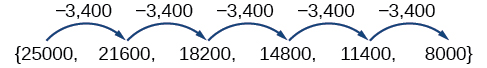 The sequence below is another example of an arithmetic sequence. In this case, the constant difference is 3. You can choose any **term**{: data-type="term" .no-emphasis} of the **sequence**{: data-type="term" .no-emphasis}, and add 3 to find the subsequent term.

   

Arithmetic Sequence

An **arithmetic sequence**{: data-type="term"} is a sequence that has the property that the difference between any two consecutive terms is a constant. This constant is called the **common difference**{: data-type="term"}. If <math xmlns="http://www.w3.org/1998/Math/MathML"> <mrow> <msub> <mi>a</mi> <mn>1</mn> </msub> </mrow> </math>

 is the first term of an arithmetic sequence and <math xmlns="http://www.w3.org/1998/Math/MathML"> <mi>d</mi></math>

 is the common difference, the sequence will be:

<math xmlns="http://www.w3.org/1998/Math/MathML" display="block"> <mrow> <mo>{</mo><msub> <mi>a</mi> <mi>n</mi> </msub> <mo>}</mo><mo>=</mo><mo>{</mo><msub> <mi>a</mi> <mn>1</mn> </msub> <mo>,</mo><msub> <mi>a</mi> <mn>1</mn> </msub> <mo>+</mo><mi>d</mi><mo>,</mo><msub> <mi>a</mi> <mn>1</mn> </msub> <mo>+</mo><mn>2</mn><mi>d</mi><mo>,</mo><msub> <mi>a</mi> <mn>1</mn> </msub> <mo>+</mo><mn>3</mn><mi>d</mi><mo>,</mo><mn>...</mn><mo>}</mo> </mrow> </math>

Finding Common Differences

Is each sequence arithmetic? If so, find the common difference.

1.  <math xmlns="http://www.w3.org/1998/Math/MathML"> <mrow> <mo>{</mo><mn>1</mn><mo>,</mo><mn>2</mn><mo>,</mo><mn>4</mn><mo>,</mo><mn>8</mn><mo>,</mo><mn>16</mn><mo>,</mo><mn>...</mn><mo>}</mo> </mrow> </math>

2.  <math xmlns="http://www.w3.org/1998/Math/MathML"> <mrow> <mo>{</mo><mo>−</mo><mn>3</mn><mo>,</mo><mn>1</mn><mo>,</mo><mn>5</mn><mo>,</mo><mn>9</mn><mo>,</mo><mn>13</mn><mo>,</mo><mn>...</mn><mo>}</mo> </mrow> </math>
{: type="a"}

Subtract each term from the subsequent term to determine whether a common difference exists.

1.  The sequence is not arithmetic because there is no common difference.  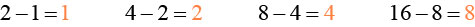 
2.  The sequence is arithmetic because there is a common difference. The common difference is 4.  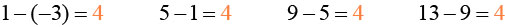 
{: type="a"}

Analysis

The graph of each of these sequences is shown in [[link]](#CNX_Precalculus_Figure_11_02_003). We can see from the graphs that, although both sequences show growth, <math xmlns="http://www.w3.org/1998/Math/MathML"> <mi>a</mi> </math>

 is not linear whereas <math xmlns="http://www.w3.org/1998/Math/MathML"> <mi>b</mi> </math>

 is linear. Arithmetic sequences have a constant rate of change so their graphs will always be points on a line.

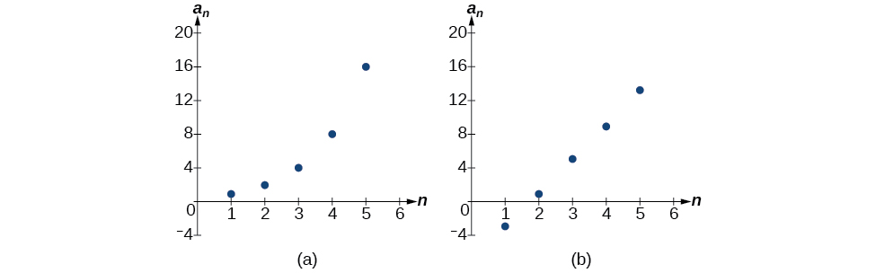{: #CNX_Precalculus_Figure_11_02_003}

**If we are told that a sequence is arithmetic, do we have to subtract every term from the following term to find the common difference?**

<em> No. If we know that the sequence is arithmetic, we can choose any one term in the sequence, and subtract it from the subsequent term to find the common difference.</em>

Is the given sequence arithmetic? If so, find the common difference.

<math xmlns="http://www.w3.org/1998/Math/MathML" display="block"> <mrow> <mo>{</mo><mn>18</mn><mo>,</mo><mtext> </mtext><mn>16</mn><mo>,</mo><mtext> </mtext><mn>14</mn><mo>,</mo><mtext> </mtext><mn>12</mn><mo>,</mo><mtext> </mtext><mn>10</mn><mo>,</mo><mo>…</mo><mo>}</mo> </mrow> </math>

The sequence is arithmetic. The common difference is <math xmlns="http://www.w3.org/1998/Math/MathML"> <mrow> <mo>–</mo><mn>2.</mn> </mrow> </math>

Is the given sequence arithmetic? If so, find the common difference.

<math xmlns="http://www.w3.org/1998/Math/MathML" display="block"> <mrow> <mo>{</mo><mn>1</mn><mo>,</mo><mtext> </mtext><mn>3</mn><mo>,</mo><mtext> </mtext><mn>6</mn><mo>,</mo><mtext> </mtext><mn>10</mn><mo>,</mo><mtext> </mtext><mn>15</mn><mo>,</mo><mo>…</mo><mo>}</mo> </mrow> </math>

The sequence is not arithmetic because <math xmlns="http://www.w3.org/1998/Math/MathML"> <mrow> <mn>3</mn><mo>−</mo><mn>1</mn><mo>≠</mo><mn>6</mn><mo>−</mo><mn>3.</mn> </mrow> </math>

### Writing Terms of Arithmetic Sequences

Now that we can recognize an arithmetic sequence, we will find the terms if we are given the first term and the common difference. The terms can be found by beginning with the first term and adding the common difference repeatedly. In addition, any term can also be found by plugging in the values of <math xmlns="http://www.w3.org/1998/Math/MathML"> <mi>n</mi> </math>

 and <math xmlns="http://www.w3.org/1998/Math/MathML"> <mi>d</mi> </math>

 into formula below.

<math xmlns="http://www.w3.org/1998/Math/MathML" display="block"> <mrow> <msub> <mi>a</mi> <mi>n</mi> </msub> <mo>=</mo><msub> <mi>a</mi> <mn>1</mn> </msub> <mo>+</mo><mo stretchy="false">(</mo><mi>n</mi><mo>−</mo><mn>1</mn><mo stretchy="false">)</mo><mi>d</mi> </mrow> </math>

**Given the first term and the common difference of an arithmetic sequence, find the first several terms.**

1.  Add the common difference to the first term to find the second term.
2.  Add the common difference to the second term to find the third term.
3.  Continue until all of the desired terms are identified.
4.  Write the terms separated by commas within brackets.
{: type="1"}

Writing Terms of Arithmetic Sequences

Write the first five terms of the **arithmetic sequence**{: data-type="term" .no-emphasis} with <math xmlns="http://www.w3.org/1998/Math/MathML"> <mrow> <msub> <mi>a</mi> <mn>1</mn> </msub> <mo>=</mo><mn>17</mn> </mrow> </math>

 and <math xmlns="http://www.w3.org/1998/Math/MathML"> <mrow> <mi>d</mi><mo>=</mo><mo>−</mo><mn>3</mn> </mrow> </math>

.

Adding<math xmlns="http://www.w3.org/1998/Math/MathML"> <mrow> <mtext> </mtext><mo>−</mo><mn>3</mn><mtext> </mtext> </mrow> </math>

is the same as subtracting 3. Beginning with the first term, subtract 3 from each term to find the next term.

The first five terms are <math xmlns="http://www.w3.org/1998/Math/MathML"> <mrow> <mtext> </mtext><mo>{</mo><mn>17</mn><mo>,</mo><mtext> </mtext><mn>14</mn><mo>,</mo><mtext> </mtext><mn>11</mn><mo>,</mo><mtext> </mtext><mn>8</mn><mo>,</mo><mtext> </mtext><mn>5</mn><mo>}</mo> </mrow> </math>

Analysis

As expected, the graph of the sequence consists of points on a line as shown in [[link]](#CNX_Precalculus_Figure_11_02_004).

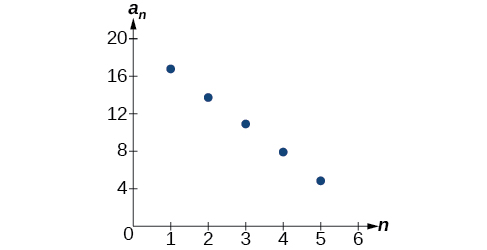{: #CNX_Precalculus_Figure_11_02_004}

List the first five terms of the arithmetic sequence with <math xmlns="http://www.w3.org/1998/Math/MathML"> <mrow> <msub> <mi>a</mi> <mn>1</mn> </msub> <mo>=</mo><mn>1</mn> </mrow> </math>

 and <math xmlns="http://www.w3.org/1998/Math/MathML"> <mrow> <mi>d</mi><mo>=</mo><mn>5</mn> </mrow> </math>

.

<math xmlns="http://www.w3.org/1998/Math/MathML"> <mrow> <mrow> <mo>{</mo> <mrow> <mn>1</mn> <mo>,</mo> <mo> </mo> <mn>6</mn> <mo>,</mo> <mo> </mo> <mn>11</mn> <mo>,</mo> <mo> </mo> <mn>16</mn> <mo>,</mo> <mo> </mo> <mn>21</mn> </mrow> <mo>}</mo> </mrow> </mrow> </math>

**Given any first term and any other term in an arithmetic sequence, find a given term.**

1.  Substitute the values given for
    <math xmlns="http://www.w3.org/1998/Math/MathML"> <mrow> <msub> <mi>a</mi> <mn>1</mn> </msub> <mo>,</mo><msub> <mi>a</mi> <mi>n</mi> </msub> <mo>,</mo><mi>n</mi> </mrow> </math>
    
    into the formula
    <math xmlns="http://www.w3.org/1998/Math/MathML"> <mrow> <mtext> </mtext><msub> <mi>a</mi> <mi>n</mi> </msub> <mo>=</mo><msub> <mi>a</mi> <mn>1</mn> </msub> <mo>+</mo><mo stretchy="false">(</mo><mi>n</mi><mo>−</mo><mn>1</mn><mo stretchy="false">)</mo><mi>d</mi><mtext> </mtext> </mrow> </math>
    
    to solve for
    <math xmlns="http://www.w3.org/1998/Math/MathML"> <mrow> <mtext> </mtext><mi>d</mi><mo>.</mo> </mrow> </math>

2.  Find a given term by substituting the appropriate values for
    <math xmlns="http://www.w3.org/1998/Math/MathML"> <mrow> <mtext> </mtext><msub> <mi>a</mi> <mn>1</mn> </msub> <mo>,</mo><mi>n</mi><mo>,</mo><mtext> </mtext> </mrow> </math>
    
    and
    <math xmlns="http://www.w3.org/1998/Math/MathML"> <mrow> <mtext> </mtext><mi>d</mi><mtext> </mtext> </mrow> </math>
    
    into the formula
    <math xmlns="http://www.w3.org/1998/Math/MathML"> <mrow> <msub> <mi>a</mi> <mi>n</mi> </msub> <mo>=</mo><msub> <mi>a</mi> <mn>1</mn> </msub> <mo>+</mo><mo stretchy="false">(</mo><mi>n</mi><mo>−</mo><mn>1</mn><mo stretchy="false">)</mo><mi>d</mi><mo>.</mo> </mrow> </math>
{: type="1"}

Writing Terms of Arithmetic Sequences

Given <math xmlns="http://www.w3.org/1998/Math/MathML"> <mrow> <msub> <mi>a</mi> <mn>1</mn> </msub> <mo>=</mo><mn>8</mn> </mrow> </math>

 and <math xmlns="http://www.w3.org/1998/Math/MathML"> <mrow> <msub> <mi>a</mi> <mn>4</mn> </msub> <mo>=</mo><mn>14</mn> </mrow> </math>

, find <math xmlns="http://www.w3.org/1998/Math/MathML"> <mrow> <msub> <mi>a</mi> <mn>5</mn> </msub> </mrow> </math>

.

The sequence can be written in terms of the initial term 8 and the common difference <math xmlns="http://www.w3.org/1998/Math/MathML"> <mi>d</mi> </math>

.

<math xmlns="http://www.w3.org/1998/Math/MathML" display="block"> <mrow> <mrow><mo>{</mo> <mrow> <mn>8</mn><mo>,</mo><mn>8</mn><mo>+</mo><mi>d</mi><mo>,</mo><mn>8</mn><mo>+</mo><mn>2</mn><mi>d</mi><mo>,</mo><mn>8</mn><mo>+</mo><mn>3</mn><mi>d</mi> </mrow> <mo>}</mo></mrow> </mrow> </math>

We know the fourth term equals 14; we know the fourth term has the form <math xmlns="http://www.w3.org/1998/Math/MathML"> <mrow> <msub> <mi>a</mi> <mn>1</mn> </msub> <mo>+</mo><mn>3</mn><mi>d</mi><mo>=</mo><mn>8</mn><mo>+</mo><mn>3</mn><mi>d</mi> </mrow> </math>

.

We can find the common difference <math xmlns="http://www.w3.org/1998/Math/MathML"> <mi>d</mi> </math>

.

<math xmlns="http://www.w3.org/1998/Math/MathML" display="block"> <mrow> <mtable columnalign="left"> <mtr columnalign="left"> <mtd columnalign="left"> <mrow> <msub> <mi>a</mi> <mi>n</mi> </msub> <mo>=</mo><msub> <mi>a</mi> <mn>1</mn> </msub> <mo>+</mo><mo stretchy="false">(</mo><mi>n</mi><mo>−</mo><mn>1</mn><mo stretchy="false">)</mo><mi>d</mi> </mrow> </mtd> <mtd columnalign="left"> <mrow /> </mtd> </mtr> <mtr columnalign="left"> <mtd columnalign="left"> <mrow> <msub> <mi>a</mi> <mn>4</mn> </msub> <mo>=</mo><msub> <mi>a</mi> <mn>1</mn> </msub> <mo>+</mo><mn>3</mn><mi>d</mi> </mrow> </mtd> <mtd columnalign="left"> <mrow /> </mtd> </mtr> <mtr columnalign="left"> <mtd columnalign="left"> <mrow> <msub> <mi>a</mi> <mn>4</mn> </msub> <mo>=</mo><mn>8</mn><mo>+</mo><mn>3</mn><mi>d</mi> </mrow> </mtd> <mtd columnalign="left"> <mrow> <mtext>Write the fourth term of the sequence in terms of</mtext><mo> </mo><msub> <mi>a</mi> <mn>1</mn> </msub> <mo> </mo><mtext>and</mtext><mo> </mo><mi>d</mi><mo>.</mo> </mrow> </mtd> </mtr> <mtr columnalign="left"> <mtd columnalign="left"> <mrow> <mn>14</mn><mo>=</mo><mn>8</mn><mo>+</mo><mn>3</mn><mi>d</mi> </mrow> </mtd> <mtd columnalign="left"> <mrow> <mtext>Substitute</mtext><mo> </mo><mn>14</mn><mo> </mo><mtext>for</mtext><mo> </mo><msub> <mi>a</mi> <mn>4</mn> </msub> <mo>.</mo> </mrow> </mtd> </mtr> <mtr columnalign="left"> <mtd columnalign="left"> <mrow> <mo> </mo><mtext> </mtext><mtext> </mtext><mi>d</mi><mo>=</mo><mn>2</mn> </mrow> </mtd> <mtd columnalign="left"> <mrow> <mtext>Solve for the common difference</mtext><mo>.</mo> </mrow> </mtd> </mtr> </mtable> </mrow> </math>

Find the fifth term by adding the common difference to the fourth term.

<math xmlns="http://www.w3.org/1998/Math/MathML" display="block"> <mrow> <msub> <mi>a</mi> <mn>5</mn> </msub> <mo>=</mo><msub> <mi>a</mi> <mn>4</mn> </msub> <mo>+</mo><mn>2</mn><mo>=</mo><mn>16</mn> </mrow> </math>

Analysis

Notice that the common difference is added to the first term once to find the second term, twice to find the third term, three times to find the fourth term, and so on. The tenth term could be found by adding the common difference to the first term nine times or by using the equation <math xmlns="http://www.w3.org/1998/Math/MathML"> <mrow> <msub> <mi>a</mi> <mi>n</mi> </msub> <mo>=</mo><msub> <mi>a</mi> <mn>1</mn> </msub> <mo>+</mo><mrow><mo>(</mo> <mrow> <mi>n</mi><mo>−</mo><mn>1</mn> </mrow> <mo>)</mo></mrow><mi>d</mi><mo>.</mo> </mrow> </math>

Given <math xmlns="http://www.w3.org/1998/Math/MathML"> <mrow> <msub> <mi>a</mi> <mn>3</mn> </msub> <mo>=</mo><mn>7</mn> </mrow> </math>

 and <math xmlns="http://www.w3.org/1998/Math/MathML"> <mrow> <msub> <mi>a</mi> <mn>5</mn> </msub> <mo>=</mo><mn>17</mn> </mrow> </math>

, find <math xmlns="http://www.w3.org/1998/Math/MathML"> <mrow> <msub> <mi>a</mi> <mn>2</mn> </msub> </mrow> </math>

.

<math xmlns="http://www.w3.org/1998/Math/MathML"> <mrow> <msub> <mi>a</mi> <mn>2</mn> </msub> <mo>=</mo> <mn>2</mn> </mrow> </math>

### Using Recursive Formulas for Arithmetic Sequences

Some arithmetic sequences are defined in terms of the previous term using a **recursive formula**{: data-type="term" .no-emphasis}. The formula provides an algebraic rule for determining the terms of the sequence. A recursive formula allows us to find any term of an arithmetic sequence using a function of the preceding term. Each term is the sum of the previous term and the common difference. For example, if the common difference is 5, then each term is the previous term plus 5. As with any recursive formula, the first term must be given.

<math xmlns="http://www.w3.org/1998/Math/MathML" display="block"> <mrow> <mtable columnalign="left"> <mtr columnalign="left"> <mtd columnalign="left"> <mrow> <msub> <mi>a</mi> <mi>n</mi> </msub> <mo>=</mo><msub> <mi>a</mi> <mrow> <mi>n</mi><mo>−</mo><mn>1</mn> </mrow> </msub> <mo>+</mo><mi>d</mi> </mrow> </mtd> <mtd columnalign="left"> <mrow /> </mtd> <mtd columnalign="left"> <mrow /> </mtd> <mtd columnalign="left"> <mrow /> </mtd> <mtd columnalign="left"> <mrow> <mi>n</mi><mo>≥</mo><mn>2</mn> </mrow> </mtd> </mtr> </mtable> </mrow> </math>

Recursive Formula for an Arithmetic Sequence

The recursive formula for an arithmetic sequence with common difference <math xmlns="http://www.w3.org/1998/Math/MathML"> <mi>d</mi> </math>

 is:

<math xmlns="http://www.w3.org/1998/Math/MathML" display="block"> <mrow> <mtable columnalign="left"> <mtr columnalign="left"> <mtd columnalign="left"> <mrow> <msub> <mi>a</mi> <mi>n</mi> </msub> <mo>=</mo><msub> <mi>a</mi> <mrow> <mi>n</mi><mo>−</mo><mn>1</mn> </mrow> </msub> <mo>+</mo><mi>d</mi> </mrow> </mtd> <mtd columnalign="left"> <mrow /> </mtd> <mtd columnalign="left"> <mrow /> </mtd> <mtd columnalign="left"> <mrow /> </mtd> <mtd columnalign="left"> <mrow> <mi>n</mi><mo>≥</mo><mn>2</mn> </mrow> </mtd> </mtr> </mtable> </mrow> </math>

**Given an arithmetic sequence, write its recursive formula.**

1.  Subtract any term from the subsequent term to find the common difference.
2.  State the initial term and substitute the common difference into the recursive formula for arithmetic sequences.
{: type="1"}

Writing a Recursive Formula for an Arithmetic Sequence

Write a **recursive formula**{: data-type="term" .no-emphasis} for the **arithmetic sequence**{: data-type="term" .no-emphasis}.

<math xmlns="http://www.w3.org/1998/Math/MathML" display="block"> <mrow> <mo>{</mo><mo>−</mo><mn>18</mn><mtext>, </mtext><mo>−</mo><mn>7</mn><mtext>, </mtext><mn>4</mn><mtext>, </mtext><mn>15</mn><mtext>, </mtext><mn>26</mn><mtext>, …</mtext><mo>}</mo> </mrow> </math>

The first term is given as <math xmlns="http://www.w3.org/1998/Math/MathML"> <mrow> <mn>−18</mn> </mrow> </math>

. The common difference can be found by subtracting the first term from the second term.

<math xmlns="http://www.w3.org/1998/Math/MathML" display="block"> <mrow> <mi>d</mi><mo>=</mo><mn>−7</mn><mo>−</mo><mo stretchy="false">(</mo><mn>−18</mn><mo stretchy="false">)</mo><mo>=</mo><mn>11</mn> </mrow> </math>

Substitute the initial term and the common difference into the recursive formula for arithmetic sequences.

<math xmlns="http://www.w3.org/1998/Math/MathML" display="block"> <mrow> <mtable columnalign="left"> <mtr columnalign="left"> <mtd columnalign="left"> <mrow> <msub> <mi>a</mi> <mn>1</mn> </msub> <mo>=</mo><mo>−</mo><mn>18</mn> </mrow> </mtd> </mtr> <mtr columnalign="left"> <mtd columnalign="left"> <mrow> <msub> <mi>a</mi> <mi>n</mi> </msub> <mo>=</mo><msub> <mi>a</mi> <mrow> <mi>n</mi><mo>−</mo><mn>1</mn> </mrow> </msub> <mo>+</mo><mn>11</mn><mo>,</mo><mtext> for </mtext><mi>n</mi><mo>≥</mo><mn>2</mn> </mrow> </mtd> </mtr> </mtable> </mrow> </math>

Analysis

We see that the common difference is the slope of the line formed when we graph the terms of the sequence, as shown in [[link]](#CNX_Precalculus_Figure_11_02_005). The growth pattern of the sequence shows the constant difference of 11 units.

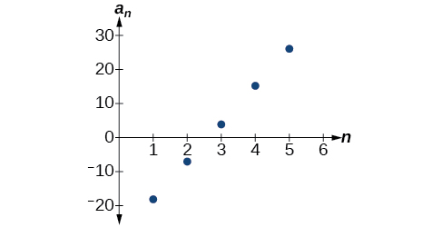{: #CNX_Precalculus_Figure_11_02_005}

**Do we have to subtract the first term from the second term to find the common difference?**

<em> No. We can subtract any term in the sequence from the subsequent term. It is, however, most common to subtract the first term from the second term because it is often the easiest method of finding the common difference.</em>

Write a recursive formula for the arithmetic sequence.

<math xmlns="http://www.w3.org/1998/Math/MathML" display="block"> <mrow> <mo>{</mo><mn>25</mn><mtext>, </mtext><mo> </mo><mn>37</mn><mtext>, </mtext><mo> </mo><mn>49</mn><mtext>, </mtext><mo> </mo><mn>61</mn><mtext>, </mtext><mo> </mo><mtext>…</mtext><mo>}</mo> </mrow> </math>

<math xmlns="http://www.w3.org/1998/Math/MathML"> <mrow> <mtable columnalign="left"> <mtr columnalign="left"> <mtd columnalign="left"> <mrow> <msub> <mi>a</mi> <mn>1</mn> </msub> <mo>=</mo> <mn>25</mn> </mrow> </mtd> </mtr> <mtr columnalign="left"> <mtd columnalign="left"> <mrow> <msub> <mi>a</mi> <mi>n</mi> </msub> <mo>=</mo> <msub> <mi>a</mi> <mrow> <mi>n</mi> <mo>−</mo> <mn>1</mn> </mrow> </msub> <mo>+</mo> <mn>12</mn> <mo>,</mo> <mtext> for </mtext> <mi>n</mi> <mo>≥</mo> <mn>2</mn> </mrow> </mtd> </mtr> </mtable> </mrow> </math>

### Using Explicit Formulas for Arithmetic Sequences

We can think of an **arithmetic sequence**{: data-type="term" .no-emphasis} as a function on the domain of the natural numbers; it is a linear function because it has a constant rate of change. The common difference is the constant rate of change, or the slope of the function. We can construct the linear function if we know the slope and the vertical intercept.

<math xmlns="http://www.w3.org/1998/Math/MathML"> <mrow> <msub> <mi>a</mi> <mi>n</mi> </msub> <mo>=</mo> <msub> <mi>a</mi> <mn>1</mn> </msub> <mo>+</mo> <mi>d</mi> <mo stretchy="false">(</mo> <mi>n</mi> <mo>−</mo> <mn>1</mn> <mo stretchy="false">)</mo> </mrow> </math>

To find the *y*-intercept of the function, we can subtract the common difference from the first term of the sequence. Consider the following sequence.

  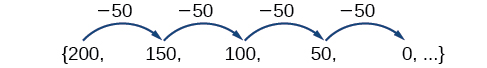  The common difference is <math xmlns="http://www.w3.org/1998/Math/MathML"> <mrow> <mo>−</mo><mn>50</mn> </mrow> </math>

, so the sequence represents a linear function with a slope of <math xmlns="http://www.w3.org/1998/Math/MathML"> <mrow> <mo>−</mo><mn>50</mn> </mrow> </math>

. To find the <math xmlns="http://www.w3.org/1998/Math/MathML"> <mi>y</mi> </math>

-intercept, we subtract <math xmlns="http://www.w3.org/1998/Math/MathML"> <mrow> <mo>−</mo><mn>50</mn> </mrow> </math>

 from<math xmlns="http://www.w3.org/1998/Math/MathML"> <mrow> <mn>200</mn><mo>:</mo><mtext> </mtext><mn>200</mn><mo>−</mo><mo stretchy="false">(</mo><mo>−</mo><mn>50</mn><mo stretchy="false">)</mo><mo>=</mo><mn>200</mn><mo>+</mo><mn>50</mn><mo>=</mo><mn>250</mn> </mrow> </math>

. You can also find the <math xmlns="http://www.w3.org/1998/Math/MathML"> <mi>y</mi> </math>

-intercept by graphing the function and determining where a line that connects the points would intersect the vertical axis. The graph is shown in [\[link\]](#CNX_Precalculus_Figure_11_02_007).

 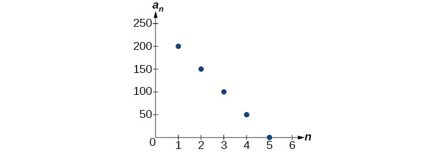{: #CNX_Precalculus_Figure_11_02_007}

Recall the slope-intercept form of a line is<math xmlns="http://www.w3.org/1998/Math/MathML"> <mrow> <mtext> </mtext><mi>y</mi><mo>=</mo><mi>m</mi><mi>x</mi><mo>+</mo><mi>b</mi><mo>.</mo><mtext> </mtext> </mrow> </math>

When dealing with sequences, we use <math xmlns="http://www.w3.org/1998/Math/MathML"> <mrow> <msub> <mi>a</mi> <mi>n</mi> </msub> </mrow> </math>

 in place of <math xmlns="http://www.w3.org/1998/Math/MathML"> <mrow> <mi>y</mi> </mrow> </math>

 and <math xmlns="http://www.w3.org/1998/Math/MathML"> <mrow> <mi>n</mi> </mrow> </math>

 in place of <math xmlns="http://www.w3.org/1998/Math/MathML"> <mrow> <mi>x</mi><mo>.</mo><mtext> </mtext> </mrow> </math>

If we know the slope and vertical intercept of the function, we can substitute them for <math xmlns="http://www.w3.org/1998/Math/MathML"> <mrow> <mi>m</mi> </mrow> </math>

 and <math xmlns="http://www.w3.org/1998/Math/MathML"> <mrow> <mi>b</mi> </mrow> </math>

 in the slope-intercept form of a line. Substituting<math xmlns="http://www.w3.org/1998/Math/MathML"> <mrow> <mtext> </mtext><mo>−</mo><mn>50</mn><mtext> </mtext> </mrow> </math>

for the slope and <math xmlns="http://www.w3.org/1998/Math/MathML"> <mrow> <mn>250</mn> </mrow> </math>

 for the vertical intercept, we get the following equation:

<math xmlns="http://www.w3.org/1998/Math/MathML" display="block"> <mrow> <msub> <mi>a</mi> <mi>n</mi> </msub> <mo>=</mo><mo>−</mo><mn>50</mn><mi>n</mi><mo>+</mo><mn>250</mn> </mrow> </math>

We do not need to find the vertical intercept to write an **explicit formula**{: data-type="term" .no-emphasis} for an arithmetic sequence. Another explicit formula for this sequence is <math xmlns="http://www.w3.org/1998/Math/MathML"> <mrow> <msub> <mi>a</mi> <mi>n</mi> </msub> <mo>=</mo><mn>200</mn><mo>−</mo><mn>50</mn><mo stretchy="false">(</mo><mi>n</mi><mo>−</mo><mn>1</mn><mo stretchy="false">)</mo> </mrow> </math>

, which simplifies to<math xmlns="http://www.w3.org/1998/Math/MathML"> <mrow> <mtext> </mtext><msub> <mi>a</mi> <mi>n</mi> </msub> <mo>=</mo><mo>−</mo><mn>50</mn><mi>n</mi><mo>+</mo><mn>250.</mn> </mrow> </math>

Explicit Formula for an Arithmetic Sequence

An explicit formula for the <math xmlns="http://www.w3.org/1998/Math/MathML"> <mrow> <mi>n</mi><mtext>th</mtext> </mrow> </math>

 term of an arithmetic sequence is given by

<math xmlns="http://www.w3.org/1998/Math/MathML" display="block"> <mrow> <msub> <mi>a</mi> <mi>n</mi> </msub> <mo>=</mo><msub> <mi>a</mi> <mn>1</mn> </msub> <mo>+</mo><mi>d</mi><mo stretchy="false">(</mo><mi>n</mi><mo>−</mo><mn>1</mn><mo stretchy="false">)</mo> </mrow> </math>

**Given the first several terms for an arithmetic sequence, write an explicit formula.**

1.  Find the common difference,
    <math xmlns="http://www.w3.org/1998/Math/MathML"> <mrow> <msub> <mi>a</mi> <mn>2</mn> </msub> <mo>−</mo><msub> <mi>a</mi> <mn>1</mn> </msub> <mo>.</mo> </mrow> </math>

2.  Substitute the common difference and the first term into
    <math xmlns="http://www.w3.org/1998/Math/MathML"> <mrow> <msub> <mi>a</mi> <mi>n</mi> </msub> <mo>=</mo><msub> <mi>a</mi> <mn>1</mn> </msub> <mo>+</mo><mi>d</mi><mo stretchy="false">(</mo><mi>n</mi><mo>−</mo><mn>1</mn><mo stretchy="false">)</mo><mo>.</mo> </mrow> </math>
{: type="1"}

Writing the *n*th Term Explicit Formula for an Arithmetic Sequence

Write an explicit formula for the arithmetic sequence.

<math xmlns="http://www.w3.org/1998/Math/MathML" display="block"> <mrow> <mo>{</mo><mn>2</mn><mtext>, </mtext><mn>12</mn><mtext>, </mtext><mn>22</mn><mtext>, </mtext><mn>32</mn><mtext>, </mtext><mn>42</mn><mtext>, …</mtext><mo>}</mo> </mrow> </math>

The common difference can be found by subtracting the first term from the second term.

<math xmlns="http://www.w3.org/1998/Math/MathML" display="block"> <mrow> <mtable columnalign="left"> <mtr columnalign="left"> <mtd columnalign="left"> <mi>d</mi> </mtd> <mtd columnalign="left"> <mrow> <mo>=</mo><msub> <mi>a</mi> <mn>2</mn> </msub> <mo>−</mo><msub> <mi>a</mi> <mn>1</mn> </msub> </mrow> </mtd> </mtr> <mtr columnalign="left"> <mtd columnalign="left"> <mrow /> </mtd> <mtd columnalign="left"> <mrow> <mo>=</mo><mn>12</mn><mo>−</mo><mn>2</mn> </mrow> </mtd> </mtr> <mtr columnalign="left"> <mtd columnalign="left"> <mrow /> </mtd> <mtd columnalign="left"> <mrow> <mo>=</mo><mn>10</mn> </mrow> </mtd> </mtr> </mtable> </mrow> </math>

The common difference is 10. Substitute the common difference and the first term of the sequence into the formula and simplify.

<math xmlns="http://www.w3.org/1998/Math/MathML" display="block"> <mrow> <mtable columnalign="left"> <mtr columnalign="left"> <mtd columnalign="left"> <mrow> <msub> <mi>a</mi> <mi>n</mi> </msub> <mo>=</mo><mn>2</mn><mo>+</mo><mn>10</mn><mo stretchy="false">(</mo><mi>n</mi><mo>−</mo><mn>1</mn><mo stretchy="false">)</mo> </mrow> </mtd> </mtr> <mtr columnalign="left"> <mtd columnalign="left"> <mrow> <msub> <mi>a</mi> <mi>n</mi> </msub> <mo>=</mo><mn>10</mn><mi>n</mi><mo>−</mo><mn>8</mn> </mrow> </mtd> </mtr> </mtable> </mrow> </math>

Analysis

The graph of this sequence, represented in [[link]](#CNX_Precalculus_Figure_11_02_008), shows a slope of 10 and a vertical intercept of <math xmlns="http://www.w3.org/1998/Math/MathML"> <mrow> <mo>−</mo><mn>8</mn> </mrow> </math>

.

{: #CNX_Precalculus_Figure_11_02_008}

Write an explicit formula for the following arithmetic sequence.

<math xmlns="http://www.w3.org/1998/Math/MathML" display="block"> <mrow> <mo>{</mo><mn>50</mn><mo>,</mo><mn>47</mn><mo>,</mo><mn>44</mn><mo>,</mo><mn>41</mn><mo>,</mo><mo>…</mo><mo>}</mo> </mrow> </math>

<math xmlns="http://www.w3.org/1998/Math/MathML"> <mrow> <msub> <mi>a</mi> <mi>n</mi> </msub> <mo>=</mo> <mn>53</mn> <mo>−</mo> <mn>3</mn> <mi>n</mi> </mrow> </math>

#### Finding the Number of Terms in a Finite Arithmetic Sequence

Explicit formulas can be used to determine the number of terms in a finite arithmetic sequence. We need to find the common difference, and then determine how many times the common difference must be added to the first term to obtain the final term of the sequence.

**Given the first three terms and the last term of a finite arithmetic sequence, find the total number of terms.**

1.  Find the common difference
    <math xmlns="http://www.w3.org/1998/Math/MathML"> <mrow> <mi>d</mi><mo>.</mo> </mrow> </math>

2.  Substitute the common difference and the first term into
    <math xmlns="http://www.w3.org/1998/Math/MathML"> <mrow> <msub> <mi>a</mi> <mi>n</mi> </msub> <mo>=</mo><msub> <mi>a</mi> <mn>1</mn> </msub> <mo>+</mo><mi>d</mi><mo stretchy="false">(</mo><mi>n</mi><mo>–</mo><mn>1</mn><mo stretchy="false">)</mo><mo>.</mo> </mrow> </math>

3.  Substitute the last term for
    <math xmlns="http://www.w3.org/1998/Math/MathML"> <mrow> <msub> <mi>a</mi> <mi>n</mi> </msub> </mrow> </math>
    
    and solve for
    <math xmlns="http://www.w3.org/1998/Math/MathML"> <mrow> <mi>n</mi><mo>.</mo> </mrow> </math>
{: type="1"}

Finding the Number of Terms in a Finite Arithmetic Sequence

Find the number of terms in the **finite arithmetic sequence**{: data-type="term" .no-emphasis}.

<math xmlns="http://www.w3.org/1998/Math/MathML" display="block"> <mrow> <mo>{</mo><mn>8</mn><mtext>, </mtext><mn>1</mn><mtext>, </mtext><mn>–6</mn><mtext>, </mtext><mn>...</mn><mtext>, </mtext><mn>–41</mn><mo>}</mo> </mrow> </math>

The common difference can be found by subtracting the first term from the second term.

<math xmlns="http://www.w3.org/1998/Math/MathML" display="block"> <mrow> <mn>1</mn><mo>−</mo><mn>8</mn><mo>=</mo><mo>−</mo><mn>7</mn> </mrow> </math>

The common difference is <math xmlns="http://www.w3.org/1998/Math/MathML"> <mrow> <mo>−</mo><mn>7</mn> </mrow> </math>

. Substitute the common difference and the initial term of the sequence into the <math xmlns="http://www.w3.org/1998/Math/MathML"> <mrow> <mi>n</mi><mtext>th</mtext> </mrow> </math>

 term formula and simplify.

<math xmlns="http://www.w3.org/1998/Math/MathML" display="block"> <mrow> <mtable columnalign="left"> <mtr columnalign="left"> <mtd columnalign="left"> <mrow> <msub> <mi>a</mi> <mi>n</mi> </msub> <mo>=</mo> <msub> <mi>a</mi> <mn>1</mn> </msub> <mo>+</mo> <mi>d</mi> <mo stretchy="false">(</mo> <mi>n</mi> <mo>−</mo> <mn>1</mn> <mo stretchy="false">)</mo> </mrow> </mtd> </mtr> <mtr columnalign="left"> <mtd columnalign="left"> <mrow> <msub> <mi>a</mi> <mi>n</mi> </msub> <mo>=</mo> <mn>8</mn> <mo>+</mo> <mo>(</mo><mo>−</mo> <mn>7</mn><mo>)</mo> <mo stretchy="false">(</mo> <mi>n</mi> <mo>−</mo> <mn>1</mn> <mo stretchy="false">)</mo> </mrow> </mtd> </mtr> <mtr columnalign="left"> <mtd columnalign="left"> <mrow> <msub> <mi>a</mi> <mi>n</mi> </msub> <mo>=</mo> <mn>15</mn> <mo>−</mo> <mn>7</mn> <mi>n</mi> </mrow> </mtd> </mtr> </mtable> </mrow> </math>

Substitute <math xmlns="http://www.w3.org/1998/Math/MathML"> <mrow> <mo>−</mo><mn>41</mn> </mrow> </math>

 for <math xmlns="http://www.w3.org/1998/Math/MathML"> <mrow> <msub> <mi>a</mi> <mi>n</mi> </msub> </mrow> </math>

 and solve for <math xmlns="http://www.w3.org/1998/Math/MathML"> <mi>n</mi> </math>

<math xmlns="http://www.w3.org/1998/Math/MathML" display="block"> <mrow> <mtable columnalign="left"> <mtr columnalign="left"> <mtd columnalign="left"> <mrow> <mo>−</mo><mn>41</mn><mo>=</mo><mn>15</mn><mo>−</mo><mn>7</mn><mi>n</mi> </mrow> </mtd> </mtr> <mtr columnalign="left"> <mtd columnalign="left"> <mrow> <mtext> </mtext><mtext> </mtext><mtext> </mtext><mtext> </mtext><mtext> </mtext><mtext> </mtext><mtext> </mtext><mtext> </mtext><mn>8</mn><mo>=</mo><mi>n</mi> </mrow> </mtd> </mtr> </mtable> </mrow> </math>

There are eight terms in the sequence.

Find the number of terms in the finite arithmetic sequence.

<math xmlns="http://www.w3.org/1998/Math/MathML" display="block"> <mrow> <mo>{</mo><mn>6</mn><mtext>, </mtext><mn>11</mn><mtext>, </mtext><mn>16</mn><mtext>, </mtext><mn>...</mn><mtext>, </mtext><mn>56</mn><mo>}</mo> </mrow> </math>

There are 11 terms in the sequence.

#### Solving Application Problems with Arithmetic Sequences

In many application problems, it often makes sense to use an initial term of <math xmlns="http://www.w3.org/1998/Math/MathML"> <mrow> <msub> <mi>a</mi> <mn>0</mn> </msub> </mrow> </math>

 instead of <math xmlns="http://www.w3.org/1998/Math/MathML"> <mrow> <msub> <mi>a</mi> <mn>1</mn> </msub> <mo>.</mo> </mrow> </math>

 In these problems, we alter the explicit formula slightly to account for the difference in initial terms. We use the following formula:

<math xmlns="http://www.w3.org/1998/Math/MathML" display="block"> <mrow> <msub> <mi>a</mi> <mi>n</mi> </msub> <mo>=</mo> <msub> <mi>a</mi> <mn>0</mn> </msub> <mo>+</mo> <mi>d</mi> <mi>n</mi> </mrow> </math>

Solving Application Problems with Arithmetic Sequences

A five-year old child receives an allowance of $1 each week. His parents promise him an annual increase of $2 per week.

1.  Write a formula for the child’s weekly allowance in a given year.
2.  What will the child’s allowance be when he is 16 years old?
{: type="a"}

1.  The situation can be modeled by an arithmetic sequence with an initial term of 1 and a common difference of 2.
    
    Let <math xmlns="http://www.w3.org/1998/Math/MathML"> <mi>A</mi> </math>
    
     be the amount of the allowance and <math xmlns="http://www.w3.org/1998/Math/MathML"> <mi>n</mi> </math>
    
     be the number of years after age 5. Using the altered explicit formula for an arithmetic sequence we get:
    
    

    <math xmlns="http://www.w3.org/1998/Math/MathML" display="block"> <mrow> <msub> <mi>A</mi> <mi>n</mi> </msub> <mo>=</mo> <mn>1</mn> <mo>+</mo> <mn>2</mn> <mi>n</mi> </mrow> </math>
    

2.  We can find the number of years since age 5 by subtracting.
    
    

    <math xmlns="http://www.w3.org/1998/Math/MathML" display="block"> <mrow> <mn>16</mn> <mo>−</mo> <mn>5</mn> <mo>=</mo> <mn>11</mn> </mrow> </math>
    

    
    We are looking for the child’s allowance after 11 years. Substitute 11 into the formula to find the child’s allowance at age 16.
    
    

    <math xmlns="http://www.w3.org/1998/Math/MathML" display="block"> <mrow> <msub> <mi>A</mi> <mrow> <mn>11</mn> </mrow> </msub> <mo>=</mo> <mn>1</mn> <mo>+</mo> <mn>2</mn> <mo stretchy="false">(</mo> <mn>11</mn> <mo stretchy="false">)</mo> <mo>=</mo> <mn>23</mn> </mrow> </math>
    

    
    The child’s allowance at age 16 will be $23 per week.
{: type="a"}

A woman decides to go for a 10-minute run every day this week and plans to increase the time of her daily run by 4 minutes each week. Write a formula for the time of her run after n weeks. How long will her daily run be 8 weeks from today?

The formula is <math xmlns="http://www.w3.org/1998/Math/MathML"> <mrow> <msub> <mi>T</mi> <mi>n</mi> </msub> <mo>=</mo><mn>10</mn><mo>+</mo><mn>4</mn><mi>n</mi><mo>,</mo><mtext> </mtext> </mrow> </math>

and it will take her 42 minutes.

Access this online resource for additional instruction and practice with arithmetic sequences.

* [Arithmetic Sequences][1]
{: data-display="block"}

### Key Equations

| recursive formula for nth term of an arithmetic sequence | <math xmlns="http://www.w3.org/1998/Math/MathML"> <mrow> <msub> <mi>a</mi> <mi>n</mi> </msub> <mo>=</mo> <mrow> <msub><mi>a</mi> <mrow> <mi>n</mi><mo>−</mo><mn>1</mn> </mrow> </msub> <mo>+</mo><mi>d</mi> </mrow><mo>,</mo> <mrow> <mi>n</mi><mo>≥</mo><mn>2</mn> </mrow> </mrow> </math>

 |
| explicit formula for nth term of an arithmetic sequence | <math xmlns="http://www.w3.org/1998/Math/MathML"> <mtable columnalign="left"> <mtr> <mtd> <msub> <mi>a</mi> <mi>n</mi> </msub> <mo>=</mo><msub> <mi>a</mi> <mn>1</mn> </msub> <mo>+</mo><mi>d</mi><mo stretchy="false">(</mo><mi>n</mi><mo>−</mo><mn>1</mn><mo stretchy="false">)</mo> </mtd> </mtr> </mtable> </math>

 |
{: #eip-id1165135528502 summary=".."}

### Key Concepts

* An arithmetic sequence is a sequence where the difference between any two consecutive terms is a constant.
* The constant between two consecutive terms is called the common difference.
* The common difference is the number added to any one term of an arithmetic sequence that generates the subsequent term. See [\[link\]](#Example_11_02_01).
* The terms of an arithmetic sequence can be found by beginning with the initial term and adding the common difference repeatedly. See [\[link\]](#Example_11_02_02) and [\[link\]](#Example_11_02_03).
* A recursive formula for an arithmetic sequence with common difference
  <math xmlns="http://www.w3.org/1998/Math/MathML"> <mi>d</mi> </math>
  
  is given by
  <math xmlns="http://www.w3.org/1998/Math/MathML"> <mrow> <msub> <mi>a</mi> <mi>n</mi> </msub> <mo>=</mo><msub> <mi>a</mi> <mrow> <mi>n</mi><mo>−</mo><mn>1</mn> </mrow> </msub> <mo>+</mo><mi>d</mi><mo>,</mo><mi>n</mi><mo>≥</mo><mn>2.</mn> </mrow> </math>
  
  See [\[link\]](#Example_11_02_04).
* As with any recursive formula, the initial term of the sequence must be given.
* An explicit formula for an arithmetic sequence with common difference
  <math xmlns="http://www.w3.org/1998/Math/MathML"> <mi>d</mi> </math>
  
  is given by
  <math xmlns="http://www.w3.org/1998/Math/MathML"> <mrow> <msub> <mi>a</mi> <mi>n</mi> </msub> <mo>=</mo><msub> <mi>a</mi> <mn>1</mn> </msub> <mo>+</mo><mi>d</mi><mo stretchy="false">(</mo><mi>n</mi><mo>−</mo><mn>1</mn><mo stretchy="false">)</mo><mo>.</mo> </mrow> </math>
  
  See [\[link\]](#Example_11_02_05).
* An explicit formula can be used to find the number of terms in a sequence. See [\[link\]](#Example_11_02_06).
* In application problems, we sometimes alter the explicit formula slightly to
  <math xmlns="http://www.w3.org/1998/Math/MathML"> <mrow> <msub> <mi>a</mi> <mi>n</mi> </msub> <mo>=</mo><msub> <mi>a</mi> <mn>0</mn> </msub> <mo>+</mo><mi>d</mi><mi>n</mi><mo>.</mo> </mrow> </math>
  
  See [\[link\]](#Example_11_02_07).

### Section Exercises

#### Verbal

What is an arithmetic sequence?

A sequence where each successive term of the sequence increases (or decreases) by a constant value.

How is the common difference of an arithmetic sequence found?

How do we determine whether a sequence is arithmetic?

We find whether the difference between all consecutive terms is the same. This is the same as saying that the sequence has a common difference.

What are the main differences between using a recursive formula and using an explicit formula to describe an arithmetic sequence?

Describe how linear functions and arithmetic sequences are similar. How are they different?

Both arithmetic sequences and linear functions have a constant rate of change. They are different because their domains are not the same; linear functions are defined for all real numbers, and arithmetic sequences are defined for natural numbers or a subset of the natural numbers.

#### Algebraic

For the following exercises, find the common difference for the arithmetic sequence provided.

<math xmlns="http://www.w3.org/1998/Math/MathML"> <mrow> <mo>{</mo> <mn>5</mn> <mo>,</mo> <mn>11</mn> <mo>,</mo> <mn>17</mn> <mo>,</mo> <mn>23</mn> <mo>,</mo> <mn>29</mn> <mo>,</mo> <mn>...</mn> <mo>}</mo> </mrow> </math>

<math xmlns="http://www.w3.org/1998/Math/MathML"> <mrow> <mrow> <mo>{</mo> <mrow> <mn>0</mn> <mo>,</mo> <mfrac> <mn>1</mn> <mn>2</mn> </mfrac> <mo>,</mo> <mn>1</mn> <mo>,</mo> <mfrac> <mn>3</mn> <mn>2</mn> </mfrac> <mo>,</mo> <mn>2</mn> <mo>,</mo> <mn>...</mn> </mrow> <mo>}</mo> </mrow> </mrow> </math>

The common difference is <math xmlns="http://www.w3.org/1998/Math/MathML"> <mrow> <mfrac> <mn>1</mn> <mn>2</mn> </mfrac> </mrow> </math>

For the following exercises, determine whether the sequence is arithmetic. If so find the common difference.

<math xmlns="http://www.w3.org/1998/Math/MathML"> <mrow> <mo>{</mo> <mn>11.4</mn> <mo>,</mo> <mn>9.3</mn> <mo>,</mo> <mn>7.2</mn> <mo>,</mo> <mn>5.1</mn> <mo>,</mo> <mn>3</mn> <mo>,</mo> <mn>...</mn> <mo>}</mo> </mrow> </math>

<math xmlns="http://www.w3.org/1998/Math/MathML"> <mrow> <mo>{</mo> <mn>4</mn> <mo>,</mo> <mn>16</mn> <mo>,</mo> <mn>64</mn> <mo>,</mo> <mn>256</mn> <mo>,</mo> <mn>1024</mn> <mo>,</mo> <mn>...</mn> <mo>}</mo> </mrow> </math>

The sequence is not arithmetic because <math xmlns="http://www.w3.org/1998/Math/MathML"> <mrow> <mn>16</mn><mo>−</mo><mn>4</mn><mo>≠</mo><mn>64</mn><mo>−</mo><mn>16.</mn> </mrow> </math>

For the following exercises, write the first five terms of the arithmetic sequence given the first term and common difference.

<math xmlns="http://www.w3.org/1998/Math/MathML"> <mrow> <msub> <mi>a</mi> <mn>1</mn> </msub> <mo>=</mo><mn>−25</mn> </mrow> </math>

, <math xmlns="http://www.w3.org/1998/Math/MathML"> <mrow> <mi>d</mi><mo>=</mo><mn>−9</mn> </mrow> </math>

<math xmlns="http://www.w3.org/1998/Math/MathML"> <mrow> <msub> <mi>a</mi> <mn>1</mn> </msub> <mo>=</mo><mn>0</mn> </mrow> </math>

, <math xmlns="http://www.w3.org/1998/Math/MathML"> <mrow> <mi>d</mi><mo>=</mo><mfrac> <mn>2</mn> <mn>3</mn> </mfrac> </mrow> </math>

<math xmlns="http://www.w3.org/1998/Math/MathML" display="block"> <mrow> <mn>0</mn><mo>,</mo><mtext> </mtext><mfrac> <mn>2</mn> <mn>3</mn> </mfrac> <mo>,</mo><mtext> </mtext><mfrac> <mn>4</mn> <mn>3</mn> </mfrac> <mo>,</mo><mtext> </mtext><mn>2</mn><mo>,</mo><mtext> </mtext><mfrac> <mn>8</mn> <mn>3</mn> </mfrac> </mrow> </math>

For the following exercises, write the first five terms of the arithmetic series given two terms.

<math xmlns="http://www.w3.org/1998/Math/MathML"> <mrow> <msub> <mi>a</mi> <mn>1</mn> </msub> <mo>=</mo><mn>17</mn><mo>,</mo><mtext> </mtext><msub> <mi>a</mi> <mn>7</mn> </msub> <mo>=</mo><mo>−</mo><mn>31</mn></mrow> </math>

<math xmlns="http://www.w3.org/1998/Math/MathML"> <mrow> <msub> <mi>a</mi> <mrow> <mn>13</mn></mrow> </msub> <mo>=</mo><mo>−</mo><mn>60</mn><mo>,</mo><mtext> </mtext><msub> <mi>a</mi> <mrow> <mn>33</mn></mrow> </msub> <mo>=</mo><mo>−</mo><mn>160</mn></mrow> </math>

<math xmlns="http://www.w3.org/1998/Math/MathML"> <mrow> <mn>0</mn> <mo>,</mo> <mo>−</mo> <mn>5</mn> <mo>,</mo> <mo>−</mo> <mn>10</mn> <mo>,</mo> <mo>−</mo> <mn>15</mn> <mo>,</mo> <mo>−</mo> <mn>20</mn> </mrow> </math>

For the following exercises, find the specified term for the arithmetic sequence given the first term and common difference.

First term is 3, common difference is 4, find the 5th term.

First term is 4, common difference is 5, find the 4th term.

<math xmlns="http://www.w3.org/1998/Math/MathML"> <mrow> <msub> <mi>a</mi> <mn>4</mn> </msub> <mo>=</mo><mn>19</mn> </mrow> </math>

First term is 5, common difference is 6, find the 8th term.

First term is 6, common difference is 7, find the 6th term.

<math xmlns="http://www.w3.org/1998/Math/MathML"> <mrow> <msub> <mi>a</mi> <mn>6</mn> </msub> <mo>=</mo><mn>41</mn> </mrow> </math>

First term is 7, common difference is 8, find the 7th term.

For the following exercises, find the first term given two terms from an arithmetic sequence.

Find the first term or <math xmlns="http://www.w3.org/1998/Math/MathML"> <mrow> <msub> <mi>a</mi> <mn>1</mn> </msub> </mrow> </math>

 of an arithmetic sequence if <math xmlns="http://www.w3.org/1998/Math/MathML"> <mrow> <msub> <mi>a</mi> <mn>6</mn> </msub> <mo>=</mo><mn>12</mn> </mrow> </math>

 and <math xmlns="http://www.w3.org/1998/Math/MathML"> <mrow> <msub> <mi>a</mi> <mrow> <mn>14</mn> </mrow> </msub> <mo>=</mo><mn>28.</mn> </mrow> </math>

<math xmlns="http://www.w3.org/1998/Math/MathML"> <mrow> <msub> <mi>a</mi> <mn>1</mn> </msub> <mo>=</mo><mn>2</mn> </mrow> </math>

Find the first term or <math xmlns="http://www.w3.org/1998/Math/MathML"> <mrow> <msub> <mi>a</mi> <mn>1</mn> </msub> </mrow> </math>

 of an arithmetic sequence if <math xmlns="http://www.w3.org/1998/Math/MathML"> <mrow> <msub> <mi>a</mi> <mn>7</mn> </msub> <mo>=</mo><mn>21</mn> </mrow> </math>

 and <math xmlns="http://www.w3.org/1998/Math/MathML"> <mrow> <msub> <mi>a</mi> <mrow> <mn>15</mn> </mrow> </msub> <mo>=</mo><mn>42.</mn><mtext> </mtext> </mrow> </math>

Find the first term or <math xmlns="http://www.w3.org/1998/Math/MathML"> <mrow> <msub> <mi>a</mi> <mn>1</mn> </msub> </mrow> </math>

 of an arithmetic sequence if <math xmlns="http://www.w3.org/1998/Math/MathML"> <mrow> <msub> <mi>a</mi> <mn>8</mn> </msub> <mo>=</mo><mn>40</mn> </mrow> </math>

 and <math xmlns="http://www.w3.org/1998/Math/MathML"> <mrow> <msub> <mi>a</mi> <mrow> <mn>23</mn> </mrow> </msub> <mo>=</mo><mn>115.</mn> </mrow> </math>

<math xmlns="http://www.w3.org/1998/Math/MathML"> <mrow> <msub> <mi>a</mi> <mn>1</mn> </msub> <mo>=</mo><mn>5</mn> </mrow> </math>

Find the first term or <math xmlns="http://www.w3.org/1998/Math/MathML"> <mrow> <msub> <mi>a</mi> <mn>1</mn> </msub> </mrow> </math>

 of an arithmetic sequence if <math xmlns="http://www.w3.org/1998/Math/MathML"> <mrow> <msub> <mi>a</mi> <mn>9</mn> </msub> <mo>=</mo><mn>54</mn> </mrow> </math>

 and <math xmlns="http://www.w3.org/1998/Math/MathML"> <mrow> <msub> <mi>a</mi> <mrow> <mn>17</mn> </mrow> </msub> <mo>=</mo><mn>102.</mn> </mrow> </math>

Find the first term or <math xmlns="http://www.w3.org/1998/Math/MathML"> <mrow> <msub> <mi>a</mi> <mn>1</mn> </msub> </mrow> </math>

 of an arithmetic sequence if <math xmlns="http://www.w3.org/1998/Math/MathML"> <mrow> <msub> <mi>a</mi> <mrow> <mn>11</mn> </mrow> </msub> <mo>=</mo><mn>11</mn> </mrow> </math>

 and <math xmlns="http://www.w3.org/1998/Math/MathML"> <mrow> <msub> <mi>a</mi> <mrow> <mn>21</mn> </mrow> </msub> <mo>=</mo><mn>16.</mn> </mrow> </math>

<math xmlns="http://www.w3.org/1998/Math/MathML"> <mrow> <msub> <mi>a</mi> <mn>1</mn> </msub> <mo>=</mo><mn>6</mn> </mrow> </math>

For the following exercises, find the specified term given two terms from an arithmetic sequence.

<math xmlns="http://www.w3.org/1998/Math/MathML"> <mrow> <msub> <mi>a</mi> <mn>1</mn> </msub> <mo>=</mo><mn>33</mn><mtext> </mtext> </mrow> </math>

and<math xmlns="http://www.w3.org/1998/Math/MathML"> <mrow> <mtext> </mtext><msub> <mi>a</mi> <mn>7</mn> </msub> <mo>=</mo><mo>−</mo><mn>15.</mn> </mrow> </math>

 Find<math xmlns="http://www.w3.org/1998/Math/MathML"> <mrow> <mtext> </mtext><msub> <mi>a</mi> <mn>4</mn> </msub> <mo>.</mo> </mrow> </math>

<math xmlns="http://www.w3.org/1998/Math/MathML"> <mrow> <msub> <mi>a</mi> <mn>3</mn> </msub> <mo>=</mo><mo>−</mo><mn>17.1</mn><mtext> </mtext> </mrow> </math>

and<math xmlns="http://www.w3.org/1998/Math/MathML"> <mrow> <mtext> </mtext><msub> <mi>a</mi> <mrow> <mn>10</mn> </mrow> </msub> <mo>=</mo><mo>−</mo><mn>15.7.</mn> </mrow> </math>

 Find<math xmlns="http://www.w3.org/1998/Math/MathML"> <mrow> <msub> <mi>a</mi> <mrow> <mn>21</mn> </mrow> </msub> <mo>.</mo> </mrow> </math>

<math xmlns="http://www.w3.org/1998/Math/MathML"> <mrow> <msub> <mi>a</mi> <mrow> <mn>21</mn> </mrow> </msub> <mo>=</mo><mo>−</mo><mn>13.5</mn> </mrow> </math>

For the following exercises, use the recursive formula to write the first five terms of the arithmetic sequence.

<math xmlns="http://www.w3.org/1998/Math/MathML"> <mrow> <msub> <mi>a</mi> <mn>1</mn> </msub> <mo>=</mo><mn>39</mn><mo>;</mo><mtext> </mtext><msub> <mi>a</mi> <mi>n</mi> </msub> <mo>=</mo><msub> <mi>a</mi> <mrow> <mi>n</mi><mo>−</mo><mn>1</mn> </mrow> </msub> <mo>−</mo><mn>3</mn> </mrow> </math>

<math xmlns="http://www.w3.org/1998/Math/MathML"> <mrow> <msub> <mi>a</mi> <mn>1</mn> </msub> <mo>=</mo><mo>−</mo><mn>19</mn><mo>;</mo><mtext> </mtext><msub> <mi>a</mi> <mi>n</mi> </msub> <mo>=</mo><msub> <mi>a</mi> <mrow> <mi>n</mi><mo>−</mo><mn>1</mn> </mrow> </msub> <mo>−</mo><mn>1.4</mn> </mrow> </math>

<math xmlns="http://www.w3.org/1998/Math/MathML"> <mrow> <mo>−</mo><mn>19</mn><mo>,</mo><mo>−</mo><mn>20.4</mn><mo>,</mo><mo>−</mo><mn>21.8</mn><mo>,</mo><mo>−</mo><mn>23.2</mn><mo>,</mo><mo>−</mo><mn>24.6</mn> </mrow> </math>

For the following exercises, write a recursive formula for each arithmetic sequence.

<math xmlns="http://www.w3.org/1998/Math/MathML"> <mrow> <msub> <mi>a</mi> <mi>n</mi> </msub> <mo>=</mo><mrow><mo>{</mo> <mrow> <mn>40</mn><mo>,</mo><mn>60</mn><mo>,</mo><mn>80</mn><mo>,</mo><mn>...</mn> </mrow> <mo>}</mo></mrow> </mrow> </math>

<math xmlns="http://www.w3.org/1998/Math/MathML"> <mrow> <msub> <mi>a</mi> <mi>n</mi> </msub> <mo>=</mo><mo>{</mo><mn>17</mn><mo>,</mo><mn>26</mn><mo>,</mo><mn>35</mn><mo>,</mo><mn>...</mn><mo>}</mo> </mrow> </math>

<math xmlns="http://www.w3.org/1998/Math/MathML"> <mrow> <mtable columnalign="left"> <mtr columnalign="left"> <mtd columnalign="left"> <mrow> <msub> <mi>a</mi> <mn>1</mn> </msub> <mo>=</mo><mn>17</mn><mo>;</mo><mo> </mo><msub> <mi>a</mi> <mi>n</mi> </msub> <mo>=</mo><msub> <mi>a</mi> <mrow> <mi>n</mi><mo>−</mo><mn>1</mn> </mrow> </msub> <mo>+</mo><mn>9</mn> </mrow> </mtd> <mtd columnalign="left"> <mrow> <mi>n</mi><mo>≥</mo><mn>2</mn> </mrow> </mtd> </mtr> </mtable> </mrow> </math>

<math xmlns="http://www.w3.org/1998/Math/MathML"> <mrow> <msub> <mi>a</mi> <mi>n</mi> </msub> <mo>=</mo><mo>{</mo><mo>−</mo><mn>1</mn><mo>,</mo><mn>2</mn><mo>,</mo><mn>5</mn><mo>,</mo><mn>...</mn><mo>}</mo> </mrow> </math>

<math xmlns="http://www.w3.org/1998/Math/MathML"> <mrow> <msub> <mi>a</mi> <mi>n</mi> </msub> <mo>=</mo><mo>{</mo><mn>12</mn><mo>,</mo><mn>17</mn><mo>,</mo><mn>22</mn><mo>,</mo><mn>...</mn><mo>}</mo> </mrow> </math>

<math xmlns="http://www.w3.org/1998/Math/MathML"> <mrow> <mtable columnalign="left"> <mtr columnalign="left"> <mtd columnalign="left"> <mrow> <msub> <mi>a</mi> <mn>1</mn> </msub> <mo>=</mo><mn>12</mn><mo>;</mo><mo> </mo><msub> <mi>a</mi> <mi>n</mi> </msub> <mo>=</mo><msub> <mi>a</mi> <mrow> <mi>n</mi><mo>−</mo><mn>1</mn> </mrow> </msub> <mo>+</mo><mn>5</mn> </mrow> </mtd> <mtd columnalign="left"> <mrow> <mi>n</mi><mo>≥</mo><mn>2</mn> </mrow> </mtd> </mtr> </mtable> </mrow> </math>

<math xmlns="http://www.w3.org/1998/Math/MathML"> <mrow> <msub> <mi>a</mi> <mi>n</mi> </msub> <mo>=</mo><mo>{</mo><mo>−</mo><mn>15</mn><mo>,</mo><mo>−</mo><mn>7</mn><mo>,</mo><mn>1</mn><mo>,</mo><mn>...</mn><mo>}</mo> </mrow> </math>

<math xmlns="http://www.w3.org/1998/Math/MathML"> <mrow> <msub> <mi>a</mi> <mi>n</mi> </msub> <mo>=</mo><mo>{</mo><mn>8.9</mn><mo>,</mo><mn>10.3</mn><mo>,</mo><mn>11.7</mn><mo>,</mo><mn>...</mn><mo>}</mo> </mrow> </math>

<math xmlns="http://www.w3.org/1998/Math/MathML"> <mrow> <mtable columnalign="left"> <mtr columnalign="left"> <mtd columnalign="left"> <mrow> <msub> <mi>a</mi> <mn>1</mn> </msub> <mo>=</mo><mn>8.9</mn><mo>;</mo><mo> </mo><msub> <mi>a</mi> <mi>n</mi> </msub> <mo>=</mo><msub> <mi>a</mi> <mrow> <mi>n</mi><mo>−</mo><mn>1</mn> </mrow> </msub> <mo>+</mo><mn>1.4</mn> </mrow> </mtd> <mtd columnalign="left"> <mrow> <mi>n</mi><mo>≥</mo><mn>2</mn> </mrow> </mtd> </mtr> </mtable> </mrow> </math>

<math xmlns="http://www.w3.org/1998/Math/MathML"> <mrow> <msub> <mi>a</mi> <mi>n</mi> </msub> <mo>=</mo><mo>{</mo><mo>−</mo><mn>0.52</mn><mo>,</mo><mo>−</mo><mn>1.02</mn><mo>,</mo><mo>−</mo><mn>1.52</mn><mo>,</mo><mn>...</mn><mo>}</mo> </mrow> </math>

<math xmlns="http://www.w3.org/1998/Math/MathML"> <mrow> <msub> <mi>a</mi> <mi>n</mi> </msub> <mo>=</mo><mrow><mo>{</mo> <mrow> <mfrac> <mn>1</mn> <mn>5</mn> </mfrac> <mo>,</mo><mfrac> <mn>9</mn> <mrow> <mn>20</mn> </mrow> </mfrac> <mo>,</mo><mfrac> <mn>7</mn> <mrow> <mn>10</mn> </mrow> </mfrac> <mo>,</mo><mn>...</mn> </mrow> <mo>}</mo></mrow> </mrow> </math>

<math xmlns="http://www.w3.org/1998/Math/MathML"> <mrow> <mtable columnalign="left"> <mtr columnalign="left"> <mtd columnalign="left"> <mrow> <msub> <mi>a</mi> <mn>1</mn> </msub> <mo>=</mo><mfrac> <mn>1</mn> <mn>5</mn> </mfrac> <mo>;</mo><mo> </mo><msub> <mi>a</mi> <mi>n</mi> </msub> <mo>=</mo><msub> <mi>a</mi> <mrow> <mi>n</mi><mo>−</mo><mn>1</mn> </mrow> </msub> <mo>+</mo><mfrac> <mn>1</mn> <mn>4</mn> </mfrac> </mrow> </mtd> <mtd columnalign="left"> <mrow> <mi>n</mi><mo>≥</mo><mn>2</mn> </mrow> </mtd> </mtr> </mtable> </mrow> </math>

<math xmlns="http://www.w3.org/1998/Math/MathML"> <mrow> <msub> <mi>a</mi> <mi>n</mi> </msub> <mo>=</mo><mrow><mo>{</mo> <mrow> <mo>−</mo><mfrac> <mn>1</mn> <mn>2</mn> </mfrac> <mo>,</mo><mo>−</mo><mfrac> <mn>5</mn> <mn>4</mn> </mfrac> <mo>,</mo><mo>−</mo><mn>2</mn><mo>,</mo><mn>...</mn> </mrow> <mo>}</mo></mrow> </mrow> </math>

<math xmlns="http://www.w3.org/1998/Math/MathML"> <mrow> <msub> <mi>a</mi> <mi>n</mi> </msub> <mo>=</mo><mrow><mo>{</mo> <mrow> <mfrac> <mn>1</mn> <mn>6</mn> </mfrac> <mo>,</mo><mo>−</mo><mfrac> <mrow> <mn>11</mn> </mrow> <mrow> <mn>12</mn> </mrow> </mfrac> <mo>,</mo><mo>−</mo><mn>2</mn><mo>,</mo><mn>...</mn> </mrow> <mo>}</mo></mrow> </mrow> </math>

<math xmlns="http://www.w3.org/1998/Math/MathML"> <mrow> <mtable columnalign="left"> <mtr columnalign="left"> <mtd columnalign="left"> <mrow> <msub> <mrow /> <mn>1</mn> </msub> <mo>=</mo><mfrac> <mn>1</mn> <mn>6</mn> </mfrac> <mo>;</mo><mo> </mo><msub> <mi>a</mi> <mi>n</mi> </msub> <mo>=</mo><msub> <mi>a</mi> <mrow> <mi>n</mi><mo>−</mo><mn>1</mn> </mrow> </msub> <mo>−</mo><mfrac> <mrow> <mn>13</mn> </mrow> <mrow> <mn>12</mn> </mrow> </mfrac> </mrow> </mtd> <mtd columnalign="left"> <mrow> <mi>n</mi><mo>≥</mo><mn>2</mn> </mrow> </mtd> </mtr> </mtable> </mrow> </math>

For the following exercises, write a recursive formula for the given arithmetic sequence, and then find the specified term.

<math xmlns="http://www.w3.org/1998/Math/MathML"> <mrow> <msub> <mi>a</mi> <mi>n</mi> </msub> <mo>=</mo><mo>{</mo><mn>7</mn><mtext>, </mtext><mn>4</mn><mtext>, </mtext><mn>1</mn><mtext>, </mtext><mn>...</mn><mo>}</mo><mo>;</mo><mtext> </mtext> </mrow> </math>

Find the 17th term.

<math xmlns="http://www.w3.org/1998/Math/MathML"> <mrow> <msub> <mi>a</mi> <mi>n</mi> </msub> <mo>=</mo><mo>{</mo><mn>4</mn><mtext>, </mtext><mn>11</mn><mtext>, </mtext><mn>18</mn><mtext>, </mtext><mn>...</mn><mo>}</mo><mo>;</mo><mtext> </mtext> </mrow> </math>

Find the 14th term.

<math xmlns="http://www.w3.org/1998/Math/MathML"> <mrow> <msub> <mi>a</mi> <mn>1</mn> </msub> <mo>=</mo><mn>4</mn><mo>;</mo><mtext> </mtext><msub> <mi>a</mi> <mi>n</mi> </msub> <mo>=</mo><msub> <mi>a</mi> <mrow> <mi>n</mi><mo>−</mo><mn>1</mn> </mrow> </msub> <mo>+</mo><mn>7</mn><mo>;</mo><mtext> </mtext><msub> <mi>a</mi> <mrow> <mn>14</mn> </mrow> </msub> <mo>=</mo><mn>95</mn> </mrow> </math>

<math xmlns="http://www.w3.org/1998/Math/MathML"> <mrow> <msub> <mi>a</mi> <mi>n</mi> </msub> <mo>=</mo><mo>{</mo><mn>2</mn><mtext>, </mtext><mn>6</mn><mtext>, </mtext><mn>10</mn><mtext>, </mtext><mn>...</mn><mo>}</mo><mo>;</mo><mtext> </mtext> </mrow> </math>

Find the 12th term.

For the following exercises, use the explicit formula to write the first five terms of the arithmetic sequence.

<math xmlns="http://www.w3.org/1998/Math/MathML"> <mrow> <msub> <mi>a</mi> <mi>n</mi> </msub> <mo>=</mo><mn>24</mn><mo>−</mo><mn>4</mn><mi>n</mi> </mrow> </math>

First five terms: <math xmlns="http://www.w3.org/1998/Math/MathML"> <mrow> <mn>20</mn><mo>,</mo><mn>16</mn><mo>,</mo><mn>12</mn><mo>,</mo><mn>8</mn><mo>,</mo><mn>4.</mn> </mrow> </math>

<math xmlns="http://www.w3.org/1998/Math/MathML"> <mrow> <msub> <mi>a</mi> <mi>n</mi> </msub> <mo>=</mo><mfrac> <mn>1</mn> <mn>2</mn> </mfrac> <mi>n</mi><mo>−</mo><mfrac> <mn>1</mn> <mn>2</mn> </mfrac> </mrow> </math>

For the following exercises, write an explicit formula for each arithmetic sequence.

<math xmlns="http://www.w3.org/1998/Math/MathML"> <mrow> <msub> <mi>a</mi> <mi>n</mi> </msub> <mo>=</mo><mo>{</mo><mn>3</mn><mo>,</mo><mn>5</mn><mo>,</mo><mn>7</mn><mo>,</mo><mn>...</mn><mo>}</mo> </mrow> </math>

<math xmlns="http://www.w3.org/1998/Math/MathML"> <mrow> <msub> <mi>a</mi> <mi>n</mi> </msub> <mo>=</mo><mn>1</mn><mo>+</mo><mn>2</mn><mi>n</mi> </mrow> </math>

<math xmlns="http://www.w3.org/1998/Math/MathML"> <mrow> <msub> <mi>a</mi> <mi>n</mi> </msub> <mo>=</mo><mo>{</mo><mn>32</mn><mo>,</mo><mn>24</mn><mo>,</mo><mn>16</mn><mo>,</mo><mn>...</mn><mo>}</mo> </mrow> </math>

<math xmlns="http://www.w3.org/1998/Math/MathML"> <mrow> <msub> <mi>a</mi> <mi>n</mi> </msub> <mo>=</mo><mo>{</mo><mo>−</mo><mn>5</mn><mtext>, </mtext><mn>95</mn><mtext>, </mtext><mn>195</mn><mtext>, </mtext><mn>...</mn><mo>}</mo> </mrow> </math>

<math xmlns="http://www.w3.org/1998/Math/MathML"> <mrow> <msub> <mi>a</mi> <mi>n</mi> </msub> <mo>=</mo><mo>−</mo><mn>105</mn><mo>+</mo><mn>100</mn><mi>n</mi> </mrow> </math>

<math xmlns="http://www.w3.org/1998/Math/MathML"> <mrow> <msub> <mi>a</mi> <mi>n</mi> </msub> <mo>=</mo><mo>{</mo><mn>−17</mn><mtext>, </mtext><mn>−217</mn><mtext>, </mtext><mn>−417</mn><mtext>,</mtext><mn>...</mn><mo>}</mo> </mrow> </math>

<math xmlns="http://www.w3.org/1998/Math/MathML"> <mrow> <msub> <mi>a</mi> <mi>n</mi> </msub> <mo>=</mo><mo>{</mo><mn>1.8</mn><mtext>, </mtext><mn>3.6</mn><mtext>, </mtext><mn>5.4</mn><mtext>, </mtext><mn>...</mn><mo>}</mo> </mrow> </math>

<math xmlns="http://www.w3.org/1998/Math/MathML"> <mrow> <msub> <mi>a</mi> <mi>n</mi> </msub> <mo>=</mo><mn>1.8</mn><mi>n</mi> </mrow> </math>

<math xmlns="http://www.w3.org/1998/Math/MathML"> <mrow> <msub> <mi>a</mi> <mi>n</mi> </msub> <mo>=</mo><mo>{</mo><mn>−18.1</mn><mo>,</mo><mn>−16.2</mn><mo>,</mo><mn>−14.3</mn><mo>,</mo><mn>...</mn><mo>}</mo> </mrow> </math>

<math xmlns="http://www.w3.org/1998/Math/MathML"> <mrow> <msub> <mi>a</mi> <mi>n</mi> </msub> <mo>=</mo><mo>{</mo><mn>15.8</mn><mo>,</mo><mn>18.5</mn><mo>,</mo><mn>21.2</mn><mo>,</mo><mn>...</mn><mo>}</mo> </mrow> </math>

<math xmlns="http://www.w3.org/1998/Math/MathML"> <mrow> <msub> <mi>a</mi> <mi>n</mi> </msub> <mo>=</mo><mn>13.1</mn><mo>+</mo><mn>2.7</mn><mi>n</mi> </mrow> </math>

<math xmlns="http://www.w3.org/1998/Math/MathML"> <mrow> <msub> <mi>a</mi> <mi>n</mi> </msub> <mo>=</mo><mrow><mo>{</mo><mrow> <mfrac> <mn>1</mn> <mn>3</mn> </mfrac> <mo>,</mo><mo>−</mo><mfrac> <mn>4</mn> <mn>3</mn> </mfrac> <mo>,</mo><mn>−3</mn><mtext>, </mtext><mn>...</mn> </mrow><mo>}</mo></mrow> </mrow> </math>

<math xmlns="http://www.w3.org/1998/Math/MathML"> <mrow> <msub> <mi>a</mi> <mi>n</mi> </msub> <mo>=</mo><mrow><mo>{</mo> <mrow> <mn>0</mn><mo>,</mo><mfrac> <mn>1</mn> <mn>3</mn> </mfrac> <mo>,</mo><mfrac> <mn>2</mn> <mn>3</mn> </mfrac> <mo>,</mo><mn>...</mn> </mrow> <mo>}</mo></mrow> </mrow> </math>

<math xmlns="http://www.w3.org/1998/Math/MathML"> <mrow> <msub> <mi>a</mi> <mi>n</mi> </msub> <mo>=</mo><mfrac> <mn>1</mn> <mn>3</mn> </mfrac> <mi>n</mi><mo>−</mo><mfrac> <mn>1</mn> <mn>3</mn> </mfrac> </mrow> </math>

<math xmlns="http://www.w3.org/1998/Math/MathML"> <mrow> <msub> <mi>a</mi> <mi>n</mi> </msub> <mo>=</mo><mrow><mo>{</mo> <mrow> <mo>−</mo><mn>5</mn><mo>,</mo><mo>−</mo><mfrac> <mrow> <mn>10</mn> </mrow> <mn>3</mn> </mfrac> <mo>,</mo><mo>−</mo><mfrac> <mn>5</mn> <mn>3</mn> </mfrac> <mo>,</mo><mo>…</mo> </mrow> <mo>}</mo></mrow> </mrow> </math>

For the following exercises, find the number of terms in the given finite arithmetic sequence.

<math xmlns="http://www.w3.org/1998/Math/MathML"> <mrow> <msub> <mi>a</mi> <mi>n</mi> </msub> <mo>=</mo><mo>{</mo><mn>3</mn><mtext>,</mtext><mo>−</mo><mn>4</mn><mtext>,</mtext><mo>−</mo><mn>11</mn><mtext>, </mtext><mn>...</mn><mtext>,</mtext><mo>−</mo><mn>60</mn><mo>}</mo> </mrow> </math>

There are 10 terms in the sequence.

<math xmlns="http://www.w3.org/1998/Math/MathML"> <mrow> <msub> <mi>a</mi> <mi>n</mi> </msub> <mo>=</mo><mo>{</mo><mn>1.2</mn><mo>,</mo><mn>1.4</mn><mo>,</mo><mn>1.6</mn><mo>,</mo><mn>...</mn><mo>,</mo><mn>3.8</mn><mo>}</mo> </mrow> </math>

<math xmlns="http://www.w3.org/1998/Math/MathML"> <mrow> <msub> <mi>a</mi> <mi>n</mi> </msub> <mo>=</mo><mrow><mo>{</mo> <mrow> <mfrac> <mn>1</mn> <mn>2</mn> </mfrac> <mo>,</mo><mn>2</mn><mo>,</mo><mfrac> <mn>7</mn> <mn>2</mn> </mfrac> <mo>,</mo><mn>...</mn><mo>,</mo><mn>8</mn> </mrow> <mo>}</mo></mrow> </mrow> </math>

There are 6 terms in the sequence.

#### Graphical

For the following exercises, determine whether the graph shown represents an arithmetic sequence.

 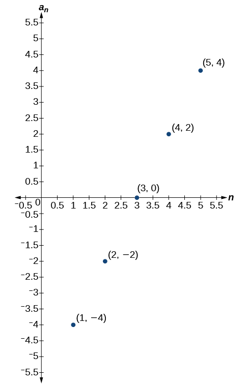 

 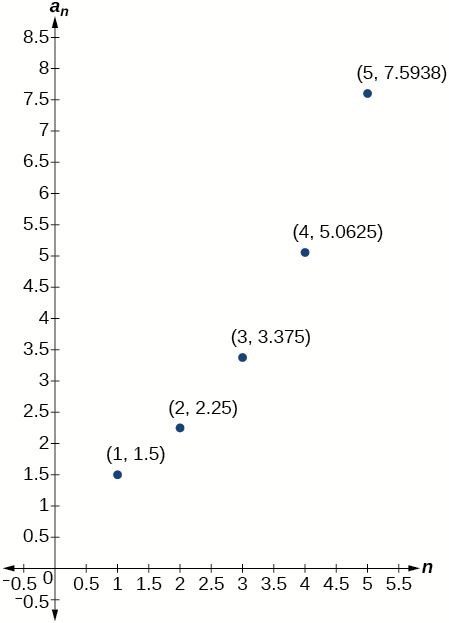 

The graph does not represent an arithmetic sequence.

For the following exercises, use the information provided to graph the first 5 terms of the arithmetic sequence.

<math xmlns="http://www.w3.org/1998/Math/MathML"> <mrow> <msub> <mi>a</mi> <mn>1</mn> </msub> <mo>=</mo><mn>0</mn><mo>,</mo><mi>d</mi><mo>=</mo><mn>4</mn> </mrow> </math>

<math xmlns="http://www.w3.org/1998/Math/MathML"> <mrow> <msub> <mi>a</mi> <mn>1</mn> </msub> <mo>=</mo><mn>9</mn><mo>;</mo><msub> <mi>a</mi> <mi>n</mi> </msub> <mo>=</mo><msub> <mi>a</mi> <mrow> <mi>n</mi><mo>−</mo><mn>1</mn> </mrow> </msub> <mo>−</mo><mn>10</mn> </mrow> </math>

 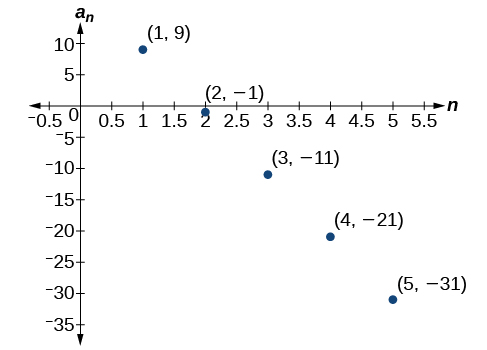 

<math xmlns="http://www.w3.org/1998/Math/MathML"> <mrow> <msub> <mi>a</mi> <mi>n</mi> </msub> <mo>=</mo><mo>−</mo><mn>12</mn><mo>+</mo><mn>5</mn><mi>n</mi> </mrow> </math>

#### Technology

For the following exercises, follow the steps to work with the arithmetic sequence <math xmlns="http://www.w3.org/1998/Math/MathML"> <mrow> <msub> <mi>a</mi> <mi>n</mi> </msub> <mo>=</mo><mn>3</mn><mi>n</mi><mo>−</mo><mn>2</mn> </mrow> </math>

 using a graphing calculator:

* Press **\[MODE\]**
  * Select SEQ in the fourth line
  * Select DOT in the fifth line
  * Press **\[ENTER\]**
  {: data-bullet-style="dash"}

* Press **\[Y=\]**
  * <math xmlns="http://www.w3.org/1998/Math/MathML"> <mrow> <mi>n</mi><mtext>Min</mtext><mtext> </mtext> </mrow> </math>
    
    is the first counting number for the sequence. Set
    <math xmlns="http://www.w3.org/1998/Math/MathML"> <mrow> <mtext> </mtext><mi>n</mi><mtext>Min</mtext><mo>=</mo><mn>1</mn> </mrow> </math>
  
  * <math xmlns="http://www.w3.org/1998/Math/MathML"> <mrow> <mi>u</mi><mo stretchy="false">(</mo><mi>n</mi><mo stretchy="false">)</mo><mtext> </mtext> </mrow> </math>
    
    is the pattern for the sequence. Set
    <math xmlns="http://www.w3.org/1998/Math/MathML"> <mrow> <mtext> </mtext><mi>u</mi><mo stretchy="false">(</mo><mi>n</mi><mo stretchy="false">)</mo><mo>=</mo><mn>3</mn><mi>n</mi><mo>−</mo><mn>2</mn> </mrow> </math>
  
  * <math xmlns="http://www.w3.org/1998/Math/MathML"> <mrow> <mi>u</mi><mo stretchy="false">(</mo><mi>n</mi><mtext>Min)</mtext><mtext> </mtext> </mrow> </math>
    
    is the first number in the sequence. Set
    <math xmlns="http://www.w3.org/1998/Math/MathML"> <mrow> <mtext> </mtext><mi>u</mi><mo stretchy="false">(</mo><mi>n</mi><mtext>Min)</mtext><mo>=</mo><mn>1</mn> </mrow> </math>
  {: data-bullet-style="dash"}

* Press **\[2ND\]** then **\[WINDOW\]** to go to **TBLSET**
  * Set
    <math xmlns="http://www.w3.org/1998/Math/MathML"> <mrow> <mtext> </mtext><mtext>TblStart</mtext><mo>=</mo><mn>1</mn> </mrow> </math>
  
  * Set
    <math xmlns="http://www.w3.org/1998/Math/MathML"> <mrow> <mtext> </mtext><mi>Δ</mi><mtext>Tbl</mtext><mo>=</mo><mn>1</mn> </mrow> </math>
  
  * Set Indpnt: Auto and Depend: Auto
  {: data-bullet-style="dash"}

* Press **\[2ND\]** then **\[GRAPH\]** to go to the **TABLE**
{: data-bullet-style="bullet"}

What are the first seven terms shown in the column with the heading <math xmlns="http://www.w3.org/1998/Math/MathML"> <mrow> <mi>u</mi><mo stretchy="false">(</mo><mi>n</mi><mo stretchy="false">)</mo><mtext>?</mtext> </mrow> </math>

<math xmlns="http://www.w3.org/1998/Math/MathML"> <mrow> <mn>1</mn><mo>,</mo><mn>4</mn><mo>,</mo><mn>7</mn><mo>,</mo><mn>10</mn><mo>,</mo><mn>13</mn><mo>,</mo><mn>16</mn><mo>,</mo><mn>19</mn> </mrow> </math>

Use the scroll-down arrow to scroll to<math xmlns="http://www.w3.org/1998/Math/MathML"> <mrow> <mi>n</mi><mo>=</mo><mn>50.</mn> </mrow> </math>

 What value is given for <math xmlns="http://www.w3.org/1998/Math/MathML"> <mrow> <mi>u</mi><mo stretchy="false">(</mo><mi>n</mi><mo stretchy="false">)</mo><mtext>?</mtext> </mrow> </math>

Press **[WINDOW]**. Set<math xmlns="http://www.w3.org/1998/Math/MathML"> <mrow> <mtext> </mtext><mi>n</mi><mtext>Min</mtext><mo>=</mo><mn>1</mn><mo>,</mo><mi>n</mi><mtext>Max</mtext><mo>=</mo><mn>5</mn><mo>,</mo><mi>x</mi><mtext>Min</mtext><mo>=</mo><mn>0</mn><mo>,</mo><mi>x</mi><mtext>Max</mtext><mo>=</mo><mn>6</mn><mo>,</mo><mi>y</mi><mtext>Min</mtext><mo>=</mo><mo>−</mo><mn>1</mn><mo>,</mo><mtext> </mtext> </mrow> </math>

and<math xmlns="http://www.w3.org/1998/Math/MathML"> <mrow> <mtext> </mtext><mi>y</mi><mtext>Max</mtext><mo>=</mo><mn>14.</mn><mtext> </mtext> </mrow> </math>

Then press **[GRAPH]**. Graph the sequence as it appears on the graphing calculator.

 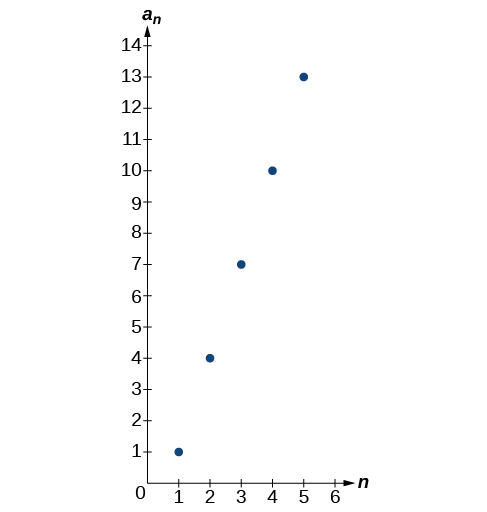 

For the following exercises, follow the steps given above to work with the arithmetic sequence <math xmlns="http://www.w3.org/1998/Math/MathML"> <mrow> <msub> <mi>a</mi> <mi>n</mi> </msub> <mo>=</mo><mfrac> <mn>1</mn> <mn>2</mn> </mfrac> <mi>n</mi><mo>+</mo><mn>5</mn> </mrow> </math>

 using a graphing calculator.

What are the first seven terms shown in the column with the heading<math xmlns="http://www.w3.org/1998/Math/MathML"> <mrow> <mtext> </mtext><mi>u</mi><mo stretchy="false">(</mo><mi>n</mi><mo stretchy="false">)</mo><mtext> </mtext> </mrow> </math>

in the TABLE feature?

Graph the sequence as it appears on the graphing calculator. Be sure to adjust the WINDOW settings as needed.

 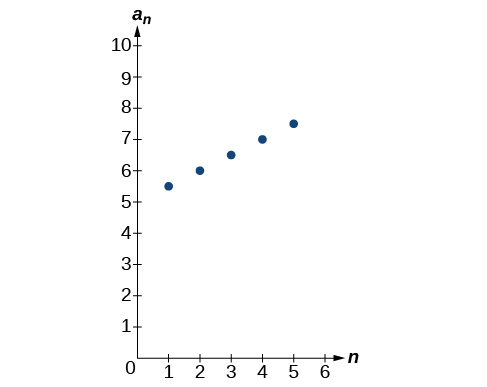 

#### Extensions

Give two examples of arithmetic sequences whose 4th terms are <math xmlns="http://www.w3.org/1998/Math/MathML"> <mrow> <mn>9.</mn> </mrow> </math>

Give two examples of arithmetic sequences whose 10th terms are <math xmlns="http://www.w3.org/1998/Math/MathML"> <mrow> <mn>206.</mn> </mrow> </math>

Answers will vary. Examples: <math xmlns="http://www.w3.org/1998/Math/MathML"> <mrow> <msub> <mi>a</mi> <mi>n</mi> </msub> <mo>=</mo><mn>20.6</mn><mi>n</mi> </mrow> </math>

and<math xmlns="http://www.w3.org/1998/Math/MathML"> <mrow> <msub> <mi>a</mi> <mi>n</mi> </msub> <mo>=</mo><mn>2</mn><mo>+</mo><mn>20.4</mn><mi>n.</mi> </mrow> </math>

Find the 5th term of the arithmetic sequence <math xmlns="http://www.w3.org/1998/Math/MathML"> <mrow> <mo>{</mo><mn>9</mn><mi>b</mi><mo>,</mo><mn>5</mn><mi>b</mi><mo>,</mo><mi>b</mi><mo>,</mo><mo>…</mo><mo>}</mo><mo>.</mo> </mrow> </math>

Find the 11th term of the arithmetic sequence <math xmlns="http://www.w3.org/1998/Math/MathML"> <mrow> <mo>{</mo><mn>3</mn><mi>a</mi><mo>−</mo><mn>2</mn><mi>b</mi><mo>,</mo><mi>a</mi><mo>+</mo><mn>2</mn><mi>b</mi><mo>,</mo><mo>−</mo><mi>a</mi><mo>+</mo><mn>6</mn><mi>b</mi><mo>…</mo><mo>}</mo><mo>.</mo> </mrow> </math>

<math xmlns="http://www.w3.org/1998/Math/MathML"> <mrow> <msub> <mi>a</mi> <mrow> <mn>11</mn> </mrow> </msub> <mo>=</mo><mo>−</mo><mn>17</mn><mi>a</mi><mo>+</mo><mn>38</mn><mi>b</mi> </mrow> </math>

At which term does the sequence <math xmlns="http://www.w3.org/1998/Math/MathML"> <mrow> <mo>{</mo><mn>5.4</mn><mo>,</mo><mn>14.5</mn><mo>,</mo><mn>23.6</mn><mo>,</mo><mn>...</mn><mo>}</mo> </mrow> </math>

 exceed 151?

At which term does the sequence <math xmlns="http://www.w3.org/1998/Math/MathML"> <mrow> <mrow><mo>{</mo> <mrow> <mfrac> <mrow> <mn>17</mn> </mrow> <mn>3</mn> </mfrac> <mo>,</mo><mfrac> <mrow> <mn>31</mn> </mrow> <mn>6</mn> </mfrac> <mo>,</mo><mfrac> <mrow> <mn>14</mn> </mrow> <mn>3</mn> </mfrac> <mo>,</mo><mn>...</mn> </mrow> <mo>}</mo></mrow> </mrow> </math>

 begin to have negative values?

The sequence begins to have negative values at the 13th term, <math xmlns="http://www.w3.org/1998/Math/MathML"> <mrow> <msub> <mi>a</mi> <mrow> <mn>13</mn> </mrow> </msub> <mo>=</mo><mo>−</mo><mfrac> <mn>1</mn> <mn>3</mn> </mfrac> </mrow> </math>

For which terms does the finite arithmetic sequence <math xmlns="http://www.w3.org/1998/Math/MathML"> <mrow> <mrow><mo>{</mo> <mrow> <mfrac> <mn>5</mn> <mn>2</mn> </mfrac> <mo>,</mo><mfrac> <mrow> <mn>19</mn> </mrow> <mn>8</mn> </mfrac> <mo>,</mo><mfrac> <mn>9</mn> <mn>4</mn> </mfrac> <mo>,</mo><mn>...</mn><mo>,</mo><mfrac> <mn>1</mn> <mn>8</mn> </mfrac> </mrow> <mo>}</mo></mrow> </mrow> </math>

 have integer values?

Write an arithmetic sequence using a recursive formula. Show the first 4 terms, and then find the 31st term.

Answers will vary. Check to see that the sequence is arithmetic. Example: Recursive formula: <math xmlns="http://www.w3.org/1998/Math/MathML"> <mrow> <msub> <mi>a</mi> <mn>1</mn> </msub> <mo>=</mo><mn>3</mn><mo>,</mo><msub> <mi>a</mi> <mi>n</mi> </msub> <mo>=</mo><msub> <mi>a</mi> <mrow> <mi>n</mi><mo>−</mo><mn>1</mn> </mrow> </msub> <mo>−</mo><mn>3.</mn> </mrow> </math>

 First 4 terms: <math xmlns="http://www.w3.org/1998/Math/MathML"> <mrow> <mtable columnalign="left"> <mtr columnalign="left"> <mtd columnalign="left"> <mrow> <mn>3</mn><mo>,</mo><mn>0</mn><mo>,</mo><mo>−</mo><mn>3</mn><mo>,</mo><mo>−</mo><mn>6</mn> </mrow> </mtd> <mtd columnalign="left"> <mrow> <msub> <mi>a</mi> <mrow> <mn>31</mn> </mrow> </msub> <mo>=</mo><mo>−</mo><mn>87</mn> </mrow> </mtd> </mtr> </mtable> </mrow> </math>

Write an arithmetic sequence using an explicit formula. Show the first 4 terms, and then find the 28th term.

### Glossary
{: data-type="glossary-title"}

arithmetic sequence
: a sequence in which the difference between any two consecutive terms is a constant
^

common difference
: the difference between any two consecutive terms in an arithmetic sequence

[1]: http://openstaxcollege.org/l/arithmeticseq
