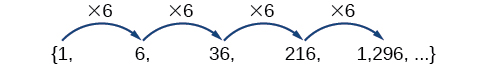
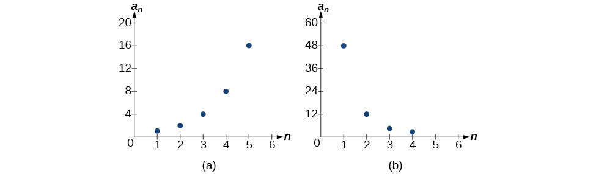
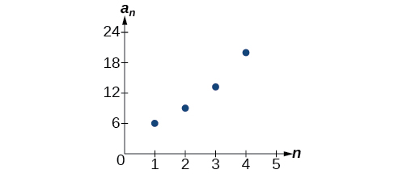
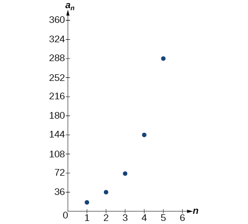
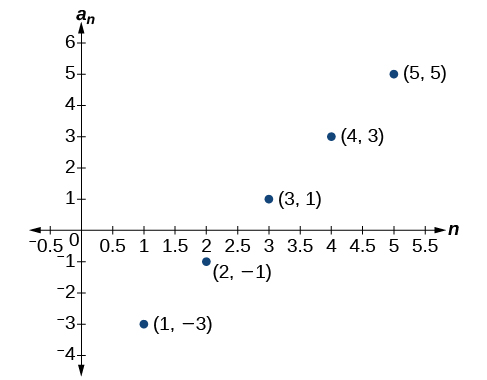
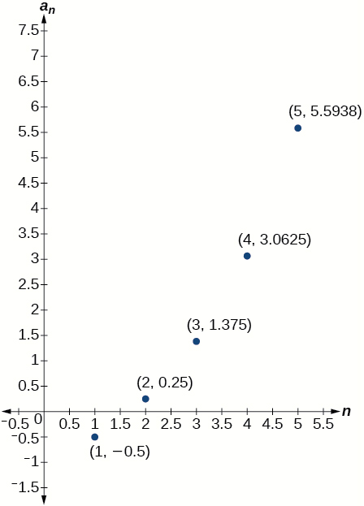
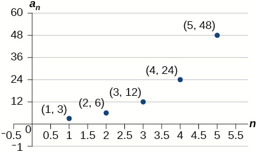

In this section, you will:
* Find the common ratio for a geometric sequence.
* List the terms of a geometric sequence.
* Use a recursive formula for a geometric sequence.
* Use an explicit formula for a geometric sequence.

Many jobs offer an annual cost-of-living increase to keep salaries consistent with inflation. Suppose, for example, a recent college graduate finds a position as a sales manager earning an annual salary of $26,000. He is promised a 2% cost of living increase each year. His annual salary in any given year can be found by multiplying his salary from the previous year by 102%. His salary will be $26,520 after one year; $27,050.40 after two years; $27,591.41 after three years; and so on. When a salary increases by a constant rate each year, the salary grows by a constant factor. In this section, we will review sequences that grow in this way.

### Finding Common Ratios

The yearly salary values described form a **geometric sequence** because they change by a constant factor each year. Each term of a geometric sequence increases or decreases by a constant factor called the **common ratio**. The sequence below is an example of a geometric sequence because each term increases by a constant factor of 6. Multiplying any term of the sequence by the common ratio 6 generates the subsequent term.

    

Definition of a Geometric Sequence

A **geometric sequence**{: data-type="term"} is one in which any term divided by the previous term is a constant. This constant is called the **common ratio**{: data-type="term"} of the sequence. The common ratio can be found by dividing any term in the sequence by the previous term. If <math xmlns="http://www.w3.org/1998/Math/MathML"> <mrow> <msub> <mi>a</mi> <mn>1</mn> </msub> </mrow> </math>

 is the initial term of a geometric sequence and <math xmlns="http://www.w3.org/1998/Math/MathML"> <mi>r</mi> </math>

 is the common ratio, the sequence will be

<math xmlns="http://www.w3.org/1998/Math/MathML" display="block"> <mrow> <mo>{</mo><msub> <mi>a</mi> <mn>1</mn> </msub> <mo>,</mo><mo> </mo><mtext> </mtext><msub> <mi>a</mi> <mn>1</mn> </msub> <mi>r</mi><mo>,</mo><mtext> </mtext><msub> <mi>a</mi> <mn>1</mn> </msub> <msup> <mi>r</mi> <mn>2</mn> </msup> <mo>,</mo><mtext> </mtext><msub> <mi>a</mi> <mn>1</mn> </msub> <msup> <mi>r</mi> <mn>3</mn> </msup> <mo>,</mo><mtext> </mtext><mn>...</mn><mo>}</mo><mo>.</mo> </mrow> </math>

**Given a set of numbers, determine if they represent a geometric sequence.**

1.  Divide each term by the previous term.
2.  Compare the quotients. If they are the same, a common ratio exists and the sequence is geometric.
{: type="1"}

Finding Common Ratios

Is the sequence geometric? If so, find the common ratio.

1.  <math xmlns="http://www.w3.org/1998/Math/MathML"> <mrow> <mn>1</mn><mtext>,</mtext><mtext> </mtext><mn>2</mn><mtext>,</mtext><mtext> </mtext><mn>4</mn><mtext>,</mtext><mtext> </mtext><mn>8</mn><mtext>,</mtext><mtext> </mtext><mn>16</mn><mtext>,</mtext><mtext> </mtext><mn>...</mn> </mrow> </math>

2.  <math xmlns="http://www.w3.org/1998/Math/MathML"> <mrow> <mn>48</mn><mtext>,</mtext><mtext> </mtext><mn>12</mn><mtext>,</mtext><mtext> </mtext><mn>4</mn><mtext>, </mtext><mn>2</mn><mtext>,</mtext><mtext> </mtext><mn>...</mn> </mrow> </math>
{: type="a"}

Divide each term by the previous term to determine whether a common ratio exists.

1.  <math xmlns="http://www.w3.org/1998/Math/MathML"> <mrow> <mtable columnalign="left"> <mtr columnalign="left"> <mtd columnalign="left"> <mrow> <mfrac> <mn>2</mn> <mn>1</mn> </mfrac> <mo>=</mo><mn>2</mn> </mrow> </mtd> <mtd columnalign="left"> <mrow /> </mtd> <mtd columnalign="left"> <mrow /> </mtd> <mtd columnalign="left"> <mrow> <mfrac> <mn>4</mn> <mn>2</mn> </mfrac> <mo>=</mo><mn>2</mn> </mrow> </mtd> <mtd columnalign="left"> <mrow /> </mtd> <mtd columnalign="left"> <mrow /> </mtd> <mtd columnalign="left"> <mrow> <mfrac> <mn>8</mn> <mn>4</mn> </mfrac> <mo>=</mo><mn>2</mn> </mrow> </mtd> <mtd columnalign="left"> <mrow /> </mtd> <mtd columnalign="left"> <mrow /> </mtd> <mtd columnalign="left"> <mrow> <mfrac> <mrow> <mn>16</mn> </mrow> <mn>8</mn> </mfrac> <mo>=</mo><mn>2</mn> </mrow> </mtd> </mtr> </mtable> </mrow> </math>
    
    The sequence is geometric because there is a common ratio. The common ratio is 2.

2.  <math xmlns="http://www.w3.org/1998/Math/MathML"> <mrow> <mtable columnalign="left"> <mtr columnalign="left"> <mtd columnalign="left"> <mrow> <mfrac> <mrow> <mn>12</mn> </mrow> <mrow> <mn>48</mn> </mrow> </mfrac> <mo>=</mo><mfrac> <mn>1</mn> <mn>4</mn> </mfrac> </mrow> </mtd> <mtd columnalign="left"> <mrow /> </mtd> <mtd columnalign="left"> <mrow /> </mtd> <mtd columnalign="left"> <mrow> <mfrac> <mn>4</mn> <mrow> <mn>12</mn> </mrow> </mfrac> <mo>=</mo><mfrac> <mn>1</mn> <mn>3</mn> </mfrac> </mrow> </mtd> <mtd columnalign="left"> <mrow /> </mtd> <mtd columnalign="left"> <mrow /> </mtd> <mtd columnalign="left"> <mrow> <mfrac> <mn>2</mn> <mn>4</mn> </mfrac> <mo>=</mo><mfrac> <mn>1</mn> <mn>2</mn> </mfrac> </mrow> </mtd> </mtr> </mtable> </mrow> </math>
    
    The sequence is not geometric because there is not a common ratio.
{: type="a"}

Analysis

The graph of each sequence is shown in [[link]](#CNX_Precalc_Figure_11_03_002). It seems from the graphs that both (a) and (b) appear have the form of the graph of an exponential function in this viewing window. However, we know that (a) is geometric and so this interpretation holds, but (b) is not.

{: #CNX_Precalc_Figure_11_03_002}

**If you are told that a sequence is geometric, do you have to divide every term by the previous term to find the common ratio?**

*No. If you know that the sequence is geometric, you can choose any one term in the sequence and divide it by the previous term to find the common ratio.*

Is the sequence geometric? If so, find the common ratio.

<math xmlns="http://www.w3.org/1998/Math/MathML" display="block"> <mrow> <mn>5</mn><mo>,</mo><mn>10</mn><mo>,</mo><mn>15</mn><mo>,</mo><mn>20</mn><mo>,</mo><mn>...</mn> </mrow> </math>

The sequence is not geometric because <math xmlns="http://www.w3.org/1998/Math/MathML"> <mrow> <mfrac> <mrow> <mn>10</mn> </mrow> <mn>5</mn> </mfrac> <mo>≠</mo><mfrac> <mrow> <mn>15</mn> </mrow> <mrow> <mn>10</mn> </mrow> </mfrac> </mrow> </math>

.

Is the sequence geometric? If so, find the common ratio.

<math xmlns="http://www.w3.org/1998/Math/MathML" display="block"> <mrow> <mn>100</mn><mo>,</mo><mn>20</mn><mo>,</mo><mn>4</mn><mo>,</mo><mfrac> <mn>4</mn> <mn>5</mn> </mfrac> <mo>,</mo><mn>...</mn> </mrow> </math>

The sequence is geometric. The common ratio is <math xmlns="http://www.w3.org/1998/Math/MathML"> <mrow> <mfrac> <mn>1</mn> <mn>5</mn> </mfrac> </mrow> </math>

.

### Writing Terms of Geometric Sequences

Now that we can identify a geometric sequence, we will learn how to find the terms of a geometric sequence if we are given the first term and the common ratio. The terms of a geometric sequence can be found by beginning with the first term and multiplying by the common ratio repeatedly. For instance, if the first term of a geometric sequence is <math xmlns="http://www.w3.org/1998/Math/MathML"> <mrow> <msub> <mi>a</mi> <mn>1</mn> </msub> <mo>=</mo><mo>−</mo><mn>2</mn> </mrow> </math>

 and the common ratio is <math xmlns="http://www.w3.org/1998/Math/MathML"> <mrow> <mi>r</mi><mo>=</mo><mn>4, </mn> </mrow> </math>

 we can find subsequent terms by multiplying <math xmlns="http://www.w3.org/1998/Math/MathML"> <mrow> <mo>−</mo><mn>2</mn><mo>⋅</mo><mn>4</mn> </mrow> </math>

 to get <math xmlns="http://www.w3.org/1998/Math/MathML"> <mrow> <mo>−</mo><mn>8</mn> </mrow> </math>

 then multiplying the result <math xmlns="http://www.w3.org/1998/Math/MathML"> <mrow> <mo>−</mo><mn>8</mn><mo>⋅</mo><mn>4</mn> </mrow> </math>

 to get <math xmlns="http://www.w3.org/1998/Math/MathML"> <mrow> <mo>−</mo><mn>32</mn> </mrow> </math>

 and so on.

<math xmlns="http://www.w3.org/1998/Math/MathML" display="block"> <mrow> <mtable columnalign="left"> <mtr columnalign="left"> <mtd columnalign="left"> <mrow> <msub> <mi>a</mi> <mn>1</mn> </msub> <mo>=</mo><mo>−</mo><mn>2</mn> </mrow> </mtd> </mtr> <mtr columnalign="left"> <mtd columnalign="left"> <mrow> <msub> <mi>a</mi> <mn>2</mn> </msub> <mo>=</mo><mo stretchy="false">(</mo><mo>−</mo><mn>2</mn><mo>⋅</mo><mn>4</mn><mo stretchy="false">)</mo><mo>=</mo><mo>−</mo><mn>8</mn> </mrow> </mtd> </mtr> <mtr columnalign="left"> <mtd columnalign="left"> <mrow> <msub> <mi>a</mi> <mn>3</mn> </msub> <mo>=</mo><mo stretchy="false">(</mo><mo>−</mo><mn>8</mn><mo>⋅</mo><mn>4</mn><mo stretchy="false">)</mo><mo>=</mo><mo>−</mo><mn>32</mn> </mrow> </mtd> </mtr> <mtr columnalign="left"> <mtd columnalign="left"> <mrow> <msub> <mi>a</mi> <mn>4</mn> </msub> <mo>=</mo><mo stretchy="false">(</mo><mo>−</mo><mn>32</mn><mo>⋅</mo><mn>4</mn><mo stretchy="false">)</mo><mo>=</mo><mo>−</mo><mn>128</mn> </mrow> </mtd> </mtr> </mtable> </mrow> </math>

The first four terms are<math xmlns="http://www.w3.org/1998/Math/MathML"> <mrow> <mo>{</mo><mn>–2</mn><mtext>, </mtext><mn>–8</mn><mtext>, </mtext><mn>–32</mn><mtext>, </mtext><mn>–128</mn><mo>}</mo><mo>.</mo> </mrow> </math>

**Given the first term and the common factor, find the first four terms of a geometric sequence.**

1.  Multiply the initial term,
    <math xmlns="http://www.w3.org/1998/Math/MathML"> <mrow> <msub> <mi>a</mi> <mn>1</mn> </msub> <mo>,</mo> </mrow> </math>
    
    by the common ratio to find the next term,
    <math xmlns="http://www.w3.org/1998/Math/MathML"> <mrow> <msub> <mi>a</mi> <mn>2</mn> </msub><mo>.</mo> </mrow> </math>

2.  Repeat the process, using
    <math xmlns="http://www.w3.org/1998/Math/MathML"> <mrow> <msub> <mi>a</mi> <mi>n</mi> </msub> <mo>=</mo><msub> <mi>a</mi> <mn>2</mn> </msub> </mrow> </math>
    
    to find
    <math xmlns="http://www.w3.org/1998/Math/MathML"> <mrow> <msub> <mi>a</mi> <mn>3</mn> </msub> </mrow> </math>
    
    and then
    <math xmlns="http://www.w3.org/1998/Math/MathML"> <mrow> <msub> <mi>a</mi> <mn>3</mn> </msub> </mrow> </math>
    
    to find
    <math xmlns="http://www.w3.org/1998/Math/MathML"> <mrow> <msub> <mi>a</mi> <mn>4,</mn> </msub> </mrow> </math>
    
    until all four terms have been identified.
3.  Write the terms separated by commons within brackets.
{: type="1"}

Writing the Terms of a Geometric Sequence

List the first four terms of the geometric sequence with <math xmlns="http://www.w3.org/1998/Math/MathML"> <mrow> <msub> <mi>a</mi> <mn>1</mn> </msub> <mo>=</mo><mn>5</mn> </mrow> </math>

 and <math xmlns="http://www.w3.org/1998/Math/MathML"> <mrow> <mi>r</mi><mo>=</mo><mn>–2.</mn> </mrow> </math>

Multiply <math xmlns="http://www.w3.org/1998/Math/MathML"> <mrow> <msub> <mi>a</mi> <mn>1</mn> </msub> </mrow> </math>

 by <math xmlns="http://www.w3.org/1998/Math/MathML"> <mrow> <mo>−</mo><mn>2</mn> </mrow> </math>

 to find <math xmlns="http://www.w3.org/1998/Math/MathML"> <mrow> <msub> <mi>a</mi> <mn>2</mn> </msub> <mo>.</mo> </mrow> </math>

 Repeat the process, using <math xmlns="http://www.w3.org/1998/Math/MathML"> <mrow> <msub> <mi>a</mi> <mn>2</mn> </msub> </mrow> </math>

 to find <math xmlns="http://www.w3.org/1998/Math/MathML"> <mrow> <msub> <mi>a</mi> <mn>3</mn> </msub> <mo>,</mo> </mrow> </math>

 and so on.

<math xmlns="http://www.w3.org/1998/Math/MathML" display="block"> <mrow> <mtable columnalign="left"> <mtr columnalign="left"> <mtd columnalign="left"> <mrow> <msub> <mi>a</mi> <mn>1</mn> </msub> <mo>=</mo><mn>5</mn> </mrow> </mtd> </mtr> <mtr columnalign="left"> <mtd columnalign="left"> <mrow> <msub> <mi>a</mi> <mn>2</mn> </msub> <mo>=</mo><mo>−</mo><mn>2</mn><msub> <mi>a</mi> <mn>1</mn> </msub> <mo>=</mo><mo>−</mo><mn>10</mn> </mrow> </mtd> </mtr> <mtr columnalign="left"> <mtd columnalign="left"> <mrow> <msub> <mi>a</mi> <mn>3</mn> </msub> <mo>=</mo><mo>−</mo><mn>2</mn><msub> <mi>a</mi> <mn>2</mn> </msub> <mo>=</mo><mn>20</mn> </mrow> </mtd> </mtr> <mtr columnalign="left"> <mtd columnalign="left"> <mrow> <msub> <mi>a</mi> <mn>4</mn> </msub> <mo>=</mo><mo>−</mo><mn>2</mn><msub> <mi>a</mi> <mn>3</mn> </msub> <mo>=</mo><mo>−</mo><mn>40</mn> </mrow> </mtd> </mtr> </mtable> </mrow> </math>

The first four terms are <math xmlns="http://www.w3.org/1998/Math/MathML"> <mrow> <mrow><mo>{</mo> <mrow> <mn>5</mn><mo>,</mo><mn>–10</mn><mo>,</mo><mn>20</mn><mo>,</mo><mn>–40</mn> </mrow> <mo>}</mo></mrow><mo>.</mo> </mrow> </math>

List the first five terms of the geometric sequence with <math xmlns="http://www.w3.org/1998/Math/MathML"> <mrow> <msub> <mi>a</mi> <mn>1</mn> </msub> <mo>=</mo><mn>18</mn> </mrow> </math>

 and <math xmlns="http://www.w3.org/1998/Math/MathML"> <mrow> <mi>r</mi><mo>=</mo><mfrac> <mn>1</mn> <mn>3</mn> </mfrac> <mo>.</mo> </mrow> </math>

<math xmlns="http://www.w3.org/1998/Math/MathML" display="block"> <mrow> <mrow><mo>{</mo> <mrow> <mn>18</mn><mo>,</mo><mn>6</mn><mo>,</mo><mn>2</mn><mo>,</mo><mfrac> <mn>2</mn> <mn>3</mn> </mfrac> <mo>,</mo><mfrac> <mn>2</mn> <mn>9</mn> </mfrac> </mrow> <mo>}</mo></mrow> </mrow> </math>

### Using Recursive Formulas for Geometric Sequences

A **recursive formula**{: data-type="term" .no-emphasis} allows us to find any term of a geometric sequence by using the previous term. Each term is the product of the common ratio and the previous term. For example, suppose the common ratio is 9. Then each term is nine times the previous term. As with any recursive formula, the initial term must be given.

Recursive Formula for a Geometric Sequence

The recursive formula for a geometric sequence with common ratio <math xmlns="http://www.w3.org/1998/Math/MathML"> <mi>r</mi> </math>

 and first term <math xmlns="http://www.w3.org/1998/Math/MathML"> <mrow> <msub> <mi>a</mi> <mn>1</mn> </msub> </mrow> </math>

 is

<math xmlns="http://www.w3.org/1998/Math/MathML" display="block"> <mrow> <msub> <mi>a</mi> <mi>n</mi> </msub> <mo>=</mo><mi>r</mi><msub> <mi>a</mi> <mrow> <mi>n</mi><mo>−</mo><mn>1</mn> </mrow> </msub> <mo>,</mo><mi>n</mi><mo>≥</mo><mn>2</mn> </mrow> </math>

**Given the first several terms of a geometric sequence, write its recursive formula.**

1.  State the initial term.
2.  Find the common ratio by dividing any term by the preceding term.
3.  Substitute the common ratio into the recursive formula for a geometric sequence.
{: type="1"}

Using Recursive Formulas for Geometric Sequences

Write a recursive formula for the following geometric sequence.

<math xmlns="http://www.w3.org/1998/Math/MathML" display="block"> <mrow> <mo>{</mo><mn>6</mn><mtext>, </mtext><mn>9</mn><mtext>, </mtext><mn>13.5</mn><mtext>, </mtext><mn>20.25</mn><mtext>, </mtext><mn>...</mn><mo>}</mo> </mrow> </math>

The first term is given as 6. The common ratio can be found by dividing the second term by the first term.

<math xmlns="http://www.w3.org/1998/Math/MathML" display="block"> <mrow> <mi>r</mi><mo>=</mo><mfrac> <mn>9</mn> <mn>6</mn> </mfrac> <mo>=</mo><mn>1.5</mn> </mrow> </math>

Substitute the common ratio into the recursive formula for geometric sequences and define <math xmlns="http://www.w3.org/1998/Math/MathML"> <mrow> <msub> <mi>a</mi> <mn>1</mn> </msub> <mo>.</mo> </mrow> </math>

<math xmlns="http://www.w3.org/1998/Math/MathML" display="block"> <mtable columnalign="left"> <mtr> <mtd> <msub> <mi>a</mi> <mi>n</mi> </msub> <mo>=</mo><mi>r</mi><msub> <mi>a</mi> <mrow> <mi>n</mi><mo>−</mo><mn>1</mn> </mrow> </msub> </mtd> </mtr> <mtr> <mtd> <msub> <mi>a</mi> <mi>n</mi> </msub> <mo>=</mo><mn>1.5</mn><msub> <mi>a</mi> <mrow> <mi>n</mi><mo>−</mo><mn>1</mn> </mrow> </msub> <mtext> for </mtext><mi>n</mi><mo>≥</mo><mn>2</mn> </mtd> </mtr> <mtr> <mtd> <msub> <mi>a</mi> <mn>1</mn> </msub> <mo>=</mo><mn>6</mn> </mtd> </mtr> </mtable> </math>

Analysis

The sequence of data points follows an exponential pattern. The common ratio is also the base of an exponential function as shown in [[link]](#CNX_Precalc_Figure_11_03_003)

{: #CNX_Precalc_Figure_11_03_003}

**Do we have to divide the second term by the first term to find the common ratio?**

*No. We can divide any term in the sequence by the previous term. It is, however, most common to divide the second term by the first term because it is often the easiest method of finding the common ratio.*

Write a recursive formula for the following geometric sequence.

<math xmlns="http://www.w3.org/1998/Math/MathML" display="block"> <mrow> <mo>{</mo><mn>2</mn><mtext>, </mtext><mfrac> <mn>4</mn> <mn>3</mn> </mfrac> <mtext>, </mtext><mfrac> <mn>8</mn> <mn>9</mn> </mfrac> <mtext>, </mtext><mfrac> <mrow> <mn>16</mn> </mrow> <mrow> <mn>27</mn> </mrow> </mfrac> <mtext>, </mtext><mn>...</mn><mo>}</mo> </mrow> </math>

<math xmlns="http://www.w3.org/1998/Math/MathML" display="block"> <mtable columnalign="left"> <mtr> <mtd> <msub> <mi>a</mi> <mn>1</mn> </msub> <mo>=</mo><mn>2</mn> </mtd> </mtr> <mtr> <mtd> <msub> <mi>a</mi> <mi>n</mi> </msub> <mo>=</mo><mfrac> <mn>2</mn> <mn>3</mn> </mfrac> <msub> <mi>a</mi> <mrow> <mi>n</mi><mo>−</mo><mn>1</mn> </mrow> </msub> <mtext> for </mtext><mi>n</mi><mo>≥</mo><mn>2</mn> </mtd> </mtr> </mtable> </math>

### Using Explicit Formulas for Geometric Sequences

Because a geometric sequence is an exponential function whose domain is the set of positive integers, and the common ratio is the base of the function, we can write explicit formulas that allow us to find particular terms.

<math xmlns="http://www.w3.org/1998/Math/MathML" display="block"> <mrow> <msub> <mi>a</mi> <mi>n</mi> </msub> <mo>=</mo><msub> <mi>a</mi> <mn>1</mn> </msub> <msup> <mi>r</mi> <mrow> <mi>n</mi><mo>−</mo><mn>1</mn> </mrow> </msup> </mrow> </math>

Let’s take a look at the sequence <math xmlns="http://www.w3.org/1998/Math/MathML"> <mrow> <mo>{</mo><mn>18</mn><mtext>, </mtext><mn>36</mn><mtext>, </mtext><mn>72</mn><mtext>, </mtext><mn>144</mn><mtext>, </mtext><mn>288</mn><mtext>, </mtext><mn>...</mn><mo>}</mo><mo>.</mo> </mrow> </math>

 This is a geometric sequence with a common ratio of 2 and an exponential function with a base of 2. An explicit formula for this sequence is

<math xmlns="http://www.w3.org/1998/Math/MathML" display="block"> <mrow> <msub> <mi>a</mi> <mi>n</mi> </msub> <mo>=</mo><mn>18</mn><mo>·</mo><msup> <mn>2</mn> <mrow> <mi>n</mi><mo>−</mo><mn>1</mn> </mrow> </msup> </mrow> </math>

The graph of the sequence is shown in [\[link\]](#CNX_Precalc_Figure_11_03_004).

 {: #CNX_Precalc_Figure_11_03_004}

Explicit Formula for a Geometric Sequence

The *n*th term of a geometric sequence is given by the **explicit formula**{: data-type="term" .no-emphasis}\:

<math xmlns="http://www.w3.org/1998/Math/MathML" display="block"> <mrow> <msub> <mi>a</mi> <mi>n</mi> </msub> <mo>=</mo><msub> <mi>a</mi> <mn>1</mn> </msub> <msup> <mi>r</mi> <mrow> <mi>n</mi><mo>−</mo><mn>1</mn> </mrow> </msup> </mrow> </math>

Writing Terms of Geometric Sequences Using the Explicit Formula

Given a geometric sequence with<math xmlns="http://www.w3.org/1998/Math/MathML"> <mrow> <mtext> </mtext><msub> <mi>a</mi> <mn>1</mn> </msub> <mo>=</mo><mn>3</mn><mtext> </mtext> </mrow> </math>

and<math xmlns="http://www.w3.org/1998/Math/MathML"> <mrow> <mtext> </mtext><msub> <mi>a</mi> <mn>4</mn> </msub> <mo>=</mo><mn>24</mn><mo>,</mo><mtext> </mtext> </mrow> </math>

find <math xmlns="http://www.w3.org/1998/Math/MathML"> <mrow> <msub> <mi>a</mi> <mn>2</mn> </msub> <mo>.</mo> </mrow> </math>

The sequence can be written in terms of the initial term and the common ratio<math xmlns="http://www.w3.org/1998/Math/MathML"> <mrow> <mtext> </mtext><mi>r</mi><mo>.</mo> </mrow> </math>

<math xmlns="http://www.w3.org/1998/Math/MathML" display="block"> <mrow> <mn>3</mn><mo>,</mo><mn>3</mn><mi>r</mi><mo>,</mo><mn>3</mn><msup> <mi>r</mi> <mn>2</mn> </msup> <mo>,</mo><mn>3</mn><msup> <mi>r</mi> <mn>3</mn> </msup> <mo>,</mo><mn>...</mn> </mrow> </math>

Find the common ratio using the given fourth term.

<math xmlns="http://www.w3.org/1998/Math/MathML" display="block"> <mrow> <mtable columnalign="left"> <mtr columnalign="left"> <mtd columnalign="left"> <mrow> <msub> <mi>a</mi> <mi>n</mi> </msub> <mo>=</mo><msub> <mi>a</mi> <mn>1</mn> </msub> <msup> <mi>r</mi> <mrow> <mi>n</mi><mo>−</mo><mn>1</mn> </mrow> </msup> </mrow> </mtd> <mtd columnalign="left"> <mrow /> </mtd> </mtr> <mtr columnalign="left"> <mtd columnalign="left"> <mrow> <msub> <mi>a</mi> <mn>4</mn> </msub> <mo>=</mo><mn>3</mn><msup> <mi>r</mi> <mn>3</mn> </msup> </mrow> </mtd> <mtd columnalign="left"> <mrow> <mtext>Write the fourth term of sequence in terms of </mtext><msub> <mi>α</mi> <mn>1</mn> </msub> <mtext> </mtext><mtext>and </mtext><mi>r</mi> </mrow> </mtd> </mtr> <mtr columnalign="left"> <mtd columnalign="left"> <mrow> <mn>24</mn><mo>=</mo><mn>3</mn><msup> <mi>r</mi> <mn>3</mn> </msup> </mrow> </mtd> <mtd columnalign="left"> <mrow> <mtext>Substitute </mtext><mn>24</mn><mtext> for</mtext><mtext> </mtext><msub> <mi>a</mi> <mn>4</mn> </msub> </mrow> </mtd> </mtr> <mtr columnalign="left"> <mtd columnalign="left"> <mrow> <mtext> </mtext><mtext> </mtext><mtext> </mtext><mn>8</mn><mo>=</mo><msup> <mi>r</mi> <mn>3</mn> </msup> </mrow> </mtd> <mtd columnalign="left"> <mrow> <mtext>Divide</mtext> </mrow> </mtd> </mtr> <mtr columnalign="left"> <mtd columnalign="left"> <mrow> <mtext> </mtext><mtext> </mtext><mtext> </mtext><mi>r</mi><mo>=</mo><mn>2</mn> </mrow> </mtd> <mtd columnalign="left"> <mrow> <mtext>Solve for the common ratio</mtext> </mrow> </mtd> </mtr> </mtable> </mrow> </math>

Find the second term by multiplying the first term by the common ratio.

<math xmlns="http://www.w3.org/1998/Math/MathML" display="block"> <mrow> <mtable columnalign="left"> <mtr columnalign="left"> <mtd columnalign="left"> <mrow> <msub> <mi>a</mi> <mn>2</mn> </msub> </mrow> </mtd> <mtd columnalign="left"> <mrow> <mo>=</mo><mn>2</mn><msub> <mi>a</mi> <mn>1</mn> </msub> </mrow> </mtd> </mtr> <mtr columnalign="left"> <mtd columnalign="left"> <mrow /> </mtd> <mtd columnalign="left"> <mrow> <mo>=</mo><mn>2</mn><mo stretchy="false">(</mo><mn>3</mn><mo stretchy="false">)</mo> </mrow> </mtd> </mtr> <mtr columnalign="left"> <mtd columnalign="left"> <mrow /> </mtd> <mtd columnalign="left"> <mrow> <mo>=</mo><mn>6</mn> </mrow> </mtd> </mtr> </mtable> </mrow> </math>

Analysis

The common ratio is multiplied by the first term once to find the second term, twice to find the third term, three times to find the fourth term, and so on. The tenth term could be found by multiplying the first term by the common ratio nine times or by multiplying by the common ratio raised to the ninth power.

Given a geometric sequence with <math xmlns="http://www.w3.org/1998/Math/MathML"> <mrow> <msub> <mi>a</mi> <mn>2</mn> </msub> <mo>=</mo><mn>4</mn> </mrow> </math>

 and <math xmlns="http://www.w3.org/1998/Math/MathML"> <mrow> <msub> <mi>a</mi> <mn>3</mn> </msub> <mo>=</mo><mn>32</mn> </mrow> </math>

, find <math xmlns="http://www.w3.org/1998/Math/MathML"> <mrow> <msub> <mi>a</mi> <mn>6</mn> </msub> <mo>.</mo> </mrow> </math>

<math xmlns="http://www.w3.org/1998/Math/MathML"> <mrow> <msub> <mi>a</mi> <mn>6</mn> </msub> <mo>=</mo><mn>16</mn><mo>,</mo><mn>384</mn> </mrow> </math>

Writing an Explicit Formula for the *n*th Term of a Geometric Sequence

Write an explicit formula for the <math xmlns="http://www.w3.org/1998/Math/MathML"> <mrow> <mi>n</mi><mtext>th</mtext> </mrow> </math>

 term of the following geometric sequence.

<math xmlns="http://www.w3.org/1998/Math/MathML" display="block"> <mrow> <mo>{</mo><mn>2</mn><mtext>, </mtext><mn>10</mn><mtext>, </mtext><mn>50</mn><mtext>, </mtext><mn>250</mn><mtext>, </mtext><mn>...</mn><mo>}</mo> </mrow> </math>

The first term is 2. The common ratio can be found by dividing the second term by the first term.

<math xmlns="http://www.w3.org/1998/Math/MathML" display="block"> <mrow> <mfrac> <mrow> <mn>10</mn> </mrow> <mn>2</mn> </mfrac> <mo>=</mo><mn>5</mn> </mrow> </math>

The common ratio is 5. Substitute the common ratio and the first term of the sequence into the formula.

<math xmlns="http://www.w3.org/1998/Math/MathML" display="block"> <mrow> <mtable columnalign="left"> <mtr columnalign="left"> <mtd columnalign="left"> <mrow> <msub> <mi>a</mi> <mi>n</mi> </msub> <mo>=</mo><msub> <mi>a</mi> <mn>1</mn> </msub> <msup> <mi>r</mi> <mrow> <mo stretchy="false">(</mo><mi>n</mi><mo>−</mo><mn>1</mn><mo stretchy="false">)</mo> </mrow> </msup> </mrow> </mtd> </mtr> <mtr columnalign="left"> <mtd columnalign="left"> <mrow> <msub> <mi>a</mi> <mi>n</mi> </msub> <mo>=</mo><mn>2</mn><mo>⋅</mo><msup> <mn>5</mn> <mrow> <mi>n</mi><mo>−</mo><mn>1</mn> </mrow> </msup> </mrow> </mtd> </mtr> </mtable> </mrow> </math>

The graph of this sequence in [[link]](#CNX_Precalc_Figure_11_03_005) shows an exponential pattern.

{: #CNX_Precalc_Figure_11_03_005}

Write an explicit formula for the following geometric sequence.

<math xmlns="http://www.w3.org/1998/Math/MathML" display="block"> <mrow> <mo>{</mo><mn>–1</mn><mtext>, </mtext><mn>3</mn><mtext>, </mtext><mn>–9</mn><mtext>, </mtext><mn>27</mn><mtext>, </mtext><mn>...</mn><mo>}</mo> </mrow> </math>

<math xmlns="http://www.w3.org/1998/Math/MathML"> <mrow> <msub> <mi>a</mi> <mi>n</mi> </msub> <mo>=</mo><mo>−</mo><msup> <mrow> <mo stretchy="false">(</mo><mo>−</mo><mn>3</mn><mo stretchy="false">)</mo> </mrow> <mrow> <mi>n</mi><mo>−</mo><mn>1</mn> </mrow> </msup> </mrow> </math>

### Solving Application Problems with Geometric Sequences

In real-world scenarios involving arithmetic sequences, we may need to use an initial term of <math xmlns="http://www.w3.org/1998/Math/MathML"> <mrow> <msub> <mi>a</mi> <mn>0</mn> </msub> </mrow> </math>

 instead of <math xmlns="http://www.w3.org/1998/Math/MathML"> <mrow> <msub> <mi>a</mi> <mn>1</mn> </msub> <mo>.</mo><mtext> </mtext> </mrow> </math>

In these problems, we can alter the explicit formula slightly by using the following formula:

<math xmlns="http://www.w3.org/1998/Math/MathML" display="block"> <mrow> <msub> <mi>a</mi> <mi>n</mi> </msub> <mo>=</mo><msub> <mi>a</mi> <mn>0</mn> </msub> <msup> <mi>r</mi> <mi>n</mi> </msup> </mrow> </math>

Solving Application Problems with Geometric Sequences

In 2013, the number of students in a small school is 284. It is estimated that the student population will increase by 4% each year.

1.  Write a formula for the student population.
2.  Estimate the student population in 2020.
{: type="a"}

1.  The situation can be modeled by a geometric sequence with an initial term of 284. The student population will be 104% of the prior year, so the common ratio is 1.04.
    
    Let <math xmlns="http://www.w3.org/1998/Math/MathML"> <mi>P</mi> </math>
    
     be the student population and <math xmlns="http://www.w3.org/1998/Math/MathML"> <mi>n</mi> </math>
    
     be the number of years after 2013. Using the explicit formula for a geometric sequence we get
    
    

    <math xmlns="http://www.w3.org/1998/Math/MathML" display="block"> <mrow> <msub> <mi>P</mi> <mi>n</mi> </msub> <mo> </mo><mo>=</mo><mn>284</mn><mo>⋅</mo><msup> <mrow> <mn>1.04</mn> </mrow> <mi>n</mi> </msup> </mrow> </math>
    

2.  We can find the number of years since 2013 by subtracting.
    
    

    <math xmlns="http://www.w3.org/1998/Math/MathML" display="block"> <mrow> <mn>2020</mn><mo>−</mo><mn>2013</mn><mo>=</mo><mn>7</mn> </mrow> </math>
    

    
    We are looking for the population after 7 years. We can substitute 7 for <math xmlns="http://www.w3.org/1998/Math/MathML"> <mi>n</mi> </math>
    
     to estimate the population in 2020.
    
    

    <math xmlns="http://www.w3.org/1998/Math/MathML" display="block"> <mrow> <msub> <mi>P</mi> <mn>7</mn> </msub> <mo>=</mo><mn>284</mn><mo>⋅</mo><msup> <mrow> <mn>1.04</mn> </mrow> <mn>7</mn> </msup> <mo>≈</mo><mn>374</mn> </mrow> </math>
    

    
    The student population will be about 374 in 2020.
{: type="a"}

A business starts a new website. Initially the number of hits is 293 due to the curiosity factor. The business estimates the number of hits will increase by 2.6% per week.

1.  Write a formula for the number of hits.
2.  Estimate the number of hits in 5 weeks.
{: type="a"}

1.  <math xmlns="http://www.w3.org/1998/Math/MathML"> <mrow> <msub> <mi>P</mi> <mi>n</mi> </msub> <mo> </mo><mo>=</mo><mo> </mo><mn>293</mn><mo>⋅</mo><mn>1.026</mn><msup> <mi>a</mi> <mi>n</mi> </msup> </mrow> </math>

2.  The number of hits will be about 333.
{: type="a"}

Access these online resources for additional instruction and practice with geometric sequences.

* [Geometric Sequences][1]
* [Determine the Type of Sequence][2]
* [Find the Formula for a Sequence][3]
{: data-display="block"}

### Key Equations

| recursive formula for <math xmlns="http://www.w3.org/1998/Math/MathML"><mrow><mi>n</mi><mi>t</mi><mi>h</mi></mrow></math>

 term of a geometric sequence | <math xmlns="http://www.w3.org/1998/Math/MathML"> <mrow> <msub> <mi>a</mi> <mi>n</mi> </msub> <mo>=</mo><mi>r</mi> <msub> <mi>a</mi> <mrow> <mi>n</mi><mo>−</mo><mn>1</mn> </mrow> </msub> <mo>,</mo><mi>n</mi><mo>≥</mo> <mn>2</mn> </mrow> </math>

 |
| explicit formula for<math xmlns="http://www.w3.org/1998/Math/MathML"> <mrow> <mtext> </mtext><mi>n</mi><mi>t</mi><mi>h</mi><mtext> </mtext> </mrow> </math>

term of a geometric sequence | <math xmlns="http://www.w3.org/1998/Math/MathML" display="block"> <mrow> <msub> <mi>a</mi> <mi>n</mi> </msub> <mo>=</mo><msub> <mi>a</mi> <mn>1</mn> </msub> <msup> <mi>r</mi> <mrow> <mi>n</mi><mo>−</mo><mn>1</mn> </mrow> </msup> </mrow> </math>

 |
{: #eip-id1165133155748 summary=".."}

### Key Concepts

* A geometric sequence is a sequence in which the ratio between any two consecutive terms is a constant.
* The constant ratio between two consecutive terms is called the common ratio.
* The common ratio can be found by dividing any term in the sequence by the previous term. See [\[link\]](#Example_11_03_01).
* The terms of a geometric sequence can be found by beginning with the first term and multiplying by the common ratio repeatedly. See [\[link\]](#Example_11_03_02) and [\[link\]](#Example_11_03_04).
* A recursive formula for a geometric sequence with common ratio
  <math xmlns="http://www.w3.org/1998/Math/MathML"> <mi>r</mi> </math>
  
  is given by
  <math xmlns="http://www.w3.org/1998/Math/MathML"> <mrow> <mtext> </mtext><msub> <mi>a</mi> <mi>n</mi> </msub> <mo>=</mo><mi>r</mi><msub> <mi>a</mi> <mrow> <mi>n</mi><mo>–</mo><mn>1</mn> </mrow> </msub> <mtext> </mtext> </mrow> </math>
  
  for
  <math xmlns="http://www.w3.org/1998/Math/MathML"> <mrow> <mi>n</mi><mo>≥</mo><mn>2</mn> </mrow> </math>
  
  .
* As with any recursive formula, the initial term of the sequence must be given. See [\[link\]](#Example_11_03_03).
* An explicit formula for a geometric sequence with common ratio
  <math xmlns="http://www.w3.org/1998/Math/MathML"> <mi>r</mi> </math>
  
  is given by
  <math xmlns="http://www.w3.org/1998/Math/MathML"> <mrow> <mtext> </mtext><msub> <mi>a</mi> <mi>n</mi> </msub> <mo>=</mo><msub> <mi>a</mi> <mn>1</mn> </msub> <msup> <mi>r</mi> <mrow> <mi>n</mi><mo>–</mo><mn>1</mn> </mrow> </msup> <mo>.</mo> </mrow> </math>
  
  See [\[link\]](#Example_11_03_05).
* In application problems, we sometimes alter the explicit formula slightly to
  <math xmlns="http://www.w3.org/1998/Math/MathML"> <mrow> <mtext> </mtext><msub> <mi>a</mi> <mi>n</mi> </msub> <mo>=</mo><msub> <mi>a</mi> <mn>0</mn> </msub> <msup> <mi>r</mi> <mi>n</mi> </msup> <mo>.</mo><mtext> </mtext> </mrow> </math>
  
  See [\[link\]](#Example_11_03_06).

### Section Exercises

#### Verbal

What is a geometric sequence?

A sequence in which the ratio between any two consecutive terms is constant.

How is the common ratio of a geometric sequence found?

What is the procedure for determining whether a sequence is geometric?

Divide each term in a sequence by the preceding term. If the resulting quotients are equal, then the sequence is geometric.

What is the difference between an arithmetic sequence and a geometric sequence?

Describe how exponential functions and geometric sequences are similar. How are they different?

Both geometric sequences and exponential functions have a constant ratio. However, their domains are not the same. Exponential functions are defined for all real numbers, and geometric sequences are defined only for positive integers. Another difference is that the base of a geometric sequence (the common ratio) can be negative, but the base of an exponential function must be positive.

#### Algebraic

For the following exercises, find the common ratio for the geometric sequence.

<math xmlns="http://www.w3.org/1998/Math/MathML"> <mrow> <mn>1</mn><mo>,</mo><mn>3</mn><mo>,</mo><mn>9</mn><mo>,</mo><mn>27</mn><mo>,</mo><mn>81</mn><mo>,</mo><mn>...</mn> </mrow> </math>

<math xmlns="http://www.w3.org/1998/Math/MathML"> <mrow> <mo>−</mo><mn>0.125</mn><mo>,</mo><mn>0.25</mn><mo>,</mo><mo>−</mo><mn>0.5</mn><mo>,</mo><mn>1</mn><mo>,</mo><mo>−</mo><mn>2</mn><mo>,</mo><mn>...</mn> </mrow> </math>

The common ratio is <math xmlns="http://www.w3.org/1998/Math/MathML"> <mrow> <mo>−</mo><mn>2</mn> </mrow> </math>

<math xmlns="http://www.w3.org/1998/Math/MathML"> <mrow> <mo>−</mo><mn>2</mn><mo>,</mo><mo>−</mo><mfrac> <mn>1</mn> <mn>2</mn> </mfrac> <mo>,</mo><mo>−</mo><mfrac> <mn>1</mn> <mn>8</mn> </mfrac> <mo>,</mo><mo>−</mo><mfrac> <mn>1</mn> <mrow> <mn>32</mn> </mrow> </mfrac> <mo>,</mo><mo>−</mo><mfrac> <mn>1</mn> <mrow> <mn>128</mn> </mrow> </mfrac> <mo>,</mo><mn>...</mn> </mrow> </math>

For the following exercises, determine whether the sequence is geometric. If so, find the common ratio.

<math xmlns="http://www.w3.org/1998/Math/MathML"> <mrow> <mo>−</mo><mn>6</mn><mo>,</mo><mo>−</mo><mn>12</mn><mo>,</mo><mo>−</mo><mn>24</mn><mo>,</mo><mo>−</mo><mn>48</mn><mo>,</mo><mo>−</mo><mn>96</mn><mo>,</mo><mn>...</mn> </mrow> </math>

The sequence is geometric. The common ratio is 2.

<math xmlns="http://www.w3.org/1998/Math/MathML"> <mrow> <mn>5</mn><mo>,</mo><mn>5.2</mn><mo>,</mo><mn>5.4</mn><mo>,</mo><mn>5.6</mn><mo>,</mo><mn>5.8</mn><mo>,</mo><mn>...</mn> </mrow> </math>

<math xmlns="http://www.w3.org/1998/Math/MathML"> <mrow> <mo>−</mo><mn>1</mn><mo>,</mo><mfrac> <mn>1</mn> <mn>2</mn> </mfrac> <mo>,</mo><mo>−</mo><mfrac> <mn>1</mn> <mn>4</mn> </mfrac> <mo>,</mo><mfrac> <mn>1</mn> <mn>8</mn> </mfrac> <mo>,</mo><mo>−</mo><mfrac> <mn>1</mn> <mrow> <mn>16</mn> </mrow> </mfrac> <mo>,</mo><mn>...</mn> </mrow> </math>

The sequence is geometric. The common ratio is <math xmlns="http://www.w3.org/1998/Math/MathML"> <mrow> <mo>−</mo><mfrac> <mn>1</mn> <mn>2</mn> </mfrac> <mo>.</mo> </mrow> </math>

<math xmlns="http://www.w3.org/1998/Math/MathML"> <mrow> <mn>6</mn><mo>,</mo><mn>8</mn><mo>,</mo><mn>11</mn><mo>,</mo><mn>15</mn><mo>,</mo><mn>20</mn><mo>,</mo><mn>...</mn> </mrow> </math>

<math xmlns="http://www.w3.org/1998/Math/MathML"> <mrow> <mn>0.8</mn><mo>,</mo><mn>4</mn><mo>,</mo><mn>20</mn><mo>,</mo><mn>100</mn><mo>,</mo><mn>500</mn><mo>,</mo><mn>...</mn> </mrow> </math>

The sequence is geometric. The common ratio is <math xmlns="http://www.w3.org/1998/Math/MathML"> <mn>5.</mn> </math>

For the following exercises, write the first five terms of the geometric sequence, given the first term and common ratio.

<math xmlns="http://www.w3.org/1998/Math/MathML"> <mrow> <mtable> <mtr> <mtd> <mrow> <msub> <mi>a</mi> <mn>1</mn> </msub> <mo>=</mo><mn>8</mn><mo>,</mo> </mrow> </mtd> <mtd> <mrow> <mi>r</mi><mo>=</mo><mn>0.3</mn> </mrow> </mtd> </mtr> </mtable> </mrow> </math>

<math xmlns="http://www.w3.org/1998/Math/MathML"> <mrow> <mtable> <mtr> <mtd> <mrow> <msub> <mi>a</mi> <mn>1</mn> </msub> <mo>=</mo><mn>5</mn><mo>,</mo> </mrow> </mtd> <mtd> <mrow> <mi>r</mi><mo>=</mo><mfrac> <mn>1</mn> <mn>5</mn> </mfrac> </mrow> </mtd> </mtr> </mtable> </mrow> </math>

<math xmlns="http://www.w3.org/1998/Math/MathML"> <mrow> <mn>5</mn><mo>,</mo><mn>1</mn><mo>,</mo><mfrac> <mn>1</mn> <mn>5</mn> </mfrac> <mo>,</mo><mfrac> <mn>1</mn> <mrow> <mn>25</mn> </mrow> </mfrac> <mo>,</mo><mfrac> <mn>1</mn> <mrow> <mn>125</mn> </mrow> </mfrac> </mrow> </math>

For the following exercises, write the first five terms of the geometric sequence, given any two terms.

<math xmlns="http://www.w3.org/1998/Math/MathML"> <mrow> <mtable> <mtr> <mtd> <mrow> <msub> <mi>a</mi> <mn>7</mn> </msub> <mo>=</mo><mn>64</mn><mo>,</mo> </mrow> </mtd> <mtd> <mrow> <msub> <mi>a</mi> <mrow> <mn>10</mn> </mrow> </msub> </mrow> </mtd> </mtr> </mtable><mo>=</mo><mn>512</mn> </mrow> </math>

<math xmlns="http://www.w3.org/1998/Math/MathML"> <mrow> <mtable> <mtr> <mtd> <mrow> <msub> <mi>a</mi> <mn>6</mn> </msub> <mo>=</mo><mn>25</mn><mo>,</mo> </mrow> </mtd> <mtd> <mrow> <msub> <mi>a</mi> <mn>8</mn> </msub> </mrow> </mtd> </mtr> </mtable><mo>=</mo><mn>6.25</mn> </mrow> </math>

<math xmlns="http://www.w3.org/1998/Math/MathML"> <mrow> <mn>800</mn><mo>,</mo><mn>400</mn><mo>,</mo><mn>200</mn><mo>,</mo><mn>100</mn><mo>,</mo><mn>50</mn> </mrow> </math>

For the following exercises, find the specified term for the geometric sequence, given the first term and common ratio.

The first term is <math xmlns="http://www.w3.org/1998/Math/MathML"> <mn>2, </mn> </math>

 and the common ratio is <math xmlns="http://www.w3.org/1998/Math/MathML"> <mn>3.</mn> </math>

 Find the 5th term.

The first term is 16 and the common ratio is <math xmlns="http://www.w3.org/1998/Math/MathML"> <mrow> <mo>−</mo><mfrac> <mn>1</mn> <mn>3</mn> </mfrac> <mo>.</mo> </mrow> </math>

 Find the 4th term.

<math xmlns="http://www.w3.org/1998/Math/MathML"> <mrow> <msub> <mi>a</mi> <mn>4</mn> </msub> <mo>=</mo><mo>−</mo><mfrac> <mrow> <mn>16</mn> </mrow> <mrow> <mn>27</mn> </mrow> </mfrac> </mrow> </math>

For the following exercises, find the specified term for the geometric sequence, given the first four terms.

<math xmlns="http://www.w3.org/1998/Math/MathML"> <mrow> <msub> <mi>a</mi> <mi>n</mi> </msub> <mo>=</mo><mrow><mo>{</mo> <mrow> <mo>−</mo><mn>1</mn><mo>,</mo><mn>2</mn><mo>,</mo><mo>−</mo><mn>4</mn><mo>,</mo><mn>8</mn><mo>,</mo><mn>...</mn> </mrow> <mo>}</mo></mrow><mo>.</mo> </mrow> </math>

 Find <math xmlns="http://www.w3.org/1998/Math/MathML"> <mrow> <msub> <mi>a</mi> <mrow> <mn>12</mn> </mrow> </msub> <mo>.</mo> </mrow> </math>

<math xmlns="http://www.w3.org/1998/Math/MathML"> <mrow> <msub> <mi>a</mi> <mi>n</mi> </msub> <mo>=</mo><mrow><mo>{</mo> <mrow> <mo>−</mo><mn>2</mn><mo>,</mo><mfrac> <mn>2</mn> <mn>3</mn> </mfrac> <mo>,</mo><mo>−</mo><mfrac> <mn>2</mn> <mn>9</mn> </mfrac> <mo>,</mo><mfrac> <mn>2</mn> <mrow> <mn>27</mn> </mrow> </mfrac> <mo>,</mo><mn>...</mn> </mrow> <mo>}</mo></mrow><mo>.</mo> </mrow> </math>

 Find <math xmlns="http://www.w3.org/1998/Math/MathML"> <mrow> <msub> <mi>a</mi> <mn>7</mn> </msub> <mo>.</mo> </mrow> </math>

<math xmlns="http://www.w3.org/1998/Math/MathML"> <mrow> <msub> <mi>a</mi> <mn>7</mn> </msub> <mo>=</mo><mo>−</mo><mfrac> <mn>2</mn> <mrow> <mn>729</mn> </mrow> </mfrac> </mrow> </math>

For the following exercises, write the first five terms of the geometric sequence.

<math xmlns="http://www.w3.org/1998/Math/MathML"> <mrow> <mtable> <mtr> <mtd> <mrow> <msub> <mi>a</mi> <mn>1</mn> </msub> <mo>=</mo><mo>−</mo><mn>486</mn><mo>,</mo> </mrow> </mtd> <mtd> <mrow> <msub> <mi>a</mi> <mi>n</mi> </msub> <mo>=</mo><mo>−</mo><mfrac> <mn>1</mn> <mn>3</mn> </mfrac> </mrow> </mtd> </mtr> </mtable><msub> <mi>a</mi> <mrow> <mi>n</mi><mo>−</mo><mn>1</mn> </mrow> </msub> </mrow> </math>

<math xmlns="http://www.w3.org/1998/Math/MathML"> <mrow> <mtable> <mtr> <mtd> <mrow> <msub> <mi>a</mi> <mn>1</mn> </msub> <mo>=</mo><mn>7</mn><mo>,</mo> </mrow> </mtd> <mtd> <mrow> <msub> <mi>a</mi> <mi>n</mi> </msub> <mo>=</mo><mn>0.2</mn><msub> <mi>a</mi> <mrow> <mi>n</mi><mo>−</mo><mn>1</mn> </mrow> </msub> </mrow> </mtd> </mtr> </mtable> </mrow> </math>

<math xmlns="http://www.w3.org/1998/Math/MathML"> <mrow> <mn>7</mn><mo>,</mo><mn>1.4</mn><mo>,</mo><mn>0.28</mn><mo>,</mo><mn>0.056</mn><mo>,</mo><mn>0.0112</mn> </mrow> </math>

For the following exercises, write a recursive formula for each geometric sequence.

<math xmlns="http://www.w3.org/1998/Math/MathML"> <mrow> <msub> <mi>a</mi> <mi>n</mi> </msub> <mo>=</mo><mrow><mo>{</mo> <mrow> <mo>−</mo><mn>1</mn><mo>,</mo><mn>5</mn><mo>,</mo><mo>−</mo><mn>25</mn><mo>,</mo><mn>125</mn><mo>,</mo><mn>...</mn> </mrow> <mo>}</mo></mrow> </mrow> </math>

<math xmlns="http://www.w3.org/1998/Math/MathML"> <mrow> <msub> <mi>a</mi> <mi>n</mi> </msub> <mo>=</mo><mrow><mo>{</mo> <mrow> <mo>−</mo><mn>32</mn><mo>,</mo><mo>−</mo><mn>16</mn><mo>,</mo><mo>−</mo><mn>8</mn><mo>,</mo><mo>−</mo><mn>4</mn><mo>,</mo><mn>...</mn> </mrow> <mo>}</mo></mrow> </mrow> </math>

<math xmlns="http://www.w3.org/1998/Math/MathML"> <mrow> <mtable> <mtr> <mtd> <mrow> <mi>a</mi><mmultiscripts> <mo>=</mo> <mprescripts /> <mn>1</mn> <none /> </mmultiscripts> <mo>−</mo><mn>32</mn><mo>,</mo> </mrow> </mtd> <mtd> <mrow> <msub> <mi>a</mi> <mi>n</mi> </msub> <mo>=</mo><mfrac> <mn>1</mn> <mn>2</mn> </mfrac> <msub> <mi>a</mi> <mrow> <mi>n</mi><mo>−</mo><mn>1</mn> </mrow> </msub> </mrow> </mtd> </mtr> </mtable> </mrow> </math>

<math xmlns="http://www.w3.org/1998/Math/MathML"> <mrow> <msub> <mi>a</mi> <mi>n</mi> </msub> <mo>=</mo><mrow><mo>{</mo> <mrow> <mn>14</mn><mo>,</mo><mn>56</mn><mo>,</mo><mn>224</mn><mo>,</mo><mn>896</mn><mo>,</mo><mn>...</mn> </mrow> <mo>}</mo></mrow> </mrow> </math>

<math xmlns="http://www.w3.org/1998/Math/MathML"> <mrow> <msub> <mi>a</mi> <mi>n</mi> </msub> <mo>=</mo><mrow><mo>{</mo> <mrow> <mn>10</mn><mo>,</mo><mo>−</mo><mn>3</mn><mo>,</mo><mn>0.9</mn><mo>,</mo><mo>−</mo><mn>0.27</mn><mo>,</mo><mn>...</mn> </mrow> <mo>}</mo></mrow> </mrow> </math>

<math xmlns="http://www.w3.org/1998/Math/MathML"> <mrow> <mtable> <mtr> <mtd> <mrow> <msub> <mi>a</mi> <mn>1</mn> </msub> <mo>=</mo><mn>10</mn><mo>,</mo> </mrow> </mtd> <mtd> <mrow> <msub> <mi>a</mi> <mi>n</mi> </msub> <mo>=</mo><mo>−</mo><mn>0.3</mn><msub> <mi>a</mi> <mrow> <mi>n</mi><mo>−</mo><mn>1</mn> </mrow> </msub> </mrow> </mtd> </mtr> </mtable> </mrow> </math>

<math xmlns="http://www.w3.org/1998/Math/MathML"> <mrow> <msub> <mi>a</mi> <mi>n</mi> </msub> <mo>=</mo><mrow><mo>{</mo> <mrow> <mn>0.61</mn><mo>,</mo><mn>1.83</mn><mo>,</mo><mn>5.49</mn><mo>,</mo><mn>16.47</mn><mo>,</mo><mn>...</mn> </mrow> <mo>}</mo></mrow> </mrow> </math>

<math xmlns="http://www.w3.org/1998/Math/MathML"> <mrow> <msub> <mi>a</mi> <mi>n</mi> </msub> <mo>=</mo><mrow><mo>{</mo> <mrow> <mfrac> <mn>3</mn> <mn>5</mn> </mfrac> <mo>,</mo><mfrac> <mn>1</mn> <mrow> <mn>10</mn> </mrow> </mfrac> <mo>,</mo><mfrac> <mn>1</mn> <mrow> <mn>60</mn> </mrow> </mfrac> <mo>,</mo><mfrac> <mn>1</mn> <mrow> <mn>360</mn> </mrow> </mfrac> <mo>,</mo><mn>...</mn> </mrow> <mo>}</mo></mrow> </mrow> </math>

<math xmlns="http://www.w3.org/1998/Math/MathML"> <mrow> <mtable> <mtr> <mtd> <mrow> <msub> <mi>a</mi> <mn>1</mn> </msub> <mo>=</mo><mfrac> <mn>3</mn> <mn>5</mn> </mfrac> <mo>,</mo> </mrow> </mtd> <mtd> <mrow> <msub> <mi>a</mi> <mi>n</mi> </msub> <mo>=</mo><mfrac> <mn>1</mn> <mn>6</mn> </mfrac> <msub> <mi>a</mi> <mrow> <mi>n</mi><mo>−</mo><mn>1</mn> </mrow> </msub> </mrow> </mtd> </mtr> </mtable> </mrow> </math>

<math xmlns="http://www.w3.org/1998/Math/MathML"> <mrow> <msub> <mi>a</mi> <mi>n</mi> </msub> <mo>=</mo><mrow><mo>{</mo> <mrow> <mo>−</mo><mn>2</mn><mo>,</mo><mfrac> <mn>4</mn> <mn>3</mn> </mfrac> <mo>,</mo><mo>−</mo><mfrac> <mn>8</mn> <mn>9</mn> </mfrac> <mo>,</mo><mfrac> <mrow> <mn>16</mn> </mrow> <mrow> <mn>27</mn> </mrow> </mfrac> <mo>,</mo><mn>...</mn> </mrow> <mo>}</mo></mrow> </mrow> </math>

<math xmlns="http://www.w3.org/1998/Math/MathML"> <mrow> <msub> <mi>a</mi> <mi>n</mi> </msub> <mo>=</mo><mrow><mo>{</mo> <mrow> <mfrac> <mn>1</mn> <mrow> <mn>512</mn> </mrow> </mfrac> <mo>,</mo><mo>−</mo><mfrac> <mn>1</mn> <mrow> <mn>128</mn> </mrow> </mfrac> <mo>,</mo><mfrac> <mn>1</mn> <mrow> <mn>32</mn> </mrow> </mfrac> <mo>,</mo><mo>−</mo><mfrac> <mn>1</mn> <mn>8</mn> </mfrac> <mo>,</mo><mn>...</mn> </mrow> <mo>}</mo></mrow> </mrow> </math>

<math xmlns="http://www.w3.org/1998/Math/MathML"> <mrow> <msub> <mi>a</mi> <mn>1</mn> </msub> <mo>=</mo><mfrac> <mn>1</mn> <mrow> <mn>512</mn> </mrow> </mfrac> <mo>,</mo><msub> <mi>a</mi> <mi>n</mi> </msub> <mo>=</mo><mo>−</mo><mn>4</mn><msub> <mi>a</mi> <mrow> <mi>n</mi><mo>−</mo><mn>1</mn> </mrow> </msub> </mrow> </math>

For the following exercises, write the first five terms of the geometric sequence.

<math xmlns="http://www.w3.org/1998/Math/MathML"> <mrow> <msub> <mi>a</mi> <mi>n</mi> </msub> <mo>=</mo><mo>−</mo><mn>4</mn><mo>⋅</mo><msup> <mn>5</mn> <mrow> <mi>n</mi><mo>−</mo><mn>1</mn> </mrow> </msup> </mrow> </math>

<math xmlns="http://www.w3.org/1998/Math/MathML"> <mrow> <msub> <mi>a</mi> <mi>n</mi> </msub> <mo>=</mo><mn>12</mn><mo>⋅</mo><msup> <mrow> <mrow><mo>(</mo> <mrow> <mo>−</mo><mfrac> <mn>1</mn> <mn>2</mn> </mfrac> </mrow> <mo>)</mo></mrow> </mrow> <mrow> <mi>n</mi><mo>−</mo><mn>1</mn> </mrow> </msup> </mrow> </math>

<math xmlns="http://www.w3.org/1998/Math/MathML"> <mrow> <mn>12</mn><mo>,</mo><mo>−</mo><mn>6</mn><mo>,</mo><mn>3</mn><mo>,</mo><mo>−</mo><mfrac> <mn>3</mn> <mn>2</mn> </mfrac> <mo>,</mo><mfrac> <mn>3</mn> <mn>4</mn> </mfrac> </mrow> </math>

For the following exercises, write an explicit formula for each geometric sequence.

<math xmlns="http://www.w3.org/1998/Math/MathML"> <mrow> <msub> <mi>a</mi> <mi>n</mi> </msub> <mo>=</mo><mrow><mo>{</mo> <mrow> <mo>−</mo><mn>2</mn><mo>,</mo><mo>−</mo><mn>4</mn><mo>,</mo><mo>−</mo><mn>8</mn><mo>,</mo><mo>−</mo><mn>16</mn><mo>,</mo><mn>...</mn> </mrow> <mo>}</mo></mrow> </mrow> </math>

<math xmlns="http://www.w3.org/1998/Math/MathML"> <mrow> <msub> <mi>a</mi> <mi>n</mi> </msub> <mo>=</mo><mrow><mo>{</mo> <mrow> <mn>1</mn><mo>,</mo><mn>3</mn><mo>,</mo><mn>9</mn><mo>,</mo><mn>27</mn><mo>,</mo><mn>...</mn> </mrow> <mo>}</mo></mrow> </mrow> </math>

<math xmlns="http://www.w3.org/1998/Math/MathML"> <mrow> <msub> <mi>a</mi> <mi>n</mi> </msub> <mo>=</mo><msup> <mn>3</mn> <mrow> <mi>n</mi><mo>−</mo><mn>1</mn> </mrow> </msup> </mrow> </math>

<math xmlns="http://www.w3.org/1998/Math/MathML"> <mrow> <msub> <mi>a</mi> <mi>n</mi> </msub> <mo>=</mo><mrow><mo>{</mo> <mrow> <mo>−</mo><mn>4</mn><mo>,</mo><mo>−</mo><mn>12</mn><mo>,</mo><mo>−</mo><mn>36</mn><mo>,</mo><mo>−</mo><mn>108</mn><mo>,</mo><mn>...</mn> </mrow> <mo>}</mo></mrow> </mrow> </math>

<math xmlns="http://www.w3.org/1998/Math/MathML"> <mrow> <msub> <mi>a</mi> <mi>n</mi> </msub> <mo>=</mo><mrow><mo>{</mo> <mrow> <mn>0.8</mn><mo>,</mo><mo>−</mo><mn>4</mn><mo>,</mo><mn>20</mn><mo>,</mo><mo>−</mo><mn>100</mn><mo>,</mo><mn>...</mn> </mrow> <mo>}</mo></mrow> </mrow> </math>

<math xmlns="http://www.w3.org/1998/Math/MathML"> <mrow> <msub> <mi>a</mi> <mi>n</mi> </msub> <mo>=</mo><mn>0.8</mn><mo>⋅</mo><msup> <mrow> <mo stretchy="false">(</mo><mo>−</mo><mn>5</mn><mo stretchy="false">)</mo> </mrow> <mrow> <mi>n</mi><mo>−</mo><mn>1</mn> </mrow> </msup> </mrow> </math>

<math xmlns="http://www.w3.org/1998/Math/MathML"> <mrow> <msub> <mi>a</mi> <mi>n</mi> </msub> <mo>=</mo><mo>{</mo><mo>−</mo><mn>1.25</mn><mo>,</mo><mo>−</mo><mn>5</mn><mo>,</mo><mo>−</mo><mn>20</mn><mo>,</mo><mo>−</mo><mn>80</mn><mo>,</mo><mn>...</mn><mo>}</mo> </mrow> </math>

<math xmlns="http://www.w3.org/1998/Math/MathML"> <mrow> <msub> <mi>a</mi> <mi>n</mi> </msub> <mo>=</mo><mrow><mo>{</mo> <mrow> <mo>−</mo><mn>1</mn><mo>,</mo><mo>−</mo><mfrac> <mn>4</mn> <mn>5</mn> </mfrac> <mo>,</mo><mo>−</mo><mfrac> <mrow> <mn>16</mn> </mrow> <mrow> <mn>25</mn> </mrow> </mfrac> <mo>,</mo><mo>−</mo><mfrac> <mrow> <mn>64</mn> </mrow> <mrow> <mn>125</mn> </mrow> </mfrac> <mo>,</mo><mn>...</mn> </mrow> <mo>}</mo></mrow> </mrow> </math>

<math xmlns="http://www.w3.org/1998/Math/MathML"> <mrow> <msub> <mi>a</mi> <mi>n</mi> </msub> <mo>=</mo><mo>−</mo><msup> <mrow> <mrow><mo>(</mo> <mrow> <mfrac> <mn>4</mn> <mn>5</mn> </mfrac> </mrow> <mo>)</mo></mrow> </mrow> <mrow> <mi>n</mi><mo>−</mo><mn>1</mn> </mrow> </msup> </mrow> </math>

<math xmlns="http://www.w3.org/1998/Math/MathML"> <mrow> <msub> <mi>a</mi> <mi>n</mi> </msub> <mo>=</mo><mrow><mo>{</mo> <mrow> <mn>2</mn><mo>,</mo><mfrac> <mn>1</mn> <mn>3</mn> </mfrac> <mo>,</mo><mfrac> <mn>1</mn> <mrow> <mn>18</mn> </mrow> </mfrac> <mo>,</mo><mfrac> <mn>1</mn> <mrow> <mn>108</mn> </mrow> </mfrac> <mo>,</mo><mn>...</mn> </mrow> <mo>}</mo></mrow> </mrow> </math>

<math xmlns="http://www.w3.org/1998/Math/MathML"> <mrow> <msub> <mi>a</mi> <mi>n</mi> </msub> <mo>=</mo><mrow><mo>{</mo> <mrow> <mn>3</mn><mo>,</mo><mo>−</mo><mn>1</mn><mo>,</mo><mfrac> <mn>1</mn> <mn>3</mn> </mfrac> <mo>,</mo><mo>−</mo><mfrac> <mn>1</mn> <mn>9</mn> </mfrac> <mo>,</mo><mn>...</mn> </mrow> <mo>}</mo></mrow> </mrow> </math>

<math xmlns="http://www.w3.org/1998/Math/MathML"> <mrow> <msub> <mi>a</mi> <mi>n</mi> </msub> <mo>=</mo><mn>3</mn><mo>⋅</mo><msup> <mrow> <mrow><mo>(</mo> <mrow> <mo>−</mo><mfrac> <mn>1</mn> <mn>3</mn> </mfrac> </mrow> <mo>)</mo></mrow> </mrow> <mrow> <mi>n</mi><mo>−</mo><mn>1</mn> </mrow> </msup> </mrow> </math>

For the following exercises, find the specified term for the geometric sequence given.

Let <math xmlns="http://www.w3.org/1998/Math/MathML"> <mrow> <msub> <mi>a</mi> <mn>1</mn> </msub> <mo>=</mo><mn>4</mn><mo>,</mo> </mrow> </math>

 <math xmlns="http://www.w3.org/1998/Math/MathML"> <mrow> <msub> <mi>a</mi> <mi>n</mi> </msub> <mo>=</mo><mo>−</mo><mn>3</mn><msub> <mi>a</mi> <mrow> <mi>n</mi><mo>−</mo><mn>1</mn> </mrow> </msub> <mo>.</mo> </mrow> </math>

 Find <math xmlns="http://www.w3.org/1998/Math/MathML"> <mrow> <msub> <mi>a</mi> <mn>8</mn> </msub> <mo>.</mo> </mrow> </math>

Let <math xmlns="http://www.w3.org/1998/Math/MathML"> <mrow> <msub> <mi>a</mi> <mi>n</mi> </msub> <mo>=</mo><mo>−</mo><msup> <mrow> <mrow><mo>(</mo> <mrow> <mo>−</mo><mfrac> <mn>1</mn> <mn>3</mn> </mfrac> </mrow> <mo>)</mo></mrow> </mrow> <mrow> <mi>n</mi><mo>−</mo><mn>1</mn> </mrow> </msup> <mo>.</mo> </mrow> </math>

 Find <math xmlns="http://www.w3.org/1998/Math/MathML"> <mrow> <msub> <mi>a</mi> <mrow> <mn>12</mn> </mrow> </msub> <mo>.</mo> </mrow> </math>

<math xmlns="http://www.w3.org/1998/Math/MathML"> <mrow> <msub> <mi>a</mi> <mrow> <mn>12</mn> </mrow> </msub> <mo>=</mo><mfrac> <mn>1</mn> <mrow> <mn>177</mn><mo>,</mo><mn>147</mn> </mrow> </mfrac> </mrow> </math>

For the following exercises, find the number of terms in the given finite geometric sequence.

<math xmlns="http://www.w3.org/1998/Math/MathML"> <mrow> <msub> <mi>a</mi> <mi>n</mi> </msub> <mo>=</mo><mrow><mo>{</mo> <mrow> <mo>−</mo><mn>1</mn><mo>,</mo><mn>3</mn><mo>,</mo><mo>−</mo><mn>9</mn><mo>,</mo><mn>...</mn><mo>,</mo><mn>2187</mn> </mrow> <mo>}</mo></mrow> </mrow> </math>

<math xmlns="http://www.w3.org/1998/Math/MathML"> <mrow> <msub> <mi>a</mi> <mi>n</mi> </msub> <mo>=</mo><mrow><mo>{</mo> <mrow> <mn>2</mn><mo>,</mo><mn>1</mn><mo>,</mo><mfrac> <mn>1</mn> <mn>2</mn> </mfrac> <mo>,</mo><mn>...</mn><mo>,</mo><mfrac> <mn>1</mn> <mrow> <mn>1024</mn> </mrow> </mfrac> </mrow> <mo>}</mo></mrow> </mrow> </math>

There are <math xmlns="http://www.w3.org/1998/Math/MathML"> <mrow> <mn>12</mn> </mrow> </math>

 terms in the sequence.

#### Graphical

For the following exercises, determine whether the graph shown represents a geometric sequence.

  

  

The graph does not represent a geometric sequence.

For the following exercises, use the information provided to graph the first five terms of the geometric sequence.

<math xmlns="http://www.w3.org/1998/Math/MathML"> <mrow> <mtable> <mtr> <mtd> <mrow> <msub> <mi>a</mi> <mn>1</mn> </msub> <mo>=</mo><mn>1</mn><mo>,</mo> </mrow> </mtd> <mtd> <mrow> <mi>r</mi><mo>=</mo><mfrac> <mn>1</mn> <mn>2</mn> </mfrac> </mrow> </mtd> </mtr> </mtable> </mrow> </math>

<math xmlns="http://www.w3.org/1998/Math/MathML"> <mrow> <mtable> <mtr> <mtd> <mrow> <msub> <mi>a</mi> <mn>1</mn> </msub> <mo>=</mo><mn>3</mn><mo>,</mo> </mrow> </mtd> <mtd> <mrow> <msub> <mi>a</mi> <mi>n</mi> </msub> <mo>=</mo><mn>2</mn><msub> <mi>a</mi> <mrow> <mi>n</mi><mo>−</mo><mn>1</mn> </mrow> </msub> </mrow> </mtd> </mtr> </mtable> </mrow> </math>

  

<math xmlns="http://www.w3.org/1998/Math/MathML"> <mrow> <msub> <mi>a</mi> <mi>n</mi> </msub> <mo>=</mo><mn>27</mn><mo>⋅</mo><msup> <mrow> <mn>0.3</mn> </mrow> <mrow> <mi>n</mi><mo>−</mo><mn>1</mn> </mrow> </msup> </mrow> </math>

#### Extensions 

Use recursive formulas to give two examples of geometric sequences whose 3rd terms are<math xmlns="http://www.w3.org/1998/Math/MathML"> <mrow> <mtext> </mtext><mn>200.</mn> </mrow> </math>

Answers will vary. Examples: <math xmlns="http://www.w3.org/1998/Math/MathML"> <mrow> <msub> <mrow> <mtable> <mtr> <mtd> <mrow> <msub> <mi>a</mi> <mn>1</mn> </msub> <mo>=</mo><mn>800</mn><mo>,</mo> </mrow> </mtd> <mtd> <mrow> <msub> <mi>a</mi> <mi>n</mi> </msub> <mo>=</mo><mn>0.5</mn><mi>a</mi> </mrow> </mtd> </mtr> </mtable> </mrow> <mrow> <mi>n</mi><mo>−</mo><mn>1</mn> </mrow> </msub> </mrow> </math>

 and <math xmlns="http://www.w3.org/1998/Math/MathML"> <mrow> <msub> <mrow> <mtable> <mtr> <mtd> <mrow> <msub> <mi>a</mi> <mn>1</mn> </msub> <mo>=</mo><mn>12.5</mn><mo>,</mo> </mrow> </mtd> <mtd> <mrow> <msub> <mi>a</mi> <mi>n</mi> </msub> <mo>=</mo><mn>4</mn><mi>a</mi> </mrow> </mtd> </mtr> </mtable> </mrow> <mrow> <mi>n</mi><mo>−</mo><mn>1</mn> </mrow> </msub> </mrow> </math>

Use explicit formulas to give two examples of geometric sequences whose 7th terms are <math xmlns="http://www.w3.org/1998/Math/MathML"> <mrow> <mn>1024.</mn> </mrow> </math>

Find the 5th term of the geometric sequence <math xmlns="http://www.w3.org/1998/Math/MathML"> <mrow> <mo>{</mo><mi>b</mi><mo>,</mo><mn>4</mn><mi>b</mi><mo>,</mo><mn>16</mn><mi>b</mi><mo>,</mo><mn>...</mn><mo>}</mo><mo>.</mo> </mrow> </math>

<math xmlns="http://www.w3.org/1998/Math/MathML"> <mrow> <msub> <mi>a</mi> <mn>5</mn> </msub> <mo>=</mo><mn>256</mn><mi>b</mi> </mrow> </math>

Find the 7th term of the geometric sequence <math xmlns="http://www.w3.org/1998/Math/MathML"> <mrow> <mo>{</mo><mn>64</mn><mi>a</mi><mo stretchy="false">(</mo><mo>−</mo><mi>b</mi><mo stretchy="false">)</mo><mo>,</mo><mn>32</mn><mi>a</mi><mo stretchy="false">(</mo><mo>−</mo><mn>3</mn><mi>b</mi><mo stretchy="false">)</mo><mo>,</mo><mn>16</mn><mi>a</mi><mo stretchy="false">(</mo><mo>−</mo><mn>9</mn><mi>b</mi><mo stretchy="false">)</mo><mo>,</mo><mn>...</mn><mo>}</mo><mo>.</mo> </mrow> </math>

At which term does the sequence <math xmlns="http://www.w3.org/1998/Math/MathML"> <mrow> <mo>{</mo><mn>10</mn><mo>,</mo><mn>12</mn><mo>,</mo><mn>14.4</mn><mo>,</mo><mn>17.28</mn><mo>,</mo><mtext> </mtext><mn>...</mn><mo>}</mo> </mrow> </math>

 exceed <math xmlns="http://www.w3.org/1998/Math/MathML"> <mrow> <mn>100</mn><mo>?</mo> </mrow> </math>

The sequence exceeds <math xmlns="http://www.w3.org/1998/Math/MathML"> <mrow> <mn>100</mn> </mrow> </math>

 at the 14th term, <math xmlns="http://www.w3.org/1998/Math/MathML"> <mrow> <msub> <mi>a</mi> <mrow> <mn>14</mn> </mrow> </msub> <mo>≈</mo><mn>107.</mn> </mrow> </math>

At which term does the sequence <math xmlns="http://www.w3.org/1998/Math/MathML"> <mrow> <mrow><mo>{</mo> <mrow> <mfrac> <mn>1</mn> <mrow> <mn>2187</mn> </mrow> </mfrac> <mo>,</mo><mfrac> <mn>1</mn> <mrow> <mn>729</mn> </mrow> </mfrac> <mo>,</mo><mfrac> <mn>1</mn> <mrow> <mn>243</mn> </mrow> </mfrac> <mo>,</mo><mfrac> <mn>1</mn> <mrow> <mn>81</mn> </mrow> </mfrac> <mtext> </mtext><mn>...</mn> </mrow> <mo>}</mo></mrow> </mrow> </math>

 begin to have integer values?

For which term does the geometric sequence <math xmlns="http://www.w3.org/1998/Math/MathML"> <mrow> <msub> <mi>a</mi> <mrow> <msub> <mrow /> <mn>n</mn> </msub> </mrow> </msub> <mo>=</mo><mo>−</mo><mn>36</mn><msup> <mrow> <mrow><mo>(</mo> <mrow> <mfrac> <mn>2</mn> <mn>3</mn> </mfrac> </mrow> <mo>)</mo></mrow> </mrow> <mrow> <mi>n</mi><mo>−</mo><mn>1</mn> </mrow> </msup> </mrow> </math>

 first have a non-integer value?

<math xmlns="http://www.w3.org/1998/Math/MathML"> <mrow> <msub> <mi>a</mi> <mn>4</mn> </msub> <mo>=</mo><mo>−</mo><mfrac> <mrow> <mn>32</mn> </mrow> <mn>3</mn> </mfrac> <mtext> </mtext> </mrow> </math>

is the first non-integer value

Use the recursive formula to write a geometric sequence whose common ratio is an integer. Show the first four terms, and then find the 10th term.

Use the explicit formula to write a geometric sequence whose common ratio is a decimal number between 0 and 1. Show the first 4 terms, and then find the 8th term.

Answers will vary. Example: Explicit formula with a decimal common ratio: <math xmlns="http://www.w3.org/1998/Math/MathML"> <mrow> <msub> <mi>a</mi> <mi>n</mi> </msub> <mo>=</mo><mn>400</mn><mo>⋅</mo><msup> <mrow> <mn>0.5</mn> </mrow> <mrow> <mi>n</mi><mo>−</mo><mn>1</mn> </mrow> </msup> <mo>;</mo> </mrow> </math>

 First 4 terms: <math xmlns="http://www.w3.org/1998/Math/MathML"> <mrow> <mtable> <mtr> <mtd> <mrow> <mn>400</mn><mo>,</mo><mn>200</mn><mo>,</mo><mn>100</mn><mo>,</mo><mn>50</mn><mo>;</mo> </mrow> </mtd> <mtd> <mrow> <msub> <mi>a</mi> <mn>8</mn> </msub> <mo>=</mo><mn>3.125</mn> </mrow> </mtd> </mtr> </mtable> </mrow> </math>

Is it possible for a sequence to be both arithmetic and geometric? If so, give an example.

### Glossary
{: data-type="glossary-title"}

common ratio
: the ratio between any two consecutive terms in a geometric sequence
^

geometric sequence
: a sequence in which the ratio of a term to a previous term is a constant

[1]: http://openstaxcollege.org/l/geometricseq
[2]: http://openstaxcollege.org/l/sequencetype
[3]: http://openstaxcollege.org/l/sequenceformula
