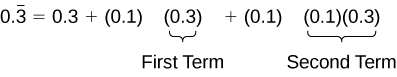
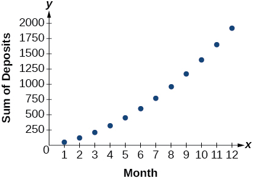

* Use summation notation.
* Use the formula for the sum of the first n terms of an arithmetic series.
* Use the formula for the sum of the first n terms of a geometric series.
* Use the formula for the sum of an infinite geometric series.
* Solve annuity problems.

A couple decides to start a college fund for their daughter. They plan to invest $50 in the fund each month. The fund pays 6% annual interest, compounded monthly. How much money will they have saved when their daughter is ready to start college in 6 years? In this section, we will learn how to answer this question. To do so, we need to consider the amount of money invested and the amount of interest earned.

### Using Summation Notation

To find the total amount of money in the college fund and the sum of the amounts deposited, we need to add the amounts deposited each month and the amounts earned monthly. The sum of the terms of a sequence is called a **series**{: data-type="term"}. Consider, for example, the following series.

<math xmlns="http://www.w3.org/1998/Math/MathML" display="block"> <mrow> <mn>3</mn><mo>+</mo><mn>7</mn><mo>+</mo><mn>11</mn><mo>+</mo><mn>15</mn><mo>+</mo><mn>19</mn><mo>+</mo><mn>...</mn> </mrow> </math>

The <strong data-type="term"><math xmlns="http://www.w3.org/1998/Math/MathML">
<mrow>
<mi>n</mi><mtext>th </mtext>
</mrow>
</math>partial sum</strong> of a series is the sum of a finite number of consecutive terms beginning with the first term. The notation<math xmlns="http://www.w3.org/1998/Math/MathML"> <mrow> <mtext> </mtext><msub> <mi>S</mi> <mi>n</mi> </msub> <mtext> </mtext> </mrow> </math>

represents the partial sum.

<math xmlns="http://www.w3.org/1998/Math/MathML" display="block"> <mtable columnalign="left"> <mtr> <mtd> <msub> <mi>S</mi> <mn>1</mn> </msub> <mo>=</mo><mn>3</mn> </mtd> </mtr> <mtr> <mtd> <msub> <mi>S</mi> <mn>2</mn> </msub> <mo>=</mo><mn>3</mn><mo>+</mo><mn>7</mn><mo>=</mo><mn>10</mn> </mtd> </mtr> <mtr> <mtd> <msub> <mi>S</mi> <mn>3</mn> </msub> <mo>=</mo><mn>3</mn><mo>+</mo><mn>7</mn><mo>+</mo><mn>11</mn><mo>=</mo><mn>21</mn> </mtd> </mtr> <mtr> <mtd> <msub> <mi>S</mi> <mn>4</mn> </msub> <mo>=</mo><mn>3</mn><mo>+</mo><mn>7</mn><mo>+</mo><mn>11</mn><mo>+</mo><mn>15</mn><mo>=</mo><mn>36</mn> </mtd> </mtr> </mtable> </math>

<strong>Summation notation </strong>is used to represent series. Summation notation is often known as sigma notation because it uses the Greek capital letter **sigma**{: data-type="term" .no-emphasis}, <math xmlns="http://www.w3.org/1998/Math/MathML"> <mrow> <mtext>Σ</mtext><mo>,</mo> </mrow> </math>

 to represent the sum. Summation notation includes an explicit formula and specifies the first and last terms in the series. An explicit formula for each term of the series is given to the right of the sigma. A variable called the <strong>index of summation </strong>is written below the sigma. The index of summation is set equal to the **lower limit of summation**, which is the number used to generate the first term in the series. The number above the sigma, called the **upper limit of summation**, is the number used to generate the last term in a series.

    If we interpret the given notation, we see that it asks us to find the sum of the terms in the series<math xmlns="http://www.w3.org/1998/Math/MathML"> <mrow> <mtext> </mtext><msub> <mi>a</mi> <mi>k</mi> </msub> <mo>=</mo><mn>2</mn><mi>k</mi> </mrow> </math>

 for <math xmlns="http://www.w3.org/1998/Math/MathML"> <mrow> <mi>k</mi><mo>=</mo><mn>1</mn> </mrow> </math>

 through <math xmlns="http://www.w3.org/1998/Math/MathML"> <mrow> <mi>k</mi><mo>=</mo><mn>5.</mn><mtext> </mtext> </mrow> </math>

 We can begin by substituting the terms for <math xmlns="http://www.w3.org/1998/Math/MathML"> <mi>k</mi> </math>

 and listing out the terms of this series.

<math xmlns="http://www.w3.org/1998/Math/MathML" display="block"> <mrow> <mtable columnalign="left"> <mtr columnalign="left"> <mtd columnalign="left"> <mtable columnalign="left"> <mtr> <mtd> <mrow /> </mtd> </mtr> <mtr> <mtd> <msub> <mi>a</mi> <mn>1</mn> </msub> <mo>=</mo><mn>2</mn><mo stretchy="false">(</mo><mn>1</mn><mo stretchy="false">)</mo><mo>=</mo><mn>2</mn> </mtd> </mtr> </mtable> </mtd> </mtr> <mtr columnalign="left"> <mtd columnalign="left"> <mrow> <msub> <mi>a</mi> <mn>2</mn> </msub> <mo>=</mo><mn>2</mn><mo stretchy="false">(</mo><mn>2</mn><mo stretchy="false">)</mo><mo>=</mo><mn>4</mn> </mrow> </mtd> </mtr> <mtr columnalign="left"> <mtd columnalign="left"> <mrow> <msub> <mi>a</mi> <mn>3</mn> </msub> <mo>=</mo><mn>2</mn><mo stretchy="false">(</mo><mn>3</mn><mo stretchy="false">)</mo><mo>=</mo><mn>6</mn> </mrow> </mtd> </mtr> <mtr columnalign="left"> <mtd columnalign="left"> <mrow> <msub> <mi>a</mi> <mn>4</mn> </msub> <mo>=</mo><mn>2</mn><mo stretchy="false">(</mo><mn>4</mn><mo stretchy="false">)</mo><mo>=</mo><mn>8</mn> </mrow> </mtd> </mtr> <mtr columnalign="left"> <mtd columnalign="left"> <mrow> <msub> <mi>a</mi> <mn>5</mn> </msub> <mo>=</mo><mn>2</mn><mo stretchy="false">(</mo><mn>5</mn><mo stretchy="false">)</mo><mo>=</mo><mn>10</mn> </mrow> </mtd> </mtr> </mtable> </mrow> </math>

We can find the sum of the series by adding the terms:

<math xmlns="http://www.w3.org/1998/Math/MathML" display="block"> <mrow> <mstyle displaystyle="true"> <munderover> <mo>∑</mo> <mrow> <mi>k</mi><mo>=</mo><mn>1</mn> </mrow> <mn>5</mn> </munderover> <mrow> <mn>2</mn><mi>k</mi> </mrow> </mstyle><mo>=</mo><mn>2</mn><mo>+</mo><mn>4</mn><mo>+</mo><mn>6</mn><mo>+</mo><mn>8</mn><mo>+</mo><mn>10</mn><mo>=</mo><mn>30</mn> </mrow> </math>

Summation Notation

The sum of the first<math xmlns="http://www.w3.org/1998/Math/MathML"> <mi>n</mi> </math>

terms of a <strong>series </strong>can be expressed in **summation notation**{: data-type="term"} as follows:

<math xmlns="http://www.w3.org/1998/Math/MathML" display="block"> <mrow> <mstyle displaystyle="true"> <munderover> <mo>∑</mo> <mrow> <mi>k</mi><mo>=</mo><mn>1</mn> </mrow> <mi>n</mi> </munderover> <mrow> <msub> <mi>a</mi> <mi>k</mi> </msub> </mrow> </mstyle> </mrow> </math>

This notation tells us to find the sum of <math xmlns="http://www.w3.org/1998/Math/MathML"> <mrow> <msub> <mi>a</mi> <mi>k</mi> </msub> </mrow> </math>

 from <math xmlns="http://www.w3.org/1998/Math/MathML"> <mrow> <mi>k</mi><mo>=</mo><mn>1</mn> </mrow> </math>

 to <math xmlns="http://www.w3.org/1998/Math/MathML"> <mrow> <mi>k</mi><mo>=</mo><mi>n</mi><mo>.</mo> </mrow> </math>

<math xmlns="http://www.w3.org/1998/Math/MathML"> <mrow> <mi>k</mi><mtext> </mtext> </mrow> </math>

 is called the **index of summation**{: data-type="term"}, 1 is the **lower limit of summation**{: data-type="term"}, and <math xmlns="http://www.w3.org/1998/Math/MathML"> <mi>n</mi> </math>

 is the **upper limit of summation**{: data-type="term"}.

**Does the lower limit of summation have to be 1?**

*No. The lower limit of summation can be any number, but 1 is frequently used. We will look at examples with lower limits of summation other than 1.*

**Given summation notation for a series, evaluate the value.**

1.  Identify the lower limit of summation.
2.  Identify the upper limit of summation.
3.  Substitute each value of
    <math xmlns="http://www.w3.org/1998/Math/MathML"> <mi>k</mi> </math>
    
    from the lower limit to the upper limit into the formula.
4.  Add to find the sum.
{: type="1"}

Using Summation Notation

Evaluate<math xmlns="http://www.w3.org/1998/Math/MathML"> <mrow> <mstyle displaystyle="true"> <munderover> <mo>∑</mo> <mrow> <mi>k</mi><mo>=</mo><mn>3</mn> </mrow> <mn>7</mn> </munderover> <mrow> <msup> <mi>k</mi> <mn>2</mn> </msup> </mrow> </mstyle><mo>.</mo> </mrow> </math>

According to the notation, the lower limit of summation is 3 and the upper limit is 7. So we need to find the sum of <math xmlns="http://www.w3.org/1998/Math/MathML"> <mrow> <msup> <mi>k</mi> <mn>2</mn> </msup> </mrow> </math>

 from <math xmlns="http://www.w3.org/1998/Math/MathML"> <mrow> <mi>k</mi><mo>=</mo><mn>3</mn> </mrow> </math>

 to <math xmlns="http://www.w3.org/1998/Math/MathML"> <mrow> <mi>k</mi><mo>=</mo><mn>7.</mn> </mrow> </math>

 We find the terms of the series by substituting <math xmlns="http://www.w3.org/1998/Math/MathML"> <mrow> <mi>k</mi><mo>=</mo><mn>3</mn><mtext>,</mtext><mn>4</mn><mtext>,</mtext><mn>5</mn><mtext>,</mtext><mn>6</mn><mtext>,</mtext><mtext> </mtext> </mrow> </math>

 and <math xmlns="http://www.w3.org/1998/Math/MathML"> <mrow> <mn>7</mn> </mrow> </math>

 into the function <math xmlns="http://www.w3.org/1998/Math/MathML"> <mrow> <msup> <mi>k</mi> <mn>2</mn> </msup> <mo>.</mo> </mrow> </math>

 We add the terms to find the sum.

<math xmlns="http://www.w3.org/1998/Math/MathML" display="block"> <mrow> <mtable columnalign="left"> <mtr columnalign="left"> <mtd columnalign="left"> <mrow> <mstyle displaystyle="true"> <munderover> <mo>∑</mo> <mrow> <mi>k</mi><mo>=</mo><mn>3</mn> </mrow> <mn>7</mn> </munderover> <mrow> <msup> <mi>k</mi> <mn>2</mn> </msup> </mrow> </mstyle> </mrow> </mtd> <mtd columnalign="left"> <mrow> <mo>=</mo><msup> <mn>3</mn> <mn>2</mn> </msup> <mo>+</mo><msup> <mn>4</mn> <mn>2</mn> </msup> <mo>+</mo><msup> <mn>5</mn> <mn>2</mn> </msup> <mo>+</mo><msup> <mn>6</mn> <mn>2</mn> </msup> <mo>+</mo><msup> <mn>7</mn> <mn>2</mn> </msup> </mrow> </mtd> </mtr> <mtr columnalign="left"> <mtd columnalign="left"> <mrow /> </mtd> <mtd columnalign="left"> <mrow> <mo>=</mo><mn>9</mn><mo>+</mo><mn>16</mn><mo>+</mo><mn>25</mn><mo>+</mo><mn>36</mn><mo>+</mo><mn>49</mn> </mrow> </mtd> </mtr> <mtr columnalign="left"> <mtd columnalign="left"> <mrow /> </mtd> <mtd columnalign="left"> <mrow> <mo>=</mo><mn>135</mn> </mrow> </mtd> </mtr> </mtable> </mrow> </math>

Evaluate<math xmlns="http://www.w3.org/1998/Math/MathML"> <mrow> <mstyle displaystyle="true"> <munderover> <mo>∑</mo> <mrow> <mi>k</mi><mo>=</mo><mn>2</mn> </mrow> <mn>5</mn> </munderover> <mrow> <mo stretchy="false">(</mo><mn>3</mn><mi>k</mi><mo>–</mo><mn>1</mn><mo stretchy="false">)</mo> </mrow> </mstyle><mo>.</mo> </mrow> </math>

38

### Using the Formula for Arithmetic Series

Just as we studied special types of sequences, we will look at special types of series. Recall that an **arithmetic sequence**{: data-type="term" .no-emphasis} is a sequence in which the difference between any two consecutive terms is the **common difference**{: data-type="term" .no-emphasis},<math xmlns="http://www.w3.org/1998/Math/MathML"> <mrow> <mi>d</mi><mo>.</mo> </mrow> </math>

 The sum of the terms of an arithmetic sequence is called an **arithmetic series**. We can write the sum of the first <math xmlns="http://www.w3.org/1998/Math/MathML"> <mi>n</mi> </math>

 terms of an arithmetic series as:

<math xmlns="http://www.w3.org/1998/Math/MathML" display="block"> <mrow> <msub> <mi>S</mi> <mi>n</mi> </msub> <mo>=</mo><msub> <mi>a</mi> <mn>1</mn> </msub> <mo>+</mo><mo stretchy="false">(</mo><msub> <mi>a</mi> <mn>1</mn> </msub> <mo>+</mo><mi>d</mi><mo stretchy="false">)</mo><mo>+</mo><mo stretchy="false">(</mo><msub> <mi>a</mi> <mn>1</mn> </msub> <mo>+</mo><mn>2</mn><mi>d</mi><mo stretchy="false">)</mo><mo>+</mo><mn>...</mn><mo>+</mo><mo stretchy="false">(</mo><msub> <mi>a</mi> <mi>n</mi> </msub> <mo>–</mo><mi>d</mi><mo stretchy="false">)</mo><mo>+</mo><msub> <mi>a</mi> <mi>n</mi> </msub> <mo>.</mo> </mrow> </math>

We can also reverse the order of the terms and write the sum as

<math xmlns="http://www.w3.org/1998/Math/MathML" display="block"> <mrow> <msub> <mi>S</mi> <mi>n</mi> </msub> <mo>=</mo><msub> <mi>a</mi> <mi>n</mi> </msub> <mo>+</mo><mo stretchy="false">(</mo><msub> <mi>a</mi> <mi>n</mi> </msub> <mo>–</mo><mi>d</mi><mo stretchy="false">)</mo><mo>+</mo><mo stretchy="false">(</mo><msub> <mi>a</mi> <mi>n</mi> </msub> <mo>–</mo><mn>2</mn><mi>d</mi><mo stretchy="false">)</mo><mo>+</mo><mn>...</mn><mo>+</mo><mo stretchy="false">(</mo><msub> <mi>a</mi> <mn>1</mn> </msub> <mo>+</mo><mi>d</mi><mo stretchy="false">)</mo><mo>+</mo><msub> <mi>a</mi> <mn>1</mn> </msub> <mo>.</mo> </mrow> </math>

If we add these two expressions for the sum of the first <math xmlns="http://www.w3.org/1998/Math/MathML"> <mrow> <mi>n</mi> </mrow> </math>

terms of an arithmetic series, we can derive a formula for the sum of the first <math xmlns="http://www.w3.org/1998/Math/MathML"> <mrow> <mi>n</mi> </mrow> </math>

 terms of any arithmetic series.

<math xmlns="http://www.w3.org/1998/Math/MathML" display="block"> <mrow> <mfrac> <mrow> <mtable columnalign="left"> <mtr columnalign="left"> <mtd columnalign="left"> <mrow> <mtext> </mtext><mtext> </mtext><mtext> </mtext><mtext> </mtext><mtext> </mtext><mtext> </mtext><msub> <mi>S</mi> <mi>n</mi> </msub> <mo>=</mo><msub> <mi>a</mi> <mn>1</mn> </msub> <mo>+</mo><mo stretchy="false">(</mo><msub> <mi>a</mi> <mn>1</mn> </msub> <mo>+</mo><mi>d</mi><mo stretchy="false">)</mo><mo>+</mo><mo stretchy="false">(</mo><msub> <mi>a</mi> <mn>1</mn> </msub> <mo>+</mo><mn>2</mn><mi>d</mi><mo stretchy="false">)</mo><mo>+</mo><mn>...</mn><mo>+</mo><mo stretchy="false">(</mo><msub> <mi>a</mi> <mi>n</mi> </msub> <mo>–</mo><mi>d</mi><mo stretchy="false">)</mo><mo>+</mo><msub> <mi>a</mi> <mi>n</mi> </msub> </mrow> </mtd> </mtr> <mtr columnalign="left"> <mtd columnalign="left"> <mrow> <mo>+</mo><mtext> </mtext><mtext> </mtext><msub> <mi>S</mi> <mi>n</mi> </msub> <mo>=</mo><msub> <mi>a</mi> <mi>n</mi> </msub> <mo>+</mo><mo stretchy="false">(</mo><msub> <mi>a</mi> <mi>n</mi> </msub> <mo>–</mo><mi>d</mi><mo stretchy="false">)</mo><mo>+</mo><mo stretchy="false">(</mo><msub> <mi>a</mi> <mi>n</mi> </msub> <mo>–</mo><mn>2</mn><mi>d</mi><mo stretchy="false">)</mo><mo>+</mo><mn>...</mn><mo>+</mo><mo stretchy="false">(</mo><msub> <mi>a</mi> <mn>1</mn> </msub> <mo>+</mo><mi>d</mi><mo stretchy="false">)</mo><mo>+</mo><msub> <mi>a</mi> <mn>1</mn> </msub> </mrow> </mtd> </mtr> </mtable> </mrow> <mrow> <mn>2</mn><msub> <mi>S</mi> <mi>n</mi> </msub> <mo>=</mo><mo stretchy="false">(</mo><msub> <mi>a</mi> <mn>1</mn> </msub> <mo>+</mo><msub> <mi>a</mi> <mi>n</mi> </msub> <mo stretchy="false">)</mo><mo>+</mo><mo stretchy="false">(</mo><msub> <mi>a</mi> <mn>1</mn> </msub> <mo>+</mo><msub> <mi>a</mi> <mi>n</mi> </msub> <mo stretchy="false">)</mo><mo>+</mo><mn>...</mn><mo>+</mo><mo stretchy="false">(</mo><msub> <mi>a</mi> <mn>1</mn> </msub> <mo>+</mo><msub> <mi>a</mi> <mi>n</mi> </msub> <mo stretchy="false">)</mo> </mrow> </mfrac> </mrow> </math>

Because there are <math xmlns="http://www.w3.org/1998/Math/MathML"> <mi>n</mi> </math>

 terms in the series, we can simplify this sum to

<math xmlns="http://www.w3.org/1998/Math/MathML" display="block"> <mrow> <mn>2</mn><msub> <mi>S</mi> <mi>n</mi> </msub> <mo>=</mo><mi>n</mi><mo stretchy="false">(</mo><msub> <mi>a</mi> <mn>1</mn> </msub> <mo>+</mo><msub> <mi>a</mi> <mi>n</mi> </msub> <mo stretchy="false">)</mo><mo>.</mo> </mrow> </math>

We divide by 2 to find the formula for the sum of the first <math xmlns="http://www.w3.org/1998/Math/MathML"> <mrow> <mi>n</mi> </mrow> </math>

 terms of an arithmetic series.

<math xmlns="http://www.w3.org/1998/Math/MathML" display="block"> <mrow> <msub> <mi>S</mi> <mi>n</mi> </msub> <mo>=</mo><mfrac> <mrow> <mi>n</mi><mo stretchy="false">(</mo><msub> <mi>a</mi> <mn>1</mn> </msub> <mo>+</mo><msub> <mi>a</mi> <mi>n</mi> </msub> <mo stretchy="false">)</mo> </mrow> <mn>2</mn> </mfrac> </mrow> </math>

Formula for the Sum of the First *n* Terms of an Arithmetic Series

An **arithmetic series**{: data-type="term"} is the sum of the terms of an arithmetic sequence. The formula for the sum of the first <math xmlns="http://www.w3.org/1998/Math/MathML"> <mi>n</mi> </math>

 terms of an arithmetic sequence is

<math xmlns="http://www.w3.org/1998/Math/MathML" display="block"> <mrow> <msub> <mi>S</mi> <mi>n</mi> </msub> <mo>=</mo><mfrac> <mrow> <mi>n</mi><mo stretchy="false">(</mo><msub> <mi>a</mi> <mn>1</mn> </msub> <mo>+</mo><msub> <mi>a</mi> <mi>n</mi> </msub> <mo stretchy="false">)</mo> </mrow> <mn>2</mn> </mfrac> </mrow> </math>

**Given terms of an arithmetic series, find the sum of the first <math xmlns="http://www.w3.org/1998/Math/MathML"> <mrow> <mi>n</mi> </mrow> </math>

 terms.**

1.  Identify
    <math xmlns="http://www.w3.org/1998/Math/MathML"> <mrow> <msub> <mi>a</mi> <mn>1</mn> </msub> </mrow> </math>
    
    and
    <math xmlns="http://www.w3.org/1998/Math/MathML"> <mrow> <msub> <mi>a</mi> <mi>n</mi> </msub> <mo>.</mo> </mrow> </math>

2.  Determine
    <math xmlns="http://www.w3.org/1998/Math/MathML"> <mrow> <mi>n</mi><mo>.</mo> </mrow> </math>

3.  Substitute values for
    <math xmlns="http://www.w3.org/1998/Math/MathML"> <mrow> <msub> <mi>a</mi> <mn>1</mn> </msub> <mtext>, </mtext><msub> <mi>a</mi> <mi>n</mi> </msub> <mtext>,</mtext><mtext> </mtext> </mrow> </math>
    
    and
    <math xmlns="http://www.w3.org/1998/Math/MathML"> <mrow> <mtext> </mtext><mi>n</mi><mtext> </mtext> </mrow> </math>
    
    into the formula
    <math xmlns="http://www.w3.org/1998/Math/MathML"> <mrow> <msub> <mi>S</mi> <mi>n</mi> </msub> <mo>=</mo><mfrac> <mrow> <mi>n</mi><mo stretchy="false">(</mo><msub> <mi>a</mi> <mn>1</mn> </msub> <mo>+</mo><msub> <mi>a</mi> <mi>n</mi> </msub> <mo stretchy="false">)</mo> </mrow> <mn>2</mn> </mfrac> <mo>.</mo> </mrow> </math>

4.  Simplify to find
    <math xmlns="http://www.w3.org/1998/Math/MathML"> <mrow> <msub> <mi>S</mi> <mi>n</mi> </msub> <mo>.</mo> </mrow> </math>
{: type="1"}

Finding the First *n* Terms of an Arithmetic Series

Find the sum of each arithmetic series.

1.  <math xmlns="http://www.w3.org/1998/Math/MathML"> <mrow> <mtext>5 + 8 + 11 + 14 + 17 + 20 + 23 + 26 + 29 + 32</mtext> </mrow> </math>

2.  <math xmlns="http://www.w3.org/1998/Math/MathML"> <mrow> <mtext>20 + 15 + 10 +…+ −50</mtext></mrow> </math>

3.  <math xmlns="http://www.w3.org/1998/Math/MathML"> <mrow> <mstyle displaystyle="true"> <munderover> <mo>∑</mo> <mrow> <mi>k</mi><mo>=</mo><mn>1</mn> </mrow> <mrow> <mn>12</mn> </mrow> </munderover> <mrow> <mn>3</mn><mi>k</mi><mo>−</mo><mn>8</mn> </mrow> </mstyle> </mrow> </math>
{: type="a"}

1.  We are given <math xmlns="http://www.w3.org/1998/Math/MathML"> <mrow> <msub> <mi>a</mi> <mn>1</mn> </msub> <mo>=</mo><mn>5</mn> </mrow> </math>
    
     and <math xmlns="http://www.w3.org/1998/Math/MathML"> <mrow> <mtext> </mtext><msub> <mi>a</mi> <mi>n</mi> </msub> <mo>=</mo><mn>32.</mn> </mrow> </math>
    
    Count the number of terms in the sequence to find <math xmlns="http://www.w3.org/1998/Math/MathML"> <mrow> <mi>n</mi><mo>=</mo><mn>10.</mn> </mrow> </math>
    
    Substitute values for <math xmlns="http://www.w3.org/1998/Math/MathML"> <mrow> <mtext> </mtext><msub> <mi>a</mi> <mn>1</mn> </msub> <mo>,</mo><msub> <mi>a</mi> <mi>n</mi> </msub> <mtext> ,</mtext> </mrow> </math>
    
     and <math xmlns="http://www.w3.org/1998/Math/MathML"> <mrow> <mi>n</mi> </mrow> </math>
    
     into the formula and simplify.
    
    

    <math xmlns="http://www.w3.org/1998/Math/MathML" display="block"> <mrow> <mtable columnalign="left"> <mtr columnalign="left"> <mtd columnalign="left"> <mrow> <mtable columnalign="left"> <mtr columnalign="left"> <mtd columnalign="left"> <mrow /> </mtd> </mtr> <mtr columnalign="left"> <mtd columnalign="left"> <mrow> <mo> </mo><msub> <mi>S</mi> <mi>n</mi> </msub> <mo>=</mo><mfrac> <mrow> <mi>n</mi><mo stretchy="false">(</mo><msub> <mi>a</mi> <mn>1</mn> </msub> <mo>+</mo><msub> <mi>a</mi> <mi>n</mi> </msub> <mo stretchy="false">)</mo> </mrow> <mn>2</mn> </mfrac> </mrow> </mtd> </mtr> </mtable> </mrow> </mtd> </mtr> <mtr columnalign="left"> <mtd columnalign="left"> <mrow> <msub> <mi>S</mi> <mrow> <mn>10</mn> </mrow> </msub> <mo>=</mo><mfrac> <mrow> <mn>10</mn><mo stretchy="false">(</mo><mn>5</mn><mo>+</mo><mn>32</mn><mo stretchy="false">)</mo> </mrow> <mn>2</mn> </mfrac> <mo>=</mo><mn>185</mn> </mrow> </mtd> </mtr> </mtable> </mrow> </math>
    

2.  We are given <math xmlns="http://www.w3.org/1998/Math/MathML"> <mrow> <msub> <mi>a</mi> <mn>1</mn> </msub> <mo>=</mo><mn>20</mn> </mrow> </math>
    
     and <math xmlns="http://www.w3.org/1998/Math/MathML"> <mrow> <msub> <mi>a</mi> <mi>n</mi> </msub> <mo>=</mo><mo>−</mo><mn>50.</mn> </mrow> </math>
    
    Use the formula for the general term of an arithmetic sequence to find <math xmlns="http://www.w3.org/1998/Math/MathML"> <mrow> <mi>n</mi><mo>.</mo> </mrow> </math>
    
    

    <math xmlns="http://www.w3.org/1998/Math/MathML" display="block"> <mrow> <mtable columnalign="left"> <mtr columnalign="left"> <mtd columnalign="left"> <mrow> <mtext> </mtext><mtext> </mtext><mtext> </mtext><mtext> </mtext><msub> <mi>a</mi> <mi>n</mi> </msub> <mo>=</mo><msub> <mi>a</mi> <mn>1</mn> </msub> <mo>+</mo><mo stretchy="false">(</mo><mi>n</mi><mo>−</mo><mn>1</mn><mo stretchy="false">)</mo><mi>d</mi> </mrow> </mtd> </mtr> <mtr columnalign="left"> <mtd columnalign="left"> <mrow> <mo>−</mo><mn>50</mn><mo>=</mo><mn>20</mn><mo>+</mo><mo stretchy="false">(</mo><mi>n</mi><mo>−</mo><mn>1</mn><mo stretchy="false">)</mo><mo stretchy="false">(</mo><mo>−</mo><mn>5</mn><mo stretchy="false">)</mo> </mrow> </mtd> </mtr> <mtr columnalign="left"> <mtd columnalign="left"> <mrow> <mo>−</mo><mn>70</mn><mo>=</mo><mo stretchy="false">(</mo><mi>n</mi><mo>−</mo><mn>1</mn><mo stretchy="false">)</mo><mo stretchy="false">(</mo><mo>−</mo><mn>5</mn><mo stretchy="false">)</mo> </mrow> </mtd> </mtr> <mtr columnalign="left"> <mtd columnalign="left"> <mrow> <mtext> </mtext><mtext> </mtext><mtext> </mtext><mtext> </mtext><mn>14</mn><mo>=</mo><mi>n</mi><mo>−</mo><mn>1</mn> </mrow> </mtd> </mtr> <mtr columnalign="left"> <mtd columnalign="left"> <mrow> <mtext> </mtext><mtext> </mtext><mtext> </mtext><mtext> </mtext><mn>15</mn><mo>=</mo><mi>n</mi> </mrow> </mtd> </mtr> </mtable> </mrow> </math>
    

    
    Substitute values for <math xmlns="http://www.w3.org/1998/Math/MathML"> <mrow> <msub> <mi>a</mi> <mn>1</mn> </msub> <mo>,</mo><msub> <mi>a</mi> <mi>n</mi> </msub> <mtext>,</mtext><mtext> </mtext><mi>n</mi> </mrow> </math>
    
     into the formula and simplify.* * *
    {: data-type="newline" data-count="1"}
    
    

    <math xmlns="http://www.w3.org/1998/Math/MathML" display="block"> <mrow> <mtable columnalign="left"> <mtr columnalign="left"> <mtd columnalign="left"> <mtable columnalign="left"> <mtr> <mtd> <mrow /> </mtd> </mtr> <mtr> <mtd> <msub> <mi>S</mi> <mi>n</mi> </msub> <mo>=</mo><mfrac> <mrow> <mi>n</mi><mo stretchy="false">(</mo><msub> <mi>a</mi> <mn>1</mn> </msub> <mo>+</mo><msub> <mi>a</mi> <mi>n</mi> </msub> <mo stretchy="false">)</mo> </mrow> <mn>2</mn> </mfrac> </mtd> </mtr> </mtable> </mtd> </mtr> <mtr columnalign="left"> <mtd columnalign="left"> <mrow> <msub> <mi>S</mi> <mrow> <mn>15</mn> </mrow> </msub> <mo>=</mo><mfrac> <mrow> <mn>15</mn><mo stretchy="false">(</mo><mn>20</mn><mo>−</mo><mn>50</mn><mo stretchy="false">)</mo> </mrow> <mn>2</mn> </mfrac> <mo>=</mo><mo>−</mo><mn>225</mn> </mrow> </mtd> </mtr> </mtable> </mrow> </math>
    

3.  To find <math xmlns="http://www.w3.org/1998/Math/MathML"> <mrow> <msub> <mi>a</mi> <mn>1</mn> </msub> <mo>,</mo><mtext> </mtext> </mrow> </math>
    
    substitute <math xmlns="http://www.w3.org/1998/Math/MathML"> <mrow> <mi>k</mi><mo>=</mo><mn>1</mn> </mrow> </math>
    
     into the given explicit formula.
    
    

    <math xmlns="http://www.w3.org/1998/Math/MathML"> <mrow> <mtable columnalign="left"> <mtr columnalign="left"> <mtd columnalign="left"> <mrow> <msub> <mi>a</mi> <mi>k</mi> </msub> <mo>=</mo><mn>3</mn><mi>k</mi><mo>−</mo><mn>8</mn> </mrow> </mtd> </mtr> <mtr columnalign="left"> <mtd columnalign="left"> <mrow> <mtext> </mtext><msub> <mi>a</mi> <mn>1</mn> </msub> <mo>=</mo><mn>3</mn><mo stretchy="false">(</mo><mn>1</mn><mo stretchy="false">)</mo><mo>−</mo><mn>8</mn><mo>=</mo><mo>−</mo><mn>5</mn> </mrow> </mtd> </mtr> </mtable> </mrow> </math>
    

    
    We are given that <math xmlns="http://www.w3.org/1998/Math/MathML"> <mrow> <mi>n</mi><mo>=</mo><mn>12.</mn> </mrow> </math>
    
     To find <math xmlns="http://www.w3.org/1998/Math/MathML"> <mrow> <msub> <mi>a</mi> <mrow> <mn>12</mn> </mrow> </msub> <mo>,</mo><mtext> </mtext> </mrow> </math>
    
    substitute <math xmlns="http://www.w3.org/1998/Math/MathML"> <mrow> <mi>k</mi><mo>=</mo><mn>12</mn> </mrow> </math>
    
     into the given explicit formula.
    
    

    <math xmlns="http://www.w3.org/1998/Math/MathML" display="block"> <mrow> <mtable columnalign="left"> <mtr columnalign="left"> <mtd columnalign="left"> <mrow> <mtext> </mtext><msub> <mi>a</mi> <mi>k</mi> </msub> <mo>=</mo><mn>3</mn><mi>k</mi><mo>−</mo><mn>8</mn> </mrow> </mtd> </mtr> <mtr columnalign="left"> <mtd columnalign="left"> <mrow> <msub> <mi>a</mi> <mrow> <mn>12</mn> </mrow> </msub> <mo>=</mo><mn>3</mn><mo stretchy="false">(</mo><mn>12</mn><mo stretchy="false">)</mo><mo>−</mo><mn>8</mn><mo>=</mo><mn>28</mn> </mrow> </mtd> </mtr> </mtable> </mrow> </math>
    

    
    Substitute values for <math xmlns="http://www.w3.org/1998/Math/MathML"> <mrow> <msub> <mi>a</mi> <mn>1</mn> </msub> <mo>,</mo><msub> <mi>a</mi> <mi>n</mi> </msub> <mo>,</mo> </mrow> </math>
    
     and <math xmlns="http://www.w3.org/1998/Math/MathML"> <mrow> <mi>n</mi> </mrow> </math>
    
     into the formula and simplify.
    
    

    <math xmlns="http://www.w3.org/1998/Math/MathML" display="block"> <mrow> <mtable columnalign="left"> <mtr columnalign="left"> <mtd columnalign="left"> <mrow> <mtext> </mtext><msub> <mi>S</mi> <mi>n</mi> </msub> <mo>=</mo><mfrac> <mrow> <mi>n</mi><mo stretchy="false">(</mo><msub> <mi>a</mi> <mn>1</mn> </msub> <mo>+</mo><msub> <mi>a</mi> <mi>n</mi> </msub> <mo stretchy="false">)</mo> </mrow> <mn>2</mn> </mfrac> </mrow> </mtd> </mtr> <mtr columnalign="left"> <mtd columnalign="left"> <mrow> <msub> <mi>S</mi> <mrow> <mn>12</mn> </mrow> </msub> <mo>=</mo><mfrac> <mrow> <mn>12</mn><mo stretchy="false">(</mo><mo>−</mo><mn>5</mn><mo>+</mo><mn>28</mn><mo stretchy="false">)</mo> </mrow> <mn>2</mn> </mfrac> <mo>=</mo><mn>138</mn> </mrow> </mtd> </mtr> </mtable> </mrow> </math>
    

{: type="a"}

Use the formula to find the sum of each arithmetic series.

<math xmlns="http://www.w3.org/1998/Math/MathML"> <mrow> <mtext>1</mtext><mtext>.4 + 1</mtext><mtext>.6 + 1</mtext><mtext>.8 + 2</mtext><mtext>.0 + 2</mtext><mtext>.2 + 2</mtext><mtext>.4 + 2</mtext><mtext>.6 + 2</mtext><mtext>.8 + 3</mtext><mtext>.0 + 3</mtext><mtext>.2 + 3</mtext><mtext>.4</mtext> </mrow> </math>

<math xmlns="http://www.w3.org/1998/Math/MathML"> <mrow> <mtext>26</mtext><mtext>.4</mtext> </mrow> </math>

<math xmlns="http://www.w3.org/1998/Math/MathML"> <mrow> <mtext>13 + 21 + 29 + </mtext><mo>…</mo><mtext>+ 69</mtext> </mrow> </math>

<math xmlns="http://www.w3.org/1998/Math/MathML"> <mrow> <mtext>328</mtext> </mrow> </math>

<math xmlns="http://www.w3.org/1998/Math/MathML"> <mrow> <mstyle displaystyle="true"> <munderover> <mo>∑</mo> <mrow> <mi>k</mi><mo>=</mo><mn>1</mn> </mrow> <mrow> <mn>10</mn> </mrow> </munderover> <mn>5</mn> </mstyle><mo>−</mo><mn>6</mn><mi>k</mi> </mrow> </math>

<math xmlns="http://www.w3.org/1998/Math/MathML"> <mrow> <mtext>−280</mtext></mrow> </math>

Solving Application Problems with Arithmetic Series

On the Sunday after a minor surgery, a woman is able to walk a half-mile. Each Sunday, she walks an additional quarter-mile. After 8 weeks, what will be the total number of miles she has walked?

This problem can be modeled by an arithmetic series with<math xmlns="http://www.w3.org/1998/Math/MathML"> <mrow> <mtext> </mtext><msub> <mi>a</mi> <mn>1</mn> </msub> <mo>=</mo><mfrac> <mn>1</mn> <mn>2</mn> </mfrac> <mtext> </mtext> </mrow> </math>

and<math xmlns="http://www.w3.org/1998/Math/MathML"> <mrow> <mtext> </mtext><mi>d</mi><mo>=</mo><mfrac> <mn>1</mn> <mn>4</mn> </mfrac> <mo>.</mo><mtext> </mtext> </mrow> </math>

We are looking for the total number of miles walked after 8 weeks, so we know that <math xmlns="http://www.w3.org/1998/Math/MathML"> <mrow> <mi>n</mi><mo>=</mo><mn>8</mn><mtext>,</mtext> </mrow> </math>

 and we are looking for<math xmlns="http://www.w3.org/1998/Math/MathML"> <mrow> <mtext> </mtext><msub> <mi>S</mi> <mn>8</mn> </msub> <mo>.</mo><mtext> </mtext> </mrow> </math>

To find <math xmlns="http://www.w3.org/1998/Math/MathML"> <mrow> <msub> <mi>a</mi> <mn>8</mn> </msub> <mo>,</mo> </mrow> </math>

 we can use the explicit formula for an arithmetic sequence.

<math xmlns="http://www.w3.org/1998/Math/MathML" display="block"> <mrow> <mtable columnalign="left"> <mtr columnalign="left"> <mtd columnalign="left"> <mtable columnalign="left"> <mtr> <mtd> <mrow /> </mtd> </mtr> <mtr> <mtd> <msub> <mi>a</mi> <mi>n</mi> </msub> <mo>=</mo><msub> <mi>a</mi> <mn>1</mn> </msub> <mo>+</mo><mi>d</mi><mo stretchy="false">(</mo><mi>n</mi><mo>−</mo><mn>1</mn><mo stretchy="false">)</mo> </mtd> </mtr> </mtable> </mtd> </mtr> <mtr columnalign="left"> <mtd columnalign="left"> <mrow> <msub> <mi>a</mi> <mn>8</mn> </msub> <mo>=</mo><mfrac> <mn>1</mn> <mn>2</mn> </mfrac> <mo>+</mo><mfrac> <mn>1</mn> <mn>4</mn> </mfrac> <mo stretchy="false">(</mo><mn>8</mn><mo>−</mo><mn>1</mn><mo stretchy="false">)</mo><mo>=</mo><mfrac> <mn>9</mn> <mn>4</mn> </mfrac> </mrow> </mtd> </mtr> </mtable> </mrow> </math>

We can now use the formula for arithmetic series.

<math xmlns="http://www.w3.org/1998/Math/MathML" display="block"> <mrow> <mtable columnalign="left"> <mtr columnalign="left"> <mtd columnalign="left"> <mrow> <mo> </mo><msub> <mi>S</mi> <mi>n</mi> </msub> <mo>=</mo><mfrac> <mrow> <mi>n</mi><mo stretchy="false">(</mo><msub> <mi>a</mi> <mn>1</mn> </msub> <mo>+</mo><msub> <mi>a</mi> <mi>n</mi> </msub> <mo stretchy="false">)</mo> </mrow> <mn>2</mn> </mfrac> </mrow> </mtd> </mtr> <mtr columnalign="left"> <mtd columnalign="left"> <mrow> <mtext>  </mtext><msub> <mi>S</mi> <mn>8</mn> </msub> <mo>=</mo><mfrac> <mrow> <mn>8</mn><mo stretchy="false">(</mo><mfrac> <mn>1</mn> <mn>2</mn> </mfrac> <mo>+</mo><mfrac> <mn>9</mn> <mn>4</mn> </mfrac> <mo stretchy="false">)</mo> </mrow> <mn>2</mn> </mfrac> <mo>=</mo><mn>11</mn> </mrow> </mtd> </mtr> </mtable> </mrow> </math>

She will have walked a total of 11 miles.

A man earns $100 in the first week of June. Each week, he earns $12.50 more than the previous week. After 12 weeks, how much has he earned?

$2,025

### Using the Formula for Geometric Series

Just as the sum of the terms of an arithmetic sequence is called an arithmetic series, the sum of the terms in a geometric sequence is called a **geometric series**. Recall that a **geometric sequence**{: data-type="term" .no-emphasis} is a sequence in which the ratio of any two consecutive terms is the **common ratio**{: data-type="term" .no-emphasis}, <math xmlns="http://www.w3.org/1998/Math/MathML"> <mrow> <mtext> </mtext><mi>r</mi><mo>.</mo><mtext> </mtext> </mrow> </math>

We can write the sum of the first <math xmlns="http://www.w3.org/1998/Math/MathML"> <mrow> <mi>n</mi> </mrow> </math>

 terms of a geometric series as

<math xmlns="http://www.w3.org/1998/Math/MathML" display="block"> <mrow> <msub> <mi>S</mi> <mi>n</mi> </msub> <mo>=</mo><msub> <mi>a</mi> <mn>1</mn> </msub> <mo>+</mo><mi>r</mi><msub> <mi>a</mi> <mn>1</mn> </msub> <mo>+</mo><msup> <mi>r</mi> <mn>2</mn> </msup> <msub> <mi>a</mi> <mn>1</mn> </msub> <mo>+</mo><mn>...</mn><mo>+</mo><msup> <mi>r</mi> <mrow> <mi>n</mi><mo>–</mo><mn>1</mn> </mrow> </msup> <msub> <mi>a</mi> <mn>1</mn> </msub> <mo>.</mo> </mrow> </math>

Just as with arithmetic series, we can do some algebraic manipulation to derive a formula for the sum of the first<math xmlns="http://www.w3.org/1998/Math/MathML"> <mrow> <mtext> </mtext><mi>n</mi><mtext> </mtext> </mrow> </math>

terms of a geometric series. We will begin by multiplying both sides of the equation by<math xmlns="http://www.w3.org/1998/Math/MathML"> <mrow> <mtext> </mtext><mi>r</mi><mo>.</mo><mtext> </mtext> </mrow> </math>

<math xmlns="http://www.w3.org/1998/Math/MathML" display="block"> <mrow> <mi>r</mi><msub> <mi>S</mi> <mi>n</mi> </msub> <mo>=</mo><mi>r</mi><msub> <mi>a</mi> <mn>1</mn> </msub> <mo>+</mo><msup> <mi>r</mi> <mn>2</mn> </msup> <msub> <mi>a</mi> <mn>1</mn> </msub> <mo>+</mo><msup> <mi>r</mi> <mn>3</mn> </msup> <msub> <mi>a</mi> <mn>1</mn> </msub> <mo>+</mo><mn>...</mn><mo>+</mo><msup> <mi>r</mi> <mi>n</mi> </msup> <msub> <mi>a</mi> <mn>1</mn> </msub> </mrow> </math>

Next, we subtract this equation from the original equation.* * *
{: data-type="newline" data-count="1"}

<math xmlns="http://www.w3.org/1998/Math/MathML" display="block"> <mtable columnalign="left"> <mtr> <mtd> <mrow /> </mtd> </mtr> <mtr> <mtd> <mfrac> <mrow> <mtable columnalign="left"> <mtr columnalign="left"> <mtd columnalign="left"> <mrow> <mtext>    </mtext><msub> <mi>S</mi> <mi>n</mi> </msub> <mo>=</mo><msub> <mi>a</mi> <mn>1</mn> </msub> <mo>+</mo><mi>r</mi><msub> <mi>a</mi> <mn>1</mn> </msub> <mo>+</mo><msup> <mi>r</mi> <mn>2</mn> </msup> <msub> <mi>a</mi> <mn>1</mn> </msub> <mo>+</mo><mn>...</mn><mo>+</mo><msup> <mi>r</mi> <mrow> <mi>n</mi><mo>–</mo><mn>1</mn> </mrow> </msup> <msub> <mi>a</mi> <mn>1</mn> </msub> </mrow> </mtd> </mtr> <mtr columnalign="left"> <mtd columnalign="left"> <mrow> <mo>−</mo><mi>r</mi><msub> <mi>S</mi> <mi>n</mi> </msub> <mo>=</mo><mo>−</mo><mo stretchy="false">(</mo><mi>r</mi><msub> <mi>a</mi> <mn>1</mn> </msub> <mo>+</mo><msup> <mi>r</mi> <mn>2</mn> </msup> <msub> <mi>a</mi> <mn>1</mn> </msub> <mo>+</mo><msup> <mi>r</mi> <mn>3</mn> </msup> <msub> <mi>a</mi> <mn>1</mn> </msub> <mo>+</mo><mn>...</mn><mo>+</mo><msup> <mi>r</mi> <mi>n</mi> </msup> <msub> <mi>a</mi> <mn>1</mn> </msub> <mo stretchy="false">)</mo> </mrow> </mtd> </mtr> </mtable> </mrow> <mrow> <mo stretchy="false">(</mo><mn>1</mn><mo>−</mo><mi>r</mi><mo stretchy="false">)</mo><msub> <mi>S</mi> <mi>n</mi> </msub> <mo>=</mo><msub> <mi>a</mi> <mn>1</mn> </msub> <mo>−</mo><msup> <mi>r</mi> <mi>n</mi> </msup> <msub> <mi>a</mi> <mn>1</mn> </msub> </mrow> </mfrac> </mtd> </mtr> </mtable> </math>

Notice that when we subtract, all but the first term of the top equation and the last term of the bottom equation cancel out. To obtain a formula for <math xmlns="http://www.w3.org/1998/Math/MathML"> <mrow> <msub> <mi>S</mi> <mi>n</mi> </msub> <mo>,</mo> </mrow> </math>

 divide both sides by <math xmlns="http://www.w3.org/1998/Math/MathML"> <mrow> <mo stretchy="false">(</mo><mn>1</mn><mo>−</mo><mi>r</mi><mo stretchy="false">)</mo><mo>.</mo> </mrow> </math>

<math xmlns="http://www.w3.org/1998/Math/MathML" display="block"> <mrow> <msub> <mi>S</mi> <mi>n</mi> </msub> <mo>=</mo><mfrac> <mrow> <msub> <mi>a</mi> <mn>1</mn> </msub> <mo stretchy="false">(</mo><mn>1</mn><mo>−</mo><msup> <mi>r</mi> <mi>n</mi> </msup> <mo stretchy="false">)</mo> </mrow> <mrow> <mn>1</mn><mo>−</mo><mi>r</mi> </mrow> </mfrac> <mtext> r</mtext><mo>≠</mo><mtext>1</mtext> </mrow> </math>

Formula for the Sum of the First *n* Terms of a Geometric Series

A **geometric series**{: data-type="term"} is the sum of the terms in a geometric sequence. The formula for the sum of the first<math xmlns="http://www.w3.org/1998/Math/MathML"> <mrow> <mtext> </mtext><mi>n</mi><mtext> </mtext> </mrow> </math>

terms of a geometric sequence is represented as

<math xmlns="http://www.w3.org/1998/Math/MathML" display="block"> <mrow> <msub> <mi>S</mi> <mi>n</mi> </msub> <mo>=</mo><mfrac> <mrow> <msub> <mi>a</mi> <mn>1</mn> </msub> <mo stretchy="false">(</mo><mn>1</mn><mo>−</mo><msup> <mi>r</mi> <mi>n</mi> </msup> <mo stretchy="false">)</mo> </mrow> <mrow> <mn>1</mn><mo>−</mo><mi>r</mi> </mrow> </mfrac> <mtext> r</mtext><mo>≠</mo><mtext>1</mtext> </mrow> </math>

**Given a geometric series, find the sum of the first *n* terms.**
1.  Identify
    <math xmlns="http://www.w3.org/1998/Math/MathML"> <mrow> <mtext> </mtext><msub> <mi>a</mi> <mn>1</mn> </msub> <mo>,</mo><mtext> </mtext><mi>r</mi><mo>,</mo><mtext> </mtext><mtext>and</mtext><mtext> </mtext><mi>n</mi><mo>.</mo> </mrow> </math>

2.  Substitute values for
    <math xmlns="http://www.w3.org/1998/Math/MathML"> <mrow> <mtext> </mtext><msub> <mi>a</mi> <mn>1</mn> </msub> <mo>,</mo><mtext> </mtext><mi>r</mi><mo>,</mo> </mrow> </math>
    
    and
    <math xmlns="http://www.w3.org/1998/Math/MathML"> <mi>n</mi> </math>
    
    into the formula
    <math xmlns="http://www.w3.org/1998/Math/MathML"> <mrow> <msub> <mi>S</mi> <mi>n</mi> </msub> <mo>=</mo><mfrac> <mrow> <msub> <mi>a</mi> <mn>1</mn> </msub> <mo stretchy="false">(</mo><mn>1</mn><mo>–</mo><msup> <mi>r</mi> <mi>n</mi> </msup> <mo stretchy="false">)</mo> </mrow> <mrow> <mn>1</mn><mo>–</mo><mi>r</mi> </mrow> </mfrac> <mo>.</mo> </mrow> </math>

3.  Simplify to find
    <math xmlns="http://www.w3.org/1998/Math/MathML"> <mrow> <msub> <mi>S</mi> <mi>n</mi> </msub> <mo>.</mo> </mrow> </math>
{: type="1"}

Finding the First *n* Terms of a Geometric Series

Use the formula to find the indicated partial sum of each geometric series.

1.  <math xmlns="http://www.w3.org/1998/Math/MathML"> <mrow> <msub> <mi>S</mi> <mrow> <mn>11</mn> </mrow> </msub> </mrow> </math>
    
    for the series
    <math xmlns="http://www.w3.org/1998/Math/MathML"> <mrow> <mtext> 8 + -4 + 2 + </mtext><mo>…</mo> </mrow> </math>

2.  <math xmlns="http://www.w3.org/1998/Math/MathML"> <mrow> <munderover> <mrow> <msup> <mstyle mathsize="75%" displaystyle="true"><mo>∑</mo></mstyle> <mtext>​</mtext> </msup> </mrow> <mrow><mi>k</mi><mo>=</mo><mn>1</mn></mrow> <mn>6</mn> </munderover> <mn>3</mn><mo>⋅</mo><msup> <mn>2</mn> <mi>k</mi> </msup> </mrow> </math>
{: type="a"}

1.  <math xmlns="http://www.w3.org/1998/Math/MathML"> <mrow> <msub> <mi>a</mi> <mn>1</mn> </msub> <mo>=</mo><mn>8</mn><mo>,</mo> </mrow> </math>
    
     and we are given that <math xmlns="http://www.w3.org/1998/Math/MathML"> <mrow> <mi>n</mi><mo>=</mo><mn>11.</mn> </mrow> </math>
    
    We can find <math xmlns="http://www.w3.org/1998/Math/MathML"> <mi>r</mi> </math>
    
     by dividing the second term of the series by the first.
    
    

    <math xmlns="http://www.w3.org/1998/Math/MathML" display="block"> <mrow> <mi>r</mi><mo>=</mo><mfrac> <mrow> <mo>−</mo><mn>4</mn> </mrow> <mn>8</mn> </mfrac> <mo>=</mo><mo>−</mo><mfrac> <mn>1</mn> <mn>2</mn> </mfrac> </mrow> </math>
    

    
    Substitute values for <math xmlns="http://www.w3.org/1998/Math/MathML"> <mrow> <msub> <mi>a</mi> <mn>1</mn> </msub> <mo>,</mo><mo> </mo><mi>r</mi><mo>,</mo><mo> </mo><mtext>and</mtext><mo> </mo><mi>n</mi> </mrow> </math>
    
     into the formula and simplify.
    
    

    <math xmlns="http://www.w3.org/1998/Math/MathML" display="block"> <mrow> <mtable columnalign="left"> <mtr columnalign="left"> <mtd columnalign="left"> <mrow> <msub> <mi>S</mi> <mi>n</mi> </msub> <mo>=</mo><mfrac> <mrow> <msub> <mi>a</mi> <mn>1</mn> </msub> <mrow><mo>(</mo> <mrow> <mn>1</mn><mo>−</mo><msup> <mi>r</mi> <mi>n</mi> </msup> </mrow> <mo>)</mo></mrow> </mrow> <mrow> <mn>1</mn><mo>−</mo><mi>r</mi> </mrow> </mfrac> </mrow> </mtd> </mtr> <mtr columnalign="left"> <mtd columnalign="left"> <mrow> <msub> <mi>S</mi> <mrow> <mn>11</mn> </mrow> </msub> <mo>=</mo><mfrac> <mrow> <mn>8</mn><mrow><mo>(</mo> <mrow> <mn>1</mn><mo>−</mo><msup> <mrow> <mrow><mo>(</mo> <mrow> <mo>−</mo><mfrac> <mn>1</mn> <mn>2</mn> </mfrac> </mrow> <mo>)</mo></mrow> </mrow> <mrow> <mn>11</mn> </mrow> </msup> </mrow> <mo>)</mo></mrow> </mrow> <mrow> <mn>1</mn><mo>−</mo><mrow><mo>(</mo> <mrow> <mo>−</mo><mfrac> <mn>1</mn> <mn>2</mn> </mfrac> </mrow> <mo>)</mo></mrow> </mrow> </mfrac> <mo>≈</mo><mn>5.336</mn> </mrow> </mtd> </mtr> </mtable> </mrow> </math>
    

2.  Find <math xmlns="http://www.w3.org/1998/Math/MathML"> <mrow> <msub> <mi>a</mi> <mn>1</mn> </msub> </mrow> </math>
    
     by substituting <math xmlns="http://www.w3.org/1998/Math/MathML"> <mrow> <mi>k</mi><mo>=</mo><mn>1</mn> </mrow> </math>
    
     into the given explicit formula.
    
    

    <math xmlns="http://www.w3.org/1998/Math/MathML" display="block"> <mrow> <msub> <mi>a</mi> <mn>1</mn> </msub> <mo>=</mo><mn>3</mn><mo>⋅</mo><msup> <mn>2</mn> <mn>1</mn> </msup> <mo>=</mo><mn>6</mn> </mrow> </math>
    

    
    We can see from the given explicit formula that <math xmlns="http://www.w3.org/1998/Math/MathML"> <mrow> <mi>r</mi><mo>=</mo><mn>2.</mn> </mrow> </math>
    
     The upper limit of summation is 6, so <math xmlns="http://www.w3.org/1998/Math/MathML"> <mrow> <mi>n</mi><mo>=</mo><mn>6.</mn> </mrow> </math>
    
    Substitute values for <math xmlns="http://www.w3.org/1998/Math/MathML"> <mrow> <msub> <mi>a</mi> <mn>1</mn> </msub> <mo>,</mo><mtext> </mtext><mi>r</mi><mo>,</mo> </mrow> </math>
    
     and <math xmlns="http://www.w3.org/1998/Math/MathML"> <mi>n</mi> </math>
    
     into the formula, and simplify.
    
    

    <math xmlns="http://www.w3.org/1998/Math/MathML" display="block"> <mrow> <mtable columnalign="left"> <mtr columnalign="left"> <mtd columnalign="left"> <mrow> <msub> <mi>S</mi> <mi>n</mi> </msub> <mo>=</mo><mfrac> <mrow> <msub> <mi>a</mi> <mn>1</mn> </msub> <mo stretchy="false">(</mo><mn>1</mn><mo>−</mo><msup> <mi>r</mi> <mi>n</mi> </msup> <mo stretchy="false">)</mo> </mrow> <mrow> <mn>1</mn><mo>−</mo><mi>r</mi> </mrow> </mfrac> </mrow> </mtd> </mtr> <mtr columnalign="left"> <mtd columnalign="left"> <mrow> <msub> <mi>S</mi> <mn>6</mn> </msub> <mo>=</mo><mfrac> <mrow> <mn>6</mn><mo stretchy="false">(</mo><mn>1</mn><mo>−</mo><msup> <mn>2</mn> <mn>6</mn> </msup> <mo stretchy="false">)</mo> </mrow> <mrow> <mn>1</mn><mo>−</mo><mn>2</mn> </mrow> </mfrac> <mo>=</mo><mn>378</mn> </mrow> </mtd> </mtr> </mtable> </mrow> </math>
    

{: type="a"}

Use the formula to find the indicated partial sum of each geometric series.

<math xmlns="http://www.w3.org/1998/Math/MathML"> <mrow> <msub> <mi>S</mi> <mrow> <mn>20</mn> </mrow> </msub> </mrow> </math>

 for the series<math xmlns="http://www.w3.org/1998/Math/MathML"> <mrow> <mtext> 1,000 + 500 + 250 + </mtext><mo>…</mo> </mrow> </math>

<math xmlns="http://www.w3.org/1998/Math/MathML"> <mrow> <mo>≈</mo><mn>2</mn><mo>,</mo><mn>000.00</mn> </mrow> </math>

<math xmlns="http://www.w3.org/1998/Math/MathML"> <mrow> <mstyle displaystyle="true"> <munderover> <mo>∑</mo> <mrow> <mi>k</mi><mo>=</mo><mn>1</mn> </mrow> <mn>8</mn> </munderover> <mrow> <msup> <mn>3</mn> <mi>k</mi> </msup> </mrow> </mstyle> </mrow> </math>

9,840

Solving an Application Problem with a Geometric Series

At a new job, an employee’s starting salary is $26,750. He receives a 1.6% annual raise. Find his total earnings at the end of 5 years.

The problem can be represented by a geometric series with <math xmlns="http://www.w3.org/1998/Math/MathML"> <mrow> <msub> <mi>a</mi> <mn>1</mn> </msub> <mo>=</mo><mn>26</mn><mo>,</mo><mn>750</mn><mtext>;</mtext><mtext> </mtext> </mrow> </math>

<math xmlns="http://www.w3.org/1998/Math/MathML"> <mrow> <mi>n</mi><mo>=</mo><mn>5</mn><mtext>;</mtext><mtext> </mtext> </mrow> </math>

and<math xmlns="http://www.w3.org/1998/Math/MathML"> <mrow> <mtext> </mtext><mi>r</mi><mo>=</mo><mn>1.016.</mn> </mrow> </math>

 Substitute values for<math xmlns="http://www.w3.org/1998/Math/MathML"> <mrow> <mtext> </mtext><msub> <mi>a</mi> <mn>1</mn> </msub> <mtext>,</mtext><mtext> </mtext> </mrow> </math>

<math xmlns="http://www.w3.org/1998/Math/MathML"> <mrow> <mi>r</mi><mtext>,</mtext> </mrow> </math>

 and <math xmlns="http://www.w3.org/1998/Math/MathML"> <mrow> <mi>n</mi> </mrow> </math>

 into the formula and simplify to find the total amount earned at the end of 5 years.* * *
{: data-type="newline" data-count="1"}

<math xmlns="http://www.w3.org/1998/Math/MathML" display="block"> <mrow> <mtable columnalign="left"> <mtr columnalign="left"> <mtd columnalign="left"> <mrow> <msub> <mi>S</mi> <mi>n</mi> </msub> <mo>=</mo><mfrac> <mrow> <msub> <mi>a</mi> <mn>1</mn> </msub> <mo stretchy="false">(</mo><mn>1</mn><mo>−</mo><msup> <mi>r</mi> <mi>n</mi> </msup> <mo stretchy="false">)</mo> </mrow> <mrow> <mn>1</mn><mo>−</mo><mi>r</mi> </mrow> </mfrac> </mrow> </mtd> </mtr> <mtr columnalign="left"> <mtd columnalign="left"> <mrow> <msub> <mi>S</mi> <mn>5</mn> </msub> <mo>=</mo><mfrac> <mrow> <mn>26</mn><mtext>,</mtext><mn>750</mn><mo stretchy="false">(</mo><mn>1</mn><mo>−</mo><msup> <mrow> <mn>1.016</mn> </mrow> <mn>5</mn> </msup> <mo stretchy="false">)</mo> </mrow> <mrow> <mn>1</mn><mo>−</mo><mn>1.016</mn> </mrow> </mfrac> <mo>≈</mo><mn>138</mn><mtext>,</mtext><mn>099.03</mn> </mrow> </mtd> </mtr> </mtable> </mrow> </math>

He will have earned a total of $138,099.03 by the end of 5 years.

At a new job, an employee’s starting salary is $32,100. She receives a 2% annual raise. How much will she have earned by the end of 8 years?

$275,513.31

### Using the Formula for the Sum of an Infinite Geometric Series

Thus far, we have looked only at finite series. Sometimes, however, we are interested in the sum of the terms of an infinite sequence rather than the sum of only the first <math xmlns="http://www.w3.org/1998/Math/MathML"> <mi>n</mi> </math>

terms. An **infinite series**{: data-type="term"} is the sum of the terms of an infinite sequence. An example of an infinite series is <math xmlns="http://www.w3.org/1998/Math/MathML"> <mrow> <mn>2</mn><mo>+</mo><mn>4</mn><mo>+</mo><mn>6</mn><mo>+</mo><mn>8</mn><mo>+</mo><mn>...</mn> </mrow> </math>

This series can also be written in summation notation as <math xmlns="http://www.w3.org/1998/Math/MathML"> <mrow> <mstyle displaystyle="true"> <munderover> <mo>∑</mo> <mrow> <mi>k</mi><mo>=</mo><mn>1</mn> </mrow> <mi>∞</mi> </munderover> <mrow> <mn>2</mn><mi>k</mi><mo>,</mo> </mrow> </mstyle> </mrow> </math>

 where the upper limit of summation is infinity. Because the terms are not tending to zero, the sum of the series increases without bound as we add more terms. Therefore, the sum of this infinite series is not defined. When the sum is not a real number, we say the series **diverges**{: data-type="term"}.

#### Determining Whether the Sum of an Infinite Geometric Series is Defined

If the terms of an **infinite geometric series**{: data-type="term" .no-emphasis} approach 0, the sum of an infinite geometric series can be defined. The terms in this series approach 0:

<math xmlns="http://www.w3.org/1998/Math/MathML" display="block"> <mrow> <mn>1</mn><mo>+</mo><mn>0.2</mn><mo>+</mo><mn>0.04</mn><mo>+</mo><mn>0.008</mn><mo>+</mo><mn>0.0016</mn><mo>+</mo><mn>...</mn> </mrow> </math>

The common ratio <math xmlns="http://www.w3.org/1998/Math/MathML"> <mrow> <mtext> </mtext><mi>r</mi><mtext> = 0</mtext><mtext>.2</mtext><mo>.</mo><mtext> </mtext> </mrow> </math>

 As<math xmlns="http://www.w3.org/1998/Math/MathML"> <mrow> <mi>n</mi> </mrow> </math>

 gets very large, the values of <math xmlns="http://www.w3.org/1998/Math/MathML"> <mrow> <msup> <mi>r</mi> <mi>n</mi> </msup> </mrow> </math>

 get very small and approach 0. Each successive term affects the sum less than the preceding term. As each succeeding term gets closer to 0, the sum of the terms approaches a finite value. The terms of any infinite geometric series with <math xmlns="http://www.w3.org/1998/Math/MathML"> <mrow> <mo>−</mo><mn>1</mn><mo>&lt;</mo><mi>r</mi><mo>&lt;</mo><mn>1</mn> </mrow> </math>

 approach 0; the sum of a geometric series is defined when <math xmlns="http://www.w3.org/1998/Math/MathML"> <mrow> <mo>−</mo><mn>1</mn><mo>&lt;</mo><mi>r</mi><mo>&lt;</mo><mn>1.</mn> </mrow> </math>

Determining Whether the Sum of an Infinite Geometric Series is Defined

The sum of an infinite series is defined if the series is geometric and <math xmlns="http://www.w3.org/1998/Math/MathML"> <mrow> <mo>−</mo><mn>1</mn><mo>&lt;</mo><mi>r</mi><mo>&lt;</mo><mn>1.</mn> </mrow> </math>

**Given the first several terms of an infinite series, determine if the sum of the series exists.**

1.  Find the ratio of the second term to the first term.
2.  Find the ratio of the third term to the second term.
3.  Continue this process to ensure the ratio of a term to the preceding term is constant throughout. If so, the series is geometric.
4.  If a common ratio,
    <math xmlns="http://www.w3.org/1998/Math/MathML"> <mrow> <mi>r</mi><mo>,</mo> </mrow> </math>
    
    was found in step 3, check to see if
    <math xmlns="http://www.w3.org/1998/Math/MathML"> <mrow> <mo>−</mo><mn>1</mn><mo>&lt;</mo><mi>r</mi><mo>&lt;</mo><mn>1</mn> </mrow> </math>
    
    . If so, the sum is defined. If not, the sum is not defined.
{: type="1"}

Determining Whether the Sum of an Infinite Series is Defined

Determine whether the sum of each infinite series is defined.

1.  <math xmlns="http://www.w3.org/1998/Math/MathML"> <mrow> <mtext>12 + 8 + 4 + </mtext><mo>…</mo> </mrow> </math>

2.  <math xmlns="http://www.w3.org/1998/Math/MathML"> <mrow> <mfrac> <mn>3</mn> <mn>4</mn> </mfrac> <mo>+</mo><mfrac> <mn>1</mn> <mn>2</mn> </mfrac> <mo>+</mo><mfrac> <mn>1</mn> <mn>3</mn> </mfrac> <mo>+</mo><mn>...</mn> </mrow> </math>

3.  <math xmlns="http://www.w3.org/1998/Math/MathML"> <mrow> <munderover> <mstyle displaystyle="true"><mo>∑</mo></mstyle> <mrow> <mi>k</mi><mo>=</mo><mn>1</mn> </mrow> <mi>∞</mi> </munderover> <mn>27</mn><mo>⋅</mo><msup> <mrow> <mo stretchy="false">(</mo><mfrac> <mn>1</mn> <mn>3</mn> </mfrac> <mo stretchy="false">)</mo> </mrow> <mi>k</mi> </msup> </mrow> </math>

4.  <math xmlns="http://www.w3.org/1998/Math/MathML"> <mrow> <mstyle displaystyle="true"> <munderover> <mo>∑</mo> <mrow> <mi>k</mi><mo>=</mo><mn>1</mn> </mrow> <mi>∞</mi> </munderover> <mrow> <mn>5</mn><mi>k</mi> </mrow> </mstyle> </mrow> </math>
{: type="a"}

1.  The ratio of the second term to the first is
    <math xmlns="http://www.w3.org/1998/Math/MathML"> <mrow> <mfrac> <mtext>2</mtext> <mtext>3</mtext> </mfrac> <mo>,</mo> </mrow> </math>
    
    which is not the same as the ratio of the third term to the second,
    <math xmlns="http://www.w3.org/1998/Math/MathML"> <mrow> <mfrac> <mn>1</mn> <mn>2</mn> </mfrac> <mo>.</mo> </mrow> </math>
    
    The series is not geometric.
2.  The ratio of the second term to the first is the same as the ratio of the third term to the second. The series is geometric with a common ratio of <math xmlns="http://www.w3.org/1998/Math/MathML"> <mrow> <mfrac> <mn>2</mn> <mn>3</mn> </mfrac> <mtext>.</mtext> </mrow> </math>
    
     The sum of the infinite series is defined.

3.  The given formula is exponential with a base of
    <math xmlns="http://www.w3.org/1998/Math/MathML"> <mrow> <mfrac> <mn>1</mn> <mn>3</mn> </mfrac> <mtext>;</mtext> </mrow> </math>
    
    the series is geometric with a common ratio of
    <math xmlns="http://www.w3.org/1998/Math/MathML"> <mrow> <mfrac> <mn>1</mn> <mn>3</mn> </mfrac> <mtext>.</mtext> </mrow></math>
    
    The sum of the infinite series is defined.
4.  The given formula is not exponential; the series is not geometric because the terms are increasing, and so cannot yield a finite sum.
{: type="a"}

Determine whether the sum of the infinite series is defined.

<math xmlns="http://www.w3.org/1998/Math/MathML"> <mrow> <mfrac> <mn>1</mn> <mn>3</mn> </mfrac> <mo>+</mo><mfrac> <mn>1</mn> <mn>2</mn> </mfrac> <mo>+</mo><mfrac> <mn>3</mn> <mn>4</mn> </mfrac> <mo>+</mo><mfrac> <mn>9</mn> <mn>8</mn> </mfrac> <mo>+</mo><mn>...</mn> </mrow> </math>

The sum is not defined.

<math xmlns="http://www.w3.org/1998/Math/MathML"> <mrow> <mn>24</mn><mo>+</mo><mrow><mo>(</mo> <mrow> <mn>−12</mn> </mrow> <mo>)</mo></mrow><mo>+</mo><mn>6</mn><mo>+</mo><mrow><mo>(</mo> <mrow> <mn>−3</mn> </mrow> <mo>)</mo></mrow><mo>+</mo><mn>...</mn> </mrow> </math>

The sum of the infinite series is defined.

<math xmlns="http://www.w3.org/1998/Math/MathML"> <mrow> <munderover> <mstyle mathsize="140%" displaystyle="true"><mo>∑</mo></mstyle> <mrow> <mi>k</mi><mo>=</mo><mn>1</mn> </mrow> <mi>∞</mi> </munderover> <mn>15</mn><mo>⋅</mo><msup> <mrow> <mo stretchy="false">(</mo><mo>–</mo><mn>0.3</mn><mo stretchy="false">)</mo> </mrow> <mi>k</mi> </msup> </mrow> </math>

The sum of the infinite series is defined.

#### Finding Sums of Infinite Series

When the sum of an infinite geometric series exists, we can calculate the sum. The formula for the sum of an infinite series is related to the formula for the sum of the first <math xmlns="http://www.w3.org/1998/Math/MathML"> <mi>n</mi> </math>

terms of a geometric series.

<math xmlns="http://www.w3.org/1998/Math/MathML" display="block"> <mrow> <msub> <mi>S</mi> <mi>n</mi> </msub> <mo>=</mo><mfrac> <mrow> <msub> <mi>a</mi> <mn>1</mn> </msub> <mo stretchy="false">(</mo><mn>1</mn><mo>−</mo><msup> <mi>r</mi> <mi>n</mi> </msup> <mo stretchy="false">)</mo> </mrow> <mrow> <mn>1</mn><mo>−</mo><mi>r</mi> </mrow> </mfrac> </mrow> </math>

We will examine an infinite series with <math xmlns="http://www.w3.org/1998/Math/MathML"> <mrow> <mi>r</mi><mo>=</mo><mfrac> <mn>1</mn> <mn>2</mn> </mfrac> <mo>.</mo> </mrow> </math>

 What happens to <math xmlns="http://www.w3.org/1998/Math/MathML"> <mrow> <msup> <mi>r</mi> <mi>n</mi> </msup> </mrow> </math>

 as <math xmlns="http://www.w3.org/1998/Math/MathML"> <mrow> <mi>n</mi> </mrow> </math>

 increases?

<math xmlns="http://www.w3.org/1998/Math/MathML" display="block"> <mtable columnalign="left"> <mtr> <mtd> <msup> <mrow><mo>(</mo> <mrow> <mfrac> <mn>1</mn> <mn>2</mn> </mfrac> </mrow> <mo>)</mo></mrow> <mn>2</mn> </msup> <mo>=</mo><mfrac> <mn>1</mn> <mn>4</mn> </mfrac> </mtd> </mtr> <mtr> <mtd> <msup> <mrow><mo>(</mo> <mrow> <mfrac> <mn>1</mn> <mn>2</mn> </mfrac> </mrow> <mo>)</mo></mrow> <mn>3</mn> </msup> <mo>=</mo><mfrac> <mn>1</mn> <mn>8</mn> </mfrac> </mtd> </mtr> <mtr> <mtd> <msup> <mrow><mo>(</mo> <mrow> <mfrac> <mn>1</mn> <mn>2</mn> </mfrac> </mrow> <mo>)</mo></mrow> <mn>4</mn> </msup> <mo>=</mo><mfrac> <mn>1</mn> <mrow> <mn>16</mn> </mrow> </mfrac> </mtd> </mtr> </mtable> </math>

The value of<math xmlns="http://www.w3.org/1998/Math/MathML"> <mrow> <mtext> </mtext><msup> <mi>r</mi> <mi>n</mi> </msup> <mtext> </mtext> </mrow> </math>

decreases rapidly. What happens for greater values of <math xmlns="http://www.w3.org/1998/Math/MathML"> <mrow> <mi>n</mi><mo>?</mo> </mrow> </math>

<math xmlns="http://www.w3.org/1998/Math/MathML" display="block"> <mrow> <mtable columnalign="left"> <mtr columnalign="left"> <mtd columnalign="left"> <mrow> <msup> <mrow> <mo stretchy="false">(</mo><mfrac> <mn>1</mn> <mn>2</mn> </mfrac> <mo stretchy="false">)</mo> </mrow> <mrow> <mn>10</mn> </mrow> </msup> <mo>=</mo><mfrac> <mn>1</mn> <mrow> <mn>1</mn><mtext>,</mtext><mn>024</mn> </mrow> </mfrac> </mrow> </mtd> </mtr> <mtr columnalign="left"> <mtd columnalign="left"> <mrow> <msup> <mrow> <mo stretchy="false">(</mo><mfrac> <mn>1</mn> <mn>2</mn> </mfrac> <mo stretchy="false">)</mo> </mrow> <mrow> <mn>20</mn> </mrow> </msup> <mo>=</mo><mfrac> <mn>1</mn> <mrow> <mn>1</mn><mtext>,</mtext><mn>048</mn><mtext>,</mtext><mn>576</mn> </mrow> </mfrac> </mrow> </mtd> </mtr> <mtr columnalign="left"> <mtd columnalign="left"> <mrow> <msup> <mrow> <mo stretchy="false">(</mo><mfrac> <mn>1</mn> <mn>2</mn> </mfrac> <mo stretchy="false">)</mo> </mrow> <mrow> <mn>30</mn> </mrow> </msup> <mo>=</mo><mfrac> <mn>1</mn> <mrow> <mn>1</mn><mtext>,</mtext><mn>073</mn><mtext>,</mtext><mn>741</mn><mtext>,</mtext><mn>824</mn> </mrow> </mfrac> </mrow> </mtd> </mtr> </mtable> </mrow> </math>

As <math xmlns="http://www.w3.org/1998/Math/MathML"> <mrow> <mi>n</mi> </mrow> </math>

 gets very large, <math xmlns="http://www.w3.org/1998/Math/MathML"> <mrow> <msup> <mi>r</mi> <mi>n</mi> </msup> </mrow> </math>

 gets very small. We say that, as <math xmlns="http://www.w3.org/1998/Math/MathML"> <mrow> <mi>n</mi> </mrow> </math>

 increases without bound, <math xmlns="http://www.w3.org/1998/Math/MathML"> <mrow> <msup> <mi>r</mi> <mi>n</mi> </msup> </mrow> </math>

approaches 0. As <math xmlns="http://www.w3.org/1998/Math/MathML"> <mrow> <msup> <mi>r</mi> <mi>n</mi> </msup> </mrow> </math>

 approaches 0,<math xmlns="http://www.w3.org/1998/Math/MathML"> <mrow> <mn>1</mn><mo>−</mo><msup> <mi>r</mi> <mi>n</mi> </msup> </mrow> </math>

 approaches 1. When this happens, the numerator approaches<math xmlns="http://www.w3.org/1998/Math/MathML"> <mrow> <mtext> </mtext><msub> <mi>a</mi> <mn>1</mn> </msub> <mo>.</mo> </mrow> </math>

 This give us a formula for the sum of an infinite geometric series.

Formula for the Sum of an Infinite Geometric Series

The formula for the sum of an infinite geometric series with <math xmlns="http://www.w3.org/1998/Math/MathML"> <mrow> <mn>−1</mn><mo>&lt;</mo><mi>r</mi><mo>&lt;</mo><mn>1</mn> </mrow> </math>

 is

<math xmlns="http://www.w3.org/1998/Math/MathML" display="block"> <mrow> <mi>S</mi><mo>=</mo><mfrac> <mrow> <msub> <mi>a</mi> <mn>1</mn> </msub> </mrow> <mrow> <mn>1</mn><mo>−</mo><mi>r</mi> </mrow> </mfrac> </mrow> </math>

**Given an infinite geometric series, find its sum.**

1.  Identify
    <math xmlns="http://www.w3.org/1998/Math/MathML"> <mrow> <msub> <mi>a</mi> <mn>1</mn> </msub> </mrow> </math>
    
    and
    <math xmlns="http://www.w3.org/1998/Math/MathML"> <mrow> <mi>r</mi><mo>.</mo> </mrow> </math>

2.  Confirm that
    <math xmlns="http://www.w3.org/1998/Math/MathML"> <mrow> <mo>–</mo><mn>1</mn><mo>&lt;</mo><mi>r</mi><mo>&lt;</mo><mn>1.</mn> </mrow> </math>

3.  Substitute values for
    <math xmlns="http://www.w3.org/1998/Math/MathML"> <mrow> <msub> <mi>a</mi> <mn>1</mn> </msub> </mrow> </math>
    
    and
    <math xmlns="http://www.w3.org/1998/Math/MathML"> <mi>r</mi> </math>
    
    into the formula,
    <math xmlns="http://www.w3.org/1998/Math/MathML"> <mrow> <mi>S</mi><mo>=</mo><mfrac> <mrow> <msub> <mi>a</mi> <mn>1</mn> </msub> </mrow> <mrow> <mn>1</mn><mo>−</mo><mi>r</mi> </mrow> </mfrac> <mo>.</mo> </mrow> </math>

4.  Simplify to find
    <math xmlns="http://www.w3.org/1998/Math/MathML"> <mrow> <mtext> </mtext><mi>S</mi><mo>.</mo> </mrow> </math>
{: type="1"}

Finding the Sum of an Infinite Geometric Series

Find the sum, if it exists, for the following:

1.  <math xmlns="http://www.w3.org/1998/Math/MathML"> <mrow> <mn>10</mn><mo>+</mo><mn>9</mn><mo>+</mo><mn>8</mn><mo>+</mo><mn>7</mn><mo>+</mo><mo>…</mo> </mrow> </math>

2.  <math xmlns="http://www.w3.org/1998/Math/MathML"> <mrow> <mn>248.6</mn><mo>+</mo><mn>99.44</mn><mo>+</mo><mn>39.776</mn><mo>+</mo><mtext> </mtext><mo>…</mo> </mrow> </math>

3.  <math xmlns="http://www.w3.org/1998/Math/MathML"> <mrow> <munderover> <mstyle displaystyle="true"><mo>∑</mo></mstyle> <mrow> <mi>k</mi><mo>=</mo><mn>1</mn> </mrow> <mi>∞</mi> </munderover> <mn>4</mn><mtext>,</mtext><mn>374</mn><mo>⋅</mo><msup> <mrow> <mo stretchy="false">(</mo><mo>–</mo><mfrac> <mn>1</mn> <mn>3</mn> </mfrac> <mo stretchy="false">)</mo> </mrow> <mrow> <mi>k</mi><mo>–</mo><mn>1</mn> </mrow> </msup> </mrow> </math>

4.  <math xmlns="http://www.w3.org/1998/Math/MathML"> <mrow> <munderover> <mstyle displaystyle="true"><mo>∑</mo></mstyle> <mrow> <mi>k</mi><mo>=</mo><mn>1</mn> </mrow> <mi>∞</mi> </munderover> <mfrac> <mn>1</mn> <mn>9</mn> </mfrac> <mo>⋅</mo><msup> <mrow> <mo stretchy="false">(</mo><mfrac> <mn>4</mn> <mn>3</mn> </mfrac> <mo stretchy="false">)</mo> </mrow> <mi>k</mi> </msup> </mrow> </math>
{: type="a"}

1.  There is not a constant ratio; the series is not geometric.
2.  There is a constant ratio; the series is geometric. <math xmlns="http://www.w3.org/1998/Math/MathML"> <mrow> <msub> <mi>a</mi> <mn>1</mn> </msub> <mo>=</mo><mn>248.6</mn> </mrow> </math>
    
    and<math xmlns="http://www.w3.org/1998/Math/MathML"> <mrow> <mi>r</mi><mo>=</mo><mfrac> <mrow> <mn>99.44</mn> </mrow> <mrow> <mn>248.6</mn> </mrow> </mfrac> <mo>=</mo><mn>0.4</mn><mo>,</mo> </mrow> </math>
    
     so the sum exists. Substitute <math xmlns="http://www.w3.org/1998/Math/MathML"> <mrow> <msub> <mi>a</mi> <mn>1</mn> </msub> <mo>=</mo><mn>248.6</mn> </mrow> </math>
    
     and <math xmlns="http://www.w3.org/1998/Math/MathML"> <mrow> <mi>r</mi><mo>=</mo><mn>0.4</mn> </mrow> </math>
    
     into the formula and simplify to find the sum:
    
    

    <math xmlns="http://www.w3.org/1998/Math/MathML" display="block"> <mrow> <mtable columnalign="left"> <mtr columnalign="left"> <mtd columnalign="left"> <mrow> <mi>S</mi><mo>=</mo><mfrac> <mrow> <msub> <mi>a</mi> <mn>1</mn> </msub> </mrow> <mrow> <mn>1</mn><mo>−</mo><mi>r</mi> </mrow> </mfrac> </mrow> </mtd> </mtr> <mtr columnalign="left"> <mtd columnalign="left"> <mrow> <mi>S</mi><mo>=</mo><mfrac> <mrow> <mn>248.6</mn> </mrow> <mrow> <mn>1</mn><mo>−</mo><mn>0.4</mn> </mrow> </mfrac> <mo>=</mo><mn>414.</mn><mover accent="true"> <mn>3</mn> <mo>¯</mo> </mover> </mrow> </mtd> </mtr> </mtable> </mrow> </math>
    

3.  The formula is exponential, so the series is geometric with <math xmlns="http://www.w3.org/1998/Math/MathML"> <mrow> <mi>r</mi><mo>=</mo><mo>–</mo><mfrac> <mn>1</mn> <mn>3</mn> </mfrac> <mo>.</mo> </mrow> </math>
    
     Find<math xmlns="http://www.w3.org/1998/Math/MathML"> <mrow> <msub> <mi>a</mi> <mn>1</mn> </msub> </mrow> </math>
    
     by substituting <math xmlns="http://www.w3.org/1998/Math/MathML"> <mrow> <mi>k</mi><mo>=</mo><mn>1</mn> </mrow> </math>
    
     into the given explicit formula:
    
    

    <math xmlns="http://www.w3.org/1998/Math/MathML" display="block"> <mrow> <msub> <mi>a</mi> <mn>1</mn> </msub> <mo>=</mo><mn>4</mn><mtext>,</mtext><mn>374</mn><mo>⋅</mo><msup> <mrow> <mo stretchy="false">(</mo><mo>–</mo><mfrac> <mn>1</mn> <mn>3</mn> </mfrac> <mo stretchy="false">)</mo> </mrow> <mrow> <mn>1</mn><mo>–</mo><mn>1</mn> </mrow> </msup> <mo>=</mo><mn>4</mn><mtext>,</mtext><mn>374</mn> </mrow> </math>
    

    
    Substitute <math xmlns="http://www.w3.org/1998/Math/MathML"> <mrow> <msub> <mi>a</mi> <mn>1</mn> </msub> <mo>=</mo><mn>4</mn><mtext>,</mtext><mn>374</mn> </mrow> </math>
    
     and <math xmlns="http://www.w3.org/1998/Math/MathML"> <mrow> <mi>r</mi><mo>=</mo><mo>−</mo><mfrac> <mn>1</mn> <mn>3</mn> </mfrac> </mrow> </math>
    
     into the formula, and simplify to find the sum:
    
    

    <math xmlns="http://www.w3.org/1998/Math/MathML" display="block"> <mrow> <mtable columnalign="left"> <mtr columnalign="left"> <mtd columnalign="left"> <mrow> <mi>S</mi><mo>=</mo><mfrac> <mrow> <msub> <mi>a</mi> <mn>1</mn> </msub> </mrow> <mrow> <mn>1</mn><mo>−</mo><mi>r</mi> </mrow> </mfrac> </mrow> </mtd> </mtr> <mtr columnalign="left"> <mtd columnalign="left"> <mrow> <mi>S</mi><mo>=</mo><mfrac> <mrow> <mn>4</mn><mtext>,</mtext><mn>374</mn> </mrow> <mrow> <mn>1</mn><mo>−</mo><mo stretchy="false">(</mo><mo>−</mo><mfrac> <mn>1</mn> <mn>3</mn> </mfrac> <mo stretchy="false">)</mo> </mrow> </mfrac> <mo>=</mo><mn>3</mn><mtext>,</mtext><mn>280.5</mn> </mrow> </mtd> </mtr> </mtable> </mrow> </math>
    

4.  The formula is exponential, so the series is geometric, but
    <math xmlns="http://www.w3.org/1998/Math/MathML"> <mrow> <mtext> </mtext><mi>r</mi><mo>&gt;</mo><mn>1.</mn><mtext> </mtext> </mrow> </math>
    
    The sum does not exist.
{: type="a"}

Finding an Equivalent Fraction for a Repeating Decimal

Find an equivalent fraction for the repeating decimal <math xmlns="http://www.w3.org/1998/Math/MathML"> <mn>0.</mn><mover accent="true"><mn>3</mn><mo>¯</mo></mover> </math>

We notice the repeating decimal <math xmlns="http://www.w3.org/1998/Math/MathML"> <mn>0.</mn><mover accent="true"><mn>3</mn><mo>¯</mo></mover> <mo>=</mo><mn>0.333...</mn> </math>

 so we can rewrite the repeating decimal as a sum of terms.

<math xmlns="http://www.w3.org/1998/Math/MathML" display="block"> <mn>0.</mn><mover accent="true"><mn>3</mn><mo>¯</mo></mover> <mo>=</mo><mn>0.3</mn><mo>+</mo><mn>0.03</mn><mo>+</mo><mn>0.003</mn><mo>+</mo><mn>...</mn> </math>

Looking for a pattern, we rewrite the sum, noticing that we see the first term multiplied to 0.1 in the second term, and the second term multiplied to 0.1 in the third term.

Notice the pattern; we multiply each consecutive term by a common ratio of 0.1 starting with the first term of 0.3. So, substituting into our formula for an infinite geometric sum, we have

<math xmlns="http://www.w3.org/1998/Math/MathML" display="block"> <mrow> <msub> <mi>S</mi> <mi>n</mi> </msub> <mo>=</mo><mfrac> <mrow> <msub> <mi>a</mi> <mn>1</mn> </msub> </mrow> <mrow> <mn>1</mn><mo>−</mo><mi>r</mi> </mrow> </mfrac> <mo>=</mo><mfrac> <mrow> <mn>0.3</mn> </mrow> <mrow> <mn>1</mn><mo>−</mo><mn>0.1</mn> </mrow> </mfrac> <mo>=</mo><mfrac> <mrow> <mn>0.3</mn> </mrow> <mrow> <mn>0.9</mn> </mrow> </mfrac> <mo>=</mo><mfrac> <mn>1</mn> <mn>3</mn> </mfrac> <mo>.</mo> </mrow> </math>

Find the sum, if it exists.

<math xmlns="http://www.w3.org/1998/Math/MathML"> <mrow> <mn>2</mn><mo>+</mo><mfrac> <mn>2</mn> <mn>3</mn> </mfrac> <mo>+</mo><mfrac> <mn>2</mn> <mn>9</mn> </mfrac> <mo>+</mo><mn>...</mn> </mrow> </math>

3

<math xmlns="http://www.w3.org/1998/Math/MathML"> <mrow> <mstyle displaystyle="true"> <munderover> <mo>∑</mo> <mrow> <mi>k</mi><mo>=</mo><mn>1</mn> </mrow> <mi>∞</mi> </munderover> <mrow> <mn>0.76</mn><mi>k</mi><mo>+</mo><mn>1</mn> </mrow> </mstyle> </mrow> </math>

The series is not geometric.

<math xmlns="http://www.w3.org/1998/Math/MathML"> <mrow> <mstyle displaystyle="true"> <munderover> <mo>∑</mo> <mrow> <mi>k</mi><mo>=</mo><mn>1</mn> </mrow> <mi>∞</mi> </munderover> <mrow> <msup> <mrow> <mrow><mo>(</mo> <mrow> <mo>−</mo><mfrac> <mn>3</mn> <mn>8</mn> </mfrac> </mrow> <mo>)</mo></mrow> </mrow> <mi>k</mi> </msup> </mrow> </mstyle> </mrow> </math>

<math xmlns="http://www.w3.org/1998/Math/MathML"> <mrow> <mo>−</mo><mfrac> <mn>3</mn> <mrow> <mn>11</mn> </mrow> </mfrac> </mrow> </math>

### Solving Annuity Problems

At the beginning of the section, we looked at a problem in which a couple invested a set amount of money each month into a college fund for six years. An **annuity**{: data-type="term"} is an investment in which the purchaser makes a sequence of periodic, equal payments. To find the amount of an annuity, we need to find the sum of all the payments and the interest earned. In the example, the couple invests $50 each month. This is the value of the initial deposit. The account paid 6% **annual interest**{: data-type="term" .no-emphasis}, compounded monthly. To find the interest rate per payment period, we need to divide the 6% annual percentage interest (APR) rate by 12. So the monthly interest rate is 0.5%. We can multiply the amount in the account each month by 100.5% to find the value of the account after interest has been added.

We can find the value of the annuity right after the last deposit by using a geometric series with <math xmlns="http://www.w3.org/1998/Math/MathML"> <mrow> <msub> <mi>a</mi> <mn>1</mn> </msub> <mo>=</mo><mn>50</mn> </mrow> </math>

 and <math xmlns="http://www.w3.org/1998/Math/MathML"> <mrow> <mi>r</mi><mo>=</mo><mn>100.5</mn><mi>%</mi><mo>=</mo><mn>1.005.</mn> </mrow> </math>

 After the first deposit, the value of the annuity will be $50. Let us see if we can determine the amount in the college fund and the interest earned.

We can find the value of the annuity after <math xmlns="http://www.w3.org/1998/Math/MathML"> <mi>n</mi> </math>

 deposits using the formula for the sum of the first <math xmlns="http://www.w3.org/1998/Math/MathML"> <mi>n</mi> </math>

 terms of a geometric series. In 6 years, there are 72 months, so <math xmlns="http://www.w3.org/1998/Math/MathML"> <mrow> <mi>n</mi><mo>=</mo><mn>72.</mn> </mrow> </math>

 We can substitute <math xmlns="http://www.w3.org/1998/Math/MathML"> <mrow> <msub> <mi>a</mi> <mn>1</mn> </msub> <mo>=</mo><mn>50</mn><mo>,</mo><mo> </mo><mi>r</mi><mo>=</mo><mn>1.005</mn><mo>,</mo><mo> </mo><mtext>and</mtext><mo> </mo><mi>n</mi><mo>=</mo><mn>72</mn> </mrow> </math>

 into the formula, and simplify to find the value of the annuity after 6 years.

<math xmlns="http://www.w3.org/1998/Math/MathML" display="block"> <mrow> <msub> <mi>S</mi> <mrow> <mn>72</mn> </mrow> </msub> <mo>=</mo><mfrac> <mrow> <mn>50</mn><mo stretchy="false">(</mo><mn>1</mn><mo>−</mo><msup> <mrow> <mn>1.005</mn> </mrow> <mrow> <mn>72</mn> </mrow> </msup> <mo stretchy="false">)</mo> </mrow> <mrow> <mn>1</mn><mo>−</mo><mn>1.005</mn> </mrow> </mfrac> <mo>≈</mo><mn>4</mn><mtext>,</mtext><mn>320.44</mn> </mrow> </math>

After the last deposit, the couple will have a total of $4,320.44 in the account. Notice, the couple made 72 payments of $50 each for a total of<math xmlns="http://www.w3.org/1998/Math/MathML"> <mrow> <mtext> </mtext><mtext>72(50) = $3,600</mtext><mtext>.</mtext><mtext> </mtext> </mrow> </math>

This means that because of the annuity, the couple earned $720.44 interest in their college fund.

**Given an initial deposit and an interest rate, find the value of an annuity.**

1.  Determine
    <math xmlns="http://www.w3.org/1998/Math/MathML"> <mrow> <mtext> </mtext><msub> <mi>a</mi> <mn>1</mn> </msub> <mtext>,</mtext><mtext> </mtext> </mrow> </math>
    
    the value of the initial deposit.
2.  Determine
    <math xmlns="http://www.w3.org/1998/Math/MathML"> <mrow> <mtext> </mtext><mi>n</mi><mtext>,</mtext><mtext> </mtext> </mrow> </math>
    
    the number of deposits.
3.  Determine
    <math xmlns="http://www.w3.org/1998/Math/MathML"> <mrow> <mtext> </mtext><mi>r</mi><mo>.</mo> </mrow> </math>
    
    1.  Divide the annual interest rate by the number of times per year that interest is compounded.
    2.  Add 1 to this amount to find
        <math xmlns="http://www.w3.org/1998/Math/MathML"> <mrow> <mi>r</mi><mo>.</mo> </mrow> </math>
    {: type="a"}

4.  Substitute values for
    <math xmlns="http://www.w3.org/1998/Math/MathML"> <mrow> <mtext> </mtext><msub> <mi>a</mi> <mn>1</mn> </msub> <mtext>,</mtext><mtext> </mtext><mi>r</mi><mo>,</mo><mtext> </mtext><mtext>and</mtext><mtext> </mtext><mi>n</mi><mtext> </mtext> </mrow> </math>
    
    into the formula for the sum of the first
    <math xmlns="http://www.w3.org/1998/Math/MathML"> <mi>n</mi> </math>
    
    terms of a geometric series,
    <math xmlns="http://www.w3.org/1998/Math/MathML"> <mrow> <msub> <mi>S</mi> <mi>n</mi> </msub> <mo>=</mo><mfrac> <mrow> <msub> <mi>a</mi> <mn>1</mn> </msub> <mo stretchy="false">(</mo><mn>1</mn><mo>–</mo><msup> <mi>r</mi> <mi>n</mi> </msup> <mo stretchy="false">)</mo> </mrow> <mrow> <mn>1</mn><mo>–</mo><mi>r</mi> </mrow> </mfrac> <mo>.</mo> </mrow> </math>

5.  Simplify to find
    <math xmlns="http://www.w3.org/1998/Math/MathML"> <mrow> <msub> <mi>S</mi> <mi>n</mi> </msub> <mo>,</mo> </mrow> </math>
    
    the value of the annuity after
    <math xmlns="http://www.w3.org/1998/Math/MathML"> <mi>n</mi> </math>
    
    deposits.
{: type="1"}

Solving an Annuity Problem

A deposit of $100 is placed into a college fund at the beginning of every month for 10 years. The fund earns 9% annual interest, compounded monthly, and paid at the end of the month. How much is in the account right after the last deposit?

The value of the initial deposit is $100, so<math xmlns="http://www.w3.org/1998/Math/MathML"> <mrow> <mtext> </mtext><msub> <mi>a</mi> <mn>1</mn> </msub> <mo>=</mo><mn>100.</mn><mtext> </mtext> </mrow> </math>

A total of 120 monthly deposits are made in the 10 years, so<math xmlns="http://www.w3.org/1998/Math/MathML"> <mrow> <mi>n</mi><mo>=</mo><mn>120.</mn> </mrow> </math>

 To find <math xmlns="http://www.w3.org/1998/Math/MathML"> <mrow> <mi>r</mi><mo>,</mo><mtext> </mtext> </mrow> </math>

divide the annual interest rate by 12 to find the monthly interest rate and add 1 to represent the new monthly deposit.

<math xmlns="http://www.w3.org/1998/Math/MathML" display="block"> <mrow> <mi>r</mi><mo>=</mo><mn>1</mn><mo>+</mo><mfrac> <mrow> <mn>0.09</mn> </mrow> <mrow> <mn>12</mn> </mrow> </mfrac> <mo>=</mo><mn>1.0075</mn> </mrow> </math>

Substitute<math xmlns="http://www.w3.org/1998/Math/MathML"> <mrow> <mtext> </mtext><msub> <mi>a</mi> <mn>1</mn> </msub> <mo>=</mo><mn>100</mn><mtext>,</mtext><mtext> </mtext><mi>r</mi><mo>=</mo><mn>1.0075</mn><mtext>,</mtext><mtext> </mtext><mtext>and</mtext><mtext> </mtext><mi>n</mi><mo>=</mo><mn>120</mn><mtext> </mtext> </mrow> </math>

into the formula for the sum of the first <math xmlns="http://www.w3.org/1998/Math/MathML"> <mi>n</mi> </math>

 terms of a geometric series, and simplify to find the value of the annuity.

<math xmlns="http://www.w3.org/1998/Math/MathML" display="block"> <mrow> <msub> <mi>S</mi> <mrow> <mn>120</mn> </mrow> </msub> <mo>=</mo><mfrac> <mrow> <mn>100</mn><mo stretchy="false">(</mo><mn>1</mn><mo>−</mo><msup> <mrow> <mn>1.0075</mn> </mrow> <mrow> <mn>120</mn> </mrow> </msup> <mo stretchy="false">)</mo> </mrow> <mrow> <mn>1</mn><mo>−</mo><mn>1.0075</mn> </mrow> </mfrac> <mo>≈</mo><mn>19</mn><mtext>,</mtext><mn>351.43</mn> </mrow> </math>

So the account has $19,351.43 after the last deposit is made.

At the beginning of each month, $200 is deposited into a retirement fund. The fund earns 6% annual interest, compounded monthly, and paid into the account at the end of the month. How much is in the account if deposits are made for 10 years?

$32,775.87

Access these online resources for additional instruction and practice with series.

* [Arithmetic Series][1]
* [Geometric Series][2]
* [Summation Notation][3]
{: data-display="block"}

### Key Equations

| sum of the first<math xmlns="http://www.w3.org/1998/Math/MathML"> <mrow> <mtext> </mtext><mi>n</mi><mtext> </mtext> </mrow> </math>

 terms of an arithmetic series | <math xmlns="http://www.w3.org/1998/Math/MathML"> <mrow> <msub> <mi>S</mi> <mi>n</mi> </msub> <mo>=</mo><mfrac> <mrow> <mi>n</mi><mo stretchy="false">(</mo><msub> <mi>a</mi> <mn>1</mn> </msub> <mo>+</mo><msub> <mi>a</mi> <mi>n</mi> </msub> <mo stretchy="false">)</mo> </mrow> <mn>2</mn> </mfrac> </mrow> </math>

 |
| sum of the first<math xmlns="http://www.w3.org/1998/Math/MathML"> <mrow> <mtext> </mtext><mi>n</mi><mtext> </mtext> </mrow> </math>

 terms of a geometric series | <math xmlns="http://www.w3.org/1998/Math/MathML" display="block"> <mrow> <msub> <mi>S</mi> <mi>n</mi> </msub> <mo>=</mo><mfrac> <mrow> <msub> <mi>a</mi> <mn>1</mn> </msub> <mo stretchy="false">(</mo><mn>1</mn><mo>−</mo><msup> <mi>r</mi> <mi>n</mi> </msup> <mo stretchy="false">)</mo> </mrow> <mrow> <mn>1</mn><mo>−</mo><mi>r</mi> </mrow> </mfrac> <mo>,</mo><mi>r</mi><mo>≠</mo><mn>1</mn> </mrow> </math>

 |
| sum of an infinite geometric series with<math xmlns="http://www.w3.org/1998/Math/MathML"> <mrow> <mtext> </mtext><mo>–</mo><mn>1</mn><mo>&lt;</mo><mi>r</mi><mo>&lt;</mo><mtext> </mtext><mn>1</mn> </mrow> </math>

 | <math xmlns="http://www.w3.org/1998/Math/MathML" display="block"> <mrow> <msub> <mi>S</mi> <mi>n</mi> </msub> <mo>=</mo><mfrac> <mrow> <msub> <mi>a</mi> <mn>1</mn> </msub> </mrow> <mrow> <mn>1</mn><mo>−</mo><mi>r</mi> </mrow> </mfrac> <mo>,</mo><mi>r</mi><mo>≠</mo><mn>1</mn> </mrow> </math>

 |
{: #eip-id1165134342462 summary=".."}

### Key Concepts

* The sum of the terms in a sequence is called a series.
* A common notation for series is called summation notation, which uses the Greek letter sigma to represent the sum. See [\[link\]](#Example_11_04_01).
* The sum of the terms in an arithmetic sequence is called an arithmetic series.
* The sum of the first
  <math xmlns="http://www.w3.org/1998/Math/MathML"> <mi>n</mi> </math>
  
  terms of an arithmetic series can be found using a formula. See [\[link\]](#Example_11_04_02) and [\[link\]](#Example_11_04_03).
* The sum of the terms in a geometric sequence is called a geometric series.
* The sum of the first
  <math xmlns="http://www.w3.org/1998/Math/MathML"> <mi>n</mi> </math>
  
  terms of a geometric series can be found using a formula. See [\[link\]](#Example_11_04_04) and [\[link\]](#Example_11_04_05).
* The sum of an infinite series exists if the series is geometric with
  <math xmlns="http://www.w3.org/1998/Math/MathML"> <mrow> <mn>–1</mn><mo>&lt;</mo><mi>r</mi><mo>&lt;</mo><mn>1.</mn> </mrow> </math>

* If the sum of an infinite series exists, it can be found using a formula. See <strong><a href="#Example_11_04_06">\[link\]</a>, </strong>[\[link\]](#Example_11_04_07)<strong>, </strong>and **[\[link\]](#Example_11_04_08)**.
* An annuity is an account into which the investor makes a series of regularly scheduled payments. The value of an annuity can be found using geometric series. See **[\[link\]](#Example_11_04_09)**.

### Section Exercises

#### Verbal

What is an <math xmlns="http://www.w3.org/1998/Math/MathML"> <mrow> <mi>n</mi><mtext>th</mtext> </mrow> </math>

 partial sum?

An <math xmlns="http://www.w3.org/1998/Math/MathML"> <mrow> <mi>n</mi><mtext>th</mtext> </mrow> </math>

 partial sum is the sum of the first <math xmlns="http://www.w3.org/1998/Math/MathML"> <mi>n</mi> </math>

 terms of a sequence.

What is the difference between an arithmetic sequence and an arithmetic series?

What is a geometric series?

A geometric series is the sum of the terms in a geometric sequence.

How is finding the sum of an infinite geometric series different from finding the <math xmlns="http://www.w3.org/1998/Math/MathML"> <mrow> <mi>n</mi><mtext>th</mtext> </mrow> </math>

 partial sum?

What is an annuity?

An annuity is a series of regular equal payments that earn a constant compounded interest.

#### Algebraic

For the following exercises, express each description of a sum using summation notation.

The sum of terms <math xmlns="http://www.w3.org/1998/Math/MathML"> <mrow> <msup> <mi>m</mi> <mn>2</mn> </msup> <mo>+</mo><mn>3</mn><mi>m</mi> </mrow> </math>

 from <math xmlns="http://www.w3.org/1998/Math/MathML"> <mrow> <mi>m</mi><mo>=</mo><mn>1</mn> </mrow> </math>

 to <math xmlns="http://www.w3.org/1998/Math/MathML"> <mrow> <mi>m</mi><mo>=</mo><mn>5</mn> </mrow> </math>

The sum from of <math xmlns="http://www.w3.org/1998/Math/MathML"> <mrow> <mi>n</mi><mo>=</mo><mn>0</mn> </mrow> </math>

 to <math xmlns="http://www.w3.org/1998/Math/MathML"> <mrow> <mi>n</mi><mo>=</mo><mn>4</mn> </mrow> </math>

 of <math xmlns="http://www.w3.org/1998/Math/MathML"> <mrow> <mn>5</mn><mi>n</mi> </mrow> </math>

<math xmlns="http://www.w3.org/1998/Math/MathML"> <mrow> <mstyle displaystyle="true"> <munderover> <mo>∑</mo> <mrow> <mi>n</mi><mo>=</mo><mn>0</mn> </mrow> <mn>4</mn> </munderover> <mrow> <mn>5</mn><mi>n</mi> </mrow> </mstyle> </mrow> </math>

The sum of <math xmlns="http://www.w3.org/1998/Math/MathML"> <mrow> <mn>6</mn><mi>k</mi><mo>−</mo><mn>5</mn> </mrow> </math>

 from <math xmlns="http://www.w3.org/1998/Math/MathML"> <mrow> <mi>k</mi><mo>=</mo><mo>−</mo><mn>2</mn> </mrow> </math>

 to <math xmlns="http://www.w3.org/1998/Math/MathML"> <mrow> <mi>k</mi><mo>=</mo><mn>1</mn> </mrow> </math>

The sum that results from adding the number 4 five times

<math xmlns="http://www.w3.org/1998/Math/MathML"> <mrow> <mstyle displaystyle="true"> <munderover> <mo>∑</mo> <mrow> <mi>k</mi><mo>=</mo><mn>1</mn> </mrow> <mn>5</mn> </munderover> <mn>4</mn> </mstyle> </mrow> </math>

For the following exercises, express each arithmetic sum using summation notation.

<math xmlns="http://www.w3.org/1998/Math/MathML"> <mrow> <mn>5</mn><mo>+</mo><mn>10</mn><mo>+</mo><mn>15</mn><mo>+</mo><mn>20</mn><mo>+</mo><mn>25</mn><mo>+</mo><mn>30</mn><mo>+</mo><mn>35</mn><mo>+</mo><mn>40</mn><mo>+</mo><mn>45</mn><mo>+</mo><mn>50</mn> </mrow> </math>

<math xmlns="http://www.w3.org/1998/Math/MathML"> <mrow> <mn>10</mn><mo>+</mo><mn>18</mn><mo>+</mo><mn>26</mn><mo>+</mo><mo>…</mo><mo>+</mo><mn>162</mn> </mrow> </math>

<math xmlns="http://www.w3.org/1998/Math/MathML"> <mrow> <mstyle displaystyle="true"> <munderover> <mo>∑</mo> <mrow> <mi>k</mi><mo>=</mo><mn>1</mn> </mrow> <mrow> <mn>20</mn> </mrow> </munderover> <mrow> <mn>8</mn><mi>k</mi><mo>+</mo><mn>2</mn> </mrow> </mstyle> </mrow> </math>

<math xmlns="http://www.w3.org/1998/Math/MathML"> <mrow> <mfrac> <mn>1</mn> <mn>2</mn> </mfrac> <mo>+</mo><mn>1</mn><mo>+</mo><mfrac> <mn>3</mn> <mn>2</mn> </mfrac> <mo>+</mo><mn>2</mn><mo>+</mo><mo>…</mo><mo>+</mo><mn>4</mn> </mrow> </math>

For the following exercises, use the formula for the sum of the first <math xmlns="http://www.w3.org/1998/Math/MathML"> <mi>n</mi> </math>

 terms of each arithmetic sequence.

<math xmlns="http://www.w3.org/1998/Math/MathML"> <mrow> <mfrac> <mn>3</mn> <mn>2</mn> </mfrac> <mo>+</mo><mn>2</mn><mo>+</mo><mfrac> <mn>5</mn> <mn>2</mn> </mfrac> <mo>+</mo><mn>3</mn><mo>+</mo><mfrac> <mn>7</mn> <mn>2</mn> </mfrac> </mrow> </math>

<math xmlns="http://www.w3.org/1998/Math/MathML"> <mrow> <msub> <mi>S</mi> <mn>5</mn> </msub> <mo>=</mo><mfrac> <mrow> <mn>5</mn><mrow><mo>(</mo> <mrow> <mfrac> <mn>3</mn> <mn>2</mn> </mfrac> <mo>+</mo><mfrac> <mn>7</mn> <mn>2</mn> </mfrac> </mrow> <mo>)</mo></mrow> </mrow> <mn>2</mn> </mfrac> </mrow> </math>

<math xmlns="http://www.w3.org/1998/Math/MathML"> <mrow> <mn>19</mn><mo>+</mo><mn>25</mn><mo>+</mo><mn>31</mn><mo>+</mo><mo>…</mo><mo>+</mo><mn>73</mn> </mrow> </math>

<math xmlns="http://www.w3.org/1998/Math/MathML"> <mrow> <mn>3.2</mn><mo>+</mo><mn>3.4</mn><mo>+</mo><mn>3.6</mn><mo>+</mo><mo>…</mo><mo>+</mo><mn>5.6</mn> </mrow> </math>

<math xmlns="http://www.w3.org/1998/Math/MathML"> <mrow> <msub> <mi>S</mi> <mrow> <mn>13</mn> </mrow> </msub> <mo>=</mo><mfrac> <mrow> <mn>13</mn><mrow><mo>(</mo> <mrow> <mn>3.2</mn><mo>+</mo><mn>5.6</mn> </mrow> <mo>)</mo></mrow> </mrow> <mn>2</mn> </mfrac> </mrow> </math>

For the following exercises, express each geometric sum using summation notation.

<math xmlns="http://www.w3.org/1998/Math/MathML"> <mrow> <mn>1</mn><mo>+</mo><mn>3</mn><mo>+</mo><mn>9</mn><mo>+</mo><mn>27</mn><mo>+</mo><mn>81</mn><mo>+</mo><mn>243</mn><mo>+</mo><mn>729</mn><mo>+</mo><mn>2187</mn> </mrow> </math>

<math xmlns="http://www.w3.org/1998/Math/MathML"> <mrow> <mn>8</mn><mo>+</mo><mn>4</mn><mo>+</mo><mn>2</mn><mo>+</mo><mo>…</mo><mo>+</mo><mn>0.125</mn> </mrow> </math>

<math xmlns="http://www.w3.org/1998/Math/MathML"> <mrow> <mstyle displaystyle="true"> <munderover> <mo>∑</mo> <mrow> <mi>k</mi><mo>=</mo><mn>1</mn> </mrow> <mn>7</mn> </munderover> <mrow> <mn>8</mn><mo>⋅</mo><msup> <mrow> <mn>0.5</mn> </mrow> <mrow> <mi>k</mi><mo>−</mo><mn>1</mn> </mrow> </msup> </mrow> </mstyle> </mrow> </math>

<math xmlns="http://www.w3.org/1998/Math/MathML"> <mrow> <mo>−</mo><mfrac> <mn>1</mn> <mn>6</mn> </mfrac> <mo>+</mo><mfrac> <mn>1</mn> <mrow> <mn>12</mn> </mrow> </mfrac> <mo>−</mo><mfrac> <mn>1</mn> <mrow> <mn>24</mn> </mrow> </mfrac> <mo>+</mo><mo>…</mo><mo>+</mo><mfrac> <mn>1</mn> <mrow> <mn>768</mn> </mrow> </mfrac> </mrow> </math>

For the following exercises, use the formula for the sum of the first <math xmlns="http://www.w3.org/1998/Math/MathML"> <mrow> <mi>n</mi> </mrow> </math>

 terms of each geometric sequence, and then state the indicated sum.

<math xmlns="http://www.w3.org/1998/Math/MathML"> <mrow> <mn>9</mn><mo>+</mo><mn>3</mn><mo>+</mo><mn>1</mn><mo>+</mo><mfrac> <mn>1</mn> <mn>3</mn> </mfrac> <mo>+</mo><mfrac> <mn>1</mn> <mn>9</mn> </mfrac> </mrow> </math>

<math xmlns="http://www.w3.org/1998/Math/MathML"> <mrow> <msub> <mi>S</mi> <mn>5</mn> </msub> <mo>=</mo><mfrac> <mrow> <mn>9</mn><mrow><mo>(</mo> <mrow> <mn>1</mn><mo>−</mo><msup> <mrow> <mrow><mo>(</mo> <mrow> <mfrac> <mn>1</mn> <mn>3</mn> </mfrac> </mrow> <mo>)</mo></mrow> </mrow> <mn>5</mn> </msup> </mrow> <mo>)</mo></mrow> </mrow> <mrow> <mn>1</mn><mo>−</mo><mfrac> <mn>1</mn> <mn>3</mn> </mfrac> </mrow> </mfrac> <mo>=</mo><mfrac> <mrow> <mn>121</mn> </mrow> <mn>9</mn> </mfrac> <mo>≈</mo><mn>13.44</mn> </mrow> </math>

<math xmlns="http://www.w3.org/1998/Math/MathML"> <mrow> <mstyle displaystyle="true"> <munderover> <mo>∑</mo> <mrow> <mi>n</mi><mo>=</mo><mn>1</mn> </mrow> <mn>9</mn> </munderover> <mrow> <mn>5</mn><mo>⋅</mo><msup> <mn>2</mn> <mrow> <mi>n</mi><mo>−</mo><mn>1</mn> </mrow> </msup> </mrow> </mstyle> </mrow> </math>

<math xmlns="http://www.w3.org/1998/Math/MathML"> <mrow> <mstyle displaystyle="true"> <munderover> <mo>∑</mo> <mrow> <mi>a</mi><mo>=</mo><mn>1</mn> </mrow> <mrow> <mn>11</mn> </mrow> </munderover> <mrow> <mn>64</mn><mo>⋅</mo><msup> <mrow> <mn>0.2</mn> </mrow> <mrow> <mi>a</mi><mo>−</mo><mn>1</mn> </mrow> </msup> </mrow> </mstyle> </mrow> </math>

<math xmlns="http://www.w3.org/1998/Math/MathML"> <mrow> <msub> <mi>S</mi> <mrow> <mn>11</mn> </mrow> </msub> <mo>=</mo><mfrac> <mrow> <mn>64</mn><mrow><mo>(</mo> <mrow> <mn>1</mn><mo>−</mo><msup> <mrow> <mn>0.2</mn> </mrow> <mrow> <mn>11</mn> </mrow> </msup> </mrow> <mo>)</mo></mrow> </mrow> <mrow> <mn>1</mn><mo>−</mo><mn>0.2</mn> </mrow> </mfrac> <mo>=</mo><mfrac> <mrow> <mn>781</mn><mo>,</mo><mn>249</mn><mo>,</mo><mn>984</mn> </mrow> <mrow> <mn>9</mn><mo>,</mo><mn>765</mn><mo>,</mo><mn>625</mn> </mrow> </mfrac> <mo>≈</mo><mn>80</mn> </mrow> </math>

For the following exercises, determine whether the infinite series has a sum. If so, write the formula for the sum. If not, state the reason.

<math xmlns="http://www.w3.org/1998/Math/MathML"> <mrow> <mn>12</mn><mo>+</mo><mn>18</mn><mo>+</mo><mn>24</mn><mo>+</mo><mn>30</mn><mo>+</mo><mn>...</mn> </mrow> </math>

<math xmlns="http://www.w3.org/1998/Math/MathML"> <mrow> <mn>2</mn><mo>+</mo><mn>1.6</mn><mo>+</mo><mn>1.28</mn><mo>+</mo><mn>1.024</mn><mo>+</mo><mn>...</mn> </mrow> </math>

The series is defined. <math xmlns="http://www.w3.org/1998/Math/MathML"> <mrow> <mi>S</mi><mo>=</mo><mfrac> <mn>2</mn> <mrow> <mn>1</mn><mo>−</mo><mn>0.8</mn> </mrow> </mfrac> </mrow> </math>

<math xmlns="http://www.w3.org/1998/Math/MathML"> <mrow> <mstyle displaystyle="true"> <munderover> <mo>∑</mo> <mrow> <mi>m</mi><mo>=</mo><mn>1</mn> </mrow> <mi>∞</mi> </munderover> <mrow> <msup> <mn>4</mn> <mrow> <mi>m</mi><mo>−</mo><mn>1</mn> </mrow> </msup> </mrow> </mstyle> </mrow> </math>

<math xmlns="http://www.w3.org/1998/Math/MathML"> <mrow> <munderover> <mrow> <msup> <mstyle mathsize="140%" displaystyle="true"><mo>∑</mo></mstyle> <mtext>​</mtext> </msup> </mrow> <mi>∞</mi> <mrow> <mi>k</mi><mo>=</mo><mn>1</mn> </mrow> </munderover> <mo>−</mo><msup> <mrow> <mrow><mo>(</mo> <mrow> <mo>−</mo><mfrac> <mn>1</mn> <mn>2</mn> </mfrac> </mrow> <mo>)</mo></mrow> </mrow> <mrow> <mi>k</mi><mo>−</mo><mn>1</mn> </mrow> </msup> </mrow> </math>

The series is defined. <math xmlns="http://www.w3.org/1998/Math/MathML"> <mrow> <mi>S</mi><mo>=</mo><mfrac> <mrow> <mo>−</mo><mn>1</mn> </mrow> <mrow> <mn>1</mn><mo>−</mo><mrow><mo>(</mo> <mrow> <mo>−</mo><mfrac> <mn>1</mn> <mn>2</mn> </mfrac> </mrow> <mo>)</mo></mrow> </mrow> </mfrac> </mrow> </math>

#### Graphical

For the following exercises, use the following scenario. Javier makes monthly deposits into a savings account. He opened the account with an initial deposit of $50. Each month thereafter he increased the previous deposit amount by $20.

Graph the arithmetic sequence showing one year of Javier’s deposits.

Graph the arithmetic series showing the monthly sums of one year of Javier’s deposits.

  

For the following exercises, use the geometric series<math xmlns="http://www.w3.org/1998/Math/MathML"> <mrow> <msup> <mrow> <mstyle displaystyle="true"> <munderover> <mo>∑</mo> <mrow> <mi>k</mi><mo>=</mo><mn>1</mn> </mrow> <mi>∞</mi> </munderover> <mrow> <mrow><mo>(</mo> <mrow> <mfrac> <mn>1</mn> <mn>2</mn> </mfrac> </mrow> <mo>)</mo></mrow> </mrow> </mstyle> </mrow> <mi>k</mi> </msup> <mo>.</mo> </mrow> </math>

Graph the first 7 partial sums of the series.

What number does <math xmlns="http://www.w3.org/1998/Math/MathML"> <mrow> <msub> <mi>S</mi> <mi>n</mi> </msub> </mrow> </math>

 seem to be approaching in the graph? Find the sum to explain why this makes sense.

Sample answer: The graph of <math xmlns="http://www.w3.org/1998/Math/MathML"> <mrow> <msub> <mi>S</mi> <mi>n</mi> </msub> </mrow> </math>

 seems to be approaching 1. This makes sense because<math xmlns="http://www.w3.org/1998/Math/MathML"> <mrow> <mstyle displaystyle="true"> <munderover> <mo>∑</mo> <mrow> <mi>k</mi><mo>=</mo><mn>1</mn> </mrow> <mi>∞</mi> </munderover> <mrow> <msup> <mrow> <mrow><mo>(</mo> <mrow> <mfrac> <mn>1</mn> <mn>2</mn> </mfrac> </mrow> <mo>)</mo></mrow> </mrow> <mi>k</mi> </msup> </mrow> </mstyle> </mrow> </math>

is a defined infinite geometric series with <math xmlns="http://www.w3.org/1998/Math/MathML"> <mrow> <mi>S</mi><mo>=</mo><mfrac> <mrow> <mfrac> <mn>1</mn> <mn>2</mn> </mfrac> </mrow> <mrow> <mn>1</mn><mo>–</mo><mrow><mo>(</mo> <mrow> <mfrac> <mn>1</mn> <mn>2</mn> </mfrac> </mrow> <mo>)</mo></mrow> </mrow> </mfrac> <mo>=</mo><mn>1.</mn> </mrow> </math>

#### Numeric

For the following exercises, find the indicated sum.

<math xmlns="http://www.w3.org/1998/Math/MathML"> <mrow> <mstyle displaystyle="true"> <munderover> <mo>∑</mo> <mrow> <mi>a</mi><mo>=</mo><mn>1</mn> </mrow> <mrow> <mn>14</mn> </mrow> </munderover> <mi>a</mi> </mstyle> </mrow> </math>

<math xmlns="http://www.w3.org/1998/Math/MathML"> <mrow> <mstyle displaystyle="true"> <munderover> <mo>∑</mo> <mrow> <mi>n</mi><mo>=</mo><mn>1</mn> </mrow> <mn>6</mn> </munderover> <mrow> <mi>n</mi><mo stretchy="false">(</mo><mi>n</mi><mo>−</mo><mn>2</mn><mo stretchy="false">)</mo> </mrow> </mstyle> </mrow> </math>

49

<math xmlns="http://www.w3.org/1998/Math/MathML"> <mrow> <mstyle displaystyle="true"> <munderover> <mo>∑</mo> <mrow> <mi>k</mi><mo>=</mo><mn>1</mn> </mrow> <mrow> <mn>17</mn> </mrow> </munderover> <mrow> <msup> <mi>k</mi> <mn>2</mn> </msup> </mrow> </mstyle> </mrow> </math>

<math xmlns="http://www.w3.org/1998/Math/MathML"> <mrow> <mstyle displaystyle="true"> <munderover> <mo>∑</mo> <mrow> <mi>k</mi><mo>=</mo><mn>1</mn> </mrow> <mn>7</mn> </munderover> <mrow> <msup> <mn>2</mn> <mi>k</mi> </msup> </mrow> </mstyle> </mrow> </math>

254

For the following exercises, use the formula for the sum of the first <math xmlns="http://www.w3.org/1998/Math/MathML"><mi>n</mi></math>

 terms of an arithmetic series to find the sum.

<math xmlns="http://www.w3.org/1998/Math/MathML"> <mrow> <mo>−</mo><mn>1.7</mn><mo>+</mo><mo>−</mo><mn>0.4</mn><mo>+</mo><mn>0.9</mn><mo>+</mo><mn>2.2</mn><mo>+</mo><mn>3.5</mn><mo>+</mo><mn>4.8</mn> </mrow> </math>

<math xmlns="http://www.w3.org/1998/Math/MathML"> <mrow> <mn>6</mn><mo>+</mo><mfrac> <mrow> <mn>15</mn> </mrow> <mn>2</mn> </mfrac> <mo>+</mo><mn>9</mn><mo>+</mo><mfrac> <mrow> <mn>21</mn> </mrow> <mn>2</mn> </mfrac> <mo>+</mo><mn>12</mn><mo>+</mo><mfrac> <mrow> <mn>27</mn> </mrow> <mn>2</mn> </mfrac> <mo>+</mo><mn>15</mn> </mrow> </math>

<math xmlns="http://www.w3.org/1998/Math/MathML"> <mrow> <msub> <mi>S</mi> <mn>7</mn> </msub> <mo>=</mo><mfrac> <mrow> <mn>147</mn> </mrow> <mn>2</mn> </mfrac> </mrow> </math>

<math xmlns="http://www.w3.org/1998/Math/MathML"> <mrow> <mo>−</mo><mn>1</mn><mo>+</mo><mn>3</mn><mo>+</mo><mn>7</mn><mo>+</mo><mn>...</mn><mo>+</mo><mn>31</mn> </mrow> </math>

<math xmlns="http://www.w3.org/1998/Math/MathML"> <mrow> <mstyle displaystyle="true"> <munderover> <mo>∑</mo> <mrow> <mi>k</mi><mo>=</mo><mn>1</mn> </mrow> <mrow> <mn>11</mn> </mrow> </munderover> <mrow> <mrow><mo>(</mo> <mrow> <mfrac> <mi>k</mi> <mn>2</mn> </mfrac> <mo>−</mo><mfrac> <mn>1</mn> <mn>2</mn> </mfrac> </mrow> <mo>)</mo></mrow> </mrow> </mstyle> </mrow> </math>

<math xmlns="http://www.w3.org/1998/Math/MathML"> <mrow> <msub> <mi>S</mi> <mrow> <mn>11</mn> </mrow> </msub> <mo>=</mo><mfrac> <mrow> <mn>55</mn> </mrow> <mn>2</mn> </mfrac> </mrow> </math>

For the following exercises, use the formula for the sum of the first <math xmlns="http://www.w3.org/1998/Math/MathML"> <mi>n</mi> </math>

 terms of a geometric series to find the partial sum.

<math xmlns="http://www.w3.org/1998/Math/MathML"> <mrow> <msub> <mi>S</mi> <mn>6</mn> </msub> </mrow> </math>

 for the series <math xmlns="http://www.w3.org/1998/Math/MathML"> <mrow> <mo>−</mo><mn>2</mn><mo>−</mo><mn>10</mn><mo>−</mo><mn>50</mn><mo>−</mo><mn>250...</mn> </mrow> </math>

<math xmlns="http://www.w3.org/1998/Math/MathML"> <mrow> <msub> <mi>S</mi> <mn>7</mn> </msub> </mrow> </math>

 for the series <math xmlns="http://www.w3.org/1998/Math/MathML"> <mrow> <mn>0.4</mn><mo>−</mo><mn>2</mn><mo>+</mo><mn>10</mn><mo>−</mo><mn>50...</mn> </mrow> </math>

<math xmlns="http://www.w3.org/1998/Math/MathML"> <mrow> <msub> <mi>S</mi> <mn>7</mn> </msub> <mo>=</mo><mn>5208.4</mn> </mrow> </math>

<math xmlns="http://www.w3.org/1998/Math/MathML"> <mrow> <mstyle displaystyle="true"> <munderover> <mo>∑</mo> <mrow> <mi>k</mi><mo>=</mo><mn>1</mn> </mrow> <mn>9</mn> </munderover> <mrow> <msup> <mn>2</mn> <mrow> <mi>k</mi><mo>−</mo><mn>1</mn> </mrow> </msup> </mrow> </mstyle> </mrow> </math>

<math xmlns="http://www.w3.org/1998/Math/MathML"> <mrow> <mstyle displaystyle="true"> <munderover> <mo>∑</mo> <mrow> <mi>n</mi><mo>=</mo><mn>1</mn> </mrow> <mrow> <mn>10</mn> </mrow> </munderover> <mrow> <mo>−</mo><mn>2</mn><mo>⋅</mo><msup> <mrow> <mrow><mo>(</mo> <mrow> <mfrac> <mn>1</mn> <mn>2</mn> </mfrac> </mrow> <mo>)</mo></mrow> </mrow> <mrow> <mi>n</mi><mo>−</mo><mn>1</mn> </mrow> </msup> </mrow> </mstyle> </mrow> </math>

<math xmlns="http://www.w3.org/1998/Math/MathML"> <mrow> <msub> <mi>S</mi> <mrow> <mn>10</mn> </mrow> </msub> <mo>=</mo><mo>−</mo><mfrac> <mrow> <mn>1023</mn> </mrow> <mrow> <mn>256</mn> </mrow> </mfrac> </mrow> </math>

For the following exercises, find the sum of the infinite geometric series.

<math xmlns="http://www.w3.org/1998/Math/MathML"> <mrow> <mn>4</mn><mo>+</mo><mn>2</mn><mo>+</mo><mn>1</mn><mo>+</mo><mfrac> <mn>1</mn> <mn>2</mn> </mfrac> <mn>...</mn> </mrow> </math>

<math xmlns="http://www.w3.org/1998/Math/MathML"> <mrow> <mo>−</mo><mn>1</mn><mo>−</mo><mfrac> <mn>1</mn> <mn>4</mn> </mfrac> <mo>−</mo><mfrac> <mn>1</mn> <mrow> <mn>16</mn> </mrow> </mfrac> <mo>−</mo><mfrac> <mn>1</mn> <mrow> <mn>64</mn> </mrow> </mfrac> <mn>...</mn> </mrow> </math>

<math xmlns="http://www.w3.org/1998/Math/MathML"> <mrow> <mi>S</mi><mo>=</mo><mo>−</mo><mfrac> <mn>4</mn> <mn>3</mn> </mfrac> </mrow> </math>

<math xmlns="http://www.w3.org/1998/Math/MathML"> <mrow> <munderover> <mrow> <msup> <mstyle mathsize="140%" displaystyle="true"><mo>∑</mo></mstyle> <mtext>​</mtext> </msup> </mrow> <mi>∞</mi> <mrow> <mi>k</mi><mo>=</mo><mn>1</mn> </mrow> </munderover> <mn>3</mn><mo>⋅</mo><msup> <mrow> <mrow><mo>(</mo> <mrow> <mfrac> <mn>1</mn> <mn>4</mn> </mfrac> </mrow> <mo>)</mo></mrow> </mrow> <mrow> <mi>k</mi><mo>−</mo><mn>1</mn> </mrow> </msup> </mrow> </math>

<math xmlns="http://www.w3.org/1998/Math/MathML"> <mrow> <mstyle displaystyle="true"> <munderover> <mo>∑</mo> <mrow> <mi>n</mi><mo>=</mo><mn>1</mn> </mrow> <mi>∞</mi> </munderover> <mrow> <mn>4.6</mn><mo>⋅</mo><msup> <mrow> <mn>0.5</mn> </mrow> <mrow> <mi>n</mi><mo>−</mo><mn>1</mn> </mrow> </msup> </mrow> </mstyle> </mrow> </math>

<math xmlns="http://www.w3.org/1998/Math/MathML"> <mrow> <mi>S</mi><mo>=</mo><mn>9.2</mn> </mrow> </math>

For the following exercises, determine the value of the annuity for the indicated monthly deposit amount, the number of deposits, and the interest rate.

Deposit amount: <math xmlns="http://www.w3.org/1998/Math/MathML"> <mrow> <mtext>$</mtext><mn>50</mn><mo>;</mo> </mrow> </math>

 total deposits: <math xmlns="http://www.w3.org/1998/Math/MathML"> <mrow> <mn>60</mn><mo>;</mo> </mrow> </math>

 interest rate: <math xmlns="http://www.w3.org/1998/Math/MathML"> <mrow> <mn>5</mn><mi>%</mi><mo>,</mo> </mrow> </math>

 compounded monthly

Deposit amount: <math xmlns="http://www.w3.org/1998/Math/MathML"> <mrow> <mtext>$</mtext><mn>150</mn><mo>;</mo> </mrow> </math>

 total deposits: <math xmlns="http://www.w3.org/1998/Math/MathML"> <mrow> <mn>24</mn><mo>;</mo> </mrow> </math>

 interest rate: <math xmlns="http://www.w3.org/1998/Math/MathML"> <mrow> <mn>3</mn><mi>%</mi><mo>,</mo> </mrow> </math>

 compounded monthly

$3,705.42

Deposit amount: <math xmlns="http://www.w3.org/1998/Math/MathML"> <mrow> <mtext>$</mtext><mn>450</mn><mo>;</mo> </mrow> </math>

 total deposits: <math xmlns="http://www.w3.org/1998/Math/MathML"> <mrow> <mn>60</mn><mo>;</mo> </mrow> </math>

 interest rate: <math xmlns="http://www.w3.org/1998/Math/MathML"> <mrow> <mn>4.5</mn><mi>%</mi><mo>,</mo> </mrow> </math>

 compounded quarterly

Deposit amount: <math xmlns="http://www.w3.org/1998/Math/MathML"> <mrow> <mtext>$</mtext><mn>100</mn><mo>;</mo> </mrow> </math>

 total deposits: <math xmlns="http://www.w3.org/1998/Math/MathML"> <mrow> <mn>120</mn><mo>;</mo> </mrow> </math>

 interest rate: <math xmlns="http://www.w3.org/1998/Math/MathML"> <mrow> <mn>10</mn><mi>%</mi><mo>,</mo> </mrow> </math>

 compounded semi-annually

$695,823.97

#### Extensions

The sum of terms <math xmlns="http://www.w3.org/1998/Math/MathML"> <mrow> <mn>50</mn><mo>−</mo><msup> <mi>k</mi> <mn>2</mn> </msup> </mrow> </math>

 from <math xmlns="http://www.w3.org/1998/Math/MathML"> <mrow> <mi>k</mi><mo>=</mo><mi>x</mi> </mrow> </math>

 through <math xmlns="http://www.w3.org/1998/Math/MathML"> <mn>7</mn> </math>

 is <math xmlns="http://www.w3.org/1998/Math/MathML"> <mrow> <mn>115.</mn> </mrow> </math>

 What is *x*?

Write an explicit formula for<math xmlns="http://www.w3.org/1998/Math/MathML"> <mrow> <msub> <mi>a</mi> <mi>k</mi> </msub> </mrow> </math>

such that<math xmlns="http://www.w3.org/1998/Math/MathML"> <mrow> <mstyle displaystyle="true"> <munderover> <mo>∑</mo> <mrow> <mi>k</mi><mo>=</mo><mn>0</mn> </mrow> <mn>6</mn> </munderover> <mrow> <msub> <mi>a</mi> <mi>k</mi> </msub> <mo>=</mo><mn>189.</mn> </mrow> </mstyle> </mrow> </math>

 Assume this is an arithmetic series.

<math xmlns="http://www.w3.org/1998/Math/MathML"> <mrow> <msub> <mi>a</mi> <mi>k</mi> </msub> <mo>=</mo><mn>30</mn><mo>−</mo><mi>k</mi> </mrow> </math>

Find the smallest value of *n* such that<math xmlns="http://www.w3.org/1998/Math/MathML"> <mrow> <mstyle displaystyle="true"> <munderover> <mo>∑</mo> <mrow> <mi>k</mi><mo>=</mo><mn>1</mn> </mrow> <mi>n</mi> </munderover> <mrow> <mo stretchy="false">(</mo><mn>3</mn><mi>k</mi><mo>–</mo><mn>5</mn><mo stretchy="false">)</mo><mo>&gt;</mo><mn>100.</mn> </mrow> </mstyle> </mrow> </math>

How many terms must be added before the series <math xmlns="http://www.w3.org/1998/Math/MathML"> <mrow> <mo>−</mo><mn>1</mn><mo>−</mo><mn>3</mn><mo>−</mo><mn>5</mn><mo>−</mo><mn>7</mn><mn>....</mn><mtext> </mtext> </mrow> </math>

has a sum less than <math xmlns="http://www.w3.org/1998/Math/MathML"> <mrow> <mo>−</mo><mn>75</mn><mo>?</mo> </mrow> </math>

9 terms

Write <math xmlns="http://www.w3.org/1998/Math/MathML"> <mrow> <mn>0.</mn><mover accent="true"> <mrow> <mn>65</mn> </mrow> <mo stretchy="true">¯</mo> </mover> </mrow> </math>

 as an infinite geometric series using summation notation. Then use the formula for finding the sum of an infinite geometric series to convert <math xmlns="http://www.w3.org/1998/Math/MathML"> <mrow> <mn>0.</mn><mover accent="true"> <mrow> <mn>65</mn> </mrow> <mo stretchy="true">¯</mo> </mover> </mrow> </math>

 to a fraction.

The sum of an infinite geometric series is five times the value of the first term. What is the common ratio of the series?

<math xmlns="http://www.w3.org/1998/Math/MathML"> <mrow> <mi>r</mi><mo>=</mo><mfrac> <mn>4</mn> <mn>5</mn> </mfrac> </mrow> </math>

To get the best loan rates available, the Riches want to save enough money to place 20% down on a $160,000 home. They plan to make monthly deposits of $125 in an investment account that offers 8.5% annual interest compounded semi-annually. Will the Riches have enough for a 20% down payment after five years of saving? How much money will they have saved?

Karl has two years to save <math xmlns="http://www.w3.org/1998/Math/MathML"> <mrow> <mi>$</mi><mn>10</mn><mo>,</mo><mn>000</mn> </mrow> </math>

 to buy a used car when he graduates. To the nearest dollar, what would his monthly deposits need to be if he invests in an account offering a 4.2% annual interest rate that compounds monthly?

$400 per month

#### Real-World Applications

Keisha devised a week-long study plan to prepare for finals. On the first day, she plans to study for<math xmlns="http://www.w3.org/1998/Math/MathML"> <mrow> <mtext> </mtext><mn>1</mn><mtext> </mtext> </mrow> </math>

hour, and each successive day she will increase her study time by<math xmlns="http://www.w3.org/1998/Math/MathML"> <mrow> <mtext> </mtext><mn>30</mn><mtext> </mtext> </mrow> </math>

minutes. How many hours will Keisha have studied after one week?

A boulder rolled down a mountain, traveling 6 feet in the first second. Each successive second, its distance increased by 8 feet. How far did the boulder travel after 10 seconds?

420 feet

A scientist places 50 cells in a petri dish. Every hour, the population increases by 1.5%. What will the cell count be after 1 day?

A pendulum travels a distance of 3 feet on its first swing. On each successive swing, it travels <math xmlns="http://www.w3.org/1998/Math/MathML"> <mrow> <mfrac> <mn>3</mn> <mn>4</mn> </mfrac> </mrow> </math>

 the distance of the previous swing. What is the total distance traveled by the pendulum when it stops swinging?

12 feet

Rachael deposits $1,500 into a retirement fund each year. The fund earns 8.2% annual interest, compounded monthly. If she opened her account when she was 19 years old, how much will she have by the time she is 55? How much of that amount will be interest earned?

### Glossary
{: data-type="glossary-title"}

annuity
: an investment in which the purchaser makes a sequence of periodic, equal payments
^

arithmetic series
: the sum of the terms in an arithmetic sequence
^

diverge
: a series is said to diverge if the sum is not a real number
^

geometric series
: the sum of the terms in a geometric sequence
^

index of summation
: in summation notation, the variable used in the explicit formula for the terms of a series and written below the sigma with the lower limit of summation
^

infinite series
: the sum of the terms in an infinite sequence
^

lower limit of summation
: the number used in the explicit formula to find the first term in a series
^

nth partial sum
: the sum of the first
  <math xmlns="http://www.w3.org/1998/Math/MathML"> <mi>n</mi> </math>
  
  terms of a sequence
^

series
: the sum of the terms in a sequence
^

summation notation
: a notation for series using the Greek letter sigma; it includes an explicit formula and specifies the first and last terms in the series
^

upper limit of summation
: the number used in the explicit formula to find the last term in a series

[1]: http://openstax.org/l/arithmeticser
[2]: http://openstax.org/l/geometricser
[3]: http://openstax.org/l/sumnotation
