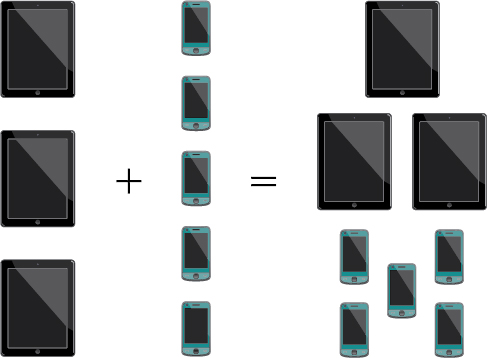
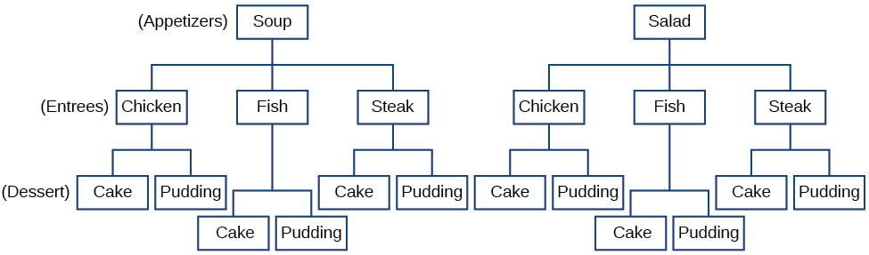
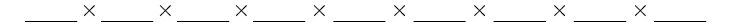

In this section, you will:
* Solve counting problems using the Addition Principle.
* Solve counting problems using the Multiplication Principle.
* Solve counting problems using permutations involving n distinct objects.
* Solve counting problems using combinations.
* Find the number of subsets of a given set.
* Solve counting problems using permutations involving n non-distinct objects.

A new company sells customizable cases for tablets and smartphones. Each case comes in a variety of colors and can be personalized for an additional fee with images or a monogram. A customer can choose not to personalize or could choose to have one, two, or three images or a monogram. The customer can choose the order of the images and the letters in the monogram. The company is working with an agency to develop a marketing campaign with a focus on the huge number of options they offer. Counting the possibilities is challenging!

We encounter a wide variety of counting problems every day. There is a branch of mathematics devoted to the study of counting problems such as this one. Other applications of counting include secure passwords, horse racing outcomes, and college scheduling choices. We will examine this type of mathematics in this section.

### Using the Addition Principle

The company that sells customizable cases offers cases for tablets and smartphones. There are 3 supported tablet models and 5 supported smartphone models. The **Addition Principle** tells us that we can add the number of tablet options to the number of smartphone options to find the total number of options. By the Addition Principle, there are 8 total options, as we can see in [\[link\]](#CNX_Precalc_Figure_11_05_001).

 {: #CNX_Precalc_Figure_11_05_001}

The Addition Principle

According to the **Addition Principle**{: data-type="term"}, if one event can occur in <math xmlns="http://www.w3.org/1998/Math/MathML"> <mrow> <mi>m</mi> </mrow> </math>

 ways and a second event with no common outcomes can occur in <math xmlns="http://www.w3.org/1998/Math/MathML"> <mrow> <mi>n</mi> </mrow> </math>

 ways, then the first *or* second event can occur in <math xmlns="http://www.w3.org/1998/Math/MathML"> <mrow> <mi>m</mi><mo>+</mo><mi>n</mi> </mrow> </math>

 ways.

Using the Addition Principle

There are 2 vegetarian entrée options and 5 meat entrée options on a dinner menu. What is the total number of entrée options?

We can add the number of vegetarian options to the number of meat options to find the total number of entrée options.

There are 7 total options.

A student is shopping for a new computer. He is deciding among 3 desktop computers and 4 laptop computers. What is the total number of computer options?

7

### Using the Multiplication Principle

The **Multiplication Principle** applies when we are making more than one selection. Suppose we are choosing an appetizer, an entrée, and a dessert. If there are 2 appetizer options, 3 entrée options, and 2 dessert options on a fixed-price dinner menu, there are a total of 12 possible choices of one each as shown in the tree diagram in [\[link\]](#CNX_Precalculus_Figure_11_05_003).

 {: #CNX_Precalculus_Figure_11_05_003}

The possible choices are:

1.  soup, chicken, cake
2.  soup, chicken, pudding
3.  soup, fish, cake
4.  soup, fish, pudding
5.  soup, steak, cake
6.  soup, steak, pudding
7.  salad, chicken, cake
8.  salad, chicken, pudding
9.  salad, fish, cake
10. salad, fish, pudding
11. salad, steak, cake
12. salad, steak, pudding We can also find the total number of possible dinners by multiplying.
{: data-number-style="arabic"}

We could also conclude that there are 12 possible dinner choices simply by applying the Multiplication Principle.

<math xmlns="http://www.w3.org/1998/Math/MathML" display="block"> <mrow> <mtable columnalign="left"> <mtr columnalign="left"> <mtd columnalign="left"> <mrow> <mo>#</mo><mtext> of appetizer options </mtext><mo>×</mo> </mrow> </mtd> <mtd columnalign="left"> <mrow> <mo>#</mo><mtext> of entree options </mtext><mo>×</mo> </mrow> </mtd> <mtd columnalign="left"> <mrow> <mo>#</mo><mtext> of dessert options</mtext> </mrow> </mtd> <mtd columnalign="left"> <mrow /> </mtd> </mtr> <mtr columnalign="left"> <mtd columnalign="left"> <mrow> <mtext>               </mtext><mn>2</mn><mtext>                   </mtext><mo>×</mo> </mrow> </mtd> <mtd columnalign="left"> <mrow> <mtext>              </mtext><mn>3</mn><mtext>               </mtext><mo>×</mo> </mrow> </mtd> <mtd columnalign="left"> <mrow> <mtext>               </mtext><mn>2</mn> </mrow> </mtd> <mtd columnalign="left"> <mrow> <mo>=</mo><mn>12</mn> </mrow> </mtd> </mtr> </mtable> </mrow> </math>

The Multiplication Principle

According to the **Multiplication Principle**{: data-type="term"}, if one event can occur in <math xmlns="http://www.w3.org/1998/Math/MathML"> <mi>m</mi> </math>

 ways and a second event can occur in <math xmlns="http://www.w3.org/1998/Math/MathML"> <mi>n</mi> </math>

 ways after the first event has occurred, then the two events can occur in <math xmlns="http://www.w3.org/1998/Math/MathML"> <mrow> <mi>m</mi><mo>×</mo><mi>n</mi> </mrow> </math>

 ways. This is also known as the **Fundamental Counting Principle**{: data-type="term"}.

Using the Multiplication Principle

Diane packed 2 skirts, 4 blouses, and a sweater for her business trip. She will need to choose a skirt and a blouse for each outfit and decide whether to wear the sweater. Use the Multiplication Principle to find the total number of possible outfits.

To find the total number of outfits, find the product of the number of skirt options, the number of blouse options, and the number of sweater options.

There are 16 possible outfits.

A restaurant offers a breakfast special that includes a breakfast sandwich, a side dish, and a beverage. There are 3 types of breakfast sandwiches, 4 side dish options, and 5 beverage choices. Find the total number of possible breakfast specials.

There are 60 possible breakfast specials.

### Finding the Number of Permutations of *n* Distinct Objects

The Multiplication Principle can be used to solve a variety of problem types. One type of problem involves placing objects in order. We arrange letters into words and digits into numbers, line up for photographs, decorate rooms, and more. An ordering of objects is called a **permutation**{: data-type="term"}.

#### Finding the Number of Permutations of *n* Distinct Objects Using the Multiplication Principle

To solve permutation problems, it is often helpful to draw line segments for each option. That enables us to determine the number of each option so we can multiply. For instance, suppose we have four paintings, and we want to find the number of ways we can hang three of the paintings in order on the wall. We can draw three lines to represent the three places on the wall.

    There are four options for the first place, so we write a 4 on the first line.

    After the first place has been filled, there are three options for the second place so we write a 3 on the second line.

    After the second place has been filled, there are two options for the third place so we write a 2 on the third line. Finally, we find the product.

    There are 24 possible permutations of the paintings.

**Given**<math xmlns="http://www.w3.org/1998/Math/MathML"> <mrow> <mtext> </mtext><mi>n</mi><mtext> </mtext> </mrow> </math>

**distinct options, determine how many permutations there are.**

1.  Determine how many options there are for the first situation.
2.  Determine how many options are left for the second situation.
3.  Continue until all of the spots are filled.
4.  Multiply the numbers together.
{: data-number-style="arabic"}

Finding the Number of Permutations Using the Multiplication Principle

At a swimming competition, nine swimmers compete in a race.

1.  How many ways can they place first, second, and third?
2.  How many ways can they place first, second, and third if a swimmer named Ariel wins first place? (Assume there is only one contestant named Ariel.)
3.  How many ways can all nine swimmers line up for a photo?
{: data-number-style="lower-alpha"}

1.  Draw lines for each place.   
    There are 9 options for first place. Once someone has won first place, there are 8 remaining options for second place. Once first and second place have been won, there are 7 remaining options for third place.
    
      
    Multiply to find that there are 504 ways for the swimmers to place.

2.  Draw lines for describing each place.   
    We know Ariel must win first place, so there is only 1 option for first place. There are 8 remaining options for second place, and then 7 remaining options for third place.
    
      
    Multiply to find that there are 56 ways for the swimmers to place if Ariel wins first.

3.  Draw lines for describing each place in the photo.
    
      
    There are 9 choices for the first spot, then 8 for the second, 7 for the third, 6 for the fourth, and so on until only 1 person remains for the last spot.
    
      
    There are 362,880 possible permutations for the swimmers to line up.
{: data-number-style="lower-alpha"}

Analysis

Note that in part c, we found there were 9! ways for 9 people to line up. The number of permutations of<math xmlns="http://www.w3.org/1998/Math/MathML"> <mrow> <mtext> </mtext><mi>n</mi><mtext> </mtext> </mrow> </math>

distinct objects can always be found by<math xmlns="http://www.w3.org/1998/Math/MathML"> <mrow> <mtext> </mtext><mi>n</mi><mo>!</mo><mo>.</mo> </mrow> </math>

A family of five is having portraits taken. Use the Multiplication Principle to find the following.

How many ways can the family line up for the portrait?

120

How many ways can the photographer line up 3 family members?

60

How many ways can the family line up for the portrait if the parents are required to stand on each end?

12

#### Finding the Number of Permutations of *n* Distinct Objects Using a Formula

For some permutation problems, it is inconvenient to use the Multiplication Principle because there are so many numbers to multiply. Fortunately, we can solve these problems using a formula. Before we learn the formula, let’s look at two common notations for permutations. If we have a set of<math xmlns="http://www.w3.org/1998/Math/MathML"> <mrow> <mtext> </mtext><mi>n</mi><mtext> </mtext> </mrow> </math>

objects and we want to choose<math xmlns="http://www.w3.org/1998/Math/MathML"> <mrow> <mtext> </mtext><mi>r</mi><mtext> </mtext> </mrow> </math>

objects from the set in order, we write<math xmlns="http://www.w3.org/1998/Math/MathML"> <mrow> <mtext> </mtext><mi>P</mi><mo stretchy="false">(</mo><mi>n</mi><mo>,</mo><mi>r</mi><mo stretchy="false">)</mo><mo>.</mo><mtext> </mtext> </mrow> </math>

Another way to write this is <math xmlns="http://www.w3.org/1998/Math/MathML"> <mrow> <msub> <mi>n</mi> </msub> <msub> <mi>P</mi> <mi>r</mi> </msub> <mo>,</mo><mtext> </mtext> </mrow> </math>

a notation commonly seen on computers and calculators. To calculate<math xmlns="http://www.w3.org/1998/Math/MathML"> <mrow> <mtext> </mtext><mi>P</mi><mo stretchy="false">(</mo><mi>n</mi><mo>,</mo><mi>r</mi><mo stretchy="false">)</mo><mo>,</mo><mtext> </mtext> </mrow> </math>

we begin by finding<math xmlns="http://www.w3.org/1998/Math/MathML"> <mrow> <mtext> </mtext><mi>n</mi><mo>!</mo><mo>,</mo><mtext> </mtext> </mrow> </math>

the number of ways to line up all <math xmlns="http://www.w3.org/1998/Math/MathML"> <mrow> <mi>n</mi> </mrow> </math>

 objects. We then divide by<math xmlns="http://www.w3.org/1998/Math/MathML"> <mrow> <mtext> </mtext><mrow><mo>(</mo> <mrow> <mi>n</mi><mo>−</mo><mi>r</mi> </mrow> <mo>)</mo></mrow><mo>!</mo><mtext> </mtext> </mrow> </math>

 to cancel out the<math xmlns="http://www.w3.org/1998/Math/MathML"> <mrow> <mtext> </mtext><mrow><mo>(</mo> <mrow> <mi>n</mi><mo>−</mo><mi>r</mi> </mrow> <mo>)</mo></mrow><mtext> </mtext> </mrow> </math>

items that we do not wish to line up.

Let’s see how this works with a simple example. Imagine a club of six people. They need to elect a president, a vice president, and a treasurer. Six people can be elected president, any one of the five remaining people can be elected vice president, and any of the remaining four people could be elected treasurer. The number of ways this may be done is <math xmlns="http://www.w3.org/1998/Math/MathML"> <mrow> <mn>6</mn><mo>×</mo><mn>5</mn><mo>×</mo><mn>4</mn><mo>=</mo><mn>120.</mn> </mrow> </math>

 Using factorials, we get the same result.

<math xmlns="http://www.w3.org/1998/Math/MathML" display="block"> <mrow> <mtext> </mtext><mfrac> <mrow> <mn>6</mn><mo>!</mo> </mrow> <mrow> <mn>3</mn><mo>!</mo> </mrow> </mfrac> <mo>=</mo><mfrac> <mrow> <mn>6</mn><mo>·</mo><mn>5</mn><mo>·</mo><mn>4</mn><mo>·</mo><mn>3</mn><mo>!</mo> </mrow> <mrow> <mn>3</mn><mo>!</mo> </mrow> </mfrac> <mo>=</mo><mn>6</mn><mo>·</mo><mn>5</mn><mo>·</mo><mn>4</mn><mo>=</mo><mn>120</mn><mtext> </mtext> </mrow> </math>

There are 120 ways to select 3 officers in order from a club with 6 members. We refer to this as a permutation of 6 taken 3 at a time. The general formula is as follows.

<math xmlns="http://www.w3.org/1998/Math/MathML" display="block"> <mrow> <mtext> </mtext><mi>P</mi><mo stretchy="false">(</mo><mi>n</mi><mo>,</mo><mi>r</mi><mo stretchy="false">)</mo><mo>=</mo><mfrac> <mrow> <mi>n</mi><mo>!</mo> </mrow> <mrow> <mo stretchy="false">(</mo><mi>n</mi><mo>−</mo><mi>r</mi><mo stretchy="false">)</mo><mo>!</mo> </mrow> </mfrac> <mtext> </mtext> </mrow> </math>

Note that the formula stills works if we are choosing <u>all</u><math xmlns="http://www.w3.org/1998/Math/MathML"> <mrow> <mtext> </mtext><mi>n</mi><mtext> </mtext> </mrow> </math>

objects and placing them in order. In that case we would be dividing by<math xmlns="http://www.w3.org/1998/Math/MathML"> <mrow> <mtext> </mtext><mrow><mo>(</mo> <mrow> <mi>n</mi><mo>−</mo><mi>n</mi> </mrow> <mo>)</mo></mrow><mo>!</mo><mtext> </mtext> </mrow> </math>

or<math xmlns="http://www.w3.org/1998/Math/MathML"> <mrow> <mtext> </mtext><mn>0</mn><mo>!</mo><mo>,</mo><mtext> </mtext> </mrow> </math>

which we said earlier is equal to 1. So the number of permutations of<math xmlns="http://www.w3.org/1998/Math/MathML"> <mrow> <mtext> </mtext><mi>n</mi><mtext> </mtext> </mrow> </math>

objects taken<math xmlns="http://www.w3.org/1998/Math/MathML"> <mrow> <mtext> </mtext><mi>n</mi><mtext> </mtext> </mrow> </math>

at a time is<math xmlns="http://www.w3.org/1998/Math/MathML"> <mrow> <mtext> </mtext><mfrac> <mrow> <mi>n</mi><mo>!</mo> </mrow> <mn>1</mn> </mfrac> <mtext> </mtext> </mrow> </math>

or just<math xmlns="http://www.w3.org/1998/Math/MathML"> <mrow> <mtext> </mtext><mi>n</mi><mo>!</mo><mtext>.</mtext> </mrow> </math>

Formula for Permutations of *n* Distinct Objects

Given<math xmlns="http://www.w3.org/1998/Math/MathML"> <mrow> <mtext> </mtext><mi>n</mi><mtext> </mtext> </mrow> </math>

distinct objects, the number of ways to select<math xmlns="http://www.w3.org/1998/Math/MathML"> <mrow> <mtext> </mtext><mi>r</mi><mtext> </mtext> </mrow> </math>

objects from the set in order is

<math xmlns="http://www.w3.org/1998/Math/MathML" display="block"> <mrow> <mi>P</mi><mo stretchy="false">(</mo><mi>n</mi><mo>,</mo><mi>r</mi><mo stretchy="false">)</mo><mo>=</mo><mfrac> <mrow> <mi>n</mi><mo>!</mo> </mrow> <mrow> <mo stretchy="false">(</mo><mi>n</mi><mo>−</mo><mi>r</mi><mo stretchy="false">)</mo><mo>!</mo> </mrow> </mfrac> </mrow> </math>

**Given a word problem, evaluate the possible permutations.**

1.  Identify
    <math xmlns="http://www.w3.org/1998/Math/MathML"> <mrow> <mtext> </mtext><mi>n</mi><mtext> </mtext> </mrow> </math>
    
    from the given information.
2.  Identify
    <math xmlns="http://www.w3.org/1998/Math/MathML"> <mrow> <mtext> </mtext><mi>r</mi><mtext> </mtext> </mrow> </math>
    
    from the given information.
3.  Replace
    <math xmlns="http://www.w3.org/1998/Math/MathML"> <mrow> <mtext> </mtext><mi>n</mi><mtext> </mtext> </mrow> </math>
    
    and
    <math xmlns="http://www.w3.org/1998/Math/MathML"> <mrow> <mtext> </mtext><mi>r</mi><mtext> </mtext> </mrow> </math>
    
    in the formula with the given values.
4.  Evaluate.
{: data-number-style="arabic"}

Finding the Number of Permutations Using the Formula

A professor is creating an exam of 9 questions from a test bank of 12 questions. How many ways can she select and arrange the questions?

Substitute<math xmlns="http://www.w3.org/1998/Math/MathML"> <mrow> <mtext> </mtext><mi>n</mi><mo>=</mo><mn>12</mn><mtext> </mtext> </mrow> </math>

and<math xmlns="http://www.w3.org/1998/Math/MathML"> <mrow> <mtext> </mtext><mi>r</mi><mo>=</mo><mn>9</mn><mtext> </mtext> </mrow> </math>

into the permutation formula and simplify.

<math xmlns="http://www.w3.org/1998/Math/MathML" display="block"> <mrow> <mtable columnalign="left"> <mtr columnalign="left"> <mtd columnalign="left"> <mrow> <mtext>  </mtext><mi>P</mi><mo stretchy="false">(</mo><mi>n</mi><mo>,</mo><mi>r</mi><mo stretchy="false">)</mo><mo>=</mo><mfrac> <mrow> <mi>n</mi><mo>!</mo> </mrow> <mrow> <mo stretchy="false">(</mo><mi>n</mi><mo>−</mo><mi>r</mi><mo stretchy="false">)</mo><mo>!</mo> </mrow> </mfrac> <mtext> </mtext> </mrow> </mtd> </mtr> <mtr columnalign="left"> <mtd columnalign="left"> <mrow> <mi>P</mi><mo stretchy="false">(</mo><mn>12</mn><mo>,</mo><mn>9</mn><mo stretchy="false">)</mo><mo>=</mo><mfrac> <mrow> <mn>12</mn><mo>!</mo> </mrow> <mrow> <mo stretchy="false">(</mo><mn>12</mn><mo>−</mo><mn>9</mn><mo stretchy="false">)</mo><mo>!</mo> </mrow> </mfrac> <mo>=</mo><mfrac> <mrow> <mn>12</mn><mo>!</mo> </mrow> <mrow> <mn>3</mn><mo>!</mo> </mrow> </mfrac> <mo>=</mo><mn>79</mn><mtext>,</mtext><mn>833</mn><mtext>,</mtext><mn>600</mn> </mrow> </mtd> </mtr> </mtable> </mrow> </math>

There are 79,833,600 possible permutations of exam questions!

Analysis

We can also use a calculator to find permutations. For this problem, we would enter 12, press the<math xmlns="http://www.w3.org/1998/Math/MathML"> <mrow> <msub> <mtext> </mtext> <mi>n</mi> </msub> <msub> <mi>P</mi> <mi>r</mi> </msub> <mtext> </mtext> </mrow> </math>

 function, enter 9, and then press the equal sign. The<math xmlns="http://www.w3.org/1998/Math/MathML"> <mrow> <msub> <mtext> </mtext> <mi>n</mi> </msub> <msub> <mi>P</mi> <mi>r</mi> </msub> <mtext> </mtext> </mrow> </math>

 function may be located under the MATH menu with probability commands.

**Could we have solved [\[link\]](#Example_11_05_04) using the Multiplication Principle?**

*Yes. We could have multiplied*<math xmlns="http://www.w3.org/1998/Math/MathML"> <mrow> <mtext> </mtext><mn>1</mn><mn>5</mn><mo>⋅</mo><mn>1</mn><mn>4</mn><mo>⋅</mo><mn>1</mn><mn>3</mn><mo>⋅</mo><mn>1</mn><mn>2</mn><mo>⋅</mo><mn>1</mn><mn>1</mn><mo>⋅</mo><mn>1</mn><mn>0</mn><mo>⋅</mo><mn>9</mn><mo>⋅</mo><mn>8</mn><mo>⋅</mo><mn>7</mn><mo>⋅</mo><mn>6</mn><mo>⋅</mo><mn>5</mn><mo>⋅</mo><mn>4</mn><mtext> </mtext> </mrow> </math>

*to find the same answer*.

A play has a cast of 7 actors preparing to make their curtain call. Use the permutation formula to find the following.

How many ways can the 7 actors line up?

<math xmlns="http://www.w3.org/1998/Math/MathML"> <mrow> <mtext> </mtext><mi>P</mi><mo stretchy="false">(</mo><mn>7</mn><mo>,</mo><mn>7</mn><mo stretchy="false">)</mo><mo>=</mo><mn>5</mn><mo>,</mo><mn>040</mn><mtext> </mtext> </mrow> </math>

How many ways can 5 of the 7 actors be chosen to line up?

<math xmlns="http://www.w3.org/1998/Math/MathML"> <mrow> <mtext> </mtext><mi>P</mi><mo stretchy="false">(</mo><mn>7</mn><mo>,</mo><mn>5</mn><mo stretchy="false">)</mo><mo>=</mo><mn>2</mn><mo>,</mo><mn>520</mn><mtext> </mtext> </mrow> </math>

### Find the Number of Combinations Using the Formula

So far, we have looked at problems asking us to put objects in order. There are many problems in which we want to select a few objects from a group of objects, but we do not care about the order. When we are selecting objects and the order does not matter, we are dealing with **combinations**{: data-type="term"}. A selection of<math xmlns="http://www.w3.org/1998/Math/MathML"> <mrow> <mtext> </mtext><mi>r</mi><mtext> </mtext> </mrow> </math>

objects from a set of<math xmlns="http://www.w3.org/1998/Math/MathML"> <mrow> <mtext> </mtext><mi>n</mi><mtext> </mtext> </mrow> </math>

objects where the order does not matter can be written as<math xmlns="http://www.w3.org/1998/Math/MathML"> <mrow> <mtext> </mtext><mi>C</mi><mo stretchy="false">(</mo><mi>n</mi><mo>,</mo><mi>r</mi><mo stretchy="false">)</mo><mo>.</mo><mtext> </mtext> </mrow> </math>

Just as with permutations,<math xmlns="http://www.w3.org/1998/Math/MathML"> <mrow> <mtext> </mtext><mtext>C</mtext><mo stretchy="false">(</mo><mi>n</mi><mo>,</mo><mi>r</mi><mo stretchy="false">)</mo><mtext> </mtext> </mrow> </math>

can also be written as<math xmlns="http://www.w3.org/1998/Math/MathML"> <mrow> <msub> <mtext> </mtext> <mi>n</mi> </msub> <msub> <mi>C</mi> <mi>r</mi> </msub> <mo>.</mo><mtext> </mtext> </mrow> </math>

In this case, the general formula is as follows.

<math xmlns="http://www.w3.org/1998/Math/MathML" display="block"> <mrow> <mtext> </mtext><mtext>C</mtext><mo stretchy="false">(</mo><mi>n</mi><mo>,</mo><mi>r</mi><mo stretchy="false">)</mo><mo>=</mo><mfrac> <mrow> <mi>n</mi><mo>!</mo> </mrow> <mrow> <mi>r</mi><mo>!</mo><mo stretchy="false">(</mo><mi>n</mi><mo>−</mo><mi>r</mi><mo stretchy="false">)</mo><mo>!</mo> </mrow> </mfrac> <mtext> </mtext> </mrow> </math>

An earlier problem considered choosing 3 of 4 possible paintings to hang on a wall. We found that there were 24 ways to select 3 of the 4 paintings in order. But what if we did not care about the order? We would expect a smaller number because selecting paintings 1, 2, 3 would be the same as selecting paintings 2, 3, 1. To find the number of ways to select 3 of the 4 paintings, disregarding the order of the paintings, divide the number of permutations by the number of ways to order 3 paintings. There are <math xmlns="http://www.w3.org/1998/Math/MathML"> <mrow> <mn>3</mn><mo>!</mo><mo>=</mo><mn>3</mn><mo>·</mo><mn>2</mn><mo>·</mo><mn>1</mn><mo>=</mo><mn>6</mn> </mrow> </math>

 ways to order 3 paintings. There are <math xmlns="http://www.w3.org/1998/Math/MathML"> <mrow> <mfrac> <mrow> <mn>24</mn> </mrow> <mn>6</mn> </mfrac> <mo>,</mo><mtext> </mtext> </mrow> </math>

or 4 ways to select 3 of the 4 paintings. This number makes sense because every time we are selecting 3 paintings, we are *not* selecting 1 painting. There are 4 paintings we could choose *not* to select, so there are 4 ways to select 3 of the 4 paintings.

Formula for Combinations of *n* Distinct Objects

Given<math xmlns="http://www.w3.org/1998/Math/MathML"> <mrow> <mtext> </mtext><mi>n</mi><mtext> </mtext> </mrow> </math>

distinct objects, the number of ways to select<math xmlns="http://www.w3.org/1998/Math/MathML"> <mrow> <mtext> </mtext><mi>r</mi><mtext> </mtext> </mrow> </math>

objects from the set is

<math xmlns="http://www.w3.org/1998/Math/MathML" display="block"> <mrow> <mtext> </mtext><mtext>C</mtext><mo stretchy="false">(</mo><mi>n</mi><mo>,</mo><mi>r</mi><mo stretchy="false">)</mo><mo>=</mo><mfrac> <mrow> <mi>n</mi><mo>!</mo> </mrow> <mrow> <mi>r</mi><mo>!</mo><mo stretchy="false">(</mo><mi>n</mi><mo>−</mo><mi>r</mi><mo stretchy="false">)</mo><mo>!</mo> </mrow> </mfrac> <mtext> </mtext> </mrow> </math>

**Given a number of options, determine the possible number of combinations.**

1.  Identify
    <math xmlns="http://www.w3.org/1998/Math/MathML"> <mrow> <mtext> </mtext><mi>n</mi><mtext> </mtext> </mrow> </math>
    
    from the given information.
2.  Identify
    <math xmlns="http://www.w3.org/1998/Math/MathML"> <mrow> <mtext> </mtext><mi>r</mi><mtext> </mtext> </mrow> </math>
    
    from the given information.
3.  Replace
    <math xmlns="http://www.w3.org/1998/Math/MathML"> <mrow> <mtext> </mtext><mi>n</mi><mtext> </mtext> </mrow> </math>
    
    and
    <math xmlns="http://www.w3.org/1998/Math/MathML"> <mrow> <mtext> </mtext><mi>r</mi><mtext> </mtext> </mrow> </math>
    
    in the formula with the given values.
4.  Evaluate.
{: data-number-style="arabic"}

Finding the Number of Combinations Using the Formula

A fast food restaurant offers five side dish options. Your meal comes with two side dishes.

1.  How many ways can you select your side dishes?
2.  How many ways can you select 3 side dishes?
{: data-number-style="lower-alpha"}

1.  We want to choose 2 side dishes from 5 options.
    

    <math xmlns="http://www.w3.org/1998/Math/MathML" display="block"> <mrow> <mtext> </mtext><mtext>C</mtext><mo stretchy="false">(</mo><mn>5</mn><mo>,</mo><mn>2</mn><mo stretchy="false">)</mo><mo>=</mo><mfrac> <mrow> <mn>5</mn><mo>!</mo> </mrow> <mrow> <mn>2</mn><mo>!</mo><mo stretchy="false">(</mo><mn>5</mn><mo>−</mo><mn>2</mn><mo stretchy="false">)</mo><mo>!</mo> </mrow> </mfrac> <mo>=</mo><mn>10</mn><mtext> </mtext> </mrow> </math>
    

2.  We want to choose 3 side dishes from 5 options.
    

    <math xmlns="http://www.w3.org/1998/Math/MathML" display="block"> <mrow> <mtext> </mtext><mtext>C</mtext><mo stretchy="false">(</mo><mn>5</mn><mo>,</mo><mn>3</mn><mo stretchy="false">)</mo><mo>=</mo><mfrac> <mrow> <mn>5</mn><mo>!</mo> </mrow> <mrow> <mn>3</mn><mo>!</mo><mo stretchy="false">(</mo><mn>5</mn><mo>−</mo><mn>3</mn><mo stretchy="false">)</mo><mo>!</mo> </mrow> </mfrac> <mo>=</mo><mn>10</mn><mtext> </mtext> </mrow> </math>
    

{: data-number-style="lower-alpha"}

Analysis

We can also use a graphing calculator to find combinations. Enter 5, then press<math xmlns="http://www.w3.org/1998/Math/MathML"> <mrow> <msub> <mtext> </mtext> <mi>n</mi> </msub> <msub> <mi>C</mi> <mi>r</mi> </msub> <mo>,</mo><mtext> </mtext> </mrow> </math>

enter 3, and then press the equal sign. The<math xmlns="http://www.w3.org/1998/Math/MathML"> <mrow> <msub> <mtext> </mtext> <mi>n</mi> </msub> <msub> <mi>C</mi> <mi>r</mi> </msub> <mo>,</mo><mtext> </mtext> </mrow> </math>

function may be located under the MATH menu with probability commands.

**Is it a coincidence that parts (a) and (b) in [\[link\]](#Example_11_05_05) have the same answers?**

<em>No. When we choose r objects from n objects, we are <strong>not</strong> choosing<math xmlns="http://www.w3.org/1998/Math/MathML">
 <mrow>
  <mtext> </mtext><mo stretchy="false">(</mo><mi>n</mi><mo>–</mo><mi>r</mi><mo stretchy="false">)</mo><mtext> </mtext>
 </mrow>
</math>objects. Therefore,<math xmlns="http://www.w3.org/1998/Math/MathML">
 <mrow>
  <mtext> </mtext><mi>C</mi><mo stretchy="false">(</mo><mi>n</mi><mo>,</mo><mi>r</mi><mo stretchy="false">)</mo><mo>=</mo><mi>C</mi><mo stretchy="false">(</mo><mi>n</mi><mo>,</mo><mi>n</mi><mo>–</mo><mi>r</mi><mo stretchy="false">)</mo><mo>.</mo><mtext> </mtext>
 </mrow>
</math></em>

An ice cream shop offers 10 flavors of ice cream. How many ways are there to choose 3 flavors for a banana split?

<math xmlns="http://www.w3.org/1998/Math/MathML"> <mrow> <mtext> </mtext><mi>C</mi><mo stretchy="false">(</mo><mn>10</mn><mo>,</mo><mn>3</mn><mo stretchy="false">)</mo><mo>=</mo><mn>120</mn><mtext> </mtext> </mrow> </math>

### Finding the Number of Subsets of a Set

We have looked only at combination problems in which we chose exactly <math xmlns="http://www.w3.org/1998/Math/MathML"> <mrow> <mi>r</mi> </mrow> </math>

 objects. In some problems, we want to consider choosing every possible number of objects. Consider, for example, a pizza restaurant that offers 5 toppings. Any number of toppings can be ordered. How many different pizzas are possible?

To answer this question, we need to consider pizzas with any number of toppings. There is <math xmlns="http://www.w3.org/1998/Math/MathML"> <mrow> <mi>C</mi><mo stretchy="false">(</mo><mn>5</mn><mo>,</mo><mn>0</mn><mo stretchy="false">)</mo><mo>=</mo><mn>1</mn> </mrow> </math>

 way to order a pizza with no toppings. There are <math xmlns="http://www.w3.org/1998/Math/MathML"> <mrow> <mi>C</mi><mo stretchy="false">(</mo><mn>5</mn><mo>,</mo><mn>1</mn><mo stretchy="false">)</mo><mo>=</mo><mn>5</mn> </mrow> </math>

 ways to order a pizza with exactly one topping. If we continue this process, we get

<math xmlns="http://www.w3.org/1998/Math/MathML"> <mrow> <mtext> </mtext><mi>C</mi><mo stretchy="false">(</mo><mn>5</mn><mo>,</mo><mn>0</mn><mo stretchy="false">)</mo><mo>+</mo><mi>C</mi><mo stretchy="false">(</mo><mn>5</mn><mo>,</mo><mn>1</mn><mo stretchy="false">)</mo><mo>+</mo><mi>C</mi><mo stretchy="false">(</mo><mn>5</mn><mo>,</mo><mn>2</mn><mo stretchy="false">)</mo><mo>+</mo><mi>C</mi><mo stretchy="false">(</mo><mn>5</mn><mo>,</mo><mn>3</mn><mo stretchy="false">)</mo><mo>+</mo><mi>C</mi><mo stretchy="false">(</mo><mn>5</mn><mo>,</mo><mn>4</mn><mo stretchy="false">)</mo><mo>+</mo><mi>C</mi><mo stretchy="false">(</mo><mn>5</mn><mo>,</mo><mn>5</mn><mo stretchy="false">)</mo><mo>=</mo><mn>32</mn><mtext> </mtext> </mrow> </math>

There are 32 possible pizzas. This result is equal to<math xmlns="http://www.w3.org/1998/Math/MathML"> <mrow> <mtext> </mtext><msup> <mn>2</mn> <mn>5</mn> </msup> <mo>.</mo><mtext> </mtext> </mrow> </math>

We are presented with a sequence of choices. For each of the <math xmlns="http://www.w3.org/1998/Math/MathML"> <mrow> <mi>n</mi> </mrow> </math>

 objects we have two choices: include it in the subset or not. So for the whole subset we have made <math xmlns="http://www.w3.org/1998/Math/MathML"> <mrow> <mi>n</mi><mtext> </mtext> </mrow> </math>

 choices, each with two options. So there are a total of <math xmlns="http://www.w3.org/1998/Math/MathML"> <mrow> <mn>2</mn><mo>·</mo><mn>2</mn><mo>·</mo><mn>2</mn><mo>·</mo><mo>…</mo><mo>·</mo><mn>2</mn> </mrow> </math>

 possible resulting subsets, all the way from the empty subset, which we obtain when we say “no” each time, to the original set itself, which we obtain when we say “yes” each time.

Formula for the Number of Subsets of a Set

A set containing *n* distinct objects has <math xmlns="http://www.w3.org/1998/Math/MathML"> <mrow> <msup> <mn>2</mn> <mi>n</mi> </msup> </mrow> </math>

 subsets.

Finding the Number of Subsets of a Set

A restaurant offers butter, cheese, chives, and sour cream as toppings for a baked potato. How many different ways are there to order a potato?

We are looking for the number of subsets of a set with 4 objects. Substitute <math xmlns="http://www.w3.org/1998/Math/MathML"> <mrow> <mi>n</mi><mo>=</mo><mn>4</mn> </mrow> </math>

 into the formula.

<math xmlns="http://www.w3.org/1998/Math/MathML" display="block"> <mrow> <mtext> </mtext><mtable columnalign="left"> <mtr columnalign="left"> <mtd columnalign="left"> <mrow> <msup> <mn>2</mn> <mi>n</mi> </msup> <mo>=</mo><msup> <mn>2</mn> <mn>4</mn> </msup> </mrow> </mtd> </mtr> <mtr columnalign="left"> <mtd columnalign="left"> <mrow> <mtext>    </mtext><mo>=</mo><mn>16</mn> </mrow> </mtd> </mtr> </mtable><mtext> </mtext> </mrow> </math>

There are 16 possible ways to order a potato.

A sundae bar at a wedding has 6 toppings to choose from. Any number of toppings can be chosen. How many different sundaes are possible?

64 sundaes

### Finding the Number of Permutations of *n* Non-Distinct Objects

We have studied permutations where all of the objects involved were distinct. What happens if some of the objects are indistinguishable? For example, suppose there is a sheet of 12 stickers. If all of the stickers were distinct, there would be <math xmlns="http://www.w3.org/1998/Math/MathML"><mrow><mn>12</mn><mo>!</mo></mrow></math>

 ways to order the stickers. However, 4 of the stickers are identical stars, and 3 are identical moons. Because all of the objects are not distinct, many of the <math xmlns="http://www.w3.org/1998/Math/MathML"> <mrow> <mn>12</mn><mo>!</mo> </mrow> </math>

 permutations we counted are duplicates. The general formula for this situation is as follows.

<math xmlns="http://www.w3.org/1998/Math/MathML" display="block"> <mrow> <mtext> </mtext><mfrac> <mrow> <mi>n</mi><mo>!</mo> </mrow> <mrow> <msub> <mi>r</mi> <mn>1</mn> </msub> <mo>!</mo><msub> <mi>r</mi> <mn>2</mn> </msub> <mo>!</mo><mo>…</mo><msub> <mi>r</mi> <mi>k</mi> </msub> <mo>!</mo> </mrow> </mfrac> <mtext> </mtext> </mrow> </math>

In this example, we need to divide by the number of ways to order the 4 stars and the ways to order the 3 moons to find the number of unique permutations of the stickers. There are <math xmlns="http://www.w3.org/1998/Math/MathML"> <mrow> <mn>4</mn><mo>!</mo> </mrow> </math>

 ways to order the stars and <math xmlns="http://www.w3.org/1998/Math/MathML"> <mrow> <mn>3</mn><mo>!</mo> </mrow> </math>

 ways to order the moon.

<math xmlns="http://www.w3.org/1998/Math/MathML" display="block"> <mrow> <mtext> </mtext><mfrac> <mrow> <mn>12</mn><mo>!</mo> </mrow> <mrow> <mn>4</mn><mo>!</mo><mn>3</mn><mo>!</mo> </mrow> </mfrac> <mo>=</mo><mn>3</mn><mtext>,</mtext><mn>326</mn><mtext>,</mtext><mn>400</mn><mtext> </mtext> </mrow> </math>

There are 3,326,400 ways to order the sheet of stickers.

Formula for Finding the Number of Permutations of *n* Non-Distinct Objects

If there are <math xmlns="http://www.w3.org/1998/Math/MathML"> <mrow> <mi>n</mi> </mrow> </math>

 elements in a set and <math xmlns="http://www.w3.org/1998/Math/MathML"> <mrow> <msub> <mi>r</mi> <mn>1</mn> </msub> <mtext> </mtext> </mrow> </math>

are alike,<math xmlns="http://www.w3.org/1998/Math/MathML"> <mrow> <mtext> </mtext><msub> <mi>r</mi> <mn>2</mn> </msub> <mtext> </mtext> </mrow> </math>

are alike, <math xmlns="http://www.w3.org/1998/Math/MathML"> <mrow> <msub> <mi>r</mi> <mn>3</mn> </msub> <mtext> </mtext> </mrow> </math>

are alike, and so on through <math xmlns="http://www.w3.org/1998/Math/MathML"> <mrow> <msub> <mi>r</mi> <mi>k</mi> </msub> <mo>,</mo><mtext> </mtext> </mrow> </math>

the number of permutations can be found by

<math xmlns="http://www.w3.org/1998/Math/MathML" display="block"> <mrow> <mtext> </mtext><mfrac> <mrow> <mi>n</mi><mo>!</mo> </mrow> <mrow> <msub> <mi>r</mi> <mn>1</mn> </msub> <mo>!</mo><msub> <mi>r</mi> <mn>2</mn> </msub> <mo>!</mo><mo>…</mo><msub> <mi>r</mi> <mi>k</mi> </msub> <mo>!</mo> </mrow> </mfrac> <mtext> </mtext> </mrow> </math>

Finding the Number of Permutations of *n* Non-Distinct Objects

Find the number of rearrangements of the letters in the word DISTINCT.

There are 8 letters. Both I and T are repeated 2 times. Substitute<math xmlns="http://www.w3.org/1998/Math/MathML"> <mrow> <mtext> </mtext><mi>n</mi><mo>=</mo><mn>8</mn><mo>,</mo><mo> </mo><msub> <mi>r</mi> <mn>1</mn> </msub> <mo>=</mo><mn>2</mn><mo>,</mo><mo> </mo><mtext> </mtext> </mrow> </math>

and<math xmlns="http://www.w3.org/1998/Math/MathML"> <mrow> <mtext> </mtext><mo> </mo><msub> <mi>r</mi> <mn>2</mn> </msub> <mo>=</mo><mn>2</mn><mo> </mo><mtext> </mtext> </mrow> </math>

into the formula.

<math xmlns="http://www.w3.org/1998/Math/MathML"> <mrow> <mtext> </mtext><mfrac> <mrow> <mn>8</mn><mo>!</mo> </mrow> <mrow> <mn>2</mn><mo>!</mo><mn>2</mn><mo>!</mo> </mrow> </mfrac> <mo>=</mo><mn>10</mn><mtext>,</mtext><mn>080</mn><mo> </mo><mtext> </mtext> </mrow> </math>

There are 10,080 arrangements.

Find the number of rearrangements of the letters in the word CARRIER.

840

Access these online resources for additional instruction and practice with combinations and permutations.

* [Combinations][1]
* [Permutations][2]

### Key Equations

| number of permutations of<math xmlns="http://www.w3.org/1998/Math/MathML"> <mrow> <mtext> </mtext><mi>n</mi><mtext> </mtext> </mrow> </math>

distinct objects taken<math xmlns="http://www.w3.org/1998/Math/MathML"> <mrow> <mtext> </mtext><mi>r</mi><mtext> </mtext> </mrow> </math>

at a time | <math xmlns="http://www.w3.org/1998/Math/MathML" display="block"> <mrow> <mi>P</mi><mo stretchy="false">(</mo><mi>n</mi><mo>,</mo><mi>r</mi><mo stretchy="false">)</mo><mo>=</mo><mfrac> <mrow> <mi>n</mi><mo>!</mo> </mrow> <mrow> <mo stretchy="false">(</mo><mi>n</mi><mo>−</mo><mi>r</mi><mo stretchy="false">)</mo><mo>!</mo> </mrow> </mfrac> </mrow> </math>

 |
| number of combinations of<math xmlns="http://www.w3.org/1998/Math/MathML"> <mrow> <mtext> </mtext><mi>n</mi><mtext> </mtext> </mrow> </math>

distinct objects taken<math xmlns="http://www.w3.org/1998/Math/MathML"> <mrow> <mtext> </mtext><mi>r</mi><mtext> </mtext> </mrow> </math>

at a time | <math xmlns="http://www.w3.org/1998/Math/MathML" display="block"> <mrow> <mi>C</mi><mo stretchy="false">(</mo><mi>n</mi><mo>,</mo><mi>r</mi><mo stretchy="false">)</mo><mo>=</mo><mfrac> <mrow> <mi>n</mi><mo>!</mo> </mrow> <mrow> <mi>r</mi><mo>!</mo><mo stretchy="false">(</mo><mi>n</mi><mo>−</mo><mi>r</mi><mo stretchy="false">)</mo><mo>!</mo> </mrow> </mfrac> </mrow> </math>

 |
| number of permutations of<math xmlns="http://www.w3.org/1998/Math/MathML"> <mrow> <mtext> </mtext><mi>n</mi><mtext> </mtext> </mrow> </math>

non-distinct objects | <math xmlns="http://www.w3.org/1998/Math/MathML" display="block"> <mrow> <mfrac> <mrow> <mi>n</mi><mo>!</mo> </mrow> <mrow> <msub> <mi>r</mi> <mn>1</mn> </msub> <mo>!</mo><msub> <mi>r</mi> <mn>2</mn> </msub> <mo>!</mo><mo>…</mo><msub> <mi>r</mi> <mi>k</mi> </msub> <mo>!</mo> </mrow> </mfrac> </mrow> </math>

 |
{: #eip-id1165135178140 summary=".."}

### Key Concepts

* If one event can occur in
  <math xmlns="http://www.w3.org/1998/Math/MathML"> <mrow> <mi>m</mi> </mrow> </math>
  
  ways and a second event with no common outcomes can occur in
  <math xmlns="http://www.w3.org/1998/Math/MathML"> <mrow> <mi>n</mi> </mrow> </math>
  
  ways, then the first or second event can occur in
  <math xmlns="http://www.w3.org/1998/Math/MathML"> <mrow> <mi>m</mi><mo>+</mo><mi>n</mi> </mrow> </math>
  
  ways. See [\[link\]](#Example_11_05_01).
* If one event can occur in
  <math xmlns="http://www.w3.org/1998/Math/MathML"> <mrow> <mi>m</mi> </mrow> </math>
  
  ways and a second event can occur in
  <math xmlns="http://www.w3.org/1998/Math/MathML"> <mrow> <mi>n</mi> </mrow> </math>
  
  ways after the first event has occurred, then the two events can occur in
  <math xmlns="http://www.w3.org/1998/Math/MathML"> <mrow> <mi>m</mi><mo>×</mo><mi>n</mi> </mrow> </math>
  
  ways. See [\[link\]](#Example_11_05_02).
* A permutation is an ordering of
  <math xmlns="http://www.w3.org/1998/Math/MathML"> <mrow> <mi>n</mi> </mrow> </math>
  
  objects.
* If we have a set of
  <math xmlns="http://www.w3.org/1998/Math/MathML"> <mrow> <mi>n</mi> </mrow> </math>
  
  objects and we want to choose
  <math xmlns="http://www.w3.org/1998/Math/MathML"> <mrow> <mi>r</mi> </mrow> </math>
  
  objects from the set in order, we write
  <math xmlns="http://www.w3.org/1998/Math/MathML"> <mrow> <mi>P</mi><mo stretchy="false">(</mo><mi>n</mi><mo>,</mo><mi>r</mi><mo stretchy="false">)</mo><mo>.</mo> </mrow> </math>

* Permutation problems can be solved using the Multiplication Principle or the formula for
  <math xmlns="http://www.w3.org/1998/Math/MathML"> <mrow> <mi>P</mi><mo stretchy="false">(</mo><mi>n</mi><mo>,</mo><mi>r</mi><mo stretchy="false">)</mo><mo>.</mo> </mrow> </math>
  
  See [\[link\]](#Example_11_05_03) and [\[link\]](#Example_11_05_04).
* A selection of objects where the order does not matter is a combination.
* Given
  <math xmlns="http://www.w3.org/1998/Math/MathML"> <mrow> <mi>n</mi> </mrow> </math>
  
  distinct objects, the number of ways to select
  <math xmlns="http://www.w3.org/1998/Math/MathML"> <mrow> <mi>r</mi> </mrow> </math>
  
  objects from the set is
  <math xmlns="http://www.w3.org/1998/Math/MathML"> <mrow> <mtext>C</mtext><mo stretchy="false">(</mo><mi>n</mi><mo>,</mo><mi>r</mi><mo stretchy="false">)</mo> </mrow> </math>
  
  and can be found using a formula. See [\[link\]](#Example_11_05_05).
* A set containing
  <math xmlns="http://www.w3.org/1998/Math/MathML"> <mrow> <mi>n</mi> </mrow> </math>
  
  distinct objects has
  <math xmlns="http://www.w3.org/1998/Math/MathML"> <mrow> <msup> <mn>2</mn> <mi>n</mi> </msup> </mrow> </math>
  
  subsets. See [\[link\]](#Example_11_05_06).
* For counting problems involving non-distinct objects, we need to divide to avoid counting duplicate permutations. See [\[link\]](#Example_11_05_07).

### Section Exercises

#### Verbal

For the following exercises, assume that there are <math xmlns="http://www.w3.org/1998/Math/MathML"> <mrow> <mi>n</mi> </mrow> </math>

 ways an event <math xmlns="http://www.w3.org/1998/Math/MathML"> <mrow> <mi>A</mi> </mrow> </math>

 can happen, <math xmlns="http://www.w3.org/1998/Math/MathML"> <mrow> <mi>m</mi> </mrow> </math>

 ways an event <math xmlns="http://www.w3.org/1998/Math/MathML"> <mrow> <mi>B</mi> </mrow> </math>

 can happen, and that <math xmlns="http://www.w3.org/1998/Math/MathML"> <mrow> <mi>A</mi><mtext> and </mtext><mi>B</mi> </mrow> </math>

 are non-overlapping.

Use the Addition Principle of counting to explain how many ways event <math xmlns="http://www.w3.org/1998/Math/MathML"> <mrow> <mi>A</mi><mtext> or </mtext><mi>B</mi> </mrow> </math>

 can occur.

There are<math xmlns="http://www.w3.org/1998/Math/MathML"> <mrow> <mtext> </mtext><mi>m</mi><mo>+</mo><mi>n</mi><mtext> </mtext> </mrow> </math>

ways for either event<math xmlns="http://www.w3.org/1998/Math/MathML"> <mrow> <mtext> </mtext><mi>A</mi><mtext> </mtext> </mrow> </math>

or event<math xmlns="http://www.w3.org/1998/Math/MathML"> <mrow> <mtext> </mtext><mi>B</mi><mtext> </mtext> </mrow> </math>

to occur.

Use the Multiplication Principle of counting to explain how many ways event<math xmlns="http://www.w3.org/1998/Math/MathML"> <mrow> <mtext> </mtext><mi>A</mi><mtext> and </mtext><mi>B</mi><mtext> </mtext> </mrow> </math>

can occur.

Answer the following questions.

When given two separate events, how do we know whether to apply the Addition Principle or the Multiplication Principle when calculating possible outcomes? What conjunctions may help to determine which operations to use?

The addition principle is applied when determining the total possible of outcomes of either event occurring. The multiplication principle is applied when determining the total possible outcomes of both events occurring. The word “or” usually implies an addition problem. The word “and” usually implies a multiplication problem.

Describe how the permutation of<math xmlns="http://www.w3.org/1998/Math/MathML"> <mrow> <mi>n</mi> </mrow> </math>

 objects differs from the permutation of choosing <math xmlns="http://www.w3.org/1998/Math/MathML"> <mrow> <mi>r</mi> </mrow> </math>

 objects from a set of <math xmlns="http://www.w3.org/1998/Math/MathML"> <mrow> <mi>n</mi> </mrow> </math>

 objects. Include how each is calculated.

What is the term for the arrangement that selects <math xmlns="http://www.w3.org/1998/Math/MathML"> <mrow> <mi>r</mi> </mrow> </math>

 objects from a set of <math xmlns="http://www.w3.org/1998/Math/MathML"> <mrow> <mi>n</mi> </mrow> </math>

 objects when the order of the <math xmlns="http://www.w3.org/1998/Math/MathML"> <mrow> <mi>r</mi> </mrow> </math>

 objects is not important? What is the formula for calculating the number of possible outcomes for this type of arrangement?

A combination;<math xmlns="http://www.w3.org/1998/Math/MathML"> <mrow> <mtext> </mtext><mi>C</mi><mo stretchy="false">(</mo><mi>n</mi><mo>,</mo><mi>r</mi><mo stretchy="false">)</mo><mo>=</mo><mfrac> <mrow> <mi>n</mi><mo>!</mo> </mrow> <mrow> <mo stretchy="false">(</mo><mi>n</mi><mo>−</mo><mi>r</mi><mo stretchy="false">)</mo><mo>!</mo><mi>r</mi><mo>!</mo> </mrow> </mfrac> <mtext> </mtext> </mrow> </math>

#### Numeric

For the following exercises, determine whether to use the Addition Principle or the Multiplication Principle. Then perform the calculations.

Let the set <math xmlns="http://www.w3.org/1998/Math/MathML"> <mrow> <mi>A</mi><mo>=</mo><mo>{</mo><mo>−</mo><mn>5</mn><mo>,</mo><mo>−</mo><mn>3</mn><mo>,</mo><mo>−</mo><mn>1</mn><mo>,</mo><mn>2</mn><mo>,</mo><mn>3</mn><mo>,</mo><mn>4</mn><mo>,</mo><mn>5</mn><mo>,</mo><mn>6</mn><mo>}</mo><mo>.</mo> </mrow> </math>

 How many ways are there to choose a negative or an even number from <math xmlns="http://www.w3.org/1998/Math/MathML"> <mrow> <mi>A?</mi> </mrow> </math>

Let the set <math xmlns="http://www.w3.org/1998/Math/MathML"> <mrow> <mi>B</mi><mo>=</mo><mo>{</mo><mo>−</mo><mn>23</mn><mo>,</mo><mo>−</mo><mn>16</mn><mo>,</mo><mo>−</mo><mn>7</mn><mo>,</mo><mo>−</mo><mn>2</mn><mo>,</mo><mn>20</mn><mo>,</mo><mn>36</mn><mo>,</mo><mn>48</mn><mo>,</mo><mn>72</mn><mo>}</mo><mo>.</mo> </mrow> </math>

 How many ways are there to choose a positive or an odd number from <math xmlns="http://www.w3.org/1998/Math/MathML"> <mrow> <mi>A</mi><mo>?</mo> </mrow> </math>

<math xmlns="http://www.w3.org/1998/Math/MathML"> <mrow> <mtext> </mtext><mn>4</mn><mo>+</mo><mn>2</mn><mo>=</mo><mn>6</mn><mtext> </mtext> </mrow> </math>

How many ways are there to pick a red ace or a club from a standard card playing deck?

How many ways are there to pick a paint color from 5 shades of green, 4 shades of blue, or 7 shades of yellow?

<math xmlns="http://www.w3.org/1998/Math/MathML"> <mrow> <mtext> </mtext><mn>5</mn><mo>+</mo><mn>4</mn><mo>+</mo><mn>7</mn><mo>=</mo><mn>16</mn><mtext> </mtext> </mrow> </math>

How many outcomes are possible from tossing a pair of coins?

How many outcomes are possible from tossing a coin and rolling a 6-sided die?

<math xmlns="http://www.w3.org/1998/Math/MathML"> <mrow> <mtext> </mtext><mn>2</mn><mo>×</mo><mn>6</mn><mo>=</mo><mn>12</mn><mtext> </mtext> </mrow> </math>

How many two-letter strings—the first letter from<math xmlns="http://www.w3.org/1998/Math/MathML"> <mrow> <mtext> </mtext><mi>A</mi><mtext> </mtext> </mrow> </math>

and the second letter from<math xmlns="http://www.w3.org/1998/Math/MathML"> <mrow> <mtext> </mtext><mi>B</mi><mo>—</mo> </mrow> </math>

can be formed from the sets<math xmlns="http://www.w3.org/1998/Math/MathML"> <mrow> <mtext> </mtext><mi>A</mi><mo>=</mo><mo>{</mo><mi>b</mi><mo>,</mo><mi>c</mi><mo>,</mo><mi>d</mi><mo>}</mo><mtext> </mtext> </mrow> </math>

and<math xmlns="http://www.w3.org/1998/Math/MathML"> <mrow> <mtext> </mtext><mi>B</mi><mo>=</mo><mo>{</mo><mi>a</mi><mo>,</mo><mi>e</mi><mo>,</mo><mi>i</mi><mo>,</mo><mi>o</mi><mo>,</mo><mi>u</mi><mo>}</mo><mo>?</mo><mtext> </mtext> </mrow> </math>

How many ways are there to construct a string of 3 digits if numbers can be repeated?

<math xmlns="http://www.w3.org/1998/Math/MathML"> <mrow> <mtext> </mtext><msup> <mrow> <mn>10</mn> </mrow> <mn>3</mn> </msup> <mo>=</mo><mn>1000</mn><mtext> </mtext> </mrow> </math>

How many ways are there to construct a string of 3 digits if numbers cannot be repeated?

For the following exercises, compute the value of the expression.

<math xmlns="http://www.w3.org/1998/Math/MathML"> <mrow> <mtext> </mtext><mi>P</mi><mo stretchy="false">(</mo><mn>5</mn><mo>,</mo><mn>2</mn><mo stretchy="false">)</mo><mtext> </mtext> </mrow> </math>

<math xmlns="http://www.w3.org/1998/Math/MathML"> <mrow> <mtext> </mtext><mi>P</mi><mo stretchy="false">(</mo><mn>5</mn><mo>,</mo><mn>2</mn><mo stretchy="false">)</mo><mo>=</mo><mn>20</mn><mtext> </mtext> </mrow> </math>

<math xmlns="http://www.w3.org/1998/Math/MathML"> <mrow> <mtext> </mtext><mi>P</mi><mo stretchy="false">(</mo><mn>8</mn><mo>,</mo><mn>4</mn><mo stretchy="false">)</mo><mtext> </mtext> </mrow> </math>

<math xmlns="http://www.w3.org/1998/Math/MathML"> <mrow> <mtext> </mtext><mi>P</mi><mo stretchy="false">(</mo><mn>3</mn><mo>,</mo><mn>3</mn><mo stretchy="false">)</mo><mtext> </mtext> </mrow> </math>

<math xmlns="http://www.w3.org/1998/Math/MathML"> <mrow> <mtext> </mtext><mi>P</mi><mo stretchy="false">(</mo><mn>3</mn><mo>,</mo><mn>3</mn><mo stretchy="false">)</mo><mo>=</mo><mn>6</mn><mtext> </mtext> </mrow> </math>

<math xmlns="http://www.w3.org/1998/Math/MathML"> <mrow> <mtext> </mtext><mi>P</mi><mo stretchy="false">(</mo><mn>9</mn><mo>,</mo><mn>6</mn><mo stretchy="false">)</mo><mtext> </mtext> </mrow> </math>

<math xmlns="http://www.w3.org/1998/Math/MathML"> <mrow> <mtext> </mtext><mi>P</mi><mo stretchy="false">(</mo><mn>11</mn><mo>,</mo><mn>5</mn><mo stretchy="false">)</mo><mtext> </mtext> </mrow> </math>

<math xmlns="http://www.w3.org/1998/Math/MathML"> <mrow> <mtext> </mtext><mi>P</mi><mo stretchy="false">(</mo><mn>11</mn><mo>,</mo><mn>5</mn><mo stretchy="false">)</mo><mo>=</mo><mn>55</mn><mo>,</mo><mn>440</mn><mtext> </mtext> </mrow> </math>

<math xmlns="http://www.w3.org/1998/Math/MathML"> <mrow> <mtext> </mtext><mi>C</mi><mo stretchy="false">(</mo><mn>8</mn><mo>,</mo><mn>5</mn><mo stretchy="false">)</mo><mtext> </mtext> </mrow> </math>

<math xmlns="http://www.w3.org/1998/Math/MathML"> <mrow> <mtext> </mtext><mi>C</mi><mo stretchy="false">(</mo><mn>12</mn><mo>,</mo><mn>4</mn><mo stretchy="false">)</mo><mtext> </mtext> </mrow> </math>

<math xmlns="http://www.w3.org/1998/Math/MathML"> <mrow> <mtext> </mtext><mi>C</mi><mo stretchy="false">(</mo><mn>12</mn><mo>,</mo><mn>4</mn><mo stretchy="false">)</mo><mo>=</mo><mn>495</mn><mtext> </mtext> </mrow> </math>

<math xmlns="http://www.w3.org/1998/Math/MathML"> <mrow> <mtext> </mtext><mi>C</mi><mo stretchy="false">(</mo><mn>26</mn><mo>,</mo><mn>3</mn><mo stretchy="false">)</mo><mtext> </mtext> </mrow> </math>

<math xmlns="http://www.w3.org/1998/Math/MathML"> <mrow> <mtext> </mtext><mi>C</mi><mo stretchy="false">(</mo><mn>7</mn><mo>,</mo><mn>6</mn><mo stretchy="false">)</mo><mtext> </mtext> </mrow> </math>

<math xmlns="http://www.w3.org/1998/Math/MathML"> <mrow> <mtext> </mtext><mi>C</mi><mo stretchy="false">(</mo><mn>7</mn><mo>,</mo><mn>6</mn><mo stretchy="false">)</mo><mo>=</mo><mn>7</mn><mtext> </mtext> </mrow> </math>

<math xmlns="http://www.w3.org/1998/Math/MathML"> <mrow> <mtext> </mtext><mi>C</mi><mo stretchy="false">(</mo><mn>10</mn><mo>,</mo><mn>3</mn><mo stretchy="false">)</mo><mtext> </mtext> </mrow> </math>

For the following exercises, find the number of subsets in each given set.

<math xmlns="http://www.w3.org/1998/Math/MathML"> <mrow> <mtext> </mtext><mo>{</mo><mn>1</mn><mo>,</mo><mn>2</mn><mo>,</mo><mn>3</mn><mo>,</mo><mn>4</mn><mo>,</mo><mn>5</mn><mo>,</mo><mn>6</mn><mo>,</mo><mn>7</mn><mo>,</mo><mn>8</mn><mo>,</mo><mn>9</mn><mo>,</mo><mn>10</mn><mo>}</mo><mtext> </mtext> </mrow> </math>

<math xmlns="http://www.w3.org/1998/Math/MathML"> <mrow> <mtext> </mtext><msup> <mn>2</mn> <mrow> <mn>10</mn> </mrow> </msup> <mo>=</mo><mn>1024</mn><mtext> </mtext> </mrow> </math>

<math xmlns="http://www.w3.org/1998/Math/MathML"> <mrow> <mtext> </mtext><mo>{</mo><mi>a</mi><mo>,</mo><mi>b</mi><mo>,</mo><mi>c</mi><mo>,</mo><mo>…</mo><mo>,</mo><mi>z</mi><mo>}</mo><mtext> </mtext> </mrow> </math>

A set containing 5 distinct numbers, 4 distinct letters, and 3 distinct symbols

<math xmlns="http://www.w3.org/1998/Math/MathML"> <mrow> <mtext> </mtext><msup> <mn>2</mn> <mrow> <mn>12</mn> </mrow> </msup> <mo>=</mo><mn>4096</mn><mtext> </mtext> </mrow> </math>

The set of even numbers from 2 to 28

The set of two-digit numbers between 1 and 100 containing the digit 0

<math xmlns="http://www.w3.org/1998/Math/MathML"> <mrow> <mtext> </mtext><msup> <mn>2</mn> <mn>9</mn> </msup> <mo>=</mo><mn>512</mn><mtext> </mtext> </mrow> </math>

For the following exercises, find the distinct number of arrangements.

The letters in the word “juggernaut”

The letters in the word “academia”

<math xmlns="http://www.w3.org/1998/Math/MathML"> <mrow> <mtext> </mtext><mfrac> <mrow> <mn>8</mn><mo>!</mo> </mrow> <mrow> <mn>3</mn><mo>!</mo> </mrow> </mfrac> <mo>=</mo><mn>6720</mn><mtext> </mtext> </mrow> </math>

The letters in the word “academia” that begin and end in “a”

The symbols in the string #,#,#,@,@,$,$,$,%,%,%,%

<math xmlns="http://www.w3.org/1998/Math/MathML"> <mrow> <mtext> </mtext><mfrac> <mrow> <mn>12</mn><mo>!</mo> </mrow> <mrow> <mn>3</mn><mo>!</mo><mn>2</mn><mo>!</mo><mn>3</mn><mo>!</mo><mn>4</mn><mo>!</mo> </mrow> </mfrac> <mtext> </mtext> </mrow> </math>

The symbols in the string #,#,#,@,@,$,$,$,%,%,%,% that begin and end with “%”

#### Extensions

The set,<math xmlns="http://www.w3.org/1998/Math/MathML"> <mrow> <mtext> </mtext><mi>S</mi><mtext> </mtext> </mrow> </math>

consists of<math xmlns="http://www.w3.org/1998/Math/MathML"> <mrow> <mtext> </mtext><mtext>900,000,000</mtext><mtext> </mtext> </mrow> </math>

whole numbers, each being the same number of digits long. How many digits long is a number from<math xmlns="http://www.w3.org/1998/Math/MathML"> <mrow> <mtext> </mtext><mi>S</mi><mo>?</mo><mtext> </mtext> </mrow> </math>

(*Hint:* use the fact that a whole number cannot start with the digit 0.)

9

The number of 5-element subsets from a set containing<math xmlns="http://www.w3.org/1998/Math/MathML"> <mrow> <mtext> </mtext><mi>n</mi><mtext> </mtext> </mrow> </math>

elements is equal to the number of 6-element subsets from the same set. What is the value of <math xmlns="http://www.w3.org/1998/Math/MathML"> <mrow> <mi>n</mi><mo>?</mo><mtext> </mtext> </mrow> </math>

(*Hint:* the order in which the elements for the subsets are chosen is not important.)

Can <math xmlns="http://www.w3.org/1998/Math/MathML"> <mrow> <mi>C</mi><mo stretchy="false">(</mo><mi>n</mi><mo>,</mo><mi>r</mi><mo stretchy="false">)</mo> </mrow> </math>

 ever equal <math xmlns="http://www.w3.org/1998/Math/MathML"> <mrow> <mi>P</mi><mo stretchy="false">(</mo><mi>n</mi><mo>,</mo><mi>r</mi><mo stretchy="false">)</mo><mo>?</mo> </mrow> </math>

 Explain.

Yes, for the trivial cases <math xmlns="http://www.w3.org/1998/Math/MathML"> <mrow> <mi>r</mi><mo>=</mo><mn>0</mn> </mrow> </math>

 and <math xmlns="http://www.w3.org/1998/Math/MathML"> <mrow> <mi>r</mi><mo>=</mo><mn>1.</mn> </mrow> </math>

 If <math xmlns="http://www.w3.org/1998/Math/MathML"> <mrow> <mi>r</mi><mo>=</mo><mn>0</mn><mo>,</mo> </mrow> </math>

 then <math xmlns="http://www.w3.org/1998/Math/MathML"> <mrow> <mi>C</mi><mo stretchy="false">(</mo><mi>n</mi><mo>,</mo><mi>r</mi><mo stretchy="false">)</mo><mo>=</mo><mi>P</mi><mo stretchy="false">(</mo><mi>n</mi><mo>,</mo><mi>r</mi><mo stretchy="false">)</mo><mo>=</mo><mn>1</mn><mtext>. </mtext> </mrow> </math>

 If <math xmlns="http://www.w3.org/1998/Math/MathML"> <mrow> <mi>r</mi><mo>=</mo><mn>1</mn><mo>,</mo> </mrow> </math>

 then <math xmlns="http://www.w3.org/1998/Math/MathML"> <mrow> <mi>r</mi><mo>=</mo><mn>1</mn><mo>,</mo> </mrow> </math>

<math xmlns="http://www.w3.org/1998/Math/MathML"> <mrow> <mi>C</mi><mo stretchy="false">(</mo><mi>n</mi><mo>,</mo><mi>r</mi><mo stretchy="false">)</mo><mo>=</mo><mi>P</mi><mo stretchy="false">(</mo><mi>n</mi><mo>,</mo><mi>r</mi><mo stretchy="false">)</mo><mo>=</mo><mi>n</mi><mo>.</mo> </mrow> </math>

Suppose a set <math xmlns="http://www.w3.org/1998/Math/MathML"> <mrow> <mi>A</mi> </mrow> </math>

 has 2,048 subsets. How many distinct objects are contained in <math xmlns="http://www.w3.org/1998/Math/MathML"> <mrow> <mi>A</mi><mo>?</mo> </mrow> </math>

How many arrangements can be made from the letters of the word “mountains” if all the vowels must form a string?

<math xmlns="http://www.w3.org/1998/Math/MathML"> <mrow> <mtext> </mtext><mfrac> <mrow> <mn>6</mn><mo>!</mo> </mrow> <mrow> <mn>2</mn><mo>!</mo> </mrow> </mfrac> <mo>×</mo><mn>4</mn><mo>!</mo><mo>=</mo><mn>8640</mn><mtext> </mtext> </mrow> </math>

#### Real-World Applications

A family consisting of 2 parents and 3 children is to pose for a picture with 2 family members in the front and 3 in the back.

1.  How many arrangements are possible with no restrictions?
2.  How many arrangements are possible if the parents must sit in the front?
3.  How many arrangements are possible if the parents must be next to each other?
{: data-number-style="lower-alpha"}

A cell phone company offers 6 different voice packages and 8 different data packages. Of those, 3 packages include both voice and data. How many ways are there to choose either voice or data, but not both?

<math xmlns="http://www.w3.org/1998/Math/MathML"> <mrow> <mn>6</mn><mo>−</mo><mn>3</mn><mo>+</mo><mn>8</mn><mo>−</mo><mn>3</mn><mo>=</mo><mn>8</mn> </mrow> </math>

In horse racing, a “trifecta” occurs when a bettor wins by selecting the first three finishers in the exact order (1st place, 2nd place, and 3rd place). How many different trifectas are possible if there are 14 horses in a race?

A wholesale T-shirt company offers sizes small, medium, large, and extra-large in organic or non-organic cotton and colors white, black, gray, blue, and red. How many different T-shirts are there to choose from?

<math xmlns="http://www.w3.org/1998/Math/MathML"> <mrow> <mtext> </mtext><mn>4</mn><mo>×</mo><mn>2</mn><mo>×</mo><mn>5</mn><mo>=</mo><mn>40</mn><mtext> </mtext> </mrow> </math>

Hector wants to place billboard advertisements throughout the county for his new business. How many ways can Hector choose 15 neighborhoods to advertise in if there are 30 neighborhoods in the county?

An art store has 4 brands of paint pens in 12 different colors and 3 types of ink. How many paint pens are there to choose from?

<math xmlns="http://www.w3.org/1998/Math/MathML"> <mrow> <mtext> </mtext><mn>4</mn><mo>×</mo><mn>12</mn><mo>×</mo><mn>3</mn><mo>=</mo><mn>144</mn><mtext> </mtext> </mrow> </math>

How many ways can a committee of 3 freshmen and 4 juniors be formed from a group of<math xmlns="http://www.w3.org/1998/Math/MathML"> <mrow> <mtext> </mtext><mn>8</mn><mtext> </mtext> </mrow> </math>

freshmen and<math xmlns="http://www.w3.org/1998/Math/MathML"> <mrow> <mtext> </mtext><mn>11</mn><mtext> </mtext> </mrow> </math>

juniors?

How many ways can a baseball coach arrange the order of 9 batters if there are 15 players on the team?

<math xmlns="http://www.w3.org/1998/Math/MathML"> <mrow> <mtext> </mtext><mi>P</mi><mo stretchy="false">(</mo><mn>15</mn><mo>,</mo><mn>9</mn><mo stretchy="false">)</mo><mo>=</mo><mn>1</mn><mo>,</mo><mn>816</mn><mo>,</mo><mn>214</mn><mo>,</mo><mn>400</mn><mtext> </mtext> </mrow> </math>

A conductor needs 5 cellists and 5 violinists to play at a diplomatic event. To do this, he ranks the orchestra’s 10 cellists and 16 violinists in order of musical proficiency. What is the ratio of the total cellist rankings possible to the total violinist rankings possible?

A motorcycle shop has 10 choppers, 6 bobbers, and 5 café racers—different types of vintage motorcycles. How many ways can the shop choose 3 choppers, 5 bobbers, and 2 café racers for a weekend showcase?

<math xmlns="http://www.w3.org/1998/Math/MathML"> <mrow> <mi>C</mi><mo stretchy="false">(</mo><mn>10</mn><mo>,</mo><mn>3</mn><mo stretchy="false">)</mo><mo>×</mo><mi>C</mi><mo stretchy="false">(</mo><mn>6</mn><mo>,</mo><mn>5</mn><mo stretchy="false">)</mo><mo>×</mo><mi>C</mi><mo stretchy="false">(</mo><mn>5</mn><mo>,</mo><mn>2</mn><mo stretchy="false">)</mo><mo>=</mo><mn>7</mn><mo>,</mo><mn>200</mn> </mrow> </math>

A skateboard shop stocks 10 types of board decks, 3 types of trucks, and 4 types of wheels. How many different skateboards can be constructed?

Just-For-Kicks Sneaker Company offers an online customizing service. How many ways are there to design a custom pair of Just-For-Kicks sneakers if a customer can choose from a basic shoe up to 11 customizable options?

<math xmlns="http://www.w3.org/1998/Math/MathML"> <mrow> <mtext> </mtext><msup> <mn>2</mn> <mrow> <mn>11</mn> </mrow> </msup> <mo>=</mo><mn>2048</mn><mtext> </mtext> </mrow> </math>

A car wash offers the following optional services to the basic wash: clear coat wax, triple foam polish, undercarriage wash, rust inhibitor, wheel brightener, air freshener, and interior shampoo. How many washes are possible if any number of options can be added to the basic wash?

Susan bought 20 plants to arrange along the border of her garden. How many distinct arrangements can she make if the plants are comprised of 6 tulips, 6 roses, and 8 daisies?

<math xmlns="http://www.w3.org/1998/Math/MathML"> <mrow> <mtext> </mtext><mfrac> <mrow> <mn>20</mn><mo>!</mo> </mrow> <mrow> <mn>6</mn><mo>!</mo><mn>6</mn><mo>!</mo><mn>8</mn><mo>!</mo> </mrow> </mfrac> <mo>=</mo><mn>116</mn><mo>,</mo><mn>396</mn><mo>,</mo><mn>280</mn><mtext> </mtext> </mrow> </math>

How many unique ways can a string of Christmas lights be arranged from 9 red, 10 green, 6 white, and 12 gold color bulbs?

### Glossary
{: data-type="glossary-title"}

Addition Principle
: if one event can occur in
  <math xmlns="http://www.w3.org/1998/Math/MathML"> <mrow> <mi>m</mi> </mrow> </math>
  
  ways and a second event with no common outcomes can occur in
  <math xmlns="http://www.w3.org/1998/Math/MathML"> <mrow> <mi>n</mi> </mrow> </math>
  
  ways, then the first or second event can occur in
  <math xmlns="http://www.w3.org/1998/Math/MathML"> <mrow> <mi>m</mi><mo>+</mo><mi>n</mi> </mrow> </math>
  
  ways
^

combination
: a selection of objects in which order does not matter
^

Fundamental Counting Principle
: if one event can occur in
  <math xmlns="http://www.w3.org/1998/Math/MathML"> <mrow> <mi>m</mi> </mrow> </math>
  
  ways and a second event can occur in
  <math xmlns="http://www.w3.org/1998/Math/MathML"> <mrow> <mi>n</mi> </mrow> </math>
  
  ways after the first event has occurred, then the two events can occur in
  <math xmlns="http://www.w3.org/1998/Math/MathML"> <mrow> <mi>m</mi><mo>×</mo><mi>n</mi> </mrow> </math>
  
  ways; also known as the Multiplication Principle
^

Multiplication Principle
: if one event can occur in
  <math xmlns="http://www.w3.org/1998/Math/MathML"> <mrow> <mi>m</mi> </mrow> </math>
  
  ways and a second event can occur in
  <math xmlns="http://www.w3.org/1998/Math/MathML"> <mrow> <mi>n</mi> </mrow> </math>
  
  ways after the first event has occurred, then the two events can occur in
  <math xmlns="http://www.w3.org/1998/Math/MathML"> <mrow> <mi>m</mi><mo>×</mo><mi>n</mi> </mrow> </math>
  
  ways; also known as the Fundamental Counting Principle
^

permutation
: a selection of objects in which order matters

[1]: http://openstaxcollege.org/l/combinations
[2]: http://openstaxcollege.org/l/permutations
