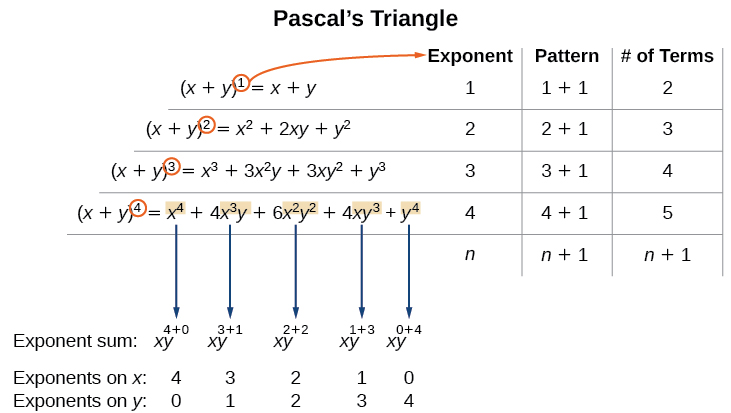
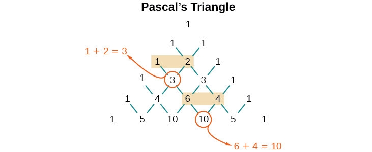
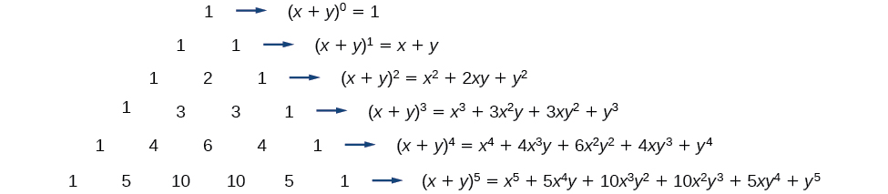
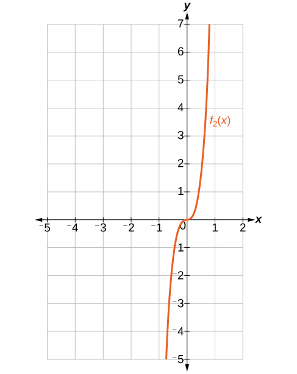
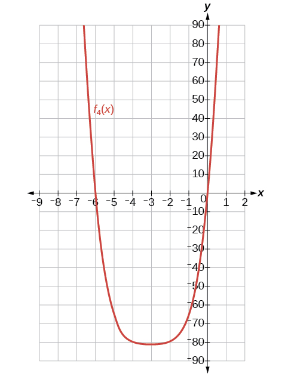

In this section, you will:
* Apply the Binomial Theorem.

A polynomial with two terms is called a binomial. We have already learned to multiply binomials and to raise binomials to powers, but raising a binomial to a high power can be tedious and time-consuming. In this section, we will discuss a shortcut that will allow us to find<math xmlns="http://www.w3.org/1998/Math/MathML"> <mrow> <mtext> </mtext><msup> <mrow> <mo stretchy="false">(</mo><mi>x</mi><mo>+</mo><mi>y</mi><mo stretchy="false">)</mo> </mrow> <mi>n</mi> </msup> <mtext> </mtext> </mrow> </math>

without multiplying the binomial by itself <math xmlns="http://www.w3.org/1998/Math/MathML"> <mi>n</mi> </math>

 times.

# Identifying Binomial Coefficients

In [Counting Principles](/m49448){: .target-chapter}, we studied **combinations**{: data-type="term" .no-emphasis}. In the shortcut to finding<math xmlns="http://www.w3.org/1998/Math/MathML"> <mrow> <mtext> </mtext><msup> <mrow> <mo stretchy="true">(</mo><mi>x</mi><mo>+</mo><mi>y</mi><mo stretchy="true">)</mo> </mrow> <mi>n</mi> </msup> <mo>,</mo><mtext> </mtext> </mrow> </math>

we will need to use combinations to find the coefficients that will appear in the expansion of the binomial. In this case, we use the notation<math xmlns="http://www.w3.org/1998/Math/MathML"> <mrow> <mtext> </mtext><mo stretchy="true">(</mo><mtable> <mtr> <mtd> <mi>n</mi> </mtd> </mtr> <mtr> <mtd> <mi>r</mi> </mtd> </mtr> </mtable><mo stretchy="true">)</mo><mtext> </mtext> </mrow> </math>

 instead of <math xmlns="http://www.w3.org/1998/Math/MathML"> <mrow> <mi>C</mi><mo stretchy="false">(</mo><mi>n</mi><mo>,</mo><mi>r</mi><mo stretchy="false">)</mo><mo>,</mo> </mrow> </math>

 but it can be calculated in the same way. So

<math xmlns="http://www.w3.org/1998/Math/MathML" display="block"> <mrow> <mtext> </mtext><mrow><mo>(</mo> <mrow> <mtable> <mtr> <mtd> <mi>n</mi> </mtd> </mtr> <mtr> <mtd> <mi>r</mi> </mtd> </mtr> </mtable> </mrow> <mo>)</mo></mrow><mo>=</mo><mi>C</mi><mo stretchy="false">(</mo><mi>n</mi><mo>,</mo><mi>r</mi><mo stretchy="false">)</mo><mo>=</mo><mfrac> <mrow> <mi>n</mi><mo>!</mo> </mrow> <mrow> <mi>r</mi><mo>!</mo><mo stretchy="false">(</mo><mi>n</mi><mo>−</mo><mi>r</mi><mo stretchy="false">)</mo><mo>!</mo> </mrow> </mfrac> <mtext> </mtext> </mrow> </math>

The combination<math xmlns="http://www.w3.org/1998/Math/MathML"> <mrow> <mtext> </mtext><mo stretchy="true">(</mo><mtable> <mtr> <mtd> <mi>n</mi> </mtd> </mtr> <mtr> <mtd> <mi>r</mi> </mtd> </mtr> </mtable><mo stretchy="true">)</mo><mtext> </mtext> </mrow> </math>

is called a **binomial coefficient**. An example of a binomial coefficient is<math xmlns="http://www.w3.org/1998/Math/MathML"> <mrow> <mtext> </mtext><mo stretchy="true">(</mo><mtable> <mtr> <mtd> <mn>5</mn> </mtd> </mtr> <mtr> <mtd> <mn>2</mn> </mtd> </mtr> </mtable><mo stretchy="true">)</mo><mo>=</mo><mi>C</mi><mo stretchy="false">(</mo><mn>5</mn><mo>,</mo><mn>2</mn><mo stretchy="false">)</mo><mo>=</mo><mn>10.</mn><mtext> </mtext> </mrow> </math>

Binomial Coefficients

If <math xmlns="http://www.w3.org/1998/Math/MathML"> <mrow> <mi>n</mi> </mrow> </math>

 and <math xmlns="http://www.w3.org/1998/Math/MathML"> <mrow> <mi>r</mi> </mrow> </math>

are integers greater than or equal to 0 with <math xmlns="http://www.w3.org/1998/Math/MathML"> <mrow> <mi>n</mi><mo>≥</mo><mi>r</mi><mo>,</mo> </mrow> </math>

 then the <strong data-type="term">binomial coefficient </strong> is

<math xmlns="http://www.w3.org/1998/Math/MathML" display="block"> <mrow> <mrow><mo>(</mo> <mrow> <mtable> <mtr> <mtd> <mi>n</mi> </mtd> </mtr> <mtr> <mtd> <mi>r</mi> </mtd> </mtr> </mtable> </mrow> <mo>)</mo></mrow><mo>=</mo><mi>C</mi><mo stretchy="false">(</mo><mi>n</mi><mo>,</mo><mi>r</mi><mo stretchy="false">)</mo><mo>=</mo><mfrac> <mrow> <mi>n</mi><mo>!</mo> </mrow> <mrow> <mi>r</mi><mo>!</mo><mo stretchy="false">(</mo><mi>n</mi><mo>−</mo><mi>r</mi><mo stretchy="false">)</mo><mo>!</mo> </mrow> </mfrac> </mrow> </math>

**Is a binomial coefficient always a whole number?**

<em>Yes. Just as the number of combinations must always be a whole number, a binomial coefficient will always be a whole number. </em>

Finding Binomial Coefficients

Find each binomial coefficient.

1.  <math xmlns="http://www.w3.org/1998/Math/MathML"> <mrow> <mrow><mo>(</mo> <mrow> <mtable> <mtr> <mtd> <mn>5</mn> </mtd> </mtr> <mtr> <mtd> <mn>3</mn> </mtd> </mtr> </mtable> </mrow> <mo>)</mo></mrow> </mrow> </math>

2.  <math xmlns="http://www.w3.org/1998/Math/MathML"> <mrow> <mrow><mo>(</mo> <mrow> <mtable> <mtr> <mtd> <mn>9</mn> </mtd> </mtr> <mtr> <mtd> <mn>2</mn> </mtd> </mtr> </mtable> </mrow> <mo>)</mo></mrow> </mrow> </math>

3.  <math xmlns="http://www.w3.org/1998/Math/MathML"> <mrow> <mrow><mo>(</mo> <mrow> <mtable> <mtr> <mtd> <mn>9</mn> </mtd> </mtr> <mtr> <mtd> <mn>7</mn> </mtd> </mtr> </mtable> </mrow> <mo>)</mo></mrow> </mrow> </math>
{: data-number-style="lower-alpha"}

Use the formula to calculate each binomial coefficient. You can also use the <math xmlns="http://www.w3.org/1998/Math/MathML"> <mrow> <msub> <mi>n</mi> </msub> <msub> <mi>C</mi> <mi>r</mi> </msub> </mrow> </math>

 function on your calculator.

<math xmlns="http://www.w3.org/1998/Math/MathML" display="block"> <mrow> <mrow><mo>(</mo> <mrow> <mtable> <mtr> <mtd> <mi>n</mi> </mtd> </mtr> <mtr> <mtd> <mi>r</mi> </mtd> </mtr> </mtable> </mrow> <mo>)</mo></mrow><mo>=</mo><mi>C</mi><mo stretchy="false">(</mo><mi>n</mi><mo>,</mo><mi>r</mi><mo stretchy="false">)</mo><mo>=</mo><mfrac> <mrow> <mi>n</mi><mo>!</mo> </mrow> <mrow> <mi>r</mi><mo>!</mo><mo stretchy="false">(</mo><mi>n</mi><mo>−</mo><mi>r</mi><mo stretchy="false">)</mo><mo>!</mo> </mrow> </mfrac> </mrow> </math>

1.  <math xmlns="http://www.w3.org/1998/Math/MathML"> <mrow> <mrow><mo>(</mo> <mrow> <mtable> <mtr> <mtd> <mn>5</mn> </mtd> </mtr> <mtr> <mtd> <mn>3</mn> </mtd> </mtr> </mtable> </mrow> <mo>)</mo></mrow><mo>=</mo><mfrac> <mrow> <mn>5</mn><mo>!</mo> </mrow> <mrow> <mn>3</mn><mo>!</mo><mo stretchy="false">(</mo><mn>5</mn><mo>−</mo><mn>3</mn><mo stretchy="false">)</mo><mo>!</mo> </mrow> </mfrac> <mo>=</mo><mfrac> <mrow> <mn>5</mn><mo>⋅</mo><mn>4</mn><mo>⋅</mo><mn>3</mn><mo>!</mo> </mrow> <mrow> <mn>3</mn><mo>!</mo><mn>2</mn><mo>!</mo> </mrow> </mfrac> <mo>=</mo><mn>10</mn> </mrow> </math>

2.  <math xmlns="http://www.w3.org/1998/Math/MathML"> <mrow> <mrow><mo>(</mo> <mrow> <mtable> <mtr> <mtd> <mn>9</mn> </mtd> </mtr> <mtr> <mtd> <mn>2</mn> </mtd> </mtr> </mtable> </mrow> <mo>)</mo></mrow><mo>=</mo><mfrac> <mrow> <mn>9</mn><mo>!</mo> </mrow> <mrow> <mn>2</mn><mo>!</mo><mo stretchy="false">(</mo><mn>9</mn><mo>−</mo><mn>2</mn><mo stretchy="false">)</mo><mo>!</mo> </mrow> </mfrac> <mo>=</mo><mfrac> <mrow> <mn>9</mn><mo>⋅</mo><mn>8</mn><mo>⋅</mo><mn>7</mn><mo>!</mo> </mrow> <mrow> <mn>2</mn><mo>!</mo><mn>7</mn><mo>!</mo> </mrow> </mfrac> <mo>=</mo><mn>36</mn> </mrow> </math>

3.  <math xmlns="http://www.w3.org/1998/Math/MathML"> <mrow> <mrow><mo>(</mo> <mrow> <mtable> <mtr> <mtd> <mn>9</mn> </mtd> </mtr> <mtr> <mtd> <mn>7</mn> </mtd> </mtr> </mtable> </mrow> <mo>)</mo></mrow><mo>=</mo><mfrac> <mrow> <mn>9</mn><mo>!</mo> </mrow> <mrow> <mn>7</mn><mo>!</mo><mo stretchy="false">(</mo><mn>9</mn><mo>−</mo><mn>7</mn><mo stretchy="false">)</mo><mo>!</mo> </mrow> </mfrac> <mo>=</mo><mfrac> <mrow> <mn>9</mn><mo>⋅</mo><mn>8</mn><mo>⋅</mo><mn>7</mn><mo>!</mo> </mrow> <mrow> <mn>7</mn><mo>!</mo><mn>2</mn><mo>!</mo> </mrow> </mfrac> <mo>=</mo><mn>36</mn> </mrow> </math>
{: data-number-style="lower-alpha"}

Analysis

Notice that we obtained the same result for parts (b) and (c). If you look closely at the solution for these two parts, you will see that you end up with the same two factorials in the denominator, but the order is reversed, just as with combinations.

<math xmlns="http://www.w3.org/1998/Math/MathML" display="block"> <mrow> <mrow><mo>(</mo> <mrow> <mtable> <mtr> <mtd> <mi>n</mi> </mtd> </mtr> <mtr> <mtd> <mi>r</mi> </mtd> </mtr> </mtable> </mrow> <mo>)</mo></mrow><mo>=</mo><mrow><mo>(</mo> <mrow> <mtable> <mtr> <mtd> <mi>n</mi> </mtd> </mtr> <mtr> <mtd> <mrow> <mi>n</mi><mo>−</mo><mi>r</mi> </mrow> </mtd> </mtr> </mtable> </mrow> <mo>)</mo></mrow> </mrow> </math>

Find each binomial coefficient.

 <math xmlns="http://www.w3.org/1998/Math/MathML"> <mrow> <mtext> </mtext><mrow><mo>(</mo> <mrow> <mtable> <mtr> <mtd> <mn>7</mn> </mtd> </mtr> <mtr> <mtd> <mn>3</mn> </mtd> </mtr> </mtable> </mrow> <mo>)</mo></mrow><mtext> </mtext> </mrow> </math>
 <math xmlns="http://www.w3.org/1998/Math/MathML"> <mrow> <mtext> </mtext><mrow><mo>(</mo> <mrow> <mtable> <mtr> <mtd> <mrow> <mn>11</mn> </mrow> </mtd> </mtr> <mtr> <mtd> <mn>4</mn> </mtd> </mtr> </mtable> </mrow> <mo>)</mo></mrow><mtext> </mtext> </mrow> </math>
 

 35 330 

# Using the Binomial Theorem

When we expand <math xmlns="http://www.w3.org/1998/Math/MathML"> <mrow> <msup> <mrow> <mo stretchy="false">(</mo><mi>x</mi><mo>+</mo><mi>y</mi><mo stretchy="false">)</mo> </mrow> <mi>n</mi> </msup> </mrow> </math>

 by multiplying, the result is called a **binomial expansion**{: data-type="term"}, and it includes binomial coefficients. If we wanted to expand <math xmlns="http://www.w3.org/1998/Math/MathML"> <mrow> <msup> <mrow> <mo stretchy="false">(</mo><mi>x</mi><mo>+</mo><mi>y</mi><mo stretchy="false">)</mo> </mrow> <mrow> <mn>52</mn> </mrow> </msup> <mo>,</mo> </mrow> </math>

 we might multiply <math xmlns="http://www.w3.org/1998/Math/MathML"> <mrow> <mo stretchy="false">(</mo><mi>x</mi><mo>+</mo><mi>y</mi><mo stretchy="false">)</mo> </mrow> </math>

 by itself fifty-two times. This could take hours! If we examine some simple binomial expansions, we can find patterns that will lead us to a shortcut for finding more complicated binomial expansions.

<math xmlns="http://www.w3.org/1998/Math/MathML" display="block"> <mrow> <mtable columnalign="left"> <mtr columnalign="left"> <mtd columnalign="left"> <mrow> <msup> <mrow> <mo stretchy="false">(</mo><mi>x</mi><mo>+</mo><mi>y</mi><mo stretchy="false">)</mo> </mrow> <mn>2</mn> </msup> <mo>=</mo><msup> <mi>x</mi> <mn>2</mn> </msup> <mo>+</mo><mn>2</mn><mi>x</mi><mi>y</mi><mo>+</mo><msup> <mi>y</mi> <mn>2</mn> </msup> </mrow> </mtd> </mtr> <mtr columnalign="left"> <mtd columnalign="left"> <mrow> <msup> <mrow> <mo stretchy="false">(</mo><mi>x</mi><mo>+</mo><mi>y</mi><mo stretchy="false">)</mo> </mrow> <mn>3</mn> </msup> <mo>=</mo><msup> <mi>x</mi> <mn>3</mn> </msup> <mo>+</mo><mn>3</mn><msup> <mi>x</mi> <mn>2</mn> </msup> <mi>y</mi><mo>+</mo><mn>3</mn><mi>x</mi><msup> <mi>y</mi> <mn>2</mn> </msup> <mo>+</mo><msup> <mi>y</mi> <mn>3</mn> </msup> </mrow> </mtd> </mtr> <mtr columnalign="left"> <mtd columnalign="left"> <mrow> <msup> <mrow> <mo stretchy="false">(</mo><mi>x</mi><mo>+</mo><mi>y</mi><mo stretchy="false">)</mo> </mrow> <mn>4</mn> </msup> <mo>=</mo><msup> <mi>x</mi> <mn>4</mn> </msup> <mo>+</mo><mn>4</mn><msup> <mi>x</mi> <mn>3</mn> </msup> <mi>y</mi><mo>+</mo><mn>6</mn><msup> <mi>x</mi> <mn>2</mn> </msup> <msup> <mi>y</mi> <mn>2</mn> </msup> <mo>+</mo><mn>4</mn><mi>x</mi><msup> <mi>y</mi> <mn>3</mn> </msup> <mo>+</mo><msup> <mi>y</mi> <mn>4</mn> </msup> </mrow> </mtd> </mtr> </mtable> </mrow> </math>

First, let’s examine the exponents. With each successive term, the exponent for <math xmlns="http://www.w3.org/1998/Math/MathML"> <mrow> <mi>x</mi> </mrow> </math>

 decreases and the exponent for <math xmlns="http://www.w3.org/1998/Math/MathML"> <mrow> <mi>y</mi> </mrow> </math>

 increases. The sum of the two exponents is <math xmlns="http://www.w3.org/1998/Math/MathML"> <mrow> <mi>n</mi> </mrow> </math>

 for each term.

Next, let’s examine the coefficients. Notice that the coefficients increase and then decrease in a symmetrical pattern. The coefficients follow a pattern:

<math xmlns="http://www.w3.org/1998/Math/MathML" display="block"> <mrow> <mrow><mo>(</mo> <mrow> <mtable> <mtr> <mtd> <mi>n</mi> </mtd> </mtr> <mtr> <mtd> <mn>0</mn> </mtd> </mtr> </mtable> </mrow> <mo>)</mo></mrow><mo>,</mo><mrow><mo>(</mo> <mrow> <mtable> <mtr> <mtd> <mi>n</mi> </mtd> </mtr> <mtr> <mtd> <mn>1</mn> </mtd> </mtr> </mtable> </mrow> <mo>)</mo></mrow><mo>,</mo><mrow><mo>(</mo> <mrow> <mtable> <mtr> <mtd> <mi>n</mi> </mtd> </mtr> <mtr> <mtd> <mn>2</mn> </mtd> </mtr> </mtable> </mrow> <mo>)</mo></mrow><mo>,</mo><mn>...</mn><mo>,</mo><mrow><mo>(</mo> <mrow> <mtable> <mtr> <mtd> <mi>n</mi> </mtd> </mtr> <mtr> <mtd> <mi>n</mi> </mtd> </mtr> </mtable> </mrow> <mo>)</mo></mrow><mo>.</mo> </mrow> </math>

These patterns lead us to the **Binomial Theorem**, which can be used to expand any binomial.

<math xmlns="http://www.w3.org/1998/Math/MathML" display="block"> <mrow> <mtable columnalign="left"> <mtr columnalign="left"> <mtd columnalign="left"> <mrow> <msup> <mrow> <mo stretchy="false">(</mo><mi>x</mi><mo>+</mo><mi>y</mi><mo stretchy="false">)</mo> </mrow> <mi>n</mi> </msup> </mrow> </mtd> <mtd columnalign="left"> <mrow> <mo>=</mo><mstyle displaystyle="true"> <munderover> <mo>∑</mo> <mrow> <mi>k</mi><mo>=</mo><mn>0</mn> </mrow> <mi>n</mi> </munderover> <mrow> <mrow><mo>(</mo> <mrow> <mtable> <mtr> <mtd> <mi>n</mi> </mtd> </mtr> <mtr> <mtd> <mi>k</mi> </mtd> </mtr> </mtable> </mrow> <mo>)</mo></mrow><msup> <mi>x</mi> <mrow> <mi>n</mi><mo>−</mo><mi>k</mi> </mrow> </msup> </mrow> </mstyle><msup> <mi>y</mi> <mi>k</mi> </msup> </mrow> </mtd> </mtr> <mtr columnalign="left"> <mtd columnalign="left"> <mrow /> </mtd> <mtd columnalign="left"> <mrow> <mo>=</mo><msup> <mi>x</mi> <mi>n</mi> </msup> <mo>+</mo><mrow><mo>(</mo> <mrow> <mtable> <mtr> <mtd> <mi>n</mi> </mtd> </mtr> <mtr> <mtd> <mn>1</mn> </mtd> </mtr> </mtable> </mrow> <mo>)</mo></mrow><msup> <mi>x</mi> <mrow> <mi>n</mi><mo>−</mo><mn>1</mn> </mrow> </msup> <mi>y</mi><mo>+</mo><mrow><mo>(</mo> <mrow> <mtable> <mtr> <mtd> <mi>n</mi> </mtd> </mtr> <mtr> <mtd> <mn>2</mn> </mtd> </mtr> </mtable> </mrow> <mo>)</mo></mrow><msup> <mi>x</mi> <mrow> <mi>n</mi><mo>−</mo><mn>2</mn> </mrow> </msup> <msup> <mi>y</mi> <mn>2</mn> </msup> <mo>+</mo><mn>...</mn><mo>+</mo><mrow><mo>(</mo> <mrow> <mtable> <mtr> <mtd> <mi>n</mi> </mtd> </mtr> <mtr> <mtd> <mrow> <mi>n</mi><mo>−</mo><mn>1</mn> </mrow> </mtd> </mtr> </mtable> </mrow> <mo>)</mo></mrow><mi>x</mi><msup> <mi>y</mi> <mrow> <mi>n</mi><mo>−</mo><mn>1</mn> </mrow> </msup> <mo>+</mo><msup> <mi>y</mi> <mi>n</mi> </msup> </mrow> </mtd> </mtr> </mtable> </mrow> </math>

Another way to see the coefficients is to examine the expansion of a binomial in general form,<math xmlns="http://www.w3.org/1998/Math/MathML"> <mrow> <mtext> </mtext><mi>x</mi><mo>+</mo><mi>y</mi><mo>,</mo><mtext> </mtext> </mrow> </math>

to successive powers 1, 2, 3, and 4.

<math xmlns="http://www.w3.org/1998/Math/MathML" display="block"> <mrow> <mtable columnalign="left"> <mtr columnalign="left"> <mtd columnalign="left"> <mrow> <msup> <mrow> <mo stretchy="false">(</mo><mi>x</mi><mo>+</mo><mi>y</mi><mo stretchy="false">)</mo> </mrow> <mn>1</mn> </msup> <mo>=</mo><mi>x</mi><mo>+</mo><mi>y</mi> </mrow> </mtd> </mtr> <mtr columnalign="left"> <mtd columnalign="left"> <mrow> <msup> <mrow> <mo stretchy="false">(</mo><mi>x</mi><mo>+</mo><mi>y</mi><mo stretchy="false">)</mo> </mrow> <mn>2</mn> </msup> <mo>=</mo><msup> <mi>x</mi> <mn>2</mn> </msup> <mo>+</mo><mn>2</mn><mi>x</mi><mi>y</mi><mo>+</mo><msup> <mi>y</mi> <mn>2</mn> </msup> </mrow> </mtd> </mtr> <mtr columnalign="left"> <mtd columnalign="left"> <mrow> <msup> <mrow> <mo stretchy="false">(</mo><mi>x</mi><mo>+</mo><mi>y</mi><mo stretchy="false">)</mo> </mrow> <mn>3</mn> </msup> <mo>=</mo><msup> <mi>x</mi> <mn>3</mn> </msup> <mo>+</mo><mn>3</mn><msup> <mi>x</mi> <mn>2</mn> </msup> <mi>y</mi><mo>+</mo><mn>3</mn><mi>x</mi><msup> <mi>y</mi> <mn>2</mn> </msup> <mo>+</mo><msup> <mi>y</mi> <mn>3</mn> </msup> </mrow> </mtd> </mtr> <mtr columnalign="left"> <mtd columnalign="left"> <mrow> <msup> <mrow> <mo stretchy="false">(</mo><mi>x</mi><mo>+</mo><mi>y</mi><mo stretchy="false">)</mo> </mrow> <mn>4</mn> </msup> <mo>=</mo><msup> <mi>x</mi> <mn>4</mn> </msup> <mo>+</mo><mn>4</mn><msup> <mi>x</mi> <mn>3</mn> </msup> <mi>y</mi><mo>+</mo><mn>6</mn><msup> <mi>x</mi> <mn>2</mn> </msup> <msup> <mi>y</mi> <mn>2</mn> </msup> <mo>+</mo><mn>4</mn><mi>x</mi><msup> <mi>y</mi> <mn>3</mn> </msup> <mo>+</mo><msup> <mi>y</mi> <mn>4</mn> </msup> </mrow> </mtd> </mtr> </mtable> </mrow> </math>

Can you guess the next expansion for the binomial<math xmlns="http://www.w3.org/1998/Math/MathML"> <mrow> <mtext> </mtext><msup> <mrow> <mo stretchy="false">(</mo><mi>x</mi><mo>+</mo><mi>y</mi><mo stretchy="false">)</mo> </mrow> <mn>5</mn> </msup> <mo>?</mo><mtext> </mtext> </mrow> </math>

 {: #CNX_Precalc_Figure_11_06_002}

See [\[link\]](#CNX_Precalc_Figure_11_06_002), which illustrates the following:

* There are
  <math xmlns="http://www.w3.org/1998/Math/MathML"> <mrow> <mi>n</mi><mo>+</mo><mn>1</mn> </mrow> </math>
  
  terms in the expansion of
  <math xmlns="http://www.w3.org/1998/Math/MathML"> <mrow> <msup> <mrow> <mo stretchy="false">(</mo><mi>x</mi><mo>+</mo><mi>y</mi><mo stretchy="false">)</mo> </mrow> <mi>n</mi> </msup> <mo>.</mo> </mrow> </math>

* The degree (or sum of the exponents) for each term is
  <math xmlns="http://www.w3.org/1998/Math/MathML"> <mrow> <mi>n</mi><mo>.</mo> </mrow> </math>

* The powers on
  <math xmlns="http://www.w3.org/1998/Math/MathML"> <mrow> <mi>x</mi> </mrow> </math>
  
  begin with
  <math xmlns="http://www.w3.org/1998/Math/MathML"> <mrow> <mi>n</mi> </mrow> </math>
  
  and decrease to 0.
* The powers on
  <math xmlns="http://www.w3.org/1998/Math/MathML"> <mrow> <mi>y</mi> </mrow> </math>
  
  begin with 0 and increase to
  <math xmlns="http://www.w3.org/1998/Math/MathML"> <mrow> <mi>n</mi><mo>.</mo> </mrow> </math>

* The coefficients are symmetric.

To determine the expansion on <math xmlns="http://www.w3.org/1998/Math/MathML"> <mrow> <msup> <mrow> <mo stretchy="false">(</mo><mi>x</mi><mo>+</mo><mi>y</mi><mo stretchy="false">)</mo> </mrow> <mn>5</mn> </msup> <mo>,</mo> </mrow> </math>

 we see <math xmlns="http://www.w3.org/1998/Math/MathML"> <mrow> <mi>n</mi><mo>=</mo><mn>5</mn><mo>,</mo> </mrow> </math>

 thus, there will be 5+1 = 6 terms. Each term has a combined degree of 5. In descending order for powers of <math xmlns="http://www.w3.org/1998/Math/MathML"> <mrow> <mi>x</mi><mo>,</mo> </mrow> </math>

 the pattern is as follows:

* Introduce
  <math xmlns="http://www.w3.org/1998/Math/MathML"> <mrow> <msup> <mi>x</mi> <mn>5</mn> </msup> <mo>,</mo> </mrow> </math>
  
  and then for each successive term reduce the exponent on
  <math xmlns="http://www.w3.org/1998/Math/MathML"> <mrow> <mi>x</mi> </mrow> </math>
  
  by 1 until
  <math xmlns="http://www.w3.org/1998/Math/MathML"> <mrow> <msup> <mi>x</mi> <mn>0</mn> </msup> <mo>=</mo><mn>1</mn> </mrow> </math>
  
  is reached.
* Introduce
  <math xmlns="http://www.w3.org/1998/Math/MathML"> <mrow> <msup> <mi>y</mi> <mn>0</mn> </msup> <mo>=</mo><mn>1</mn><mo>,</mo> </mrow> </math>
  
  and then increase the exponent on
  <math xmlns="http://www.w3.org/1998/Math/MathML"> <mrow> <mi>y</mi> </mrow> </math>
  
  by 1 until
  <math xmlns="http://www.w3.org/1998/Math/MathML"> <mrow> <msup> <mi>y</mi> <mn>5</mn> </msup> </mrow> </math>
  
  is reached.
  

  <math xmlns="http://www.w3.org/1998/Math/MathML" display="block"> <mrow> <msup> <mi>x</mi> <mn>5</mn> </msup> <mo>,</mo><mtext> </mtext><mtext> </mtext><msup> <mi>x</mi> <mn>4</mn> </msup> <mi>y</mi><mo>,</mo><mtext> </mtext><mtext> </mtext><msup> <mi>x</mi> <mn>3</mn> </msup> <msup> <mi>y</mi> <mn>2</mn> </msup> <mo>,</mo><mtext> </mtext><mtext> </mtext><msup> <mi>x</mi> <mn>2</mn> </msup> <msup> <mi>y</mi> <mn>3</mn> </msup> <mo>,</mo><mtext> </mtext><mtext> </mtext><mi>x</mi><msup> <mi>y</mi> <mn>4</mn> </msup> <mo>,</mo><mtext> </mtext><mtext> </mtext><msup> <mi>y</mi> <mn>5</mn> </msup> </mrow> </math>
  

The next expansion would be

<math xmlns="http://www.w3.org/1998/Math/MathML" display="block"> <mrow> <msup> <mrow> <mo stretchy="false">(</mo><mi>x</mi><mo>+</mo><mi>y</mi><mo stretchy="false">)</mo> </mrow> <mn>5</mn> </msup> <mo>=</mo><msup> <mi>x</mi> <mn>5</mn> </msup> <mo>+</mo><mn>5</mn><msup> <mi>x</mi> <mn>4</mn> </msup> <mi>y</mi><mo>+</mo><mn>10</mn><msup> <mi>x</mi> <mn>3</mn> </msup> <msup> <mi>y</mi> <mn>2</mn> </msup> <mo>+</mo><mn>10</mn><msup> <mi>x</mi> <mn>2</mn> </msup> <msup> <mi>y</mi> <mn>3</mn> </msup> <mo>+</mo><mn>5</mn><mi>x</mi><msup> <mi>y</mi> <mn>4</mn> </msup> <mo>+</mo><msup> <mi>y</mi> <mn>5</mn> </msup> <mo>.</mo> </mrow> </math>

But where do those coefficients come from? The binomial coefficients are symmetric. We can see these coefficients in an array known as **Pascal\'s Triangle**{: data-type="term" .no-emphasis}, shown in [\[link\]](#CNX_Precalc_Figure_11_06_001).

{: #CNX_Precalc_Figure_11_06_001}

To generate Pascal’s Triangle, we start by writing a 1. In the row below, row 2, we write two 1’s. In the 3rd row, flank the ends of the rows with 1’s, and add <math xmlns="http://www.w3.org/1998/Math/MathML"> <mrow> <mn>1</mn><mo>+</mo><mn>1</mn> </mrow> </math>

 to find the middle number, 2. In the <math xmlns="http://www.w3.org/1998/Math/MathML"> <mrow> <mi>n</mi><mtext>th</mtext> </mrow> </math>

 row, flank the ends of the row with 1’s. Each element in the triangle is the sum of the two elements immediately above it.

To see the connection between Pascal’s Triangle and binomial coefficients, let us revisit the expansion of the binomials in general form.

    

The Binomial Theorem

The **Binomial Theorem**{: data-type="term"} is a formula that can be used to expand any binomial.

<math xmlns="http://www.w3.org/1998/Math/MathML" display="block"> <mrow> <mtable columnalign="left"> <mtr columnalign="left"> <mtd columnalign="left"> <mrow> <msup> <mrow> <mo stretchy="false">(</mo><mi>x</mi><mo>+</mo><mi>y</mi><mo stretchy="false">)</mo> </mrow> <mi>n</mi> </msup> </mrow> </mtd> <mtd columnalign="left"> <mrow> <mo>=</mo><mstyle displaystyle="true"> <munderover> <mo>∑</mo> <mrow> <mi>k</mi><mo>=</mo><mn>0</mn> </mrow> <mi>n</mi> </munderover> <mrow> <mrow><mo>(</mo> <mrow> <mtable> <mtr> <mtd> <mi>n</mi> </mtd> </mtr> <mtr> <mtd> <mi>k</mi> </mtd> </mtr> </mtable> </mrow> <mo>)</mo></mrow><msup> <mi>x</mi> <mrow> <mi>n</mi><mo>−</mo><mi>k</mi> </mrow> </msup> <msup> <mi>y</mi> <mi>k</mi> </msup> </mrow> </mstyle> </mrow> </mtd> </mtr> <mtr columnalign="left"> <mtd columnalign="left"> <mrow /> </mtd> <mtd columnalign="left"> <mrow> <mo>=</mo><msup> <mi>x</mi> <mi>n</mi> </msup> <mo>+</mo><mrow><mo>(</mo> <mrow> <mtable> <mtr> <mtd> <mi>n</mi> </mtd> </mtr> <mtr> <mtd> <mn>1</mn> </mtd> </mtr> </mtable> </mrow> <mo>)</mo></mrow><msup> <mi>x</mi> <mrow> <mi>n</mi><mo>−</mo><mn>1</mn> </mrow> </msup> <mi>y</mi><mo>+</mo><mrow><mo>(</mo> <mrow> <mtable> <mtr> <mtd> <mi>n</mi> </mtd> </mtr> <mtr> <mtd> <mn>2</mn> </mtd> </mtr> </mtable> </mrow> <mo>)</mo></mrow><msup> <mi>x</mi> <mrow> <mi>n</mi><mo>−</mo><mn>2</mn> </mrow> </msup> <msup> <mi>y</mi> <mn>2</mn> </msup> <mo>+</mo><mn>...</mn><mo>+</mo><mrow><mo>(</mo> <mrow> <mtable> <mtr> <mtd> <mi>n</mi> </mtd> </mtr> <mtr> <mtd> <mrow> <mi>n</mi><mo>−</mo><mn>1</mn> </mrow> </mtd> </mtr> </mtable> </mrow> <mo>)</mo></mrow><mi>x</mi><msup> <mi>y</mi> <mrow> <mi>n</mi><mo>−</mo><mn>1</mn> </mrow> </msup> <mo>+</mo><msup> <mi>y</mi> <mi>n</mi> </msup> </mrow> </mtd> </mtr> </mtable> </mrow> </math>

**Given a binomial, write it in expanded form.**

1.  Determine the value of
    <math xmlns="http://www.w3.org/1998/Math/MathML"> <mrow> <mi>n</mi> </mrow> </math>
    
    according to the exponent.
2.  Evaluate the
    <math xmlns="http://www.w3.org/1998/Math/MathML"> <mrow> <mi>k</mi><mo>=</mo><mn>0</mn> </mrow> </math>
    
    through
    <math xmlns="http://www.w3.org/1998/Math/MathML"> <mrow> <mi>k</mi><mo>=</mo><mi>n</mi> </mrow> </math>
    
    using the Binomial Theorem formula.
3.  Simplify.
{: data-number-style="arabic"}

Expanding a Binomial

Write in expanded form.

1.  <math xmlns="http://www.w3.org/1998/Math/MathML"> <mrow> <mtext> </mtext><msup> <mrow> <mo stretchy="false">(</mo><mi>x</mi><mo>+</mo><mi>y</mi><mo stretchy="false">)</mo> </mrow> <mn>5</mn> </msup> <mtext> </mtext> </mrow> </math>

2.  <math xmlns="http://www.w3.org/1998/Math/MathML"> <mrow> <mtext> </mtext><msup> <mrow> <mrow><mo>(</mo> <mrow> <mn>3</mn><mi>x</mi><mo>−</mo><mi>y</mi> </mrow> <mo>)</mo></mrow> </mrow> <mn>4</mn> </msup> <mtext> </mtext> </mrow> </math>
{: data-number-style="lower-alpha"}

1.  Substitute
    <math xmlns="http://www.w3.org/1998/Math/MathML"> <mrow> <mi>n</mi><mo>=</mo><mn>5</mn> </mrow> </math>
    
    into the formula. Evaluate the
    <math xmlns="http://www.w3.org/1998/Math/MathML"> <mrow> <mi>k</mi><mo>=</mo><mn>0</mn> </mrow> </math>
    
    through
    <math xmlns="http://www.w3.org/1998/Math/MathML"> <mrow> <mi>k</mi><mo>=</mo><mn>5</mn> </mrow> </math>
    
    terms. Simplify.
    

    <math xmlns="http://www.w3.org/1998/Math/MathML" display="block"> <mrow> <mtable columnalign="left"> <mtr columnalign="left"> <mtd columnalign="left"> <mrow> <msup> <mrow> <mo stretchy="false">(</mo><mi>x</mi><mo>+</mo><mi>y</mi><mo stretchy="false">)</mo> </mrow> <mn>5</mn> </msup> </mrow> </mtd> <mtd columnalign="left"> <mrow> <mo>=</mo><mrow><mo>(</mo> <mrow> <mtable> <mtr> <mtd> <mn>5</mn> </mtd> </mtr> <mtr> <mtd> <mn>0</mn> </mtd> </mtr> </mtable> </mrow> <mo>)</mo></mrow><msup> <mi>x</mi> <mn>5</mn> </msup> <msup> <mi>y</mi> <mn>0</mn> </msup> <mo>+</mo><mrow><mo>(</mo> <mrow> <mtable> <mtr> <mtd> <mn>5</mn> </mtd> </mtr> <mtr> <mtd> <mn>1</mn> </mtd> </mtr> </mtable> </mrow> <mo>)</mo></mrow><msup> <mi>x</mi> <mn>4</mn> </msup> <msup> <mi>y</mi> <mn>1</mn> </msup> <mo>+</mo><mrow><mo>(</mo> <mrow> <mtable> <mtr> <mtd> <mn>5</mn> </mtd> </mtr> <mtr> <mtd> <mn>2</mn> </mtd> </mtr> </mtable> </mrow> <mo>)</mo></mrow><msup> <mi>x</mi> <mn>3</mn> </msup> <msup> <mi>y</mi> <mn>2</mn> </msup> <mo>+</mo><mrow><mo>(</mo> <mrow> <mtable> <mtr> <mtd> <mn>5</mn> </mtd> </mtr> <mtr> <mtd> <mn>3</mn> </mtd> </mtr> </mtable> </mrow> <mo>)</mo></mrow><msup> <mi>x</mi> <mn>2</mn> </msup> <msup> <mi>y</mi> <mn>3</mn> </msup> <mo>+</mo><mrow><mo>(</mo> <mrow> <mtable> <mtr> <mtd> <mn>5</mn> </mtd> </mtr> <mtr> <mtd> <mn>4</mn> </mtd> </mtr> </mtable> </mrow> <mo>)</mo></mrow><msup> <mi>x</mi> <mn>1</mn> </msup> <msup> <mi>y</mi> <mn>4</mn> </msup> <mo>+</mo><mrow><mo>(</mo> <mrow> <mtable> <mtr> <mtd> <mn>5</mn> </mtd> </mtr> <mtr> <mtd> <mn>5</mn> </mtd> </mtr> </mtable> </mrow> <mo>)</mo></mrow><msup> <mi>x</mi> <mn>0</mn> </msup> <msup> <mi>y</mi> <mn>5</mn> </msup> </mrow> </mtd> </mtr> <mtr columnalign="left"> <mtd columnalign="left"> <mrow> <msup> <mrow> <mo stretchy="false">(</mo><mi>x</mi><mo>+</mo><mi>y</mi><mo stretchy="false">)</mo> </mrow> <mn>5</mn> </msup> </mrow> </mtd> <mtd columnalign="left"> <mrow> <mo>=</mo><msup> <mi>x</mi> <mn>5</mn> </msup> <mo>+</mo><mn>5</mn><msup> <mi>x</mi> <mn>4</mn> </msup> <mi>y</mi><mo>+</mo><mn>10</mn><msup> <mi>x</mi> <mn>3</mn> </msup> <msup> <mi>y</mi> <mn>2</mn> </msup> <mo>+</mo><mn>10</mn><msup> <mi>x</mi> <mn>2</mn> </msup> <msup> <mi>y</mi> <mn>3</mn> </msup> <mo>+</mo><mn>5</mn><mi>x</mi><msup> <mi>y</mi> <mn>4</mn> </msup> <mo>+</mo><msup> <mi>y</mi> <mn>5</mn> </msup> </mrow> </mtd> </mtr> </mtable> </mrow> </math>
    

2.  Substitute
    <math xmlns="http://www.w3.org/1998/Math/MathML"> <mrow> <mi>n</mi><mo>=</mo><mn>4</mn> </mrow> </math>
    
    into the formula. Evaluate the
    <math xmlns="http://www.w3.org/1998/Math/MathML"> <mrow> <mi>k</mi><mo>=</mo><mn>0</mn> </mrow> </math>
    
    through
    <math xmlns="http://www.w3.org/1998/Math/MathML"> <mrow> <mi>k</mi><mo>=</mo><mn>4</mn> </mrow> </math>
    
    terms. Notice that
    <math xmlns="http://www.w3.org/1998/Math/MathML"> <mrow> <mn>3</mn><mi>x</mi> </mrow> </math>
    
    is in the place that was occupied by
    <math xmlns="http://www.w3.org/1998/Math/MathML"> <mrow> <mi>x</mi> </mrow> </math>
    
    and that
    <math xmlns="http://www.w3.org/1998/Math/MathML"> <mrow> <mo>–</mo><mi>y</mi> </mrow> </math>
    
    is in the place that was occupied by
    <math xmlns="http://www.w3.org/1998/Math/MathML"> <mrow> <mi>y</mi><mo>.</mo> </mrow> </math>
    
    So we substitute them. Simplify.
    

    <math xmlns="http://www.w3.org/1998/Math/MathML" display="block"> <mrow> <mtable columnalign="left"> <mtr columnalign="left"> <mtd columnalign="left"> <mrow> <msup> <mrow> <mo stretchy="false">(</mo><mn>3</mn><mi>x</mi><mo>−</mo><mi>y</mi><mo stretchy="false">)</mo> </mrow> <mn>4</mn> </msup> </mrow> </mtd> <mtd columnalign="left"> <mrow> <mo>=</mo><mrow><mo>(</mo> <mrow> <mtable> <mtr> <mtd> <mn>4</mn> </mtd> </mtr> <mtr> <mtd> <mn>0</mn> </mtd> </mtr> </mtable> </mrow> <mo>)</mo></mrow><msup> <mrow> <mo stretchy="false">(</mo><mn>3</mn><mi>x</mi><mo stretchy="false">)</mo> </mrow> <mn>4</mn> </msup> <msup> <mrow> <mo stretchy="false">(</mo><mo>−</mo><mi>y</mi><mo stretchy="false">)</mo> </mrow> <mn>0</mn> </msup> <mo>+</mo><mrow><mo>(</mo> <mrow> <mtable> <mtr> <mtd> <mn>4</mn> </mtd> </mtr> <mtr> <mtd> <mn>1</mn> </mtd> </mtr> </mtable> </mrow> <mo>)</mo></mrow><msup> <mrow> <mo stretchy="false">(</mo><mn>3</mn><mi>x</mi><mo stretchy="false">)</mo> </mrow> <mn>3</mn> </msup> <msup> <mrow> <mo stretchy="false">(</mo><mo>−</mo><mi>y</mi><mo stretchy="false">)</mo> </mrow> <mn>1</mn> </msup> <mo>+</mo><mrow><mo>(</mo> <mrow> <mtable> <mtr> <mtd> <mn>4</mn> </mtd> </mtr> <mtr> <mtd> <mn>2</mn> </mtd> </mtr> </mtable> </mrow> <mo>)</mo></mrow><msup> <mrow> <mo stretchy="false">(</mo><mn>3</mn><mi>x</mi><mo stretchy="false">)</mo> </mrow> <mn>2</mn> </msup> <msup> <mrow> <mo stretchy="false">(</mo><mo>−</mo><mi>y</mi><mo stretchy="false">)</mo> </mrow> <mn>2</mn> </msup> <mo>+</mo><mrow><mo>(</mo> <mrow> <mtable> <mtr> <mtd> <mn>4</mn> </mtd> </mtr> <mtr> <mtd> <mn>3</mn> </mtd> </mtr> </mtable> </mrow> <mo>)</mo></mrow><msup> <mrow> <mo stretchy="false">(</mo><mn>3</mn><mi>x</mi><mo stretchy="false">)</mo> </mrow> <mn>1</mn> </msup> <msup> <mrow> <mo stretchy="false">(</mo><mo>−</mo><mi>y</mi><mo stretchy="false">)</mo> </mrow> <mn>3</mn> </msup> <mo>+</mo><mrow><mo>(</mo> <mrow> <mtable> <mtr> <mtd> <mn>4</mn> </mtd> </mtr> <mtr> <mtd> <mn>4</mn> </mtd> </mtr> </mtable> </mrow> <mo>)</mo></mrow><msup> <mrow> <mo stretchy="false">(</mo><mn>3</mn><mi>x</mi><mo stretchy="false">)</mo> </mrow> <mn>0</mn> </msup> <msup> <mrow> <mo stretchy="false">(</mo><mo>−</mo><mi>y</mi><mo stretchy="false">)</mo> </mrow> <mn>4</mn> </msup> </mrow> </mtd> </mtr> <mtr columnalign="left"> <mtd columnalign="left"> <mrow> <msup> <mrow> <mo stretchy="false">(</mo><mn>3</mn><mi>x</mi><mo>−</mo><mi>y</mi><mo stretchy="false">)</mo> </mrow> <mn>4</mn> </msup> </mrow> </mtd> <mtd columnalign="left"> <mrow> <mo>=</mo><mn>81</mn><msup> <mi>x</mi> <mn>4</mn> </msup> <mo>−</mo><mn>108</mn><msup> <mi>x</mi> <mn>3</mn> </msup> <mi>y</mi><mo>+</mo><mn>54</mn><msup> <mi>x</mi> <mn>2</mn> </msup> <msup> <mi>y</mi> <mn>2</mn> </msup> <mo>−</mo><mn>12</mn><mi>x</mi><msup> <mi>y</mi> <mn>3</mn> </msup> <mo>+</mo><msup> <mi>y</mi> <mn>4</mn> </msup> </mrow> </mtd> </mtr> </mtable> </mrow> </math>
    

{: data-number-style="lower-alpha"}

Analysis

Notice the alternating signs in part b. This happens because<math xmlns="http://www.w3.org/1998/Math/MathML"> <mrow> <mtext> </mtext><mo stretchy="false">(</mo><mo>−</mo><mi>y</mi><mo stretchy="false">)</mo><mtext> </mtext> </mrow> </math>

raised to odd powers is negative, but<math xmlns="http://www.w3.org/1998/Math/MathML"> <mrow> <mtext> </mtext><mo stretchy="false">(</mo><mo>−</mo><mi>y</mi><mo stretchy="false">)</mo><mtext> </mtext> </mrow> </math>

raised to even powers is positive. This will occur whenever the binomial contains a subtraction sign.

Write in expanded form.

1.  <math xmlns="http://www.w3.org/1998/Math/MathML"> <mrow> <msup> <mrow> <mo stretchy="false">(</mo><mi>x</mi><mo>−</mo><mi>y</mi><mo stretchy="false">)</mo> </mrow> <mn>5</mn> </msup> </mrow> </math>

2.  <math xmlns="http://www.w3.org/1998/Math/MathML"> <mrow> <msup> <mrow> <mo stretchy="false">(</mo><mn>2</mn><mi>x</mi><mo>+</mo><mn>5</mn><mi>y</mi><mo stretchy="false">)</mo> </mrow> <mn>3</mn> </msup> </mrow> </math>
{: data-number-style="lower-alpha"}

1.  <math xmlns="http://www.w3.org/1998/Math/MathML"> <mrow> <msup> <mi>x</mi> <mn>5</mn> </msup> <mo>−</mo><mn>5</mn><msup> <mi>x</mi> <mn>4</mn> </msup> <mi>y</mi><mo>+</mo><mn>10</mn><msup> <mi>x</mi> <mn>3</mn> </msup> <msup> <mi>y</mi> <mn>2</mn> </msup> <mo>−</mo><mn>10</mn><msup> <mi>x</mi> <mn>2</mn> </msup> <msup> <mi>y</mi> <mn>3</mn> </msup> <mo>+</mo><mn>5</mn><mi>x</mi><msup> <mi>y</mi> <mn>4</mn> </msup> <mo>−</mo><msup> <mi>y</mi> <mn>5</mn> </msup> </mrow> </math>

2.  <math xmlns="http://www.w3.org/1998/Math/MathML"> <mrow> <mn>8</mn><msup> <mi>x</mi> <mn>3</mn> </msup> <mo>+</mo><mn>60</mn><msup> <mi>x</mi> <mn>2</mn> </msup> <mi>y</mi><mo>+</mo><mn>150</mn><mi>x</mi><msup> <mi>y</mi> <mn>2</mn> </msup> <mo>+</mo><mn>125</mn><msup> <mi>y</mi> <mn>3</mn> </msup> </mrow> </math>
{: data-number-style="lower-alpha"}

# Using the Binomial Theorem to Find a Single Term

Expanding a binomial with a high exponent such as<math xmlns="http://www.w3.org/1998/Math/MathML"> <mrow> <mtext> </mtext><msup> <mrow> <mo stretchy="false">(</mo><mi>x</mi><mo>+</mo><mn>2</mn><mi>y</mi><mo stretchy="false">)</mo> </mrow> <mrow> <mn>16</mn> </mrow> </msup> <mtext> </mtext> </mrow> </math>

can be a lengthy process.

Sometimes we are interested only in a certain term of a binomial expansion. We do not need to fully expand a binomial to find a single specific term.

Note the pattern of coefficients in the expansion of<math xmlns="http://www.w3.org/1998/Math/MathML"> <mrow> <mtext> </mtext><msup> <mrow> <mo stretchy="false">(</mo><mi>x</mi><mo>+</mo><mi>y</mi><mo stretchy="false">)</mo> </mrow> <mn>5</mn> </msup> <mo>.</mo> </mrow> </math>

<math xmlns="http://www.w3.org/1998/Math/MathML" display="block"> <mrow> <msup> <mrow> <mo stretchy="false">(</mo><mi>x</mi><mo>+</mo><mi>y</mi><mo stretchy="false">)</mo> </mrow> <mn>5</mn> </msup> <mo>=</mo><msup> <mi>x</mi> <mn>5</mn> </msup> <mo>+</mo><mrow><mo>(</mo> <mrow> <mtable> <mtr> <mtd> <mn>5</mn> </mtd> </mtr> <mtr> <mtd> <mn>1</mn> </mtd> </mtr> </mtable> </mrow> <mo>)</mo></mrow><msup> <mi>x</mi> <mn>4</mn> </msup> <mi>y</mi><mo>+</mo><mrow><mo>(</mo> <mrow> <mtable> <mtr> <mtd> <mn>5</mn> </mtd> </mtr> <mtr> <mtd> <mn>2</mn> </mtd> </mtr> </mtable> </mrow> <mo>)</mo></mrow><msup> <mi>x</mi> <mn>3</mn> </msup> <msup> <mi>y</mi> <mn>2</mn> </msup> <mo>+</mo><mrow><mo>(</mo> <mrow> <mtable> <mtr> <mtd> <mn>5</mn> </mtd> </mtr> <mtr> <mtd> <mn>3</mn> </mtd> </mtr> </mtable> </mrow> <mo>)</mo></mrow><msup> <mi>x</mi> <mn>2</mn> </msup> <msup> <mi>y</mi> <mn>3</mn> </msup> <mo>+</mo><mrow><mo>(</mo> <mrow> <mtable> <mtr> <mtd> <mn>5</mn> </mtd> </mtr> <mtr> <mtd> <mn>4</mn> </mtd> </mtr> </mtable> </mrow> <mo>)</mo></mrow><mi>x</mi><msup> <mi>y</mi> <mn>4</mn> </msup> <mo>+</mo><msup> <mi>y</mi> <mn>5</mn> </msup> </mrow> </math>

The second term is<math xmlns="http://www.w3.org/1998/Math/MathML"> <mrow> <mtext> </mtext><mrow><mo>(</mo> <mrow> <mtable> <mtr> <mtd> <mn>5</mn> </mtd> </mtr> <mtr> <mtd> <mn>1</mn> </mtd> </mtr> </mtable> </mrow> <mo>)</mo></mrow><msup> <mi>x</mi> <mn>4</mn> </msup> <mi>y</mi><mo>.</mo><mtext> </mtext> </mrow> </math>

The third term is<math xmlns="http://www.w3.org/1998/Math/MathML"> <mrow> <mtext> </mtext><mrow><mo>(</mo> <mrow> <mtable> <mtr> <mtd> <mn>5</mn> </mtd> </mtr> <mtr> <mtd> <mn>2</mn> </mtd> </mtr> </mtable> </mrow> <mo>)</mo></mrow><msup> <mi>x</mi> <mn>3</mn> </msup> <msup> <mi>y</mi> <mn>2</mn> </msup> <mo>.</mo><mtext> </mtext> </mrow> </math>

We can generalize this result.

<math xmlns="http://www.w3.org/1998/Math/MathML" display="block"> <mrow> <mrow><mo>(</mo> <mrow> <mtable> <mtr> <mtd> <mi>n</mi> </mtd> </mtr> <mtr> <mtd> <mi>r</mi> </mtd> </mtr> </mtable> </mrow> <mo>)</mo></mrow><msup> <mi>x</mi> <mrow> <mi>n</mi><mo>−</mo><mi>r</mi> </mrow> </msup> <msup> <mi>y</mi> <mi>r</mi> </msup> </mrow> </math>

The (r+1)th Term of a Binomial Expansion

The<math xmlns="http://www.w3.org/1998/Math/MathML"> <mrow> <mtext> </mtext><mo stretchy="false">(</mo><mi>r</mi><mo>+</mo><mn>1</mn><mo stretchy="false">)</mo><mtext>th</mtext><mtext> </mtext> </mrow> </math>

term of the **binomial expansion**{: data-type="term" .no-emphasis} of<math xmlns="http://www.w3.org/1998/Math/MathML"> <mrow> <mtext> </mtext><msup> <mrow> <mo stretchy="false">(</mo><mi>x</mi><mo>+</mo><mi>y</mi><mo stretchy="false">)</mo> </mrow> <mi>n</mi> </msup> <mtext> </mtext> </mrow> </math>

is:

<math xmlns="http://www.w3.org/1998/Math/MathML" display="block"> <mrow> <mrow><mo>(</mo> <mrow> <mtable> <mtr> <mtd> <mi>n</mi> </mtd> </mtr> <mtr> <mtd> <mi>r</mi> </mtd> </mtr> </mtable> </mrow> <mo>)</mo></mrow><msup> <mi>x</mi> <mrow> <mi>n</mi><mo>−</mo><mi>r</mi> </mrow> </msup> <msup> <mi>y</mi> <mi>r</mi> </msup> </mrow> </math>

**Given a binomial, write a specific term without fully expanding.**

1.  Determine the value of
    <math xmlns="http://www.w3.org/1998/Math/MathML"> <mrow> <mi>n</mi> </mrow> </math>
    
    according to the exponent.
2.  Determine
    <math xmlns="http://www.w3.org/1998/Math/MathML"> <mrow> <mo stretchy="false">(</mo><mi>r</mi><mo>+</mo><mn>1</mn><mo stretchy="false">)</mo><mo>.</mo> </mrow> </math>

3.  Determine
    <math xmlns="http://www.w3.org/1998/Math/MathML"> <mrow> <mi>r</mi><mo>.</mo> </mrow> </math>

4.  Replace
    <math xmlns="http://www.w3.org/1998/Math/MathML"> <mrow> <mi>r</mi> </mrow> </math>
    
    in the formula for the
    <math xmlns="http://www.w3.org/1998/Math/MathML"> <mrow> <mo stretchy="false">(</mo><mi>r</mi><mo>+</mo><mn>1</mn><mo stretchy="false">)</mo><mtext>th</mtext> </mrow> </math>
    
    term of the binomial expansion.
{: data-number-style="arabic"}

Writing a Given Term of a Binomial Expansion

Find the tenth term of<math xmlns="http://www.w3.org/1998/Math/MathML"> <mrow> <mtext> </mtext><msup> <mrow> <mo stretchy="false">(</mo><mi>x</mi><mo>+</mo><mn>2</mn><mi>y</mi><mo stretchy="false">)</mo> </mrow> <mrow> <mn>16</mn> </mrow> </msup> <mtext> </mtext> </mrow> </math>

without fully expanding the binomial.

Because we are looking for the tenth term, <math xmlns="http://www.w3.org/1998/Math/MathML"> <mrow> <mtext> </mtext><mi>r</mi><mo>+</mo><mn>1</mn><mo>=</mo><mn>10</mn><mo>,</mo><mtext> </mtext> </mrow> </math>

 we will use <math xmlns="http://www.w3.org/1998/Math/MathML"> <mrow> <mtext> </mtext><mi>r</mi><mo>=</mo><mn>9</mn> </mrow> </math>

 in our calculations.

<math xmlns="http://www.w3.org/1998/Math/MathML" display="block"> <mrow> <mrow><mo>(</mo> <mrow> <mtable> <mtr> <mtd> <mi>n</mi> </mtd> </mtr> <mtr> <mtd> <mi>r</mi> </mtd> </mtr> </mtable> </mrow> <mo>)</mo></mrow><msup> <mi>x</mi> <mrow> <mi>n</mi><mo>−</mo><mi>r</mi> </mrow> </msup> <msup> <mi>y</mi> <mi>r</mi> </msup> </mrow> </math>

<math xmlns="http://www.w3.org/1998/Math/MathML" display="block"> <mrow> <mrow><mo>(</mo> <mrow> <mtable> <mtr> <mtd> <mrow> <mn>16</mn> </mrow> </mtd> </mtr> <mtr> <mtd> <mn>9</mn> </mtd> </mtr> </mtable> </mrow> <mo>)</mo></mrow><msup> <mi>x</mi> <mrow> <mn>16</mn><mo>−</mo><mn>9</mn> </mrow> </msup> <msup> <mrow> <mo stretchy="false">(</mo><mn>2</mn><mi>y</mi><mo stretchy="false">)</mo> </mrow> <mn>9</mn> </msup> <mo>=</mo><mn>5</mn><mtext>,</mtext><mn>857</mn><mtext>,</mtext><mn>280</mn><msup> <mi>x</mi> <mn>7</mn> </msup> <msup> <mi>y</mi> <mn>9</mn> </msup> </mrow> </math>

Find the sixth term of<math xmlns="http://www.w3.org/1998/Math/MathML"> <mrow> <mtext> </mtext><msup> <mrow> <mo stretchy="false">(</mo><mn>3</mn><mi>x</mi><mo>−</mo><mi>y</mi><mo stretchy="false">)</mo> </mrow> <mn>9</mn> </msup> <mtext> </mtext> </mrow> </math>

without fully expanding the binomial.

<math xmlns="http://www.w3.org/1998/Math/MathML"> <mrow> <mtext> </mtext><mo>−</mo><mn>10</mn><mo>,</mo><mn>206</mn><msup> <mi>x</mi> <mn>4</mn> </msup> <msup> <mi>y</mi> <mn>5</mn> </msup> </mrow> </math>

Access these online resources for additional instruction and practice with binomial expansion.

* [The Binomial Theorem][1]
* [Binomial Theorem Example][2]
{: data-display="block"}

# Key Equations

| Binomial Theorem | <math xmlns="http://www.w3.org/1998/Math/MathML"> <mrow> <msup> <mrow> <mo stretchy="false">(</mo><mi>x</mi><mo>+</mo><mi>y</mi><mo stretchy="false">)</mo> </mrow> <mi>n</mi> </msup><mo>=</mo> <mstyle displaystyle="true"> <munderover> <mo>∑</mo> <mrow> <mi>k</mi><mo>−</mo><mn>0</mn> </mrow> <mi>n</mi> </munderover> <mrow> <mrow><mo>(</mo> <mrow> <mtable> <mtr> <mtd> <mi>n</mi> </mtd> </mtr> <mtr> <mtd> <mi>k</mi> </mtd> </mtr> </mtable> </mrow> <mo>)</mo></mrow> </mrow> </mstyle><msup> <mi>x</mi> <mrow> <mi>n</mi><mo>−</mo><mi>k</mi> </mrow> </msup> <msup> <mi>y</mi> <mi>k</mi> </msup> </mrow> </math>

 |
| <math xmlns="http://www.w3.org/1998/Math/MathML"> <mrow> <mo stretchy="false">(</mo><mi>r</mi><mo>+</mo><mn>1</mn><mo stretchy="false">)</mo><mi>t</mi><mi>h</mi><mtext> </mtext> </mrow> </math>

term of a binomial expansion | <math xmlns="http://www.w3.org/1998/Math/MathML" display="block"> <mrow> <mrow><mo>(</mo> <mrow> <mtable> <mtr> <mtd> <mi>n</mi> </mtd> </mtr> <mtr> <mtd> <mi>r</mi> </mtd> </mtr> </mtable> </mrow> <mo>)</mo></mrow><msup> <mi>x</mi> <mrow> <mi>n</mi><mo>−</mo><mi>r</mi> </mrow> </msup> <msup> <mi>y</mi> <mi>r</mi> </msup> </mrow> </math>

 |
{: #eip-id1165134166609 summary=".."}

# Key Concepts

* <math xmlns="http://www.w3.org/1998/Math/MathML"> <mrow> <mrow><mo>(</mo> <mrow> <mtable> <mtr> <mtd> <mi>n</mi> </mtd> </mtr> <mtr> <mtd> <mi>r</mi> </mtd> </mtr> </mtable> </mrow> <mo>)</mo></mrow><mtext> </mtext> </mrow> </math>
  
  is called a binomial coefficient and is equal to
  <math xmlns="http://www.w3.org/1998/Math/MathML"> <mrow> <mi>C</mi><mo stretchy="false">(</mo><mi>n</mi><mo>,</mo><mi>r</mi><mo stretchy="false">)</mo><mo>.</mo><mtext> </mtext> </mrow> </math>
  
  See [\[link\]](#Example_11_06_01).
* The Binomial Theorem allows us to expand binomials without multiplying. See [\[link\]](#Example_11_06_02).
* We can find a given term of a binomial expansion without fully expanding the binomial. See [\[link\]](#Example_11_06_03).

# Section Exercises

## Verbal 

What is a binomial coefficient, and how it is calculated?

A binomial coefficient is an alternative way of denoting the combination <math xmlns="http://www.w3.org/1998/Math/MathML"> <mrow> <mtext> </mtext><mi>C</mi><mo stretchy="false">(</mo><mi>n</mi><mo>,</mo><mi>r</mi><mo stretchy="false">).</mo><mtext> </mtext> </mrow> </math>

It is defined as<math xmlns="http://www.w3.org/1998/Math/MathML"> <mrow> <mtext> </mtext><mrow><mo>(</mo> <mrow> <mtable> <mtr> <mtd> <mi>n</mi> </mtd> </mtr> <mtr> <mtd> <mi>r</mi> </mtd> </mtr> </mtable> </mrow> <mo>)</mo></mrow><mo>=</mo><mtext> </mtext><mi>C</mi><mo stretchy="false">(</mo><mi>n</mi><mo>,</mo><mi>r</mi><mo stretchy="false">)</mo><mtext> </mtext><mo>=</mo><mfrac> <mrow> <mi>n</mi><mo>!</mo> </mrow> <mrow> <mi>r</mi><mo>!</mo><mo stretchy="false">(</mo><mi>n</mi><mo>−</mo><mi>r</mi><mo stretchy="false">)</mo><mo>!</mo> </mrow> </mfrac> <mo>.</mo> </mrow> </math>

What role do binomial coefficients play in a binomial expansion? Are they restricted to any type of number?

What is the Binomial Theorem and what is its use?

The Binomial Theorem is defined as<math xmlns="http://www.w3.org/1998/Math/MathML"> <mrow> <mtext> </mtext><msup> <mrow> <mo stretchy="false">(</mo><mi>x</mi><mo>+</mo><mi>y</mi><mo stretchy="false">)</mo> </mrow> <mi>n</mi> </msup> <mo>=</mo><mstyle displaystyle="true"> <munderover> <mo>∑</mo> <mrow> <mi>k</mi><mo>=</mo><mn>0</mn> </mrow> <mi>n</mi> </munderover> <mrow> <mrow><mo>(</mo> <mrow> <mtable> <mtr> <mtd> <mi>n</mi> </mtd> </mtr> <mtr> <mtd> <mi>k</mi> </mtd> </mtr> </mtable> </mrow> <mo>)</mo></mrow><msup> <mi>x</mi> <mrow> <mi>n</mi><mo>−</mo><mi>k</mi> </mrow> </msup> </mrow> </mstyle><msup> <mi>y</mi> <mi>k</mi> </msup> <mtext> </mtext> </mrow> </math>

and can be used to expand any binomial.

When is it an advantage to use the Binomial Theorem? Explain.

## Algebraic

For the following exercises, evaluate the binomial coefficient.

<math xmlns="http://www.w3.org/1998/Math/MathML"> <mrow> <mrow><mo>(</mo> <mrow> <mtable> <mtr> <mtd> <mn>6</mn> </mtd> </mtr> <mtr> <mtd> <mn>2</mn> </mtd> </mtr> </mtable> </mrow> <mo>)</mo></mrow> </mrow> </math>

15

<math xmlns="http://www.w3.org/1998/Math/MathML"> <mrow> <mrow><mo>(</mo> <mrow> <mtable> <mtr> <mtd> <mn>5</mn> </mtd> </mtr> <mtr> <mtd> <mn>3</mn> </mtd> </mtr> </mtable> </mrow> <mo>)</mo></mrow> </mrow> </math>

<math xmlns="http://www.w3.org/1998/Math/MathML"> <mrow> <mrow><mo>(</mo> <mrow> <mtable> <mtr> <mtd> <mn>7</mn> </mtd> </mtr> <mtr> <mtd> <mn>4</mn> </mtd> </mtr> </mtable> </mrow> <mo>)</mo></mrow> </mrow> </math>

35

<math xmlns="http://www.w3.org/1998/Math/MathML"> <mrow> <mrow><mo>(</mo> <mrow> <mtable> <mtr> <mtd> <mn>9</mn> </mtd> </mtr> <mtr> <mtd> <mn>7</mn> </mtd> </mtr> </mtable> </mrow> <mo>)</mo></mrow> </mrow> </math>

<math xmlns="http://www.w3.org/1998/Math/MathML"> <mrow> <mrow><mo>(</mo> <mrow> <mtable> <mtr> <mtd> <mrow> <mn>10</mn> </mrow> </mtd> </mtr> <mtr> <mtd> <mn>9</mn> </mtd> </mtr> </mtable> </mrow> <mo>)</mo></mrow> </mrow> </math>

10

<math xmlns="http://www.w3.org/1998/Math/MathML"> <mrow> <mrow><mo>(</mo> <mrow> <mtable> <mtr> <mtd> <mrow> <mn>25</mn> </mrow> </mtd> </mtr> <mtr> <mtd> <mrow> <mn>11</mn> </mrow> </mtd> </mtr> </mtable> </mrow> <mo>)</mo></mrow> </mrow> </math>

<math xmlns="http://www.w3.org/1998/Math/MathML"> <mrow> <mrow><mo>(</mo> <mrow> <mtable> <mtr> <mtd> <mrow> <mn>17</mn> </mrow> </mtd> </mtr> <mtr> <mtd> <mn>6</mn> </mtd> </mtr> </mtable> </mrow> <mo>)</mo></mrow> </mrow> </math>

12,376

<math xmlns="http://www.w3.org/1998/Math/MathML"> <mrow> <mrow><mo>(</mo> <mrow> <mtable> <mtr> <mtd> <mrow> <mn>200</mn> </mrow> </mtd> </mtr> <mtr> <mtd> <mrow> <mn>199</mn> </mrow> </mtd> </mtr> </mtable> </mrow> <mo>)</mo></mrow> </mrow> </math>

For the following exercises, use the Binomial Theorem to expand each binomial.

<math xmlns="http://www.w3.org/1998/Math/MathML"> <mrow> <msup> <mrow> <mo stretchy="false">(</mo><mn>4</mn><mi>a</mi><mo>−</mo><mi>b</mi><mo stretchy="false">)</mo> </mrow> <mn>3</mn> </msup> </mrow> </math>

<math xmlns="http://www.w3.org/1998/Math/MathML"> <mrow> <mn>64</mn><msup> <mi>a</mi> <mn>3</mn> </msup> <mo>−</mo><mn>48</mn><msup> <mi>a</mi> <mn>2</mn> </msup> <mi>b</mi><mo>+</mo><mn>12</mn><mi>a</mi><msup> <mi>b</mi> <mn>2</mn> </msup> <mo>−</mo><msup> <mi>b</mi> <mn>3</mn> </msup> </mrow> </math>

<math xmlns="http://www.w3.org/1998/Math/MathML"> <mrow> <msup> <mrow> <mo stretchy="false">(</mo><mn>5</mn><mi>a</mi><mo>+</mo><mn>2</mn><mo stretchy="false">)</mo> </mrow> <mn>3</mn> </msup> </mrow> </math>

<math xmlns="http://www.w3.org/1998/Math/MathML"> <mrow> <msup> <mrow> <mo stretchy="false">(</mo><mn>3</mn><mi>a</mi><mo>+</mo><mn>2</mn><mi>b</mi><mo stretchy="false">)</mo> </mrow> <mn>3</mn> </msup> </mrow> </math>

<math xmlns="http://www.w3.org/1998/Math/MathML"> <mrow> <mn>27</mn><msup> <mi>a</mi> <mn>3</mn> </msup> <mo>+</mo><mn>54</mn><msup> <mi>a</mi> <mn>2</mn> </msup> <mi>b</mi><mo>+</mo><mn>36</mn><mi>a</mi><msup> <mi>b</mi> <mn>2</mn> </msup> <mo>+</mo><mn>8</mn><msup> <mi>b</mi> <mn>3</mn> </msup> </mrow> </math>

<math xmlns="http://www.w3.org/1998/Math/MathML"> <mrow> <msup> <mrow> <mo stretchy="false">(</mo><mn>2</mn><mi>x</mi><mo>+</mo><mn>3</mn><mi>y</mi><mo stretchy="false">)</mo> </mrow> <mn>4</mn> </msup> </mrow> </math>

<math xmlns="http://www.w3.org/1998/Math/MathML"> <mrow> <msup> <mrow> <mo stretchy="false">(</mo><mn>4</mn><mi>x</mi><mo>+</mo><mn>2</mn><mi>y</mi><mo stretchy="false">)</mo> </mrow> <mn>5</mn> </msup> </mrow> </math>

<math xmlns="http://www.w3.org/1998/Math/MathML"> <mrow> <mn>1024</mn><msup> <mi>x</mi> <mn>5</mn> </msup> <mo>+</mo><mn>2560</mn><msup> <mi>x</mi> <mn>4</mn> </msup> <mi>y</mi><mo>+</mo><mn>2560</mn><msup> <mi>x</mi> <mn>3</mn> </msup> <msup> <mi>y</mi> <mn>2</mn> </msup> <mo>+</mo><mn>1280</mn><msup> <mi>x</mi> <mn>2</mn> </msup> <msup> <mi>y</mi> <mn>3</mn> </msup> <mo>+</mo><mn>320</mn><mi>x</mi><msup> <mi>y</mi> <mn>4</mn> </msup> <mo>+</mo><mn>32</mn><msup> <mi>y</mi> <mn>5</mn> </msup> </mrow> </math>

<math xmlns="http://www.w3.org/1998/Math/MathML"> <mrow> <msup> <mrow> <mo stretchy="false">(</mo><mn>3</mn><mi>x</mi><mo>−</mo><mn>2</mn><mi>y</mi><mo stretchy="false">)</mo> </mrow> <mn>4</mn> </msup> </mrow> </math>

<math xmlns="http://www.w3.org/1998/Math/MathML"> <mrow> <msup> <mrow> <mo stretchy="false">(</mo><mn>4</mn><mi>x</mi><mo>−</mo><mn>3</mn><mi>y</mi><mo stretchy="false">)</mo> </mrow> <mn>5</mn> </msup> </mrow> </math>

<math xmlns="http://www.w3.org/1998/Math/MathML"> <mrow> <mn>1024</mn><msup> <mi>x</mi> <mn>5</mn> </msup> <mo>−</mo><mn>3840</mn><msup> <mi>x</mi> <mn>4</mn> </msup> <mi>y</mi><mo>+</mo><mn>5760</mn><msup> <mi>x</mi> <mn>3</mn> </msup> <msup> <mi>y</mi> <mn>2</mn> </msup> <mo>−</mo><mn>4320</mn><msup> <mi>x</mi> <mn>2</mn> </msup> <msup> <mi>y</mi> <mn>3</mn> </msup> <mo>+</mo><mn>1620</mn><mi>x</mi><msup> <mi>y</mi> <mn>4</mn> </msup> <mo>−</mo><mn>243</mn><msup> <mi>y</mi> <mn>5</mn> </msup> </mrow> </math>

<math xmlns="http://www.w3.org/1998/Math/MathML"> <mrow> <msup> <mrow> <mrow><mo>(</mo> <mrow> <mfrac> <mn>1</mn> <mi>x</mi> </mfrac> <mo>+</mo><mn>3</mn><mi>y</mi> </mrow> <mo>)</mo></mrow> </mrow> <mn>5</mn> </msup> </mrow> </math>

<math xmlns="http://www.w3.org/1998/Math/MathML"> <mrow> <msup> <mrow> <mo stretchy="false">(</mo><msup> <mi>x</mi> <mrow> <mo>−</mo><mn>1</mn> </mrow> </msup> <mo>+</mo><mn>2</mn><msup> <mi>y</mi> <mrow> <mo>−</mo><mn>1</mn> </mrow> </msup> <mo stretchy="false">)</mo> </mrow> <mn>4</mn> </msup> </mrow> </math>

<math xmlns="http://www.w3.org/1998/Math/MathML"> <mrow> <mfrac> <mn>1</mn> <mrow> <msup> <mi>x</mi> <mn>4</mn> </msup> </mrow> </mfrac> <mo>+</mo><mfrac> <mn>8</mn> <mrow> <msup> <mi>x</mi> <mn>3</mn> </msup> <mi>y</mi> </mrow> </mfrac> <mo>+</mo><mfrac> <mrow> <mn>24</mn> </mrow> <mrow> <msup> <mi>x</mi> <mn>2</mn> </msup> <msup> <mi>y</mi> <mn>2</mn> </msup> </mrow> </mfrac> <mo>+</mo><mfrac> <mrow> <mn>32</mn> </mrow> <mrow> <mi>x</mi><msup> <mi>y</mi> <mn>3</mn> </msup> </mrow> </mfrac> <mo>+</mo><mfrac> <mrow> <mn>16</mn> </mrow> <mrow> <msup> <mi>y</mi> <mn>4</mn> </msup> </mrow> </mfrac> </mrow> </math>

<math xmlns="http://www.w3.org/1998/Math/MathML"> <mrow> <msup> <mrow> <mo stretchy="false">(</mo><msqrt> <mi>x</mi> </msqrt> <mo>−</mo><msqrt> <mi>y</mi> </msqrt> <mo stretchy="false">)</mo> </mrow> <mn>5</mn> </msup> </mrow> </math>

For the following exercises, use the Binomial Theorem to write the first three terms of each binomial.

<math xmlns="http://www.w3.org/1998/Math/MathML"> <mrow> <msup> <mrow> <mo stretchy="false">(</mo><mi>a</mi><mo>+</mo><mi>b</mi><mo stretchy="false">)</mo> </mrow> <mrow> <mn>17</mn> </mrow> </msup> </mrow> </math>

<math xmlns="http://www.w3.org/1998/Math/MathML"> <mrow> <msup> <mi>a</mi> <mrow> <mn>17</mn> </mrow> </msup> <mo>+</mo><mn>17</mn><msup> <mi>a</mi> <mrow> <mn>16</mn> </mrow> </msup> <mi>b</mi><mo>+</mo><mn>136</mn><msup> <mi>a</mi> <mrow> <mn>15</mn> </mrow> </msup> <msup> <mi>b</mi> <mn>2</mn> </msup> </mrow> </math>

<math xmlns="http://www.w3.org/1998/Math/MathML"> <mrow> <msup> <mrow> <mo stretchy="false">(</mo><mi>x</mi><mo>−</mo><mn>1</mn><mo stretchy="false">)</mo> </mrow> <mrow> <mn>18</mn> </mrow> </msup> </mrow> </math>

<math xmlns="http://www.w3.org/1998/Math/MathML"> <mrow> <msup> <mrow> <mo stretchy="false">(</mo><mi>a</mi><mo>−</mo><mn>2</mn><mi>b</mi><mo stretchy="false">)</mo> </mrow> <mrow> <mn>15</mn> </mrow> </msup> </mrow> </math>

<math xmlns="http://www.w3.org/1998/Math/MathML"> <mrow> <msup> <mi>a</mi> <mrow> <mn>15</mn> </mrow> </msup> <mo>−</mo><mn>30</mn><msup> <mi>a</mi> <mrow> <mn>14</mn> </mrow> </msup> <mi>b</mi><mo>+</mo><mn>420</mn><msup> <mi>a</mi> <mrow> <mn>13</mn> </mrow> </msup> <msup> <mi>b</mi> <mn>2</mn> </msup> </mrow> </math>

<math xmlns="http://www.w3.org/1998/Math/MathML"> <mrow> <msup> <mrow> <mo stretchy="false">(</mo><mi>x</mi><mo>−</mo><mn>2</mn><mi>y</mi><mo stretchy="false">)</mo> </mrow> <mn>8</mn> </msup> </mrow> </math>

<math xmlns="http://www.w3.org/1998/Math/MathML"> <mrow> <msup> <mrow> <mo stretchy="false">(</mo><mn>3</mn><mi>a</mi><mo>+</mo><mi>b</mi><mo stretchy="false">)</mo> </mrow> <mrow> <mn>20</mn> </mrow> </msup> </mrow> </math>

<math xmlns="http://www.w3.org/1998/Math/MathML"> <mrow> <mn>3</mn><mo>,</mo><mn>486</mn><mo>,</mo><mn>784</mn><mo>,</mo><mn>401</mn><msup> <mi>a</mi> <mrow> <mn>20</mn> </mrow> </msup> <mo>+</mo><mn>23</mn><mo>,</mo><mn>245</mn><mo>,</mo><mn>229</mn><mo>,</mo><mn>340</mn><msup> <mi>a</mi> <mrow> <mn>19</mn> </mrow> </msup> <mi>b</mi><mo>+</mo><mn>73</mn><mo>,</mo><mn>609</mn><mo>,</mo><mn>892</mn><mo>,</mo><mn>910</mn><msup> <mi>a</mi> <mrow> <mn>18</mn> </mrow> </msup> <msup> <mi>b</mi> <mn>2</mn> </msup> </mrow> </math>

<math xmlns="http://www.w3.org/1998/Math/MathML"> <mrow> <msup> <mrow> <mo stretchy="false">(</mo><mn>2</mn><mi>a</mi><mo>+</mo><mn>4</mn><mi>b</mi><mo stretchy="false">)</mo> </mrow> <mn>7</mn> </msup> </mrow> </math>

<math xmlns="http://www.w3.org/1998/Math/MathML"> <mrow> <msup> <mrow> <mo stretchy="false">(</mo><msup> <mi>x</mi> <mn>3</mn> </msup> <mo>−</mo><msqrt> <mi>y</mi> </msqrt> <mo stretchy="false">)</mo> </mrow> <mn>8</mn> </msup> </mrow> </math>

<math xmlns="http://www.w3.org/1998/Math/MathML"> <mrow> <msup> <mi>x</mi> <mrow> <mn>24</mn> </mrow> </msup> <mo>−</mo><mn>8</mn><msup> <mi>x</mi> <mrow> <mn>21</mn> </mrow> </msup> <msqrt> <mi>y</mi> </msqrt> <mo>+</mo><mn>28</mn><msup> <mi>x</mi> <mrow> <mn>18</mn> </mrow> </msup> <mi>y</mi> </mrow> </math>

For the following exercises, find the indicated term of each binomial without fully expanding the binomial.

The fourth term of<math xmlns="http://www.w3.org/1998/Math/MathML"> <mrow> <mtext> </mtext><msup> <mrow> <mo stretchy="false">(</mo><mn>2</mn><mi>x</mi><mo>−</mo><mn>3</mn><mi>y</mi><mo stretchy="false">)</mo> </mrow> <mn>4</mn> </msup> </mrow> </math>

The fourth term of<math xmlns="http://www.w3.org/1998/Math/MathML"> <mrow> <mtext> </mtext><msup> <mrow> <mo stretchy="false">(</mo><mn>3</mn><mi>x</mi><mo>−</mo><mn>2</mn><mi>y</mi><mo stretchy="false">)</mo> </mrow> <mn>5</mn> </msup> </mrow> </math>

<math xmlns="http://www.w3.org/1998/Math/MathML"> <mrow> <mo>−</mo><mn>720</mn><msup> <mi>x</mi> <mn>2</mn> </msup> <msup> <mi>y</mi> <mn>3</mn> </msup> </mrow> </math>

The third term of<math xmlns="http://www.w3.org/1998/Math/MathML"> <mrow> <mtext> </mtext><msup> <mrow> <mo stretchy="false">(</mo><mn>6</mn><mi>x</mi><mo>−</mo><mn>3</mn><mi>y</mi><mo stretchy="false">)</mo> </mrow> <mn>7</mn> </msup> </mrow> </math>

The eighth term of<math xmlns="http://www.w3.org/1998/Math/MathML"> <mrow> <mtext> </mtext><msup> <mrow> <mo stretchy="false">(</mo><mn>7</mn><mo>+</mo><mn>5</mn><mi>y</mi><mo stretchy="false">)</mo> </mrow> <mrow> <mn>14</mn> </mrow> </msup> </mrow> </math>

<math xmlns="http://www.w3.org/1998/Math/MathML"> <mrow> <mn>220</mn><mo>,</mo><mn>812</mn><mo>,</mo><mn>466</mn><mo>,</mo><mn>875</mn><mo>,</mo><mn>000</mn><msup> <mi>y</mi> <mn>7</mn> </msup> </mrow> </math>

The seventh term of<math xmlns="http://www.w3.org/1998/Math/MathML"> <mrow> <mtext> </mtext><msup> <mrow> <mo stretchy="false">(</mo><mi>a</mi><mo>+</mo><mi>b</mi><mo stretchy="false">)</mo> </mrow> <mrow> <mn>11</mn> </mrow> </msup> </mrow> </math>

The fifth term of<math xmlns="http://www.w3.org/1998/Math/MathML"> <mrow> <mtext> </mtext><msup> <mrow> <mo stretchy="false">(</mo><mi>x</mi><mo>−</mo><mi>y</mi><mo stretchy="false">)</mo> </mrow> <mn>7</mn> </msup> </mrow> </math>

<math xmlns="http://www.w3.org/1998/Math/MathML"> <mrow> <mn>35</mn><msup> <mi>x</mi> <mn>3</mn> </msup> <msup> <mi>y</mi> <mn>4</mn> </msup> </mrow> </math>

The tenth term of<math xmlns="http://www.w3.org/1998/Math/MathML"> <mrow> <mtext> </mtext><msup> <mrow> <mo stretchy="false">(</mo><mi>x</mi><mo>−</mo><mn>1</mn><mo stretchy="false">)</mo> </mrow> <mrow> <mn>12</mn> </mrow> </msup> </mrow> </math>

The ninth term of<math xmlns="http://www.w3.org/1998/Math/MathML"> <mrow> <mtext> </mtext><msup> <mrow> <mo stretchy="false">(</mo><mi>a</mi><mo>−</mo><mn>3</mn><msup> <mi>b</mi> <mn>2</mn> </msup> <mo stretchy="false">)</mo> </mrow> <mrow> <mn>11</mn> </mrow> </msup> </mrow> </math>

<math xmlns="http://www.w3.org/1998/Math/MathML"> <mrow> <mn>1</mn><mo>,</mo><mn>082</mn><mo>,</mo><mn>565</mn><msup> <mi>a</mi> <mn>3</mn> </msup> <msup> <mi>b</mi> <mrow> <mn>16</mn> </mrow> </msup> </mrow> </math>

The fourth term of<math xmlns="http://www.w3.org/1998/Math/MathML" display="inline"> <mrow> <mtext> </mtext><msup> <mrow> <mrow><mo>(</mo> <mrow> <msup> <mi>x</mi> <mn>3</mn> </msup> <mo>−</mo><mfrac> <mn>1</mn> <mn>2</mn> </mfrac> </mrow> <mo>)</mo></mrow> </mrow> <mrow> <mn>10</mn> </mrow> </msup> </mrow> </math>

The eighth term of<math xmlns="http://www.w3.org/1998/Math/MathML" display="inline"> <mrow> <mtext> </mtext><msup> <mrow> <mrow><mo>(</mo> <mrow> <mfrac> <mi>y</mi> <mn>2</mn> </mfrac> <mo>+</mo><mfrac> <mn>2</mn> <mi>x</mi> </mfrac> </mrow> <mo>)</mo></mrow> </mrow> <mn>9</mn> </msup> </mrow> </math>

<math xmlns="http://www.w3.org/1998/Math/MathML"> <mrow> <mfrac> <mrow> <mn>1152</mn><msup> <mi>y</mi> <mn>2</mn> </msup> </mrow> <mrow> <msup> <mi>x</mi> <mn>7</mn> </msup> </mrow> </mfrac> </mrow> </math>

## Graphical

For the following exercises, use the Binomial Theorem to expand the binomial <math xmlns="http://www.w3.org/1998/Math/MathML"> <mrow> <mi>f</mi><mo stretchy="false">(</mo><mi>x</mi><mo stretchy="false">)</mo><mo>=</mo><msup> <mrow> <mo stretchy="false">(</mo><mi>x</mi><mo>+</mo><mn>3</mn><mo stretchy="false">)</mo> </mrow> <mn>4</mn> </msup> <mo>.</mo> </mrow> </math>

 Then find and graph each indicated sum on one set of axes.

Find and graph<math xmlns="http://www.w3.org/1998/Math/MathML"> <mrow> <mtext> </mtext><msub> <mi>f</mi> <mn>1</mn> </msub> <mo stretchy="false">(</mo><mi>x</mi><mo stretchy="false">)</mo><mo>,</mo><mtext> </mtext> </mrow> </math>

such that<math xmlns="http://www.w3.org/1998/Math/MathML"> <mrow> <mtext> </mtext><msub> <mi>f</mi> <mn>1</mn> </msub> <mo stretchy="false">(</mo><mi>x</mi><mo stretchy="false">)</mo><mtext> </mtext> </mrow> </math>

is the first term of the expansion.

Find and graph<math xmlns="http://www.w3.org/1998/Math/MathML"> <mrow> <mtext> </mtext><msub> <mi>f</mi> <mn>2</mn> </msub> <mo stretchy="false">(</mo><mi>x</mi><mo stretchy="false">)</mo><mo>,</mo><mtext> </mtext> </mrow> </math>

such that<math xmlns="http://www.w3.org/1998/Math/MathML"> <mrow> <mtext> </mtext><msub> <mi>f</mi> <mn>2</mn> </msub> <mo stretchy="false">(</mo><mi>x</mi><mo stretchy="false">)</mo><mtext> </mtext> </mrow> </math>

is the sum of the first two terms of the expansion.

<math xmlns="http://www.w3.org/1998/Math/MathML"> <mrow> <msub> <mi>f</mi> <mn>2</mn> </msub> <mo stretchy="false">(</mo><mi>x</mi><mo stretchy="false">)</mo><mo>=</mo><msup> <mi>x</mi> <mn>4</mn> </msup> <mo>+</mo><mn>12</mn><msup> <mi>x</mi> <mn>3</mn> </msup> </mrow> </math>

  

Find and graph<math xmlns="http://www.w3.org/1998/Math/MathML"> <mrow> <mtext> </mtext><msub> <mi>f</mi> <mn>3</mn> </msub> <mo stretchy="false">(</mo><mi>x</mi><mo stretchy="false">)</mo><mo>,</mo><mtext> </mtext> </mrow> </math>

such that<math xmlns="http://www.w3.org/1998/Math/MathML"> <mrow> <mtext> </mtext><msub> <mi>f</mi> <mn>3</mn> </msub> <mo stretchy="false">(</mo><mi>x</mi><mo stretchy="false">)</mo><mtext> </mtext> </mrow> </math>

 is the sum of the first three terms of the expansion.

Find and graph<math xmlns="http://www.w3.org/1998/Math/MathML"> <mrow> <mtext> </mtext><msub> <mi>f</mi> <mn>4</mn> </msub> <mo stretchy="false">(</mo><mi>x</mi><mo stretchy="false">)</mo><mo>,</mo><mtext> </mtext> </mrow> </math>

such that<math xmlns="http://www.w3.org/1998/Math/MathML"> <mrow> <mtext> </mtext><msub> <mi>f</mi> <mn>4</mn> </msub> <mo stretchy="false">(</mo><mi>x</mi><mo stretchy="false">)</mo><mtext> </mtext> </mrow> </math>

is the sum of the first four terms of the expansion.

<math xmlns="http://www.w3.org/1998/Math/MathML"> <mrow> <msub> <mi>f</mi> <mn>4</mn> </msub> <mo stretchy="false">(</mo><mi>x</mi><mo stretchy="false">)</mo><mo>=</mo><msup> <mi>x</mi> <mn>4</mn> </msup> <mo>+</mo><mn>12</mn><msup> <mi>x</mi> <mn>3</mn> </msup> <mo>+</mo><mn>54</mn><msup> <mi>x</mi> <mn>2</mn> </msup> <mo>+</mo><mn>108</mn><mi>x</mi> </mrow> </math>

  

Find and graph<math xmlns="http://www.w3.org/1998/Math/MathML"> <mrow> <mtext> </mtext><msub> <mi>f</mi> <mn>5</mn> </msub> <mo stretchy="false">(</mo><mi>x</mi><mo stretchy="false">)</mo><mo>,</mo><mtext> </mtext> </mrow> </math>

such that<math xmlns="http://www.w3.org/1998/Math/MathML"> <mrow> <mtext> </mtext><msub> <mi>f</mi> <mn>5</mn> </msub> <mo stretchy="false">(</mo><mi>x</mi><mo stretchy="false">)</mo><mtext> </mtext> </mrow> </math>

is the sum of the first five terms of the expansion.

## Extensions

In the expansion of<math xmlns="http://www.w3.org/1998/Math/MathML"> <mrow> <mtext> </mtext><msup> <mrow> <mo stretchy="false">(</mo><mn>5</mn><mi>x</mi><mo>+</mo><mn>3</mn><mi>y</mi><mo stretchy="false">)</mo> </mrow> <mi>n</mi> </msup> <mo>,</mo><mtext> </mtext> </mrow> </math>

each term has the form<math xmlns="http://www.w3.org/1998/Math/MathML"> <mrow> <mtext> </mtext><mrow><mo>(</mo> <mrow> <mtable> <mtr> <mtd> <mi>n</mi> </mtd> </mtr> <mtr> <mtd> <mi>k</mi> </mtd> </mtr> </mtable> </mrow> <mo>)</mo></mrow><msup> <mi>a</mi> <mrow> <mi>n</mi><mo>–</mo><mi>k</mi> </mrow> </msup> <msup> <mi>b</mi> <mi>k</mi> </msup> <mo>,</mo><mo> </mo><mtext>where</mtext><mo> </mo><mi>k</mi><mtext> </mtext> </mrow> </math>

successively takes on the value<math xmlns="http://www.w3.org/1998/Math/MathML"> <mrow> <mtext> </mtext><mn>0</mn><mo>,</mo><mn>1</mn><mo>,</mo><mn>2</mn><mo>,</mo><mtext> </mtext><mn>...</mn><mo>,</mo><mtext> </mtext><mi>n</mi><mo>.</mo> </mrow> </math>

If<math xmlns="http://www.w3.org/1998/Math/MathML"> <mrow> <mtext> </mtext><mrow><mo>(</mo> <mrow> <mtable> <mtr> <mtd> <mi>n</mi> </mtd> </mtr> <mtr> <mtd> <mi>k</mi> </mtd> </mtr> </mtable> </mrow> <mo>)</mo></mrow><mo>=</mo><mrow><mo>(</mo> <mrow> <mtable> <mtr> <mtd> <mn>7</mn> </mtd> </mtr> <mtr> <mtd> <mn>2</mn> </mtd> </mtr> </mtable> </mrow> <mo>)</mo></mrow><mo>,</mo><mtext> </mtext> </mrow> </math>

what is the corresponding term?

<math xmlns="http://www.w3.org/1998/Math/MathML"> <mrow> <mn>590</mn><mo>,</mo><mn>625</mn><msup> <mi>x</mi> <mn>5</mn> </msup> <msup> <mi>y</mi> <mn>2</mn> </msup> </mrow> </math>

In the expansion of<math xmlns="http://www.w3.org/1998/Math/MathML"> <mrow> <mtext> </mtext><msup> <mrow> <mrow><mo>(</mo> <mrow> <mi>a</mi><mo>+</mo><mi>b</mi> </mrow> <mo>)</mo></mrow> </mrow> <mi>n</mi> </msup> <mo>,</mo><mtext> </mtext> </mrow> </math>

the coefficient of<math xmlns="http://www.w3.org/1998/Math/MathML"> <mrow> <mtext> </mtext><msup> <mi>a</mi> <mrow> <mi>n</mi><mo>−</mo><mi>k</mi> </mrow> </msup> <msup> <mi>b</mi> <mi>k</mi> </msup> <mtext> </mtext> </mrow> </math>

is the same as the coefficient of which other term?

Consider the expansion of<math xmlns="http://www.w3.org/1998/Math/MathML" display="inline"> <mrow> <mtext> </mtext><msup> <mrow> <mo stretchy="false">(</mo><mi>x</mi><mo>+</mo><mi>b</mi><mo stretchy="false">)</mo> </mrow> <mrow> <mn>40</mn> </mrow> </msup> <mo>.</mo><mtext> </mtext> </mrow> </math>

What is the exponent of <math xmlns="http://www.w3.org/1998/Math/MathML"> <mrow> <mi>b</mi> </mrow> </math>

 in the <math xmlns="http://www.w3.org/1998/Math/MathML"> <mrow> <mi>k</mi><mtext>th</mtext> </mrow> </math>

 term?

<math xmlns="http://www.w3.org/1998/Math/MathML"> <mrow> <mi>k</mi><mo>−</mo><mn>1</mn> </mrow> </math>

Find<math xmlns="http://www.w3.org/1998/Math/MathML" display="inline"> <mrow> <mtext> </mtext><mrow><mo>(</mo> <mrow> <mtable> <mtr> <mtd> <mi>n</mi> </mtd> </mtr> <mtr> <mtd> <mrow> <mi>k</mi><mo>−</mo><mn>1</mn> </mrow> </mtd> </mtr> </mtable> </mrow> <mo>)</mo></mrow><mo>+</mo><mrow><mo>(</mo> <mrow> <mtable> <mtr> <mtd> <mi>n</mi> </mtd> </mtr> <mtr> <mtd> <mi>k</mi> </mtd> </mtr> </mtable> </mrow> <mo>)</mo></mrow><mtext> </mtext> </mrow> </math>

and write the answer as a binomial coefficient in the form<math xmlns="http://www.w3.org/1998/Math/MathML" display="inline"> <mrow> <mtext> </mtext><mrow><mo>(</mo> <mrow> <mtable> <mtr> <mtd> <mi>n</mi> </mtd> </mtr> <mtr> <mtd> <mi>k</mi> </mtd> </mtr> </mtable> </mrow> <mo>)</mo></mrow><mo>.</mo><mtext> </mtext> </mrow> </math>

Prove it. *Hint:* Use the fact that, for any integer<math xmlns="http://www.w3.org/1998/Math/MathML"> <mrow> <mtext> </mtext><mi>p</mi><mo>,</mo><mtext> </mtext> </mrow> </math>

such that<math xmlns="http://www.w3.org/1998/Math/MathML"> <mrow> <mtext> </mtext><mi>p</mi><mo>≥</mo><mn>1</mn><mo>,</mo><mtext> </mtext><mi>p</mi><mo>!</mo><mo>=</mo><mi>p</mi><mo stretchy="false">(</mo><mi>p</mi><mo>−</mo><mn>1</mn><mo stretchy="false">)</mo><mo>!</mo><mtext>.</mtext> </mrow> </math>

<math xmlns="http://www.w3.org/1998/Math/MathML"> <mrow> <mrow><mo>(</mo> <mtable> <mtr> <mtd> <mi>n</mi> </mtd> </mtr> <mtr> <mtd> <mi>k</mi><mo>−</mo><mn>1</mn> </mtd> </mtr> </mtable> <mo>)</mo></mrow><mo>+</mo><mrow><mo>(</mo> <mtable columnalign="left"> <mtr> <mtd> <mi>n</mi> </mtd> </mtr> <mtr> <mtd> <mi>k</mi> </mtd> </mtr> </mtable> <mo>)</mo></mrow><mo>=</mo><mrow><mo>(</mo> <mtable> <mtr> <mtd> <mi>n</mi><mo>+</mo><mn>1</mn> </mtd> </mtr> <mtr> <mtd> <mi>k</mi> </mtd> </mtr> </mtable> <mo>)</mo></mrow><mo>;</mo><mtext> </mtext> </mrow> </math>

Proof:

<math xmlns="http://www.w3.org/1998/Math/MathML"> <mtable columnalign="left"> <mtr /><mtr /><mtr /> <mtr> <mtd> <mtext> </mtext><mtext> </mtext><mtext> </mtext><mtext> </mtext><mtext> </mtext><mrow><mo>(</mo> <mtable> <mtr> <mtd> <mi>n</mi> </mtd> </mtr> <mtr> <mtd> <mi>k</mi><mo>−</mo><mn>1</mn> </mtd> </mtr> </mtable> <mo>)</mo></mrow><mo>+</mo><mrow><mo>(</mo> <mtable columnalign="left"> <mtr> <mtd> <mi>n</mi> </mtd> </mtr> <mtr> <mtd> <mi>k</mi> </mtd> </mtr> </mtable> <mo>)</mo></mrow> </mtd> </mtr> <mtr> <mtd> <mo>=</mo><mfrac> <mrow> <mi>n</mi><mo>!</mo> </mrow> <mrow> <mi>k</mi><mo>!</mo><mrow><mo>(</mo> <mrow> <mi>n</mi><mo>−</mo><mi>k</mi> </mrow> <mo>)</mo></mrow><mo>!</mo> </mrow> </mfrac> <mo>+</mo><mfrac> <mrow> <mi>n</mi><mo>!</mo> </mrow> <mrow> <mrow><mo>(</mo> <mrow> <mi>k</mi><mo>−</mo><mn>1</mn> </mrow> <mo>)</mo></mrow><mo>!</mo><mrow><mo>(</mo> <mrow> <mi>n</mi><mo>−</mo><mrow><mo>(</mo> <mrow> <mi>k</mi><mo>−</mo><mn>1</mn> </mrow> <mo>)</mo></mrow> </mrow> <mo>)</mo></mrow><mo>!</mo> </mrow> </mfrac> </mtd> </mtr> <mtr> <mtd> <mo>=</mo><mfrac> <mrow> <mi>n</mi><mo>!</mo> </mrow> <mrow> <mi>k</mi><mo>!</mo><mo stretchy="false">(</mo><mi>n</mi><mo>−</mo><mi>k</mi><mo stretchy="false">)</mo><mo>!</mo> </mrow> </mfrac> <mo>+</mo><mfrac> <mrow> <mi>n</mi><mo>!</mo> </mrow> <mrow> <mrow><mo>(</mo> <mrow> <mi>k</mi><mo>−</mo><mn>1</mn> </mrow> <mo>)</mo></mrow><mo>!</mo><mrow><mo>(</mo> <mrow> <mi>n</mi><mo>−</mo><mi>k</mi><mo>+</mo><mn>1</mn> </mrow> <mo>)</mo></mrow><mo>!</mo> </mrow> </mfrac> </mtd> </mtr> <mtr> <mtd> <mo>=</mo><mfrac> <mrow> <mrow><mo>(</mo> <mrow> <mi>n</mi><mo>−</mo><mi>k</mi><mo>+</mo><mn>1</mn> </mrow> <mo>)</mo></mrow><mi>n</mi><mo>!</mo> </mrow> <mrow> <mrow><mo>(</mo> <mrow> <mi>n</mi><mo>−</mo><mi>k</mi><mo>+</mo><mn>1</mn> </mrow> <mo>)</mo></mrow><mi>k</mi><mo>!</mo><mo stretchy="false">(</mo><mi>n</mi><mo>−</mo><mi>k</mi><mo stretchy="false">)</mo><mo>!</mo> </mrow> </mfrac> <mo>+</mo><mfrac> <mrow> <mi>k</mi><mi>n</mi><mo>!</mo> </mrow> <mrow> <mi>k</mi><mrow><mo>(</mo> <mrow> <mi>k</mi><mo>−</mo><mn>1</mn> </mrow> <mo>)</mo></mrow><mo>!</mo><mrow><mo>(</mo> <mrow> <mi>n</mi><mo>−</mo><mi>k</mi><mo>+</mo><mn>1</mn> </mrow> <mo>)</mo></mrow><mo>!</mo> </mrow> </mfrac> </mtd> </mtr> <mtr> <mtd> <mo>=</mo><mfrac> <mrow> <mrow><mo>(</mo> <mrow> <mi>n</mi><mo>−</mo><mi>k</mi><mo>+</mo><mn>1</mn> </mrow> <mo>)</mo></mrow><mi>n</mi><mo>!</mo><mo>+</mo><mi>k</mi><mi>n</mi><mo>!</mo> </mrow> <mrow> <mi>k</mi><mo>!</mo><mrow><mo>(</mo> <mrow> <mi>n</mi><mo>−</mo><mi>k</mi><mo>+</mo><mn>1</mn> </mrow> <mo>)</mo></mrow><mo>!</mo> </mrow> </mfrac> </mtd> </mtr> <mtr> <mtd> <mo>=</mo><mfrac> <mrow> <mrow><mo>(</mo> <mrow> <mi>n</mi><mo>+</mo><mn>1</mn> </mrow> <mo>)</mo></mrow><mi>n</mi><mo>!</mo> </mrow> <mrow> <mi>k</mi><mo>!</mo><mrow><mo>(</mo> <mrow> <mrow><mo>(</mo> <mrow> <mi>n</mi><mo>+</mo><mn>1</mn> </mrow> <mo>)</mo></mrow><mo>−</mo><mi>k</mi> </mrow> <mo>)</mo></mrow><mo>!</mo> </mrow> </mfrac> </mtd> </mtr> <mtr> <mtd> <mo>=</mo><mfrac> <mrow> <mrow><mo>(</mo> <mrow> <mi>n</mi><mo>+</mo><mn>1</mn> </mrow> <mo>)</mo></mrow><mo>!</mo> </mrow> <mrow> <mi>k</mi><mo>!</mo><mrow><mo>(</mo> <mrow> <mrow><mo>(</mo> <mrow> <mi>n</mi><mo>+</mo><mn>1</mn> </mrow> <mo>)</mo></mrow><mo>−</mo><mi>k</mi> </mrow> <mo>)</mo></mrow><mo>!</mo> </mrow> </mfrac> </mtd> </mtr> <mtr> <mtd> <mo>=</mo><mrow><mo>(</mo> <mtable> <mtr> <mtd> <mi>n</mi><mo>+</mo><mn>1</mn> </mtd> </mtr> <mtr> <mtd> <mi>k</mi> </mtd> </mtr> </mtable> <mo>)</mo></mrow> </mtd> </mtr> </mtable> </math>

Which expression cannot be expanded using the Binomial Theorem? Explain.

* <math xmlns="http://www.w3.org/1998/Math/MathML"> <mrow> <mo stretchy="false">(</mo><msup> <mi>x</mi> <mn>2</mn> </msup> <mo>−</mo><mn>2</mn><mi>x</mi><mo>+</mo><mn>1</mn><mo stretchy="false">)</mo> </mrow> </math>

* <math xmlns="http://www.w3.org/1998/Math/MathML"> <mrow> <msup> <mrow> <mo stretchy="false">(</mo><msqrt> <mi>a</mi> </msqrt> <mo>+</mo><mn>4</mn><msqrt> <mi>a</mi> </msqrt> <mo>−</mo><mn>5</mn><mo stretchy="false">)</mo> </mrow> <mn>8</mn> </msup> </mrow> </math>

* <math xmlns="http://www.w3.org/1998/Math/MathML"> <mrow> <msup> <mrow> <mo stretchy="false">(</mo><msup> <mi>x</mi> <mn>3</mn> </msup> <mo>+</mo><mn>2</mn><msup> <mi>y</mi> <mn>2</mn> </msup> <mo>−</mo><mi>z</mi><mo stretchy="false">)</mo> </mrow> <mn>5</mn> </msup> </mrow> </math>

* <math xmlns="http://www.w3.org/1998/Math/MathML"> <mrow> <msup> <mrow> <mo stretchy="false">(</mo><mn>3</mn><msup> <mi>x</mi> <mn>2</mn> </msup> <mo>−</mo><msqrt> <mrow> <mn>2</mn><msup> <mi>y</mi> <mn>3</mn> </msup> </mrow> </msqrt> <mo stretchy="false">)</mo> </mrow> <mrow> <mn>12</mn> </mrow> </msup> </mrow> </math>

The expression<math xmlns="http://www.w3.org/1998/Math/MathML"> <mrow> <mtext> </mtext><msup> <mrow> <mo stretchy="false">(</mo><msup> <mi>x</mi> <mn>3</mn> </msup> <mo>+</mo><mn>2</mn><msup> <mi>y</mi> <mn>2</mn> </msup> <mo>−</mo><mi>z</mi><mo stretchy="false">)</mo> </mrow> <mn>5</mn> </msup> <mtext> </mtext> </mrow> </math>

cannot be expanded using the Binomial Theorem because it cannot be rewritten as a binomial.

[1]: http://openstaxcollege.org/l/binomialtheorem
[2]: http://openstaxcollege.org/l/btexample
