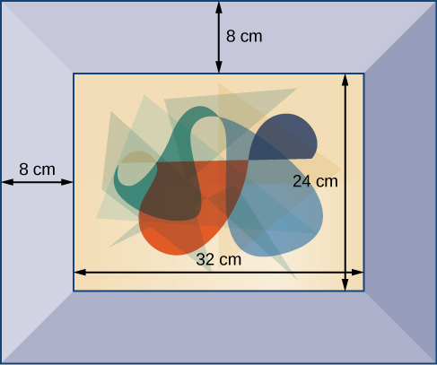

In this section students will:
* Classify a real number as a natural, whole, integer, rational, or irrational number.
* Perform calculations using order of operations.
* Use the following properties of real numbers: commutative, associative, distributive, inverse, and identity.
* Evaluate algebraic expressions.
* Simplify algebraic expressions.

It is often said that mathematics is the language of science. If this is true, then an essential part of the language of mathematics is numbers. The earliest use of numbers occurred 100 centuries ago in the Middle East to count, or enumerate items. Farmers, cattlemen, and tradesmen used tokens, stones, or markers to signify a single quantity—a sheaf of grain, a head of livestock, or a fixed length of cloth, for example. Doing so made commerce possible, leading to improved communications and the spread of civilization.

Three to four thousand years ago, Egyptians introduced fractions. They first used them to show reciprocals. Later, they used them to represent the amount when a quantity was divided into equal parts.

But what if there were no cattle to trade or an entire crop of grain was lost in a flood? How could someone indicate the existence of nothing? From earliest times, people had thought of a “base state” while counting and used various symbols to represent this null condition. However, it was not until about the fifth century A.D. in India that zero was added to the number system and used as a numeral in calculations.

Clearly, there was also a need for numbers to represent loss or debt. In India, in the seventh century A.D., negative numbers were used as solutions to mathematical equations and commercial debts. The opposites of the counting numbers expanded the number system even further.

Because of the evolution of the number system, we can now perform complex calculations using these and other categories of real numbers. In this section, we will explore sets of numbers, calculations with different kinds of numbers, and the use of numbers in expressions.

### Classifying a Real Number

The numbers we use for counting, or enumerating items, are the **natural numbers**{: data-type="term"}\: 1, 2, 3, 4, 5, and so on. We describe them in set notation as<math xmlns="http://www.w3.org/1998/Math/MathML"> <mrow> <mtext> </mtext><mrow><mo>{</mo> <mrow> <mn>1</mn><mo>,</mo><mn>2</mn><mo>,</mo><mn>3</mn><mo>,</mo><mn>...</mn> </mrow> <mo>}</mo></mrow><mtext> </mtext> </mrow> </math>

where the ellipsis (…) indicates that the numbers continue to infinity. The natural numbers are, of course, also called the *counting numbers*. Any time we enumerate the members of a team, count the coins in a collection, or tally the trees in a grove, we are using the set of natural numbers. The set of **whole numbers**{: data-type="term"} is the set of natural numbers plus zero:<math xmlns="http://www.w3.org/1998/Math/MathML"> <mrow> <mtext> </mtext><mrow><mo>{</mo> <mrow> <mn>0</mn><mo>,</mo><mn>1</mn><mo>,</mo><mn>2</mn><mo>,</mo><mn>3</mn><mo>,</mo><mn>...</mn> </mrow> <mo>}</mo></mrow><mo>.</mo> </mrow> </math>

The set of **integers**{: data-type="term"} adds the opposites of the natural numbers to the set of whole numbers:<math xmlns="http://www.w3.org/1998/Math/MathML"> <mrow> <mtext> </mtext><mrow><mo>{</mo> <mrow> <mn>...</mn><mo>,</mo><mn>−3</mn><mo>,</mo><mn>−2</mn><mo>,</mo><mn>−1</mn><mo>,</mo><mn>0</mn><mo>,</mo><mn>1</mn><mo>,</mo><mn>2</mn><mo>,</mo><mn>3</mn><mo>,</mo><mn>...</mn> </mrow> <mo>}</mo></mrow><mo>.</mo> </mrow> </math>

It is useful to note that the set of integers is made up of three distinct subsets: negative integers, zero, and positive integers. In this sense, the positive integers are just the natural numbers. Another way to think about it is that the natural numbers are a subset of the integers.

<math xmlns="http://www.w3.org/1998/Math/MathML" display="block"> <mrow> <mtable columnalign="left"> <mtr columnalign="left"> <mtd columnalign="left"> <mrow> <mover> <mrow> <mover> <mrow> <mo>…</mo><mo>,</mo><mn>−3</mn><mo>,</mo><mn>−2</mn><mo>,</mo><mn>−1</mn><mo>,</mo></mrow> <mrow /> </mover> </mrow> <mrow> <mtext>negative integers</mtext></mrow> </mover> </mrow> </mtd> <mtd columnalign="left"> <mrow /> </mtd> <mtd columnalign="left"> <mrow> <mover> <mrow> <mover> <mrow> <mn>0</mn><mo>,</mo></mrow> <mrow /> </mover> </mrow> <mrow> <mtext>zero</mtext></mrow> </mover> </mrow> </mtd> <mtd columnalign="left"> <mrow /> </mtd> <mtd columnalign="left"> <mrow> <mover> <mrow> <mover> <mrow> <mn>1</mn><mo>,</mo><mn>2</mn><mo>,</mo><mn>3</mn><mo>,</mo><mo>⋯</mo></mrow> <mrow /> </mover> </mrow> <mrow> <mtext>positive integers</mtext></mrow> </mover> </mrow> </mtd> </mtr> </mtable></mrow> </math>

The set of **rational numbers**{: data-type="term"} is written as<math xmlns="http://www.w3.org/1998/Math/MathML"> <mrow> <mtext> </mtext><mrow><mo>{</mo> <mrow> <mrow><mrow> <mfrac> <mi>m</mi> <mi>n</mi> </mfrac> <mtext> </mtext> </mrow><mo>\|</mo></mrow><mi>m</mi><mtext> and </mtext><mi>n</mi><mtext> are integers and </mtext><mi>n</mi><mo>≠</mo><mn>0</mn> </mrow> <mo>}</mo></mrow><mo>.</mo><mtext> </mtext> </mrow> </math>

Notice from the definition that rational numbers are fractions (or quotients) containing integers in both the numerator and the denominator, and the denominator is never 0. We can also see that every natural number, whole number, and integer is a rational number with a denominator of 1.

Because they are fractions, any rational number can also be expressed in decimal form. Any rational number can be represented as either:

1.  a terminating decimal:
    <math xmlns="http://www.w3.org/1998/Math/MathML"> <mrow> <mtext> </mtext><mfrac> <mrow> <mn>15</mn> </mrow> <mn>8</mn> </mfrac> <mo>=</mo><mn>1.875</mn><mo>,</mo> </mrow> </math>
    
    or
2.  a repeating decimal:
    <math xmlns="http://www.w3.org/1998/Math/MathML"> <mrow> <mtext> </mtext><mfrac> <mn>4</mn> <mrow> <mn>11</mn> </mrow> </mfrac> <mo>=</mo><mn>0.36363636</mn><mo>…</mo><mo>=</mo><mn>0.</mn><mover accent="true"> <mrow> <mn>36</mn> </mrow> <mo stretchy="true">¯</mo> </mover> </mrow> </math>
{: data-number-style="arabic"}

We use a line drawn over the repeating block of numbers instead of writing the group multiple times.

Writing Integers as Rational Numbers

Write each of the following as a rational number.

1.  7
2.  0
3.  –8
{: data-number-style="lower-alpha"}

Write a fraction with the integer in the numerator and 1 in the denominator.

1.  <math xmlns="http://www.w3.org/1998/Math/MathML"> <mrow> <mn>7</mn><mo>=</mo><mfrac> <mn>7</mn> <mn>1</mn> </mfrac> </mrow> </math>

2.  <math xmlns="http://www.w3.org/1998/Math/MathML"> <mrow> <mn>0</mn><mo>=</mo><mfrac> <mn>0</mn> <mn>1</mn> </mfrac> </mrow> </math>

3.  <math xmlns="http://www.w3.org/1998/Math/MathML"> <mrow> <mn>−8</mn><mo>=</mo><mo>−</mo><mfrac> <mn>8</mn> <mn>1</mn> </mfrac> </mrow> </math>
{: data-number-style="lower-alpha"}

Write each of the following as a rational number.

1.  11
2.  3
3.  –4
{: data-number-style="lower-alpha"}

1.  <math xmlns="http://www.w3.org/1998/Math/MathML"> <mrow> <mfrac> <mrow> <mn>11</mn> </mrow> <mn>1</mn> </mfrac> </mrow> </math>

2.  <math xmlns="http://www.w3.org/1998/Math/MathML"> <mrow> <mfrac> <mn>3</mn> <mn>1</mn> </mfrac> </mrow> </math>

3.  <math xmlns="http://www.w3.org/1998/Math/MathML"> <mrow> <mo>−</mo><mfrac> <mn>4</mn> <mn>1</mn> </mfrac> </mrow> </math>
{: data-number-style="lower-alpha"}

Identifying Rational Numbers

Write each of the following rational numbers as either a terminating or repeating decimal.

1.  <math xmlns="http://www.w3.org/1998/Math/MathML"> <mrow> <mo>−</mo><mfrac> <mn>5</mn> <mn>7</mn> </mfrac> </mrow> </math>

2.  <math xmlns="http://www.w3.org/1998/Math/MathML"> <mrow> <mfrac> <mrow> <mn>15</mn> </mrow> <mn>5</mn> </mfrac> </mrow> </math>

3.  <math xmlns="http://www.w3.org/1998/Math/MathML"> <mrow> <mfrac> <mrow> <mn>13</mn> </mrow> <mrow> <mn>25</mn> </mrow> </mfrac> </mrow> </math>
{: data-number-style="lower-alpha"}

Write each fraction as a decimal by dividing the numerator by the denominator.

1.  <math xmlns="http://www.w3.org/1998/Math/MathML"> <mrow> <mo>−</mo><mfrac> <mn>5</mn> <mn>7</mn> </mfrac> <mo>=</mo><mn>−0.</mn><mover accent="true"> <mn>714285</mn> <mtext>———</mtext> </mover> <mo>,</mo> </mrow> </math>
    
    a repeating decimal
2.  <math xmlns="http://www.w3.org/1998/Math/MathML"> <mrow> <mfrac> <mrow> <mn>15</mn> </mrow> <mn>5</mn> </mfrac> <mo>=</mo><mn>3</mn><mtext> </mtext> </mrow> </math>
    
    (or 3.0), a terminating decimal
3.  <math xmlns="http://www.w3.org/1998/Math/MathML"> <mrow> <mfrac> <mrow> <mn>13</mn> </mrow> <mrow> <mn>25</mn> </mrow> </mfrac> <mo>=</mo><mn>0.52</mn><mo>,</mo> </mrow> </math>
    
    a terminating decimal
{: data-number-style="lower-alpha"}

Write each of the following rational numbers as either a terminating or repeating decimal.

1.  <math xmlns="http://www.w3.org/1998/Math/MathML"> <mrow> <mfrac> <mrow> <mn>68</mn> </mrow> <mrow> <mn>17</mn> </mrow> </mfrac> </mrow> </math>

2.  <math xmlns="http://www.w3.org/1998/Math/MathML"> <mrow> <mfrac> <mn>8</mn> <mrow> <mn>13</mn> </mrow> </mfrac> </mrow> </math>

3.  <math xmlns="http://www.w3.org/1998/Math/MathML"> <mrow> <mo>−</mo><mfrac> <mrow> <mn>17</mn> </mrow> <mrow> <mn>20</mn> </mrow> </mfrac> </mrow> </math>
{: data-number-style="lower-alpha"}

1.  4 (or 4.0), terminating;
2.  <math xmlns="http://www.w3.org/1998/Math/MathML"> <mrow> <mn>0.</mn><mover accent="true"> <mrow> <mn>615384</mn> </mrow> <mo stretchy="true">¯</mo> </mover> <mo>,</mo> </mrow> </math>
    
    repeating;
3.  –0.85, terminating
{: data-number-style="lower-alpha"}

#### Irrational Numbers

At some point in the ancient past, someone discovered that not all numbers are rational numbers. A builder, for instance, may have found that the diagonal of a square with unit sides was not 2 or even<math xmlns="http://www.w3.org/1998/Math/MathML"> <mrow> <mtext> </mtext><mfrac> <mn>3</mn> <mn>2</mn> </mfrac> <mo>,</mo> </mrow> </math>

but was something else. Or a garment maker might have observed that the ratio of the circumference to the diameter of a roll of cloth was a little bit more than 3, but still not a rational number. Such numbers are said to be *irrational* because they cannot be written as fractions. These numbers make up the set of **irrational numbers**{: data-type="term"}. Irrational numbers cannot be expressed as a fraction of two integers. It is impossible to describe this set of numbers by a single rule except to say that a number is irrational if it is not rational. So we write this as shown.

<math xmlns="http://www.w3.org/1998/Math/MathML"> <mrow> <mrow><mo>{</mo> <mrow> <mrow><mi>h</mi><mo>\|</mo></mrow><mi>h</mi><mtext> is not a rational number</mtext> </mrow> <mo>}</mo></mrow> </mrow> </math>

Differentiating Rational and Irrational Numbers

Determine whether each of the following numbers is rational or irrational. If it is rational, determine whether it is a terminating or repeating decimal.

1.  <math xmlns="http://www.w3.org/1998/Math/MathML"> <mrow> <msqrt> <mrow> <mn>25</mn> </mrow> </msqrt> </mrow> </math>

2.  <math xmlns="http://www.w3.org/1998/Math/MathML"> <mrow> <mfrac> <mrow> <mn>33</mn> </mrow> <mn>9</mn> </mfrac> </mrow> </math>

3.  <math xmlns="http://www.w3.org/1998/Math/MathML"> <mrow> <msqrt> <mrow> <mn>11</mn> </mrow> </msqrt> </mrow> </math>

4.  <math xmlns="http://www.w3.org/1998/Math/MathML"> <mrow> <mfrac> <mrow> <mn>17</mn> </mrow> <mrow> <mn>34</mn> </mrow> </mfrac> </mrow> </math>

5.  <math xmlns="http://www.w3.org/1998/Math/MathML"> <mrow> <mn>0.3033033303333</mn><mo>…</mo> </mrow> </math>
{: data-number-style="lower-alpha"}

1.  <math xmlns="http://www.w3.org/1998/Math/MathML"> <mrow> <msqrt> <mrow> <mn>25</mn> </mrow> </msqrt> <mo>:</mo><mtext> </mtext> </mrow> </math>
    
    This can be simplified as
    <math xmlns="http://www.w3.org/1998/Math/MathML"> <mrow> <mtext> </mtext><msqrt> <mrow> <mn>25</mn> </mrow> </msqrt> <mo>=</mo><mn>5.</mn><mtext> </mtext> </mrow> </math>
    
    Therefore,
    <math xmlns="http://www.w3.org/1998/Math/MathML"> <mrow> <msqrt> <mrow> <mn>25</mn> </mrow> </msqrt> <mtext> </mtext> </mrow> </math>
    
    is rational.
2.  <math xmlns="http://www.w3.org/1998/Math/MathML"> <mrow> <mfrac> <mrow> <mn>33</mn> </mrow> <mn>9</mn> </mfrac> <mo>:</mo><mtext> </mtext> </mrow> </math>
    
    Because it is a fraction,
    <math xmlns="http://www.w3.org/1998/Math/MathML"> <mrow> <mfrac> <mrow> <mn>33</mn> </mrow> <mn>9</mn> </mfrac> <mtext> </mtext> </mrow> </math>
    
    is a rational number. Next, simplify and divide.
    

    <math xmlns="http://www.w3.org/1998/Math/MathML"> <mrow> <mfrac> <mrow> <mn>33</mn> </mrow> <mn>9</mn> </mfrac> <mo>=</mo><mfrac> <mrow> <mover> <mrow> <menclose notation="updiagonalstrike"> <mrow> <mn>33</mn> </mrow> </menclose> </mrow> <mrow> <mn>11</mn> </mrow> </mover> </mrow> <mrow> <munder> <mrow> <menclose notation="updiagonalstrike"> <mn>9</mn> </menclose> </mrow> <mn>3</mn> </munder> </mrow> </mfrac> <mo>=</mo><mfrac> <mrow> <mn>11</mn> </mrow> <mn>3</mn> </mfrac> <mo>=</mo><mn>3.</mn><mover accent="true"> <mn>6</mn> <mo stretchy="true">¯</mo> </mover> </mrow> </math>
    

    
    So,<math xmlns="http://www.w3.org/1998/Math/MathML"> <mrow> <mtext> </mtext><mfrac> <mrow> <mn>33</mn> </mrow> <mn>9</mn> </mfrac> <mtext> </mtext> </mrow> </math>
    
    is rational and a repeating decimal.

3.  <math xmlns="http://www.w3.org/1998/Math/MathML"> <mrow> <msqrt> <mrow> <mn>11</mn> </mrow> </msqrt> <mo>:</mo><mtext> </mtext> </mrow> </math>
    
    This cannot be simplified any further. Therefore,
    <math xmlns="http://www.w3.org/1998/Math/MathML"> <mrow> <mtext> </mtext><msqrt> <mrow> <mn>11</mn> </mrow> </msqrt> <mtext> </mtext> </mrow> </math>
    
    is an irrational number.
4.  <math xmlns="http://www.w3.org/1998/Math/MathML"> <mrow> <mfrac> <mrow> <mn>17</mn> </mrow> <mrow> <mn>34</mn> </mrow> </mfrac> <mo>:</mo><mtext> </mtext> </mrow> </math>
    
    Because it is a fraction,
    <math xmlns="http://www.w3.org/1998/Math/MathML"> <mrow> <mtext> </mtext><mfrac> <mrow> <mn>17</mn> </mrow> <mrow> <mn>34</mn> </mrow> </mfrac> <mtext> </mtext> </mrow> </math>
    
    is a rational number. Simplify and divide.
    

    <math xmlns="http://www.w3.org/1998/Math/MathML"> <mrow> <mfrac> <mrow> <mn>17</mn> </mrow> <mrow> <mn>34</mn> </mrow> </mfrac> <mo>=</mo><mfrac> <mrow> <mover> <mrow> <menclose notation="updiagonalstrike"> <mrow> <mn>17</mn> </mrow> </menclose> </mrow> <mn>1</mn> </mover> </mrow> <mrow> <munder> <mrow> <menclose notation="updiagonalstrike"> <mrow> <mn>34</mn> </mrow> </menclose> </mrow> <mn>2</mn> </munder> </mrow> </mfrac> <mo>=</mo><mfrac> <mn>1</mn> <mn>2</mn> </mfrac> <mo>=</mo><mn>0.5</mn> </mrow> </math>
    

    
    So,<math xmlns="http://www.w3.org/1998/Math/MathML"> <mrow> <mtext> </mtext><mfrac> <mrow> <mn>17</mn> </mrow> <mrow> <mn>34</mn> </mrow> </mfrac> <mtext> </mtext> </mrow> </math>
    
    is rational and a terminating decimal.

5.  <math xmlns="http://www.w3.org/1998/Math/MathML"> <mrow> <mn>0.3033033303333</mn><mo>…</mo><mtext> </mtext> </mrow> </math>
    
    is not a terminating decimal. Also note that there is no repeating pattern because the group of 3s increases each time. Therefore it is neither a terminating nor a repeating decimal and, hence, not a rational number. It is an irrational number.
{: data-number-style="lower-alpha"}

Determine whether each of the following numbers is rational or irrational. If it is rational, determine whether it is a terminating or repeating decimal.

1.  <math xmlns="http://www.w3.org/1998/Math/MathML"> <mrow> <mfrac> <mn>7</mn> <mrow> <mn>77</mn> </mrow> </mfrac> </mrow> </math>

2.  <math xmlns="http://www.w3.org/1998/Math/MathML"> <mrow> <msqrt> <mrow> <mn>81</mn> </mrow> </msqrt> </mrow> </math>

3.  <math xmlns="http://www.w3.org/1998/Math/MathML"> <mrow> <mn>4.27027002700027</mn><mo>…</mo> </mrow> </math>

4.  <math xmlns="http://www.w3.org/1998/Math/MathML"> <mrow> <mfrac> <mrow> <mn>91</mn> </mrow> <mrow> <mn>13</mn> </mrow> </mfrac> </mrow> </math>

5.  <math xmlns="http://www.w3.org/1998/Math/MathML"> <mrow> <msqrt> <mrow> <mn>39</mn> </mrow> </msqrt> </mrow> </math>
{: data-number-style="lower-alpha"}

1.  rational and repeating;
2.  rational and terminating;
3.  irrational;
4.  rational and repeating;
5.  irrational
{: data-number-style="lower-alpha"}

#### Real Numbers

Given any number *n*, we know that *n* is either rational or irrational. It cannot be both. The sets of rational and irrational numbers together make up the set of **real numbers**{: data-type="term"}. As we saw with integers, the real numbers can be divided into three subsets: negative real numbers, zero, and positive real numbers. Each subset includes fractions, decimals, and irrational numbers according to their algebraic sign (+ or –). Zero is considered neither positive nor negative.

The real numbers can be visualized on a horizontal number line with an arbitrary point chosen as 0, with negative numbers to the left of 0 and positive numbers to the right of 0. A fixed unit distance is then used to mark off each integer (or other basic value) on either side of 0. Any real number corresponds to a unique position on the number line.The converse is also true: Each location on the number line corresponds to exactly one real number. This is known as a one-to-one correspondence. We refer to this as the **real number line**{: data-type="term"} as shown in [\[link\]](#Figure_01_01_001)**.**

 {: #Figure_01_01_001}

Classifying Real Numbers

Classify each number as either positive or negative and as either rational or irrational. Does the number lie to the left or the right of 0 on the number line?

1.  <math xmlns="http://www.w3.org/1998/Math/MathML"> <mrow> <mo>−</mo><mfrac> <mrow> <mn>10</mn> </mrow> <mn>3</mn> </mfrac> </mrow> </math>

2.  <math xmlns="http://www.w3.org/1998/Math/MathML"> <mrow> <msqrt> <mn>5</mn> </msqrt> </mrow> </math>

3.  <math xmlns="http://www.w3.org/1998/Math/MathML"> <mrow> <mo>−</mo><msqrt> <mrow> <mn>289</mn> </mrow> </msqrt> </mrow> </math>

4.  <math xmlns="http://www.w3.org/1998/Math/MathML"> <mrow> <mn>−6</mn><mi>π</mi> </mrow> </math>

5.  <math xmlns="http://www.w3.org/1998/Math/MathML"> <mrow> <mn>0.615384615384</mn><mo>…</mo> </mrow> </math>
{: data-number-style="lower-alpha"}

1.  <math xmlns="http://www.w3.org/1998/Math/MathML"> <mrow> <mo>−</mo><mfrac> <mrow> <mn>10</mn> </mrow> <mn>3</mn> </mfrac> <mtext> </mtext> </mrow> </math>
    
    is negative and rational. It lies to the left of 0 on the number line.
2.  <math xmlns="http://www.w3.org/1998/Math/MathML"> <mrow> <msqrt> <mn>5</mn> </msqrt> <mtext> </mtext> </mrow> </math>
    
    is positive and irrational. It lies to the right of 0.
3.  <math xmlns="http://www.w3.org/1998/Math/MathML"> <mrow> <mo>−</mo><msqrt> <mrow> <mn>289</mn> </mrow> </msqrt> <mo>=</mo><mo>−</mo><msqrt> <mrow> <msup> <mrow> <mn>17</mn> </mrow> <mn>2</mn> </msup> </mrow> </msqrt> <mo>=</mo><mn>−17</mn><mtext> </mtext> </mrow> </math>
    
    is negative and rational. It lies to the left of 0.
4.  <math xmlns="http://www.w3.org/1998/Math/MathML"> <mrow> <mn>−6</mn><mi>π</mi><mtext> </mtext> </mrow> </math>
    
    is negative and irrational. It lies to the left of 0.
5.  <math xmlns="http://www.w3.org/1998/Math/MathML"> <mrow> <mn>0.615384615384</mn><mo>…</mo><mtext> </mtext> </mrow> </math>
    
    is a repeating decimal so it is rational and positive. It lies to the right of 0.
{: data-number-style="lower-alpha"}

Classify each number as either positive or negative and as either rational or irrational. Does the number lie to the left or the right of 0 on the number line?

1.  <math xmlns="http://www.w3.org/1998/Math/MathML"> <mrow> <msqrt> <mrow> <mn>73</mn> </mrow> </msqrt> </mrow> </math>

2.  <math xmlns="http://www.w3.org/1998/Math/MathML"> <mrow> <mn>−11.411411411</mn><mo>…</mo> </mrow> </math>

3.  <math xmlns="http://www.w3.org/1998/Math/MathML"> <mrow> <mfrac> <mrow> <mn>47</mn> </mrow> <mrow> <mn>19</mn> </mrow> </mfrac> </mrow> </math>

4.  <math xmlns="http://www.w3.org/1998/Math/MathML"> <mrow> <mo>−</mo><mfrac> <mrow> <msqrt> <mn>5</mn> </msqrt> </mrow> <mn>2</mn> </mfrac> </mrow> </math>

5.  <math xmlns="http://www.w3.org/1998/Math/MathML"> <mrow> <mn>6.210735</mn> </mrow> </math>
{: data-number-style="lower-alpha"}

1.  positive, irrational; right
2.  negative, rational; left
3.  positive, rational; right
4.  negative, irrational; left
5.  positive, rational; right
{: data-number-style="lower-alpha"}

#### Sets of Numbers as Subsets

Beginning with the natural numbers, we have expanded each set to form a larger set, meaning that there is a subset relationship between the sets of numbers we have encountered so far. These relationships become more obvious when seen as a diagram, such as [\[link\]](#Figure_01_01_002).

 {: #Figure_01_01_002}

Sets of Numbers

The set of **natural numbers**{: data-type="term"} includes the numbers used for counting:<math xmlns="http://www.w3.org/1998/Math/MathML"> <mrow> <mtext> </mtext><mrow><mo>{</mo> <mrow> <mn>1</mn><mo>,</mo><mn>2</mn><mo>,</mo><mn>3</mn><mo>,</mo><mn>...</mn> </mrow> <mo>}</mo></mrow><mo>.</mo> </mrow> </math>

The set of **whole numbers**{: data-type="term"} is the set of natural numbers plus zero:<math xmlns="http://www.w3.org/1998/Math/MathML"> <mrow> <mtext> </mtext><mrow><mo>{</mo> <mrow> <mn>0</mn><mo>,</mo><mn>1</mn><mo>,</mo><mn>2</mn><mo>,</mo><mn>3</mn><mo>,</mo><mn>...</mn> </mrow> <mo>}</mo></mrow><mo>.</mo> </mrow> </math>

The set of **integers**{: data-type="term"} adds the negative natural numbers to the set of whole numbers:<math xmlns="http://www.w3.org/1998/Math/MathML"> <mrow> <mtext> </mtext><mrow><mo>{</mo> <mrow> <mn>...</mn><mo>,</mo><mn>−3</mn><mo>,</mo><mn>−2</mn><mo>,</mo><mn>−1</mn><mo>,</mo><mn>0</mn><mo>,</mo><mn>1</mn><mo>,</mo><mn>2</mn><mo>,</mo><mn>3</mn><mo>,</mo><mn>...</mn> </mrow> <mo>}</mo></mrow><mo>.</mo> </mrow> </math>

The set of **rational numbers**{: data-type="term"} includes fractions written as<math xmlns="http://www.w3.org/1998/Math/MathML"> <mrow> <mtext> </mtext><mrow><mo>{</mo> <mrow> <mrow><mrow> <mfrac> <mi>m</mi> <mi>n</mi> </mfrac> <mtext> </mtext> </mrow><mo>\|</mo></mrow><mi>m</mi><mtext> and </mtext><mi>n</mi><mtext> are integers and </mtext><mi>n</mi><mo>≠</mo><mn>0</mn> </mrow> <mo>}</mo></mrow><mo>.</mo> </mrow> </math>

The set of **irrational numbers**{: data-type="term"} is the set of numbers that are not rational, are nonrepeating, and are nonterminating:<math xmlns="http://www.w3.org/1998/Math/MathML"> <mrow> <mtext> </mtext><mrow><mo>{</mo> <mrow> <mrow><mi>h</mi><mo>\|</mo></mrow><mi>h</mi><mtext> is not a rational number</mtext> </mrow> <mo>}</mo></mrow><mo>.</mo> </mrow> </math>

Differentiating the Sets of Numbers

Classify each number as being a natural number (*N*), whole number (*W*), integer (*I*), rational number (*Q*), and/or irrational number (*Q′*).

1.  <math xmlns="http://www.w3.org/1998/Math/MathML"> <mrow> <msqrt> <mrow> <mn>36</mn> </mrow> </msqrt> </mrow> </math>

2.  <math xmlns="http://www.w3.org/1998/Math/MathML"> <mrow> <mfrac> <mn>8</mn> <mn>3</mn> </mfrac> </mrow> </math>

3.  <math xmlns="http://www.w3.org/1998/Math/MathML"> <mrow> <msqrt> <mrow> <mn>73</mn> </mrow> </msqrt> </mrow> </math>

4.  <math xmlns="http://www.w3.org/1998/Math/MathML"> <mrow> <mn>−6</mn> </mrow> </math>

5.  <math xmlns="http://www.w3.org/1998/Math/MathML"> <mrow> <mn>3.2121121112</mn><mo>…</mo> </mrow> </math>
{: data-number-style="lower-alpha"}

|  | *N* | *W* | *I* | *Q* | *Q′* |
|----------
| a.<math xmlns="http://www.w3.org/1998/Math/MathML"> <mrow> <mtext> </mtext><msqrt> <mrow> <mn>36</mn> </mrow> </msqrt> <mo>=</mo><mn>6</mn> </mrow> </math>

 | X | X | X | X |  |
| b.<math xmlns="http://www.w3.org/1998/Math/MathML"> <mrow> <mtext> </mtext><mfrac> <mn>8</mn> <mn>3</mn> </mfrac> <mo>=</mo><mn>2.</mn><mover accent="true"> <mn>6</mn> <mo stretchy="true">¯</mo> </mover> </mrow> </math>

 |  |  |  | X |  |
| c.<math xmlns="http://www.w3.org/1998/Math/MathML"> <mrow> <mtext> </mtext><msqrt> <mrow> <mn>73</mn> </mrow> </msqrt> </mrow> </math>

 |  |  |  |  | X |
| d. –6 |  |  | X | X |  |
| e. 3.2121121112... |  |  |  |  | X |
{: summary="A table with six rows and six columns. The first entry in the first row is blank, but the rest of the entries read: N, W, I, Q, and Q'. (These are the sets of numbers from before.) The first entry in the second row reads: square root of thirty-six equals six. Then the second, third, fourth, and fifth columns are marked. The first entry in the third row reads: eight over three equals 2.6 with the 6 repeating forever. Then only the fifth column is marked. The first entry in the fourth row reads: square root of seventy-three. Then only the sixth column is marked. The first entry in the fifth row reads: negative six. Then the fourth and fifth columns are marked. The first entry in the sixth row reads: 3.2121121112&#x2026;. Then only the sixth column is marked." .unnumbered}

Classify each number as being a natural number (*N*), whole number (*W*), integer (*I*), rational number (*Q*), and/or irrational number (*Q′*).

1.  <math xmlns="http://www.w3.org/1998/Math/MathML"> <mrow> <mo>−</mo><mfrac> <mrow> <mn>35</mn> </mrow> <mn>7</mn> </mfrac> </mrow> </math>

2.  <math xmlns="http://www.w3.org/1998/Math/MathML"> <mn>0</mn> </math>

3.  <math xmlns="http://www.w3.org/1998/Math/MathML"> <mrow> <msqrt> <mrow> <mn>169</mn> </mrow> </msqrt> </mrow> </math>

4.  <math xmlns="http://www.w3.org/1998/Math/MathML"> <mrow> <msqrt> <mrow> <mn>24</mn> </mrow> </msqrt> </mrow> </math>

5.  <math xmlns="http://www.w3.org/1998/Math/MathML"> <mrow> <mn>4.763763763</mn><mo>…</mo> </mrow> </math>
{: data-number-style="lower-alpha"}

|  | *N* | *W* | *I* | *Q* | *Q'* |
|----------
| a.<math xmlns="http://www.w3.org/1998/Math/MathML"> <mrow> <mtext> </mtext><mo>−</mo><mfrac> <mrow> <mn>35</mn> </mrow> <mn>7</mn> </mfrac> </mrow> </math>

 |  |  | X | X |  |
| b. 0 |  | X | X | X |  |
| c.<math xmlns="http://www.w3.org/1998/Math/MathML"> <mrow> <mtext> </mtext><msqrt> <mrow> <mn>169</mn> </mrow> </msqrt> </mrow> </math>

 | X | X | X | X |  |
| d.<math xmlns="http://www.w3.org/1998/Math/MathML"> <mrow> <mtext> </mtext><msqrt> <mrow> <mn>24</mn> </mrow> </msqrt> </mrow> </math>

 |  |  |  |  | X |
| e. 4.763763763... |  |  |  | X |  |
{: summary="A table with six rows and six columns. The first entry of the first row is empty, but the rest read: N, W, I, Q, and Q'. (These are the sets of numbers.) The first entry of the second row reads: negative thirty-five over seven. Then the fourth and fifth columns are marked. The first entry of the third row reads: zero. Then the third, fourth, and fifth columns are marked. The first entry of the fourth row reads: square root of one hundred sixty-nine. Then the second, third, fourth, and fifth columns are marked. The first entry of the fifth row reads: square root of twenty-four. Then only the sixth column is marked. The first entry of the sixth row reads: 4.763763763&#x2026;. Then only the fifth column is marked" .unnumbered}

### Performing Calculations Using the Order of Operations

When we multiply a number by itself, we square it or raise it to a power of 2. For example,<math xmlns="http://www.w3.org/1998/Math/MathML"> <mrow> <mtext> </mtext><msup> <mn>4</mn> <mn>2</mn> </msup> <mo>=</mo><mn>4</mn><mo>⋅</mo><mn>4</mn><mo>=</mo><mn>16.</mn><mtext> </mtext> </mrow> </math>

We can raise any number to any power. In general, the **exponential notation**{: data-type="term"}<math xmlns="http://www.w3.org/1998/Math/MathML"> <mrow> <mtext> </mtext><msup> <mi>a</mi> <mi>n</mi> </msup> <mtext> </mtext> </mrow> </math>

means that the number or variable<math xmlns="http://www.w3.org/1998/Math/MathML"> <mrow> <mtext> </mtext><mi>a</mi><mtext> </mtext> </mrow> </math>

is used as a factor<math xmlns="http://www.w3.org/1998/Math/MathML"> <mrow> <mtext> </mtext><mi>n</mi><mtext> </mtext> </mrow> </math>

times.

<math xmlns="http://www.w3.org/1998/Math/MathML" display="block"> <mrow> <mtable columnalign="left"> <mtr columnalign="left"> <mtd columnalign="left"> <mrow> <msup> <mi>a</mi> <mi>n</mi> </msup> </mrow> </mtd> </mtr> </mtable><mo>=</mo><mover> <mrow> <mover> <mrow> <mi>a</mi><mo>⋅</mo><mi>a</mi><mo>⋅</mo><mi>a</mi><mo>⋅</mo><mo>…</mo><mo>⋅</mo><mi>a</mi></mrow> <mrow /> </mover> </mrow> <mrow> <mi>n</mi><mtext> factors</mtext></mrow> </mover> </mrow> </math>

In this notation,<math xmlns="http://www.w3.org/1998/Math/MathML"> <mrow> <mtext> </mtext><msup> <mi>a</mi> <mi>n</mi> </msup> <mtext> </mtext> </mrow> </math>

is read as the *n*th power of<math xmlns="http://www.w3.org/1998/Math/MathML"> <mrow> <mtext> </mtext><mi>a</mi><mo>,</mo><mtext> </mtext> </mrow> </math>

where<math xmlns="http://www.w3.org/1998/Math/MathML"> <mrow> <mtext> </mtext><mi>a</mi><mtext> </mtext> </mrow> </math>

is called the **base**{: data-type="term"} and<math xmlns="http://www.w3.org/1998/Math/MathML"> <mrow> <mtext> </mtext><mi>n</mi><mtext> </mtext> </mrow> </math>

is called the **exponent**{: data-type="term"}**.** A term in exponential notation may be part of a mathematical expression, which is a combination of numbers and operations. For example,<math xmlns="http://www.w3.org/1998/Math/MathML"> <mrow> <mtext> </mtext><mn>24</mn><mo>+</mo><mn>6</mn><mo>⋅</mo><mfrac> <mn>2</mn> <mn>3</mn> </mfrac> <mo>−</mo><msup> <mn>4</mn> <mn>2</mn> </msup> <mtext> </mtext> </mrow> </math>

is a mathematical expression.

To evaluate a mathematical expression, we perform the various operations. However, we do not perform them in any random order. We use the **order of operations**{: data-type="term"}. This is a sequence of rules for evaluating such expressions.

Recall that in mathematics we use parentheses ( ), brackets \[ \], and braces \{ } to group numbers and expressions so that anything appearing within the symbols is treated as a unit. Additionally, fraction bars, radicals, and absolute value bars are treated as grouping symbols. When evaluating a mathematical expression, begin by simplifying expressions within grouping symbols.

The next step is to address any exponents or radicals. Afterward, perform multiplication and division from left to right and finally addition and subtraction from left to right.

Let’s take a look at the expression provided.

<math xmlns="http://www.w3.org/1998/Math/MathML"> <mrow> <mn>24</mn><mo>+</mo><mn>6</mn><mo>⋅</mo><mfrac> <mn>2</mn> <mn>3</mn> </mfrac> <mo>−</mo><msup> <mn>4</mn> <mn>2</mn> </msup> </mrow> </math>

There are no grouping symbols, so we move on to exponents or radicals. The number 4 is raised to a power of 2, so simplify<math xmlns="http://www.w3.org/1998/Math/MathML"> <mrow> <mtext> </mtext><msup> <mn>4</mn> <mn>2</mn> </msup> <mtext> </mtext> </mrow> </math>

as 16.

<math xmlns="http://www.w3.org/1998/Math/MathML"> <mrow> <mtable columnalign="left"> <mtr columnalign="left"> <mtd columnalign="left"> <mrow /> </mtd> </mtr> <mtr columnalign="left"> <mtd columnalign="left"> <mrow> <mtable columnalign="left"> <mtr columnalign="left"> <mtd columnalign="left"> <mrow> <mn>24</mn><mo>+</mo><mn>6</mn><mo>⋅</mo><mfrac> <mn>2</mn> <mn>3</mn> </mfrac> <mo>−</mo><msup> <mn>4</mn> <mn>2</mn> </msup> </mrow> </mtd> </mtr> <mtr columnalign="left"> <mtd columnalign="left"> <mrow> <mn>24</mn><mo>+</mo><mn>6</mn><mo>⋅</mo><mfrac> <mn>2</mn> <mn>3</mn> </mfrac> <mo>−</mo><mn>16</mn></mrow> </mtd> </mtr> </mtable></mrow> </mtd> </mtr> </mtable></mrow> </math>

Next, perform multiplication or division, left to right.

<math xmlns="http://www.w3.org/1998/Math/MathML"> <mrow> <mtable columnalign="left"> <mtr columnalign="left"> <mtd columnalign="left"> <mrow /> </mtd> </mtr> <mtr columnalign="left"> <mtd columnalign="left"> <mrow> <mtable columnalign="left"> <mtr columnalign="left"> <mtd columnalign="left"> <mrow> <mn>24</mn><mo>+</mo><mn>6</mn><mo>⋅</mo><mfrac> <mn>2</mn> <mn>3</mn> </mfrac> <mo>−</mo><mn>16</mn></mrow> </mtd> </mtr> <mtr columnalign="left"> <mtd columnalign="left"> <mrow> <mn>24</mn><mo>+</mo><mn>4</mn><mo>−</mo><mn>16</mn></mrow> </mtd> </mtr> </mtable></mrow> </mtd> </mtr> </mtable></mrow> </math>

Lastly, perform addition or subtraction, left to right.

<math xmlns="http://www.w3.org/1998/Math/MathML" display="block"> <mrow> <mtable columnalign="left"> <mtr columnalign="left"> <mtd columnalign="left"> <mrow /> </mtd> </mtr> <mtr columnalign="left"> <mtd columnalign="left"> <mrow> <mn>24</mn><mo>+</mo><mn>4</mn><mo>−</mo><mn>16</mn></mrow> </mtd> </mtr> <mtr columnalign="left"> <mtd columnalign="left"> <mrow> <mtext>      </mtext><mn>28</mn><mo>−</mo><mn>16</mn></mrow> </mtd> </mtr> <mtr columnalign="left"> <mtd columnalign="left"> <mrow> <mtext>          </mtext><mn>12</mn></mrow> </mtd> </mtr> </mtable></mrow> </math>

Therefore,<math xmlns="http://www.w3.org/1998/Math/MathML"> <mrow> <mtext> </mtext><mn>24</mn><mo>+</mo><mn>6</mn><mo>⋅</mo><mfrac> <mn>2</mn> <mn>3</mn> </mfrac> <mo>−</mo><msup> <mn>4</mn> <mn>2</mn> </msup> <mo>=</mo><mn>12.</mn> </mrow> </math>

For some complicated expressions, several passes through the order of operations will be needed. For instance, there may be a radical expression inside parentheses that must be simplified before the parentheses are evaluated. Following the order of operations ensures that anyone simplifying the same mathematical expression will get the same result.

Order of Operations

Operations in mathematical expressions must be evaluated in a systematic order, which can be simplified using the acronym **PEMDAS**\:

**P**(arentheses)* * *
{: data-type="newline"}

**E**(xponents)* * *
{: data-type="newline"}

**M**(ultiplication) and **D**(ivision)* * *
{: data-type="newline"}

**A**(ddition) and **S**(ubtraction)

**Given a mathematical expression, simplify it using the order of operations.**

1.  Simplify any expressions within grouping symbols.
2.  Simplify any expressions containing exponents or radicals.
3.  Perform any multiplication and division in order, from left to right.
4.  Perform any addition and subtraction in order, from left to right.
{: data-number-style="arabic" .stepwise}

Using the Order of Operations

Use the order of operations to evaluate each of the following expressions.

1.  <math xmlns="http://www.w3.org/1998/Math/MathML"> <mrow> <msup> <mrow> <mrow><mo>(</mo> <mrow> <mn>3</mn><mo>⋅</mo><mn>2</mn></mrow> <mo>)</mo></mrow></mrow> <mn>2</mn> </msup> <mo>−</mo><mn>4</mn><mrow><mo>(</mo> <mrow> <mn>6</mn><mo>+</mo><mn>2</mn></mrow> <mo>)</mo></mrow></mrow> </math>

2.  <math xmlns="http://www.w3.org/1998/Math/MathML"> <mrow> <mfrac> <mrow> <msup> <mn>5</mn> <mn>2</mn> </msup> <mo>−</mo><mn>4</mn></mrow> <mn>7</mn> </mfrac> <mo>−</mo><msqrt> <mrow> <mn>11</mn><mo>−</mo><mn>2</mn></mrow> </msqrt> </mrow> </math>

3.  <math xmlns="http://www.w3.org/1998/Math/MathML"> <mrow> <mn>6</mn><mo>−</mo><mrow><mo>\|</mo> <mrow> <mn>5</mn><mo>−</mo><mn>8</mn></mrow> <mo>\|</mo></mrow><mo>+</mo><mn>3</mn><mrow><mo>(</mo> <mrow> <mn>4</mn><mo>−</mo><mn>1</mn></mrow> <mo>)</mo></mrow></mrow> </math>

4.  <math xmlns="http://www.w3.org/1998/Math/MathML"> <mrow> <mfrac> <mrow> <mn>14</mn><mo>−</mo><mn>3</mn><mo>⋅</mo><mn>2</mn></mrow> <mrow> <mn>2</mn><mo>⋅</mo><mn>5</mn><mo>−</mo><msup> <mn>3</mn> <mn>2</mn> </msup> </mrow> </mfrac> </mrow> </math>

5.  <math xmlns="http://www.w3.org/1998/Math/MathML"> <mrow> <mn>7</mn><mrow><mo>(</mo> <mrow> <mn>5</mn><mo>⋅</mo><mn>3</mn></mrow> <mo>)</mo></mrow><mo>−</mo><mn>2</mn><mrow><mo>[</mo> <mrow> <mrow><mo>(</mo> <mrow> <mn>6</mn><mo>−</mo><mn>3</mn></mrow> <mo>)</mo></mrow><mo>−</mo><msup> <mn>4</mn> <mn>2</mn> </msup> </mrow> <mo>]</mo></mrow><mo>+</mo><mn>1</mn></mrow> </math>
{: data-number-style="lower-alpha"}

1.  * * *
    {: data-type="newline"}
    
    <math xmlns="http://www.w3.org/1998/Math/MathML"> <mrow> <mtable> <mtr rowalign="center"> <mtd columnalign="right" rowalign="center"><mrow><msup><mrow><mo stretchy="false">(</mo><mn>3</mn><mo>⋅</mo><mn>2</mn><mo stretchy="false">)</mo></mrow><mn>2</mn></msup><mo>−</mo><mn>4</mn><mo stretchy="false">(</mo><mn>6</mn><mo>+</mo><mn>2</mn><mo stretchy="false">)</mo></mrow></mtd> <mtd rowalign="center"><mo>=</mo></mtd> <mtd columnalign="left" rowalign="center"><mrow><msup><mrow><mo stretchy="false">(</mo><mn>6</mn><mo stretchy="false">)</mo></mrow><mn>2</mn></msup><mo>−</mo><mn>4</mn><mo stretchy="false">(</mo><mn>8</mn><mo stretchy="false">)</mo></mrow></mtd> <mtd columnalign="left" rowalign="center"><mrow><mspace width="2em" /><mtext>Simplify parentheses</mtext></mrow></mtd> </mtr> <mtr rowalign="center"> <mtd rowalign="center" /> <mtd rowalign="center"><mo>=</mo></mtd> <mtd columnalign="left" rowalign="center"><mrow><mn>36</mn><mo>−</mo><mn>4</mn><mo stretchy="false">(</mo><mn>8</mn><mo stretchy="false">)</mo></mrow></mtd> <mtd columnalign="left" rowalign="center"><mrow><mspace width="2em" /><mtext>Simplify exponent</mtext></mrow></mtd> </mtr> <mtr rowalign="center"> <mtd rowalign="center" /> <mtd rowalign="center"><mo>=</mo></mtd> <mtd columnalign="left" rowalign="center"><mrow><mn>36</mn><mo>−</mo><mn>32</mn></mrow></mtd> <mtd columnalign="left" rowalign="center"><mrow><mspace width="2em" /><mtext>Simplify multiplication</mtext></mrow></mtd> </mtr> <mtr rowalign="center"> <mtd rowalign="center" /> <mtd rowalign="center"><mo>=</mo></mtd> <mtd columnalign="left" rowalign="center"><mn>4</mn></mtd> <mtd columnalign="left" rowalign="center"><mrow><mspace width="2em" /><mtext>Simplify subtraction</mtext></mrow></mtd> </mtr> </mtable> </mrow> </math>

2.  * * *
    {: data-type="newline"}
    
    <math xmlns="http://www.w3.org/1998/Math/MathML"> <mrow> <mtable> <mtr rowalign="center"> <mtd rowalign="center" columnalign="right"><mrow><mfrac><mrow><msup><mn>5</mn><mn>2</mn></msup><mo>-</mo><mn>4</mn></mrow><mn>7</mn></mfrac><mo>−</mo><msqrt><mrow><mn>11</mn><mo>−</mo><mn>2</mn></mrow></msqrt></mrow></mtd> <mtd rowalign="center"><mo>=</mo></mtd> <mtd columnalign="left" rowalign="center"><mrow><mfrac><mrow><msup><mn>5</mn><mn>2</mn></msup><mo>−</mo><mn>4</mn></mrow><mn>7</mn></mfrac><mo>−</mo><msqrt><mn>9</mn></msqrt></mrow></mtd> <mtd columnalign="left" rowalign="center"><mrow><mspace width="3.5em" /><mtext>Simplify grouping symbols (radical)</mtext></mrow></mtd> </mtr> <mtr rowalign="center"> <mtd rowalign="center" /> <mtd rowalign="center"><mo>=</mo></mtd> <mtd columnalign="left" rowalign="center"><mrow><mfrac><mrow><msup><mn>5</mn><mn>2</mn></msup><mo>−</mo><mn>4</mn></mrow><mn>7</mn></mfrac><mo>−</mo><mn>3</mn></mrow></mtd> <mtd columnalign="left" rowalign="center"><mrow><mspace width="3.5em" /><mtext>Simplify radical</mtext></mrow></mtd> </mtr> <mtr rowalign="center"> <mtd rowalign="center" /> <mtd rowalign="center"><mo>=</mo></mtd> <mtd columnalign="left" rowalign="center"><mrow><mfrac><mrow><mn>25</mn><mo>−</mo><mn>4</mn></mrow><mn>7</mn></mfrac><mo>−</mo><mn>3</mn></mrow></mtd> <mtd columnalign="left" rowalign="center"><mrow><mspace width="3.5em" /><mtext>Simplify exponent</mtext></mrow></mtd> </mtr> <mtr rowalign="center"> <mtd rowalign="center" /> <mtd rowalign="center"><mo>=</mo></mtd> <mtd columnalign="left" rowalign="center"><mrow><mfrac><mrow><mn>21</mn></mrow><mn>7</mn></mfrac><mo>−</mo><mn>3</mn></mrow></mtd> <mtd columnalign="left" rowalign="center"><mrow><mspace width="3.5em" /><mtext>Simplify subtraction in numerator</mtext></mrow></mtd> </mtr> <mtr rowalign="center"> <mtd rowalign="center" /> <mtd rowalign="center"><mo>=</mo></mtd> <mtd columnalign="left" rowalign="center"><mrow><mn>3</mn><mo>−</mo><mn>3</mn></mrow></mtd> <mtd columnalign="left" rowalign="center"><mrow><mspace width="3.5em" /><mtext>Simplify division</mtext></mrow></mtd> </mtr> <mtr rowalign="center"> <mtd rowalign="center" /> <mtd rowalign="center"><mo>=</mo></mtd> <mtd columnalign="left" rowalign="center"><mn>0</mn></mtd> <mtd columnalign="left" rowalign="center"><mrow><mspace width="3.5em" /><mtext>Simplify subtraction</mtext></mrow></mtd> </mtr> </mtable> </mrow> </math>
    
    Note that in the first step, the radical is treated as a grouping symbol, like parentheses. Also, in the third step, the fraction bar is considered a grouping symbol so the numerator is considered to be grouped.

3.  * * *
    {: data-type="newline"}
    
    <math xmlns="http://www.w3.org/1998/Math/MathML"> <mrow> <mtable> <mtr rowalign="center"> <mtd rowalign="center" columnalign="right"><mrow><mn>6</mn><mo>−</mo><mo>\|</mo><mn>5</mn><mo>−</mo><mn>8</mn><mo>\|</mo><mo>+</mo><mn>3</mn><mo stretchy="false">(</mo><mn>4</mn><mo>−</mo><mn>1</mn><mo stretchy="false">)</mo></mrow></mtd> <mtd rowalign="center"><mo>=</mo></mtd> <mtd rowalign="center" columnalign="left"><mrow><mn>6</mn><mo>−</mo><mo>\|</mo><mn>−3</mn><mo>\|</mo><mo>+</mo><mn>3</mn><mo stretchy="false">(</mo><mn>3</mn><mo stretchy="false">)</mo></mrow></mtd> <mtd columnalign="left" rowalign="center"><mrow><mspace width="2em" /><mtext>Simplify inside grouping symbols</mtext></mrow></mtd> </mtr> <mtr rowalign="center"> <mtd rowalign="center" /> <mtd rowalign="center"><mo>=</mo></mtd> <mtd columnalign="left" rowalign="center"><mrow><mn>6</mn><mo>−</mo><mn>3</mn><mo>+</mo><mn>3</mn><mo stretchy="false">(</mo><mn>3</mn><mo stretchy="false">)</mo></mrow></mtd> <mtd columnalign="left" rowalign="center"><mrow><mspace width="2em" /><mtext>Simplify absolute value</mtext></mrow></mtd> </mtr> <mtr rowalign="center"> <mtd rowalign="center" /> <mtd rowalign="center"><mo>=</mo></mtd> <mtd columnalign="left" rowalign="center"><mrow><mn>6</mn><mo>−</mo><mn>3</mn><mo>+</mo><mn>9</mn></mrow></mtd> <mtd columnalign="left" rowalign="center"><mrow><mspace width="2em" /><mtext>Simplify multiplication</mtext></mrow></mtd> </mtr> <mtr rowalign="center"> <mtd rowalign="center" /> <mtd rowalign="center"><mo>=</mo></mtd> <mtd columnalign="left" rowalign="center"> <mrow><mn>3</mn><mo>+</mo><mn>9</mn></mrow></mtd> <mtd columnalign="left" rowalign="center"><mrow><mspace width="2em" /><mtext>Simplify subtraction</mtext></mrow></mtd> </mtr> <mtr rowalign="center"> <mtd rowalign="center" /> <mtd rowalign="center"><mo>=</mo></mtd> <mtd columnalign="left" rowalign="center"><mrow><mn>12</mn></mrow></mtd> <mtd columnalign="left" rowalign="center"><mrow><mspace width="2em" /><mtext>Simplify addition</mtext></mrow></mtd> </mtr> </mtable> </mrow> </math>

4.  * * *
    {: data-type="newline"}
    
    <math xmlns="http://www.w3.org/1998/Math/MathML"> <mrow> <mtable> <mtr rowalign="center"> <mtd columnalign="right" rowalign="center"><mrow><mfrac><mrow> <mn>14</mn><mo>−</mo><mn>3</mn><mo>⋅</mo><mn>2</mn></mrow><mrow><mn>2</mn><mo>⋅</mo><mn>5</mn><mo>−</mo><msup><mn>3</mn><mn>2</mn></msup></mrow></mfrac></mrow></mtd> <mtd rowalign="center"><mo>=</mo></mtd> <mtd columnalign="left" rowalign="center"><mrow><mfrac><mrow> <mn>14</mn><mo>−</mo><mn>3</mn><mo>⋅</mo><mn>2</mn></mrow><mrow><mn>2</mn><mo>⋅</mo><mn>5</mn><mo>−</mo><mn>9</mn></mrow></mfrac></mrow></mtd> <mtd columnalign="left" rowalign="center"><mrow><mspace width="9em" /><mtext>Simplify exponent</mtext></mrow></mtd> </mtr> <mtr rowalign="center"> <mtd rowalign="center" /> <mtd rowalign="center"><mo>=</mo></mtd> <mtd columnalign="left" rowalign="center"><mrow><mfrac><mrow><mn>14</mn><mo>−</mo><mn>6</mn></mrow><mrow><mn>10</mn><mo>−</mo><mn>9</mn></mrow></mfrac></mrow></mtd> <mtd columnalign="left" rowalign="center"><mrow><mspace width="9em" /><mtext>Simplify products</mtext></mrow></mtd> </mtr> <mtr rowalign="center"> <mtd rowalign="center" /> <mtd rowalign="center"><mo>=</mo></mtd> <mtd columnalign="left" rowalign="center"><mrow><mfrac><mn>8</mn><mn>1</mn></mfrac></mrow></mtd> <mtd columnalign="left" rowalign="center"><mrow><mspace width="9em" /><mtext>Simplify differences</mtext></mrow></mtd> </mtr> <mtr rowalign="center"> <mtd rowalign="center" /> <mtd rowalign="center"><mo>=</mo></mtd> <mtd columnalign="left" rowalign="center"><mn>8</mn></mtd> <mtd columnalign="left" rowalign="center"><mrow><mspace width="9em" /><mtext>Simplify quotient</mtext></mrow></mtd> </mtr> </mtable> </mrow> </math>
    
    In this example, the fraction bar separates the numerator and denominator, which we simplify separately until the last step.

5.  * * *
    {: data-type="newline"}
    
    <math xmlns="http://www.w3.org/1998/Math/MathML"> <mrow> <mtable> <mtr rowalign="center"> <mtd columnalign="right" rowalign="center"><mrow><mn>7</mn><mrow><mo>(</mo><mrow><mn>5</mn><mo>⋅</mo><mn>3</mn></mrow><mo>)</mo></mrow><mo>−</mo><mn>2</mn><mrow><mo>[</mo> <mrow><mrow><mo>(</mo><mrow><mn>6</mn><mo>−</mo><mn>3</mn></mrow><mo>)</mo></mrow><mo>−</mo><msup><mn>4</mn><mn>2</mn></msup></mrow> <mo>]</mo></mrow><mo>+</mo><mn>1</mn></mrow></mtd> <mtd rowalign="center"><mo>=</mo></mtd> <mtd columnalign="left" rowalign="center"><mrow><mn>7</mn><mrow><mo>(</mo><mrow><mn>15</mn></mrow><mo>)</mo></mrow><mo>−</mo><mn>2</mn><mrow><mo>[</mo> <mrow><mrow><mo>(</mo><mn>3</mn><mo>)</mo></mrow><mo>−</mo><msup> <mn>4</mn><mn>2</mn></msup></mrow> <mo>]</mo></mrow><mo>+</mo><mn>1</mn></mrow></mtd> <mtd columnalign="left" rowalign="center"><mrow><mspace width="2em" /><mtext>Simplify inside parentheses</mtext></mrow></mtd> </mtr> <mtr rowalign="center"> <mtd rowalign="center" /> <mtd rowalign="center"><mo>=</mo></mtd> <mtd columnalign="left" rowalign="center"><mrow><mn>7</mn><mrow><mo>(</mo><mrow><mn>15</mn></mrow><mo>)</mo></mrow><mo>−</mo><mn>2</mn><mrow><mo>(</mo><mrow><mn>3</mn><mo>−</mo><mn>16</mn></mrow><mo>)</mo></mrow><mo>+</mo><mn>1</mn></mrow></mtd> <mtd columnalign="left" rowalign="center"><mrow><mspace width="2em" /><mtext>Simplify exponent</mtext></mrow></mtd> </mtr> <mtr rowalign="center"> <mtd rowalign="center" /> <mtd rowalign="center"><mo>=</mo></mtd> <mtd columnalign="left" rowalign="center"><mrow><mn>7</mn><mrow><mo>(</mo><mrow><mn>15</mn></mrow><mo>)</mo></mrow><mo>−</mo><mn>2</mn><mrow><mo>(</mo><mrow><mn>−13</mn></mrow><mo>)</mo></mrow><mo>+</mo><mn>1</mn></mrow></mtd> <mtd columnalign="left" rowalign="center"><mrow><mspace width="2em" /><mtext>Subtract</mtext></mrow></mtd> </mtr> <mtr rowalign="center"> <mtd rowalign="center" /> <mtd rowalign="center"><mo>=</mo></mtd> <mtd columnalign="left" rowalign="center"><mrow><mn>105</mn><mo>+</mo><mn>26</mn><mo>+</mo><mn>1</mn></mrow></mtd> <mtd columnalign="left" rowalign="center"><mrow><mspace width="2em" /><mtext>Multiply</mtext></mrow></mtd> </mtr> <mtr rowalign="center"> <mtd rowalign="center"><mrow /></mtd> <mtd rowalign="center"><mo>=</mo></mtd> <mtd columnalign="left" rowalign="center"><mrow><mn>132</mn></mrow></mtd> <mtd columnalign="left" rowalign="center"><mrow><mspace width="2em" /><mtext>Add</mtext></mrow></mtd> </mtr> </mtable></mrow> </math>
{: data-number-style="lower-alpha"}

Use the order of operations to evaluate each of the following expressions.

1.  <math xmlns="http://www.w3.org/1998/Math/MathML"> <mrow> <msqrt> <mrow> <msup> <mn>5</mn> <mn>2</mn> </msup> <mo>−</mo><msup> <mn>4</mn> <mn>2</mn> </msup> </mrow> </msqrt> <mo>+</mo><mn>7</mn><msup> <mrow> <mrow><mo>(</mo> <mrow> <mn>5</mn><mo>−</mo><mn>4</mn></mrow> <mo>)</mo></mrow></mrow> <mn>2</mn> </msup> </mrow> </math>

2.  <math xmlns="http://www.w3.org/1998/Math/MathML"> <mrow> <mn>1</mn><mo>+</mo><mfrac> <mrow> <mn>7</mn><mo>⋅</mo><mn>5</mn><mo>−</mo><mn>8</mn><mo>⋅</mo><mn>4</mn></mrow> <mrow> <mn>9</mn><mo>−</mo><mn>6</mn></mrow> </mfrac> </mrow> </math>

3.  <math xmlns="http://www.w3.org/1998/Math/MathML"> <mo>\|</mo> <mn>1.8</mn><mo>−</mo><mn>4.3</mn><mo>\|</mo><mo>+</mo><mn>0.4</mn><msqrt> <mrow> <mn>15</mn><mo>+</mo><mn>10</mn></mrow> </msqrt> </math>

4.  <math xmlns="http://www.w3.org/1998/Math/MathML"> <mrow> <mfrac> <mn>1</mn> <mn>2</mn> </mfrac> <mrow><mo>[</mo> <mrow> <mn>5</mn><mo>⋅</mo><msup> <mn>3</mn> <mn>2</mn> </msup> <mo>−</mo><msup> <mn>7</mn> <mn>2</mn> </msup> </mrow> <mo>]</mo></mrow><mo>+</mo><mfrac> <mn>1</mn> <mn>3</mn> </mfrac> <mo>⋅</mo><msup> <mn>9</mn> <mn>2</mn> </msup> </mrow> </math>

5.  <math xmlns="http://www.w3.org/1998/Math/MathML"> <mrow> <mrow><mo>[</mo> <mrow> <msup> <mrow> <mrow><mo>(</mo> <mrow> <mn>3</mn><mo>−</mo><mn>8</mn></mrow> <mo>)</mo></mrow></mrow> <mn>2</mn> </msup> <mo>−</mo><mn>4</mn></mrow> <mo>]</mo></mrow><mo>−</mo><mrow><mo>(</mo> <mrow> <mn>3</mn><mo>−</mo><mn>8</mn></mrow> <mo>)</mo></mrow></mrow> </math>
{: data-number-style="lower-alpha"}

1.  10
2.  2
3.  4\.5
4.  25
5.  26
{: data-number-style="lower-alpha"}

### Using Properties of Real Numbers

For some activities we perform, the order of certain operations does not matter, but the order of other operations does. For example, it does not make a difference if we put on the right shoe before the left or vice-versa. However, it does matter whether we put on shoes or socks first. The same thing is true for operations in mathematics.

<section data-depth="2" markdown="1">
##### Commutative Properties

The **commutative property of addition**{: data-type="term"} states that numbers may be added in any order without affecting the sum.

<math xmlns="http://www.w3.org/1998/Math/MathML"> <mrow> <mi>a</mi><mo>+</mo><mi>b</mi><mo>=</mo><mi>b</mi><mo>+</mo><mi>a</mi> </mrow> </math>

We can better see this relationship when using real numbers.

<math xmlns="http://www.w3.org/1998/Math/MathML" display="block"> <mrow> <mtable columnalign="left"> <mtr columnalign="left"> <mtd columnalign="left"> <mrow> <mrow><mo>(</mo> <mrow> <mn>−2</mn> </mrow> <mo>)</mo></mrow><mo>+</mo><mn>7</mn><mo>=</mo><mn>5</mn> </mrow> </mtd> <mtd columnalign="left"> <mrow /> </mtd> <mtd columnalign="left"> <mrow> <mtext>and</mtext> </mrow> </mtd> <mtd columnalign="left"> <mrow /> </mtd> <mtd columnalign="left"> <mrow> <mn>7</mn><mo>+</mo><mrow><mo>(</mo> <mrow> <mn>−2</mn> </mrow> <mo>)</mo></mrow><mo>=</mo><mn>5</mn> </mrow> </mtd> </mtr> </mtable> </mrow> </math>

Similarly, the **commutative property of multiplication**{: data-type="term"} states that numbers may be multiplied in any order without affecting the product.

<math xmlns="http://www.w3.org/1998/Math/MathML"> <mrow> <mi>a</mi><mo>⋅</mo><mi>b</mi><mo>=</mo><mi>b</mi><mo>⋅</mo><mi>a</mi> </mrow> </math>

Again, consider an example with real numbers.

<math xmlns="http://www.w3.org/1998/Math/MathML"> <mrow> <mtable> <mtr> <mtd> <mrow> <mrow><mo>(</mo> <mrow> <mn>−11</mn> </mrow> <mo>)</mo></mrow><mo>⋅</mo><mrow><mo>(</mo> <mrow> <mn>−4</mn> </mrow> <mo>)</mo></mrow><mo>=</mo><mn>44</mn> </mrow> </mtd> <mtd> <mrow /> </mtd> <mtd> <mrow> <mtext>and</mtext> </mrow> </mtd> <mtd> <mrow /> </mtd> <mtd> <mrow> <mrow><mo>(</mo> <mrow> <mn>−4</mn> </mrow> <mo>)</mo></mrow><mo>⋅</mo><mrow><mo>(</mo> <mrow> <mn>−11</mn> </mrow> <mo>)</mo></mrow><mo>=</mo><mn>44</mn> </mrow> </mtd> </mtr> </mtable> </mrow> </math>

It is important to note that neither subtraction nor division is commutative. For example,<math xmlns="http://www.w3.org/1998/Math/MathML"> <mrow> <mtext> </mtext><mn>17</mn><mo>−</mo><mn>5</mn><mtext> </mtext></mrow> </math>

is not the same as<math xmlns="http://www.w3.org/1998/Math/MathML"> <mrow> <mtext> </mtext><mn>5</mn><mo>−</mo><mn>17.</mn><mtext> </mtext></mrow> </math>

Similarly,<math xmlns="http://www.w3.org/1998/Math/MathML"> <mrow> <mtext> </mtext><mn>20</mn><mo>÷</mo><mn>5</mn><mo>≠</mo><mn>5</mn><mo>÷</mo><mn>20.</mn> </mrow> </math>

##### Associative Properties

The **associative property of multiplication**{: data-type="term"} tells us that it does not matter how we group numbers when multiplying. We can move the grouping symbols to make the calculation easier, and the product remains the same.

<math xmlns="http://www.w3.org/1998/Math/MathML" display="block"> <mrow> <mi>a</mi><mrow><mo>(</mo> <mrow> <mi>b</mi><mi>c</mi> </mrow> <mo>)</mo></mrow><mo>=</mo><mrow><mo>(</mo> <mrow> <mi>a</mi><mi>b</mi> </mrow> <mo>)</mo></mrow><mi>c</mi> </mrow> </math>

Consider this example.

<math xmlns="http://www.w3.org/1998/Math/MathML" display="block"> <mrow> <mtable> <mtr> <mtd> <mrow> <mrow><mo>(</mo> <mrow> <mn>3</mn><mo>⋅</mo><mn>4</mn> </mrow> <mo>)</mo></mrow><mo>⋅</mo><mn>5</mn><mo>=</mo><mn>60</mn> </mrow> </mtd> <mtd> <mrow /> </mtd> <mtd> <mrow> <mtext>and</mtext> </mrow> </mtd> <mtd> <mrow /> </mtd> <mtd> <mrow> <mn>3</mn><mo>⋅</mo><mrow><mo>(</mo> <mrow> <mn>4</mn><mo>⋅</mo><mn>5</mn> </mrow> <mo>)</mo></mrow><mo>=</mo><mn>60</mn> </mrow> </mtd> </mtr> </mtable> </mrow> </math>

The **associative property of addition**{: data-type="term"} tells us that numbers may be grouped differently without affecting the sum.

<math xmlns="http://www.w3.org/1998/Math/MathML" display="block"> <mrow> <mi>a</mi><mo>+</mo><mrow><mo>(</mo> <mrow> <mi>b</mi><mo>+</mo><mi>c</mi> </mrow> <mo>)</mo></mrow><mo>=</mo><mrow><mo>(</mo> <mrow> <mi>a</mi><mo>+</mo><mi>b</mi> </mrow> <mo>)</mo></mrow><mo>+</mo><mi>c</mi> </mrow> </math>

This property can be especially helpful when dealing with negative integers. Consider this example.

<math xmlns="http://www.w3.org/1998/Math/MathML" display="block"> <mrow> <mtable> <mtr> <mtd> <mrow> <mrow><mo>[</mo> <mrow> <mn>15</mn><mo>+</mo><mrow><mo>(</mo> <mrow> <mn>−9</mn> </mrow> <mo>)</mo></mrow> </mrow> <mo>]</mo></mrow><mo>+</mo><mn>23</mn><mo>=</mo><mn>29</mn> </mrow> </mtd> <mtd> <mrow /> </mtd> <mtd> <mrow> <mtext>and</mtext> </mrow> </mtd> <mtd> <mrow /> </mtd> <mtd> <mrow> <mn>15</mn><mo>+</mo><mrow><mo>[</mo> <mrow> <mrow><mo>(</mo> <mrow> <mn>−9</mn> </mrow> <mo>)</mo></mrow><mo>+</mo><mn>23</mn> </mrow> <mo>]</mo></mrow><mo>=</mo><mn>29</mn> </mrow> </mtd> </mtr> </mtable> </mrow> </math>

Are subtraction and division associative? Review these examples.

<math xmlns="http://www.w3.org/1998/Math/MathML"> <mrow> <mtable> <mtr> <mtd columnalign="right"><mrow><mn>8</mn><mo>−</mo><mo stretchy="false">(</mo><mn>3</mn><mo>−</mo><mn>15</mn><mo stretchy="false">)</mo></mrow></mtd> <mtd><mrow><mover><mo>=</mo><mo>?</mo></mover></mrow></mtd> <mtd columnalign="left"><mrow><mo stretchy="false">(</mo><mn>8</mn><mo>−</mo><mn>3</mn><mo stretchy="false">)</mo><mo>−</mo><mn>15</mn></mrow></mtd> <mtd columnalign="right"><mrow><mspace width="2em" /><mn>64</mn><mo>÷</mo><mo stretchy="false">(</mo><mn>8</mn><mo>÷</mo><mn>4</mn><mo stretchy="false">)</mo></mrow></mtd> <mtd><mrow><mover><mo>=</mo><mo>?</mo></mover></mrow></mtd> <mtd columnalign="left"><mrow><mo stretchy="false">(</mo><mn>64</mn><mo>÷</mo><mn>8</mn><mo stretchy="false">)</mo><mo>÷</mo><mn>4</mn></mrow></mtd> </mtr> <mtr> <mtd columnalign="right"><mrow><mn>8</mn><mo>−</mo><mo stretchy="false">(</mo><mo>−</mo><mn>12</mn><mo stretchy="false">)</mo></mrow></mtd> <mtd><mo>=</mo></mtd> <mtd columnalign="left"><mrow><mn>5</mn><mo>−</mo><mn>15</mn></mrow></mtd> <mtd columnalign="right"><mrow><mspace width="2em" /><mtext> </mtext><mn>64</mn><mo>÷</mo><mn>2</mn></mrow></mtd> <mtd><mrow><mover><mo>=</mo><mo>?</mo></mover></mrow></mtd> <mtd columnalign="left"><mrow><mtext> </mtext><mn>8</mn><mo>÷</mo><mn>4</mn></mrow></mtd> </mtr> <mtr> <mtd columnalign="right"><mrow><mn>20</mn></mrow></mtd> <mtd><mo>≠</mo></mtd> <mtd columnalign="left"><mrow><mtext> </mtext><mn>20</mn><mo>−</mo><mn>10</mn></mrow></mtd> <mtd columnalign="right"><mrow><mspace width="2em" /><mtext> </mtext><mn>32</mn></mrow></mtd> <mtd><mo>≠</mo></mtd> <mtd columnalign="left"><mn>2</mn></mtd> </mtr> </mtable></mrow> </math>

As we can see, neither subtraction nor division is associative.

##### Distributive Property

The **distributive property**{: data-type="term"} states that the product of a factor times a sum is the sum of the factor times each term in the sum.

<math xmlns="http://www.w3.org/1998/Math/MathML"> <mrow> <mi>a</mi><mo>⋅</mo><mrow><mo>(</mo> <mrow> <mi>b</mi><mo>+</mo><mi>c</mi> </mrow> <mo>)</mo></mrow><mo>=</mo><mi>a</mi><mo>⋅</mo><mi>b</mi><mo>+</mo><mi>a</mi><mo>⋅</mo><mi>c</mi> </mrow> </math>

This property combines both addition and multiplication (and is the only property to do so). Let us consider an example.

Note that 4 is outside the grouping symbols, so we distribute the 4 by multiplying it by 12, multiplying it by –7, and adding the products.

To be more precise when describing this property, we say that multiplication distributes over addition. The reverse is not true, as we can see in this example.

<math xmlns="http://www.w3.org/1998/Math/MathML"> <mrow> <mtable> <mtr> <mtd columnalign="right"><mrow><mn>6</mn><mo>+</mo><mo stretchy="false">(</mo><mn>3</mn><mo>⋅</mo><mn>5</mn><mo stretchy="false">)</mo></mrow></mtd> <mtd><mrow><mover><mo>=</mo><mo>?</mo></mover></mrow></mtd> <mtd columnalign="left"><mrow><mo stretchy="false">(</mo><mn>6</mn><mo>+</mo><mn>3</mn><mo stretchy="false">)</mo><mo>⋅</mo><mo stretchy="false">(</mo><mn>6</mn><mo>+</mo><mn>5</mn><mo stretchy="false">)</mo></mrow></mtd> </mtr> <mtr> <mtd columnalign="right"><mrow><mn>6</mn><mo>+</mo><mo stretchy="false">(</mo><mn>15</mn><mo stretchy="false">)</mo></mrow></mtd> <mtd><mrow><mover><mo>=</mo><mo>?</mo></mover></mrow></mtd> <mtd columnalign="left"><mrow><mo stretchy="false">(</mo><mn>9</mn><mo stretchy="false">)</mo><mo>⋅</mo><mo stretchy="false">(</mo><mn>11</mn><mo stretchy="false">)</mo></mrow></mtd> </mtr> <mtr> <mtd columnalign="right"><mrow><mn>21</mn></mrow></mtd> <mtd><mo>≠</mo></mtd> <mtd columnalign="left"><mrow><mtext> </mtext><mn>99</mn></mrow></mtd> </mtr> </mtable></mrow> </math>

A special case of the distributive property occurs when a sum of terms is subtracted.

<math xmlns="http://www.w3.org/1998/Math/MathML" display="block"> <mrow> <mi>a</mi><mo>−</mo><mi>b</mi><mo>=</mo><mi>a</mi><mo>+</mo><mrow><mo>(</mo> <mrow> <mo>−</mo><mi>b</mi> </mrow> <mo>)</mo></mrow> </mrow> </math>

For example, consider the difference<math xmlns="http://www.w3.org/1998/Math/MathML"> <mrow> <mtext> </mtext><mn>12</mn><mo>−</mo><mrow><mo>(</mo> <mrow> <mn>5</mn><mo>+</mo><mn>3</mn> </mrow> <mo>)</mo></mrow><mo>.</mo><mtext> </mtext> </mrow> </math>

We can rewrite the difference of the two terms 12 and<math xmlns="http://www.w3.org/1998/Math/MathML"> <mrow> <mtext> </mtext><mrow><mo>(</mo> <mrow> <mn>5</mn><mo>+</mo><mn>3</mn> </mrow> <mo>)</mo></mrow><mtext> </mtext> </mrow> </math>

by turning the subtraction expression into addition of the opposite. So instead of subtracting<math xmlns="http://www.w3.org/1998/Math/MathML"> <mrow> <mtext> </mtext><mrow><mo>(</mo> <mrow> <mn>5</mn><mo>+</mo><mn>3</mn> </mrow> <mo>)</mo></mrow><mo>,</mo> </mrow> </math>

we add the opposite.

<math xmlns="http://www.w3.org/1998/Math/MathML"> <mrow> <mn>12</mn><mo>+</mo><mrow><mo>(</mo> <mrow> <mn>−1</mn> </mrow> <mo>)</mo></mrow><mo>⋅</mo><mrow><mo>(</mo> <mrow> <mn>5</mn><mo>+</mo><mn>3</mn> </mrow> <mo>)</mo></mrow> </mrow> </math>

Now, distribute<math xmlns="http://www.w3.org/1998/Math/MathML"> <mrow> <mtext> </mtext><mn>−1</mn><mtext> </mtext> </mrow> </math>

and simplify the result.

<math xmlns="http://www.w3.org/1998/Math/MathML" display="block"> <mrow> <mtable> <mtr rowalign="center"> <mtd columnalign="right" rowalign="center"><mrow><mn>12</mn><mo>−</mo><mo stretchy="false">(</mo><mn>5</mn><mo>+</mo><mn>3</mn><mo stretchy="false">)</mo></mrow></mtd> <mtd columnalign="left" rowalign="center"><mo>=</mo></mtd> <mtd columnalign="left" rowalign="center"><mrow><mn>12</mn><mo>+</mo><mo stretchy="false">(</mo><mn>−1</mn><mo stretchy="false">)</mo><mo>⋅</mo><mo stretchy="false">(</mo><mn>5</mn><mo>+</mo><mn>3</mn><mo stretchy="false">)</mo></mrow></mtd> </mtr> <mtr rowalign="center"> <mtd rowalign="center" /> <mtd columnalign="left" rowalign="center"><mo>=</mo></mtd> <mtd columnalign="left" rowalign="center"><mrow><mn>12</mn><mo>+</mo><mo stretchy="false">[</mo><mo stretchy="false">(</mo><mn>−1</mn><mo stretchy="false">)</mo><mo>⋅</mo><mn>5</mn><mo>+</mo><mo stretchy="false">(</mo><mn>−1</mn><mo stretchy="false">)</mo><mo>⋅</mo><mn>3</mn><mo stretchy="false">]</mo></mrow></mtd> </mtr> <mtr rowalign="center"> <mtd rowalign="center" /> <mtd columnalign="left" rowalign="center"><mo>=</mo></mtd> <mtd columnalign="left" rowalign="center"><mrow> <mn>12</mn><mo>+</mo><mo stretchy="false">(</mo><mn>−8</mn><mo stretchy="false">)</mo></mrow></mtd> </mtr> <mtr rowalign="center"> <mtd rowalign="center" /> <mtd columnalign="left" rowalign="center"><mo>=</mo></mtd> <mtd columnalign="left" rowalign="center"><mn>4</mn></mtd> </mtr> </mtable></mrow> </math>

This seems like a lot of trouble for a simple sum, but it illustrates a powerful result that will be useful once we introduce algebraic terms. To subtract a sum of terms, change the sign of each term and add the results. With this in mind, we can rewrite the last example.

<math xmlns="http://www.w3.org/1998/Math/MathML" display="block"> <mrow> <mtable> <mtr rowalign="center"> <mtd columnalign="right" rowalign="center"> <mrow><mn>12</mn><mo>−</mo><mo stretchy="false">(</mo><mn>5</mn><mo>+</mo><mn>3</mn><mo stretchy="false">)</mo></mrow></mtd> <mtd rowalign="center"><mo>=</mo></mtd> <mtd rowalign="center"><mrow><mn>12</mn><mo>+</mo><mo stretchy="false">(</mo><mn>−5</mn><mo>−</mo><mn>3</mn><mo stretchy="false">)</mo></mrow></mtd> </mtr> <mtr rowalign="center"> <mtd rowalign="center" /> <mtd rowalign="center"><mo>=</mo></mtd> <mtd columnalign="left" rowalign="center"><mrow><mn>12</mn><mo>+</mo><mo stretchy="false">(</mo><mn>−8</mn><mo stretchy="false">)</mo></mrow></mtd> </mtr> <mtr rowalign="center"> <mtd rowalign="center" /> <mtd rowalign="center"><mo>=</mo></mtd> <mtd columnalign="left" rowalign="center"><mn>4</mn></mtd> </mtr> </mtable></mrow> </math>

##### Identity Properties

The **identity property of addition**{: data-type="term"} states that there is a unique number, called the additive identity (0) that, when added to a number, results in the original number.

<math xmlns="http://www.w3.org/1998/Math/MathML"> <mrow> <mi>a</mi><mo>+</mo><mn>0</mn><mo>=</mo><mi>a</mi> </mrow> </math>

The **identity property of multiplication**{: data-type="term"} states that there is a unique number, called the multiplicative identity (1) that, when multiplied by a number, results in the original number.

<math xmlns="http://www.w3.org/1998/Math/MathML"> <mrow> <mi>a</mi><mo>⋅</mo><mn>1</mn><mo>=</mo><mi>a</mi> </mrow> </math>

For example, we have<math xmlns="http://www.w3.org/1998/Math/MathML"> <mrow> <mtext> </mtext><mrow><mo>(</mo> <mrow> <mn>−6</mn> </mrow> <mo>)</mo></mrow><mo>+</mo><mn>0</mn><mo>=</mo><mn>−6</mn><mtext> </mtext> </mrow> </math>

and<math xmlns="http://www.w3.org/1998/Math/MathML"> <mrow> <mtext> </mtext><mn>23</mn><mo>⋅</mo><mn>1</mn><mo>=</mo><mn>23.</mn><mtext> </mtext> </mrow> </math>

There are no exceptions for these properties; they work for every real number, including 0 and 1.

##### Inverse Properties

The **inverse property of addition**{: data-type="term"} states that, for every real number *a*, there is a unique number, called the additive inverse (or opposite), denoted−*a*, that, when added to the original number, results in the additive identity, 0.

<math xmlns="http://www.w3.org/1998/Math/MathML"> <mrow> <mi>a</mi><mo>+</mo><mrow><mo>(</mo> <mrow> <mo>−</mo><mi>a</mi> </mrow> <mo>)</mo></mrow><mo>=</mo><mn>0</mn> </mrow> </math>

For example, if<math xmlns="http://www.w3.org/1998/Math/MathML"> <mrow> <mtext> </mtext><mi>a</mi><mo>=</mo><mn>−8</mn><mo>,</mo> </mrow> </math>

the additive inverse is 8, since<math xmlns="http://www.w3.org/1998/Math/MathML"> <mrow> <mtext> </mtext><mrow><mo>(</mo> <mrow> <mn>−8</mn> </mrow> <mo>)</mo></mrow><mo>+</mo><mn>8</mn><mo>=</mo><mn>0.</mn> </mrow> </math>

The **inverse property of multiplication**{: data-type="term"} holds for all real numbers except 0 because the reciprocal of 0 is not defined. The property states that, for every real number *a*, there is a unique number, called the multiplicative inverse (or reciprocal), denoted<math xmlns="http://www.w3.org/1998/Math/MathML"> <mrow> <mtext> </mtext><mfrac> <mn>1</mn> <mi>a</mi> </mfrac> <mo>,</mo> </mrow> </math>

that, when multiplied by the original number, results in the multiplicative identity, 1.

<math xmlns="http://www.w3.org/1998/Math/MathML"> <mrow> <mi>a</mi><mo>⋅</mo><mfrac> <mn>1</mn> <mi>a</mi> </mfrac> <mo>=</mo><mn>1</mn> </mrow> </math>

For example, if<math xmlns="http://www.w3.org/1998/Math/MathML"> <mrow> <mtext> </mtext><mi>a</mi><mo>=</mo><mo>−</mo><mfrac> <mn>2</mn> <mn>3</mn> </mfrac> <mo>,</mo> </mrow> </math>

the reciprocal, denoted<math xmlns="http://www.w3.org/1998/Math/MathML"> <mrow> <mtext> </mtext><mfrac> <mn>1</mn> <mi>a</mi> </mfrac> <mo>,</mo> </mrow> </math>

is<math xmlns="http://www.w3.org/1998/Math/MathML"> <mrow> <mtext> </mtext><mo>−</mo><mfrac> <mn>3</mn> <mn>2</mn> </mfrac> <mtext> </mtext> </mrow> </math>

 because

<math xmlns="http://www.w3.org/1998/Math/MathML"> <mrow> <mi>a</mi><mo>⋅</mo><mfrac> <mn>1</mn> <mi>a</mi> </mfrac> <mo>=</mo><mrow><mo>(</mo> <mrow> <mo>−</mo><mfrac> <mn>2</mn> <mn>3</mn> </mfrac> </mrow> <mo>)</mo></mrow><mo>⋅</mo><mrow><mo>(</mo> <mrow> <mo>−</mo><mfrac> <mn>3</mn> <mn>2</mn> </mfrac> </mrow> <mo>)</mo></mrow><mo>=</mo><mn>1</mn> </mrow> </math>

Properties of Real Numbers

The following properties hold for real numbers *a*, *b*, and *c*.

<table id="Table_01_01_03" summary="A table with six rows and three columns. The first entry of the first row is blank while the remaining columns read: Addition and Multiplication. The first entry of the second row reads: Commutative Property. The second column entry reads a plus b equals b plus a. The third column entry reads a times b equals b times a. The first entry of the third row reads Associative Property. The second column entry reads: a plus the quantity b plus c in parenthesis equals the quantity a plus b in parenthesis plus c. The third column entry reads: a times the quantity b times c in parenthesis equals the quantity a times b in parenthesis times c. The first entry of the fourth row reads: Distributive Property. The second and third column are combined on this row and read: a times the quantity b plus c in parenthesis equals a times b plus a times c. The first entry in the fifth row reads: Identity Property. The second column entry reads: There exists a unique real number called the additive identity, 0, such that for any real number a, a + 0 = a. The third column entry reads: There exists a unique real number called the multiplicative inverse, 1, such that for any real number a, a times 1 equals a.  The first entry in the sixth row reads: Inverse Property. The second column entry reads: Every real number a has an additive inverse, or opposite, denoted negative a such that, a plus negative a equals zero. The third column entry reads: Every nonzero real" class="unnumbered"><tbody>
<tr>
<td />
<td>Addition</td>
<td>Multiplication</td>
</tr>

<tr>
<td><strong>Commutative Property</strong></td>
<td data-align="center"><math xmlns="http://www.w3.org/1998/Math/MathML">
 <mrow>
  <mi>a</mi><mo>+</mo><mi>b</mi><mo>=</mo><mi>b</mi><mo>+</mo><mi>a</mi>
 </mrow>
</math>
</td>
<td data-align="center"><math xmlns="http://www.w3.org/1998/Math/MathML">
 <mrow>
  <mi>a</mi><mo>⋅</mo><mi>b</mi><mo>=</mo><mi>b</mi><mo>⋅</mo><mi>a</mi>
 </mrow>
</math>
</td>
</tr>
<tr>
<td><strong>Associative Property</strong></td>
<td data-align="center"><math xmlns="http://www.w3.org/1998/Math/MathML">
 <mrow>
  <mi>a</mi><mo>+</mo><mrow><mo>(</mo>
   <mrow>
    <mi>b</mi><mo>+</mo><mi>c</mi>
   </mrow>
  <mo>)</mo></mrow><mo>=</mo><mrow><mo>(</mo>
   <mrow>
    <mi>a</mi><mo>+</mo><mi>b</mi>
   </mrow>
  <mo>)</mo></mrow><mo>+</mo><mi>c</mi>
 </mrow>
</math>
</td>
<td data-align="center"><math xmlns="http://www.w3.org/1998/Math/MathML">
 <mrow>
  <mi>a</mi><mrow><mo>(</mo>
   <mrow>
    <mi>b</mi><mi>c</mi>
   </mrow>
  <mo>)</mo></mrow><mo>=</mo><mrow><mo>(</mo>
   <mrow>
    <mi>a</mi><mi>b</mi>
   </mrow>
  <mo>)</mo></mrow><mi>c</mi>
 </mrow>
</math>
</td>
</tr>
<tr>
<td><strong>Distributive Property</strong></td>
<td colspan="2" data-align="center"><math xmlns="http://www.w3.org/1998/Math/MathML">
 <mrow>
  <mi>a</mi><mo>⋅</mo><mrow><mo>(</mo>
   <mrow>
    <mi>b</mi><mo>+</mo><mi>c</mi>
   </mrow>
  <mo>)</mo></mrow><mo>=</mo><mi>a</mi><mo>⋅</mo><mi>b</mi><mo>+</mo><mi>a</mi><mo>⋅</mo><mi>c</mi>
 </mrow>
</math>
</td>
</tr>
<tr>
<td><strong>Identity Property</strong></td>
<td>There exists a unique real number called the additive identity, 0, such that, for any real number <em>a</em>
<math xmlns="http://www.w3.org/1998/Math/MathML">
 <mrow>
  <mi>a</mi><mo>+</mo><mn>0</mn><mo>=</mo><mi>a</mi>
 </mrow>
</math>
</td>
<td>There exists a unique real number called the multiplicative identity, 1, such that, for any real number <em>a</em>
<math xmlns="http://www.w3.org/1998/Math/MathML" display="block">
 <mrow>
  <mi>a</mi><mo>⋅</mo><mn>1</mn><mo>=</mo><mi>a</mi>
 </mrow>
</math>
</td>
</tr>
<tr>
<td><strong>Inverse Property</strong></td>
<td>Every real number a has an additive inverse, or opposite, denoted <em>–a</em>, such that
<math xmlns="http://www.w3.org/1998/Math/MathML" display="block">
 <mrow>
  <mi>a</mi><mo>+</mo><mrow><mo>(</mo>
   <mrow>
    <mo>−</mo><mi>a</mi>
   </mrow>
  <mo>)</mo></mrow><mo>=</mo><mn>0</mn>
 </mrow>
</math>
</td>
<td>Every nonzero real number <em>a</em> has a multiplicative inverse, or reciprocal, denoted<math xmlns="http://www.w3.org/1998/Math/MathML">
 <mrow>
  <mtext> </mtext><mstyle scriptlevel="+1">
   <mfrac>
    <mn>1</mn>
    <mi>a</mi>
   </mfrac>
  </mstyle>
  <mo>,</mo>
 </mrow>
</math>such that
<math xmlns="http://www.w3.org/1998/Math/MathML">
 <mrow>
  <mi>a</mi><mo>⋅</mo><mrow><mo>(</mo>
   <mrow>
    <mfrac>
     <mn>1</mn>
     <mi>a</mi>
    </mfrac>
    
   </mrow>
  <mo>)</mo></mrow><mo>=</mo><mn>1</mn>
 </mrow>
</math>
</td>
</tr>
</tbody></table>

Using Properties of Real Numbers

Use the properties of real numbers to rewrite and simplify each expression. State which properties apply.

1.  <math xmlns="http://www.w3.org/1998/Math/MathML"> <mrow> <mtext> </mtext><mn>3</mn><mo>⋅</mo><mn>6</mn><mo>+</mo><mn>3</mn><mo>⋅</mo><mn>4</mn> </mrow> </math>

2.  <math xmlns="http://www.w3.org/1998/Math/MathML"> <mrow> <mtext> </mtext><mrow><mo>(</mo> <mrow> <mn>5</mn><mo>+</mo><mn>8</mn> </mrow> <mo>)</mo></mrow><mo>+</mo><mrow><mo>(</mo> <mrow> <mn>−8</mn> </mrow> <mo>)</mo></mrow> </mrow> </math>

3.  <math xmlns="http://www.w3.org/1998/Math/MathML"> <mrow> <mtext> </mtext><mn>6</mn><mo>−</mo><mrow><mo>(</mo> <mrow> <mn>15</mn><mo>+</mo><mn>9</mn> </mrow> <mo>)</mo></mrow> </mrow> </math>

4.  <math xmlns="http://www.w3.org/1998/Math/MathML"> <mrow> <mtext> </mtext><mfrac> <mn>4</mn> <mn>7</mn> </mfrac> <mo>⋅</mo><mrow><mo>(</mo> <mrow> <mfrac> <mn>2</mn> <mn>3</mn> </mfrac> <mo>⋅</mo><mfrac> <mn>7</mn> <mn>4</mn> </mfrac> </mrow> <mo>)</mo></mrow> </mrow> </math>

5.  <math xmlns="http://www.w3.org/1998/Math/MathML"> <mrow> <mtext> </mtext><mn>100</mn><mo>⋅</mo><mrow><mo>[</mo> <mrow> <mn>0.75</mn><mo>+</mo><mrow><mo>(</mo> <mrow> <mn>−2.38</mn> </mrow> <mo>)</mo></mrow> </mrow> <mo>]</mo></mrow> </mrow> </math>
{: data-number-style="lower-alpha"}

1.  * * *
    {: data-type="newline"}
    
    <math xmlns="http://www.w3.org/1998/Math/MathML"> <mrow> <mtable> <mtr rowalign="center"> <mtd columnalign="right" rowalign="center"><mrow><mn>3</mn><mo>⋅</mo><mn>6</mn><mo>+</mo><mn>3</mn><mo>⋅</mo><mn>4</mn></mrow></mtd> <mtd rowalign="center"><mo>=</mo></mtd> <mtd columnalign="left" rowalign="center"><mrow><mn>3</mn><mo>⋅</mo><mo stretchy="false">(</mo><mn>6</mn><mo>+</mo><mn>4</mn><mo stretchy="false">)</mo></mrow></mtd> <mtd columnalign="left" rowalign="center"><mrow><mspace width="7em" /><mtext>Distributive property</mtext></mrow></mtd> </mtr> <mtr rowalign="center"> <mtd rowalign="center" /> <mtd rowalign="center"><mo>=</mo></mtd> <mtd columnalign="left" rowalign="center"><mrow><mn>3</mn><mo>⋅</mo><mn>10</mn></mrow></mtd> <mtd columnalign="left" rowalign="center"><mspace width="7em" /><mrow><mtext>Simplify</mtext></mrow></mtd> </mtr> <mtr rowalign="center"> <mtd rowalign="center" /> <mtd rowalign="center"><mo>=</mo></mtd> <mtd columnalign="left" rowalign="center"><mrow><mn>30</mn></mrow></mtd> <mtd columnalign="left" rowalign="center"><mspace width="7em" /><mrow><mtext>Simplify</mtext></mrow></mtd> </mtr> </mtable></mrow> </math>

2.  * * *
    {: data-type="newline"}
    
    <math xmlns="http://www.w3.org/1998/Math/MathML"> <mrow> <mtable> <mtr rowalign="center"> <mtd columnalign="right" rowalign="center"><mrow><mo stretchy="false">(</mo><mn>5</mn><mo>+</mo><mn>8</mn><mo stretchy="false">)</mo><mo>+</mo><mo stretchy="false">(</mo><mn>−8</mn><mo stretchy="false">)</mo></mrow></mtd> <mtd rowalign="center"><mo>=</mo></mtd> <mtd columnalign="left" rowalign="center"><mrow><mn>5</mn><mo>+</mo><mo stretchy="false">[</mo><mn>8</mn><mo>+</mo><mo stretchy="false">(</mo><mn>−8</mn><mo stretchy="false">)</mo><mo stretchy="false">]</mo></mrow></mtd> <mtd rowalign="center"><mrow><mspace width="3em" /><mtext>Associative property of addition</mtext></mrow></mtd> </mtr> <mtr rowalign="center"> <mtd rowalign="center" /> <mtd rowalign="center"><mo>=</mo></mtd> <mtd columnalign="left" rowalign="center"><mrow><mn>5</mn><mo>+</mo><mn>0</mn></mrow></mtd> <mtd columnalign="left" rowalign="center"><mrow><mspace width="3em" /><mtext>Inverse property of addition</mtext></mrow></mtd> </mtr> <mtr rowalign="center"> <mtd rowalign="center" /> <mtd rowalign="center"><mo>=</mo></mtd> <mtd columnalign="left" rowalign="center"><mn>5</mn></mtd> <mtd columnalign="left" rowalign="center"><mrow><mspace width="3em" /><mtext>Identity property of addition</mtext></mrow></mtd> </mtr> </mtable></mrow> </math>

3.  * * *
    {: data-type="newline"}
    
    <math xmlns="http://www.w3.org/1998/Math/MathML"> <mrow> <mtable> <mtr rowalign="center"> <mtd columnalign="center" rowalign="center"><mrow><mn>6</mn><mo>−</mo><mo stretchy="false">(</mo><mn>15</mn><mo>+</mo><mn>9</mn><mo stretchy="false">)</mo></mrow></mtd> <mtd rowalign="center"><mo>=</mo></mtd> <mtd columnalign="left" rowalign="center"><mrow><mn>6</mn><mo>+</mo><mo stretchy="false">[</mo><mo stretchy="false">(</mo><mn>−15</mn><mo stretchy="false">)</mo><mo>+</mo><mo stretchy="false">(</mo><mn>−9</mn><mo stretchy="false">)</mo><mo stretchy="false">]</mo></mrow></mtd> <mtd columnalign="left" rowalign="center"><mrow><mspace width="2em" /><mtext>Distributive property</mtext></mrow></mtd> </mtr> <mtr rowalign="center"> <mtd rowalign="center" /> <mtd rowalign="center"><mo>=</mo></mtd> <mtd columnalign="left" rowalign="center"><mrow><mn>6</mn><mo>+</mo><mo stretchy="false">(</mo><mn>−24</mn><mo stretchy="false">)</mo></mrow></mtd> <mtd columnalign="left" rowalign="center"><mrow><mspace width="2em" /><mtext>Simplify</mtext></mrow></mtd> </mtr> <mtr rowalign="center"> <mtd rowalign="center" /> <mtd rowalign="center"><mo>=</mo></mtd> <mtd columnalign="left" rowalign="center"><mrow><mn>−18</mn></mrow></mtd> <mtd columnalign="left" rowalign="center"><mrow><mspace width="2em" /><mtext>Simplify</mtext></mrow></mtd> </mtr> </mtable></mrow> </math>

4.  * * *
    {: data-type="newline"}
    
    <math xmlns="http://www.w3.org/1998/Math/MathML"> <mrow> <mtable> <mtr rowalign="center"> <mtd columnalign="right" rowalign="center"><mrow><mfrac><mn>4</mn><mn>7</mn></mfrac><mo>⋅</mo><mrow><mo>(</mo><mrow><mfrac><mn>2</mn><mn>3</mn></mfrac><mo>⋅</mo><mfrac><mn>7</mn><mn>4</mn></mfrac></mrow><mo>)</mo></mrow></mrow></mtd> <mtd rowalign="center"><mo>=</mo></mtd> <mtd columnalign="left" rowalign="center"><mrow><mfrac><mn>4</mn><mn>7</mn></mfrac><mo>⋅</mo><mrow><mo>(</mo><mrow><mfrac><mn>7</mn><mn>4</mn></mfrac><mo>⋅</mo><mfrac><mn>2</mn><mn>3</mn></mfrac></mrow><mo>)</mo></mrow></mrow></mtd> <mtd columnalign="left" rowalign="center"><mrow><mspace width="6em" /><mtext>Commutative property of multiplication</mtext></mrow></mtd> </mtr> <mtr rowalign="center"> <mtd rowalign="center" /> <mtd rowalign="center"><mo>=</mo></mtd> <mtd columnalign="left" rowalign="center"><mrow><mrow><mo>(</mo><mrow><mfrac><mn>4</mn><mn>7</mn></mfrac><mo>⋅</mo><mfrac><mn>7</mn><mn>4</mn></mfrac></mrow><mo>)</mo></mrow><mo>⋅</mo><mfrac><mn>2</mn><mn>3</mn></mfrac></mrow></mtd> <mtd columnalign="left" rowalign="center"><mrow><mspace width="6em" /><mtext>Associative property of multiplication</mtext></mrow></mtd> </mtr> <mtr rowalign="center"> <mtd rowalign="center" /> <mtd rowalign="center"><mo>=</mo></mtd> <mtd columnalign="left" rowalign="center"><mrow><mn>1</mn><mo>⋅</mo><mfrac><mn>2</mn><mn>3</mn></mfrac></mrow></mtd> <mtd columnalign="left" rowalign="center"><mrow><mspace width="6em" /><mtext>Inverse property of multiplication</mtext></mrow></mtd> </mtr> <mtr rowalign="center"> <mtd rowalign="center" /> <mtd rowalign="center"><mo>=</mo></mtd> <mtd columnalign="left" rowalign="center"><mrow><mfrac><mn>2</mn><mn>3</mn></mfrac></mrow></mtd> <mtd columnalign="left" rowalign="center"><mrow><mspace width="6em" /><mtext>Identity property of multiplication</mtext></mrow></mtd> </mtr> </mtable></mrow> </math>

5.  * * *
    {: data-type="newline"}
    
    <math xmlns="http://www.w3.org/1998/Math/MathML"> <mrow> <mtable> <mtr rowalign="center"> <mtd columnalign="right" rowalign="center"><mrow><mn>100</mn><mo>⋅</mo><mo stretchy="false">[</mo><mn>0.75</mn><mo>+</mo><mo stretchy="false">(</mo><mo>−</mo><mn>2.38</mn><mo stretchy="false">)</mo><mo stretchy="false">]</mo></mrow></mtd> <mtd rowalign="center"><mo>=</mo></mtd> <mtd columnalign="left" rowalign="center"><mrow><mn>100</mn><mo>⋅</mo><mn>0.75</mn><mo>+</mo><mn>100</mn><mo>⋅</mo><mo stretchy="false">(</mo><mn>−2.38</mn><mo stretchy="false">)</mo></mrow></mtd> <mtd rowalign="center"><mrow><mspace width="2em" /><mtext>Distributive property</mtext></mrow></mtd> </mtr> <mtr rowalign="center"> <mtd rowalign="center" /> <mtd rowalign="center"><mo>=</mo></mtd> <mtd columnalign="left" rowalign="center"><mrow><mn>75</mn><mo>+</mo><mo stretchy="false">(</mo><mn>−238</mn><mo stretchy="false">)</mo></mrow></mtd> <mtd columnalign="left" rowalign="center"><mrow><mspace width="2em" /><mtext>Simplify</mtext></mrow></mtd> </mtr> <mtr rowalign="center"> <mtd rowalign="center" /> <mtd rowalign="center"><mo>=</mo></mtd> <mtd columnalign="left" rowalign="center"><mrow><mn>−163</mn></mrow></mtd> <mtd columnalign="left" rowalign="center"><mrow><mspace width="2em" /><mtext>Simplify</mtext></mrow></mtd> </mtr> </mtable></mrow> </math>
{: data-number-style="lower-alpha"}

Use the properties of real numbers to rewrite and simplify each expression. State which properties apply.

1.  <math xmlns="http://www.w3.org/1998/Math/MathML"> <mrow> <mtext> </mtext><mrow><mo>(</mo> <mrow> <mo>−</mo><mfrac> <mrow> <mn>23</mn> </mrow> <mn>5</mn> </mfrac> </mrow> <mo>)</mo></mrow><mo>⋅</mo><mrow><mo>[</mo> <mrow> <mn>11</mn><mo>⋅</mo><mrow><mo>(</mo> <mrow> <mo>−</mo><mfrac> <mn>5</mn> <mrow> <mn>23</mn> </mrow> </mfrac> </mrow> <mo>)</mo></mrow> </mrow> <mo>]</mo></mrow> </mrow> </math>

2.  <math xmlns="http://www.w3.org/1998/Math/MathML"> <mrow> <mtext> </mtext><mn>5</mn><mo>⋅</mo><mrow><mo>(</mo> <mrow> <mn>6.2</mn><mo>+</mo><mn>0.4</mn> </mrow> <mo>)</mo></mrow> </mrow> </math>

3.  <math xmlns="http://www.w3.org/1998/Math/MathML"> <mrow> <mtext> </mtext><mn>18</mn><mo>−</mo><mrow><mo>(</mo> <mrow> <mn>7</mn><mn>−15</mn> </mrow> <mo>)</mo></mrow> </mrow> </math>

4.  <math xmlns="http://www.w3.org/1998/Math/MathML"> <mrow> <mtext> </mtext><mfrac> <mrow> <mn>17</mn> </mrow> <mrow> <mn>18</mn> </mrow> </mfrac> <mo>+</mo><mrow><mo>[</mo> <mrow> <mfrac> <mn>4</mn> <mn>9</mn> </mfrac> <mo>+</mo><mrow><mo>(</mo> <mrow> <mo>−</mo><mfrac> <mrow> <mn>17</mn> </mrow> <mrow> <mn>18</mn> </mrow> </mfrac> </mrow> <mo>)</mo></mrow> </mrow> <mo>]</mo></mrow> </mrow> </math>

5.  <math xmlns="http://www.w3.org/1998/Math/MathML"> <mrow> <mtext> </mtext><mn>6</mn><mo>⋅</mo><mrow><mo>(</mo> <mrow> <mn>−3</mn> </mrow> <mo>)</mo></mrow><mo>+</mo><mn>6</mn><mo>⋅</mo><mn>3</mn> </mrow> </math>
{: data-number-style="lower-alpha"}

1.  11, commutative property of multiplication, associative property of multiplication, inverse property of multiplication, identity property of multiplication;
2.  33, distributive property;
3.  26, distributive property;
4.  <math xmlns="http://www.w3.org/1998/Math/MathML"> <mrow> <mtext> </mtext><mfrac> <mn>4</mn> <mn>9</mn> </mfrac> <mo>,</mo> </mrow> </math>
    
    commutative property of addition, associative property of addition, inverse property of addition, identity property of addition;
5.  0, distributive property, inverse property of addition, identity property of addition
{: data-number-style="lower-alpha"}

</section>

#### Evaluating Algebraic Expressions

So far, the mathematical expressions we have seen have involved real numbers only. In mathematics, we may see expressions such as<math xmlns="http://www.w3.org/1998/Math/MathML"> <mrow> <mtext> </mtext><mi>x</mi><mo>+</mo><mn>5</mn><mo>,</mo><mfrac> <mn>4</mn> <mn>3</mn> </mfrac> <mi>π</mi><msup> <mi>r</mi> <mn>3</mn> </msup> <mo>,</mo> </mrow> </math>

or<math xmlns="http://www.w3.org/1998/Math/MathML"> <mrow> <mtext> </mtext><msqrt> <mrow> <mn>2</mn><msup> <mi>m</mi> <mn>3</mn> </msup> <msup> <mi>n</mi> <mn>2</mn> </msup> </mrow> </msqrt> <mo>.</mo><mtext> </mtext> </mrow> </math>

In the expression<math xmlns="http://www.w3.org/1998/Math/MathML"> <mrow> <mtext> </mtext><mi>x</mi><mo>+</mo><mn>5</mn><mo>,</mo> </mrow> </math>

5 is called a **constant**{: data-type="term"} because it does not vary and *x* is called a **variable**{: data-type="term"} because it does. (In naming the variable, ignore any exponents or radicals containing the variable.) An **algebraic expression**{: data-type="term"} is a collection of constants and variables joined together by the algebraic operations of addition, subtraction, multiplication, and division.

We have already seen some real number examples of exponential notation, a shorthand method of writing products of the same factor. When variables are used, the constants and variables are treated the same way.

<math xmlns="http://www.w3.org/1998/Math/MathML" display="block"> <mrow> <mtable> <mtr> <mtd columnalign="right"><mrow><msup><mrow><mo stretchy="false">(</mo><mn>−3</mn><mo stretchy="false">)</mo></mrow> <mn>5</mn></msup></mrow></mtd> <mtd><mo>=</mo></mtd> <mtd columnalign="left"><mrow><mo stretchy="false">(</mo><mn>−3</mn><mo stretchy="false">)</mo><mo>⋅</mo><mo stretchy="false">(</mo><mn>−3</mn><mo stretchy="false">)</mo><mo>⋅</mo><mo stretchy="false">(</mo><mn>−3</mn><mo stretchy="false">)</mo><mo>⋅</mo><mo stretchy="false">(</mo><mn>−3</mn><mo stretchy="false">)</mo><mo>⋅</mo><mo stretchy="false">(</mo><mn>−3</mn><mo stretchy="false">)</mo></mrow></mtd> <mtd columnalign="right"><mrow><msup><mi>x</mi><mn>5</mn></msup></mrow></mtd> <mtd><mo>=</mo></mtd> <mtd columnalign="left"><mrow><mi>x</mi><mo>⋅</mo><mi>x</mi><mo>⋅</mo><mi>x</mi><mo>⋅</mo><mi>x</mi><mo>⋅</mo><mi>x</mi></mrow></mtd> </mtr> <mtr> <mtd columnalign="right"><mrow><msup><mrow><mo stretchy="false">(</mo><mn>2</mn><mo>⋅</mo><mn>7</mn><mo stretchy="false">)</mo></mrow><mn>3</mn></msup></mrow></mtd> <mtd><mo>=</mo></mtd> <mtd columnalign="left"><mrow><mo stretchy="false">(</mo><mn>2</mn><mo>⋅</mo><mn>7</mn><mo stretchy="false">)</mo><mo>⋅</mo><mo stretchy="false">(</mo><mn>2</mn><mo>⋅</mo><mn>7</mn><mo stretchy="false">)</mo><mo>⋅</mo><mo stretchy="false">(</mo><mn>2</mn><mo>⋅</mo><mn>7</mn><mo stretchy="false">)</mo></mrow></mtd> <mtd columnalign="right"><mrow><mtext> </mtext><msup><mrow><mo stretchy="false">(</mo><mi>y</mi><mi>z</mi><mo stretchy="false">)</mo></mrow><mn>3</mn></msup></mrow></mtd> <mtd><mo>=</mo></mtd> <mtd columnalign="left"><mrow><mo stretchy="false">(</mo><mi>y</mi><mi>z</mi><mo stretchy="false">)</mo><mo>⋅</mo><mo stretchy="false">(</mo><mi>y</mi><mi>z</mi><mo stretchy="false">)</mo><mo>⋅</mo><mo stretchy="false">(</mo><mi>y</mi><mi>z</mi><mo stretchy="false">)</mo></mrow></mtd> </mtr> </mtable></mrow> </math>

In each case, the exponent tells us how many factors of the base to use, whether the base consists of constants or variables.

Any variable in an algebraic expression may take on or be assigned different values. When that happens, the value of the algebraic expression changes. To evaluate an algebraic expression means to determine the value of the expression for a given value of each variable in the expression. Replace each variable in the expression with the given value, then simplify the resulting expression using the order of operations. If the algebraic expression contains more than one variable, replace each variable with its assigned value and simplify the expression as before.

Describing Algebraic Expressions

List the constants and variables for each algebraic expression.

1.  *x* + 5
2.  <math xmlns="http://www.w3.org/1998/Math/MathML"> <mrow> <mfrac> <mn>4</mn> <mn>3</mn> </mfrac> <mi>π</mi><msup> <mi>r</mi> <mn>3</mn> </msup> </mrow> </math>

3.  <math xmlns="http://www.w3.org/1998/Math/MathML"> <mrow> <msqrt> <mrow> <mn>2</mn><msup> <mi>m</mi> <mn>3</mn> </msup> <msup> <mi>n</mi> <mn>2</mn> </msup> </mrow> </msqrt> </mrow> </math>
{: data-mark-prefix="(" data-mark-suffix=")" data-number-style="lower-alpha"}

|  | Constants | Variables |
|----------
| a. *x* + 5 | 5 | *x* |
| b.<math xmlns="http://www.w3.org/1998/Math/MathML"> <mrow> <mtext> </mtext><mfrac> <mn>4</mn> <mn>3</mn> </mfrac> <mi>π</mi><msup> <mi>r</mi> <mn>3</mn> </msup> </mrow> </math>

 | <math xmlns="http://www.w3.org/1998/Math/MathML"> <mrow> <mfrac> <mn>4</mn> <mn>3</mn> </mfrac> <mo>,</mo><mi>π</mi> </mrow> </math>

 | <math xmlns="http://www.w3.org/1998/Math/MathML"> <mi>r</mi> </math>

 |
| c.<math xmlns="http://www.w3.org/1998/Math/MathML"> <mrow> <mtext> </mtext><msqrt> <mrow> <mn>2</mn><msup> <mi>m</mi> <mn>3</mn> </msup> <msup> <mi>n</mi> <mn>2</mn> </msup> </mrow> </msqrt> </mrow> </math>

 | 2 | <math xmlns="http://www.w3.org/1998/Math/MathML"> <mrow> <mi>m</mi><mo>,</mo><mi>n</mi> </mrow> </math>

 |
{: #Table_01_01_04 summary="A table with four rows and three columns. The first entry of the first row is empty, but the second entry reads: Constants, and the third reads: Variables. The first entry of the second row reads: x plus five. The second column entry reads: five. The third column entry reads: x. The first entry of the third row reads: four-thirds pi times r cubed. The second column entry reads: four-thirds, pi. The third column entry reads: r. The first entry of the fourth row reads: the square root of two times m cubed times n squared. The second column entry reads: two. The third column entry reads: m, n." .unnumbered}

List the constants and variables for each algebraic expression.

1.  <math xmlns="http://www.w3.org/1998/Math/MathML"> <mrow> <mn>2</mn><mi>π</mi><mi>r</mi><mrow><mo>(</mo> <mrow> <mi>r</mi><mo>+</mo><mi>h</mi> </mrow> <mo>)</mo></mrow> </mrow> </math>

2.  2(*L* + *W*)
3.  <math xmlns="http://www.w3.org/1998/Math/MathML"> <mrow> <mn>4</mn><msup> <mi>y</mi> <mn>3</mn> </msup> <mo>+</mo><mi>y</mi> </mrow> </math>
{: data-number-style="lower-alpha"}

<table id="Table_01_01_05" summary="A table with four rows and three columns. The first entry of the first row is empty, the second column entry reads: Constants and the third reads: Variables. The first entry of the second row reads: two times pi times r times the quantity r plus h in parenthesis. The second column entry reads: two, pi. The third column entry reads: r, h. The first entry of the third row reads: two times the quantity L plus W in parenthesis. The second column entry reads: two. The third column entry reads: L, W. The first entry of the fourth row reads: four times y cubed plus y. The second column entry reads: four. The third column entry reads: y." class="unnumbered"><caption></caption><thead>
<tr>
<th />
<th>Constants</th>
<th>Variables</th>
</tr>
</thead><tbody>
<tr>
<td>a.<math xmlns="http://www.w3.org/1998/Math/MathML">
 <mrow>
  <mn>2</mn><mi>π</mi><mi>r</mi><mrow><mo>(</mo>
   <mrow>
    <mi>r</mi><mo>+</mo><mi>h</mi>
   </mrow>
  <mo>)</mo></mrow>
 </mrow>
</math>
</td>
<td><math xmlns="http://www.w3.org/1998/Math/MathML">
 <mrow>
  <mn>2</mn><mo>,</mo><mi>π</mi>
 </mrow>
</math>
</td>
<td><math xmlns="http://www.w3.org/1998/Math/MathML">
 <mrow>
  <mi>r</mi><mo>,</mo><mi>h</mi>
 </mrow>
</math>
</td>
</tr>
<tr>
<td>b. 2(L + W)</td>
<td>2</td>
<td>L, W</td>
</tr>
<tr>
<td>c.<math xmlns="http://www.w3.org/1998/Math/MathML">
 <mrow>
  <mtext> </mtext><mn>4</mn><msup>
   <mi>y</mi>
   <mn>3</mn>
  </msup>
  <mo>+</mo><mi>y</mi>
 </mrow>
</math>
</td>
<td>4</td>
<td><math xmlns="http://www.w3.org/1998/Math/MathML">
 <mi>y</mi>
</math>
</td>
</tr>
</tbody></table>

Evaluating an Algebraic Expression at Different Values

Evaluate the expression<math xmlns="http://www.w3.org/1998/Math/MathML"> <mrow> <mtext> </mtext><mn>2</mn><mi>x</mi><mo>−</mo><mn>7</mn><mtext> </mtext></mrow> </math>

for each value for *x.*

1.  <math xmlns="http://www.w3.org/1998/Math/MathML"> <mrow> <mtext> </mtext><mi>x</mi><mo>=</mo><mn>0</mn> </mrow> </math>

2.  <math xmlns="http://www.w3.org/1998/Math/MathML"> <mrow> <mtext> </mtext><mi>x</mi><mo>=</mo><mn>1</mn> </mrow> </math>

3.  <math xmlns="http://www.w3.org/1998/Math/MathML"> <mrow> <mtext> </mtext><mi>x</mi><mo>=</mo><mfrac> <mn>1</mn> <mn>2</mn> </mfrac> </mrow> </math>

4.  <math xmlns="http://www.w3.org/1998/Math/MathML"> <mrow> <mtext> </mtext><mi>x</mi><mo>=</mo><mn>−4</mn> </mrow> </math>
{: data-number-style="lower-alpha"}

1.  Substitute 0 for
    <math xmlns="http://www.w3.org/1998/Math/MathML"> <mrow> <mtext> </mtext><mi>x</mi><mo>.</mo> </mrow> </math>
    
    

    <math xmlns="http://www.w3.org/1998/Math/MathML" display="block"> <mrow> <mtable> <mtr rowalign="center"> <mtd columnalign="right" rowalign="center"><mrow><mn>2</mn><mi>x</mi><mo>−</mo><mn>7</mn></mrow></mtd> <mtd rowalign="center"><mo>=</mo></mtd> <mtd rowalign="center"><mrow><mn>2</mn><mo stretchy="false">(</mo><mn>0</mn><mo stretchy="false">)</mo><mo>−</mo><mn>7</mn></mrow></mtd> </mtr> <mtr> <mtd rowalign="center" /> <mtd rowalign="center"><mo>=</mo></mtd> <mtd columnalign="left" rowalign="center"><mrow><mn>0</mn><mo>−</mo><mn>7</mn></mrow></mtd> </mtr> <mtr rowalign="center"> <mtd rowalign="center" /> <mtd rowalign="center"><mo>=</mo></mtd> <mtd columnalign="left" rowalign="center"><mrow><mn>−7</mn></mrow></mtd> </mtr> </mtable></mrow> </math>
    

2.  Substitute 1 for
    <math xmlns="http://www.w3.org/1998/Math/MathML"> <mrow> <mtext> </mtext><mi>x</mi><mo>.</mo> </mrow> </math>
    
    

    <math xmlns="http://www.w3.org/1998/Math/MathML" display="block"> <mrow> <mtable> <mtr rowalign="center"> <mtd columnalign=" right" rowalign="center"><mrow><mn>2</mn><mi>x</mi><mo>−</mo><mn>7</mn></mrow></mtd> <mtd rowalign="center"><mo>=</mo></mtd> <mtd columnalign="left" rowalign="center"><mrow><mn>2</mn><mo stretchy="false">(</mo><mn>1</mn><mo stretchy="false">)</mo><mo>−</mo><mn>7</mn></mrow></mtd> </mtr> <mtr rowalign="center"> <mtd rowalign="center" /> <mtd rowalign="center"><mo>=</mo></mtd> <mtd columnalign="left" rowalign="center"><mrow><mn>2</mn><mo>−</mo><mn>7</mn></mrow></mtd> </mtr> <mtr> <mtd rowalign="center" /> <mtd rowalign="center"><mo>=</mo></mtd> <mtd columnalign="left" rowalign="center"><mrow><mn>−5</mn></mrow></mtd> </mtr> </mtable></mrow> </math>
    

3.  Substitute
    <math xmlns="http://www.w3.org/1998/Math/MathML"> <mrow> <mtext> </mtext><mfrac> <mn>1</mn> <mn>2</mn> </mfrac> <mtext> </mtext> </mrow> </math>
    
    for
    <math xmlns="http://www.w3.org/1998/Math/MathML"> <mrow> <mtext> </mtext><mi>x</mi><mo>.</mo> </mrow> </math>
    
    

    <math xmlns="http://www.w3.org/1998/Math/MathML" display="block"> <mrow> <mtable> <mtr rowalign="center"> <mtd columnalign="right" rowalign="center"><mrow><mn>2</mn><mi>x</mi><mo>−</mo><mn>7</mn></mrow></mtd> <mtd rowalign="center"><mo>=</mo></mtd> <mtd columnalign="left" rowalign="center"><mrow><mn>2</mn><mrow><mo>(</mo><mrow><mfrac><mn>1</mn><mn>2</mn></mfrac></mrow><mo>)</mo></mrow><mo>−</mo><mn>7</mn></mrow></mtd> </mtr> <mtr rowalign="center"> <mtd rowalign="center" /> <mtd rowalign="center"><mo>=</mo></mtd> <mtd columnalign="left" rowalign="center"><mrow><mn>1</mn><mo>−</mo><mn>7</mn></mrow></mtd> </mtr> <mtr rowalign="center"> <mtd rowalign="center" /> <mtd rowalign="center"><mo>=</mo></mtd> <mtd columnalign="left" rowalign="center"><mrow><mn>−6</mn></mrow></mtd> </mtr> </mtable></mrow> </math>
    

4.  Substitute
    <math xmlns="http://www.w3.org/1998/Math/MathML"> <mrow> <mtext> </mtext><mn>−4</mn><mtext> </mtext> </mrow> </math>
    
    for
    <math xmlns="http://www.w3.org/1998/Math/MathML"> <mrow> <mtext> </mtext><mi>x</mi><mo>.</mo> </mrow> </math>
    
    

    <math xmlns="http://www.w3.org/1998/Math/MathML"> <mrow> <mtable> <mtr rowalign="center"> <mtd columnalign="right" rowalign="center"><mrow><mn>2</mn><mi>x</mi><mo>−</mo><mn>7</mn></mrow></mtd> <mtd rowalign="center"><mo>=</mo></mtd> <mtd rowalign="center"><mrow><mn>2</mn><mo stretchy="false">(</mo><mo>−</mo><mn>4</mn><mo stretchy="false">)</mo><mo>−</mo><mn>7</mn></mrow></mtd> </mtr> <mtr rowalign="center"> <mtd rowalign="center" /> <mtd rowalign="center"><mo>=</mo></mtd> <mtd columnalign="left" rowalign="center"><mrow><mo>−</mo><mn>8</mn><mo>−</mo><mn>7</mn></mrow></mtd> </mtr> <mtr rowalign="center"> <mtd rowalign="center" /> <mtd rowalign="center"><mo>=</mo></mtd> <mtd columnalign="left" rowalign="center"><mrow><mn>−15</mn></mrow></mtd> </mtr> </mtable></mrow> </math>
    

{: data-number-style="lower-alpha"}

Evaluate the expression<math xmlns="http://www.w3.org/1998/Math/MathML"> <mrow> <mtext> </mtext><mn>11</mn><mo>−</mo><mn>3</mn><mi>y</mi><mtext> </mtext></mrow> </math>

for each value for *y.*

1.  <math xmlns="http://www.w3.org/1998/Math/MathML"> <mrow> <mtext> </mtext><mi>y</mi><mo>=</mo><mn>2</mn> </mrow> </math>

2.  <math xmlns="http://www.w3.org/1998/Math/MathML"> <mrow> <mtext> </mtext><mi>y</mi><mo>=</mo><mn>0</mn> </mrow> </math>

3.  <math xmlns="http://www.w3.org/1998/Math/MathML"> <mrow> <mtext> </mtext><mi>y</mi><mo>=</mo><mfrac> <mn>2</mn> <mn>3</mn> </mfrac> </mrow> </math>

4.  <math xmlns="http://www.w3.org/1998/Math/MathML"> <mrow> <mtext> </mtext><mi>y</mi><mo>=</mo><mn>−5</mn> </mrow> </math>
{: data-number-style="lower-alpha"}

1.  5;
2.  11;
3.  9;
4.  26
{: data-number-style="lower-alpha"}

Evaluating Algebraic Expressions

Evaluate each expression for the given values.

1.  <math xmlns="http://www.w3.org/1998/Math/MathML"> <mrow> <mtext> </mtext><mi>x</mi><mo>+</mo><mn>5</mn><mtext> </mtext> </mrow> </math>
    
    for
    <math xmlns="http://www.w3.org/1998/Math/MathML"> <mrow> <mtext> </mtext><mi>x</mi><mo>=</mo><mn>−5</mn> </mrow> </math>

2.  <math xmlns="http://www.w3.org/1998/Math/MathML"> <mrow> <mtext> </mtext><mfrac> <mi>t</mi> <mrow> <mn>2</mn><mi>t</mi><mn>−1</mn> </mrow> </mfrac> <mtext> </mtext> </mrow> </math>
    
    for
    <math xmlns="http://www.w3.org/1998/Math/MathML"> <mrow> <mtext> </mtext><mi>t</mi><mo>=</mo><mn>10</mn> </mrow> </math>

3.  <math xmlns="http://www.w3.org/1998/Math/MathML"> <mrow> <mtext> </mtext><mfrac> <mn>4</mn> <mn>3</mn> </mfrac> <mi>π</mi><msup> <mi>r</mi> <mn>3</mn> </msup> <mtext> </mtext> </mrow> </math>
    
    for
    <math xmlns="http://www.w3.org/1998/Math/MathML"> <mrow> <mtext> </mtext><mi>r</mi><mo>=</mo><mn>5</mn> </mrow> </math>

4.  <math xmlns="http://www.w3.org/1998/Math/MathML"> <mrow> <mtext> </mtext><mi>a</mi><mo>+</mo><mi>a</mi><mi>b</mi><mo>+</mo><mi>b</mi><mtext> </mtext> </mrow> </math>
    
    for
    <math xmlns="http://www.w3.org/1998/Math/MathML"> <mrow> <mi>a</mi><mo>=</mo><mn>11</mn><mo>,</mo><mi>b</mi><mo>=</mo><mn>−8</mn> </mrow> </math>

5.  <math xmlns="http://www.w3.org/1998/Math/MathML"> <mrow> <mtext> </mtext><msqrt> <mrow> <mn>2</mn><msup> <mi>m</mi> <mn>3</mn> </msup> <msup> <mi>n</mi> <mn>2</mn> </msup> </mrow> </msqrt> <mtext> </mtext> </mrow> </math>
    
    for
    <math xmlns="http://www.w3.org/1998/Math/MathML"> <mrow> <mtext> </mtext><mi>m</mi><mo>=</mo><mn>2</mn><mo>,</mo><mi>n</mi><mo>=</mo><mn>3</mn> </mrow> </math>
{: data-number-style="lower-alpha"}

1.  Substitute
    <math xmlns="http://www.w3.org/1998/Math/MathML"> <mrow> <mtext> </mtext><mn>−5</mn><mtext> </mtext> </mrow> </math>
    
    for
    <math xmlns="http://www.w3.org/1998/Math/MathML"> <mrow> <mtext> </mtext><mi>x</mi><mo>.</mo> </mrow> </math>
    
    

    <math xmlns="http://www.w3.org/1998/Math/MathML" display="block"> <mrow> <mtable> <mtr rowalign="center"> <mtd columnalign="right" rowalign="center"><mrow><mi>x</mi><mo>+</mo><mn>5</mn></mrow></mtd> <mtd rowalign="center"><mo>=</mo></mtd> <mtd columnalign="left" rowalign="center"><mrow><mo stretchy="false">(</mo><mn>−5</mn><mo stretchy="false">)</mo><mo>+</mo><mn>5</mn></mrow></mtd> </mtr> <mtr rowalign="center"> <mtd rowalign="center" /> <mtd rowalign="center"><mo>=</mo></mtd> <mtd columnalign="left" rowalign="center"><mn>0</mn></mtd> </mtr> </mtable></mrow> </math>
    

2.  Substitute 10 for
    <math xmlns="http://www.w3.org/1998/Math/MathML"> <mrow> <mtext> </mtext><mi>t</mi><mo>.</mo> </mrow> </math>
    
    

    <math xmlns="http://www.w3.org/1998/Math/MathML" display="block"> <mrow> <mtable> <mtr rowalign="center"> <mtd columnalign="right" rowalign="center"><mrow><mfrac><mi>t</mi><mrow><mn>2</mn><mi>t</mi><mo>−</mo><mn>1</mn></mrow></mfrac></mrow></mtd> <mtd rowalign="center"><mo>=</mo></mtd> <mtd columnalign="left" rowalign="center"><mrow><mfrac><mrow><mo stretchy="false">(</mo><mn>10</mn><mo stretchy="false">)</mo></mrow><mrow><mn>2</mn><mo stretchy="false">(</mo><mn>10</mn><mo stretchy="false">)</mo><mo>−</mo><mn>1</mn></mrow></mfrac></mrow></mtd> </mtr> <mtr rowalign="center"> <mtd rowalign="center" /> <mtd rowalign="center"><mo>=</mo></mtd> <mtd columnalign="left" rowalign="center"><mrow><mfrac><mrow><mn>10</mn></mrow><mrow><mn>20</mn><mo>−</mo><mn>1</mn></mrow></mfrac></mrow></mtd> </mtr> <mtr rowalign="center"> <mtd rowalign="center" /> <mtd rowalign="center"><mo>=</mo></mtd> <mtd columnalign="left" rowalign="center"><mrow><mfrac><mrow><mn>10</mn></mrow><mrow><mn>19</mn></mrow></mfrac></mrow></mtd> </mtr> </mtable></mrow> </math>
    

3.  Substitute 5 for
    <math xmlns="http://www.w3.org/1998/Math/MathML"> <mrow> <mtext> </mtext><mi>r</mi><mo>.</mo> </mrow> </math>
    
    

    <math xmlns="http://www.w3.org/1998/Math/MathML"> <mrow> <mtable> <mtr rowalign="center"> <mtd columnalign="right" rowalign="center"><mrow><mfrac><mn>4</mn><mn>3</mn></mfrac><mi>π</mi><msup><mi>r</mi><mn>3</mn></msup></mrow></mtd> <mtd rowalign="center"><mo>=</mo></mtd> <mtd rowalign="center"><mrow><mfrac><mn>4</mn><mn>3</mn></mfrac><mi>π</mi><msup><mrow><mo stretchy="false">(</mo><mn>5</mn><mo stretchy="false">)</mo></mrow><mn>3</mn></msup></mrow></mtd> </mtr> <mtr rowalign="center"> <mtd rowalign="center" /> <mtd rowalign="center"><mo>=</mo></mtd> <mtd columnalign="left" rowalign="center"><mrow><mfrac><mn>4</mn><mn>3</mn></mfrac><mi>π</mi><mo stretchy="false">(</mo><mn>125</mn><mo stretchy="false">)</mo></mrow></mtd> </mtr> <mtr rowalign="center"> <mtd rowalign="center" /> <mtd rowalign="center"><mo>=</mo></mtd> <mtd rowalign="center" columnalign="left"><mrow><mfrac><mrow><mn>500</mn></mrow><mn>3</mn></mfrac> <mi>π</mi></mrow></mtd> </mtr> </mtable></mrow> </math>
    

4.  Substitute 11 for
    <math xmlns="http://www.w3.org/1998/Math/MathML"> <mrow> <mtext> </mtext><mi>a</mi><mtext> </mtext> </mrow> </math>
    
    and –8 for
    <math xmlns="http://www.w3.org/1998/Math/MathML"> <mrow> <mtext> </mtext><mi>b</mi><mo>.</mo> </mrow> </math>
    
    

    <math xmlns="http://www.w3.org/1998/Math/MathML" display="block"> <mrow> <mtable> <mtr rowalign="center"> <mtd columnalign="right" rowalign="center"><mrow><mi>a</mi><mo>+</mo><mi>a</mi><mi>b</mi><mo>+</mo><mi>b</mi></mrow></mtd> <mtd rowalign="center"><mo>=</mo></mtd> <mtd rowalign="center"><mrow><mo stretchy="false">(</mo><mn>11</mn><mo stretchy="false">)</mo><mo>+</mo><mo stretchy="false">(</mo><mn>11</mn><mo stretchy="false">)</mo><mo stretchy="false">(</mo><mn>−8</mn><mo stretchy="false">)</mo><mo>+</mo><mo stretchy="false">(</mo><mn>−8</mn><mo stretchy="false">)</mo></mrow></mtd> </mtr> <mtr rowalign="center"> <mtd rowalign="center" /> <mtd rowalign="center"><mo>=</mo></mtd> <mtd columnalign="left" rowalign="center"><mrow><mn>11</mn><mo>−</mo><mn>88</mn><mo>−</mo><mn>8</mn></mrow></mtd> </mtr> <mtr rowalign="center"> <mtd rowalign="center" /> <mtd rowalign="center"><mo>=</mo></mtd> <mtd columnalign="left" rowalign="center"><mrow><mn>−85</mn></mrow></mtd> </mtr> </mtable></mrow> </math>
    

5.  Substitute 2 for
    <math xmlns="http://www.w3.org/1998/Math/MathML"> <mrow> <mtext> </mtext><mi>m</mi><mtext> </mtext> </mrow> </math>
    
    and 3 for
    <math xmlns="http://www.w3.org/1998/Math/MathML"> <mrow> <mtext> </mtext><mi>n</mi><mo>.</mo> </mrow> </math>
    
    

    <math xmlns="http://www.w3.org/1998/Math/MathML" display="block"> <mrow> <mtable> <mtr rowalign="center"> <mtd columnalign="right" rowalign="center"><mrow><msqrt><mrow><mn>2</mn><msup><mi>m</mi><mn>3</mn></msup><msup><mi>n</mi><mn>2</mn></msup></mrow></msqrt></mrow></mtd> <mtd rowalign="center"><mo>=</mo></mtd> <mtd columnalign="left" rowalign="center"><mrow><msqrt><mrow><mn>2</mn><msup><mrow><mo stretchy="false">(</mo><mn>2</mn><mo stretchy="false">)</mo></mrow><mn>3</mn></msup><msup><mrow><mo stretchy="false">(</mo><mn>3</mn><mo stretchy="false">)</mo></mrow><mn>2</mn></msup></mrow></msqrt></mrow></mtd> </mtr> <mtr rowalign="center"> <mtd rowalign="center" /> <mtd rowalign="center"><mo>=</mo></mtd> <mtd columnalign="left" rowalign="center"><mrow><msqrt><mrow><mn>2</mn><mo stretchy="false">(</mo><mn>8</mn><mo stretchy="false">)</mo><mo stretchy="false">(</mo><mn>9</mn><mo stretchy="false">)</mo></mrow></msqrt></mrow></mtd> </mtr> <mtr rowalign="center"> <mtd rowalign="center" /> <mtd rowalign="center"><mo>=</mo></mtd> <mtd columnalign="left" rowalign="center"><mrow><msqrt><mrow><mn>144</mn></mrow></msqrt></mrow></mtd> </mtr> <mtr rowalign="center"> <mtd rowalign="center" /> <mtd rowalign="center"><mo>=</mo></mtd> <mtd columnalign="left" rowalign="center"><mrow><mn>12</mn></mrow></mtd> </mtr> </mtable></mrow> </math>
    

{: data-number-style="lower-alpha"}

Evaluate each expression for the given values.

1.  <math xmlns="http://www.w3.org/1998/Math/MathML"> <mrow> <mtext> </mtext><mfrac> <mrow> <mi>y</mi><mo>+</mo><mn>3</mn></mrow> <mrow> <mi>y</mi><mo>−</mo><mn>3</mn></mrow> </mfrac> <mtext> </mtext></mrow> </math>
    
    for
    <math xmlns="http://www.w3.org/1998/Math/MathML"> <mrow> <mtext> </mtext><mi>y</mi><mo>=</mo><mn>5</mn> </mrow> </math>

2.  <math xmlns="http://www.w3.org/1998/Math/MathML"> <mrow> <mtext> </mtext><mn>7</mn><mo>−</mo><mn>2</mn><mi>t</mi><mtext> </mtext></mrow> </math>
    
    for
    <math xmlns="http://www.w3.org/1998/Math/MathML"> <mrow> <mtext> </mtext><mi>t</mi><mo>=</mo><mn>−2</mn> </mrow> </math>

3.  <math xmlns="http://www.w3.org/1998/Math/MathML"> <mrow> <mtext> </mtext><mfrac> <mn>1</mn> <mn>3</mn> </mfrac> <mi>π</mi><msup> <mi>r</mi> <mn>2</mn> </msup> <mtext> </mtext> </mrow> </math>
    
    for
    <math xmlns="http://www.w3.org/1998/Math/MathML"> <mrow> <mtext> </mtext><mi>r</mi><mo>=</mo><mn>11</mn> </mrow> </math>

4.  <math xmlns="http://www.w3.org/1998/Math/MathML"> <mrow> <mtext> </mtext><msup> <mrow> <mrow><mo>(</mo> <mrow> <msup> <mi>p</mi> <mn>2</mn> </msup> <mi>q</mi> </mrow> <mo>)</mo></mrow> </mrow> <mn>3</mn> </msup> <mtext> </mtext> </mrow> </math>
    
    for
    <math xmlns="http://www.w3.org/1998/Math/MathML"> <mrow> <mtext> </mtext><mi>p</mi><mo>=</mo><mn>−2</mn><mo>,</mo><mi>q</mi><mo>=</mo><mn>3</mn> </mrow> </math>

5.  <math xmlns="http://www.w3.org/1998/Math/MathML"> <mrow> <mtext> </mtext><mn>4</mn><mrow><mo>(</mo> <mrow> <mi>m</mi><mo>−</mo><mi>n</mi></mrow> <mo>)</mo></mrow><mo>−</mo><mn>5</mn><mrow><mo>(</mo> <mrow> <mi>n</mi><mo>−</mo><mi>m</mi></mrow> <mo>)</mo></mrow><mtext> </mtext></mrow> </math>
    
    for
    <math xmlns="http://www.w3.org/1998/Math/MathML"> <mrow> <mtext> </mtext><mi>m</mi><mo>=</mo><mfrac> <mn>2</mn> <mn>3</mn> </mfrac> <mo>,</mo><mi>n</mi><mo>=</mo><mfrac> <mn>1</mn> <mn>3</mn> </mfrac> </mrow> </math>
{: data-number-style="lower-alpha"}

1.  4;
2.  11;
3.  <math xmlns="http://www.w3.org/1998/Math/MathML"> <mrow> <mtext> </mtext><mfrac> <mrow> <mn>121</mn> </mrow> <mn>3</mn> </mfrac> <mi>π</mi> </mrow> </math>
    
    ;
4.  1728;
5.  3
{: data-number-style="lower-alpha"}

#### Formulas

An **equation**{: data-type="term"} is a mathematical statement indicating that two expressions are equal. The expressions can be numerical or algebraic. The equation is not inherently true or false, but only a proposition. The values that make the equation true, the solutions, are found using the properties of real numbers and other results. For example, the equation<math xmlns="http://www.w3.org/1998/Math/MathML"> <mrow> <mtext> </mtext><mn>2</mn><mi>x</mi><mo>+</mo><mn>1</mn><mo>=</mo><mn>7</mn><mtext> </mtext> </mrow> </math>

has the unique solution of 3<math xmlns="http://www.w3.org/1998/Math/MathML"> </math>

 because when we substitute 3 for<math xmlns="http://www.w3.org/1998/Math/MathML"> <mrow> <mtext> </mtext><mi>x</mi><mtext> </mtext> </mrow> </math>

in the equation, we obtain the true statement<math xmlns="http://www.w3.org/1998/Math/MathML"> <mrow> <mtext> </mtext><mn>2</mn><mrow><mo>(</mo> <mn>3</mn> <mo>)</mo></mrow><mo>+</mo><mn>1</mn><mo>=</mo><mn>7.</mn> </mrow> </math>

A **formula**{: data-type="term"} is an equation expressing a relationship between constant and variable quantities. Very often, the equation is a means of finding the value of one quantity (often a single variable) in terms of another or other quantities. One of the most common examples is the formula for finding the area<math xmlns="http://www.w3.org/1998/Math/MathML"> <mrow> <mtext> </mtext><mi>A</mi><mtext> </mtext> </mrow> </math>

of a circle in terms of the radius<math xmlns="http://www.w3.org/1998/Math/MathML"> <mrow> <mtext> </mtext><mi>r</mi><mtext> </mtext> </mrow> </math>

of the circle:<math xmlns="http://www.w3.org/1998/Math/MathML"> <mrow> <mtext> </mtext><mi>A</mi><mo>=</mo><mi>π</mi><msup> <mi>r</mi> <mn>2</mn> </msup> <mo>.</mo><mtext> </mtext> </mrow> </math>

For any value of<math xmlns="http://www.w3.org/1998/Math/MathML"> <mrow> <mtext> </mtext><mi>r</mi><mo>,</mo> </mrow> </math>

the area<math xmlns="http://www.w3.org/1998/Math/MathML"> <mrow> <mtext> </mtext><mi>A</mi><mtext> </mtext> </mrow> </math>

can be found by evaluating the expression<math xmlns="http://www.w3.org/1998/Math/MathML"> <mrow> <mtext> </mtext><mi>π</mi><msup> <mi>r</mi> <mn>2</mn> </msup> <mo>.</mo> </mrow> </math>

Using a Formula

A right circular cylinder with radius<math xmlns="http://www.w3.org/1998/Math/MathML"> <mrow> <mtext> </mtext><mi>r</mi><mtext> </mtext> </mrow> </math>

and height<math xmlns="http://www.w3.org/1998/Math/MathML"> <mrow> <mtext> </mtext><mi>h</mi><mtext> </mtext> </mrow> </math>

has the surface area<math xmlns="http://www.w3.org/1998/Math/MathML"> <mrow> <mtext> </mtext><mi>S</mi><mtext> </mtext> </mrow> </math>

(in square units) given by the formula<math xmlns="http://www.w3.org/1998/Math/MathML"> <mrow> <mtext> </mtext><mi>S</mi><mo>=</mo><mn>2</mn><mi>π</mi><mi>r</mi><mrow><mo>(</mo> <mrow> <mi>r</mi><mo>+</mo><mi>h</mi> </mrow> <mo>)</mo></mrow><mo>.</mo><mtext> </mtext> </mrow> </math>

See [[link]](#Figure_01_01_004). Find the surface area of a cylinder with radius 6 in. and height 9 in. Leave the answer in terms of<math xmlns="http://www.w3.org/1998/Math/MathML"> <mrow> <mtext> </mtext><mi>π</mi><mo>.</mo> </mrow> </math>

{: #Figure_01_01_004}

Evaluate the expression<math xmlns="http://www.w3.org/1998/Math/MathML"> <mrow> <mtext> </mtext><mn>2</mn><mi>π</mi><mi>r</mi><mrow><mo>(</mo> <mrow> <mi>r</mi><mo>+</mo><mi>h</mi> </mrow> <mo>)</mo></mrow><mtext> </mtext> </mrow> </math>

for<math xmlns="http://www.w3.org/1998/Math/MathML"> <mrow> <mtext> </mtext><mi>r</mi><mo>=</mo><mn>6</mn><mtext> </mtext> </mrow> </math>

and<math xmlns="http://www.w3.org/1998/Math/MathML"> <mrow> <mtext> </mtext><mi>h</mi><mo>=</mo><mn>9.</mn> </mrow> </math>

<math xmlns="http://www.w3.org/1998/Math/MathML" display="block"> <mrow> <mtable> <mtr rowalign="center"> <mtd columnalign="right" rowalign="center"><mi>S</mi></mtd> <mtd rowalign="center"><mo>=</mo></mtd> <mtd columnalign="left" rowalign="center"><mrow><mn>2</mn><mi>π</mi><mi>r</mi><mo stretchy="false">(</mo><mi>r</mi><mo>+</mo><mi>h</mi><mo stretchy="false">)</mo></mrow></mtd> </mtr> <mtr rowalign="center"> <mtd rowalign="center" /> <mtd rowalign="center"><mo>=</mo></mtd> <mtd columnalign="left" rowalign="center"><mrow><mn>2</mn><mi>π</mi><mo stretchy="false">(</mo><mn>6</mn><mo stretchy="false">)</mo><mo stretchy="false">[</mo><mo stretchy="false">(</mo><mn>6</mn><mo stretchy="false">)</mo><mo>+</mo><mo stretchy="false">(</mo><mn>9</mn><mo stretchy="false">)</mo><mo stretchy="false">]</mo></mrow></mtd> </mtr> <mtr rowalign="center"> <mtd rowalign="center" /> <mtd rowalign="center"><mo>=</mo></mtd> <mtd columnalign="left" rowalign="center"><mrow><mn>2</mn><mi>π</mi><mo stretchy="false">(</mo><mn>6</mn><mo stretchy="false">)</mo><mo stretchy="false">(</mo><mn>15</mn><mo stretchy="false">)</mo></mrow></mtd> </mtr> <mtr rowalign="center"> <mtd rowalign="center" /> <mtd rowalign="center"><mo>=</mo></mtd> <mtd columnalign="left" rowalign="center"><mrow><mn>180</mn><mi>π</mi></mrow></mtd> </mtr> </mtable></mrow> </math>

The surface area is<math xmlns="http://www.w3.org/1998/Math/MathML"> <mrow> <mtext> </mtext><mn>180</mn><mi>π</mi><mtext> </mtext> </mrow> </math>

square inches.

A photograph with length *L* and width *W* is placed in a matte of width 8 centimeters (cm). The area of the matte (in square centimeters, or cm2) is found to be<math xmlns="http://www.w3.org/1998/Math/MathML"> <mrow> <mtext> </mtext><mi>A</mi><mo>=</mo><mrow><mo>(</mo> <mrow> <mi>L</mi><mo>+</mo><mn>16</mn> </mrow> <mo>)</mo></mrow><mrow><mo>(</mo> <mrow> <mi>W</mi><mo>+</mo><mn>16</mn> </mrow> <mo>)</mo></mrow><mo>−</mo><mi>L</mi><mo>⋅</mo><mi>W</mi><mo>.</mo><mtext> </mtext> </mrow> </math>

See [[link]](#Figure_01_01_005). Find the area of a matte for a photograph with length 32 cm and width 24 cm.

{: #Figure_01_01_005}

1,152 cm2

#### Simplifying Algebraic Expressions

Sometimes we can simplify an algebraic expression to make it easier to evaluate or to use in some other way. To do so, we use the properties of real numbers. We can use the same properties in formulas because they contain algebraic expressions.

Simplifying Algebraic Expressions

Simplify each algebraic expression.

1.  <math xmlns="http://www.w3.org/1998/Math/MathML"> <mrow> <mn>3</mn><mi>x</mi><mo>−</mo><mn>2</mn><mi>y</mi><mo>+</mo><mi>x</mi><mo>−</mo><mn>3</mn><mi>y</mi><mo>−</mo><mn>7</mn></mrow> </math>

2.  <math xmlns="http://www.w3.org/1998/Math/MathML"> <mrow> <mn>2</mn><mi>r</mi><mo>−</mo><mn>5</mn><mrow><mo>(</mo> <mrow> <mn>3</mn><mo>−</mo><mi>r</mi></mrow> <mo>)</mo></mrow><mo>+</mo><mn>4</mn></mrow> </math>

3.  <math xmlns="http://www.w3.org/1998/Math/MathML"> <mrow> <mrow><mo>(</mo> <mrow> <mn>4</mn><mi>t</mi><mo>−</mo><mfrac> <mn>5</mn> <mn>4</mn> </mfrac> <mi>s</mi></mrow> <mo>)</mo></mrow><mo>−</mo><mrow><mo>(</mo> <mrow> <mfrac> <mn>2</mn> <mn>3</mn> </mfrac> <mi>t</mi><mo>+</mo><mn>2</mn><mi>s</mi></mrow> <mo>)</mo></mrow></mrow> </math>

4.  <math xmlns="http://www.w3.org/1998/Math/MathML"> <mrow> <mn>2</mn><mi>m</mi><mi>n</mi><mo>−</mo><mn>5</mn><mi>m</mi><mo>+</mo><mn>3</mn><mi>m</mi><mi>n</mi><mo>+</mo><mi>n</mi></mrow> </math>
{: data-number-style="lower-alpha"}

1.  * * *
    {: data-type="newline"}
    
    <math xmlns="http://www.w3.org/1998/Math/MathML"> <mrow> <mtable> <mtr rowalign="center"> <mtd columnalign="right" rowalign="center"><mrow> <mn>3</mn><mi>x</mi><mo>−</mo><mn>2</mn><mi>y</mi><mo>+</mo><mi>x</mi><mo>−</mo><mn>3</mn><mi>y</mi><mo>−</mo><mn>7</mn></mrow></mtd> <mtd rowalign="center"><mo>=</mo></mtd> <mtd columnalign="left" rowalign="center"><mrow><mn>3</mn><mi>x</mi><mo>+</mo><mi>x</mi><mo>−</mo><mn>2</mn><mi>y</mi><mo>−</mo><mn>3</mn><mi>y</mi><mo>−</mo><mn>7</mn></mrow></mtd> <mtd columnalign="left" rowalign="center"><mrow><mspace width="6.5em" /><mtext>Commutative property of addition</mtext></mrow></mtd> </mtr> <mtr rowalign="center"> <mtd rowalign="center" /> <mtd rowalign="center"><mo>=</mo></mtd> <mtd columnalign="left" rowalign="center"><mrow><mn>4</mn><mi>x</mi><mo>−</mo><mn>5</mn><mi>y</mi><mo>−</mo><mn>7</mn></mrow></mtd> <mtd columnalign="left" rowalign="center"><mrow><mspace width="6.5em" /><mtext>Simplify</mtext></mrow></mtd> </mtr> </mtable></mrow> </math>

2.  * * *
    {: data-type="newline"}
    
    <math xmlns="http://www.w3.org/1998/Math/MathML"> <mrow> <mtable> <mtr rowalign="center"> <mtd columnalign="right" rowalign="center"><mrow><mn>2</mn><mi>r</mi><mo>−</mo><mn>5</mn><mo stretchy="false">(</mo><mn>3</mn><mo>−</mo><mi>r</mi><mo stretchy="false">)</mo><mo>+</mo><mn>4</mn></mrow></mtd> <mtd rowalign="center"><mo>=</mo></mtd> <mtd columnalign="left" rowalign="center"><mrow><mn>2</mn><mi>r</mi><mo>−</mo><mn>15</mn><mo>+</mo><mn>5</mn><mi>r</mi><mo>+</mo><mn>4</mn></mrow></mtd> <mtd columnalign="left" rowalign="center"><mrow><mspace width="10em" /><mtext>Distributive property</mtext></mrow></mtd> </mtr> <mtr rowalign="center"> <mtd rowalign="center" /> <mtd rowalign="center"><mo>=</mo></mtd> <mtd columnalign="left" rowalign="center"><mrow><mn>2</mn><mi>r</mi><mo>+</mo><mn>5</mn><mi>r</mi><mo>−</mo><mn>15</mn><mo>+</mo><mn>4</mn></mrow></mtd> <mtd columnalign="left" rowalign="center"><mrow><mspace width="10em" /><mtext>Commutative property of addition</mtext></mrow></mtd> </mtr> <mtr rowalign="center"> <mtd rowalign="center" /> <mtd rowalign="center"><mo>=</mo></mtd> <mtd columnalign="left" rowalign="center"><mrow><mn>7</mn><mi>r</mi><mo>−</mo><mn>11</mn></mrow></mtd> <mtd columnalign="left" rowalign="center"><mrow><mspace width="10em" /><mtext>Simplify</mtext></mrow></mtd> </mtr> </mtable></mrow> </math>

3.  * * *
    {: data-type="newline"}
    
    <math xmlns="http://www.w3.org/1998/Math/MathML"> <mrow> <mtable> <mtr rowalign="center"> <mtd columnalign="right" rowalign="center"><mrow><mn>4</mn><mi>t</mi><mo>−</mo><mn>4</mn><mrow><mo>(</mo><mrow><mi>t</mi><mo>−</mo><mfrac><mn>5</mn><mn>4</mn></mfrac><mi>s</mi></mrow><mo>)</mo></mrow><mo>−</mo><mrow><mo>(</mo><mrow><mfrac><mn>2</mn><mn>3</mn></mfrac> <mi>t</mi><mo>+</mo><mn>2</mn><mi>s</mi></mrow><mo>)</mo></mrow></mrow></mtd> <mtd rowalign="center"><mo>=</mo></mtd> <mtd columnalign="left" rowalign="center"><mrow><mn>4</mn><mi>t</mi><mo>−</mo><mfrac><mn>5</mn><mn>4</mn></mfrac><mi>s</mi><mo>−</mo><mfrac><mn>2</mn><mn>3</mn></mfrac><mi>t</mi><mo>−</mo><mn>2</mn><mi>s</mi></mrow></mtd> <mtd columnalign="left" rowalign="center"><mrow><mspace width="4em" /><mtext>Distributive property</mtext></mrow></mtd> </mtr> <mtr rowalign="center"> <mtd rowalign="center" /> <mtd rowalign="center"><mo>=</mo></mtd> <mtd columnalign="left" rowalign="center"><mrow><mn>4</mn><mi>t</mi><mo>−</mo><mfrac><mn>2</mn><mn>3</mn></mfrac><mi>t</mi><mo>−</mo><mfrac><mn>5</mn><mn>4</mn></mfrac><mi>s</mi><mo>−</mo><mn>2</mn><mi>s</mi></mrow></mtd> <mtd columnalign="left" rowalign="center"><mrow><mspace width="4em" /><mtext>Commutative property of addition</mtext></mrow></mtd> </mtr> <mtr rowalign="center"> <mtd rowalign="center" /> <mtd rowalign="center"><mo>=</mo></mtd> <mtd columnalign="left" rowalign="center"><mrow><mfrac><mrow><mn>10</mn></mrow><mn>3</mn></mfrac><mi>t</mi><mo>−</mo><mfrac><mrow> <mn>13</mn></mrow><mn>4</mn></mfrac><mi>s</mi></mrow></mtd> <mtd columnalign="left" rowalign="center"><mrow><mspace width="4em" /><mtext>Simplify</mtext></mrow></mtd> </mtr> </mtable></mrow> </math>

4.  * * *
    {: data-type="newline"}
    
    <math xmlns="http://www.w3.org/1998/Math/MathML"> <mrow> <mtable> <mtr rowalign="center"> <mtd rowalign="center"><mrow><mi>m</mi><mi>n</mi><mo>−</mo><mn>5</mn><mi>m</mi><mo>+</mo><mn>3</mn><mi>m</mi><mi>n</mi><mo>+</mo><mi>n</mi></mrow></mtd> <mtd rowalign="center"><mo>=</mo></mtd> <mtd rowalign="center"><mrow><mn>2</mn><mi>m</mi><mi>n</mi><mo>+</mo><mn>3</mn><mi>m</mi><mi>n</mi><mo>−</mo><mn>5</mn><mi>m</mi><mo>+</mo><mi>n</mi></mrow></mtd> <mtd columnalign="left" rowalign="center"><mrow><mspace width="5em" /><mtext>Commutative property of addition</mtext></mrow></mtd> </mtr> <mtr rowalign="center"> <mtd rowalign="center"><mrow /></mtd> <mtd rowalign="center"><mo>=</mo></mtd> <mtd rowalign="center" columnalign="left"><mrow><mtext> </mtext><mn>5</mn><mi>m</mi><mi>n</mi><mo>−</mo><mn>5</mn><mi>m</mi><mo>+</mo><mi>n</mi></mrow></mtd> <mtd columnalign="left" rowalign="center"><mrow><mspace width="5em" /><mtext>Simplify</mtext></mrow></mtd> </mtr> </mtable></mrow> </math>
{: data-number-style="lower-alpha"}

Simplify each algebraic expression.

1.  <math xmlns="http://www.w3.org/1998/Math/MathML"> <mrow> <mfrac> <mn>2</mn> <mn>3</mn> </mfrac> <mi>y</mi><mo>−</mo><mn>2</mn><mrow><mo>(</mo> <mrow> <mfrac> <mn>4</mn> <mn>3</mn> </mfrac> <mi>y</mi><mo>+</mo><mi>z</mi></mrow> <mo>)</mo></mrow></mrow> </math>

2.  <math xmlns="http://www.w3.org/1998/Math/MathML"> <mrow> <mfrac> <mn>5</mn> <mi>t</mi> </mfrac> <mo>−</mo><mn>2</mn><mo>−</mo><mfrac> <mn>3</mn> <mi>t</mi> </mfrac> <mo>+</mo><mn>1</mn></mrow> </math>

3.  <math xmlns="http://www.w3.org/1998/Math/MathML"> <mrow> <mn>4</mn><mi>p</mi><mrow><mo>(</mo> <mrow> <mi>q</mi><mo>−</mo><mn>1</mn></mrow> <mo>)</mo></mrow><mo>+</mo><mi>q</mi><mrow><mo>(</mo> <mrow> <mn>1</mn><mo>−</mo><mi>p</mi></mrow> <mo>)</mo></mrow></mrow> </math>

4.  <math xmlns="http://www.w3.org/1998/Math/MathML"> <mrow> <mn>9</mn><mi>r</mi><mo>−</mo><mrow><mo>(</mo> <mrow> <mi>s</mi><mo>+</mo><mn>2</mn><mi>r</mi></mrow> <mo>)</mo></mrow><mo>+</mo><mrow><mo>(</mo> <mrow> <mn>6</mn><mo>−</mo><mi>s</mi></mrow> <mo>)</mo></mrow></mrow> </math>
{: data-number-style="lower-alpha"}

1.  <math xmlns="http://www.w3.org/1998/Math/MathML"> <mrow> <mtext> </mtext><mn>−2</mn><mi>y</mi><mn>−2</mn><mi>z</mi><mtext> or </mtext><mn>−2</mn><mrow><mo>(</mo> <mrow> <mi>y</mi><mo>+</mo><mi>z</mi> </mrow> <mo>)</mo></mrow><mo>;</mo> </mrow> </math>

2.  <math xmlns="http://www.w3.org/1998/Math/MathML"> <mrow> <mtext> </mtext><mfrac> <mn>2</mn> <mi>t</mi> </mfrac> <mn>−1</mn><mo>;</mo> </mrow> </math>

3.  <math xmlns="http://www.w3.org/1998/Math/MathML"> <mrow> <mtext> </mtext><mn>3</mn><mi>p</mi><mi>q</mi><mn>−4</mn><mi>p</mi><mo>+</mo><mi>q</mi><mo>;</mo> </mrow> </math>

4.  <math xmlns="http://www.w3.org/1998/Math/MathML"> <mrow> <mtext> </mtext><mn>7</mn><mi>r</mi><mn>−2</mn><mi>s</mi><mo>+</mo><mn>6</mn> </mrow> </math>
{: data-number-style="lower-alpha"}

Simplifying a Formula

A rectangle with length<math xmlns="http://www.w3.org/1998/Math/MathML"> <mrow> <mtext> </mtext><mi>L</mi><mtext> </mtext> </mrow> </math>

and width<math xmlns="http://www.w3.org/1998/Math/MathML"> <mrow> <mtext> </mtext><mi>W</mi><mtext> </mtext> </mrow> </math>

has a perimeter<math xmlns="http://www.w3.org/1998/Math/MathML"> <mrow> <mtext> </mtext><mi>P</mi><mtext> </mtext> </mrow> </math>

given by<math xmlns="http://www.w3.org/1998/Math/MathML"> <mrow> <mtext> </mtext><mi>P</mi><mo>=</mo><mi>L</mi><mo>+</mo><mi>W</mi><mo>+</mo><mi>L</mi><mo>+</mo><mi>W</mi><mo>.</mo><mtext> </mtext> </mrow> </math>

Simplify this expression.

<math xmlns="http://www.w3.org/1998/Math/MathML" display="block"> <mrow> <mtable> <mtr rowalign="center"> <mtd columnalign="right" rowalign="center"><mi>P</mi></mtd> <mtd rowalign="center"><mo>=</mo></mtd> <mtd columnalign="left" rowalign="center"><mrow><mi>L</mi><mo>+</mo><mi>W</mi><mo>+</mo><mi>L</mi><mo>+</mo><mi>W</mi></mrow></mtd> <mtd rowalign="center" /> </mtr> <mtr rowalign="center"> <mtd columnalign="right" rowalign="center"><mi>P</mi></mtd> <mtd rowalign="center"><mo>=</mo></mtd> <mtd columnalign="left" rowalign="center"><mrow><mi>L</mi><mo>+</mo><mi>L</mi><mo>+</mo><mi>W</mi><mo>+</mo><mi>W</mi></mrow></mtd> <mtd columnalign="left" rowalign="center"><mrow><mspace width="2em" /><mtext>Commutative property of addition</mtext></mrow></mtd> </mtr> <mtr columnalign="right" rowalign="center"><mtd><mi>P</mi></mtd> <mtd rowalign="center"><mo>=</mo></mtd> <mtd columnalign="left" rowalign="center"><mrow><mn>2</mn><mi>L</mi><mo>+</mo><mn>2</mn><mi>W</mi></mrow></mtd> <mtd columnalign="left" rowalign="center"><mrow><mspace width="2em" /><mtext>Simplify</mtext></mrow></mtd> </mtr> <mtr rowalign="center"> <mtd columnalign="right" rowalign="center"><mi>P</mi></mtd> <mtd rowalign="center"><mo>=</mo></mtd> <mtd columnalign="left" rowalign="center"><mrow><mn>2</mn><mrow><mo>(</mo><mrow><mi>L</mi><mo>+</mo><mi>W</mi></mrow> <mo>)</mo></mrow></mrow></mtd> <mtd columnalign="left" rowalign="center"><mrow><mspace width="2em" /><mtext>Distributive property</mtext></mrow></mtd> </mtr> </mtable></mrow> </math>

If the amount<math xmlns="http://www.w3.org/1998/Math/MathML"> <mrow> <mtext> </mtext><mi>P</mi><mtext> </mtext> </mrow> </math>

is deposited into an account paying simple interest<math xmlns="http://www.w3.org/1998/Math/MathML"> <mrow> <mtext> </mtext><mi>r</mi><mtext> </mtext> </mrow> </math>

for time<math xmlns="http://www.w3.org/1998/Math/MathML"> <mrow> <mtext> </mtext><mi>t</mi><mo>,</mo> </mrow> </math>

the total value of the deposit<math xmlns="http://www.w3.org/1998/Math/MathML"> <mrow> <mtext> </mtext><mi>A</mi><mtext> </mtext> </mrow> </math>

is given by<math xmlns="http://www.w3.org/1998/Math/MathML"> <mrow> <mtext> </mtext><mi>A</mi><mo>=</mo><mi>P</mi><mo>+</mo><mi>P</mi><mi>r</mi><mi>t</mi><mo>.</mo><mtext> </mtext> </mrow> </math>

Simplify the expression. (This formula will be explored in more detail later in the course.)

<math xmlns="http://www.w3.org/1998/Math/MathML"> <mrow> <mi>A</mi><mo>=</mo><mi>P</mi><mrow><mo>(</mo> <mrow> <mn>1</mn><mo>+</mo><mi>r</mi><mi>t</mi> </mrow> <mo>)</mo></mrow> </mrow> </math>

Access these online resources for additional instruction and practice with real numbers.

* [Simplify an Expression][1]
* [Evaluate an Expression1][2]
* [Evaluate an Expression2][3]

### Key Concepts

* Rational numbers may be written as fractions or terminating or repeating decimals. See [\[link\]](#Example_01_01_01) and [\[link\]](#Example_01_01_02).
* Determine whether a number is rational or irrational by writing it as a decimal. See [\[link\]](#Example_01_01_03).
* The rational numbers and irrational numbers make up the set of real numbers. See [\[link\]](#Example_01_01_04). A number can be classified as natural, whole, integer, rational, or irrational. See [\[link\]](#Example_01_01_05).
* The order of operations is used to evaluate expressions. See [\[link\]](#Example_01_01_06).
* The real numbers under the operations of addition and multiplication obey basic rules, known as the properties of real numbers. These are the commutative properties, the associative properties, the distributive property, the identity properties, and the inverse properties. See [\[link\]](#Example_01_01_07).
* Algebraic expressions are composed of constants and variables that are combined using addition, subtraction, multiplication, and division. See [\[link\]](#Example_01_01_08). They take on a numerical value when evaluated by replacing variables with constants. See [\[link\]](#Example_01_01_09), [\[link\]](#Example_01_01_10), and [\[link\]](#Example_01_01_12)
* Formulas are equations in which one quantity is represented in terms of other quantities. They may be simplified or evaluated as any mathematical expression. See [\[link\]](#Example_01_01_11) and [\[link\]](#Example_01_01_13).

<section data-depth="1" class="section-exercises" markdown="1">
#### Verbal

Is<math xmlns="http://www.w3.org/1998/Math/MathML"> <mrow> <mtext> </mtext><msqrt> <mn>2</mn> </msqrt> <mtext> </mtext> </mrow> </math>

an example of a rational terminating, rational repeating, or irrational number? Tell why it fits that category.

irrational number. The square root of two does not terminate, and it does not repeat a pattern. It cannot be written as a quotient of two integers, so it is irrational.

What is the order of operations? What acronym is used to describe the order of operations, and what does it stand for?

What do the Associative Properties allow us to do when following the order of operations? Explain your answer.

The Associative Properties state that the sum or product of multiple numbers can be grouped differently without affecting the result. This is because the same operation is performed (either addition or subtraction), so the terms can be re-ordered.

#### Numeric

For the following exercises, simplify the given expression.

<math xmlns="http://www.w3.org/1998/Math/MathML"> <mrow> <mn>10</mn><mo>+</mo><mn>2</mn><mtext> </mtext><mo>×</mo><mtext> </mtext><mrow><mo>(</mo> <mrow> <mn>5</mn><mo>−</mo><mn>3</mn></mrow> <mo>)</mo></mrow></mrow> </math>

<math xmlns="http://www.w3.org/1998/Math/MathML"> <mrow> <mn>6</mn><mo>÷</mo><mn>2</mn><mo>−</mo><mrow><mo>(</mo> <mrow> <mn>81</mn><mo>÷</mo><msup> <mn>3</mn> <mn>2</mn> </msup> </mrow> <mo>)</mo></mrow> </mrow> </math>

<math xmlns="http://www.w3.org/1998/Math/MathML"> <mrow> <mn>−6</mn> </mrow> </math>

<math xmlns="http://www.w3.org/1998/Math/MathML"> <mrow> <mn>18</mn><mo>+</mo><msup> <mrow> <mrow><mo>(</mo> <mrow> <mn>6</mn><mo>−</mo><mn>8</mn></mrow> <mo>)</mo></mrow></mrow> <mn>3</mn> </msup> </mrow> </math>

<math xmlns="http://www.w3.org/1998/Math/MathML"> <mrow> <mn>−2</mn><mtext> </mtext><mo>×</mo><mtext> </mtext><msup> <mrow> <mrow><mo>[</mo> <mrow> <mn>16</mn><mo>÷</mo><msup> <mrow> <mrow><mo>(</mo> <mrow> <mn>8</mn><mo>−</mo><mn>4</mn></mrow> <mo>)</mo></mrow></mrow> <mn>2</mn> </msup> </mrow> <mo>]</mo></mrow></mrow> <mn>2</mn> </msup> </mrow> </math>

<math xmlns="http://www.w3.org/1998/Math/MathML"> <mrow> <mn>−2</mn> </mrow> </math>

<math xmlns="http://www.w3.org/1998/Math/MathML"> <mrow> <mn>4</mn><mo>−</mo><mn>6</mn><mo>+</mo><mn>2</mn><mtext> </mtext><mo>×</mo><mtext> </mtext><mn>7</mn></mrow> </math>

<math xmlns="http://www.w3.org/1998/Math/MathML"> <mrow> <mn>3</mn><mrow><mo>(</mo> <mrow> <mn>5</mn><mo>−</mo><mn>8</mn></mrow> <mo>)</mo></mrow></mrow> </math>

<math xmlns="http://www.w3.org/1998/Math/MathML"> <mrow> <mn>−9</mn> </mrow> </math>

<math xmlns="http://www.w3.org/1998/Math/MathML"> <mrow> <mn>4</mn><mo>+</mo><mn>6</mn><mo>−</mo><mn>10</mn><mo>÷</mo><mn>2</mn></mrow> </math>

<math xmlns="http://www.w3.org/1998/Math/MathML"> <mrow> <mn>12</mn><mo>÷</mo><mrow><mo>(</mo> <mrow> <mn>36</mn><mo>÷</mo><mn>9</mn> </mrow> <mo>)</mo></mrow><mo>+</mo><mn>6</mn> </mrow> </math>

9

<math xmlns="http://www.w3.org/1998/Math/MathML"> <mrow> <msup> <mrow> <mrow><mo>(</mo> <mrow> <mn>4</mn><mo>+</mo><mn>5</mn> </mrow> <mo>)</mo></mrow> </mrow> <mn>2</mn> </msup> <mo>÷</mo><mn>3</mn> </mrow> </math>

<math xmlns="http://www.w3.org/1998/Math/MathML"> <mrow> <mn>3</mn><mo>−</mo><mn>12</mn><mtext> </mtext><mo>×</mo><mtext> </mtext><mn>2</mn><mo>+</mo><mn>19</mn></mrow> </math>

-2

<math xmlns="http://www.w3.org/1998/Math/MathML"> <mrow> <mn>2</mn><mo>+</mo><mn>8</mn><mtext> </mtext><mo>×</mo><mtext> </mtext><mn>7</mn><mo>÷</mo><mn>4</mn></mrow> </math>

<math xmlns="http://www.w3.org/1998/Math/MathML"> <mrow> <mn>5</mn><mo>+</mo><mrow><mo>(</mo> <mrow> <mn>6</mn><mo>+</mo><mn>4</mn></mrow> <mo>)</mo></mrow><mo>−</mo><mn>11</mn></mrow> </math>

4

<math xmlns="http://www.w3.org/1998/Math/MathML"> <mrow> <mn>9</mn><mo>−</mo><mn>18</mn><mo>÷</mo><msup> <mn>3</mn> <mn>2</mn> </msup> </mrow> </math>

<math xmlns="http://www.w3.org/1998/Math/MathML"> <mrow> <mn>14</mn><mtext> </mtext><mo>×</mo><mtext> </mtext><mn>3</mn><mo>÷</mo><mn>7</mn><mo>−</mo><mn>6</mn></mrow> </math>

0

<math xmlns="http://www.w3.org/1998/Math/MathML"> <mrow> <mn>9</mn><mo>−</mo><mrow><mo>(</mo> <mrow> <mn>3</mn><mo>+</mo><mn>11</mn></mrow> <mo>)</mo></mrow><mtext> </mtext><mo>×</mo><mtext> </mtext><mn>2</mn></mrow> </math>

<math xmlns="http://www.w3.org/1998/Math/MathML"> <mrow> <mn>6</mn><mo>+</mo><mn>2</mn><mtext> </mtext><mo>×</mo><mtext> </mtext><mn>2</mn><mo>−</mo><mn>1</mn></mrow> </math>

9

<math xmlns="http://www.w3.org/1998/Math/MathML"> <mrow> <mn>64</mn><mo>÷</mo><mrow><mo>(</mo> <mrow> <mn>8</mn><mo>+</mo><mn>4</mn><mtext> </mtext><mo>×</mo><mtext> </mtext><mn>2</mn></mrow> <mo>)</mo></mrow></mrow> </math>

<math xmlns="http://www.w3.org/1998/Math/MathML"> <mrow> <mn>9</mn><mo>+</mo><mn>4</mn><mrow><mo>(</mo> <mrow> <msup> <mn>2</mn> <mn>2</mn> </msup> </mrow> <mo>)</mo></mrow> </mrow> </math>

25

<math xmlns="http://www.w3.org/1998/Math/MathML"> <mrow> <msup> <mrow> <mrow><mo>(</mo> <mrow> <mn>12</mn><mo>÷</mo><mn>3</mn><mtext> </mtext><mo>×</mo><mtext> </mtext><mn>3</mn></mrow> <mo>)</mo></mrow></mrow> <mn>2</mn> </msup> </mrow> </math>

<math xmlns="http://www.w3.org/1998/Math/MathML"> <mrow> <mn>25</mn><mo>÷</mo><msup> <mn>5</mn> <mn>2</mn> </msup> <mo>−</mo><mn>7</mn></mrow> </math>

<math xmlns="http://www.w3.org/1998/Math/MathML"> <mrow> <mn>−6</mn> </mrow> </math>

<math xmlns="http://www.w3.org/1998/Math/MathML"> <mrow> <mrow><mo>(</mo> <mrow> <mn>15</mn><mo>−</mo><mn>7</mn></mrow> <mo>)</mo></mrow><mtext> </mtext><mo>×</mo><mtext> </mtext><mrow><mo>(</mo> <mrow> <mn>3</mn><mo>−</mo><mn>7</mn></mrow> <mo>)</mo></mrow></mrow> </math>

<math xmlns="http://www.w3.org/1998/Math/MathML"> <mrow> <mn>2</mn><mtext> </mtext><mo>×</mo><mtext> </mtext><mn>4</mn><mo>−</mo><mn>9</mn><mrow><mo>(</mo> <mrow> <mn>−1</mn></mrow> <mo>)</mo></mrow></mrow> </math>

17

<math xmlns="http://www.w3.org/1998/Math/MathML"> <mrow> <msup> <mn>4</mn> <mn>2</mn> </msup> <mo>−</mo><mn>25</mn><mtext> </mtext><mo>×</mo><mtext> </mtext><mfrac> <mn>1</mn> <mn>5</mn> </mfrac> </mrow> </math>

<math xmlns="http://www.w3.org/1998/Math/MathML"> <mrow> <mn>12</mn><mrow><mo>(</mo> <mrow> <mn>3</mn><mo>−</mo><mn>1</mn></mrow> <mo>)</mo></mrow><mo>÷</mo><mn>6</mn></mrow> </math>

4

#### Algebraic

For the following exercises, solve for the variable.

<math xmlns="http://www.w3.org/1998/Math/MathML"> <mrow> <mn>8</mn><mrow><mo>(</mo> <mrow> <mi>x</mi><mo>+</mo><mn>3</mn> </mrow> <mo>)</mo></mrow><mo>=</mo><mn>64</mn> </mrow> </math>

<math xmlns="http://www.w3.org/1998/Math/MathML"> <mrow> <mn>4</mn><mi>y</mi><mo>+</mo><mn>8</mn><mo>=</mo><mn>2</mn><mi>y</mi> </mrow> </math>

<math xmlns="http://www.w3.org/1998/Math/MathML"> <mrow> <mn>−4</mn> </mrow> </math>

<math xmlns="http://www.w3.org/1998/Math/MathML"> <mrow> <mrow><mo>(</mo> <mrow> <mn>11</mn><mi>a</mi><mo>+</mo><mn>3</mn></mrow> <mo>)</mo></mrow><mo>−</mo><mn>18</mn><mi>a</mi><mo>=</mo><mn>−4</mn></mrow> </math>

<math xmlns="http://www.w3.org/1998/Math/MathML"> <mrow> <mn>4</mn><mi>z</mi><mo>−</mo><mn>2</mn><mi>z</mi><mrow><mo>(</mo> <mrow> <mn>1</mn><mo>+</mo><mn>4</mn></mrow> <mo>)</mo></mrow><mo>=</mo><mn>36</mn></mrow> </math>

<math xmlns="http://www.w3.org/1998/Math/MathML"> <mrow> <mn>−6</mn> </mrow> </math>

<math xmlns="http://www.w3.org/1998/Math/MathML"> <mrow> <mn>4</mn><mi>y</mi><msup> <mrow> <mrow><mo>(</mo> <mrow> <mn>7</mn><mo>−</mo><mn>2</mn></mrow> <mo>)</mo></mrow></mrow> <mn>2</mn> </msup> <mo>=</mo><mn>−200</mn></mrow> </math>

<math xmlns="http://www.w3.org/1998/Math/MathML"> <mrow> <mo>−</mo><msup> <mrow> <mrow><mo>(</mo> <mrow> <mn>2</mn><mi>x</mi></mrow> <mo>)</mo></mrow></mrow> <mn>2</mn> </msup> <mo>+</mo><mn>1</mn><mo>=</mo><mn>−3</mn></mrow> </math>

<math xmlns="http://www.w3.org/1998/Math/MathML"> <mrow> <mo>±</mo><mn>1</mn> </mrow> </math>

<math xmlns="http://www.w3.org/1998/Math/MathML"> <mrow> <mn>8</mn><mrow><mo>(</mo> <mrow> <mn>2</mn><mo>+</mo><mn>4</mn></mrow> <mo>)</mo></mrow><mo>−</mo><mn>15</mn><mi>b</mi><mo>=</mo><mi>b</mi></mrow> </math>

<math xmlns="http://www.w3.org/1998/Math/MathML"> <mrow> <mn>2</mn><mrow><mo>(</mo> <mrow> <mn>11</mn><mi>c</mi><mo>−</mo><mn>4</mn></mrow> <mo>)</mo></mrow><mo>=</mo><mn>36</mn></mrow> </math>

2

<math xmlns="http://www.w3.org/1998/Math/MathML"> <mrow> <mn>4</mn><mrow><mo>(</mo> <mrow> <mn>3</mn><mo>−</mo><mn>1</mn></mrow> <mo>)</mo></mrow><mi>x</mi><mo>=</mo><mn>4</mn></mrow> </math>

<math xmlns="http://www.w3.org/1998/Math/MathML"> <mrow> <mfrac> <mn>1</mn> <mn>4</mn> </mfrac> <mrow><mo>(</mo> <mrow> <mn>8</mn><mi>w</mi><mo>−</mo><msup> <mn>4</mn> <mn>2</mn> </msup> </mrow> <mo>)</mo></mrow><mo>=</mo><mn>0</mn></mrow> </math>

2

For the following exercises, simplify the expression.

<math xmlns="http://www.w3.org/1998/Math/MathML"> <mrow> <mn>4</mn><mi>x</mi><mo>+</mo><mi>x</mi><mrow><mo>(</mo> <mrow> <mn>13</mn><mo>−</mo><mn>7</mn></mrow> <mo>)</mo></mrow></mrow> </math>

<math xmlns="http://www.w3.org/1998/Math/MathML"> <mrow> <mn>2</mn><mi>y</mi><mo>−</mo><msup> <mrow> <mrow><mo>(</mo> <mn>4</mn> <mo>)</mo></mrow></mrow> <mn>2</mn> </msup> <mi>y</mi><mo>−</mo><mn>11</mn></mrow> </math>

<math xmlns="http://www.w3.org/1998/Math/MathML"> <mrow> <mn>−14</mn><mi>y</mi><mo>−</mo><mn>11</mn></mrow> </math>

<math xmlns="http://www.w3.org/1998/Math/MathML"> <mrow> <mfrac> <mi>a</mi> <mrow> <msup> <mn>2</mn> <mn>3</mn> </msup> </mrow> </mfrac> <mrow><mo>(</mo> <mrow> <mn>64</mn></mrow> <mo>)</mo></mrow><mo>−</mo><mn>12</mn><mi>a</mi><mo>÷</mo><mn>6</mn></mrow> </math>

<math xmlns="http://www.w3.org/1998/Math/MathML"> <mrow> <mn>8</mn><mi>b</mi><mo>−</mo><mn>4</mn><mi>b</mi><mrow><mo>(</mo> <mn>3</mn> <mo>)</mo></mrow><mo>+</mo><mn>1</mn></mrow> </math>

<math xmlns="http://www.w3.org/1998/Math/MathML"> <mrow> <mn>−4</mn><mi>b</mi><mo>+</mo><mn>1</mn></mrow> </math>

<math xmlns="http://www.w3.org/1998/Math/MathML"> <mrow> <mn>5</mn><mi>l</mi><mo>÷</mo><mn>3</mn><mi>l</mi><mtext> </mtext><mo>×</mo><mtext> </mtext><mrow><mo>(</mo> <mrow> <mn>9</mn><mo>−</mo><mn>6</mn></mrow> <mo>)</mo></mrow></mrow> </math>

<math xmlns="http://www.w3.org/1998/Math/MathML"> <mrow> <mn>7</mn><mi>z</mi><mo>−</mo><mn>3</mn><mo>+</mo><mi>z</mi><mtext> </mtext><mo>×</mo><mtext> </mtext><msup> <mn>6</mn> <mn>2</mn> </msup> </mrow> </math>

<math xmlns="http://www.w3.org/1998/Math/MathML"> <mrow> <mn>43</mn><mi>z</mi><mo>−</mo><mn>3</mn></mrow> </math>

<math xmlns="http://www.w3.org/1998/Math/MathML"> <mrow> <mn>4</mn><mtext> </mtext><mo>×</mo><mtext> </mtext><mn>3</mn><mo>+</mo><mn>18</mn><mi>x</mi><mo>÷</mo><mn>9</mn><mo>−</mo><mn>12</mn></mrow> </math>

<math xmlns="http://www.w3.org/1998/Math/MathML"> <mrow> <mn>9</mn><mrow><mo>(</mo> <mrow> <mi>y</mi><mo>+</mo><mn>8</mn></mrow> <mo>)</mo></mrow><mo>−</mo><mn>27</mn></mrow> </math>

<math xmlns="http://www.w3.org/1998/Math/MathML"> <mrow> <mn>9</mn><mi>y</mi><mo>+</mo><mn>45</mn> </mrow> </math>

<math xmlns="http://www.w3.org/1998/Math/MathML"> <mrow> <mrow><mo>(</mo> <mrow> <mfrac> <mn>9</mn> <mn>6</mn> </mfrac> <mi>t</mi><mo>−</mo><mn>4</mn></mrow> <mo>)</mo></mrow><mn>2</mn></mrow> </math>

<math xmlns="http://www.w3.org/1998/Math/MathML"> <mrow> <mn>6</mn><mo>+</mo><mn>12</mn><mi>b</mi><mo>−</mo><mn>3</mn><mtext> </mtext><mo>×</mo><mtext> </mtext><mn>6</mn><mi>b</mi></mrow> </math>

<math xmlns="http://www.w3.org/1998/Math/MathML"> <mrow> <mn>−6</mn><mi>b</mi><mo>+</mo><mn>6</mn> </mrow> </math>

<math xmlns="http://www.w3.org/1998/Math/MathML"> <mrow> <mn>18</mn><mi>y</mi><mo>−</mo><mn>2</mn><mrow><mo>(</mo> <mrow> <mn>1</mn><mo>+</mo><mn>7</mn><mi>y</mi></mrow> <mo>)</mo></mrow></mrow> </math>

<math xmlns="http://www.w3.org/1998/Math/MathML"> <mrow> <msup> <mrow> <mrow><mo>(</mo> <mrow> <mfrac> <mn>4</mn> <mn>9</mn> </mfrac> </mrow> <mo>)</mo></mrow></mrow> <mn>2</mn> </msup> <mtext> </mtext><mo>×</mo><mtext> </mtext><mn>27</mn><mi>x</mi></mrow> </math>

<math xmlns="http://www.w3.org/1998/Math/MathML"> <mrow> <mfrac> <mrow> <mn>16</mn><mi>x</mi> </mrow> <mn>3</mn> </mfrac> </mrow> </math>

<math xmlns="http://www.w3.org/1998/Math/MathML"> <mrow> <mn>8</mn><mrow><mo>(</mo> <mrow> <mn>3</mn><mo>−</mo><mi>m</mi></mrow> <mo>)</mo></mrow><mo>+</mo><mn>1</mn><mrow><mo>(</mo> <mrow> <mo>−</mo><mn>8</mn></mrow> <mo>)</mo></mrow></mrow> </math>

<math xmlns="http://www.w3.org/1998/Math/MathML"> <mrow> <mn>9</mn><mi>x</mi><mo>+</mo><mn>4</mn><mi>x</mi><mrow><mo>(</mo> <mrow> <mn>2</mn><mo>+</mo><mn>3</mn></mrow> <mo>)</mo></mrow><mo>−</mo><mn>4</mn><mrow><mo>(</mo> <mrow> <mn>2</mn><mi>x</mi><mo>+</mo><mn>3</mn><mi>x</mi></mrow> <mo>)</mo></mrow></mrow> </math>

<math xmlns="http://www.w3.org/1998/Math/MathML"> <mrow> <mn>9</mn><mi>x</mi> </mrow> </math>

<math xmlns="http://www.w3.org/1998/Math/MathML"> <mrow> <msup> <mn>5</mn> <mn>2</mn> </msup> <mo>−</mo><mn>4</mn><mrow><mo>(</mo> <mrow> <mn>3</mn><mi>x</mi></mrow> <mo>)</mo></mrow></mrow> </math>

#### Real-World Applications

For the following exercises, consider this scenario: Fred earns $40 mowing lawns. He spends $10 on mp3s, puts half of what is left in a savings account, and gets another $5 for washing his neighbor’s car.

Write the expression that represents the number of dollars Fred keeps (and does not put in his savings account). Remember the order of operations.

<math xmlns="http://www.w3.org/1998/Math/MathML"> <mrow> <mfrac> <mn>1</mn> <mn>2</mn> </mfrac> <mrow><mo>(</mo> <mrow> <mn>40</mn><mo>−</mo><mn>10</mn></mrow> <mo>)</mo></mrow><mo>+</mo><mn>5</mn></mrow> </math>

How much money does Fred keep?

For the following exercises, solve the given problem.

According to the U.S. Mint, the diameter of a quarter is 0.955 inches. The circumference of the quarter would be the diameter multiplied by<math xmlns="http://www.w3.org/1998/Math/MathML"> <mrow> <mtext> </mtext><mi>π</mi><mo>.</mo><mtext> </mtext> </mrow> </math>

Is the circumference of a quarter a whole number, a rational number, or an irrational number?

irrational number

Jessica and her roommate, Adriana, have decided to share a change jar for joint expenses. Jessica put her loose change in the jar first, and then Adriana put her change in the jar. We know that it does not matter in which order the change was added to the jar. What property of addition describes this fact?

For the following exercises, consider this scenario: There is a mound of<math xmlns="http://www.w3.org/1998/Math/MathML"> <mrow> <mtext> </mtext><mi>g</mi><mtext> </mtext> </mrow> </math>

pounds of gravel in a quarry. Throughout the day, 400 pounds of gravel is added to the mound. Two orders of 600 pounds are sold and the gravel is removed from the mound. At the end of the day, the mound has 1,200 pounds of gravel.

Write the equation that describes the situation.

<math xmlns="http://www.w3.org/1998/Math/MathML"> <mrow> <mi>g</mi><mo>+</mo><mn>400</mn><mo>−</mo><mn>2</mn><mrow><mo>(</mo> <mrow> <mn>600</mn></mrow> <mo>)</mo></mrow><mo>=</mo><mn>1200</mn></mrow> </math>

Solve for *g*.

For the following exercise, solve the given problem.

Ramon runs the marketing department at his company. His department gets a budget every year, and every year, he must spend the entire budget without going over. If he spends less than the budget, then his department gets a smaller budget the following year. At the beginning of this year, Ramon got $2.5 million for the annual marketing budget. He must spend the budget such that<math xmlns="http://www.w3.org/1998/Math/MathML"> <mrow> <mtext> </mtext><mn>2,500,000</mn><mo>−</mo><mi>x</mi><mo>=</mo><mn>0.</mn><mtext> </mtext> </mrow> </math>

What property of addition tells us what the value of *x* must be?

inverse property of addition

#### Technology

For the following exercises, use a graphing calculator to solve for *x*. Round the answers to the nearest hundredth.

<math xmlns="http://www.w3.org/1998/Math/MathML"> <mrow> <mn>0.5</mn><msup> <mrow> <mrow><mo>(</mo> <mrow> <mn>12.3</mn></mrow> <mo>)</mo></mrow></mrow> <mn>2</mn> </msup> <mo>−</mo><mn>48</mn><mi>x</mi><mo>=</mo><mfrac> <mn>3</mn> <mn>5</mn> </mfrac> </mrow> </math>

<math xmlns="http://www.w3.org/1998/Math/MathML"> <mrow> <msup> <mrow> <mrow><mo>(</mo> <mrow> <mn>0.25</mn><mo>−</mo><mn>0.75</mn></mrow> <mo>)</mo></mrow></mrow> <mn>2</mn> </msup> <mi>x</mi><mo>−</mo><mn>7.2</mn><mo>=</mo><mn>9.9</mn></mrow> </math>

68\.4

#### Extensions

If a whole number is not a natural number, what must the number be?

Determine whether the statement is true or false: The multiplicative inverse of a rational number is also rational.

true

Determine whether the statement is true or false: The product of a rational and irrational number is always irrational.

Determine whether the simplified expression is rational or irrational:<math xmlns="http://www.w3.org/1998/Math/MathML"> <mrow> <mtext> </mtext><msqrt> <mrow> <mn>−18</mn><mo>−</mo><mn>4</mn><mrow><mo>(</mo> <mn>5</mn> <mo>)</mo></mrow><mrow><mo>(</mo> <mrow> <mn>−1</mn></mrow> <mo>)</mo></mrow></mrow> </msqrt> <mo>.</mo></mrow> </math>

irrational

Determine whether the simplified expression is rational or irrational:<math xmlns="http://www.w3.org/1998/Math/MathML"> <mrow> <mtext> </mtext><msqrt> <mrow> <mn>−16</mn><mo>+</mo><mn>4</mn><mrow><mo>(</mo> <mn>5</mn> <mo>)</mo></mrow><mo>+</mo><mn>5</mn></mrow> </msqrt> <mo>.</mo></mrow> </math>

The division of two whole numbers will always result in what type of number?

rational

What property of real numbers would simplify the following expression:<math xmlns="http://www.w3.org/1998/Math/MathML"> <mrow> <mtext> </mtext><mn>4</mn><mo>+</mo><mn>7</mn><mo stretchy="false">(</mo><mi>x</mi><mo>−</mo><mn>1</mn><mo stretchy="false">)</mo><mo>?</mo></mrow> </math>

</section>

### Glossary
{: data-type="glossary-title"}

algebraic expression
: constants and variables combined using addition, subtraction, multiplication, and division
^

associative property of addition
: the sum of three numbers may be grouped differently without affecting the result; in symbols,
  <math xmlns="http://www.w3.org/1998/Math/MathML"> <mrow> <mtext> </mtext><mi>a</mi><mo>+</mo><mrow><mo>(</mo> <mrow> <mi>b</mi><mo>+</mo><mi>c</mi> </mrow> <mo>)</mo></mrow><mo>=</mo><mrow><mo>(</mo> <mrow> <mi>a</mi><mo>+</mo><mi>b</mi> </mrow> <mo>)</mo></mrow><mo>+</mo><mi>c</mi> </mrow> </math>
^

associative property of multiplication
: the product of three numbers may be grouped differently without affecting the result; in symbols,
  <math xmlns="http://www.w3.org/1998/Math/MathML"> <mrow> <mtext> </mtext><mi>a</mi><mo>⋅</mo><mrow><mo>(</mo> <mrow> <mi>b</mi><mo>⋅</mo><mi>c</mi> </mrow> <mo>)</mo></mrow><mo>=</mo><mrow><mo>(</mo> <mrow> <mi>a</mi><mo>⋅</mo><mi>b</mi> </mrow> <mo>)</mo></mrow><mo>⋅</mo><mi>c</mi> </mrow> </math>
^

base
: in exponential notation, the expression that is being multiplied
^

commutative property of addition
: two numbers may be added in either order without affecting the result; in symbols,
  <math xmlns="http://www.w3.org/1998/Math/MathML"> <mrow> <mtext> </mtext><mi>a</mi><mo>+</mo><mi>b</mi><mo>=</mo><mi>b</mi><mo>+</mo><mi>a</mi> </mrow> </math>
^

commutative property of multiplication
: two numbers may be multiplied in any order without affecting the result; in symbols,
  <math xmlns="http://www.w3.org/1998/Math/MathML"> <mrow> <mtext> </mtext><mi>a</mi><mo>⋅</mo><mi>b</mi><mo>=</mo><mi>b</mi><mo>⋅</mo><mi>a</mi> </mrow> </math>
^

constant
: a quantity that does not change value
^

distributive property
: the product of a factor times a sum is the sum of the factor times each term in the sum; in symbols,
  <math xmlns="http://www.w3.org/1998/Math/MathML"> <mrow> <mtext> </mtext><mi>a</mi><mo>⋅</mo><mrow><mo>(</mo> <mrow> <mi>b</mi><mo>+</mo><mi>c</mi> </mrow> <mo>)</mo></mrow><mo>=</mo><mi>a</mi><mo>⋅</mo><mi>b</mi><mo>+</mo><mi>a</mi><mo>⋅</mo><mi>c</mi> </mrow> </math>
^

equation
: a mathematical statement indicating that two expressions are equal
^

exponent
: in exponential notation, the raised number or variable that indicates how many times the base is being multiplied
^

exponential notation
: a shorthand method of writing products of the same factor
^

formula
: an equation expressing a relationship between constant and variable quantities
^

identity property of addition
: there is a unique number, called the additive identity, 0, which, when added to a number, results in the original number; in symbols,
  <math xmlns="http://www.w3.org/1998/Math/MathML"> <mrow> <mtext> </mtext><mi>a</mi><mo>+</mo><mn>0</mn><mo>=</mo><mi>a</mi> </mrow> </math>
^

identity property of multiplication
: there is a unique number, called the multiplicative identity, 1, which, when multiplied by a number, results in the original number; in symbols,
  <math xmlns="http://www.w3.org/1998/Math/MathML"> <mrow> <mtext> </mtext><mi>a</mi><mo>⋅</mo><mn>1</mn><mo>=</mo><mi>a</mi> </mrow> </math>
^

integers
: the set consisting of the natural numbers, their opposites, and 0:
  <math xmlns="http://www.w3.org/1998/Math/MathML"> <mrow> <mrow><mo>{</mo> <mrow> <mo>…</mo><mo>,</mo><mn>−3</mn><mo>,</mo><mn>−2</mn><mo>,</mo><mn>−1</mn><mo>,</mo><mn>0</mn><mo>,</mo><mn>1</mn><mo>,</mo><mn>2</mn><mo>,</mo><mn>3</mn><mo>,…</mo> </mrow> <mo>}</mo></mrow> </mrow> </math>
^

inverse property of addition
: for every real number
  <math xmlns="http://www.w3.org/1998/Math/MathML"> <mrow> <mtext> </mtext><mi>a</mi><mo>,</mo> </mrow> </math>
  
  there is a unique number, called the additive inverse (or opposite), denoted
  <math xmlns="http://www.w3.org/1998/Math/MathML"> <mrow> <mtext> </mtext><mo>−</mo><mi>a</mi><mo>,</mo> </mrow> </math>
  
  which, when added to the original number, results in the additive identity, 0; in symbols,
  <math xmlns="http://www.w3.org/1998/Math/MathML"> <mrow> <mtext> </mtext><mi>a</mi><mo>+</mo><mrow><mo>(</mo> <mrow> <mo>−</mo><mi>a</mi> </mrow> <mo>)</mo></mrow><mo>=</mo><mn>0</mn> </mrow> </math>
^

inverse property of multiplication
: for every non-zero real number
  <math xmlns="http://www.w3.org/1998/Math/MathML"> <mrow> <mtext> </mtext><mi>a</mi><mo>,</mo> </mrow> </math>
  
  there is a unique number, called the multiplicative inverse (or reciprocal), denoted
  <math xmlns="http://www.w3.org/1998/Math/MathML"> <mrow> <mtext> </mtext><mfrac> <mn>1</mn> <mi>a</mi> </mfrac> <mo>,</mo> </mrow> </math>
  
  which, when multiplied by the original number, results in the multiplicative identity, 1; in symbols,
  <math xmlns="http://www.w3.org/1998/Math/MathML"> <mrow> <mtext> </mtext><mi>a</mi><mo>⋅</mo><mfrac> <mn>1</mn> <mi>a</mi> </mfrac> <mo>=</mo><mn>1</mn> </mrow> </math>
^

irrational numbers
: the set of all numbers that are not rational; they cannot be written as either a terminating or repeating decimal; they cannot be expressed as a fraction of two integers
^

natural numbers
: the set of counting numbers:
  <math xmlns="http://www.w3.org/1998/Math/MathML"> <mrow> <mtext> </mtext><mrow><mo>{</mo> <mrow> <mn>1</mn><mo>,</mo><mn>2</mn><mo>,</mo><mn>3</mn><mo>,…</mo> </mrow> <mo>}</mo></mrow> </mrow> </math>
^

order of operations
: a set of rules governing how mathematical expressions are to be evaluated, assigning priorities to operations
^

rational numbers
: the set of all numbers of the form
  <math xmlns="http://www.w3.org/1998/Math/MathML"> <mrow> <mtext> </mtext><mfrac> <mi>m</mi> <mi>n</mi> </mfrac> <mo>,</mo> </mrow> </math>
  
  where
  <math xmlns="http://www.w3.org/1998/Math/MathML"> <mrow> <mtext> </mtext><mi>m</mi><mtext> </mtext> </mrow> </math>
  
  and
  <math xmlns="http://www.w3.org/1998/Math/MathML"> <mrow> <mtext> </mtext><mi>n</mi><mtext> </mtext> </mrow> </math>
  
  are integers and
  <math xmlns="http://www.w3.org/1998/Math/MathML"> <mrow> <mtext> </mtext><mi>n</mi><mo>≠</mo><mn>0.</mn><mtext> </mtext> </mrow> </math>
  
  Any rational number may be written as a fraction or a terminating or repeating decimal.
^

real number line
: a horizontal line used to represent the real numbers. An arbitrary fixed point is chosen to represent 0; positive numbers lie to the right of 0 and negative numbers to the left.
^

real numbers
: the sets of rational numbers and irrational numbers taken together
^

variable
: a quantity that may change value
^

whole numbers
: the set consisting of 0 plus the natural numbers:
  <math xmlns="http://www.w3.org/1998/Math/MathML"> <mrow> <mtext> </mtext><mrow><mo>{</mo> <mrow> <mn>0</mn><mo>,</mo><mn>1</mn><mo>,</mo><mn>2</mn><mo>,</mo><mn>3</mn><mo>,…</mo> </mrow> <mo>}</mo></mrow> </mrow> </math>

[1]: http://openstaxcollege.org/l/simexpress
[2]: http://openstaxcollege.org/l/ordofoper1
[3]: http://openstaxcollege.org/l/ordofoper2
