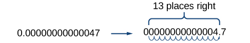

In this section students will:
* Use the product rule of exponents.
* Use the quotient rule of exponents.
* Use the power rule of exponents.
* Use the zero exponent rule of exponents.
* Use the negative rule of exponents.
* Find the power of a product and a quotient.
* Simplify exponential expressions.
* Use scientific notation.

Mathematicians, scientists, and economists commonly encounter very large and very small numbers. But it may not be obvious how common such figures are in everyday life. For instance, a pixel is the smallest unit of light that can be perceived and recorded by a digital camera. A particular camera might record an image that is 2,048 pixels by 1,536 pixels, which is a very high resolution picture. It can also perceive a color depth (gradations in colors) of up to 48 bits per frame, and can shoot the equivalent of 24 frames per second. The maximum possible number of bits of information used to film a one-hour (3,600-second) digital film is then an extremely large number.

Using a calculator, we enter<math xmlns="http://www.w3.org/1998/Math/MathML"> <mrow> <mtext> </mtext><mn>2,048</mn><mtext> </mtext><mo>×</mo><mtext> </mtext><mn>1,536</mn><mtext> </mtext><mo>×</mo><mtext> </mtext><mn>48</mn><mtext> </mtext><mo>×</mo><mtext> </mtext><mn>24</mn><mtext> </mtext><mo>×</mo><mtext> </mtext><mn>3,600</mn><mtext> </mtext> </mrow> </math>

and press ENTER. The calculator displays 1.304596316E13. What does this mean? The “E13” portion of the result represents the exponent 13 of ten, so there are a maximum of approximately<math xmlns="http://www.w3.org/1998/Math/MathML"> <mrow> <mtext> </mtext><mn>1.3</mn><mtext> </mtext><mo>×</mo><mtext> </mtext><msup> <mrow> <mn>10</mn></mrow> <mrow> <mn>13</mn></mrow> </msup> <mtext> </mtext></mrow> </math>

bits of data in that one-hour film. In this section, we review rules of exponents first and then apply them to calculations involving very large or small numbers.

### Using the Product Rule of Exponents

Consider the product<math xmlns="http://www.w3.org/1998/Math/MathML"> <mrow> <mtext> </mtext><msup> <mi>x</mi> <mn>3</mn> </msup> <mo>⋅</mo><msup> <mi>x</mi> <mn>4</mn> </msup> <mo>.</mo><mtext> </mtext> </mrow> </math>

Both terms have the same base, *x*, but they are raised to different exponents. Expand each expression, and then rewrite the resulting expression.

<math xmlns="http://www.w3.org/1998/Math/MathML" display="block"> <mrow> <mtable> <mtr rowalign="center"> <mtd columnalign="right" rowalign="center"><mrow><msup><mi>x</mi><mn>3</mn></msup><mo>⋅</mo><msup><mi>x</mi><mn>4</mn></msup></mrow></mtd> <mtd rowalign="center"><mo>=</mo></mtd> <mtd columnalign="left" rowalign="center"><mrow><mover><mrow><mover><mrow><mi>x</mi><mo>⋅</mo><mi>x</mi><mo>⋅</mo><mi>x</mi></mrow><mrow /></mover></mrow><mrow><mn>3</mn><mtext> factors</mtext></mrow></mover><mo>⋅</mo><mover><mrow><mover><mrow><mi>x</mi><mo>⋅</mo><mi>x</mi><mo>⋅</mo><mi>x</mi><mo>⋅</mo><mi>x</mi></mrow><mrow /> </mover></mrow><mrow><mn>4</mn><mtext> factors</mtext></mrow></mover></mrow></mtd> </mtr> <mtr rowalign="center"> <mtd rowalign="center" /> <mtd rowalign="center"><mo>=</mo></mtd> <mtd columnalign="left" rowalign="center"><mrow><mover><mrow><mover><mrow><mi>x</mi><mo>⋅</mo><mi>x</mi><mo>⋅</mo><mi>x</mi><mo>⋅</mo><mi>x</mi><mo>⋅</mo><mi>x</mi><mo>⋅</mo><mi>x</mi><mo>⋅</mo><mi>x</mi></mrow><mrow /></mover></mrow><mrow><mn>7</mn><mtext> factors</mtext></mrow></mover></mrow></mtd> </mtr> <mtr rowalign="center"> <mtd rowalign="center" /> <mtd rowalign="center"><mo>=</mo></mtd> <mtd columnalign="left" rowalign="center"><mrow><msup><mi>x</mi><mn>7</mn></msup></mrow></mtd> </mtr> </mtable></mrow> </math>

The result is that<math xmlns="http://www.w3.org/1998/Math/MathML"> <mrow> <mtext> </mtext><msup> <mi>x</mi> <mn>3</mn> </msup> <mo>⋅</mo><msup> <mi>x</mi> <mn>4</mn> </msup> <mo>=</mo><msup> <mi>x</mi> <mrow> <mn>3</mn><mo>+</mo><mn>4</mn> </mrow> </msup> <mo>=</mo><msup> <mi>x</mi> <mn>7</mn> </msup> <mo>.</mo> </mrow> </math>

Notice that the exponent of the product is the sum of the exponents of the terms. In other words, when multiplying exponential expressions with the same base, we write the result with the common base and add the exponents. This is the *product rule of exponents.*

<math xmlns="http://www.w3.org/1998/Math/MathML"> <mrow> <msup> <mi>a</mi> <mi>m</mi> </msup> <mo>⋅</mo><msup> <mi>a</mi> <mi>n</mi> </msup> <mo>=</mo><msup> <mi>a</mi> <mrow> <mi>m</mi><mo>+</mo><mi>n</mi> </mrow> </msup> </mrow> </math>

Now consider an example with real numbers.

<math xmlns="http://www.w3.org/1998/Math/MathML"> <mrow> <msup> <mn>2</mn> <mn>3</mn> </msup> <mo>⋅</mo><msup> <mn>2</mn> <mn>4</mn> </msup> <mo>=</mo><msup> <mn>2</mn> <mrow> <mn>3</mn><mo>+</mo><mn>4</mn> </mrow> </msup> <mo>=</mo><msup> <mn>2</mn> <mn>7</mn> </msup> </mrow> </math>

We can always check that this is true by simplifying each exponential expression. We find that<math xmlns="http://www.w3.org/1998/Math/MathML"> <mrow> <mtext> </mtext><msup> <mn>2</mn> <mn>3</mn> </msup> <mtext> </mtext> </mrow> </math>

is 8,<math xmlns="http://www.w3.org/1998/Math/MathML"> <mrow> <mtext> </mtext><msup> <mn>2</mn> <mn>4</mn> </msup> <mtext> </mtext> </mrow> </math>

is 16, and<math xmlns="http://www.w3.org/1998/Math/MathML"> <mrow> <mtext> </mtext><msup> <mn>2</mn> <mn>7</mn> </msup> <mtext> </mtext> </mrow> </math>

is 128. The product<math xmlns="http://www.w3.org/1998/Math/MathML"> <mrow> <mtext> </mtext><mn>8</mn><mo>⋅</mo><mn>16</mn><mtext> </mtext> </mrow> </math>

equals 128, so the relationship is true. We can use the product rule of exponents to simplify expressions that are a product of two numbers or expressions with the same base but different exponents.

The Product Rule of Exponents

For any real number<math xmlns="http://www.w3.org/1998/Math/MathML"> <mrow> <mtext> </mtext><mi>a</mi><mtext> </mtext> </mrow> </math>

and natural numbers<math xmlns="http://www.w3.org/1998/Math/MathML"> <mrow> <mtext> </mtext><mi>m</mi><mtext> </mtext> </mrow> </math>

and<math xmlns="http://www.w3.org/1998/Math/MathML"> <mrow> <mtext> </mtext><mi>n</mi><mo>,</mo> </mrow> </math>

the product rule of exponents states that

<math xmlns="http://www.w3.org/1998/Math/MathML"> <mrow> <msup> <mi>a</mi> <mi>m</mi> </msup> <mo>⋅</mo><msup> <mi>a</mi> <mi>n</mi> </msup> <mo>=</mo><msup> <mi>a</mi> <mrow> <mi>m</mi><mo>+</mo><mi>n</mi> </mrow> </msup> </mrow> </math>

Using the Product Rule

Write each of the following products with a single base. Do not simplify further.

1.  <math xmlns="http://www.w3.org/1998/Math/MathML"> <mrow> <msup> <mi>t</mi> <mn>5</mn> </msup> <mo>⋅</mo><msup> <mi>t</mi> <mn>3</mn> </msup> </mrow> </math>

2.  <math xmlns="http://www.w3.org/1998/Math/MathML"> <mrow> <msup> <mrow> <mrow><mo>(</mo> <mrow> <mn>−3</mn> </mrow> <mo>)</mo></mrow> </mrow> <mn>5</mn> </msup> <mo>⋅</mo><mrow><mo>(</mo> <mrow> <mn>−3</mn> </mrow> <mo>)</mo></mrow> </mrow> </math>

3.  <math xmlns="http://www.w3.org/1998/Math/MathML"> <mrow> <msup> <mi>x</mi> <mn>2</mn> </msup> <mo>⋅</mo><msup> <mi>x</mi> <mn>5</mn> </msup> <mo>⋅</mo><msup> <mi>x</mi> <mn>3</mn> </msup> </mrow> </math>
{: type="a"}

Use the product rule to simplify each expression.

1.  <math xmlns="http://www.w3.org/1998/Math/MathML"> <mrow> <msup> <mi>t</mi> <mn>5</mn> </msup> <mo>⋅</mo><msup> <mi>t</mi> <mn>3</mn> </msup> <mo>=</mo><msup> <mi>t</mi> <mrow> <mn>5</mn><mo>+</mo><mn>3</mn> </mrow> </msup> <mo>=</mo><msup> <mi>t</mi> <mn>8</mn> </msup> </mrow> </math>

2.  <math xmlns="http://www.w3.org/1998/Math/MathML"> <mrow> <msup> <mrow> <mrow><mo>(</mo> <mrow> <mn>−3</mn> </mrow> <mo>)</mo></mrow> </mrow> <mn>5</mn> </msup> <mo>⋅</mo><mrow><mo>(</mo> <mrow> <mn>−3</mn> </mrow> <mo>)</mo></mrow><mo>=</mo><msup> <mrow> <mrow><mo>(</mo> <mrow> <mn>−3</mn> </mrow> <mo>)</mo></mrow> </mrow> <mn>5</mn> </msup> <mo>⋅</mo><msup> <mrow> <mrow><mo>(</mo> <mrow> <mn>−3</mn> </mrow> <mo>)</mo></mrow> </mrow> <mn>1</mn> </msup> <mo>=</mo><msup> <mrow> <mrow><mo>(</mo> <mrow> <mn>−3</mn> </mrow> <mo>)</mo></mrow> </mrow> <mrow> <mn>5</mn><mo>+</mo><mn>1</mn> </mrow> </msup> <mo>=</mo><msup> <mrow> <mrow><mo>(</mo> <mrow> <mn>−3</mn> </mrow> <mo>)</mo></mrow> </mrow> <mn>6</mn> </msup> </mrow> </math>

3.  <math xmlns="http://www.w3.org/1998/Math/MathML"> <mrow> <msup> <mi>x</mi> <mn>2</mn> </msup> <mo>⋅</mo><msup> <mi>x</mi> <mn>5</mn> </msup> <mo>⋅</mo><msup> <mi>x</mi> <mn>3</mn> </msup> </mrow> </math>
{: type="a"}

At first, it may appear that we cannot simplify a product of three factors. However, using the associative property of multiplication, begin by simplifying the first two.

<math xmlns="http://www.w3.org/1998/Math/MathML"> <mrow> <msup> <mi>x</mi> <mn>2</mn> </msup> <mo>⋅</mo><msup> <mi>x</mi> <mn>5</mn> </msup> <mo>⋅</mo><msup> <mi>x</mi> <mn>3</mn> </msup> <mo>=</mo><mrow><mo>(</mo> <mrow> <msup> <mi>x</mi> <mn>2</mn> </msup> <mo>⋅</mo><msup> <mi>x</mi> <mn>5</mn> </msup> </mrow> <mo>)</mo></mrow><mo>⋅</mo><msup> <mi>x</mi> <mn>3</mn> </msup> <mo>=</mo><mrow><mo>(</mo> <mrow> <msup> <mi>x</mi> <mrow> <mn>2</mn><mo>+</mo><mn>5</mn> </mrow> </msup> </mrow> <mo>)</mo></mrow><mo>⋅</mo><msup> <mi>x</mi> <mn>3</mn> </msup> <mo>=</mo><msup> <mi>x</mi> <mn>7</mn> </msup> <mo>⋅</mo><msup> <mi>x</mi> <mn>3</mn> </msup> <mo>=</mo><msup> <mi>x</mi> <mrow> <mn>7</mn><mo>+</mo><mn>3</mn> </mrow> </msup> <mo>=</mo><msup> <mi>x</mi> <mrow> <mn>10</mn> </mrow> </msup> </mrow> </math>

Notice we get the same result by adding the three exponents in one step.

<math xmlns="http://www.w3.org/1998/Math/MathML"> <mrow> <msup> <mi>x</mi> <mn>2</mn> </msup> <mo>⋅</mo><msup> <mi>x</mi> <mn>5</mn> </msup> <mo>⋅</mo><msup> <mi>x</mi> <mn>3</mn> </msup> <mo>=</mo><msup> <mi>x</mi> <mrow> <mn>2</mn><mo>+</mo><mn>5</mn><mo>+</mo><mn>3</mn> </mrow> </msup> <mo>=</mo><msup> <mi>x</mi> <mrow> <mn>10</mn> </mrow> </msup> </mrow> </math>

Write each of the following products with a single base. Do not simplify further.

1.  <math xmlns="http://www.w3.org/1998/Math/MathML"> <mrow> <msup> <mi>k</mi> <mn>6</mn> </msup> <mo>⋅</mo><msup> <mi>k</mi> <mn>9</mn> </msup> </mrow> </math>

2.  <math xmlns="http://www.w3.org/1998/Math/MathML"> <mrow> <msup> <mrow> <mrow><mo>(</mo> <mrow> <mfrac> <mn>2</mn> <mi>y</mi> </mfrac> </mrow> <mo>)</mo></mrow> </mrow> <mn>4</mn> </msup> <mo>⋅</mo><mrow><mo>(</mo> <mrow> <mfrac> <mn>2</mn> <mi>y</mi> </mfrac> </mrow> <mo>)</mo></mrow> </mrow> </math>

3.  <math xmlns="http://www.w3.org/1998/Math/MathML"> <mrow> <msup> <mi>t</mi> <mn>3</mn> </msup> <mo>⋅</mo><msup> <mi>t</mi> <mn>6</mn> </msup> <mo>⋅</mo><msup> <mi>t</mi> <mn>5</mn> </msup> </mrow> </math>
{: type="a"}

1.  <math xmlns="http://www.w3.org/1998/Math/MathML"> <mrow> <msup> <mi>k</mi> <mrow> <mn>15</mn> </mrow> </msup> </mrow> </math>

2.  <math xmlns="http://www.w3.org/1998/Math/MathML"> <mrow> <msup> <mrow> <mrow><mo>(</mo> <mrow> <mfrac> <mn>2</mn> <mi>y</mi> </mfrac> </mrow> <mo>)</mo></mrow> </mrow> <mn>5</mn> </msup> </mrow> </math>

3.  <math xmlns="http://www.w3.org/1998/Math/MathML"> <mrow> <msup> <mi>t</mi> <mrow> <mn>14</mn> </mrow> </msup> </mrow> </math>
{: type="a"}

### Using the Quotient Rule of Exponents

The *quotient rule of exponents* allows us to simplify an expression that divides two numbers with the same base but different exponents. In a similar way to the product rule, we can simplify an expression such as<math xmlns="http://www.w3.org/1998/Math/MathML"> <mrow> <mtext> </mtext><mfrac> <mrow> <msup> <mi>y</mi> <mi>m</mi> </msup> </mrow> <mrow> <msup> <mi>y</mi> <mi>n</mi> </msup> </mrow> </mfrac> <mo>,</mo> </mrow> </math>

where<math xmlns="http://www.w3.org/1998/Math/MathML"> <mrow> <mtext> </mtext><mi>m</mi><mo>&gt;</mo><mi>n</mi><mo>.</mo><mtext> </mtext> </mrow> </math>

Consider the example<math xmlns="http://www.w3.org/1998/Math/MathML"> <mrow> <mtext> </mtext><mfrac> <mrow> <msup> <mi>y</mi> <mn>9</mn> </msup> </mrow> <mrow> <msup> <mi>y</mi> <mn>5</mn> </msup> </mrow> </mfrac> <mo>.</mo><mtext> </mtext> </mrow> </math>

Perform the division by canceling common factors.

<math xmlns="http://www.w3.org/1998/Math/MathML"> <mrow> <mtable> <mtr rowalign="center"> <mtd columnalign="right" rowalign="center"><mrow><mfrac><mrow><msup><mi>y</mi><mn>9</mn></msup></mrow><mrow><msup><mi>y</mi><mn>5</mn></msup></mrow></mfrac></mrow></mtd> <mtd rowalign="center"><mo>=</mo></mtd> <mtd columnalign="left" rowalign="center"><mrow><mfrac><mrow><mi>y</mi><mo>⋅</mo><mi>y</mi><mo>⋅</mo><mi>y</mi><mo>⋅</mo><mi>y</mi><mo>⋅</mo><mi>y</mi><mo>⋅</mo><mi>y</mi><mo>⋅</mo><mi>y</mi><mo>⋅</mo><mi>y</mi><mo>⋅</mo><mi>y</mi></mrow><mrow><mi>y</mi><mo>⋅</mo><mi>y</mi><mo>⋅</mo><mi>y</mi><mo>⋅</mo><mi>y</mi><mo>⋅</mo><mi>y</mi></mrow></mfrac></mrow></mtd> </mtr> <mtr rowalign="center"> <mtd rowalign="center" /> <mtd rowalign="center"><mo>=</mo></mtd> <mtd columnalign="left" rowalign="center"><mrow><mfrac><mrow><menclose notation="updiagonalstrike"><mi>y</mi></menclose><mo>⋅</mo><menclose notation="updiagonalstrike"><mi>y</mi></menclose><mo>⋅</mo><menclose notation="updiagonalstrike"><mi>y</mi></menclose><mo>⋅</mo><menclose notation="updiagonalstrike"><mi>y</mi></menclose><mo>⋅</mo><menclose notation="updiagonalstrike"><mi>y</mi></menclose><mo>⋅</mo><mi>y</mi><mo>⋅</mo><mi>y</mi><mo>⋅</mo><mi>y</mi><mo>⋅</mo><mi>y</mi></mrow><mrow><menclose notation="updiagonalstrike"><mi>y</mi></menclose><mo>⋅</mo><menclose notation="updiagonalstrike"><mi>y</mi></menclose><mo>⋅</mo><menclose notation="updiagonalstrike"><mi>y</mi></menclose><mo>⋅</mo><menclose notation="updiagonalstrike"><mi>y</mi></menclose><mo>⋅</mo><menclose notation="updiagonalstrike"><mi>y</mi></menclose></mrow></mfrac></mrow></mtd> </mtr> <mtr> <mtd rowalign="center" /> <mtd rowalign="center"><mo>=</mo></mtd> <mtd columnalign="left" rowalign="center"><mrow><mfrac><mrow><mi>y</mi><mo>⋅</mo><mi>y</mi><mo>⋅</mo><mi>y</mi><mo>⋅</mo><mi>y</mi></mrow><mn>1</mn></mfrac></mrow></mtd> </mtr> <mtr> <mtd rowalign="center" /> <mtd rowalign="center"><mo>=</mo></mtd> <mtd columnalign="left" rowalign="center"><mrow><msup><mi>y</mi><mn>4</mn></msup></mrow></mtd> </mtr> </mtable></mrow> </math>

Notice that the exponent of the quotient is the difference between the exponents of the divisor and dividend.

<math xmlns="http://www.w3.org/1998/Math/MathML"> <mrow> <mfrac> <mrow> <msup> <mi>a</mi> <mi>m</mi> </msup> </mrow> <mrow> <msup> <mi>a</mi> <mi>n</mi> </msup> </mrow> </mfrac> <mo>=</mo><msup> <mi>a</mi> <mrow> <mi>m</mi><mo>−</mo><mi>n</mi> </mrow> </msup> </mrow> </math>

In other words, when dividing exponential expressions with the same base, we write the result with the common base and subtract the exponents.

<math xmlns="http://www.w3.org/1998/Math/MathML"> <mrow> <mfrac> <mrow> <msup> <mi>y</mi> <mn>9</mn> </msup> </mrow> <mrow> <msup> <mi>y</mi> <mn>5</mn> </msup> </mrow> </mfrac> <mo>=</mo><msup> <mi>y</mi> <mrow> <mn>9</mn><mo>−</mo><mn>5</mn></mrow> </msup> <mo>=</mo><msup> <mi>y</mi> <mn>4</mn> </msup> </mrow> </math>

For the time being, we must be aware of the condition<math xmlns="http://www.w3.org/1998/Math/MathML"> <mrow> <mtext> </mtext><mi>m</mi><mo>&gt;</mo><mi>n</mi><mo>.</mo><mtext> </mtext> </mrow> </math>

Otherwise, the difference<math xmlns="http://www.w3.org/1998/Math/MathML"> <mrow> <mtext> </mtext><mi>m</mi><mo>−</mo><mi>n</mi><mtext> </mtext> </mrow> </math>

could be zero or negative. Those possibilities will be explored shortly. Also, instead of qualifying variables as nonzero each time, we will simplify matters and assume from here on that all variables represent nonzero real numbers.

The Quotient Rule of Exponents

For any real number<math xmlns="http://www.w3.org/1998/Math/MathML"> <mrow> <mtext> </mtext><mi>a</mi><mtext> </mtext> </mrow> </math>

and natural numbers<math xmlns="http://www.w3.org/1998/Math/MathML"> <mrow> <mtext> </mtext><mi>m</mi><mtext> </mtext> </mrow> </math>

and<math xmlns="http://www.w3.org/1998/Math/MathML"> <mrow> <mtext> </mtext><mi>n</mi><mo>,</mo> </mrow> </math>

such that<math xmlns="http://www.w3.org/1998/Math/MathML"> <mrow> <mtext> </mtext><mi>m</mi><mo>&gt;</mo><mi>n</mi><mo>,</mo> </mrow> </math>

the quotient rule of exponents states that

<math xmlns="http://www.w3.org/1998/Math/MathML"> <mrow> <mfrac> <mrow> <msup> <mi>a</mi> <mi>m</mi> </msup> </mrow> <mrow> <msup> <mi>a</mi> <mi>n</mi> </msup> </mrow> </mfrac> <mo>=</mo><msup> <mi>a</mi> <mrow> <mi>m</mi><mo>−</mo><mi>n</mi> </mrow> </msup> </mrow> </math>

Using the Quotient Rule

Write each of the following products with a single base. Do not simplify further.

1.  <math xmlns="http://www.w3.org/1998/Math/MathML"> <mrow> <mfrac> <mrow> <msup> <mrow> <mrow><mo>(</mo> <mrow> <mn>−2</mn> </mrow> <mo>)</mo></mrow> </mrow> <mrow> <mn>14</mn> </mrow> </msup> </mrow> <mrow> <msup> <mrow> <mrow><mo>(</mo> <mrow> <mn>−2</mn> </mrow> <mo>)</mo></mrow> </mrow> <mn>9</mn> </msup> </mrow> </mfrac> </mrow> </math>

2.  <math xmlns="http://www.w3.org/1998/Math/MathML"> <mrow> <mfrac> <mrow> <msup> <mi>t</mi> <mrow> <mn>23</mn> </mrow> </msup> </mrow> <mrow> <msup> <mi>t</mi> <mrow> <mn>15</mn> </mrow> </msup> </mrow> </mfrac> </mrow> </math>

3.  <math xmlns="http://www.w3.org/1998/Math/MathML"> <mrow> <mfrac> <mrow> <msup> <mrow> <mrow><mo>(</mo> <mrow> <mi>z</mi><msqrt> <mn>2</mn> </msqrt> </mrow> <mo>)</mo></mrow> </mrow> <mn>5</mn> </msup> </mrow> <mrow> <mi>z</mi><msqrt> <mn>2</mn> </msqrt> </mrow> </mfrac> </mrow> </math>
{: type="a"}

Use the quotient rule to simplify each expression.

1.  <math xmlns="http://www.w3.org/1998/Math/MathML"> <mrow> <mfrac> <mrow> <msup> <mrow> <mrow><mo>(</mo> <mrow> <mn>−2</mn></mrow> <mo>)</mo></mrow></mrow> <mrow> <mn>14</mn></mrow> </msup> </mrow> <mrow> <msup> <mrow> <mrow><mo>(</mo> <mrow> <mn>−2</mn></mrow> <mo>)</mo></mrow></mrow> <mn>9</mn> </msup> </mrow> </mfrac> <mo>=</mo><msup> <mrow> <mrow><mo>(</mo> <mrow> <mn>−2</mn></mrow> <mo>)</mo></mrow></mrow> <mrow> <mn>14</mn><mo>−</mo><mn>9</mn></mrow> </msup> <mo>=</mo><msup> <mrow> <mrow><mo>(</mo> <mrow> <mn>−2</mn></mrow> <mo>)</mo></mrow></mrow> <mn>5</mn> </msup> </mrow> </math>

2.  <math xmlns="http://www.w3.org/1998/Math/MathML"> <mrow> <mfrac> <mrow> <msup> <mi>t</mi> <mrow> <mn>23</mn></mrow> </msup> </mrow> <mrow> <msup> <mi>t</mi> <mrow> <mn>15</mn></mrow> </msup> </mrow> </mfrac> <mo>=</mo><msup> <mi>t</mi> <mrow> <mn>23</mn><mo>−</mo><mn>15</mn></mrow> </msup> <mo>=</mo><msup> <mi>t</mi> <mn>8</mn> </msup> </mrow> </math>

3.  <math xmlns="http://www.w3.org/1998/Math/MathML"> <mrow> <mfrac> <mrow> <msup> <mrow> <mrow><mo>(</mo> <mrow> <mi>z</mi><msqrt> <mn>2</mn> </msqrt> </mrow> <mo>)</mo></mrow></mrow> <mn>5</mn> </msup> </mrow> <mrow> <mi>z</mi><msqrt> <mn>2</mn> </msqrt> </mrow> </mfrac> <mo>=</mo><msup> <mrow> <mrow><mo>(</mo> <mrow> <mi>z</mi><msqrt> <mn>2</mn> </msqrt> </mrow> <mo>)</mo></mrow></mrow> <mrow> <mn>5</mn><mo>−</mo><mn>1</mn></mrow> </msup> <mo>=</mo><msup> <mrow> <mrow><mo>(</mo> <mrow> <mi>z</mi><msqrt> <mn>2</mn> </msqrt> </mrow> <mo>)</mo></mrow></mrow> <mn>4</mn> </msup> </mrow> </math>
{: type="a"}

Write each of the following products with a single base. Do not simplify further.

1.  <math xmlns="http://www.w3.org/1998/Math/MathML"> <mrow> <mfrac> <mrow> <msup> <mi>s</mi> <mrow> <mn>75</mn> </mrow> </msup> </mrow> <mrow> <msup> <mi>s</mi> <mrow> <mn>68</mn> </mrow> </msup> </mrow> </mfrac> </mrow> </math>

2.  <math xmlns="http://www.w3.org/1998/Math/MathML"> <mrow> <mfrac> <mrow> <msup> <mrow> <mrow><mo>(</mo> <mrow> <mn>−3</mn> </mrow> <mo>)</mo></mrow> </mrow> <mn>6</mn> </msup> </mrow> <mrow> <mn>−3</mn> </mrow> </mfrac> </mrow> </math>

3.  <math xmlns="http://www.w3.org/1998/Math/MathML"> <mrow> <mfrac> <mrow> <msup> <mrow> <mrow><mo>(</mo> <mrow> <mi>e</mi><msup> <mi>f</mi> <mn>2</mn> </msup> </mrow> <mo>)</mo></mrow> </mrow> <mn>5</mn> </msup> </mrow> <mrow> <msup> <mrow> <mrow><mo>(</mo> <mrow> <mi>e</mi><msup> <mi>f</mi> <mn>2</mn> </msup> </mrow> <mo>)</mo></mrow> </mrow> <mn>3</mn> </msup> </mrow> </mfrac> </mrow> </math>
{: type="a"}

1.  <math xmlns="http://www.w3.org/1998/Math/MathML"> <mrow> <msup> <mi>s</mi> <mn>7</mn> </msup> </mrow> </math>

2.  <math xmlns="http://www.w3.org/1998/Math/MathML"> <mrow> <msup> <mrow> <mrow><mo>(</mo> <mrow> <mn>−3</mn> </mrow> <mo>)</mo></mrow> </mrow> <mn>5</mn> </msup> </mrow> </math>

3.  <math xmlns="http://www.w3.org/1998/Math/MathML"> <mrow> <msup> <mrow> <mrow><mo>(</mo> <mrow> <mi>e</mi><msup> <mi>f</mi> <mn>2</mn> </msup> </mrow> <mo>)</mo></mrow> </mrow> <mn>2</mn> </msup> </mrow> </math>
{: type="a"}

### Using the Power Rule of Exponents

Suppose an exponential expression is raised to some power. Can we simplify the result? Yes. To do this, we use the *power rule of exponents*. Consider the expression<math xmlns="http://www.w3.org/1998/Math/MathML"> <mrow> <mtext> </mtext><msup> <mrow> <mrow><mo>(</mo> <mrow> <msup> <mi>x</mi> <mn>2</mn> </msup> </mrow> <mo>)</mo></mrow> </mrow> <mn>3</mn> </msup> <mo>.</mo><mtext> </mtext> </mrow> </math>

The expression inside the parentheses is multiplied twice because it has an exponent of 2. Then the result is multiplied three times because the entire expression has an exponent of 3.

<math xmlns="http://www.w3.org/1998/Math/MathML" display="block"> <mrow> <mtable> <mtr rowalign="center"> <mtd columnalign="right" rowalign="center"><mrow><msup><mrow><mrow><mo>(</mo><mrow><msup><mi>x</mi><mn>2</mn></msup></mrow><mo>)</mo></mrow></mrow><mn>3</mn></msup></mrow></mtd> <mtd rowalign="center"><mo>=</mo></mtd> <mtd columnalign="left" rowalign="center"><mrow><mover><mrow><mover><mrow><mrow><mo>(</mo><mrow><msup><mi>x</mi><mn>2</mn></msup></mrow><mo>)</mo></mrow><mo>⋅</mo><mrow><mo>(</mo><mrow><msup><mi>x</mi><mn>2</mn></msup></mrow><mo>)</mo></mrow><mo>⋅</mo><mrow><mo>(</mo><mrow><msup><mi>x</mi><mn>2</mn></msup></mrow><mo>)</mo></mrow></mrow><mrow /></mover></mrow><mrow><mn>3</mn><mtext> factors</mtext></mrow></mover></mrow></mtd> </mtr> <mtr rowalign="center"> <mtd rowalign="center" /> <mtd rowalign="center"><mo>=</mo></mtd> <mtd columnalign="right" rowalign="center"><mrow><mover><mrow><mover><mrow><mrow><mo>(</mo><mrow><mover><mrow><mover><mrow><mi>x</mi><mo>⋅</mo><mi>x</mi></mrow><mo>︷</mo></mover></mrow><mrow><mn>2</mn><mtext> factors</mtext></mrow></mover></mrow><mo>)</mo></mrow><mo>⋅</mo><mrow><mo>(</mo><mrow><mover><mrow><mover><mrow><mi>x</mi><mo>⋅</mo><mi>x</mi></mrow> <mo>︷</mo></mover></mrow><mrow><mn>2</mn><mtext> factors</mtext></mrow></mover></mrow><mo>)</mo></mrow><mo>⋅</mo><mrow><mo>(</mo><mrow><mover><mrow><mover><mrow><mi>x</mi><mo>⋅</mo><mi>x</mi></mrow><mo>︷</mo></mover></mrow><mrow><mn>2</mn><mtext> factors</mtext></mrow></mover></mrow><mo>)</mo></mrow></mrow><mrow /></mover></mrow><mrow><mn>3</mn><mtext> factors</mtext></mrow></mover></mrow></mtd> </mtr> <mtr> <mtd rowalign="center" /> <mtd rowalign="center"><mo>=</mo></mtd> <mtd columnalign="left" rowalign="center"><mrow><mi>x</mi><mo>⋅</mo><mi>x</mi><mo>⋅</mo><mi>x</mi><mo>⋅</mo><mi>x</mi><mo>⋅</mo><mi>x</mi><mo>⋅</mo><mi>x</mi></mrow></mtd> </mtr> <mtr rowalign="center"> <mtd rowalign="center" /> <mtd rowalign="center"><mo>=</mo></mtd> <mtd columnalign="left" rowalign="center"><mrow><msup><mi>x</mi><mn>6</mn></msup></mrow></mtd> </mtr> </mtable></mrow> </math>

The exponent of the answer is the product of the exponents:<math xmlns="http://www.w3.org/1998/Math/MathML"> <mrow> <mtext> </mtext><msup> <mrow> <mrow><mo>(</mo> <mrow> <msup> <mi>x</mi> <mn>2</mn> </msup> </mrow> <mo>)</mo></mrow> </mrow> <mn>3</mn> </msup> <mo>=</mo><msup> <mi>x</mi> <mrow> <mn>2</mn><mo>⋅</mo><mn>3</mn> </mrow> </msup> <mo>=</mo><msup> <mi>x</mi> <mn>6</mn> </msup> <mo>.</mo><mtext> </mtext> </mrow> </math>

In other words, when raising an exponential expression to a power, we write the result with the common base and the product of the exponents.

<math xmlns="http://www.w3.org/1998/Math/MathML"> <mrow> <msup> <mrow> <mrow><mo>(</mo> <mrow> <msup> <mi>a</mi> <mi>m</mi> </msup> </mrow> <mo>)</mo></mrow> </mrow> <mi>n</mi> </msup> <mo>=</mo><msup> <mi>a</mi> <mrow> <mi>m</mi><mo>⋅</mo><mi>n</mi> </mrow> </msup> </mrow> </math>

<!--here-->

Be careful to distinguish between uses of the product rule and the power rule. When using the product rule, different terms with the same bases are raised to exponents. In this case, you add the exponents. When using the power rule, a term in exponential notation is raised to a power. In this case, you multiply the exponents.

<math xmlns="http://www.w3.org/1998/Math/MathML" display="block"> <mrow> <mtable> <mtr rowalign="center"> <mtd rowalign="center" /> <mtd rowalign="center" /> <mtd rowalign="center" columnalign="left"> <mrow> <mtext>Product Rule</mtext> </mrow> </mtd> <mtd rowalign="center" /> <mtd rowalign="center" /> <mtd rowalign="center" /> <mtd rowalign="center" /> <mtd rowalign="center" columnalign="left"> <mrow> <mtext> Power Rule</mtext> </mrow> </mtd> <mtd rowalign="center" /> <mtd rowalign="center" /> </mtr> <mtr rowalign="center"> <mtd rowalign="center" columnalign="right"> <mrow> <msup> <mn>5</mn> <mn>3</mn> </msup> <mo>⋅</mo><msup> <mn>5</mn> <mn>4</mn> </msup> </mrow> </mtd> <mtd rowalign="center"> <mo>=</mo> </mtd> <mtd columnalign="left" rowalign="center"> <mrow> <msup> <mn>5</mn> <mrow> <mn>3</mn><mo>+</mo><mn>4</mn> </mrow> </msup> </mrow> </mtd> <mtd rowalign="center"> <mo>=</mo> </mtd> <mtd columnalign="left" rowalign="center"> <mrow> <msup> <mn>5</mn> <mn>7</mn> </msup> </mrow> </mtd> <mtd rowalign="center"> <mrow> <mspace width="1em" /><mtext>but</mtext><mspace width="1em" /> </mrow> </mtd> <mtd columnalign="right" rowalign="center"> <mrow> <mtext> </mtext><msup> <mrow> <mo stretchy="false">(</mo><msup> <mn>5</mn> <mn>3</mn> </msup> <mo stretchy="false">)</mo> </mrow> <mn>4</mn> </msup> </mrow> </mtd> <mtd rowalign="center"> <mo>=</mo> </mtd> <mtd columnalign="left" rowalign="center"> <mrow> <msup> <mn>5</mn> <mrow> <mn>3</mn><mo>⋅</mo><mn>4</mn> </mrow> </msup> </mrow> </mtd> <mtd rowalign="center"> <mo>=</mo> </mtd> <mtd columnalign="left" rowalign="center"> <mrow> <msup> <mn>5</mn> <mrow> <mn>12</mn> </mrow> </msup> </mrow> </mtd> </mtr> <mtr rowalign="center"> <mtd columnalign="right" rowalign="center"> <mrow> <msup> <mi>x</mi> <mn>5</mn> </msup> <mo>⋅</mo><msup> <mi>x</mi> <mn>2</mn> </msup> </mrow> </mtd> <mtd rowalign="center"> <mo>=</mo> </mtd> <mtd columnalign="left" rowalign="center"> <mrow> <msup> <mi>x</mi> <mrow> <mn>5</mn><mo>+</mo><mn>2</mn> </mrow> </msup> </mrow> </mtd> <mtd rowalign="center"> <mo>=</mo> </mtd> <mtd columnalign="left" rowalign="center"> <mrow> <msup> <mi>x</mi> <mn>7</mn> </msup> </mrow> </mtd> <mtd rowalign="center"> <mrow> <mspace width="1em" /><mtext>but</mtext><mspace width="1em" /> </mrow> </mtd> <mtd columnalign="right" rowalign="center"> <mrow> <msup> <mrow> <mo stretchy="false">(</mo><msup> <mi>x</mi> <mn>5</mn> </msup> <mo stretchy="false">)</mo> </mrow> <mn>2</mn> </msup> </mrow> </mtd> <mtd rowalign="center"> <mo>=</mo> </mtd> <mtd columnalign="left" rowalign="center"> <mrow> <msup> <mi>x</mi> <mrow> <mn>5</mn><mo>⋅</mo><mn>2</mn> </mrow> </msup> </mrow> </mtd> <mtd columnalign="left" rowalign="center"> <mo>=</mo> </mtd> <mtd columnalign="left" rowalign="center"> <mrow> <msup> <mi>x</mi> <mrow> <mn>10</mn> </mrow> </msup> </mrow> </mtd> </mtr> <mtr rowalign="center"> <mtd columnalign="right" rowalign="center"> <mrow> <msup> <mrow> <mo stretchy="false">(</mo><mn>3</mn><mi>a</mi><mo stretchy="false">)</mo> </mrow> <mn>7</mn> </msup> <mo>⋅</mo><msup> <mrow> <mo stretchy="false">(</mo><mn>3</mn><mi>a</mi><mo stretchy="false">)</mo> </mrow> <mrow> <mn>10</mn> </mrow> </msup> </mrow> </mtd> <mtd> <mo>=</mo> </mtd> <mtd columnalign="left" rowalign="center"> <mrow> <msup> <mrow> <mo stretchy="false">(</mo><mn>3</mn><mi>a</mi><mo stretchy="false">)</mo> </mrow> <mrow> <mn>7</mn><mo>+</mo><mn>10</mn> </mrow> </msup> </mrow> </mtd> <mtd rowalign="center"> <mo>=</mo> </mtd> <mtd columnalign="left" rowalign="center"> <mrow> <msup> <mrow> <mo stretchy="false">(</mo><mn>3</mn><mi>a</mi><mo stretchy="false">)</mo> </mrow> <mrow> <mn>17</mn> </mrow> </msup> </mrow> </mtd> <mtd rowalign="center"> <mrow> <mspace width="1em" /><mtext>but</mtext><mspace width="1em" /> </mrow> </mtd> <mtd columnalign="right" rowalign="center"> <mrow> <msup> <mrow> <mo stretchy="false">(</mo><msup> <mrow> <mo stretchy="false">(</mo><mn>3</mn><mi>a</mi><mo stretchy="false">)</mo> </mrow> <mn>7</mn> </msup> <mo stretchy="false">)</mo> </mrow> <mrow> <mn>10</mn> </mrow> </msup> </mrow> </mtd> <mtd rowalign="center"> <mo>=</mo> </mtd> <mtd columnalign="left" rowalign="center"> <mrow> <msup> <mrow> <mo stretchy="false">(</mo><mn>3</mn><mi>a</mi><mo stretchy="false">)</mo> </mrow> <mrow> <mn>7</mn><mo>⋅</mo><mn>10</mn> </mrow> </msup> </mrow> </mtd> <mtd rowalign="center"> <mo>=</mo> </mtd> <mtd columnalign="left" rowalign="center"> <mrow> <msup> <mrow> <mo stretchy="false">(</mo><mn>3</mn><mi>a</mi><mo stretchy="false">)</mo> </mrow> <mrow> <mn>70</mn> </mrow> </msup> </mrow> </mtd> </mtr> </mtable> </mrow> </math>

The Power Rule of Exponents

For any real number<math xmlns="http://www.w3.org/1998/Math/MathML"> <mrow> <mtext> </mtext><mi>a</mi><mtext> </mtext> </mrow> </math>

and positive integers<math xmlns="http://www.w3.org/1998/Math/MathML"> <mrow> <mtext> </mtext><mi>m</mi><mtext> </mtext> </mrow> </math>

and<math xmlns="http://www.w3.org/1998/Math/MathML"> <mrow> <mtext> </mtext><mi>n</mi><mo>,</mo> </mrow> </math>

the power rule of exponents states that

<math xmlns="http://www.w3.org/1998/Math/MathML"> <mrow> <msup> <mrow> <mrow><mo>(</mo> <mrow> <msup> <mi>a</mi> <mi>m</mi> </msup> </mrow> <mo>)</mo></mrow> </mrow> <mi>n</mi> </msup> <mo>=</mo><msup> <mi>a</mi> <mrow> <mi>m</mi><mo>⋅</mo><mi>n</mi> </mrow> </msup> </mrow> </math>

Using the Power Rule

Write each of the following products with a single base. Do not simplify further.

1.  <math xmlns="http://www.w3.org/1998/Math/MathML"> <mrow> <msup> <mrow> <mrow><mo>(</mo> <mrow> <msup> <mi>x</mi> <mn>2</mn> </msup> </mrow> <mo>)</mo></mrow> </mrow> <mn>7</mn> </msup> </mrow> </math>

2.  <math xmlns="http://www.w3.org/1998/Math/MathML"> <mrow> <msup> <mrow> <mrow><mo>(</mo> <mrow> <msup> <mrow> <mrow><mo>(</mo> <mrow> <mn>2</mn><mi>t</mi> </mrow> <mo>)</mo></mrow> </mrow> <mn>5</mn> </msup> </mrow> <mo>)</mo></mrow> </mrow> <mn>3</mn> </msup> </mrow> </math>

3.  <math xmlns="http://www.w3.org/1998/Math/MathML"> <mrow> <msup> <mrow> <mrow><mo>(</mo> <mrow> <msup> <mrow> <mrow><mo>(</mo> <mrow> <mn>−3</mn> </mrow> <mo>)</mo></mrow> </mrow> <mn>5</mn> </msup> </mrow> <mo>)</mo></mrow> </mrow> <mrow> <mn>11</mn> </mrow> </msup> </mrow> </math>
{: type="a"}

Use the power rule to simplify each expression.

1.  <math xmlns="http://www.w3.org/1998/Math/MathML"> <mrow> <msup> <mrow> <mrow><mo>(</mo> <mrow> <msup> <mi>x</mi> <mn>2</mn> </msup> </mrow> <mo>)</mo></mrow> </mrow> <mn>7</mn> </msup> <mo>=</mo><msup> <mi>x</mi> <mrow> <mn>2</mn><mo>⋅</mo><mn>7</mn> </mrow> </msup> <mo>=</mo><msup> <mi>x</mi> <mrow> <mn>14</mn> </mrow> </msup> </mrow> </math>

2.  <math xmlns="http://www.w3.org/1998/Math/MathML"> <mrow> <msup> <mrow> <mrow><mo>(</mo> <mrow> <msup> <mrow> <mrow><mo>(</mo> <mrow> <mn>2</mn><mi>t</mi> </mrow> <mo>)</mo></mrow> </mrow> <mn>5</mn> </msup> </mrow> <mo>)</mo></mrow> </mrow> <mn>3</mn> </msup> <mo>=</mo><msup> <mrow> <mrow><mo>(</mo> <mrow> <mn>2</mn><mi>t</mi> </mrow> <mo>)</mo></mrow> </mrow> <mrow> <mn>5</mn><mo>⋅</mo><mn>3</mn> </mrow> </msup> <mo>=</mo><msup> <mrow> <mrow><mo>(</mo> <mrow> <mn>2</mn><mi>t</mi> </mrow> <mo>)</mo></mrow> </mrow> <mrow> <mn>15</mn> </mrow> </msup> </mrow> </math>

3.  <math xmlns="http://www.w3.org/1998/Math/MathML"> <mrow> <msup> <mrow> <mrow><mo>(</mo> <mrow> <msup> <mrow> <mrow><mo>(</mo> <mrow> <mn>−3</mn> </mrow> <mo>)</mo></mrow> </mrow> <mn>5</mn> </msup> </mrow> <mo>)</mo></mrow> </mrow> <mrow> <mn>11</mn> </mrow> </msup> <mo>=</mo><msup> <mrow> <mrow><mo>(</mo> <mrow> <mn>−3</mn> </mrow> <mo>)</mo></mrow> </mrow> <mrow> <mn>5</mn><mo>⋅</mo><mn>11</mn> </mrow> </msup> <mo>=</mo><msup> <mrow> <mrow><mo>(</mo> <mrow> <mn>−3</mn> </mrow> <mo>)</mo></mrow> </mrow> <mrow> <mn>55</mn> </mrow> </msup> </mrow> </math>
{: type="a"}

Write each of the following products with a single base. Do not simplify further.

1.  <math xmlns="http://www.w3.org/1998/Math/MathML"> <mrow> <msup> <mrow> <mrow><mo>(</mo> <mrow> <msup> <mrow> <mrow><mo>(</mo> <mrow> <mn>3</mn><mi>y</mi> </mrow> <mo>)</mo></mrow> </mrow> <mn>8</mn> </msup> </mrow> <mo>)</mo></mrow> </mrow> <mn>3</mn> </msup> </mrow> </math>

2.  <math xmlns="http://www.w3.org/1998/Math/MathML"> <mrow> <msup> <mrow> <mrow><mo>(</mo> <mrow> <msup> <mi>t</mi> <mn>5</mn> </msup> </mrow> <mo>)</mo></mrow> </mrow> <mn>7</mn> </msup> </mrow> </math>

3.  <math xmlns="http://www.w3.org/1998/Math/MathML"> <mrow> <msup> <mrow> <mrow><mo>(</mo> <mrow> <msup> <mrow> <mrow><mo>(</mo> <mrow> <mo>−</mo><mi>g</mi> </mrow> <mo>)</mo></mrow> </mrow> <mn>4</mn> </msup> </mrow> <mo>)</mo></mrow> </mrow> <mn>4</mn> </msup> </mrow> </math>
{: type="a"}

1.  <math xmlns="http://www.w3.org/1998/Math/MathML"> <mrow> <msup> <mrow> <mrow><mo>(</mo> <mrow> <mn>3</mn><mi>y</mi> </mrow> <mo>)</mo></mrow> </mrow> <mrow> <mn>24</mn> </mrow> </msup> </mrow> </math>

2.  <math xmlns="http://www.w3.org/1998/Math/MathML"> <mrow> <msup> <mi>t</mi> <mrow> <mn>35</mn> </mrow> </msup> </mrow> </math>

3.  <math xmlns="http://www.w3.org/1998/Math/MathML"> <mrow> <msup> <mrow> <mrow><mo>(</mo> <mrow> <mo>−</mo><mi>g</mi> </mrow> <mo>)</mo></mrow> </mrow> <mrow> <mn>16</mn> </mrow> </msup> </mrow> </math>
{: type="a"}

### Using the Zero Exponent Rule of Exponents

Return to the quotient rule. We made the condition that<math xmlns="http://www.w3.org/1998/Math/MathML"> <mrow> <mtext> </mtext><mi>m</mi><mo>&gt;</mo><mi>n</mi><mtext> </mtext> </mrow> </math>

so that the difference<math xmlns="http://www.w3.org/1998/Math/MathML"> <mrow> <mtext> </mtext><mi>m</mi><mo>−</mo><mi>n</mi><mtext> </mtext> </mrow> </math>

would never be zero or negative. What would happen if<math xmlns="http://www.w3.org/1998/Math/MathML"> <mrow> <mtext> </mtext><mi>m</mi><mo>=</mo><mi>n</mi><mo>?</mo> </mrow> </math>

In this case, we would use the *zero exponent rule of exponents* to simplify the expression to 1. To see how this is done, let us begin with an example.

<math xmlns="http://www.w3.org/1998/Math/MathML"> <mrow> <mfrac> <mrow> <msup> <mi>t</mi> <mn>8</mn> </msup> </mrow> <mrow> <msup> <mi>t</mi> <mn>8</mn> </msup> </mrow> </mfrac> <mo>=</mo><mfrac> <mrow> <menclose notation="updiagonalstrike"> <mrow> <msup> <mi>t</mi> <mn>8</mn> </msup> </mrow> </menclose> </mrow> <mrow> <menclose notation="updiagonalstrike"> <mrow> <msup> <mi>t</mi> <mn>8</mn> </msup> </mrow> </menclose> </mrow> </mfrac> <mo>=</mo><mn>1</mn> </mrow> </math>

If we were to simplify the original expression using the quotient rule, we would have

<math xmlns="http://www.w3.org/1998/Math/MathML"> <mrow> <mfrac> <mrow> <msup> <mi>t</mi> <mn>8</mn> </msup> </mrow> <mrow> <msup> <mi>t</mi> <mn>8</mn> </msup> </mrow> </mfrac> <mo>=</mo><msup> <mi>t</mi> <mrow> <mn>8</mn><mo>−</mo><mn>8</mn></mrow> </msup> <mo>=</mo><msup> <mi>t</mi> <mn>0</mn> </msup> </mrow> </math>

If we equate the two answers, the result is<math xmlns="http://www.w3.org/1998/Math/MathML"> <mrow> <mtext> </mtext><msup> <mi>t</mi> <mn>0</mn> </msup> <mo>=</mo><mn>1.</mn><mtext> </mtext> </mrow> </math>

This is true for any nonzero real number, or any variable representing a real number.

<math xmlns="http://www.w3.org/1998/Math/MathML"> <mrow> <msup> <mi>a</mi> <mn>0</mn> </msup> <mo>=</mo><mn>1</mn> </mrow> </math>

The sole exception is the expression<math xmlns="http://www.w3.org/1998/Math/MathML"> <mrow> <mtext> </mtext><msup> <mn>0</mn> <mn>0</mn> </msup> <mo>.</mo><mtext> </mtext> </mrow> </math>

This appears later in more advanced courses, but for now, we will consider the value to be undefined.

The Zero Exponent Rule of Exponents

For any nonzero real number<math xmlns="http://www.w3.org/1998/Math/MathML"> <mrow> <mtext> </mtext><mi>a</mi><mo>,</mo> </mrow> </math>

the zero exponent rule of exponents states that

<math xmlns="http://www.w3.org/1998/Math/MathML"> <mrow> <msup> <mi>a</mi> <mn>0</mn> </msup> <mo>=</mo><mn>1</mn> </mrow> </math>

Using the Zero Exponent Rule

Simplify each expression using the zero exponent rule of exponents.

1.  <math xmlns="http://www.w3.org/1998/Math/MathML"> <mrow> <mfrac> <mrow> <msup> <mi>c</mi> <mn>3</mn> </msup> </mrow> <mrow> <msup> <mi>c</mi> <mn>3</mn> </msup> </mrow> </mfrac> </mrow> </math>

2.  <math xmlns="http://www.w3.org/1998/Math/MathML"> <mrow> <mfrac> <mrow> <mn>−3</mn><msup> <mi>x</mi> <mn>5</mn> </msup> </mrow> <mrow> <msup> <mi>x</mi> <mn>5</mn> </msup> </mrow> </mfrac> </mrow> </math>

3.  <math xmlns="http://www.w3.org/1998/Math/MathML"> <mrow> <mfrac> <mrow> <msup> <mrow> <mrow><mo>(</mo> <mrow> <msup> <mi>j</mi> <mn>2</mn> </msup> <mi>k</mi> </mrow> <mo>)</mo></mrow> </mrow> <mn>4</mn> </msup> </mrow> <mrow> <mrow><mo>(</mo> <mrow> <msup> <mi>j</mi> <mn>2</mn> </msup> <mi>k</mi> </mrow> <mo>)</mo></mrow><mo>⋅</mo><msup> <mrow> <mrow><mo>(</mo> <mrow> <msup> <mi>j</mi> <mn>2</mn> </msup> <mi>k</mi> </mrow> <mo>)</mo></mrow> </mrow> <mn>3</mn> </msup> </mrow> </mfrac> </mrow> </math>

4.  <math xmlns="http://www.w3.org/1998/Math/MathML"> <mrow> <mfrac> <mrow> <mn>5</mn><msup> <mrow> <mrow><mo>(</mo> <mrow> <mi>r</mi><msup> <mi>s</mi> <mn>2</mn> </msup> </mrow> <mo>)</mo></mrow> </mrow> <mn>2</mn> </msup> </mrow> <mrow> <msup> <mrow> <mrow><mo>(</mo> <mrow> <mi>r</mi><msup> <mi>s</mi> <mn>2</mn> </msup> </mrow> <mo>)</mo></mrow> </mrow> <mn>2</mn> </msup> </mrow> </mfrac> </mrow> </math>
{: type="a"}

Use the zero exponent and other rules to simplify each expression.

1.  * * *
    {: data-type="newline"}
    
    <math xmlns="http://www.w3.org/1998/Math/MathML"> <mrow> <mtable> <mtr> <mtd columnalign="right" rowalign="center"><mrow><mfrac><mrow><msup><mi>c</mi><mn>3</mn></msup></mrow><mrow><msup><mi>c</mi><mn>3</mn></msup></mrow></mfrac></mrow></mtd> <mtd rowalign="center"><mo>=</mo></mtd> <mtd columnalign="left" rowalign="center"><mrow><msup><mi>c</mi><mrow><mn>3</mn><mo>−</mo><mn>3</mn></mrow></msup></mrow></mtd> </mtr> <mtr> <mtd rowalign="center" /> <mtd rowalign="center"><mo>=</mo></mtd> <mtd columnalign="left" rowalign="center"><mrow><msup><mi>c</mi><mrow><mn>0</mn></mrow></msup></mrow></mtd> </mtr> <mtr> <mtd rowalign="center" /> <mtd rowalign="center"><mo>=</mo></mtd> <mtd columnalign="left" rowalign="center"><mrow><mn>1</mn></mrow></mtd> </mtr> </mtable> </mrow> </math>

2.  * * *
    {: data-type="newline"}
    
    <math xmlns="http://www.w3.org/1998/Math/MathML"> <mrow> <mtable> <mtr rowalign="center"> <mtd columnalign="right" rowalign="center"><mrow><mfrac><mrow><mn>−3</mn><msup><mi>x</mi><mn>5</mn></msup></mrow><mrow><msup><mi>x</mi><mn>5</mn></msup></mrow></mfrac></mrow></mtd> <mtd rowalign="center"><mo>=</mo></mtd> <mtd columnalign="left" rowalign="center"><mrow><mn>−3</mn><mo>⋅</mo><mfrac><mrow><msup><mi>x</mi><mn>5</mn></msup></mrow><mrow><msup><mi>x</mi><mn>5</mn></msup></mrow></mfrac></mrow></mtd> </mtr> <mtr rowalign="center"> <mtd rowalign="center" /> <mtd rowalign="center"><mo>=</mo></mtd> <mtd columnalign="left" rowalign="center"><mrow><mn>−3</mn><mo>⋅</mo><msup><mi>x</mi><mrow><mn>5</mn><mo>−</mo><mn>5</mn></mrow> </msup></mrow></mtd> </mtr> <mtr rowalign="center"> <mtd rowalign="center" /> <mtd rowalign="center"><mo>=</mo></mtd> <mtd columnalign="left" rowalign="center"><mrow><mn>−3</mn><mo>⋅</mo><msup><mi>x</mi><mn>0</mn></msup></mrow></mtd> </mtr> <mtr rowalign="center"> <mtd rowalign="center" /> <mtd rowalign="center"><mo>=</mo></mtd> <mtd columnalign="left" rowalign="center"><mrow><mn>−3</mn><mo>⋅</mo><mn>1</mn></mrow></mtd> </mtr> <mtr rowalign="center"> <mtd rowalign="center" /> <mtd rowalign="center"><mo>=</mo></mtd> <mtd columnalign="left" rowalign="center"><mrow><mn>−3</mn></mrow></mtd> </mtr> </mtable> </mrow> </math>

3.  * * *
    {: data-type="newline"}
    
    <math xmlns="http://www.w3.org/1998/Math/MathML"> <mrow> <mtable> <mtr rowalign="center"> <mtd columnalign="right" rowalign="center"><mrow><mfrac><mrow><msup><mrow><mo>(</mo><msup><mi>j</mi><mn>2</mn></msup><mi>k</mi><mo>)</mo></mrow><mn>4</mn></msup></mrow><mrow><mo>(</mo><msup><mi>j</mi><mn>2</mn></msup><mi>k</mi><mo>)</mo><mo>⋅</mo><msup><mrow><mo>(</mo><msup><mi>j</mi><mn>2</mn></msup><mi>k</mi><mo>)</mo></mrow><mn>3</mn></msup></mrow></mfrac></mrow></mtd> <mtd rowalign="center"><mo>=</mo></mtd> <mtd columnalign="left" rowalign="center"><mrow><mfrac><mrow><msup><mrow><mo>(</mo><msup><mi>j</mi><mn>2</mn></msup><mi>k</mi><mo>)</mo></mrow><mn>4</mn></msup></mrow><mrow><msup><mrow><mo>(</mo><msup><mi>j</mi><mn>2</mn></msup><mi>k</mi><mo>)</mo></mrow><mrow><mn>1</mn><mo>+</mo><mn>3</mn></mrow></msup></mrow></mfrac></mrow></mtd> <mtd columnalign="left" rowalign="center"><mrow><mspace width="3em" /><mtext>Use the product rule in the denominator</mtext><mo>.</mo></mrow></mtd> </mtr> <mtr rowalign="center"> <mtd rowalign="center" /> <mtd rowalign="center"><mo>=</mo></mtd> <mtd columnalign="left" rowalign="center"><mrow><mfrac><mrow><msup><mrow><mo>(</mo><msup><mi>j</mi><mn>2</mn></msup><mi>k</mi><mo>)</mo></mrow><mn>4</mn></msup></mrow><mrow><msup><mrow><mo>(</mo><msup><mi>j</mi><mn>2</mn></msup><mi>k</mi><mo>)</mo></mrow><mn>4</mn></msup></mrow></mfrac></mrow></mtd> <mtd columnalign="left" rowalign="center"><mrow><mspace width="3em" /><mtext>Simplify</mtext><mo>.</mo></mrow></mtd> </mtr> <mtr rowalign="center"> <mtd rowalign="center" /> <mtd rowalign="center"><mo>=</mo></mtd> <mtd columnalign="left" rowalign="center"><mrow><msup><mrow><mo>(</mo><msup><mi>j</mi><mn>2</mn></msup><mi>k</mi><mo>)</mo></mrow><mrow><mn>4</mn><mo>−</mo><mn>4</mn></mrow></msup></mrow></mtd> <mtd columnalign="left" rowalign="center"><mrow><mspace width="3em" /><mtext>Use the quotient rule</mtext><mo>.</mo></mrow></mtd> </mtr> <mtr rowalign="center"> <mtd rowalign="center" /> <mtd rowalign="center"><mo>=</mo></mtd> <mtd columnalign="left" rowalign="center"><mrow><msup><mrow><mo>(</mo><msup><mi>j</mi><mn>2</mn></msup><mi>k</mi><mo>)</mo></mrow><mn>0</mn></msup></mrow></mtd> <mtd columnalign="left" rowalign="center"><mrow><mspace width="3em" /><mtext>Simplify</mtext><mo>.</mo></mrow></mtd> </mtr> <mtr rowalign="center"> <mtd rowalign="center" /> <mtd rowalign="center"><mo>=</mo></mtd> <mtd rowalign="center" columnalign="left"><mn>1</mn></mtd> <mtd rowalign="center" /> </mtr> </mtable> </mrow> </math>

4.  * * *
    {: data-type="newline"}
    
    <math xmlns="http://www.w3.org/1998/Math/MathML"> <mrow> <mtable> <mtr rowalign="center"> <mtd columnalign="right" rowalign="center"><mrow><mfrac><mrow><mn>5</mn><msup><mrow><mo>(</mo><mi>r</mi><msup> <mi>s</mi> <mn>2</mn></msup><mo>)</mo></mrow><mn>2</mn></msup></mrow><mrow><msup><mrow><mo>(</mo><mi>r</mi><msup><mi>s</mi><mn>2</mn></msup><mo>)</mo></mrow><mn>2</mn></msup></mrow></mfrac></mrow></mtd> <mtd rowalign="center"><mo>=</mo></mtd> <mtd columnalign="left" rowalign="center"><mrow><mn>5</mn><msup><mrow><mo>(</mo><mi>r</mi><msup><mi>s</mi><mn>2</mn></msup><mo>)</mo></mrow><mrow><mn>2</mn><mo>−</mo><mn>2</mn></mrow></msup></mrow></mtd> <mtd columnalign="left" rowalign="center"><mrow><mspace width="5em" /><mtext>Use the quotient rule</mtext><mo>.</mo></mrow></mtd> </mtr> <mtr rowalign="center"> <mtd rowalign="center" /> <mtd rowalign="center"><mo>=</mo></mtd> <mtd columnalign="left" rowalign="center"><mrow><mn>5</mn><msup><mrow><mo>(</mo><mi>r</mi><msup><mi>s</mi><mn>2</mn></msup><mo>)</mo></mrow><mn>0</mn></msup></mrow></mtd> <mtd columnalign="left" rowalign="center"><mrow><mspace width="5em" /><mtext>Simplify</mtext><mo>.</mo></mrow></mtd> </mtr> <mtr> <mtd rowalign="center" /> <mtd rowalign="center"><mo>=</mo></mtd> <mtd columnalign="left" rowalign="center"><mrow><mn>5</mn><mo>⋅</mo><mn>1</mn></mrow></mtd> <mtd columnalign="left" rowalign="center"><mrow><mspace width="5em" /><mtext>Use the zero exponent rule</mtext><mo>.</mo></mrow></mtd> </mtr> <mtr rowalign="center"> <mtd rowalign="center" /> <mtd rowalign="center"><mo>=</mo></mtd> <mtd columnalign="left" rowalign="center"><mn>5</mn></mtd> <mtd columnalign="left" rowalign="center"><mrow><mspace width="5em" /><mtext>Simplify</mtext><mo>.</mo></mrow></mtd> </mtr> </mtable> </mrow> </math>
{: type="a"}

Simplify each expression using the zero exponent rule of exponents.

1.  <math xmlns="http://www.w3.org/1998/Math/MathML"> <mrow> <mfrac> <mrow> <msup> <mi>t</mi> <mn>7</mn> </msup> </mrow> <mrow> <msup> <mi>t</mi> <mn>7</mn> </msup> </mrow> </mfrac> </mrow> </math>

2.  <math xmlns="http://www.w3.org/1998/Math/MathML"> <mrow> <mfrac> <mrow> <msup> <mrow> <mrow><mo>(</mo> <mrow> <mi>d</mi><msup> <mi>e</mi> <mn>2</mn> </msup> </mrow> <mo>)</mo></mrow> </mrow> <mrow> <mn>11</mn> </mrow> </msup> </mrow> <mrow> <mn>2</mn><msup> <mrow> <mrow><mo>(</mo> <mrow> <mi>d</mi><msup> <mi>e</mi> <mn>2</mn> </msup> </mrow> <mo>)</mo></mrow> </mrow> <mrow> <mn>11</mn> </mrow> </msup> </mrow> </mfrac> </mrow> </math>

3.  <math xmlns="http://www.w3.org/1998/Math/MathML"> <mrow> <mfrac> <mrow> <msup> <mi>w</mi> <mn>4</mn> </msup> <mo>⋅</mo><msup> <mi>w</mi> <mn>2</mn> </msup> </mrow> <mrow> <msup> <mi>w</mi> <mn>6</mn> </msup> </mrow> </mfrac> </mrow> </math>

4.  <math xmlns="http://www.w3.org/1998/Math/MathML"> <mrow> <mfrac> <mrow> <msup> <mi>t</mi> <mn>3</mn> </msup> <mo>⋅</mo><msup> <mi>t</mi> <mn>4</mn> </msup> </mrow> <mrow> <msup> <mi>t</mi> <mn>2</mn> </msup> <mo>⋅</mo><msup> <mi>t</mi> <mn>5</mn> </msup> </mrow> </mfrac> </mrow> </math>
{: type="a"}

1.  <math xmlns="http://www.w3.org/1998/Math/MathML"> <mn>1</mn> </math>

2.  <math xmlns="http://www.w3.org/1998/Math/MathML"> <mrow> <mfrac> <mn>1</mn> <mn>2</mn> </mfrac> </mrow> </math>

3.  <math xmlns="http://www.w3.org/1998/Math/MathML"> <mn>1</mn> </math>

4.  <math xmlns="http://www.w3.org/1998/Math/MathML"> <mn>1</mn> </math>
{: type="a"}

### Using the Negative Rule of Exponents

Another useful result occurs if we relax the condition that<math xmlns="http://www.w3.org/1998/Math/MathML"> <mrow> <mtext> </mtext><mi>m</mi><mo>&gt;</mo><mi>n</mi><mtext> </mtext> </mrow> </math>

in the quotient rule even further. For example, can we simplify<math xmlns="http://www.w3.org/1998/Math/MathML"> <mrow> <mtext> </mtext><mfrac> <mrow> <msup> <mi>h</mi> <mn>3</mn> </msup> </mrow> <mrow> <msup> <mi>h</mi> <mn>5</mn> </msup> </mrow> </mfrac> <mo>?</mo><mtext> </mtext> </mrow> </math>

When<math xmlns="http://www.w3.org/1998/Math/MathML"> <mrow> <mtext> </mtext><mi>m</mi><mo>&lt;</mo><mi>n</mi> </mrow> </math>

—that is, where the difference<math xmlns="http://www.w3.org/1998/Math/MathML"> <mrow> <mtext> </mtext><mi>m</mi><mo>−</mo><mi>n</mi><mtext> </mtext> </mrow> </math>

is negative—we can use the *negative rule of exponents* to simplify the expression to its reciprocal.

Divide one exponential expression by another with a larger exponent. Use our example,<math xmlns="http://www.w3.org/1998/Math/MathML"> <mrow> <mtext> </mtext><mfrac> <mrow> <msup> <mi>h</mi> <mn>3</mn> </msup> </mrow> <mrow> <msup> <mi>h</mi> <mn>5</mn> </msup> </mrow> </mfrac> <mo>.</mo> </mrow> </math>

<math xmlns="http://www.w3.org/1998/Math/MathML"> <mrow> <mtable> <mtr rowalign="center"> <mtd columnalign="right" rowalign="center"><mrow><mfrac><mrow><msup><mi>h</mi><mn>3</mn></msup></mrow><mrow><msup><mi>h</mi><mn>5</mn></msup></mrow></mfrac></mrow></mtd> <mtd rowalign="center"><mo>=</mo></mtd> <mtd columnalign="left" rowalign="center"><mrow><mfrac><mrow><mi>h</mi><mo>⋅</mo><mi>h</mi><mo>⋅</mo><mi>h</mi></mrow><mrow><mi>h</mi><mo>⋅</mo><mi>h</mi><mo>⋅</mo><mi>h</mi><mo>⋅</mo><mi>h</mi><mo>⋅</mo><mi>h</mi></mrow></mfrac></mrow></mtd> </mtr> <mtr rowalign="center"> <mtd rowalign="center" /> <mtd rowalign="center"><mo>=</mo></mtd> <mtd columnalign="left" rowalign="center"><mrow><mfrac><mrow><menclose notation="updiagonalstrike"><mi>h</mi></menclose><mo>⋅</mo><menclose notation="updiagonalstrike"><mi>h</mi></menclose><mo>⋅</mo><menclose notation="updiagonalstrike"><mi>h</mi></menclose></mrow><mrow><menclose notation="updiagonalstrike"><mi>h</mi></menclose><mo>⋅</mo><menclose notation="updiagonalstrike"><mi>h</mi></menclose><mo>⋅</mo><menclose notation="updiagonalstrike"><mi>h</mi></menclose><mo>⋅</mo><mi>h</mi><mo>⋅</mo><mi>h</mi></mrow></mfrac></mrow></mtd> </mtr> <mtr rowalign="center"> <mtd rowalign="center" /> <mtd rowalign="center"><mo>=</mo></mtd> <mtd columnalign="left" rowalign="center"><mrow><mfrac><mn>1</mn><mrow><mi>h</mi><mo>⋅</mo><mi>h</mi></mrow></mfrac></mrow></mtd> </mtr> <mtr rowalign="center"> <mtd rowalign="center" /> <mtd rowalign="center"><mo>=</mo></mtd> <mtd columnalign="left" rowalign="center"><mrow><mfrac><mn>1</mn><mrow><msup><mi>h</mi><mn>2</mn></msup></mrow></mfrac></mrow></mtd> </mtr> </mtable></mrow> </math>

If we were to simplify the original expression using the quotient rule, we would have

<math xmlns="http://www.w3.org/1998/Math/MathML"> <mrow> <mtable> <mtr rowalign="center"> <mtd columnalign="right" rowalign="right"><mrow><mfrac><mrow><msup><mi>h</mi><mn>3</mn></msup></mrow><mrow><msup><mi>h</mi><mn>5</mn></msup></mrow></mfrac></mrow></mtd> <mtd rowalign="center"><mo>=</mo></mtd> <mtd columnalign="left" rowalign="center"><mrow><msup><mi>h</mi><mrow><mn>3</mn><mo>−</mo><mn>5</mn></mrow></msup></mrow></mtd> </mtr> <mtr rowalign="center"> <mtd rowalign="center"><mrow /></mtd> <mtd rowalign="center"><mo>=</mo></mtd> <mtd columnalign="left" rowalign="center"><mrow><mtext> </mtext><msup><mi>h</mi><mrow><mn>−2</mn></mrow></msup></mrow></mtd> </mtr> </mtable> </mrow> </math>

Putting the answers together, we have<math xmlns="http://www.w3.org/1998/Math/MathML"> <mrow> <mtext> </mtext><msup> <mi>h</mi> <mrow> <mn>−2</mn> </mrow> </msup> <mo>=</mo><mfrac> <mn>1</mn> <mrow> <msup> <mi>h</mi> <mn>2</mn> </msup> </mrow> </mfrac> <mo>.</mo><mtext> </mtext> </mrow> </math>

This is true for any nonzero real number, or any variable representing a nonzero real number.

A factor with a negative exponent becomes the same factor with a positive exponent if it is moved across the fraction bar—from numerator to denominator or vice versa.

<math xmlns="http://www.w3.org/1998/Math/MathML"> <mrow> <mtable> <mtr> <mtd> <mrow> <msup> <mi>a</mi> <mrow> <mo>−</mo><mi>n</mi> </mrow> </msup> <mo>=</mo><mfrac> <mn>1</mn> <mrow> <msup> <mi>a</mi> <mi>n</mi> </msup> </mrow> </mfrac> </mrow> </mtd> <mtd> <mrow> <mtext>and</mtext> </mrow> </mtd> <mtd> <mrow> <msup> <mi>a</mi> <mi>n</mi> </msup> <mo>=</mo><mfrac> <mn>1</mn> <mrow> <msup> <mi>a</mi> <mrow> <mo>−</mo><mi>n</mi> </mrow> </msup> </mrow> </mfrac> </mrow> </mtd> </mtr> </mtable> </mrow> </math>

We have shown that the exponential expression<math xmlns="http://www.w3.org/1998/Math/MathML"> <mrow> <mtext> </mtext><msup> <mi>a</mi> <mi>n</mi> </msup> <mtext> </mtext> </mrow> </math>

is defined when<math xmlns="http://www.w3.org/1998/Math/MathML"> <mrow> <mtext> </mtext><mi>n</mi><mtext> </mtext> </mrow> </math>

is a natural number, 0, or the negative of a natural number. That means that<math xmlns="http://www.w3.org/1998/Math/MathML"> <mrow> <mtext> </mtext><msup> <mi>a</mi> <mi>n</mi> </msup> <mtext> </mtext> </mrow> </math>

is defined for any integer<math xmlns="http://www.w3.org/1998/Math/MathML"> <mrow> <mtext> </mtext><mi>n</mi><mo>.</mo><mtext> </mtext> </mrow> </math>

Also, the product and quotient rules and all of the rules we will look at soon hold for any integer<math xmlns="http://www.w3.org/1998/Math/MathML"> <mrow> <mtext> </mtext><mi>n</mi><mo>.</mo> </mrow> </math>

The Negative Rule of Exponents

For any nonzero real number<math xmlns="http://www.w3.org/1998/Math/MathML"> <mrow> <mtext> </mtext><mi>a</mi><mtext> </mtext> </mrow> </math>

and natural number<math xmlns="http://www.w3.org/1998/Math/MathML"> <mrow> <mtext> </mtext><mi>n</mi><mo>,</mo> </mrow> </math>

the negative rule of exponents states that

<math xmlns="http://www.w3.org/1998/Math/MathML"> <mrow> <msup> <mi>a</mi> <mrow> <mo>−</mo><mi>n</mi> </mrow> </msup> <mo>=</mo><mfrac> <mn>1</mn> <mrow> <msup> <mi>a</mi> <mi>n</mi> </msup> </mrow> </mfrac> </mrow> </math>

Using the Negative Exponent Rule

Write each of the following quotients with a single base. Do not simplify further. Write answers with positive exponents.

1.  <math xmlns="http://www.w3.org/1998/Math/MathML"> <mrow> <mfrac> <mrow> <msup> <mi>θ</mi> <mn>3</mn> </msup> </mrow> <mrow> <msup> <mi>θ</mi> <mrow> <mn>10</mn> </mrow> </msup> </mrow> </mfrac> </mrow> </math>

2.  <math xmlns="http://www.w3.org/1998/Math/MathML"> <mrow> <mfrac> <mrow> <msup> <mi>z</mi> <mn>2</mn> </msup> <mo>⋅</mo><mi>z</mi> </mrow> <mrow> <msup> <mi>z</mi> <mn>4</mn> </msup> </mrow> </mfrac> </mrow> </math>

3.  <math xmlns="http://www.w3.org/1998/Math/MathML"> <mrow> <mfrac> <mrow> <msup> <mrow> <mrow><mo>(</mo> <mrow> <mn>−5</mn><msup> <mi>t</mi> <mn>3</mn> </msup> </mrow> <mo>)</mo></mrow> </mrow> <mn>4</mn> </msup> </mrow> <mrow> <msup> <mrow> <mrow><mo>(</mo> <mrow> <mn>−5</mn><msup> <mi>t</mi> <mn>3</mn> </msup> </mrow> <mo>)</mo></mrow> </mrow> <mn>8</mn> </msup> </mrow> </mfrac> </mrow> </math>
{: type="a"}

1.  <math xmlns="http://www.w3.org/1998/Math/MathML"> <mrow> <mfrac> <mrow> <msup> <mi>θ</mi> <mn>3</mn> </msup> </mrow> <mrow> <msup> <mi>θ</mi> <mrow> <mn>10</mn> </mrow> </msup> </mrow> </mfrac> <mo>=</mo><msup> <mi>θ</mi> <mrow> <mn>3</mn><mo>−</mo><mn>10</mn> </mrow> </msup> <mo>=</mo><msup> <mi>θ</mi> <mrow> <mn>−7</mn> </mrow> </msup> <mo>=</mo><mfrac> <mn>1</mn> <mrow> <msup> <mi>θ</mi> <mn>7</mn> </msup> </mrow> </mfrac> </mrow> </math>

2.  <math xmlns="http://www.w3.org/1998/Math/MathML"> <mrow> <mfrac> <mrow> <msup> <mi>z</mi> <mn>2</mn> </msup> <mo>⋅</mo><mi>z</mi> </mrow> <mrow> <msup> <mi>z</mi> <mn>4</mn> </msup> </mrow> </mfrac> <mo>=</mo><mfrac> <mrow> <msup> <mi>z</mi> <mrow> <mn>2</mn><mo>+</mo><mn>1</mn> </mrow> </msup> </mrow> <mrow> <msup> <mi>z</mi> <mn>4</mn> </msup> </mrow> </mfrac> <mo>=</mo><mfrac> <mrow> <msup> <mi>z</mi> <mn>3</mn> </msup> </mrow> <mrow> <msup> <mi>z</mi> <mn>4</mn> </msup> </mrow> </mfrac> <mo>=</mo><msup> <mi>z</mi> <mrow> <mn>3</mn><mo>−</mo><mn>4</mn> </mrow> </msup> <mo>=</mo><msup> <mi>z</mi> <mrow> <mn>−1</mn> </mrow> </msup> <mo>=</mo><mfrac> <mn>1</mn> <mi>z</mi> </mfrac> </mrow> </math>

3.  <math xmlns="http://www.w3.org/1998/Math/MathML"> <mrow> <mfrac> <mrow> <msup> <mrow> <mrow><mo>(</mo> <mrow> <mn>−5</mn><msup> <mi>t</mi> <mn>3</mn> </msup> </mrow> <mo>)</mo></mrow> </mrow> <mn>4</mn> </msup> </mrow> <mrow> <msup> <mrow> <mrow><mo>(</mo> <mrow> <mn>−5</mn><msup> <mi>t</mi> <mn>3</mn> </msup> </mrow> <mo>)</mo></mrow> </mrow> <mn>8</mn> </msup> </mrow> </mfrac> <mo>=</mo><msup> <mrow> <mrow><mo>(</mo> <mrow> <mn>−5</mn><msup> <mi>t</mi> <mn>3</mn> </msup> </mrow> <mo>)</mo></mrow> </mrow> <mrow> <mn>4</mn><mo>−</mo><mn>8</mn> </mrow> </msup> <mo>=</mo><msup> <mrow> <mrow><mo>(</mo> <mrow> <mn>−5</mn><msup> <mi>t</mi> <mn>3</mn> </msup> </mrow> <mo>)</mo></mrow> </mrow> <mrow> <mn>−4</mn> </mrow> </msup> <mo>=</mo><mfrac> <mn>1</mn> <mrow> <msup> <mrow> <mrow><mo>(</mo> <mrow> <mn>−5</mn><msup> <mi>t</mi> <mn>3</mn> </msup> </mrow> <mo>)</mo></mrow> </mrow> <mn>4</mn> </msup> </mrow> </mfrac> </mrow> </math>
{: type="a"}

Write each of the following quotients with a single base. Do not simplify further. Write answers with positive exponents.

1.  <math xmlns="http://www.w3.org/1998/Math/MathML"> <mrow> <mfrac> <mrow> <msup> <mrow> <mrow><mo>(</mo> <mrow> <mn>−3</mn><mi>t</mi> </mrow> <mo>)</mo></mrow> </mrow> <mn>2</mn> </msup> </mrow> <mrow> <msup> <mrow> <mrow><mo>(</mo> <mrow> <mn>−3</mn><mi>t</mi> </mrow> <mo>)</mo></mrow> </mrow> <mn>8</mn> </msup> </mrow> </mfrac> </mrow> </math>

2.  <math xmlns="http://www.w3.org/1998/Math/MathML"> <mrow> <mfrac> <mrow> <msup> <mi>f</mi> <mrow> <mn>47</mn> </mrow> </msup> </mrow> <mrow> <msup> <mi>f</mi> <mrow> <mn>49</mn> </mrow> </msup> <mo>⋅</mo><mi>f</mi> </mrow> </mfrac> </mrow> </math>

3.  <math xmlns="http://www.w3.org/1998/Math/MathML"> <mrow> <mfrac> <mrow> <mn>2</mn><msup> <mi>k</mi> <mn>4</mn> </msup> </mrow> <mrow> <mn>5</mn><msup> <mi>k</mi> <mn>7</mn> </msup> </mrow> </mfrac> </mrow> </math>
{: type="a"}

1.  <math xmlns="http://www.w3.org/1998/Math/MathML"> <mrow> <mfrac> <mn>1</mn> <mrow> <msup> <mrow> <mrow><mo>(</mo> <mrow> <mn>−3</mn><mi>t</mi> </mrow> <mo>)</mo></mrow> </mrow> <mn>6</mn> </msup> </mrow> </mfrac> </mrow> </math>

2.  <math xmlns="http://www.w3.org/1998/Math/MathML"> <mrow> <mfrac> <mn>1</mn> <mrow> <msup> <mi>f</mi> <mn>3</mn> </msup> </mrow> </mfrac> </mrow> </math>

3.  <math xmlns="http://www.w3.org/1998/Math/MathML"> <mrow> <mfrac> <mn>2</mn> <mrow> <mn>5</mn><msup> <mi>k</mi> <mn>3</mn> </msup> </mrow> </mfrac> </mrow> </math>
{: type="a"}

Using the Product and Quotient Rules

Write each of the following products with a single base. Do not simplify further. Write answers with positive exponents.

1.  <math xmlns="http://www.w3.org/1998/Math/MathML"> <mrow> <msup> <mi>b</mi> <mn>2</mn> </msup> <mo>⋅</mo><msup> <mi>b</mi> <mrow> <mn>−8</mn> </mrow> </msup> </mrow> </math>

2.  <math xmlns="http://www.w3.org/1998/Math/MathML"> <mrow> <msup> <mrow> <mrow><mo>(</mo> <mrow> <mo>−</mo><mi>x</mi> </mrow> <mo>)</mo></mrow> </mrow> <mn>5</mn> </msup> <mo>⋅</mo><msup> <mrow> <mrow><mo>(</mo> <mrow> <mo>−</mo><mi>x</mi> </mrow> <mo>)</mo></mrow> </mrow> <mrow> <mn>−5</mn> </mrow> </msup> </mrow> </math>

3.  <math xmlns="http://www.w3.org/1998/Math/MathML"> <mrow> <mfrac> <mrow> <mn>−7</mn><mi>z</mi> </mrow> <mrow> <msup> <mrow> <mrow><mo>(</mo> <mrow> <mn>−7</mn><mi>z</mi> </mrow> <mo>)</mo></mrow> </mrow> <mn>5</mn> </msup> </mrow> </mfrac> </mrow> </math>
{: type="a"}

1.  <math xmlns="http://www.w3.org/1998/Math/MathML"> <mrow> <msup> <mi>b</mi> <mn>2</mn> </msup> <mo>⋅</mo><msup> <mi>b</mi> <mrow> <mn>−8</mn> </mrow> </msup> <mo>=</mo><msup> <mi>b</mi> <mrow> <mn>2</mn><mo>−</mo><mn>8</mn> </mrow> </msup> <mo>=</mo><msup> <mi>b</mi> <mrow> <mn>−6</mn> </mrow> </msup> <mo>=</mo><mfrac> <mn>1</mn> <mrow> <msup> <mi>b</mi> <mn>6</mn> </msup> </mrow> </mfrac> </mrow> </math>

2.  <math xmlns="http://www.w3.org/1998/Math/MathML"> <mrow> <msup> <mrow> <mrow><mo>(</mo> <mrow> <mo>−</mo><mi>x</mi> </mrow> <mo>)</mo></mrow> </mrow> <mn>5</mn> </msup> <mo>⋅</mo><msup> <mrow> <mrow><mo>(</mo> <mrow> <mo>−</mo><mi>x</mi> </mrow> <mo>)</mo></mrow> </mrow> <mrow> <mn>−5</mn> </mrow> </msup> <mo>=</mo><msup> <mrow> <mrow><mo>(</mo> <mrow> <mo>−</mo><mi>x</mi> </mrow> <mo>)</mo></mrow> </mrow> <mrow> <mn>5</mn><mo>−</mo><mn>5</mn> </mrow> </msup> <mo>=</mo><msup> <mrow> <mrow><mo>(</mo> <mrow> <mo>−</mo><mi>x</mi> </mrow> <mo>)</mo></mrow> </mrow> <mn>0</mn> </msup> <mo>=</mo><mn>1</mn> </mrow> </math>

3.  <math xmlns="http://www.w3.org/1998/Math/MathML"> <mrow> <mfrac> <mrow> <mn>−7</mn><mi>z</mi> </mrow> <mrow> <msup> <mrow> <mrow><mo>(</mo> <mrow> <mn>−7</mn><mi>z</mi> </mrow> <mo>)</mo></mrow> </mrow> <mn>5</mn> </msup> </mrow> </mfrac> <mo>=</mo><mfrac> <mrow> <msup> <mrow> <mrow><mo>(</mo> <mrow> <mn>−7</mn><mi>z</mi> </mrow> <mo>)</mo></mrow> </mrow> <mn>1</mn> </msup> </mrow> <mrow> <msup> <mrow> <mrow><mo>(</mo> <mrow> <mn>−7</mn><mi>z</mi> </mrow> <mo>)</mo></mrow> </mrow> <mn>5</mn> </msup> </mrow> </mfrac> <mo>=</mo><msup> <mrow> <mrow><mo>(</mo> <mrow> <mn>−7</mn><mi>z</mi> </mrow> <mo>)</mo></mrow> </mrow> <mrow> <mn>1</mn><mo>−</mo><mn>5</mn> </mrow> </msup> <mo>=</mo><msup> <mrow> <mrow><mo>(</mo> <mrow> <mn>−7</mn><mi>z</mi> </mrow> <mo>)</mo></mrow> </mrow> <mrow> <mn>−4</mn> </mrow> </msup> <mo>=</mo><mfrac> <mn>1</mn> <mrow> <msup> <mrow> <mrow><mo>(</mo> <mrow> <mn>−7</mn><mi>z</mi> </mrow> <mo>)</mo></mrow> </mrow> <mn>4</mn> </msup> </mrow> </mfrac> </mrow> </math>
{: type="a"}

Write each of the following products with a single base. Do not simplify further. Write answers with positive exponents.

1.  <math xmlns="http://www.w3.org/1998/Math/MathML"> <mrow> <msup> <mi>t</mi> <mrow> <mn>−11</mn> </mrow> </msup> <mo>⋅</mo><msup> <mi>t</mi> <mn>6</mn> </msup> </mrow> </math>

2.  <math xmlns="http://www.w3.org/1998/Math/MathML"> <mrow> <mfrac> <mrow> <msup> <mrow> <mn>25</mn> </mrow> <mrow> <mn>12</mn> </mrow> </msup> </mrow> <mrow> <msup> <mrow> <mn>25</mn> </mrow> <mrow> <mn>13</mn> </mrow> </msup> </mrow> </mfrac> </mrow> </math>
{: type="a"}

1.  <math xmlns="http://www.w3.org/1998/Math/MathML"> <mrow> <msup> <mi>t</mi> <mrow> <mn>−5</mn> </mrow> </msup> <mo>=</mo><mfrac> <mn>1</mn> <mrow> <msup> <mi>t</mi> <mn>5</mn> </msup> </mrow> </mfrac> </mrow> </math>

2.  <math xmlns="http://www.w3.org/1998/Math/MathML"> <mrow> <mfrac> <mn>1</mn> <mrow> <mn>25</mn> </mrow> </mfrac> </mrow> </math>
{: type="a"}

### Finding the Power of a Product

To simplify the power of a product of two exponential expressions, we can use the *power of a product rule of exponents,* which breaks up the power of a product of factors into the product of the powers of the factors. For instance, consider<math xmlns="http://www.w3.org/1998/Math/MathML"> <mrow> <mtext> </mtext><msup> <mrow> <mrow><mo>(</mo> <mrow> <mi>p</mi><mi>q</mi> </mrow> <mo>)</mo></mrow> </mrow> <mn>3</mn> </msup> <mo>.</mo><mtext> </mtext> </mrow> </math>

We begin by using the associative and commutative properties of multiplication to regroup the factors.

<math xmlns="http://www.w3.org/1998/Math/MathML" display="block"> <mrow> <mtable> <mtr rowalign="center"> <mtd columnalign="right" rowalign="center"><mrow><msup><mrow><mo stretchy="false">(</mo><mi>p</mi><mi>q</mi><mo stretchy="false">)</mo></mrow><mn>3</mn></msup></mrow></mtd> <mtd rowalign="center"><mo>=</mo></mtd> <mtd columnalign="left" rowalign="center"><mrow><mover><mrow><mover> <mrow> <mo stretchy="false">(</mo><mi>p</mi><mi>q</mi><mo stretchy="false">)</mo><mo>⋅</mo><mo stretchy="false">(</mo><mi>p</mi><mi>q</mi><mo stretchy="false">)</mo><mo>⋅</mo><mo stretchy="false">(</mo><mi>p</mi><mi>q</mi><mo stretchy="false">)</mo> </mrow> <mrow /></mover></mrow><mrow><mn>3</mn><mtext> factors</mtext></mrow></mover></mrow></mtd> </mtr> <mtr rowalign="center"> <mtd rowalign="center" /> <mtd rowalign="center"><mo>=</mo></mtd> <mtd columnalign="left" rowalign="center"><mrow><mi>p</mi><mo>⋅</mo><mi>q</mi><mo>⋅</mo><mi>p</mi><mo>⋅</mo><mi>q</mi><mo>⋅</mo><mi>p</mi><mo>⋅</mo><mi>q</mi></mrow></mtd> </mtr> <mtr rowalign="center"> <mtd rowalign="center" /> <mtd rowalign="center"><mo>=</mo></mtd> <mtd columnalign="left" rowalign="center"><mrow><mover><mrow><mover> <mrow> <mi>p</mi><mo>⋅</mo><mi>p</mi><mo>⋅</mo><mi>p</mi> </mrow> <mrow /></mover></mrow><mrow><mn>3</mn><mtext> factors</mtext></mrow></mover><mo>⋅</mo><mover><mrow><mover> <mrow> <mi>q</mi><mo>⋅</mo><mi>q</mi><mo>⋅</mo><mi>q</mi> </mrow> <mrow /></mover> </mrow><mrow><mn>3</mn><mtext> factors</mtext></mrow></mover></mrow></mtd> </mtr> <mtr> <mtd rowalign="center"><mrow /></mtd> <mtd rowalign="center"><mo>=</mo></mtd> <mtd columnalign="left" rowalign="center"><mrow><msup><mi>p</mi><mn>3</mn></msup><mo>⋅</mo><msup><mi>q</mi><mn>3</mn></msup></mrow></mtd> </mtr> </mtable> </mrow> </math>

In other words,<math xmlns="http://www.w3.org/1998/Math/MathML"> <mrow> <mtext> </mtext><msup> <mrow> <mrow><mo>(</mo> <mrow> <mi>p</mi><mi>q</mi> </mrow> <mo>)</mo></mrow> </mrow> <mn>3</mn> </msup> <mo>=</mo><msup> <mi>p</mi> <mn>3</mn> </msup> <mo>⋅</mo><msup> <mi>q</mi> <mn>3</mn> </msup> <mo>.</mo> </mrow> </math>

The Power of a Product Rule of Exponents

For any real numbers<math xmlns="http://www.w3.org/1998/Math/MathML"> <mrow> <mtext> </mtext><mi>a</mi><mtext> </mtext> </mrow> </math>

and<math xmlns="http://www.w3.org/1998/Math/MathML"> <mrow> <mtext> </mtext><mi>b</mi><mtext> </mtext> </mrow> </math>

and any integer<math xmlns="http://www.w3.org/1998/Math/MathML"> <mrow> <mtext> </mtext><mi>n</mi><mo>,</mo> </mrow> </math>

the power of a product rule of exponents states that

<math xmlns="http://www.w3.org/1998/Math/MathML"> <mrow> <msup> <mrow> <mrow><mo>(</mo> <mrow> <mi>a</mi><mi>b</mi> </mrow> <mo>)</mo></mrow> </mrow> <mi>n</mi> </msup> <mo>=</mo><msup> <mi>a</mi> <mi>n</mi> </msup> <msup> <mi>b</mi> <mi>n</mi> </msup> </mrow> </math>

Using the Power of a Product Rule

Simplify each of the following products as much as possible using the power of a product rule. Write answers with positive exponents.

1.  <math xmlns="http://www.w3.org/1998/Math/MathML"> <mrow> <msup> <mrow> <mrow><mo>(</mo> <mrow> <mi>a</mi><msup> <mi>b</mi> <mn>2</mn> </msup> </mrow> <mo>)</mo></mrow> </mrow> <mn>3</mn> </msup> </mrow> </math>

2.  <math xmlns="http://www.w3.org/1998/Math/MathML"> <mrow> <msup> <mrow> <mrow><mo>(</mo> <mrow> <mn>2</mn><mi>t</mi> </mrow> <mo>)</mo></mrow> </mrow> <mrow> <mn>15</mn> </mrow> </msup> </mrow> </math>

3.  <math xmlns="http://www.w3.org/1998/Math/MathML"> <mrow> <msup> <mrow> <mrow><mo>(</mo> <mrow> <mn>−2</mn><msup> <mi>w</mi> <mn>3</mn> </msup> </mrow> <mo>)</mo></mrow> </mrow> <mn>3</mn> </msup> </mrow> </math>

4.  <math xmlns="http://www.w3.org/1998/Math/MathML"> <mrow> <mfrac> <mn>1</mn> <mrow> <msup> <mrow> <mrow><mo>(</mo> <mrow> <mn>−7</mn><mi>z</mi> </mrow> <mo>)</mo></mrow> </mrow> <mn>4</mn> </msup> </mrow> </mfrac> </mrow> </math>

5.  <math xmlns="http://www.w3.org/1998/Math/MathML"> <mrow> <msup> <mrow> <mrow><mo>(</mo> <mrow> <msup> <mi>e</mi> <mrow> <mn>−2</mn> </mrow> </msup> <msup> <mi>f</mi> <mn>2</mn> </msup> </mrow> <mo>)</mo></mrow> </mrow> <mn>7</mn> </msup> </mrow> </math>
{: type="a"}

Use the product and quotient rules and the new definitions to simplify each expression.

1.  <math xmlns="http://www.w3.org/1998/Math/MathML"> <mrow> <msup> <mrow> <mrow><mo>(</mo> <mrow> <mi>a</mi><msup> <mi>b</mi> <mn>2</mn> </msup> </mrow> <mo>)</mo></mrow> </mrow> <mn>3</mn> </msup> <mo>=</mo><msup> <mrow> <mrow><mo>(</mo> <mi>a</mi> <mo>)</mo></mrow> </mrow> <mn>3</mn> </msup> <mo>⋅</mo><msup> <mrow> <mrow><mo>(</mo> <mrow> <msup> <mi>b</mi> <mn>2</mn> </msup> </mrow> <mo>)</mo></mrow> </mrow> <mn>3</mn> </msup> <mo>=</mo><msup> <mi>a</mi> <mrow> <mn>1</mn><mo>⋅</mo><mn>3</mn> </mrow> </msup> <mo>⋅</mo><msup> <mi>b</mi> <mrow> <mn>2</mn><mo>⋅</mo><mn>3</mn> </mrow> </msup> <mo>=</mo><msup> <mi>a</mi> <mn>3</mn> </msup> <msup> <mi>b</mi> <mn>6</mn> </msup> </mrow> </math>

2.  <math xmlns="http://www.w3.org/1998/Math/MathML"> <mrow> <msup> <mrow> <mrow><mo>(</mo> <mrow> <mn>2</mn><mi>t</mi> </mrow> <mo>)</mo></mrow> </mrow> <mrow> <mn>15</mn> </mrow> </msup> <mo>=</mo><msup> <mrow> <mrow><mo>(</mo> <mn>2</mn> <mo>)</mo></mrow> </mrow> <mrow> <mn>15</mn> </mrow> </msup> <mo>⋅</mo><msup> <mrow> <mrow><mo>(</mo> <mi>t</mi> <mo>)</mo></mrow> </mrow> <mrow> <mn>15</mn> </mrow> </msup> <mo>=</mo><msup> <mn>2</mn> <mrow> <mn>15</mn> </mrow> </msup> <msup> <mi>t</mi> <mrow> <mn>15</mn> </mrow> </msup> <mo>=</mo><mn>32</mn><mo>,</mo><mn>768</mn><msup> <mi>t</mi> <mrow> <mn>15</mn> </mrow> </msup> </mrow> </math>

3.  <math xmlns="http://www.w3.org/1998/Math/MathML"> <mrow> <msup> <mrow> <mrow><mo>(</mo> <mrow> <mn>−2</mn><msup> <mi>w</mi> <mn>3</mn> </msup> </mrow> <mo>)</mo></mrow> </mrow> <mn>3</mn> </msup> <mo>=</mo><msup> <mrow> <mrow><mo>(</mo> <mrow> <mn>−2</mn> </mrow> <mo>)</mo></mrow> </mrow> <mn>3</mn> </msup> <mo>⋅</mo><msup> <mrow> <mrow><mo>(</mo> <mrow> <msup> <mi>w</mi> <mn>3</mn> </msup> </mrow> <mo>)</mo></mrow> </mrow> <mn>3</mn> </msup> <mo>=</mo><mn>−8</mn><mo>⋅</mo><msup> <mi>w</mi> <mrow> <mn>3</mn><mo>⋅</mo><mn>3</mn> </mrow> </msup> <mo>=</mo><mn>−8</mn><msup> <mi>w</mi> <mn>9</mn> </msup> </mrow> </math>

4.  <math xmlns="http://www.w3.org/1998/Math/MathML"> <mrow> <mfrac> <mn>1</mn> <mrow> <msup> <mrow> <mrow><mo>(</mo> <mrow> <mn>−7</mn><mi>z</mi> </mrow> <mo>)</mo></mrow> </mrow> <mn>4</mn> </msup> </mrow> </mfrac> <mo>=</mo><mfrac> <mn>1</mn> <mrow> <msup> <mrow> <mrow><mo>(</mo> <mrow> <mn>−7</mn> </mrow> <mo>)</mo></mrow> </mrow> <mn>4</mn> </msup> <mo>⋅</mo><msup> <mrow> <mrow><mo>(</mo> <mi>z</mi> <mo>)</mo></mrow> </mrow> <mn>4</mn> </msup> </mrow> </mfrac> <mo>=</mo><mfrac> <mn>1</mn> <mrow> <mn>2</mn><mo>,</mo><mn>401</mn><msup> <mi>z</mi> <mn>4</mn> </msup> </mrow> </mfrac> </mrow> </math>

5.  <math xmlns="http://www.w3.org/1998/Math/MathML"> <mrow> <msup> <mrow> <mrow><mo>(</mo> <mrow> <msup> <mi>e</mi> <mrow> <mn>−2</mn> </mrow> </msup> <msup> <mi>f</mi> <mn>2</mn> </msup> </mrow> <mo>)</mo></mrow> </mrow> <mn>7</mn> </msup> <mo>=</mo><msup> <mrow> <mrow><mo>(</mo> <mrow> <msup> <mi>e</mi> <mrow> <mn>−2</mn> </mrow> </msup> </mrow> <mo>)</mo></mrow> </mrow> <mn>7</mn> </msup> <mo>⋅</mo><msup> <mrow> <mrow><mo>(</mo> <mrow> <msup> <mi>f</mi> <mn>2</mn> </msup> </mrow> <mo>)</mo></mrow> </mrow> <mn>7</mn> </msup> <mo>=</mo><msup> <mi>e</mi> <mrow> <mn>−2</mn><mo>⋅</mo><mn>7</mn> </mrow> </msup> <mo>⋅</mo><msup> <mi>f</mi> <mrow> <mn>2</mn><mo>⋅</mo><mn>7</mn> </mrow> </msup> <mo>=</mo><msup> <mi>e</mi> <mrow> <mn>−14</mn> </mrow> </msup> <msup> <mi>f</mi> <mrow> <mn>14</mn> </mrow> </msup> <mo>=</mo><mfrac> <mrow> <msup> <mi>f</mi> <mrow> <mn>14</mn> </mrow> </msup> </mrow> <mrow> <msup> <mi>e</mi> <mrow> <mn>14</mn> </mrow> </msup> </mrow> </mfrac> </mrow> </math>
{: type="a"}

Simplify each of the following products as much as possible using the power of a product rule. Write answers with positive exponents.

1.  <math xmlns="http://www.w3.org/1998/Math/MathML"> <mrow> <msup> <mrow> <mrow><mo>(</mo> <mrow> <msup> <mi>g</mi> <mn>2</mn> </msup> <msup> <mi>h</mi> <mn>3</mn> </msup> </mrow> <mo>)</mo></mrow> </mrow> <mn>5</mn> </msup> </mrow> </math>

2.  <math xmlns="http://www.w3.org/1998/Math/MathML"> <mrow> <msup> <mrow> <mrow><mo>(</mo> <mrow> <mn>5</mn><mi>t</mi> </mrow> <mo>)</mo></mrow> </mrow> <mn>3</mn> </msup> </mrow> </math>

3.  <math xmlns="http://www.w3.org/1998/Math/MathML"> <mrow> <msup> <mrow> <mrow><mo>(</mo> <mrow> <mn>−3</mn><msup> <mi>y</mi> <mn>5</mn> </msup> </mrow> <mo>)</mo></mrow> </mrow> <mn>3</mn> </msup> </mrow> </math>

4.  <math xmlns="http://www.w3.org/1998/Math/MathML"> <mrow> <mfrac> <mn>1</mn> <mrow> <msup> <mrow> <mrow><mo>(</mo> <mrow> <msup> <mi>a</mi> <mn>6</mn> </msup> <msup> <mi>b</mi> <mn>7</mn> </msup> </mrow> <mo>)</mo></mrow> </mrow> <mn>3</mn> </msup> </mrow> </mfrac> </mrow> </math>

5.  <math xmlns="http://www.w3.org/1998/Math/MathML"> <mrow> <msup> <mrow> <mrow><mo>(</mo> <mrow> <msup> <mi>r</mi> <mn>3</mn> </msup> <msup> <mi>s</mi> <mrow> <mn>−2</mn> </mrow> </msup> </mrow> <mo>)</mo></mrow> </mrow> <mn>4</mn> </msup> </mrow> </math>
{: type="a"}

1.  <math xmlns="http://www.w3.org/1998/Math/MathML"> <mrow> <msup> <mi>g</mi> <mrow> <mn>10</mn> </mrow> </msup> <msup> <mi>h</mi> <mrow> <mn>15</mn> </mrow> </msup> </mrow> </math>

2.  <math xmlns="http://www.w3.org/1998/Math/MathML"> <mrow> <mn>125</mn><msup> <mi>t</mi> <mn>3</mn> </msup> </mrow> </math>

3.  <math xmlns="http://www.w3.org/1998/Math/MathML"> <mrow> <mn>−27</mn><msup> <mi>y</mi> <mrow> <mn>15</mn> </mrow> </msup> </mrow> </math>

4.  <math xmlns="http://www.w3.org/1998/Math/MathML"> <mrow> <mfrac> <mn>1</mn> <mrow> <msup> <mi>a</mi> <mrow> <mn>18</mn> </mrow> </msup> <msup> <mi>b</mi> <mrow> <mn>21</mn> </mrow> </msup> </mrow> </mfrac> </mrow> </math>

5.  <math xmlns="http://www.w3.org/1998/Math/MathML"> <mrow> <mfrac> <mrow> <msup> <mi>r</mi> <mrow> <mn>12</mn> </mrow> </msup> </mrow> <mrow> <msup> <mi>s</mi> <mn>8</mn> </msup> </mrow> </mfrac> </mrow> </math>
{: type="a"}

### Finding the Power of a Quotient

To simplify the power of a quotient of two expressions, we can use the *power of a quotient rule,* which states that the power of a quotient of factors is the quotient of the powers of the factors. For example, let’s look at the following example.

<math xmlns="http://www.w3.org/1998/Math/MathML"> <mrow> <msup> <mrow> <mrow><mo>(</mo> <mrow> <msup> <mi>e</mi> <mrow> <mn>−2</mn> </mrow> </msup> <msup> <mi>f</mi> <mn>2</mn> </msup> </mrow> <mo>)</mo></mrow> </mrow> <mn>7</mn> </msup> <mo>=</mo><mfrac> <mrow> <msup> <mi>f</mi> <mrow> <mn>14</mn> </mrow> </msup> </mrow> <mrow> <msup> <mi>e</mi> <mrow> <mn>14</mn> </mrow> </msup> </mrow> </mfrac> </mrow> </math>

Let’s rewrite the original problem differently and look at the result.

<math xmlns="http://www.w3.org/1998/Math/MathML" display="block"> <mrow> <mtable> <mtr rowalign="center"> <mtd columnalign="right" rowalign="center"><mrow><msup><mrow><mo>(</mo><msup><mi>e</mi><mrow><mn>−2</mn></mrow></msup><msup><mi>f</mi><mn>2</mn></msup><mo>)</mo></mrow><mn>7</mn></msup></mrow></mtd> <mtd rowalign="center"><mo>=</mo></mtd> <mtd columnalign="left" rowalign="center"><mrow><msup><mrow><mrow><mo>(</mo><mrow><mfrac> <mrow><msup><mi>f</mi><mn>2</mn></msup></mrow><mrow> <msup><mi>e</mi><mn>2</mn></msup></mrow></mfrac></mrow><mo>)</mo></mrow></mrow><mn>7</mn></msup></mrow></mtd> </mtr> <mtr rowalign="center"> <mtd rowalign="center" /> <mtd rowalign="center"><mo>=</mo></mtd> <mtd columnalign="left" rowalign="center"><mrow><mfrac><mrow><msup><mi>f</mi><mrow><mn>14</mn></mrow></msup></mrow><mrow><msup><mi>e</mi><mrow><mn>14</mn></mrow></msup></mrow></mfrac></mrow></mtd> </mtr> </mtable> </mrow> </math>

It appears from the last two steps that we can use the power of a product rule as a power of a quotient rule.

<math xmlns="http://www.w3.org/1998/Math/MathML" display="block"> <mrow> <mtable> <mtr rowalign="center"> <mtd columnalign="right" rowalign="center"> <mrow> <msup> <mrow> <mo>(</mo><msup> <mi>e</mi> <mrow> <mo>−</mo><mn>2</mn> </mrow> </msup> <msup> <mi>f</mi> <mn>2</mn> </msup> <mo>)</mo> </mrow> <mn>7</mn> </msup> </mrow> </mtd> <mtd rowalign="center"> <mo>=</mo> </mtd> <mtd columnalign="left" rowalign="center"> <mrow> <msup> <mrow> <mrow><mo>(</mo> <mrow> <mfrac> <mrow> <msup> <mi>f</mi> <mn>2</mn> </msup> </mrow> <mrow> <msup> <mi>e</mi> <mn>2</mn> </msup> </mrow> </mfrac> </mrow> <mo>)</mo></mrow> </mrow> <mn>7</mn> </msup> </mrow> </mtd> </mtr> <mtr rowalign="center"> <mtd rowalign="center" /> <mtd rowalign="center"> <mo>=</mo> </mtd> <mtd columnalign="left" rowalign="center"> <mrow> <mfrac> <mrow> <msup> <mrow> <mo stretchy="false">(</mo><msup> <mi>f</mi> <mn>2</mn> </msup> <mo stretchy="false">)</mo> </mrow> <mn>7</mn> </msup> </mrow> <mrow> <msup> <mrow> <mo stretchy="false">(</mo><msup> <mi>e</mi> <mn>2</mn> </msup> <mo stretchy="false">)</mo> </mrow> <mn>7</mn> </msup> </mrow> </mfrac> </mrow> </mtd> </mtr> <mtr rowalign="center"> <mtd rowalign="center" /> <mtd rowalign="center"> <mo>=</mo> </mtd> <mtd columnalign="left" rowalign="center"> <mrow> <mfrac> <mrow> <msup> <mi>f</mi> <mrow> <mn>2</mn><mo>⋅</mo><mn>7</mn> </mrow> </msup> </mrow> <mrow> <msup> <mi>e</mi> <mrow> <mn>2</mn><mo>⋅</mo><mn>7</mn> </mrow> </msup> </mrow> </mfrac> </mrow> </mtd> </mtr> <mtr rowalign="center"> <mtd rowalign="center" /> <mtd rowalign="center"> <mo>=</mo> </mtd> <mtd columnalign="left" rowalign="center"> <mrow> <mfrac> <mrow> <msup> <mi>f</mi> <mrow> <mn>14</mn> </mrow> </msup> </mrow> <mrow> <msup> <mi>e</mi> <mrow> <mn>14</mn> </mrow> </msup> </mrow> </mfrac> </mrow> </mtd> </mtr> </mtable> </mrow> </math>

The Power of a Quotient Rule of Exponents

For any real numbers<math xmlns="http://www.w3.org/1998/Math/MathML"> <mrow> <mtext> </mtext><mi>a</mi><mtext> </mtext> </mrow> </math>

and<math xmlns="http://www.w3.org/1998/Math/MathML"> <mrow> <mtext> </mtext><mi>b</mi><mtext> </mtext> </mrow> </math>

and any integer<math xmlns="http://www.w3.org/1998/Math/MathML"> <mrow> <mtext> </mtext><mi>n</mi><mo>,</mo> </mrow> </math>

the power of a quotient rule of exponents states that

<math xmlns="http://www.w3.org/1998/Math/MathML"> <mrow> <msup> <mrow> <mrow><mo>(</mo> <mrow> <mfrac> <mi>a</mi> <mi>b</mi> </mfrac> </mrow> <mo>)</mo></mrow> </mrow> <mi>n</mi> </msup> <mo>=</mo><mfrac> <mrow> <msup> <mi>a</mi> <mi>n</mi> </msup> </mrow> <mrow> <msup> <mi>b</mi> <mi>n</mi> </msup> </mrow> </mfrac> </mrow> </math>

Using the Power of a Quotient Rule

Simplify each of the following quotients as much as possible using the power of a quotient rule. Write answers with positive exponents.

1.  <math xmlns="http://www.w3.org/1998/Math/MathML"> <mrow> <msup> <mrow> <mrow><mo>(</mo> <mrow> <mfrac> <mn>4</mn> <mrow> <msup> <mi>z</mi> <mrow> <mn>11</mn> </mrow> </msup> </mrow> </mfrac> </mrow> <mo>)</mo></mrow> </mrow> <mn>3</mn> </msup> </mrow> </math>

2.  <math xmlns="http://www.w3.org/1998/Math/MathML"> <mrow> <msup> <mrow> <mrow><mo>(</mo> <mrow> <mfrac> <mi>p</mi> <mrow> <msup> <mi>q</mi> <mn>3</mn> </msup> </mrow> </mfrac> </mrow> <mo>)</mo></mrow> </mrow> <mn>6</mn> </msup> </mrow> </math>

3.  <math xmlns="http://www.w3.org/1998/Math/MathML"> <mrow> <msup> <mrow> <mrow><mo>(</mo> <mrow> <mfrac> <mrow> <mn>−1</mn> </mrow> <mrow> <msup> <mi>t</mi> <mn>2</mn> </msup> </mrow> </mfrac> </mrow> <mo>)</mo></mrow> </mrow> <mrow> <mn>27</mn> </mrow> </msup> </mrow> </math>

4.  <math xmlns="http://www.w3.org/1998/Math/MathML"> <mrow> <msup> <mrow> <mrow><mo>(</mo> <mrow> <msup> <mi>j</mi> <mn>3</mn> </msup> <msup> <mi>k</mi> <mrow> <mn>−2</mn> </mrow> </msup> </mrow> <mo>)</mo></mrow> </mrow> <mn>4</mn> </msup> </mrow> </math>

5.  <math xmlns="http://www.w3.org/1998/Math/MathML"> <mrow> <msup> <mrow> <mrow><mo>(</mo> <mrow> <msup> <mi>m</mi> <mrow> <mn>−2</mn> </mrow> </msup> <msup> <mi>n</mi> <mrow> <mn>−2</mn> </mrow> </msup> </mrow> <mo>)</mo></mrow> </mrow> <mn>3</mn> </msup> </mrow> </math>
{: type="a"}

1.  <math xmlns="http://www.w3.org/1998/Math/MathML"> <mrow> <msup> <mrow> <mrow><mo>(</mo> <mrow> <mfrac> <mn>4</mn> <mrow> <msup> <mi>z</mi> <mrow> <mn>11</mn> </mrow> </msup> </mrow> </mfrac> </mrow> <mo>)</mo></mrow> </mrow> <mn>3</mn> </msup> <mo>=</mo><mfrac> <mrow> <msup> <mrow> <mrow><mo>(</mo> <mn>4</mn> <mo>)</mo></mrow> </mrow> <mn>3</mn> </msup> </mrow> <mrow> <msup> <mrow> <mrow><mo>(</mo> <mrow> <msup> <mi>z</mi> <mrow> <mn>11</mn> </mrow> </msup> </mrow> <mo>)</mo></mrow> </mrow> <mn>3</mn> </msup> </mrow> </mfrac> <mo>=</mo><mfrac> <mrow> <mn>64</mn> </mrow> <mrow> <msup> <mi>z</mi> <mrow> <mn>11</mn><mo>⋅</mo><mn>3</mn> </mrow> </msup> </mrow> </mfrac> <mo>=</mo><mfrac> <mrow> <mn>64</mn> </mrow> <mrow> <msup> <mi>z</mi> <mrow> <mn>33</mn> </mrow> </msup> </mrow> </mfrac> </mrow> </math>

2.  <math xmlns="http://www.w3.org/1998/Math/MathML"> <mrow> <msup> <mrow> <mrow><mo>(</mo> <mrow> <mfrac> <mi>p</mi> <mrow> <msup> <mi>q</mi> <mn>3</mn> </msup> </mrow> </mfrac> </mrow> <mo>)</mo></mrow> </mrow> <mn>6</mn> </msup> <mo>=</mo><mfrac> <mrow> <msup> <mrow> <mrow><mo>(</mo> <mi>p</mi> <mo>)</mo></mrow> </mrow> <mn>6</mn> </msup> </mrow> <mrow> <msup> <mrow> <mrow><mo>(</mo> <mrow> <msup> <mi>q</mi> <mn>3</mn> </msup> </mrow> <mo>)</mo></mrow> </mrow> <mn>6</mn> </msup> </mrow> </mfrac> <mo>=</mo><mfrac> <mrow> <msup> <mi>p</mi> <mrow> <mn>1</mn><mo>⋅</mo><mn>6</mn> </mrow> </msup> </mrow> <mrow> <msup> <mi>q</mi> <mrow> <mn>3</mn><mo>⋅</mo><mn>6</mn> </mrow> </msup> </mrow> </mfrac> <mo>=</mo><mfrac> <mrow> <msup> <mi>p</mi> <mn>6</mn> </msup> </mrow> <mrow> <msup> <mi>q</mi> <mrow> <mn>18</mn> </mrow> </msup> </mrow> </mfrac> </mrow> </math>

3.  <math xmlns="http://www.w3.org/1998/Math/MathML"> <mrow> <msup> <mrow> <mrow><mo>(</mo> <mrow> <mfrac> <mrow> <mn>−1</mn> </mrow> <mrow> <msup> <mi>t</mi> <mn>2</mn> </msup> </mrow> </mfrac> </mrow> <mo>)</mo></mrow> </mrow> <mrow> <mn>27</mn> </mrow> </msup> <mo>=</mo><mfrac> <mrow> <msup> <mrow> <mrow><mo>(</mo> <mrow> <mn>−1</mn> </mrow> <mo>)</mo></mrow> </mrow> <mrow> <mn>27</mn> </mrow> </msup> </mrow> <mrow> <msup> <mrow> <mrow><mo>(</mo> <mrow> <msup> <mi>t</mi> <mn>2</mn> </msup> </mrow> <mo>)</mo></mrow> </mrow> <mrow> <mn>27</mn> </mrow> </msup> </mrow> </mfrac> <mo>=</mo><mfrac> <mrow> <mn>−1</mn> </mrow> <mrow> <msup> <mi>t</mi> <mrow> <mn>2</mn><mo>⋅</mo><mn>27</mn> </mrow> </msup> </mrow> </mfrac> <mo>=</mo><mfrac> <mrow> <mn>−1</mn> </mrow> <mrow> <msup> <mi>t</mi> <mrow> <mn>54</mn> </mrow> </msup> </mrow> </mfrac> <mo>=</mo><mo>−</mo><mfrac> <mn>1</mn> <mrow> <msup> <mi>t</mi> <mrow> <mn>54</mn> </mrow> </msup> </mrow> </mfrac> </mrow> </math>

4.  <math xmlns="http://www.w3.org/1998/Math/MathML"> <mrow> <msup> <mrow> <mrow><mo>(</mo> <mrow> <msup> <mi>j</mi> <mn>3</mn> </msup> <msup> <mi>k</mi> <mrow> <mn>−2</mn> </mrow> </msup> </mrow> <mo>)</mo></mrow> </mrow> <mn>4</mn> </msup> <mo>=</mo><msup> <mrow> <mrow><mo>(</mo> <mrow> <mfrac> <mrow> <msup> <mi>j</mi> <mn>3</mn> </msup> </mrow> <mrow> <msup> <mi>k</mi> <mn>2</mn> </msup> </mrow> </mfrac> </mrow> <mo>)</mo></mrow> </mrow> <mn>4</mn> </msup> <mo>=</mo><mfrac> <mrow> <msup> <mrow> <mrow><mo>(</mo> <mrow> <msup> <mi>j</mi> <mn>3</mn> </msup> </mrow> <mo>)</mo></mrow> </mrow> <mn>4</mn> </msup> </mrow> <mrow> <msup> <mrow> <mrow><mo>(</mo> <mrow> <msup> <mi>k</mi> <mn>2</mn> </msup> </mrow> <mo>)</mo></mrow> </mrow> <mn>4</mn> </msup> </mrow> </mfrac> <mo>=</mo><mfrac> <mrow> <msup> <mi>j</mi> <mrow> <mn>3</mn><mo>⋅</mo><mn>4</mn> </mrow> </msup> </mrow> <mrow> <msup> <mi>k</mi> <mrow> <mn>2</mn><mo>⋅</mo><mn>4</mn> </mrow> </msup> </mrow> </mfrac> <mo>=</mo><mfrac> <mrow> <msup> <mi>j</mi> <mrow> <mn>12</mn> </mrow> </msup> </mrow> <mrow> <msup> <mi>k</mi> <mn>8</mn> </msup> </mrow> </mfrac> </mrow> </math>

5.  <math xmlns="http://www.w3.org/1998/Math/MathML"> <mrow> <msup> <mrow> <mrow><mo>(</mo> <mrow> <msup> <mi>m</mi> <mrow> <mn>−2</mn> </mrow> </msup> <msup> <mi>n</mi> <mrow> <mn>−2</mn> </mrow> </msup> </mrow> <mo>)</mo></mrow> </mrow> <mn>3</mn> </msup> <mo>=</mo><msup> <mrow> <mrow><mo>(</mo> <mrow> <mfrac> <mn>1</mn> <mrow> <msup> <mi>m</mi> <mn>2</mn> </msup> <msup> <mi>n</mi> <mn>2</mn> </msup> </mrow> </mfrac> </mrow> <mo>)</mo></mrow> </mrow> <mn>3</mn> </msup> <mo>=</mo><mfrac> <mrow> <msup> <mrow> <mrow><mo>(</mo> <mn>1</mn> <mo>)</mo></mrow> </mrow> <mn>3</mn> </msup> </mrow> <mrow> <msup> <mrow> <mrow><mo>(</mo> <mrow> <msup> <mi>m</mi> <mn>2</mn> </msup> <msup> <mi>n</mi> <mn>2</mn> </msup> </mrow> <mo>)</mo></mrow> </mrow> <mn>3</mn> </msup> </mrow> </mfrac> <mo>=</mo><mfrac> <mn>1</mn> <mrow> <msup> <mrow> <mrow><mo>(</mo> <mrow> <msup> <mi>m</mi> <mn>2</mn> </msup> </mrow> <mo>)</mo></mrow> </mrow> <mn>3</mn> </msup> <msup> <mrow> <mrow><mo>(</mo> <mrow> <msup> <mi>n</mi> <mn>2</mn> </msup> </mrow> <mo>)</mo></mrow> </mrow> <mn>3</mn> </msup> </mrow> </mfrac> <mo>=</mo><mfrac> <mn>1</mn> <mrow> <msup> <mi>m</mi> <mrow> <mn>2</mn><mo>⋅</mo><mn>3</mn> </mrow> </msup> <mo>⋅</mo><msup> <mi>n</mi> <mrow> <mn>2</mn><mo>⋅</mo><mn>3</mn> </mrow> </msup> </mrow> </mfrac> <mo>=</mo><mfrac> <mn>1</mn> <mrow> <msup> <mi>m</mi> <mn>6</mn> </msup> <msup> <mi>n</mi> <mn>6</mn> </msup> </mrow> </mfrac> </mrow> </math>
{: type="a"}

Simplify each of the following quotients as much as possible using the power of a quotient rule. Write answers with positive exponents.

1.  <math xmlns="http://www.w3.org/1998/Math/MathML"> <mrow> <msup> <mrow> <mrow><mo>(</mo> <mrow> <mfrac> <mrow> <msup> <mi>b</mi> <mn>5</mn> </msup> </mrow> <mi>c</mi> </mfrac> </mrow> <mo>)</mo></mrow> </mrow> <mn>3</mn> </msup> </mrow> </math>

2.  <math xmlns="http://www.w3.org/1998/Math/MathML"> <mrow> <msup> <mrow> <mrow><mo>(</mo> <mrow> <mfrac> <mn>5</mn> <mrow> <msup> <mi>u</mi> <mn>8</mn> </msup> </mrow> </mfrac> </mrow> <mo>)</mo></mrow> </mrow> <mn>4</mn> </msup> </mrow> </math>

3.  <math xmlns="http://www.w3.org/1998/Math/MathML"> <mrow> <msup> <mrow> <mrow><mo>(</mo> <mrow> <mfrac> <mrow> <mn>−1</mn> </mrow> <mrow> <msup> <mi>w</mi> <mn>3</mn> </msup> </mrow> </mfrac> </mrow> <mo>)</mo></mrow> </mrow> <mrow> <mn>35</mn> </mrow> </msup> </mrow> </math>

4.  <math xmlns="http://www.w3.org/1998/Math/MathML"> <mrow> <msup> <mrow> <mrow><mo>(</mo> <mrow> <msup> <mi>p</mi> <mrow> <mn>−4</mn> </mrow> </msup> <msup> <mi>q</mi> <mn>3</mn> </msup> </mrow> <mo>)</mo></mrow> </mrow> <mn>8</mn> </msup> </mrow> </math>

5.  <math xmlns="http://www.w3.org/1998/Math/MathML"> <mrow> <msup> <mrow> <mrow><mo>(</mo> <mrow> <msup> <mi>c</mi> <mrow> <mn>−5</mn> </mrow> </msup> <msup> <mi>d</mi> <mrow> <mn>−3</mn> </mrow> </msup> </mrow> <mo>)</mo></mrow> </mrow> <mn>4</mn> </msup> </mrow> </math>
{: type="a"}

1.  <math xmlns="http://www.w3.org/1998/Math/MathML"> <mrow> <mfrac> <mrow> <msup> <mi>b</mi> <mrow> <mn>15</mn> </mrow> </msup> </mrow> <mrow> <msup> <mi>c</mi> <mn>3</mn> </msup> </mrow> </mfrac> </mrow> </math>

2.  <math xmlns="http://www.w3.org/1998/Math/MathML"> <mrow> <mfrac> <mrow> <mn>625</mn> </mrow> <mrow> <msup> <mi>u</mi> <mrow> <mn>32</mn> </mrow> </msup> </mrow> </mfrac> </mrow> </math>

3.  <math xmlns="http://www.w3.org/1998/Math/MathML"> <mrow> <mfrac> <mrow> <mn>−1</mn> </mrow> <mrow> <msup> <mi>w</mi> <mrow> <mn>105</mn> </mrow> </msup> </mrow> </mfrac> </mrow> </math>

4.  <math xmlns="http://www.w3.org/1998/Math/MathML"> <mrow> <mfrac> <mrow> <msup> <mi>q</mi> <mrow> <mn>24</mn> </mrow> </msup> </mrow> <mrow> <msup> <mi>p</mi> <mrow> <mn>32</mn> </mrow> </msup> </mrow> </mfrac> </mrow> </math>

5.  <math xmlns="http://www.w3.org/1998/Math/MathML"> <mrow> <mfrac> <mn>1</mn> <mrow> <msup> <mi>c</mi> <mrow> <mn>20</mn> </mrow> </msup> <msup> <mi>d</mi> <mrow> <mn>12</mn> </mrow> </msup> </mrow> </mfrac> </mrow> </math>
{: type="a"}

### Simplifying Exponential Expressions

Recall that to simplify an expression means to rewrite it by combing terms or exponents; in other words, to write the expression more simply with fewer terms. The rules for exponents may be combined to simplify expressions.

Simplifying Exponential Expressions

Simplify each expression and write the answer with positive exponents only.

1.  <math xmlns="http://www.w3.org/1998/Math/MathML"> <mrow> <msup> <mrow> <mrow><mo>(</mo> <mrow> <mn>6</mn><msup> <mi>m</mi> <mn>2</mn> </msup> <msup> <mi>n</mi> <mrow> <mn>−1</mn> </mrow> </msup> </mrow> <mo>)</mo></mrow> </mrow> <mn>3</mn> </msup> </mrow> </math>

2.  <math xmlns="http://www.w3.org/1998/Math/MathML"> <mrow> <msup> <mrow> <mn>17</mn> </mrow> <mn>5</mn> </msup> <mo>⋅</mo><msup> <mrow> <mn>17</mn> </mrow> <mrow> <mn>−4</mn> </mrow> </msup> <mo>⋅</mo><msup> <mrow> <mn>17</mn> </mrow> <mrow> <mn>−3</mn> </mrow> </msup> </mrow> </math>

3.  <math xmlns="http://www.w3.org/1998/Math/MathML"> <mrow> <msup> <mrow> <mrow><mo>(</mo> <mrow> <mfrac> <mrow> <msup> <mi>u</mi> <mrow> <mn>−1</mn> </mrow> </msup> <mi>v</mi> </mrow> <mrow> <msup> <mi>v</mi> <mrow> <mn>−1</mn> </mrow> </msup> </mrow> </mfrac> </mrow> <mo>)</mo></mrow> </mrow> <mn>2</mn> </msup> </mrow> </math>

4.  <math xmlns="http://www.w3.org/1998/Math/MathML"> <mrow> <mrow><mo>(</mo> <mrow> <mn>−2</mn><msup> <mi>a</mi> <mn>3</mn> </msup> <msup> <mi>b</mi> <mrow> <mn>−1</mn> </mrow> </msup> </mrow> <mo>)</mo></mrow><mrow><mo>(</mo> <mrow> <mn>5</mn><msup> <mi>a</mi> <mrow> <mn>−2</mn> </mrow> </msup> <msup> <mi>b</mi> <mn>2</mn> </msup> </mrow> <mo>)</mo></mrow> </mrow> </math>

5.  <math xmlns="http://www.w3.org/1998/Math/MathML"> <mrow> <msup> <mrow> <mrow><mo>(</mo> <mrow> <msup> <mi>x</mi> <mn>2</mn> </msup> <msqrt> <mn>2</mn> </msqrt> </mrow> <mo>)</mo></mrow> </mrow> <mn>4</mn> </msup> <msup> <mrow> <mrow><mo>(</mo> <mrow> <msup> <mi>x</mi> <mn>2</mn> </msup> <msqrt> <mn>2</mn> </msqrt> </mrow> <mo>)</mo></mrow> </mrow> <mrow> <mn>−4</mn> </mrow> </msup> </mrow> </math>

6.  <math xmlns="http://www.w3.org/1998/Math/MathML"> <mrow> <mfrac> <mrow> <msup> <mrow> <mrow><mo>(</mo> <mrow> <mn>3</mn><msup> <mi>w</mi> <mn>2</mn> </msup> </mrow> <mo>)</mo></mrow> </mrow> <mn>5</mn> </msup> </mrow> <mrow> <msup> <mrow> <mrow><mo>(</mo> <mrow> <mn>6</mn><msup> <mi>w</mi> <mrow> <mn>−2</mn> </mrow> </msup> </mrow> <mo>)</mo></mrow> </mrow> <mn>2</mn> </msup> </mrow> </mfrac> </mrow> </math>
{: type="a"}

1.  * * *
    {: data-type="newline"}
    
    <math xmlns="http://www.w3.org/1998/Math/MathML"> <mrow> <mtable> <mtr rowalign="center"> <mtd columnalign="right" rowalign="center"> <mrow> <msup> <mrow> <mo>(</mo><mn>6</mn><msup> <mi>m</mi> <mn>2</mn> </msup> <msup> <mi>n</mi> <mrow> <mn>−1</mn> </mrow> </msup> <mo>)</mo> </mrow> <mn>3</mn> </msup> </mrow> </mtd> <mtd rowalign="center"> <mo>=</mo> </mtd> <mtd columnalign="left" rowalign="center"> <mrow> <msup> <mrow> <mo stretchy="false">(</mo><mn>6</mn><mo stretchy="false">)</mo> </mrow> <mn>3</mn> </msup> <msup> <mrow> <mo>(</mo><msup> <mi>m</mi> <mn>2</mn> </msup> <mo>)</mo> </mrow> <mn>3</mn> </msup> <msup> <mrow> <mo>(</mo><msup> <mi>n</mi> <mrow> <mn>−1</mn> </mrow> </msup> <mo>)</mo> </mrow> <mn>3</mn> </msup> </mrow> </mtd> <mtd columnalign="left" rowalign="center"> <mrow><mspace width="9em" /> <mtext>The power of a product rule</mtext> </mrow> </mtd> </mtr> <mtr rowalign="center"> <mtd rowalign="center" /> <mtd rowalign="center"> <mo>=</mo> </mtd> <mtd columnalign="left" rowalign="center"> <mrow> <msup> <mn>6</mn> <mn>3</mn> </msup> <msup> <mi>m</mi> <mrow> <mn>2</mn><mo>⋅</mo><mn>3</mn> </mrow> </msup> <msup> <mi>n</mi> <mrow> <mn>−1</mn><mo>⋅</mo><mn>3</mn> </mrow> </msup> </mrow> </mtd> <mtd columnalign="left" rowalign="center"> <mrow><mspace width="9em" /> <mtext>The power rule</mtext> </mrow> </mtd> </mtr> <mtr rowalign="center"> <mtd rowalign="center" /> <mtd rowalign="center"> <mo>=</mo> </mtd> <mtd columnalign="left" rowalign="center"> <mrow> <mtext> </mtext><mn>216</mn><msup> <mi>m</mi> <mn>6</mn> </msup> <msup> <mi>n</mi> <mrow> <mn>−3</mn> </mrow> </msup> </mrow> </mtd> <mtd columnalign="left" rowalign="center"> <mrow><mspace width="9em" /> <mtext>Simplify</mtext><mo>.</mo> </mrow> </mtd> </mtr> <mtr rowalign="center"> <mtd rowalign="center" /> <mtd rowalign="center"> <mo>=</mo> </mtd> <mtd columnalign="left" rowalign="center"> <mrow> <mfrac> <mrow> <mn>216</mn><msup> <mi>m</mi> <mn>6</mn> </msup> </mrow> <mrow> <msup> <mi>n</mi> <mn>3</mn> </msup> </mrow> </mfrac> </mrow> </mtd> <mtd columnalign="left" rowalign="center"> <mrow><mspace width="9em" /> <mtext>The negative exponent rule</mtext> </mrow> </mtd> </mtr> </mtable> </mrow> </math>

2.  * * *
    {: data-type="newline"}
    
    <math xmlns="http://www.w3.org/1998/Math/MathML"> <mrow> <mtable> <mtr rowalign="center"> <mtd columnalign="right" rowalign="center"> <mrow> <msup> <mrow> <mn>17</mn> </mrow> <mn>5</mn> </msup> <mo>⋅</mo><msup> <mrow> <mn>17</mn> </mrow> <mrow> <mn>−4</mn> </mrow> </msup> <mo>⋅</mo><msup> <mrow> <mn>17</mn> </mrow> <mrow> <mn>−3</mn> </mrow> </msup> </mrow> </mtd> <mtd rowalign="center"> <mo>=</mo> </mtd> <mtd columnalign="left" rowalign="center"> <mrow> <msup> <mrow> <mn>17</mn> </mrow> <mrow> <mn>5</mn><mo>−</mo><mn>4</mn><mo>−</mo><mn>3</mn> </mrow> </msup> </mrow> </mtd> <mtd columnalign="left" rowalign="center"> <mrow><mspace width="9em" /> <mtext>The product rule</mtext> </mrow> </mtd> </mtr> <mtr rowalign="center"> <mtd rowalign="center" /> <mtd> <mo>=</mo> </mtd> <mtd columnalign="left" rowalign="center"> <mrow> <msup> <mrow> <mn>17</mn> </mrow> <mrow> <mn>−2</mn> </mrow> </msup> </mrow> </mtd> <mtd columnalign="left" rowalign="center"> <mrow><mspace width="9em" /> <mtext>Simplify</mtext><mo>.</mo> </mrow> </mtd> </mtr> <mtr rowalign="center"> <mtd rowalign="center" /> <mtd rowalign="center"> <mo>=</mo> </mtd> <mtd columnalign="left" rowalign="center"> <mrow> <mfrac> <mn>1</mn> <mrow> <msup> <mrow> <mn>17</mn> </mrow> <mn>2</mn> </msup> </mrow> </mfrac> <mtext> or </mtext><mfrac> <mn>1</mn> <mrow> <mn>289</mn> </mrow> </mfrac> </mrow> </mtd> <mtd columnalign="left" rowalign="center"> <mrow><mspace width="9em" /> <mtext>The negative exponent rule</mtext> </mrow> </mtd> </mtr> </mtable> </mrow> </math>

3.  * * *
    {: data-type="newline"}
    
    <math xmlns="http://www.w3.org/1998/Math/MathML"> <mrow> <mtable> <mtr rowalign="center"> <mtd columnalign="right" rowalign="center"> <mrow> <msup> <mrow> <mrow><mo>(</mo> <mrow> <mfrac> <mrow> <msup> <mi>u</mi> <mrow> <mn>−1</mn> </mrow> </msup> <mi>v</mi> </mrow> <mrow> <msup> <mi>v</mi> <mrow> <mn>−1</mn> </mrow> </msup> </mrow> </mfrac> </mrow> <mo>)</mo></mrow> </mrow> <mn>2</mn> </msup> </mrow> </mtd> <mtd> <mo>=</mo> </mtd> <mtd columnalign="left" rowalign="center"> <mrow> <mfrac> <mrow> <msup> <mrow> <mo stretchy="false">(</mo><msup> <mi>u</mi> <mrow> <mn>−1</mn> </mrow> </msup> <mi>v</mi><mo stretchy="false">)</mo> </mrow> <mn>2</mn> </msup> </mrow> <mrow> <msup> <mrow> <mo stretchy="false">(</mo><msup> <mi>v</mi> <mrow> <mn>−1</mn> </mrow> </msup> <mo stretchy="false">)</mo> </mrow> <mn>2</mn> </msup> </mrow> </mfrac> </mrow> </mtd> <mtd columnalign="left" rowalign="center"> <mrow><mspace width="12em" /> <mtext>The power of a quotient rule</mtext> </mrow> </mtd> </mtr> <mtr rowalign="center"> <mtd rowalign="center" /> <mtd rowalign="center"> <mo>=</mo> </mtd> <mtd columnalign="left" rowalign="center"> <mrow> <mfrac> <mrow> <msup> <mi>u</mi> <mrow> <mn>−2</mn> </mrow> </msup> <msup> <mi>v</mi> <mn>2</mn> </msup> </mrow> <mrow> <msup> <mi>v</mi> <mrow> <mn>−2</mn> </mrow> </msup> </mrow> </mfrac> </mrow> </mtd> <mtd columnalign="left" rowalign="center"> <mrow><mspace width="12em" /> <mtext>The power of a product rule</mtext> </mrow> </mtd> </mtr> <mtr rowalign="center"> <mtd rowalign="center" /> <mtd rowalign="center"> <mo>=</mo> </mtd> <mtd rowalign="center"> <mrow> <msup> <mi>u</mi> <mrow> <mn>−2</mn> </mrow> </msup> <msup> <mi>v</mi> <mrow> <mn>2</mn><mo>−</mo><mo stretchy="false">(</mo><mn>−2</mn><mo stretchy="false">)</mo> </mrow> </msup> </mrow> </mtd> <mtd columnalign="left" rowalign="center"> <mrow><mspace width="12em" /> <mtext>The quotient rule</mtext> </mrow> </mtd> </mtr> <mtr rowalign="center"> <mtd rowalign="center" /> <mtd rowalign="center"> <mo>=</mo> </mtd> <mtd columnalign="left" rowalign="center"> <mrow> <msup> <mi>u</mi> <mrow> <mn>−2</mn> </mrow> </msup> <msup> <mi>v</mi> <mn>4</mn> </msup> </mrow> </mtd> <mtd columnalign="left" rowalign="center"> <mrow><mspace width="12em" /> <mtext>Simplify</mtext><mo>.</mo> </mrow> </mtd> </mtr> <mtr rowalign="center"> <mtd rowalign="center" /> <mtd rowalign="center"> <mo>=</mo> </mtd> <mtd columnalign="left" rowalign="center"> <mrow> <mfrac> <mrow> <msup> <mi>v</mi> <mn>4</mn> </msup> </mrow> <mrow> <msup> <mi>u</mi> <mn>2</mn> </msup> </mrow> </mfrac> </mrow> </mtd> <mtd columnalign="left" rowalign="center"> <mrow><mspace width="12em" /> <mtext>The negative exponent rule</mtext> </mrow> </mtd> </mtr> </mtable> </mrow> </math>

4.  * * *
    {: data-type="newline"}
    
    <math xmlns="http://www.w3.org/1998/Math/MathML"> <mrow> <mtable> <mtr rowalign="center"> <mtd columnalign="right" rowalign="center"> <mrow> <mo>(</mo><mn>−2</mn><msup> <mi>a</mi> <mn>3</mn> </msup> <msup> <mi>b</mi> <mrow> <mo>−</mo><mn>1</mn> </mrow> </msup> <mo>)</mo><mo>(</mo><mn>5</mn><msup> <mi>a</mi> <mrow> <mn>−2</mn> </mrow> </msup> <msup> <mi>b</mi> <mn>2</mn> </msup> <mo>)</mo> </mrow> </mtd> <mtd rowalign="center"> <mo>=</mo> </mtd> <mtd columnalign="left" rowalign="center"> <mrow> <mn>−2</mn><mo>⋅</mo><mn>5</mn><mo>⋅</mo><msup> <mi>a</mi> <mn>3</mn> </msup> <mo>⋅</mo><msup> <mi>a</mi> <mrow> <mn>−2</mn> </mrow> </msup> <mo>⋅</mo><msup> <mi>b</mi> <mrow> <mn>−1</mn> </mrow> </msup> <mo>⋅</mo><msup> <mi>b</mi> <mn>2</mn> </msup> </mrow> </mtd> <mtd columnalign="left" rowalign="center"> <mrow><mspace width="3em" /> <mtext>Commutative and associative laws of multiplication</mtext> </mrow> </mtd> </mtr> <mtr rowalign="center"> <mtd rowalign="center" /> <mtd rowalign="center"> <mo>=</mo> </mtd> <mtd columnalign="left" rowalign="center"> <mrow> <mn>−10</mn><mo>⋅</mo><msup> <mi>a</mi> <mrow> <mn>3</mn><mo>−</mo><mn>2</mn> </mrow> </msup> <mo>⋅</mo><msup> <mi>b</mi> <mrow> <mn>−1</mn><mo>+</mo><mn>2</mn> </mrow> </msup> </mrow> </mtd> <mtd columnalign="left" rowalign="center"> <mrow><mspace width="3em" /> <mtext>The product rule</mtext> </mrow> </mtd> </mtr> <mtr rowalign="center"> <mtd rowalign="center" /> <mtd rowalign="center"> <mo>=</mo> </mtd> <mtd columnalign="left" rowalign="center"> <mrow> <mn>−10</mn><mi>a</mi><mi>b</mi> </mrow> </mtd> <mtd columnalign="left" rowalign="center"> <mrow><mspace width="3em" /> <mtext>Simplify</mtext><mo>.</mo> </mrow> </mtd> </mtr> </mtable> </mrow> </math>

5.  * * *
    {: data-type="newline"}
    
    <math xmlns="http://www.w3.org/1998/Math/MathML"> <mrow> <mtable> <mtr rowalign="center"> <mtd columnalign="right" rowalign="center"> <mrow> <msup> <mrow> <mo>(</mo><msup> <mi>x</mi> <mn>2</mn> </msup> <msqrt> <mn>2</mn> </msqrt> <mo>)</mo> </mrow> <mn>4</mn> </msup> <msup> <mrow> <mo>(</mo><msup> <mi>x</mi> <mn>2</mn> </msup> <msqrt> <mn>2</mn> </msqrt> <mo>)</mo> </mrow> <mrow> <mn>−4</mn> </mrow> </msup> </mrow> </mtd> <mtd rowalign="center"> <mo>=</mo> </mtd> <mtd columnalign="left" rowalign="center"> <mrow> <msup> <mrow> <mo>(</mo><msup> <mi>x</mi> <mn>2</mn> </msup> <msqrt> <mn>2</mn> </msqrt> <mo>)</mo> </mrow> <mrow> <mn>4</mn><mo>−</mo><mn>4</mn> </mrow> </msup> </mrow> </mtd> <mtd columnalign="left" rowalign="center"> <mrow><mspace width="8em" /> <mtext>The product rule</mtext> </mrow> </mtd> </mtr> <mtr rowalign="center"> <mtd rowalign="center" /> <mtd rowalign="center"> <mo>=</mo> </mtd> <mtd columnalign="left" rowalign="center"> <mrow> <mtext> </mtext><msup> <mrow> <mo>(</mo><msup> <mi>x</mi> <mn>2</mn> </msup> <msqrt> <mn>2</mn> </msqrt> <mo>)</mo> </mrow> <mn>0</mn> </msup> </mrow> </mtd> <mtd columnalign="left" rowalign="center"> <mrow><mspace width="8em" /> <mtext>Simplify</mtext><mo>.</mo> </mrow> </mtd> </mtr> <mtr rowalign="center"> <mtd rowalign="center" /> <mtd rowalign="center"> <mo>=</mo> </mtd> <mtd columnalign="left" rowalign="center"> <mn>1</mn> </mtd> <mtd columnalign="left" rowalign="center"> <mrow><mspace width="8em" /> <mtext>The zero exponent rule</mtext> </mrow> </mtd> </mtr> </mtable> </mrow> </math>

6.  * * *
    {: data-type="newline"}
    
    <math xmlns="http://www.w3.org/1998/Math/MathML"> <mrow> <mtable> <mtr rowalign="center"> <mtd columnalign="right" rowalign="center"> <mrow> <mfrac> <mrow> <msup> <mrow> <mo stretchy="false">(</mo><mn>3</mn><msup> <mi>w</mi> <mn>2</mn> </msup> <mo stretchy="false">)</mo> </mrow> <mn>5</mn> </msup> </mrow> <mrow> <msup> <mrow> <mo stretchy="false">(</mo><mn>6</mn><msup> <mi>w</mi> <mrow> <mn>−2</mn> </mrow> </msup> <mo stretchy="false">)</mo> </mrow> <mn>2</mn> </msup> </mrow> </mfrac> </mrow> </mtd> <mtd rowalign="center"> <mo>=</mo> </mtd> <mtd columnalign="left" rowalign="center"> <mrow> <mfrac> <mrow> <msup> <mrow> <mo stretchy="false">(</mo><mn>3</mn><mo stretchy="false">)</mo> </mrow> <mn>5</mn> </msup> <mo>⋅</mo><msup> <mrow> <mo stretchy="false">(</mo><msup> <mi>w</mi> <mn>2</mn> </msup> <mo stretchy="false">)</mo> </mrow> <mn>5</mn> </msup> </mrow> <mrow> <msup> <mrow> <mo stretchy="false">(</mo><mn>6</mn><mo stretchy="false">)</mo> </mrow> <mn>2</mn> </msup> <mo>⋅</mo><msup> <mrow> <mo stretchy="false">(</mo><msup> <mi>w</mi> <mrow> <mn>−2</mn> </mrow> </msup> <mo stretchy="false">)</mo> </mrow> <mn>2</mn> </msup> </mrow> </mfrac> </mrow> </mtd> <mtd columnalign="left" rowalign="center"> <mrow><mspace width="13.5em" /> <mtext>The power of a product rule</mtext> </mrow> </mtd> </mtr> <mtr rowalign="center"> <mtd rowalign="center" /> <mtd rowalign="center"> <mo>=</mo> </mtd> <mtd columnalign="left" rowalign="center"> <mrow> <mfrac> <mrow> <msup> <mn>3</mn> <mn>5</mn> </msup> <msup> <mi>w</mi> <mrow> <mn>2</mn><mo>⋅</mo><mn>5</mn> </mrow> </msup> </mrow> <mrow> <msup> <mn>6</mn> <mn>2</mn> </msup> <msup> <mi>w</mi> <mrow> <mn>−2</mn><mo>⋅</mo><mn>2</mn> </mrow> </msup> </mrow> </mfrac> </mrow> </mtd> <mtd columnalign="left" rowalign="center"> <mrow><mspace width="13.5em" /> <mtext>The power rule</mtext> </mrow> </mtd> </mtr> <mtr rowalign="center"> <mtd rowalign="center" /> <mtd rowalign="center"> <mo>=</mo> </mtd> <mtd columnalign="left" rowalign="center"> <mrow> <mfrac> <mrow> <mn>243</mn><msup> <mi>w</mi> <mrow> <mn>10</mn> </mrow> </msup> </mrow> <mrow> <mn>36</mn><msup> <mi>w</mi> <mrow> <mn>−4</mn> </mrow> </msup> </mrow> </mfrac> </mrow> </mtd> <mtd columnalign="left" rowalign="center"> <mrow><mspace width="13.5em" /> <mtext>Simplify</mtext><mo>.</mo> </mrow> </mtd> </mtr> <mtr rowalign="center"> <mtd rowalign="center" /> <mtd rowalign="center"> <mo>=</mo> </mtd> <mtd columnalign="left" rowalign="center"> <mrow> <mfrac> <mrow> <mn>27</mn><msup> <mi>w</mi> <mrow> <mn>10</mn><mo>−</mo><mo stretchy="false">(</mo><mn>−4</mn><mo stretchy="false">)</mo> </mrow> </msup> </mrow> <mn>4</mn> </mfrac> </mrow> </mtd> <mtd columnalign="left" rowalign="center"> <mrow><mspace width="13.5em" /> <mtext>The quotient rule and reduce fraction</mtext> </mrow> </mtd> </mtr> <mtr rowalign="center"> <mtd rowalign="center" /> <mtd rowalign="center"> <mo>=</mo> </mtd> <mtd columnalign="left" rowalign="center"> <mrow> <mfrac> <mrow> <mn>27</mn><msup> <mi>w</mi> <mrow> <mn>14</mn> </mrow> </msup> </mrow> <mn>4</mn> </mfrac> </mrow> </mtd> <mtd columnalign="left" rowalign="center"> <mrow><mspace width="13.5em" /> <mtext>Simplify</mtext><mo>.</mo> </mrow> </mtd> </mtr> </mtable> </mrow> </math>
{: type="a"}

Simplify each expression and write the answer with positive exponents only.

1.  <math xmlns="http://www.w3.org/1998/Math/MathML"> <mrow> <msup> <mrow> <mrow><mo>(</mo> <mrow> <mn>2</mn><mi>u</mi><msup> <mi>v</mi> <mrow> <mo>−</mo><mn>2</mn> </mrow> </msup> </mrow> <mo>)</mo></mrow> </mrow> <mrow> <mn>−3</mn> </mrow> </msup> </mrow> </math>

2.  <math xmlns="http://www.w3.org/1998/Math/MathML"> <mrow> <msup> <mi>x</mi> <mn>8</mn> </msup> <mo>⋅</mo><msup> <mi>x</mi> <mrow> <mn>−12</mn> </mrow> </msup> <mo>⋅</mo><mi>x</mi> </mrow> </math>

3.  <math xmlns="http://www.w3.org/1998/Math/MathML"> <mrow> <msup> <mrow> <mrow><mo>(</mo> <mrow> <mfrac> <mrow> <msup> <mi>e</mi> <mn>2</mn> </msup> <msup> <mi>f</mi> <mrow> <mo>−</mo><mn>3</mn> </mrow> </msup> </mrow> <mrow> <msup> <mi>f</mi> <mrow> <mn>−1</mn> </mrow> </msup> </mrow> </mfrac> </mrow> <mo>)</mo></mrow> </mrow> <mn>2</mn> </msup> </mrow> </math>

4.  <math xmlns="http://www.w3.org/1998/Math/MathML"> <mrow> <mrow><mo>(</mo> <mrow> <mn>9</mn><msup> <mi>r</mi> <mrow> <mn>−5</mn> </mrow> </msup> <msup> <mi>s</mi> <mn>3</mn> </msup> </mrow> <mo>)</mo></mrow><mrow><mo>(</mo> <mrow> <mn>3</mn><msup> <mi>r</mi> <mn>6</mn> </msup> <msup> <mi>s</mi> <mrow> <mn>−4</mn> </mrow> </msup> </mrow> <mo>)</mo></mrow> </mrow> </math>

5.  <math xmlns="http://www.w3.org/1998/Math/MathML"> <mrow> <msup> <mrow> <mrow><mo>(</mo> <mrow> <mfrac> <mn>4</mn> <mn>9</mn> </mfrac> <mi>t</mi><msup> <mi>w</mi> <mrow> <mn>−2</mn> </mrow> </msup> </mrow> <mo>)</mo></mrow> </mrow> <mrow> <mn>−3</mn> </mrow> </msup> <msup> <mrow> <mrow><mo>(</mo> <mrow> <mfrac> <mn>4</mn> <mn>9</mn> </mfrac> <mi>t</mi><msup> <mi>w</mi> <mrow> <mn>−2</mn> </mrow> </msup> </mrow> <mo>)</mo></mrow> </mrow> <mn>3</mn> </msup> </mrow> </math>

6.  <math xmlns="http://www.w3.org/1998/Math/MathML"> <mrow> <mfrac> <mrow> <msup> <mrow> <mrow><mo>(</mo> <mrow> <mn>2</mn><msup> <mi>h</mi> <mn>2</mn> </msup> <mi>k</mi> </mrow> <mo>)</mo></mrow> </mrow> <mn>4</mn> </msup> </mrow> <mrow> <msup> <mrow> <mrow><mo>(</mo> <mrow> <mn>7</mn><msup> <mi>h</mi> <mrow> <mn>−1</mn> </mrow> </msup> <msup> <mi>k</mi> <mn>2</mn> </msup> </mrow> <mo>)</mo></mrow> </mrow> <mn>2</mn> </msup> </mrow> </mfrac> </mrow> </math>
{: type="a"}

1.  <math xmlns="http://www.w3.org/1998/Math/MathML"> <mrow> <mfrac> <mrow> <msup> <mi>v</mi> <mn>6</mn> </msup> </mrow> <mrow> <mn>8</mn><msup> <mi>u</mi> <mn>3</mn> </msup> </mrow> </mfrac> </mrow> </math>

2.  <math xmlns="http://www.w3.org/1998/Math/MathML"> <mrow> <mfrac> <mn>1</mn> <mrow> <msup> <mi>x</mi> <mn>3</mn> </msup> </mrow> </mfrac> </mrow> </math>

3.  <math xmlns="http://www.w3.org/1998/Math/MathML"> <mrow> <mfrac> <mrow> <msup> <mi>e</mi> <mn>4</mn> </msup> </mrow> <mrow> <msup> <mi>f</mi> <mn>4</mn> </msup> </mrow> </mfrac> </mrow> </math>

4.  <math xmlns="http://www.w3.org/1998/Math/MathML"> <mrow> <mfrac> <mrow> <mn>27</mn><mi>r</mi> </mrow> <mi>s</mi> </mfrac> </mrow> </math>

5.  <math xmlns="http://www.w3.org/1998/Math/MathML"> <mn>1</mn> </math>

6.  <math xmlns="http://www.w3.org/1998/Math/MathML"> <mrow> <mfrac> <mrow> <mn>16</mn><msup> <mi>h</mi> <mrow> <mn>10</mn> </mrow> </msup> </mrow> <mrow> <mn>49</mn> </mrow> </mfrac> </mrow> </math>
{: type="a"}

### Using Scientific Notation

Recall at the beginning of the section that we found the number<math xmlns="http://www.w3.org/1998/Math/MathML"> <mrow> <mtext> </mtext><mn>1.3</mn><mtext> </mtext><mo>×</mo><mtext> </mtext><msup> <mrow> <mn>10</mn></mrow> <mrow> <mn>13</mn></mrow> </msup> <mtext> </mtext></mrow> </math>

when describing bits of information in digital images. Other extreme numbers include the width of a human hair, which is about 0.00005 m, and the radius of an electron, which is about 0.00000000000047 m. How can we effectively work read, compare, and calculate with numbers such as these?

A shorthand method of writing very small and very large numbers is called **scientific notation**{: data-type="term"}, in which we express numbers in terms of exponents of 10. To write a number in scientific notation, move the decimal point to the right of the first digit in the number. Write the digits as a decimal number between 1 and 10. Count the number of places *n* that you moved the decimal point. Multiply the decimal number by 10 raised to a power of *n*. If you moved the decimal left as in a very large number,<math xmlns="http://www.w3.org/1998/Math/MathML"> <mrow> <mtext> </mtext><mi>n</mi><mtext> </mtext> </mrow> </math>

is positive. If you moved the decimal right as in a small large number,<math xmlns="http://www.w3.org/1998/Math/MathML"> <mrow> <mtext> </mtext><mi>n</mi><mtext> </mtext> </mrow> </math>

is negative.

For example, consider the number 2,780,418. Move the decimal left until it is to the right of the first nonzero digit, which is 2.

    We obtain 2.780418 by moving the decimal point 6 places to the left. Therefore, the exponent of 10 is 6, and it is positive because we moved the decimal point to the left. This is what we should expect for a large number.

<math xmlns="http://www.w3.org/1998/Math/MathML"> <mrow> <mn>2.780418</mn><mtext> </mtext><mo>×</mo><mtext> </mtext><msup> <mrow> <mn>10</mn></mrow> <mn>6</mn> </msup> </mrow> </math>

Working with small numbers is similar. Take, for example, the radius of an electron, 0.00000000000047 m. Perform the same series of steps as above, except move the decimal point to the right.

    Be careful not to include the leading 0 in your count. We move the decimal point 13 places to the right, so the exponent of 10 is 13. The exponent is negative because we moved the decimal point to the right. This is what we should expect for a small number.

<math xmlns="http://www.w3.org/1998/Math/MathML"> <mrow> <mn>4.7</mn><mtext> </mtext><mo>×</mo><mtext> </mtext><msup> <mrow> <mn>10</mn></mrow> <mrow> <mn>−13</mn></mrow> </msup> </mrow> </math>

Scientific Notation

A number is written in **scientific notation**{: data-type="term"} if it is written in the form<math xmlns="http://www.w3.org/1998/Math/MathML"> <mrow> <mtext> </mtext><mi>a</mi><mtext> </mtext><mo>×</mo><mtext> </mtext><msup> <mrow> <mn>10</mn></mrow> <mi>n</mi> </msup> <mo>,</mo></mrow> </math>

where<math xmlns="http://www.w3.org/1998/Math/MathML"> <mrow> <mtext> </mtext><mn>1</mn><mo>≤</mo><mrow><mo>\|</mo> <mi>a</mi> <mo>\|</mo></mrow><mo>&lt;</mo><mn>10</mn><mtext> </mtext> </mrow> </math>

and<math xmlns="http://www.w3.org/1998/Math/MathML"> <mrow> <mtext> </mtext><mi>n</mi><mtext> </mtext> </mrow> </math>

is an integer.

Converting Standard Notation to Scientific Notation

Write each number in scientific notation.

1.  Distance to Andromeda Galaxy from Earth: 24,000,000,000,000,000,000,000 m
2.  Diameter of Andromeda Galaxy: 1,300,000,000,000,000,000,000 m
3.  Number of stars in Andromeda Galaxy: 1,000,000,000,000
4.  Diameter of electron: 0.00000000000094 m
5.  Probability of being struck by lightning in any single year: 0.00000143
{: type="a"}

1.  * * *
    {: data-type="newline"}
    
    <math xmlns="http://www.w3.org/1998/Math/MathML"> <mrow> <mtable columnalign="left"> <mtr columnalign="left"> <mtd columnalign="left"> <mrow> <mn>24,000,000,000,000,000,000,000</mn><mtext> m</mtext></mrow> </mtd> </mtr> <mtr columnalign="left"> <mtd columnalign="left"> <mrow> <munder> <mrow> <munder> <mrow> <mn>24,000,000,000,000,000,000,000</mn><mtext> m</mtext></mrow> <mrow /> </munder> </mrow> <mrow> <mo stretchy="false">←</mo><mn>22</mn><mtext> places</mtext></mrow> </munder> </mrow> </mtd> </mtr> <mtr columnalign="left"> <mtd columnalign="left"> <mrow> <mn>2.4</mn><mtext> </mtext><mo>×</mo><mtext> </mtext><msup> <mrow> <mn>10</mn></mrow> <mrow> <mn>22</mn></mrow> </msup> <mtext> m</mtext></mrow> </mtd> </mtr> </mtable></mrow> </math>

2.  * * *
    {: data-type="newline"}
    
    <math xmlns="http://www.w3.org/1998/Math/MathML"> <mrow> <mtable columnalign="left"> <mtr columnalign="left"> <mtd columnalign="left"> <mrow> <mn>1,300,000,000,000,000,000,000</mn><mtext> m</mtext></mrow> </mtd> </mtr> <mtr columnalign="left"> <mtd columnalign="left"> <mrow> <munder> <mrow> <munder> <mrow> <mn>1,300,000,000,000,000,000,000</mn><mtext> m</mtext></mrow> <mrow /> </munder> </mrow> <mrow> <mo stretchy="false">←</mo><mn>21</mn><mtext> places</mtext></mrow> </munder> </mrow> </mtd> </mtr> <mtr columnalign="left"> <mtd columnalign="left"> <mrow> <mn>1.3</mn><mtext> </mtext><mo>×</mo><mtext> </mtext><msup> <mrow> <mn>10</mn></mrow> <mrow> <mn>21</mn></mrow> </msup> <mtext> m</mtext></mrow> </mtd> </mtr> </mtable></mrow> </math>

3.  * * *
    {: data-type="newline"}
    
    <math xmlns="http://www.w3.org/1998/Math/MathML"> <mrow> <mtable columnalign="left"> <mtr columnalign="left"> <mtd columnalign="left"> <mrow> <mn>1,000,000,000,000</mn></mrow> </mtd> </mtr> <mtr columnalign="left"> <mtd columnalign="left"> <mrow> <munder> <mrow> <munder> <mrow> <mn>1,000,000,000,000</mn></mrow> <mrow /> </munder> </mrow> <mrow> <mo stretchy="false">←</mo><mn>12</mn><mtext> places</mtext></mrow> </munder> </mrow> </mtd> </mtr> <mtr columnalign="left"> <mtd columnalign="left"> <mrow> <mn>1</mn><mtext> </mtext><mo>×</mo><mtext> </mtext><msup> <mrow> <mn>10</mn></mrow> <mrow> <mn>12</mn></mrow> </msup> </mrow> </mtd> </mtr> </mtable></mrow> </math>

4.  * * *
    {: data-type="newline"}
    
    <math xmlns="http://www.w3.org/1998/Math/MathML"> <mrow> <mtable columnalign="left"> <mtr columnalign="left"> <mtd columnalign="left"> <mrow> <mn>0.00000000000094</mn><mtext> m</mtext></mrow> </mtd> </mtr> <mtr columnalign="left"> <mtd columnalign="left"> <mrow> <munder> <mrow> <munder> <mrow> <mn>0.00000000000094</mn><mtext> m</mtext></mrow> <mrow /> </munder> </mrow> <mrow> <mo stretchy="false">→</mo><mn>13</mn><mtext> places</mtext></mrow> </munder> </mrow> </mtd> </mtr> <mtr columnalign="left"> <mtd columnalign="left"> <mrow> <mn>9.4</mn><mtext> </mtext><mo>×</mo><mtext> </mtext><msup> <mrow> <mn>10</mn></mrow> <mrow> <mn>−13</mn></mrow> </msup> <mtext> m</mtext></mrow> </mtd> </mtr> </mtable></mrow> </math>

5.  * * *
    {: data-type="newline"}
    
    <math xmlns="http://www.w3.org/1998/Math/MathML"> <mrow> <mtable columnalign="left"> <mtr columnalign="left"> <mtd columnalign="left"> <mrow> <mn>0.00000143</mn></mrow> </mtd> </mtr> <mtr columnalign="left"> <mtd columnalign="left"> <mrow> <munder> <mrow> <munder> <mrow> <mn>0.00000143</mn></mrow> <mrow /> </munder> </mrow> <mrow> <mo stretchy="false">→</mo><mn>6</mn><mtext> places</mtext></mrow> </munder> </mrow> </mtd> </mtr> <mtr columnalign="left"> <mtd columnalign="left"> <mrow> <mn>1.43</mn><mtext> </mtext><mo>×</mo><mtext> </mtext><msup> <mrow> <mn>10</mn></mrow> <mrow> <mn>−6</mn></mrow> </msup> </mrow> </mtd> </mtr> </mtable></mrow> </math>
{: type="a"}

Analysis

Observe that, if the given number is greater than 1, as in examples a–c, the exponent of 10 is positive; and if the number is less than 1, as in examples d–e, the exponent is negative.

Write each number in scientific notation.

1.  U.S. national debt per taxpayer (April 2014): $152,000
2.  World population (April 2014): 7,158,000,000
3.  World gross national income (April 2014): $85,500,000,000,000
4.  Time for light to travel 1 m: 0.00000000334 s
5.  Probability of winning lottery (match 6 of 49 possible numbers): 0.0000000715
{: type="a"}

1.  <math xmlns="http://www.w3.org/1998/Math/MathML"> <mrow> <mi>$</mi><mn>1.52</mn><mo>×</mo><msup> <mrow> <mn>10</mn> </mrow> <mn>5</mn> </msup> </mrow> </math>

2.  <math xmlns="http://www.w3.org/1998/Math/MathML"> <mrow> <mn>7.158</mn><mo>×</mo><msup> <mrow> <mn>10</mn> </mrow> <mn>9</mn> </msup> </mrow> </math>

3.  <math xmlns="http://www.w3.org/1998/Math/MathML"> <mrow> <mi>$</mi><mn>8.55</mn><mo>×</mo><msup> <mrow> <mn>10</mn> </mrow> <mrow> <mn>13</mn> </mrow> </msup> </mrow> </math>

4.  <math xmlns="http://www.w3.org/1998/Math/MathML"> <mrow> <mn>3.34</mn><mo>×</mo><msup> <mrow> <mn>10</mn> </mrow> <mrow> <mn>−9</mn> </mrow> </msup> </mrow> </math>

5.  <math xmlns="http://www.w3.org/1998/Math/MathML"> <mrow> <mn>7.15</mn><mo>×</mo><msup> <mrow> <mn>10</mn> </mrow> <mrow> <mn>−8</mn> </mrow> </msup> </mrow> </math>
{: type="a"}

#### Converting from Scientific to Standard Notation 

To convert a number in **scientific notation**{: data-type="term"} to standard notation, simply reverse the process. Move the decimal<math xmlns="http://www.w3.org/1998/Math/MathML"> <mrow> <mtext> </mtext><mi>n</mi><mtext> </mtext> </mrow> </math>

places to the right if<math xmlns="http://www.w3.org/1998/Math/MathML"> <mrow> <mtext> </mtext><mi>n</mi><mtext> </mtext> </mrow> </math>

is positive or<math xmlns="http://www.w3.org/1998/Math/MathML"> <mrow> <mtext> </mtext><mi>n</mi><mtext> </mtext> </mrow> </math>

places to the left if<math xmlns="http://www.w3.org/1998/Math/MathML"> <mrow> <mtext> </mtext><mi>n</mi><mtext> </mtext> </mrow> </math>

is negative and add zeros as needed. Remember, if<math xmlns="http://www.w3.org/1998/Math/MathML"> <mrow> <mtext> </mtext><mi>n</mi><mtext> </mtext> </mrow> </math>

is positive, the value of the number is greater than 1, and if<math xmlns="http://www.w3.org/1998/Math/MathML"> <mrow> <mtext> </mtext><mi>n</mi><mtext> </mtext> </mrow> </math>

is negative, the value of the number is less than one.

Converting Scientific Notation to Standard Notation

Convert each number in scientific notation to standard notation.

1.  <math xmlns="http://www.w3.org/1998/Math/MathML"> <mrow> <mn>3.547</mn><mtext> </mtext><mo>×</mo><mtext> </mtext><msup> <mrow> <mn>10</mn></mrow> <mrow> <mn>14</mn></mrow> </msup> </mrow> </math>

2.  <math xmlns="http://www.w3.org/1998/Math/MathML"> <mrow> <mn>−2</mn><mtext> </mtext><mo>×</mo><mtext> </mtext><msup> <mrow> <mn>10</mn></mrow> <mn>6</mn> </msup> </mrow> </math>

3.  <math xmlns="http://www.w3.org/1998/Math/MathML"> <mrow> <mn>7.91</mn><mtext> </mtext><mo>×</mo><mtext> </mtext><msup> <mrow> <mn>10</mn></mrow> <mrow> <mn>−7</mn></mrow> </msup> </mrow> </math>

4.  <math xmlns="http://www.w3.org/1998/Math/MathML"> <mrow> <mn>−8.05</mn><mtext> </mtext><mo>×</mo><mtext> </mtext><msup> <mrow> <mn>10</mn></mrow> <mrow> <mn>−12</mn></mrow> </msup> </mrow> </math>
{: type="a"}

1.  * * *
    {: data-type="newline"}
    
    <math xmlns="http://www.w3.org/1998/Math/MathML"> <mrow> <mtable columnalign="left"> <mtr columnalign="left"> <mtd columnalign="left"> <mrow> <mn>3.547</mn><mtext> </mtext><mo>×</mo><mtext> </mtext><msup> <mrow> <mn>10</mn></mrow> <mrow> <mn>14</mn></mrow> </msup> </mrow> </mtd> </mtr> <mtr columnalign="left"> <mtd columnalign="left"> <mrow> <munder> <mrow> <munder> <mrow> <mn>3.54700000000000</mn></mrow> <mrow /> </munder> </mrow> <mrow> <mo stretchy="false">→</mo><mn>14</mn><mtext> places</mtext></mrow> </munder> </mrow> </mtd> </mtr> <mtr columnalign="left"> <mtd columnalign="left"> <mrow> <mn>354,700,000,000,000</mn></mrow> </mtd> </mtr> </mtable></mrow> </math>

2.  * * *
    {: data-type="newline"}
    
    <math xmlns="http://www.w3.org/1998/Math/MathML"> <mrow> <mtable columnalign="left"> <mtr columnalign="left"> <mtd columnalign="left"> <mrow> <mn>−2</mn><mtext> </mtext><mo>×</mo><mtext> </mtext><msup> <mrow> <mn>10</mn></mrow> <mn>6</mn> </msup> </mrow> </mtd> </mtr> <mtr columnalign="left"> <mtd columnalign="left"> <mrow> <munder> <mrow> <munder> <mrow> <mn>−2.000000</mn></mrow> <mrow /> </munder> </mrow> <mrow> <mo stretchy="false">→</mo><mn>6</mn><mtext> places</mtext></mrow> </munder> </mrow> </mtd> </mtr> <mtr columnalign="left"> <mtd columnalign="left"> <mrow> <mn>−2,000,000</mn></mrow> </mtd> </mtr> </mtable></mrow> </math>

3.  * * *
    {: data-type="newline"}
    
    <math xmlns="http://www.w3.org/1998/Math/MathML"> <mrow> <mtable columnalign="left"> <mtr columnalign="left"> <mtd columnalign="left"> <mrow> <mn>7.91</mn><mtext> </mtext><mo>×</mo><mtext> </mtext><msup> <mrow> <mn>10</mn></mrow> <mrow> <mn>−7</mn></mrow> </msup> </mrow> </mtd> </mtr> <mtr columnalign="left"> <mtd columnalign="left"> <mrow> <munder> <mrow> <munder> <mrow> <mn>0000007.91</mn></mrow> <mrow /> </munder> </mrow> <mrow> <mo stretchy="false">→</mo><mn>7</mn><mtext> places</mtext></mrow> </munder> </mrow> </mtd> </mtr> <mtr columnalign="left"> <mtd columnalign="left"> <mrow> <mn>0.000000791</mn></mrow> </mtd> </mtr> </mtable></mrow> </math>

4.  * * *
    {: data-type="newline"}
    
    <math xmlns="http://www.w3.org/1998/Math/MathML"> <mrow> <mtable columnalign="left"> <mtr columnalign="left"> <mtd columnalign="left"> <mrow> <mn>−8.05</mn><mtext> </mtext><mo>×</mo><mtext> </mtext><msup> <mrow> <mn>10</mn></mrow> <mrow> <mn>−12</mn></mrow> </msup> </mrow> </mtd> </mtr> <mtr columnalign="left"> <mtd columnalign="left"> <mrow> <munder> <mrow> <munder> <mrow> <mn>−000000000008.05</mn></mrow> <mrow /> </munder> </mrow> <mrow> <mo stretchy="false">→</mo><mn>12</mn><mtext> places</mtext></mrow> </munder> </mrow> </mtd> </mtr> <mtr columnalign="left"> <mtd columnalign="left"> <mrow> <mn>−0.00000000000805</mn></mrow> </mtd> </mtr> </mtable></mrow> </math>
{: type="a"}

Convert each number in scientific notation to standard notation.

1.  <math xmlns="http://www.w3.org/1998/Math/MathML"> <mrow> <mn>7.03</mn><mtext> </mtext><mo>×</mo><mtext> </mtext><msup> <mrow> <mn>10</mn></mrow> <mn>5</mn> </msup> </mrow> </math>

2.  <math xmlns="http://www.w3.org/1998/Math/MathML"> <mrow> <mn>−8.16</mn><mtext> </mtext><mo>×</mo><mtext> </mtext><msup> <mrow> <mn>10</mn></mrow> <mrow> <mn>11</mn></mrow> </msup> </mrow> </math>

3.  <math xmlns="http://www.w3.org/1998/Math/MathML"> <mrow> <mn>−3.9</mn><mtext> </mtext><mo>×</mo><mtext> </mtext><msup> <mrow> <mn>10</mn></mrow> <mrow> <mn>−13</mn></mrow> </msup> </mrow> </math>

4.  <math xmlns="http://www.w3.org/1998/Math/MathML"> <mrow> <mn>8</mn><mtext> </mtext><mo>×</mo><mtext> </mtext><msup> <mrow> <mn>10</mn></mrow> <mrow> <mn>−6</mn></mrow> </msup> </mrow> </math>
{: type="a"}

1.  <math xmlns="http://www.w3.org/1998/Math/MathML"> <mrow> <mn>703</mn><mo>,</mo><mn>000</mn> </mrow> </math>

2.  <math xmlns="http://www.w3.org/1998/Math/MathML"> <mrow> <mn>−816</mn><mo>,</mo><mn>000</mn><mo>,</mo><mn>000</mn><mo>,</mo><mn>000</mn> </mrow> </math>

3.  <math xmlns="http://www.w3.org/1998/Math/MathML"> <mrow> <mn>−0.000</mn><mtext> </mtext><mn>000</mn><mtext> </mtext><mn>000</mn><mtext> </mtext><mn>000</mn><mtext> </mtext><mn>39</mn> </mrow> </math>

4.  <math xmlns="http://www.w3.org/1998/Math/MathML"> <mrow> <mn>0.000008</mn> </mrow> </math>
{: type="a"}

#### Using Scientific Notation in Applications

Scientific notation, used with the rules of exponents, makes calculating with large or small numbers much easier than doing so using standard notation. For example, suppose we are asked to calculate the number of atoms in 1 L of water. Each water molecule contains 3 atoms (2 hydrogen and 1 oxygen). The average drop of water contains around<math xmlns="http://www.w3.org/1998/Math/MathML"> <mrow> <mtext> </mtext><mn>1.32</mn><mtext> </mtext><mo>×</mo><mtext> </mtext><msup> <mrow> <mn>10</mn></mrow> <mrow> <mn>21</mn></mrow> </msup> <mtext> </mtext></mrow> </math>

molecules of water and 1 L of water holds about<math xmlns="http://www.w3.org/1998/Math/MathML"> <mrow> <mtext> </mtext><mn>1.22</mn><mtext> </mtext><mo>×</mo><mtext> </mtext><msup> <mrow> <mn>10</mn></mrow> <mn>4</mn> </msup> <mtext> </mtext></mrow> </math>

average drops. Therefore, there are approximately<math xmlns="http://www.w3.org/1998/Math/MathML"> <mrow> <mtext> </mtext><mn>3</mn><mo>⋅</mo><mrow><mo>(</mo> <mrow> <mn>1.32</mn><mtext> </mtext><mo>×</mo><mtext> </mtext><msup> <mrow> <mn>10</mn></mrow> <mrow> <mn>21</mn></mrow> </msup> </mrow> <mo>)</mo></mrow><mo>⋅</mo><mrow><mo>(</mo> <mrow> <mn>1.22</mn><mtext> </mtext><mo>×</mo><mtext> </mtext><msup> <mrow> <mn>10</mn></mrow> <mn>4</mn> </msup> </mrow> <mo>)</mo></mrow><mo>≈</mo><mn>4.83</mn><mtext> </mtext><mo>×</mo><mtext> </mtext><msup> <mrow> <mn>10</mn></mrow> <mrow> <mn>25</mn></mrow> </msup> <mtext> </mtext></mrow> </math>

atoms in 1 L of water. We simply multiply the decimal terms and add the exponents. Imagine having to perform the calculation without using scientific notation!

When performing calculations with scientific notation, be sure to write the answer in proper scientific notation. For example, consider the product<math xmlns="http://www.w3.org/1998/Math/MathML"> <mrow> <mtext> </mtext><mrow><mo>(</mo> <mrow> <mn>7</mn><mtext> </mtext><mo>×</mo><mtext> </mtext><msup> <mrow> <mn>10</mn></mrow> <mn>4</mn> </msup> </mrow> <mo>)</mo></mrow><mo>⋅</mo><mrow><mo>(</mo> <mrow> <mn>5</mn><mtext> </mtext><mo>×</mo><mtext> </mtext><msup> <mrow> <mn>10</mn></mrow> <mn>6</mn> </msup> </mrow> <mo>)</mo></mrow><mo>=</mo><mn>35</mn><mtext> </mtext><mo>×</mo><mtext> </mtext><msup> <mrow> <mn>10</mn></mrow> <mrow> <mn>10</mn></mrow> </msup> <mo>.</mo><mtext> </mtext></mrow> </math>

The answer is not in proper scientific notation because 35 is greater than 10. Consider 35 as<math xmlns="http://www.w3.org/1998/Math/MathML"> <mrow> <mtext> </mtext><mn>3.5</mn><mtext> </mtext><mo>×</mo><mtext> </mtext><mn>10.</mn><mtext> </mtext></mrow> </math>

That adds a ten to the exponent of the answer.

<math xmlns="http://www.w3.org/1998/Math/MathML"> <mrow> <mrow><mo>(</mo> <mrow> <mn>35</mn></mrow> <mo>)</mo></mrow><mtext> </mtext><mo>×</mo><mtext> </mtext><msup> <mrow> <mn>10</mn></mrow> <mrow> <mn>10</mn></mrow> </msup> <mo>=</mo><mrow><mo>(</mo> <mrow> <mn>3.5</mn><mtext> </mtext><mo>×</mo><mtext> </mtext><mn>10</mn></mrow> <mo>)</mo></mrow><mtext> </mtext><mo>×</mo><mtext> </mtext><msup> <mrow> <mn>10</mn></mrow> <mrow> <mn>10</mn></mrow> </msup> <mo>=</mo><mn>3.5</mn><mtext> </mtext><mo>×</mo><mtext> </mtext><mrow><mo>(</mo> <mrow> <mn>10</mn><mtext> </mtext><mo>×</mo><mtext> </mtext><msup> <mrow> <mn>10</mn></mrow> <mrow> <mn>10</mn></mrow> </msup> </mrow> <mo>)</mo></mrow><mo>=</mo><mn>3.5</mn><mtext> </mtext><mo>×</mo><mtext> </mtext><msup> <mrow> <mn>10</mn></mrow> <mrow> <mn>11</mn></mrow> </msup> </mrow> </math>

Using Scientific Notation

Perform the operations and write the answer in scientific notation.

1.  <math xmlns="http://www.w3.org/1998/Math/MathML"> <mrow> <mrow><mo>(</mo> <mrow> <mn>8.14</mn><mtext> </mtext><mo>×</mo><mtext> </mtext><msup> <mrow> <mn>10</mn></mrow> <mrow> <mn>−7</mn></mrow> </msup> </mrow> <mo>)</mo></mrow><mrow><mo>(</mo> <mrow> <mn>6.5</mn><mtext> </mtext><mo>×</mo><mtext> </mtext><msup> <mrow> <mn>10</mn></mrow> <mrow> <mn>10</mn></mrow> </msup> </mrow> <mo>)</mo></mrow></mrow> </math>

2.  <math xmlns="http://www.w3.org/1998/Math/MathML"> <mrow> <mrow><mo>(</mo> <mrow> <mn>4</mn><mtext> </mtext><mo>×</mo><mtext> </mtext><msup> <mrow> <mn>10</mn></mrow> <mn>5</mn> </msup> </mrow> <mo>)</mo></mrow><mo>÷</mo><mrow><mo>(</mo> <mrow> <mn>−1.52</mn><mtext> </mtext><mo>×</mo><mtext> </mtext><msup> <mrow> <mn>10</mn></mrow> <mn>9</mn> </msup> </mrow> <mo>)</mo></mrow></mrow> </math>

3.  <math xmlns="http://www.w3.org/1998/Math/MathML"> <mrow> <mrow><mo>(</mo> <mrow> <mn>2.7</mn><mtext> </mtext><mo>×</mo><mtext> </mtext><msup> <mrow> <mn>10</mn></mrow> <mn>5</mn> </msup> </mrow> <mo>)</mo></mrow><mrow><mo>(</mo> <mrow> <mn>6.04</mn><mtext> </mtext><mo>×</mo><mtext> </mtext><msup> <mrow> <mn>10</mn></mrow> <mrow> <mn>13</mn></mrow> </msup> </mrow> <mo>)</mo></mrow></mrow> </math>

4.  <math xmlns="http://www.w3.org/1998/Math/MathML"> <mrow> <mrow><mo>(</mo> <mrow> <mn>1.2</mn><mtext> </mtext><mo>×</mo><mtext> </mtext><msup> <mrow> <mn>10</mn></mrow> <mn>8</mn> </msup> </mrow> <mo>)</mo></mrow><mo>÷</mo><mrow><mo>(</mo> <mrow> <mn>9.6</mn><mtext> </mtext><mo>×</mo><mtext> </mtext><msup> <mrow> <mn>10</mn></mrow> <mn>5</mn> </msup> </mrow> <mo>)</mo></mrow></mrow> </math>

5.  <math xmlns="http://www.w3.org/1998/Math/MathML"> <mrow> <mrow><mo>(</mo> <mrow> <mn>3.33</mn><mtext> </mtext><mo>×</mo><mtext> </mtext><msup> <mrow> <mn>10</mn></mrow> <mn>4</mn> </msup> </mrow> <mo>)</mo></mrow><mrow><mo>(</mo> <mrow> <mn>−1.05</mn><mtext> </mtext><mo>×</mo><mtext> </mtext><msup> <mrow> <mn>10</mn></mrow> <mn>7</mn> </msup> </mrow> <mo>)</mo></mrow><mrow><mo>(</mo> <mrow> <mn>5.62</mn><mtext> </mtext><mo>×</mo><mtext> </mtext><msup> <mrow> <mn>10</mn></mrow> <mn>5</mn> </msup> </mrow> <mo>)</mo></mrow></mrow> </math>
{: type="a"}

1.  * * *
    {: data-type="newline"}
    
    <math xmlns="http://www.w3.org/1998/Math/MathML"> <mrow> <mtable> <mtr rowalign="center"> <mtd columnalign="right" rowalign="center"> <mrow> <mrow><mo>(</mo> <mrow> <mn>8.14</mn><mtext> </mtext><mo>×</mo><mtext> </mtext><msup> <mrow> <mn>10</mn> </mrow> <mrow> <mn>−7</mn> </mrow> </msup> </mrow> <mo>)</mo></mrow><mrow><mo>(</mo> <mrow> <mn>6.5</mn><mtext> </mtext><mo>×</mo><mtext> </mtext><msup> <mrow> <mn>10</mn> </mrow> <mrow> <mn>10</mn> </mrow> </msup> </mrow> <mo>)</mo></mrow> </mrow> </mtd> <mtd rowalign="center"><mo>=</mo></mtd> <mtd columnalign="left" rowalign="center"> <mrow> <mo stretchy="false">(</mo><mn>8.14</mn><mtext> </mtext><mo>×</mo><mtext> </mtext><mn>6.5</mn><mo stretchy="false">)</mo><mrow><mo>(</mo> <mrow> <msup> <mrow> <mn>10</mn> </mrow> <mrow> <mn>−7</mn> </mrow> </msup> <mtext> </mtext><mo>×</mo><mtext> </mtext><msup> <mrow> <mn>10</mn> </mrow> <mrow> <mn>10</mn> </mrow> </msup> </mrow> <mo>)</mo></mrow> </mrow> </mtd> <mtd columnalign="left" rowalign="center"> <mrow> <mtable columnalign="left"> <mtr columnalign="left"> <mtd columnalign="left"> <mrow><mspace width="3em" /><mtext>Commutative and associative</mtext> </mrow> </mtd> </mtr> <mtr columnalign="left"> <mtd columnalign="left"> <mrow><mspace width="3em" /><mtext>properties of multiplication</mtext> </mrow> </mtd> </mtr> </mtable> </mrow> </mtd> </mtr> <mtr rowalign="center"> <mtd rowalign="center" /> <mtd rowalign="center"> <mo>=</mo> </mtd> <mtd columnalign="left" rowalign="center"> <mrow> <mo stretchy="false">(</mo><mn>52.91</mn><mo stretchy="false">)</mo><mrow><mo>(</mo> <mrow> <msup> <mrow> <mn>10</mn> </mrow> <mn>3</mn> </msup> </mrow> <mo>)</mo></mrow> </mrow> </mtd> <mtd columnalign="left" rowalign="center"> <mrow><mspace width="3em" /><mtext>Product rule of exponents</mtext> </mrow> </mtd> </mtr> <mtr rowalign="center"> <mtd rowalign="center" /> <mtd rowalign="center"> <mo>=</mo> </mtd> <mtd columnalign="left" rowalign="center"> <mrow> <mn>5.291</mn><mtext> </mtext><mo>×</mo><mtext> </mtext><msup> <mrow> <mn>10</mn> </mrow> <mn>4</mn> </msup> </mrow> </mtd> <mtd columnalign="left" rowalign="center"> <mrow><mspace width="3em" /><mtext>Scientific notation</mtext> </mrow> </mtd> </mtr> </mtable> </mrow> </math>

2.  * * *
    {: data-type="newline"}
    
    <math xmlns="http://www.w3.org/1998/Math/MathML"> <mrow> <mtable> <mtr rowalign="center"> <mtd columnalign="right" rowalign="center"> <mrow> <mrow><mo>(</mo> <mrow> <mn>4</mn><mtext> </mtext><mo>×</mo><mtext> </mtext><msup> <mrow> <mn>10</mn> </mrow> <mn>5</mn> </msup> </mrow> <mo>)</mo></mrow><mo>÷</mo><mrow><mo>(</mo> <mrow> <mn>−1.52</mn><mtext> </mtext><mo>×</mo><mtext> </mtext><msup> <mrow> <mn>10</mn> </mrow> <mn>9</mn> </msup> </mrow> <mo>)</mo></mrow> </mrow> </mtd> <mtd rowalign="center"> <mo>=</mo> </mtd> <mtd columnalign="left" rowalign="center"> <mrow> <mrow><mo>(</mo> <mrow> <mfrac> <mn>4</mn> <mrow> <mn>−1.52</mn> </mrow> </mfrac> </mrow> <mo>)</mo></mrow><mrow><mo>(</mo> <mrow> <mfrac> <mrow> <msup> <mrow> <mn>10</mn> </mrow> <mn>5</mn> </msup> </mrow> <mrow> <msup> <mrow> <mn>10</mn> </mrow> <mn>9</mn> </msup> </mrow> </mfrac> </mrow> <mo>)</mo></mrow> </mrow> </mtd> <mtd columnalign="left" rowalign="center"> <mrow> <mtable columnalign="left"> <mtr columnalign="left" rowalign="center"> <mtd columnalign="left" rowalign="center"> <mrow><mspace width="8em" /><mtext>Commutative and associative</mtext> </mrow> </mtd> </mtr> <mtr columnalign="left" rowalign="center"> <mtd columnalign="left" rowalign="center"> <mrow><mspace width="8em" /><mtext>properties of multiplication</mtext> </mrow> </mtd> </mtr> </mtable> </mrow> </mtd> </mtr> <mtr rowalign="center"> <mtd rowalign="center" /> <mtd rowalign="center"> <mo>≈</mo> </mtd> <mtd columnalign="left" rowalign="center"> <mrow> <mo stretchy="false">(</mo><mn>−2.63</mn><mo stretchy="false">)</mo><mrow><mo>(</mo> <mrow> <msup> <mrow> <mn>10</mn> </mrow> <mrow> <mn>−4</mn> </mrow> </msup> </mrow> <mo>)</mo></mrow> </mrow> </mtd> <mtd columnalign="left" rowalign="center"> <mrow><mspace width="8em" /><mtext>Quotient rule of exponents</mtext> </mrow> </mtd> </mtr> <mtr rowalign="center"> <mtd rowalign="center" /> <mtd rowalign="center"> <mo>=</mo> </mtd> <mtd columnalign="left" rowalign="center"> <mrow> <mn>−2.63</mn><mtext> </mtext><mo>×</mo><mtext> </mtext><msup> <mrow> <mn>10</mn> </mrow> <mrow> <mn>−4</mn> </mrow> </msup> </mrow> </mtd> <mtd columnalign="left" rowalign="center"> <mrow><mspace width="8em" /><mtext>Scientific notation</mtext> </mrow> </mtd> </mtr> </mtable> </mrow> </math>

3.  * * *
    {: data-type="newline"}
    
    <math xmlns="http://www.w3.org/1998/Math/MathML"> <mrow> <mtable> <mtr rowalign="center"> <mtd columnalign="right" rowalign="center"> <mrow> <mrow><mo>(</mo> <mrow> <mn>2.7</mn><mtext> </mtext><mo>×</mo><mtext> </mtext><msup> <mrow> <mn>10</mn> </mrow> <mn>5</mn> </msup> </mrow> <mo>)</mo></mrow><mrow><mo>(</mo> <mrow> <mn>6.04</mn><mtext> </mtext><mo>×</mo><mtext> </mtext><msup> <mrow> <mn>10</mn> </mrow> <mrow> <mn>13</mn> </mrow> </msup> </mrow> <mo>)</mo></mrow> </mrow> </mtd> <mtd rowalign="center"> <mo>=</mo> </mtd> <mtd columnalign="left" rowalign="center"> <mrow> <mo stretchy="false">(</mo><mn>2.7</mn><mtext> </mtext><mo>×</mo><mtext> </mtext><mn>6.04</mn><mo stretchy="false">)</mo><mrow><mo>(</mo> <mrow> <msup> <mrow> <mn>10</mn> </mrow> <mn>5</mn> </msup> <mtext> </mtext><mo>×</mo><mtext> </mtext><msup> <mrow> <mn>10</mn> </mrow> <mrow> <mn>13</mn> </mrow> </msup> </mrow> <mo>)</mo></mrow> </mrow> </mtd> <mtd columnalign="left" rowalign="center"> <mrow> <mtable columnalign="left"> <mtr columnalign="left" rowalign="center"> <mtd columnalign="left" rowalign="center"> <mrow><mspace width="4em" /><mtext>Commutative and associative</mtext> </mrow> </mtd> </mtr> <mtr columnalign="left" rowalign="center"> <mtd columnalign="left" rowalign="center"> <mrow><mspace width="4em" /><mtext>properties of multiplication</mtext> </mrow> </mtd> </mtr> </mtable> </mrow> </mtd> </mtr> <mtr rowalign="center"> <mtd rowalign="center" /> <mtd rowalign="center"> <mo>=</mo> </mtd> <mtd columnalign="left" rowalign="center"> <mrow> <mo stretchy="false">(</mo><mn>16.308</mn><mo stretchy="false">)</mo><mrow><mo>(</mo> <mrow> <msup> <mrow> <mn>10</mn> </mrow> <mrow> <mn>18</mn> </mrow> </msup> </mrow> <mo>)</mo></mrow> </mrow> </mtd> <mtd columnalign="left" rowalign="center"> <mrow><mspace width="4em" /><mtext>Product rule of exponents</mtext> </mrow> </mtd> </mtr> <mtr rowalign="center"> <mtd rowalign="center" /> <mtd rowalign="center"> <mo>=</mo> </mtd> <mtd columnalign="left" rowalign="center"> <mrow> <mn>1.6308</mn><mtext> </mtext><mo>×</mo><mtext> </mtext><msup> <mrow> <mn>10</mn> </mrow> <mrow> <mn>19</mn> </mrow> </msup> </mrow> </mtd> <mtd columnalign="left" rowalign="center"> <mrow><mspace width="4em" /><mtext>Scientific notation</mtext> </mrow> </mtd> </mtr> </mtable> </mrow> </math>

4.  * * *
    {: data-type="newline"}
    
    <math xmlns="http://www.w3.org/1998/Math/MathML"> <mrow> <mtable> <mtr rowalign="center"> <mtd columnalign="right" rowalign="center"> <mrow> <mrow><mo>(</mo> <mrow> <mn>1.2</mn><mtext> </mtext><mo>×</mo><mtext> </mtext><msup> <mrow> <mn>10</mn> </mrow> <mn>8</mn> </msup> </mrow> <mo>)</mo></mrow><mo>÷</mo><mrow><mo>(</mo> <mrow> <mn>9.6</mn><mtext> </mtext><mo>×</mo><mtext> </mtext><msup> <mrow> <mn>10</mn> </mrow> <mn>5</mn> </msup> </mrow> <mo>)</mo></mrow> </mrow> </mtd> <mtd rowalign="center"> <mo>=</mo> </mtd> <mtd columnalign="left" rowalign="center"> <mrow> <mrow><mo>(</mo> <mrow> <mfrac> <mrow> <mn>1.2</mn> </mrow> <mrow> <mn>9.6</mn> </mrow> </mfrac> </mrow> <mo>)</mo></mrow><mrow><mo>(</mo> <mrow> <mfrac> <mrow> <msup> <mrow> <mn>10</mn> </mrow> <mn>8</mn> </msup> </mrow> <mrow> <msup> <mrow> <mn>10</mn> </mrow> <mn>5</mn> </msup> </mrow> </mfrac> </mrow> <mo>)</mo></mrow> </mrow> </mtd> <mtd columnalign="left" rowalign="center"> <mrow> <mtable columnalign="left"> <mtr rowalign="center" columnalign="left"> <mtd rowalign="center" columnalign="left"> <mrow><mspace width="9em" /><mtext>Commutative and associative</mtext> </mrow> </mtd> </mtr> <mtr rowalign="center" columnalign="left"> <mtd rowalign="center" columnalign="left"> <mrow><mspace width="9em" /><mtext>properties of multiplication</mtext> </mrow> </mtd> </mtr> </mtable> </mrow> </mtd> </mtr> <mtr rowalign="center"> <mtd rowalign="center" /> <mtd rowalign="center"> <mo>=</mo> </mtd> <mtd columnalign="left" rowalign="center"> <mrow> <mo stretchy="false">(</mo><mn>0.125</mn><mo stretchy="false">)</mo><mrow><mo>(</mo> <mrow> <msup> <mrow> <mn>10</mn> </mrow> <mn>3</mn> </msup> </mrow> <mo>)</mo></mrow> </mrow> </mtd> <mtd columnalign="left" rowalign="center"> <mrow><mspace width="9em" /><mtext>Quotient rule of exponents</mtext> </mrow> </mtd> </mtr> <mtr rowalign="center"> <mtd rowalign="center" /> <mtd rowalign="center"> <mo>=</mo> </mtd> <mtd columnalign="left" rowalign="center"> <mrow> <mn>1.25</mn><mtext> </mtext><mo>×</mo><mtext> </mtext><msup> <mrow> <mn>10</mn> </mrow> <mn>2</mn> </msup> </mrow> </mtd> <mtd columnalign="left" rowalign="center"> <mrow><mspace width="9em" /><mtext>Scientific notation</mtext> </mrow> </mtd> </mtr> </mtable> </mrow> </math>

5.  * * *
    {: data-type="newline"}
    
    <math xmlns="http://www.w3.org/1998/Math/MathML"> <mrow> <mtable> <mtr rowalign="center"> <mtd columnalign="right" rowalign="center"> <mrow> <mrow><mo>(</mo> <mrow> <mn>3.33</mn><mtext> </mtext><mo>×</mo><mtext> </mtext><msup> <mrow> <mn>10</mn> </mrow> <mn>4</mn> </msup> </mrow> <mo>)</mo></mrow><mrow><mo>(</mo> <mrow> <mn>−1.05</mn><mtext> </mtext><mo>×</mo><mtext> </mtext><msup> <mrow> <mn>10</mn> </mrow> <mn>7</mn> </msup> </mrow> <mo>)</mo></mrow><mrow><mo>(</mo> <mrow> <mn>5.62</mn><mtext> </mtext><mo>×</mo><mtext> </mtext><msup> <mrow> <mn>10</mn> </mrow> <mn>5</mn> </msup> </mrow> <mo>)</mo></mrow> </mrow> </mtd> <mtd rowalign="center"> <mo>=</mo> </mtd> <mtd columnalign="left" rowalign="center"> <mrow> <mo stretchy="false">[</mo><mn>3.33</mn><mtext> </mtext><mo>×</mo><mtext> </mtext><mo stretchy="false">(</mo><mn>−1.05</mn><mo stretchy="false">)</mo><mtext> </mtext><mo>×</mo><mtext> </mtext><mn>5.62</mn><mo stretchy="false">]</mo><mrow><mo>(</mo> <mrow> <msup> <mrow> <mn>10</mn> </mrow> <mn>4</mn> </msup> <mtext> </mtext><mo>×</mo><mtext> </mtext><msup> <mrow> <mn>10</mn> </mrow> <mn>7</mn> </msup> <mtext> </mtext><mo>×</mo><mtext> </mtext><msup> <mrow> <mn>10</mn> </mrow> <mn>5</mn> </msup> </mrow> <mo>)</mo></mrow> </mrow> </mtd> </mtr> <mtr rowalign="center"> <mtd rowalign="center" /> <mtd rowalign="center"> <mo>≈</mo> </mtd> <mtd columnalign="left" rowalign="center"> <mrow> <mo stretchy="false">(</mo><mn>−19.65</mn><mo stretchy="false">)</mo><mrow><mo>(</mo> <mrow> <msup> <mrow> <mn>10</mn> </mrow> <mrow> <mn>16</mn> </mrow> </msup> </mrow> <mo>)</mo></mrow> </mrow> </mtd> </mtr> <mtr rowalign="center"> <mtd rowalign="center" /> <mtd rowalign="center"> <mo>=</mo> </mtd> <mtd columnalign="left" rowalign="center"> <mrow> <mn>−1.965</mn><mtext> </mtext><mo>×</mo><mtext> </mtext><msup> <mrow> <mn>10</mn> </mrow> <mrow> <mn>17</mn> </mrow> </msup> </mrow> </mtd> </mtr> </mtable> </mrow> </math>
{: type="a"}

Perform the operations and write the answer in scientific notation.

1.  <math xmlns="http://www.w3.org/1998/Math/MathML"> <mrow> <mrow><mo>(</mo> <mrow> <mn>−7.5</mn><mtext> </mtext><mo>×</mo><mtext> </mtext><msup> <mrow> <mn>10</mn></mrow> <mn>8</mn> </msup> </mrow> <mo>)</mo></mrow><mrow><mo>(</mo> <mrow> <mn>1.13</mn><mtext> </mtext><mo>×</mo><mtext> </mtext><msup> <mrow> <mn>10</mn></mrow> <mrow> <mn>−2</mn></mrow> </msup> </mrow> <mo>)</mo></mrow></mrow> </math>

2.  <math xmlns="http://www.w3.org/1998/Math/MathML"> <mrow> <mrow><mo>(</mo> <mrow> <mn>1.24</mn><mtext> </mtext><mo>×</mo><mtext> </mtext><msup> <mrow> <mn>10</mn></mrow> <mrow> <mn>11</mn></mrow> </msup> </mrow> <mo>)</mo></mrow><mo>÷</mo><mrow><mo>(</mo> <mrow> <mn>1.55</mn><mtext> </mtext><mo>×</mo><mtext> </mtext><msup> <mrow> <mn>10</mn></mrow> <mrow> <mn>18</mn></mrow> </msup> </mrow> <mo>)</mo></mrow></mrow> </math>

3.  <math xmlns="http://www.w3.org/1998/Math/MathML"> <mrow> <mrow><mo>(</mo> <mrow> <mn>3.72</mn><mtext> </mtext><mo>×</mo><mtext> </mtext><msup> <mrow> <mn>10</mn></mrow> <mn>9</mn> </msup> </mrow> <mo>)</mo></mrow><mrow><mo>(</mo> <mrow> <mn>8</mn><mtext> </mtext><mo>×</mo><mtext> </mtext><msup> <mrow> <mn>10</mn></mrow> <mn>3</mn> </msup> </mrow> <mo>)</mo></mrow></mrow> </math>

4.  <math xmlns="http://www.w3.org/1998/Math/MathML"> <mrow> <mrow><mo>(</mo> <mrow> <mn>9.933</mn><mtext> </mtext><mo>×</mo><mtext> </mtext><msup> <mrow> <mn>10</mn></mrow> <mrow> <mn>23</mn></mrow> </msup> </mrow> <mo>)</mo></mrow><mo>÷</mo><mrow><mo>(</mo> <mrow> <mo>−</mo><mn>2.31</mn><mtext> </mtext><mo>×</mo><mtext> </mtext><msup> <mrow> <mn>10</mn></mrow> <mrow> <mn>17</mn></mrow> </msup> </mrow> <mo>)</mo></mrow></mrow> </math>

5.  <math xmlns="http://www.w3.org/1998/Math/MathML"> <mrow> <mrow><mo>(</mo> <mrow> <mn>−6.04</mn><mtext> </mtext><mo>×</mo><mtext> </mtext><msup> <mrow> <mn>10</mn></mrow> <mn>9</mn> </msup> </mrow> <mo>)</mo></mrow><mrow><mo>(</mo> <mrow> <mn>7.3</mn><mtext> </mtext><mo>×</mo><mtext> </mtext><msup> <mrow> <mn>10</mn></mrow> <mn>2</mn> </msup> </mrow> <mo>)</mo></mrow><mrow><mo>(</mo> <mrow> <mn>−2.81</mn><mtext> </mtext><mo>×</mo><mtext> </mtext><msup> <mrow> <mn>10</mn></mrow> <mn>2</mn> </msup> </mrow> <mo>)</mo></mrow></mrow> </math>
{: type="a"}

1.  <math xmlns="http://www.w3.org/1998/Math/MathML"> <mrow> <mo>−</mo><mn>8.475</mn><mtext> </mtext><mo>×</mo><mtext> </mtext><msup> <mrow> <mn>10</mn> </mrow> <mn>6</mn> </msup> </mrow> </math>

2.  <math xmlns="http://www.w3.org/1998/Math/MathML"> <mrow> <mn>8</mn><mtext> </mtext><mo>×</mo><mtext> </mtext><msup> <mrow> <mn>10</mn> </mrow> <mrow> <mo>−</mo><mn>8</mn> </mrow> </msup> </mrow> </math>

3.  <math xmlns="http://www.w3.org/1998/Math/MathML"> <mrow> <mn>2.976</mn><mtext> </mtext><mo>×</mo><mtext> </mtext><msup> <mrow> <mn>10</mn> </mrow> <mrow> <mn>13</mn> </mrow> </msup> </mrow> </math>

4.  <math xmlns="http://www.w3.org/1998/Math/MathML"> <mrow> <mo>−</mo><mn>4.3</mn><mtext> </mtext><mo>×</mo><mtext> </mtext><msup> <mrow> <mn>10</mn> </mrow> <mn>6</mn> </msup> </mrow> </math>

5.  <math xmlns="http://www.w3.org/1998/Math/MathML"> <mrow> <mo>≈</mo><mn>1.24</mn><mtext> </mtext><mo>×</mo><msup> <mrow> <mn>10</mn></mrow> <mrow> <mn>15</mn></mrow> </msup> </mrow> </math>
{: type="a"}

Applying Scientific Notation to Solve Problems

In April 2014, the population of the United States was about 308,000,000 people. The national debt was about $17,547,000,000,000. Write each number in scientific notation, rounding figures to two decimal places, and find the amount of the debt per U.S. citizen. Write the answer in both scientific and standard notations.

The population was<math xmlns="http://www.w3.org/1998/Math/MathML"> <mrow> <mtext> </mtext><mn>308,000,000</mn><mo>=</mo><mn>3.08</mn><mtext> </mtext><mo>×</mo><mtext> </mtext><msup> <mrow> <mn>10</mn> </mrow> <mn>8</mn> </msup> <mo>.</mo> </mrow> </math>

The national debt was<math xmlns="http://www.w3.org/1998/Math/MathML"> <mrow> <mtext> </mtext><mtext>$</mtext><mn>17,547,000,000,000</mn><mo>≈</mo><mtext>$</mtext><mn>1.75</mn><mtext> </mtext><mo>×</mo><mtext> </mtext><msup> <mrow> <mn>10</mn></mrow> <mrow> <mn>13</mn></mrow> </msup> <mo>.</mo></mrow> </math>

To find the amount of debt per citizen, divide the national debt by the number of citizens.

<math xmlns="http://www.w3.org/1998/Math/MathML" display="block"> <mrow> <mtable> <mtr rowalign="center"> <mtd columnalign="right" rowalign="center"> <mrow> <mo>(</mo><mn>1.75</mn><mtext> </mtext><mo>×</mo><mtext> </mtext><msup> <mrow> <mn>10</mn> </mrow> <mrow> <mn>13</mn> </mrow> </msup> <mo>)</mo><mo>÷</mo><mo>(</mo><mn>3.08</mn><mtext> </mtext><mo>×</mo><mtext> </mtext><msup> <mrow> <mn>10</mn> </mrow> <mn>8</mn> </msup> <mo>)</mo> </mrow> </mtd> <mtd rowalign="center"> <mo>=</mo> </mtd> <mtd columnalign="left" rowalign="center"> <mrow> <mrow><mo>(</mo> <mrow> <mfrac> <mrow> <mn>1.75</mn> </mrow> <mrow> <mn>3.08</mn> </mrow> </mfrac> </mrow> <mo>)</mo></mrow><mo>⋅</mo><mrow><mo>(</mo> <mrow> <mfrac> <mrow> <msup> <mrow> <mn>10</mn> </mrow> <mrow> <mn>13</mn> </mrow> </msup> </mrow> <mrow> <msup> <mrow> <mn>10</mn> </mrow> <mn>8</mn> </msup> </mrow> </mfrac> </mrow> <mo>)</mo></mrow> </mrow> </mtd> </mtr> <mtr rowalign="center"> <mtd rowalign="center" /> <mtd rowalign="center"> <mo>≈</mo> </mtd> <mtd columnalign="left" rowalign="center"> <mrow> <mn>0.57</mn><mtext> </mtext><mo>×</mo><mtext> </mtext><msup> <mrow> <mn>10</mn> </mrow> <mn>5</mn> </msup> </mrow> </mtd> </mtr> <mtr rowalign="center"> <mtd rowalign="center" /> <mtd rowalign="center"> <mo>=</mo> </mtd> <mtd columnalign="left" rowalign="center"> <mrow> <mn>5.7</mn><mtext> </mtext><mo>×</mo><mtext> </mtext><msup> <mrow> <mn>10</mn> </mrow> <mn>4</mn> </msup> </mrow> </mtd> </mtr> </mtable> </mrow> </math>

The debt per citizen at the time was about<math xmlns="http://www.w3.org/1998/Math/MathML"> <mrow> <mtext> </mtext><mtext>$</mtext><mn>5.7</mn><mtext> </mtext><mo>×</mo><mtext> </mtext><msup> <mrow> <mn>10</mn></mrow> <mn>4</mn> </msup> <mo>,</mo></mrow> </math>

or $57,000.

An average human body contains around 30,000,000,000,000 red blood cells. Each cell measures approximately 0.000008 m long. Write each number in scientific notation and find the total length if the cells were laid end-to-end. Write the answer in both scientific and standard notations.

Number of cells:<math xmlns="http://www.w3.org/1998/Math/MathML"> <mrow> <mtext> </mtext><mn>3</mn><mo>×</mo><msup> <mrow> <mn>10</mn> </mrow> <mrow> <mn>13</mn> </mrow> </msup> <mo>;</mo> </mrow> </math>

length of a cell:<math xmlns="http://www.w3.org/1998/Math/MathML"> <mrow> <mtext> </mtext><mn>8</mn><mo>×</mo><msup> <mrow> <mn>10</mn> </mrow> <mrow> <mn>−6</mn> </mrow> </msup> <mtext> </mtext> </mrow> </math>

m; total length:<math xmlns="http://www.w3.org/1998/Math/MathML"> <mrow> <mtext> </mtext><mn>2.4</mn><mo>×</mo><msup> <mrow> <mn>10</mn> </mrow> <mn>8</mn> </msup> <mtext> </mtext> </mrow> </math>

m or<math xmlns="http://www.w3.org/1998/Math/MathML"> <mrow> <mtext> </mtext><mn>240</mn><mo>,</mo><mn>000</mn><mo>,</mo><mn>000</mn><mtext> </mtext> </mrow> </math>

m.

Access these online resources for additional instruction and practice with exponents and scientific notation.

* [Exponential Notation][1]
* [Properties of Exponents][2]
* [Zero Exponent][3]
* [Simplify Exponent Expressions][4]
* [Quotient Rule for Exponents][5]
* [Scientific Notation][6]
* [Converting to Decimal Notation][7]

### Key Equations

<table summary=".."><tbody>
        <tr>
          <td colspan="2" data-align="center"><strong>Rules of Exponents</strong>

            For nonzero real numbers<math xmlns="http://www.w3.org/1998/Math/MathML">
              <mrow>
                <mtext> </mtext><mi>a</mi><mtext> </mtext>
              </mrow>
            </math>and<math xmlns="http://www.w3.org/1998/Math/MathML">
              <mrow>
                <mtext> </mtext><mi>b</mi><mtext> </mtext>
              </mrow>
            </math>and integers<math xmlns="http://www.w3.org/1998/Math/MathML">
              <mrow>
                <mtext> </mtext><mi>m</mi><mtext> </mtext>
              </mrow>
            </math>and<math xmlns="http://www.w3.org/1998/Math/MathML">
              <mrow>
                <mtext> </mtext><mi>n</mi><mtext> </mtext>
              </mrow>
            </math>
          </td>
          
        </tr>
        <tr>
          <td>Product rule</td>
          <td><math xmlns="http://www.w3.org/1998/Math/MathML">
            <mrow>
              <msup>
                <mi>a</mi>
                <mi>m</mi>
              </msup>
              <mo>⋅</mo><msup>
                <mi>a</mi>
                <mi>n</mi>
              </msup>
              <mo>=</mo><msup>
                <mi>a</mi>
                <mrow>
                  <mi>m</mi><mo>+</mo><mi>n</mi>
                </mrow>
              </msup>
              
            </mrow>
          </math>
          </td>
        </tr>
        <tr>
          <td>Quotient rule</td>
          <td><math xmlns="http://www.w3.org/1998/Math/MathML">
            <mrow>
              <mfrac>
                <mrow>
                  <msup>
                    <mi>a</mi>
                    <mi>m</mi>
                  </msup>
                  
                </mrow>
                <mrow>
                  <msup>
                    <mi>a</mi>
                    <mi>n</mi>
                  </msup>
                  
                </mrow>
              </mfrac>
              <mo>=</mo><msup>
                <mi>a</mi>
                <mrow>
                  <mi>m</mi><mo>−</mo><mi>n</mi>
                </mrow>
              </msup>
              
            </mrow>
          </math>
          </td>
        </tr>
        <tr>
          <td>Power rule</td>
          <td><math xmlns="http://www.w3.org/1998/Math/MathML">
            <mrow>
              <msup>
                <mrow>
                  <mrow><mo>(</mo>
                    <mrow>
                      <msup>
                        <mi>a</mi>
                        <mi>m</mi>
                      </msup>
                      
                    </mrow>
                    <mo>)</mo></mrow>
                </mrow>
                <mi>n</mi>
              </msup>
              <mo>=</mo><msup>
                <mi>a</mi>
                <mrow>
                  <mi>m</mi><mo>⋅</mo><mi>n</mi>
                </mrow>
              </msup>
              
            </mrow>
          </math>
          </td>
        </tr>
        <tr>
          <td>Zero exponent rule</td>
          <td><math xmlns="http://www.w3.org/1998/Math/MathML">
            <mrow>
              <msup>
                <mi>a</mi>
                <mn>0</mn>
              </msup>
              <mo>=</mo><mn>1</mn>
            </mrow>
          </math>
          </td>
        </tr>
        <tr>
          <td>Negative rule</td>
          <td><math xmlns="http://www.w3.org/1998/Math/MathML">
            <mrow>
              <msup>
                <mi>a</mi>
                <mrow>
                  <mo>−</mo><mi>n</mi>
                </mrow>
              </msup>
              <mo>=</mo><mfrac>
                <mn>1</mn>
                <mrow>
                  <msup>
                    <mi>a</mi>
                    <mi>n</mi>
                  </msup>
                  
                </mrow>
              </mfrac>
              
            </mrow>
          </math>
          </td>
        </tr>
        <tr>
          <td>Power of a product rule</td>
          <td><math xmlns="http://www.w3.org/1998/Math/MathML">
            <mrow>
              <msup>
                <mrow>
                  <mrow><mo>(</mo>
                    <mrow>
                      <mi>a</mi><mo>⋅</mo><mi>b</mi>
                    </mrow>
                    <mo>)</mo></mrow>
                </mrow>
                <mi>n</mi>
              </msup>
              <mo>=</mo><msup>
                <mi>a</mi>
                <mi>n</mi>
              </msup>
              <mo>⋅</mo><msup>
                <mi>b</mi>
                <mi>n</mi>
              </msup>
              
            </mrow>
          </math>
          </td>
        </tr>
        <tr>
          <td>Power of a quotient rule</td>
          <td><math xmlns="http://www.w3.org/1998/Math/MathML">
            <mrow>
              <msup>
                <mrow>
                  <mrow><mo>(</mo>
                    <mrow>
                      <mfrac>
                        <mi>a</mi>
                        <mi>b</mi>
                      </mfrac>
                      
                    </mrow>
                    <mo>)</mo></mrow>
                </mrow>
                <mi>n</mi>
              </msup>
              <mo>=</mo><mfrac>
                <mrow>
                  <msup>
                    <mi>a</mi>
                    <mi>n</mi>
                  </msup>
                  
                </mrow>
                <mrow>
                  <msup>
                    <mi>b</mi>
                    <mi>n</mi>
                  </msup>
                  
                </mrow>
              </mfrac>
              
            </mrow>
          </math>
          </td>
        </tr>
      </tbody></table>

### Key Concepts

* Products of exponential expressions with the same base can be simplified by adding exponents. See [\[link\]](#Example_01_02_01).
* Quotients of exponential expressions with the same base can be simplified by subtracting exponents. See [\[link\]](#Example_01_02_02).
* Powers of exponential expressions with the same base can be simplified by multiplying exponents. See [\[link\]](#Example_01_02_03).
* An expression with exponent zero is defined as 1. See [\[link\]](#Example_01_02_04).
* An expression with a negative exponent is defined as a reciprocal. See [\[link\]](#Example_01_02_05) and [\[link\]](#Example_01_02_06).
* The power of a product of factors is the same as the product of the powers of the same factors. See [\[link\]](#Example_01_02_07).
* The power of a quotient of factors is the same as the quotient of the powers of the same factors. See [\[link\]](#Example_01_02_08).
* The rules for exponential expressions can be combined to simplify more complicated expressions. See [\[link\]](#Example_01_02_09).
* Scientific notation uses powers of 10 to simplify very large or very small numbers. See [\[link\]](#Example_01_02_10) and [\[link\]](#Example_01_02_11).
* Scientific notation may be used to simplify calculations with very large or very small numbers. See [\[link\]](#Example_01_02_12) and [\[link\]](#Example_01_02_13).

### Section Exercises

#### Verbal

Is<math xmlns="http://www.w3.org/1998/Math/MathML"> <mrow> <mtext> </mtext><msup> <mn>2</mn> <mn>3</mn> </msup> <mtext> </mtext> </mrow> </math>

the same as<math xmlns="http://www.w3.org/1998/Math/MathML"> <mrow> <mtext> </mtext><msup> <mn>3</mn> <mn>2</mn> </msup> <mo>?</mo><mtext> </mtext> </mrow> </math>

Explain.

No, the two expressions are not the same. An exponent tells how many times you multiply the base. So<math xmlns="http://www.w3.org/1998/Math/MathML"> <mrow> <mtext> </mtext><msup> <mn>2</mn> <mn>3</mn> </msup> <mtext> </mtext> </mrow> </math>

is the same as<math xmlns="http://www.w3.org/1998/Math/MathML"> <mrow> <mtext> </mtext><mn>2</mn><mo>×</mo><mn>2</mn><mo>×</mo><mn>2</mn><mo>,</mo> </mrow> </math>

which is 8.<math xmlns="http://www.w3.org/1998/Math/MathML"> <mrow> <mtext> </mtext><msup> <mn>3</mn> <mn>2</mn> </msup> <mtext> </mtext> </mrow> </math>

is the same as<math xmlns="http://www.w3.org/1998/Math/MathML"> <mrow> <mtext> </mtext><mn>3</mn><mo>×</mo><mn>3</mn><mo>,</mo> </mrow> </math>

which is 9.

When can you add two exponents?

What is the purpose of scientific notation?

It is a method of writing very small and very large numbers.

Explain what a negative exponent does.

#### Numeric

For the following exercises, simplify the given expression. Write answers with positive exponents.

<math xmlns="http://www.w3.org/1998/Math/MathML"> <mrow> <mtext> </mtext><msup> <mn>9</mn> <mn>2</mn> </msup> <mtext> </mtext> </mrow> </math>

81

<math xmlns="http://www.w3.org/1998/Math/MathML"> <mrow> <msup> <mrow> <mn>15</mn> </mrow> <mrow> <mn>−2</mn> </mrow> </msup> </mrow> </math>

<math xmlns="http://www.w3.org/1998/Math/MathML"> <mrow> <msup> <mn>3</mn> <mn>2</mn> </msup> <mtext> </mtext><mo>×</mo><mtext> </mtext><msup> <mn>3</mn> <mn>3</mn> </msup> </mrow> </math>

243

<math xmlns="http://www.w3.org/1998/Math/MathML"> <mrow> <msup> <mn>4</mn> <mn>4</mn> </msup> <mo>÷</mo><mn>4</mn> </mrow> </math>

<math xmlns="http://www.w3.org/1998/Math/MathML"> <mrow> <msup> <mrow> <mrow><mo>(</mo> <mrow> <msup> <mn>2</mn> <mn>2</mn> </msup> </mrow> <mo>)</mo></mrow> </mrow> <mrow> <mn>−2</mn> </mrow> </msup> </mrow> </math>

<math xmlns="http://www.w3.org/1998/Math/MathML"> <mrow> <mfrac> <mn>1</mn> <mrow> <mn>16</mn> </mrow> </mfrac> </mrow> </math>

<math xmlns="http://www.w3.org/1998/Math/MathML"> <mrow> <msup> <mrow> <mo stretchy="false">(</mo><mn>5</mn><mo>−</mo><mn>8</mn><mo stretchy="false">)</mo> </mrow> <mn>0</mn> </msup> </mrow> </math>

<math xmlns="http://www.w3.org/1998/Math/MathML"> <mrow> <msup> <mrow> <mn>11</mn> </mrow> <mn>3</mn> </msup> <mo>÷</mo><msup> <mrow> <mn>11</mn> </mrow> <mn>4</mn> </msup> </mrow> </math>

<math xmlns="http://www.w3.org/1998/Math/MathML"> <mrow> <mfrac> <mn>1</mn> <mrow> <mn>11</mn> </mrow> </mfrac> </mrow> </math>

<math xmlns="http://www.w3.org/1998/Math/MathML"> <mrow> <msup> <mn>6</mn> <mn>5</mn> </msup> <mtext> </mtext><mo>×</mo><mtext> </mtext><msup> <mn>6</mn> <mrow> <mn>−7</mn> </mrow> </msup> </mrow> </math>

<math xmlns="http://www.w3.org/1998/Math/MathML"> <mrow> <msup> <mrow> <mrow><mo>(</mo> <mrow> <msup> <mn>8</mn> <mn>0</mn> </msup> </mrow> <mo>)</mo></mrow> </mrow> <mn>2</mn> </msup> </mrow> </math>

1

<math xmlns="http://www.w3.org/1998/Math/MathML"> <mrow> <msup> <mn>5</mn> <mrow> <mn>−2</mn> </mrow> </msup> <mo>÷</mo><msup> <mn>5</mn> <mn>2</mn> </msup> </mrow> </math>

For the following exercises, write each expression with a single base. Do not simplify further. Write answers with positive exponents.

<math xmlns="http://www.w3.org/1998/Math/MathML"> <mrow> <msup> <mn>4</mn> <mn>2</mn> </msup> <mtext> </mtext><mo>×</mo><mtext> </mtext><msup> <mn>4</mn> <mn>3</mn> </msup> <mo>÷</mo><msup> <mn>4</mn> <mrow> <mn>−4</mn> </mrow> </msup> </mrow> </math>

<math xmlns="http://www.w3.org/1998/Math/MathML"> <mrow> <msup> <mn>4</mn> <mn>9</mn> </msup> </mrow> </math>

<math xmlns="http://www.w3.org/1998/Math/MathML"> <mrow> <mfrac> <mrow> <msup> <mn>6</mn> <mrow> <mn>12</mn> </mrow> </msup> </mrow> <mrow> <msup> <mn>6</mn> <mn>9</mn> </msup> </mrow> </mfrac> </mrow> </math>

<math xmlns="http://www.w3.org/1998/Math/MathML"> <mrow> <msup> <mrow> <mrow><mo>(</mo> <mrow> <msup> <mrow> <mn>12</mn></mrow> <mn>3</mn> </msup> <mtext> </mtext><mo>×</mo><mtext> </mtext><mn>12</mn></mrow> <mo>)</mo></mrow></mrow> <mrow> <mn>10</mn></mrow> </msup> </mrow> </math>

<math xmlns="http://www.w3.org/1998/Math/MathML"> <mrow> <msup> <mrow> <mn>12</mn> </mrow> <mrow> <mn>40</mn> </mrow> </msup> </mrow> </math>

<math xmlns="http://www.w3.org/1998/Math/MathML"> <mrow> <msup> <mrow> <mn>10</mn> </mrow> <mn>6</mn> </msup> <mo>÷</mo><msup> <mrow> <mrow><mo>(</mo> <mrow> <msup> <mrow> <mn>10</mn> </mrow> <mrow> <mn>10</mn> </mrow> </msup> </mrow> <mo>)</mo></mrow> </mrow> <mrow> <mn>−2</mn> </mrow> </msup> </mrow> </math>

<math xmlns="http://www.w3.org/1998/Math/MathML"> <mrow> <msup> <mn>7</mn> <mrow> <mn>−6</mn></mrow> </msup> <mtext> </mtext><mo>×</mo><mtext> </mtext><msup> <mn>7</mn> <mrow> <mn>−3</mn></mrow> </msup> </mrow> </math>

<math xmlns="http://www.w3.org/1998/Math/MathML"> <mrow> <mfrac> <mn>1</mn> <mrow> <msup> <mn>7</mn> <mn>9</mn> </msup> </mrow> </mfrac> </mrow> </math>

<math xmlns="http://www.w3.org/1998/Math/MathML"> <mrow> <msup> <mrow> <mrow><mo>(</mo> <mrow> <msup> <mn>3</mn> <mn>3</mn> </msup> <mo>÷</mo><msup> <mn>3</mn> <mn>4</mn> </msup> </mrow> <mo>)</mo></mrow> </mrow> <mn>5</mn> </msup> </mrow> </math>

For the following exercises, express the decimal in scientific notation.

0\.0000314

<math xmlns="http://www.w3.org/1998/Math/MathML"> <mrow> <mn>3.14</mn><mtext> </mtext><mo>×</mo><msup> <mrow> <mn>10</mn></mrow> <mrow> <mo>−</mo><mn>5</mn></mrow> </msup> </mrow> </math>

148,000,000

For the following exercises, convert each number in scientific notation to standard notation.

<math xmlns="http://www.w3.org/1998/Math/MathML"> <mrow> <mn>1.6</mn><mtext> </mtext><mo>×</mo><mtext> </mtext><msup> <mrow> <mn>10</mn> </mrow> <mrow> <mn>10</mn> </mrow> </msup> </mrow> </math>

16,000,000,000

<math xmlns="http://www.w3.org/1998/Math/MathML"> <mrow> <mn>9.8</mn><mtext> </mtext><mo>×</mo><mtext> </mtext><msup> <mrow> <mn>10</mn> </mrow> <mrow> <mn>−9</mn> </mrow> </msup> </mrow> </math>

#### Algebraic

For the following exercises, simplify the given expression. Write answers with positive exponents.

<math xmlns="http://www.w3.org/1998/Math/MathML"> <mrow> <mfrac> <mrow> <msup> <mi>a</mi> <mn>3</mn> </msup> <msup> <mi>a</mi> <mn>2</mn> </msup> </mrow> <mi>a</mi> </mfrac> </mrow> </math>

<math xmlns="http://www.w3.org/1998/Math/MathML"> <mrow> <msup> <mi>a</mi> <mn>4</mn> </msup> </mrow> </math>

<math xmlns="http://www.w3.org/1998/Math/MathML"> <mrow> <mfrac> <mrow> <mi>m</mi><msup> <mi>n</mi> <mn>2</mn> </msup> </mrow> <mrow> <msup> <mi>m</mi> <mrow> <mn>−2</mn> </mrow> </msup> </mrow> </mfrac> </mrow> </math>

<math xmlns="http://www.w3.org/1998/Math/MathML"> <mrow> <msup> <mrow> <mrow><mo>(</mo> <mrow> <msup> <mi>b</mi> <mn>3</mn> </msup> <msup> <mi>c</mi> <mn>4</mn> </msup> </mrow> <mo>)</mo></mrow> </mrow> <mn>2</mn> </msup> </mrow> </math>

<math xmlns="http://www.w3.org/1998/Math/MathML"> <mrow> <msup> <mi>b</mi> <mn>6</mn> </msup> <msup> <mi>c</mi> <mn>8</mn> </msup> </mrow> </math>

<math xmlns="http://www.w3.org/1998/Math/MathML"> <mrow> <msup> <mrow> <mrow><mo>(</mo> <mrow> <mfrac> <mrow> <msup> <mi>x</mi> <mrow> <mn>−3</mn> </mrow> </msup> </mrow> <mrow> <msup> <mi>y</mi> <mn>2</mn> </msup> </mrow> </mfrac> </mrow> <mo>)</mo></mrow> </mrow> <mrow> <mn>−5</mn> </mrow> </msup> </mrow> </math>

<math xmlns="http://www.w3.org/1998/Math/MathML"> <mrow> <mi>a</mi><msup> <mi>b</mi> <mn>2</mn> </msup> <mo>÷</mo><msup> <mi>d</mi> <mrow> <mn>−3</mn> </mrow> </msup> </mrow> </math>

<math xmlns="http://www.w3.org/1998/Math/MathML"> <mrow> <mi>a</mi><msup> <mi>b</mi> <mn>2</mn> </msup> <msup> <mi>d</mi> <mn>3</mn> </msup> </mrow> </math>

<math xmlns="http://www.w3.org/1998/Math/MathML"> <mrow> <msup> <mrow> <mrow><mo>(</mo> <mrow> <msup> <mi>w</mi> <mn>0</mn> </msup> <msup> <mi>x</mi> <mn>5</mn> </msup> </mrow> <mo>)</mo></mrow> </mrow> <mrow> <mn>−1</mn> </mrow> </msup> </mrow> </math>

<math xmlns="http://www.w3.org/1998/Math/MathML"> <mrow> <mfrac> <mrow> <msup> <mi>m</mi> <mn>4</mn> </msup> </mrow> <mrow> <msup> <mi>n</mi> <mn>0</mn> </msup> </mrow> </mfrac> </mrow> </math>

<math xmlns="http://www.w3.org/1998/Math/MathML"> <mrow> <msup> <mi>m</mi> <mn>4</mn> </msup> </mrow> </math>

<math xmlns="http://www.w3.org/1998/Math/MathML"> <mrow> <msup> <mi>y</mi> <mrow> <mn>−4</mn> </mrow> </msup> <msup> <mrow> <mrow><mo>(</mo> <mrow> <msup> <mi>y</mi> <mn>2</mn> </msup> </mrow> <mo>)</mo></mrow> </mrow> <mn>2</mn> </msup> </mrow> </math>

<math xmlns="http://www.w3.org/1998/Math/MathML"> <mrow> <mfrac> <mrow> <msup> <mi>p</mi> <mrow> <mn>−4</mn> </mrow> </msup> <msup> <mi>q</mi> <mn>2</mn> </msup> </mrow> <mrow> <msup> <mi>p</mi> <mn>2</mn> </msup> <msup> <mi>q</mi> <mrow> <mn>−3</mn> </mrow> </msup> </mrow> </mfrac> </mrow> </math>

<math xmlns="http://www.w3.org/1998/Math/MathML"> <mrow> <mfrac> <mrow> <msup> <mi>q</mi> <mn>5</mn> </msup> </mrow> <mrow> <msup> <mi>p</mi> <mn>6</mn> </msup> </mrow> </mfrac> </mrow> </math>

<math xmlns="http://www.w3.org/1998/Math/MathML"> <mrow> <msup> <mrow> <mo stretchy="false">(</mo><mi>l</mi><mtext> </mtext><mo>×</mo><mtext> </mtext><mi>w</mi><mo stretchy="false">)</mo> </mrow> <mn>2</mn> </msup> </mrow> </math>

<math xmlns="http://www.w3.org/1998/Math/MathML"> <mrow> <msup> <mrow> <mrow><mo>(</mo> <mrow> <msup> <mi>y</mi> <mn>7</mn> </msup> </mrow> <mo>)</mo></mrow> </mrow> <mn>3</mn> </msup> <mo>÷</mo><msup> <mi>x</mi> <mrow> <mn>14</mn> </mrow> </msup> </mrow> </math>

<math xmlns="http://www.w3.org/1998/Math/MathML"> <mrow> <mfrac> <mrow> <msup> <mi>y</mi> <mrow> <mn>21</mn> </mrow> </msup> </mrow> <mrow> <msup> <mi>x</mi> <mrow> <mn>14</mn> </mrow> </msup> </mrow> </mfrac> </mrow> </math>

<math xmlns="http://www.w3.org/1998/Math/MathML"> <mrow> <msup> <mrow> <mrow><mo>(</mo> <mrow> <mfrac> <mi>a</mi> <mrow> <msup> <mn>2</mn> <mn>3</mn> </msup> </mrow> </mfrac> </mrow> <mo>)</mo></mrow> </mrow> <mn>2</mn> </msup> </mrow> </math>

<math xmlns="http://www.w3.org/1998/Math/MathML"> <mrow> <msup> <mn>5</mn> <mn>2</mn> </msup> <mi>m</mi><mo>÷</mo><msup> <mn>5</mn> <mn>0</mn> </msup> <mi>m</mi> </mrow> </math>

<math xmlns="http://www.w3.org/1998/Math/MathML"> <mrow> <mn>25</mn> </mrow> </math>

<math xmlns="http://www.w3.org/1998/Math/MathML"> <mrow> <mfrac> <mrow> <msup> <mrow> <mrow><mo>(</mo> <mrow> <mn>16</mn><msqrt> <mi>x</mi> </msqrt> </mrow> <mo>)</mo></mrow> </mrow> <mn>2</mn> </msup> </mrow> <mrow> <msup> <mi>y</mi> <mrow> <mn>−1</mn> </mrow> </msup> </mrow> </mfrac> </mrow> </math>

<math xmlns="http://www.w3.org/1998/Math/MathML"> <mrow> <mfrac> <mrow> <msup> <mn>2</mn> <mn>3</mn> </msup> </mrow> <mrow> <msup> <mrow> <mrow><mo>(</mo> <mrow> <mn>3</mn><mi>a</mi> </mrow> <mo>)</mo></mrow> </mrow> <mrow> <mn>−2</mn> </mrow> </msup> </mrow> </mfrac> </mrow> </math>

<math xmlns="http://www.w3.org/1998/Math/MathML"> <mrow> <mn>72</mn><msup> <mi>a</mi> <mn>2</mn> </msup> </mrow> </math>

<math xmlns="http://www.w3.org/1998/Math/MathML"> <mrow> <msup> <mrow> <mrow><mo>(</mo> <mrow> <mi>m</mi><msup> <mi>a</mi> <mn>6</mn> </msup> </mrow> <mo>)</mo></mrow> </mrow> <mn>2</mn> </msup> <mfrac> <mn>1</mn> <mrow> <msup> <mi>m</mi> <mn>3</mn> </msup> <msup> <mi>a</mi> <mn>2</mn> </msup> </mrow> </mfrac> </mrow> </math>

<math xmlns="http://www.w3.org/1998/Math/MathML"> <mrow> <msup> <mrow> <mrow><mo>(</mo> <mrow> <msup> <mi>b</mi> <mrow> <mn>−3</mn> </mrow> </msup> <mi>c</mi> </mrow> <mo>)</mo></mrow> </mrow> <mn>3</mn> </msup> </mrow> </math>

<math xmlns="http://www.w3.org/1998/Math/MathML"> <mrow> <mfrac> <mrow> <msup> <mi>c</mi> <mn>3</mn> </msup> </mrow> <mrow> <msup> <mi>b</mi> <mn>9</mn> </msup> </mrow> </mfrac> </mrow> </math>

<math xmlns="http://www.w3.org/1998/Math/MathML"> <mrow> <msup> <mrow> <mrow><mo>(</mo> <mrow> <msup> <mi>x</mi> <mn>2</mn> </msup> <msup> <mi>y</mi> <mrow> <mn>13</mn> </mrow> </msup> <mo>÷</mo><msup> <mi>y</mi> <mn>0</mn> </msup> </mrow> <mo>)</mo></mrow> </mrow> <mn>2</mn> </msup> </mrow> </math>

<math xmlns="http://www.w3.org/1998/Math/MathML"> <mrow> <msup> <mrow> <mrow><mo>(</mo> <mrow> <mn>9</mn><msup> <mi>z</mi> <mn>3</mn> </msup> </mrow> <mo>)</mo></mrow> </mrow> <mrow> <mn>−2</mn> </mrow> </msup> <mi>y</mi> </mrow> </math>

<math xmlns="http://www.w3.org/1998/Math/MathML"> <mrow> <mfrac> <mi>y</mi> <mrow> <mn>81</mn><msup> <mi>z</mi> <mn>6</mn> </msup> </mrow> </mfrac> </mrow> </math>

#### Real-World Applications

To reach escape velocity, a rocket must travel at the rate of<math xmlns="http://www.w3.org/1998/Math/MathML"> <mrow> <mtext> </mtext><mn>2.2</mn><mtext> </mtext><mo>×</mo><mtext> </mtext><msup> <mrow> <mn>10</mn> </mrow> <mn>6</mn> </msup> <mtext> </mtext> </mrow> </math>

ft/min. Rewrite the rate in standard notation.

A dime is the thinnest coin in U.S. currency. A dime’s thickness measures<math xmlns="http://www.w3.org/1998/Math/MathML"> <mrow> <mtext> </mtext><mn>1.35</mn><mtext> </mtext><mo>×</mo><mtext> </mtext><msup> <mrow> <mn>10</mn> </mrow> <mn>−3</mn> </msup> <mtext> </mtext> </mrow> </math>

m. Rewrite the number in standard notation.

0\.00135 m

The average distance between Earth and the Sun is 92,960,000 mi. Rewrite the distance using scientific notation.

A terabyte is made of approximately 1,099,500,000,000 bytes. Rewrite in scientific notation.

<math xmlns="http://www.w3.org/1998/Math/MathML"> <mrow> <mn>1.0995</mn><mo>×</mo><msup> <mrow> <mn>10</mn> </mrow> <mrow> <mn>12</mn> </mrow> </msup> </mrow> </math>

The Gross Domestic Product (GDP) for the United States in the first quarter of 2014 was<math xmlns="http://www.w3.org/1998/Math/MathML"> <mrow> <mtext> </mtext><mtext>$</mtext><mn>1.71496</mn><mtext> </mtext><mo>×</mo><mtext> </mtext><msup> <mrow> <mn>10</mn></mrow> <mrow> <mn>13</mn></mrow> </msup> <mo>.</mo><mtext> </mtext></mrow> </math>

Rewrite the GDP in standard notation.

One picometer is approximately<math xmlns="http://www.w3.org/1998/Math/MathML"> <mrow> <mtext> </mtext><mn>3.397</mn><mtext> </mtext><mo>×</mo><mtext> </mtext><msup> <mrow> <mn>10</mn> </mrow> <mrow> <mn>−11</mn> </mrow> </msup> <mtext> </mtext> </mrow> </math>

in. Rewrite this length using standard notation.

0\.00000000003397 in.

The value of the services sector of the U.S. economy in the first quarter of 2012 was $10,633.6 billion. Rewrite this amount in scientific notation.

#### Technology

For the following exercises, use a graphing calculator to simplify. Round the answers to the nearest hundredth.

<math xmlns="http://www.w3.org/1998/Math/MathML"> <mrow> <msup> <mrow> <mrow><mo>(</mo> <mrow> <mfrac> <mrow> <msup> <mrow> <mn>12</mn> </mrow> <mn>3</mn> </msup> <msup> <mi>m</mi> <mrow> <mn>33</mn> </mrow> </msup> </mrow> <mrow> <msup> <mn>4</mn> <mrow> <mn>−3</mn> </mrow> </msup> </mrow> </mfrac> </mrow> <mo>)</mo></mrow> </mrow> <mn>2</mn> </msup> </mrow> </math>

12,230,590,464<math xmlns="http://www.w3.org/1998/Math/MathML"> <mrow> <mtext> </mtext><msup> <mi>m</mi> <mrow> <mn>66</mn> </mrow> </msup> </mrow> </math>

<math xmlns="http://www.w3.org/1998/Math/MathML"> <mrow> <msup> <mrow> <mn>17</mn> </mrow> <mn>3</mn> </msup> <mo>÷</mo><msup> <mrow> <mn>15</mn> </mrow> <mn>2</mn> </msup> <msup> <mi>x</mi> <mn>3</mn> </msup> </mrow> </math>

#### Extensions

For the following exercises, simplify the given expression. Write answers with positive exponents.

<math xmlns="http://www.w3.org/1998/Math/MathML"> <mrow> <msup> <mrow> <mrow><mo>(</mo> <mrow> <mfrac> <mrow> <msup> <mn>3</mn> <mn>2</mn> </msup> </mrow> <mrow> <msup> <mi>a</mi> <mn>3</mn> </msup> </mrow> </mfrac> </mrow> <mo>)</mo></mrow> </mrow> <mrow> <mn>−2</mn> </mrow> </msup> <msup> <mrow> <mrow><mo>(</mo> <mrow> <mfrac> <mrow> <msup> <mi>a</mi> <mn>4</mn> </msup> </mrow> <mrow> <msup> <mn>2</mn> <mn>2</mn> </msup> </mrow> </mfrac> </mrow> <mo>)</mo></mrow> </mrow> <mn>2</mn> </msup> </mrow> </math>

<math xmlns="http://www.w3.org/1998/Math/MathML"> <mrow> <mfrac> <mrow> <msup> <mi>a</mi> <mrow> <mn>14</mn> </mrow> </msup> </mrow> <mrow> <mn>1296</mn> </mrow> </mfrac> </mrow> </math>

<math xmlns="http://www.w3.org/1998/Math/MathML"> <mrow> <msup> <mrow> <mrow><mo>(</mo> <mrow> <msup> <mn>6</mn> <mn>2</mn> </msup> <mn>−24</mn> </mrow> <mo>)</mo></mrow> </mrow> <mn>2</mn> </msup> <mo>÷</mo><msup> <mrow> <mrow><mo>(</mo> <mrow> <mfrac> <mi>x</mi> <mi>y</mi> </mfrac> </mrow> <mo>)</mo></mrow> </mrow> <mrow> <mn>−5</mn> </mrow> </msup> </mrow> </math>

<math xmlns="http://www.w3.org/1998/Math/MathML"> <mrow> <mfrac> <mrow> <msup> <mi>m</mi> <mn>2</mn> </msup> <msup> <mi>n</mi> <mn>3</mn> </msup> </mrow> <mrow> <msup> <mi>a</mi> <mn>2</mn> </msup> <msup> <mi>c</mi> <mrow> <mn>−3</mn> </mrow> </msup> </mrow> </mfrac> <mo>⋅</mo><mfrac> <mrow> <msup> <mi>a</mi> <mrow> <mn>−7</mn> </mrow> </msup> <msup> <mi>n</mi> <mrow> <mn>−2</mn> </mrow> </msup> </mrow> <mrow> <msup> <mi>m</mi> <mn>2</mn> </msup> <msup> <mi>c</mi> <mn>4</mn> </msup> </mrow> </mfrac> </mrow> </math>

<math xmlns="http://www.w3.org/1998/Math/MathML"> <mrow> <mfrac> <mi>n</mi> <mrow> <msup> <mi>a</mi> <mn>9</mn> </msup> <mi>c</mi> </mrow> </mfrac> </mrow> </math>

<math xmlns="http://www.w3.org/1998/Math/MathML"> <mrow> <msup> <mrow> <mrow><mo>(</mo> <mrow> <mfrac> <mrow> <msup> <mi>x</mi> <mn>6</mn> </msup> <msup> <mi>y</mi> <mn>3</mn> </msup> </mrow> <mrow> <msup> <mi>x</mi> <mn>3</mn> </msup> <msup> <mi>y</mi> <mrow> <mn>−3</mn> </mrow> </msup> </mrow> </mfrac> <mo>⋅</mo><mfrac> <mrow> <msup> <mi>y</mi> <mrow> <mn>−7</mn> </mrow> </msup> </mrow> <mrow> <msup> <mi>x</mi> <mrow> <mn>−3</mn> </mrow> </msup> </mrow> </mfrac> </mrow> <mo>)</mo></mrow> </mrow> <mrow> <mn>10</mn> </mrow> </msup> </mrow> </math>

<math xmlns="http://www.w3.org/1998/Math/MathML"> <mrow> <msup> <mrow> <mrow><mo>(</mo> <mrow> <mfrac> <mrow> <msup> <mrow> <mrow><mo>(</mo> <mrow> <mi>a</mi><msup> <mi>b</mi> <mn>2</mn> </msup> <mi>c</mi> </mrow> <mo>)</mo></mrow> </mrow> <mrow> <mn>−3</mn> </mrow> </msup> </mrow> <mrow> <msup> <mi>b</mi> <mrow> <mn>−3</mn> </mrow> </msup> </mrow> </mfrac> </mrow> <mo>)</mo></mrow> </mrow> <mn>2</mn> </msup> </mrow> </math>

<math xmlns="http://www.w3.org/1998/Math/MathML"> <mrow> <mfrac> <mn>1</mn> <mrow> <msup> <mi>a</mi> <mn>6</mn> </msup> <msup> <mi>b</mi> <mn>6</mn> </msup> <msup> <mi>c</mi> <mn>6</mn> </msup> </mrow> </mfrac> </mrow> </math>

Avogadro’s constant is used to calculate the number of particles in a mole. A mole is a basic unit in chemistry to measure the amount of a substance. The constant is<math xmlns="http://www.w3.org/1998/Math/MathML"> <mrow> <mtext> </mtext><mn>6.0221413</mn><mtext> </mtext><mo>×</mo><mtext> </mtext><msup> <mrow> <mn>10</mn> </mrow> <mrow> <mn>23</mn> </mrow> </msup> <mo>.</mo><mtext> </mtext> </mrow> </math>

Write Avogadro’s constant in standard notation.

Planck’s constant is an important unit of measure in quantum physics. It describes the relationship between energy and frequency. The constant is written as<math xmlns="http://www.w3.org/1998/Math/MathML"> <mrow> <mtext> </mtext><mn>6.62606957</mn><mtext> </mtext><mo>×</mo><mtext> </mtext><msup> <mrow> <mn>10</mn> </mrow> <mrow> <mn>−34</mn> </mrow> </msup> <mo>.</mo><mtext> </mtext> </mrow> </math>

Write Planck’s constant in standard notation.

0\.000000000000000000000000000000000662606957

### Glossary
{: data-type="glossary-title"}

scientific notation
: a shorthand notation for writing very large or very small numbers in the form
  <math xmlns="http://www.w3.org/1998/Math/MathML"> <mrow> <mtext> </mtext><mi>a</mi><mtext> </mtext><mo>×</mo><mtext> </mtext><msup> <mrow> <mn>10</mn></mrow> <mi>n</mi> </msup> <mtext> </mtext></mrow> </math>
  
  where
  <math xmlns="http://www.w3.org/1998/Math/MathML"> <mrow> <mtext> </mtext><mn>1</mn><mo>≤</mo><mrow><mo>\|</mo> <mi>a</mi> <mo>\|</mo></mrow><mo>&lt;</mo><mn>10</mn><mtext> </mtext> </mrow> </math>
  
  and
  <math xmlns="http://www.w3.org/1998/Math/MathML"> <mrow> <mtext> </mtext><mi>n</mi><mtext> </mtext> </mrow> </math>
  
  is an integer

[1]: http://openstax.org/l/exponnot
[2]: http://openstax.org/l/exponprops
[3]: http://openstax.org/l/zeroexponent
[4]: http://openstax.org/l/exponexpres
[5]: http://openstax.org/l/quotofexpon
[6]: http://openstax.org/l/scientificnota
[7]: http://openstax.org/l/decimalnota
