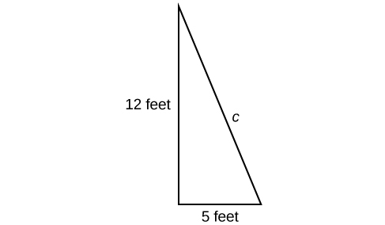

In this section students will:
* Evaluate square roots.
* Use the product rule to simplify square roots.
* Use the quotient rule to simplify square roots.
* Add and subtract square roots.
* Rationalize denominators.
* Use rational roots.

A hardware store sells 16-ft ladders and 24-ft ladders. A window is located 12 feet above the ground. A ladder needs to be purchased that will reach the window from a point on the ground 5 feet from the building. To find out the length of ladder needed, we can draw a right triangle as shown in [\[link\]](#Figure_01_03_001), and use the Pythagorean Theorem.

 {: #Figure_01_03_001}

<math xmlns="http://www.w3.org/1998/Math/MathML" display="block"> <mrow> <mtable> <mtr> <mtd columnalign="right"> <mrow> <msup> <mi>a</mi> <mn>2</mn> </msup> <mo>+</mo><msup> <mi>b</mi> <mn>2</mn> </msup> </mrow> </mtd> <mtd> <mo>=</mo> </mtd> <mtd columnalign="left"> <mrow> <msup> <mi>c</mi> <mn>2</mn> </msup> </mrow> </mtd> </mtr> <mtr> <mtd columnalign="right"> <mrow> <msup> <mn>5</mn> <mn>2</mn> </msup> <mo>+</mo><msup> <mrow> <mn>12</mn> </mrow> <mn>2</mn> </msup> </mrow> </mtd> <mtd> <mo>=</mo> </mtd> <mtd columnalign="left"> <mrow> <msup> <mi>c</mi> <mn>2</mn> </msup> </mrow> </mtd> </mtr> <mtr> <mtd columnalign="right"> <mrow> <mn>169</mn> </mrow> </mtd> <mtd> <mo>=</mo> </mtd> <mtd columnalign="left"> <mrow> <msup> <mi>c</mi> <mn>2</mn> </msup> </mrow> </mtd> </mtr> </mtable> </mrow> </math>

Now, we need to find out the length that, when squared, is 169, to determine which ladder to choose. In other words, we need to find a square root. In this section, we will investigate methods of finding solutions to problems such as this one.

# Evaluating Square Roots

When the square root of a number is squared, the result is the original number. Since<math xmlns="http://www.w3.org/1998/Math/MathML"> <mrow> <mtext> </mtext><msup> <mn>4</mn> <mn>2</mn> </msup> <mo>=</mo><mn>16</mn><mo>,</mo> </mrow> </math>

the square root of<math xmlns="http://www.w3.org/1998/Math/MathML"> <mrow> <mtext> </mtext><mn>16</mn><mtext> </mtext> </mrow> </math>

is<math xmlns="http://www.w3.org/1998/Math/MathML"> <mrow> <mtext> </mtext><mn>4.</mn><mtext> </mtext> </mrow> </math>

The square root function is the inverse of the squaring function just as subtraction is the inverse of addition. To undo squaring, we take the square root.

In general terms, if<math xmlns="http://www.w3.org/1998/Math/MathML"> <mrow> <mtext> </mtext><mi>a</mi><mtext> </mtext> </mrow> </math>

is a positive real number, then the square root of<math xmlns="http://www.w3.org/1998/Math/MathML"> <mrow> <mtext> </mtext><mi>a</mi><mtext> </mtext> </mrow> </math>

is a number that, when multiplied by itself, gives<math xmlns="http://www.w3.org/1998/Math/MathML"> <mrow> <mtext> </mtext><mi>a</mi><mo>.</mo><mtext> </mtext> </mrow> </math>

The square root could be positive or negative because multiplying two negative numbers gives a positive number. The **principal square root**{: data-type="term"} is the nonnegative number that when multiplied by itself equals<math xmlns="http://www.w3.org/1998/Math/MathML"> <mrow> <mtext> </mtext><mi>a</mi><mo>.</mo><mtext> </mtext> </mrow> </math>

The square root obtained using a calculator is the principal square root.

The principal square root of<math xmlns="http://www.w3.org/1998/Math/MathML"> <mrow> <mtext> </mtext><mi>a</mi><mtext> </mtext> </mrow> </math>

is written as<math xmlns="http://www.w3.org/1998/Math/MathML"> <mrow> <mtext> </mtext><msqrt> <mi>a</mi> </msqrt> <mo>.</mo><mtext> </mtext> </mrow> </math>

The symbol is called a **radical**{: data-type="term"}, the term under the symbol is called the **radicand**{: data-type="term"}, and the entire expression is called a **radical expression**{: data-type="term"}.

    

Principal Square Root

The **principal square root**{: data-type="term"} of<math xmlns="http://www.w3.org/1998/Math/MathML"> <mrow> <mtext> </mtext><mi>a</mi><mtext> </mtext> </mrow> </math>

is the nonnegative number that, when multiplied by itself, equals<math xmlns="http://www.w3.org/1998/Math/MathML"> <mrow> <mtext> </mtext><mi>a</mi><mo>.</mo><mtext> </mtext> </mrow> </math>

It is written as a **radical expression**{: data-type="term"}**,** with a symbol called a **radical**{: data-type="term"} over the term called the **radicand**{: data-type="term"}\:<math xmlns="http://www.w3.org/1998/Math/MathML"> <mrow> <mtext> </mtext><msqrt> <mi>a</mi> </msqrt> <mo>.</mo> </mrow> </math>

**Does**<math xmlns="http://www.w3.org/1998/Math/MathML"> <mrow> <mtext> </mtext><msqrt> <mrow> <mn>25</mn> </mrow> </msqrt> <mo>=</mo><mo>±</mo><mn>5</mn><mo>?</mo> </mrow> </math>

*No. Although both*<math xmlns="http://www.w3.org/1998/Math/MathML"> <mrow> <mtext> </mtext><msup> <mn>5</mn> <mn>2</mn> </msup> <mtext> </mtext> </mrow> </math>

*and*<math xmlns="http://www.w3.org/1998/Math/MathML"> <mrow> <mtext> </mtext><msup> <mrow> <mo stretchy="false">(</mo><mn>−5</mn><mo stretchy="false">)</mo> </mrow> <mn>2</mn> </msup> <mtext> </mtext> </mrow> </math>

*are*<math xmlns="http://www.w3.org/1998/Math/MathML"> <mrow> <mtext> </mtext><mn>25</mn><mo>,</mo> </mrow> </math>

*the radical symbol implies only a nonnegative root, the principal square root. The principal square root of 25 is*<math xmlns="http://www.w3.org/1998/Math/MathML"> <mrow> <mtext> </mtext><msqrt> <mrow> <mn>25</mn> </mrow> </msqrt> <mo>=</mo><mn>5.</mn> </mrow> </math>

Evaluating Square Roots

Evaluate each expression.

1.  <math xmlns="http://www.w3.org/1998/Math/MathML"> <mrow> <msqrt> <mrow> <mn>100</mn> </mrow> </msqrt> </mrow> </math>

2.  <math xmlns="http://www.w3.org/1998/Math/MathML"> <mrow> <msqrt> <mrow> <msqrt> <mrow> <mn>16</mn> </mrow> </msqrt> </mrow> </msqrt> </mrow> </math>

3.  <math xmlns="http://www.w3.org/1998/Math/MathML"> <mrow> <msqrt> <mrow> <mn>25</mn><mo>+</mo><mn>144</mn> </mrow> </msqrt> </mrow> </math>

4.  <math xmlns="http://www.w3.org/1998/Math/MathML"> <mrow> <msqrt> <mrow> <mn>49</mn> </mrow> </msqrt> <mo>−</mo><msqrt> <mrow> <mn>81</mn> </mrow> </msqrt> </mrow> </math>
{: data-number-style="lower-alpha"}

1.  <math xmlns="http://www.w3.org/1998/Math/MathML"> <mrow> <msqrt> <mrow> <mn>100</mn> </mrow> </msqrt> <mo>=</mo><mn>10</mn><mtext> </mtext> </mrow> </math>
    
    because
    <math xmlns="http://www.w3.org/1998/Math/MathML"> <mrow> <mtext> </mtext><msup> <mrow> <mn>10</mn> </mrow> <mn>2</mn> </msup> <mo>=</mo><mn>100</mn> </mrow> </math>

2.  <math xmlns="http://www.w3.org/1998/Math/MathML"> <mrow> <msqrt> <mrow> <msqrt> <mrow> <mn>16</mn> </mrow> </msqrt> </mrow> </msqrt> <mo>=</mo><msqrt> <mn>4</mn> </msqrt> <mo>=</mo><mn>2</mn><mtext> </mtext> </mrow> </math>
    
    because
    <math xmlns="http://www.w3.org/1998/Math/MathML"> <mrow> <mtext> </mtext><msup> <mn>4</mn> <mn>2</mn> </msup> <mo>=</mo><mn>16</mn><mtext> </mtext> </mrow> </math>
    
    and
    <math xmlns="http://www.w3.org/1998/Math/MathML"> <mrow> <mtext> </mtext><msup> <mn>2</mn> <mn>2</mn> </msup> <mo>=</mo><mn>4</mn> </mrow> </math>

3.  <math xmlns="http://www.w3.org/1998/Math/MathML"> <mrow> <msqrt> <mrow> <mn>25</mn><mo>+</mo><mn>144</mn> </mrow> </msqrt> <mo>=</mo><msqrt> <mrow> <mn>169</mn> </mrow> </msqrt> <mo>=</mo><mn>13</mn><mtext> </mtext> </mrow> </math>
    
    because
    <math xmlns="http://www.w3.org/1998/Math/MathML"> <mrow> <mtext> </mtext><msup> <mrow> <mn>13</mn> </mrow> <mn>2</mn> </msup> <mo>=</mo><mn>169</mn> </mrow> </math>

4.  <math xmlns="http://www.w3.org/1998/Math/MathML"> <mrow> <msqrt> <mrow> <mn>49</mn></mrow> </msqrt> <mo>−</mo><msqrt> <mrow> <mn>81</mn></mrow> </msqrt> <mo>=</mo><mn>7</mn><mo>−</mo><mn>9</mn><mo>=</mo><mn>−2</mn><mtext> </mtext></mrow> </math>
    
    because
    <math xmlns="http://www.w3.org/1998/Math/MathML"> <mrow> <mtext> </mtext><msup> <mn>7</mn> <mn>2</mn> </msup> <mo>=</mo><mn>49</mn><mtext> </mtext> </mrow> </math>
    
    and
    <math xmlns="http://www.w3.org/1998/Math/MathML"> <mrow> <mtext> </mtext><msup> <mn>9</mn> <mn>2</mn> </msup> <mo>=</mo><mn>81</mn> </mrow> </math>
{: data-number-style="lower-alpha"}

**For<math xmlns="http://www.w3.org/1998/Math/MathML"> <mrow> <mtext> </mtext><msqrt> <mrow> <mn>25</mn><mo>+</mo><mn>144</mn> </mrow> </msqrt> <mo>,</mo> </mrow> </math>

can we find the square roots before adding?**

*No.*<math xmlns="http://www.w3.org/1998/Math/MathML"> <mrow> <mtext> </mtext><msqrt> <mrow> <mn>25</mn> </mrow> </msqrt> <mo>+</mo><msqrt> <mrow> <mn>144</mn> </mrow> </msqrt> <mo>=</mo><mn>5</mn><mo>+</mo><mn>12</mn><mo>=</mo><mn>17.</mn><mtext> </mtext> </mrow> </math>

*This is not equivalent to*<math xmlns="http://www.w3.org/1998/Math/MathML"> <mrow> <mtext> </mtext><msqrt> <mrow> <mn>25</mn><mo>+</mo><mn>144</mn> </mrow> </msqrt> <mo>=</mo><mn>13.</mn><mtext> </mtext> </mrow> </math>

*The order of operations requires us to add the terms in the radicand before finding the square root.*

Evaluate each expression.

1.  <math xmlns="http://www.w3.org/1998/Math/MathML"> <mrow> <msqrt> <mrow> <mn>225</mn> </mrow> </msqrt> </mrow> </math>

2.  <math xmlns="http://www.w3.org/1998/Math/MathML"> <mrow> <msqrt> <mrow> <msqrt> <mrow> <mn>81</mn> </mrow> </msqrt> </mrow> </msqrt> </mrow> </math>

3.  <math xmlns="http://www.w3.org/1998/Math/MathML"> <mrow> <msqrt> <mrow> <mn>25</mn><mo>−</mo><mn>9</mn> </mrow> </msqrt> </mrow> </math>

4.  <math xmlns="http://www.w3.org/1998/Math/MathML"> <mrow> <msqrt> <mrow> <mn>36</mn> </mrow> </msqrt> <mo>+</mo><msqrt> <mrow> <mn>121</mn> </mrow> </msqrt> </mrow> </math>
{: data-number-style="lower-alpha"}

1.  <math xmlns="http://www.w3.org/1998/Math/MathML"> <mrow> <mn>15</mn> </mrow> </math>

2.  <math xmlns="http://www.w3.org/1998/Math/MathML"> <mrow> <mn>3</mn> </mrow> </math>

3.  <math xmlns="http://www.w3.org/1998/Math/MathML"> <mrow> <mn>4</mn> </mrow> </math>

4.  <math xmlns="http://www.w3.org/1998/Math/MathML"> <mrow> <mn>17</mn> </mrow> </math>
{: data-number-style="lower-alpha"}

# Using the Product Rule to Simplify Square Roots

To simplify a square root, we rewrite it such that there are no perfect squares in the radicand. There are several properties of square roots that allow us to simplify complicated radical expressions. The first rule we will look at is the *product rule for simplifying square roots,* which allows us to separate the square root of a product of two numbers into the product of two separate rational expressions. For instance, we can rewrite<math xmlns="http://www.w3.org/1998/Math/MathML"> <mrow> <mtext> </mtext><msqrt> <mrow> <mn>15</mn> </mrow> </msqrt> <mtext> </mtext> </mrow> </math>

as<math xmlns="http://www.w3.org/1998/Math/MathML"> <mrow> <mtext> </mtext><msqrt> <mn>3</mn> </msqrt> <mo>⋅</mo><msqrt> <mn>5</mn> </msqrt> <mo>.</mo><mtext> </mtext> </mrow> </math>

We can also use the product rule to express the product of multiple radical expressions as a single radical expression.

The Product Rule for Simplifying Square Roots

If<math xmlns="http://www.w3.org/1998/Math/MathML"> <mrow> <mtext> </mtext><mi>a</mi><mtext> </mtext> </mrow> </math>

and<math xmlns="http://www.w3.org/1998/Math/MathML"> <mrow> <mtext> </mtext><mi>b</mi><mtext> </mtext> </mrow> </math>

are nonnegative, the square root of the product<math xmlns="http://www.w3.org/1998/Math/MathML"> <mrow> <mtext> </mtext><mi>a</mi><mi>b</mi><mtext> </mtext> </mrow> </math>

is equal to the product of the square roots of<math xmlns="http://www.w3.org/1998/Math/MathML"> <mrow> <mtext> </mtext><mi>a</mi><mtext> </mtext> </mrow> </math>

and<math xmlns="http://www.w3.org/1998/Math/MathML"> <mrow> <mtext> </mtext><mi>b</mi><mo>.</mo><mtext> </mtext></mrow> </math>

<math xmlns="http://www.w3.org/1998/Math/MathML"> <mrow> <msqrt> <mrow> <mi>a</mi><mi>b</mi> </mrow> </msqrt> <mo>=</mo><msqrt> <mi>a</mi> </msqrt> <mo>⋅</mo><msqrt> <mi>b</mi> </msqrt> </mrow> </math>

<strong>Given a square root radical expression, use the product rule to simplify it. </strong>

1.  Factor any perfect squares from the radicand.
2.  Write the radical expression as a product of radical expressions.
3.  Simplify.
{: data-number-style="arabic"}

Using the Product Rule to Simplify Square Roots

Simplify the radical expression.

1.  <math xmlns="http://www.w3.org/1998/Math/MathML"> <mrow> <msqrt> <mrow> <mn>300</mn> </mrow> </msqrt> </mrow> </math>

2.  <math xmlns="http://www.w3.org/1998/Math/MathML"> <mrow> <msqrt> <mrow> <mn>162</mn><msup> <mi>a</mi> <mn>5</mn> </msup> <msup> <mi>b</mi> <mn>4</mn> </msup> </mrow> </msqrt> </mrow> </math>
{: data-number-style="lower-alpha"}

1.  * * *
    {: data-type="newline"}
    
    <math xmlns="http://www.w3.org/1998/Math/MathML"> <mrow> <mtable> <mtr> <mtd columnalign="left"> <mrow> <msqrt> <mrow> <mn>100</mn><mo>⋅</mo><mn>3</mn> </mrow> </msqrt> </mrow> </mtd> <mtd columnalign="left"> <mrow><mspace width="4.5em" /> <mtext>Factor perfect square from radicand</mtext><mo>.</mo> </mrow> </mtd> </mtr> <mtr> <mtd columnalign="left"> <mrow> <msqrt> <mrow> <mn>100</mn> </mrow> </msqrt> <mo>⋅</mo><msqrt> <mn>3</mn> </msqrt> </mrow> </mtd> <mtd columnalign="left"> <mrow><mspace width="4.5em" /> <mtext>Write radical expression as product of radical expressions</mtext><mo>.</mo> </mrow> </mtd> </mtr> <mtr> <mtd columnalign="left"> <mrow> <mn>10</mn><msqrt> <mn>3</mn> </msqrt> </mrow> </mtd> <mtd columnalign="left"> <mrow><mspace width="4.5em" /> <mtext>Simplify</mtext><mo>.</mo> </mrow> </mtd> </mtr> </mtable> </mrow> </math>

2.  * * *
    {: data-type="newline"}
    
    <math xmlns="http://www.w3.org/1998/Math/MathML"> <mrow> <mtable> <mtr> <mtd columnalign="left"> <mrow> <msqrt> <mrow> <mn>81</mn><msup> <mi>a</mi> <mn>4</mn> </msup> <msup> <mi>b</mi> <mn>4</mn> </msup> <mo>⋅</mo><mn>2</mn><mi>a</mi> </mrow> </msqrt> </mrow> </mtd> <mtd columnalign="left"> <mrow><mspace width="2em" /> <mtext>Factor perfect square from radicand</mtext><mo>.</mo> </mrow> </mtd> </mtr> <mtr> <mtd columnalign="left"> <mrow> <msqrt> <mrow> <mn>81</mn><msup> <mi>a</mi> <mn>4</mn> </msup> <msup> <mi>b</mi> <mn>4</mn> </msup> </mrow> </msqrt> <mo>⋅</mo><msqrt> <mrow> <mn>2</mn><mi>a</mi> </mrow> </msqrt> </mrow> </mtd> <mtd columnalign="left"> <mrow><mspace width="2em" /> <mtext>Write radical expression as product of radical expressions</mtext><mo>.</mo> </mrow> </mtd> </mtr> <mtr> <mtd columnalign="left"> <mrow> <mn>9</mn><msup> <mi>a</mi> <mn>2</mn> </msup> <msup> <mi>b</mi> <mn>2</mn> </msup> <msqrt> <mrow> <mn>2</mn><mi>a</mi> </mrow> </msqrt> </mrow> </mtd> <mtd columnalign="left"> <mrow><mspace width="2em" /> <mtext>Simplify</mtext><mo>.</mo> </mrow> </mtd> </mtr> </mtable> </mrow> </math>
{: data-number-style="lower-alpha"}

Simplify<math xmlns="http://www.w3.org/1998/Math/MathML"> <mrow> <mtext> </mtext><msqrt> <mrow> <mn>50</mn><msup> <mi>x</mi> <mn>2</mn> </msup> <msup> <mi>y</mi> <mn>3</mn> </msup> <mi>z</mi> </mrow> </msqrt> <mo>.</mo> </mrow> </math>

<math xmlns="http://www.w3.org/1998/Math/MathML"> <mrow> <mn>5</mn><mrow><mo>\|</mo> <mi>x</mi> <mo>\|</mo></mrow><mrow><mo>\|</mo> <mi>y</mi> <mo>\|</mo></mrow><msqrt> <mrow> <mn>2</mn><mi>y</mi><mi>z</mi> </mrow> </msqrt> <mo>.</mo><mtext> </mtext> </mrow> </math>

Notice the absolute value signs around *x* and *y*? That’s because their value must be positive!

<strong>Given the product of multiple radical expressions, use the product rule to combine them into one radical expression. </strong>

1.  Express the product of multiple radical expressions as a single radical expression.
2.  Simplify.
{: data-number-style="arabic"}

Using the Product Rule to Simplify the Product of Multiple Square Roots

Simplify the radical expression.* * *
{: data-type="newline"}

<math xmlns="http://www.w3.org/1998/Math/MathML"> <mrow> <msqrt> <mrow> <mn>12</mn> </mrow> </msqrt> <mo>⋅</mo><msqrt> <mn>3</mn> </msqrt> </mrow> </math>

<math xmlns="http://www.w3.org/1998/Math/MathML"> <mrow> <mtable> <mtr rowalign="center"> <mtd rowalign="center" columnalign="left"> <mrow> <msqrt> <mrow> <mn>12</mn><mo>⋅</mo><mn>3</mn> </mrow> </msqrt> </mrow> </mtd> <mtd rowalign="center" columnalign="left"> <mrow><mspace width="2em" /> <mtext>Express the product as a single radical expression</mtext><mo>.</mo> </mrow> </mtd> </mtr> <mtr rowalign="center"> <mtd columnalign="left" rowalign="center"> <mrow> <msqrt> <mrow> <mn>36</mn> </mrow> </msqrt> </mrow> </mtd> <mtd columnalign="left" rowalign="center"> <mrow><mspace width="2em" /> <mtext>Simplify</mtext><mo>.</mo> </mrow> </mtd> </mtr> <mtr rowalign="center"> <mtd columnalign="left" rowalign="center"> <mn>6</mn> </mtd> <mtd rowalign="center" /> </mtr> </mtable> </mrow> </math>

Simplify<math xmlns="http://www.w3.org/1998/Math/MathML"> <mrow> <mtext> </mtext><msqrt> <mrow> <mn>50</mn><mi>x</mi> </mrow> </msqrt> <mo>⋅</mo><msqrt> <mrow> <mn>2</mn><mi>x</mi> </mrow> </msqrt> <mtext> </mtext> </mrow> </math>

assuming<math xmlns="http://www.w3.org/1998/Math/MathML"> <mrow> <mtext> </mtext><mi>x</mi><mo>&gt;</mo><mn>0.</mn> </mrow> </math>

<math xmlns="http://www.w3.org/1998/Math/MathML"> <mrow> <mn>10</mn><mrow><mo>\|</mo> <mi>x</mi> <mo>\|</mo></mrow> </mrow> </math>

# Using the Quotient Rule to Simplify Square Roots

Just as we can rewrite the square root of a product as a product of square roots, so too can we rewrite the square root of a quotient as a quotient of square roots, using the *quotient rule for simplifying square roots.* It can be helpful to separate the numerator and denominator of a fraction under a radical so that we can take their square roots separately. We can rewrite<math xmlns="http://www.w3.org/1998/Math/MathML"> <mrow> <mtext> </mtext><msqrt> <mrow> <mfrac> <mn>5</mn> <mn>2</mn> </mfrac> </mrow> </msqrt> <mtext> </mtext> </mrow> </math>

as<math xmlns="http://www.w3.org/1998/Math/MathML"> <mrow> <mtext> </mtext><mfrac> <mrow> <msqrt> <mn>5</mn> </msqrt> </mrow> <mrow> <msqrt> <mn>2</mn> </msqrt> </mrow> </mfrac> <mo>.</mo> </mrow> </math>

The Quotient Rule for Simplifying Square Roots

The square root of the quotient<math xmlns="http://www.w3.org/1998/Math/MathML"> <mrow> <mtext> </mtext><mfrac> <mi>a</mi> <mi>b</mi> </mfrac> <mtext> </mtext> </mrow> </math>

is equal to the quotient of the square roots of<math xmlns="http://www.w3.org/1998/Math/MathML"> <mrow> <mtext> </mtext><mi>a</mi><mtext> </mtext> </mrow> </math>

and<math xmlns="http://www.w3.org/1998/Math/MathML"> <mrow> <mtext> </mtext><mi>b</mi><mo>,</mo> </mrow> </math>

where<math xmlns="http://www.w3.org/1998/Math/MathML"> <mrow> <mtext> </mtext><mi>b</mi><mo>≠</mo><mn>0.</mn> </mrow> </math>

<math xmlns="http://www.w3.org/1998/Math/MathML"> <mrow> <msqrt> <mrow> <mfrac> <mi>a</mi> <mi>b</mi> </mfrac> </mrow> </msqrt> <mo>=</mo><mfrac> <mrow> <msqrt> <mi>a</mi> </msqrt> </mrow> <mrow> <msqrt> <mi>b</mi> </msqrt> </mrow> </mfrac> </mrow> </math>

<strong>Given a radical expression, use the quotient rule to simplify it. </strong>

1.  Write the radical expression as the quotient of two radical expressions.
2.  Simplify the numerator and denominator.
{: data-number-style="arabic"}

Using the Quotient Rule to Simplify Square Roots

Simplify the radical expression.

<math xmlns="http://www.w3.org/1998/Math/MathML"> <mrow> <msqrt> <mrow> <mfrac> <mn>5</mn> <mrow> <mn>36</mn> </mrow> </mfrac> </mrow> </msqrt> </mrow> </math>

<math xmlns="http://www.w3.org/1998/Math/MathML"> <mrow> <mtable> <mtr> <mtd columnalign="left"> <mrow> <mfrac> <mrow> <msqrt> <mn>5</mn> </msqrt> </mrow> <mrow> <msqrt> <mrow> <mn>36</mn> </mrow> </msqrt> </mrow> </mfrac> </mrow> </mtd> <mtd columnalign="left"> <mrow><mspace width="2em" /> <mtext>Write as quotient of two radical expressions</mtext><mo>.</mo> </mrow> </mtd> </mtr> <mtr> <mtd columnalign="left"> <mrow> <mfrac> <mrow> <msqrt> <mn>5</mn> </msqrt> </mrow> <mn>6</mn> </mfrac> </mrow> </mtd> <mtd columnalign="left"> <mrow><mspace width="2em" /> <mtext>Simplify denominator</mtext><mo>.</mo> </mrow> </mtd> </mtr> </mtable> </mrow> </math>

Simplify<math xmlns="http://www.w3.org/1998/Math/MathML"> <mrow> <mtext> </mtext><msqrt> <mrow> <mfrac> <mrow> <mn>2</mn><msup> <mi>x</mi> <mn>2</mn> </msup> </mrow> <mrow> <mn>9</mn><msup> <mi>y</mi> <mn>4</mn> </msup> </mrow> </mfrac> </mrow> </msqrt> <mo>.</mo> </mrow> </math>

<math xmlns="http://www.w3.org/1998/Math/MathML"> <mrow> <mfrac> <mrow> <mi>x</mi><msqrt> <mn>2</mn> </msqrt> </mrow> <mrow> <mn>3</mn><msup> <mi>y</mi> <mn>2</mn> </msup> </mrow> </mfrac> <mo>.</mo><mtext> </mtext> </mrow> </math>

We do not need the absolute value signs for<math xmlns="http://www.w3.org/1998/Math/MathML"> <mrow> <mtext> </mtext><msup> <mi>y</mi> <mn>2</mn> </msup> <mtext> </mtext> </mrow> </math>

because that term will always be nonnegative.

Using the Quotient Rule to Simplify an Expression with Two Square Roots

Simplify the radical expression.

<math xmlns="http://www.w3.org/1998/Math/MathML"> <mrow> <mfrac> <mrow> <msqrt> <mrow> <mn>234</mn><msup> <mi>x</mi> <mrow> <mn>11</mn> </mrow> </msup> <mi>y</mi> </mrow> </msqrt> </mrow> <mrow> <msqrt> <mrow> <mn>26</mn><msup> <mi>x</mi> <mn>7</mn> </msup> <mi>y</mi> </mrow> </msqrt> </mrow> </mfrac> </mrow> </math>

<math xmlns="http://www.w3.org/1998/Math/MathML"> <mrow> <mtable> <mtr> <mtd columnalign="left"> <mrow> <msqrt> <mrow> <mfrac> <mrow> <mn>234</mn><msup> <mi>x</mi> <mrow> <mn>11</mn> </mrow> </msup> <mi>y</mi> </mrow> <mrow> <mn>26</mn><msup> <mi>x</mi> <mn>7</mn> </msup> <mi>y</mi> </mrow> </mfrac> </mrow> </msqrt> </mrow> </mtd> <mtd columnalign="left"> <mrow><mspace width="2em" /> <mtext>Combine numerator and denominator into one radical expression</mtext><mo>.</mo> </mrow> </mtd> </mtr> <mtr> <mtd columnalign="left"> <mrow> <msqrt> <mrow> <mn>9</mn><msup> <mi>x</mi> <mn>4</mn> </msup> </mrow> </msqrt> </mrow> </mtd> <mtd columnalign="left"> <mrow><mspace width="2em" /> <mtext>Simplify fraction</mtext><mo>.</mo> </mrow> </mtd> </mtr> <mtr> <mtd columnalign="left"> <mrow> <mn>3</mn><msup> <mi>x</mi> <mn>2</mn> </msup> <mtext>  </mtext> </mrow> </mtd> <mtd columnalign="left"> <mrow><mspace width="2em" /> <mtext>Simplify square root</mtext><mo>.</mo> </mrow> </mtd> </mtr> </mtable> </mrow> </math>

Simplify<math xmlns="http://www.w3.org/1998/Math/MathML"> <mrow> <mtext> </mtext><mfrac> <mrow> <msqrt> <mrow> <mn>9</mn><msup> <mi>a</mi> <mn>5</mn> </msup> <msup> <mi>b</mi> <mrow> <mn>14</mn> </mrow> </msup> </mrow> </msqrt> </mrow> <mrow> <msqrt> <mrow> <mn>3</mn><msup> <mi>a</mi> <mn>4</mn> </msup> <msup> <mi>b</mi> <mn>5</mn> </msup> </mrow> </msqrt> </mrow> </mfrac> <mo>.</mo> </mrow> </math>

<math xmlns="http://www.w3.org/1998/Math/MathML"> <mrow> <msup> <mi>b</mi> <mn>4</mn> </msup> <msqrt> <mrow> <mn>3</mn><mi>a</mi><mi>b</mi> </mrow> </msqrt> </mrow> </math>

# Adding and Subtracting Square Roots

We can add or subtract radical expressions only when they have the same radicand and when they have the same radical type such as square roots. For example, the sum of<math xmlns="http://www.w3.org/1998/Math/MathML"> <mrow> <mtext> </mtext><msqrt> <mn>2</mn> </msqrt> <mtext> </mtext> </mrow> </math>

and<math xmlns="http://www.w3.org/1998/Math/MathML"> <mrow> <mtext> </mtext><mn>3</mn><msqrt> <mn>2</mn> </msqrt> <mtext> </mtext> </mrow> </math>

is<math xmlns="http://www.w3.org/1998/Math/MathML"> <mrow> <mtext> </mtext><mn>4</mn><msqrt> <mn>2</mn> </msqrt> <mo>.</mo><mtext> </mtext> </mrow> </math>

However, it is often possible to simplify radical expressions, and that may change the radicand. The radical expression<math xmlns="http://www.w3.org/1998/Math/MathML"> <mrow> <mtext> </mtext><msqrt> <mrow> <mn>18</mn> </mrow> </msqrt> <mtext> </mtext> </mrow> </math>

can be written with a<math xmlns="http://www.w3.org/1998/Math/MathML"> <mrow> <mtext> </mtext><mn>2</mn><mtext> </mtext> </mrow> </math>

in the radicand, as<math xmlns="http://www.w3.org/1998/Math/MathML"> <mrow> <mtext> </mtext><mn>3</mn><msqrt> <mn>2</mn> </msqrt> <mo>,</mo> </mrow> </math>

so<math xmlns="http://www.w3.org/1998/Math/MathML"> <mrow> <mtext> </mtext><msqrt> <mn>2</mn> </msqrt> <mo>+</mo><msqrt> <mrow> <mn>18</mn> </mrow> </msqrt> <mo>=</mo><msqrt> <mn>2</mn> </msqrt> <mo>+</mo><mn>3</mn><msqrt> <mn>2</mn> </msqrt> <mo>=</mo><mn>4</mn><msqrt> <mn>2</mn> </msqrt> <mo>.</mo> </mrow> </math>

**Given a radical expression requiring addition or subtraction of square roots, solve.**

1.  Simplify each radical expression.
2.  Add or subtract expressions with equal radicands.
{: data-number-style="arabic"}

Adding Square Roots

Add<math xmlns="http://www.w3.org/1998/Math/MathML"> <mrow> <mtext> </mtext><mn>5</mn><msqrt> <mrow> <mn>12</mn> </mrow> </msqrt> <mo>+</mo><mn>2</mn><msqrt> <mn>3</mn> </msqrt> <mo>.</mo> </mrow> </math>

We can rewrite<math xmlns="http://www.w3.org/1998/Math/MathML"> <mrow> <mtext> </mtext><mn>5</mn><msqrt> <mrow> <mn>12</mn> </mrow> </msqrt> <mtext> </mtext> </mrow> </math>

as<math xmlns="http://www.w3.org/1998/Math/MathML"> <mrow> <mtext> </mtext><mn>5</mn><msqrt> <mrow> <mn>4</mn><mo>·</mo><mn>3</mn> </mrow> </msqrt> <mo>.</mo><mtext> </mtext> </mrow> </math>

According the product rule, this becomes<math xmlns="http://www.w3.org/1998/Math/MathML"> <mrow> <mtext> </mtext><mn>5</mn><msqrt> <mn>4</mn> </msqrt> <msqrt> <mn>3</mn> </msqrt> <mo>.</mo><mtext> </mtext> </mrow> </math>

The square root of<math xmlns="http://www.w3.org/1998/Math/MathML"> <mrow> <mtext> </mtext><msqrt> <mn>4</mn> </msqrt> <mtext> </mtext> </mrow> </math>

is 2, so the expression becomes<math xmlns="http://www.w3.org/1998/Math/MathML"> <mrow> <mtext> </mtext><mn>5</mn><mrow><mo>(</mo> <mn>2</mn> <mo>)</mo></mrow><msqrt> <mn>3</mn> </msqrt> <mo>,</mo> </mrow> </math>

which is<math xmlns="http://www.w3.org/1998/Math/MathML"> <mrow> <mtext> </mtext><mn>10</mn><msqrt> <mn>3</mn> </msqrt> <mo>.</mo><mtext> </mtext> </mrow> </math>

Now we can the terms have the same radicand so we can add.

<math xmlns="http://www.w3.org/1998/Math/MathML"> <mrow> <mn>10</mn><msqrt> <mn>3</mn> </msqrt> <mo>+</mo><mn>2</mn><msqrt> <mn>3</mn> </msqrt> <mo>=</mo><mn>12</mn><msqrt> <mn>3</mn> </msqrt> </mrow> </math>

Add<math xmlns="http://www.w3.org/1998/Math/MathML"> <mrow> <mtext> </mtext><msqrt> <mn>5</mn> </msqrt> <mo>+</mo><mn>6</mn><msqrt> <mrow> <mn>20</mn> </mrow> </msqrt> <mo>.</mo> </mrow> </math>

<math xmlns="http://www.w3.org/1998/Math/MathML"> <mrow> <mn>13</mn><msqrt> <mn>5</mn> </msqrt> </mrow> </math>

Subtracting Square Roots

Subtract<math xmlns="http://www.w3.org/1998/Math/MathML"> <mrow> <mtext> </mtext><mn>20</mn><msqrt> <mrow> <mn>72</mn><msup> <mi>a</mi> <mn>3</mn> </msup> <msup> <mi>b</mi> <mn>4</mn> </msup> <mi>c</mi></mrow> </msqrt> <mtext> </mtext><mo>−</mo><mn>14</mn><msqrt> <mrow> <mn>8</mn><msup> <mi>a</mi> <mn>3</mn> </msup> <msup> <mi>b</mi> <mn>4</mn> </msup> <mi>c</mi></mrow> </msqrt> <mo>.</mo></mrow> </math>

Rewrite each term so they have equal radicands.

<math xmlns="http://www.w3.org/1998/Math/MathML"> <mrow> <mtable> <mtr rowalign="center"> <mtd columnalign="right" rowalign="center"> <mrow> <mn>20</mn><msqrt> <mrow> <mn>72</mn><msup> <mi>a</mi> <mn>3</mn> </msup> <msup> <mi>b</mi> <mn>4</mn> </msup> <mi>c</mi> </mrow> </msqrt> </mrow> </mtd> <mtd rowalign="center"> <mo>=</mo> </mtd> <mtd columnalign="left" rowalign="center"> <mrow> <mn>20</mn><msqrt> <mn>9</mn> </msqrt> <msqrt> <mn>4</mn> </msqrt> <msqrt> <mn>2</mn> </msqrt> <msqrt> <mi>a</mi> </msqrt> <msqrt> <mrow> <msup> <mi>a</mi> <mn>2</mn> </msup> </mrow> </msqrt> <msqrt> <mrow> <msup> <mrow> <mo>(</mo><msup> <mi>b</mi> <mn>2</mn> </msup> <mo>)</mo> </mrow> <mn>2</mn> </msup> </mrow> </msqrt> <msqrt> <mi>c</mi> </msqrt> </mrow> </mtd> </mtr> <mtr rowalign="center"> <mtd rowalign="center" /> <mtd rowalign="center"> <mo>=</mo> </mtd> <mtd columnalign="left" rowalign="center"> <mrow> <mn>20</mn><mo stretchy="false">(</mo><mn>3</mn><mo stretchy="false">)</mo><mo stretchy="false">(</mo><mn>2</mn><mo stretchy="false">)</mo><mo>\|</mo><mi>a</mi><mo>\|</mo><msup> <mi>b</mi> <mn>2</mn> </msup> <msqrt> <mrow> <mn>2</mn><mi>a</mi><mi>c</mi> </mrow> </msqrt> </mrow> </mtd> </mtr> <mtr rowalign="center"> <mtd rowalign="center" /> <mtd rowalign="center"> <mo>=</mo> </mtd> <mtd columnalign="left" rowalign="center"> <mrow> <mn>120</mn><mo>\|</mo><mi>a</mi><mo>\|</mo><msup> <mi>b</mi> <mn>2</mn> </msup> <msqrt> <mrow> <mn>2</mn><mi>a</mi><mi>c</mi> </mrow> </msqrt> </mrow> </mtd> </mtr> </mtable> </mrow> </math>

<math xmlns="http://www.w3.org/1998/Math/MathML"> <mrow> <mtable> <mtr rowalign="center"> <mtd columnalign="right" rowalign="center"> <mrow> <mn>14</mn><msqrt> <mrow> <mn>8</mn><msup> <mi>a</mi> <mn>3</mn> </msup> <msup> <mi>b</mi> <mn>4</mn> </msup> <mi>c</mi> </mrow> </msqrt> </mrow> </mtd> <mtd rowalign="center"> <mo>=</mo> </mtd> <mtd columnalign="left" rowalign="center"> <mrow> <mn>14</mn><msqrt> <mn>2</mn> </msqrt> <msqrt> <mn>4</mn> </msqrt> <msqrt> <mi>a</mi> </msqrt> <msqrt> <mrow> <msup> <mi>a</mi> <mn>2</mn> </msup> </mrow> </msqrt> <msqrt> <mrow> <msup> <mrow> <mo>(</mo><msup> <mi>b</mi> <mn>2</mn> </msup> <mo>)</mo> </mrow> <mn>2</mn> </msup> </mrow> </msqrt> <msqrt> <mi>c</mi> </msqrt> </mrow> </mtd> </mtr> <mtr rowalign="center"> <mtd rowalign="center" /> <mtd rowalign="center"> <mo>=</mo> </mtd> <mtd columnalign="left" rowalign="center"> <mrow> <mn>14</mn><mo stretchy="false">(</mo><mn>2</mn><mo stretchy="false">)</mo><mo>\|</mo><mi>a</mi><mo>\|</mo><msup> <mi>b</mi> <mn>2</mn> </msup> <msqrt> <mrow> <mn>2</mn><mi>a</mi><mi>c</mi> </mrow> </msqrt> </mrow> </mtd> </mtr> <mtr rowalign="center"> <mtd rowalign="center" /> <mtd rowalign="center"> <mo>=</mo> </mtd> <mtd rowalign="center" columnalign="left"> <mrow> <mn>28</mn><mo>\|</mo><mi>a</mi><mo>\|</mo><msup> <mi>b</mi> <mn>2</mn> </msup> <msqrt> <mrow> <mn>2</mn><mi>a</mi><mi>c</mi> </mrow> </msqrt> </mrow> </mtd> </mtr> </mtable> </mrow> </math>

Now the terms have the same radicand so we can subtract.

<math xmlns="http://www.w3.org/1998/Math/MathML"> <mn>120</mn><mo>\|</mo><mi>a</mi><mo>\|</mo> <msup> <mi>b</mi> <mn>2</mn> </msup> <msqrt> <mrow> <mn>2</mn><mi>a</mi><mi>c</mi> </mrow> </msqrt> <mo>−</mo><mn>28</mn><mo>\|</mo><mi>a</mi><mo>\|</mo> <msup> <mi>b</mi> <mn>2</mn> </msup> <msqrt> <mrow> <mn>2</mn><mi>a</mi><mi>c</mi> </mrow> </msqrt> <mo>=</mo><mn>92</mn><mo>\|</mo><mi>a</mi><mo>\|</mo> <msup> <mi>b</mi> <mn>2</mn> </msup> <msqrt> <mrow> <mn>2</mn><mi>a</mi><mi>c</mi> </mrow> </msqrt> </math>

Subtract<math xmlns="http://www.w3.org/1998/Math/MathML"> <mrow> <mtext> </mtext><mn>3</mn><msqrt> <mrow> <mn>80</mn><mi>x</mi></mrow> </msqrt> <mtext> </mtext><mo>−</mo><mn>4</mn><msqrt> <mrow> <mn>45</mn><mi>x</mi></mrow> </msqrt> <mo>.</mo></mrow> </math>

<math xmlns="http://www.w3.org/1998/Math/MathML"> <mn>0</mn> </math>

# Rationalizing Denominators

When an expression involving square root radicals is written in simplest form, it will not contain a radical in the denominator. We can remove radicals from the denominators of fractions using a process called *rationalizing the denominator*.

We know that multiplying by 1 does not change the value of an expression. We use this property of multiplication to change expressions that contain radicals in the denominator. To remove radicals from the denominators of fractions, multiply by the form of 1 that will eliminate the radical.

For a denominator containing a single term, multiply by the radical in the denominator over itself. In other words, if the denominator is<math xmlns="http://www.w3.org/1998/Math/MathML"> <mrow> <mtext> </mtext><mi>b</mi><msqrt> <mi>c</mi> </msqrt> <mo>,</mo> </mrow> </math>

multiply by<math xmlns="http://www.w3.org/1998/Math/MathML"> <mrow> <mtext> </mtext><mfrac> <mrow> <msqrt> <mi>c</mi> </msqrt> </mrow> <mrow> <msqrt> <mi>c</mi> </msqrt> </mrow> </mfrac> <mo>.</mo> </mrow> </math>

For a denominator containing the sum or difference of a rational and an irrational term, multiply the numerator and denominator by the conjugate of the denominator, which is found by changing the sign of the radical portion of the denominator. If the denominator is<math xmlns="http://www.w3.org/1998/Math/MathML"> <mrow> <mtext> </mtext><mi>a</mi><mo>+</mo><mi>b</mi><msqrt> <mi>c</mi> </msqrt> <mo>,</mo> </mrow> </math>

then the conjugate is<math xmlns="http://www.w3.org/1998/Math/MathML"> <mrow> <mtext> </mtext><mi>a</mi><mo>−</mo><mi>b</mi><msqrt> <mi>c</mi> </msqrt> <mo>.</mo> </mrow> </math>

**Given an expression with a single square root radical term in the denominator, rationalize the denominator.**

1.  Multiply the numerator and denominator by the radical in the denominator.
2.  Simplify.
{: data-number-style="lower-alpha"}

Rationalizing a Denominator Containing a Single Term

Write<math xmlns="http://www.w3.org/1998/Math/MathML"> <mrow> <mtext> </mtext><mfrac> <mrow> <mn>2</mn><msqrt> <mn>3</mn> </msqrt> </mrow> <mrow> <mn>3</mn><msqrt> <mrow> <mn>10</mn> </mrow> </msqrt> </mrow> </mfrac> <mtext> </mtext> </mrow> </math>

in simplest form.

The radical in the denominator is<math xmlns="http://www.w3.org/1998/Math/MathML"> <mrow> <mtext> </mtext><msqrt> <mrow> <mn>10</mn> </mrow> </msqrt> <mo>.</mo><mtext> </mtext> </mrow> </math>

So multiply the fraction by<math xmlns="http://www.w3.org/1998/Math/MathML"> <mrow> <mtext> </mtext><mfrac> <mrow> <msqrt> <mrow> <mn>10</mn> </mrow> </msqrt> </mrow> <mrow> <msqrt> <mrow> <mn>10</mn> </mrow> </msqrt> </mrow> </mfrac> <mo>.</mo><mtext> </mtext> </mrow> </math>

Then simplify.

<math xmlns="http://www.w3.org/1998/Math/MathML" display="block"> <mtable columnalign="left"> <mtr> <mtd> <mfrac> <mrow> <mn>2</mn><msqrt> <mn>3</mn> </msqrt> </mrow> <mrow> <mn>3</mn><msqrt> <mrow> <mn>10</mn> </mrow> </msqrt> </mrow> </mfrac> <mo>⋅</mo><mfrac> <mrow> <msqrt> <mrow> <mn>10</mn> </mrow> </msqrt> </mrow> <mrow> <msqrt> <mrow> <mn>10</mn> </mrow> </msqrt> </mrow> </mfrac> <mtext>    </mtext> </mtd> </mtr> <mtr> <mtd> <mfrac> <mrow> <mn>2</mn><msqrt> <mrow> <mn>30</mn> </mrow> </msqrt> </mrow> <mrow> <mn>30</mn> </mrow> </mfrac> <mtext>           </mtext> </mtd> </mtr> <mtr> <mtd> <mfrac> <mrow> <msqrt> <mrow> <mn>30</mn> </mrow> </msqrt> </mrow> <mrow> <mn>15</mn> </mrow> </mfrac> </mtd> </mtr> </mtable> </math>

Write<math xmlns="http://www.w3.org/1998/Math/MathML"> <mrow> <mtext> </mtext><mfrac> <mrow> <mn>12</mn><msqrt> <mn>3</mn> </msqrt> </mrow> <mrow> <msqrt> <mn>2</mn> </msqrt> </mrow> </mfrac> <mtext> </mtext> </mrow> </math>

in simplest form.

<math xmlns="http://www.w3.org/1998/Math/MathML"> <mrow> <mn>6</mn><msqrt> <mn>6</mn> </msqrt> </mrow> </math>

**Given an expression with a radical term and a constant in the denominator, rationalize the denominator.**

1.  Find the conjugate of the denominator.
2.  Multiply the numerator and denominator by the conjugate.
3.  Use the distributive property.
4.  Simplify.
{: data-number-style="arabic"}

Rationalizing a Denominator Containing Two Terms

Write<math xmlns="http://www.w3.org/1998/Math/MathML"> <mrow> <mtext> </mtext><mfrac> <mn>4</mn> <mrow> <mn>1</mn><mo>+</mo><msqrt> <mn>5</mn> </msqrt> </mrow> </mfrac> <mtext> </mtext> </mrow> </math>

in simplest form.

Begin by finding the conjugate of the denominator by writing the denominator and changing the sign. So the conjugate of<math xmlns="http://www.w3.org/1998/Math/MathML"> <mrow> <mtext> </mtext><mn>1</mn><mo>+</mo><msqrt> <mn>5</mn> </msqrt> <mtext> </mtext> </mrow> </math>

is<math xmlns="http://www.w3.org/1998/Math/MathML"> <mrow> <mtext> </mtext><mn>1</mn><mo>−</mo><msqrt> <mn>5</mn> </msqrt> <mo>.</mo><mtext> </mtext> </mrow> </math>

Then multiply the fraction by<math xmlns="http://www.w3.org/1998/Math/MathML"> <mrow> <mtext> </mtext><mfrac> <mrow> <mn>1</mn><mo>−</mo><msqrt> <mn>5</mn> </msqrt> </mrow> <mrow> <mn>1</mn><mo>−</mo><msqrt> <mn>5</mn> </msqrt> </mrow> </mfrac> <mo>.</mo> </mrow> </math>

<math xmlns="http://www.w3.org/1998/Math/MathML" display="block"> <mrow> <mtable> <mtr rowalign="center"> <mtd columnalign="left" rowalign="center"> <mrow> <mfrac> <mn>4</mn> <mrow> <mn>1</mn><mo>+</mo><msqrt> <mn>5</mn> </msqrt> </mrow> </mfrac> <mo>⋅</mo><mfrac> <mrow> <mn>1</mn><mo>−</mo><msqrt> <mn>5</mn> </msqrt> </mrow> <mrow> <mn>1</mn><mo>−</mo><msqrt> <mn>5</mn> </msqrt> </mrow> </mfrac> </mrow> </mtd> <mtd rowalign="center" /> </mtr> <mtr rowalign="center"> <mtd columnalign="left" rowalign="center"> <mrow> <mfrac> <mrow> <mn>4</mn><mo>−</mo><mn>4</mn><msqrt> <mn>5</mn> </msqrt> </mrow> <mrow> <mo>−</mo><mn>4</mn> </mrow> </mfrac> </mrow> </mtd> <mtd columnalign="left" rowalign="center"> <mrow><mspace width="2em" /> <mtext>Use the distributive property</mtext><mo>.</mo> </mrow> </mtd> </mtr> <mtr rowalign="center"> <mtd columnalign="left" rowalign="center"> <mrow> <msqrt> <mn>5</mn> </msqrt> <mo>−</mo><mn>1</mn> </mrow> </mtd> <mtd columnalign="left" rowalign="center"> <mrow><mspace width="2em" /> <mtext>Simplify</mtext><mo>.</mo> </mrow> </mtd> </mtr> </mtable> </mrow> </math>

Write<math xmlns="http://www.w3.org/1998/Math/MathML"> <mrow> <mtext> </mtext><mfrac> <mn>7</mn> <mrow> <mn>2</mn><mo>+</mo><msqrt> <mn>3</mn> </msqrt> </mrow> </mfrac> <mtext> </mtext> </mrow> </math>

in simplest form.

<math xmlns="http://www.w3.org/1998/Math/MathML"> <mrow> <mn>14</mn><mn>−7</mn><msqrt> <mn>3</mn> </msqrt> </mrow> </math>

# Using Rational Roots

Although square roots are the most common rational roots, we can also find cube roots, 4th roots, 5th roots, and more. Just as the square root function is the inverse of the squaring function, these roots are the inverse of their respective power functions. These functions can be useful when we need to determine the number that, when raised to a certain power, gives a certain number.

## Understanding *n*th Roots

Suppose we know that<math xmlns="http://www.w3.org/1998/Math/MathML"> <mrow> <mtext> </mtext><msup> <mi>a</mi> <mn>3</mn> </msup> <mo>=</mo><mn>8.</mn><mtext> </mtext> </mrow> </math>

We want to find what number raised to the 3rd power is equal to 8. Since<math xmlns="http://www.w3.org/1998/Math/MathML"> <mrow> <mtext> </mtext><msup> <mn>2</mn> <mn>3</mn> </msup> <mo>=</mo><mn>8</mn><mo>,</mo> </mrow> </math>

we say that 2 is the cube root of 8.

The *n*th root of<math xmlns="http://www.w3.org/1998/Math/MathML"> <mrow> <mtext> </mtext><mi>a</mi><mtext> </mtext> </mrow> </math>

is a number that, when raised to the *n*th power, gives<math xmlns="http://www.w3.org/1998/Math/MathML"> <mrow> <mtext> </mtext><mi>a</mi><mo>.</mo><mtext> </mtext> </mrow> </math>

For example,<math xmlns="http://www.w3.org/1998/Math/MathML"> <mrow> <mtext> </mtext><mn>−3</mn><mtext> </mtext> </mrow> </math>

is the 5th root of<math xmlns="http://www.w3.org/1998/Math/MathML"> <mrow> <mtext> </mtext><mn>−243</mn><mtext> </mtext> </mrow> </math>

because<math xmlns="http://www.w3.org/1998/Math/MathML"> <mrow> <mtext> </mtext><msup> <mrow> <mo stretchy="false">(</mo><mn>−3</mn><mo stretchy="false">)</mo> </mrow> <mn>5</mn> </msup> <mo>=</mo><mn>−243.</mn><mtext> </mtext> </mrow> </math>

If<math xmlns="http://www.w3.org/1998/Math/MathML"> <mrow> <mtext> </mtext><mi>a</mi><mtext> </mtext> </mrow> </math>

is a real number with at least one *n*th root, then the **principal *n*th root**{: data-type="term"} of<math xmlns="http://www.w3.org/1998/Math/MathML"> <mrow> <mtext> </mtext><mi>a</mi><mtext> </mtext> </mrow> </math>

is the number with the same sign as<math xmlns="http://www.w3.org/1998/Math/MathML"> <mrow> <mtext> </mtext><mi>a</mi><mtext> </mtext> </mrow> </math>

that, when raised to the *n*th power, equals<math xmlns="http://www.w3.org/1998/Math/MathML"> <mrow> <mtext> </mtext><mi>a</mi><mo>.</mo> </mrow> </math>

The principal *n*th root of<math xmlns="http://www.w3.org/1998/Math/MathML"> <mrow> <mtext> </mtext><mi>a</mi><mtext> </mtext> </mrow> </math>

is written as<math xmlns="http://www.w3.org/1998/Math/MathML"> <mrow> <mtext> </mtext><mroot> <mi>a</mi> <mi>n</mi> </mroot> <mo>,</mo> </mrow> </math>

where<math xmlns="http://www.w3.org/1998/Math/MathML"> <mrow> <mtext> </mtext><mi>n</mi><mtext> </mtext> </mrow> </math>

is a positive integer greater than or equal to 2. In the radical expression,<math xmlns="http://www.w3.org/1998/Math/MathML"> <mrow> <mtext> </mtext><mi>n</mi><mtext> </mtext> </mrow> </math>

is called the **index**{: data-type="term"} of the radical.

Principal *n*th Root

If<math xmlns="http://www.w3.org/1998/Math/MathML"> <mrow> <mtext> </mtext><mi>a</mi><mtext> </mtext> </mrow> </math>

is a real number with at least one *n*th root, then the **principal *n*th root**{: data-type="term"} of<math xmlns="http://www.w3.org/1998/Math/MathML"> <mrow> <mtext> </mtext><mi>a</mi><mo>,</mo> </mrow> </math>

written as<math xmlns="http://www.w3.org/1998/Math/MathML"> <mrow> <mtext> </mtext><mroot> <mi>a</mi> <mi>n</mi> </mroot> <mo>,</mo> </mrow> </math>

is the number with the same sign as<math xmlns="http://www.w3.org/1998/Math/MathML"> <mrow> <mtext> </mtext><mi>a</mi><mtext> </mtext> </mrow> </math>

that, when raised to the *n*th power, equals<math xmlns="http://www.w3.org/1998/Math/MathML"> <mrow> <mtext> </mtext><mi>a</mi><mo>.</mo><mtext> </mtext> </mrow> </math>

The **index**{: data-type="term"} of the radical is<math xmlns="http://www.w3.org/1998/Math/MathML"> <mrow> <mtext> </mtext><mi>n</mi><mo>.</mo> </mrow> </math>

Simplifying *n*th Roots

Simplify each of the following:

1.  <math xmlns="http://www.w3.org/1998/Math/MathML"> <mrow> <mroot> <mrow> <mn>−32</mn> </mrow> <mn>5</mn> </mroot> </mrow> </math>

2.  <math xmlns="http://www.w3.org/1998/Math/MathML"> <mrow> <mroot> <mn>4</mn> <mn>4</mn> </mroot> <mo>⋅</mo><mroot> <mrow> <mn>1</mn><mo>,</mo><mn>024</mn> </mrow> <mn>4</mn> </mroot> </mrow> </math>

3.  <math xmlns="http://www.w3.org/1998/Math/MathML"> <mrow> <mo>−</mo><mroot> <mrow> <mfrac> <mrow> <mn>8</mn><msup> <mi>x</mi> <mn>6</mn> </msup> </mrow> <mrow> <mn>125</mn> </mrow> </mfrac> </mrow> <mn>3</mn> </mroot> </mrow> </math>

4.  <math xmlns="http://www.w3.org/1998/Math/MathML"> <mrow> <mn>8</mn><mroot> <mn>3</mn> <mn>4</mn> </mroot> <mo>−</mo><mroot> <mrow> <mn>48</mn> </mrow> <mn>4</mn> </mroot> </mrow> </math>
{: data-number-style="lower-alpha"}

1.  <math xmlns="http://www.w3.org/1998/Math/MathML"> <mrow> <mroot> <mrow> <mn>−32</mn> </mrow> <mn>5</mn> </mroot> <mo>=</mo><mn>−2</mn><mtext> </mtext> </mrow> </math>
    
    because
    <math xmlns="http://www.w3.org/1998/Math/MathML"> <mrow> <mtext> </mtext><msup> <mrow> <mo stretchy="false">(</mo><mn>−2</mn><mo stretchy="false">)</mo> </mrow> <mn>5</mn> </msup> <mo>=</mo><mn>−32</mn> </mrow> </math>

2.  First, express the product as a single radical expression.
    <math xmlns="http://www.w3.org/1998/Math/MathML"> <mrow> <mtext> </mtext><mroot> <mrow> <mn>4,096</mn> </mrow> <mn>4</mn> </mroot> <mo>=</mo><mn>8</mn><mtext> </mtext> </mrow> </math>
    
    because
    <math xmlns="http://www.w3.org/1998/Math/MathML"> <mrow> <mtext> </mtext><msup> <mn>8</mn> <mn>4</mn> </msup> <mo>=</mo><mn>4,096</mn> </mrow> </math>

3.  <math xmlns="http://www.w3.org/1998/Math/MathML"> <mrow> <mtable> <mtr> <mtd columnalign="left"> <mrow> <mfrac> <mrow> <mo>−</mo><mroot> <mrow> <mn>8</mn><msup> <mi>x</mi> <mn>6</mn> </msup> </mrow> <mn>3</mn> </mroot> </mrow> <mrow> <mroot> <mrow> <mn>125</mn> </mrow> <mn>3</mn> </mroot> </mrow> </mfrac> </mrow> </mtd> <mtd columnalign="left"> <mrow><mspace width="3em" /> <mtext>Write as quotient of two radical expressions</mtext><mo>.</mo> </mrow> </mtd> </mtr> <mtr> <mtd columnalign="left"> <mrow> <mfrac> <mrow> <mo>−</mo><mn>2</mn><msup> <mi>x</mi> <mn>2</mn> </msup> </mrow> <mn>5</mn> </mfrac> </mrow> </mtd> <mtd columnalign="left"> <mrow><mspace width="3em" /> <mtext>Simplify</mtext><mo>.</mo> </mrow> </mtd> </mtr> </mtable> </mrow> </math>

4.  <math xmlns="http://www.w3.org/1998/Math/MathML"> <mrow> <mtable> <mtr> <mtd columnalign="left"> <mrow> <mn>8</mn><mroot> <mn>3</mn> <mn>4</mn> </mroot> <mo>−</mo><mn>2</mn><mroot> <mn>3</mn> <mn>4</mn> </mroot> </mrow> </mtd> <mtd columnalign="left"> <mrow><mspace width="2em" /> <mtext>Simplify to get equal radicands</mtext><mo>.</mo> </mrow> </mtd> </mtr> <mtr> <mtd columnalign="left"> <mrow> <mn>6</mn><mroot> <mn>3</mn> <mn>4</mn> </mroot> <mo> </mo> </mrow> </mtd> <mtd columnalign="left"> <mrow><mspace width="2em" /> <mtext>Add</mtext><mo>.</mo> </mrow> </mtd> </mtr> </mtable> </mrow> </math>
{: data-number-style="lower-alpha"}

Simplify.

1.  <math xmlns="http://www.w3.org/1998/Math/MathML"> <mrow> <mroot> <mrow> <mn>−216</mn> </mrow> <mn>3</mn> </mroot> </mrow> </math>

2.  <math xmlns="http://www.w3.org/1998/Math/MathML"> <mrow> <mfrac> <mrow> <mn>3</mn><mroot> <mrow> <mn>80</mn> </mrow> <mn>4</mn> </mroot> </mrow> <mrow> <mroot> <mn>5</mn> <mn>4</mn> </mroot> </mrow> </mfrac> </mrow> </math>

3.  <math xmlns="http://www.w3.org/1998/Math/MathML"> <mrow> <mn>6</mn><mroot> <mrow> <mn>9</mn><mo>,</mo><mn>000</mn> </mrow> <mn>3</mn> </mroot> <mo>+</mo><mn>7</mn><mroot> <mrow> <mn>576</mn> </mrow> <mn>3</mn> </mroot> </mrow> </math>
{: data-number-style="lower-alpha"}

1.  <math xmlns="http://www.w3.org/1998/Math/MathML"> <mrow> <mn>−6</mn> </mrow> </math>

2.  <math xmlns="http://www.w3.org/1998/Math/MathML"> <mn>6</mn> </math>

3.  <math xmlns="http://www.w3.org/1998/Math/MathML"> <mrow> <mn>88</mn><mroot> <mn>9</mn> <mn>3</mn> </mroot> </mrow> </math>
{: data-number-style="lower-alpha"}

## Using Rational Exponents

Radical expressions can also be written without using the radical symbol. We can use rational (fractional) exponents. The index must be a positive integer. If the index<math xmlns="http://www.w3.org/1998/Math/MathML"> <mrow> <mtext> </mtext><mi>n</mi><mtext> </mtext> </mrow> </math>

is even, then<math xmlns="http://www.w3.org/1998/Math/MathML"> <mrow> <mtext> </mtext><mi>a</mi><mtext> </mtext> </mrow> </math>

cannot be negative.

<math xmlns="http://www.w3.org/1998/Math/MathML" display="block"> <mrow> <msup> <mi>a</mi> <mrow> <mfrac> <mn>1</mn> <mi>n</mi> </mfrac> </mrow> </msup> <mo>=</mo><mroot> <mi>a</mi> <mi>n</mi> </mroot> </mrow> </math>

We can also have rational exponents with numerators other than 1. In these cases, the exponent must be a fraction in lowest terms. We raise the base to a power and take an *n*th root. The numerator tells us the power and the denominator tells us the root.

<math xmlns="http://www.w3.org/1998/Math/MathML"> <mrow> <msup> <mi>a</mi> <mrow> <mfrac> <mi>m</mi> <mi>n</mi> </mfrac> </mrow> </msup> <mo>=</mo><msup> <mrow> <mrow><mo>(</mo> <mrow> <mroot> <mi>a</mi> <mi>n</mi> </mroot> </mrow> <mo>)</mo></mrow></mrow> <mi>m</mi> </msup> <mo>=</mo><mroot> <mrow> <msup> <mi>a</mi> <mi>m</mi> </msup> </mrow> <mi>n</mi> </mroot> </mrow> </math>

All of the properties of exponents that we learned for integer exponents also hold for rational exponents.

Rational Exponents

Rational exponents are another way to express principal *n*th roots. The general form for converting between a radical expression with a radical symbol and one with a rational exponent is

<math xmlns="http://www.w3.org/1998/Math/MathML"> <mrow> <msup> <mi>a</mi> <mrow> <mfrac> <mi>m</mi> <mi>n</mi> </mfrac> </mrow> </msup> <mo>=</mo><msup> <mrow> <mrow><mo>(</mo> <mrow> <mroot> <mi>a</mi> <mi>n</mi> </mroot> </mrow> <mo>)</mo></mrow></mrow> <mi>m</mi> </msup> <mo>=</mo><mroot> <mrow> <msup> <mi>a</mi> <mi>m</mi> </msup> </mrow> <mi>n</mi> </mroot> </mrow> </math>

**Given an expression with a rational exponent, write the expression as a radical.**

1.  Determine the power by looking at the numerator of the exponent.
2.  Determine the root by looking at the denominator of the exponent.
3.  Using the base as the radicand, raise the radicand to the power and use the root as the index.
{: data-number-style="arabic"}

Writing Rational Exponents as Radicals

Write<math xmlns="http://www.w3.org/1998/Math/MathML"> <mrow> <mtext> </mtext><msup> <mrow> <mn>343</mn> </mrow> <mrow> <mfrac> <mn>2</mn> <mn>3</mn> </mfrac> </mrow> </msup> <mtext> </mtext> </mrow> </math>

as a radical. Simplify.

The 2 tells us the power and the 3 tells us the root.

<math xmlns="http://www.w3.org/1998/Math/MathML"> <mrow> <msup> <mrow> <mn>343</mn> </mrow> <mrow> <mfrac> <mn>2</mn> <mn>3</mn> </mfrac> </mrow> </msup> <mo>=</mo><msup> <mrow> <mrow><mo>(</mo> <mrow> <mroot> <mrow> <mn>343</mn> </mrow> <mn>3</mn> </mroot> </mrow> <mo>)</mo></mrow> </mrow> <mn>2</mn> </msup> <mo>=</mo><mroot> <mrow> <msup> <mrow> <mn>343</mn> </mrow> <mn>2</mn> </msup> </mrow> <mn>3</mn> </mroot> </mrow> </math>

We know that<math xmlns="http://www.w3.org/1998/Math/MathML"> <mrow> <mtext> </mtext><mroot> <mrow> <mn>343</mn> </mrow> <mn>3</mn> </mroot> <mo>=</mo><mn>7</mn><mtext> </mtext> </mrow> </math>

because<math xmlns="http://www.w3.org/1998/Math/MathML"> <mrow> <mtext> </mtext><msup> <mn>7</mn> <mn>3</mn> </msup> <mo>=</mo><mn>343.</mn><mtext> </mtext> </mrow> </math>

Because the cube root is easy to find, it is easiest to find the cube root before squaring for this problem. In general, it is easier to find the root first and then raise it to a power.

<math xmlns="http://www.w3.org/1998/Math/MathML" display="block"> <mrow> <msup> <mrow> <mn>343</mn> </mrow> <mrow> <mfrac> <mn>2</mn> <mn>3</mn> </mfrac> </mrow> </msup> <mo>=</mo><msup> <mrow> <mrow><mo>(</mo> <mrow> <mroot> <mrow> <mn>343</mn> </mrow> <mn>3</mn> </mroot> </mrow> <mo>)</mo></mrow> </mrow> <mn>2</mn> </msup> <mo>=</mo><msup> <mn>7</mn> <mn>2</mn> </msup> <mo>=</mo><mn>49</mn> </mrow> </math>

Write<math xmlns="http://www.w3.org/1998/Math/MathML"> <mrow> <mtext> </mtext><msup> <mn>9</mn> <mrow> <mfrac> <mn>5</mn> <mn>2</mn> </mfrac> </mrow> </msup> <mtext> </mtext> </mrow> </math>

as a radical. Simplify.

<math xmlns="http://www.w3.org/1998/Math/MathML"> <mrow> <msup> <mrow> <mrow><mo>(</mo> <mrow> <msqrt> <mn>9</mn> </msqrt> </mrow> <mo>)</mo></mrow> </mrow> <mn>5</mn> </msup> <mo>=</mo><msup> <mn>3</mn> <mn>5</mn> </msup> <mo>=</mo><mn>243</mn> </mrow> </math>

Writing Radicals as Rational Exponents

Write<math xmlns="http://www.w3.org/1998/Math/MathML"> <mrow> <mtext> </mtext><mfrac> <mn>4</mn> <mrow> <mroot> <mrow> <msup> <mi>a</mi> <mn>2</mn> </msup> </mrow> <mn>7</mn> </mroot> </mrow> </mfrac> <mtext> </mtext> </mrow> </math>

using a rational exponent.

The power is 2 and the root is 7, so the rational exponent will be<math xmlns="http://www.w3.org/1998/Math/MathML"> <mrow> <mtext> </mtext><mfrac> <mn>2</mn> <mn>7</mn> </mfrac> <mo>.</mo><mtext> </mtext> </mrow> </math>

We get<math xmlns="http://www.w3.org/1998/Math/MathML"> <mrow> <mtext> </mtext><mfrac> <mn>4</mn> <mrow> <msup> <mi>a</mi> <mrow> <mfrac> <mn>2</mn> <mn>7</mn> </mfrac> </mrow> </msup> </mrow> </mfrac> <mo>.</mo><mtext> </mtext> </mrow> </math>

Using properties of exponents, we get<math xmlns="http://www.w3.org/1998/Math/MathML"> <mrow> <mtext> </mtext><mfrac> <mn>4</mn> <mrow> <mroot> <mrow> <msup> <mi>a</mi> <mn>2</mn> </msup> </mrow> <mn>7</mn> </mroot> </mrow> </mfrac> <mo>=</mo><mn>4</mn><msup> <mi>a</mi> <mrow> <mfrac> <mrow> <mn>−2</mn> </mrow> <mn>7</mn> </mfrac> </mrow> </msup> <mo>.</mo> </mrow> </math>

Write<math xmlns="http://www.w3.org/1998/Math/MathML"> <mrow> <mtext> </mtext><mi>x</mi><msqrt> <mrow> <msup> <mrow> <mo stretchy="false">(</mo><mn>5</mn><mi>y</mi><mo stretchy="false">)</mo> </mrow> <mn>9</mn> </msup> </mrow> </msqrt> <mtext> </mtext> </mrow> </math>

using a rational exponent.

<math xmlns="http://www.w3.org/1998/Math/MathML"> <mrow> <mi>x</mi><msup> <mrow> <mo stretchy="false">(</mo><mn>5</mn><mi>y</mi><mo stretchy="false">)</mo> </mrow> <mrow> <mfrac> <mn>9</mn> <mn>2</mn> </mfrac> </mrow> </msup> </mrow> </math>

Simplifying Rational Exponents

Simplify:

1.  <math xmlns="http://www.w3.org/1998/Math/MathML"> <mrow> <mn>5</mn><mrow><mo>(</mo> <mrow> <mn>2</mn><msup> <mi>x</mi> <mrow> <mfrac> <mn>3</mn> <mn>4</mn> </mfrac> </mrow> </msup> </mrow> <mo>)</mo></mrow><mrow><mo>(</mo> <mrow> <mn>3</mn><msup> <mi>x</mi> <mrow> <mfrac> <mn>1</mn> <mn>5</mn> </mfrac> </mrow> </msup> </mrow> <mo>)</mo></mrow> </mrow> </math>

2.  <math xmlns="http://www.w3.org/1998/Math/MathML"> <mrow> <msup> <mrow> <mrow><mo>(</mo> <mrow> <mfrac> <mrow> <mn>16</mn> </mrow> <mn>9</mn> </mfrac> </mrow> <mo>)</mo></mrow> </mrow> <mrow> <mo>−</mo><mfrac> <mn>1</mn> <mn>2</mn> </mfrac> </mrow> </msup> </mrow> </math>
{: data-number-style="lower-alpha"}

1.  * * *
    {: data-type="newline"}
    
    <math xmlns="http://www.w3.org/1998/Math/MathML"> <mrow> <mtable> <mtr> <mtd columnalign="left"> <mrow> <mn>30</mn><msup> <mi>x</mi> <mrow> <mfrac> <mn>3</mn> <mn>4</mn> </mfrac> </mrow> </msup> <msup> <mi>x</mi> <mrow> <mfrac> <mn>1</mn> <mn>5</mn> </mfrac> </mrow> </msup> </mrow> </mtd> <mtd columnalign="left"> <mrow> <mspace width="2.5em" /> <mtext>Multiply the coefficients</mtext><mo>.</mo> </mrow> </mtd> </mtr> <mtr> <mtd columnalign="left"> <mrow> <mn>30</mn><msup> <mi>x</mi> <mrow> <mfrac> <mn>3</mn> <mn>4</mn> </mfrac> <mo>+</mo><mfrac> <mn>1</mn> <mn>5</mn> </mfrac> </mrow> </msup> </mrow> </mtd> <mtd columnalign="left"> <mrow><mspace width="2.5em" /> <mtext>Use properties of exponents</mtext><mo>.</mo> </mrow> </mtd> </mtr> <mtr> <mtd columnalign="left"> <mrow> <mn>30</mn><msup> <mi>x</mi> <mrow> <mfrac> <mrow> <mn>19</mn> </mrow> <mrow> <mn>20</mn> </mrow> </mfrac> </mrow> </msup> </mrow> </mtd> <mtd columnalign="left"> <mrow><mspace width="2.5em" /> <mtext>Simplify</mtext><mo>.</mo> </mrow> </mtd> </mtr> </mtable> </mrow> </math>

2.  * * *
    {: data-type="newline"}
    
    <math xmlns="http://www.w3.org/1998/Math/MathML"> <mrow> <mtable> <mtr> <mtd columnalign="left"> <mrow> <msup> <mrow> <mrow><mo>(</mo> <mrow> <mfrac> <mn>9</mn> <mrow> <mn>16</mn> </mrow> </mfrac> </mrow> <mo>)</mo></mrow> </mrow> <mrow> <mfrac> <mn>1</mn> <mn>2</mn> </mfrac> </mrow> </msup> </mrow> </mtd> <mtd columnalign="left"> <mrow><mspace width="2em" /> <mtext>  </mtext><mtext>Use definition of negative exponents</mtext><mo>.</mo> </mrow> </mtd> </mtr> <mtr> <mtd columnalign="left"> <mrow> <msqrt> <mrow> <mfrac> <mn>9</mn> <mrow> <mn>16</mn> </mrow> </mfrac> </mrow> </msqrt> </mrow> </mtd> <mtd columnalign="left"> <mrow><mspace width="2em" /> <mtext>  </mtext><mtext>Rewrite as a radical</mtext><mo>.</mo> </mrow> </mtd> </mtr> <mtr> <mtd columnalign="left"> <mrow> <mfrac> <mrow> <msqrt> <mn>9</mn> </msqrt> </mrow> <mrow> <msqrt> <mrow> <mn>16</mn> </mrow> </msqrt> </mrow> </mfrac> </mrow> </mtd> <mtd columnalign="left"> <mrow><mspace width="2em" /> <mtext>  </mtext><mtext>Use the quotient rule</mtext><mo>.</mo> </mrow> </mtd> </mtr> <mtr> <mtd columnalign="left"> <mrow> <mfrac> <mn>3</mn> <mn>4</mn> </mfrac> </mrow> </mtd> <mtd columnalign="left"> <mrow><mspace width="2em" /> <mtext>  </mtext><mtext>Simplify</mtext><mo>.</mo> </mrow> </mtd> </mtr> </mtable> </mrow> </math>
{: data-number-style="lower-alpha"}

Simplify<math xmlns="http://www.w3.org/1998/Math/MathML"> <mrow> <mtext> </mtext><msup> <mrow> <mrow><mo>(</mo> <mrow> <mn>8</mn><mi>x</mi> </mrow> <mo>)</mo></mrow> </mrow> <mrow> <mfrac> <mn>1</mn> <mn>3</mn> </mfrac> </mrow> </msup> <mrow><mo>(</mo> <mrow> <mn>14</mn><msup> <mi>x</mi> <mrow> <mfrac> <mn>6</mn> <mn>5</mn> </mfrac> </mrow> </msup> </mrow> <mo>)</mo></mrow><mo>.</mo> </mrow> </math>

<math xmlns="http://www.w3.org/1998/Math/MathML"> <mrow> <mn>28</mn><msup> <mi>x</mi> <mrow> <mfrac> <mrow> <mn>23</mn> </mrow> <mrow> <mn>15</mn> </mrow> </mfrac> </mrow> </msup> </mrow> </math>

Access these online resources for additional instruction and practice with radicals and rational exponents.

* [Radicals][1]
* [Rational Exponents][2]
* [Simplify Radicals][3]
* [Rationalize Denominator][4]

# Key Concepts

* The principal square root of a number
  <math xmlns="http://www.w3.org/1998/Math/MathML"> <mrow> <mtext> </mtext><mi>a</mi><mtext> </mtext> </mrow> </math>
  
  is the nonnegative number that when multiplied by itself equals
  <math xmlns="http://www.w3.org/1998/Math/MathML"> <mrow> <mtext> </mtext><mi>a</mi><mo>.</mo><mtext> </mtext> </mrow> </math>
  
  See [\[link\]](#Example_01_03_01).
* If
  <math xmlns="http://www.w3.org/1998/Math/MathML"> <mrow> <mtext> </mtext><mi>a</mi><mtext> </mtext> </mrow> </math>
  
  and
  <math xmlns="http://www.w3.org/1998/Math/MathML"> <mrow> <mtext> </mtext><mi>b</mi><mtext> </mtext> </mrow> </math>
  
  are nonnegative, the square root of the product
  <math xmlns="http://www.w3.org/1998/Math/MathML"> <mrow> <mtext> </mtext><mi>a</mi><mi>b</mi><mtext> </mtext> </mrow> </math>
  
  is equal to the product of the square roots of
  <math xmlns="http://www.w3.org/1998/Math/MathML"> <mrow> <mtext> </mtext><mi>a</mi><mtext> </mtext> </mrow> </math>
  
  and
  <math xmlns="http://www.w3.org/1998/Math/MathML"> <mrow> <mtext> </mtext><mi>b</mi><mtext> </mtext> </mrow> </math>
  
  See [\[link\]](#Example_01_03_02) and [\[link\]](#Example_01_03_03).
* If
  <math xmlns="http://www.w3.org/1998/Math/MathML"> <mrow> <mtext> </mtext><mi>a</mi><mtext> </mtext> </mrow> </math>
  
  and
  <math xmlns="http://www.w3.org/1998/Math/MathML"> <mrow> <mtext> </mtext><mi>b</mi><mtext> </mtext> </mrow> </math>
  
  are nonnegative, the square root of the quotient
  <math xmlns="http://www.w3.org/1998/Math/MathML"> <mrow> <mtext> </mtext><mfrac> <mi>a</mi> <mi>b</mi> </mfrac> <mtext> </mtext> </mrow> </math>
  
  is equal to the quotient of the square roots of
  <math xmlns="http://www.w3.org/1998/Math/MathML"> <mrow> <mtext> </mtext><mi>a</mi><mtext> </mtext> </mrow> </math>
  
  and
  <math xmlns="http://www.w3.org/1998/Math/MathML"> <mrow> <mtext> </mtext><mi>b</mi><mtext> </mtext> </mrow> </math>
  
  See [\[link\]](#Example_01_03_04) and [\[link\]](#Example_01_03_05).
* We can add and subtract radical expressions if they have the same radicand and the same index. See [\[link\]](#Example_01_03_06) and [\[link\]](#Example_01_03_07).
* Radical expressions written in simplest form do not contain a radical in the denominator. To eliminate the square root radical from the denominator, multiply both the numerator and the denominator by the conjugate of the denominator. See [\[link\]](#Example_01_03_08) and [\[link\]](#Example_01_03_09).
* The principal *n*th root of
  <math xmlns="http://www.w3.org/1998/Math/MathML"> <mrow> <mtext> </mtext><mi>a</mi><mtext> </mtext> </mrow> </math>
  
  is the number with the same sign as
  <math xmlns="http://www.w3.org/1998/Math/MathML"> <mrow> <mtext> </mtext><mi>a</mi><mtext> </mtext> </mrow> </math>
  
  that when raised to the *n*th power equals
  <math xmlns="http://www.w3.org/1998/Math/MathML"> <mrow> <mtext> </mtext><mi>a</mi><mo>.</mo><mtext> </mtext> </mrow> </math>
  
  These roots have the same properties as square roots.****{::}**** See [\[link\]](#Example_01_03_10).
* Radicals can be rewritten as rational exponents and rational exponents can be rewritten as radicals. See [\[link\]](#Example_01_03_11) and [\[link\]](#Example_01_03_12).
* The properties of exponents apply to rational exponents. See [\[link\]](#Example_01_03_13).

# Section Exercises

## Verbal

What does it mean when a radical does not have an index? Is the expression equal to the radicand? Explain.

When there is no index, it is assumed to be 2 or the square root. The expression would only be equal to the radicand if the index were 1.

Where would radicals come in the order of operations? Explain why.

Every number will have two square roots. What is the principal square root?

The principal square root is the nonnegative root of the number.

Can a radical with a negative radicand have a real square root? Why or why not?

## Numeric

For the following exercises, simplify each expression.

<math xmlns="http://www.w3.org/1998/Math/MathML"> <mrow> <msqrt> <mrow> <mn>256</mn> </mrow> </msqrt> </mrow> </math>

16

<math xmlns="http://www.w3.org/1998/Math/MathML"> <mrow> <msqrt> <mrow> <msqrt> <mrow> <mn>256</mn> </mrow> </msqrt> </mrow> </msqrt> </mrow> </math>

<math xmlns="http://www.w3.org/1998/Math/MathML"> <mrow> <msqrt> <mrow> <mn>4</mn><mrow><mo>(</mo> <mrow> <mn>9</mn><mo>+</mo><mn>16</mn> </mrow> <mo>)</mo></mrow> </mrow> </msqrt> </mrow> </math>

10

<math xmlns="http://www.w3.org/1998/Math/MathML"> <mrow> <msqrt> <mrow> <mn>289</mn> </mrow> </msqrt> <mo>−</mo><msqrt> <mrow> <mn>121</mn> </mrow> </msqrt> </mrow> </math>

<math xmlns="http://www.w3.org/1998/Math/MathML"> <mrow> <msqrt> <mrow> <mn>196</mn> </mrow> </msqrt> </mrow> </math>

14

<math xmlns="http://www.w3.org/1998/Math/MathML"> <mrow> <msqrt> <mn>1</mn> </msqrt> </mrow> </math>

<math xmlns="http://www.w3.org/1998/Math/MathML"> <mrow> <msqrt> <mrow> <mn>98</mn> </mrow> </msqrt> </mrow> </math>

<math xmlns="http://www.w3.org/1998/Math/MathML"> <mrow> <mn>7</mn><msqrt> <mn>2</mn> </msqrt> </mrow> </math>

<math xmlns="http://www.w3.org/1998/Math/MathML"> <mrow> <msqrt> <mrow> <mfrac> <mrow> <mn>27</mn> </mrow> <mrow> <mn>64</mn> </mrow> </mfrac> </mrow> </msqrt> </mrow> </math>

<math xmlns="http://www.w3.org/1998/Math/MathML"> <mrow> <msqrt> <mrow> <mfrac> <mrow> <mn>81</mn> </mrow> <mn>5</mn> </mfrac> </mrow> </msqrt> </mrow> </math>

<math xmlns="http://www.w3.org/1998/Math/MathML"> <mrow> <mfrac> <mrow> <mn>9</mn><msqrt> <mn>5</mn> </msqrt> </mrow> <mn>5</mn> </mfrac> </mrow> </math>

<math xmlns="http://www.w3.org/1998/Math/MathML"> <mrow> <msqrt> <mrow> <mn>800</mn> </mrow> </msqrt> </mrow> </math>

<math xmlns="http://www.w3.org/1998/Math/MathML"> <mrow> <msqrt> <mrow> <mn>169</mn> </mrow> </msqrt> <mo>+</mo><msqrt> <mrow> <mn>144</mn> </mrow> </msqrt> </mrow> </math>

25

<math xmlns="http://www.w3.org/1998/Math/MathML"> <mrow> <msqrt> <mrow> <mfrac> <mn>8</mn> <mrow> <mn>50</mn> </mrow> </mfrac> </mrow> </msqrt> </mrow> </math>

<math xmlns="http://www.w3.org/1998/Math/MathML"> <mrow> <mfrac> <mrow> <mn>18</mn> </mrow> <mrow> <msqrt> <mrow> <mn>162</mn> </mrow> </msqrt> </mrow> </mfrac> </mrow> </math>

<math xmlns="http://www.w3.org/1998/Math/MathML"> <mrow> <msqrt> <mn>2</mn> </msqrt> </mrow> </math>

<math xmlns="http://www.w3.org/1998/Math/MathML"> <mrow> <msqrt> <mrow> <mn>192</mn> </mrow> </msqrt> </mrow> </math>

<math xmlns="http://www.w3.org/1998/Math/MathML"> <mrow> <mn>14</mn><msqrt> <mn>6</mn> </msqrt> <mo>−</mo><mn>6</mn><msqrt> <mrow> <mn>24</mn> </mrow> </msqrt> </mrow> </math>

<math xmlns="http://www.w3.org/1998/Math/MathML"> <mrow> <mn>2</mn><msqrt> <mn>6</mn> </msqrt> </mrow> </math>

<math xmlns="http://www.w3.org/1998/Math/MathML"> <mrow> <mn>15</mn><msqrt> <mn>5</mn> </msqrt> <mo>+</mo><mn>7</mn><msqrt> <mrow> <mn>45</mn> </mrow> </msqrt> </mrow> </math>

<math xmlns="http://www.w3.org/1998/Math/MathML"> <mrow> <msqrt> <mrow> <mn>150</mn> </mrow> </msqrt> </mrow> </math>

<math xmlns="http://www.w3.org/1998/Math/MathML"> <mrow> <mn>5</mn><msqrt> <mn>6</mn> </msqrt> </mrow> </math>

<math xmlns="http://www.w3.org/1998/Math/MathML"> <mrow> <msqrt> <mrow> <mfrac> <mrow> <mn>96</mn> </mrow> <mrow> <mn>100</mn> </mrow> </mfrac> </mrow> </msqrt> </mrow> </math>

<math xmlns="http://www.w3.org/1998/Math/MathML"> <mrow> <mrow><mo>(</mo> <mrow> <msqrt> <mrow> <mn>42</mn> </mrow> </msqrt> </mrow> <mo>)</mo></mrow><mrow><mo>(</mo> <mrow> <msqrt> <mrow> <mn>30</mn> </mrow> </msqrt> </mrow> <mo>)</mo></mrow> </mrow> </math>

<math xmlns="http://www.w3.org/1998/Math/MathML"> <mrow> <mn>6</mn><msqrt> <mrow> <mn>35</mn> </mrow> </msqrt> </mrow> </math>

<math xmlns="http://www.w3.org/1998/Math/MathML"> <mrow> <mn>12</mn><msqrt> <mn>3</mn> </msqrt> <mo>−</mo><mn>4</mn><msqrt> <mrow> <mn>75</mn> </mrow> </msqrt> </mrow> </math>

<math xmlns="http://www.w3.org/1998/Math/MathML"> <mrow> <msqrt> <mrow> <mfrac> <mn>4</mn> <mrow> <mn>225</mn> </mrow> </mfrac> </mrow> </msqrt> </mrow> </math>

<math xmlns="http://www.w3.org/1998/Math/MathML"> <mrow> <mfrac> <mn>2</mn> <mrow> <mn>15</mn> </mrow> </mfrac> </mrow> </math>

<math xmlns="http://www.w3.org/1998/Math/MathML"> <mrow> <msqrt> <mrow> <mfrac> <mrow> <mn>405</mn> </mrow> <mrow> <mn>324</mn> </mrow> </mfrac> </mrow> </msqrt> </mrow> </math>

<math xmlns="http://www.w3.org/1998/Math/MathML"> <mrow> <msqrt> <mrow> <mfrac> <mrow> <mn>360</mn> </mrow> <mrow> <mn>361</mn> </mrow> </mfrac> </mrow> </msqrt> </mrow> </math>

<math xmlns="http://www.w3.org/1998/Math/MathML"> <mrow> <mfrac> <mrow> <mn>6</mn><msqrt> <mrow> <mn>10</mn> </mrow> </msqrt> </mrow> <mrow> <mn>19</mn> </mrow> </mfrac> </mrow> </math>

<math xmlns="http://www.w3.org/1998/Math/MathML"> <mrow> <mfrac> <mn>5</mn> <mrow> <mn>1</mn><mo>+</mo><msqrt> <mn>3</mn> </msqrt> </mrow> </mfrac> </mrow> </math>

<math xmlns="http://www.w3.org/1998/Math/MathML"> <mrow> <mfrac> <mn>8</mn> <mrow> <mn>1</mn><mo>−</mo><msqrt> <mrow> <mn>17</mn> </mrow> </msqrt> </mrow> </mfrac> </mrow> </math>

<math xmlns="http://www.w3.org/1998/Math/MathML"> <mrow> <mo>−</mo><mfrac> <mrow> <mn>1</mn><mo>+</mo><msqrt> <mrow> <mn>17</mn> </mrow> </msqrt> </mrow> <mn>2</mn> </mfrac> </mrow> </math>

<math xmlns="http://www.w3.org/1998/Math/MathML"> <mrow> <mroot> <mrow> <mn>16</mn> </mrow> <mn>4</mn> </mroot> </mrow> </math>

<math xmlns="http://www.w3.org/1998/Math/MathML"> <mrow> <mroot> <mrow> <mn>128</mn> </mrow> <mn>3</mn> </mroot> <mo>+</mo><mn>3</mn><mroot> <mn>2</mn> <mn>3</mn> </mroot> </mrow> </math>

<math xmlns="http://www.w3.org/1998/Math/MathML"> <mrow> <mn>7</mn><mroot> <mn>2</mn> <mn>3</mn> </mroot> </mrow> </math>

<math xmlns="http://www.w3.org/1998/Math/MathML"> <mrow> <mroot> <mrow> <mfrac> <mrow> <mn>−32</mn> </mrow> <mrow> <mn>243</mn> </mrow> </mfrac> </mrow> <mn>5</mn> </mroot> </mrow> </math>

<math xmlns="http://www.w3.org/1998/Math/MathML"> <mrow> <mfrac> <mrow> <mn>15</mn><mroot> <mrow> <mn>125</mn> </mrow> <mn>4</mn> </mroot> </mrow> <mrow> <mroot> <mn>5</mn> <mn>4</mn> </mroot> </mrow> </mfrac> </mrow> </math>

<math xmlns="http://www.w3.org/1998/Math/MathML"> <mrow> <mn>15</mn><msqrt> <mn>5</mn> </msqrt> </mrow> </math>

<math xmlns="http://www.w3.org/1998/Math/MathML"> <mrow> <mn>3</mn><mroot> <mrow> <mn>−432</mn> </mrow> <mn>3</mn> </mroot> <mo>+</mo><mroot> <mrow> <mn>16</mn> </mrow> <mn>3</mn> </mroot> </mrow> </math>

## Algebraic

For the following exercises, simplify each expression.

<math xmlns="http://www.w3.org/1998/Math/MathML"> <mrow> <msqrt> <mrow> <mn>400</mn><msup> <mi>x</mi> <mn>4</mn> </msup> </mrow> </msqrt> </mrow> </math>

<math xmlns="http://www.w3.org/1998/Math/MathML"> <mrow> <mn>20</mn><msup> <mi>x</mi> <mn>2</mn> </msup> </mrow> </math>

<math xmlns="http://www.w3.org/1998/Math/MathML"> <mrow> <msqrt> <mrow> <mn>4</mn><msup> <mi>y</mi> <mn>2</mn> </msup> </mrow> </msqrt> </mrow> </math>

<math xmlns="http://www.w3.org/1998/Math/MathML"> <mrow> <msqrt> <mrow> <mn>49</mn><mi>p</mi> </mrow> </msqrt> </mrow> </math>

<math xmlns="http://www.w3.org/1998/Math/MathML"> <mrow> <mn>7</mn><msqrt> <mi>p</mi> </msqrt> </mrow> </math>

<math xmlns="http://www.w3.org/1998/Math/MathML"> <mrow> <msup> <mrow> <mrow><mo>(</mo> <mrow> <mn>144</mn><msup> <mi>p</mi> <mn>2</mn> </msup> <msup> <mi>q</mi> <mn>6</mn> </msup> </mrow> <mo>)</mo></mrow> </mrow> <mrow> <mfrac> <mn>1</mn> <mn>2</mn> </mfrac> </mrow> </msup> </mrow> </math>

<math xmlns="http://www.w3.org/1998/Math/MathML"> <mrow> <msup> <mi>m</mi> <mrow> <mfrac> <mn>5</mn> <mn>2</mn> </mfrac> </mrow> </msup> <msqrt> <mrow> <mn>289</mn> </mrow> </msqrt> </mrow> </math>

<math xmlns="http://www.w3.org/1998/Math/MathML"> <mrow> <mn>17</mn><msup> <mi>m</mi> <mn>2</mn> </msup> <msqrt> <mi>m</mi> </msqrt> </mrow> </math>

<math xmlns="http://www.w3.org/1998/Math/MathML"> <mrow> <mn>9</mn><msqrt> <mrow> <mn>3</mn><msup> <mi>m</mi> <mn>2</mn> </msup> </mrow> </msqrt> <mo>+</mo><msqrt> <mrow> <mn>27</mn> </mrow> </msqrt> </mrow> </math>

<math xmlns="http://www.w3.org/1998/Math/MathML"> <mrow> <mn>3</mn><msqrt> <mrow> <mi>a</mi><msup> <mi>b</mi> <mn>2</mn> </msup> </mrow> </msqrt> <mo>−</mo><mi>b</mi><msqrt> <mi>a</mi> </msqrt> </mrow> </math>

<math xmlns="http://www.w3.org/1998/Math/MathML"> <mrow> <mn>2</mn><mi>b</mi><msqrt> <mi>a</mi> </msqrt> </mrow> </math>

<math xmlns="http://www.w3.org/1998/Math/MathML"> <mrow> <mfrac> <mrow> <mn>4</mn><msqrt> <mrow> <mn>2</mn><mi>n</mi> </mrow> </msqrt> </mrow> <mrow> <msqrt> <mrow> <mn>16</mn><msup> <mi>n</mi> <mn>4</mn> </msup> </mrow> </msqrt> </mrow> </mfrac> </mrow> </math>

<math xmlns="http://www.w3.org/1998/Math/MathML"> <mrow> <msqrt> <mrow> <mfrac> <mrow> <mn>225</mn><msup> <mi>x</mi> <mn>3</mn> </msup> </mrow> <mrow> <mn>49</mn><mi>x</mi> </mrow> </mfrac> </mrow> </msqrt> </mrow> </math>

<math xmlns="http://www.w3.org/1998/Math/MathML"> <mrow> <mfrac> <mrow> <mn>15</mn><mi>x</mi> </mrow> <mn>7</mn> </mfrac> </mrow> </math>

<math xmlns="http://www.w3.org/1998/Math/MathML"> <mrow> <mn>3</mn><msqrt> <mrow> <mn>44</mn><mi>z</mi> </mrow> </msqrt> <mo>+</mo><msqrt> <mrow> <mn>99</mn><mi>z</mi> </mrow> </msqrt> </mrow> </math>

<math xmlns="http://www.w3.org/1998/Math/MathML"> <mrow> <msqrt> <mrow> <mn>50</mn><msup> <mi>y</mi> <mn>8</mn> </msup> </mrow> </msqrt> </mrow> </math>

<math xmlns="http://www.w3.org/1998/Math/MathML"> <mrow> <mn>5</mn><msup> <mi>y</mi> <mn>4</mn> </msup> <msqrt> <mn>2</mn> </msqrt> </mrow> </math>

<math xmlns="http://www.w3.org/1998/Math/MathML"> <mrow> <msqrt> <mrow> <mn>490</mn><mi>b</mi><msup> <mi>c</mi> <mn>2</mn> </msup> </mrow> </msqrt> </mrow> </math>

<math xmlns="http://www.w3.org/1998/Math/MathML"> <mrow> <msqrt> <mrow> <mfrac> <mrow> <mn>32</mn> </mrow> <mrow> <mn>14</mn><mi>d</mi> </mrow> </mfrac> </mrow> </msqrt> </mrow> </math>

<math xmlns="http://www.w3.org/1998/Math/MathML"> <mrow> <mfrac> <mrow> <mn>4</mn><msqrt> <mrow> <mn>7</mn><mi>d</mi> </mrow> </msqrt> </mrow> <mrow> <mn>7</mn><mi>d</mi> </mrow> </mfrac> </mrow> </math>

<math xmlns="http://www.w3.org/1998/Math/MathML"> <mrow> <msup> <mi>q</mi> <mrow> <mfrac> <mn>3</mn> <mn>2</mn> </mfrac> </mrow> </msup> <msqrt> <mrow> <mn>63</mn><mi>p</mi> </mrow> </msqrt> </mrow> </math>

<math xmlns="http://www.w3.org/1998/Math/MathML"> <mrow> <mfrac> <mrow> <msqrt> <mn>8</mn> </msqrt> </mrow> <mrow> <mn>1</mn><mo>−</mo><msqrt> <mrow> <mn>3</mn><mi>x</mi> </mrow> </msqrt> </mrow> </mfrac> </mrow> </math>

<math xmlns="http://www.w3.org/1998/Math/MathML"> <mrow> <mfrac> <mrow> <mn>2</mn><msqrt> <mn>2</mn> </msqrt> <mo>+</mo><mn>2</mn><msqrt> <mrow> <mn>6</mn><mi>x</mi> </mrow> </msqrt> </mrow> <mrow> <mn>1</mn><mn>−3</mn><mi>x</mi> </mrow> </mfrac> </mrow> </math>

<math xmlns="http://www.w3.org/1998/Math/MathML"> <mrow> <msqrt> <mrow> <mfrac> <mrow> <mn>20</mn> </mrow> <mrow> <mn>121</mn><msup> <mi>d</mi> <mn>4</mn> </msup> </mrow> </mfrac> </mrow> </msqrt> </mrow> </math>

<math xmlns="http://www.w3.org/1998/Math/MathML"> <mrow> <msup> <mi>w</mi> <mrow> <mfrac> <mn>3</mn> <mn>2</mn> </mfrac> </mrow> </msup> <msqrt> <mrow> <mn>32</mn> </mrow> </msqrt> <mo>−</mo><msup> <mi>w</mi> <mrow> <mfrac> <mn>3</mn> <mn>2</mn> </mfrac> </mrow> </msup> <msqrt> <mrow> <mn>50</mn> </mrow> </msqrt> </mrow> </math>

<math xmlns="http://www.w3.org/1998/Math/MathML"> <mrow> <mo>−</mo><mi>w</mi><msqrt> <mrow> <mn>2</mn><mi>w</mi> </mrow> </msqrt> </mrow> </math>

<math xmlns="http://www.w3.org/1998/Math/MathML"> <mrow> <msqrt> <mrow> <mn>108</mn><msup> <mi>x</mi> <mn>4</mn> </msup> </mrow> </msqrt> <mo>+</mo><msqrt> <mrow> <mn>27</mn><msup> <mi>x</mi> <mn>4</mn> </msup> </mrow> </msqrt> </mrow> </math>

<math xmlns="http://www.w3.org/1998/Math/MathML"> <mrow> <mfrac> <mrow> <msqrt> <mrow> <mn>12</mn><mi>x</mi> </mrow> </msqrt> </mrow> <mrow> <mn>2</mn><mo>+</mo><mn>2</mn><msqrt> <mn>3</mn> </msqrt> </mrow> </mfrac> </mrow> </math>

<math xmlns="http://www.w3.org/1998/Math/MathML"> <mrow> <mfrac> <mrow> <mn>3</mn><msqrt> <mi>x</mi> </msqrt> <mo>−</mo><msqrt> <mrow> <mn>3</mn><mi>x</mi> </mrow> </msqrt> </mrow> <mn>2</mn> </mfrac> </mrow> </math>

<math xmlns="http://www.w3.org/1998/Math/MathML"> <mrow> <msqrt> <mrow> <mn>147</mn><msup> <mi>k</mi> <mn>3</mn> </msup> </mrow> </msqrt> </mrow> </math>

<math xmlns="http://www.w3.org/1998/Math/MathML"> <mrow> <msqrt> <mrow> <mn>125</mn><msup> <mi>n</mi> <mrow> <mn>10</mn> </mrow> </msup> </mrow> </msqrt> </mrow> </math>

<math xmlns="http://www.w3.org/1998/Math/MathML"> <mrow> <mn>5</mn><msup> <mi>n</mi> <mn>5</mn> </msup> <msqrt> <mn>5</mn> </msqrt> </mrow> </math>

<math xmlns="http://www.w3.org/1998/Math/MathML"> <mrow> <msqrt> <mrow> <mfrac> <mrow> <mn>42</mn><mi>q</mi> </mrow> <mrow> <mn>36</mn><msup> <mi>q</mi> <mn>3</mn> </msup> </mrow> </mfrac> </mrow> </msqrt> </mrow> </math>

<math xmlns="http://www.w3.org/1998/Math/MathML"> <mrow> <msqrt> <mrow> <mfrac> <mrow> <mn>81</mn><mi>m</mi> </mrow> <mrow> <mn>361</mn><msup> <mi>m</mi> <mn>2</mn> </msup> </mrow> </mfrac> </mrow> </msqrt> </mrow> </math>

<math xmlns="http://www.w3.org/1998/Math/MathML"> <mrow> <mfrac> <mrow> <mn>9</mn><msqrt> <mi>m</mi> </msqrt> </mrow> <mrow> <mn>19</mn><mi>m</mi> </mrow> </mfrac> </mrow> </math>

<math xmlns="http://www.w3.org/1998/Math/MathML"> <mrow> <msqrt> <mrow> <mn>72</mn><mi>c</mi> </mrow> </msqrt> <mo>−</mo><mn>2</mn><msqrt> <mrow> <mn>2</mn><mi>c</mi> </mrow> </msqrt> </mrow> </math>

<math xmlns="http://www.w3.org/1998/Math/MathML"> <mrow> <msqrt> <mrow> <mfrac> <mrow> <mn>144</mn> </mrow> <mrow> <mn>324</mn><msup> <mi>d</mi> <mn>2</mn> </msup> </mrow> </mfrac> </mrow> </msqrt> </mrow> </math>

<math xmlns="http://www.w3.org/1998/Math/MathML"> <mrow> <mfrac> <mn>2</mn> <mrow> <mn>3</mn><mi>d</mi> </mrow> </mfrac> </mrow> </math>

<math xmlns="http://www.w3.org/1998/Math/MathML"> <mrow> <mroot> <mrow> <mn>24</mn><msup> <mi>x</mi> <mn>6</mn> </msup> </mrow> <mn>3</mn> </mroot> <mo>+</mo><mroot> <mrow> <mn>81</mn><msup> <mi>x</mi> <mn>6</mn> </msup> </mrow> <mn>3</mn> </mroot> </mrow> </math>

<math xmlns="http://www.w3.org/1998/Math/MathML"> <mrow> <mroot> <mrow> <mfrac> <mrow> <mn>162</mn><msup> <mi>x</mi> <mn>6</mn> </msup> </mrow> <mrow> <mn>16</mn><msup> <mi>x</mi> <mn>4</mn> </msup> </mrow> </mfrac> </mrow> <mn>4</mn> </mroot> </mrow> </math>

<math xmlns="http://www.w3.org/1998/Math/MathML"> <mrow> <mfrac> <mrow> <mn>3</mn><mroot> <mrow> <mn>2</mn><msup> <mi>x</mi> <mn>2</mn> </msup> </mrow> <mn>4</mn> </mroot> </mrow> <mn>2</mn> </mfrac> </mrow> </math>

<math xmlns="http://www.w3.org/1998/Math/MathML"> <mrow> <mroot> <mrow> <mn>64</mn><mi>y</mi> </mrow> <mn>3</mn> </mroot> </mrow> </math>

<math xmlns="http://www.w3.org/1998/Math/MathML"> <mrow> <mroot> <mrow> <mn>128</mn><msup> <mi>z</mi> <mn>3</mn> </msup> </mrow> <mn>3</mn> </mroot> <mo>−</mo><mroot> <mrow> <mn>−16</mn><msup> <mi>z</mi> <mn>3</mn> </msup> </mrow> <mn>3</mn> </mroot> </mrow> </math>

<math xmlns="http://www.w3.org/1998/Math/MathML"> <mrow> <mn>6</mn><mi>z</mi><mroot> <mn>2</mn> <mn>3</mn> </mroot> </mrow> </math>

<math xmlns="http://www.w3.org/1998/Math/MathML"> <mrow> <mroot> <mrow> <mn>1,024</mn><msup> <mi>c</mi> <mrow> <mn>10</mn> </mrow> </msup> </mrow> <mn>5</mn> </mroot> </mrow> </math>

## Real-World Applications

A guy wire for a suspension bridge runs from the ground diagonally to the top of the closest pylon to make a triangle. We can use the Pythagorean Theorem to find the length of guy wire needed. The square of the distance between the wire on the ground and the pylon on the ground is 90,000 feet. The square of the height of the pylon is 160,000 feet. So the length of the guy wire can be found by evaluating<math xmlns="http://www.w3.org/1998/Math/MathML"> <mrow> <mtext> </mtext><msqrt> <mrow> <mn>90,000</mn><mo>+</mo><mn>160,000</mn> </mrow> </msqrt> <mo>.</mo><mtext> </mtext> </mrow> </math>

What is the length of the guy wire?

500 feet

A car accelerates at a rate of<math xmlns="http://www.w3.org/1998/Math/MathML"> <mrow> <mtext> </mtext><mn>6</mn><mo>−</mo><mfrac> <mrow> <msqrt> <mn>4</mn> </msqrt> </mrow> <mrow> <msqrt> <mi>t</mi> </msqrt> </mrow> </mfrac> <msup> <mrow> <mtext> m/s</mtext> </mrow> <mn>2</mn> </msup> <mtext> </mtext> </mrow> </math>

where *t* is the time in seconds after the car moves from rest. Simplify the expression.

## Extensions

For the following exercises, simplify each expression.

<math xmlns="http://www.w3.org/1998/Math/MathML"> <mrow> <mfrac> <mrow> <msqrt> <mn>8</mn> </msqrt> <mo>−</mo><msqrt> <mrow> <mn>16</mn> </mrow> </msqrt> </mrow> <mrow> <mn>4</mn><mo>−</mo><msqrt> <mn>2</mn> </msqrt> </mrow> </mfrac> <mo>−</mo><msup> <mn>2</mn> <mrow> <mfrac> <mn>1</mn> <mn>2</mn> </mfrac> </mrow> </msup> </mrow> </math>

<math xmlns="http://www.w3.org/1998/Math/MathML"> <mrow> <mfrac> <mrow> <mn>−5</mn><msqrt> <mn>2</mn> </msqrt> <mn>−6</mn> </mrow> <mn>7</mn> </mfrac> </mrow> </math>

<math xmlns="http://www.w3.org/1998/Math/MathML"> <mrow> <mfrac> <mrow> <msup> <mn>4</mn> <mrow> <mfrac> <mn>3</mn> <mn>2</mn> </mfrac> </mrow> </msup> <mo>−</mo><msup> <mrow> <mn>16</mn> </mrow> <mrow> <mfrac> <mn>3</mn> <mn>2</mn> </mfrac> </mrow> </msup> </mrow> <mrow> <msup> <mn>8</mn> <mrow> <mfrac> <mn>1</mn> <mn>3</mn> </mfrac> </mrow> </msup> </mrow> </mfrac> </mrow> </math>

<math xmlns="http://www.w3.org/1998/Math/MathML"> <mrow> <mfrac> <mrow> <msqrt> <mrow> <mi>m</mi><msup> <mi>n</mi> <mn>3</mn> </msup> </mrow> </msqrt> </mrow> <mrow> <msup> <mi>a</mi> <mn>2</mn> </msup> <msqrt> <mrow> <msup> <mi>c</mi> <mrow> <mn>−3</mn> </mrow> </msup> </mrow> </msqrt> </mrow> </mfrac> <mo>⋅</mo><mfrac> <mrow> <msup> <mi>a</mi> <mrow> <mn>−7</mn> </mrow> </msup> <msup> <mi>n</mi> <mrow> <mn>−2</mn> </mrow> </msup> </mrow> <mrow> <msqrt> <mrow> <msup> <mi>m</mi> <mn>2</mn> </msup> <msup> <mi>c</mi> <mn>4</mn> </msup> </mrow> </msqrt> </mrow> </mfrac> </mrow> </math>

<math xmlns="http://www.w3.org/1998/Math/MathML"> <mrow> <mfrac> <mrow> <msqrt> <mrow> <mi>m</mi><mi>n</mi><mi>c</mi> </mrow> </msqrt> </mrow> <mrow> <msup> <mi>a</mi> <mn>9</mn> </msup> <mi>c</mi><mi>m</mi><mi>n</mi> </mrow> </mfrac> </mrow> </math>

<math xmlns="http://www.w3.org/1998/Math/MathML"> <mrow> <mfrac> <mi>a</mi> <mrow> <mi>a</mi><mo>−</mo><msqrt> <mi>c</mi> </msqrt> </mrow> </mfrac> </mrow> </math>

<math xmlns="http://www.w3.org/1998/Math/MathML"> <mrow> <mfrac> <mrow> <mi>x</mi><msqrt> <mrow> <mn>64</mn><mi>y</mi> </mrow> </msqrt> <mo>+</mo><mn>4</mn><msqrt> <mi>y</mi> </msqrt> </mrow> <mrow> <msqrt> <mrow> <mn>128</mn><mi>y</mi> </mrow> </msqrt> </mrow> </mfrac> </mrow> </math>

<math xmlns="http://www.w3.org/1998/Math/MathML"> <mrow> <mfrac> <mrow> <mn>2</mn><msqrt> <mn>2</mn> </msqrt> <mi>x</mi><mo>+</mo><msqrt> <mn>2</mn> </msqrt> </mrow> <mn>4</mn> </mfrac> </mrow> </math>

<math xmlns="http://www.w3.org/1998/Math/MathML"> <mrow> <mrow><mo>(</mo> <mrow> <mfrac> <mrow> <msqrt> <mrow> <mn>250</mn><msup> <mi>x</mi> <mn>2</mn> </msup> </mrow> </msqrt> </mrow> <mrow> <msqrt> <mrow> <mn>100</mn><msup> <mi>b</mi> <mn>3</mn> </msup> </mrow> </msqrt> </mrow> </mfrac> </mrow> <mo>)</mo></mrow><mrow><mo>(</mo> <mrow> <mfrac> <mrow> <mn>7</mn><msqrt> <mi>b</mi> </msqrt> </mrow> <mrow> <msqrt> <mrow> <mn>125</mn><mi>x</mi> </mrow> </msqrt> </mrow> </mfrac> </mrow> <mo>)</mo></mrow> </mrow> </math>

<math xmlns="http://www.w3.org/1998/Math/MathML"> <mrow> <msqrt> <mrow> <mfrac> <mrow> <mroot> <mrow> <mn>64</mn> </mrow> <mn>3</mn> </mroot> <mo>+</mo><mroot> <mrow> <mn>256</mn> </mrow> <mn>4</mn> </mroot> </mrow> <mrow> <msqrt> <mrow> <mn>64</mn> </mrow> </msqrt> <mo>+</mo><msqrt> <mrow> <mn>256</mn> </mrow> </msqrt> </mrow> </mfrac> </mrow> </msqrt> </mrow> </math>

<math xmlns="http://www.w3.org/1998/Math/MathML"> <mrow> <mfrac> <mrow> <msqrt> <mn>3</mn> </msqrt> </mrow> <mn>3</mn> </mfrac> </mrow> </math>

## Glossary
{: data-type="glossary-title"}

index
: the number above the radical sign indicating the *n*th root
{: .definition}

principal *n*th root
: the number with the same sign as
  <math xmlns="http://www.w3.org/1998/Math/MathML"> <mrow> <mtext> </mtext><mi>a</mi><mtext> </mtext> </mrow> </math>
  
  that when raised to the *n*th power equals
  <math xmlns="http://www.w3.org/1998/Math/MathML"> <mrow> <mtext> </mtext><mi>a</mi> </mrow> </math>
{: .definition}

principal square root
: the nonnegative square root of a number
  <math xmlns="http://www.w3.org/1998/Math/MathML"> <mrow> <mtext> </mtext><mi>a</mi><mtext> </mtext> </mrow> </math>
  
  that, when multiplied by itself, equals
  <math xmlns="http://www.w3.org/1998/Math/MathML"> <mrow> <mtext> </mtext><mi>a</mi> </mrow> </math>
{: .definition}

radical
: the symbol used to indicate a root
{: .definition}

radical expression
: an expression containing a radical symbol
{: .definition}

radicand
: the number under the radical symbol
{: .definition}

[1]: http://openstaxcollege.org/l/introradical
[2]: http://openstaxcollege.org/l/rationexpon
[3]: http://openstaxcollege.org/l/simpradical
[4]: http://openstaxcollege.org/l/rationdenom
