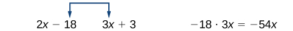

In this section students will:
* Identify the degree and leading coefficient of polynomials.
* Add and subtract polynomials.
* Multiply polynomials.
* Use FOIL to multiply binomials.
* Perform operations with polynomials of several variables.

Earl is building a doghouse, whose front is in the shape of a square topped with a triangle. There will be a rectangular door through which the dog can enter and exit the house. Earl wants to find the area of the front of the doghouse so that he can purchase the correct amount of paint. Using the measurements of the front of the house, shown in [\[link\]](#Figure_01_04_001), we can create an expression that combines several variable terms, allowing us to solve this problem and others like it.

{: #Figure_01_04_001}

First find the area of the square in square feet.

<math xmlns="http://www.w3.org/1998/Math/MathML" display="block"> <mrow> <mtable> <mtr rowalign="center"> <mtd columnalign="right" rowalign="center"> <mi>A</mi> </mtd> <mtd rowalign="center"> <mo>=</mo> </mtd> <mtd columnalign="left" rowalign="center"> <mrow> <msup> <mi>s</mi> <mn>2</mn> </msup> </mrow> </mtd> </mtr> <mtr rowalign="center"> <mtd rowalign="center" /> <mtd rowalign="center"> <mo>=</mo> </mtd> <mtd columnalign="left" rowalign="center"> <mrow> <msup> <mrow> <mo stretchy="false">(</mo><mn>2</mn><mi>x</mi><mo stretchy="false">)</mo> </mrow> <mn>2</mn> </msup> </mrow> </mtd> </mtr> <mtr rowalign="center"> <mtd rowalign="center" /> <mtd rowalign="center"> <mo>=</mo> </mtd> <mtd columnalign="left" rowalign="center"> <mrow> <mn>4</mn><msup> <mi>x</mi> <mn>2</mn> </msup> </mrow> </mtd> </mtr> </mtable> </mrow> </math>

Then find the area of the triangle in square feet.

<math xmlns="http://www.w3.org/1998/Math/MathML"> <mrow> <mtable> <mtr rowalign="center"> <mtd columnalign="right" rowalign="center"> <mi>A</mi> </mtd> <mtd rowalign="center"> <mo>=</mo> </mtd> <mtd columnalign="left" rowalign="center"> <mrow> <mfrac> <mn>1</mn> <mn>2</mn> </mfrac> <mi>b</mi><mi>h</mi> </mrow> </mtd> </mtr> <mtr rowalign="center"> <mtd rowalign="center" /> <mtd rowalign="center"> <mo>=</mo> </mtd> <mtd columnalign="left" rowalign="center"> <mrow> <mtext>  </mtext><mfrac> <mn>1</mn> <mn>2</mn> </mfrac> <mo stretchy="false">(</mo><mn>2</mn><mi>x</mi><mo stretchy="false">)</mo><mrow><mo>(</mo> <mrow> <mfrac> <mn>3</mn> <mn>2</mn> </mfrac> </mrow> <mo>)</mo></mrow> </mrow> </mtd> </mtr> <mtr rowalign="center"> <mtd rowalign="center" /> <mtd rowalign="center"> <mo>=</mo> </mtd> <mtd columnalign="left" rowalign="center"> <mrow> <mtext>  </mtext><mfrac> <mn>3</mn> <mn>2</mn> </mfrac> <mi>x</mi> </mrow> </mtd> </mtr> </mtable> </mrow> </math>

Next find the area of the rectangular door in square feet.

<math xmlns="http://www.w3.org/1998/Math/MathML" display="block"> <mrow> <mtable> <mtr rowalign="center"> <mtd columnalign="right" rowalign="center"> <mi>A</mi> </mtd> <mtd rowalign="center"> <mo>=</mo> </mtd> <mtd columnalign="left" rowalign="center"> <mrow> <mi>l</mi><mi>w</mi> </mrow> </mtd> </mtr> <mtr rowalign="center"> <mtd rowalign="center" /> <mtd rowalign="center"> <mo>=</mo> </mtd> <mtd columnalign="left" rowalign="center"> <mrow> <mi>x</mi><mo>⋅</mo><mn>1</mn> </mrow> </mtd> </mtr> <mtr rowalign="center"> <mtd columnalign="left" rowalign="center" /> <mtd rowalign="center"> <mo>=</mo> </mtd> <mtd columnalign="left" rowalign="center"> <mi>x</mi> </mtd> </mtr> </mtable> </mrow> </math>

The area of the front of the doghouse can be found by adding the areas of the square and the triangle, and then subtracting the area of the rectangle. When we do this, we get<math xmlns="http://www.w3.org/1998/Math/MathML"> <mrow> <mtext> </mtext><mn>4</mn><msup> <mi>x</mi> <mn>2</mn> </msup> <mo>+</mo><mfrac> <mn>3</mn> <mn>2</mn> </mfrac> <mi>x</mi><mo>−</mo><mi>x</mi><mtext> </mtext><msup> <mrow> <mtext>ft</mtext></mrow> <mn>2</mn> </msup> <mo>,</mo></mrow> </math>

or<math xmlns="http://www.w3.org/1998/Math/MathML"> <mrow> <mtext> </mtext><mn>4</mn><msup> <mi>x</mi> <mn>2</mn> </msup> <mo>+</mo><mfrac> <mn>1</mn> <mn>2</mn> </mfrac> <mi>x</mi><mtext> </mtext> </mrow> </math>

ft2.

In this section, we will examine expressions such as this one, which combine several variable terms.

### Identifying the Degree and Leading Coefficient of Polynomials

The formula just found is an example of a **polynomial**{: data-type="term"}, which is a sum of or difference of terms, each consisting of a variable raised to a nonnegative integer power. A number multiplied by a variable raised to an exponent, such as<math xmlns="http://www.w3.org/1998/Math/MathML"> <mrow> <mtext> </mtext><mn>384</mn><mi>π</mi><mo>,</mo> </mrow> </math>

is known as a **coefficient**{: data-type="term"}. Coefficients can be positive, negative, or zero, and can be whole numbers, decimals, or fractions. Each product<math xmlns="http://www.w3.org/1998/Math/MathML"> <mrow> <mtext> </mtext><msub> <mi>a</mi> <mi>i</mi> </msub> <msup> <mi>x</mi> <mi>i</mi> </msup> <mo>,</mo> </mrow> </math>

such as<math xmlns="http://www.w3.org/1998/Math/MathML"> <mrow> <mtext> </mtext><mn>384</mn><mi>π</mi><mi>w</mi><mo>,</mo> </mrow> </math>

is a **term of a polynomial**{: data-type="term"}. If a term does not contain a variable, it is called a *constant*.

A polynomial containing only one term, such as<math xmlns="http://www.w3.org/1998/Math/MathML"> <mrow> <mtext> </mtext><mn>5</mn><msup> <mi>x</mi> <mn>4</mn> </msup> <mo>,</mo> </mrow> </math>

is called a **monomial**{: data-type="term"}. A polynomial containing two terms, such as<math xmlns="http://www.w3.org/1998/Math/MathML"> <mrow> <mtext> </mtext><mn>2</mn><mi>x</mi><mo>−</mo><mn>9</mn><mo>,</mo> </mrow> </math>

is called a **binomial**{: data-type="term"}. A polynomial containing three terms, such as<math xmlns="http://www.w3.org/1998/Math/MathML"> <mrow> <mtext> </mtext><mn>−3</mn><msup> <mi>x</mi> <mn>2</mn> </msup> <mo>+</mo><mn>8</mn><mi>x</mi><mo>−</mo><mn>7</mn><mo>,</mo> </mrow> </math>

is called a **trinomial**{: data-type="term"}.

We can find the **degree**{: data-type="term"} of a polynomial by identifying the highest power of the variable that occurs in the polynomial. The term with the highest degree is called the **leading term**{: data-type="term"} because it is usually written first. The coefficient of the leading term is called the **leading coefficient**{: data-type="term"}. When a polynomial is written so that the powers are descending, we say that it is in standard form.

    

Polynomials

A **polynomial**{: data-type="term"} is an expression that can be written in the form

<math xmlns="http://www.w3.org/1998/Math/MathML" display="block"> <mrow> <msub> <mi>a</mi> <mi>n</mi> </msub> <msup> <mi>x</mi> <mi>n</mi> </msup> <mo>+</mo><mn>...</mn><mo>+</mo><msub> <mi>a</mi> <mn>2</mn> </msub> <msup> <mi>x</mi> <mn>2</mn> </msup> <mo>+</mo><msub> <mi>a</mi> <mn>1</mn> </msub> <mi>x</mi><mo>+</mo><msub> <mi>a</mi> <mn>0</mn> </msub> </mrow> </math>

Each real number <em>ai </em>is called a **coefficient**{: data-type="term"}. The number<math xmlns="http://www.w3.org/1998/Math/MathML"> <mrow> <mtext> </mtext><msub> <mi>a</mi> <mn>0</mn> </msub> <mtext> </mtext> </mrow> </math>

that is not multiplied by a variable is called a *constant*. Each product<math xmlns="http://www.w3.org/1998/Math/MathML"> <mrow> <mtext> </mtext><msub> <mi>a</mi> <mi>i</mi> </msub> <msup> <mi>x</mi> <mi>i</mi> </msup> <mtext> </mtext> </mrow> </math>

is a **term of a polynomial**{: data-type="term"}. The highest power of the variable that occurs in the polynomial is called the **degree**{: data-type="term"} of a polynomial. The **leading term**{: data-type="term"} is the term with the highest power, and its coefficient is called the **leading coefficient**{: data-type="term"}.

**Given a polynomial expression, identify the degree and leading coefficient**.

1.  Find the highest power of *x* to determine the degree.
2.  Identify the term containing the highest power of *x* to find the leading term.
3.  Identify the coefficient of the leading term.
{: type="1"}

Identifying the Degree and Leading Coefficient of a Polynomial

For the following polynomials, identify the degree, the leading term, and the leading coefficient.

1.  <math xmlns="http://www.w3.org/1998/Math/MathML"> <mrow> <mn>3</mn><mo>+</mo><mn>2</mn><msup> <mi>x</mi> <mn>2</mn> </msup> <mo>−</mo><mn>4</mn><msup> <mi>x</mi> <mn>3</mn> </msup> </mrow> </math>

2.  <math xmlns="http://www.w3.org/1998/Math/MathML"> <mrow> <mn>5</mn><msup> <mi>t</mi> <mn>5</mn> </msup> <mo>−</mo><mn>2</mn><msup> <mi>t</mi> <mn>3</mn> </msup> <mo>+</mo><mn>7</mn><mi>t</mi> </mrow> </math>

3.  <math xmlns="http://www.w3.org/1998/Math/MathML"> <mrow> <mn>6</mn><mi>p</mi><mo>−</mo><msup> <mi>p</mi> <mn>3</mn> </msup> <mo>−</mo><mn>2</mn> </mrow> </math>
{: type="a"}

1.  The highest power of *x* is 3, so the degree is 3. The leading term is the term containing that degree,
    <math xmlns="http://www.w3.org/1998/Math/MathML"> <mrow> <mtext> </mtext><mn>−4</mn><msup> <mi>x</mi> <mn>3</mn> </msup> <mo>.</mo><mtext> </mtext> </mrow> </math>
    
    The leading coefficient is the coefficient of that term,
    <math xmlns="http://www.w3.org/1998/Math/MathML"> <mrow> <mtext> </mtext><mn>−4.</mn> </mrow> </math>

2.  The highest power of *t* is
    <math xmlns="http://www.w3.org/1998/Math/MathML"> <mrow> <mtext> </mtext><mn>5</mn><mo>,</mo> </mrow> </math>
    
    so the degree is
    <math xmlns="http://www.w3.org/1998/Math/MathML"> <mrow> <mtext> </mtext><mn>5.</mn><mtext> </mtext> </mrow> </math>
    
    The leading term is the term containing that degree,
    <math xmlns="http://www.w3.org/1998/Math/MathML"> <mrow> <mtext> </mtext><mn>5</mn><msup> <mi>t</mi> <mn>5</mn> </msup> <mo>.</mo><mtext> </mtext> </mrow> </math>
    
    The leading coefficient is the coefficient of that term,
    <math xmlns="http://www.w3.org/1998/Math/MathML"> <mrow> <mtext> </mtext><mn>5.</mn> </mrow> </math>

3.  The highest power of *p* is
    <math xmlns="http://www.w3.org/1998/Math/MathML"> <mrow> <mtext> </mtext><mn>3</mn><mo>,</mo> </mrow> </math>
    
    so the degree is
    <math xmlns="http://www.w3.org/1998/Math/MathML"> <mrow> <mtext> </mtext><mn>3.</mn><mtext> </mtext> </mrow> </math>
    
    The leading term is the term containing that degree,
    <math xmlns="http://www.w3.org/1998/Math/MathML"> <mrow> <mtext> </mtext><mo>−</mo><msup> <mi>p</mi> <mn>3</mn> </msup> <mo>,</mo> </mrow> </math>
    
    The leading coefficient is the coefficient of that term,
    <math xmlns="http://www.w3.org/1998/Math/MathML"> <mrow> <mtext> </mtext><mn>−1.</mn> </mrow> </math>
{: type="a"}

Identify the degree, leading term, and leading coefficient of the polynomial<math xmlns="http://www.w3.org/1998/Math/MathML"> <mrow> <mtext> </mtext><mn>4</mn><msup> <mi>x</mi> <mn>2</mn> </msup> <mo>−</mo><msup> <mi>x</mi> <mn>6</mn> </msup> <mo>+</mo><mn>2</mn><mi>x</mi><mo>−</mo><mn>6.</mn></mrow> </math>

The degree is 6, the leading term is<math xmlns="http://www.w3.org/1998/Math/MathML"> <mrow> <mtext> </mtext><mo>−</mo><msup> <mi>x</mi> <mn>6</mn> </msup> <mo>,</mo> </mrow> </math>

and the leading coefficient is<math xmlns="http://www.w3.org/1998/Math/MathML"> <mrow> <mtext> </mtext><mn>−1.</mn> </mrow> </math>

### Adding and Subtracting Polynomials

We can add and subtract polynomials by combining like terms, which are terms that contain the same variables raised to the same exponents. For example,<math xmlns="http://www.w3.org/1998/Math/MathML"> <mrow> <mtext> </mtext><mn>5</mn><msup> <mi>x</mi> <mn>2</mn> </msup> <mtext> </mtext> </mrow> </math>

and<math xmlns="http://www.w3.org/1998/Math/MathML"> <mrow> <mtext> </mtext><mn>−2</mn><msup> <mi>x</mi> <mn>2</mn> </msup> <mtext> </mtext> </mrow> </math>

are like terms, and can be added to get<math xmlns="http://www.w3.org/1998/Math/MathML"> <mrow> <mtext> </mtext><mn>3</mn><msup> <mi>x</mi> <mn>2</mn> </msup> <mo>,</mo> </mrow> </math>

but<math xmlns="http://www.w3.org/1998/Math/MathML"> <mrow> <mtext> </mtext><mn>3</mn><mi>x</mi><mtext> </mtext> </mrow> </math>

and<math xmlns="http://www.w3.org/1998/Math/MathML"> <mrow> <mtext> </mtext><mn>3</mn><msup> <mi>x</mi> <mn>2</mn> </msup> <mtext> </mtext> </mrow> </math>

are not like terms, and therefore cannot be added.

<strong>Given multiple polynomials, add or subtract them to simplify the expressions. </strong>

1.  Combine like terms.
2.  Simplify and write in standard form.
{: type="1"}

Adding Polynomials

Find the sum.

<math xmlns="http://www.w3.org/1998/Math/MathML"> <mrow> <mrow><mo>(</mo> <mrow> <mn>12</mn><msup> <mi>x</mi> <mn>2</mn> </msup> <mo>+</mo><mn>9</mn><mi>x</mi><mo>−</mo><mn>21</mn> </mrow> <mo>)</mo></mrow><mo>+</mo><mrow><mo>(</mo> <mrow> <mn>4</mn><msup> <mi>x</mi> <mn>3</mn> </msup> <mo>+</mo><mn>8</mn><msup> <mi>x</mi> <mn>2</mn> </msup> <mo>−</mo><mn>5</mn><mi>x</mi><mo>+</mo><mn>20</mn> </mrow> <mo>)</mo></mrow> </mrow> </math>

<math xmlns="http://www.w3.org/1998/Math/MathML" display="block"> <mrow> <mtable> <mtr> <mtd columnalign="left"> <mrow> <mn>4</mn><msup> <mi>x</mi> <mn>3</mn> </msup> <mo>+</mo><mrow><mo>(</mo> <mrow> <mn>12</mn><msup> <mi>x</mi> <mn>2</mn> </msup> <mo>+</mo><mn>8</mn><msup> <mi>x</mi> <mn>2</mn> </msup> </mrow> <mo>)</mo></mrow><mo>+</mo><mo stretchy="false">(</mo><mn>9</mn><mi>x</mi><mo>−</mo><mn>5</mn><mi>x</mi><mo stretchy="false">)</mo><mo>+</mo><mo stretchy="false">(</mo><mn>−21</mn><mo>+</mo><mn>20</mn><mo stretchy="false">)</mo><mo> </mo> </mrow> </mtd> <mtd columnalign="left"> <mrow><mspace width="2em" /> <mtext>  </mtext><mtext>Combine like terms</mtext><mo>.</mo> </mrow> </mtd> </mtr> <mtr> <mtd columnalign="left"> <mrow> <mn>4</mn><msup> <mi>x</mi> <mn>3</mn> </msup> <mo>+</mo><mn>20</mn><msup> <mi>x</mi> <mn>2</mn> </msup> <mo>+</mo><mn>4</mn><mi>x</mi><mo>−</mo><mn>1</mn> </mrow> </mtd> <mtd columnalign="left"> <mrow><mspace width="2em" /> <mtext>  </mtext><mtext>Simplify</mtext><mo>.</mo> </mrow> </mtd> </mtr> </mtable> </mrow> </math>

Analysis

We can check our answers to these types of problems using a graphing calculator. To check, graph the problem as given along with the simplified answer. The two graphs should be equivalent. Be sure to use the same window to compare the graphs. Using different windows can make the expressions seem equivalent when they are not.

Find the sum.

<math xmlns="http://www.w3.org/1998/Math/MathML"> <mrow> <mrow><mo>(</mo> <mrow> <mn>2</mn><msup> <mi>x</mi> <mn>3</mn> </msup> <mo>+</mo><mn>5</mn><msup> <mi>x</mi> <mn>2</mn> </msup> <mo>−</mo><mi>x</mi><mo>+</mo><mn>1</mn> </mrow> <mo>)</mo></mrow><mo>+</mo><mrow><mo>(</mo> <mrow> <mn>2</mn><msup> <mi>x</mi> <mn>2</mn> </msup> <mo>−</mo><mn>3</mn><mi>x</mi><mo>−</mo><mn>4</mn> </mrow> <mo>)</mo></mrow> </mrow> </math>

<math xmlns="http://www.w3.org/1998/Math/MathML"> <mrow> <mn>2</mn><msup> <mi>x</mi> <mn>3</mn> </msup> <mo>+</mo><mn>7</mn><msup> <mi>x</mi> <mn>2</mn> </msup> <mn>−4</mn><mi>x</mi><mn>−3</mn> </mrow> </math>

Subtracting Polynomials

Find the difference.

<math xmlns="http://www.w3.org/1998/Math/MathML"> <mrow> <mrow><mo>(</mo> <mrow> <mn>7</mn><msup> <mi>x</mi> <mn>4</mn> </msup> <mo>−</mo><msup> <mi>x</mi> <mn>2</mn> </msup> <mo>+</mo><mn>6</mn><mi>x</mi><mo>+</mo><mn>1</mn> </mrow> <mo>)</mo></mrow><mo>−</mo><mrow><mo>(</mo> <mrow> <mn>5</mn><msup> <mi>x</mi> <mn>3</mn> </msup> <mo>−</mo><mn>2</mn><msup> <mi>x</mi> <mn>2</mn> </msup> <mo>+</mo><mn>3</mn><mi>x</mi><mo>+</mo><mn>2</mn> </mrow> <mo>)</mo></mrow> </mrow> </math>

<math xmlns="http://www.w3.org/1998/Math/MathML" display="block"> <mrow> <mtable> <mtr> <mtd columnalign="left"> <mrow> <mn>7</mn><msup> <mi>x</mi> <mn>4</mn> </msup> <mo>−</mo><mn>5</mn><msup> <mi>x</mi> <mn>3</mn> </msup> <mo>+</mo><mrow><mo>(</mo> <mrow> <mo>−</mo><msup> <mi>x</mi> <mn>2</mn> </msup> <mo>+</mo><mn>2</mn><msup> <mi>x</mi> <mn>2</mn> </msup> </mrow> <mo>)</mo></mrow><mo>+</mo><mo stretchy="false">(</mo><mn>6</mn><mi>x</mi><mo>−</mo><mn>3</mn><mi>x</mi><mo stretchy="false">)</mo><mo>+</mo><mo stretchy="false">(</mo><mn>1</mn><mo>−</mo><mn>2</mn><mo stretchy="false">)</mo><mtext>  </mtext> </mrow> </mtd> <mtd columnalign="left"> <mrow><mspace width="1em" /> <mtext>Combine like terms</mtext><mo>.</mo> </mrow> </mtd> </mtr> <mtr> <mtd columnalign="left"> <mrow> <mn>7</mn><msup> <mi>x</mi> <mn>4</mn> </msup> <mo>−</mo><mn>5</mn><msup> <mi>x</mi> <mn>3</mn> </msup> <mo>+</mo><msup> <mi>x</mi> <mn>2</mn> </msup> <mo>+</mo><mn>3</mn><mi>x</mi><mo>−</mo><mn>1</mn> </mrow> </mtd> <mtd columnalign="left"> <mrow><mspace width="1em" /> <mtext>Simplify</mtext><mo>.</mo> </mrow> </mtd> </mtr> </mtable> </mrow> </math>

Analysis

Note that finding the difference between two polynomials is the same as adding the opposite of the second polynomial to the first.

Find the difference.

<math xmlns="http://www.w3.org/1998/Math/MathML"> <mrow> <mrow><mo>(</mo> <mrow> <mn>−7</mn><msup> <mi>x</mi> <mn>3</mn> </msup> <mo>−</mo><mn>7</mn><msup> <mi>x</mi> <mn>2</mn> </msup> <mo>+</mo><mn>6</mn><mi>x</mi><mo>−</mo><mn>2</mn> </mrow> <mo>)</mo></mrow><mo>−</mo><mrow><mo>(</mo> <mrow> <mn>4</mn><msup> <mi>x</mi> <mn>3</mn> </msup> <mo>−</mo><mn>6</mn><msup> <mi>x</mi> <mn>2</mn> </msup> <mo>−</mo><mi>x</mi><mo>+</mo><mn>7</mn> </mrow> <mo>)</mo></mrow> </mrow> </math>

<math xmlns="http://www.w3.org/1998/Math/MathML"> <mrow> <mn>−11</mn><msup> <mi>x</mi> <mn>3</mn> </msup> <mo>−</mo><msup> <mi>x</mi> <mn>2</mn> </msup> <mo>+</mo><mn>7</mn><mi>x</mi><mn>−9</mn> </mrow> </math>

### Multiplying Polynomials

Multiplying polynomials is a bit more challenging than adding and subtracting polynomials. We must use the distributive property to multiply each term in the first polynomial by each term in the second polynomial. We then combine like terms. We can also use a shortcut called the FOIL method when multiplying binomials. Certain special products follow patterns that we can memorize and use instead of multiplying the polynomials by hand each time. We will look at a variety of ways to multiply polynomials.

#### Multiplying Polynomials Using the Distributive Property

To multiply a number by a polynomial, we use the distributive property. The number must be distributed to each term of the polynomial. We can distribute the<math xmlns="http://www.w3.org/1998/Math/MathML"> <mrow> <mtext> </mtext><mn>2</mn><mtext> </mtext> </mrow> </math>

in<math xmlns="http://www.w3.org/1998/Math/MathML"> <mrow> <mtext> </mtext><mn>2</mn><mo stretchy="false">(</mo><mi>x</mi><mo>+</mo><mn>7</mn><mo stretchy="false">)</mo><mtext> </mtext> </mrow> </math>

to obtain the equivalent expression<math xmlns="http://www.w3.org/1998/Math/MathML"> <mrow> <mtext> </mtext><mn>2</mn><mi>x</mi><mo>+</mo><mn>14.</mn><mtext> </mtext> </mrow> </math>

When multiplying polynomials, the distributive property allows us to multiply each term of the first polynomial by each term of the second. We then add the products together and combine like terms to simplify.

**Given the multiplication of two polynomials, use the distributive property to simplify the expression.**

1.  Multiply each term of the first polynomial by each term of the second.
2.  Combine like terms.
3.  Simplify.
{: type="1"}

Multiplying Polynomials Using the Distributive Property

Find the product.

<math xmlns="http://www.w3.org/1998/Math/MathML"> <mrow> <mrow><mo>(</mo> <mrow> <mn>2</mn><mi>x</mi><mo>+</mo><mn>1</mn> </mrow> <mo>)</mo></mrow><mrow><mo>(</mo> <mrow> <mn>3</mn><msup> <mi>x</mi> <mn>2</mn> </msup> <mo>−</mo><mi>x</mi><mo>+</mo><mn>4</mn> </mrow> <mo>)</mo></mrow> </mrow> </math>

<math xmlns="http://www.w3.org/1998/Math/MathML" display="block"> <mrow> <mtable> <mtr> <mtd columnalign="left"> <mrow> <mn>2</mn><mi>x</mi><mrow><mo>(</mo> <mrow> <mn>3</mn><msup> <mi>x</mi> <mn>2</mn> </msup> <mo>−</mo><mi>x</mi><mo>+</mo><mn>4</mn> </mrow> <mo>)</mo></mrow><mo>+</mo><mn>1</mn><mrow><mo>(</mo> <mrow> <mn>3</mn><msup> <mi>x</mi> <mn>2</mn> </msup> <mo>−</mo><mi>x</mi><mo>+</mo><mn>4</mn> </mrow> <mo>)</mo></mrow><mo> </mo> </mrow> </mtd> <mtd columnalign="left"> <mrow><mspace width="2em" /> <mtext>  </mtext><mtext>Use the distributive property</mtext><mo>.</mo> </mrow> </mtd> </mtr> <mtr> <mtd columnalign="left"> <mrow> <mrow><mo>(</mo> <mrow> <mn>6</mn><msup> <mi>x</mi> <mn>3</mn> </msup> <mo>−</mo><mn>2</mn><msup> <mi>x</mi> <mn>2</mn> </msup> <mo>+</mo><mn>8</mn><mi>x</mi> </mrow> <mo>)</mo></mrow><mo>+</mo><mrow><mo>(</mo> <mrow> <mn>3</mn><msup> <mi>x</mi> <mn>2</mn> </msup> <mo>−</mo><mi>x</mi><mo>+</mo><mn>4</mn> </mrow> <mo>)</mo></mrow> </mrow> </mtd> <mtd columnalign="left"> <mrow><mspace width="2em" /> <mtext>  </mtext><mtext>Multiply</mtext><mo>.</mo> </mrow> </mtd> </mtr> <mtr> <mtd columnalign="left"> <mrow> <mn>6</mn><msup> <mi>x</mi> <mn>3</mn> </msup> <mo>+</mo><mrow><mo>(</mo> <mrow> <mn>−2</mn><msup> <mi>x</mi> <mn>2</mn> </msup> <mo>+</mo><mn>3</mn><msup> <mi>x</mi> <mn>2</mn> </msup> </mrow> <mo>)</mo></mrow><mo>+</mo><mo stretchy="false">(</mo><mn>8</mn><mi>x</mi><mo>−</mo><mi>x</mi><mo stretchy="false">)</mo><mo>+</mo><mn>4</mn> </mrow> </mtd> <mtd columnalign="left"> <mrow><mspace width="2em" /> <mtext>  </mtext><mtext>Combine like terms</mtext><mo>.</mo> </mrow> </mtd> </mtr> <mtr> <mtd columnalign="left"> <mrow> <mn>6</mn><msup> <mi>x</mi> <mn>3</mn> </msup> <mo>+</mo><msup> <mi>x</mi> <mn>2</mn> </msup> <mo>+</mo><mn>7</mn><mi>x</mi><mo>+</mo><mn>4</mn><mo> </mo> </mrow> </mtd> <mtd columnalign="left"> <mrow><mspace width="2em" /> <mtext>  </mtext><mtext>Simplify</mtext><mo>.</mo> </mrow> </mtd> </mtr> </mtable> </mrow> </math>

Analysis

We can use a table to keep track of our work, as shown in [[link]](#Table_01_04_01). Write one polynomial across the top and the other down the side. For each box in the table, multiply the term for that row by the term for that column. Then add all of the terms together, combine like terms, and simplify.

<table id="Table_01_04_01" summary="A table with 3 rows and 4 columns. The first entry of the first row is empty, the others are labeled: three times x squared, negative x, and positive four. The first entry of the second row is labeled: two times x. The second entry reads: six times x cubed. The third entry reads: negative two times x squared. The fourth entry reads: eight times x. The first entry of the third row reads: positive one. The second entry reads: three times x squared. The third entry reads: negative x. The fourth entry reads: four."><caption></caption><tbody>
<tr>
<td />
<td><math xmlns="http://www.w3.org/1998/Math/MathML">
 <mrow>
  <mn>3</mn><msup>
   <mi>x</mi>
   <mn>2</mn>
  </msup>
  
 </mrow>
</math>
</td>
<td><math xmlns="http://www.w3.org/1998/Math/MathML">
 <mrow>
  <mo>−</mo><mi>x</mi>
 </mrow>
</math>
</td>
<td><math xmlns="http://www.w3.org/1998/Math/MathML">
 <mrow>
  <mo>+</mo><mn>4</mn>
 </mrow>
</math>
</td>
</tr>

<tr>
<td><math xmlns="http://www.w3.org/1998/Math/MathML">
 <mrow>
  <mn>2</mn><mi>x</mi>
 </mrow>
</math>
</td>
<td><math xmlns="http://www.w3.org/1998/Math/MathML">
 <mrow>
  <mn>6</mn><msup>
   <mi>x</mi>
   <mn>3</mn>
  </msup>
  
 </mrow>
</math>
</td>
<td><math xmlns="http://www.w3.org/1998/Math/MathML">
 <mrow>
  <mn>−2</mn><msup>
   <mi>x</mi>
   <mn>2</mn>
  </msup>
  
 </mrow>
</math>
</td>
<td><math xmlns="http://www.w3.org/1998/Math/MathML">
 <mrow>
  <mn>8</mn><mi>x</mi>
 </mrow>
</math>
</td>
</tr>
<tr>
<td><math xmlns="http://www.w3.org/1998/Math/MathML">
 <mrow>
  <mo>+</mo><mn>1</mn>
 </mrow>
</math>
</td>
<td><math xmlns="http://www.w3.org/1998/Math/MathML">
 <mrow>
  <mn>3</mn><msup>
   <mi>x</mi>
   <mn>2</mn>
  </msup>
  
 </mrow>
</math>
</td>
<td><math xmlns="http://www.w3.org/1998/Math/MathML">
 <mrow>
  <mo>−</mo><mi>x</mi>
 </mrow>
</math>
</td>
<td><math xmlns="http://www.w3.org/1998/Math/MathML">
 <mn>4</mn>
</math>
</td>
</tr>
</tbody></table>

Find the product.

<math xmlns="http://www.w3.org/1998/Math/MathML"> <mrow> <mo stretchy="false">(</mo><mn>3</mn><mi>x</mi><mo>+</mo><mn>2</mn><mo stretchy="false">)</mo><mrow><mo>(</mo> <mrow> <msup> <mi>x</mi> <mn>3</mn> </msup> <mo>−</mo><mn>4</mn><msup> <mi>x</mi> <mn>2</mn> </msup> <mo>+</mo><mn>7</mn> </mrow> <mo>)</mo></mrow> </mrow> </math>

<math xmlns="http://www.w3.org/1998/Math/MathML"> <mrow> <mn>3</mn><msup> <mi>x</mi> <mn>4</mn> </msup> <mn>−10</mn><msup> <mi>x</mi> <mn>3</mn> </msup> <mn>−8</mn><msup> <mi>x</mi> <mn>2</mn> </msup> <mo>+</mo><mn>21</mn><mi>x</mi><mo>+</mo><mn>14</mn> </mrow> </math>

#### Using FOIL to Multiply Binomials

A shortcut called FOIL is sometimes used to find the product of two binomials. It is called FOIL because we multiply the **f**irst terms, the **o**uter terms, the **i**nner terms, and then the **l**ast terms of each binomial.

    The FOIL method arises out of the distributive property. We are simply multiplying each term of the first binomial by each term of the second binomial, and then combining like terms.

**Given two binomials, use FOIL to simplify the expression.**

1.  Multiply the first terms of each binomial.
2.  Multiply the outer terms of the binomials.
3.  Multiply the inner terms of the binomials.
4.  Multiply the last terms of each binomial.
5.  Add the products.
6.  Combine like terms and simplify.
{: type="1"}

Using FOIL to Multiply Binomials

Use FOIL to find the product.

<math xmlns="http://www.w3.org/1998/Math/MathML"> <mo>(</mo><mn>2</mn><mi>x</mi><mo>-</mo><mn>18</mn><mo>)</mo><mo>(</mo><mn>3</mn><mi>x</mi><mo>+</mo><mn>3</mn><mo>)</mo> </math>

Find the product of the first terms.

  
Find the product of the outer terms.

  
Find the product of the inner terms.

  
Find the product of the last terms.

  
<math xmlns="http://www.w3.org/1998/Math/MathML"> <mrow> <mtable> <mtr> <mtd columnalign="left"> <mrow> <mn>6</mn><msup> <mi>x</mi> <mn>2</mn> </msup> <mo>+</mo><mn>6</mn><mi>x</mi><mo>−</mo><mn>54</mn><mi>x</mi><mo>−</mo><mn>54</mn> </mrow> </mtd> <mtd columnalign="left"> <mrow><mspace width="2em" /> <mtext>Add the products</mtext><mo>.</mo> </mrow> </mtd> </mtr> <mtr> <mtd columnalign="left"> <mrow> <mn>6</mn><msup> <mi>x</mi> <mn>2</mn> </msup> <mo>+</mo><mo stretchy="false">(</mo><mn>6</mn><mi>x</mi><mo>−</mo><mn>54</mn><mi>x</mi><mo stretchy="false">)</mo><mo>−</mo><mn>54</mn> </mrow> </mtd> <mtd columnalign="left"> <mrow><mspace width="2em" /> <mtext>Combine like terms</mtext><mo>.</mo> </mrow> </mtd> </mtr> <mtr> <mtd columnalign="left"> <mrow> <mn>6</mn><msup> <mi>x</mi> <mn>2</mn> </msup> <mo>−</mo><mn>48</mn><mi>x</mi><mo>−</mo><mn>54</mn> </mrow> </mtd> <mtd columnalign="left"> <mrow><mspace width="2em" /> <mtext>Simplify</mtext><mo>.</mo> </mrow> </mtd> </mtr> </mtable> </mrow> </math>

Use FOIL to find the product.

<math xmlns="http://www.w3.org/1998/Math/MathML"> <mrow> <mo stretchy="false">(</mo><mi>x</mi><mo>+</mo><mn>7</mn><mo stretchy="false">)</mo><mo stretchy="false">(</mo><mn>3</mn><mi>x</mi><mo>−</mo><mn>5</mn><mo stretchy="false">)</mo> </mrow> </math>

<math xmlns="http://www.w3.org/1998/Math/MathML"> <mrow> <mn>3</mn><msup> <mi>x</mi> <mn>2</mn> </msup> <mo>+</mo><mn>16</mn><mi>x</mi><mn>−35</mn> </mrow> </math>

#### Perfect Square Trinomials

Certain binomial products have special forms. When a binomial is squared, the result is called a **perfect square trinomial**{: data-type="term"}. We can find the square by multiplying the binomial by itself. However, there is a special form that each of these perfect square trinomials takes, and memorizing the form makes squaring binomials much easier and faster. Let’s look at a few perfect square trinomials to familiarize ourselves with the form.

<math xmlns="http://www.w3.org/1998/Math/MathML" display="block"> <mrow> <mtable> <mtr> <mtd columnalign="right"> <mrow> <mtext> </mtext><msup> <mrow> <mo stretchy="false">(</mo><mi>x</mi><mo>+</mo><mn>5</mn><mo stretchy="false">)</mo> </mrow> <mn>2</mn> </msup> </mrow> </mtd> <mtd> <mo>=</mo> </mtd> <mtd columnalign="left"> <mrow> <msup> <mi>x</mi> <mn>2</mn> </msup> <mo>+</mo><mn>10</mn><mi>x</mi><mo>+</mo><mn>25</mn> </mrow> </mtd> </mtr> <mtr> <mtd columnalign="right"> <mrow> <msup> <mrow> <mo stretchy="false">(</mo><mi>x</mi><mo>−</mo><mn>3</mn><mo stretchy="false">)</mo> </mrow> <mn>2</mn> </msup> </mrow> </mtd> <mtd> <mo>=</mo> </mtd> <mtd columnalign="left"> <mrow> <mtext>  </mtext><msup> <mi>x</mi> <mn>2</mn> </msup> <mo>−</mo><mn>6</mn><mi>x</mi><mo>+</mo><mn>9</mn> </mrow> </mtd> </mtr> <mtr> <mtd columnalign="right"> <mrow> <msup> <mrow> <mo stretchy="false">(</mo><mn>4</mn><mi>x</mi><mo>−</mo><mn>1</mn><mo stretchy="false">)</mo> </mrow> <mn>2</mn> </msup> </mrow> </mtd> <mtd> <mo>=</mo> </mtd> <mtd columnalign="left"> <mrow> <mn>16</mn><msup> <mi>x</mi> <mn>2</mn> </msup> <mo>−</mo><mn>8</mn><mi>x</mi><mo>+</mo><mn>1</mn> </mrow> </mtd> </mtr> </mtable> </mrow> </math>

Notice that the first term of each trinomial is the square of the first term of the binomial and, similarly, the last term of each trinomial is the square of the last term of the binomial. The middle term is double the product of the two terms. Lastly, we see that the first sign of the trinomial is the same as the sign of the binomial.

Perfect Square Trinomials

When a binomial is squared, the result is the first term squared added to double the product of both terms and the last term squared.

<math xmlns="http://www.w3.org/1998/Math/MathML"> <mrow> <msup> <mrow> <mo stretchy="false">(</mo><mi>x</mi><mo>+</mo><mi>a</mi><mo stretchy="false">)</mo> </mrow> <mn>2</mn> </msup> <mo>=</mo><mo stretchy="false">(</mo><mi>x</mi><mo>+</mo><mi>a</mi><mo stretchy="false">)</mo><mo stretchy="false">(</mo><mi>x</mi><mo>+</mo><mi>a</mi><mo stretchy="false">)</mo><mo>=</mo><msup> <mi>x</mi> <mn>2</mn> </msup> <mo>+</mo><mn>2</mn><mi>a</mi><mi>x</mi><mo>+</mo><msup> <mi>a</mi> <mn>2</mn> </msup> </mrow> </math>

<strong>Given a binomial, square it using the formula for perfect square trinomials. </strong>

1.  Square the first term of the binomial.
2.  Square the last term of the binomial.
3.  For the middle term of the trinomial, double the product of the two terms.
4.  Add and simplify.
{: type="1"}

Expanding Perfect Squares

Expand<math xmlns="http://www.w3.org/1998/Math/MathML"> <mrow> <mtext> </mtext><msup> <mrow> <mo stretchy="false">(</mo><mn>3</mn><mi>x</mi><mo>−</mo><mn>8</mn><mo stretchy="false">)</mo> </mrow> <mn>2</mn> </msup> <mo>.</mo> </mrow> </math>

Begin by squaring the first term and the last term. For the middle term of the trinomial, double the product of the two terms.

<math xmlns="http://www.w3.org/1998/Math/MathML"> <mrow> <msup> <mrow> <mo stretchy="false">(</mo><mn>3</mn><mi>x</mi><mo stretchy="false">)</mo> </mrow> <mn>2</mn> </msup> <mo>−</mo><mn>2</mn><mo stretchy="false">(</mo><mn>3</mn><mi>x</mi><mo stretchy="false">)</mo><mo stretchy="false">(</mo><mn>8</mn><mo stretchy="false">)</mo><mo>+</mo><msup> <mrow> <mo stretchy="false">(</mo><mn>−8</mn><mo stretchy="false">)</mo> </mrow> <mn>2</mn> </msup> </mrow> </math>

Simplify.

<math xmlns="http://www.w3.org/1998/Math/MathML"> <mrow> <mtext> </mtext><mn>9</mn><msup> <mi>x</mi> <mn>2</mn> </msup> <mo>−</mo><mn>48</mn><mi>x</mi><mo>+</mo><mn>64.</mn> </mrow> </math>

Expand <math xmlns="http://www.w3.org/1998/Math/MathML"> <mrow> <mtext> </mtext><msup> <mrow> <mo stretchy="false">(</mo><mn>4</mn><mi>x</mi><mo>−</mo><mn>1</mn><mo stretchy="false">)</mo> </mrow> <mn>2</mn> </msup> <mo>.</mo> </mrow> </math>

<math xmlns="http://www.w3.org/1998/Math/MathML"> <mrow> <mn>16</mn><msup> <mi>x</mi> <mn>2</mn> </msup> <mn>−8</mn><mi>x</mi><mo>+</mo><mn>1</mn> </mrow> </math>

#### Difference of Squares

Another special product is called the **difference of squares**{: data-type="term"}, which occurs when we multiply a binomial by another binomial with the same terms but the opposite sign. Let’s see what happens when we multiply<math xmlns="http://www.w3.org/1998/Math/MathML"> <mrow> <mtext> </mtext><mo stretchy="false">(</mo><mi>x</mi><mo>+</mo><mn>1</mn><mo stretchy="false">)</mo><mo stretchy="false">(</mo><mi>x</mi><mo>−</mo><mn>1</mn><mo stretchy="false">)</mo><mtext> </mtext> </mrow> </math>

using the FOIL method.

<math xmlns="http://www.w3.org/1998/Math/MathML" display="block"> <mrow> <mtable> <mtr rowalign="center"> <mtd rowalign="center" columnalign="right"> <mrow> <mo stretchy="false">(</mo><mi>x</mi><mo>+</mo><mn>1</mn><mo stretchy="false">)</mo><mo stretchy="false">(</mo><mi>x</mi><mo>−</mo><mn>1</mn><mo stretchy="false">)</mo> </mrow> </mtd> <mtd rowalign="center"> <mo>=</mo> </mtd> <mtd columnalign="left" rowalign="center"> <mrow> <msup> <mi>x</mi> <mn>2</mn> </msup> <mo>−</mo><mi>x</mi><mo>+</mo><mi>x</mi><mo>−</mo><mn>1</mn> </mrow> </mtd> </mtr> <mtr rowalign="center"> <mtd rowalign="center" /> <mtd rowalign="center"> <mo>=</mo> </mtd> <mtd columnalign="left" rowalign="center"> <mrow> <msup> <mi>x</mi> <mn>2</mn> </msup> <mo>−</mo><mn>1</mn> </mrow> </mtd> </mtr> </mtable> </mrow> </math>

The middle term drops out, resulting in a difference of squares. Just as we did with the perfect squares, let’s look at a few examples.

<math xmlns="http://www.w3.org/1998/Math/MathML" display="block"> <mrow> <mtable> <mtr> <mtd columnalign="right"> <mrow> <mo stretchy="false">(</mo><mi>x</mi><mo>+</mo><mn>5</mn><mo stretchy="false">)</mo><mo stretchy="false">(</mo><mi>x</mi><mo>−</mo><mn>5</mn><mo stretchy="false">)</mo> </mrow> </mtd> <mtd> <mo>=</mo> </mtd> <mtd columnalign="left"> <mrow> <msup> <mi>x</mi> <mn>2</mn> </msup> <mo>−</mo><mn>25</mn> </mrow> </mtd> </mtr> <mtr> <mtd columnalign="right"> <mrow> <mo stretchy="false">(</mo><mi>x</mi><mo>+</mo><mn>11</mn><mo stretchy="false">)</mo><mo stretchy="false">(</mo><mi>x</mi><mo>−</mo><mn>11</mn><mo stretchy="false">)</mo> </mrow> </mtd> <mtd> <mo>=</mo> </mtd> <mtd columnalign="left"> <mrow> <msup> <mi>x</mi> <mn>2</mn> </msup> <mo>−</mo><mn>121</mn> </mrow> </mtd> </mtr> <mtr> <mtd columnalign="right"> <mrow> <mo stretchy="false">(</mo><mn>2</mn><mi>x</mi><mo>+</mo><mn>3</mn><mo stretchy="false">)</mo><mo stretchy="false">(</mo><mn>2</mn><mi>x</mi><mo>−</mo><mn>3</mn><mo stretchy="false">)</mo> </mrow> </mtd> <mtd> <mo>=</mo> </mtd> <mtd columnalign="left"> <mrow> <mn>4</mn><msup> <mi>x</mi> <mn>2</mn> </msup> <mo>−</mo><mn>9</mn> </mrow> </mtd> </mtr> </mtable> </mrow> </math>

Because the sign changes in the second binomial, the outer and inner terms cancel each other out, and we are left only with the square of the first term minus the square of the last term.

**Is there a special form for the sum of squares?**

*No. The difference of squares occurs because the opposite signs of the binomials cause the middle terms to disappear. There are no two binomials that multiply to equal a sum of squares.*

Difference of Squares

When a binomial is multiplied by a binomial with the same terms separated by the opposite sign, the result is the square of the first term minus the square of the last term.

<math xmlns="http://www.w3.org/1998/Math/MathML"> <mrow> <mo stretchy="false">(</mo><mi>a</mi><mo>+</mo><mi>b</mi><mo stretchy="false">)</mo><mo stretchy="false">(</mo><mi>a</mi><mo>−</mo><mi>b</mi><mo stretchy="false">)</mo><mo>=</mo><msup> <mi>a</mi> <mn>2</mn> </msup> <mo>−</mo><msup> <mi>b</mi> <mn>2</mn> </msup> </mrow> </math>

**Given a binomial multiplied by a binomial with the same terms but the opposite sign, find the difference of squares.**

1.  Square the first term of the binomials.
2.  Square the last term of the binomials.
3.  Subtract the square of the last term from the square of the first term.
{: type="1"}

Multiplying Binomials Resulting in a Difference of Squares

Multiply<math xmlns="http://www.w3.org/1998/Math/MathML"> <mrow> <mtext> </mtext><mo stretchy="false">(</mo><mn>9</mn><mi>x</mi><mo>+</mo><mn>4</mn><mo stretchy="false">)</mo><mo stretchy="false">(</mo><mn>9</mn><mi>x</mi><mo>−</mo><mn>4</mn><mo stretchy="false">)</mo><mo>.</mo> </mrow> </math>

Square the first term to get<math xmlns="http://www.w3.org/1998/Math/MathML"> <mrow> <mtext> </mtext><msup> <mrow> <mo stretchy="false">(</mo><mn>9</mn><mi>x</mi><mo stretchy="false">)</mo> </mrow> <mn>2</mn> </msup> <mo>=</mo><mn>81</mn><msup> <mi>x</mi> <mn>2</mn> </msup> <mo>.</mo><mtext> </mtext> </mrow> </math>

Square the last term to get<math xmlns="http://www.w3.org/1998/Math/MathML"> <mrow> <mtext> </mtext><msup> <mn>4</mn> <mn>2</mn> </msup> <mo>=</mo><mn>16.</mn><mtext> </mtext> </mrow> </math>

Subtract the square of the last term from the square of the first term to find the product of<math xmlns="http://www.w3.org/1998/Math/MathML"> <mrow> <mtext> </mtext><mn>81</mn><msup> <mi>x</mi> <mn>2</mn> </msup> <mo>−</mo><mn>16.</mn> </mrow> </math>

Multiply<math xmlns="http://www.w3.org/1998/Math/MathML"> <mrow> <mtext> </mtext><mo stretchy="false">(</mo><mn>2</mn><mi>x</mi><mo>+</mo><mn>7</mn><mo stretchy="false">)</mo><mo stretchy="false">(</mo><mn>2</mn><mi>x</mi><mo>−</mo><mn>7</mn><mo stretchy="false">)</mo><mo>.</mo> </mrow> </math>

<math xmlns="http://www.w3.org/1998/Math/MathML"> <mrow> <mn>4</mn><msup> <mi>x</mi> <mn>2</mn> </msup> <mn>−49</mn> </mrow> </math>

### Performing Operations with Polynomials of Several Variables

We have looked at polynomials containing only one variable. However, a polynomial can contain several variables. All of the same rules apply when working with polynomials containing several variables. Consider an example:

<math xmlns="http://www.w3.org/1998/Math/MathML" display="block"> <mrow> <mtable> <mtr rowalign="center"> <mtd columnalign="left" rowalign="center"> <mrow> <mo stretchy="false">(</mo><mi>a</mi><mo>+</mo><mn>2</mn><mi>b</mi><mo stretchy="false">)</mo><mo stretchy="false">(</mo><mn>4</mn><mi>a</mi><mo>−</mo><mi>b</mi><mo>−</mo><mi>c</mi><mo stretchy="false">)</mo> </mrow> </mtd> <mtd columnalign="left" rowalign="center" /> </mtr> <mtr rowalign="center"> <mtd columnalign="left" rowalign="center"> <mrow> <mi>a</mi><mo stretchy="false">(</mo><mn>4</mn><mi>a</mi><mo>−</mo><mi>b</mi><mo>−</mo><mi>c</mi><mo stretchy="false">)</mo><mo>+</mo><mn>2</mn><mi>b</mi><mo stretchy="false">(</mo><mn>4</mn><mi>a</mi><mo>−</mo><mi>b</mi><mo>−</mo><mi>c</mi><mo stretchy="false">)</mo> </mrow> </mtd> <mtd columnalign="left" rowalign="center"> <mrow><mspace width="2em" /> <mtext>Use the distributive property</mtext><mo>.</mo> </mrow> </mtd> </mtr> <mtr rowalign="center"> <mtd columnalign="left" rowalign="center"> <mrow> <mn>4</mn><msup> <mi>a</mi> <mn>2</mn> </msup> <mo>−</mo><mi>a</mi><mi>b</mi><mo>−</mo><mi>a</mi><mi>c</mi><mo>+</mo><mn>8</mn><mi>a</mi><mi>b</mi><mo>−</mo><mn>2</mn><msup> <mi>b</mi> <mn>2</mn> </msup> <mo>−</mo><mn>2</mn><mi>b</mi><mi>c</mi> </mrow> </mtd> <mtd columnalign="left" rowalign="center"> <mrow><mspace width="2em" /> <mtext>Multiply</mtext><mo>.</mo> </mrow> </mtd> </mtr> <mtr rowalign="center"> <mtd columnalign="left" rowalign="center"> <mrow> <mn>4</mn><msup> <mi>a</mi> <mn>2</mn> </msup> <mo>+</mo><mo stretchy="false">(</mo><mo>−</mo><mi>a</mi><mi>b</mi><mo>+</mo><mn>8</mn><mi>a</mi><mi>b</mi><mo stretchy="false">)</mo><mo>−</mo><mi>a</mi><mi>c</mi><mo>−</mo><mn>2</mn><msup> <mi>b</mi> <mn>2</mn> </msup> <mo>−</mo><mn>2</mn><mi>b</mi><mi>c</mi> </mrow> </mtd> <mtd columnalign="left" rowalign="center"> <mrow><mspace width="2em" /> <mtext>Combine like terms</mtext><mo>.</mo> </mrow> </mtd> </mtr> <mtr rowalign="center"> <mtd columnalign="left" rowalign="center"> <mrow> <mn>4</mn><msup> <mi>a</mi> <mn>2</mn> </msup> <mo>+</mo><mn>7</mn><mi>a</mi><mi>b</mi><mo>−</mo><mi>a</mi><mi>c</mi><mo>−</mo><mn>2</mn><mi>b</mi><mi>c</mi><mo>−</mo><mn>2</mn><msup> <mi>b</mi> <mn>2</mn> </msup> </mrow> </mtd> <mtd columnalign="left" rowalign="center"> <mrow><mspace width="2em" /> <mtext>Simplify</mtext><mo>.</mo> </mrow> </mtd> </mtr> </mtable> </mrow> </math>

Multiplying Polynomials Containing Several Variables

Multiply<math xmlns="http://www.w3.org/1998/Math/MathML"> <mrow> <mtext> </mtext><mo stretchy="false">(</mo><mi>x</mi><mo>+</mo><mn>4</mn><mo stretchy="false">)</mo><mo stretchy="false">(</mo><mn>3</mn><mi>x</mi><mo>−</mo><mn>2</mn><mi>y</mi><mo>+</mo><mn>5</mn><mo stretchy="false">)</mo><mo>.</mo> </mrow> </math>

Follow the same steps that we used to multiply polynomials containing only one variable.

<math xmlns="http://www.w3.org/1998/Math/MathML" display="block"> <mrow> <mtable> <mtr> <mtd columnalign="left"> <mrow> <mi>x</mi><mo stretchy="false">(</mo><mn>3</mn><mi>x</mi><mo>−</mo><mn>2</mn><mi>y</mi><mo>+</mo><mn>5</mn><mo stretchy="false">)</mo><mo>+</mo><mn>4</mn><mo stretchy="false">(</mo><mn>3</mn><mi>x</mi><mo>−</mo><mn>2</mn><mi>y</mi><mo>+</mo><mn>5</mn><mo stretchy="false">)</mo><mo> </mo> </mrow> </mtd> <mtd columnalign="left"> <mrow><mspace width="2em" /> <mtext>Use the distributive property</mtext><mo>.</mo> </mrow> </mtd> </mtr> <mtr> <mtd columnalign="left"> <mrow> <mn>3</mn><msup> <mi>x</mi> <mn>2</mn> </msup> <mo>−</mo><mn>2</mn><mi>x</mi><mi>y</mi><mo>+</mo><mn>5</mn><mi>x</mi><mo>+</mo><mn>12</mn><mi>x</mi><mo>−</mo><mn>8</mn><mi>y</mi><mo>+</mo><mn>20</mn> </mrow> </mtd> <mtd columnalign="left"> <mrow><mspace width="2em" /> <mtext>Multiply</mtext><mo>.</mo> </mrow> </mtd> </mtr> <mtr> <mtd columnalign="left"> <mrow> <mn>3</mn><msup> <mi>x</mi> <mn>2</mn> </msup> <mo>−</mo><mn>2</mn><mi>x</mi><mi>y</mi><mo>+</mo><mo stretchy="false">(</mo><mn>5</mn><mi>x</mi><mo>+</mo><mn>12</mn><mi>x</mi><mo stretchy="false">)</mo><mo>−</mo><mn>8</mn><mi>y</mi><mo>+</mo><mn>20</mn> </mrow> </mtd> <mtd columnalign="left"> <mrow><mspace width="2em" /> <mtext>Combine like terms</mtext><mo>.</mo> </mrow> </mtd> </mtr> <mtr> <mtd columnalign="left"> <mrow> <mn>3</mn><msup> <mi>x</mi> <mn>2</mn> </msup> <mo>−</mo><mn>2</mn><mi>x</mi><mi>y</mi><mo>+</mo><mn>17</mn><mi>x</mi><mo>−</mo><mn>8</mn><mi>y</mi><mo>+</mo><mn>20</mn><mo> </mo> </mrow> </mtd> <mtd columnalign="left"> <mrow><mspace width="2em" /> <mtext>Simplify</mtext><mo>.</mo> </mrow> </mtd> </mtr> </mtable> </mrow> </math>

Multiply <math xmlns="http://www.w3.org/1998/Math/MathML"> <mrow> <mo stretchy="false">(</mo><mn>3</mn><mi>x</mi><mo>−</mo><mn>1</mn><mo stretchy="false">)</mo><mo stretchy="false">(</mo><mn>2</mn><mi>x</mi><mo>+</mo><mn>7</mn><mi>y</mi><mo>−</mo><mn>9</mn><mo stretchy="false">)</mo><mo>.</mo> </mrow> </math>

<math xmlns="http://www.w3.org/1998/Math/MathML"> <mrow> <mtext> </mtext><mn>6</mn><msup> <mi>x</mi> <mn>2</mn> </msup> <mo>+</mo><mn>21</mn><mi>x</mi><mi>y</mi><mn>−29</mn><mi>x</mi><mn>−7</mn><mi>y</mi><mo>+</mo><mn>9</mn> </mrow> </math>

Access these online resources for additional instruction and practice with polynomials.

* [Adding and Subtracting Polynomials][1]
* [Multiplying Polynomials][2]
* [Special Products of Polynomials][3]
{: data-bullet-style="bullet"}

### Key Equations

| perfect square trinomial | <math xmlns="http://www.w3.org/1998/Math/MathML"> <mrow> <msup> <mrow> <mo stretchy="false">(</mo><mi>x</mi><mo>+</mo><mi>a</mi><mo stretchy="false">)</mo> </mrow> <mn>2</mn> </msup> <mo>=</mo><mo stretchy="false">(</mo><mi>x</mi><mo>+</mo><mi>a</mi><mo stretchy="false">)</mo><mo stretchy="false">(</mo><mi>x</mi><mo>+</mo><mi>a</mi><mo stretchy="false">)</mo><mo>=</mo><msup> <mi>x</mi> <mn>2</mn> </msup> <mo>+</mo><mn>2</mn><mi>a</mi><mi>x</mi><mo>+</mo><msup> <mi>a</mi> <mn>2</mn> </msup> </mrow> </math>

 |
| difference of squares | <math xmlns="http://www.w3.org/1998/Math/MathML"> <mrow> <mo stretchy="false">(</mo><mi>a</mi><mo>+</mo><mi>b</mi><mo stretchy="false">)</mo><mo stretchy="false">(</mo><mi>a</mi><mo>−</mo><mi>b</mi><mo stretchy="false">)</mo><mo>=</mo><msup> <mi>a</mi> <mn>2</mn> </msup> <mo>−</mo><msup> <mi>b</mi> <mn>2</mn> </msup> </mrow> </math>

 |
{: summary=".."}

### Key Concepts

* A polynomial is a sum of terms each consisting of a variable raised to a non-negative integer power. The degree is the highest power of the variable that occurs in the polynomial. The leading term is the term containing the highest degree, and the leading coefficient is the coefficient of that term. See [\[link\]](#Example_01_04_01).
* We can add and subtract polynomials by combining like terms. See [\[link\]](#Example_01_04_02) and [\[link\]](#Example_01_04_03).
* To multiply polynomials, use the distributive property to multiply each term in the first polynomial by each term in the second. Then add the products. See [\[link\]](#Example_01_04_04).
* FOIL (First, Outer, Inner, Last) is a shortcut that can be used to multiply binomials. See [\[link\]](#Example_01_04_05).
* Perfect square trinomials and difference of squares are special products. See [\[link\]](#Example_01_04_06) and [\[link\]](#Example_01_04_07).
* Follow the same rules to work with polynomials containing several variables. See [\[link\]](#Example_01_04_08).

### Section Exercises

#### Verbal

Evaluate the following statement: The degree of a polynomial in standard form is the exponent of the leading term. Explain why the statement is true or false.

The statement is true. In standard form, the polynomial with the highest value exponent is placed first and is the leading term. The degree of a polynomial is the value of the highest exponent, which in standard form is also the exponent of the leading term.

Many times, multiplying two binomials with two variables results in a trinomial. This is not the case when there is a difference of two squares. Explain why the product in this case is also a binomial.

You can multiply polynomials with any number of terms and any number of variables using four basic steps over and over until you reach the expanded polynomial. What are the four steps?

Use the distributive property, multiply, combine like terms, and simplify.

State whether the following statement is true and explain why or why not: A trinomial is always a higher degree than a monomial.

#### Algebraic

For the following exercises, identify the degree of the polynomial.

<math xmlns="http://www.w3.org/1998/Math/MathML"> <mrow> <mn>7</mn><mi>x</mi><mo>−</mo><mn>2</mn><msup> <mi>x</mi> <mn>2</mn> </msup> <mo>+</mo><mn>13</mn> </mrow> </math>

2

<math xmlns="http://www.w3.org/1998/Math/MathML"> <mrow> <mn>14</mn><msup> <mi>m</mi> <mn>3</mn> </msup> <mo>+</mo><msup> <mi>m</mi> <mn>2</mn> </msup> <mo>−</mo><mn>16</mn><mi>m</mi><mo>+</mo><mn>8</mn> </mrow> </math>

<math xmlns="http://www.w3.org/1998/Math/MathML"> <mrow> <mn>−625</mn><msup> <mi>a</mi> <mn>8</mn> </msup> <mo>+</mo><mn>16</mn><msup> <mi>b</mi> <mn>4</mn> </msup> </mrow> </math>

8

<math xmlns="http://www.w3.org/1998/Math/MathML"> <mrow> <mn>200</mn><mi>p</mi><mo>−</mo><mn>30</mn><msup> <mi>p</mi> <mn>2</mn> </msup> <mi>m</mi><mo>+</mo><mn>40</mn><msup> <mi>m</mi> <mn>3</mn> </msup> </mrow> </math>

<math xmlns="http://www.w3.org/1998/Math/MathML"> <mrow> <msup> <mi>x</mi> <mn>2</mn> </msup> <mo>+</mo><mn>4</mn><mi>x</mi><mo>+</mo><mn>4</mn> </mrow> </math>

2

<math xmlns="http://www.w3.org/1998/Math/MathML"> <mrow> <mn>6</mn><msup> <mi>y</mi> <mn>4</mn> </msup> <mo>−</mo><msup> <mi>y</mi> <mn>5</mn> </msup> <mo>+</mo><mn>3</mn><mi>y</mi><mo>−</mo><mn>4</mn> </mrow> </math>

For the following exercises, find the sum or difference.

<math xmlns="http://www.w3.org/1998/Math/MathML"> <mrow> <mrow><mo>(</mo> <mrow> <mn>12</mn><msup> <mi>x</mi> <mn>2</mn> </msup> <mo>+</mo><mn>3</mn><mi>x</mi> </mrow> <mo>)</mo></mrow><mo>−</mo><mrow><mo>(</mo> <mrow> <mn>8</mn><msup> <mi>x</mi> <mn>2</mn> </msup> <mn>−19</mn> </mrow> <mo>)</mo></mrow> </mrow> </math>

<math xmlns="http://www.w3.org/1998/Math/MathML"> <mrow> <mn>4</mn><msup> <mi>x</mi> <mn>2</mn> </msup> <mo>+</mo><mn>3</mn><mi>x</mi><mo>+</mo><mn>19</mn> </mrow> </math>

<math xmlns="http://www.w3.org/1998/Math/MathML"> <mrow> <mrow><mo>(</mo> <mrow> <mn>4</mn><msup> <mi>z</mi> <mn>3</mn> </msup> <mo>+</mo><mn>8</mn><msup> <mi>z</mi> <mn>2</mn> </msup> <mo>−</mo><mi>z</mi> </mrow> <mo>)</mo></mrow><mo>+</mo><mrow><mo>(</mo> <mrow> <mn>−2</mn><msup> <mi>z</mi> <mn>2</mn> </msup> <mo>+</mo><mi>z</mi><mo>+</mo><mn>6</mn> </mrow> <mo>)</mo></mrow> </mrow> </math>

<math xmlns="http://www.w3.org/1998/Math/MathML"> <mrow> <mrow><mo>(</mo> <mrow> <mn>6</mn><msup> <mi>w</mi> <mn>2</mn> </msup> <mo>+</mo><mn>24</mn><mi>w</mi><mo>+</mo><mn>24</mn> </mrow> <mo>)</mo></mrow><mo>−</mo><mrow><mo>(</mo> <mrow> <mn>3</mn><mi>w</mi><mmultiscripts> <mo>−</mo> <mprescripts /> <none /> <mn>2</mn> </mmultiscripts> <mn>6</mn><mi>w</mi><mo>+</mo><mn>3</mn> </mrow> <mo>)</mo></mrow> </mrow> </math>

<math xmlns="http://www.w3.org/1998/Math/MathML"> <mrow> <mn>3</mn><msup> <mi>w</mi> <mn>2</mn> </msup> <mo>+</mo><mn>30</mn><mi>w</mi><mo>+</mo><mn>21</mn> </mrow> </math>

<math xmlns="http://www.w3.org/1998/Math/MathML"> <mrow> <mrow><mo>(</mo> <mrow> <mn>7</mn><msup> <mi>a</mi> <mn>3</mn> </msup> <mo>+</mo><mn>6</mn><msup> <mi>a</mi> <mn>2</mn> </msup> <mo>−</mo><mn>4</mn><mi>a</mi><mo>−</mo><mn>13</mn></mrow> <mo>)</mo></mrow><mo>+</mo><mrow><mo>(</mo> <mrow> <mo>−</mo><mn>3</mn><msup> <mi>a</mi> <mn>3</mn> </msup> <mo>−</mo><mn>4</mn><msup> <mi>a</mi> <mn>2</mn> </msup> <mo>+</mo><mn>6</mn><mi>a</mi><mo>+</mo><mn>17</mn></mrow> <mo>)</mo></mrow></mrow> </math>

<math xmlns="http://www.w3.org/1998/Math/MathML"> <mrow> <mrow><mo>(</mo> <mrow> <mn>11</mn><msup> <mi>b</mi> <mn>4</mn> </msup> <mo>−</mo><mn>6</mn><msup> <mi>b</mi> <mn>3</mn> </msup> <mo>+</mo><mn>18</mn><msup> <mi>b</mi> <mn>2</mn> </msup> <mo>−</mo><mn>4</mn><mi>b</mi><mo>+</mo><mn>8</mn></mrow> <mo>)</mo></mrow><mo>−</mo><mrow><mo>(</mo> <mrow> <mn>3</mn><msup> <mi>b</mi> <mn>3</mn> </msup> <mo>+</mo><mn>6</mn><msup> <mi>b</mi> <mn>2</mn> </msup> <mo>+</mo><mn>3</mn><mi>b</mi></mrow> <mo>)</mo></mrow></mrow> </math>

<math xmlns="http://www.w3.org/1998/Math/MathML"> <mrow> <mn>11</mn><msup> <mi>b</mi> <mn>4</mn> </msup> <mn>−9</mn><msup> <mi>b</mi> <mn>3</mn> </msup> <mo>+</mo><mn>12</mn><msup> <mi>b</mi> <mn>2</mn> </msup> <mn>−7</mn><mi>b</mi><mo>+</mo><mn>8</mn> </mrow> </math>

<math xmlns="http://www.w3.org/1998/Math/MathML"> <mrow> <mrow><mo>(</mo> <mrow> <mn>49</mn><msup> <mi>p</mi> <mn>2</mn> </msup> <mo>−</mo><mn>25</mn> </mrow> <mo>)</mo></mrow><mo>+</mo><mrow><mo>(</mo> <mrow> <mn>16</mn><msup> <mi>p</mi> <mn>4</mn> </msup> <mo>−</mo><mn>32</mn><msup> <mi>p</mi> <mn>2</mn> </msup> <mo>+</mo><mn>16</mn> </mrow> <mo>)</mo></mrow> </mrow> </math>

For the following exercises, find the product.

<math xmlns="http://www.w3.org/1998/Math/MathML"> <mrow> <mo stretchy="false">(</mo><mn>4</mn><mi>x</mi><mo>+</mo><mn>2</mn><mo stretchy="false">)</mo><mo stretchy="false">(</mo><mn>6</mn><mi>x</mi><mo>−</mo><mn>4</mn><mo stretchy="false">)</mo> </mrow> </math>

<math xmlns="http://www.w3.org/1998/Math/MathML"> <mrow> <mn>24</mn><msup> <mi>x</mi> <mn>2</mn> </msup> <mn>−4</mn><mi>x</mi><mn>−8</mn> </mrow> </math>

<math xmlns="http://www.w3.org/1998/Math/MathML"> <mrow> <mrow><mo>(</mo> <mrow> <mn>14</mn><msup> <mi>c</mi> <mn>2</mn> </msup> <mo>+</mo><mn>4</mn><mi>c</mi> </mrow> <mo>)</mo></mrow><mrow><mo>(</mo> <mrow> <mn>2</mn><msup> <mi>c</mi> <mn>2</mn> </msup> <mo>−</mo><mn>3</mn><mi>c</mi> </mrow> <mo>)</mo></mrow> </mrow> </math>

<math xmlns="http://www.w3.org/1998/Math/MathML"> <mrow> <mrow><mo>(</mo> <mrow> <mn>6</mn><msup> <mi>b</mi> <mn>2</mn> </msup> <mo>−</mo><mn>6</mn> </mrow> <mo>)</mo></mrow><mrow><mo>(</mo> <mrow> <mn>4</mn><msup> <mi>b</mi> <mn>2</mn> </msup> <mo>−</mo><mn>4</mn> </mrow> <mo>)</mo></mrow> </mrow> </math>

<math xmlns="http://www.w3.org/1998/Math/MathML"> <mrow> <mn>24</mn><msup> <mi>b</mi> <mn>4</mn> </msup> <mn>−48</mn><msup> <mi>b</mi> <mn>2</mn> </msup> <mo>+</mo><mn>24</mn> </mrow> </math>

<math xmlns="http://www.w3.org/1998/Math/MathML"> <mrow> <mo stretchy="false">(</mo><mn>3</mn><mi>d</mi><mo>−</mo><mn>5</mn><mo stretchy="false">)</mo><mo stretchy="false">(</mo><mn>2</mn><mi>d</mi><mo>+</mo><mn>9</mn><mo stretchy="false">)</mo> </mrow> </math>

<math xmlns="http://www.w3.org/1998/Math/MathML"> <mrow> <mo stretchy="false">(</mo><mn>9</mn><mi>v</mi><mo>−</mo><mn>11</mn><mo stretchy="false">)</mo><mo stretchy="false">(</mo><mn>11</mn><mi>v</mi><mo>−</mo><mn>9</mn><mo stretchy="false">)</mo> </mrow> </math>

<math xmlns="http://www.w3.org/1998/Math/MathML"> <mrow> <mn>99</mn><msup> <mi>v</mi> <mn>2</mn> </msup> <mn>−202</mn><mi>v</mi><mo>+</mo><mn>99</mn> </mrow> </math>

<math xmlns="http://www.w3.org/1998/Math/MathML"> <mrow> <mrow><mo>(</mo> <mrow> <mn>4</mn><msup> <mi>t</mi> <mn>2</mn> </msup> <mo>+</mo><mn>7</mn><mi>t</mi> </mrow> <mo>)</mo></mrow><mrow><mo>(</mo> <mrow> <mn>−3</mn><msup> <mi>t</mi> <mn>2</mn> </msup> <mo>+</mo><mn>4</mn> </mrow> <mo>)</mo></mrow> </mrow> </math>

<math xmlns="http://www.w3.org/1998/Math/MathML"> <mrow> <mo stretchy="false">(</mo><mn>8</mn><mi>n</mi><mo>−</mo><mn>4</mn><mo stretchy="false">)</mo><mrow><mo>(</mo> <mrow> <msup> <mi>n</mi> <mn>2</mn> </msup> <mo>+</mo><mn>9</mn> </mrow> <mo>)</mo></mrow> </mrow> </math>

<math xmlns="http://www.w3.org/1998/Math/MathML"> <mrow> <mn>8</mn><msup> <mi>n</mi> <mn>3</mn> </msup> <mn>−4</mn><msup> <mi>n</mi> <mn>2</mn> </msup> <mo>+</mo><mn>72</mn><mi>n</mi><mn>−36</mn> </mrow> </math>

For the following exercises, expand the binomial.

<math xmlns="http://www.w3.org/1998/Math/MathML"> <mrow> <msup> <mrow> <mrow><mo>(</mo> <mrow> <mn>4</mn><mi>x</mi><mo>+</mo><mn>5</mn> </mrow> <mo>)</mo></mrow> </mrow> <mn>2</mn> </msup> </mrow> </math>

<math xmlns="http://www.w3.org/1998/Math/MathML"> <mrow> <msup> <mrow> <mo stretchy="false">(</mo><mn>3</mn><mi>y</mi><mo>−</mo><mn>7</mn><mo stretchy="false">)</mo> </mrow> <mn>2</mn> </msup> </mrow> </math>

<math xmlns="http://www.w3.org/1998/Math/MathML"> <mrow> <mn>9</mn><msup> <mi>y</mi> <mn>2</mn> </msup> <mn>−42</mn><mi>y</mi><mo>+</mo><mn>49</mn> </mrow> </math>

<math xmlns="http://www.w3.org/1998/Math/MathML"> <mrow> <msup> <mrow> <mo stretchy="false">(</mo><mn>12</mn><mo>−</mo><mn>4</mn><mi>x</mi><mo stretchy="false">)</mo> </mrow> <mn>2</mn> </msup> </mrow> </math>

<math xmlns="http://www.w3.org/1998/Math/MathML"> <mrow> <msup> <mrow> <mrow><mo>(</mo> <mrow> <mn>4</mn><mi>p</mi><mo>+</mo><mn>9</mn> </mrow> <mo>)</mo></mrow> </mrow> <mn>2</mn> </msup> </mrow> </math>

<math xmlns="http://www.w3.org/1998/Math/MathML"> <mrow> <mn>16</mn><msup> <mi>p</mi> <mn>2</mn> </msup> <mo>+</mo><mn>72</mn><mi>p</mi><mo>+</mo><mn>81</mn> </mrow> </math>

<math xmlns="http://www.w3.org/1998/Math/MathML"> <mrow> <msup> <mrow> <mo stretchy="false">(</mo><mn>2</mn><mi>m</mi><mo>−</mo><mn>3</mn><mo stretchy="false">)</mo> </mrow> <mn>2</mn> </msup> </mrow> </math>

<math xmlns="http://www.w3.org/1998/Math/MathML"> <mrow> <msup> <mrow> <mo stretchy="false">(</mo><mn>3</mn><mi>y</mi><mo>−</mo><mn>6</mn><mo stretchy="false">)</mo> </mrow> <mn>2</mn> </msup> </mrow> </math>

<math xmlns="http://www.w3.org/1998/Math/MathML"> <mrow> <mn>9</mn><msup> <mi>y</mi> <mn>2</mn> </msup> <mn>−36</mn><mi>y</mi><mo>+</mo><mn>36</mn> </mrow> </math>

<math xmlns="http://www.w3.org/1998/Math/MathML"> <mrow> <msup> <mrow> <mrow><mo>(</mo> <mrow> <mn>9</mn><mi>b</mi><mo>+</mo><mn>1</mn> </mrow> <mo>)</mo></mrow> </mrow> <mn>2</mn> </msup> </mrow> </math>

For the following exercises, multiply the binomials.

<math xmlns="http://www.w3.org/1998/Math/MathML"> <mrow> <mo stretchy="false">(</mo><mn>4</mn><mi>c</mi><mo>+</mo><mn>1</mn><mo stretchy="false">)</mo><mo stretchy="false">(</mo><mn>4</mn><mi>c</mi><mo>−</mo><mn>1</mn><mo stretchy="false">)</mo> </mrow> </math>

<math xmlns="http://www.w3.org/1998/Math/MathML"> <mrow> <mn>16</mn><msup> <mi>c</mi> <mn>2</mn> </msup> <mn>−1</mn> </mrow> </math>

<math xmlns="http://www.w3.org/1998/Math/MathML"> <mrow> <mo stretchy="false">(</mo><mn>9</mn><mi>a</mi><mo>−</mo><mn>4</mn><mo stretchy="false">)</mo><mo stretchy="false">(</mo><mn>9</mn><mi>a</mi><mo>+</mo><mn>4</mn><mo stretchy="false">)</mo> </mrow> </math>

<math xmlns="http://www.w3.org/1998/Math/MathML"> <mrow> <mo stretchy="false">(</mo><mn>15</mn><mi>n</mi><mo>−</mo><mn>6</mn><mo stretchy="false">)</mo><mo stretchy="false">(</mo><mn>15</mn><mi>n</mi><mo>+</mo><mn>6</mn><mo stretchy="false">)</mo> </mrow> </math>

<math xmlns="http://www.w3.org/1998/Math/MathML"> <mrow> <mn>225</mn><msup> <mi>n</mi> <mn>2</mn> </msup> <mn>−36</mn> </mrow> </math>

<math xmlns="http://www.w3.org/1998/Math/MathML"> <mrow> <mo stretchy="false">(</mo><mn>25</mn><mi>b</mi><mo>+</mo><mn>2</mn><mo stretchy="false">)</mo><mo stretchy="false">(</mo><mn>25</mn><mi>b</mi><mo>−</mo><mn>2</mn><mo stretchy="false">)</mo> </mrow> </math>

<math xmlns="http://www.w3.org/1998/Math/MathML"> <mrow> <mo stretchy="false">(</mo><mn>4</mn><mo>+</mo><mn>4</mn><mi>m</mi><mo stretchy="false">)</mo><mo stretchy="false">(</mo><mn>4</mn><mo>−</mo><mn>4</mn><mi>m</mi><mo stretchy="false">)</mo> </mrow> </math>

<math xmlns="http://www.w3.org/1998/Math/MathML"> <mrow> <mn>−16</mn><msup> <mi>m</mi> <mn>2</mn> </msup> <mo>+</mo><mn>16</mn> </mrow> </math>

<math xmlns="http://www.w3.org/1998/Math/MathML"> <mrow> <mo stretchy="false">(</mo><mn>14</mn><mi>p</mi><mo>+</mo><mn>7</mn><mo stretchy="false">)</mo><mo stretchy="false">(</mo><mn>14</mn><mi>p</mi><mo>−</mo><mn>7</mn><mo stretchy="false">)</mo> </mrow> </math>

<math xmlns="http://www.w3.org/1998/Math/MathML"> <mrow> <mo stretchy="false">(</mo><mn>11</mn><mi>q</mi><mo>−</mo><mn>10</mn><mo stretchy="false">)</mo><mo stretchy="false">(</mo><mn>11</mn><mi>q</mi><mo>+</mo><mn>10</mn><mo stretchy="false">)</mo> </mrow> </math>

<math xmlns="http://www.w3.org/1998/Math/MathML"> <mrow> <mn>121</mn><msup> <mi>q</mi> <mn>2</mn> </msup> <mn>−100</mn> </mrow> </math>

For the following exercises, multiply the polynomials.

<math xmlns="http://www.w3.org/1998/Math/MathML"> <mrow> <mrow><mo>(</mo> <mrow> <mn>2</mn><msup> <mi>x</mi> <mn>2</mn> </msup> <mo>+</mo><mn>2</mn><mi>x</mi><mo>+</mo><mn>1</mn> </mrow> <mo>)</mo></mrow><mo stretchy="false">(</mo><mn>4</mn><mi>x</mi><mo>−</mo><mn>1</mn><mo stretchy="false">)</mo> </mrow> </math>

<math xmlns="http://www.w3.org/1998/Math/MathML"> <mrow> <mrow><mo>(</mo> <mrow> <mn>4</mn><msup> <mi>t</mi> <mn>2</mn> </msup> <mo>+</mo><mi>t</mi><mo>−</mo><mn>7</mn> </mrow> <mo>)</mo></mrow><mrow><mo>(</mo> <mrow> <mn>4</mn><msup> <mi>t</mi> <mn>2</mn> </msup> <mo>−</mo><mn>1</mn> </mrow> <mo>)</mo></mrow> </mrow> </math>

<math xmlns="http://www.w3.org/1998/Math/MathML"> <mrow> <mn>16</mn><msup> <mi>t</mi> <mn>4</mn> </msup> <mo>+</mo><mn>4</mn><msup> <mi>t</mi> <mn>3</mn> </msup> <mn>−32</mn><msup> <mi>t</mi> <mn>2</mn> </msup> <mo>−</mo><mi>t</mi><mo>+</mo><mn>7</mn> </mrow> </math>

<math xmlns="http://www.w3.org/1998/Math/MathML"> <mrow> <mo stretchy="false">(</mo><mi>x</mi><mo>−</mo><mn>1</mn><mo stretchy="false">)</mo><mrow><mo>(</mo> <mrow> <msup> <mi>x</mi> <mn>2</mn> </msup> <mo>−</mo><mn>2</mn><mi>x</mi><mo>+</mo><mn>1</mn> </mrow> <mo>)</mo></mrow> </mrow> </math>

<math xmlns="http://www.w3.org/1998/Math/MathML"> <mrow> <mo stretchy="false">(</mo><mi>y</mi><mo>−</mo><mn>2</mn><mo stretchy="false">)</mo><mrow><mo>(</mo> <mrow> <msup> <mi>y</mi> <mn>2</mn> </msup> <mo>−</mo><mn>4</mn><mi>y</mi><mo>−</mo><mn>9</mn> </mrow> <mo>)</mo></mrow> </mrow> </math>

<math xmlns="http://www.w3.org/1998/Math/MathML"> <mrow> <msup> <mi>y</mi> <mn>3</mn> </msup> <mn>−6</mn><msup> <mi>y</mi> <mn>2</mn> </msup> <mo>−</mo><mi>y</mi><mo>+</mo><mn>18</mn> </mrow> </math>

<math xmlns="http://www.w3.org/1998/Math/MathML"> <mrow> <mo stretchy="false">(</mo><mn>6</mn><mi>k</mi><mo>−</mo><mn>5</mn><mo stretchy="false">)</mo><mrow><mo>(</mo> <mrow> <mn>6</mn><msup> <mi>k</mi> <mn>2</mn> </msup> <mo>+</mo><mn>5</mn><mi>k</mi><mo>−</mo><mn>1</mn> </mrow> <mo>)</mo></mrow> </mrow> </math>

<math xmlns="http://www.w3.org/1998/Math/MathML"> <mrow> <mrow><mo>(</mo> <mrow> <mn>3</mn><msup> <mi>p</mi> <mn>2</mn> </msup> <mo>+</mo><mn>2</mn><mi>p</mi><mo>−</mo><mn>10</mn> </mrow> <mo>)</mo></mrow><mo stretchy="false">(</mo><mi>p</mi><mo>−</mo><mn>1</mn><mo stretchy="false">)</mo> </mrow> </math>

<math xmlns="http://www.w3.org/1998/Math/MathML"> <mrow> <mn>3</mn><msup> <mi>p</mi> <mn>3</mn> </msup> <mo>−</mo><msup> <mi>p</mi> <mn>2</mn> </msup> <mn>−12</mn><mi>p</mi><mo>+</mo><mn>10</mn> </mrow> </math>

<math xmlns="http://www.w3.org/1998/Math/MathML"> <mrow> <mo stretchy="false">(</mo><mn>4</mn><mi>m</mi><mo>−</mo><mn>13</mn><mo stretchy="false">)</mo><mrow><mo>(</mo> <mrow> <mn>2</mn><msup> <mi>m</mi> <mn>2</mn> </msup> <mo>−</mo><mn>7</mn><mi>m</mi><mo>+</mo><mn>9</mn> </mrow> <mo>)</mo></mrow> </mrow> </math>

<math xmlns="http://www.w3.org/1998/Math/MathML"> <mrow> <mrow><mo>(</mo> <mrow> <mi>a</mi><mo>+</mo><mi>b</mi> </mrow> <mo>)</mo></mrow><mrow><mo>(</mo> <mrow> <mi>a</mi><mo>−</mo><mi>b</mi> </mrow> <mo>)</mo></mrow> </mrow> </math>

<math xmlns="http://www.w3.org/1998/Math/MathML"> <mrow> <msup> <mi>a</mi> <mn>2</mn> </msup> <mo>−</mo><msup> <mi>b</mi> <mn>2</mn> </msup> </mrow> </math>

<math xmlns="http://www.w3.org/1998/Math/MathML"> <mrow> <mo stretchy="false">(</mo><mn>4</mn><mi>x</mi><mo>−</mo><mn>6</mn><mi>y</mi><mo stretchy="false">)</mo><mo stretchy="false">(</mo><mn>6</mn><mi>x</mi><mo>−</mo><mn>4</mn><mi>y</mi><mo stretchy="false">)</mo> </mrow> </math>

<math xmlns="http://www.w3.org/1998/Math/MathML"> <mrow> <msup> <mrow> <mo stretchy="false">(</mo><mn>4</mn><mi>t</mi><mo>−</mo><mn>5</mn><mi>u</mi><mo stretchy="false">)</mo> </mrow> <mn>2</mn> </msup> </mrow> </math>

<math xmlns="http://www.w3.org/1998/Math/MathML"> <mrow> <mn>16</mn><msup> <mi>t</mi> <mn>2</mn> </msup> <mn>−40</mn><mi>t</mi><mi>u</mi><mo>+</mo><mn>25</mn><msup> <mi>u</mi> <mn>2</mn> </msup> </mrow> </math>

<math xmlns="http://www.w3.org/1998/Math/MathML"> <mrow> <mo stretchy="false">(</mo><mn>9</mn><mi>m</mi><mo>+</mo><mn>4</mn><mi>n</mi><mo>−</mo><mn>1</mn><mo stretchy="false">)</mo><mo stretchy="false">(</mo><mn>2</mn><mi>m</mi><mo>+</mo><mn>8</mn><mo stretchy="false">)</mo> </mrow> </math>

<math xmlns="http://www.w3.org/1998/Math/MathML"> <mrow> <mrow><mo>(</mo> <mrow> <mn>4</mn><mi>t</mi><mo>−</mo><mi>x</mi> </mrow> <mo>)</mo></mrow><mrow><mo>(</mo> <mrow> <mi>t</mi><mo>−</mo><mi>x</mi><mo>+</mo><mn>1</mn> </mrow> <mo>)</mo></mrow> </mrow> </math>

<math xmlns="http://www.w3.org/1998/Math/MathML"> <mrow> <mn>4</mn><msup> <mi>t</mi> <mn>2</mn> </msup> <mo>+</mo><msup> <mi>x</mi> <mn>2</mn> </msup> <mo>+</mo><mn>4</mn><mi>t</mi><mn>−5</mn><mi>t</mi><mi>x</mi><mo>−</mo><mi>x</mi> </mrow> </math>

<math xmlns="http://www.w3.org/1998/Math/MathML"> <mrow> <mo>(</mo><msup> <mi>b</mi> <mn>2</mn> </msup> <mo>−</mo><mn>1</mn><mo>)</mo><mrow><mo>(</mo> <mrow> <msup> <mi>a</mi> <mn>2</mn> </msup> <mo>+</mo><mn>2</mn><mi>a</mi><mi>b</mi><mo>+</mo><msup> <mi>b</mi> <mn>2</mn> </msup> </mrow> <mo>)</mo></mrow> </mrow> </math>

<math xmlns="http://www.w3.org/1998/Math/MathML"> <mrow> <mrow><mo>(</mo> <mrow> <mn>4</mn><mi>r</mi><mo>−</mo><mi>d</mi> </mrow> <mo>)</mo></mrow><mrow><mo>(</mo> <mrow> <mn>6</mn><mi>r</mi><mo>+</mo><mn>7</mn><mi>d</mi> </mrow> <mo>)</mo></mrow> </mrow> </math>

<math xmlns="http://www.w3.org/1998/Math/MathML"> <mrow> <mn>24</mn><msup> <mi>r</mi> <mn>2</mn> </msup> <mo>+</mo><mn>22</mn><mi>r</mi><mi>d</mi><mn>−7</mn><msup> <mi>d</mi> <mn>2</mn> </msup> </mrow> </math>

<math xmlns="http://www.w3.org/1998/Math/MathML"> <mrow> <mrow><mo>(</mo> <mrow> <mi>x</mi><mo>+</mo><mi>y</mi> </mrow> <mo>)</mo></mrow><mrow><mo>(</mo> <mrow> <msup> <mi>x</mi> <mn>2</mn> </msup> <mo>−</mo><mi>x</mi><mi>y</mi><mo>+</mo><msup> <mi>y</mi> <mn>2</mn> </msup> </mrow> <mo>)</mo></mrow> </mrow> </math>

#### Real-World Applications

A developer wants to purchase a plot of land to build a house. The area of the plot can be described by the following expression:<math xmlns="http://www.w3.org/1998/Math/MathML"> <mrow> <mtext> </mtext><mo stretchy="false">(</mo><mn>4</mn><mi>x</mi><mo>+</mo><mn>1</mn><mo stretchy="false">)</mo><mo stretchy="false">(</mo><mn>8</mn><mi>x</mi><mo>−</mo><mn>3</mn><mo stretchy="false">)</mo><mtext> </mtext> </mrow> </math>

where *x* is measured in meters. Multiply the binomials to find the area of the plot in standard form.

<math xmlns="http://www.w3.org/1998/Math/MathML"> <mrow> <mn>32</mn><msup> <mi>x</mi> <mn>2</mn> </msup> <mn>−4</mn><mi>x</mi><mn>−3</mn><mtext> </mtext> </mrow> </math>

m2

A prospective buyer wants to know how much grain a specific silo can hold. The area of the floor of the silo is<math xmlns="http://www.w3.org/1998/Math/MathML"> <mrow> <mtext> </mtext><msup> <mrow> <mrow><mo>(</mo> <mrow> <mn>2</mn><mi>x</mi><mo>+</mo><mn>9</mn> </mrow> <mo>)</mo></mrow> </mrow> <mn>2</mn> </msup> <mo>.</mo><mtext> </mtext> </mrow> </math>

The height of the silo is<math xmlns="http://www.w3.org/1998/Math/MathML"> <mrow> <mtext> </mtext><mn>10</mn><mi>x</mi><mo>+</mo><mn>10</mn><mo>,</mo> </mrow> </math>

where *x* is measured in feet. Expand the square and multiply by the height to find the expression that shows how much grain the silo can hold.

#### Extensions

For the following exercises, perform the given operations.

<math xmlns="http://www.w3.org/1998/Math/MathML"> <mrow> <msup> <mrow> <mo stretchy="false">(</mo><mn>4</mn><mi>t</mi><mo>−</mo><mn>7</mn><mo stretchy="false">)</mo> </mrow> <mn>2</mn> </msup> <mo stretchy="false">(</mo><mn>2</mn><mi>t</mi><mo>+</mo><mn>1</mn><mo stretchy="false">)</mo><mo>−</mo><mrow><mo>(</mo> <mrow> <mn>4</mn><msup> <mi>t</mi> <mn>2</mn> </msup> <mo>+</mo><mn>2</mn><mi>t</mi><mo>+</mo><mn>11</mn> </mrow> <mo>)</mo></mrow> </mrow> </math>

<math xmlns="http://www.w3.org/1998/Math/MathML"> <mrow> <mn>32</mn><msup> <mi>t</mi> <mn>3</mn> </msup> <mo>−</mo><mn>100</mn><msup> <mi>t</mi> <mn>2</mn> </msup> <mo>+</mo><mn>40</mn><mi>t</mi><mo>+</mo><mn>38</mn></mrow> </math>

<math xmlns="http://www.w3.org/1998/Math/MathML"> <mrow> <mo stretchy="false">(</mo><mn>3</mn><mi>b</mi><mo>+</mo><mn>6</mn><mo stretchy="false">)</mo><mo stretchy="false">(</mo><mn>3</mn><mi>b</mi><mo>−</mo><mn>6</mn><mo stretchy="false">)</mo><mo>(</mo><mn>9</mn><msup> <mi>b</mi> <mn>2</mn> </msup> <mo>−</mo><mn>36</mn><mo>)</mo> </mrow> </math>

<math xmlns="http://www.w3.org/1998/Math/MathML"> <mrow> <mo>(</mo><msup> <mi>a</mi> <mn>2</mn> </msup> <mo>+</mo><mn>4</mn><mi>a</mi><mi>c</mi><mo>+</mo><mn>4</mn><msup> <mi>c</mi> <mn>2</mn> </msup> <mo>)</mo><mo>(</mo><msup> <mi>a</mi> <mn>2</mn> </msup> <mo>−</mo><mn>4</mn><msup> <mi>c</mi> <mn>2</mn> </msup> <mo>)</mo> </mrow> </math>

<math xmlns="http://www.w3.org/1998/Math/MathML"> <mrow> <msup> <mi>a</mi> <mn>4</mn> </msup> <mo>+</mo><mn>4</mn><msup> <mi>a</mi> <mn>3</mn> </msup> <mi>c</mi><mn>−16</mn><mi>a</mi><msup> <mi>c</mi> <mn>3</mn> </msup> <mn>−16</mn><msup> <mi>c</mi> <mn>4</mn> </msup> </mrow> </math>

### Glossary
{: data-type="glossary-title"}

binomial
: a polynomial containing two terms
^

coefficient
: any real number
  <math xmlns="http://www.w3.org/1998/Math/MathML"> <mrow> <mtext> </mtext><msub> <mi>a</mi> <mi>i</mi> </msub> <mtext> </mtext> </mrow> </math>
  
  in a polynomial in the form
  <math xmlns="http://www.w3.org/1998/Math/MathML"> <mrow> <mtext> </mtext><msub> <mi>a</mi> <mi>n</mi> </msub> <msup> <mi>x</mi> <mi>n</mi> </msup> <mo>+</mo><mn>...</mn><mo>+</mo><msub> <mi>a</mi> <mn>2</mn> </msub> <msup> <mi>x</mi> <mn>2</mn> </msup> <mo>+</mo><msub> <mi>a</mi> <mn>1</mn> </msub> <mi>x</mi><mo>+</mo><msub> <mi>a</mi> <mn>0</mn> </msub> </mrow> </math>
^

degree
: the highest power of the variable that occurs in a polynomial
^

difference of squares
: the binomial that results when a binomial is multiplied by a binomial with the same terms, but the opposite sign
^

leading coefficient
: the coefficient of the leading term
^

leading term
: the term containing the highest degree
^

monomial
: a polynomial containing one term
^

perfect square trinomial
: the trinomial that results when a binomial is squared
^

polynomial
: a sum of terms each consisting of a variable raised to a nonnegative integer power
^

term of a polynomial
: any
  <math xmlns="http://www.w3.org/1998/Math/MathML"> <mrow> <mtext> </mtext><msub> <mi>a</mi> <mi>i</mi> </msub> <msup> <mi>x</mi> <mi>i</mi> </msup> <mtext> </mtext> </mrow> </math>
  
  of a polynomial in the form
  <math xmlns="http://www.w3.org/1998/Math/MathML"> <mrow> <mtext> </mtext><msub> <mi>a</mi> <mi>n</mi> </msub> <msup> <mi>x</mi> <mi>n</mi> </msup> <mo>+</mo><mn>...</mn><mo>+</mo><msub> <mi>a</mi> <mn>2</mn> </msub> <msup> <mi>x</mi> <mn>2</mn> </msup> <mo>+</mo><msub> <mi>a</mi> <mn>1</mn> </msub> <mi>x</mi><mo>+</mo><msub> <mi>a</mi> <mn>0</mn> </msub> </mrow> </math>
^

trinomial
: a polynomial containing three terms

[1]: http://openstax.org/l/addsubpoly
[2]: http://openstax.org/l/multiplpoly
[3]: http://openstax.org/l/specialpolyprod
