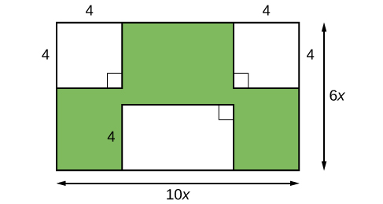
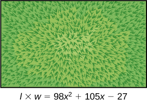
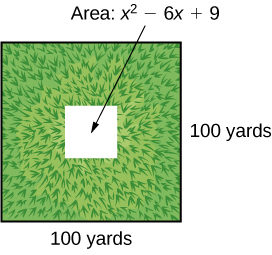

In this section students will:
* Factor the greatest common factor of a polynomial.
* Factor a trinomial.
* Factor by grouping.
* Factor a perfect square trinomial.
* Factor a difference of squares.
* Factor the sum and difference of cubes.
* Factor expressions using fractional or negative exponents.

Imagine that we are trying to find the area of a lawn so that we can determine how much grass seed to purchase. The lawn is the green portion in [\[link\]](#Figure_01_05_001).

 {: #Figure_01_05_001}

The area of the entire region can be found using the formula for the area of a rectangle.

<math xmlns="http://www.w3.org/1998/Math/MathML" display="block"> <mrow> <mtable> <mtr rowalign="center"> <mtd columnalign="right" rowalign="center"> <mi>A</mi> </mtd> <mtd rowalign="center"> <mo>=</mo> </mtd> <mtd columnalign="left" rowalign="center"> <mrow> <mi>l</mi><mi>w</mi> </mrow> </mtd> </mtr> <mtr rowalign="center"> <mtd rowalign="center" /> <mtd rowalign="center"> <mo>=</mo> </mtd> <mtd columnalign="left" rowalign="center"> <mrow> <mn>10</mn><mi>x</mi><mo>⋅</mo><mn>6</mn><mi>x</mi> </mrow> </mtd> </mtr> <mtr rowalign="center"> <mtd rowalign="center" /> <mtd rowalign="center"> <mo>=</mo> </mtd> <mtd columnalign="left" rowalign="center"> <mrow> <mn>60</mn><msup> <mi>x</mi> <mn>2</mn> </msup> <msup> <mrow> <mtext> units</mtext> </mrow> <mn>2</mn> </msup> </mrow> </mtd> </mtr> </mtable> </mrow> </math>

The areas of the portions that do not require grass seed need to be subtracted from the area of the entire region. The two square regions each have an area of<math xmlns="http://www.w3.org/1998/Math/MathML"> <mrow> <mtext> </mtext><mi>A</mi><mo>=</mo><msup> <mi>s</mi> <mn>2</mn> </msup> <mo>=</mo><msup> <mn>4</mn> <mn>2</mn> </msup> <mo>=</mo><mn>16</mn><mtext> </mtext> </mrow> </math>

units2. The other rectangular region has one side of length<math xmlns="http://www.w3.org/1998/Math/MathML"> <mrow> <mtext> </mtext><mn>10</mn><mi>x</mi><mo>−</mo><mn>8</mn><mtext> </mtext> </mrow> </math>

and one side of length<math xmlns="http://www.w3.org/1998/Math/MathML"> <mrow> <mtext> </mtext><mn>4</mn><mo>,</mo> </mrow> </math>

giving an area of<math xmlns="http://www.w3.org/1998/Math/MathML"> <mrow> <mtext> </mtext><mi>A</mi><mo>=</mo><mi>l</mi><mi>w</mi><mo>=</mo><mn>4</mn><mo stretchy="false">(</mo><mn>10</mn><mi>x</mi><mo>−</mo><mn>8</mn><mo stretchy="false">)</mo><mo>=</mo><mn>40</mn><mi>x</mi><mo>−</mo><mn>32</mn><mtext> </mtext> </mrow> </math>

units2. So the region that must be subtracted has an area of<math xmlns="http://www.w3.org/1998/Math/MathML"> <mrow> <mtext> </mtext><mn>2</mn><mo stretchy="false">(</mo><mn>16</mn><mo stretchy="false">)</mo><mo>+</mo><mn>40</mn><mi>x</mi><mo>−</mo><mn>32</mn><mo>=</mo><mn>40</mn><mi>x</mi><mtext> </mtext> </mrow> </math>

units2.

The area of the region that requires grass seed is found by subtracting<math xmlns="http://www.w3.org/1998/Math/MathML"> <mrow> <mtext> </mtext><mn>60</mn><msup> <mi>x</mi> <mn>2</mn> </msup> <mo>−</mo><mn>40</mn><mi>x</mi><mtext> </mtext> </mrow> </math>

units2. This area can also be expressed in factored form as<math xmlns="http://www.w3.org/1998/Math/MathML"> <mrow> <mtext> </mtext><mn>20</mn><mi>x</mi><mo stretchy="false">(</mo><mn>3</mn><mi>x</mi><mo>−</mo><mn>2</mn><mo stretchy="false">)</mo><mtext> </mtext> </mrow> </math>

units2. We can confirm that this is an equivalent expression by multiplying.

Many polynomial expressions can be written in simpler forms by factoring. In this section, we will look at a variety of methods that can be used to factor polynomial expressions.

### Factoring the Greatest Common Factor of a Polynomial

When we study fractions, we learn that the **greatest common factor**{: data-type="term"} (GCF) of two numbers is the largest number that divides evenly into both numbers. For instance,<math xmlns="http://www.w3.org/1998/Math/MathML"> <mrow> <mtext> </mtext><mn>4</mn><mtext> </mtext> </mrow> </math>

is the GCF of<math xmlns="http://www.w3.org/1998/Math/MathML"> <mrow> <mtext> </mtext><mn>16</mn><mtext> </mtext> </mrow> </math>

and<math xmlns="http://www.w3.org/1998/Math/MathML"> <mrow> <mtext> </mtext><mn>20</mn><mtext> </mtext> </mrow> </math>

because it is the largest number that divides evenly into both<math xmlns="http://www.w3.org/1998/Math/MathML"> <mrow> <mtext> </mtext><mn>16</mn><mtext> </mtext> </mrow> </math>

and<math xmlns="http://www.w3.org/1998/Math/MathML"> <mrow> <mtext> </mtext><mn>20</mn><mtext> </mtext> </mrow> </math>

The GCF of polynomials works the same way:<math xmlns="http://www.w3.org/1998/Math/MathML"> <mrow> <mtext> </mtext><mn>4</mn><mi>x</mi><mtext> </mtext> </mrow> </math>

is the GCF of<math xmlns="http://www.w3.org/1998/Math/MathML"> <mrow> <mtext> </mtext><mn>16</mn><mi>x</mi><mtext> </mtext> </mrow> </math>

and<math xmlns="http://www.w3.org/1998/Math/MathML"> <mrow> <mtext> </mtext><mn>20</mn><msup> <mi>x</mi> <mn>2</mn> </msup> <mtext> </mtext> </mrow> </math>

because it is the largest polynomial that divides evenly into both<math xmlns="http://www.w3.org/1998/Math/MathML"> <mrow> <mtext> </mtext><mn>16</mn><mi>x</mi><mtext> </mtext> </mrow> </math>

and<math xmlns="http://www.w3.org/1998/Math/MathML"> <mrow> <mtext> </mtext><mn>20</mn><msup> <mi>x</mi> <mn>2</mn> </msup> <mo>.</mo> </mrow> </math>

When factoring a polynomial expression, our first step should be to check for a GCF. Look for the GCF of the coefficients, and then look for the GCF of the variables.

Greatest Common Factor

The **greatest common factor**{: data-type="term"} (GCF) of polynomials is the largest polynomial that divides evenly into the polynomials.

<strong>Given a polynomial expression, factor out the greatest common factor. </strong>

1.  Identify the GCF of the coefficients.
2.  Identify the GCF of the variables.
3.  Combine to find the GCF of the expression.
4.  Determine what the GCF needs to be multiplied by to obtain each term in the expression.
5.  Write the factored expression as the product of the GCF and the sum of the terms we need to multiply by.
{: type="1"}

Factoring the Greatest Common Factor

Factor<math xmlns="http://www.w3.org/1998/Math/MathML"> <mrow> <mtext> </mtext><mn>6</mn><msup> <mi>x</mi> <mn>3</mn> </msup> <msup> <mi>y</mi> <mn>3</mn> </msup> <mo>+</mo><mn>45</mn><msup> <mi>x</mi> <mn>2</mn> </msup> <msup> <mi>y</mi> <mn>2</mn> </msup> <mo>+</mo><mn>21</mn><mi>x</mi><mi>y</mi><mo>.</mo> </mrow> </math>

First, find the GCF of the expression. The GCF of<math xmlns="http://www.w3.org/1998/Math/MathML"> <mrow> <mtext> </mtext><mn>6</mn><mo>,</mo><mn>45</mn><mo>,</mo> </mrow> </math>

and<math xmlns="http://www.w3.org/1998/Math/MathML"> <mrow> <mtext> </mtext><mn>21</mn><mtext> </mtext> </mrow> </math>

is<math xmlns="http://www.w3.org/1998/Math/MathML"> <mrow> <mtext> </mtext><mn>3.</mn><mtext> </mtext> </mrow> </math>

The GCF of<math xmlns="http://www.w3.org/1998/Math/MathML"> <mrow> <mtext> </mtext><msup> <mi>x</mi> <mn>3</mn> </msup> <mo>,</mo><msup> <mi>x</mi> <mn>2</mn> </msup> <mo>,</mo> </mrow> </math>

and<math xmlns="http://www.w3.org/1998/Math/MathML"> <mrow> <mtext> </mtext><mi>x</mi><mtext> </mtext> </mrow> </math>

is<math xmlns="http://www.w3.org/1998/Math/MathML"> <mrow> <mtext> </mtext><mi>x</mi><mo>.</mo><mtext> </mtext> </mrow> </math>

(Note that the GCF of a set of expressions in the form<math xmlns="http://www.w3.org/1998/Math/MathML"> <mrow> <mtext> </mtext><msup> <mi>x</mi> <mi>n</mi> </msup> <mtext> </mtext> </mrow> </math>

will always be the exponent of lowest degree.) And the GCF of<math xmlns="http://www.w3.org/1998/Math/MathML"> <mrow> <mtext> </mtext><msup> <mi>y</mi> <mn>3</mn> </msup> <mo>,</mo><msup> <mi>y</mi> <mn>2</mn> </msup> <mo>,</mo> </mrow> </math>

and<math xmlns="http://www.w3.org/1998/Math/MathML"> <mrow> <mtext> </mtext><mi>y</mi><mtext> </mtext> </mrow> </math>

is<math xmlns="http://www.w3.org/1998/Math/MathML"> <mrow> <mtext> </mtext><mi>y</mi><mo>.</mo><mtext> </mtext> </mrow> </math>

Combine these to find the GCF of the polynomial,<math xmlns="http://www.w3.org/1998/Math/MathML"> <mrow> <mtext> </mtext><mn>3</mn><mi>x</mi><mi>y</mi><mo>.</mo> </mrow> </math>

Next, determine what the GCF needs to be multiplied by to obtain each term of the polynomial. We find that<math xmlns="http://www.w3.org/1998/Math/MathML"> <mrow> <mtext> </mtext><mn>3</mn><mi>x</mi><mi>y</mi><mo>(</mo><mn>2</mn><msup> <mi>x</mi> <mn>2</mn> </msup> <msup> <mi>y</mi> <mn>2</mn> </msup> <mo>)</mo><mo>=</mo><mn>6</mn><msup> <mi>x</mi> <mn>3</mn> </msup> <msup> <mi>y</mi> <mn>3</mn> </msup> <mo>,</mo><mn>3</mn><mi>x</mi><mi>y</mi><mo stretchy="false">(</mo><mn>15</mn><mi>x</mi><mi>y</mi><mo stretchy="false">)</mo><mo>=</mo><mn>45</mn><msup> <mi>x</mi> <mn>2</mn> </msup> <msup> <mi>y</mi> <mn>2</mn> </msup> <mo>,</mo> </mrow> </math>

and<math xmlns="http://www.w3.org/1998/Math/MathML"> <mrow> <mtext> </mtext><mn>3</mn><mi>x</mi><mi>y</mi><mo stretchy="false">(</mo><mn>7</mn><mo stretchy="false">)</mo><mo>=</mo><mn>21</mn><mi>x</mi><mi>y</mi><mo>.</mo> </mrow> </math>

Finally, write the factored expression as the product of the GCF and the sum of the terms we needed to multiply by.

<math xmlns="http://www.w3.org/1998/Math/MathML"> <mrow> <mo stretchy="false">(</mo><mn>3</mn><mi>x</mi><mi>y</mi><mo stretchy="false">)</mo><mo>(</mo><mn>2</mn><msup> <mi>x</mi> <mn>2</mn> </msup> <msup> <mi>y</mi> <mn>2</mn> </msup> <mo>+</mo><mn>15</mn><mi>x</mi><mi>y</mi><mo>+</mo><mn>7</mn><mo>)</mo> </mrow> </math>

Analysis

After factoring, we can check our work by multiplying. Use the distributive property to confirm that<math xmlns="http://www.w3.org/1998/Math/MathML"> <mrow> <mtext> </mtext><mo stretchy="false">(</mo><mn>3</mn><mi>x</mi><mi>y</mi><mo stretchy="false">)</mo><mo>(</mo><mn>2</mn><msup> <mi>x</mi> <mn>2</mn> </msup> <msup> <mi>y</mi> <mn>2</mn> </msup> <mo>+</mo><mn>15</mn><mi>x</mi><mi>y</mi><mo>+</mo><mn>7</mn><mo>)</mo><mo>=</mo><mn>6</mn><msup> <mi>x</mi> <mn>3</mn> </msup> <msup> <mi>y</mi> <mn>3</mn> </msup> <mo>+</mo><mn>45</mn><msup> <mi>x</mi> <mn>2</mn> </msup> <msup> <mi>y</mi> <mn>2</mn> </msup> <mo>+</mo><mn>21</mn><mi>x</mi><mi>y</mi><mo>.</mo> </mrow> </math>

Factor<math xmlns="http://www.w3.org/1998/Math/MathML"> <mrow> <mtext> </mtext><mi>x</mi><mo>(</mo><msup> <mi>b</mi> <mn>2</mn> </msup> <mo>−</mo><mi>a</mi><mo>)</mo><mo>+</mo><mn>6</mn><mo>(</mo><msup> <mi>b</mi> <mn>2</mn> </msup> <mo>−</mo><mi>a</mi><mo>)</mo><mtext> </mtext> </mrow> </math>

by pulling out the GCF.

<math xmlns="http://www.w3.org/1998/Math/MathML"> <mrow> <mo stretchy="false">(</mo><msup> <mi>b</mi> <mn>2</mn> </msup> <mo>−</mo><mi>a</mi><mo stretchy="false">)</mo><mo stretchy="false">(</mo><mi>x</mi><mo>+</mo><mn>6</mn><mo stretchy="false">)</mo> </mrow> </math>

### Factoring a Trinomial with Leading Coefficient 1

Although we should always begin by looking for a GCF, pulling out the GCF is not the only way that polynomial expressions can be factored. The polynomial<math xmlns="http://www.w3.org/1998/Math/MathML"> <mrow> <mtext> </mtext><msup> <mi>x</mi> <mn>2</mn> </msup> <mo>+</mo><mn>5</mn><mi>x</mi><mo>+</mo><mn>6</mn><mtext> </mtext> </mrow> </math>

has a GCF of 1, but it can be written as the product of the factors<math xmlns="http://www.w3.org/1998/Math/MathML"> <mrow> <mtext> </mtext><mo stretchy="false">(</mo><mi>x</mi><mo>+</mo><mn>2</mn><mo stretchy="false">)</mo><mtext> </mtext> </mrow> </math>

and<math xmlns="http://www.w3.org/1998/Math/MathML"> <mrow> <mtext> </mtext><mo stretchy="false">(</mo><mi>x</mi><mo>+</mo><mn>3</mn><mo stretchy="false">)</mo><mo>.</mo> </mrow> </math>

Trinomials of the form<math xmlns="http://www.w3.org/1998/Math/MathML"> <mrow> <mtext> </mtext><msup> <mi>x</mi> <mn>2</mn> </msup> <mo>+</mo><mi>b</mi><mi>x</mi><mo>+</mo><mi>c</mi><mtext> </mtext> </mrow> </math>

can be factored by finding two numbers with a product of<math xmlns="http://www.w3.org/1998/Math/MathML"> <mrow> <mi>c</mi><mtext> </mtext> </mrow> </math>

and a sum of<math xmlns="http://www.w3.org/1998/Math/MathML"> <mrow> <mtext> </mtext><mi>b</mi><mo>.</mo><mtext> </mtext> </mrow> </math>

The trinomial<math xmlns="http://www.w3.org/1998/Math/MathML"> <mrow> <mtext> </mtext><msup> <mi>x</mi> <mn>2</mn> </msup> <mo>+</mo><mn>10</mn><mi>x</mi><mo>+</mo><mn>16</mn><mo>,</mo> </mrow> </math>

for example, can be factored using the numbers<math xmlns="http://www.w3.org/1998/Math/MathML"> <mrow> <mtext> </mtext><mn>2</mn><mtext> </mtext> </mrow> </math>

and<math xmlns="http://www.w3.org/1998/Math/MathML"> <mrow> <mtext> </mtext><mn>8</mn><mtext> </mtext> </mrow> </math>

because the product of those numbers is<math xmlns="http://www.w3.org/1998/Math/MathML"> <mrow> <mtext> </mtext><mn>16</mn><mtext> </mtext> </mrow> </math>

and their sum is<math xmlns="http://www.w3.org/1998/Math/MathML"> <mrow> <mtext> </mtext><mn>10.</mn><mtext> </mtext> </mrow> </math>

The trinomial can be rewritten as the product of<math xmlns="http://www.w3.org/1998/Math/MathML"> <mrow> <mtext> </mtext><mo stretchy="false">(</mo><mi>x</mi><mo>+</mo><mn>2</mn><mo stretchy="false">)</mo><mtext> </mtext> </mrow> </math>

and<math xmlns="http://www.w3.org/1998/Math/MathML"> <mrow> <mtext> </mtext><mo stretchy="false">(</mo><mi>x</mi><mo>+</mo><mn>8</mn><mo stretchy="false">)</mo><mo>.</mo> </mrow> </math>

Factoring a Trinomial with Leading Coefficient 1

A trinomial of the form<math xmlns="http://www.w3.org/1998/Math/MathML"> <mrow> <mtext> </mtext><msup> <mi>x</mi> <mn>2</mn> </msup> <mo>+</mo><mi>b</mi><mi>x</mi><mo>+</mo><mi>c</mi><mtext> </mtext> </mrow> </math>

can be written in factored form as<math xmlns="http://www.w3.org/1998/Math/MathML"> <mrow> <mtext> </mtext><mo stretchy="false">(</mo><mi>x</mi><mo>+</mo><mi>p</mi><mo stretchy="false">)</mo><mo stretchy="false">(</mo><mi>x</mi><mo>+</mo><mi>q</mi><mo stretchy="false">)</mo><mtext> </mtext> </mrow> </math>

where<math xmlns="http://www.w3.org/1998/Math/MathML"> <mrow> <mtext> </mtext><mi>p</mi><mi>q</mi><mo>=</mo><mi>c</mi><mtext> </mtext> </mrow> </math>

and<math xmlns="http://www.w3.org/1998/Math/MathML"> <mrow> <mtext> </mtext><mi>p</mi><mo>+</mo><mi>q</mi><mo>=</mo><mi>b</mi><mo>.</mo> </mrow> </math>

**Can every trinomial be factored as a product of binomials?**

*No. Some polynomials cannot be factored. These polynomials are said to be prime.*

**Given a trinomial in the form<math xmlns="http://www.w3.org/1998/Math/MathML"> <mrow> <mtext> </mtext><msup> <mi>x</mi> <mn>2</mn> </msup> <mo>+</mo><mi>b</mi><mi>x</mi><mo>+</mo><mi>c</mi><mo>,</mo> </mrow> </math>

factor it.**

1.  List factors of
    <math xmlns="http://www.w3.org/1998/Math/MathML"> <mrow> <mtext> </mtext><mi>c</mi><mo>.</mo> </mrow> </math>

2.  Find
    <math xmlns="http://www.w3.org/1998/Math/MathML"> <mrow> <mtext> </mtext><mi>p</mi><mtext> </mtext> </mrow> </math>
    
    and
    <math xmlns="http://www.w3.org/1998/Math/MathML"> <mrow> <mtext> </mtext><mi>q</mi><mo>,</mo> </mrow> </math>
    
    a pair of factors of
    <math xmlns="http://www.w3.org/1998/Math/MathML"> <mrow> <mtext> </mtext><mi>c</mi><mtext> </mtext> </mrow> </math>
    
    with a sum of
    <math xmlns="http://www.w3.org/1998/Math/MathML"> <mrow> <mtext> </mtext><mi>b</mi><mo>.</mo> </mrow> </math>

3.  Write the factored expression
    <math xmlns="http://www.w3.org/1998/Math/MathML"> <mrow> <mtext> </mtext><mo stretchy="false">(</mo><mi>x</mi><mo>+</mo><mi>p</mi><mo stretchy="false">)</mo><mo stretchy="false">(</mo><mi>x</mi><mo>+</mo><mi>q</mi><mo stretchy="false">)</mo><mo>.</mo> </mrow> </math>
{: type="1"}

Factoring a Trinomial with Leading Coefficient 1

Factor<math xmlns="http://www.w3.org/1998/Math/MathML"> <mrow> <mtext> </mtext><msup> <mi>x</mi> <mn>2</mn> </msup> <mo>+</mo><mn>2</mn><mi>x</mi><mo>−</mo><mn>15.</mn> </mrow> </math>

We have a trinomial with leading coefficient<math xmlns="http://www.w3.org/1998/Math/MathML"> <mrow> <mtext> </mtext><mn>1</mn><mo>,</mo><mi>b</mi><mo>=</mo><mn>2</mn><mo>,</mo> </mrow> </math>

and<math xmlns="http://www.w3.org/1998/Math/MathML"> <mrow> <mtext> </mtext><mi>c</mi><mo>=</mo><mn>−15.</mn><mtext> </mtext> </mrow> </math>

We need to find two numbers with a product of<math xmlns="http://www.w3.org/1998/Math/MathML"> <mrow> <mtext> </mtext><mn>−15</mn><mtext> </mtext> </mrow> </math>

and a sum of<math xmlns="http://www.w3.org/1998/Math/MathML"> <mrow> <mtext> </mtext><mn>2.</mn><mtext> </mtext> </mrow> </math>

In [[link]](#Table_01_05_01), we list factors until we find a pair with the desired sum.

<table id="Table_01_05_01" summary="A table with five rows and two columns. The first row has columns labeled: Factors of -15 and Sum of Factors. The entries in the first column are: 1, -15; -1, 15; 3, -5; and -3,5. The entries in the second column are: -14, 14, -2, and 2."><caption></caption><thead>
<tr>
<th>Factors of<math xmlns="http://www.w3.org/1998/Math/MathML">
 <mrow>
  <mtext> </mtext><mn>−15</mn>
 </mrow>
</math>
</th>
<th>Sum of Factors</th>
</tr>
</thead><tbody>
<tr>
<td><math xmlns="http://www.w3.org/1998/Math/MathML">
 <mrow>
  <mn>1</mn><mo>,</mo><mn>−15</mn>
 </mrow>
</math>
</td>
<td><math xmlns="http://www.w3.org/1998/Math/MathML">
 <mrow>
  <mn>−14</mn>
 </mrow>
</math>
</td>
</tr>
<tr>
<td><math xmlns="http://www.w3.org/1998/Math/MathML">
 <mrow>
  <mn>−1</mn><mo>,</mo><mn>15</mn>
 </mrow>
</math>
</td>
<td>14</td>
</tr>
<tr>
<td><math xmlns="http://www.w3.org/1998/Math/MathML">
 <mrow>
  <mn>3</mn><mo>,</mo><mn>−5</mn>
 </mrow>
</math>
</td>
<td><math xmlns="http://www.w3.org/1998/Math/MathML">
 <mrow>
  <mn>−2</mn>
 </mrow>
</math>
</td>
</tr>
<tr>
<td><math xmlns="http://www.w3.org/1998/Math/MathML">
 <mrow>
  <mn>−3</mn><mo>,</mo><mn>5</mn>
 </mrow>
</math>
</td>
<td>2</td>
</tr>
</tbody></table>
Now that we have identified<math xmlns="http://www.w3.org/1998/Math/MathML"> <mrow> <mtext> </mtext><mi>p</mi><mtext> </mtext> </mrow> </math>

and<math xmlns="http://www.w3.org/1998/Math/MathML"> <mrow> <mtext> </mtext><mi>q</mi><mtext> </mtext> </mrow> </math>

as<math xmlns="http://www.w3.org/1998/Math/MathML"> <mrow> <mtext> </mtext><mn>−3</mn><mtext> </mtext> </mrow> </math>

and<math xmlns="http://www.w3.org/1998/Math/MathML"> <mrow> <mtext> </mtext><mn>5</mn><mo>,</mo> </mrow> </math>

write the factored form as<math xmlns="http://www.w3.org/1998/Math/MathML"> <mrow> <mtext> </mtext><mo stretchy="false">(</mo><mi>x</mi><mo>−</mo><mn>3</mn><mo stretchy="false">)</mo><mo stretchy="false">(</mo><mi>x</mi><mo>+</mo><mn>5</mn><mo stretchy="false">)</mo><mo>.</mo> </mrow> </math>

Analysis

We can check our work by multiplying. Use FOIL to confirm that<math xmlns="http://www.w3.org/1998/Math/MathML"> <mrow> <mtext> </mtext><mo stretchy="false">(</mo><mi>x</mi><mo>−</mo><mn>3</mn><mo stretchy="false">)</mo><mo stretchy="false">(</mo><mi>x</mi><mo>+</mo><mn>5</mn><mo stretchy="false">)</mo><mo>=</mo><msup> <mi>x</mi> <mn>2</mn> </msup> <mo>+</mo><mn>2</mn><mi>x</mi><mo>−</mo><mn>15.</mn></mrow> </math>

**Does the order of the factors matter?**

*No. Multiplication is commutative, so the order of the factors does not matter.*

Factor<math xmlns="http://www.w3.org/1998/Math/MathML"> <mrow> <mtext> </mtext><msup> <mi>x</mi> <mn>2</mn> </msup> <mo>−</mo><mn>7</mn><mi>x</mi><mo>+</mo><mn>6.</mn> </mrow> </math>

<math xmlns="http://www.w3.org/1998/Math/MathML"> <mrow> <mo stretchy="false">(</mo><mi>x</mi><mn>−6</mn><mo stretchy="false">)</mo><mo stretchy="false">(</mo><mi>x</mi><mn>−1</mn><mo stretchy="false">)</mo> </mrow> </math>

### Factoring by Grouping

Trinomials with leading coefficients other than 1 are slightly more complicated to factor. For these trinomials, we can **factor by grouping**{: data-type="term"} by dividing the *x* term into the sum of two terms, factoring each portion of the expression separately, and then factoring out the GCF of the entire expression. The trinomial<math xmlns="http://www.w3.org/1998/Math/MathML"> <mrow> <mtext> </mtext><mn>2</mn><msup> <mi>x</mi> <mn>2</mn> </msup> <mo>+</mo><mn>5</mn><mi>x</mi><mo>+</mo><mn>3</mn><mtext> </mtext> </mrow> </math>

can be rewritten as<math xmlns="http://www.w3.org/1998/Math/MathML"> <mrow> <mtext> </mtext><mo stretchy="false">(</mo><mn>2</mn><mi>x</mi><mo>+</mo><mn>3</mn><mo stretchy="false">)</mo><mo stretchy="false">(</mo><mi>x</mi><mo>+</mo><mn>1</mn><mo stretchy="false">)</mo><mtext> </mtext> </mrow> </math>

using this process. We begin by rewriting the original expression as<math xmlns="http://www.w3.org/1998/Math/MathML"> <mrow> <mtext> </mtext><mn>2</mn><msup> <mi>x</mi> <mn>2</mn> </msup> <mo>+</mo><mn>2</mn><mi>x</mi><mo>+</mo><mn>3</mn><mi>x</mi><mo>+</mo><mn>3</mn><mtext> </mtext> </mrow> </math>

and then factor each portion of the expression to obtain<math xmlns="http://www.w3.org/1998/Math/MathML"> <mrow> <mtext> </mtext><mn>2</mn><mi>x</mi><mo stretchy="false">(</mo><mi>x</mi><mo>+</mo><mn>1</mn><mo stretchy="false">)</mo><mo>+</mo><mn>3</mn><mo stretchy="false">(</mo><mi>x</mi><mo>+</mo><mn>1</mn><mo stretchy="false">)</mo><mo>.</mo><mtext> </mtext> </mrow> </math>

We then pull out the GCF of<math xmlns="http://www.w3.org/1998/Math/MathML"> <mrow> <mtext> </mtext><mo stretchy="false">(</mo><mi>x</mi><mo>+</mo><mn>1</mn><mo stretchy="false">)</mo><mtext> </mtext> </mrow> </math>

to find the factored expression.

Factor by Grouping

To factor a trinomial in the form<math xmlns="http://www.w3.org/1998/Math/MathML"> <mrow> <mtext> </mtext><mi>a</mi><msup> <mi>x</mi> <mn>2</mn> </msup> <mo>+</mo><mi>b</mi><mi>x</mi><mo>+</mo><mi>c</mi><mtext> </mtext> </mrow> </math>

by grouping, we find two numbers with a product of<math xmlns="http://www.w3.org/1998/Math/MathML"> <mrow> <mtext> </mtext><mi>a</mi><mi>c</mi><mtext> </mtext> </mrow> </math>

and a sum of<math xmlns="http://www.w3.org/1998/Math/MathML"> <mrow> <mtext> </mtext><mi>b</mi><mo>.</mo><mtext> </mtext> </mrow> </math>

We use these numbers to divide the<math xmlns="http://www.w3.org/1998/Math/MathML"> <mrow> <mtext> </mtext><mi>x</mi><mtext> </mtext> </mrow> </math>

term into the sum of two terms and factor each portion of the expression separately, then factor out the GCF of the entire expression.

**Given a trinomial in the form<math xmlns="http://www.w3.org/1998/Math/MathML"> <mrow> <mtext> </mtext><mi>a</mi><msup> <mi>x</mi> <mn>2</mn> </msup> <mo>+</mo><mi>b</mi><mi>x</mi><mo>+</mo><mi>c</mi><mo>,</mo> </mrow> </math>

factor by grouping.**
1.  List factors of
    <math xmlns="http://www.w3.org/1998/Math/MathML"> <mrow> <mtext> </mtext><mi>a</mi><mi>c</mi><mo>.</mo> </mrow> </math>

2.  Find
    <math xmlns="http://www.w3.org/1998/Math/MathML"> <mrow> <mtext> </mtext><mi>p</mi><mtext> </mtext> </mrow> </math>
    
    and
    <math xmlns="http://www.w3.org/1998/Math/MathML"> <mrow> <mtext> </mtext><mi>q</mi><mo>,</mo> </mrow> </math>
    
    a pair of factors of
    <math xmlns="http://www.w3.org/1998/Math/MathML"> <mrow> <mtext> </mtext><mi>a</mi><mi>c</mi><mtext> </mtext> </mrow> </math>
    
    with a sum of
    <math xmlns="http://www.w3.org/1998/Math/MathML"> <mrow> <mtext> </mtext><mi>b</mi><mo>.</mo> </mrow> </math>

3.  Rewrite the original expression as
    <math xmlns="http://www.w3.org/1998/Math/MathML"> <mrow> <mtext> </mtext><mi>a</mi><msup> <mi>x</mi> <mn>2</mn> </msup> <mo>+</mo><mi>p</mi><mi>x</mi><mo>+</mo><mi>q</mi><mi>x</mi><mo>+</mo><mi>c</mi><mo>.</mo> </mrow> </math>

4.  Pull out the GCF of
    <math xmlns="http://www.w3.org/1998/Math/MathML"> <mrow> <mtext> </mtext><mi>a</mi><msup> <mi>x</mi> <mn>2</mn> </msup> <mo>+</mo><mi>p</mi><mi>x</mi><mo>.</mo> </mrow> </math>

5.  Pull out the GCF of
    <math xmlns="http://www.w3.org/1998/Math/MathML"> <mrow> <mtext> </mtext><mi>q</mi><mi>x</mi><mo>+</mo><mi>c</mi><mo>.</mo> </mrow> </math>

6.  Factor out the GCF of the expression.
{: type="1"}

Factoring a Trinomial by Grouping

Factor<math xmlns="http://www.w3.org/1998/Math/MathML"> <mrow> <mtext> </mtext><mn>5</mn><msup> <mi>x</mi> <mn>2</mn> </msup> <mo>+</mo><mn>7</mn><mi>x</mi><mo>−</mo><mn>6</mn><mtext> </mtext> </mrow> </math>

by grouping.

We have a trinomial with<math xmlns="http://www.w3.org/1998/Math/MathML"> <mrow> <mtext> </mtext><mi>a</mi><mo>=</mo><mn>5</mn><mo>,</mo><mi>b</mi><mo>=</mo><mn>7</mn><mo>,</mo> </mrow> </math>

and<math xmlns="http://www.w3.org/1998/Math/MathML"> <mrow> <mtext> </mtext><mi>c</mi><mo>=</mo><mn>−6.</mn><mtext> </mtext> </mrow> </math>

First, determine<math xmlns="http://www.w3.org/1998/Math/MathML"> <mrow> <mtext> </mtext><mi>a</mi><mi>c</mi><mo>=</mo><mn>−30.</mn><mtext> </mtext> </mrow> </math>

We need to find two numbers with a product of<math xmlns="http://www.w3.org/1998/Math/MathML"> <mrow> <mtext> </mtext><mn>−30</mn><mtext> </mtext> </mrow> </math>

and a sum of<math xmlns="http://www.w3.org/1998/Math/MathML"> <mrow> <mtext> </mtext><mn>7.</mn><mtext> </mtext> </mrow> </math>

In [[link]](#Table_01_05_02), we list factors until we find a pair with the desired sum.

<table id="Table_01_05_02" summary="A table with 7 rows and 2 columns. The first column is labeled: Factors of -30 while the second is labeled: Sum of Factors. The entries in the first column are: 1, -30; -1, 30; 2, -15; -2, 15; 3, -10; and -3, 10. The entries in the second column are: -29, 29, -13, 13, -7, and 7."><caption></caption><thead>
<tr>
<th>Factors of<math xmlns="http://www.w3.org/1998/Math/MathML">
 <mrow>
  <mtext> </mtext><mn>−30</mn>
 </mrow>
</math>
</th>
<th>Sum of Factors</th>
</tr>
</thead><tbody>
<tr>
<td><math xmlns="http://www.w3.org/1998/Math/MathML">
 <mrow>
  <mn>1</mn><mo>,</mo><mn>−30</mn>
 </mrow>
</math>
</td>
<td><math xmlns="http://www.w3.org/1998/Math/MathML">
 <mrow>
  <mn>−29</mn>
 </mrow>
</math>
</td>
</tr>
<tr>
<td><math xmlns="http://www.w3.org/1998/Math/MathML">
 <mrow>
  <mn>−1</mn><mo>,</mo><mn>30</mn>
 </mrow>
</math>
</td>
<td>29</td>
</tr>
<tr>
<td><math xmlns="http://www.w3.org/1998/Math/MathML">
 <mrow>
  <mn>2</mn><mo>,</mo><mn>−15</mn>
 </mrow>
</math>
</td>
<td><math xmlns="http://www.w3.org/1998/Math/MathML">
 <mrow>
  <mn>−13</mn>
 </mrow>
</math>
</td>
</tr>
<tr>
<td><math xmlns="http://www.w3.org/1998/Math/MathML">
 <mrow>
  <mn>−2</mn><mo>,</mo><mn>15</mn>
 </mrow>
</math>
</td>
<td>13</td>
</tr>
<tr>
<td><math xmlns="http://www.w3.org/1998/Math/MathML">
 <mrow>
  <mn>3</mn><mo>,</mo><mn>−10</mn>
 </mrow>
</math>
</td>
<td><math xmlns="http://www.w3.org/1998/Math/MathML">
 <mrow>
  <mn>−7</mn>
 </mrow>
</math>
</td>
</tr>
<tr>
<td><math xmlns="http://www.w3.org/1998/Math/MathML">
 <mrow>
  <mn>−3</mn><mo>,</mo><mn>10</mn>
 </mrow>
</math>
</td>
<td>7</td>
</tr>
</tbody></table>
So<math xmlns="http://www.w3.org/1998/Math/MathML"> <mrow> <mtext> </mtext><mi>p</mi><mo>=</mo><mn>−3</mn><mtext> </mtext> </mrow> </math>

and<math xmlns="http://www.w3.org/1998/Math/MathML"> <mrow> <mtext> </mtext><mi>q</mi><mo>=</mo><mn>10.</mn> </mrow> </math>

<math xmlns="http://www.w3.org/1998/Math/MathML" display="block"> <mrow> <mtable> <mtr> <mtd columnalign="left"> <mrow> <mn>5</mn><msup> <mi>x</mi> <mn>2</mn> </msup> <mo>−</mo><mn>3</mn><mi>x</mi><mo>+</mo><mn>10</mn><mi>x</mi><mo>−</mo><mn>6</mn><mo> </mo> </mrow> </mtd> <mtd columnalign="left"> <mrow><mspace width="2em" /> <mtext>Rewrite the original expression as </mtext><mi>a</mi><msup> <mi>x</mi> <mn>2</mn> </msup> <mo>+</mo><mi>p</mi><mi>x</mi><mo>+</mo><mi>q</mi><mi>x</mi><mo>+</mo><mi>c</mi><mo>.</mo> </mrow> </mtd> </mtr> <mtr> <mtd columnalign="left"> <mrow> <mi>x</mi><mo stretchy="false">(</mo><mn>5</mn><mi>x</mi><mo>−</mo><mn>3</mn><mo stretchy="false">)</mo><mo>+</mo><mn>2</mn><mo stretchy="false">(</mo><mn>5</mn><mi>x</mi><mo>−</mo><mn>3</mn><mo stretchy="false">)</mo> </mrow> </mtd> <mtd columnalign="left"> <mrow><mspace width="2em" /> <mtext>Factor out the GCF of each part</mtext><mo>.</mo> </mrow> </mtd> </mtr> <mtr> <mtd columnalign="left"> <mrow> <mo stretchy="false">(</mo><mn>5</mn><mi>x</mi><mo>−</mo><mn>3</mn><mo stretchy="false">)</mo><mo stretchy="false">(</mo><mi>x</mi><mo>+</mo><mn>2</mn><mo stretchy="false">)</mo> </mrow> </mtd> <mtd columnalign="left"> <mrow><mspace width="2em" /> <mtext>Factor out the GCF</mtext><mtext>​</mtext><mtext> of the expression</mtext><mo>.</mo> </mrow> </mtd> </mtr> </mtable> </mrow> </math>

Analysis

We can check our work by multiplying. Use FOIL to confirm that<math xmlns="http://www.w3.org/1998/Math/MathML"> <mrow> <mtext> </mtext><mo stretchy="false">(</mo><mn>5</mn><mi>x</mi><mo>−</mo><mn>3</mn><mo stretchy="false">)</mo><mo stretchy="false">(</mo><mi>x</mi><mo>+</mo><mn>2</mn><mo stretchy="false">)</mo><mo>=</mo><mn>5</mn><msup> <mi>x</mi> <mn>2</mn> </msup> <mo>+</mo><mn>7</mn><mi>x</mi><mo>−</mo><mn>6.</mn> </mrow> </math>

Factor a.<math xmlns="http://www.w3.org/1998/Math/MathML"> <mrow> <mtext> </mtext><mn>2</mn><msup> <mi>x</mi> <mn>2</mn> </msup> <mo>+</mo><mn>9</mn><mi>x</mi><mo>+</mo><mn>9</mn><mtext> </mtext> </mrow> </math>

b.<math xmlns="http://www.w3.org/1998/Math/MathML"> <mrow> <mtext> </mtext><mn>6</mn><msup> <mi>x</mi> <mn>2</mn> </msup> <mo>+</mo><mi>x</mi><mo>−</mo><mn>1</mn> </mrow> </math>

a.<math xmlns="http://www.w3.org/1998/Math/MathML"> <mrow> <mtext> </mtext><mo stretchy="false">(</mo><mn>2</mn><mi>x</mi><mo>+</mo><mn>3</mn><mo stretchy="false">)</mo><mo stretchy="false">(</mo><mi>x</mi><mo>+</mo><mn>3</mn><mo stretchy="false">)</mo><mtext> </mtext> </mrow> </math>

b.<math xmlns="http://www.w3.org/1998/Math/MathML"> <mrow> <mtext> </mtext><mrow><mo>(</mo> <mrow> <mn>3</mn><mi>x</mi><mn>−1</mn> </mrow> <mo>)</mo></mrow><mrow><mo>(</mo> <mrow> <mn>2</mn><mi>x</mi><mo>+</mo><mn>1</mn> </mrow> <mo>)</mo></mrow> </mrow> </math>

###  Factoring a Perfect Square Trinomial

A perfect square trinomial is a trinomial that can be written as the square of a binomial. Recall that when a binomial is squared, the result is the square of the first term added to twice the product of the two terms and the square of the last term.

<math xmlns="http://www.w3.org/1998/Math/MathML" display="block"> <mrow> <mtable> <mtr rowalign="center"> <mtd columnalign="right" rowalign="center"> <mrow> <msup> <mi>a</mi> <mn>2</mn> </msup> <mo>+</mo><mn>2</mn><mi>a</mi><mi>b</mi><mo>+</mo><msup> <mi>b</mi> <mn>2</mn> </msup> </mrow> </mtd> <mtd rowalign="center"> <mo>=</mo> </mtd> <mtd columnalign="left" rowalign="center"> <mrow> <msup> <mrow> <mo stretchy="false">(</mo><mi>a</mi><mo>+</mo><mi>b</mi><mo stretchy="false">)</mo> </mrow> <mn>2</mn> </msup> </mrow> </mtd> </mtr> <mtr rowalign="center"> <mtd rowalign="center" /> <mtd rowalign="center"> <mrow> <mtext>and</mtext> </mrow> </mtd> <mtd rowalign="center" /> </mtr> <mtr rowalign="center"> <mtd columnalign="right" rowalign="center"> <mrow> <msup> <mi>a</mi> <mn>2</mn> </msup> <mo>−</mo><mn>2</mn><mi>a</mi><mi>b</mi><mo>+</mo><msup> <mi>b</mi> <mn>2</mn> </msup> </mrow> </mtd> <mtd rowalign="center"> <mo>=</mo> </mtd> <mtd columnalign="left" rowalign="center"> <mrow> <msup> <mrow> <mo stretchy="false">(</mo><mi>a</mi><mo>−</mo><mi>b</mi><mo stretchy="false">)</mo> </mrow> <mn>2</mn> </msup> </mrow> </mtd> </mtr> </mtable> </mrow> </math>

We can use this equation to factor any perfect square trinomial.

Perfect Square Trinomials

A perfect square trinomial can be written as the square of a binomial:

<math xmlns="http://www.w3.org/1998/Math/MathML"> <mrow> <msup> <mi>a</mi> <mn>2</mn> </msup> <mo>+</mo><mn>2</mn><mi>a</mi><mi>b</mi><mo>+</mo><msup> <mi>b</mi> <mn>2</mn> </msup> <mo>=</mo><msup> <mrow> <mo stretchy="false">(</mo><mi>a</mi><mo>+</mo><mi>b</mi><mo stretchy="false">)</mo> </mrow> <mn>2</mn> </msup> </mrow> </math>

<strong>Given a perfect square trinomial, factor it into the square of a binomial. </strong>

1.  Confirm that the first and last term are perfect squares.
2.  Confirm that the middle term is twice the product of
    <math xmlns="http://www.w3.org/1998/Math/MathML"> <mrow> <mtext> </mtext><mi>a</mi><mi>b</mi><mo>.</mo> </mrow> </math>

3.  Write the factored form as
    <math xmlns="http://www.w3.org/1998/Math/MathML"> <mrow> <mtext> </mtext><msup> <mrow> <mo stretchy="false">(</mo><mi>a</mi><mo>+</mo><mi>b</mi><mo stretchy="false">)</mo> </mrow> <mn>2</mn> </msup> <mo>.</mo> </mrow> </math>
{: type="1"}

Factoring a Perfect Square Trinomial

Factor<math xmlns="http://www.w3.org/1998/Math/MathML"> <mrow> <mtext> </mtext><mn>25</mn><msup> <mi>x</mi> <mn>2</mn> </msup> <mo>+</mo><mn>20</mn><mi>x</mi><mo>+</mo><mn>4.</mn> </mrow> </math>

Notice that<math xmlns="http://www.w3.org/1998/Math/MathML"> <mrow> <mtext> </mtext><mn>25</mn><msup> <mi>x</mi> <mn>2</mn> </msup> <mtext> </mtext> </mrow> </math>

and<math xmlns="http://www.w3.org/1998/Math/MathML"> <mrow> <mtext> </mtext><mn>4</mn><mtext> </mtext> </mrow> </math>

are perfect squares because<math xmlns="http://www.w3.org/1998/Math/MathML"> <mrow> <mtext> </mtext><mn>25</mn><msup> <mi>x</mi> <mn>2</mn> </msup> <mo>=</mo><msup> <mrow> <mo stretchy="false">(</mo><mn>5</mn><mi>x</mi><mo stretchy="false">)</mo> </mrow> <mn>2</mn> </msup> <mtext> </mtext> </mrow> </math>

and<math xmlns="http://www.w3.org/1998/Math/MathML"> <mrow> <mtext> </mtext><mn>4</mn><mo>=</mo><msup> <mn>2</mn> <mn>2</mn> </msup> <mo>.</mo><mtext> </mtext> </mrow> </math>

Then check to see if the middle term is twice the product of<math xmlns="http://www.w3.org/1998/Math/MathML"> <mrow> <mtext> </mtext><mn>5</mn><mi>x</mi><mtext> </mtext> </mrow> </math>

and<math xmlns="http://www.w3.org/1998/Math/MathML"> <mrow> <mtext> </mtext><mn>2.</mn><mtext> </mtext> </mrow> </math>

The middle term is, indeed, twice the product:<math xmlns="http://www.w3.org/1998/Math/MathML"> <mrow> <mtext> </mtext><mn>2</mn><mo stretchy="false">(</mo><mn>5</mn><mi>x</mi><mo stretchy="false">)</mo><mo stretchy="false">(</mo><mn>2</mn><mo stretchy="false">)</mo><mo>=</mo><mn>20</mn><mi>x</mi><mo>.</mo><mtext> </mtext> </mrow> </math>

Therefore, the trinomial is a perfect square trinomial and can be written as<math xmlns="http://www.w3.org/1998/Math/MathML"> <mrow> <mtext> </mtext><msup> <mrow> <mo stretchy="false">(</mo><mn>5</mn><mi>x</mi><mo>+</mo><mn>2</mn><mo stretchy="false">)</mo> </mrow> <mn>2</mn> </msup> <mo>.</mo> </mrow> </math>

Factor<math xmlns="http://www.w3.org/1998/Math/MathML"> <mrow> <mtext> </mtext><mn>49</mn><msup> <mi>x</mi> <mn>2</mn> </msup> <mo>−</mo><mn>14</mn><mi>x</mi><mo>+</mo><mn>1.</mn> </mrow> </math>

<math xmlns="http://www.w3.org/1998/Math/MathML"> <mrow> <msup> <mrow> <mo stretchy="false">(</mo><mn>7</mn><mi>x</mi><mn>−1</mn><mo stretchy="false">)</mo> </mrow> <mn>2</mn> </msup> </mrow> </math>

### Factoring a Difference of Squares

A difference of squares is a perfect square subtracted from a perfect square. Recall that a difference of squares can be rewritten as factors containing the same terms but opposite signs because the middle terms cancel each other out when the two factors are multiplied.

<math xmlns="http://www.w3.org/1998/Math/MathML" display="block"> <mrow> <msup> <mi>a</mi> <mn>2</mn> </msup> <mo>−</mo><msup> <mi>b</mi> <mn>2</mn> </msup> <mo>=</mo><mo stretchy="false">(</mo><mi>a</mi><mo>+</mo><mi>b</mi><mo stretchy="false">)</mo><mo stretchy="false">(</mo><mi>a</mi><mo>−</mo><mi>b</mi><mo stretchy="false">)</mo> </mrow> </math>

We can use this equation to factor any differences of squares.

Differences of Squares

A difference of squares can be rewritten as two factors containing the same terms but opposite signs.

<math xmlns="http://www.w3.org/1998/Math/MathML" display="block"> <mrow> <msup> <mi>a</mi> <mn>2</mn> </msup> <mo>−</mo><msup> <mi>b</mi> <mn>2</mn> </msup> <mo>=</mo><mo stretchy="false">(</mo><mi>a</mi><mo>+</mo><mi>b</mi><mo stretchy="false">)</mo><mo stretchy="false">(</mo><mi>a</mi><mo>−</mo><mi>b</mi><mo stretchy="false">)</mo> </mrow> </math>

**Given a difference of squares, factor it into binomials.**

1.  Confirm that the first and last term are perfect squares.
2.  Write the factored form as
    <math xmlns="http://www.w3.org/1998/Math/MathML"> <mrow> <mtext> </mtext><mo stretchy="false">(</mo><mi>a</mi><mo>+</mo><mi>b</mi><mo stretchy="false">)</mo><mo stretchy="false">(</mo><mi>a</mi><mo>−</mo><mi>b</mi><mo stretchy="false">)</mo><mo>.</mo> </mrow> </math>
{: type="1"}

Factoring a Difference of Squares

Factor<math xmlns="http://www.w3.org/1998/Math/MathML"> <mrow> <mtext> </mtext><mn>9</mn><msup> <mi>x</mi> <mn>2</mn> </msup> <mo>−</mo><mn>25.</mn> </mrow> </math>

Notice that<math xmlns="http://www.w3.org/1998/Math/MathML"> <mrow> <mtext> </mtext><mn>9</mn><msup> <mi>x</mi> <mn>2</mn> </msup> <mtext> </mtext> </mrow> </math>

and<math xmlns="http://www.w3.org/1998/Math/MathML"> <mrow> <mtext> </mtext><mn>25</mn><mtext> </mtext> </mrow> </math>

are perfect squares because<math xmlns="http://www.w3.org/1998/Math/MathML"> <mrow> <mtext> </mtext><mn>9</mn><msup> <mi>x</mi> <mn>2</mn> </msup> <mo>=</mo><msup> <mrow> <mo stretchy="false">(</mo><mn>3</mn><mi>x</mi><mo stretchy="false">)</mo> </mrow> <mn>2</mn> </msup> <mtext> </mtext> </mrow> </math>

and<math xmlns="http://www.w3.org/1998/Math/MathML"> <mrow> <mtext> </mtext><mn>25</mn><mo>=</mo><msup> <mn>5</mn> <mn>2</mn> </msup> <mo>.</mo><mtext> </mtext> </mrow> </math>

The polynomial represents a difference of squares and can be rewritten as<math xmlns="http://www.w3.org/1998/Math/MathML"> <mrow> <mtext> </mtext><mo stretchy="false">(</mo><mn>3</mn><mi>x</mi><mo>+</mo><mn>5</mn><mo stretchy="false">)</mo><mo stretchy="false">(</mo><mn>3</mn><mi>x</mi><mo>−</mo><mn>5</mn><mo stretchy="false">)</mo><mo>.</mo> </mrow> </math>

Factor<math xmlns="http://www.w3.org/1998/Math/MathML"> <mrow> <mtext> </mtext><mn>81</mn><msup> <mi>y</mi> <mn>2</mn> </msup> <mo>−</mo><mn>100.</mn> </mrow> </math>

<math xmlns="http://www.w3.org/1998/Math/MathML"> <mrow> <mo stretchy="false">(</mo><mn>9</mn><mi>y</mi><mo>+</mo><mn>10</mn><mo stretchy="false">)</mo><mo stretchy="false">(</mo><mn>9</mn><mi>y</mi><mo>−</mo><mn>10</mn><mo stretchy="false">)</mo> </mrow> </math>

**Is there a formula to factor the sum of squares?**

*No. A sum of squares cannot be factored.*

### Factoring the Sum and Difference of Cubes

Now, we will look at two new special products: the sum and difference of cubes. Although the sum of squares cannot be factored, the sum of cubes can be factored into a binomial and a trinomial.

<math xmlns="http://www.w3.org/1998/Math/MathML" display="block"> <mrow> <msup> <mi>a</mi> <mn>3</mn> </msup> <mo>+</mo><msup> <mi>b</mi> <mn>3</mn> </msup> <mo>=</mo><mo stretchy="false">(</mo><mi>a</mi><mo>+</mo><mi>b</mi><mo stretchy="false">)</mo><mrow><mo>(</mo> <mrow> <msup> <mi>a</mi> <mn>2</mn> </msup> <mo>−</mo><mi>a</mi><mi>b</mi><mo>+</mo><msup> <mi>b</mi> <mn>2</mn> </msup> </mrow> <mo>)</mo></mrow> </mrow> </math>

Similarly, the sum of cubes can be factored into a binomial and a trinomial, but with different signs.

<math xmlns="http://www.w3.org/1998/Math/MathML" display="block"> <mrow> <msup> <mi>a</mi> <mn>3</mn> </msup> <mo>−</mo><msup> <mi>b</mi> <mn>3</mn> </msup> <mo>=</mo><mo stretchy="false">(</mo><mi>a</mi><mo>−</mo><mi>b</mi><mo stretchy="false">)</mo><mrow><mo>(</mo> <mrow> <msup> <mi>a</mi> <mn>2</mn> </msup> <mo>+</mo><mi>a</mi><mi>b</mi><mo>+</mo><msup> <mi>b</mi> <mn>2</mn> </msup> </mrow> <mo>)</mo></mrow> </mrow> </math>

We can use the acronym SOAP to remember the signs when factoring the sum or difference of cubes. The first letter of each word relates to the signs: **S**ame **O**pposite **A**lways **P**ositive. For example, consider the following example.

<math xmlns="http://www.w3.org/1998/Math/MathML" display="block"> <mrow> <msup> <mi>x</mi> <mn>3</mn> </msup> <mo>−</mo><msup> <mn>2</mn> <mn>3</mn> </msup> <mo>=</mo><mo stretchy="false">(</mo><mi>x</mi><mo>−</mo><mn>2</mn><mo stretchy="false">)</mo><mrow><mo>(</mo> <mrow> <msup> <mi>x</mi> <mn>2</mn> </msup> <mo>+</mo><mn>2</mn><mi>x</mi><mo>+</mo><mn>4</mn> </mrow> <mo>)</mo></mrow> </mrow> </math>

The sign of the first 2 is the *same* as the sign between<math xmlns="http://www.w3.org/1998/Math/MathML"> <mrow> <mtext> </mtext><msup> <mi>x</mi> <mn>3</mn> </msup> <mo>−</mo><msup> <mn>2</mn> <mn>3</mn> </msup> <mo>.</mo><mtext> </mtext> </mrow> </math>

The sign of the<math xmlns="http://www.w3.org/1998/Math/MathML"> <mrow> <mtext> </mtext><mn>2</mn><mi>x</mi><mtext> </mtext> </mrow> </math>

term is *opposite* the sign between<math xmlns="http://www.w3.org/1998/Math/MathML"> <mrow> <mtext> </mtext><msup> <mi>x</mi> <mn>3</mn> </msup> <mo>−</mo><msup> <mn>2</mn> <mn>3</mn> </msup> <mo>.</mo><mtext> </mtext> </mrow> </math>

And the sign of the last term, 4, is *always positive*.

Sum and Difference of Cubes

We can factor the sum of two cubes as

<math xmlns="http://www.w3.org/1998/Math/MathML" display="block"> <mrow> <msup> <mi>a</mi> <mn>3</mn> </msup> <mo>+</mo><msup> <mi>b</mi> <mn>3</mn> </msup> <mo>=</mo><mo stretchy="false">(</mo><mi>a</mi><mo>+</mo><mi>b</mi><mo stretchy="false">)</mo><mrow><mo>(</mo> <mrow> <msup> <mi>a</mi> <mn>2</mn> </msup> <mo>−</mo><mi>a</mi><mi>b</mi><mo>+</mo><msup> <mi>b</mi> <mn>2</mn> </msup> </mrow> <mo>)</mo></mrow> </mrow> </math>

We can factor the difference of two cubes as

<math xmlns="http://www.w3.org/1998/Math/MathML" display="block"> <mrow> <msup> <mi>a</mi> <mn>3</mn> </msup> <mo>−</mo><msup> <mi>b</mi> <mn>3</mn> </msup> <mo>=</mo><mo stretchy="false">(</mo><mi>a</mi><mo>−</mo><mi>b</mi><mo stretchy="false">)</mo><mrow><mo>(</mo> <mrow> <msup> <mi>a</mi> <mn>2</mn> </msup> <mo>+</mo><mi>a</mi><mi>b</mi><mo>+</mo><msup> <mi>b</mi> <mn>2</mn> </msup> </mrow> <mo>)</mo></mrow> </mrow> </math>

**Given a sum of cubes or difference of cubes, factor it.**

1.  Confirm that the first and last term are cubes,
    <math xmlns="http://www.w3.org/1998/Math/MathML"> <mrow> <mtext> </mtext><msup> <mi>a</mi> <mn>3</mn> </msup> <mo>+</mo><msup> <mi>b</mi> <mn>3</mn> </msup> <mtext> </mtext> </mrow> </math>
    
    or
    <math xmlns="http://www.w3.org/1998/Math/MathML"> <mrow> <mtext> </mtext><msup> <mi>a</mi> <mn>3</mn> </msup> <mo>−</mo><msup> <mi>b</mi> <mn>3</mn> </msup> <mo>.</mo> </mrow> </math>

2.  For a sum of cubes, write the factored form as
    <math xmlns="http://www.w3.org/1998/Math/MathML"> <mrow> <mtext> </mtext><mo stretchy="false">(</mo><mi>a</mi><mo>+</mo><mi>b</mi><mo stretchy="false">)</mo><mo>(</mo><msup> <mi>a</mi> <mn>2</mn> </msup> <mo>−</mo><mi>a</mi><mi>b</mi><mo>+</mo><msup> <mi>b</mi> <mn>2</mn> </msup> <mo>)</mo><mo>.</mo><mtext> </mtext> </mrow> </math>
    
    For a difference of cubes, write the factored form as
    <math xmlns="http://www.w3.org/1998/Math/MathML"> <mrow> <mtext> </mtext><mo stretchy="false">(</mo><mi>a</mi><mo>−</mo><mi>b</mi><mo stretchy="false">)</mo><mo>(</mo><msup> <mi>a</mi> <mn>2</mn> </msup> <mo>+</mo><mi>a</mi><mi>b</mi><mo>+</mo><msup> <mi>b</mi> <mn>2</mn> </msup> <mo>)</mo><mo>.</mo> </mrow> </math>
{: type="1"}

Factoring a Sum of Cubes

Factor<math xmlns="http://www.w3.org/1998/Math/MathML"> <mrow> <mtext> </mtext><msup> <mi>x</mi> <mn>3</mn> </msup> <mo>+</mo><mn>512.</mn> </mrow> </math>

Notice that<math xmlns="http://www.w3.org/1998/Math/MathML"> <mrow> <mtext> </mtext><msup> <mi>x</mi> <mn>3</mn> </msup> <mtext> </mtext> </mrow> </math>

and<math xmlns="http://www.w3.org/1998/Math/MathML"> <mrow> <mtext> </mtext><mn>512</mn><mtext> </mtext> </mrow> </math>

are cubes because<math xmlns="http://www.w3.org/1998/Math/MathML"> <mrow> <mtext> </mtext><msup> <mn>8</mn> <mn>3</mn> </msup> <mo>=</mo><mn>512.</mn><mtext> </mtext> </mrow> </math>

Rewrite the sum of cubes as<math xmlns="http://www.w3.org/1998/Math/MathML"> <mrow> <mtext> </mtext><mo stretchy="false">(</mo><mi>x</mi><mo>+</mo><mn>8</mn><mo stretchy="false">)</mo><mo>(</mo><msup> <mi>x</mi> <mn>2</mn> </msup> <mo>−</mo><mn>8</mn><mi>x</mi><mo>+</mo><mn>64</mn><mo>)</mo><mo>.</mo> </mrow> </math>

Analysis

After writing the sum of cubes this way, we might think we should check to see if the trinomial portion can be factored further. However, the trinomial portion cannot be factored, so we do not need to check.

Factor the sum of cubes:<math xmlns="http://www.w3.org/1998/Math/MathML"> <mrow> <mtext> </mtext><mn>216</mn><msup> <mi>a</mi> <mn>3</mn> </msup> <mo>+</mo><msup> <mi>b</mi> <mn>3</mn> </msup> <mo>.</mo> </mrow> </math>

<math xmlns="http://www.w3.org/1998/Math/MathML"> <mrow> <mo stretchy="false">(</mo><mn>6</mn><mi>a</mi><mo>+</mo><mi>b</mi><mo stretchy="false">)</mo><mo stretchy="false">(</mo><mn>36</mn><msup> <mi>a</mi> <mn>2</mn> </msup> <mn>−6</mn><mi>a</mi><mi>b</mi><mo>+</mo><msup> <mi>b</mi> <mn>2</mn> </msup> <mo stretchy="false">)</mo> </mrow> </math>

Factoring a Difference of Cubes

Factor<math xmlns="http://www.w3.org/1998/Math/MathML"> <mrow> <mtext> </mtext><mn>8</mn><msup> <mi>x</mi> <mn>3</mn> </msup> <mo>−</mo><mn>125.</mn> </mrow> </math>

Notice that<math xmlns="http://www.w3.org/1998/Math/MathML"> <mrow> <mtext> </mtext><mn>8</mn><msup> <mi>x</mi> <mn>3</mn> </msup> <mtext> </mtext> </mrow> </math>

and<math xmlns="http://www.w3.org/1998/Math/MathML"> <mrow> <mtext> </mtext><mn>125</mn><mtext> </mtext> </mrow> </math>

are cubes because<math xmlns="http://www.w3.org/1998/Math/MathML"> <mrow> <mtext> </mtext><mn>8</mn><msup> <mi>x</mi> <mn>3</mn> </msup> <mo>=</mo><msup> <mrow> <mo stretchy="false">(</mo><mn>2</mn><mi>x</mi><mo stretchy="false">)</mo> </mrow> <mn>3</mn> </msup> <mtext> </mtext> </mrow> </math>

and<math xmlns="http://www.w3.org/1998/Math/MathML"> <mrow> <mtext> </mtext><mn>125</mn><mo>=</mo><msup> <mn>5</mn> <mn>3</mn> </msup> <mo>.</mo><mtext> </mtext> </mrow> </math>

Write the difference of cubes as<math xmlns="http://www.w3.org/1998/Math/MathML"> <mrow> <mtext> </mtext><mo stretchy="false">(</mo><mn>2</mn><mi>x</mi><mo>−</mo><mn>5</mn><mo stretchy="false">)</mo><mo>(</mo><mn>4</mn><msup> <mi>x</mi> <mn>2</mn> </msup> <mo>+</mo><mn>10</mn><mi>x</mi><mo>+</mo><mn>25</mn><mo>)</mo><mo>.</mo> </mrow> </math>

Analysis

Just as with the sum of cubes, we will not be able to further factor the trinomial portion.

Factor the difference of cubes:<math xmlns="http://www.w3.org/1998/Math/MathML"> <mrow> <mtext> </mtext><mn>1,000</mn><msup> <mi>x</mi> <mn>3</mn> </msup> <mo>−</mo><mn>1.</mn> </mrow> </math>

<math xmlns="http://www.w3.org/1998/Math/MathML"> <mrow> <mo stretchy="false">(</mo><mn>10</mn><mi>x</mi><mo>−</mo><mn>1</mn><mo stretchy="false">)</mo><mrow><mo>(</mo> <mrow> <mn>100</mn><msup> <mi>x</mi> <mn>2</mn> </msup> <mo>+</mo><mn>10</mn><mi>x</mi><mo>+</mo><mn>1</mn> </mrow> <mo>)</mo></mrow> </mrow> </math>

### Factoring Expressions with Fractional or Negative Exponents

Expressions with fractional or negative exponents can be factored by pulling out a GCF. Look for the variable or exponent that is common to each term of the expression and pull out that variable or exponent raised to the lowest power. These expressions follow the same factoring rules as those with integer exponents. For instance,<math xmlns="http://www.w3.org/1998/Math/MathML"> <mrow> <mtext> </mtext><mn>2</mn><msup> <mi>x</mi> <mrow> <mfrac> <mn>1</mn> <mn>4</mn> </mfrac> </mrow> </msup> <mo>+</mo><mn>5</mn><msup> <mi>x</mi> <mrow> <mfrac> <mn>3</mn> <mn>4</mn> </mfrac> </mrow> </msup> <mtext> </mtext> </mrow> </math>

can be factored by pulling out<math xmlns="http://www.w3.org/1998/Math/MathML"> <mrow> <mtext> </mtext><msup> <mi>x</mi> <mrow> <mfrac> <mn>1</mn> <mn>4</mn> </mfrac> </mrow> </msup> <mtext> </mtext> </mrow> </math>

and being rewritten as<math xmlns="http://www.w3.org/1998/Math/MathML"> <mrow> <mtext> </mtext><msup> <mi>x</mi> <mrow> <mfrac> <mn>1</mn> <mn>4</mn> </mfrac> </mrow> </msup> <mo>(</mo><mn>2</mn><mo>+</mo><mn>5</mn><msup> <mi>x</mi> <mrow> <mfrac> <mn>1</mn> <mn>2</mn> </mfrac> </mrow> </msup> <mo>)</mo><mo>.</mo> </mrow> </math>

Factoring an Expression with Fractional or Negative Exponents

Factor<math xmlns="http://www.w3.org/1998/Math/MathML"> <mrow> <mtext> </mtext><mn>3</mn><mi>x</mi><msup> <mrow> <mo stretchy="false">(</mo><mi>x</mi><mo>+</mo><mn>2</mn><mo stretchy="false">)</mo> </mrow> <mrow> <mfrac> <mrow> <mn>−1</mn> </mrow> <mn>3</mn> </mfrac> </mrow> </msup> <mo>+</mo><mn>4</mn><msup> <mrow> <mo stretchy="false">(</mo><mi>x</mi><mo>+</mo><mn>2</mn><mo stretchy="false">)</mo> </mrow> <mrow> <mfrac> <mn>2</mn> <mn>3</mn> </mfrac> </mrow> </msup> <mo>.</mo> </mrow> </math>

Factor out the term with the lowest value of the exponent. In this case, that would be<math xmlns="http://www.w3.org/1998/Math/MathML"> <mrow> <mtext> </mtext><msup> <mrow> <mrow><mo>(</mo> <mrow> <mi>x</mi><mo>+</mo><mn>2</mn> </mrow> <mo>)</mo></mrow> </mrow> <mrow> <mo>−</mo><mfrac> <mn>1</mn> <mn>3</mn> </mfrac> </mrow> </msup> <mo>.</mo> </mrow> </math>

<math xmlns="http://www.w3.org/1998/Math/MathML" display="block"> <mrow> <mtable> <mtr rowalign="center"> <mtd columnalign="left" rowalign="center"> <mrow> <msup> <mrow> <mo stretchy="false">(</mo><mi>x</mi><mo>+</mo><mn>2</mn><mo stretchy="false">)</mo> </mrow> <mrow> <mo>−</mo><mfrac> <mn>1</mn> <mn>3</mn> </mfrac> </mrow> </msup> <mo stretchy="false">(</mo><mn>3</mn><mi>x</mi><mo>+</mo><mn>4</mn><mo stretchy="false">(</mo><mi>x</mi><mo>+</mo><mn>2</mn><mo stretchy="false">)</mo><mo stretchy="false">)</mo> </mrow> </mtd> <mtd columnalign="left" rowalign="center"> <mrow><mspace width="2em" /> <mtext>Factor out the GCF</mtext><mo>.</mo> </mrow> </mtd> </mtr> <mtr rowalign="center"> <mtd columnalign="left" rowalign="center"> <mrow> <msup> <mrow> <mo stretchy="false">(</mo><mi>x</mi><mo>+</mo><mn>2</mn><mo stretchy="false">)</mo> </mrow> <mrow> <mo>−</mo><mfrac> <mn>1</mn> <mn>3</mn> </mfrac> </mrow> </msup> <mo stretchy="false">(</mo><mn>3</mn><mi>x</mi><mo>+</mo><mn>4</mn><mi>x</mi><mo>+</mo><mn>8</mn><mo stretchy="false">)</mo> </mrow> </mtd> <mtd columnalign="left" rowalign="center"> <mrow><mspace width="2em" /> <mtext>Simplify</mtext><mo>.</mo> </mrow> </mtd> </mtr> <mtr rowalign="center"> <mtd columnalign="left" rowalign="center"> <mrow> <msup> <mrow> <mo stretchy="false">(</mo><mi>x</mi><mo>+</mo><mn>2</mn><mo stretchy="false">)</mo> </mrow> <mrow> <mo>−</mo><mfrac> <mn>1</mn> <mn>3</mn> </mfrac> </mrow> </msup> <mo stretchy="false">(</mo><mn>7</mn><mi>x</mi><mo>+</mo><mn>8</mn><mo stretchy="false">)</mo> </mrow> </mtd> <mtd rowalign="center" /> </mtr> </mtable> </mrow> </math>

Factor<math xmlns="http://www.w3.org/1998/Math/MathML"> <mrow> <mtext> </mtext><mn>2</mn><msup> <mrow> <mo stretchy="false">(</mo><mn>5</mn><mi>a</mi><mo>−</mo><mn>1</mn><mo stretchy="false">)</mo></mrow> <mrow> <mfrac> <mn>3</mn> <mn>4</mn> </mfrac> </mrow> </msup> <mo>+</mo><mn>7</mn><mi>a</mi><msup> <mrow> <mo stretchy="false">(</mo><mn>5</mn><mi>a</mi><mo>−</mo><mn>1</mn><mo stretchy="false">)</mo></mrow> <mrow> <mo>−</mo><mfrac> <mn>1</mn> <mn>4</mn> </mfrac> </mrow> </msup> <mo>.</mo></mrow> </math>

<math xmlns="http://www.w3.org/1998/Math/MathML"> <mrow> <msup> <mrow> <mo stretchy="false">(</mo><mn>5</mn><mi>a</mi><mn>−1</mn><mo stretchy="false">)</mo> </mrow> <mrow> <mo>−</mo><mfrac> <mn>1</mn> <mn>4</mn> </mfrac> </mrow> </msup> <mo stretchy="false">(</mo><mn>17</mn><mi>a</mi><mn>−2</mn><mo stretchy="false">)</mo> </mrow> </math>

Access these online resources for additional instruction and practice with factoring polynomials.

* [Identify GCF][1]
* [Factor Trinomials when a Equals 1][2]
* [Factor Trinomials when a is not equal to 1][3]
* [Factor Sum or Difference of Cubes][4]

### Key Equations

| difference of squares | <math xmlns="http://www.w3.org/1998/Math/MathML"> <mrow> <msup> <mi>a</mi> <mn>2</mn> </msup> <mo>−</mo><msup> <mi>b</mi> <mn>2</mn> </msup> <mo>=</mo><mo stretchy="false">(</mo><mi>a</mi><mo>+</mo><mi>b</mi><mo stretchy="false">)</mo><mo stretchy="false">(</mo><mi>a</mi><mo>−</mo><mi>b</mi><mo stretchy="false">)</mo> </mrow> </math>

 |
| perfect square trinomial | <math xmlns="http://www.w3.org/1998/Math/MathML"> <mrow> <msup> <mi>a</mi> <mn>2</mn> </msup> <mo>+</mo><mn>2</mn><mi>a</mi><mi>b</mi><mo>+</mo><msup> <mi>b</mi> <mn>2</mn> </msup> <mo>=</mo><msup> <mrow> <mo stretchy="false">(</mo><mi>a</mi><mo>+</mo><mi>b</mi><mo stretchy="false">)</mo> </mrow> <mn>2</mn> </msup> </mrow> </math>

 |
| sum of cubes | <math xmlns="http://www.w3.org/1998/Math/MathML"> <mrow> <msup> <mi>a</mi> <mn>3</mn> </msup> <mo>+</mo><msup> <mi>b</mi> <mn>3</mn> </msup> <mo>=</mo><mo stretchy="false">(</mo><mi>a</mi><mo>+</mo><mi>b</mi><mo stretchy="false">)</mo><mo>(</mo><msup> <mi>a</mi> <mn>2</mn> </msup> <mo>−</mo><mi>a</mi><mi>b</mi><mo>+</mo><msup> <mi>b</mi> <mn>2</mn> </msup> <mo>)</mo> </mrow> </math>

 |
| difference of cubes | <math xmlns="http://www.w3.org/1998/Math/MathML"> <mrow> <msup> <mi>a</mi> <mn>3</mn> </msup> <mo>−</mo><msup> <mi>b</mi> <mn>3</mn> </msup> <mo>=</mo><mo stretchy="false">(</mo><mi>a</mi><mo>−</mo><mi>b</mi><mo stretchy="false">)</mo><mo>(</mo><msup> <mi>a</mi> <mn>2</mn> </msup> <mo>+</mo><mi>a</mi><mi>b</mi><mo>+</mo><msup> <mi>b</mi> <mn>2</mn> </msup> <mo>)</mo> </mrow> </math>

 |
{: summary=".."}

<section data-depth="1" class="key-concepts" markdown="1">
* The greatest common factor, or GCF, can be factored out of a polynomial. Checking for a GCF should be the first step in any factoring problem. See [\[link\]](#Example_01_05_01).
* Trinomials with leading coefficient 1 can be factored by finding numbers that have a product of the third term and a sum of the second term. See [\[link\]](#Example_01_05_02).
* Trinomials can be factored using a process called factoring by grouping. See [\[link\]](#Example_01_05_03).
* Perfect square trinomials and the difference of squares are special products and can be factored using equations. See [\[link\]](#Example_01_05_04) and [\[link\]](#Example_01_05_05).
* The sum of cubes and the difference of cubes can be factored using equations. See [\[link\]](#Example_01_05_06) and [\[link\]](#Example_01_05_07).
* Polynomials containing fractional and negative exponents can be factored by pulling out a GCF. See [\[link\]](#Example_01_05_08).

</section>

<section data-depth="1" class="section-exercises" markdown="1">
#### Verbal

If the terms of a polynomial do not have a GCF, does that mean it is not factorable? Explain.

The terms of a polynomial do not have to have a common factor for the entire polynomial to be factorable. For example,<math xmlns="http://www.w3.org/1998/Math/MathML"> <mrow> <mtext> </mtext><mn>4</mn><msup> <mi>x</mi> <mn>2</mn> </msup> <mtext> </mtext> </mrow> </math>

and<math xmlns="http://www.w3.org/1998/Math/MathML"> <mrow> <mtext> </mtext><mn>−9</mn><msup> <mi>y</mi> <mn>2</mn> </msup> <mtext> </mtext> </mrow> </math>

don’t have a common factor, but the whole polynomial is still factorable:<math xmlns="http://www.w3.org/1998/Math/MathML"> <mrow> <mtext> </mtext><mn>4</mn><msup> <mi>x</mi> <mn>2</mn> </msup> <mn>−9</mn><msup> <mi>y</mi> <mn>2</mn> </msup> <mo>=</mo><mrow><mo>(</mo> <mrow> <mn>2</mn><mi>x</mi><mo>+</mo><mn>3</mn><mi>y</mi> </mrow> <mo>)</mo></mrow><mrow><mo>(</mo> <mrow> <mn>2</mn><mi>x</mi><mn>−3</mn><mi>y</mi> </mrow> <mo>)</mo></mrow><mo>.</mo> </mrow> </math>

A polynomial is factorable, but it is not a perfect square trinomial or a difference of two squares. Can you factor the polynomial without finding the GCF?

How do you factor by grouping?

Divide the<math xmlns="http://www.w3.org/1998/Math/MathML"> <mrow> <mtext> </mtext><mi>x</mi><mtext> </mtext> </mrow> </math>

term into the sum of two terms, factor each portion of the expression separately, and then factor out the GCF of the entire expression.

#### Algebraic

For the following exercises, find the greatest common factor.

<math xmlns="http://www.w3.org/1998/Math/MathML"> <mrow> <mn>14</mn><mi>x</mi><mo>+</mo><mn>4</mn><mi>x</mi><mi>y</mi><mo>−</mo><mn>18</mn><mi>x</mi><msup> <mi>y</mi> <mn>2</mn> </msup> </mrow> </math>

<math xmlns="http://www.w3.org/1998/Math/MathML"> <mrow> <mn>49</mn><mi>m</mi><msup> <mi>b</mi> <mn>2</mn> </msup> <mo>−</mo><mn>35</mn><msup> <mi>m</mi> <mn>2</mn> </msup> <mi>b</mi><mi>a</mi><mo>+</mo><mn>77</mn><mi>m</mi><msup> <mi>a</mi> <mn>2</mn> </msup> </mrow> </math>

<math xmlns="http://www.w3.org/1998/Math/MathML"> <mrow> <mn>7</mn><mi>m</mi> </mrow> </math>

<math xmlns="http://www.w3.org/1998/Math/MathML"> <mrow> <mn>30</mn><msup> <mi>x</mi> <mn>3</mn> </msup> <mi>y</mi><mo>−</mo><mn>45</mn><msup> <mi>x</mi> <mn>2</mn> </msup> <msup> <mi>y</mi> <mn>2</mn> </msup> <mo>+</mo><mn>135</mn><mi>x</mi><msup> <mi>y</mi> <mn>3</mn> </msup> </mrow> </math>

<math xmlns="http://www.w3.org/1998/Math/MathML"> <mrow> <mn>200</mn><msup> <mi>p</mi> <mn>3</mn> </msup> <msup> <mi>m</mi> <mn>3</mn> </msup> <mo>−</mo><mn>30</mn><msup> <mi>p</mi> <mn>2</mn> </msup> <msup> <mi>m</mi> <mn>3</mn> </msup> <mo>+</mo><mn>40</mn><msup> <mi>m</mi> <mn>3</mn> </msup> </mrow> </math>

<math xmlns="http://www.w3.org/1998/Math/MathML"> <mrow> <mn>10</mn><msup> <mi>m</mi> <mn>3</mn> </msup> </mrow> </math>

<math xmlns="http://www.w3.org/1998/Math/MathML"> <mrow> <mn>36</mn><msup> <mi>j</mi> <mn>4</mn> </msup> <msup> <mi>k</mi> <mn>2</mn> </msup> <mo>−</mo><mn>18</mn><msup> <mi>j</mi> <mn>3</mn> </msup> <msup> <mi>k</mi> <mn>3</mn> </msup> <mo>+</mo><mn>54</mn><msup> <mi>j</mi> <mn>2</mn> </msup> <msup> <mi>k</mi> <mn>4</mn> </msup> </mrow> </math>

<math xmlns="http://www.w3.org/1998/Math/MathML"> <mrow> <mn>6</mn><msup> <mi>y</mi> <mn>4</mn> </msup> <mo>−</mo><mn>2</mn><msup> <mi>y</mi> <mn>3</mn> </msup> <mo>+</mo><mn>3</mn><msup> <mi>y</mi> <mn>2</mn> </msup> <mo>−</mo><mi>y</mi></mrow> </math>

<math xmlns="http://www.w3.org/1998/Math/MathML"> <mi>y</mi> </math>

For the following exercises, factor by grouping.

<math xmlns="http://www.w3.org/1998/Math/MathML"> <mrow> <mn>6</mn><msup> <mi>x</mi> <mn>2</mn> </msup> <mo>+</mo><mn>5</mn><mi>x</mi><mo>−</mo><mn>4</mn> </mrow> </math>

<math xmlns="http://www.w3.org/1998/Math/MathML"> <mrow> <mn>2</mn><msup> <mi>a</mi> <mn>2</mn> </msup> <mo>+</mo><mn>9</mn><mi>a</mi><mo>−</mo><mn>18</mn> </mrow> </math>

<math xmlns="http://www.w3.org/1998/Math/MathML"> <mrow> <mrow><mo>(</mo> <mrow> <mn>2</mn><mi>a</mi><mn>−3</mn> </mrow> <mo>)</mo></mrow><mrow><mo>(</mo> <mrow> <mi>a</mi><mo>+</mo><mn>6</mn> </mrow> <mo>)</mo></mrow> </mrow> </math>

<math xmlns="http://www.w3.org/1998/Math/MathML"> <mrow> <mn>6</mn><msup> <mi>c</mi> <mn>2</mn> </msup> <mo>+</mo><mn>41</mn><mi>c</mi><mo>+</mo><mn>63</mn> </mrow> </math>

<math xmlns="http://www.w3.org/1998/Math/MathML"> <mrow> <mn>6</mn><msup> <mi>n</mi> <mn>2</mn> </msup> <mo>−</mo><mn>19</mn><mi>n</mi><mo>−</mo><mn>11</mn> </mrow> </math>

<math xmlns="http://www.w3.org/1998/Math/MathML"> <mrow> <mrow><mo>(</mo> <mrow> <mn>3</mn><mi>n</mi><mn>−11</mn> </mrow> <mo>)</mo></mrow><mrow><mo>(</mo> <mrow> <mn>2</mn><mi>n</mi><mo>+</mo><mn>1</mn> </mrow> <mo>)</mo></mrow> </mrow> </math>

<math xmlns="http://www.w3.org/1998/Math/MathML"> <mrow> <mn>20</mn><msup> <mi>w</mi> <mn>2</mn> </msup> <mo>−</mo><mn>47</mn><mi>w</mi><mo>+</mo><mn>24</mn> </mrow> </math>

<math xmlns="http://www.w3.org/1998/Math/MathML"> <mrow> <mn>2</mn><msup> <mi>p</mi> <mn>2</mn> </msup> <mo>−</mo><mn>5</mn><mi>p</mi><mo>−</mo><mn>7</mn> </mrow> </math>

<math xmlns="http://www.w3.org/1998/Math/MathML"> <mrow> <mrow><mo>(</mo> <mrow> <mi>p</mi><mo>+</mo><mn>1</mn> </mrow> <mo>)</mo></mrow><mrow><mo>(</mo> <mrow> <mn>2</mn><mi>p</mi><mn>−7</mn> </mrow> <mo>)</mo></mrow> </mrow> </math>

For the following exercises, factor the polynomial.

<math xmlns="http://www.w3.org/1998/Math/MathML"> <mrow> <mn>7</mn><msup> <mi>x</mi> <mn>2</mn> </msup> <mo>+</mo><mn>48</mn><mi>x</mi><mo>−</mo><mn>7</mn> </mrow> </math>

<math xmlns="http://www.w3.org/1998/Math/MathML"> <mrow> <mn>10</mn><msup> <mi>h</mi> <mn>2</mn> </msup> <mo>−</mo><mn>9</mn><mi>h</mi><mo>−</mo><mn>9</mn> </mrow> </math>

<math xmlns="http://www.w3.org/1998/Math/MathML"> <mrow> <mrow><mo>(</mo> <mrow> <mn>5</mn><mi>h</mi><mo>+</mo><mn>3</mn> </mrow> <mo>)</mo></mrow><mrow><mo>(</mo> <mrow> <mn>2</mn><mi>h</mi><mn>−3</mn> </mrow> <mo>)</mo></mrow> </mrow> </math>

<math xmlns="http://www.w3.org/1998/Math/MathML"> <mrow> <mn>2</mn><msup> <mi>b</mi> <mn>2</mn> </msup> <mo>−</mo><mn>25</mn><mi>b</mi><mo>−</mo><mn>247</mn> </mrow> </math>

<math xmlns="http://www.w3.org/1998/Math/MathML"> <mrow> <mn>9</mn><msup> <mi>d</mi> <mn>2</mn> </msup> <mn>−73</mn><mi>d</mi><mo>+</mo><mn>8</mn> </mrow> </math>

<math xmlns="http://www.w3.org/1998/Math/MathML"> <mrow> <mrow><mo>(</mo> <mrow> <mn>9</mn><mi>d</mi><mn>−1</mn> </mrow> <mo>)</mo></mrow><mrow><mo>(</mo> <mrow> <mi>d</mi><mn>−8</mn> </mrow> <mo>)</mo></mrow> </mrow> </math>

<math xmlns="http://www.w3.org/1998/Math/MathML"> <mrow> <mn>90</mn><msup> <mi>v</mi> <mn>2</mn> </msup> <mn>−181</mn><mi>v</mi><mo>+</mo><mn>90</mn> </mrow> </math>

<math xmlns="http://www.w3.org/1998/Math/MathML"> <mrow> <mn>12</mn><msup> <mi>t</mi> <mn>2</mn> </msup> <mo>+</mo><mi>t</mi><mo>−</mo><mn>13</mn> </mrow> </math>

<math xmlns="http://www.w3.org/1998/Math/MathML"> <mrow> <mrow><mo>(</mo> <mrow> <mn>12</mn><mi>t</mi><mo>+</mo><mn>13</mn> </mrow> <mo>)</mo></mrow><mrow><mo>(</mo> <mrow> <mi>t</mi><mn>−1</mn> </mrow> <mo>)</mo></mrow> </mrow> </math>

<math xmlns="http://www.w3.org/1998/Math/MathML"> <mrow> <mn>2</mn><msup> <mi>n</mi> <mn>2</mn> </msup> <mo>−</mo><mi>n</mi><mo>−</mo><mn>15</mn> </mrow> </math>

<math xmlns="http://www.w3.org/1998/Math/MathML"> <mrow> <mn>16</mn><msup> <mi>x</mi> <mn>2</mn> </msup> <mo>−</mo><mn>100</mn> </mrow> </math>

<math xmlns="http://www.w3.org/1998/Math/MathML"> <mrow> <mo stretchy="false">(</mo><mn>4</mn><mi>x</mi><mo>+</mo><mn>10</mn><mo stretchy="false">)</mo><mo stretchy="false">(</mo><mn>4</mn><mi>x</mi><mo>−</mo><mn>10</mn><mo stretchy="false">)</mo> </mrow> </math>

<math xmlns="http://www.w3.org/1998/Math/MathML"> <mrow> <mn>25</mn><msup> <mi>y</mi> <mn>2</mn> </msup> <mo>−</mo><mn>196</mn> </mrow> </math>

<math xmlns="http://www.w3.org/1998/Math/MathML"> <mrow> <mn>121</mn><msup> <mi>p</mi> <mn>2</mn> </msup> <mo>−</mo><mn>169</mn> </mrow> </math>

<math xmlns="http://www.w3.org/1998/Math/MathML"> <mrow> <mo stretchy="false">(</mo><mn>11</mn><mi>p</mi><mo>+</mo><mn>13</mn><mo stretchy="false">)</mo><mo stretchy="false">(</mo><mn>11</mn><mi>p</mi><mo>−</mo><mn>13</mn><mo stretchy="false">)</mo> </mrow> </math>

<math xmlns="http://www.w3.org/1998/Math/MathML"> <mrow> <mn>4</mn><msup> <mi>m</mi> <mn>2</mn> </msup> <mo>−</mo><mn>9</mn> </mrow> </math>

<math xmlns="http://www.w3.org/1998/Math/MathML"> <mrow> <mn>361</mn><msup> <mi>d</mi> <mn>2</mn> </msup> <mo>−</mo><mn>81</mn> </mrow> </math>

<math xmlns="http://www.w3.org/1998/Math/MathML"> <mrow> <mo stretchy="false">(</mo><mn>19</mn><mi>d</mi><mo>+</mo><mn>9</mn><mo stretchy="false">)</mo><mo stretchy="false">(</mo><mn>19</mn><mi>d</mi><mo>−</mo><mn>9</mn><mo stretchy="false">)</mo> </mrow> </math>

<math xmlns="http://www.w3.org/1998/Math/MathML"> <mrow> <mn>324</mn><msup> <mi>x</mi> <mn>2</mn> </msup> <mo>−</mo><mn>121</mn> </mrow> </math>

<math xmlns="http://www.w3.org/1998/Math/MathML"> <mrow> <mn>144</mn><msup> <mi>b</mi> <mn>2</mn> </msup> <mo>−</mo><mn>25</mn><msup> <mi>c</mi> <mn>2</mn> </msup> </mrow> </math>

<math xmlns="http://www.w3.org/1998/Math/MathML"> <mrow> <mo stretchy="false">(</mo><mn>12</mn><mi>b</mi><mo>+</mo><mn>5</mn><mi>c</mi><mo stretchy="false">)</mo><mo stretchy="false">(</mo><mn>12</mn><mi>b</mi><mo>−</mo><mn>5</mn><mi>c</mi><mo stretchy="false">)</mo> </mrow> </math>

<math xmlns="http://www.w3.org/1998/Math/MathML"> <mrow> <mn>16</mn><msup> <mi>a</mi> <mn>2</mn> </msup> <mo>−</mo><mn>8</mn><mi>a</mi><mo>+</mo><mn>1</mn> </mrow> </math>

<math xmlns="http://www.w3.org/1998/Math/MathML"> <mrow> <mn>49</mn><msup> <mi>n</mi> <mn>2</mn> </msup> <mo>+</mo><mn>168</mn><mi>n</mi><mo>+</mo><mn>144</mn> </mrow> </math>

<math xmlns="http://www.w3.org/1998/Math/MathML"> <mrow> <msup> <mrow> <mrow><mo>(</mo> <mrow> <mn>7</mn><mi>n</mi><mo>+</mo><mn>12</mn> </mrow> <mo>)</mo></mrow> </mrow> <mn>2</mn> </msup> </mrow> </math>

<math xmlns="http://www.w3.org/1998/Math/MathML"> <mrow> <mn>121</mn><msup> <mi>x</mi> <mn>2</mn> </msup> <mo>−</mo><mn>88</mn><mi>x</mi><mo>+</mo><mn>16</mn> </mrow> </math>

<math xmlns="http://www.w3.org/1998/Math/MathML"> <mrow> <mn>225</mn><msup> <mi>y</mi> <mn>2</mn> </msup> <mo>+</mo><mn>120</mn><mi>y</mi><mo>+</mo><mn>16</mn> </mrow> </math>

<math xmlns="http://www.w3.org/1998/Math/MathML"> <mrow> <msup> <mrow> <mrow><mo>(</mo> <mrow> <mn>15</mn><mi>y</mi><mo>+</mo><mn>4</mn> </mrow> <mo>)</mo></mrow> </mrow> <mn>2</mn> </msup> </mrow> </math>

<math xmlns="http://www.w3.org/1998/Math/MathML"> <mrow> <msup> <mi>m</mi> <mn>2</mn> </msup> <mo>−</mo><mn>20</mn><mi>m</mi><mo>+</mo><mn>100</mn> </mrow> </math>

<math xmlns="http://www.w3.org/1998/Math/MathML"> <mrow> <mn>25</mn><msup> <mi>p</mi> <mn>2</mn> </msup> <mo>−</mo><mn>120</mn><mi>m</mi><mo>+</mo><mn>144</mn> </mrow> </math>

<math xmlns="http://www.w3.org/1998/Math/MathML"> <mrow> <msup> <mrow> <mo stretchy="false">(</mo><mn>5</mn><mi>p</mi><mo>−</mo><mn>12</mn><mo stretchy="false">)</mo> </mrow> <mn>2</mn> </msup> </mrow> </math>

<math xmlns="http://www.w3.org/1998/Math/MathML"> <mrow> <mn>36</mn><msup> <mi>q</mi> <mn>2</mn> </msup> <mo>+</mo><mn>60</mn><mi>q</mi><mo>+</mo><mn>25</mn> </mrow> </math>

For the following exercises, factor the polynomials.

<math xmlns="http://www.w3.org/1998/Math/MathML"> <mrow> <msup> <mi>x</mi> <mn>3</mn> </msup> <mo>+</mo><mn>216</mn> </mrow> </math>

<math xmlns="http://www.w3.org/1998/Math/MathML"> <mrow> <mo stretchy="false">(</mo><mi>x</mi><mo>+</mo><mn>6</mn><mo stretchy="false">)</mo><mo>(</mo><msup> <mi>x</mi> <mn>2</mn> </msup> <mo>−</mo><mn>6</mn><mi>x</mi><mo>+</mo><mn>36</mn><mo>)</mo> </mrow> </math>

<math xmlns="http://www.w3.org/1998/Math/MathML"> <mrow> <mn>27</mn><msup> <mi>y</mi> <mn>3</mn> </msup> <mo>−</mo><mn>8</mn> </mrow> </math>

<math xmlns="http://www.w3.org/1998/Math/MathML"> <mrow> <mn>125</mn><msup> <mi>a</mi> <mn>3</mn> </msup> <mo>+</mo><mn>343</mn> </mrow> </math>

<math xmlns="http://www.w3.org/1998/Math/MathML"> <mrow> <mo stretchy="false">(</mo><mn>5</mn><mi>a</mi><mo>+</mo><mn>7</mn><mo stretchy="false">)</mo><mo>(</mo><mn>25</mn><msup> <mi>a</mi> <mn>2</mn> </msup> <mo>−</mo><mn>35</mn><mi>a</mi><mo>+</mo><mn>49</mn><mo>)</mo> </mrow> </math>

<math xmlns="http://www.w3.org/1998/Math/MathML"> <mrow> <msup> <mi>b</mi> <mn>3</mn> </msup> <mo>−</mo><mn>8</mn><msup> <mi>d</mi> <mn>3</mn> </msup> </mrow> </math>

<math xmlns="http://www.w3.org/1998/Math/MathML"> <mrow> <mn>64</mn><msup> <mi>x</mi> <mn>3</mn> </msup> <mn>−125</mn> </mrow> </math>

<math xmlns="http://www.w3.org/1998/Math/MathML"> <mrow> <mo stretchy="false">(</mo><mn>4</mn><mi>x</mi><mo>−</mo><mn>5</mn><mo stretchy="false">)</mo><mo>(</mo><mn>16</mn><msup> <mi>x</mi> <mn>2</mn> </msup> <mo>+</mo><mn>20</mn><mi>x</mi><mo>+</mo><mn>25</mn><mo>)</mo> </mrow> </math>

<math xmlns="http://www.w3.org/1998/Math/MathML"> <mrow> <mn>729</mn><msup> <mi>q</mi> <mn>3</mn> </msup> <mo>+</mo><mn>1331</mn> </mrow> </math>

<math xmlns="http://www.w3.org/1998/Math/MathML"> <mrow> <mn>125</mn><msup> <mi>r</mi> <mn>3</mn> </msup> <mo>+</mo><mn>1,728</mn><msup> <mi>s</mi> <mn>3</mn> </msup> </mrow> </math>

<math xmlns="http://www.w3.org/1998/Math/MathML"> <mrow> <mo stretchy="false">(</mo><mn>5</mn><mi>r</mi><mo>+</mo><mn>12</mn><mi>s</mi><mo stretchy="false">)</mo><mo>(</mo><mn>25</mn><msup> <mi>r</mi> <mn>2</mn> </msup> <mo>−</mo><mn>60</mn><mi>r</mi><mi>s</mi><mo>+</mo><mn>144</mn><msup> <mi>s</mi> <mn>2</mn> </msup> <mo>)</mo> </mrow> </math>

<math xmlns="http://www.w3.org/1998/Math/MathML"> <mrow> <mn>4</mn><mi>x</mi><msup> <mrow> <mrow><mo>(</mo> <mrow> <mi>x</mi><mo>−</mo><mn>1</mn></mrow> <mo>)</mo></mrow></mrow> <mrow> <mo>−</mo><mfrac> <mn>2</mn> <mn>3</mn> </mfrac> </mrow> </msup> <mo>+</mo><mn>3</mn><msup> <mrow> <mrow><mo>(</mo> <mrow> <mi>x</mi><mo>−</mo><mn>1</mn></mrow> <mo>)</mo></mrow></mrow> <mrow> <mfrac> <mn>1</mn> <mn>3</mn> </mfrac> </mrow> </msup> </mrow> </math>

<math xmlns="http://www.w3.org/1998/Math/MathML"> <mrow> <mn>3</mn><mi>c</mi><msup> <mrow> <mrow><mo>(</mo> <mrow> <mn>2</mn><mi>c</mi><mo>+</mo><mn>3</mn></mrow> <mo>)</mo></mrow></mrow> <mrow> <mo>−</mo><mfrac> <mn>1</mn> <mn>4</mn> </mfrac> </mrow> </msup> <mo>−</mo><mn>5</mn><msup> <mrow> <mrow><mo>(</mo> <mrow> <mn>2</mn><mi>c</mi><mo>+</mo><mn>3</mn></mrow> <mo>)</mo></mrow></mrow> <mrow> <mfrac> <mn>3</mn> <mn>4</mn> </mfrac> </mrow> </msup> </mrow> </math>

<math xmlns="http://www.w3.org/1998/Math/MathML"> <mrow> <msup> <mrow> <mrow><mo>(</mo> <mrow> <mn>2</mn><mi>c</mi><mo>+</mo><mn>3</mn></mrow> <mo>)</mo></mrow></mrow> <mrow> <mo>−</mo><mfrac> <mn>1</mn> <mn>4</mn> </mfrac> </mrow> </msup> <mrow><mo>(</mo> <mrow> <mn>−7</mn><mi>c</mi><mo>−</mo><mn>15</mn></mrow> <mo>)</mo></mrow></mrow> </math>

<math xmlns="http://www.w3.org/1998/Math/MathML"> <mrow> <mn>3</mn><mi>t</mi><msup> <mrow> <mrow><mo>(</mo> <mrow> <mn>10</mn><mi>t</mi><mo>+</mo><mn>3</mn> </mrow> <mo>)</mo></mrow> </mrow> <mrow> <mfrac> <mn>1</mn> <mn>3</mn> </mfrac> </mrow> </msup> <mo>+</mo><mn>7</mn><msup> <mrow> <mrow><mo>(</mo> <mrow> <mn>10</mn><mi>t</mi><mo>+</mo><mn>3</mn> </mrow> <mo>)</mo></mrow> </mrow> <mrow> <mfrac> <mn>4</mn> <mn>3</mn> </mfrac> </mrow> </msup> </mrow> </math>

<math xmlns="http://www.w3.org/1998/Math/MathML"> <mrow> <mn>14</mn><mi>x</mi><msup> <mrow> <mrow><mo>(</mo> <mrow> <mi>x</mi><mo>+</mo><mn>2</mn> </mrow> <mo>)</mo></mrow> </mrow> <mrow> <mo>−</mo><mfrac> <mn>2</mn> <mn>5</mn> </mfrac> </mrow> </msup> <mo>+</mo><mn>5</mn><msup> <mrow> <mrow><mo>(</mo> <mrow> <mi>x</mi><mo>+</mo><mn>2</mn> </mrow> <mo>)</mo></mrow> </mrow> <mrow> <mfrac> <mn>3</mn> <mn>5</mn> </mfrac> </mrow> </msup> </mrow> </math>

<math xmlns="http://www.w3.org/1998/Math/MathML"> <mrow> <msup> <mrow> <mrow><mo>(</mo> <mrow> <mi>x</mi><mo>+</mo><mn>2</mn> </mrow> <mo>)</mo></mrow> </mrow> <mrow> <mo>−</mo><mfrac> <mn>2</mn> <mn>5</mn> </mfrac> </mrow> </msup> <mrow><mo>(</mo> <mrow> <mn>19</mn><mi>x</mi><mo>+</mo><mn>10</mn> </mrow> <mo>)</mo></mrow> </mrow> </math>

<math xmlns="http://www.w3.org/1998/Math/MathML"> <mrow> <mn>9</mn><mi>y</mi><msup> <mrow> <mo stretchy="false">(</mo><mn>3</mn><mi>y</mi><mo>−</mo><mn>13</mn><mo stretchy="false">)</mo> </mrow> <mrow> <mfrac> <mn>1</mn> <mn>5</mn> </mfrac> </mrow> </msup> <mo>−</mo><mn>2</mn><msup> <mrow> <mo stretchy="false">(</mo><mn>3</mn><mi>y</mi><mo>−</mo><mn>13</mn><mo stretchy="false">)</mo> </mrow> <mrow> <mfrac> <mn>6</mn> <mn>5</mn> </mfrac> </mrow> </msup> </mrow> </math>

<math xmlns="http://www.w3.org/1998/Math/MathML"> <mrow> <mn>5</mn><mi>z</mi><msup> <mrow> <mo stretchy="false">(</mo><mn>2</mn><mi>z</mi><mo>−</mo><mn>9</mn><mo stretchy="false">)</mo></mrow> <mrow> <mo>−</mo><mfrac> <mn>3</mn> <mn>2</mn> </mfrac> </mrow> </msup> <mo>+</mo><mn>11</mn><msup> <mrow> <mo stretchy="false">(</mo><mn>2</mn><mi>z</mi><mo>−</mo><mn>9</mn><mo stretchy="false">)</mo></mrow> <mrow> <mo>−</mo><mfrac> <mn>1</mn> <mn>2</mn> </mfrac> </mrow> </msup> </mrow> </math>

<math xmlns="http://www.w3.org/1998/Math/MathML"> <mrow> <msup> <mrow> <mrow><mo>(</mo> <mrow> <mn>2</mn><mi>z</mi><mo>−</mo><mn>9</mn></mrow> <mo>)</mo></mrow></mrow> <mrow> <mo>−</mo><mfrac> <mn>3</mn> <mn>2</mn> </mfrac> </mrow> </msup> <mrow><mo>(</mo> <mrow> <mn>27</mn><mi>z</mi><mo>−</mo><mn>99</mn></mrow> <mo>)</mo></mrow></mrow> </math>

<math xmlns="http://www.w3.org/1998/Math/MathML"> <mrow> <mn>6</mn><mi>d</mi><msup> <mrow> <mrow><mo>(</mo> <mrow> <mn>2</mn><mi>d</mi><mo>+</mo><mn>3</mn> </mrow> <mo>)</mo></mrow> </mrow> <mrow> <mo>−</mo><mfrac> <mn>1</mn> <mn>6</mn> </mfrac> </mrow> </msup> <mo>+</mo><mn>5</mn><msup> <mrow> <mrow><mo>(</mo> <mrow> <mn>2</mn><mi>d</mi><mo>+</mo><mn>3</mn> </mrow> <mo>)</mo></mrow> </mrow> <mrow> <mfrac> <mn>5</mn> <mn>6</mn> </mfrac> </mrow> </msup> </mrow> </math>

#### Real-World Applications

For the following exercises, consider this scenario:

Charlotte has appointed a chairperson to lead a city beautification project. The first act is to install statues and fountains in one of the city’s parks. The park is a rectangle with an area of<math xmlns="http://www.w3.org/1998/Math/MathML"> <mrow> <mtext> </mtext><mn>98</mn><msup> <mi>x</mi> <mn>2</mn> </msup> <mo>+</mo><mn>105</mn><mi>x</mi><mo>−</mo><mn>27</mn><mtext> </mtext> </mrow> </math>

m2, as shown in the figure below. The length and width of the park are perfect factors of the area.

  

Factor by grouping to find the length and width of the park.

<math xmlns="http://www.w3.org/1998/Math/MathML"> <mrow> <mrow><mo>(</mo> <mrow> <mn>14</mn><mi>x</mi><mn>−3</mn> </mrow> <mo>)</mo></mrow><mrow><mo>(</mo> <mrow> <mn>7</mn><mi>x</mi><mo>+</mo><mn>9</mn> </mrow> <mo>)</mo></mrow> </mrow> </math>

A statue is to be placed in the center of the park. The area of the base of the statue is<math xmlns="http://www.w3.org/1998/Math/MathML"> <mrow> <mtext> </mtext><mn>4</mn><msup> <mi>x</mi> <mn>2</mn> </msup> <mo>+</mo><mn>12</mn><mi>x</mi><mo>+</mo><mn>9</mn><msup> <mtext>m</mtext> <mn>2</mn> </msup> <mo>.</mo><mtext> </mtext></mrow> </math>

Factor the area to find the lengths of the sides of the statue.

At the northwest corner of the park, the city is going to install a fountain. The area of the base of the fountain is<math xmlns="http://www.w3.org/1998/Math/MathML"> <mrow> <mtext> </mtext><mn>9</mn><msup> <mi>x</mi> <mn>2</mn> </msup> <mo>−</mo><mn>25</mn><msup> <mtext>m</mtext> <mn>2</mn> </msup> <mo>.</mo><mtext> </mtext></mrow> </math>

Factor the area to find the lengths of the sides of the fountain.

<math xmlns="http://www.w3.org/1998/Math/MathML"> <mrow> <mrow><mo>(</mo> <mrow> <mn>3</mn><mi>x</mi><mo>+</mo><mn>5</mn> </mrow> <mo>)</mo></mrow><mrow><mo>(</mo> <mrow> <mn>3</mn><mi>x</mi><mn>−5</mn> </mrow> <mo>)</mo></mrow> </mrow> </math>

For the following exercise, consider the following scenario:

A school is installing a flagpole in the central plaza. The plaza is a square with side length 100 yd. as shown in the figure below. The flagpole will take up a square plot with area<math xmlns="http://www.w3.org/1998/Math/MathML"> <mrow> <mtext> </mtext><msup> <mi>x</mi> <mn>2</mn> </msup> <mo>−</mo><mn>6</mn><mi>x</mi><mo>+</mo><mn>9</mn> </mrow> </math>

yd2.

  

Find the length of the base of the flagpole by factoring.

#### Extensions

For the following exercises, factor the polynomials completely.

<math xmlns="http://www.w3.org/1998/Math/MathML"> <mrow> <mn>16</mn><msup> <mi>x</mi> <mn>4</mn> </msup> <mo>−</mo><mn>200</mn><msup> <mi>x</mi> <mn>2</mn> </msup> <mo>+</mo><mn>625</mn> </mrow> </math>

<math xmlns="http://www.w3.org/1998/Math/MathML"> <mrow> <msup> <mrow> <mo stretchy="false">(</mo><mn>2</mn><mi>x</mi><mo>+</mo><mn>5</mn><mo stretchy="false">)</mo> </mrow> <mn>2</mn> </msup> <msup> <mrow> <mo stretchy="false">(</mo><mn>2</mn><mi>x</mi><mo>−</mo><mn>5</mn><mo stretchy="false">)</mo> </mrow> <mn>2</mn> </msup> </mrow> </math>

<math xmlns="http://www.w3.org/1998/Math/MathML"> <mrow> <mn>81</mn><msup> <mi>y</mi> <mn>4</mn> </msup> <mo>−</mo><mn>256</mn> </mrow> </math>

<math xmlns="http://www.w3.org/1998/Math/MathML"> <mrow> <mn>16</mn><msup> <mi>z</mi> <mn>4</mn> </msup> <mo>−</mo><mn>2,401</mn><msup> <mi>a</mi> <mn>4</mn> </msup> </mrow> </math>

<math xmlns="http://www.w3.org/1998/Math/MathML"> <mrow> <mo>(</mo><mn>4</mn><msup> <mi>z</mi> <mn>2</mn> </msup> <mo>+</mo><mn>49</mn><msup> <mi>a</mi> <mn>2</mn> </msup> <mo>)</mo><mo stretchy="false">(</mo><mn>2</mn><mi>z</mi><mo>+</mo><mn>7</mn><mi>a</mi><mo stretchy="false">)</mo><mo stretchy="false">(</mo><mn>2</mn><mi>z</mi><mo>−</mo><mn>7</mn><mi>a</mi><mo stretchy="false">)</mo> </mrow> </math>

<math xmlns="http://www.w3.org/1998/Math/MathML"> <mrow> <mn>5</mn><mi>x</mi><msup> <mrow> <mrow><mo>(</mo> <mrow> <mn>3</mn><mi>x</mi><mo>+</mo><mn>2</mn> </mrow> <mo>)</mo></mrow> </mrow> <mrow> <mo>−</mo><mfrac> <mn>2</mn> <mn>4</mn> </mfrac> </mrow> </msup> <mo>+</mo><msup> <mrow> <mrow><mo>(</mo> <mrow> <mn>12</mn><mi>x</mi><mo>+</mo><mn>8</mn> </mrow> <mo>)</mo></mrow> </mrow> <mrow> <mfrac> <mn>3</mn> <mn>2</mn> </mfrac> </mrow> </msup> </mrow> </math>

<math xmlns="http://www.w3.org/1998/Math/MathML"> <mrow> <msup> <mrow> <mo>(</mo><mn>32</mn><msup> <mi>x</mi> <mn>3</mn> </msup> <mo>+</mo><mn>48</mn><msup> <mi>x</mi> <mn>2</mn> </msup> <mo>−</mo><mn>162</mn><mi>x</mi><mo>−</mo><mn>243</mn><mo>)</mo> </mrow> <mrow> <mn>−1</mn> </mrow> </msup> </mrow> </math>

<math xmlns="http://www.w3.org/1998/Math/MathML"> <mrow> <mfrac> <mn>1</mn> <mrow> <mrow><mo>(</mo> <mrow> <mn>4</mn><mi>x</mi><mo>+</mo><mn>9</mn> </mrow> <mo>)</mo></mrow><mrow><mo>(</mo> <mrow> <mn>4</mn><mi>x</mi><mn>−9</mn> </mrow> <mo>)</mo></mrow><mrow><mo>(</mo> <mrow> <mn>2</mn><mi>x</mi><mo>+</mo><mn>3</mn> </mrow> <mo>)</mo></mrow> </mrow> </mfrac> </mrow> </math>

</section>

### Glossary
{: data-type="glossary-title"}

factor by grouping
: a method for factoring a trinomial in the form
  <math xmlns="http://www.w3.org/1998/Math/MathML"> <mrow> <mtext> </mtext><mi>a</mi><msup> <mi>x</mi> <mn>2</mn> </msup> <mo>+</mo><mi>b</mi><mi>x</mi><mo>+</mo><mi>c</mi><mtext> </mtext> </mrow> </math>
  
  by dividing the *x* term into the sum of two terms, factoring each portion of the expression separately, and then factoring out the GCF of the entire expression
^

greatest common factor
: the largest polynomial that divides evenly into each polynomial

[1]: http://openstax.org/l/findgcftofact
[2]: http://openstax.org/l/facttrinom1
[3]: http://openstax.org/l/facttrinom2
[4]: http://openstax.org/l/sumdifcube
