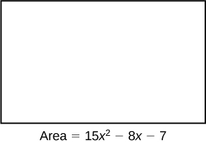

In this section students will:
* Simplify rational expressions.
* Multiply rational expressions.
* Divide rational expressions.
* Add and subtract rational expressions.
* Simplify complex rational expressions.

A pastry shop has fixed costs of<math xmlns="http://www.w3.org/1998/Math/MathML"> <mrow> <mtext> </mtext><mtext>$</mtext><mn>280</mn><mtext> </mtext> </mrow> </math>

per week and variable costs of<math xmlns="http://www.w3.org/1998/Math/MathML"> <mrow> <mtext> </mtext><mtext>$</mtext><mn>9</mn><mtext> </mtext> </mrow> </math>

per box of pastries. The shop’s costs per week in terms of<math xmlns="http://www.w3.org/1998/Math/MathML"> <mrow> <mtext> </mtext><mi>x</mi><mo>,</mo> </mrow> </math>

the number of boxes made, is<math xmlns="http://www.w3.org/1998/Math/MathML"> <mrow> <mtext> </mtext><mn>280</mn><mo>+</mo><mn>9</mn><mi>x</mi><mo>.</mo><mtext> </mtext> </mrow> </math>

We can divide the costs per week by the number of boxes made to determine the cost per box of pastries.

<math xmlns="http://www.w3.org/1998/Math/MathML"> <mrow> <mfrac> <mrow> <mn>280</mn><mo>+</mo><mn>9</mn><mi>x</mi> </mrow> <mi>x</mi> </mfrac> </mrow> </math>

Notice that the result is a polynomial expression divided by a second polynomial expression. In this section, we will explore quotients of polynomial expressions.

### Simplifying Rational Expressions

The quotient of two polynomial expressions is called a **rational expression**{: data-type="term"}. We can apply the properties of fractions to rational expressions, such as simplifying the expressions by canceling common factors from the numerator and the denominator. To do this, we first need to factor both the numerator and denominator. Let’s start with the rational expression shown.

<math xmlns="http://www.w3.org/1998/Math/MathML"> <mrow> <mfrac> <mrow> <msup> <mi>x</mi> <mn>2</mn> </msup> <mo>+</mo><mn>8</mn><mi>x</mi><mo>+</mo><mn>16</mn> </mrow> <mrow> <msup> <mi>x</mi> <mn>2</mn> </msup> <mo>+</mo><mn>11</mn><mi>x</mi><mo>+</mo><mn>28</mn> </mrow> </mfrac> </mrow> </math>

We can factor the numerator and denominator to rewrite the expression.

<math xmlns="http://www.w3.org/1998/Math/MathML"> <mrow> <mfrac> <mrow> <msup> <mrow> <mo stretchy="false">(</mo><mi>x</mi><mo>+</mo><mn>4</mn><mo stretchy="false">)</mo> </mrow> <mn>2</mn> </msup> </mrow> <mrow> <mo stretchy="false">(</mo><mi>x</mi><mo>+</mo><mn>4</mn><mo stretchy="false">)</mo><mo stretchy="false">(</mo><mi>x</mi><mo>+</mo><mn>7</mn><mo stretchy="false">)</mo> </mrow> </mfrac> </mrow> </math>

Then we can simplify that expression by canceling the common factor<math xmlns="http://www.w3.org/1998/Math/MathML"> <mrow> <mtext> </mtext><mrow><mo>(</mo> <mrow> <mi>x</mi><mo>+</mo><mn>4</mn> </mrow> <mo>)</mo></mrow><mo>.</mo> </mrow> </math>

<math xmlns="http://www.w3.org/1998/Math/MathML"> <mrow> <mfrac> <mrow> <mi>x</mi><mo>+</mo><mn>4</mn> </mrow> <mrow> <mi>x</mi><mo>+</mo><mn>7</mn> </mrow> </mfrac> </mrow> </math>

**Given a rational expression, simplify it.**

1.  Factor the numerator and denominator.
2.  Cancel any common factors.
{: type="1"}

Simplifying Rational Expressions

Simplify<math xmlns="http://www.w3.org/1998/Math/MathML"> <mrow> <mtext> </mtext><mfrac> <mrow> <msup> <mi>x</mi> <mn>2</mn> </msup> <mo>−</mo><mn>9</mn> </mrow> <mrow> <msup> <mi>x</mi> <mn>2</mn> </msup> <mo>+</mo><mn>4</mn><mi>x</mi><mo>+</mo><mn>3</mn> </mrow> </mfrac> <mo>.</mo> </mrow> </math>

<math xmlns="http://www.w3.org/1998/Math/MathML" display="block"> <mrow> <mtable columnalign="left"> <mtr columnalign="left"> <mtd columnalign="left"> <mrow> <mfrac> <mrow> <mo stretchy="false">(</mo><mi>x</mi><mo>+</mo><mn>3</mn><mo stretchy="false">)</mo><mo stretchy="false">(</mo><mi>x</mi><mo>−</mo><mn>3</mn><mo stretchy="false">)</mo> </mrow> <mrow> <mo stretchy="false">(</mo><mi>x</mi><mo>+</mo><mn>3</mn><mo stretchy="false">)</mo><mo stretchy="false">(</mo><mi>x</mi><mo>+</mo><mn>1</mn><mo stretchy="false">)</mo> </mrow> </mfrac> </mrow> </mtd> <mtd columnalign="left"> <mrow /> </mtd> <mtd columnalign="left"> <mrow /> </mtd> <mtd columnalign="left"> <mrow /> </mtd> <mtd columnalign="left"> <mrow> <mtext>Factor the numerator and the denominator</mtext><mo>.</mo> </mrow> </mtd> </mtr> <mtr columnalign="left"> <mtd columnalign="left"> <mrow> <mfrac> <mrow> <mi>x</mi><mo>−</mo><mn>3</mn> </mrow> <mrow> <mi>x</mi><mo>+</mo><mn>1</mn> </mrow> </mfrac> </mrow> </mtd> <mtd columnalign="left"> <mrow /> </mtd> <mtd columnalign="left"> <mrow /> </mtd> <mtd columnalign="left"> <mrow /> </mtd> <mtd columnalign="left"> <mrow> <mtext>Cancel common factor </mtext><mo stretchy="false">(</mo><mi>x</mi><mo>+</mo><mn>3</mn><mo stretchy="false">)</mo><mo>.</mo> </mrow> </mtd> </mtr> </mtable> </mrow> </math>

Analysis

We can cancel the common factor because any expression divided by itself is equal to 1.

**Can the<math xmlns="http://www.w3.org/1998/Math/MathML"> <mrow> <mtext> </mtext><msup> <mi>x</mi> <mn>2</mn> </msup> <mtext> </mtext> </mrow> </math>

term be cancelled in [\[link\]](#Example_01_06_01)?**

*No. A factor is an expression that is multiplied by another expression. The<math xmlns="http://www.w3.org/1998/Math/MathML"> <mrow> <mtext> </mtext><msup> <mi>x</mi> <mn>2</mn> </msup> <mtext> </mtext> </mrow> </math>

term is not a factor of the numerator or the denominator.*

Simplify<math xmlns="http://www.w3.org/1998/Math/MathML"> <mrow> <mtext> </mtext><mfrac> <mrow> <mi>x</mi><mo>−</mo><mn>6</mn> </mrow> <mrow> <msup> <mi>x</mi> <mn>2</mn> </msup> <mo>−</mo><mn>36</mn> </mrow> </mfrac> <mo>.</mo> </mrow> </math>

<math xmlns="http://www.w3.org/1998/Math/MathML"> <mrow> <mfrac> <mn>1</mn> <mrow> <mi>x</mi><mo>+</mo><mn>6</mn> </mrow> </mfrac> </mrow> </math>

### Multiplying Rational Expressions

Multiplication of rational expressions works the same way as multiplication of any other fractions. We multiply the numerators to find the numerator of the product, and then multiply the denominators to find the denominator of the product. Before multiplying, it is helpful to factor the numerators and denominators just as we did when simplifying rational expressions. We are often able to simplify the product of rational expressions.

**Given two rational expressions, multiply them.**

1.  Factor the numerator and denominator.
2.  Multiply the numerators.
3.  Multiply the denominators.
4.  Simplify.
{: type="1"}

Multiplying Rational Expressions

Multiply the rational expressions and show the product in simplest form:

<math xmlns="http://www.w3.org/1998/Math/MathML" display="block"> <mfrac> <mrow><msup><mi>x</mi><mn>2</mn></msup><mo>+</mo><mn>4</mn><mi>x</mi><mo>−</mo><mn>5</mn> </mrow> <mrow> <mn>3</mn><mi>x</mi><mo>+</mo><mn>18</mn> </mrow> </mfrac> <mo>⋅</mo> <mfrac> <mrow> <mn>2</mn><mi>x</mi><mo>−</mo><mn>1</mn> </mrow> <mrow> <mi>x</mi><mo>+</mo><mn>5</mn> </mrow> </mfrac> </math>

<math xmlns="http://www.w3.org/1998/Math/MathML" display="block"> <mrow> <mtable columnalign="left"> <mtr columnalign="left"> <mtd columnalign="left"> <mrow> <mfrac> <mrow> <mo stretchy="false">(</mo><mi>x</mi><mo>+</mo><mn>5</mn><mo stretchy="false">)</mo><mo stretchy="false">(</mo><mi>x</mi><mo>−</mo><mn>1</mn><mo stretchy="false">)</mo> </mrow> <mrow> <mn>3</mn><mo stretchy="false">(</mo><mi>x</mi><mo>+</mo><mn>6</mn><mo stretchy="false">)</mo> </mrow> </mfrac> <mo>⋅</mo><mfrac> <mrow> <mo stretchy="false">(</mo><mn>2</mn><mi>x</mi><mo>−</mo><mn>1</mn><mo stretchy="false">)</mo> </mrow> <mrow> <mo stretchy="false">(</mo><mi>x</mi><mo>+</mo><mn>5</mn><mo stretchy="false">)</mo> </mrow> </mfrac> </mrow> </mtd> <mtd columnalign="left"> <mrow /> </mtd> <mtd columnalign="left"> <mrow /> </mtd> <mtd columnalign="left"> <mrow /> </mtd> <mtd columnalign="left"> <mrow> <mtext>Factor the numerator and denominator</mtext><mo>.</mo> </mrow> </mtd> </mtr> <mtr columnalign="left"> <mtd columnalign="left"> <mrow> <mfrac> <mrow> <mo stretchy="false">(</mo><mi>x</mi><mo>+</mo><mn>5</mn><mo stretchy="false">)</mo><mo stretchy="false">(</mo><mi>x</mi><mo>−</mo><mn>1</mn><mo stretchy="false">)</mo><mo stretchy="false">(</mo><mn>2</mn><mi>x</mi><mo>−</mo><mn>1</mn><mo stretchy="false">)</mo> </mrow> <mrow> <mn>3</mn><mo stretchy="false">(</mo><mi>x</mi><mo>+</mo><mn>6</mn><mo stretchy="false">)</mo><mo stretchy="false">(</mo><mi>x</mi><mo>+</mo><mn>5</mn><mo stretchy="false">)</mo> </mrow> </mfrac> </mrow> </mtd> <mtd columnalign="left"> <mrow /> </mtd> <mtd columnalign="left"> <mrow /> </mtd> <mtd columnalign="left"> <mrow /> </mtd> <mtd columnalign="left"> <mrow> <mtext>Multiply numerators and denominators</mtext><mo>.</mo> </mrow> </mtd> </mtr> <mtr columnalign="left"> <mtd columnalign="left"> <mrow> <mfrac> <mrow> <menclose notation="updiagonalstrike"> <mrow> <mo stretchy="false">(</mo><mi>x</mi><mo>+</mo><mn>5</mn><mo stretchy="false">)</mo> </mrow> </menclose> <mo stretchy="false">(</mo><mi>x</mi><mo>−</mo><mn>1</mn><mo stretchy="false">)</mo><mo stretchy="false">(</mo><mn>2</mn><mi>x</mi><mo>−</mo><mn>1</mn><mo stretchy="false">)</mo> </mrow> <mrow> <mn>3</mn><mo stretchy="false">(</mo><mi>x</mi><mo>+</mo><mn>6</mn><mo stretchy="false">)</mo><menclose notation="updiagonalstrike"> <mrow> <mo stretchy="false">(</mo><mi>x</mi><mo>+</mo><mn>5</mn><mo stretchy="false">)</mo> </mrow> </menclose> </mrow> </mfrac> </mrow> </mtd> <mtd columnalign="left"> <mrow /> </mtd> <mtd columnalign="left"> <mrow /> </mtd> <mtd columnalign="left"> <mrow /> </mtd> <mtd columnalign="left"> <mrow> <mtext>Cancel common factors to simplify</mtext><mo>.</mo> </mrow> </mtd> </mtr> <mtr columnalign="left"> <mtd columnalign="left"> <mrow> <mfrac> <mrow> <mo stretchy="false">(</mo><mi>x</mi><mo>−</mo><mn>1</mn><mo stretchy="false">)</mo><mo stretchy="false">(</mo><mn>2</mn><mi>x</mi><mo>−</mo><mn>1</mn><mo stretchy="false">)</mo> </mrow> <mrow> <mn>3</mn><mo stretchy="false">(</mo><mi>x</mi><mo>+</mo><mn>6</mn><mo stretchy="false">)</mo> </mrow> </mfrac> <mo> </mo> </mrow> </mtd> <mtd columnalign="left"> <mrow /> </mtd> <mtd columnalign="left"> <mrow /> </mtd> <mtd columnalign="left"> <mrow /> </mtd> <mtd columnalign="left"> <mrow /> </mtd> </mtr> </mtable> </mrow> </math>

Multiply the rational expressions and show the product in simplest form:

<math xmlns="http://www.w3.org/1998/Math/MathML"> <mrow> <mfrac> <mrow> <msup> <mi>x</mi> <mn>2</mn> </msup> <mo>+</mo><mn>11</mn><mi>x</mi><mo>+</mo><mn>30</mn> </mrow> <mrow> <msup> <mi>x</mi> <mn>2</mn> </msup> <mo>+</mo><mn>5</mn><mi>x</mi><mo>+</mo><mn>6</mn> </mrow> </mfrac> <mo>⋅</mo><mfrac> <mrow> <msup> <mi>x</mi> <mn>2</mn> </msup> <mo>+</mo><mn>7</mn><mi>x</mi><mo>+</mo><mn>12</mn> </mrow> <mrow> <msup> <mi>x</mi> <mn>2</mn> </msup> <mo>+</mo><mn>8</mn><mi>x</mi><mo>+</mo><mn>16</mn> </mrow> </mfrac> </mrow> </math>

<math xmlns="http://www.w3.org/1998/Math/MathML"> <mrow> <mfrac> <mrow> <mo stretchy="false">(</mo><mi>x</mi><mo>+</mo><mn>5</mn><mo stretchy="false">)</mo><mo stretchy="false">(</mo><mi>x</mi><mo>+</mo><mn>6</mn><mo stretchy="false">)</mo> </mrow> <mrow> <mo stretchy="false">(</mo><mi>x</mi><mo>+</mo><mn>2</mn><mo stretchy="false">)</mo><mo stretchy="false">(</mo><mi>x</mi><mo>+</mo><mn>4</mn><mo stretchy="false">)</mo> </mrow> </mfrac> </mrow> </math>

### Dividing Rational Expressions

Division of rational expressions works the same way as division of other fractions. To divide a rational expression by another rational expression, multiply the first expression by the reciprocal of the second. Using this approach, we would rewrite<math xmlns="http://www.w3.org/1998/Math/MathML"> <mrow> <mtext> </mtext><mfrac> <mn>1</mn> <mi>x</mi> </mfrac> <mo>÷</mo><mfrac> <mrow> <msup> <mi>x</mi> <mn>2</mn> </msup> </mrow> <mn>3</mn> </mfrac> <mtext> </mtext> </mrow> </math>

as the product<math xmlns="http://www.w3.org/1998/Math/MathML"> <mrow> <mtext> </mtext><mfrac> <mn>1</mn> <mi>x</mi> </mfrac> <mo>⋅</mo><mfrac> <mn>3</mn> <mrow> <msup> <mi>x</mi> <mn>2</mn> </msup> </mrow> </mfrac> <mo>.</mo><mtext> </mtext> </mrow> </math>

Once the division expression has been rewritten as a multiplication expression, we can multiply as we did before.

<math xmlns="http://www.w3.org/1998/Math/MathML"> <mrow> <mfrac> <mn>1</mn> <mi>x</mi> </mfrac> <mo>⋅</mo><mfrac> <mn>3</mn> <mrow> <msup> <mi>x</mi> <mn>2</mn> </msup> </mrow> </mfrac> <mo>=</mo><mfrac> <mn>3</mn> <mrow> <msup> <mi>x</mi> <mn>3</mn> </msup> </mrow> </mfrac> </mrow> </math>

**Given two rational expressions, divide them.**

1.  Rewrite as the first rational expression multiplied by the reciprocal of the second.
2.  Factor the numerators and denominators.
3.  Multiply the numerators.
4.  Multiply the denominators.
5.  Simplify.
{: type="1"}

Dividing Rational Expressions

Divide the rational expressions and express the quotient in simplest form:

<math xmlns="http://www.w3.org/1998/Math/MathML"> <mrow> <mfrac> <mrow> <mn>2</mn><msup> <mi>x</mi> <mn>2</mn> </msup> <mo>+</mo><mi>x</mi><mo>−</mo><mn>6</mn></mrow> <mrow> <msup> <mi>x</mi> <mn>2</mn> </msup> <mo>−</mo><mn>1</mn></mrow> </mfrac> <mo>÷</mo><mfrac> <mrow> <msup> <mi>x</mi> <mn>2</mn> </msup> <mo>−</mo><mn>4</mn></mrow> <mrow> <msup> <mi>x</mi> <mn>2</mn> </msup> <mo>+</mo><mn>2</mn><mi>x</mi><mo>+</mo><mn>1</mn></mrow> </mfrac> </mrow> </math>

<math xmlns="http://www.w3.org/1998/Math/MathML" display="block"><mrow><mtable> <mtr> <mtd columnalign="left"> <mfrac><mrow><mn>2</mn><msup><mi>x</mi><mn>2</mn></msup><mo>+</mo><mi>x</mi><mo>−</mo><mn>6</mn></mrow><mrow><msup><mi>x</mi><mn>2</mn></msup><mo>−</mo><mn>1</mn></mrow></mfrac> <mo>⋅</mo> <mfrac><mrow><msup><mi>x</mi><mn>2</mn></msup><mo>+</mo><mn>2</mn><mi>x</mi><mo>+</mo><mn>1</mn></mrow><mrow><msup><mi>x</mi><mn>2</mn></msup><mo>−</mo><mn>4</mn></mrow></mfrac> </mtd> <mtd columnalign="left"> <mspace width="2em" /><mtext>Rewrite as multiplication.</mtext> </mtd> </mtr> <mtr> <mtd columnalign="left"> <mfrac><mrow> <mo>(</mo><mn>2</mn><mi>x</mi><mo>−</mo><mn>3</mn><mo>)</mo><mo>(</mo><mi>x</mi><mo>+</mo><mn>2</mn><mo>)</mo> </mrow> <mrow> <mo>(</mo><mi>x</mi><mo>+</mo><mn>1</mn><mo>)</mo><mo>(</mo><mi>x</mi><mo>−</mo><mn>1</mn><mo>)</mo> </mrow> </mfrac><mo>⋅</mo> <mfrac><mrow><msup><mrow><mo>(</mo><mi>x</mi><mo>+</mo><mn>1</mn><mo>)</mo></mrow><mn>2</mn></msup> </mrow> <mrow> <mo>(</mo><mi>x</mi><mo>+</mo><mn>2</mn><mo>)</mo><mo>(</mo><mi>x</mi><mo>−</mo><mn>2</mn><mo>)</mo> </mrow> </mfrac> </mtd> <mtd columnalign="left"> <mspace width="2em" /><mtext>Factor.</mtext> </mtd> </mtr> <mtr> <mtd columnalign="left"> <mfrac><mrow> <mo stretchy="false">(</mo><mn>2</mn><mi>x</mi><mo>−</mo><mn>3</mn><mo stretchy="false">)</mo> <mo stretchy="false">(</mo><mi>x</mi><mo>+</mo><mn>2</mn><mo stretchy="false">)</mo><msup><mrow><mo>(</mo><mi>x</mi><mo>+</mo><mn>1</mn><mo>)</mo></mrow><mn>2</mn></msup> </mrow><mrow> <mo>(</mo><mi>x</mi><mo>+</mo><mn>1</mn><mo>)</mo> <mo>(</mo><mi>x</mi><mo>−</mo><mn>1</mn><mo>)</mo> <mo>(</mo><mi>x</mi><mo>+</mo><mn>2</mn><mo>)</mo> <mo>(</mo><mi>x</mi><mo>−</mo><mn>2</mn><mo>)</mo> </mrow></mfrac> </mtd> <mtd columnalign="left"> <mspace width="2em" /><mtext>Multiply.</mtext> </mtd> </mtr> <mtr> <mtd columnalign="left"> <mfrac><mrow> <mo>(</mo><mn>2</mn><mi>x</mi><mo>−</mo><mn>3</mn><mo>)</mo><mo>(</mo><mi>x</mi><mo>+</mo><mn>1</mn><mo>)</mo> </mrow><mrow> <mo>(</mo><mi>x</mi><mo>−</mo><mn>1</mn><mo>)</mo><mo>(</mo><mi>x</mi><mo>−</mo><mn>2</mn><mo>)</mo> </mrow></mfrac> </mtd> <mtd columnalign="left"> <mspace width="2em" /><mtext>Cancel common factors to simplify.</mtext> </mtd> </mtr> </mtable></mrow> </math>

Divide the rational expressions and express the quotient in simplest form:

<math xmlns="http://www.w3.org/1998/Math/MathML"> <mrow> <mfrac> <mrow> <mn>9</mn><msup> <mi>x</mi> <mn>2</mn> </msup> <mo>−</mo><mn>16</mn> </mrow> <mrow> <mn>3</mn><msup> <mi>x</mi> <mn>2</mn> </msup> <mo>+</mo><mn>17</mn><mi>x</mi><mo>−</mo><mn>28</mn> </mrow> </mfrac> <mo>÷</mo><mfrac> <mrow> <mn>3</mn><msup> <mi>x</mi> <mn>2</mn> </msup> <mo>−</mo><mn>2</mn><mi>x</mi><mo>−</mo><mn>8</mn> </mrow> <mrow> <msup> <mi>x</mi> <mn>2</mn> </msup> <mo>+</mo><mn>5</mn><mi>x</mi><mo>−</mo><mn>14</mn> </mrow> </mfrac> </mrow> </math>

<math xmlns="http://www.w3.org/1998/Math/MathML"> <mn>1</mn> </math>

### Adding and Subtracting Rational Expressions

Adding and subtracting rational expressions works just like adding and subtracting numerical fractions. To add fractions, we need to find a common denominator. Let’s look at an example of fraction addition.

<math xmlns="http://www.w3.org/1998/Math/MathML" display="block"> <mrow> <mtable> <mtr rowalign="center"> <mtd columnalign="right" rowalign="center"> <mrow> <mfrac> <mn>5</mn> <mrow> <mn>24</mn></mrow> </mfrac> <mo>+</mo><mfrac> <mn>1</mn> <mrow> <mn>40</mn></mrow> </mfrac> </mrow> </mtd> <mtd rowalign="center"> <mo>=</mo> </mtd> <mtd rowalign="center" columnalign="left"> <mrow> <mfrac> <mrow> <mn>25</mn></mrow> <mrow> <mn>120</mn></mrow> </mfrac> <mo>+</mo><mfrac> <mn>3</mn> <mrow> <mn>120</mn></mrow> </mfrac> </mrow> </mtd> </mtr> <mtr rowalign="center"> <mtd rowalign="center" /> <mtd rowalign="center"><mo>=</mo></mtd> <mtd rowalign="center" columnalign="left"> <mrow> <mfrac> <mrow> <mn>28</mn></mrow> <mrow> <mn>120</mn></mrow> </mfrac> </mrow> </mtd> </mtr> <mtr rowalign="center"> <mtd rowalign="center" /> <mtd rowalign="center"><mo>=</mo></mtd> <mtd rowalign="center" columnalign="left"> <mrow> <mfrac> <mn>7</mn> <mrow> <mn>30</mn></mrow> </mfrac> </mrow> </mtd> </mtr> </mtable></mrow> </math>

We have to rewrite the fractions so they share a common denominator before we are able to add. We must do the same thing when adding or subtracting rational expressions.

The easiest common denominator to use will be the **least common denominator**{: data-type="term"}, or LCD. The LCD is the smallest multiple that the denominators have in common. To find the LCD of two rational expressions, we factor the expressions and multiply all of the distinct factors. For instance, if the factored denominators were<math xmlns="http://www.w3.org/1998/Math/MathML"> <mrow> <mtext> </mtext><mo stretchy="false">(</mo><mi>x</mi><mo>+</mo><mn>3</mn><mo stretchy="false">)</mo><mo stretchy="false">(</mo><mi>x</mi><mo>+</mo><mn>4</mn><mo stretchy="false">)</mo><mtext> </mtext> </mrow> </math>

and<math xmlns="http://www.w3.org/1998/Math/MathML"> <mrow> <mtext> </mtext><mo stretchy="false">(</mo><mi>x</mi><mo>+</mo><mn>4</mn><mo stretchy="false">)</mo><mo stretchy="false">(</mo><mi>x</mi><mo>+</mo><mn>5</mn><mo stretchy="false">)</mo><mo>,</mo> </mrow> </math>

then the LCD would be<math xmlns="http://www.w3.org/1998/Math/MathML"> <mrow> <mtext> </mtext><mo stretchy="false">(</mo><mi>x</mi><mo>+</mo><mn>3</mn><mo stretchy="false">)</mo><mo stretchy="false">(</mo><mi>x</mi><mo>+</mo><mn>4</mn><mo stretchy="false">)</mo><mo stretchy="false">(</mo><mi>x</mi><mo>+</mo><mn>5</mn><mo stretchy="false">)</mo><mo>.</mo> </mrow> </math>

Once we find the LCD, we need to multiply each expression by the form of 1 that will change the denominator to the LCD. We would need to multiply the expression with a denominator of<math xmlns="http://www.w3.org/1998/Math/MathML"> <mrow> <mtext> </mtext><mo stretchy="false">(</mo><mi>x</mi><mo>+</mo><mn>3</mn><mo stretchy="false">)</mo><mo stretchy="false">(</mo><mi>x</mi><mo>+</mo><mn>4</mn><mo stretchy="false">)</mo><mtext> </mtext> </mrow> </math>

by<math xmlns="http://www.w3.org/1998/Math/MathML"> <mrow> <mtext> </mtext><mfrac> <mrow> <mi>x</mi><mo>+</mo><mn>5</mn> </mrow> <mrow> <mi>x</mi><mo>+</mo><mn>5</mn> </mrow> </mfrac> <mtext> </mtext> </mrow> </math>

and the expression with a denominator of<math xmlns="http://www.w3.org/1998/Math/MathML"> <mrow> <mtext> </mtext><mo stretchy="false">(</mo><mi>x</mi><mo>+</mo><mn>4</mn><mo stretchy="false">)</mo><mo stretchy="false">(</mo><mi>x</mi><mo>+</mo><mn>5</mn><mo stretchy="false">)</mo><mtext> </mtext> </mrow> </math>

by<math xmlns="http://www.w3.org/1998/Math/MathML"> <mrow> <mtext> </mtext><mfrac> <mrow> <mi>x</mi><mo>+</mo><mn>3</mn> </mrow> <mrow> <mi>x</mi><mo>+</mo><mn>3</mn> </mrow> </mfrac> <mo>.</mo> </mrow> </math>

**Given two rational expressions, add or subtract them.**

1.  Factor the numerator and denominator.
2.  Find the LCD of the expressions.
3.  Multiply the expressions by a form of 1 that changes the denominators to the LCD.
4.  Add or subtract the numerators.
5.  Simplify.
{: type="1"}

Adding Rational Expressions

Add the rational expressions:

<math xmlns="http://www.w3.org/1998/Math/MathML"> <mrow> <mfrac> <mn>5</mn> <mi>x</mi> </mfrac> <mo>+</mo><mfrac> <mn>6</mn> <mi>y</mi> </mfrac> </mrow> </math>

First, we have to find the LCD. In this case, the LCD will be<math xmlns="http://www.w3.org/1998/Math/MathML"> <mrow> <mtext> </mtext><mi>x</mi><mi>y</mi><mo>.</mo><mtext> </mtext> </mrow> </math>

We then multiply each expression by the appropriate form of 1 to obtain<math xmlns="http://www.w3.org/1998/Math/MathML"> <mrow> <mtext> </mtext><mi>x</mi><mi>y</mi><mtext> </mtext> </mrow> </math>

as the denominator for each fraction.

<math xmlns="http://www.w3.org/1998/Math/MathML"> <mtable columnalign="left"> <mtr> <mtd> <mfrac> <mn>5</mn> <mi>x</mi> </mfrac> <mo>⋅</mo><mfrac> <mi>y</mi> <mi>y</mi> </mfrac> <mo>+</mo><mfrac> <mn>6</mn> <mi>y</mi> </mfrac> <mo>⋅</mo><mfrac> <mi>x</mi> <mi>x</mi> </mfrac> </mtd> </mtr> <mtr> <mtd> <mfrac> <mrow> <mn>5</mn><mi>y</mi> </mrow> <mrow> <mi>x</mi><mi>y</mi> </mrow> </mfrac> <mo>+</mo><mfrac> <mrow> <mn>6</mn><mi>x</mi> </mrow> <mrow> <mi>x</mi><mi>y</mi> </mrow> </mfrac> </mtd> </mtr> </mtable> </math>

Now that the expressions have the same denominator, we simply add the numerators to find the sum.

<math xmlns="http://www.w3.org/1998/Math/MathML"> <mrow> <mfrac> <mrow> <mn>6</mn><mi>x</mi><mo>+</mo><mn>5</mn><mi>y</mi> </mrow> <mrow> <mi>x</mi><mi>y</mi> </mrow> </mfrac> </mrow> </math>

Analysis

Multiplying by<math xmlns="http://www.w3.org/1998/Math/MathML"> <mrow> <mtext> </mtext><mfrac> <mi>y</mi> <mi>y</mi> </mfrac> <mtext> </mtext> </mrow> </math>

or<math xmlns="http://www.w3.org/1998/Math/MathML"> <mrow> <mtext> </mtext><mfrac> <mi>x</mi> <mi>x</mi> </mfrac> <mtext> </mtext> </mrow> </math>

does not change the value of the original expression because any number divided by itself is 1, and multiplying an expression by 1 gives the original expression.

Subtracting Rational Expressions

Subtract the rational expressions:

<math xmlns="http://www.w3.org/1998/Math/MathML"> <mrow> <mfrac> <mn>6</mn> <mrow> <msup> <mi>x</mi> <mn>2</mn> </msup> <mo>+</mo><mn>4</mn><mi>x</mi><mo>+</mo><mn>4</mn> </mrow> </mfrac> <mo>−</mo><mfrac> <mn>2</mn> <mrow> <msup> <mi>x</mi> <mn>2</mn> </msup> <mn>−4</mn> </mrow> </mfrac> </mrow> </math>

<math xmlns="http://www.w3.org/1998/Math/MathML" display="block"> <mrow> <mtable> <mtr> <mtd columnalign="left"> <mrow> <mfrac> <mn>6</mn> <mrow> <msup> <mrow> <mo stretchy="false">(</mo><mi>x</mi><mo>+</mo><mn>2</mn><mo stretchy="false">)</mo></mrow> <mn>2</mn> </msup> </mrow> </mfrac> <mo>−</mo><mfrac> <mn>2</mn> <mrow> <mo stretchy="false">(</mo><mi>x</mi><mo>+</mo><mn>2</mn><mo stretchy="false">)</mo><mo stretchy="false">(</mo><mi>x</mi><mo>−</mo><mn>2</mn><mo stretchy="false">)</mo></mrow> </mfrac> </mrow> </mtd> <mtd columnalign="left"> <mrow> <mspace width="2em" /><mtext>Factor</mtext><mo>.</mo></mrow> </mtd> </mtr> <mtr> <mtd columnalign="left"> <mrow> <mfrac> <mn>6</mn> <mrow> <msup> <mrow> <mo stretchy="false">(</mo><mi>x</mi><mo>+</mo><mn>2</mn><mo stretchy="false">)</mo></mrow> <mn>2</mn> </msup> </mrow> </mfrac> <mo>⋅</mo><mfrac> <mrow> <mi>x</mi><mo>−</mo><mn>2</mn></mrow> <mrow> <mi>x</mi><mo>−</mo><mn>2</mn></mrow> </mfrac> <mo>−</mo><mfrac> <mn>2</mn> <mrow> <mo stretchy="false">(</mo><mi>x</mi><mo>+</mo><mn>2</mn><mo stretchy="false">)</mo><mo stretchy="false">(</mo><mi>x</mi><mo>−</mo><mn>2</mn><mo stretchy="false">)</mo></mrow> </mfrac> <mo>⋅</mo><mfrac> <mrow> <mi>x</mi><mo>+</mo><mn>2</mn></mrow> <mrow> <mi>x</mi><mo>+</mo><mn>2</mn></mrow> </mfrac> </mrow> </mtd> <mtd columnalign="left"> <mrow> <mspace width="2em" /><mtext>Multiply each fraction to get LCD as denominator</mtext><mo>.</mo></mrow> </mtd> </mtr> <mtr> <mtd columnalign="left"> <mrow> <mfrac> <mrow> <mn>6</mn><mo stretchy="false">(</mo><mi>x</mi><mo>−</mo><mn>2</mn><mo stretchy="false">)</mo></mrow> <mrow> <msup> <mrow> <mo stretchy="false">(</mo><mi>x</mi><mo>+</mo><mn>2</mn><mo stretchy="false">)</mo></mrow> <mn>2</mn> </msup> <mo stretchy="false">(</mo><mi>x</mi><mo>−</mo><mn>2</mn><mo stretchy="false">)</mo></mrow> </mfrac> <mo>−</mo><mfrac> <mrow> <mn>2</mn><mo stretchy="false">(</mo><mi>x</mi><mo>+</mo><mn>2</mn><mo stretchy="false">)</mo></mrow> <mrow> <msup> <mrow> <mo stretchy="false">(</mo><mi>x</mi><mo>+</mo><mn>2</mn><mo stretchy="false">)</mo></mrow> <mn>2</mn> </msup> <mo stretchy="false">(</mo><mi>x</mi><mo>−</mo><mn>2</mn><mo stretchy="false">)</mo></mrow> </mfrac> </mrow> </mtd> <mtd columnalign="left"> <mrow> <mspace width="2em" /><mtext>Multiply</mtext><mo>.</mo></mrow> </mtd> </mtr> <mtr> <mtd columnalign="left"> <mrow> <mfrac> <mrow> <mn>6</mn><mi>x</mi><mo>−</mo><mn>12</mn><mo>−</mo><mo stretchy="false">(</mo><mn>2</mn><mi>x</mi><mo>+</mo><mn>4</mn><mo stretchy="false">)</mo></mrow> <mrow> <msup> <mrow> <mo stretchy="false">(</mo><mi>x</mi><mo>+</mo><mn>2</mn><mo stretchy="false">)</mo></mrow> <mn>2</mn> </msup> <mo stretchy="false">(</mo><mi>x</mi><mo>−</mo><mn>2</mn><mo stretchy="false">)</mo></mrow> </mfrac> </mrow> </mtd> <mtd columnalign="left"> <mrow> <mspace width="2em" /><mtext>Apply distributive property</mtext><mo>.</mo></mrow> </mtd> </mtr> <mtr> <mtd columnalign="left"> <mrow> <mfrac> <mrow> <mn>4</mn><mi>x</mi><mo>−</mo><mn>16</mn></mrow> <mrow> <msup> <mrow> <mo stretchy="false">(</mo><mi>x</mi><mo>+</mo><mn>2</mn><mo stretchy="false">)</mo></mrow> <mn>2</mn> </msup> <mo stretchy="false">(</mo><mi>x</mi><mo>−</mo><mn>2</mn><mo stretchy="false">)</mo></mrow> </mfrac> </mrow> </mtd> <mtd columnalign="left"> <mrow> <mspace width="2em" /><mtext>Subtract</mtext><mo>.</mo></mrow> </mtd> </mtr> <mtr> <mtd columnalign="left"> <mrow> <mfrac> <mrow> <mn>4</mn><mo stretchy="false">(</mo><mi>x</mi><mo>−</mo><mn>4</mn><mo stretchy="false">)</mo></mrow> <mrow> <msup> <mrow> <mo stretchy="false">(</mo><mi>x</mi><mo>+</mo><mn>2</mn><mo stretchy="false">)</mo></mrow> <mn>2</mn> </msup> <mo stretchy="false">(</mo><mi>x</mi><mo>−</mo><mn>2</mn><mo stretchy="false">)</mo></mrow> </mfrac> </mrow> </mtd> <mtd columnalign="left"> <mrow> <mspace width="2em" /><mtext>Simplify</mtext><mo>.</mo></mrow> </mtd> </mtr> </mtable></mrow> </math>

**Do we have to use the LCD to add or subtract rational expressions?**

*No. Any common denominator will work, but it is easiest to use the LCD.*

Subtract the rational expressions:<math xmlns="http://www.w3.org/1998/Math/MathML"> <mrow> <mtext> </mtext><mfrac> <mn>3</mn> <mrow> <mi>x</mi><mo>+</mo><mn>5</mn> </mrow> </mfrac> <mo>−</mo><mfrac> <mn>1</mn> <mrow> <mi>x</mi><mn>−3</mn> </mrow> </mfrac> <mo>.</mo> </mrow> </math>

<math xmlns="http://www.w3.org/1998/Math/MathML"> <mrow> <mfrac> <mrow> <mn>2</mn><mo stretchy="false">(</mo><mi>x</mi><mn>−7</mn><mo stretchy="false">)</mo> </mrow> <mrow> <mo stretchy="false">(</mo><mi>x</mi><mo>+</mo><mn>5</mn><mo stretchy="false">)</mo><mo stretchy="false">(</mo><mi>x</mi><mn>−3</mn><mo stretchy="false">)</mo> </mrow> </mfrac> </mrow> </math>

### Simplifying Complex Rational Expressions

A complex rational expression is a rational expression that contains additional rational expressions in the numerator, the denominator, or both. We can simplify complex rational expressions by rewriting the numerator and denominator as single rational expressions and dividing. The complex rational expression<math xmlns="http://www.w3.org/1998/Math/MathML"> <mrow> <mtext> </mtext><mfrac> <mi>a</mi> <mrow> <mfrac> <mn>1</mn> <mi>b</mi> </mfrac> <mo>+</mo><mi>c</mi> </mrow> </mfrac> <mtext> </mtext> </mrow> </math>

can be simplified by rewriting the numerator as the fraction<math xmlns="http://www.w3.org/1998/Math/MathML"> <mrow> <mtext> </mtext><mfrac> <mi>a</mi> <mn>1</mn> </mfrac> <mtext> </mtext> </mrow> </math>

and combining the expressions in the denominator as<math xmlns="http://www.w3.org/1998/Math/MathML"> <mrow> <mtext> </mtext><mfrac> <mrow> <mn>1</mn><mo>+</mo><mi>b</mi><mi>c</mi> </mrow> <mi>b</mi> </mfrac> <mo>.</mo><mtext> </mtext> </mrow> </math>

We can then rewrite the expression as a multiplication problem using the reciprocal of the denominator. We get<math xmlns="http://www.w3.org/1998/Math/MathML"> <mrow> <mtext> </mtext><mfrac> <mi>a</mi> <mn>1</mn> </mfrac> <mo>⋅</mo><mfrac> <mi>b</mi> <mrow> <mn>1</mn><mo>+</mo><mi>b</mi><mi>c</mi> </mrow> </mfrac> <mo>,</mo> </mrow> </math>

which is equal to<math xmlns="http://www.w3.org/1998/Math/MathML"> <mrow> <mtext> </mtext><mfrac> <mrow> <mi>a</mi><mi>b</mi> </mrow> <mrow> <mn>1</mn><mo>+</mo><mi>b</mi><mi>c</mi> </mrow> </mfrac> <mo>.</mo> </mrow> </math>

**Given a complex rational expression, simplify it.**

1.  Combine the expressions in the numerator into a single rational expression by adding or subtracting.
2.  Combine the expressions in the denominator into a single rational expression by adding or subtracting.
3.  Rewrite as the numerator divided by the denominator.
4.  Rewrite as multiplication.
5.  Multiply.
6.  Simplify.
{: type="1"}

Simplifying Complex Rational Expressions

Simplify:<math xmlns="http://www.w3.org/1998/Math/MathML"> <mrow> <mfrac> <mrow> <mi>y</mi><mo>+</mo><mfrac> <mn>1</mn> <mi>x</mi> </mfrac> </mrow> <mrow> <mfrac> <mi>x</mi> <mi>y</mi> </mfrac> </mrow> </mfrac> </mrow> </math>

.

Begin by combining the expressions in the numerator into one expression.

<math xmlns="http://www.w3.org/1998/Math/MathML" display="block"> <mrow> <mtable> <mtr rowalign="center"> <mtd columnalign="left" rowalign="center"> <mrow> <mi>y</mi><mo>⋅</mo><mfrac> <mi>x</mi> <mi>x</mi> </mfrac> <mo>+</mo><mfrac> <mn>1</mn> <mi>x</mi> </mfrac> </mrow> </mtd> <mtd columnalign="left" rowalign="center"> <mrow><mspace width="2em" /> <mtext>  </mtext><mtext>Multiply by </mtext><mfrac> <mi>x</mi> <mi>x</mi> </mfrac> <mtext> to get LCD as denominator</mtext><mo>.</mo> </mrow> </mtd> </mtr> <mtr rowalign="center"> <mtd columnalign="left" rowalign="center"> <mrow> <mfrac> <mrow> <mi>x</mi><mi>y</mi> </mrow> <mi>x</mi> </mfrac> <mo>+</mo><mfrac> <mn>1</mn> <mi>x</mi> </mfrac> </mrow> </mtd> <mtd rowalign="center" /> </mtr> <mtr rowalign="center"> <mtd columnalign="left" rowalign="center"> <mrow> <mfrac> <mrow> <mi>x</mi><mi>y</mi><mo>+</mo><mn>1</mn> </mrow> <mi>x</mi> </mfrac> </mrow> </mtd> <mtd columnalign="left" rowalign="center"> <mrow><mspace width="2em" /> <mtext>  </mtext><mtext>Add numerators</mtext><mo>.</mo> </mrow> </mtd> </mtr> </mtable> </mrow> </math>

Now the numerator is a single rational expression and the denominator is a single rational expression.

<math xmlns="http://www.w3.org/1998/Math/MathML"> <mrow> <mfrac> <mrow> <mfrac> <mrow> <mi>x</mi><mi>y</mi><mo>+</mo><mn>1</mn> </mrow> <mi>x</mi> </mfrac> </mrow> <mrow> <mfrac> <mi>x</mi> <mi>y</mi> </mfrac> </mrow> </mfrac> </mrow> </math>

We can rewrite this as division, and then multiplication.

<math xmlns="http://www.w3.org/1998/Math/MathML" display="block"> <mrow> <mtable> <mtr rowalign="center"> <mtd rowalign="center" columnalign="left"> <mrow> <mfrac> <mrow> <mi>x</mi><mi>y</mi><mo>+</mo><mn>1</mn></mrow> <mi>x</mi> </mfrac> <mo>÷</mo><mfrac> <mi>x</mi> <mi>y</mi> </mfrac> </mrow> </mtd> <mtd rowalign="center" /> </mtr> <mtr rowalign="center"> <mtd rowalign="center" columnalign="left"> <mrow> <mfrac> <mrow> <mi>x</mi><mi>y</mi><mo>+</mo><mn>1</mn></mrow> <mi>x</mi> </mfrac> <mo>⋅</mo><mfrac> <mi>y</mi> <mi>x</mi> </mfrac> </mrow> </mtd> <mtd rowalign="center" columnalign="left"> <mrow> <mspace width="2em" /><mtext>Rewrite as multiplication</mtext><mtext>.</mtext></mrow> </mtd> </mtr> <mtr rowalign="center"> <mtd rowalign="center" columnalign="left"> <mrow> <mfrac> <mrow> <mi>y</mi><mo stretchy="false">(</mo><mi>x</mi><mi>y</mi><mo>+</mo><mn>1</mn><mo stretchy="false">)</mo></mrow> <mrow> <msup> <mi>x</mi> <mn>2</mn> </msup> </mrow> </mfrac> </mrow> </mtd> <mtd rowalign="center" columnalign="left"> <mrow> <mspace width="2em" /><mtext>Multiply</mtext><mtext>.</mtext></mrow> </mtd> </mtr> </mtable></mrow> </math>

Simplify:<math xmlns="http://www.w3.org/1998/Math/MathML"> <mrow> <mfrac> <mrow> <mfrac> <mi>x</mi> <mi>y</mi> </mfrac> <mo>−</mo><mfrac> <mi>y</mi> <mi>x</mi> </mfrac> </mrow> <mi>y</mi> </mfrac> </mrow> </math>

<math xmlns="http://www.w3.org/1998/Math/MathML"> <mrow> <mfrac> <mrow> <msup> <mi>x</mi> <mn>2</mn> </msup> <mo>−</mo><msup> <mi>y</mi> <mn>2</mn> </msup> </mrow> <mrow> <mi>x</mi><msup> <mi>y</mi> <mn>2</mn> </msup> </mrow> </mfrac> </mrow> </math>

**Can a complex rational expression always be simplified?**

*Yes. We can always rewrite a complex rational expression as a simplified rational expression.*

Access these online resources for additional instruction and practice with rational expressions.

* [Simplify Rational Expressions][1]
* [Multiply and Divide Rational Expressions][2]
* [Add and Subtract Rational Expressions][3]
* [Simplify a Complex Fraction][4]

### Key Concepts

* Rational expressions can be simplified by cancelling common factors in the numerator and denominator. See [\[link\]](#Example_01_06_01).
* We can multiply rational expressions by multiplying the numerators and multiplying the denominators. See [\[link\]](#Example_01_06_02).
* To divide rational expressions, multiply by the reciprocal of the second expression. See [\[link\]](#Example_01_06_03).
* Adding or subtracting rational expressions requires finding a common denominator. See [\[link\]](#Example_01_06_04) and [\[link\]](#Example_01_06_05).
* Complex rational expressions have fractions in the numerator or the denominator. These expressions can be simplified. See [\[link\]](#Example_01_06_06).

### Section Exercises

#### Verbal

How can you use factoring to simplify rational expressions?

You can factor the numerator and denominator to see if any of the terms can cancel one another out.

How do you use the LCD to combine two rational expressions?

Tell whether the following statement is true or false and explain why: You only need to find the LCD when adding or subtracting rational expressions.

True. Multiplication and division do not require finding the LCD because the denominators can be combined through those operations, whereas addition and subtraction require like terms.

#### Algebraic

For the following exercises, simplify the rational expressions.

<math xmlns="http://www.w3.org/1998/Math/MathML"> <mrow> <mfrac> <mrow> <msup> <mi>x</mi> <mn>2</mn> </msup> <mo>−</mo><mn>16</mn> </mrow> <mrow> <msup> <mi>x</mi> <mn>2</mn> </msup> <mo>−</mo><mn>5</mn><mi>x</mi><mo>+</mo><mn>4</mn> </mrow> </mfrac> </mrow> </math>

<math xmlns="http://www.w3.org/1998/Math/MathML"> <mrow> <mfrac> <mrow> <msup> <mi>y</mi> <mn>2</mn> </msup> <mo>+</mo><mn>10</mn><mi>y</mi><mo>+</mo><mn>25</mn> </mrow> <mrow> <msup> <mi>y</mi> <mn>2</mn> </msup> <mo>+</mo><mn>11</mn><mi>y</mi><mo>+</mo><mn>30</mn> </mrow> </mfrac> </mrow> </math>

<math xmlns="http://www.w3.org/1998/Math/MathML"> <mrow> <mfrac> <mrow> <mi>y</mi><mo>+</mo><mn>5</mn> </mrow> <mrow> <mi>y</mi><mo>+</mo><mn>6</mn> </mrow> </mfrac> </mrow> </math>

<math xmlns="http://www.w3.org/1998/Math/MathML"> <mrow> <mfrac> <mrow> <mn>6</mn><msup> <mi>a</mi> <mn>2</mn> </msup> <mo>−</mo><mn>24</mn><mi>a</mi><mo>+</mo><mn>24</mn> </mrow> <mrow> <mn>6</mn><msup> <mi>a</mi> <mn>2</mn> </msup> <mo>−</mo><mn>24</mn> </mrow> </mfrac> </mrow> </math>

<math xmlns="http://www.w3.org/1998/Math/MathML"> <mrow> <mfrac> <mrow> <mn>9</mn><msup> <mi>b</mi> <mn>2</mn> </msup> <mo>+</mo><mn>18</mn><mi>b</mi><mo>+</mo><mn>9</mn> </mrow> <mrow> <mn>3</mn><mi>b</mi><mo>+</mo><mn>3</mn> </mrow> </mfrac> </mrow> </math>

<math xmlns="http://www.w3.org/1998/Math/MathML"> <mrow> <mn>3</mn><mi>b</mi><mo>+</mo><mn>3</mn> </mrow> </math>

<math xmlns="http://www.w3.org/1998/Math/MathML"> <mrow> <mfrac> <mrow> <mi>m</mi><mo>−</mo><mn>12</mn> </mrow> <mrow> <msup> <mi>m</mi> <mn>2</mn> </msup> <mo>−</mo><mn>144</mn> </mrow> </mfrac> </mrow> </math>

<math xmlns="http://www.w3.org/1998/Math/MathML"> <mrow> <mfrac> <mrow> <mn>2</mn><msup> <mi>x</mi> <mn>2</mn> </msup> <mo>+</mo><mn>7</mn><mi>x</mi><mo>−</mo><mn>4</mn> </mrow> <mrow> <mn>4</mn><msup> <mi>x</mi> <mn>2</mn> </msup> <mo>+</mo><mn>2</mn><mi>x</mi><mo>−</mo><mn>2</mn> </mrow> </mfrac> </mrow> </math>

<math xmlns="http://www.w3.org/1998/Math/MathML"> <mrow> <mfrac> <mrow> <mi>x</mi><mo>+</mo><mn>4</mn> </mrow> <mrow> <mn>2</mn><mi>x</mi><mo>+</mo><mn>2</mn> </mrow> </mfrac> </mrow> </math>

<math xmlns="http://www.w3.org/1998/Math/MathML"> <mrow> <mfrac> <mrow> <mn>6</mn><msup> <mi>x</mi> <mn>2</mn> </msup> <mo>+</mo><mn>5</mn><mi>x</mi><mo>−</mo><mn>4</mn> </mrow> <mrow> <mn>3</mn><msup> <mi>x</mi> <mn>2</mn> </msup> <mo>+</mo><mn>19</mn><mi>x</mi><mo>+</mo><mn>20</mn> </mrow> </mfrac> </mrow> </math>

<math xmlns="http://www.w3.org/1998/Math/MathML"> <mrow> <mfrac> <mrow> <msup> <mi>a</mi> <mn>2</mn> </msup> <mo>+</mo><mn>9</mn><mi>a</mi><mo>+</mo><mn>18</mn></mrow> <mrow> <msup> <mi>a</mi> <mn>2</mn> </msup> <mo>+</mo><mn>3</mn><mi>a</mi><mo>−</mo><mn>18</mn></mrow> </mfrac> </mrow> </math>

<math xmlns="http://www.w3.org/1998/Math/MathML"> <mrow> <mfrac> <mrow> <mi>a</mi><mo>+</mo><mn>3</mn></mrow> <mrow> <mi>a</mi><mo>−</mo><mn>3</mn></mrow> </mfrac> </mrow> </math>

<math xmlns="http://www.w3.org/1998/Math/MathML"> <mrow> <mfrac> <mrow> <mn>3</mn><msup> <mi>c</mi> <mn>2</mn> </msup> <mo>+</mo><mn>25</mn><mi>c</mi><mo>−</mo><mn>18</mn></mrow> <mrow> <mn>3</mn><msup> <mi>c</mi> <mn>2</mn> </msup> <mo>−</mo><mn>23</mn><mi>c</mi><mo>+</mo><mn>14</mn></mrow> </mfrac> </mrow> </math>

<math xmlns="http://www.w3.org/1998/Math/MathML"> <mrow> <mfrac> <mrow> <mn>12</mn><msup> <mi>n</mi> <mn>2</mn> </msup> <mo>−</mo><mn>29</mn><mi>n</mi><mo>−</mo><mn>8</mn></mrow> <mrow> <mn>28</mn><msup> <mi>n</mi> <mn>2</mn> </msup> <mo>−</mo><mn>5</mn><mi>n</mi><mo>−</mo><mn>3</mn></mrow> </mfrac> </mrow> </math>

<math xmlns="http://www.w3.org/1998/Math/MathML"> <mrow> <mfrac> <mrow> <mn>3</mn><mi>n</mi><mo>−</mo><mn>8</mn></mrow> <mrow> <mn>7</mn><mi>n</mi><mo>−</mo><mn>3</mn></mrow> </mfrac> </mrow> </math>

For the following exercises, multiply the rational expressions and express the product in simplest form.

<math xmlns="http://www.w3.org/1998/Math/MathML"> <mrow> <mfrac> <mrow> <msup> <mi>x</mi> <mn>2</mn> </msup> <mo>−</mo><mi>x</mi><mo>−</mo><mn>6</mn> </mrow> <mrow> <mn>2</mn><msup> <mi>x</mi> <mn>2</mn> </msup> <mo>+</mo><mi>x</mi><mo>−</mo><mn>6</mn> </mrow> </mfrac> <mo>⋅</mo><mfrac> <mrow> <mn>2</mn><msup> <mi>x</mi> <mn>2</mn> </msup> <mo>+</mo><mn>7</mn><mi>x</mi><mo>−</mo><mn>15</mn> </mrow> <mrow> <msup> <mi>x</mi> <mn>2</mn> </msup> <mo>−</mo><mn>9</mn> </mrow> </mfrac> </mrow> </math>

<math xmlns="http://www.w3.org/1998/Math/MathML"> <mrow> <mfrac> <mrow> <msup> <mi>c</mi> <mn>2</mn> </msup> <mo>+</mo><mn>2</mn><mi>c</mi><mo>−</mo><mn>24</mn></mrow> <mrow> <msup> <mi>c</mi> <mn>2</mn> </msup> <mo>+</mo><mn>12</mn><mi>c</mi><mo>+</mo><mn>36</mn></mrow> </mfrac> <mo>⋅</mo><mfrac> <mrow> <msup> <mi>c</mi> <mn>2</mn> </msup> <mo>−</mo><mn>10</mn><mi>c</mi><mo>+</mo><mn>24</mn></mrow> <mrow> <msup> <mi>c</mi> <mn>2</mn> </msup> <mo>−</mo><mn>8</mn><mi>c</mi><mo>+</mo><mn>16</mn></mrow> </mfrac> </mrow> </math>

<math xmlns="http://www.w3.org/1998/Math/MathML"> <mrow> <mfrac> <mrow> <mi>c</mi><mo>−</mo><mn>6</mn> </mrow> <mrow> <mi>c</mi><mo>+</mo><mn>6</mn> </mrow> </mfrac> </mrow> </math>

<math xmlns="http://www.w3.org/1998/Math/MathML"> <mrow> <mfrac> <mrow> <mn>2</mn><msup> <mi>d</mi> <mn>2</mn> </msup> <mo>+</mo><mn>9</mn><mi>d</mi><mo>−</mo><mn>35</mn> </mrow> <mrow> <msup> <mi>d</mi> <mn>2</mn> </msup> <mo>+</mo><mn>10</mn><mi>d</mi><mo>+</mo><mn>21</mn> </mrow> </mfrac> <mo>⋅</mo><mfrac> <mrow> <mn>3</mn><msup> <mi>d</mi> <mn>2</mn> </msup> <mo>+</mo><mn>2</mn><mi>d</mi><mo>−</mo><mn>21</mn> </mrow> <mrow> <mn>3</mn><msup> <mi>d</mi> <mn>2</mn> </msup> <mo>+</mo><mn>14</mn><mi>d</mi><mo>−</mo><mn>49</mn> </mrow> </mfrac> </mrow> </math>

<math xmlns="http://www.w3.org/1998/Math/MathML"> <mrow> <mfrac> <mrow> <mn>10</mn><msup> <mi>h</mi> <mn>2</mn> </msup> <mo>−</mo><mn>9</mn><mi>h</mi><mo>−</mo><mn>9</mn> </mrow> <mrow> <mn>2</mn><msup> <mi>h</mi> <mn>2</mn> </msup> <mo>−</mo><mn>19</mn><mi>h</mi><mo>+</mo><mn>24</mn> </mrow> </mfrac> <mo>⋅</mo><mfrac> <mrow> <msup> <mi>h</mi> <mn>2</mn> </msup> <mo>−</mo><mn>16</mn><mi>h</mi><mo>+</mo><mn>64</mn> </mrow> <mrow> <mn>5</mn><msup> <mi>h</mi> <mn>2</mn> </msup> <mo>−</mo><mn>37</mn><mi>h</mi><mo>−</mo><mn>24</mn> </mrow> </mfrac> </mrow> </math>

<math xmlns="http://www.w3.org/1998/Math/MathML"> <mn>1</mn> </math>

<math xmlns="http://www.w3.org/1998/Math/MathML"> <mrow> <mfrac> <mrow> <mn>6</mn><msup> <mi>b</mi> <mn>2</mn> </msup> <mo>+</mo><mn>13</mn><mi>b</mi><mo>+</mo><mn>6</mn> </mrow> <mrow> <mn>4</mn><msup> <mi>b</mi> <mn>2</mn> </msup> <mo>−</mo><mn>9</mn> </mrow> </mfrac> <mo>⋅</mo><mfrac> <mrow> <mn>6</mn><msup> <mi>b</mi> <mn>2</mn> </msup> <mo>+</mo><mn>31</mn><mi>b</mi><mo>−</mo><mn>30</mn> </mrow> <mrow> <mn>18</mn><msup> <mi>b</mi> <mn>2</mn> </msup> <mo>−</mo><mn>3</mn><mi>b</mi><mo>−</mo><mn>10</mn> </mrow> </mfrac> </mrow> </math>

<math xmlns="http://www.w3.org/1998/Math/MathML"> <mrow> <mfrac> <mrow> <mn>2</mn><msup> <mi>d</mi> <mn>2</mn> </msup> <mo>+</mo><mn>15</mn><mi>d</mi><mo>+</mo><mn>25</mn> </mrow> <mrow> <mn>4</mn><msup> <mi>d</mi> <mn>2</mn> </msup> <mo>−</mo><mn>25</mn> </mrow> </mfrac> <mo>⋅</mo><mfrac> <mrow> <mn>2</mn><msup> <mi>d</mi> <mn>2</mn> </msup> <mo>−</mo><mn>15</mn><mi>d</mi><mo>+</mo><mn>25</mn> </mrow> <mrow> <mn>25</mn><msup> <mi>d</mi> <mn>2</mn> </msup> <mo>−</mo><mn>1</mn> </mrow> </mfrac> </mrow> </math>

<math xmlns="http://www.w3.org/1998/Math/MathML"> <mrow> <mfrac> <mrow> <msup> <mi>d</mi> <mn>2</mn> </msup> <mo>−</mo><mn>25</mn> </mrow> <mrow> <mn>25</mn><msup> <mi>d</mi> <mn>2</mn> </msup> <mo>−</mo><mn>1</mn> </mrow> </mfrac> </mrow> </math>

<math xmlns="http://www.w3.org/1998/Math/MathML"> <mrow> <mfrac> <mrow> <mn>6</mn><msup> <mi>x</mi> <mn>2</mn> </msup> <mo>−</mo><mn>5</mn><mi>x</mi><mo>−</mo><mn>50</mn></mrow> <mrow> <mn>15</mn><msup> <mi>x</mi> <mn>2</mn> </msup> <mo>−</mo><mn>44</mn><mi>x</mi><mo>−</mo><mn>20</mn></mrow> </mfrac> <mo>⋅</mo><mfrac> <mrow> <mn>20</mn><msup> <mi>x</mi> <mn>2</mn> </msup> <mo>−</mo><mn>7</mn><mi>x</mi><mo>−</mo><mn>6</mn></mrow> <mrow> <mn>2</mn><msup> <mi>x</mi> <mn>2</mn> </msup> <mo>+</mo><mn>9</mn><mi>x</mi><mo>+</mo><mn>10</mn></mrow> </mfrac> </mrow> </math>

<math xmlns="http://www.w3.org/1998/Math/MathML"> <mrow> <mfrac> <mrow> <msup> <mi>t</mi> <mn>2</mn> </msup> <mo>−</mo><mn>1</mn> </mrow> <mrow> <msup> <mi>t</mi> <mn>2</mn> </msup> <mo>+</mo><mn>4</mn><mi>t</mi><mo>+</mo><mn>3</mn> </mrow> </mfrac> <mo>⋅</mo><mfrac> <mrow> <msup> <mi>t</mi> <mn>2</mn> </msup> <mo>+</mo><mn>2</mn><mi>t</mi><mo>−</mo><mn>15</mn> </mrow> <mrow> <msup> <mi>t</mi> <mn>2</mn> </msup> <mo>−</mo><mn>4</mn><mi>t</mi><mo>+</mo><mn>3</mn> </mrow> </mfrac> </mrow> </math>

<math xmlns="http://www.w3.org/1998/Math/MathML"> <mrow> <mfrac> <mrow> <mi>t</mi><mo>+</mo><mn>5</mn> </mrow> <mrow> <mi>t</mi><mo>+</mo><mn>3</mn> </mrow> </mfrac> </mrow> </math>

<math xmlns="http://www.w3.org/1998/Math/MathML"> <mrow> <mfrac> <mrow> <mn>2</mn><msup> <mi>n</mi> <mn>2</mn> </msup> <mo>−</mo><mi>n</mi><mo>−</mo><mn>15</mn></mrow> <mrow> <mn>6</mn><msup> <mi>n</mi> <mn>2</mn> </msup> <mo>+</mo><mn>13</mn><mi>n</mi><mo>−</mo><mn>5</mn></mrow> </mfrac> <mo>⋅</mo><mfrac> <mrow> <mn>12</mn><msup> <mi>n</mi> <mn>2</mn> </msup> <mo>−</mo><mn>13</mn><mi>n</mi><mo>+</mo><mn>3</mn></mrow> <mrow> <mn>4</mn><msup> <mi>n</mi> <mn>2</mn> </msup> <mo>−</mo><mn>15</mn><mi>n</mi><mo>+</mo><mn>9</mn></mrow> </mfrac> </mrow> </math>

<math xmlns="http://www.w3.org/1998/Math/MathML"> <mrow> <mfrac> <mrow> <mn>36</mn><msup> <mi>x</mi> <mn>2</mn> </msup> <mo>−</mo><mn>25</mn></mrow> <mrow> <mn>6</mn><msup> <mi>x</mi> <mn>2</mn> </msup> <mo>+</mo><mn>65</mn><mi>x</mi><mo>+</mo><mn>50</mn></mrow> </mfrac> <mo>⋅</mo><mfrac> <mrow> <mn>3</mn><msup> <mi>x</mi> <mn>2</mn> </msup> <mo>+</mo><mn>32</mn><mi>x</mi><mo>+</mo><mn>20</mn></mrow> <mrow> <mn>18</mn><msup> <mi>x</mi> <mn>2</mn> </msup> <mo>+</mo><mn>27</mn><mi>x</mi><mo>+</mo><mn>10</mn></mrow> </mfrac> </mrow> </math>

<math xmlns="http://www.w3.org/1998/Math/MathML"> <mrow> <mfrac> <mrow> <mn>6</mn><mi>x</mi><mo>−</mo><mn>5</mn></mrow> <mrow> <mn>6</mn><mi>x</mi><mo>+</mo><mn>5</mn></mrow> </mfrac> </mrow> </math>

For the following exercises, divide the rational expressions.

<math xmlns="http://www.w3.org/1998/Math/MathML"> <mrow> <mfrac> <mrow> <mn>3</mn><msup> <mi>y</mi> <mn>2</mn> </msup> <mo>−</mo><mn>7</mn><mi>y</mi><mo>−</mo><mn>6</mn> </mrow> <mrow> <mn>2</mn><msup> <mi>y</mi> <mn>2</mn> </msup> <mo>−</mo><mn>3</mn><mi>y</mi><mo>−</mo><mn>9</mn> </mrow> </mfrac> <mo>÷</mo><mfrac> <mrow> <msup> <mi>y</mi> <mn>2</mn> </msup> <mo>+</mo><mi>y</mi><mo>−</mo><mn>2</mn> </mrow> <mrow> <mn>2</mn><msup> <mi>y</mi> <mn>2</mn> </msup> <mo>+</mo><mi>y</mi><mo>−</mo><mn>3</mn> </mrow> </mfrac> </mrow> </math>

<math xmlns="http://www.w3.org/1998/Math/MathML"> <mrow> <mfrac> <mrow> <mn>6</mn><msup> <mi>p</mi> <mn>2</mn> </msup> <mo>+</mo><mi>p</mi><mo>−</mo><mn>12</mn> </mrow> <mrow> <mn>8</mn><msup> <mi>p</mi> <mn>2</mn> </msup> <mo>+</mo><mn>18</mn><mi>p</mi><mo>+</mo><mn>9</mn> </mrow> </mfrac> <mo>÷</mo><mfrac> <mrow> <mn>6</mn><msup> <mi>p</mi> <mn>2</mn> </msup> <mo>−</mo><mn>11</mn><mi>p</mi><mo>+</mo><mn>4</mn> </mrow> <mrow> <mn>2</mn><msup> <mi>p</mi> <mn>2</mn> </msup> <mo>+</mo><mn>11</mn><mi>p</mi><mo>−</mo><mn>6</mn> </mrow> </mfrac> </mrow> </math>

<math xmlns="http://www.w3.org/1998/Math/MathML"> <mrow> <mfrac> <mrow> <mi>p</mi><mo>+</mo><mn>6</mn> </mrow> <mrow> <mn>4</mn><mi>p</mi><mo>+</mo><mn>3</mn> </mrow> </mfrac> </mrow> </math>

<math xmlns="http://www.w3.org/1998/Math/MathML"> <mrow> <mfrac> <mrow> <msup> <mi>q</mi> <mn>2</mn> </msup> <mo>−</mo><mn>9</mn> </mrow> <mrow> <msup> <mi>q</mi> <mn>2</mn> </msup> <mo>+</mo><mn>6</mn><mi>q</mi><mo>+</mo><mn>9</mn> </mrow> </mfrac> <mo>÷</mo><mfrac> <mrow> <msup> <mi>q</mi> <mn>2</mn> </msup> <mo>−</mo><mn>2</mn><mi>q</mi><mo>−</mo><mn>3</mn> </mrow> <mrow> <msup> <mi>q</mi> <mn>2</mn> </msup> <mo>+</mo><mn>2</mn><mi>q</mi><mo>−</mo><mn>3</mn> </mrow> </mfrac> </mrow> </math>

<math xmlns="http://www.w3.org/1998/Math/MathML"> <mrow> <mfrac> <mrow> <mn>18</mn><msup> <mi>d</mi> <mn>2</mn> </msup> <mo>+</mo><mn>77</mn><mi>d</mi><mo>−</mo><mn>18</mn> </mrow> <mrow> <mn>27</mn><msup> <mi>d</mi> <mn>2</mn> </msup> <mo>−</mo><mn>15</mn><mi>d</mi><mo>+</mo><mn>2</mn> </mrow> </mfrac> <mo>÷</mo><mfrac> <mrow> <mn>3</mn><msup> <mi>d</mi> <mn>2</mn> </msup> <mo>+</mo><mn>29</mn><mi>d</mi><mo>−</mo><mn>44</mn> </mrow> <mrow> <mn>9</mn><msup> <mi>d</mi> <mn>2</mn> </msup> <mo>−</mo><mn>15</mn><mi>d</mi><mo>+</mo><mn>4</mn> </mrow> </mfrac> </mrow> </math>

<math xmlns="http://www.w3.org/1998/Math/MathML"> <mrow> <mfrac> <mrow> <mn>2</mn><mi>d</mi><mo>+</mo><mn>9</mn> </mrow> <mrow> <mi>d</mi><mo>+</mo><mn>11</mn> </mrow> </mfrac> </mrow> </math>

<math xmlns="http://www.w3.org/1998/Math/MathML"> <mrow> <mfrac> <mrow> <mn>16</mn><msup> <mi>x</mi> <mn>2</mn> </msup> <mo>+</mo><mn>18</mn><mi>x</mi><mo>−</mo><mn>55</mn></mrow> <mrow> <mn>32</mn><msup> <mi>x</mi> <mn>2</mn> </msup> <mo>−</mo><mn>36</mn><mi>x</mi><mo>−</mo><mn>11</mn></mrow> </mfrac> <mo>÷</mo><mfrac> <mrow> <mn>2</mn><msup> <mi>x</mi> <mn>2</mn> </msup> <mo>+</mo><mn>17</mn><mi>x</mi><mo>+</mo><mn>30</mn></mrow> <mrow> <mn>4</mn><msup> <mi>x</mi> <mn>2</mn> </msup> <mo>+</mo><mn>25</mn><mi>x</mi><mo>+</mo><mn>6</mn></mrow> </mfrac> </mrow> </math>

<math xmlns="http://www.w3.org/1998/Math/MathML"> <mrow> <mfrac> <mrow> <mn>144</mn><msup> <mi>b</mi> <mn>2</mn> </msup> <mo>−</mo><mn>25</mn> </mrow> <mrow> <mn>72</mn><msup> <mi>b</mi> <mn>2</mn> </msup> <mo>−</mo><mn>6</mn><mi>b</mi><mo>−</mo><mn>10</mn> </mrow> </mfrac> <mo>÷</mo><mfrac> <mrow> <mn>18</mn><msup> <mi>b</mi> <mn>2</mn> </msup> <mo>−</mo><mn>21</mn><mi>b</mi><mo>+</mo><mn>5</mn> </mrow> <mrow> <mn>36</mn><msup> <mi>b</mi> <mn>2</mn> </msup> <mo>−</mo><mn>18</mn><mi>b</mi><mo>−</mo><mn>10</mn> </mrow> </mfrac> </mrow> </math>

<math xmlns="http://www.w3.org/1998/Math/MathML"> <mrow> <mfrac> <mrow> <mn>12</mn><mi>b</mi><mo>+</mo><mn>5</mn> </mrow> <mrow> <mn>3</mn><mi>b</mi><mn>−1</mn> </mrow> </mfrac> </mrow> </math>

<math xmlns="http://www.w3.org/1998/Math/MathML"> <mrow> <mfrac> <mrow> <mn>16</mn><msup> <mi>a</mi> <mn>2</mn> </msup> <mo>−</mo><mn>24</mn><mi>a</mi><mo>+</mo><mn>9</mn></mrow> <mrow> <mn>4</mn><msup> <mi>a</mi> <mn>2</mn> </msup> <mo>+</mo><mn>17</mn><mi>a</mi><mo>−</mo><mn>15</mn></mrow> </mfrac> <mo>÷</mo><mfrac> <mrow> <mn>16</mn><msup> <mi>a</mi> <mn>2</mn> </msup> <mo>−</mo><mn>9</mn></mrow> <mrow> <mn>4</mn><msup> <mi>a</mi> <mn>2</mn> </msup> <mo>+</mo><mn>11</mn><mi>a</mi><mo>+</mo><mn>6</mn></mrow> </mfrac> </mrow> </math>

<math xmlns="http://www.w3.org/1998/Math/MathML"> <mrow> <mfrac> <mrow> <mn>22</mn><msup> <mi>y</mi> <mn>2</mn> </msup> <mo>+</mo><mn>59</mn><mi>y</mi><mo>+</mo><mn>10</mn> </mrow> <mrow> <mn>12</mn><msup> <mi>y</mi> <mn>2</mn> </msup> <mo>+</mo><mn>28</mn><mi>y</mi><mo>−</mo><mn>5</mn> </mrow> </mfrac> <mo>÷</mo><mfrac> <mrow> <mn>11</mn><msup> <mi>y</mi> <mn>2</mn> </msup> <mo>+</mo><mn>46</mn><mi>y</mi><mo>+</mo><mn>8</mn> </mrow> <mrow> <mn>24</mn><msup> <mi>y</mi> <mn>2</mn> </msup> <mo>−</mo><mn>10</mn><mi>y</mi><mo>+</mo><mn>1</mn> </mrow> </mfrac> </mrow> </math>

<math xmlns="http://www.w3.org/1998/Math/MathML"> <mrow> <mfrac> <mrow> <mn>4</mn><mi>y</mi><mn>−1</mn> </mrow> <mrow> <mi>y</mi><mo>+</mo><mn>4</mn> </mrow> </mfrac> </mrow> </math>

<math xmlns="http://www.w3.org/1998/Math/MathML"> <mrow> <mfrac> <mrow> <mn>9</mn><msup> <mi>x</mi> <mn>2</mn> </msup> <mo>+</mo><mn>3</mn><mi>x</mi><mo>−</mo><mn>20</mn> </mrow> <mrow> <mn>3</mn><msup> <mi>x</mi> <mn>2</mn> </msup> <mo>−</mo><mn>7</mn><mi>x</mi><mo>+</mo><mn>4</mn> </mrow> </mfrac> <mo>÷</mo><mfrac> <mrow> <mn>6</mn><msup> <mi>x</mi> <mn>2</mn> </msup> <mo>+</mo><mn>4</mn><mi>x</mi><mo>−</mo><mn>10</mn> </mrow> <mrow> <msup> <mi>x</mi> <mn>2</mn> </msup> <mo>−</mo><mn>2</mn><mi>x</mi><mo>+</mo><mn>1</mn> </mrow> </mfrac> </mrow> </math>

For the following exercises, add and subtract the rational expressions, and then simplify.

<math xmlns="http://www.w3.org/1998/Math/MathML"> <mrow> <mfrac> <mn>4</mn> <mi>x</mi> </mfrac> <mo>+</mo><mfrac> <mrow> <mn>10</mn> </mrow> <mi>y</mi> </mfrac> </mrow> </math>

<math xmlns="http://www.w3.org/1998/Math/MathML"> <mrow> <mfrac> <mrow> <mn>10</mn><mi>x</mi><mo>+</mo><mn>4</mn><mi>y</mi> </mrow> <mrow> <mi>x</mi><mi>y</mi> </mrow> </mfrac> </mrow> </math>

<math xmlns="http://www.w3.org/1998/Math/MathML"> <mrow> <mfrac> <mrow> <mn>12</mn> </mrow> <mrow> <mn>2</mn><mi>q</mi> </mrow> </mfrac> <mo>−</mo><mfrac> <mn>6</mn> <mrow> <mn>3</mn><mi>p</mi> </mrow> </mfrac> </mrow> </math>

<math xmlns="http://www.w3.org/1998/Math/MathML"> <mrow> <mfrac> <mn>4</mn> <mrow> <mi>a</mi><mo>+</mo><mn>1</mn> </mrow> </mfrac> <mo>+</mo><mfrac> <mn>5</mn> <mrow> <mi>a</mi><mo>−</mo><mn>3</mn> </mrow> </mfrac> </mrow> </math>

<math xmlns="http://www.w3.org/1998/Math/MathML"> <mrow> <mfrac> <mrow> <mn>9</mn><mi>a</mi><mo>−</mo><mn>7</mn> </mrow> <mrow> <msup> <mi>a</mi> <mn>2</mn> </msup> <mo>−</mo><mn>2</mn><mi>a</mi><mo>−</mo><mn>3</mn> </mrow> </mfrac> </mrow> </math>

<math xmlns="http://www.w3.org/1998/Math/MathML"> <mrow> <mfrac> <mrow> <mi>c</mi><mo>+</mo><mn>2</mn> </mrow> <mn>3</mn> </mfrac> <mo>−</mo><mfrac> <mrow> <mi>c</mi><mo>−</mo><mn>4</mn> </mrow> <mn>4</mn> </mfrac> </mrow> </math>

<math xmlns="http://www.w3.org/1998/Math/MathML"> <mrow> <mfrac> <mrow> <mi>y</mi><mo>+</mo><mn>3</mn> </mrow> <mrow> <mi>y</mi><mo>−</mo><mn>2</mn> </mrow> </mfrac> <mo>+</mo><mfrac> <mrow> <mi>y</mi><mo>−</mo><mn>3</mn> </mrow> <mrow> <mi>y</mi><mo>+</mo><mn>1</mn> </mrow> </mfrac> </mrow> </math>

<math xmlns="http://www.w3.org/1998/Math/MathML"> <mrow> <mfrac> <mrow> <mn>2</mn><msup> <mi>y</mi> <mn>2</mn> </msup> <mo>−</mo><mi>y</mi><mo>+</mo><mn>9</mn> </mrow> <mrow> <msup> <mi>y</mi> <mn>2</mn> </msup> <mo>−</mo><mi>y</mi><mo>−</mo><mn>2</mn> </mrow> </mfrac> </mrow> </math>

<math xmlns="http://www.w3.org/1998/Math/MathML"> <mrow> <mfrac> <mrow> <mi>x</mi><mo>−</mo><mn>1</mn> </mrow> <mrow> <mi>x</mi><mo>+</mo><mn>1</mn> </mrow> </mfrac> <mo>−</mo><mfrac> <mrow> <mn>2</mn><mi>x</mi><mo>+</mo><mn>3</mn> </mrow> <mrow> <mn>2</mn><mi>x</mi><mo>+</mo><mn>1</mn> </mrow> </mfrac> </mrow> </math>

<math xmlns="http://www.w3.org/1998/Math/MathML"> <mrow> <mfrac> <mrow> <mn>3</mn><mi>z</mi></mrow> <mrow> <mi>z</mi><mo>+</mo><mn>1</mn></mrow> </mfrac> <mo>+</mo><mfrac> <mrow> <mn>2</mn><mi>z</mi><mo>+</mo><mn>5</mn></mrow> <mrow> <mi>z</mi><mo>−</mo><mn>2</mn></mrow> </mfrac> </mrow> </math>

<math xmlns="http://www.w3.org/1998/Math/MathML"> <mrow> <mfrac> <mrow> <mn>5</mn><msup> <mi>z</mi> <mn>2</mn> </msup> <mo>+</mo><mi>z</mi><mo>+</mo><mn>5</mn></mrow> <mrow> <msup> <mi>z</mi> <mn>2</mn> </msup> <mo>−</mo><mi>z</mi><mo>−</mo><mn>2</mn></mrow> </mfrac> </mrow> </math>

<math xmlns="http://www.w3.org/1998/Math/MathML"> <mrow> <mfrac> <mrow> <mn>4</mn><mi>p</mi> </mrow> <mrow> <mi>p</mi><mo>+</mo><mn>1</mn> </mrow> </mfrac> <mo>−</mo><mfrac> <mrow> <mi>p</mi><mo>+</mo><mn>1</mn> </mrow> <mrow> <mn>4</mn><mi>p</mi> </mrow> </mfrac> </mrow> </math>

<math xmlns="http://www.w3.org/1998/Math/MathML"> <mrow> <mfrac> <mi>x</mi> <mrow> <mi>x</mi><mo>+</mo><mn>1</mn> </mrow> </mfrac> <mo>+</mo><mfrac> <mi>y</mi> <mrow> <mi>y</mi><mo>+</mo><mn>1</mn> </mrow> </mfrac> </mrow> </math>

<math xmlns="http://www.w3.org/1998/Math/MathML"> <mrow> <mfrac> <mrow> <mi>x</mi><mo>+</mo><mn>2</mn><mi>x</mi><mi>y</mi><mo>+</mo><mi>y</mi> </mrow> <mrow> <mi>x</mi><mo>+</mo><mi>x</mi><mi>y</mi><mo>+</mo><mi>y</mi><mo>+</mo><mn>1</mn> </mrow> </mfrac> </mrow> </math>

For the following exercises, simplify the rational expression.

<math xmlns="http://www.w3.org/1998/Math/MathML"> <mrow> <mfrac> <mrow> <mfrac> <mn>6</mn> <mi>y</mi> </mfrac> <mo>−</mo><mfrac> <mn>4</mn> <mi>x</mi> </mfrac> </mrow> <mi>y</mi> </mfrac> </mrow> </math>

<math xmlns="http://www.w3.org/1998/Math/MathML"> <mrow> <mfrac> <mrow> <mfrac> <mn>2</mn> <mi>a</mi> </mfrac> <mo>+</mo><mfrac> <mn>7</mn> <mi>b</mi> </mfrac> </mrow> <mi>b</mi> </mfrac> </mrow> </math>

<math xmlns="http://www.w3.org/1998/Math/MathML"> <mrow> <mfrac> <mrow> <mn>2</mn><mi>b</mi><mo>+</mo><mn>7</mn><mi>a</mi> </mrow> <mrow> <mi>a</mi><msup> <mi>b</mi> <mn>2</mn> </msup> </mrow> </mfrac> </mrow> </math>

<math xmlns="http://www.w3.org/1998/Math/MathML"> <mrow> <mfrac> <mrow> <mfrac> <mi>x</mi> <mn>4</mn> </mfrac> <mo>−</mo><mfrac> <mi>p</mi> <mn>8</mn> </mfrac> </mrow> <mi>p</mi> </mfrac> </mrow> </math>

<math xmlns="http://www.w3.org/1998/Math/MathML"> <mrow> <mfrac> <mrow> <mfrac> <mn>3</mn> <mi>a</mi> </mfrac> <mo>+</mo><mfrac> <mi>b</mi> <mn>6</mn> </mfrac> </mrow> <mrow> <mfrac> <mrow> <mn>2</mn><mi>b</mi> </mrow> <mrow> <mn>3</mn><mi>a</mi> </mrow> </mfrac> </mrow> </mfrac> </mrow> </math>

<math xmlns="http://www.w3.org/1998/Math/MathML"> <mrow> <mfrac> <mrow> <mn>18</mn><mo>+</mo><mi>a</mi><mi>b</mi> </mrow> <mrow> <mn>4</mn><mi>b</mi> </mrow> </mfrac> </mrow> </math>

<math xmlns="http://www.w3.org/1998/Math/MathML"> <mrow> <mfrac> <mrow> <mfrac> <mn>3</mn> <mrow> <mi>x</mi><mo>+</mo><mn>1</mn></mrow> </mfrac> <mo>+</mo><mfrac> <mn>2</mn> <mrow> <mi>x</mi><mo>−</mo><mn>1</mn></mrow> </mfrac> </mrow> <mrow> <mfrac> <mrow> <mi>x</mi><mo>−</mo><mn>1</mn></mrow> <mrow> <mi>x</mi><mo>+</mo><mn>1</mn></mrow> </mfrac> </mrow> </mfrac> </mrow> </math>

<math xmlns="http://www.w3.org/1998/Math/MathML"> <mrow> <mfrac> <mrow> <mfrac> <mi>a</mi> <mi>b</mi> </mfrac> <mo>−</mo><mfrac> <mi>b</mi> <mi>a</mi> </mfrac> </mrow> <mrow> <mfrac> <mrow> <mi>a</mi><mo>+</mo><mi>b</mi> </mrow> <mrow> <mi>a</mi><mi>b</mi> </mrow> </mfrac> </mrow> </mfrac> </mrow> </math>

<math xmlns="http://www.w3.org/1998/Math/MathML"> <mrow> <mi>a</mi><mo>−</mo><mi>b</mi> </mrow> </math>

<math xmlns="http://www.w3.org/1998/Math/MathML"> <mrow> <mfrac> <mrow> <mfrac> <mrow> <mn>2</mn><mi>x</mi> </mrow> <mn>3</mn> </mfrac> <mo>+</mo><mfrac> <mrow> <mn>4</mn><mi>x</mi> </mrow> <mn>7</mn> </mfrac> </mrow> <mrow> <mfrac> <mi>x</mi> <mn>2</mn> </mfrac> </mrow> </mfrac> </mrow> </math>

<math xmlns="http://www.w3.org/1998/Math/MathML"> <mrow> <mfrac> <mrow> <mfrac> <mrow> <mn>2</mn><mi>c</mi> </mrow> <mrow> <mi>c</mi><mo>+</mo><mn>2</mn> </mrow> </mfrac> <mo>+</mo><mfrac> <mrow> <mi>c</mi><mo>−</mo><mn>1</mn> </mrow> <mrow> <mi>c</mi><mo>+</mo><mn>1</mn> </mrow> </mfrac> </mrow> <mrow> <mfrac> <mrow> <mn>2</mn><mi>c</mi><mo>+</mo><mn>1</mn> </mrow> <mrow> <mi>c</mi><mo>+</mo><mn>1</mn> </mrow> </mfrac> </mrow> </mfrac> </mrow> </math>

<math xmlns="http://www.w3.org/1998/Math/MathML"> <mrow> <mfrac> <mrow> <mn>3</mn><msup> <mi>c</mi> <mn>2</mn> </msup> <mo>+</mo><mn>3</mn><mi>c</mi><mo>−</mo><mn>2</mn> </mrow> <mrow> <mn>2</mn><msup> <mi>c</mi> <mn>2</mn> </msup> <mo>+</mo><mn>5</mn><mi>c</mi><mo>+</mo><mn>2</mn> </mrow> </mfrac> </mrow> </math>

<math xmlns="http://www.w3.org/1998/Math/MathML"> <mrow> <mfrac> <mrow> <mfrac> <mi>x</mi> <mi>y</mi> </mfrac> <mo>−</mo><mfrac> <mi>y</mi> <mi>x</mi> </mfrac> </mrow> <mrow> <mfrac> <mi>x</mi> <mi>y</mi> </mfrac> <mo>+</mo><mfrac> <mi>y</mi> <mi>x</mi> </mfrac> </mrow> </mfrac> </mrow> </math>

#### Real-World Applications

Brenda is placing tile on her bathroom floor. The area of the floor is<math xmlns="http://www.w3.org/1998/Math/MathML"> <mrow> <mtext> </mtext><mn>15</mn><msup> <mi>x</mi> <mn>2</mn> </msup> <mo>−</mo><mn>8</mn><mi>x</mi><mo>−</mo><mn>7</mn><mtext> </mtext> </mrow> </math>

ft2. The area of one tile is<math xmlns="http://www.w3.org/1998/Math/MathML"> <mrow> <mtext> </mtext><msup> <mi>x</mi> <mn>2</mn> </msup> <mo>−</mo><mn>2</mn><mi>x</mi><mo>+</mo><mn>1</mn><msup> <mrow> <mtext>ft</mtext></mrow> <mn>2</mn> </msup> <mo>.</mo><mtext> </mtext></mrow> </math>

To find the number of tiles needed, simplify the rational expression:<math xmlns="http://www.w3.org/1998/Math/MathML"> <mrow> <mtext> </mtext><mfrac> <mrow> <mn>15</mn><msup> <mi>x</mi> <mn>2</mn> </msup> <mo>−</mo><mn>8</mn><mi>x</mi><mo>−</mo><mn>7</mn> </mrow> <mrow> <msup> <mi>x</mi> <mn>2</mn> </msup> <mo>−</mo><mn>2</mn><mi>x</mi><mo>+</mo><mn>1</mn> </mrow> </mfrac> <mo>.</mo> </mrow> </math>

  

<math xmlns="http://www.w3.org/1998/Math/MathML"> <mrow> <mfrac> <mrow> <mn>15</mn><mi>x</mi><mo>+</mo><mn>7</mn> </mrow> <mrow> <mi>x</mi><mn>−1</mn> </mrow> </mfrac> </mrow> </math>

The area of Sandy’s yard is<math xmlns="http://www.w3.org/1998/Math/MathML"> <mrow> <mtext> </mtext><mn>25</mn><msup> <mi>x</mi> <mn>2</mn> </msup> <mo>−</mo><mn>625</mn><mtext> </mtext> </mrow> </math>

ft2. A patch of sod has an area of<math xmlns="http://www.w3.org/1998/Math/MathML"> <mrow> <mtext> </mtext><msup> <mi>x</mi> <mn>2</mn> </msup> <mo>−</mo><mn>10</mn><mi>x</mi><mo>+</mo><mn>25</mn><mtext> </mtext> </mrow> </math>

ft2. Divide the two areas and simplify to find how many pieces of sod Sandy needs to cover her yard.

Aaron wants to mulch his garden. His garden is<math xmlns="http://www.w3.org/1998/Math/MathML"> <mrow> <mtext> </mtext><msup> <mi>x</mi> <mn>2</mn> </msup> <mo>+</mo><mn>18</mn><mi>x</mi><mo>+</mo><mn>81</mn><mtext> </mtext> </mrow> </math>

ft2. One bag of mulch covers<math xmlns="http://www.w3.org/1998/Math/MathML"> <mrow> <mtext> </mtext><msup> <mi>x</mi> <mn>2</mn> </msup> <mo>−</mo><mn>81</mn><mtext> </mtext> </mrow> </math>

ft2. Divide the expressions and simplify to find how many bags of mulch Aaron needs to mulch his garden.

<math xmlns="http://www.w3.org/1998/Math/MathML"> <mrow> <mfrac> <mrow> <mi>x</mi><mo>+</mo><mn>9</mn> </mrow> <mrow> <mi>x</mi><mn>−9</mn> </mrow> </mfrac> </mrow> </math>

#### Extensions

For the following exercises, perform the given operations and simplify.

<math xmlns="http://www.w3.org/1998/Math/MathML"> <mrow> <mfrac> <mrow> <msup> <mi>x</mi> <mn>2</mn> </msup> <mo>+</mo><mi>x</mi><mo>−</mo><mn>6</mn> </mrow> <mrow> <msup> <mi>x</mi> <mn>2</mn> </msup> <mo>−</mo><mn>2</mn><mi>x</mi><mo>−</mo><mn>3</mn> </mrow> </mfrac> <mo>⋅</mo><mfrac> <mrow> <mn>2</mn><msup> <mi>x</mi> <mn>2</mn> </msup> <mo>−</mo><mn>3</mn><mi>x</mi><mo>−</mo><mn>9</mn> </mrow> <mrow> <msup> <mi>x</mi> <mn>2</mn> </msup> <mo>−</mo><mi>x</mi><mo>−</mo><mn>2</mn> </mrow> </mfrac> <mo>÷</mo><mfrac> <mrow> <mn>10</mn><msup> <mi>x</mi> <mn>2</mn> </msup> <mo>+</mo><mn>27</mn><mi>x</mi><mo>+</mo><mn>18</mn> </mrow> <mrow> <msup> <mi>x</mi> <mn>2</mn> </msup> <mo>+</mo><mn>2</mn><mi>x</mi><mo>+</mo><mn>1</mn> </mrow> </mfrac> </mrow> </math>

<math xmlns="http://www.w3.org/1998/Math/MathML"> <mrow> <mfrac> <mrow> <mfrac> <mrow> <mn>3</mn><msup> <mi>y</mi> <mn>2</mn> </msup> <mo>−</mo><mn>10</mn><mi>y</mi><mo>+</mo><mn>3</mn> </mrow> <mrow> <mn>3</mn><msup> <mi>y</mi> <mn>2</mn> </msup> <mo>+</mo><mn>5</mn><mi>y</mi><mo>−</mo><mn>2</mn> </mrow> </mfrac> <mo>⋅</mo><mfrac> <mrow> <mn>2</mn><msup> <mi>y</mi> <mn>2</mn> </msup> <mo>−</mo><mn>3</mn><mi>y</mi><mo>−</mo><mn>20</mn> </mrow> <mrow> <mn>2</mn><msup> <mi>y</mi> <mn>2</mn> </msup> <mo>−</mo><mi>y</mi><mo>−</mo><mn>15</mn> </mrow> </mfrac> </mrow> <mrow> <mi>y</mi><mo>−</mo><mn>4</mn> </mrow> </mfrac> </mrow> </math>

<math xmlns="http://www.w3.org/1998/Math/MathML"> <mrow> <mfrac> <mn>1</mn> <mrow> <mi>y</mi><mo>+</mo><mn>2</mn> </mrow> </mfrac> </mrow> </math>

<math xmlns="http://www.w3.org/1998/Math/MathML"> <mrow> <mfrac> <mrow> <mfrac> <mrow> <mn>4</mn><mi>a</mi><mo>+</mo><mn>1</mn> </mrow> <mrow> <mn>2</mn><mi>a</mi><mo>−</mo><mn>3</mn> </mrow> </mfrac> <mo>+</mo><mfrac> <mrow> <mn>2</mn><mi>a</mi><mo>−</mo><mn>3</mn> </mrow> <mrow> <mn>2</mn><mi>a</mi><mo>+</mo><mn>3</mn> </mrow> </mfrac> </mrow> <mrow> <mfrac> <mrow> <mn>4</mn><msup> <mi>a</mi> <mn>2</mn> </msup> <mo>+</mo><mn>9</mn> </mrow> <mi>a</mi> </mfrac> </mrow> </mfrac> </mrow> </math>

<math xmlns="http://www.w3.org/1998/Math/MathML"> <mrow> <mfrac> <mrow> <msup> <mi>x</mi> <mn>2</mn> </msup> <mo>+</mo><mn>7</mn><mi>x</mi><mo>+</mo><mn>12</mn> </mrow> <mrow> <msup> <mi>x</mi> <mn>2</mn> </msup> <mo>+</mo><mi>x</mi><mo>−</mo><mn>6</mn> </mrow> </mfrac> <mo>÷</mo><mfrac> <mrow> <mn>3</mn><msup> <mi>x</mi> <mn>2</mn> </msup> <mo>+</mo><mn>19</mn><mi>x</mi><mo>+</mo><mn>28</mn> </mrow> <mrow> <mn>8</mn><msup> <mi>x</mi> <mn>2</mn> </msup> <mo>−</mo><mn>4</mn><mi>x</mi><mo>−</mo><mn>24</mn> </mrow> </mfrac> <mo>÷</mo><mfrac> <mrow> <mn>2</mn><msup> <mi>x</mi> <mn>2</mn> </msup> <mo>+</mo><mi>x</mi><mo>−</mo><mn>3</mn> </mrow> <mrow> <mn>3</mn><msup> <mi>x</mi> <mn>2</mn> </msup> <mo>+</mo><mn>4</mn><mi>x</mi><mo>−</mo><mn>7</mn> </mrow> </mfrac> </mrow> </math>

<math xmlns="http://www.w3.org/1998/Math/MathML"> <mn>4</mn> </math>

### Chapter Review Exercises

#### [Real Numbers: Algebra Essentials](/m51239){: .target-chapter}

For the following exercises, perform the given operations.

<math xmlns="http://www.w3.org/1998/Math/MathML"> <mrow> <msup> <mrow> <mrow><mo>(</mo> <mrow> <mn>5</mn><mo>−</mo><mn>3</mn><mo>⋅</mo><mn>2</mn></mrow> <mo>)</mo></mrow></mrow> <mn>2</mn> </msup> <mo>−</mo><mn>6</mn></mrow> </math>

<math xmlns="http://www.w3.org/1998/Math/MathML"> <mrow> <mn>−5</mn> </mrow> </math>

<math xmlns="http://www.w3.org/1998/Math/MathML"> <mrow> <mn>64</mn><mo>÷</mo><mrow><mo>(</mo> <mrow> <mn>2</mn><mo>⋅</mo><mn>8</mn> </mrow> <mo>)</mo></mrow><mo>+</mo><mn>14</mn><mo>÷</mo><mn>7</mn> </mrow> </math>

<math xmlns="http://www.w3.org/1998/Math/MathML"> <mrow> <mn>2</mn><mo>⋅</mo><msup> <mn>5</mn> <mn>2</mn> </msup> <mo>+</mo><mn>6</mn><mo>÷</mo><mn>2</mn> </mrow> </math>

53

For the following exercises, solve the equation.

<math xmlns="http://www.w3.org/1998/Math/MathML"> <mrow> <mn>5</mn><mi>x</mi><mo>+</mo><mn>9</mn><mo>=</mo><mn>−11</mn> </mrow> </math>

<math xmlns="http://www.w3.org/1998/Math/MathML"> <mrow> <mn>2</mn><mi>y</mi><mo>+</mo><msup> <mn>4</mn> <mn>2</mn> </msup> <mo>=</mo><mn>64</mn> </mrow> </math>

<math xmlns="http://www.w3.org/1998/Math/MathML"> <mrow> <mi>y</mi><mo>=</mo><mn>24</mn> </mrow> </math>

For the following exercises, simplify the expression.

<math xmlns="http://www.w3.org/1998/Math/MathML"> <mrow> <mn>9</mn><mrow><mo>(</mo> <mrow> <mi>y</mi><mo>+</mo><mn>2</mn> </mrow> <mo>)</mo></mrow><mo>÷</mo><mn>3</mn><mo>⋅</mo><mn>2</mn><mo>+</mo><mn>1</mn> </mrow> </math>

<math xmlns="http://www.w3.org/1998/Math/MathML"> <mrow> <mn>3</mn><mi>m</mi><mrow><mo>(</mo> <mrow> <mn>4</mn><mo>+</mo><mn>7</mn> </mrow> <mo>)</mo></mrow><mo>−</mo><mi>m</mi> </mrow> </math>

<math xmlns="http://www.w3.org/1998/Math/MathML"> <mrow> <mn>32</mn><mi>m</mi> </mrow> </math>

For the following exercises, identify the number as rational, irrational, whole, or natural. Choose the most descriptive answer.

11

0

whole

<math xmlns="http://www.w3.org/1998/Math/MathML"> <mrow> <mfrac> <mn>5</mn> <mn>6</mn> </mfrac> </mrow> </math>

<math xmlns="http://www.w3.org/1998/Math/MathML"> <mrow> <msqrt> <mrow> <mn>11</mn> </mrow> </msqrt> </mrow> </math>

irrational

#### [Exponents and Scientific Notation](/m51241){: .target-chapter}

For the following exercises, simplify the expression.

<math xmlns="http://www.w3.org/1998/Math/MathML"> <mrow> <msup> <mn>2</mn> <mn>2</mn> </msup> <mo>⋅</mo><msup> <mn>2</mn> <mn>4</mn> </msup> </mrow> </math>

<math xmlns="http://www.w3.org/1998/Math/MathML"> <mrow> <mfrac> <mrow> <msup> <mn>4</mn> <mn>5</mn> </msup> </mrow> <mrow> <msup> <mn>4</mn> <mn>3</mn> </msup> </mrow> </mfrac> </mrow> </math>

<math xmlns="http://www.w3.org/1998/Math/MathML"> <mrow> <mn>16</mn> </mrow> </math>

<math xmlns="http://www.w3.org/1998/Math/MathML"> <mrow> <msup> <mrow> <mrow><mo>(</mo> <mrow> <mfrac> <mrow> <msup> <mi>a</mi> <mn>2</mn> </msup> </mrow> <mrow> <msup> <mi>b</mi> <mn>3</mn> </msup> </mrow> </mfrac> </mrow> <mo>)</mo></mrow> </mrow> <mn>4</mn> </msup> </mrow> </math>

<math xmlns="http://www.w3.org/1998/Math/MathML"> <mrow> <mfrac> <mrow> <mn>6</mn><msup> <mi>a</mi> <mn>2</mn> </msup> <mo>⋅</mo><msup> <mi>a</mi> <mn>0</mn> </msup> </mrow> <mrow> <mn>2</mn><msup> <mi>a</mi> <mrow> <mn>−4</mn> </mrow> </msup> </mrow> </mfrac> </mrow> </math>

<math xmlns="http://www.w3.org/1998/Math/MathML"> <mrow> <msup> <mi>a</mi> <mn>6</mn> </msup> </mrow> </math>

<math xmlns="http://www.w3.org/1998/Math/MathML"> <mrow> <mfrac> <mrow> <msup> <mrow> <mrow><mo>(</mo> <mrow> <mi>x</mi><mi>y</mi> </mrow> <mo>)</mo></mrow> </mrow> <mn>4</mn> </msup> </mrow> <mrow> <msup> <mi>y</mi> <mn>3</mn> </msup> </mrow> </mfrac> <mo>⋅</mo><mfrac> <mn>2</mn> <mrow> <msup> <mi>x</mi> <mn>5</mn> </msup> </mrow> </mfrac> </mrow> </math>

<math xmlns="http://www.w3.org/1998/Math/MathML"> <mrow> <mfrac> <mrow> <msup> <mn>4</mn> <mrow> <mn>−2</mn> </mrow> </msup> <msup> <mi>x</mi> <mn>3</mn> </msup> <msup> <mi>y</mi> <mrow> <mn>−3</mn> </mrow> </msup> </mrow> <mrow> <mn>2</mn><msup> <mi>x</mi> <mn>0</mn> </msup> </mrow> </mfrac> </mrow> </math>

<math xmlns="http://www.w3.org/1998/Math/MathML"> <mrow> <mfrac> <mrow> <msup> <mi>x</mi> <mn>3</mn> </msup> </mrow> <mrow> <mn>32</mn><msup> <mi>y</mi> <mn>3</mn> </msup> </mrow> </mfrac> </mrow> </math>

<math xmlns="http://www.w3.org/1998/Math/MathML"> <mrow> <msup> <mrow> <mrow><mo>(</mo> <mrow> <mfrac> <mrow> <mn>2</mn><msup> <mi>x</mi> <mn>2</mn> </msup> </mrow> <mi>y</mi> </mfrac> </mrow> <mo>)</mo></mrow> </mrow> <mrow> <mn>−2</mn> </mrow> </msup> </mrow> </math>

<math xmlns="http://www.w3.org/1998/Math/MathML"> <mrow> <mrow><mo>(</mo> <mrow> <mfrac> <mrow> <mn>16</mn><msup> <mi>a</mi> <mn>3</mn> </msup> </mrow> <mrow> <msup> <mi>b</mi> <mn>2</mn> </msup> </mrow> </mfrac> </mrow> <mo>)</mo></mrow><msup> <mrow> <mrow><mo>(</mo> <mrow> <mn>4</mn><mi>a</mi><msup> <mi>b</mi> <mrow> <mn>−1</mn> </mrow> </msup> </mrow> <mo>)</mo></mrow> </mrow> <mrow> <mn>−2</mn> </mrow> </msup> </mrow> </math>

<math xmlns="http://www.w3.org/1998/Math/MathML"> <mi>a</mi> </math>

Write the number in standard notation:<math xmlns="http://www.w3.org/1998/Math/MathML"> <mrow> <mtext> </mtext><mn>2.1314</mn><mtext> </mtext><mo>×</mo><mtext> </mtext><msup> <mrow> <mn>10</mn></mrow> <mrow> <mn>−6</mn></mrow> </msup> </mrow> </math>

Write the number in scientific notation: 16,340,000

<math xmlns="http://www.w3.org/1998/Math/MathML"> <mrow> <mn>1.634</mn><mtext> </mtext><mo>×</mo><mtext> </mtext><msup> <mrow> <mn>10</mn> </mrow> <mn>7</mn> </msup> </mrow> </math>

#### [Radicals and Rational Expressions](/m51242){: .target-chapter}

For the following exercises, find the principal square root.

<math xmlns="http://www.w3.org/1998/Math/MathML"> <mrow> <msqrt> <mrow> <mn>121</mn> </mrow> </msqrt> </mrow> </math>

<math xmlns="http://www.w3.org/1998/Math/MathML"> <mrow> <msqrt> <mrow> <mn>196</mn> </mrow> </msqrt> </mrow> </math>

14

<math xmlns="http://www.w3.org/1998/Math/MathML"> <mrow> <msqrt> <mrow> <mn>361</mn> </mrow> </msqrt> </mrow> </math>

<math xmlns="http://www.w3.org/1998/Math/MathML"> <mrow> <msqrt> <mrow> <mn>75</mn> </mrow> </msqrt> </mrow> </math>

<math xmlns="http://www.w3.org/1998/Math/MathML"> <mrow> <mn>5</mn><msqrt> <mn>3</mn> </msqrt> </mrow> </math>

<math xmlns="http://www.w3.org/1998/Math/MathML"> <mrow> <msqrt> <mrow> <mn>162</mn> </mrow> </msqrt> </mrow> </math>

<math xmlns="http://www.w3.org/1998/Math/MathML"> <mrow> <msqrt> <mrow> <mfrac> <mrow> <mn>32</mn> </mrow> <mrow> <mn>25</mn> </mrow> </mfrac> </mrow> </msqrt> </mrow> </math>

<math xmlns="http://www.w3.org/1998/Math/MathML"> <mrow> <mfrac> <mrow> <mn>4</mn><msqrt> <mn>2</mn> </msqrt> </mrow> <mn>5</mn> </mfrac> </mrow> </math>

<math xmlns="http://www.w3.org/1998/Math/MathML"> <mrow> <msqrt> <mrow> <mfrac> <mrow> <mn>80</mn> </mrow> <mrow> <mn>81</mn> </mrow> </mfrac> </mrow> </msqrt> </mrow> </math>

<math xmlns="http://www.w3.org/1998/Math/MathML"> <mrow> <msqrt> <mrow> <mfrac> <mrow> <mn>49</mn> </mrow> <mrow> <mn>1250</mn> </mrow> </mfrac> </mrow> </msqrt> </mrow> </math>

<math xmlns="http://www.w3.org/1998/Math/MathML"> <mrow> <mfrac> <mrow> <mn>7</mn><msqrt> <mn>2</mn> </msqrt> </mrow> <mrow> <mn>50</mn> </mrow> </mfrac> </mrow> </math>

<math xmlns="http://www.w3.org/1998/Math/MathML"> <mrow> <mfrac> <mn>2</mn> <mrow> <mn>4</mn><mo>+</mo><msqrt> <mn>2</mn> </msqrt> </mrow> </mfrac> </mrow> </math>

<math xmlns="http://www.w3.org/1998/Math/MathML"> <mrow> <mn>4</mn><msqrt> <mn>3</mn> </msqrt> <mo>+</mo><mn>6</mn><msqrt> <mn>3</mn> </msqrt> </mrow> </math>

<math xmlns="http://www.w3.org/1998/Math/MathML"> <mrow> <mn>10</mn><msqrt> <mn>3</mn> </msqrt> </mrow> </math>

<math xmlns="http://www.w3.org/1998/Math/MathML"> <mrow> <mn>12</mn><msqrt> <mn>5</mn> </msqrt> <mo>−</mo><mn>13</mn><msqrt> <mn>5</mn> </msqrt> </mrow> </math>

<math xmlns="http://www.w3.org/1998/Math/MathML"> <mrow> <mroot> <mrow> <mn>−243</mn> </mrow> <mn>5</mn> </mroot> </mrow> </math>

<math xmlns="http://www.w3.org/1998/Math/MathML"> <mrow> <mn>−3</mn> </mrow> </math>

<math xmlns="http://www.w3.org/1998/Math/MathML"> <mrow> <mfrac> <mrow> <mroot> <mrow> <mn>250</mn> </mrow> <mn>3</mn> </mroot> </mrow> <mrow> <mroot> <mrow> <mn>−8</mn> </mrow> <mn>3</mn> </mroot> </mrow> </mfrac> </mrow> </math>

#### [Polynomials](/m51246){: .target-chapter}

For the following exercises, perform the given operations and simplify.

<math xmlns="http://www.w3.org/1998/Math/MathML"> <mrow> <mo>(</mo><mn>3</mn><msup> <mi>x</mi> <mn>3</mn> </msup> <mo>+</mo><mn>2</mn><mi>x</mi><mo>−</mo><mn>1</mn><mo>)</mo><mo>+</mo><mo>(</mo><mn>4</mn><msup> <mi>x</mi> <mn>2</mn> </msup> <mo>−</mo><mn>2</mn><mi>x</mi><mo>+</mo><mn>7</mn><mo>)</mo> </mrow> </math>

<math xmlns="http://www.w3.org/1998/Math/MathML"> <mrow> <mn>3</mn><msup> <mi>x</mi> <mn>3</mn> </msup> <mo>+</mo><mn>4</mn><msup> <mi>x</mi> <mn>2</mn> </msup> <mo>+</mo><mn>6</mn> </mrow> </math>

<math xmlns="http://www.w3.org/1998/Math/MathML"> <mrow> <mrow><mo>(</mo> <mrow> <mn>2</mn><mi>y</mi><mo>+</mo><mn>1</mn> </mrow> <mo>)</mo></mrow><mo>−</mo><mrow><mo>(</mo> <mrow> <mn>2</mn><msup> <mi>y</mi> <mn>2</mn> </msup> <mo>−</mo><mn>2</mn><mi>y</mi><mo>−</mo><mn>5</mn> </mrow> <mo>)</mo></mrow> </mrow> </math>

<math xmlns="http://www.w3.org/1998/Math/MathML"> <mrow> <mo>(</mo><mn>2</mn><msup> <mi>x</mi> <mn>2</mn> </msup> <mo>+</mo><mn>3</mn><mi>x</mi><mo>−</mo><mn>6</mn><mo>)</mo><mo>+</mo><mo>(</mo><mn>3</mn><msup> <mi>x</mi> <mn>2</mn> </msup> <mo>−</mo><mn>4</mn><mi>x</mi><mo>+</mo><mn>9</mn><mo>)</mo> </mrow> </math>

<math xmlns="http://www.w3.org/1998/Math/MathML"> <mrow> <mn>5</mn><msup> <mi>x</mi> <mn>2</mn> </msup> <mo>−</mo><mi>x</mi><mo>+</mo><mn>3</mn> </mrow> </math>

<math xmlns="http://www.w3.org/1998/Math/MathML"> <mrow> <mrow><mo>(</mo> <mrow> <mn>6</mn><msup> <mi>a</mi> <mn>2</mn> </msup> <mo>+</mo><mn>3</mn><mi>a</mi><mo>+</mo><mn>10</mn> </mrow> <mo>)</mo></mrow><mo>−</mo><mrow><mo>(</mo> <mrow> <mn>6</mn><msup> <mi>a</mi> <mn>2</mn> </msup> <mn>−3</mn><mi>a</mi><mo>+</mo><mn>5</mn> </mrow> <mo>)</mo></mrow> </mrow> </math>

<math xmlns="http://www.w3.org/1998/Math/MathML"> <mrow> <mo stretchy="false">(</mo><mi>k</mi><mo>+</mo><mn>3</mn><mo stretchy="false">)</mo><mo stretchy="false">(</mo><mi>k</mi><mo>−</mo><mn>6</mn><mo stretchy="false">)</mo> </mrow> </math>

<math xmlns="http://www.w3.org/1998/Math/MathML"> <mrow> <msup> <mi>k</mi> <mn>2</mn> </msup> <mo>−</mo><mn>3</mn><mi>k</mi><mo>−</mo><mn>18</mn> </mrow> </math>

<math xmlns="http://www.w3.org/1998/Math/MathML"> <mrow> <mo stretchy="false">(</mo><mn>2</mn><mi>h</mi><mo>+</mo><mn>1</mn><mo stretchy="false">)</mo><mo stretchy="false">(</mo><mn>3</mn><mi>h</mi><mo>−</mo><mn>2</mn><mo stretchy="false">)</mo> </mrow> </math>

<math xmlns="http://www.w3.org/1998/Math/MathML"> <mrow> <mrow><mo>(</mo> <mrow> <mi>x</mi><mo>+</mo><mn>1</mn> </mrow> <mo>)</mo></mrow><mrow><mo>(</mo> <mrow> <msup> <mi>x</mi> <mn>2</mn> </msup> <mo>+</mo><mn>1</mn> </mrow> <mo>)</mo></mrow> </mrow> </math>

<math xmlns="http://www.w3.org/1998/Math/MathML"> <mrow> <msup> <mi>x</mi> <mn>3</mn> </msup> <mo>+</mo><msup> <mi>x</mi> <mn>2</mn> </msup> <mo>+</mo><mi>x</mi><mo>+</mo><mn>1</mn> </mrow> </math>

<math xmlns="http://www.w3.org/1998/Math/MathML"> <mrow> <mo stretchy="false">(</mo><mi>m</mi><mo>−</mo><mn>2</mn><mo stretchy="false">)</mo><mo>(</mo><msup> <mi>m</mi> <mn>2</mn> </msup> <mo>+</mo><mn>2</mn><mi>m</mi><mo>−</mo><mn>3</mn><mo>)</mo> </mrow> </math>

<math xmlns="http://www.w3.org/1998/Math/MathML"> <mrow> <mrow><mo>(</mo> <mrow> <mi>a</mi><mo>+</mo><mn>2</mn><mi>b</mi> </mrow> <mo>)</mo></mrow><mrow><mo>(</mo> <mrow> <mn>3</mn><mi>a</mi><mo>−</mo><mi>b</mi> </mrow> <mo>)</mo></mrow> </mrow> </math>

<math xmlns="http://www.w3.org/1998/Math/MathML"> <mrow> <mn>3</mn><msup> <mi>a</mi> <mn>2</mn> </msup> <mo>+</mo><mn>5</mn><mi>a</mi><mi>b</mi><mo>−</mo><mn>2</mn><msup> <mi>b</mi> <mn>2</mn> </msup> </mrow> </math>

<math xmlns="http://www.w3.org/1998/Math/MathML"> <mrow> <mrow><mo>(</mo> <mrow> <mi>x</mi><mo>+</mo><mi>y</mi> </mrow> <mo>)</mo></mrow><mrow><mo>(</mo> <mrow> <mi>x</mi><mo>−</mo><mi>y</mi> </mrow> <mo>)</mo></mrow> </mrow> </math>

#### [Factoring Polynomials](/m51247){: .target-chapter}

For the following exercises, find the greatest common factor.

<math xmlns="http://www.w3.org/1998/Math/MathML"> <mrow> <mn>81</mn><mi>p</mi><mo>+</mo><mn>9</mn><mi>p</mi><mi>q</mi><mo>−</mo><mn>27</mn><msup> <mi>p</mi> <mn>2</mn> </msup> <msup> <mi>q</mi> <mn>2</mn> </msup> </mrow> </math>

<math xmlns="http://www.w3.org/1998/Math/MathML"> <mrow> <mn>9</mn><mi>p</mi> </mrow> </math>

<math xmlns="http://www.w3.org/1998/Math/MathML"> <mrow> <mn>12</mn><msup> <mi>x</mi> <mn>2</mn> </msup> <mi>y</mi><mo>+</mo><mn>4</mn><mi>x</mi><msup> <mi>y</mi> <mn>2</mn> </msup> <mn>−18</mn><mi>x</mi><mi>y</mi> </mrow> </math>

<math xmlns="http://www.w3.org/1998/Math/MathML"> <mrow> <mn>88</mn><msup> <mi>a</mi> <mn>3</mn> </msup> <mi>b</mi><mo>+</mo><mn>4</mn><msup> <mi>a</mi> <mn>2</mn> </msup> <mi>b</mi><mo>−</mo><mn>144</mn><msup> <mi>a</mi> <mn>2</mn> </msup> </mrow> </math>

<math xmlns="http://www.w3.org/1998/Math/MathML"> <mrow> <mn>4</mn><msup> <mi>a</mi> <mn>2</mn> </msup> </mrow> </math>

For the following exercises, factor the polynomial.

<math xmlns="http://www.w3.org/1998/Math/MathML"> <mrow> <mn>2</mn><msup> <mi>x</mi> <mn>2</mn> </msup> <mo>−</mo><mn>9</mn><mi>x</mi><mo>−</mo><mn>18</mn> </mrow> </math>

<math xmlns="http://www.w3.org/1998/Math/MathML"> <mrow> <mn>8</mn><msup> <mi>a</mi> <mn>2</mn> </msup> <mo>+</mo><mn>30</mn><mi>a</mi><mo>−</mo><mn>27</mn> </mrow> </math>

<math xmlns="http://www.w3.org/1998/Math/MathML"> <mrow> <mo stretchy="false">(</mo><mn>4</mn><mi>a</mi><mo>−</mo><mn>3</mn><mo stretchy="false">)</mo><mo stretchy="false">(</mo><mn>2</mn><mi>a</mi><mo>+</mo><mn>9</mn><mo stretchy="false">)</mo> </mrow> </math>

<math xmlns="http://www.w3.org/1998/Math/MathML"> <mrow> <msup> <mi>d</mi> <mn>2</mn> </msup> <mo>−</mo><mn>5</mn><mi>d</mi><mo>−</mo><mn>66</mn> </mrow> </math>

<math xmlns="http://www.w3.org/1998/Math/MathML"> <mrow> <msup> <mi>x</mi> <mn>2</mn> </msup> <mo>+</mo><mn>10</mn><mi>x</mi><mo>+</mo><mn>25</mn> </mrow> </math>

<math xmlns="http://www.w3.org/1998/Math/MathML"> <mrow> <msup> <mrow> <mrow><mo>(</mo> <mrow> <mi>x</mi><mo>+</mo><mn>5</mn> </mrow> <mo>)</mo></mrow> </mrow> <mn>2</mn> </msup> </mrow> </math>

<math xmlns="http://www.w3.org/1998/Math/MathML"> <mrow> <msup> <mi>y</mi> <mn>2</mn> </msup> <mo>−</mo><mn>6</mn><mi>y</mi><mo>+</mo><mn>9</mn> </mrow> </math>

<math xmlns="http://www.w3.org/1998/Math/MathML"> <mrow> <mn>4</mn><msup> <mi>h</mi> <mn>2</mn> </msup> <mo>−</mo><mn>12</mn><mi>h</mi><mi>k</mi><mo>+</mo><mn>9</mn><msup> <mi>k</mi> <mn>2</mn> </msup> </mrow> </math>

<math xmlns="http://www.w3.org/1998/Math/MathML"> <mrow> <msup> <mrow> <mo stretchy="false">(</mo><mn>2</mn><mi>h</mi><mo>−</mo><mn>3</mn><mi>k</mi><mo stretchy="false">)</mo> </mrow> <mn>2</mn> </msup> </mrow> </math>

<math xmlns="http://www.w3.org/1998/Math/MathML"> <mrow> <mn>361</mn><msup> <mi>x</mi> <mn>2</mn> </msup> <mo>−</mo><mn>121</mn> </mrow> </math>

<math xmlns="http://www.w3.org/1998/Math/MathML"> <mrow> <msup> <mi>p</mi> <mn>3</mn> </msup> <mo>+</mo><mn>216</mn> </mrow> </math>

<math xmlns="http://www.w3.org/1998/Math/MathML"> <mrow> <mo stretchy="false">(</mo><mi>p</mi><mo>+</mo><mn>6</mn><mo stretchy="false">)</mo><mo>(</mo><msup> <mi>p</mi> <mn>2</mn> </msup> <mo>−</mo><mn>6</mn><mi>p</mi><mo>+</mo><mn>36</mn><mo>)</mo> </mrow> </math>

<math xmlns="http://www.w3.org/1998/Math/MathML"> <mrow> <mn>8</mn><msup> <mi>x</mi> <mn>3</mn> </msup> <mo>−</mo><mn>125</mn> </mrow> </math>

<math xmlns="http://www.w3.org/1998/Math/MathML"> <mrow> <mn>64</mn><msup> <mi>q</mi> <mn>3</mn> </msup> <mo>−</mo><mn>27</mn><msup> <mi>p</mi> <mn>3</mn> </msup> </mrow> </math>

<math xmlns="http://www.w3.org/1998/Math/MathML"> <mrow> <mo stretchy="false">(</mo><mn>4</mn><mi>q</mi><mo>−</mo><mn>3</mn><mi>p</mi><mo stretchy="false">)</mo><mo>(</mo><mn>16</mn><msup> <mi>q</mi> <mn>2</mn> </msup> <mo>+</mo><mn>12</mn><mi>p</mi><mi>q</mi><mo>+</mo><mn>9</mn><msup> <mi>p</mi> <mn>2</mn> </msup> <mo>)</mo> </mrow> </math>

<math xmlns="http://www.w3.org/1998/Math/MathML"> <mrow> <mn>4</mn><mi>x</mi><msup> <mrow> <mo stretchy="false">(</mo><mi>x</mi><mo>−</mo><mn>1</mn><mo stretchy="false">)</mo> </mrow> <mrow> <mo>−</mo><mfrac> <mn>1</mn> <mn>4</mn> </mfrac> </mrow> </msup> <mo>+</mo><mn>3</mn><msup> <mrow> <mo stretchy="false">(</mo><mi>x</mi><mo>−</mo><mn>1</mn><mo stretchy="false">)</mo> </mrow> <mrow> <mfrac> <mn>3</mn> <mn>4</mn> </mfrac> </mrow> </msup> </mrow> </math>

<math xmlns="http://www.w3.org/1998/Math/MathML"> <mrow> <mn>3</mn><mi>p</mi><msup> <mrow> <mrow><mo>(</mo> <mrow> <mi>p</mi><mo>+</mo><mn>3</mn> </mrow> <mo>)</mo></mrow> </mrow> <mrow> <mfrac> <mn>1</mn> <mn>3</mn> </mfrac> </mrow> </msup> <mn>−8</mn><msup> <mrow> <mrow><mo>(</mo> <mrow> <mi>p</mi><mo>+</mo><mn>3</mn> </mrow> <mo>)</mo></mrow> </mrow> <mrow> <mfrac> <mn>4</mn> <mn>3</mn> </mfrac> </mrow> </msup> </mrow> </math>

<math xmlns="http://www.w3.org/1998/Math/MathML"> <mrow> <msup> <mrow> <mrow><mo>(</mo> <mrow> <mi>p</mi><mo>+</mo><mn>3</mn> </mrow> <mo>)</mo></mrow> </mrow> <mrow> <mfrac> <mn>1</mn> <mn>3</mn> </mfrac> </mrow> </msup> <mrow><mo>(</mo> <mrow> <mn>−5</mn><mi>p</mi><mo>−</mo><mn>24</mn> </mrow> <mo>)</mo></mrow> </mrow> </math>

<math xmlns="http://www.w3.org/1998/Math/MathML"> <mrow> <mn>4</mn><mi>r</mi><msup> <mrow> <mrow><mo>(</mo> <mrow> <mn>2</mn><mi>r</mi><mo>−</mo><mn>1</mn></mrow> <mo>)</mo></mrow></mrow> <mrow> <mo>−</mo><mfrac> <mn>2</mn> <mn>3</mn> </mfrac> </mrow> </msup> <mo>−</mo><mn>5</mn><msup> <mrow> <mrow><mo>(</mo> <mrow> <mn>2</mn><mi>r</mi><mo>−</mo><mn>1</mn></mrow> <mo>)</mo></mrow></mrow> <mrow> <mfrac> <mn>1</mn> <mn>3</mn> </mfrac> </mrow> </msup> </mrow> </math>

#### [Rational Expressions](/m51248){: .target-chapter}

For the following exercises, simplify the expression.

<math xmlns="http://www.w3.org/1998/Math/MathML"> <mrow> <mfrac> <mrow> <msup> <mi>x</mi> <mn>2</mn> </msup> <mo>−</mo><mi>x</mi><mo>−</mo><mn>12</mn> </mrow> <mrow> <msup> <mi>x</mi> <mn>2</mn> </msup> <mo>−</mo><mn>8</mn><mi>x</mi><mo>+</mo><mn>16</mn> </mrow> </mfrac> </mrow> </math>

<math xmlns="http://www.w3.org/1998/Math/MathML"> <mrow> <mfrac> <mrow> <mi>x</mi><mo>+</mo><mn>3</mn> </mrow> <mrow> <mi>x</mi><mo>−</mo><mn>4</mn> </mrow> </mfrac> </mrow> </math>

<math xmlns="http://www.w3.org/1998/Math/MathML"> <mrow> <mfrac> <mrow> <mn>4</mn><msup> <mi>y</mi> <mn>2</mn> </msup> <mo>−</mo><mn>25</mn> </mrow> <mrow> <mn>4</mn><msup> <mi>y</mi> <mn>2</mn> </msup> <mo>−</mo><mn>20</mn><mi>y</mi><mo>+</mo><mn>25</mn> </mrow> </mfrac> </mrow> </math>

<math xmlns="http://www.w3.org/1998/Math/MathML"> <mrow> <mfrac> <mrow> <mn>2</mn><msup> <mi>a</mi> <mn>2</mn> </msup> <mo>−</mo><mi>a</mi><mo>−</mo><mn>3</mn> </mrow> <mrow> <mn>2</mn><msup> <mi>a</mi> <mn>2</mn> </msup> <mo>−</mo><mn>6</mn><mi>a</mi><mo>−</mo><mn>8</mn> </mrow> </mfrac> <mo>⋅</mo><mfrac> <mrow> <mn>5</mn><msup> <mi>a</mi> <mn>2</mn> </msup> <mo>−</mo><mn>19</mn><mi>a</mi><mo>−</mo><mn>4</mn> </mrow> <mrow> <mn>10</mn><msup> <mi>a</mi> <mn>2</mn> </msup> <mo>−</mo><mn>13</mn><mi>a</mi><mo>−</mo><mn>3</mn> </mrow> </mfrac> </mrow> </math>

<math xmlns="http://www.w3.org/1998/Math/MathML"> <mrow> <mfrac> <mn>1</mn> <mn>2</mn> </mfrac> </mrow> </math>

<math xmlns="http://www.w3.org/1998/Math/MathML"> <mrow> <mfrac> <mrow> <mi>d</mi><mo>−</mo><mn>4</mn> </mrow> <mrow> <msup> <mi>d</mi> <mn>2</mn> </msup> <mo>−</mo><mn>9</mn> </mrow> </mfrac> <mo>⋅</mo><mfrac> <mrow> <mi>d</mi><mo>−</mo><mn>3</mn> </mrow> <mrow> <msup> <mi>d</mi> <mn>2</mn> </msup> <mo>−</mo><mn>16</mn> </mrow> </mfrac> </mrow> </math>

<math xmlns="http://www.w3.org/1998/Math/MathML"> <mrow> <mfrac> <mrow> <msup> <mi>m</mi> <mn>2</mn> </msup> <mo>+</mo><mn>5</mn><mi>m</mi><mo>+</mo><mn>6</mn> </mrow> <mrow> <mn>2</mn><msup> <mi>m</mi> <mn>2</mn> </msup> <mo>−</mo><mn>5</mn><mi>m</mi><mo>−</mo><mn>3</mn> </mrow> </mfrac> <mo>÷</mo><mfrac> <mrow> <mn>2</mn><msup> <mi>m</mi> <mn>2</mn> </msup> <mo>+</mo><mn>3</mn><mi>m</mi><mo>−</mo><mn>9</mn> </mrow> <mrow> <mn>4</mn><msup> <mi>m</mi> <mn>2</mn> </msup> <mo>−</mo><mn>4</mn><mi>m</mi><mo>−</mo><mn>3</mn> </mrow> </mfrac> </mrow> </math>

<math xmlns="http://www.w3.org/1998/Math/MathML"> <mrow> <mfrac> <mrow> <mi>m</mi><mo>+</mo><mn>2</mn> </mrow> <mrow> <mi>m</mi><mo>−</mo><mn>3</mn> </mrow> </mfrac> </mrow> </math>

<math xmlns="http://www.w3.org/1998/Math/MathML"> <mrow> <mfrac> <mrow> <mn>4</mn><msup> <mi>d</mi> <mn>2</mn> </msup> <mo>−</mo><mn>7</mn><mi>d</mi><mo>−</mo><mn>2</mn> </mrow> <mrow> <mn>6</mn><msup> <mi>d</mi> <mn>2</mn> </msup> <mo>−</mo><mn>17</mn><mi>d</mi><mo>+</mo><mn>10</mn> </mrow> </mfrac> <mo>÷</mo><mfrac> <mrow> <mn>8</mn><msup> <mi>d</mi> <mn>2</mn> </msup> <mo>+</mo><mn>6</mn><mi>d</mi><mo>+</mo><mn>1</mn> </mrow> <mrow> <mn>6</mn><msup> <mi>d</mi> <mn>2</mn> </msup> <mo>+</mo><mn>7</mn><mi>d</mi><mo>−</mo><mn>10</mn> </mrow> </mfrac> </mrow> </math>

<math xmlns="http://www.w3.org/1998/Math/MathML"> <mrow> <mfrac> <mrow> <mn>10</mn> </mrow> <mi>x</mi> </mfrac> <mo>+</mo><mfrac> <mn>6</mn> <mi>y</mi> </mfrac> </mrow> </math>

<math xmlns="http://www.w3.org/1998/Math/MathML"> <mrow> <mfrac> <mrow> <mn>6</mn><mi>x</mi><mo>+</mo><mn>10</mn><mi>y</mi> </mrow> <mrow> <mi>x</mi><mi>y</mi> </mrow> </mfrac> </mrow> </math>

<math xmlns="http://www.w3.org/1998/Math/MathML"> <mrow> <mfrac> <mrow> <mn>12</mn> </mrow> <mrow> <msup> <mi>a</mi> <mn>2</mn> </msup> <mo>+</mo><mn>2</mn><mi>a</mi><mo>+</mo><mn>1</mn> </mrow> </mfrac> <mo>−</mo><mfrac> <mn>3</mn> <mrow> <msup> <mi>a</mi> <mn>2</mn> </msup> <mn>−1</mn> </mrow> </mfrac> </mrow> </math>

<math xmlns="http://www.w3.org/1998/Math/MathML"> <mrow> <mfrac> <mrow> <mfrac> <mn>1</mn> <mi>d</mi> </mfrac> <mo>+</mo><mfrac> <mn>2</mn> <mi>c</mi> </mfrac> </mrow> <mrow> <mfrac> <mrow> <mn>6</mn><mi>c</mi><mo>+</mo><mn>12</mn><mi>d</mi> </mrow> <mrow> <mi>d</mi><mi>c</mi> </mrow> </mfrac> </mrow> </mfrac> </mrow> </math>

<math xmlns="http://www.w3.org/1998/Math/MathML"> <mrow> <mfrac> <mn>1</mn> <mn>6</mn> </mfrac> </mrow> </math>

<math xmlns="http://www.w3.org/1998/Math/MathML"> <mrow> <mfrac> <mrow> <mfrac> <mn>3</mn> <mi>x</mi> </mfrac> <mo>−</mo><mfrac> <mn>7</mn> <mi>y</mi> </mfrac> </mrow> <mrow> <mfrac> <mn>2</mn> <mi>x</mi> </mfrac> </mrow> </mfrac> </mrow> </math>

### Chapter Practice Test

For the following exercises, identify the number as rational, irrational, whole, or natural. Choose the most descriptive answer.

<math xmlns="http://www.w3.org/1998/Math/MathML"> <mrow> <mn>−13</mn> </mrow> </math>

rational

<math xmlns="http://www.w3.org/1998/Math/MathML"> <mrow> <msqrt> <mn>2</mn> </msqrt> </mrow> </math>

For the following exercises, evaluate the equations.

<math xmlns="http://www.w3.org/1998/Math/MathML"> <mrow> <mn>2</mn><mo stretchy="false">(</mo><mi>x</mi><mo>+</mo><mn>3</mn><mo stretchy="false">)</mo><mo>−</mo><mn>12</mn><mo>=</mo><mn>18</mn> </mrow> </math>

<math xmlns="http://www.w3.org/1998/Math/MathML"> <mrow> <mi>x</mi><mo>=</mo><mn>12</mn> </mrow> </math>

<math xmlns="http://www.w3.org/1998/Math/MathML"> <mrow> <mi>y</mi><msup> <mrow> <mo stretchy="false">(</mo><mn>3</mn><mo>+</mo><mn>3</mn><mo stretchy="false">)</mo> </mrow> <mn>2</mn> </msup> <mo>−</mo><mn>26</mn><mo>=</mo><mn>10</mn> </mrow> </math>

Write the number in standard notation:<math xmlns="http://www.w3.org/1998/Math/MathML"> <mrow> <mn>3.1415</mn><mtext> </mtext><mo>×</mo><mtext> </mtext><msup> <mrow> <mn>10</mn></mrow> <mn>6</mn> </msup> </mrow> </math>

3,141,500

Write the number in scientific notation: 0.0000000212.

For the following exercises, simplify the expression.

<math xmlns="http://www.w3.org/1998/Math/MathML"> <mrow> <mn>−2</mn><mo>⋅</mo><msup> <mrow> <mrow><mo>(</mo> <mrow> <mn>2</mn><mo>+</mo><mn>3</mn><mo>⋅</mo><mn>2</mn> </mrow> <mo>)</mo></mrow> </mrow> <mn>2</mn> </msup> <mo>+</mo><mn>144</mn> </mrow> </math>

<math xmlns="http://www.w3.org/1998/Math/MathML"> <mrow> <mn>16</mn> </mrow> </math>

<math xmlns="http://www.w3.org/1998/Math/MathML"> <mrow> <mn>4</mn><mrow><mo>(</mo> <mrow> <mi>x</mi><mo>+</mo><mn>3</mn> </mrow> <mo>)</mo></mrow><mo>−</mo><mrow><mo>(</mo> <mrow> <mn>6</mn><mi>x</mi><mo>+</mo><mn>2</mn> </mrow> <mo>)</mo></mrow> </mrow> </math>

<math xmlns="http://www.w3.org/1998/Math/MathML"> <mrow> <msup> <mn>3</mn> <mn>5</mn> </msup> <mo>⋅</mo><msup> <mn>3</mn> <mrow> <mn>−3</mn> </mrow> </msup> </mrow> </math>

9

<math xmlns="http://www.w3.org/1998/Math/MathML"> <mrow> <msup> <mrow> <mrow><mo>(</mo> <mrow> <mfrac> <mn>2</mn> <mn>3</mn> </mfrac> </mrow> <mo>)</mo></mrow> </mrow> <mn>3</mn> </msup> </mrow> </math>

<math xmlns="http://www.w3.org/1998/Math/MathML"> <mrow> <mfrac> <mrow> <mn>8</mn><msup> <mi>x</mi> <mn>3</mn> </msup> </mrow> <mrow> <msup> <mrow> <mrow><mo>(</mo> <mrow> <mn>2</mn><mi>x</mi> </mrow> <mo>)</mo></mrow> </mrow> <mn>2</mn> </msup> </mrow> </mfrac> </mrow> </math>

<math xmlns="http://www.w3.org/1998/Math/MathML"> <mrow> <mn>2</mn><mi>x</mi> </mrow> </math>

<math xmlns="http://www.w3.org/1998/Math/MathML"> <mrow> <mrow><mo>(</mo> <mrow> <mn>16</mn><msup> <mi>y</mi> <mn>0</mn> </msup> </mrow> <mo>)</mo></mrow><mn>2</mn><msup> <mi>y</mi> <mrow> <mn>−2</mn> </mrow> </msup> </mrow> </math>

<math xmlns="http://www.w3.org/1998/Math/MathML"> <mrow> <msqrt> <mrow> <mn>441</mn> </mrow> </msqrt> </mrow> </math>

21

<math xmlns="http://www.w3.org/1998/Math/MathML"> <mrow> <msqrt> <mrow> <mn>490</mn> </mrow> </msqrt> </mrow> </math>

<math xmlns="http://www.w3.org/1998/Math/MathML"> <mrow> <msqrt> <mrow> <mfrac> <mrow> <mn>9</mn><mi>x</mi> </mrow> <mrow> <mn>16</mn> </mrow> </mfrac> </mrow> </msqrt> </mrow> </math>

<math xmlns="http://www.w3.org/1998/Math/MathML"> <mrow> <mfrac> <mrow> <mn>3</mn><msqrt> <mi>x</mi> </msqrt> </mrow> <mn>4</mn> </mfrac> </mrow> </math>

<math xmlns="http://www.w3.org/1998/Math/MathML"> <mrow> <mfrac> <mrow> <msqrt> <mrow> <mn>121</mn><msup> <mi>b</mi> <mn>2</mn> </msup> </mrow> </msqrt> </mrow> <mrow> <mn>1</mn><mo>+</mo><msqrt> <mi>b</mi> </msqrt> </mrow> </mfrac> </mrow> </math>

<math xmlns="http://www.w3.org/1998/Math/MathML"> <mrow> <mn>6</mn><msqrt> <mrow> <mn>24</mn> </mrow> </msqrt> <mo>+</mo><mn>7</mn><msqrt> <mrow> <mn>54</mn> </mrow> </msqrt> <mo>−</mo><mn>12</mn><msqrt> <mn>6</mn> </msqrt> </mrow> </math>

<math xmlns="http://www.w3.org/1998/Math/MathML"> <mrow> <mn>21</mn><msqrt> <mn>6</mn> </msqrt> </mrow> </math>

<math xmlns="http://www.w3.org/1998/Math/MathML"> <mrow> <mfrac> <mrow> <mroot> <mrow> <mn>−8</mn> </mrow> <mn>3</mn> </mroot> </mrow> <mrow> <mroot> <mrow> <mn>625</mn> </mrow> <mn>4</mn> </mroot> </mrow> </mfrac> </mrow> </math>

<math xmlns="http://www.w3.org/1998/Math/MathML"> <mrow> <mo>(</mo><mn>13</mn><msup> <mi>q</mi> <mn>3</mn> </msup> <mo>+</mo><mn>2</mn><msup> <mi>q</mi> <mn>2</mn> </msup> <mo>−</mo><mn>3</mn><mo>)</mo><mo>−</mo><mo>(</mo><mn>6</mn><msup> <mi>q</mi> <mn>2</mn> </msup> <mo>+</mo><mn>5</mn><mi>q</mi><mo>−</mo><mn>3</mn><mo>)</mo> </mrow> </math>

<math xmlns="http://www.w3.org/1998/Math/MathML"> <mrow> <mn>13</mn><msup> <mi>q</mi> <mn>3</mn> </msup> <mo>−</mo><mn>4</mn><msup> <mi>q</mi> <mn>2</mn> </msup> <mo>−</mo><mn>5</mn><mi>q</mi> </mrow> </math>

<math xmlns="http://www.w3.org/1998/Math/MathML"> <mrow> <mrow><mo>(</mo> <mrow> <mn>6</mn><msup> <mi>p</mi> <mn>2</mn> </msup> <mo>+</mo><mn>2</mn><mi>p</mi><mo>+</mo><mn>1</mn> </mrow> <mo>)</mo></mrow><mo>+</mo><mrow><mo>(</mo> <mrow> <mn>9</mn><msup> <mi>p</mi> <mn>2</mn> </msup> <mn>−1</mn> </mrow> <mo>)</mo></mrow> </mrow> </math>

<math xmlns="http://www.w3.org/1998/Math/MathML"> <mrow> <mo stretchy="false">(</mo><mi>n</mi><mo>−</mo><mn>2</mn><mo stretchy="false">)</mo><mo>(</mo><msup> <mi>n</mi> <mn>2</mn> </msup> <mo>−</mo><mn>4</mn><mi>n</mi><mo>+</mo><mn>4</mn><mo>)</mo> </mrow> </math>

<math xmlns="http://www.w3.org/1998/Math/MathML"> <mrow> <msup> <mi>n</mi> <mn>3</mn> </msup> <mo>−</mo><mn>6</mn><msup> <mi>n</mi> <mn>2</mn> </msup> <mo>+</mo><mn>12</mn><mi>n</mi><mo>−</mo><mn>8</mn> </mrow> </math>

<math xmlns="http://www.w3.org/1998/Math/MathML"> <mrow> <mo stretchy="false">(</mo><mi>a</mi><mo>−</mo><mn>2</mn><mi>b</mi><mo stretchy="false">)</mo><mo stretchy="false">(</mo><mn>2</mn><mi>a</mi><mo>+</mo><mi>b</mi><mo stretchy="false">)</mo> </mrow> </math>

For the following exercises, factor the polynomial.

<math xmlns="http://www.w3.org/1998/Math/MathML"> <mrow> <mn>16</mn><msup> <mi>x</mi> <mn>2</mn> </msup> <mo>−</mo><mn>81</mn> </mrow> </math>

<math xmlns="http://www.w3.org/1998/Math/MathML"> <mrow> <mo stretchy="false">(</mo><mn>4</mn><mi>x</mi><mo>+</mo><mn>9</mn><mo stretchy="false">)</mo><mo stretchy="false">(</mo><mn>4</mn><mi>x</mi><mo>−</mo><mn>9</mn><mo stretchy="false">)</mo> </mrow> </math>

<math xmlns="http://www.w3.org/1998/Math/MathML"> <mrow> <msup> <mi>y</mi> <mn>2</mn> </msup> <mo>+</mo><mn>12</mn><mi>y</mi><mo>+</mo><mn>36</mn> </mrow> </math>

<math xmlns="http://www.w3.org/1998/Math/MathML"> <mrow> <mn>27</mn><msup> <mi>c</mi> <mn>3</mn> </msup> <mo>−</mo><mn>1331</mn> </mrow> </math>

<math xmlns="http://www.w3.org/1998/Math/MathML"> <mrow> <mo stretchy="false">(</mo><mn>3</mn><mi>c</mi><mo>−</mo><mn>11</mn><mo stretchy="false">)</mo><mo>(</mo><mn>9</mn><msup> <mi>c</mi> <mn>2</mn> </msup> <mo>+</mo><mn>33</mn><mi>c</mi><mo>+</mo><mn>121</mn><mo>)</mo> </mrow> </math>

<math xmlns="http://www.w3.org/1998/Math/MathML"> <mrow> <mn>3</mn><mi>x</mi><msup> <mrow> <mo stretchy="false">(</mo><mi>x</mi><mo>−</mo><mn>6</mn><mo stretchy="false">)</mo> </mrow> <mrow> <mo>−</mo><mfrac> <mn>1</mn> <mn>4</mn> </mfrac> </mrow> </msup> <mo>+</mo><mn>2</mn><msup> <mrow> <mo stretchy="false">(</mo><mi>x</mi><mo>−</mo><mn>6</mn><mo stretchy="false">)</mo> </mrow> <mrow> <mfrac> <mn>3</mn> <mn>4</mn> </mfrac> </mrow> </msup> </mrow> </math>

For the following exercises, simplify the expression.

<math xmlns="http://www.w3.org/1998/Math/MathML"> <mrow> <mfrac> <mrow> <mn>2</mn><msup> <mi>z</mi> <mn>2</mn> </msup> <mo>+</mo><mn>7</mn><mi>z</mi><mo>+</mo><mn>3</mn></mrow> <mrow> <msup> <mi>z</mi> <mn>2</mn> </msup> <mo>−</mo><mn>9</mn></mrow> </mfrac> <mo>⋅</mo><mfrac> <mrow> <mn>4</mn><msup> <mi>z</mi> <mn>2</mn> </msup> <mo>−</mo><mn>15</mn><mi>z</mi><mo>+</mo><mn>9</mn></mrow> <mrow> <mn>4</mn><msup> <mi>z</mi> <mn>2</mn> </msup> <mo>−</mo><mn>1</mn></mrow> </mfrac> </mrow> </math>

<math xmlns="http://www.w3.org/1998/Math/MathML"> <mrow> <mfrac> <mrow> <mn>4</mn><mi>z</mi><mo>−</mo><mn>3</mn> </mrow> <mrow> <mn>2</mn><mi>z</mi><mo>−</mo><mn>1</mn> </mrow> </mfrac> </mrow> </math>

<math xmlns="http://www.w3.org/1998/Math/MathML"> <mrow> <mfrac> <mi>x</mi> <mi>y</mi> </mfrac> <mo>+</mo><mfrac> <mn>2</mn> <mi>x</mi> </mfrac> </mrow> </math>

<math xmlns="http://www.w3.org/1998/Math/MathML"> <mrow> <mfrac> <mrow> <mfrac> <mi>a</mi> <mrow> <mn>2</mn><mi>b</mi></mrow> </mfrac> <mo>−</mo><mfrac> <mrow> <mn>2</mn><mi>b</mi></mrow> <mrow> <mn>9</mn><mi>a</mi></mrow> </mfrac> </mrow> <mrow> <mfrac> <mrow> <mn>3</mn><mi>a</mi><mo>−</mo><mn>2</mn><mi>b</mi></mrow> <mrow> <mn>6</mn><mi>a</mi></mrow> </mfrac> </mrow> </mfrac> </mrow> </math>

<math xmlns="http://www.w3.org/1998/Math/MathML"> <mrow> <mfrac> <mrow> <mn>3</mn><mi>a</mi><mo>+</mo><mn>2</mn><mi>b</mi> </mrow> <mrow> <mn>3</mn><mi>b</mi> </mrow> </mfrac> </mrow> </math>

### Glossary
{: data-type="glossary-title"}

least common denominator
: the smallest multiple that two denominators have in common
^

rational expression
: the quotient of two polynomial expressions

[1]: http://openstax.org/l/simpratexpress
[2]: http://openstax.org/l/multdivratex
[3]: http://openstax.org/l/addsubratex
[4]: http://openstax.org/l/complexfract
