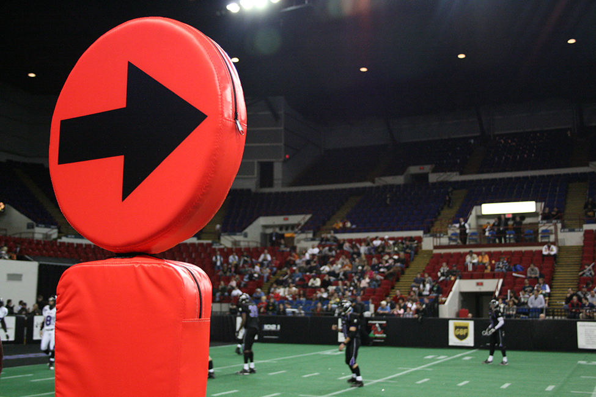

<?cnx.eoc class="key-equations" title="Key Equations"?>

<?cnx.eoc class="key-concepts" title="Key Concepts"?>

<?cnx.eoc class="review-exercises" title="Review Exercises"?>

<?cnx.eoc class="practice-test" title="Practice Test"?>

 {: #Figure_02_00_001}

For most people, the term territorial possession indicates restrictions, usually dealing with trespassing or rite of passage and takes place in some foreign location. What most Americans do not realize is that from September through December, territorial possession dominates our lifestyles while watching the NFL. In this area, territorial possession is governed by the referees who make their decisions based on what the chains reveal. If the ball is at point *A*<math xmlns="http://www.w3.org/1998/Math/MathML"> <mrow> <mtext> </mtext><mrow><mo>(</mo> <mrow> <msub> <mi>x</mi> <mn>1</mn> </msub> <mo>,</mo><msub> <mi>y</mi> <mn>1</mn> </msub> </mrow> <mo>)</mo></mrow><mo>,</mo> </mrow> </math>

then it is up to the quarterback to decide which route to point *B*<math xmlns="http://www.w3.org/1998/Math/MathML"> <mrow> <mtext> </mtext><mrow><mo>(</mo> <mrow> <msub> <mi>x</mi> <mn>2</mn> </msub> <mo>,</mo><msub> <mi>y</mi> <mn>2</mn> </msub> </mrow> <mo>)</mo></mrow><mo>,</mo> </mrow> </math>

the end zone, is most feasible.

