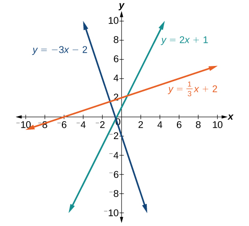
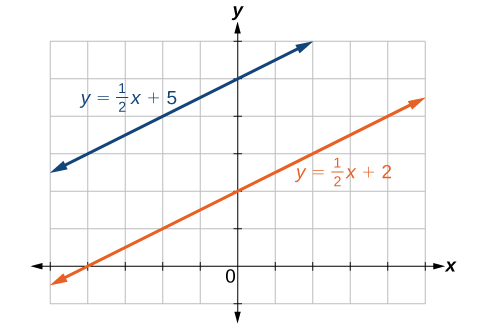
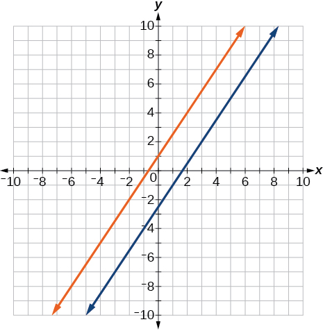
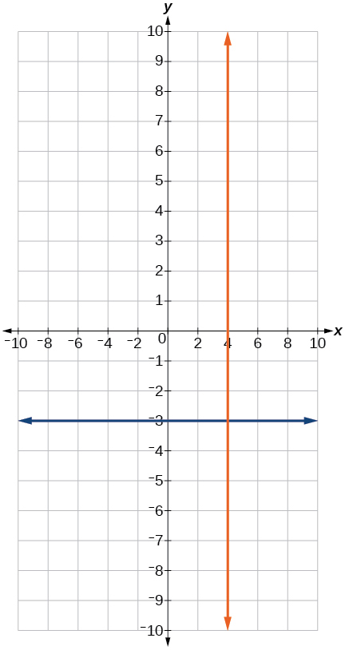
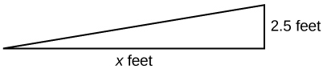

In this section you will:
* Solve equations in one variable algebraically.
* Solve a rational equation.
* Find a linear equation.
* Given the equations of two lines, determine whether their graphs are parallel or perpendicular.
* Write the equation of a line parallel or perpendicular to a given line.

Caroline is a full-time college student planning a spring break vacation. To earn enough money for the trip, she has taken a part-time job at the local bank that pays $15.00/hr, and she opened a savings account with an initial deposit of $400 on January 15. She arranged for direct deposit of her payroll checks. If spring break begins March 20 and the trip will cost approximately $2,500, how many hours will she have to work to earn enough to pay for her vacation? If she can only work 4 hours per day, how many days per week will she have to work? How many weeks will it take? In this section, we will investigate problems like this and others, which generate graphs like the line in [\[link\]](#Figure_02_02_001).

 {: #Figure_02_02_001}

# Solving Linear Equations in One Variable

A **linear equation**{: data-type="term"} is an equation of a straight line, written in one variable. The only power of the variable is 1. Linear equations in one variable may take the form<math xmlns="http://www.w3.org/1998/Math/MathML"> <mrow> <mtext> </mtext><mi>a</mi><mi>x</mi><mo>+</mo><mi>b</mi><mo>=</mo><mn>0</mn><mtext> </mtext> </mrow> </math>

and are solved using basic algebraic operations.

We begin by classifying linear equations in one variable as one of three types: identity, conditional, or inconsistent. An **identity equation**{: data-type="term"} is true for all values of the variable. Here is an example of an identity equation.

<math xmlns="http://www.w3.org/1998/Math/MathML"> <mrow> <mn>3</mn><mi>x</mi><mo>=</mo><mn>2</mn><mi>x</mi><mo>+</mo><mi>x</mi> </mrow> </math>

The **solution set**{: data-type="term"} consists of all values that make the equation true. For this equation, the solution set is all real numbers because any real number substituted for<math xmlns="http://www.w3.org/1998/Math/MathML"> <mrow> <mtext> </mtext><mi>x</mi><mtext> </mtext> </mrow> </math>

will make the equation true.

A **conditional equation**{: data-type="term"} is true for only some values of the variable. For example, if we are to solve the equation<math xmlns="http://www.w3.org/1998/Math/MathML"> <mrow> <mtext> </mtext><mn>5</mn><mi>x</mi><mo>+</mo><mn>2</mn><mo>=</mo><mn>3</mn><mi>x</mi><mo>−</mo><mn>6</mn><mo>,</mo></mrow> </math>

we have the following:

<math xmlns="http://www.w3.org/1998/Math/MathML" display="block"> <mrow> <mtable> <mtr> <mtd columnalign="right"> <mrow> <mn>5</mn><mi>x</mi><mo>+</mo><mn>2</mn></mrow> </mtd> <mtd> <mo>=</mo> </mtd> <mtd columnalign="left"> <mrow> <mn>3</mn><mi>x</mi><mo>−</mo><mn>6</mn></mrow> </mtd> </mtr> <mtr> <mtd columnalign="right"> <mrow> <mn>2</mn><mi>x</mi></mrow> </mtd> <mtd> <mo>=</mo> </mtd> <mtd columnalign="left"> <mrow> <mn>−8</mn></mrow> </mtd> </mtr> <mtr> <mtd columnalign="right"> <mi>x</mi> </mtd> <mtd> <mo>=</mo> </mtd> <mtd columnalign="left"> <mrow> <mn>−4</mn></mrow> </mtd> </mtr> </mtable></mrow> </math>

The solution set consists of one number:<math xmlns="http://www.w3.org/1998/Math/MathML"> <mrow> <mtext> </mtext><mrow><mo>{</mo> <mrow> <mo>−</mo><mn>4</mn> </mrow> <mo>}</mo></mrow><mo>.</mo><mtext> </mtext> </mrow> </math>

It is the only solution and, therefore, we have solved a conditional equation.

An **inconsistent equation**{: data-type="term"} results in a false statement. For example, if we are to solve<math xmlns="http://www.w3.org/1998/Math/MathML"> <mrow> <mtext> </mtext><mn>5</mn><mi>x</mi><mo>−</mo><mn>15</mn><mo>=</mo><mn>5</mn><mrow><mo>(</mo> <mrow> <mi>x</mi><mo>−</mo><mn>4</mn></mrow> <mo>)</mo></mrow><mo>,</mo></mrow> </math>

we have the following:

<math xmlns="http://www.w3.org/1998/Math/MathML" display="block"> <mrow> <mtable> <mtr rowalign="center"> <mtd rowalign="center" columnalign="right"><mrow><mn>5</mn><mi>x</mi><mo>−</mo><mn>15</mn></mrow></mtd> <mtd rowalign="center"><mo>=</mo></mtd> <mtd rowalign="center" columnalign="left"><mrow><mn>5</mn><mi>x</mi><mo>−</mo><mn>20</mn></mrow></mtd> <mtd rowalign="center" /> </mtr> <mtr rowalign="center"> <mtd rowalign="center" columnalign="right"><mrow><mn>5</mn><mi>x</mi><mo>−</mo><mn>15</mn><mo>−</mo><mn>5</mn><mi>x</mi></mrow></mtd> <mtd rowalign="center"><mo>=</mo></mtd> <mtd rowalign="center" columnalign="left"><mrow><mn>5</mn><mi>x</mi><mo>−</mo><mn>20</mn><mo>−</mo><mn>5</mn><mi>x</mi></mrow></mtd> <mtd rowalign="center" columnalign="left"><mrow><mspace width="2em" /><mtext>Subtract </mtext><mn>5</mn><mi>x</mi><mtext> from both sides</mtext><mo>.</mo></mrow></mtd> </mtr> <mtr rowalign="center"> <mtd rowalign="center" columnalign="right"><mrow><mn>−15</mn></mrow></mtd> <mtd rowalign="center"><mo>≠</mo></mtd> <mtd rowalign="center" columnalign="left"><mrow><mn>−20</mn></mrow></mtd> <mtd columnalign="left" rowalign="center"><mrow><mspace width="2em" /><mtext>False statement</mtext></mrow></mtd> </mtr> </mtable></mrow> </math>

Indeed,<math xmlns="http://www.w3.org/1998/Math/MathML"> <mrow> <mtext> </mtext><mn>−15</mn><mo>≠</mo><mtext> </mtext><mn>−20.</mn><mtext> </mtext></mrow> </math>

There is no solution because this is an inconsistent equation.

Solving linear equations in one variable involves the fundamental properties of equality and basic algebraic operations. A brief review of those operations follows.

Linear Equation in One Variable

A linear equation in one variable can be written in the form

<math xmlns="http://www.w3.org/1998/Math/MathML"> <mrow> <mi>a</mi><mi>x</mi><mo>+</mo><mi>b</mi><mo>=</mo><mn>0</mn> </mrow> </math>

where *a* and <em>b </em>are real numbers,<math xmlns="http://www.w3.org/1998/Math/MathML"> <mrow> <mtext> </mtext><mi>a</mi><mo>≠</mo><mn>0.</mn> </mrow> </math>

**Given a linear equation in one variable, use algebra to solve it.**

The following steps are used to manipulate an equation and isolate the unknown variable, so that the last line reads<math xmlns="http://www.w3.org/1998/Math/MathML"> <mrow> <mtext> </mtext><mi>x</mi><mo>=</mo><mo>\_\_\_\_\_\_\_\_\_,</mo> </mrow> </math>

if <em>x </em>is the unknown. There is no set order, as the steps used depend on what is given:

1.  We may add, subtract, multiply, or divide an equation by a number or an expression as long as we do the same thing to both sides of the equal sign. Note that we cannot divide by zero.
2.  Apply the distributive property as needed:
    <math xmlns="http://www.w3.org/1998/Math/MathML"> <mrow> <mtext> </mtext><mi>a</mi><mrow><mo>(</mo> <mrow> <mi>b</mi><mo>+</mo><mi>c</mi> </mrow> <mo>)</mo></mrow><mo>=</mo><mi>a</mi><mi>b</mi><mo>+</mo><mi>a</mi><mi>c</mi><mo>.</mo> </mrow> </math>

3.  Isolate the variable on one side of the equation.
4.  When the variable is multiplied by a coefficient in the final stage, multiply both sides of the equation by the reciprocal of the coefficient.
{: data-number-style="arabic"}

Solving an Equation in One Variable

Solve the following equation:<math xmlns="http://www.w3.org/1998/Math/MathML"> <mrow> <mtext> </mtext><mn>2</mn><mi>x</mi><mo>+</mo><mn>7</mn><mo>=</mo><mn>19.</mn> </mrow> </math>

This equation can be written in the form<math xmlns="http://www.w3.org/1998/Math/MathML"> <mrow> <mtext> </mtext><mi>a</mi><mi>x</mi><mo>+</mo><mi>b</mi><mo>=</mo><mn>0</mn><mtext> </mtext> </mrow> </math>

by subtracting<math xmlns="http://www.w3.org/1998/Math/MathML"> <mrow> <mtext> </mtext><mn>19</mn><mtext> </mtext> </mrow> </math>

from both sides. However, we may proceed to solve the equation in its original form by performing algebraic operations.

<math xmlns="http://www.w3.org/1998/Math/MathML" display="block"> <mrow> <mtable> <mtr rowalign="center"> <mtd rowalign="center" columnalign="right"><mrow><mn>2</mn><mi>x</mi><mo>+</mo><mn>7</mn></mrow></mtd> <mtd rowalign="center"><mo>=</mo></mtd> <mtd columnalign="left" rowalign="center"><mrow><mn>19</mn></mrow></mtd> <mtd rowalign="center" /> </mtr> <mtr rowalign="center"> <mtd rowalign="center" columnalign="right"><mrow><mn>2</mn><mi>x</mi></mrow></mtd> <mtd rowalign="center"><mo>=</mo></mtd> <mtd rowalign="center" columnalign="left"><mrow><mn>12</mn></mrow></mtd> <mtd rowalign="center" columnalign="left"><mrow><mspace width="2em" /><mtext>Subtract 7 from both sides</mtext><mtext>.</mtext></mrow></mtd> </mtr> <mtr rowalign="center"> <mtd rowalign="center" columnalign="right"><mi>x</mi></mtd> <mtd rowalign="center"><mo>=</mo></mtd> <mtd rowalign="center" columnalign="left"><mn>6</mn></mtd> <mtd rowalign="center" columnalign="left"><mrow><mspace width="2em" /><mtext>Multiply both sides by </mtext><mfrac><mn>1</mn><mn>2</mn></mfrac><mtext> or divide by 2</mtext><mtext>.</mtext></mrow></mtd> </mtr> </mtable></mrow> </math>

The solution is<math xmlns="http://www.w3.org/1998/Math/MathML"> <mrow> <mtext> </mtext><mi>x</mi><mo>=</mo><mn>6.</mn> </mrow> </math>

Solve the linear equation in one variable:<math xmlns="http://www.w3.org/1998/Math/MathML"> <mrow> <mtext> </mtext><mn>2</mn><mi>x</mi><mo>+</mo><mn>1</mn><mo>=</mo><mn>−9.</mn> </mrow> </math>

<math xmlns="http://www.w3.org/1998/Math/MathML"> <mrow> <mi>x</mi><mo>=</mo><mn>−5</mn> </mrow> </math>

Solving an Equation Algebraically When the Variable Appears on Both Sides

Solve the following equation:<math xmlns="http://www.w3.org/1998/Math/MathML"> <mrow> <mtext> </mtext><mn>4</mn><mrow><mo>(</mo> <mrow> <mi>x</mi><mn>−3</mn> </mrow> <mo>)</mo></mrow><mo>+</mo><mn>12</mn><mo>=</mo><mn>15</mn><mn>−5</mn><mrow><mo>(</mo> <mrow> <mi>x</mi><mo>+</mo><mn>6</mn> </mrow> <mo>)</mo></mrow><mo>.</mo> </mrow> </math>

Apply standard algebraic properties.

<math xmlns="http://www.w3.org/1998/Math/MathML" display="block"> <mrow> <mtable> <mtr rowalign="center"> <mtd rowalign="center" columnalign="right"><mrow><mn>4</mn><mo stretchy="false">(</mo><mi>x</mi><mo>−</mo><mn>3</mn><mo stretchy="false">)</mo><mo>+</mo><mn>12</mn></mrow></mtd> <mtd rowalign="center"><mo>=</mo></mtd> <mtd rowalign="center" columnalign="left"><mrow><mn>15</mn><mo>−</mo><mn>5</mn><mo stretchy="false">(</mo><mi>x</mi><mo>+</mo><mn>6</mn><mo stretchy="false">)</mo></mrow></mtd> <mtd rowalign="center" /> </mtr> <mtr rowalign="center"> <mtd rowalign="center" columnalign="left"><mrow><mn>4</mn><mi>x</mi><mo>−</mo><mn>12</mn><mo>+</mo><mn>12</mn></mrow></mtd> <mtd rowalign="center"><mo>=</mo></mtd> <mtd rowalign="center" columnalign="left"><mrow><mn>15</mn><mo>−</mo><mn>5</mn><mi>x</mi><mo>−</mo><mn>30</mn></mrow></mtd> <mtd rowalign="center" columnalign="left"><mrow><mspace width="2em" /><mtext>Apply the distributive property</mtext><mtext>.</mtext></mrow></mtd> </mtr> <mtr rowalign="center"> <mtd rowalign="center" columnalign="right"><mrow><mn>4</mn><mi>x</mi></mrow></mtd> <mtd rowalign="center"><mo>=</mo></mtd> <mtd rowalign="center" columnalign="left"><mrow><mn>−15</mn><mo>−</mo><mn>5</mn><mi>x</mi></mrow></mtd> <mtd rowalign="center" columnalign="left"><mrow><mspace width="2em" /><mtext>Combine like terms</mtext><mo>.</mo></mrow></mtd> </mtr> <mtr rowalign="center"> <mtd rowalign="center" columnalign="right"><mrow><mn>9</mn><mi>x</mi></mrow></mtd> <mtd rowalign="center"><mo>=</mo></mtd> <mtd rowalign="center" columnalign="left"><mrow><mn>−15</mn></mrow></mtd> <mtd rowalign="center" columnalign="left"><mrow><mspace width="2em" /><mtext>Place </mtext><mi>x</mi><mo>−</mo><mtext>terms on one side and simplify</mtext><mo>.</mo></mrow></mtd> </mtr> <mtr rowalign="center"> <mtd rowalign="center" columnalign="right"><mi>x</mi></mtd> <mtd rowalign="center"><mo>=</mo></mtd> <mtd rowalign="center" columnalign="left"><mrow><mo>−</mo><mfrac><mrow><mn>15</mn></mrow><mn>9</mn></mfrac></mrow></mtd> <mtd rowalign="center" columnalign="left"> <mrow> <mspace width="2em" /><mtext>Multiply both sides by </mtext><mfrac> <mn>1</mn> <mn>9</mn> </mfrac> <mtext>, the reciprocal of 9</mtext><mo>.</mo></mrow> </mtd> </mtr> <mtr rowalign="center"> <mtd rowalign="center" columnalign="right"><mi>x</mi></mtd> <mtd rowalign="center"><mo>=</mo></mtd> <mtd rowalign="center" columnalign="left"><mrow><mo>−</mo><mfrac><mn>5</mn><mn>3</mn></mfrac></mrow></mtd> <mtd rowalign="center" /> </mtr> </mtable></mrow> </math>

Analysis

This problem requires the distributive property to be applied twice, and then the properties of algebra are used to reach the final line,<math xmlns="http://www.w3.org/1998/Math/MathML"> <mrow> <mtext> </mtext><mi>x</mi><mo>=</mo><mo>−</mo><mfrac> <mn>5</mn> <mn>3</mn> </mfrac> <mo>.</mo> </mrow> </math>

Solve the equation in one variable:<math xmlns="http://www.w3.org/1998/Math/MathML"> <mrow> <mtext> </mtext><mn>−2</mn><mrow><mo>(</mo> <mrow> <mn>3</mn><mi>x</mi><mo>−</mo><mn>1</mn></mrow> <mo>)</mo></mrow><mo>+</mo><mi>x</mi><mo>=</mo><mn>14</mn><mo>−</mo><mi>x</mi><mo>.</mo></mrow> </math>

<math xmlns="http://www.w3.org/1998/Math/MathML"> <mrow> <mi>x</mi><mo>=</mo><mn>−3</mn> </mrow> </math>

# Solving a Rational Equation

In this section, we look at rational equations that, after some manipulation, result in a linear equation. If an equation contains at least one rational expression, it is a considered a **rational equation**.

Recall that a **rational number**{: data-type="term" .no-emphasis} is the ratio of two numbers, such as<math xmlns="http://www.w3.org/1998/Math/MathML"> <mrow> <mtext> </mtext><mfrac> <mn>2</mn> <mn>3</mn> </mfrac> <mtext> </mtext> </mrow> </math>

or<math xmlns="http://www.w3.org/1998/Math/MathML"> <mrow> <mtext> </mtext><mfrac> <mn>7</mn> <mn>2</mn> </mfrac> <mo>.</mo><mtext> </mtext> </mrow> </math>

A **rational expression**{: data-type="term" .no-emphasis} is the ratio, or quotient, of two polynomials. Here are three examples.

<math xmlns="http://www.w3.org/1998/Math/MathML" display="block"> <mrow> <mfrac> <mrow> <mi>x</mi><mo>+</mo><mn>1</mn></mrow> <mrow> <msup> <mi>x</mi> <mn>2</mn> </msup> <mo>−</mo><mn>4</mn></mrow> </mfrac> <mo>,</mo><mtext> </mtext><mfrac> <mn>1</mn> <mrow> <mi>x</mi><mo>−</mo><mn>3</mn></mrow> </mfrac> <mo>,</mo><mtext> </mtext><mtext>or</mtext><mtext> </mtext><mfrac> <mn>4</mn> <mrow> <msup> <mi>x</mi> <mn>2</mn> </msup> <mo>+</mo><mi>x</mi><mo>−</mo><mn>2</mn></mrow> </mfrac> </mrow> </math>

Rational equations have a variable in the denominator in at least one of the terms. Our goal is to perform algebraic operations so that the variables appear in the numerator. In fact, we will eliminate all denominators by multiplying both sides of the equation by the **least common denominator**{: data-type="term" .no-emphasis} (LCD).

Finding the LCD is identifying an expression that contains the highest power of all of the factors in all of the denominators. We do this because when the equation is multiplied by the LCD, the common factors in the LCD and in each denominator will equal one and will cancel out.

Solving a Rational Equation

Solve the rational equation:<math xmlns="http://www.w3.org/1998/Math/MathML"> <mrow> <mtext> </mtext><mfrac> <mn>7</mn> <mrow> <mn>2</mn><mi>x</mi> </mrow> </mfrac> <mo>−</mo><mfrac> <mn>5</mn> <mrow> <mn>3</mn><mi>x</mi> </mrow> </mfrac> <mo>=</mo><mfrac> <mrow> <mn>22</mn> </mrow> <mn>3</mn> </mfrac> <mo>.</mo> </mrow> </math>

We have three denominators;<math xmlns="http://www.w3.org/1998/Math/MathML"> <mrow> <mtext> </mtext><mn>2</mn><mi>x</mi><mo>,</mo><mn>3</mn><mi>x</mi><mo>,</mo> </mrow> </math>

and 3. The LCD must contain<math xmlns="http://www.w3.org/1998/Math/MathML"> <mrow> <mtext> </mtext><mn>2</mn><mi>x</mi><mo>,</mo><mn>3</mn><mi>x</mi><mo>,</mo> </mrow> </math>

and 3. An LCD of<math xmlns="http://www.w3.org/1998/Math/MathML"> <mrow> <mtext> </mtext><mn>6</mn><mi>x</mi><mtext> </mtext> </mrow> </math>

contains all three denominators. In other words, each denominator can be divided evenly into the LCD. Next, multiply both sides of the equation by the LCD<math xmlns="http://www.w3.org/1998/Math/MathML"> <mrow> <mtext> </mtext><mn>6</mn><mi>x</mi><mo>.</mo> </mrow> </math>

<math xmlns="http://www.w3.org/1998/Math/MathML" display="block"> <mrow> <mtable> <mtr rowalign="center"> <mtd rowalign="center" columnalign="right"> <mrow> <mo stretchy="false">(</mo><mn>6</mn><mi>x</mi><mo stretchy="false">)</mo><mrow><mo>[</mo> <mrow> <mfrac> <mn>7</mn> <mrow> <mn>2</mn><mi>x</mi></mrow> </mfrac> <mo>−</mo><mfrac> <mn>5</mn> <mrow> <mn>3</mn><mi>x</mi></mrow> </mfrac> </mrow> <mo>]</mo></mrow></mrow> </mtd> <mtd rowalign="center"><mo>=</mo></mtd> <mtd rowalign="center" columnalign="left"> <mrow> <mrow><mo>[</mo> <mrow> <mfrac> <mrow> <mn>22</mn></mrow> <mn>3</mn> </mfrac> </mrow> <mo>]</mo></mrow><mo stretchy="false">(</mo><mn>6</mn><mi>x</mi><mo stretchy="false">)</mo></mrow> </mtd> <mtd rowalign="center" /> </mtr> <mtr rowalign="center"> <mtd rowalign="center" columnalign="right"> <mrow> <mo stretchy="false">(</mo><mn>6</mn><mi>x</mi><mo stretchy="false">)</mo><mrow><mo>(</mo> <mrow> <mfrac> <mn>7</mn> <mrow> <mn>2</mn><mi>x</mi></mrow> </mfrac> </mrow> <mo>)</mo></mrow><mo>−</mo><mo stretchy="false">(</mo><mn>6</mn><mi>x</mi><mo stretchy="false">)</mo><mrow><mo>(</mo> <mrow> <mfrac> <mn>5</mn> <mrow> <mn>3</mn><mi>x</mi></mrow> </mfrac> </mrow> <mo>)</mo></mrow></mrow> </mtd> <mtd rowalign="center"><mo>=</mo></mtd> <mtd rowalign="center" columnalign="left"> <mrow> <mrow><mo>(</mo> <mrow> <mfrac> <mrow> <mn>22</mn></mrow> <mn>3</mn> </mfrac> </mrow> <mo>)</mo></mrow><mo stretchy="false">(</mo><mn>6</mn><mi>x</mi><mo stretchy="false">)</mo></mrow> </mtd> <mtd columnalign="left" rowalign="center"> <mrow> <mspace width="2em" /><mtext>Use the distributive property</mtext><mo>.</mo></mrow> </mtd> </mtr> <mtr rowalign="center"> <mtd rowalign="center" columnalign="right"> <mrow> <mo stretchy="false">(</mo><menclose notation="updiagonalstrike"> <mrow> <mn>6</mn><mi>x</mi></mrow> </menclose> <mo stretchy="false">)</mo><mrow><mo>(</mo> <mrow> <mfrac> <mn>7</mn> <mrow> <menclose notation="updiagonalstrike"> <mrow> <mn>2</mn><mi>x</mi></mrow> </menclose> </mrow> </mfrac> </mrow> <mo>)</mo></mrow><mo>−</mo><mo stretchy="false">(</mo><menclose notation="updiagonalstrike"> <mrow> <mn>6</mn><mi>x</mi></mrow> </menclose> <mo stretchy="false">)</mo><mrow><mo>(</mo> <mrow> <mfrac> <mn>5</mn> <mrow> <menclose notation="updiagonalstrike"> <mrow> <mn>3</mn><mi>x</mi></mrow> </menclose> </mrow> </mfrac> </mrow> <mo>)</mo></mrow></mrow> </mtd> <mtd rowalign="center"><mo>=</mo></mtd> <mtd rowalign="center" columnalign="left"> <mrow> <mrow><mo>(</mo> <mrow> <mfrac> <mrow> <mn>22</mn></mrow> <mrow> <menclose notation="updiagonalstrike"> <mn>3</mn> </menclose> </mrow> </mfrac> </mrow> <mo>)</mo></mrow><mo stretchy="false">(</mo><menclose notation="updiagonalstrike"> <mn>6</mn> </menclose> <mi>x</mi><mo stretchy="false">)</mo></mrow> </mtd> <mtd rowalign="center" columnalign="left"> <mrow> <mspace width="2em" /><mtext>Cancel out the common factors</mtext><mo>.</mo></mrow> </mtd> </mtr> <mtr rowalign="center"> <mtd rowalign="center" columnalign="right"> <mrow> <mn>3</mn><mo stretchy="false">(</mo><mn>7</mn><mo stretchy="false">)</mo><mo>−</mo><mn>2</mn><mo stretchy="false">(</mo><mn>5</mn><mo stretchy="false">)</mo></mrow> </mtd> <mtd rowalign="center"><mo>=</mo></mtd> <mtd rowalign="center" columnalign="left"> <mrow> <mn>22</mn><mo stretchy="false">(</mo><mn>2</mn><mi>x</mi><mo stretchy="false">)</mo></mrow> </mtd> <mtd rowalign="center" columnalign="left"> <mrow> <mspace width="2em" /><mtext>Multiply remaining factors by each numerator</mtext><mo>.</mo></mrow> </mtd> </mtr> <mtr rowalign="center"> <mtd rowalign="center" columnalign="right"> <mrow> <mn>21</mn><mo>−</mo><mn>10</mn></mrow> </mtd> <mtd rowalign="center"><mo>=</mo></mtd> <mtd rowalign="center" columnalign="left"><mrow><mn>44</mn><mi>x</mi></mrow></mtd> <mtd rowalign="center" /> </mtr> <mtr rowalign="center"> <mtd rowalign="center" columnalign="right"><mrow><mn>11</mn></mrow></mtd> <mtd rowalign="center"><mo>=</mo></mtd> <mtd rowalign="center" columnalign="left"><mrow><mn>44</mn><mi>x</mi></mrow></mtd> <mtd rowalign="center" /> </mtr> <mtr> <mtd columnalign="right" rowalign="center"><mrow><mfrac><mrow><mn>11</mn></mrow><mrow><mn>44</mn></mrow></mfrac></mrow></mtd> <mtd rowalign="center"><mo>=</mo></mtd> <mtd rowalign="center" columnalign="left"><mi>x</mi></mtd> <mtd rowalign="center" /> </mtr> <mtr rowalign="center"> <mtd rowalign="center" columnalign="right"> <mrow> <mfrac> <mn>1</mn> <mn>4</mn> </mfrac> </mrow> </mtd> <mtd rowalign="center"><mo>=</mo></mtd> <mtd rowalign="center" columnalign="left"><mi>x</mi></mtd> <mtd rowalign="center" /> </mtr> </mtable></mrow> </math>

A common mistake made when solving rational equations involves finding the LCD when one of the denominators is a binomial—two terms added or subtracted—such as<math xmlns="http://www.w3.org/1998/Math/MathML"> <mrow> <mtext> </mtext><mrow><mo>(</mo> <mrow> <mi>x</mi><mo>+</mo><mn>1</mn> </mrow> <mo>)</mo></mrow><mo>.</mo><mtext> </mtext> </mrow> </math>

Always consider a binomial as an individual factor—the terms cannot be separated. For example, suppose a problem has three terms and the denominators are<math xmlns="http://www.w3.org/1998/Math/MathML"> <mrow> <mtext> </mtext><mi>x</mi><mo>,</mo> </mrow> </math>

<math xmlns="http://www.w3.org/1998/Math/MathML"> <mrow> <mi>x</mi><mo>−</mo><mn>1</mn><mo>,</mo></mrow> </math>

and<math xmlns="http://www.w3.org/1998/Math/MathML"> <mrow> <mtext> </mtext><mn>3</mn><mi>x</mi><mo>−</mo><mn>3.</mn><mtext> </mtext></mrow> </math>

First, factor all denominators. We then have<math xmlns="http://www.w3.org/1998/Math/MathML"> <mrow> <mtext> </mtext><mi>x</mi><mo>,</mo> </mrow> </math>

<math xmlns="http://www.w3.org/1998/Math/MathML"> <mrow> <mo stretchy="false">(</mo><mi>x</mi><mo>−</mo><mn>1</mn><mo stretchy="false">)</mo><mo>,</mo></mrow> </math>

and<math xmlns="http://www.w3.org/1998/Math/MathML"> <mrow> <mtext> </mtext><mn>3</mn><mo stretchy="false">(</mo><mi>x</mi><mo>−</mo><mn>1</mn><mo stretchy="false">)</mo><mtext> </mtext></mrow> </math>

as the denominators. (Note the parentheses placed around the second denominator.) Only the last two denominators have a common factor of<math xmlns="http://www.w3.org/1998/Math/MathML"> <mrow> <mtext> </mtext><mo stretchy="false">(</mo><mi>x</mi><mo>−</mo><mn>1</mn><mo stretchy="false">)</mo><mo>.</mo><mtext> </mtext></mrow> </math>

The<math xmlns="http://www.w3.org/1998/Math/MathML"> <mrow> <mtext> </mtext><mi>x</mi><mtext> </mtext> </mrow> </math>

in the first denominator is separate from the<math xmlns="http://www.w3.org/1998/Math/MathML"> <mrow> <mtext> </mtext><mi>x</mi><mtext> </mtext> </mrow> </math>

in the<math xmlns="http://www.w3.org/1998/Math/MathML"> <mrow> <mtext> </mtext><mo stretchy="false">(</mo><mi>x</mi><mo>−</mo><mn>1</mn><mo stretchy="false">)</mo><mtext> </mtext></mrow> </math>

denominators. An effective way to remember this is to write factored and binomial denominators in parentheses, and consider each parentheses as a separate unit or a separate factor. The LCD in this instance is found by multiplying together the<math xmlns="http://www.w3.org/1998/Math/MathML"> <mrow> <mtext> </mtext><mi>x</mi><mo>,</mo> </mrow> </math>

one factor of<math xmlns="http://www.w3.org/1998/Math/MathML"> <mrow> <mtext> </mtext><mrow><mo>(</mo> <mrow> <mi>x</mi><mo>−</mo><mn>1</mn> </mrow> <mo>)</mo></mrow><mo>,</mo> </mrow> </math>

and the 3. Thus, the LCD is the following:

<math xmlns="http://www.w3.org/1998/Math/MathML" display="block"> <mrow> <mi>x</mi><mrow><mo>(</mo> <mrow> <mi>x</mi><mo>−</mo><mn>1</mn></mrow> <mo>)</mo></mrow><mn>3</mn><mo>=</mo><mn>3</mn><mi>x</mi><mrow><mo>(</mo> <mrow> <mi>x</mi><mo>−</mo><mn>1</mn></mrow> <mo>)</mo></mrow></mrow> </math>

So, both sides of the equation would be multiplied by<math xmlns="http://www.w3.org/1998/Math/MathML"> <mrow> <mtext> </mtext><mn>3</mn><mi>x</mi><mrow><mo>(</mo> <mrow> <mi>x</mi><mo>−</mo><mn>1</mn></mrow> <mo>)</mo></mrow><mo>.</mo><mtext> </mtext></mrow> </math>

Leave the LCD in factored form, as this makes it easier to see how each denominator in the problem cancels out.

Another example is a problem with two denominators, such as<math xmlns="http://www.w3.org/1998/Math/MathML"> <mrow> <mtext> </mtext><mi>x</mi><mtext> </mtext> </mrow> </math>

and<math xmlns="http://www.w3.org/1998/Math/MathML"> <mrow> <mtext> </mtext><msup> <mi>x</mi> <mn>2</mn> </msup> <mo>+</mo><mn>2</mn><mi>x</mi><mo>.</mo><mtext> </mtext> </mrow> </math>

Once the second denominator is factored as<math xmlns="http://www.w3.org/1998/Math/MathML"> <mrow> <mtext> </mtext><msup> <mi>x</mi> <mn>2</mn> </msup> <mo>+</mo><mn>2</mn><mi>x</mi><mo>=</mo><mi>x</mi><mrow><mo>(</mo> <mrow> <mi>x</mi><mo>+</mo><mn>2</mn></mrow> <mo>)</mo></mrow><mo>,</mo></mrow> </math>

there is a common factor of *x* in both denominators and the LCD is<math xmlns="http://www.w3.org/1998/Math/MathML"> <mrow> <mtext> </mtext><mi>x</mi><mrow><mo>(</mo> <mrow> <mi>x</mi><mo>+</mo><mn>2</mn> </mrow> <mo>)</mo></mrow><mo>.</mo> </mrow> </math>

Sometimes we have a rational equation in the form of a proportion; that is, when one fraction equals another fraction and there are no other terms in the equation.

<math xmlns="http://www.w3.org/1998/Math/MathML" display="block"> <mrow> <mfrac> <mi>a</mi> <mi>b</mi> </mfrac> <mo>=</mo><mfrac> <mi>c</mi> <mi>d</mi> </mfrac> </mrow> </math>

We can use another method of solving the equation without finding the LCD: cross-multiplication. We multiply terms by crossing over the equal sign.

    Multiply<math xmlns="http://www.w3.org/1998/Math/MathML"> <mrow> <mtext> </mtext><mi>a</mi><mrow><mo>(</mo> <mi>d</mi> <mo>)</mo></mrow><mtext> </mtext> </mrow> </math>

and<math xmlns="http://www.w3.org/1998/Math/MathML"> <mrow> <mtext> </mtext><mi>b</mi><mrow><mo>(</mo> <mi>c</mi> <mo>)</mo></mrow><mo>,</mo> </mrow> </math>

which results in<math xmlns="http://www.w3.org/1998/Math/MathML"> <mrow> <mtext> </mtext><mi>a</mi><mi>d</mi><mo>=</mo><mi>b</mi><mi>c</mi><mo>.</mo> </mrow> </math>

Any solution that makes a denominator in the original expression equal zero must be excluded from the possibilities.

Rational Equations

A **rational equation**{: data-type="term"} contains at least one rational expression where the variable appears in at least one of the denominators.

**Given a rational equation, solve it.**

1.  Factor all denominators in the equation.
2.  Find and exclude values that set each denominator equal to zero.
3.  Find the LCD.
4.  Multiply the whole equation by the LCD. If the LCD is correct, there will be no denominators left.
5.  Solve the remaining equation.
6.  Make sure to check solutions back in the original equations to avoid a solution producing zero in a denominator
{: data-number-style="arabic"}

Solving a Rational Equation without Factoring

Solve the following rational equation:

<math xmlns="http://www.w3.org/1998/Math/MathML" display="block"> <mrow> <mfrac> <mn>2</mn> <mi>x</mi> </mfrac> <mo>−</mo><mfrac> <mn>3</mn> <mn>2</mn> </mfrac> <mo>=</mo><mfrac> <mn>7</mn> <mrow> <mn>2</mn><mi>x</mi> </mrow> </mfrac> </mrow> </math>

We have three denominators:<math xmlns="http://www.w3.org/1998/Math/MathML"> <mrow> <mtext> </mtext><mi>x</mi><mo>,</mo> </mrow> </math>

<math xmlns="http://www.w3.org/1998/Math/MathML"> <mrow> <mn>2</mn><mo>,</mo> </mrow> </math>

and<math xmlns="http://www.w3.org/1998/Math/MathML"> <mrow> <mtext> </mtext><mn>2</mn><mi>x</mi><mo>.</mo><mtext> </mtext> </mrow> </math>

No factoring is required. The product of the first two denominators is equal to the third denominator, so, the LCD is<math xmlns="http://www.w3.org/1998/Math/MathML"> <mrow> <mtext> </mtext><mn>2</mn><mi>x</mi><mo>.</mo><mtext> </mtext> </mrow> </math>

Only one value is excluded from a solution set,<math xmlns="http://www.w3.org/1998/Math/MathML"> <mrow> <mtext> </mtext><mi>x</mi><mo>=</mo><mn>0.</mn><mtext> </mtext> </mrow> </math>

Next, multiply the whole equation (both sides of the equal sign) by<math xmlns="http://www.w3.org/1998/Math/MathML"> <mrow> <mtext> </mtext><mn>2</mn><mi>x</mi><mo>.</mo> </mrow> </math>

<math xmlns="http://www.w3.org/1998/Math/MathML" display="block"> <mrow> <mtable> <mtr rowalign="center"> <mtd rowalign="center" columnalign="right"> <mrow> <mn>2</mn><mi>x</mi><mrow><mo>[</mo> <mrow> <mfrac> <mn>2</mn> <mi>x</mi> </mfrac> <mo>−</mo><mfrac> <mn>3</mn> <mn>2</mn> </mfrac> </mrow> <mo>]</mo></mrow></mrow> </mtd> <mtd rowalign="center"><mo>=</mo></mtd> <mtd><mrow><mrow><mo>[</mo> <mrow><mfrac><mn>7</mn><mrow><mn>2</mn><mi>x</mi></mrow></mfrac></mrow> <mo>]</mo></mrow><mn>2</mn><mi>x</mi></mrow></mtd> <mtd rowalign="center" /> </mtr> <mtr rowalign="center"> <mtd rowalign="center" columnalign="right"> <mrow> <mn>2</mn><menclose notation="updiagonalstrike"> <mi>x</mi> </menclose> <mrow><mo>(</mo> <mrow> <mfrac> <mn>2</mn> <mrow> <menclose notation="updiagonalstrike"> <mi>x</mi> </menclose> </mrow> </mfrac> </mrow> <mo>)</mo></mrow><mo>−</mo><menclose notation="updiagonalstrike"> <mn>2</mn> </menclose> <mi>x</mi><mrow><mo>(</mo> <mrow> <mfrac> <mn>3</mn> <mrow> <menclose notation="updiagonalstrike"> <mn>2</mn> </menclose> </mrow> </mfrac> </mrow> <mo>)</mo></mrow></mrow> </mtd> <mtd rowalign="center"><mo>=</mo></mtd> <mtd rowalign="center" columnalign="left"> <mrow> <mrow><mo>(</mo> <mrow> <mfrac> <mn>7</mn> <mrow> <menclose notation="updiagonalstrike"> <mrow> <mn>2</mn><mi>x</mi></mrow> </menclose> </mrow> </mfrac> </mrow> <mo>)</mo></mrow><menclose notation="updiagonalstrike"> <mrow> <mn>2</mn><mi>x</mi></mrow> </menclose> </mrow> </mtd> <mtd columnalign="left" rowalign="center"> <mrow> <mspace width="2em" /><mtext>Distribute </mtext><mn>2</mn><mi>x</mi><mtext>.</mtext></mrow> </mtd> </mtr> <mtr rowalign="center"> <mtd rowalign="center" columnalign="right"> <mrow> <mn>2</mn><mo stretchy="false">(</mo><mn>2</mn><mo stretchy="false">)</mo><mo>−</mo><mn>3</mn><mi>x</mi></mrow> </mtd> <mtd rowalign="center"><mo>=</mo></mtd> <mtd rowalign="center" columnalign="left"><mn>7</mn></mtd> <mtd columnalign="left" rowalign="center"><mrow><mspace width="2em" /><mtext>Denominators cancel out</mtext><mo>.</mo></mrow></mtd> </mtr> <mtr rowalign="center"> <mtd rowalign="center" columnalign="right"><mrow><mn>4</mn><mo>−</mo><mn>3</mn><mi>x</mi></mrow></mtd> <mtd rowalign="center"><mo>=</mo></mtd> <mtd columnalign="left" rowalign="center"><mn>7</mn></mtd> <mtd rowalign="center" /> </mtr> <mtr rowalign="center"> <mtd rowalign="center" columnalign="right"><mrow><mn>−3</mn><mi>x</mi></mrow></mtd> <mtd rowalign="center"><mo>=</mo></mtd> <mtd rowalign="center" columnalign="left"><mn>3</mn></mtd> <mtd rowalign="center" /> </mtr> <mtr rowalign="center"> <mtd rowalign="center" columnalign="right"><mi>x</mi></mtd> <mtd rowalign="center"><mo>=</mo></mtd> <mtd rowalign="center" columnalign="left"><mrow><mn>−1</mn></mrow></mtd> <mtd rowalign="center" /> </mtr> <mtr rowalign="center"> <mtd rowalign="center" /> <mtd rowalign="center" /> <mtd rowalign="center" columnalign="left"> <mrow> <mtext>or</mtext><mspace width="0.3em" /><mrow><mo>{</mo> <mrow> <mn>−1</mn></mrow> <mo>}</mo></mrow></mrow> </mtd> <mtd rowalign="center" /> </mtr> </mtable></mrow> </math>

The proposed solution is<math xmlns="http://www.w3.org/1998/Math/MathML"> <mrow> <mtext> </mtext><mi>x</mi><mo>=</mo><mn>−1</mn><mo>,</mo> </mrow> </math>

which is not an excluded value, so the solution set contains one number,<math xmlns="http://www.w3.org/1998/Math/MathML"> <mrow> <mtext> </mtext><mi>x</mi><mo>=</mo><mn>−1</mn><mo>,</mo> </mrow> </math>

or<math xmlns="http://www.w3.org/1998/Math/MathML"> <mrow> <mtext> </mtext><mrow><mo>{</mo> <mrow> <mn>−1</mn> </mrow> <mo>}</mo></mrow><mtext> </mtext> </mrow> </math>

written in set notation.

Solve the rational equation:<math xmlns="http://www.w3.org/1998/Math/MathML"> <mrow> <mtext> </mtext><mfrac> <mn>2</mn> <mrow> <mn>3</mn><mi>x</mi> </mrow> </mfrac> <mo>=</mo><mfrac> <mn>1</mn> <mn>4</mn> </mfrac> <mo>−</mo><mfrac> <mn>1</mn> <mrow> <mn>6</mn><mi>x</mi> </mrow> </mfrac> <mo>.</mo> </mrow> </math>

<math xmlns="http://www.w3.org/1998/Math/MathML"> <mrow> <mi>x</mi><mo>=</mo><mfrac> <mrow> <mn>10</mn> </mrow> <mn>3</mn> </mfrac> </mrow> </math>

Solving a Rational Equation by Factoring the Denominator

Solve the following rational equation:<math xmlns="http://www.w3.org/1998/Math/MathML"> <mrow> <mtext> </mtext><mfrac> <mn>1</mn> <mi>x</mi> </mfrac> <mo>=</mo><mfrac> <mn>1</mn> <mrow> <mn>10</mn> </mrow> </mfrac> <mo>−</mo><mfrac> <mn>3</mn> <mrow> <mn>4</mn><mi>x</mi> </mrow> </mfrac> <mo>.</mo> </mrow> </math>

First find the common denominator. The three denominators in factored form are<math xmlns="http://www.w3.org/1998/Math/MathML"> <mrow> <mtext> </mtext><mi>x</mi><mo>,</mo><mn>10</mn><mo>=</mo><mn>2</mn><mo>⋅</mo><mn>5</mn><mo>,</mo></mrow> </math>

and<math xmlns="http://www.w3.org/1998/Math/MathML"> <mrow> <mtext> </mtext><mn>4</mn><mi>x</mi><mo>=</mo><mn>2</mn><mo>⋅</mo><mn>2</mn><mo>⋅</mo><mi>x</mi><mo>.</mo><mtext> </mtext> </mrow> </math>

The smallest expression that is divisible by each one of the denominators is<math xmlns="http://www.w3.org/1998/Math/MathML"> <mrow> <mtext> </mtext><mn>20</mn><mi>x</mi><mo>.</mo><mtext> </mtext> </mrow> </math>

Only<math xmlns="http://www.w3.org/1998/Math/MathML"> <mrow> <mtext> </mtext><mi>x</mi><mo>=</mo><mn>0</mn><mtext> </mtext> </mrow> </math>

is an excluded value. Multiply the whole equation by<math xmlns="http://www.w3.org/1998/Math/MathML"> <mrow> <mtext> </mtext><mn>20</mn><mi>x</mi><mo>.</mo> </mrow> </math>

<math xmlns="http://www.w3.org/1998/Math/MathML" display="block"> <mrow> <mtable> <mtr> <mtd columnalign="right"> <mrow> <mn>20</mn><mi>x</mi><mrow><mo>(</mo> <mrow> <mfrac> <mn>1</mn> <mi>x</mi> </mfrac> </mrow> <mo>)</mo></mrow></mrow> </mtd> <mtd> <mo>=</mo> </mtd> <mtd columnalign="left"> <mrow> <mrow><mo>(</mo> <mrow> <mfrac> <mn>1</mn> <mrow> <mn>10</mn></mrow> </mfrac> <mo>−</mo><mfrac> <mn>3</mn> <mrow> <mn>4</mn><mi>x</mi></mrow> </mfrac> </mrow> <mo>)</mo></mrow><mn>20</mn><mi>x</mi></mrow> </mtd> </mtr> <mtr> <mtd columnalign="right"> <mrow> <mn>20</mn></mrow> </mtd> <mtd> <mo>=</mo> </mtd> <mtd columnalign="left"> <mrow> <mn>2</mn><mi>x</mi><mo>−</mo><mn>15</mn></mrow> </mtd> </mtr> <mtr> <mtd columnalign="right"> <mrow> <mn>35</mn></mrow> </mtd> <mtd> <mo>=</mo> </mtd> <mtd columnalign="left"> <mrow> <mn>2</mn><mi>x</mi></mrow> </mtd> </mtr> <mtr> <mtd columnalign="right"> <mrow> <mfrac> <mrow> <mn>35</mn></mrow> <mn>2</mn> </mfrac> </mrow> </mtd> <mtd> <mo>=</mo> </mtd> <mtd columnalign="left"> <mi>x</mi> </mtd> </mtr> </mtable></mrow> </math>

The solution is<math xmlns="http://www.w3.org/1998/Math/MathML"> <mrow> <mtext> </mtext><mi>x</mi><mo>=</mo><mfrac> <mrow> <mn>35</mn> </mrow> <mn>2</mn> </mfrac> <mo>.</mo> </mrow> </math>

Solve the rational equation:<math xmlns="http://www.w3.org/1998/Math/MathML"> <mrow> <mtext> </mtext><mo>−</mo><mfrac> <mn>5</mn> <mrow> <mn>2</mn><mi>x</mi> </mrow> </mfrac> <mo>+</mo><mfrac> <mn>3</mn> <mrow> <mn>4</mn><mi>x</mi> </mrow> </mfrac> <mo>=</mo><mo>−</mo><mfrac> <mn>7</mn> <mn>4</mn> </mfrac> <mo>.</mo> </mrow> </math>

<math xmlns="http://www.w3.org/1998/Math/MathML"> <mrow> <mi>x</mi><mo>=</mo><mn>1</mn> </mrow> </math>

Solving Rational Equations with a Binomial in the Denominator

Solve the following rational equations and state the excluded values:

1.  <math xmlns="http://www.w3.org/1998/Math/MathML"> <mrow> <mfrac> <mn>3</mn> <mrow> <mi>x</mi><mo>−</mo><mn>6</mn> </mrow> </mfrac> <mo>=</mo><mfrac> <mn>5</mn> <mi>x</mi> </mfrac> </mrow> </math>

2.  <math xmlns="http://www.w3.org/1998/Math/MathML"> <mrow> <mfrac> <mi>x</mi> <mrow> <mi>x</mi><mo>−</mo><mn>3</mn> </mrow> </mfrac> <mo>=</mo><mfrac> <mn>5</mn> <mrow> <mi>x</mi><mo>−</mo><mn>3</mn> </mrow> </mfrac> <mo>−</mo><mfrac> <mn>1</mn> <mn>2</mn> </mfrac> </mrow> </math>

3.  <math xmlns="http://www.w3.org/1998/Math/MathML"> <mrow> <mfrac> <mi>x</mi> <mrow> <mi>x</mi><mo>−</mo><mn>2</mn> </mrow> </mfrac> <mo>=</mo><mfrac> <mn>5</mn> <mrow> <mi>x</mi><mo>−</mo><mn>2</mn> </mrow> </mfrac> <mo>−</mo><mfrac> <mn>1</mn> <mn>2</mn> </mfrac> </mrow> </math>
{: data-number-style="lower-alpha"}

1.  The denominators<math xmlns="http://www.w3.org/1998/Math/MathML"> <mrow> <mtext> </mtext><mi>x</mi><mtext> </mtext> </mrow> </math>
    
    and<math xmlns="http://www.w3.org/1998/Math/MathML"> <mrow> <mtext> </mtext><mi>x</mi><mo>−</mo><mn>6</mn><mtext> </mtext></mrow> </math>
    
    have nothing in common. Therefore, the LCD is the product<math xmlns="http://www.w3.org/1998/Math/MathML"> <mrow> <mtext> </mtext><mi>x</mi><mrow><mo>(</mo> <mrow> <mi>x</mi><mo>−</mo><mn>6</mn></mrow> <mo>)</mo></mrow><mo>.</mo><mtext> </mtext></mrow> </math>
    
    However, for this problem, we can cross-multiply.
    
    

    <math xmlns="http://www.w3.org/1998/Math/MathML" display="block"> <mrow> <mtable> <mtr rowalign="center"> <mtd rowalign="center" columnalign="right"><mrow><mfrac><mn>3</mn><mrow><mi>x</mi><mo>−</mo><mn>6</mn></mrow></mfrac></mrow></mtd> <mtd rowalign="center"><mo>=</mo></mtd> <mtd rowalign="center" columnalign="left"><mrow><mfrac><mn>5</mn><mi>x</mi></mfrac></mrow></mtd> <mtd rowalign="center" /> </mtr> <mtr rowalign="center"> <mtd rowalign="center" columnalign="right"><mrow><mn>3</mn><mi>x</mi></mrow></mtd> <mtd rowalign="center"><mo>=</mo></mtd> <mtd rowalign="center" columnalign="left"><mrow><mn>5</mn><mo stretchy="false">(</mo><mi>x</mi><mo>−</mo><mn>6</mn><mo stretchy="false">)</mo></mrow></mtd> <mtd rowalign="center" columnalign="left"><mrow><mspace width="2em" /><mtext>Distribute</mtext><mtext>.</mtext></mrow></mtd> </mtr> <mtr columnalign="left"> <mtd rowalign="center" columnalign="right"><mrow><mn>3</mn><mi>x</mi></mrow></mtd> <mtd rowalign="center"><mo>=</mo></mtd> <mtd rowalign="center" columnalign="left"><mrow><mn>5</mn><mi>x</mi><mo>−</mo><mn>30</mn></mrow></mtd> <mtd rowalign="center" /> </mtr> <mtr rowalign="center"> <mtd rowalign="center" columnalign="right"><mrow><mn>−2</mn><mi>x</mi></mrow></mtd> <mtd rowalign="center"><mo>=</mo></mtd> <mtd rowalign="center" columnalign="left"><mrow><mn>−30</mn></mrow></mtd> <mtd rowalign="center" /> </mtr> <mtr rowalign="center"> <mtd rowalign="center" columnalign="right"><mi>x</mi></mtd> <mtd rowalign="center"><mo>=</mo></mtd> <mtd rowalign="center" columnalign="left"><mrow><mn>15</mn></mrow></mtd> <mtd rowalign="center" /> </mtr> </mtable></mrow> </math>
    

    
    The solution is<math xmlns="http://www.w3.org/1998/Math/MathML"> <mrow> <mtext> </mtext><mi>x</mi><mo>=</mo><mn>15.</mn><mtext> </mtext> </mrow> </math>
    
    The excluded values are<math xmlns="http://www.w3.org/1998/Math/MathML"> <mrow> <mtext> </mtext><mi>x</mi><mo>=</mo><mn>6</mn><mtext> </mtext> </mrow> </math>
    
    and<math xmlns="http://www.w3.org/1998/Math/MathML"> <mrow> <mtext> </mtext><mi>x</mi><mo>=</mo><mn>0.</mn> </mrow> </math>

2.  The LCD is<math xmlns="http://www.w3.org/1998/Math/MathML"> <mrow> <mtext> </mtext><mn>2</mn><mrow><mo>(</mo> <mrow> <mi>x</mi><mo>−</mo><mn>3</mn></mrow> <mo>)</mo></mrow><mo>.</mo><mtext> </mtext></mrow> </math>
    
    Multiply both sides of the equation by<math xmlns="http://www.w3.org/1998/Math/MathML"> <mrow> <mtext> </mtext><mn>2</mn><mrow><mo>(</mo> <mrow> <mi>x</mi><mo>−</mo><mn>3</mn></mrow> <mo>)</mo></mrow><mo>.</mo></mrow> </math>
    
    

    <math xmlns="http://www.w3.org/1998/Math/MathML" display="block"> <mrow> <mtable> <mtr> <mtd columnalign="right"> <mrow> <mn>2</mn><mo stretchy="false">(</mo><mi>x</mi><mo>−</mo><mn>3</mn><mo stretchy="false">)</mo><mrow><mo>[</mo> <mrow> <mfrac> <mi>x</mi> <mrow> <mi>x</mi><mo>−</mo><mn>3</mn></mrow> </mfrac> </mrow> <mo>]</mo></mrow></mrow> </mtd> <mtd> <mo>=</mo> </mtd> <mtd columnalign="left"> <mrow> <mrow><mo>[</mo> <mrow> <mfrac> <mn>5</mn> <mrow> <mi>x</mi><mo>−</mo><mn>3</mn></mrow> </mfrac> <mo>−</mo><mfrac> <mn>1</mn> <mn>2</mn> </mfrac> </mrow> <mo>]</mo></mrow><mn>2</mn><mo stretchy="false">(</mo><mi>x</mi><mo>−</mo><mn>3</mn><mo stretchy="false">)</mo></mrow> </mtd> </mtr> <mtr> <mtd columnalign="right"> <mrow> <mfrac> <mrow> <mn>2</mn><menclose notation="updiagonalstrike"> <mrow> <mo stretchy="false">(</mo><mi>x</mi><mo>−</mo><mn>3</mn><mo stretchy="false">)</mo></mrow> </menclose> <mi>x</mi></mrow> <mrow> <menclose notation="updiagonalstrike"> <mrow> <mi>x</mi><mo>−</mo><mn>3</mn></mrow> </menclose> </mrow> </mfrac> </mrow> </mtd> <mtd> <mo>=</mo> </mtd> <mtd columnalign="left"> <mrow> <mfrac> <mrow> <mn>2</mn><menclose notation="updiagonalstrike"> <mrow> <mo stretchy="false">(</mo><mi>x</mi><mo>−</mo><mn>3</mn><mo stretchy="false">)</mo></mrow> </menclose> <mn>5</mn></mrow> <mrow> <menclose notation="updiagonalstrike"> <mrow> <mi>x</mi><mo>−</mo><mn>3</mn></mrow> </menclose> </mrow> </mfrac> <mo>−</mo><mfrac> <mrow> <menclose notation="updiagonalstrike"> <mn>2</mn> </menclose> <mo stretchy="false">(</mo><mi>x</mi><mo>−</mo><mn>3</mn><mo stretchy="false">)</mo></mrow> <mrow> <menclose notation="updiagonalstrike"> <mn>2</mn> </menclose> </mrow> </mfrac> </mrow> </mtd> </mtr> <mtr> <mtd columnalign="right"><mrow><mn>2</mn><mi>x</mi></mrow></mtd> <mtd><mo>=</mo></mtd> <mtd columnalign="left"><mrow><mn>10</mn><mo>−</mo><mo stretchy="false">(</mo><mi>x</mi><mo>−</mo><mn>3</mn><mo stretchy="false">)</mo></mrow></mtd> </mtr> <mtr> <mtd columnalign="right"> <mrow> <mn>2</mn><mi>x</mi></mrow> </mtd> <mtd> <mo>=</mo> </mtd> <mtd columnalign="left"> <mrow> <mn>10</mn><mo>−</mo><mi>x</mi><mo>+</mo><mn>3</mn></mrow> </mtd> </mtr> <mtr> <mtd columnalign="right"> <mrow> <mn>2</mn><mi>x</mi></mrow> </mtd> <mtd> <mo>=</mo> </mtd> <mtd columnalign="left"> <mrow> <mn>13</mn><mo>−</mo><mi>x</mi></mrow> </mtd> </mtr> <mtr> <mtd columnalign="right"> <mrow> <mn>3</mn><mi>x</mi></mrow> </mtd> <mtd> <mo>=</mo> </mtd> <mtd columnalign="left"> <mrow> <mn>13</mn></mrow> </mtd> </mtr> <mtr> <mtd columnalign="right"> <mi>x</mi> </mtd> <mtd> <mo>=</mo> </mtd> <mtd columnalign="left"> <mrow> <mfrac> <mrow> <mn>13</mn></mrow> <mn>3</mn> </mfrac> </mrow> </mtd> </mtr> </mtable></mrow> </math>
    

    
    The solution is<math xmlns="http://www.w3.org/1998/Math/MathML"> <mrow> <mtext> </mtext><mi>x</mi><mo>=</mo><mfrac> <mrow> <mn>13</mn> </mrow> <mn>3</mn> </mfrac> <mo>.</mo><mtext> </mtext> </mrow> </math>
    
    The excluded value is<math xmlns="http://www.w3.org/1998/Math/MathML"> <mrow> <mtext> </mtext><mi>x</mi><mo>=</mo><mn>3.</mn> </mrow> </math>

3.  The least common denominator is<math xmlns="http://www.w3.org/1998/Math/MathML"> <mrow> <mtext> </mtext><mn>2</mn><mrow><mo>(</mo> <mrow> <mi>x</mi><mo>−</mo><mn>2</mn></mrow> <mo>)</mo></mrow><mo>.</mo><mtext> </mtext></mrow> </math>
    
    Multiply both sides of the equation by<math xmlns="http://www.w3.org/1998/Math/MathML"> <mrow> <mtext> </mtext><mi>x</mi><mrow><mo>(</mo> <mrow> <mi>x</mi><mo>−</mo><mn>2</mn></mrow> <mo>)</mo></mrow><mo>.</mo></mrow> </math>
    
    

    <math xmlns="http://www.w3.org/1998/Math/MathML" display="block"> <mrow> <mtable> <mtr> <mtd columnalign="right"> <mrow> <mn>2</mn><mo stretchy="false">(</mo><mi>x</mi><mo>−</mo><mn>2</mn><mo stretchy="false">)</mo><mrow><mo>[</mo> <mrow> <mfrac> <mi>x</mi> <mrow> <mi>x</mi><mo>−</mo><mn>2</mn></mrow> </mfrac> </mrow> <mo>]</mo></mrow></mrow> </mtd> <mtd> <mo>=</mo> </mtd> <mtd columnalign="left"> <mrow> <mrow><mo>[</mo> <mrow> <mfrac> <mn>5</mn> <mrow> <mi>x</mi><mo>−</mo><mn>2</mn></mrow> </mfrac> <mo>−</mo><mfrac> <mn>1</mn> <mn>2</mn> </mfrac> </mrow> <mo>]</mo></mrow><mn>2</mn><mo stretchy="false">(</mo><mi>x</mi><mo>−</mo><mn>2</mn><mo stretchy="false">)</mo></mrow> </mtd> </mtr> <mtr> <mtd columnalign="right"> <mrow> <mn>2</mn><mi>x</mi></mrow> </mtd> <mtd> <mo>=</mo> </mtd> <mtd columnalign="left"> <mrow> <mn>10</mn><mo>−</mo><mo stretchy="false">(</mo><mi>x</mi><mo>−</mo><mn>2</mn><mo stretchy="false">)</mo></mrow> </mtd> </mtr> <mtr> <mtd columnalign="right"> <mrow> <mn>2</mn><mi>x</mi></mrow> </mtd> <mtd> <mo>=</mo> </mtd> <mtd columnalign="left"> <mrow> <mn>12</mn><mo>−</mo><mi>x</mi></mrow> </mtd> </mtr> <mtr> <mtd columnalign="right"> <mrow> <mn>3</mn><mi>x</mi></mrow> </mtd> <mtd> <mo>=</mo> </mtd> <mtd columnalign="left"> <mrow> <mn>12</mn></mrow> </mtd> </mtr> <mtr> <mtd columnalign="right"> <mi>x</mi> </mtd> <mtd> <mo>=</mo> </mtd> <mtd columnalign="left"> <mn>4</mn> </mtd> </mtr> </mtable></mrow> </math>
    

    
    The solution is<math xmlns="http://www.w3.org/1998/Math/MathML"> <mrow> <mtext> </mtext><mi>x</mi><mo>=</mo><mn>4.</mn><mtext> </mtext> </mrow> </math>
    
    The excluded value is<math xmlns="http://www.w3.org/1998/Math/MathML"> <mrow> <mtext> </mtext><mi>x</mi><mo>=</mo><mn>2.</mn> </mrow> </math>
{: data-number-style="lower-alpha"}

Solve<math xmlns="http://www.w3.org/1998/Math/MathML"> <mrow> <mtext> </mtext><mfrac> <mrow> <mo>−</mo><mn>3</mn> </mrow> <mrow> <mn>2</mn><mi>x</mi><mo>+</mo><mn>1</mn> </mrow> </mfrac> <mo>=</mo><mfrac> <mn>4</mn> <mrow> <mn>3</mn><mi>x</mi><mo>+</mo><mn>1</mn> </mrow> </mfrac> <mo>.</mo><mtext> </mtext> </mrow> </math>

State the excluded values.

<math xmlns="http://www.w3.org/1998/Math/MathML"> <mrow> <mi>x</mi><mo>=</mo><mo>−</mo><mfrac> <mn>7</mn> <mrow> <mn>17</mn> </mrow> </mfrac> <mo>.</mo><mtext> </mtext> </mrow> </math>

Excluded values are<math xmlns="http://www.w3.org/1998/Math/MathML"> <mrow> <mtext> </mtext><mi>x</mi><mo>=</mo><mo>−</mo><mfrac> <mn>1</mn> <mn>2</mn> </mfrac> <mtext> </mtext> </mrow> </math>

and<math xmlns="http://www.w3.org/1998/Math/MathML"> <mrow> <mtext> </mtext><mi>x</mi><mo>=</mo><mo>−</mo><mfrac> <mn>1</mn> <mn>3</mn> </mfrac> <mo>.</mo> </mrow> </math>

Solving a Rational Equation with Factored Denominators and Stating Excluded Values

Solve the rational equation after factoring the denominators:<math xmlns="http://www.w3.org/1998/Math/MathML"> <mrow> <mtext> </mtext><mfrac> <mn>2</mn> <mrow> <mi>x</mi><mo>+</mo><mn>1</mn> </mrow> </mfrac> <mo>−</mo><mfrac> <mn>1</mn> <mrow> <mi>x</mi><mo>−</mo><mn>1</mn> </mrow> </mfrac> <mo>=</mo><mfrac> <mrow> <mn>2</mn><mi>x</mi> </mrow> <mrow> <msup> <mi>x</mi> <mn>2</mn> </msup> <mo>−</mo><mn>1</mn> </mrow> </mfrac> <mo>.</mo><mtext> </mtext> </mrow> </math>

State the excluded values.

We must factor the denominator<math xmlns="http://www.w3.org/1998/Math/MathML"> <mrow> <mtext> </mtext><msup> <mi>x</mi> <mn>2</mn> </msup> <mn>−1.</mn><mtext> </mtext> </mrow> </math>

We recognize this as the difference of squares, and factor it as<math xmlns="http://www.w3.org/1998/Math/MathML"> <mrow> <mtext> </mtext><mrow><mo>(</mo> <mrow> <mi>x</mi><mo>−</mo><mn>1</mn></mrow> <mo>)</mo></mrow><mrow><mo>(</mo> <mrow> <mi>x</mi><mo>+</mo><mn>1</mn></mrow> <mo>)</mo></mrow><mo>.</mo><mtext> </mtext></mrow> </math>

Thus, the LCD that contains each denominator is<math xmlns="http://www.w3.org/1998/Math/MathML"> <mrow> <mtext> </mtext><mrow><mo>(</mo> <mrow> <mi>x</mi><mo>−</mo><mn>1</mn></mrow> <mo>)</mo></mrow><mrow><mo>(</mo> <mrow> <mi>x</mi><mo>+</mo><mn>1</mn></mrow> <mo>)</mo></mrow><mo>.</mo><mtext> </mtext></mrow> </math>

Multiply the whole equation by the LCD, cancel out the denominators, and solve the remaining equation.

<math xmlns="http://www.w3.org/1998/Math/MathML" display="block"> <mrow> <mtable> <mtr> <mtd columnalign="right"> <mrow> <mo stretchy="false">(</mo><mi>x</mi><mo>−</mo><mn>1</mn><mo stretchy="false">)</mo><mo stretchy="false">(</mo><mi>x</mi><mo>+</mo><mn>1</mn><mo stretchy="false">)</mo><mrow><mo>[</mo> <mrow> <mfrac> <mn>2</mn> <mrow> <mi>x</mi><mo>+</mo><mn>1</mn></mrow> </mfrac> <mo>−</mo><mfrac> <mn>1</mn> <mrow> <mi>x</mi><mo>−</mo><mn>1</mn></mrow> </mfrac> </mrow> <mo>]</mo></mrow></mrow> </mtd> <mtd> <mo>=</mo> </mtd> <mtd columnalign="left"> <mrow> <mrow><mo>[</mo> <mrow> <mfrac> <mrow> <mn>2</mn><mi>x</mi></mrow> <mrow> <mo stretchy="false">(</mo><mi>x</mi><mo>−</mo><mn>1</mn><mo stretchy="false">)</mo><mo stretchy="false">(</mo><mi>x</mi><mo>+</mo><mn>1</mn><mo stretchy="false">)</mo></mrow> </mfrac> </mrow> <mo>]</mo></mrow><mo stretchy="false">(</mo><mi>x</mi><mo>−</mo><mn>1</mn><mo stretchy="false">)</mo><mo stretchy="false">(</mo><mi>x</mi><mo>+</mo><mn>1</mn><mo stretchy="false">)</mo></mrow> </mtd> </mtr> <mtr> <mtd columnalign="right"> <mrow> <mn>2</mn><mo stretchy="false">(</mo><mi>x</mi><mo>−</mo><mn>1</mn><mo stretchy="false">)</mo><mo>−</mo><mn>1</mn><mo stretchy="false">(</mo><mi>x</mi><mo>+</mo><mn>1</mn><mo stretchy="false">)</mo></mrow> </mtd> <mtd> <mo>=</mo> </mtd> <mtd columnalign="left"> <mrow> <mn>2</mn><mi>x</mi></mrow> </mtd> </mtr> <mtr> <mtd columnalign="right"> <mrow> <mn>2</mn><mi>x</mi><mo>−</mo><mn>2</mn><mo>−</mo><mi>x</mi><mo>−</mo><mn>1</mn></mrow> </mtd> <mtd> <mo>=</mo> </mtd> <mtd columnalign="left"> <mrow> <mn>2</mn><mi>x</mi><mspace width="2em" /><mtext>Distribute the negative sign</mtext><mo>.</mo></mrow> </mtd> </mtr> <mtr> <mtd columnalign="right"> <mrow> <mn>−3</mn><mo>−</mo><mi>x</mi></mrow> </mtd> <mtd> <mo>=</mo> </mtd> <mtd columnalign="left"> <mn>0</mn> </mtd> </mtr> <mtr> <mtd columnalign="right"> <mrow> <mn>−3</mn></mrow> </mtd> <mtd> <mo>=</mo> </mtd> <mtd columnalign="left"> <mi>x</mi> </mtd> </mtr> </mtable></mrow> </math>

The solution is<math xmlns="http://www.w3.org/1998/Math/MathML"> <mrow> <mtext> </mtext><mi>x</mi><mo>=</mo><mn>−3.</mn><mtext> </mtext> </mrow> </math>

The excluded values are<math xmlns="http://www.w3.org/1998/Math/MathML"> <mrow> <mtext> </mtext><mi>x</mi><mo>=</mo><mn>1</mn><mtext> </mtext> </mrow> </math>

and<math xmlns="http://www.w3.org/1998/Math/MathML"> <mrow> <mtext> </mtext><mi>x</mi><mo>=</mo><mn>−1.</mn> </mrow> </math>

Solve the rational equation:<math xmlns="http://www.w3.org/1998/Math/MathML"> <mrow> <mtext> </mtext><mfrac> <mn>2</mn> <mrow> <mi>x</mi><mo>−</mo><mn>2</mn> </mrow> </mfrac> <mo>+</mo><mfrac> <mn>1</mn> <mrow> <mi>x</mi><mo>+</mo><mn>1</mn> </mrow> </mfrac> <mo>=</mo><mfrac> <mn>1</mn> <mrow> <msup> <mi>x</mi> <mn>2</mn> </msup> <mo>−</mo><mi>x</mi><mo>−</mo><mn>2</mn> </mrow> </mfrac> <mo>.</mo> </mrow> </math>

<math xmlns="http://www.w3.org/1998/Math/MathML"> <mrow> <mi>x</mi><mo>=</mo><mfrac> <mn>1</mn> <mn>3</mn> </mfrac> </mrow> </math>

# Finding a Linear Equation

Perhaps the most familiar form of a linear equation is the slope-intercept form, written as<math xmlns="http://www.w3.org/1998/Math/MathML"> <mrow> <mtext> </mtext><mi>y</mi><mo>=</mo><mi>m</mi><mi>x</mi><mo>+</mo><mi>b</mi><mo>,</mo> </mrow> </math>

where<math xmlns="http://www.w3.org/1998/Math/MathML"> <mrow> <mtext> </mtext><mi>m</mi><mo>=</mo><mtext>slope</mtext><mtext> </mtext> </mrow> </math>

and<math xmlns="http://www.w3.org/1998/Math/MathML"> <mrow> <mtext> </mtext><mi>b</mi><mo>=</mo><mi>y</mi><mtext>−intercept</mtext><mtext>.</mtext><mtext> </mtext> </mrow> </math>

Let us begin with the slope.

## The Slope of a Line 

The **slope**{: data-type="term"} of a line refers to the ratio of the vertical change in *y* over the horizontal change in *x* between any two points on a line. It indicates the direction in which a line slants as well as its steepness. Slope is sometimes described as rise over run.

<math xmlns="http://www.w3.org/1998/Math/MathML" display="block"> <mrow> <mi>m</mi><mo>=</mo><mfrac> <mrow> <msub> <mi>y</mi> <mn>2</mn> </msub> <mo>−</mo><msub> <mi>y</mi> <mn>1</mn> </msub> </mrow> <mrow> <msub> <mi>x</mi> <mn>2</mn> </msub> <mo>−</mo><msub> <mi>x</mi> <mn>1</mn> </msub> </mrow> </mfrac> </mrow> </math>

If the slope is positive, the line slants to the right. If the slope is negative, the line slants to the left. As the slope increases, the line becomes steeper. Some examples are shown in [\[link\]](#Figure_02_02_002). The lines indicate the following slopes:<math xmlns="http://www.w3.org/1998/Math/MathML"> <mrow> <mtext> </mtext><mi>m</mi><mo>=</mo><mn>−3</mn><mo>,</mo> </mrow> </math>

<math xmlns="http://www.w3.org/1998/Math/MathML"> <mrow> <mi>m</mi><mo>=</mo><mn>2</mn><mo>,</mo> </mrow> </math>

and<math xmlns="http://www.w3.org/1998/Math/MathML"> <mrow> <mtext> </mtext><mi>m</mi><mo>=</mo><mfrac> <mn>1</mn> <mn>3</mn> </mfrac> <mo>.</mo> </mrow> </math>

{: #Figure_02_02_002}

The Slope of a Line

The slope of a line, *m*, represents the change in *y* over the change in *x.* Given two points,<math xmlns="http://www.w3.org/1998/Math/MathML"> <mrow> <mtext> </mtext><mrow><mo>(</mo> <mrow> <msub> <mi>x</mi> <mn>1</mn> </msub> <mo>,</mo><msub> <mi>y</mi> <mn>1</mn> </msub> </mrow> <mo>)</mo></mrow><mtext> </mtext> </mrow> </math>

and<math xmlns="http://www.w3.org/1998/Math/MathML"> <mrow> <mtext> </mtext><mrow><mo>(</mo> <mrow> <msub> <mi>x</mi> <mn>2</mn> </msub> <mo>,</mo><msub> <mi>y</mi> <mn>2</mn> </msub> </mrow> <mo>)</mo></mrow><mo>,</mo> </mrow> </math>

the following formula determines the slope of a line containing these points:

<math xmlns="http://www.w3.org/1998/Math/MathML" display="block"> <mrow> <mi>m</mi><mo>=</mo><mfrac> <mrow> <msub> <mi>y</mi> <mn>2</mn> </msub> <mo>−</mo><msub> <mi>y</mi> <mn>1</mn> </msub> </mrow> <mrow> <msub> <mi>x</mi> <mn>2</mn> </msub> <mo>−</mo><msub> <mi>x</mi> <mn>1</mn> </msub> </mrow> </mfrac> </mrow> </math>

Finding the Slope of a Line Given Two Points

Find the slope of a line that passes through the points<math xmlns="http://www.w3.org/1998/Math/MathML"> <mrow> <mtext> </mtext><mrow><mo>(</mo> <mrow> <mn>2</mn><mo>,</mo><mn>−1</mn> </mrow> <mo>)</mo></mrow><mtext> </mtext> </mrow> </math>

and<math xmlns="http://www.w3.org/1998/Math/MathML"> <mrow> <mtext> </mtext><mrow><mo>(</mo> <mrow> <mn>−5</mn><mo>,</mo><mn>3</mn> </mrow> <mo>)</mo></mrow><mo>.</mo> </mrow> </math>

We substitute the *y-*values and the *x-*values into the formula.

<math xmlns="http://www.w3.org/1998/Math/MathML" display="block"> <mrow> <mtable> <mtr rowalign="center"> <mtd rowalign="center" columnalign="right"><mi>m</mi></mtd> <mtd rowalign="center"><mo>=</mo></mtd> <mtd rowalign="center" columnalign="left"> <mrow> <mfrac> <mrow> <mn>3</mn><mo>−</mo><mo stretchy="false">(</mo><mn>−1</mn><mo stretchy="false">)</mo></mrow> <mrow> <mn>−5</mn><mo>−</mo><mn>2</mn></mrow> </mfrac> </mrow> </mtd> </mtr> <mtr> <mtd rowalign="center" /> <mtd rowalign="center"><mo>=</mo></mtd> <mtd rowalign="center" columnalign="left"> <mrow> <mfrac> <mn>4</mn> <mrow> <mn>−7</mn></mrow> </mfrac> </mrow> </mtd> </mtr> <mtr> <mtd rowalign="center" /> <mtd rowalign="center"><mo>=</mo></mtd> <mtd rowalign="center" columnalign="left"> <mrow> <mo>−</mo><mfrac> <mn>4</mn> <mn>7</mn> </mfrac> </mrow> </mtd> </mtr> </mtable></mrow> </math>

The slope is<math xmlns="http://www.w3.org/1998/Math/MathML"> <mrow> <mtext> </mtext><mo>−</mo><mfrac> <mn>4</mn> <mn>7</mn> </mfrac> <mo>.</mo> </mrow> </math>

Analysis

It does not matter which point is called<math xmlns="http://www.w3.org/1998/Math/MathML"> <mrow> <mtext> </mtext><mrow><mo>(</mo> <mrow> <msub> <mi>x</mi> <mn>1</mn> </msub> <mo>,</mo><msub> <mi>y</mi> <mn>1</mn> </msub> </mrow> <mo>)</mo></mrow><mtext> </mtext> </mrow> </math>

or<math xmlns="http://www.w3.org/1998/Math/MathML"> <mrow> <mtext> </mtext><mrow><mo>(</mo> <mrow> <msub> <mi>x</mi> <mn>2</mn> </msub> <mo>,</mo><msub> <mi>y</mi> <mn>2</mn> </msub> </mrow> <mo>)</mo></mrow><mo>.</mo><mtext> </mtext> </mrow> </math>

As long as we are consistent with the order of the *y* terms and the order of the *x* terms in the numerator and denominator, the calculation will yield the same result.

Find the slope of the line that passes through the points<math xmlns="http://www.w3.org/1998/Math/MathML"> <mrow> <mtext> </mtext><mrow><mo>(</mo> <mrow> <mn>−2</mn><mo>,</mo><mn>6</mn> </mrow> <mo>)</mo></mrow><mtext> </mtext> </mrow> </math>

and<math xmlns="http://www.w3.org/1998/Math/MathML"> <mrow> <mtext> </mtext><mrow><mo>(</mo> <mrow> <mn>1</mn><mo>,</mo><mn>4</mn> </mrow> <mo>)</mo></mrow><mo>.</mo> </mrow> </math>

<math xmlns="http://www.w3.org/1998/Math/MathML"> <mrow> <mi>m</mi><mo>=</mo><mo>−</mo><mfrac> <mn>2</mn> <mn>3</mn> </mfrac> </mrow> </math>

Identifying the Slope and *y-*intercept of a Line Given an Equation

Identify the slope and *y-*intercept, given the equation<math xmlns="http://www.w3.org/1998/Math/MathML"> <mrow> <mtext> </mtext><mi>y</mi><mo>=</mo><mo>−</mo><mfrac> <mn>3</mn> <mn>4</mn> </mfrac> <mi>x</mi><mo>−</mo><mn>4.</mn> </mrow> </math>

As the line is in<math xmlns="http://www.w3.org/1998/Math/MathML"> <mrow> <mtext> </mtext><mi>y</mi><mo>=</mo><mi>m</mi><mi>x</mi><mo>+</mo><mi>b</mi><mtext> </mtext> </mrow> </math>

form, the given line has a slope of<math xmlns="http://www.w3.org/1998/Math/MathML"> <mrow> <mtext> </mtext><mi>m</mi><mo>=</mo><mo>−</mo><mfrac> <mn>3</mn> <mn>4</mn> </mfrac> <mo>.</mo><mtext> </mtext> </mrow> </math>

The *y-*intercept is<math xmlns="http://www.w3.org/1998/Math/MathML"> <mrow> <mtext> </mtext><mi>b</mi><mo>=</mo><mn>−4.</mn> </mrow> </math>

Analysis

The *y*-intercept is the point at which the line crosses the *y-*axis. On the *y-*axis,<math xmlns="http://www.w3.org/1998/Math/MathML"> <mrow> <mtext> </mtext><mi>x</mi><mo>=</mo><mn>0.</mn><mtext> </mtext> </mrow> </math>

We can always identify the *y-*intercept when the line is in slope-intercept form, as it will always equal *b.* Or, just substitute<math xmlns="http://www.w3.org/1998/Math/MathML"> <mrow> <mtext> </mtext><mi>x</mi><mo>=</mo><mn>0</mn><mtext> </mtext> </mrow> </math>

and solve for *y.*

## The Point-Slope Formula

Given the slope and one point on a line, we can find the equation of the line using the point-slope formula.

<math xmlns="http://www.w3.org/1998/Math/MathML" display="block"> <mrow> <mi>y</mi><mo>−</mo><msub> <mi>y</mi> <mn>1</mn> </msub> <mo>=</mo><mi>m</mi><mrow><mo>(</mo> <mrow> <mi>x</mi><mo>−</mo><msub> <mi>x</mi> <mn>1</mn> </msub> </mrow> <mo>)</mo></mrow> </mrow> </math>

This is an important formula, as it will be used in other areas of college algebra and often in calculus to find the equation of a tangent line. We need only one point and the slope of the line to use the formula. After substituting the slope and the coordinates of one point into the formula, we simplify it and write it in slope-intercept form.

The Point-Slope Formula

Given one point and the slope, the point-slope formula will lead to the equation of a line:

<math xmlns="http://www.w3.org/1998/Math/MathML" display="block"> <mrow> <mi>y</mi><mo>−</mo><msub> <mi>y</mi> <mn>1</mn> </msub> <mo>=</mo><mi>m</mi><mrow><mo>(</mo> <mrow> <mi>x</mi><mo>−</mo><msub> <mi>x</mi> <mn>1</mn> </msub> </mrow> <mo>)</mo></mrow> </mrow> </math>

Finding the Equation of a Line Given the Slope and One Point

Write the equation of the line with slope<math xmlns="http://www.w3.org/1998/Math/MathML"> <mrow> <mtext> </mtext><mi>m</mi><mo>=</mo><mn>−3</mn><mtext> </mtext> </mrow> </math>

and passing through the point<math xmlns="http://www.w3.org/1998/Math/MathML"> <mrow> <mtext> </mtext><mrow><mo>(</mo> <mrow> <mn>4</mn><mo>,</mo><mn>8</mn> </mrow> <mo>)</mo></mrow><mo>.</mo><mtext> </mtext> </mrow> </math>

Write the final equation in slope-intercept form.

Using the point-slope formula, substitute<math xmlns="http://www.w3.org/1998/Math/MathML"> <mrow> <mtext> </mtext><mn>−3</mn><mtext> </mtext> </mrow> </math>

for <em>m </em>and the point<math xmlns="http://www.w3.org/1998/Math/MathML"> <mrow> <mtext> </mtext><mrow><mo>(</mo> <mrow> <mn>4</mn><mo>,</mo><mn>8</mn> </mrow> <mo>)</mo></mrow><mtext> </mtext> </mrow> </math>

for<math xmlns="http://www.w3.org/1998/Math/MathML"> <mrow> <mtext> </mtext><mrow><mo>(</mo> <mrow> <msub> <mi>x</mi> <mn>1</mn> </msub> <mo>,</mo><msub> <mi>y</mi> <mn>1</mn> </msub> </mrow> <mo>)</mo></mrow><mo>.</mo> </mrow> </math>

<math xmlns="http://www.w3.org/1998/Math/MathML" display="block"> <mrow> <mtable> <mtr> <mtd columnalign="right"> <mrow> <mi>y</mi><mo>−</mo><msub> <mi>y</mi> <mn>1</mn> </msub> </mrow> </mtd> <mtd> <mo>=</mo> </mtd> <mtd columnalign="left"> <mrow> <mi>m</mi><mo stretchy="false">(</mo><mi>x</mi><mo>−</mo><msub> <mi>x</mi> <mn>1</mn> </msub> <mo stretchy="false">)</mo></mrow> </mtd> </mtr> <mtr> <mtd columnalign="right"> <mrow> <mi>y</mi><mo>−</mo><mn>8</mn></mrow> </mtd> <mtd> <mo>=</mo> </mtd> <mtd columnalign="left"> <mrow> <mn>−3</mn><mo stretchy="false">(</mo><mi>x</mi><mo>−</mo><mn>4</mn><mo stretchy="false">)</mo></mrow> </mtd> </mtr> <mtr> <mtd columnalign="right"> <mrow> <mi>y</mi><mo>−</mo><mn>8</mn></mrow> </mtd> <mtd> <mo>=</mo> </mtd> <mtd columnalign="left"> <mrow> <mn>−3</mn><mi>x</mi><mo>+</mo><mn>12</mn></mrow> </mtd> </mtr> <mtr> <mtd columnalign="right"> <mi>y</mi> </mtd> <mtd> <mo>=</mo> </mtd> <mtd columnalign="left"> <mrow> <mn>−3</mn><mi>x</mi><mo>+</mo><mn>20</mn></mrow> </mtd> </mtr> </mtable></mrow> </math>

Analysis

Note that any point on the line can be used to find the equation. If done correctly, the same final equation will be obtained.

Given<math xmlns="http://www.w3.org/1998/Math/MathML"> <mrow> <mtext> </mtext><mi>m</mi><mo>=</mo><mn>4</mn><mo>,</mo> </mrow> </math>

find the equation of the line in slope-intercept form passing through the point<math xmlns="http://www.w3.org/1998/Math/MathML"> <mrow> <mtext> </mtext><mrow><mo>(</mo> <mrow> <mn>2</mn><mo>,</mo><mn>5</mn> </mrow> <mo>)</mo></mrow><mo>.</mo> </mrow> </math>

<math xmlns="http://www.w3.org/1998/Math/MathML"> <mrow> <mi>y</mi><mo>=</mo><mn>4</mn><mi>x</mi><mn>−3</mn> </mrow> </math>

Finding the Equation of a Line Passing Through Two Given Points

Find the equation of the line passing through the points<math xmlns="http://www.w3.org/1998/Math/MathML"> <mrow> <mtext> </mtext><mrow><mo>(</mo> <mrow> <mn>3</mn><mo>,</mo><mn>4</mn> </mrow> <mo>)</mo></mrow><mtext> </mtext> </mrow> </math>

and<math xmlns="http://www.w3.org/1998/Math/MathML"> <mrow> <mtext> </mtext><mrow><mo>(</mo> <mrow> <mn>0</mn><mo>,</mo><mn>−3</mn> </mrow> <mo>)</mo></mrow><mo>.</mo><mtext> </mtext> </mrow> </math>

Write the final equation in slope-intercept form.

First, we calculate the slope using the slope formula and two points.

<math xmlns="http://www.w3.org/1998/Math/MathML" display="block"> <mrow> <mtable> <mtr rowalign="center"> <mtd columnalign="right" rowalign="center"><mi>m</mi></mtd> <mtd rowalign="center"><mo>=</mo></mtd> <mtd rowalign="center" columnalign="left"> <mrow> <mfrac> <mrow> <mn>−3</mn><mo>−</mo><mn>4</mn></mrow> <mrow> <mn>0</mn><mo>−</mo><mn>3</mn></mrow> </mfrac> </mrow> </mtd> </mtr> <mtr> <mtd rowalign="center" /> <mtd rowalign="center"><mo>=</mo></mtd> <mtd rowalign="center" columnalign="left"> <mrow> <mfrac> <mrow> <mo>−</mo><mn>7</mn></mrow> <mrow> <mo>−</mo><mn>3</mn></mrow> </mfrac> </mrow> </mtd> </mtr> <mtr rowalign="center"> <mtd rowalign="center" /> <mtd rowalign="center"><mo>=</mo></mtd> <mtd rowalign="center" columnalign="left"> <mrow> <mfrac> <mn>7</mn> <mn>3</mn> </mfrac> </mrow> </mtd> </mtr> </mtable></mrow> </math>

Next, we use the point-slope formula with the slope of<math xmlns="http://www.w3.org/1998/Math/MathML"> <mrow> <mtext> </mtext><mfrac> <mn>7</mn> <mn>3</mn> </mfrac> <mo>,</mo> </mrow> </math>

and either point. Let’s pick the point<math xmlns="http://www.w3.org/1998/Math/MathML"> <mrow> <mtext> </mtext><mrow><mo>(</mo> <mrow> <mn>3</mn><mo>,</mo><mn>4</mn> </mrow> <mo>)</mo></mrow><mtext> </mtext> </mrow> </math>

for<math xmlns="http://www.w3.org/1998/Math/MathML"> <mrow> <mtext> </mtext><mrow><mo>(</mo> <mrow> <msub> <mi>x</mi> <mn>1</mn> </msub> <mo>,</mo><msub> <mi>y</mi> <mn>1</mn> </msub> </mrow> <mo>)</mo></mrow><mo>.</mo> </mrow> </math>

<math xmlns="http://www.w3.org/1998/Math/MathML" display="block"> <mrow> <mtable> <mtr> <mtd columnalign="right"><mrow><mi>y</mi><mo>−</mo><mn>4</mn></mrow></mtd> <mtd><mo>=</mo></mtd> <mtd columnalign="left"> <mrow> <mfrac> <mn>7</mn> <mn>3</mn> </mfrac> <mo stretchy="false">(</mo><mi>x</mi><mo>−</mo><mn>3</mn><mo stretchy="false">)</mo></mrow> </mtd> </mtr> <mtr> <mtd columnalign="right"> <mrow> <mi>y</mi><mo>−</mo><mn>4</mn></mrow> </mtd> <mtd> <mo>=</mo> </mtd> <mtd columnalign="left"> <mrow> <mfrac> <mn>7</mn> <mn>3</mn> </mfrac> <mi>x</mi><mo>−</mo><mn>7</mn><mspace width="2em" /><mtext>Distribute the </mtext><mfrac> <mn>7</mn> <mn>3</mn> </mfrac> <mo>.</mo></mrow> </mtd> </mtr> <mtr> <mtd columnalign="right"><mi>y</mi></mtd> <mtd><mo>=</mo></mtd> <mtd columnalign="left"> <mrow> <mfrac> <mn>7</mn> <mn>3</mn> </mfrac> <mi>x</mi><mo>−</mo><mn>3</mn></mrow> </mtd> </mtr> </mtable></mrow> </math>

In slope-intercept form, the equation is written as<math xmlns="http://www.w3.org/1998/Math/MathML"> <mrow> <mtext> </mtext><mi>y</mi><mo>=</mo><mfrac> <mn>7</mn> <mn>3</mn> </mfrac> <mi>x</mi><mo>−</mo><mn>3.</mn></mrow> </math>

Analysis

To prove that either point can be used, let us use the second point<math xmlns="http://www.w3.org/1998/Math/MathML"> <mrow> <mtext> </mtext><mrow><mo>(</mo> <mrow> <mn>0</mn><mo>,</mo><mn>−3</mn> </mrow> <mo>)</mo></mrow><mtext> </mtext> </mrow> </math>

and see if we get the same equation.

<math xmlns="http://www.w3.org/1998/Math/MathML" display="block"> <mrow> <mtable> <mtr> <mtd columnalign="right"><mrow><mi>y</mi><mo>−</mo><mo stretchy="false">(</mo><mo>−</mo><mo stretchy="false">)</mo></mrow></mtd> <mtd><mo>=</mo></mtd> <mtd columnalign="left"> <mrow> <mfrac> <mn>7</mn> <mn>3</mn> </mfrac> <mo stretchy="false">(</mo><mi>x</mi><mo>−</mo><mn>0</mn><mo stretchy="false">)</mo></mrow> </mtd> </mtr> <mtr> <mtd columnalign="right"> <mrow> <mi>y</mi><mo>+</mo><mn>3</mn></mrow> </mtd> <mtd> <mo>=</mo> </mtd> <mtd columnalign="left"> <mrow> <mfrac> <mn>7</mn> <mn>3</mn> </mfrac> <mi>x</mi></mrow> </mtd> </mtr> <mtr> <mtd columnalign="right"> <mi>y</mi> </mtd> <mtd> <mo>=</mo> </mtd> <mtd columnalign="left"> <mrow> <mfrac> <mn>7</mn> <mn>3</mn> </mfrac> <mi>x</mi><mo>−</mo><mn>3</mn></mrow> </mtd> </mtr> </mtable></mrow> </math>

We see that the same line will be obtained using either point. This makes sense because we used both points to calculate the slope.

## Standard Form of a Line

Another way that we can represent the equation of a line is in **standard form**{: data-type="term" .no-emphasis}. Standard form is given as

<math xmlns="http://www.w3.org/1998/Math/MathML" display="block"> <mrow> <mi>A</mi><mi>x</mi><mo>+</mo><mi>B</mi><mi>y</mi><mo>=</mo><mi>C</mi> </mrow> </math>

where<math xmlns="http://www.w3.org/1998/Math/MathML"> <mrow> <mtext> </mtext><mi>A</mi><mo>,</mo> </mrow> </math>

<math xmlns="http://www.w3.org/1998/Math/MathML"> <mrow> <mi>B</mi><mo>,</mo> </mrow> </math>

and<math xmlns="http://www.w3.org/1998/Math/MathML"> <mrow> <mtext> </mtext><mi>C</mi> </mrow> </math>

are integers. The <em>x- </em>and *y-*terms are on one side of the equal sign and the constant term is on the other side.

Finding the Equation of a Line and Writing It in Standard Form

Find the equation of the line with<math xmlns="http://www.w3.org/1998/Math/MathML"> <mrow> <mtext> </mtext><mi>m</mi><mo>=</mo><mn>−6</mn><mtext> </mtext> </mrow> </math>

and passing through the point<math xmlns="http://www.w3.org/1998/Math/MathML"> <mrow> <mtext> </mtext><mrow><mo>(</mo> <mrow> <mfrac> <mn>1</mn> <mn>4</mn> </mfrac> <mo>,</mo><mn>−2</mn> </mrow> <mo>)</mo></mrow><mo>.</mo><mtext> </mtext> </mrow> </math>

Write the equation in standard form.

We begin using the point-slope formula.

<math xmlns="http://www.w3.org/1998/Math/MathML" display="block"> <mrow> <mtable> <mtr> <mtd columnalign="right"><mrow><mi>y</mi><mo>−</mo><mo stretchy="false">(</mo><mn>−2</mn><mo stretchy="false">)</mo></mrow></mtd> <mtd><mo>=</mo></mtd> <mtd columnalign="left"> <mrow> <mn>−6</mn><mrow><mo>(</mo> <mrow> <mi>x</mi><mo>−</mo><mfrac> <mn>1</mn> <mn>4</mn> </mfrac> </mrow> <mo>)</mo></mrow></mrow> </mtd> </mtr> <mtr> <mtd columnalign="right"> <mrow> <mi>y</mi><mo>+</mo><mn>2</mn></mrow> </mtd> <mtd> <mo>=</mo> </mtd> <mtd columnalign="left"> <mrow> <mn>−6</mn><mi>x</mi><mo>+</mo><mfrac> <mn>3</mn> <mn>2</mn> </mfrac> </mrow> </mtd> </mtr> </mtable></mrow> </math>

From here, we multiply through by 2, as no fractions are permitted in standard form, and then move both variables to the left aside of the equal sign and move the constants to the right.

<math xmlns="http://www.w3.org/1998/Math/MathML" display="block"> <mrow> <mtable> <mtr> <mtd columnalign="right"><mrow><mn>2</mn><mo stretchy="false">(</mo><mi>y</mi><mo>+</mo><mn>2</mn><mo stretchy="false">)</mo></mrow></mtd> <mtd><mo>=</mo></mtd> <mtd columnalign="left"> <mrow> <mrow><mo>(</mo> <mrow> <mn>−6</mn><mi>x</mi><mo>+</mo><mfrac> <mn>3</mn> <mn>2</mn> </mfrac> </mrow> <mo>)</mo></mrow><mn>2</mn></mrow> </mtd> </mtr> <mtr> <mtd columnalign="right"> <mrow> <mn>2</mn><mi>y</mi><mo>+</mo><mn>4</mn></mrow> </mtd> <mtd> <mo>=</mo> </mtd> <mtd columnalign="left"> <mrow> <mn>−12</mn><mi>x</mi><mo>+</mo><mn>3</mn></mrow> </mtd> </mtr> <mtr> <mtd columnalign="right"> <mrow> <mn>12</mn><mi>x</mi><mo>+</mo><mn>2</mn><mi>y</mi></mrow> </mtd> <mtd> <mo>=</mo> </mtd> <mtd columnalign="left"> <mrow> <mn>−1</mn></mrow> </mtd> </mtr> </mtable></mrow> </math>

This equation is now written in standard form.

Find the equation of the line in standard form with slope<math xmlns="http://www.w3.org/1998/Math/MathML"> <mrow> <mtext> </mtext><mi>m</mi><mo>=</mo><mo>−</mo><mfrac> <mn>1</mn> <mn>3</mn> </mfrac> <mtext> </mtext> </mrow> </math>

and passing through the point<math xmlns="http://www.w3.org/1998/Math/MathML"> <mrow> <mtext> </mtext><mrow><mo>(</mo> <mrow> <mn>1</mn><mo>,</mo><mfrac> <mn>1</mn> <mn>3</mn> </mfrac> </mrow> <mo>)</mo></mrow><mo>.</mo> </mrow> </math>

<math xmlns="http://www.w3.org/1998/Math/MathML"> <mrow> <mi>x</mi><mo>+</mo><mn>3</mn><mi>y</mi><mo>=</mo><mn>2</mn> </mrow> </math>

## Vertical and Horizontal Lines

The equations of vertical and horizontal lines do not require any of the preceding formulas, although we can use the formulas to prove that the equations are correct. The equation of a **vertical line**{: data-type="term" .no-emphasis} is given as

<math xmlns="http://www.w3.org/1998/Math/MathML" display="block"> <mrow> <mi>x</mi><mo>=</mo><mi>c</mi> </mrow> </math>

where <em>c </em>is a constant. The slope of a vertical line is undefined, and regardless of the *y-*value of any point on the line, the *x-*coordinate of the point will be *c*.

Suppose that we want to find the equation of a line containing the following points:<math xmlns="http://www.w3.org/1998/Math/MathML"> <mrow> <mtext> </mtext><mrow><mo>(</mo> <mrow> <mn>−3</mn><mo>,</mo><mn>−5</mn></mrow> <mo>)</mo></mrow><mo>,</mo><mrow><mo>(</mo> <mrow> <mn>−3</mn><mo>,</mo><mn>1</mn></mrow> <mo>)</mo></mrow><mo>,</mo><mrow><mo>(</mo> <mrow> <mn>−3</mn><mo>,</mo><mn>3</mn></mrow> <mo>)</mo></mrow><mo>,</mo></mrow> </math>

and<math xmlns="http://www.w3.org/1998/Math/MathML"> <mrow> <mtext> </mtext><mrow><mo>(</mo> <mrow> <mn>−3</mn><mo>,</mo><mn>5</mn> </mrow> <mo>)</mo></mrow><mo>.</mo><mtext> </mtext> </mrow> </math>

First, we will find the slope.

<math xmlns="http://www.w3.org/1998/Math/MathML" display="block"> <mrow> <mi>m</mi><mo>=</mo><mfrac> <mrow> <mn>5</mn><mo>−</mo><mn>3</mn> </mrow> <mrow> <mo>−</mo><mn>3</mn><mo>−</mo><mrow><mo>(</mo> <mrow> <mn>−3</mn> </mrow> <mo>)</mo></mrow> </mrow> </mfrac> <mo>=</mo><mfrac> <mn>2</mn> <mn>0</mn> </mfrac> </mrow> </math>

Zero in the denominator means that the slope is undefined and, therefore, we cannot use the point-slope formula. However, we can plot the points. Notice that all of the *x-*coordinates are the same and we find a vertical line through<math xmlns="http://www.w3.org/1998/Math/MathML"> <mrow> <mtext> </mtext><mi>x</mi><mo>=</mo><mn>−3.</mn><mtext> </mtext> </mrow> </math>

See [\[link\]](#Figure_02_02_003)**.**

The equation of a **horizontal line**{: data-type="term" .no-emphasis} is given as

<math xmlns="http://www.w3.org/1998/Math/MathML" display="block"> <mrow> <mi>y</mi><mo>=</mo><mi>c</mi> </mrow> </math>

where <em>c </em>is a constant. The slope of a horizontal line is zero, and for any *x-*value of a point on the line, the *y-*coordinate will be *c*.

Suppose we want to find the equation of a line that contains the following set of points:<math xmlns="http://www.w3.org/1998/Math/MathML"> <mrow> <mtext> </mtext><mrow><mo>(</mo> <mrow> <mn>−2</mn><mo>,</mo><mn>−2</mn></mrow> <mo>)</mo></mrow><mo>,</mo><mrow><mo>(</mo> <mrow> <mn>0</mn><mo>,</mo><mn>−2</mn></mrow> <mo>)</mo></mrow><mo>,</mo><mrow><mo>(</mo> <mrow> <mn>3</mn><mo>,</mo><mn>−2</mn></mrow> <mo>)</mo></mrow><mo>,</mo></mrow> </math>

and<math xmlns="http://www.w3.org/1998/Math/MathML"> <mrow> <mtext> </mtext><mrow><mo>(</mo> <mrow> <mn>5</mn><mo>,</mo><mn>−2</mn> </mrow> <mo>)</mo></mrow><mo>.</mo> </mrow> </math>

We can use the point-slope formula. First, we find the slope using any two points on the line.

<math xmlns="http://www.w3.org/1998/Math/MathML" display="block"> <mrow> <mtable> <mtr rowalign="center"> <mtd rowalign="center" columnalign="right"><mi>m</mi></mtd> <mtd rowalign="center"><mo>=</mo></mtd> <mtd rowalign="center" columnalign="left"> <mrow> <mfrac> <mrow> <mn>−2</mn><mo>−</mo><mo stretchy="false">(</mo><mn>−2</mn><mo stretchy="false">)</mo></mrow> <mrow> <mn>0</mn><mo>−</mo><mo stretchy="false">(</mo><mn>−2</mn><mo stretchy="false">)</mo></mrow> </mfrac> </mrow> </mtd> </mtr> <mtr rowalign="center"> <mtd rowalign="center" /> <mtd rowalign="center"><mo>=</mo></mtd> <mtd rowalign="center" columnalign="left"> <mrow> <mfrac> <mn>0</mn> <mn>2</mn> </mfrac> </mrow> </mtd> </mtr> <mtr rowalign="center"> <mtd rowalign="center" /> <mtd rowalign="center"><mo>=</mo></mtd> <mtd rowalign="center" columnalign="left"><mn>0</mn></mtd> </mtr> </mtable></mrow> </math>

Use any point for<math xmlns="http://www.w3.org/1998/Math/MathML"> <mrow> <mtext> </mtext><mrow><mo>(</mo> <mrow> <msub> <mi>x</mi> <mn>1</mn> </msub> <mo>,</mo><msub> <mi>y</mi> <mn>1</mn> </msub> </mrow> <mo>)</mo></mrow><mtext> </mtext> </mrow> </math>

in the formula, or use the *y*-intercept.

<math xmlns="http://www.w3.org/1998/Math/MathML" display="block"> <mrow> <mtable> <mtr> <mtd columnalign="right"><mrow><mi>y</mi><mo>−</mo><mo stretchy="false">(</mo><mn>−2</mn><mo stretchy="false">)</mo></mrow></mtd> <mtd> <mo>=</mo> </mtd> <mtd columnalign="left"> <mrow> <mn>0</mn><mo stretchy="false">(</mo><mi>x</mi><mo>−</mo><mn>3</mn><mo stretchy="false">)</mo></mrow> </mtd> </mtr> <mtr> <mtd columnalign="right"> <mrow> <mi>y</mi><mo>+</mo><mn>2</mn></mrow> </mtd> <mtd> <mo>=</mo> </mtd> <mtd columnalign="left"> <mn>0</mn> </mtd> </mtr> <mtr> <mtd columnalign="right"> <mi>y</mi> </mtd> <mtd> <mo>=</mo> </mtd> <mtd columnalign="left"> <mrow> <mn>−2</mn></mrow> </mtd> </mtr> </mtable></mrow> </math>

The graph is a horizontal line through<math xmlns="http://www.w3.org/1998/Math/MathML"> <mrow> <mtext> </mtext><mi>y</mi><mo>=</mo><mn>−2.</mn><mtext> </mtext> </mrow> </math>

Notice that all of the *y-*coordinates are the same. See [\[link\]](#Figure_02_02_003).

 {: #Figure_02_02_003}

Finding the Equation of a Line Passing Through the Given Points

Find the equation of the line passing through the given points:<math xmlns="http://www.w3.org/1998/Math/MathML"> <mrow> <mtext> </mtext><mrow><mo>(</mo> <mrow> <mn>1</mn><mo>,</mo><mn>−3</mn> </mrow> <mo>)</mo></mrow><mtext> </mtext> </mrow> </math>

and<math xmlns="http://www.w3.org/1998/Math/MathML"> <mrow> <mtext> </mtext><mrow><mo>(</mo> <mrow> <mn>1</mn><mo>,</mo><mn>4</mn> </mrow> <mo>)</mo></mrow><mo>.</mo> </mrow> </math>

The *x-*coordinate of both points is 1. Therefore, we have a vertical line,<math xmlns="http://www.w3.org/1998/Math/MathML"> <mrow> <mtext> </mtext><mi>x</mi><mo>=</mo><mn>1.</mn> </mrow> </math>

Find the equation of the line passing through<math xmlns="http://www.w3.org/1998/Math/MathML"> <mrow> <mtext> </mtext><mrow><mo>(</mo> <mrow> <mn>−5</mn><mo>,</mo><mn>2</mn> </mrow> <mo>)</mo></mrow><mtext> </mtext> </mrow> </math>

and<math xmlns="http://www.w3.org/1998/Math/MathML"> <mrow> <mtext> </mtext><mrow><mo>(</mo> <mrow> <mn>2</mn><mo>,</mo><mn>2</mn> </mrow> <mo>)</mo></mrow><mo>.</mo> </mrow> </math>

Horizontal line:<math xmlns="http://www.w3.org/1998/Math/MathML"> <mrow> <mtext> </mtext><mi>y</mi><mo>=</mo><mn>2</mn> </mrow> </math>

# Determining Whether Graphs of Lines are Parallel or Perpendicular

Parallel lines have the same slope and different *y-*intercepts. Lines that are **parallel**{: data-type="term" .no-emphasis} to each other will never intersect. For example, [\[link\]](#Figure_02_02_004) shows the graphs of various lines with the same slope,<math xmlns="http://www.w3.org/1998/Math/MathML"> <mrow> <mtext> </mtext><mi>m</mi><mo>=</mo><mn>2.</mn> </mrow> </math>

 {: #Figure_02_02_004}

All of the lines shown in the graph are parallel because they have the same slope and different *y-*intercepts.

Lines that are **perpendicular**{: data-type="term" .no-emphasis} intersect to form a<math xmlns="http://www.w3.org/1998/Math/MathML"> <mrow> <mtext> </mtext><mn>90°</mn></mrow> </math>

-angle. The slope of one line is the negative **reciprocal**{: data-type="term" .no-emphasis} of the other. We can show that two lines are perpendicular if the product of the two slopes is<math xmlns="http://www.w3.org/1998/Math/MathML"> <mrow> <mtext> </mtext><mn>−1</mn><mo>:</mo><msub> <mi>m</mi> <mn>1</mn> </msub> <mo>⋅</mo><msub> <mi>m</mi> <mn>2</mn> </msub> <mo>=</mo><mn>−1.</mn><mtext> </mtext></mrow> </math>

For example, [\[link\]](#Figure_02_02_005) shows the graph of two perpendicular lines. One line has a slope of 3; the other line has a slope of<math xmlns="http://www.w3.org/1998/Math/MathML"> <mrow> <mtext> </mtext><mo>−</mo><mfrac> <mn>1</mn> <mn>3</mn> </mfrac> <mo>.</mo> </mrow> </math>

<math xmlns="http://www.w3.org/1998/Math/MathML" display="block"> <mrow> <mtable> <mtr> <mtd columnalign="right"><mrow><msub><mi>m</mi><mn>1</mn></msub><mo>⋅</mo><msub><mi>m</mi><mn>2</mn></msub></mrow></mtd> <mtd><mo>=</mo></mtd> <mtd columnalign="left"><mrow><mn>−1</mn></mrow></mtd> </mtr> <mtr> <mtd columnalign="right"> <mrow> <mn>3</mn><mo>⋅</mo><mrow><mo>(</mo> <mrow> <mo>−</mo><mfrac> <mn>1</mn> <mn>3</mn> </mfrac> </mrow> <mo>)</mo></mrow></mrow> </mtd> <mtd><mo>=</mo></mtd> <mtd columnalign="left"><mrow><mn>−1</mn></mrow></mtd> </mtr> </mtable></mrow> </math>

 {: #Figure_02_02_005}

Graphing Two Equations, and Determining Whether the Lines are Parallel, Perpendicular, or Neither

Graph the equations of the given lines, and state whether they are parallel, perpendicular, or neither:<math xmlns="http://www.w3.org/1998/Math/MathML"> <mrow> <mtext> </mtext><mn>3</mn><mi>y</mi><mo>=</mo><mo>−</mo><mn>4</mn><mi>x</mi><mo>+</mo><mn>3</mn><mtext> </mtext></mrow> </math>

and<math xmlns="http://www.w3.org/1998/Math/MathML"> <mrow> <mtext> </mtext><mn>3</mn><mi>x</mi><mo>−</mo><mn>4</mn><mi>y</mi><mo>=</mo><mn>8.</mn></mrow> </math>

The first thing we want to do is rewrite the equations so that both equations are in slope-intercept form.

First equation:

<math xmlns="http://www.w3.org/1998/Math/MathML" display="block"> <mrow> <mtable> <mtr> <mtd columnalign="right"><mrow><mn>3</mn><mi>y</mi></mrow></mtd> <mtd><mo>=</mo></mtd> <mtd columnalign="left"><mrow><mn>−4</mn><mi>x</mi><mo>+</mo><mn>3</mn></mrow></mtd> </mtr> <mtr> <mtd columnalign="right"><mi>y</mi></mtd> <mtd><mo>=</mo></mtd> <mtd columnalign="left"> <mrow> <mo>−</mo><mfrac> <mn>4</mn> <mn>3</mn> </mfrac> <mi>x</mi><mo>+</mo><mn>1</mn></mrow> </mtd> </mtr> </mtable></mrow> </math>

Second equation:

<math xmlns="http://www.w3.org/1998/Math/MathML" display="block"> <mrow> <mtable> <mtr> <mtd columnalign="right"><mrow><mn>3</mn><mi>x</mi><mo>−</mo><mn>4</mn><mi>y</mi></mrow></mtd> <mtd><mo>=</mo></mtd> <mtd columnalign="left"><mn>8</mn></mtd> </mtr> <mtr> <mtd columnalign="right"><mrow><mn>−4</mn><mi>y</mi></mrow></mtd> <mtd><mo>=</mo></mtd> <mtd columnalign="left"><mrow><mo /><mn>−3</mn><mi>x</mi><mo>+</mo><mn>8</mn></mrow></mtd> </mtr> <mtr> <mtd columnalign="right"><mi>y</mi></mtd> <mtd><mo>=</mo></mtd> <mtd columnalign="left"> <mrow> <mfrac> <mn>3</mn> <mn>4</mn> </mfrac> </mrow> </mtd> </mtr> </mtable></mrow> </math>

See the graph of both lines in [[link]](#Figure_02_02_006)

{: #Figure_02_02_006}

From the graph, we can see that the lines appear perpendicular, but we must compare the slopes.

<math xmlns="http://www.w3.org/1998/Math/MathML" display="block"> <mrow> <mtable> <mtr> <mtd columnalign="right"> <mrow> <msub> <mi>m</mi> <mn>1</mn> </msub> </mrow> </mtd> <mtd> <mo>=</mo> </mtd> <mtd columnalign="left"> <mrow> <mo>−</mo><mfrac> <mn>4</mn> <mn>3</mn> </mfrac> </mrow> </mtd> </mtr> <mtr> <mtd columnalign="right"> <mrow> <msub> <mi>m</mi> <mn>2</mn> </msub> </mrow> </mtd> <mtd> <mo>=</mo> </mtd> <mtd columnalign="left"> <mrow> <mfrac> <mn>3</mn> <mn>4</mn> </mfrac> </mrow> </mtd> </mtr> <mtr> <mtd columnalign="right"> <mrow> <msub> <mi>m</mi> <mn>1</mn> </msub> <mo>⋅</mo><msub> <mi>m</mi> <mn>2</mn> </msub> </mrow> </mtd> <mtd> <mo>=</mo> </mtd> <mtd columnalign="left"> <mrow> <mrow><mo>(</mo> <mrow> <mo>−</mo><mfrac> <mn>4</mn> <mn>3</mn> </mfrac> </mrow> <mo>)</mo></mrow><mrow><mo>(</mo> <mrow> <mfrac> <mn>3</mn> <mn>4</mn> </mfrac> </mrow> <mo>)</mo></mrow><mo>=</mo><mn>−1</mn></mrow> </mtd> </mtr> </mtable></mrow> </math>

The slopes are negative reciprocals of each other, confirming that the lines are perpendicular.

Graph the two lines and determine whether they are parallel, perpendicular, or neither:<math xmlns="http://www.w3.org/1998/Math/MathML"> <mrow> <mtext> </mtext><mn>2</mn><mi>y</mi><mo>−</mo><mi>x</mi><mo>=</mo><mn>10</mn><mtext> </mtext> </mrow> </math>

and<math xmlns="http://www.w3.org/1998/Math/MathML"> <mrow> <mtext> </mtext><mn>2</mn><mi>y</mi><mo>=</mo><mi>x</mi><mo>+</mo><mn>4.</mn> </mrow> </math>

Parallel lines: equations are written in slope-intercept form.

  

# Writing the Equations of Lines Parallel or Perpendicular to a Given Line

As we have learned, determining whether two lines are parallel or perpendicular is a matter of finding the slopes. To write the equation of a line parallel or perpendicular to another line, we follow the same principles as we do for finding the equation of any line. After finding the slope, use the **point-slope formula**{: data-type="term" .no-emphasis} to write the equation of the new line.

**Given an equation for a line, write the equation of a line parallel or perpendicular to it.**

1.  Find the slope of the given line. The easiest way to do this is to write the equation in slope-intercept form.
2.  Use the slope and the given point with the point-slope formula.
3.  Simplify the line to slope-intercept form and compare the equation to the given line.
{: data-number-style="arabic"}

Writing the Equation of a Line Parallel to a Given Line Passing Through a Given Point

Write the equation of line parallel to a<math xmlns="http://www.w3.org/1998/Math/MathML"> <mrow> <mtext> </mtext><mn>5</mn><mi>x</mi><mo>+</mo><mn>3</mn><mi>y</mi><mo>=</mo><mn>1</mn><mtext> </mtext> </mrow> </math>

and passing through the point<math xmlns="http://www.w3.org/1998/Math/MathML"> <mrow> <mtext> </mtext><mrow><mo>(</mo> <mrow> <mn>3</mn><mo>,</mo><mn>5</mn> </mrow> <mo>)</mo></mrow><mo>.</mo> </mrow> </math>

First, we will write the equation in slope-intercept form to find the slope.

<math xmlns="http://www.w3.org/1998/Math/MathML" display="block"> <mrow> <mtable> <mtr> <mtd columnalign="right"> <mrow> <mn>5</mn><mi>x</mi><mo>+</mo><mn>3</mn><mi>y</mi></mrow> </mtd> <mtd> <mo>=</mo> </mtd> <mtd columnalign="left"> <mn>1</mn> </mtd> </mtr> <mtr> <mtd columnalign="right"> <mrow> <mn>3</mn><mi>y</mi></mrow> </mtd> <mtd> <mo>=</mo> </mtd> <mtd columnalign="left"> <mrow> <mn>5</mn><mi>x</mi><mo>+</mo><mn>1</mn></mrow> </mtd> </mtr> <mtr> <mtd columnalign="right"> <mi>y</mi> </mtd> <mtd> <mo>=</mo> </mtd> <mtd columnalign="left"> <mrow> <mo>−</mo><mfrac> <mn>5</mn> <mn>3</mn> </mfrac> <mi>x</mi><mo>+</mo><mfrac> <mn>1</mn> <mn>3</mn> </mfrac> </mrow> </mtd> </mtr> </mtable></mrow> </math>

The slope is<math xmlns="http://www.w3.org/1998/Math/MathML"> <mrow> <mtext> </mtext><mi>m</mi><mo>=</mo><mo>−</mo><mfrac> <mn>5</mn> <mn>3</mn> </mfrac> <mo>.</mo><mtext> </mtext> </mrow> </math>

The *y-*intercept is<math xmlns="http://www.w3.org/1998/Math/MathML"> <mrow> <mtext> </mtext><mfrac> <mn>1</mn> <mn>3</mn> </mfrac> <mo>,</mo> </mrow> </math>

but that really does not enter into our problem, as the only thing we need for two lines to be parallel is the same slope. The one exception is that if the *y-*intercepts are the same, then the two lines are the same line. The next step is to use this slope and the given point with the point-slope formula.

<math xmlns="http://www.w3.org/1998/Math/MathML" display="block"> <mrow> <mtable> <mtr> <mtd columnalign="right"> <mrow> <mi>y</mi><mo>−</mo><mn>5</mn></mrow> </mtd> <mtd> <mo>=</mo> </mtd> <mtd columnalign="left"> <mrow> <mo>−</mo><mfrac> <mn>5</mn> <mn>3</mn> </mfrac> <mo stretchy="false">(</mo><mi>x</mi><mo>−</mo><mn>3</mn><mo stretchy="false">)</mo></mrow> </mtd> </mtr> <mtr> <mtd columnalign="right"> <mrow> <mi>y</mi><mo>−</mo><mn>5</mn></mrow> </mtd> <mtd> <mo>=</mo> </mtd> <mtd columnalign="left"> <mrow> <mo>−</mo><mfrac> <mn>5</mn> <mn>3</mn> </mfrac> <mi>x</mi><mo>+</mo><mn>5</mn></mrow> </mtd> </mtr> <mtr> <mtd columnalign="right"> <mi>y</mi> </mtd> <mtd> <mo>=</mo> </mtd> <mtd columnalign="left"> <mrow> <mo>−</mo><mfrac> <mn>5</mn> <mn>3</mn> </mfrac> <mi>x</mi><mo>+</mo><mn>10</mn></mrow> </mtd> </mtr> </mtable></mrow> </math>

The equation of the line is<math xmlns="http://www.w3.org/1998/Math/MathML"> <mrow> <mtext> </mtext><mi>y</mi><mo>=</mo><mo>−</mo><mfrac> <mn>5</mn> <mn>3</mn> </mfrac> <mi>x</mi><mo>+</mo><mn>10.</mn><mtext> </mtext> </mrow> </math>

See [[link]](#Figure_02_02_008)**.**

{: #Figure_02_02_008}

Find the equation of the line parallel to<math xmlns="http://www.w3.org/1998/Math/MathML"> <mrow> <mtext> </mtext><mn>5</mn><mi>x</mi><mo>=</mo><mn>7</mn><mo>+</mo><mi>y</mi><mtext> </mtext> </mrow> </math>

and passing through the point<math xmlns="http://www.w3.org/1998/Math/MathML"> <mrow> <mtext> </mtext><mrow><mo>(</mo> <mrow> <mn>−1</mn><mo>,</mo><mn>−2</mn> </mrow> <mo>)</mo></mrow><mo>.</mo> </mrow> </math>

<math xmlns="http://www.w3.org/1998/Math/MathML"> <mrow> <mi>y</mi><mo>=</mo><mn>5</mn><mi>x</mi><mo>+</mo><mn>3</mn> </mrow> </math>

Finding the Equation of a Line Perpendicular to a Given Line Passing Through a Given Point

Find the equation of the line perpendicular to<math xmlns="http://www.w3.org/1998/Math/MathML"> <mrow> <mtext> </mtext><mn>5</mn><mi>x</mi><mo>−</mo><mn>3</mn><mi>y</mi><mo>+</mo><mn>4</mn><mo>=</mo><mn>0</mn><mtext> </mtext><mtext> </mtext><mrow><mo>(</mo> <mrow> <mo>−</mo><mn>4</mn><mo>,</mo><mn>1</mn></mrow> <mo>)</mo></mrow><mo>.</mo></mrow> </math>

The first step is to write the equation in slope-intercept form.

<math xmlns="http://www.w3.org/1998/Math/MathML" display="block"> <mrow> <mtable> <mtr> <mtd columnalign="right"> <mrow> <mn>5</mn><mi>x</mi><mo>−</mo><mn>3</mn><mi>y</mi><mo>+</mo><mn>4</mn></mrow> </mtd> <mtd> <mo>=</mo> </mtd> <mtd columnalign="left"> <mn>0</mn> </mtd> </mtr> <mtr> <mtd columnalign="right"> <mrow> <mn>−3</mn><mi>y</mi></mrow> </mtd> <mtd> <mo>=</mo> </mtd> <mtd columnalign="left"> <mrow> <mn>−5</mn><mi>x</mi><mo>−</mo><mn>4</mn></mrow> </mtd> </mtr> <mtr> <mtd columnalign="right"> <mi>y</mi> </mtd> <mtd> <mo>=</mo> </mtd> <mtd columnalign="left"> <mrow> <mfrac> <mn>5</mn> <mn>3</mn> </mfrac> <mi>x</mi><mo>+</mo><mfrac> <mn>4</mn> <mn>3</mn> </mfrac> </mrow> </mtd> </mtr> </mtable></mrow> </math>

We see that the slope is<math xmlns="http://www.w3.org/1998/Math/MathML"> <mrow> <mtext> </mtext><mi>m</mi><mo>=</mo><mfrac> <mn>5</mn> <mn>3</mn> </mfrac> <mo>.</mo><mtext> </mtext> </mrow> </math>

This means that the slope of the line perpendicular to the given line is the negative reciprocal, or <math xmlns="http://www.w3.org/1998/Math/MathML"> <mrow> <mo>−</mo><mfrac> <mn>3</mn> <mn>5</mn> </mfrac> <mo>.</mo><mtext> </mtext> </mrow> </math>

Next, we use the point-slope formula with this new slope and the given point.

<math xmlns="http://www.w3.org/1998/Math/MathML" display="block"> <mrow> <mtable> <mtr> <mtd columnalign="right"> <mrow> <mi>y</mi><mo>−</mo><mn>1</mn></mrow> </mtd> <mtd> <mo>=</mo> </mtd> <mtd columnalign="left"> <mrow> <mo>−</mo><mfrac> <mn>3</mn> <mn>5</mn> </mfrac> <mrow><mo>(</mo> <mrow> <mi>x</mi><mo>−</mo><mrow><mo>(</mo> <mrow> <mn>−4</mn></mrow> <mo>)</mo></mrow></mrow> <mo>)</mo></mrow></mrow> </mtd> </mtr> <mtr> <mtd columnalign="right"> <mrow> <mi>y</mi><mo>−</mo><mn>1</mn></mrow> </mtd> <mtd> <mo>=</mo> </mtd> <mtd columnalign="left"> <mrow> <mo>−</mo><mfrac> <mn>3</mn> <mn>5</mn> </mfrac> <mi>x</mi><mo>−</mo><mfrac> <mrow> <mn>12</mn></mrow> <mn>5</mn> </mfrac> </mrow> </mtd> </mtr> <mtr> <mtd columnalign="right"> <mi>y</mi> </mtd> <mtd> <mo>=</mo> </mtd> <mtd columnalign="left"> <mrow> <mo>−</mo><mfrac> <mn>3</mn> <mn>5</mn> </mfrac> <mi>x</mi><mo>−</mo><mfrac> <mrow> <mn>12</mn></mrow> <mn>5</mn> </mfrac> <mo>+</mo><mfrac> <mn>5</mn> <mn>5</mn> </mfrac> </mrow> </mtd> </mtr> <mtr> <mtd columnalign="right"> <mi>y</mi> </mtd> <mtd> <mo>=</mo> </mtd> <mtd columnalign="left"> <mrow> <mo>−</mo><mfrac> <mn>3</mn> <mn>5</mn> </mfrac> <mi>x</mi><mo>−</mo><mfrac> <mn>7</mn> <mn>5</mn> </mfrac> </mrow> </mtd> </mtr> </mtable></mrow> </math>

Access these online resources for additional instruction and practice with linear equations.

* [Solving rational equations][1]
* [Equation of a line given two points][2]
* [Finding the equation of a line perpendicular to another line through a given point][3]
* [Finding the equation of a line parallel to another line through a given point][4]

# Key Concepts

* We can solve linear equations in one variable in the form
  <math xmlns="http://www.w3.org/1998/Math/MathML"> <mrow> <mtext> </mtext><mi>a</mi><mi>x</mi><mo>+</mo><mi>b</mi><mo>=</mo><mn>0</mn><mtext> </mtext> </mrow> </math>
  
  using standard algebraic properties. See [\[link\]](#Example_02_02_01) and [\[link\]](#Example_02_02_02)**.**
* A rational expression is a quotient of two polynomials. We use the LCD to clear the fractions from an equation. See [\[link\]](#Example_02_02_03) and [\[link\]](#Example_02_02_04)**.**
* All solutions to a rational equation should be verified within the original equation to avoid an undefined term, or zero in the denominator. See [\[link\]](#Example_02_02_05) and [\[link\]](#Example_02_02_06)**.**
* Given two points, we can find the slope of a line using the slope formula. See [\[link\]](#Example_02_02_07).
* We can identify the slope and *y*-intercept of an equation in slope-intercept form. See [\[link\]](#Example_02_02_08)**.**
* We can find the equation of a line given the slope and a point. See [\[link\]](#Example_02_02_09)<strong>. </strong>
* We can also find the equation of a line given two points. Find the slope and use the point-slope formula. See [\[link\]](#Example_02_02_10)**.**
* The standard form of a line has no fractions. See [\[link\]](#Example_02_02_11).
* Horizontal lines have a slope of zero and are defined as
  <math xmlns="http://www.w3.org/1998/Math/MathML"> <mrow> <mtext> </mtext><mi>y</mi><mo>=</mo><mi>c</mi><mo>,</mo> </mrow> </math>
  
  where <em>c </em>is a constant.
* Vertical lines have an undefined slope (zero in the denominator), and are defined as
  <math xmlns="http://www.w3.org/1998/Math/MathML"> <mrow> <mtext> </mtext><mi>x</mi><mo>=</mo><mi>c</mi><mo>,</mo> </mrow> </math>
  
  where <em>c </em>is a constant. See [\[link\]](#Example_02_02_12)**.**
* Parallel lines have the same slope and different *y-*intercepts. See [\[link\]](#Example_02_02_14).
* Perpendicular lines have slopes that are negative reciprocals of each other unless one is horizontal and the other is vertical. See [\[link\]](#Example_02_02_15).

# Section Exercises

## Verbal

What does it mean when we say that two lines are parallel?

It means they have the same slope.

What is the relationship between the slopes of perpendicular lines (assuming neither is horizontal nor vertical)?

How do we recognize when an equation, for example<math xmlns="http://www.w3.org/1998/Math/MathML"> <mrow> <mtext> </mtext><mi>y</mi><mo>=</mo><mn>4</mn><mi>x</mi><mo>+</mo><mn>3</mn><mo>,</mo> </mrow> </math>

will be a straight line (linear) when graphed?

The exponent of the<math xmlns="http://www.w3.org/1998/Math/MathML"> <mrow> <mtext> </mtext><mi>x</mi><mtext> </mtext> </mrow> </math>

variable is 1. It is called a first-degree equation.

What does it mean when we say that a linear equation is inconsistent?

When solving the following equation:

<math xmlns="http://www.w3.org/1998/Math/MathML"> <mrow> <mfrac> <mn>2</mn> <mrow> <mi>x</mi><mo>−</mo><mn>5</mn> </mrow> </mfrac> <mo>=</mo><mfrac> <mn>4</mn> <mrow> <mi>x</mi><mo>+</mo><mn>1</mn> </mrow> </mfrac> </mrow> </math>

explain why we must exclude<math xmlns="http://www.w3.org/1998/Math/MathML"> <mrow> <mtext> </mtext><mi>x</mi><mo>=</mo><mn>5</mn><mtext> </mtext> </mrow> </math>

and<math xmlns="http://www.w3.org/1998/Math/MathML"> <mrow> <mtext> </mtext><mi>x</mi><mo>=</mo><mn>−1</mn><mtext> </mtext> </mrow> </math>

as possible solutions from the solution set.

If we insert either value into the equation, they make an expression in the equation undefined (zero in the denominator).

## Algebraic

For the following exercises, solve the equation for<math xmlns="http://www.w3.org/1998/Math/MathML"> <mrow> <mtext> </mtext><mi>x</mi><mo>.</mo> </mrow> </math>

<math xmlns="http://www.w3.org/1998/Math/MathML"> <mrow> <mn>7</mn><mi>x</mi><mo>+</mo><mn>2</mn><mo>=</mo><mn>3</mn><mi>x</mi><mo>−</mo><mn>9</mn></mrow> </math>

<math xmlns="http://www.w3.org/1998/Math/MathML"> <mrow> <mn>4</mn><mi>x</mi><mo>−</mo><mn>3</mn><mo>=</mo><mn>5</mn></mrow> </math>

<math xmlns="http://www.w3.org/1998/Math/MathML"> <mrow> <mi>x</mi><mo>=</mo><mn>2</mn> </mrow> </math>

<math xmlns="http://www.w3.org/1998/Math/MathML"> <mrow> <mn>3</mn><mo stretchy="false">(</mo><mi>x</mi><mo>+</mo><mn>2</mn><mo stretchy="false">)</mo><mo>−</mo><mn>12</mn><mo>=</mo><mn>5</mn><mo stretchy="false">(</mo><mi>x</mi><mo>+</mo><mn>1</mn><mo stretchy="false">)</mo></mrow> </math>

<math xmlns="http://www.w3.org/1998/Math/MathML"> <mrow> <mn>12</mn><mo>−</mo><mn>5</mn><mo stretchy="false">(</mo><mi>x</mi><mo>+</mo><mn>3</mn><mo stretchy="false">)</mo><mo>=</mo><mn>2</mn><mi>x</mi><mo>−</mo><mn>5</mn></mrow> </math>

<math xmlns="http://www.w3.org/1998/Math/MathML"> <mrow> <mi>x</mi><mo>=</mo><mfrac> <mn>2</mn> <mn>7</mn> </mfrac> </mrow> </math>

<math xmlns="http://www.w3.org/1998/Math/MathML"> <mrow> <mfrac> <mn>1</mn> <mn>2</mn> </mfrac> <mo>−</mo><mfrac> <mn>1</mn> <mn>3</mn> </mfrac> <mi>x</mi><mo>=</mo><mfrac> <mn>4</mn> <mn>3</mn> </mfrac> </mrow> </math>

<math xmlns="http://www.w3.org/1998/Math/MathML"> <mrow> <mfrac> <mi>x</mi> <mn>3</mn> </mfrac> <mo>−</mo><mfrac> <mn>3</mn> <mn>4</mn> </mfrac> <mo>=</mo><mfrac> <mrow> <mn>2</mn><mi>x</mi><mo>+</mo><mn>3</mn> </mrow> <mrow> <mn>12</mn> </mrow> </mfrac> </mrow> </math>

<math xmlns="http://www.w3.org/1998/Math/MathML"> <mrow> <mi>x</mi><mo>=</mo><mn>6</mn> </mrow> </math>

<math xmlns="http://www.w3.org/1998/Math/MathML"> <mrow> <mfrac> <mn>2</mn> <mn>3</mn> </mfrac> <mi>x</mi><mo>+</mo><mfrac> <mn>1</mn> <mn>2</mn> </mfrac> <mo>=</mo><mfrac> <mrow> <mn>31</mn> </mrow> <mn>6</mn> </mfrac> </mrow> </math>

<math xmlns="http://www.w3.org/1998/Math/MathML"> <mrow> <mn>3</mn><mo stretchy="false">(</mo><mn>2</mn><mi>x</mi><mo>−</mo><mn>1</mn><mo stretchy="false">)</mo><mo>+</mo><mi>x</mi><mo>=</mo><mn>5</mn><mi>x</mi><mo>+</mo><mn>3</mn></mrow> </math>

<math xmlns="http://www.w3.org/1998/Math/MathML"> <mrow> <mi>x</mi><mo>=</mo><mn>3</mn> </mrow> </math>

<math xmlns="http://www.w3.org/1998/Math/MathML"> <mrow> <mfrac> <mrow> <mn>2</mn><mi>x</mi> </mrow> <mn>3</mn> </mfrac> <mo>−</mo><mfrac> <mn>3</mn> <mn>4</mn> </mfrac> <mo>=</mo><mfrac> <mi>x</mi> <mn>6</mn> </mfrac> <mo>+</mo><mfrac> <mrow> <mn>21</mn> </mrow> <mn>4</mn> </mfrac> </mrow> </math>

<math xmlns="http://www.w3.org/1998/Math/MathML"> <mrow> <mfrac> <mrow> <mi>x</mi><mo>+</mo><mn>2</mn> </mrow> <mn>4</mn> </mfrac> <mo>−</mo><mfrac> <mrow> <mi>x</mi><mo>−</mo><mn>1</mn> </mrow> <mn>3</mn> </mfrac> <mo>=</mo><mn>2</mn> </mrow> </math>

<math xmlns="http://www.w3.org/1998/Math/MathML"> <mrow> <mi>x</mi><mo>=</mo><mn>−14</mn> </mrow> </math>

For the following exercises, solve each rational equation for<math xmlns="http://www.w3.org/1998/Math/MathML"> <mrow> <mtext> </mtext><mi>x</mi><mo>.</mo><mtext> </mtext> </mrow> </math>

State all *x*-values that are excluded from the solution set.

<math xmlns="http://www.w3.org/1998/Math/MathML"> <mrow> <mfrac> <mn>3</mn> <mi>x</mi> </mfrac> <mo>−</mo><mfrac> <mn>1</mn> <mn>3</mn> </mfrac> <mo>=</mo><mfrac> <mn>1</mn> <mn>6</mn> </mfrac> </mrow> </math>

<math xmlns="http://www.w3.org/1998/Math/MathML"> <mrow> <mn>2</mn><mo>−</mo><mfrac> <mn>3</mn> <mrow> <mi>x</mi><mo>+</mo><mn>4</mn> </mrow> </mfrac> <mo>=</mo><mfrac> <mrow> <mi>x</mi><mo>+</mo><mn>2</mn> </mrow> <mrow> <mi>x</mi><mo>+</mo><mn>4</mn> </mrow> </mfrac> </mrow> </math>

<math xmlns="http://www.w3.org/1998/Math/MathML"> <mrow> <mi>x</mi><mo>≠</mo><mn>−4</mn><mo>;</mo> </mrow> </math>

<math xmlns="http://www.w3.org/1998/Math/MathML"> <mrow> <mi>x</mi><mo>=</mo><mn>−3</mn> </mrow> </math>

<math xmlns="http://www.w3.org/1998/Math/MathML"> <mrow> <mfrac> <mn>3</mn> <mrow> <mi>x</mi><mo>−</mo><mn>2</mn> </mrow> </mfrac> <mo>=</mo><mfrac> <mn>1</mn> <mrow> <mi>x</mi><mo>−</mo><mn>1</mn> </mrow> </mfrac> <mo>+</mo><mfrac> <mn>7</mn> <mrow> <mo stretchy="false">(</mo><mi>x</mi><mo>−</mo><mn>1</mn><mo stretchy="false">)</mo><mo stretchy="false">(</mo><mi>x</mi><mo>−</mo><mn>2</mn><mo stretchy="false">)</mo> </mrow> </mfrac> </mrow> </math>

<math xmlns="http://www.w3.org/1998/Math/MathML"> <mrow> <mfrac> <mrow> <mn>3</mn><mi>x</mi> </mrow> <mrow> <mi>x</mi><mo>−</mo><mn>1</mn> </mrow> </mfrac> <mo>+</mo><mn>2</mn><mo>=</mo><mfrac> <mn>3</mn> <mrow> <mi>x</mi><mo>−</mo><mn>1</mn> </mrow> </mfrac> </mrow> </math>

<math xmlns="http://www.w3.org/1998/Math/MathML"> <mrow> <mi>x</mi><mo>≠</mo><mn>1</mn><mo>;</mo> </mrow> </math>

when we solve this we get<math xmlns="http://www.w3.org/1998/Math/MathML"> <mrow> <mtext> </mtext><mi>x</mi><mo>=</mo><mn>1</mn><mo>,</mo> </mrow> </math>

which is excluded, therefore NO solution

<math xmlns="http://www.w3.org/1998/Math/MathML"> <mrow> <mfrac> <mn>5</mn> <mrow> <mi>x</mi><mo>+</mo><mn>1</mn> </mrow> </mfrac> <mo>+</mo><mfrac> <mn>1</mn> <mrow> <mi>x</mi><mo>−</mo><mn>3</mn> </mrow> </mfrac> <mo>=</mo><mfrac> <mrow> <mo>−</mo><mn>6</mn> </mrow> <mrow> <msup> <mi>x</mi> <mn>2</mn> </msup> <mo>−</mo><mn>2</mn><mi>x</mi><mo>−</mo><mn>3</mn> </mrow> </mfrac> </mrow> </math>

<math xmlns="http://www.w3.org/1998/Math/MathML"> <mrow> <mfrac> <mn>1</mn> <mi>x</mi> </mfrac> <mo>=</mo><mfrac> <mn>1</mn> <mn>5</mn> </mfrac> <mo>+</mo><mfrac> <mn>3</mn> <mrow> <mn>2</mn><mi>x</mi> </mrow> </mfrac> </mrow> </math>

<math xmlns="http://www.w3.org/1998/Math/MathML"> <mrow> <mi>x</mi><mo>≠</mo><mn>0</mn><mo>;</mo> </mrow> </math>

<math xmlns="http://www.w3.org/1998/Math/MathML"> <mrow> <mi>x</mi><mo>=</mo><mfrac> <mrow> <mn>−5</mn> </mrow> <mn>2</mn> </mfrac> </mrow> </math>

For the following exercises, find the equation of the line using the point-slope formula.

Write all the final equations using the slope-intercept form.

<math xmlns="http://www.w3.org/1998/Math/MathML"> <mrow> <mrow><mo>(</mo> <mrow> <mn>0</mn><mo>,</mo><mn>3</mn></mrow> <mo>)</mo></mrow><mtext> </mtext></mrow> </math>

with a slope of<math xmlns="http://www.w3.org/1998/Math/MathML"> <mrow> <mtext> </mtext><mfrac> <mn>2</mn> <mn>3</mn> </mfrac> </mrow> </math>

<math xmlns="http://www.w3.org/1998/Math/MathML"> <mrow> <mrow><mo>(</mo> <mrow> <mn>1</mn><mo>,</mo><mn>2</mn></mrow> <mo>)</mo></mrow><mtext> </mtext></mrow> </math>

with a slope of<math xmlns="http://www.w3.org/1998/Math/MathML"> <mrow> <mtext> </mtext><mfrac> <mrow> <mo>−</mo><mn>4</mn></mrow> <mn>5</mn> </mfrac> </mrow> </math>

<math xmlns="http://www.w3.org/1998/Math/MathML"> <mrow> <mi>y</mi><mo>=</mo><mfrac> <mrow> <mo>−</mo><mn>4</mn> </mrow> <mn>5</mn> </mfrac> <mi>x</mi><mo>+</mo><mfrac> <mrow> <mn>14</mn> </mrow> <mn>5</mn> </mfrac> </mrow> </math>

*x*-intercept is 1, and<math xmlns="http://www.w3.org/1998/Math/MathML"> <mrow> <mtext> </mtext><mrow><mo>(</mo> <mrow> <mn>−2</mn><mo>,</mo><mn>6</mn> </mrow> <mo>)</mo></mrow> </mrow> </math>

*y*-intercept is 2, and<math xmlns="http://www.w3.org/1998/Math/MathML"> <mrow> <mtext> </mtext><mrow><mo>(</mo> <mrow> <mn>4</mn><mo>,</mo><mn>−1</mn> </mrow> <mo>)</mo></mrow> </mrow> </math>

<math xmlns="http://www.w3.org/1998/Math/MathML"> <mrow> <mi>y</mi><mo>=</mo><mfrac> <mrow> <mo>−</mo><mn>3</mn> </mrow> <mn>4</mn> </mfrac> <mi>x</mi><mo>+</mo><mn>2</mn> </mrow> </math>

<math xmlns="http://www.w3.org/1998/Math/MathML"> <mrow> <mo stretchy="false">(</mo><mn>−3</mn><mo>,</mo><mn>10</mn><mo stretchy="false">)</mo><mtext> </mtext></mrow> </math>

and<math xmlns="http://www.w3.org/1998/Math/MathML"> <mrow> <mtext> </mtext><mo stretchy="false">(</mo><mn>5</mn><mo>,</mo><mn>−6</mn><mo stretchy="false">)</mo></mrow> </math>

<math xmlns="http://www.w3.org/1998/Math/MathML"> <mrow> <mrow><mo>(</mo> <mrow> <mn>1</mn><mo>,</mo><mn>3</mn> </mrow> <mo>)</mo></mrow><mtext>  and  </mtext><mrow><mo>(</mo> <mrow> <mn>5</mn><mo>,</mo><mn>5</mn> </mrow> <mo>)</mo></mrow> </mrow> </math>

<math xmlns="http://www.w3.org/1998/Math/MathML"> <mrow> <mi>y</mi><mo>=</mo><mfrac> <mn>1</mn> <mn>2</mn> </mfrac> <mi>x</mi><mo>+</mo><mfrac> <mn>5</mn> <mn>2</mn> </mfrac> </mrow> </math>

parallel to<math xmlns="http://www.w3.org/1998/Math/MathML"> <mrow> <mtext> </mtext><mi>y</mi><mo>=</mo><mn>2</mn><mi>x</mi><mo>+</mo><mn>5</mn><mtext> </mtext></mrow> </math>

and passes through the point<math xmlns="http://www.w3.org/1998/Math/MathML"> <mrow> <mtext> </mtext><mrow><mo>(</mo> <mrow> <mn>4</mn><mo>,</mo><mn>3</mn></mrow> <mo>)</mo></mrow></mrow> </math>

perpendicular to<math xmlns="http://www.w3.org/1998/Math/MathML"> <mrow> <mtext> </mtext><mtext>3</mtext><mi>y</mi><mo>=</mo><mi>x</mi><mo>−</mo><mn>4</mn><mtext> </mtext></mrow> </math>

and passes through the point<math xmlns="http://www.w3.org/1998/Math/MathML"> <mrow> <mtext> </mtext><mrow><mo>(</mo> <mrow> <mn>−2</mn><mo>,</mo><mn>1</mn></mrow> <mo>)</mo></mrow></mrow> </math>

.

<math xmlns="http://www.w3.org/1998/Math/MathML"> <mrow> <mi>y</mi><mo>=</mo><mn>−3</mn><mi>x</mi><mo>−</mo><mn>5</mn></mrow> </math>

For the following exercises, find the equation of the line using the given information.

<math xmlns="http://www.w3.org/1998/Math/MathML"> <mrow> <mrow><mo>(</mo> <mrow> <mo>−</mo><mn>2</mn><mo>,</mo><mn>0</mn></mrow> <mo>)</mo></mrow><mtext> </mtext></mrow> </math>

and<math xmlns="http://www.w3.org/1998/Math/MathML"> <mrow> <mtext> </mtext><mrow><mo>(</mo> <mrow> <mn>−2</mn><mo>,</mo><mn>5</mn></mrow> <mo>)</mo></mrow></mrow> </math>

<math xmlns="http://www.w3.org/1998/Math/MathML"> <mrow> <mrow><mo>(</mo> <mrow> <mn>1</mn><mo>,</mo><mn>7</mn></mrow> <mo>)</mo></mrow><mtext> </mtext></mrow> </math>

and<math xmlns="http://www.w3.org/1998/Math/MathML"> <mrow> <mtext> </mtext><mrow><mo>(</mo> <mrow> <mn>3</mn><mo>,</mo><mn>7</mn></mrow> <mo>)</mo></mrow></mrow> </math>

<math xmlns="http://www.w3.org/1998/Math/MathML"> <mrow> <mi>y</mi><mo>=</mo><mn>7</mn> </mrow> </math>

The slope is undefined and it passes through the point<math xmlns="http://www.w3.org/1998/Math/MathML"> <mrow> <mtext> </mtext><mrow><mo>(</mo> <mrow> <mn>2</mn><mo>,</mo><mn>3</mn></mrow> <mo>)</mo></mrow><mo>.</mo></mrow> </math>

The slope equals zero and it passes through the point<math xmlns="http://www.w3.org/1998/Math/MathML"> <mrow> <mtext> </mtext><mrow><mo>(</mo> <mrow> <mn>1</mn><mo>,</mo><mn>−4</mn></mrow> <mo>)</mo></mrow><mo>.</mo></mrow> </math>

<math xmlns="http://www.w3.org/1998/Math/MathML"> <mrow> <mi>y</mi><mo>=</mo><mn>−4</mn> </mrow> </math>

The slope is<math xmlns="http://www.w3.org/1998/Math/MathML"> <mrow> <mtext> </mtext><mfrac> <mn>3</mn> <mn>4</mn> </mfrac> <mtext> </mtext></mrow> </math>

and it passes through the point<math xmlns="http://www.w3.org/1998/Math/MathML"> <mrow> <mtext> </mtext><mtext>(1,4)</mtext><mtext>.</mtext></mrow> </math>

<math xmlns="http://www.w3.org/1998/Math/MathML"> <mrow> <mrow><mo>(</mo> <mrow> <mn>−1</mn><mo>,</mo><mn>3</mn></mrow> <mo>)</mo></mrow><mtext> </mtext></mrow> </math>

and<math xmlns="http://www.w3.org/1998/Math/MathML"> <mrow> <mtext> </mtext><mrow><mo>(</mo> <mrow> <mn>4</mn><mo>,</mo><mn>−5</mn></mrow> <mo>)</mo></mrow></mrow> </math>

<math xmlns="http://www.w3.org/1998/Math/MathML"> <mrow> <mn>8</mn><mi>x</mi><mo>+</mo><mn>5</mn><mi>y</mi><mo>=</mo><mn>7</mn> </mrow> </math>

## Graphical

For the following exercises, graph the pair of equations on the same axes, and state whether they are parallel, perpendicular, or neither.

<math xmlns="http://www.w3.org/1998/Math/MathML"> <mtable columnalign="left"> <mtr> <mtd> <mrow /> </mtd> </mtr> <mtr> <mtd> <mtable columnalign="left"> <mtr columnalign="left"> <mtd columnalign="left"> <mrow> <mi>y</mi><mo>=</mo><mn>2</mn><mi>x</mi><mo>+</mo><mn>7</mn> </mrow> </mtd> </mtr> <mtr columnalign="left"> <mtd columnalign="left"> <mrow> <mi>y</mi><mo>=</mo><mfrac> <mrow> <mo>−</mo><mn>1</mn> </mrow> <mn>2</mn> </mfrac> <mi>x</mi><mo>−</mo><mn>4</mn> </mrow> </mtd> </mtr> </mtable> </mtd> </mtr> </mtable> </math>

<math xmlns="http://www.w3.org/1998/Math/MathML"> <mrow> <mtable columnalign="left"> <mtr columnalign="left"> <mtd columnalign="left"> <mrow> <mn>3</mn><mi>x</mi><mo>−</mo><mn>2</mn><mi>y</mi><mo>=</mo><mn>5</mn></mrow> </mtd> </mtr> <mtr columnalign="left"> <mtd columnalign="left"> <mrow> <mn>6</mn><mi>y</mi><mo>−</mo><mn>9</mn><mi>x</mi><mo>=</mo><mn>6</mn></mrow> </mtd> </mtr> </mtable></mrow> </math>

* * *
{: data-type="newline"}

   

Parallel

<math xmlns="http://www.w3.org/1998/Math/MathML"> <mrow> <mtable columnalign="left"> <mtr columnalign="left"> <mtd columnalign="left"> <mrow> <mi>y</mi><mo>=</mo><mfrac> <mrow> <mn>3</mn><mi>x</mi><mo>+</mo><mn>1</mn> </mrow> <mn>4</mn> </mfrac> </mrow> </mtd> </mtr> <mtr columnalign="left"> <mtd columnalign="left"> <mrow> <mi>y</mi><mo>=</mo><mn>3</mn><mi>x</mi><mo>+</mo><mn>2</mn> </mrow> </mtd> </mtr> </mtable> </mrow> </math>

<math xmlns="http://www.w3.org/1998/Math/MathML"> <mtable columnalign="left"> <mtr> <mtd> <mi>x</mi><mo>=</mo><mn>4</mn> </mtd> </mtr> <mtr> <mtd> <mi>y</mi><mo>=</mo><mn>−3</mn> </mtd> </mtr> </mtable> </math>

* * *
{: data-type="newline"}

   

Perpendicular

## Numeric

For the following exercises, find the slope of the line that passes through the given points.

<math xmlns="http://www.w3.org/1998/Math/MathML"> <mrow> <mrow><mo>(</mo> <mrow> <mn>5</mn><mo>,</mo><mn>4</mn></mrow> <mo>)</mo></mrow><mtext> </mtext></mrow> </math>

and<math xmlns="http://www.w3.org/1998/Math/MathML"> <mrow> <mtext> </mtext><mrow><mo>(</mo> <mrow> <mn>7</mn><mo>,</mo><mn>9</mn></mrow> <mo>)</mo></mrow></mrow> </math>

<math xmlns="http://www.w3.org/1998/Math/MathML"> <mrow> <mrow><mo>(</mo> <mrow> <mn>−3</mn><mo>,</mo><mn>2</mn></mrow> <mo>)</mo></mrow><mtext> </mtext></mrow> </math>

and<math xmlns="http://www.w3.org/1998/Math/MathML"> <mrow> <mtext> </mtext><mrow><mo>(</mo> <mrow> <mn>4</mn><mo>,</mo><mn>−7</mn></mrow> <mo>)</mo></mrow></mrow> </math>

<math xmlns="http://www.w3.org/1998/Math/MathML"> <mrow> <mi>m</mi><mo>=</mo><mfrac> <mrow> <mo>−</mo><mn>9</mn> </mrow> <mn>7</mn> </mfrac> </mrow> </math>

<math xmlns="http://www.w3.org/1998/Math/MathML"> <mrow> <mrow><mo>(</mo> <mrow> <mn>−5</mn><mo>,</mo><mn>4</mn></mrow> <mo>)</mo></mrow><mtext> </mtext></mrow> </math>

and<math xmlns="http://www.w3.org/1998/Math/MathML"> <mrow> <mtext> </mtext><mrow><mo>(</mo> <mrow> <mn>2</mn><mo>,</mo><mn>4</mn></mrow> <mo>)</mo></mrow></mrow> </math>

<math xmlns="http://www.w3.org/1998/Math/MathML"> <mrow> <mrow><mo>(</mo> <mrow> <mn>−1</mn><mo>,</mo><mn>−2</mn></mrow> <mo>)</mo></mrow><mtext> </mtext></mrow> </math>

and<math xmlns="http://www.w3.org/1998/Math/MathML"> <mrow> <mtext> </mtext><mrow><mo>(</mo> <mrow> <mn>3</mn><mo>,</mo><mn>4</mn></mrow> <mo>)</mo></mrow></mrow> </math>

<math xmlns="http://www.w3.org/1998/Math/MathML"> <mrow> <mi>m</mi><mo>=</mo><mfrac> <mn>3</mn> <mn>2</mn> </mfrac> </mrow> </math>

<math xmlns="http://www.w3.org/1998/Math/MathML"> <mrow> <mtext> </mtext><mrow><mo>(</mo> <mrow> <mn>3</mn><mo>,</mo><mn>−2</mn></mrow> <mo>)</mo></mrow></mrow> </math>

and<math xmlns="http://www.w3.org/1998/Math/MathML"> <mrow> <mtext> </mtext><mrow><mo>(</mo> <mrow> <mn>3</mn><mo>,</mo><mn>−2</mn></mrow> <mo>)</mo></mrow></mrow> </math>

For the following exercises, find the slope of the lines that pass through each pair of points and determine whether the lines are parallel or perpendicular.

<math xmlns="http://www.w3.org/1998/Math/MathML"> <mtable columnalign="left"> <mtr> <mtd> <mrow><mo>(</mo> <mrow> <mn>−1</mn><mo>,</mo><mn>3</mn> </mrow> <mo>)</mo></mrow><mtext>  and  </mtext><mrow><mo>(</mo> <mrow> <mn>5</mn><mo>,</mo><mn>1</mn> </mrow> <mo>)</mo></mrow> </mtd> </mtr> <mtr> <mtd> <mrow><mo>(</mo> <mrow> <mn>−2</mn><mo>,</mo><mn>3</mn> </mrow> <mo>)</mo></mrow><mtext>  and  </mtext><mrow><mo>(</mo> <mrow> <mn>0</mn><mo>,</mo><mn>9</mn> </mrow> <mo>)</mo></mrow> </mtd> </mtr> </mtable> </math>

<math xmlns="http://www.w3.org/1998/Math/MathML"> <mrow> <msub> <mi>m</mi> <mn>1</mn> </msub> <mo>=</mo><mfrac> <mrow> <mo>−</mo><mn>1</mn> </mrow> <mn>3</mn> </mfrac> <mo>,</mo><mtext> </mtext><msub> <mi>m</mi> <mn>2</mn> </msub> <mo>=</mo><mn>3</mn><mo>;</mo><mtext> </mtext><mtext>Perpendicular</mtext><mtext>.</mtext> </mrow> </math>

<math xmlns="http://www.w3.org/1998/Math/MathML"> <mtable columnalign="left"> <mtr> <mtd> <mrow><mo>(</mo> <mrow> <mn>2</mn><mo>,</mo><mn>5</mn> </mrow> <mo>)</mo></mrow><mtext>  and  </mtext><mrow><mo>(</mo> <mrow> <mn>5</mn><mo>,</mo><mn>9</mn> </mrow> <mo>)</mo></mrow> </mtd> </mtr> <mtr> <mtd> <mrow><mo>(</mo> <mrow> <mn>−1</mn><mo>,</mo><mn>−1</mn> </mrow> <mo>)</mo></mrow><mtext>  and  </mtext><mrow><mo>(</mo> <mrow> <mn>2</mn><mo>,</mo><mn>3</mn> </mrow> <mo>)</mo></mrow> </mtd> </mtr> </mtable> </math>

## Technology

For the following exercises, express the equations in slope intercept form (rounding each number to the thousandths place). Enter this into a graphing calculator as Y1, then adjust the ymin and ymax values for your window to include where the *y*-intercept occurs. State your ymin and ymax values.

<math xmlns="http://www.w3.org/1998/Math/MathML"> <mrow> <mn>0.537</mn><mi>x</mi><mo>−</mo><mn>2.19</mn><mi>y</mi><mo>=</mo><mn>100</mn></mrow> </math>

<math xmlns="http://www.w3.org/1998/Math/MathML"> <mrow> <mi>y</mi><mo>=</mo><mn>0.245</mn><mi>x</mi><mo>−</mo><mn>45.662.</mn><mtext> </mtext></mrow> </math>

Answers may vary.<math xmlns="http://www.w3.org/1998/Math/MathML"> <mrow> <mtext> </mtext><msub> <mi>y</mi> <mrow> <mtext>min</mtext> </mrow> </msub> <mo>=</mo><mn>−50</mn><mo>,</mo><mtext> </mtext><msub> <mi>y</mi> <mrow> <mtext>max</mtext> </mrow> </msub> <mo>=</mo><mn>−40</mn> </mrow> </math>

<math xmlns="http://www.w3.org/1998/Math/MathML"> <mrow> <mn>4,500</mn><mi>x</mi><mo>−</mo><mn>200</mn><mi>y</mi><mo>=</mo><mn>9,528</mn></mrow> </math>

<math xmlns="http://www.w3.org/1998/Math/MathML"> <mrow> <mfrac> <mrow> <mn>200</mn><mo>−</mo><mn>30</mn><mi>y</mi> </mrow> <mi>x</mi> </mfrac> <mo>=</mo><mn>70</mn> </mrow> </math>

<math xmlns="http://www.w3.org/1998/Math/MathML"> <mrow> <mi>y</mi><mo>=</mo><mo>−</mo><mn>2.333</mn><mi>x</mi><mo>+</mo><mn>6.667.</mn><mtext> </mtext> </mrow> </math>

Answers may vary.<math xmlns="http://www.w3.org/1998/Math/MathML"> <mrow> <mtext> </mtext><msub> <mi>y</mi> <mrow> <mi>min</mi></mrow> </msub> <mo>=</mo><mn>−10</mn><mo>,</mo><mo> </mo><msub> <mi>y</mi> <mrow> <mi>max</mi></mrow> </msub> <mo>=</mo><mn>10</mn></mrow> </math>

## Extensions

Starting with the point-slope formula<math xmlns="http://www.w3.org/1998/Math/MathML"> <mrow> <mtext> </mtext><mi>y</mi><mo>−</mo><msub> <mi>y</mi> <mn>1</mn> </msub> <mo>=</mo><mi>m</mi><mo stretchy="false">(</mo><mi>x</mi><mo>−</mo><msub> <mi>x</mi> <mn>1</mn> </msub> <mo stretchy="false">)</mo><mo>,</mo> </mrow> </math>

solve this expression for<math xmlns="http://www.w3.org/1998/Math/MathML"> <mrow> <mtext> </mtext><mi>x</mi><mtext> </mtext> </mrow> </math>

in terms of<math xmlns="http://www.w3.org/1998/Math/MathML"> <mrow> <mtext> </mtext><msub> <mi>x</mi> <mn>1</mn> </msub> <mo>,</mo><mi>y</mi><mo>,</mo><msub> <mi>y</mi> <mn>1</mn> </msub> <mo>,</mo> </mrow> </math>

and<math xmlns="http://www.w3.org/1998/Math/MathML"> <mrow> <mtext> </mtext><mi>m</mi><mo>.</mo> </mrow> </math>

Starting with the standard form of an equation<math xmlns="http://www.w3.org/1998/Math/MathML"> <mrow> <mtext> </mtext><mtext>A</mtext><mi>x</mi><mtext> + B</mtext><mi>y</mi><mtext> = C,</mtext> </mrow> </math>

solve this expression for *y* in terms of<math xmlns="http://www.w3.org/1998/Math/MathML"> <mrow> <mtext> </mtext><mi>A</mi><mo>,</mo><mi>B</mi><mo>,</mo><mi>C</mi><mo>,</mo><mtext> </mtext></mrow> </math>

and<math xmlns="http://www.w3.org/1998/Math/MathML"> <mrow> <mtext> </mtext><mi>x</mi><mo>.</mo><mtext> </mtext> </mrow> </math>

Then put the expression in slope-intercept form.

<math xmlns="http://www.w3.org/1998/Math/MathML"> <mrow> <mi>y</mi><mo>=</mo><mfrac> <mrow> <mo>−</mo><mi>A</mi> </mrow> <mi>B</mi> </mfrac> <mi>x</mi><mo>+</mo><mfrac> <mi>C</mi> <mi>B</mi> </mfrac> </mrow> </math>

Use the above derived formula to put the following standard equation in slope intercept form:<math xmlns="http://www.w3.org/1998/Math/MathML"> <mrow> <mtext> </mtext><mn>7</mn><mi>x</mi><mo>−</mo><mn>5</mn><mi>y</mi><mo>=</mo><mn>25.</mn></mrow> </math>

Given that the following coordinates are the vertices of a rectangle, prove that this truly is a rectangle by showing the slopes of the sides that meet are perpendicular.

<math xmlns="http://www.w3.org/1998/Math/MathML"> <mrow> <mo stretchy="false">(</mo><mn>−1</mn><mo>,</mo><mn>1</mn><mo stretchy="false">)</mo><mo>,</mo><mo stretchy="false">(</mo><mn>2</mn><mo>,</mo><mn>0</mn><mo stretchy="false">)</mo><mo>,</mo><mo stretchy="false">(</mo><mn>3</mn><mo>,</mo><mn>3</mn><mo stretchy="false">)</mo><mtext>,</mtext></mrow> </math>

and<math xmlns="http://www.w3.org/1998/Math/MathML"> <mrow> <mtext> </mtext><mo stretchy="false">(</mo><mn>0</mn><mo>,</mo><mn>4</mn><mo stretchy="false">)</mo></mrow> </math>

<math xmlns="http://www.w3.org/1998/Math/MathML"> <mtable columnalign="left"> <mtr> <mtd> <mtext>The slope for </mtext><mo stretchy="false">(</mo><mn>−1</mn><mo>,</mo><mn>1</mn><mo stretchy="false">)</mo><mtext> to </mtext><mo stretchy="false">(</mo><mn>0</mn><mo>,</mo><mn>4</mn><mo stretchy="false">)</mo><mtext> is </mtext><mn>3.</mn> </mtd> </mtr> <mtr> <mtd> <mtext>The slope for </mtext><mo stretchy="false">(</mo><mn>−1</mn><mo>,</mo><mn>1</mn><mo stretchy="false">)</mo><mtext> to </mtext><mo stretchy="false">(</mo><mn>2</mn><mo>,</mo><mn>0</mn><mo stretchy="false">)</mo><mtext> is </mtext><mfrac> <mrow> <mo>−</mo><mn>1</mn> </mrow> <mn>3</mn> </mfrac> <mo>.</mo> </mtd> </mtr> <mtr> <mtd> <mtext>The slope for </mtext><mo stretchy="false">(</mo><mn>2</mn><mo>,</mo><mn>0</mn><mo stretchy="false">)</mo><mtext> to </mtext><mo stretchy="false">(</mo><mn>3</mn><mo>,</mo><mn>3</mn><mo stretchy="false">)</mo><mtext> is </mtext><mn>3.</mn> </mtd> </mtr> <mtr> <mtd> <mtext>The slope for </mtext><mo stretchy="false">(</mo><mn>0</mn><mo>,</mo><mn>4</mn><mo stretchy="false">)</mo><mtext> to </mtext><mo stretchy="false">(</mo><mn>3</mn><mo>,</mo><mn>3</mn><mo stretchy="false">)</mo><mtext> is </mtext><mfrac> <mrow> <mo>−</mo><mn>1</mn> </mrow> <mn>3</mn> </mfrac> <mo>.</mo> </mtd> </mtr> </mtable> </math>

Yes they are perpendicular.

Find the slopes of the diagonals in the previous exercise. Are they perpendicular?

## Real-World Applications

The slope for a wheelchair ramp for a home has to be<math xmlns="http://www.w3.org/1998/Math/MathML"> <mrow> <mtext> </mtext><mfrac> <mn>1</mn> <mrow> <mn>12</mn> </mrow> </mfrac> <mo>.</mo><mtext> </mtext> </mrow> </math>

If the vertical distance from the ground to the door bottom is 2.5 ft, find the distance the ramp has to extend from the home in order to comply with the needed slope.

  

30 ft

If the profit equation for a small business selling<math xmlns="http://www.w3.org/1998/Math/MathML"> <mrow> <mtext> </mtext><mi>x</mi><mtext> </mtext> </mrow> </math>

number of item one and<math xmlns="http://www.w3.org/1998/Math/MathML"> <mrow> <mtext> </mtext><mi>y</mi><mtext> </mtext> </mrow> </math>

number of item two is<math xmlns="http://www.w3.org/1998/Math/MathML"> <mrow> <mtext> </mtext><mi>p</mi><mo>=</mo><mn>3</mn><mi>x</mi><mo>+</mo><mn>4</mn><mi>y</mi><mo>,</mo> </mrow> </math>

find the<math xmlns="http://www.w3.org/1998/Math/MathML"> <mrow> <mtext> </mtext><mi>y</mi><mtext> </mtext> </mrow> </math>

value when<math xmlns="http://www.w3.org/1998/Math/MathML"> <mrow> <mtext> </mtext><mi>p</mi><mo>=</mo><mtext>$</mtext><mn>453</mn><mtext> and  </mtext><mi>x</mi><mo>=</mo><mn>75.</mn> </mrow> </math>

For the following exercises, use this scenario: The cost of renting a car is $45/wk plus $0.25/mi traveled during that week. An equation to represent the cost would be<math xmlns="http://www.w3.org/1998/Math/MathML"> <mrow> <mtext> </mtext><mi>y</mi><mo>=</mo><mn>45</mn><mo>+</mo><mn>.25</mn><mi>x</mi><mo>,</mo> </mrow> </math>

where<math xmlns="http://www.w3.org/1998/Math/MathML"> <mrow> <mtext> </mtext><mi>x</mi><mtext> </mtext> </mrow> </math>

is the number of miles traveled.

What is your cost if you travel 50 mi?

$57.50

If your cost were<math xmlns="http://www.w3.org/1998/Math/MathML"> <mrow> <mtext> </mtext><mtext>$</mtext><mn>63.75</mn><mo>,</mo></mrow> </math>

how many miles were you charged for traveling?

Suppose you have a maximum of $100 to spend for the car rental. What would be the maximum number of miles you could travel?

220 mi

## Glossary
{: data-type="glossary-title"}

conditional equation
: an equation that is true for some values of the variable
{: .definition}

identity equation
: an equation that is true for all values of the variable
{: .definition}

inconsistent equation
: an equation producing a false result
{: .definition}

linear equation
: an algebraic equation in which each term is either a constant or the product of a constant and the first power of a variable
{: .definition}

solution set
: the set of all solutions to an equation
{: .definition}

slope
: the change in *y-*values over the change in *x-*values
{: .definition}

rational equation
: an equation consisting of a fraction of polynomials
{: .definition}

[1]: http://openstaxcollege.org/l/rationaleqs
[2]: http://openstaxcollege.org/l/twopointsline
[3]: http://openstaxcollege.org/l/findperpline
[4]: http://openstaxcollege.org/l/findparaline
