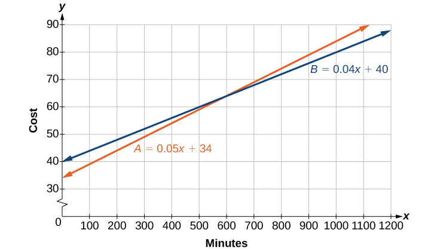
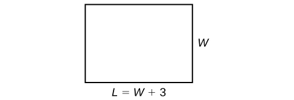

In this section you will:
* Set up a linear equation to solve a real-world application.
* Use a formula to solve a real-world application.

 {: #Figure_02_03_001}

Josh is hoping to get an A in his college algebra class. He has scores of 75, 82, 95, 91, and 94 on his first five tests. Only the final exam remains, and the maximum of points that can be earned is 100. Is it possible for Josh to end the course with an A? A simple linear equation will give Josh his answer.

Many real-world applications can be modeled by linear equations. For example, a cell phone package may include a monthly service fee plus a charge per minute of talk-time; it costs a widget manufacturer a certain amount to produce <em>x </em>widgets per month plus monthly operating charges; a car rental company charges a daily fee plus an amount per mile driven. These are examples of applications we come across every day that are modeled by linear equations. In this section, we will set up and use linear equations to solve such problems.

### Setting up a Linear Equation to Solve a Real-World Application

To set up or model a linear equation to fit a real-world application, we must first determine the known quantities and define the unknown quantity as a variable. Then, we begin to interpret the words as mathematical expressions using mathematical symbols. Let us use the car rental example above. In this case, a known cost, such as $0.10/mi, is multiplied by an unknown quantity, the number of miles driven. Therefore, we can write<math xmlns="http://www.w3.org/1998/Math/MathML"> <mrow> <mtext> </mtext><mn>0.10</mn><mi>x</mi><mo>.</mo><mtext> </mtext> </mrow> </math>

This expression represents a variable cost because it changes according to the number of miles driven.

If a quantity is independent of a variable, we usually just add or subtract it, according to the problem. As these amounts do not change, we call them fixed costs. Consider a car rental agency that charges $0.10/mi plus a daily fee of $50. We can use these quantities to model an equation that can be used to find the daily car rental cost<math xmlns="http://www.w3.org/1998/Math/MathML"> <mrow> <mtext> </mtext><mi>C</mi><mo>.</mo> </mrow> </math>

<math xmlns="http://www.w3.org/1998/Math/MathML" display="block"> <mrow> <mi>C</mi><mo>=</mo><mn>0.10</mn><mi>x</mi><mo>+</mo><mn>50</mn> </mrow> </math>

When dealing with real-world applications, there are certain expressions that we can translate directly into math. [\[link\]](#Table_02_03_01) lists some common verbal expressions and their equivalent mathematical expressions.

| Verbal | Translation to Math Operations |
|----------
| One number exceeds another by *a* | <math xmlns="http://www.w3.org/1998/Math/MathML"> <mrow> <mi>x</mi><mo>,</mo><mtext>​</mtext><mtext> </mtext><mi>x</mi><mo>+</mo><mi>a</mi> </mrow> </math>

 |
| Twice a number | <math xmlns="http://www.w3.org/1998/Math/MathML"> <mrow> <mn>2</mn><mi>x</mi> </mrow> </math>

 |
| One number is <em>a </em>more than another number | <math xmlns="http://www.w3.org/1998/Math/MathML"> <mrow> <mi>x</mi><mo>,</mo><mtext>​</mtext><mtext> </mtext><mi>x</mi><mo>+</mo><mi>a</mi> </mrow> </math>

 |
| One number is <em>a </em>less than twice another number | <math xmlns="http://www.w3.org/1998/Math/MathML"> <mrow> <mi>x</mi><mo>,</mo><mtext> </mtext><mn>2</mn><mi>x</mi><mo>−</mo><mi>a</mi> </mrow> </math>

 |
| The product of a number and *a*, decreased by *b* | <math xmlns="http://www.w3.org/1998/Math/MathML"> <mrow> <mi>a</mi><mi>x</mi><mo>−</mo><mi>b</mi> </mrow> </math>

 |
| The quotient of a number and the number plus <em>a </em>is three times the number | <math xmlns="http://www.w3.org/1998/Math/MathML"> <mrow> <mfrac> <mi>x</mi> <mrow> <mi>x</mi><mo>+</mo><mi>a</mi> </mrow> </mfrac> <mo>=</mo><mn>3</mn><mi>x</mi> </mrow> </math>

 |
| The product of three times a number and the number decreased by <em>b </em>is *c* | <math xmlns="http://www.w3.org/1998/Math/MathML"> <mrow> <mn>3</mn><mi>x</mi><mrow><mo>(</mo> <mrow> <mi>x</mi><mo>−</mo><mi>b</mi> </mrow> <mo>)</mo></mrow><mo>=</mo><mi>c</mi> </mrow> </math>

 |
{: #Table_02_03_01 summary="A table with 8 rows and 2 columns. The entries in the first row are: Verbal and Translation to math operations. The entries in the second row are: One number exceeds another by a and x, x+a. The entries in the third row are: Twice a number and 2x. The entries in the fourth row are: One number is a more than another number and x, x plus a. The entries in the fifth row are: One number is a less than twice another number and x,2 times x minus a. The entries in the sixth row are: The product of a number and a, decreased by b and a times x minus b. The entries in the seventh row are: The quotient of a number and the number plus a is three times the number and x divided by the quantity x plus a equals three times x. The entries in the eighth row are: The product of three times a number and the number decreased by b is c and three times x times the quantity x minus b equals c."}

**Given a real-world problem, model a linear equation to fit it.**

1.  Identify known quantities.
2.  Assign a variable to represent the unknown quantity.
3.  If there is more than one unknown quantity, find a way to write the second unknown in terms of the first.
4.  Write an equation interpreting the words as mathematical operations.
5.  Solve the equation. Be sure the solution can be explained in words, including the units of measure.
{: type="1"}

Modeling a Linear Equation to Solve an Unknown Number Problem

Find a linear equation to solve for the following unknown quantities: One number exceeds another number by<math xmlns="http://www.w3.org/1998/Math/MathML"> <mrow> <mtext> </mtext><mn>17</mn><mtext> </mtext> </mrow> </math>

and their sum is<math xmlns="http://www.w3.org/1998/Math/MathML"> <mrow> <mtext> </mtext><mn>31.</mn><mtext> </mtext> </mrow> </math>

Find the two numbers.

Let<math xmlns="http://www.w3.org/1998/Math/MathML"> <mrow> <mtext> </mtext><mi>x</mi><mtext> </mtext> </mrow> </math>

equal the first number. Then, as the second number exceeds the first by 17, we can write the second number as<math xmlns="http://www.w3.org/1998/Math/MathML"> <mrow> <mtext> </mtext><mi>x</mi><mo>+</mo><mn>17.</mn><mtext> </mtext> </mrow> </math>

The sum of the two numbers is 31. We usually interpret the word *is* as an equal sign.

<math xmlns="http://www.w3.org/1998/Math/MathML" display="block"> <mrow> <mtable> <mtr> <mtd columnalign="right" rowalign="center"> <mrow> <mi>x</mi><mo>+</mo><mo stretchy="false">(</mo><mi>x</mi><mo>+</mo><mn>17</mn><mo stretchy="false">)</mo></mrow> </mtd> <mtd rowalign="center"> <mo>=</mo> </mtd> <mtd columnalign="left" rowalign="center"> <mrow> <mn>31</mn></mrow> </mtd> </mtr> <mtr rowalign="center"> <mtd columnalign="right" rowalign="center"> <mrow> <mn>2</mn><mi>x</mi><mo>+</mo><mn>17</mn></mrow> </mtd> <mtd> <mo>=</mo> </mtd> <mtd columnalign="left"> <mrow> <mn>31</mn><mspace width="2em" /><mtext>Simplify and solve</mtext><mtext>.</mtext></mrow> </mtd> </mtr> <mtr rowalign="center"> <mtd columnalign="right" rowalign="center"> <mrow> <mn>2</mn><mi>x</mi></mrow> </mtd> <mtd> <mo>=</mo> </mtd> <mtd columnalign="left"> <mrow> <mn>14</mn></mrow> </mtd> </mtr> <mtr rowalign="center"> <mtd rowalign="center" columnalign="right"> <mi>x</mi> </mtd> <mtd rowalign="center"> <mo>=</mo> </mtd> <mtd columnalign="left" rowalign="center"> <mn>7</mn> </mtd> </mtr><mspace width="1em" /> <mtr rowalign="center"> <mtd rowalign="center" columnalign="right"> <mrow> <mi>x</mi><mo>+</mo><mn>17</mn></mrow> </mtd> <mtd rowalign="center"> <mo>=</mo> </mtd> <mtd columnalign="left" rowalign="center"> <mrow> <mn>7</mn><mo>+</mo><mn>17</mn></mrow> </mtd> </mtr> <mtr rowalign="center"> <mtd rowalign="center" /> <mtd rowalign="center"> <mo>=</mo> </mtd> <mtd rowalign="center" columnalign="left"> <mrow> <mn>24</mn></mrow> </mtd> </mtr> </mtable></mrow> </math>

The two numbers are<math xmlns="http://www.w3.org/1998/Math/MathML"> <mrow> <mtext> </mtext><mn>7</mn><mtext> </mtext> </mrow> </math>

and<math xmlns="http://www.w3.org/1998/Math/MathML"> <mrow> <mtext> </mtext><mn>24.</mn> </mrow> </math>

Find a linear equation to solve for the following unknown quantities: One number is three more than twice another number. If the sum of the two numbers is<math xmlns="http://www.w3.org/1998/Math/MathML"> <mrow> <mtext> </mtext><mn>36</mn><mo>,</mo> </mrow> </math>

find the numbers.

11 and 25

Setting Up a Linear Equation to Solve a Real-World Application

There are two cell phone companies that offer different packages. Company A charges a monthly service fee of $34 plus $.05/min talk-time. Company B charges a monthly service fee of $40 plus $.04/min talk-time.

1.  Write a linear equation that models the packages offered by both companies.
2.  If the average number of minutes used each month is 1,160, which company offers the better plan?
3.  If the average number of minutes used each month is 420, which company offers the better plan?
4.  How many minutes of talk-time would yield equal monthly statements from both companies?
{: type="a"}

1.  The model for Company *A* can be written as
    <math xmlns="http://www.w3.org/1998/Math/MathML"> <mrow> <mtext> </mtext><mi>A</mi><mo>=</mo><mn>0.05</mn><mi>x</mi><mo>+</mo><mn>34.</mn><mtext> </mtext> </mrow> </math>
    
    This includes the variable cost of
    <math xmlns="http://www.w3.org/1998/Math/MathML"> <mrow> <mtext> </mtext><mn>0.05</mn><mi>x</mi><mtext> </mtext> </mrow> </math>
    
    plus the monthly service charge of $34. Company *B*’s package charges a higher monthly fee of $40, but a lower variable cost of
    <math xmlns="http://www.w3.org/1998/Math/MathML"> <mrow> <mtext> </mtext><mn>0.04</mn><mi>x</mi><mo>.</mo><mtext> </mtext> </mrow> </math>
    
    Company *B*’s model can be written as
    <math xmlns="http://www.w3.org/1998/Math/MathML"> <mrow> <mtext> </mtext><mi>B</mi><mo>=</mo><mn>0.04</mn><mi>x</mi><mo>+</mo><mtext>$</mtext><mn>40.</mn> </mrow> </math>

2.  If the average number of minutes used each month is 1,160, we have the following:
    
    

    <math xmlns="http://www.w3.org/1998/Math/MathML" display="block"> <mrow> <mtable> <mtr rowalign="center"> <mtd rowalign="center" columnalign="right"> <mrow> <mtext>Company </mtext><mi>A</mi></mrow> </mtd> <mtd rowalign="center"> <mo>=</mo> </mtd> <mtd rowalign="center" columnalign="left"> <mrow> <mn>0.05</mn><mo stretchy="false">(</mo><mn>1.160</mn><mo stretchy="false">)</mo><mo>+</mo><mn>34</mn></mrow> </mtd> </mtr> <mtr rowalign="center"> <mtd rowalign="center" /> <mtd rowalign="center"> <mo>=</mo> </mtd> <mtd columnalign="left" rowalign="center"> <mrow> <mn>58</mn><mo>+</mo><mn>34</mn></mrow> </mtd> </mtr> <mtr rowalign="center"> <mtd rowalign="center" /> <mtd rowalign="center"> <mo>=</mo> </mtd> <mtd rowalign="center" columnalign="left"> <mrow> <mn>92</mn></mrow> </mtd> </mtr> <mspace width="1em" /> <mtr rowalign="center"> <mtd rowalign="center" columnalign="right"> <mrow> <mtext>Company </mtext><mi>B</mi></mrow> </mtd> <mtd rowalign="center"> <mo>=</mo> </mtd> <mtd rowalign="center" columnalign="left"> <mrow> <mn>0.04</mn><mo stretchy="false">(</mo><mn>1</mn><mo>,</mo><mn>1600</mn><mo stretchy="false">)</mo><mo>+</mo><mn>40</mn></mrow> </mtd> </mtr> <mtr rowalign="center"> <mtd rowalign="center" /> <mtd rowalign="center"> <mo>=</mo> </mtd> <mtd rowalign="center" columnalign="left"> <mrow> <mn>46.4</mn><mo>+</mo><mn>40</mn></mrow> </mtd> </mtr> <mtr rowalign="center"> <mtd rowalign="center" columnalign="right" /> <mtd rowalign="center"> <mo>=</mo> </mtd> <mtd rowalign="center" columnalign="left"> <mrow> <mn>86.4</mn></mrow> </mtd> </mtr> </mtable></mrow> </math>
    

    
    So, Company *B* offers the lower monthly cost of $86.40 as compared with the $92 monthly cost offered by Company *A* when the average number of minutes used each month is 1,160.

3.  If the average number of minutes used each month is 420, we have the following:
    
    

    <math xmlns="http://www.w3.org/1998/Math/MathML" display="block"> <mrow> <mtable> <mtr rowalign="center"> <mtd rowalign="center" columnalign="right"> <mrow> <mtext>Company </mtext><mi>A</mi></mrow> </mtd> <mtd rowalign="center"> <mo>=</mo> </mtd> <mtd rowalign="center" columnalign="left"> <mrow> <mn>0.05</mn><mo stretchy="false">(</mo><mn>420</mn><mo stretchy="false">)</mo><mo>+</mo><mn>34</mn></mrow> </mtd> </mtr> <mtr rowalign="center"> <mtd rowalign="center" /> <mtd rowalign="center"><mo>=</mo></mtd> <mtd rowalign="center" columnalign="left"> <mrow> <mn>21</mn><mo>+</mo><mn>34</mn></mrow> </mtd> </mtr> <mtr rowalign="center"> <mtd rowalign="center" /> <mtd rowalign="center"> <mo>=</mo> </mtd> <mtd rowalign="center" columnalign="left"> <mrow> <mn>55</mn></mrow> </mtd> </mtr> <mspace width="1em" /> <mtr rowalign="center"> <mtd rowalign="center" columnalign="right"> <mrow> <mtext>Company </mtext><mi>B</mi></mrow> </mtd> <mtd rowalign="center"> <mo>=</mo> </mtd> <mtd columnalign="left" rowalign="center"> <mrow> <mn>0.04</mn><mo stretchy="false">(</mo><mn>420</mn><mo stretchy="false">)</mo><mo>+</mo><mn>40</mn></mrow> </mtd> </mtr> <mtr rowalign="center"> <mtd rowalign="center" /> <mtd rowalign="center"><mo>=</mo></mtd> <mtd rowalign="center" columnalign="left"> <mrow> <mn>16.8</mn><mo>+</mo><mn>40</mn></mrow> </mtd> </mtr> <mtr rowalign="center"> <mtd rowalign="center" /> <mtd rowalign="center"> <mo>=</mo> </mtd> <mtd rowalign="center" columnalign="left"> <mrow> <mn>56.8</mn></mrow> </mtd> </mtr> </mtable></mrow> </math>
    

    
    If the average number of minutes used each month is 420, then Company <em>A </em>offers a lower monthly cost of $55 compared to Company *B*’s monthly cost of $56.80.

4.  To answer the question of how many talk-time minutes would yield the same bill from both companies, we should think about the problem in terms of<math xmlns="http://www.w3.org/1998/Math/MathML"> <mrow> <mtext> </mtext><mrow><mo>(</mo> <mrow> <mi>x</mi><mo>,</mo><mi>y</mi> </mrow> <mo>)</mo></mrow><mtext> </mtext> </mrow> </math>
    
    coordinates: At what point are both the *x-*value and the *y-*value equal? We can find this point by setting the equations equal to each other and solving for *x.*
    
    

    <math xmlns="http://www.w3.org/1998/Math/MathML" display="block"> <mrow> <mtable> <mtr> <mtd columnalign="right"><mrow><mn>0.05</mn><mi>x</mi><mo>+</mo><mn>34</mn></mrow></mtd> <mtd><mo>=</mo></mtd> <mtd columnalign="left"><mrow><mn>0.04</mn><mi>x</mi><mo>+</mo><mn>40</mn></mrow></mtd> </mtr> <mtr> <mtd columnalign="right"><mrow><mn>0.01</mn><mi>x</mi></mrow></mtd> <mtd><mo>=</mo></mtd> <mtd columnalign="left"><mn>6</mn></mtd> </mtr> <mtr> <mtd columnalign="right"><mi>x</mi></mtd> <mtd><mo>=</mo></mtd> <mtd columnalign="left"><mrow><mn>600</mn></mrow></mtd> </mtr> </mtable></mrow> </math>
    

    
    Check the *x-*value in each equation.
    
    

    <math xmlns="http://www.w3.org/1998/Math/MathML" display="block"> <mrow> <mtable> <mtr> <mtd columnalign="right"><mrow><mn>0.05</mn><mo stretchy="false">(</mo><mn>600</mn><mo stretchy="false">)</mo><mo>+</mo><mn>34</mn></mrow></mtd> <mtd><mo>=</mo></mtd> <mtd columnalign="left"><mrow><mn>64</mn></mrow></mtd> </mtr> <mtr> <mtd columnalign="right"><mrow><mn>0.04</mn><mo stretchy="false">(</mo><mn>600</mn><mo stretchy="false">)</mo><mo>+</mo><mn>40</mn></mrow></mtd> <mtd><mo>=</mo></mtd> <mtd columnalign="left"><mrow><mn>64</mn></mrow></mtd> </mtr> </mtable></mrow> </math>
    

    
    Therefore, a monthly average of 600 talk-time minutes renders the plans equal. See [[link]](#Figure_02_03_002)
{: type="a"}

{: #Figure_02_03_002}

Find a linear equation to model this real-world application: It costs ABC electronics company $2.50 per unit to produce a part used in a popular brand of desktop computers. The company has monthly operating expenses of $350 for utilities and $3,300 for salaries. What are the company’s monthly expenses?

<math xmlns="http://www.w3.org/1998/Math/MathML"> <mrow> <mi>C</mi><mo>=</mo><mn>2.5</mn><mi>x</mi><mo>+</mo><mn>3</mn><mo>,</mo><mn>650</mn> </mrow> </math>

### Using a Formula to Solve a Real-World Application

Many applications are solved using known formulas. The problem is stated, a formula is identified, the known quantities are substituted into the formula, the equation is solved for the unknown, and the problem’s question is answered. Typically, these problems involve two equations representing two trips, two investments, two areas, and so on. Examples of formulas include the **area**{: data-type="term"} of a rectangular region,<math xmlns="http://www.w3.org/1998/Math/MathML"> <mrow> <mtext> </mtext><mi>A</mi><mo>=</mo><mi>L</mi><mi>W</mi><mo>;</mo> </mrow> </math>

the **perimeter**{: data-type="term"} of a rectangle,<math xmlns="http://www.w3.org/1998/Math/MathML"> <mrow> <mtext> </mtext><mi>P</mi><mo>=</mo><mn>2</mn><mi>L</mi><mo>+</mo><mn>2</mn><mi>W</mi><mo>;</mo> </mrow> </math>

and the **volume**{: data-type="term"} of a rectangular solid,<math xmlns="http://www.w3.org/1998/Math/MathML"> <mrow> <mtext> </mtext><mi>V</mi><mo>=</mo><mi>L</mi><mi>W</mi><mi>H</mi><mo>.</mo><mtext> </mtext> </mrow> </math>

When there are two unknowns, we find a way to write one in terms of the other because we can solve for only one variable at a time.

Solving an Application Using a Formula

It takes Andrew 30 min to drive to work in the morning. He drives home using the same route, but it takes 10 min longer, and he averages 10 mi/h less than in the morning. How far does Andrew drive to work?

This is a distance problem, so we can use the formula<math xmlns="http://www.w3.org/1998/Math/MathML"> <mrow> <mtext> </mtext><mi>d</mi><mo>=</mo><mi>r</mi><mi>t</mi><mo>,</mo> </mrow> </math>

where distance equals rate multiplied by time. Note that when rate is given in mi/h, time must be expressed in hours. Consistent units of measurement are key to obtaining a correct solution.

First, we identify the known and unknown quantities. Andrew’s morning drive to work takes 30 min, or<math xmlns="http://www.w3.org/1998/Math/MathML"> <mrow> <mtext> </mtext><mfrac> <mn>1</mn> <mn>2</mn> </mfrac> <mtext> </mtext> </mrow> </math>

h at rate<math xmlns="http://www.w3.org/1998/Math/MathML"> <mrow> <mtext> </mtext><mi>r</mi><mo>.</mo><mtext> </mtext> </mrow> </math>

His drive home takes 40 min, or<math xmlns="http://www.w3.org/1998/Math/MathML"> <mrow> <mtext> </mtext><mfrac> <mn>2</mn> <mn>3</mn> </mfrac> <mtext> </mtext> </mrow> </math>

h, and his speed averages 10 mi/h less than the morning drive. Both trips cover distance<math xmlns="http://www.w3.org/1998/Math/MathML"> <mrow> <mtext> </mtext><mi>d</mi><mo>.</mo><mtext> </mtext> </mrow> </math>

A table, such as [[link]](#Table_02_03_02), is often helpful for keeping track of information in these types of problems.

|  | <math xmlns="http://www.w3.org/1998/Math/MathML"> <mi>d</mi> </math>

 | <math xmlns="http://www.w3.org/1998/Math/MathML"> <mi>r</mi> </math>

 | <math xmlns="http://www.w3.org/1998/Math/MathML"> <mi>t</mi> </math>

 |
|----------
| **To Work** | <math xmlns="http://www.w3.org/1998/Math/MathML"> <mi>d</mi> </math>

 | <math xmlns="http://www.w3.org/1998/Math/MathML"> <mi>r</mi> </math>

 | <math xmlns="http://www.w3.org/1998/Math/MathML"> <mrow> <mfrac> <mn>1</mn> <mn>2</mn> </mfrac> </mrow> </math>

 |
| **To Home** | <math xmlns="http://www.w3.org/1998/Math/MathML"> <mi>d</mi> </math>

 | <math xmlns="http://www.w3.org/1998/Math/MathML"> <mrow> <mi>r</mi><mo>−</mo><mn>10</mn> </mrow> </math>

 | <math xmlns="http://www.w3.org/1998/Math/MathML"> <mrow> <mfrac> <mn>2</mn> <mn>3</mn> </mfrac> </mrow> </math>

 |
{: #Table_02_03_02 summary="A table with 3 rows and 4 columns. The first entry in the first row is blank, the rest are: d, r, and t. The entries in the second row are: To Work, d, r, and . The entries in the third row are: To Home, d, r 10, and 2/3."}

Write two equations, one for each trip.

<math xmlns="http://www.w3.org/1998/Math/MathML" display="block"> <mrow> <mtable> <mtr> <mtd columnalign="right"> <mi>d</mi> </mtd> <mtd> <mo>=</mo> </mtd> <mtd columnalign="left"> <mrow> <mi>r</mi><mrow><mo>(</mo> <mrow> <mfrac> <mn>1</mn> <mn>2</mn> </mfrac> </mrow> <mo>)</mo></mrow></mrow> </mtd> <mtd columnalign="left"> <mrow> <mspace width="2em" /><mtext>To work</mtext></mrow> </mtd> </mtr> <mtr> <mtd columnalign="right"> <mi>d</mi> </mtd> <mtd> <mo>=</mo> </mtd> <mtd columnalign="left"> <mrow> <mo stretchy="false">(</mo><mi>r</mi><mo>−</mo><mn>10</mn><mo stretchy="false">)</mo><mrow><mo>(</mo> <mrow> <mfrac> <mn>2</mn> <mn>3</mn> </mfrac> </mrow> <mo>)</mo></mrow></mrow> </mtd> <mtd columnalign="left"> <mrow> <mspace width="2em" /><mtext>To home</mtext></mrow> </mtd> </mtr> </mtable></mrow> </math>

As both equations equal the same distance, we set them equal to each other and solve for *r*.

<math xmlns="http://www.w3.org/1998/Math/MathML" display="block"> <mrow> <mtable> <mtr> <mtd columnalign="right"> <mrow> <mi>r</mi><mrow><mo>(</mo> <mrow> <mfrac> <mn>1</mn> <mn>2</mn> </mfrac> </mrow> <mo>)</mo></mrow></mrow> </mtd> <mtd> <mo>=</mo> </mtd> <mtd columnalign="left"> <mrow> <mo stretchy="false">(</mo><mi>r</mi><mo>−</mo><mn>10</mn><mo stretchy="false">)</mo><mrow><mo>(</mo> <mrow> <mfrac> <mn>2</mn> <mn>3</mn> </mfrac> </mrow> <mo>)</mo></mrow></mrow> </mtd> </mtr> <mtr> <mtd columnalign="right"> <mrow> <mfrac> <mn>1</mn> <mrow> <mn>2</mn><mi>r</mi></mrow> </mfrac> </mrow> </mtd> <mtd> <mo>=</mo> </mtd> <mtd columnalign="left"> <mrow> <mfrac> <mn>2</mn> <mn>3</mn> </mfrac> <mi>r</mi><mo>−</mo><mfrac> <mrow> <mn>20</mn></mrow> <mn>3</mn> </mfrac> </mrow> </mtd> </mtr> <mtr> <mtd columnalign="right"> <mrow> <mfrac> <mn>1</mn> <mn>2</mn> </mfrac> <mi>r</mi><mo>−</mo><mfrac> <mn>2</mn> <mn>3</mn> </mfrac> <mi>r</mi></mrow> </mtd> <mtd> <mo>=</mo> </mtd> <mtd columnalign="left"> <mrow> <mo>−</mo><mfrac> <mrow> <mn>20</mn></mrow> <mn>3</mn> </mfrac> </mrow> </mtd> </mtr> <mtr> <mtd columnalign="right"> <mrow> <mo>−</mo><mfrac> <mn>1</mn> <mn>6</mn> </mfrac> <mi>r</mi></mrow> </mtd> <mtd> <mo>=</mo> </mtd> <mtd columnalign="left"> <mrow> <mo>−</mo><mfrac> <mrow> <mn>20</mn></mrow> <mn>3</mn> </mfrac> </mrow> </mtd> </mtr> <mtr> <mtd columnalign="right"> <mi>r</mi> </mtd> <mtd> <mo>=</mo> </mtd> <mtd columnalign="left"> <mrow> <mo>−</mo><mfrac> <mrow> <mn>20</mn></mrow> <mn>3</mn> </mfrac> <mo stretchy="false">(</mo><mn>−6</mn><mo stretchy="false">)</mo></mrow> </mtd> </mtr> <mtr> <mtd columnalign="right"> <mi>r</mi> </mtd> <mtd> <mo>=</mo> </mtd> <mtd columnalign="left"> <mrow> <mn>40</mn></mrow> </mtd> </mtr> </mtable></mrow> </math>

We have solved for the rate of speed to work, 40 mph. Substituting 40 into the rate on the return trip yields 30 mi/h. Now we can answer the question. Substitute the rate back into either equation and solve for <em>d. </em>

<math xmlns="http://www.w3.org/1998/Math/MathML" display="block"> <mrow> <mtable> <mtr rowalign="center"> <mtd rowalign="center" columnalign="right"> <mi>d</mi> </mtd> <mtd rowalign="center"> <mo>=</mo> </mtd> <mtd rowalign="center" columnalign="left"> <mrow> <mn>40</mn><mrow><mo>(</mo> <mrow> <mfrac> <mn>1</mn> <mn>2</mn> </mfrac> </mrow> <mo>)</mo></mrow></mrow> </mtd> </mtr> <mtr rowalign="center"> <mtd rowalign="center" /> <mtd rowalign="center"> <mo>=</mo> </mtd> <mtd rowalign="center" columnalign="left"> <mrow> <mn>20</mn></mrow> </mtd> </mtr> </mtable></mrow> </math>

The distance between home and work is 20 mi.

Analysis

Note that we could have cleared the fractions in the equation by multiplying both sides of the equation by the LCD to solve for<math xmlns="http://www.w3.org/1998/Math/MathML"> <mrow> <mtext> </mtext><mi>r</mi><mo>.</mo> </mrow> </math>

<math xmlns="http://www.w3.org/1998/Math/MathML" display="block"> <mrow> <mtable> <mtr> <mtd columnalign="right"> <mrow> <mi>r</mi><mrow><mo>(</mo> <mrow> <mfrac> <mn>1</mn> <mn>2</mn> </mfrac> </mrow> <mo>)</mo></mrow></mrow> </mtd> <mtd> <mo>=</mo> </mtd> <mtd columnalign="left"> <mrow> <mo stretchy="false">(</mo><mi>r</mi><mo>−</mo><mn>10</mn><mo stretchy="false">)</mo><mrow><mo>(</mo> <mrow> <mfrac> <mn>2</mn> <mn>3</mn> </mfrac> </mrow> <mo>)</mo></mrow></mrow> </mtd> </mtr> <mtr> <mtd columnalign="right"> <mrow> <mn>6</mn><mtext> </mtext><mo>×</mo><mtext> </mtext><mi>r</mi><mrow><mo>(</mo> <mrow> <mfrac> <mn>1</mn> <mn>2</mn> </mfrac> </mrow> <mo>)</mo></mrow></mrow> </mtd> <mtd> <mo>=</mo> </mtd> <mtd columnalign="left"> <mrow> <mn>6</mn><mtext> </mtext><mo>×</mo><mtext> </mtext><mo stretchy="false">(</mo><mi>r</mi><mo>−</mo><mn>10</mn><mo stretchy="false">)</mo><mrow><mo>(</mo> <mrow> <mfrac> <mn>2</mn> <mn>3</mn> </mfrac> </mrow> <mo>)</mo></mrow></mrow> </mtd> </mtr> <mtr> <mtd columnalign="right"> <mrow> <mn>3</mn><mi>r</mi></mrow> </mtd> <mtd> <mo>=</mo> </mtd> <mtd columnalign="left"> <mrow> <mn>4</mn><mo stretchy="false">(</mo><mi>r</mi><mo>−</mo><mn>10</mn><mo stretchy="false">)</mo></mrow> </mtd> </mtr> <mtr> <mtd columnalign="right"> <mrow> <mn>3</mn><mi>r</mi></mrow> </mtd> <mtd> <mo>=</mo> </mtd> <mtd columnalign="left"> <mrow> <mn>4</mn><mi>r</mi><mo>−</mo><mn>40</mn></mrow> </mtd> </mtr> <mtr> <mtd columnalign="right"> <mrow> <mo>−</mo><mi>r</mi></mrow> </mtd> <mtd> <mo>=</mo> </mtd> <mtd columnalign="left"> <mrow> <mn>−40</mn></mrow> </mtd> </mtr> <mtr> <mtd columnalign="right"> <mi>r</mi> </mtd> <mtd> <mo>=</mo> </mtd> <mtd columnalign="left"> <mrow> <mn>40</mn></mrow> </mtd> </mtr> </mtable></mrow> </math>

On Saturday morning, it took Jennifer 3.6 h to drive to her mother’s house for the weekend. On Sunday evening, due to heavy traffic, it took Jennifer 4 h to return home. Her speed was 5 mi/h slower on Sunday than on Saturday. What was her speed on Sunday?

45 mi/h

Solving a Perimeter Problem

The perimeter of a rectangular outdoor patio is<math xmlns="http://www.w3.org/1998/Math/MathML"> <mrow> <mtext> </mtext><mn>54</mn><mtext> </mtext> </mrow> </math>

ft. The length is<math xmlns="http://www.w3.org/1998/Math/MathML"> <mrow> <mtext> </mtext><mn>3</mn><mtext> </mtext> </mrow> </math>

ft greater than the width. What are the dimensions of the patio?

The perimeter formula is standard:<math xmlns="http://www.w3.org/1998/Math/MathML"> <mrow> <mtext> </mtext><mi>P</mi><mo>=</mo><mn>2</mn><mi>L</mi><mo>+</mo><mn>2</mn><mi>W</mi><mo>.</mo><mtext> </mtext> </mrow> </math>

We have two unknown quantities, length and width. However, we can write the length in terms of the width as<math xmlns="http://www.w3.org/1998/Math/MathML"> <mrow> <mtext> </mtext><mi>L</mi><mo>=</mo><mi>W</mi><mo>+</mo><mn>3.</mn><mtext> </mtext> </mrow> </math>

Substitute the perimeter value and the expression for length into the formula. It is often helpful to make a sketch and label the sides as in [[link]](#Figure_02_03_003).

{: #Figure_02_03_003}

Now we can solve for the width and then calculate the length.

<math xmlns="http://www.w3.org/1998/Math/MathML" display="block"> <mrow> <mtable> <mtr> <mtd columnalign="right"><mi>P</mi></mtd> <mtd><mo>=</mo></mtd> <mtd columnalign="left"><mrow><mn>2</mn><mi>L</mi><mo>+</mo><mn>2</mn><mi>W</mi></mrow></mtd> </mtr> <mtr> <mtd columnalign="right"><mrow><mn>54</mn></mrow></mtd> <mtd><mo>=</mo></mtd> <mtd columnalign="left"><mrow><mn>2</mn><mo stretchy="false">(</mo><mi>W</mi><mo>+</mo><mn>3</mn><mo stretchy="false">)</mo><mo>+</mo><mn>2</mn><mi>W</mi></mrow></mtd> </mtr> <mtr> <mtd columnalign="right"><mrow><mn>54</mn></mrow></mtd> <mtd><mo>=</mo></mtd> <mtd columnalign="left"><mrow><mn>2</mn><mi>W</mi><mo>+</mo><mn>6</mn><mo>+</mo><mn>2</mn><mi>W</mi></mrow></mtd> </mtr> <mtr> <mtd columnalign="right"><mrow><mn>54</mn></mrow></mtd> <mtd><mo>=</mo></mtd> <mtd columnalign="left"><mrow><mn>4</mn><mi>W</mi><mo>+</mo><mn>6</mn></mrow></mtd> </mtr> <mtr> <mtd columnalign="right"><mrow><mn>48</mn></mrow></mtd> <mtd><mo>=</mo></mtd> <mtd columnalign="left"><mrow><mn>4</mn><mi>W</mi></mrow></mtd> </mtr> <mtr> <mtd columnalign="right"><mrow><mn>12</mn></mrow></mtd> <mtd><mo>=</mo></mtd> <mtd columnalign="left"><mi>W</mi></mtd> </mtr> <mtr> <mtd columnalign="right"><mrow><mo stretchy="false">(</mo><mn>12</mn><mo>+</mo><mn>3</mn><mo stretchy="false">)</mo></mrow></mtd> <mtd><mo>=</mo></mtd> <mtd columnalign="left"><mi>L</mi></mtd> </mtr> <mtr> <mtd columnalign="right"><mrow><mn>15</mn></mrow></mtd> <mtd><mo>=</mo></mtd> <mtd columnalign="left"><mi>L</mi></mtd> </mtr> </mtable></mrow> </math>

The dimensions are<math xmlns="http://www.w3.org/1998/Math/MathML"> <mrow> <mtext> </mtext><mi>L</mi><mo>=</mo><mn>15</mn><mtext> </mtext> </mrow> </math>

ft and<math xmlns="http://www.w3.org/1998/Math/MathML"> <mrow> <mtext> </mtext><mi>W</mi><mo>=</mo><mn>12</mn><mtext> </mtext> </mrow> </math>

ft.

Find the dimensions of a rectangle given that the perimeter is<math xmlns="http://www.w3.org/1998/Math/MathML"> <mrow> <mtext> </mtext><mn>110</mn><mtext> </mtext> </mrow> </math>

cm and the length is 1 cm more than twice the width.

<math xmlns="http://www.w3.org/1998/Math/MathML"> <mrow> <mi>L</mi><mo>=</mo><mn>37</mn><mtext> </mtext> </mrow> </math>

cm,<math xmlns="http://www.w3.org/1998/Math/MathML"> <mrow> <mtext> </mtext><mi>W</mi><mo>=</mo><mn>18</mn><mtext> </mtext> </mrow> </math>

cm

Solving an Area Problem

The perimeter of a tablet of graph paper is 48 in. The length is<math xmlns="http://www.w3.org/1998/Math/MathML"> <mrow> <mtext> </mtext><mn>6</mn><mtext> </mtext> </mrow> </math>

in. more than the width. Find the area of the graph paper.

The standard formula for area is<math xmlns="http://www.w3.org/1998/Math/MathML"> <mrow> <mtext> </mtext><mi>A</mi><mo>=</mo><mi>L</mi><mi>W</mi><mo>;</mo> </mrow> </math>

however, we will solve the problem using the perimeter formula. The reason we use the perimeter formula is because we know enough information about the perimeter that the formula will allow us to solve for one of the unknowns. As both perimeter and area use length and width as dimensions, they are often used together to solve a problem such as this one.

We know that the length is 6 in. more than the width, so we can write length as<math xmlns="http://www.w3.org/1998/Math/MathML"> <mrow> <mtext> </mtext><mi>L</mi><mo>=</mo><mi>W</mi><mo>+</mo><mn>6.</mn><mtext> </mtext> </mrow> </math>

Substitute the value of the perimeter and the expression for length into the perimeter formula and find the length.

<math xmlns="http://www.w3.org/1998/Math/MathML" display="block"> <mrow> <mtable> <mtr> <mtd columnalign="right"><mi>P</mi></mtd> <mtd><mo>=</mo></mtd> <mtd columnalign="left"><mrow><mn>2</mn><mi>L</mi><mo>+</mo><mn>2</mn><mi>W</mi></mrow></mtd> </mtr> <mtr> <mtd columnalign="right"><mrow><mn>48</mn></mrow></mtd> <mtd><mo>=</mo></mtd> <mtd columnalign="left"><mrow><mn>2</mn><mo stretchy="false">(</mo><mi>W</mi><mo>+</mo><mn>6</mn><mo stretchy="false">)</mo><mo>+</mo><mn>2</mn><mi>W</mi></mrow></mtd> </mtr> <mtr> <mtd columnalign="right"><mrow><mn>48</mn></mrow></mtd> <mtd><mo>=</mo></mtd> <mtd columnalign="left"><mrow><mn>2</mn><mi>W</mi><mo>+</mo><mn>12</mn><mo>+</mo><mn>2</mn><mi>W</mi></mrow></mtd> </mtr> <mtr> <mtd columnalign="right"><mrow><mn>48</mn></mrow></mtd> <mtd><mo>=</mo></mtd> <mtd columnalign="left"><mrow><mn>4</mn><mi>W</mi><mo>+</mo><mn>12</mn></mrow></mtd> </mtr> <mtr> <mtd columnalign="right"><mrow><mn>36</mn></mrow></mtd> <mtd><mo>=</mo></mtd> <mtd columnalign="left"><mrow><mn>4</mn><mi>W</mi></mrow></mtd> </mtr> <mtr> <mtd columnalign="right"><mn>9</mn></mtd> <mtd><mo>=</mo></mtd> <mtd columnalign="left"><mi>W</mi></mtd> </mtr> <mtr> <mtd columnalign="right"><mrow><mo stretchy="false">(</mo><mn>9</mn><mo>+</mo><mn>6</mn><mo stretchy="false">)</mo></mrow></mtd> <mtd><mo>=</mo></mtd> <mtd columnalign="left"><mi>L</mi></mtd> </mtr> <mtr> <mtd columnalign="right"><mrow><mn>15</mn></mrow></mtd> <mtd><mo>=</mo></mtd> <mtd columnalign="left"><mi>L</mi></mtd> </mtr> </mtable></mrow> </math>

Now, we find the area given the dimensions of<math xmlns="http://www.w3.org/1998/Math/MathML"> <mrow> <mtext> </mtext><mi>L</mi><mo>=</mo><mn>15</mn><mtext> </mtext> </mrow> </math>

in. and<math xmlns="http://www.w3.org/1998/Math/MathML"> <mrow> <mtext> </mtext><mi>W</mi><mo>=</mo><mn>9</mn><mtext> </mtext> </mrow> </math>

in.

<math xmlns="http://www.w3.org/1998/Math/MathML" display="block"> <mrow> <mtable> <mtr rowalign="center"> <mtd rowalign="center" columnalign="right"><mi>A</mi></mtd> <mtd rowalign="center"><mo>=</mo></mtd> <mtd rowalign="center" columnalign="left"><mrow><mi>L</mi><mi>W</mi></mrow></mtd> </mtr> <mtr> <mtd rowalign="center" columnalign="right"><mi>A</mi></mtd> <mtd rowalign="center"><mo>=</mo></mtd> <mtd rowalign="center" columnalign="left"><mrow><mn>15</mn><mo stretchy="false">(</mo><mn>9</mn><mo stretchy="false">)</mo></mrow></mtd> </mtr> <mtr> <mtd rowalign="center" /> <mtd rowalign="center"><mo>=</mo></mtd> <mtd rowalign="center" columnalign="right"> <mrow> <mn>135</mn><mtext> in</mtext><msup> <mtext>.</mtext> <mn>2</mn> </msup> </mrow> </mtd> </mtr> </mtable></mrow> </math>

The area is<math xmlns="http://www.w3.org/1998/Math/MathML"> <mrow> <mtext> </mtext><mn>135</mn><mtext> </mtext> </mrow> </math>

in.2.

A game room has a perimeter of 70 ft. The length is five more than twice the width. How many ft2 of new carpeting should be ordered?

250 ft2

Solving a Volume Problem

Find the dimensions of a shipping box given that the length is twice the width, the height is<math xmlns="http://www.w3.org/1998/Math/MathML"> <mrow> <mtext> </mtext><mn>8</mn><mtext> </mtext> </mrow> </math>

inches, and the volume is 1,600 in.3.

The formula for the volume of a box is given as<math xmlns="http://www.w3.org/1998/Math/MathML"> <mrow> <mtext> </mtext><mi>V</mi><mo>=</mo><mi>L</mi><mi>W</mi><mi>H</mi><mo>,</mo> </mrow> </math>

the product of length, width, and height. We are given that<math xmlns="http://www.w3.org/1998/Math/MathML"> <mrow> <mtext> </mtext><mi>L</mi><mo>=</mo><mn>2</mn><mi>W</mi><mo>,</mo> </mrow> </math>

and<math xmlns="http://www.w3.org/1998/Math/MathML"> <mrow> <mtext> </mtext><mi>H</mi><mo>=</mo><mn>8.</mn><mtext> </mtext> </mrow> </math>

The volume is<math xmlns="http://www.w3.org/1998/Math/MathML"> <mrow> <mtext> </mtext><mn>1,600</mn><mtext> </mtext> </mrow> </math>

cubic inches.

<math xmlns="http://www.w3.org/1998/Math/MathML" display="block"> <mrow> <mtable> <mtr> <mtd columnalign="right"><mi>V</mi></mtd> <mtd><mo>=</mo></mtd> <mtd columnalign="left"><mrow><mi>L</mi><mi>W</mi><mi>H</mi></mrow></mtd> </mtr> <mtr> <mtd columnalign="right"><mrow><mn>1</mn><mo>,</mo><mn>600</mn></mrow></mtd> <mtd><mo>=</mo></mtd> <mtd columnalign="left"><mrow><mo stretchy="false">(</mo><mn>2</mn><mi>W</mi><mo stretchy="false">)</mo><mi>W</mi><mo stretchy="false">(</mo><mn>8</mn><mo stretchy="false">)</mo></mrow></mtd> </mtr> <mtr> <mtd columnalign="right"><mrow><mn>1</mn><mo>,</mo><mn>600</mn></mrow></mtd> <mtd><mo>=</mo></mtd> <mtd columnalign="left"><mrow><mn>16</mn><msup><mi>W</mi><mn>2</mn></msup></mrow></mtd> </mtr> <mtr> <mtd columnalign="right"><mrow><mn>100</mn></mrow></mtd> <mtd><mo>=</mo></mtd> <mtd columnalign="left"><mrow><msup><mi>W</mi><mn>2</mn></msup></mrow></mtd> </mtr> <mtr> <mtd columnalign="right"><mrow><mn>10</mn></mrow></mtd> <mtd><mo>=</mo></mtd> <mtd columnalign="left"><mi>W</mi></mtd> </mtr> </mtable></mrow> </math>

The dimensions are<math xmlns="http://www.w3.org/1998/Math/MathML"> <mrow> <mtext> </mtext><mi>L</mi><mo>=</mo><mn>20</mn><mtext> </mtext> </mrow> </math>

in.,<math xmlns="http://www.w3.org/1998/Math/MathML"> <mrow> <mtext> </mtext><mi>W</mi><mo>=</mo><mn>10</mn><mtext> </mtext> </mrow> </math>

in., and<math xmlns="http://www.w3.org/1998/Math/MathML"> <mrow> <mtext> </mtext><mi>H</mi><mo>=</mo><mn>8</mn><mtext> </mtext> </mrow> </math>

in.

Analysis

Note that the square root of<math xmlns="http://www.w3.org/1998/Math/MathML"> <mrow> <mtext> </mtext><msup> <mi>W</mi> <mn>2</mn> </msup> <mtext> </mtext> </mrow> </math>

would result in a positive and a negative value. However, because we are describing width, we can use only the positive result.

Access these online resources for additional instruction and practice with models and applications of linear equations.

* [Problem solving using linear equations][1]
* [Problem solving using equations][2]
* [Finding the dimensions of area given the perimeter][3]
* [Find the distance between the cities using the distance = rate \* time formula][4]
* [Linear equation application (Write a cost equation)][5]

### Key Concepts

* A linear equation can be used to solve for an unknown in a number problem. See [\[link\]](#Example_02_03_01)**.**
* Applications can be written as mathematical problems by identifying known quantities and assigning a variable to unknown quantities. See [\[link\]](#Example_02_03_02).
* There are many known formulas that can be used to solve applications. Distance problems, for example, are solved using the
  <math xmlns="http://www.w3.org/1998/Math/MathML"> <mrow> <mtext> </mtext><mi>d</mi><mo>=</mo><mi>r</mi><mi>t</mi><mtext> </mtext> </mrow> </math>
  
  formula. See [\[link\]](#Example_02_03_03).
* Many geometry problems are solved using the perimeter formula
  <math xmlns="http://www.w3.org/1998/Math/MathML"> <mrow> <mtext> </mtext><mi>P</mi><mo>=</mo><mn>2</mn><mi>L</mi><mo>+</mo><mn>2</mn><mi>W</mi><mo>,</mo> </mrow> </math>
  
  the area formula
  <math xmlns="http://www.w3.org/1998/Math/MathML"> <mrow> <mtext> </mtext><mi>A</mi><mo>=</mo><mi>L</mi><mi>W</mi><mo>,</mo> </mrow> </math>
  
  or the volume formula
  <math xmlns="http://www.w3.org/1998/Math/MathML"> <mrow> <mtext> </mtext><mi>V</mi><mo>=</mo><mi>L</mi><mi>W</mi><mi>H</mi><mo>.</mo><mtext> </mtext> </mrow> </math>
  
  See [\[link\]](#Example_02_03_04)<strong>, </strong>[\[link\]](#Example_02_03_05), and [\[link\]](#Example_02_03_06).

### Section Exercises

#### Verbal

To set up a model linear equation to fit real-world applications, what should always be the first step?

Answers may vary. Possible answers: We should define in words what our variable is representing. We should declare the variable. A heading.

Use your own words to describe this equation where *n* is a number:

<math xmlns="http://www.w3.org/1998/Math/MathML"> <mrow> <mn>5</mn><mo stretchy="false">(</mo><mi>n</mi><mo>+</mo><mn>3</mn><mo stretchy="false">)</mo><mo>=</mo><mn>2</mn><mi>n</mi> </mrow> </math>

If the total amount of money you had to invest was $2,000 and you deposit<math xmlns="http://www.w3.org/1998/Math/MathML"> <mrow> <mtext> </mtext><mi>x</mi><mtext> </mtext> </mrow> </math>

amount in one investment, how can you represent the remaining amount?

<math xmlns="http://www.w3.org/1998/Math/MathML"> <mrow> <mn>2</mn><mo>,</mo><mn>000</mn><mo>−</mo><mi>x</mi> </mrow> </math>

If a man sawed a 10-ft board into two sections and one section was<math xmlns="http://www.w3.org/1998/Math/MathML"> <mrow> <mtext> </mtext><mi>n</mi><mtext> </mtext> </mrow> </math>

ft long, how long would the other section be in terms of<math xmlns="http://www.w3.org/1998/Math/MathML"> <mrow> <mtext> </mtext><mi>n</mi> </mrow> </math>

?

If Bill was traveling<math xmlns="http://www.w3.org/1998/Math/MathML"> <mrow> <mtext> </mtext><mi>v</mi><mtext> </mtext> </mrow> </math>

mi/h, how would you represent Daemon’s speed if he was traveling 10 mi/h faster?

<math xmlns="http://www.w3.org/1998/Math/MathML"> <mrow> <mi>v</mi><mo>+</mo><mn>10</mn> </mrow> </math>

#### Real-World Applications

For the following exercises, use the information to find a linear algebraic equation model to use to answer the question being asked.

Mark and Don are planning to sell each of their marble collections at a garage sale. If Don has 1 more than 3 times the number of marbles Mark has, how many does each boy have to sell if the total number of marbles is 113?

Beth and Ann are joking that their combined ages equal Sam’s age. If Beth is twice Ann’s age and Sam is 69 yr old, what are Beth and Ann’s ages?

Ann:<math xmlns="http://www.w3.org/1998/Math/MathML"> <mrow> <mtext> </mtext><mn>23</mn><mo>;</mo> </mrow> </math>

Beth:<math xmlns="http://www.w3.org/1998/Math/MathML"> <mrow> <mtext> </mtext><mn>46</mn> </mrow> </math>

Ben originally filled out 8 more applications than Henry. Then each boy filled out 3 additional applications, bringing the total to 28. How many applications did each boy originally fill out?

For the following exercises, use this scenario: Two different telephone carriers offer the following plans that a person is considering. Company A has a monthly fee of $20 and charges of $.05/min for calls. Company B has a monthly fee of $5 and charges $.10/min for calls.

Find the model of the total cost of Company A’s plan, using<math xmlns="http://www.w3.org/1998/Math/MathML"> <mrow> <mtext> </mtext><mi>m</mi><mtext> </mtext> </mrow> </math>

for the minutes.

<math xmlns="http://www.w3.org/1998/Math/MathML"> <mrow> <mn>20</mn><mo>+</mo><mn>0.05</mn><mi>m</mi> </mrow> </math>

Find the model of the total cost of Company B’s plan, using<math xmlns="http://www.w3.org/1998/Math/MathML"> <mrow> <mtext> </mtext><mi>m</mi><mtext> </mtext> </mrow> </math>

for the minutes.

Find out how many minutes of calling would make the two plans equal.

300 min

If the person makes a monthly average of 200 min of calls, which plan should for the person choose?

For the following exercises, use this scenario: A wireless carrier offers the following plans that a person is considering. The Family Plan: $90 monthly fee, unlimited talk and text on up to 8 lines, and data charges of $40 for each device for up to 2 GB of data per device. The Mobile Share Plan: $120 monthly fee for up to 10 devices, unlimited talk and text for all the lines, and data charges of $35 for each device up to a shared total of 10 GB of data. Use<math xmlns="http://www.w3.org/1998/Math/MathML"> <mrow> <mtext> </mtext><mi>P</mi><mtext> </mtext> </mrow> </math>

for the number of devices that need data plans as part of their cost.

Find the model of the total cost of the Family Plan.

<math xmlns="http://www.w3.org/1998/Math/MathML"> <mrow> <mn>90</mn><mo>+</mo><mn>40</mn><mi>P</mi> </mrow> </math>

Find the model of the total cost of the Mobile Share Plan.

Assuming they stay under their data limit, find the number of devices that would make the two plans equal in cost.

6 devices

If a family has 3 smart phones, which plan should they choose?

For exercises 17 and 18, use this scenario: A retired woman has $50,000 to invest but needs to make $6,000 a year from the interest to meet certain living expenses. One bond investment pays 15% annual interest. The rest of it she wants to put in a CD that pays 7%.

If we let<math xmlns="http://www.w3.org/1998/Math/MathML"> <mrow> <mtext> </mtext><mi>x</mi><mtext> </mtext> </mrow> </math>

be the amount the woman invests in the 15% bond, how much will she be able to invest in the CD?

<math xmlns="http://www.w3.org/1998/Math/MathML"> <mrow> <mn>50</mn><mo>,</mo><mn>000</mn><mo>−</mo><mi>x</mi> </mrow> </math>

Set up and solve the equation for how much the woman should invest in each option to sustain a $6,000 annual return.

Two planes fly in opposite directions. One travels 450 mi/h and the other 550 mi/h. How long will it take before they are 4,000 mi apart?

4 h

Ben starts walking along a path at 4 mi/h. One and a half hours after Ben leaves, his sister Amanda begins jogging along the same path at 6 mi/h. How long will it be before Amanda catches up to Ben?

Fiora starts riding her bike at 20 mi/h. After a while, she slows down to 12 mi/h, and maintains that speed for the rest of the trip. The whole trip of 70 mi takes her 4.5 h. For what distance did she travel at 20 mi/h?

She traveled for 2 h at 20 mi/h, or 40 miles.

A chemistry teacher needs to mix a 30% salt solution with a 70% salt solution to make 20 qt of a 40% salt solution. How many quarts of each solution should the teacher mix to get the desired result?

Paul has $20,000 to invest. His intent is to earn 11% interest on his investment. He can invest part of his money at 8% interest and part at 12% interest. How much does Paul need to invest in each option to make get a total 11% return on his $20,000?

$5,000 at 8% and $15,000 at 12%

For the following exercises, use this scenario: A truck rental agency offers two kinds of plans. Plan A charges $75/wk plus $.10/mi driven. Plan B charges $100/wk plus $.05/mi driven.

Write the model equation for the cost of renting a truck with plan A.

Write the model equation for the cost of renting a truck with plan B.

<math xmlns="http://www.w3.org/1998/Math/MathML"> <mrow> <mi>B</mi><mo>=</mo><mn>100</mn><mo>+</mo><mn>.05</mn><mi>x</mi> </mrow> </math>

Find the number of miles that would generate the same cost for both plans.

If Tim knows he has to travel 300 mi, which plan should he choose?

Plan A

For the following exercises, use the given formulas to answer the questions.

<math xmlns="http://www.w3.org/1998/Math/MathML"> <mrow> <mi>A</mi><mo>=</mo><mi>P</mi><mo stretchy="false">(</mo><mn>1</mn><mo>+</mo><mi>r</mi><mi>t</mi><mo stretchy="false">)</mo><mtext> </mtext> </mrow> </math>

is used to find the principal amount *P*deposited, earning *r*% interest, for *t* years. Use this to find what principal amount *P* David invested at a 3% rate for 20 yr if<math xmlns="http://www.w3.org/1998/Math/MathML"> <mrow> <mtext> </mtext><mi>A</mi><mo>=</mo><mtext>$</mtext><mn>8,000.</mn></mrow> </math>

The formula<math xmlns="http://www.w3.org/1998/Math/MathML"> <mrow> <mtext> </mtext><mi>F</mi><mo>=</mo><mfrac> <mrow> <mi>m</mi><msup> <mi>v</mi> <mn>2</mn> </msup> </mrow> <mi>R</mi> </mfrac> <mtext> </mtext> </mrow> </math>

relates force (*F*), velocity (*v*), mass (*m*), and resistance (*R*). Find<math xmlns="http://www.w3.org/1998/Math/MathML"> <mrow> <mtext> </mtext><mi>R</mi><mtext> </mtext> </mrow> </math>

when<math xmlns="http://www.w3.org/1998/Math/MathML"> <mrow> <mtext> </mtext><mi>m</mi><mo>=</mo><mn>45</mn><mo>,</mo> </mrow> </math>

<math xmlns="http://www.w3.org/1998/Math/MathML"> <mrow> <mi>v</mi><mo>=</mo><mn>7</mn><mo>,</mo> </mrow> </math>

and<math xmlns="http://www.w3.org/1998/Math/MathML"> <mrow> <mtext> </mtext><mi>F</mi><mo>=</mo><mn>245.</mn> </mrow> </math>

<math xmlns="http://www.w3.org/1998/Math/MathML"> <mrow> <mi>R</mi><mo>=</mo><mn>9</mn> </mrow> </math>

<math xmlns="http://www.w3.org/1998/Math/MathML"> <mrow> <mi>F</mi><mo>=</mo><mi>m</mi><mi>a</mi><mtext> </mtext> </mrow> </math>

indicates that force (*F*) equals mass (*m*) times acceleration (*a*). Find the acceleration of a mass of 50 kg if a force of 12 N is exerted on it.

<math xmlns="http://www.w3.org/1998/Math/MathML"> <mrow> <mi>S</mi><mi>u</mi><mi>m</mi><mo>=</mo><mfrac> <mn>1</mn> <mrow> <mn>1</mn><mo>−</mo><mi>r</mi> </mrow> </mfrac> <mtext> </mtext> </mrow> </math>

is the formula for an infinite series sum. If the sum is 5, find<math xmlns="http://www.w3.org/1998/Math/MathML"> <mrow> <mtext> </mtext><mi>r</mi><mo>.</mo> </mrow> </math>

<math xmlns="http://www.w3.org/1998/Math/MathML"> <mrow> <mi>r</mi><mo>=</mo><mfrac> <mn>4</mn> <mn>5</mn> </mfrac> <mtext> </mtext> </mrow> </math>

or 0.8

For the following exercises, solve for the given variable in the formula. After obtaining a new version of the formula, you will use it to solve a question.

Solve for *W*:<math xmlns="http://www.w3.org/1998/Math/MathML"> <mrow> <mtext> </mtext><mi>P</mi><mo>=</mo><mn>2</mn><mi>L</mi><mo>+</mo><mn>2</mn><mi>W</mi> </mrow> </math>

Use the formula from the previous question to find the width,<math xmlns="http://www.w3.org/1998/Math/MathML"> <mrow> <mtext> </mtext><mi>W</mi><mo>,</mo> </mrow> </math>

of a rectangle whose length is 15 and whose perimeter is 58.

<math xmlns="http://www.w3.org/1998/Math/MathML"> <mrow> <mi>W</mi><mo>=</mo><mfrac> <mrow> <mi>P</mi><mo>−</mo><mn>2</mn><mi>L</mi> </mrow> <mn>2</mn> </mfrac> <mo>=</mo><mfrac> <mrow> <mn>58</mn><mo>−</mo><mn>2</mn><mo stretchy="false">(</mo><mn>15</mn><mo stretchy="false">)</mo> </mrow> <mn>2</mn> </mfrac> <mo>=</mo><mn>14</mn> </mrow> </math>

Solve for<math xmlns="http://www.w3.org/1998/Math/MathML"> <mrow> <mtext> </mtext><mi>f</mi><mo>:</mo><mfrac> <mn>1</mn> <mi>p</mi> </mfrac> <mo>+</mo><mfrac> <mn>1</mn> <mi>q</mi> </mfrac> <mo>=</mo><mfrac> <mn>1</mn> <mi>f</mi> </mfrac> </mrow> </math>

Use the formula from the previous question to find<math xmlns="http://www.w3.org/1998/Math/MathML"> <mrow> <mtext> </mtext><mi>f</mi><mtext> </mtext> </mrow> </math>

when<math xmlns="http://www.w3.org/1998/Math/MathML"> <mrow> <mtext> </mtext><mi>p</mi><mo>=</mo><mn>8</mn><mtext> </mtext><mtext>and </mtext><mi>q</mi><mo>=</mo><mn>13.</mn> </mrow> </math>

<math xmlns="http://www.w3.org/1998/Math/MathML"> <mrow> <mi>f</mi><mo>=</mo><mfrac> <mrow> <mi>p</mi><mi>q</mi> </mrow> <mrow> <mi>p</mi><mo>+</mo><mi>q</mi> </mrow> </mfrac> <mo>=</mo><mfrac> <mrow> <mn>8</mn><mo stretchy="false">(</mo><mn>13</mn><mo stretchy="false">)</mo> </mrow> <mrow> <mn>8</mn><mo>+</mo><mn>13</mn> </mrow> </mfrac> <mo>=</mo><mfrac> <mrow> <mn>104</mn> </mrow> <mrow> <mn>21</mn> </mrow> </mfrac> </mrow> </math>

Solve for<math xmlns="http://www.w3.org/1998/Math/MathML"> <mrow> <mtext> </mtext><mi>m</mi><mtext> </mtext> </mrow> </math>

in the slope-intercept formula:<math xmlns="http://www.w3.org/1998/Math/MathML"> <mrow> <mtext> </mtext><mi>y</mi><mo>=</mo><mi>m</mi><mi>x</mi><mo>+</mo><mi>b</mi> </mrow> </math>

Use the formula from the previous question to find<math xmlns="http://www.w3.org/1998/Math/MathML"> <mrow> <mtext> </mtext><mi>m</mi><mtext> </mtext> </mrow> </math>

when the coordinates of the point are<math xmlns="http://www.w3.org/1998/Math/MathML"> <mrow> <mtext> </mtext><mrow><mo>(</mo> <mrow> <mn>4</mn><mo>,</mo><mn>7</mn> </mrow> <mo>)</mo></mrow><mtext> </mtext> </mrow> </math>

and<math xmlns="http://www.w3.org/1998/Math/MathML"> <mrow> <mtext> </mtext><mi>b</mi><mo>=</mo><mn>12.</mn> </mrow> </math>

<math xmlns="http://www.w3.org/1998/Math/MathML"> <mrow> <mi>m</mi><mo>=</mo><mfrac> <mrow> <mo>−</mo><mn>5</mn> </mrow> <mn>4</mn> </mfrac> </mrow> </math>

The area of a trapezoid is given by<math xmlns="http://www.w3.org/1998/Math/MathML"> <mrow> <mtext> </mtext><mi>A</mi><mo>=</mo><mfrac> <mn>1</mn> <mn>2</mn> </mfrac> <mi>h</mi><mrow><mo>(</mo> <mrow> <msub> <mi>b</mi> <mn>1</mn> </msub> <mo>+</mo><msub> <mi>b</mi> <mn>2</mn> </msub> </mrow> <mo>)</mo></mrow><mo>.</mo><mtext> </mtext> </mrow> </math>

Use the formula to find the area of a trapezoid with<math xmlns="http://www.w3.org/1998/Math/MathML"> <mrow> <mtext> </mtext><mi>h</mi><mo>=</mo><mn>6</mn><mo>,</mo><mtext> </mtext><msub> <mi>b</mi> <mn>1</mn> </msub> <mo>=</mo><mn>14</mn><mo>,</mo><mtext> and </mtext><msub> <mi>b</mi> <mn>2</mn> </msub> <mo>=</mo><mn>8.</mn> </mrow> </math>

Solve for *h:*<math xmlns="http://www.w3.org/1998/Math/MathML"> <mrow> <mtext> </mtext><mi>A</mi><mo>=</mo><mfrac> <mn>1</mn> <mn>2</mn> </mfrac> <mi>h</mi><mrow><mo>(</mo> <mrow> <msub> <mi>b</mi> <mn>1</mn> </msub> <mo>+</mo><msub> <mi>b</mi> <mn>2</mn> </msub> </mrow> <mo>)</mo></mrow> </mrow> </math>

<math xmlns="http://www.w3.org/1998/Math/MathML"> <mrow> <mi>h</mi><mo>=</mo><mfrac> <mrow> <mn>2</mn><mi>A</mi> </mrow> <mrow> <msub> <mi>b</mi> <mn>1</mn> </msub> <mo>+</mo><msub> <mi>b</mi> <mn>2</mn> </msub> </mrow> </mfrac> </mrow> </math>

Use the formula from the previous question to find the height of a trapezoid with<math xmlns="http://www.w3.org/1998/Math/MathML"> <mrow> <mtext> </mtext><mi>A</mi><mo>=</mo><mn>150</mn><mo>,</mo><mtext> </mtext><msub> <mi>b</mi> <mn>1</mn> </msub> <mo>=</mo><mn>19</mn><mo>,</mo><mtext> and </mtext><msub> <mi>b</mi> <mn>2</mn> </msub> <mo>=</mo><mn>11.</mn> </mrow> </math>

Find the dimensions of an American football field. The length is 200 ft more than the width, and the perimeter is 1,040 ft. Find the length and width. Use the perimeter formula<math xmlns="http://www.w3.org/1998/Math/MathML"> <mrow> <mtext> </mtext><mi>P</mi><mo>=</mo><mn>2</mn><mi>L</mi><mo>+</mo><mn>2</mn><mi>W</mi><mo>.</mo> </mrow> </math>

length = 360 ft; width = 160 ft

Distance equals rate times time,<math xmlns="http://www.w3.org/1998/Math/MathML"> <mrow> <mtext> </mtext><mi>d</mi><mo>=</mo><mi>r</mi><mi>t</mi><mo>.</mo><mtext> </mtext> </mrow> </math>

Find the distance Tom travels if he is moving at a rate of 55 mi/h for 3.5 h.

Using the formula in the previous exercise, find the distance that Susan travels if she is moving at a rate of 60 mi/h for 6.75 h.

405 mi

What is the total distance that two people travel in 3 h if one of them is riding a bike at 15 mi/h and the other is walking at 3 mi/h?

If the area model for a triangle is<math xmlns="http://www.w3.org/1998/Math/MathML"> <mrow> <mtext> </mtext><mi>A</mi><mo>=</mo><mfrac> <mn>1</mn> <mn>2</mn> </mfrac> <mi>b</mi><mi>h</mi><mo>,</mo> </mrow> </math>

find the area of a triangle with a height of 16 in. and a base of 11 in.

<math xmlns="http://www.w3.org/1998/Math/MathML"> <mrow> <mi>A</mi><mo>=</mo><mn>88</mn><mtext> in</mtext><msup> <mo>.</mo> <mn>2</mn> </msup> </mrow> </math>

Solve for *h:*<math xmlns="http://www.w3.org/1998/Math/MathML"> <mrow> <mtext> </mtext><mi>A</mi><mo>=</mo><mfrac> <mn>1</mn> <mn>2</mn> </mfrac> <mi>b</mi><mi>h</mi> </mrow> </math>

Use the formula from the previous question to find the height to the nearest tenth of a triangle with a base of 15 and an area of 215.

28\.7

The volume formula for a cylinder is<math xmlns="http://www.w3.org/1998/Math/MathML"> <mrow> <mtext> </mtext><mi>V</mi><mo>=</mo><mi>π</mi><msup> <mi>r</mi> <mn>2</mn> </msup> <mi>h</mi><mo>.</mo><mtext> </mtext> </mrow> </math>

Using the symbol<math xmlns="http://www.w3.org/1998/Math/MathML"> <mrow> <mtext> </mtext><mi>π</mi><mtext> </mtext> </mrow> </math>

in your answer, find the volume of a cylinder with a radius,<math xmlns="http://www.w3.org/1998/Math/MathML"> <mrow> <mtext> </mtext><mi>r</mi><mo>,</mo> </mrow> </math>

of 4 cm and a height of 14 cm.

Solve for *h:*<math xmlns="http://www.w3.org/1998/Math/MathML"> <mrow> <mtext> </mtext><mi>V</mi><mo>=</mo><mi>π</mi><msup> <mi>r</mi> <mn>2</mn> </msup> <mi>h</mi> </mrow> </math>

<math xmlns="http://www.w3.org/1998/Math/MathML"> <mrow> <mi>h</mi><mo>=</mo><mfrac> <mi>V</mi> <mrow> <mi>π</mi><msup> <mi>r</mi> <mn>2</mn> </msup> </mrow> </mfrac> </mrow> </math>

Use the formula from the previous question to find the height of a cylinder with a radius of 8 and a volume of<math xmlns="http://www.w3.org/1998/Math/MathML"> <mrow> <mtext> </mtext><mn>16</mn><mi>π</mi> </mrow> </math>

Solve for *r:*<math xmlns="http://www.w3.org/1998/Math/MathML"> <mrow> <mtext> </mtext><mi>V</mi><mo>=</mo><mi>π</mi><msup> <mi>r</mi> <mn>2</mn> </msup> <mi>h</mi> </mrow> </math>

<math xmlns="http://www.w3.org/1998/Math/MathML"> <mrow> <mi>r</mi><mo>=</mo><msqrt> <mrow> <mfrac> <mi>V</mi> <mrow> <mi>π</mi><mi>h</mi> </mrow> </mfrac> </mrow> </msqrt> </mrow> </math>

Use the formula from the previous question to find the radius of a cylinder with a height of 36 and a volume of<math xmlns="http://www.w3.org/1998/Math/MathML"> <mrow> <mtext> </mtext><mn>324</mn><mi>π</mi><mo>.</mo> </mrow> </math>

The formula for the circumference of a circle is<math xmlns="http://www.w3.org/1998/Math/MathML"> <mrow> <mtext> </mtext><mi>C</mi><mo>=</mo><mn>2</mn><mi>π</mi><mi>r</mi><mo>.</mo><mtext> </mtext> </mrow> </math>

Find the circumference of a circle with a diameter of 12 in. (diameter = 2*r*). Use the symbol<math xmlns="http://www.w3.org/1998/Math/MathML"> <mrow> <mtext> </mtext><mi>π</mi><mtext> </mtext> </mrow> </math>

in your final answer.

<math xmlns="http://www.w3.org/1998/Math/MathML"> <mrow> <mi>C</mi><mo>=</mo><mn>12</mn><mi>π</mi> </mrow> </math>

Solve the formula from the previous question for<math xmlns="http://www.w3.org/1998/Math/MathML"> <mrow> <mtext> </mtext><mi>π</mi><mo>.</mo><mtext> </mtext> </mrow> </math>

Notice why<math xmlns="http://www.w3.org/1998/Math/MathML"> <mrow> <mtext> </mtext><mi>π</mi><mtext> </mtext> </mrow> </math>

is sometimes defined as the ratio of the circumference to its diameter.

### Glossary
{: data-type="glossary-title"}

area
: in square units, the area formula used in this section is used to find the area of any two-dimensional rectangular region:
  <math xmlns="http://www.w3.org/1998/Math/MathML"> <mrow> <mtext> </mtext><mi>A</mi><mo>=</mo><mi>L</mi><mi>W</mi> </mrow> </math>
^

perimeter
: in linear units, the perimeter formula is used to find the linear measurement, or outside length and width, around a two-dimensional regular object; for a rectangle:
  <math xmlns="http://www.w3.org/1998/Math/MathML"> <mrow> <mtext> </mtext><mi>P</mi><mo>=</mo><mn>2</mn><mi>L</mi><mo>+</mo><mn>2</mn><mi>W</mi> </mrow> </math>
^

volume
: in cubic units, the volume measurement includes length, width, and depth:
  <math xmlns="http://www.w3.org/1998/Math/MathML"> <mrow> <mtext> </mtext><mi>V</mi><mo>=</mo><mi>L</mi><mi>W</mi><mi>H</mi> </mrow> </math>

[1]: http://openstaxcollege.org/l/lineqprobsolve
[2]: http://openstaxcollege.org/l/equationprsolve
[3]: http://openstaxcollege.org/l/permareasolve
[4]: http://openstaxcollege.org/l/ratetimesolve
[5]: http://openstaxcollege.org/l/lineqappl
