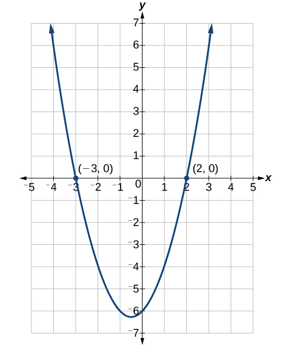
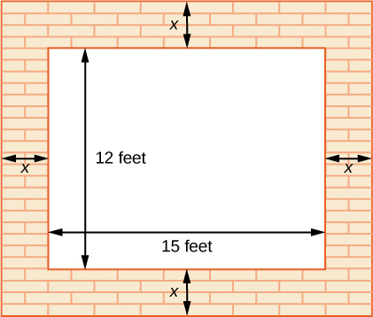

In this section you will:
* Solve quadratic equations by factoring.
* Solve quadratic equations by the square root property.
* Solve quadratic equations by completing the square.
* Solve quadratic equations by using the quadratic formula.

 {: #Figure_02_05_001}

The computer monitor on the left in [\[link\]](#Figure_02_05_001) is a 23.6-inch model and the one on the right is a 27-inch model. Proportionally, the monitors appear very similar. If there is a limited amount of space and we desire the largest monitor possible, how do we decide which one to choose? In this section, we will learn how to solve problems such as this using four different methods.

# Solving Quadratic Equations by Factoring

An equation containing a second-degree polynomial is called a **quadratic equation**{: data-type="term" .no-emphasis}. For example, equations such as<math xmlns="http://www.w3.org/1998/Math/MathML"> <mrow> <mtext> </mtext><mn>2</mn><msup> <mi>x</mi> <mn>2</mn> </msup> <mo>+</mo><mn>3</mn><mi>x</mi><mo>−</mo><mn>1</mn><mo>=</mo><mn>0</mn><mtext> </mtext></mrow> </math>

and<math xmlns="http://www.w3.org/1998/Math/MathML"> <mrow> <mtext> </mtext><msup> <mi>x</mi> <mn>2</mn> </msup> <mo>−</mo><mn>4</mn><mo>=</mo><mn>0</mn><mtext> </mtext></mrow> </math>

are quadratic equations. They are used in countless ways in the fields of engineering, architecture, finance, biological science, and, of course, mathematics.

Often the easiest method of solving a quadratic equation is **factoring**{: data-type="term" .no-emphasis}. Factoring means finding expressions that can be multiplied together to give the expression on one side of the equation.

If a quadratic equation can be factored, it is written as a product of linear terms. Solving by factoring depends on the zero-product property, which states that if<math xmlns="http://www.w3.org/1998/Math/MathML"> <mrow> <mtext> </mtext><mi>a</mi><mo>⋅</mo><mi>b</mi><mo>=</mo><mn>0</mn><mo>,</mo> </mrow> </math>

then<math xmlns="http://www.w3.org/1998/Math/MathML"> <mrow> <mtext> </mtext><mi>a</mi><mo>=</mo><mn>0</mn><mtext> </mtext> </mrow> </math>

or<math xmlns="http://www.w3.org/1998/Math/MathML"> <mrow> <mtext> </mtext><mi>b</mi><mo>=</mo><mn>0</mn><mo>,</mo> </mrow> </math>

where <em>a </em>and <em>b </em>are real numbers or algebraic expressions. In other words, if the product of two numbers or two expressions equals zero, then one of the numbers or one of the expressions must equal zero because zero multiplied by anything equals zero.

Multiplying the factors expands the equation to a string of terms separated by plus or minus signs. So, in that sense, the operation of multiplication undoes the operation of factoring. For example, expand the factored expression<math xmlns="http://www.w3.org/1998/Math/MathML"> <mrow> <mtext> </mtext><mrow><mo>(</mo> <mrow> <mi>x</mi><mo>−</mo><mn>2</mn></mrow> <mo>)</mo></mrow><mrow><mo>(</mo> <mrow> <mi>x</mi><mo>+</mo><mn>3</mn></mrow> <mo>)</mo></mrow><mtext> </mtext></mrow> </math>

by multiplying the two factors together.

<math xmlns="http://www.w3.org/1998/Math/MathML" display="block"> <mrow> <mtable> <mtr rowalign="center"> <mtd rowalign="center" columnalign="right"> <mrow> <mrow><mo>(</mo> <mrow> <mi>x</mi><mo>−</mo><mn>2</mn></mrow> <mo>)</mo></mrow><mrow><mo>(</mo> <mrow> <mi>x</mi><mo>+</mo><mn>3</mn></mrow> <mo>)</mo></mrow></mrow> </mtd> <mtd rowalign="center"> <mo>=</mo> </mtd> <mtd rowalign="center" columnalign="left"> <mrow> <msup> <mi>x</mi> <mn>2</mn> </msup> <mo>+</mo><mn>3</mn><mi>x</mi><mo>−</mo><mn>2</mn><mi>x</mi><mo>−</mo><mn>6</mn></mrow> </mtd> </mtr> <mtr rowalign="center"> <mtd rowalign="center" /> <mtd rowalign="center"> <mo>=</mo> </mtd> <mtd rowalign="center" columnalign="left"> <mrow> <msup> <mi>x</mi> <mn>2</mn> </msup> <mo>+</mo><mi>x</mi><mo>−</mo><mn>6</mn></mrow> </mtd> </mtr> </mtable></mrow> </math>

The product is a quadratic expression. Set equal to zero,<math xmlns="http://www.w3.org/1998/Math/MathML"> <mrow> <mtext> </mtext><msup> <mi>x</mi> <mn>2</mn> </msup> <mo>+</mo><mi>x</mi><mo>−</mo><mn>6</mn><mo>=</mo><mn>0</mn><mtext> </mtext> </mrow> </math>

is a quadratic equation. If we were to factor the equation, we would get back the factors we multiplied.

The process of factoring a quadratic equation depends on the leading coefficient, whether it is 1 or another integer. We will look at both situations; but first, we want to confirm that the equation is written in standard form,<math xmlns="http://www.w3.org/1998/Math/MathML"> <mrow> <mtext> </mtext><mi>a</mi><msup> <mi>x</mi> <mn>2</mn> </msup> <mo>+</mo><mi>b</mi><mi>x</mi><mo>+</mo><mi>c</mi><mo>=</mo><mn>0</mn><mo>,</mo> </mrow> </math>

where *a*, *b*, and *c* are real numbers, and<math xmlns="http://www.w3.org/1998/Math/MathML"> <mrow> <mtext> </mtext><mi>a</mi><mo>≠</mo><mn>0.</mn><mtext> </mtext> </mrow> </math>

The equation<math xmlns="http://www.w3.org/1998/Math/MathML"> <mrow> <mtext> </mtext><msup> <mi>x</mi> <mn>2</mn> </msup> <mo>+</mo><mi>x</mi><mo>−</mo><mn>6</mn><mo>=</mo><mn>0</mn><mtext> </mtext></mrow> </math>

is in standard form.

We can use the zero-product property to solve quadratic equations in which we first have to factor out the **greatest common factor**{: data-type="term" .no-emphasis} (GCF), and for equations that have special factoring formulas as well, such as the difference of squares, both of which we will see later in this section.

The Zero-Product Property and Quadratic Equations

The **zero-product property**{: data-type="term"} states

<math xmlns="http://www.w3.org/1998/Math/MathML" display="block"> <mrow> <mtext>If </mtext><mi>a</mi><mo>⋅</mo><mi>b</mi><mo>=</mo><mn>0</mn><mo>,</mo><mtext> then </mtext><mi>a</mi><mo>=</mo><mn>0</mn><mtext> or </mtext><mi>b</mi><mo>=</mo><mn>0</mn><mo>,</mo> </mrow> </math>

where <em>a </em>and <em>b </em>are real numbers or algebraic expressions.

A **quadratic equation**{: data-type="term"} is an equation containing a second-degree polynomial; for example

<math xmlns="http://www.w3.org/1998/Math/MathML"> <mrow> <mi>a</mi><msup> <mi>x</mi> <mn>2</mn> </msup> <mo>+</mo><mi>b</mi><mi>x</mi><mo>+</mo><mi>c</mi><mo>=</mo><mn>0</mn> </mrow> </math>

where *a*, *b*, and *c* are real numbers, and if<math xmlns="http://www.w3.org/1998/Math/MathML"> <mrow> <mtext> </mtext><mi>a</mi><mo>≠</mo><mn>0</mn><mo>,</mo> </mrow> </math>

it is in standard form.

## Solving Quadratics with a Leading Coefficient of 1

In the quadratic equation<math xmlns="http://www.w3.org/1998/Math/MathML"> <mrow> <mtext> </mtext><msup> <mi>x</mi> <mn>2</mn> </msup> <mo>+</mo><mi>x</mi><mo>−</mo><mn>6</mn><mo>=</mo><mn>0</mn><mo>,</mo></mrow> </math>

the leading coefficient, or the coefficient of<math xmlns="http://www.w3.org/1998/Math/MathML"> <mrow> <mtext> </mtext><msup> <mi>x</mi> <mn>2</mn> </msup> <mo>,</mo> </mrow> </math>

is 1. We have one method of factoring quadratic equations in this form.

**Given a quadratic equation with the leading coefficient of 1, factor it.**

1.  Find two numbers whose product equals *c* and whose sum equals *b*.
2.  Use those numbers to write two factors of the form
    <math xmlns="http://www.w3.org/1998/Math/MathML"> <mrow> <mtext> </mtext><mrow><mo>(</mo> <mrow> <mi>x</mi><mo>+</mo><mi>k</mi> </mrow> <mo>)</mo></mrow><mtext> or </mtext><mrow><mo>(</mo> <mrow> <mi>x</mi><mo>−</mo><mi>k</mi> </mrow> <mo>)</mo></mrow><mo>,</mo> </mrow> </math>
    
    where <em>k </em>is one of the numbers found in step 1. Use the numbers exactly as they are. In other words, if the two numbers are 1 and
    <math xmlns="http://www.w3.org/1998/Math/MathML"> <mrow> <mtext> </mtext><mn>−2</mn><mo>,</mo></mrow> </math>
    
    the factors are
    <math xmlns="http://www.w3.org/1998/Math/MathML"> <mrow> <mtext> </mtext><mrow><mo>(</mo> <mrow> <mi>x</mi><mo>+</mo><mn>1</mn></mrow> <mo>)</mo></mrow><mrow><mo>(</mo> <mrow> <mi>x</mi><mo>−</mo><mn>2</mn></mrow> <mo>)</mo></mrow><mo>.</mo></mrow> </math>

3.  Solve using the zero-product property by setting each factor equal to zero and solving for the variable.
{: data-number-style="arabic"}

Factoring and Solving a Quadratic with Leading Coefficient of 1

Factor and solve the equation:<math xmlns="http://www.w3.org/1998/Math/MathML"> <mrow> <mtext> </mtext><msup> <mi>x</mi> <mn>2</mn> </msup> <mo>+</mo><mi>x</mi><mo>−</mo><mn>6</mn><mo>=</mo><mn>0.</mn></mrow> </math>

To factor<math xmlns="http://www.w3.org/1998/Math/MathML"> <mrow> <mtext> </mtext><msup> <mi>x</mi> <mn>2</mn> </msup> <mo>+</mo><mi>x</mi><mo>−</mo><mn>6</mn><mo>=</mo><mn>0</mn><mo>,</mo> </mrow> </math>

we look for two numbers whose product equals<math xmlns="http://www.w3.org/1998/Math/MathML"> <mrow> <mtext> </mtext><mn>−6</mn><mtext> </mtext> </mrow> </math>

and whose sum equals 1. Begin by looking at the possible factors of<math xmlns="http://www.w3.org/1998/Math/MathML"> <mrow> <mtext> </mtext><mn>−6.</mn> </mrow> </math>

<math xmlns="http://www.w3.org/1998/Math/MathML" display="block"> <mrow> <mtable> <mtr> <mtd> <mrow> <mn>1</mn><mo>⋅</mo><mo stretchy="false">(</mo><mn>−6</mn><mo stretchy="false">)</mo></mrow> </mtd> </mtr> <mtr> <mtd> <mrow> <mo stretchy="false">(</mo><mn>−6</mn><mo stretchy="false">)</mo><mo>⋅</mo><mn>1</mn></mrow> </mtd> </mtr> <mtr> <mtd> <mrow> <mn>2</mn><mo>⋅</mo><mo stretchy="false">(</mo><mn>−3</mn><mo stretchy="false">)</mo></mrow> </mtd> </mtr> <mtr> <mtd> <mrow> <mn>3</mn><mo>⋅</mo><mo stretchy="false">(</mo><mn>−2</mn><mo stretchy="false">)</mo></mrow> </mtd> </mtr> </mtable></mrow> </math>

The last pair,<math xmlns="http://www.w3.org/1998/Math/MathML"> <mrow> <mtext> </mtext><mn>3</mn><mo>⋅</mo><mrow><mo>(</mo> <mrow> <mn>−2</mn> </mrow> <mo>)</mo></mrow><mtext> </mtext> </mrow> </math>

sums to 1, so these are the numbers. Note that only one pair of numbers will work. Then, write the factors.

<math xmlns="http://www.w3.org/1998/Math/MathML" display="block"> <mrow> <mrow><mo>(</mo> <mrow> <mi>x</mi><mo>−</mo><mn>2</mn></mrow> <mo>)</mo></mrow><mrow><mo>(</mo> <mrow> <mi>x</mi><mo>+</mo><mn>3</mn></mrow> <mo>)</mo></mrow><mo>=</mo><mn>0</mn></mrow> </math>

To solve this equation, we use the zero-product property. Set each factor equal to zero and solve.

<math xmlns="http://www.w3.org/1998/Math/MathML" display="block"> <mrow> <mtable> <mtr> <mtd columnalign="right"> <mrow> <mrow><mo>(</mo> <mrow> <mi>x</mi><mo>−</mo><mn>2</mn></mrow> <mo>)</mo></mrow><mrow><mo>(</mo> <mrow> <mi>x</mi><mo>+</mo><mn>3</mn></mrow> <mo>)</mo></mrow></mrow> </mtd> <mtd><mo>=</mo></mtd> <mtd rowalign="center" columnalign="left"><mn>0</mn></mtd> </mtr> <mtr> <mtd columnalign="right"> <mrow> <mrow><mo>(</mo> <mrow> <mi>x</mi><mo>−</mo><mn>2</mn></mrow> <mo>)</mo></mrow></mrow> </mtd> <mtd><mo>=</mo></mtd> <mtd columnalign="left"><mn>0</mn></mtd> </mtr> <mtr> <mtd columnalign="right"><mi>x</mi></mtd> <mtd><mo>=</mo></mtd> <mtd columnalign="left"><mn>2</mn></mtd> </mtr> <mtr> <mtd columnalign="right"> <mrow> <mrow><mo>(</mo> <mrow> <mi>x</mi><mo>+</mo><mn>3</mn></mrow> <mo>)</mo></mrow></mrow> </mtd> <mtd><mo>=</mo></mtd> <mtd columnalign="left"><mn>0</mn></mtd> </mtr> <mtr> <mtd columnalign="right"><mi>x</mi></mtd> <mtd><mo>=</mo></mtd> <mtd columnalign="left"><mrow><mn>−3</mn></mrow></mtd> </mtr> </mtable></mrow> </math>

The two solutions are<math xmlns="http://www.w3.org/1998/Math/MathML"> <mrow> <mtext> </mtext><mi>x</mi><mo>=</mo><mn>2</mn><mtext> </mtext> </mrow> </math>

and<math xmlns="http://www.w3.org/1998/Math/MathML"> <mrow> <mtext> </mtext><mi>x</mi><mo>=</mo><mn>−3.</mn><mtext> </mtext> </mrow> </math>

We can see how the solutions relate to the graph in [[link]](#Figure_02_05_002). The solutions are the *x-*intercepts of<math xmlns="http://www.w3.org/1998/Math/MathML"> <mrow> <mtext> </mtext><msup> <mi>x</mi> <mn>2</mn> </msup> <mo>+</mo><mi>x</mi><mo>−</mo><mn>6</mn><mo>=</mo><mn>0.</mn></mrow> </math>

{: #Figure_02_05_002}

Factor and solve the quadratic equation:<math xmlns="http://www.w3.org/1998/Math/MathML"> <mrow> <mtext> </mtext><msup> <mi>x</mi> <mn>2</mn> </msup> <mo>−</mo><mn>5</mn><mi>x</mi><mo>−</mo><mn>6</mn><mo>=</mo><mn>0.</mn></mrow> </math>

<math xmlns="http://www.w3.org/1998/Math/MathML"> <mrow> <mrow><mo>(</mo> <mrow> <mi>x</mi><mo>−</mo><mn>6</mn></mrow> <mo>)</mo></mrow><mrow><mo>(</mo> <mrow> <mi>x</mi><mo>+</mo><mn>1</mn></mrow> <mo>)</mo></mrow><mo>=</mo><mn>0</mn><mo>;</mo><mi>x</mi><mo>=</mo><mn>6</mn><mo>,</mo><mi>x</mi><mo>=</mo><mo>−</mo><mn>1</mn></mrow> </math>

Solve the Quadratic Equation by Factoring

Solve the quadratic equation by factoring:<math xmlns="http://www.w3.org/1998/Math/MathML"> <mrow> <mtext> </mtext><msup> <mi>x</mi> <mn>2</mn> </msup> <mo>+</mo><mn>8</mn><mi>x</mi><mo>+</mo><mn>15</mn><mo>=</mo><mn>0.</mn> </mrow> </math>

Find two numbers whose product equals<math xmlns="http://www.w3.org/1998/Math/MathML"> <mrow> <mtext> </mtext><mn>15</mn><mtext> </mtext> </mrow> </math>

and whose sum equals<math xmlns="http://www.w3.org/1998/Math/MathML"> <mrow> <mtext> </mtext><mn>8.</mn><mtext> </mtext> </mrow> </math>

List the factors of<math xmlns="http://www.w3.org/1998/Math/MathML"> <mrow> <mtext> </mtext><mn>15.</mn> </mrow> </math>

<math xmlns="http://www.w3.org/1998/Math/MathML" display="block"> <mrow> <mtable> <mtr> <mtd columnalign="left"><mrow><mn>1</mn><mo>⋅</mo><mn>15</mn></mrow></mtd> </mtr> <mtr> <mtd columnalign="left"><mrow><mn>3</mn><mo>⋅</mo><mn>5</mn></mrow></mtd> </mtr> <mtr> <mtd columnalign="left"><mrow><mo stretchy="false">(</mo><mn>−1</mn><mo stretchy="false">)</mo><mo>⋅</mo><mo stretchy="false">(</mo><mn>−15</mn><mo stretchy="false">)</mo></mrow></mtd> </mtr> <mtr> <mtd columnalign="left"><mrow><mo stretchy="false">(</mo><mn>−3</mn><mo stretchy="false">)</mo><mo>⋅</mo><mo stretchy="false">(</mo><mn>−5</mn><mo stretchy="false">)</mo></mrow></mtd> </mtr> </mtable></mrow> </math>

The numbers that add to 8 are 3 and 5. Then, write the factors, set each factor equal to zero, and solve.

<math xmlns="http://www.w3.org/1998/Math/MathML" display="block"> <mrow> <mtable> <mtr> <mtd columnalign="right"> <mrow> <mrow><mo>(</mo> <mrow> <mi>x</mi><mo>+</mo><mn>3</mn></mrow> <mo>)</mo></mrow><mrow><mo>(</mo> <mrow> <mi>x</mi><mo>+</mo><mn>5</mn></mrow> <mo>)</mo></mrow></mrow> </mtd> <mtd> <mo>=</mo> </mtd> <mtd columnalign="left"> <mn>0</mn> </mtd> </mtr> <mtr> <mtd columnalign="right"> <mrow> <mrow><mo>(</mo> <mrow> <mi>x</mi><mo>+</mo><mn>3</mn></mrow> <mo>)</mo></mrow></mrow> </mtd> <mtd> <mo>=</mo> </mtd> <mtd columnalign="left"> <mn>0</mn> </mtd> </mtr> <mtr> <mtd columnalign="right"> <mi>x</mi> </mtd> <mtd> <mo>=</mo> </mtd> <mtd columnalign="left"> <mrow> <mn>−3</mn></mrow> </mtd> </mtr> <mtr> <mtd columnalign="right"> <mrow> <mrow><mo>(</mo> <mrow> <mi>x</mi><mo>+</mo><mn>5</mn></mrow> <mo>)</mo></mrow></mrow> </mtd> <mtd> <mo>=</mo> </mtd> <mtd columnalign="left"> <mn>0</mn> </mtd> </mtr> <mtr> <mtd columnalign="right"> <mi>x</mi> </mtd> <mtd> <mo>=</mo> </mtd> <mtd columnalign="left"> <mrow> <mn>−5</mn></mrow> </mtd> </mtr> </mtable></mrow> </math>

The solutions are<math xmlns="http://www.w3.org/1998/Math/MathML"> <mrow> <mtext> </mtext><mi>x</mi><mo>=</mo><mn>−3</mn><mtext> </mtext> </mrow> </math>

and<math xmlns="http://www.w3.org/1998/Math/MathML"> <mrow> <mtext> </mtext><mi>x</mi><mo>=</mo><mn>−5.</mn> </mrow> </math>

Solve the quadratic equation by factoring:<math xmlns="http://www.w3.org/1998/Math/MathML"> <mrow> <mtext> </mtext><msup> <mi>x</mi> <mn>2</mn> </msup> <mo>−</mo><mn>4</mn><mi>x</mi><mo>−</mo><mn>21</mn><mo>=</mo><mn>0.</mn></mrow> </math>

<math xmlns="http://www.w3.org/1998/Math/MathML"> <mrow> <mrow><mo>(</mo> <mrow> <mi>x</mi><mn>−7</mn> </mrow> <mo>)</mo></mrow><mrow><mo>(</mo> <mrow> <mi>x</mi><mo>+</mo><mn>3</mn> </mrow> <mo>)</mo></mrow><mo>=</mo><mn>0</mn><mo>,</mo> </mrow> </math>

<math xmlns="http://www.w3.org/1998/Math/MathML"> <mrow> <mi>x</mi><mo>=</mo><mn>7</mn><mo>,</mo> </mrow> </math>

<math xmlns="http://www.w3.org/1998/Math/MathML"> <mrow> <mi>x</mi><mo>=</mo><mn>−3.</mn> </mrow> </math>

Using the Zero-Product Property to Solve a Quadratic Equation Written as the Difference of Squares

Solve the difference of squares equation using the zero-product property:<math xmlns="http://www.w3.org/1998/Math/MathML"> <mrow> <mtext> </mtext><msup> <mi>x</mi> <mn>2</mn> </msup> <mo>−</mo><mn>9</mn><mo>=</mo><mn>0.</mn></mrow> </math>

Recognizing that the equation represents the difference of squares, we can write the two factors by taking the square root of each term, using a minus sign as the operator in one factor and a plus sign as the operator in the other. Solve using the zero-factor property.

<math xmlns="http://www.w3.org/1998/Math/MathML" display="block"> <mrow> <mtable> <mtr> <mtd columnalign="right"><mrow><msup><mi>x</mi><mn>2</mn></msup><mo>−</mo><mn>9</mn></mrow></mtd> <mtd><mo>=</mo></mtd> <mtd columnalign="left"><mn>0</mn></mtd> </mtr> <mtr> <mtd columnalign="right"> <mrow> <mrow><mo>(</mo> <mrow> <mi>x</mi><mo>−</mo><mn>3</mn></mrow> <mo>)</mo></mrow><mrow><mo>(</mo> <mrow> <mi>x</mi><mo>+</mo><mn>3</mn></mrow> <mo>)</mo></mrow></mrow> </mtd> <mtd><mo>=</mo></mtd> <mtd columnalign="left"><mn>0</mn></mtd> </mtr> <mspace width="2em" /> <mtr> <mtd columnalign="right"><mrow><mrow><mo>(</mo><mrow><mi>x</mi><mo>−</mo><mn>3</mn></mrow><mo>)</mo></mrow></mrow></mtd> <mtd><mo>=</mo></mtd> <mtd columnalign="left"><mn>0</mn></mtd> </mtr> <mtr> <mtd columnalign="right"><mi>x</mi></mtd> <mtd><mo>=</mo></mtd> <mtd columnalign="left"><mn>3</mn></mtd> </mtr> <mspace width="2em" /> <mtr> <mtd columnalign="right"><mrow><mrow><mo>(</mo><mrow><mi>x</mi><mo>+</mo><mn>3</mn></mrow><mo>)</mo></mrow></mrow></mtd> <mtd><mo>=</mo></mtd> <mtd columnalign="left"><mn>0</mn></mtd> </mtr> <mtr> <mtd columnalign="right"><mi>x</mi></mtd> <mtd><mo>=</mo></mtd> <mtd columnalign="left"><mrow><mn>−3</mn></mrow></mtd> </mtr> </mtable></mrow> </math>

The solutions are<math xmlns="http://www.w3.org/1998/Math/MathML"> <mrow> <mtext> </mtext><mi>x</mi><mo>=</mo><mn>3</mn><mtext> </mtext> </mrow> </math>

and<math xmlns="http://www.w3.org/1998/Math/MathML"> <mrow> <mtext> </mtext><mi>x</mi><mo>=</mo><mn>−3.</mn> </mrow> </math>

Solve by factoring:<math xmlns="http://www.w3.org/1998/Math/MathML"> <mrow> <mtext> </mtext><msup> <mi>x</mi> <mn>2</mn> </msup> <mo>−</mo><mn>25</mn><mo>=</mo><mn>0.</mn></mrow> </math>

<math xmlns="http://www.w3.org/1998/Math/MathML"> <mrow> <mrow><mo>(</mo> <mrow> <mi>x</mi><mo>+</mo><mn>5</mn> </mrow> <mo>)</mo></mrow><mrow><mo>(</mo> <mrow> <mi>x</mi><mn>−5</mn> </mrow> <mo>)</mo></mrow><mo>=</mo><mn>0</mn><mo>,</mo> </mrow> </math>

<math xmlns="http://www.w3.org/1998/Math/MathML"> <mrow> <mi>x</mi><mo>=</mo><mn>−5</mn><mo>,</mo> </mrow> </math>

<math xmlns="http://www.w3.org/1998/Math/MathML"> <mrow> <mi>x</mi><mo>=</mo><mn>5.</mn> </mrow> </math>

## Factoring and Solving a Quadratic Equation of Higher Order

When the leading coefficient is not 1, we factor a quadratic equation using the method called grouping, which requires four terms. With the equation in standard form, let’s review the grouping procedures:

1.  With the quadratic in standard form,
    <math xmlns="http://www.w3.org/1998/Math/MathML"> <mrow> <mtext> </mtext><mi>a</mi><msup> <mi>x</mi> <mn>2</mn> </msup> <mo>+</mo><mi>b</mi><mi>x</mi><mo>+</mo><mi>c</mi><mo>=</mo><mn>0</mn><mo>,</mo> </mrow> </math>
    
    multiply
    <math xmlns="http://www.w3.org/1998/Math/MathML"> <mrow> <mtext> </mtext><mi>a</mi><mo>⋅</mo><mi>c</mi><mo>.</mo> </mrow> </math>

2.  Find two numbers whose product equals
    <math xmlns="http://www.w3.org/1998/Math/MathML"> <mrow> <mtext> </mtext><mi>a</mi><mi>c</mi><mtext> </mtext> </mrow> </math>
    
    and whose sum equals
    <math xmlns="http://www.w3.org/1998/Math/MathML"> <mrow> <mtext> </mtext><mi>b</mi><mo>.</mo> </mrow> </math>

3.  Rewrite the equation replacing the
    <math xmlns="http://www.w3.org/1998/Math/MathML"> <mrow> <mtext> </mtext><mi>b</mi><mi>x</mi><mtext> </mtext> </mrow> </math>
    
    term with two terms using the numbers found in step 1 as coefficients of *x.*
4.  Factor the first two terms and then factor the last two terms. The expressions in parentheses must be exactly the same to use grouping.
5.  Factor out the expression in parentheses.
6.  Set the expressions equal to zero and solve for the variable.
{: data-number-style="arabic"}

Solving a Quadratic Equation Using Grouping

Use grouping to factor and solve the quadratic equation:<math xmlns="http://www.w3.org/1998/Math/MathML"> <mrow> <mtext> </mtext><mn>4</mn><msup> <mi>x</mi> <mn>2</mn> </msup> <mo>+</mo><mn>15</mn><mi>x</mi><mo>+</mo><mn>9</mn><mo>=</mo><mn>0.</mn> </mrow> </math>

First, multiply<math xmlns="http://www.w3.org/1998/Math/MathML"> <mrow> <mtext> </mtext><mi>a</mi><mi>c</mi><mo>:</mo><mn>4</mn><mrow><mo>(</mo> <mn>9</mn> <mo>)</mo></mrow><mo>=</mo><mn>36.</mn><mtext> </mtext></mrow> </math>

Then list the factors of<math xmlns="http://www.w3.org/1998/Math/MathML"> <mrow> <mtext> </mtext><mn>36.</mn> </mrow> </math>

<math xmlns="http://www.w3.org/1998/Math/MathML" display="block"> <mrow> <mtable columnalign="left"> <mtr columnalign="left"> <mtd columnalign="left"> <mrow> <mn>1</mn><mo>⋅</mo><mn>36</mn> </mrow> </mtd> </mtr> <mtr columnalign="left"> <mtd columnalign="left"> <mrow> <mn>2</mn><mo>⋅</mo><mn>18</mn> </mrow> </mtd> </mtr> <mtr columnalign="left"> <mtd columnalign="left"> <mrow> <mn>3</mn><mo>⋅</mo><mn>12</mn> </mrow> </mtd> </mtr> <mtr columnalign="left"> <mtd columnalign="left"> <mrow> <mn>4</mn><mo>⋅</mo><mn>9</mn> </mrow> </mtd> </mtr> <mtr columnalign="left"> <mtd columnalign="left"> <mrow> <mn>6</mn><mo>⋅</mo><mn>6</mn> </mrow> </mtd> </mtr> </mtable> </mrow> </math>

The only pair of factors that sums to<math xmlns="http://www.w3.org/1998/Math/MathML"> <mrow> <mtext> </mtext><mn>15</mn><mtext> </mtext> </mrow> </math>

is<math xmlns="http://www.w3.org/1998/Math/MathML"> <mrow> <mtext> </mtext><mn>3</mn><mo>+</mo><mn>12.</mn><mtext> </mtext> </mrow> </math>

Rewrite the equation replacing the <em>b </em>term,<math xmlns="http://www.w3.org/1998/Math/MathML"> <mrow> <mtext> </mtext><mn>15</mn><mi>x</mi><mo>,</mo> </mrow> </math>

with two terms using 3 and 12 as coefficients of *x*. Factor the first two terms, and then factor the last two terms.

<math xmlns="http://www.w3.org/1998/Math/MathML" display="block"> <mrow> <mtable> <mtr> <mtd columnalign="right"> <mrow> <mn>4</mn><msup> <mi>x</mi> <mn>2</mn> </msup> <mo>+</mo><mn>3</mn><mi>x</mi><mo>+</mo><mn>12</mn><mi>x</mi><mo>+</mo><mn>9</mn></mrow> </mtd> <mtd> <mo>=</mo> </mtd> <mtd columnalign="left"> <mn>0</mn> </mtd> </mtr> <mtr> <mtd columnalign="right"> <mrow> <mi>x</mi><mo stretchy="false">(</mo><mn>4</mn><mi>x</mi><mo>+</mo><mn>3</mn><mo stretchy="false">)</mo><mo>+</mo><mn>3</mn><mo stretchy="false">(</mo><mn>4</mn><mi>x</mi><mo>+</mo><mn>3</mn><mo stretchy="false">)</mo></mrow> </mtd> <mtd> <mo>=</mo> </mtd> <mtd columnalign="left"> <mn>0</mn> </mtd> </mtr> <mtr> <mtd columnalign="right"> <mrow> <mo stretchy="false">(</mo><mn>4</mn><mi>x</mi><mo>+</mo><mn>3</mn><mo stretchy="false">)</mo><mo stretchy="false">(</mo><mi>x</mi><mo>+</mo><mn>3</mn><mo stretchy="false">)</mo></mrow> </mtd> <mtd> <mo>=</mo> </mtd> <mtd columnalign="left"> <mn>0</mn> </mtd> </mtr> </mtable></mrow> </math>

Solve using the zero-product property.

<math xmlns="http://www.w3.org/1998/Math/MathML" display="block"> <mrow> <mtable> <mtr> <mtd columnalign="right"><mrow><mo stretchy="false">(</mo><mn>4</mn><mi>x</mi><mo>+</mo><mn>3</mn><mo stretchy="false">)</mo><mo stretchy="false">(</mo><mi>x</mi><mo>+</mo><mn>3</mn><mo stretchy="false">)</mo></mrow></mtd> <mtd><mo>=</mo></mtd> <mtd columnalign="left"><mn>0</mn></mtd> </mtr> <mspace width="2em" /> <mtr> <mtd columnalign="right"><mrow><mo stretchy="false">(</mo><mn>4</mn><mi>x</mi><mo>+</mo><mn>3</mn><mo stretchy="false">)</mo></mrow></mtd> <mtd><mo>=</mo></mtd> <mtd columnalign="left"><mn>0</mn></mtd> </mtr> <mtr> <mtd columnalign="right"><mi>x</mi></mtd> <mtd><mo>=</mo></mtd> <mtd columnalign="left"> <mrow> <mo>−</mo><mfrac> <mn>3</mn> <mn>4</mn> </mfrac> </mrow> </mtd> </mtr> <mspace width="2em" /> <mtr> <mtd columnalign="right"><mrow><mo stretchy="false">(</mo><mi>x</mi><mo>+</mo><mn>3</mn><mo stretchy="false">)</mo></mrow></mtd> <mtd><mo>=</mo></mtd> <mtd columnalign="left"><mn>0</mn></mtd> </mtr> <mtr> <mtd columnalign="right"><mi>x</mi></mtd> <mtd><mo>=</mo></mtd> <mtd columnalign="left"><mrow><mo>−</mo><mn>3</mn></mrow></mtd> </mtr> </mtable></mrow> </math>

The solutions are<math xmlns="http://www.w3.org/1998/Math/MathML"> <mrow> <mtext> </mtext><mi>x</mi><mo>=</mo><mo>−</mo><mfrac> <mn>3</mn> <mn>4</mn> </mfrac> <mo>,</mo> </mrow> </math>

<math xmlns="http://www.w3.org/1998/Math/MathML"> <mrow> <mi>x</mi><mo>=</mo><mn>−3.</mn><mtext> </mtext> </mrow> </math>

See [[link]](#Figure_02_05_003).

{: #Figure_02_05_003}

Solve using factoring by grouping:<math xmlns="http://www.w3.org/1998/Math/MathML"> <mrow> <mtext> </mtext><mn>12</mn><msup> <mi>x</mi> <mn>2</mn> </msup> <mo>+</mo><mn>11</mn><mi>x</mi><mo>+</mo><mn>2</mn><mo>=</mo><mn>0.</mn> </mrow> </math>

<math xmlns="http://www.w3.org/1998/Math/MathML"> <mrow> <mrow><mo>(</mo> <mrow> <mn>3</mn><mi>x</mi><mo>+</mo><mn>2</mn> </mrow> <mo>)</mo></mrow><mrow><mo>(</mo> <mrow> <mn>4</mn><mi>x</mi><mo>+</mo><mn>1</mn> </mrow> <mo>)</mo></mrow><mo>=</mo><mn>0</mn><mo>,</mo> </mrow> </math>

<math xmlns="http://www.w3.org/1998/Math/MathML"> <mrow> <mi>x</mi><mo>=</mo><mo>−</mo><mfrac> <mn>2</mn> <mn>3</mn> </mfrac> <mo>,</mo> </mrow> </math>

<math xmlns="http://www.w3.org/1998/Math/MathML"> <mrow> <mi>x</mi><mo>=</mo><mo>−</mo><mfrac> <mn>1</mn> <mn>4</mn> </mfrac> </mrow> </math>

Solving a Higher Degree Quadratic Equation by Factoring

Solve the equation by factoring:<math xmlns="http://www.w3.org/1998/Math/MathML"> <mrow> <mtext> </mtext><mn>−3</mn><msup> <mi>x</mi> <mn>3</mn> </msup> <mo>−</mo><mn>5</mn><msup> <mi>x</mi> <mn>2</mn> </msup> <mo>−</mo><mn>2</mn><mi>x</mi><mo>=</mo><mn>0.</mn></mrow> </math>

This equation does not look like a quadratic, as the highest power is 3, not 2. Recall that the first thing we want to do when solving any equation is to factor out the GCF, if one exists. And it does here. We can factor out<math xmlns="http://www.w3.org/1998/Math/MathML"> <mrow> <mtext> </mtext><mo>−</mo><mi>x</mi><mtext> </mtext> </mrow> </math>

from all of the terms and then proceed with grouping.

<math xmlns="http://www.w3.org/1998/Math/MathML" display="block"> <mrow> <mtable> <mtr> <mtd columnalign="right"> <mrow> <mn>−3</mn><msup> <mi>x</mi> <mn>3</mn> </msup> <mo>−</mo><mn>5</mn><msup> <mi>x</mi> <mn>2</mn> </msup> <mo>−</mo><mn>2</mn><mi>x</mi></mrow> </mtd> <mtd><mo>=</mo></mtd> <mtd columnalign="left"><mn>0</mn></mtd> </mtr> <mtr> <mtd columnalign="right"> <mrow> <mo>−</mo><mi>x</mi><mo>(</mo><mn>3</mn><msup> <mi>x</mi> <mn>2</mn> </msup> <mo>+</mo><mn>5</mn><mi>x</mi><mo>+</mo><mn>2</mn><mo>)</mo></mrow> </mtd> <mtd><mo>=</mo></mtd> <mtd columnalign="left"><mn>0</mn></mtd> </mtr> </mtable></mrow> </math>

Use grouping on the expression in parentheses.

<math xmlns="http://www.w3.org/1998/Math/MathML" display="block"> <mrow> <mtable> <mtr> <mtd columnalign="right"> <mrow> <mo>−</mo><mi>x</mi><mo>(</mo><mn>3</mn><msup> <mi>x</mi> <mn>2</mn> </msup> <mo>+</mo><mn>3</mn><mi>x</mi><mo>+</mo><mn>2</mn><mi>x</mi><mo>+</mo><mn>2</mn><mo>)</mo></mrow> </mtd> <mtd> <mo>=</mo> </mtd> <mtd columnalign="left"> <mn>0</mn> </mtd> </mtr> <mtr> <mtd columnalign="right"> <mrow> <mo>−</mo><mi>x</mi><mo stretchy="false">[</mo><mn>3</mn><mi>x</mi><mo stretchy="false">(</mo><mi>x</mi><mo>+</mo><mn>1</mn><mo stretchy="false">)</mo><mo>+</mo><mn>2</mn><mo stretchy="false">(</mo><mi>x</mi><mo>+</mo><mn>1</mn><mo stretchy="false">)</mo><mo stretchy="false">]</mo></mrow> </mtd> <mtd> <mo>=</mo> </mtd> <mtd columnalign="left"> <mn>0</mn> </mtd> </mtr> <mtr> <mtd columnalign="right"> <mrow> <mo>−</mo><mi>x</mi><mo stretchy="false">(</mo><mn>3</mn><mi>x</mi><mo>+</mo><mn>2</mn><mo stretchy="false">)</mo><mo stretchy="false">(</mo><mi>x</mi><mo>+</mo><mn>1</mn><mo stretchy="false">)</mo></mrow> </mtd> <mtd> <mo>=</mo> </mtd> <mtd columnalign="left"> <mn>0</mn> </mtd> </mtr> </mtable></mrow> </math>

Now, we use the zero-product property. Notice that we have three factors.

<math xmlns="http://www.w3.org/1998/Math/MathML" display="block"> <mrow> <mtable> <mtr> <mtd columnalign="right"> <mrow> <mo>−</mo><mi>x</mi></mrow> </mtd> <mtd> <mo>=</mo> </mtd> <mtd columnalign="left"> <mn>0</mn> </mtd> </mtr> <mtr> <mtd columnalign="right"> <mi>x</mi> </mtd> <mtd> <mo>=</mo> </mtd> <mtd columnalign="left"> <mn>0</mn> </mtd> </mtr> <mtr> <mtd columnalign="right"> <mrow> <mn>3</mn><mi>x</mi><mo>+</mo><mn>2</mn></mrow> </mtd> <mtd> <mo>=</mo> </mtd> <mtd columnalign="left"> <mn>0</mn> </mtd> </mtr> <mtr> <mtd columnalign="right"> <mi>x</mi> </mtd> <mtd> <mo>=</mo> </mtd> <mtd columnalign="left"> <mrow> <mo>−</mo><mfrac> <mn>2</mn> <mn>3</mn> </mfrac> </mrow> </mtd> </mtr> <mtr> <mtd columnalign="right"> <mrow> <mi>x</mi><mo>+</mo><mn>1</mn></mrow> </mtd> <mtd> <mo>=</mo> </mtd> <mtd columnalign="left"> <mn>0</mn> </mtd> </mtr> <mtr> <mtd columnalign="right"> <mi>x</mi> </mtd> <mtd> <mo>=</mo> </mtd> <mtd columnalign="left"> <mrow> <mn>−1</mn></mrow> </mtd> </mtr> </mtable></mrow> </math>

The solutions are<math xmlns="http://www.w3.org/1998/Math/MathML"> <mrow> <mtext> </mtext><mi>x</mi><mo>=</mo><mn>0</mn><mo>,</mo> </mrow> </math>

<math xmlns="http://www.w3.org/1998/Math/MathML"> <mrow> <mi>x</mi><mo>=</mo><mo>−</mo><mfrac> <mn>2</mn> <mn>3</mn> </mfrac> <mo>,</mo> </mrow> </math>

and<math xmlns="http://www.w3.org/1998/Math/MathML"> <mrow> <mtext> </mtext><mi>x</mi><mo>=</mo><mn>−1.</mn> </mrow> </math>

Solve by factoring:<math xmlns="http://www.w3.org/1998/Math/MathML"> <mrow> <mtext> </mtext><msup> <mi>x</mi> <mn>3</mn> </msup> <mo>+</mo><mn>11</mn><msup> <mi>x</mi> <mn>2</mn> </msup> <mo>+</mo><mn>10</mn><mi>x</mi><mo>=</mo><mn>0.</mn> </mrow> </math>

<math xmlns="http://www.w3.org/1998/Math/MathML"> <mrow> <mi>x</mi><mo>=</mo><mn>0</mn><mo>,</mo><mi>x</mi><mo>=</mo><mn>−10</mn><mo>,</mo><mi>x</mi><mo>=</mo><mn>−1</mn> </mrow> </math>

# Using the Square Root Property

When there is no linear term in the equation, another method of solving a quadratic equation is by using the **square root property**{: data-type="term"}, in which we isolate the<math xmlns="http://www.w3.org/1998/Math/MathML"> <mrow> <mtext> </mtext><msup> <mi>x</mi> <mn>2</mn> </msup> <mtext> </mtext> </mrow> </math>

term and take the square root of the number on the other side of the equals sign. Keep in mind that sometimes we may have to manipulate the equation to isolate the<math xmlns="http://www.w3.org/1998/Math/MathML"> <mrow> <mtext> </mtext><msup> <mi>x</mi> <mn>2</mn> </msup> <mtext> </mtext> </mrow> </math>

term so that the square root property can be used.

The Square Root Property

With the<math xmlns="http://www.w3.org/1998/Math/MathML"> <mrow> <mtext> </mtext><msup> <mi>x</mi> <mn>2</mn> </msup> <mtext> </mtext> </mrow> </math>

term isolated, the square root property states that:

<math xmlns="http://www.w3.org/1998/Math/MathML" display="block"> <mrow> <mtext>if</mtext><mtext> </mtext><msup> <mi>x</mi> <mn>2</mn> </msup> <mo>=</mo><mi>k</mi><mo>,</mo><mtext>then</mtext><mtext> </mtext><mi>x</mi><mo>=</mo><mo>±</mo><msqrt> <mi>k</mi> </msqrt> </mrow> </math>

where <em>k </em>is a nonzero real number.

**Given a quadratic equation with an<math xmlns="http://www.w3.org/1998/Math/MathML"> <mrow> <mtext> </mtext><msup> <mi>x</mi> <mn>2</mn> </msup> <mtext> </mtext> </mrow> </math>

term but no<math xmlns="http://www.w3.org/1998/Math/MathML"> <mrow> <mtext> </mtext><mi>x</mi><mtext> </mtext> </mrow> </math>

term, use the square root property to solve it.**

1.  Isolate the
    <math xmlns="http://www.w3.org/1998/Math/MathML"> <mrow> <mtext> </mtext><msup> <mi>x</mi> <mn>2</mn> </msup> <mtext> </mtext> </mrow> </math>
    
    term on one side of the equal sign.
2.  Take the square root of both sides of the equation, putting a
    <math xmlns="http://www.w3.org/1998/Math/MathML"> <mrow> <mtext> </mtext><mo>±</mo><mtext> </mtext> </mrow> </math>
    
    sign before the expression on the side opposite the squared term.
3.  Simplify the numbers on the side with the
    <math xmlns="http://www.w3.org/1998/Math/MathML"> <mrow> <mtext> </mtext><mo>±</mo><mtext> </mtext> </mrow> </math>
    
    sign.
{: data-number-style="arabic"}

Solving a Simple Quadratic Equation Using the Square Root Property

Solve the quadratic using the square root property:<math xmlns="http://www.w3.org/1998/Math/MathML"> <mrow> <mtext> </mtext><msup> <mi>x</mi> <mn>2</mn> </msup> <mo>=</mo><mn>8.</mn> </mrow> </math>

Take the square root of both sides, and then simplify the radical. Remember to use a<math xmlns="http://www.w3.org/1998/Math/MathML"> <mrow> <mtext> </mtext><mo>±</mo><mtext> </mtext> </mrow> </math>

sign before the radical symbol.

<math xmlns="http://www.w3.org/1998/Math/MathML" display="block"> <mrow> <mtable> <mtr rowalign="center"> <mtd rowalign="center" columnalign="right"> <mrow> <msup> <mi>x</mi> <mn>2</mn> </msup> </mrow> </mtd> <mtd rowalign="center"> <mo>=</mo> </mtd> <mtd rowalign="center" columnalign="left"> <mn>8</mn> </mtd> </mtr> <mtr rowalign="center"> <mtd columnalign="right" rowalign="center"> <mi>x</mi> </mtd> <mtd rowalign="center"> <mo>=</mo> </mtd> <mtd rowalign="center" columnalign="left"> <mrow> <mo>±</mo><msqrt> <mn>8</mn> </msqrt> </mrow> </mtd> </mtr> <mtr rowalign="center"> <mtd rowalign="center" /> <mtd rowalign="center"><mo>=</mo></mtd> <mtd rowalign="center" columnalign="left"> <mrow> <mo>±</mo><mn>2</mn><msqrt> <mn>2</mn> </msqrt> </mrow> </mtd> </mtr> </mtable></mrow> </math>

The solutions are<math xmlns="http://www.w3.org/1998/Math/MathML"> <mrow> <mtext> </mtext><mi>x</mi><mo>=</mo><mn>2</mn><msqrt> <mn>2</mn> </msqrt> <mo>,</mo> </mrow> </math>

<math xmlns="http://www.w3.org/1998/Math/MathML"> <mrow> <mi>x</mi><mo>=</mo><mn>−2</mn><msqrt> <mn>2</mn> </msqrt> <mo>.</mo> </mrow> </math>

Solving a Quadratic Equation Using the Square Root Property

Solve the quadratic equation:<math xmlns="http://www.w3.org/1998/Math/MathML"> <mrow> <mtext> </mtext><mn>4</mn><msup> <mi>x</mi> <mn>2</mn> </msup> <mo>+</mo><mn>1</mn><mo>=</mo><mtext>7.</mtext></mrow> </math>

First, isolate the<math xmlns="http://www.w3.org/1998/Math/MathML"> <mrow> <mtext> </mtext><msup> <mi>x</mi> <mn>2</mn> </msup> <mtext> </mtext> </mrow> </math>

term. Then take the square root of both sides.

<math xmlns="http://www.w3.org/1998/Math/MathML" display="block"> <mrow> <mtable> <mtr> <mtd columnalign="right"> <mrow> <mn>4</mn><msup> <mi>x</mi> <mn>2</mn> </msup> <mo>+</mo><mn>1</mn></mrow> </mtd> <mtd> <mo>=</mo> </mtd> <mtd columnalign="left"> <mn>7</mn> </mtd> </mtr> <mtr> <mtd columnalign="right"> <mrow> <mn>4</mn><msup> <mi>x</mi> <mn>2</mn> </msup> </mrow> </mtd> <mtd> <mo>=</mo> </mtd> <mtd columnalign="left"> <mn>6</mn> </mtd> </mtr> <mtr> <mtd columnalign="right"> <mrow> <msup> <mi>x</mi> <mn>2</mn> </msup> </mrow> </mtd> <mtd> <mo>=</mo> </mtd> <mtd columnalign="left"> <mrow> <mfrac> <mn>6</mn> <mn>4</mn> </mfrac> </mrow> </mtd> </mtr> <mtr> <mtd columnalign="right"> <mi>x</mi> </mtd> <mtd> <mo>=</mo> </mtd> <mtd columnalign="left"> <mrow> <mo>±</mo><mfrac> <mrow> <msqrt> <mn>6</mn> </msqrt> </mrow> <mn>2</mn> </mfrac> </mrow> </mtd> </mtr> </mtable></mrow> </math>

The solutions are<math xmlns="http://www.w3.org/1998/Math/MathML"> <mrow> <mtext> </mtext><mi>x</mi><mo>=</mo><mfrac> <mrow> <msqrt> <mn>6</mn> </msqrt> </mrow> <mn>2</mn> </mfrac> <mo>,</mo> </mrow> </math>

<math xmlns="http://www.w3.org/1998/Math/MathML"> <mrow> <mi>x</mi><mo>=</mo><mo>−</mo><mfrac> <mrow> <msqrt> <mn>6</mn> </msqrt> </mrow> <mn>2</mn> </mfrac> <mo>.</mo> </mrow> </math>

Solve the quadratic equation using the square root property:<math xmlns="http://www.w3.org/1998/Math/MathML"> <mrow> <mtext> </mtext><mn>3</mn><msup> <mrow> <mrow><mo>(</mo> <mrow> <mi>x</mi><mo>−</mo><mn>4</mn></mrow> <mo>)</mo></mrow></mrow> <mn>2</mn> </msup> <mo>=</mo><mn>15.</mn></mrow> </math>

<math xmlns="http://www.w3.org/1998/Math/MathML"> <mrow> <mi>x</mi><mo>=</mo><mn>4</mn><mo>±</mo><msqrt> <mn>5</mn> </msqrt> </mrow> </math>

# Completing the Square

Not all quadratic equations can be factored or can be solved in their original form using the square root property. In these cases, we may use a method for solving a **quadratic equation**{: data-type="term" .no-emphasis} known as **completing the square**{: data-type="term"}. Using this method, we add or subtract terms to both sides of the equation until we have a perfect square trinomial on one side of the equal sign. We then apply the square root property. To complete the square, the leading coefficient, *a*, must equal 1. If it does not, then divide the entire equation by *a*. Then, we can use the following procedures to solve a quadratic equation by completing the square.

We will use the example<math xmlns="http://www.w3.org/1998/Math/MathML"> <mrow> <mtext> </mtext><msup> <mi>x</mi> <mn>2</mn> </msup> <mo>+</mo><mn>4</mn><mi>x</mi><mo>+</mo><mn>1</mn><mo>=</mo><mn>0</mn><mtext> </mtext> </mrow> </math>

to illustrate each step.

1.  Given a quadratic equation that cannot be factored, and with<math xmlns="http://www.w3.org/1998/Math/MathML"> <mrow> <mtext> </mtext><mi>a</mi><mo>=</mo><mn>1</mn><mo>,</mo> </mrow> </math>
    
    first add or subtract the constant term to the right sign of the equal sign.
    
    

    <math xmlns="http://www.w3.org/1998/Math/MathML" display="block"> <mrow> <msup> <mi>x</mi> <mn>2</mn> </msup> <mo>+</mo><mn>4</mn><mi>x</mi><mo>=</mo><mn>−1</mn> </mrow> </math>
    

2.  Multiply the <em>b </em>term by<math xmlns="http://www.w3.org/1998/Math/MathML"> <mrow> <mtext> </mtext><mfrac> <mn>1</mn> <mn>2</mn> </mfrac> <mtext> </mtext> </mrow> </math>
    
    and square it.
    
    

    <math xmlns="http://www.w3.org/1998/Math/MathML" display="block"> <mrow> <mtable> <mtr> <mtd columnalign="right"> <mrow> <mfrac> <mn>1</mn> <mn>2</mn> </mfrac> <mo stretchy="false">(</mo><mn>4</mn><mo stretchy="false">)</mo></mrow> </mtd> <mtd> <mo>=</mo> </mtd> <mtd columnalign="left"> <mn>2</mn> </mtd> </mtr> <mtr> <mtd columnalign="right"> <mrow> <msup> <mn>2</mn> <mn>2</mn> </msup> </mrow> </mtd> <mtd> <mo>=</mo> </mtd> <mtd columnalign="left"> <mn>4</mn> </mtd> </mtr> </mtable></mrow> </math>
    

3.  Add<math xmlns="http://www.w3.org/1998/Math/MathML"> <mrow> <mtext> </mtext><msup> <mrow> <mrow><mo>(</mo> <mrow> <mfrac> <mn>1</mn> <mn>2</mn> </mfrac> <mi>b</mi> </mrow> <mo>)</mo></mrow> </mrow> <mn>2</mn> </msup> <mtext> </mtext> </mrow> </math>
    
    to both sides of the equal sign and simplify the right side. We have
    
    

    <math xmlns="http://www.w3.org/1998/Math/MathML" display="block"> <mrow> <mtable> <mtr> <mtd columnalign="right"> <mrow> <msup> <mi>x</mi> <mn>2</mn> </msup> <mo>+</mo><mn>4</mn><mi>x</mi><mo>+</mo><mn>4</mn></mrow> </mtd> <mtd> <mo>=</mo> </mtd> <mtd columnalign="left"> <mrow> <mo>−</mo><mn>1</mn><mo>+</mo><mn>4</mn></mrow> </mtd> </mtr> <mtr> <mtd columnalign="right"> <mrow> <msup> <mi>x</mi> <mn>2</mn> </msup> <mo>+</mo><mn>4</mn><mi>x</mi><mo>+</mo><mn>4</mn></mrow> </mtd> <mtd> <mo>=</mo> </mtd> <mtd columnalign="left"> <mn>3</mn> </mtd> </mtr> </mtable></mrow> </math>
    

4.  The left side of the equation can now be factored as a perfect square.
    
    

    <math xmlns="http://www.w3.org/1998/Math/MathML" display="block"> <mrow> <mtable> <mtr> <mtd columnalign="right"> <mrow> <msup> <mi>x</mi> <mn>2</mn> </msup> <mo>+</mo><mn>4</mn><mi>x</mi><mo>+</mo><mn>4</mn></mrow> </mtd> <mtd> <mo>=</mo> </mtd> <mtd columnalign="left"> <mn>3</mn> </mtd> </mtr> <mtr> <mtd columnalign="right"> <mrow> <msup> <mrow> <mo stretchy="false">(</mo><mi>x</mi><mo>+</mo><mn>2</mn><mo stretchy="false">)</mo></mrow> <mn>2</mn> </msup> </mrow> </mtd> <mtd> <mo>=</mo> </mtd> <mtd columnalign="left"> <mn>3</mn> </mtd> </mtr> </mtable></mrow> </math>
    

5.  Use the square root property and solve.
    
    

    <math xmlns="http://www.w3.org/1998/Math/MathML" display="block"> <mrow> <mtable> <mtr> <mtd columnalign="right"> <mrow> <msqrt> <mrow> <msup> <mrow> <mo stretchy="false">(</mo><mi>x</mi><mo>+</mo><mn>2</mn><mo stretchy="false">)</mo></mrow> <mn>2</mn> </msup> </mrow> </msqrt> </mrow> </mtd> <mtd> <mo>=</mo> </mtd> <mtd columnalign="left"> <mrow> <mo>±</mo><msqrt> <mn>3</mn> </msqrt> </mrow> </mtd> </mtr> <mtr> <mtd columnalign="right"> <mrow> <mi>x</mi><mo>+</mo><mn>2</mn></mrow> </mtd> <mtd> <mo>=</mo> </mtd> <mtd columnalign="left"> <mrow> <mo>±</mo><msqrt> <mn>3</mn> </msqrt> </mrow> </mtd> </mtr> <mtr> <mtd columnalign="right"> <mi>x</mi> </mtd> <mtd> <mo>=</mo> </mtd> <mtd columnalign="left"> <mrow> <mn>−2</mn><mo>±</mo><msqrt> <mn>3</mn> </msqrt> </mrow> </mtd> </mtr> </mtable></mrow> </math>
    

6.  The solutions are<math xmlns="http://www.w3.org/1998/Math/MathML"> <mrow> <mtext> </mtext><mi>x</mi><mo>=</mo><mn>−2</mn><mo>+</mo><msqrt> <mn>3</mn> </msqrt> <mo>,</mo> </mrow> </math>
    
    <math xmlns="http://www.w3.org/1998/Math/MathML"> <mrow> <mi>x</mi><mo>=</mo><mn>−2</mn><mo>−</mo><msqrt> <mn>3</mn> </msqrt> <mo>.</mo> </mrow> </math>
{: data-number-style="arabic"}

Solving a Quadratic by Completing the Square

Solve the quadratic equation by completing the square:<math xmlns="http://www.w3.org/1998/Math/MathML"> <mrow> <mtext> </mtext><msup> <mi>x</mi> <mn>2</mn> </msup> <mo>−</mo><mn>3</mn><mi>x</mi><mo>−</mo><mn>5</mn><mo>=</mo><mn>0.</mn></mrow> </math>

First, move the constant term to the right side of the equal sign.

<math xmlns="http://www.w3.org/1998/Math/MathML"> <mrow> <msup> <mi>x</mi> <mn>2</mn> </msup> <mo>−</mo><mn>3</mn><mi>x</mi><mo>=</mo><mn>5</mn></mrow> </math>

Then, take<math xmlns="http://www.w3.org/1998/Math/MathML"> <mrow> <mtext> </mtext><mfrac> <mn>1</mn> <mn>2</mn> </mfrac> <mtext> </mtext> </mrow> </math>

of the <em>b </em>term and square it.

<math xmlns="http://www.w3.org/1998/Math/MathML" display="block"> <mrow> <mtable> <mtr> <mtd columnalign="right"> <mrow> <mfrac> <mn>1</mn> <mn>2</mn> </mfrac> <mo stretchy="false">(</mo><mn>−3</mn><mo stretchy="false">)</mo></mrow> </mtd> <mtd> <mo>=</mo> </mtd> <mtd columnalign="left"> <mrow> <mo>−</mo><mfrac> <mn>3</mn> <mn>2</mn> </mfrac> </mrow> </mtd> </mtr> <mtr> <mtd columnalign="right"> <mrow> <msup> <mrow> <mrow><mo>(</mo> <mrow> <mo>−</mo><mfrac> <mn>3</mn> <mn>2</mn> </mfrac> </mrow> <mo>)</mo></mrow></mrow> <mn>2</mn> </msup> </mrow> </mtd> <mtd> <mo>=</mo> </mtd> <mtd columnalign="left"> <mrow> <mfrac> <mn>9</mn> <mn>4</mn> </mfrac> </mrow> </mtd> </mtr> </mtable></mrow> </math>

Add the result to both sides of the equal sign.

<math xmlns="http://www.w3.org/1998/Math/MathML" display="block"> <mrow> <mtable> <mtr> <mtd columnalign="right"> <mrow> <msup> <mi>x</mi> <mn>2</mn> </msup> <mo>−</mo><mn>3</mn><mi>x</mi><mo>+</mo><msup> <mrow> <mrow><mo>(</mo> <mrow> <mo>−</mo><mfrac> <mn>3</mn> <mn>2</mn> </mfrac> </mrow> <mo>)</mo></mrow></mrow> <mn>2</mn> </msup> </mrow> </mtd> <mtd> <mo>=</mo> </mtd> <mtd columnalign="left"> <mrow> <mn>5</mn><mo>+</mo><msup> <mrow> <mrow><mo>(</mo> <mrow> <mo>−</mo><mfrac> <mn>3</mn> <mn>2</mn> </mfrac> </mrow> <mo>)</mo></mrow></mrow> <mn>2</mn> </msup> </mrow> </mtd> </mtr> <mtr> <mtd columnalign="right"> <mrow> <msup> <mi>x</mi> <mn>2</mn> </msup> <mo>−</mo><mn>3</mn><mi>x</mi><mo>+</mo><mfrac> <mn>9</mn> <mn>4</mn> </mfrac> </mrow> </mtd> <mtd> <mo>=</mo> </mtd> <mtd columnalign="left"> <mrow> <mn>5</mn><mo>+</mo><mfrac> <mn>9</mn> <mn>4</mn> </mfrac> </mrow> </mtd> </mtr> </mtable></mrow> </math>

Factor the left side as a perfect square and simplify the right side.

<math xmlns="http://www.w3.org/1998/Math/MathML" display="block"> <mrow> <msup> <mrow> <mrow><mo>(</mo> <mrow> <mi>x</mi><mo>−</mo><mfrac> <mn>3</mn> <mn>2</mn> </mfrac> </mrow> <mo>)</mo></mrow> </mrow> <mn>2</mn> </msup> <mo>=</mo><mfrac> <mrow> <mn>29</mn> </mrow> <mn>4</mn> </mfrac> </mrow> </math>

Use the square root property and solve.

<math xmlns="http://www.w3.org/1998/Math/MathML" display="block"> <mrow> <mtable> <mtr> <mtd columnalign="right"> <mrow> <msqrt> <mrow> <msup> <mrow> <mrow><mo>(</mo> <mrow> <mi>x</mi><mo>−</mo><mfrac> <mn>3</mn> <mn>2</mn> </mfrac> </mrow> <mo>)</mo></mrow></mrow> <mn>2</mn> </msup> </mrow> </msqrt> </mrow> </mtd> <mtd> <mo>=</mo> </mtd> <mtd columnalign="left"> <mrow> <mo>±</mo><msqrt> <mrow> <mfrac> <mrow> <mn>29</mn></mrow> <mn>4</mn> </mfrac> </mrow> </msqrt> </mrow> </mtd> </mtr> <mtr> <mtd columnalign="right"> <mrow> <mrow><mo>(</mo> <mrow> <mi>x</mi><mo>−</mo><mfrac> <mn>3</mn> <mn>2</mn> </mfrac> </mrow> <mo>)</mo></mrow></mrow> </mtd> <mtd> <mo>=</mo> </mtd> <mtd columnalign="left"> <mrow> <mo>±</mo><mfrac> <mrow> <msqrt> <mrow> <mn>29</mn></mrow> </msqrt> </mrow> <mn>2</mn> </mfrac> </mrow> </mtd> </mtr> <mtr> <mtd columnalign="right"> <mi>x</mi> </mtd> <mtd> <mo>=</mo> </mtd> <mtd columnalign="left"> <mrow> <mfrac> <mn>3</mn> <mn>2</mn> </mfrac> <mo>±</mo><mfrac> <mrow> <msqrt> <mrow> <mn>29</mn></mrow> </msqrt> </mrow> <mn>2</mn> </mfrac> </mrow> </mtd> </mtr> </mtable></mrow> </math>

The solutions are<math xmlns="http://www.w3.org/1998/Math/MathML"> <mrow> <mtext> </mtext><mi>x</mi><mo>=</mo><mfrac> <mn>3</mn> <mn>2</mn> </mfrac> <mo>+</mo><mfrac> <mrow> <msqrt> <mrow> <mn>29</mn> </mrow> </msqrt> </mrow> <mn>2</mn> </mfrac> <mo>,</mo> </mrow> </math>

<math xmlns="http://www.w3.org/1998/Math/MathML"> <mrow> <mi>x</mi><mo>=</mo><mfrac> <mn>3</mn> <mn>2</mn> </mfrac> <mo>−</mo><mfrac> <mrow> <msqrt> <mrow> <mn>29</mn> </mrow> </msqrt> </mrow> <mn>2</mn> </mfrac> <mo>.</mo> </mrow> </math>

Solve by completing the square:<math xmlns="http://www.w3.org/1998/Math/MathML"> <mrow> <mtext> </mtext><msup> <mi>x</mi> <mn>2</mn> </msup> <mo>−</mo><mn>6</mn><mi>x</mi><mo>=</mo><mn>13.</mn> </mrow> </math>

<math xmlns="http://www.w3.org/1998/Math/MathML"> <mrow> <mi>x</mi><mo>=</mo><mn>3</mn><mo>±</mo><msqrt> <mrow> <mn>22</mn> </mrow> </msqrt> </mrow> </math>

# Using the Quadratic Formula

The fourth method of solving a **quadratic equation**{: data-type="term" .no-emphasis} is by using the **quadratic formula**{: data-type="term" .no-emphasis}, a formula that will solve all quadratic equations. Although the quadratic formula works on any quadratic equation in standard form, it is easy to make errors in substituting the values into the formula. Pay close attention when substituting, and use parentheses when inserting a negative number.

We can derive the quadratic formula by **completing the square**{: data-type="term" .no-emphasis}. We will assume that the leading coefficient is positive; if it is negative, we can multiply the equation by<math xmlns="http://www.w3.org/1998/Math/MathML"> <mrow> <mtext> </mtext><mn>−1</mn><mtext> </mtext> </mrow> </math>

and obtain a positive *a*. Given<math xmlns="http://www.w3.org/1998/Math/MathML"> <mrow> <mtext> </mtext><mi>a</mi><msup> <mi>x</mi> <mn>2</mn> </msup> <mo>+</mo><mi>b</mi><mi>x</mi><mo>+</mo><mi>c</mi><mo>=</mo><mn>0</mn><mo>,</mo> </mrow> </math>

<math xmlns="http://www.w3.org/1998/Math/MathML"> <mrow> <mi>a</mi><mo>≠</mo><mn>0</mn><mo>,</mo> </mrow> </math>

we will complete the square as follows:

1.  First, move the constant term to the right side of the equal sign:
    
    

    <math xmlns="http://www.w3.org/1998/Math/MathML" display="block"> <mrow> <mi>a</mi><msup> <mi>x</mi> <mn>2</mn> </msup> <mo>+</mo><mi>b</mi><mi>x</mi><mo>=</mo><mo>−</mo><mi>c</mi> </mrow> </math>
    

2.  As we want the leading coefficient to equal 1, divide through by *a*\:
    
    

    <math xmlns="http://www.w3.org/1998/Math/MathML" display="block"> <mrow> <msup> <mi>x</mi> <mn>2</mn> </msup> <mo>+</mo><mfrac> <mi>b</mi> <mi>a</mi> </mfrac> <mi>x</mi><mo>=</mo><mo>−</mo><mfrac> <mi>c</mi> <mi>a</mi> </mfrac> </mrow> </math>
    

3.  Then, find<math xmlns="http://www.w3.org/1998/Math/MathML"> <mrow> <mtext> </mtext><mfrac> <mn>1</mn> <mn>2</mn> </mfrac> <mtext> </mtext> </mrow> </math>
    
    of the middle term, and add<math xmlns="http://www.w3.org/1998/Math/MathML"> <mrow> <mtext> </mtext><msup> <mrow> <mrow><mo>(</mo> <mrow> <mfrac> <mn>1</mn> <mn>2</mn> </mfrac> <mfrac> <mi>b</mi> <mi>a</mi> </mfrac> </mrow> <mo>)</mo></mrow> </mrow> <mn>2</mn> </msup> <mo>=</mo><mfrac> <mrow> <msup> <mi>b</mi> <mn>2</mn> </msup> </mrow> <mrow> <mn>4</mn><msup> <mi>a</mi> <mn>2</mn> </msup> </mrow> </mfrac> <mtext> </mtext> </mrow> </math>
    
    to both sides of the equal sign:
    
    

    <math xmlns="http://www.w3.org/1998/Math/MathML" display="block"> <mrow> <msup> <mi>x</mi> <mn>2</mn> </msup> <mo>+</mo><mfrac> <mi>b</mi> <mi>a</mi> </mfrac> <mi>x</mi><mo>+</mo><mfrac> <mrow> <msup> <mi>b</mi> <mn>2</mn> </msup> </mrow> <mrow> <mn>4</mn><msup> <mi>a</mi> <mn>2</mn> </msup> </mrow> </mfrac> <mo>=</mo><mfrac> <mrow> <msup> <mi>b</mi> <mn>2</mn> </msup> </mrow> <mrow> <mn>4</mn><msup> <mi>a</mi> <mn>2</mn> </msup> </mrow> </mfrac> <mo>−</mo><mfrac> <mi>c</mi> <mi>a</mi> </mfrac> </mrow> </math>
    

4.  Next, write the left side as a perfect square. Find the common denominator of the right side and write it as a single fraction:
    
    

    <math xmlns="http://www.w3.org/1998/Math/MathML" display="block"> <mrow> <msup> <mrow> <mrow><mo>(</mo> <mrow> <mi>x</mi><mo>+</mo><mfrac> <mi>b</mi> <mrow> <mn>2</mn><mi>a</mi> </mrow> </mfrac> </mrow> <mo>)</mo></mrow> </mrow> <mn>2</mn> </msup> <mo>=</mo><mfrac> <mrow> <msup> <mi>b</mi> <mn>2</mn> </msup> <mo>−</mo><mn>4</mn><mi>a</mi><mi>c</mi> </mrow> <mrow> <mn>4</mn><msup> <mi>a</mi> <mn>2</mn> </msup> </mrow> </mfrac> </mrow> </math>
    

5.  Now, use the square root property, which gives
    
    

    <math xmlns="http://www.w3.org/1998/Math/MathML" display="block"> <mrow> <mtable> <mtr> <mtd columnalign="right"> <mrow> <mi>x</mi><mo>+</mo><mfrac> <mi>b</mi> <mrow> <mn>2</mn><mi>a</mi></mrow> </mfrac> </mrow> </mtd> <mtd> <mo>=</mo> </mtd> <mtd columnalign="left"> <mrow> <mo>±</mo><msqrt> <mrow> <mfrac> <mrow> <msup> <mi>b</mi> <mn>2</mn> </msup> <mo>−</mo><mn>4</mn><mi>a</mi><mi>c</mi></mrow> <mrow> <mn>4</mn><msup> <mi>a</mi> <mn>2</mn> </msup> </mrow> </mfrac> </mrow> </msqrt> </mrow> </mtd> </mtr> <mtr> <mtd columnalign="right"> <mrow> <mi>x</mi><mo>+</mo><mfrac> <mi>b</mi> <mrow> <mn>2</mn><mi>a</mi></mrow> </mfrac> </mrow> </mtd> <mtd> <mo>=</mo> </mtd> <mtd columnalign="left"> <mrow> <mfrac> <mrow> <mo>±</mo><msqrt> <mrow> <msup> <mi>b</mi> <mn>2</mn> </msup> <mo>−</mo><mn>4</mn><mi>a</mi><mi>c</mi></mrow> </msqrt> </mrow> <mrow> <mn>2</mn><mi>a</mi></mrow> </mfrac> </mrow> </mtd> </mtr> </mtable></mrow> </math>
    

6.  Finally, add<math xmlns="http://www.w3.org/1998/Math/MathML"> <mrow> <mtext> </mtext><mo>−</mo><mfrac> <mi>b</mi> <mrow> <mn>2</mn><mi>a</mi> </mrow> </mfrac> <mtext> </mtext> </mrow> </math>
    
    to both sides of the equation and combine the terms on the right side. Thus,
    
    

    <math xmlns="http://www.w3.org/1998/Math/MathML" display="block"> <mrow> <mi>x</mi><mo>=</mo><mfrac> <mrow> <mo>−</mo><mi>b</mi><mo>±</mo><msqrt> <mrow> <msup> <mi>b</mi> <mn>2</mn> </msup> <mo>−</mo><mn>4</mn><mi>a</mi><mi>c</mi> </mrow> </msqrt> </mrow> <mrow> <mn>2</mn><mi>a</mi> </mrow> </mfrac> </mrow> </math>
    

{: data-number-style="arabic"}

The Quadratic Formula

Written in standard form,<math xmlns="http://www.w3.org/1998/Math/MathML"> <mrow> <mtext> </mtext><mi>a</mi><msup> <mi>x</mi> <mn>2</mn> </msup> <mo>+</mo><mi>b</mi><mi>x</mi><mo>+</mo><mi>c</mi><mo>=</mo><mn>0</mn><mo>,</mo> </mrow> </math>

any quadratic equation can be solved using the **quadratic formula**{: data-type="term"}\:

<math xmlns="http://www.w3.org/1998/Math/MathML" display="block"> <mrow> <mi>x</mi><mo>=</mo><mfrac> <mrow> <mo>−</mo><mi>b</mi><mo>±</mo><msqrt> <mrow> <msup> <mi>b</mi> <mn>2</mn> </msup> <mo>−</mo><mn>4</mn><mi>a</mi><mi>c</mi> </mrow> </msqrt> </mrow> <mrow> <mn>2</mn><mi>a</mi> </mrow> </mfrac> </mrow> </math>

where *a*, *b*, and *c* are real numbers and<math xmlns="http://www.w3.org/1998/Math/MathML"> <mrow> <mtext> </mtext><mi>a</mi><mo>≠</mo><mn>0.</mn> </mrow> </math>

**Given a quadratic equation, solve it using the quadratic formula**

1.  Make sure the equation is in standard form:
    <math xmlns="http://www.w3.org/1998/Math/MathML"> <mrow> <mtext> </mtext><mi>a</mi><msup> <mi>x</mi> <mn>2</mn> </msup> <mo>+</mo><mi>b</mi><mi>x</mi><mo>+</mo><mi>c</mi><mo>=</mo><mn>0.</mn> </mrow> </math>

2.  Make note of the values of the coefficients and constant term,
    <math xmlns="http://www.w3.org/1998/Math/MathML"> <mrow> <mtext> </mtext><mi>a</mi><mo>,</mo><mi>b</mi><mo>,</mo></mrow> </math>
    
    and
    <math xmlns="http://www.w3.org/1998/Math/MathML"> <mrow> <mtext> </mtext><mi>c</mi><mo>.</mo> </mrow> </math>

3.  Carefully substitute the values noted in step 2 into the equation. To avoid needless errors, use parentheses around each number input into the formula.
4.  Calculate and solve.
{: data-number-style="arabic"}

Solve the Quadratic Equation Using the Quadratic Formula

Solve the quadratic equation:<math xmlns="http://www.w3.org/1998/Math/MathML"> <mrow> <mtext> </mtext><msup> <mi>x</mi> <mn>2</mn> </msup> <mo>+</mo><mn>5</mn><mi>x</mi><mo>+</mo><mn>1</mn><mo>=</mo><mn>0.</mn> </mrow> </math>

Identify the coefficients:<math xmlns="http://www.w3.org/1998/Math/MathML"> <mrow> <mtext> </mtext><mi>a</mi><mo>=</mo><mn>1</mn><mo>,</mo><mi>b</mi><mo>=</mo><mn>5</mn><mo>,</mo><mi>c</mi><mo>=</mo><mn>1.</mn><mtext> </mtext> </mrow> </math>

Then use the quadratic formula.

<math xmlns="http://www.w3.org/1998/Math/MathML" display="block"> <mrow> <mtable> <mtr rowalign="center"> <mtd rowalign="center" columnalign="right"> <mi>x</mi> </mtd> <mtd rowalign="center"> <mo>=</mo> </mtd> <mtd rowalign="center" columnalign="right"> <mrow> <mfrac> <mrow> <mo>−</mo><mo stretchy="false">(</mo><mn>5</mn><mo stretchy="false">)</mo><mo>±</mo><msqrt> <mrow> <msup> <mrow> <mo stretchy="false">(</mo><mn>5</mn><mo stretchy="false">)</mo></mrow> <mn>2</mn> </msup> <mo>−</mo><mn>4</mn><mo stretchy="false">(</mo><mn>1</mn><mo stretchy="false">)</mo><mo stretchy="false">(</mo><mn>1</mn><mo stretchy="false">)</mo></mrow> </msqrt> </mrow> <mrow> <mn>2</mn><mo stretchy="false">(</mo><mn>1</mn><mo stretchy="false">)</mo></mrow> </mfrac> </mrow> </mtd> </mtr> <mtr rowalign="center"> <mtd rowalign="center" /> <mtd rowalign="center"><mo>=</mo></mtd> <mtd rowalign="center" columnalign="left"> <mrow> <mfrac> <mrow> <mo>−</mo><mn>5</mn><mo>±</mo><msqrt> <mrow> <mn>25</mn><mo>−</mo><mn>4</mn></mrow> </msqrt> </mrow> <mn>2</mn> </mfrac> </mrow> </mtd> </mtr> <mtr> <mtd rowalign="center" /> <mtd rowalign="center"><mo>=</mo></mtd> <mtd rowalign="center" columnalign="left"> <mrow> <mfrac> <mrow> <mo>−</mo><mn>5</mn><mo>±</mo><msqrt> <mrow> <mn>21</mn></mrow> </msqrt> </mrow> <mn>2</mn> </mfrac> </mrow> </mtd> </mtr> </mtable></mrow> </math>

Solving a Quadratic Equation with the Quadratic Formula

Use the quadratic formula to solve<math xmlns="http://www.w3.org/1998/Math/MathML"> <mrow> <mtext> </mtext><msup> <mi>x</mi> <mn>2</mn> </msup> <mo>+</mo><mi>x</mi><mo>+</mo><mn>2</mn><mo>=</mo><mn>0.</mn> </mrow> </math>

First, we identify the coefficients:<math xmlns="http://www.w3.org/1998/Math/MathML"> <mrow> <mtext> </mtext><mi>a</mi><mo>=</mo><mn>1</mn><mo>,</mo><mi>b</mi><mo>=</mo><mn>1</mn><mo>,</mo></mrow> </math>

and<math xmlns="http://www.w3.org/1998/Math/MathML"> <mrow> <mtext> </mtext><mi>c</mi><mo>=</mo><mn>2.</mn></mrow> </math>

Substitute these values into the quadratic formula.

<math xmlns="http://www.w3.org/1998/Math/MathML" display="block"> <mrow> <mtable> <mtr rowalign="center"> <mtd columnalign="right" rowalign="center"> <mi>x</mi> </mtd> <mtd rowalign="center"> <mo>=</mo> </mtd> <mtd rowalign="center" columnalign="left"> <mrow> <mfrac> <mrow> <mo>−</mo><mi>b</mi><mo>±</mo><msqrt> <mrow> <msup> <mi>b</mi> <mn>2</mn> </msup> <mo>−</mo><mn>4</mn><mi>a</mi><mi>c</mi></mrow> </msqrt> </mrow> <mrow> <mn>2</mn><mi>a</mi></mrow> </mfrac> </mrow> </mtd> </mtr> <mtr> <mtd rowalign="center" /> <mtd rowalign="center"><mo>=</mo></mtd> <mtd rowalign="center" columnalign="left"> <mrow> <mfrac> <mrow> <mo>−</mo><mo stretchy="false">(</mo><mn>1</mn><mo stretchy="false">)</mo><mo>±</mo><msqrt> <mrow> <msup> <mrow> <mo stretchy="false">(</mo><mn>1</mn><mo stretchy="false">)</mo></mrow> <mn>2</mn> </msup> <mo>−</mo><mo stretchy="false">(</mo><mn>4</mn><mo stretchy="false">)</mo><mo>⋅</mo><mo stretchy="false">(</mo><mn>1</mn><mo stretchy="false">)</mo><mo>⋅</mo><mo stretchy="false">(</mo><mn>2</mn><mo stretchy="false">)</mo></mrow> </msqrt> </mrow> <mrow> <mn>2</mn><mo>⋅</mo><mn>1</mn></mrow> </mfrac> </mrow> </mtd> </mtr> <mtr rowalign="center"> <mtd rowalign="center" /> <mtd rowalign="center"><mo>=</mo></mtd> <mtd rowalign="center" columnalign="left"> <mrow> <mfrac> <mrow> <mo>−</mo><mn>1</mn><mo>±</mo><msqrt> <mrow> <mn>1</mn><mo>−</mo><mn>8</mn></mrow> </msqrt> </mrow> <mn>2</mn> </mfrac> </mrow> </mtd> </mtr> <mtr rowalign="center"> <mtd rowalign="center" /> <mtd rowalign="center"><mo>=</mo></mtd> <mtd rowalign="center" columnalign="left"> <mrow> <mfrac> <mrow> <mo>−</mo><mn>1</mn><mo>±</mo><msqrt> <mrow> <mo>−</mo><mn>7</mn></mrow> </msqrt> </mrow> <mn>2</mn> </mfrac> </mrow> </mtd> </mtr> <mtr rowalign="center"> <mtd rowalign="center" /> <mtd rowalign="center"><mo>=</mo></mtd> <mtd rowalign="center" columnalign="left"> <mrow> <mfrac> <mrow> <mo>−</mo><mn>1</mn><mo>±</mo><mi>i</mi><msqrt> <mn>7</mn> </msqrt> </mrow> <mn>2</mn> </mfrac> </mrow> </mtd> </mtr> </mtable></mrow> </math>

The solutions to the equation are<math xmlns="http://www.w3.org/1998/Math/MathML"> <mrow> <mtext> </mtext><mi>x</mi><mo>=</mo><mfrac> <mrow> <mo>−</mo><mn>1</mn><mo>+</mo><mi>i</mi><msqrt> <mn>7</mn> </msqrt> </mrow> <mn>2</mn> </mfrac> <mtext> </mtext> </mrow> </math>

and<math xmlns="http://www.w3.org/1998/Math/MathML"> <mrow> <mtext> </mtext><mi>x</mi><mo>=</mo><mfrac> <mrow> <mo>−</mo><mn>1</mn><mo>−</mo><mi>i</mi><msqrt> <mn>7</mn> </msqrt> </mrow> <mn>2</mn> </mfrac> <mtext> </mtext> </mrow> </math>

or <math xmlns="http://www.w3.org/1998/Math/MathML"> <mrow> <mtext> </mtext><mi>x</mi><mo>=</mo><mfrac> <mrow> <mo>−</mo><mn>1</mn> </mrow> <mn>2</mn> </mfrac> <mo>+</mo><mfrac> <mrow> <mi>i</mi><msqrt> <mn>7</mn> </msqrt> </mrow> <mn>2</mn> </mfrac> <mtext> </mtext> </mrow> </math>

and<math xmlns="http://www.w3.org/1998/Math/MathML"> <mrow> <mtext> </mtext><mi>x</mi><mo>=</mo><mfrac> <mrow> <mo>−</mo><mn>1</mn> </mrow> <mn>2</mn> </mfrac> <mo>−</mo><mfrac> <mrow> <mi>i</mi><msqrt> <mn>7</mn> </msqrt> </mrow> <mn>2</mn> </mfrac> <mo>.</mo> </mrow> </math>

Solve the quadratic equation using the quadratic formula:<math xmlns="http://www.w3.org/1998/Math/MathML"> <mrow> <mtext> </mtext><mn>9</mn><msup> <mi>x</mi> <mn>2</mn> </msup> <mo>+</mo><mn>3</mn><mi>x</mi><mo>−</mo><mn>2</mn><mo>=</mo><mn>0.</mn></mrow> </math>

<math xmlns="http://www.w3.org/1998/Math/MathML"> <mrow> <mi>x</mi><mo>=</mo><mo>−</mo><mfrac> <mn>2</mn> <mn>3</mn> </mfrac> <mo>,</mo> </mrow> </math>

<math xmlns="http://www.w3.org/1998/Math/MathML"> <mrow> <mi>x</mi><mo>=</mo><mfrac> <mn>1</mn> <mn>3</mn> </mfrac> </mrow> </math>

# The Discriminant

The **quadratic formula**{: data-type="term" .no-emphasis} not only generates the solutions to a quadratic equation, it tells us about the nature of the solutions when we consider the **discriminant**{: data-type="term" .no-emphasis}, or the expression under the radical,<math xmlns="http://www.w3.org/1998/Math/MathML"> <mrow> <mtext> </mtext><msup> <mi>b</mi> <mn>2</mn> </msup> <mo>−</mo><mn>4</mn><mi>a</mi><mi>c</mi><mo>.</mo><mtext> </mtext></mrow> </math>

The discriminant tells us whether the solutions are real numbers or complex numbers, and how many solutions of each type to expect. [\[link\]](#Table_02_05_01) relates the value of the discriminant to the solutions of a quadratic equation.

| Value of Discriminant | Results |
|----------
| <math xmlns="http://www.w3.org/1998/Math/MathML"> <mrow> <msup> <mi>b</mi> <mn>2</mn> </msup> <mo>−</mo><mn>4</mn><mi>a</mi><mi>c</mi><mo>=</mo><mn>0</mn></mrow> </math>

 | One rational solution (double solution) |
| <math xmlns="http://www.w3.org/1998/Math/MathML"> <mrow> <msup> <mi>b</mi> <mn>2</mn> </msup> <mo>−</mo><mn>4</mn><mi>a</mi><mi>c</mi><mo>&gt;</mo><mn>0</mn><mo>,</mo></mrow> </math>

perfect square | Two rational solutions |
| <math xmlns="http://www.w3.org/1998/Math/MathML"> <mrow> <msup> <mi>b</mi> <mn>2</mn> </msup> <mo>−</mo><mn>4</mn><mi>a</mi><mi>c</mi><mo>&gt;</mo><mn>0</mn><mo>,</mo></mrow> </math>

not a perfect square | Two irrational solutions |
| <math xmlns="http://www.w3.org/1998/Math/MathML"> <mrow> <msup> <mi>b</mi> <mn>2</mn> </msup> <mo>−</mo><mn>4</mn><mi>a</mi><mi>c</mi><mo>&lt;</mo><mn>0</mn></mrow> </math>

 | Two complex solutions |
{: #Table_02_05_01 summary="A table with 5 rows and 2 columns. The entries in the first row are: Value of Discriminant and Results. The entries in the second row are: b squared minus four times a times c equals zero and One rational solution (double solution). The entries in the third row are: b squared minus four times a times c is greater than zero, perfect square and Two rational solutions. The entries in the fourth row are: b squared minus four times a times c is greater than zero, not a perfect square and Two irrational solutions. The entries in the fifth row are: b squared minus four times a times c is less than zero and Two complex solutions."}

The Discriminant

For<math xmlns="http://www.w3.org/1998/Math/MathML"> <mrow> <mtext> </mtext><mi>a</mi><msup> <mi>x</mi> <mn>2</mn> </msup> <mo>+</mo><mi>b</mi><mi>x</mi><mo>+</mo><mi>c</mi><mo>=</mo><mn>0</mn><mo>,</mo> </mrow> </math>

where<math xmlns="http://www.w3.org/1998/Math/MathML"> <mrow> <mtext> </mtext><mi>a</mi><mo>,</mo> </mrow> </math>

<math xmlns="http://www.w3.org/1998/Math/MathML"> <mrow> <mi>b</mi><mo>,</mo> </mrow> </math>

and<math xmlns="http://www.w3.org/1998/Math/MathML"> <mrow> <mtext> </mtext><mi>c</mi><mtext> </mtext> </mrow> </math>

are real numbers, the **discriminant**{: data-type="term"} is the expression under the radical in the quadratic formula:<math xmlns="http://www.w3.org/1998/Math/MathML"> <mrow> <mtext> </mtext><msup> <mi>b</mi> <mn>2</mn> </msup> <mo>−</mo><mn>4</mn><mi>a</mi><mi>c</mi><mo>.</mo><mtext> </mtext></mrow> </math>

It tells us whether the solutions are real numbers or complex numbers and how many solutions of each type to expect.

Using the Discriminant to Find the Nature of the Solutions to a Quadratic Equation

Use the discriminant to find the nature of the solutions to the following quadratic equations:

1.  <math xmlns="http://www.w3.org/1998/Math/MathML"> <mrow> <msup> <mi>x</mi> <mn>2</mn> </msup> <mo>+</mo><mn>4</mn><mi>x</mi><mo>+</mo><mn>4</mn><mo>=</mo><mn>0</mn> </mrow> </math>

2.  <math xmlns="http://www.w3.org/1998/Math/MathML"> <mrow> <mn>8</mn><msup> <mi>x</mi> <mn>2</mn> </msup> <mo>+</mo><mn>14</mn><mi>x</mi><mo>+</mo><mn>3</mn><mo>=</mo><mn>0</mn></mrow> </math>

3.  <math xmlns="http://www.w3.org/1998/Math/MathML"> <mrow> <mn>3</mn><msup> <mi>x</mi> <mn>2</mn> </msup> <mo>−</mo><mn>5</mn><mi>x</mi><mo>−</mo><mn>2</mn><mo>=</mo><mn>0</mn></mrow> </math>

4.  <math xmlns="http://www.w3.org/1998/Math/MathML"> <mrow> <mn>3</mn><msup> <mi>x</mi> <mn>2</mn> </msup> <mo>−</mo><mn>10</mn><mi>x</mi><mo>+</mo><mn>15</mn><mo>=</mo><mn>0</mn></mrow> </math>
{: data-number-style="lower-alpha"}

Calculate the discriminant<math xmlns="http://www.w3.org/1998/Math/MathML"> <mrow> <mtext> </mtext><msup> <mi>b</mi> <mn>2</mn> </msup> <mo>−</mo><mn>4</mn><mi>a</mi><mi>c</mi><mtext> </mtext></mrow> </math>

for each equation and state the expected type of solutions.

1.  <math xmlns="http://www.w3.org/1998/Math/MathML"> <mrow> <msup> <mi>x</mi> <mn>2</mn> </msup> <mo>+</mo><mn>4</mn><mi>x</mi><mo>+</mo><mn>4</mn><mo>=</mo><mn>0</mn> </mrow> </math>
    
    <math xmlns="http://www.w3.org/1998/Math/MathML"> <mrow> <msup> <mi>b</mi> <mn>2</mn> </msup> <mo>−</mo><mn>4</mn><mi>a</mi><mi>c</mi><mo>=</mo><msup> <mrow> <mrow><mo>(</mo> <mn>4</mn> <mo>)</mo></mrow></mrow> <mn>2</mn> </msup> <mo>−</mo><mn>4</mn><mrow><mo>(</mo> <mn>1</mn> <mo>)</mo></mrow><mrow><mo>(</mo> <mn>4</mn> <mo>)</mo></mrow><mo>=</mo><mn>0.</mn><mtext> </mtext></mrow> </math>
    
    There will be one rational double solution.

2.  <math xmlns="http://www.w3.org/1998/Math/MathML"> <mrow> <mn>8</mn><msup> <mi>x</mi> <mn>2</mn> </msup> <mo>+</mo><mn>14</mn><mi>x</mi><mo>+</mo><mn>3</mn><mo>=</mo><mn>0</mn> </mrow> </math>
    
    <math xmlns="http://www.w3.org/1998/Math/MathML"> <mrow> <msup> <mi>b</mi> <mn>2</mn> </msup> <mo>−</mo><mn>4</mn><mi>a</mi><mi>c</mi><mo>=</mo><msup> <mrow> <mrow><mo>(</mo> <mrow> <mn>14</mn></mrow> <mo>)</mo></mrow></mrow> <mn>2</mn> </msup> <mo>−</mo><mn>4</mn><mrow><mo>(</mo> <mn>8</mn> <mo>)</mo></mrow><mrow><mo>(</mo> <mn>3</mn> <mo>)</mo></mrow><mo>=</mo><mn>100.</mn><mtext> </mtext></mrow> </math>
    
    As<math xmlns="http://www.w3.org/1998/Math/MathML"> <mrow> <mtext> </mtext><mn>100</mn><mtext> </mtext> </mrow> </math>
    
    is a perfect square, there will be two rational solutions.

3.  <math xmlns="http://www.w3.org/1998/Math/MathML"> <mrow> <mn>3</mn><msup> <mi>x</mi> <mn>2</mn> </msup> <mo>−</mo><mn>5</mn><mi>x</mi><mo>−</mo><mn>2</mn><mo>=</mo><mn>0</mn></mrow> </math>
    
    <math xmlns="http://www.w3.org/1998/Math/MathML"> <mrow> <msup> <mi>b</mi> <mn>2</mn> </msup> <mo>−</mo><mn>4</mn><mi>a</mi><mi>c</mi><mo>=</mo><msup> <mrow> <mrow><mo>(</mo> <mrow> <mn>−5</mn></mrow> <mo>)</mo></mrow></mrow> <mn>2</mn> </msup> <mo>−</mo><mn>4</mn><mrow><mo>(</mo> <mn>3</mn> <mo>)</mo></mrow><mrow><mo>(</mo> <mrow> <mn>−2</mn></mrow> <mo>)</mo></mrow><mo>=</mo><mn>49.</mn><mtext> </mtext></mrow> </math>
    
    As<math xmlns="http://www.w3.org/1998/Math/MathML"> <mrow> <mtext> </mtext><mn>49</mn><mtext> </mtext> </mrow> </math>
    
    is a perfect square, there will be two rational solutions.

4.  <math xmlns="http://www.w3.org/1998/Math/MathML"> <mrow> <mn>3</mn><msup> <mi>x</mi> <mn>2</mn> </msup> <mn>−10</mn><mi>x</mi><mo>+</mo><mn>15</mn><mo>=</mo><mn>0</mn> </mrow> </math>
    
    <math xmlns="http://www.w3.org/1998/Math/MathML"> <mrow> <msup> <mi>b</mi> <mn>2</mn> </msup> <mo>−</mo><mn>4</mn><mi>a</mi><mi>c</mi><mo>=</mo><msup> <mrow> <mrow><mo>(</mo> <mrow> <mn>−10</mn></mrow> <mo>)</mo></mrow></mrow> <mn>2</mn> </msup> <mo>−</mo><mn>4</mn><mrow><mo>(</mo> <mn>3</mn> <mo>)</mo></mrow><mrow><mo>(</mo> <mrow> <mn>15</mn></mrow> <mo>)</mo></mrow><mo>=</mo><mn>−80.</mn><mtext> </mtext></mrow> </math>
    
    There will be two complex solutions.
{: data-number-style="lower-alpha"}

# Using the Pythagorean Theorem

One of the most famous formulas in mathematics is the **Pythagorean Theorem**{: data-type="term"}. It is based on a right triangle, and states the relationship among the lengths of the sides as<math xmlns="http://www.w3.org/1998/Math/MathML"> <mrow> <mtext> </mtext><msup> <mi>a</mi> <mn>2</mn> </msup> <mo>+</mo><msup> <mi>b</mi> <mn>2</mn> </msup> <mo>=</mo><msup> <mi>c</mi> <mn>2</mn> </msup> <mo>,</mo> </mrow> </math>

where<math xmlns="http://www.w3.org/1998/Math/MathML"> <mrow> <mtext> </mtext><mi>a</mi><mtext> </mtext> </mrow> </math>

and<math xmlns="http://www.w3.org/1998/Math/MathML"> <mrow> <mtext> </mtext><mi>b</mi><mtext> </mtext> </mrow> </math>

refer to the legs of a right triangle adjacent to the<math xmlns="http://www.w3.org/1998/Math/MathML"> <mrow> <mtext> </mtext><mn>90°</mn><mtext> </mtext></mrow> </math>

angle, and<math xmlns="http://www.w3.org/1998/Math/MathML"> <mrow> <mtext> </mtext><mi>c</mi><mtext> </mtext> </mrow> </math>

refers to the hypotenuse. It has immeasurable uses in architecture, engineering, the sciences, geometry, trigonometry, and algebra, and in everyday applications.

We use the Pythagorean Theorem to solve for the length of one side of a triangle when we have the lengths of the other two. Because each of the terms is squared in the theorem, when we are solving for a side of a triangle, we have a quadratic equation. We can use the methods for solving quadratic equations that we learned in this section to solve for the missing side.

The Pythagorean Theorem is given as

<math xmlns="http://www.w3.org/1998/Math/MathML" display="block"> <mrow> <msup> <mi>a</mi> <mn>2</mn> </msup> <mo>+</mo><msup> <mi>b</mi> <mn>2</mn> </msup> <mo>=</mo><msup> <mi>c</mi> <mn>2</mn> </msup> </mrow> </math>

where<math xmlns="http://www.w3.org/1998/Math/MathML"> <mrow> <mtext> </mtext><mi>a</mi><mtext> </mtext> </mrow> </math>

and<math xmlns="http://www.w3.org/1998/Math/MathML"> <mrow> <mtext> </mtext><mi>b</mi><mtext> </mtext> </mrow> </math>

refer to the legs of a right triangle adjacent to the<math xmlns="http://www.w3.org/1998/Math/MathML"> <mrow> <mtext> </mtext><msup> <mrow> <mn>90</mn> </mrow> <mo>∘</mo> </msup> <mtext> </mtext> </mrow> </math>

angle, and<math xmlns="http://www.w3.org/1998/Math/MathML"> <mrow> <mtext> </mtext><mi>c</mi><mtext> </mtext> </mrow> </math>

refers to the hypotenuse, as shown in [\[link\]](#Figure_02_05_004).

 {: #Figure_02_05_004}

Finding the Length of the Missing Side of a Right Triangle

Find the length of the missing side of the right triangle in [[link]](#Figure_02_05_005).

{: #Figure_02_05_005}

As we have measurements for side *b* and the hypotenuse, the missing side is *a.*

<math xmlns="http://www.w3.org/1998/Math/MathML" display="block"> <mrow> <mtable> <mtr rowalign="center"> <mtd rowalign="center" columnalign="right"> <mrow> <msup> <mi>a</mi> <mn>2</mn> </msup> <mo>+</mo><msup> <mi>b</mi> <mn>2</mn> </msup> </mrow> </mtd> <mtd rowalign="center"> <mo>=</mo> </mtd> <mtd rowalign="center" columnalign="left"> <mrow> <msup> <mi>c</mi> <mn>2</mn> </msup> </mrow> </mtd> </mtr> <mtr rowalign="center"> <mtd rowalign="center" columnalign="left"> <mrow> <msup> <mi>a</mi> <mn>2</mn> </msup> <mo>+</mo><msup> <mrow> <mo stretchy="false">(</mo><mn>4</mn><mo stretchy="false">)</mo></mrow> <mn>2</mn> </msup> </mrow> </mtd> <mtd rowalign="center"><mo>=</mo></mtd> <mtd rowalign="center" columnalign="left"> <mrow> <msup> <mrow> <mo stretchy="false">(</mo><mn>12</mn><mo stretchy="false">)</mo></mrow> <mn>2</mn> </msup> </mrow> </mtd> </mtr> <mtr rowalign="center"> <mtd rowalign="center" columnalign="right"> <mrow> <msup> <mi>a</mi> <mn>2</mn> </msup> <mo>+</mo><mn>16</mn></mrow> </mtd> <mtd rowalign="center"> <mo>=</mo> </mtd> <mtd rowalign="center" columnalign="left"> <mrow> <mn>144</mn></mrow> </mtd> </mtr> <mtr rowalign="center"> <mtd rowalign="center" columnalign="right"> <mrow> <msup> <mi>a</mi> <mn>2</mn> </msup> </mrow> </mtd> <mtd rowalign="center"><mo>=</mo></mtd> <mtd rowalign="center" columnalign="left"> <mrow> <mn>128</mn></mrow> </mtd> </mtr> <mtr rowalign="center"> <mtd rowalign="center" columnalign="right"> <mi>a</mi> </mtd> <mtd rowalign="center"> <mo>=</mo> </mtd> <mtd rowalign="center" columnalign="left"> <mrow> <msqrt> <mrow> <mn>128</mn></mrow> </msqrt> </mrow> </mtd> </mtr> <mtr rowalign="center"> <mtd rowalign="center" /> <mtd rowalign="center"><mo>=</mo></mtd> <mtd rowalign="center" columnalign="left"> <mrow> <mn>8</mn><msqrt> <mn>2</mn> </msqrt> </mrow> </mtd> </mtr> </mtable></mrow> </math>

Use the Pythagorean Theorem to solve the right triangle problem: Leg <em>a </em>measures 4 units, leg <em>b </em>measures 3 units. Find the length of the hypotenuse.

<math xmlns="http://www.w3.org/1998/Math/MathML"> <mrow> <mn>5</mn><mtext> </mtext> </mrow> </math>

units

Access these online resources for additional instruction and practice with quadratic equations.

* [Solving Quadratic Equations by Factoring][1]
* [The Zero-Product Property][2]
* [Completing the Square][3]
* [Quadratic Formula with Two Rational Solutions][4]
* [Length of a leg of a right triangle][5]

# Key Equations

| quadratic formula | <math xmlns="http://www.w3.org/1998/Math/MathML"> <mrow> <mi>x</mi><mo>=</mo><mfrac> <mrow> <mo>−</mo><mi>b</mi><mo>±</mo><msqrt> <mrow> <msup> <mi>b</mi> <mn>2</mn> </msup> <mo>−</mo><mn>4</mn><mi>a</mi><mi>c</mi> </mrow> </msqrt> </mrow> <mrow> <mn>2</mn><mi>a</mi> </mrow> </mfrac> </mrow> </math>

 |
{: summary=".."}

# Key Concepts

* Many quadratic equations can be solved by factoring when the equation has a leading coefficient of 1 or if the equation is a difference of squares. The zero-factor property is then used to find solutions. See [\[link\]](#Example_02_05_01), [\[link\]](#Example_02_05_02), and [\[link\]](#Example_02_05_03).
* Many quadratic equations with a leading coefficient other than 1 can be solved by factoring using the grouping method. See [\[link\]](#Example_02_05_04) and [\[link\]](#Example_02_05_05).
* Another method for solving quadratics is the square root property. The variable is squared. We isolate the squared term and take the square root of both sides of the equation. The solution will yield a positive and negative solution. See [\[link\]](#Example_02_05_06) and [\[link\]](#Example_02_05_07).
* Completing the square is a method of solving quadratic equations when the equation cannot be factored. See [\[link\]](#Example_02_05_08)**.**
* A highly dependable method for solving quadratic equations is the quadratic formula, based on the coefficients and the constant term in the equation. See [\[link\]](#Example_02_05_09).
* The discriminant is used to indicate the nature of the roots that the quadratic equation will yield: real or complex, rational or irrational, and how many of each. See [\[link\]](#Example_02_05_10)**.**
* The Pythagorean Theorem, among the most famous theorems in history, is used to solve right-triangle problems and has applications in numerous fields. Solving for the length of one side of a right triangle requires solving a quadratic equation. See [\[link\]](#Example_02_05_11)**.**

# Section Exercises

## Verbal

How do we recognize when an equation is quadratic?

It is a second-degree equation (the highest variable exponent is 2).

When we solve a quadratic equation, how many solutions should we always start out seeking? Explain why when solving a quadratic equation in the form<math xmlns="http://www.w3.org/1998/Math/MathML"> <mrow> <mtext> </mtext><mi>a</mi><msup> <mi>x</mi> <mn>2</mn> </msup> <mo>+</mo><mi>b</mi><mi>x</mi><mo>+</mo><mi>c</mi><mo>=</mo><mn>0</mn><mtext> </mtext> </mrow> </math>

we may graph the equation<math xmlns="http://www.w3.org/1998/Math/MathML"> <mrow> <mtext> </mtext><mi>y</mi><mo>=</mo><mi>a</mi><msup> <mi>x</mi> <mn>2</mn> </msup> <mo>+</mo><mi>b</mi><mi>x</mi><mo>+</mo><mi>c</mi><mtext> </mtext> </mrow> </math>

and have no zeroes (*x*-intercepts).

When we solve a quadratic equation by factoring, why do we move all terms to one side, having zero on the other side?

We want to take advantage of the zero property of multiplication in the fact that if<math xmlns="http://www.w3.org/1998/Math/MathML"> <mrow> <mtext> </mtext><mi>a</mi><mo>⋅</mo><mi>b</mi><mo>=</mo><mn>0</mn><mtext> </mtext> </mrow> </math>

then it must follow that each factor separately offers a solution to the product being zero:<math xmlns="http://www.w3.org/1998/Math/MathML"> <mrow> <mtext> </mtext><mi>a</mi><mo>=</mo><mn>0</mn><mtext> </mtext><mi>o</mi><mi>r</mi><mtext> b</mtext><mo>=</mo><mn>0.</mn> </mrow> </math>

In the quadratic formula, what is the name of the expression under the radical sign<math xmlns="http://www.w3.org/1998/Math/MathML"> <mrow> <mtext> </mtext><msup> <mi>b</mi> <mn>2</mn> </msup> <mo>−</mo><mn>4</mn><mi>a</mi><mi>c</mi><mo>,</mo> </mrow> </math>

and how does it determine the number of and nature of our solutions?

Describe two scenarios where using the square root property to solve a quadratic equation would be the most efficient method.

One, when no linear term is present (no *x* term), such as<math xmlns="http://www.w3.org/1998/Math/MathML"> <mrow> <mtext> </mtext><msup> <mi>x</mi> <mn>2</mn> </msup> <mo>=</mo><mn>16.</mn><mtext> </mtext> </mrow> </math>

Two, when the equation is already in the form<math xmlns="http://www.w3.org/1998/Math/MathML"> <mrow> <mtext> </mtext><msup> <mrow> <mo stretchy="false">(</mo><mi>a</mi><mi>x</mi><mo>+</mo><mi>b</mi><mo stretchy="false">)</mo> </mrow> <mn>2</mn> </msup> <mo>=</mo><mi>d</mi><mo>.</mo> </mrow> </math>

## Algebraic

For the following exercises, solve the quadratic equation by factoring.

<math xmlns="http://www.w3.org/1998/Math/MathML"> <mrow> <msup> <mi>x</mi> <mn>2</mn> </msup> <mo>+</mo><mn>4</mn><mi>x</mi><mo>−</mo><mn>21</mn><mo>=</mo><mn>0</mn></mrow> </math>

<math xmlns="http://www.w3.org/1998/Math/MathML"> <mrow> <msup> <mi>x</mi> <mn>2</mn> </msup> <mo>−</mo><mn>9</mn><mi>x</mi><mo>+</mo><mn>18</mn><mo>=</mo><mn>0</mn></mrow> </math>

<math xmlns="http://www.w3.org/1998/Math/MathML"> <mrow> <mi>x</mi><mo>=</mo><mn>6</mn><mo>,</mo> </mrow> </math>

<math xmlns="http://www.w3.org/1998/Math/MathML"> <mrow> <mi>x</mi><mo>=</mo><mn>3</mn> </mrow> </math>

<math xmlns="http://www.w3.org/1998/Math/MathML"> <mrow> <mn>2</mn><msup> <mi>x</mi> <mn>2</mn> </msup> <mo>+</mo><mn>9</mn><mi>x</mi><mo>−</mo><mn>5</mn><mo>=</mo><mn>0</mn></mrow> </math>

<math xmlns="http://www.w3.org/1998/Math/MathML"> <mrow> <mn>6</mn><msup> <mi>x</mi> <mn>2</mn> </msup> <mo>+</mo><mn>17</mn><mi>x</mi><mo>+</mo><mn>5</mn><mo>=</mo><mn>0</mn> </mrow> </math>

<math xmlns="http://www.w3.org/1998/Math/MathML"> <mrow> <mi>x</mi><mo>=</mo><mfrac> <mrow> <mo>−</mo><mn>5</mn> </mrow> <mn>2</mn> </mfrac> <mo>,</mo> </mrow> </math>

<math xmlns="http://www.w3.org/1998/Math/MathML"> <mrow> <mi>x</mi><mo>=</mo><mfrac> <mrow> <mo>−</mo><mn>1</mn> </mrow> <mn>3</mn> </mfrac> </mrow> </math>

<math xmlns="http://www.w3.org/1998/Math/MathML"> <mrow> <mn>4</mn><msup> <mi>x</mi> <mn>2</mn> </msup> <mo>−</mo><mn>12</mn><mi>x</mi><mo>+</mo><mn>8</mn><mo>=</mo><mn>0</mn></mrow> </math>

<math xmlns="http://www.w3.org/1998/Math/MathML"> <mrow> <mn>3</mn><msup> <mi>x</mi> <mn>2</mn> </msup> <mo>−</mo><mn>75</mn><mo>=</mo><mn>0</mn></mrow> </math>

<math xmlns="http://www.w3.org/1998/Math/MathML"> <mrow> <mi>x</mi><mo>=</mo><mn>5</mn><mo>,</mo> </mrow> </math>

<math xmlns="http://www.w3.org/1998/Math/MathML"> <mrow> <mi>x</mi><mo>=</mo><mn>−5</mn> </mrow> </math>

<math xmlns="http://www.w3.org/1998/Math/MathML"> <mrow> <mn>8</mn><msup> <mi>x</mi> <mn>2</mn> </msup> <mo>+</mo><mn>6</mn><mi>x</mi><mo>−</mo><mn>9</mn><mo>=</mo><mn>0</mn></mrow> </math>

<math xmlns="http://www.w3.org/1998/Math/MathML"> <mrow> <mn>4</mn><msup> <mi>x</mi> <mn>2</mn> </msup> <mo>=</mo><mn>9</mn> </mrow> </math>

<math xmlns="http://www.w3.org/1998/Math/MathML"> <mrow> <mi>x</mi><mo>=</mo><mfrac> <mrow> <mo>−</mo><mn>3</mn> </mrow> <mn>2</mn> </mfrac> <mo>,</mo> </mrow> </math>

<math xmlns="http://www.w3.org/1998/Math/MathML"> <mrow> <mi>x</mi><mo>=</mo><mfrac> <mn>3</mn> <mn>2</mn> </mfrac> </mrow> </math>

<math xmlns="http://www.w3.org/1998/Math/MathML"> <mrow> <mn>2</mn><msup> <mi>x</mi> <mn>2</mn> </msup> <mo>+</mo><mn>14</mn><mi>x</mi><mo>=</mo><mn>36</mn> </mrow> </math>

<math xmlns="http://www.w3.org/1998/Math/MathML"> <mrow> <mn>5</mn><msup> <mi>x</mi> <mn>2</mn> </msup> <mo>=</mo><mn>5</mn><mi>x</mi><mo>+</mo><mn>30</mn> </mrow> </math>

<math xmlns="http://www.w3.org/1998/Math/MathML"> <mrow> <mi>x</mi><mo>=</mo><mn>−2</mn><mo>,</mo> </mrow> </math>

<math xmlns="http://www.w3.org/1998/Math/MathML"> <mrow> <mn>4</mn><msup> <mi>x</mi> <mn>2</mn> </msup> <mo>=</mo><mn>5</mn><mi>x</mi> </mrow> </math>

<math xmlns="http://www.w3.org/1998/Math/MathML"> <mrow> <mn>7</mn><msup> <mi>x</mi> <mn>2</mn> </msup> <mo>+</mo><mn>3</mn><mi>x</mi><mo>=</mo><mn>0</mn> </mrow> </math>

<math xmlns="http://www.w3.org/1998/Math/MathML"> <mrow> <mi>x</mi><mo>=</mo><mn>0</mn><mo>,</mo> </mrow> </math>

<math xmlns="http://www.w3.org/1998/Math/MathML"> <mrow> <mi>x</mi><mo>=</mo><mfrac> <mrow> <mo>−</mo><mn>3</mn> </mrow> <mn>7</mn> </mfrac> </mrow> </math>

<math xmlns="http://www.w3.org/1998/Math/MathML"> <mrow> <mfrac> <mi>x</mi> <mn>3</mn> </mfrac> <mo>−</mo><mfrac> <mn>9</mn> <mi>x</mi> </mfrac> <mo>=</mo><mn>2</mn> </mrow> </math>

For the following exercises, solve the quadratic equation by using the square root property.

<math xmlns="http://www.w3.org/1998/Math/MathML"> <mrow> <msup> <mi>x</mi> <mn>2</mn> </msup> <mo>=</mo><mn>36</mn> </mrow> </math>

<math xmlns="http://www.w3.org/1998/Math/MathML"> <mrow> <mi>x</mi><mo>=</mo><mn>−6</mn><mo>,</mo> </mrow> </math>

<math xmlns="http://www.w3.org/1998/Math/MathML"> <mrow> <mi>x</mi><mo>=</mo><mn>6</mn> </mrow> </math>

<math xmlns="http://www.w3.org/1998/Math/MathML"> <mrow> <msup> <mi>x</mi> <mn>2</mn> </msup> <mo>=</mo><mn>49</mn> </mrow> </math>

<math xmlns="http://www.w3.org/1998/Math/MathML"> <mrow> <msup> <mrow> <mrow><mo>(</mo> <mrow> <mi>x</mi><mo>−</mo><mn>1</mn></mrow> <mo>)</mo></mrow></mrow> <mn>2</mn> </msup> <mo>=</mo><mn>25</mn></mrow> </math>

<math xmlns="http://www.w3.org/1998/Math/MathML"> <mrow> <mi>x</mi><mo>=</mo><mn>6</mn><mo>,</mo> </mrow> </math>

<math xmlns="http://www.w3.org/1998/Math/MathML"> <mrow> <mi>x</mi><mo>=</mo><mn>−4</mn> </mrow> </math>

<math xmlns="http://www.w3.org/1998/Math/MathML"> <mrow> <msup> <mrow> <mrow><mo>(</mo> <mrow> <mi>x</mi><mo>−</mo><mn>3</mn></mrow> <mo>)</mo></mrow></mrow> <mn>2</mn> </msup> <mo>=</mo><mn>7</mn></mrow> </math>

<math xmlns="http://www.w3.org/1998/Math/MathML"> <mrow> <msup> <mrow> <mrow><mo>(</mo> <mrow> <mn>2</mn><mi>x</mi><mo>+</mo><mn>1</mn> </mrow> <mo>)</mo></mrow> </mrow> <mn>2</mn> </msup> <mo>=</mo><mn>9</mn> </mrow> </math>

<math xmlns="http://www.w3.org/1998/Math/MathML"> <mrow> <mi>x</mi><mo>=</mo><mn>1</mn><mo>,</mo> </mrow> </math>

<math xmlns="http://www.w3.org/1998/Math/MathML"> <mrow> <mi>x</mi><mo>=</mo><mn>−2</mn> </mrow> </math>

<math xmlns="http://www.w3.org/1998/Math/MathML"> <mrow> <msup> <mrow> <mrow><mo>(</mo> <mrow> <mi>x</mi><mo>−</mo><mn>5</mn></mrow> <mo>)</mo></mrow></mrow> <mn>2</mn> </msup> <mo>=</mo><mn>4</mn></mrow> </math>

For the following exercises, solve the quadratic equation by completing the square. Show each step.

<math xmlns="http://www.w3.org/1998/Math/MathML"> <mrow> <msup> <mi>x</mi> <mn>2</mn> </msup> <mo>−</mo><mn>9</mn><mi>x</mi><mo>−</mo><mn>22</mn><mo>=</mo><mn>0</mn></mrow> </math>

<math xmlns="http://www.w3.org/1998/Math/MathML"> <mrow> <mi>x</mi><mo>=</mo><mn>−2</mn><mo>,</mo> </mrow> </math>

<math xmlns="http://www.w3.org/1998/Math/MathML"> <mrow> <mi>x</mi><mo>=</mo><mn>11</mn> </mrow> </math>

<math xmlns="http://www.w3.org/1998/Math/MathML"> <mrow> <mn>2</mn><msup> <mi>x</mi> <mn>2</mn> </msup> <mo>−</mo><mn>8</mn><mi>x</mi><mo>−</mo><mn>5</mn><mo>=</mo><mn>0</mn></mrow> </math>

<math xmlns="http://www.w3.org/1998/Math/MathML"> <mrow> <msup> <mi>x</mi> <mn>2</mn> </msup> <mo>−</mo><mn>6</mn><mi>x</mi><mo>=</mo><mn>13</mn></mrow> </math>

<math xmlns="http://www.w3.org/1998/Math/MathML"> <mrow> <mi>x</mi><mo>=</mo><mn>3</mn><mo>±</mo><msqrt> <mrow> <mn>22</mn> </mrow> </msqrt> </mrow> </math>

<math xmlns="http://www.w3.org/1998/Math/MathML"> <mrow> <msup> <mi>x</mi> <mn>2</mn> </msup> <mo>+</mo><mfrac> <mn>2</mn> <mn>3</mn> </mfrac> <mi>x</mi><mo>−</mo><mfrac> <mn>1</mn> <mn>3</mn> </mfrac> <mo>=</mo><mn>0</mn> </mrow> </math>

<math xmlns="http://www.w3.org/1998/Math/MathML"> <mrow> <mn>2</mn><mo>+</mo><mi>z</mi><mo>=</mo><mn>6</mn><msup> <mi>z</mi> <mn>2</mn> </msup> </mrow> </math>

<math xmlns="http://www.w3.org/1998/Math/MathML"> <mrow> <mi>z</mi><mo>=</mo><mfrac> <mn>2</mn> <mn>3</mn> </mfrac> <mo>,</mo> </mrow> </math>

<math xmlns="http://www.w3.org/1998/Math/MathML"> <mrow> <mi>z</mi><mo>=</mo><mo>−</mo><mfrac> <mn>1</mn> <mn>2</mn> </mfrac> </mrow> </math>

<math xmlns="http://www.w3.org/1998/Math/MathML"> <mrow> <mn>6</mn><msup> <mi>p</mi> <mn>2</mn> </msup> <mo>+</mo><mn>7</mn><mi>p</mi><mo>−</mo><mn>20</mn><mo>=</mo><mn>0</mn></mrow> </math>

<math xmlns="http://www.w3.org/1998/Math/MathML"> <mrow> <mn>2</mn><msup> <mi>x</mi> <mn>2</mn> </msup> <mo>−</mo><mn>3</mn><mi>x</mi><mo>−</mo><mn>1</mn><mo>=</mo><mn>0</mn></mrow> </math>

<math xmlns="http://www.w3.org/1998/Math/MathML"> <mrow> <mi>x</mi><mo>=</mo><mfrac> <mrow> <mn>3</mn><mo>±</mo><msqrt> <mrow> <mn>17</mn> </mrow> </msqrt> </mrow> <mn>4</mn> </mfrac> </mrow> </math>

For the following exercises, determine the discriminant, and then state how many solutions there are and the nature of the solutions. Do not solve.

<math xmlns="http://www.w3.org/1998/Math/MathML"> <mrow> <mn>2</mn><msup> <mi>x</mi> <mn>2</mn> </msup> <mo>−</mo><mn>6</mn><mi>x</mi><mo>+</mo><mn>7</mn><mo>=</mo><mn>0</mn></mrow> </math>

<math xmlns="http://www.w3.org/1998/Math/MathML"> <mrow> <msup> <mi>x</mi> <mn>2</mn> </msup> <mo>+</mo><mn>4</mn><mi>x</mi><mo>+</mo><mn>7</mn><mo>=</mo><mn>0</mn> </mrow> </math>

Not real

<math xmlns="http://www.w3.org/1998/Math/MathML"> <mrow> <mn>3</mn><msup> <mi>x</mi> <mn>2</mn> </msup> <mo>+</mo><mn>5</mn><mi>x</mi><mo>−</mo><mn>8</mn><mo>=</mo><mn>0</mn></mrow> </math>

<math xmlns="http://www.w3.org/1998/Math/MathML"> <mrow> <mn>9</mn><msup> <mi>x</mi> <mn>2</mn> </msup> <mo>−</mo><mn>30</mn><mi>x</mi><mo>+</mo><mn>25</mn><mo>=</mo><mn>0</mn></mrow> </math>

One rational

<math xmlns="http://www.w3.org/1998/Math/MathML"> <mrow> <mn>2</mn><msup> <mi>x</mi> <mn>2</mn> </msup> <mo>−</mo><mn>3</mn><mi>x</mi><mo>−</mo><mn>7</mn><mo>=</mo><mn>0</mn></mrow> </math>

<math xmlns="http://www.w3.org/1998/Math/MathML"> <mrow> <mn>6</mn><msup> <mi>x</mi> <mn>2</mn> </msup> <mo>−</mo><mi>x</mi><mo>−</mo><mn>2</mn><mo>=</mo><mn>0</mn></mrow> </math>

Two real; rational

For the following exercises, solve the quadratic equation by using the quadratic formula. If the solutions are not real, state *No Real Solution*.

<math xmlns="http://www.w3.org/1998/Math/MathML"> <mrow> <mn>2</mn><msup> <mi>x</mi> <mn>2</mn> </msup> <mo>+</mo><mn>5</mn><mi>x</mi><mo>+</mo><mn>3</mn><mo>=</mo><mn>0</mn> </mrow> </math>

<math xmlns="http://www.w3.org/1998/Math/MathML"> <mrow> <msup> <mi>x</mi> <mn>2</mn> </msup> <mo>+</mo><mi>x</mi><mo>=</mo><mn>4</mn> </mrow> </math>

<math xmlns="http://www.w3.org/1998/Math/MathML"> <mrow> <mi>x</mi><mo>=</mo><mfrac> <mrow> <mo>−</mo><mn>1</mn><mo>±</mo><msqrt> <mrow> <mn>17</mn> </mrow> </msqrt> </mrow> <mn>2</mn> </mfrac> </mrow> </math>

<math xmlns="http://www.w3.org/1998/Math/MathML"> <mrow> <mn>2</mn><msup> <mi>x</mi> <mn>2</mn> </msup> <mo>−</mo><mn>8</mn><mi>x</mi><mo>−</mo><mn>5</mn><mo>=</mo><mn>0</mn></mrow> </math>

<math xmlns="http://www.w3.org/1998/Math/MathML"> <mrow> <mn>3</mn><msup> <mi>x</mi> <mn>2</mn> </msup> <mo>−</mo><mn>5</mn><mi>x</mi><mo>+</mo><mn>1</mn><mo>=</mo><mn>0</mn></mrow> </math>

<math xmlns="http://www.w3.org/1998/Math/MathML"> <mrow> <mi>x</mi><mo>=</mo><mfrac> <mrow> <mn>5</mn><mo>±</mo><msqrt> <mrow> <mn>13</mn> </mrow> </msqrt> </mrow> <mn>6</mn> </mfrac> </mrow> </math>

<math xmlns="http://www.w3.org/1998/Math/MathML"> <mrow> <msup> <mi>x</mi> <mn>2</mn> </msup> <mo>+</mo><mn>4</mn><mi>x</mi><mo>+</mo><mn>2</mn><mo>=</mo><mn>0</mn> </mrow> </math>

<math xmlns="http://www.w3.org/1998/Math/MathML"> <mrow> <mn>4</mn><mo>+</mo><mfrac> <mn>1</mn> <mi>x</mi> </mfrac> <mo>−</mo><mfrac> <mn>1</mn> <mrow> <msup> <mi>x</mi> <mn>2</mn> </msup> </mrow> </mfrac> <mo>=</mo><mn>0</mn> </mrow> </math>

<math xmlns="http://www.w3.org/1998/Math/MathML"> <mrow> <mi>x</mi><mo>=</mo><mfrac> <mrow> <mo>−</mo><mn>1</mn><mo>±</mo><msqrt> <mrow> <mn>17</mn> </mrow> </msqrt> </mrow> <mn>8</mn> </mfrac> </mrow> </math>

## Technology

For the following exercises, enter the expressions into your graphing utility and find the zeroes to the equation (the *x*-intercepts) by using 2nd CALC 2:zero. Recall finding zeroes will ask left bound (move your cursor to the left of the zero,enter), then right bound (move your cursor to the right of the zero,enter), then guess (move your cursor between the bounds near the zero, enter). Round your answers to the nearest thousandth.

<math xmlns="http://www.w3.org/1998/Math/MathML"> <mrow> <msub> <mtext>Y</mtext> <mn>1</mn> </msub> <mo>=</mo><mn>4</mn><msup> <mi>x</mi> <mn>2</mn> </msup> <mo>+</mo><mn>3</mn><mi>x</mi><mo>−</mo><mn>2</mn></mrow> </math>

<math xmlns="http://www.w3.org/1998/Math/MathML"> <mrow> <msub> <mtext>Y</mtext> <mn>1</mn> </msub> <mo>=</mo><mn>−3</mn><msup> <mi>x</mi> <mn>2</mn> </msup> <mo>+</mo><mn>8</mn><mi>x</mi><mo>−</mo><mn>1</mn></mrow> </math>

<math xmlns="http://www.w3.org/1998/Math/MathML"> <mrow> <mi>x</mi><mo>≈</mo><mn>0.131</mn><mtext> </mtext></mrow> </math>

and<math xmlns="http://www.w3.org/1998/Math/MathML"> <mrow> <mtext> </mtext><mi>x</mi><mo>≈</mo><mn>2.535</mn></mrow> </math>

<math xmlns="http://www.w3.org/1998/Math/MathML"> <mrow> <msub> <mtext>Y</mtext> <mn>1</mn> </msub> <mo>=</mo><mn>0.5</mn><msup> <mi>x</mi> <mn>2</mn> </msup> <mo>+</mo><mi>x</mi><mo>−</mo><mn>7</mn></mrow> </math>

To solve the quadratic equation<math xmlns="http://www.w3.org/1998/Math/MathML"> <mrow> <mtext> </mtext><msup> <mi>x</mi> <mn>2</mn> </msup> <mo>+</mo><mn>5</mn><mi>x</mi><mo>−</mo><mn>7</mn><mo>=</mo><mn>4</mn><mo>,</mo></mrow> </math>

we can graph these two equations

<math xmlns="http://www.w3.org/1998/Math/MathML"> <mrow> <mtable columnalign="left"> <mtr columnalign="left"> <mtd columnalign="left"> <mrow /> </mtd> </mtr> <mtr columnalign="left"> <mtd columnalign="left"> <mrow> <mtable columnalign="left"> <mtr columnalign="left"> <mtd columnalign="left"> <mrow> <msub> <mtext>Y</mtext> <mn>1</mn> </msub> <mo>=</mo><msup> <mi>x</mi> <mn>2</mn> </msup> <mo>+</mo><mn>5</mn><mi>x</mi><mo>−</mo><mn>7</mn></mrow> </mtd> </mtr> <mtr columnalign="left"> <mtd columnalign="left"> <mrow> <msub> <mtext>Y</mtext> <mn>2</mn> </msub> <mo>=</mo><mn>4</mn></mrow> </mtd> </mtr> </mtable></mrow> </mtd> </mtr> </mtable></mrow> </math>

and find the points of intersection. Recall 2nd CALC 5:intersection. Do this and find the solutions to the nearest tenth.

<math xmlns="http://www.w3.org/1998/Math/MathML"> <mrow> <mi>x</mi><mo>≈</mo><mo>−</mo><mn>6.7</mn><mtext> </mtext></mrow> </math>

and<math xmlns="http://www.w3.org/1998/Math/MathML"> <mrow> <mtext> </mtext><mi>x</mi><mo>≈</mo><mn>1.7</mn></mrow> </math>

To solve the quadratic equation<math xmlns="http://www.w3.org/1998/Math/MathML"> <mrow> <mtext> </mtext><mn>0.3</mn><msup> <mi>x</mi> <mn>2</mn> </msup> <mo>+</mo><mn>2</mn><mi>x</mi><mo>−</mo><mn>4</mn><mo>=</mo><mn>2</mn><mo>,</mo></mrow> </math>

we can graph these two equations

<math xmlns="http://www.w3.org/1998/Math/MathML"> <mrow> <mtable columnalign="left"> <mtr columnalign="left"> <mtd columnalign="left"> <mrow /> </mtd> </mtr> <mtr columnalign="left"> <mtd columnalign="left"> <mrow> <mtable columnalign="left"> <mtr columnalign="left"> <mtd columnalign="left"> <mrow> <msub> <mtext>Y</mtext> <mn>1</mn> </msub> <mo>=</mo><mn>0.3</mn><msup> <mi>x</mi> <mn>2</mn> </msup> <mo>+</mo><mn>2</mn><mi>x</mi><mo>−</mo><mn>4</mn></mrow> </mtd> </mtr> <mtr columnalign="left"> <mtd columnalign="left"> <mrow> <msub> <mtext>Y</mtext> <mn>2</mn> </msub> <mo>=</mo><mn>2</mn></mrow> </mtd> </mtr> </mtable></mrow> </mtd> </mtr> </mtable></mrow> </math>

and find the points of intersection. Recall 2nd CALC 5:intersection. Do this and find the solutions to the nearest tenth.

## Extensions

Beginning with the general form of a quadratic equation,<math xmlns="http://www.w3.org/1998/Math/MathML"> <mrow> <mtext> </mtext><mi>a</mi><msup> <mi>x</mi> <mn>2</mn> </msup> <mo>+</mo><mi>b</mi><mi>x</mi><mo>+</mo><mi>c</mi><mo>=</mo><mn>0</mn><mo>,</mo> </mrow> </math>

solve for *x* by using the completing the square method, thus deriving the quadratic formula.

<math xmlns="http://www.w3.org/1998/Math/MathML"> <mrow> <mtable> <mtr> <mtd columnalign="right"> <mrow> <mi>a</mi><msup> <mi>x</mi> <mn>2</mn> </msup> <mo>+</mo><mi>b</mi><mi>x</mi><mo>+</mo><mi>c</mi></mrow> </mtd> <mtd> <mo>=</mo> </mtd> <mtd columnalign="left"> <mn>0</mn> </mtd> </mtr> <mtr> <mtd columnalign="right"> <mrow> <msup> <mi>x</mi> <mn>2</mn> </msup> <mo>+</mo><mfrac> <mi>b</mi> <mi>a</mi> </mfrac> <mi>x</mi></mrow> </mtd> <mtd> <mo>=</mo> </mtd> <mtd columnalign="left"> <mrow> <mfrac> <mrow> <mo>−</mo><mi>c</mi></mrow> <mi>a</mi> </mfrac> </mrow> </mtd> </mtr> <mtr> <mtd columnalign="right"> <mrow> <msup> <mi>x</mi> <mn>2</mn> </msup> <mo>+</mo><mfrac> <mi>b</mi> <mi>a</mi> </mfrac> <mi>x</mi><mo>+</mo><mfrac> <mrow> <msup> <mi>b</mi> <mn>2</mn> </msup> </mrow> <mrow> <mn>4</mn><msup> <mi>a</mi> <mn>2</mn> </msup> </mrow> </mfrac> </mrow> </mtd> <mtd> <mo>=</mo> </mtd> <mtd columnalign="left"> <mrow> <mfrac> <mrow> <mo>−</mo><mi>c</mi></mrow> <mi>a</mi> </mfrac> <mo>+</mo><mfrac> <mi>b</mi> <mrow> <mn>4</mn><msup> <mi>a</mi> <mn>2</mn> </msup> </mrow> </mfrac> </mrow> </mtd> </mtr> <mtr> <mtd columnalign="right"> <mrow> <msup> <mrow> <mrow><mo>(</mo> <mrow> <mi>x</mi><mo>+</mo><mfrac> <mi>b</mi> <mrow> <mn>2</mn><mi>a</mi></mrow> </mfrac> </mrow> <mo>)</mo></mrow></mrow> <mn>2</mn> </msup> </mrow> </mtd> <mtd> <mo>=</mo> </mtd> <mtd columnalign="left"> <mrow> <mfrac> <mrow> <msup> <mi>b</mi> <mn>2</mn> </msup> <mo>−</mo><mn>4</mn><mi>a</mi><mi>c</mi></mrow> <mrow> <mn>4</mn><msup> <mi>a</mi> <mn>2</mn> </msup> </mrow> </mfrac> </mrow> </mtd> </mtr> <mtr> <mtd columnalign="right"> <mrow> <mi>x</mi><mo>+</mo><mfrac> <mi>b</mi> <mrow> <mn>2</mn><mi>a</mi></mrow> </mfrac> </mrow> </mtd> <mtd> <mo>=</mo> </mtd> <mtd columnalign="left"> <mrow> <mo>±</mo><msqrt> <mrow> <mfrac> <mrow> <msup> <mi>b</mi> <mn>2</mn> </msup> <mo>−</mo><mn>4</mn><mi>a</mi><mi>c</mi></mrow> <mrow> <mn>4</mn><msup> <mi>a</mi> <mn>2</mn> </msup> </mrow> </mfrac> </mrow> </msqrt> </mrow> </mtd> </mtr> <mtr> <mtd columnalign="right"> <mi>x</mi> </mtd> <mtd> <mo>=</mo> </mtd> <mtd columnalign="left"> <mrow> <mfrac> <mrow> <mo>−</mo><mi>b</mi><mo>±</mo><msqrt> <mrow> <msup> <mi>b</mi> <mn>2</mn> </msup> <mo>−</mo><mn>4</mn><mi>a</mi><mi>c</mi></mrow> </msqrt> </mrow> <mrow> <mn>2</mn><mi>a</mi></mrow> </mfrac> </mrow> </mtd> </mtr> </mtable></mrow> </math>

Show that the sum of the two solutions to the quadratic equation is<math xmlns="http://www.w3.org/1998/Math/MathML"> <mrow> <mtext> </mtext><mfrac> <mrow> <mo>−</mo><mi>b</mi> </mrow> <mi>a</mi> </mfrac> <mo>.</mo> </mrow> </math>

A person has a garden that has a length 10 feet longer than the width. Set up a quadratic equation to find the dimensions of the garden if its area is 119 ft.2. Solve the quadratic equation to find the length and width.

<math xmlns="http://www.w3.org/1998/Math/MathML"> <mrow> <mi>x</mi><mo stretchy="false">(</mo><mi>x</mi><mo>+</mo><mn>10</mn><mo stretchy="false">)</mo><mo>=</mo><mn>119</mn><mo>;</mo> </mrow> </math>

7 ft. and 17 ft.

Abercrombie and Fitch stock had a price given as<math xmlns="http://www.w3.org/1998/Math/MathML"> <mrow> <mtext> </mtext><mi>P</mi><mo>=</mo><mn>0.2</mn><msup> <mi>t</mi> <mn>2</mn> </msup> <mo>−</mo><mn>5.6</mn><mi>t</mi><mo>+</mo><mn>50.2</mn><mo>,</mo></mrow> </math>

where<math xmlns="http://www.w3.org/1998/Math/MathML"> <mrow> <mtext> </mtext><mi>t</mi><mtext> </mtext> </mrow> </math>

is the time in months from 1999 to 2001. (<math xmlns="http://www.w3.org/1998/Math/MathML"> <mrow> <mtext> </mtext><mi>t</mi><mo>=</mo><mn>1</mn><mtext> </mtext> </mrow> </math>

is January 1999). Find the two months in which the price of the stock was $30.

Suppose that an equation is given<math xmlns="http://www.w3.org/1998/Math/MathML"> <mrow> <mtext> </mtext><mi>p</mi><mo>=</mo><mn>−2</mn><msup> <mi>x</mi> <mn>2</mn> </msup> <mo>+</mo><mn>280</mn><mi>x</mi><mo>−</mo><mn>1000</mn><mo>,</mo></mrow> </math>

where<math xmlns="http://www.w3.org/1998/Math/MathML"> <mrow> <mtext> </mtext><mi>x</mi><mtext> </mtext> </mrow> </math>

represents the number of items sold at an auction and<math xmlns="http://www.w3.org/1998/Math/MathML"> <mrow> <mtext> </mtext><mi>p</mi><mtext> </mtext> </mrow> </math>

is the profit made by the business that ran the auction. How many items sold would make this profit a maximum? Solve this by graphing the expression in your graphing utility and finding the maximum using 2nd CALC maximum. To obtain a good window for the curve, set<math xmlns="http://www.w3.org/1998/Math/MathML"> <mrow> <mtext> </mtext><mi>x</mi><mtext> </mtext> </mrow> </math>

[0,200] and<math xmlns="http://www.w3.org/1998/Math/MathML"> <mrow> <mtext> </mtext><mi>y</mi><mtext> </mtext> </mrow> </math>

[0,10000].

maximum at<math xmlns="http://www.w3.org/1998/Math/MathML"> <mrow> <mtext> </mtext><mi>x</mi><mo>=</mo><mn>70</mn> </mrow> </math>

## Real-World Applications

A formula for the normal systolic blood pressure for a man age<math xmlns="http://www.w3.org/1998/Math/MathML"> <mrow> <mtext> </mtext><mi>A</mi><mo>,</mo> </mrow> </math>

measured in mmHg, is given as<math xmlns="http://www.w3.org/1998/Math/MathML"> <mrow> <mtext> </mtext><mi>P</mi><mo>=</mo><mn>0.006</mn><msup> <mi>A</mi> <mn>2</mn> </msup> <mo>−</mo><mn>0.02</mn><mi>A</mi><mo>+</mo><mn>120.</mn><mtext> </mtext></mrow> </math>

Find the age to the nearest year of a man whose normal blood pressure measures 125 mmHg.

The cost function for a certain company is<math xmlns="http://www.w3.org/1998/Math/MathML"> <mrow> <mtext> </mtext><mi>C</mi><mo>=</mo><mn>60</mn><mi>x</mi><mo>+</mo><mn>300</mn><mtext> </mtext> </mrow> </math>

and the revenue is given by<math xmlns="http://www.w3.org/1998/Math/MathML"> <mrow> <mtext> </mtext><mi>R</mi><mo>=</mo><mn>100</mn><mi>x</mi><mo>−</mo><mn>0.5</mn><msup> <mi>x</mi> <mn>2</mn> </msup> <mo>.</mo><mtext> </mtext></mrow> </math>

Recall that profit is revenue minus cost. Set up a quadratic equation and find two values of *x* (production level) that will create a profit of $300.

The quadratic equation would be<math xmlns="http://www.w3.org/1998/Math/MathML"> <mrow> <mtext> </mtext><mo stretchy="false">(</mo><mn>100</mn><mi>x</mi><mn>−0.5</mn><msup> <mi>x</mi> <mn>2</mn> </msup> <mo stretchy="false">)</mo><mo>−</mo><mo stretchy="false">(</mo><mn>60</mn><mi>x</mi><mo>+</mo><mn>300</mn><mo stretchy="false">)</mo><mo>=</mo><mn>300.</mn><mtext> </mtext> </mrow> </math>

The two values of<math xmlns="http://www.w3.org/1998/Math/MathML"> <mrow> <mtext> </mtext><mi>x</mi><mtext> </mtext> </mrow> </math>

are 20 and 60.

A falling object travels a distance given by the formula<math xmlns="http://www.w3.org/1998/Math/MathML"> <mrow> <mtext> </mtext><mi>d</mi><mo>=</mo><mn>5</mn><mi>t</mi><mo>+</mo><mn>16</mn><msup> <mi>t</mi> <mn>2</mn> </msup> <mtext> </mtext> </mrow> </math>

ft, where<math xmlns="http://www.w3.org/1998/Math/MathML"> <mrow> <mtext> </mtext><mi>t</mi><mtext> </mtext> </mrow> </math>

is measured in seconds. How long will it take for the object to traveled 74 ft?

A vacant lot is being converted into a community garden. The garden and the walkway around its perimeter have an area of 378 ft2. Find the width of the walkway if the garden is 12 ft. wide by 15 ft. long.

  

3 feet

An epidemiological study of the spread of a certain influenza strain that hit a small school population found that the total number of students,<math xmlns="http://www.w3.org/1998/Math/MathML"> <mrow> <mtext> </mtext><mi>P</mi><mo>,</mo> </mrow> </math>

who contracted the flu<math xmlns="http://www.w3.org/1998/Math/MathML"> <mrow> <mtext> </mtext><mi>t</mi><mtext> </mtext> </mrow> </math>

days after it broke out is given by the model<math xmlns="http://www.w3.org/1998/Math/MathML"> <mrow> <mtext> </mtext><mi>P</mi><mo>=</mo><mo>−</mo><msup> <mi>t</mi> <mn>2</mn> </msup> <mo>+</mo><mn>13</mn><mi>t</mi><mo>+</mo><mn>130</mn><mo>,</mo> </mrow> </math>

where<math xmlns="http://www.w3.org/1998/Math/MathML"> <mrow> <mtext> </mtext><mn>1</mn><mo>≤</mo><mi>t</mi><mo>≤</mo><mn>6.</mn><mtext> </mtext> </mrow> </math>

Find the day that 160 students had the flu. Recall that the restriction on<math xmlns="http://www.w3.org/1998/Math/MathML"> <mrow> <mtext> </mtext><mi>t</mi><mtext> </mtext> </mrow> </math>

is at most 6.

[1]: http://openstaxcollege.org/l/quadreqfactor
[2]: http://openstaxcollege.org/l/zeroprodprop
[3]: http://openstaxcollege.org/l/complthesqr
[4]: http://openstaxcollege.org/l/quadrformrat
[5]: http://openstaxcollege.org/l/leglengthtri
