

In this section you will:
* Use interval notation.
* Use properties of inequalities.
* Solve inequalities in one variable algebraically.
* Solve absolute value inequalities.

 {: #Figure_02_07_001}

It is not easy to make the honor role at most top universities. Suppose students were required to carry a course load of at least 12 credit hours and maintain a grade point average of 3.5 or above. How could these honor roll requirements be expressed mathematically? In this section, we will explore various ways to express different sets of numbers, inequalities, and absolute value inequalities.

### Using Interval Notation

Indicating the solution to an inequality such as<math xmlns="http://www.w3.org/1998/Math/MathML"> <mrow> <mtext> </mtext><mi>x</mi><mo>≥</mo><mn>4</mn><mtext> </mtext> </mrow> </math>

can be achieved in several ways.

We can use a number line as shown in [\[link\]](#Figure_02_07_002)**.** The blue ray begins at<math xmlns="http://www.w3.org/1998/Math/MathML"> <mrow> <mtext> </mtext><mi>x</mi><mo>=</mo><mn>4</mn><mtext> </mtext> </mrow> </math>

and, as indicated by the arrowhead, continues to infinity, which illustrates that the solution set includes all real numbers greater than or equal to 4.

 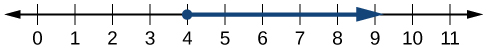{: #Figure_02_07_002}

We can use **set-builder notation**{: data-type="term" .no-emphasis}\:<math xmlns="http://www.w3.org/1998/Math/MathML"> <mrow> <mtext> </mtext><mrow><mo>{</mo> <mrow> <mi>x</mi><mo>\|</mo><mi>x</mi><mo>≥</mo><mn>4</mn> </mrow> <mo>}</mo></mrow><mo>,</mo> </mrow> </math>

which translates to “all real numbers <em>x </em>such that <em>x </em>is greater than or equal to 4.” Notice that braces are used to indicate a set.

The third method is **interval notation**{: data-type="term"}, in which solution sets are indicated with parentheses or brackets. The solutions to<math xmlns="http://www.w3.org/1998/Math/MathML"> <mrow> <mtext> </mtext><mi>x</mi><mo>≥</mo><mn>4</mn><mtext> </mtext> </mrow> </math>

are represented as<math xmlns="http://www.w3.org/1998/Math/MathML"> <mrow> <mtext> </mtext><mrow><mo>[</mo> <mrow> <mn>4</mn><mo>,</mo><mi>∞</mi> </mrow> <mo>)</mo></mrow><mo>.</mo><mtext> </mtext> </mrow> </math>

This is perhaps the most useful method, as it applies to concepts studied later in this course and to other higher-level math courses.

The main concept to remember is that parentheses represent solutions greater or less than the number, and brackets represent solutions that are greater than or equal to or less than or equal to the number. Use parentheses to represent infinity or negative infinity, since positive and negative infinity are not numbers in the usual sense of the word and, therefore, cannot be “equaled.” A few examples of an **interval**{: data-type="term"}, or a set of numbers in which a solution falls, are<math xmlns="http://www.w3.org/1998/Math/MathML"> <mrow> <mtext> </mtext><mrow><mo>[</mo> <mrow> <mn>−2</mn><mo>,</mo><mn>6</mn> </mrow> <mo>)</mo></mrow><mo>,</mo> </mrow> </math>

or all numbers between<math xmlns="http://www.w3.org/1998/Math/MathML"> <mrow> <mtext> </mtext><mn>−2</mn><mtext> </mtext> </mrow> </math>

and<math xmlns="http://www.w3.org/1998/Math/MathML"> <mrow> <mtext> </mtext><mn>6</mn><mo>,</mo> </mrow> </math>

including<math xmlns="http://www.w3.org/1998/Math/MathML"> <mrow> <mtext> </mtext><mn>−2</mn><mo>,</mo> </mrow> </math>

but not including<math xmlns="http://www.w3.org/1998/Math/MathML"> <mrow> <mtext> </mtext><mn>6</mn><mo>;</mo> </mrow> </math>

<math xmlns="http://www.w3.org/1998/Math/MathML"> <mrow> <mrow><mo>(</mo> <mrow> <mo>−</mo><mn>1</mn><mo>,</mo><mn>0</mn> </mrow> <mo>)</mo></mrow><mo>,</mo> </mrow> </math>

all real numbers between, but not including<math xmlns="http://www.w3.org/1998/Math/MathML"> <mrow> <mtext> </mtext><mn>−1</mn><mtext> </mtext> </mrow> </math>

and<math xmlns="http://www.w3.org/1998/Math/MathML"> <mrow> <mtext> </mtext><mn>0</mn><mo>;</mo> </mrow> </math>

and<math xmlns="http://www.w3.org/1998/Math/MathML"> <mrow> <mtext> </mtext><mrow><mo>(</mo> <mrow> <mo>−</mo><mi>∞</mi><mo>,</mo><mn>1</mn> </mrow> <mo>]</mo></mrow><mo>,</mo> </mrow> </math>

all real numbers less than and including<math xmlns="http://www.w3.org/1998/Math/MathML"> <mrow> <mtext> </mtext><mn>1.</mn><mtext> </mtext> </mrow> </math>

[\[link\]](#Table_02_07_01) outlines the possibilities.

| Set Indicated | Set-Builder Notation | Interval Notation |
|----------
| All real numbers between <em>a </em>and *b*, but not including <em>a </em>or *b* | <math xmlns="http://www.w3.org/1998/Math/MathML"> <mrow> <mrow><mo>{</mo> <mrow> <mi>x</mi><mo>\|</mo><mi>a</mi><mo>&lt;</mo><mi>x</mi><mo>&lt;</mo><mi>b</mi> </mrow> <mo>}</mo></mrow> </mrow> </math>

 | <math xmlns="http://www.w3.org/1998/Math/MathML"> <mrow> <mrow><mo>(</mo> <mrow> <mi>a</mi><mo>,</mo><mi>b</mi> </mrow> <mo>)</mo></mrow> </mrow> </math>

 |
| All real numbers greater than *a*, but not including *a* | <math xmlns="http://www.w3.org/1998/Math/MathML"> <mrow> <mrow><mo>{</mo> <mrow> <mi>x</mi><mo>\|</mo><mi>x</mi><mo>&gt;</mo><mi>a</mi> </mrow> <mo>}</mo></mrow> </mrow> </math>

 | <math xmlns="http://www.w3.org/1998/Math/MathML"> <mrow> <mrow><mo>(</mo> <mrow> <mi>a</mi><mo>,</mo><mi>∞</mi> </mrow> <mo>)</mo></mrow> </mrow> </math>

 |
| All real numbers less than *b*, but not including *b* | <math xmlns="http://www.w3.org/1998/Math/MathML"> <mrow> <mrow><mo>{</mo> <mrow> <mi>x</mi><mo>\|</mo><mi>x</mi><mo>&lt;</mo><mi>b</mi> </mrow> <mo>}</mo></mrow> </mrow> </math>

 | <math xmlns="http://www.w3.org/1998/Math/MathML"> <mrow> <mrow><mo>(</mo> <mrow> <mo>−</mo><mi>∞</mi><mo>,</mo><mi>b</mi> </mrow> <mo>)</mo></mrow> </mrow> </math>

 |
| All real numbers greater than *a*, including *a* | <math xmlns="http://www.w3.org/1998/Math/MathML"> <mrow> <mrow><mo>{</mo> <mrow> <mi>x</mi><mo>\|</mo><mi>x</mi><mo>≥</mo><mi>a</mi> </mrow> <mo>}</mo></mrow> </mrow> </math>

 | <math xmlns="http://www.w3.org/1998/Math/MathML"> <mrow> <mrow><mo>[</mo> <mrow> <mi>a</mi><mo>,</mo><mi>∞</mi> </mrow> <mo>)</mo></mrow> </mrow> </math>

 |
| All real numbers less than *b*, including *b* | <math xmlns="http://www.w3.org/1998/Math/MathML"> <mrow> <mrow><mo>{</mo> <mrow> <mi>x</mi><mo>\|</mo><mi>x</mi><mo>≤</mo><mi>b</mi> </mrow> <mo>}</mo></mrow> </mrow> </math>

 | <math xmlns="http://www.w3.org/1998/Math/MathML"> <mrow> <mrow><mo>(</mo> <mrow> <mo>−</mo><mi>∞</mi><mo>,</mo><mi>b</mi> </mrow> <mo>]</mo></mrow> </mrow> </math>

 |
| All real numbers between <em>a </em>and<em> b</em>, including *a* | <math xmlns="http://www.w3.org/1998/Math/MathML"> <mrow> <mrow><mo>{</mo> <mrow> <mi>x</mi><mo>\|</mo><mi>a</mi><mo>≤</mo><mi>x</mi><mo>&lt;</mo><mi>b</mi> </mrow> <mo>}</mo></mrow> </mrow> </math>

 | <math xmlns="http://www.w3.org/1998/Math/MathML"> <mrow> <mrow><mo>[</mo> <mrow> <mi>a</mi><mo>,</mo><mi>b</mi> </mrow> <mo>)</mo></mrow> </mrow> </math>

 |
| All real numbers between *a* and *b*, including *b* | <math xmlns="http://www.w3.org/1998/Math/MathML"> <mrow> <mrow><mo>{</mo> <mrow> <mi>x</mi><mo>\|</mo><mi>a</mi><mo>&lt;</mo><mi>x</mi><mo>≤</mo><mi>b</mi> </mrow> <mo>}</mo></mrow> </mrow> </math>

 | <math xmlns="http://www.w3.org/1998/Math/MathML"> <mrow> <mrow><mo>(</mo> <mrow> <mi>a</mi><mo>,</mo><mi>b</mi> </mrow> <mo>]</mo></mrow> </mrow> </math>

 |
| All real numbers between <em>a </em>and *b*, including <em>a </em>and *b* | <math xmlns="http://www.w3.org/1998/Math/MathML"> <mrow> <mrow><mo>{</mo> <mrow> <mi>x</mi><mo>\|</mo><mi>a</mi><mo>≤</mo><mi>x</mi><mo>≤</mo><mi>b</mi> </mrow> <mo>}</mo></mrow> </mrow> </math>

 | <math xmlns="http://www.w3.org/1998/Math/MathML"> <mrow> <mrow><mo>[</mo> <mrow> <mi>a</mi><mo>,</mo><mi>b</mi> </mrow> <mo>]</mo></mrow> </mrow> </math>

 |
| All real numbers less than *a* or greater than *b* | <math xmlns="http://www.w3.org/1998/Math/MathML"> <mrow> <mrow><mo>{</mo> <mrow> <mi>x</mi><mo>\|</mo><mi>x</mi><mo>&lt;</mo><mi>a</mi><mtext> </mtext><mtext>or</mtext><mtext> </mtext><mi>x</mi><mo>&gt;</mo><mi>b</mi> </mrow> <mo>}</mo></mrow> </mrow> </math>

 | <math xmlns="http://www.w3.org/1998/Math/MathML"> <mrow> <mrow><mo>(</mo> <mrow> <mo>−</mo><mi>∞</mi><mo>,</mo><mi>a</mi> </mrow> <mo>)</mo></mrow><mo>∪</mo><mrow><mo>(</mo> <mrow> <mi>b</mi><mo>,</mo><mi>∞</mi> </mrow> <mo>)</mo></mrow> </mrow> </math>

 |
| All real numbers | <math xmlns="http://www.w3.org/1998/Math/MathML"> <mrow> <mrow><mo>{</mo> <mrow> <mi>x</mi><mo>\|</mo><mi>x</mi><mtext> is all real numbers</mtext> </mrow> <mo>}</mo></mrow> </mrow> </math>

 | <math xmlns="http://www.w3.org/1998/Math/MathML"> <mrow> <mrow><mo>(</mo> <mrow> <mo>−</mo><mi>∞</mi><mo>,</mo><mi>∞</mi> </mrow> <mo>)</mo></mrow> </mrow> </math>

 |
{: #Table_02_07_01 summary="A table with 11 rows and 3 columns. The entries in the first row are: Set Indicated, Set-Builder Notation, Interval Notation. The entries in the second row are: All real numbers between a and b, but not including a and b; {x| a x b}; (a,b). The entries in the third row are: All real numbers greater than a, but not including a; {x| x a}; (a , infinity). The entries in the fourth row are: All real numbers less than b, but not including b; {x| x b}; (negative infinity, b). The entries in the fifth row are: All real numbers greater than a, including a; {x| x a}; [a, infinity). The entries in the sixth row are: All real numbers less than b, including b; {x| x b}; (negative infinity, b]. The entries in the seventh row are: All real numbers between a and b, including a; {x| a x b}; [a, b). The entries in the eighth row are: All real numbers between a and b, including b; {x| a x b}; (a, b]. The entries in the ninth row are: All real numbers between a and b, including a and b; {x| a x b}; [a, b]. The entries in the tenth row are: all real numbers less than a or greater than b; {x| x a or x b}; (negative infinity, a) union (b, infinity). The entries in the eleventh row are: All real numbers; {x| x is all real numbers}; (negative infinity, infinity)."}

Using Interval Notation to Express All Real Numbers Greater Than or Equal to *a*

Use interval notation to indicate all real numbers greater than or equal to<math xmlns="http://www.w3.org/1998/Math/MathML"> <mrow> <mtext> </mtext><mn>−2.</mn> </mrow> </math>

Use a bracket on the left of<math xmlns="http://www.w3.org/1998/Math/MathML"> <mrow> <mtext> </mtext><mn>−2</mn><mtext> </mtext> </mrow> </math>

and parentheses after infinity:<math xmlns="http://www.w3.org/1998/Math/MathML"> <mrow> <mtext> </mtext><mrow><mo>[</mo> <mrow> <mn>−2</mn><mo>,</mo><mi>∞</mi> </mrow> <mo>)</mo></mrow><mo>.</mo> </mrow> </math>

The bracket indicates that<math xmlns="http://www.w3.org/1998/Math/MathML"> <mrow> <mtext> </mtext><mn>−2</mn><mtext> </mtext> </mrow> </math>

is included in the set with all real numbers greater than<math xmlns="http://www.w3.org/1998/Math/MathML"> <mrow> <mtext> </mtext><mn>−2</mn><mtext> </mtext> </mrow> </math>

to infinity.

Use interval notation to indicate all real numbers between and including<math xmlns="http://www.w3.org/1998/Math/MathML"> <mrow> <mtext> </mtext><mn>−3</mn><mtext> </mtext> </mrow> </math>

and<math xmlns="http://www.w3.org/1998/Math/MathML"> <mrow> <mtext> </mtext><mn>5.</mn> </mrow> </math>

<math xmlns="http://www.w3.org/1998/Math/MathML"> <mrow> <mrow><mo>[</mo> <mrow> <mn>−3</mn><mo>,</mo><mn>5</mn> </mrow> <mo>]</mo></mrow> </mrow> </math>

Using Interval Notation to Express All Real Numbers Less Than or Equal to <em>a </em>or Greater Than or Equal to *b*

Write the interval expressing all real numbers less than or equal to<math xmlns="http://www.w3.org/1998/Math/MathML"> <mrow> <mtext> </mtext><mn>−1</mn><mtext> </mtext> </mrow> </math>

or greater than or equal to<math xmlns="http://www.w3.org/1998/Math/MathML"> <mrow> <mtext> </mtext><mn>1.</mn> </mrow> </math>

We have to write two intervals for this example. The first interval must indicate all real numbers less than or equal to 1. So, this interval begins at<math xmlns="http://www.w3.org/1998/Math/MathML"> <mrow> <mtext> </mtext><mo>−</mo><mi>∞</mi><mtext> </mtext> </mrow> </math>

and ends at<math xmlns="http://www.w3.org/1998/Math/MathML"> <mrow> <mtext> </mtext><mn>−1</mn><mo>,</mo> </mrow> </math>

which is written as<math xmlns="http://www.w3.org/1998/Math/MathML"> <mrow> <mtext> </mtext><mrow><mo>(</mo> <mrow> <mo>−</mo><mi>∞</mi><mo>,</mo><mn>−1</mn> </mrow> <mo>]</mo></mrow><mo>.</mo> </mrow> </math>

The second interval must show all real numbers greater than or equal to<math xmlns="http://www.w3.org/1998/Math/MathML"> <mrow> <mtext> </mtext><mn>1</mn><mo>,</mo> </mrow> </math>

which is written as<math xmlns="http://www.w3.org/1998/Math/MathML"> <mrow> <mtext> </mtext><mrow><mo>[</mo> <mrow> <mn>1</mn><mo>,</mo><mi>∞</mi> </mrow> <mo>)</mo></mrow><mo>.</mo><mtext> </mtext> </mrow> </math>

However, we want to combine these two sets. We accomplish this by inserting the union symbol,<math xmlns="http://www.w3.org/1998/Math/MathML"> <mrow> <mo>∪</mo><mo>,</mo> </mrow> </math>

between the two intervals.

<math xmlns="http://www.w3.org/1998/Math/MathML" display="block"> <mrow> <mrow><mo>(</mo> <mrow> <mo>−</mo><mi>∞</mi><mo>,</mo><mn>−1</mn> </mrow> <mo>]</mo></mrow><mo>∪</mo><mrow><mo>[</mo> <mrow> <mn>1</mn><mo>,</mo><mi>∞</mi> </mrow> <mo>)</mo></mrow> </mrow> </math>

Express all real numbers less than<math xmlns="http://www.w3.org/1998/Math/MathML"> <mrow> <mtext> </mtext><mn>−2</mn><mtext> </mtext> </mrow> </math>

or greater than or equal to 3 in interval notation.

<math xmlns="http://www.w3.org/1998/Math/MathML"> <mrow> <mrow><mo>(</mo> <mrow> <mo>−</mo><mi>∞</mi><mo>,</mo><mn>−2</mn> </mrow> <mo>)</mo></mrow><mo>∪</mo><mrow><mo>[</mo> <mrow> <mn>3</mn><mo>,</mo><mi>∞</mi> </mrow> <mo>)</mo></mrow> </mrow> </math>

### Using the Properties of Inequalities

When we work with inequalities, we can usually treat them similarly to but not exactly as we treat equalities. We can use the **addition property**{: data-type="term" .no-emphasis} and the **multiplication property**{: data-type="term" .no-emphasis} to help us solve them. The one exception is when we multiply or divide by a negative number; doing so reverses the inequality symbol.

Properties of Inequalities

<math xmlns="http://www.w3.org/1998/Math/MathML" display="block"> <mrow> <mtable columnalign="left"> <mtr columnalign="left"> <mtd columnalign="left"> <mrow> <mstyle mathvariant="bold" mathsize="normal"><mi>A</mi><mi>d</mi><mi>d</mi><mi>i</mi><mi>t</mi><mi>i</mi><mi>o</mi><mi>n</mi></mstyle><mtext> </mtext><mstyle mathvariant="bold" mathsize="normal"><mi>P</mi><mi>r</mi><mi>o</mi><mi>p</mi><mi>e</mi><mi>r</mi><mi>t</mi><mi>y</mi></mstyle> </mrow> </mtd> <mtd columnalign="left"> <mrow> <mspace width="2em" /><mtext>If </mtext><mi>a</mi><mo>&lt;</mo><mi>b</mi><mo>,</mo><mtext> then </mtext><mi>a</mi><mo>+</mo><mi>c</mi><mo>&lt;</mo><mi>b</mi><mo>+</mo><mi>c</mi><mo>.</mo> </mrow> </mtd> </mtr> <mtr columnalign="left"> <mtd columnalign="left"> <mrow /> </mtd> <mtd columnalign="left"> <mrow /> </mtd> </mtr> <mtr columnalign="left"> <mtd columnalign="left"> <mrow> <mstyle mathvariant="bold" mathsize="normal"><mi>M</mi><mi>u</mi><mi>l</mi><mi>t</mi><mi>i</mi><mi>p</mi><mi>l</mi><mi>i</mi><mi>c</mi><mi>a</mi><mi>t</mi><mi>i</mi><mi>o</mi><mi>n</mi></mstyle><mtext> </mtext><mstyle mathvariant="bold" mathsize="normal"><mi>P</mi><mi>r</mi><mi>o</mi><mi>p</mi><mi>e</mi><mi>r</mi><mi>t</mi><mi>y</mi></mstyle> </mrow> </mtd> <mtd columnalign="left"> <mrow> <mspace width="2em" /><mtext>If </mtext><mi>a</mi><mo>&lt;</mo><mi>b</mi><mtext> and </mtext><mi>c</mi><mo>&gt;</mo><mn>0</mn><mo>,</mo><mtext> then </mtext><mi>a</mi><mi>c</mi><mo>&lt;</mo><mi>b</mi><mi>c</mi><mo>.</mo> </mrow> </mtd> </mtr> <mtr columnalign="left"> <mtd columnalign="left"> <mrow /> </mtd> <mtd columnalign="left"> <mrow> <mspace width="2em" /><mtext>If </mtext><mi>a</mi><mo>&lt;</mo><mi>b</mi><mtext> and </mtext><mi>c</mi><mo>&lt;</mo><mn>0</mn><mo>,</mo><mtext> then </mtext><mi>a</mi><mi>c</mi><mo>&gt;</mo><mi>b</mi><mi>c</mi><mo>.</mo> </mrow> </mtd> </mtr> </mtable> </mrow> </math>

These properties also apply to<math xmlns="http://www.w3.org/1998/Math/MathML"> <mrow> <mtext> </mtext><mi>a</mi><mo>≤</mo><mi>b</mi><mo>,</mo> </mrow> </math>

<math xmlns="http://www.w3.org/1998/Math/MathML"> <mrow> <mi>a</mi><mo>&gt;</mo><mi>b</mi><mo>,</mo> </mrow> </math>

and<math xmlns="http://www.w3.org/1998/Math/MathML"> <mrow> <mtext> </mtext><mi>a</mi><mo>≥</mo><mi>b</mi><mo>.</mo> </mrow> </math>

Demonstrating the Addition Property

Illustrate the addition property for inequalities by solving each of the following:

* (a)
  <math xmlns="http://www.w3.org/1998/Math/MathML"> <mrow> <mi>x</mi><mo>−</mo><mn>15</mn><mo>&lt;</mo><mn>4</mn> </mrow> </math>

* (b)
  <math xmlns="http://www.w3.org/1998/Math/MathML"> <mrow> <mn>6</mn><mo>≥</mo><mi>x</mi><mo>−</mo><mn>1</mn> </mrow> </math>

* (c)
  <math xmlns="http://www.w3.org/1998/Math/MathML"> <mrow> <mi>x</mi><mo>+</mo><mn>7</mn><mo>&gt;</mo><mn>9</mn> </mrow> </math>
{: data-labeled-item="true"}

The addition property for inequalities states that if an inequality exists, adding or subtracting the same number on both sides does not change the inequality.

1.  * * *
    {: data-type="newline"}
    
    <math xmlns="http://www.w3.org/1998/Math/MathML"> <mrow> <mtable columnalign="left"> <mtr columnalign="left"> <mtd columnalign="left"> <mrow> <mspace width="2em" /><mi>x</mi><mo>−</mo><mn>15</mn><mo>&lt;</mo><mn>4</mn> </mrow> </mtd> <mtd columnalign="left"> <mrow /> </mtd> </mtr> <mtr columnalign="left"> <mtd columnalign="left"> <mrow> <mi>x</mi><mo>−</mo><mn>15</mn><mo>+</mo><mn>15</mn><mo>&lt;</mo><mn>4</mn><mo>+</mo><mn>15</mn><mo> </mo> </mrow> </mtd> <mtd columnalign="left"> <mrow> <mspace width="2em" /><mtext>Add 15 to both sides</mtext><mo>.</mo> </mrow> </mtd> </mtr> <mtr columnalign="left"> <mtd columnalign="left"> <mrow> <mspace width="4em" /><mi>x</mi><mo>&lt;</mo><mn>19</mn> </mrow> </mtd> <mtd columnalign="left"> <mrow /> </mtd> </mtr> </mtable> </mrow> </math>

2.  * * *
    {: data-type="newline"}
    
    <math xmlns="http://www.w3.org/1998/Math/MathML"> <mrow> <mtable columnalign="left"> <mtr columnalign="left"> <mtd columnalign="left"> <mrow> <mspace width="2em" /><mn>6</mn><mo>≥</mo><mi>x</mi><mo>−</mo><mn>1</mn> </mrow> </mtd> <mtd columnalign="left"> <mrow /> </mtd> </mtr> <mtr columnalign="left"> <mtd columnalign="left"> <mrow> <mn>6</mn><mo>+</mo><mn>1</mn><mo>≥</mo><mi>x</mi><mo>−</mo><mn>1</mn><mo>+</mo><mn>1</mn> </mrow> </mtd> <mtd columnalign="left"> <mrow> <mspace width="4em" /><mtext>Add 1 to both sides</mtext><mo>.</mo> </mrow> </mtd> </mtr> <mtr columnalign="left"> <mtd columnalign="left"> <mrow> <mspace width="2em" /><mn>7</mn><mo>≥</mo><mi>x</mi> </mrow> </mtd> <mtd columnalign="left"> <mrow /> </mtd> </mtr> </mtable> </mrow> </math>

3.  * * *
    {: data-type="newline"}
    
    <math xmlns="http://www.w3.org/1998/Math/MathML"> <mrow> <mtable columnalign="left"> <mtr columnalign="left"> <mtd columnalign="left"> <mrow> <mspace width="2em" /><mi>x</mi><mo>+</mo><mn>7</mn><mo>&gt;</mo><mn>9</mn> </mrow> </mtd> <mtd columnalign="left"> <mrow /> </mtd> </mtr> <mtr columnalign="left"> <mtd columnalign="left"> <mrow> <mi>x</mi><mo>+</mo><mn>7</mn><mo>−</mo><mn>7</mn><mo>&gt;</mo><mn>9</mn><mo>−</mo><mn>7</mn> </mrow> </mtd> <mtd columnalign="left"> <mrow> <mspace width="4em" /><mtext>Subtract 7 from both sides</mtext><mo>.</mo> </mrow> </mtd> </mtr> <mtr columnalign="left"> <mtd columnalign="left"> <mrow> <mspace width="3em" /><mi>x</mi><mo>&gt;</mo><mn>2</mn> </mrow> </mtd> <mtd columnalign="left"> <mrow /> </mtd> </mtr> </mtable> </mrow> </math>
{: type="a"}

Solve:<math xmlns="http://www.w3.org/1998/Math/MathML"> <mrow> <mtext> </mtext><mn>3</mn><mi>x</mi><mn>−2</mn><mo>&lt;</mo><mn>1.</mn> </mrow> </math>

<math xmlns="http://www.w3.org/1998/Math/MathML"> <mrow> <mi>x</mi><mo>&lt;</mo><mn>1</mn> </mrow> </math>

Demonstrating the Multiplication Property

Illustrate the multiplication property for inequalities by solving each of the following:

1.  <math xmlns="http://www.w3.org/1998/Math/MathML"> <mrow> <mn>3</mn><mi>x</mi><mo>&lt;</mo><mn>6</mn> </mrow> </math>

2.  <math xmlns="http://www.w3.org/1998/Math/MathML"> <mrow> <mn>−2</mn><mi>x</mi><mo>−</mo><mn>1</mn><mo>≥</mo><mn>5</mn></mrow> </math>

3.  <math xmlns="http://www.w3.org/1998/Math/MathML"> <mrow> <mn>5</mn><mo>−</mo><mi>x</mi><mo>&gt;</mo><mn>10</mn></mrow> </math>
{: type="a"}

1.  * * *
    {: data-type="newline"}
    
    <math xmlns="http://www.w3.org/1998/Math/MathML"> <mrow> <mtable columnalign="left"> <mtr columnalign="left"> <mtd columnalign="left"> <mrow> <mspace width="1.5em" /><mn>3</mn><mi>x</mi><mo>&lt;</mo><mn>6</mn> </mrow> </mtd> </mtr> <mtr columnalign="left"> <mtd columnalign="left"> <mrow> <mfrac> <mn>1</mn> <mn>3</mn> </mfrac> <mo stretchy="false">(</mo><mn>3</mn><mi>x</mi><mo stretchy="false">)</mo><mo>&lt;</mo><mo stretchy="false">(</mo><mn>6</mn><mo stretchy="false">)</mo><mfrac> <mn>1</mn> <mn>3</mn> </mfrac> </mrow> </mtd> </mtr> <mtr columnalign="left"> <mtd columnalign="left"> <mrow> <mspace width="2em" /><mi>x</mi><mo>&lt;</mo><mn>2</mn> </mrow> </mtd> </mtr> </mtable> </mrow> </math>

2.  * * *
    {: data-type="newline"}
    
    <math xmlns="http://www.w3.org/1998/Math/MathML"> <mrow> <mtable columnalign="left"> <mtr columnalign="left"> <mtd columnalign="left"> <mrow> <mspace width="1em" /><mo>−</mo><mn>2</mn><mi>x</mi><mo>−</mo><mn>1</mn><mo>≥</mo><mn>5</mn> </mrow> </mtd> <mtd columnalign="left"> <mrow /> </mtd> </mtr> <mtr columnalign="left"> <mtd columnalign="left"> <mrow> <mspace width="3em" /><mo>−</mo><mn>2</mn><mi>x</mi><mo>≥</mo><mn>6</mn> </mrow> </mtd> <mtd columnalign="left"> <mrow /> </mtd> </mtr> <mtr columnalign="left"> <mtd columnalign="left"> <mrow> <mrow><mo>(</mo> <mrow> <mo>−</mo><mfrac> <mn>1</mn> <mn>2</mn> </mfrac> </mrow> <mo>)</mo></mrow><mo stretchy="false">(</mo><mo>−</mo><mn>2</mn><mi>x</mi><mo stretchy="false">)</mo><mo>≥</mo><mo stretchy="false">(</mo><mn>6</mn><mo stretchy="false">)</mo><mrow><mo>(</mo> <mrow> <mo>−</mo><mfrac> <mn>1</mn> <mn>2</mn> </mfrac> </mrow> <mo>)</mo></mrow> </mrow> </mtd> <mtd columnalign="left"> <mrow> <mspace width="2em" /><mtext>Multiply by </mtext><mo>−</mo><mfrac> <mn>1</mn> <mn>2</mn> </mfrac> <mo>.</mo> </mrow> </mtd> </mtr> <mtr columnalign="left"> <mtd columnalign="left"> <mrow> <mspace width="4em" /><mi>x</mi><mo>≤</mo><mo>−</mo><mn>3</mn> </mrow> </mtd> <mtd columnalign="left"> <mrow> <mspace width="2em" /><mtext>Reverse the inequality</mtext><mo>.</mo> </mrow> </mtd> </mtr> </mtable> </mrow> </math>

3.  * * *
    {: data-type="newline"}
    
    <math xmlns="http://www.w3.org/1998/Math/MathML"> <mrow> <mtable columnalign="left"> <mtr columnalign="left"> <mtd columnalign="left"> <mrow> <mspace width="2.5em" /><mn>5</mn><mo>−</mo><mi>x</mi><mo>&gt;</mo><mn>10</mn> </mrow> </mtd> <mtd columnalign="left"> <mrow /> </mtd> </mtr> <mtr columnalign="left"> <mtd columnalign="left"> <mrow> <mspace width="3.5em" /><mo>−</mo><mi>x</mi><mo>&gt;</mo><mn>5</mn> </mrow> </mtd> <mtd columnalign="left"> <mrow /> </mtd> </mtr> <mtr columnalign="left"> <mtd columnalign="left"> <mrow> <mo stretchy="false">(</mo><mo>−</mo><mn>1</mn><mo stretchy="false">)</mo><mo stretchy="false">(</mo><mo>−</mo><mi>x</mi><mo stretchy="false">)</mo><mo>&gt;</mo><mo stretchy="false">(</mo><mn>5</mn><mo stretchy="false">)</mo><mo stretchy="false">(</mo><mo>−</mo><mn>1</mn><mo stretchy="false">)</mo> </mrow> </mtd> <mtd columnalign="left"> <mrow> <mspace width="2em" /><mtext>Multiply by </mtext><mo>−</mo><mn>1.</mn> </mrow> </mtd> </mtr> <mtr columnalign="left"> <mtd columnalign="left"> <mrow> <mspace width="4.5em" /><mi>x</mi><mo>&lt;</mo><mo>−</mo><mn>5</mn> </mrow> </mtd> <mtd columnalign="left"> <mrow> <mspace width="2em" /><mtext>Reverse the inequality</mtext><mo>.</mo> </mrow> </mtd> </mtr> </mtable> </mrow> </math>
{: type="a"}

Solve:<math xmlns="http://www.w3.org/1998/Math/MathML"> <mrow> <mtext> </mtext><mn>4</mn><mi>x</mi><mo>+</mo><mn>7</mn><mo>≥</mo><mn>2</mn><mi>x</mi><mo>−</mo><mn>3.</mn></mrow> </math>

<math xmlns="http://www.w3.org/1998/Math/MathML"> <mrow> <mi>x</mi><mo>≥</mo><mn>−5</mn> </mrow> </math>

### Solving Inequalities in One Variable Algebraically

As the examples have shown, we can perform the same operations on both sides of an inequality, just as we do with equations; we combine like terms and perform operations. To solve, we isolate the variable.

Solving an Inequality Algebraically

Solve the inequality:<math xmlns="http://www.w3.org/1998/Math/MathML"> <mrow> <mtext> </mtext><mn>13</mn><mo>−</mo><mn>7</mn><mi>x</mi><mo>≥</mo><mn>10</mn><mi>x</mi><mo>−</mo><mn>4.</mn></mrow> </math>

Solving this inequality is similar to solving an equation up until the last step.

<math xmlns="http://www.w3.org/1998/Math/MathML" display="block"> <mrow> <mtable columnalign="left"> <mtr columnalign="left"> <mtd columnalign="left"> <mrow> <mspace width=".5em" /><mn>13</mn><mo>−</mo><mn>7</mn><mi>x</mi><mo>≥</mo><mn>10</mn><mi>x</mi><mo>−</mo><mn>4</mn> </mrow> </mtd> <mtd columnalign="left"> <mrow /> </mtd> </mtr> <mtr columnalign="left"> <mtd columnalign="left"> <mrow> <mn>13</mn><mo>−</mo><mn>17</mn><mi>x</mi><mo>≥</mo><mn>−4</mn> </mrow> </mtd> <mtd columnalign="left"> <mrow> <mspace width="2em" /><mtext>Move variable terms to one side of the inequality</mtext><mo>.</mo> </mrow> </mtd> </mtr> <mtr columnalign="left"> <mtd columnalign="left"> <mrow> <mspace width="1.8em" /><mn>−17</mn><mi>x</mi><mo>≥</mo><mn>−17</mn> </mrow> </mtd> <mtd columnalign="left"> <mrow> <mspace width="2em" /><mtext>Isolate the variable term</mtext><mo>.</mo> </mrow> </mtd> </mtr> <mtr columnalign="left"> <mtd columnalign="left"> <mrow> <mspace width="3.1em" /><mi>x</mi><mo>≤</mo><mn>1</mn> </mrow> </mtd> <mtd columnalign="left"> <mrow> <mspace width="2em" /><mtext>Dividing both sides by </mtext><mn>−17</mn><mtext> reverses the inequality</mtext><mo>.</mo> </mrow> </mtd> </mtr> </mtable> </mrow> </math>

The solution set is given by the interval<math xmlns="http://www.w3.org/1998/Math/MathML"> <mrow> <mtext> </mtext><mrow><mo>(</mo> <mrow> <mo>−</mo><mi>∞</mi><mo>,</mo><mn>1</mn> </mrow> <mo>]</mo></mrow><mo>,</mo> </mrow> </math>

or all real numbers less than and including 1.

Solve the inequality and write the answer using interval notation:<math xmlns="http://www.w3.org/1998/Math/MathML"> <mrow> <mtext> </mtext><mo>−</mo><mi>x</mi><mo>+</mo><mn>4</mn><mo>&lt;</mo><mfrac> <mn>1</mn> <mn>2</mn> </mfrac> <mi>x</mi><mo>+</mo><mn>1.</mn> </mrow> </math>

<math xmlns="http://www.w3.org/1998/Math/MathML"> <mrow> <mrow><mo>(</mo> <mrow> <mn>2</mn><mo>,</mo><mi>∞</mi> </mrow> <mo>)</mo></mrow> </mrow> </math>

Solving an Inequality with Fractions

Solve the following inequality and write the answer in interval notation:<math xmlns="http://www.w3.org/1998/Math/MathML"> <mrow> <mtext> </mtext><mo>−</mo><mfrac> <mn>3</mn> <mn>4</mn> </mfrac> <mi>x</mi><mo>≥</mo><mo>−</mo><mfrac> <mn>5</mn> <mn>8</mn> </mfrac> <mo>+</mo><mfrac> <mn>2</mn> <mn>3</mn> </mfrac> <mi>x</mi><mo>.</mo> </mrow> </math>

We begin solving in the same way we do when solving an equation.

<math xmlns="http://www.w3.org/1998/Math/MathML" display="block"> <mrow> <mtable columnalign="left"> <mtr columnalign="left"> <mtd columnalign="left"> <mrow> <mspace width="2.8em" /><mo>−</mo><mfrac> <mn>3</mn> <mn>4</mn> </mfrac> <mi>x</mi><mo>≥</mo><mo>−</mo><mfrac> <mn>5</mn> <mn>8</mn> </mfrac> <mo>+</mo><mfrac> <mn>2</mn> <mn>3</mn> </mfrac> <mi>x</mi> </mrow> </mtd> <mtd columnalign="left"> <mrow /> </mtd> </mtr> <mtr columnalign="left"> <mtd columnalign="left"> <mrow> <mspace width=".9em" /><mo>−</mo><mfrac> <mn>3</mn> <mn>4</mn> </mfrac> <mi>x</mi><mo>−</mo><mfrac> <mn>2</mn> <mn>3</mn> </mfrac> <mi>x</mi><mo>≥</mo><mo>−</mo><mfrac> <mn>5</mn> <mn>8</mn> </mfrac> </mrow> </mtd> <mtd columnalign="left"> <mrow> <mspace width="2em" /><mtext>Put variable terms on one side</mtext><mo>.</mo> </mrow> </mtd> </mtr> <mtr columnalign="left"> <mtd columnalign="left"> <mrow> <mo>−</mo><mfrac> <mn>9</mn> <mrow> <mn>12</mn> </mrow> </mfrac> <mi>x</mi><mo>−</mo><mfrac> <mn>8</mn> <mrow> <mn>12</mn> </mrow> </mfrac> <mi>x</mi><mo>≥</mo><mo>−</mo><mfrac> <mn>5</mn> <mn>8</mn> </mfrac> </mrow> </mtd> <mtd columnalign="left"> <mrow> <mspace width="2em" /><mtext>Write fractions with common denominator</mtext><mo>.</mo> </mrow> </mtd> </mtr> <mtr columnalign="left"> <mtd columnalign="left"> <mrow> <mspace width="2.5em" /><mo>−</mo><mfrac> <mrow> <mn>17</mn> </mrow> <mrow> <mn>12</mn> </mrow> </mfrac> <mi>x</mi><mo>≥</mo><mo>−</mo><mfrac> <mn>5</mn> <mn>8</mn> </mfrac> </mrow> </mtd> <mtd columnalign="left"> <mrow /> </mtd> </mtr> <mtr columnalign="left"> <mtd columnalign="left"> <mrow> <mspace width="4.2em" /><mi>x</mi><mo>≤</mo><mo>−</mo><mfrac> <mn>5</mn> <mn>8</mn> </mfrac> <mrow><mo>(</mo> <mrow> <mo>−</mo><mfrac> <mrow> <mn>12</mn> </mrow> <mrow> <mn>17</mn> </mrow> </mfrac> </mrow> <mo>)</mo></mrow> </mrow> </mtd> <mtd columnalign="left"> <mrow> <mspace width="2em" /><mtext>Multiplying by a negative number reverses the inequality</mtext><mo>.</mo> </mrow> </mtd> </mtr> <mtr columnalign="left"> <mtd columnalign="left"> <mrow> <mspace width="4.2em" /><mi>x</mi><mo>≤</mo><mfrac> <mrow> <mn>15</mn> </mrow> <mrow> <mn>34</mn> </mrow> </mfrac> </mrow> </mtd> <mtd columnalign="left"> <mrow /> </mtd> </mtr> </mtable> </mrow> </math>

The solution set is the interval<math xmlns="http://www.w3.org/1998/Math/MathML"> <mrow> <mtext> </mtext><mrow><mo>(</mo> <mrow> <mo>−</mo><mi>∞</mi><mo>,</mo><mfrac> <mrow> <mn>15</mn> </mrow> <mrow> <mn>34</mn> </mrow> </mfrac> </mrow> <mo>]</mo></mrow><mo>.</mo> </mrow> </math>

Solve the inequality and write the answer in interval notation:<math xmlns="http://www.w3.org/1998/Math/MathML"> <mrow> <mtext> </mtext><mo>−</mo><mfrac> <mn>5</mn> <mn>6</mn> </mfrac> <mi>x</mi><mo>≤</mo><mfrac> <mn>3</mn> <mn>4</mn> </mfrac> <mo>+</mo><mfrac> <mn>8</mn> <mn>3</mn> </mfrac> <mi>x</mi><mo>.</mo></mrow> </math>

<math xmlns="http://www.w3.org/1998/Math/MathML"> <mrow> <mrow><mo>[</mo> <mrow> <mo>−</mo><mfrac> <mn>3</mn> <mrow> <mn>14</mn> </mrow> </mfrac> <mo>,</mo><mi>∞</mi> </mrow> <mo>)</mo></mrow> </mrow> </math>

### Understanding Compound Inequalities

A **compound inequality**{: data-type="term"} includes two inequalities in one statement. A statement such as<math xmlns="http://www.w3.org/1998/Math/MathML"> <mrow> <mtext> </mtext><mn>4</mn><mo>&lt;</mo><mi>x</mi><mo>≤</mo><mn>6</mn><mtext> </mtext> </mrow> </math>

means<math xmlns="http://www.w3.org/1998/Math/MathML"> <mrow> <mtext> </mtext><mn>4</mn><mo>&lt;</mo><mi>x</mi><mtext> </mtext> </mrow> </math>

and<math xmlns="http://www.w3.org/1998/Math/MathML"> <mrow> <mtext> </mtext><mi>x</mi><mo>≤</mo><mn>6.</mn><mtext> </mtext> </mrow> </math>

There are two ways to solve compound inequalities: separating them into two separate inequalities or leaving the compound inequality intact and performing operations on all three parts at the same time. We will illustrate both methods.

Solving a Compound Inequality

Solve the compound inequality:<math xmlns="http://www.w3.org/1998/Math/MathML"> <mrow> <mtext> </mtext><mn>3</mn><mo>≤</mo><mn>2</mn><mi>x</mi><mo>+</mo><mn>2</mn><mo>&lt;</mo><mn>6.</mn> </mrow> </math>

The first method is to write two separate inequalities:<math xmlns="http://www.w3.org/1998/Math/MathML"> <mrow> <mtext> </mtext><mn>3</mn><mo>≤</mo><mn>2</mn><mi>x</mi><mo>+</mo><mn>2</mn><mtext> </mtext> </mrow> </math>

and<math xmlns="http://www.w3.org/1998/Math/MathML"> <mrow> <mtext> </mtext><mn>2</mn><mi>x</mi><mo>+</mo><mn>2</mn><mo>&lt;</mo><mn>6.</mn><mtext> </mtext> </mrow> </math>

We solve them independently.

<math xmlns="http://www.w3.org/1998/Math/MathML" display="block"> <mrow> <mtable columnalign="left"> <mtr columnalign="left"> <mtd columnalign="left"> <mrow> <mn>3</mn><mo>≤</mo><mn>2</mn><mi>x</mi><mo>+</mo><mn>2</mn> </mrow> </mtd> <mtd columnalign="left"> <mrow> <mspace width="2em" /><mtext>and</mtext><mspace width="2em" /> </mrow> </mtd> <mtd columnalign="left"> <mrow> <mn>2</mn><mi>x</mi><mo>+</mo><mn>2</mn><mo>&lt;</mo><mn>6</mn> </mrow> </mtd> </mtr> <mtr columnalign="left"> <mtd columnalign="left"> <mrow> <mn>1</mn><mo>≤</mo><mn>2</mn><mi>x</mi> </mrow> </mtd> <mtd columnalign="left"> <mrow /> </mtd> <mtd columnalign="left"> <mrow> <mspace width="2em" /><mn>2</mn><mi>x</mi><mo>&lt;</mo><mn>4</mn> </mrow> </mtd> </mtr> <mtr columnalign="left"> <mtd columnalign="left"> <mrow> <mfrac> <mn>1</mn> <mn>2</mn> </mfrac> <mo>≤</mo><mi>x</mi> </mrow> </mtd> <mtd columnalign="left"> <mrow /> </mtd> <mtd columnalign="left"> <mrow> <mspace width="2em" /><mi>x</mi><mo>&lt;</mo><mn>2</mn> </mrow> </mtd> </mtr> </mtable> </mrow> </math>

Then, we can rewrite the solution as a compound inequality, the same way the problem began.

<math xmlns="http://www.w3.org/1998/Math/MathML" display="block"> <mrow> <mfrac> <mn>1</mn> <mn>2</mn> </mfrac> <mo>≤</mo><mi>x</mi><mo>&lt;</mo><mn>2</mn> </mrow> </math>

In interval notation, the solution is written as<math xmlns="http://www.w3.org/1998/Math/MathML"> <mrow> <mtext> </mtext><mrow><mo>[</mo> <mrow> <mfrac> <mn>1</mn> <mn>2</mn> </mfrac> <mo>,</mo><mn>2</mn> </mrow> <mo>)</mo></mrow><mo>.</mo> </mrow> </math>

The second method is to leave the compound inequality intact, and perform solving procedures on the three parts at the same time.

<math xmlns="http://www.w3.org/1998/Math/MathML" display="block"> <mrow> <mtable columnalign="left"> <mtr columnalign="left"> <mtd columnalign="left"> <mrow> <mn>3</mn><mo>≤</mo><mn>2</mn><mi>x</mi><mo>+</mo><mn>2</mn><mo>&lt;</mo><mn>6</mn> </mrow> </mtd> <mtd columnalign="left"> <mrow /> </mtd> </mtr> <mtr columnalign="left"> <mtd columnalign="left"> <mrow> <mn>1</mn><mo>≤</mo><mn>2</mn><mi>x</mi><mo>&lt;</mo><mn>4</mn> </mrow> </mtd> <mtd columnalign="left"> <mrow> <mspace width="2em" /><mtext>Isolate the variable term, and subtract 2 from all three parts</mtext><mo>.</mo> </mrow> </mtd> </mtr> <mtr columnalign="left"> <mtd columnalign="left"> <mrow> <mfrac> <mn>1</mn> <mn>2</mn> </mfrac> <mo>≤</mo><mi>x</mi><mo>&lt;</mo><mn>2</mn> </mrow> </mtd> <mtd columnalign="left"> <mrow> <mspace width="2em" /><mtext>Divide through all three parts by 2</mtext><mo>.</mo> </mrow> </mtd> </mtr> </mtable> </mrow> </math>

We get the same solution:<math xmlns="http://www.w3.org/1998/Math/MathML"> <mrow> <mtext> </mtext><mrow><mo>[</mo> <mrow> <mfrac> <mn>1</mn> <mn>2</mn> </mfrac> <mo>,</mo><mn>2</mn> </mrow> <mo>)</mo></mrow><mo>.</mo> </mrow> </math>

Solve the compound inequality:<math xmlns="http://www.w3.org/1998/Math/MathML"> <mrow> <mtext> </mtext><mn>4</mn><mo>&lt;</mo><mn>2</mn><mi>x</mi><mo>−</mo><mn>8</mn><mo>≤</mo><mn>10.</mn></mrow> </math>

<math xmlns="http://www.w3.org/1998/Math/MathML"> <mrow> <mn>6</mn><mo>&lt;</mo><mi>x</mi><mo>≤</mo><mn>9</mn><mtext>​</mtext><mtext>​</mtext><mtext> </mtext><mtext> </mtext><mtext>or</mtext><mtext> </mtext><mtext> </mtext><mrow><mo>(</mo> <mrow> <mn>6</mn><mo>,</mo><mn>9</mn> </mrow> <mo>]</mo></mrow> </mrow> </math>

Solving a Compound Inequality with the Variable in All Three Parts

Solve the compound inequality with variables in all three parts:<math xmlns="http://www.w3.org/1998/Math/MathML"> <mrow> <mtext> </mtext><mn>3</mn><mo>+</mo><mi>x</mi><mo>&gt;</mo><mn>7</mn><mi>x</mi><mo>−</mo><mn>2</mn><mo>&gt;</mo><mn>5</mn><mi>x</mi><mo>−</mo><mn>10.</mn> </mrow> </math>

Let's try the first method. Write two inequalities**:**

<math xmlns="http://www.w3.org/1998/Math/MathML" display="block"> <mrow> <mtable columnalign="left"> <mtr columnalign="left"> <mtd columnalign="left"> <mrow> <mn>3</mn><mo>+</mo><mi>x</mi><mo>&gt;</mo><mn>7</mn><mi>x</mi><mo>−</mo><mn>2</mn> </mrow> </mtd> <mtd columnalign="left"> <mrow> <mspace width="2em" /><mtext>and</mtext><mspace width="2em" /> </mrow> </mtd> <mtd columnalign="left"> <mrow> <mn>7</mn><mi>x</mi><mo>−</mo><mn>2</mn><mo>&gt;</mo><mn>5</mn><mi>x</mi><mo>−</mo><mn>10</mn> </mrow> </mtd> </mtr> <mtr columnalign="left"> <mtd columnalign="left"> <mrow> <mspace width="1.2em" /><mn>3</mn><mo>&gt;</mo><mn>6</mn><mi>x</mi><mo>−</mo><mn>2</mn> </mrow> </mtd> <mtd columnalign="left"> <mrow /> </mtd> <mtd columnalign="left"> <mrow> <mn>2</mn><mi>x</mi><mo>−</mo><mn>2</mn><mo>&gt;</mo><mn>−10</mn> </mrow> </mtd> </mtr> <mtr columnalign="left"> <mtd columnalign="left"> <mrow> <mspace width="1.2em" /><mn>5</mn><mo>&gt;</mo><mn>6</mn><mi>x</mi> </mrow> </mtd> <mtd columnalign="left"> <mrow /> </mtd> <mtd columnalign="left"> <mrow> <mspace width="1.8em" /><mn>2</mn><mi>x</mi><mo>&gt;</mo><mn>−8</mn> </mrow> </mtd> </mtr> <mtr columnalign="left"> <mtd columnalign="left"> <mrow> <mspace width="1.2em" /><mfrac> <mn>5</mn> <mn>6</mn> </mfrac> <mo>&gt;</mo><mi>x</mi> </mrow> </mtd> <mtd columnalign="left"> <mrow /> </mtd> <mtd columnalign="left"> <mrow> <mspace width="2.5em" /><mi>x</mi><mo>&gt;</mo><mn>−4</mn> </mrow> </mtd> </mtr> <mtr columnalign="left"> <mtd columnalign="left"> <mrow> <mspace width="1.3em" /><mi>x</mi><mo>&lt;</mo><mfrac> <mn>5</mn> <mn>6</mn> </mfrac> </mrow> </mtd> <mtd columnalign="left"> <mrow /> </mtd> <mtd columnalign="left"> <mrow> <mspace width="1.5em" /><mn>−4</mn><mo>&lt;</mo><mi>x</mi> </mrow> </mtd> </mtr> </mtable> </mrow> </math>

The solution set is<math xmlns="http://www.w3.org/1998/Math/MathML"> <mrow> <mtext> </mtext><mn>−4</mn><mo>&lt;</mo><mi>x</mi><mo>&lt;</mo><mfrac> <mn>5</mn> <mn>6</mn> </mfrac> <mtext> </mtext> </mrow> </math>

or in interval notation<math xmlns="http://www.w3.org/1998/Math/MathML"> <mrow> <mtext> </mtext><mrow><mo>(</mo> <mrow> <mo /><mn>−4</mn><mo>,</mo><mfrac> <mn>5</mn> <mn>6</mn> </mfrac> </mrow> <mo>)</mo></mrow><mo>.</mo><mtext> </mtext> </mrow> </math>

Notice that when we write the solution in interval notation, the smaller number comes first. We read intervals from left to right, as they appear on a number line. See [[link]](#Figure_02_07_003)**.**

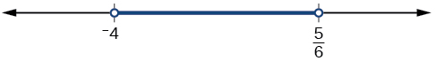{: #Figure_02_07_003}

Solve the compound inequality:<math xmlns="http://www.w3.org/1998/Math/MathML"> <mrow> <mtext> </mtext><mn>3</mn><mi>y</mi><mo>&lt;</mo><mn>4</mn><mo>−</mo><mn>5</mn><mi>y</mi><mo>&lt;</mo><mn>5</mn><mo>+</mo><mn>3</mn><mi>y</mi><mo>.</mo></mrow> </math>

<math xmlns="http://www.w3.org/1998/Math/MathML"> <mrow> <mrow><mo>(</mo> <mrow> <mo>−</mo><mfrac> <mn>1</mn> <mn>8</mn> </mfrac> <mo>,</mo><mfrac> <mn>1</mn> <mn>2</mn> </mfrac> </mrow> <mo>)</mo></mrow> </mrow> </math>

### Solving Absolute Value Inequalities

As we know, the absolute value of a quantity is a positive number or zero. From the origin, a point located at<math xmlns="http://www.w3.org/1998/Math/MathML"> <mrow> <mtext> </mtext><mrow><mo>(</mo> <mrow> <mo>−</mo><mi>x</mi><mo>,</mo><mn>0</mn> </mrow> <mo>)</mo></mrow><mtext> </mtext> </mrow> </math>

has an absolute value of<math xmlns="http://www.w3.org/1998/Math/MathML"> <mrow> <mtext> </mtext><mi>x</mi><mo>,</mo> </mrow> </math>

as it is <em>x </em>units away. Consider absolute value as the distance from one point to another point. Regardless of direction, positive or negative, the distance between the two points is represented as a positive number or zero.

An **absolute value inequality**{: data-type="term" .no-emphasis} is an equation of the form

<math xmlns="http://www.w3.org/1998/Math/MathML" display="block"> <mo>\|</mo><mi>A</mi><mo>\|</mo><mo>&lt;</mo><mi>B</mi><mo>,</mo><mtext> </mtext><mo>\|</mo><mi>A</mi><mo>\|</mo><mo>≤</mo><mi>B</mi><mo>,</mo><mtext> </mtext><mtext> </mtext><mo>\|</mo> <mi>A</mi> <mo>\|</mo><mo>&gt;</mo><mi>B</mi><mo>,</mo><mtext> </mtext><mtext>or </mtext><mtext> </mtext><mtext> </mtext><mo>\|</mo> <mi>A</mi> <mo>\|</mo><mo>≥</mo><mi>B</mi><mo>,</mo> </math>

Where *A*, and sometimes *B*, represents an algebraic expression dependent on a variable <em>x. </em>Solving the inequality means finding the set of all <math xmlns="http://www.w3.org/1998/Math/MathML"> <mrow> <mtext> </mtext><mi>x</mi> </mrow> </math>

*-*values that satisfy the problem. Usually this set will be an interval or the union of two intervals and will include a range of values.

There are two basic approaches to solving absolute value inequalities: graphical and algebraic. The advantage of the graphical approach is we can read the solution by interpreting the graphs of two equations. The advantage of the algebraic approach is that solutions are exact, as precise solutions are sometimes difficult to read from a graph.

Suppose we want to know all possible returns on an investment if we could earn some amount of money within $200 of $600. We can solve algebraically for the set of *x-*values such that the distance between<math xmlns="http://www.w3.org/1998/Math/MathML"> <mrow> <mtext> </mtext><mi>x</mi><mtext> </mtext> </mrow> </math>

and 600 is less than 200. We represent the distance between<math xmlns="http://www.w3.org/1998/Math/MathML"> <mrow> <mtext> </mtext><mi>x</mi><mtext> </mtext> </mrow> </math>

and 600 as<math xmlns="http://www.w3.org/1998/Math/MathML"> <mrow> <mtext> </mtext><mrow><mo>\|</mo> <mrow> <mi>x</mi><mo>−</mo><mn>600</mn></mrow> <mo>\|</mo></mrow><mo>,</mo></mrow> </math>

and therefore,<math xmlns="http://www.w3.org/1998/Math/MathML"> <mrow> <mtext> </mtext><mrow><mo>\|</mo> <mrow> <mi>x</mi><mo>−</mo><mn>600</mn></mrow> <mo>\|</mo></mrow><mo>≤</mo><mn>200</mn><mtext> </mtext></mrow> </math>

or

<math xmlns="http://www.w3.org/1998/Math/MathML" display="block"> <mrow> <mtable> <mtr> <mtd> <mrow> <mn>−200</mn><mo>≤</mo><mi>x</mi><mo>−</mo><mn>600</mn><mo>≤</mo><mn>200</mn></mrow> </mtd> </mtr> <mtr> <mtd> <mrow> <mn>−200</mn><mo>+</mo><mn>600</mn><mo>≤</mo><mi>x</mi><mo>−</mo><mn>600</mn><mo>+</mo><mn>600</mn><mo>≤</mo><mn>200</mn><mo>+</mo><mn>600</mn></mrow> </mtd> </mtr> <mtr> <mtd> <mrow> <mn>400</mn><mo>≤</mo><mi>x</mi><mo>≤</mo><mn>800</mn></mrow> </mtd> </mtr> </mtable></mrow> </math>

This means our returns would be between $400 and $800.

To solve absolute value inequalities, just as with absolute value equations, we write two inequalities and then solve them independently.

Absolute Value Inequalities

For an algebraic expression *X,* and<math xmlns="http://www.w3.org/1998/Math/MathML"> <mrow> <mtext> </mtext><mi>k</mi><mo>&gt;</mo><mn>0</mn><mo>,</mo> </mrow> </math>

an **absolute value inequality**{: data-type="term"} is an inequality of the form

<math xmlns="http://www.w3.org/1998/Math/MathML" display="block"> <mrow> <mtable columnalign="left"> <mtr columnalign="left"> <mtd columnalign="left"> <mrow> <mrow><mo>\|</mo> <mi>X</mi> <mo>\|</mo></mrow><mo>&lt;</mo><mi>k</mi><mtext> is equivalent to </mtext><mo>−</mo><mi>k</mi><mo>&lt;</mo><mi>X</mi><mo>&lt;</mo><mi>k</mi></mrow> </mtd> </mtr> <mtr columnalign="left"> <mtd columnalign="left"> <mrow> <mrow><mo>\|</mo> <mi>X</mi> <mo>\|</mo></mrow><mo>&gt;</mo><mi>k</mi><mtext> is equivalent to </mtext><mi>X</mi><mo>&lt;</mo><mo>−</mo><mi>k</mi><mtext> or </mtext><mi>X</mi><mo>&gt;</mo><mi>k</mi></mrow> </mtd> </mtr> </mtable></mrow> </math>

These statements also apply to<math xmlns="http://www.w3.org/1998/Math/MathML"> <mrow> <mtext> </mtext><mrow><mo>\|</mo> <mi>X</mi> <mo>\|</mo></mrow><mo>≤</mo><mi>k</mi><mtext> </mtext></mrow> </math>

and<math xmlns="http://www.w3.org/1998/Math/MathML"> <mrow> <mtext> </mtext><mrow><mo>\|</mo> <mi>X</mi> <mo>\|</mo></mrow><mo>≥</mo><mi>k</mi><mo>.</mo></mrow> </math>

Determining a Number within a Prescribed Distance

Describe all values<math xmlns="http://www.w3.org/1998/Math/MathML"> <mrow> <mtext> </mtext><mi>x</mi><mtext> </mtext> </mrow> </math>

within a distance of 4 from the number 5.

We want the distance between<math xmlns="http://www.w3.org/1998/Math/MathML"> <mrow> <mtext> </mtext><mi>x</mi><mtext> </mtext> </mrow> </math>

and 5 to be less than or equal to 4. We can draw a number line, such as in [[link]](#Figure_02_07_004)**,** to represent the condition to be satisfied.

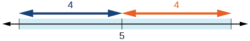{: #Figure_02_07_004}

The distance from<math xmlns="http://www.w3.org/1998/Math/MathML"> <mrow> <mtext> </mtext><mi>x</mi><mtext> </mtext> </mrow> </math>

to 5 can be represented using an absolute value symbol,<math xmlns="http://www.w3.org/1998/Math/MathML"> <mrow> <mtext> </mtext><mrow><mo>\|</mo> <mrow> <mi>x</mi><mo>−</mo><mn>5</mn> </mrow> <mo>\|</mo></mrow><mo>.</mo><mtext> </mtext> </mrow> </math>

Write the values of<math xmlns="http://www.w3.org/1998/Math/MathML"> <mrow> <mtext> </mtext><mi>x</mi><mtext> </mtext> </mrow> </math>

that satisfy the condition as an absolute value inequality.

<math xmlns="http://www.w3.org/1998/Math/MathML"> <mrow> <mrow><mo>\|</mo> <mrow> <mi>x</mi><mo>−</mo><mn>5</mn> </mrow> <mo>\|</mo></mrow><mo>≤</mo><mn>4</mn> </mrow> </math>

We need to write two inequalities as there are always two solutions to an absolute value equation.

<math xmlns="http://www.w3.org/1998/Math/MathML"> <mrow> <mtable columnalign="left"> <mtr columnalign="left"> <mtd columnalign="left"> <mrow> <mi>x</mi><mo>−</mo><mn>5</mn><mo>≤</mo><mn>4</mn> </mrow> </mtd> <mtd columnalign="left"> <mrow> <mspace width="2em" /><mtext>and</mtext><mspace width="2em" /> </mrow> </mtd> <mtd columnalign="left"> <mrow> <mi>x</mi><mo>−</mo><mn>5</mn><mo>≥</mo><mo>−</mo><mn>4</mn> </mrow> </mtd> </mtr> <mtr columnalign="left"> <mtd columnalign="left"> <mrow> <mspace width="1.8em" /><mi>x</mi><mo>≤</mo><mn>9</mn> </mrow> </mtd> <mtd columnalign="left"> <mrow /> </mtd> <mtd columnalign="left"> <mrow> <mspace width="1.8em" /><mi>x</mi><mo>≥</mo><mn>1</mn> </mrow> </mtd> </mtr> </mtable> </mrow> </math>

If the solution set is<math xmlns="http://www.w3.org/1998/Math/MathML"> <mrow> <mtext> </mtext><mi>x</mi><mo>≤</mo><mn>9</mn><mtext> </mtext> </mrow> </math>

and<math xmlns="http://www.w3.org/1998/Math/MathML"> <mrow> <mtext> </mtext><mi>x</mi><mo>≥</mo><mn>1</mn><mo>,</mo> </mrow> </math>

then the solution set is an interval including all real numbers between and including 1 and 9.

So<math xmlns="http://www.w3.org/1998/Math/MathML"> <mrow> <mtext> </mtext><mrow><mo>\|</mo> <mrow> <mi>x</mi><mo>−</mo><mn>5</mn></mrow> <mo>\|</mo></mrow><mo>≤</mo><mn>4</mn><mtext> </mtext></mrow> </math>

is equivalent to<math xmlns="http://www.w3.org/1998/Math/MathML"> <mrow> <mtext> </mtext><mrow><mo>[</mo> <mrow> <mn>1</mn><mo>,</mo><mn>9</mn> </mrow> <mo>]</mo></mrow><mtext> </mtext> </mrow> </math>

in interval notation.

Describe all *x-*values within a distance of 3 from the number 2.

<math xmlns="http://www.w3.org/1998/Math/MathML"> <mrow> <mrow><mo>\|</mo> <mrow> <mi>x</mi><mn>−2</mn> </mrow> <mo>\|</mo></mrow><mo>≤</mo><mn>3</mn> </mrow> </math>

Solving an Absolute Value Inequality

Solve <math xmlns="http://www.w3.org/1998/Math/MathML"> <mo>\|</mo> <mi>x</mi><mo>−</mo><mn>1</mn> <mo>\|</mo><mo>≤</mo><mn>3</mn> </math>

.

<math xmlns="http://www.w3.org/1998/Math/MathML"> <mtable columnalign="left"> <mtr columnalign="left"> <mtd columnalign="left"> <mo>\|</mo> <mi>x</mi><mo>−</mo><mn>1</mn> <mo>\|</mo><mo>≤</mo><mn>3</mn> </mtd> </mtr> <mtr columnalign="left"> <mtd columnalign="left"> <mrow /> </mtd> </mtr> <mtr columnalign="left"> <mtd columnalign="left"> <mn>−3</mn><mo>≤</mo><mi>x</mi><mo>−</mo><mn>1</mn><mo>≤</mo><mn>3</mn> </mtd> </mtr> <mtr columnalign="left"> <mtd columnalign="left"> <mrow /> </mtd> </mtr> <mtr columnalign="left"> <mtd columnalign="left"> <mn>−2</mn><mo>≤</mo><mi>x</mi><mo>≤</mo><mn>4</mn> </mtd> </mtr> <mtr columnalign="left"> <mtd columnalign="left"> <mrow /> </mtd> </mtr> <mtr columnalign="left"> <mtd columnalign="left"> <mo stretchy="false">[</mo><mn>−2</mn><mo>,</mo><mn>4</mn><mo stretchy="false">]</mo> </mtd> </mtr> </mtable> </math>

Using a Graphical Approach to Solve Absolute Value Inequalities

Given the equation <math xmlns="http://www.w3.org/1998/Math/MathML"> <mi>y</mi><mo>=</mo><mo>−</mo><mfrac> <mn>1</mn> <mn>2</mn> </mfrac> <mo>\|</mo> <mn>4</mn><mi>x</mi><mo>−</mo><mn>5</mn> <mo>\|</mo><mo>+</mo><mn>3</mn><mo>,</mo> </math>

determine the *x*-values for which the *y*-values are negative.

We are trying to determine where<math xmlns="http://www.w3.org/1998/Math/MathML"> <mtext> </mtext><mi>y</mi><mo>&lt;</mo><mn>0</mn><mo>,</mo> </math>

which is when<math xmlns="http://www.w3.org/1998/Math/MathML"> <mtext> </mtext><mo>−</mo><mfrac> <mn>1</mn> <mn>2</mn> </mfrac> <mo>\|</mo> <mn>4</mn><mi>x</mi><mo>−</mo><mn>5</mn> <mo>\|</mo><mo>+</mo><mn>3</mn><mo>&lt;</mo><mn>0.</mn><mtext> </mtext> </math>

We begin by isolating the absolute value.

<math xmlns="http://www.w3.org/1998/Math/MathML" display="block"> <mtable columnalign="left"> <mtr columnalign="left"> <mtd columnalign="left"> <mo>−</mo><mfrac> <mn>1</mn> <mn>2</mn> </mfrac> <mo>\|</mo> <mn>4</mn><mi>x</mi><mo>−</mo><mn>5</mn> <mo>\|</mo><mo>&lt;</mo><mo>−</mo><mn>3</mn> </mtd> <mtd columnalign="left"> <mspace width="2em" /><mtext>Multiply both sides by –2, and reverse the inequality</mtext><mo>.</mo> </mtd> </mtr> <mtr columnalign="left"> <mtd columnalign="left"> <mspace width="1.5em" /> <mo>\|</mo> <mn>4</mn><mi>x</mi><mo>−</mo><mn>5</mn> <mo>\|</mo><mo>&gt;</mo><mn>6</mn> </mtd> <mtd columnalign="left"> <mrow /> </mtd> </mtr> </mtable> </math>

Next, we solve for the equality <math xmlns="http://www.w3.org/1998/Math/MathML"> <mo>\|</mo> <mn>4</mn><mi>x</mi><mo>−</mo><mn>5</mn> <mo>\|</mo><mo>=</mo><mn>6.</mn> </math>

<math xmlns="http://www.w3.org/1998/Math/MathML" display="block"> <mrow> <mtable columnalign="left"> <mtr columnalign="left"> <mtd columnalign="left"> <mrow> <mn>4</mn><mi>x</mi><mo>−</mo><mn>5</mn><mo>=</mo><mn>6</mn> </mrow> </mtd> <mtd columnalign="left"> <mrow /> </mtd> <mtd columnalign="left"> <mrow> <mn>4</mn><mi>x</mi><mo>−</mo><mn>5</mn><mo>=</mo><mo>−</mo><mn>6</mn> </mrow> </mtd> </mtr> <mtr columnalign="left"> <mtd columnalign="left"> <mrow> <mspace width="1.9em" /><mn>4</mn><mi>x</mi><mo>=</mo><mn>11</mn> </mrow> </mtd> <mtd columnalign="left"> <mrow> <mspace width="2em" /><mtext>or</mtext><mspace width="2em" /> </mrow> </mtd> <mtd columnalign="left"> <mrow> <mspace width="1.9em" /><mn>4</mn><mi>x</mi><mo>=</mo><mo>−</mo><mn>1</mn> </mrow> </mtd> </mtr> <mtr columnalign="left"> <mtd columnalign="left"> <mrow> <mspace width="2em" /><mi>x</mi><mo>=</mo><mfrac> <mrow> <mn>11</mn> </mrow> <mn>4</mn> </mfrac> </mrow> </mtd> <mtd columnalign="left"> <mrow /> </mtd> <mtd columnalign="left"> <mrow> <mspace width="2em" /><mi>x</mi><mo>=</mo><mo>−</mo><mfrac> <mn>1</mn> <mn>4</mn> </mfrac> </mrow> </mtd> </mtr> </mtable> </mrow> </math>

Now, we can examine the graph to observe where the *y-*values are negative. We observe where the branches are below the *x-*axis. Notice that it is not important exactly what the graph looks like, as long as we know that it crosses the horizontal axis at<math xmlns="http://www.w3.org/1998/Math/MathML"> <mrow> <mtext> </mtext><mi>x</mi><mo>=</mo><mo>−</mo><mfrac> <mn>1</mn> <mn>4</mn> </mfrac> <mtext> </mtext> </mrow> </math>

and<math xmlns="http://www.w3.org/1998/Math/MathML"> <mrow> <mtext> </mtext><mi>x</mi><mo>=</mo><mfrac> <mrow> <mn>11</mn> </mrow> <mn>4</mn> </mfrac> <mo>,</mo> </mrow> </math>

and that the graph opens downward. See [[link]](#Figure_02_07_007)**.**

{: #Figure_02_07_007}

Solve<math xmlns="http://www.w3.org/1998/Math/MathML"> <mrow> <mtext> </mtext><mo>−</mo><mn>2</mn><mrow><mo>\|</mo> <mrow> <mi>k</mi><mo>−</mo><mn>4</mn> </mrow> <mo>\|</mo></mrow><mo>≤</mo><mo>−</mo><mn>6.</mn> </mrow> </math>

<math xmlns="http://www.w3.org/1998/Math/MathML"> <mrow> <mi>k</mi><mo>≤</mo><mn>1</mn><mtext> </mtext> </mrow> </math>

or<math xmlns="http://www.w3.org/1998/Math/MathML"> <mrow> <mtext> </mtext><mi>k</mi><mo>≥</mo><mn>7</mn><mo>;</mo> </mrow> </math>

in interval notation, this would be<math xmlns="http://www.w3.org/1998/Math/MathML"> <mrow> <mtext> </mtext><mo stretchy="false">(</mo><mo>−</mo><mi>∞</mi><mo>,</mo><mn>1</mn><mo stretchy="false">]</mo><mo>∪</mo><mo stretchy="false">[</mo><mn>7</mn><mo>,</mo><mi>∞</mi><mo stretchy="false">)</mo><mo>.</mo> </mrow> </math>

 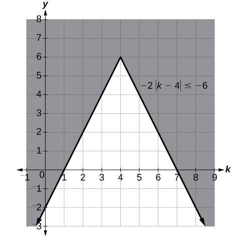 

Access these online resources for additional instruction and practice with linear inequalities and absolute value inequalities.

* [Interval notation][1]
* [How to solve linear inequalities][2]
* [How to solve an inequality][3]
* [Absolute value equations][4]
* [Compound inequalities][5]
* [Absolute value inequalities][6]

### Key Concepts

* Interval notation is a method to indicate the solution set to an inequality. Highly applicable in calculus, it is a system of parentheses and brackets that indicate what numbers are included in a set and whether the endpoints are included as well. See [\[link\]](#Table_02_07_01) and [\[link\]](#Example_02_07_02)**.**
* Solving inequalities is similar to solving equations. The same algebraic rules apply, except for one: multiplying or dividing by a negative number reverses the inequality. See [\[link\]](#Example_02_07_03)**,** [\[link\]](#Example_02_07_04), [\[link\]](#Example_02_07_05), and [\[link\]](#Example_02_07_06)**.**
* Compound inequalities often have three parts and can be rewritten as two independent inequalities. Solutions are given by boundary values, which are indicated as a beginning boundary or an ending boundary in the solutions to the two inequalities. See [\[link\]](#Example_02_07_07) and [\[link\]](#Example_02_07_08).
* Absolute value inequalities will produce two solution sets due to the nature of absolute value. We solve by writing two equations: one equal to a positive value and one equal to a negative value. See [\[link\]](#Example_02_07_09) and [\[link\]](#Example_02_07_10)**.**
* Absolute value inequalities can also be solved by graphing. At least we can check the algebraic solutions by graphing, as we cannot depend on a visual for a precise solution. See [\[link\]](#Example_02_07_11).

### Section Exercises

#### Verbal

When solving an inequality, explain what happened from Step 1 to Step 2:

<math xmlns="http://www.w3.org/1998/Math/MathML"> <mrow> <mtable columnalign="left"> <mtr columnalign="left"> <mtd columnalign="left"> <mrow> <mtext>Step 1</mtext> </mrow> </mtd> <mtd columnalign="left"> <mrow> <mspace width="2em" /><mo>−</mo><mn>2</mn><mi>x</mi><mo>&gt;</mo><mn>6</mn> </mrow> </mtd> </mtr> <mtr columnalign="left"> <mtd columnalign="left"> <mrow> <mtext>Step 2</mtext> </mrow> </mtd> <mtd columnalign="left"> <mrow> <mspace width="3em" /><mi>x</mi><mo>&lt;</mo><mo>−</mo><mn>3</mn> </mrow> </mtd> </mtr> </mtable> </mrow> </math>

When we divide both sides by a negative it changes the sign of both sides so the sense of the inequality sign changes.

When solving an inequality, we arrive at:

<math xmlns="http://www.w3.org/1998/Math/MathML"> <mrow> <mtable columnalign="left"> <mtr columnalign="left"> <mtd columnalign="left"> <mrow> <mi>x</mi><mo>+</mo><mn>2</mn><mo>&lt;</mo><mi>x</mi><mo>+</mo><mn>3</mn> </mrow> </mtd> </mtr> <mtr columnalign="left"> <mtd columnalign="left"> <mrow> <mspace width="1.2em" /><mn>2</mn><mo>&lt;</mo><mn>3</mn> </mrow> </mtd> </mtr> </mtable> </mrow> </math>

Explain what our solution set is.

When writing our solution in interval notation, how do we represent all the real numbers?

<math xmlns="http://www.w3.org/1998/Math/MathML"> <mrow> <mrow><mo>(</mo> <mrow> <mo>−</mo><mi>∞</mi><mo>,</mo><mi>∞</mi> </mrow> <mo>)</mo></mrow> </mrow> </math>

When solving an inequality, we arrive at:

<math xmlns="http://www.w3.org/1998/Math/MathML"> <mrow> <mtable columnalign="left"> <mtr columnalign="left"> <mtd columnalign="left"> <mrow> <mi>x</mi><mo>+</mo><mn>2</mn><mo>&gt;</mo><mi>x</mi><mo>+</mo><mn>3</mn> </mrow> </mtd> </mtr> <mtr columnalign="left"> <mtd columnalign="left"> <mrow> <mspace width="1.2em" /><mn>2</mn><mo>&gt;</mo><mn>3</mn> </mrow> </mtd> </mtr> </mtable> </mrow> </math>

Explain what our solution set is.

Describe how to graph<math xmlns="http://www.w3.org/1998/Math/MathML"> <mrow> <mtext> </mtext><mi>y</mi><mo>=</mo><mrow><mo>\|</mo> <mrow> <mi>x</mi><mo>−</mo><mn>3</mn> </mrow> <mo>\|</mo></mrow> </mrow> </math>

We start by finding the *x*-intercept, or where the function = 0. Once we have that point, which is<math xmlns="http://www.w3.org/1998/Math/MathML"> <mrow> <mtext> </mtext><mo stretchy="false">(</mo><mn>3</mn><mo>,</mo><mn>0</mn><mo stretchy="false">)</mo><mo>,</mo> </mrow> </math>

we graph to the right the straight line graph<math xmlns="http://www.w3.org/1998/Math/MathML"> <mrow> <mtext> </mtext><mi>y</mi><mo>=</mo><mi>x</mi><mn>−3</mn><mo>,</mo> </mrow> </math>

and then when we draw it to the left we plot positive *y* values, taking the absolute value of them.

#### Algebraic

For the following exercises, solve the inequality. Write your final answer in interval notation.

<math xmlns="http://www.w3.org/1998/Math/MathML"> <mrow> <mn>4</mn><mi>x</mi><mo>−</mo><mn>7</mn><mo>≤</mo><mn>9</mn></mrow> </math>

<math xmlns="http://www.w3.org/1998/Math/MathML"> <mrow> <mn>3</mn><mi>x</mi><mo>+</mo><mn>2</mn><mo>≥</mo><mn>7</mn><mi>x</mi><mo>−</mo><mn>1</mn></mrow> </math>

<math xmlns="http://www.w3.org/1998/Math/MathML"> <mrow> <mrow><mo>(</mo> <mrow> <mo>−</mo><mi>∞</mi><mo>,</mo><mfrac> <mn>3</mn> <mn>4</mn> </mfrac> </mrow> <mo>]</mo></mrow> </mrow> </math>

<math xmlns="http://www.w3.org/1998/Math/MathML"> <mrow> <mn>−2</mn><mi>x</mi><mo>+</mo><mn>3</mn><mo>&gt;</mo><mi>x</mi><mo>−</mo><mn>5</mn></mrow> </math>

<math xmlns="http://www.w3.org/1998/Math/MathML"> <mrow> <mn>4</mn><mo stretchy="false">(</mo><mi>x</mi><mo>+</mo><mn>3</mn><mo stretchy="false">)</mo><mo>≥</mo><mn>2</mn><mi>x</mi><mo>−</mo><mn>1</mn></mrow> </math>

<math xmlns="http://www.w3.org/1998/Math/MathML"> <mrow> <mrow><mo>[</mo> <mrow> <mfrac> <mrow> <mo>−</mo><mn>13</mn> </mrow> <mn>2</mn> </mfrac> <mo>,</mo><mi>∞</mi> </mrow> <mo>)</mo></mrow> </mrow> </math>

<math xmlns="http://www.w3.org/1998/Math/MathML"> <mrow> <mo>−</mo><mfrac> <mn>1</mn> <mn>2</mn> </mfrac> <mi>x</mi><mo>≤</mo><mfrac> <mrow> <mo>−</mo><mn>5</mn> </mrow> <mn>4</mn> </mfrac> <mo>+</mo><mfrac> <mn>2</mn> <mn>5</mn> </mfrac> <mi>x</mi> </mrow> </math>

<math xmlns="http://www.w3.org/1998/Math/MathML"> <mrow> <mn>−5</mn><mo stretchy="false">(</mo><mi>x</mi><mo>−</mo><mn>1</mn><mo stretchy="false">)</mo><mo>+</mo><mn>3</mn><mo>&gt;</mo><mn>3</mn><mi>x</mi><mo>−</mo><mn>4</mn><mo>−</mo><mn>4</mn><mi>x</mi></mrow> </math>

<math xmlns="http://www.w3.org/1998/Math/MathML"> <mrow> <mrow><mo>(</mo> <mrow> <mo>−</mo><mi>∞</mi><mo>,</mo><mn>3</mn> </mrow> <mo>)</mo></mrow> </mrow> </math>

<math xmlns="http://www.w3.org/1998/Math/MathML"> <mrow> <mn>−3</mn><mo stretchy="false">(</mo><mn>2</mn><mi>x</mi><mo>+</mo><mn>1</mn><mo stretchy="false">)</mo><mo>&gt;</mo><mn>−2</mn><mo stretchy="false">(</mo><mi>x</mi><mo>+</mo><mn>4</mn><mo stretchy="false">)</mo></mrow> </math>

<math xmlns="http://www.w3.org/1998/Math/MathML"> <mrow> <mfrac> <mrow> <mi>x</mi><mo>+</mo><mn>3</mn> </mrow> <mn>8</mn> </mfrac> <mo>−</mo><mfrac> <mrow> <mi>x</mi><mo>+</mo><mn>5</mn> </mrow> <mn>5</mn> </mfrac> <mo>≥</mo><mfrac> <mn>3</mn> <mrow> <mn>10</mn> </mrow> </mfrac> </mrow> </math>

<math xmlns="http://www.w3.org/1998/Math/MathML"> <mrow> <mrow><mo>(</mo> <mrow> <mo>−</mo><mi>∞</mi><mo>,</mo><mo>−</mo><mfrac> <mrow> <mn>37</mn> </mrow> <mn>3</mn> </mfrac> </mrow> <mo>]</mo></mrow> </mrow> </math>

<math xmlns="http://www.w3.org/1998/Math/MathML"> <mrow> <mfrac> <mrow> <mi>x</mi><mo>−</mo><mn>1</mn> </mrow> <mn>3</mn> </mfrac> <mo>+</mo><mfrac> <mrow> <mi>x</mi><mo>+</mo><mn>2</mn> </mrow> <mn>5</mn> </mfrac> <mo>≤</mo><mfrac> <mn>3</mn> <mn>5</mn> </mfrac> </mrow> </math>

For the following exercises, solve the inequality involving absolute value. Write your final answer in interval notation.

<math xmlns="http://www.w3.org/1998/Math/MathML"> <mrow> <mrow><mo>\|</mo> <mrow> <mi>x</mi><mo>+</mo><mn>9</mn> </mrow> <mo>\|</mo></mrow><mo>≥</mo><mn>−6</mn> </mrow> </math>

All real numbers<math xmlns="http://www.w3.org/1998/Math/MathML"> <mrow> <mtext> </mtext><mrow><mo>(</mo> <mrow> <mo>−</mo><mi>∞</mi><mo>,</mo><mi>∞</mi> </mrow> <mo>)</mo></mrow> </mrow> </math>

<math xmlns="http://www.w3.org/1998/Math/MathML"> <mrow> <mrow><mo>\|</mo> <mrow> <mn>2</mn><mi>x</mi><mo>+</mo><mn>3</mn> </mrow> <mo>\|</mo></mrow><mo>&lt;</mo><mn>7</mn> </mrow> </math>

<math xmlns="http://www.w3.org/1998/Math/MathML"> <mrow> <mo>\|</mo><mn>3</mn><mi>x</mi><mo>−</mo><mn>1</mn><mo>\|</mo><mo>&gt;</mo><mn>11</mn> </mrow> </math>

<math xmlns="http://www.w3.org/1998/Math/MathML"> <mrow> <mrow><mo>(</mo> <mrow> <mo>−</mo><mi>∞</mi><mo>,</mo><mfrac> <mrow> <mo>−</mo><mn>10</mn> </mrow> <mn>3</mn> </mfrac> </mrow> <mo>)</mo></mrow><mo>∪</mo><mrow><mo>(</mo> <mrow> <mn>4</mn><mo>,</mo><mi>∞</mi> </mrow> <mo>)</mo></mrow> </mrow> </math>

<math xmlns="http://www.w3.org/1998/Math/MathML"> <mrow> <mrow><mo>\|</mo> <mrow> <mn>2</mn><mi>x</mi><mo>+</mo><mn>1</mn> </mrow> <mo>\|</mo></mrow><mo>+</mo><mn>1</mn><mo>≤</mo><mn>6</mn> </mrow> </math>

<math xmlns="http://www.w3.org/1998/Math/MathML"> <mrow> <mrow><mo>\|</mo> <mrow> <mi>x</mi><mo>−</mo><mn>2</mn></mrow> <mo>\|</mo></mrow><mo>+</mo><mn>4</mn><mo>≥</mo><mn>10</mn></mrow> </math>

<math xmlns="http://www.w3.org/1998/Math/MathML"> <mrow> <mrow><mo>(</mo> <mrow> <mo>−</mo><mi>∞</mi><mo>,</mo><mn>−4</mn> </mrow> <mo>]</mo></mrow><mo>∪</mo><mrow><mo>[</mo> <mrow> <mn>8</mn><mo>,</mo><mo>+</mo><mi>∞</mi> </mrow> <mo>)</mo></mrow> </mrow> </math>

<math xmlns="http://www.w3.org/1998/Math/MathML"> <mrow> <mrow><mo>\|</mo> <mrow> <mn>−2</mn><mi>x</mi><mo>+</mo><mn>7</mn> </mrow> <mo>\|</mo></mrow><mo>≤</mo><mn>13</mn> </mrow> </math>

<math xmlns="http://www.w3.org/1998/Math/MathML"> <mrow> <mo>\|</mo><mi>x</mi><mo>−</mo><mn>7</mn><mo>\|</mo><mo>&lt;</mo><mn>−4</mn> </mrow> </math>

No solution

<math xmlns="http://www.w3.org/1998/Math/MathML"> <mrow> <mo>\|</mo><mi>x</mi><mo>−</mo><mn>20</mn><mo>\|</mo><mo>&gt;</mo><mn>−1</mn> </mrow> </math>

<math xmlns="http://www.w3.org/1998/Math/MathML"> <mrow> <mrow><mo>\|</mo> <mrow> <mfrac> <mrow> <mi>x</mi><mo>−</mo><mn>3</mn> </mrow> <mn>4</mn> </mfrac> </mrow> <mo>\|</mo></mrow><mo>&lt;</mo><mn>2</mn> </mrow> </math>

<math xmlns="http://www.w3.org/1998/Math/MathML"> <mrow> <mrow><mo>(</mo> <mrow> <mn>−5</mn><mo>,</mo><mn>11</mn> </mrow> <mo>)</mo></mrow> </mrow> </math>

For the following exercises, describe all the *x*-values within or including a distance of the given values.

Distance of 5 units from the number 7

Distance of 3 units from the number 9

<math xmlns="http://www.w3.org/1998/Math/MathML"> <mrow> <mrow><mo>[</mo> <mrow> <mn>6</mn><mo>,</mo><mn>12</mn> </mrow> <mo>]</mo></mrow> </mrow> </math>

Distance of10 units from the number 4

Distance of 11 units from the number 1

<math xmlns="http://www.w3.org/1998/Math/MathML"> <mrow> <mrow><mo>[</mo> <mrow> <mn>−10</mn><mo>,</mo><mn>12</mn> </mrow> <mo>]</mo></mrow> </mrow> </math>

For the following exercises, solve the compound inequality. Express your answer using inequality signs, and then write your answer using interval notation.

<math xmlns="http://www.w3.org/1998/Math/MathML"> <mrow> <mn>−4</mn><mo>&lt;</mo><mn>3</mn><mi>x</mi><mo>+</mo><mn>2</mn><mo>≤</mo><mn>18</mn> </mrow> </math>

<math xmlns="http://www.w3.org/1998/Math/MathML"> <mrow> <mn>3</mn><mi>x</mi><mo>+</mo><mn>1</mn><mo>&gt;</mo><mn>2</mn><mi>x</mi><mo>−</mo><mn>5</mn><mo>&gt;</mo><mi>x</mi><mo>−</mo><mn>7</mn></mrow> </math>

<math xmlns="http://www.w3.org/1998/Math/MathML"> <mrow> <mtable columnalign="left"> <mtr columnalign="left"> <mtd columnalign="left"> <mrow> <mi>x</mi><mo>&gt;</mo><mo>−</mo><mn>6</mn><mtext> and </mtext><mi>x</mi><mo>&gt;</mo><mo>−</mo><mn>2</mn> </mrow> </mtd> <mtd columnalign="left"> <mrow> <mspace width="2em" /><mtext>Take the intersection of two sets</mtext><mo>.</mo> </mrow> </mtd> </mtr> <mtr columnalign="left"> <mtd columnalign="left"> <mrow> <mi>x</mi><mo>&gt;</mo><mo>−</mo><mn>2</mn><mo>,</mo><mtext> </mtext><mo stretchy="false">(</mo><mo>−</mo><mn>2</mn><mo>,</mo><mo>+</mo><mi>∞</mi><mo stretchy="false">)</mo> </mrow> </mtd> <mtd columnalign="left"> <mrow /> </mtd> </mtr> </mtable> </mrow> </math>

<math xmlns="http://www.w3.org/1998/Math/MathML"> <mrow> <mn>3</mn><mi>y</mi><mo>&lt;</mo><mn>5</mn><mo>−</mo><mn>2</mn><mi>y</mi><mo>&lt;</mo><mn>7</mn><mo>+</mo><mi>y</mi> </mrow> </math>

<math xmlns="http://www.w3.org/1998/Math/MathML"> <mrow> <mn>2</mn><mi>x</mi><mo>−</mo><mn>5</mn><mo>&lt;</mo><mn>−11</mn><mtext>    or    </mtext><mn>5</mn><mi>x</mi><mo>+</mo><mn>1</mn><mo>≥</mo><mn>6</mn></mrow> </math>

<math xmlns="http://www.w3.org/1998/Math/MathML"> <mrow> <mtable columnalign="left"> <mtr columnalign="left"> <mtd columnalign="left"> <mrow> <mi>x</mi><mo>&lt;</mo><mo>−</mo><mn>3</mn><mtext> </mtext><mi>or</mi><mtext> </mtext><mi>x</mi><mo>≥</mo><mn>1</mn> </mrow> </mtd> <mtd columnalign="left"> <mrow> <mspace width="2em" /><mtext>Take the union of the two sets</mtext><mo>.</mo> </mrow> </mtd> </mtr> <mtr columnalign="left"> <mtd columnalign="left"> <mrow> <mo stretchy="false">(</mo><mo>−</mo><mi>∞</mi><mo>,</mo><mo>−</mo><mn>3</mn><mo stretchy="false">)</mo><msup> <mrow> <msup> <mstyle mathsize="140%" displaystyle="true"><mo>∪</mo></mstyle> <mtext>​</mtext> </msup> </mrow> <mtext>​</mtext> </msup> <mo stretchy="false">[</mo><mn>1</mn><mo>,</mo><mi>∞</mi><mo stretchy="false">)</mo> </mrow> </mtd> <mtd columnalign="left"> <mrow /> </mtd> </mtr> </mtable> </mrow> </math>

<math xmlns="http://www.w3.org/1998/Math/MathML"> <mrow> <mi>x</mi><mo>+</mo><mn>7</mn><mo>&lt;</mo><mi>x</mi><mo>+</mo><mn>2</mn> </mrow> </math>

#### Graphical

For the following exercises, graph the function. Observe the points of intersection and shade the *x*-axis representing the solution set to the inequality. Show your graph and write your final answer in interval notation.

<math xmlns="http://www.w3.org/1998/Math/MathML"> <mrow> <mo>\|</mo><mi>x</mi><mo>−</mo><mn>1</mn><mo>\|</mo><mo>&gt;</mo><mn>2</mn> </mrow> </math>

<math xmlns="http://www.w3.org/1998/Math/MathML"> <mrow> <mrow><mo>(</mo> <mrow> <mo>−</mo><mi>∞</mi><mo>,</mo><mn>−1</mn></mrow> <mo>)</mo></mrow><mo>∪</mo><mrow><mo>(</mo> <mrow> <mn>3</mn><mo>,</mo><mi>∞</mi></mrow> <mo>)</mo></mrow></mrow> </math>

* * *
{: data-type="newline"}

  

<math xmlns="http://www.w3.org/1998/Math/MathML"> <mrow> <mrow><mo>\|</mo> <mrow> <mi>x</mi><mo>+</mo><mn>3</mn> </mrow> <mo>\|</mo></mrow><mo>≥</mo><mn>5</mn> </mrow> </math>

<math xmlns="http://www.w3.org/1998/Math/MathML"> <mrow> <mrow><mo>\|</mo> <mrow> <mi>x</mi><mo>+</mo><mn>7</mn> </mrow> <mo>\|</mo></mrow><mo>≤</mo><mn>4</mn> </mrow> </math>

<math xmlns="http://www.w3.org/1998/Math/MathML"> <mrow> <mrow><mo>[</mo> <mrow> <mn>−11</mn><mo>,</mo><mn>−3</mn></mrow> <mo>]</mo></mrow></mrow> </math>

* * *
{: data-type="newline"}

 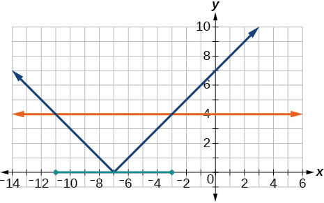 

<math xmlns="http://www.w3.org/1998/Math/MathML"> <mrow> <mrow><mo>\|</mo> <mrow> <mi>x</mi><mo>−</mo><mn>2</mn></mrow> <mo>\|</mo></mrow><mo>&lt;</mo><mn>7</mn></mrow> </math>

<math xmlns="http://www.w3.org/1998/Math/MathML"> <mrow> <mrow><mo>\|</mo> <mrow> <mi>x</mi><mo>−</mo><mn>2</mn></mrow> <mo>\|</mo></mrow><mo>&lt;</mo><mn>0</mn></mrow> </math>

It is never less than zero. No solution.

* * *
{: data-type="newline"}

 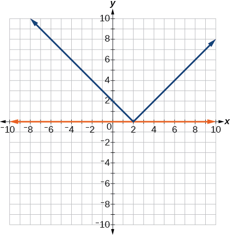 

For the following exercises, graph both straight lines (left-hand side being y1 and right-hand side being y2) on the same axes. Find the point of intersection and solve the inequality by observing where it is true comparing the *y*-values of the lines.

<math xmlns="http://www.w3.org/1998/Math/MathML"> <mrow> <mi>x</mi><mo>+</mo><mn>3</mn><mo>&lt;</mo><mn>3</mn><mi>x</mi><mo>−</mo><mn>4</mn></mrow> </math>

<math xmlns="http://www.w3.org/1998/Math/MathML"> <mrow> <mi>x</mi><mo>−</mo><mn>2</mn><mo>&gt;</mo><mn>2</mn><mi>x</mi><mo>+</mo><mn>1</mn></mrow> </math>

Where the blue line is above the orange line; point of intersection is<math xmlns="http://www.w3.org/1998/Math/MathML"> <mrow> <mtext> </mtext><mi>x</mi><mo>=</mo><mo>−</mo><mn>3.</mn> </mrow> </math>

<math xmlns="http://www.w3.org/1998/Math/MathML"> <mrow> <mrow><mo>(</mo> <mrow> <mo>−</mo><mi>∞</mi><mo>,</mo><mn>−3</mn></mrow> <mo>)</mo></mrow></mrow> </math>

* * *
{: data-type="newline"}

 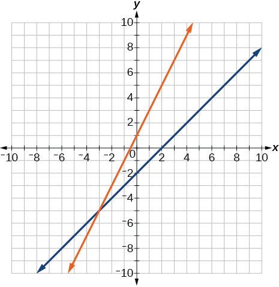 

<math xmlns="http://www.w3.org/1998/Math/MathML"> <mrow> <mi>x</mi><mo>+</mo><mn>1</mn><mo>&gt;</mo><mi>x</mi><mo>+</mo><mn>4</mn> </mrow> </math>

<math xmlns="http://www.w3.org/1998/Math/MathML"> <mrow> <mfrac> <mn>1</mn> <mn>2</mn> </mfrac> <mi>x</mi><mo>+</mo><mn>1</mn><mo>&gt;</mo><mfrac> <mn>1</mn> <mn>2</mn> </mfrac> <mi>x</mi><mo>−</mo><mn>5</mn></mrow> </math>

Where the blue line is above the orange line; always. All real numbers.

<math xmlns="http://www.w3.org/1998/Math/MathML"> <mrow> <mo stretchy="false">(</mo><mo>−</mo><mi>∞</mi><mo>,</mo><mo>−</mo><mi>∞</mi><mo stretchy="false">)</mo> </mrow> </math>

* * *
{: data-type="newline"}

 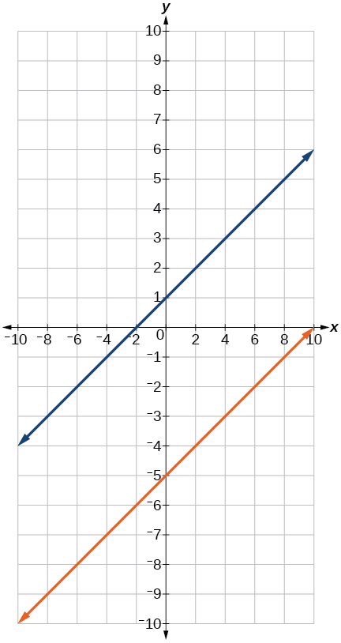 

<math xmlns="http://www.w3.org/1998/Math/MathML"> <mrow> <mn>4</mn><mi>x</mi><mo>+</mo><mn>1</mn><mo>&lt;</mo><mfrac> <mn>1</mn> <mn>2</mn> </mfrac> <mi>x</mi><mo>+</mo><mn>3</mn> </mrow> </math>

#### Numeric

For the following exercises, write the set in interval notation.

<math xmlns="http://www.w3.org/1998/Math/MathML"> <mrow> <mrow><mo>{</mo> <mrow> <mi>x</mi><mrow><mo>\|</mo><mrow> <mn>−1</mn><mo>&lt;</mo><mi>x</mi><mo>&lt;</mo><mrow><mn>3</mn> <mo>}</mo></mrow> </mrow></mrow> </mrow> </mrow> </mrow> </math>

<math xmlns="http://www.w3.org/1998/Math/MathML"> <mrow> <mrow><mo>(</mo> <mrow> <mn>−1</mn><mo>,</mo><mn>3</mn> </mrow> <mo>)</mo></mrow> </mrow> </math>

<math xmlns="http://www.w3.org/1998/Math/MathML"> <mrow> <mrow><mo>{</mo> <mrow> <mi>x</mi><mrow><mo>\|</mo><mrow> <mi>x</mi><mo>≥</mo><mrow><mn>7</mn> <mo>}</mo></mrow> </mrow></mrow> </mrow> </mrow> </mrow> </math>

<math xmlns="http://www.w3.org/1998/Math/MathML"> <mrow> <mrow><mo>{</mo> <mrow> <mi>x</mi><mrow><mo>\|</mo><mrow> <mi>x</mi><mo>&lt;</mo><mrow><mn>4</mn> <mo>}</mo></mrow> </mrow></mrow> </mrow> </mrow> </mrow> </math>

<math xmlns="http://www.w3.org/1998/Math/MathML"> <mrow> <mrow><mo>(</mo> <mrow> <mo>−</mo><mi>∞</mi><mo>,</mo><mn>4</mn> </mrow> <mo>)</mo></mrow> </mrow> </math>

<math xmlns="http://www.w3.org/1998/Math/MathML"> <mrow> <mrow><mo>{</mo> <mrow> <mtext> </mtext><mi>x</mi><mrow><mo>\|</mo><mrow> <mtext> </mtext><mi>x</mi><mtext> is all real numbers</mtext><mrow><mrow /> <mo>}</mo></mrow> </mrow></mrow> </mrow> </mrow> </mrow> </math>

For the following exercises, write the interval in set-builder notation.

<math xmlns="http://www.w3.org/1998/Math/MathML"> <mrow> <mrow><mo>(</mo> <mrow> <mo>−</mo><mi>∞</mi><mo>,</mo><mn>6</mn> </mrow> <mo>)</mo></mrow> </mrow> </math>

<math xmlns="http://www.w3.org/1998/Math/MathML"> <mrow> <mrow><mo>{</mo> <mrow> <mi>x</mi><mrow><mo>\|</mo><mrow> <mi>x</mi><mo>&lt;</mo><mrow><mn>6</mn> <mo>}</mo></mrow> </mrow></mrow> </mrow> </mrow> </mrow> </math>

<math xmlns="http://www.w3.org/1998/Math/MathML"> <mrow> <mrow><mo>(</mo> <mrow> <mn>4</mn><mo>,</mo><mo>+</mo><mi>∞</mi> </mrow> <mo>)</mo></mrow> </mrow> </math>

<math xmlns="http://www.w3.org/1998/Math/MathML"> <mrow> <mo stretchy="false">[</mo><mn>−3</mn><mo>,</mo><mn>5</mn><mo stretchy="false">)</mo> </mrow> </math>

<math xmlns="http://www.w3.org/1998/Math/MathML"> <mrow> <mrow><mo>{</mo> <mrow> <mi>x</mi><mrow><mo>\|</mo><mrow> <mn>−3</mn><mo>≤</mo><mi>x</mi><mo>&lt;</mo><mrow><mn>5</mn> <mo>}</mo></mrow> </mrow></mrow> </mrow> </mrow> </mrow> </math>

<math xmlns="http://www.w3.org/1998/Math/MathML"> <mrow> <mo stretchy="false">[</mo><mn>−4</mn><mo>,</mo><mn>1</mn><mo stretchy="false">]</mo><mo>∪</mo><mo stretchy="false">[</mo><mn>9</mn><mo>,</mo><mi>∞</mi><mo stretchy="false">)</mo> </mrow> </math>

For the following exercises, write the set of numbers represented on the number line in interval notation.

 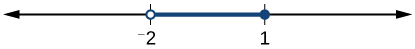 

<math xmlns="http://www.w3.org/1998/Math/MathML"> <mrow> <mrow><mo>(</mo> <mrow> <mn>−2</mn><mo>,</mo><mn>1</mn> </mrow> <mo>]</mo></mrow> </mrow> </math>

  

 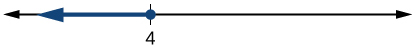 

<math xmlns="http://www.w3.org/1998/Math/MathML"> <mrow> <mrow><mo>(</mo> <mrow> <mo>−</mo><mi>∞</mi><mo>,</mo><mn>4</mn> </mrow> <mo>]</mo></mrow> </mrow> </math>

#### Technology

For the following exercises, input the left-hand side of the inequality as a Y1 graph in your graphing utility. Enter y2 = the right-hand side. Entering the absolute value of an expression is found in the MATH menu, Num, 1:abs(. Find the points of intersection, recall (2nd CALC 5:intersection, 1st curve, enter, 2nd curve, enter, guess, enter). Copy a sketch of the graph and shade the *x*-axis for your solution set to the inequality. Write final answers in interval notation.

<math xmlns="http://www.w3.org/1998/Math/MathML"> <mrow> <mrow><mo>\|</mo> <mrow> <mi>x</mi><mo>+</mo><mn>2</mn></mrow> <mo>\|</mo></mrow><mo>−</mo><mn>5</mn><mo>&lt;</mo><mn>2</mn></mrow> </math>

<math xmlns="http://www.w3.org/1998/Math/MathML"> <mrow> <mfrac> <mrow> <mo>−</mo><mn>1</mn> </mrow> <mn>2</mn> </mfrac> <mrow><mo>\|</mo> <mrow> <mi>x</mi><mo>+</mo><mn>2</mn> </mrow> <mo>\|</mo></mrow><mo>&lt;</mo><mn>4</mn> </mrow> </math>

Where the blue is below the orange; always. All real numbers.<math xmlns="http://www.w3.org/1998/Math/MathML"> <mrow> <mtext> </mtext><mo stretchy="false">(</mo><mo>−</mo><mi>∞</mi><mo>,</mo><mo>+</mo><mi>∞</mi><mo stretchy="false">)</mo><mo>.</mo> </mrow> </math>

* * *
{: data-type="newline"}

 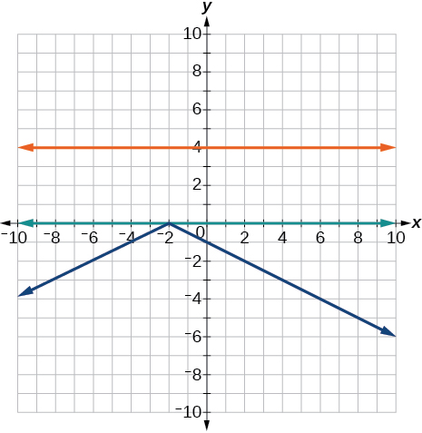 

<math xmlns="http://www.w3.org/1998/Math/MathML"> <mrow> <mrow><mo>\|</mo> <mrow> <mn>4</mn><mi>x</mi><mo>+</mo><mn>1</mn></mrow> <mo>\|</mo></mrow><mo>−</mo><mn>3</mn><mo>&gt;</mo><mn>2</mn></mrow> </math>

<math xmlns="http://www.w3.org/1998/Math/MathML"> <mrow> <mrow><mo>\|</mo> <mrow> <mi>x</mi><mo>−</mo><mn>4</mn></mrow> <mo>\|</mo></mrow><mo>&lt;</mo><mn>3</mn></mrow> </math>

Where the blue is below the orange;<math xmlns="http://www.w3.org/1998/Math/MathML"> <mrow> <mtext> </mtext><mrow><mo>(</mo> <mrow> <mn>1</mn><mo>,</mo><mn>7</mn> </mrow> <mo>)</mo></mrow><mo>.</mo> </mrow> </math>

* * *
{: data-type="newline"}

  

<math xmlns="http://www.w3.org/1998/Math/MathML"> <mrow> <mrow><mo>\|</mo> <mrow> <mi>x</mi><mo>+</mo><mn>2</mn> </mrow> <mo>\|</mo></mrow><mo>≥</mo><mn>5</mn> </mrow> </math>

#### Extensions

Solve<math xmlns="http://www.w3.org/1998/Math/MathML"> <mrow> <mtext> </mtext><mrow><mo>\|</mo> <mrow> <mn>3</mn><mi>x</mi><mo>+</mo><mn>1</mn> </mrow> <mo>\|</mo></mrow><mo>=</mo><mrow><mo>\|</mo> <mrow> <mn>2</mn><mi>x</mi><mo>+</mo><mn>3</mn> </mrow> <mo>\|</mo></mrow> </mrow> </math>

<math xmlns="http://www.w3.org/1998/Math/MathML"> <mrow> <mi>x</mi><mo>=</mo><mn>2</mn><mo>,</mo><mfrac> <mrow> <mo>−</mo><mn>4</mn> </mrow> <mn>5</mn> </mfrac> </mrow> </math>

Solve<math xmlns="http://www.w3.org/1998/Math/MathML"> <mrow> <msup> <mi>x</mi> <mn>2</mn> </msup> <mo>−</mo><mi>x</mi><mo>&gt;</mo><mn>12</mn> </mrow> </math>

<math xmlns="http://www.w3.org/1998/Math/MathML"> <mrow> <mfrac> <mrow> <mi>x</mi><mo>−</mo><mn>5</mn> </mrow> <mrow> <mi>x</mi><mo>+</mo><mn>7</mn> </mrow> </mfrac> <mo>≤</mo><mn>0</mn><mo>,</mo> </mrow> </math>

<math xmlns="http://www.w3.org/1998/Math/MathML"> <mrow> <mi>x</mi><mo>≠</mo><mn>−7</mn> </mrow> </math>

<math xmlns="http://www.w3.org/1998/Math/MathML"> <mrow> <mrow><mo>(</mo> <mrow> <mo /><mn>−7</mn><mo>,</mo><mn>5</mn> </mrow> <mo>]</mo></mrow> </mrow> </math>

<math xmlns="http://www.w3.org/1998/Math/MathML"> <mrow> <mi>p</mi><mo>=</mo><mo>−</mo><msup> <mi>x</mi> <mn>2</mn> </msup> <mo>+</mo><mn>130</mn><mi>x</mi><mo>−</mo><mn>3000</mn><mtext> </mtext></mrow> </math>

is a profit formula for a small business. Find the set of *x*-values that will keep this profit positive.

#### Real-World Applications

In chemistry the volume for a certain gas is given by<math xmlns="http://www.w3.org/1998/Math/MathML"> <mrow> <mtext> </mtext><mi>V</mi><mo>=</mo><mn>20</mn><mi>T</mi><mo>,</mo> </mrow> </math>

where *V* is measured in cc and *T* is temperature in ºC. If the temperature varies between 80ºC and 120ºC, find the set of volume values.

<math xmlns="http://www.w3.org/1998/Math/MathML"> <mtable columnalign="left"> <mtr> <mtd> <mn>80</mn><mo>≤</mo><mi>T</mi><mo>≤</mo><mn>120</mn> </mtd> </mtr> <mtr> <mtd> <mn>1</mn><mo>,</mo><mn>600</mn><mo>≤</mo><mn>20</mn><mi>T</mi><mo>≤</mo><mn>2</mn><mo>,</mo><mn>400</mn> </mtd> </mtr> </mtable> </math>

<math xmlns="http://www.w3.org/1998/Math/MathML"> <mrow> <mrow><mo>[</mo> <mrow> <mn>1</mn><mo>,</mo><mn>600</mn><mo>,</mo><mo> </mo><mn>2</mn><mo>,</mo><mn>400</mn> </mrow> <mo>]</mo></mrow> </mrow> </math>

A basic cellular package costs $20/mo. for 60 min of calling, with an additional charge of $.30/min beyond that time.. The cost formula would be<math xmlns="http://www.w3.org/1998/Math/MathML" display="block"> <mrow> <mtext> </mtext><mi>C</mi><mo>=</mo><mtext>$</mtext><mn>20</mn><mo>+</mo><mn>.30</mn><mo stretchy="false">(</mo><mi>x</mi><mo>−</mo><mn>60</mn><mo stretchy="false">)</mo><mo>.</mo><mtext> </mtext></mrow> </math>

If you have to keep your bill lower than $50, what is the maximum calling minutes you can use?

### Chapter Review Exercises

#### [The Rectangular Coordinate Systems and Graphs](/m51252){: .target-chapter}

For the following exercises, find the *x*-intercept and the *y*-intercept without graphing.

<math xmlns="http://www.w3.org/1998/Math/MathML"> <mrow> <mn>4</mn><mi>x</mi><mo>−</mo><mn>3</mn><mi>y</mi><mo>=</mo><mn>12</mn></mrow> </math>

*x*-intercept:<math xmlns="http://www.w3.org/1998/Math/MathML"> <mrow> <mtext> </mtext><mrow><mo>(</mo> <mrow> <mn>3</mn><mo>,</mo><mn>0</mn> </mrow> <mo>)</mo></mrow><mo>;</mo> </mrow> </math>

*y*-intercept:<math xmlns="http://www.w3.org/1998/Math/MathML"> <mrow> <mtext> </mtext><mrow><mo>(</mo> <mrow> <mn>0</mn><mo>,</mo><mn>−4</mn> </mrow> <mo>)</mo></mrow> </mrow> </math>

<math xmlns="http://www.w3.org/1998/Math/MathML"> <mrow> <mn>2</mn><mi>y</mi><mo>−</mo><mn>4</mn><mo>=</mo><mn>3</mn><mi>x</mi></mrow> </math>

For the following exercises, solve for *y* in terms of *x*, putting the equation in slope–intercept form.

<math xmlns="http://www.w3.org/1998/Math/MathML"> <mrow> <mn>5</mn><mi>x</mi><mo>=</mo><mn>3</mn><mi>y</mi><mo>−</mo><mn>12</mn></mrow> </math>

<math xmlns="http://www.w3.org/1998/Math/MathML"> <mrow> <mi>y</mi><mo>=</mo><mfrac> <mn>5</mn> <mn>3</mn> </mfrac> <mi>x</mi><mo>+</mo><mn>4</mn> </mrow> </math>

<math xmlns="http://www.w3.org/1998/Math/MathML"> <mrow> <mn>2</mn><mi>x</mi><mo>−</mo><mn>5</mn><mi>y</mi><mo>=</mo><mn>7</mn></mrow> </math>

For the following exercises, find the distance between the two points.

<math xmlns="http://www.w3.org/1998/Math/MathML"> <mrow> <mrow><mo>(</mo> <mrow> <mn>−2</mn><mo>,</mo><mn>5</mn> </mrow> <mo>)</mo></mrow><mrow><mo>(</mo> <mrow> <mn>4</mn><mo>,</mo><mn>−1</mn> </mrow> <mo>)</mo></mrow> </mrow> </math>

<math xmlns="http://www.w3.org/1998/Math/MathML"> <mrow> <msqrt> <mrow> <mn>72</mn> </mrow> </msqrt> <mo>=</mo><mn>6</mn><msqrt> <mn>2</mn> </msqrt> </mrow> </math>

<math xmlns="http://www.w3.org/1998/Math/MathML"> <mrow> <mrow><mo>(</mo> <mrow> <mn>−12</mn><mo>,</mo><mn>−3</mn> </mrow> <mo>)</mo></mrow><mrow><mo>(</mo> <mrow> <mn>−1</mn><mo>,</mo><mn>5</mn> </mrow> <mo>)</mo></mrow> </mrow> </math>

Find the distance between the two points<math xmlns="http://www.w3.org/1998/Math/MathML"> <mrow> <mtext> </mtext><mo stretchy="false">(</mo><mn>−71,432</mn><mo stretchy="false">)</mo><mtext> </mtext> </mrow> </math>

and<math xmlns="http://www.w3.org/1998/Math/MathML"> <mrow> <mtext> </mtext><mtext>(511,218)</mtext><mtext> </mtext> </mrow> </math>

using your calculator, and round your answer to the nearest thousandth.

<math xmlns="http://www.w3.org/1998/Math/MathML"> <mrow> <mn>620.097</mn> </mrow> </math>

For the following exercises, find the coordinates of the midpoint of the line segment that joins the two given points.

<math xmlns="http://www.w3.org/1998/Math/MathML"> <mrow> <mrow><mo>(</mo> <mrow> <mn>−1</mn><mo>,</mo><mn>5</mn> </mrow> <mo>)</mo></mrow><mtext> and </mtext><mrow><mo>(</mo> <mrow> <mn>4</mn><mo>,</mo><mn>6</mn> </mrow> <mo>)</mo></mrow> </mrow> </math>

<math xmlns="http://www.w3.org/1998/Math/MathML"> <mrow> <mrow><mo>(</mo> <mrow> <mn>−13</mn><mo>,</mo><mn>5</mn> </mrow> <mo>)</mo></mrow><mtext> and </mtext><mrow><mo>(</mo> <mrow> <mn>17</mn><mo>,</mo><mn>18</mn> </mrow> <mo>)</mo></mrow> </mrow> </math>

midpoint is<math xmlns="http://www.w3.org/1998/Math/MathML"> <mrow> <mtext> </mtext><mrow><mo>(</mo> <mrow> <mn>2</mn><mo>,</mo><mfrac> <mrow> <mn>23</mn> </mrow> <mn>2</mn> </mfrac> </mrow> <mo>)</mo></mrow> </mrow> </math>

For the following exercises, construct a table and graph the equation by plotting at least three points.

<math xmlns="http://www.w3.org/1998/Math/MathML"> <mrow> <mi>y</mi><mo>=</mo><mfrac> <mn>1</mn> <mn>2</mn> </mfrac> <mi>x</mi><mo>+</mo><mn>4</mn> </mrow> </math>

<math xmlns="http://www.w3.org/1998/Math/MathML"> <mrow> <mn>4</mn><mi>x</mi><mo>−</mo><mn>3</mn><mi>y</mi><mo>=</mo><mn>6</mn> </mrow> </math>

<table summary="A table with 4 rows and 2 columns.  The entries in the first row are: x and y.  The entries in the second row are: 0 and -2.  The entries in the third row are: 3 and 2.  The entries in the fourth row are: 6 and 6."><caption></caption><tbody>
<tr>
<td><em>x</em></td>
<td><em>y</em></td>
</tr>
<tr>
<td>0</td>
<td>−2</td>
</tr>
<tr>
<td>3</td>
<td>2</td>
</tr>
<tr>
<td>6</td>
<td>6</td>
</tr>
</tbody></table>
* * *
{: data-type="newline"}

 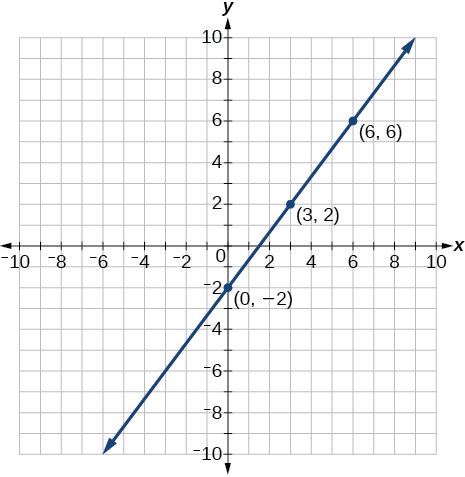 

#### [Linear Equations in One Variable](/m51253){: .target-chapter}

For the following exercises, solve for<math xmlns="http://www.w3.org/1998/Math/MathML"> <mrow> <mtext> </mtext><mi>x</mi><mo>.</mo> </mrow> </math>

<math xmlns="http://www.w3.org/1998/Math/MathML"> <mrow> <mn>5</mn><mi>x</mi><mo>+</mo><mn>2</mn><mo>=</mo><mn>7</mn><mi>x</mi><mo>−</mo><mn>8</mn></mrow> </math>

<math xmlns="http://www.w3.org/1998/Math/MathML"> <mrow> <mn>3</mn><mo stretchy="false">(</mo><mi>x</mi><mo>+</mo><mn>2</mn><mo stretchy="false">)</mo><mo>−</mo><mn>10</mn><mo>=</mo><mi>x</mi><mo>+</mo><mn>4</mn></mrow> </math>

<math xmlns="http://www.w3.org/1998/Math/MathML"> <mrow> <mi>x</mi><mo>=</mo><mn>4</mn> </mrow> </math>

<math xmlns="http://www.w3.org/1998/Math/MathML"> <mrow> <mn>7</mn><mi>x</mi><mo>−</mo><mn>3</mn><mo>=</mo><mn>5</mn></mrow> </math>

<math xmlns="http://www.w3.org/1998/Math/MathML"> <mrow> <mn>12</mn><mo>−</mo><mn>5</mn><mo stretchy="false">(</mo><mi>x</mi><mo>+</mo><mn>1</mn><mo stretchy="false">)</mo><mo>=</mo><mn>2</mn><mi>x</mi><mo>−</mo><mn>5</mn></mrow> </math>

<math xmlns="http://www.w3.org/1998/Math/MathML"> <mrow> <mi>x</mi><mo>=</mo><mfrac> <mrow> <mn>12</mn> </mrow> <mn>7</mn> </mfrac> </mrow> </math>

<math xmlns="http://www.w3.org/1998/Math/MathML"> <mrow> <mfrac> <mrow> <mn>2</mn><mi>x</mi> </mrow> <mn>3</mn> </mfrac> <mo>−</mo><mfrac> <mn>3</mn> <mn>4</mn> </mfrac> <mo>=</mo><mfrac> <mi>x</mi> <mn>6</mn> </mfrac> <mo>+</mo><mfrac> <mrow> <mn>21</mn> </mrow> <mn>4</mn> </mfrac> </mrow> </math>

For the following exercises, solve for<math xmlns="http://www.w3.org/1998/Math/MathML"> <mrow> <mtext> </mtext><mi>x</mi><mo>.</mo><mtext> </mtext> </mrow> </math>

State all *x*-values that are excluded from the solution set.

<math xmlns="http://www.w3.org/1998/Math/MathML"> <mrow> <mfrac> <mi>x</mi> <mrow> <msup> <mi>x</mi> <mn>2</mn> </msup> <mo>−</mo><mn>9</mn> </mrow> </mfrac> <mo>+</mo><mfrac> <mn>4</mn> <mrow> <mi>x</mi><mo>+</mo><mn>3</mn> </mrow> </mfrac> <mo>=</mo><mfrac> <mn>3</mn> <mrow> <msup> <mi>x</mi> <mn>2</mn> </msup> <mo>−</mo><mn>9</mn> </mrow> </mfrac> <mtext> </mtext> </mrow> </math>

<math xmlns="http://www.w3.org/1998/Math/MathML"> <mrow> <mi>x</mi><mo>≠</mo><mn>3</mn><mo>,</mo><mn>−3</mn> </mrow> </math>

No solution

<math xmlns="http://www.w3.org/1998/Math/MathML"> <mrow> <mfrac> <mn>1</mn> <mn>2</mn> </mfrac> <mo>+</mo><mfrac> <mn>2</mn> <mi>x</mi> </mfrac> <mo>=</mo><mfrac> <mn>3</mn> <mn>4</mn> </mfrac> </mrow> </math>

For the following exercises, find the equation of the line using the point-slope formula.

Passes through these two points:<math xmlns="http://www.w3.org/1998/Math/MathML"> <mrow> <mtext> </mtext><mrow><mo>(</mo> <mrow> <mn>−2</mn><mo>,</mo><mn>1</mn> </mrow> <mo>)</mo></mrow><mtext>,</mtext><mrow><mo>(</mo> <mrow> <mn>4</mn><mo>,</mo><mn>2</mn> </mrow> <mo>)</mo></mrow><mo>.</mo> </mrow> </math>

<math xmlns="http://www.w3.org/1998/Math/MathML"> <mrow> <mi>y</mi><mo>=</mo><mfrac> <mn>1</mn> <mn>6</mn> </mfrac> <mi>x</mi><mo>+</mo><mfrac> <mn>4</mn> <mn>3</mn> </mfrac> </mrow> </math>

Passes through the point<math xmlns="http://www.w3.org/1998/Math/MathML"> <mrow> <mtext> </mtext><mrow><mo>(</mo> <mrow> <mo>−</mo><mn>3</mn><mo>,</mo><mn>4</mn> </mrow> <mo>)</mo></mrow><mtext> </mtext> </mrow> </math>

and has a slope of<math xmlns="http://www.w3.org/1998/Math/MathML"> <mrow> <mtext> </mtext><mfrac> <mrow> <mo>−</mo><mn>1</mn> </mrow> <mn>3</mn> </mfrac> <mo>.</mo> </mrow> </math>

Passes through the point<math xmlns="http://www.w3.org/1998/Math/MathML"> <mrow> <mtext> </mtext><mrow><mo>(</mo> <mrow> <mo>−</mo><mn>3</mn><mo>,</mo><mn>4</mn> </mrow> <mo>)</mo></mrow><mtext> </mtext> </mrow> </math>

and is parallel to the graph<math xmlns="http://www.w3.org/1998/Math/MathML"> <mrow> <mtext> </mtext><mi>y</mi><mo>=</mo><mfrac> <mn>2</mn> <mn>3</mn> </mfrac> <mi>x</mi><mo>+</mo><mn>5.</mn> </mrow> </math>

<math xmlns="http://www.w3.org/1998/Math/MathML"> <mrow> <mi>y</mi><mo>=</mo><mfrac> <mn>2</mn> <mn>3</mn> </mfrac> <mi>x</mi><mo>+</mo><mn>6</mn> </mrow> </math>

Passes through these two points:<math xmlns="http://www.w3.org/1998/Math/MathML"> <mrow> <mtext> </mtext><mrow><mo>(</mo> <mrow> <mn>5</mn><mo>,</mo><mn>1</mn> </mrow> <mo>)</mo></mrow><mtext>,</mtext><mrow><mo>(</mo> <mrow> <mn>5</mn><mo>,</mo><mn>7</mn> </mrow> <mo>)</mo></mrow><mo>.</mo> </mrow> </math>

#### [Models and Applications](/m51254){: .target-chapter}

For the following exercises, write and solve an equation to answer each question.

The number of males in the classroom is five more than three times the number of females. If the total number of students is 73, how many of each gender are in the class?

females 17, males 56

A man has 72 ft. of fencing to put around a rectangular garden. If the length is 3 times the width, find the dimensions of his garden.

A truck rental is $25 plus $.30/mi. Find out how many miles Ken traveled if his bill was $50.20.

84 mi

#### [Complex Numbers](/m51255){: .target-chapter}

For the following exercises, use the quadratic equation to solve.

<math xmlns="http://www.w3.org/1998/Math/MathML"> <mrow> <msup> <mi>x</mi> <mn>2</mn> </msup> <mo>−</mo><mn>5</mn><mi>x</mi><mo>+</mo><mn>9</mn><mo>=</mo><mn>0</mn></mrow> </math>

<math xmlns="http://www.w3.org/1998/Math/MathML"> <mrow> <mn>2</mn><msup> <mi>x</mi> <mn>2</mn> </msup> <mo>+</mo><mn>3</mn><mi>x</mi><mo>+</mo><mn>7</mn><mo>=</mo><mn>0</mn> </mrow> </math>

<math xmlns="http://www.w3.org/1998/Math/MathML"> <mrow> <mi>x</mi><mo>=</mo><mfrac> <mrow> <mo>−</mo><mn>3</mn> </mrow> <mn>4</mn> </mfrac> <mo>±</mo><mfrac> <mrow> <mi>i</mi><msqrt> <mrow> <mn>47</mn> </mrow> </msqrt> </mrow> <mn>4</mn> </mfrac> </mrow> </math>

For the following exercises, name the horizontal component and the vertical component.

<math xmlns="http://www.w3.org/1998/Math/MathML"> <mrow> <mn>4</mn><mo>−</mo><mn>3</mn><mi>i</mi></mrow> </math>

<math xmlns="http://www.w3.org/1998/Math/MathML"> <mrow> <mn>−2</mn><mo>−</mo><mi>i</mi></mrow> </math>

horizontal component<math xmlns="http://www.w3.org/1998/Math/MathML"> <mrow> <mtext> </mtext><mn>−2</mn><mo>;</mo> </mrow> </math>

vertical component<math xmlns="http://www.w3.org/1998/Math/MathML"> <mrow> <mtext> </mtext><mn>−1</mn> </mrow> </math>

For the following exercises, perform the operations indicated.

<math xmlns="http://www.w3.org/1998/Math/MathML"> <mrow> <mrow><mo>(</mo> <mrow> <mn>9</mn><mo>−</mo><mi>i</mi></mrow> <mo>)</mo></mrow><mo>−</mo><mrow><mo>(</mo> <mrow> <mn>4</mn><mo>−</mo><mn>7</mn><mi>i</mi></mrow> <mo>)</mo></mrow></mrow> </math>

<math xmlns="http://www.w3.org/1998/Math/MathML"> <mrow> <mrow><mo>(</mo> <mrow> <mn>2</mn><mo>+</mo><mn>3</mn><mi>i</mi></mrow> <mo>)</mo></mrow><mo>−</mo><mrow><mo>(</mo> <mrow> <mo>−</mo><mn>5</mn><mo>−</mo><mn>8</mn><mi>i</mi></mrow> <mo>)</mo></mrow></mrow> </math>

<math xmlns="http://www.w3.org/1998/Math/MathML"> <mrow> <mn>7</mn><mo>+</mo><mn>11</mn><mi>i</mi> </mrow> </math>

<math xmlns="http://www.w3.org/1998/Math/MathML"> <mrow> <mn>2</mn><msqrt> <mrow> <mo>−</mo><mn>75</mn></mrow> </msqrt> <mo>+</mo><mn>3</mn><msqrt> <mrow> <mn>25</mn></mrow> </msqrt> </mrow> </math>

<math xmlns="http://www.w3.org/1998/Math/MathML"> <mrow> <msqrt> <mrow> <mo>−</mo><mn>16</mn></mrow> </msqrt> <mo>+</mo><mn>4</mn><msqrt> <mrow> <mo>−</mo><mn>9</mn></mrow> </msqrt> </mrow> </math>

<math xmlns="http://www.w3.org/1998/Math/MathML"> <mrow> <mn>16</mn><mi>i</mi> </mrow> </math>

<math xmlns="http://www.w3.org/1998/Math/MathML"> <mrow> <mo>−</mo><mn>6</mn><mi>i</mi><mo stretchy="false">(</mo><mi>i</mi><mo>−</mo><mn>5</mn><mo stretchy="false">)</mo></mrow> </math>

<math xmlns="http://www.w3.org/1998/Math/MathML"> <mrow> <msup> <mrow> <mo stretchy="false">(</mo><mn>3</mn><mo>−</mo><mn>5</mn><mi>i</mi><mo stretchy="false">)</mo></mrow> <mn>2</mn> </msup> </mrow> </math>

<math xmlns="http://www.w3.org/1998/Math/MathML"> <mrow> <mn>−16</mn><mo>−</mo><mn>30</mn><mi>i</mi></mrow> </math>

<math xmlns="http://www.w3.org/1998/Math/MathML"> <mrow> <msqrt> <mrow> <mo>−</mo><mn>4</mn></mrow> </msqrt> <mo>·</mo><msqrt> <mrow> <mo>−</mo><mn>12</mn></mrow> </msqrt> </mrow> </math>

<math xmlns="http://www.w3.org/1998/Math/MathML"> <mrow> <msqrt> <mrow> <mo>−</mo><mn>2</mn></mrow> </msqrt> <mrow><mo>(</mo> <mrow> <msqrt> <mrow> <mo>−</mo><mn>8</mn></mrow> </msqrt> <mo>−</mo><msqrt> <mn>5</mn> </msqrt> </mrow> <mo>)</mo></mrow></mrow> </math>

<math xmlns="http://www.w3.org/1998/Math/MathML"> <mrow> <mn>−4</mn><mo>−</mo><mi>i</mi><msqrt> <mrow> <mn>10</mn></mrow> </msqrt> </mrow> </math>

<math xmlns="http://www.w3.org/1998/Math/MathML"> <mrow> <mfrac> <mn>2</mn> <mrow> <mn>5</mn><mo>−</mo><mn>3</mn><mi>i</mi> </mrow> </mfrac> </mrow> </math>

<math xmlns="http://www.w3.org/1998/Math/MathML"> <mrow> <mfrac> <mrow> <mn>3</mn><mo>+</mo><mn>7</mn><mi>i</mi> </mrow> <mi>i</mi> </mfrac> </mrow> </math>

<math xmlns="http://www.w3.org/1998/Math/MathML"> <mrow> <mi>x</mi><mo>=</mo><mn>7</mn><mo>−</mo><mn>3</mn><mi>i</mi></mrow> </math>

#### [Quadratic Equations](/m51256){: .target-chapter}

For the following exercises, solve the quadratic equation by factoring.

<math xmlns="http://www.w3.org/1998/Math/MathML"> <mrow> <mn>2</mn><msup> <mi>x</mi> <mn>2</mn> </msup> <mo>−</mo><mn>7</mn><mi>x</mi><mo>−</mo><mn>4</mn><mo>=</mo><mn>0</mn></mrow> </math>

<math xmlns="http://www.w3.org/1998/Math/MathML"> <mrow> <mn>3</mn><msup> <mi>x</mi> <mn>2</mn> </msup> <mo>+</mo><mn>18</mn><mi>x</mi><mo>+</mo><mn>15</mn><mo>=</mo><mn>0</mn> </mrow> </math>

<math xmlns="http://www.w3.org/1998/Math/MathML"> <mrow> <mi>x</mi><mo>=</mo><mn>−1</mn><mo>,</mo><mn>−5</mn> </mrow> </math>

<math xmlns="http://www.w3.org/1998/Math/MathML"> <mrow> <mo> </mo><mn>25</mn><msup> <mi>x</mi> <mn>2</mn> </msup> <mo>−</mo><mn>9</mn><mo>=</mo><mn>0</mn></mrow> </math>

<math xmlns="http://www.w3.org/1998/Math/MathML"> <mrow> <mo> </mo><mn>7</mn><msup> <mi>x</mi> <mn>2</mn> </msup> <mo>−</mo><mn>9</mn><mi>x</mi><mo>=</mo><mn>0</mn> </mrow> </math>

<math xmlns="http://www.w3.org/1998/Math/MathML"> <mrow> <mi>x</mi><mo>=</mo><mn>0</mn><mo>,</mo><mfrac> <mn>9</mn> <mn>7</mn> </mfrac> </mrow> </math>

For the following exercises, solve the quadratic equation by using the square-root property.

<math xmlns="http://www.w3.org/1998/Math/MathML"> <mrow> <msup> <mi>x</mi> <mn>2</mn> </msup> <mo>=</mo><mn>49</mn> </mrow> </math>

<math xmlns="http://www.w3.org/1998/Math/MathML"> <mrow> <msup> <mrow> <mrow><mo>(</mo> <mrow> <mi>x</mi><mo>−</mo><mn>4</mn></mrow> <mo>)</mo></mrow></mrow> <mn>2</mn> </msup> <mo>=</mo><mn>36</mn></mrow> </math>

<math xmlns="http://www.w3.org/1998/Math/MathML"> <mrow> <mi>x</mi><mo>=</mo><mn>10</mn><mo>,</mo><mn>−2</mn> </mrow> </math>

For the following exercises, solve the quadratic equation by completing the square.

<math xmlns="http://www.w3.org/1998/Math/MathML"> <mrow> <msup> <mi>x</mi> <mn>2</mn> </msup> <mo>+</mo><mn>8</mn><mi>x</mi><mo>−</mo><mn>5</mn><mo>=</mo><mn>0</mn></mrow> </math>

<math xmlns="http://www.w3.org/1998/Math/MathML"> <mrow> <mn>4</mn><msup> <mi>x</mi> <mn>2</mn> </msup> <mo>+</mo><mn>2</mn><mi>x</mi><mo>−</mo><mn>1</mn><mo>=</mo><mn>0</mn></mrow> </math>

<math xmlns="http://www.w3.org/1998/Math/MathML"> <mrow> <mi>x</mi><mo>=</mo><mfrac> <mrow> <mo>−</mo><mn>1</mn><mo>±</mo><msqrt> <mn>5</mn> </msqrt> </mrow> <mn>4</mn> </mfrac> </mrow> </math>

For the following exercises, solve the quadratic equation by using the quadratic formula. If the solutions are not real, state *No real solution*.

<math xmlns="http://www.w3.org/1998/Math/MathML"> <mrow> <mn>2</mn><msup> <mi>x</mi> <mn>2</mn> </msup> <mo>−</mo><mn>5</mn><mi>x</mi><mo>+</mo><mn>1</mn><mo>=</mo><mn>0</mn></mrow> </math>

<math xmlns="http://www.w3.org/1998/Math/MathML"> <mrow> <mn>15</mn><msup> <mi>x</mi> <mn>2</mn> </msup> <mo>−</mo><mi>x</mi><mo>−</mo><mn>2</mn><mo>=</mo><mn>0</mn></mrow> </math>

<math xmlns="http://www.w3.org/1998/Math/MathML"> <mrow> <mi>x</mi><mo>=</mo><mfrac> <mn>2</mn> <mn>5</mn> </mfrac> <mo>,</mo><mfrac> <mrow> <mo>−</mo><mn>1</mn> </mrow> <mn>3</mn> </mfrac> </mrow> </math>

For the following exercises, solve the quadratic equation by the method of your choice.

<math xmlns="http://www.w3.org/1998/Math/MathML"> <mrow> <msup> <mrow> <mo stretchy="false">(</mo><mi>x</mi><mo>−</mo><mn>2</mn><mo stretchy="false">)</mo> </mrow> <mn>2</mn> </msup> <mo>=</mo><mn>16</mn> </mrow> </math>

<math xmlns="http://www.w3.org/1998/Math/MathML"> <mrow> <msup> <mi>x</mi> <mn>2</mn> </msup> <mo>=</mo><mn>10</mn><mi>x</mi><mo>+</mo><mn>3</mn> </mrow> </math>

<math xmlns="http://www.w3.org/1998/Math/MathML"> <mrow> <mi>x</mi><mo>=</mo><mn>5</mn><mo>±</mo><mn>2</mn><msqrt> <mn>7</mn> </msqrt> </mrow> </math>

#### [Other Types of Equations](/m51258){: .target-chapter}

For the following exercises, solve the equations.

<math xmlns="http://www.w3.org/1998/Math/MathML"> <mrow> <msup> <mi>x</mi> <mrow> <mfrac> <mn>3</mn> <mn>2</mn> </mfrac> </mrow> </msup> <mo>=</mo><mn>27</mn> </mrow> </math>

<math xmlns="http://www.w3.org/1998/Math/MathML"> <mrow> <msup> <mi>x</mi> <mrow> <mfrac> <mn>1</mn> <mn>2</mn> </mfrac> </mrow> </msup> <mo>−</mo><mn>4</mn><msup> <mi>x</mi> <mrow> <mfrac> <mn>1</mn> <mn>4</mn> </mfrac> </mrow> </msup> <mo>=</mo><mn>0</mn></mrow> </math>

<math xmlns="http://www.w3.org/1998/Math/MathML"> <mrow> <mi>x</mi><mo>=</mo><mn>0</mn><mo>,</mo><mn>256</mn> </mrow> </math>

<math xmlns="http://www.w3.org/1998/Math/MathML"> <mrow> <mn>4</mn><msup> <mi>x</mi> <mn>3</mn> </msup> <mo>+</mo><mn>8</mn><msup> <mi>x</mi> <mn>2</mn> </msup> <mo>−</mo><mn>9</mn><mi>x</mi><mo>−</mo><mn>18</mn><mo>=</mo><mn>0</mn></mrow> </math>

<math xmlns="http://www.w3.org/1998/Math/MathML"> <mrow> <mn>3</mn><msup> <mi>x</mi> <mn>5</mn> </msup> <mo>−</mo><mn>6</mn><msup> <mi>x</mi> <mn>3</mn> </msup> <mo>=</mo><mn>0</mn></mrow> </math>

<math xmlns="http://www.w3.org/1998/Math/MathML"> <mrow> <mi>x</mi><mo>=</mo><mn>0</mn><mo>,</mo><mo>±</mo><msqrt> <mn>2</mn> </msqrt> </mrow> </math>

<math xmlns="http://www.w3.org/1998/Math/MathML"> <mrow> <msqrt> <mrow> <mi>x</mi><mo>+</mo><mn>9</mn></mrow> </msqrt> <mo>=</mo><mi>x</mi><mo>−</mo><mn>3</mn></mrow> </math>

<math xmlns="http://www.w3.org/1998/Math/MathML"> <mrow> <msqrt> <mrow> <mn>3</mn><mi>x</mi><mo>+</mo><mn>7</mn> </mrow> </msqrt> <mo>+</mo><msqrt> <mrow> <mi>x</mi><mo>+</mo><mn>2</mn> </mrow> </msqrt> <mo>=</mo><mn>1</mn> </mrow> </math>

<math xmlns="http://www.w3.org/1998/Math/MathML"> <mrow> <mi>x</mi><mo>=</mo><mn>−2</mn> </mrow> </math>

<math xmlns="http://www.w3.org/1998/Math/MathML"> <mrow> <mrow><mo>\|</mo> <mrow> <mn>3</mn><mi>x</mi><mo>−</mo><mn>7</mn></mrow> <mo>\|</mo></mrow><mo>=</mo><mn>5</mn></mrow> </math>

<math xmlns="http://www.w3.org/1998/Math/MathML"> <mrow> <mrow><mo>\|</mo> <mrow> <mn>2</mn><mi>x</mi><mo>+</mo><mn>3</mn></mrow> <mo>\|</mo></mrow><mo>−</mo><mn>5</mn><mo>=</mo><mn>9</mn></mrow> </math>

<math xmlns="http://www.w3.org/1998/Math/MathML"> <mrow> <mi>x</mi><mo>=</mo><mfrac> <mrow> <mn>11</mn> </mrow> <mn>2</mn> </mfrac> <mo>,</mo><mfrac> <mrow> <mn>−17</mn> </mrow> <mn>2</mn> </mfrac> </mrow> </math>

#### [Linear Inequalities and Absolute Value Inequalities](/m51259){: .target-chapter}

For the following exercises, solve the inequality. Write your final answer in interval notation.

<math xmlns="http://www.w3.org/1998/Math/MathML"> <mrow> <mn>5</mn><mi>x</mi><mo>−</mo><mn>8</mn><mo>≤</mo><mn>12</mn></mrow> </math>

<math xmlns="http://www.w3.org/1998/Math/MathML"> <mrow> <mo>−</mo><mn>2</mn><mi>x</mi><mo>+</mo><mn>5</mn><mo>&gt;</mo><mi>x</mi><mo>−</mo><mn>7</mn></mrow> </math>

<math xmlns="http://www.w3.org/1998/Math/MathML"> <mrow> <mrow><mo>(</mo> <mrow> <mo>−</mo><mi>∞</mi><mo>,</mo><mn>4</mn> </mrow> <mo>)</mo></mrow> </mrow> </math>

<math xmlns="http://www.w3.org/1998/Math/MathML"> <mrow> <mfrac> <mrow> <mi>x</mi><mo>−</mo><mn>1</mn> </mrow> <mn>3</mn> </mfrac> <mo>+</mo><mfrac> <mrow> <mi>x</mi><mo>+</mo><mn>2</mn> </mrow> <mn>5</mn> </mfrac> <mo>≤</mo><mfrac> <mn>3</mn> <mn>5</mn> </mfrac> </mrow> </math>

<math xmlns="http://www.w3.org/1998/Math/MathML"> <mrow> <mrow><mo>\|</mo> <mrow> <mn>3</mn><mi>x</mi><mo>+</mo><mn>2</mn> </mrow> <mo>\|</mo></mrow><mo>+</mo><mn>1</mn><mo>≤</mo><mn>9</mn> </mrow> </math>

<math xmlns="http://www.w3.org/1998/Math/MathML"> <mrow> <mrow><mo>[</mo> <mrow> <mfrac> <mrow> <mo>−</mo><mn>10</mn> </mrow> <mn>3</mn> </mfrac> <mo>,</mo><mn>2</mn> </mrow> <mo>]</mo></mrow> </mrow> </math>

<math xmlns="http://www.w3.org/1998/Math/MathML"> <mrow> <mrow><mo>\|</mo> <mrow> <mn>5</mn><mi>x</mi><mo>−</mo><mn>1</mn></mrow> <mo>\|</mo></mrow><mo>&gt;</mo><mn>14</mn></mrow> </math>

<math xmlns="http://www.w3.org/1998/Math/MathML"> <mrow> <mrow><mo>\|</mo> <mrow> <mi>x</mi><mo>−</mo><mn>3</mn></mrow> <mo>\|</mo></mrow><mo>&lt;</mo><mn>−4</mn></mrow> </math>

No solution

For the following exercises, solve the compound inequality. Write your answer in interval notation.

<math xmlns="http://www.w3.org/1998/Math/MathML"> <mrow> <mn>−4</mn><mo>&lt;</mo><mn>3</mn><mi>x</mi><mo>+</mo><mn>2</mn><mo>≤</mo><mn>18</mn></mrow> </math>

<math xmlns="http://www.w3.org/1998/Math/MathML"> <mrow> <mn>3</mn><mi>y</mi><mo>&lt;</mo><mn>1</mn><mo>−</mo><mn>2</mn><mi>y</mi><mo>&lt;</mo><mn>5</mn><mo>+</mo><mi>y</mi></mrow> </math>

<math xmlns="http://www.w3.org/1998/Math/MathML"> <mrow> <mrow><mo>(</mo> <mrow> <mo>−</mo><mfrac> <mn>4</mn> <mn>3</mn> </mfrac> <mo>,</mo><mfrac> <mn>1</mn> <mn>5</mn> </mfrac> </mrow> <mo>)</mo></mrow> </mrow> </math>

For the following exercises, graph as described.

Graph the absolute value function and graph the constant function. Observe the points of intersection and shade the *x*-axis representing the solution set to the inequality. Show your graph and write your final answer in interval notation.

<math xmlns="http://www.w3.org/1998/Math/MathML"> <mrow> <mrow><mo>\|</mo> <mrow> <mi>x</mi><mo>+</mo><mn>3</mn> </mrow> <mo>\|</mo></mrow><mo>≥</mo><mn>5</mn> </mrow> </math>

Graph both straight lines (left-hand side being y1 and right-hand side being y2) on the same axes. Find the point of intersection and solve the inequality by observing where it is true comparing the *y*-values of the lines. See the interval where the inequality is true.

<math xmlns="http://www.w3.org/1998/Math/MathML"> <mrow> <mi>x</mi><mo>+</mo><mn>3</mn><mo>&lt;</mo><mn>3</mn><mi>x</mi><mo>−</mo><mn>4</mn></mrow> </math>

Where the blue is below the orange line; point of intersection is<math xmlns="http://www.w3.org/1998/Math/MathML"> <mrow> <mtext> </mtext><mi>x</mi><mo>=</mo><mn>3.5.</mn> </mrow> </math>

<math xmlns="http://www.w3.org/1998/Math/MathML"> <mrow> <mrow><mo>(</mo> <mrow> <mn>3.5</mn><mo>,</mo><mi>∞</mi> </mrow> <mo>)</mo></mrow> </mrow> </math>

* * *
{: data-type="newline"}

  

### Chapter Practice Test

Graph the following:<math xmlns="http://www.w3.org/1998/Math/MathML"> <mrow> <mtext> </mtext><mn>2</mn><mi>y</mi><mo>=</mo><mn>3</mn><mi>x</mi><mo>+</mo><mn>4.</mn> </mrow> </math>

<math xmlns="http://www.w3.org/1998/Math/MathML"> <mrow> <mi>y</mi><mo>=</mo><mfrac> <mn>3</mn> <mn>2</mn> </mfrac> <mi>x</mi><mo>+</mo><mn>2</mn></mrow> </math>

<table summary="A table with 4 rows and 2 columns.  The entries in the first row are: x and y.  The entries in the second row are: 0 and 2.  The entries in the third row are: 2 and 5.  The entries in the fourth row are: 4 and 8." class="unnumbered"><caption></caption><thead>
<tr>
<th><em>x</em></th>
<th><em>y</em></th>
</tr>
</thead><tbody>
<tr>
<td>0</td>
<td>2</td>
</tr>
<tr>
<td>2</td>
<td>5</td>
</tr>
<tr>
<td>4</td>
<td>8</td>
</tr>
</tbody></table>
* * *
{: data-type="newline"}

 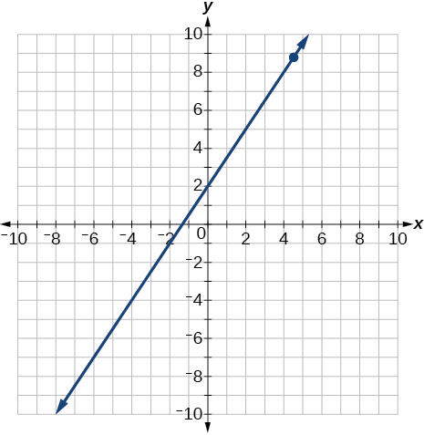 

Find the *x-* and *y*-intercepts for the following:

<math xmlns="http://www.w3.org/1998/Math/MathML"> <mrow> <mn>2</mn><mi>x</mi><mo>−</mo><mn>5</mn><mi>y</mi><mo>=</mo><mn>6</mn></mrow> </math>

Find the *x-* and *y*-intercepts of this equation, and sketch the graph of the line using just the intercepts plotted.

<math xmlns="http://www.w3.org/1998/Math/MathML"> <mrow> <mn>3</mn><mi>x</mi><mo>−</mo><mn>4</mn><mi>y</mi><mo>=</mo><mn>12</mn></mrow> </math>

<math xmlns="http://www.w3.org/1998/Math/MathML"> <mrow> <mrow><mo>(</mo> <mrow> <mn>0</mn><mo>,</mo><mn>−3</mn> </mrow> <mo>)</mo></mrow> </mrow> </math>

<math xmlns="http://www.w3.org/1998/Math/MathML"> <mrow> <mrow><mo>(</mo> <mrow> <mn>4</mn><mo>,</mo><mn>0</mn> </mrow> <mo>)</mo></mrow> </mrow> </math>

* * *
{: data-type="newline"}

 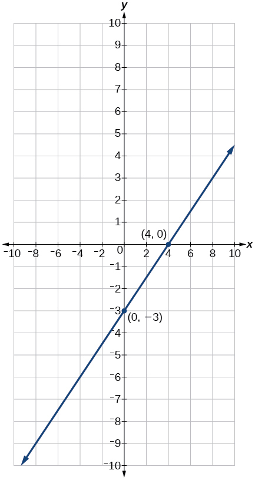 

Find the exact distance between<math xmlns="http://www.w3.org/1998/Math/MathML"> <mrow> <mtext> </mtext><mrow><mo>(</mo> <mrow> <mn>5</mn><mo>,</mo><mn>−3</mn> </mrow> <mo>)</mo></mrow><mtext> </mtext> </mrow> </math>

and<math xmlns="http://www.w3.org/1998/Math/MathML"> <mrow> <mtext> </mtext><mrow><mo>(</mo> <mrow> <mo>−</mo><mn>2</mn><mo>,</mo><mn>8</mn> </mrow> <mo>)</mo></mrow><mo>.</mo><mtext> </mtext> </mrow> </math>

Find the coordinates of the midpoint of the line segment joining the two points.

Write the interval notation for the set of numbers represented by<math xmlns="http://www.w3.org/1998/Math/MathML"> <mrow> <mtext> </mtext><mrow><mo>{</mo> <mrow> <mi>x</mi><mrow><mo>\|</mo><mrow> <mi>x</mi><mo>≤</mo><mn>9</mn> </mrow></mrow> </mrow> <mo>}</mo></mrow><mo>.</mo> </mrow> </math>

<math xmlns="http://www.w3.org/1998/Math/MathML"> <mrow> <mrow><mo>(</mo> <mrow> <mo>−</mo><mi>∞</mi><mo>,</mo><mn>9</mn> </mrow> <mo>]</mo></mrow> </mrow> </math>

Solve for *x*:<math xmlns="http://www.w3.org/1998/Math/MathML"> <mrow> <mtext> </mtext><mn>5</mn><mi>x</mi><mo>+</mo><mn>8</mn><mo>=</mo><mn>3</mn><mi>x</mi><mo>−</mo><mn>10.</mn></mrow> </math>

Solve for *x*:<math xmlns="http://www.w3.org/1998/Math/MathML"> <mrow> <mtext> </mtext><mn>3</mn><mrow><mo>(</mo> <mrow> <mn>2</mn><mi>x</mi><mo>−</mo><mn>5</mn></mrow> <mo>)</mo></mrow><mo>−</mo><mn>3</mn><mrow><mo>(</mo> <mrow> <mi>x</mi><mo>−</mo><mn>7</mn></mrow> <mo>)</mo></mrow><mo>=</mo><mn>2</mn><mi>x</mi><mo>−</mo><mn>9.</mn></mrow> </math>

<math xmlns="http://www.w3.org/1998/Math/MathML"> <mrow> <mi>x</mi><mo>=</mo><mo /><mn>−15</mn> </mrow> </math>

Solve for *x*:<math xmlns="http://www.w3.org/1998/Math/MathML"> <mrow> <mtext> </mtext><mfrac> <mi>x</mi> <mn>2</mn> </mfrac> <mo>+</mo><mn>1</mn><mo>=</mo><mfrac> <mn>4</mn> <mi>x</mi> </mfrac> </mrow> </math>

Solve for *x*:<math xmlns="http://www.w3.org/1998/Math/MathML"> <mrow> <mtext> </mtext><mfrac> <mn>5</mn> <mrow> <mi>x</mi><mo>+</mo><mn>4</mn> </mrow> </mfrac> <mo>=</mo><mn>4</mn><mo>+</mo><mfrac> <mn>3</mn> <mrow> <mi>x</mi><mo>−</mo><mn>2</mn> </mrow> </mfrac> <mo>.</mo> </mrow> </math>

<math xmlns="http://www.w3.org/1998/Math/MathML"> <mrow> <mi>x</mi><mo>≠</mo><mn>−4</mn><mo>,</mo><mn>2</mn><mo>;</mo> </mrow> </math>

<math xmlns="http://www.w3.org/1998/Math/MathML"> <mrow> <mi>x</mi><mo>=</mo><mfrac> <mrow> <mo>−</mo><mn>5</mn> </mrow> <mn>2</mn> </mfrac> <mo>,</mo><mn>1</mn> </mrow> </math>

The perimeter of a triangle is 30 in. The longest side is 2 less than 3 times the shortest side and the other side is 2 more than twice the shortest side. Find the length of each side.

Solve for *x*. Write the answer in simplest radical form.

<math xmlns="http://www.w3.org/1998/Math/MathML"> <mrow> <mfrac> <mrow> <msup> <mi>x</mi> <mn>2</mn> </msup> </mrow> <mn>3</mn> </mfrac> <mo>−</mo><mi>x</mi><mo>=</mo><mfrac> <mrow> <mn>−1</mn></mrow> <mn>2</mn> </mfrac> </mrow> </math>

<math xmlns="http://www.w3.org/1998/Math/MathML"> <mrow> <mi>x</mi><mo>=</mo><mfrac> <mrow> <mn>3</mn><mo>±</mo><msqrt> <mn>3</mn> </msqrt> </mrow> <mn>2</mn> </mfrac> </mrow> </math>

Solve:<math xmlns="http://www.w3.org/1998/Math/MathML"> <mrow> <mtext> </mtext><mn>3</mn><mi>x</mi><mo>−</mo><mn>8</mn><mo>≤</mo><mn>4.</mn></mrow> </math>

Solve:<math xmlns="http://www.w3.org/1998/Math/MathML"> <mrow> <mtext> </mtext><mrow><mo>\|</mo> <mrow> <mn>2</mn><mi>x</mi><mo>+</mo><mn>3</mn> </mrow> <mo>\|</mo></mrow><mo>&lt;</mo><mn>5.</mn> </mrow> </math>

<math xmlns="http://www.w3.org/1998/Math/MathML"> <mrow> <mrow><mo>(</mo> <mrow> <mn>−4</mn><mo>,</mo><mn>1</mn> </mrow> <mo>)</mo></mrow> </mrow> </math>

Solve:<math xmlns="http://www.w3.org/1998/Math/MathML"> <mrow> <mtext> </mtext><mrow><mo>\|</mo> <mrow> <mn>3</mn><mi>x</mi><mo>−</mo><mn>2</mn></mrow> <mo>\|</mo></mrow><mo>≥</mo><mn>4.</mn></mrow> </math>

For the following exercises, find the equation of the line with the given information.

Passes through the points<math xmlns="http://www.w3.org/1998/Math/MathML"> <mrow> <mtext> </mtext><mrow><mo>(</mo> <mrow> <mo>−</mo><mn>4</mn><mo>,</mo><mn>2</mn></mrow> <mo>)</mo></mrow><mtext> </mtext></mrow> </math>

and<math xmlns="http://www.w3.org/1998/Math/MathML"> <mrow> <mtext> </mtext><mrow><mo>(</mo> <mrow> <mn>5</mn><mo>,</mo><mn>−3</mn></mrow> <mo>)</mo></mrow><mo>.</mo></mrow> </math>

<math xmlns="http://www.w3.org/1998/Math/MathML"> <mrow> <mi>y</mi><mo>=</mo><mfrac> <mrow> <mn>−5</mn></mrow> <mn>9</mn> </mfrac> <mi>x</mi><mo>−</mo><mfrac> <mn>2</mn> <mn>9</mn> </mfrac> </mrow> </math>

Has an undefined slope and passes through the point<math xmlns="http://www.w3.org/1998/Math/MathML"> <mrow> <mtext> </mtext><mrow><mo>(</mo> <mrow> <mn>4</mn><mo>,</mo><mn>3</mn> </mrow> <mo>)</mo></mrow><mo>.</mo> </mrow> </math>

Passes through the point<math xmlns="http://www.w3.org/1998/Math/MathML"> <mrow> <mtext> </mtext><mrow><mo>(</mo> <mrow> <mn>2</mn><mo>,</mo><mn>1</mn> </mrow> <mo>)</mo></mrow><mtext> </mtext> </mrow> </math>

and is perpendicular to<math xmlns="http://www.w3.org/1998/Math/MathML"> <mrow> <mtext> </mtext><mi>y</mi><mo>=</mo><mfrac> <mrow> <mo>−</mo><mn>2</mn> </mrow> <mn>5</mn> </mfrac> <mi>x</mi><mo>+</mo><mn>3.</mn> </mrow> </math>

<math xmlns="http://www.w3.org/1998/Math/MathML"> <mrow> <mi>y</mi><mo>=</mo><mfrac> <mn>5</mn> <mn>2</mn> </mfrac> <mi>x</mi><mo>−</mo><mn>4</mn> </mrow> </math>

Add these complex numbers:<math xmlns="http://www.w3.org/1998/Math/MathML"> <mrow> <mtext> </mtext><mo stretchy="false">(</mo><mn>3</mn><mo>−</mo><mn>2</mn><mi>i</mi><mo stretchy="false">)</mo><mo>+</mo><mo stretchy="false">(</mo><mn>4</mn><mo>−</mo><mi>i</mi><mo stretchy="false">)</mo><mo>.</mo></mrow> </math>

Simplify:<math xmlns="http://www.w3.org/1998/Math/MathML"> <mrow> <mtext> </mtext><msqrt> <mrow> <mn>−4</mn></mrow> </msqrt> <mo>+</mo><mn>3</mn><msqrt> <mrow> <mn>−16</mn></mrow> </msqrt> <mo>.</mo></mrow> </math>

<math xmlns="http://www.w3.org/1998/Math/MathML"> <mrow> <mn>14</mn><mi>i</mi> </mrow> </math>

Multiply:<math xmlns="http://www.w3.org/1998/Math/MathML"> <mrow> <mtext> </mtext><mn>5</mn><mi>i</mi><mrow><mo>(</mo> <mrow> <mn>5</mn><mo>−</mo><mn>3</mn><mi>i</mi></mrow> <mo>)</mo></mrow><mo>.</mo></mrow> </math>

Divide:<math xmlns="http://www.w3.org/1998/Math/MathML"> <mrow> <mtext> </mtext><mfrac> <mrow> <mn>4</mn><mo>−</mo><mi>i</mi> </mrow> <mrow> <mn>2</mn><mo>+</mo><mn>3</mn><mi>i</mi> </mrow> </mfrac> <mo>.</mo> </mrow> </math>

<math xmlns="http://www.w3.org/1998/Math/MathML"> <mrow> <mfrac> <mn>5</mn> <mrow> <mn>13</mn> </mrow> </mfrac> <mo>−</mo><mfrac> <mrow> <mn>14</mn> </mrow> <mrow> <mn>13</mn> </mrow> </mfrac> <mi>i</mi> </mrow> </math>

Solve this quadratic equation and write the two complex roots in<math xmlns="http://www.w3.org/1998/Math/MathML"> <mrow> <mtext> </mtext><mi>a</mi><mo>+</mo><mi>b</mi><mi>i</mi><mtext> </mtext> </mrow> </math>

form:<math xmlns="http://www.w3.org/1998/Math/MathML"> <mrow> <mtext> </mtext><msup> <mi>x</mi> <mn>2</mn> </msup> <mo>−</mo><mn>4</mn><mi>x</mi><mo>+</mo><mn>7</mn><mo>=</mo><mn>0.</mn></mrow> </math>

Solve:<math xmlns="http://www.w3.org/1998/Math/MathML"> <mrow> <mtext> </mtext><msup> <mrow> <mrow><mo>(</mo> <mrow> <mn>3</mn><mi>x</mi><mo>−</mo><mn>1</mn></mrow> <mo>)</mo></mrow></mrow> <mn>2</mn> </msup> <mo>−</mo><mn>1</mn><mo>=</mo><mn>24.</mn></mrow> </math>

<math xmlns="http://www.w3.org/1998/Math/MathML"> <mrow> <mi>x</mi><mo>=</mo><mn>2</mn><mo>,</mo><mfrac> <mrow> <mo>−</mo><mn>4</mn> </mrow> <mn>3</mn> </mfrac> </mrow> </math>

Solve:<math xmlns="http://www.w3.org/1998/Math/MathML"> <mrow> <mtext> </mtext><msup> <mi>x</mi> <mn>2</mn> </msup> <mo>−</mo><mn>6</mn><mi>x</mi><mo>=</mo><mn>13.</mn></mrow> </math>

Solve:<math xmlns="http://www.w3.org/1998/Math/MathML"> <mrow> <mtext> </mtext><mn>4</mn><msup> <mi>x</mi> <mn>2</mn> </msup> <mo>−</mo><mn>4</mn><mi>x</mi><mo>−</mo><mn>1</mn><mo>=</mo><mn>0</mn></mrow> </math>

<math xmlns="http://www.w3.org/1998/Math/MathML"> <mrow> <mi>x</mi><mo>=</mo><mfrac> <mn>1</mn> <mn>2</mn> </mfrac> <mo>±</mo><mfrac> <mrow> <msqrt> <mn>2</mn> </msqrt> </mrow> <mn>2</mn> </mfrac> </mrow> </math>

Solve:

<math xmlns="http://www.w3.org/1998/Math/MathML"> <mrow> <msqrt> <mrow> <mi>x</mi><mo>−</mo><mn>7</mn></mrow> </msqrt> <mo>=</mo><mi>x</mi><mo>−</mo><mn>7</mn></mrow> </math>

Solve:<math xmlns="http://www.w3.org/1998/Math/MathML"> <mrow> <mtext> </mtext><mn>2</mn><mo>+</mo><msqrt> <mrow> <mn>12</mn><mo>−</mo><mn>2</mn><mi>x</mi></mrow> </msqrt> <mo>=</mo><mi>x</mi></mrow> </math>

<math xmlns="http://www.w3.org/1998/Math/MathML"> <mn>4</mn> </math>

Solve:<math xmlns="http://www.w3.org/1998/Math/MathML"> <mrow> <mtext> </mtext><msup> <mrow> <mrow><mo>(</mo> <mrow> <mi>x</mi><mo>−</mo><mn>1</mn></mrow> <mo>)</mo></mrow></mrow> <mrow> <mfrac> <mn>2</mn> <mn>3</mn> </mfrac> </mrow> </msup> <mo>=</mo><mn>9</mn></mrow> </math>

For the following exercises, find the real solutions of each equation by factoring.

<math xmlns="http://www.w3.org/1998/Math/MathML"> <mrow> <mn>2</mn><msup> <mi>x</mi> <mn>3</mn> </msup> <mo>−</mo><msup> <mi>x</mi> <mn>2</mn> </msup> <mo>−</mo><mn>8</mn><mi>x</mi><mo>+</mo><mn>4</mn><mo>=</mo><mn>0</mn></mrow> </math>

<math xmlns="http://www.w3.org/1998/Math/MathML"> <mrow> <mi>x</mi><mo>=</mo><mfrac> <mn>1</mn> <mn>2</mn> </mfrac> <mo>,</mo><mn>2</mn><mo>,</mo><mn>−2</mn> </mrow> </math>

<math xmlns="http://www.w3.org/1998/Math/MathML"> <mrow> <msup> <mrow> <mrow><mo>(</mo> <mrow> <mi>x</mi><mo>+</mo><mn>5</mn></mrow> <mo>)</mo></mrow></mrow> <mn>2</mn> </msup> <mo>−</mo><mn>3</mn><mrow><mo>(</mo> <mrow> <mi>x</mi><mo>+</mo><mn>5</mn></mrow> <mo>)</mo></mrow><mo>−</mo><mn>4</mn><mo>=</mo><mn>0</mn></mrow> </math>

### Glossary
{: data-type="glossary-title"}

compound inequality
: a problem or a statement that includes two inequalities
^

interval
: an interval describes a set of numbers within which a solution falls
^

interval notation
: a mathematical statement that describes a solution set and uses parentheses or brackets to indicate where an interval begins and ends
^

linear inequality
: similar to a linear equation except that the solutions will include sets of numbers

[1]: http://openstaxcollege.org/l/intervalnotn
[2]: http://openstaxcollege.org/l/solvelinineq
[3]: http://openstaxcollege.org/l/solveineq
[4]: http://openstaxcollege.org/l/absvaleq
[5]: http://openstaxcollege.org/l/compndineqs
[6]: http://openstaxcollege.org/l/absvalineqs
