

In this section, you will:
* Determine whether a relation represents a function.
* Find the value of a function.
* Determine whether a function is one-to-one.
* Use the vertical line test to identify functions.
* Graph the functions listed in the library of functions.

A jetliner changes altitude as its distance from the starting point of a flight increases. The weight of a growing child increases with time. In each case, one quantity depends on another. There is a relationship between the two quantities that we can describe, analyze, and use to make predictions. In this section, we will analyze such relationships.

### Determining Whether a Relation Represents a Function

A **relation**{: data-type="term"} is a set of ordered pairs. The set consisting of the first components of each **ordered pair**{: data-type="term" .no-emphasis} is called the <strong>domain </strong>and the set consisting of the second components of each ordered pair is called the **range**. Consider the following set of ordered pairs. The first numbers in each pair are the first five natural numbers. The second number in each pair is twice that of the first.

<math xmlns="http://www.w3.org/1998/Math/MathML" display="block"> <mrow> <mo stretchy="false">{</mo><mo stretchy="false">(</mo><mn>1</mn><mo>,</mo><mtext> </mtext><mn>2</mn><mo stretchy="false">)</mo><mo>,</mo><mtext> </mtext><mo stretchy="false">(</mo><mn>2</mn><mo>,</mo><mtext> </mtext><mn>4</mn><mo stretchy="false">)</mo><mo>,</mo><mtext> </mtext><mo stretchy="false">(</mo><mn>3</mn><mo>,</mo><mtext> </mtext><mn>6</mn><mo stretchy="false">)</mo><mo>,</mo><mtext> </mtext><mo stretchy="false">(</mo><mn>4</mn><mo>,</mo><mtext> </mtext><mn>8</mn><mo stretchy="false">)</mo><mo>,</mo><mtext> </mtext><mo stretchy="false">(</mo><mn>5</mn><mo>,</mo><mtext> </mtext><mn>10</mn><mo stretchy="false">)</mo><mo stretchy="false">}</mo> </mrow> </math>

The domain is <math xmlns="http://www.w3.org/1998/Math/MathML"> <mrow> <mo>{</mo><mn>1</mn><mo>,</mo><mtext> </mtext><mn>2</mn><mo>,</mo><mtext> </mtext><mn>3</mn><mo>,</mo><mtext> </mtext><mn>4</mn><mo>,</mo><mtext> </mtext><mn>5</mn><mo>}</mo><mo>.</mo> </mrow> </math>

 The range is <math xmlns="http://www.w3.org/1998/Math/MathML"> <mrow> <mo>{</mo><mn>2</mn><mo>,</mo><mtext> </mtext><mn>4</mn><mo>,</mo><mtext> </mtext><mn>6</mn><mo>,</mo><mtext> </mtext><mn>8</mn><mo>,</mo><mtext> </mtext><mn>10</mn><mo>}</mo><mo>.</mo> </mrow> </math>

Note that each value in the domain is also known as an **input** value, or **independent variable**{: data-type="term"}, and is often labeled with the lowercase letter<math xmlns="http://www.w3.org/1998/Math/MathML"> <mrow> <mtext> </mtext><mi>x</mi><mo>.</mo><mtext> </mtext></mrow> </math>

Each value in the range is also known as an **output** value, or **dependent variable**{: data-type="term"}, and is often labeled lowercase letter<math xmlns="http://www.w3.org/1998/Math/MathML"> <mrow> <mtext> </mtext><mi>y</mi><mo>.</mo></mrow> </math>

A function<math xmlns="http://www.w3.org/1998/Math/MathML"> <mrow> <mtext> </mtext><mi>f</mi><mtext> </mtext></mrow> </math>

is a relation that assigns a single element in the range to each element in the domain*.* In other words, no *x*-values are repeated. For our example that relates the first five **natural numbers**{: data-type="term" .no-emphasis} to numbers double their values, this relation is a function because each element in the domain, <math xmlns="http://www.w3.org/1998/Math/MathML"> <mrow> <mo>{</mo><mn>1</mn><mo>,</mo><mtext> </mtext><mn>2</mn><mo>,</mo><mtext> </mtext><mn>3</mn><mo>,</mo><mtext> </mtext><mn>4</mn><mo>,</mo><mtext> </mtext><mn>5</mn><mo>}</mo><mo>,</mo> </mrow> </math>

 is paired with exactly one element in the range, <math xmlns="http://www.w3.org/1998/Math/MathML"> <mrow> <mo>{</mo><mn>2</mn><mo>,</mo><mtext> </mtext><mn>4</mn><mo>,</mo><mtext> </mtext><mn>6</mn><mo>,</mo><mtext> </mtext><mn>8</mn><mo>,</mo><mtext> </mtext><mn>10</mn><mo>}</mo><mo>.</mo> </mrow> </math>

Now let’s consider the set of ordered pairs that relates the terms “even” and “odd” to the first five natural numbers. It would appear as

<math xmlns="http://www.w3.org/1998/Math/MathML" display="block"> <mrow> <mrow><mo stretchy="false">{</mo> <mrow> <mo stretchy="false">(</mo><mtext>odd</mtext><mo>,</mo><mtext> </mtext><mn>1</mn><mo stretchy="false">)</mo><mo>,</mo><mtext> </mtext><mo stretchy="false">(</mo><mtext>even</mtext><mo>,</mo><mtext> </mtext><mn>2</mn><mo stretchy="false">)</mo><mo>,</mo><mtext> </mtext><mo stretchy="false">(</mo><mtext>odd</mtext><mo>,</mo><mtext> </mtext><mn>3</mn><mo stretchy="false">)</mo><mo>,</mo><mtext> </mtext><mo stretchy="false">(</mo><mtext>even</mtext><mo>,</mo><mtext> </mtext><mn>4</mn><mo stretchy="false">)</mo><mo>,</mo><mtext> </mtext><mo stretchy="false">(</mo><mtext>odd</mtext><mo>,</mo><mtext> </mtext><mn>5</mn><mo stretchy="false">)</mo> </mrow> <mo stretchy="false">}</mo></mrow> </mrow> </math>

Notice that each element in the domain, <math xmlns="http://www.w3.org/1998/Math/MathML"> <mrow> <mo>{</mo><mtext>even,</mtext><mtext> </mtext><mtext>odd</mtext><mo>}</mo> </mrow> </math>

 is *not* paired with exactly one element in the range, <math xmlns="http://www.w3.org/1998/Math/MathML"> <mrow> <mo>{</mo><mn>1</mn><mo>,</mo><mtext> </mtext><mn>2</mn><mo>,</mo><mtext> </mtext><mn>3</mn><mo>,</mo><mtext> </mtext><mn>4</mn><mo>,</mo><mtext> </mtext><mn>5</mn><mo>}</mo><mo>.</mo> </mrow> </math>

 For example, the term “odd” corresponds to three values from the domain, <math xmlns="http://www.w3.org/1998/Math/MathML"> <mrow> <mo>{</mo><mn>1</mn><mo>,</mo><mtext> </mtext><mn>3</mn><mo>,</mo><mtext> </mtext><mn>5</mn><mo>}</mo> </mrow> </math>

 and the term “even” corresponds to two values from the range, <math xmlns="http://www.w3.org/1998/Math/MathML"> <mrow> <mo>{</mo><mn>2</mn><mo>,</mo><mtext> </mtext><mn>4</mn><mo>}</mo><mo>.</mo> </mrow> </math>

 This violates the definition of a function, so this relation is not a function.

[\[link\]](#Figure_01_01_001) compares relations that are functions and not functions.

  This relationship is a function because each input is associated with a single output. Note that input&#10;  &#10;   &#x2009;q&#x2009;&#10; and&#10;  &#10;   &#x2009;r&#x2009;&#10; both give output&#10; &#10;  &#x2009;n.&#x2009;&#10; &#10;(b) This relationship is also a function. In this case, each input is associated with a single output. (c) This relationship is not a function because input&#10; &#10;  &#x2009;&#x2009;q&#x2009;&#10;is associated with two different outputs."){: #Figure_01_01_001}

Function

A **function**{: data-type="term"} is a relation in which each possible input value leads to exactly one output value. We say “the output is a function of the input.”

The **input**{: data-type="term"} values make up the **domain**{: data-type="term"}, and the **output**{: data-type="term"} values make up the **range**{: data-type="term"}.

**Given a relationship between two quantities, determine whether the relationship is a function.**

1.  Identify the input values.
2.  Identify the output values.
3.  If each input value leads to only one output value, classify the relationship as a function. If any input value leads to two or more outputs, do not classify the relationship as a function.
{: type="1"}

Determining If Menu Price Lists Are Functions

The coffee shop menu, shown in [[link]](#Figure_01_01_004) consists of items and their prices.

1.  Is price a function of the item?
2.  Is the item a function of the price?
{: type="a"}

{: #Figure_01_01_004}

1.  Let’s begin by considering the input as the items on the menu. The output values are then the prices.
    Each item on the menu has only one price, so the price is a function of the item.

2.  Two items on the menu have the same price. If we consider the prices to be the input values and the items to be the output, then the same input value could have more than one output associated with it. See [[link]](#Figure_01_01_028). 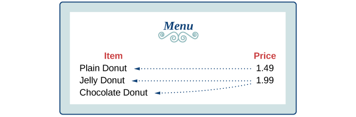{: #Figure_01_01_028}

    Therefore, the item is a not a function of price.
{: type="a"}

Determining If Class Grade Rules Are Functions

In a particular math class, the overall percent grade corresponds to a grade-point average. Is grade-point average a function of the percent grade? Is the percent grade a function of the grade-point average? [[link]](#Table_01_01_01) shows a possible rule for assigning grade points.

| **Percent grade** | 0–56 | 57–61 | 62–66 | 67–71 | 72–77 | 78–86 | 87–91 | 92–100 |
| **Grade-point average** | 0.0 | 1.0 | 1.5 | 2.0 | 2.5 | 3.0 | 3.5 | 4.0 |
{: #Table_01_01_01 summary="Title of the table is &#x201C;Class Grades&#x201D;. It contains two columns and ten rows. The first column is labeled, &#x201C;Percent Grade&#x201D;, and the second column is labeled, &#x201C;Grade point average&#x201D;. Reading the rows as ordered pairs, we have: (92-100, 4.0), (87-91, 3.5), (78-86, 3.0), (72-77, 2.5), (67-71, 2.0), (62-66, 1.5), (57-61, 1.0), and (0-56, 0.0)."}

For any percent grade earned, there is an associated grade-point average, so the grade-point average is a function of the percent grade. In other words, if we input the percent grade, the output is a specific grade point average.

In the grading system given, there is a range of percent grades that correspond to the same grade-point average. For example, students who receive a grade point average of 3.0 could have a variety of percent grades ranging from 78 all the way to 86. Thus, percent grade is not a function of grade-point average.

[[link]](#Table_01_01_02)[1](#footnote1){: data-type="footnote-link"} lists the five greatest baseball players of all time in order of rank.

<table id="Table_01_01_02" summary="Six rows and two columns. The first column is labeled, &#x201C;player name&#x201D;, and the second column is labeled, &#x201C;rank&#x201D;. Reading the rows as ordered pairs, we have: (Babe Ruth, 1), (Willie Mays, 2), (Ty Cobb, 3), (Walter Johnson, 4), and (Hank Aaron, 5)."><colgroup><col /><col data-align="center" /></colgroup><thead>
    <tr>
     <th data-align="center">Player</th>
     <th data-align="center">Rank</th>
    </tr>
   </thead><tbody>
    <tr>
     <td>Babe Ruth</td>
     <td>1</td>
    </tr>
    <tr>
     <td>Willie Mays</td>
     <td>2</td>
    </tr>
    <tr>
     <td>Ty Cobb</td>
     <td>3</td>
    </tr>
    <tr>
     <td>Walter Johnson</td>
     <td>4</td>
    </tr>
    <tr>
     <td>Hank Aaron</td>
     <td>5</td>
    </tr>
   </tbody></table>
1.  Is the rank a function of the player name?
2.  Is the player name a function of the rank?
{: type="a"}

a. yes; b. yes. (Note: If two players had been tied for, say, 4th place, then the name would not have been a function of rank.)

#### Using Function Notation

Once we determine that a relationship is a function, we need to display and define the functional relationships so that we can understand and use them, and sometimes also so that we can program them into graphing calculators and computers. There are various ways of representing functions. A standard **function notation**{: data-type="term" .no-emphasis} is one representation that facilitates working with functions.

To represent “height is a function of age,” we start by identifying the descriptive variables <math xmlns="http://www.w3.org/1998/Math/MathML"> <mi>h</mi> </math>

 for height and <math xmlns="http://www.w3.org/1998/Math/MathML"> <mi>a</mi> </math>

 for age. The letters<math xmlns="http://www.w3.org/1998/Math/MathML"> <mrow> <mtext> </mtext><mi>f</mi><mo>,</mo><mtext> </mtext><mi>g</mi><mo>,</mo> </mrow> </math>

and<math xmlns="http://www.w3.org/1998/Math/MathML"> <mrow> <mtext> </mtext><mi>h</mi><mtext> </mtext> </mrow> </math>

are often used to represent functions just as we use <math xmlns="http://www.w3.org/1998/Math/MathML"> <mrow> <mi>x</mi><mo>,</mo><mtext> </mtext><mi>y</mi><mo>,</mo> </mrow> </math>

and<math xmlns="http://www.w3.org/1998/Math/MathML"> <mi>z</mi> </math>

 to represent numbers and <math xmlns="http://www.w3.org/1998/Math/MathML"> <mrow> <mi>A</mi><mo>,</mo><mtext> </mtext><mi>B</mi><mo>,</mo> </mrow> </math>

 and <math xmlns="http://www.w3.org/1998/Math/MathML"> <mi>C</mi> </math>

 to represent sets.

<math xmlns="http://www.w3.org/1998/Math/MathML" display="block"> <mrow> <mtable> <mtr> <mtd columnalign="left"> <mrow> <mi>h</mi><mtext> is </mtext><mi>f</mi><mtext> of </mtext><mi>a</mi> </mrow> </mtd> <mtd columnalign="left"> <mrow><mspace width="2em" /><mtext>We name the function </mtext><mi>f</mi><mo>;</mo><mtext> height is a function of age</mtext><mo>.</mo> </mrow> </mtd> </mtr> <mtr> <mtd columnalign="left"> <mrow> <mi>h</mi><mo>=</mo><mi>f</mi><mo stretchy="false">(</mo><mi>a</mi><mo stretchy="false">)</mo> </mrow> </mtd> <mtd columnalign="left"> <mrow><mspace width="2em" /> <mtext>We use parentheses to indicate the function input</mtext><mtext>. </mtext> </mrow> </mtd> </mtr> <mtr> <mtd columnalign="left"> <mrow> <mi>f</mi><mo stretchy="false">(</mo><mi>a</mi><mo stretchy="false">)</mo> </mrow> </mtd> <mtd columnalign="left"> <mrow><mspace width="2em" /> <mtext>We name the function </mtext><mi>f</mi><mo>;</mo><mtext> the expression is read as “</mtext><mi>f</mi><mtext> of </mtext><mi>a</mi><mtext>.”</mtext> </mrow> </mtd> </mtr> </mtable> </mrow> </math>

Remember, we can use any letter to name the function; the notation<math xmlns="http://www.w3.org/1998/Math/MathML"> <mrow> <mtext> </mtext><mi>h</mi><mrow><mo>(</mo> <mi>a</mi> <mo>)</mo></mrow><mtext> </mtext></mrow> </math>

shows us that<math xmlns="http://www.w3.org/1998/Math/MathML"> <mrow> <mtext> </mtext><mi>h</mi><mtext> </mtext></mrow> </math>

depends on<math xmlns="http://www.w3.org/1998/Math/MathML"> <mrow> <mtext> </mtext><mi>a</mi><mo>.</mo><mtext> </mtext></mrow> </math>

The value<math xmlns="http://www.w3.org/1998/Math/MathML"> <mrow> <mtext> </mtext><mi>a</mi><mtext> </mtext></mrow> </math>

must be put into the function<math xmlns="http://www.w3.org/1998/Math/MathML"> <mrow> <mtext> </mtext><mi>h</mi><mtext> </mtext></mrow> </math>

to get a result. The parentheses indicate that age is input into the function; they do not indicate multiplication.

We can also give an algebraic expression as the input to a function. For example<math xmlns="http://www.w3.org/1998/Math/MathML"> <mrow> <mtext> </mtext><mi>f</mi><mrow><mo>(</mo> <mrow> <mi>a</mi><mo>+</mo><mi>b</mi></mrow> <mo>)</mo></mrow><mtext> </mtext></mrow> </math>

means “first add *a* and *b*, and the result is the input for the function *f*.” The operations must be performed in this order to obtain the correct result.

Function Notation

The notation<math xmlns="http://www.w3.org/1998/Math/MathML"> <mrow> <mtext> </mtext><mi>y</mi><mo>=</mo><mi>f</mi><mrow><mo>(</mo> <mi>x</mi> <mo>)</mo></mrow><mtext> </mtext></mrow> </math>

defines a function named<math xmlns="http://www.w3.org/1998/Math/MathML"> <mrow> <mtext> </mtext><mi>f</mi><mo>.</mo><mtext> </mtext> </mrow> </math>

This is read as<math xmlns="http://www.w3.org/1998/Math/MathML"> <mrow> <mtext> </mtext><mo>“</mo><mi>y</mi><mtext> </mtext></mrow> </math>

is a function of<math xmlns="http://www.w3.org/1998/Math/MathML"> <mrow> <mtext> </mtext><mi>x</mi><mo>.</mo><mo>”</mo><mtext> </mtext> </mrow> </math>

The letter<math xmlns="http://www.w3.org/1998/Math/MathML"> <mrow> <mtext> </mtext><mi>x</mi><mtext> </mtext> </mrow> </math>

represents the input value, or independent variable. The letter<math xmlns="http://www.w3.org/1998/Math/MathML"> <mrow> <mtext> </mtext><mi>y</mi><mtext>, </mtext> </mrow> </math>

or<math xmlns="http://www.w3.org/1998/Math/MathML"> <mrow> <mtext> </mtext><mi>f</mi><mrow><mo>(</mo> <mi>x</mi> <mo>)</mo></mrow><mo>,</mo><mtext> </mtext></mrow> </math>

represents the output value, or dependent variable.

Using Function Notation for Days in a Month

Use function notation to represent a function whose input is the name of a month and output is the number of days in that month. Assume that the domain does not include leap years.

The number of days in a month is a function of the name of the month, so if we name the function <math xmlns="http://www.w3.org/1998/Math/MathML"> <mrow> <mi>f</mi><mo>,</mo> </mrow> </math>

 we write <math xmlns="http://www.w3.org/1998/Math/MathML"> <mrow> <mtext>days</mtext><mo>=</mo><mi>f</mi><mo stretchy="false">(</mo><mtext>month</mtext><mo stretchy="false">)</mo> </mrow> </math>

 or <math xmlns="http://www.w3.org/1998/Math/MathML"> <mrow> <mi>d</mi><mo>=</mo><mi>f</mi><mo stretchy="false">(</mo><mi>m</mi><mo stretchy="false">)</mo><mo>.</mo> </mrow> </math>

 The name of the month is the input to a “rule” that associates a specific number (the output) with each input.

  
For example,<math xmlns="http://www.w3.org/1998/Math/MathML"> <mrow> <mtext> </mtext><mi>f</mi><mrow><mo>(</mo> <mrow> <mtext>March</mtext></mrow> <mo>)</mo></mrow><mo>=</mo><mn>31</mn><mo>,</mo><mtext> </mtext></mrow> </math>

because March has 31 days. The notation<math xmlns="http://www.w3.org/1998/Math/MathML"> <mrow> <mtext> </mtext><mi>d</mi><mo>=</mo><mi>f</mi><mrow><mo>(</mo> <mi>m</mi> <mo>)</mo></mrow><mtext> </mtext></mrow> </math>

reminds us that the number of days,<math xmlns="http://www.w3.org/1998/Math/MathML"> <mrow> <mtext> </mtext><mi>d</mi><mtext> </mtext></mrow> </math>

(the output), is dependent on the name of the month,<math xmlns="http://www.w3.org/1998/Math/MathML"> <mrow> <mtext> </mtext><mi>m</mi><mtext> </mtext></mrow> </math>

(the input).

Analysis

Note that the inputs to a function do not have to be numbers; function inputs can be names of people, labels of geometric objects, or any other element that determines some kind of output. However, most of the functions we will work with in this book will have numbers as inputs and outputs.

Interpreting Function Notation

A function<math xmlns="http://www.w3.org/1998/Math/MathML"> <mrow> <mtext> </mtext><mi>N</mi><mo>=</mo><mi>f</mi><mrow><mo>(</mo> <mi>y</mi> <mo>)</mo></mrow><mtext> </mtext></mrow> </math>

gives the number of police officers,<math xmlns="http://www.w3.org/1998/Math/MathML"> <mrow> <mtext> </mtext><mi>N</mi><mo>,</mo><mtext> </mtext> </mrow> </math>

in a town in year<math xmlns="http://www.w3.org/1998/Math/MathML"> <mrow> <mtext> </mtext><mi>y</mi><mo>.</mo><mtext> </mtext> </mrow> </math>

What does<math xmlns="http://www.w3.org/1998/Math/MathML"> <mrow> <mtext> </mtext><mi>f</mi><mrow><mo>(</mo> <mrow> <mn>2005</mn></mrow> <mo>)</mo></mrow><mo>=</mo><mn>300</mn><mtext> </mtext></mrow> </math>

represent?

When we read<math xmlns="http://www.w3.org/1998/Math/MathML"> <mrow> <mtext> </mtext><mi>f</mi><mrow><mo>(</mo> <mrow> <mn>2005</mn></mrow> <mo>)</mo></mrow><mo>=</mo><mn>300</mn><mo>,</mo><mtext> </mtext></mrow> </math>

we see that the input year is 2005. The value for the output, the number of police officers<math xmlns="http://www.w3.org/1998/Math/MathML"> <mrow> <mtext> </mtext><mrow><mo>(</mo> <mi>N</mi> <mo>)</mo></mrow><mo>,</mo><mtext> </mtext></mrow> </math>

is 300. Remember,<math xmlns="http://www.w3.org/1998/Math/MathML"> <mrow> <mtext> </mtext><mi>N</mi><mo>=</mo><mi>f</mi><mrow><mo>(</mo> <mi>y</mi> <mo>)</mo></mrow><mo>.</mo><mtext> </mtext></mrow> </math>

The statement<math xmlns="http://www.w3.org/1998/Math/MathML"> <mrow> <mtext> </mtext><mi>f</mi><mrow><mo>(</mo> <mrow> <mn>2005</mn></mrow> <mo>)</mo></mrow><mo>=</mo><mn>300</mn><mtext> </mtext></mrow> </math>

tells us that in the year 2005 there were 300 police officers in the town.

Use function notation to express the weight of a pig in pounds as a function of its age in days<math xmlns="http://www.w3.org/1998/Math/MathML"> <mrow> <mtext> </mtext><mi>d</mi><mtext>.</mtext></mrow> </math>

<math xmlns="http://www.w3.org/1998/Math/MathML"> <mrow> <mi>w</mi><mo>=</mo><mi>f</mi><mo stretchy="false">(</mo><mi>d</mi><mo stretchy="false">)</mo></mrow> </math>

**Instead of a notation such as<math xmlns="http://www.w3.org/1998/Math/MathML"> <mrow> <mtext> </mtext><mi>y</mi><mo>=</mo><mi>f</mi><mo stretchy="false">(</mo><mi>x</mi><mo stretchy="false">),</mo><mtext> </mtext> </mrow> </math>

could we use the same symbol for the output as for the function, such as<math xmlns="http://www.w3.org/1998/Math/MathML"> <mrow> <mtext> </mtext><mi>y</mi><mo>=</mo><mi>y</mi><mo stretchy="false">(</mo><mi>x</mi><mo stretchy="false">),</mo><mtext> </mtext> </mrow> </math>

meaning “y is a function of x?”**

*Yes, this is often done, especially in applied subjects that use higher math, such as physics and engineering. However, in exploring math itself we like to maintain a distinction between a function such as<math xmlns="http://www.w3.org/1998/Math/MathML"> <mrow> <mtext> </mtext><mi>f</mi><mo>,</mo><mtext> </mtext> </mrow> </math>

which is a rule or procedure, and the output<math xmlns="http://www.w3.org/1998/Math/MathML"> <mrow> <mtext> </mtext><mi>y</mi><mtext> </mtext></mrow> </math>

we get by applying<math xmlns="http://www.w3.org/1998/Math/MathML"> <mrow> <mtext> </mtext><mi>f</mi><mtext> </mtext></mrow> </math>

to a particular input<math xmlns="http://www.w3.org/1998/Math/MathML"> <mrow> <mtext> </mtext><mi>x</mi><mo>.</mo><mtext> </mtext> </mrow> </math>

This is why we usually use notation such as<math xmlns="http://www.w3.org/1998/Math/MathML"> <mrow> <mtext> </mtext><mi>y</mi><mo>=</mo><mi>f</mi><mrow><mo>(</mo> <mi>x</mi> <mo>)</mo></mrow><mo>,</mo><mi>P</mi><mo>=</mo><mi>W</mi><mrow><mo>(</mo> <mi>d</mi> <mo>)</mo></mrow><mo>,</mo><mtext> </mtext></mrow> </math>

and so on.*

#### Representing Functions Using Tables

A common method of representing functions is in the form of a table. The table rows or columns display the corresponding input and output values. In some cases, these values represent all we know about the relationship; other times, the table provides a few select examples from a more complete relationship.

[\[link\]](#Table_01_01_03) lists the input number of each month (January = 1, February = 2, and so on) and the output value of the number of days in that month. This information represents all we know about the months and days for a given year (that is not a leap year). Note that, in this table, we define a days-in-a-month function<math xmlns="http://www.w3.org/1998/Math/MathML"> <mrow> <mtext> </mtext><mi>f</mi><mtext> </mtext></mrow> </math>

where<math xmlns="http://www.w3.org/1998/Math/MathML"> <mrow> <mtext> </mtext><mi>D</mi><mo>=</mo><mi>f</mi><mrow><mo>(</mo> <mi>m</mi> <mo>)</mo></mrow><mtext> </mtext></mrow> </math>

identifies months by an integer rather than by name.

| **Month number,<math xmlns="http://www.w3.org/1998/Math/MathML"> <mrow> <mtext> </mtext><mi>m</mi><mtext> </mtext></mrow> </math>

(input)** | 1 | 2 | 3 | 4 | 5 | 6 | 7 | 8 | 9 | 10 | 11 | 12 |
| **Days in month,<math xmlns="http://www.w3.org/1998/Math/MathML"> <mrow> <mtext> </mtext><mi>D</mi><mtext> </mtext></mrow> </math>

(output)** | 31 | 28 | 31 | 30 | 31 | 30 | 31 | 31 | 30 | 31 | 30 | 31 |
{: #Table_01_01_03 summary="Two rows and thirteen columns. The first row is labeled, &#x201C;(input) Month number, m&#x201D; and the second row is labeled, &#x201C;(output) Days in months, D&#x201D;. Reading the columns as ordered pairs, we have: (1, 31), (2, 28), (3, 31), (4, 30), (5, 31), (6, 30), (7, 31), (8, 31), (9, 30) , (10, 31), (11, 30), and (12, 31)."}

[\[link\]](#Table_01_01_04) defines a function<math xmlns="http://www.w3.org/1998/Math/MathML"> <mrow> <mtext> </mtext><mi>Q</mi><mo>=</mo><mi>g</mi><mrow><mo>(</mo> <mi>n</mi> <mo>)</mo></mrow><mo>.</mo><mtext> </mtext></mrow> </math>

Remember, this notation tells us that<math xmlns="http://www.w3.org/1998/Math/MathML"> <mrow> <mtext> </mtext><mi>g</mi><mtext> </mtext></mrow> </math>

is the name of the function that takes the input<math xmlns="http://www.w3.org/1998/Math/MathML"> <mrow> <mtext> </mtext><mi>n</mi><mtext> </mtext></mrow> </math>

and gives the output<math xmlns="http://www.w3.org/1998/Math/MathML"> <mrow> <mtext> </mtext><mi>Q</mi><mtext> .</mtext></mrow> </math>

<table id="Table_01_01_04" summary="Two rows and six columns. The first row is labeled, &#x201C;n&#x201D; and the second row is labeled, &#x201C;Q&#x201D;. Reading the columns as ordered pairs, we have: (1, 8), (2, 6), (3, 7), (4, 6) , and (5, 8)."><colgroup><col data-align="left" /><col data-width="25" data-align="left" /><col data-width="25" data-align="left" /><col data-width="25" data-align="left" /><col data-width="25" data-align="left" /><col data-width="25" data-align="left" /></colgroup><tbody>
     <tr>
      <td><math xmlns="http://www.w3.org/1998/Math/MathML">
 <mi>n</mi>
</math>
</td>
      <td>1</td>
      <td>2</td>
      <td>3</td>
      <td>4</td>
      <td>5</td>
     </tr>
     <tr>
      <td><math xmlns="http://www.w3.org/1998/Math/MathML">
 <mi>Q</mi>
</math>
</td>
      <td>8</td>
      <td>6</td>
      <td>7</td>
      <td>6</td>
      <td>8</td>
     </tr>
    </tbody></table>

[\[link\]](#Table_01_01_05) displays the age of children in years and their corresponding heights. This table displays just some of the data available for the heights and ages of children. We can see right away that this table does not represent a function because the same input value, 5 years, has two different output values, 40 in. and 42 in.

<table id="Table_01_01_05" summary="Two rows and eight columns. The first row is labeled, &#x201C;(input) a, age in years&#x201D; and the second row is labeled, &#x201C;(output) h, height in inches&#x201D;. Reading the columns as ordered pairs, we have: (5, 40), (5, 42) , (6, 44), (7, 47), (8, 50), (9, 52), and (10, 54)."><colgroup><col data-align="left" /><col data-width="30" data-align="left" /><col data-width="30" data-align="left" /><col data-width="30" data-align="left" /><col data-width="30" data-align="left" /><col data-width="30" data-align="left" /><col data-width="30" data-align="left" /><col data-width="30" data-align="left" /></colgroup><tbody>
     <tr>
      <td><strong>Age in years,<math xmlns="http://www.w3.org/1998/Math/MathML">
 <mrow>
  <mtext> </mtext><mi>a</mi><mtext> </mtext>
 </mrow>
</math>(input)</strong></td>
      <td>5</td>
      <td>5</td>
      <td>6</td>
      <td>7</td>
      <td>8</td>
      <td>9</td>
      <td>10</td>
     </tr>
     <tr>
      <td><strong>Height in inches,<math xmlns="http://www.w3.org/1998/Math/MathML">
 <mrow>
  <mtext> </mtext><mi>h</mi><mtext> </mtext>
 </mrow>
</math>(output)</strong></td>
      <td>40</td>
      <td>42</td>
      <td>44</td>
      <td>47</td>
      <td>50</td>
      <td>52</td>
      <td>54</td>
     </tr>
    </tbody></table>

<strong>Given a table of input and output values, determine whether the table represents a function. </strong>

1.  Identify the input and output values.
2.  Check to see if each input value is paired with only one output value. If so, the table represents a function.
{: type="1"}

Identifying Tables that Represent Functions

Which table, [[link]](#Table_01_01_06), [[link]](#Table_01_01_07), or [[link]](#Table_01_01_08), represents a function (if any)?

<table id="Table_01_01_06" summary="Four rows and two columns. The first column is labeled, &#x201C;input&#x201D;, and the second column is labeled, &#x201C;output&#x201D;. Reading the rows as ordered pairs, we have: (2, 1), (5, 3), and (8, 6)."><colgroup><col data-align="center" /><col data-align="center" /></colgroup><thead>
    <tr>
     <th>Input</th>
     <th>Output</th>
    </tr>
</thead><tbody>   
 <tr>
     <td>2</td>
     <td>1</td>
    </tr>
    <tr>
     <td>5</td>
     <td>3</td>
    </tr>
    <tr>
     <td>8</td>
     <td>6</td>
    </tr>
   </tbody></table>
<table id="Table_01_01_07" summary="Four rows and two columns. The first column is labeled, &#x201C;input&#x201D;, and the second column is labeled, &#x201C;output&#x201D;. Reading the rows as ordered pairs, we have: (-3, 5), (0, 1), and (4, 5)."><colgroup><col data-align="center" /><col data-align="center" /></colgroup><thead>
    <tr>
     <th>Input</th>
     <th>Output</th>
    </tr>
</thead><tbody>   
 <tr>
     <td>–3</td>
     <td>5</td>
    </tr>
    <tr>
     <td>0</td>
     <td>1</td>
    </tr>
    <tr>
     <td>4</td>
     <td>5</td>
    </tr>
   </tbody></table>
<table id="Table_01_01_08" summary="Four rows and two columns. The first column is labeled, &#x201C;input&#x201D;, and the second column is labeled, &#x201C;output&#x201D;. Reading the rows as ordered pairs, we have: (1, 0), (5, 2), and (5, 4)."><colgroup><col data-align="center" /><col data-align="center" /></colgroup><thead>
    <tr>
     <th>Input</th>
     <th>Output</th>
    </tr>
</thead><tbody>   
 <tr>
     <td>1</td>
     <td>0</td>
    </tr>
    <tr>
     <td>5</td>
     <td>2</td>
    </tr>
    <tr>
     <td>5</td>
     <td>4</td>
    </tr>
   </tbody></table>

[[link]](#Table_01_01_06) and [[link]](#Table_01_01_07) define functions. In both, each input value corresponds to exactly one output value. [[link]](#Table_01_01_08) does not define a function because the input value of 5 corresponds to two different output values.

When a table represents a function, corresponding input and output values can also be specified using function notation.

The function represented by [[link]](#Table_01_01_06) can be represented by writing

<math xmlns="http://www.w3.org/1998/Math/MathML" display="block"> <mrow> <mi>f</mi><mo stretchy="false">(</mo><mn>2</mn><mo stretchy="false">)</mo><mo>=</mo><mn>1</mn><mo>,</mo><mi>f</mi><mo stretchy="false">(</mo><mn>5</mn><mo stretchy="false">)</mo><mo>=</mo><mn>3</mn><mo>,</mo><mtext>and </mtext><mi>f</mi><mo stretchy="false">(</mo><mn>8</mn><mo stretchy="false">)</mo><mo>=</mo><mn>6</mn> </mrow> </math>

Similarly, the statements

<math xmlns="http://www.w3.org/1998/Math/MathML" display="block"> <mrow> <mi>g</mi><mrow><mo>(</mo> <mrow> <mo>−</mo><mn>3</mn></mrow> <mo>)</mo></mrow><mo>=</mo><mn>5</mn><mo>,</mo><mtext> </mtext><mi>g</mi><mrow><mo>(</mo> <mn>0</mn> <mo>)</mo></mrow><mo>=</mo><mn>1</mn><mo>,</mo><mtext>and </mtext><mi>g</mi><mrow><mo>(</mo> <mn>4</mn> <mo>)</mo></mrow><mo>=</mo><mn>5</mn></mrow> </math>

represent the function in [[link]](#Table_01_01_07).

[[link]](#Table_01_01_08) cannot be expressed in a similar way because it does not represent a function.

Does [[link]](#Table_01_01_09) represent a function?

<table id="Table_01_01_09" summary="Four rows and two columns. The first column is labeled, &#x201C;input&#x201D;, and the second column is labeled, &#x201C;output&#x201D;. Reading the rows as ordered pairs, we have: (1, 10), (2, 100), and (3, 1000)."><colgroup><col data-align="center" /><col data-align="center" /></colgroup><thead>
    <tr>
     <th data-align="center">Input</th>
     <th data-align="center">Output</th>
    </tr>
</thead><tbody>    
<tr>
     <td>1</td>
     <td>10</td>
    </tr>
    <tr>
     <td>2</td>
     <td>100</td>
    </tr>
    <tr>
     <td>3</td>
     <td>1000</td>
    </tr>
   </tbody></table>

yes

### Finding Input and Output Values of a Function 

When we know an input value and want to determine the corresponding output value for a function, we *evaluate* the function. Evaluating will always produce one result because each input value of a function corresponds to exactly one output value.

When we know an output value and want to determine the input values that would produce that output value, we set the output equal to the function’s formula and *solve* for the input. Solving can produce more than one solution because different input values can produce the same output value.

#### Evaluation of Functions in Algebraic Forms

When we have a function in formula form, it is usually a simple matter to evaluate the function. For example, the function<math xmlns="http://www.w3.org/1998/Math/MathML"> <mrow> <mtext> </mtext><mi>f</mi><mrow><mo>(</mo> <mi>x</mi> <mo>)</mo></mrow><mo>=</mo><mn>5</mn><mo>−</mo><mn>3</mn><msup> <mi>x</mi> <mn>2</mn> </msup> <mtext> </mtext></mrow> </math>

can be evaluated by squaring the input value, multiplying by 3, and then subtracting the product from 5.

<strong>Given the formula for a function, evaluate. </strong>

1.  Replace the input variable in the formula with the value provided.
2.  Calculate the result.
{: type="1"}

Evaluating Functions at Specific Values

Evaluate<math xmlns="http://www.w3.org/1998/Math/MathML"> <mrow> <mtext> </mtext><mi>f</mi><mrow><mo>(</mo> <mi>x</mi> <mo>)</mo></mrow><mo>=</mo><msup> <mi>x</mi> <mn>2</mn> </msup> <mo>+</mo><mn>3</mn><mi>x</mi><mo>−</mo><mn>4</mn><mtext> </mtext></mrow> </math>

at

1.  <math xmlns="http://www.w3.org/1998/Math/MathML"> <mn>2</mn> </math>

2.  <math xmlns="http://www.w3.org/1998/Math/MathML"> <mi>a</mi> </math>

3.  <math xmlns="http://www.w3.org/1998/Math/MathML"> <mrow> <mi>a</mi><mo>+</mo><mi>h</mi></mrow> </math>

4.  <math xmlns="http://www.w3.org/1998/Math/MathML"> <mrow> <mfrac> <mrow> <mi>f</mi><mrow><mo>(</mo> <mrow> <mi>a</mi><mo>+</mo><mi>h</mi></mrow> <mo>)</mo></mrow><mo>−</mo><mi>f</mi><mrow><mo>(</mo> <mi>a</mi> <mo>)</mo></mrow></mrow> <mi>h</mi> </mfrac> </mrow> </math>
{: type="a"}

Replace the<math xmlns="http://www.w3.org/1998/Math/MathML"> <mrow> <mtext> </mtext><mi>x</mi><mtext> </mtext> </mrow> </math>

 in the function with each specified value.

1.  Because the input value is a number, 2, we can use simple algebra to simplify.
    

    <math xmlns="http://www.w3.org/1998/Math/MathML" display="block"> <mrow> <mtable> <mtr rowalign="center"> <mtd columnalign="right" rowalign="center"> <mrow> <mi>f</mi><mo stretchy="false">(</mo><mn>2</mn><mo stretchy="false">)</mo> </mrow> </mtd> <mtd rowalign="center"> <mo>=</mo> </mtd> <mtd columnalign="l" rowalign="center"> <mrow> <msup> <mn>2</mn> <mn>2</mn> </msup> <mo>+</mo><mn>3</mn><mo stretchy="false">(</mo><mn>2</mn><mo stretchy="false">)</mo><mo>−</mo><mn>4</mn> </mrow> </mtd> </mtr> <mtr rowalign="center"> <mtd rowalign="center" /> <mtd rowalign="center"> <mo>=</mo> </mtd> <mtd columnalign="left" rowalign="center"> <mrow> <mn>4</mn><mo>+</mo><mn>6</mn><mo>−</mo><mn>4</mn> </mrow> </mtd> </mtr> <mtr rowalign="center"> <mtd rowalign="center" /> <mtd rowalign="center"> <mo>=</mo> </mtd> <mtd columnalign="left" rowalign="center"> <mn>6</mn> </mtd> </mtr> </mtable> </mrow> </math>
    

2.  In this case, the input value is a letter so we cannot simplify the answer any further.
    

    <math xmlns="http://www.w3.org/1998/Math/MathML" display="block"> <mrow> <mi>f</mi><mrow><mo>(</mo> <mi>a</mi> <mo>)</mo></mrow><mo>=</mo><msup> <mi>a</mi> <mn>2</mn> </msup> <mo>+</mo><mn>3</mn><mi>a</mi><mo>−</mo><mn>4</mn></mrow> </math>
    

3.  With an input value of
    <math xmlns="http://www.w3.org/1998/Math/MathML"> <mrow> <mtext> </mtext><mi>a</mi><mo>+</mo><mi>h</mi><mo>,</mo><mtext> </mtext></mrow> </math>
    
    we must use the distributive property.
    

    <math xmlns="http://www.w3.org/1998/Math/MathML" display="block"> <mrow> <mtable> <mtr rowalign="center"> <mtd columnalign="right" rowalign="center"> <mrow> <mi>f</mi><mo stretchy="false">(</mo><mi>a</mi><mo>+</mo><mi>h</mi><mo stretchy="false">)</mo> </mrow> </mtd> <mtd rowalign="center"> <mo>=</mo> </mtd> <mtd columnalign="left" rowalign="center"> <mrow> <msup> <mrow> <mo stretchy="false">(</mo><mi>a</mi><mo>+</mo><mi>h</mi><mo stretchy="false">)</mo> </mrow> <mn>2</mn> </msup> <mo>+</mo><mn>3</mn><mo stretchy="false">(</mo><mi>a</mi><mo>+</mo><mi>h</mi><mo stretchy="false">)</mo><mo>−</mo><mn>4</mn> </mrow> </mtd> </mtr> <mtr rowalign="center"> <mtd rowalign="center" /> <mtd rowalign="center"> <mo>=</mo> </mtd> <mtd columnalign="left" rowalign="center"> <mrow> <msup> <mi>a</mi> <mn>2</mn> </msup> <mo>+</mo><mn>2</mn><mi>a</mi><mi>h</mi><mo>+</mo><msup> <mi>h</mi> <mn>2</mn> </msup> <mo>+</mo><mn>3</mn><mi>a</mi><mo>+</mo><mn>3</mn><mi>h</mi><mo>−</mo><mn>4</mn> </mrow> </mtd> </mtr> </mtable> </mrow> </math>
    

4.  In this case, we apply the input values to the function more than once, and then perform algebraic operations on the result. We already found that
    

    <math xmlns="http://www.w3.org/1998/Math/MathML" display="block"> <mrow> <mi>f</mi><mrow><mo>(</mo> <mrow> <mi>a</mi><mo>+</mo><mi>h</mi></mrow> <mo>)</mo></mrow><mo>=</mo><msup> <mi>a</mi> <mn>2</mn> </msup> <mo>+</mo><mn>2</mn><mi>a</mi><mi>h</mi><mo>+</mo><msup> <mi>h</mi> <mn>2</mn> </msup> <mo>+</mo><mn>3</mn><mi>a</mi><mo>+</mo><mn>3</mn><mi>h</mi><mo>−</mo><mn>4</mn></mrow> </math>
    

    
    and we know that
    
    

    <math xmlns="http://www.w3.org/1998/Math/MathML" display="block"> <mrow> <mi>f</mi><mrow><mo>(</mo> <mi>a</mi> <mo>)</mo></mrow><mo>=</mo><msup> <mi>a</mi> <mn>2</mn> </msup> <mo>+</mo><mn>3</mn><mi>a</mi><mo>−</mo><mn>4</mn></mrow> </math>
    

    
    Now we combine the results and simplify.
    
    

    <math xmlns="http://www.w3.org/1998/Math/MathML" display="block"> <mrow> <mtable> <mtr rowalign="center"> <mtd columnalign="right" rowalign="center"> <mrow> <mfrac> <mrow> <mi>f</mi><mo stretchy="false">(</mo><mi>a</mi><mo>+</mo><mi>h</mi><mo stretchy="false">)</mo><mo>−</mo><mi>f</mi><mo stretchy="false">(</mo><mi>a</mi><mo stretchy="false">)</mo> </mrow> <mi>h</mi> </mfrac> </mrow> </mtd> <mtd rowalign="center"> <mo>=</mo> </mtd> <mtd columnalign="left" rowalign="center"> <mrow> <mfrac> <mrow> <mo>(</mo><msup> <mi>a</mi> <mn>2</mn> </msup> <mo>+</mo><mn>2</mn><mi>a</mi><mi>h</mi><mo>+</mo><msup> <mi>h</mi> <mn>2</mn> </msup> <mo>+</mo><mn>3</mn><mi>a</mi><mo>+</mo><mn>3</mn><mi>h</mi><mo>−</mo><mn>4</mn><mo>)</mo><mo>−</mo><mo>(</mo><msup> <mi>a</mi> <mn>2</mn> </msup> <mo>+</mo><mn>3</mn><mi>a</mi><mo>−</mo><mn>4</mn><mo>)</mo> </mrow> <mi>h</mi> </mfrac> </mrow> </mtd> </mtr> <mtr rowalign="center"> <mtd rowalign="center" /> <mtd rowalign="center"> <mo>=</mo> </mtd> <mtd columnalign="left" rowalign="center"> <mrow> <mfrac> <mrow> <mn>2</mn><mi>a</mi><mi>h</mi><mo>+</mo><msup> <mi>h</mi> <mn>2</mn> </msup> <mo>+</mo><mn>3</mn><mi>h</mi> </mrow> <mi>h</mi> </mfrac> </mrow> </mtd> </mtr> <mtr rowalign="center"> <mtd rowalign="center" /> <mtd rowalign="center"> <mo>=</mo> </mtd> <mtd columnalign="left" rowalign="center"> <mrow> <mfrac> <mrow> <mi>h</mi><mo stretchy="false">(</mo><mn>2</mn><mi>a</mi><mo>+</mo><mi>h</mi><mo>+</mo><mn>3</mn><mo stretchy="false">)</mo> </mrow> <mi>h</mi> </mfrac><mspace width="2em" /> <mtext>Factor out </mtext><mi>h</mi><mo>.</mo> </mrow> </mtd> </mtr> <mtr rowalign="center"> <mtd rowalign="center" /> <mtd rowalign="center"> <mo>=</mo> </mtd> <mtd columnalign="left" rowalign="center"> <mrow> <mn>2</mn><mi>a</mi><mo>+</mo><mi>h</mi><mo>+</mo><mn>3</mn><mspace width="3.3em" /><mtext>Simplify</mtext><mo>.</mo> </mrow> </mtd> </mtr> </mtable> </mrow> </math>
    

{: type="a"}

Evaluating Functions

Given the function<math xmlns="http://www.w3.org/1998/Math/MathML"> <mrow> <mtext> </mtext><mi>h</mi><mrow><mo>(</mo> <mi>p</mi> <mo>)</mo></mrow><mo>=</mo><msup> <mi>p</mi> <mn>2</mn> </msup> <mo>+</mo><mn>2</mn><mi>p</mi><mo>,</mo><mtext> </mtext></mrow> </math>

evaluate<math xmlns="http://www.w3.org/1998/Math/MathML"> <mrow> <mtext> </mtext><mi>h</mi><mrow><mo>(</mo> <mn>4</mn> <mo>)</mo></mrow><mo>.</mo><mtext> </mtext></mrow> </math>

To evaluate<math xmlns="http://www.w3.org/1998/Math/MathML"> <mrow> <mtext> </mtext><mi>h</mi><mrow><mo>(</mo> <mn>4</mn> <mo>)</mo></mrow><mo>,</mo><mtext> </mtext></mrow> </math>

we substitute the value 4 for the input variable<math xmlns="http://www.w3.org/1998/Math/MathML"> <mrow> <mtext> </mtext><mi>p</mi><mtext> </mtext></mrow> </math>

in the given function.

<math xmlns="http://www.w3.org/1998/Math/MathML" display="block"> <mrow> <mtable> <mtr rowalign="center"> <mtd columnalign="right" rowalign="center"> <mrow> <mi>h</mi><mo stretchy="false">(</mo><mi>p</mi><mo stretchy="false">)</mo> </mrow> </mtd> <mtd rowalign="center"> <mo>=</mo> </mtd> <mtd columnalign="left" rowalign="center"> <mrow> <msup> <mi>p</mi> <mn>2</mn> </msup> <mo>+</mo><mn>2</mn><mi>p</mi> </mrow> </mtd> </mtr> <mtr rowalign="center"> <mtd columnalign="right" rowalign="center"> <mrow> <mi>h</mi><mo stretchy="false">(</mo><mn>4</mn><mo stretchy="false">)</mo> </mrow> </mtd> <mtd rowalign="center"> <mo>=</mo> </mtd> <mtd columnalign="left" rowalign="center"> <mrow> <msup> <mrow> <mo stretchy="false">(</mo><mn>4</mn><mo stretchy="false">)</mo> </mrow> <mn>2</mn> </msup> <mo>+</mo><mn>2</mn><mo stretchy="false">(</mo><mn>4</mn><mo stretchy="false">)</mo> </mrow> </mtd> </mtr> <mtr rowalign="center"> <mtd rowalign="center" /> <mtd rowalign="center"> <mo>=</mo> </mtd> <mtd columnalign="left" rowalign="center"> <mrow> <mn>16</mn><mo>+</mo><mn>8</mn> </mrow> </mtd> </mtr> <mtr rowalign="center"> <mtd rowalign="center" /> <mtd rowalign="center"> <mo>=</mo> </mtd> <mtd columnalign="left" rowalign="center"> <mrow> <mn>24</mn> </mrow> </mtd> </mtr> </mtable> </mrow> </math>

Therefore, for an input of 4, we have an output of 24.

Given the function<math xmlns="http://www.w3.org/1998/Math/MathML"> <mrow> <mtext> </mtext><mi>g</mi><mrow><mo>(</mo> <mi>m</mi> <mo>)</mo></mrow><mo>=</mo><msqrt> <mrow> <mi>m</mi><mo>−</mo><mn>4</mn></mrow> </msqrt> <mo>,</mo><mtext> </mtext></mrow> </math>

evaluate<math xmlns="http://www.w3.org/1998/Math/MathML"> <mrow> <mtext> </mtext><mi>g</mi><mrow><mo>(</mo> <mn>5</mn> <mo>)</mo></mrow><mo>.</mo></mrow> </math>

<math xmlns="http://www.w3.org/1998/Math/MathML"> <mrow> <mtext> </mtext><mi>g</mi><mrow><mo>(</mo> <mn>5</mn> <mo>)</mo></mrow><mo>=</mo><mn>1</mn><mtext> </mtext></mrow> </math>

Solving Functions

Given the function<math xmlns="http://www.w3.org/1998/Math/MathML"> <mrow> <mtext> </mtext><mi>h</mi><mrow><mo>(</mo> <mi>p</mi> <mo>)</mo></mrow><mo>=</mo><msup> <mi>p</mi> <mn>2</mn> </msup> <mo>+</mo><mn>2</mn><mi>p</mi><mo>,</mo><mtext> </mtext></mrow> </math>

solve for<math xmlns="http://www.w3.org/1998/Math/MathML"> <mrow> <mtext> </mtext><mi>h</mi><mrow><mo>(</mo> <mi>p</mi> <mo>)</mo></mrow><mo>=</mo><mn>3.</mn></mrow> </math>

<math xmlns="http://www.w3.org/1998/Math/MathML" display="block"> <mrow> <mtable> <mtr rowalign="center"> <mtd columnalign="right" rowalign="center"> <mrow> <mi>h</mi><mo stretchy="false">(</mo><mi>p</mi><mo stretchy="false">)</mo> </mrow> </mtd> <mtd rowalign="center"> <mo>=</mo> </mtd> <mtd columnalign="left" rowalign="center"> <mn>3</mn> </mtd> <mtd rowalign="center" /> </mtr> <mtr rowalign="center"> <mtd columnalign="right" rowalign="center"> <mrow> <msup> <mi>p</mi> <mn>2</mn> </msup> <mo>+</mo><mn>2</mn><mi>p</mi> </mrow> </mtd> <mtd rowalign="center"> <mo>=</mo> </mtd> <mtd columnalign="left" rowalign="center"> <mn>3</mn> </mtd> <mtd columnalign="left" rowalign="center"> <mrow><mspace width="2em" /> <mtext>Substitute the original function </mtext><mi>h</mi><mo stretchy="false">(</mo><mi>p</mi><mo stretchy="false">)</mo><mo>=</mo><msup> <mi>p</mi> <mn>2</mn> </msup> <mo>+</mo><mn>2</mn><mi>p</mi><mo>.</mo> </mrow> </mtd> </mtr> <mtr rowalign="center"> <mtd columnalign="right" rowalign="center"> <mrow> <msup> <mi>p</mi> <mn>2</mn> </msup> <mo>+</mo><mn>2</mn><mi>p</mi><mo>−</mo><mn>3</mn> </mrow> </mtd> <mtd rowalign="center"> <mo>=</mo> </mtd> <mtd columnalign="left" rowalign="center"> <mn>0</mn> </mtd> <mtd columnalign="left" rowalign="center"> <mrow><mspace width="2em" /> <mtext>Subtract 3 from each side</mtext><mtext>.</mtext> </mrow> </mtd> </mtr> <mtr rowalign="center"> <mtd columnalign="right" rowalign="center"> <mrow> <mo stretchy="false">(</mo><mi>p</mi><mo>+</mo><mn>3</mn><mtext>)(</mtext><mi>p</mi><mo>−</mo><mn>1</mn><mo stretchy="false">)</mo> </mrow> </mtd> <mtd rowalign="center"> <mo>=</mo> </mtd> <mtd columnalign="left" rowalign="center"> <mn>0</mn> </mtd> <mtd columnalign="left" rowalign="center"> <mrow><mspace width="2em" /> <mtext>Factor</mtext><mo>.</mo> </mrow> </mtd> </mtr> </mtable> </mrow> </math>

If<math xmlns="http://www.w3.org/1998/Math/MathML"> <mrow> <mtext> </mtext><mrow><mo>(</mo> <mrow> <mi>p</mi><mo>+</mo><mn>3</mn></mrow> <mo>)</mo></mrow><mrow><mo>(</mo> <mrow> <mi>p</mi><mo>−</mo><mn>1</mn></mrow> <mo>)</mo></mrow><mo>=</mo><mn>0</mn><mo>,</mo><mtext> </mtext></mrow> </math>

either<math xmlns="http://www.w3.org/1998/Math/MathML"> <mrow> <mtext> </mtext><mrow><mo>(</mo> <mrow> <mi>p</mi><mo>+</mo><mn>3</mn></mrow> <mo>)</mo></mrow><mo>=</mo><mn>0</mn><mtext> </mtext></mrow> </math>

or<math xmlns="http://www.w3.org/1998/Math/MathML"> <mrow> <mtext> </mtext><mrow><mo>(</mo> <mrow> <mi>p</mi><mo>−</mo><mn>1</mn></mrow> <mo>)</mo></mrow><mo>=</mo><mn>0</mn><mtext> </mtext></mrow> </math>

(or both of them equal 0). We will set each factor equal to 0 and solve for<math xmlns="http://www.w3.org/1998/Math/MathML"> <mrow> <mtext> </mtext><mi>p</mi><mtext> </mtext></mrow> </math>

in each case.

<math xmlns="http://www.w3.org/1998/Math/MathML" display="block"> <mrow> <mtable> <mtr> <mtd columnalign="right"> <mrow> <mo stretchy="false">(</mo><mi>p</mi><mo>+</mo><mn>3</mn><mo stretchy="false">)</mo> </mrow> </mtd> <mtd> <mo>=</mo> </mtd> <mtd columnalign="left"> <mrow> <mn>0</mn><mo>,</mo> </mrow> </mtd> <mtd columnalign="right"> <mspace width="0.5em" /> <mi>p</mi> </mtd> <mtd> <mo>=</mo> </mtd> <mtd columnalign="left"> <mrow> <mo>−</mo><mn>3</mn> </mrow> </mtd> </mtr> <mtr> <mtd columnalign="right"> <mrow> <mo stretchy="false">(</mo><mi>p</mi><mo>−</mo><mn>1</mn><mo stretchy="false">)</mo> </mrow> </mtd> <mtd> <mo>=</mo> </mtd> <mtd columnalign="left"> <mrow> <mn>0</mn><mo>,</mo> </mrow> </mtd> <mtd columnalign="right"> <mspace width="0.5em" /> <mi>p</mi> </mtd> <mtd> <mo>=</mo> </mtd> <mtd columnalign="left"> <mn>1</mn> </mtd> </mtr> </mtable> </mrow> </math>

This gives us two solutions. The output<math xmlns="http://www.w3.org/1998/Math/MathML"> <mrow> <mtext> </mtext><mi>h</mi><mrow><mo>(</mo> <mi>p</mi> <mo>)</mo></mrow><mo>=</mo><mn>3</mn><mtext> </mtext></mrow> </math>

when the input is either<math xmlns="http://www.w3.org/1998/Math/MathML"> <mrow> <mtext> </mtext><mi>p</mi><mo>=</mo><mn>1</mn><mtext> </mtext></mrow> </math>

or<math xmlns="http://www.w3.org/1998/Math/MathML"> <mrow> <mtext> </mtext><mi>p</mi><mo>=</mo><mo>−</mo><mn>3.</mn><mtext> </mtext></mrow> </math>

We can also verify by graphing as in [[link]](#Figure_01_01_006). The graph verifies that<math xmlns="http://www.w3.org/1998/Math/MathML"> <mrow> <mtext> </mtext><mi>h</mi><mrow><mo>(</mo> <mn>1</mn> <mo>)</mo></mrow><mo>=</mo><mi>h</mi><mrow><mo>(</mo> <mrow> <mo>−</mo><mn>3</mn></mrow> <mo>)</mo></mrow><mo>=</mo><mn>3</mn><mtext> </mtext></mrow> </math>

and<math xmlns="http://www.w3.org/1998/Math/MathML"> <mrow> <mtext> </mtext><mi>h</mi><mrow><mo>(</mo> <mn>4</mn> <mo>)</mo></mrow><mo>=</mo><mn>24.</mn></mrow> </math>

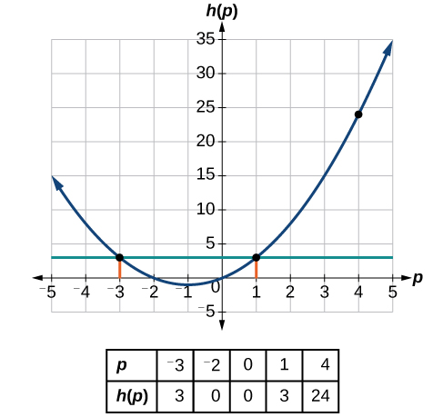{: #Figure_01_01_006}

Given the function<math xmlns="http://www.w3.org/1998/Math/MathML"> <mrow> <mtext> </mtext><mi>g</mi><mrow><mo>(</mo> <mi>m</mi> <mo>)</mo></mrow><mo>=</mo><msqrt> <mrow> <mi>m</mi><mo>−</mo><mn>4</mn></mrow> </msqrt> <mo>,</mo><mtext> </mtext></mrow> </math>

solve<math xmlns="http://www.w3.org/1998/Math/MathML"> <mrow> <mtext> </mtext><mi>g</mi><mrow><mo>(</mo> <mi>m</mi> <mo>)</mo></mrow><mo>=</mo><mn>2.</mn></mrow> </math>

<math xmlns="http://www.w3.org/1998/Math/MathML"> <mrow> <mtext> </mtext><mi>m</mi><mo>=</mo><mn>8</mn><mtext> </mtext></mrow> </math>

#### Evaluating Functions Expressed in Formulas

Some functions are defined by mathematical rules or procedures expressed in **equation**{: data-type="term" .no-emphasis} form. If it is possible to express the function output with a **formula**{: data-type="term" .no-emphasis} involving the input quantity, then we can define a function in algebraic form. For example, the equation<math xmlns="http://www.w3.org/1998/Math/MathML"> <mrow> <mtext> </mtext><mn>2</mn><mi>n</mi><mo>+</mo><mn>6</mn><mi>p</mi><mo>=</mo><mn>12</mn><mtext> </mtext></mrow> </math>

expresses a functional relationship between<math xmlns="http://www.w3.org/1998/Math/MathML"> <mrow> <mtext> </mtext><mi>n</mi><mtext> </mtext></mrow> </math>

 and<math xmlns="http://www.w3.org/1998/Math/MathML"> <mrow> <mtext> </mtext><mi>p</mi><mo>.</mo><mtext> </mtext> </mrow> </math>

We can rewrite it to decide if<math xmlns="http://www.w3.org/1998/Math/MathML"> <mrow> <mtext> </mtext><mi>p</mi><mtext> </mtext></mrow> </math>

is a function of<math xmlns="http://www.w3.org/1998/Math/MathML"> <mrow> <mtext> </mtext><mi>n</mi><mo>.</mo><mtext> </mtext> </mrow> </math>

**Given a function in equation form, write its algebraic formula.**

1.  Solve the equation to isolate the output variable on one side of the equal sign, with the other side as an expression that involves *only* the input variable.
2.  Use all the usual algebraic methods for solving equations, such as adding or subtracting the same quantity to or from both sides, or multiplying or dividing both sides of the equation by the same quantity.
{: type="1"}

Finding an Equation of a Function

Express the relationship<math xmlns="http://www.w3.org/1998/Math/MathML"> <mrow> <mtext> </mtext><mn>2</mn><mi>n</mi><mo>+</mo><mn>6</mn><mi>p</mi><mo>=</mo><mn>12</mn><mtext> </mtext></mrow> </math>

as a function<math xmlns="http://www.w3.org/1998/Math/MathML"> <mrow> <mtext> </mtext><mi>p</mi><mo>=</mo><mi>f</mi><mrow><mo>(</mo> <mi>n</mi> <mo>)</mo></mrow><mo>,</mo><mtext> </mtext></mrow> </math>

if possible.

To express the relationship in this form, we need to be able to write the relationship where<math xmlns="http://www.w3.org/1998/Math/MathML"> <mrow> <mtext> </mtext><mi>p</mi><mtext> </mtext></mrow> </math>

is a function of<math xmlns="http://www.w3.org/1998/Math/MathML"> <mrow> <mtext> </mtext><mi>n</mi><mo>,</mo><mtext> </mtext> </mrow> </math>

which means writing it as<math xmlns="http://www.w3.org/1998/Math/MathML"> <mrow> <mtext> </mtext><mi>p</mi><mo>=</mo><mo stretchy="false">[</mo><mtext>expression</mtext><mtext> </mtext><mtext>involving</mtext><mtext> </mtext><mi>n</mi><mo stretchy="false">]</mo><mo>.</mo></mrow> </math>

<math xmlns="http://www.w3.org/1998/Math/MathML" display="block"> <mrow> <mtable> <mtr rowalign="center"> <mtd columnalign="right" rowalign="center"> <mrow> <mn>2</mn><mi>n</mi><mo>+</mo><mn>6</mn><mi>p</mi> </mrow> </mtd> <mtd rowalign="center"> <mo>=</mo> </mtd> <mtd columnalign="left" rowalign="center"> <mrow> <mn>12</mn> </mrow> </mtd> <mtd rowalign="center" /> </mtr> <mtr rowalign="center"> <mtd columnalign="right" rowalign="center"> <mrow> <mn>6</mn><mi>p</mi> </mrow> </mtd> <mtd rowalign="center"> <mo>=</mo> </mtd> <mtd columnalign="left" rowalign="center"> <mrow> <mn>12</mn><mo>−</mo><mn>2</mn><mi>n</mi> </mrow> </mtd> <mtd columnalign="left" rowalign="center"> <mrow><mspace width="2em" /> <mtext>Subtract </mtext><mn>2</mn><mi>n</mi><mtext> from both sides</mtext><mo>.</mo> </mrow> </mtd> </mtr> <mtr rowalign="center"> <mtd columnalign="right" rowalign="center"> <mi>p</mi> </mtd> <mtd rowalign="center"> <mo>=</mo> </mtd> <mtd columnalign="left" rowalign="center"> <mrow> <mfrac> <mrow> <mn>12</mn><mo>−</mo><mn>2</mn><mi>n</mi> </mrow> <mn>6</mn> </mfrac> </mrow> </mtd> <mtd columnalign="left" rowalign="center"> <mrow><mspace width="2em" /> <mtext>Divide both sides by 6 and simplify</mtext><mo>.</mo> </mrow> </mtd> </mtr> <mtr rowalign="center"> <mtd columnalign="right" rowalign="center"> <mi>p</mi> </mtd> <mtd rowalign="center"> <mo>=</mo> </mtd> <mtd columnalign="left" rowalign="center"> <mrow> <mfrac> <mrow> <mn>12</mn> </mrow> <mn>6</mn> </mfrac> <mo>−</mo><mfrac> <mrow> <mn>2</mn><mi>n</mi> </mrow> <mn>6</mn> </mfrac> </mrow> </mtd> <mtd rowalign="center" /> </mtr> <mtr rowalign="center"> <mtd columnalign="right" rowalign="center"> <mi>p</mi> </mtd> <mtd rowalign="center"> <mo>=</mo> </mtd> <mtd columnalign="left" rowalign="center"> <mrow> <mn>2</mn><mo>−</mo><mfrac> <mn>1</mn> <mn>3</mn> </mfrac> <mi>n</mi> </mrow> </mtd> <mtd rowalign="center" /> </mtr> </mtable> </mrow> </math>

Therefore,<math xmlns="http://www.w3.org/1998/Math/MathML"> <mrow> <mtext> </mtext><mi>p</mi><mtext> </mtext></mrow> </math>

as a function of<math xmlns="http://www.w3.org/1998/Math/MathML"> <mrow> <mtext> </mtext><mi>n</mi><mtext> </mtext></mrow> </math>

is written as

<math xmlns="http://www.w3.org/1998/Math/MathML" display="block"> <mrow> <mi>p</mi><mo>=</mo><mi>f</mi><mrow><mo>(</mo> <mi>n</mi> <mo>)</mo></mrow><mo>=</mo><mn>2</mn><mo>−</mo><mfrac> <mn>1</mn> <mn>3</mn> </mfrac> <mi>n</mi></mrow> </math>

Expressing the Equation of a Circle as a Function

Does the equation<math xmlns="http://www.w3.org/1998/Math/MathML"> <mrow> <mtext> </mtext><msup> <mi>x</mi> <mn>2</mn> </msup> <mo>+</mo><msup> <mi>y</mi> <mn>2</mn> </msup> <mo>=</mo><mn>1</mn><mtext> </mtext></mrow> </math>

represent a function with<math xmlns="http://www.w3.org/1998/Math/MathML"> <mrow> <mtext> </mtext><mi>x</mi><mtext> </mtext></mrow> </math>

as input and<math xmlns="http://www.w3.org/1998/Math/MathML"> <mrow> <mtext> </mtext><mi>y</mi><mtext> </mtext></mrow> </math>

as output? If so, express the relationship as a function<math xmlns="http://www.w3.org/1998/Math/MathML"> <mrow> <mtext> </mtext><mi>y</mi><mo>=</mo><mi>f</mi><mrow><mo>(</mo> <mi>x</mi> <mo>)</mo></mrow><mo>.</mo></mrow> </math>

First we subtract<math xmlns="http://www.w3.org/1998/Math/MathML"> <mrow> <mtext> </mtext><msup> <mi>x</mi> <mn>2</mn> </msup> <mtext> </mtext></mrow> </math>

from both sides.

<math xmlns="http://www.w3.org/1998/Math/MathML" display="block"> <mrow> <msup> <mi>y</mi> <mn>2</mn> </msup> <mo>=</mo><mn>1</mn><mo>−</mo><msup> <mi>x</mi> <mn>2</mn> </msup> </mrow> </math>

We now try to solve for<math xmlns="http://www.w3.org/1998/Math/MathML"> <mrow> <mtext> </mtext><mi>y</mi><mtext> </mtext></mrow> </math>

in this equation.

<math xmlns="http://www.w3.org/1998/Math/MathML" display="block"> <mrow> <mtable> <mtr rowalign="center"> <mtd columnalign="right" rowalign="center"> <mi>y</mi> </mtd> <mtd rowalign="center"> <mo>=</mo> </mtd> <mtd columnalign="left" rowalign="center"> <mrow> <mo>±</mo><msqrt> <mrow> <mn>1</mn><mo>−</mo><msup> <mi>x</mi> <mn>2</mn> </msup> </mrow> </msqrt> </mrow> </mtd> </mtr> <mtr rowalign="center"> <mtd rowalign="center" /> <mtd rowalign="center"> <mo>=</mo> </mtd> <mtd columnalign="left" rowalign="center"> <mrow> <mo>+</mo><msqrt> <mrow> <mn>1</mn><mo>−</mo><msup> <mi>x</mi> <mn>2</mn> </msup> </mrow> </msqrt> <mtext> and </mtext><mo>−</mo><msqrt> <mrow> <mn>1</mn><mo>−</mo><msup> <mi>x</mi> <mn>2</mn> </msup> </mrow> </msqrt> </mrow> </mtd> </mtr> </mtable> </mrow> </math>

We get two outputs corresponding to the same input, so this relationship cannot be represented as a single function<math xmlns="http://www.w3.org/1998/Math/MathML"> <mrow> <mtext> </mtext><mi>y</mi><mo>=</mo><mi>f</mi><mrow><mo>(</mo> <mi>x</mi> <mo>)</mo></mrow><mo>.</mo></mrow> </math>

 If we graph both functions on a graphing calculator, we will get the upper and lower semicircles.

If<math xmlns="http://www.w3.org/1998/Math/MathML"> <mrow> <mtext> </mtext><mi>x</mi><mo>−</mo><mn>8</mn><msup> <mi>y</mi> <mn>3</mn> </msup> <mo>=</mo><mn>0</mn><mo>,</mo><mtext> </mtext></mrow> </math>

express<math xmlns="http://www.w3.org/1998/Math/MathML"> <mrow> <mtext> </mtext><mi>y</mi><mtext> </mtext></mrow> </math>

as a function of<math xmlns="http://www.w3.org/1998/Math/MathML"> <mrow> <mtext> </mtext><mi>x</mi><mo>.</mo> </mrow> </math>

<math xmlns="http://www.w3.org/1998/Math/MathML"> <mrow> <mi>y</mi><mo>=</mo><mi>f</mi><mrow><mo>(</mo> <mi>x</mi> <mo>)</mo></mrow><mo>=</mo><mfrac> <mrow> <mroot> <mi>x</mi> <mn>3</mn> </mroot> </mrow> <mn>2</mn> </mfrac> </mrow> </math>

**Are there relationships expressed by an equation that do represent a function but that still cannot be represented by an algebraic formula?**

*Yes, this can happen. For example, given the equation<math xmlns="http://www.w3.org/1998/Math/MathML"> <mrow> <mtext> </mtext><mi>x</mi><mo>=</mo><mi>y</mi><mo>+</mo><msup> <mn>2</mn> <mi>y</mi> </msup> <mo>,</mo><mtext> </mtext></mrow> </math>

if we want to express<math xmlns="http://www.w3.org/1998/Math/MathML"> <mrow> <mtext> </mtext><mi>y</mi><mtext> </mtext></mrow> </math>

as a function of<math xmlns="http://www.w3.org/1998/Math/MathML"> <mrow> <mtext> </mtext><mi>x</mi><mo>,</mo><mtext> </mtext></mrow> </math>

there is no simple algebraic formula involving only<math xmlns="http://www.w3.org/1998/Math/MathML"> <mrow> <mtext> </mtext><mi>x</mi><mtext> </mtext></mrow> </math>

that equals<math xmlns="http://www.w3.org/1998/Math/MathML"> <mrow> <mtext> </mtext><mi>y</mi><mo>.</mo><mtext> </mtext></mrow> </math>

However, each<math xmlns="http://www.w3.org/1998/Math/MathML"> <mrow> <mtext> </mtext><mi>x</mi><mtext> </mtext></mrow> </math>

does determine a unique value for<math xmlns="http://www.w3.org/1998/Math/MathML"> <mrow> <mtext> </mtext><mi>y</mi><mo>,</mo><mtext> </mtext></mrow> </math>

and there are mathematical procedures by which<math xmlns="http://www.w3.org/1998/Math/MathML"> <mrow> <mtext> </mtext><mi>y</mi><mtext> </mtext></mrow> </math>

can be found to any desired accuracy. In this case, we say that the equation gives an implicit (implied) rule for<math xmlns="http://www.w3.org/1998/Math/MathML"> <mrow> <mtext> </mtext><mi>y</mi><mtext> </mtext></mrow> </math>

as a function of<math xmlns="http://www.w3.org/1998/Math/MathML"> <mrow> <mtext> </mtext><mi>x</mi><mo>,</mo><mtext> </mtext></mrow> </math>

even though the formula cannot be written explicitly.*

#### Evaluating a Function Given in Tabular Form

As we saw above, we can represent functions in tables. Conversely, we can use information in tables to write functions, and we can evaluate functions using the tables. For example, how well do our pets recall the fond memories we share with them? There is an urban legend that a goldfish has a memory of 3 seconds, but this is just a myth. Goldfish can remember up to 3 months, while the beta fish has a memory of up to 5 months. And while a puppy’s memory span is no longer than 30 seconds, the adult dog can remember for 5 minutes. This is meager compared to a cat, whose memory span lasts for 16 hours.

The function that relates the type of pet to the duration of its memory span is more easily visualized with the use of a table. See [\[link\]](#Table_01_01_10).[2](#footnote2){: data-type="footnote-link"}

<table id="Table_01_01_10" summary="Six rows and two columns. The first column is labeled, &#x201C;pet&#x201D;, and the second column is labeled, &#x201C;memory span in hours&#x201D;. Reading the rows as ordered pairs, we have: (puppy, 0.008), (adult dog, 0.083), (cat, 16), (goldfish, 2100), and (beta fish, 3600)."><colgroup><col data-width="85" data-align="center" /><col data-align="center" /></colgroup><thead>
      <tr>
       <th>Pet</th>
       <th>Memory span in hours</th>
      </tr>
     </thead><tbody>
      <tr>
       <td>Puppy</td>
       <td>0.008</td>
      </tr>
      <tr>
       <td>Adult dog </td>
       <td>0.083</td>
      </tr>
      <tr>
       <td>Cat</td>
       <td>16</td>
      </tr>
      <tr>
       <td>Goldfish</td>
       <td>2160</td>
      </tr>
      <tr>
       <td>Beta fish</td>
       <td>3600</td>
      </tr>
     </tbody></table>

At times, evaluating a function in table form may be more useful than using equations. Here let us call the function <math xmlns="http://www.w3.org/1998/Math/MathML"> <mrow> <mi>P</mi><mo>.</mo> </mrow> </math>

 The **domain**{: data-type="term" .no-emphasis} of the function is the type of pet and the range is a real number representing the number of hours the pet’s memory span lasts. We can evaluate the function<math xmlns="http://www.w3.org/1998/Math/MathML"> <mrow> <mtext> </mtext><mi>P</mi><mtext> </mtext></mrow> </math>

at the input value of “goldfish.” We would write <math xmlns="http://www.w3.org/1998/Math/MathML"> <mrow> <mi>P</mi><mo stretchy="false">(</mo><mtext>goldfish</mtext><mo stretchy="false">)</mo><mo>=</mo><mn>2160.</mn> </mrow> </math>

 Notice that, to evaluate the function in table form, we identify the input value and the corresponding output value from the pertinent row of the table. The tabular form for function<math xmlns="http://www.w3.org/1998/Math/MathML"> <mrow> <mtext> </mtext><mi>P</mi><mtext> </mtext></mrow> </math>

seems ideally suited to this function, more so than writing it in paragraph or function form.

<strong>Given a function represented by a table, identify specific output and input values. </strong>

1.  Find the given input in the row (or column) of input values.
2.  Identify the corresponding output value paired with that input value.
3.  Find the given output values in the row (or column) of output values, noting every time that output value appears.
4.  Identify the input value(s) corresponding to the given output value.
{: type="1"}

Evaluating and Solving a Tabular Function

Using [[link]](#Table_01_01_11),

1.  Evaluate
    <math xmlns="http://www.w3.org/1998/Math/MathML"> <mrow> <mtext> </mtext><mi>g</mi><mrow><mo>(</mo> <mn>3</mn> <mo>)</mo></mrow><mo>.</mo></mrow> </math>

2.  Solve
    <math xmlns="http://www.w3.org/1998/Math/MathML"> <mrow> <mtext> </mtext><mi>g</mi><mrow><mo>(</mo> <mi>n</mi> <mo>)</mo></mrow><mo>=</mo><mn>6.</mn></mrow> </math>
{: type="a"}

<table id="Table_01_01_11" summary="Two rows and six columns. The first row is labeled, &#x201C;n&#x201D; and the second row is labeled, &#x201C;g(n)&#x201D;. Reading the columns as ordered pairs, we have: (1, 8), (2, 6), (3, 7), (4, 6) , and (5, 8)."><colgroup><col data-align="left" /><col data-width="40" data-align="left" /><col data-width="40" data-align="left" /><col data-width="40" data-align="left" /><col data-width="40" data-align="left" /><col data-width="40" data-align="left" /></colgroup><tbody>
         <tr>
          <td data-align="center"><strong><math xmlns="http://www.w3.org/1998/Math/MathML">
 <mi>n</mi>
</math></strong></td>
          <td data-align="center">1</td>
          <td data-align="center">2</td>
          <td data-align="center">3</td>
          <td data-align="center">4</td>
          <td data-align="center">5</td>
         </tr>
        
        
         <tr>
          <td data-align="center"><strong><math xmlns="http://www.w3.org/1998/Math/MathML">
 <mrow>
  <mi>g</mi><mrow><mo>(</mo>
   <mi>n</mi>
  <mo>)</mo></mrow></mrow>
</math></strong></td>
          <td data-align="center">8</td>
          <td data-align="center">6</td>
          <td data-align="center">7</td>
          <td data-align="center">6</td>
          <td data-align="center">8</td>
         </tr>
        </tbody></table>

1.  Evaluating
    <math xmlns="http://www.w3.org/1998/Math/MathML"> <mrow> <mi>g</mi><mo stretchy="false">(</mo><mn>3</mn><mo stretchy="false">)</mo> </mrow> </math>
    
    means determining the output value of the function
    <math xmlns="http://www.w3.org/1998/Math/MathML"> <mi>g</mi> </math>
    
    for the input value of
    <math xmlns="http://www.w3.org/1998/Math/MathML"> <mrow> <mi>n</mi><mo>=</mo><mn>3.</mn> </mrow> </math>
    
    The table output value corresponding to
    <math xmlns="http://www.w3.org/1998/Math/MathML"> <mrow> <mi>n</mi><mo>=</mo><mn>3</mn> </mrow> </math>
    
    is 7, so
    <math xmlns="http://www.w3.org/1998/Math/MathML"> <mrow> <mi>g</mi><mo stretchy="false">(</mo><mn>3</mn><mo stretchy="false">)</mo><mo>=</mo><mn>7.</mn> </mrow> </math>

2.  Solving
    <math xmlns="http://www.w3.org/1998/Math/MathML"> <mrow> <mi>g</mi><mo stretchy="false">(</mo><mi>n</mi><mo stretchy="false">)</mo><mo>=</mo><mn>6</mn> </mrow> </math>
    
    means identifying the input values,
    <math xmlns="http://www.w3.org/1998/Math/MathML"> <mrow> <mi>n</mi><mo>,</mo> </mrow> </math>
    
    that produce an output value of 6. [[link]](#Table_01_01_12) shows two solutions:
    <math xmlns="http://www.w3.org/1998/Math/MathML"> <mrow> <mn>2</mn> </mrow> </math>
    
    and
    <math xmlns="http://www.w3.org/1998/Math/MathML"> <mrow> <mn>4.</mn> </mrow> </math>
{: type="a"}

<table id="Table_01_01_12" summary="Two rows and six columns. The first row is labeled, &#x201C;n&#x201D; and the second row is labeled, &#x201C;g(n)&#x201D;. Reading the columns as ordered pairs, we have: (1, 8), (2, 6), (3, 7), (4, 6) , and (5, 8)."><colgroup><col /><col data-width="40" /><col data-width="40" /><col data-width="40" /><col data-width="40" /><col data-width="40" /></colgroup><tbody>
         <tr>
          <td data-align="center"><strong><math xmlns="http://www.w3.org/1998/Math/MathML">
 <mi>n</mi>
</math></strong></td>
          <td data-align="center">1</td>
          <td data-align="center"><strong>2</strong></td>
          <td data-align="center">3</td>
          <td data-align="center"><strong>4</strong></td>
          <td data-align="center">5</td>
         </tr>
        
        
         <tr>
          <td data-align="center"><strong><math xmlns="http://www.w3.org/1998/Math/MathML">
 <mrow>
  <mi>g</mi><mrow><mo>(</mo>
   <mi>n</mi>
  <mo>)</mo></mrow></mrow>
</math></strong>
</td>
          <td data-align="center">8</td>
          <td data-align="center"><strong>6</strong></td>
          <td data-align="center">7</td>
          <td data-align="center"><strong>6</strong></td>
          <td data-align="center">8</td>
         </tr>
        </tbody></table>
When we input 2 into the function<math xmlns="http://www.w3.org/1998/Math/MathML"> <mrow> <mtext> </mtext><mi>g</mi><mo>,</mo><mtext> </mtext></mrow> </math>

our output is 6. When we input 4 into the function<math xmlns="http://www.w3.org/1998/Math/MathML"> <mrow> <mtext> </mtext><mi>g</mi><mo>,</mo><mtext> </mtext></mrow> </math>

our output is also 6.

Using [[link]](#Table_01_01_11), evaluate<math xmlns="http://www.w3.org/1998/Math/MathML"> <mrow> <mtext> </mtext><mi>g</mi><mrow><mo>(</mo> <mn>1</mn> <mo>)</mo></mrow><mo>.</mo></mrow> </math>

<math xmlns="http://www.w3.org/1998/Math/MathML"> <mrow> <mi>g</mi><mrow><mo>(</mo> <mn>1</mn> <mo>)</mo></mrow><mo>=</mo><mn>8</mn></mrow> </math>

#### Finding Function Values from a Graph 

Evaluating a function using a graph also requires finding the corresponding output value for a given input value, only in this case, we find the output value by looking at the graph. Solving a function equation using a graph requires finding all instances of the given output value on the graph and observing the corresponding input value(s).

Reading Function Values from a Graph

Given the graph in [[link]](#Figure_01_01_007),

1.  Evaluate
    <math xmlns="http://www.w3.org/1998/Math/MathML"> <mrow> <mtext> </mtext><mi>f</mi><mrow><mo>(</mo> <mn>2</mn> <mo>)</mo></mrow><mo>.</mo></mrow> </math>

2.  Solve
    <math xmlns="http://www.w3.org/1998/Math/MathML"> <mrow> <mtext> </mtext><mi>f</mi><mrow><mo>(</mo> <mi>x</mi> <mo>)</mo></mrow><mo>=</mo><mn>4.</mn></mrow> </math>
{: type="a"}

{: #Figure_01_01_007}

1.  To evaluate
    <math xmlns="http://www.w3.org/1998/Math/MathML"> <mrow> <mtext> </mtext><mi>f</mi><mrow><mo>(</mo> <mn>2</mn> <mo>)</mo></mrow><mo>,</mo><mtext> </mtext></mrow> </math>
    
    locate the point on the curve where
    <math xmlns="http://www.w3.org/1998/Math/MathML"> <mrow> <mtext> </mtext><mi>x</mi><mo>=</mo><mn>2</mn><mo>,</mo><mtext> </mtext></mrow> </math>
    
    then read the *y*-coordinate of that point. The point has coordinates
    <math xmlns="http://www.w3.org/1998/Math/MathML"> <mrow> <mtext> </mtext><mo stretchy="false">(</mo><mn>2</mn><mo>,</mo><mn>1</mn><mo stretchy="false">)</mo><mo>,</mo><mtext> </mtext> </mrow> </math>
    
    so
    <math xmlns="http://www.w3.org/1998/Math/MathML"> <mrow> <mtext> </mtext><mi>f</mi><mrow><mo>(</mo> <mn>2</mn> <mo>)</mo></mrow><mo>=</mo><mn>1.</mn><mtext> </mtext></mrow> </math>
    
    See [[link]](#Figure_01_01_008). 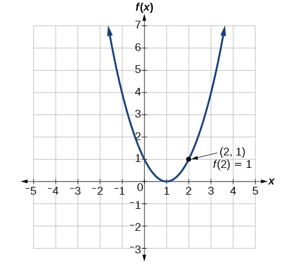{: #Figure_01_01_008}

2.  To solve
    <math xmlns="http://www.w3.org/1998/Math/MathML"> <mrow> <mtext> </mtext><mi>f</mi><mrow><mo>(</mo> <mi>x</mi> <mo>)</mo></mrow><mo>=</mo><mn>4,</mn><mtext> </mtext></mrow> </math>
    
    we find the output value
    <math xmlns="http://www.w3.org/1998/Math/MathML"> <mrow> <mtext> </mtext><mn>4</mn><mtext> </mtext> </mrow> </math>
    
    on the vertical axis. Moving horizontally along the line
    <math xmlns="http://www.w3.org/1998/Math/MathML"> <mrow> <mtext> </mtext><mi>y</mi><mo>=</mo><mn>4</mn><mo>,</mo><mtext> </mtext></mrow> </math>
    
    we locate two points of the curve with output value
    <math xmlns="http://www.w3.org/1998/Math/MathML"> <mrow> <mtext> </mtext><mn>4:</mn> </mrow> </math>
    
    <math xmlns="http://www.w3.org/1998/Math/MathML"> <mrow> <mo stretchy="false">(</mo><mn>−1</mn><mo>,</mo><mn>4</mn><mo stretchy="false">)</mo><mtext> </mtext> </mrow> </math>
    
    and
    <math xmlns="http://www.w3.org/1998/Math/MathML"> <mrow> <mtext> </mtext><mo stretchy="false">(</mo><mn>3</mn><mo>,</mo><mn>4</mn><mo stretchy="false">)</mo><mo>.</mo><mtext> </mtext> </mrow> </math>
    
    These points represent the two solutions to
    <math xmlns="http://www.w3.org/1998/Math/MathML"> <mrow> <mtext> </mtext><mi>f</mi><mrow><mo>(</mo> <mi>x</mi> <mo>)</mo></mrow><mo>=</mo><mn>4:</mn></mrow> </math>
    
    <math xmlns="http://www.w3.org/1998/Math/MathML"> <mrow> <mn>−1</mn><mtext> </mtext></mrow> </math>
    
    or
    <math xmlns="http://www.w3.org/1998/Math/MathML"> <mrow> <mtext> </mtext><mn>3.</mn><mtext> </mtext></mrow> </math>
    
    This means
    <math xmlns="http://www.w3.org/1998/Math/MathML"> <mrow> <mtext> </mtext><mi>f</mi><mrow><mo>(</mo> <mrow> <mn>−1</mn></mrow> <mo>)</mo></mrow><mo>=</mo><mn>4</mn><mtext> </mtext></mrow> </math>
    
    and
    <math xmlns="http://www.w3.org/1998/Math/MathML"> <mrow> <mtext> </mtext><mi>f</mi><mrow><mo>(</mo> <mn>3</mn> <mo>)</mo></mrow><mo>=</mo><mn>4</mn><mo>,</mo><mtext> </mtext></mrow> </math>
    
    or when the input is
    <math xmlns="http://www.w3.org/1998/Math/MathML"> <mrow> <mtext> </mtext><mn>−1</mn><mtext> </mtext></mrow> </math>
    
    or
    <math xmlns="http://www.w3.org/1998/Math/MathML"> <mrow> <mtext>3,</mtext><mtext> </mtext> </mrow> </math>
    
    the output is
    <math xmlns="http://www.w3.org/1998/Math/MathML"> <mrow> <mtext> </mtext><mtext>4</mtext><mtext>.</mtext><mtext> </mtext> </mrow> </math>
    
    See [[link]](#Figure_01_01_009). 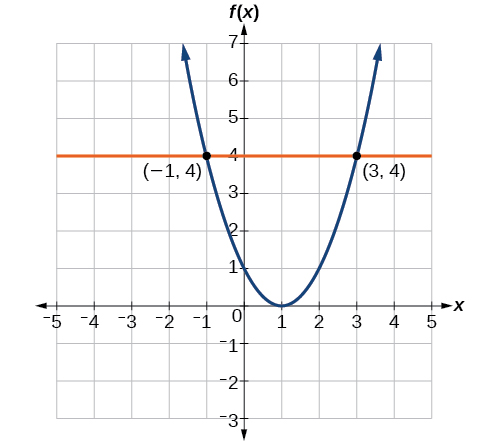{: #Figure_01_01_009}

{: type="a"}

Using [[link]](#Figure_01_01_007), solve<math xmlns="http://www.w3.org/1998/Math/MathML"> <mrow> <mtext> </mtext><mi>f</mi><mrow><mo>(</mo> <mi>x</mi> <mo>)</mo></mrow><mo>=</mo><mn>1.</mn></mrow> </math>

<math xmlns="http://www.w3.org/1998/Math/MathML"> <mrow> <mi>x</mi><mo>=</mo><mn>0</mn><mtext> </mtext></mrow> </math>

or<math xmlns="http://www.w3.org/1998/Math/MathML"> <mrow> <mtext> </mtext><mi>x</mi><mo>=</mo><mn>2</mn><mtext> </mtext></mrow> </math>

### Determining Whether a Function is One-to-One 

Some functions have a given output value that corresponds to two or more input values. For example, in the stock chart shown in [\[link\]](/51260#Figure_01_00_001) at the beginning of this chapter, the stock price was $1000 on five different dates, meaning that there were five different input values that all resulted in the same output value of $1000.

However, some functions have only one input value for each output value, as well as having only one output for each input. We call these functions one-to-one functions. As an example, consider a school that uses only letter grades and decimal equivalents, as listed in [\[link\]](#Table_01_01_13).

<table id="Table_01_01_13" summary="Two columns and five rows. The first column is labeled, &#x201C;Letter Grade&#x201D;, and the second column is labeled, &#x201C;Grade point average&#x201D;. Reading the rows as ordered pairs, we have: (A, 4.0), (B, 3.0), (C, 2.0), and (D, 1.0)."><colgroup><col data-align="center" /><col data-align="center" /></colgroup><thead>
     <tr>
      <th>Letter grade</th>
      <th>Grade point average</th>
     </tr>
    </thead><tbody>
     <tr>
      <td>A</td>
      <td>4.0</td>
     </tr>
     <tr>
      <td>B</td>
      <td>3.0</td>
     </tr>
     <tr>
      <td>C</td>
      <td>2.0</td>
     </tr>
     <tr>
      <td>D</td>
      <td>1.0</td>
     </tr>
    </tbody></table>

This grading system represents a one-to-one function because each letter input yields one particular grade-point average output and each grade-point average corresponds to one input letter.

To visualize this concept, let’s look again at the two simple functions sketched in [\[link\]](#Figure_01_01_001)<strong>(a) </strong>and [\[link\]](#Figure_01_01_001)**(b)**. The function in part (a) shows a relationship that is not a one-to-one function because inputs<math xmlns="http://www.w3.org/1998/Math/MathML"> <mrow> <mtext> </mtext><mi>q</mi><mtext> </mtext></mrow> </math>

and<math xmlns="http://www.w3.org/1998/Math/MathML"> <mrow> <mtext> </mtext><mi>r</mi><mtext> </mtext></mrow> </math>

both give output<math xmlns="http://www.w3.org/1998/Math/MathML"> <mrow> <mtext> </mtext><mi>n</mi><mo>.</mo><mtext> </mtext></mrow> </math>

The function in part (b) shows a relationship that is a one-to-one function because each input is associated with a single output.

One-to-One Function

A **one-to-one function**{: data-type="term"} is a function in which each output value corresponds to exactly one input value. There are no repeated *x*- or *y*-values.

Determining Whether a Relationship Is a One-to-One Function

Is the area of a circle a function of its radius? If yes, is the function one-to-one?

A circle of radius <math xmlns="http://www.w3.org/1998/Math/MathML"> <mrow> <mtext> </mtext><mi>r</mi><mtext> </mtext></mrow> </math>

has a unique area measure given by<math xmlns="http://www.w3.org/1998/Math/MathML"> <mrow> <mtext> </mtext><mi>A</mi><mo>=</mo><mi>π</mi><msup> <mi>r</mi> <mn>2</mn> </msup> <mo>,</mo></mrow> </math>

so for any input,<math xmlns="http://www.w3.org/1998/Math/MathML"> <mrow> <mtext> </mtext><mi>r</mi><mo>,</mo><mtext> </mtext></mrow> </math>

there is only one output, <math xmlns="http://www.w3.org/1998/Math/MathML"><mrow><mi>A</mi><mo>.</mo></mrow></math>

 The area is a function of radius<math xmlns="http://www.w3.org/1998/Math/MathML"> <mrow> <mtext> </mtext><mi>r</mi><mo>.</mo></mrow> </math>

If the function is one-to-one, the output value, the area, must correspond to a unique input value, the radius. Any area measure<math xmlns="http://www.w3.org/1998/Math/MathML"> <mrow> <mtext> </mtext><mi>A</mi><mtext> </mtext></mrow> </math>

is given by the formula<math xmlns="http://www.w3.org/1998/Math/MathML"> <mrow> <mtext> </mtext><mi>A</mi><mo>=</mo><mi>π</mi><msup> <mi>r</mi> <mn>2</mn> </msup> <mo>.</mo><mtext> </mtext></mrow> </math>

Because areas and radii are positive numbers, there is exactly one solution:<math xmlns="http://www.w3.org/1998/Math/MathML"> <mrow> <msqrt> <mrow> <mfrac> <mi>A</mi> <mi>π</mi> </mfrac> </mrow> </msqrt> <mo>.</mo> </mrow> </math>

So the area of a circle is a one-to-one function of the circle’s radius.

1.  Is a balance a function of the bank account number?
2.  Is a bank account number a function of the balance?
3.  Is a balance a one-to-one function of the bank account number?
{: type="a"}

a. yes, because each bank account has a single balance at any given time; b. no, because several bank account numbers may have the same balance; c. no, because the same output may correspond to more than one input.

1.  If each percent grade earned in a course translates to one letter grade, is the letter grade a function of the percent grade?
2.  If so, is the function one-to-one?
{: type="a"}

1.  Yes, letter grade is a function of percent grade;
2.  No, it is not one-to-one. There are 100 different percent numbers we could get but only about five possible letter grades, so there cannot be only one percent number that corresponds to each letter grade.
{: type="a"}

### Using the Vertical Line Test

As we have seen in some examples above, we can represent a function using a graph. Graphs display a great many input-output pairs in a small space. The visual information they provide often makes relationships easier to understand. By convention, graphs are typically constructed with the input values along the horizontal axis and the output values along the vertical axis.

The most common graphs name the input value<math xmlns="http://www.w3.org/1998/Math/MathML"> <mrow> <mtext> </mtext><mi>x</mi><mtext> </mtext></mrow> </math>

and the output value<math xmlns="http://www.w3.org/1998/Math/MathML"> <mrow> <mtext> </mtext><mi>y</mi><mo>,</mo><mtext> </mtext></mrow> </math>

and we say<math xmlns="http://www.w3.org/1998/Math/MathML"> <mrow> <mtext> </mtext><mi>y</mi><mtext> </mtext></mrow> </math>

is a function of<math xmlns="http://www.w3.org/1998/Math/MathML"> <mrow> <mtext> </mtext><mi>x</mi><mo>,</mo><mtext> </mtext></mrow> </math>

or<math xmlns="http://www.w3.org/1998/Math/MathML"> <mrow> <mtext> </mtext><mi>y</mi><mo>=</mo><mi>f</mi><mrow><mo>(</mo> <mi>x</mi> <mo>)</mo></mrow><mtext> </mtext></mrow> </math>

when the function is named<math xmlns="http://www.w3.org/1998/Math/MathML"> <mrow> <mtext> </mtext><mi>f</mi><mo>.</mo><mtext> </mtext></mrow> </math>

The graph of the function is the set of all points<math xmlns="http://www.w3.org/1998/Math/MathML"> <mrow> <mtext> </mtext><mo stretchy="false">(</mo><mi>x</mi><mo>,</mo><mi>y</mi><mo stretchy="false">)</mo><mtext> </mtext></mrow> </math>

in the plane that satisfies the equation<math xmlns="http://www.w3.org/1998/Math/MathML"> <mrow> <mi>y</mi><mo>=</mo><mi>f</mi><mrow><mo>(</mo> <mi>x</mi> <mo>)</mo></mrow><mo>.</mo><mtext> </mtext></mrow> </math>

If the function is defined for only a few input values, then the graph of the function consists of only a few points, where the *x*-coordinate of each point is an input value and the *y*-coordinate of each point is the corresponding output value. For example, the black dots on the graph in [\[link\]](#Figure_01_01_011) tell us that<math xmlns="http://www.w3.org/1998/Math/MathML"> <mrow> <mtext> </mtext><mi>f</mi><mrow><mo>(</mo> <mn>0</mn> <mo>)</mo></mrow><mo>=</mo><mn>2</mn><mtext> </mtext></mrow> </math>

and<math xmlns="http://www.w3.org/1998/Math/MathML"> <mrow> <mtext> </mtext><mi>f</mi><mrow><mo>(</mo> <mn>6</mn> <mo>)</mo></mrow><mo>=</mo><mn>1.</mn><mtext> </mtext></mrow> </math>

However, the set of all points<math xmlns="http://www.w3.org/1998/Math/MathML"> <mrow> <mtext> </mtext><mo stretchy="false">(</mo><mi>x</mi><mo>,</mo><mi>y</mi><mo stretchy="false">)</mo><mtext> </mtext></mrow> </math>

satisfying<math xmlns="http://www.w3.org/1998/Math/MathML"> <mrow> <mtext> </mtext><mi>y</mi><mo>=</mo><mi>f</mi><mrow><mo>(</mo> <mi>x</mi> <mo>)</mo></mrow><mtext> </mtext></mrow> </math>

is a curve. The curve shown includes<math xmlns="http://www.w3.org/1998/Math/MathML"> <mrow> <mtext> </mtext><mo stretchy="false">(</mo><mn>0</mn><mo>,</mo><mn>2</mn><mo stretchy="false">)</mo><mtext> </mtext></mrow> </math>

and<math xmlns="http://www.w3.org/1998/Math/MathML"> <mrow> <mtext> </mtext><mo stretchy="false">(</mo><mn>6</mn><mo>,</mo><mn>1</mn><mo stretchy="false">)</mo><mtext> </mtext></mrow> </math>

because the curve passes through those points.

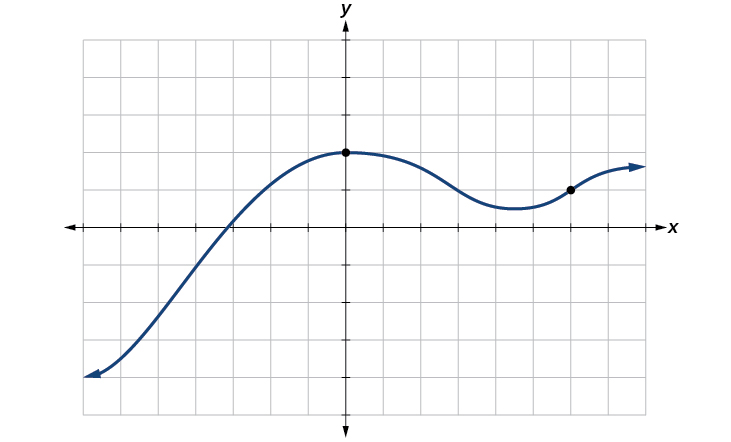{: #Figure_01_01_011}

The **vertical line test**{: data-type="term"} can be used to determine whether a graph represents a function. If we can draw any vertical line that intersects a graph more than once, then the graph does *not* define a function because a function has only one output value for each input value. See [\[link\]](#Figure_01_01_012).

 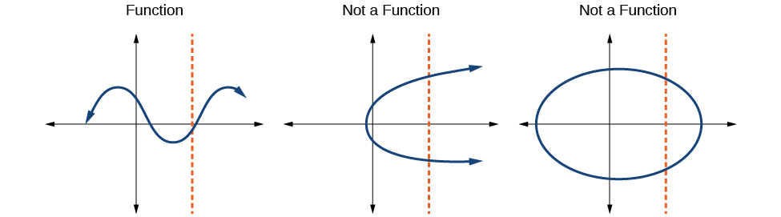{: #Figure_01_01_012}

<strong>Given a graph, use the vertical line test to determine if the graph represents a function. </strong>

1.  Inspect the graph to see if any vertical line drawn would intersect the curve more than once.
2.  If there is any such line, determine that the graph does not represent a function.
{: type="1"}

Applying the Vertical Line Test

Which of the graphs in [[link]](#Figure_01_01_013) represent(s) a function<math xmlns="http://www.w3.org/1998/Math/MathML"> <mrow> <mtext> </mtext><mi>y</mi><mo>=</mo><mi>f</mi><mrow><mo>(</mo> <mi>x</mi> <mo>)</mo></mrow><mo>?</mo></mrow> </math>

{: #Figure_01_01_013}

If any vertical line intersects a graph more than once, the relation represented by the graph is not a function. Notice that any vertical line would pass through only one point of the two graphs shown in parts (a) and (b) of [[link]](#Figure_01_01_013). From this we can conclude that these two graphs represent functions. The third graph does not represent a function because, at most *x*-values, a vertical line would intersect the graph at more than one point, as shown in [[link]](#Figure_01_01_016).

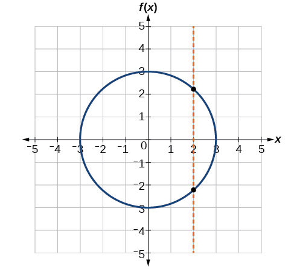{: #Figure_01_01_016}

Does the graph in [[link]](#Figure_01_01_017) represent a function?

{: #Figure_01_01_017}

yes

###  Using the Horizontal Line Test

Once we have determined that a graph defines a function, an easy way to determine if it is a one-to-one function is to use the **horizontal line test**{: data-type="term"}. Draw horizontal lines through the graph. If any horizontal line intersects the graph more than once, then the graph does not represent a one-to-one function.

<strong>Given a graph of a function, use the horizontal line test to determine if the graph represents a one-to-one function. </strong>

1.  Inspect the graph to see if any horizontal line drawn would intersect the curve more than once.
2.  If there is any such line, determine that the function is not one-to-one.
{: type="1"}

Applying the Horizontal Line Test

Consider the functions shown in [[link]](#Figure_01_01_013)**(a)** and [[link]](#Figure_01_01_013)**(b)**. Are either of the functions one-to-one?

The function in [[link]](#Figure_01_01_013)<strong>(a) </strong>is not one-to-one. The horizontal line shown in [[link]](#Figure_01_01_010) intersects the graph of the function at two points (and we can even find horizontal lines that intersect it at three points.)

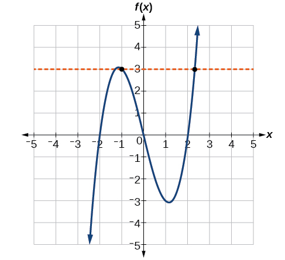{: #Figure_01_01_010}

The function in [[link]](#Figure_01_01_013)**(b)** is one-to-one. Any horizontal line will intersect a diagonal line at most once.

Is the graph shown in [[link]](#Figure_01_01_016) one-to-one?

No, because it does not pass the horizontal line test.

### Identifying Basic Toolkit Functions

In this text, we will be exploring functions—the shapes of their graphs, their unique characteristics, their algebraic formulas, and how to solve problems with them. When learning to read, we start with the alphabet. When learning to do arithmetic, we start with numbers. When working with functions, it is similarly helpful to have a base set of building-block elements. We call these our “toolkit functions,” which form a set of basic named functions for which we know the graph, formula, and special properties. Some of these functions are programmed to individual buttons on many calculators. For these definitions we will use<math xmlns="http://www.w3.org/1998/Math/MathML"> <mrow> <mtext> </mtext><mi>x</mi><mtext> </mtext></mrow> </math>

as the input variable and<math xmlns="http://www.w3.org/1998/Math/MathML"> <mrow> <mtext> </mtext><mi>y</mi><mo>=</mo><mi>f</mi><mrow><mo>(</mo> <mi>x</mi> <mo>)</mo></mrow><mtext> </mtext></mrow> </math>

as the output variable.

We will see these toolkit functions, combinations of toolkit functions, their graphs, and their transformations frequently throughout this book. It will be very helpful if we can recognize these toolkit functions and their features quickly by name, formula, graph, and basic table properties. The graphs and sample table values are included with each function shown in [\[link\]](#Table_01_01_14).

<table id="Table_01_01_14" summary="The title is &#x201C;Toolkit functions&#x201D;. There are three columns and ten rows. The first column is labeled, &#x201C;name&#x201D;, the second column is labeled, &#x201C;function&#x201D;, and the third column is labeled graph which contains pictures of the functions. The constant function is f(x) = c where c is the constant; the identity function is f(x) = x; the absolute function is f(x)=|x|; the quadratic function is f(x) = x^2; the cubic function is f(x)=x^3; the reciprocal function is f(x)=1/x; the reciprocal squared function is f(x)=1/x^2; the square root function is f(x)=sqrt(x); the cube root function is f(x) = x^(1/3)."><thead>
     <tr>
      <th colspan="3">Toolkit Functions</th>
     </tr>
     <tr>
      <th>Name</th>
      <th>Function</th>
      <th>Graph</th>
     </tr>
    </thead><tbody>
     <tr valign="top">
      <td data-align="left">Constant</td>
      <td data-align="left"><math xmlns="http://www.w3.org/1998/Math/MathML">
       <mrow>
        <mi>f</mi><mrow><mo>(</mo>
         <mi>x</mi>
         <mo>)</mo></mrow><mo>=</mo><mi>c</mi><mo>,</mo><mtext> </mtext></mrow>
      </math>where <math xmlns="http://www.w3.org/1998/Math/MathML">
 <mrow><mi>c</mi>
 </mrow>
</math> is a constant </td>
      <td data-align="left">
        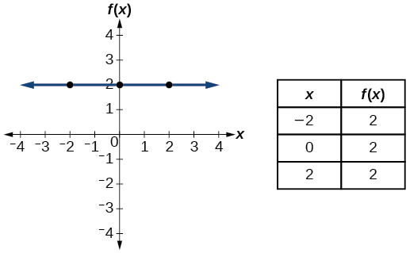
</td>
     </tr>
     <tr valign="top">
      <td data-align="left">Identity</td>
      <td data-align="left"><math xmlns="http://www.w3.org/1998/Math/MathML">
       <mrow>
        <mi>f</mi><mrow><mo>(</mo>
         <mi>x</mi>
         <mo>)</mo></mrow><mo>=</mo><mi>x</mi></mrow>
      </math>
      </td>
      <td data-align="left"> 
       
        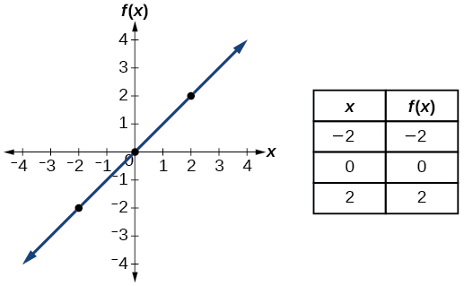
       
      </td>
     </tr>
     <tr valign="top">
      <td data-align="left">Absolute value</td>
      <td data-align="left"><math xmlns="http://www.w3.org/1998/Math/MathML">
       <mrow>
        <mi>f</mi><mrow><mo>(</mo>
         <mi>x</mi>
         <mo>)</mo></mrow><mo>=</mo><mrow><mo>\|</mo> <mi>x</mi> <mo>\|</mo></mrow></mrow>
      </math>
      </td>
      <td data-align="left">
       
        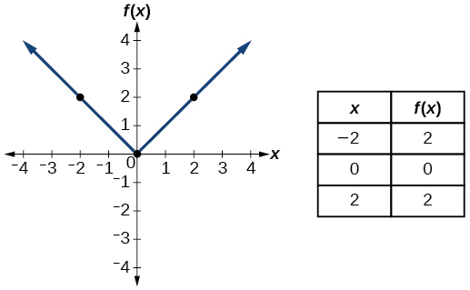
       
      </td>
     </tr>
     <tr valign="top">
      <td data-align="left">Quadratic</td>
      <td data-align="left"><math xmlns="http://www.w3.org/1998/Math/MathML">
       <mrow>
        <mi>f</mi><mrow><mo>(</mo>
         <mi>x</mi>
         <mo>)</mo></mrow><mo>=</mo><msup>
          <mi>x</mi>
          <mn>2</mn>
         </msup>
       </mrow>
      </math>
      </td>
      <td data-align="left">
       
        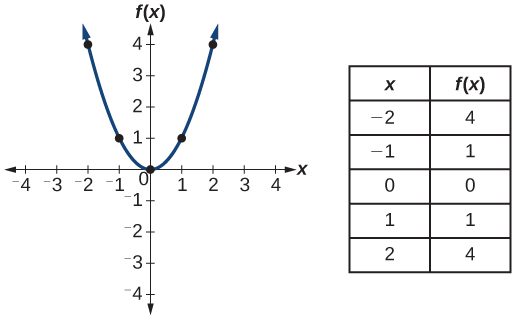
       
      </td>
     </tr>
     <tr valign="top">
      <td data-align="left">Cubic</td>
      <td data-align="left"><math xmlns="http://www.w3.org/1998/Math/MathML">
       <mrow>
        <mi>f</mi><mrow><mo>(</mo>
         <mi>x</mi>
         <mo>)</mo></mrow><mo>=</mo><msup>
          <mi>x</mi>
          <mn>3</mn>
         </msup>
       </mrow>
      </math>
      </td>
      <td data-align="left">
       
        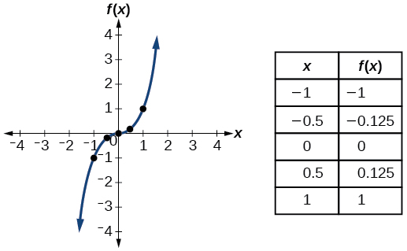
       
      </td>
     </tr>
     <tr valign="top">
      <td data-align="left">Reciprocal</td>
      <td data-align="left"><math xmlns="http://www.w3.org/1998/Math/MathML">
       <mrow>
        <mi>f</mi><mrow><mo>(</mo>
         <mi>x</mi>
         <mo>)</mo></mrow><mo>=</mo><mfrac>
          <mn>1</mn>
          <mi>x</mi>
         </mfrac>
       </mrow>
      </math>
      </td>
      <td data-align="left">
       
        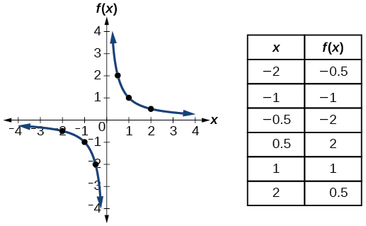
       
      </td>
     </tr>
     <tr valign="top">
      <td data-align="left">Reciprocal squared</td>
      <td data-align="left"><math xmlns="http://www.w3.org/1998/Math/MathML">
       <mrow>
        <mi>f</mi><mrow><mo>(</mo>
         <mi>x</mi>
         <mo>)</mo></mrow><mo>=</mo><mfrac>
          <mn>1</mn>
          <mrow>
           <msup>
            <mi>x</mi>
            <mn>2</mn>
           </msup>
          </mrow>
         </mfrac>
       </mrow>
      </math>
      </td>
      <td data-align="left">
       
        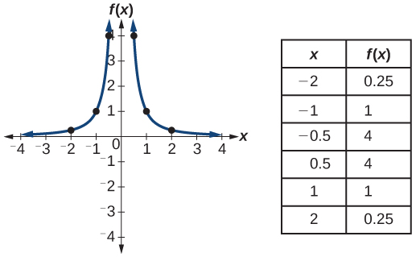
       
      </td>
     </tr>
     <tr valign="top">
      <td data-align="left">Square root</td>
      <td data-align="left"><math xmlns="http://www.w3.org/1998/Math/MathML">
       <mrow>
        <mi>f</mi><mrow><mo>(</mo>
         <mi>x</mi>
         <mo>)</mo></mrow><mo>=</mo><msqrt>
          <mi>x</mi>
         </msqrt>
       </mrow>
      </math>
      </td>
      <td data-align="left">
       
        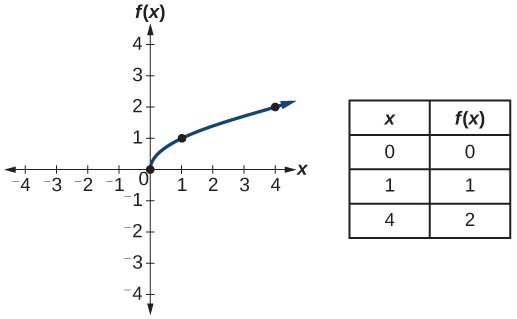
       
      </td>
     </tr>
     <tr valign="top">
      <td data-align="left">Cube root</td>
      <td data-align="left"><math xmlns="http://www.w3.org/1998/Math/MathML">
       <mrow>
        <mi>f</mi><mrow><mo>(</mo>
         <mi>x</mi>
         <mo>)</mo></mrow><mo>=</mo><mroot>
          <mi>x</mi>
          <mn>3</mn>
         </mroot>
       </mrow>
      </math>
      </td>
      <td data-align="left">
       
        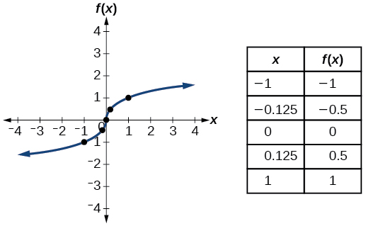
       
      </td>
     </tr>
    </tbody></table>

Access the following online resources for additional instruction and practice with functions.

* [Determine if a Relation is a Function][1]
* [Vertical Line Test][2]
* [Introduction to Functions][3]
* [Vertical Line Test on Graph][4]
* [One-to-one Functions][5]
* [Graphs as One-to-one Functions][6]

### Key Equations

<table id="eip-id1165134393730" summary=".."><colgroup><col data-align="left" /><col data-align="left" /></colgroup><tbody>
    <tr>
        <td>Constant function</td>
        <td><math xmlns="http://www.w3.org/1998/Math/MathML">
            <mrow>
                <mi>f</mi><mrow><mo>(</mo>
                    <mi>x</mi>
                    <mo>)</mo></mrow><mo>=</mo><mi>c</mi><mo>,</mo>
            </mrow>
        </math>where<math xmlns="http://www.w3.org/1998/Math/MathML">
            <mrow>
                <mtext> </mtext><mi>c</mi><mtext> </mtext>
            </mrow>
        </math>is a constant</td>
    </tr>
    
    
    <tr>
        <td>Identity function</td>
        <td><math xmlns="http://www.w3.org/1998/Math/MathML">
            <mrow>
                <mi>f</mi><mrow><mo>(</mo>
                    <mi>x</mi>
                    <mo>)</mo></mrow><mo>=</mo><mi>x</mi>
            </mrow>
        </math>
        </td>
    </tr>
    
    <tr>
        <td>Absolute value function</td>
        <td><math xmlns="http://www.w3.org/1998/Math/MathML">
            <mrow>
                <mi>f</mi><mrow><mo>(</mo>
                    <mi>x</mi>
                    <mo>)</mo></mrow><mo>=</mo><mrow><mo>\|</mo> <mi>x</mi> <mo>\|</mo></mrow>
            </mrow>
        </math>
        </td>
    </tr>
    
    <tr>
        <td>Quadratic function</td>
        <td><math xmlns="http://www.w3.org/1998/Math/MathML">
            <mrow>
                <mi>f</mi><mrow><mo>(</mo>
                    <mi>x</mi>
                    <mo>)</mo></mrow><mo>=</mo><msup>
                        <mi>x</mi>
                        <mn>2</mn>
                    </msup>
                
            </mrow>
        </math>
        </td>
    </tr>
    
    <tr>
        <td>Cubic function</td>
        <td><math xmlns="http://www.w3.org/1998/Math/MathML">
            <mrow>
                <mi>f</mi><mrow><mo>(</mo>
                    <mi>x</mi>
                    <mo>)</mo></mrow><mo>=</mo><msup>
                        <mi>x</mi>
                        <mn>3</mn>
                    </msup>
                
            </mrow>
        </math>
            
        </td>
    </tr>
    
    <tr>
        <td>Reciprocal function</td>
        <td><math xmlns="http://www.w3.org/1998/Math/MathML">
            <mrow>
                <mi>f</mi><mrow><mo>(</mo>
                    <mi>x</mi>
                    <mo>)</mo></mrow><mo>=</mo><mfrac>
                        <mn>1</mn>
                        <mi>x</mi>
                    </mfrac>
                
            </mrow>
        </math>
        </td>
    </tr>
    
    <tr>
        <td>Reciprocal squared function</td>
        <td><math xmlns="http://www.w3.org/1998/Math/MathML">
            <mrow>
                <mi>f</mi><mrow><mo>(</mo>
                    <mi>x</mi>
                    <mo>)</mo></mrow><mo>=</mo><mfrac>
                        <mn>1</mn>
                        <mrow>
                            <msup>
                                <mi>x</mi>
                                <mn>2</mn>
                            </msup>
                            
                        </mrow>
                    </mfrac>
                
            </mrow>
        </math>
        </td>
    </tr>
    
    <tr>
        <td>Square root function</td>
        <td><math xmlns="http://www.w3.org/1998/Math/MathML">
            <mrow>
                <mi>f</mi><mrow><mo>(</mo>
                    <mi>x</mi>
                    <mo>)</mo></mrow><mo>=</mo><msqrt>
                        <mi>x</mi>
                    </msqrt>
                
            </mrow>
        </math>
        </td>
    </tr>
    
    <tr>
        <td>Cube root function</td>
        <td><math xmlns="http://www.w3.org/1998/Math/MathML">
            <mrow>
                <mi>f</mi><mrow><mo>(</mo>
                    <mi>x</mi>
                    <mo>)</mo></mrow><mo>=</mo><mroot>
                        <mi>x</mi>
                        <mn>3</mn>
                    </mroot>
                
            </mrow>
        </math>
        </td>
    </tr>
</tbody></table>

### Key Concepts

* A relation is a set of ordered pairs. A function is a specific type of relation in which each domain value, or input, leads to exactly one range value, or output. See [\[link\]](#Example_01_01_01) and [\[link\]](#Example_01_01_02).
* Function notation is a shorthand method for relating the input to the output in the form
  <math xmlns="http://www.w3.org/1998/Math/MathML"> <mrow> <mtext> </mtext><mi>y</mi><mo>=</mo><mi>f</mi><mrow><mo>(</mo> <mi>x</mi> <mo>)</mo></mrow><mo>.</mo><mtext> </mtext></mrow> </math>
  
  See [\[link\]](#Example_01_01_03) and [\[link\]](#Example_01_01_04).
* In tabular form, a function can be represented by rows or columns that relate to input and output values. See [\[link\]](#Example_01_01_05).
* To evaluate a function, we determine an output value for a corresponding input value. Algebraic forms of a function can be evaluated by replacing the input variable with a given value. See [\[link\]](#Example_01_01_06) and [\[link\]](#Example_01_01_07).
* To solve for a specific function value, we determine the input values that yield the specific output value. See [\[link\]](#Example_01_01_08).
* An algebraic form of a function can be written from an equation. See [\[link\]](#Example_01_01_09) and [\[link\]](#Example_01_01_10).
* Input and output values of a function can be identified from a table. See [\[link\]](#Example_01_01_11).
* Relating input values to output values on a graph is another way to evaluate a function. See [\[link\]](#Example_01_01_12).
* A function is one-to-one if each output value corresponds to only one input value. See [\[link\]](#Example_01_01_13).
* A graph represents a function if any vertical line drawn on the graph intersects the graph at no more than one point. See [\[link\]](#Example_01_01_14).
* The graph of a one-to-one function passes the horizontal line test. See [\[link\]](#Example_01_01_15).

### Section Exercises

#### Verbal

What is the difference between a relation and a function?

A relation is a set of ordered pairs. A function is a special kind of relation in which no two ordered pairs have the same first coordinate.

What is the difference between the input and the output of a function?

Why does the vertical line test tell us whether the graph of a relation represents a function?

When a vertical line intersects the graph of a relation more than once, that indicates that for that input there is more than one output. At any particular input value, there can be only one output if the relation is to be a function.

How can you determine if a relation is a one-to-one function?

Why does the horizontal line test tell us whether the graph of a function is one-to-one?

When a horizontal line intersects the graph of a function more than once, that indicates that for that output there is more than one input. A function is one-to-one if each output corresponds to only one input.

#### Algebraic

For the following exercises, determine whether the relation represents a function.

<math xmlns="http://www.w3.org/1998/Math/MathML"> <mrow> <mrow><mo>{</mo> <mrow> <mrow><mo>(</mo> <mrow> <mi>a</mi><mo>,</mo><mi>b</mi></mrow> <mo>)</mo></mrow><mo>,</mo><mtext> </mtext><mrow><mo>(</mo> <mrow> <mi>c</mi><mo>,</mo><mi>d</mi></mrow> <mo>)</mo></mrow><mo>,</mo><mtext> </mtext><mrow><mo>(</mo> <mrow> <mi>a</mi><mo>,</mo><mi>c</mi></mrow> <mo>)</mo></mrow></mrow> <mo>}</mo></mrow></mrow> </math>

<math xmlns="http://www.w3.org/1998/Math/MathML"> <mrow> <mo>{</mo><mo stretchy="false">(</mo><mi>a</mi><mo>,</mo><mi>b</mi><mo stretchy="false">)</mo><mo>,</mo><mo stretchy="false">(</mo><mi>b</mi><mo>,</mo><mi>c</mi><mo stretchy="false">)</mo><mo>,</mo><mo stretchy="false">(</mo><mi>c</mi><mo>,</mo><mi>c</mi><mo stretchy="false">)</mo><mo>}</mo></mrow> </math>

function

For the following exercises, determine whether the relation represents<math xmlns="http://www.w3.org/1998/Math/MathML"> <mrow> <mtext> </mtext><mi>y</mi><mtext> </mtext></mrow> </math>

as a function of<math xmlns="http://www.w3.org/1998/Math/MathML"> <mrow> <mtext> </mtext><mi>x</mi><mo>.</mo><mtext> </mtext> </mrow> </math>

<math xmlns="http://www.w3.org/1998/Math/MathML"> <mrow> <mn>5</mn><mi>x</mi><mo>+</mo><mn>2</mn><mi>y</mi><mo>=</mo><mn>10</mn></mrow> </math>

<math xmlns="http://www.w3.org/1998/Math/MathML"> <mrow> <mi>y</mi><mo>=</mo><msup> <mi>x</mi> <mn>2</mn> </msup> </mrow> </math>

function

<math xmlns="http://www.w3.org/1998/Math/MathML"> <mrow> <mi>x</mi><mo>=</mo><msup> <mi>y</mi> <mn>2</mn> </msup> </mrow> </math>

<math xmlns="http://www.w3.org/1998/Math/MathML"> <mrow> <mn>3</mn><msup> <mi>x</mi> <mn>2</mn> </msup> <mo>+</mo><mi>y</mi><mo>=</mo><mn>14</mn></mrow> </math>

function

<math xmlns="http://www.w3.org/1998/Math/MathML"> <mrow> <mn>2</mn><mi>x</mi><mo>+</mo><msup> <mi>y</mi> <mn>2</mn> </msup> <mo>=</mo><mn>6</mn></mrow> </math>

<math xmlns="http://www.w3.org/1998/Math/MathML"> <mrow> <mi>y</mi><mo>=</mo><mo>−</mo><mn>2</mn><msup> <mi>x</mi> <mn>2</mn> </msup> <mo>+</mo><mn>40</mn><mi>x</mi></mrow> </math>

function

<math xmlns="http://www.w3.org/1998/Math/MathML"> <mrow> <mi>y</mi><mo>=</mo><mfrac> <mn>1</mn> <mi>x</mi> </mfrac> </mrow> </math>

<math xmlns="http://www.w3.org/1998/Math/MathML"> <mrow> <mi>x</mi><mo>=</mo><mfrac> <mrow> <mn>3</mn><mi>y</mi><mo>+</mo><mn>5</mn></mrow> <mrow> <mn>7</mn><mi>y</mi><mo>−</mo><mn>1</mn></mrow> </mfrac> </mrow> </math>

function

<math xmlns="http://www.w3.org/1998/Math/MathML"> <mrow> <mi>x</mi><mo>=</mo><msqrt> <mrow> <mn>1</mn><mo>−</mo><msup> <mi>y</mi> <mn>2</mn> </msup> </mrow> </msqrt> </mrow> </math>

<math xmlns="http://www.w3.org/1998/Math/MathML"> <mrow> <mi>y</mi><mo>=</mo><mfrac> <mrow> <mn>3</mn><mi>x</mi><mo>+</mo><mn>5</mn></mrow> <mrow> <mn>7</mn><mi>x</mi><mo>−</mo><mn>1</mn></mrow> </mfrac> </mrow> </math>

function

<math xmlns="http://www.w3.org/1998/Math/MathML"> <mrow> <msup> <mi>x</mi> <mn>2</mn> </msup> <mo>+</mo><msup> <mi>y</mi> <mn>2</mn> </msup> <mo>=</mo><mn>9</mn></mrow> </math>

<math xmlns="http://www.w3.org/1998/Math/MathML"> <mrow> <mn>2</mn><mi>x</mi><mi>y</mi><mo>=</mo><mn>1</mn></mrow> </math>

function

<math xmlns="http://www.w3.org/1998/Math/MathML"> <mrow> <mi>x</mi><mo>=</mo><msup> <mi>y</mi> <mn>3</mn> </msup> </mrow> </math>

<math xmlns="http://www.w3.org/1998/Math/MathML"> <mrow> <mi>y</mi><mo>=</mo><msup> <mi>x</mi> <mn>3</mn> </msup> </mrow> </math>

function

<math xmlns="http://www.w3.org/1998/Math/MathML"> <mrow> <mi>y</mi><mo>=</mo><msqrt> <mrow> <mn>1</mn><mo>−</mo><msup> <mi>x</mi> <mn>2</mn> </msup> </mrow> </msqrt> </mrow> </math>

<math xmlns="http://www.w3.org/1998/Math/MathML"> <mrow> <mi>x</mi><mo>=</mo><mo>±</mo><msqrt> <mrow> <mn>1</mn><mo>−</mo><mi>y</mi></mrow> </msqrt> </mrow> </math>

function

<math xmlns="http://www.w3.org/1998/Math/MathML"> <mrow> <mi>y</mi><mo>=</mo><mo>±</mo><msqrt> <mrow> <mn>1</mn><mo>−</mo><mi>x</mi></mrow> </msqrt> </mrow> </math>

<math xmlns="http://www.w3.org/1998/Math/MathML"> <mrow> <msup> <mi>y</mi> <mn>2</mn> </msup> <mo>=</mo><msup> <mi>x</mi> <mn>2</mn> </msup> </mrow> </math>

not a function

<math xmlns="http://www.w3.org/1998/Math/MathML"> <mrow> <msup> <mi>y</mi> <mn>3</mn> </msup> <mo>=</mo><msup> <mi>x</mi> <mn>2</mn> </msup> </mrow> </math>

For the following exercises, evaluate the function<math xmlns="http://www.w3.org/1998/Math/MathML"> <mrow> <mtext> </mtext><mi>f</mi><mtext> </mtext></mrow> </math>

at the indicated values<math xmlns="http://www.w3.org/1998/Math/MathML"> <mrow> <mtext> </mtext><mi>f</mi><mo stretchy="false">(</mo><mn>−3</mn><mo stretchy="false">)</mo><mo>,</mo><mi>f</mi><mo stretchy="false">(</mo><mn>2</mn><mo stretchy="false">)</mo><mo>,</mo><mi>f</mi><mo stretchy="false">(</mo><mi>−</mi><mi>a</mi><mo stretchy="false">)</mo><mo>,</mo><mi>−</mi><mi>f</mi><mo stretchy="false">(</mo><mi>a</mi><mo stretchy="false">)</mo><mo>,</mo><mi>f</mi><mo stretchy="false">(</mo><mi>a</mi><mo>+</mo><mi>h</mi><mo stretchy="false">)</mo><mo>.</mo> </mrow> </math>

<math xmlns="http://www.w3.org/1998/Math/MathML"> <mrow> <mi>f</mi><mo stretchy="false">(</mo><mi>x</mi><mo stretchy="false">)</mo><mo>=</mo><mn>2</mn><mi>x</mi><mo>−</mo><mn>5</mn></mrow> </math>

<math xmlns="http://www.w3.org/1998/Math/MathML"> <mrow> <mtable> <mtr> <mtd> <mrow> <mi>f</mi><mo stretchy="false">(</mo><mo>−</mo><mn>3</mn><mo stretchy="false">)</mo><mo>=</mo><mo>−</mo><mn>11</mn><mo>;</mo></mrow> </mtd> <mtd> <mrow> <mi>f</mi><mo stretchy="false">(</mo><mn>2</mn><mo stretchy="false">)</mo><mo>=</mo><mo>−</mo><mn>1</mn><mo>;</mo></mrow> </mtd> <mtd> <mrow> <mi>f</mi><mo stretchy="false">(</mo><mo>−</mo><mi>a</mi><mo stretchy="false">)</mo><mo>=</mo><mo>−</mo><mn>2</mn><mi>a</mi><mo>−</mo><mn>5</mn><mo>;</mo></mrow> </mtd> <mtd> <mrow> <mo>−</mo><mi>f</mi><mo stretchy="false">(</mo><mi>a</mi><mo stretchy="false">)</mo><mo>=</mo><mo>−</mo><mn>2</mn><mi>a</mi><mo>+</mo><mn>5</mn><mo>;</mo><mtext> </mtext><mtext> </mtext><mtext> </mtext><mtext> </mtext><mi>f</mi><mo stretchy="false">(</mo><mi>a</mi><mo>+</mo><mi>h</mi><mo stretchy="false">)</mo><mo>=</mo><mn>2</mn><mi>a</mi><mo>+</mo><mn>2</mn><mi>h</mi><mo>−</mo><mn>5</mn></mrow> </mtd> </mtr> </mtable></mrow> </math>

<math xmlns="http://www.w3.org/1998/Math/MathML"> <mrow> <mi>f</mi><mo stretchy="false">(</mo><mi>x</mi><mo stretchy="false">)</mo><mo>=</mo><mo>−</mo><mn>5</mn><msup> <mi>x</mi> <mn>2</mn> </msup> <mo>+</mo><mn>2</mn><mi>x</mi><mo>−</mo><mn>1</mn></mrow> </math>

<math xmlns="http://www.w3.org/1998/Math/MathML"> <mrow> <mi>f</mi><mo stretchy="false">(</mo><mi>x</mi><mo stretchy="false">)</mo><mo>=</mo><msqrt> <mrow> <mn>2</mn><mo>−</mo><mi>x</mi></mrow> </msqrt> <mo>+</mo><mn>5</mn></mrow> </math>

<math xmlns="http://www.w3.org/1998/Math/MathML"> <mrow> <mtable> <mtr> <mtd> <mrow> <mi>f</mi><mo stretchy="false">(</mo><mo>−</mo><mn>3</mn><mo stretchy="false">)</mo><mo>=</mo><msqrt> <mn>5</mn> </msqrt> <mo>+</mo><mn>5</mn><mo>;</mo></mrow> </mtd> <mtd> <mrow> <mi>f</mi><mo stretchy="false">(</mo><mn>2</mn><mo stretchy="false">)</mo><mo>=</mo><mn>5</mn><mo>;</mo></mrow> </mtd> <mtd> <mrow> <mi>f</mi><mo stretchy="false">(</mo><mo>−</mo><mi>a</mi><mo stretchy="false">)</mo><mo>=</mo><msqrt> <mrow> <mn>2</mn><mo>+</mo><mi>a</mi></mrow> </msqrt> <mo>+</mo><mn>5</mn><mo>;</mo></mrow> </mtd> <mtd> <mrow> <mo>−</mo><mi>f</mi><mo stretchy="false">(</mo><mi>a</mi><mo stretchy="false">)</mo><mo>=</mo><mo>−</mo><msqrt> <mrow> <mn>2</mn><mo>−</mo><mi>a</mi></mrow> </msqrt> <mo>−</mo><mn>5</mn><mo>;</mo><mtext> </mtext><mtext> </mtext><mtext> </mtext><mtext> </mtext><mtext> </mtext><mi>f</mi><mo stretchy="false">(</mo><mi>a</mi><mo>+</mo><mi>h</mi><mo stretchy="false">)</mo><mo>=</mo></mrow> </mtd> </mtr> </mtable></mrow> </math>

<math xmlns="http://www.w3.org/1998/Math/MathML"> <mrow> <msqrt> <mrow> <mn>2</mn><mo>−</mo><mi>a</mi><mo>−</mo><mi>h</mi></mrow> </msqrt> <mo>+</mo><mn>5</mn></mrow> </math>

<math xmlns="http://www.w3.org/1998/Math/MathML"> <mrow> <mi>f</mi><mo stretchy="false">(</mo><mi>x</mi><mo stretchy="false">)</mo><mo>=</mo><mfrac> <mrow> <mn>6</mn><mi>x</mi><mo>−</mo><mn>1</mn></mrow> <mrow> <mn>5</mn><mi>x</mi><mo>+</mo><mn>2</mn></mrow> </mfrac> </mrow> </math>

<math xmlns="http://www.w3.org/1998/Math/MathML"> <mrow> <mi>f</mi><mo stretchy="false">(</mo><mi>x</mi><mo stretchy="false">)</mo><mo>=</mo><mrow><mo>\|</mo> <mrow> <mi>x</mi><mo>−</mo><mn>1</mn></mrow> <mo>\|</mo></mrow><mo>−</mo><mrow><mo>\|</mo> <mrow> <mi>x</mi><mo>+</mo><mn>1</mn></mrow> <mo>\|</mo></mrow></mrow> </math>

<math xmlns="http://www.w3.org/1998/Math/MathML"> <mrow> <mtable> <mtr> <mtd> <mrow> <mi>f</mi><mo stretchy="false">(</mo><mo>−</mo><mn>3</mn><mo stretchy="false">)</mo><mo>=</mo><mn>2</mn><mo>;</mo></mrow> </mtd> <mtd> <mrow> <mi>f</mi><mo stretchy="false">(</mo><mn>2</mn><mo stretchy="false">)</mo><mo>=</mo><mn>1</mn><mo>−</mo><mn>3</mn><mo>=</mo><mo>−</mo><mn>2</mn><mo>;</mo></mrow> </mtd> <mtd> <mrow> <mi>f</mi><mo stretchy="false">(</mo><mo>−</mo><mi>a</mi><mo stretchy="false">)</mo><mo>=</mo><mrow><mo>\|</mo> <mrow> <mo>−</mo><mi>a</mi><mo>−</mo><mn>1</mn></mrow> <mo>\|</mo></mrow><mo>−</mo><mrow><mo>\|</mo> <mrow> <mo>−</mo><mi>a</mi><mo>+</mo><mn>1</mn></mrow> <mo>\|</mo></mrow><mo>;</mo></mrow> </mtd> <mtd> <mrow> <mo>−</mo><mi>f</mi><mo stretchy="false">(</mo><mi>a</mi><mo stretchy="false">)</mo><mo>=</mo><mo>−</mo><mrow><mo>\|</mo> <mrow> <mi>a</mi><mo>−</mo><mn>1</mn></mrow> <mo>\|</mo></mrow><mtext> </mtext><mo>+</mo><mrow><mo>\|</mo> <mrow> <mi>a</mi><mo>+</mo><mn>1</mn></mrow> <mo>\|</mo></mrow><mo>;</mo><mtext> </mtext><mtext> </mtext><mi>f</mi><mo stretchy="false">(</mo><mi>a</mi><mo>+</mo><mi>h</mi><mo stretchy="false">)</mo><mo>=</mo><mtext> </mtext><mrow><mo>\|</mo> <mrow> <mi>a</mi><mo>+</mo><mi>h</mi><mo>−</mo><mn>1</mn></mrow> <mo>\|</mo></mrow><mo>−</mo><mrow><mo>\|</mo> <mrow> <mi>a</mi><mo>+</mo><mi>h</mi><mo>+</mo><mn>1</mn></mrow> <mo>\|</mo></mrow></mrow> </mtd> </mtr> </mtable></mrow> </math>

Given the function<math xmlns="http://www.w3.org/1998/Math/MathML"> <mrow> <mtext> </mtext><mi>g</mi><mo stretchy="false">(</mo><mi>x</mi><mo stretchy="false">)</mo><mo>=</mo><mn>5</mn><mo>−</mo><msup> <mi>x</mi> <mn>2</mn> </msup> <mo>,</mo><mtext> </mtext></mrow> </math>

simplify<math xmlns="http://www.w3.org/1998/Math/MathML"> <mrow> <mtext> </mtext><mfrac> <mrow> <mi>g</mi><mo stretchy="false">(</mo><mi>x</mi><mo>+</mo><mi>h</mi><mo stretchy="false">)</mo><mo>−</mo><mi>g</mi><mo stretchy="false">(</mo><mi>x</mi><mo stretchy="false">)</mo></mrow> <mi>h</mi> </mfrac> <mo>,</mo><mtext> </mtext><mi>h</mi><mo>≠</mo><mn>0.</mn></mrow> </math>

Given the function<math xmlns="http://www.w3.org/1998/Math/MathML"> <mrow> <mtext> </mtext><mi>g</mi><mo stretchy="false">(</mo><mi>x</mi><mo stretchy="false">)</mo><mo>=</mo><msup> <mi>x</mi> <mn>2</mn> </msup> <mo>+</mo><mn>2</mn><mi>x</mi><mo>,</mo><mtext> </mtext></mrow> </math>

simplify<math xmlns="http://www.w3.org/1998/Math/MathML"> <mrow> <mtext> </mtext><mfrac> <mrow> <mi>g</mi><mo stretchy="false">(</mo><mi>x</mi><mo stretchy="false">)</mo><mo>−</mo><mi>g</mi><mo stretchy="false">(</mo><mi>a</mi><mo stretchy="false">)</mo></mrow> <mrow> <mi>x</mi><mo>−</mo><mi>a</mi></mrow> </mfrac> <mo>,</mo><mtext> </mtext><mi>x</mi><mo>≠</mo><mi>a</mi><mo>.</mo></mrow> </math>

<math xmlns="http://www.w3.org/1998/Math/MathML"> <mrow> <mfrac> <mrow> <mi>g</mi><mo stretchy="false">(</mo><mi>x</mi><mo stretchy="false">)</mo><mo>−</mo><mi>g</mi><mo stretchy="false">(</mo><mi>a</mi><mo stretchy="false">)</mo></mrow> <mrow> <mi>x</mi><mo>−</mo><mi>a</mi></mrow> </mfrac> <mo>=</mo><mi>x</mi><mo>+</mo><mi>a</mi><mo>+</mo><mn>2</mn><mo>,</mo><mtext> </mtext><mi>x</mi><mo>≠</mo><mi>a</mi></mrow> </math>

Given the function<math xmlns="http://www.w3.org/1998/Math/MathML"> <mrow> <mtext> </mtext><mi>k</mi><mo stretchy="false">(</mo><mi>t</mi><mo stretchy="false">)</mo><mo>=</mo><mn>2</mn><mi>t</mi><mo>−</mo><mn>1</mn><mtext>:</mtext></mrow> </math>

1.  Evaluate
    <math xmlns="http://www.w3.org/1998/Math/MathML"> <mrow> <mtext> </mtext><mi>k</mi><mo stretchy="false">(</mo><mn>2</mn><mo stretchy="false">)</mo><mo>.</mo></mrow> </math>

2.  Solve
    <math xmlns="http://www.w3.org/1998/Math/MathML"> <mrow> <mtext> </mtext><mi>k</mi><mo stretchy="false">(</mo><mi>t</mi><mo stretchy="false">)</mo><mo>=</mo><mn>7.</mn></mrow> </math>
{: type="a"}

Given the function<math xmlns="http://www.w3.org/1998/Math/MathML"> <mrow> <mtext> </mtext><mi>f</mi><mo stretchy="false">(</mo><mi>x</mi><mo stretchy="false">)</mo><mo>=</mo><mn>8</mn><mo>−</mo><mn>3</mn><mi>x</mi><mtext>:</mtext></mrow> </math>

1.  Evaluate
    <math xmlns="http://www.w3.org/1998/Math/MathML"> <mrow> <mtext> </mtext><mi>f</mi><mo stretchy="false">(</mo><mo>−</mo><mn>2</mn><mo stretchy="false">)</mo><mo>.</mo></mrow> </math>

2.  Solve
    <math xmlns="http://www.w3.org/1998/Math/MathML"> <mrow> <mtext> </mtext><mi>f</mi><mo stretchy="false">(</mo><mi>x</mi><mo stretchy="false">)</mo><mo>=</mo><mn>−1.</mn></mrow> </math>
{: type="a"}

a.<math xmlns="http://www.w3.org/1998/Math/MathML"> <mrow> <mtext> </mtext><mi>f</mi><mo stretchy="false">(</mo><mo>−</mo><mn>2</mn><mo stretchy="false">)</mo><mo>=</mo><mn>14</mn><mo>;</mo><mtext> </mtext></mrow> </math>

b.<math xmlns="http://www.w3.org/1998/Math/MathML"> <mrow> <mtext> </mtext><mi>x</mi><mo>=</mo><mn>3</mn></mrow> </math>

Given the function<math xmlns="http://www.w3.org/1998/Math/MathML"> <mrow> <mtext> </mtext><mi>p</mi><mo stretchy="false">(</mo><mi>c</mi><mo stretchy="false">)</mo><mo>=</mo><msup> <mi>c</mi> <mn>2</mn> </msup> <mo>+</mo><mi>c</mi><mtext>:</mtext></mrow> </math>

1.  Evaluate
    <math xmlns="http://www.w3.org/1998/Math/MathML"> <mrow> <mtext> </mtext><mi>p</mi><mo stretchy="false">(</mo><mn>−3</mn><mo stretchy="false">)</mo><mo>.</mo></mrow> </math>

2.  Solve
    <math xmlns="http://www.w3.org/1998/Math/MathML"> <mrow> <mtext> </mtext><mi>p</mi><mo stretchy="false">(</mo><mi>c</mi><mo stretchy="false">)</mo><mo>=</mo><mn>2.</mn></mrow> </math>
{: type="a"}

Given the function<math xmlns="http://www.w3.org/1998/Math/MathML"> <mrow> <mtext> </mtext><mi>f</mi><mo stretchy="false">(</mo><mi>x</mi><mo stretchy="false">)</mo><mo>=</mo><msup> <mi>x</mi> <mn>2</mn> </msup> <mo>−</mo><mn>3</mn><mi>x</mi><mtext>:</mtext></mrow> </math>

1.  Evaluate
    <math xmlns="http://www.w3.org/1998/Math/MathML"> <mrow> <mtext> </mtext><mi>f</mi><mo stretchy="false">(</mo><mn>5</mn><mo stretchy="false">)</mo><mo>.</mo></mrow> </math>

2.  Solve
    <math xmlns="http://www.w3.org/1998/Math/MathML"> <mrow> <mtext> </mtext><mi>f</mi><mo stretchy="false">(</mo><mi>x</mi><mo stretchy="false">)</mo><mo>=</mo><mn>4.</mn></mrow> </math>
{: type="a"}

a.<math xmlns="http://www.w3.org/1998/Math/MathML"> <mrow> <mtext> </mtext><mi>f</mi><mo stretchy="false">(</mo><mn>5</mn><mo stretchy="false">)</mo><mo>=</mo><mn>10</mn><mo>;</mo><mtext> </mtext></mrow> </math>

b.<math xmlns="http://www.w3.org/1998/Math/MathML"> <mrow> <mtext> </mtext><mi>x</mi><mo>=</mo><mo>−</mo><mn>1</mn><mtext> </mtext></mrow> </math>

or<math xmlns="http://www.w3.org/1998/Math/MathML"> <mrow> <mtext> </mtext><mi>x</mi><mo>=</mo><mn>4</mn></mrow> </math>

Given the function<math xmlns="http://www.w3.org/1998/Math/MathML"> <mrow> <mtext> </mtext><mi>f</mi><mo stretchy="false">(</mo><mi>x</mi><mo stretchy="false">)</mo><mo>=</mo><msqrt> <mrow> <mi>x</mi><mo>+</mo><mn>2</mn></mrow> </msqrt> <mtext>:</mtext></mrow> </math>

1.  Evaluate
    <math xmlns="http://www.w3.org/1998/Math/MathML"> <mrow> <mtext> </mtext><mi>f</mi><mo stretchy="false">(</mo><mn>7</mn><mo stretchy="false">)</mo><mo>.</mo></mrow> </math>

2.  Solve
    <math xmlns="http://www.w3.org/1998/Math/MathML"> <mrow> <mtext> </mtext><mi>f</mi><mo stretchy="false">(</mo><mi>x</mi><mo stretchy="false">)</mo><mo>=</mo><mn>4.</mn></mrow> </math>
{: type="a"}

Consider the relationship<math xmlns="http://www.w3.org/1998/Math/MathML"> <mrow> <mtext> </mtext><mn>3</mn><mi>r</mi><mo>+</mo><mn>2</mn><mi>t</mi><mo>=</mo><mn>18.</mn></mrow> </math>

1.  Write the relationship as a function
    <math xmlns="http://www.w3.org/1998/Math/MathML"> <mrow> <mtext> </mtext><mi>r</mi><mo>=</mo><mi>f</mi><mo stretchy="false">(</mo><mi>t</mi><mo stretchy="false">)</mo><mo>.</mo></mrow> </math>

2.  Evaluate
    <math xmlns="http://www.w3.org/1998/Math/MathML"> <mrow> <mtext> </mtext><mi>f</mi><mo stretchy="false">(</mo><mn>−3</mn><mo stretchy="false">)</mo><mo>.</mo></mrow> </math>

3.  Solve
    <math xmlns="http://www.w3.org/1998/Math/MathML"> <mrow> <mtext> </mtext><mi>f</mi><mo stretchy="false">(</mo><mi>t</mi><mo stretchy="false">)</mo><mo>=</mo><mn>2.</mn></mrow> </math>
{: type="a"}

a.<math xmlns="http://www.w3.org/1998/Math/MathML"> <mrow> <mtext> </mtext><mi>f</mi><mo stretchy="false">(</mo><mi>t</mi><mo stretchy="false">)</mo><mo>=</mo><mn>6</mn><mo>−</mo><mfrac> <mn>2</mn> <mn>3</mn> </mfrac> <mi>t</mi><mo>;</mo><mtext> </mtext></mrow> </math>

b.<math xmlns="http://www.w3.org/1998/Math/MathML"> <mrow> <mtext> </mtext><mi>f</mi><mo stretchy="false">(</mo><mo>−</mo><mn>3</mn><mo stretchy="false">)</mo><mo>=</mo><mn>8</mn><mo>;</mo><mtext> </mtext></mrow> </math>

c.<math xmlns="http://www.w3.org/1998/Math/MathML"> <mrow> <mtext> </mtext><mi>t</mi><mo>=</mo><mn>6</mn><mtext> </mtext></mrow> </math>

#### Graphical

For the following exercises, use the vertical line test to determine which graphs show relations that are functions.

 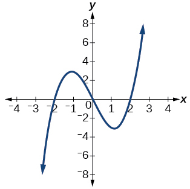 

  

not a function

  

 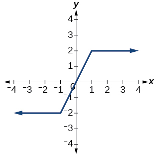 

function

  

 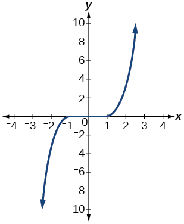 

function

  

 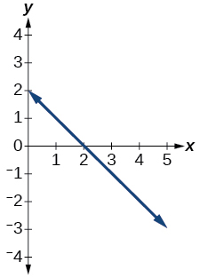 

function

 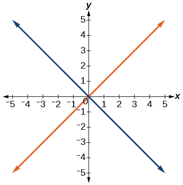 

 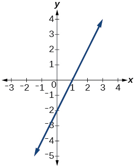 

function

 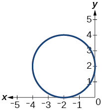 

  

function

Given the following graph,

* Evaluate
  <math xmlns="http://www.w3.org/1998/Math/MathML"> <mrow> <mtext> </mtext><mi>f</mi><mo stretchy="false">(</mo><mn>−1</mn><mo stretchy="false">)</mo><mo>.</mo></mrow> </math>

* Solve for
  <math xmlns="http://www.w3.org/1998/Math/MathML"> <mrow> <mtext> </mtext><mi>f</mi><mo stretchy="false">(</mo><mi>x</mi><mo stretchy="false">)</mo><mo>=</mo><mn>3.</mn></mrow> </math>

 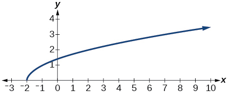 

Given the following graph,

* Evaluate
  <math xmlns="http://www.w3.org/1998/Math/MathML"> <mrow> <mtext> </mtext><mi>f</mi><mo stretchy="false">(</mo><mn>0</mn><mo stretchy="false">)</mo><mo>.</mo></mrow> </math>

* Solve for
  <math xmlns="http://www.w3.org/1998/Math/MathML"> <mrow> <mtext> </mtext><mi>f</mi><mo stretchy="false">(</mo><mi>x</mi><mo stretchy="false">)</mo><mo>=</mo><mn>−3.</mn></mrow> </math>

 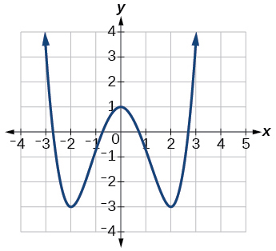 

a.<math xmlns="http://www.w3.org/1998/Math/MathML"> <mrow> <mtext> </mtext><mi>f</mi><mo stretchy="false">(</mo><mn>0</mn><mo stretchy="false">)</mo><mo>=</mo><mn>1</mn><mo>;</mo><mtext> </mtext></mrow> </math>

b.<math xmlns="http://www.w3.org/1998/Math/MathML"> <mrow> <mtext> </mtext><mi>f</mi><mo stretchy="false">(</mo><mi>x</mi><mo stretchy="false">)</mo><mo>=</mo><mo>−</mo><mn>3</mn><mo>,</mo><mtext> </mtext><mi>x</mi><mo>=</mo><mo>−</mo><mn>2</mn><mtext> </mtext></mrow> </math>

or<math xmlns="http://www.w3.org/1998/Math/MathML"> <mrow> <mtext> </mtext><mi>x</mi><mo>=</mo><mn>2</mn><mtext> </mtext></mrow> </math>

Given the following graph,

* Evaluate
  <math xmlns="http://www.w3.org/1998/Math/MathML"> <mrow> <mtext> </mtext><mi>f</mi><mo stretchy="false">(</mo><mn>4</mn><mo stretchy="false">)</mo><mo>.</mo></mrow> </math>

* Solve for
  <math xmlns="http://www.w3.org/1998/Math/MathML"> <mrow> <mtext> </mtext><mi>f</mi><mo stretchy="false">(</mo><mi>x</mi><mo stretchy="false">)</mo><mo>=</mo><mn>1.</mn></mrow> </math>

 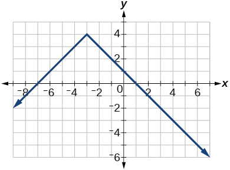 

For the following exercises, determine if the given graph is a one-to-one function.

 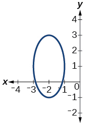 

not a function so it is also not a one-to-one function

 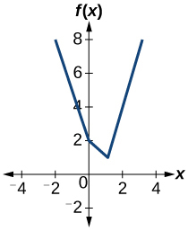 

 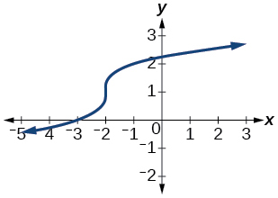 

one-to- one function

 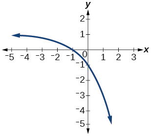 

 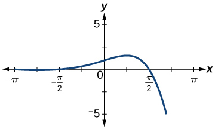 

function, but not one-to-one

#### Numeric

For the following exercises, determine whether the relation represents a function.

<math xmlns="http://www.w3.org/1998/Math/MathML"> <mrow> <mrow><mo>{</mo> <mrow> <mrow><mo>(</mo> <mrow> <mn>−1</mn><mo>,</mo><mn>−1</mn></mrow> <mo>)</mo></mrow><mo>,</mo><mrow><mo>(</mo> <mrow> <mn>−2</mn><mo>,</mo><mn>−2</mn></mrow> <mo>)</mo></mrow><mo>,</mo><mrow><mo>(</mo> <mrow> <mn>−3</mn><mo>,</mo><mn>−3</mn></mrow> <mo>)</mo></mrow></mrow> <mo>}</mo></mrow></mrow> </math>

<math xmlns="http://www.w3.org/1998/Math/MathML"> <mrow> <mrow><mo>{</mo> <mrow> <mrow><mo>(</mo> <mrow> <mn>3</mn><mo>,</mo><mn>4</mn></mrow> <mo>)</mo></mrow><mo>,</mo><mrow><mo>(</mo> <mrow> <mn>4</mn><mo>,</mo><mn>5</mn></mrow> <mo>)</mo></mrow><mo>,</mo><mrow><mo>(</mo> <mrow> <mn>5</mn><mo>,</mo><mn>6</mn></mrow> <mo>)</mo></mrow></mrow> <mo>}</mo></mrow></mrow> </math>

function

<math xmlns="http://www.w3.org/1998/Math/MathML"> <mrow> <mrow><mo>{</mo> <mrow> <mo stretchy="false">(</mo><mn>2</mn><mo>,</mo><mn>5</mn><mo stretchy="false">)</mo><mo>,</mo><mo stretchy="false">(</mo><mn>7</mn><mo>,</mo><mn>11</mn><mo stretchy="false">)</mo><mo>,</mo><mo stretchy="false">(</mo><mn>15</mn><mo>,</mo><mn>8</mn><mo stretchy="false">)</mo><mo>,</mo><mo stretchy="false">(</mo><mn>7</mn><mo>,</mo><mn>9</mn><mo stretchy="false">)</mo> </mrow> <mo>}</mo></mrow> </mrow> </math>

For the following exercises, determine if the relation represented in table form represents<math xmlns="http://www.w3.org/1998/Math/MathML"> <mrow> <mtext> </mtext><mi>y</mi><mtext> </mtext></mrow> </math>

as a function of<math xmlns="http://www.w3.org/1998/Math/MathML"> <mrow> <mtext> </mtext><mi>x</mi><mo>.</mo></mrow> </math>

<table summary=".." class="unnumbered" data-label=""><colgroup><col /><col data-width="50" /><col data-width="50" /><col data-width="50" /></colgroup><tbody>
    <tr>
     <td data-align="center"><strong><math xmlns="http://www.w3.org/1998/Math/MathML">
      <mi>x</mi>
     </math></strong>
     </td>
     <td data-align="center">5</td>
     <td data-align="center">10</td>
     <td data-align="center">15</td>
    </tr>
    <tr>
     <td data-align="center"><strong><math xmlns="http://www.w3.org/1998/Math/MathML">
      <mi>y</mi>
     </math></strong>
     </td>
     <td data-align="center">3</td>
     <td data-align="center">8</td>
     <td data-align="center">14</td>
    </tr>
   </tbody></table>

function

<table summary=".." class="unnumbered" data-label=""><colgroup><col /><col data-width="50" /><col data-width="50" /><col data-width="50" /></colgroup><tbody>
     <tr>
      <td data-align="center"><strong><math xmlns="http://www.w3.org/1998/Math/MathML">
       <mi>x</mi>
      </math></strong>
      </td>
      <td data-align="center">5</td>
      <td data-align="center">10</td>
      <td data-align="center">15</td>
     </tr>
     <tr>
      <td data-align="center"><strong><math xmlns="http://www.w3.org/1998/Math/MathML">
       <mi>y</mi>
      </math></strong>
      </td>
      <td data-align="center">3</td>
      <td data-align="center">8</td>
      <td data-align="center">8</td>
     </tr>
    </tbody></table>

<table summary=".." class="unnumbered" data-label=""><colgroup><col /><col data-width="50" /><col data-width="50" /><col data-width="50" /></colgroup><tbody>
     <tr>
      <td data-align="center"><strong><math xmlns="http://www.w3.org/1998/Math/MathML">
       <mi>x</mi>
      </math></strong>
      </td>
      <td data-align="center">5</td>
      <td data-align="center">10</td>
      <td data-align="center">10</td>
     </tr>
     <tr>
      <td data-align="center"><strong><math xmlns="http://www.w3.org/1998/Math/MathML">
       <mi>y</mi>
      </math></strong>
      </td>
      <td data-align="center">3</td>
      <td data-align="center">8</td>
      <td data-align="center">14</td>
     </tr>
    </tbody></table>

not a function

For the following exercises, use the function<math xmlns="http://www.w3.org/1998/Math/MathML"> <mrow> <mtext> </mtext><mi>f</mi><mtext> </mtext></mrow> </math>

represented in [\[link\]](#fs-id1165137727218).

| <strong><math xmlns="http://www.w3.org/1998/Math/MathML">
      <mi>x</mi>
     </math></strong> | <strong><math xmlns="http://www.w3.org/1998/Math/MathML">
     <mrow>
      <mi>f</mi><mrow><mo>(</mo>
       <mi>x</mi>
       <mo>)</mo></mrow></mrow>
       </math> </strong> |
| 0 | 74 |
| 1 | 28 |
| 2 | 1 |
| 3 | 53 |
| 4 | 56 |
| 5 | 3 |
| 6 | 36 |
| 7 | 45 |
| 8 | 14 |
| 9 | 47 |
{: summary=".."}

Evaluate<math xmlns="http://www.w3.org/1998/Math/MathML"> <mrow> <mtext> </mtext><mi>f</mi><mo stretchy="false">(</mo><mn>3</mn><mo stretchy="false">)</mo><mo>.</mo></mrow> </math>

Solve<math xmlns="http://www.w3.org/1998/Math/MathML"> <mrow> <mtext> </mtext><mi>f</mi><mo stretchy="false">(</mo><mi>x</mi><mo stretchy="false">)</mo><mo>=</mo><mn>1.</mn></mrow> </math>

<math xmlns="http://www.w3.org/1998/Math/MathML"> <mrow> <mi>f</mi><mo stretchy="false">(</mo><mi>x</mi><mo stretchy="false">)</mo><mo>=</mo><mn>1</mn><mo>,</mo><mtext> </mtext><mi>x</mi><mo>=</mo><mn>2</mn></mrow> </math>

For the following exercises, evaluate the function<math xmlns="http://www.w3.org/1998/Math/MathML"> <mrow> <mtext> </mtext><mi>f</mi><mtext> </mtext></mrow> </math>

at the values<math xmlns="http://www.w3.org/1998/Math/MathML"> <mrow> <mi>f</mi><mrow><mo>(</mo> <mrow> <mo>−</mo><mn>2</mn></mrow> <mo>)</mo></mrow><mo>,</mo><mtext> </mtext><mi>f</mi><mo stretchy="false">(</mo><mn>−1</mn><mo stretchy="false">)</mo><mo>,</mo><mtext> </mtext><mi>f</mi><mo stretchy="false">(</mo><mn>0</mn><mo stretchy="false">)</mo><mo>,</mo><mtext> </mtext><mi>f</mi><mo stretchy="false">(</mo><mn>1</mn><mo stretchy="false">)</mo><mo>,</mo></mrow> </math>

and<math xmlns="http://www.w3.org/1998/Math/MathML"> <mrow> <mtext> </mtext><mi>f</mi><mo stretchy="false">(</mo><mn>2</mn><mo stretchy="false">)</mo><mo>.</mo></mrow> </math>

<math xmlns="http://www.w3.org/1998/Math/MathML"> <mrow> <mi>f</mi><mrow><mo>(</mo> <mi>x</mi> <mo>)</mo></mrow><mo>=</mo><mn>4</mn><mo>−</mo><mn>2</mn><mi>x</mi></mrow> </math>

<math xmlns="http://www.w3.org/1998/Math/MathML"> <mrow> <mi>f</mi><mrow><mo>(</mo> <mi>x</mi> <mo>)</mo></mrow><mo>=</mo><mn>8</mn><mo>−</mo><mn>3</mn><mi>x</mi></mrow> </math>

<math xmlns="http://www.w3.org/1998/Math/MathML"> <mrow> <mtable> <mtr> <mtd> <mrow> <mi>f</mi><mo stretchy="false">(</mo><mo>−</mo><mn>2</mn><mo stretchy="false">)</mo><mo>=</mo><mn>14</mn><mo>;</mo></mrow> </mtd> <mtd> <mrow> <mi>f</mi><mo stretchy="false">(</mo><mo>−</mo><mn>1</mn><mo stretchy="false">)</mo><mo>=</mo><mn>11</mn><mo>;</mo></mrow> </mtd> <mtd> <mrow> <mi>f</mi><mo stretchy="false">(</mo><mn>0</mn><mo stretchy="false">)</mo><mo>=</mo><mn>8</mn><mo>;</mo></mrow> </mtd> <mtd> <mrow> <mi>f</mi><mo stretchy="false">(</mo><mn>1</mn><mo stretchy="false">)</mo><mo>=</mo><mn>5</mn><mo>;</mo></mrow> </mtd> <mtd> <mrow> <mi>f</mi><mo stretchy="false">(</mo><mn>2</mn><mo stretchy="false">)</mo><mo>=</mo><mn>2</mn></mrow> </mtd> </mtr> </mtable></mrow> </math>

<math xmlns="http://www.w3.org/1998/Math/MathML"> <mrow> <mi>f</mi><mrow><mo>(</mo> <mi>x</mi> <mo>)</mo></mrow><mo>=</mo><mn>8</mn><msup> <mi>x</mi> <mn>2</mn> </msup> <mo>−</mo><mn>7</mn><mi>x</mi><mo>+</mo><mn>3</mn></mrow> </math>

<math xmlns="http://www.w3.org/1998/Math/MathML"> <mrow> <mi>f</mi><mrow><mo>(</mo> <mi>x</mi> <mo>)</mo></mrow><mo>=</mo><mn>3</mn><mo>+</mo><msqrt> <mrow> <mi>x</mi><mo>+</mo><mn>3</mn></mrow> </msqrt> </mrow> </math>

<math xmlns="http://www.w3.org/1998/Math/MathML"> <mrow> <mtable> <mtr> <mtd> <mrow> <mi>f</mi><mo stretchy="false">(</mo><mo>−</mo><mn>2</mn><mo stretchy="false">)</mo><mo>=</mo><mn>4</mn><mo>;</mo><mtext>  </mtext> </mrow> </mtd> <mtd> <mrow> <mi>f</mi><mo stretchy="false">(</mo><mo>−</mo><mn>1</mn><mo stretchy="false">)</mo><mo>=</mo><mn>4.414</mn><mo>;</mo> </mrow> </mtd> <mtd> <mrow> <mi>f</mi><mo stretchy="false">(</mo><mn>0</mn><mo stretchy="false">)</mo><mo>=</mo><mn>4.732</mn><mo>;</mo> </mrow> </mtd> <mtd> <mrow> <mi>f</mi><mo stretchy="false">(</mo><mn>1</mn><mo stretchy="false">)</mo><mo>=</mo><mn>5</mn><mo>;</mo> </mrow> </mtd> <mtd> <mrow> <mi>f</mi><mo stretchy="false">(</mo><mn>2</mn><mo stretchy="false">)</mo><mo>=</mo><mn>5.236</mn> </mrow> </mtd> </mtr> </mtable> </mrow> </math>

<math xmlns="http://www.w3.org/1998/Math/MathML"> <mrow> <mi>f</mi><mo stretchy="false">(</mo><mi>x</mi><mo stretchy="false">)</mo><mo>=</mo><mfrac> <mrow> <mi>x</mi><mo>−</mo><mn>2</mn></mrow> <mrow> <mi>x</mi><mo>+</mo><mn>3</mn></mrow> </mfrac> </mrow> </math>

<math xmlns="http://www.w3.org/1998/Math/MathML"> <mrow> <mi>f</mi><mrow><mo>(</mo> <mi>x</mi> <mo>)</mo></mrow><mo>=</mo><msup> <mn>3</mn> <mi>x</mi> </msup> </mrow> </math>

<math xmlns="http://www.w3.org/1998/Math/MathML"> <mrow> <mtable> <mtr> <mtd> <mrow> <mi>f</mi><mo stretchy="false">(</mo><mo>−</mo><mn>2</mn><mo stretchy="false">)</mo><mo>=</mo><mfrac> <mn>1</mn> <mn>9</mn> </mfrac> <mo>;</mo></mrow> </mtd> <mtd> <mrow> <mi>f</mi><mo stretchy="false">(</mo><mo>−</mo><mn>1</mn><mo stretchy="false">)</mo><mo>=</mo><mfrac> <mn>1</mn> <mn>3</mn> </mfrac> <mo>;</mo></mrow> </mtd> <mtd> <mrow> <mi>f</mi><mo stretchy="false">(</mo><mn>0</mn><mo stretchy="false">)</mo><mo>=</mo><mn>1</mn><mo>;</mo></mrow> </mtd> <mtd> <mrow> <mi>f</mi><mo stretchy="false">(</mo><mn>1</mn><mo stretchy="false">)</mo><mo>=</mo><mn>3</mn><mo>;</mo></mrow> </mtd> <mtd> <mrow> <mi>f</mi><mo stretchy="false">(</mo><mn>2</mn><mo stretchy="false">)</mo><mo>=</mo><mn>9</mn></mrow> </mtd> </mtr> </mtable></mrow> </math>

For the following exercises, evaluate the expressions, given functions<math xmlns="http://www.w3.org/1998/Math/MathML"> <mrow> <mi>f</mi><mo>,</mo><mtext> </mtext><mtext> </mtext><mi>g</mi><mo>,</mo></mrow> </math>

and<math xmlns="http://www.w3.org/1998/Math/MathML"> <mrow> <mtext> </mtext><mi>h</mi><mtext>:</mtext></mrow> </math>

* <math xmlns="http://www.w3.org/1998/Math/MathML"> <mrow> <mi>f</mi><mo stretchy="false">(</mo><mi>x</mi><mo stretchy="false">)</mo><mo>=</mo><mn>3</mn><mi>x</mi><mo>−</mo><mn>2</mn> </mrow> </math>

* <math xmlns="http://www.w3.org/1998/Math/MathML"> <mrow> <mi>g</mi><mo stretchy="false">(</mo><mi>x</mi><mo stretchy="false">)</mo><mo>=</mo><mn>5</mn><mo>−</mo><msup> <mi>x</mi> <mn>2</mn> </msup> </mrow> </math>

* <math xmlns="http://www.w3.org/1998/Math/MathML"> <mrow> <mi>h</mi><mo stretchy="false">(</mo><mi>x</mi><mo stretchy="false">)</mo><mo>=</mo><mn>−2</mn><msup> <mi>x</mi> <mn>2</mn> </msup> <mo>+</mo><mn>3</mn><mi>x</mi><mo>−</mo><mn>1</mn> </mrow> </math>

<math xmlns="http://www.w3.org/1998/Math/MathML"> <mrow> <mn>3</mn><mi>f</mi><mrow><mo>(</mo> <mn>1</mn> <mo>)</mo></mrow><mo>−</mo><mn>4</mn><mi>g</mi><mrow><mo>(</mo> <mrow> <mo>−</mo><mn>2</mn></mrow> <mo>)</mo></mrow></mrow> </math>

<math xmlns="http://www.w3.org/1998/Math/MathML"> <mrow> <mi>f</mi><mrow><mo>(</mo> <mrow> <mfrac> <mn>7</mn> <mn>3</mn> </mfrac> </mrow> <mo>)</mo></mrow><mo>−</mo><mi>h</mi><mrow><mo>(</mo> <mrow> <mo>−</mo><mn>2</mn></mrow> <mo>)</mo></mrow></mrow> </math>

20

#### Technology

For the following exercises, graph<math xmlns="http://www.w3.org/1998/Math/MathML"> <mrow> <mtext> </mtext><mi>y</mi><mo>=</mo><msup> <mi>x</mi> <mn>2</mn> </msup> <mtext> </mtext></mrow> </math>

on the given viewing window. Determine the corresponding range for each viewing window. Show each graph.

<math xmlns="http://www.w3.org/1998/Math/MathML"> <mrow> <mo stretchy="false">[</mo><mo>−</mo><mn>0.1</mn><mo>,</mo><mtext> </mtext><mn>0.1</mn><mo stretchy="false">]</mo></mrow> </math>

<math xmlns="http://www.w3.org/1998/Math/MathML"> <mrow> <mo stretchy="false">[</mo><mo>−</mo><mn>10</mn><mo>,</mo><mtext> 10</mtext><mo stretchy="false">]</mo></mrow> </math>

<math xmlns="http://www.w3.org/1998/Math/MathML"> <mrow> <mo stretchy="false">[</mo><mn>0</mn><mo>,</mo><mtext> 100</mtext><mo stretchy="false">]</mo></mrow> </math>

 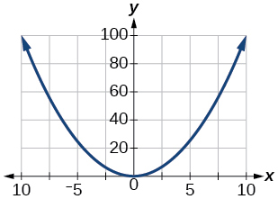 

<math xmlns="http://www.w3.org/1998/Math/MathML"> <mrow> <mo stretchy="false">[</mo><mo>−</mo><mn>100</mn><mo>,</mo><mn>100</mn><mo stretchy="false">]</mo></mrow> </math>

For the following exercises, graph<math xmlns="http://www.w3.org/1998/Math/MathML"> <mrow> <mtext> </mtext><mi>y</mi><mo>=</mo><msup> <mi>x</mi> <mn>3</mn> </msup> <mtext> </mtext></mrow> </math>

on the given viewing window. Determine the corresponding range for each viewing window. Show each graph.

<math xmlns="http://www.w3.org/1998/Math/MathML"> <mrow> <mo stretchy="false">[</mo><mo>−</mo><mn>0.1</mn><mo>,</mo><mtext> 0</mtext><mtext>.1</mtext><mo stretchy="false">]</mo></mrow> </math>

<math xmlns="http://www.w3.org/1998/Math/MathML"> <mrow> <mo stretchy="false">[</mo><mo>−</mo><mn>0.001</mn><mo>,</mo><mtext> 0</mtext><mtext>.001</mtext><mo stretchy="false">]</mo></mrow> </math>

 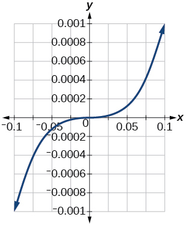 

<math xmlns="http://www.w3.org/1998/Math/MathML"> <mrow> <mo stretchy="false">[</mo><mo>−</mo><mn>10</mn><mo>,</mo><mtext> 10</mtext><mo stretchy="false">]</mo></mrow> </math>

<math xmlns="http://www.w3.org/1998/Math/MathML"> <mrow> <mo stretchy="false">[</mo><mo>−</mo><mn>100</mn><mo>,</mo><mtext> 100</mtext><mo stretchy="false">]</mo></mrow> </math>

<math xmlns="http://www.w3.org/1998/Math/MathML"> <mrow> <mo stretchy="false">[</mo><mo>−</mo><mn>1</mn><mo>,</mo><mn>000</mn><mo>,</mo><mn>000</mn><mo>,</mo><mtext> 1,000,000</mtext><mo stretchy="false">]</mo></mrow> </math>

 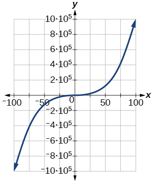 

For the following exercises, graph<math xmlns="http://www.w3.org/1998/Math/MathML"> <mrow> <mtext> </mtext><mi>y</mi><mo>=</mo><msqrt> <mi>x</mi> </msqrt> <mtext> </mtext></mrow> </math>

on the given viewing window. Determine the corresponding range for each viewing window. Show each graph.

<math xmlns="http://www.w3.org/1998/Math/MathML"> <mrow> <mo stretchy="false">[</mo><mn>0</mn><mo>,</mo><mtext> 0</mtext><mtext>.01</mtext><mo stretchy="false">]</mo></mrow> </math>

<math xmlns="http://www.w3.org/1998/Math/MathML"> <mrow> <mo stretchy="false">[</mo><mn>0</mn><mo>,</mo><mtext> 100</mtext><mo stretchy="false">]</mo></mrow> </math>

<math xmlns="http://www.w3.org/1998/Math/MathML"> <mrow> <mo stretchy="false">[</mo><mn>0</mn><mo>,</mo><mtext> 10</mtext><mo stretchy="false">]</mo></mrow> </math>

 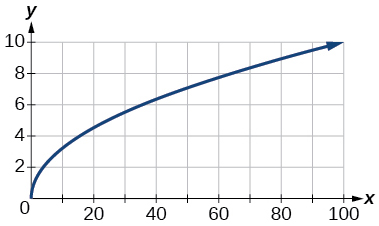 

<math xmlns="http://www.w3.org/1998/Math/MathML"> <mrow> <mo stretchy="false">[</mo><mn>0</mn><mo>,</mo><mtext> 10,000</mtext><mo stretchy="false">]</mo></mrow> </math>

For the following exercises, graph <math xmlns="http://www.w3.org/1998/Math/MathML"> <mrow> <mi>y</mi><mo>=</mo><mroot> <mi>x</mi> <mn>3</mn> </mroot> </mrow> </math>

 on the given viewing window. Determine the corresponding range for each viewing window. Show each graph.

<math xmlns="http://www.w3.org/1998/Math/MathML"> <mrow> <mo stretchy="false">[</mo><mn>−0.001</mn><mo>,</mo><mtext>0.001</mtext><mo stretchy="false">]</mo></mrow> </math>

<math xmlns="http://www.w3.org/1998/Math/MathML"> <mrow> <mo stretchy="false">[</mo><mn>−0.1</mn><mo>,</mo><mtext>0.1</mtext><mo stretchy="false">]</mo></mrow> </math>

 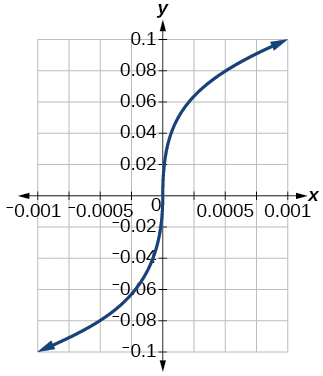 

<math xmlns="http://www.w3.org/1998/Math/MathML"> <mrow> <mo stretchy="false">[</mo><mn>−1000</mn><mo>,</mo><mtext>1000</mtext><mo stretchy="false">]</mo></mrow> </math>

<math xmlns="http://www.w3.org/1998/Math/MathML"> <mrow> <mo stretchy="false">[</mo><mn>−1,000,000</mn><mo>,</mo><mtext>1,000,000</mtext><mo stretchy="false">]</mo> </mrow> </math>

<math xmlns="http://www.w3.org/1998/Math/MathML"> <mrow> <mo stretchy="false">[</mo><mo>−</mo><mn>100</mn><mo>,</mo><mtext> 100</mtext><mo stretchy="false">]</mo></mrow> </math>

  

####  Real-World Applications

The amount of garbage,<math xmlns="http://www.w3.org/1998/Math/MathML"> <mrow> <mtext> </mtext><mi>G</mi><mo>,</mo><mtext> </mtext></mrow> </math>

produced by a city with population<math xmlns="http://www.w3.org/1998/Math/MathML"> <mrow> <mtext> </mtext><mi>p</mi><mtext> </mtext></mrow> </math>

is given by<math xmlns="http://www.w3.org/1998/Math/MathML"> <mrow> <mtext> </mtext><mi>G</mi><mo>=</mo><mi>f</mi><mrow><mo>(</mo> <mi>p</mi> <mo>)</mo></mrow><mo>.</mo><mtext> </mtext></mrow> </math>

<math xmlns="http://www.w3.org/1998/Math/MathML"> <mrow> <mi>G</mi><mtext> </mtext></mrow> </math>

is measured in tons per week, and<math xmlns="http://www.w3.org/1998/Math/MathML"> <mrow> <mtext> </mtext><mi>p</mi><mtext> </mtext></mrow> </math>

is measured in thousands of people.

1.  The town of Tola has a population of 40,000 and produces 13 tons of garbage each week. Express this information in terms of the function
    <math xmlns="http://www.w3.org/1998/Math/MathML"> <mrow> <mtext> </mtext><mi>f</mi><mo>.</mo><mtext> </mtext></mrow> </math>

2.  Explain the meaning of the statement
    <math xmlns="http://www.w3.org/1998/Math/MathML"> <mrow> <mtext> </mtext><mi>f</mi><mrow><mo>(</mo> <mn>5</mn> <mo>)</mo></mrow><mo>=</mo><mn>2.</mn></mrow> </math>
{: type="a"}

The number of cubic yards of dirt,<math xmlns="http://www.w3.org/1998/Math/MathML"> <mrow> <mtext> </mtext><mi>D</mi><mo>,</mo><mtext> </mtext></mrow> </math>

needed to cover a garden with area<math xmlns="http://www.w3.org/1998/Math/MathML"> <mrow> <mtext> </mtext><mi>a</mi><mtext> </mtext></mrow> </math>

square feet is given by<math xmlns="http://www.w3.org/1998/Math/MathML"> <mrow> <mtext> </mtext><mi>D</mi><mo>=</mo><mi>g</mi><mrow><mo>(</mo> <mi>a</mi> <mo>)</mo></mrow><mo>.</mo></mrow> </math>

1.  A garden with area 5000 ft2 requires 50 yd3 of dirt. Express this information in terms of the function
    <math xmlns="http://www.w3.org/1998/Math/MathML"> <mrow> <mtext> </mtext><mi>g</mi><mo>.</mo></mrow> </math>

2.  Explain the meaning of the statement
    <math xmlns="http://www.w3.org/1998/Math/MathML"> <mrow> <mtext> </mtext><mi>g</mi><mrow><mo>(</mo> <mrow> <mn>100</mn></mrow> <mo>)</mo></mrow><mo>=</mo><mn>1.</mn></mrow> </math>
{: type="a"}

a. <math xmlns="http://www.w3.org/1998/Math/MathML"> <mrow> <mtext> </mtext><mi>g</mi><mo stretchy="false">(</mo><mn>5000</mn><mo stretchy="false">)</mo><mo>=</mo><mn>50</mn><mo>;</mo></mrow> </math>

 b. The number of cubic yards of dirt required for a garden of 100 square feet is 1.

Let<math xmlns="http://www.w3.org/1998/Math/MathML"> <mrow> <mtext> </mtext><mi>f</mi><mrow><mo>(</mo> <mi>t</mi> <mo>)</mo></mrow><mtext> </mtext></mrow> </math>

be the number of ducks in a lake<math xmlns="http://www.w3.org/1998/Math/MathML"> <mrow> <mtext> </mtext><mi>t</mi><mtext> </mtext></mrow> </math>

years after 1990. Explain the meaning of each statement:

1.  <math xmlns="http://www.w3.org/1998/Math/MathML"> <mrow> <mi>f</mi><mrow><mo>(</mo> <mn>5</mn> <mo>)</mo></mrow><mo>=</mo><mn>30</mn></mrow> </math>

2.  <math xmlns="http://www.w3.org/1998/Math/MathML"> <mrow> <mi>f</mi><mrow><mo>(</mo> <mrow> <mn>10</mn></mrow> <mo>)</mo></mrow><mo>=</mo><mn>40</mn></mrow> </math>
{: type="a"}

Let<math xmlns="http://www.w3.org/1998/Math/MathML"> <mrow> <mtext> </mtext><mi>h</mi><mrow><mo>(</mo> <mi>t</mi> <mo>)</mo></mrow><mtext> </mtext></mrow> </math>

be the height above ground, in feet, of a rocket<math xmlns="http://www.w3.org/1998/Math/MathML"> <mrow> <mtext> </mtext><mi>t</mi><mtext> </mtext></mrow> </math>

seconds after launching. Explain the meaning of each statement:

1.  <math xmlns="http://www.w3.org/1998/Math/MathML"> <mrow> <mi>h</mi><mrow><mo>(</mo> <mn>1</mn> <mo>)</mo></mrow><mo>=</mo><mn>200</mn></mrow> </math>

2.  <math xmlns="http://www.w3.org/1998/Math/MathML"> <mrow> <mi>h</mi><mrow><mo>(</mo> <mn>2</mn> <mo>)</mo></mrow><mo>=</mo><mn>350</mn></mrow> </math>
{: type="a"}

a. The height of a rocket above ground after 1 second is 200 ft. b. the height of a rocket above ground after 2 seconds is 350 ft.

Show that the function<math xmlns="http://www.w3.org/1998/Math/MathML"> <mrow> <mtext> </mtext><mi>f</mi><mrow><mo>(</mo> <mi>x</mi> <mo>)</mo></mrow><mo>=</mo><mn>3</mn><msup> <mrow> <mrow><mo>(</mo> <mrow> <mi>x</mi><mo>−</mo><mn>5</mn></mrow> <mo>)</mo></mrow></mrow> <mn>2</mn> </msup> <mo>+</mo><mn>7</mn><mtext> </mtext></mrow> </math>

is <u data-effect="underline">not</u> one-to-one.

### Footnotes
{: data-type="footnote-refs-title"}

* {: data-type="footnote-ref" #footnote1} [1](#footnote-ref1){: data-type="footnote-ref-link"} http://www.baseball-almanac.com/legendary/lisn100.shtml. Accessed 3/24/2014.
* {: data-type="footnote-ref" #footnote2} [2](#footnote-ref2){: data-type="footnote-ref-link"} http://www.kgbanswers.com/how-long-is-a-dogs-memory-span/4221590. Accessed 3/24/2014.
{: data-list-type="bulleted" data-bullet-style="none"}

### Glossary
{: data-type="glossary-title"}

dependent variable
: an output variable
^

domain
: the set of all possible input values for a relation
^

function
: a relation in which each input value yields a unique output value
^

horizontal line test
: a method of testing whether a function is one-to-one by determining whether any horizontal line intersects the graph more than once
^

independent variable
: an input variable
^

input
: each object or value in a domain that relates to another object or value by a relationship known as a function
^

one-to-one function
: a function for which each value of the output is associated with a unique input value
^

output
: each object or value in the range that is produced when an input value is entered into a function
^

range
: the set of output values that result from the input values in a relation
^

relation
: a set of ordered pairs
^

vertical line test
: a method of testing whether a graph represents a function by determining whether a vertical line intersects the graph no more than once

[1]: http://openstaxcollege.org/l/relationfunction
[2]: http://openstaxcollege.org/l/vertlinetest
[3]: http://openstaxcollege.org/l/introtofunction
[4]: http://openstaxcollege.org/l/vertlinegraph
[5]: http://openstaxcollege.org/l/onetoone
[6]: http://openstaxcollege.org/l/graphonetoone
