

In this section, you will:
* Find the domain of a function defined by an equation.
* Graph piecewise-defined functions.

If you’re in the mood for a scary movie, you may want to check out one of the five most popular horror movies of all time—*I am Legend*, *Hannibal*, *The Ring*, *The Grudge*, and *The Conjuring*. [\[link\]](#Figure_01_02_001) shows the amount, in dollars, each of those movies grossed when they were released as well as the ticket sales for horror movies in general by year. Notice that we can use the data to create a function of the amount each movie earned or the total ticket sales for all horror movies by year. In creating various functions using the data, we can identify different independent and dependent variables, and we can analyze the data and the functions to determine the **domain**{: data-type="term" .no-emphasis} and range. In this section, we will investigate methods for determining the domain and range of functions such as these.

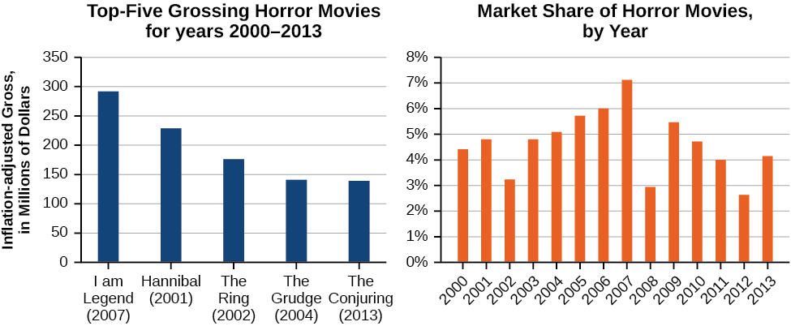{: #Figure_01_02_001}

### Finding the Domain of a Function Defined by an Equation

In [Functions and Function Notation](/m51261){: .target-chapter}, we were introduced to the concepts of **domain and range**{: data-type="term" .no-emphasis}. In this section, we will practice determining domains and ranges for specific functions. Keep in mind that, in determining domains and ranges, we need to consider what is physically possible or meaningful in real-world examples, such as tickets sales and year in the horror movie example above. We also need to consider what is mathematically permitted. For example, we cannot include any input value that leads us to take an even root of a negative number if the domain and range consist of real numbers. Or in a function expressed as a formula, we cannot include any input value in the domain that would lead us to divide by 0.

We can visualize the domain as a “holding area” that contains “raw materials” for a “function machine” and the range as another “holding area” for the machine’s products. See [\[link\]](#Figure_01_02_002).

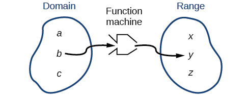{: #Figure_01_02_002}

We can write the **domain and range**{: data-type="term" .no-emphasis} in **interval notation**{: data-type="term"}, which uses values within brackets to describe a set of numbers. In interval notation, we use a square bracket \[ when the set includes the endpoint and a parenthesis ( to indicate that the endpoint is either not included or the interval is unbounded. For example, if a person has $100 to spend, he or she would need to express the interval that is more than 0 and less than or equal to 100 and write<math xmlns="http://www.w3.org/1998/Math/MathML"> <mrow> <mtext> </mtext><mrow><mo>(</mo> <mrow> <mn>0</mn><mo>,</mo><mtext> </mtext><mn>100</mn> </mrow> <mo>]</mo></mrow><mo>.</mo><mtext> </mtext> </mrow> </math>

We will discuss interval notation in greater detail later.

Let’s turn our attention to finding the domain of a function whose equation is provided. Oftentimes, finding the domain of such functions involves remembering three different forms. First, if the function has no denominator or an even root, consider whether the domain could be all real numbers. Second, if there is a denominator in the function’s equation, exclude values in the domain that force the denominator to be zero. Third, if there is an even root, consider excluding values that would make the radicand negative.

Before we begin, let us review the conventions of interval notation:

* The smallest number from the interval is written first.
* The largest number in the interval is written second, following a comma.
* Parentheses, ( or ), are used to signify that an endpoint value is not included, called exclusive.
* Brackets, \[ or \], are used to indicate that an endpoint value is included, called inclusive.

See [\[link\]](#Figure_01_02_029) for a summary of interval notation.

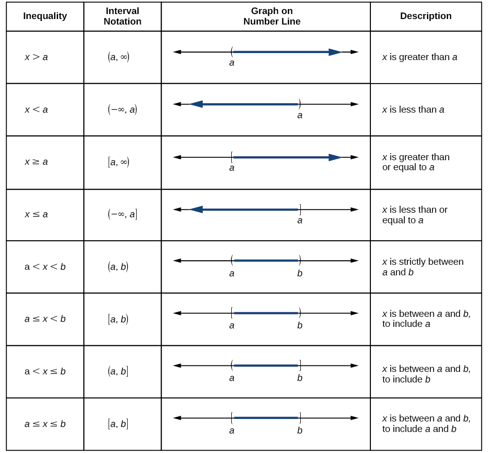{: #Figure_01_02_029}

Finding the Domain of a Function as a Set of Ordered Pairs

Find the **domain**{: data-type="term" .no-emphasis} of the following function:<math xmlns="http://www.w3.org/1998/Math/MathML"> <mrow> <mtext> </mtext><mrow><mo>{</mo> <mrow> <mrow><mo>(</mo> <mrow> <mn>2</mn><mo>,</mo><mtext> </mtext><mn>10</mn> </mrow> <mo>)</mo></mrow><mo>,</mo><mrow><mo>(</mo> <mrow> <mn>3</mn><mo>,</mo><mtext> </mtext><mn>10</mn> </mrow> <mo>)</mo></mrow><mo>,</mo><mrow><mo>(</mo> <mrow> <mn>4</mn><mo>,</mo><mtext> </mtext><mn>20</mn> </mrow> <mo>)</mo></mrow><mo>,</mo><mrow><mo>(</mo> <mrow> <mn>5</mn><mo>,</mo><mtext> </mtext><mn>30</mn> </mrow> <mo>)</mo></mrow><mo>,</mo><mrow><mo>(</mo> <mrow> <mn>6</mn><mo>,</mo><mtext> </mtext><mn>40</mn> </mrow> <mo>)</mo></mrow> </mrow> <mo>}</mo></mrow> </mrow> </math>

.

First identify the input values. The input value is the first coordinate in an **ordered pair**{: data-type="term" .no-emphasis}. There are no restrictions, as the ordered pairs are simply listed. The domain is the set of the first coordinates of the ordered pairs.

<math xmlns="http://www.w3.org/1998/Math/MathML" display="block"> <mrow> <mo>{</mo><mn>2</mn><mo>,</mo><mn>3</mn><mo>,</mo><mn>4</mn><mo>,</mo><mn>5</mn><mo>,</mo><mn>6</mn><mo>}</mo> </mrow> </math>

Find the domain of the function:

<math xmlns="http://www.w3.org/1998/Math/MathML"> <mrow> <mrow><mo>{</mo> <mrow> <mo stretchy="false">(</mo><mn>−5</mn><mo>,</mo><mn>4</mn><mo stretchy="false">)</mo><mo>,</mo><mo stretchy="false">(</mo><mn>0</mn><mo>,</mo><mn>0</mn><mo stretchy="false">)</mo><mo>,</mo><mo stretchy="false">(</mo><mn>5</mn><mo>,</mo><mn>−4</mn><mo stretchy="false">)</mo><mo>,</mo><mo stretchy="false">(</mo><mn>10</mn><mo>,</mo><mn>−8</mn><mo stretchy="false">)</mo><mo>,</mo><mo stretchy="false">(</mo><mn>15</mn><mo>,</mo><mn>−12</mn><mo stretchy="false">)</mo> </mrow> <mo>}</mo></mrow> </mrow> </math>

<math xmlns="http://www.w3.org/1998/Math/MathML"> <mrow> <mo>{</mo><mo>−</mo><mn>5</mn><mo>,</mo><mtext> </mtext><mn>0</mn><mo>,</mo><mtext> </mtext><mn>5</mn><mo>,</mo><mtext> </mtext><mn>10</mn><mo>,</mo><mtext> </mtext><mn>15</mn><mo>}</mo> </mrow> </math>

**Given a function written in equation form, find the domain.**

1.  Identify the input values.
2.  Identify any restrictions on the input and exclude those values from the domain.
3.  Write the domain in interval form, if possible.
{: data-number-style="arabic"}

Finding the Domain of a Function

Find the domain of the function<math xmlns="http://www.w3.org/1998/Math/MathML"> <mrow> <mtext> </mtext><mi>f</mi><mo stretchy="false">(</mo><mi>x</mi><mo stretchy="false">)</mo><mo>=</mo><msup> <mi>x</mi> <mn>2</mn> </msup> <mo>−</mo><mn>1.</mn> </mrow> </math>

The input value, shown by the variable<math xmlns="http://www.w3.org/1998/Math/MathML"> <mrow> <mtext> </mtext><mi>x</mi><mtext> </mtext> </mrow> </math>

in the equation, is squared and then the result is lowered by one. Any real number may be squared and then be lowered by one, so there are no restrictions on the domain of this function. The domain is the set of real numbers.

In interval form, the domain of<math xmlns="http://www.w3.org/1998/Math/MathML"> <mrow> <mtext> </mtext><mi>f</mi><mtext> </mtext> </mrow> </math>

is<math xmlns="http://www.w3.org/1998/Math/MathML"> <mrow> <mtext> </mtext><mrow><mo>(</mo> <mrow> <mo>−</mo><mi>∞</mi><mo>,</mo><mi>∞</mi> </mrow> <mo>)</mo></mrow><mo>.</mo> </mrow> </math>

Find the domain of the function:<math xmlns="http://www.w3.org/1998/Math/MathML"> <mrow> <mtext> </mtext><mi>f</mi><mo stretchy="false">(</mo><mi>x</mi><mo stretchy="false">)</mo><mo>=</mo><mn>5</mn><mo>−</mo><mi>x</mi><mo>+</mo><msup> <mi>x</mi> <mn>3</mn> </msup> <mo>.</mo> </mrow> </math>

<math xmlns="http://www.w3.org/1998/Math/MathML"> <mrow> <mrow><mo>(</mo> <mrow> <mo>−</mo><mi>∞</mi><mo>,</mo><mi>∞</mi> </mrow> <mo>)</mo></mrow> </mrow> </math>

**Given a function written in an equation form that includes a fraction, find the domain.**

1.  Identify the input values.
2.  Identify any restrictions on the input. If there is a denominator in the function’s formula, set the denominator equal to zero and solve for
    <math xmlns="http://www.w3.org/1998/Math/MathML"> <mrow> <mtext> </mtext><mi>x</mi><mtext> </mtext> </mrow> </math>
    
    . If the function’s formula contains an even root, set the radicand greater than or equal to 0, and then solve.
3.  Write the domain in interval form, making sure to exclude any restricted values from the domain.
{: data-number-style="arabic"}

Finding the Domain of a Function Involving a Denominator

Find the **domain**{: data-type="term" .no-emphasis} of the function<math xmlns="http://www.w3.org/1998/Math/MathML"> <mrow> <mtext> </mtext><mi>f</mi><mo stretchy="false">(</mo><mi>x</mi><mo stretchy="false">)</mo><mo>=</mo><mfrac> <mrow> <mi>x</mi><mo>+</mo><mn>1</mn> </mrow> <mrow> <mn>2</mn><mo>−</mo><mi>x</mi> </mrow> </mfrac> <mo>.</mo> </mrow> </math>

When there is a denominator, we want to include only values of the input that do not force the denominator to be zero. So, we will set the denominator equal to 0 and solve for<math xmlns="http://www.w3.org/1998/Math/MathML"> <mrow> <mtext> </mtext><mi>x</mi><mo>.</mo> </mrow> </math>

<math xmlns="http://www.w3.org/1998/Math/MathML" display="block"> <mrow> <mtable> <mtr> <mtd columnalign="right"> <mrow> <mn>2</mn><mo>−</mo><mi>x</mi> </mrow> </mtd> <mtd> <mo>=</mo> </mtd> <mtd columnalign="left"> <mn>0</mn> </mtd> </mtr> <mtr> <mtd columnalign="right"> <mrow> <mo>−</mo><mi>x</mi> </mrow> </mtd> <mtd> <mo>=</mo> </mtd> <mtd columnalign="left"> <mrow> <mn>−2</mn> </mrow> </mtd> </mtr> <mtr> <mtd columnalign="right"> <mi>x</mi> </mtd> <mtd> <mo>=</mo> </mtd> <mtd columnalign="left"> <mn>2</mn> </mtd> </mtr> </mtable> </mrow> </math>

Now, we will exclude 2 from the domain. The answers are all real numbers where<math xmlns="http://www.w3.org/1998/Math/MathML"> <mrow> <mtext> </mtext><mi>x</mi><mo>&lt;</mo><mn>2</mn><mtext> </mtext> </mrow> </math>

or<math xmlns="http://www.w3.org/1998/Math/MathML"> <mrow> <mtext> </mtext><mi>x</mi><mo>&gt;</mo><mn>2</mn><mtext> </mtext> </mrow> </math>

as shown in [[link]](#Image_01_02_028). We can use a symbol known as the union,<math xmlns="http://www.w3.org/1998/Math/MathML"> <mrow> <mtext> </mtext><mo>∪</mo><mo>,</mo> </mrow> </math>

to combine the two sets. In interval notation, we write the solution:<math xmlns="http://www.w3.org/1998/Math/MathML"> <mrow> <mrow><mo>(</mo> <mrow> <mi>−∞</mi><mo>,</mo><mn>2</mn> </mrow> <mo>)</mo></mrow><mo>∪</mo><mrow><mo>(</mo> <mrow> <mn>2</mn><mo>,</mo><mi>∞</mi> </mrow> <mo>)</mo></mrow><mo>.</mo> </mrow> </math>

{: #Image_01_02_028}

Find the domain of the function:<math xmlns="http://www.w3.org/1998/Math/MathML"> <mrow> <mtext> </mtext><mi>f</mi><mo stretchy="false">(</mo><mi>x</mi><mo stretchy="false">)</mo><mo>=</mo><mfrac> <mrow> <mn>1</mn><mo>+</mo><mn>4</mn><mi>x</mi> </mrow> <mrow> <mn>2</mn><mi>x</mi><mo>−</mo><mn>1</mn> </mrow> </mfrac> <mo>.</mo> </mrow> </math>

<math xmlns="http://www.w3.org/1998/Math/MathML"> <mrow> <mrow><mo>(</mo> <mrow> <mo>−</mo><mi>∞</mi><mo>,</mo><mfrac> <mn>1</mn> <mn>2</mn> </mfrac> </mrow> <mo>)</mo></mrow><mo>∪</mo><mrow><mo>(</mo> <mrow> <mfrac> <mn>1</mn> <mn>2</mn> </mfrac> <mo>,</mo><mi>∞</mi> </mrow> <mo>)</mo></mrow> </mrow> </math>

**Given a function written in equation form including an even root, find the domain.**

1.  Identify the input values.
2.  Since there is an even root, exclude any real numbers that result in a negative number in the radicand. Set the radicand greater than or equal to zero and solve for
    <math xmlns="http://www.w3.org/1998/Math/MathML"> <mrow> <mtext> </mtext><mi>x</mi><mo>.</mo> </mrow> </math>

3.  The solution(s) are the domain of the function. If possible, write the answer in interval form.
{: data-number-style="arabic"}

Finding the Domain of a Function with an Even Root

Find the **domain**{: data-type="term" .no-emphasis} of the function<math xmlns="http://www.w3.org/1998/Math/MathML"> <mrow> <mtext> </mtext><mi>f</mi><mo stretchy="false">(</mo><mi>x</mi><mo stretchy="false">)</mo><mo>=</mo><msqrt> <mrow> <mn>7</mn><mo>−</mo><mi>x</mi> </mrow> </msqrt> <mo>.</mo> </mrow> </math>

When there is an even root in the formula, we exclude any real numbers that result in a negative number in the radicand.

Set the radicand greater than or equal to zero and solve for<math xmlns="http://www.w3.org/1998/Math/MathML"> <mrow> <mtext> </mtext><mi>x</mi><mo>.</mo> </mrow> </math>

<math xmlns="http://www.w3.org/1998/Math/MathML" display="block"> <mrow> <mtable> <mtr> <mtd columnalign="right"> <mrow> <mn>7</mn><mo>−</mo><mi>x</mi> </mrow> </mtd> <mtd> <mo>≥</mo> </mtd> <mtd columnalign="left"> <mn>0</mn> </mtd> </mtr> <mtr> <mtd columnalign="right"> <mrow> <mo>−</mo><mi>x</mi> </mrow> </mtd> <mtd> <mo>≥</mo> </mtd> <mtd columnalign="left"> <mrow> <mn>−7</mn> </mrow> </mtd> </mtr> <mtr> <mtd columnalign="right"> <mi>x</mi> </mtd> <mtd> <mo>≤</mo> </mtd> <mtd columnalign="left"> <mn>7</mn> </mtd> </mtr> </mtable> </mrow> </math>

Now, we will exclude any number greater than 7 from the domain. The answers are all real numbers less than or equal to<math xmlns="http://www.w3.org/1998/Math/MathML"> <mrow> <mtext> </mtext><mn>7</mn><mo>,</mo><mtext> </mtext> </mrow> </math>

or<math xmlns="http://www.w3.org/1998/Math/MathML"> <mrow> <mtext> </mtext><mo stretchy="false">(</mo><mo>−</mo><mi>∞</mi><mo>,</mo><mn>7</mn><mo stretchy="false">]</mo><mo>.</mo> </mrow> </math>

Find the domain of the function<math xmlns="http://www.w3.org/1998/Math/MathML"> <mrow> <mtext> </mtext><mi>f</mi><mo stretchy="false">(</mo><mi>x</mi><mo stretchy="false">)</mo><mo>=</mo><msqrt> <mrow> <mn>5</mn><mo>+</mo><mn>2</mn><mi>x</mi> </mrow> </msqrt> <mo>.</mo> </mrow> </math>

<math xmlns="http://www.w3.org/1998/Math/MathML"> <mrow> <mrow><mo>[</mo> <mrow> <mo>−</mo><mfrac> <mn>5</mn> <mn>2</mn> </mfrac> <mo>,</mo><mi>∞</mi> </mrow> <mo>)</mo></mrow> </mrow> </math>

**Can there be functions in which the domain and range do not intersect at all?**

*Yes. For example, the function<math xmlns="http://www.w3.org/1998/Math/MathML"> <mrow> <mtext> </mtext><mi>f</mi><mo stretchy="false">(</mo><mi>x</mi><mo stretchy="false">)</mo><mo>=</mo><mo>−</mo><mfrac> <mn>1</mn> <mrow> <msqrt> <mi>x</mi> </msqrt> </mrow> </mfrac> <mtext> </mtext></mrow> </math>

has the set of all positive real numbers as its domain but the set of all negative real numbers as its range. As a more extreme example, a function’s inputs and outputs can be completely different categories (for example, names of weekdays as inputs and numbers as outputs, as on an attendance chart), in such cases the domain and range have no elements in common.*

### Using Notations to Specify Domain and Range

In the previous examples, we used inequalities and lists to describe the domain of functions. We can also use inequalities, or other statements that might define sets of values or data, to describe the behavior of the variable in **set-builder notation**{: data-type="term"}. For example,<math xmlns="http://www.w3.org/1998/Math/MathML"> <mrow> <mtext> </mtext><mrow><mo>{</mo> <mrow> <mi>x</mi><mo>\|</mo><mn>10</mn><mo>≤</mo><mi>x</mi><mo>&lt;</mo><mn>30</mn> </mrow> <mo>}</mo></mrow><mtext> </mtext> </mrow> </math>

describes the behavior of<math xmlns="http://www.w3.org/1998/Math/MathML"> <mrow> <mtext> </mtext><mi>x</mi><mtext> </mtext> </mrow> </math>

in set-builder notation. The braces<math xmlns="http://www.w3.org/1998/Math/MathML"> <mrow> <mtext> </mtext><mo>{</mo><mo>}</mo><mtext> </mtext> </mrow> </math>

are read as “the set of,” and the vertical bar \\\| is read as “such that,” so we would read<math xmlns="http://www.w3.org/1998/Math/MathML"> <mrow> <mtext> </mtext><mrow><mo>{</mo> <mrow> <mi>x</mi><mo>\|</mo><mn>10</mn><mo>≤</mo><mi>x</mi><mo>&lt;</mo><mn>30</mn> </mrow> <mo>}</mo></mrow><mtext> </mtext> </mrow> </math>

as “the set of *x*-values such that 10 is less than or equal to<math xmlns="http://www.w3.org/1998/Math/MathML"> <mrow> <mtext> </mtext><mi>x</mi><mo>,</mo><mtext> </mtext> </mrow> </math>

and<math xmlns="http://www.w3.org/1998/Math/MathML"> <mrow> <mtext> </mtext><mi>x</mi><mtext> </mtext> </mrow> </math>

is less than 30.”

[\[link\]](#Figure_01_02_003) compares inequality notation, set-builder notation, and interval notation.

 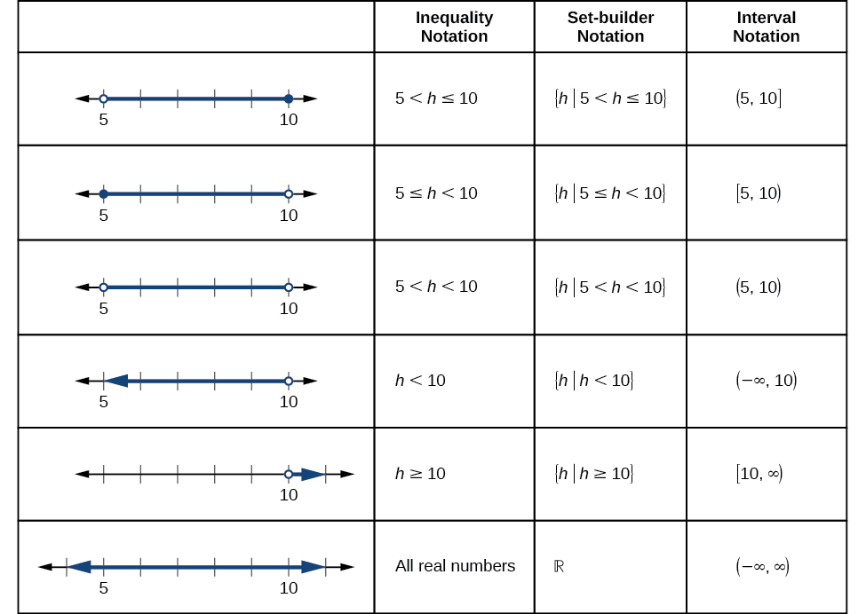{: #Figure_01_02_003}

To combine two intervals using inequality notation or set-builder notation, we use the word “or.” As we saw in earlier examples, we use the union symbol,<math xmlns="http://www.w3.org/1998/Math/MathML"> <mrow> <mtext> </mtext><mo>∪</mo><mo>,</mo> </mrow> </math>

to combine two unconnected intervals. For example, the union of the sets<math xmlns="http://www.w3.org/1998/Math/MathML"> <mrow> <mo>{</mo><mn>2</mn><mo>,</mo><mn>3</mn><mo>,</mo><mn>5</mn><mo>}</mo><mtext> </mtext> </mrow> </math>

 and<math xmlns="http://www.w3.org/1998/Math/MathML"> <mrow> <mtext> </mtext><mo>{</mo><mn>4</mn><mo>,</mo><mn>6</mn><mo>}</mo><mtext> </mtext> </mrow> </math>

 is the set<math xmlns="http://www.w3.org/1998/Math/MathML"> <mrow> <mtext> </mtext><mo>{</mo><mn>2</mn><mo>,</mo><mn>3</mn><mo>,</mo><mn>4</mn><mo>,</mo><mn>5</mn><mo>,</mo><mn>6</mn><mo>}</mo><mo>.</mo><mtext> </mtext> </mrow> </math>

It is the set of all elements that belong to one *or* the other (or both) of the original two sets. For sets with a finite number of elements like these, the elements do not have to be listed in ascending order of numerical value. If the original two sets have some elements in common, those elements should be listed only once in the union set. For sets of real numbers on intervals, another example of a union is

<math xmlns="http://www.w3.org/1998/Math/MathML" display="block"> <mrow> <mrow><mo>{</mo> <mrow> <mrow><mi>x</mi><mo>\|</mo></mrow><mtext>  </mtext><mrow><mo>\|</mo> <mi>x</mi> <mo>\|</mo></mrow><mo>≥</mo><mn>3</mn> </mrow> <mo>}</mo></mrow><mo>=</mo><mrow><mo>(</mo> <mrow> <mo>−</mo><mi>∞</mi><mo>,</mo><mo>−</mo><mn>3</mn> </mrow> <mo>]</mo></mrow><mo>∪</mo><mrow><mo>[</mo> <mrow> <mn>3</mn><mo>,</mo><mi>∞</mi> </mrow> <mo>)</mo></mrow> </mrow> </math>

Set-Builder Notation and Interval Notation

<strong>Set-builder notation </strong>is a method of specifying a set of elements that satisfy a certain condition. It takes the form<math xmlns="http://www.w3.org/1998/Math/MathML"> <mrow> <mo>{</mo><mi>x</mi><mo>\|</mo><mtext> </mtext><mtext>statement about </mtext><mi>x</mi><mo>}</mo><mtext> </mtext> </mrow> </math>

which is read as, “the set of all<math xmlns="http://www.w3.org/1998/Math/MathML"> <mrow> <mtext> </mtext><mi>x</mi><mtext> </mtext> </mrow> </math>

such that the statement about<math xmlns="http://www.w3.org/1998/Math/MathML"> <mrow> <mtext> </mtext><mi>x</mi><mtext> </mtext> </mrow> </math>

is true.” For example,

<math xmlns="http://www.w3.org/1998/Math/MathML" display="block"> <mrow> <mrow><mo>{</mo> <mrow> <mi>x</mi><mo>\|</mo><mn>4</mn><mo>&lt;</mo><mi>x</mi><mo>≤</mo><mn>12</mn> </mrow> <mo>}</mo></mrow> </mrow> </math>

**Interval notation** is a way of describing sets that include all real numbers between a lower limit that may or may not be included and an upper limit that may or may not be included. The endpoint values are listed between brackets or parentheses. A square bracket indicates inclusion in the set, and a parenthesis indicates exclusion from the set. For example,

<math xmlns="http://www.w3.org/1998/Math/MathML" display="block"> <mrow> <mrow><mo>(</mo> <mrow> <mn>4</mn><mo>,</mo><mn>12</mn> </mrow> <mo>]</mo></mrow> </mrow> </math>

**Given a line graph, describe the set of values using interval notation.**

1.  Identify the intervals to be included in the set by determining where the heavy line overlays the real line.
2.  At the left end of each interval, use \[ with each end value to be included in the set (solid dot) or ( for each excluded end value (open dot).
3.  At the right end of each interval, use \] with each end value to be included in the set (filled dot) or ) for each excluded end value (open dot).
4.  Use the union symbol
    <math xmlns="http://www.w3.org/1998/Math/MathML"> <mrow> <mtext> </mtext><mo>∪</mo><mtext> </mtext> </mrow> </math>
    
    to combine all intervals into one set.
{: data-number-style="arabic"}

Describing Sets on the Real-Number Line

Describe the intervals of values shown in [[link]](#Figure_01_02_004) using inequality notation, set-builder notation, and interval notation.

{: #Figure_01_02_004}

To describe the values,<math xmlns="http://www.w3.org/1998/Math/MathML"> <mrow> <mtext> </mtext><mi>x</mi><mo>,</mo><mtext> </mtext> </mrow> </math>

included in the intervals shown, we would say, “<math xmlns="http://www.w3.org/1998/Math/MathML"> <mrow> <mi>x</mi><mtext> </mtext> </mrow> </math>

is a real number greater than or equal to 1 and less than or equal to 3, or a real number greater than 5.”

| **Inequality** | <math xmlns="http://www.w3.org/1998/Math/MathML"> <mrow> <mn>1</mn><mo>≤</mo><mi>x</mi><mo>≤</mo><mn>3</mn><mtext> </mtext><mtext>or</mtext><mtext> </mtext><mi>x</mi><mo>&gt;</mo><mn>5</mn> </mrow> </math>

 |
| **Set-builder notation** | <math xmlns="http://www.w3.org/1998/Math/MathML"> <mrow> <mrow><mo>{</mo> <mrow> <mi>x</mi><mo>\|</mo><mn>1</mn><mo>≤</mo><mi>x</mi><mo>≤</mo><mn>3</mn><mtext> </mtext><mtext>or</mtext><mtext> </mtext><mi>x</mi><mo>&gt;</mo><mn>5</mn> </mrow> <mo>}</mo></mrow> </mrow> </math>

 |
| **Interval notation** | <math xmlns="http://www.w3.org/1998/Math/MathML"> <mrow> <mo stretchy="false">[</mo><mn>1</mn><mo>,</mo><mn>3</mn><mo stretchy="false">]</mo><mo>∪</mo><mo stretchy="false">(</mo><mn>5</mn><mo>,</mo><mi>∞</mi><mo stretchy="false">)</mo> </mrow> </math>

 |
{: summary=".." .unnumbered data-label=""}

Remember that, when writing or reading interval notation, using a square bracket means the boundary is included in the set. Using a parenthesis means the boundary is not included in the set.

Given [[link]](#Figure_01_02_005), specify the graphed set in

1.  words
2.  set-builder notation
3.  interval notation
{: data-number-style="lower-alpha"}

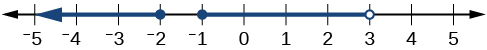{: #Figure_01_02_005}

values that are less than or equal to –2, or values that are greater than or equal to –1 and less than 3;

<math xmlns="http://www.w3.org/1998/Math/MathML"> <mrow> <mrow><mo>{</mo> <mrow> <mi>x</mi><mo>\|</mo><mi>x</mi><mo>≤</mo><mo>−</mo><mn>2</mn><mtext> </mtext><mtext>or</mtext><mtext> </mtext><mo>−</mo><mn>1</mn><mo>≤</mo><mi>x</mi><mo>&lt;</mo><mn>3</mn> </mrow> <mo>}</mo></mrow> </mrow> </math>
;

<math xmlns="http://www.w3.org/1998/Math/MathML"> <mrow> <mo stretchy="false">(</mo><mo>−</mo><mi>∞</mi><mo>,</mo><mo>−</mo><mn>2</mn><mo stretchy="false">]</mo><mo>∪</mo><mo stretchy="false">[</mo><mo>−</mo><mn>1</mn><mo>,</mo><mn>3</mn><mo stretchy="false">)</mo> </mrow> </math>

### Finding Domain and Range from Graphs

Another way to identify the domain and range of functions is by using graphs. Because the domain refers to the set of possible input values, the domain of a graph consists of all the input values shown on the *x*-axis. The range is the set of possible output values, which are shown on the *y*-axis. Keep in mind that if the graph continues beyond the portion of the graph we can see, the domain and range may be greater than the visible values. See [\[link\]](#Figure_01_02_006).

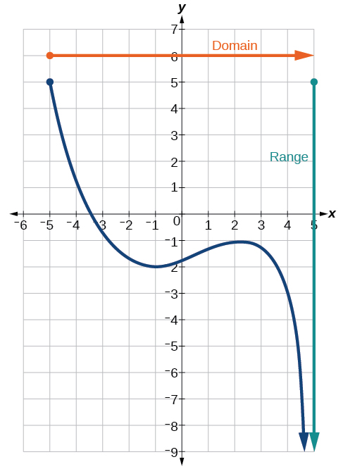{: #Figure_01_02_006}

We can observe that the graph extends horizontally from<math xmlns="http://www.w3.org/1998/Math/MathML"> <mrow> <mtext> </mtext><mn>−5</mn><mtext> </mtext> </mrow> </math>

to the right without bound, so the domain is<math xmlns="http://www.w3.org/1998/Math/MathML"> <mrow> <mtext> </mtext><mrow><mo>[</mo> <mrow> <mn>−5</mn><mo>,</mo><mi>∞</mi> </mrow> <mo>)</mo></mrow><mo>.</mo><mtext> </mtext><mtext> </mtext> </mrow> </math>

The vertical extent of the graph is all range values<math xmlns="http://www.w3.org/1998/Math/MathML"> <mrow> <mtext> </mtext><mn>5</mn><mtext> </mtext> </mrow> </math>

and below, so the range is<math xmlns="http://www.w3.org/1998/Math/MathML"> <mrow> <mtext> </mtext><mrow><mo>(</mo> <mrow> <mi>−∞</mi><mo>,</mo><mn>5</mn> </mrow> <mo>]</mo></mrow><mo>.</mo><mtext> </mtext> </mrow> </math>

Note that the domain and range are always written from smaller to larger values, or from left to right for domain, and from the bottom of the graph to the top of the graph for range.

Finding Domain and Range from a Graph

Find the domain and range of the function<math xmlns="http://www.w3.org/1998/Math/MathML"> <mrow> <mtext> </mtext><mi>f</mi><mtext> </mtext> </mrow> </math>

 whose graph is shown in [[link]](#Figure_01_02_007).

![Graph of a function from (-3, 1\].](../resources/CNX_Precalc_Figure_01_02_007.jpg){: #Figure_01_02_007}

We can observe that the horizontal extent of the graph is –3 to 1, so the domain of<math xmlns="http://www.w3.org/1998/Math/MathML"> <mrow> <mtext> </mtext><mi>f</mi><mtext> </mtext> </mrow> </math>

 is<math xmlns="http://www.w3.org/1998/Math/MathML"> <mrow> <mtext> </mtext><mrow><mo>(</mo> <mrow> <mo>−</mo><mn>3</mn><mo>,</mo><mn>1</mn> </mrow> <mo>]</mo></mrow><mo>.</mo> </mrow> </math>

The vertical extent of the graph is 0 to –4, so the range is<math xmlns="http://www.w3.org/1998/Math/MathML"> <mrow> <mtext> </mtext><mrow> <mo>[</mo> <mrow> <mo>−</mo><mn>4</mn> </mrow> </mrow><mo>,</mo><mrow> <mn>0</mn> <mo>)</mo></mrow><mo>.</mo><mtext> </mtext> </mrow> </math>

See [[link]](#Figure_01_02_008).

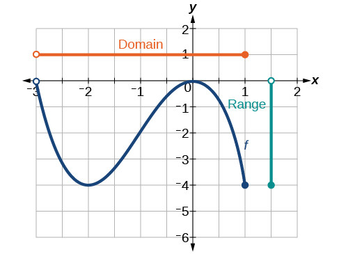{: #Figure_01_02_008}

Finding Domain and Range from a Graph of Oil Production

Find the domain and range of the function<math xmlns="http://www.w3.org/1998/Math/MathML"> <mrow> <mtext> </mtext><mi>f</mi><mtext> </mtext> </mrow> </math>

whose graph is shown in [[link]](#Figure_01_02_009).

2"){: #Figure_01_02_009}

The input quantity along the horizontal axis is “years,” which we represent with the variable<math xmlns="http://www.w3.org/1998/Math/MathML"> <mrow> <mtext> </mtext><mi>t</mi><mtext> </mtext> </mrow> </math>

for time. The output quantity is “thousands of barrels of oil per day,” which we represent with the variable<math xmlns="http://www.w3.org/1998/Math/MathML"> <mrow> <mtext> </mtext><mi>b</mi><mtext> </mtext> </mrow> </math>

for barrels. The graph may continue to the left and right beyond what is viewed, but based on the portion of the graph that is visible, we can determine the domain as<math xmlns="http://www.w3.org/1998/Math/MathML"> <mrow> <mtext> </mtext><mn>1973</mn><mo>≤</mo><mi>t</mi><mo>≤</mo><mn>2008</mn><mtext> </mtext> </mrow> </math>

and the range as approximately<math xmlns="http://www.w3.org/1998/Math/MathML"> <mrow> <mtext> </mtext><mn>180</mn><mo>≤</mo><mi>b</mi><mo>≤</mo><mn>2010.</mn> </mrow> </math>

In interval notation, the domain is [1973, 2008], and the range is about [180, 2010]. For the domain and the range, we approximate the smallest and largest values since they do not fall exactly on the grid lines.

Given [[link]](#Figure_01_02_010), identify the domain and range using interval notation.

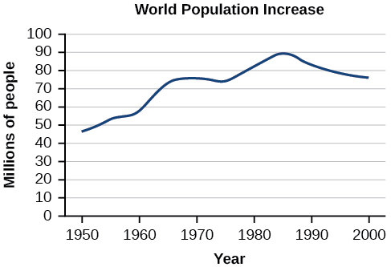{: #Figure_01_02_010}

domain =[1950,2002] range = [47,000,000,89,000,000]

**Can a function’s domain and range be the same?**

*Yes. For example, the domain and range of the cube root function are both the set of all real numbers.*

### Finding Domains and Ranges of the Toolkit Functions

We will now return to our set of toolkit functions to determine the domain and range of each.

 =c,&#x2009;&#10;the domain consists of all real numbers; there are no restrictions on the input. The only output value is the constant&#10;&#10;&#x2009;c,&#x2009;&#10;so the range is the set&#10;&#10;&#x2009;{c}&#x2009;&#10;that contains this single element. In interval notation, this is written as&#10;&#10;&#x2009;[c,c],&#x2009;&#10;the interval that both begins and ends with&#10;&#10;&#x2009;c.&#10;&#10;"){: #Figure_01_02_011}

=x,&#x2009;&#10;there is no restriction on&#10;&#10;&#x2009;x.&#x2009;&#10;Both the domain and range are the set of all real numbers."){: #Figure_01_02_012}

=| x |,&#x2009;&#10;there is no restriction on&#10;&#10;&#x2009;x.&#x2009;&#10;However, because absolute value is defined as a distance from 0, the output can only be greater than or equal to 0."){: #Figure_01_02_013}

=&#10;x&#10;2&#10;&#10;,&#x2009;&#10;the domain is all real numbers since the horizontal extent of the graph is the whole real number line. Because the graph does not include any negative values for the range, the range is only nonnegative real numbers."){: #Figure_01_02_014}

=&#10;x&#10;3&#10;&#10;,&#x2009;&#10;the domain is all real numbers because the horizontal extent of the graph is the whole real number line. The same applies to the vertical extent of the graph, so the domain and range include all real numbers."){: #Figure_01_02_015}

=&#10;1&#10;x&#10;&#10;,&#x2009;&#10;we cannot divide by 0, so we must exclude 0 from the domain. Further, 1 divided by any value can never be 0, so the range also will not include 0. In set-builder notation, we could also write&#10; &#10;  {x|&#xA0;x&#x2260;0},&#10; &#10;the set of all real numbers that are not zero."){: #Figure_01_02_016}

=&#10;   1&#10;   &#10;    &#10;     x&#10;     2&#10;    &#10;    &#10;   &#10;  &#10;  ,&#10; &#10;we cannot divide by &#10; &#10;  0,&#10; &#10; so we must exclude &#10; 0&#10; from the domain. There is also no &#10; x&#10; that can give an output of 0, so 0 is excluded from the range as well. Note that the output of this function is always positive due to the square in the denominator, so the range includes only positive numbers."){: #Figure_01_02_017}

=&#10;x&#10;&#10;&#10;,&#x2009;&#10;we cannot take the square root of a negative real number, so the domain must be 0 or greater. The range also excludes negative numbers because the square root of a positive number&#10;&#10;&#x2009;x&#x2009;&#10;is defined to be positive, even though the square of the negative number&#10;&#10;&#x2009;&#x2212;&#10;x&#10;&#10;&#x2009;&#10;also gives us&#10;&#10;&#x2009;x.&#10;"){: #Figure_01_02_018}

=&#10;x&#10;3&#10;&#10;,&#x2009;&#10;the domain and range include all real numbers. Note that there is no problem taking a cube root, or any odd-integer root, of a negative number, and the resulting output is negative (it is an odd function)."){: #Figure_01_02_019}

**Given the formula for a function, determine the domain and range.**

1.  Exclude from the domain any input values that result in division by zero.
2.  Exclude from the domain any input values that have nonreal (or undefined) number outputs.
3.  Use the valid input values to determine the range of the output values.
4.  Look at the function graph and table values to confirm the actual function behavior.
{: data-number-style="arabic"}

Finding the Domain and Range Using Toolkit Functions

Find the domain and range of<math xmlns="http://www.w3.org/1998/Math/MathML"> <mrow> <mtext> </mtext><mi>f</mi><mo stretchy="false">(</mo><mi>x</mi><mo stretchy="false">)</mo><mo>=</mo><mn>2</mn><msup> <mi>x</mi> <mn>3</mn> </msup> <mo>−</mo><mi>x</mi><mo>.</mo> </mrow> </math>

There are no restrictions on the domain, as any real number may be cubed and then subtracted from the result.

The domain is<math xmlns="http://www.w3.org/1998/Math/MathML"> <mrow> <mtext> </mtext><mrow><mo>(</mo> <mrow> <mo>−</mo><mi>∞</mi><mo>,</mo><mi>∞</mi> </mrow> <mo>)</mo></mrow><mtext> </mtext> </mrow> </math>

and the range is also<math xmlns="http://www.w3.org/1998/Math/MathML"> <mrow> <mtext> </mtext><mrow><mo>(</mo> <mrow> <mo>−</mo><mi>∞</mi><mo>,</mo><mi>∞</mi> </mrow> <mo>)</mo></mrow><mo>.</mo> </mrow> </math>

Finding the Domain and Range

Find the domain and range of<math xmlns="http://www.w3.org/1998/Math/MathML"> <mrow> <mtext> </mtext><mi>f</mi><mo stretchy="false">(</mo><mi>x</mi><mo stretchy="false">)</mo><mo>=</mo><mfrac> <mn>2</mn> <mrow> <mi>x</mi><mo>+</mo><mn>1</mn> </mrow> </mfrac> <mo>.</mo> </mrow> </math>

We cannot evaluate the function at<math xmlns="http://www.w3.org/1998/Math/MathML"> <mrow> <mtext> </mtext><mn>−1</mn><mtext> </mtext> </mrow> </math>

because division by zero is undefined. The domain is<math xmlns="http://www.w3.org/1998/Math/MathML"> <mrow> <mtext> </mtext><mrow><mo>(</mo> <mrow> <mo>−</mo><mi>∞</mi><mo>,</mo><mn>−1</mn> </mrow> <mo>)</mo></mrow><mo>∪</mo><mrow><mo>(</mo> <mrow> <mn>−1</mn><mo>,</mo><mi>∞</mi> </mrow> <mo>)</mo></mrow><mo>.</mo><mtext> </mtext> </mrow> </math>

Because the function is never zero, we exclude 0 from the range. The range is<math xmlns="http://www.w3.org/1998/Math/MathML"> <mrow> <mtext> </mtext><mrow><mo>(</mo> <mrow> <mo>−</mo><mi>∞</mi><mo>,</mo><mn>0</mn> </mrow> <mo>)</mo></mrow><mo>∪</mo><mrow><mo>(</mo> <mrow> <mn>0</mn><mo>,</mo><mi>∞</mi> </mrow> <mo>)</mo></mrow><mo>.</mo> </mrow> </math>

Finding the Domain and Range

Find the domain and range of<math xmlns="http://www.w3.org/1998/Math/MathML"> <mrow> <mtext> </mtext><mi>f</mi><mo stretchy="false">(</mo><mi>x</mi><mo stretchy="false">)</mo><mo>=</mo><mn>2</mn><msqrt> <mrow> <mi>x</mi><mo>+</mo><mn>4</mn> </mrow> </msqrt> <mo>.</mo> </mrow> </math>

We cannot take the square root of a negative number, so the value inside the radical must be nonnegative.

<math xmlns="http://www.w3.org/1998/Math/MathML"> <mrow> <mi>x</mi><mo>+</mo><mn>4</mn><mo>≥</mo><mn>0</mn><mtext> when </mtext><mi>x</mi><mo>≥</mo><mo>−</mo><mn>4</mn> </mrow> </math>

The domain of<math xmlns="http://www.w3.org/1998/Math/MathML"> <mrow> <mtext> </mtext><mi>f</mi><mrow><mo>(</mo> <mi>x</mi> <mo>)</mo></mrow><mtext> </mtext> </mrow> </math>

is<math xmlns="http://www.w3.org/1998/Math/MathML"> <mrow> <mtext> </mtext><mo stretchy="false">[</mo><mo>−</mo><mn>4</mn><mo>,</mo><mi>∞</mi><mo stretchy="false">)</mo><mo>.</mo> </mrow> </math>

We then find the range. We know that<math xmlns="http://www.w3.org/1998/Math/MathML"> <mrow> <mtext> </mtext><mi>f</mi><mrow><mo>(</mo> <mrow> <mo>−</mo><mn>4</mn> </mrow> <mo>)</mo></mrow><mo>=</mo><mn>0</mn><mo>,</mo><mtext> </mtext> </mrow> </math>

and the function value increases as<math xmlns="http://www.w3.org/1998/Math/MathML"> <mrow> <mtext> </mtext><mi>x</mi><mtext> </mtext> </mrow> </math>

increases without any upper limit. We conclude that the range of<math xmlns="http://www.w3.org/1998/Math/MathML"> <mrow> <mtext> </mtext><mi>f</mi><mtext> </mtext> </mrow> </math>

is<math xmlns="http://www.w3.org/1998/Math/MathML"> <mrow> <mtext> </mtext><mrow> <mo>[</mo> <mrow> <mn>0</mn><mo>,</mo><mrow> <mi>∞</mi> <mo>)</mo></mrow> </mrow> </mrow><mo>.</mo> </mrow> </math>

Analysis

[[link]](#Figure_01_02_020) represents the function<math xmlns="http://www.w3.org/1998/Math/MathML"> <mrow> <mtext> </mtext><mi>f</mi><mo>.</mo> </mrow> </math>

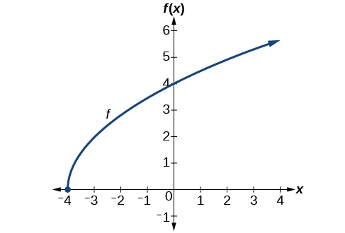{: #Figure_01_02_020}

Find the domain and range of<math xmlns="http://www.w3.org/1998/Math/MathML"> <mrow> <mtext> </mtext><mi>f</mi><mrow><mo>(</mo> <mi>x</mi> <mo>)</mo></mrow><mo>=</mo><mo>−</mo><msqrt> <mrow> <mn>2</mn><mo>−</mo><mi>x</mi> </mrow> </msqrt> <mo>.</mo> </mrow> </math>

domain:<math xmlns="http://www.w3.org/1998/Math/MathML"> <mrow> <mtext> </mtext><mrow><mo>(</mo> <mrow> <mo>−</mo><mi>∞</mi></mrow></mrow><mo>,</mo><mrow><mn>2</mn> <mo>]</mo></mrow><mo>;</mo><mtext> </mtext></mrow> </math>

range:<math xmlns="http://www.w3.org/1998/Math/MathML"> <mrow> <mtext> </mtext><mrow><mo>(</mo> <mrow> <mo>−</mo><mi>∞</mi></mrow></mrow><mo>,</mo><mrow><mn>0</mn> <mo>]</mo></mrow></mrow> </math>

### Graphing Piecewise-Defined Functions

Sometimes, we come across a function that requires more than one formula in order to obtain the given output. For example, in the toolkit functions, we introduced the absolute value function<math xmlns="http://www.w3.org/1998/Math/MathML"> <mrow> <mtext> </mtext><mi>f</mi><mo stretchy="false">(</mo><mi>x</mi><mo stretchy="false">)</mo><mo>=</mo><mrow><mo>\|</mo> <mi>x</mi> <mo>\|</mo></mrow><mo>.</mo><mtext> </mtext></mrow> </math>

With a domain of all real numbers and a range of values greater than or equal to 0, **absolute value**{: data-type="term" .no-emphasis} can be defined as the **magnitude**{: data-type="term" .no-emphasis}, or **modulus**{: data-type="term" .no-emphasis}, of a real number value regardless of sign. It is the distance from 0 on the number line. All of these definitions require the output to be greater than or equal to 0.

If we input 0, or a positive value, the output is the same as the input.

<math xmlns="http://www.w3.org/1998/Math/MathML" display="block"> <mrow> <mi>f</mi><mo stretchy="false">(</mo><mi>x</mi><mo stretchy="false">)</mo><mo>=</mo><mi>x</mi><mtext> </mtext><mtext>if</mtext><mtext> </mtext><mi>x</mi><mo>≥</mo><mn>0</mn></mrow> </math>

If we input a negative value, the output is the opposite of the input.

<math xmlns="http://www.w3.org/1998/Math/MathML" display="block"> <mrow> <mi>f</mi><mo stretchy="false">(</mo><mi>x</mi><mo stretchy="false">)</mo><mo>=</mo><mo>−</mo><mi>x</mi><mtext> </mtext><mtext>if</mtext><mtext> </mtext><mi>x</mi><mo>&lt;</mo><mn>0</mn></mrow> </math>

Because this requires two different processes or pieces, the absolute value function is an example of a piecewise function. A **piecewise function**{: data-type="term"} is a function in which more than one formula is used to define the output over different pieces of the domain.

We use piecewise functions to describe situations in which a rule or relationship changes as the input value crosses certain “boundaries.” For example, we often encounter situations in business for which the cost per piece of a certain item is discounted once the number ordered exceeds a certain value. Tax brackets are another real-world example of piecewise functions. For example, consider a simple tax system in which incomes up to $10,000 are taxed at 10%, and any additional income is taxed at 20%. The tax on a total income<math xmlns="http://www.w3.org/1998/Math/MathML"> <mrow> <mtext> </mtext><mi>S</mi><mtext> </mtext></mrow> </math>

would be<math xmlns="http://www.w3.org/1998/Math/MathML"> <mrow> <mtext> </mtext><mn>0.1</mn><mi>S</mi><mtext> </mtext></mrow> </math>

if<math xmlns="http://www.w3.org/1998/Math/MathML"> <mrow> <mtext> </mtext><mi>S</mi><mo>≤</mo><mtext>$</mtext><mn>10</mn><mtext>,</mtext><mn>000</mn><mtext> </mtext> </mrow> </math>

and<math xmlns="http://www.w3.org/1998/Math/MathML"> <mrow> <mtext> </mtext><mtext>$</mtext><mn>1000</mn><mo>+</mo><mn>0.2</mn><mo stretchy="false">(</mo><mi>S</mi><mo>−</mo><mtext>$</mtext><mn>10</mn><mtext>,</mtext><mn>000</mn><mo stretchy="false">)</mo><mtext> </mtext> </mrow> </math>

if<math xmlns="http://www.w3.org/1998/Math/MathML"> <mrow> <mtext> </mtext><mi>S</mi><mo>&gt;</mo><mtext>$</mtext><mn>10</mn><mtext>,</mtext><mn>000.</mn> </mrow> </math>

Piecewise Function

A **piecewise function** is a function in which more than one formula is used to define the output. Each formula has its own domain, and the domain of the function is the union of all these smaller domains. We notate this idea like this:

<math xmlns="http://www.w3.org/1998/Math/MathML" display="block"> <mrow> <mi>f</mi><mo stretchy="false">(</mo><mi>x</mi><mo stretchy="false">)</mo><mo>=</mo><mrow><mo>{</mo> <mtable columnalign="left"> <mtr> <mtd> <mtext>formula 1     if </mtext><mi>x</mi><mtext> is in domain 1</mtext> </mtd> </mtr> <mtr> <mtd> <mtext>formula 2     if </mtext><mi>x</mi><mtext> is in domain 2</mtext> </mtd> </mtr> <mtr> <mtd> <mtext>formula 3     if </mtext><mi>x</mi><mtext> is in domain 3</mtext> </mtd> </mtr> </mtable> </mrow></mrow> </math>

In piecewise notation, the absolute value function is

<math xmlns="http://www.w3.org/1998/Math/MathML" display="block"> <mrow> <mrow><mo>\|</mo> <mi>x</mi> <mo>\|</mo></mrow><mo>=</mo><mrow><mo>{</mo> <mtable columnalign="left"> <mtr> <mtd> <mi>x</mi><mtext>    if  </mtext><mi>x</mi><mo>≥</mo><mn>0</mn> </mtd> </mtr> <mtr> <mtd> <mo>−</mo><mi>x</mi><mtext>  if  </mtext><mi>x</mi><mo>&lt;</mo><mn>0</mn> </mtd> </mtr> </mtable> </mrow></mrow> </math>

<strong>Given a piecewise function, write the formula and identify the domain for each interval. </strong>

1.  Identify the intervals for which different rules apply.
2.  Determine formulas that describe how to calculate an output from an input in each interval.
3.  Use braces and if-statements to write the function.
{: data-number-style="arabic"}

Writing a Piecewise Function

A museum charges $5 per person for a guided tour with a group of 1 to 9 people or a fixed $50 fee for a group of 10 or more people. Write a **function**{: data-type="term" .no-emphasis} relating the number of people,<math xmlns="http://www.w3.org/1998/Math/MathML"> <mrow> <mtext> </mtext><mi>n</mi><mo>,</mo><mtext> </mtext></mrow> </math>

to the cost,<math xmlns="http://www.w3.org/1998/Math/MathML"> <mrow> <mtext> </mtext><mi>C</mi><mo>.</mo></mrow> </math>

Two different formulas will be needed. For *n*-values under 10,<math xmlns="http://www.w3.org/1998/Math/MathML"> <mrow> <mtext> </mtext><mi>C</mi><mo>=</mo><mn>5</mn><mi>n</mi><mo>.</mo><mtext> </mtext></mrow> </math>

For values of<math xmlns="http://www.w3.org/1998/Math/MathML"> <mrow> <mtext> </mtext><mi>n</mi><mtext> </mtext></mrow> </math>

that are 10 or greater,<math xmlns="http://www.w3.org/1998/Math/MathML"> <mrow> <mtext> </mtext><mi>C</mi><mo>=</mo><mn>50.</mn></mrow> </math>

<math xmlns="http://www.w3.org/1998/Math/MathML" display="block"> <mrow> <mi>C</mi><mo stretchy="false">(</mo><mi>n</mi><mo stretchy="false">)</mo><mo>=</mo><mrow><mo>{</mo> <mrow> <mtable> <mtr> <mtd> <mrow> <mn>5</mn><mi>n</mi></mrow> </mtd> <mtd> <mrow> <mtext>if</mtext></mrow> </mtd> <mtd> <mrow> <mn>0</mn><mo>&lt;</mo><mi>n</mi><mo>&lt;</mo><mn>10</mn></mrow> </mtd> </mtr> <mtr> <mtd> <mrow> <mn>50</mn></mrow> </mtd> <mtd> <mrow> <mtext>if</mtext></mrow> </mtd> <mtd> <mrow> <mi>n</mi><mo>≥</mo><mn>10</mn></mrow> </mtd> </mtr> </mtable></mrow> </mrow></mrow> </math>

Analysis

The function is represented in [[link]](#Figure_01_02_021). The graph is a diagonal line from<math xmlns="http://www.w3.org/1998/Math/MathML"> <mrow> <mtext> </mtext><mi>n</mi><mo>=</mo><mn>0</mn><mtext> </mtext></mrow> </math>

to<math xmlns="http://www.w3.org/1998/Math/MathML"> <mrow> <mtext> </mtext><mi>n</mi><mo>=</mo><mn>10</mn><mtext> </mtext></mrow> </math>

and a constant after that. In this example, the two formulas agree at the meeting point where<math xmlns="http://www.w3.org/1998/Math/MathML"> <mrow> <mtext> </mtext><mi>n</mi><mo>=</mo><mn>10</mn><mo>,</mo><mtext> </mtext></mrow> </math>

but not all piecewise functions have this property.

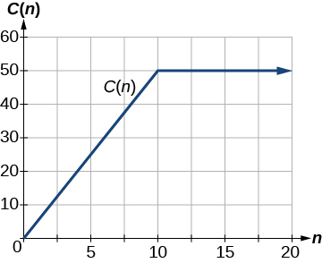{: #Figure_01_02_021}

Working with a Piecewise Function

A cell phone company uses the function below to determine the cost,<math xmlns="http://www.w3.org/1998/Math/MathML"> <mrow> <mtext> </mtext><mi>C</mi><mo>,</mo><mtext> </mtext></mrow> </math>

in dollars for<math xmlns="http://www.w3.org/1998/Math/MathML"> <mrow> <mtext> </mtext><mi>g</mi><mtext> </mtext></mrow> </math>

gigabytes of data transfer.

<math xmlns="http://www.w3.org/1998/Math/MathML" display="block"> <mrow> <mi>C</mi><mo stretchy="false">(</mo><mi>g</mi><mo stretchy="false">)</mo><mo>=</mo><mrow><mo>{</mo> <mrow> <mtable> <mtr> <mtd> <mrow> <mn>25</mn></mrow> </mtd> <mtd> <mrow> <mtext>if</mtext></mrow> </mtd> <mtd> <mrow> <mn>0</mn><mo>&lt;</mo><mi>g</mi><mo>&lt;</mo><mn>2</mn></mrow> </mtd> </mtr> <mtr> <mtd> <mrow> <mn>25</mn><mo>+</mo><mn>10</mn><mo stretchy="false">(</mo><mi>g</mi><mo>−</mo><mn>2</mn><mo stretchy="false">)</mo></mrow> </mtd> <mtd> <mrow> <mtext>if</mtext></mrow> </mtd> <mtd> <mrow> <mi>g</mi><mo>≥</mo><mn>2</mn></mrow> </mtd> </mtr> </mtable></mrow> </mrow></mrow> </math>

Find the cost of using 1.5 gigabytes of data and the cost of using 4 gigabytes of data.

To find the cost of using 1.5 gigabytes of data,<math xmlns="http://www.w3.org/1998/Math/MathML"> <mrow> <mtext> </mtext><mi>C</mi><mo stretchy="false">(</mo><mn>1.5</mn><mo stretchy="false">)</mo><mo>,</mo><mtext> </mtext></mrow> </math>

we first look to see which part of the domain our input falls in. Because 1.5 is less than 2, we use the first formula.

<math xmlns="http://www.w3.org/1998/Math/MathML" display="block"> <mrow> <mi>C</mi><mo stretchy="false">(</mo><mn>1.5</mn><mo stretchy="false">)</mo><mo>=</mo><mtext>$</mtext><mn>25</mn> </mrow> </math>

To find the cost of using 4 gigabytes of data,<math xmlns="http://www.w3.org/1998/Math/MathML"> <mrow> <mtext> </mtext><mi>C</mi><mo stretchy="false">(</mo><mn>4</mn><mo stretchy="false">)</mo><mo>,</mo><mtext> </mtext></mrow> </math>

we see that our input of 4 is greater than 2, so we use the second formula.

<math xmlns="http://www.w3.org/1998/Math/MathML" display="block"> <mrow> <mi>C</mi><mo stretchy="false">(</mo><mn>4</mn><mo stretchy="false">)</mo><mo>=</mo><mn>25</mn><mo>+</mo><mn>10</mn><mo stretchy="false">(</mo><mn>4</mn><mo>−</mo><mn>2</mn><mo stretchy="false">)</mo><mo>=</mo><mtext>$</mtext><mn>45</mn> </mrow> </math>

Analysis

The function is represented in [[link]](#Figure_01_02_022). We can see where the function changes from a constant to a shifted and stretched identity at<math xmlns="http://www.w3.org/1998/Math/MathML"> <mrow> <mtext> </mtext><mi>g</mi><mo>=</mo><mn>2.</mn><mtext> </mtext></mrow> </math>

We plot the graphs for the different formulas on a common set of axes, making sure each formula is applied on its proper domain.

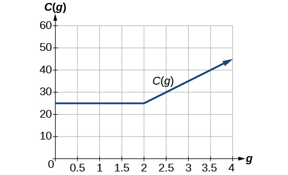{: #Figure_01_02_022}

**Given a piecewise function, sketch a graph.**

1.  Indicate on the *x*-axis the boundaries defined by the intervals on each piece of the domain.
2.  For each piece of the domain, graph on that interval using the corresponding equation pertaining to that piece. Do not graph two functions over one interval because it would violate the criteria of a function.
{: data-number-style="arabic"}

Graphing a Piecewise Function

Sketch a graph of the function.

<math xmlns="http://www.w3.org/1998/Math/MathML" display="block"> <mrow> <mi>f</mi><mo stretchy="false">(</mo><mi>x</mi><mo stretchy="false">)</mo><mo>=</mo><mrow><mo>{</mo> <mrow> <mtable> <mtr> <mtd> <mrow> <msup> <mi>x</mi> <mn>2</mn> </msup> </mrow> </mtd> <mtd> <mrow> <mtext>if</mtext></mrow> </mtd> <mtd> <mrow> <mi>x</mi><mo>≤</mo><mn>1</mn></mrow> </mtd> </mtr> <mtr> <mtd> <mn>3</mn> </mtd> <mtd> <mrow> <mtext>if</mtext></mrow> </mtd> <mtd> <mrow> <mn>1</mn><mo>&lt;</mo><mi>x</mi><mo>≤</mo><mn>2</mn></mrow> </mtd> </mtr> <mtr> <mtd> <mi>x</mi> </mtd> <mtd> <mrow> <mtext>if</mtext></mrow> </mtd> <mtd> <mrow> <mi>x</mi><mo>&gt;</mo><mn>2</mn></mrow> </mtd> </mtr> </mtable></mrow> </mrow></mrow> </math>

Each of the component functions is from our library of toolkit functions, so we know their shapes. We can imagine graphing each function and then limiting the graph to the indicated domain. At the endpoints of the domain, we draw open circles to indicate where the endpoint is not included because of a less-than or greater-than inequality; we draw a closed circle where the endpoint is included because of a less-than-or-equal-to or greater-than-or-equal-to inequality.

[[link]](#Figure_01_02_023) shows the three components of the piecewise function graphed on separate coordinate systems.

&#10;&#10;&#x2009;f(&#10;x&#10;)=&#10;x&#10;2&#10;&#10;&#xA0;if&#xA0;&#xA0;x&#x2264;1;&#x2009;&#10;(b)&#10;&#10;&#x2009;f(&#10;x&#10;)=3&#xA0;if&#xA0;1&lt;&#xA0;x&#x2264;2;&#x2009;&#10;(c)&#10;&#10;&#x2009;f(&#10;x&#10;)=x&#xA0;&#xA0;if&#xA0;x&gt;2&#10;&#10;"){: #Figure_01_02_023}

Now that we have sketched each piece individually, we combine them in the same coordinate plane. See [[link]](#Figure_01_02_026).

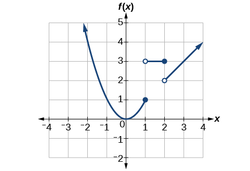{: #Figure_01_02_026}

Analysis

Note that the graph does pass the vertical line test even at<math xmlns="http://www.w3.org/1998/Math/MathML"> <mrow> <mtext> </mtext><mi>x</mi><mo>=</mo><mn>1</mn><mtext> </mtext></mrow> </math>

and<math xmlns="http://www.w3.org/1998/Math/MathML"> <mrow> <mtext> </mtext><mi>x</mi><mo>=</mo><mn>2</mn><mtext> </mtext></mrow> </math>

because the points <math xmlns="http://www.w3.org/1998/Math/MathML"><mrow><mrow><mo>(</mo><mrow><mn>1</mn><mo>,</mo><mn>3</mn></mrow><mo>)</mo></mrow></mrow></math>

 and <math xmlns="http://www.w3.org/1998/Math/MathML"><mrow><mrow><mo>(</mo><mrow><mn>2</mn><mo>,</mo><mn>2</mn></mrow> <mo>)</mo></mrow></mrow></math>

 are not part of the graph of the function, though <math xmlns="http://www.w3.org/1998/Math/MathML"><mrow><mrow><mo>(</mo><mrow><mn>1</mn><mo>,</mo><mn>1</mn></mrow><mo>)</mo></mrow></mrow></math>

 and <math xmlns="http://www.w3.org/1998/Math/MathML"><mrow><mrow><mo>(</mo><mrow><mn>2</mn><mo>,</mo><mtext> </mtext><mn>3</mn></mrow><mo>)</mo></mrow></mrow></math>

 are.

Graph the following piecewise function.

<math xmlns="http://www.w3.org/1998/Math/MathML" display="block"> <mrow> <mi>f</mi><mo stretchy="false">(</mo><mi>x</mi><mo stretchy="false">)</mo><mo>=</mo><mrow><mo>{</mo> <mrow> <mtable> <mtr> <mtd> <mrow> <msup> <mi>x</mi> <mn>3</mn> </msup> </mrow> </mtd> <mtd> <mrow> <mtext>if</mtext></mrow> </mtd> <mtd> <mrow> <mi>x</mi><mo>&lt;</mo><mo>−</mo><mn>1</mn></mrow> </mtd> </mtr> <mtr> <mtd> <mrow> <mo>−</mo><mn>2</mn></mrow> </mtd> <mtd> <mrow> <mtext>if</mtext></mrow> </mtd> <mtd> <mrow> <mo>−</mo><mn>1</mn><mo>&lt;</mo><mi>x</mi><mo>&lt;</mo><mn>4</mn></mrow> </mtd> </mtr> <mtr> <mtd> <mrow> <msqrt> <mi>x</mi> </msqrt> </mrow> </mtd> <mtd> <mrow> <mtext>if</mtext></mrow> </mtd> <mtd> <mrow> <mi>x</mi><mo>&gt;</mo><mn>4</mn></mrow> </mtd> </mtr> </mtable></mrow> </mrow></mrow> </math>

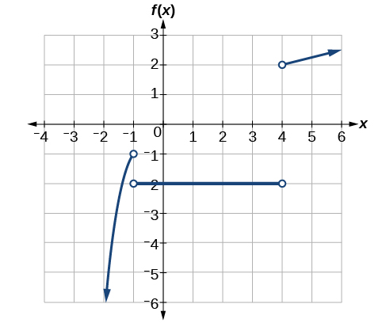

**Can more than one formula from a piecewise function be applied to a value in the domain?**

*No. Each value corresponds to one equation in a piecewise formula.*

Access these online resources for additional instruction and practice with domain and range.

* [Domain and Range of Square Root Functions][1]
* [Determining Domain and Range][2]
* [Find Domain and Range Given the Graph][3]
* [Find Domain and Range Given a Table][4]
* [Find Domain and Range Given Points on a Coordinate Plane][5]

### Key Concepts

* The domain of a function includes all real input values that would not cause us to attempt an undefined mathematical operation, such as dividing by zero or taking the square root of a negative number.
* The domain of a function can be determined by listing the input values of a set of ordered pairs. See [\[link\]](#Example_01_02_01).
* The domain of a function can also be determined by identifying the input values of a function written as an equation. See [\[link\]](#Example_01_02_02), [\[link\]](#Example_01_02_03), and [\[link\]](#Example_01_02_04).
* Interval values represented on a number line can be described using inequality notation, set-builder notation, and interval notation. See [\[link\]](#Example_01_02_05).
* For many functions, the domain and range can be determined from a graph. See [\[link\]](#Example_01_02_06) and [\[link\]](#Example_01_02_07).
* An understanding of toolkit functions can be used to find the domain and range of related functions. See [\[link\]](#Example_01_02_08), [\[link\]](#Example_01_02_09), and [\[link\]](#Example_01_02_10).
* A piecewise function is described by more than one formula. See [\[link\]](#Example_01_02_11) and [\[link\]](#Example_01_02_12).
* A piecewise function can be graphed using each algebraic formula on its assigned subdomain. See [\[link\]](#Example_01_02_13).

### Section Exercises

#### Verbal

Why does the domain differ for different functions?

The domain of a function depends upon what values of the independent variable make the function undefined or imaginary.

How do we determine the domain of a function defined by an equation?

Explain why the domain of<math xmlns="http://www.w3.org/1998/Math/MathML"> <mrow> <mtext> </mtext><mi>f</mi><mo stretchy="false">(</mo><mi>x</mi><mo stretchy="false">)</mo><mo>=</mo><mroot> <mi>x</mi> <mn>3</mn> </mroot> <mtext> </mtext></mrow> </math>

is different from the domain of<math xmlns="http://www.w3.org/1998/Math/MathML"> <mrow> <mtext> </mtext><mi>f</mi><mo stretchy="false">(</mo><mi>x</mi><mo stretchy="false">)</mo><mo>=</mo><mroot> <mi>x</mi> <mrow /> </mroot> <mo>.</mo></mrow> </math>

There is no restriction on<math xmlns="http://www.w3.org/1998/Math/MathML"> <mrow> <mtext> </mtext><mi>x</mi><mtext> </mtext></mrow> </math>

for<math xmlns="http://www.w3.org/1998/Math/MathML"> <mrow> <mtext> </mtext><mi>f</mi><mo stretchy="false">(</mo><mi>x</mi><mo stretchy="false">)</mo><mo>=</mo><mroot> <mi>x</mi> <mn>3</mn> </mroot> <mtext> </mtext></mrow> </math>

because you can take the cube root of any real number. So the domain is all real numbers,<math xmlns="http://www.w3.org/1998/Math/MathML"> <mrow> <mtext> </mtext><mo stretchy="false">(</mo><mo>−</mo><mi>∞</mi><mo>,</mo><mi>∞</mi><mo stretchy="false">)</mo><mo>.</mo><mtext> </mtext></mrow> </math>

When dealing with the set of real numbers, you cannot take the square root of negative numbers. So<math xmlns="http://www.w3.org/1998/Math/MathML"> <mrow> <mtext> </mtext><mi>x</mi></mrow> </math>

-values are restricted for<math xmlns="http://www.w3.org/1998/Math/MathML"> <mrow> <mtext> </mtext><mi>f</mi><mo stretchy="false">(</mo><mi>x</mi><mo stretchy="false">)</mo><mo>=</mo><mroot> <mi>x</mi> <mrow /> </mroot> <mtext> </mtext></mrow> </math>

to nonnegative numbers and the domain is<math xmlns="http://www.w3.org/1998/Math/MathML"> <mrow> <mtext> </mtext><mo stretchy="false">[</mo><mn>0</mn><mo>,</mo><mi>∞</mi><mo stretchy="false">)</mo><mo>.</mo></mrow> </math>

When describing sets of numbers using interval notation, when do you use a parenthesis and when do you use a bracket?

How do you graph a piecewise function?

Graph each formula of the piecewise function over its corresponding domain. Use the same scale for the<math xmlns="http://www.w3.org/1998/Math/MathML"> <mrow> <mtext> </mtext><mi>x</mi></mrow> </math>

-axis and<math xmlns="http://www.w3.org/1998/Math/MathML"> <mrow> <mtext> </mtext><mi>y</mi></mrow> </math>

-axis for each graph. Indicate inclusive endpoints with a solid circle and exclusive endpoints with an open circle. Use an arrow to indicate<math xmlns="http://www.w3.org/1998/Math/MathML"> <mrow> <mtext> </mtext><mo>−</mo><mi>∞</mi><mtext> </mtext> </mrow> </math>

or<math xmlns="http://www.w3.org/1998/Math/MathML"> <mrow> <mtext> </mtext><mtext> </mtext><mi>∞</mi><mo>.</mo><mtext> </mtext> </mrow> </math>

Combine the graphs to find the graph of the piecewise function.

#### Algebraic

For the following exercises, find the domain of each function using interval notation.

<math xmlns="http://www.w3.org/1998/Math/MathML"> <mrow> <mi>f</mi><mo stretchy="false">(</mo><mi>x</mi><mo stretchy="false">)</mo><mo>=</mo><mo>−</mo><mn>2</mn><mi>x</mi><mo stretchy="false">(</mo><mi>x</mi><mo>−</mo><mn>1</mn><mo stretchy="false">)</mo><mo stretchy="false">(</mo><mi>x</mi><mo>−</mo><mn>2</mn><mo stretchy="false">)</mo></mrow> </math>

<math xmlns="http://www.w3.org/1998/Math/MathML"> <mrow> <mi>f</mi><mo stretchy="false">(</mo><mi>x</mi><mo stretchy="false">)</mo><mo>=</mo><mn>5</mn><mo>−</mo><mn>2</mn><msup> <mi>x</mi> <mn>2</mn> </msup> </mrow> </math>

<math xmlns="http://www.w3.org/1998/Math/MathML"> <mrow> <mo stretchy="false">(</mo><mo>−</mo><mi>∞</mi><mo>,</mo><mi>∞</mi><mo stretchy="false">)</mo></mrow> </math>

<math xmlns="http://www.w3.org/1998/Math/MathML"> <mrow> <mi>f</mi><mrow><mo>(</mo> <mi>x</mi> <mo>)</mo></mrow><mo>=</mo><mn>3</mn><msqrt> <mrow> <mi>x</mi><mo>−</mo><mn>2</mn></mrow> </msqrt> </mrow> </math>

<math xmlns="http://www.w3.org/1998/Math/MathML"> <mrow> <mi>f</mi><mrow><mo>(</mo> <mi>x</mi> <mo>)</mo></mrow><mo>=</mo><mn>3</mn><mo>−</mo><msqrt> <mrow> <mn>6</mn><mo>−</mo><mn>2</mn><mi>x</mi></mrow> </msqrt> </mrow> </math>

<math xmlns="http://www.w3.org/1998/Math/MathML"> <mrow> <mo stretchy="false">(</mo><mo>−</mo><mi>∞</mi><mo>,</mo><mn>3</mn><mo stretchy="false">]</mo></mrow> </math>

<math xmlns="http://www.w3.org/1998/Math/MathML"> <mrow> <mi>f</mi><mo stretchy="false">(</mo><mi>x</mi><mo stretchy="false">)</mo><mo>=</mo><msqrt> <mrow> <mn>4</mn><mo>−</mo><mn>3</mn><mi>x</mi></mrow> </msqrt> </mrow> </math>

<math xmlns="http://www.w3.org/1998/Math/MathML"> <mtable columnalign="left"> <mtr> <mtd> <mrow /> </mtd> </mtr> <mtr> <mtd> <mi>f</mi><mo stretchy="false">(</mo><mi>x</mi><mo stretchy="false">)</mo><mo>=</mo><mroot> <mrow> <msup> <mi>x</mi> <mn>2</mn> </msup> <mo>+</mo><mn>4</mn> </mrow> <mrow /> </mroot> </mtd> </mtr> </mtable> </math>

<math xmlns="http://www.w3.org/1998/Math/MathML"> <mrow> <mo stretchy="false">(</mo><mo>−</mo><mi>∞</mi><mo>,</mo><mi>∞</mi><mo stretchy="false">)</mo></mrow> </math>

<math xmlns="http://www.w3.org/1998/Math/MathML"> <mrow> <mi>f</mi><mo stretchy="false">(</mo><mi>x</mi><mo stretchy="false">)</mo><mo>=</mo><mroot> <mrow> <mn>1</mn><mo>−</mo><mn>2</mn><mi>x</mi></mrow> <mn>3</mn> </mroot> </mrow> </math>

<math xmlns="http://www.w3.org/1998/Math/MathML"> <mrow> <mi>f</mi><mo stretchy="false">(</mo><mi>x</mi><mo stretchy="false">)</mo><mo>=</mo><mroot> <mrow> <mi>x</mi><mo>−</mo><mn>1</mn></mrow> <mn>3</mn> </mroot> </mrow> </math>

<math xmlns="http://www.w3.org/1998/Math/MathML"> <mrow> <mo stretchy="false">(</mo><mo>−</mo><mi>∞</mi><mo>,</mo><mi>∞</mi><mo stretchy="false">)</mo></mrow> </math>

<math xmlns="http://www.w3.org/1998/Math/MathML"> <mrow> <mi>f</mi><mo stretchy="false">(</mo><mi>x</mi><mo stretchy="false">)</mo><mo>=</mo><mfrac> <mn>9</mn> <mrow> <mi>x</mi><mo>−</mo><mn>6</mn> </mrow> </mfrac> </mrow> </math>

<math xmlns="http://www.w3.org/1998/Math/MathML"> <mrow> <mi>f</mi><mrow><mo>(</mo> <mi>x</mi> <mo>)</mo></mrow><mo>=</mo><mfrac> <mrow> <mn>3</mn><mi>x</mi><mo>+</mo><mn>1</mn></mrow> <mrow> <mn>4</mn><mi>x</mi><mo>+</mo><mn>2</mn></mrow> </mfrac> </mrow> </math>

<math xmlns="http://www.w3.org/1998/Math/MathML"> <mrow> <mo stretchy="false">(</mo><mo>−</mo><mi>∞</mi><mo>,</mo><mo>−</mo><mfrac> <mn>1</mn> <mn>2</mn> </mfrac> <mo stretchy="false">)</mo><mo>∪</mo><mo stretchy="false">(</mo><mo>−</mo><mfrac> <mn>1</mn> <mn>2</mn> </mfrac> <mo>,</mo><mi>∞</mi><mo stretchy="false">)</mo></mrow> </math>

<math xmlns="http://www.w3.org/1998/Math/MathML"> <mrow> <mi>f</mi><mrow><mo>(</mo> <mi>x</mi> <mo>)</mo></mrow><mo>=</mo><mfrac> <mrow> <msqrt> <mrow> <mi>x</mi><mo>+</mo><mn>4</mn></mrow> </msqrt> </mrow> <mrow> <mi>x</mi><mo>−</mo><mn>4</mn></mrow> </mfrac> </mrow> </math>

<math xmlns="http://www.w3.org/1998/Math/MathML"> <mrow> <mi>f</mi><mo stretchy="false">(</mo><mi>x</mi><mo stretchy="false">)</mo><mo>=</mo><mfrac> <mrow> <mi>x</mi><mo>−</mo><mn>3</mn> </mrow> <mrow> <msup> <mi>x</mi> <mn>2</mn> </msup> <mo>+</mo><mn>9</mn><mi>x</mi><mo>−</mo><mn>22</mn> </mrow> </mfrac> </mrow> </math>

<math xmlns="http://www.w3.org/1998/Math/MathML"> <mrow> <mo stretchy="false">(</mo><mo>−</mo><mi>∞</mi><mo>,</mo><mo>−</mo><mn>11</mn><mo stretchy="false">)</mo><mo>∪</mo><mo stretchy="false">(</mo><mo>−</mo><mn>11</mn><mo>,</mo><mn>2</mn><mo stretchy="false">)</mo><mo>∪</mo><mo stretchy="false">(</mo><mn>2</mn><mo>,</mo><mi>∞</mi><mo stretchy="false">)</mo></mrow> </math>

<math xmlns="http://www.w3.org/1998/Math/MathML"> <mrow> <mi>f</mi><mo stretchy="false">(</mo><mi>x</mi><mo stretchy="false">)</mo><mo>=</mo><mfrac> <mn>1</mn> <mrow> <msup> <mi>x</mi> <mn>2</mn> </msup> <mo>−</mo><mi>x</mi><mo>−</mo><mn>6</mn></mrow> </mfrac> </mrow> </math>

<math xmlns="http://www.w3.org/1998/Math/MathML"> <mrow> <mi>f</mi><mo stretchy="false">(</mo><mi>x</mi><mo stretchy="false">)</mo><mo>=</mo><mfrac> <mrow> <mn>2</mn><msup> <mi>x</mi> <mn>3</mn> </msup> <mo>−</mo><mn>250</mn></mrow> <mrow> <msup> <mi>x</mi> <mn>2</mn> </msup> <mo>−</mo><mn>2</mn><mi>x</mi><mo>−</mo><mn>15</mn></mrow> </mfrac> </mrow> </math>

<math xmlns="http://www.w3.org/1998/Math/MathML"> <mrow> <mo stretchy="false">(</mo><mo>−</mo><mi>∞</mi><mo>,</mo><mo>−</mo><mn>3</mn><mo stretchy="false">)</mo><mo>∪</mo><mo stretchy="false">(</mo><mo>−</mo><mn>3</mn><mo>,</mo><mn>5</mn><mo stretchy="false">)</mo><mo>∪</mo><mo stretchy="false">(</mo><mn>5</mn><mo>,</mo><mi>∞</mi><mo stretchy="false">)</mo></mrow> </math>

<math xmlns="http://www.w3.org/1998/Math/MathML"> <mrow> <mfrac> <mn>5</mn> <mrow> <msqrt> <mrow> <mi>x</mi><mo>−</mo><mn>3</mn></mrow> </msqrt> </mrow> </mfrac> </mrow> </math>

<math xmlns="http://www.w3.org/1998/Math/MathML"> <mrow> <mfrac> <mrow> <mn>2</mn><mi>x</mi><mo>+</mo><mn>1</mn></mrow> <mrow> <msqrt> <mrow> <mn>5</mn><mo>−</mo><mi>x</mi></mrow> </msqrt> </mrow> </mfrac> </mrow> </math>

<math xmlns="http://www.w3.org/1998/Math/MathML"> <mrow> <mo stretchy="false">(</mo><mo>−</mo><mi>∞</mi><mo>,</mo><mn>5</mn><mo stretchy="false">)</mo></mrow> </math>

<math xmlns="http://www.w3.org/1998/Math/MathML"> <mrow> <mi>f</mi><mo stretchy="false">(</mo><mi>x</mi><mo stretchy="false">)</mo><mo>=</mo><mfrac> <mrow> <msqrt> <mrow> <mi>x</mi><mo>−</mo><mn>4</mn></mrow> </msqrt> </mrow> <mrow> <msqrt> <mrow> <mi>x</mi><mo>−</mo><mn>6</mn></mrow> </msqrt> </mrow> </mfrac> </mrow> </math>

<math xmlns="http://www.w3.org/1998/Math/MathML"> <mrow> <mi>f</mi><mo stretchy="false">(</mo><mi>x</mi><mo stretchy="false">)</mo><mo>=</mo><mfrac> <mrow> <msqrt> <mrow> <mi>x</mi><mo>−</mo><mn>6</mn></mrow> </msqrt> </mrow> <mrow> <msqrt> <mrow> <mi>x</mi><mo>−</mo><mn>4</mn></mrow> </msqrt> </mrow> </mfrac> </mrow> </math>

<math xmlns="http://www.w3.org/1998/Math/MathML"> <mrow> <mo stretchy="false">[</mo><mn>6</mn><mo>,</mo><mi>∞</mi><mo stretchy="false">)</mo></mrow> </math>

<math xmlns="http://www.w3.org/1998/Math/MathML"> <mrow> <mi>f</mi><mo stretchy="false">(</mo><mi>x</mi><mo stretchy="false">)</mo><mo>=</mo><mfrac> <mi>x</mi> <mi>x</mi> </mfrac> </mrow> </math>

<math xmlns="http://www.w3.org/1998/Math/MathML"> <mrow> <mi>f</mi><mo stretchy="false">(</mo><mi>x</mi><mo stretchy="false">)</mo><mo>=</mo><mfrac> <mrow> <msup> <mi>x</mi> <mn>2</mn> </msup> <mo>−</mo><mn>9</mn><mi>x</mi></mrow> <mrow> <msup> <mi>x</mi> <mn>2</mn> </msup> <mo>−</mo><mn>81</mn></mrow> </mfrac> </mrow> </math>

<math xmlns="http://www.w3.org/1998/Math/MathML"> <mrow> <mrow><mo>(</mo> <mrow> <mo>−</mo><mi>∞</mi><mo>,</mo><mo>−</mo><mn>9</mn></mrow> <mo>)</mo></mrow><mo>∪</mo><mrow><mo>(</mo> <mrow> <mo>−</mo><mn>9</mn><mo>,</mo><mn>9</mn></mrow> <mo>)</mo></mrow><mo>∪</mo><mrow><mo>(</mo> <mrow> <mn>9</mn><mo>,</mo><mi>∞</mi></mrow> <mo>)</mo></mrow></mrow> </math>

Find the domain of the function<math xmlns="http://www.w3.org/1998/Math/MathML"> <mrow> <mtext> </mtext><mi>f</mi><mo stretchy="false">(</mo><mi>x</mi><mo stretchy="false">)</mo><mo>=</mo><msqrt> <mrow> <mn>2</mn><msup> <mi>x</mi> <mn>3</mn> </msup> <mo>−</mo><mn>50</mn><mi>x</mi></mrow> </msqrt> <mtext> </mtext></mrow> </math>

by:

1.  using algebra.
2.  graphing the function in the radicand and determining intervals on the *x*-axis for which the radicand is nonnegative.
{: data-number-style="lower-alpha"}

#### Graphical

For the following exercises, write the domain and range of each function using interval notation.

![Graph of a function from (2, 8\].](../resources/CNX_Precalc_Figure_01_02_202.jpg)

domain:<math xmlns="http://www.w3.org/1998/Math/MathML"> <mrow> <mtext> </mtext><mo stretchy="false">(</mo><mn>2</mn><mo>,</mo><mn>8</mn><mo stretchy="false">]</mo><mo>,</mo><mtext> </mtext></mrow> </math>

range<math xmlns="http://www.w3.org/1998/Math/MathML"> <mrow> <mtext> </mtext><mo stretchy="false">[</mo><mn>6</mn><mo>,</mo><mn>8</mn><mo stretchy="false">)</mo><mtext> </mtext></mrow> </math>

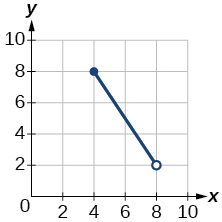

![Graph of a function from \[-4, 4\].](../resources/CNX_Precalc_Figure_01_02_204.jpg)

domain:<math xmlns="http://www.w3.org/1998/Math/MathML"> <mrow> <mtext> </mtext><mo stretchy="false">[</mo><mo>−</mo><mn>4</mn><mo>,</mo><mtext> 4],</mtext><mtext> </mtext></mrow> </math>

range:<math xmlns="http://www.w3.org/1998/Math/MathML"> <mrow> <mtext> </mtext><mo stretchy="false">[</mo><mn>0</mn><mo>,</mo><mtext> 2]</mtext></mrow> </math>

![Graph of a function from \[2, 6\].](../resources/CNX_Precalc_Figure_01_02_205.jpg)

domain:<math xmlns="http://www.w3.org/1998/Math/MathML"> <mrow> <mtext> </mtext><mo stretchy="false">[</mo><mo>−</mo><mn>5</mn><mo>,</mo><mtext> </mtext><mn>3</mn><mo stretchy="false">)</mo><mo>,</mo><mtext> </mtext></mrow> </math>

range:<math xmlns="http://www.w3.org/1998/Math/MathML"> <mrow> <mtext> </mtext><mrow><mo>[</mo> <mrow> <mn>0</mn><mo>,</mo><mn>2</mn></mrow> <mo>]</mo></mrow></mrow> </math>

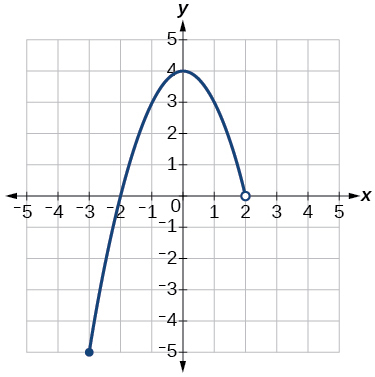

![Graph of a function from (-infinity, 2\].](../resources/CNX_Precalc_Figure_01_02_208.jpg)

domain:<math xmlns="http://www.w3.org/1998/Math/MathML"> <mrow> <mtext> </mtext><mo stretchy="false">(</mo><mo>−</mo><mi>∞</mi><mo>,</mo><mn>1</mn><mo stretchy="false">]</mo><mo>,</mo><mtext> </mtext></mrow> </math>

range:<math xmlns="http://www.w3.org/1998/Math/MathML"> <mrow> <mtext> </mtext><mo stretchy="false">[</mo><mn>0</mn><mo>,</mo><mi>∞</mi><mo stretchy="false">)</mo><mtext> </mtext></mrow> </math>

![Graph of a function from \[-6, -1/6\]U\[1/6, 6\]/.](../resources/CNX_Precalc_Figure_01_02_210.jpg)

domain:<math xmlns="http://www.w3.org/1998/Math/MathML"> <mrow> <mtext> </mtext><mrow><mo>[</mo> <mrow> <mo>−</mo><mn>6</mn><mo>,</mo><mo>−</mo><mfrac> <mn>1</mn> <mn>6</mn> </mfrac> </mrow> <mo>]</mo></mrow><mo>∪</mo><mrow><mo>[</mo> <mrow> <mfrac> <mn>1</mn> <mn>6</mn> </mfrac> <mo>,</mo><mn>6</mn></mrow> <mo>]</mo></mrow><mo>;</mo><mtext> </mtext></mrow> </math>

range:<math xmlns="http://www.w3.org/1998/Math/MathML"> <mrow> <mtext> </mtext><mrow><mo>[</mo> <mrow> <mo>−</mo><mn>6</mn><mo>,</mo><mo>−</mo><mfrac> <mn>1</mn> <mn>6</mn> </mfrac> </mrow> <mo>]</mo></mrow><mo>∪</mo><mrow><mo>[</mo> <mrow> <mfrac> <mn>1</mn> <mn>6</mn> </mfrac> <mo>,</mo><mn>6</mn></mrow> <mo>]</mo></mrow><mtext> </mtext></mrow> </math>

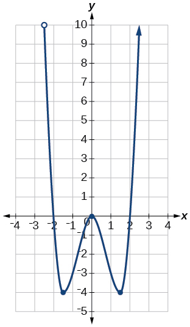

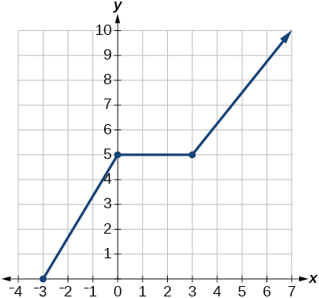

domain:<math xmlns="http://www.w3.org/1998/Math/MathML"> <mrow> <mtext> </mtext><mo stretchy="false">[</mo><mo>−</mo><mn>3</mn><mo>,</mo><mtext> </mtext><mi>∞</mi><mo stretchy="false">)</mo><mo>;</mo><mtext> </mtext></mrow> </math>

range:<math xmlns="http://www.w3.org/1998/Math/MathML"> <mrow> <mtext> </mtext><mo stretchy="false">[</mo><mn>0</mn><mo>,</mo><mi>∞</mi><mo stretchy="false">)</mo><mtext> </mtext></mrow> </math>

For the following exercises, sketch a graph of the piecewise function. Write the domain in interval notation.

<math xmlns="http://www.w3.org/1998/Math/MathML"> <mrow> <mi>f</mi><mo stretchy="false">(</mo><mi>x</mi><mo stretchy="false">)</mo><mo>=</mo><mrow><mo>{</mo> <mrow> <mtable columnalign="left"> <mtr columnalign="left"> <mtd columnalign="left"> <mrow> <mi>x</mi><mo>+</mo><mn>1</mn> </mrow> </mtd> <mtd columnalign="left"> <mrow> <mtext>if</mtext> </mrow> </mtd> <mtd columnalign="left"> <mrow> <mi>x</mi><mo>&lt;</mo><mo>−</mo><mn>2</mn> </mrow> </mtd> </mtr> <mtr columnalign="left"> <mtd columnalign="left"> <mrow> <mo>−</mo><mn>2</mn><mi>x</mi><mo>−</mo><mn>3</mn> </mrow> </mtd> <mtd columnalign="left"> <mrow> <mtext>if</mtext> </mrow> </mtd> <mtd columnalign="left"> <mrow> <mi>x</mi><mo>≥</mo><mo>−</mo><mn>2</mn> </mrow> </mtd> </mtr> </mtable> </mrow> </mrow> </mrow> </math>

<math xmlns="http://www.w3.org/1998/Math/MathML"> <mrow> <mi>f</mi><mo stretchy="false">(</mo><mi>x</mi><mo stretchy="false">)</mo><mo>=</mo><mrow><mo>{</mo> <mrow> <mtable columnalign="left"> <mtr columnalign="left"> <mtd columnalign="left"> <mrow> <mn>2</mn><mi>x</mi><mo>−</mo><mn>1</mn> </mrow> </mtd> <mtd columnalign="left"> <mrow> <mtext>if</mtext> </mrow> </mtd> <mtd columnalign="left"> <mrow> <mi>x</mi><mo>&lt;</mo><mn>1</mn> </mrow> </mtd> </mtr> <mtr columnalign="left"> <mtd columnalign="left"> <mrow> <mn>1</mn><mo>+</mo><mi>x</mi> </mrow> </mtd> <mtd columnalign="left"> <mrow> <mtext>if</mtext> </mrow> </mtd> <mtd columnalign="left"> <mrow> <mi>x</mi><mo>≥</mo><mn>1</mn> </mrow> </mtd> </mtr> </mtable> </mrow> </mrow> </mrow> </math>

domain:<math xmlns="http://www.w3.org/1998/Math/MathML"> <mrow> <mtext> </mtext><mo stretchy="false">(</mo><mo>−</mo><mi>∞</mi><mo>,</mo><mi>∞</mi><mo stretchy="false">)</mo></mrow> </math>

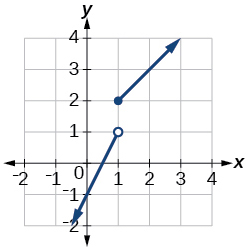

<math xmlns="http://www.w3.org/1998/Math/MathML"> <mrow> <mi>f</mi><mo stretchy="false">(</mo><mi>x</mi><mo stretchy="false">)</mo><mo>=</mo><mrow><mo>{</mo> <mrow> <mtable> <mtr> <mtd> <mrow> <mi>x</mi><mo>+</mo><mn>1</mn><mtext> </mtext><mtext> </mtext><mtext>if</mtext><mtext> </mtext><mtext> </mtext><mi>x</mi><mo>&lt;</mo><mn>0</mn></mrow> </mtd> </mtr> <mtr> <mtd> <mrow> <mi>x</mi><mo>−</mo><mn>1</mn><mtext> </mtext><mtext> </mtext><mtext>if</mtext><mtext> </mtext><mtext> </mtext><mtext> </mtext><mi>x</mi><mo>&gt;</mo><mn>0</mn></mrow> </mtd> </mtr> </mtable></mrow> </mrow></mrow> </math>

<math xmlns="http://www.w3.org/1998/Math/MathML"> <mrow> <mi>f</mi><mrow><mo>(</mo> <mi>x</mi> <mo>)</mo></mrow><mo>=</mo><mrow><mo>{</mo> <mrow> <mtable> <mtr> <mtd> <mn>3</mn> </mtd> <mtd> <mrow> <mtext>if</mtext></mrow> </mtd> <mtd> <mrow> <mi>x</mi><mo>&lt;</mo><mn>0</mn></mrow> </mtd> </mtr> <mtr> <mtd> <mrow> <msqrt> <mi>x</mi> </msqrt> </mrow> </mtd> <mtd> <mrow> <mtext>if</mtext></mrow> </mtd> <mtd> <mrow> <mi>x</mi><mo>≥</mo><mn>0</mn></mrow> </mtd> </mtr> </mtable></mrow> </mrow></mrow> </math>

domain:<math xmlns="http://www.w3.org/1998/Math/MathML"> <mrow> <mtext> </mtext><mo stretchy="false">(</mo><mo>−</mo><mi>∞</mi><mo>,</mo><mi>∞</mi><mo stretchy="false">)</mo></mrow> </math>

<math xmlns="http://www.w3.org/1998/Math/MathML" display="block"> <mrow> <mi>f</mi><mo stretchy="false">(</mo><mi>x</mi><mo stretchy="false">)</mo><mo>=</mo><mrow><mo>{</mo> <mrow> <mtable> <mtr> <mtd> <mrow> <msup> <mi>x</mi> <mn>2</mn> </msup> <mtext>      if </mtext><mi>x</mi><mo>&lt;</mo><mn>0</mn> </mrow> </mtd> </mtr> <mtr> <mtd> <mrow> <mn>1</mn><mo>−</mo><mi>x</mi><mtext>  if </mtext><mi>x</mi><mo>&gt;</mo><mn>0</mn> </mrow> </mtd> </mtr> </mtable> </mrow> </mrow> </mrow> </math>

<math xmlns="http://www.w3.org/1998/Math/MathML"> <mrow> <mi>f</mi><mo stretchy="false">(</mo><mi>x</mi><mo stretchy="false">)</mo><mo>=</mo><mrow><mo>{</mo> <mrow> <mtable columnalign="right"> <mtr columnalign="right"> <mtd columnalign="right"> <mrow> <mtable columnalign="right"> <mtr columnalign="right"> <mtd columnalign="right"> <mrow> <msup> <mi>x</mi> <mn>2</mn> </msup> </mrow> </mtd> </mtr> <mtr columnalign="right"> <mtd columnalign="right"> <mrow> <mi>x</mi><mo>+</mo><mn>2</mn> </mrow> </mtd> </mtr> </mtable> </mrow> </mtd> </mtr> </mtable> </mrow> </mrow><mtext> </mtext><mtext> </mtext><mtable columnalign="left"> <mtr columnalign="left"> <mtd columnalign="left"> <mrow> <mtext>if</mtext><mtext> </mtext><mtext> </mtext><mtext> </mtext><mtext> </mtext><mtext> </mtext><mi>x</mi><mo>&lt;</mo><mn>0</mn> </mrow> </mtd> </mtr> <mtr columnalign="left"> <mtd columnalign="left"> <mrow> <mtext>if</mtext><mtext> </mtext><mtext> </mtext><mtext> </mtext><mtext> </mtext><mtext> </mtext><mi>x</mi><mo>≥</mo><mn>0</mn> </mrow> </mtd> </mtr> </mtable> </mrow> </math>

domain:<math xmlns="http://www.w3.org/1998/Math/MathML"> <mrow> <mtext> </mtext><mo stretchy="false">(</mo><mo>−</mo><mi>∞</mi><mo>,</mo><mi>∞</mi><mo stretchy="false">)</mo></mrow> </math>

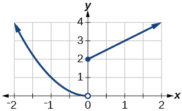

<math xmlns="http://www.w3.org/1998/Math/MathML"> <mrow> <mi>f</mi><mrow><mo>(</mo> <mi>x</mi> <mo>)</mo></mrow><mo>=</mo><mrow><mo>{</mo> <mrow> <mtable> <mtr> <mtd> <mrow> <mi>x</mi><mo>+</mo><mn>1</mn></mrow> </mtd> <mtd> <mrow> <mtext>if</mtext></mrow> </mtd> <mtd> <mrow> <mi>x</mi><mo>&lt;</mo><mn>1</mn></mrow> </mtd> </mtr> <mtr> <mtd> <mrow> <msup> <mi>x</mi> <mn>3</mn> </msup> </mrow> </mtd> <mtd> <mrow> <mtext>if</mtext></mrow> </mtd> <mtd> <mrow> <mi>x</mi><mo>≥</mo><mn>1</mn></mrow> </mtd> </mtr> </mtable></mrow> </mrow></mrow> </math>

<math xmlns="http://www.w3.org/1998/Math/MathML"> <mrow> <mi>f</mi><mo stretchy="false">(</mo><mi>x</mi><mo stretchy="false">)</mo><mo>=</mo><mrow><mo>{</mo> <mrow> <mtable> <mtr> <mtd> <mrow> <mo>\|</mo><mi>x</mi><mo>\|</mo> </mrow> </mtd> </mtr> <mtr> <mtd> <mn>1</mn> </mtd> </mtr> </mtable> </mrow> </mrow><mtable columnalign="left"> <mtr columnalign="left"> <mtd columnalign="left"> <mrow> <mtext> </mtext><mtext> </mtext><mtext> </mtext><mtext>if</mtext><mtext> </mtext><mtext> </mtext><mtext> </mtext><mi>x</mi><mo>&lt;</mo><mn>2</mn> </mrow> </mtd> </mtr> <mtr columnalign="left"> <mtd columnalign="left"> <mrow> <mtext> </mtext><mtext> </mtext><mtext> </mtext><mtext>if</mtext><mtext> </mtext><mtext> </mtext><mtext> </mtext><mi>x</mi><mo>≥</mo><mn>2</mn> </mrow> </mtd> </mtr> </mtable> </mrow> </math>

domain:<math xmlns="http://www.w3.org/1998/Math/MathML"> <mrow> <mtext> </mtext><mo stretchy="false">(</mo><mo>−</mo><mi>∞</mi><mo>,</mo><mi>∞</mi><mo stretchy="false">)</mo></mrow> </math>

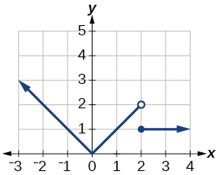

#### Numeric

For the following exercises, given each function <math xmlns="http://www.w3.org/1998/Math/MathML"> <mrow> <mi>f</mi><mo>,</mo></mrow></math>

evaluate <math xmlns="http://www.w3.org/1998/Math/MathML"> <mrow> <mi>f</mi><mo stretchy="false">(</mo><mn>−3</mn><mo stretchy="false">)</mo><mo>,</mo><mtext> </mtext><mi>f</mi><mo stretchy="false">(</mo><mn>−2</mn><mo stretchy="false">)</mo><mo>,</mo><mtext> </mtext><mi>f</mi><mo stretchy="false">(</mo><mn>−1</mn><mo stretchy="false">)</mo><mo>,</mo></mrow> </math>

 and <math xmlns="http://www.w3.org/1998/Math/MathML"> <mrow> <mi>f</mi><mo stretchy="false">(</mo><mn>0</mn><mo stretchy="false">)</mo><mo>.</mo></mrow> </math>

<math xmlns="http://www.w3.org/1998/Math/MathML"> <mrow> <mi>f</mi><mo stretchy="false">(</mo><mi>x</mi><mo stretchy="false">)</mo><mo>=</mo><mrow><mo>{</mo> <mrow> <mtable columnalign="left"> <mtr columnalign="left"> <mtd columnalign="left"> <mrow> <mi>x</mi><mo>+</mo><mn>1</mn> </mrow> </mtd> <mtd columnalign="left"> <mrow> <mtext>if</mtext> </mrow> </mtd> <mtd columnalign="left"> <mrow> <mi>x</mi><mo>&lt;</mo><mo>−</mo><mn>2</mn> </mrow> </mtd> </mtr> <mtr columnalign="left"> <mtd columnalign="left"> <mrow> <mo>−</mo><mn>2</mn><mi>x</mi><mo>−</mo><mn>3</mn> </mrow> </mtd> <mtd columnalign="left"> <mrow> <mtext>if</mtext> </mrow> </mtd> <mtd columnalign="left"> <mrow> <mi>x</mi><mo>≥</mo><mo>−</mo><mn>2</mn> </mrow> </mtd> </mtr> </mtable> </mrow> </mrow> </mrow> </math>

<math xmlns="http://www.w3.org/1998/Math/MathML"> <mrow> <mi>f</mi><mo stretchy="false">(</mo><mi>x</mi><mo stretchy="false">)</mo><mo>=</mo><mrow><mo>{</mo> <mrow> <mtable> <mtr> <mtd> <mn>1</mn> </mtd> <mtd> <mrow> <mtext>if </mtext><mi>x</mi><mo>≤</mo><mo>−</mo><mn>3</mn></mrow> </mtd> </mtr> <mtr> <mtd> <mn>0</mn> </mtd> <mtd> <mrow> <mtext>if </mtext><mi>x</mi><mo>&gt;</mo><mo>−</mo><mn>3</mn></mrow> </mtd> </mtr> </mtable></mrow> </mrow></mrow> </math>

<math xmlns="http://www.w3.org/1998/Math/MathML"> <mrow> <mtable> <mtr> <mtd> <mrow> <mi>f</mi><mo stretchy="false">(</mo><mo>−</mo><mn>3</mn><mo stretchy="false">)</mo><mo>=</mo><mn>1</mn><mo>;</mo></mrow> </mtd> <mtd> <mrow> <mi>f</mi><mo stretchy="false">(</mo><mo>−</mo><mn>2</mn><mo stretchy="false">)</mo><mo>=</mo><mn>0</mn><mo>;</mo></mrow> </mtd> <mtd> <mrow> <mi>f</mi><mo stretchy="false">(</mo><mo>−</mo><mn>1</mn><mo stretchy="false">)</mo><mo>=</mo><mn>0</mn><mo>;</mo></mrow> </mtd> <mtd> <mrow> <mi>f</mi><mo stretchy="false">(</mo><mn>0</mn><mo stretchy="false">)</mo><mo>=</mo><mn>0</mn></mrow> </mtd> </mtr> </mtable></mrow> </math>

<math xmlns="http://www.w3.org/1998/Math/MathML"> <mrow> <mi>f</mi><mo stretchy="false">(</mo><mi>x</mi><mo stretchy="false">)</mo><mo>=</mo><mrow><mo>{</mo> <mrow> <mtable> <mtr> <mtd> <mrow> <mo>−</mo><mn>2</mn><msup> <mi>x</mi> <mn>2</mn> </msup> <mo>+</mo><mn>3</mn></mrow> </mtd> <mtd> <mrow> <mtext>if </mtext><mi>x</mi><mo>≤</mo><mo>−</mo><mn>1</mn></mrow> </mtd> </mtr> <mtr> <mtd> <mrow> <mn>5</mn><mi>x</mi><mo>−</mo><mn>7</mn></mrow> </mtd> <mtd> <mrow> <mtext>if </mtext><mi>x</mi><mo>&gt;</mo><mo>−</mo><mn>1</mn></mrow> </mtd> </mtr> </mtable></mrow> </mrow></mrow> </math>

For the following exercises, given each function<math xmlns="http://www.w3.org/1998/Math/MathML"> <mrow> <mtext> </mtext><mi>f</mi><mo>,</mo><mtext> </mtext></mrow> </math>

evaluate<math xmlns="http://www.w3.org/1998/Math/MathML"> <mrow> <mi>f</mi><mo stretchy="false">(</mo><mn>−1</mn><mo stretchy="false">)</mo><mo>,</mo><mtext> </mtext><mi>f</mi><mo stretchy="false">(</mo><mn>0</mn><mo stretchy="false">)</mo><mo>,</mo><mtext> </mtext><mi>f</mi><mo stretchy="false">(</mo><mn>2</mn><mo stretchy="false">)</mo><mo>,</mo><mtext> </mtext></mrow> </math>

and<math xmlns="http://www.w3.org/1998/Math/MathML"> <mrow> <mtext> </mtext><mi>f</mi><mo stretchy="false">(</mo><mn>4</mn><mo stretchy="false">)</mo><mo>.</mo></mrow> </math>

<math xmlns="http://www.w3.org/1998/Math/MathML"> <mrow> <mi>f</mi><mo stretchy="false">(</mo><mi>x</mi><mo stretchy="false">)</mo><mo>=</mo><mrow><mo>{</mo> <mrow> <mtable columnalign="left"> <mtr columnalign="left"> <mtd columnalign="left"> <mrow> <mn>7</mn><mi>x</mi><mo>+</mo><mn>3</mn></mrow> </mtd> <mtd columnalign="left"> <mrow> <mtext>if</mtext></mrow> </mtd> <mtd columnalign="left"> <mrow> <mi>x</mi><mo>&lt;</mo><mn>0</mn></mrow> </mtd> </mtr> <mtr columnalign="left"> <mtd columnalign="left"> <mrow> <mn>7</mn><mi>x</mi><mo>+</mo><mn>6</mn></mrow> </mtd> <mtd columnalign="left"> <mrow> <mtext>if</mtext></mrow> </mtd> <mtd columnalign="left"> <mrow> <mi>x</mi><mo>≥</mo><mn>0</mn></mrow> </mtd> </mtr> </mtable></mrow> </mrow></mrow> </math>

<math xmlns="http://www.w3.org/1998/Math/MathML"> <mrow> <mtable> <mtr> <mtd> <mrow> <mi>f</mi><mo stretchy="false">(</mo><mo>−</mo><mn>1</mn><mo stretchy="false">)</mo><mo>=</mo><mo>−</mo><mn>4</mn><mo>;</mo></mrow> </mtd> <mtd> <mrow> <mi>f</mi><mo stretchy="false">(</mo><mn>0</mn><mo stretchy="false">)</mo><mo>=</mo><mn>6</mn><mo>;</mo></mrow> </mtd> <mtd> <mrow> <mi>f</mi><mo stretchy="false">(</mo><mn>2</mn><mo stretchy="false">)</mo><mo>=</mo><mn>20</mn><mo>;</mo></mrow> </mtd> <mtd> <mrow> <mi>f</mi><mo stretchy="false">(</mo><mn>4</mn><mo stretchy="false">)</mo><mo>=</mo><mn>34</mn></mrow> </mtd> </mtr> </mtable></mrow> </math>

<math xmlns="http://www.w3.org/1998/Math/MathML"> <mrow> <mi>f</mi><mrow><mo>(</mo> <mi>x</mi> <mo>)</mo></mrow><mo>=</mo><mrow><mo>{</mo> <mrow> <mtable> <mtr> <mtd> <mrow> <msup> <mi>x</mi> <mn>2</mn> </msup> <mo>−</mo><mn>2</mn></mrow> </mtd> <mtd> <mrow> <mtext>if</mtext></mrow> </mtd> <mtd> <mrow> <mi>x</mi><mo>&lt;</mo><mn>2</mn></mrow> </mtd> </mtr> <mtr> <mtd> <mrow> <mn>4</mn><mo>+</mo><mrow><mo>\|</mo> <mrow> <mi>x</mi><mo>−</mo><mn>5</mn></mrow> <mo>\|</mo></mrow></mrow> </mtd> <mtd> <mrow> <mtext>if</mtext></mrow> </mtd> <mtd> <mrow> <mi>x</mi><mo>≥</mo><mn>2</mn></mrow> </mtd> </mtr> </mtable></mrow> </mrow></mrow> </math>

<math xmlns="http://www.w3.org/1998/Math/MathML"> <mrow> <mi>f</mi><mrow><mo>(</mo> <mi>x</mi> <mo>)</mo></mrow><mo>=</mo><mrow><mo>{</mo> <mrow> <mtable> <mtr> <mtd> <mrow> <mn>5</mn><mi>x</mi></mrow> </mtd> <mtd> <mrow> <mtext>if</mtext></mrow> </mtd> <mtd> <mrow> <mi>x</mi><mo>&lt;</mo><mn>0</mn></mrow> </mtd> </mtr> <mtr> <mtd> <mn>3</mn> </mtd> <mtd> <mrow> <mtext>if</mtext></mrow> </mtd> <mtd> <mrow> <mn>0</mn><mo>≤</mo><mi>x</mi><mo>≤</mo><mn>3</mn></mrow> </mtd> </mtr> <mtr> <mtd> <mrow> <msup> <mi>x</mi> <mn>2</mn> </msup> </mrow> </mtd> <mtd> <mrow> <mtext>if</mtext></mrow> </mtd> <mtd> <mrow> <mi>x</mi><mo>&gt;</mo><mn>3</mn></mrow> </mtd> </mtr> </mtable></mrow> </mrow></mrow> </math>

<math xmlns="http://www.w3.org/1998/Math/MathML"> <mrow> <mtable> <mtr> <mtd> <mrow> <mi>f</mi><mo stretchy="false">(</mo><mo>−</mo><mn>1</mn><mo stretchy="false">)</mo><mo>=</mo><mo>−</mo><mn>5</mn><mo>;</mo></mrow> </mtd> <mtd> <mrow> <mi>f</mi><mo stretchy="false">(</mo><mn>0</mn><mo stretchy="false">)</mo><mo>=</mo><mn>3</mn><mo>;</mo></mrow> </mtd> <mtd> <mrow> <mi>f</mi><mo stretchy="false">(</mo><mn>2</mn><mo stretchy="false">)</mo><mo>=</mo><mn>3</mn><mo>;</mo></mrow> </mtd> <mtd> <mrow> <mi>f</mi><mo stretchy="false">(</mo><mn>4</mn><mo stretchy="false">)</mo><mo>=</mo><mn>16</mn></mrow> </mtd> </mtr> </mtable></mrow> </math>

For the following exercises, write the domain for the piecewise function in interval notation.

<math xmlns="http://www.w3.org/1998/Math/MathML"> <mrow> <mi>f</mi><mo stretchy="false">(</mo><mi>x</mi><mo stretchy="false">)</mo><mo>=</mo><mrow><mo>{</mo> <mrow> <mtable> <mtr> <mtd> <mrow> <mi>x</mi><mo>+</mo><mn>1</mn><mtext> </mtext><mtext> </mtext><mtext> </mtext><mtext> </mtext><mtext> </mtext><mtext> if</mtext><mtext> </mtext><mtext> </mtext><mi>x</mi><mo>&lt;</mo><mo>−</mo><mn>2</mn></mrow> </mtd> </mtr> <mtr> <mtd> <mrow> <mo>−</mo><mn>2</mn><mi>x</mi><mo>−</mo><mn>3</mn><mtext> </mtext><mtext> </mtext><mtext>if</mtext><mtext> </mtext><mtext> </mtext><mi>x</mi><mo>≥</mo><mo>−</mo><mn>2</mn></mrow> </mtd> </mtr> </mtable></mrow> </mrow></mrow> </math>

<math xmlns="http://www.w3.org/1998/Math/MathML"> <mrow> <mi>f</mi><mo stretchy="false">(</mo><mi>x</mi><mo stretchy="false">)</mo><mo>=</mo><mrow><mo>{</mo> <mrow> <mtable> <mtr> <mtd> <mrow> <msup> <mi>x</mi> <mn>2</mn> </msup> <mo>−</mo><mn>2</mn><mtext> </mtext><mtext> </mtext><mtext> </mtext><mtext> </mtext><mtext> </mtext><mtext> if</mtext><mtext> </mtext><mtext> </mtext><mi>x</mi><mo>&lt;</mo><mn>1</mn></mrow> </mtd> </mtr> <mtr> <mtd> <mrow> <mo>−</mo><msup> <mi>x</mi> <mn>2</mn> </msup> <mo>+</mo><mn>2</mn><mtext> </mtext><mtext> </mtext><mtext>if</mtext><mtext> </mtext><mtext> </mtext><mi>x</mi><mo>&gt;</mo><mn>1</mn></mrow> </mtd> </mtr> </mtable></mrow> </mrow></mrow> </math>

domain:<math xmlns="http://www.w3.org/1998/Math/MathML"> <mrow> <mtext> </mtext><mo stretchy="false">(</mo><mo>−</mo><mi>∞</mi><mo>,</mo><mn>1</mn><mo stretchy="false">)</mo><mo>∪</mo><mo stretchy="false">(</mo><mn>1</mn><mo>,</mo><mi>∞</mi><mo stretchy="false">)</mo></mrow> </math>

<math xmlns="http://www.w3.org/1998/Math/MathML"> <mrow> <mi>f</mi><mo stretchy="false">(</mo><mi>x</mi><mo stretchy="false">)</mo><mo>=</mo><mrow><mo>{</mo> <mrow> <mtable> <mtr> <mtd> <mrow> <mn>2</mn><mi>x</mi><mo>−</mo><mn>3</mn> </mrow> </mtd> </mtr> <mtr> <mtd> <mrow> <mo>−</mo><mn>3</mn><msup> <mi>x</mi> <mn>2</mn> </msup> </mrow> </mtd> </mtr> </mtable> </mrow> </mrow><mtext> </mtext><mtext> </mtext><mtable> <mtr> <mtd> <mrow> <mtext>if</mtext><mtext> </mtext><mtext> </mtext><mtext> </mtext><mi>x</mi><mo>&lt;</mo><mn>0</mn> </mrow> </mtd> </mtr> <mtr> <mtd> <mrow> <mtext>if</mtext><mtext> </mtext><mtext> </mtext><mtext> </mtext><mi>x</mi><mo>≥</mo><mn>2</mn> </mrow> </mtd> </mtr> </mtable> </mrow> </math>

#### Technology

Graph<math xmlns="http://www.w3.org/1998/Math/MathML"> <mrow> <mtext> </mtext><mi>y</mi><mo>=</mo><mfrac> <mn>1</mn> <mrow> <msup> <mi>x</mi> <mn>2</mn> </msup> </mrow> </mfrac> <mtext> </mtext></mrow> </math>

on the viewing window<math xmlns="http://www.w3.org/1998/Math/MathML"> <mrow> <mtext> </mtext><mo stretchy="false">[</mo><mn>−0.5</mn><mo>,</mo><mn>−0.1</mn><mo stretchy="false">]</mo><mtext> </mtext></mrow> </math>

and<math xmlns="http://www.w3.org/1998/Math/MathML"> <mrow> <mtext> </mtext><mo stretchy="false">[</mo><mn>0.1</mn><mo>,</mo><mn>0.5</mn><mo stretchy="false">]</mo><mo>.</mo><mtext> </mtext></mrow> </math>

Determine the corresponding range for the viewing window. Show the graphs.

![Graph of the equation from \[-0.5, -0.1\].](../resources/CNX_Precalc_Figure_01_02_221.jpg)

window:<math xmlns="http://www.w3.org/1998/Math/MathML"> <mrow> <mtext> </mtext><mo stretchy="false">[</mo><mo>−</mo><mn>0.5</mn><mo>,</mo><mo>−</mo><mn>0.1</mn><mo stretchy="false">]</mo><mo>;</mo><mtext> </mtext></mrow> </math>

range:<math xmlns="http://www.w3.org/1998/Math/MathML"> <mrow> <mtext> </mtext><mo stretchy="false">[</mo><mn>4</mn><mo>,</mo><mtext> </mtext><mn>100</mn><mo stretchy="false">]</mo></mrow> </math>

![Graph of the equation from \[0.1, 0.5\].](../resources/CNX_Precalc_Figure_01_02_222.jpg)

window:<math xmlns="http://www.w3.org/1998/Math/MathML"> <mrow> <mtext> </mtext><mo stretchy="false">[</mo><mn>0.1</mn><mo>,</mo><mtext> </mtext><mn>0.5</mn><mo stretchy="false">]</mo><mo>;</mo><mtext> </mtext></mrow> </math>

range:<math xmlns="http://www.w3.org/1998/Math/MathML"> <mrow> <mtext> </mtext><mo stretchy="false">[</mo><mn>4</mn><mo>,</mo><mtext> </mtext><mn>100</mn><mo stretchy="false">]</mo></mrow> </math>

Graph<math xmlns="http://www.w3.org/1998/Math/MathML"> <mrow> <mtext> </mtext><mi>y</mi><mo>=</mo><mfrac> <mn>1</mn> <mi>x</mi> </mfrac> <mtext> </mtext></mrow> </math>

on the viewing window<math xmlns="http://www.w3.org/1998/Math/MathML"> <mrow> <mtext> </mtext><mo stretchy="false">[</mo><mn>−0.5</mn><mo>,</mo><mn>−0.1</mn><mo stretchy="false">]</mo><mtext> </mtext></mrow> </math>

and<math xmlns="http://www.w3.org/1998/Math/MathML"> <mrow> <mtext> </mtext><mo stretchy="false">[</mo><mn>0.1</mn><mo>,</mo><mtext> </mtext><mn>0.5</mn><mo stretchy="false">]</mo><mo>.</mo><mtext> </mtext></mrow> </math>

Determine the corresponding range for the viewing window. Show the graphs.

####  Extension

Suppose the range of a function<math xmlns="http://www.w3.org/1998/Math/MathML"> <mrow> <mtext> </mtext><mi>f</mi><mtext> </mtext></mrow> </math>

is<math xmlns="http://www.w3.org/1998/Math/MathML"> <mrow> <mtext> </mtext><mo stretchy="false">[</mo><mn>−5</mn><mo>,</mo><mtext> </mtext><mn>8</mn><mo stretchy="false">]</mo><mo>.</mo><mtext> </mtext></mrow> </math>

What is the range of<math xmlns="http://www.w3.org/1998/Math/MathML"> <mrow> <mtext> </mtext><mo>\|</mo><mi>f</mi><mo stretchy="false">(</mo><mi>x</mi><mo stretchy="false">)</mo><mo>\|</mo><mo>?</mo></mrow> </math>

<math xmlns="http://www.w3.org/1998/Math/MathML"> <mrow> <mo stretchy="false">[</mo><mn>0</mn><mo>,</mo><mtext> </mtext><mn>8</mn><mo stretchy="false">]</mo></mrow> </math>

Create a function in which the range is all nonnegative real numbers.

Create a function in which the domain is<math xmlns="http://www.w3.org/1998/Math/MathML"> <mrow> <mtext> </mtext><mi>x</mi><mo>&gt;</mo><mn>2.</mn></mrow> </math>

Many answers. One function is<math xmlns="http://www.w3.org/1998/Math/MathML"> <mrow> <mtext> </mtext><mi>f</mi><mo stretchy="false">(</mo><mi>x</mi><mo stretchy="false">)</mo><mo>=</mo><mfrac> <mn>1</mn> <mrow> <msqrt> <mrow> <mi>x</mi><mo>−</mo><mn>2</mn></mrow> </msqrt> </mrow> </mfrac> <mo>.</mo></mrow> </math>

####  Real-World Applications

The height<math xmlns="http://www.w3.org/1998/Math/MathML"> <mrow> <mtext> </mtext><mi>h</mi><mtext> </mtext></mrow> </math>

of a projectile is a function of the time<math xmlns="http://www.w3.org/1998/Math/MathML"> <mrow> <mtext> </mtext><mi>t</mi><mtext> </mtext></mrow> </math>

it is in the air. The height in feet for<math xmlns="http://www.w3.org/1998/Math/MathML"> <mrow> <mtext> </mtext><mi>t</mi><mtext> </mtext></mrow> </math>

seconds is given by the function<math xmlns="http://www.w3.org/1998/Math/MathML"> <mrow> <mi>h</mi><mo stretchy="false">(</mo><mi>t</mi><mo stretchy="false">)</mo><mo>=</mo><mn>−16</mn><msup> <mi>t</mi> <mn>2</mn> </msup> <mo>+</mo><mn>96</mn><mi>t</mi><mo>.</mo> </mrow> </math>

 What is the domain of the function? What does the domain mean in the context of the problem?

The domain is<math xmlns="http://www.w3.org/1998/Math/MathML"> <mrow> <mtext> </mtext><mo stretchy="false">[</mo><mn>0</mn><mo>,</mo><mtext> </mtext><mn>6</mn><mo stretchy="false">]</mo><mo>;</mo><mtext> </mtext></mrow> </math>

it takes 6 seconds for the projectile to leave the ground and return to the ground

The cost in dollars of making<math xmlns="http://www.w3.org/1998/Math/MathML"> <mrow> <mtext> </mtext><mi>x</mi><mtext> </mtext></mrow> </math>

items is given by the function<math xmlns="http://www.w3.org/1998/Math/MathML"> <mrow> <mtext> </mtext><mi>C</mi><mo stretchy="false">(</mo><mi>x</mi><mo stretchy="false">)</mo><mo>=</mo><mn>10</mn><mi>x</mi><mo>+</mo><mn>500.</mn></mrow> </math>

1.  The fixed cost is determined when zero items are produced. Find the fixed cost for this item.
2.  What is the cost of making 25 items?
3.  Suppose the maximum cost allowed is $1500. What are the domain and range of the cost function,
    <math xmlns="http://www.w3.org/1998/Math/MathML"> <mrow> <mtext> </mtext><mi>C</mi><mo stretchy="false">(</mo><mi>x</mi><mo stretchy="false">)</mo><mo>?</mo></mrow> </math>
{: data-number-style="lower-alpha"}

### Footnotes
{: data-type="footnote-refs-title"}

* {: data-type="footnote-ref" #footnote1} [1](#footnote-ref1){: data-type="footnote-ref-link"} The Numbers: Where Data and the Movie Business Meet. “Box Office History for Horror Movies.” http://www.the-numbers.com/market/genre/Horror. Accessed 3/24/2014
* {: data-type="footnote-ref" #footnote2} [2](#footnote-ref2){: data-type="footnote-ref-link"} http://www.eia.gov/dnav/pet/hist/LeafHandler.ashx?n=PET&amp;s=MCRFPAK2&amp;f=A.
{: data-list-type="bulleted" data-bullet-style="none"}

### Glossary
{: data-type="glossary-title"}

interval notation
: a method of describing a set that includes all numbers between a lower limit and an upper limit; the lower and upper values are listed between brackets or parentheses, a square bracket indicating inclusion in the set, and a parenthesis indicating exclusion
^

piecewise function
: a function in which more than one formula is used to define the output
^

set-builder notation
: a method of describing a set by a rule that all of its members obey; it takes the form
  <math xmlns="http://www.w3.org/1998/Math/MathML"> <mrow> <mtext> </mtext><mo>{</mo><mi>x</mi><mo>\|</mo><mtext> </mtext><mtext>statement about </mtext><mi>x</mi><mo>}</mo> </mrow> </math>

[1]: http://openstaxcollege.org/l/domainsqroot
[2]: http://openstaxcollege.org/l/determinedomain
[3]: http://openstaxcollege.org/l/drgraph
[4]: http://openstaxcollege.org/l/drtable
[5]: http://openstaxcollege.org/l/drcoordinate
