

In this section, you will:
* Find the average rate of change of a function.
* Use a graph to determine where a function is increasing, decreasing, or constant.
* Use a graph to locate local maxima and local minima.
* Use a graph to locate the absolute maximum and absolute minimum.

Gasoline costs have experienced some wild fluctuations over the last several decades. [\[link\]](#Table_01_03_01)[1](#footnote1){: data-type="footnote-number" name="footnote-ref1"} lists the average cost, in dollars, of a gallon of gasoline for the years 2005–2012. The cost of gasoline can be considered as a function of year.

<table id="Table_01_03_01" summary="Two rows and nine columns. The first row is labeled, &#x201C;y&#x201D;, and the second row is labeled, &#x201C;C(y)&#x201D;. Reading the rows as ordered pairs, we have: (2005, 2.31), (2006, 2.62), (2007, 2.84), (2008, 3.30), (2009, 2.41), (2010, 2.84), (2011, 3.58), and (2012, 3.68)."><colgroup><col data-width="40" /><col data-width="40" /><col data-width="40" /><col data-width="40" /><col data-width="40" /><col data-width="40" /><col data-width="40" /><col data-width="40" /><col data-width="40" /></colgroup><tbody>
    <tr>
     <td data-align="center"><strong><math xmlns="http://www.w3.org/1998/Math/MathML">
      <mi>y</mi>
     </math></strong>
     </td>
     <td data-align="center">2005</td>
     <td data-align="center">2006</td>
     <td data-align="center">2007</td>
     <td data-align="center">2008</td>
     <td data-align="center">2009</td>
     <td data-align="center">2010</td>
     <td data-align="center">2011</td>
     <td data-align="center">2012</td>
    </tr>
   
    <tr>
     <td data-align="center"><strong><math xmlns="http://www.w3.org/1998/Math/MathML">
      <mrow>
       <mi>C</mi><mrow><mo>(</mo>
        <mi>y</mi>
        <mo>)</mo></mrow></mrow>
     </math>
</strong>
     </td>
     <td data-align="center">2.31</td>
     <td data-align="center">2.62</td>
     <td data-align="center">2.84</td>
     <td data-align="center">3.30</td>
     <td data-align="center">2.41</td>
     <td data-align="center">2.84</td>
     <td data-align="center">3.58</td>
     <td data-align="center">3.68</td>
    </tr>
   </tbody></table>

If we were interested only in how the gasoline prices changed between 2005 and 2012, we could compute that the cost per gallon had increased from $2.31 to $3.68, an increase of $1.37. While this is interesting, it might be more useful to look at how much the price changed *per year*. In this section, we will investigate changes such as these.

# Finding the Average Rate of Change of a Function

The price change per year is a **rate of change**{: data-type="term"} because it describes how an output quantity changes relative to the change in the input quantity. We can see that the price of gasoline in [\[link\]](#Table_01_03_01) did not change by the same amount each year, so the rate of change was not constant. If we use only the beginning and ending data, we would be finding the **average rate of change**{: data-type="term"} over the specified period of time. To find the average rate of change, we divide the change in the output value by the change in the input value.

<math xmlns="http://www.w3.org/1998/Math/MathML" display="block"> <mrow> <mtable> <mtr rowalign="center"> <mtd columnalign="right" rowalign="center"> <mrow> <mtext>Average rate of change</mtext> </mrow> </mtd> <mtd rowalign="center"> <mo>=</mo> </mtd> <mtd columnalign="left" rowalign="center"> <mrow> <mfrac> <mrow> <mtext>Change in output</mtext> </mrow> <mrow> <mtext>Change in input</mtext> </mrow> </mfrac> </mrow> </mtd> </mtr> <mtr rowalign="center"> <mtd rowalign="center" /> <mtd rowalign="center"> <mo>=</mo> </mtd> <mtd columnalign="left" rowalign="center"> <mrow> <mfrac> <mrow> <mi>Δ</mi><mi>y</mi> </mrow> <mrow> <mi>Δ</mi><mi>x</mi> </mrow> </mfrac> </mrow> </mtd> </mtr> <mtr rowalign="center"> <mtd rowalign="center" /> <mtd rowalign="center"> <mo>=</mo> </mtd> <mtd columnalign="left" rowalign="center"> <mrow> <mfrac> <mrow> <msub> <mi>y</mi> <mn>2</mn> </msub> <mo>−</mo><msub> <mi>y</mi> <mn>1</mn> </msub> </mrow> <mrow> <msub> <mi>x</mi> <mn>2</mn> </msub> <mo>−</mo><msub> <mi>x</mi> <mn>1</mn> </msub> </mrow> </mfrac> </mrow> </mtd> </mtr> <mtr rowalign="center"> <mtd rowalign="center" /> <mtd rowalign="center"> <mo>=</mo> </mtd> <mtd columnalign="left" rowalign="center"> <mrow> <mfrac> <mrow> <mi>f</mi><mo>(</mo><msub> <mi>x</mi> <mn>2</mn> </msub> <mo>)</mo><mo>−</mo><mi>f</mi><mo>(</mo><msub> <mi>x</mi> <mn>1</mn> </msub> <mo>)</mo> </mrow> <mrow> <msub> <mi>x</mi> <mn>2</mn> </msub> <mo>−</mo><msub> <mi>x</mi> <mn>1</mn> </msub> </mrow> </mfrac> </mrow> </mtd> </mtr> </mtable> </mrow> </math>

The Greek letter<math xmlns="http://www.w3.org/1998/Math/MathML"> <mrow> <mtext>Δ</mtext><mtext> </mtext></mrow> </math>

(delta) signifies the change in a quantity; we read the ratio as “delta-*y* over delta-*x*” or “the change in<math xmlns="http://www.w3.org/1998/Math/MathML"> <mrow> <mtext> </mtext><mi>y</mi><mtext> </mtext></mrow> </math>

divided by the change in<math xmlns="http://www.w3.org/1998/Math/MathML"> <mrow> <mtext> </mtext><mi>x</mi><mo>.</mo></mrow> </math>

” Occasionally we write<math xmlns="http://www.w3.org/1998/Math/MathML"> <mrow> <mtext> </mtext><mtext>Δ</mtext><mi>f</mi><mtext> </mtext></mrow> </math>

instead of<math xmlns="http://www.w3.org/1998/Math/MathML"> <mrow> <mtext> </mtext><mtext>Δ</mtext><mi>y</mi><mo>,</mo><mtext> </mtext> </mrow> </math>

which still represents the change in the function’s output value resulting from a change to its input value. It does not mean we are changing the function into some other function.

In our example, the gasoline price increased by $1.37 from 2005 to 2012. Over 7 years, the average rate of change was

<math xmlns="http://www.w3.org/1998/Math/MathML" display="block"> <mrow> <mfrac> <mrow> <mtext>Δ</mtext><mi>y</mi> </mrow> <mrow> <mtext>Δ</mtext><mi>x</mi> </mrow> </mfrac> <mo>=</mo><mfrac> <mrow> <mtext>$</mtext><mn>1.37</mn> </mrow> <mrow> <mtext>7 years</mtext> </mrow> </mfrac> <mo>≈</mo><mn>0.196</mn><mtext> dollars per year</mtext> </mrow> </math>

On average, the price of gas increased by about 19.6¢ each year.

Other examples of rates of change include:

* A population of rats increasing by 40 rats per week
* A car traveling 68 miles per hour (distance traveled changes by 68 miles each hour as time passes)
* A car driving 27 miles per gallon (distance traveled changes by 27 miles for each gallon)
* The current through an electrical circuit increasing by 0.125 amperes for every volt of increased voltage
* The amount of money in a college account decreasing by $4,000 per quarter

Rate of Change

A rate of change describes how an output quantity changes relative to the change in the input quantity. The units on a rate of change are “output units per input units.”

The average rate of change between two input values is the total change of the function values (output values) divided by the change in the input values.

<math xmlns="http://www.w3.org/1998/Math/MathML"> <mrow> <mfrac> <mrow> <mi>Δ</mi><mi>y</mi> </mrow> <mrow> <mi>Δ</mi><mi>x</mi> </mrow> </mfrac> <mo>=</mo><mfrac> <mrow> <mi>f</mi><mrow><mo>(</mo> <mrow> <msub> <mi>x</mi> <mn>2</mn> </msub> </mrow> <mo>)</mo></mrow><mo>−</mo><mi>f</mi><mrow><mo>(</mo> <mrow> <msub> <mi>x</mi> <mn>1</mn> </msub> </mrow> <mo>)</mo></mrow> </mrow> <mrow> <msub> <mi>x</mi> <mn>2</mn> </msub> <mo>−</mo><msub> <mi>x</mi> <mn>1</mn> </msub> </mrow> </mfrac> </mrow> </math>

<strong>Given the value of a function at different points, calculate the average rate of change of a function for the interval between two values<math xmlns="http://www.w3.org/1998/Math/MathML">
    <mrow>
     <mtext> </mtext><msub>
      <mi>x</mi>
      <mn>1</mn>
     </msub>
     <mtext> </mtext></mrow>
   </math>and<math xmlns="http://www.w3.org/1998/Math/MathML">
    <mrow>
     <mtext> </mtext><msub>
      <mi>x</mi>
      <mn>2</mn>
     </msub>
     <mo>.</mo></mrow>
   </math> </strong>

1.  Calculate the difference
    <math xmlns="http://www.w3.org/1998/Math/MathML"> <mrow> <msub> <mi>y</mi> <mn>2</mn> </msub> <mo>−</mo><msub> <mi>y</mi> <mn>1</mn> </msub> <mo>=</mo><mtext>Δ</mtext><mi>y</mi><mo>.</mo> </mrow> </math>

2.  Calculate the difference
    <math xmlns="http://www.w3.org/1998/Math/MathML"> <mrow> <msub> <mi>x</mi> <mn>2</mn> </msub> <mo>−</mo><msub> <mi>x</mi> <mn>1</mn> </msub> <mo>=</mo><mtext>Δ</mtext><mi>x</mi><mo>.</mo> </mrow> </math>

3.  Find the ratio
    <math xmlns="http://www.w3.org/1998/Math/MathML"> <mrow> <mtext> </mtext><mfrac> <mrow> <mtext>Δ</mtext><mi>y</mi></mrow> <mrow> <mtext>Δ</mtext><mi>x</mi></mrow> </mfrac> <mo>.</mo></mrow> </math>
{: data-number-style="arabic"}

Computing an Average Rate of Change

Using the data in [[link]](#Table_01_03_01), find the average rate of change of the price of gasoline between 2007 and 2009.

In 2007, the price of gasoline was $2.84. In 2009, the cost was $2.41. The average rate of change is

<math xmlns="http://www.w3.org/1998/Math/MathML" display="block"> <mrow> <mtable> <mtr rowalign="center"> <mtd columnalign="right" rowalign="center"> <mrow> <mfrac> <mrow> <mi>Δ</mi><mi>y</mi> </mrow> <mrow> <mi>Δ</mi><mi>x</mi> </mrow> </mfrac> </mrow> </mtd> <mtd rowalign="center"> <mo>=</mo> </mtd> <mtd columnalign="left" rowalign="center"> <mrow> <mfrac> <mrow> <msub> <mi>y</mi> <mn>2</mn> </msub> <mo>−</mo><msub> <mi>y</mi> <mn>1</mn> </msub> </mrow> <mrow> <msub> <mi>x</mi> <mn>2</mn> </msub> <mo>−</mo><msub> <mi>x</mi> <mn>1</mn> </msub> </mrow> </mfrac> </mrow> </mtd> </mtr> <mtr rowalign="center"> <mtd rowalign="center" /> <mtd rowalign="center"> <mo>=</mo> </mtd> <mtd columnalign="left" rowalign="center"> <mrow> <mfrac> <mrow> <mi>$</mi><mn>2.41</mn><mo>−</mo><mi>$</mi><mn>2.84</mn> </mrow> <mrow> <mn>2009</mn><mo>−</mo><mn>2007</mn> </mrow> </mfrac> </mrow> </mtd> </mtr> <mtr rowalign="center"> <mtd rowalign="center" /> <mtd rowalign="center"> <mo>=</mo> </mtd> <mtd columnalign="left" rowalign="center"> <mrow> <mfrac> <mrow> <mo>−</mo><mi>$</mi><mn>0.43</mn> </mrow> <mrow> <mn>2</mn><mtext> years</mtext> </mrow> </mfrac> </mrow> </mtd> </mtr> <mtr rowalign="center"> <mtd rowalign="center" /> <mtd rowalign="center"> <mo>=</mo> </mtd> <mtd columnalign="left" rowalign="center"> <mrow> <mo>−</mo><mi>$</mi><mn>0.22</mn><mtext> per year</mtext> </mrow> </mtd> </mtr> </mtable> </mrow> </math>

Analysis

Note that a decrease is expressed by a negative change or “negative increase.” A rate of change is negative when the output decreases as the input increases or when the output increases as the input decreases.

Using the data in [[link]](#Table_01_03_01), find the average rate of change between 2005 and 2010.

<math xmlns="http://www.w3.org/1998/Math/MathML"> <mrow> <mfrac> <mrow> <mi>$</mi><mn>2.84</mn><mo>−</mo><mi>$</mi><mn>2.31</mn></mrow> <mrow> <mn>5</mn><mtext> years</mtext></mrow> </mfrac> <mo>=</mo><mfrac> <mrow> <mi>$</mi><mn>0.53</mn></mrow> <mrow> <mn>5</mn><mtext> years</mtext></mrow> </mfrac> <mo>=</mo><mi>$</mi><mn>0.106</mn><mtext> </mtext></mrow> </math>

per year.

Computing Average Rate of Change from a Graph

Given the function<math xmlns="http://www.w3.org/1998/Math/MathML"> <mrow> <mtext> </mtext><mi>g</mi><mrow><mo>(</mo> <mi>t</mi> <mo>)</mo></mrow><mtext> </mtext></mrow> </math>

shown in [[link]](#Figure_01_03_001), find the average rate of change on the interval<math xmlns="http://www.w3.org/1998/Math/MathML"> <mrow> <mtext> </mtext><mrow><mo>[</mo> <mrow> <mo>−</mo><mn>1</mn><mo>,</mo><mn>2</mn></mrow> <mo>]</mo></mrow><mo>.</mo></mrow> </math>

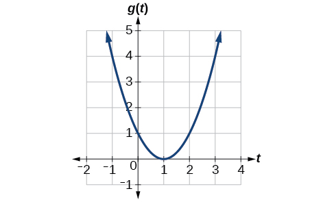{: #Figure_01_03_001}

At <math xmlns="http://www.w3.org/1998/Math/MathML"> <mrow> <mi>t</mi><mo>=</mo><mo>−</mo><mn>1</mn><mo>,</mo></mrow> </math>

 [[link]](#Figure_01_03_002) shows <math xmlns="http://www.w3.org/1998/Math/MathML"> <mrow> <mi>g</mi><mrow><mo>(</mo> <mrow> <mn>−1</mn></mrow> <mo>)</mo></mrow><mo>=</mo><mn>4.</mn></mrow> </math>

 At<math xmlns="http://www.w3.org/1998/Math/MathML"> <mrow> <mtext> </mtext><mi>t</mi><mo>=</mo><mn>2</mn><mo>,</mo> </mrow> </math>

the graph shows <math xmlns="http://www.w3.org/1998/Math/MathML"> <mrow> <mi>g</mi><mrow><mo>(</mo> <mn>2</mn> <mo>)</mo></mrow><mo>=</mo><mn>1.</mn></mrow> </math>

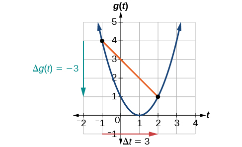{: #Figure_01_03_002}

The horizontal change<math xmlns="http://www.w3.org/1998/Math/MathML"> <mrow> <mtext> </mtext><mtext>Δ</mtext><mi>t</mi><mo>=</mo><mn>3</mn><mtext> </mtext></mrow> </math>

is shown by the red arrow, and the vertical change <math xmlns="http://www.w3.org/1998/Math/MathML"> <mrow> <mtext>Δ</mtext><mi>g</mi><mo stretchy="false">(</mo><mi>t</mi><mo stretchy="false">)</mo><mo>=</mo><mo>−</mo><mn>3</mn> </mrow> </math>

 is shown by the turquoise arrow. The average rate of change is shown by the slope of the orange line segment. The output changes by –3 while the input changes by 3, giving an average rate of change of

<math xmlns="http://www.w3.org/1998/Math/MathML" display="block"> <mrow> <mfrac> <mrow> <mn>1</mn><mo>−</mo><mn>4</mn></mrow> <mrow> <mn>2</mn><mo>−</mo><mrow><mo>(</mo> <mrow> <mo>−</mo><mn>1</mn></mrow> <mo>)</mo></mrow></mrow> </mfrac> <mo>=</mo><mfrac> <mrow> <mo>−</mo><mn>3</mn></mrow> <mn>3</mn> </mfrac> <mo>=</mo><mn>−1</mn></mrow> </math>

Analysis

Note that the order we choose is very important. If, for example, we use<math xmlns="http://www.w3.org/1998/Math/MathML"> <mrow> <mtext> </mtext><mfrac> <mrow> <msub> <mi>y</mi> <mn>2</mn> </msub> <mo>−</mo><msub> <mi>y</mi> <mn>1</mn> </msub> </mrow> <mrow> <msub> <mi>x</mi> <mn>1</mn> </msub> <mo>−</mo><msub> <mi>x</mi> <mn>2</mn> </msub> </mrow> </mfrac> <mo>,</mo><mtext> </mtext></mrow> </math>

we will not get the correct answer. Decide which point will be 1 and which point will be 2, and keep the coordinates fixed as<math xmlns="http://www.w3.org/1998/Math/MathML"> <mrow> <mtext> </mtext><mrow><mo>(</mo> <mrow> <msub> <mi>x</mi> <mn>1</mn> </msub> <mo>,</mo><msub> <mi>y</mi> <mn>1</mn> </msub> </mrow> <mo>)</mo></mrow><mtext> </mtext> </mrow> </math>

 and<math xmlns="http://www.w3.org/1998/Math/MathML"> <mrow> <mtext> </mtext><mrow><mo>(</mo> <mrow> <msub> <mi>x</mi> <mn>2</mn> </msub> <mo>,</mo><msub> <mi>y</mi> <mn>2</mn> </msub> </mrow> <mo>)</mo></mrow><mo>.</mo> </mrow> </math>

Computing Average Rate of Change from a Table

After picking up a friend who lives 10 miles away and leaving on a trip, Anna records her distance from home over time. The values are shown in [[link]](#Table_01_03_02). Find her average speed over the first 6 hours.

<table id="Table_01_03_02" summary="Two rows and nine columns. The first row is labeled, &#x201C;t (hours)&#x201D;, and the second row is labeled, &#x201C;D(t) (miles)&#x201D;. Reading the rows as ordered pairs, we have: (0, 10), (1, 55), (2, 90), (3, 153), (4, 214), (5, 240), (6, 292), and (7, 300)."><colgroup><col /><col data-width="50" /><col data-width="50" /><col data-width="50" /><col data-width="50" /><col data-width="50" /><col data-width="50" /><col data-width="50" /><col data-width="50" /></colgroup><tbody>
        <tr>
         <td data-align="center"><strong><em>t</em> (hours)</strong></td>
         <td data-align="center">0</td>
         <td data-align="center">1</td>
         <td data-align="center">2</td>
         <td data-align="center">3</td>
         <td data-align="center">4</td>
         <td data-align="center">5</td>
         <td data-align="center">6</td>
         <td data-align="center">7</td>
        </tr>
       
       
        <tr>
         <td data-align="center"><strong><em>D</em>(<em>t</em>) (miles)</strong></td>
         <td data-align="center">10</td>
         <td data-align="center">55</td>
         <td data-align="center">90</td>
         <td data-align="center">153</td>
         <td data-align="center">214</td>
         <td data-align="center">240</td>
         <td data-align="center">292</td>
         <td data-align="center">300</td>
        </tr>
       </tbody></table>

Here, the average speed is the average rate of change. She traveled 282 miles in 6 hours.

<math xmlns="http://www.w3.org/1998/Math/MathML" display="block"> <mrow> <mtable> <mtr rowalign="center"> <mtd columnalign="right" rowalign="center"> <mrow> <mfrac> <mrow> <mn>292</mn><mo>−</mo><mn>10</mn> </mrow> <mrow> <mn>6</mn><mo>−</mo><mn>0</mn> </mrow> </mfrac> </mrow> </mtd> <mtd rowalign="center"> <mo>=</mo> </mtd> <mtd columnalign="left" rowalign="center"> <mrow> <mfrac> <mrow> <mn>282</mn> </mrow> <mn>6</mn> </mfrac> </mrow> </mtd> </mtr> <mtr rowalign="center"> <mtd rowalign="center" /> <mtd rowalign="center"> <mo>=</mo> </mtd> <mtd columnalign="left" rowalign="center"> <mrow> <mn>47</mn> </mrow> </mtd> </mtr> </mtable> </mrow> </math>

The average speed is 47 miles per hour.

Analysis

Because the speed is not constant, the average speed depends on the interval chosen. For the interval [2,3], the average speed is 63 miles per hour.

Computing Average Rate of Change for a Function Expressed as a Formula

Compute the average rate of change of <math xmlns="http://www.w3.org/1998/Math/MathML"> <mrow> <mi>f</mi><mrow><mo>(</mo> <mi>x</mi> <mo>)</mo></mrow><mo>=</mo><msup> <mi>x</mi> <mn>2</mn> </msup> <mo>−</mo><mfrac> <mn>1</mn> <mi>x</mi> </mfrac> </mrow> </math>

 on the interval <math xmlns="http://www.w3.org/1998/Math/MathML"> <mrow> <mtext>[2,</mtext><mtext> </mtext><mtext>4].</mtext> </mrow> </math>

We can start by computing the function values at each **endpoint**{: data-type="term" .no-emphasis} of the interval.

<math xmlns="http://www.w3.org/1998/Math/MathML" display="block"> <mrow> <mtable> <mtr rowalign="center"> <mtd columnalign="right" rowalign="center"> <mrow> <mi>f</mi><mo stretchy="false">(</mo><mn>2</mn><mo stretchy="false">)</mo> </mrow> </mtd> <mtd rowalign="center"> <mo>=</mo> </mtd> <mtd columnalign="left" rowalign="center"> <mrow> <msup> <mn>2</mn> <mn>2</mn> </msup> <mo>−</mo><mfrac> <mn>1</mn> <mn>2</mn> </mfrac> </mrow> </mtd> <mtd columnalign="right" rowalign="center"><mspace width="2em" /> <mrow> <mi>f</mi><mo stretchy="false">(</mo><mn>4</mn><mo stretchy="false">)</mo> </mrow> </mtd> <mtd rowalign="center"> <mo>=</mo> </mtd> <mtd columnalign="left" rowalign="center"> <mrow> <msup> <mn>4</mn> <mn>2</mn> </msup> <mo>−</mo><mfrac> <mn>1</mn> <mn>4</mn> </mfrac> </mrow> </mtd> </mtr> <mtr rowalign="center"> <mtd rowalign="center" /> <mtd rowalign="center"> <mo>=</mo> </mtd> <mtd columnalign="left" rowalign="center"> <mrow> <mn>4</mn><mo>−</mo><mfrac> <mn>1</mn> <mn>2</mn> </mfrac> </mrow> </mtd> <mtd rowalign="center" /> <mtd rowalign="center"> <mo>=</mo> </mtd> <mtd columnalign="left" rowalign="center"> <mrow> <mn>16</mn><mo>−</mo><mfrac> <mn>1</mn> <mn>4</mn> </mfrac> </mrow> </mtd> </mtr> <mtr rowalign="center"> <mtd rowalign="center" /> <mtd rowalign="center"> <mo>=</mo> </mtd> <mtd columnalign="left" rowalign="center"> <mrow> <mfrac> <mn>7</mn> <mn>2</mn> </mfrac> </mrow> </mtd> <mtd rowalign="center" /> <mtd rowalign="center"> <mo>=</mo> </mtd> <mtd columnalign="left" rowalign="center"> <mrow> <mfrac> <mrow> <mn>63</mn> </mrow> <mn>4</mn> </mfrac> </mrow> </mtd> </mtr> </mtable> </mrow> </math>

Now we compute the average rate of change.

<math xmlns="http://www.w3.org/1998/Math/MathML" display="block"> <mrow> <mtable> <mtr rowalign="center"> <mtd columnalign="right" rowalign="center"> <mrow> <mtext>Average rate of change</mtext> </mrow> </mtd> <mtd rowalign="center"> <mo>=</mo> </mtd> <mtd columnalign="left" rowalign="center"> <mrow> <mfrac> <mrow> <mi>f</mi><mo stretchy="false">(</mo><mn>4</mn><mo stretchy="false">)</mo><mo>−</mo><mi>f</mi><mo stretchy="false">(</mo><mn>2</mn><mo stretchy="false">)</mo> </mrow> <mrow> <mn>4</mn><mo>−</mo><mn>2</mn> </mrow> </mfrac> </mrow> </mtd> </mtr> <mtr rowalign="center"> <mtd rowalign="center" /> <mtd rowalign="center"> <mo>=</mo> </mtd> <mtd columnalign="left" rowalign="center"> <mrow> <mfrac> <mrow> <mfrac> <mrow> <mn>63</mn> </mrow> <mn>4</mn> </mfrac> <mo>−</mo><mfrac> <mn>7</mn> <mn>2</mn> </mfrac> </mrow> <mrow> <mn>4</mn><mo>−</mo><mn>2</mn> </mrow> </mfrac> </mrow> </mtd> </mtr> <mtr rowalign="center"> <mtd rowalign="center" /> <mtd rowalign="center"> <mo>=</mo> </mtd> <mtd columnalign="left" rowalign="center"> <mrow> <mfrac> <mrow> <mfrac> <mrow> <mn>49</mn> </mrow> <mn>4</mn> </mfrac> </mrow> <mn>2</mn> </mfrac> </mrow> </mtd> </mtr> <mtr rowalign="center"> <mtd rowalign="center" /> <mtd rowalign="center"> <mo>=</mo> </mtd> <mtd columnalign="left" rowalign="center"> <mrow> <mfrac> <mrow> <mn>49</mn> </mrow> <mn>8</mn> </mfrac> </mrow> </mtd> </mtr> </mtable> </mrow> </math>

Find the average rate of change of <math xmlns="http://www.w3.org/1998/Math/MathML"> <mrow> <mi>f</mi><mrow><mo>(</mo> <mi>x</mi> <mo>)</mo></mrow><mo>=</mo><mi>x</mi><mo>−</mo><mn>2</mn><msqrt> <mi>x</mi> </msqrt> </mrow> </math>

 on the interval <math xmlns="http://www.w3.org/1998/Math/MathML"> <mrow> <mo stretchy="false">[</mo><mn>1</mn><mo>,</mo><mtext> </mtext><mn>9</mn><mo stretchy="false">]</mo><mo>.</mo> </mrow> </math>

<math xmlns="http://www.w3.org/1998/Math/MathML"> <mrow> <mfrac> <mn>1</mn> <mn>2</mn> </mfrac> </mrow> </math>

Finding the Average Rate of Change of a Force

The **electrostatic force**{: data-type="term" .no-emphasis}<math xmlns="http://www.w3.org/1998/Math/MathML"> <mrow> <mtext> </mtext><mi>F</mi><mo>,</mo></mrow> </math>

measured in newtons, between two charged particles can be related to the distance between the particles<math xmlns="http://www.w3.org/1998/Math/MathML"> <mrow> <mtext> </mtext><mi>d</mi><mo>,</mo></mrow> </math>

in centimeters, by the formula<math xmlns="http://www.w3.org/1998/Math/MathML"> <mrow> <mtext> </mtext><mi>F</mi><mrow><mo>(</mo> <mi>d</mi> <mo>)</mo></mrow><mo>=</mo><mfrac> <mn>2</mn> <mrow> <msup> <mi>d</mi> <mn>2</mn> </msup> </mrow> </mfrac> <mo>.</mo></mrow> </math>

Find the average rate of change of force if the distance between the particles is increased from 2 cm to 6 cm.

We are computing the average rate of change of<math xmlns="http://www.w3.org/1998/Math/MathML"> <mrow> <mtext> </mtext><mi>F</mi><mrow><mo>(</mo> <mi>d</mi> <mo>)</mo></mrow><mo>=</mo><mfrac> <mn>2</mn> <mrow> <msup> <mi>d</mi> <mn>2</mn> </msup> </mrow> </mfrac> <mtext> </mtext></mrow> </math>

on the interval<math xmlns="http://www.w3.org/1998/Math/MathML"> <mrow> <mtext> </mtext><mo stretchy="false">[</mo><mn>2</mn><mo>,</mo><mn>6</mn><mo stretchy="false">]</mo><mo>.</mo></mrow> </math>

<math xmlns="http://www.w3.org/1998/Math/MathML" display="block"> <mrow> <mtable> <mtr rowalign="center"> <mtd columnalign="right" rowalign="center"> <mrow> <mtext>Average rate of change</mtext> </mrow> </mtd> <mtd rowalign="center"> <mo>=</mo> </mtd> <mtd columnalign="left" rowalign="center"> <mrow> <mtext> </mtext><mfrac> <mrow> <mi>F</mi><mo stretchy="false">(</mo><mn>6</mn><mo stretchy="false">)</mo><mo>−</mo><mi>F</mi><mo stretchy="false">(</mo><mn>2</mn><mo stretchy="false">)</mo> </mrow> <mrow> <mn>6</mn><mo>−</mo><mn>2</mn> </mrow> </mfrac> </mrow> </mtd> <mtd rowalign="center" /> </mtr> <mtr rowalign="center"> <mtd rowalign="center" /> <mtd rowalign="center"> <mo>=</mo> </mtd> <mtd columnalign="left" rowalign="center"> <mrow> <mfrac> <mrow> <mfrac> <mn>2</mn> <mrow> <msup> <mn>6</mn> <mn>2</mn> </msup> </mrow> </mfrac> <mo>−</mo><mfrac> <mn>2</mn> <mrow> <msup> <mn>2</mn> <mn>2</mn> </msup> </mrow> </mfrac> </mrow> <mrow> <mn>6</mn><mo>−</mo><mn>2</mn> </mrow> </mfrac> </mrow> </mtd> <mtd columnalign="left" rowalign="center"> <mrow> <mtext>Simplify</mtext><mo>.</mo> </mrow> </mtd> </mtr> <mtr rowalign="center"> <mtd rowalign="center" /> <mtd columnalign="left" rowalign="center"> <mo>=</mo> </mtd> <mtd columnalign="left" rowalign="center"> <mrow> <mfrac> <mrow> <mfrac> <mn>2</mn> <mrow> <mn>36</mn> </mrow> </mfrac> <mo>−</mo><mfrac> <mn>2</mn> <mn>4</mn> </mfrac> </mrow> <mn>4</mn> </mfrac> </mrow> </mtd> <mtd rowalign="center" /> </mtr> <mtr rowalign="center"> <mtd rowalign="center" /> <mtd rowalign="center"> <mo>=</mo> </mtd> <mtd columnalign="left" rowalign="center"> <mrow> <mfrac> <mrow> <mo>−</mo><mfrac> <mrow> <mn>16</mn> </mrow> <mrow> <mn>36</mn> </mrow> </mfrac> </mrow> <mn>4</mn> </mfrac> </mrow> </mtd> <mtd columnalign="left" rowalign="center"> <mrow> <mtext>Combine numerator terms</mtext><mo>.</mo> </mrow> </mtd> </mtr> <mtr rowalign="center"> <mtd rowalign="center" /> <mtd rowalign="center"> <mo>=</mo> </mtd> <mtd columnalign="left" rowalign="center"> <mrow> <mo>−</mo><mfrac> <mn>1</mn> <mn>9</mn> </mfrac> </mrow> </mtd> <mtd columnalign="left" rowalign="center"> <mrow> <mtext>Simplify</mtext> </mrow> </mtd> </mtr> </mtable> </mrow> </math>

The average rate of change is <math xmlns="http://www.w3.org/1998/Math/MathML"> <mrow> <mo>−</mo><mfrac> <mn>1</mn> <mn>9</mn> </mfrac> </mrow> </math>

 newton per centimeter.

Finding an Average Rate of Change as an Expression

Find the average rate of change of <math xmlns="http://www.w3.org/1998/Math/MathML"> <mrow> <mi>g</mi><mrow><mo>(</mo> <mi>t</mi> <mo>)</mo></mrow><mo>=</mo><msup> <mi>t</mi> <mn>2</mn> </msup> <mo>+</mo><mn>3</mn><mi>t</mi><mo>+</mo><mn>1</mn></mrow> </math>

 on the interval <math xmlns="http://www.w3.org/1998/Math/MathML"> <mrow> <mo stretchy="false">[</mo><mn>0</mn><mo>,</mo><mtext> </mtext><mi>a</mi><mo stretchy="false">]</mo><mo>.</mo> </mrow> </math>

 The answer will be an expression involving <math xmlns="http://www.w3.org/1998/Math/MathML"> <mrow> <mi>a</mi></mrow> </math>

 in simplest form.

We use the average rate of change formula.* * *
{: data-type="newline"}

<math xmlns="http://www.w3.org/1998/Math/MathML" display="block"> <mrow> <mtable> <mtr rowalign="center"> <mtd columnalign="right" rowalign="center"> <mrow> <mtext>Average rate of change</mtext> </mrow> </mtd> <mtd rowalign="center"> <mo>=</mo> </mtd> <mtd columnalign="left" rowalign="center"> <mrow> <mfrac> <mrow> <mi>g</mi><mo stretchy="false">(</mo><mi>a</mi><mo stretchy="false">)</mo><mo>−</mo><mi>g</mi><mo stretchy="false">(</mo><mn>0</mn><mo stretchy="false">)</mo> </mrow> <mrow> <mi>a</mi><mo>−</mo><mn>0</mn> </mrow> </mfrac> </mrow> </mtd> <mtd columnalign="left" rowalign="center"> <mrow> <mtext>Evaluate</mtext><mo>.</mo> </mrow> </mtd> </mtr> <mtr rowalign="center"> <mtd rowalign="center" /> <mtd rowalign="center"> <mo>=</mo> </mtd> <mtd columnalign="left" rowalign="center"> <mrow> <mfrac> <mrow> <mo>(</mo><msup> <mi>a</mi> <mn>2</mn> </msup> <mo>+</mo><mn>3</mn><mi>a</mi><mo>+</mo><mn>1</mn><mo>)</mo><mo>−</mo><mo>(</mo><msup> <mn>0</mn> <mn>2</mn> </msup> <mo>+</mo><mn>3</mn><mo>(</mo><mn>0</mn><mo>)</mo><mo>+</mo><mn>1</mn><mo>)</mo> </mrow> <mrow> <mi>a</mi><mo>−</mo><mn>0</mn> </mrow> </mfrac> </mrow> </mtd> <mtd columnalign="left" rowalign="center"> <mrow> <mtext>Simplify</mtext><mo>.</mo> </mrow> </mtd> </mtr> <mtr rowalign="center"> <mtd rowalign="center" /> <mtd rowalign="center"> <mo>=</mo> </mtd> <mtd columnalign="left" rowalign="center"> <mrow> <mfrac> <mrow> <msup> <mi>a</mi> <mn>2</mn> </msup> <mo>+</mo><mn>3</mn><mi>a</mi><mo>+</mo><mn>1</mn><mo>−</mo><mn>1</mn> </mrow> <mi>a</mi> </mfrac> </mrow> </mtd> <mtd columnalign="left" rowalign="center"> <mrow> <mtext>Simplify and factor</mtext><mo>.</mo> </mrow> </mtd> </mtr> <mtr rowalign="center"> <mtd rowalign="center" /> <mtd rowalign="center"> <mo>=</mo> </mtd> <mtd columnalign="left" rowalign="center"> <mrow> <mfrac> <mrow> <mi>a</mi><mo stretchy="false">(</mo><mi>a</mi><mo>+</mo><mn>3</mn><mo stretchy="false">)</mo> </mrow> <mi>a</mi> </mfrac> </mrow> </mtd> <mtd columnalign="left" rowalign="center"> <mrow> <mtext>Divide by the common factor </mtext><mi>a</mi><mo>.</mo> </mrow> </mtd> </mtr> <mtr rowalign="center"> <mtd rowalign="center" /> <mtd rowalign="center"> <mo>=</mo> </mtd> <mtd columnalign="left" rowalign="center"> <mrow> <mi>a</mi><mo>+</mo><mn>3</mn> </mrow> </mtd> <mtd rowalign="center" /> </mtr> </mtable> </mrow> </math>

This result tells us the average rate of change in terms of<math xmlns="http://www.w3.org/1998/Math/MathML"> <mrow> <mtext> </mtext><mi>a</mi><mtext> </mtext></mrow> </math>

between<math xmlns="http://www.w3.org/1998/Math/MathML"> <mrow> <mtext> </mtext><mi>t</mi><mo>=</mo><mn>0</mn><mtext> </mtext></mrow> </math>

and any other point<math xmlns="http://www.w3.org/1998/Math/MathML"> <mrow> <mtext> </mtext><mi>t</mi><mo>=</mo><mi>a</mi><mo>.</mo><mtext> </mtext></mrow> </math>

For example, on the interval<math xmlns="http://www.w3.org/1998/Math/MathML"> <mrow> <mtext> </mtext><mo stretchy="false">[</mo><mn>0</mn><mo>,</mo><mn>5</mn><mo stretchy="false">]</mo><mo>,</mo><mtext> </mtext></mrow> </math>

the average rate of change would be<math xmlns="http://www.w3.org/1998/Math/MathML"> <mrow> <mtext> </mtext><mn>5</mn><mo>+</mo><mn>3</mn><mo>=</mo><mn>8.</mn></mrow> </math>

Find the average rate of change of<math xmlns="http://www.w3.org/1998/Math/MathML"> <mrow> <mtext> </mtext><mi>f</mi><mo stretchy="false">(</mo><mi>x</mi><mo stretchy="false">)</mo><mo>=</mo><msup> <mi>x</mi> <mn>2</mn> </msup> <mo>+</mo><mn>2</mn><mi>x</mi><mo>−</mo><mn>8</mn><mtext> </mtext> </mrow> </math>

 on the interval<math xmlns="http://www.w3.org/1998/Math/MathML"> <mrow> <mtext> </mtext><mo stretchy="false">[</mo><mn>5</mn><mo>,</mo><mi>a</mi><mo stretchy="false">]</mo><mtext> </mtext> </mrow> </math>

in simplest forms in terms * * *
{: data-type="newline"}

of<math xmlns="http://www.w3.org/1998/Math/MathML"> <mrow> <mtext> </mtext><mi>a</mi><mo>.</mo> </mrow> </math>

<math xmlns="http://www.w3.org/1998/Math/MathML"> <mrow> <mtext> </mtext><mi>a</mi><mo>+</mo><mn>7</mn><mtext> </mtext></mrow> </math>

# Using a Graph to Determine Where a Function is Increasing, Decreasing, or Constant

As part of exploring how functions change, we can identify intervals over which the function is changing in specific ways. We say that a function is increasing on an interval if the function values increase as the input values increase within that interval. Similarly, a function is decreasing on an interval if the function values decrease as the input values increase over that interval. The average rate of change of an increasing function is positive, and the average rate of change of a decreasing function is negative. [\[link\]](#Figure_01_03_004) shows examples of increasing and decreasing intervals on a function.

=&#10;       x&#10;       3&#10;      &#10;     &#x2212;12x&#x2009;&#10;   is increasing on&#10; &#10;  &#x2009;(&#10;   &#10;    &#x2212;&#x221E;,&#x2009;&#x2212;2&#10;   &#10;  )&#10;   &#10;    &#10;     &#x222A;&#10;     &#x200B;&#10;    &#10;    &#10;   &#10;   &#x200B;&#10;  &#10;  (&#10;   &#10;    2,&#x2009;&#x221E;&#10;   &#10;  )&#x2009;&#10; &#10;and is decreasing on&#10; &#10;  &#x2009;(&#x2212;2,&#x2009;2).&#10; &#10;"){: #Figure_01_03_004}

While some functions are increasing (or decreasing) over their entire domain, many others are not. A value of the input where a function changes from increasing to decreasing (as we go from left to right, that is, as the input variable increases) is called a **local maximum**{: data-type="term"}. If a function has more than one, we say it has local maxima. Similarly, a value of the input where a function changes from decreasing to increasing as the input variable increases is called a **local minimum**{: data-type="term"}. The plural form is “local minima.” Together, local maxima and minima are called **local extrema**{: data-type="term"}, or local extreme values, of the function. (The singular form is “extremum.”) Often, the term *local* is replaced by the term *relative*. In this text, we will use the term *local*.

Clearly, a function is neither increasing nor decreasing on an interval where it is constant. A function is also neither increasing nor decreasing at extrema. Note that we have to speak of *local* extrema, because any given local extremum as defined here is not necessarily the highest maximum or lowest minimum in the function’s entire domain.

For the function whose graph is shown in [\[link\]](#Figure_01_03_015), the local maximum is 16, and it occurs at<math xmlns="http://www.w3.org/1998/Math/MathML"> <mrow> <mtext> </mtext><mi>x</mi><mo>=</mo><mn>−2.</mn><mtext> </mtext> </mrow> </math>

The local minimum is<math xmlns="http://www.w3.org/1998/Math/MathML"> <mrow> <mtext> </mtext><mn>−16</mn><mtext> </mtext></mrow> </math>

and it occurs at<math xmlns="http://www.w3.org/1998/Math/MathML"> <mrow> <mtext> </mtext><mi>x</mi><mo>=</mo><mn>2.</mn></mrow> </math>

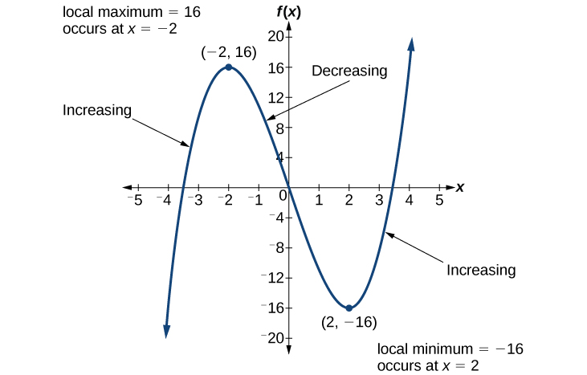{: #Figure_01_03_015}

To locate the local maxima and minima from a graph, we need to observe the graph to determine where the graph attains its highest and lowest points, respectively, within an open interval. Like the summit of a roller coaster, the graph of a function is higher at a local maximum than at nearby points on both sides. The graph will also be lower at a local minimum than at neighboring points. [\[link\]](#Figure_01_03_005) illustrates these ideas for a local maximum.

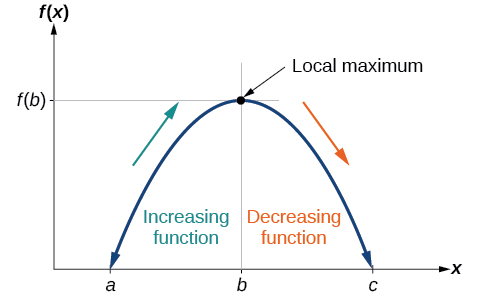{: #Figure_01_03_005}

These observations lead us to a formal definition of local extrema.

Local Minima and Local Maxima

A function<math xmlns="http://www.w3.org/1998/Math/MathML"> <mrow> <mtext> </mtext><mi>f</mi><mtext> </mtext></mrow> </math>

is an **increasing function**{: data-type="term"} on an open interval if<math xmlns="http://www.w3.org/1998/Math/MathML"> <mrow> <mtext> </mtext><mi>f</mi><mrow><mo>(</mo> <mi>b</mi> <mo>)</mo></mrow><mo>&gt;</mo><mi>f</mi><mrow><mo>(</mo> <mi>a</mi> <mo>)</mo></mrow><mtext> </mtext></mrow> </math>

for any two input values<math xmlns="http://www.w3.org/1998/Math/MathML"> <mrow> <mtext> </mtext><mi>a</mi><mtext> </mtext></mrow> </math>

and<math xmlns="http://www.w3.org/1998/Math/MathML"> <mrow> <mtext> </mtext><mi>b</mi><mtext> </mtext></mrow> </math>

in the given interval where<math xmlns="http://www.w3.org/1998/Math/MathML"> <mrow> <mtext> </mtext><mi>b</mi><mo>&gt;</mo><mi>a</mi><mo>.</mo> </mrow> </math>

A function<math xmlns="http://www.w3.org/1998/Math/MathML"> <mrow> <mtext> </mtext><mi>f</mi><mtext> </mtext></mrow> </math>

is a **decreasing function**{: data-type="term"} on an open interval if<math xmlns="http://www.w3.org/1998/Math/MathML"> <mrow> <mtext> </mtext><mi>f</mi><mrow><mo>(</mo> <mi>b</mi> <mo>)</mo></mrow><mo>&lt;</mo><mi>f</mi><mrow><mo>(</mo> <mi>a</mi> <mo>)</mo></mrow><mtext> </mtext></mrow> </math>

for any two input values<math xmlns="http://www.w3.org/1998/Math/MathML"> <mrow> <mtext> </mtext><mi>a</mi><mtext> </mtext></mrow> </math>

and<math xmlns="http://www.w3.org/1998/Math/MathML"> <mrow> <mtext> </mtext><mi>b</mi><mtext> </mtext></mrow> </math>

in the given interval where<math xmlns="http://www.w3.org/1998/Math/MathML"> <mrow> <mtext> </mtext><mi>b</mi><mo>&gt;</mo><mi>a</mi><mo>.</mo></mrow> </math>

A function <math xmlns="http://www.w3.org/1998/Math/MathML"> <mrow> <mi>f</mi></mrow> </math>

 has a local maximum at <math xmlns="http://www.w3.org/1998/Math/MathML"> <mrow> <mtext> </mtext><mi>x</mi><mo>=</mo><mi>b</mi></mrow> </math>

 if there exists an interval <math xmlns="http://www.w3.org/1998/Math/MathML"> <mrow> <mtext> </mtext><mo stretchy="false">(</mo><mi>a</mi><mo>,</mo><mi>c</mi><mo stretchy="false">)</mo></mrow> </math>

 with <math xmlns="http://www.w3.org/1998/Math/MathML"> <mrow> <mi>a</mi><mo>&lt;</mo><mi>b</mi><mo>&lt;</mo><mi>c</mi></mrow> </math>

 such that, for any <math xmlns="http://www.w3.org/1998/Math/MathML"> <mrow> <mi>x</mi></mrow> </math>

 in the interval<math xmlns="http://www.w3.org/1998/Math/MathML"> <mrow> <mrow><mo>(</mo> <mrow> <mi>a</mi><mo>,</mo><mi>c</mi></mrow> <mo>)</mo></mrow><mo>,</mo></mrow> </math>

<math xmlns="http://www.w3.org/1998/Math/MathML"> <mrow> <mi>f</mi><mrow><mo>(</mo> <mi>x</mi> <mo>)</mo></mrow><mo>≤</mo><mi>f</mi><mrow><mo>(</mo> <mi>b</mi> <mo>)</mo></mrow><mo>.</mo></mrow> </math>

 Likewise, <math xmlns="http://www.w3.org/1998/Math/MathML"> <mi>f</mi> </math>

 has a local minimum at <math xmlns="http://www.w3.org/1998/Math/MathML"> <mrow> <mi>x</mi><mo>=</mo><mi>b</mi></mrow> </math>

 if there exists an interval <math xmlns="http://www.w3.org/1998/Math/MathML"> <mrow> <mo stretchy="false">(</mo><mi>a</mi><mo>,</mo><mi>c</mi><mo stretchy="false">)</mo></mrow> </math>

 with <math xmlns="http://www.w3.org/1998/Math/MathML"> <mrow> <mi>a</mi><mo>&lt;</mo><mi>b</mi><mo>&lt;</mo><mi>c</mi></mrow> </math>

 such that, for any <math xmlns="http://www.w3.org/1998/Math/MathML"> <mrow> <mi>x</mi></mrow> </math>

 in the interval <math xmlns="http://www.w3.org/1998/Math/MathML"> <mrow> <mrow><mo>(</mo> <mrow> <mi>a</mi><mo>,</mo><mi>c</mi></mrow> <mo>)</mo></mrow><mo>,</mo></mrow> </math>

<math xmlns="http://www.w3.org/1998/Math/MathML"> <mrow> <mi>f</mi><mrow><mo>(</mo> <mi>x</mi> <mo>)</mo></mrow><mo>≥</mo><mi>f</mi><mrow><mo>(</mo> <mi>b</mi> <mo>)</mo></mrow><mo>.</mo></mrow> </math>

Finding Increasing and Decreasing Intervals on a Graph

Given the function<math xmlns="http://www.w3.org/1998/Math/MathML"> <mrow> <mtext> </mtext><mi>p</mi><mrow><mo>(</mo> <mi>t</mi> <mo>)</mo></mrow><mtext> </mtext></mrow> </math>

in [[link]](#Figure_01_03_006), identify the intervals on which the function appears to be increasing.

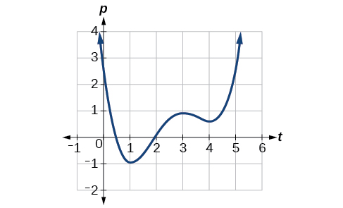{: #Figure_01_03_006}

We see that the function is not constant on any interval. The function is increasing where it slants upward as we move to the right and decreasing where it slants downward as we move to the right. The function appears to be increasing from<math xmlns="http://www.w3.org/1998/Math/MathML"> <mrow> <mtext> </mtext><mi>t</mi><mo>=</mo><mn>1</mn><mtext> </mtext></mrow> </math>

to<math xmlns="http://www.w3.org/1998/Math/MathML"> <mrow> <mtext> </mtext><mi>t</mi><mo>=</mo><mn>3</mn><mtext> </mtext></mrow> </math>

and from<math xmlns="http://www.w3.org/1998/Math/MathML"> <mrow> <mtext> </mtext><mi>t</mi><mo>=</mo><mn>4</mn><mtext> </mtext></mrow> </math>

on.

In **interval notation**{: data-type="term" .no-emphasis}, we would say the function appears to be increasing on the interval (1,3) and the interval <math xmlns="http://www.w3.org/1998/Math/MathML"> <mrow> <mo stretchy="false">(</mo><mn>4</mn><mo>,</mo><mi>∞</mi><mo stretchy="false">)</mo><mo>.</mo></mrow></math>

Analysis

Notice in this example that we used open intervals (intervals that do not include the endpoints), because the function is neither increasing nor decreasing at<math xmlns="http://www.w3.org/1998/Math/MathML"> <mrow> <mtext> </mtext><mi>t</mi><mo>=</mo><mn>1</mn></mrow> </math>

,<math xmlns="http://www.w3.org/1998/Math/MathML"> <mrow> <mtext> </mtext><mi>t</mi><mo>=</mo><mn>3</mn></mrow> </math>

, and<math xmlns="http://www.w3.org/1998/Math/MathML"> <mrow> <mtext> </mtext><mi>t</mi><mo>=</mo><mn>4</mn><mtext> </mtext></mrow> </math>

. These points are the local extrema (two minima and a maximum).

Finding Local Extrema from a Graph

Graph the function<math xmlns="http://www.w3.org/1998/Math/MathML"> <mrow> <mtext> </mtext><mi>f</mi><mrow><mo>(</mo> <mi>x</mi> <mo>)</mo></mrow><mo>=</mo><mfrac> <mn>2</mn> <mi>x</mi> </mfrac> <mo>+</mo><mfrac> <mi>x</mi> <mn>3</mn> </mfrac> <mo>.</mo><mtext> </mtext></mrow> </math>

Then use the graph to estimate the local extrema of the function and to determine the intervals on which the function is increasing.

Using technology, we find that the graph of the function looks like that in [[link]](#Figure_01_03_007). It appears there is a low point, or local minimum, between<math xmlns="http://www.w3.org/1998/Math/MathML"> <mrow> <mtext> </mtext><mi>x</mi><mo>=</mo><mn>2</mn><mtext> </mtext></mrow> </math>

and<math xmlns="http://www.w3.org/1998/Math/MathML"> <mrow> <mtext> </mtext><mi>x</mi><mo>=</mo><mn>3</mn><mo>,</mo><mtext> </mtext></mrow> </math>

and a mirror-image high point, or local maximum, somewhere between<math xmlns="http://www.w3.org/1998/Math/MathML"> <mrow> <mtext> </mtext><mi>x</mi><mo>=</mo><mn>−3</mn><mtext> </mtext> </mrow> </math>

and<math xmlns="http://www.w3.org/1998/Math/MathML"> <mrow> <mtext> </mtext><mi>x</mi><mo>=</mo><mn>−2.</mn> </mrow> </math>

{: #Figure_01_03_007}

Analysis

Most graphing calculators and graphing utilities can estimate the location of maxima and minima. [[link]](#Figure_01_03_008) provides screen images from two different technologies, showing the estimate for the local maximum and minimum.

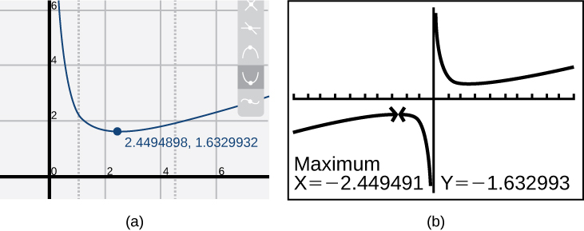{: #Figure_01_03_008}

Based on these estimates, the function is increasing on the interval<math xmlns="http://www.w3.org/1998/Math/MathML"> <mrow> <mtext> </mtext><mo stretchy="false">(</mo><mo>−</mo><mi>∞</mi><mtext>,</mtext><mo>−</mo><mtext>2</mtext><mtext>.449)</mtext><mtext> </mtext> </mrow> </math>

 and<math xmlns="http://www.w3.org/1998/Math/MathML"> <mrow> <mtext> </mtext><mo stretchy="false">(</mo><mn>2.449</mn><mtext>,</mtext><mi>∞</mi><mo stretchy="false">)</mo><mo>.</mo><mtext> </mtext> </mrow> </math>

Notice that, while we expect the extrema to be symmetric, the two different technologies agree only up to four decimals due to the differing approximation algorithms used by each. (The exact location of the extrema is at<math xmlns="http://www.w3.org/1998/Math/MathML"> <mrow> <mtext> </mtext><mo>±</mo><msqrt> <mn>6</mn> </msqrt> <mo>,</mo><mtext> </mtext></mrow> </math>

but determining this requires calculus.)

Graph the function<math xmlns="http://www.w3.org/1998/Math/MathML"> <mrow> <mtext> </mtext><mi>f</mi><mrow><mo>(</mo> <mi>x</mi> <mo>)</mo></mrow><mo>=</mo><msup> <mi>x</mi> <mn>3</mn> </msup> <mo>−</mo><mn>6</mn><msup> <mi>x</mi> <mn>2</mn> </msup> <mo>−</mo><mn>15</mn><mi>x</mi><mo>+</mo><mn>20</mn><mtext> </mtext></mrow> </math>

to estimate the local extrema of the function. Use these to determine the intervals on which the function is increasing and decreasing.

The local maximum appears to occur at<math xmlns="http://www.w3.org/1998/Math/MathML"> <mrow> <mtext> </mtext><mo stretchy="false">(</mo><mo>−</mo><mn>1</mn><mo>,</mo><mn>28</mn><mo stretchy="false">)</mo><mo>,</mo><mtext> </mtext></mrow> </math>

and the local minimum occurs at<math xmlns="http://www.w3.org/1998/Math/MathML"> <mrow> <mtext> </mtext><mo stretchy="false">(</mo><mn>5</mn><mo>,</mo><mo>−</mo><mn>80</mn><mo stretchy="false">)</mo><mo>.</mo><mtext> </mtext></mrow> </math>

The function is increasing on<math xmlns="http://www.w3.org/1998/Math/MathML"> <mrow> <mtext> </mtext><mo stretchy="false">(</mo><mo>−</mo><mi>∞</mi><mo>,</mo><mo>−</mo><mn>1</mn><mo stretchy="false">)</mo><mo>∪</mo><mo stretchy="false">(</mo><mn>5</mn><mo>,</mo><mi>∞</mi><mo stretchy="false">)</mo><mtext> </mtext></mrow> </math>

and decreasing on<math xmlns="http://www.w3.org/1998/Math/MathML"> <mrow> <mtext> </mtext><mo stretchy="false">(</mo><mo>−</mo><mn>1</mn><mo>,</mo><mn>5</mn><mo stretchy="false">)</mo><mo>.</mo></mrow> </math>

 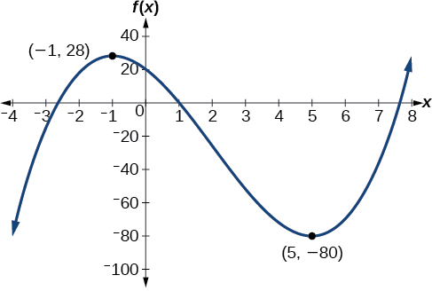 

Finding Local Maxima and Minima from a Graph

For the function<math xmlns="http://www.w3.org/1998/Math/MathML"> <mrow> <mtext> </mtext><mi>f</mi><mtext> </mtext></mrow> </math>

whose graph is shown in [[link]](#Figure_01_03_011), find all local maxima and minima.

{: #Figure_01_03_011}

Observe the graph of<math xmlns="http://www.w3.org/1998/Math/MathML"> <mrow> <mtext> </mtext><mi>f</mi><mo>.</mo><mtext> </mtext></mrow> </math>

The graph attains a local maximum at<math xmlns="http://www.w3.org/1998/Math/MathML"> <mrow> <mtext> </mtext><mi>x</mi><mo>=</mo><mn>1</mn><mtext> </mtext></mrow> </math>

because it is the highest point in an open interval around<math xmlns="http://www.w3.org/1998/Math/MathML"> <mrow> <mtext> </mtext><mi>x</mi><mo>=</mo><mn>1.</mn></mrow> </math>

The local maximum is the<math xmlns="http://www.w3.org/1998/Math/MathML"> <mrow> <mtext> </mtext><mi>y</mi></mrow> </math>

-coordinate at<math xmlns="http://www.w3.org/1998/Math/MathML"> <mrow> <mtext> </mtext><mi>x</mi><mo>=</mo><mn>1</mn><mo>,</mo><mtext> </mtext> </mrow> </math>

which is<math xmlns="http://www.w3.org/1998/Math/MathML"> <mrow> <mtext> </mtext><mn>2.</mn></mrow> </math>

The graph attains a local minimum at<math xmlns="http://www.w3.org/1998/Math/MathML"> <mrow> <mtext> </mtext><mi>x</mi><mo>=</mo><mn>−1</mn><mtext> </mtext> </mrow> </math>

because it is the lowest point in an open interval around<math xmlns="http://www.w3.org/1998/Math/MathML"> <mrow> <mtext> </mtext><mi>x</mi><mo>=</mo><mn>−1.</mn><mtext> </mtext></mrow> </math>

The local minimum is the *y*-coordinate at<math xmlns="http://www.w3.org/1998/Math/MathML"> <mrow> <mtext> </mtext><mtext> </mtext><mi>x</mi><mo>=</mo><mn>−1</mn><mo>,</mo><mtext> </mtext><mtext> </mtext></mrow> </math>

which is<math xmlns="http://www.w3.org/1998/Math/MathML"> <mrow> <mtext> </mtext><mtext> </mtext><mn>−2.</mn></mrow> </math>

# Analyzing the Toolkit Functions for Increasing or Decreasing Intervals 

We will now return to our toolkit functions and discuss their graphical behavior in [\[link\]](#Figure_01_03_012), [\[link\]](#Figure_01_03_016), and [\[link\]](#Figure_01_03_017).

 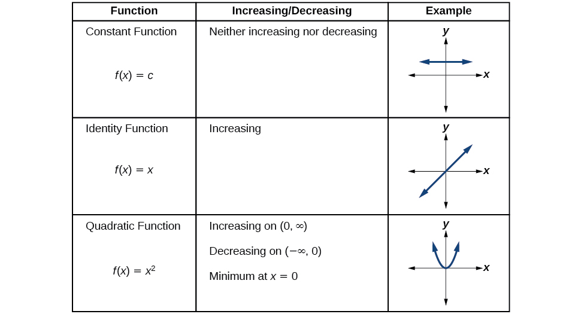{: #Figure_01_03_012}

{: #Figure_01_03_016}

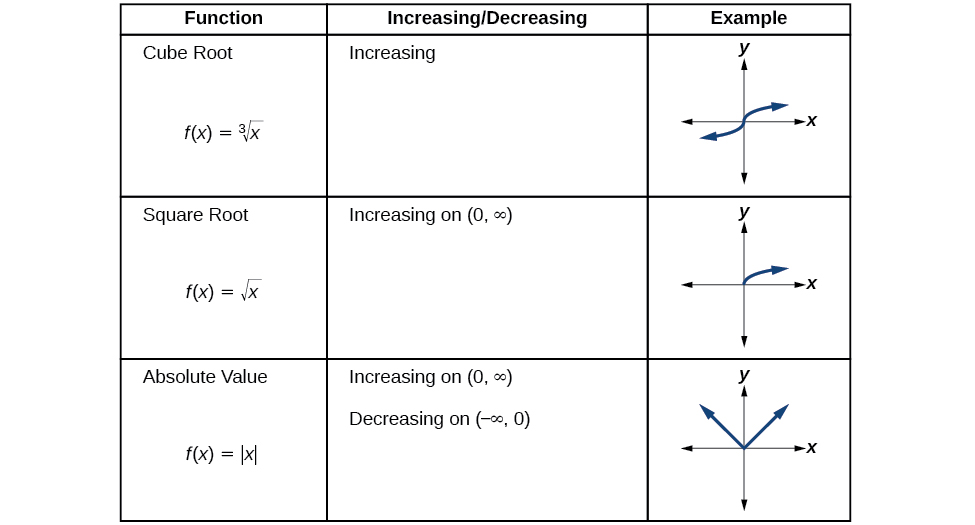{: #Figure_01_03_017}

#  Use A Graph to Locate the Absolute Maximum and Absolute Minimum

There is a difference between locating the highest and lowest points on a graph in a region around an open interval (locally) and locating the highest and lowest points on the graph for the entire domain. The<math xmlns="http://www.w3.org/1998/Math/MathML"> <mrow> <mtext> </mtext><mi>y</mi><mtext>-</mtext> </mrow> </math>

coordinates (output) at the highest and lowest points are called the <strong>absolute maximum </strong>and<strong> absolute minimum</strong>, respectively.

To locate absolute maxima and minima from a graph, we need to observe the graph to determine where the graph attains it highest and lowest points on the domain of the function. See [\[link\]](#Figure_01_03_014).

 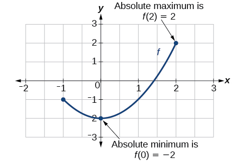{: #Figure_01_03_014}

Not every function has an absolute maximum or minimum value. The toolkit function<math xmlns="http://www.w3.org/1998/Math/MathML"> <mrow> <mtext> </mtext><mi>f</mi><mrow><mo>(</mo> <mi>x</mi> <mo>)</mo></mrow><mo>=</mo><msup> <mi>x</mi> <mn>3</mn> </msup> <mtext> </mtext></mrow> </math>

is one such function.

Absolute Maxima and Minima

The **absolute maximum**{: data-type="term"} of<math xmlns="http://www.w3.org/1998/Math/MathML"> <mrow> <mtext> </mtext><mi>f</mi><mtext> </mtext></mrow> </math>

at<math xmlns="http://www.w3.org/1998/Math/MathML"> <mrow> <mtext> </mtext><mi>x</mi><mo>=</mo><mi>c</mi><mtext> </mtext></mrow> </math>

is<math xmlns="http://www.w3.org/1998/Math/MathML"> <mrow> <mtext> </mtext><mi>f</mi><mrow><mo>(</mo> <mi>c</mi> <mo>)</mo></mrow><mtext> </mtext></mrow> </math>

where<math xmlns="http://www.w3.org/1998/Math/MathML"> <mrow> <mtext> </mtext><mi>f</mi><mrow><mo>(</mo> <mi>c</mi> <mo>)</mo></mrow><mo>≥</mo><mi>f</mi><mrow><mo>(</mo> <mi>x</mi> <mo>)</mo></mrow><mtext> </mtext></mrow> </math>

for all<math xmlns="http://www.w3.org/1998/Math/MathML"> <mrow> <mtext> </mtext><mi>x</mi><mtext> </mtext></mrow> </math>

in the domain of<math xmlns="http://www.w3.org/1998/Math/MathML"> <mrow> <mtext> </mtext><mi>f</mi><mo>.</mo></mrow> </math>

The **absolute minimum**{: data-type="term"} of<math xmlns="http://www.w3.org/1998/Math/MathML"> <mrow> <mtext> </mtext><mi>f</mi><mtext> </mtext></mrow> </math>

at<math xmlns="http://www.w3.org/1998/Math/MathML"> <mrow> <mtext> </mtext><mi>x</mi><mo>=</mo><mi>d</mi><mtext> </mtext></mrow> </math>

is<math xmlns="http://www.w3.org/1998/Math/MathML"> <mrow> <mtext> </mtext><mi>f</mi><mrow><mo>(</mo> <mi>d</mi> <mo>)</mo></mrow><mtext> </mtext></mrow> </math>

where<math xmlns="http://www.w3.org/1998/Math/MathML"> <mrow> <mtext> </mtext><mi>f</mi><mrow><mo>(</mo> <mi>d</mi> <mo>)</mo></mrow><mo>≤</mo><mi>f</mi><mrow><mo>(</mo> <mi>x</mi> <mo>)</mo></mrow><mtext> </mtext></mrow> </math>

for all<math xmlns="http://www.w3.org/1998/Math/MathML"> <mrow> <mtext> </mtext><mi>x</mi><mtext> </mtext></mrow> </math>

in the domain of<math xmlns="http://www.w3.org/1998/Math/MathML"> <mrow> <mtext> </mtext><mi>f</mi><mo>.</mo></mrow> </math>

Finding Absolute Maxima and Minima from a Graph

For the function<math xmlns="http://www.w3.org/1998/Math/MathML"> <mrow> <mtext> </mtext><mi>f</mi><mtext> </mtext></mrow> </math>

shown in [[link]](#Figure_01_03_013), find all absolute maxima and minima.

{: #Figure_01_03_013}

Observe the graph of<math xmlns="http://www.w3.org/1998/Math/MathML"> <mrow> <mtext> </mtext><mi>f</mi><mo>.</mo><mtext> </mtext></mrow> </math>

The graph attains an absolute maximum in two locations,<math xmlns="http://www.w3.org/1998/Math/MathML"> <mrow> <mtext> </mtext><mi>x</mi><mo>=</mo><mn>−2</mn><mtext> </mtext></mrow> </math>

and<math xmlns="http://www.w3.org/1998/Math/MathML"> <mrow> <mtext> </mtext><mi>x</mi><mo>=</mo><mn>2</mn><mo>,</mo><mtext> </mtext></mrow> </math>

because at these locations, the graph attains its highest point on the domain of the function. The absolute maximum is the *y*-coordinate at<math xmlns="http://www.w3.org/1998/Math/MathML"> <mrow> <mtext> </mtext><mi>x</mi><mo>=</mo><mn>−2</mn><mtext> </mtext></mrow> </math>

and<math xmlns="http://www.w3.org/1998/Math/MathML"> <mrow> <mtext> </mtext><mi>x</mi><mo>=</mo><mn>2</mn><mo>,</mo><mtext> </mtext></mrow> </math>

which is<math xmlns="http://www.w3.org/1998/Math/MathML"> <mrow> <mtext> </mtext><mn>16.</mn></mrow> </math>

The graph attains an absolute minimum at<math xmlns="http://www.w3.org/1998/Math/MathML"> <mrow> <mtext> </mtext><mi>x</mi><mo>=</mo><mn>3</mn><mo>,</mo><mtext> </mtext></mrow> </math>

because it is the lowest point on the domain of the function’s graph. The absolute minimum is the *y*-coordinate at<math xmlns="http://www.w3.org/1998/Math/MathML"> <mrow> <mtext> </mtext><mi>x</mi><mo>=</mo><mn>3</mn><mo>,</mo></mrow> </math>

which is<math xmlns="http://www.w3.org/1998/Math/MathML"> <mrow><mn>−10.</mn></mrow> </math>

Access this online resource for additional instruction and practice with rates of change.

* [Average Rate of Change][1]

# Key Equations

<table id="eip-id1165135358784" summary=".."><colgroup><col data-align="center" /><col data-align="center" /></colgroup><tbody>
<tr>
<td>Average rate of change</td>
<td><math xmlns="http://www.w3.org/1998/Math/MathML">
 <mrow>
  <mfrac>
   <mrow>
    <mi>Δ</mi><mi>y</mi>
   </mrow>
   <mrow>
    <mi>Δ</mi><mi>x</mi>
   </mrow>
  </mfrac>
  <mo>=</mo><mfrac>
   <mrow>
    <mi>f</mi><mrow><mo>(</mo>
     <mrow>
      <msub>
       <mi>x</mi>
       <mn>2</mn>
      </msub>
      
     </mrow>
    <mo>)</mo></mrow><mo>−</mo><mi>f</mi><mrow><mo>(</mo>
     <mrow>
      <msub>
       <mi>x</mi>
       <mn>1</mn>
      </msub>
      
     </mrow>
    <mo>)</mo></mrow>
   </mrow>
   <mrow>
    <msub>
     <mi>x</mi>
     <mn>2</mn>
    </msub>
    <mo>−</mo><msub>
     <mi>x</mi>
     <mn>1</mn>
    </msub>
    
   </mrow>
  </mfrac>
  
 </mrow>
</math>
</td>
</tr>
</tbody></table>

# Key Concepts

* A rate of change relates a change in an output quantity to a change in an input quantity. The average rate of change is determined using only the beginning and ending data. See [\[link\]](#Example_01_03_01).
* Identifying points that mark the interval on a graph can be used to find the average rate of change. See [\[link\]](#Example_01_03_02).
* Comparing pairs of input and output values in a table can also be used to find the average rate of change. See [\[link\]](#Example_01_03_03).
* An average rate of change can also be computed by determining the function values at the endpoints of an interval described by a formula. See [\[link\]](#Example_01_03_04) and [\[link\]](#Example_01_03_05).
* The average rate of change can sometimes be determined as an expression. See [\[link\]](#Example_01_03_06).
* A function is increasing where its rate of change is positive and decreasing where its rate of change is negative. See [\[link\]](#Example_01_03_07).
* A local maximum is where a function changes from increasing to decreasing and has an output value larger (more positive or less negative) than output values at neighboring input values.
* A local minimum is where the function changes from decreasing to increasing (as the input increases) and has an output value smaller (more negative or less positive) than output values at neighboring input values.
* Minima and maxima are also called extrema.
* We can find local extrema from a graph. See [\[link\]](#Example_01_03_08) and [\[link\]](#Example_01_03_09).
* The highest and lowest points on a graph indicate the maxima and minima. See [\[link\]](#Example_01_03_10).

# Section Exercises

## Verbal

Can the average rate of change of a function be constant?

Yes, the average rate of change of all linear functions is constant.

If a function<math xmlns="http://www.w3.org/1998/Math/MathML"> <mrow> <mtext> </mtext><mi>f</mi><mtext> </mtext></mrow> </math>

is increasing on<math xmlns="http://www.w3.org/1998/Math/MathML"> <mrow> <mtext> </mtext><mo stretchy="false">(</mo><mi>a</mi><mo>,</mo><mi>b</mi><mo stretchy="false">)</mo><mtext> </mtext></mrow> </math>

and decreasing on<math xmlns="http://www.w3.org/1998/Math/MathML"> <mrow> <mtext> </mtext><mo stretchy="false">(</mo><mi>b</mi><mo>,</mo><mi>c</mi><mo stretchy="false">)</mo><mo>,</mo><mtext> </mtext></mrow> </math>

then what can be said about the local extremum of<math xmlns="http://www.w3.org/1998/Math/MathML"> <mrow> <mtext> </mtext><mi>f</mi><mtext> </mtext></mrow> </math>

on<math xmlns="http://www.w3.org/1998/Math/MathML"> <mrow> <mtext> </mtext><mo stretchy="false">(</mo><mi>a</mi><mo>,</mo><mi>c</mi><mo stretchy="false">)</mo><mo>?</mo><mtext> </mtext></mrow> </math>

How are the absolute maximum and minimum similar to and different from the local extrema?

The absolute maximum and minimum relate to the entire graph, whereas the local extrema relate only to a specific region around an open interval.

How does the graph of the absolute value function compare to the graph of the quadratic function,<math xmlns="http://www.w3.org/1998/Math/MathML"> <mrow> <mtext> </mtext><mi>y</mi><mo>=</mo><msup> <mi>x</mi> <mn>2</mn> </msup> <mo>,</mo><mtext> </mtext></mrow> </math>

in terms of increasing and decreasing intervals?

## Algebraic

For the following exercises, find the average rate of change of each function on the interval specified for real numbers <math xmlns="http://www.w3.org/1998/Math/MathML"> <mrow> <mtext> </mtext><mi>b</mi><mtext> </mtext></mrow> </math>

or<math xmlns="http://www.w3.org/1998/Math/MathML"> <mrow> <mtext> </mtext><mi>h</mi></mrow> </math>

 in simplest form.

<math xmlns="http://www.w3.org/1998/Math/MathML"> <mrow> <mi>f</mi><mrow><mo>(</mo> <mi>x</mi> <mo>)</mo></mrow><mo>=</mo><mn>4</mn><msup> <mi>x</mi> <mn>2</mn> </msup> <mo>−</mo><mn>7</mn><mtext> </mtext></mrow> </math>

on<math xmlns="http://www.w3.org/1998/Math/MathML"> <mrow> <mtext> </mtext><mo stretchy="false">[</mo><mn>1</mn><mo>,</mo><mtext> </mtext><mi>b</mi><mo stretchy="false">]</mo></mrow> </math>

<math xmlns="http://www.w3.org/1998/Math/MathML"> <mrow> <mn>4</mn><mrow><mo>(</mo> <mrow> <mi>b</mi><mo>+</mo><mn>1</mn></mrow> <mo>)</mo></mrow></mrow> </math>

<math xmlns="http://www.w3.org/1998/Math/MathML"> <mrow> <mi>g</mi><mrow><mo>(</mo> <mi>x</mi> <mo>)</mo></mrow><mo>=</mo><mn>2</mn><msup> <mi>x</mi> <mn>2</mn> </msup> <mo>−</mo><mn>9</mn><mtext> </mtext></mrow> </math>

on<math xmlns="http://www.w3.org/1998/Math/MathML"> <mrow> <mtext> </mtext><mrow><mo>[</mo> <mrow> <mn>4</mn><mo>,</mo><mtext> </mtext><mi>b</mi></mrow> <mo>]</mo></mrow></mrow> </math>

<math xmlns="http://www.w3.org/1998/Math/MathML"> <mrow> <mi>p</mi><mrow><mo>(</mo> <mi>x</mi> <mo>)</mo></mrow><mo>=</mo><mn>3</mn><mi>x</mi><mo>+</mo><mn>4</mn><mtext> </mtext></mrow> </math>

on<math xmlns="http://www.w3.org/1998/Math/MathML"> <mrow> <mtext> </mtext><mo stretchy="false">[</mo><mn>2</mn><mo>,</mo><mtext> </mtext><mn>2</mn><mo>+</mo><mi>h</mi><mo stretchy="false">]</mo></mrow> </math>

3

<math xmlns="http://www.w3.org/1998/Math/MathML"> <mrow> <mi>k</mi><mrow><mo>(</mo> <mi>x</mi> <mo>)</mo></mrow><mo>=</mo><mn>4</mn><mi>x</mi><mo>−</mo><mn>2</mn><mtext> </mtext></mrow> </math>

on<math xmlns="http://www.w3.org/1998/Math/MathML"> <mrow> <mtext> </mtext><mo stretchy="false">[</mo><mn>3</mn><mo>,</mo><mtext> </mtext><mn>3</mn><mo>+</mo><mi>h</mi><mo stretchy="false">]</mo></mrow> </math>

<math xmlns="http://www.w3.org/1998/Math/MathML"> <mrow> <mi>f</mi><mrow><mo>(</mo> <mi>x</mi> <mo>)</mo></mrow><mo>=</mo><mn>2</mn><msup> <mi>x</mi> <mn>2</mn> </msup> <mo>+</mo><mn>1</mn><mtext> </mtext></mrow> </math>

on<math xmlns="http://www.w3.org/1998/Math/MathML"> <mrow> <mtext> </mtext><mo stretchy="false">[</mo><mi>x</mi><mo>,</mo><mi>x</mi><mo>+</mo><mi>h</mi><mo stretchy="false">]</mo></mrow> </math>

<math xmlns="http://www.w3.org/1998/Math/MathML"> <mrow> <mn>4</mn><mi>x</mi><mo>+</mo><mn>2</mn><mi>h</mi></mrow> </math>

<math xmlns="http://www.w3.org/1998/Math/MathML"> <mrow> <mi>g</mi><mrow><mo>(</mo> <mi>x</mi> <mo>)</mo></mrow><mo>=</mo><mn>3</mn><msup> <mi>x</mi> <mn>2</mn> </msup> <mo>−</mo><mn>2</mn><mtext> </mtext></mrow> </math>

on<math xmlns="http://www.w3.org/1998/Math/MathML"> <mrow> <mtext> </mtext><mo stretchy="false">[</mo><mi>x</mi><mo>,</mo><mi>x</mi><mo>+</mo><mi>h</mi><mo stretchy="false">]</mo></mrow> </math>

<math xmlns="http://www.w3.org/1998/Math/MathML"> <mrow> <mi>a</mi><mrow><mo>(</mo> <mi>t</mi> <mo>)</mo></mrow><mo>=</mo><mfrac> <mn>1</mn> <mrow> <mi>t</mi><mo>+</mo><mn>4</mn></mrow> </mfrac> <mtext> </mtext></mrow> </math>

on<math xmlns="http://www.w3.org/1998/Math/MathML"> <mrow> <mtext> </mtext><mo stretchy="false">[</mo><mn>9</mn><mo>,</mo><mn>9</mn><mo>+</mo><mi>h</mi><mo stretchy="false">]</mo></mrow> </math>

<math xmlns="http://www.w3.org/1998/Math/MathML"> <mrow> <mfrac> <mrow> <mo>−</mo><mn>1</mn></mrow> <mrow> <mn>13</mn><mrow><mo>(</mo> <mrow> <mn>13</mn><mo>+</mo><mi>h</mi></mrow> <mo>)</mo></mrow></mrow> </mfrac> </mrow> </math>

<math xmlns="http://www.w3.org/1998/Math/MathML"> <mrow> <mi>b</mi><mrow><mo>(</mo> <mi>x</mi> <mo>)</mo></mrow><mo>=</mo><mfrac> <mn>1</mn> <mrow> <mi>x</mi><mo>+</mo><mn>3</mn></mrow> </mfrac> <mtext> </mtext></mrow> </math>

on<math xmlns="http://www.w3.org/1998/Math/MathML"> <mrow> <mtext> </mtext><mo stretchy="false">[</mo><mn>1</mn><mo>,</mo><mn>1</mn><mo>+</mo><mi>h</mi><mo stretchy="false">]</mo></mrow> </math>

<math xmlns="http://www.w3.org/1998/Math/MathML"> <mrow> <mi>j</mi><mrow><mo>(</mo> <mi>x</mi> <mo>)</mo></mrow><mo>=</mo><mn>3</mn><msup> <mi>x</mi> <mn>3</mn> </msup> <mtext> </mtext></mrow> </math>

on<math xmlns="http://www.w3.org/1998/Math/MathML"> <mrow> <mtext> </mtext><mo stretchy="false">[</mo><mn>1</mn><mo>,</mo><mn>1</mn><mo>+</mo><mi>h</mi><mo stretchy="false">]</mo></mrow> </math>

<math xmlns="http://www.w3.org/1998/Math/MathML"> <mrow> <mn>3</mn><msup> <mi>h</mi> <mn>2</mn> </msup> <mo>+</mo><mn>9</mn><mi>h</mi><mo>+</mo><mn>9</mn></mrow> </math>

<math xmlns="http://www.w3.org/1998/Math/MathML"> <mrow> <mi>r</mi><mrow><mo>(</mo> <mi>t</mi> <mo>)</mo></mrow><mo>=</mo><mn>4</mn><msup> <mi>t</mi> <mn>3</mn> </msup> <mtext> </mtext></mrow> </math>

on<math xmlns="http://www.w3.org/1998/Math/MathML"> <mrow> <mtext> </mtext><mo stretchy="false">[</mo><mn>2</mn><mo>,</mo><mn>2</mn><mo>+</mo><mi>h</mi><mo stretchy="false">]</mo></mrow> </math>

<math xmlns="http://www.w3.org/1998/Math/MathML"> <mrow> <mfrac> <mrow> <mi>f</mi><mrow><mo>(</mo> <mrow> <mi>x</mi><mo>+</mo><mi>h</mi></mrow> <mo>)</mo></mrow><mo>−</mo><mi>f</mi><mrow><mo>(</mo> <mi>x</mi> <mo>)</mo></mrow></mrow> <mi>h</mi> </mfrac> <mtext> </mtext></mrow> </math>

given<math xmlns="http://www.w3.org/1998/Math/MathML"> <mrow> <mtext> </mtext><mi>f</mi><mrow><mo>(</mo> <mi>x</mi> <mo>)</mo></mrow><mo>=</mo><mn>2</mn><msup> <mi>x</mi> <mn>2</mn> </msup> <mo>−</mo><mn>3</mn><mi>x</mi><mtext> </mtext></mrow> </math>

on<math xmlns="http://www.w3.org/1998/Math/MathML"> <mrow> <mtext> </mtext><mo stretchy="false">[</mo><mi>x</mi><mo>,</mo><mi>x</mi><mo>+</mo><mi>h</mi><mo stretchy="false">]</mo></mrow> </math>

<math xmlns="http://www.w3.org/1998/Math/MathML"> <mrow> <mn>4</mn><mi>x</mi><mo>+</mo><mn>2</mn><mi>h</mi><mo>−</mo><mn>3</mn></mrow> </math>

## Graphical

For the following exercises, consider the graph of<math xmlns="http://www.w3.org/1998/Math/MathML"> <mrow> <mtext> </mtext><mi>f</mi><mtext> </mtext></mrow> </math>

shown in [\[link\]](#Figure_01_03_201).

 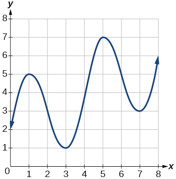{: #Figure_01_03_201}

Estimate the average rate of change from<math xmlns="http://www.w3.org/1998/Math/MathML"> <mrow> <mtext> </mtext><mi>x</mi><mo>=</mo><mn>1</mn><mtext> </mtext></mrow> </math>

to<math xmlns="http://www.w3.org/1998/Math/MathML"> <mrow> <mtext> </mtext><mi>x</mi><mo>=</mo><mn>4.</mn></mrow> </math>

Estimate the average rate of change from<math xmlns="http://www.w3.org/1998/Math/MathML"> <mrow> <mtext> </mtext><mi>x</mi><mo>=</mo><mn>2</mn><mtext> </mtext></mrow> </math>

to<math xmlns="http://www.w3.org/1998/Math/MathML"> <mrow> <mtext> </mtext><mi>x</mi><mo>=</mo><mn>5.</mn></mrow> </math>

<math xmlns="http://www.w3.org/1998/Math/MathML"> <mrow> <mfrac> <mn>4</mn> <mn>3</mn> </mfrac> </mrow> </math>

For the following exercises, use the graph of each function to estimate the intervals on which the function is increasing or decreasing.

 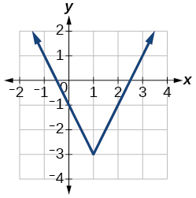 

 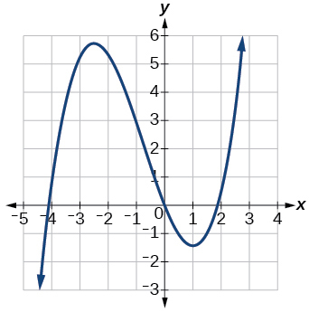 

increasing on<math xmlns="http://www.w3.org/1998/Math/MathML"> <mrow> <mtext> </mtext><mrow><mo>(</mo> <mrow> <mo>−</mo><mi>∞</mi><mo>,</mo><mo>−</mo><mn>2.5</mn></mrow> <mo>)</mo></mrow><mo>∪</mo><mrow><mo>(</mo> <mrow> <mn>1</mn><mo>,</mo><mi>∞</mi></mrow> <mo>)</mo></mrow><mo>,</mo><mtext> </mtext></mrow> </math>

decreasing on<math xmlns="http://www.w3.org/1998/Math/MathML"> <mrow> <mtext> </mtext><mo stretchy="false">(</mo><mo>−</mo><mn>2.5</mn><mo>,</mo><mtext> </mtext><mn>1</mn><mo stretchy="false">)</mo></mrow> </math>

 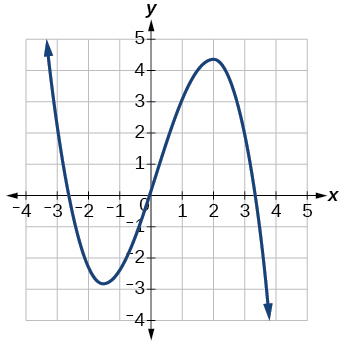 

 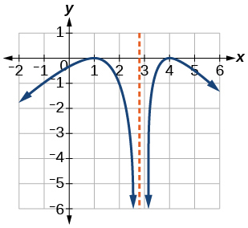 

increasing on<math xmlns="http://www.w3.org/1998/Math/MathML"> <mrow> <mtext> </mtext><mrow><mo>(</mo> <mrow> <mo>−</mo><mi>∞</mi><mo>,</mo><mn>1</mn></mrow> <mo>)</mo></mrow><mo>∪</mo><mrow><mo>(</mo> <mrow> <mn>3</mn><mo>,</mo><mn>4</mn></mrow> <mo>)</mo></mrow><mo>,</mo><mtext> </mtext></mrow> </math>

decreasing on<math xmlns="http://www.w3.org/1998/Math/MathML"> <mrow> <mtext> </mtext><mrow><mo>(</mo> <mrow> <mn>1</mn><mo>,</mo><mn>3</mn></mrow> <mo>)</mo></mrow><mo>∪</mo><mrow><mo>(</mo> <mrow> <mn>4</mn><mo>,</mo><mi>∞</mi></mrow> <mo>)</mo></mrow></mrow> </math>

For the following exercises, consider the graph shown in [\[link\]](#Figure_01_03_206).

 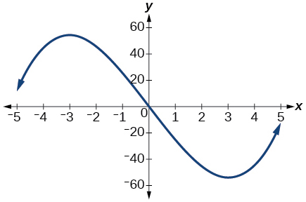{: #Figure_01_03_206}

Estimate the intervals where the function is increasing or decreasing.

Estimate the point(s) at which the graph of<math xmlns="http://www.w3.org/1998/Math/MathML"> <mrow> <mtext> </mtext><mi>f</mi><mtext> </mtext></mrow> </math>

has a local maximum or a local minimum.

local maximum:<math xmlns="http://www.w3.org/1998/Math/MathML"> <mrow> <mtext> </mtext><mo stretchy="false">(</mo><mo>−</mo><mn>3</mn><mo>,</mo><mtext> </mtext><mn>60</mn><mo stretchy="false">)</mo><mo>,</mo><mtext> </mtext></mrow> </math>

local minimum:<math xmlns="http://www.w3.org/1998/Math/MathML"> <mrow> <mtext> </mtext><mo stretchy="false">(</mo><mn>3</mn><mo>,</mo><mtext> </mtext><mo>−</mo><mn>60</mn><mo stretchy="false">)</mo><mtext> </mtext></mrow> </math>

For the following exercises, consider the graph in [\[link\]](#Figure_01_03_207).

 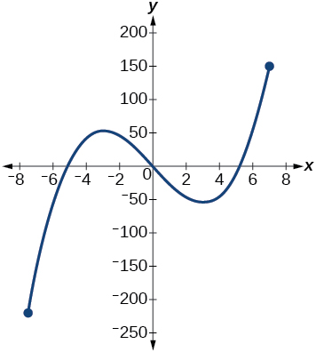{: #Figure_01_03_207}

If the complete graph of the function is shown, estimate the intervals where the function is increasing or decreasing.

If the complete graph of the function is shown, estimate the absolute maximum and absolute minimum.

absolute maximum at approximately<math xmlns="http://www.w3.org/1998/Math/MathML"> <mrow> <mtext> </mtext><mo stretchy="false">(</mo><mn>7</mn><mo>,</mo><mtext> </mtext><mn>150</mn><mo stretchy="false">)</mo><mo>,</mo><mtext> </mtext></mrow> </math>

absolute minimum at approximately<math xmlns="http://www.w3.org/1998/Math/MathML"> <mrow> <mtext> </mtext><mo stretchy="false">(</mo><mn>−7.5</mn><mo>,</mo><mtext> </mtext><mn>−220</mn><mo stretchy="false">)</mo></mrow> </math>

## Numeric

[[link]](#Table_01_03_03) gives the annual sales (in millions of dollars) of a product from 1998 to 2006. What was the average rate of change of annual sales (a) between 2001 and 2002, and (b) between 2001 and 2004?

<table id="Table_01_03_03" summary="Two columns and ten rows. The first row is labeled, &#x201C;Year&#x201D;, and the second row is labeled, &#x201C;Sales (millions of dollars)&#x201D;. Reading the rows as ordered pairs, we have: (1998, 201), (1999, 219), (2000, 233), (2001, 243), (2002, 249), (2003, 251), (2004, 243), (2005, 243) and (2006, 233)."><colgroup><col data-align="center" /><col data-align="center" /></colgroup><thead>
<tr>
<th><strong>Year</strong></th>
<th><strong>Sales
 (millions of dollars)</strong></th>
</tr>
</thead><tbody>
<tr>
<td>1998</td><td>201</td>
</tr>
<tr>
<td>1999</td><td>219</td>
</tr>
<tr>
<td>2000</td><td>233</td>
</tr>
<tr>
<td>2001</td><td>243</td>
</tr>
<tr>
<td>2002</td><td>249</td>
</tr>
<tr>
<td>2003</td><td>251</td>
</tr>
<tr>
<td>2004</td><td>249</td>
</tr>
<tr>
<td>2005</td><td>243</td>
</tr>
<tr>
<td>2006</td><td>233</td>
</tr>
</tbody></table>

[[link]](#Table_01_03_04) gives the population of a town (in thousands) from 2000 to 2008. What was the average rate of change of population (a) between 2002 and 2004, and (b) between 2002 and 2006?

<table id="Table_01_03_04" summary="Two rows and ten columns. The first column is labeled, &#x201C;Year&#x201D;, and the second column is labeled, &#x201C;Population (thousands)&#x201D;. Reading the columns as ordered pairs, we have: (2000, 87), (2001, 84), (2002, 83), (2003, 80), (2004, 77), (2005, 76), (2006, 78), (2007, 81), and (2008, 85)."><colgroup><col data-align="center" /><col data-align="center" /></colgroup><thead>
  <tr>
    <th><strong>Year</strong></th>
    <th><strong>Population
(thousands)</strong></th>
  </tr>
</thead><tbody>
  <tr>
    <td>2000</td><td>87</td>
  </tr>
  <tr>
    <td>2001</td><td>84</td>
  </tr>
  <tr>
    <td>2002</td><td>83</td>
  </tr>
  <tr>
    <td>2003</td><td>80</td>
  </tr>
  <tr>
    <td>2004</td><td>77</td>
  </tr>
  <tr>
    <td>2005</td><td>76</td>
  </tr>
  <tr>
    <td>2006</td><td>78</td>
  </tr>
  <tr>
    <td>2007</td><td>81</td>
  </tr>
  <tr>
    <td>2008</td><td>85</td>
  </tr>
</tbody></table>

a. –3000; b. –1250

For the following exercises, find the average rate of change of each function on the interval specified.

<math xmlns="http://www.w3.org/1998/Math/MathML"> <mrow> <mi>f</mi><mrow><mo>(</mo> <mi>x</mi> <mo>)</mo></mrow><mo>=</mo><msup> <mi>x</mi> <mn>2</mn> </msup> <mtext> </mtext></mrow> </math>

on<math xmlns="http://www.w3.org/1998/Math/MathML"> <mrow> <mtext> </mtext><mo stretchy="false">[</mo><mn>1</mn><mo>,</mo><mtext> </mtext><mn>5</mn><mo stretchy="false">]</mo></mrow> </math>

<math xmlns="http://www.w3.org/1998/Math/MathML"> <mrow> <mi>h</mi><mrow><mo>(</mo> <mi>x</mi> <mo>)</mo></mrow><mo>=</mo><mn>5</mn><mo>−</mo><mn>2</mn><msup> <mi>x</mi> <mn>2</mn> </msup> <mtext> </mtext></mrow> </math>

on<math xmlns="http://www.w3.org/1998/Math/MathML"> <mrow> <mtext> </mtext><mo stretchy="false">[</mo><mn>−2</mn><mo>,</mo><mtext>4</mtext><mo stretchy="false">]</mo></mrow> </math>

-4

<math xmlns="http://www.w3.org/1998/Math/MathML"> <mrow> <mi>q</mi><mrow><mo>(</mo> <mi>x</mi> <mo>)</mo></mrow><mo>=</mo><msup> <mi>x</mi> <mn>3</mn> </msup> <mtext> </mtext></mrow> </math>

on<math xmlns="http://www.w3.org/1998/Math/MathML"> <mrow> <mtext> </mtext><mo stretchy="false">[</mo><mn>−4</mn><mo>,</mo><mtext>2</mtext><mo stretchy="false">]</mo></mrow> </math>

<math xmlns="http://www.w3.org/1998/Math/MathML"> <mrow> <mi>g</mi><mrow><mo>(</mo> <mi>x</mi> <mo>)</mo></mrow><mo>=</mo><mn>3</mn><msup> <mi>x</mi> <mn>3</mn> </msup> <mo>−</mo><mn>1</mn><mtext> </mtext></mrow> </math>

on<math xmlns="http://www.w3.org/1998/Math/MathML"> <mrow> <mtext> </mtext><mo stretchy="false">[</mo><mn>−3</mn><mo>,</mo><mtext>3</mtext><mo stretchy="false">]</mo></mrow> </math>

27

<math xmlns="http://www.w3.org/1998/Math/MathML"> <mrow> <mi>y</mi><mo>=</mo><mfrac> <mn>1</mn> <mi>x</mi> </mfrac> <mtext> </mtext></mrow> </math>

on<math xmlns="http://www.w3.org/1998/Math/MathML"> <mrow> <mtext> </mtext><mo stretchy="false">[</mo><mn>1</mn><mo>,</mo><mtext> 3</mtext><mo stretchy="false">]</mo></mrow> </math>

<math xmlns="http://www.w3.org/1998/Math/MathML"> <mrow> <mi>p</mi><mrow><mo>(</mo> <mi>t</mi> <mo>)</mo></mrow><mo>=</mo><mfrac> <mrow> <mrow><mo>(</mo> <mrow> <msup> <mi>t</mi> <mn>2</mn> </msup> <mo>−</mo><mn>4</mn></mrow> <mo>)</mo></mrow><mrow><mo>(</mo> <mrow> <mi>t</mi><mo>+</mo><mn>1</mn></mrow> <mo>)</mo></mrow></mrow> <mrow> <msup> <mi>t</mi> <mn>2</mn> </msup> <mo>+</mo><mn>3</mn></mrow> </mfrac> <mtext> </mtext></mrow> </math>

on<math xmlns="http://www.w3.org/1998/Math/MathML"> <mrow> <mtext> </mtext><mo stretchy="false">[</mo><mn>−3</mn><mo>,</mo><mtext>1</mtext><mo stretchy="false">]</mo></mrow> </math>

–0.167

<math xmlns="http://www.w3.org/1998/Math/MathML"> <mrow> <mi>k</mi><mrow><mo>(</mo> <mi>t</mi> <mo>)</mo></mrow><mo>=</mo><mn>6</mn><msup> <mi>t</mi> <mn>2</mn> </msup> <mo>+</mo><mfrac> <mn>4</mn> <mrow> <msup> <mi>t</mi> <mn>3</mn> </msup> </mrow> </mfrac> <mtext> </mtext></mrow> </math>

on<math xmlns="http://www.w3.org/1998/Math/MathML"> <mrow> <mtext> </mtext><mo stretchy="false">[</mo><mn>−1</mn><mo>,</mo><mn>3</mn><mo stretchy="false">]</mo></mrow> </math>

## Technology

For the following exercises, use a graphing utility to estimate the local extrema of each function and to estimate the intervals on which the function is increasing and decreasing.

<math xmlns="http://www.w3.org/1998/Math/MathML"> <mrow> <mi>f</mi><mrow><mo>(</mo> <mi>x</mi> <mo>)</mo></mrow><mo>=</mo><msup> <mi>x</mi> <mn>4</mn> </msup> <mo>−</mo><mn>4</mn><msup> <mi>x</mi> <mn>3</mn> </msup> <mo>+</mo><mn>5</mn></mrow> </math>

Local minimum at<math xmlns="http://www.w3.org/1998/Math/MathML"> <mrow> <mtext> </mtext><mo stretchy="false">(</mo><mn>3</mn><mo>,</mo><mo>−</mo><mn>22</mn><mo stretchy="false">)</mo><mo>,</mo><mtext> </mtext></mrow> </math>

decreasing on<math xmlns="http://www.w3.org/1998/Math/MathML"> <mrow> <mtext> </mtext><mo stretchy="false">(</mo><mo>−</mo><mi>∞</mi><mo>,</mo><mtext> </mtext><mn>3</mn><mo stretchy="false">)</mo><mo>,</mo><mtext> </mtext></mrow> </math>

increasing on<math xmlns="http://www.w3.org/1998/Math/MathML"> <mrow> <mtext> </mtext><mo stretchy="false">(</mo><mn>3</mn><mo>,</mo><mtext> </mtext><mi>∞</mi><mo stretchy="false">)</mo><mtext> </mtext></mrow> </math>

<math xmlns="http://www.w3.org/1998/Math/MathML"> <mrow> <mi>h</mi><mrow><mo>(</mo> <mi>x</mi> <mo>)</mo></mrow><mo>=</mo><msup> <mi>x</mi> <mn>5</mn> </msup> <mo>+</mo><mn>5</mn><msup> <mi>x</mi> <mn>4</mn> </msup> <mo>+</mo><mn>10</mn><msup> <mi>x</mi> <mn>3</mn> </msup> <mo>+</mo><mn>10</mn><msup> <mi>x</mi> <mn>2</mn> </msup> <mo>−</mo><mn>1</mn></mrow> </math>

<math xmlns="http://www.w3.org/1998/Math/MathML"> <mrow> <mi>g</mi><mrow><mo>(</mo> <mi>t</mi> <mo>)</mo></mrow><mo>=</mo><mi>t</mi><msqrt> <mrow> <mi>t</mi><mo>+</mo><mn>3</mn></mrow> </msqrt> </mrow> </math>

Local minimum at<math xmlns="http://www.w3.org/1998/Math/MathML"> <mrow> <mtext> </mtext><mo stretchy="false">(</mo><mo>−</mo><mn>2</mn><mo>,</mo><mo>−</mo><mn>2</mn><mo stretchy="false">)</mo><mo>,</mo><mtext> </mtext></mrow> </math>

decreasing on<math xmlns="http://www.w3.org/1998/Math/MathML"> <mrow> <mtext> </mtext><mo stretchy="false">(</mo><mo>−</mo><mn>3</mn><mo>,</mo><mo>−</mo><mn>2</mn><mo stretchy="false">)</mo><mo>,</mo><mtext> </mtext></mrow> </math>

increasing on<math xmlns="http://www.w3.org/1998/Math/MathML"> <mrow> <mtext> </mtext><mo stretchy="false">(</mo><mo>−</mo><mn>2</mn><mo>,</mo><mtext> </mtext><mi>∞</mi><mo stretchy="false">)</mo></mrow> </math>

<math xmlns="http://www.w3.org/1998/Math/MathML"> <mrow> <mi>k</mi><mrow><mo>(</mo> <mi>t</mi> <mo>)</mo></mrow><mo>=</mo><mn>3</mn><msup> <mi>t</mi> <mrow> <mfrac> <mn>2</mn> <mn>3</mn> </mfrac> </mrow> </msup> <mo>−</mo><mi>t</mi> </mrow> </math>

<math xmlns="http://www.w3.org/1998/Math/MathML"> <mrow> <mi>m</mi><mrow><mo>(</mo> <mi>x</mi> <mo>)</mo></mrow><mo>=</mo><msup> <mi>x</mi> <mn>4</mn> </msup> <mo>+</mo><mn>2</mn><msup> <mi>x</mi> <mn>3</mn> </msup> <mo>−</mo><mn>12</mn><msup> <mi>x</mi> <mn>2</mn> </msup> <mo>−</mo><mn>10</mn><mi>x</mi><mo>+</mo><mn>4</mn></mrow> </math>

Local maximum at<math xmlns="http://www.w3.org/1998/Math/MathML"> <mrow> <mtext> </mtext><mo stretchy="false">(</mo><mo>−</mo><mn>0.5</mn><mo>,</mo><mtext> </mtext><mn>6</mn><mo stretchy="false">)</mo><mo>,</mo><mtext> </mtext></mrow> </math>

local minima at<math xmlns="http://www.w3.org/1998/Math/MathML"> <mrow> <mtext> </mtext><mo stretchy="false">(</mo><mo>−</mo><mn>3.25</mn><mo>,</mo><mo>−</mo><mn>47</mn><mo stretchy="false">)</mo><mtext> </mtext></mrow> </math>

and<math xmlns="http://www.w3.org/1998/Math/MathML"> <mrow> <mtext> </mtext><mo stretchy="false">(</mo><mn>2.1</mn><mo>,</mo><mo>−</mo><mn>32</mn><mo stretchy="false">)</mo><mo>,</mo><mtext> </mtext></mrow> </math>

decreasing on<math xmlns="http://www.w3.org/1998/Math/MathML"> <mrow> <mtext> </mtext><mo stretchy="false">(</mo><mo>−</mo><mi>∞</mi><mo>,</mo><mo>−</mo><mn>3.25</mn><mo stretchy="false">)</mo><mtext> </mtext></mrow> </math>

and<math xmlns="http://www.w3.org/1998/Math/MathML"> <mrow> <mtext> </mtext><mo stretchy="false">(</mo><mo>−</mo><mn>0.5</mn><mo>,</mo><mtext> </mtext><mn>2.1</mn><mo stretchy="false">)</mo><mo>,</mo><mtext> </mtext></mrow> </math>

increasing on<math xmlns="http://www.w3.org/1998/Math/MathML"> <mrow> <mtext> </mtext><mo stretchy="false">(</mo><mo>−</mo><mn>3.25</mn><mo>,</mo><mtext> </mtext><mo>−</mo><mn>0.5</mn><mo stretchy="false">)</mo><mtext> </mtext></mrow> </math>

and<math xmlns="http://www.w3.org/1998/Math/MathML"> <mrow> <mtext> </mtext><mo stretchy="false">(</mo><mn>2.1</mn><mo>,</mo><mtext> </mtext><mi>∞</mi><mo stretchy="false">)</mo><mtext> </mtext></mrow> </math>

<math xmlns="http://www.w3.org/1998/Math/MathML"> <mrow> <mi>n</mi><mrow><mo>(</mo> <mi>x</mi> <mo>)</mo></mrow><mo>=</mo><msup> <mi>x</mi> <mn>4</mn> </msup> <mo>−</mo><mn>8</mn><msup> <mi>x</mi> <mn>3</mn> </msup> <mo>+</mo><mn>18</mn><msup> <mi>x</mi> <mn>2</mn> </msup> <mo>−</mo><mn>6</mn><mi>x</mi><mo>+</mo><mn>2</mn></mrow> </math>

## Extension

The graph of the function<math xmlns="http://www.w3.org/1998/Math/MathML"> <mrow> <mtext> </mtext><mi>f</mi><mtext> </mtext></mrow> </math>

is shown in [[link]](#Figure_01_03_213).

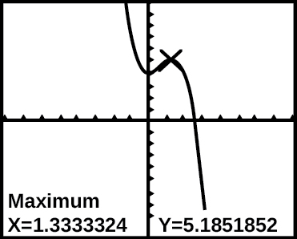{: #Figure_01_03_213}

Based on the calculator screen shot, the point<math xmlns="http://www.w3.org/1998/Math/MathML"> <mrow> <mtext> </mtext><mo stretchy="false">(</mo><mn>1.333</mn><mo>,</mo><mtext> </mtext><mn>5.185</mn><mo stretchy="false">)</mo><mtext> </mtext></mrow> </math>

 is which of the following?

1.  a relative (local) maximum of the function
2.  the vertex of the function
3.  the absolute maximum of the function
4.  a zero of the function
{: data-number-style="upper-alpha"}

A

Let <math xmlns="http://www.w3.org/1998/Math/MathML"> <mrow> <mi>f</mi><mo stretchy="false">(</mo><mi>x</mi><mo stretchy="false">)</mo><mo>=</mo><mfrac> <mn>1</mn> <mi>x</mi> </mfrac> <mo>.</mo> </mrow> </math>

 Find a number<math xmlns="http://www.w3.org/1998/Math/MathML"> <mrow> <mtext> </mtext><mi>c</mi><mtext> </mtext></mrow> </math>

such that the average rate of change of the function<math xmlns="http://www.w3.org/1998/Math/MathML"> <mrow> <mtext> </mtext><mi>f</mi><mtext> </mtext></mrow> </math>

on the interval<math xmlns="http://www.w3.org/1998/Math/MathML"> <mrow> <mtext> </mtext><mo stretchy="false">(</mo><mn>1</mn><mo>,</mo><mi>c</mi><mo stretchy="false">)</mo><mtext> </mtext></mrow> </math>

is<math xmlns="http://www.w3.org/1998/Math/MathML"> <mrow> <mtext> </mtext><mo>−</mo><mfrac> <mn>1</mn> <mn>4</mn> </mfrac> <mo>.</mo></mrow> </math>

Let<math xmlns="http://www.w3.org/1998/Math/MathML"> <mrow> <mtext> </mtext><mi>f</mi><mrow><mo>(</mo> <mi>x</mi> <mo>)</mo></mrow><mo>=</mo><mfrac> <mn>1</mn> <mi>x</mi> </mfrac> </mrow> </math>

. Find the number<math xmlns="http://www.w3.org/1998/Math/MathML"> <mrow> <mtext> </mtext><mi>b</mi><mtext> </mtext></mrow> </math>

such that the average rate of change of<math xmlns="http://www.w3.org/1998/Math/MathML"> <mrow> <mtext> </mtext><mi>f</mi><mtext> </mtext></mrow> </math>

on the interval<math xmlns="http://www.w3.org/1998/Math/MathML"> <mrow> <mtext> </mtext><mo stretchy="false">(</mo><mn>2</mn><mo>,</mo><mi>b</mi><mo stretchy="false">)</mo><mtext> </mtext></mrow> </math>

is<math xmlns="http://www.w3.org/1998/Math/MathML"> <mrow> <mtext> </mtext><mo>−</mo><mfrac> <mn>1</mn> <mrow> <mn>10</mn></mrow> </mfrac> <mo>.</mo></mrow> </math>

<math xmlns="http://www.w3.org/1998/Math/MathML"> <mrow> <mi>b</mi><mo>=</mo><mn>5</mn></mrow> </math>

## Real-World Applications

At the start of a trip, the odometer on a car read 21,395. At the end of the trip, 13.5 hours later, the odometer read 22,125. Assume the scale on the odometer is in miles. What is the average speed the car traveled during this trip?

A driver of a car stopped at a gas station to fill up his gas tank. He looked at his watch, and the time read exactly 3:40 p.m. At this time, he started pumping gas into the tank. At exactly 3:44, the tank was full and he noticed that he had pumped 10.7 gallons. What is the average rate of flow of the gasoline into the gas tank?

2\.7 gallons per minute

Near the surface of the moon, the distance that an object falls is a function of time. It is given by<math xmlns="http://www.w3.org/1998/Math/MathML"> <mrow> <mtext> </mtext><mi>d</mi><mrow><mo>(</mo> <mi>t</mi> <mo>)</mo></mrow><mo>=</mo><mn>2.6667</mn><msup> <mi>t</mi> <mn>2</mn> </msup> <mo>,</mo><mtext> </mtext></mrow> </math>

where<math xmlns="http://www.w3.org/1998/Math/MathML"> <mrow> <mtext> </mtext><mi>t</mi><mtext> </mtext></mrow> </math>

is in seconds and<math xmlns="http://www.w3.org/1998/Math/MathML"> <mrow> <mtext> </mtext><mi>d</mi><mrow><mo>(</mo> <mi>t</mi> <mo>)</mo></mrow><mtext> </mtext></mrow> </math>

is in feet. If an object is dropped from a certain height, find the average velocity of the object from<math xmlns="http://www.w3.org/1998/Math/MathML"> <mrow> <mtext> </mtext><mi>t</mi><mo>=</mo><mn>1</mn><mtext> </mtext></mrow> </math>

to<math xmlns="http://www.w3.org/1998/Math/MathML"> <mrow> <mtext> </mtext><mi>t</mi><mo>=</mo><mn>2.</mn></mrow> </math>

The graph in [[link]](#Figure_01_03_214) illustrates the decay of a radioactive substance over<math xmlns="http://www.w3.org/1998/Math/MathML"> <mrow> <mtext> </mtext><mi>t</mi><mtext> </mtext></mrow> </math>

days.

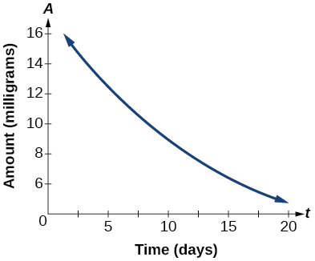{: #Figure_01_03_214}

Use the graph to estimate the average decay rate from<math xmlns="http://www.w3.org/1998/Math/MathML"> <mrow> <mtext> </mtext><mi>t</mi><mo>=</mo><mn>5</mn><mtext> </mtext></mrow> </math>

to<math xmlns="http://www.w3.org/1998/Math/MathML"> <mrow> <mtext> </mtext><mi>t</mi><mo>=</mo><mn>15.</mn></mrow> </math>

approximately –0.6 milligrams per day

## Footnotes
{: data-type="footnote-title"}

1.  [1](#footnote-ref1){: data-type="footnote-ref" name="footnote1"} http://www.eia.gov/totalenergy/data/annual/showtext.cfm?t=ptb0524. Accessed 3/5/2014.

## Glossary
{: data-type="glossary-title"}

absolute maximum
: the greatest value of a function over an interval
{: .definition}

absolute minimum
: the lowest value of a function over an interval
{: .definition}

average rate of change
: the difference in the output values of a function found for two values of the input divided by the difference between the inputs
{: .definition}

decreasing function
: a function is decreasing in some open interval if
  <math xmlns="http://www.w3.org/1998/Math/MathML"> <mrow> <mtext> </mtext><mi>f</mi><mrow><mo>(</mo> <mi>b</mi> <mo>)</mo></mrow><mo>&lt;</mo><mi>f</mi><mrow><mo>(</mo> <mi>a</mi> <mo>)</mo></mrow><mtext> </mtext></mrow> </math>
  
  for any two input values
  <math xmlns="http://www.w3.org/1998/Math/MathML"> <mrow> <mtext> </mtext><mi>a</mi><mtext> </mtext></mrow> </math>
  
  and
  <math xmlns="http://www.w3.org/1998/Math/MathML"> <mrow> <mtext> </mtext><mi>b</mi><mtext> </mtext></mrow> </math>
  
  in the given interval where
  <math xmlns="http://www.w3.org/1998/Math/MathML"> <mrow> <mtext> </mtext><mi>b</mi><mo>&gt;</mo><mi>a</mi></mrow> </math>
{: .definition}

increasing function
: a function is increasing in some open interval if
  <math xmlns="http://www.w3.org/1998/Math/MathML"> <mrow> <mtext> </mtext><mi>f</mi><mrow><mo>(</mo> <mi>b</mi> <mo>)</mo></mrow><mo>&gt;</mo><mi>f</mi><mrow><mo>(</mo> <mi>a</mi> <mo>)</mo></mrow><mtext> </mtext></mrow> </math>
  
  for any two input values
  <math xmlns="http://www.w3.org/1998/Math/MathML"> <mrow> <mtext> </mtext><mi>a</mi><mtext> </mtext></mrow> </math>
  
  and
  <math xmlns="http://www.w3.org/1998/Math/MathML"> <mrow> <mtext> </mtext><mi>b</mi><mtext> </mtext></mrow> </math>
  
  in the given interval where
  <math xmlns="http://www.w3.org/1998/Math/MathML"> <mrow> <mtext> </mtext><mi>b</mi><mo>&gt;</mo><mi>a</mi></mrow> </math>
{: .definition}

local extrema
: collectively, all of a function\'s local maxima and minima
{: .definition}

local maximum
: a value of the input where a function changes from increasing to decreasing as the input value increases.
{: .definition}

local minimum
: a value of the input where a function changes from decreasing to increasing as the input value increases.
{: .definition}

rate of change
: the change of an output quantity relative to the change of the input quantity
{: .definition}

[1]: http://openstaxcollege.org/l/aroc
