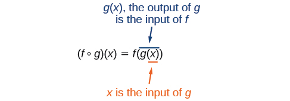
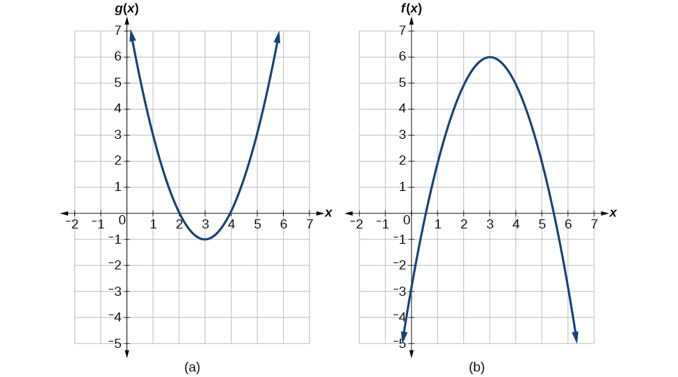
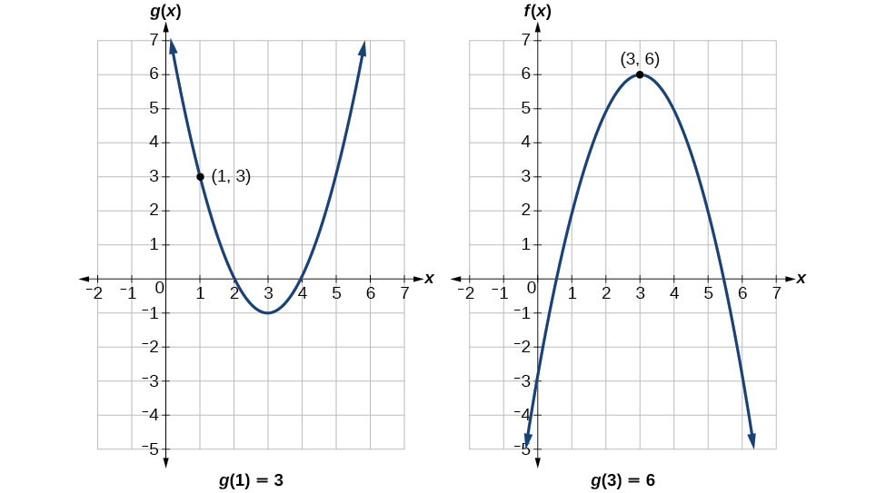
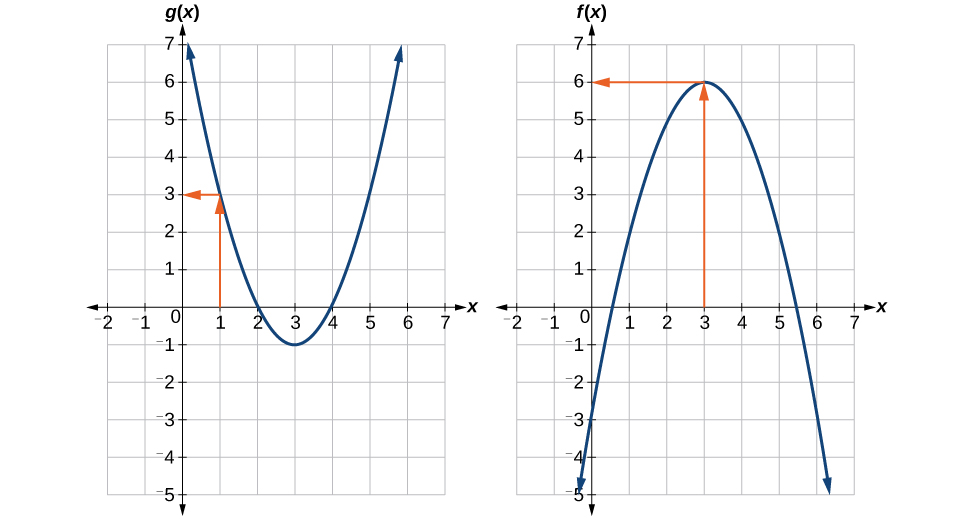
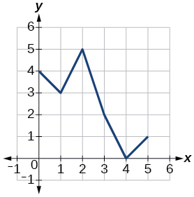
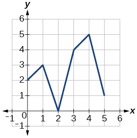
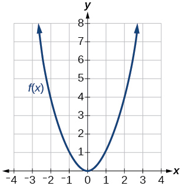
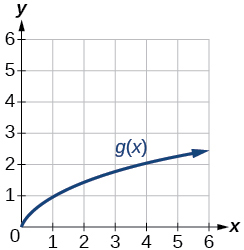
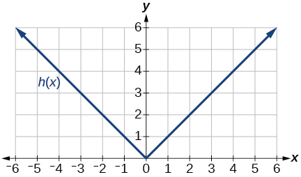

In this section, you will:
* Combine functions using algebraic operations.
* Create a new function by composition of functions.
* Evaluate composite functions.
* Find the domain of a composite function.
* Decompose a composite function into its component functions.

Suppose we want to calculate how much it costs to heat a house on a particular day of the year. The cost to heat a house will depend on the average daily temperature, and in turn, the average daily temperature depends on the particular day of the year. Notice how we have just defined two relationships: The cost depends on the temperature, and the temperature depends on the day.

Using descriptive variables, we can notate these two functions. The function<math xmlns="http://www.w3.org/1998/Math/MathML"> <mrow> <mtext> </mtext><mi>C</mi><mrow><mo>(</mo> <mi>T</mi> <mo>)</mo></mrow><mtext> </mtext></mrow> </math>

gives the cost<math xmlns="http://www.w3.org/1998/Math/MathML"> <mrow> <mtext> </mtext><mi>C</mi><mtext> </mtext></mrow> </math>

of heating a house for a given average daily temperature in<math xmlns="http://www.w3.org/1998/Math/MathML"> <mrow> <mtext> </mtext><mi>T</mi><mtext> </mtext></mrow> </math>

degrees Celsius. The function<math xmlns="http://www.w3.org/1998/Math/MathML"> <mrow> <mtext> </mtext><mi>T</mi><mrow><mo>(</mo> <mi>d</mi> <mo>)</mo></mrow><mtext> </mtext></mrow> </math>

gives the average daily temperature on day<math xmlns="http://www.w3.org/1998/Math/MathML"> <mrow> <mtext> </mtext><mi>d</mi><mtext> </mtext></mrow> </math>

of the year. For any given day,<math xmlns="http://www.w3.org/1998/Math/MathML"> <mrow> <mtext> </mtext><mtext>Cost</mtext><mo>=</mo><mi>C</mi><mrow><mo>(</mo> <mrow> <mi>T</mi><mrow><mo>(</mo> <mi>d</mi> <mo>)</mo></mrow></mrow> <mo>)</mo></mrow><mtext> </mtext></mrow> </math>

means that the cost depends on the temperature, which in turns depends on the day of the year. Thus, we can evaluate the cost function at the temperature<math xmlns="http://www.w3.org/1998/Math/MathML"> <mrow> <mtext> </mtext><mi>T</mi><mrow><mo>(</mo> <mi>d</mi> <mo>)</mo></mrow><mo>.</mo><mtext> </mtext></mrow> </math>

For example, we could evaluate<math xmlns="http://www.w3.org/1998/Math/MathML"> <mrow> <mtext> </mtext><mi>T</mi><mrow><mo>(</mo> <mn>5</mn> <mo>)</mo></mrow><mtext> </mtext></mrow> </math>

to determine the average daily temperature on the 5th day of the year. Then, we could evaluate the **cost function**{: data-type="term" .no-emphasis} at that temperature. We would write<math xmlns="http://www.w3.org/1998/Math/MathML"> <mrow> <mtext> </mtext><mi>C</mi><mrow><mo>(</mo> <mrow> <mi>T</mi><mrow><mo>(</mo> <mn>5</mn> <mo>)</mo></mrow></mrow> <mo>)</mo></mrow><mo>.</mo></mrow> </math>

By combining these two relationships into one function, we have performed function composition, which is the focus of this section.

### Combining Functions Using Algebraic Operations

Function composition is only one way to combine existing functions. Another way is to carry out the usual algebraic operations on functions, such as addition, subtraction, multiplication and division. We do this by performing the operations with the function outputs, defining the result as the output of our new function.

Suppose we need to add two columns of numbers that represent a husband and wife’s separate annual incomes over a period of years, with the result being their total household income. We want to do this for every year, adding only that year’s incomes and then collecting all the data in a new column. If<math xmlns="http://www.w3.org/1998/Math/MathML"> <mrow> <mtext> </mtext><mi>w</mi><mo stretchy="false">(</mo><mi>y</mi><mo stretchy="false">)</mo><mtext> </mtext></mrow> </math>

is the wife’s income and<math xmlns="http://www.w3.org/1998/Math/MathML"> <mrow> <mtext> </mtext><mi>h</mi><mo stretchy="false">(</mo><mi>y</mi><mo stretchy="false">)</mo><mtext> </mtext></mrow> </math>

is the husband’s income in year<math xmlns="http://www.w3.org/1998/Math/MathML"> <mrow> <mtext> </mtext><mi>y</mi><mo>,</mo><mtext> </mtext></mrow> </math>

and we want<math xmlns="http://www.w3.org/1998/Math/MathML"> <mrow> <mtext> </mtext><mi>T</mi><mtext> </mtext></mrow> </math>

to represent the total income, then we can define a new function.

<math xmlns="http://www.w3.org/1998/Math/MathML" display="block"> <mrow> <mi>T</mi><mrow><mo>(</mo> <mi>y</mi> <mo>)</mo></mrow><mo>=</mo><mi>h</mi><mrow><mo>(</mo> <mi>y</mi> <mo>)</mo></mrow><mo>+</mo><mi>w</mi><mrow><mo>(</mo> <mi>y</mi> <mo>)</mo></mrow></mrow> </math>

If this holds true for every year, then we can focus on the relation between the functions without reference to a year and write

<math xmlns="http://www.w3.org/1998/Math/MathML" display="block"> <mrow> <mi>T</mi><mo>=</mo><mi>h</mi><mo>+</mo><mi>w</mi></mrow> </math>

Just as for this sum of two functions, we can define difference, product, and ratio functions for any pair of functions that have the same kinds of inputs (not necessarily numbers) and also the same kinds of outputs (which do have to be numbers so that the usual operations of algebra can apply to them, and which also must have the same units or no units when we add and subtract). In this way, we can think of adding, subtracting, multiplying, and dividing functions.

For two functions<math xmlns="http://www.w3.org/1998/Math/MathML"> <mrow> <mtext> </mtext><mi>f</mi><mrow><mo>(</mo> <mi>x</mi> <mo>)</mo></mrow><mtext> </mtext></mrow> </math>

and<math xmlns="http://www.w3.org/1998/Math/MathML"> <mrow> <mtext> </mtext><mi>g</mi><mrow><mo>(</mo> <mi>x</mi> <mo>)</mo></mrow><mtext> </mtext></mrow> </math>

with real number outputs, we define new functions<math xmlns="http://www.w3.org/1998/Math/MathML"> <mrow> <mi>f</mi><mo>+</mo><mi>g</mi><mo>,</mo><mtext> </mtext><mi>f</mi><mo>−</mo><mi>g</mi><mo>,</mo><mtext> </mtext><mi>f</mi><mi>g</mi><mo>,</mo><mtext> </mtext></mrow> </math>

and<math xmlns="http://www.w3.org/1998/Math/MathML"> <mrow> <mtext> </mtext><mfrac> <mi>f</mi> <mi>g</mi> </mfrac> <mtext> </mtext></mrow> </math>

by the relations

<math xmlns="http://www.w3.org/1998/Math/MathML" display="block"> <mrow> <mtable> <mtr rowalign="center"> <mtd columnalign="right" rowalign="center"> <mrow> <mo stretchy="false">(</mo><mi>f</mi><mo>+</mo><mi>g</mi><mo stretchy="false">)</mo><mo stretchy="false">(</mo><mi>x</mi><mo stretchy="false">)</mo> </mrow> </mtd> <mtd rowalign="center"> <mo>=</mo> </mtd> <mtd columnalign="left" rowalign="center"> <mrow> <mi>f</mi><mo stretchy="false">(</mo><mi>x</mi><mo stretchy="false">)</mo><mo>+</mo><mi>g</mi><mo stretchy="false">(</mo><mi>x</mi><mo stretchy="false">)</mo> </mrow> </mtd> <mtd rowalign="center" /> </mtr> <mtr rowalign="center"> <mtd columnalign="right" rowalign="center"> <mrow> <mo stretchy="false">(</mo><mi>f</mi><mo>−</mo><mi>g</mi><mo stretchy="false">)</mo><mo stretchy="false">(</mo><mi>x</mi><mo stretchy="false">)</mo> </mrow> </mtd> <mtd rowalign="center"> <mo>=</mo> </mtd> <mtd columnalign="left" rowalign="center"> <mrow> <mi>f</mi><mo stretchy="false">(</mo><mi>x</mi><mo stretchy="false">)</mo><mo>−</mo><mi>g</mi><mo stretchy="false">(</mo><mi>x</mi><mo stretchy="false">)</mo> </mrow> </mtd> <mtd rowalign="center" /> </mtr> <mtr rowalign="center"> <mtd columnalign="right" rowalign="center"> <mrow> <mo> </mo><mo stretchy="false">(</mo><mi>f</mi><mi>g</mi><mo stretchy="false">)</mo><mo stretchy="false">(</mo><mi>x</mi><mo stretchy="false">)</mo> </mrow> </mtd> <mtd rowalign="center"> <mo>=</mo> </mtd> <mtd columnalign="left" rowalign="center"> <mrow> <mi>f</mi><mo stretchy="false">(</mo><mi>x</mi><mo stretchy="false">)</mo><mi>g</mi><mo stretchy="false">(</mo><mi>x</mi><mo stretchy="false">)</mo> </mrow> </mtd> <mtd rowalign="center" /> </mtr> <mtr rowalign="center"> <mtd columnalign="right" rowalign="center"> <mrow> <mrow><mo>(</mo> <mrow> <mfrac> <mi>f</mi> <mi>g</mi> </mfrac> </mrow> <mo>)</mo></mrow><mo stretchy="false">(</mo><mi>x</mi><mo stretchy="false">)</mo> </mrow> </mtd> <mtd rowalign="center"> <mo>=</mo> </mtd> <mtd columnalign="left" rowalign="center"> <mrow> <mfrac> <mrow> <mi>f</mi><mo stretchy="false">(</mo><mi>x</mi><mo stretchy="false">)</mo> </mrow> <mrow> <mi>g</mi><mo stretchy="false">(</mo><mi>x</mi><mo stretchy="false">)</mo> </mrow> </mfrac> </mrow> </mtd> <mtd columnalign="left" rowalign="center"> <mrow> <mtext>where</mtext><mtext> </mtext><mi>g</mi><mo stretchy="false">(</mo><mi>x</mi><mo stretchy="false">)</mo><mtext> </mtext><mo>≠</mo><mtext> </mtext><mn>0</mn> </mrow> </mtd> </mtr> </mtable> </mrow> </math>

Performing Algebraic Operations on Functions

Find and simplify the functions<math xmlns="http://www.w3.org/1998/Math/MathML"> <mrow> <mtext> </mtext><mrow><mo>(</mo> <mrow> <mi>g</mi><mo>−</mo><mi>f</mi></mrow> <mo>)</mo></mrow><mrow><mo>(</mo> <mi>x</mi> <mo>)</mo></mrow><mtext> </mtext></mrow> </math>

and<math xmlns="http://www.w3.org/1998/Math/MathML"> <mrow> <mtext> </mtext><mrow><mo>(</mo> <mrow> <mfrac> <mi>g</mi> <mi>f</mi> </mfrac> </mrow> <mo>)</mo></mrow><mrow><mo>(</mo> <mi>x</mi> <mo>)</mo></mrow><mo>,</mo><mtext> </mtext></mrow> </math>

given<math xmlns="http://www.w3.org/1998/Math/MathML"> <mrow> <mtext> </mtext><mi>f</mi><mrow><mo>(</mo> <mi>x</mi> <mo>)</mo></mrow><mo>=</mo><mi>x</mi><mo>−</mo><mn>1</mn><mtext> </mtext></mrow> </math>

and<math xmlns="http://www.w3.org/1998/Math/MathML"> <mrow> <mtext> </mtext><mi>g</mi><mrow><mo>(</mo> <mi>x</mi> <mo>)</mo></mrow><mo>=</mo><msup> <mi>x</mi> <mn>2</mn> </msup> <mo>−</mo><mn>1.</mn><mtext> </mtext></mrow> </math>

Are they the same function?

Begin by writing the general form, and then substitute the given functions.

<math xmlns="http://www.w3.org/1998/Math/MathML" display="block"> <mrow> <mtable> <mtr rowalign="center"> <mtd columnalign="right" rowalign="center"> <mrow> <mo stretchy="false">(</mo><mi>g</mi><mo>−</mo><mi>f</mi><mo stretchy="false">)</mo><mo stretchy="false">(</mo><mi>x</mi><mo stretchy="false">)</mo> </mrow> </mtd> <mtd rowalign="center"> <mo>=</mo> </mtd> <mtd columnalign="left" rowalign="center"> <mrow> <mi>g</mi><mo stretchy="false">(</mo><mi>x</mi><mo stretchy="false">)</mo><mo>−</mo><mi>f</mi><mo stretchy="false">(</mo><mi>x</mi><mo stretchy="false">)</mo> </mrow> </mtd> <mtd rowalign="center" /> </mtr> <mtr rowalign="center"> <mtd columnalign="right" rowalign="center"> <mrow> <mo stretchy="false">(</mo><mi>g</mi><mo>−</mo><mi>f</mi><mo stretchy="false">)</mo><mo stretchy="false">(</mo><mi>x</mi><mo stretchy="false">)</mo> </mrow> </mtd> <mtd rowalign="center"> <mo>=</mo> </mtd> <mtd columnalign="left" rowalign="center"> <mrow> <msup> <mi>x</mi> <mn>2</mn> </msup> <mo>−</mo><mn>1</mn><mo>−</mo><mo stretchy="false">(</mo><mi>x</mi><mo>−</mo><mn>1</mn><mo stretchy="false">)</mo> </mrow> </mtd> <mtd rowalign="center" /> </mtr> <mtr rowalign="center"> <mtd rowalign="center" /> <mtd rowalign="center"> <mo>=</mo> </mtd> <mtd columnalign="left" rowalign="center"> <mrow> <msup> <mi>x</mi> <mn>2</mn> </msup> <mo>−</mo><mi>x</mi> </mrow> </mtd> <mtd rowalign="center" /> </mtr> <mtr rowalign="center"> <mtd rowalign="center" /> <mtd rowalign="center"> <mo>=</mo> </mtd> <mtd columnalign="left" rowalign="center"> <mrow> <mi>x</mi><mo stretchy="false">(</mo><mi>x</mi><mo>−</mo><mn>1</mn><mo stretchy="false">)</mo> </mrow> </mtd> <mtd rowalign="center" /> </mtr> <mtr rowalign="center"> <mtd rowalign="center" /> <mtd rowalign="center" /> <mtd rowalign="center" /> <mtd rowalign="center" /> </mtr> <mtr rowalign="center"> <mtd rowalign="center" /> <mtd rowalign="center" /> <mtd rowalign="center" /> <mtd rowalign="center" /> </mtr> <mtr rowalign="center"> <mtd columnalign="right" rowalign="center"> <mrow> <mo> </mo><mrow><mo>(</mo> <mrow> <mfrac> <mi>g</mi> <mi>f</mi> </mfrac> </mrow> <mo>)</mo></mrow><mo stretchy="false">(</mo><mi>x</mi><mo stretchy="false">)</mo> </mrow> </mtd> <mtd rowalign="center"> <mo>=</mo> </mtd> <mtd columnalign="left" rowalign="center"> <mrow> <mfrac> <mrow> <mi>g</mi><mo stretchy="false">(</mo><mi>x</mi><mo stretchy="false">)</mo> </mrow> <mrow> <mi>f</mi><mo stretchy="false">(</mo><mi>x</mi><mo stretchy="false">)</mo> </mrow> </mfrac> </mrow> </mtd> <mtd rowalign="center" /> </mtr> <mtr rowalign="center"> <mtd columnalign="right" rowalign="center"> <mrow> <mrow><mo>(</mo> <mrow> <mfrac> <mi>g</mi> <mi>f</mi> </mfrac> </mrow> <mo>)</mo></mrow><mo stretchy="false">(</mo><mi>x</mi><mo stretchy="false">)</mo> </mrow> </mtd> <mtd rowalign="center"> <mo>=</mo> </mtd> <mtd columnalign="left" rowalign="center"> <mrow> <mfrac> <mrow> <msup> <mi>x</mi> <mn>2</mn> </msup> <mo>−</mo><mn>1</mn> </mrow> <mrow> <mi>x</mi><mo>−</mo><mn>1</mn> </mrow> </mfrac> </mrow> </mtd> <mtd rowalign="center" /> </mtr> <mtr rowalign="center"> <mtd rowalign="center" /> <mtd rowalign="center"> <mo>=</mo> </mtd> <mtd columnalign="left" rowalign="center"> <mrow> <mfrac> <mrow> <mo stretchy="false">(</mo><mi>x</mi><mo>+</mo><mn>1</mn><mo stretchy="false">)</mo><mo stretchy="false">(</mo><mi>x</mi><mo>−</mo><mn>1</mn><mo stretchy="false">)</mo> </mrow> <mrow> <mi>x</mi><mo>−</mo><mn>1</mn> </mrow> </mfrac> </mrow> </mtd> <mtd columnalign="left" rowalign="center"> <mrow> <mtext>where </mtext><mi>x</mi><mo>≠</mo><mn>1</mn> </mrow> </mtd> </mtr> <mtr rowalign="center"> <mtd rowalign="center" /> <mtd> <mo>=</mo> </mtd> <mtd columnalign="left" rowalign="center"> <mrow> <mi>x</mi><mo>+</mo><mn>1</mn> </mrow> </mtd> <mtd rowalign="center" /> </mtr> </mtable> </mrow> </math>

No, the functions are not the same.

Note: For<math xmlns="http://www.w3.org/1998/Math/MathML"> <mrow> <mtext> </mtext><mrow><mo>(</mo> <mrow> <mfrac> <mi>g</mi> <mi>f</mi> </mfrac> </mrow> <mo>)</mo></mrow><mrow><mo>(</mo> <mi>x</mi> <mo>)</mo></mrow><mo>,</mo><mtext> </mtext></mrow> </math>

the condition<math xmlns="http://www.w3.org/1998/Math/MathML"> <mrow> <mtext> </mtext><mi>x</mi><mo>≠</mo><mn>1</mn><mtext> </mtext></mrow> </math>

is necessary because when<math xmlns="http://www.w3.org/1998/Math/MathML"> <mrow> <mtext> </mtext><mi>x</mi><mo>=</mo><mn>1</mn><mo>,</mo><mtext> </mtext></mrow> </math>

the denominator is equal to 0, which makes the function undefined.

Find and simplify the functions<math xmlns="http://www.w3.org/1998/Math/MathML"> <mrow> <mtext> </mtext><mrow><mo>(</mo> <mrow> <mi>f</mi><mi>g</mi></mrow> <mo>)</mo></mrow><mrow><mo>(</mo> <mi>x</mi> <mo>)</mo></mrow><mtext> </mtext></mrow> </math>

and<math xmlns="http://www.w3.org/1998/Math/MathML"> <mrow> <mtext> </mtext><mrow><mo>(</mo> <mrow> <mi>f</mi><mo>−</mo><mi>g</mi></mrow> <mo>)</mo></mrow><mrow><mo>(</mo> <mi>x</mi> <mo>)</mo></mrow><mo>.</mo></mrow> </math>

<math xmlns="http://www.w3.org/1998/Math/MathML" display="block"> <mrow> <mi>f</mi><mrow><mo>(</mo> <mi>x</mi> <mo>)</mo></mrow><mo>=</mo><mi>x</mi><mo>−</mo><mn>1</mn><mtext>    and    </mtext><mi>g</mi><mrow><mo>(</mo> <mi>x</mi> <mo>)</mo></mrow><mo>=</mo><msup> <mi>x</mi> <mn>2</mn> </msup> <mo>−</mo><mn>1</mn></mrow> </math>

Are they the same function?

<math xmlns="http://www.w3.org/1998/Math/MathML"> <mtable columnalign="left"> <mtr> <mtd> <mrow><mo>(</mo> <mrow> <mi>f</mi><mi>g</mi></mrow> <mo>)</mo></mrow><mrow><mo>(</mo> <mi>x</mi> <mo>)</mo></mrow><mo>=</mo><mi>f</mi><mrow><mo>(</mo> <mi>x</mi> <mo>)</mo></mrow><mi>g</mi><mrow><mo>(</mo> <mi>x</mi> <mo>)</mo></mrow><mo>=</mo><mrow><mo>(</mo> <mrow> <mi>x</mi><mo>−</mo><mn>1</mn></mrow> <mo>)</mo></mrow><mrow><mo>(</mo> <mrow> <msup> <mi>x</mi> <mn>2</mn> </msup> <mo>−</mo><mn>1</mn></mrow> <mo>)</mo></mrow><mo>=</mo><msup> <mi>x</mi> <mn>3</mn> </msup> <mo>−</mo><msup> <mi>x</mi> <mn>2</mn> </msup> <mo>−</mo><mi>x</mi><mo>+</mo><mn>1</mn> </mtd> </mtr> <mtr> <mtd> <mrow><mo>(</mo> <mrow> <mi>f</mi><mo>−</mo><mi>g</mi></mrow> <mo>)</mo></mrow><mrow><mo>(</mo> <mi>x</mi> <mo>)</mo></mrow><mo>=</mo><mi>f</mi><mrow><mo>(</mo> <mi>x</mi> <mo>)</mo></mrow><mo>−</mo><mi>g</mi><mrow><mo>(</mo> <mi>x</mi> <mo>)</mo></mrow><mo>=</mo><mrow><mo>(</mo> <mrow> <mi>x</mi><mo>−</mo><mn>1</mn></mrow> <mo>)</mo></mrow><mo>−</mo><mrow><mo>(</mo> <mrow> <msup> <mi>x</mi> <mn>2</mn> </msup> <mo>−</mo><mn>1</mn></mrow> <mo>)</mo></mrow><mo>=</mo><mi>x</mi><mo>−</mo><msup> <mi>x</mi> <mn>2</mn> </msup> </mtd> </mtr> </mtable> </math>

No, the functions are not the same.

### Create a Function by Composition of Functions

Performing algebraic operations on functions combines them into a new function, but we can also create functions by composing functions. When we wanted to compute a heating cost from a day of the year, we created a new function that takes a day as input and yields a cost as output. The process of **combining functions**{: data-type="term" .no-emphasis} so that the output of one function becomes the input of another is known as a **composition of functions**{: data-type="term" .no-emphasis}**.** The resulting function is known as a **composite function**. We represent this combination by the following notation:

<math xmlns="http://www.w3.org/1998/Math/MathML" display="block"> <mrow> <mrow><mo>(</mo> <mrow> <mi>f</mi><mo>∘</mo><mi>g</mi></mrow> <mo>)</mo></mrow><mrow><mo>(</mo> <mi>x</mi> <mo>)</mo></mrow><mo>=</mo><mi>f</mi><mrow><mo>(</mo> <mrow> <mi>g</mi><mrow><mo>(</mo> <mi>x</mi> <mo>)</mo></mrow></mrow> <mo>)</mo></mrow></mrow> </math>

We read the left-hand side as<math xmlns="http://www.w3.org/1998/Math/MathML"> <mrow> <mo>“</mo><mi>f</mi><mtext> </mtext> </mrow> </math>

composed with<math xmlns="http://www.w3.org/1998/Math/MathML"> <mrow> <mtext> </mtext><mi>g</mi><mtext> </mtext></mrow> </math>

at<math xmlns="http://www.w3.org/1998/Math/MathML"> <mrow> <mtext> </mtext><mi>x</mi><mo>,”</mo> </mrow> </math>

 and the right-hand side as<math xmlns="http://www.w3.org/1998/Math/MathML"> <mrow> <mo>“</mo><mi>f</mi><mtext> </mtext> </mrow> </math>

of<math xmlns="http://www.w3.org/1998/Math/MathML"> <mrow> <mtext> </mtext><mi>g</mi><mtext> </mtext></mrow> </math>

of<math xmlns="http://www.w3.org/1998/Math/MathML"> <mrow> <mtext> </mtext><mi>x</mi><mo>.</mo><mo>”</mo> </mrow> </math>

The two sides of the equation have the same mathematical meaning and are equal. The open circle symbol<math xmlns="http://www.w3.org/1998/Math/MathML"> <mrow> <mtext> </mtext><mo>∘</mo><mtext> </mtext></mrow> </math>

is called the composition operator. We use this operator mainly when we wish to emphasize the relationship between the functions themselves without referring to any particular input value. Composition is a binary operation that takes two functions and forms a new function, much as addition or multiplication takes two numbers and gives a new number. However, it is important not to confuse function composition with multiplication because, as we learned above, in most cases <math xmlns="http://www.w3.org/1998/Math/MathML"> <mrow> <mi>f</mi><mo stretchy="false">(</mo><mi>g</mi><mo stretchy="false">(</mo><mi>x</mi><mo stretchy="false">)</mo><mo stretchy="false">)</mo><mo>≠</mo><mi>f</mi><mo stretchy="false">(</mo><mi>x</mi><mo stretchy="false">)</mo><mi>g</mi><mo stretchy="false">(</mo><mi>x</mi><mo stretchy="false">)</mo><mo>.</mo> </mrow> </math>

It is also important to understand the order of operations in evaluating a composite function. We follow the usual convention with parentheses by starting with the innermost parentheses first, and then working to the outside. In the equation above, the function<math xmlns="http://www.w3.org/1998/Math/MathML"> <mrow> <mtext> </mtext><mi>g</mi><mtext> </mtext></mrow> </math>

takes the input<math xmlns="http://www.w3.org/1998/Math/MathML"> <mrow> <mtext> </mtext><mi>x</mi><mtext> </mtext></mrow> </math>

first and yields an output<math xmlns="http://www.w3.org/1998/Math/MathML"> <mrow> <mtext> </mtext><mi>g</mi><mrow><mo>(</mo> <mi>x</mi> <mo>)</mo></mrow><mo>.</mo><mtext> </mtext></mrow> </math>

Then the function<math xmlns="http://www.w3.org/1998/Math/MathML"> <mrow> <mtext> </mtext><mi>f</mi><mtext> </mtext></mrow> </math>

takes<math xmlns="http://www.w3.org/1998/Math/MathML"> <mrow> <mtext> </mtext><mi>g</mi><mrow><mo>(</mo> <mi>x</mi> <mo>)</mo></mrow><mtext> </mtext></mrow> </math>

as an input and yields an output<math xmlns="http://www.w3.org/1998/Math/MathML"> <mrow> <mtext> </mtext><mi>f</mi><mrow><mo>(</mo> <mrow> <mi>g</mi><mrow><mo>(</mo> <mi>x</mi> <mo>)</mo></mrow></mrow> <mo>)</mo></mrow><mo>.</mo></mrow> </math>

In general,<math xmlns="http://www.w3.org/1998/Math/MathML"> <mrow> <mtext> </mtext><mi>f</mi><mo>∘</mo><mi>g</mi><mtext> </mtext></mrow> </math>

and<math xmlns="http://www.w3.org/1998/Math/MathML"> <mrow> <mtext> </mtext><mi>g</mi><mo>∘</mo><mi>f</mi><mtext> </mtext></mrow> </math>

are different functions. In other words, in many cases<math xmlns="http://www.w3.org/1998/Math/MathML"> <mrow> <mtext> </mtext><mi>f</mi><mrow><mo>(</mo> <mrow> <mi>g</mi><mrow><mo>(</mo> <mi>x</mi> <mo>)</mo></mrow></mrow> <mo>)</mo></mrow><mo>≠</mo><mi>g</mi><mrow><mo>(</mo> <mrow> <mi>f</mi><mrow><mo>(</mo> <mi>x</mi> <mo>)</mo></mrow></mrow> <mo>)</mo></mrow><mtext> </mtext></mrow> </math>

for all<math xmlns="http://www.w3.org/1998/Math/MathML"> <mrow> <mtext> </mtext><mi>x</mi><mo>.</mo><mtext> </mtext></mrow> </math>

We will also see that sometimes two functions can be composed only in one specific order.

For example, if<math xmlns="http://www.w3.org/1998/Math/MathML"> <mrow> <mtext> </mtext><mi>f</mi><mrow><mo>(</mo> <mi>x</mi> <mo>)</mo></mrow><mo>=</mo><msup> <mi>x</mi> <mn>2</mn> </msup> <mtext> </mtext></mrow> </math>

and<math xmlns="http://www.w3.org/1998/Math/MathML"> <mrow> <mtext> </mtext><mi>g</mi><mrow><mo>(</mo> <mi>x</mi> <mo>)</mo></mrow><mo>=</mo><mi>x</mi><mo>+</mo><mn>2</mn><mo>,</mo></mrow> </math>

then

<math xmlns="http://www.w3.org/1998/Math/MathML" display="block"> <mrow> <mtable> <mtr rowalign="center"> <mtd columnalign="right" rowalign="center"> <mrow> <mi>f</mi><mo stretchy="false">(</mo><mi>g</mi><mo stretchy="false">(</mo><mi>x</mi><mo stretchy="false">)</mo><mo stretchy="false">)</mo> </mrow> </mtd> <mtd rowalign="center"> <mo>=</mo> </mtd> <mtd columnalign="left" rowalign="center"> <mrow> <mi>f</mi><mo stretchy="false">(</mo><mi>x</mi><mo>+</mo><mn>2</mn><mo stretchy="false">)</mo> </mrow> </mtd> </mtr> <mtr rowalign="center"> <mtd rowalign="center" /> <mtd rowalign="center"> <mo>=</mo> </mtd> <mtd columnalign="left" rowalign="center"> <mrow> <msup> <mrow> <mo stretchy="false">(</mo><mi>x</mi><mo>+</mo><mn>2</mn><mo stretchy="false">)</mo> </mrow> <mn>2</mn> </msup> </mrow> </mtd> </mtr> <mtr rowalign="center"> <mtd rowalign="center" /> <mtd rowalign="center"> <mo>=</mo> </mtd> <mtd columnalign="left" rowalign="center"> <mrow> <msup> <mi>x</mi> <mn>2</mn> </msup> <mo>+</mo><mn>4</mn><mi>x</mi><mo>+</mo><mn>4</mn> </mrow> </mtd> </mtr> </mtable> </mrow> </math>

but

<math xmlns="http://www.w3.org/1998/Math/MathML" display="block"> <mrow> <mtable> <mtr rowalign="center"> <mtd columnalign="right" rowalign="center"> <mrow> <mi>g</mi><mo stretchy="false">(</mo><mi>f</mi><mo stretchy="false">(</mo><mi>x</mi><mo stretchy="false">)</mo><mo stretchy="false">)</mo> </mrow> </mtd> <mtd rowalign="center"> <mo>=</mo> </mtd> <mtd columnalign="left" rowalign="center"> <mrow> <mi>g</mi><mo>(</mo><msup> <mi>x</mi> <mn>2</mn> </msup> <mo>)</mo> </mrow> </mtd> </mtr> <mtr rowalign="center"> <mtd rowalign="center" /> <mtd rowalign="center"> <mo>=</mo> </mtd> <mtd columnalign="left" rowalign="center"> <mrow> <msup> <mi>x</mi> <mn>2</mn> </msup> <mo>+</mo><mn>2</mn> </mrow> </mtd> </mtr> </mtable> </mrow> </math>

These expressions are not equal for all values of<math xmlns="http://www.w3.org/1998/Math/MathML"> <mrow> <mtext> </mtext><mi>x</mi><mo>,</mo><mtext> </mtext></mrow> </math>

so the two functions are not equal. It is irrelevant that the expressions happen to be equal for the single input value<math xmlns="http://www.w3.org/1998/Math/MathML"> <mrow> <mtext> </mtext><mi>x</mi><mo>=</mo><mo>−</mo><mfrac> <mn>1</mn> <mn>2</mn> </mfrac> <mo>.</mo></mrow> </math>

Note that the range of the inside function (the first function to be evaluated) needs to be within the domain of the outside function. Less formally, the composition has to make sense in terms of inputs and outputs.

Composition of Functions

When the output of one function is used as the input of another, we call the entire operation a composition of functions. For any input<math xmlns="http://www.w3.org/1998/Math/MathML"> <mrow> <mtext> </mtext><mi>x</mi><mtext> </mtext></mrow> </math>

and functions<math xmlns="http://www.w3.org/1998/Math/MathML"> <mrow> <mtext> </mtext><mi>f</mi><mtext> </mtext></mrow> </math>

and<math xmlns="http://www.w3.org/1998/Math/MathML"> <mrow> <mtext> </mtext><mi>g</mi><mo>,</mo><mtext> </mtext></mrow> </math>

this action defines a **composite function**{: data-type="term"}, which we write as<math xmlns="http://www.w3.org/1998/Math/MathML"> <mrow> <mtext> </mtext><mi>f</mi><mo>∘</mo><mi>g</mi><mtext> </mtext></mrow> </math>

such that

<math xmlns="http://www.w3.org/1998/Math/MathML"> <mrow> <mrow><mo>(</mo> <mrow> <mi>f</mi><mo>∘</mo><mi>g</mi></mrow> <mo>)</mo></mrow><mrow><mo>(</mo> <mi>x</mi> <mo>)</mo></mrow><mo>=</mo><mi>f</mi><mrow><mo>(</mo> <mrow> <mi>g</mi><mrow><mo>(</mo> <mi>x</mi> <mo>)</mo></mrow></mrow> <mo>)</mo></mrow></mrow> </math>

The domain of the composite function<math xmlns="http://www.w3.org/1998/Math/MathML"> <mrow> <mtext> </mtext><mi>f</mi><mo>∘</mo><mi>g</mi><mtext> </mtext></mrow> </math>

is all<math xmlns="http://www.w3.org/1998/Math/MathML"> <mrow> <mtext> </mtext><mi>x</mi><mtext> </mtext></mrow> </math>

such that<math xmlns="http://www.w3.org/1998/Math/MathML"> <mrow> <mtext> </mtext><mi>x</mi><mtext> </mtext></mrow> </math>

is in the domain of<math xmlns="http://www.w3.org/1998/Math/MathML"> <mrow> <mtext> </mtext><mi>g</mi><mtext> </mtext></mrow> </math>

and<math xmlns="http://www.w3.org/1998/Math/MathML"> <mrow> <mtext> </mtext><mi>g</mi><mrow><mo>(</mo> <mi>x</mi> <mo>)</mo></mrow><mtext> </mtext></mrow> </math>

is in the domain of<math xmlns="http://www.w3.org/1998/Math/MathML"> <mrow> <mtext> </mtext><mi>f</mi><mo>.</mo></mrow> </math>

It is important to realize that the product of functions<math xmlns="http://www.w3.org/1998/Math/MathML"> <mrow> <mtext> </mtext><mi>f</mi><mi>g</mi><mtext> </mtext></mrow> </math>

is not the same as the function composition<math xmlns="http://www.w3.org/1998/Math/MathML"> <mrow> <mtext> </mtext><mi>f</mi><mrow><mo>(</mo> <mrow> <mi>g</mi><mrow><mo>(</mo> <mi>x</mi> <mo>)</mo></mrow></mrow> <mo>)</mo></mrow><mo>,</mo><mtext> </mtext></mrow> </math>

because, in general,<math xmlns="http://www.w3.org/1998/Math/MathML"> <mrow> <mtext> </mtext><mi>f</mi><mrow><mo>(</mo> <mi>x</mi> <mo>)</mo></mrow><mi>g</mi><mrow><mo>(</mo> <mi>x</mi> <mo>)</mo></mrow><mo>≠</mo><mi>f</mi><mrow><mo>(</mo> <mrow> <mi>g</mi><mrow><mo>(</mo> <mi>x</mi> <mo>)</mo></mrow></mrow> <mo>)</mo></mrow><mo>.</mo></mrow> </math>

Determining whether Composition of Functions is Commutative

Using the functions provided, find<math xmlns="http://www.w3.org/1998/Math/MathML"> <mrow> <mtext> </mtext><mi>f</mi><mrow><mo>(</mo> <mrow> <mi>g</mi><mrow><mo>(</mo> <mi>x</mi> <mo>)</mo></mrow></mrow> <mo>)</mo></mrow><mtext> </mtext></mrow> </math>

and<math xmlns="http://www.w3.org/1998/Math/MathML"> <mrow> <mtext> </mtext><mi>g</mi><mrow><mo>(</mo> <mrow> <mi>f</mi><mrow><mo>(</mo> <mi>x</mi> <mo>)</mo></mrow></mrow> <mo>)</mo></mrow><mo>.</mo><mtext> </mtext></mrow> </math>

Determine whether the composition of the functions is **commutative**{: data-type="term" .no-emphasis}.

<math xmlns="http://www.w3.org/1998/Math/MathML" display="block"> <mrow> <mi>f</mi><mo stretchy="false">(</mo><mi>x</mi><mo stretchy="false">)</mo><mo>=</mo><mn>2</mn><mi>x</mi><mo>+</mo><mn>1</mn><mtext> </mtext><mtext> </mtext><mtext> </mtext><mtext> </mtext><mtext> </mtext><mtext> </mtext><mtext> </mtext><mtext> </mtext><mtext> </mtext><mtext> </mtext><mtext> </mtext><mtext> </mtext><mtext> </mtext><mi>g</mi><mo stretchy="false">(</mo><mi>x</mi><mo stretchy="false">)</mo><mo>=</mo><mn>3</mn><mo>−</mo><mi>x</mi> </mrow> </math>

Let’s begin by substituting<math xmlns="http://www.w3.org/1998/Math/MathML"> <mrow> <mtext> </mtext><mi>g</mi><mrow><mo>(</mo> <mi>x</mi> <mo>)</mo></mrow><mtext> </mtext></mrow> </math>

into<math xmlns="http://www.w3.org/1998/Math/MathML"> <mrow> <mtext> </mtext><mi>f</mi><mrow><mo>(</mo> <mi>x</mi> <mo>)</mo></mrow><mo>.</mo></mrow> </math>

<math xmlns="http://www.w3.org/1998/Math/MathML" display="block"> <mrow> <mtable> <mtr rowalign="center"> <mtd columnalign="right" rowalign="center"> <mrow> <mi>f</mi><mo stretchy="false">(</mo><mi>g</mi><mo stretchy="false">(</mo><mi>x</mi><mo stretchy="false">)</mo><mo stretchy="false">)</mo> </mrow> </mtd> <mtd rowalign="center"> <mo>=</mo> </mtd> <mtd columnalign="left" rowalign="center"> <mrow> <mn>2</mn><mo stretchy="false">(</mo><mn>3</mn><mo>−</mo><mi>x</mi><mo stretchy="false">)</mo><mo>+</mo><mn>1</mn> </mrow> </mtd> </mtr> <mtr rowalign="center"> <mtd rowalign="center" /> <mtd rowalign="center"> <mo>=</mo> </mtd> <mtd columnalign="left" rowalign="center"> <mrow> <mn>6</mn><mo>−</mo><mn>2</mn><mi>x</mi><mo>+</mo><mn>1</mn> </mrow> </mtd> </mtr> <mtr rowalign="center"> <mtd rowalign="center" /> <mtd rowalign="center"> <mo>=</mo> </mtd> <mtd columnalign="left" rowalign="center"> <mrow> <mn>7</mn><mo>−</mo><mn>2</mn><mi>x</mi> </mrow> </mtd> </mtr> </mtable> </mrow> </math>

Now we can substitute<math xmlns="http://www.w3.org/1998/Math/MathML"> <mrow> <mtext> </mtext><mi>f</mi><mrow><mo>(</mo> <mi>x</mi> <mo>)</mo></mrow><mtext> </mtext></mrow> </math>

into<math xmlns="http://www.w3.org/1998/Math/MathML"> <mrow> <mtext> </mtext><mi>g</mi><mrow><mo>(</mo> <mi>x</mi> <mo>)</mo></mrow><mo>.</mo></mrow> </math>

<math xmlns="http://www.w3.org/1998/Math/MathML" display="block"> <mrow> <mtable> <mtr rowalign="center"> <mtd columnalign="right" rowalign="center"> <mrow> <mi>g</mi><mo stretchy="false">(</mo><mi>f</mi><mo stretchy="false">(</mo><mi>x</mi><mo stretchy="false">)</mo><mo stretchy="false">)</mo> </mrow> </mtd> <mtd> <mo>=</mo> </mtd> <mtd columnalign="left" rowalign="center"> <mrow> <mn>3</mn><mo>−</mo><mo stretchy="false">(</mo><mn>2</mn><mi>x</mi><mo>+</mo><mn>1</mn><mo stretchy="false">)</mo> </mrow> </mtd> </mtr> <mtr rowalign="center"> <mtd rowalign="center" /> <mtd rowalign="center"> <mo>=</mo> </mtd> <mtd columnalign="left" rowalign="center"> <mrow> <mn>3</mn><mo>−</mo><mn>2</mn><mi>x</mi><mo>−</mo><mn>1</mn> </mrow> </mtd> </mtr> <mtr rowalign="center"> <mtd rowalign="center" /> <mtd rowalign="center"> <mo>=</mo> </mtd> <mtd columnalign="left" rowalign="center"> <mrow> <mn>−2</mn><mi>x</mi><mo>+</mo><mn>2</mn> </mrow> </mtd> </mtr> </mtable> </mrow> </math>

We find that<math xmlns="http://www.w3.org/1998/Math/MathML"> <mrow> <mtext> </mtext><mi>g</mi><mo stretchy="false">(</mo><mi>f</mi><mo stretchy="false">(</mo><mi>x</mi><mo stretchy="false">)</mo><mo stretchy="false">)</mo><mo>≠</mo><mi>f</mi><mo stretchy="false">(</mo><mi>g</mi><mo stretchy="false">(</mo><mi>x</mi><mo stretchy="false">)</mo><mo stretchy="false">)</mo><mo>,</mo><mtext> </mtext> </mrow> </math>

so the operation of function composition is not commutative.

Interpreting Composite Functions

The function<math xmlns="http://www.w3.org/1998/Math/MathML"> <mrow> <mtext> </mtext><mi>c</mi><mo stretchy="false">(</mo><mi>s</mi><mo stretchy="false">)</mo><mtext> </mtext></mrow> </math>

gives the number of calories burned completing<math xmlns="http://www.w3.org/1998/Math/MathML"> <mrow> <mtext> </mtext><mi>s</mi><mtext> </mtext></mrow> </math>

sit-ups, and<math xmlns="http://www.w3.org/1998/Math/MathML"> <mrow> <mtext> </mtext><mi>s</mi><mo stretchy="false">(</mo><mi>t</mi><mo stretchy="false">)</mo><mtext> </mtext></mrow> </math>

gives the number of sit-ups a person can complete in<math xmlns="http://www.w3.org/1998/Math/MathML"> <mrow> <mtext> </mtext><mi>t</mi><mtext> </mtext></mrow> </math>

minutes. Interpret<math xmlns="http://www.w3.org/1998/Math/MathML"> <mrow> <mtext> </mtext><mi>c</mi><mo stretchy="false">(</mo><mi>s</mi><mo stretchy="false">(</mo><mn>3</mn><mo stretchy="false">)</mo><mo stretchy="false">)</mo><mo>.</mo></mrow> </math>

The inside expression in the composition is<math xmlns="http://www.w3.org/1998/Math/MathML"> <mrow> <mtext> </mtext><mi>s</mi><mo stretchy="false">(</mo><mn>3</mn><mo stretchy="false">)</mo><mo>.</mo><mtext> </mtext></mrow> </math>

Because the input to the *s*-function is time,<math xmlns="http://www.w3.org/1998/Math/MathML"> <mrow> <mtext> </mtext><mi>t</mi><mo>=</mo><mn>3</mn><mtext> </mtext></mrow> </math>

represents 3 minutes, and<math xmlns="http://www.w3.org/1998/Math/MathML"> <mrow> <mtext> </mtext><mi>s</mi><mo stretchy="false">(</mo><mn>3</mn><mo stretchy="false">)</mo><mtext> </mtext></mrow> </math>

is the number of sit-ups completed in 3 minutes.

Using<math xmlns="http://www.w3.org/1998/Math/MathML"> <mrow> <mtext> </mtext><mi>s</mi><mo stretchy="false">(</mo><mn>3</mn><mo stretchy="false">)</mo><mtext> </mtext></mrow> </math>

as the input to the function<math xmlns="http://www.w3.org/1998/Math/MathML"> <mrow> <mtext> </mtext><mi>c</mi><mo stretchy="false">(</mo><mi>s</mi><mo stretchy="false">)</mo><mtext> </mtext></mrow> </math>

gives us the number of calories burned during the number of sit-ups that can be completed in 3 minutes, or simply the number of calories burned in 3 minutes (by doing sit-ups).

Investigating the Order of Function Composition

Suppose<math xmlns="http://www.w3.org/1998/Math/MathML"> <mrow> <mtext> </mtext><mi>f</mi><mo stretchy="false">(</mo><mi>x</mi><mo stretchy="false">)</mo><mtext> </mtext></mrow> </math>

gives miles that can be driven in<math xmlns="http://www.w3.org/1998/Math/MathML"> <mrow> <mtext> </mtext><mi>x</mi><mtext> </mtext></mrow> </math>

hours and<math xmlns="http://www.w3.org/1998/Math/MathML"> <mrow> <mtext> </mtext><mi>g</mi><mo stretchy="false">(</mo><mi>y</mi><mo stretchy="false">)</mo><mtext> </mtext></mrow> </math>

gives the gallons of gas used in driving<math xmlns="http://www.w3.org/1998/Math/MathML"> <mrow> <mtext> </mtext><mi>y</mi><mtext> </mtext></mrow> </math>

miles. Which of these expressions is meaningful:<math xmlns="http://www.w3.org/1998/Math/MathML"> <mrow> <mtext> </mtext><mi>f</mi><mrow><mo>(</mo> <mrow> <mi>g</mi><mo stretchy="false">(</mo><mi>y</mi><mo stretchy="false">)</mo></mrow> <mo>)</mo></mrow><mtext> </mtext></mrow> </math>

or<math xmlns="http://www.w3.org/1998/Math/MathML"> <mrow> <mtext> </mtext><mi>g</mi><mrow><mo>(</mo> <mrow> <mi>f</mi><mo stretchy="false">(</mo><mi>x</mi><mo stretchy="false">)</mo></mrow> <mo>)</mo></mrow><mo>?</mo></mrow> </math>

The function<math xmlns="http://www.w3.org/1998/Math/MathML"> <mrow> <mtext> </mtext><mi>y</mi><mo>=</mo><mi>f</mi><mrow><mo>(</mo> <mi>x</mi> <mo>)</mo></mrow><mtext> </mtext></mrow> </math>

is a function whose output is the number of miles driven corresponding to the number of hours driven.

<math xmlns="http://www.w3.org/1998/Math/MathML" display="block"> <mrow> <mtext>number of miles </mtext><mo>=</mo><mi>f</mi><mtext> </mtext><mo stretchy="false">(</mo><mtext>number of hours</mtext><mo stretchy="false">)</mo> </mrow> </math>

The function<math xmlns="http://www.w3.org/1998/Math/MathML"> <mrow> <mtext> </mtext><mi>g</mi><mrow><mo>(</mo> <mi>y</mi> <mo>)</mo></mrow><mtext> </mtext></mrow> </math>

is a function whose output is the number of gallons used corresponding to the number of miles driven. This means:

<math xmlns="http://www.w3.org/1998/Math/MathML" display="block"> <mrow> <mtext>number of gallons </mtext><mo>=</mo><mi>g</mi><mtext> </mtext><mo stretchy="false">(</mo><mtext>number of miles</mtext><mo stretchy="false">)</mo> </mrow> </math>

The expression<math xmlns="http://www.w3.org/1998/Math/MathML"> <mrow> <mtext> </mtext><mi>g</mi><mo stretchy="false">(</mo><mi>y</mi><mo stretchy="false">)</mo><mtext> </mtext></mrow> </math>

takes miles as the input and a number of gallons as the output. The function<math xmlns="http://www.w3.org/1998/Math/MathML"> <mrow> <mtext> </mtext><mi>f</mi><mo stretchy="false">(</mo><mi>x</mi><mo stretchy="false">)</mo><mtext> </mtext></mrow> </math>

requires a number of hours as the input. Trying to input a number of gallons does not make sense. The expression<math xmlns="http://www.w3.org/1998/Math/MathML"> <mrow> <mtext> </mtext><mi>f</mi><mrow><mo>(</mo> <mrow> <mi>g</mi><mo stretchy="false">(</mo><mi>y</mi><mo stretchy="false">)</mo></mrow> <mo>)</mo></mrow><mtext> </mtext></mrow> </math>

is meaningless.

The expression<math xmlns="http://www.w3.org/1998/Math/MathML"> <mrow> <mtext> </mtext><mi>f</mi><mo stretchy="false">(</mo><mi>x</mi><mo stretchy="false">)</mo><mtext> </mtext></mrow> </math>

takes hours as input and a number of miles driven as the output. The function<math xmlns="http://www.w3.org/1998/Math/MathML"> <mrow> <mtext> </mtext><mi>g</mi><mo stretchy="false">(</mo><mi>y</mi><mo stretchy="false">)</mo><mtext> </mtext></mrow> </math>

requires a number of miles as the input. Using<math xmlns="http://www.w3.org/1998/Math/MathML"> <mrow> <mtext> </mtext><mi>f</mi><mo stretchy="false">(</mo><mi>x</mi><mo stretchy="false">)</mo><mtext> </mtext></mrow> </math>

(miles driven) as an input value for<math xmlns="http://www.w3.org/1998/Math/MathML"> <mrow> <mtext> </mtext><mi>g</mi><mo stretchy="false">(</mo><mi>y</mi><mo stretchy="false">)</mo><mo>,</mo><mtext> </mtext></mrow> </math>

where gallons of gas depends on miles driven, does make sense. The expression<math xmlns="http://www.w3.org/1998/Math/MathML"> <mrow> <mtext> </mtext><mi>g</mi><mrow><mo>(</mo> <mrow> <mi>f</mi><mo stretchy="false">(</mo><mi>x</mi><mo stretchy="false">)</mo></mrow> <mo>)</mo></mrow><mtext> </mtext></mrow> </math>

makes sense, and will yield the number of gallons of gas used,<math xmlns="http://www.w3.org/1998/Math/MathML"> <mrow> <mtext> </mtext><mi>g</mi><mo>,</mo><mtext> </mtext></mrow> </math>

driving a certain number of miles,<math xmlns="http://www.w3.org/1998/Math/MathML"> <mrow> <mtext> </mtext><mi>f</mi><mo stretchy="false">(</mo><mi>x</mi><mo stretchy="false">)</mo><mo>,</mo><mtext> </mtext></mrow> </math>

in<math xmlns="http://www.w3.org/1998/Math/MathML"> <mrow> <mtext> </mtext><mi>x</mi><mtext> </mtext></mrow> </math>

hours.

Are there any situations where
<math xmlns="http://www.w3.org/1998/Math/MathML"> <mrow> <mtext> </mtext><mi>f</mi><mo stretchy="false">(</mo><mi>g</mi><mo stretchy="false">(</mo><mi>y</mi><mo stretchy="false">)</mo><mo stretchy="false">)</mo><mtext> </mtext> </mrow> </math>
and
<math xmlns="http://www.w3.org/1998/Math/MathML"> <mrow> <mtext> </mtext><mi>g</mi><mo stretchy="false">(</mo><mi>f</mi><mo stretchy="false">(</mo><mi>x</mi><mo stretchy="false">)</mo><mo stretchy="false">)</mo><mtext> </mtext> </mrow> </math>
would both be meaningful or useful expressions?

*Yes. For many pure mathematical functions, both compositions make sense, even though they usually produce different new functions. In real-world problems, functions whose inputs and outputs have the same units also may give compositions that are meaningful in either order.*

The gravitational force on a planet a distance *r* from the sun is given by the function <math xmlns="http://www.w3.org/1998/Math/MathML"> <mrow> <mi>G</mi><mo stretchy="false">(</mo><mi>r</mi><mo stretchy="false">)</mo><mo>.</mo></mrow> </math>

 The acceleration of a planet subjected to any force <math xmlns="http://www.w3.org/1998/Math/MathML"> <mrow> <mi>F</mi></mrow> </math>

 is given by the function <math xmlns="http://www.w3.org/1998/Math/MathML"> <mrow> <mi>a</mi><mo stretchy="false">(</mo><mi>F</mi><mo stretchy="false">)</mo><mo>.</mo></mrow> </math>

 Form a meaningful composition of these two functions, and explain what it means.

A gravitational force is still a force, so <math xmlns="http://www.w3.org/1998/Math/MathML"> <mrow> <mi>a</mi><mrow><mo>(</mo> <mrow> <mi>G</mi><mo stretchy="false">(</mo><mi>r</mi><mo stretchy="false">)</mo></mrow> <mo>)</mo></mrow></mrow> </math>

 makes sense as the acceleration of a planet at a distance *r* from the Sun (due to gravity), but <math xmlns="http://www.w3.org/1998/Math/MathML"> <mrow> <mi>G</mi><mrow><mo>(</mo> <mrow> <mi>a</mi><mo stretchy="false">(</mo><mi>F</mi><mo stretchy="false">)</mo></mrow> <mo>)</mo></mrow></mrow> </math>

 does not make sense.

### Evaluating Composite Functions

Once we compose a new function from two existing functions, we need to be able to evaluate it for any input in its domain. We will do this with specific numerical inputs for functions expressed as tables, graphs, and formulas and with variables as inputs to functions expressed as formulas. In each case, we evaluate the inner function using the starting input and then use the inner function’s output as the input for the outer function.

#### Evaluating Composite Functions Using Tables

When working with functions given as tables, we read input and output values from the table entries and always work from the inside to the outside. We evaluate the inside function first and then use the output of the inside function as the input to the outside function.

Using a Table to Evaluate a Composite Function

Using [[link]](#Table_01_04_01), evaluate<math xmlns="http://www.w3.org/1998/Math/MathML"> <mrow> <mtext> </mtext><mi>f</mi><mo stretchy="false">(</mo><mi>g</mi><mo stretchy="false">(</mo><mn>3</mn><mo stretchy="false">)</mo><mo stretchy="false">)</mo><mtext> </mtext></mrow> </math>

and<math xmlns="http://www.w3.org/1998/Math/MathML"> <mrow> <mtext> </mtext><mi>g</mi><mo stretchy="false">(</mo><mi>f</mi><mo stretchy="false">(</mo><mn>3</mn><mo stretchy="false">)</mo><mo stretchy="false">)</mo><mo>.</mo></mrow> </math>

<table id="Table_01_04_01" summary="Five rows and three columns. The first column is labeled, &#x201C;x&#x201D;, the second column is labeled, &#x201C;f(x)&#x201D;, and the third column is labeled, &#x201C;g(x)&#x201D;. We have the following values for f(x): f(1)=6, f(2)=8, f(3)=3, and f(4)=1. And for g(1)=3, g(2)=5, g(3)=2, and g(4)=7."><colgroup><col width="55" align="center" /><col width="55" align="center" /><col width="55" align="center" /></colgroup><thead>
<tr>
<th data-align="center"><math xmlns="http://www.w3.org/1998/Math/MathML">
<mi>x</mi>
</math>
</th>
<th data-align="center"> <math xmlns="http://www.w3.org/1998/Math/MathML">
<mi>f</mi><mo stretchy="false">(</mo><mi>x</mi><mo stretchy="false">)</mo>
</math>
</th>
<th data-align="center"><math xmlns="http://www.w3.org/1998/Math/MathML">

<mi>g</mi><mo stretchy="false">(</mo><mi>x</mi><mo stretchy="false">)</mo>
</math>
</th>
</tr>
</thead><tbody>
<tr>
<td data-align="center">1</td>
<td data-align="center">6</td>
<td data-align="center">3</td>
</tr>
<tr>
<td data-align="center">2</td>
<td data-align="center">8</td>
<td data-align="center">5</td>
</tr>
<tr>
<td data-align="center">3</td>
<td data-align="center">3</td>
<td data-align="center">2</td>
</tr>
<tr>
<td data-align="center">4</td>
<td data-align="center">1</td>
<td data-align="center">7</td>
</tr>
</tbody></table>

To evaluate<math xmlns="http://www.w3.org/1998/Math/MathML"> <mrow> <mtext> </mtext><mi>f</mi><mo stretchy="false">(</mo><mi>g</mi><mo stretchy="false">(</mo><mn>3</mn><mo stretchy="false">)</mo><mo stretchy="false">),</mo><mtext> </mtext></mrow> </math>

we start from the inside with the input value 3. We then evaluate the inside expression<math xmlns="http://www.w3.org/1998/Math/MathML"> <mrow> <mtext> </mtext><mi>g</mi><mo stretchy="false">(</mo><mn>3</mn><mo stretchy="false">)</mo><mtext> </mtext></mrow> </math>

using the table that defines the function<math xmlns="http://www.w3.org/1998/Math/MathML"> <mrow> <mtext> </mtext><mi>g</mi><mo>:</mo><mtext> </mtext></mrow> </math>

<math xmlns="http://www.w3.org/1998/Math/MathML"> <mrow> <mi>g</mi><mo stretchy="false">(</mo><mn>3</mn><mo stretchy="false">)</mo><mo>=</mo><mn>2.</mn><mtext> </mtext></mrow> </math>

We can then use that result as the input to the function<math xmlns="http://www.w3.org/1998/Math/MathML"> <mrow> <mtext> </mtext><mi>f</mi><mo>,</mo><mtext> </mtext></mrow> </math>

so<math xmlns="http://www.w3.org/1998/Math/MathML"> <mrow> <mtext> </mtext><mi>g</mi><mo stretchy="false">(</mo><mn>3</mn><mo stretchy="false">)</mo><mtext> </mtext></mrow> </math>

is replaced by 2 and we get<math xmlns="http://www.w3.org/1998/Math/MathML"> <mrow> <mtext> </mtext><mi>f</mi><mo stretchy="false">(</mo><mn>2</mn><mo stretchy="false">)</mo><mo>.</mo><mtext> </mtext></mrow> </math>

Then, using the table that defines the function<math xmlns="http://www.w3.org/1998/Math/MathML"> <mrow> <mtext> </mtext><mi>f</mi><mo>,</mo><mtext> </mtext></mrow> </math>

we find that<math xmlns="http://www.w3.org/1998/Math/MathML"> <mrow> <mtext> </mtext><mi>f</mi><mo stretchy="false">(</mo><mn>2</mn><mo stretchy="false">)</mo><mo>=</mo><mn>8.</mn></mrow> </math>

<math xmlns="http://www.w3.org/1998/Math/MathML" display="block"> <mrow> <mtable> <mtr> <mtd columnalign="right"> <mrow> <mi>g</mi><mo stretchy="false">(</mo><mn>3</mn><mo stretchy="false">)</mo> </mrow> </mtd> <mtd> <mo>=</mo> </mtd> <mtd columnalign="left"> <mn>2</mn> </mtd> </mtr> <mtr> <mtd columnalign="right"> <mrow> <mi>f</mi><mo stretchy="false">(</mo><mi>g</mi><mo stretchy="false">(</mo><mn>3</mn><mo stretchy="false">)</mo><mo stretchy="false">)</mo> </mrow> </mtd> <mtd> <mo>=</mo> </mtd> <mtd columnalign="left"> <mrow> <mi>f</mi><mo stretchy="false">(</mo><mn>2</mn><mo stretchy="false">)</mo><mo>=</mo><mn>8</mn> </mrow> </mtd> </mtr> </mtable> </mrow> </math>

To evaluate<math xmlns="http://www.w3.org/1998/Math/MathML"> <mrow> <mtext> </mtext><mi>g</mi><mo stretchy="false">(</mo><mi>f</mi><mo stretchy="false">(</mo><mn>3</mn><mo stretchy="false">)</mo><mo stretchy="false">),</mo><mtext> </mtext></mrow> </math>

we first evaluate the inside expression<math xmlns="http://www.w3.org/1998/Math/MathML"> <mrow> <mtext> </mtext><mi>f</mi><mo stretchy="false">(</mo><mn>3</mn><mo stretchy="false">)</mo><mtext> </mtext></mrow> </math>

using the first table:<math xmlns="http://www.w3.org/1998/Math/MathML"> <mrow> <mtext> </mtext><mi>f</mi><mo stretchy="false">(</mo><mn>3</mn><mo stretchy="false">)</mo><mo>=</mo><mn>3.</mn><mtext> </mtext></mrow> </math>

Then, using the table for<math xmlns="http://www.w3.org/1998/Math/MathML"> <mrow> <mtext> </mtext><mi>g</mi><mtext>, </mtext> </mrow> </math>

we can evaluate

<math xmlns="http://www.w3.org/1998/Math/MathML" display="block"> <mrow> <mi>g</mi><mo stretchy="false">(</mo><mi>f</mi><mo stretchy="false">(</mo><mn>3</mn><mo stretchy="false">)</mo><mo stretchy="false">)</mo><mo>=</mo><mi>g</mi><mo stretchy="false">(</mo><mn>3</mn><mo stretchy="false">)</mo><mo>=</mo><mn>2</mn></mrow> </math>

[[link]](#Table_01_04_02) shows the composite functions<math xmlns="http://www.w3.org/1998/Math/MathML"> <mrow> <mtext> </mtext><mi>f</mi><mo>∘</mo><mi>g</mi><mtext> </mtext></mrow> </math>

and<math xmlns="http://www.w3.org/1998/Math/MathML"> <mrow> <mtext> </mtext><mi>g</mi><mo>∘</mo><mi>f</mi><mtext> </mtext></mrow> </math>

as tables.

<table id="Table_01_04_02" summary="Two rows and five columns. When x=3, g(3)=2, f(g(3))=8, f(3)=3, and g(f(3))=2."><colgroup><col width="60" align="center" /><col width="60" align="center" /><col width="60" align="center" /><col width="60" align="center" /><col width="60" align="center" /></colgroup><tbody>
<tr>
<td data-align="center"><math xmlns="http://www.w3.org/1998/Math/MathML">
<mi>x</mi>
</math>
</td>
<td data-align="center"><math xmlns="http://www.w3.org/1998/Math/MathML">
<mrow>
<mi>g</mi><mrow><mo>(</mo>
<mi>x</mi>
<mo>)</mo></mrow></mrow>
</math>
</td>
<td data-align="center"><math xmlns="http://www.w3.org/1998/Math/MathML">
<mrow>
<mi>f</mi><mrow><mo>(</mo>
<mrow>
<mi>g</mi><mrow><mo>(</mo>
<mi>x</mi>
<mo>)</mo></mrow></mrow>
<mo>)</mo></mrow></mrow>
</math>
</td>
<td data-align="center"><math xmlns="http://www.w3.org/1998/Math/MathML">
<mrow>
<mi>f</mi><mrow><mo>(</mo>
<mi>x</mi>
<mo>)</mo></mrow></mrow>
</math>
</td>
<td data-align="center"><math xmlns="http://www.w3.org/1998/Math/MathML">
<mrow>
<mi>g</mi><mrow><mo>(</mo>
<mrow>
<mi>f</mi><mrow><mo>(</mo>
<mi>x</mi>
<mo>)</mo></mrow></mrow>
<mo>)</mo></mrow></mrow>
</math>
</td>
</tr>

<tr>
<td data-align="center">3</td>
<td data-align="center">2</td>
<td data-align="center">8</td>
<td data-align="center">3</td>
<td data-align="center">2</td>
</tr>
</tbody></table>

Using [[link]](#Table_01_04_01), evaluate<math xmlns="http://www.w3.org/1998/Math/MathML"> <mrow> <mtext> </mtext><mi>f</mi><mo stretchy="false">(</mo><mi>g</mi><mo stretchy="false">(</mo><mn>1</mn><mo stretchy="false">)</mo><mo stretchy="false">)</mo><mtext> </mtext></mrow> </math>

and<math xmlns="http://www.w3.org/1998/Math/MathML"> <mrow> <mtext> </mtext><mi>g</mi><mo stretchy="false">(</mo><mi>f</mi><mo stretchy="false">(</mo><mn>4</mn><mo stretchy="false">)</mo><mo stretchy="false">)</mo><mo>.</mo></mrow> </math>

<math xmlns="http://www.w3.org/1998/Math/MathML"> <mrow> <mi>f</mi><mo stretchy="false">(</mo><mi>g</mi><mo stretchy="false">(</mo><mn>1</mn><mo stretchy="false">)</mo><mo stretchy="false">)</mo><mo>=</mo><mi>f</mi><mo stretchy="false">(</mo><mn>3</mn><mo stretchy="false">)</mo><mo>=</mo><mn>3</mn><mtext> </mtext></mrow> </math>

and<math xmlns="http://www.w3.org/1998/Math/MathML"> <mrow> <mtext> </mtext><mi>g</mi><mo stretchy="false">(</mo><mi>f</mi><mo stretchy="false">(</mo><mn>4</mn><mo stretchy="false">)</mo><mo stretchy="false">)</mo><mo>=</mo><mi>g</mi><mo stretchy="false">(</mo><mn>1</mn><mo stretchy="false">)</mo><mo>=</mo><mn>3</mn></mrow> </math>

#### Evaluating Composite Functions Using Graphs

When we are given individual functions as graphs, the procedure for evaluating composite functions is similar to the process we use for evaluating tables. We read the input and output values, but this time, from the<math xmlns="http://www.w3.org/1998/Math/MathML"> <mrow> <mtext> </mtext><mi>x</mi><mtext>-</mtext></mrow> </math>

 and <math xmlns="http://www.w3.org/1998/Math/MathML"> <mrow> <mi>y</mi><mtext>-</mtext></mrow> </math>

axes of the graphs.

<strong>Given a composite function and graphs of its individual functions, evaluate it using the information provided by the graphs. </strong>

1.  Locate the given input to the inner function on the
    <math xmlns="http://www.w3.org/1998/Math/MathML"> <mrow> <mtext> </mtext><mi>x</mi><mtext>-</mtext></mrow> </math>
    
    axis of its graph.
2.  Read off the output of the inner function from the
    <math xmlns="http://www.w3.org/1998/Math/MathML"> <mrow> <mtext> </mtext><mi>y</mi><mtext>-</mtext></mrow> </math>
    
    axis of its graph.
3.  Locate the inner function output on the
    <math xmlns="http://www.w3.org/1998/Math/MathML"> <mrow> <mtext> </mtext><mi>x</mi><mtext>-</mtext></mrow> </math>
    
    axis of the graph of the outer function.
4.  Read the output of the outer function from the
    <math xmlns="http://www.w3.org/1998/Math/MathML"> <mrow> <mtext> </mtext><mi>y</mi><mtext>-</mtext></mrow> </math>
    
    axis of its graph. This is the output of the composite function.
{: data-number-style="arabic"}

Using a Graph to Evaluate a Composite Function

Using [[link]](#Figure_01_04_002), evaluate<math xmlns="http://www.w3.org/1998/Math/MathML"> <mrow> <mtext> </mtext><mi>f</mi><mo stretchy="false">(</mo><mi>g</mi><mo stretchy="false">(</mo><mn>1</mn><mo stretchy="false">)</mo><mo stretchy="false">)</mo><mo>.</mo></mrow> </math>

{: #Figure_01_04_002}

To evaluate<math xmlns="http://www.w3.org/1998/Math/MathML"> <mrow> <mtext> </mtext><mi>f</mi><mo stretchy="false">(</mo><mi>g</mi><mo stretchy="false">(</mo><mn>1</mn><mo stretchy="false">)</mo><mo stretchy="false">)</mo><mo>,</mo><mtext> </mtext></mrow> </math>

we start with the inside evaluation. See [[link]](#Figure_01_04_004).

{: #Figure_01_04_004}

We evaluate<math xmlns="http://www.w3.org/1998/Math/MathML"> <mrow> <mtext> </mtext><mi>g</mi><mo stretchy="false">(</mo><mn>1</mn><mo stretchy="false">)</mo><mtext> </mtext></mrow> </math>

using the graph of<math xmlns="http://www.w3.org/1998/Math/MathML"> <mrow> <mtext> </mtext><mi>g</mi><mo stretchy="false">(</mo><mi>x</mi><mo stretchy="false">)</mo><mo>,</mo><mtext> </mtext></mrow> </math>

finding the input of 1 on the<math xmlns="http://www.w3.org/1998/Math/MathML"> <mrow> <mtext> </mtext><mi>x</mi><mtext>-</mtext></mrow> </math>

axis and finding the output value of the graph at that input. Here,<math xmlns="http://www.w3.org/1998/Math/MathML"> <mrow> <mtext> </mtext><mi>g</mi><mo stretchy="false">(</mo><mn>1</mn><mo stretchy="false">)</mo><mo>=</mo><mn>3.</mn><mtext> </mtext></mrow> </math>

We use this value as the input to the function<math xmlns="http://www.w3.org/1998/Math/MathML"> <mrow> <mtext> </mtext><mi>f</mi><mo>.</mo></mrow> </math>

<math xmlns="http://www.w3.org/1998/Math/MathML" display="block"> <mrow> <mi>f</mi><mo stretchy="false">(</mo><mi>g</mi><mo stretchy="false">(</mo><mn>1</mn><mo stretchy="false">)</mo><mo stretchy="false">)</mo><mo>=</mo><mi>f</mi><mo stretchy="false">(</mo><mn>3</mn><mo stretchy="false">)</mo></mrow> </math>

We can then evaluate the composite function by looking to the graph of<math xmlns="http://www.w3.org/1998/Math/MathML"> <mrow> <mtext> </mtext><mi>f</mi><mo stretchy="false">(</mo><mi>x</mi><mo stretchy="false">)</mo><mo>,</mo><mtext> </mtext></mrow> </math>

finding the input of 3 on the <math xmlns="http://www.w3.org/1998/Math/MathML"> <mrow> <mi>x</mi><mtext>-</mtext> </mrow> </math>

axis and reading the output value of the graph at this input. Here,<math xmlns="http://www.w3.org/1998/Math/MathML"> <mrow> <mtext> </mtext><mi>f</mi><mo stretchy="false">(</mo><mn>3</mn><mo stretchy="false">)</mo><mo>=</mo><mn>6</mn><mo>,</mo><mtext> </mtext></mrow> </math>

so<math xmlns="http://www.w3.org/1998/Math/MathML"> <mrow> <mtext> </mtext><mi>f</mi><mo stretchy="false">(</mo><mi>g</mi><mo stretchy="false">(</mo><mn>1</mn><mo stretchy="false">)</mo><mo stretchy="false">)</mo><mo>=</mo><mn>6.</mn></mrow> </math>

Analysis

[[link]](#Figure_01_04_005) shows how we can mark the graphs with arrows to trace the path from the input value to the output value.

{: #Figure_01_04_005}

Using [[link]](#Figure_01_04_002), evaluate<math xmlns="http://www.w3.org/1998/Math/MathML"> <mrow> <mtext> </mtext><mi>g</mi><mo stretchy="false">(</mo><mi>f</mi><mo stretchy="false">(</mo><mn>2</mn><mo stretchy="false">)</mo><mo stretchy="false">)</mo><mo>.</mo></mrow> </math>

<math xmlns="http://www.w3.org/1998/Math/MathML"> <mrow> <mi>g</mi><mo stretchy="false">(</mo><mi>f</mi><mo stretchy="false">(</mo><mn>2</mn><mo stretchy="false">)</mo><mo stretchy="false">)</mo><mo>=</mo><mi>g</mi><mo stretchy="false">(</mo><mn>5</mn><mo stretchy="false">)</mo><mo>=</mo><mn>3</mn></mrow> </math>

#### Evaluating Composite Functions Using Formulas

When evaluating a composite function where we have either created or been given formulas, the rule of working from the inside out remains the same. The input value to the outer function will be the output of the inner function, which may be a numerical value, a variable name, or a more complicated expression.

While we can compose the functions for each individual input value, it is sometimes helpful to find a single formula that will calculate the result of a composition<math xmlns="http://www.w3.org/1998/Math/MathML"> <mrow> <mtext> </mtext><mi>f</mi><mrow><mo>(</mo> <mrow> <mi>g</mi><mrow><mo>(</mo> <mi>x</mi> <mo>)</mo></mrow></mrow> <mo>)</mo></mrow><mo>.</mo><mtext> </mtext></mrow> </math>

To do this, we will extend our idea of function evaluation. Recall that, when we evaluate a function like<math xmlns="http://www.w3.org/1998/Math/MathML"> <mrow> <mtext> </mtext><mi>f</mi><mo stretchy="false">(</mo><mi>t</mi><mo stretchy="false">)</mo><mo>=</mo><msup> <mi>t</mi> <mn>2</mn> </msup> <mo>−</mo><mi>t</mi><mo>,</mo><mtext> </mtext></mrow> </math>

we substitute the value inside the parentheses into the formula wherever we see the input variable.

<strong>Given a formula for a composite function, evaluate the function. </strong>

1.  Evaluate the inside function using the input value or variable provided.
2.  Use the resulting output as the input to the outside function.
{: data-number-style="arabic"}

Evaluating a Composition of Functions Expressed as Formulas with a Numerical Input

Given<math xmlns="http://www.w3.org/1998/Math/MathML"> <mrow> <mtext> </mtext><mi>f</mi><mo stretchy="false">(</mo><mi>t</mi><mo stretchy="false">)</mo><mo>=</mo><msup> <mi>t</mi> <mn>2</mn> </msup> <mo>−</mo><mi>t</mi><mtext> </mtext></mrow> </math>

and<math xmlns="http://www.w3.org/1998/Math/MathML"> <mrow> <mtext> </mtext><mi>h</mi><mo stretchy="false">(</mo><mi>x</mi><mo stretchy="false">)</mo><mo>=</mo><mn>3</mn><mi>x</mi><mo>+</mo><mn>2</mn><mo>,</mo><mtext> </mtext></mrow> </math>

evaluate<math xmlns="http://www.w3.org/1998/Math/MathML"> <mrow> <mtext> </mtext><mi>f</mi><mo stretchy="false">(</mo><mi>h</mi><mo stretchy="false">(</mo><mn>1</mn><mo stretchy="false">)</mo><mo stretchy="false">)</mo><mo>.</mo></mrow> </math>

Because the inside expression is<math xmlns="http://www.w3.org/1998/Math/MathML"> <mrow> <mtext> </mtext><mi>h</mi><mo stretchy="false">(</mo><mn>1</mn><mo stretchy="false">)</mo><mo>,</mo><mtext> </mtext></mrow> </math>

we start by evaluating<math xmlns="http://www.w3.org/1998/Math/MathML"> <mrow> <mtext> </mtext><mi>h</mi><mo stretchy="false">(</mo><mi>x</mi><mo stretchy="false">)</mo><mtext> </mtext></mrow> </math>

 at 1.

<math xmlns="http://www.w3.org/1998/Math/MathML" display="block"> <mrow> <mtable> <mtr> <mtd columnalign="right"> <mrow> <mi>h</mi><mo stretchy="false">(</mo><mn>1</mn><mo stretchy="false">)</mo> </mrow> </mtd> <mtd> <mo>=</mo> </mtd> <mtd columnalign="left"> <mrow> <mn>3</mn><mo stretchy="false">(</mo><mn>1</mn><mo stretchy="false">)</mo><mo>+</mo><mn>2</mn> </mrow> </mtd> </mtr> <mtr> <mtd columnalign="right"> <mrow> <mi>h</mi><mo stretchy="false">(</mo><mn>1</mn><mo stretchy="false">)</mo> </mrow> </mtd> <mtd> <mo>=</mo> </mtd> <mtd columnalign="left"> <mn>5</mn> </mtd> </mtr> </mtable> </mrow> </math>

Then<math xmlns="http://www.w3.org/1998/Math/MathML"> <mrow> <mtext> </mtext><mi>f</mi><mo stretchy="false">(</mo><mi>h</mi><mo stretchy="false">(</mo><mn>1</mn><mo stretchy="false">)</mo><mo stretchy="false">)</mo><mo>=</mo><mi>f</mi><mo stretchy="false">(</mo><mn>5</mn><mo stretchy="false">)</mo><mo>,</mo><mtext> </mtext></mrow> </math>

so we evaluate<math xmlns="http://www.w3.org/1998/Math/MathML"> <mrow> <mtext> </mtext><mi>f</mi><mo stretchy="false">(</mo><mi>t</mi><mo stretchy="false">)</mo><mtext> </mtext></mrow> </math>

at an input of 5.

<math xmlns="http://www.w3.org/1998/Math/MathML" display="block"> <mrow> <mtable> <mtr> <mtd columnalign="right"> <mrow> <mi>f</mi><mo stretchy="false">(</mo><mi>h</mi><mo stretchy="false">(</mo><mn>1</mn><mo stretchy="false">)</mo><mo stretchy="false">)</mo> </mrow> </mtd> <mtd> <mo>=</mo> </mtd> <mtd columnalign="left"> <mrow> <mi>f</mi><mo stretchy="false">(</mo><mn>5</mn><mo stretchy="false">)</mo> </mrow> </mtd> </mtr> <mtr> <mtd columnalign="right"> <mrow> <mi>f</mi><mo stretchy="false">(</mo><mi>h</mi><mo stretchy="false">(</mo><mn>1</mn><mo stretchy="false">)</mo><mo stretchy="false">)</mo> </mrow> </mtd> <mtd> <mo>=</mo> </mtd> <mtd columnalign="left"> <mrow> <msup> <mn>5</mn> <mn>2</mn> </msup> <mo>−</mo><mn>5</mn> </mrow> </mtd> </mtr> <mtr> <mtd columnalign="right"> <mrow> <mi>f</mi><mo stretchy="false">(</mo><mi>h</mi><mo stretchy="false">(</mo><mn>1</mn><mo stretchy="false">)</mo><mo stretchy="false">)</mo> </mrow> </mtd> <mtd> <mo>=</mo> </mtd> <mtd columnalign="left"> <mrow> <mn>20</mn> </mrow> </mtd> </mtr> </mtable> </mrow> </math>

Analysis

It makes no difference what the input variables<math xmlns="http://www.w3.org/1998/Math/MathML"> <mrow> <mtext> </mtext><mi>t</mi><mtext> </mtext></mrow> </math>

and<math xmlns="http://www.w3.org/1998/Math/MathML"> <mrow> <mtext> </mtext><mi>x</mi><mtext> </mtext></mrow> </math>

were called in this problem because we evaluated for specific numerical values.

Given<math xmlns="http://www.w3.org/1998/Math/MathML"> <mrow> <mtext> </mtext><mi>f</mi><mo stretchy="false">(</mo><mi>t</mi><mo stretchy="false">)</mo><mo>=</mo><msup> <mi>t</mi> <mn>2</mn> </msup> <mo>−</mo><mi>t</mi><mtext> </mtext></mrow> </math>

and<math xmlns="http://www.w3.org/1998/Math/MathML"> <mrow> <mtext> </mtext><mi>h</mi><mo stretchy="false">(</mo><mi>x</mi><mo stretchy="false">)</mo><mo>=</mo><mn>3</mn><mi>x</mi><mo>+</mo><mn>2</mn><mo>,</mo><mtext> </mtext></mrow> </math>

evaluate

1.  <math xmlns="http://www.w3.org/1998/Math/MathML"> <mrow> <mi>h</mi><mo stretchy="false">(</mo><mi>f</mi><mo stretchy="false">(</mo><mn>2</mn><mo stretchy="false">)</mo><mo stretchy="false">)</mo></mrow> </math>

2.  <math xmlns="http://www.w3.org/1998/Math/MathML"> <mrow> <mi>h</mi><mo stretchy="false">(</mo><mi>f</mi><mo stretchy="false">(</mo><mo>−</mo><mn>2</mn><mo stretchy="false">)</mo><mo stretchy="false">)</mo></mrow> </math>
{: data-number-style="lower-alpha"}

a. 8; b. 20

### Finding the Domain of a Composite Function

As we discussed previously, the **domain of a composite function**{: data-type="term" .no-emphasis} such as<math xmlns="http://www.w3.org/1998/Math/MathML"> <mrow> <mtext> </mtext><mi>f</mi><mo>∘</mo><mi>g</mi><mtext> </mtext></mrow> </math>

is dependent on the domain of<math xmlns="http://www.w3.org/1998/Math/MathML"> <mrow> <mtext> </mtext><mi>g</mi><mtext> </mtext></mrow> </math>

and the domain of<math xmlns="http://www.w3.org/1998/Math/MathML"> <mrow> <mtext> </mtext><mi>f</mi><mo>.</mo><mtext> </mtext></mrow> </math>

It is important to know when we can apply a composite function and when we cannot, that is, to know the domain of a function such as<math xmlns="http://www.w3.org/1998/Math/MathML"> <mrow> <mtext> </mtext><mi>f</mi><mo>∘</mo><mi>g</mi><mo>.</mo><mtext> </mtext></mrow> </math>

Let us assume we know the domains of the functions<math xmlns="http://www.w3.org/1998/Math/MathML"> <mrow> <mtext> </mtext><mi>f</mi><mtext> </mtext></mrow> </math>

and<math xmlns="http://www.w3.org/1998/Math/MathML"> <mrow> <mtext> </mtext><mi>g</mi><mtext> </mtext></mrow> </math>

separately. If we write the composite function for an input<math xmlns="http://www.w3.org/1998/Math/MathML"> <mrow> <mtext> </mtext><mi>x</mi><mtext> </mtext></mrow> </math>

as<math xmlns="http://www.w3.org/1998/Math/MathML"> <mrow> <mtext> </mtext><mi>f</mi><mrow><mo>(</mo> <mrow> <mi>g</mi><mrow><mo>(</mo> <mi>x</mi> <mo>)</mo></mrow></mrow> <mo>)</mo></mrow><mo>,</mo><mtext> </mtext></mrow> </math>

we can see right away that<math xmlns="http://www.w3.org/1998/Math/MathML"> <mrow> <mtext> </mtext><mi>x</mi><mtext> </mtext></mrow> </math>

must be a member of the domain of<math xmlns="http://www.w3.org/1998/Math/MathML"> <mrow> <mtext> </mtext><mi>g</mi><mtext> </mtext></mrow> </math>

in order for the expression to be meaningful, because otherwise we cannot complete the inner function evaluation. However, we also see that<math xmlns="http://www.w3.org/1998/Math/MathML"> <mrow> <mtext> </mtext><mi>g</mi><mrow><mo>(</mo> <mi>x</mi> <mo>)</mo></mrow><mtext> </mtext></mrow> </math>

must be a member of the domain of<math xmlns="http://www.w3.org/1998/Math/MathML"> <mrow> <mtext> </mtext><mi>f</mi><mo>,</mo><mtext> </mtext></mrow> </math>

otherwise the second function evaluation in<math xmlns="http://www.w3.org/1998/Math/MathML"> <mrow> <mtext> </mtext><mi>f</mi><mrow><mo>(</mo> <mrow> <mi>g</mi><mrow><mo>(</mo> <mi>x</mi> <mo>)</mo></mrow></mrow> <mo>)</mo></mrow><mtext> </mtext></mrow> </math>

cannot be completed, and the expression is still undefined. Thus the domain of<math xmlns="http://www.w3.org/1998/Math/MathML"> <mrow> <mtext> </mtext><mi>f</mi><mo>∘</mo><mi>g</mi><mtext> </mtext></mrow> </math>

consists of only those inputs in the domain of<math xmlns="http://www.w3.org/1998/Math/MathML"> <mrow> <mtext> </mtext><mi>g</mi><mtext> </mtext></mrow> </math>

that produce outputs from<math xmlns="http://www.w3.org/1998/Math/MathML"> <mrow> <mtext> </mtext><mi>g</mi><mtext> </mtext></mrow> </math>

belonging to the domain of<math xmlns="http://www.w3.org/1998/Math/MathML"> <mrow> <mtext> </mtext><mi>f</mi><mo>.</mo><mtext> </mtext></mrow> </math>

Note that the domain of<math xmlns="http://www.w3.org/1998/Math/MathML"> <mrow> <mtext> </mtext><mi>f</mi><mtext> </mtext></mrow> </math>

composed with<math xmlns="http://www.w3.org/1998/Math/MathML"> <mrow> <mtext> </mtext><mi>g</mi><mtext> </mtext></mrow> </math>

is the set of all<math xmlns="http://www.w3.org/1998/Math/MathML"> <mrow> <mtext> </mtext><mi>x</mi><mtext> </mtext></mrow> </math>

such that<math xmlns="http://www.w3.org/1998/Math/MathML"> <mrow> <mtext> </mtext><mi>x</mi><mtext> </mtext></mrow> </math>

is in the domain of<math xmlns="http://www.w3.org/1998/Math/MathML"> <mrow> <mtext> </mtext><mi>g</mi><mtext> </mtext></mrow> </math>

and<math xmlns="http://www.w3.org/1998/Math/MathML"> <mrow> <mtext> </mtext><mi>g</mi><mrow><mo>(</mo> <mi>x</mi> <mo>)</mo></mrow><mtext> </mtext></mrow> </math>

is in the domain of<math xmlns="http://www.w3.org/1998/Math/MathML"> <mrow> <mtext> </mtext><mi>f</mi><mo>.</mo></mrow> </math>

Domain of a Composite Function

The domain of a composite function<math xmlns="http://www.w3.org/1998/Math/MathML"> <mrow> <mtext> </mtext><mi>f</mi><mrow><mo>(</mo> <mrow> <mi>g</mi><mrow><mo>(</mo> <mi>x</mi> <mo>)</mo></mrow></mrow> <mo>)</mo></mrow><mtext> </mtext></mrow> </math>

is the set of those inputs<math xmlns="http://www.w3.org/1998/Math/MathML"> <mrow> <mtext> </mtext><mi>x</mi><mtext> </mtext></mrow> </math>

in the domain of<math xmlns="http://www.w3.org/1998/Math/MathML"> <mrow> <mtext> </mtext><mi>g</mi><mtext> </mtext></mrow> </math>

for which<math xmlns="http://www.w3.org/1998/Math/MathML"> <mrow> <mtext> </mtext><mi>g</mi><mrow><mo>(</mo> <mi>x</mi> <mo>)</mo></mrow><mtext> </mtext></mrow> </math>

is in the domain of<math xmlns="http://www.w3.org/1998/Math/MathML"> <mrow> <mtext> </mtext><mi>f</mi><mo>.</mo></mrow> </math>

**Given a function composition<math xmlns="http://www.w3.org/1998/Math/MathML"> <mrow> <mtext> </mtext><mi>f</mi><mo stretchy="false">(</mo><mi>g</mi><mo stretchy="false">(</mo><mi>x</mi><mo stretchy="false">)</mo><mo stretchy="false">)</mo><mo>,</mo> </mrow> </math>

determine its domain.**

1.  Find the domain of
    <math xmlns="http://www.w3.org/1998/Math/MathML"> <mrow> <mtext> </mtext><mi>g</mi><mo>.</mo></mrow> </math>

2.  Find the domain of
    <math xmlns="http://www.w3.org/1998/Math/MathML"> <mrow> <mtext> </mtext><mi>f</mi><mo>.</mo></mrow> </math>

3.  Find those inputs
    <math xmlns="http://www.w3.org/1998/Math/MathML"> <mrow> <mtext> </mtext><mi>x</mi><mtext> </mtext></mrow> </math>
    
    in the domain of
    <math xmlns="http://www.w3.org/1998/Math/MathML"> <mrow> <mtext> </mtext><mi>g</mi><mtext> </mtext></mrow> </math>
    
    for which
    <math xmlns="http://www.w3.org/1998/Math/MathML"> <mrow> <mtext> </mtext><mi>g</mi><mrow><mo>(</mo> <mi>x</mi> <mo>)</mo></mrow><mtext> </mtext></mrow> </math>
    
    is in the domain of
    <math xmlns="http://www.w3.org/1998/Math/MathML"> <mrow> <mtext> </mtext><mi>f</mi><mo>.</mo><mtext> </mtext></mrow> </math>
    
    That is, exclude those inputs
    <math xmlns="http://www.w3.org/1998/Math/MathML"> <mrow> <mtext> </mtext><mi>x</mi><mtext> </mtext></mrow> </math>
    
    from the domain of
    <math xmlns="http://www.w3.org/1998/Math/MathML"> <mrow> <mtext> </mtext><mi>g</mi><mtext> </mtext></mrow> </math>
    
    for which
    <math xmlns="http://www.w3.org/1998/Math/MathML"> <mrow> <mtext> </mtext><mi>g</mi><mrow><mo>(</mo> <mi>x</mi> <mo>)</mo></mrow><mtext> </mtext></mrow> </math>
    
    is not in the domain of
    <math xmlns="http://www.w3.org/1998/Math/MathML"> <mrow> <mtext> </mtext><mi>f</mi><mo>.</mo><mtext> </mtext></mrow> </math>
    
    The resulting set is the domain of
    <math xmlns="http://www.w3.org/1998/Math/MathML"> <mrow> <mtext> </mtext><mi>f</mi><mo>∘</mo><mi>g</mi><mo>.</mo></mrow> </math>
{: data-number-style="arabic"}

Finding the Domain of a Composite Function

Find the domain of

<math xmlns="http://www.w3.org/1998/Math/MathML" display="block"> <mrow> <mrow><mo>(</mo> <mrow> <mi>f</mi><mo>∘</mo><mi>g</mi></mrow> <mo>)</mo></mrow><mo stretchy="false">(</mo><mi>x</mi><mo stretchy="false">)</mo><mtext>    where</mtext><mtext> </mtext><mtext> </mtext><mtext> </mtext><mtext> </mtext><mtext> </mtext><mtext> </mtext><mi>f</mi><mo stretchy="false">(</mo><mi>x</mi><mo stretchy="false">)</mo><mo>=</mo><mfrac> <mn>5</mn> <mrow> <mi>x</mi><mo>−</mo><mn>1</mn></mrow> </mfrac> <mtext>  and </mtext><mtext> </mtext><mtext> </mtext><mi>g</mi><mo stretchy="false">(</mo><mi>x</mi><mo stretchy="false">)</mo><mo>=</mo><mfrac> <mn>4</mn> <mrow> <mn>3</mn><mi>x</mi><mo>−</mo><mn>2</mn></mrow> </mfrac> </mrow> </math>

The domain of<math xmlns="http://www.w3.org/1998/Math/MathML"> <mrow> <mtext> </mtext><mi>g</mi><mrow><mo>(</mo> <mi>x</mi> <mo>)</mo></mrow><mtext> </mtext></mrow> </math>

consists of all real numbers except<math xmlns="http://www.w3.org/1998/Math/MathML"> <mrow> <mtext> </mtext><mi>x</mi><mo>=</mo><mfrac> <mn>2</mn> <mn>3</mn> </mfrac> <mo>,</mo><mtext> </mtext></mrow> </math>

since that input value would cause us to divide by 0. Likewise, the domain of<math xmlns="http://www.w3.org/1998/Math/MathML"> <mrow> <mtext> </mtext><mi>f</mi><mtext> </mtext></mrow> </math>

consists of all real numbers except 1. So we need to exclude from the domain of<math xmlns="http://www.w3.org/1998/Math/MathML"> <mrow> <mtext> </mtext><mi>g</mi><mrow><mo>(</mo> <mi>x</mi> <mo>)</mo></mrow><mtext> </mtext></mrow> </math>

that value of<math xmlns="http://www.w3.org/1998/Math/MathML"> <mrow> <mtext> </mtext><mi>x</mi><mtext> </mtext></mrow> </math>

for which<math xmlns="http://www.w3.org/1998/Math/MathML"> <mrow> <mtext> </mtext><mi>g</mi><mrow><mo>(</mo> <mi>x</mi> <mo>)</mo></mrow><mo>=</mo><mn>1.</mn></mrow> </math>

<math xmlns="http://www.w3.org/1998/Math/MathML" display="block"> <mrow> <mtable> <mtr> <mtd columnalign="right"> <mrow> <mfrac> <mn>4</mn> <mrow> <mn>3</mn><mi>x</mi><mo>−</mo><mn>2</mn> </mrow> </mfrac> </mrow> </mtd> <mtd> <mo>=</mo> </mtd> <mtd columnalign="left"> <mn>1</mn> </mtd> </mtr> <mtr> <mtd columnalign="right"> <mn>4</mn> </mtd> <mtd> <mo>=</mo> </mtd> <mtd columnalign="left"> <mrow> <mn>3</mn><mi>x</mi><mo>−</mo><mn>2</mn> </mrow> </mtd> </mtr> <mtr> <mtd columnalign="right"> <mn>6</mn> </mtd> <mtd> <mo>=</mo> </mtd> <mtd columnalign="left"> <mrow> <mn>3</mn><mi>x</mi> </mrow> </mtd> </mtr> <mtr> <mtd columnalign="right"> <mi>x</mi> </mtd> <mtd> <mo>=</mo> </mtd> <mtd columnalign="left"> <mn>2</mn> </mtd> </mtr> </mtable> </mrow> </math>

So the domain of<math xmlns="http://www.w3.org/1998/Math/MathML"> <mrow> <mtext> </mtext><mi>f</mi><mo>∘</mo><mi>g</mi><mtext> </mtext></mrow> </math>

is the set of all real numbers except<math xmlns="http://www.w3.org/1998/Math/MathML"> <mrow> <mtext> </mtext><mfrac> <mn>2</mn> <mn>3</mn> </mfrac> <mtext> </mtext></mrow> </math>

and<math xmlns="http://www.w3.org/1998/Math/MathML"> <mrow> <mtext> </mtext><mn>2.</mn><mtext> </mtext></mrow> </math>

This means that

<math xmlns="http://www.w3.org/1998/Math/MathML" display="block"> <mrow> <mi>x</mi><mo>≠</mo><mfrac> <mn>2</mn> <mn>3</mn> </mfrac> <mtext> </mtext><mtext> </mtext><mtext>or</mtext><mtext> </mtext><mtext> </mtext><mi>x</mi><mo>≠</mo><mn>2</mn></mrow> </math>

We can write this in interval notation as

<math xmlns="http://www.w3.org/1998/Math/MathML" display="block"> <mrow> <mrow><mo>(</mo> <mrow> <mo>−</mo><mi>∞</mi><mo>,</mo><mfrac> <mn>2</mn> <mn>3</mn> </mfrac> </mrow> <mo>)</mo></mrow><mo>∪</mo><mrow><mo>(</mo> <mrow> <mfrac> <mn>2</mn> <mn>3</mn> </mfrac> <mo>,</mo><mn>2</mn></mrow> <mo>)</mo></mrow><mo>∪</mo><mrow><mo>(</mo> <mrow> <mn>2</mn><mo>,</mo><mi>∞</mi></mrow> <mo>)</mo></mrow></mrow> </math>

Finding the Domain of a Composite Function Involving Radicals

Find the domain of

<math xmlns="http://www.w3.org/1998/Math/MathML" display="block"> <mrow> <mrow><mo>(</mo> <mrow> <mi>f</mi><mo>∘</mo><mi>g</mi></mrow> <mo>)</mo></mrow><mo stretchy="false">(</mo><mi>x</mi><mo stretchy="false">)</mo><mtext>  where</mtext><mtext> </mtext><mtext> </mtext><mtext> </mtext><mtext> </mtext><mtext> </mtext><mtext> </mtext><mi>f</mi><mo stretchy="false">(</mo><mi>x</mi><mo stretchy="false">)</mo><mo>=</mo><msqrt> <mrow> <mi>x</mi><mo>+</mo><mn>2</mn></mrow> </msqrt> <mtext>  and  </mtext><mtext> </mtext><mtext> </mtext><mi>g</mi><mo stretchy="false">(</mo><mi>x</mi><mo stretchy="false">)</mo><mo>=</mo><msqrt> <mrow> <mn>3</mn><mo>−</mo><mi>x</mi></mrow> </msqrt></mrow> </math>

Because we cannot take the square root of a negative number, the domain of<math xmlns="http://www.w3.org/1998/Math/MathML"> <mrow> <mtext> </mtext><mi>g</mi><mtext> </mtext></mrow> </math>

is<math xmlns="http://www.w3.org/1998/Math/MathML"> <mrow> <mtext> </mtext><mrow><mo>(</mo> <mrow> <mo>−</mo><mi>∞</mi><mo>,</mo><mn>3</mn></mrow> <mo>]</mo></mrow><mo>.</mo><mtext> </mtext></mrow> </math>

Now we check the domain of the composite function

<math xmlns="http://www.w3.org/1998/Math/MathML" display="block"> <mrow> <mrow><mo>(</mo> <mrow> <mi>f</mi><mo>∘</mo><mi>g</mi></mrow> <mo>)</mo></mrow><mo stretchy="false">(</mo><mi>x</mi><mo stretchy="false">)</mo><mo>=</mo><msqrt> <mrow> <mn>3</mn><mo>−</mo><mi>x</mi><mo>+</mo><mn>2</mn></mrow> </msqrt> <mtext>  or</mtext><mtext> </mtext><mrow><mo>(</mo> <mrow> <mi>f</mi><mo>∘</mo><mi>g</mi></mrow> <mo>)</mo></mrow><mo stretchy="false">(</mo><mi>x</mi><mo stretchy="false">)</mo><mo>=</mo><msqrt> <mrow> <mn>5</mn><mo>−</mo><mi>x</mi></mrow> </msqrt> </mrow> </math>

The domain of this function is<math xmlns="http://www.w3.org/1998/Math/MathML"> <mrow> <mtext> </mtext><mrow><mo>(</mo> <mrow> <mo>−</mo><mi>∞</mi><mo>,</mo><mn>5</mn></mrow> <mo>]</mo></mrow><mo>.</mo><mtext> </mtext></mrow> </math>

To find the domain of<math xmlns="http://www.w3.org/1998/Math/MathML"> <mrow> <mtext> </mtext><mi>f</mi><mo>∘</mo><mi>g</mi><mo>,</mo><mtext> </mtext></mrow> </math>

we ask ourselves if there are any further restrictions offered by the domain of the composite function. The answer is no, since<math xmlns="http://www.w3.org/1998/Math/MathML"> <mrow> <mtext> </mtext><mrow><mo>(</mo> <mrow> <mo>−</mo><mi>∞</mi><mo>,</mo><mn>3</mn></mrow> <mo>]</mo></mrow><mtext> </mtext></mrow> </math>

is a proper subset of the domain of<math xmlns="http://www.w3.org/1998/Math/MathML"> <mrow> <mtext> </mtext><mi>f</mi><mo>∘</mo><mi>g</mi><mo>.</mo><mtext> </mtext></mrow> </math>

This means the domain of<math xmlns="http://www.w3.org/1998/Math/MathML"> <mrow> <mtext> </mtext><mi>f</mi><mo>∘</mo><mi>g</mi><mtext> </mtext></mrow> </math>

is the same as the domain of<math xmlns="http://www.w3.org/1998/Math/MathML"> <mrow> <mtext> </mtext><mi>g</mi><mo>,</mo><mtext> </mtext></mrow> </math>

namely,<math xmlns="http://www.w3.org/1998/Math/MathML"> <mrow> <mtext> </mtext><mrow><mo>(</mo> <mrow> <mo>−</mo><mi>∞</mi><mo>,</mo><mn>3</mn></mrow> <mo>]</mo></mrow><mo>.</mo></mrow> </math>

Analysis

This example shows that knowledge of the range of functions (specifically the inner function) can also be helpful in finding the domain of a composite function. It also shows that the domain of<math xmlns="http://www.w3.org/1998/Math/MathML"> <mrow> <mtext> </mtext><mi>f</mi><mo>∘</mo><mi>g</mi><mtext> </mtext></mrow> </math>

can contain values that are not in the domain of<math xmlns="http://www.w3.org/1998/Math/MathML"> <mrow> <mtext> </mtext><mi>f</mi><mo>,</mo><mtext> </mtext></mrow> </math>

though they must be in the domain of<math xmlns="http://www.w3.org/1998/Math/MathML"> <mrow> <mtext> </mtext><mi>g</mi><mo>.</mo></mrow> </math>

Find the domain of

<math xmlns="http://www.w3.org/1998/Math/MathML" display="block"> <mrow> <mrow><mo>(</mo> <mrow> <mi>f</mi><mo>∘</mo><mi>g</mi></mrow> <mo>)</mo></mrow><mo stretchy="false">(</mo><mi>x</mi><mo stretchy="false">)</mo><mtext>  where</mtext><mtext> </mtext><mtext> </mtext><mtext> </mtext><mtext> </mtext><mtext> </mtext><mtext> </mtext><mi>f</mi><mo stretchy="false">(</mo><mi>x</mi><mo stretchy="false">)</mo><mo>=</mo><mfrac> <mn>1</mn> <mrow> <mi>x</mi><mo>−</mo><mn>2</mn></mrow> </mfrac> <mtext>  and  </mtext><mtext> </mtext><mtext> </mtext><mi>g</mi><mo stretchy="false">(</mo><mi>x</mi><mo stretchy="false">)</mo><mo>=</mo><msqrt> <mrow> <mi>x</mi><mo>+</mo><mn>4</mn></mrow> </msqrt></mrow> </math>

<math xmlns="http://www.w3.org/1998/Math/MathML"> <mrow> <mrow><mo>[</mo> <mrow> <mo>−</mo><mn>4</mn><mo>,</mo><mn>0</mn></mrow> <mo>)</mo></mrow><mo>∪</mo><mrow><mo>(</mo> <mrow> <mn>0</mn><mo>,</mo><mi>∞</mi></mrow> <mo>)</mo></mrow></mrow> </math>

### Decomposing a Composite Function into its Component Functions

In some cases, it is necessary to decompose a complicated function. In other words, we can write it as a composition of two simpler functions. There may be more than one way to **decompose a composite function**{: data-type="term" .no-emphasis}, so we may choose the decomposition that appears to be most expedient.

Decomposing a Function

Write<math xmlns="http://www.w3.org/1998/Math/MathML"> <mrow> <mtext> </mtext><mi>f</mi><mo stretchy="false">(</mo><mi>x</mi><mo stretchy="false">)</mo><mo>=</mo><msqrt> <mrow> <mn>5</mn><mo>−</mo><msup> <mi>x</mi> <mn>2</mn> </msup> </mrow> </msqrt> <mtext> </mtext></mrow> </math>

as the composition of two functions.

We are looking for two functions,<math xmlns="http://www.w3.org/1998/Math/MathML"> <mrow> <mtext> </mtext><mi>g</mi><mtext> </mtext></mrow> </math>

and<math xmlns="http://www.w3.org/1998/Math/MathML"> <mrow> <mtext> </mtext><mi>h</mi><mo>,</mo><mtext> </mtext></mrow> </math>

so<math xmlns="http://www.w3.org/1998/Math/MathML"> <mrow> <mtext> </mtext><mi>f</mi><mo stretchy="false">(</mo><mi>x</mi><mo stretchy="false">)</mo><mo>=</mo><mi>g</mi><mo stretchy="false">(</mo><mi>h</mi><mo stretchy="false">(</mo><mi>x</mi><mo stretchy="false">)</mo><mo stretchy="false">)</mo><mo>.</mo><mtext> </mtext></mrow> </math>

To do this, we look for a function inside a function in the formula for<math xmlns="http://www.w3.org/1998/Math/MathML"> <mrow> <mtext> </mtext><mi>f</mi><mo stretchy="false">(</mo><mi>x</mi><mo stretchy="false">)</mo><mo>.</mo><mtext> </mtext></mrow> </math>

As one possibility, we might notice that the expression<math xmlns="http://www.w3.org/1998/Math/MathML"> <mrow> <mtext> </mtext><mn>5</mn><mo>−</mo><msup> <mi>x</mi> <mn>2</mn> </msup> <mtext> </mtext></mrow> </math>

is the inside of the square root. We could then decompose the function as

<math xmlns="http://www.w3.org/1998/Math/MathML" display="block"> <mrow> <mi>h</mi><mo stretchy="false">(</mo><mi>x</mi><mo stretchy="false">)</mo><mo>=</mo><mn>5</mn><mo>−</mo><msup> <mi>x</mi> <mn>2</mn> </msup> <mtext> and </mtext><mi>g</mi><mo stretchy="false">(</mo><mi>x</mi><mo stretchy="false">)</mo><mo>=</mo><msqrt> <mi>x</mi> </msqrt> </mrow> </math>

We can check our answer by recomposing the functions.

<math xmlns="http://www.w3.org/1998/Math/MathML" display="block"> <mrow> <mi>g</mi><mo stretchy="false">(</mo><mi>h</mi><mo stretchy="false">(</mo><mi>x</mi><mo stretchy="false">)</mo><mo stretchy="false">)</mo><mo>=</mo><mi>g</mi><mrow><mo>(</mo> <mrow> <mn>5</mn><mo>−</mo><msup> <mi>x</mi> <mn>2</mn> </msup> </mrow> <mo>)</mo></mrow><mo>=</mo><msqrt> <mrow> <mn>5</mn><mo>−</mo><msup> <mi>x</mi> <mn>2</mn> </msup> </mrow> </msqrt> </mrow> </math>

Write<math xmlns="http://www.w3.org/1998/Math/MathML"> <mrow> <mtext> </mtext><mi>f</mi><mo stretchy="false">(</mo><mi>x</mi><mo stretchy="false">)</mo><mo>=</mo><mfrac> <mn>4</mn> <mrow> <mn>3</mn><mo>−</mo><msqrt> <mrow> <mn>4</mn><mo>+</mo><msup> <mi>x</mi> <mn>2</mn> </msup> </mrow> </msqrt> </mrow> </mfrac> <mtext> </mtext></mrow> </math>

as the composition of two functions.

Possible answer:* * *
{: data-type="newline"}

<math xmlns="http://www.w3.org/1998/Math/MathML"> <mtable columnalign="left"> <mtr> <mtd> <mi>g</mi><mrow><mo>(</mo> <mi>x</mi> <mo>)</mo></mrow><mo>=</mo><msqrt> <mrow> <mn>4</mn><mo>+</mo><msup> <mi>x</mi> <mn>2</mn> </msup> </mrow> </msqrt> </mtd> </mtr> <mtr> <mtd> <mi>h</mi><mrow><mo>(</mo> <mi>x</mi> <mo>)</mo></mrow><mo>=</mo><mfrac> <mn>4</mn> <mrow> <mn>3</mn><mo>−</mo><mi>x</mi></mrow> </mfrac> </mtd> </mtr> <mtr> <mtd> <mi>f</mi><mo>=</mo><mi>h</mi><mo>∘</mo><mi>g</mi> </mtd> </mtr> </mtable> </math>

Access these online resources for additional instruction and practice with composite functions.

* [Composite Functions][1]
* [Composite Function Notation Application][2]
* [Composite Functions Using Graphs][3]
* [Decompose Functions][4]
* [Composite Function Values][5]

### Key Equation

<table id="eip-id1165134118229" summary=".."><colgroup><col align="center" /><col align="center" /></colgroup><tbody>
<tr>
<td>Composite function</td>
<td><math xmlns="http://www.w3.org/1998/Math/MathML">
 <mrow>
  <mrow><mo>(</mo>
   <mrow>
    <mi>f</mi><mo>∘</mo><mi>g</mi>
   </mrow>
  <mo>)</mo></mrow><mrow><mo>(</mo>
   <mi>x</mi>
  <mo>)</mo></mrow><mo>=</mo><mi>f</mi><mrow><mo>(</mo>
   <mrow>
    <mi>g</mi><mrow><mo>(</mo>
     <mi>x</mi>
    <mo>)</mo></mrow>
   </mrow>
  <mo>)</mo></mrow>
 </mrow>
</math>
</td>
</tr>
</tbody></table>

### Key Concepts

* We can perform algebraic operations on functions. See [\[link\]](#Example_01_04_01).
* When functions are combined, the output of the first (inner) function becomes the input of the second (outer) function.
* The function produced by combining two functions is a composite function. See [\[link\]](#Example_01_04_02) and [\[link\]](#Example_01_04_03).
* The order of function composition must be considered when interpreting the meaning of composite functions. See [\[link\]](#Example_01_04_04).
* A composite function can be evaluated by evaluating the inner function using the given input value and then evaluating the outer function taking as its input the output of the inner function.
* A composite function can be evaluated from a table. See [\[link\]](#Example_01_04_05).
* A composite function can be evaluated from a graph. See [\[link\]](#Example_01_04_06).
* A composite function can be evaluated from a formula. See [\[link\]](#Example_01_04_07).
* The domain of a composite function consists of those inputs in the domain of the inner function that correspond to outputs of the inner function that are in the domain of the outer function. See [\[link\]](#Example_01_04_08) and [\[link\]](#Example_01_04_09).
* Just as functions can be combined to form a composite function, composite functions can be decomposed into simpler functions.
* Functions can often be decomposed in more than one way. See [\[link\]](#Example_01_04_10).

### Section Exercises

#### Verbal

How does one find the domain of the quotient of two functions,<math xmlns="http://www.w3.org/1998/Math/MathML"> <mrow> <mtext> </mtext><mfrac> <mi>f</mi> <mi>g</mi> </mfrac> <mo>?</mo><mtext> </mtext></mrow> </math>

Find the numbers that make the function in the denominator<math xmlns="http://www.w3.org/1998/Math/MathML"> <mrow> <mtext> </mtext><mi>g</mi><mtext> </mtext></mrow> </math>

equal to zero, and check for any other domain restrictions on<math xmlns="http://www.w3.org/1998/Math/MathML"> <mrow> <mtext> </mtext><mi>f</mi><mtext> </mtext></mrow> </math>

and<math xmlns="http://www.w3.org/1998/Math/MathML"> <mrow> <mtext> </mtext><mi>g</mi><mo>,</mo><mtext> </mtext></mrow> </math>

such as an even-indexed root or zeros in the denominator.

What is the composition of two functions,<math xmlns="http://www.w3.org/1998/Math/MathML"> <mrow> <mtext> </mtext><mi>f</mi><mo>∘</mo><mi>g</mi><mo>?</mo></mrow> </math>

If the order is reversed when composing two functions, can the result ever be the same as the answer in the original order of the composition? If yes, give an example. If no, explain why not.

Yes. Sample answer: Let<math xmlns="http://www.w3.org/1998/Math/MathML"> <mrow> <mtext> </mtext><mi>f</mi><mo stretchy="false">(</mo><mi>x</mi><mo stretchy="false">)</mo><mo>=</mo><mi>x</mi><mo>+</mo><mn>1</mn><mtext> and </mtext><mi>g</mi><mo stretchy="false">(</mo><mi>x</mi><mo stretchy="false">)</mo><mo>=</mo><mi>x</mi><mo>−</mo><mn>1.</mn><mtext> </mtext></mrow> </math>

Then<math xmlns="http://www.w3.org/1998/Math/MathML"> <mrow> <mtext> </mtext><mi>f</mi><mo stretchy="false">(</mo><mi>g</mi><mo stretchy="false">(</mo><mi>x</mi><mo stretchy="false">)</mo><mo stretchy="false">)</mo><mo>=</mo><mi>f</mi><mo stretchy="false">(</mo><mi>x</mi><mo>−</mo><mn>1</mn><mo stretchy="false">)</mo><mo>=</mo><mo stretchy="false">(</mo><mi>x</mi><mo>−</mo><mn>1</mn><mo stretchy="false">)</mo><mo>+</mo><mn>1</mn><mo>=</mo><mi>x</mi><mtext> </mtext></mrow> </math>

and<math xmlns="http://www.w3.org/1998/Math/MathML"> <mrow> <mtext> </mtext><mi>g</mi><mo stretchy="false">(</mo><mi>f</mi><mo stretchy="false">(</mo><mi>x</mi><mo stretchy="false">)</mo><mo stretchy="false">)</mo><mo>=</mo><mi>g</mi><mo stretchy="false">(</mo><mi>x</mi><mo>+</mo><mn>1</mn><mo stretchy="false">)</mo><mo>=</mo><mo stretchy="false">(</mo><mi>x</mi><mo>+</mo><mn>1</mn><mo stretchy="false">)</mo><mo>−</mo><mn>1</mn><mo>=</mo><mi>x</mi><mo>.</mo><mtext> </mtext></mrow> </math>

So<math xmlns="http://www.w3.org/1998/Math/MathML"> <mrow> <mtext> </mtext><mi>f</mi><mo>∘</mo><mi>g</mi><mo>=</mo><mi>g</mi><mo>∘</mo><mi>f</mi><mo>.</mo></mrow> </math>

How do you find the domain for the composition of two functions,<math xmlns="http://www.w3.org/1998/Math/MathML"> <mrow> <mtext> </mtext><mi>f</mi><mo>∘</mo><mi>g</mi><mo>?</mo></mrow> </math>

#### Algebraic

For the following exercises, determine the domain for each function in interval notation.

Given<math xmlns="http://www.w3.org/1998/Math/MathML"> <mrow> <mtext> </mtext><mi>f</mi><mo stretchy="false">(</mo><mi>x</mi><mo stretchy="false">)</mo><mo>=</mo><msup> <mi>x</mi> <mn>2</mn> </msup> <mo>+</mo><mn>2</mn><mi>x</mi><mtext> </mtext> </mrow> </math>

and<math xmlns="http://www.w3.org/1998/Math/MathML"> <mrow> <mo> </mo><mi>g</mi><mo stretchy="false">(</mo><mi>x</mi><mo stretchy="false">)</mo><mo>=</mo><mn>6</mn><mo>−</mo><msup> <mi>x</mi> <mn>2</mn> </msup> <mo>,</mo> </mrow> </math>

find<math xmlns="http://www.w3.org/1998/Math/MathML"> <mrow> <mtext> </mtext><mi>f</mi><mo>+</mo><mi>g</mi><mo>,</mo><mtext> </mtext><mi>f</mi><mo>−</mo><mi>g</mi><mo>,</mo><mtext> </mtext><mi>f</mi><mi>g</mi><mo>,</mo><mtext> </mtext> </mrow> </math>

and<math xmlns="http://www.w3.org/1998/Math/MathML"> <mrow> <mtext> </mtext><mtext> </mtext><mfrac> <mi>f</mi> <mi>g</mi> </mfrac> <mo>.</mo> </mrow> </math>

<math xmlns="http://www.w3.org/1998/Math/MathML"> <mrow> <mo stretchy="false">(</mo><mi>f</mi><mo>+</mo><mi>g</mi><mo stretchy="false">)</mo><mrow><mo>(</mo> <mi>x</mi> <mo>)</mo></mrow><mo>=</mo><mn>2</mn><mi>x</mi><mo>+</mo><mn>6</mn><mo>,</mo><mtext> </mtext></mrow> </math>

domain:<math xmlns="http://www.w3.org/1998/Math/MathML"> <mrow> <mtext> </mtext><mo stretchy="false">(</mo><mo>−</mo><mi>∞</mi><mo>,</mo><mi>∞</mi><mo stretchy="false">)</mo></mrow> </math>

<math xmlns="http://www.w3.org/1998/Math/MathML"> <mrow> <mo stretchy="false">(</mo><mi>f</mi><mo>−</mo><mi>g</mi><mo stretchy="false">)</mo><mrow><mo>(</mo> <mi>x</mi> <mo>)</mo></mrow><mo>=</mo><mn>2</mn><msup> <mi>x</mi> <mn>2</mn> </msup> <mo>+</mo><mn>2</mn><mi>x</mi><mo>−</mo><mn>6</mn><mo>,</mo><mtext> </mtext></mrow> </math>

domain:<math xmlns="http://www.w3.org/1998/Math/MathML"> <mrow> <mtext> </mtext><mo stretchy="false">(</mo><mo>−</mo><mi>∞</mi><mo>,</mo><mi>∞</mi><mo stretchy="false">)</mo></mrow> </math>

<math xmlns="http://www.w3.org/1998/Math/MathML"> <mrow> <mo stretchy="false">(</mo><mi>f</mi><mi>g</mi><mo stretchy="false">)</mo><mrow><mo>(</mo> <mi>x</mi> <mo>)</mo></mrow><mo>=</mo><mo>−</mo><msup> <mi>x</mi> <mn>4</mn> </msup> <mo>−</mo><mn>2</mn><msup> <mi>x</mi> <mn>3</mn> </msup> <mo>+</mo><mn>6</mn><msup> <mi>x</mi> <mn>2</mn> </msup> <mo>+</mo><mn>12</mn><mi>x</mi><mo>,</mo><mtext> </mtext></mrow> </math>

domain:<math xmlns="http://www.w3.org/1998/Math/MathML"> <mrow> <mtext> </mtext><mo stretchy="false">(</mo><mo>−</mo><mi>∞</mi><mo>,</mo><mi>∞</mi><mo stretchy="false">)</mo></mrow> </math>

<math xmlns="http://www.w3.org/1998/Math/MathML"> <mrow> <mrow><mo>(</mo> <mrow> <mfrac> <mi>f</mi> <mi>g</mi> </mfrac> </mrow> <mo>)</mo></mrow><mrow><mo>(</mo> <mi>x</mi> <mo>)</mo></mrow><mo>=</mo><mfrac> <mrow> <msup> <mi>x</mi> <mn>2</mn> </msup> <mo>+</mo><mn>2</mn><mi>x</mi></mrow> <mrow> <mn>6</mn><mo>−</mo><msup> <mi>x</mi> <mn>2</mn> </msup> </mrow> </mfrac> <mo>,</mo><mtext> </mtext></mrow> </math>

domain:<math xmlns="http://www.w3.org/1998/Math/MathML"> <mrow> <mtext> </mtext><mo stretchy="false">(</mo><mo>−</mo><mi>∞</mi><mo>,</mo><mo>−</mo><msqrt> <mn>6</mn> </msqrt> <mo stretchy="false">)</mo><mo>∪</mo><mo stretchy="false">(</mo><mo>−</mo><msqrt> <mn>6</mn> </msqrt> <mo>,</mo><msqrt> <mn>6</mn> </msqrt> <mo stretchy="false">)</mo><mo>∪</mo><mo stretchy="false">(</mo><msqrt> <mn>6</mn> </msqrt> <mo>,</mo><mi>∞</mi><mo stretchy="false">)</mo></mrow> </math>

Given<math xmlns="http://www.w3.org/1998/Math/MathML"> <mrow> <mtext> </mtext><mi>f</mi><mo stretchy="false">(</mo><mi>x</mi><mo stretchy="false">)</mo><mo>=</mo><mo>−</mo><mn>3</mn><msup> <mi>x</mi> <mn>2</mn> </msup> <mo>+</mo><mi>x</mi><mtext> </mtext> </mrow> </math>

and<math xmlns="http://www.w3.org/1998/Math/MathML"> <mrow> <mtext> </mtext><mi>g</mi><mo stretchy="false">(</mo><mi>x</mi><mo stretchy="false">)</mo><mo>=</mo><mn>5</mn><mo>,</mo><mtext> </mtext> </mrow> </math>

find<math xmlns="http://www.w3.org/1998/Math/MathML"> <mrow> <mtext> </mtext><mi>f</mi><mo>+</mo><mi>g</mi><mo>,</mo><mtext> </mtext><mi>f</mi><mo>−</mo><mi>g</mi><mo>,</mo><mtext> </mtext><mi>f</mi><mi>g</mi><mo>,</mo><mtext> </mtext> </mrow> </math>

and<math xmlns="http://www.w3.org/1998/Math/MathML"> <mrow> <mtext> </mtext><mtext> </mtext><mfrac> <mi>f</mi> <mi>g</mi> </mfrac> <mo>.</mo><mtext> </mtext> </mrow> </math>

Given<math xmlns="http://www.w3.org/1998/Math/MathML"> <mrow> <mtext> </mtext><mi>f</mi><mo stretchy="false">(</mo><mi>x</mi><mo stretchy="false">)</mo><mo>=</mo><mn>2</mn><msup> <mi>x</mi> <mn>2</mn> </msup> <mo>+</mo><mn>4</mn><mi>x</mi><mtext> </mtext> </mrow> </math>

and<math xmlns="http://www.w3.org/1998/Math/MathML"> <mrow> <mtext> </mtext><mi>g</mi><mo stretchy="false">(</mo><mi>x</mi><mo stretchy="false">)</mo><mo>=</mo><mfrac> <mn>1</mn> <mrow> <mn>2</mn><mi>x</mi> </mrow> </mfrac> <mo>,</mo> </mrow> </math>

find<math xmlns="http://www.w3.org/1998/Math/MathML"> <mrow> <mtext> </mtext><mi>f</mi><mo>+</mo><mi>g</mi><mo>,</mo><mtext> </mtext><mi>f</mi><mo>−</mo><mi>g</mi><mo>,</mo><mtext> </mtext><mi>f</mi><mi>g</mi><mo>,</mo><mtext> </mtext> </mrow> </math>

and<math xmlns="http://www.w3.org/1998/Math/MathML"> <mrow> <mtext> </mtext><mfrac> <mi>f</mi> <mi>g</mi> </mfrac> <mo>.</mo><mtext> </mtext> </mrow> </math>

<math xmlns="http://www.w3.org/1998/Math/MathML"> <mrow> <mo stretchy="false">(</mo><mi>f</mi><mo>+</mo><mi>g</mi><mo stretchy="false">)</mo><mrow><mo>(</mo> <mi>x</mi> <mo>)</mo></mrow><mo>=</mo><mfrac> <mrow> <mn>4</mn><msup> <mi>x</mi> <mn>3</mn> </msup> <mo>+</mo><mn>8</mn><msup> <mi>x</mi> <mn>2</mn> </msup> <mo>+</mo><mn>1</mn></mrow> <mrow> <mn>2</mn><mi>x</mi></mrow> </mfrac> <mo>,</mo><mtext> </mtext></mrow> </math>

domain:<math xmlns="http://www.w3.org/1998/Math/MathML"> <mrow> <mtext> </mtext><mo stretchy="false">(</mo><mo>−</mo><mi>∞</mi><mo>,</mo><mn>0</mn><mo stretchy="false">)</mo><mo>∪</mo><mo stretchy="false">(</mo><mn>0</mn><mo>,</mo><mi>∞</mi><mo stretchy="false">)</mo></mrow> </math>

<math xmlns="http://www.w3.org/1998/Math/MathML"> <mrow> <mo stretchy="false">(</mo><mi>f</mi><mo>−</mo><mi>g</mi><mo stretchy="false">)</mo><mrow><mo>(</mo> <mi>x</mi> <mo>)</mo></mrow><mo>=</mo><mfrac> <mrow> <mn>4</mn><msup> <mi>x</mi> <mn>3</mn> </msup> <mo>+</mo><mn>8</mn><msup> <mi>x</mi> <mn>2</mn> </msup> <mo>−</mo><mn>1</mn></mrow> <mrow> <mn>2</mn><mi>x</mi></mrow> </mfrac> <mo>,</mo><mtext> </mtext></mrow> </math>

domain:<math xmlns="http://www.w3.org/1998/Math/MathML"> <mrow> <mtext> </mtext><mo stretchy="false">(</mo><mo>−</mo><mi>∞</mi><mo>,</mo><mn>0</mn><mo stretchy="false">)</mo><mo>∪</mo><mo stretchy="false">(</mo><mn>0</mn><mo>,</mo><mi>∞</mi><mo stretchy="false">)</mo></mrow> </math>

<math xmlns="http://www.w3.org/1998/Math/MathML"> <mrow> <mo stretchy="false">(</mo><mi>f</mi><mi>g</mi><mo stretchy="false">)</mo><mrow><mo>(</mo> <mi>x</mi> <mo>)</mo></mrow><mo>=</mo><mi>x</mi><mo>+</mo><mn>2</mn><mo>,</mo><mtext> </mtext></mrow> </math>

domain:<math xmlns="http://www.w3.org/1998/Math/MathML"> <mrow> <mtext> </mtext><mo stretchy="false">(</mo><mo>−</mo><mi>∞</mi><mo>,</mo><mn>0</mn><mo stretchy="false">)</mo><mo>∪</mo><mo stretchy="false">(</mo><mn>0</mn><mo>,</mo><mi>∞</mi><mo stretchy="false">)</mo></mrow> </math>

<math xmlns="http://www.w3.org/1998/Math/MathML"> <mrow> <mrow><mo>(</mo> <mrow> <mfrac> <mi>f</mi> <mi>g</mi> </mfrac> </mrow> <mo>)</mo></mrow><mrow><mo>(</mo> <mi>x</mi> <mo>)</mo></mrow><mo>=</mo><mn>4</mn><msup> <mi>x</mi> <mn>3</mn> </msup> <mo>+</mo><mn>8</mn><msup> <mi>x</mi> <mn>2</mn> </msup> <mo>,</mo><mtext> </mtext></mrow> </math>

domain:<math xmlns="http://www.w3.org/1998/Math/MathML"> <mrow> <mtext> </mtext><mo stretchy="false">(</mo><mo>−</mo><mi>∞</mi><mo>,</mo><mn>0</mn><mo stretchy="false">)</mo><mo>∪</mo><mo stretchy="false">(</mo><mn>0</mn><mo>,</mo><mi>∞</mi><mo stretchy="false">)</mo></mrow> </math>

Given<math xmlns="http://www.w3.org/1998/Math/MathML"> <mrow> <mtext> </mtext><mi>f</mi><mo stretchy="false">(</mo><mi>x</mi><mo stretchy="false">)</mo><mo>=</mo><mfrac> <mn>1</mn> <mrow> <mi>x</mi><mo>−</mo><mn>4</mn></mrow> </mfrac> <mtext> </mtext></mrow> </math>

and<math xmlns="http://www.w3.org/1998/Math/MathML"> <mrow> <mtext> </mtext><mi>g</mi><mo stretchy="false">(</mo><mi>x</mi><mo stretchy="false">)</mo><mo>=</mo><mfrac> <mn>1</mn> <mrow> <mn>6</mn><mo>−</mo><mi>x</mi></mrow> </mfrac> <mo>,</mo><mtext> </mtext></mrow> </math>

find<math xmlns="http://www.w3.org/1998/Math/MathML"> <mrow> <mtext> </mtext><mi>f</mi><mo>+</mo><mi>g</mi><mo>,</mo><mtext> </mtext><mi>f</mi><mo>−</mo><mi>g</mi><mo>,</mo><mtext> </mtext><mi>f</mi><mi>g</mi><mo>,</mo><mtext> </mtext> </mrow> </math>

and<math xmlns="http://www.w3.org/1998/Math/MathML"> <mrow> <mtext> </mtext><mfrac> <mi>f</mi> <mi>g</mi> </mfrac> <mo>.</mo><mtext> </mtext> </mrow> </math>

Given <math xmlns="http://www.w3.org/1998/Math/MathML"> <mrow> <mtext> </mtext><mi>f</mi><mo stretchy="false">(</mo><mi>x</mi><mo stretchy="false">)</mo><mo>=</mo><mn>3</mn><msup> <mi>x</mi> <mn>2</mn> </msup> <mtext> </mtext></mrow> </math>

and<math xmlns="http://www.w3.org/1998/Math/MathML"> <mrow> <mtext> </mtext><mi>g</mi><mo stretchy="false">(</mo><mi>x</mi><mo stretchy="false">)</mo><mo>=</mo><msqrt> <mrow> <mi>x</mi><mo>−</mo><mn>5</mn></mrow> </msqrt> <mo>,</mo><mtext> </mtext></mrow> </math>

find<math xmlns="http://www.w3.org/1998/Math/MathML"> <mrow> <mtext> </mtext><mi>f</mi><mo>+</mo><mi>g</mi><mo>,</mo><mtext> </mtext><mi>f</mi><mo>−</mo><mi>g</mi><mo>,</mo><mtext> </mtext><mi>f</mi><mi>g</mi><mo>,</mo><mtext> </mtext> </mrow> </math>

and<math xmlns="http://www.w3.org/1998/Math/MathML"> <mrow> <mtext> </mtext><mfrac> <mi>f</mi> <mi>g</mi> </mfrac> <mo>.</mo><mtext> </mtext> </mrow> </math>

<math xmlns="http://www.w3.org/1998/Math/MathML"> <mrow> <mo stretchy="false">(</mo><mi>f</mi><mo>+</mo><mi>g</mi><mo stretchy="false">)</mo><mo stretchy="false">(</mo><mi>x</mi><mo stretchy="false">)</mo><mo>=</mo><mn>3</mn><msup> <mi>x</mi> <mn>2</mn> </msup> <mo>+</mo><msqrt> <mrow> <mi>x</mi><mo>−</mo><mn>5</mn></mrow> </msqrt> <mo>,</mo><mtext> </mtext></mrow> </math>

domain:<math xmlns="http://www.w3.org/1998/Math/MathML"> <mrow> <mtext> </mtext><mo stretchy="false">[</mo><mn>5</mn><mo>,</mo><mi>∞</mi><mo stretchy="false">)</mo></mrow> </math>

<math xmlns="http://www.w3.org/1998/Math/MathML"> <mrow> <mo stretchy="false">(</mo><mi>f</mi><mo>−</mo><mi>g</mi><mo stretchy="false">)</mo><mo stretchy="false">(</mo><mi>x</mi><mo stretchy="false">)</mo><mo>=</mo><mn>3</mn><msup> <mi>x</mi> <mn>2</mn> </msup> <mo>−</mo><msqrt> <mrow> <mi>x</mi><mo>−</mo><mn>5</mn></mrow> </msqrt> <mo>,</mo><mtext> </mtext></mrow> </math>

domain:<math xmlns="http://www.w3.org/1998/Math/MathML"> <mrow> <mtext> </mtext><mo stretchy="false">[</mo><mn>5</mn><mo>,</mo><mi>∞</mi><mo stretchy="false">)</mo></mrow> </math>

<math xmlns="http://www.w3.org/1998/Math/MathML"> <mrow> <mo stretchy="false">(</mo><mi>f</mi><mi>g</mi><mo stretchy="false">)</mo><mo stretchy="false">(</mo><mi>x</mi><mo stretchy="false">)</mo><mo>=</mo><mn>3</mn><msup> <mi>x</mi> <mn>2</mn> </msup> <msqrt> <mrow> <mi>x</mi><mo>−</mo><mn>5</mn></mrow> </msqrt> <mo>,</mo><mtext> </mtext></mrow> </math>

domain:<math xmlns="http://www.w3.org/1998/Math/MathML"> <mrow> <mtext> </mtext><mo stretchy="false">[</mo><mn>5</mn><mo>,</mo><mi>∞</mi><mo stretchy="false">)</mo></mrow> </math>

<math xmlns="http://www.w3.org/1998/Math/MathML"> <mrow> <mrow><mo>(</mo> <mrow> <mfrac> <mi>f</mi> <mi>g</mi> </mfrac> </mrow> <mo>)</mo></mrow><mo stretchy="false">(</mo><mi>x</mi><mo stretchy="false">)</mo><mo>=</mo><mfrac> <mrow> <mn>3</mn><msup> <mi>x</mi> <mn>2</mn> </msup> </mrow> <mrow> <msqrt> <mrow> <mi>x</mi><mo>−</mo><mn>5</mn></mrow> </msqrt> </mrow> </mfrac> <mo>,</mo><mtext> </mtext></mrow> </math>

domain:<math xmlns="http://www.w3.org/1998/Math/MathML"> <mrow> <mtext> </mtext><mo stretchy="false">(</mo><mn>5</mn><mo>,</mo><mi>∞</mi><mo stretchy="false">)</mo></mrow> </math>

Given<math xmlns="http://www.w3.org/1998/Math/MathML"> <mrow> <mtext> </mtext><mi>f</mi><mo stretchy="false">(</mo><mi>x</mi><mo stretchy="false">)</mo><mo>=</mo><msqrt> <mi>x</mi> </msqrt> <mtext> </mtext></mrow> </math>

and<math xmlns="http://www.w3.org/1998/Math/MathML"> <mrow> <mtext> </mtext><mi>g</mi><mo stretchy="false">(</mo><mi>x</mi><mo stretchy="false">)</mo><mo>=</mo><mo>\|</mo><mi>x</mi><mo>−</mo><mn>3</mn><mo>\|</mo><mo>,</mo><mtext> </mtext></mrow> </math>

find<math xmlns="http://www.w3.org/1998/Math/MathML"> <mrow> <mtext> </mtext><mfrac> <mi>g</mi> <mi>f</mi> </mfrac> <mo>.</mo><mtext> </mtext></mrow> </math>

For the following exercise, find the indicated function given<math xmlns="http://www.w3.org/1998/Math/MathML"> <mrow> <mtext> </mtext><mi>f</mi><mo stretchy="false">(</mo><mi>x</mi><mo stretchy="false">)</mo><mo>=</mo><mn>2</mn><msup> <mi>x</mi> <mn>2</mn> </msup> <mo>+</mo><mn>1</mn><mtext> </mtext></mrow> </math>

and<math xmlns="http://www.w3.org/1998/Math/MathML"> <mrow> <mtext> </mtext><mi>g</mi><mo stretchy="false">(</mo><mi>x</mi><mo stretchy="false">)</mo><mo>=</mo><mn>3</mn><mi>x</mi><mo>−</mo><mn>5</mn><mo>.</mo><mtext> </mtext></mrow> </math>

1.  <math xmlns="http://www.w3.org/1998/Math/MathML"> <mrow> <mi>f</mi><mo stretchy="false">(</mo><mi>g</mi><mo stretchy="false">(</mo><mn>2</mn><mo stretchy="false">)</mo><mo stretchy="false">)</mo></mrow> </math>

2.  <math xmlns="http://www.w3.org/1998/Math/MathML"> <mrow> <mi>f</mi><mo stretchy="false">(</mo><mi>g</mi><mo stretchy="false">(</mo><mi>x</mi><mo stretchy="false">)</mo><mo stretchy="false">)</mo></mrow> </math>

3.  <math xmlns="http://www.w3.org/1998/Math/MathML"> <mrow> <mi>g</mi><mo stretchy="false">(</mo><mi>f</mi><mo stretchy="false">(</mo><mi>x</mi><mo stretchy="false">)</mo><mo stretchy="false">)</mo></mrow> </math>

4.  <math xmlns="http://www.w3.org/1998/Math/MathML"> <mrow> <mrow><mo>(</mo> <mrow> <mi>g</mi><mo>∘</mo><mi>g</mi></mrow> <mo>)</mo></mrow><mrow><mo>(</mo> <mi>x</mi> <mo>)</mo></mrow></mrow> </math>

5.  <math xmlns="http://www.w3.org/1998/Math/MathML"> <mrow> <mrow><mo>(</mo> <mrow> <mi>f</mi><mo>∘</mo><mi>f</mi></mrow> <mo>)</mo></mrow><mrow><mo>(</mo> <mrow> <mo>−</mo><mn>2</mn></mrow> <mo>)</mo></mrow></mrow> </math>
{: data-number-style="lower-alpha"}

a. 3; b.<math xmlns="http://www.w3.org/1998/Math/MathML"> <mrow> <mtext> </mtext><mi>f</mi><mrow><mo>(</mo> <mrow> <mi>g</mi><mrow><mo>(</mo> <mi>x</mi> <mo>)</mo></mrow></mrow> <mo>)</mo></mrow><mo>=</mo><mn>2</mn><msup> <mrow> <mrow><mo>(</mo> <mrow> <mn>3</mn><mi>x</mi><mo>−</mo><mn>5</mn></mrow> <mo>)</mo></mrow></mrow> <mn>2</mn> </msup> <mo>+</mo><mn>1</mn><mo>;</mo><mtext> </mtext></mrow> </math>

c.<math xmlns="http://www.w3.org/1998/Math/MathML"> <mrow> <mtext> </mtext><mi>f</mi><mrow><mo>(</mo> <mrow> <mi>g</mi><mrow><mo>(</mo> <mi>x</mi> <mo>)</mo></mrow></mrow> <mo>)</mo></mrow><mo>=</mo><mn>6</mn><msup> <mi>x</mi> <mn>2</mn> </msup> <mo>−</mo><mn>2</mn><mo>;</mo><mtext> </mtext></mrow> </math>

d.<math xmlns="http://www.w3.org/1998/Math/MathML"> <mrow> <mtext> </mtext><mrow><mo>(</mo> <mrow> <mi>g</mi><mo>∘</mo><mi>g</mi></mrow> <mo>)</mo></mrow><mo stretchy="false">(</mo><mi>x</mi><mo stretchy="false">)</mo><mo>=</mo><mn>3</mn><mo stretchy="false">(</mo><mn>3</mn><mi>x</mi><mo>−</mo><mn>5</mn><mo stretchy="false">)</mo><mo>−</mo><mn>5</mn><mo>=</mo><mn>9</mn><mi>x</mi><mo>−</mo><mn>20</mn><mo>;</mo><mtext> </mtext></mrow> </math>

e.<math xmlns="http://www.w3.org/1998/Math/MathML"> <mrow> <mtext> </mtext><mrow><mo>(</mo> <mrow> <mi>f</mi><mo>∘</mo><mi>f</mi></mrow> <mo>)</mo></mrow><mrow><mo>(</mo> <mrow> <mo>−</mo><mn>2</mn></mrow> <mo>)</mo></mrow><mo>=</mo><mn>163</mn></mrow> </math>

For the following exercises, use each pair of functions to find<math xmlns="http://www.w3.org/1998/Math/MathML"> <mrow> <mtext> </mtext><mi>f</mi><mrow><mo>(</mo> <mrow> <mi>g</mi><mrow><mo>(</mo> <mi>x</mi> <mo>)</mo></mrow></mrow> <mo>)</mo></mrow><mtext> </mtext></mrow> </math>

and<math xmlns="http://www.w3.org/1998/Math/MathML"> <mrow> <mtext> </mtext><mi>g</mi><mrow><mo>(</mo> <mrow> <mi>f</mi><mrow><mo>(</mo> <mi>x</mi> <mo>)</mo></mrow></mrow> <mo>)</mo></mrow><mo>.</mo><mtext> </mtext></mrow> </math>

Simplify your answers.

<math xmlns="http://www.w3.org/1998/Math/MathML"> <mrow> <mi>f</mi><mo stretchy="false">(</mo><mi>x</mi><mo stretchy="false">)</mo><mo>=</mo><msup> <mi>x</mi> <mn>2</mn> </msup> <mo>+</mo><mn>1</mn><mo>,</mo><mtext> </mtext><mi>g</mi><mo stretchy="false">(</mo><mi>x</mi><mo stretchy="false">)</mo><mo>=</mo><msqrt> <mrow> <mi>x</mi><mo>+</mo><mn>2</mn></mrow> </msqrt> </mrow> </math>

<math xmlns="http://www.w3.org/1998/Math/MathML"> <mrow> <mi>f</mi><mo stretchy="false">(</mo><mi>x</mi><mo stretchy="false">)</mo><mo>=</mo><msqrt> <mi>x</mi> </msqrt> <mo>+</mo><mn>2</mn><mo>,</mo><mtext> </mtext><mi>g</mi><mo stretchy="false">(</mo><mi>x</mi><mo stretchy="false">)</mo><mo>=</mo><msup> <mi>x</mi> <mn>2</mn> </msup> <mo>+</mo><mn>3</mn></mrow> </math>

<math xmlns="http://www.w3.org/1998/Math/MathML"> <mrow> <mi>f</mi><mo stretchy="false">(</mo><mi>g</mi><mo stretchy="false">(</mo><mi>x</mi><mo stretchy="false">)</mo><mo stretchy="false">)</mo><mo>=</mo><msqrt> <mrow> <msup> <mi>x</mi> <mn>2</mn> </msup> <mo>+</mo><mn>3</mn></mrow> </msqrt> <mo>+</mo><mn>2</mn><mo>,</mo><mtext> </mtext><mi>g</mi><mo stretchy="false">(</mo><mi>f</mi><mo stretchy="false">(</mo><mi>x</mi><mo stretchy="false">)</mo><mo stretchy="false">)</mo><mo>=</mo><mi>x</mi><mo>+</mo><mn>4</mn><msqrt> <mi>x</mi> </msqrt> <mo>+</mo><mn>7</mn></mrow> </math>

<math xmlns="http://www.w3.org/1998/Math/MathML"> <mrow> <mi>f</mi><mo stretchy="false">(</mo><mi>x</mi><mo stretchy="false">)</mo><mo>=</mo><mrow><mo>\|</mo> <mi>x</mi> <mo>\|</mo></mrow><mo>,</mo><mtext> </mtext><mi>g</mi><mo stretchy="false">(</mo><mi>x</mi><mo stretchy="false">)</mo><mo>=</mo><mn>5</mn><mi>x</mi><mo>+</mo><mn>1</mn></mrow> </math>

<math xmlns="http://www.w3.org/1998/Math/MathML"> <mrow> <mi>f</mi><mo stretchy="false">(</mo><mi>x</mi><mo stretchy="false">)</mo><mo>=</mo><mroot> <mi>x</mi> <mn>3</mn> </mroot> <mo>,</mo><mtext> </mtext><mi>g</mi><mo stretchy="false">(</mo><mi>x</mi><mo stretchy="false">)</mo><mo>=</mo><mfrac> <mrow> <mi>x</mi><mo>+</mo><mn>1</mn></mrow> <mrow> <msup> <mi>x</mi> <mn>3</mn> </msup> </mrow> </mfrac> </mrow> </math>

<math xmlns="http://www.w3.org/1998/Math/MathML"> <mrow> <mi>f</mi><mo stretchy="false">(</mo><mi>g</mi><mo stretchy="false">(</mo><mi>x</mi><mo stretchy="false">)</mo><mo stretchy="false">)</mo><mo>=</mo><mroot> <mrow> <mfrac> <mrow> <mi>x</mi><mo>+</mo><mn>1</mn></mrow> <mrow> <msup> <mi>x</mi> <mn>3</mn> </msup> </mrow> </mfrac> </mrow> <mn>3</mn> </mroot> <mo>=</mo><mfrac> <mrow> <mroot> <mrow> <mi>x</mi><mo>+</mo><mn>1</mn></mrow> <mn>3</mn> </mroot> </mrow> <mi>x</mi> </mfrac> <mo>,</mo><mtext> </mtext><mi>g</mi><mo stretchy="false">(</mo><mi>f</mi><mo stretchy="false">(</mo><mi>x</mi><mo stretchy="false">)</mo><mo stretchy="false">)</mo><mo>=</mo><mfrac> <mrow> <mroot> <mi>x</mi> <mn>3</mn> </mroot> <mo>+</mo><mn>1</mn></mrow> <mi>x</mi> </mfrac> </mrow> </math>

<math xmlns="http://www.w3.org/1998/Math/MathML"> <mrow> <mi>f</mi><mo stretchy="false">(</mo><mi>x</mi><mo stretchy="false">)</mo><mo>=</mo><mfrac> <mn>1</mn> <mrow> <mi>x</mi><mo>−</mo><mn>6</mn></mrow> </mfrac> <mo>,</mo><mtext> </mtext><mi>g</mi><mo stretchy="false">(</mo><mi>x</mi><mo stretchy="false">)</mo><mo>=</mo><mfrac> <mn>7</mn> <mi>x</mi> </mfrac> <mo>+</mo><mn>6</mn></mrow> </math>

<math xmlns="http://www.w3.org/1998/Math/MathML"> <mrow> <mi>f</mi><mo stretchy="false">(</mo><mi>x</mi><mo stretchy="false">)</mo><mo>=</mo><mfrac> <mn>1</mn> <mrow> <mi>x</mi><mo>−</mo><mn>4</mn></mrow> </mfrac> <mo>,</mo><mtext> </mtext><mi>g</mi><mo stretchy="false">(</mo><mi>x</mi><mo stretchy="false">)</mo><mo>=</mo><mfrac> <mn>2</mn> <mi>x</mi> </mfrac> <mo>+</mo><mn>4</mn></mrow> </math>

<math xmlns="http://www.w3.org/1998/Math/MathML"> <mrow> <mrow><mo>(</mo> <mrow> <mi>f</mi><mo>∘</mo><mi>g</mi></mrow> <mo>)</mo></mrow><mo stretchy="false">(</mo><mi>x</mi><mo stretchy="false">)</mo><mo>=</mo><mfrac> <mn>1</mn> <mrow> <mfrac> <mn>2</mn> <mi>x</mi> </mfrac> <mo>+</mo><mn>4</mn><mo>−</mo><mn>4</mn></mrow> </mfrac> <mo>=</mo><mfrac> <mi>x</mi> <mn>2</mn> </mfrac> <mo>,</mo><mtext> </mtext><mrow><mo>(</mo> <mrow> <mi>g</mi><mo>∘</mo><mi>f</mi></mrow> <mo>)</mo></mrow><mo stretchy="false">(</mo><mi>x</mi><mo stretchy="false">)</mo><mo>=</mo><mn>2</mn><mi>x</mi><mo>−</mo><mn>4</mn></mrow> </math>

For the following exercises, use each set of functions to find<math xmlns="http://www.w3.org/1998/Math/MathML"> <mrow> <mtext> </mtext><mi>f</mi><mrow><mo>(</mo> <mrow> <mi>g</mi><mrow><mo>(</mo> <mrow> <mi>h</mi><mo stretchy="false">(</mo><mi>x</mi><mo stretchy="false">)</mo></mrow> <mo>)</mo></mrow></mrow> <mo>)</mo></mrow><mo>.</mo><mtext> </mtext></mrow> </math>

Simplify your answers.

<math xmlns="http://www.w3.org/1998/Math/MathML"> <mrow> <mi>f</mi><mo stretchy="false">(</mo><mi>x</mi><mo stretchy="false">)</mo><mo>=</mo><msup> <mi>x</mi> <mn>4</mn> </msup> <mo>+</mo><mn>6</mn><mo>,</mo><mtext> </mtext></mrow> </math>

<math xmlns="http://www.w3.org/1998/Math/MathML"> <mrow> <mi>g</mi><mo stretchy="false">(</mo><mi>x</mi><mo stretchy="false">)</mo><mo>=</mo><mi>x</mi><mo>−</mo><mn>6</mn><mo>,</mo><mtext> </mtext></mrow> </math>

and<math xmlns="http://www.w3.org/1998/Math/MathML"> <mrow> <mtext> </mtext><mi>h</mi><mo stretchy="false">(</mo><mi>x</mi><mo stretchy="false">)</mo><mo>=</mo><msqrt> <mi>x</mi> </msqrt> </mrow> </math>

<math xmlns="http://www.w3.org/1998/Math/MathML"> <mrow> <mi>f</mi><mo stretchy="false">(</mo><mi>x</mi><mo stretchy="false">)</mo><mo>=</mo><msup> <mi>x</mi> <mn>2</mn> </msup> <mo>+</mo><mn>1</mn><mo>,</mo><mtext> </mtext></mrow> </math>

<math xmlns="http://www.w3.org/1998/Math/MathML"> <mrow> <mi>g</mi><mo stretchy="false">(</mo><mi>x</mi><mo stretchy="false">)</mo><mo>=</mo><mfrac> <mn>1</mn> <mi>x</mi> </mfrac> <mo>,</mo><mtext> </mtext></mrow> </math>

and<math xmlns="http://www.w3.org/1998/Math/MathML"> <mrow> <mtext> </mtext><mi>h</mi><mo stretchy="false">(</mo><mi>x</mi><mo stretchy="false">)</mo><mo>=</mo><mi>x</mi><mo>+</mo><mn>3</mn></mrow> </math>

<math xmlns="http://www.w3.org/1998/Math/MathML"> <mrow> <mi>f</mi><mo stretchy="false">(</mo><mi>g</mi><mo stretchy="false">(</mo><mi>h</mi><mo stretchy="false">(</mo><mi>x</mi><mo stretchy="false">)</mo><mo stretchy="false">)</mo><mo stretchy="false">)</mo><mo>=</mo><msup> <mrow> <mrow><mo>(</mo> <mrow> <mfrac> <mn>1</mn> <mrow> <mi>x</mi><mo>+</mo><mn>3</mn></mrow> </mfrac> </mrow> <mo>)</mo></mrow></mrow> <mn>2</mn> </msup> <mo>+</mo><mn>1</mn></mrow> </math>

Given<math xmlns="http://www.w3.org/1998/Math/MathML"> <mrow> <mtext> </mtext><mi>f</mi><mo stretchy="false">(</mo><mi>x</mi><mo stretchy="false">)</mo><mo>=</mo><mfrac> <mn>1</mn> <mi>x</mi> </mfrac> <mtext> </mtext></mrow> </math>

and<math xmlns="http://www.w3.org/1998/Math/MathML"> <mrow> <mtext> </mtext><mi>g</mi><mo stretchy="false">(</mo><mi>x</mi><mo stretchy="false">)</mo><mo>=</mo><mi>x</mi><mo>−</mo><mn>3</mn><mo>,</mo><mtext> </mtext></mrow> </math>

find the following:

1.  <math xmlns="http://www.w3.org/1998/Math/MathML"> <mrow> <mo stretchy="false">(</mo><mi>f</mi><mo>∘</mo><mi>g</mi><mo stretchy="false">)</mo><mo stretchy="false">(</mo><mi>x</mi><mo stretchy="false">)</mo></mrow> </math>

2.  the domain of
    <math xmlns="http://www.w3.org/1998/Math/MathML"> <mrow> <mtext> </mtext><mo stretchy="false">(</mo><mi>f</mi><mo>∘</mo><mi>g</mi><mo stretchy="false">)</mo><mo stretchy="false">(</mo><mi>x</mi><mo stretchy="false">)</mo><mtext> </mtext></mrow> </math>
    
    in interval notation
3.  <math xmlns="http://www.w3.org/1998/Math/MathML"> <mrow> <mo stretchy="false">(</mo><mi>g</mi><mo>∘</mo><mi>f</mi><mo stretchy="false">)</mo><mo stretchy="false">(</mo><mi>x</mi><mo stretchy="false">)</mo></mrow> </math>

4.  the domain of
    <math xmlns="http://www.w3.org/1998/Math/MathML"> <mrow> <mtext> </mtext><mo stretchy="false">(</mo><mi>g</mi><mo>∘</mo><mi>f</mi><mo stretchy="false">)</mo><mo stretchy="false">(</mo><mi>x</mi><mo stretchy="false">)</mo><mtext> </mtext></mrow> </math>

5.  <math xmlns="http://www.w3.org/1998/Math/MathML"> <mrow> <mrow><mo>(</mo> <mrow> <mfrac> <mi>f</mi> <mi>g</mi> </mfrac> </mrow> <mo>)</mo></mrow><mi>x</mi></mrow> </math>
{: data-number-style="lower-alpha"}

Given<math xmlns="http://www.w3.org/1998/Math/MathML"> <mrow> <mtext> </mtext><mi>f</mi><mo stretchy="false">(</mo><mi>x</mi><mo stretchy="false">)</mo><mo>=</mo><msqrt> <mrow> <mn>2</mn><mo>−</mo><mn>4</mn><mi>x</mi></mrow> </msqrt> <mtext> </mtext></mrow> </math>

and<math xmlns="http://www.w3.org/1998/Math/MathML"> <mrow> <mtext> </mtext><mi>g</mi><mo stretchy="false">(</mo><mi>x</mi><mo stretchy="false">)</mo><mo>=</mo><mo>−</mo><mfrac> <mn>3</mn> <mi>x</mi> </mfrac> <mo>,</mo><mtext> </mtext></mrow> </math>

find the following:

1.  <math xmlns="http://www.w3.org/1998/Math/MathML"> <mrow> <mo stretchy="false">(</mo><mi>g</mi><mo>∘</mo><mi>f</mi><mo stretchy="false">)</mo><mo stretchy="false">(</mo><mi>x</mi><mo stretchy="false">)</mo></mrow> </math>

2.  the domain of
    <math xmlns="http://www.w3.org/1998/Math/MathML"> <mrow> <mtext> </mtext><mo stretchy="false">(</mo><mi>g</mi><mo>∘</mo><mi>f</mi><mo stretchy="false">)</mo><mo stretchy="false">(</mo><mi>x</mi><mo stretchy="false">)</mo><mtext> </mtext></mrow> </math>
    
    in interval notation
{: data-number-style="lower-alpha"}

a.<math xmlns="http://www.w3.org/1998/Math/MathML"> <mrow> <mtext> </mtext><mo stretchy="false">(</mo><mi>g</mi><mo>∘</mo><mi>f</mi><mo stretchy="false">)</mo><mo stretchy="false">(</mo><mi>x</mi><mo stretchy="false">)</mo><mo>=</mo><mo>−</mo><mfrac> <mn>3</mn> <mrow> <msqrt> <mrow> <mn>2</mn><mo>−</mo><mn>4</mn><mi>x</mi></mrow> </msqrt> </mrow> </mfrac> <mo>;</mo><mtext> </mtext></mrow> </math>

b.<math xmlns="http://www.w3.org/1998/Math/MathML"> <mrow> <mtext> </mtext><mrow><mo>(</mo> <mrow> <mo>−</mo><mi>∞</mi><mo>,</mo><mfrac> <mn>1</mn> <mn>2</mn> </mfrac> </mrow> <mo>)</mo></mrow></mrow> </math>

Given the functions<math xmlns="http://www.w3.org/1998/Math/MathML"> <mrow> <mtext> </mtext><mi>f</mi><mo stretchy="false">(</mo><mi>x</mi><mo stretchy="false">)</mo><mo>=</mo><mfrac> <mrow> <mn>1</mn><mo>−</mo><mi>x</mi> </mrow> <mi>x</mi> </mfrac> <mtext> </mtext><mtext> </mtext><mtext>and</mtext><mtext> </mtext><mtext> </mtext><mi>g</mi><mo stretchy="false">(</mo><mi>x</mi><mo stretchy="false">)</mo><mo>=</mo><mfrac> <mn>1</mn> <mrow> <mn>1</mn><mo>+</mo><msup> <mi>x</mi> <mn>2</mn> </msup> </mrow> </mfrac> <mo>,</mo> </mrow> </math>

find the following:

1.  <math xmlns="http://www.w3.org/1998/Math/MathML"> <mrow> <mo stretchy="false">(</mo><mi>g</mi><mo>∘</mo><mi>f</mi><mo stretchy="false">)</mo><mo stretchy="false">(</mo><mi>x</mi><mo stretchy="false">)</mo></mrow> </math>

2.  <math xmlns="http://www.w3.org/1998/Math/MathML"> <mrow> <mo stretchy="false">(</mo><mi>g</mi><mo>∘</mo><mi>f</mi><mo stretchy="false">)</mo><mo stretchy="false">(</mo><mtext>2</mtext><mo stretchy="false">)</mo> </mrow> </math>
{: data-number-style="lower-alpha"}

Given functions<math xmlns="http://www.w3.org/1998/Math/MathML"> <mrow> <mtext> </mtext><mi>p</mi><mo stretchy="false">(</mo><mi>x</mi><mo stretchy="false">)</mo><mo>=</mo><mfrac> <mn>1</mn> <mrow> <msqrt> <mi>x</mi> </msqrt> </mrow> </mfrac> <mtext> </mtext></mrow> </math>

and<math xmlns="http://www.w3.org/1998/Math/MathML"> <mrow> <mtext> </mtext><mi>m</mi><mo stretchy="false">(</mo><mi>x</mi><mo stretchy="false">)</mo><mo>=</mo><msup> <mi>x</mi> <mn>2</mn> </msup> <mo>−</mo><mn>4</mn><mo>,</mo><mtext> </mtext></mrow> </math>

state the domain of each of the following functions using interval notation:

1.  <math xmlns="http://www.w3.org/1998/Math/MathML"> <mrow> <mfrac> <mrow> <mi>p</mi><mo stretchy="false">(</mo><mi>x</mi><mo stretchy="false">)</mo></mrow> <mrow> <mi>m</mi><mo stretchy="false">(</mo><mi>x</mi><mo stretchy="false">)</mo></mrow> </mfrac> </mrow> </math>

2.  <math xmlns="http://www.w3.org/1998/Math/MathML"> <mrow> <mi>p</mi><mo stretchy="false">(</mo><mi>m</mi><mo stretchy="false">(</mo><mi>x</mi><mo stretchy="false">)</mo><mo stretchy="false">)</mo></mrow> </math>

3.  <math xmlns="http://www.w3.org/1998/Math/MathML"> <mrow> <mi>m</mi><mo stretchy="false">(</mo><mi>p</mi><mo stretchy="false">(</mo><mi>x</mi><mo stretchy="false">)</mo><mo stretchy="false">)</mo></mrow> </math>
{: data-number-style="lower-alpha"}

a.<math xmlns="http://www.w3.org/1998/Math/MathML"> <mrow> <mtext> </mtext><mo stretchy="false">(</mo><mn>0</mn><mo>,</mo><mn>2</mn><mo stretchy="false">)</mo><mo>∪</mo><mo stretchy="false">(</mo><mn>2</mn><mo>,</mo><mi>∞</mi><mo stretchy="false">)</mo><mo>;</mo><mtext> </mtext></mrow> </math>

b.<math xmlns="http://www.w3.org/1998/Math/MathML"> <mrow> <mtext> </mtext><mo stretchy="false">(</mo><mo>−</mo><mi>∞</mi><mo>,</mo><mo>−</mo><mn>2</mn><mo stretchy="false">)</mo><mo>∪</mo><mo stretchy="false">(</mo><mn>2</mn><mo>,</mo><mi>∞</mi><mo stretchy="false">)</mo><mo>;</mo><mtext> </mtext></mrow> </math>

c.<math xmlns="http://www.w3.org/1998/Math/MathML"> <mrow> <mtext> </mtext><mo stretchy="false">(</mo><mn>0</mn><mo>,</mo><mi>∞</mi><mo stretchy="false">)</mo></mrow> </math>

Given functions<math xmlns="http://www.w3.org/1998/Math/MathML"> <mrow> <mtext> </mtext><mi>q</mi><mo stretchy="false">(</mo><mi>x</mi><mo stretchy="false">)</mo><mo>=</mo><mfrac> <mn>1</mn> <mrow> <msqrt> <mi>x</mi> </msqrt> </mrow> </mfrac> <mtext> </mtext></mrow> </math>

and<math xmlns="http://www.w3.org/1998/Math/MathML"> <mrow> <mtext> </mtext><mi>h</mi><mo stretchy="false">(</mo><mi>x</mi><mo stretchy="false">)</mo><mo>=</mo><msup> <mi>x</mi> <mn>2</mn> </msup> <mo>−</mo><mn>9</mn><mo>,</mo><mtext> </mtext></mrow> </math>

state the domain of each of the following functions using interval notation.

1.  <math xmlns="http://www.w3.org/1998/Math/MathML"> <mrow> <mfrac> <mrow> <mi>q</mi><mo stretchy="false">(</mo><mi>x</mi><mo stretchy="false">)</mo></mrow> <mrow> <mi>h</mi><mo stretchy="false">(</mo><mi>x</mi><mo stretchy="false">)</mo></mrow> </mfrac> </mrow> </math>

2.  <math xmlns="http://www.w3.org/1998/Math/MathML"> <mrow> <mi>q</mi><mrow><mo>(</mo> <mrow> <mi>h</mi><mo stretchy="false">(</mo><mi>x</mi><mo stretchy="false">)</mo></mrow> <mo>)</mo></mrow></mrow> </math>

3.  <math xmlns="http://www.w3.org/1998/Math/MathML"> <mrow> <mi>h</mi><mrow><mo>(</mo> <mrow> <mi>q</mi><mo stretchy="false">(</mo><mi>x</mi><mo stretchy="false">)</mo></mrow> <mo>)</mo></mrow></mrow> </math>
{: data-number-style="lower-alpha"}

For<math xmlns="http://www.w3.org/1998/Math/MathML"> <mrow> <mtext> </mtext><mi>f</mi><mo stretchy="false">(</mo><mi>x</mi><mo stretchy="false">)</mo><mo>=</mo><mfrac> <mn>1</mn> <mi>x</mi> </mfrac> <mtext> </mtext></mrow> </math>

and<math xmlns="http://www.w3.org/1998/Math/MathML"> <mrow> <mtext> </mtext><mi>g</mi><mo stretchy="false">(</mo><mi>x</mi><mo stretchy="false">)</mo><mo>=</mo><msqrt> <mrow> <mi>x</mi><mo>−</mo><mn>1</mn></mrow> </msqrt> <mo>,</mo><mtext> </mtext></mrow> </math>

write the domain of<math xmlns="http://www.w3.org/1998/Math/MathML"> <mrow> <mtext> </mtext><mo stretchy="false">(</mo><mi>f</mi><mo>∘</mo><mi>g</mi><mo stretchy="false">)</mo><mo stretchy="false">(</mo><mi>x</mi><mo stretchy="false">)</mo><mtext> </mtext></mrow> </math>

in interval notation.

<math xmlns="http://www.w3.org/1998/Math/MathML"> <mrow> <mo stretchy="false">(</mo><mn>1</mn><mo>,</mo><mi>∞</mi><mo stretchy="false">)</mo></mrow> </math>

For the following exercises, find functions<math xmlns="http://www.w3.org/1998/Math/MathML"> <mrow> <mtext> </mtext><mi>f</mi><mo stretchy="false">(</mo><mi>x</mi><mo stretchy="false">)</mo><mtext> </mtext></mrow> </math>

and<math xmlns="http://www.w3.org/1998/Math/MathML"> <mrow> <mtext> </mtext><mi>g</mi><mo stretchy="false">(</mo><mi>x</mi><mo stretchy="false">)</mo><mtext> </mtext></mrow> </math>

so the given function can be expressed as<math xmlns="http://www.w3.org/1998/Math/MathML"> <mrow> <mtext> </mtext><mi>h</mi><mo stretchy="false">(</mo><mi>x</mi><mo stretchy="false">)</mo><mo>=</mo><mi>f</mi><mrow><mo>(</mo> <mrow> <mi>g</mi><mo stretchy="false">(</mo><mi>x</mi><mo stretchy="false">)</mo></mrow> <mo>)</mo></mrow><mo>.</mo></mrow> </math>

<math xmlns="http://www.w3.org/1998/Math/MathML"> <mrow> <mi>h</mi><mo stretchy="false">(</mo><mi>x</mi><mo stretchy="false">)</mo><mo>=</mo><msup> <mrow> <mo stretchy="false">(</mo><mi>x</mi><mo>+</mo><mn>2</mn><mo stretchy="false">)</mo></mrow> <mn>2</mn> </msup> </mrow> </math>

<math xmlns="http://www.w3.org/1998/Math/MathML"> <mrow> <mi>h</mi><mo stretchy="false">(</mo><mi>x</mi><mo stretchy="false">)</mo><mo>=</mo><msup> <mrow> <mo stretchy="false">(</mo><mi>x</mi><mo>−</mo><mn>5</mn><mo stretchy="false">)</mo></mrow> <mn>3</mn> </msup> </mrow> </math>

sample:<math xmlns="http://www.w3.org/1998/Math/MathML"> <mtable columnalign="left"> <mtr> <mtd> <mi>f</mi><mo stretchy="false">(</mo><mi>x</mi><mo stretchy="false">)</mo><mo>=</mo><msup> <mi>x</mi> <mn>3</mn> </msup> </mtd> </mtr> <mtr> <mtd> <mi>g</mi><mo stretchy="false">(</mo><mi>x</mi><mo stretchy="false">)</mo><mo>=</mo><mi>x</mi><mo>−</mo><mn>5</mn> </mtd> </mtr> </mtable> </math>

<math xmlns="http://www.w3.org/1998/Math/MathML"> <mrow> <mi>h</mi><mo stretchy="false">(</mo><mi>x</mi><mo stretchy="false">)</mo><mo>=</mo><mfrac> <mn>3</mn> <mrow> <mi>x</mi><mo>−</mo><mn>5</mn></mrow> </mfrac> </mrow> </math>

<math xmlns="http://www.w3.org/1998/Math/MathML"> <mrow> <mi>h</mi><mo stretchy="false">(</mo><mi>x</mi><mo stretchy="false">)</mo><mo>=</mo><mfrac> <mn>4</mn> <mrow> <msup> <mrow> <mo stretchy="false">(</mo><mi>x</mi><mo>+</mo><mn>2</mn><mo stretchy="false">)</mo></mrow> <mn>2</mn> </msup> </mrow> </mfrac> </mrow> </math>

sample:<math xmlns="http://www.w3.org/1998/Math/MathML"> <mrow> <mtable columnalign="left"> <mtr columnalign="left"> <mtd columnalign="left"> <mrow> <mi>f</mi><mo stretchy="false">(</mo><mi>x</mi><mo stretchy="false">)</mo><mo>=</mo><mfrac> <mn>4</mn> <mi>x</mi> </mfrac> </mrow> </mtd> </mtr> <mtr columnalign="left"> <mtd columnalign="left"> <mrow> <mi>g</mi><mo stretchy="false">(</mo><mi>x</mi><mo stretchy="false">)</mo><mo>=</mo><msup> <mrow> <mo stretchy="false">(</mo><mi>x</mi><mo>+</mo><mn>2</mn><mo stretchy="false">)</mo></mrow> <mn>2</mn> </msup> </mrow> </mtd> </mtr> </mtable></mrow> </math>

<math xmlns="http://www.w3.org/1998/Math/MathML"> <mrow> <mi>h</mi><mo stretchy="false">(</mo><mi>x</mi><mo stretchy="false">)</mo><mo>=</mo><mn>4</mn><mo>+</mo><mroot> <mi>x</mi> <mn>3</mn> </mroot> </mrow> </math>

<math xmlns="http://www.w3.org/1998/Math/MathML"> <mrow> <mi>h</mi><mo stretchy="false">(</mo><mi>x</mi><mo stretchy="false">)</mo><mo>=</mo><mroot> <mrow> <mfrac> <mn>1</mn> <mrow> <mn>2</mn><mi>x</mi><mo>−</mo><mn>3</mn></mrow> </mfrac> </mrow> <mn>3</mn> </mroot> </mrow> </math>

sample:<math xmlns="http://www.w3.org/1998/Math/MathML"> <mtable columnalign="left"> <mtr> <mtd> <mi>f</mi><mo stretchy="false">(</mo><mi>x</mi><mo stretchy="false">)</mo><mo>=</mo><mroot> <mi>x</mi> <mn>3</mn> </mroot> </mtd> </mtr> <mtr> <mtd> <mi>g</mi><mo stretchy="false">(</mo><mi>x</mi><mo stretchy="false">)</mo><mo>=</mo><mfrac> <mn>1</mn> <mrow> <mn>2</mn><mi>x</mi><mo>−</mo><mn>3</mn></mrow> </mfrac> </mtd> </mtr> </mtable> </math>

<math xmlns="http://www.w3.org/1998/Math/MathML"> <mrow> <mi>h</mi><mo stretchy="false">(</mo><mi>x</mi><mo stretchy="false">)</mo><mo>=</mo><mfrac> <mn>1</mn> <mrow> <msup> <mrow> <mo stretchy="false">(</mo><mn>3</mn><msup> <mi>x</mi> <mn>2</mn> </msup> <mo>−</mo><mn>4</mn><mo stretchy="false">)</mo></mrow> <mrow> <mo>−</mo><mn>3</mn></mrow> </msup> </mrow> </mfrac> </mrow> </math>

<math xmlns="http://www.w3.org/1998/Math/MathML"> <mrow> <mi>h</mi><mo stretchy="false">(</mo><mi>x</mi><mo stretchy="false">)</mo><mo>=</mo><mroot> <mrow> <mfrac> <mrow> <mn>3</mn><mi>x</mi><mo>−</mo><mn>2</mn></mrow> <mrow> <mi>x</mi><mo>+</mo><mn>5</mn></mrow> </mfrac> </mrow> <mn>4</mn> </mroot> </mrow> </math>

sample:<math xmlns="http://www.w3.org/1998/Math/MathML"> <mtable columnalign="left"> <mtr> <mtd> <mi>f</mi><mo stretchy="false">(</mo><mi>x</mi><mo stretchy="false">)</mo><mo>=</mo><mroot> <mi>x</mi> <mn>4</mn> </mroot> </mtd> </mtr> <mtr> <mtd> <mi>g</mi><mo stretchy="false">(</mo><mi>x</mi><mo stretchy="false">)</mo><mo>=</mo><mfrac> <mrow> <mn>3</mn><mi>x</mi><mo>−</mo><mn>2</mn></mrow> <mrow> <mi>x</mi><mo>+</mo><mn>5</mn></mrow> </mfrac> </mtd> </mtr> </mtable> </math>

<math xmlns="http://www.w3.org/1998/Math/MathML"> <mrow> <mi>h</mi><mo stretchy="false">(</mo><mi>x</mi><mo stretchy="false">)</mo><mo>=</mo><msup> <mrow> <mrow><mo>(</mo> <mrow> <mfrac> <mrow> <mn>8</mn><mo>+</mo><msup> <mi>x</mi> <mn>3</mn> </msup> </mrow> <mrow> <mn>8</mn><mo>−</mo><msup> <mi>x</mi> <mn>3</mn> </msup> </mrow> </mfrac> </mrow> <mo>)</mo></mrow></mrow> <mn>4</mn> </msup> </mrow> </math>

<math xmlns="http://www.w3.org/1998/Math/MathML"> <mrow> <mi>h</mi><mo stretchy="false">(</mo><mi>x</mi><mo stretchy="false">)</mo><mo>=</mo><msqrt> <mrow> <mn>2</mn><mi>x</mi><mo>+</mo><mn>6</mn></mrow> </msqrt> </mrow> </math>

sample:<math xmlns="http://www.w3.org/1998/Math/MathML"> <mtable columnalign="left"> <mtr> <mtd> <mtext> </mtext><mi>f</mi><mo stretchy="false">(</mo><mi>x</mi><mo stretchy="false">)</mo><mo>=</mo><msqrt> <mi>x</mi> </msqrt> <mtext> </mtext> </mtd> </mtr> <mtr> <mtd> <mtext> </mtext><mi>g</mi><mo stretchy="false">(</mo><mi>x</mi><mo stretchy="false">)</mo><mo>=</mo><mn>2</mn><mi>x</mi><mo>+</mo><mn>6</mn> </mtd> </mtr> </mtable> </math>

<math xmlns="http://www.w3.org/1998/Math/MathML"> <mrow> <mi>h</mi><mo stretchy="false">(</mo><mi>x</mi><mo stretchy="false">)</mo><mo>=</mo><msup> <mrow> <mo stretchy="false">(</mo><mn>5</mn><mi>x</mi><mo>−</mo><mn>1</mn><mo stretchy="false">)</mo></mrow> <mn>3</mn> </msup> </mrow> </math>

<math xmlns="http://www.w3.org/1998/Math/MathML"> <mrow> <mi>h</mi><mo stretchy="false">(</mo><mi>x</mi><mo stretchy="false">)</mo><mo>=</mo><mroot> <mrow> <mi>x</mi><mo>−</mo><mn>1</mn></mrow> <mn>3</mn> </mroot> </mrow> </math>

sample:<math xmlns="http://www.w3.org/1998/Math/MathML"> <mtable columnalign="left"> <mtr> <mtd> <mtext> </mtext><mi>f</mi><mo stretchy="false">(</mo><mi>x</mi><mo stretchy="false">)</mo><mo>=</mo><mroot> <mi>x</mi> <mn>3</mn> </mroot> </mtd> </mtr> <mtr> <mtd> <mtext> </mtext><mi>g</mi><mo stretchy="false">(</mo><mi>x</mi><mo stretchy="false">)</mo><mo>=</mo><mo stretchy="false">(</mo><mi>x</mi><mo>−</mo><mn>1</mn><mo stretchy="false">)</mo> </mtd> </mtr> </mtable> </math>

<math xmlns="http://www.w3.org/1998/Math/MathML"> <mrow> <mi>h</mi><mo stretchy="false">(</mo><mi>x</mi><mo stretchy="false">)</mo><mo>=</mo><mrow><mo>\|</mo> <mrow> <msup> <mi>x</mi> <mn>2</mn> </msup> <mo>+</mo><mn>7</mn></mrow> <mo>\|</mo></mrow></mrow> </math>

<math xmlns="http://www.w3.org/1998/Math/MathML"> <mrow> <mi>h</mi><mo stretchy="false">(</mo><mi>x</mi><mo stretchy="false">)</mo><mo>=</mo><mfrac> <mn>1</mn> <mrow> <msup> <mrow> <mo stretchy="false">(</mo><mi>x</mi><mo>−</mo><mn>2</mn><mo stretchy="false">)</mo></mrow> <mn>3</mn> </msup> </mrow> </mfrac> </mrow> </math>

sample:<math xmlns="http://www.w3.org/1998/Math/MathML"> <mtable columnalign="left"> <mtr> <mtd> <mtext> </mtext><mi>f</mi><mo stretchy="false">(</mo><mi>x</mi><mo stretchy="false">)</mo><mo>=</mo><msup> <mi>x</mi> <mn>3</mn> </msup> </mtd> </mtr> <mtr> <mtd> <mtext> </mtext><mi>g</mi><mo stretchy="false">(</mo><mi>x</mi><mo stretchy="false">)</mo><mo>=</mo><mfrac> <mn>1</mn> <mrow> <mi>x</mi><mo>−</mo><mn>2</mn></mrow> </mfrac> </mtd> </mtr> </mtable> </math>

<math xmlns="http://www.w3.org/1998/Math/MathML"> <mrow> <mi>h</mi><mo stretchy="false">(</mo><mi>x</mi><mo stretchy="false">)</mo><mo>=</mo><msup> <mrow> <mrow><mo>(</mo> <mrow> <mfrac> <mn>1</mn> <mrow> <mn>2</mn><mi>x</mi><mo>−</mo><mn>3</mn></mrow> </mfrac> </mrow> <mo>)</mo></mrow></mrow> <mn>2</mn> </msup> </mrow> </math>

<math xmlns="http://www.w3.org/1998/Math/MathML"> <mrow> <mi>h</mi><mo stretchy="false">(</mo><mi>x</mi><mo stretchy="false">)</mo><mo>=</mo><msqrt> <mrow> <mfrac> <mrow> <mn>2</mn><mi>x</mi><mo>−</mo><mn>1</mn></mrow> <mrow> <mn>3</mn><mi>x</mi><mo>+</mo><mn>4</mn></mrow> </mfrac> </mrow> </msqrt> </mrow> </math>

sample:<math xmlns="http://www.w3.org/1998/Math/MathML"> <mtable columnalign="left"> <mtr> <mtd> <mtext> </mtext><mi>f</mi><mo stretchy="false">(</mo><mi>x</mi><mo stretchy="false">)</mo><mo>=</mo><msqrt> <mi>x</mi> </msqrt> </mtd> </mtr> <mtr> <mtd> <mtext> </mtext><mi>g</mi><mo stretchy="false">(</mo><mi>x</mi><mo stretchy="false">)</mo><mo>=</mo><mfrac> <mrow> <mn>2</mn><mi>x</mi><mo>−</mo><mn>1</mn></mrow> <mrow> <mn>3</mn><mi>x</mi><mo>+</mo><mn>4</mn></mrow> </mfrac> </mtd> </mtr> </mtable> </math>

#### Graphical

For the following exercises, use the graphs of<math xmlns="http://www.w3.org/1998/Math/MathML"> <mrow> <mtext> </mtext><mi>f</mi><mo>,</mo></mrow> </math>

shown in [\[link\]](#Figure_01_04_201), and<math xmlns="http://www.w3.org/1998/Math/MathML"> <mrow> <mtext> </mtext><mi>g</mi><mo>,</mo></mrow> </math>

shown in [\[link\]](#Figure_01_04_202), to evaluate the expressions.

 {: #Figure_01_04_201}

{: #Figure_01_04_202}

<math xmlns="http://www.w3.org/1998/Math/MathML"> <mrow> <mi>f</mi><mrow><mo>(</mo> <mrow> <mi>g</mi><mo stretchy="false">(</mo><mn>3</mn><mo stretchy="false">)</mo></mrow> <mo>)</mo></mrow></mrow> </math>

<math xmlns="http://www.w3.org/1998/Math/MathML"> <mrow> <mi>f</mi><mrow><mo>(</mo> <mrow> <mi>g</mi><mo stretchy="false">(</mo><mn>1</mn><mo stretchy="false">)</mo></mrow> <mo>)</mo></mrow></mrow> </math>

2

<math xmlns="http://www.w3.org/1998/Math/MathML"> <mrow> <mi>g</mi><mrow><mo>(</mo> <mrow> <mi>f</mi><mo stretchy="false">(</mo><mn>1</mn><mo stretchy="false">)</mo></mrow> <mo>)</mo></mrow></mrow> </math>

<math xmlns="http://www.w3.org/1998/Math/MathML"> <mrow> <mi>g</mi><mrow><mo>(</mo> <mrow> <mi>f</mi><mo stretchy="false">(</mo><mn>0</mn><mo stretchy="false">)</mo></mrow> <mo>)</mo></mrow></mrow> </math>

5

<math xmlns="http://www.w3.org/1998/Math/MathML"> <mrow> <mi>f</mi><mrow><mo>(</mo> <mrow> <mi>f</mi><mo stretchy="false">(</mo><mn>5</mn><mo stretchy="false">)</mo></mrow> <mo>)</mo></mrow></mrow> </math>

<math xmlns="http://www.w3.org/1998/Math/MathML"> <mrow> <mi>f</mi><mrow><mo>(</mo> <mrow> <mi>f</mi><mo stretchy="false">(</mo><mn>4</mn><mo stretchy="false">)</mo></mrow> <mo>)</mo></mrow></mrow> </math>

4

<math xmlns="http://www.w3.org/1998/Math/MathML"> <mrow> <mi>g</mi><mrow><mo>(</mo> <mrow> <mi>g</mi><mo stretchy="false">(</mo><mn>2</mn><mo stretchy="false">)</mo></mrow> <mo>)</mo></mrow></mrow> </math>

<math xmlns="http://www.w3.org/1998/Math/MathML"> <mrow> <mi>g</mi><mrow><mo>(</mo> <mrow> <mi>g</mi><mo stretchy="false">(</mo><mn>0</mn><mo stretchy="false">)</mo></mrow> <mo>)</mo></mrow></mrow> </math>

0

For the following exercises, use graphs of<math xmlns="http://www.w3.org/1998/Math/MathML"> <mrow> <mtext> </mtext><mi>f</mi><mo stretchy="false">(</mo><mi>x</mi><mo stretchy="false">)</mo><mo>,</mo></mrow> </math>

shown in [\[link\]](#Figure_01_04_203),<math xmlns="http://www.w3.org/1998/Math/MathML"> <mrow> <mtext> </mtext><mi>g</mi><mo stretchy="false">(</mo><mi>x</mi><mo stretchy="false">)</mo><mo>,</mo></mrow> </math>

shown in [\[link\]](#Figure_01_04_204), and<math xmlns="http://www.w3.org/1998/Math/MathML"> <mrow> <mtext> </mtext><mi>h</mi><mo stretchy="false">(</mo><mi>x</mi><mo stretchy="false">)</mo><mo>,</mo></mrow> </math>

shown in [\[link\]](#Figure_01_04_205), to evaluate the expressions.

 {: #Figure_01_04_203}

{: #Figure_01_04_204}

{: #Figure_01_04_205}

<math xmlns="http://www.w3.org/1998/Math/MathML"> <mrow> <mi>g</mi><mrow><mo>(</mo> <mrow> <mi>f</mi><mrow><mo>(</mo> <mn>1</mn> <mo>)</mo></mrow></mrow> <mo>)</mo></mrow></mrow> </math>

<math xmlns="http://www.w3.org/1998/Math/MathML"> <mrow> <mi>g</mi><mrow><mo>(</mo> <mrow> <mi>f</mi><mrow><mo>(</mo> <mn>2</mn> <mo>)</mo></mrow></mrow> <mo>)</mo></mrow></mrow> </math>

2

<math xmlns="http://www.w3.org/1998/Math/MathML"> <mrow> <mi>f</mi><mrow><mo>(</mo> <mrow> <mi>g</mi><mrow><mo>(</mo> <mn>4</mn> <mo>)</mo></mrow></mrow> <mo>)</mo></mrow></mrow> </math>

<math xmlns="http://www.w3.org/1998/Math/MathML"> <mrow> <mi>f</mi><mrow><mo>(</mo> <mrow> <mi>g</mi><mrow><mo>(</mo> <mn>1</mn> <mo>)</mo></mrow></mrow> <mo>)</mo></mrow></mrow> </math>

1

<math xmlns="http://www.w3.org/1998/Math/MathML"> <mrow> <mi>f</mi><mrow><mo>(</mo> <mrow> <mi>h</mi><mrow><mo>(</mo> <mn>2</mn> <mo>)</mo></mrow></mrow> <mo>)</mo></mrow></mrow> </math>

<math xmlns="http://www.w3.org/1998/Math/MathML"> <mrow> <mi>h</mi><mrow><mo>(</mo> <mrow> <mi>f</mi><mrow><mo>(</mo> <mn>2</mn> <mo>)</mo></mrow></mrow> <mo>)</mo></mrow></mrow> </math>

4

<math xmlns="http://www.w3.org/1998/Math/MathML"> <mrow> <mi>f</mi><mrow><mo>(</mo> <mrow> <mi>g</mi><mrow><mo>(</mo> <mrow> <mi>h</mi><mrow><mo>(</mo> <mn>4</mn> <mo>)</mo></mrow></mrow> <mo>)</mo></mrow></mrow> <mo>)</mo></mrow></mrow> </math>

<math xmlns="http://www.w3.org/1998/Math/MathML"> <mrow> <mi>f</mi><mrow><mo>(</mo> <mrow> <mi>g</mi><mrow><mo>(</mo> <mrow> <mi>f</mi><mrow><mo>(</mo> <mrow> <mo>−</mo><mn>2</mn></mrow> <mo>)</mo></mrow></mrow> <mo>)</mo></mrow></mrow> <mo>)</mo></mrow></mrow> </math>

4

#### Numeric

For the following exercises, use the function values for<math xmlns="http://www.w3.org/1998/Math/MathML"> <mrow> <mtext> </mtext><mi>f</mi><mtext> and </mtext><mi>g</mi><mtext> </mtext></mrow> </math>

shown in [\[link\]](#Table_01_04_03) to evaluate each expression.

<table id="Table_01_04_03" summary="Eleven columns and three rows. The first column is labeled, &#x201C;x&#x201D;, the second column is labeled, &#x201C;f(x)&#x201D;, and the third column is labeled, &#x201C;g(x)&#x201D;. We have the following values for f(x): f(0)=7, f(1)=6, f(2)=5, f(3)=8, f(4)=4, f(5)=0, f(6)=2, f(7)=1, f(8)=9, and f(9)=3. And for g(0)=9, g(1)=5, g(2)=6, g(3)=2, g(4)=1, g(5)=8, g(6)=7, g(7)=3, g(8)=4, and g(9)=0."><colgroup><col align="center" /><col align="center" /><col align="center" /><col /><col /><col /><col /><col /><col /><col /><col /></colgroup><thead>
<tr>
<th><strong><math xmlns="http://www.w3.org/1998/Math/MathML">
 <mi>x</mi>
</math></strong>
</th>
<th><strong><math xmlns="http://www.w3.org/1998/Math/MathML">
  <mi>f</mi><mo stretchy="false">(</mo><mi>x</mi><mo stretchy="false">)</mo>
</math></strong>
</th>
<th><strong><math xmlns="http://www.w3.org/1998/Math/MathML">
  <mi>g</mi><mo stretchy="false">(</mo><mi>x</mi><mo stretchy="false">)</mo>
</math></strong></th>
</tr>
</thead><tbody>
<tr>
<td>0</td><td>7</td><td>9</td>
</tr>
<tr>
<td>1</td><td>6</td><td>5</td>
</tr>
<tr>
<td>2</td><td>5</td><td>6</td>
</tr>
<tr>
<td>3</td><td>8</td><td>2</td>
</tr>
<tr>
<td>4</td><td>4</td><td>1</td>
</tr>
<tr>
<td>5</td><td>0</td><td>8</td>
</tr>
<tr>
<td>6</td><td>2</td><td>7</td>
</tr>
<tr>
<td>7</td><td>1</td><td>3</td>
</tr>
<tr>
<td>8</td><td>9</td><td>4</td>
</tr>
<tr>
<td>9</td><td>3</td><td>0</td>
</tr>
</tbody></table>

<math xmlns="http://www.w3.org/1998/Math/MathML"> <mrow> <mi>f</mi><mrow><mo>(</mo> <mrow> <mi>g</mi><mrow><mo>(</mo> <mn>8</mn> <mo>)</mo></mrow></mrow> <mo>)</mo></mrow></mrow> </math>

<math xmlns="http://www.w3.org/1998/Math/MathML"> <mrow> <mi>f</mi><mrow><mo>(</mo> <mrow> <mi>g</mi><mrow><mo>(</mo> <mn>5</mn> <mo>)</mo></mrow></mrow> <mo>)</mo></mrow></mrow> </math>

9

<math xmlns="http://www.w3.org/1998/Math/MathML"> <mrow> <mi>g</mi><mrow><mo>(</mo> <mrow> <mi>f</mi><mrow><mo>(</mo> <mn>5</mn> <mo>)</mo></mrow></mrow> <mo>)</mo></mrow></mrow> </math>

<math xmlns="http://www.w3.org/1998/Math/MathML"> <mrow> <mi>g</mi><mrow><mo>(</mo> <mrow> <mi>f</mi><mrow><mo>(</mo> <mn>3</mn> <mo>)</mo></mrow></mrow> <mo>)</mo></mrow></mrow> </math>

4

<math xmlns="http://www.w3.org/1998/Math/MathML"> <mrow> <mi>f</mi><mrow><mo>(</mo> <mrow> <mi>f</mi><mrow><mo>(</mo> <mn>4</mn> <mo>)</mo></mrow></mrow> <mo>)</mo></mrow></mrow> </math>

<math xmlns="http://www.w3.org/1998/Math/MathML"> <mrow> <mi>f</mi><mrow><mo>(</mo> <mrow> <mi>f</mi><mrow><mo>(</mo> <mn>1</mn> <mo>)</mo></mrow></mrow> <mo>)</mo></mrow></mrow> </math>

2

<math xmlns="http://www.w3.org/1998/Math/MathML"> <mrow> <mi>g</mi><mrow><mo>(</mo> <mrow> <mi>g</mi><mrow><mo>(</mo> <mn>2</mn> <mo>)</mo></mrow></mrow> <mo>)</mo></mrow></mrow> </math>

<math xmlns="http://www.w3.org/1998/Math/MathML"> <mrow> <mi>g</mi><mrow><mo>(</mo> <mrow> <mi>g</mi><mrow><mo>(</mo> <mn>6</mn> <mo>)</mo></mrow></mrow> <mo>)</mo></mrow></mrow> </math>

3

For the following exercises, use the function values for<math xmlns="http://www.w3.org/1998/Math/MathML"> <mrow> <mtext> </mtext><mi>f</mi><mtext> and </mtext><mi>g</mi><mtext> </mtext></mrow> </math>

shown in [\[link\]](#Table_01_04_04) to evaluate the expressions.

| <strong><math xmlns="http://www.w3.org/1998/Math/MathML">
<mi>x</mi>
</math> </strong> | <strong><math xmlns="http://www.w3.org/1998/Math/MathML">
<mrow>
<mi>f</mi><mo stretchy="false">(</mo><mi>x</mi><mo stretchy="false">)</mo></mrow>
</math></strong> | <strong><math xmlns="http://www.w3.org/1998/Math/MathML">
<mrow>
<mi>g</mi><mo stretchy="false">(</mo><mi>x</mi><mo stretchy="false">)</mo></mrow>
</math></strong> |
| <math xmlns="http://www.w3.org/1998/Math/MathML"> <mrow> <mn>−3</mn> </mrow> </math>

 | 11 | <math xmlns="http://www.w3.org/1998/Math/MathML"> <mrow> <mn>−8</mn> </mrow> </math>

 |
| <math xmlns="http://www.w3.org/1998/Math/MathML"> <mrow> <mn>−2</mn> </mrow> </math>

 | 9 | <math xmlns="http://www.w3.org/1998/Math/MathML"> <mrow> <mn>−3</mn> </mrow> </math>

 |
| <math xmlns="http://www.w3.org/1998/Math/MathML"> <mrow> <mn>−1</mn> </mrow> </math>

 | 7 | 0 |
| 0 | 5 | 1 |
| 1 | 3 | 0 |
| 2 | 1 | <math xmlns="http://www.w3.org/1998/Math/MathML"> <mrow> <mn>−3</mn> </mrow> </math>

 |
| 3 | <math xmlns="http://www.w3.org/1998/Math/MathML"> <mrow> <mn>−1</mn> </mrow> </math>

 | <math xmlns="http://www.w3.org/1998/Math/MathML"> <mrow> <mn>−8</mn> </mrow> </math>

 |
{: #Table_01_04_04 summary="Three columns and eight rows. The first column is labeled, &#x201C;x&#x201D;, the second column is labeled, &#x201C;f(x)&#x201D;, and the third column is labeled, &#x201C;g(x)&#x201D;. We have the following values for f(x): f(-3)=11, f(-2)=9, f(-1)=7, f(0)=5, f(1)=3, f(2)=1, and f(3)=-1. And for g(-3)=-8, g(-2)=-3, g(-1)=0, g(0)=1, g(1)=0, g(2)=-3, and g(3)=-8."}

<math xmlns="http://www.w3.org/1998/Math/MathML"> <mrow> <mo stretchy="false">(</mo><mi>f</mi><mo>∘</mo><mi>g</mi><mo stretchy="false">)</mo><mo stretchy="false">(</mo><mn>1</mn><mo stretchy="false">)</mo></mrow> </math>

<math xmlns="http://www.w3.org/1998/Math/MathML"> <mrow> <mo stretchy="false">(</mo><mi>f</mi><mo>∘</mo><mi>g</mi><mo stretchy="false">)</mo><mo stretchy="false">(</mo><mn>2</mn><mo stretchy="false">)</mo></mrow> </math>

11

<math xmlns="http://www.w3.org/1998/Math/MathML"> <mrow> <mo stretchy="false">(</mo><mi>g</mi><mo>∘</mo><mi>f</mi><mo stretchy="false">)</mo><mo stretchy="false">(</mo><mn>2</mn><mo stretchy="false">)</mo></mrow> </math>

<math xmlns="http://www.w3.org/1998/Math/MathML"> <mrow> <mo stretchy="false">(</mo><mi>g</mi><mo>∘</mo><mi>f</mi><mo stretchy="false">)</mo><mo stretchy="false">(</mo><mn>3</mn><mo stretchy="false">)</mo></mrow> </math>

0

<math xmlns="http://www.w3.org/1998/Math/MathML"> <mrow> <mo stretchy="false">(</mo><mi>g</mi><mo>∘</mo><mi>g</mi><mo stretchy="false">)</mo><mo stretchy="false">(</mo><mn>1</mn><mo stretchy="false">)</mo></mrow> </math>

<math xmlns="http://www.w3.org/1998/Math/MathML"> <mrow> <mo stretchy="false">(</mo><mi>f</mi><mo>∘</mo><mi>f</mi><mo stretchy="false">)</mo><mo stretchy="false">(</mo><mn>3</mn><mo stretchy="false">)</mo></mrow> </math>

7

For the following exercises, use each pair of functions to find<math xmlns="http://www.w3.org/1998/Math/MathML"> <mrow> <mtext> </mtext><mi>f</mi><mrow><mo>(</mo> <mrow> <mi>g</mi><mrow><mo>(</mo> <mn>0</mn> <mo>)</mo></mrow></mrow> <mo>)</mo></mrow><mtext> </mtext></mrow> </math>

and<math xmlns="http://www.w3.org/1998/Math/MathML"> <mrow> <mtext> </mtext><mi>g</mi><mrow><mo>(</mo> <mrow> <mi>f</mi><mo stretchy="false">(</mo><mn>0</mn><mo stretchy="false">)</mo></mrow> <mo>)</mo></mrow><mo>.</mo></mrow> </math>

<math xmlns="http://www.w3.org/1998/Math/MathML"> <mrow> <mi>f</mi><mo stretchy="false">(</mo><mi>x</mi><mo stretchy="false">)</mo><mo>=</mo><mn>4</mn><mi>x</mi><mo>+</mo><mn>8</mn><mo>,</mo><mtext> </mtext><mi>g</mi><mo stretchy="false">(</mo><mi>x</mi><mo stretchy="false">)</mo><mo>=</mo><mn>7</mn><mo>−</mo><msup> <mi>x</mi> <mn>2</mn> </msup> </mrow> </math>

<math xmlns="http://www.w3.org/1998/Math/MathML"> <mrow> <mi>f</mi><mo stretchy="false">(</mo><mi>x</mi><mo stretchy="false">)</mo><mo>=</mo><mn>5</mn><mi>x</mi><mo>+</mo><mn>7</mn><mo>,</mo><mtext> </mtext><mi>g</mi><mo stretchy="false">(</mo><mi>x</mi><mo stretchy="false">)</mo><mo>=</mo><mn>4</mn><mo>−</mo><mn>2</mn><msup> <mi>x</mi> <mn>2</mn> </msup> </mrow> </math>

<math xmlns="http://www.w3.org/1998/Math/MathML"> <mrow> <mi>f</mi><mo stretchy="false">(</mo><mi>g</mi><mo stretchy="false">(</mo><mn>0</mn><mo stretchy="false">)</mo><mo stretchy="false">)</mo><mo>=</mo><mn>27</mn><mo>,</mo><mtext> </mtext><mi>g</mi><mrow><mo>(</mo> <mrow> <mi>f</mi><mo stretchy="false">(</mo><mn>0</mn><mo stretchy="false">)</mo></mrow> <mo>)</mo></mrow><mo>=</mo><mo>−</mo><mn>94</mn></mrow> </math>

<math xmlns="http://www.w3.org/1998/Math/MathML"> <mrow> <mi>f</mi><mo stretchy="false">(</mo><mi>x</mi><mo stretchy="false">)</mo><mo>=</mo><msqrt> <mrow> <mi>x</mi><mo>+</mo><mn>4</mn></mrow> </msqrt> <mo>,</mo><mtext> </mtext><mi>g</mi><mo stretchy="false">(</mo><mi>x</mi><mo stretchy="false">)</mo><mo>=</mo><mn>12</mn><mo>−</mo><msup> <mi>x</mi> <mn>3</mn> </msup> </mrow> </math>

<math xmlns="http://www.w3.org/1998/Math/MathML"> <mrow> <mi>f</mi><mo stretchy="false">(</mo><mi>x</mi><mo stretchy="false">)</mo><mo>=</mo><mfrac> <mn>1</mn> <mrow> <mi>x</mi><mo>+</mo><mn>2</mn></mrow> </mfrac> <mo>,</mo><mtext> </mtext><mi>g</mi><mo stretchy="false">(</mo><mi>x</mi><mo stretchy="false">)</mo><mo>=</mo><mn>4</mn><mi>x</mi><mo>+</mo><mn>3</mn></mrow> </math>

<math xmlns="http://www.w3.org/1998/Math/MathML"> <mrow> <mi>f</mi><mo stretchy="false">(</mo><mi>g</mi><mo stretchy="false">(</mo><mn>0</mn><mo stretchy="false">)</mo><mo stretchy="false">)</mo><mo>=</mo><mfrac> <mn>1</mn> <mn>5</mn> </mfrac> <mo>,</mo><mtext> </mtext><mi>g</mi><mo stretchy="false">(</mo><mi>f</mi><mo stretchy="false">(</mo><mn>0</mn><mo stretchy="false">)</mo><mo stretchy="false">)</mo><mo>=</mo><mn>5</mn></mrow> </math>

For the following exercises, use the functions<math xmlns="http://www.w3.org/1998/Math/MathML"> <mrow> <mtext> </mtext><mi>f</mi><mo stretchy="false">(</mo><mi>x</mi><mo stretchy="false">)</mo><mo>=</mo><mn>2</mn><msup> <mi>x</mi> <mn>2</mn> </msup> <mo>+</mo><mn>1</mn><mtext> </mtext></mrow> </math>

and<math xmlns="http://www.w3.org/1998/Math/MathML"> <mrow> <mtext> </mtext><mi>g</mi><mo stretchy="false">(</mo><mi>x</mi><mo stretchy="false">)</mo><mo>=</mo><mn>3</mn><mi>x</mi><mo>+</mo><mn>5</mn><mtext> </mtext></mrow> </math>

 to evaluate or find the composite function as indicated.

<math xmlns="http://www.w3.org/1998/Math/MathML"> <mrow> <mi>f</mi><mrow><mo>(</mo> <mrow> <mi>g</mi><mo stretchy="false">(</mo><mn>2</mn><mo stretchy="false">)</mo></mrow> <mo>)</mo></mrow></mrow> </math>

<math xmlns="http://www.w3.org/1998/Math/MathML"> <mrow> <mi>f</mi><mrow><mo>(</mo> <mrow> <mi>g</mi><mo stretchy="false">(</mo><mi>x</mi><mo stretchy="false">)</mo></mrow> <mo>)</mo></mrow></mrow> </math>

<math xmlns="http://www.w3.org/1998/Math/MathML"> <mrow> <mn>18</mn><msup> <mi>x</mi> <mn>2</mn> </msup> <mo>+</mo><mn>60</mn><mi>x</mi><mo>+</mo><mn>51</mn></mrow> </math>

<math xmlns="http://www.w3.org/1998/Math/MathML"> <mrow> <mi>g</mi><mrow><mo>(</mo> <mrow> <mi>f</mi><mo stretchy="false">(</mo><mo>−</mo><mn>3</mn><mo stretchy="false">)</mo></mrow> <mo>)</mo></mrow></mrow> </math>

<math xmlns="http://www.w3.org/1998/Math/MathML"> <mrow> <mo stretchy="false">(</mo><mi>g</mi><mo>∘</mo><mi>g</mi><mo stretchy="false">)</mo><mo stretchy="false">(</mo><mi>x</mi><mo stretchy="false">)</mo></mrow> </math>

<math xmlns="http://www.w3.org/1998/Math/MathML"> <mrow> <mi>g</mi><mo>∘</mo><mi>g</mi><mo stretchy="false">(</mo><mi>x</mi><mo stretchy="false">)</mo><mo>=</mo><mn>9</mn><mi>x</mi><mo>+</mo><mn>20</mn></mrow> </math>

#### Extensions

For the following exercises, use<math xmlns="http://www.w3.org/1998/Math/MathML"> <mrow> <mtext> </mtext><mi>f</mi><mo stretchy="false">(</mo><mi>x</mi><mo stretchy="false">)</mo><mo>=</mo><msup> <mi>x</mi> <mn>3</mn> </msup> <mo>+</mo><mn>1</mn><mtext> </mtext></mrow> </math>

and<math xmlns="http://www.w3.org/1998/Math/MathML"> <mrow> <mtext> </mtext><mi>g</mi><mo stretchy="false">(</mo><mi>x</mi><mo stretchy="false">)</mo><mo>=</mo><mroot> <mrow> <mi>x</mi><mo>−</mo><mn>1</mn></mrow> <mn>3</mn> </mroot> <mo>.</mo></mrow> </math>

Find<math xmlns="http://www.w3.org/1998/Math/MathML"> <mrow> <mtext> </mtext><mo stretchy="false">(</mo><mi>f</mi><mo>∘</mo><mi>g</mi><mo stretchy="false">)</mo><mo stretchy="false">(</mo><mi>x</mi><mo stretchy="false">)</mo><mtext> </mtext></mrow> </math>

and<math xmlns="http://www.w3.org/1998/Math/MathML"> <mrow> <mtext> </mtext><mo stretchy="false">(</mo><mi>g</mi><mo>∘</mo><mi>f</mi><mo stretchy="false">)</mo><mo stretchy="false">(</mo><mi>x</mi><mo stretchy="false">)</mo><mo>.</mo><mtext> </mtext></mrow> </math>

Compare the two answers.

Find<math xmlns="http://www.w3.org/1998/Math/MathML"> <mrow> <mtext> </mtext><mo stretchy="false">(</mo><mi>f</mi><mo>∘</mo><mi>g</mi><mo stretchy="false">)</mo><mo stretchy="false">(</mo><mn>2</mn><mo stretchy="false">)</mo><mtext> </mtext></mrow> </math>

and<math xmlns="http://www.w3.org/1998/Math/MathML"> <mrow> <mtext> </mtext><mo stretchy="false">(</mo><mi>g</mi><mo>∘</mo><mi>f</mi><mo stretchy="false">)</mo><mo stretchy="false">(</mo><mn>2</mn><mo stretchy="false">)</mo><mo>.</mo></mrow> </math>

2

What is the domain of<math xmlns="http://www.w3.org/1998/Math/MathML"> <mrow> <mtext> </mtext><mo stretchy="false">(</mo><mi>g</mi><mo>∘</mo><mi>f</mi><mo stretchy="false">)</mo><mo stretchy="false">(</mo><mi>x</mi><mo stretchy="false">)</mo><mo>?</mo></mrow> </math>

What is the domain of<math xmlns="http://www.w3.org/1998/Math/MathML"> <mrow> <mtext> </mtext><mo stretchy="false">(</mo><mi>f</mi><mo>∘</mo><mi>g</mi><mo stretchy="false">)</mo><mo stretchy="false">(</mo><mi>x</mi><mo stretchy="false">)</mo><mo>?</mo></mrow> </math>

<math xmlns="http://www.w3.org/1998/Math/MathML"> <mrow> <mo stretchy="false">(</mo><mo>−</mo><mi>∞</mi><mo>,</mo><mi>∞</mi><mo stretchy="false">)</mo></mrow> </math>

Let<math xmlns="http://www.w3.org/1998/Math/MathML"> <mrow> <mtext> </mtext><mi>f</mi><mo stretchy="false">(</mo><mi>x</mi><mo stretchy="false">)</mo><mo>=</mo><mfrac> <mn>1</mn> <mi>x</mi> </mfrac> <mo>.</mo></mrow> </math>

1.  Find
    <math xmlns="http://www.w3.org/1998/Math/MathML"> <mrow> <mtext> </mtext><mo stretchy="false">(</mo><mi>f</mi><mo>∘</mo><mi>f</mi><mo stretchy="false">)</mo><mo stretchy="false">(</mo><mi>x</mi><mo stretchy="false">)</mo><mo>.</mo></mrow> </math>

2.  Is
    <math xmlns="http://www.w3.org/1998/Math/MathML"> <mrow> <mtext> </mtext><mo stretchy="false">(</mo><mi>f</mi><mo>∘</mo><mi>f</mi><mo stretchy="false">)</mo><mo stretchy="false">(</mo><mi>x</mi><mo stretchy="false">)</mo><mtext> </mtext></mrow> </math>
    
    for any function
    <math xmlns="http://www.w3.org/1998/Math/MathML"> <mrow> <mtext> </mtext><mi>f</mi><mtext> </mtext></mrow> </math>
    
    the same result as the answer to part (a) for any function? Explain.
{: data-number-style="lower-alpha"}

For the following exercises, let<math xmlns="http://www.w3.org/1998/Math/MathML"> <mrow> <mtext> </mtext><mi>F</mi><mo stretchy="false">(</mo><mi>x</mi><mo stretchy="false">)</mo><mo>=</mo><msup> <mrow> <mo stretchy="false">(</mo><mi>x</mi><mo>+</mo><mn>1</mn><mo stretchy="false">)</mo></mrow> <mn>5</mn> </msup> <mo>,</mo><mtext> </mtext></mrow> </math>

<math xmlns="http://www.w3.org/1998/Math/MathML"> <mrow> <mi>f</mi><mo stretchy="false">(</mo><mi>x</mi><mo stretchy="false">)</mo><mo>=</mo><msup> <mi>x</mi> <mn>5</mn> </msup> <mo>,</mo><mtext> </mtext></mrow> </math>

and<math xmlns="http://www.w3.org/1998/Math/MathML"> <mrow> <mtext> </mtext><mi>g</mi><mo stretchy="false">(</mo><mi>x</mi><mo stretchy="false">)</mo><mo>=</mo><mi>x</mi><mo>+</mo><mn>1.</mn></mrow> </math>

True or False:<math xmlns="http://www.w3.org/1998/Math/MathML"> <mrow> <mtext> </mtext><mo stretchy="false">(</mo><mi>g</mi><mo>∘</mo><mi>f</mi><mo stretchy="false">)</mo><mo stretchy="false">(</mo><mi>x</mi><mo stretchy="false">)</mo><mo>=</mo><mi>F</mi><mo stretchy="false">(</mo><mi>x</mi><mo stretchy="false">)</mo><mo>.</mo></mrow> </math>

False

True or False:<math xmlns="http://www.w3.org/1998/Math/MathML"> <mrow> <mtext> </mtext><mo stretchy="false">(</mo><mi>f</mi><mo>∘</mo><mi>g</mi><mo stretchy="false">)</mo><mo stretchy="false">(</mo><mi>x</mi><mo stretchy="false">)</mo><mo>=</mo><mi>F</mi><mo stretchy="false">(</mo><mi>x</mi><mo stretchy="false">)</mo><mo>.</mo></mrow> </math>

For the following exercises, find the composition when<math xmlns="http://www.w3.org/1998/Math/MathML"> <mrow> <mtext> </mtext><mi>f</mi><mo stretchy="false">(</mo><mi>x</mi><mo stretchy="false">)</mo><mo>=</mo><msup> <mi>x</mi> <mn>2</mn> </msup> <mo>+</mo><mn>2</mn><mtext> </mtext></mrow> </math>

for all<math xmlns="http://www.w3.org/1998/Math/MathML"> <mrow> <mtext> </mtext><mi>x</mi><mo>≥</mo><mn>0</mn><mtext> </mtext></mrow> </math>

and<math xmlns="http://www.w3.org/1998/Math/MathML"> <mrow> <mtext> </mtext><mi>g</mi><mo stretchy="false">(</mo><mi>x</mi><mo stretchy="false">)</mo><mo>=</mo><msqrt> <mrow> <mi>x</mi><mo>−</mo><mn>2</mn></mrow> </msqrt> <mo>.</mo></mrow> </math>

<math xmlns="http://www.w3.org/1998/Math/MathML"> <mrow> <mo stretchy="false">(</mo><mi>f</mi><mo>∘</mo><mi>g</mi><mo stretchy="false">)</mo><mo stretchy="false">(</mo><mn>6</mn><mo stretchy="false">)</mo><mo>;</mo><mtext> </mtext><mo stretchy="false">(</mo><mi>g</mi><mo>∘</mo><mi>f</mi><mo stretchy="false">)</mo><mo stretchy="false">(</mo><mn>6</mn><mo stretchy="false">)</mo></mrow> </math>

<math xmlns="http://www.w3.org/1998/Math/MathML"> <mrow> <mo stretchy="false">(</mo><mi>f</mi><mo>∘</mo><mi>g</mi><mo stretchy="false">)</mo><mo stretchy="false">(</mo><mn>6</mn><mo stretchy="false">)</mo><mo>=</mo><mn>6</mn></mrow> </math>

; <math xmlns="http://www.w3.org/1998/Math/MathML"> <mrow> <mtext> </mtext><mo stretchy="false">(</mo><mi>g</mi><mo>∘</mo><mi>f</mi><mo stretchy="false">)</mo><mo stretchy="false">(</mo><mn>6</mn><mo stretchy="false">)</mo><mo>=</mo><mn>6</mn></mrow> </math>

<math xmlns="http://www.w3.org/1998/Math/MathML"> <mrow> <mo stretchy="false">(</mo><mi>g</mi><mo>∘</mo><mi>f</mi><mo stretchy="false">)</mo><mo stretchy="false">(</mo><mi>a</mi><mo stretchy="false">)</mo><mo>;</mo><mtext> </mtext><mo stretchy="false">(</mo><mi>f</mi><mo>∘</mo><mi>g</mi><mo stretchy="false">)</mo><mo stretchy="false">(</mo><mi>a</mi><mo stretchy="false">)</mo></mrow> </math>

<math xmlns="http://www.w3.org/1998/Math/MathML"> <mrow> <mo stretchy="false">(</mo><mi>f</mi><mo>∘</mo><mi>g</mi><mo stretchy="false">)</mo><mo stretchy="false">(</mo><mn>11</mn><mo stretchy="false">)</mo><mo>;</mo><mtext> </mtext><mo stretchy="false">(</mo><mi>g</mi><mo>∘</mo><mi>f</mi><mo stretchy="false">)</mo><mo stretchy="false">(</mo><mn>11</mn><mo stretchy="false">)</mo></mrow> </math>

<math xmlns="http://www.w3.org/1998/Math/MathML"> <mrow> <mo stretchy="false">(</mo><mi>f</mi><mo>∘</mo><mi>g</mi><mo stretchy="false">)</mo><mo stretchy="false">(</mo><mn>11</mn><mo stretchy="false">)</mo><mo>=</mo><mn>11</mn><mtext> </mtext><mo>,</mo><mtext> </mtext><mo stretchy="false">(</mo><mi>g</mi><mo>∘</mo><mi>f</mi><mo stretchy="false">)</mo><mo stretchy="false">(</mo><mn>11</mn><mo stretchy="false">)</mo><mo>=</mo><mn>11</mn></mrow> </math>

#### Real-World Applications

The function<math xmlns="http://www.w3.org/1998/Math/MathML"> <mrow> <mtext> </mtext><mi>D</mi><mo stretchy="false">(</mo><mi>p</mi><mo stretchy="false">)</mo><mtext> </mtext></mrow> </math>

gives the number of items that will be demanded when the price is<math xmlns="http://www.w3.org/1998/Math/MathML"> <mrow> <mtext> </mtext><mi>p</mi><mo>.</mo><mtext> </mtext></mrow> </math>

The production cost<math xmlns="http://www.w3.org/1998/Math/MathML"> <mrow> <mtext> </mtext><mi>C</mi><mo stretchy="false">(</mo><mi>x</mi><mo stretchy="false">)</mo><mtext> </mtext></mrow> </math>

is the cost of producing<math xmlns="http://www.w3.org/1998/Math/MathML"> <mrow> <mtext> </mtext><mi>x</mi><mtext> </mtext></mrow> </math>

items. To determine the cost of production when the price is $6, you would do which of the following?

1.  Evaluate
    <math xmlns="http://www.w3.org/1998/Math/MathML"> <mrow> <mtext> </mtext><mi>D</mi><mrow><mo>(</mo> <mrow> <mi>C</mi><mo stretchy="false">(</mo><mn>6</mn><mo stretchy="false">)</mo></mrow> <mo>)</mo></mrow><mo>.</mo></mrow> </math>

2.  Evaluate
    <math xmlns="http://www.w3.org/1998/Math/MathML"> <mrow> <mtext> </mtext><mi>C</mi><mrow><mo>(</mo> <mrow> <mi>D</mi><mo stretchy="false">(</mo><mn>6</mn><mo stretchy="false">)</mo></mrow> <mo>)</mo></mrow><mo>.</mo></mrow> </math>

3.  Solve
    <math xmlns="http://www.w3.org/1998/Math/MathML"> <mrow> <mtext> </mtext><mi>D</mi><mrow><mo>(</mo> <mrow> <mi>C</mi><mo stretchy="false">(</mo><mi>x</mi><mo stretchy="false">)</mo></mrow> <mo>)</mo></mrow><mo>=</mo><mn>6.</mn></mrow> </math>

4.  Solve
    <math xmlns="http://www.w3.org/1998/Math/MathML"> <mrow> <mtext> </mtext><mi>C</mi><mrow><mo>(</mo> <mrow> <mi>D</mi><mo stretchy="false">(</mo><mi>p</mi><mo stretchy="false">)</mo></mrow> <mo>)</mo></mrow><mo>=</mo><mn>6.</mn></mrow> </math>
{: data-number-style="lower-alpha"}

The function<math xmlns="http://www.w3.org/1998/Math/MathML"> <mrow> <mtext> </mtext><mi>A</mi><mo stretchy="false">(</mo><mi>d</mi><mo stretchy="false">)</mo><mtext> </mtext></mrow> </math>

gives the pain level on a scale of 0 to 10 experienced by a patient with<math xmlns="http://www.w3.org/1998/Math/MathML"> <mrow> <mtext> </mtext><mi>d</mi><mtext> </mtext></mrow> </math>

milligrams of a pain-reducing drug in her system. The milligrams of the drug in the patient’s system after<math xmlns="http://www.w3.org/1998/Math/MathML"> <mrow> <mtext> </mtext><mi>t</mi><mtext> </mtext></mrow> </math>

minutes is modeled by<math xmlns="http://www.w3.org/1998/Math/MathML"> <mrow> <mtext> </mtext><mi>m</mi><mo stretchy="false">(</mo><mi>t</mi><mo stretchy="false">)</mo><mo>.</mo><mtext> </mtext></mrow> </math>

Which of the following would you do in order to determine when the patient will be at a pain level of 4?

1.  Evaluate
    <math xmlns="http://www.w3.org/1998/Math/MathML"> <mrow> <mtext> </mtext><mi>A</mi><mrow><mo>(</mo> <mrow> <mi>m</mi><mo stretchy="false">(</mo><mn>4</mn><mo stretchy="false">)</mo></mrow> <mo>)</mo></mrow><mo>.</mo></mrow> </math>

2.  Evaluate
    <math xmlns="http://www.w3.org/1998/Math/MathML"> <mrow> <mtext> </mtext><mi>m</mi><mrow><mo>(</mo> <mrow> <mi>A</mi><mo stretchy="false">(</mo><mn>4</mn><mo stretchy="false">)</mo></mrow> <mo>)</mo></mrow><mo>.</mo></mrow> </math>

3.  Solve
    <math xmlns="http://www.w3.org/1998/Math/MathML"> <mrow> <mtext> </mtext><mi>A</mi><mrow><mo>(</mo> <mrow> <mi>m</mi><mo stretchy="false">(</mo><mi>t</mi><mo stretchy="false">)</mo></mrow> <mo>)</mo></mrow><mo>=</mo><mn>4.</mn></mrow> </math>

4.  Solve
    <math xmlns="http://www.w3.org/1998/Math/MathML"> <mrow> <mtext> </mtext><mi>m</mi><mrow><mo>(</mo> <mrow> <mi>A</mi><mo stretchy="false">(</mo><mi>d</mi><mo stretchy="false">)</mo></mrow> <mo>)</mo></mrow><mo>=</mo><mn>4.</mn></mrow> </math>
{: data-number-style="lower-alpha"}

c

A store offers customers a 30% discount on the price<math xmlns="http://www.w3.org/1998/Math/MathML"> <mrow> <mtext> </mtext><mi>x</mi><mtext> </mtext></mrow> </math>

of selected items. Then, the store takes off an additional 15% at the cash register. Write a price function<math xmlns="http://www.w3.org/1998/Math/MathML"> <mrow> <mtext> </mtext><mi>P</mi><mo stretchy="false">(</mo><mi>x</mi><mo stretchy="false">)</mo><mtext> </mtext></mrow> </math>

that computes the final price of the item in terms of the original price<math xmlns="http://www.w3.org/1998/Math/MathML"> <mrow> <mtext> </mtext><mi>x</mi><mo>.</mo><mtext> </mtext></mrow> </math>

(Hint: Use function composition to find your answer.)

A rain drop hitting a lake makes a circular ripple. If the radius, in inches, grows as a function of time in minutes according to<math xmlns="http://www.w3.org/1998/Math/MathML"> <mrow> <mtext> </mtext><mi>r</mi><mo stretchy="false">(</mo><mi>t</mi><mo stretchy="false">)</mo><mo>=</mo><mn>25</mn><msqrt> <mrow> <mi>t</mi><mo>+</mo><mn>2</mn></mrow> </msqrt> <mo>,</mo><mtext> </mtext></mrow> </math>

find the area of the ripple as a function of time. Find the area of the ripple at<math xmlns="http://www.w3.org/1998/Math/MathML"> <mrow> <mtext> </mtext><mi>t</mi><mo>=</mo><mn>2.</mn></mrow> </math>

<math xmlns="http://www.w3.org/1998/Math/MathML"> <mrow> <mi>A</mi><mo stretchy="false">(</mo><mi>t</mi><mo stretchy="false">)</mo><mo>=</mo><mi>π</mi><msup> <mrow> <mrow><mo>(</mo> <mrow> <mn>25</mn><msqrt> <mrow> <mi>t</mi><mo>+</mo><mn>2</mn></mrow> </msqrt> </mrow> <mo>)</mo></mrow></mrow> <mn>2</mn> </msup> <mtext> </mtext></mrow> </math>

and<math xmlns="http://www.w3.org/1998/Math/MathML"> <mrow> <mtext> </mtext><mi>A</mi><mo stretchy="false">(</mo><mn>2</mn><mo stretchy="false">)</mo><mo>=</mo><mi>π</mi><msup> <mrow> <mrow><mo>(</mo> <mrow> <mn>25</mn><msqrt> <mn>4</mn> </msqrt> </mrow> <mo>)</mo></mrow></mrow> <mn>2</mn> </msup> <mo>=</mo><mn>2500</mn><mi>π</mi></mrow> </math>

 square inches

A forest fire leaves behind an area of grass burned in an expanding circular pattern. If the radius of the circle of burning grass is increasing with time according to the formula<math xmlns="http://www.w3.org/1998/Math/MathML"> <mrow> <mtext> </mtext><mi>r</mi><mo stretchy="false">(</mo><mi>t</mi><mo stretchy="false">)</mo><mo>=</mo><mn>2</mn><mi>t</mi><mo>+</mo><mn>1</mn><mo>,</mo><mtext> </mtext></mrow> </math>

express the area burned as a function of time,<math xmlns="http://www.w3.org/1998/Math/MathML"> <mrow> <mtext> </mtext><mi>t</mi><mtext> </mtext></mrow> </math>

(minutes).

Use the function you found in the previous exercise to find the total area burned after 5 minutes.

<math xmlns="http://www.w3.org/1998/Math/MathML"> <mrow> <mi>A</mi><mo stretchy="false">(</mo><mn>5</mn><mo stretchy="false">)</mo><mo>=</mo><mi>π</mi><msup> <mrow> <mrow><mo>(</mo> <mrow> <mn>2</mn><mo stretchy="false">(</mo><mn>5</mn><mo stretchy="false">)</mo><mo>+</mo><mn>1</mn></mrow> <mo>)</mo></mrow></mrow> <mn>2</mn> </msup> <mo>=</mo><mn>121</mn><mi>π</mi><mtext> </mtext></mrow> </math>

square units

The radius<math xmlns="http://www.w3.org/1998/Math/MathML"> <mrow> <mtext> </mtext><mi>r</mi><mo>,</mo><mtext> </mtext></mrow> </math>

in inches, of a spherical balloon is related to the volume,<math xmlns="http://www.w3.org/1998/Math/MathML"> <mrow> <mtext> </mtext><mi>V</mi><mo>,</mo><mtext> </mtext></mrow> </math>

by<math xmlns="http://www.w3.org/1998/Math/MathML"> <mrow> <mtext> </mtext><mi>r</mi><mo stretchy="false">(</mo><mi>V</mi><mo stretchy="false">)</mo><mo>=</mo><mroot> <mrow> <mfrac> <mrow> <mn>3</mn><mi>V</mi></mrow> <mrow> <mn>4</mn><mi>π</mi></mrow> </mfrac> </mrow> <mn>3</mn> </mroot> <mo>.</mo><mtext> </mtext></mrow> </math>

Air is pumped into the balloon, so the volume after<math xmlns="http://www.w3.org/1998/Math/MathML"> <mrow> <mtext> </mtext><mi>t</mi><mtext> </mtext></mrow> </math>

seconds is given by<math xmlns="http://www.w3.org/1998/Math/MathML"> <mrow> <mtext> </mtext><mi>V</mi><mo stretchy="false">(</mo><mi>t</mi><mo stretchy="false">)</mo><mo>=</mo><mn>10</mn><mo>+</mo><mn>20</mn><mi>t</mi><mo>.</mo></mrow> </math>

1.  Find the composite function
    <math xmlns="http://www.w3.org/1998/Math/MathML"> <mrow> <mtext> </mtext><mi>r</mi><mrow><mo>(</mo> <mrow> <mi>V</mi><mo stretchy="false">(</mo><mi>t</mi><mo stretchy="false">)</mo></mrow> <mo>)</mo></mrow><mo>.</mo></mrow> </math>

2.  Find the *exact* time when the radius reaches 10 inches.
{: data-number-style="lower-alpha"}

The number of bacteria in a refrigerated food product is given by <math xmlns="http://www.w3.org/1998/Math/MathML"> <mrow> <mi>N</mi><mo stretchy="false">(</mo><mi>T</mi><mo stretchy="false">)</mo><mo>=</mo><mn>23</mn><msup> <mi>T</mi> <mn>2</mn> </msup> <mo>−</mo><mn>56</mn><mi>T</mi><mo>+</mo><mn>1</mn><mo>,</mo><mtext> </mtext></mrow> </math>

<math xmlns="http://www.w3.org/1998/Math/MathML"> <mrow> <mn>3</mn><mo>&lt;</mo><mi>T</mi><mo>&lt;</mo><mn>33</mn><mo>,</mo><mtext> </mtext></mrow> </math>

where<math xmlns="http://www.w3.org/1998/Math/MathML"> <mrow> <mtext> </mtext><mi>T</mi></mrow> </math>

 is the temperature of the food. When the food is removed from the refrigerator, the temperature is given by <math xmlns="http://www.w3.org/1998/Math/MathML"> <mrow> <mi>T</mi><mo stretchy="false">(</mo><mi>t</mi><mo stretchy="false">)</mo><mo>=</mo><mn>5</mn><mi>t</mi><mo>+</mo><mn>1.5</mn><mo>,</mo></mrow> </math>

 where <math xmlns="http://www.w3.org/1998/Math/MathML"> <mrow> <mi>t</mi></mrow> </math>

 is the time in hours.

1.  Find the composite function
    <math xmlns="http://www.w3.org/1998/Math/MathML"> <mrow> <mtext> </mtext><mi>N</mi><mrow><mo>(</mo> <mrow> <mi>T</mi><mo stretchy="false">(</mo><mi>t</mi><mo stretchy="false">)</mo></mrow> <mo>)</mo></mrow><mo>.</mo></mrow> </math>

2.  Find the time (round to two decimal places) when the bacteria count reaches 6752.
{: data-number-style="lower-alpha"}

a.<math xmlns="http://www.w3.org/1998/Math/MathML"> <mrow> <mtext> </mtext><mi>N</mi><mo stretchy="false">(</mo><mi>T</mi><mo stretchy="false">(</mo><mi>t</mi><mo stretchy="false">)</mo><mo stretchy="false">)</mo><mo>=</mo><mn>23</mn><msup> <mrow> <mo stretchy="false">(</mo><mn>5</mn><mi>t</mi><mo>+</mo><mn>1.5</mn><mo stretchy="false">)</mo></mrow> <mn>2</mn> </msup> <mo>−</mo><mn>56</mn><mo stretchy="false">(</mo><mn>5</mn><mi>t</mi><mo>+</mo><mn>1.5</mn><mo stretchy="false">)</mo><mo>+</mo><mn>1</mn><mo>;</mo><mtext> </mtext></mrow> </math>

 b. 3.38 hours

### Glossary
{: data-type="glossary-title"}

composite function
: the new function formed by function composition, when the output of one function is used as the input of another

[1]: http://openstaxcollege.org/l/compfunction
[2]: http://openstaxcollege.org/l/compfuncnot
[3]: http://openstaxcollege.org/l/compfuncgraph
[4]: http://openstaxcollege.org/l/decompfunction
[5]: http://openstaxcollege.org/l/compfuncvalue
