

In this section, you will:
* Graph functions using vertical and horizontal shifts.
* Graph functions using reflections about the
  <math xmlns="http://www.w3.org/1998/Math/MathML"> <mrow> <mtext> </mtext><mi>x</mi><mtext>-axis</mtext><mtext> </mtext> </mrow> </math>
  
  axis and the
  <math xmlns="http://www.w3.org/1998/Math/MathML"> <mrow> <mtext> </mtext><mi>y</mi><mtext>-axis</mtext><mo>.</mo> </mrow> </math>

* Determine whether a function is even, odd, or neither from its graph.
* Graph functions using compressions and stretches.
* Combine transformations.

 "){: #Figure_01_05_001}

We all know that a flat mirror enables us to see an accurate image of ourselves and whatever is behind us. When we tilt the mirror, the images we see may shift horizontally or vertically. But what happens when we bend a flexible mirror? Like a carnival funhouse mirror, it presents us with a distorted image of ourselves, stretched or compressed horizontally or vertically. In a similar way, we can distort or transform mathematical functions to better adapt them to describing objects or processes in the real world. In this section, we will take a look at several kinds of transformations.

### Graphing Functions Using Vertical and Horizontal Shifts

Often when given a problem, we try to model the scenario using mathematics in the form of words, tables, graphs, and equations. One method we can employ is to adapt the basic graphs of the toolkit functions to build new models for a given scenario. There are systematic ways to alter functions to construct appropriate models for the problems we are trying to solve.

#### Identifying Vertical Shifts

One simple kind of **transformation**{: data-type="term" .no-emphasis} involves shifting the entire graph of a function up, down, right, or left. The simplest shift is a **vertical shift**, moving the graph up or down, because this transformation involves adding a positive or negative constant to the function. In other words, we add the same constant to the output value of the function regardless of the input. For a function<math xmlns="http://www.w3.org/1998/Math/MathML"> <mrow> <mtext> </mtext><mi>g</mi><mo stretchy="false">(</mo><mi>x</mi><mo stretchy="false">)</mo><mo>=</mo><mi>f</mi><mo stretchy="false">(</mo><mi>x</mi><mo stretchy="false">)</mo><mo>+</mo><mi>k</mi><mo>,</mo><mtext> </mtext></mrow> </math>

the function<math xmlns="http://www.w3.org/1998/Math/MathML"> <mrow> <mtext> </mtext><mi>f</mi><mrow><mo>(</mo> <mi>x</mi> <mo>)</mo></mrow><mtext> </mtext></mrow> </math>

is shifted vertically<math xmlns="http://www.w3.org/1998/Math/MathML"> <mrow> <mtext> </mtext><mi>k</mi><mtext> </mtext></mrow> </math>

units. See [\[link\]](#Figure_01_05_002) for an example.

 =&#10;   x&#10;   3&#10;  &#10;  .&#10; &#10;"){: #Figure_01_05_002}

To help you visualize the concept of a vertical shift, consider that<math xmlns="http://www.w3.org/1998/Math/MathML"> <mrow> <mtext> </mtext><mi>y</mi><mo>=</mo><mi>f</mi><mrow><mo>(</mo> <mi>x</mi> <mo>)</mo></mrow><mo>.</mo><mtext> </mtext> </mrow> </math>

Therefore,<math xmlns="http://www.w3.org/1998/Math/MathML"> <mrow> <mtext> </mtext><mi>f</mi><mrow><mo>(</mo> <mi>x</mi> <mo>)</mo></mrow><mo>+</mo><mi>k</mi><mtext>  </mtext> </mrow> </math>

is equivalent to<math xmlns="http://www.w3.org/1998/Math/MathML"> <mrow> <mtext> </mtext><mi>y</mi><mo>+</mo><mi>k</mi><mo>.</mo><mtext> </mtext> </mrow> </math>

Every unit of<math xmlns="http://www.w3.org/1998/Math/MathML"> <mrow> <mtext> </mtext><mi>y</mi><mtext> </mtext> </mrow> </math>

is replaced by<math xmlns="http://www.w3.org/1998/Math/MathML"> <mrow> <mtext> </mtext><mi>y</mi><mo>+</mo><mi>k</mi><mo>,</mo><mtext> </mtext> </mrow> </math>

so the *y*-value increases or decreases depending on the value of<math xmlns="http://www.w3.org/1998/Math/MathML"> <mrow> <mtext> </mtext><mi>k</mi><mo>.</mo><mtext> </mtext> </mrow> </math>

The result is a shift upward or downward.

Vertical Shift

Given a function <math xmlns="http://www.w3.org/1998/Math/MathML"> <mrow> <mi>f</mi><mrow><mo>(</mo> <mi>x</mi> <mo>)</mo></mrow><mo>,</mo> </mrow> </math>

 a new function <math xmlns="http://www.w3.org/1998/Math/MathML"> <mrow> <mi>g</mi><mo stretchy="false">(</mo><mi>x</mi><mo stretchy="false">)</mo><mo>=</mo><mi>f</mi><mo stretchy="false">(</mo><mi>x</mi><mo stretchy="false">)</mo><mo>+</mo><mi>k</mi><mo>,</mo> </mrow> </math>

 where <math xmlns="http://www.w3.org/1998/Math/MathML"> <mrow> <mtext> </mtext><mi>k</mi> </mrow> </math>

 is a constant, is a **vertical shift**{: data-type="term"} of the function <math xmlns="http://www.w3.org/1998/Math/MathML"> <mrow> <mi>f</mi><mrow><mo>(</mo> <mi>x</mi> <mo>)</mo></mrow><mo>.</mo> </mrow> </math>

 All the output values change by <math xmlns="http://www.w3.org/1998/Math/MathML"> <mrow> <mi>k</mi> </mrow> </math>

 units. If <math xmlns="http://www.w3.org/1998/Math/MathML"> <mrow> <mi>k</mi> </mrow> </math>

 is positive, the graph will shift up. If <math xmlns="http://www.w3.org/1998/Math/MathML"> <mrow> <mi>k</mi> </mrow> </math>

 is negative, the graph will shift down.

Adding a Constant to a Function

To regulate temperature in a green building, airflow vents near the roof open and close throughout the day. [[link]](#Figure_01_05_003) shows the area of open vents<math xmlns="http://www.w3.org/1998/Math/MathML"> <mrow> <mtext> </mtext><mi>V</mi><mtext> </mtext> </mrow> </math>

(in square feet) throughout the day in hours after midnight,<math xmlns="http://www.w3.org/1998/Math/MathML"> <mrow> <mtext> </mtext><mi>t</mi><mo>.</mo><mtext> </mtext></mrow> </math>

During the summer, the facilities manager decides to try to better regulate temperature by increasing the amount of open vents by 20 square feet throughout the day and night. Sketch a graph of this new function.

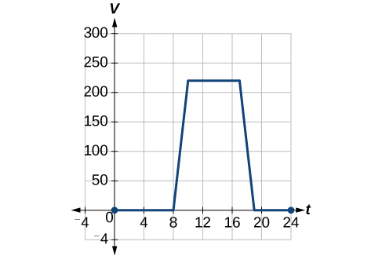{: #Figure_01_05_003}

We can sketch a graph of this new function by adding 20 to each of the output values of the original function. This will have the effect of shifting the graph vertically up, as shown in [[link]](#Figure_01_05_004).

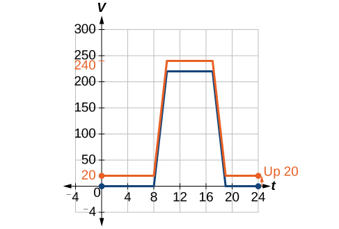{: #Figure_01_05_004}

Notice that in [[link]](#Figure_01_05_004), for each input value, the output value has increased by 20, so if we call the new function<math xmlns="http://www.w3.org/1998/Math/MathML"> <mrow> <mtext> </mtext><mi>S</mi><mrow><mo>(</mo> <mi>t</mi> <mo>)</mo></mrow><mo>,</mo> </mrow> </math>

we could write

<math xmlns="http://www.w3.org/1998/Math/MathML" display="block"> <mrow> <mi>S</mi><mo stretchy="false">(</mo><mi>t</mi><mo stretchy="false">)</mo><mo>=</mo><mi>V</mi><mo stretchy="false">(</mo><mi>t</mi><mo stretchy="false">)</mo><mo>+</mo><mn>20</mn> </mrow> </math>

This notation tells us that, for any value of<math xmlns="http://www.w3.org/1998/Math/MathML"> <mrow> <mtext> </mtext><mi>t</mi><mo>,</mo><mi>S</mi><mo stretchy="false">(</mo><mi>t</mi><mo stretchy="false">)</mo><mtext> </mtext> </mrow> </math>

can be found by evaluating the function<math xmlns="http://www.w3.org/1998/Math/MathML"> <mrow> <mtext> </mtext><mi>V</mi><mtext> </mtext> </mrow> </math>

at the same input and then adding 20 to the result. This defines<math xmlns="http://www.w3.org/1998/Math/MathML"> <mrow> <mtext> </mtext><mi>S</mi><mtext> </mtext> </mrow> </math>

as a transformation of the function<math xmlns="http://www.w3.org/1998/Math/MathML"> <mrow> <mtext> </mtext><mi>V</mi><mo>,</mo><mtext> </mtext> </mrow> </math>

in this case a vertical shift up 20 units. Notice that, with a vertical shift, the input values stay the same and only the output values change. See [[link]](#Table_01_05_018).

<table id="Table_01_05_018" summary="Three rows and seven columns. The first row is labeled, &#x201C;t&#x201D;, the second is labeled, &#x201C;V(t)&#x201D;, and the third is labeled, &#x201C;S(t)&#x201D;. The values of t are 0, 8, 10, 17, 19, and 24. So for V(0)=0, V(8)=0, V(10)=220, V(17)=220, V(19)=0, and V(24)=0. For S(0)=20, S(8)=20, S(10)=240, S(17)=240, S(19)=20, and S(24)=20."><colgroup><col /><col width="60" align="center" /><col width="60" align="center" /><col width="60" align="center" /><col width="60" align="center" /><col width="60" align="center" /><col width="60" align="center" /></colgroup><tbody>
<tr>
<td data-align="center"><strong><math xmlns="http://www.w3.org/1998/Math/MathML">
 <mi>t</mi>
</math></strong></td>
 <td>0</td>
 <td>8</td>
 <td>10</td>
 <td>17</td>
 <td>19</td>
 <td>24</td>
</tr>
<tr>
 <td data-align="center"><strong><math xmlns="http://www.w3.org/1998/Math/MathML">
 <mrow>
  <mi>V</mi><mo stretchy="false">(</mo><mi>t</mi><mo stretchy="false">)</mo>
 </mrow>
</math></strong></td>
 <td>0</td>
 <td>0</td>
 <td>220</td>
 <td>220</td>
 <td>0</td>
 <td>0</td>
</tr>
<tr>
 <td data-align="center"><strong><math xmlns="http://www.w3.org/1998/Math/MathML">
 <mrow>
  <mi>S</mi><mrow><mo>(</mo>
   <mi>t</mi>
  <mo>)</mo></mrow>
 </mrow>
</math></strong></td>
 <td>20</td>
 <td>20</td>
 <td>240</td>
 <td>240</td>
 <td>20</td>
 <td>20</td>
</tr>
</tbody></table>

**Given a tabular function, create a new row to represent a vertical shift.**

1.  Identify the output row or column.
2.  Determine the **magnitude**{: data-type="term" .no-emphasis} of the shift.
3.  Add the shift to the value in each output cell. Add a positive value for up or a negative value for down.
{: data-number-style="arabic"}

Shifting a Tabular Function Vertically

A function<math xmlns="http://www.w3.org/1998/Math/MathML"> <mrow> <mtext> </mtext><mi>f</mi><mrow><mo>(</mo> <mi>x</mi> <mo>)</mo></mrow><mtext> </mtext> </mrow> </math>

is given in [[link]](#Table_01_05_01). Create a table for the function<math xmlns="http://www.w3.org/1998/Math/MathML"> <mrow> <mtext> </mtext><mi>g</mi><mo stretchy="false">(</mo><mi>x</mi><mo stretchy="false">)</mo><mo>=</mo><mi>f</mi><mo stretchy="false">(</mo><mi>x</mi><mo stretchy="false">)</mo><mo>−</mo><mn>3.</mn> </mrow> </math>

<table id="Table_01_05_01" summary="Two rows and five columns. The first row is labeled, &#x201C;x&#x201D;, and the second is labeled, &#x201C;f(x)&#x201D;. The values of x are 2, 4, 6, and 8. So for f(2)=1, f(4)=3, f(6)=7, and f(8)=11."><colgroup><col /><col width="40" align="left" /><col width="40" align="left" /><col width="40" align="left" /><col width="40" align="left" /></colgroup><tbody>
<tr>
<td data-align="center"><strong><math xmlns="http://www.w3.org/1998/Math/MathML">
 <mi>x</mi>
</math></strong></td>
 <td>2</td>
 <td>4</td>
 <td>6</td>
 <td>8</td>
</tr>

<tr>
 <td data-align="center"><strong><math xmlns="http://www.w3.org/1998/Math/MathML">
 <mrow>
  <mi>f</mi><mo stretchy="false">(</mo><mi>x</mi><mo stretchy="false">)</mo>
 </mrow>
</math></strong></td>
 <td>1</td>
 <td>3</td>
 <td>7</td>
 <td>11</td>
</tr>
</tbody></table>

The formula<math xmlns="http://www.w3.org/1998/Math/MathML"> <mrow> <mtext> </mtext><mi>g</mi><mo stretchy="false">(</mo><mi>x</mi><mo stretchy="false">)</mo><mo>=</mo><mi>f</mi><mo stretchy="false">(</mo><mi>x</mi><mo stretchy="false">)</mo><mo>−</mo><mn>3</mn><mtext> </mtext> </mrow> </math>

tells us that we can find the output values of<math xmlns="http://www.w3.org/1998/Math/MathML"> <mrow> <mtext> </mtext><mi>g</mi><mtext> </mtext> </mrow> </math>

by subtracting 3 from the output values of<math xmlns="http://www.w3.org/1998/Math/MathML"> <mrow> <mtext> </mtext><mi>f</mi><mo>.</mo><mtext> </mtext> </mrow> </math>

For example:

<math xmlns="http://www.w3.org/1998/Math/MathML" display="block"> <mrow> <mtable> <mtr rowalign="center"> <mtd columnalign="right" rowalign="center"> <mrow> <mi>f</mi><mo stretchy="false">(</mo><mn>2</mn><mo stretchy="false">)</mo> </mrow> </mtd> <mtd rowalign="center"> <mo>=</mo> </mtd> <mtd columnalign="left" rowalign="center"> <mn>1</mn> </mtd> <mtd columnalign="left" rowalign="center"> <mrow> <mtext>Given</mtext> </mrow> </mtd> </mtr> <mtr rowalign="center"> <mtd columnalign="right" rowalign="center"> <mrow> <mi>g</mi><mo stretchy="false">(</mo><mi>x</mi><mo stretchy="false">)</mo> </mrow> </mtd> <mtd rowalign="center"> <mo>=</mo> </mtd> <mtd columnalign="left" rowalign="center"> <mrow> <mi>f</mi><mo stretchy="false">(</mo><mi>x</mi><mo stretchy="false">)</mo><mo>−</mo><mn>3</mn> </mrow> </mtd> <mtd columnalign="left" rowalign="center"> <mrow> <mtext>Given transformation</mtext> </mrow> </mtd> </mtr> <mtr rowalign="center"> <mtd columnalign="right" rowalign="center"> <mrow> <mi>g</mi><mo stretchy="false">(</mo><mn>2</mn><mo stretchy="false">)</mo> </mrow> </mtd> <mtd rowalign="center"> <mo>=</mo> </mtd> <mtd columnalign="left" rowalign="center"> <mrow> <mi>f</mi><mo stretchy="false">(</mo><mn>2</mn><mo stretchy="false">)</mo><mo>−</mo><mn>3</mn> </mrow> </mtd> <mtd rowalign="center" /> </mtr> <mtr rowalign="center"> <mtd rowalign="center" /> <mtd rowalign="center"> <mo>=</mo> </mtd> <mtd columnalign="left" rowalign="center"> <mrow> <mn>1</mn><mo>−</mo><mn>3</mn> </mrow> </mtd> <mtd rowalign="center" /> </mtr> <mtr rowalign="center"> <mtd rowalign="center" /> <mtd rowalign="center"> <mo>=</mo> </mtd> <mtd columnalign="left" rowalign="center"> <mrow> <mo>−</mo><mn>2</mn> </mrow> </mtd> <mtd rowalign="center" /> </mtr> </mtable> </mrow> </math>

Subtracting 3 from each<math xmlns="http://www.w3.org/1998/Math/MathML"> <mrow> <mtext> </mtext><mi>f</mi><mrow><mo>(</mo> <mi>x</mi> <mo>)</mo></mrow><mtext> </mtext> </mrow> </math>

value, we can complete a table of values for<math xmlns="http://www.w3.org/1998/Math/MathML"> <mrow> <mtext> </mtext><mi>g</mi><mrow><mo>(</mo> <mi>x</mi> <mo>)</mo></mrow><mtext> </mtext> </mrow> </math>

as shown in [[link]](#Table_01_05_02).

<table id="Table_01_05_02" summary="Three rows and five columns. The first row is labeled, &#x201C;x&#x201D;, the second is labeled, &#x201C;f(x)&#x201D;, and the third is labeled, &#x201C;g(x)&#x201D;. The values of x are 2, 4, 6, and 8. So for f(2)=1, f(4)=3, f(6)=7, and f(8)=11. For g(2)=-2, g(4)=0, g(6)=4, and g(8)=8."><colgroup><col width="40" /><col width="40" /><col width="40" /><col width="40" /><col width="40" /></colgroup><tbody>
<tr>
<td data-align="center"><strong><math xmlns="http://www.w3.org/1998/Math/MathML">
 <mi>x</mi>
</math></strong></td>
 <td data-align="center">2</td>
 <td data-align="center">4</td>
 <td data-align="center">6</td>
 <td data-align="center">8</td>
</tr>
<tr>
 <td data-align="center"><strong><math xmlns="http://www.w3.org/1998/Math/MathML">
 <mrow>
  <mi>f</mi><mo stretchy="false">(</mo><mi>x</mi><mo stretchy="false">)</mo>
 </mrow>
</math></strong></td>
 <td data-align="center">1</td>
 <td data-align="center">3</td>
 <td data-align="center">7</td>
 <td data-align="center">11</td>
</tr>
<tr>
 <td data-align="center"><strong><math xmlns="http://www.w3.org/1998/Math/MathML">
 <mrow>
  <mi>g</mi><mo stretchy="false">(</mo><mi>x</mi><mo stretchy="false">)</mo>
 </mrow>
</math></strong></td>
 <td data-align="center">−2</td>
 <td data-align="center">0</td>
 <td data-align="center">4</td>
 <td data-align="center">8</td>
</tr>
</tbody></table>

Analysis

As with the earlier vertical shift, notice the input values stay the same and only the output values change.

The function<math xmlns="http://www.w3.org/1998/Math/MathML"> <mrow> <mtext> </mtext><mi>h</mi><mo stretchy="false">(</mo><mi>t</mi><mo stretchy="false">)</mo><mo>=</mo><mo>−</mo><mn>4.9</mn><msup> <mi>t</mi> <mn>2</mn> </msup> <mo>+</mo><mn>30</mn><mi>t</mi><mtext> </mtext> </mrow> </math>

gives the height<math xmlns="http://www.w3.org/1998/Math/MathML"> <mrow> <mtext> </mtext><mi>h</mi><mtext> </mtext> </mrow> </math>

of a ball (in meters) thrown upward from the ground after<math xmlns="http://www.w3.org/1998/Math/MathML"> <mrow> <mtext> </mtext><mi>t</mi><mtext> </mtext> </mrow> </math>

seconds. Suppose the ball was instead thrown from the top of a 10-m building. Relate this new height function<math xmlns="http://www.w3.org/1998/Math/MathML"> <mrow> <mtext> </mtext><mi>b</mi><mo stretchy="false">(</mo><mi>t</mi><mo stretchy="false">)</mo><mtext> </mtext> </mrow> </math>

to<math xmlns="http://www.w3.org/1998/Math/MathML"> <mrow> <mtext> </mtext><mi>h</mi><mo stretchy="false">(</mo><mi>t</mi><mo stretchy="false">)</mo><mo>,</mo><mtext> </mtext> </mrow> </math>

and then find a formula for<math xmlns="http://www.w3.org/1998/Math/MathML"> <mrow> <mtext> </mtext><mi>b</mi><mo stretchy="false">(</mo><mi>t</mi><mo stretchy="false">)</mo><mo>.</mo> </mrow> </math>

<math xmlns="http://www.w3.org/1998/Math/MathML" display="block"> <mrow> <mi>b</mi><mo stretchy="false">(</mo><mi>t</mi><mo stretchy="false">)</mo><mo>=</mo><mi>h</mi><mo stretchy="false">(</mo><mi>t</mi><mo stretchy="false">)</mo><mo>+</mo><mn>10</mn><mo>=</mo><mo>−</mo><mn>4.9</mn><msup> <mi>t</mi> <mn>2</mn> </msup> <mo>+</mo><mn>30</mn><mi>t</mi><mo>+</mo><mn>10</mn> </mrow> </math>

#### Identifying Horizontal Shifts

We just saw that the vertical shift is a change to the output, or outside, of the function. We will now look at how changes to input, on the inside of the function, change its graph and meaning. A shift to the input results in a movement of the graph of the function left or right in what is known as a **horizontal shift**, shown in [\[link\]](#Figure_01_05_005).

 =&#10;    x&#10;    3&#10;   &#10;   .&#x2009;&#10; Note that&#10;  &#10;   &#x2009;h=+1&#x2009;&#10; shifts the graph to the left, that is, towards negative values of&#10;  &#10;   &#x2009;x.&#10; &#10; "){: #Figure_01_05_005}

For example, if<math xmlns="http://www.w3.org/1998/Math/MathML"> <mrow> <mtext> </mtext><mi>f</mi><mo stretchy="false">(</mo><mi>x</mi><mo stretchy="false">)</mo><mo>=</mo><msup> <mi>x</mi> <mn>2</mn> </msup> <mo>,</mo><mtext> </mtext> </mrow> </math>

then<math xmlns="http://www.w3.org/1998/Math/MathML"> <mrow> <mtext> </mtext><mi>g</mi><mo stretchy="false">(</mo><mi>x</mi><mo stretchy="false">)</mo><mo>=</mo><msup> <mrow> <mo stretchy="false">(</mo><mi>x</mi><mo>−</mo><mn>2</mn><mo stretchy="false">)</mo> </mrow> <mn>2</mn> </msup> <mtext> </mtext> </mrow> </math>

is a new function. Each input is reduced by 2 prior to squaring the function. The result is that the graph is shifted 2 units to the right, because we would need to increase the prior input by 2 units to yield the same output value as given in<math xmlns="http://www.w3.org/1998/Math/MathML"> <mrow> <mtext> </mtext><mi>f</mi><mo>.</mo> </mrow> </math>

Horizontal Shift

Given a function<math xmlns="http://www.w3.org/1998/Math/MathML"> <mrow> <mtext> </mtext><mi>f</mi><mo>,</mo><mtext> </mtext> </mrow> </math>

a new function<math xmlns="http://www.w3.org/1998/Math/MathML"> <mrow> <mtext> </mtext><mi>g</mi><mrow><mo>(</mo> <mi>x</mi> <mo>)</mo></mrow><mo>=</mo><mi>f</mi><mrow><mo>(</mo> <mrow> <mi>x</mi><mo>−</mo><mi>h</mi> </mrow> <mo>)</mo></mrow><mo>,</mo><mtext> </mtext> </mrow> </math>

where<math xmlns="http://www.w3.org/1998/Math/MathML"> <mrow> <mtext> </mtext><mi>h</mi><mtext> </mtext> </mrow> </math>

is a constant, is a **horizontal shift**{: data-type="term"} of the function<math xmlns="http://www.w3.org/1998/Math/MathML"> <mrow> <mtext> </mtext><mi>f</mi><mo>.</mo><mtext> </mtext> </mrow> </math>

If<math xmlns="http://www.w3.org/1998/Math/MathML"> <mrow> <mtext> </mtext><mi>h</mi><mtext> </mtext></mrow> </math>

is positive, the graph will shift right. If<math xmlns="http://www.w3.org/1998/Math/MathML"> <mrow> <mtext> </mtext><mi>h</mi><mtext> </mtext> </mrow> </math>

is negative, the graph will shift left.

Adding a Constant to an Input

Returning to our building airflow example from [[link]](#Figure_01_05_003), suppose that in autumn the facilities manager decides that the original venting plan starts too late, and wants to begin the entire venting program 2 hours earlier. Sketch a graph of the new function.

We can set<math xmlns="http://www.w3.org/1998/Math/MathML"> <mrow> <mtext> </mtext><mi>V</mi><mrow><mo>(</mo> <mi>t</mi> <mo>)</mo></mrow><mtext> </mtext> </mrow> </math>

to be the original program and<math xmlns="http://www.w3.org/1998/Math/MathML"> <mrow> <mtext> </mtext><mi>F</mi><mrow><mo>(</mo> <mi>t</mi> <mo>)</mo></mrow><mtext> </mtext> </mrow> </math>

to be the revised program.

<math xmlns="http://www.w3.org/1998/Math/MathML" display="block"> <mrow> <mtable> <mtr> <mtd columnalign="right"> <mrow> <mi>V</mi><mo stretchy="false">(</mo><mi>t</mi><mo stretchy="false">)</mo> </mrow> </mtd> <mtd> <mo>=</mo> </mtd> <mtd columnalign="left"> <mrow> <mtext>the original venting plan</mtext> </mrow> </mtd> </mtr> <mtr> <mtd columnalign="right"> <mrow> <mi>F</mi><mo stretchy="false">(</mo><mi>t</mi><mo stretchy="false">)</mo> </mrow> </mtd> <mtd> <mo>=</mo> </mtd> <mtd columnalign="left"> <mrow> <mtext>starting 2 hrs sooner</mtext> </mrow> </mtd> </mtr> </mtable> </mrow> </math>

In the new graph, at each time, the airflow is the same as the original function<math xmlns="http://www.w3.org/1998/Math/MathML"> <mrow> <mtext> </mtext><mi>V</mi><mtext> </mtext> </mrow> </math>

was 2 hours later. For example, in the original function<math xmlns="http://www.w3.org/1998/Math/MathML"> <mrow> <mtext> </mtext><mi>V</mi><mo>,</mo><mtext> </mtext> </mrow> </math>

the airflow starts to change at 8 a.m., whereas for the function<math xmlns="http://www.w3.org/1998/Math/MathML"> <mrow> <mtext> </mtext><mi>F</mi><mo>,</mo><mtext> </mtext> </mrow> </math>

the airflow starts to change at 6 a.m. The comparable function values are<math xmlns="http://www.w3.org/1998/Math/MathML"> <mrow> <mtext> </mtext><mi>V</mi><mo stretchy="false">(</mo><mn>8</mn><mo stretchy="false">)</mo><mo>=</mo><mi>F</mi><mo stretchy="false">(</mo><mn>6</mn><mo stretchy="false">)</mo><mo>.</mo><mtext> </mtext> </mrow> </math>

See [[link]](#Figure_01_05_006). Notice also that the vents first opened to<math xmlns="http://www.w3.org/1998/Math/MathML"> <mrow> <mtext> </mtext><mn>220</mn><msup> <mrow> <mtext> ft</mtext> </mrow> <mn>2</mn> </msup> <mtext> </mtext> </mrow> </math>

at 10 a.m. under the original plan, while under the new plan the vents reach<math xmlns="http://www.w3.org/1998/Math/MathML"> <mrow> <mtext> </mtext><mn>220</mn><msup> <mrow> <mtext> ft</mtext> </mrow> <mtext>2</mtext> </msup> <mtext> </mtext> </mrow> </math>

at * * *
{: data-type="newline"}

8 a.m., so<math xmlns="http://www.w3.org/1998/Math/MathML"> <mrow> <mtext> </mtext><mi>V</mi><mo stretchy="false">(</mo><mn>10</mn><mo stretchy="false">)</mo><mo>=</mo><mi>F</mi><mo stretchy="false">(</mo><mn>8</mn><mo stretchy="false">)</mo><mo>.</mo> </mrow> </math>

In both cases, we see that, because<math xmlns="http://www.w3.org/1998/Math/MathML"> <mrow> <mtext> </mtext><mi>F</mi><mrow><mo>(</mo> <mi>t</mi> <mo>)</mo></mrow><mtext> </mtext> </mrow> </math>

starts 2 hours sooner,<math xmlns="http://www.w3.org/1998/Math/MathML"> <mrow> <mtext> </mtext><mi>h</mi><mo>=</mo><mo>−</mo><mn>2.</mn><mtext> </mtext> </mrow> </math>

That means that the same output values are reached when<math xmlns="http://www.w3.org/1998/Math/MathML"> <mrow> <mtext> </mtext><mi>F</mi><mo stretchy="false">(</mo><mi>t</mi><mo stretchy="false">)</mo><mo>=</mo><mi>V</mi><mo stretchy="false">(</mo><mi>t</mi><mo>−</mo><mrow><mo>(</mo> <mrow> <mo>−</mo><mn>2</mn> </mrow> <mo>)</mo></mrow><mo stretchy="false">)</mo><mo>=</mo><mi>V</mi><mrow><mo>(</mo> <mrow> <mi>t</mi><mo>+</mo><mn>2</mn> </mrow> <mo>)</mo></mrow><mo>.</mo> </mrow> </math>

{: #Figure_01_05_006}

Analysis

Note that<math xmlns="http://www.w3.org/1998/Math/MathML"> <mrow> <mtext> </mtext><mi>V</mi><mo stretchy="false">(</mo><mi>t</mi><mo>+</mo><mn>2</mn><mo stretchy="false">)</mo><mtext> </mtext> </mrow> </math>

has the effect of shifting the graph to the *left*.

Horizontal changes or “inside changes” affect the domain of a function (the input) instead of the range and often seem counterintuitive. The new function<math xmlns="http://www.w3.org/1998/Math/MathML"> <mrow> <mtext> </mtext><mi>F</mi><mrow><mo>(</mo> <mi>t</mi> <mo>)</mo></mrow><mtext> </mtext> </mrow> </math>

uses the same outputs as<math xmlns="http://www.w3.org/1998/Math/MathML"> <mrow> <mtext> </mtext><mi>V</mi><mrow><mo>(</mo> <mi>t</mi> <mo>)</mo></mrow><mo>,</mo><mtext> </mtext> </mrow> </math>

but matches those outputs to inputs 2 hours earlier than those of<math xmlns="http://www.w3.org/1998/Math/MathML"> <mrow> <mtext> </mtext><mi>V</mi><mrow><mo>(</mo> <mi>t</mi> <mo>)</mo></mrow><mo>.</mo><mtext> </mtext> </mrow> </math>

Said another way, we must add 2 hours to the input of<math xmlns="http://www.w3.org/1998/Math/MathML"> <mrow> <mtext> </mtext><mi>V</mi><mtext> </mtext> </mrow> </math>

to find the corresponding output for<math xmlns="http://www.w3.org/1998/Math/MathML"> <mrow> <mi>F</mi><mo>:</mo><mi>F</mi><mo stretchy="false">(</mo><mi>t</mi><mo stretchy="false">)</mo><mo>=</mo><mi>V</mi><mo stretchy="false">(</mo><mi>t</mi><mo>+</mo><mn>2</mn><mo stretchy="false">)</mo><mo>.</mo> </mrow> </math>

**Given a tabular function, create a new row to represent a horizontal shift.**

1.  Identify the input row or column.
2.  Determine the magnitude of the shift.
3.  Add the shift to the value in each input cell.
{: data-number-style="arabic"}

Shifting a Tabular Function Horizontally

A function<math xmlns="http://www.w3.org/1998/Math/MathML"> <mrow> <mtext> </mtext><mi>f</mi><mo stretchy="false">(</mo><mi>x</mi><mo stretchy="false">)</mo><mtext> </mtext></mrow> </math>

is given in [[link]](#Table_01_05_03). Create a table for the function<math xmlns="http://www.w3.org/1998/Math/MathML"> <mrow> <mtext> </mtext><mi>g</mi><mo stretchy="false">(</mo><mi>x</mi><mo stretchy="false">)</mo><mo>=</mo><mi>f</mi><mo stretchy="false">(</mo><mi>x</mi><mo>−</mo><mn>3</mn><mo stretchy="false">)</mo><mo>.</mo> </mrow> </math>

<table id="Table_01_05_03" summary="Two rows and five columns. The first row is labeled, &#x201C;x&#x201D;, and the second is labeled, &#x201C;f(x)&#x201D;. The values of x are 2, 4, 6, and 8. So for f(2)=1, f(4)=3, f(6)=7, and f(8)=11."><colgroup><col width="40" /><col width="40" /><col width="40" /><col width="40" /><col width="40" /></colgroup><tbody>
    <tr>
     <td data-align="center"><strong><math xmlns="http://www.w3.org/1998/Math/MathML">
      <mi>x</mi>
     </math></strong>
     </td>
     <td data-align="center">2</td>
     <td data-align="center">4</td>
     <td data-align="center">6</td>
     <td data-align="center">8</td>
    </tr>

    <tr>
     <td data-align="center"><strong><math xmlns="http://www.w3.org/1998/Math/MathML">
      <mrow>
       <mi>f</mi><mo stretchy="false">(</mo><mi>x</mi><mo stretchy="false">)</mo></mrow>
     </math></strong>
     </td>
     <td data-align="center">1</td>
     <td data-align="center">3</td>
     <td data-align="center">7</td>
     <td data-align="center">11</td>
    </tr>
   </tbody></table>

The formula<math xmlns="http://www.w3.org/1998/Math/MathML"> <mrow> <mtext> </mtext><mi>g</mi><mo stretchy="false">(</mo><mi>x</mi><mo stretchy="false">)</mo><mo>=</mo><mi>f</mi><mo stretchy="false">(</mo><mi>x</mi><mo>−</mo><mn>3</mn><mo stretchy="false">)</mo><mtext> </mtext> </mrow> </math>

tells us that the output values of<math xmlns="http://www.w3.org/1998/Math/MathML"> <mrow> <mtext> </mtext><mi>g</mi><mtext> </mtext></mrow> </math>

are the same as the output value of<math xmlns="http://www.w3.org/1998/Math/MathML"> <mrow> <mtext> </mtext><mi>f</mi><mtext> </mtext></mrow> </math>

 when the input value is 3 less than the original value. For example, we know that<math xmlns="http://www.w3.org/1998/Math/MathML"> <mrow> <mtext> </mtext><mi>f</mi><mo stretchy="false">(</mo><mn>2</mn><mo stretchy="false">)</mo><mo>=</mo><mn>1.</mn><mtext> </mtext></mrow> </math>

To get the same output from the function<math xmlns="http://www.w3.org/1998/Math/MathML"> <mrow> <mtext> </mtext><mi>g</mi><mo>,</mo><mtext> </mtext></mrow> </math>

we will need an input value that is 3 *larger*. We input a value that is 3 larger for<math xmlns="http://www.w3.org/1998/Math/MathML"> <mrow> <mtext> </mtext><mi>g</mi><mo stretchy="false">(</mo><mi>x</mi><mo stretchy="false">)</mo><mtext> </mtext></mrow> </math>

because the function takes 3 away before evaluating the function<math xmlns="http://www.w3.org/1998/Math/MathML"> <mrow> <mtext> </mtext><mi>f</mi><mo>.</mo></mrow> </math>

<math xmlns="http://www.w3.org/1998/Math/MathML" display="block"> <mrow> <mtable> <mtr rowalign="center"> <mtd columnalign="right" rowalign="center"> <mrow> <mi>g</mi><mo stretchy="false">(</mo><mn>5</mn><mo stretchy="false">)</mo> </mrow> </mtd> <mtd rowalign="center"> <mo>=</mo> </mtd> <mtd columnalign="left" rowalign="center"> <mrow> <mi>f</mi><mo stretchy="false">(</mo><mn>5</mn><mo>−</mo><mn>3</mn><mo stretchy="false">)</mo> </mrow> </mtd> </mtr> <mtr rowalign="center"> <mtd rowalign="center" /> <mtd rowalign="center"> <mo>=</mo> </mtd> <mtd columnalign="left" rowalign="center"> <mrow> <mi>f</mi><mo stretchy="false">(</mo><mn>2</mn><mo stretchy="false">)</mo> </mrow> </mtd> </mtr> <mtr rowalign="center"> <mtd rowalign="center" /> <mtd rowalign="center"> <mo>=</mo> </mtd> <mtd columnalign="left" rowalign="center"> <mn>1</mn> </mtd> </mtr> </mtable> </mrow> </math>

We continue with the other values to create [[link]](#Table_01_05_04).

<table id="Table_01_05_04" summary="Three rows and five columns. The first row is labeled, &#x201C;x&#x201D;, the second is labeled, &#x201C;f(x)&#x201D;, and the third is labeled, &#x201C;g(x)&#x201D;. The values of x are 2, 4, 6, and 8. So for f(2)=1, f(4)=3, f(6)=7, and f(8)=11. For g(2)=1, g(4)=3, g(6)=7, and g(8)=11."><colgroup><col /><col width="40" /><col width="40" /><col width="40" /><col width="40" /></colgroup><tbody>
    <tr>
     <td data-align="left"><strong><math xmlns="http://www.w3.org/1998/Math/MathML">
      <mi>x</mi>
     </math></strong>
     </td>
     <td data-align="left">5</td>
     <td data-align="left">7</td>
     <td data-align="left">9</td>
     <td data-align="left">11</td>
    </tr>

    <tr>
     <td data-align="left"><strong><math xmlns="http://www.w3.org/1998/Math/MathML">
      <mrow>
       <mi>x</mi><mo>−</mo><mn>3</mn></mrow>
     </math></strong>
     </td>
     <td data-align="left">2</td>
     <td data-align="left">4</td>
     <td data-align="left">6</td>
     <td data-align="left">8</td>
    </tr>
    <tr>
     <td data-align="left"><strong><math xmlns="http://www.w3.org/1998/Math/MathML">
      <mrow>
       <mi>f</mi><mo stretchy="false">(</mo><mi>x</mi><mo>–</mo><mn>3</mn><mo stretchy="false">)</mo></mrow>
     </math></strong>
     </td>
     <td data-align="left">1</td>
     <td data-align="left">3</td>
     <td data-align="left">7</td>
     <td data-align="left">11</td>
    </tr>
    <tr>
     <td><strong><math xmlns="http://www.w3.org/1998/Math/MathML">
      <mrow>
       <mi>g</mi><mo stretchy="false">(</mo><mi>x</mi><mo stretchy="false">)</mo></mrow>
     </math></strong>
     </td>
     <td data-align="left">1</td>
     <td data-align="left">3</td>
     <td data-align="left">7</td>
     <td data-align="left">11</td>
    </tr>
   </tbody></table>
The result is that the function<math xmlns="http://www.w3.org/1998/Math/MathML"> <mrow> <mtext> </mtext><mi>g</mi><mo stretchy="false">(</mo><mi>x</mi><mo stretchy="false">)</mo><mtext> </mtext></mrow> </math>

has been shifted to the right by 3. Notice the output values for<math xmlns="http://www.w3.org/1998/Math/MathML"> <mrow> <mtext> </mtext><mi>g</mi><mo stretchy="false">(</mo><mi>x</mi><mo stretchy="false">)</mo><mtext> </mtext></mrow> </math>

remain the same as the output values for<math xmlns="http://www.w3.org/1998/Math/MathML"> <mrow> <mtext> </mtext><mi>f</mi><mo stretchy="false">(</mo><mi>x</mi><mo stretchy="false">)</mo><mo>,</mo><mtext> </mtext></mrow> </math>

but the corresponding input values,<math xmlns="http://www.w3.org/1998/Math/MathML"> <mrow> <mtext> </mtext><mi>x</mi><mo>,</mo><mtext> </mtext></mrow> </math>

have shifted to the right by 3. Specifically, 2 shifted to 5, 4 shifted to 7, 6 shifted to 9, and 8 shifted to 11.

Analysis

[[link]](#Figure_01_05_007) represents both of the functions. We can see the horizontal shift in each point.

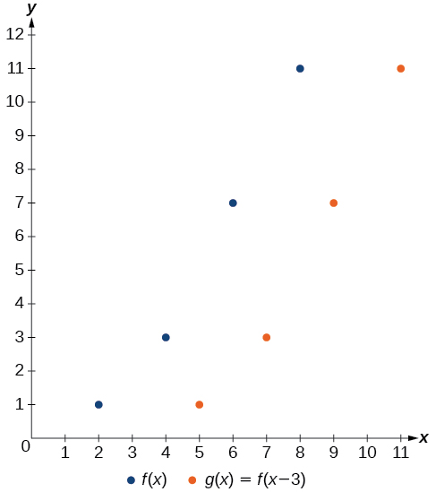{: #Figure_01_05_007}

Identifying a Horizontal Shift of a Toolkit Function

[[link]](#Figure_01_05_008) represents a transformation of the toolkit function<math xmlns="http://www.w3.org/1998/Math/MathML"> <mrow> <mtext> </mtext><mi>f</mi><mo stretchy="false">(</mo><mi>x</mi><mo stretchy="false">)</mo><mo>=</mo><msup> <mi>x</mi> <mn>2</mn> </msup> <mo>.</mo><mtext> </mtext></mrow> </math>

Relate this new function<math xmlns="http://www.w3.org/1998/Math/MathML"> <mrow> <mtext> </mtext><mi>g</mi><mo stretchy="false">(</mo><mi>x</mi><mo stretchy="false">)</mo><mtext> </mtext></mrow> </math>

to<math xmlns="http://www.w3.org/1998/Math/MathML"> <mrow> <mtext> </mtext><mi>f</mi><mo stretchy="false">(</mo><mi>x</mi><mo stretchy="false">)</mo><mo>,</mo><mtext> </mtext></mrow> </math>

and then find a formula for<math xmlns="http://www.w3.org/1998/Math/MathML"> <mrow> <mtext> </mtext><mi>g</mi><mo stretchy="false">(</mo><mi>x</mi><mo stretchy="false">)</mo><mo>.</mo></mrow> </math>

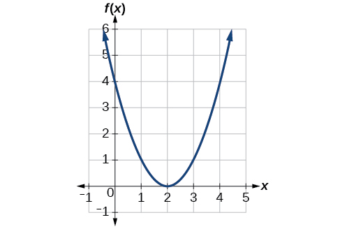{: #Figure_01_05_008}

Notice that the graph is identical in shape to the<math xmlns="http://www.w3.org/1998/Math/MathML"> <mrow> <mtext> </mtext><mi>f</mi><mo stretchy="false">(</mo><mi>x</mi><mo stretchy="false">)</mo><mo>=</mo><msup> <mi>x</mi> <mn>2</mn> </msup> <mtext> </mtext></mrow> </math>

function, but the *x-*values are shifted to the right 2 units. The vertex used to be at (0,0), but now the vertex is at (2,0). The graph is the basic quadratic function shifted 2 units to the right, so

<math xmlns="http://www.w3.org/1998/Math/MathML" display="block"> <mrow> <mi>g</mi><mo stretchy="false">(</mo><mi>x</mi><mo stretchy="false">)</mo><mo>=</mo><mi>f</mi><mo stretchy="false">(</mo><mi>x</mi><mo>−</mo><mn>2</mn><mo stretchy="false">)</mo> </mrow> </math>

Notice how we must input the value<math xmlns="http://www.w3.org/1998/Math/MathML"> <mrow> <mtext> </mtext><mi>x</mi><mo>=</mo><mn>2</mn><mtext> </mtext></mrow> </math>

to get the output value<math xmlns="http://www.w3.org/1998/Math/MathML"> <mrow> <mtext> </mtext><mi>y</mi><mo>=</mo><mn>0</mn><mo>;</mo><mtext> </mtext></mrow> </math>

the<em> x</em>-values must be 2 units larger because of the shift to the right by 2 units. We can then use the definition of the<math xmlns="http://www.w3.org/1998/Math/MathML"> <mrow> <mtext> </mtext><mi>f</mi><mo stretchy="false">(</mo><mi>x</mi><mo stretchy="false">)</mo><mtext> </mtext></mrow> </math>

function to write a formula for<math xmlns="http://www.w3.org/1998/Math/MathML"> <mrow> <mtext> </mtext><mi>g</mi><mo stretchy="false">(</mo><mi>x</mi><mo stretchy="false">)</mo><mtext> </mtext></mrow> </math>

by evaluating<math xmlns="http://www.w3.org/1998/Math/MathML"> <mrow> <mtext> </mtext><mi>f</mi><mo stretchy="false">(</mo><mi>x</mi><mo>−</mo><mn>2</mn><mo stretchy="false">)</mo><mo>.</mo> </mrow> </math>

<math xmlns="http://www.w3.org/1998/Math/MathML" display="block"> <mrow> <mtable> <mtr> <mtd columnalign="right"> <mrow> <mi>f</mi><mo stretchy="false">(</mo><mi>x</mi><mo stretchy="false">)</mo> </mrow> </mtd> <mtd> <mo>=</mo> </mtd> <mtd columnalign="left"> <mrow> <msup> <mi>x</mi> <mn>2</mn> </msup> </mrow> </mtd> </mtr> <mtr> <mtd columnalign="right"> <mrow> <mi>g</mi><mo stretchy="false">(</mo><mi>x</mi><mo stretchy="false">)</mo> </mrow> </mtd> <mtd> <mo>=</mo> </mtd> <mtd columnalign="left"> <mrow> <mi>f</mi><mo stretchy="false">(</mo><mi>x</mi><mo>−</mo><mn>2</mn><mo stretchy="false">)</mo> </mrow> </mtd> </mtr> <mtr> <mtd columnalign="right"> <mrow> <mi>g</mi><mo stretchy="false">(</mo><mi>x</mi><mo stretchy="false">)</mo> </mrow> </mtd> <mtd> <mo>=</mo> </mtd> <mtd columnalign="left"> <mrow> <mi>f</mi><mo stretchy="false">(</mo><mi>x</mi><mo>−</mo><mn>2</mn><mo stretchy="false">)</mo><mo>=</mo><msup> <mrow> <mo stretchy="false">(</mo><mi>x</mi><mo>−</mo><mn>2</mn><mo stretchy="false">)</mo> </mrow> <mn>2</mn> </msup> </mrow> </mtd> </mtr> </mtable> </mrow> </math>

Analysis

To determine whether the shift is<math xmlns="http://www.w3.org/1998/Math/MathML"> <mrow> <mtext> </mtext><mo>+</mo><mn>2</mn><mtext> </mtext></mrow> </math>

or<math xmlns="http://www.w3.org/1998/Math/MathML"> <mrow> <mtext> </mtext><mo>−</mo><mn>2</mn></mrow> </math>

, consider a single reference point on the graph. For a quadratic, looking at the vertex point is convenient. In the original function,<math xmlns="http://www.w3.org/1998/Math/MathML"> <mrow> <mtext> </mtext><mi>f</mi><mo stretchy="false">(</mo><mn>0</mn><mo stretchy="false">)</mo><mo>=</mo><mn>0.</mn><mtext> </mtext></mrow> </math>

In our shifted function,<math xmlns="http://www.w3.org/1998/Math/MathML"> <mrow> <mtext> </mtext><mi>g</mi><mo stretchy="false">(</mo><mn>2</mn><mo stretchy="false">)</mo><mo>=</mo><mn>0.</mn><mtext> </mtext> </mrow> </math>

To obtain the output value of 0 from the function<math xmlns="http://www.w3.org/1998/Math/MathML"> <mrow> <mtext> </mtext><mi>f</mi><mo>,</mo><mtext> </mtext></mrow> </math>

we need to decide whether a plus or a minus sign will work to satisfy<math xmlns="http://www.w3.org/1998/Math/MathML"> <mrow> <mtext> </mtext><mi>g</mi><mo stretchy="false">(</mo><mn>2</mn><mo stretchy="false">)</mo><mo>=</mo><mi>f</mi><mo stretchy="false">(</mo><mi>x</mi><mo>−</mo><mn>2</mn><mo stretchy="false">)</mo><mo>=</mo><mi>f</mi><mo stretchy="false">(</mo><mn>0</mn><mo stretchy="false">)</mo><mo>=</mo><mn>0.</mn><mtext> </mtext> </mrow> </math>

For this to work, we will need to *subtract* 2 units from our input values.

Interpreting Horizontal versus Vertical Shifts

The function<math xmlns="http://www.w3.org/1998/Math/MathML"> <mrow> <mtext> </mtext><mi>G</mi><mo stretchy="false">(</mo><mi>m</mi><mo stretchy="false">)</mo><mtext> </mtext></mrow> </math>

gives the number of gallons of gas required to drive<math xmlns="http://www.w3.org/1998/Math/MathML"> <mrow> <mtext> </mtext><mi>m</mi><mtext> </mtext></mrow> </math>

miles. Interpret<math xmlns="http://www.w3.org/1998/Math/MathML"> <mrow> <mtext> </mtext><mi>G</mi><mo stretchy="false">(</mo><mi>m</mi><mo stretchy="false">)</mo><mo>+</mo><mn>10</mn><mtext> </mtext></mrow> </math>

and<math xmlns="http://www.w3.org/1998/Math/MathML"> <mrow> <mtext> </mtext><mi>G</mi><mo stretchy="false">(</mo><mi>m</mi><mo>+</mo><mn>10</mn><mo stretchy="false">)</mo><mo>.</mo></mrow> </math>

<math xmlns="http://www.w3.org/1998/Math/MathML"> <mrow> <mi>G</mi><mo stretchy="false">(</mo><mi>m</mi><mo stretchy="false">)</mo><mo>+</mo><mn>10</mn><mtext> </mtext></mrow> </math>

can be interpreted as adding 10 to the output, gallons. This is the gas required to drive<math xmlns="http://www.w3.org/1998/Math/MathML"> <mrow> <mtext> </mtext><mi>m</mi><mtext> </mtext></mrow> </math>

miles, plus another 10 gallons of gas. The graph would indicate a vertical shift.

<math xmlns="http://www.w3.org/1998/Math/MathML"> <mrow> <mi>G</mi><mo stretchy="false">(</mo><mi>m</mi><mo>+</mo><mn>10</mn><mo stretchy="false">)</mo><mtext> </mtext></mrow> </math>

can be interpreted as adding 10 to the input, miles. So this is the number of gallons of gas required to drive 10 miles more than<math xmlns="http://www.w3.org/1998/Math/MathML"> <mrow> <mtext> </mtext><mi>m</mi><mtext> </mtext></mrow> </math>

miles. The graph would indicate a horizontal shift.

Given the function<math xmlns="http://www.w3.org/1998/Math/MathML"> <mrow> <mtext> </mtext><mi>f</mi><mo stretchy="false">(</mo><mi>x</mi><mo stretchy="false">)</mo><mo>=</mo><msqrt> <mi>x</mi> </msqrt> <mo>,</mo><mtext> </mtext></mrow> </math>

graph the original function<math xmlns="http://www.w3.org/1998/Math/MathML"> <mrow> <mtext> </mtext><mi>f</mi><mo stretchy="false">(</mo><mi>x</mi><mo stretchy="false">)</mo><mtext> </mtext></mrow> </math>

and the transformation<math xmlns="http://www.w3.org/1998/Math/MathML"> <mrow> <mtext> </mtext><mi>g</mi><mo stretchy="false">(</mo><mi>x</mi><mo stretchy="false">)</mo><mo>=</mo><mi>f</mi><mo stretchy="false">(</mo><mi>x</mi><mo>+</mo><mn>2</mn><mo stretchy="false">)</mo><mtext> </mtext></mrow> </math>

on the same axes. Is this a horizontal or a vertical shift? Which way is the graph shifted and by how many units?

The graphs of<math xmlns="http://www.w3.org/1998/Math/MathML"> <mrow> <mtext> </mtext><mi>f</mi><mo stretchy="false">(</mo><mi>x</mi><mo stretchy="false">)</mo><mtext> </mtext></mrow> </math>

and<math xmlns="http://www.w3.org/1998/Math/MathML"> <mrow> <mtext> </mtext><mi>g</mi><mo stretchy="false">(</mo><mi>x</mi><mo stretchy="false">)</mo><mtext> </mtext></mrow> </math>

are shown below. The transformation is a horizontal shift. The function is shifted to the left by 2 units.

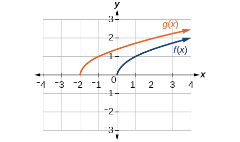

####  Combining Vertical and Horizontal Shifts

Now that we have two transformations, we can combine them. Vertical shifts are outside changes that affect the output (*y*-) values and shift the function up or down. Horizontal shifts are inside changes that affect the input (*x*-) values and shift the function left or right. Combining the two types of shifts will cause the graph of a function to shift up or down *and* left or right.

**Given a function and both a vertical and a horizontal shift, sketch the graph.**

1.  Identify the vertical and horizontal shifts from the formula.
2.  The vertical shift results from a constant added to the output. Move the graph up for a positive constant and down for a negative constant.
3.  The horizontal shift results from a constant added to the input. Move the graph left for a positive constant and right for a negative constant.
4.  Apply the shifts to the graph in either order.
{: data-number-style="arabic"}

Graphing Combined Vertical and Horizontal Shifts

Given<math xmlns="http://www.w3.org/1998/Math/MathML"> <mrow> <mtext> </mtext><mi>f</mi><mo stretchy="false">(</mo><mi>x</mi><mo stretchy="false">)</mo><mo>=</mo><mrow><mo>\|</mo> <mi>x</mi> <mo>\|</mo></mrow><mo>,</mo><mtext> </mtext></mrow> </math>

sketch a graph of<math xmlns="http://www.w3.org/1998/Math/MathML"> <mrow> <mtext> </mtext><mi>h</mi><mo stretchy="false">(</mo><mi>x</mi><mo stretchy="false">)</mo><mo>=</mo><mi>f</mi><mo stretchy="false">(</mo><mi>x</mi><mo>+</mo><mn>1</mn><mo stretchy="false">)</mo><mo>−</mo><mn>3.</mn></mrow> </math>

The function<math xmlns="http://www.w3.org/1998/Math/MathML"> <mrow> <mtext> </mtext><mi>f</mi><mtext> </mtext></mrow> </math>

is our toolkit absolute value function. We know that this graph has a V shape, with the point at the origin. The graph of<math xmlns="http://www.w3.org/1998/Math/MathML"> <mrow> <mtext> </mtext><mi>h</mi><mtext> </mtext></mrow> </math>

has transformed<math xmlns="http://www.w3.org/1998/Math/MathML"> <mrow> <mtext> </mtext><mi>f</mi><mtext> </mtext></mrow> </math>

in two ways:<math xmlns="http://www.w3.org/1998/Math/MathML"> <mrow> <mtext> </mtext><mi>f</mi><mo stretchy="false">(</mo><mi>x</mi><mo>+</mo><mn>1</mn><mo stretchy="false">)</mo><mtext> </mtext></mrow> </math>

is a change on the inside of the function, giving a horizontal shift left by 1, and the subtraction by 3 in<math xmlns="http://www.w3.org/1998/Math/MathML"> <mrow> <mtext> </mtext><mi>f</mi><mo stretchy="false">(</mo><mi>x</mi><mo>+</mo><mn>1</mn><mo stretchy="false">)</mo><mo>−</mo><mn>3</mn><mtext> </mtext></mrow> </math>

is a change to the outside of the function, giving a vertical shift down by 3. The transformation of the graph is illustrated in [[link]](#Figure_01_05_010a).

Let us follow one point of the graph of<math xmlns="http://www.w3.org/1998/Math/MathML"> <mrow> <mtext> </mtext><mi>f</mi><mo stretchy="false">(</mo><mi>x</mi><mo stretchy="false">)</mo><mo>=</mo><mrow><mo>\|</mo> <mi>x</mi> <mo>\|</mo></mrow><mo>.</mo></mrow> </math>

* The point
  <math xmlns="http://www.w3.org/1998/Math/MathML"> <mrow> <mo stretchy="false">(</mo><mn>0</mn><mo>,</mo><mn>0</mn><mo stretchy="false">)</mo> </mrow> </math>
  
  is transformed first by shifting left 1 unit:
  <math xmlns="http://www.w3.org/1998/Math/MathML"> <mrow> <mo stretchy="false">(</mo><mn>0</mn><mo>,</mo><mn>0</mn><mo stretchy="false">)</mo><mo stretchy="false">→</mo><mo stretchy="false">(</mo><mn>−1</mn><mo>,</mo><mn>0</mn><mo stretchy="false">)</mo> </mrow> </math>

* The point
  <math xmlns="http://www.w3.org/1998/Math/MathML"> <mrow> <mo stretchy="false">(</mo><mn>−1</mn><mo>,</mo><mn>0</mn><mo stretchy="false">)</mo> </mrow> </math>
  
  is transformed next by shifting down 3 units:
  <math xmlns="http://www.w3.org/1998/Math/MathML"> <mrow> <mo stretchy="false">(</mo><mn>−1</mn><mo>,</mo><mn>0</mn><mo stretchy="false">)</mo><mo stretchy="false">→</mo><mo stretchy="false">(</mo><mn>−1</mn><mo>,</mo><mn>−3</mn><mo stretchy="false">)</mo> </mrow> </math>

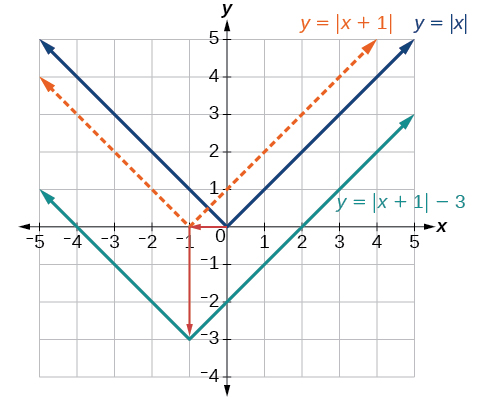{: #Figure_01_05_010a}

[[link]](#Figure_01_05_010b) shows the graph of<math xmlns="http://www.w3.org/1998/Math/MathML"> <mrow> <mtext> </mtext><mi>h</mi><mo>.</mo></mrow> </math>

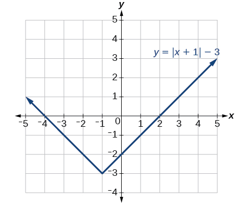{: #Figure_01_05_010b}

Given<math xmlns="http://www.w3.org/1998/Math/MathML"> <mrow> <mtext> </mtext><mi>f</mi><mo stretchy="false">(</mo><mi>x</mi><mo stretchy="false">)</mo><mo>=</mo><mrow><mo>\|</mo> <mi>x</mi> <mo>\|</mo></mrow><mo>,</mo><mtext> </mtext></mrow> </math>

sketch a graph of<math xmlns="http://www.w3.org/1998/Math/MathML"> <mrow> <mtext> </mtext><mi>h</mi><mo stretchy="false">(</mo><mi>x</mi><mo stretchy="false">)</mo><mo>=</mo><mi>f</mi><mo stretchy="false">(</mo><mi>x</mi><mo>−</mo><mn>2</mn><mo stretchy="false">)</mo><mo>+</mo><mn>4.</mn> </mrow> </math>

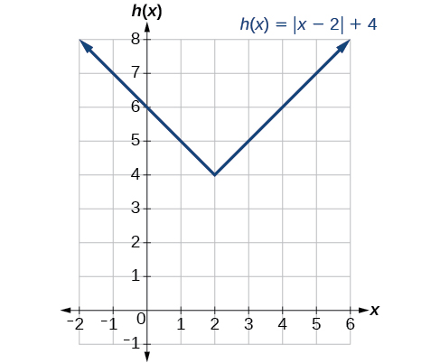

Identifying Combined Vertical and Horizontal Shifts

Write a formula for the graph shown in [[link]](#Figure_01_05_012), which is a transformation of the toolkit square root function.

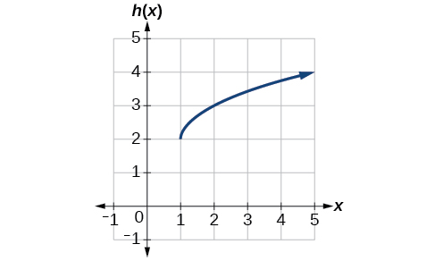{: #Figure_01_05_012}

The graph of the toolkit function starts at the origin, so this graph has been shifted 1 to the right and up 2. In function notation, we could write that as

<math xmlns="http://www.w3.org/1998/Math/MathML" display="block"> <mrow> <mi>h</mi><mo stretchy="false">(</mo><mi>x</mi><mo stretchy="false">)</mo><mo>=</mo><mi>f</mi><mo stretchy="false">(</mo><mi>x</mi><mo>−</mo><mn>1</mn><mo stretchy="false">)</mo><mo>+</mo><mn>2</mn> </mrow> </math>

Using the formula for the square root function, we can write

<math xmlns="http://www.w3.org/1998/Math/MathML" display="block"> <mrow> <mi>h</mi><mo stretchy="false">(</mo><mi>x</mi><mo stretchy="false">)</mo><mo>=</mo><msqrt> <mrow> <mi>x</mi><mo>−</mo><mn>1</mn> </mrow> </msqrt> <mo>+</mo><mn>2</mn> </mrow> </math>

Analysis

Note that this transformation has changed the domain and range of the function. This new graph has domain<math xmlns="http://www.w3.org/1998/Math/MathML"> <mrow> <mtext> </mtext><mo stretchy="false">[</mo><mn>1</mn><mo>,</mo><mi>∞</mi><mo stretchy="false">)</mo><mtext> </mtext></mrow> </math>

and range<math xmlns="http://www.w3.org/1998/Math/MathML"> <mrow> <mtext> </mtext><mo stretchy="false">[</mo><mn>2</mn><mo>,</mo><mi>∞</mi><mo stretchy="false">)</mo><mo>.</mo></mrow> </math>

Write a formula for a transformation of the toolkit reciprocal function<math xmlns="http://www.w3.org/1998/Math/MathML"> <mrow> <mtext> </mtext><mi>f</mi><mrow><mo>(</mo> <mi>x</mi> <mo>)</mo></mrow><mo>=</mo><mfrac> <mn>1</mn> <mi>x</mi> </mfrac> <mtext> </mtext></mrow> </math>

that shifts the function’s graph one unit to the right and one unit up.

<math xmlns="http://www.w3.org/1998/Math/MathML"> <mrow> <mi>g</mi><mrow><mo>(</mo> <mi>x</mi> <mo>)</mo></mrow><mo>=</mo><mfrac> <mn>1</mn> <mrow> <mi>x</mi><mo>-</mo><mn>1</mn></mrow> </mfrac> <mo>+</mo><mn>1</mn></mrow> </math>

### Graphing Functions Using Reflections about the Axes

Another transformation that can be applied to a function is a reflection over the *x*- or *y*-axis. A **vertical reflection** reflects a graph vertically across the *x*-axis, while a **horizontal reflection** reflects a graph horizontally across the *y*-axis. The reflections are shown in [\[link\]](#Figure_01_05_013).

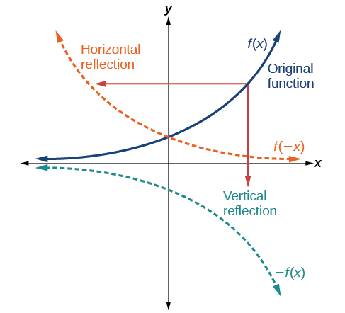{: #Figure_01_05_013}

Notice that the vertical reflection produces a new graph that is a mirror image of the base or original graph about the *x*-axis. The horizontal reflection produces a new graph that is a mirror image of the base or original graph about the *y*-axis.

Reflections

Given a function<math xmlns="http://www.w3.org/1998/Math/MathML"> <mrow> <mtext> </mtext><mi>f</mi><mo stretchy="false">(</mo><mi>x</mi><mo stretchy="false">),</mo></mrow> </math>

 a new function<math xmlns="http://www.w3.org/1998/Math/MathML"> <mrow> <mtext> </mtext><mi>g</mi><mo stretchy="false">(</mo><mi>x</mi><mo stretchy="false">)</mo><mo>=</mo><mo>−</mo><mi>f</mi><mo stretchy="false">(</mo><mi>x</mi><mo stretchy="false">)</mo><mtext> </mtext></mrow> </math>

is a **vertical reflection**{: data-type="term"} of the function<math xmlns="http://www.w3.org/1998/Math/MathML"> <mrow> <mtext> </mtext><mi>f</mi><mo stretchy="false">(</mo><mi>x</mi><mo stretchy="false">)</mo><mo>,</mo><mtext> </mtext></mrow> </math>

sometimes called a reflection about (or over, or through) the *x*-axis.

Given a function<math xmlns="http://www.w3.org/1998/Math/MathML"> <mrow> <mtext> </mtext><mi>f</mi><mo stretchy="false">(</mo><mi>x</mi><mo stretchy="false">)</mo><mo>,</mo><mtext> </mtext></mrow> </math>

a new function<math xmlns="http://www.w3.org/1998/Math/MathML"> <mrow> <mtext> </mtext><mi>g</mi><mo stretchy="false">(</mo><mi>x</mi><mo stretchy="false">)</mo><mo>=</mo><mi>f</mi><mo stretchy="false">(</mo><mo>−</mo><mi>x</mi><mo stretchy="false">)</mo><mtext> </mtext></mrow> </math>

is a **horizontal reflection**{: data-type="term"} of the function<math xmlns="http://www.w3.org/1998/Math/MathML"> <mrow> <mtext> </mtext><mi>f</mi><mo stretchy="false">(</mo><mi>x</mi><mo stretchy="false">)</mo><mo>,</mo><mtext> </mtext></mrow> </math>

sometimes called a reflection about the *y*-axis.

<strong>Given a function, reflect the graph both vertically and horizontally. </strong>

1.  Multiply all outputs by –1 for a vertical reflection. The new graph is a reflection of the original graph about the *x*-axis.
2.  Multiply all inputs by –1 for a horizontal reflection. The new graph is a reflection of the original graph about the *y*-axis.
{: data-number-style="arabic"}

Reflecting a Graph Horizontally and Vertically

Reflect the graph of<math xmlns="http://www.w3.org/1998/Math/MathML"> <mrow> <mtext> </mtext><mi>s</mi><mo stretchy="false">(</mo><mi>t</mi><mo stretchy="false">)</mo><mo>=</mo><msqrt> <mi>t</mi> </msqrt> </mrow> </math>

 (a) vertically and (b) horizontally.

1.  Reflecting the graph vertically means that each output value will be reflected over the horizontal *t-*axis as shown in [[link]](#Figure_01_05_014).
    
    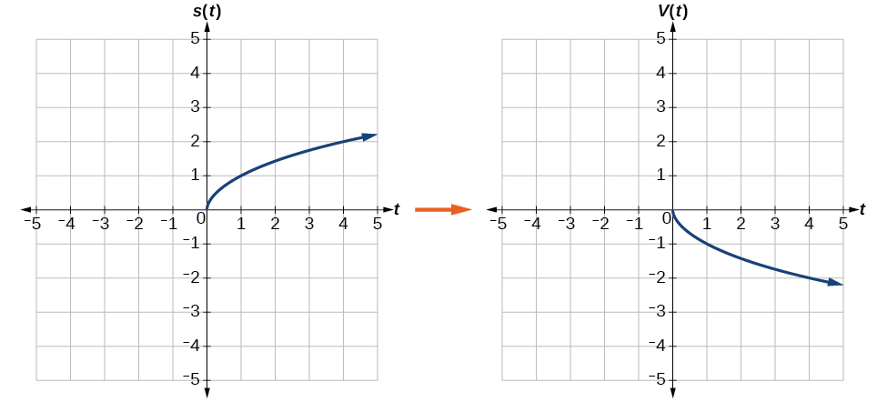{: #Figure_01_05_014}

    Because each output value is the opposite of the original output value, we can write
    
    

    <math xmlns="http://www.w3.org/1998/Math/MathML" display="block"> <mrow> <mi>V</mi><mo stretchy="false">(</mo><mi>t</mi><mo stretchy="false">)</mo><mo>=</mo><mo>−</mo><mi>s</mi><mo stretchy="false">(</mo><mi>t</mi><mo stretchy="false">)</mo><mtext> or </mtext><mi>V</mi><mo stretchy="false">(</mo><mi>t</mi><mo stretchy="false">)</mo><mo>=</mo><mo>−</mo><msqrt> <mi>t</mi> </msqrt> </mrow> </math>
    

    
    Notice that this is an outside change, or vertical shift, that affects the output<math xmlns="http://www.w3.org/1998/Math/MathML"> <mrow> <mtext> </mtext><mi>s</mi><mo stretchy="false">(</mo><mi>t</mi><mo stretchy="false">)</mo><mtext> </mtext></mrow> </math>
    
    values, so the negative sign belongs outside of the function.

2.  Reflecting horizontally means that each input value will be reflected over the vertical axis as shown in [[link]](#Figure_01_05_015).
    
    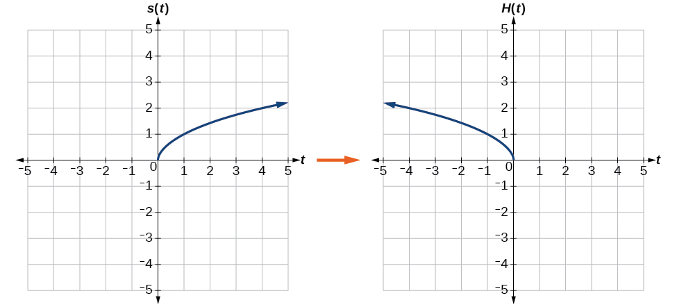{: #Figure_01_05_015}

    Because each input value is the opposite of the original input value, we can write
    
    

    <math xmlns="http://www.w3.org/1998/Math/MathML" display="block"> <mrow> <mi>H</mi><mo stretchy="false">(</mo><mi>t</mi><mo stretchy="false">)</mo><mo>=</mo><mi>s</mi><mo stretchy="false">(</mo><mo>−</mo><mi>t</mi><mo stretchy="false">)</mo><mtext> or </mtext><mi>H</mi><mo stretchy="false">(</mo><mi>t</mi><mo stretchy="false">)</mo><mo>=</mo><msqrt> <mrow> <mo>−</mo><mi>t</mi></mrow> </msqrt> </mrow> </math>
    

    
    Notice that this is an inside change or horizontal change that affects the input values, so the negative sign is on the inside of the function.
    
    Note that these transformations can affect the domain and range of the functions. While the original square root function has domain<math xmlns="http://www.w3.org/1998/Math/MathML"> <mrow> <mtext> </mtext><mo stretchy="false">[</mo><mn>0</mn><mo>,</mo><mi>∞</mi><mo stretchy="false">)</mo><mtext> </mtext></mrow> </math>
    
    and range<math xmlns="http://www.w3.org/1998/Math/MathML"> <mrow> <mtext> </mtext><mo stretchy="false">[</mo><mn>0</mn><mo>,</mo><mi>∞</mi><mo stretchy="false">)</mo><mo>,</mo><mtext> </mtext></mrow> </math>
    
    the vertical reflection gives the<math xmlns="http://www.w3.org/1998/Math/MathML"> <mrow> <mtext> </mtext><mi>V</mi><mo stretchy="false">(</mo><mi>t</mi><mo stretchy="false">)</mo><mtext> </mtext></mrow> </math>
    
    function the range<math xmlns="http://www.w3.org/1998/Math/MathML"> <mrow> <mrow><mo>(</mo> <mrow> <mo>−</mo><mi>∞</mi><mo>,</mo><mtext> </mtext><mn>0</mn> </mrow> <mo>]</mo></mrow> </mrow> </math>
    
     and the horizontal reflection gives the<math xmlns="http://www.w3.org/1998/Math/MathML"> <mrow> <mtext> </mtext><mi>H</mi><mo stretchy="false">(</mo><mi>t</mi><mo stretchy="false">)</mo><mtext> </mtext></mrow> </math>
    
    function the domain<math xmlns="http://www.w3.org/1998/Math/MathML"> <mrow> <mrow><mo>(</mo> <mrow> <mo>−</mo><mi>∞</mi><mo>,</mo><mtext> </mtext><mn>0</mn> </mrow> <mo>]</mo></mrow><mo>.</mo> </mrow> </math>
{: data-number-style="lower-alpha"}

Reflect the graph of<math xmlns="http://www.w3.org/1998/Math/MathML"> <mrow> <mtext> </mtext><mi>f</mi><mo stretchy="false">(</mo><mi>x</mi><mo stretchy="false">)</mo><mo>=</mo><mo>\|</mo><mi>x</mi><mo>−</mo><mn>1</mn><mo>\|</mo> </mrow> </math>

 (a) vertically and (b) horizontally.

1.  

    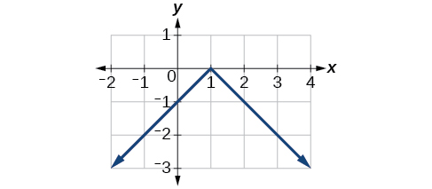
    

2.  

    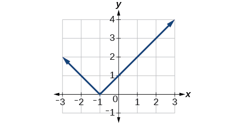
    

{: data-number-style="lower-alpha"}

Reflecting a Tabular Function Horizontally and Vertically

A function<math xmlns="http://www.w3.org/1998/Math/MathML"> <mrow> <mtext> </mtext><mi>f</mi><mo stretchy="false">(</mo><mi>x</mi><mo stretchy="false">)</mo><mtext> </mtext></mrow> </math>

is given as [[link]](#Table_01_05_05). Create a table for the functions below.

1.  <math xmlns="http://www.w3.org/1998/Math/MathML"> <mrow> <mtext> </mtext><mi>g</mi><mo stretchy="false">(</mo><mi>x</mi><mo stretchy="false">)</mo><mo>=</mo><mo>−</mo><mi>f</mi><mo stretchy="false">(</mo><mi>x</mi><mo stretchy="false">)</mo></mrow> </math>

2.  <math xmlns="http://www.w3.org/1998/Math/MathML"> <mrow> <mtext> </mtext><mi>h</mi><mo stretchy="false">(</mo><mi>x</mi><mo stretchy="false">)</mo><mo>=</mo><mi>f</mi><mo stretchy="false">(</mo><mn>−</mn><mi>x</mi><mo stretchy="false">)</mo></mrow> </math>
{: data-number-style="lower-alpha"}

<table id="Table_01_05_05" summary="Two rows and five columns. The first row is labeled, &#x201C;x&#x201D;, and the second is labeled, &#x201C;f(x)&#x201D;. The values of x are 2, 4, 6, and 8. So for f(2)=1, f(4)=3, f(6)=7, and f(8)=11."><colgroup><col /><col width="40" /><col width="40" /><col width="40" /><col width="40" /></colgroup><tbody>
        <tr>
         <td data-align="left"><strong><math xmlns="http://www.w3.org/1998/Math/MathML">
          <mi>x</mi>
         </math></strong>
         </td>
         <td data-align="left">2</td>
         <td data-align="left">4</td>
         <td data-align="left">6</td>
         <td data-align="left">8</td>
        </tr>
       
        <tr>
         <td data-align="left"><strong><math xmlns="http://www.w3.org/1998/Math/MathML">
          <mrow>
           <mi>f</mi><mo stretchy="false">(</mo><mi>x</mi><mo stretchy="false">)</mo></mrow>
         </math></strong>
         </td>
         <td data-align="left">1</td>
         <td data-align="left">3</td>
         <td data-align="left">7</td>
         <td data-align="left">11</td>
        </tr>
       </tbody></table>

1.  For<math xmlns="http://www.w3.org/1998/Math/MathML"> <mrow> <mtext> </mtext><mi>g</mi><mo stretchy="false">(</mo><mi>x</mi><mo stretchy="false">)</mo><mo>,</mo><mtext> </mtext></mrow> </math>
    
    the negative sign outside the function indicates a vertical reflection, so the *x*-values stay the same and each output value will be the opposite of the original output value. See [[link]](#Table_01_05_06).
    
    <table id="Table_01_05_06" summary="Two rows and five columns. The first row is labeled, &#x201C;x&#x201D;, and the second is labeled, &#x201C;g(x)&#x201D;. The values of x are 2, 4, 6, and 8. So for g(2)=-1, g(4)=-3, g(6)=-7, and g(8)=-11."><colgroup><col /><col width="40" /><col width="40" /><col width="40" /><col width="40" /></colgroup><tbody>
             <tr>
              <td data-align="left"><strong><math xmlns="http://www.w3.org/1998/Math/MathML">
              <mi>x</mi>
             </math></strong></td>
              <td data-align="left">2</td>
              <td data-align="left">4</td>
              <td data-align="left">6</td>
              <td data-align="left">8</td>
             </tr>
            
                 <tr>
              <td data-align="left"><strong><math xmlns="http://www.w3.org/1998/Math/MathML">
               <mrow>
                <mtext> </mtext><mi>g</mi><mo stretchy="false">(</mo><mi>x</mi><mo stretchy="false">)</mo><mtext> </mtext></mrow>
              </math></strong>
              </td>
              <td data-align="left">–1</td>
              <td data-align="left">–3</td>
              <td data-align="left">–7</td>
              <td data-align="left">–11</td>
             </tr>
            </tbody></table>

2.  For<math xmlns="http://www.w3.org/1998/Math/MathML"> <mrow> <mtext> </mtext><mi>h</mi><mo stretchy="false">(</mo><mi>x</mi><mo stretchy="false">)</mo><mo>,</mo><mtext> </mtext></mrow> </math>
    
    the negative sign inside the function indicates a horizontal reflection, so each input value will be the opposite of the original input value and the<math xmlns="http://www.w3.org/1998/Math/MathML"> <mrow> <mtext> </mtext><mi>h</mi><mo stretchy="false">(</mo><mi>x</mi><mo stretchy="false">)</mo><mtext> </mtext></mrow> </math>
    
    values stay the same as the<math xmlns="http://www.w3.org/1998/Math/MathML"> <mrow> <mtext> </mtext><mi>f</mi><mo stretchy="false">(</mo><mi>x</mi><mo stretchy="false">)</mo><mtext> </mtext></mrow> </math>
    
    values. See [[link]](#Table_01_05_07).
    
    <table id="Table_01_05_07" summary="Two rows and five columns. The first row is labeled, &#x201C;x&#x201D;, and the second is labeled, &#x201C;h(x)&#x201D;. The values of x are -2, -4, -6, and -8. So for h(-2)=1, h(-4)=3, h(-6)=7, and h(-8)=11."><colgroup><col /><col width="40" /><col width="40" /><col width="40" /><col width="40" /></colgroup><tbody>
             <tr>
              <td data-align="center"><strong><math xmlns="http://www.w3.org/1998/Math/MathML">
               <mi>x</mi>
              </math></strong>
              </td>
              <td data-align="center">−2</td>
              <td data-align="center">−4</td>
              <td data-align="center">−6</td>
              <td data-align="center">−8</td>
             </tr>
            
             <tr>
              <td data-align="center"><strong><math xmlns="http://www.w3.org/1998/Math/MathML">
               <mrow>
                <mi>h</mi><mo stretchy="false">(</mo><mi>x</mi><mo stretchy="false">)</mo></mrow>
              </math></strong>
              </td>
              <td data-align="center">1</td>
              <td data-align="center">3</td>
              <td data-align="center">7</td>
              <td data-align="center">11</td>
             </tr>
            </tbody></table>
{: data-number-style="lower-alpha"}

A function<math xmlns="http://www.w3.org/1998/Math/MathML"> <mrow> <mtext> </mtext><mi>f</mi><mo stretchy="false">(</mo><mi>x</mi><mo stretchy="false">)</mo><mtext> </mtext></mrow> </math>

is given as [[link]](#Table_01_05_08). Create a table for the functions below.

1.  <math xmlns="http://www.w3.org/1998/Math/MathML"> <mrow> <mi>g</mi><mo stretchy="false">(</mo><mi>x</mi><mo stretchy="false">)</mo><mo>=</mo><mo>−</mo><mi>f</mi><mo stretchy="false">(</mo><mi>x</mi><mo stretchy="false">)</mo></mrow> </math>

2.  <math xmlns="http://www.w3.org/1998/Math/MathML"> <mrow> <mi>h</mi><mo stretchy="false">(</mo><mi>x</mi><mo stretchy="false">)</mo><mo>=</mo><mi>f</mi><mo stretchy="false">(</mo><mi>−</mi><mi>x</mi><mo stretchy="false">)</mo></mrow> </math>
{: data-number-style="lower-alpha"}

<table id="Table_01_05_08" summary="Two rows and five columns. The first row is labeled, &#x201C;x&#x201D;, and the second is labeled, &#x201C;f(x)&#x201D;. The values of x are -2, 0, 2, and 4. So for f(-2)=5, f(0)=10, f(2)=15, and f(4)=20."><colgroup><col /><col width="40" /><col width="40" /><col width="40" /><col width="40" /></colgroup><tbody>
       <tr>
        <td data-align="left"><strong><math xmlns="http://www.w3.org/1998/Math/MathML">
         <mi>x</mi>
        </math></strong>
        </td>
        <td data-align="left">−2</td>
        <td data-align="left">0</td>
        <td data-align="left">2</td>
        <td data-align="left">4</td>
       </tr>
      
      
       <tr>
        <td data-align="left"><strong><math xmlns="http://www.w3.org/1998/Math/MathML">
         <mrow>
          <mi>f</mi><mo stretchy="false">(</mo><mi>x</mi><mo stretchy="false">)</mo></mrow>
        </math></strong>
        </td>
        <td data-align="left">5</td>
        <td data-align="left">10</td>
        <td data-align="left">15</td>
        <td data-align="left">20</td>
       </tr>
      </tbody></table>

1.  <math xmlns="http://www.w3.org/1998/Math/MathML"> <mrow> <mi>g</mi><mo stretchy="false">(</mo><mi>x</mi><mo stretchy="false">)</mo><mo>=</mo><mo>−</mo><mi>f</mi><mo stretchy="false">(</mo><mi>x</mi><mo stretchy="false">)</mo></mrow> </math>
    
    <table summary="Two rows and five columns. The first row is labeled, &#x201C;x&#x201D;, and the second is labeled, &#x201C;f(x)&#x201D;. The values of x are -2, 0, 2, and 4. So for f(-2)=-5, f(0)=-10, f(2)=-15, and f(4)=-20." class="unnumbered" data-label=""><colgroup><col /><col width="40" /><col width="40" /><col width="40" /><col width="40" /></colgroup><tbody>
           <tr>
            <td data-align="center"><math xmlns="http://www.w3.org/1998/Math/MathML">
             <mi>x</mi>
            </math>
            </td>
            <td data-align="center">-2</td>
            <td data-align="center">0</td>
            <td data-align="center">2</td>
            <td data-align="center">4</td>
           </tr>
          
          
           <tr>
            <td data-align="center"><math xmlns="http://www.w3.org/1998/Math/MathML">
             <mrow>
              <mi>g</mi><mo stretchy="false">(</mo><mi>x</mi><mo stretchy="false">)</mo></mrow>
            </math>
            </td>
            <td data-align="center"><math xmlns="http://www.w3.org/1998/Math/MathML">
             <mrow>
              <mo>−</mo><mn>5</mn></mrow>
            </math>
            </td>
            <td data-align="center"><math xmlns="http://www.w3.org/1998/Math/MathML">
             <mrow>
              <mo>−</mo><mn>10</mn></mrow>
            </math>
            </td>
            <td data-align="center"><math xmlns="http://www.w3.org/1998/Math/MathML">
             <mrow>
              <mo>−</mo><mn>15</mn></mrow>
            </math>
            </td>
            <td data-align="center"><math xmlns="http://www.w3.org/1998/Math/MathML">
             <mrow>
              <mo>−</mo><mn>20</mn></mrow>
            </math>
            </td>
           </tr>
          </tbody></table>

2.  <math xmlns="http://www.w3.org/1998/Math/MathML"> <mrow> <mi>h</mi><mo stretchy="false">(</mo><mi>x</mi><mo stretchy="false">)</mo><mo>=</mo><mi>f</mi><mo stretchy="false">(</mo><mtext>−</mtext><mi>x</mi><mo stretchy="false">)</mo></mrow> </math>
    
    <table summary="Two rows and five columns. The first row is labeled, &#x201C;x&#x201D;, and the second is labeled, &#x201C;f(x)&#x201D;. The values of x are 2, 0, -2, and -4. So for f(-2)=5, f(0)=10, f(-2)=15, and f(-4)=-20." class="unnumbered" data-label=""><colgroup><col /><col width="50" /><col width="50" /><col width="50" /><col width="50" /></colgroup><tbody>
          <tr>
           <td><math xmlns="http://www.w3.org/1998/Math/MathML">
            <mi>x</mi>
           </math>
           </td>
           <td>-2</td>
           <td>0</td>
           <td>2</td>
           <td>4</td>
          </tr>
         
         
          <tr>
           <td><math xmlns="http://www.w3.org/1998/Math/MathML">
            <mrow>
             <mi>h</mi><mo stretchy="false">(</mo><mi>x</mi><mo stretchy="false">)</mo></mrow>
           </math>
           </td>
           <td>15</td>
           <td>10</td>
           <td>5</td>
           <td>unknown</td>
          </tr>
         </tbody></table>
{: data-number-style="lower-alpha"}

Applying a Learning Model Equation

A common model for learning has an equation similar to <math xmlns="http://www.w3.org/1998/Math/MathML"> <mrow> <mi>k</mi><mo stretchy="false">(</mo><mi>t</mi><mo stretchy="false">)</mo><mo>=</mo><mo>−</mo><msup> <mn>2</mn> <mrow> <mo>−</mo><mi>t</mi></mrow> </msup> <mo>+</mo><mn>1</mn><mo>,</mo><mtext> </mtext></mrow> </math>

 where <math xmlns="http://www.w3.org/1998/Math/MathML"> <mrow> <mi>k</mi></mrow> </math>

 is the percentage of mastery that can be achieved after <math xmlns="http://www.w3.org/1998/Math/MathML"> <mrow> <mi>t</mi></mrow> </math>

 practice sessions. This is a transformation of the function <math xmlns="http://www.w3.org/1998/Math/MathML"> <mrow> <mi>f</mi><mo stretchy="false">(</mo><mi>t</mi><mo stretchy="false">)</mo><mo>=</mo><msup> <mn>2</mn> <mi>t</mi> </msup> </mrow> </math>

 shown in [[link]](#Figure_01_05_017). Sketch a graph of <math xmlns="http://www.w3.org/1998/Math/MathML"> <mrow> <mi>k</mi><mo stretchy="false">(</mo><mi>t</mi><mo stretchy="false">)</mo><mo>.</mo></mrow> </math>

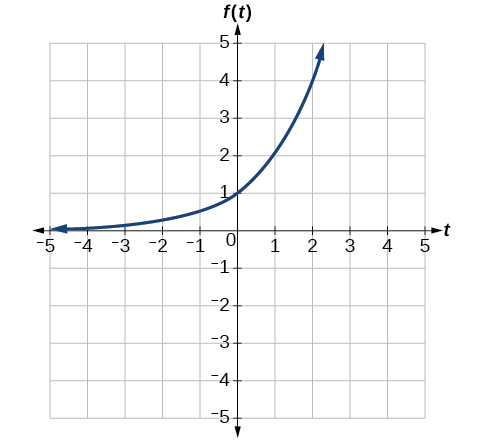{: #Figure_01_05_017}

This equation combines three transformations into one equation.

* A horizontal reflection:
  <math xmlns="http://www.w3.org/1998/Math/MathML"> <mrow> <mi>f</mi><mo stretchy="false">(</mo><mtext>−</mtext><mi>t</mi><mo stretchy="false">)</mo><mo>=</mo><msup> <mn>2</mn> <mrow> <mo>−</mo><mi>t</mi></mrow> </msup> </mrow> </math>

* A vertical reflection:
  <math xmlns="http://www.w3.org/1998/Math/MathML"> <mrow> <mtext> </mtext><mo>−</mo><mi>f</mi><mo stretchy="false">(</mo><mtext>−</mtext><mi>t</mi><mo stretchy="false">)</mo><mo>=</mo><mo>−</mo><msup> <mn>2</mn> <mrow> <mo>−</mo><mi>t</mi></mrow> </msup> </mrow> </math>

* A vertical shift:
  <math xmlns="http://www.w3.org/1998/Math/MathML"> <mrow> <mtext> </mtext><mo>−</mo><mi>f</mi><mo stretchy="false">(</mo><mtext>−</mtext><mi>t</mi><mo stretchy="false">)</mo><mo>+</mo><mn>1</mn><mo>=</mo><mo>−</mo><msup> <mn>2</mn> <mrow> <mo>−</mo><mi>t</mi></mrow> </msup> <mo>+</mo><mn>1</mn></mrow> </math>

We can sketch a graph by applying these transformations one at a time to the original function. Let us follow two points through each of the three transformations. We will choose the points (0, 1) and (1, 2).

1.  First, we apply a horizontal reflection: (0, 1) (–1, 2).
2.  Then, we apply a vertical reflection: (0, -1) (-1, –2)
3.  Finally, we apply a vertical shift: (0, 0) (-1, -1)).
{: data-number-style="arabic"}

This means that the original points, (0,1) and (1,2) become (0,0) and (-1,-1) after we apply the transformations.

In [[link]](#Figure_01_05_018), the first graph results from a horizontal reflection. The second results from a vertical reflection. The third results from a vertical shift up 1 unit.

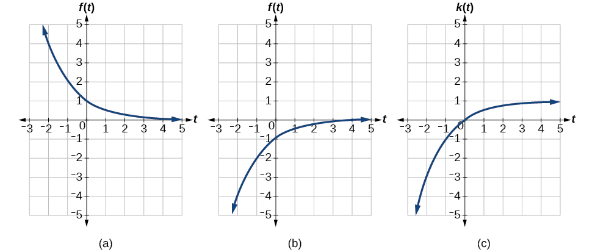{: #Figure_01_05_018}

Analysis

As a model for learning, this function would be limited to a domain of<math xmlns="http://www.w3.org/1998/Math/MathML"> <mrow> <mtext> </mtext><mi>t</mi><mo>≥</mo><mn>0</mn><mo>,</mo><mtext> </mtext></mrow> </math>

with corresponding range<math xmlns="http://www.w3.org/1998/Math/MathML"> <mrow> <mtext> </mtext><mo stretchy="false">[</mo><mn>0</mn><mo>,</mo><mn>1</mn><mo stretchy="false">)</mo><mo>.</mo></mrow> </math>

Given the toolkit function<math xmlns="http://www.w3.org/1998/Math/MathML"> <mrow> <mtext> </mtext><mi>f</mi><mo stretchy="false">(</mo><mi>x</mi><mo stretchy="false">)</mo><mo>=</mo><msup> <mi>x</mi> <mn>2</mn> </msup> <mo>,</mo><mtext> </mtext></mrow> </math>

graph<math xmlns="http://www.w3.org/1998/Math/MathML"> <mrow> <mtext> </mtext><mi>g</mi><mo stretchy="false">(</mo><mi>x</mi><mo stretchy="false">)</mo><mo>=</mo><mo>−</mo><mi>f</mi><mo stretchy="false">(</mo><mi>x</mi><mo stretchy="false">)</mo><mtext> </mtext></mrow> </math>

and<math xmlns="http://www.w3.org/1998/Math/MathML"> <mrow> <mtext> </mtext><mi>h</mi><mo stretchy="false">(</mo><mi>x</mi><mo stretchy="false">)</mo><mo>=</mo><mi>f</mi><mo stretchy="false">(</mo><mo>−</mo><mi>x</mi><mo stretchy="false">)</mo><mo>.</mo><mtext> </mtext></mrow> </math>

Take note of any surprising behavior for these functions.

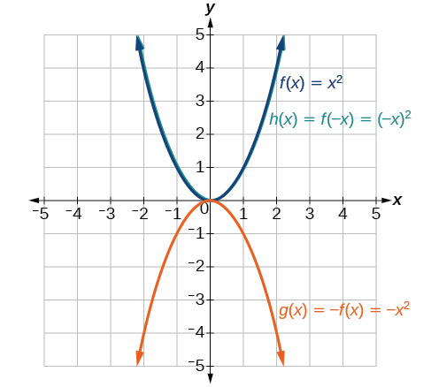

Notice:<math xmlns="http://www.w3.org/1998/Math/MathML"> <mrow> <mtext> </mtext><mi>g</mi><mo stretchy="false">(</mo><mi>x</mi><mo stretchy="false">)</mo><mo>=</mo><mi>f</mi><mo stretchy="false">(</mo><mo>−</mo><mi>x</mi><mo stretchy="false">)</mo><mtext> </mtext></mrow> </math>

looks the same as<math xmlns="http://www.w3.org/1998/Math/MathML"> <mrow> <mtext> </mtext><mi>f</mi><mo stretchy="false">(</mo><mi>x</mi><mo stretchy="false">)</mo></mrow> </math>

.

### Determining Even and Odd Functions

Some functions exhibit symmetry so that reflections result in the original graph. For example, horizontally reflecting the toolkit functions <math xmlns="http://www.w3.org/1998/Math/MathML"> <mrow> <mi>f</mi><mo stretchy="false">(</mo><mi>x</mi><mo stretchy="false">)</mo><mo>=</mo><msup> <mi>x</mi> <mn>2</mn> </msup> </mrow> </math>

 or <math xmlns="http://www.w3.org/1998/Math/MathML"> <mrow> <mi>f</mi><mo stretchy="false">(</mo><mi>x</mi><mo stretchy="false">)</mo><mo>=</mo><mrow><mo>\|</mo> <mi>x</mi> <mo>\|</mo></mrow></mrow> </math>

 will result in the original graph. We say that these types of graphs are symmetric about the *y*-axis. A function whose graph is symmetric about the *y*-axis is called an **even function.**

If the graphs of<math xmlns="http://www.w3.org/1998/Math/MathML"> <mrow> <mtext> </mtext><mi>f</mi><mo stretchy="false">(</mo><mi>x</mi><mo stretchy="false">)</mo><mo>=</mo><msup> <mi>x</mi> <mn>3</mn> </msup> <mtext> </mtext></mrow> </math>

or<math xmlns="http://www.w3.org/1998/Math/MathML"> <mrow> <mtext> </mtext><mi>f</mi><mo stretchy="false">(</mo><mi>x</mi><mo stretchy="false">)</mo><mo>=</mo><mfrac> <mn>1</mn> <mi>x</mi> </mfrac> <mtext> </mtext></mrow> </math>

were reflected over *both* axes, the result would be the original graph, as shown in [\[link\]](#Figure_01_05_022).

  The cubic toolkit function (b) Horizontal reflection of the cubic toolkit function (c) Horizontal and vertical reflections reproduce the original cubic function. "){: #Figure_01_05_022}

We say that these graphs are symmetric about the origin. A function with a graph that is symmetric about the origin is called an **odd function**.

Note: A function can be neither even nor odd if it does not exhibit either symmetry. For example,<math xmlns="http://www.w3.org/1998/Math/MathML"> <mrow> <mtext> </mtext><mi>f</mi><mo stretchy="false">(</mo><mi>x</mi><mo stretchy="false">)</mo><mo>=</mo><msup> <mn>2</mn> <mi>x</mi> </msup> <mtext> </mtext></mrow> </math>

is neither even nor odd. Also, the only function that is both even and odd is the constant function<math xmlns="http://www.w3.org/1998/Math/MathML"> <mrow> <mtext> </mtext><mi>f</mi><mo stretchy="false">(</mo><mi>x</mi><mo stretchy="false">)</mo><mo>=</mo><mn>0.</mn></mrow> </math>

Even and Odd Functions

A function is called an **even function**{: data-type="term"} if for every input<math xmlns="http://www.w3.org/1998/Math/MathML"> <mrow> <mtext> </mtext><mi>x</mi></mrow> </math>

<math xmlns="http://www.w3.org/1998/Math/MathML" display="block"> <mrow> <mi>f</mi><mo stretchy="false">(</mo><mi>x</mi><mo stretchy="false">)</mo><mo>=</mo><mi>f</mi><mo stretchy="false">(</mo><mo>−</mo><mi>x</mi><mo stretchy="false">)</mo></mrow> </math>

The graph of an even function is symmetric about the <math xmlns="http://www.w3.org/1998/Math/MathML"> <mrow> <mi>y</mi><mtext>-</mtext></mrow></math>

axis.

A function is called an **odd function**{: data-type="term"} if for every input<math xmlns="http://www.w3.org/1998/Math/MathML"> <mrow> <mtext> </mtext><mi>x</mi></mrow> </math>

<math xmlns="http://www.w3.org/1998/Math/MathML" display="block"> <mrow> <mi>f</mi><mo stretchy="false">(</mo><mi>x</mi><mo stretchy="false">)</mo><mo>=</mo><mo>−</mo><mi>f</mi><mo stretchy="false">(</mo><mo>−</mo><mi>x</mi><mo stretchy="false">)</mo></mrow> </math>

The graph of an odd function is symmetric about the origin.

<strong>Given the formula for a function, determine if the function is even, odd, or neither. </strong>

1.  Determine whether the function satisfies
    <math xmlns="http://www.w3.org/1998/Math/MathML"> <mrow> <mtext> </mtext><mi>f</mi><mo stretchy="false">(</mo><mi>x</mi><mo stretchy="false">)</mo><mo>=</mo><mi>f</mi><mo stretchy="false">(</mo><mo>−</mo><mi>x</mi><mo stretchy="false">)</mo><mo>.</mo><mtext> </mtext></mrow> </math>
    
    If it does, it is even.
2.  Determine whether the function satisfies
    <math xmlns="http://www.w3.org/1998/Math/MathML"> <mrow> <mtext> </mtext><mi>f</mi><mo stretchy="false">(</mo><mi>x</mi><mo stretchy="false">)</mo><mo>=</mo><mo>−</mo><mi>f</mi><mo stretchy="false">(</mo><mo>−</mo><mi>x</mi><mo stretchy="false">)</mo><mo>.</mo><mtext> </mtext></mrow> </math>
    
    If it does, it is odd.
3.  If the function does not satisfy either rule, it is neither even nor odd.
{: data-number-style="arabic"}

Determining whether a Function Is Even, Odd, or Neither

Is the function<math xmlns="http://www.w3.org/1998/Math/MathML"> <mrow> <mtext> </mtext><mi>f</mi><mo stretchy="false">(</mo><mi>x</mi><mo stretchy="false">)</mo><mo>=</mo><msup> <mi>x</mi> <mn>3</mn> </msup> <mo>+</mo><mn>2</mn><mi>x</mi><mtext> </mtext></mrow> </math>

even, odd, or neither?

Without looking at a graph, we can determine whether the function is even or odd by finding formulas for the reflections and determining if they return us to the original function. Let’s begin with the rule for even functions.

<math xmlns="http://www.w3.org/1998/Math/MathML" display="block"> <mrow> <mi>f</mi><mo stretchy="false">(</mo><mo>−</mo><mi>x</mi><mo stretchy="false">)</mo><mo>=</mo><msup> <mrow> <mo stretchy="false">(</mo><mo>−</mo><mi>x</mi><mo stretchy="false">)</mo></mrow> <mn>3</mn> </msup> <mo>+</mo><mn>2</mn><mo stretchy="false">(</mo><mo>−</mo><mi>x</mi><mo stretchy="false">)</mo><mo>=</mo><mo>−</mo><msup> <mi>x</mi> <mn>3</mn> </msup> <mo>−</mo><mn>2</mn><mi>x</mi></mrow> </math>

This does not return us to the original function, so this function is not even. We can now test the rule for odd functions.

<math xmlns="http://www.w3.org/1998/Math/MathML" display="block"> <mrow> <mo>−</mo><mi>f</mi><mo stretchy="false">(</mo><mo>−</mo><mi>x</mi><mo stretchy="false">)</mo><mo>=</mo><mo>−</mo><mrow><mo>(</mo> <mrow> <mo>−</mo><msup> <mi>x</mi> <mn>3</mn> </msup> <mo>−</mo><mn>2</mn><mi>x</mi></mrow> <mo>)</mo></mrow><mo>=</mo><msup> <mi>x</mi> <mn>3</mn> </msup> <mo>+</mo><mn>2</mn><mi>x</mi></mrow> </math>

Because<math xmlns="http://www.w3.org/1998/Math/MathML"> <mrow> <mtext> </mtext><mo>−</mo><mi>f</mi><mo stretchy="false">(</mo><mo>−</mo><mi>x</mi><mo stretchy="false">)</mo><mo>=</mo><mi>f</mi><mo stretchy="false">(</mo><mi>x</mi><mo stretchy="false">)</mo><mo>,</mo><mtext> </mtext></mrow> </math>

this is an odd function.

Analysis

Consider the graph of<math xmlns="http://www.w3.org/1998/Math/MathML"> <mrow> <mtext> </mtext><mi>f</mi><mtext> </mtext></mrow> </math>

in [[link]](#Figure_01_05_039). Notice that the graph is symmetric about the origin. For every point<math xmlns="http://www.w3.org/1998/Math/MathML"> <mrow> <mtext> </mtext><mrow><mo>(</mo> <mrow> <mi>x</mi><mo>,</mo><mi>y</mi></mrow> <mo>)</mo></mrow><mtext> </mtext></mrow> </math>

on the graph, the corresponding point<math xmlns="http://www.w3.org/1998/Math/MathML"> <mrow> <mtext> </mtext><mrow><mo>(</mo> <mrow> <mo>−</mo><mi>x</mi><mo>,</mo><mo>−</mo><mi>y</mi></mrow> <mo>)</mo></mrow><mtext> </mtext></mrow> </math>

is also on the graph. For example, (1, 3) is on the graph of<math xmlns="http://www.w3.org/1998/Math/MathML"> <mrow> <mtext> </mtext><mi>f</mi><mo>,</mo><mtext> </mtext></mrow> </math>

and the corresponding point<math xmlns="http://www.w3.org/1998/Math/MathML"> <mrow> <mo stretchy="false">(</mo><mn>−1</mn><mo>,</mo><mn>−3</mn><mo stretchy="false">)</mo> </mrow> </math>

is also on the graph.

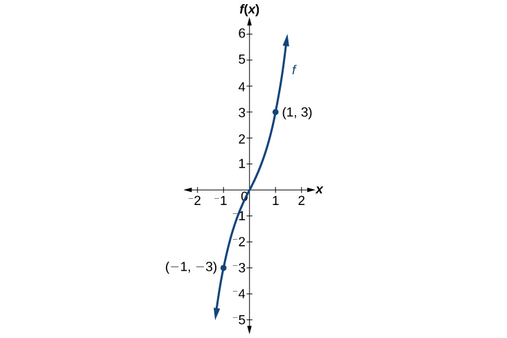{: #Figure_01_05_039}

Is the function<math xmlns="http://www.w3.org/1998/Math/MathML"> <mrow> <mtext> </mtext><mi>f</mi><mo stretchy="false">(</mo><mi>s</mi><mo stretchy="false">)</mo><mo>=</mo><msup> <mi>s</mi> <mn>4</mn> </msup> <mo>+</mo><mn>3</mn><msup> <mi>s</mi> <mn>2</mn> </msup> <mo>+</mo><mn>7</mn><mtext> </mtext></mrow> </math>

even, odd, or neither?

even

### Graphing Functions Using Stretches and Compressions

Adding a constant to the inputs or outputs of a function changed the position of a graph with respect to the axes, but it did not affect the shape of a graph. We now explore the effects of multiplying the inputs or outputs by some quantity.

We can transform the inside (input values) of a function or we can transform the outside (output values) of a function. Each change has a specific effect that can be seen graphically.

####  Vertical Stretches and Compressions 

When we multiply a function by a positive constant, we get a function whose graph is stretched or compressed vertically in relation to the graph of the original function. If the constant is greater than 1, we get a **vertical stretch**; if the constant is between 0 and 1, we get a<strong> vertical compression</strong>. [\[link\]](#Figure_01_05_025) shows a function multiplied by constant factors 2 and 0.5 and the resulting vertical stretch and compression.

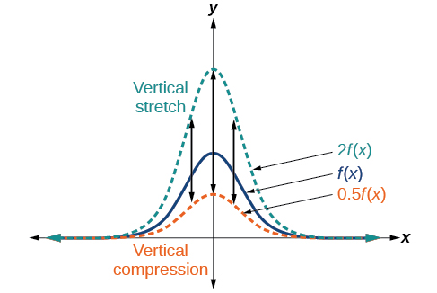{: #Figure_01_05_025}

Vertical Stretches and Compressions

Given a function<math xmlns="http://www.w3.org/1998/Math/MathML"> <mrow> <mtext> </mtext><mi>f</mi><mo stretchy="false">(</mo><mi>x</mi><mo stretchy="false">)</mo><mo>,</mo><mtext> </mtext></mrow> </math>

a new function<math xmlns="http://www.w3.org/1998/Math/MathML"> <mrow> <mtext> </mtext><mi>g</mi><mo stretchy="false">(</mo><mi>x</mi><mo stretchy="false">)</mo><mo>=</mo><mi>a</mi><mi>f</mi><mo stretchy="false">(</mo><mi>x</mi><mo stretchy="false">)</mo><mo>,</mo><mtext> </mtext></mrow> </math>

where<math xmlns="http://www.w3.org/1998/Math/MathML"> <mrow> <mtext> </mtext><mi>a</mi><mtext> </mtext></mrow> </math>

is a constant, is a **vertical stretch**{: data-type="term"} or **vertical compression**{: data-type="term"} of the function<math xmlns="http://www.w3.org/1998/Math/MathML"> <mrow> <mtext> </mtext><mi>f</mi><mo stretchy="false">(</mo><mi>x</mi><mo stretchy="false">)</mo><mo>.</mo></mrow> </math>

* If
  <math xmlns="http://www.w3.org/1998/Math/MathML"> <mrow> <mtext> </mtext><mi>a</mi><mo>&gt;</mo><mn>1</mn><mo>,</mo><mtext> </mtext></mrow> </math>
  
  then the graph will be stretched.
* If
  <math xmlns="http://www.w3.org/1998/Math/MathML"> <mrow> <mtext> </mtext><mn>0</mn><mo>&lt;</mo><mi>a</mi><mo>&lt;</mo><mn>1</mn><mo>,</mo><mtext> </mtext></mrow> </math>
  
  then the graph will be compressed.
* If
  <math xmlns="http://www.w3.org/1998/Math/MathML"> <mrow> <mtext> </mtext><mi>a</mi><mo>&lt;</mo><mn>0</mn><mo>,</mo><mtext> </mtext></mrow> </math>
  
  then there will be combination of a vertical stretch or compression with a vertical reflection.

**Given a function, graph its vertical stretch.**

1.  Identify the value of
    <math xmlns="http://www.w3.org/1998/Math/MathML"> <mrow> <mtext> </mtext><mi>a</mi><mo>.</mo></mrow> </math>

2.  Multiply all range values by
    <math xmlns="http://www.w3.org/1998/Math/MathML"> <mrow> <mtext> </mtext><mi>a</mi><mo>.</mo></mrow> </math>

3.  If<math xmlns="http://www.w3.org/1998/Math/MathML"> <mrow> <mtext> </mtext><mtext> </mtext><mi>a</mi><mo>&gt;</mo><mn>1</mn><mo>,</mo><mtext> </mtext><mtext> </mtext></mrow> </math>
    
    the graph is stretched by a factor of<math xmlns="http://www.w3.org/1998/Math/MathML"> <mrow> <mtext> </mtext><mi>a</mi><mo>.</mo></mrow> </math>
    
    If<math xmlns="http://www.w3.org/1998/Math/MathML"> <mrow> <mtext> </mtext><mn>0</mn><mo>&lt;</mo><mi>a</mi><mo>&lt;</mo><mn>1</mn><mo>,</mo><mtext> </mtext></mrow> </math>
    
    the graph is compressed by a factor of<math xmlns="http://www.w3.org/1998/Math/MathML"> <mrow> <mtext> </mtext><mi>a</mi><mo>.</mo></mrow> </math>
    
    If<math xmlns="http://www.w3.org/1998/Math/MathML"> <mrow> <mtext> </mtext><mi>a</mi><mo>&lt;</mo><mn>0</mn><mo>,</mo><mtext> </mtext></mrow> </math>
    
    the graph is either stretched or compressed and also reflected about the *x*-axis.
{: data-number-style="arabic"}

Graphing a Vertical Stretch

A function<math xmlns="http://www.w3.org/1998/Math/MathML"> <mrow> <mtext> </mtext><mi>P</mi><mrow><mo>(</mo> <mi>t</mi> <mo>)</mo></mrow><mtext> </mtext></mrow> </math>

models the population of fruit flies. The graph is shown in [[link]](#Figure_01_05_026).

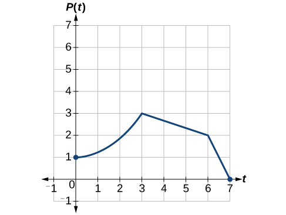{: #Figure_01_05_026}

A scientist is comparing this population to another population,<math xmlns="http://www.w3.org/1998/Math/MathML"> <mrow> <mtext> </mtext><mi>Q</mi><mo>,</mo><mtext> </mtext></mrow> </math>

whose growth follows the same pattern, but is twice as large. Sketch a graph of this population.

Because the population is always twice as large, the new population’s output values are always twice the original function’s output values. Graphically, this is shown in [[link]](#Figure_01_05_027).

If we choose four reference points, (0, 1), (3, 3), (6, 2) and (7, 0) we will multiply all of the outputs by 2.

The following shows where the new points for the new graph will be located.

<math xmlns="http://www.w3.org/1998/Math/MathML" display="block"> <mrow> <mtable columnalign="left"> <mtr columnalign="left"> <mtd columnalign="left"> <mrow> <mrow><mo>(</mo> <mrow> <mn>0</mn><mo>,</mo><mtext> </mtext><mn>1</mn></mrow> <mo>)</mo></mrow><mo stretchy="false">→</mo><mrow><mo>(</mo> <mrow> <mn>0</mn><mo>,</mo><mtext> </mtext><mn>2</mn></mrow> <mo>)</mo></mrow></mrow> </mtd> </mtr> <mtr columnalign="left"> <mtd columnalign="left"> <mrow> <mrow><mo>(</mo> <mrow> <mn>3</mn><mo>,</mo><mtext> </mtext><mn>3</mn></mrow> <mo>)</mo></mrow><mo stretchy="false">→</mo><mrow><mo>(</mo> <mrow> <mn>3</mn><mo>,</mo><mtext> </mtext><mn>6</mn></mrow> <mo>)</mo></mrow></mrow> </mtd> </mtr> <mtr columnalign="left"> <mtd columnalign="left"> <mrow> <mrow><mo>(</mo> <mrow> <mn>6</mn><mo>,</mo><mtext> </mtext><mn>2</mn></mrow> <mo>)</mo></mrow><mo stretchy="false">→</mo><mrow><mo>(</mo> <mrow> <mn>6</mn><mo>,</mo><mtext> </mtext><mn>4</mn></mrow> <mo>)</mo></mrow></mrow> </mtd> </mtr> <mtr columnalign="left"> <mtd columnalign="left"> <mrow> <mrow><mo>(</mo> <mrow> <mn>7</mn><mo>,</mo><mtext> </mtext><mn>0</mn></mrow> <mo>)</mo></mrow><mo stretchy="false">→</mo><mrow><mo>(</mo> <mrow> <mn>7</mn><mo>,</mo><mtext> </mtext><mn>0</mn></mrow> <mo>)</mo></mrow></mrow> </mtd> </mtr> </mtable></mrow> </math>

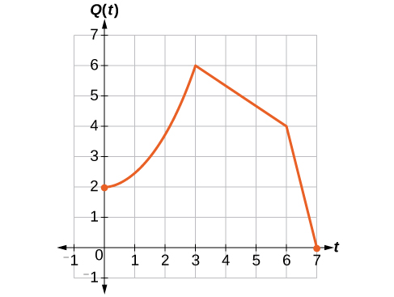{: #Figure_01_05_027}

Symbolically, the relationship is written as

<math xmlns="http://www.w3.org/1998/Math/MathML" display="block"> <mrow> <mi>Q</mi><mo stretchy="false">(</mo><mi>t</mi><mo stretchy="false">)</mo><mo>=</mo><mn>2</mn><mi>P</mi><mo stretchy="false">(</mo><mi>t</mi><mo stretchy="false">)</mo></mrow> </math>

This means that for any input<math xmlns="http://www.w3.org/1998/Math/MathML"> <mrow> <mtext> </mtext><mi>t</mi><mo>,</mo><mtext> </mtext></mrow> </math>

the value of the function<math xmlns="http://www.w3.org/1998/Math/MathML"> <mrow> <mtext> </mtext><mi>Q</mi><mtext> </mtext></mrow> </math>

is twice the value of the function<math xmlns="http://www.w3.org/1998/Math/MathML"> <mrow> <mtext> </mtext><mi>P</mi><mo>.</mo><mtext> </mtext></mrow> </math>

Notice that the effect on the graph is a vertical stretching of the graph, where every point doubles its distance from the horizontal axis. The input values,<math xmlns="http://www.w3.org/1998/Math/MathML"> <mrow> <mtext> </mtext><mi>t</mi><mo>,</mo><mtext> </mtext></mrow> </math>

stay the same while the output values are twice as large as before.

<strong>Given a tabular function and assuming that the transformation is a vertical stretch or compression, create a table for a vertical compression. </strong>

1.  Determine the value of
    <math xmlns="http://www.w3.org/1998/Math/MathML"> <mrow> <mtext> </mtext><mi>a</mi><mo>.</mo></mrow> </math>

2.  Multiply all of the output values by
    <math xmlns="http://www.w3.org/1998/Math/MathML"> <mrow> <mtext> </mtext><mi>a</mi><mo>.</mo></mrow> </math>
{: data-number-style="arabic"}

Finding a Vertical Compression of a Tabular Function

A function<math xmlns="http://www.w3.org/1998/Math/MathML"> <mrow> <mtext> </mtext><mi>f</mi><mtext> </mtext></mrow> </math>

is given as [[link]](#Table_01_05_09). Create a table for the function<math xmlns="http://www.w3.org/1998/Math/MathML"> <mrow> <mtext> </mtext><mi>g</mi><mo stretchy="false">(</mo><mi>x</mi><mo stretchy="false">)</mo><mo>=</mo><mfrac> <mn>1</mn> <mn>2</mn> </mfrac> <mi>f</mi><mo stretchy="false">(</mo><mi>x</mi><mo stretchy="false">)</mo><mo>.</mo></mrow> </math>

<table id="Table_01_05_09" summary="Two rows and five columns. The first row is labeled, &#x201C;x&#x201D;, and the second is labeled, &#x201C;f(x)&#x201D;. The values of x are 2, 4, 6, and 8. So for f(2)=1, f(4)=3, f(6)=7, and f(8)=11."><colgroup><col /><col width="40" /><col width="40" /><col width="40" /><col width="40" /></colgroup><tbody>
    <tr>
     <td data-align="left"><strong><math xmlns="http://www.w3.org/1998/Math/MathML">
 <mi>x</mi>
</math></strong>
</td>
     <td data-align="left">2</td>
     <td data-align="left">4</td>
     <td data-align="left">6</td>
     <td data-align="left">8</td>
    </tr>
   
    <tr>
     <td data-align="left"><strong><math xmlns="http://www.w3.org/1998/Math/MathML">
      <mrow>
       <mi>f</mi><mo stretchy="false">(</mo><mi>x</mi><mo stretchy="false">)</mo><mtext> </mtext></mrow>
     </math></strong>
     </td>
     <td data-align="left">1</td>
     <td data-align="left">3</td>
     <td data-align="left">7</td>
     <td data-align="left">11</td>
    </tr>
   </tbody></table>

The formula<math xmlns="http://www.w3.org/1998/Math/MathML"> <mrow> <mtext> </mtext><mi>g</mi><mo stretchy="false">(</mo><mi>x</mi><mo stretchy="false">)</mo><mo>=</mo><mfrac> <mn>1</mn> <mn>2</mn> </mfrac> <mi>f</mi><mo stretchy="false">(</mo><mi>x</mi><mo stretchy="false">)</mo><mtext> </mtext></mrow> </math>

tells us that the output values of<math xmlns="http://www.w3.org/1998/Math/MathML"> <mrow> <mtext> </mtext><mi>g</mi><mtext> </mtext></mrow> </math>

are half of the output values of<math xmlns="http://www.w3.org/1998/Math/MathML"> <mrow> <mtext> </mtext><mi>f</mi><mtext> </mtext></mrow> </math>

with the same inputs. For example, we know that<math xmlns="http://www.w3.org/1998/Math/MathML"> <mrow> <mtext> </mtext><mi>f</mi><mo stretchy="false">(</mo><mn>4</mn><mo stretchy="false">)</mo><mo>=</mo><mn>3.</mn><mtext> </mtext></mrow> </math>

Then

<math xmlns="http://www.w3.org/1998/Math/MathML" display="block"> <mrow> <mi>g</mi><mo stretchy="false">(</mo><mn>4</mn><mo stretchy="false">)</mo><mo>=</mo><mfrac> <mn>1</mn> <mn>2</mn> </mfrac> <mi>f</mi><mo stretchy="false">(</mo><mn>4</mn><mo stretchy="false">)</mo><mo>=</mo><mfrac> <mn>1</mn> <mn>2</mn> </mfrac> <mo stretchy="false">(</mo><mn>3</mn><mo stretchy="false">)</mo><mo>=</mo><mfrac> <mn>3</mn> <mn>2</mn> </mfrac> </mrow> </math>

We do the same for the other values to produce [[link]](#Table_01_05_10).

<table id="Table_01_05_10" summary="Two rows and five columns. The first row is labeled, &#x201C;x&#x201D;, and the second is labeled, &#x201C;g(x)&#x201D;. The values of x are 2, 4, 6, and 8. So for g(2)=1/2, g(4)=3/2, g(6)=7/2, and g(8)=11/2."><colgroup><col /><col width="40" /><col width="40" /><col width="40" /><col width="40" /></colgroup><tbody>
    <tr>
     <td data-align="center"><strong><math xmlns="http://www.w3.org/1998/Math/MathML">
 <mi>x</mi>
</math></strong>
</td>
     <td data-align="center"><math xmlns="http://www.w3.org/1998/Math/MathML">
 <mn>2</mn>
</math>
</td>
     <td data-align="center"><math xmlns="http://www.w3.org/1998/Math/MathML">
 <mn>4</mn>
</math></td>
     <td data-align="center"><math xmlns="http://www.w3.org/1998/Math/MathML">
 <mn>6</mn>
</math></td>
     <td data-align="center"><math xmlns="http://www.w3.org/1998/Math/MathML">
 <mn>8</mn>
</math></td>
    </tr>
   
    <tr>
     <td data-align="center"><strong><math xmlns="http://www.w3.org/1998/Math/MathML">
      <mrow>
       <mi>g</mi><mo stretchy="false">(</mo><mi>x</mi><mo stretchy="false">)</mo></mrow>
     </math></strong>
     </td>
     <td data-align="center"><math xmlns="http://www.w3.org/1998/Math/MathML">
 <mrow>
  <mfrac>
   <mn>1</mn>
   <mn>2</mn>
  </mfrac>
  
 </mrow>
</math>
</td>
     <td data-align="center"><math xmlns="http://www.w3.org/1998/Math/MathML">
 <mrow>
  <mfrac>
   <mn>3</mn>
   <mn>2</mn>
  </mfrac>
  
 </mrow>
</math></td>
     <td data-align="center"><math xmlns="http://www.w3.org/1998/Math/MathML">
 <mrow>
  <mfrac>
   <mn>7</mn>
   <mn>2</mn>
  </mfrac>
  
 </mrow>
</math></td>
     <td data-align="center"><math xmlns="http://www.w3.org/1998/Math/MathML">
 <mrow>
  <mfrac>
   <mn>11</mn>
   <mn>2</mn>
  </mfrac>
  
 </mrow>
</math></td>
    </tr>
   </tbody></table>

Analysis

The result is that the function<math xmlns="http://www.w3.org/1998/Math/MathML"> <mrow> <mtext> </mtext><mi>g</mi><mo stretchy="false">(</mo><mi>x</mi><mo stretchy="false">)</mo><mtext> </mtext></mrow> </math>

has been compressed vertically by<math xmlns="http://www.w3.org/1998/Math/MathML"> <mrow> <mtext> </mtext><mfrac> <mn>1</mn> <mn>2</mn> </mfrac> <mo>.</mo><mtext> </mtext></mrow> </math>

Each output value is divided in half, so the graph is half the original height.

A function<math xmlns="http://www.w3.org/1998/Math/MathML"> <mrow> <mtext> </mtext><mi>f</mi><mtext> </mtext></mrow> </math>

is given as [[link]](#Table_01_05_011). Create a table for the function<math xmlns="http://www.w3.org/1998/Math/MathML"> <mrow> <mtext> </mtext><mi>g</mi><mo stretchy="false">(</mo><mi>x</mi><mo stretchy="false">)</mo><mo>=</mo><mfrac> <mn>3</mn> <mn>4</mn> </mfrac> <mi>f</mi><mo stretchy="false">(</mo><mi>x</mi><mo stretchy="false">)</mo><mo>.</mo></mrow> </math>

<table id="Table_01_05_011" summary="Two rows and five columns. The first row is labeled, &#x201C;x&#x201D;, and the second is labeled, &#x201C;f(x)&#x201D;. The values of x are 2, 4, 6, and 8. So for f(2)=12, f(4)=16, f(6)=20, and f(8)=0."><colgroup><col /><col width="40" /><col width="40" /><col width="40" /><col width="40" /></colgroup><tbody>
    <tr>
     <td data-align="left"><math xmlns="http://www.w3.org/1998/Math/MathML">
      <mi>x</mi>
     </math>
     </td>
     <td data-align="left">2</td>
     <td data-align="left">4</td>
     <td data-align="left">6</td>
     <td data-align="left">8</td>
    </tr>
   
    <tr>
     <td data-align="left"><math xmlns="http://www.w3.org/1998/Math/MathML">
      <mrow>
       <mi>f</mi><mo stretchy="false">(</mo><mi>x</mi><mo stretchy="false">)</mo></mrow>
     </math>
     </td>
     <td data-align="left">12</td>
     <td data-align="left">16</td>
     <td data-align="left">20</td>
     <td data-align="left">0</td>
    </tr>
   </tbody></table>

<table summary="Two rows and five columns. The first row is labeled, &#x201C;x&#x201D;, and the second is labeled, &#x201C;g(x)&#x201D;. The values of x are 2, 4, 6, and 8. So for g(2)=9, g(4)=12, g(6)=15, and g(8)=0." class="unnumbered" data-label=""><colgroup><col /><col width="40" /><col width="40" /><col width="40" /><col width="40" /></colgroup><tbody>
     <tr>
      <td data-align="left"><math xmlns="http://www.w3.org/1998/Math/MathML">
       <mi>x</mi>
      </math>
      </td>
      <td data-align="left">2</td>
      <td data-align="left">4</td>
      <td data-align="left">6</td>
      <td data-align="left">8</td>
     </tr>
    
     <tr>
      <td data-align="left"><math xmlns="http://www.w3.org/1998/Math/MathML">
       <mrow>
        <mi>g</mi><mo stretchy="false">(</mo><mi>x</mi><mo stretchy="false">)</mo></mrow>
      </math>
      </td>
      <td data-align="left">9</td>
      <td data-align="left">12</td>
      <td data-align="left">15</td>
      <td data-align="left">0</td>
     </tr>
    </tbody></table>

Recognizing a Vertical Stretch

The graph in [[link]](#Figure_01_05_028) is a transformation of the toolkit function<math xmlns="http://www.w3.org/1998/Math/MathML"> <mrow> <mtext> </mtext><mi>f</mi><mo stretchy="false">(</mo><mi>x</mi><mo stretchy="false">)</mo><mo>=</mo><msup> <mi>x</mi> <mn>3</mn> </msup> <mo>.</mo><mtext> </mtext></mrow> </math>

Relate this new function<math xmlns="http://www.w3.org/1998/Math/MathML"> <mrow> <mtext> </mtext><mi>g</mi><mo stretchy="false">(</mo><mi>x</mi><mo stretchy="false">)</mo><mtext> </mtext></mrow> </math>

to<math xmlns="http://www.w3.org/1998/Math/MathML"> <mrow> <mtext> </mtext><mi>f</mi><mo stretchy="false">(</mo><mi>x</mi><mo stretchy="false">)</mo><mo>,</mo><mtext> </mtext></mrow> </math>

and then find a formula for<math xmlns="http://www.w3.org/1998/Math/MathML"> <mrow> <mtext> </mtext><mi>g</mi><mo stretchy="false">(</mo><mi>x</mi><mo stretchy="false">)</mo><mo>.</mo></mrow> </math>

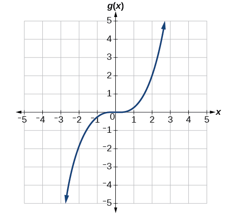{: #Figure_01_05_028}

When trying to determine a vertical stretch or shift, it is helpful to look for a point on the graph that is relatively clear. In this graph, it appears that<math xmlns="http://www.w3.org/1998/Math/MathML"> <mrow> <mtext> </mtext><mi>g</mi><mo stretchy="false">(</mo><mn>2</mn><mo stretchy="false">)</mo><mo>=</mo><mn>2.</mn><mtext> </mtext></mrow> </math>

With the basic cubic function at the same input,<math xmlns="http://www.w3.org/1998/Math/MathML"> <mrow> <mtext> </mtext><mi>f</mi><mo stretchy="false">(</mo><mn>2</mn><mo stretchy="false">)</mo><mo>=</mo><msup> <mn>2</mn> <mn>3</mn> </msup> <mo>=</mo><mn>8.</mn><mtext> </mtext></mrow> </math>

 Based on that, it appears that the outputs of<math xmlns="http://www.w3.org/1998/Math/MathML"> <mrow> <mtext> </mtext><mi>g</mi><mtext> </mtext></mrow> </math>

are<math xmlns="http://www.w3.org/1998/Math/MathML"> <mrow> <mtext> </mtext><mfrac> <mn>1</mn> <mn>4</mn> </mfrac> <mtext> </mtext></mrow> </math>

the outputs of the function<math xmlns="http://www.w3.org/1998/Math/MathML"> <mrow> <mtext> </mtext><mi>f</mi><mtext> </mtext></mrow> </math>

because<math xmlns="http://www.w3.org/1998/Math/MathML"> <mrow> <mtext> </mtext><mi>g</mi><mo stretchy="false">(</mo><mn>2</mn><mo stretchy="false">)</mo><mo>=</mo><mfrac> <mn>1</mn> <mn>4</mn> </mfrac> <mi>f</mi><mo stretchy="false">(</mo><mn>2</mn><mo stretchy="false">)</mo><mo>.</mo><mtext> </mtext></mrow> </math>

From this we can fairly safely conclude that <math xmlns="http://www.w3.org/1998/Math/MathML"> <mrow> <mtext> </mtext><mi>g</mi><mo stretchy="false">(</mo><mi>x</mi><mo stretchy="false">)</mo><mo>=</mo><mfrac> <mn>1</mn> <mn>4</mn> </mfrac> <mi>f</mi><mo stretchy="false">(</mo><mi>x</mi><mo stretchy="false">)</mo><mo>.</mo> </mrow> </math>

We can write a formula for<math xmlns="http://www.w3.org/1998/Math/MathML"> <mrow> <mtext> </mtext><mi>g</mi><mtext> </mtext></mrow> </math>

by using the definition of the function<math xmlns="http://www.w3.org/1998/Math/MathML"> <mrow> <mtext> </mtext><mi>f</mi><mo>.</mo></mrow> </math>

<math xmlns="http://www.w3.org/1998/Math/MathML" display="block"> <mrow> <mi>g</mi><mo stretchy="false">(</mo><mi>x</mi><mo stretchy="false">)</mo><mo>=</mo><mfrac> <mn>1</mn> <mn>4</mn> </mfrac> <mi>f</mi><mo stretchy="false">(</mo><mi>x</mi><mo stretchy="false">)</mo><mo>=</mo><mfrac> <mn>1</mn> <mn>4</mn> </mfrac> <msup> <mi>x</mi> <mn>3</mn> </msup> </mrow> </math>

Write the formula for the function that we get when we stretch the identity toolkit function by a factor of 3, and then shift it down by 2 units.

<math xmlns="http://www.w3.org/1998/Math/MathML"> <mrow> <mi>g</mi><mo stretchy="false">(</mo><mi>x</mi><mo stretchy="false">)</mo><mo>=</mo><mn>3</mn><mi>x</mi><mo>-</mo><mn>2</mn></mrow> </math>

####  Horizontal Stretches and Compressions 

Now we consider changes to the inside of a function. When we multiply a function’s input by a positive constant, we get a function whose graph is stretched or compressed horizontally in relation to the graph of the original function. If the constant is between 0 and 1, we get a **horizontal stretch**; if the constant is greater than 1, we get a **horizontal compression** of the function.

 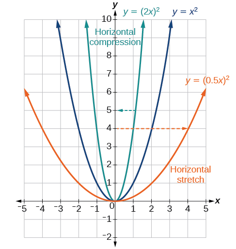{: #Figure_01_05_029}

Given a function<math xmlns="http://www.w3.org/1998/Math/MathML"> <mrow> <mtext> </mtext><mi>y</mi><mo>=</mo><mi>f</mi><mo stretchy="false">(</mo><mi>x</mi><mo stretchy="false">)</mo><mo>,</mo><mtext> </mtext></mrow> </math>

the form<math xmlns="http://www.w3.org/1998/Math/MathML"> <mrow> <mtext> </mtext><mi>y</mi><mo>=</mo><mi>f</mi><mo stretchy="false">(</mo><mi>b</mi><mi>x</mi><mo stretchy="false">)</mo><mtext> </mtext></mrow> </math>

results in a horizontal stretch or compression. Consider the function<math xmlns="http://www.w3.org/1998/Math/MathML"> <mrow> <mtext> </mtext><mi>y</mi><mo>=</mo><msup> <mi>x</mi> <mn>2</mn> </msup> <mo>.</mo><mtext> </mtext></mrow> </math>

Observe [\[link\]](#Figure_01_05_029). The graph of<math xmlns="http://www.w3.org/1998/Math/MathML"> <mrow> <mtext> </mtext><mi>y</mi><mo>=</mo><msup> <mrow> <mrow><mo>(</mo> <mrow> <mn>0.5</mn><mi>x</mi></mrow> <mo>)</mo></mrow></mrow> <mn>2</mn> </msup> <mtext> </mtext></mrow> </math>

is a horizontal stretch of the graph of the function<math xmlns="http://www.w3.org/1998/Math/MathML"> <mrow> <mtext> </mtext><mi>y</mi><mo>=</mo><msup> <mi>x</mi> <mn>2</mn> </msup> <mtext> </mtext></mrow> </math>

by a factor of 2. The graph of<math xmlns="http://www.w3.org/1998/Math/MathML"> <mrow> <mtext> </mtext><mi>y</mi><mo>=</mo><msup> <mrow> <mrow><mo>(</mo> <mrow> <mn>2</mn><mi>x</mi></mrow> <mo>)</mo></mrow></mrow> <mn>2</mn> </msup> <mtext> </mtext></mrow> </math>

is a horizontal compression of the graph of the function<math xmlns="http://www.w3.org/1998/Math/MathML"> <mrow> <mtext> </mtext><mi>y</mi><mo>=</mo><msup> <mi>x</mi> <mn>2</mn> </msup> <mtext> </mtext></mrow> </math>

by a factor of 2.

Horizontal Stretches and Compressions

Given a function<math xmlns="http://www.w3.org/1998/Math/MathML"> <mrow> <mtext> </mtext><mi>f</mi><mo stretchy="false">(</mo><mi>x</mi><mo stretchy="false">)</mo><mo>,</mo><mtext> </mtext></mrow> </math>

a new function<math xmlns="http://www.w3.org/1998/Math/MathML"> <mrow> <mtext> </mtext><mi>g</mi><mo stretchy="false">(</mo><mi>x</mi><mo stretchy="false">)</mo><mo>=</mo><mi>f</mi><mo stretchy="false">(</mo><mi>b</mi><mi>x</mi><mo stretchy="false">)</mo><mo>,</mo><mtext> </mtext></mrow> </math>

where<math xmlns="http://www.w3.org/1998/Math/MathML"> <mrow> <mtext> </mtext><mi>b</mi><mtext> </mtext></mrow> </math>

is a constant, is a **horizontal stretch**{: data-type="term"} or **horizontal compression**{: data-type="term"} of the function<math xmlns="http://www.w3.org/1998/Math/MathML"> <mrow> <mtext> </mtext><mi>f</mi><mo stretchy="false">(</mo><mi>x</mi><mo stretchy="false">)</mo><mo>.</mo></mrow> </math>

* If
  <math xmlns="http://www.w3.org/1998/Math/MathML"> <mrow> <mtext> </mtext><mi>b</mi><mo>&gt;</mo><mn>1</mn><mo>,</mo><mtext> </mtext></mrow> </math>
  
  then the graph will be compressed by
  <math xmlns="http://www.w3.org/1998/Math/MathML"> <mrow> <mtext> </mtext><mfrac> <mn>1</mn> <mi>b</mi> </mfrac> <mo>.</mo></mrow> </math>

* If
  <math xmlns="http://www.w3.org/1998/Math/MathML"> <mrow> <mtext> </mtext><mn>0</mn><mo>&lt;</mo><mi>b</mi><mo>&lt;</mo><mn>1</mn><mo>,</mo><mtext> </mtext></mrow> </math>
  
  then the graph will be stretched by
  <math xmlns="http://www.w3.org/1998/Math/MathML"> <mrow> <mtext> </mtext><mfrac> <mn>1</mn> <mi>b</mi> </mfrac> <mo>.</mo></mrow> </math>

* If
  <math xmlns="http://www.w3.org/1998/Math/MathML"> <mrow> <mtext> </mtext><mi>b</mi><mo>&lt;</mo><mn>0</mn><mo>,</mo><mtext> </mtext></mrow> </math>
  
  then there will be combination of a horizontal stretch or compression with a horizontal reflection.

<strong>Given a description of a function, sketch a horizontal compression or stretch. </strong>

1.  Write a formula to represent the function.
2.  Set
    <math xmlns="http://www.w3.org/1998/Math/MathML"> <mrow> <mtext> </mtext><mi>g</mi><mo stretchy="false">(</mo><mi>x</mi><mo stretchy="false">)</mo><mo>=</mo><mi>f</mi><mo stretchy="false">(</mo><mi>b</mi><mi>x</mi><mo stretchy="false">)</mo><mtext> </mtext></mrow> </math>
    
    where
    <math xmlns="http://www.w3.org/1998/Math/MathML"> <mrow> <mtext> </mtext><mi>b</mi><mo>&gt;</mo><mn>1</mn><mtext> </mtext></mrow> </math>
    
    for a compression or
    <math xmlns="http://www.w3.org/1998/Math/MathML"> <mrow> <mtext> </mtext><mn>0</mn><mo>&lt;</mo><mi>b</mi><mo>&lt;</mo><mn>1</mn><mtext> </mtext></mrow> </math>
    
    for a stretch.
{: data-number-style="arabic"}

Graphing a Horizontal Compression

Suppose a scientist is comparing a population of fruit flies to a population that progresses through its lifespan twice as fast as the original population. In other words, this new population,<math xmlns="http://www.w3.org/1998/Math/MathML"> <mrow> <mtext> </mtext><mi>R</mi><mo>,</mo><mtext> </mtext></mrow> </math>

will progress in 1 hour the same amount as the original population does in 2 hours, and in 2 hours, it will progress as much as the original population does in 4 hours. Sketch a graph of this population.

Symbolically, we could write

<math xmlns="http://www.w3.org/1998/Math/MathML" display="block"> <mrow> <mtable> <mtr> <mtd columnalign="right"> <mrow> <mi>R</mi><mo stretchy="false">(</mo><mn>1</mn><mo stretchy="false">)</mo> </mrow> </mtd> <mtd> <mo>=</mo> </mtd> <mtd columnalign="left"> <mrow> <mi>P</mi><mo stretchy="false">(</mo><mn>2</mn><mo stretchy="false">)</mo><mo>,</mo> </mrow> </mtd> </mtr> <mtr> <mtd columnalign="right"> <mrow> <mi>R</mi><mo stretchy="false">(</mo><mn>2</mn><mo stretchy="false">)</mo> </mrow> </mtd> <mtd> <mo>=</mo> </mtd> <mtd columnalign="left"> <mrow> <mi>P</mi><mo stretchy="false">(</mo><mn>4</mn><mo stretchy="false">)</mo><mo>,</mo><mtext> and in general,</mtext> </mrow> </mtd> </mtr> <mtr> <mtd columnalign="right"> <mrow> <mi>R</mi><mo stretchy="false">(</mo><mi>t</mi><mo stretchy="false">)</mo> </mrow> </mtd> <mtd> <mo>=</mo> </mtd> <mtd columnalign="left"> <mrow> <mi>P</mi><mo stretchy="false">(</mo><mn>2</mn><mi>t</mi><mo stretchy="false">)</mo><mo>.</mo> </mrow> </mtd> </mtr> </mtable> </mrow> </math>

See [[link]](#Figure_01_05_030) for a graphical comparison of the original population and the compressed population.

![Two side-by-side graphs. The first graph has function for original population whose domain is \[0,7\] and range is \[0,3\]. The maximum value occurs at (3,3). The second graph has the same shape as the first except it is half as wide. It is a graph of transformed population, with a domain of \[0, 3.5\] and a range of \[0,3\]. The maximum occurs at (1.5, 3). ](../resources/CNX_Precalc_Figure_01_05_029ab.jpg "(a) Original population graph (b) Compressed population graph "){: #Figure_01_05_030}

Analysis

Note that the effect on the graph is a horizontal compression where all input values are half of their original distance from the vertical axis.

Finding a Horizontal Stretch for a Tabular Function

A function<math xmlns="http://www.w3.org/1998/Math/MathML"> <mrow> <mtext> </mtext><mi>f</mi><mo stretchy="false">(</mo><mi>x</mi><mo stretchy="false">)</mo><mtext> </mtext></mrow> </math>

is given as [[link]](#Table_01_05_12). Create a table for the function<math xmlns="http://www.w3.org/1998/Math/MathML"> <mrow> <mtext> </mtext><mi>g</mi><mo stretchy="false">(</mo><mi>x</mi><mo stretchy="false">)</mo><mo>=</mo><mi>f</mi><mrow><mo>(</mo> <mrow> <mfrac> <mn>1</mn> <mn>2</mn> </mfrac> <mi>x</mi></mrow> <mo>)</mo></mrow><mo>.</mo></mrow> </math>

<table id="Table_01_05_12" summary="Two rows and five columns. The first row is labeled, &#x201C;x&#x201D;, and the second is labeled, &#x201C;f(x)&#x201D;. The values of x are 2, 4, 6, and 8. So for f(2)=1, f(4)=3, f(6)=7, and f(8)=11."><colgroup><col /><col width="40" /><col width="40" /><col width="40" /><col width="40" /></colgroup><tbody>
    <tr>
     <td data-align="center"><strong><math xmlns="http://www.w3.org/1998/Math/MathML">
      <mi>x</mi>
     </math></strong>
     </td>
     <td data-align="center">2</td>
     <td data-align="center">4</td>
     <td data-align="center">6</td>
     <td data-align="center">8</td>
    </tr>
   
 
    <tr>
     <td data-align="center"><strong><math xmlns="http://www.w3.org/1998/Math/MathML">
      <mrow>
       <mi>f</mi><mo stretchy="false">(</mo><mi>x</mi><mo stretchy="false">)</mo></mrow>
     </math></strong>
     </td>
     <td data-align="center">1</td>
     <td data-align="center">3</td>
     <td data-align="center">7</td>
     <td data-align="center">11</td>
    </tr>
   </tbody></table>

The formula<math xmlns="http://www.w3.org/1998/Math/MathML"> <mrow> <mtext> </mtext><mi>g</mi><mo stretchy="false">(</mo><mi>x</mi><mo stretchy="false">)</mo><mo>=</mo><mi>f</mi><mrow><mo>(</mo> <mrow> <mfrac> <mn>1</mn> <mn>2</mn> </mfrac> <mi>x</mi></mrow> <mo>)</mo></mrow><mtext> </mtext></mrow> </math>

tells us that the output values for<math xmlns="http://www.w3.org/1998/Math/MathML"> <mrow> <mtext> </mtext><mi>g</mi><mtext> </mtext></mrow> </math>

are the same as the output values for the function<math xmlns="http://www.w3.org/1998/Math/MathML"> <mrow> <mtext> </mtext><mi>f</mi><mtext> </mtext></mrow> </math>

at an input half the size. Notice that we do not have enough information to determine<math xmlns="http://www.w3.org/1998/Math/MathML"> <mrow> <mtext> </mtext><mi>g</mi><mo stretchy="false">(</mo><mn>2</mn><mo stretchy="false">)</mo><mtext> </mtext></mrow> </math>

because<math xmlns="http://www.w3.org/1998/Math/MathML"> <mrow> <mtext> </mtext><mi>g</mi><mo stretchy="false">(</mo><mn>2</mn><mo stretchy="false">)</mo><mo>=</mo><mi>f</mi><mrow><mo>(</mo> <mrow> <mfrac> <mn>1</mn> <mn>2</mn> </mfrac> <mo>⋅</mo><mn>2</mn></mrow> <mo>)</mo></mrow><mo>=</mo><mi>f</mi><mo stretchy="false">(</mo><mn>1</mn><mo stretchy="false">)</mo><mo>,</mo><mtext> </mtext></mrow> </math>

and we do not have a value for<math xmlns="http://www.w3.org/1998/Math/MathML"> <mrow> <mtext> </mtext><mi>f</mi><mo stretchy="false">(</mo><mn>1</mn><mo stretchy="false">)</mo><mtext> </mtext></mrow> </math>

in our table. Our input values to<math xmlns="http://www.w3.org/1998/Math/MathML"> <mrow> <mtext> </mtext><mi>g</mi><mtext> </mtext></mrow> </math>

will need to be twice as large to get inputs for<math xmlns="http://www.w3.org/1998/Math/MathML"> <mrow> <mtext> </mtext><mi>f</mi><mtext> </mtext></mrow> </math>

that we can evaluate. For example, we can determine<math xmlns="http://www.w3.org/1998/Math/MathML"> <mrow> <mtext> </mtext><mi>g</mi><mo stretchy="false">(</mo><mn>4</mn><mo stretchy="false">)</mo><mtext>.</mtext></mrow> </math>

<math xmlns="http://www.w3.org/1998/Math/MathML" display="block"> <mrow> <mi>g</mi><mo stretchy="false">(</mo><mn>4</mn><mo stretchy="false">)</mo><mo>=</mo><mi>f</mi><mrow><mo>(</mo> <mrow> <mfrac> <mn>1</mn> <mn>2</mn> </mfrac> <mo>⋅</mo><mn>4</mn></mrow> <mo>)</mo></mrow><mo>=</mo><mi>f</mi><mo stretchy="false">(</mo><mn>2</mn><mo stretchy="false">)</mo><mo>=</mo><mn>1</mn></mrow> </math>

We do the same for the other values to produce [[link]](#Table_01_05_13).

<table id="Table_01_05_13" summary="Two rows and five columns. The first row is labeled, &#x201C;x&#x201D;, and the second is labeled, &#x201C;f(x)&#x201D;. The values of x are 2, 4, 6, and 8. So for f(2)=1, f(4)=3, f(6)=7, and f(8)=11."><colgroup><col /><col width="40" /><col width="40" /><col width="40" /><col width="40" /></colgroup><tbody>
    <tr>
     <td><strong><math xmlns="http://www.w3.org/1998/Math/MathML">
 <mi>x</mi>
</math></strong>
</td>
     <td>4</td>
     <td>8</td>
     <td>12</td>
     <td>16</td>
    </tr>
  
    <tr>
     <td><strong><math xmlns="http://www.w3.org/1998/Math/MathML">
      <mrow>
       <mi>g</mi><mo stretchy="false">(</mo><mi>x</mi><mo stretchy="false">)</mo></mrow>
     </math></strong>
     </td>
     <td>1</td>
     <td>3</td>
     <td>7</td>
     <td>11</td>
    </tr>
   </tbody></table>
[[link]](#Figure_01_05_032) shows the graphs of both of these sets of points.

{: #Figure_01_05_032}

Analysis

Because each input value has been doubled, the result is that the function<math xmlns="http://www.w3.org/1998/Math/MathML"> <mrow> <mtext> </mtext><mi>g</mi><mo stretchy="false">(</mo><mi>x</mi><mo stretchy="false">)</mo><mtext> </mtext></mrow> </math>

has been stretched horizontally by a factor of 2.

Recognizing a Horizontal Compression on a Graph

Relate the function<math xmlns="http://www.w3.org/1998/Math/MathML"> <mrow> <mtext> </mtext><mi>g</mi><mo stretchy="false">(</mo><mi>x</mi><mo stretchy="false">)</mo><mtext> </mtext></mrow> </math>

to<math xmlns="http://www.w3.org/1998/Math/MathML"> <mrow> <mtext> </mtext><mi>f</mi><mo stretchy="false">(</mo><mi>x</mi><mo stretchy="false">)</mo><mtext> </mtext></mrow> </math>

in [[link]](#Figure_01_05_033).

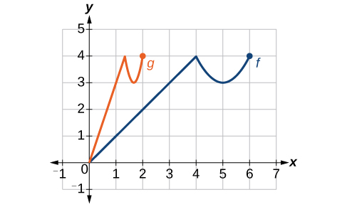{: #Figure_01_05_033}

The graph of<math xmlns="http://www.w3.org/1998/Math/MathML"> <mrow> <mtext> </mtext><mi>g</mi><mo stretchy="false">(</mo><mi>x</mi><mo stretchy="false">)</mo><mtext> </mtext></mrow> </math>

looks like the graph of<math xmlns="http://www.w3.org/1998/Math/MathML"> <mrow> <mtext> </mtext><mi>f</mi><mo stretchy="false">(</mo><mi>x</mi><mo stretchy="false">)</mo><mtext> </mtext></mrow> </math>

horizontally compressed. Because<math xmlns="http://www.w3.org/1998/Math/MathML"> <mrow> <mtext> </mtext><mi>f</mi><mo stretchy="false">(</mo><mi>x</mi><mo stretchy="false">)</mo><mtext> </mtext></mrow> </math>

ends at<math xmlns="http://www.w3.org/1998/Math/MathML"> <mrow> <mtext> </mtext><mo stretchy="false">(</mo><mn>6</mn><mo>,</mo><mn>4</mn><mo stretchy="false">)</mo><mtext> </mtext></mrow> </math>

and<math xmlns="http://www.w3.org/1998/Math/MathML"> <mrow> <mtext> </mtext><mi>g</mi><mo stretchy="false">(</mo><mi>x</mi><mo stretchy="false">)</mo><mtext> </mtext></mrow> </math>

ends at<math xmlns="http://www.w3.org/1998/Math/MathML"> <mrow> <mtext> </mtext><mo stretchy="false">(</mo><mn>2</mn><mo>,</mo><mn>4</mn><mo stretchy="false">)</mo><mo>,</mo><mtext> </mtext></mrow> </math>

we can see that the <math xmlns="http://www.w3.org/1998/Math/MathML"> <mrow> <mtext> </mtext><mi>x</mi><mtext>-</mtext></mrow> </math>

values have been compressed by<math xmlns="http://www.w3.org/1998/Math/MathML"> <mrow> <mtext> </mtext><mfrac> <mn>1</mn> <mn>3</mn> </mfrac> <mo>,</mo><mtext> </mtext></mrow> </math>

because<math xmlns="http://www.w3.org/1998/Math/MathML"> <mrow> <mtext> </mtext><mn>6</mn><mrow><mo>(</mo> <mrow> <mfrac> <mn>1</mn> <mn>3</mn> </mfrac> </mrow> <mo>)</mo></mrow><mo>=</mo><mn>2.</mn><mtext> </mtext></mrow> </math>

We might also notice that<math xmlns="http://www.w3.org/1998/Math/MathML"> <mrow> <mtext> </mtext><mi>g</mi><mo stretchy="false">(</mo><mn>2</mn><mo stretchy="false">)</mo><mo>=</mo><mi>f</mi><mrow><mo>(</mo> <mn>6</mn> <mo>)</mo></mrow><mtext> </mtext></mrow> </math>

and<math xmlns="http://www.w3.org/1998/Math/MathML"> <mrow> <mtext> </mtext><mi>g</mi><mo stretchy="false">(</mo><mn>1</mn><mo stretchy="false">)</mo><mo>=</mo><mi>f</mi><mrow><mo>(</mo> <mn>3</mn> <mo>)</mo></mrow><mo>.</mo><mtext> </mtext></mrow> </math>

Either way, we can describe this relationship as<math xmlns="http://www.w3.org/1998/Math/MathML"> <mrow> <mtext> </mtext><mi>g</mi><mo stretchy="false">(</mo><mi>x</mi><mo stretchy="false">)</mo><mo>=</mo><mi>f</mi><mrow><mo>(</mo> <mrow> <mn>3</mn><mi>x</mi></mrow> <mo>)</mo></mrow><mo>.</mo><mtext> </mtext></mrow> </math>

This is a horizontal compression by<math xmlns="http://www.w3.org/1998/Math/MathML"> <mrow> <mtext> </mtext><mfrac> <mn>1</mn> <mn>3</mn> </mfrac> <mo>.</mo></mrow> </math>

Analysis

Notice that the coefficient needed for a horizontal stretch or compression is the reciprocal of the stretch or compression. So to stretch the graph horizontally by a scale factor of 4, we need a coefficient of<math xmlns="http://www.w3.org/1998/Math/MathML"> <mrow> <mtext> </mtext><mfrac> <mn>1</mn> <mn>4</mn> </mfrac> <mtext> </mtext></mrow> </math>

in our function:<math xmlns="http://www.w3.org/1998/Math/MathML"> <mrow> <mtext> </mtext><mi>f</mi><mrow><mo>(</mo> <mrow> <mfrac> <mn>1</mn> <mn>4</mn> </mfrac> <mi>x</mi></mrow> <mo>)</mo></mrow><mo>.</mo><mtext> </mtext></mrow> </math>

This means that the input values must be four times larger to produce the same result, requiring the input to be larger, causing the horizontal stretching.

Write a formula for the toolkit square root function horizontally stretched by a factor of 3.

<math xmlns="http://www.w3.org/1998/Math/MathML"> <mrow> <mi>g</mi><mo stretchy="false">(</mo><mi>x</mi><mo stretchy="false">)</mo><mo>=</mo><mi>f</mi><mrow><mo>(</mo> <mrow> <mfrac> <mn>1</mn> <mn>3</mn> </mfrac> <mi>x</mi></mrow> <mo>)</mo></mrow><mtext> </mtext></mrow> </math>

so using the square root function we get<math xmlns="http://www.w3.org/1998/Math/MathML"> <mrow> <mtext> </mtext><mi>g</mi><mo stretchy="false">(</mo><mi>x</mi><mo stretchy="false">)</mo><mo>=</mo><msqrt> <mrow> <mfrac> <mn>1</mn> <mn>3</mn> </mfrac> <mi>x</mi></mrow> </msqrt> </mrow> </math>

### Performing a Sequence of Transformations

When combining transformations, it is very important to consider the order of the transformations. For example, vertically shifting by 3 and then vertically stretching by 2 does not create the same graph as vertically stretching by 2 and then vertically shifting by 3, because when we shift first, both the original function and the shift get stretched, while only the original function gets stretched when we stretch first.

When we see an expression such as<math xmlns="http://www.w3.org/1998/Math/MathML"> <mrow> <mtext> </mtext><mtext> </mtext><mn>2</mn><mi>f</mi><mo stretchy="false">(</mo><mi>x</mi><mo stretchy="false">)</mo><mo>+</mo><mn>3</mn><mo>,</mo><mtext> </mtext></mrow> </math>

which transformation should we start with? The answer here follows nicely from the order of operations. Given the output value of<math xmlns="http://www.w3.org/1998/Math/MathML"> <mrow> <mtext> </mtext><mi>f</mi><mo stretchy="false">(</mo><mi>x</mi><mo stretchy="false">)</mo><mo>,</mo><mtext> </mtext></mrow> </math>

we first multiply by 2, causing the vertical stretch, and then add 3, causing the vertical shift. In other words, multiplication before addition.

Horizontal transformations are a little trickier to think about. When we write<math xmlns="http://www.w3.org/1998/Math/MathML"> <mrow> <mtext> </mtext><mi>g</mi><mo stretchy="false">(</mo><mi>x</mi><mo stretchy="false">)</mo><mo>=</mo><mi>f</mi><mo stretchy="false">(</mo><mn>2</mn><mi>x</mi><mo>+</mo><mn>3</mn><mo stretchy="false">)</mo><mo>,</mo><mtext> </mtext></mrow> </math>

for example, we have to think about how the inputs to the function<math xmlns="http://www.w3.org/1998/Math/MathML"> <mrow> <mtext> </mtext><mi>g</mi><mtext> </mtext></mrow> </math>

relate to the inputs to the function<math xmlns="http://www.w3.org/1998/Math/MathML"> <mrow> <mtext> </mtext><mtext> </mtext><mi>f</mi><mo>.</mo><mtext> </mtext></mrow> </math>

Suppose we know<math xmlns="http://www.w3.org/1998/Math/MathML"> <mrow> <mtext> </mtext><mi>f</mi><mo stretchy="false">(</mo><mn>7</mn><mo stretchy="false">)</mo><mo>=</mo><mn>12.</mn><mtext> </mtext></mrow> </math>

What input to<math xmlns="http://www.w3.org/1998/Math/MathML"> <mrow> <mtext> </mtext><mi>g</mi><mtext> </mtext></mrow> </math>

would produce that output? In other words, what value of<math xmlns="http://www.w3.org/1998/Math/MathML"> <mrow> <mtext> </mtext><mi>x</mi><mtext> </mtext></mrow> </math>

will allow<math xmlns="http://www.w3.org/1998/Math/MathML"> <mrow> <mtext> </mtext><mi>g</mi><mo stretchy="false">(</mo><mi>x</mi><mo stretchy="false">)</mo><mo>=</mo><mi>f</mi><mo stretchy="false">(</mo><mn>2</mn><mi>x</mi><mo>+</mo><mn>3</mn><mo stretchy="false">)</mo><mo>=</mo><mn>12</mn><mo>?</mo><mtext> </mtext></mrow> </math>

We would need<math xmlns="http://www.w3.org/1998/Math/MathML"> <mrow> <mtext> </mtext><mn>2</mn><mi>x</mi><mo>+</mo><mn>3</mn><mo>=</mo><mn>7.</mn><mtext> </mtext></mrow> </math>

To solve for<math xmlns="http://www.w3.org/1998/Math/MathML"> <mrow> <mtext> </mtext><mi>x</mi><mo>,</mo><mtext> </mtext></mrow> </math>

we would first subtract 3, resulting in a horizontal shift, and then divide by 2, causing a horizontal compression.

This format ends up being very difficult to work with, because it is usually much easier to horizontally stretch a graph before shifting. We can work around this by factoring inside the function.

<math xmlns="http://www.w3.org/1998/Math/MathML" display="block"> <mrow> <mi>f</mi><mo stretchy="false">(</mo><mi>b</mi><mi>x</mi><mo>+</mo><mi>p</mi><mo stretchy="false">)</mo><mo>=</mo><mi>f</mi><mrow><mo>(</mo> <mrow> <mi>b</mi><mrow><mo>(</mo> <mrow> <mi>x</mi><mo>+</mo><mfrac> <mi>p</mi> <mi>b</mi> </mfrac> </mrow> <mo>)</mo></mrow></mrow> <mo>)</mo></mrow></mrow> </math>

Let’s work through an example.

<math xmlns="http://www.w3.org/1998/Math/MathML" display="block"> <mrow> <mi>f</mi><mrow><mo>(</mo> <mi>x</mi> <mo>)</mo></mrow><mo>=</mo><msup> <mrow> <mrow><mo>(</mo> <mrow> <mn>2</mn><mi>x</mi><mo>+</mo><mn>4</mn></mrow> <mo>)</mo></mrow></mrow> <mn>2</mn> </msup> </mrow> </math>

We can factor out a 2.

<math xmlns="http://www.w3.org/1998/Math/MathML" display="block"> <mrow> <mi>f</mi><mrow><mo>(</mo> <mi>x</mi> <mo>)</mo></mrow><mo>=</mo><msup> <mrow> <mrow><mo>(</mo> <mrow> <mn>2</mn><mrow><mo>(</mo> <mrow> <mi>x</mi><mo>+</mo><mn>2</mn></mrow> <mo>)</mo></mrow></mrow> <mo>)</mo></mrow></mrow> <mn>2</mn> </msup> </mrow> </math>

Now we can more clearly observe a horizontal shift to the left 2 units and a horizontal compression. Factoring in this way allows us to horizontally stretch first and then shift horizontally.

Combining Transformations

When combining vertical transformations written in the form<math xmlns="http://www.w3.org/1998/Math/MathML"> <mrow> <mtext> </mtext><mi>a</mi><mi>f</mi><mo stretchy="false">(</mo><mi>x</mi><mo stretchy="false">)</mo><mo>+</mo><mi>k</mi><mo>,</mo><mtext> </mtext></mrow> </math>

first vertically stretch by<math xmlns="http://www.w3.org/1998/Math/MathML"> <mrow> <mtext> </mtext><mi>a</mi><mtext> </mtext></mrow> </math>

and then vertically shift by<math xmlns="http://www.w3.org/1998/Math/MathML"> <mrow> <mtext> </mtext><mi>k</mi><mo>.</mo></mrow> </math>

When combining horizontal transformations written in the form<math xmlns="http://www.w3.org/1998/Math/MathML"> <mrow> <mtext> </mtext><mi>f</mi><mo stretchy="false">(</mo><mi>b</mi><mi>x</mi><mo>-</mo><mi>h</mi><mo stretchy="false">)</mo><mo>,</mo><mtext> </mtext></mrow> </math>

first horizontally shift by<math xmlns="http://www.w3.org/1998/Math/MathML"> <mrow> <mtext> </mtext><mi>h</mi><mtext> </mtext></mrow> </math>

and then horizontally stretch by<math xmlns="http://www.w3.org/1998/Math/MathML"> <mrow> <mtext> </mtext><mfrac> <mn>1</mn> <mi>b</mi> </mfrac> <mo>.</mo></mrow> </math>

When combining horizontal transformations written in the form<math xmlns="http://www.w3.org/1998/Math/MathML"> <mrow> <mtext> </mtext><mi>f</mi><mo stretchy="false">(</mo><mi>b</mi><mo stretchy="false">(</mo><mi>x</mi><mo>-</mo><mi>h</mi><mo stretchy="false">)</mo><mo stretchy="false">)</mo><mo>,</mo><mtext> </mtext></mrow> </math>

first horizontally stretch by<math xmlns="http://www.w3.org/1998/Math/MathML"> <mrow> <mtext> </mtext><mfrac> <mn>1</mn> <mi>b</mi> </mfrac> <mtext> </mtext></mrow> </math>

and then horizontally shift by<math xmlns="http://www.w3.org/1998/Math/MathML"> <mrow> <mtext> </mtext><mi>h</mi><mo>.</mo></mrow> </math>

Horizontal and vertical transformations are independent. It does not matter whether horizontal or vertical transformations are performed first.

Finding a Triple Transformation of a Tabular Function

Given [[link]](#Table_01_05_14) for the function<math xmlns="http://www.w3.org/1998/Math/MathML"> <mrow> <mtext> </mtext><mi>f</mi><mo stretchy="false">(</mo><mi>x</mi><mo stretchy="false">)</mo><mo>,</mo><mtext> </mtext></mrow> </math>

create a table of values for the function<math xmlns="http://www.w3.org/1998/Math/MathML"> <mrow> <mtext> </mtext><mi>g</mi><mo stretchy="false">(</mo><mi>x</mi><mo stretchy="false">)</mo><mo>=</mo><mn>2</mn><mi>f</mi><mo stretchy="false">(</mo><mn>3</mn><mi>x</mi><mo stretchy="false">)</mo><mo>+</mo><mn>1.</mn></mrow> </math>

<table id="Table_01_05_14" summary="Two rows and five columns. The first row is labeled, &#x201C;x&#x201D;, and the second is labeled, &#x201C;f(x)&#x201D;. The values of x are 6, 12, 18, and 24. So for f(6)=10, f(12)=14, f(18)=15, and f(24)=17."><colgroup><col /><col width="40" /><col width="40" /><col width="40" /><col width="40" /></colgroup><tbody>
        <tr>
         <td><strong><math xmlns="http://www.w3.org/1998/Math/MathML">
          <mi>x</mi>
         </math></strong>
         </td>
         <td>6</td>
         <td>12</td>
         <td>18</td>
         <td>24</td>
        </tr>
       
       
        <tr>
         <td><strong><math xmlns="http://www.w3.org/1998/Math/MathML">
          <mrow>
           <mi>f</mi><mo stretchy="false">(</mo><mi>x</mi><mo stretchy="false">)</mo></mrow>
         </math></strong>
         </td>
         <td>10</td>
         <td>14</td>
         <td>15</td>
         <td>17</td>
        </tr>
       </tbody></table>

There are three steps to this transformation, and we will work from the inside out. Starting with the horizontal transformations,<math xmlns="http://www.w3.org/1998/Math/MathML"> <mrow> <mtext> </mtext><mi>f</mi><mo stretchy="false">(</mo><mn>3</mn><mi>x</mi><mo stretchy="false">)</mo><mtext> </mtext></mrow> </math>

is a horizontal compression by<math xmlns="http://www.w3.org/1998/Math/MathML"> <mrow> <mtext> </mtext><mfrac> <mn>1</mn> <mn>3</mn> </mfrac> <mo>,</mo><mtext> </mtext></mrow> </math>

which means we multiply each <math xmlns="http://www.w3.org/1998/Math/MathML"> <mrow> <mtext> </mtext><mi>x</mi><mtext>-</mtext></mrow> </math>

value by<math xmlns="http://www.w3.org/1998/Math/MathML"> <mrow> <mtext> </mtext><mfrac> <mn>1</mn> <mn>3</mn> </mfrac> <mo>.</mo></mrow> </math>

See [[link]](#Table_01_05_15).

<table id="Table_01_05_15" summary="Two rows and five columns. The first row is labeled, &#x201C;x&#x201D;, and the second is labeled, &#x201C;f(3x)&#x201D;. The values of x are 2, 4, 6, and 8. So for f(2)=10, f(4)=14, f(6)=15, and f(8)=17."><colgroup><col /><col width="40" /><col width="40" /><col width="40" /><col width="40" /></colgroup><tbody>
        <tr>
         <td><strong><math xmlns="http://www.w3.org/1998/Math/MathML">
          <mi>x</mi>
         </math></strong>
         </td>
         <td>2</td>
         <td>4</td>
         <td>6</td>
         <td>8</td>
        </tr>
       
        <tr>
         <td><strong><math xmlns="http://www.w3.org/1998/Math/MathML">
          <mrow>
           <mi>f</mi><mo stretchy="false">(</mo><mn>3</mn><mi>x</mi><mo stretchy="false">)</mo></mrow>
         </math></strong>
         </td>
         <td>10</td>
         <td>14</td>
         <td>15</td>
         <td>17</td>
        </tr>
       </tbody></table>
Looking now to the vertical transformations, we start with the vertical stretch, which will multiply the output values by 2. We apply this to the previous transformation. See [[link]](#Table_01_05_016).

<table id="Table_01_05_016" summary="Two rows and five columns. The first row is labeled, &#x201C;x&#x201D;, and the second is labeled, &#x201C;2f(3x)&#x201D;. The values of x are 2, 4, 6, and 8. So for f(2)=20, f(4)=28, f(6)=30, and f(8)=34."><colgroup><col /><col width="40" /><col width="40" /><col width="40" /><col width="40" /></colgroup><tbody>
        <tr>
         <td><strong><math xmlns="http://www.w3.org/1998/Math/MathML">
          <mi>x</mi>
         </math></strong>
         </td>
         <td>2</td>
         <td>4</td>
         <td>6</td>
         <td>8</td>
        </tr>
       
        <tr>
         <td><strong><math xmlns="http://www.w3.org/1998/Math/MathML">
          <mrow>
           <mn>2</mn><mi>f</mi><mo stretchy="false">(</mo><mn>3</mn><mi>x</mi><mo stretchy="false">)</mo></mrow>
         </math></strong>
         </td>
         <td>20</td>
         <td>28</td>
         <td>30</td>
         <td>34</td>
        </tr>
       </tbody></table>
Finally, we can apply the vertical shift, which will add 1 to all the output values. See [[link]](#Table_01_05_17).

<table id="Table_01_05_17" summary="Two rows and five columns. The first row is labeled, &#x201C;x&#x201D;, and the second is labeled, &#x201C;g(x)=2f(3x)+1&#x201D;. The values of x are 2, 4, 6, and 8. So for g(2)=21, g(4)=29, g(6)=31, and g(8)=35."><colgroup><col /><col width="40" /><col width="40" /><col width="40" /><col width="40" /></colgroup><tbody>
        <tr>
         <td><strong><math xmlns="http://www.w3.org/1998/Math/MathML">
          <mi>x</mi>
         </math></strong>
         </td>
         <td>2</td>
         <td>4</td>
         <td>6</td>
         <td>8</td>
        </tr>
       
        <tr>
         <td><strong><math xmlns="http://www.w3.org/1998/Math/MathML">
          <mrow>
           <mi>g</mi><mo stretchy="false">(</mo><mi>x</mi><mo stretchy="false">)</mo><mo>=</mo><mn>2</mn><mi>f</mi><mo stretchy="false">(</mo><mn>3</mn><mi>x</mi><mo stretchy="false">)</mo><mo>+</mo><mn>1</mn></mrow>
         </math></strong>
         </td>
         <td>21</td>
         <td>29</td>
         <td>31</td>
         <td>35</td>
        </tr>
       </tbody></table>

Finding a Triple Transformation of a Graph

Use the graph of<math xmlns="http://www.w3.org/1998/Math/MathML"> <mrow> <mtext> </mtext><mi>f</mi><mrow><mo>(</mo> <mi>x</mi> <mo>)</mo></mrow><mtext> </mtext></mrow> </math>

in [[link]](#Figure_01_05_035) to sketch a graph of<math xmlns="http://www.w3.org/1998/Math/MathML"> <mrow> <mtext> </mtext><mi>k</mi><mo stretchy="false">(</mo><mi>x</mi><mo stretchy="false">)</mo><mo>=</mo><mi>f</mi><mrow><mo>(</mo> <mrow> <mfrac> <mn>1</mn> <mn>2</mn> </mfrac> <mi>x</mi><mo>+</mo><mn>1</mn></mrow> <mo>)</mo></mrow><mo>−</mo><mn>3.</mn></mrow> </math>

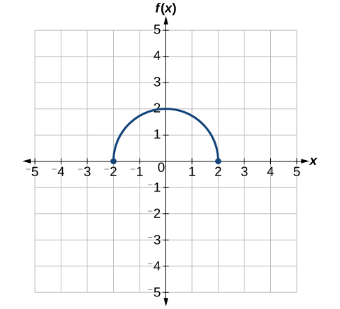{: #Figure_01_05_035}

To simplify, let’s start by factoring out the inside of the function.

<math xmlns="http://www.w3.org/1998/Math/MathML" display="block"> <mrow> <mi>f</mi><mrow><mo>(</mo> <mrow> <mfrac> <mn>1</mn> <mn>2</mn> </mfrac> <mi>x</mi><mo>+</mo><mn>1</mn></mrow> <mo>)</mo></mrow><mo>−</mo><mn>3</mn><mo>=</mo><mi>f</mi><mrow><mo>(</mo> <mrow> <mfrac> <mn>1</mn> <mn>2</mn> </mfrac> <mo stretchy="false">(</mo><mi>x</mi><mo>+</mo><mn>2</mn><mo stretchy="false">)</mo></mrow> <mo>)</mo></mrow><mo>−</mo><mn>3</mn></mrow> </math>

By factoring the inside, we can first horizontally stretch by 2, as indicated by the<math xmlns="http://www.w3.org/1998/Math/MathML"> <mrow> <mtext> </mtext><mfrac> <mn>1</mn> <mn>2</mn> </mfrac> <mtext> </mtext></mrow> </math>

on the inside of the function. Remember that twice the size of 0 is still 0, so the point (0,2) remains at (0,2) while the point (2,0) will stretch to (4,0). See [[link]](#Figure_01_05_036).

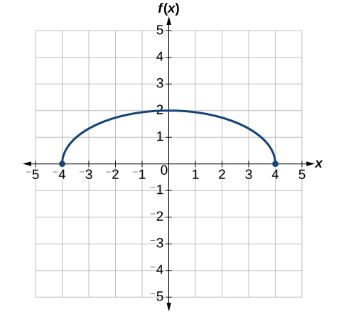{: #Figure_01_05_036}

Next, we horizontally shift left by 2 units, as indicated by<math xmlns="http://www.w3.org/1998/Math/MathML"> <mrow> <mtext> </mtext><mi>x</mi><mo>+</mo><mn>2.</mn><mtext> </mtext></mrow> </math>

See [[link]](#Figure_01_05_037).

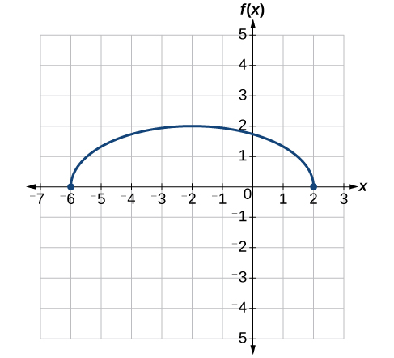{: #Figure_01_05_037}

Last, we vertically shift down by 3 to complete our sketch, as indicated by the<math xmlns="http://www.w3.org/1998/Math/MathML"> <mrow> <mtext> </mtext><mo>−</mo><mn>3</mn><mtext> </mtext></mrow> </math>

on the outside of the function. See [[link]](#Figure_01_05_038).

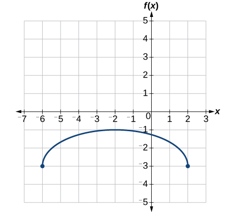{: #Figure_01_05_038}

Access this online resource for additional instruction and practice with transformation of functions.

* [Function Transformations][1]

### Key Equations

<table id="eip-id1165134474082" summary=".."><colgroup><col align="left" /><col align="left" /></colgroup><tbody>
    <tr>
        <td>Vertical shift</td>
        <td><math xmlns="http://www.w3.org/1998/Math/MathML">
            <mrow>
                <mi>g</mi><mo stretchy="false">(</mo><mi>x</mi><mo stretchy="false">)</mo><mo>=</mo><mi>f</mi><mo stretchy="false">(</mo><mi>x</mi><mo stretchy="false">)</mo><mo>+</mo><mi>k</mi><mtext> </mtext>
            </mrow>
        </math>(up for<math xmlns="http://www.w3.org/1998/Math/MathML">
            <mrow>
                <mtext> </mtext><mi>k</mi><mo>&gt;</mo><mn>0</mn>
            </mrow>
        </math>)</td>
    </tr>
    <tr>
        <td>Horizontal shift</td>
        <td><math xmlns="http://www.w3.org/1998/Math/MathML">
            <mrow>
                <mi>g</mi><mo stretchy="false">(</mo><mi>x</mi><mo stretchy="false">)</mo><mo>=</mo><mi>f</mi><mo stretchy="false">(</mo><mi>x</mi><mo>−</mo><mi>h</mi><mo stretchy="false">)</mo>
            </mrow>
        </math>(right for<math xmlns="http://www.w3.org/1998/Math/MathML">
            <mrow>
                <mtext> </mtext><mi>h</mi><mo>&gt;</mo><mn>0</mn>
            </mrow>
        </math>)</td>
    </tr>
    <tr>
        <td>Vertical reflection</td>
        <td><math xmlns="http://www.w3.org/1998/Math/MathML">
            <mrow>
                <mi>g</mi><mo stretchy="false">(</mo><mi>x</mi><mo stretchy="false">)</mo><mo>=</mo><mo>−</mo><mi>f</mi><mo stretchy="false">(</mo><mi>x</mi><mo stretchy="false">)</mo>
            </mrow>
        </math>
        </td>
    </tr>
    <tr>
        <td>Horizontal reflection</td>
        <td><math xmlns="http://www.w3.org/1998/Math/MathML">
            <mrow>
                <mi>g</mi><mo stretchy="false">(</mo><mi>x</mi><mo stretchy="false">)</mo><mo>=</mo><mi>f</mi><mo stretchy="false">(</mo><mo>−</mo><mi>x</mi><mo stretchy="false">)</mo>
            </mrow>
        </math>
        </td>
    </tr>
    <tr>
        <td>Vertical stretch</td>
        <td><math xmlns="http://www.w3.org/1998/Math/MathML">
            <mrow>
                <mi>g</mi><mo stretchy="false">(</mo><mi>x</mi><mo stretchy="false">)</mo><mo>=</mo><mi>a</mi><mi>f</mi><mo stretchy="false">(</mo><mi>x</mi><mo stretchy="false">)</mo><mtext> </mtext>
            </mrow>
        </math>(<math xmlns="http://www.w3.org/1998/Math/MathML">
            <mrow>
                <mi>a</mi><mo>&gt;</mo><mn>0</mn>
            </mrow>
        </math>
            )</td>
    </tr>
    <tr>
        <td>Vertical compression</td>
        <td><math xmlns="http://www.w3.org/1998/Math/MathML">
            <mrow>
                <mi>g</mi><mo stretchy="false">(</mo><mi>x</mi><mo stretchy="false">)</mo><mo>=</mo><mi>a</mi><mi>f</mi><mo stretchy="false">(</mo><mi>x</mi><mo stretchy="false">)</mo><mtext> </mtext>
            </mrow>
        </math><math xmlns="http://www.w3.org/1998/Math/MathML">
            <mrow>
                <mo stretchy="false">(</mo><mn>0</mn><mo>&lt;</mo><mi>a</mi><mo>&lt;</mo><mn>1</mn><mo stretchy="false">)</mo>
            </mrow>
        </math>
        </td>
    </tr>
    <tr>
        <td>Horizontal stretch</td>
        <td><math xmlns="http://www.w3.org/1998/Math/MathML">
            <mrow>
                <mi>g</mi><mo stretchy="false">(</mo><mi>x</mi><mo stretchy="false">)</mo><mo>=</mo><mi>f</mi><mo stretchy="false">(</mo><mi>b</mi><mi>x</mi><mo stretchy="false">)</mo>
            </mrow>
        </math><math xmlns="http://www.w3.org/1998/Math/MathML">
            <mrow>
                <mo stretchy="false">(</mo><mn>0</mn><mo>&lt;</mo><mi>b</mi><mo>&lt;</mo><mn>1</mn><mo stretchy="false">)</mo>
            </mrow>
        </math>
        </td>
    </tr>
    <tr>
        <td>Horizontal compression.</td>
        <td><math xmlns="http://www.w3.org/1998/Math/MathML">
            <mrow>
                <mi>g</mi><mo stretchy="false">(</mo><mi>x</mi><mo stretchy="false">)</mo><mo>=</mo><mi>f</mi><mo stretchy="false">(</mo><mi>b</mi><mi>x</mi><mo stretchy="false">)</mo><mtext> </mtext>
            </mrow>
        </math>(<math xmlns="http://www.w3.org/1998/Math/MathML">
            <mrow>
                <mi>b</mi><mo>&gt;</mo><mn>1</mn>
            </mrow>
        </math>)</td>
    </tr>
</tbody></table>

### Key Concepts

* A function can be shifted vertically by adding a constant to the output. See [\[link\]](#Example_01_05_01) and [\[link\]](#Example_01_05_02).
* A function can be shifted horizontally by adding a constant to the input. See [\[link\]](#Example_01_05_03), [\[link\]](#Example_01_05_04), and [\[link\]](#Example_01_05_05).
* Relating the shift to the context of a problem makes it possible to compare and interpret vertical and horizontal shifts. See [\[link\]](#Example_01_05_06).
* Vertical and horizontal shifts are often combined. See [\[link\]](#Example_01_05_07) and [\[link\]](#Example_01_05_08).
* A vertical reflection reflects a graph about the
  <math xmlns="http://www.w3.org/1998/Math/MathML"> <mrow> <mtext> </mtext><mi>x</mi><mtext>-</mtext></mrow> </math>
  
  axis. A graph can be reflected vertically by multiplying the output by –1.
* A horizontal reflection reflects a graph about the
  <math xmlns="http://www.w3.org/1998/Math/MathML"> <mrow> <mi>y</mi><mtext>-</mtext></mrow> </math>
  
  axis. A graph can be reflected horizontally by multiplying the input by –1.
* A graph can be reflected both vertically and horizontally. The order in which the reflections are applied does not affect the final graph. See [\[link\]](#Example_01_05_09).
* A function presented in tabular form can also be reflected by multiplying the values in the input and output rows or columns accordingly. See [\[link\]](#Example_01_05_10).
* A function presented as an equation can be reflected by applying transformations one at a time. See [\[link\]](#Example_01_05_11).
* Even functions are symmetric about the
  <math xmlns="http://www.w3.org/1998/Math/MathML"> <mrow> <mi>y</mi><mtext>-</mtext></mrow> </math>
  
  axis, whereas odd functions are symmetric about the origin.
* Even functions satisfy the condition
  <math xmlns="http://www.w3.org/1998/Math/MathML"> <mrow> <mtext> </mtext><mi>f</mi><mo stretchy="false">(</mo><mi>x</mi><mo stretchy="false">)</mo><mo>=</mo><mi>f</mi><mo stretchy="false">(</mo><mo>−</mo><mi>x</mi><mo stretchy="false">)</mo><mo>.</mo></mrow> </math>

* Odd functions satisfy the condition
  <math xmlns="http://www.w3.org/1998/Math/MathML"> <mrow> <mtext> </mtext><mi>f</mi><mo stretchy="false">(</mo><mi>x</mi><mo stretchy="false">)</mo><mo>=</mo><mo>−</mo><mi>f</mi><mo stretchy="false">(</mo><mo>−</mo><mi>x</mi><mo stretchy="false">)</mo><mo>.</mo></mrow> </math>

* A function can be odd, even, or neither. See [\[link\]](#Example_01_05_12).
* A function can be compressed or stretched vertically by multiplying the output by a constant. See [\[link\]](#Example_01_05_13), [\[link\]](#Example_01_05_14), and [\[link\]](#Example_01_05_15).
* A function can be compressed or stretched horizontally by multiplying the input by a constant. See [\[link\]](#Example_01_05_16), [\[link\]](#Example_01_05_17), and [\[link\]](#Example_01_05_18).
* The order in which different transformations are applied does affect the final function. Both vertical and horizontal transformations must be applied in the order given. However, a vertical transformation may be combined with a horizontal transformation in any order. See [\[link\]](#Example_01_05_19) and [\[link\]](#Example_01_05_20).

### Section Exercises

#### Verbal

When examining the formula of a function that is the result of multiple transformations, how can you tell a horizontal shift from a vertical shift?

A horizontal shift results when a constant is added to or subtracted from the input. A vertical shifts results when a constant is added to or subtracted from the output.

When examining the formula of a function that is the result of multiple transformations, how can you tell a horizontal stretch from a vertical stretch?

When examining the formula of a function that is the result of multiple transformations, how can you tell a horizontal compression from a vertical compression?

A horizontal compression results when a constant greater than 1 is multiplied by the input. A vertical compression results when a constant between 0 and 1 is multiplied by the output.

When examining the formula of a function that is the result of multiple transformations, how can you tell a reflection with respect to the *x*-axis from a reflection with respect to the *y*-axis?

How can you determine whether a function is odd or even from the formula of the function?

For a function<math xmlns="http://www.w3.org/1998/Math/MathML"> <mrow> <mtext> </mtext><mi>f</mi><mo>,</mo><mtext> </mtext></mrow> </math>

substitute<math xmlns="http://www.w3.org/1998/Math/MathML"> <mrow> <mtext> </mtext><mo stretchy="false">(</mo><mo>−</mo><mi>x</mi><mo stretchy="false">)</mo><mtext> </mtext></mrow> </math>

for<math xmlns="http://www.w3.org/1998/Math/MathML"> <mrow> <mtext> </mtext><mo stretchy="false">(</mo><mi>x</mi><mo stretchy="false">)</mo><mtext> </mtext></mrow> </math>

in<math xmlns="http://www.w3.org/1998/Math/MathML"> <mrow> <mtext> </mtext><mi>f</mi><mo stretchy="false">(</mo><mi>x</mi><mo stretchy="false">)</mo><mo>.</mo><mtext> </mtext></mrow> </math>

Simplify. If the resulting function is the same as the original function,<math xmlns="http://www.w3.org/1998/Math/MathML"> <mrow> <mtext> </mtext><mi>f</mi><mo stretchy="false">(</mo><mo>−</mo><mi>x</mi><mo stretchy="false">)</mo><mo>=</mo><mi>f</mi><mo stretchy="false">(</mo><mi>x</mi><mo stretchy="false">)</mo><mo>,</mo><mtext> </mtext></mrow> </math>

then the function is even. If the resulting function is the opposite of the original function,<math xmlns="http://www.w3.org/1998/Math/MathML"> <mrow> <mtext> </mtext><mi>f</mi><mo stretchy="false">(</mo><mo>−</mo><mi>x</mi><mo stretchy="false">)</mo><mo>=</mo><mo>−</mo><mi>f</mi><mo stretchy="false">(</mo><mi>x</mi><mo stretchy="false">)</mo><mo>,</mo><mtext> </mtext></mrow> </math>

then the original function is odd. If the function is not the same or the opposite, then the function is neither odd nor even.

#### Algebraic

For the following exercises, write a formula for the function obtained when the graph is shifted as described.

<math xmlns="http://www.w3.org/1998/Math/MathML"> <mrow> <mtext> </mtext><mi>f</mi><mo stretchy="false">(</mo><mi>x</mi><mo stretchy="false">)</mo><mo>=</mo><msqrt> <mi>x</mi> </msqrt> <mtext> </mtext></mrow> </math>

is shifted up 1 unit and to the left 2 units.

<math xmlns="http://www.w3.org/1998/Math/MathML"> <mrow> <mtext> </mtext><mi>f</mi><mo stretchy="false">(</mo><mi>x</mi><mo stretchy="false">)</mo><mo>=</mo><mrow><mo>\|</mo> <mi>x</mi> <mo>\|</mo></mrow><mtext> </mtext></mrow> </math>

 is shifted down 3 units and to the right 1 unit.

<math xmlns="http://www.w3.org/1998/Math/MathML"> <mrow> <mi>g</mi><mo stretchy="false">(</mo><mi>x</mi><mo stretchy="false">)</mo><mo>=</mo><mo>\|</mo><mi>x</mi><mo>-</mo><mn>1</mn><mo>\|</mo><mo>−</mo><mn>3</mn></mrow> </math>

<math xmlns="http://www.w3.org/1998/Math/MathML"> <mrow> <mtext> </mtext><mi>f</mi><mo stretchy="false">(</mo><mi>x</mi><mo stretchy="false">)</mo><mo>=</mo><mfrac> <mn>1</mn> <mi>x</mi> </mfrac> <mtext> </mtext></mrow> </math>

is shifted down 4 units and to the right 3 units.

<math xmlns="http://www.w3.org/1998/Math/MathML"> <mrow> <mtext> </mtext><mi>f</mi><mo stretchy="false">(</mo><mi>x</mi><mo stretchy="false">)</mo><mo>=</mo><mfrac> <mn>1</mn> <mrow> <msup> <mi>x</mi> <mn>2</mn> </msup> </mrow> </mfrac> <mtext> </mtext></mrow> </math>

is shifted up 2 units and to the left 4 units.

<math xmlns="http://www.w3.org/1998/Math/MathML"> <mrow> <mi>g</mi><mo stretchy="false">(</mo><mi>x</mi><mo stretchy="false">)</mo><mo>=</mo><mfrac> <mn>1</mn> <mrow> <msup> <mrow> <mo stretchy="false">(</mo><mi>x</mi><mo>+</mo><mn>4</mn><mo stretchy="false">)</mo></mrow> <mn>2</mn> </msup> </mrow> </mfrac> <mo>+</mo><mn>2</mn></mrow> </math>

For the following exercises, describe how the graph of the function is a transformation of the graph of the original function<math xmlns="http://www.w3.org/1998/Math/MathML"> <mrow> <mtext> </mtext><mi>f</mi><mo>.</mo></mrow> </math>

<math xmlns="http://www.w3.org/1998/Math/MathML"> <mrow> <mi>y</mi><mo>=</mo><mi>f</mi><mo stretchy="false">(</mo><mi>x</mi><mo>−</mo><mn>49</mn><mo stretchy="false">)</mo> </mrow> </math>

<math xmlns="http://www.w3.org/1998/Math/MathML"> <mrow> <mi>y</mi><mo>=</mo><mi>f</mi><mo stretchy="false">(</mo><mi>x</mi><mo>+</mo><mn>43</mn><mo stretchy="false">)</mo></mrow> </math>

The graph of<math xmlns="http://www.w3.org/1998/Math/MathML"> <mrow> <mtext> </mtext><mi>f</mi><mo stretchy="false">(</mo><mi>x</mi><mo>+</mo><mn>43</mn><mo stretchy="false">)</mo><mtext> </mtext></mrow> </math>

is a horizontal shift to the left 43 units of the graph of<math xmlns="http://www.w3.org/1998/Math/MathML"> <mrow> <mtext> </mtext><mi>f</mi><mo>.</mo></mrow> </math>

<math xmlns="http://www.w3.org/1998/Math/MathML"> <mrow> <mi>y</mi><mo>=</mo><mi>f</mi><mo stretchy="false">(</mo><mi>x</mi><mo>+</mo><mn>3</mn><mo stretchy="false">)</mo></mrow> </math>

<math xmlns="http://www.w3.org/1998/Math/MathML"> <mrow> <mi>y</mi><mo>=</mo><mi>f</mi><mo stretchy="false">(</mo><mi>x</mi><mo>−</mo><mn>4</mn><mo stretchy="false">)</mo> </mrow> </math>

The graph of<math xmlns="http://www.w3.org/1998/Math/MathML"> <mrow> <mtext> </mtext><mi>f</mi><mo stretchy="false">(</mo><mi>x</mi><mo>-</mo><mn>4</mn><mo stretchy="false">)</mo><mtext> </mtext></mrow> </math>

is a horizontal shift to the right 4 units of the graph of<math xmlns="http://www.w3.org/1998/Math/MathML"> <mrow> <mtext> </mtext><mi>f</mi><mo>.</mo></mrow> </math>

<math xmlns="http://www.w3.org/1998/Math/MathML"> <mrow> <mi>y</mi><mo>=</mo><mi>f</mi><mo stretchy="false">(</mo><mi>x</mi><mo stretchy="false">)</mo><mo>+</mo><mn>5</mn></mrow> </math>

<math xmlns="http://www.w3.org/1998/Math/MathML"> <mrow> <mi>y</mi><mo>=</mo><mi>f</mi><mo stretchy="false">(</mo><mi>x</mi><mo stretchy="false">)</mo><mo>+</mo><mn>8</mn></mrow> </math>

The graph of<math xmlns="http://www.w3.org/1998/Math/MathML"> <mrow> <mtext> </mtext><mi>f</mi><mo stretchy="false">(</mo><mi>x</mi><mo stretchy="false">)</mo><mo>+</mo><mn>8</mn><mtext> </mtext></mrow> </math>

is a vertical shift up 8 units of the graph of<math xmlns="http://www.w3.org/1998/Math/MathML"> <mrow> <mtext> </mtext><mi>f</mi><mo>.</mo></mrow> </math>

<math xmlns="http://www.w3.org/1998/Math/MathML"> <mrow> <mi>y</mi><mo>=</mo><mi>f</mi><mo stretchy="false">(</mo><mi>x</mi><mo stretchy="false">)</mo><mo>−</mo><mn>2</mn></mrow> </math>

<math xmlns="http://www.w3.org/1998/Math/MathML"> <mrow> <mi>y</mi><mo>=</mo><mi>f</mi><mo stretchy="false">(</mo><mi>x</mi><mo stretchy="false">)</mo><mo>−</mo><mn>7</mn></mrow> </math>

The graph of<math xmlns="http://www.w3.org/1998/Math/MathML"> <mrow> <mtext> </mtext><mi>f</mi><mo stretchy="false">(</mo><mi>x</mi><mo stretchy="false">)</mo><mo>−</mo><mn>7</mn><mtext> </mtext></mrow> </math>

is a vertical shift down 7 units of the graph of<math xmlns="http://www.w3.org/1998/Math/MathML"> <mrow> <mtext> </mtext><mi>f</mi><mo>.</mo></mrow> </math>

<math xmlns="http://www.w3.org/1998/Math/MathML"> <mrow> <mi>y</mi><mo>=</mo><mi>f</mi><mo stretchy="false">(</mo><mi>x</mi><mo>−</mo><mn>2</mn><mo stretchy="false">)</mo><mo>+</mo><mn>3</mn> </mrow> </math>

<math xmlns="http://www.w3.org/1998/Math/MathML"> <mrow> <mi>y</mi><mo>=</mo><mi>f</mi><mo stretchy="false">(</mo><mi>x</mi><mo>+</mo><mn>4</mn><mo stretchy="false">)</mo><mo>−</mo><mn>1</mn></mrow> </math>

The graph of <math xmlns="http://www.w3.org/1998/Math/MathML"> <mrow> <mi>f</mi><mo stretchy="false">(</mo><mi>x</mi><mo>+</mo><mn>4</mn><mo stretchy="false">)</mo><mo>−</mo><mn>1</mn></mrow> </math>

 is a horizontal shift to the left 4 units and a vertical shift down 1 unit of the graph of <math xmlns="http://www.w3.org/1998/Math/MathML"> <mrow> <mi>f</mi><mo>.</mo></mrow> </math>

For the following exercises, determine the interval(s) on which the function is increasing and decreasing.

<math xmlns="http://www.w3.org/1998/Math/MathML"> <mrow> <mi>f</mi><mo stretchy="false">(</mo><mi>x</mi><mo stretchy="false">)</mo><mo>=</mo><mn>4</mn><msup> <mrow> <mo stretchy="false">(</mo><mi>x</mi><mo>+</mo><mn>1</mn><mo stretchy="false">)</mo></mrow> <mn>2</mn> </msup> <mo>−</mo><mn>5</mn></mrow> </math>

<math xmlns="http://www.w3.org/1998/Math/MathML"> <mrow> <mi>g</mi><mo stretchy="false">(</mo><mi>x</mi><mo stretchy="false">)</mo><mo>=</mo><mn>5</mn><msup> <mrow> <mo stretchy="false">(</mo><mi>x</mi><mo>+</mo><mn>3</mn><mo stretchy="false">)</mo></mrow> <mn>2</mn> </msup> <mo>−</mo><mn>2</mn></mrow> </math>

decreasing on<math xmlns="http://www.w3.org/1998/Math/MathML"> <mrow> <mtext> </mtext><mo stretchy="false">(</mo><mo>−</mo><mi>∞</mi><mo>,</mo><mo>−</mo><mn>3</mn><mo stretchy="false">)</mo><mtext> </mtext></mrow> </math>

and increasing on<math xmlns="http://www.w3.org/1998/Math/MathML"> <mrow> <mtext> </mtext><mo stretchy="false">(</mo><mo>−</mo><mn>3</mn><mo>,</mo><mi>∞</mi><mo stretchy="false">)</mo></mrow> </math>

<math xmlns="http://www.w3.org/1998/Math/MathML"> <mrow> <mi>a</mi><mo stretchy="false">(</mo><mi>x</mi><mo stretchy="false">)</mo><mo>=</mo><msqrt> <mrow> <mo>−</mo><mi>x</mi><mo>+</mo><mn>4</mn></mrow> </msqrt> </mrow> </math>

<math xmlns="http://www.w3.org/1998/Math/MathML"> <mrow> <mi>k</mi><mo stretchy="false">(</mo><mi>x</mi><mo stretchy="false">)</mo><mo>=</mo><mo>−</mo><mn>3</mn><msqrt> <mi>x</mi> </msqrt> <mo>−</mo><mn>1</mn></mrow> </math>

decreasing on <math xmlns="http://www.w3.org/1998/Math/MathML"> <mrow> <mo stretchy="false">(</mo><mn>0</mn><mo>,</mo><mtext> </mtext><mi>∞</mi><mo stretchy="false">)</mo> </mrow> </math>

#### Graphical

For the following exercises, use the graph of<math xmlns="http://www.w3.org/1998/Math/MathML"> <mrow> <mtext> </mtext><mi>f</mi><mo stretchy="false">(</mo><mi>x</mi><mo stretchy="false">)</mo><mo>=</mo><msup> <mn>2</mn> <mi>x</mi> </msup> <mtext> </mtext></mrow> </math>

shown in [\[link\]](#Figure_01_05_201) to sketch a graph of each transformation of<math xmlns="http://www.w3.org/1998/Math/MathML"> <mrow> <mtext> </mtext><mi>f</mi><mo stretchy="false">(</mo><mi>x</mi><mo stretchy="false">)</mo><mo>.</mo></mrow> </math>

 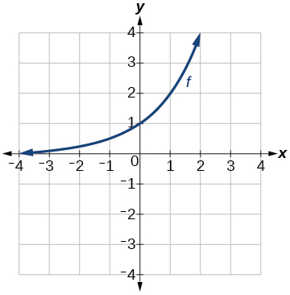{: #Figure_01_05_201}

<math xmlns="http://www.w3.org/1998/Math/MathML"> <mrow> <mi>g</mi><mo stretchy="false">(</mo><mi>x</mi><mo stretchy="false">)</mo><mo>=</mo><msup> <mn>2</mn> <mi>x</mi> </msup> <mo>+</mo><mn>1</mn></mrow> </math>

<math xmlns="http://www.w3.org/1998/Math/MathML"> <mrow> <mi>h</mi><mo stretchy="false">(</mo><mi>x</mi><mo stretchy="false">)</mo><mo>=</mo><msup> <mn>2</mn> <mi>x</mi> </msup> <mo>−</mo><mn>3</mn></mrow> </math>

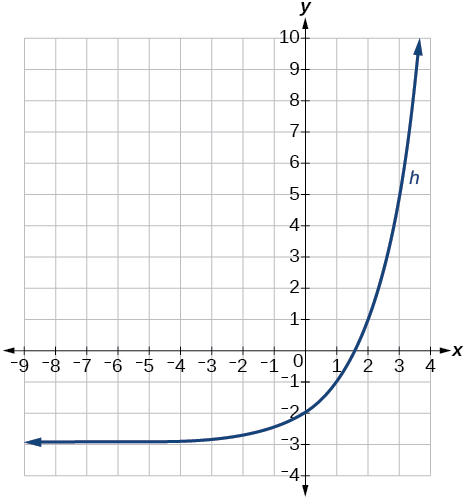

<math xmlns="http://www.w3.org/1998/Math/MathML"> <mrow> <mi>w</mi><mo stretchy="false">(</mo><mi>x</mi><mo stretchy="false">)</mo><mo>=</mo><msup> <mn>2</mn> <mrow> <mi>x</mi><mo>−</mo><mn>1</mn> </mrow> </msup> </mrow> </math>

For the following exercises, sketch a graph of the function as a transformation of the graph of one of the toolkit functions.

<math xmlns="http://www.w3.org/1998/Math/MathML"> <mrow> <mi>f</mi><mo stretchy="false">(</mo><mi>t</mi><mo stretchy="false">)</mo><mo>=</mo><msup> <mrow> <mo stretchy="false">(</mo><mi>t</mi><mo>+</mo><mn>1</mn><mo stretchy="false">)</mo></mrow> <mn>2</mn> </msup> <mo>−</mo><mn>3</mn></mrow> </math>

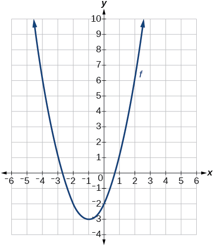

<math xmlns="http://www.w3.org/1998/Math/MathML"> <mrow> <mi>h</mi><mo stretchy="false">(</mo><mi>x</mi><mo stretchy="false">)</mo><mo>=</mo><mo>\|</mo><mi>x</mi><mo>−</mo><mn>1</mn><mo>\|</mo><mo>+</mo><mn>4</mn> </mrow> </math>

<math xmlns="http://www.w3.org/1998/Math/MathML"> <mrow> <mi>k</mi><mo stretchy="false">(</mo><mi>x</mi><mo stretchy="false">)</mo><mo>=</mo><msup> <mrow> <mo stretchy="false">(</mo><mi>x</mi><mo>−</mo><mn>2</mn><mo stretchy="false">)</mo> </mrow> <mn>3</mn> </msup> <mo>−</mo><mn>1</mn> </mrow> </math>

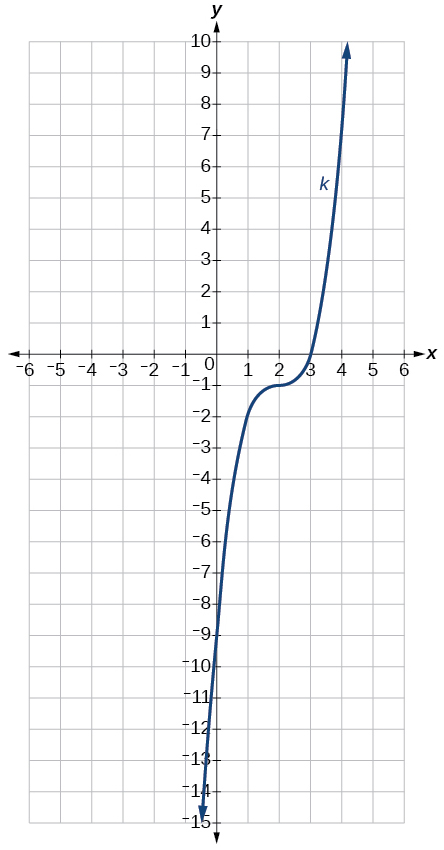

<math xmlns="http://www.w3.org/1998/Math/MathML"> <mrow> <mi>m</mi><mo stretchy="false">(</mo><mi>t</mi><mo stretchy="false">)</mo><mo>=</mo><mn>3</mn><mo>+</mo><msqrt> <mrow> <mi>t</mi><mo>+</mo><mn>2</mn></mrow> </msqrt> </mrow> </math>

#### Numeric

Tabular representations for the functions<math xmlns="http://www.w3.org/1998/Math/MathML"> <mrow> <mtext> </mtext><mi>f</mi><mo>,</mo><mtext> </mtext><mi>g</mi><mo>,</mo><mtext> </mtext></mrow> </math>

and<math xmlns="http://www.w3.org/1998/Math/MathML"> <mrow> <mtext> </mtext><mi>h</mi><mtext> </mtext></mrow> </math>

are given below. Write<math xmlns="http://www.w3.org/1998/Math/MathML"> <mrow> <mtext> </mtext><mi>g</mi><mo stretchy="false">(</mo><mi>x</mi><mo stretchy="false">)</mo><mtext> </mtext></mrow> </math>

and<math xmlns="http://www.w3.org/1998/Math/MathML"> <mrow> <mtext> </mtext><mi>h</mi><mo stretchy="false">(</mo><mi>x</mi><mo stretchy="false">)</mo><mtext> </mtext></mrow> </math>

as transformations of<math xmlns="http://www.w3.org/1998/Math/MathML"> <mrow> <mtext> </mtext><mi>f</mi><mo stretchy="false">(</mo><mi>x</mi><mo stretchy="false">)</mo><mo>.</mo></mrow> </math>

<table summary="Two rows and six columns. The first row is labeled, &#x201C;x&#x201D;, and the second is labeled, &#x201C;f(x)&#x201D;. The values of x are 2, 1, 0, -1, and -2. So for f(-2)=-2, f(-1)=-1, f(0)=-3, f(1)=1, and f(2)=2." class="unnumbered" data-label=""><colgroup><col align="center" /><col align="center" /><col align="center" /><col align="center" /><col align="center" /><col align="center" /></colgroup><tbody>
     <tr>
      <td><strong><math xmlns="http://www.w3.org/1998/Math/MathML">
       <mi>x</mi>
      </math></strong>
      </td>
      <td>−2</td>
      <td>−1</td>
      <td>0</td>
      <td>1</td>
      <td>2</td>
     </tr>
    
    
     <tr>
      <td><strong><math xmlns="http://www.w3.org/1998/Math/MathML">
       <mrow>
        <mi>f</mi><mo stretchy="false">(</mo><mi>x</mi><mo stretchy="false">)</mo></mrow>
      </math></strong>
      </td>
      <td>−2</td>
      <td>−1</td>
      <td>−3</td>
      <td>1</td>
      <td>2</td>
     </tr>
    </tbody></table>
<table summary="Two rows and six columns. The first row is labeled, &#x201C;x&#x201D;, and the second is labeled, &#x201C;g(x)&#x201D;. The values of x are 3, 2, 1, 0, and -1. So for g(-1)=-2, g(0)=-1, g(1)=-3, g(2)=1, and g(3)=2." class="unnumbered" data-label=""><colgroup><col align="center" /><col align="center" /><col align="center" /><col align="center" /><col align="center" /><col align="center" /></colgroup><tbody>
     <tr>
      <td><strong><math xmlns="http://www.w3.org/1998/Math/MathML">
       <mi>x</mi>
      </math></strong>
      </td>
      <td>−1</td>
      <td>0</td>
      <td>1</td>
      <td>2</td>
      <td>3</td>
     </tr>
    
   
     <tr>
      <td><strong><math xmlns="http://www.w3.org/1998/Math/MathML">
       <mrow>
        <mi>g</mi><mo stretchy="false">(</mo><mi>x</mi><mo stretchy="false">)</mo></mrow>
      </math></strong>
      </td>
      <td>−2</td>
      <td>−1</td>
      <td>−3</td>
      <td>1</td>
      <td>2</td>
     </tr>
    </tbody></table>
<table summary="Two rows and six columns. The first row is labeled, &#x201C;x&#x201D;, and the second is labeled, &#x201C;h(x)&#x201D;. The values of x are 2, 1, 0, -1, and -2. So for h(-2)=-1, h(-1)=0, h(0)=-2, g(1)=2, and h(2)=3." class="unnumbered" data-label=""><colgroup><col align="center" /><col align="center" /><col align="center" /><col align="center" /><col align="center" /><col align="center" /></colgroup><tbody>
     <tr>
      <td><strong><math xmlns="http://www.w3.org/1998/Math/MathML">
       <mi>x</mi>
      </math></strong>
      </td>
      <td>−2</td>
      <td>−1</td>
      <td>0</td>
      <td>1</td>
      <td>2</td>
     </tr>
    
    
     <tr>
      <td><strong><math xmlns="http://www.w3.org/1998/Math/MathML">
       <mrow>
        <mi>h</mi><mo stretchy="false">(</mo><mi>x</mi><mo stretchy="false">)</mo></mrow>
      </math></strong>
      </td>
      <td>−1</td>
      <td>0</td>
      <td>−2</td>
      <td>2</td>
      <td>3</td>
     </tr>
    </tbody></table>

<math xmlns="http://www.w3.org/1998/Math/MathML"> <mrow> <mi>g</mi><mo stretchy="false">(</mo><mi>x</mi><mo stretchy="false">)</mo><mo>=</mo><mi>f</mi><mo stretchy="false">(</mo><mi>x</mi><mo>-</mo><mn>1</mn><mo stretchy="false">)</mo><mo>,</mo><mtext> </mtext><mi>h</mi><mo stretchy="false">(</mo><mi>x</mi><mo stretchy="false">)</mo><mo>=</mo><mi>f</mi><mo stretchy="false">(</mo><mi>x</mi><mo stretchy="false">)</mo><mo>+</mo><mn>1</mn></mrow> </math>

Tabular representations for the functions<math xmlns="http://www.w3.org/1998/Math/MathML"> <mrow> <mtext> </mtext><mi>f</mi><mo>,</mo><mtext> </mtext><mi>g</mi><mo>,</mo><mtext> </mtext></mrow> </math>

and<math xmlns="http://www.w3.org/1998/Math/MathML"> <mrow> <mtext> </mtext><mi>h</mi><mtext> </mtext></mrow> </math>

are given below. Write<math xmlns="http://www.w3.org/1998/Math/MathML"> <mrow> <mtext> </mtext><mi>g</mi><mo stretchy="false">(</mo><mi>x</mi><mo stretchy="false">)</mo><mtext> </mtext></mrow> </math>

and<math xmlns="http://www.w3.org/1998/Math/MathML"> <mrow> <mtext> </mtext><mi>h</mi><mo stretchy="false">(</mo><mi>x</mi><mo stretchy="false">)</mo><mtext> </mtext></mrow> </math>

as transformations of<math xmlns="http://www.w3.org/1998/Math/MathML"> <mrow> <mtext> </mtext><mi>f</mi><mo stretchy="false">(</mo><mi>x</mi><mo stretchy="false">)</mo><mo>.</mo></mrow> </math>

<table summary="Two rows and six columns. The first row is labeled, &#x201C;x&#x201D;, and the second is labeled, &#x201C;f(x)&#x201D;. The values of x are 2, 1, 0, -1, and -2. So for f(-2)=-1, f(-1)=-3, f(0)=4, f(1)=2, and f(2)=1." class="unnumbered" data-label=""><colgroup><col align="center" /><col align="center" /><col align="center" /><col align="center" /><col align="center" /><col align="center" /></colgroup><tbody>
     <tr>
      <td><strong><math xmlns="http://www.w3.org/1998/Math/MathML">
       <mi>x</mi>
      </math></strong>
      </td>
      <td>−2</td>
      <td>−1</td>
      <td>0</td>
      <td>1</td>
      <td>2</td>
     </tr>
    
  
     <tr>
      <td><strong><math xmlns="http://www.w3.org/1998/Math/MathML">
       <mrow>
        <mi>f</mi><mo stretchy="false">(</mo><mi>x</mi><mo stretchy="false">)</mo></mrow>
      </math></strong>
      </td>
      <td>−1</td>
      <td>−3</td>
      <td>4</td>
      <td>2</td>
      <td>1</td>
     </tr>
    </tbody></table>
<table summary="Two rows and six columns. The first row is labeled, &#x201C;x&#x201D;, and the second is labeled, &#x201C;g(x)&#x201D;. The values of x are 1, 0, -1, -2, and -3. So for g(-3)=-1, g(-2)=-3, g(-1)=-4, g(0)=2, and g(1)=1." class="unnumbered" data-label=""><colgroup><col align="center" /><col align="center" /><col align="center" /><col align="center" /><col align="center" /><col align="center" /></colgroup><tbody>
     <tr>
      <td><strong><math xmlns="http://www.w3.org/1998/Math/MathML">
       <mi>x</mi>
      </math></strong>
      </td>
      <td>−3</td>
      <td>−2</td>
      <td>−1</td>
      <td>0</td>
      <td>1</td>
     </tr>
    
    
     <tr>
      <td><strong><math xmlns="http://www.w3.org/1998/Math/MathML">
       <mrow>
        <mi>g</mi><mo stretchy="false">(</mo><mi>x</mi><mo stretchy="false">)</mo></mrow>
      </math></strong>
      </td>
      <td>−1</td>
      <td>−3</td>
      <td>4</td>
      <td>2</td>
      <td>1</td>
     </tr>
    </tbody></table>
<table summary="Two rows and six columns. The first row is labeled, &#x201C;x&#x201D;, and the second is labeled, &#x201C;h(x)&#x201D;. The values of x are 2, 1, 0, -1, and -2. So for h(-2)=-2, f(-1)=-1, f(0)=3, f(1)=1, and f(2)=0." class="unnumbered" data-label=""><colgroup><col align="center" /><col align="center" /><col align="center" /><col align="center" /><col align="center" /><col align="center" /></colgroup><tbody>
     <tr>
      <td><strong><math xmlns="http://www.w3.org/1998/Math/MathML">
       <mi>x</mi>
      </math></strong>
      </td>
      <td>−2</td>
      <td>−1</td>
      <td>0</td>
      <td>1</td>
      <td>2</td>
     </tr>
     <tr>
      <td><strong><math xmlns="http://www.w3.org/1998/Math/MathML">
       <mrow>
        <mi>h</mi><mo stretchy="false">(</mo><mi>x</mi><mo stretchy="false">)</mo></mrow>
      </math></strong>
      </td>
      <td>−2</td>
      <td>−4</td>
      <td>3</td>
      <td>1</td>
      <td>0</td>
     </tr>
    </tbody></table>

For the following exercises, write an equation for each graphed function by using transformations of the graphs of one of the toolkit functions.

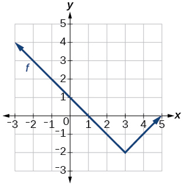

<math xmlns="http://www.w3.org/1998/Math/MathML"> <mrow> <mi>f</mi><mo stretchy="false">(</mo><mi>x</mi><mo stretchy="false">)</mo><mo>=</mo><mo>\|</mo><mi>x</mi><mo>-</mo><mn>3</mn><mo>\|</mo><mo>−</mo><mn>2</mn></mrow> </math>

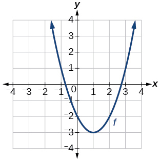

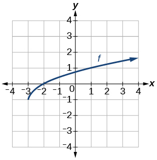

<math xmlns="http://www.w3.org/1998/Math/MathML"> <mrow> <mi>f</mi><mo stretchy="false">(</mo><mi>x</mi><mo stretchy="false">)</mo><mo>=</mo><msqrt> <mrow> <mi>x</mi><mo>+</mo><mn>3</mn></mrow> </msqrt> <mo>−</mo><mn>1</mn></mrow> </math>

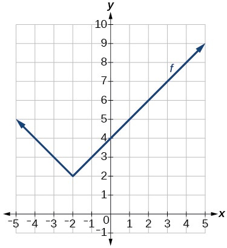

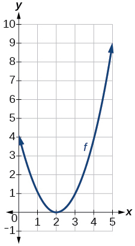

<math xmlns="http://www.w3.org/1998/Math/MathML"> <mrow> <mi>f</mi><mo stretchy="false">(</mo><mi>x</mi><mo stretchy="false">)</mo><mo>=</mo><msup> <mrow> <mo stretchy="false">(</mo><mi>x</mi><mo>-</mo><mn>2</mn><mo stretchy="false">)</mo></mrow> <mn>2</mn> </msup> </mrow> </math>

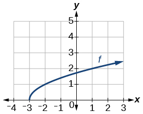

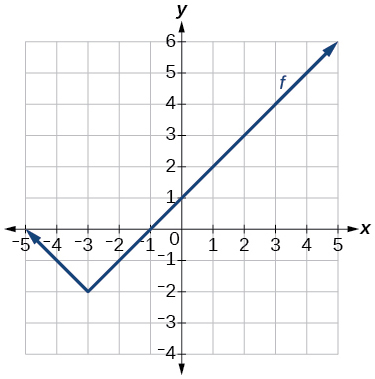

<math xmlns="http://www.w3.org/1998/Math/MathML"> <mrow> <mi>f</mi><mo stretchy="false">(</mo><mi>x</mi><mo stretchy="false">)</mo><mo>=</mo><mo>\|</mo><mi>x</mi><mo>+</mo><mn>3</mn><mo>\|</mo><mo>−</mo><mn>2</mn></mrow> </math>

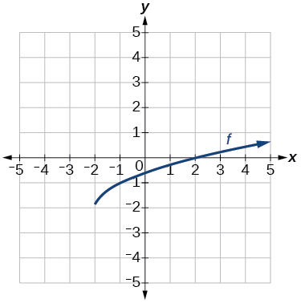

For the following exercises, use the graphs of transformations of the square root function to find a formula for each of the functions.

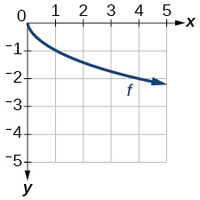

<math xmlns="http://www.w3.org/1998/Math/MathML"> <mrow> <mi>f</mi><mo stretchy="false">(</mo><mi>x</mi><mo stretchy="false">)</mo><mo>=</mo><mo>−</mo><msqrt> <mi>x</mi> </msqrt> </mrow> </math>

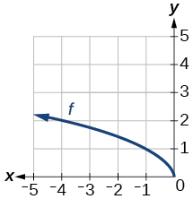

For the following exercises, use the graphs of the transformed toolkit functions to write a formula for each of the resulting functions.

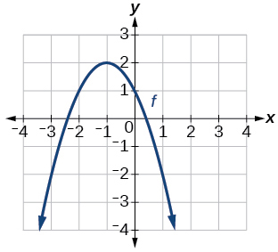

<math xmlns="http://www.w3.org/1998/Math/MathML"> <mrow> <mi>f</mi><mo stretchy="false">(</mo><mi>x</mi><mo stretchy="false">)</mo><mo>=</mo><mo>−</mo><msup> <mrow> <mo stretchy="false">(</mo><mi>x</mi><mo>+</mo><mn>1</mn><mo stretchy="false">)</mo></mrow> <mn>2</mn> </msup> <mo>+</mo><mn>2</mn></mrow> </math>

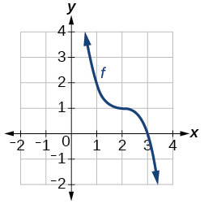

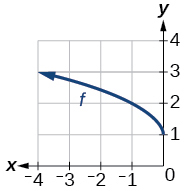

<math xmlns="http://www.w3.org/1998/Math/MathML"> <mrow> <mi>f</mi><mo stretchy="false">(</mo><mi>x</mi><mo stretchy="false">)</mo><mo>=</mo><msqrt> <mrow> <mo>−</mo><mi>x</mi></mrow> </msqrt> <mo>+</mo><mn>1</mn></mrow> </math>

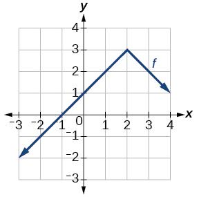

For the following exercises, determine whether the function is odd, even, or neither.

<math xmlns="http://www.w3.org/1998/Math/MathML"> <mrow> <mi>f</mi><mo stretchy="false">(</mo><mi>x</mi><mo stretchy="false">)</mo><mo>=</mo><mn>3</mn><msup> <mi>x</mi> <mn>4</mn> </msup> </mrow> </math>

even

<math xmlns="http://www.w3.org/1998/Math/MathML"> <mrow> <mi>g</mi><mo stretchy="false">(</mo><mi>x</mi><mo stretchy="false">)</mo><mo>=</mo><msqrt> <mi>x</mi> </msqrt> </mrow> </math>

<math xmlns="http://www.w3.org/1998/Math/MathML"> <mrow> <mi>h</mi><mo stretchy="false">(</mo><mi>x</mi><mo stretchy="false">)</mo><mo>=</mo><mfrac> <mn>1</mn> <mi>x</mi> </mfrac> <mo>+</mo><mn>3</mn><mi>x</mi></mrow> </math>

odd

<math xmlns="http://www.w3.org/1998/Math/MathML"> <mrow> <mi>f</mi><mo stretchy="false">(</mo><mi>x</mi><mo stretchy="false">)</mo><mo>=</mo><msup> <mrow> <mo stretchy="false">(</mo><mi>x</mi><mo>−</mo><mn>2</mn><mo stretchy="false">)</mo> </mrow> <mn>2</mn> </msup> </mrow> </math>

<math xmlns="http://www.w3.org/1998/Math/MathML"> <mrow> <mi>g</mi><mo stretchy="false">(</mo><mi>x</mi><mo stretchy="false">)</mo><mo>=</mo><mn>2</mn><msup> <mi>x</mi> <mn>4</mn> </msup> </mrow> </math>

even

<math xmlns="http://www.w3.org/1998/Math/MathML"> <mrow> <mi>h</mi><mo stretchy="false">(</mo><mi>x</mi><mo stretchy="false">)</mo><mo>=</mo><mn>2</mn><mi>x</mi><mo>−</mo><msup> <mi>x</mi> <mn>3</mn> </msup> </mrow> </math>

For the following exercises, describe how the graph of each function is a transformation of the graph of the original function<math xmlns="http://www.w3.org/1998/Math/MathML"> <mrow> <mtext> </mtext><mi>f</mi><mo>.</mo></mrow> </math>

<math xmlns="http://www.w3.org/1998/Math/MathML"> <mrow> <mi>g</mi><mo stretchy="false">(</mo><mi>x</mi><mo stretchy="false">)</mo><mo>=</mo><mo>−</mo><mi>f</mi><mo stretchy="false">(</mo><mi>x</mi><mo stretchy="false">)</mo></mrow> </math>

The graph of<math xmlns="http://www.w3.org/1998/Math/MathML"> <mrow> <mtext> </mtext><mi>g</mi><mtext> </mtext></mrow> </math>

is a vertical reflection (across the <math xmlns="http://www.w3.org/1998/Math/MathML"> <mrow> <mtext> </mtext><mi>x</mi></mrow> </math>

-axis) of the graph of<math xmlns="http://www.w3.org/1998/Math/MathML"> <mrow> <mtext> </mtext><mi>f</mi><mo>.</mo></mrow> </math>

<math xmlns="http://www.w3.org/1998/Math/MathML"> <mrow> <mi>g</mi><mo stretchy="false">(</mo><mi>x</mi><mo stretchy="false">)</mo><mo>=</mo><mi>f</mi><mo stretchy="false">(</mo><mo>−</mo><mi>x</mi><mo stretchy="false">)</mo></mrow> </math>

<math xmlns="http://www.w3.org/1998/Math/MathML"> <mrow> <mi>g</mi><mo stretchy="false">(</mo><mi>x</mi><mo stretchy="false">)</mo><mo>=</mo><mn>4</mn><mi>f</mi><mo stretchy="false">(</mo><mi>x</mi><mo stretchy="false">)</mo></mrow> </math>

The graph of<math xmlns="http://www.w3.org/1998/Math/MathML"> <mrow> <mtext> </mtext><mi>g</mi><mtext> </mtext></mrow> </math>

is a vertical stretch by a factor of 4 of the graph of<math xmlns="http://www.w3.org/1998/Math/MathML"> <mrow> <mtext> </mtext><mi>f</mi><mo>.</mo></mrow> </math>

<math xmlns="http://www.w3.org/1998/Math/MathML"> <mrow> <mi>g</mi><mo stretchy="false">(</mo><mi>x</mi><mo stretchy="false">)</mo><mo>=</mo><mn>6</mn><mi>f</mi><mo stretchy="false">(</mo><mi>x</mi><mo stretchy="false">)</mo></mrow> </math>

<math xmlns="http://www.w3.org/1998/Math/MathML"> <mrow> <mi>g</mi><mo stretchy="false">(</mo><mi>x</mi><mo stretchy="false">)</mo><mo>=</mo><mi>f</mi><mo stretchy="false">(</mo><mn>5</mn><mi>x</mi><mo stretchy="false">)</mo></mrow> </math>

The graph of<math xmlns="http://www.w3.org/1998/Math/MathML"> <mrow> <mtext> </mtext><mi>g</mi><mtext> </mtext></mrow> </math>

is a horizontal compression by a factor of<math xmlns="http://www.w3.org/1998/Math/MathML"> <mrow> <mtext> </mtext><mfrac> <mn>1</mn> <mn>5</mn> </mfrac> <mtext> </mtext></mrow> </math>

of the graph of<math xmlns="http://www.w3.org/1998/Math/MathML"> <mrow> <mtext> </mtext><mi>f</mi><mo>.</mo></mrow> </math>

<math xmlns="http://www.w3.org/1998/Math/MathML"> <mrow> <mi>g</mi><mo stretchy="false">(</mo><mi>x</mi><mo stretchy="false">)</mo><mo>=</mo><mi>f</mi><mo stretchy="false">(</mo><mn>2</mn><mi>x</mi><mo stretchy="false">)</mo></mrow> </math>

<math xmlns="http://www.w3.org/1998/Math/MathML"> <mrow> <mi>g</mi><mo stretchy="false">(</mo><mi>x</mi><mo stretchy="false">)</mo><mo>=</mo><mi>f</mi><mrow><mo>(</mo> <mrow> <mfrac> <mn>1</mn> <mn>3</mn> </mfrac> <mi>x</mi></mrow> <mo>)</mo></mrow></mrow> </math>

The graph of<math xmlns="http://www.w3.org/1998/Math/MathML"> <mrow> <mtext> </mtext><mi>g</mi><mtext> </mtext></mrow> </math>

is a horizontal stretch by a factor of 3 of the graph of<math xmlns="http://www.w3.org/1998/Math/MathML"> <mrow> <mtext> </mtext><mi>f</mi><mo>.</mo></mrow> </math>

<math xmlns="http://www.w3.org/1998/Math/MathML"> <mrow> <mi>g</mi><mo stretchy="false">(</mo><mi>x</mi><mo stretchy="false">)</mo><mo>=</mo><mi>f</mi><mrow><mo>(</mo> <mrow> <mfrac> <mn>1</mn> <mn>5</mn> </mfrac> <mi>x</mi></mrow> <mo>)</mo></mrow></mrow> </math>

<math xmlns="http://www.w3.org/1998/Math/MathML"> <mrow> <mi>g</mi><mo stretchy="false">(</mo><mi>x</mi><mo stretchy="false">)</mo><mo>=</mo><mn>3</mn><mi>f</mi><mrow><mo>(</mo> <mrow> <mo>−</mo><mi>x</mi></mrow> <mo>)</mo></mrow></mrow> </math>

The graph of<math xmlns="http://www.w3.org/1998/Math/MathML"> <mrow> <mtext> </mtext><mi>g</mi><mtext> </mtext></mrow> </math>

is a horizontal reflection across the<math xmlns="http://www.w3.org/1998/Math/MathML"> <mrow> <mtext> </mtext><mi>y</mi></mrow> </math>

-axis and a vertical stretch by a factor of 3 of the graph of<math xmlns="http://www.w3.org/1998/Math/MathML"> <mrow> <mtext> </mtext><mi>f</mi><mo>.</mo></mrow> </math>

<math xmlns="http://www.w3.org/1998/Math/MathML"> <mrow> <mi>g</mi><mo stretchy="false">(</mo><mi>x</mi><mo stretchy="false">)</mo><mo>=</mo><mo>−</mo><mi>f</mi><mo stretchy="false">(</mo><mn>3</mn><mi>x</mi><mo stretchy="false">)</mo></mrow> </math>

For the following exercises, write a formula for the function<math xmlns="http://www.w3.org/1998/Math/MathML"> <mrow> <mtext> </mtext><mi>g</mi><mtext> </mtext></mrow> </math>

that results when the graph of a given toolkit function is transformed as described.

The graph of<math xmlns="http://www.w3.org/1998/Math/MathML"> <mrow> <mtext> </mtext><mi>f</mi><mo stretchy="false">(</mo><mi>x</mi><mo stretchy="false">)</mo><mo>=</mo><mo>\|</mo><mi>x</mi><mo>\|</mo><mtext> </mtext></mrow> </math>

is reflected over the<math xmlns="http://www.w3.org/1998/Math/MathML"> <mrow> <mtext> </mtext><mi>y</mi></mrow> </math>

*-*axis and horizontally compressed by a factor of<math xmlns="http://www.w3.org/1998/Math/MathML"> <mrow> <mtext> </mtext><mfrac> <mn>1</mn> <mn>4</mn> </mfrac> </mrow> </math>

 .

<math xmlns="http://www.w3.org/1998/Math/MathML"> <mrow> <mi>g</mi><mo stretchy="false">(</mo><mi>x</mi><mo stretchy="false">)</mo><mo>=</mo><mo>\|</mo><mo>−</mo><mn>4</mn><mi>x</mi><mo>\|</mo></mrow> </math>

The graph of<math xmlns="http://www.w3.org/1998/Math/MathML"> <mrow> <mtext> </mtext><mi>f</mi><mo stretchy="false">(</mo><mi>x</mi><mo stretchy="false">)</mo><mo>=</mo><msqrt> <mi>x</mi> </msqrt> <mtext> </mtext></mrow> </math>

is reflected over the<math xmlns="http://www.w3.org/1998/Math/MathML"> <mrow> <mtext> </mtext><mi>x</mi></mrow> </math>

-axis and horizontally stretched by a factor of 2.

The graph of<math xmlns="http://www.w3.org/1998/Math/MathML"> <mrow> <mtext> </mtext><mi>f</mi><mo stretchy="false">(</mo><mi>x</mi><mo stretchy="false">)</mo><mo>=</mo><mfrac> <mn>1</mn> <mrow> <msup> <mi>x</mi> <mn>2</mn> </msup> </mrow> </mfrac> <mtext> </mtext></mrow> </math>

is vertically compressed by a factor of<math xmlns="http://www.w3.org/1998/Math/MathML"> <mrow> <mtext> </mtext><mfrac> <mn>1</mn> <mn>3</mn> </mfrac> <mo>,</mo><mtext> </mtext></mrow> </math>

then shifted to the left 2 units and down 3 units.

<math xmlns="http://www.w3.org/1998/Math/MathML"> <mrow> <mi>g</mi><mo stretchy="false">(</mo><mi>x</mi><mo stretchy="false">)</mo><mo>=</mo><mfrac> <mn>1</mn> <mrow> <mn>3</mn><msup> <mrow> <mo stretchy="false">(</mo><mi>x</mi><mo>+</mo><mn>2</mn><mo stretchy="false">)</mo></mrow> <mn>2</mn> </msup> </mrow> </mfrac> <mo>−</mo><mn>3</mn></mrow> </math>

The graph of<math xmlns="http://www.w3.org/1998/Math/MathML"> <mrow> <mtext> </mtext><mi>f</mi><mo stretchy="false">(</mo><mi>x</mi><mo stretchy="false">)</mo><mo>=</mo><mfrac> <mn>1</mn> <mi>x</mi> </mfrac> <mtext> </mtext></mrow> </math>

is vertically stretched by a factor of 8, then shifted to the right 4 units and up 2 units.

The graph of<math xmlns="http://www.w3.org/1998/Math/MathML"> <mrow> <mtext> </mtext><mi>f</mi><mo stretchy="false">(</mo><mi>x</mi><mo stretchy="false">)</mo><mo>=</mo><msup> <mi>x</mi> <mn>2</mn> </msup> <mtext> </mtext></mrow> </math>

is vertically compressed by a factor of<math xmlns="http://www.w3.org/1998/Math/MathML"> <mrow> <mtext> </mtext><mfrac> <mn>1</mn> <mn>2</mn> </mfrac> <mo>,</mo><mtext> </mtext></mrow> </math>

then shifted to the right 5 units and up 1 unit.

<math xmlns="http://www.w3.org/1998/Math/MathML"> <mrow> <mi>g</mi><mo stretchy="false">(</mo><mi>x</mi><mo stretchy="false">)</mo><mo>=</mo><mfrac> <mn>1</mn> <mn>2</mn> </mfrac> <msup> <mrow> <mo stretchy="false">(</mo><mi>x</mi><mo>-</mo><mn>5</mn><mo stretchy="false">)</mo></mrow> <mn>2</mn> </msup> <mo>+</mo><mn>1</mn></mrow> </math>

The graph of<math xmlns="http://www.w3.org/1998/Math/MathML"> <mrow> <mtext> </mtext><mi>f</mi><mo stretchy="false">(</mo><mi>x</mi><mo stretchy="false">)</mo><mo>=</mo><msup> <mi>x</mi> <mn>2</mn> </msup> <mtext> </mtext></mrow> </math>

is horizontally stretched by a factor of 3, then shifted to the left 4 units and down 3 units.

For the following exercises, describe how the formula is a transformation of a toolkit function. Then sketch a graph of the transformation.

<math xmlns="http://www.w3.org/1998/Math/MathML"> <mrow> <mi>g</mi><mo stretchy="false">(</mo><mi>x</mi><mo stretchy="false">)</mo><mo>=</mo><mn>4</mn><msup> <mrow> <mo stretchy="false">(</mo><mi>x</mi><mo>+</mo><mn>1</mn><mo stretchy="false">)</mo></mrow> <mn>2</mn> </msup> <mo>−</mo><mn>5</mn></mrow> </math>

The graph of the function<math xmlns="http://www.w3.org/1998/Math/MathML"> <mrow> <mtext> </mtext><mi>f</mi><mo stretchy="false">(</mo><mi>x</mi><mo stretchy="false">)</mo><mo>=</mo><msup> <mi>x</mi> <mn>2</mn> </msup> <mtext> </mtext></mrow> </math>

is shifted to the left 1 unit, stretched vertically by a factor of 4, and shifted down 5 units.

<math xmlns="http://www.w3.org/1998/Math/MathML"> <mrow> <mi>g</mi><mo stretchy="false">(</mo><mi>x</mi><mo stretchy="false">)</mo><mo>=</mo><mn>5</mn><msup> <mrow> <mo stretchy="false">(</mo><mi>x</mi><mo>+</mo><mn>3</mn><mo stretchy="false">)</mo></mrow> <mn>2</mn> </msup> <mo>−</mo><mn>2</mn></mrow> </math>

<math xmlns="http://www.w3.org/1998/Math/MathML"> <mrow> <mi>h</mi><mo stretchy="false">(</mo><mi>x</mi><mo stretchy="false">)</mo><mo>=</mo><mo>−</mo><mn>2</mn><mo>\|</mo><mi>x</mi><mo>−</mo><mn>4</mn><mo>\|</mo><mo>+</mo><mn>3</mn> </mrow> </math>

The graph of<math xmlns="http://www.w3.org/1998/Math/MathML"> <mrow> <mtext> </mtext><mi>f</mi><mo stretchy="false">(</mo><mi>x</mi><mo stretchy="false">)</mo><mo>=</mo><mo>\|</mo><mi>x</mi><mo>\|</mo><mtext> </mtext></mrow> </math>

is stretched vertically by a factor of 2, shifted horizontally 4 units to the right, reflected across the horizontal axis, and then shifted vertically 3 units up.

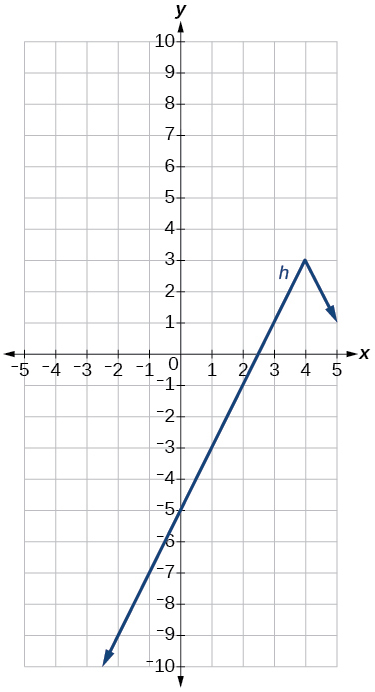

<math xmlns="http://www.w3.org/1998/Math/MathML"> <mrow> <mi>k</mi><mo stretchy="false">(</mo><mi>x</mi><mo stretchy="false">)</mo><mo>=</mo><mo>−</mo><mn>3</mn><msqrt> <mi>x</mi> </msqrt> <mo>−</mo><mn>1</mn></mrow> </math>

<math xmlns="http://www.w3.org/1998/Math/MathML"> <mrow> <mi>m</mi><mo stretchy="false">(</mo><mi>x</mi><mo stretchy="false">)</mo><mo>=</mo><mfrac> <mn>1</mn> <mn>2</mn> </mfrac> <msup> <mi>x</mi> <mn>3</mn> </msup> </mrow> </math>

The graph of the function<math xmlns="http://www.w3.org/1998/Math/MathML"> <mrow> <mtext> </mtext><mi>f</mi><mo stretchy="false">(</mo><mi>x</mi><mo stretchy="false">)</mo><mo>=</mo><msup> <mi>x</mi> <mn>3</mn> </msup> <mtext> </mtext></mrow> </math>

is compressed vertically by a factor of<math xmlns="http://www.w3.org/1998/Math/MathML"> <mrow> <mtext> </mtext><mfrac> <mn>1</mn> <mn>2</mn> </mfrac> <mo>.</mo></mrow> </math>

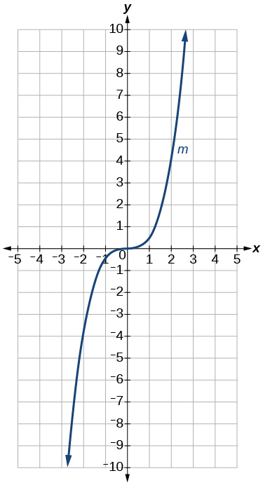

<math xmlns="http://www.w3.org/1998/Math/MathML"> <mrow> <mi>n</mi><mo stretchy="false">(</mo><mi>x</mi><mo stretchy="false">)</mo><mo>=</mo><mfrac> <mn>1</mn> <mn>3</mn> </mfrac> <mo>\|</mo><mi>x</mi><mo>−</mo><mn>2</mn><mo>\|</mo> </mrow> </math>

<math xmlns="http://www.w3.org/1998/Math/MathML"> <mrow> <mi>p</mi><mrow><mo>(</mo> <mi>x</mi> <mo>)</mo></mrow><mo>=</mo><msup> <mrow> <mrow><mo>(</mo> <mrow> <mfrac> <mn>1</mn> <mn>3</mn> </mfrac> <mi>x</mi> </mrow> <mo>)</mo></mrow> </mrow> <mn>3</mn> </msup> <mo>−</mo><mn>3</mn> </mrow> </math>

The graph of the function is stretched horizontally by a factor of 3 and then shifted vertically downward by 3 units.

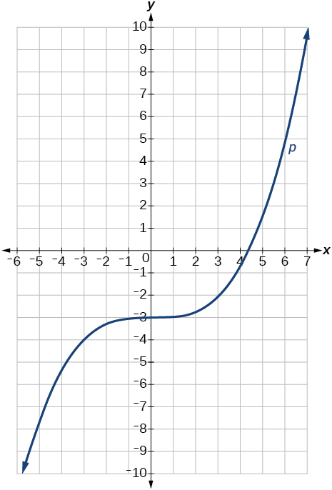

<math xmlns="http://www.w3.org/1998/Math/MathML"> <mrow> <mi>q</mi><mrow><mo>(</mo> <mi>x</mi> <mo>)</mo></mrow><mo>=</mo><msup> <mrow> <mrow><mo>(</mo> <mrow> <mfrac> <mn>1</mn> <mn>4</mn> </mfrac> <mi>x</mi></mrow> <mo>)</mo></mrow></mrow> <mn>3</mn> </msup> <mo>+</mo><mn>1</mn></mrow> </math>

<math xmlns="http://www.w3.org/1998/Math/MathML"> <mrow> <mi>a</mi><mo stretchy="false">(</mo><mi>x</mi><mo stretchy="false">)</mo><mo>=</mo><msqrt> <mrow> <mo>−</mo><mi>x</mi><mo>+</mo><mn>4</mn></mrow> </msqrt> </mrow> </math>

The graph of<math xmlns="http://www.w3.org/1998/Math/MathML"> <mrow> <mtext> </mtext><mi>f</mi><mo stretchy="false">(</mo><mi>x</mi><mo stretchy="false">)</mo><mo>=</mo><msqrt> <mi>x</mi> </msqrt> <mtext> </mtext></mrow> </math>

is shifted right 4 units and then reflected across the vertical line<math xmlns="http://www.w3.org/1998/Math/MathML"> <mrow> <mtext> </mtext><mi>x</mi><mo>=</mo><mn>4.</mn></mrow> </math>

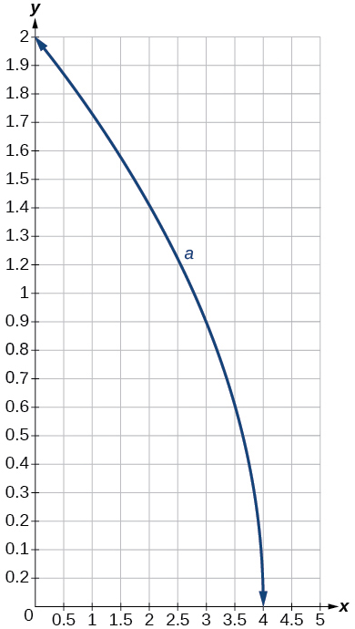

For the following exercises, use the graph in [\[link\]](#Figure_01_05_233) to sketch the given transformations.

{: #Figure_01_05_233}

<math xmlns="http://www.w3.org/1998/Math/MathML"> <mrow> <mi>g</mi><mo stretchy="false">(</mo><mi>x</mi><mo stretchy="false">)</mo><mo>=</mo><mi>f</mi><mo stretchy="false">(</mo><mi>x</mi><mo stretchy="false">)</mo><mo>−</mo><mn>2</mn></mrow> </math>

<math xmlns="http://www.w3.org/1998/Math/MathML"> <mrow> <mi>g</mi><mo stretchy="false">(</mo><mi>x</mi><mo stretchy="false">)</mo><mo>=</mo><mo>−</mo><mi>f</mi><mo stretchy="false">(</mo><mi>x</mi><mo stretchy="false">)</mo></mrow> </math>

<math xmlns="http://www.w3.org/1998/Math/MathML"> <mrow> <mi>g</mi><mo stretchy="false">(</mo><mi>x</mi><mo stretchy="false">)</mo><mo>=</mo><mi>f</mi><mo stretchy="false">(</mo><mi>x</mi><mo>+</mo><mn>1</mn><mo stretchy="false">)</mo></mrow> </math>

<math xmlns="http://www.w3.org/1998/Math/MathML"> <mrow> <mi>g</mi><mo stretchy="false">(</mo><mi>x</mi><mo stretchy="false">)</mo><mo>=</mo><mi>f</mi><mo stretchy="false">(</mo><mi>x</mi><mo>−</mo><mn>2</mn><mo stretchy="false">)</mo> </mrow> </math>

### Glossary
{: data-type="glossary-title"}

even function
: a function whose graph is unchanged by horizontal reflection,
  <math xmlns="http://www.w3.org/1998/Math/MathML"> <mrow> <mtext> </mtext><mi>f</mi><mo stretchy="false">(</mo><mi>x</mi><mo stretchy="false">)</mo><mo>=</mo><mi>f</mi><mo stretchy="false">(</mo><mo>−</mo><mi>x</mi><mo stretchy="false">)</mo><mo>,</mo><mtext> </mtext></mrow> </math>
  
  and is symmetric about the
  <math xmlns="http://www.w3.org/1998/Math/MathML"> <mrow> <mi>y</mi><mtext>-</mtext></mrow> </math>
  
  axis
^

horizontal compression
: a transformation that compresses a function’s graph horizontally, by multiplying the input by a constant
  <math xmlns="http://www.w3.org/1998/Math/MathML"> <mrow> <mtext> </mtext><mi>b</mi><mo>&gt;</mo><mn>1</mn></mrow> </math>
^

horizontal reflection
: a transformation that reflects a function’s graph across the *y*-axis by multiplying the input by
  <math xmlns="http://www.w3.org/1998/Math/MathML"> <mrow> <mtext> </mtext><mn>−1</mn></mrow> </math>
^

horizontal shift
: a transformation that shifts a function’s graph left or right by adding a positive or negative constant to the input
^

horizontal stretch
: a transformation that stretches a function’s graph horizontally by multiplying the input by a constant
  <math xmlns="http://www.w3.org/1998/Math/MathML"> <mrow> <mtext> </mtext><mn>0</mn><mo>&lt;</mo><mi>b</mi><mo>&lt;</mo><mn>1</mn></mrow> </math>
^

odd function
: a function whose graph is unchanged by combined horizontal and vertical reflection,
  <math xmlns="http://www.w3.org/1998/Math/MathML"> <mrow> <mtext> </mtext><mi>f</mi><mo stretchy="false">(</mo><mi>x</mi><mo stretchy="false">)</mo><mo>=</mo><mo>−</mo><mi>f</mi><mo stretchy="false">(</mo><mo>−</mo><mi>x</mi><mo stretchy="false">)</mo><mo>,</mo><mtext> </mtext></mrow> </math>
  
  and is symmetric about the origin
^

vertical compression
: a function transformation that compresses the function’s graph vertically by multiplying the output by a constant
  <math xmlns="http://www.w3.org/1998/Math/MathML"> <mrow> <mtext> </mtext><mn>0</mn><mo>&lt;</mo><mi>a</mi><mo>&lt;</mo><mn>1</mn></mrow> </math>
^

vertical reflection
: a transformation that reflects a function’s graph across the *x*-axis by multiplying the output by
  <math xmlns="http://www.w3.org/1998/Math/MathML"> <mrow> <mtext> </mtext><mn>−1</mn></mrow> </math>
^

vertical shift
: a transformation that shifts a function’s graph up or down by adding a positive or negative constant to the output
^

vertical stretch
: a transformation that stretches a function’s graph vertically by multiplying the output by a constant
  <math xmlns="http://www.w3.org/1998/Math/MathML"> <mrow> <mtext> </mtext><mi>a</mi><mo>&gt;</mo><mn>1</mn></mrow> </math>

[1]: http://openstaxcollege.org/l/functrans
