

In this section you will:
* Graph an absolute value function.
* Solve an absolute value equation.

 "){: #Figure_01_06_001}

Until the 1920s, the so-called spiral nebulae were believed to be clouds of dust and gas in our own galaxy, some tens of thousands of light years away. Then, astronomer Edwin Hubble proved that these objects are galaxies in their own right, at distances of millions of light years. Today, astronomers can detect galaxies that are billions of light years away. Distances in the universe can be measured in all directions. As such, it is useful to consider distance as an absolute value function. In this section, we will continue our investigation of **absolute value functions**{: data-type="term" .no-emphasis}.

### Understanding Absolute Value 

Recall that in its basic form<math xmlns="http://www.w3.org/1998/Math/MathML"> <mrow> <mtext> </mtext><mi>f</mi><mo stretchy="false">(</mo><mi>x</mi><mo stretchy="false">)</mo><mo>=</mo><mrow><mo>\|</mo> <mi>x</mi> <mo>\|</mo></mrow><mo>,</mo><mtext> </mtext></mrow> </math>

the absolute value function is one of our toolkit functions. The **absolute value**{: data-type="term" .no-emphasis} function is commonly thought of as providing the distance the number is from zero on a number line. Algebraically, for whatever the input value is, the output is the value without regard to sign. Knowing this, we can use absolute value functions to solve some kinds of real-world problems.

Absolute Value Function

The absolute value function can be defined as a piecewise function

<math xmlns="http://www.w3.org/1998/Math/MathML" display="block"> <mrow> <mtext> </mtext><mi>f</mi><mo stretchy="false">(</mo><mi>x</mi><mo stretchy="false">)</mo><mo>=</mo><mrow><mo>\|</mo> <mi>x</mi> <mo>\|</mo></mrow><mo>=</mo><mrow><mo>{</mo> <mrow> <mtable> <mtr> <mtd> <mi>x</mi> </mtd> <mtd> <mrow> <mtext>if</mtext></mrow> </mtd> <mtd> <mrow> <mi>x</mi><mo>≥</mo><mn>0</mn></mrow> </mtd> </mtr> <mtr> <mtd> <mrow> <mo>−</mo><mi>x</mi></mrow> </mtd> <mtd> <mrow> <mtext>if</mtext></mrow> </mtd> <mtd> <mrow> <mi>x</mi><mo>&lt;</mo><mn>0</mn></mrow> </mtd> </mtr> </mtable></mrow> </mrow><mtext> </mtext></mrow> </math>

Using Absolute Value to Determine Resistance

Electrical parts, such as resistors and capacitors, come with specified values of their operating parameters: resistance, capacitance, etc. However, due to imprecision in manufacturing, the actual values of these parameters vary somewhat from piece to piece, even when they are supposed to be the same. The best that manufacturers can do is to try to guarantee that the variations will stay within a specified range, often<math xmlns="http://www.w3.org/1998/Math/MathML"> <mrow> <mtext> </mtext><mtext>±1%,</mtext><mtext> </mtext><mo>±</mo><mtext>5%,</mtext><mtext> </mtext></mrow> </math>

or<math xmlns="http://www.w3.org/1998/Math/MathML"> <mrow> <mtext> </mtext><mo>±</mo><mtext>10%</mtext><mtext>.</mtext></mrow> </math>

Suppose we have a resistor rated at 680 ohms,<math xmlns="http://www.w3.org/1998/Math/MathML"> <mrow> <mtext> </mtext><mo>±</mo><mn>5</mn><mi>%</mi><mo>.</mo><mtext> </mtext></mrow> </math>

Use the absolute value function to express the range of possible values of the actual resistance.

We can find that 5% of 680 ohms is 34 ohms. The absolute value of the difference between the actual and nominal resistance should not exceed the stated variability, so, with the resistance<math xmlns="http://www.w3.org/1998/Math/MathML"> <mrow> <mtext> </mtext><mi>R</mi><mtext> </mtext></mrow> </math>

in ohms,

<math xmlns="http://www.w3.org/1998/Math/MathML" display="block"> <mo>\|</mo> <mi>R</mi><mo>−</mo><mn>680</mn> <mo>\|</mo><mo>≤</mo><mn>34</mn> </math>

Students who score within 20 points of 80 will pass a test. Write this as a distance from 80 using absolute value notation.

using the variable<math xmlns="http://www.w3.org/1998/Math/MathML"> <mrow> <mtext> </mtext><mi>p</mi><mtext> </mtext></mrow> </math>

for passing,<math xmlns="http://www.w3.org/1998/Math/MathML"> <mrow> <mtext> </mtext><mrow><mo>\|</mo> <mrow> <mi>p</mi><mo>−</mo><mn>80</mn></mrow> <mo>\|</mo></mrow><mo>≤</mo><mn>20</mn></mrow> </math>

### Graphing an Absolute Value Function

The most significant feature of the absolute value graph is the corner point at which the graph changes direction. This point is shown at the **origin**{: data-type="term" .no-emphasis} in [\[link\]](#Figure_01_06_003).

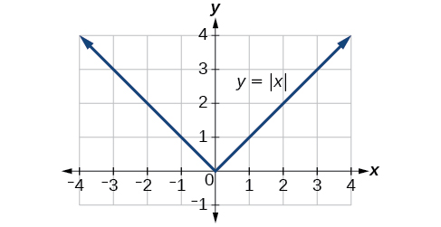{: #Figure_01_06_003}

[\[link\]](#Figure_01_06_004) shows the graph of<math xmlns="http://www.w3.org/1998/Math/MathML"> <mrow> <mtext> </mtext><mi>y</mi><mo>=</mo><mn>2</mn><mrow><mo>\|</mo> <mrow> <mi>x</mi><mo>–</mo><mn>3</mn> </mrow> <mo>\|</mo></mrow><mo>+</mo><mn>4.</mn><mtext> </mtext> </mrow> </math>

The graph of<math xmlns="http://www.w3.org/1998/Math/MathML"> <mrow> <mtext> </mtext><mi>y</mi><mo>=</mo><mrow><mo>\|</mo> <mi>x</mi> <mo>\|</mo></mrow><mtext> </mtext> </mrow> </math>

has been shifted right 3 units, vertically stretched by a factor of 2, and shifted up 4 units. This means that the corner point is located at<math xmlns="http://www.w3.org/1998/Math/MathML"> <mrow> <mtext> </mtext><mrow><mo>(</mo> <mrow> <mn>3</mn><mo>,</mo><mn>4</mn></mrow> <mo>)</mo></mrow><mtext> </mtext></mrow> </math>

for this transformed function.

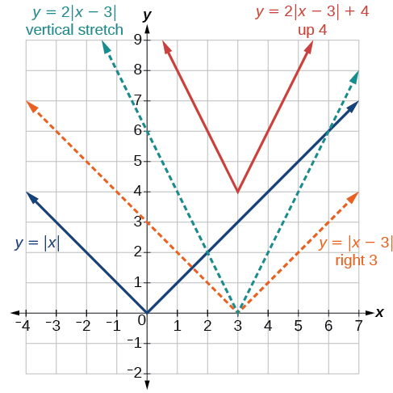{: #Figure_01_06_004}

Writing an Equation for an Absolute Value Function Given a Graph

Write an equation for the function graphed in [[link]](#Figure_01_06_005).

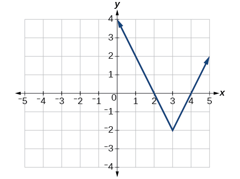{: #Figure_01_06_005}

The basic absolute value function changes direction at the origin, so this graph has been shifted to the right 3 units and down 2 units from the basic toolkit function. See [[link]](#Figure_01_06_006).

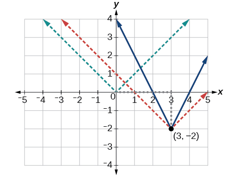{: #Figure_01_06_006}

We also notice that the graph appears vertically stretched, because the width of the final graph on a horizontal line is not equal to 2 times the vertical distance from the corner to this line, as it would be for an unstretched absolute value function. Instead, the width is equal to 1 times the vertical distance as shown in [[link]](#Figure_01_06_007).

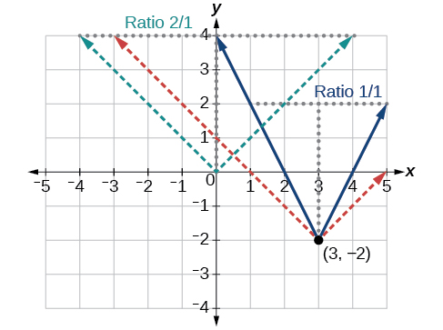{: #Figure_01_06_007}

From this information we can write the equation

<math xmlns="http://www.w3.org/1998/Math/MathML" display="block"> <mrow> <mtable> <mtr> <mtd columnalign="right"> <mrow> <mi>f</mi><mo stretchy="false">(</mo><mi>x</mi><mo stretchy="false">)</mo> </mrow> </mtd> <mtd> <mo>=</mo> </mtd> <mtd columnalign="left"> <mrow> <mn>2</mn><mo>\|</mo><mi>x</mi><mo>−</mo><mn>3</mn><mo>\|</mo><mo>−</mo><mn>2</mn><mo>,</mo> </mrow> </mtd> <mtd columnalign="left"> <mrow><mspace width="1em" /> <mtext>treating the stretch as </mtext><mi>a</mi><mtext> vertical stretch,or</mtext> </mrow> </mtd> </mtr> <mtr> <mtd columnalign="right"> <mrow> <mi>f</mi><mo stretchy="false">(</mo><mi>x</mi><mo stretchy="false">)</mo> </mrow> </mtd> <mtd> <mo>=</mo> </mtd> <mtd columnalign="left"> <mrow> <mo>\|</mo><mn>2</mn><mo stretchy="false">(</mo><mi>x</mi><mo>−</mo><mn>3</mn><mo stretchy="false">)</mo><mo>\|</mo><mo>−</mo><mn>2</mn><mo>,</mo> </mrow> </mtd> <mtd columnalign="left"> <mrow><mspace width="1em" /> <mtext>treating the stretch as </mtext><mi>a</mi><mtext> horizontal compression</mtext><mo>.</mo> </mrow> </mtd> </mtr> </mtable> </mrow> </math>

Analysis

Note that these equations are algebraically equivalent—the stretch for an absolute value function can be written interchangeably as a vertical or horizontal stretch or compression.

**If we couldn’t observe the stretch of the function from the graphs, could we algebraically determine it?**

<em>Yes. If we are unable to determine the stretch based on the width of the graph, we can solve for the stretch factor by putting in a known pair of values for<math xmlns="http://www.w3.org/1998/Math/MathML">
   <mrow>
    <mtext> </mtext><mi>x</mi><mtext> </mtext></mrow>
  </math>and<math xmlns="http://www.w3.org/1998/Math/MathML">
   <mrow>
    <mtext> </mtext><mi>f</mi><mo stretchy="false">(</mo><mi>x</mi><mo stretchy="false">)</mo><mo>.</mo></mrow>
  </math> </em>

<math xmlns="http://www.w3.org/1998/Math/MathML" display="block"> <mrow> <mi>f</mi><mo stretchy="false">(</mo><mi>x</mi><mo stretchy="false">)</mo><mo>=</mo><mi>a</mi><mo>\|</mo><mi>x</mi><mo>−</mo><mn>3</mn><mo>\|</mo><mo>−</mo><mn>2</mn> </mrow> </math>

<em>Now substituting in the point </em>(1, 2)

<math xmlns="http://www.w3.org/1998/Math/MathML" display="block"> <mrow> <mtable> <mtr> <mtd columnalign="right"> <mn>2</mn> </mtd> <mtd> <mo>=</mo> </mtd> <mtd columnalign="left"> <mrow> <mi>a</mi><mo>\|</mo><mn>1</mn><mo>−</mo><mn>3</mn><mo>\|</mo><mo>−</mo><mn>2</mn> </mrow> </mtd> </mtr> <mtr> <mtd columnalign="right"> <mn>4</mn> </mtd> <mtd> <mo>=</mo> </mtd> <mtd columnalign="left"> <mrow> <mn>2</mn><mi>a</mi> </mrow> </mtd> </mtr> <mtr> <mtd columnalign="right"> <mi>a</mi> </mtd> <mtd> <mo>=</mo> </mtd> <mtd columnalign="left"> <mn>2</mn> </mtd> </mtr> </mtable> </mrow> </math>

Write the equation for the absolute value function that is horizontally shifted left 2 units, is vertically flipped, and vertically shifted up 3 units.

<math xmlns="http://www.w3.org/1998/Math/MathML"> <mrow> <mi>f</mi><mo stretchy="false">(</mo><mi>x</mi><mo stretchy="false">)</mo><mo>=</mo><mo>−</mo><mrow><mo>\|</mo> <mrow> <mi>x</mi><mo>+</mo><mn>2</mn></mrow> <mo>\|</mo></mrow><mo>+</mo><mn>3</mn></mrow> </math>

<strong>Do the graphs of absolute value functions always intersect the vertical axis? The horizontal axis? </strong>

<em>Yes, they always intersect the vertical axis. The graph of an absolute value function will intersect the vertical axis when the input is zero. </em>

<em>No, they do not always intersect the horizontal axis. The graph may or may not intersect the horizontal axis, depending on how the graph has been shifted and reflected. It is possible for the absolute value function to intersect the horizontal axis at zero, one, or two points (see <a href="#Figure_01_06_008">\[link\]</a>). </em>

  The absolute value function does not intersect the horizontal axis. (b) The absolute value function intersects the horizontal axis at one point. (c) The absolute value function intersects the horizontal axis at two points."){: #Figure_01_06_008}

### Solving an Absolute Value Equation

In [Other Type of Equations](/m51258){: .target-chapter}, we touched on the concepts of absolute value equations. Now that we understand a little more about their graphs, we can take another look at these types of equations. Now that we can graph an absolute value function, we will learn how to solve an absolute value equation. To solve an equation such as<math xmlns="http://www.w3.org/1998/Math/MathML"> <mrow> <mtext> </mtext><mn>8</mn><mo>=</mo><mrow><mo>\|</mo> <mrow> <mn>2</mn><mi>x</mi><mo>−</mo><mn>6</mn></mrow> <mo>\|</mo></mrow><mo>,</mo><mtext> </mtext></mrow> </math>

we notice that the absolute value will be equal to 8 if the quantity inside the absolute value is 8 or -8. This leads to two different equations we can solve independently.

<math xmlns="http://www.w3.org/1998/Math/MathML" display="block"> <mrow> <mtable> <mtr rowalign="center"> <mtd columnalign="right" rowalign="center"> <mrow> <mn>2</mn><mi>x</mi><mo>−</mo><mn>6</mn> </mrow> </mtd> <mtd rowalign="center"> <mo>=</mo> </mtd> <mtd columnalign="left" rowalign="center"> <mn>8</mn> </mtd> <mtd rowalign="center"> <mrow> <mspace width="1em" /><mtext>or</mtext><mspace width="1em" /> </mrow> </mtd> <mtd columnalign="right" rowalign="center"> <mrow> <mn>2</mn><mi>x</mi><mo>−</mo><mn>6</mn> </mrow> </mtd> <mtd rowalign="center"> <mo>=</mo> </mtd> <mtd columnalign="left" rowalign="center"> <mrow> <mn>−8</mn> </mrow> </mtd> </mtr> <mtr rowalign="center"> <mtd columnalign="right" rowalign="center"> <mrow> <mn>2</mn><mi>x</mi> </mrow> </mtd> <mtd rowalign="center"> <mo>=</mo> </mtd> <mtd columnalign="left" rowalign="center"> <mrow> <mn>14</mn> </mrow> </mtd> <mtd rowalign="center" /> <mtd columnalign="right" rowalign="center"> <mrow> <mn>2</mn><mi>x</mi> </mrow> </mtd> <mtd rowalign="center"> <mo>=</mo> </mtd> <mtd columnalign="left" rowalign="center"> <mrow> <mn>−2</mn> </mrow> </mtd> </mtr> <mtr rowalign="center"> <mtd columnalign="right" rowalign="center"> <mi>x</mi> </mtd> <mtd rowalign="center"> <mo>=</mo> </mtd> <mtd columnalign="left" rowalign="center"> <mn>7</mn> </mtd> <mtd rowalign="center" /> <mtd columnalign="right" rowalign="center"> <mi>x</mi> </mtd> <mtd rowalign="center"> <mo>=</mo> </mtd> <mtd columnalign="left" rowalign="center"> <mrow> <mn>−1</mn> </mrow> </mtd> </mtr> </mtable> </mrow> </math>

Knowing how to solve problems involving **absolute value functions**{: data-type="term" .no-emphasis} is useful. For example, we may need to identify numbers or points on a line that are at a specified distance from a given reference point.

An absolute value equation is an equation in which the unknown variable appears in absolute value bars. For example,

<math xmlns="http://www.w3.org/1998/Math/MathML" display="block"> <mtable columnalign="left"> <mtr columnalign="left"> <mtd columnalign="left"> <mo>\|</mo> <mi>x</mi> <mo>\|</mo><mo>=</mo><mn>4</mn><mo>,</mo> </mtd> </mtr> <mtr columnalign="left"> <mtd columnalign="left"> <mo fence="true" stretchy="true">\|</mo> <mn>2</mn><mi>x</mi><mo>−</mo><mn>1</mn> <mo fence="true" stretchy="true">\|</mo><mo>=</mo><mn>3</mn><mo>,</mo><mtext>or</mtext> </mtd> </mtr> <mtr columnalign="left"> <mtd columnalign="left"> <mo>\|</mo> <mn>5</mn><mi>x</mi><mo>+</mo><mn>2</mn> <mo>\|</mo><mo>−</mo><mn>4</mn><mo>=</mo><mn>9</mn> </mtd> </mtr> </mtable> </math>

Solutions to Absolute Value Equations

For real numbers <math xmlns="http://www.w3.org/1998/Math/MathML"> <mi>A</mi> </math>

 and <math xmlns="http://www.w3.org/1998/Math/MathML"> <mi>B</mi> </math>

, an equation of the form <math xmlns="http://www.w3.org/1998/Math/MathML"> <mo>\|</mo> <mi>A</mi> <mo>\|</mo><mo>=</mo><mi>B</mi><mo>,</mo> </math>

 with <math xmlns="http://www.w3.org/1998/Math/MathML"> <mi>B</mi><mo>≥</mo><mn>0</mn><mo>,</mo> </math>

 will have solutions when <math xmlns="http://www.w3.org/1998/Math/MathML"> <mi>A</mi><mo>=</mo><mi>B</mi> </math>

 or <math xmlns="http://www.w3.org/1998/Math/MathML"> <mi>A</mi><mo>=</mo><mo>−</mo><mi>B</mi><mo>.</mo> </math>

 If <math xmlns="http://www.w3.org/1998/Math/MathML"> <mi>B</mi><mo>&lt;</mo><mn>0</mn><mo>,</mo> </math>

 the equation <math xmlns="http://www.w3.org/1998/Math/MathML"> <mo>\|</mo> <mi>A</mi> <mo>\|</mo><mo>=</mo><mi>B</mi> </math>

 has no solution.

**Given the formula for an absolute value function, find the horizontal intercepts of its graph**.

1.  Isolate the absolute value term.
2.  Use
    <math xmlns="http://www.w3.org/1998/Math/MathML"> <mrow> <mtext> </mtext><mrow><mo>\|</mo> <mi>A</mi> <mo>\|</mo></mrow><mo>=</mo><mi>B</mi><mtext> </mtext></mrow> </math>
    
    to write
    <math xmlns="http://www.w3.org/1998/Math/MathML"> <mrow> <mtext> </mtext><mi>A</mi><mo>=</mo><mi>B</mi><mtext> </mtext></mrow> </math>
    
    or
    <math xmlns="http://www.w3.org/1998/Math/MathML"> <mrow> <mtext> </mtext><mi>−A</mi><mo>=</mo><mi>B</mi><mo>,</mo><mtext> </mtext> </mrow> </math>
    
    assuming
    <math xmlns="http://www.w3.org/1998/Math/MathML"> <mrow> <mtext> </mtext><mi>B</mi><mo>&gt;</mo><mn>0.</mn></mrow> </math>

3.  Solve for
    <math xmlns="http://www.w3.org/1998/Math/MathML"> <mrow> <mtext> </mtext><mi>x</mi><mo>.</mo><mtext> </mtext></mrow> </math>
{: type="1"}

Finding the Zeros of an Absolute Value Function

For the function<math xmlns="http://www.w3.org/1998/Math/MathML"> <mrow> <mtext> </mtext><mi>f</mi><mo stretchy="false">(</mo><mi>x</mi><mo stretchy="false">)</mo><mo>=</mo><mo>\|</mo><mn>4</mn><mi>x</mi><mo>+</mo><mn>1</mn><mo>\|</mo><mo>−</mo><mn>7</mn><mo>,</mo> </mrow> </math>

find the values of<math xmlns="http://www.w3.org/1998/Math/MathML"> <mrow> <mtext> </mtext><mi>x</mi><mtext> </mtext> </mrow> </math>

such that<math xmlns="http://www.w3.org/1998/Math/MathML"> <mrow> <mtext> </mtext><mi>f</mi><mo stretchy="false">(</mo><mi>x</mi><mo stretchy="false">)</mo><mo>=</mo><mn>0.</mn> </mrow> </math>

<math xmlns="http://www.w3.org/1998/Math/MathML" display="block"> <mrow> <mtable> <mtr rowalign="center"> <mtd columnalign="right" rowalign="center"> <mn>0</mn> </mtd> <mtd rowalign="center"> <mo>=</mo> </mtd> <mtd columnalign="left" rowalign="center"> <mrow> <mo>\|</mo><mn>4</mn><mi>x</mi><mo>+</mo><mn>1</mn><mo>\|</mo><mo>−</mo><mn>7</mn> </mrow> </mtd> <mtd rowalign="center" /> <mtd rowalign="center" /> <mtd rowalign="center" /> <mtd rowalign="center" /> <mtd columnalign="left" rowalign="center"> <mrow> <mtext>Substitute 0 for </mtext><mi>f</mi><mo stretchy="false">(</mo><mi>x</mi><mo stretchy="false">)</mo><mo>.</mo> </mrow> </mtd> </mtr> <mtr rowalign="center"> <mtd columnalign="right" rowalign="center"> <mn>7</mn> </mtd> <mtd rowalign="center"> <mo>=</mo> </mtd> <mtd columnalign="left" rowalign="center"> <mrow> <mo>\|</mo><mn>4</mn><mi>x</mi><mo>+</mo><mn>1</mn><mo>\|</mo> </mrow> </mtd> <mtd rowalign="center" /> <mtd rowalign="center" /> <mtd rowalign="center" /> <mtd rowalign="center" /> <mtd columnalign="left" rowalign="center"> <mrow> <mtext>Isolate the absolute value on one side of the equation</mtext><mo>.</mo> </mrow> </mtd> </mtr> <mtr rowalign="center"> <mtd rowalign="center" /> <mtd rowalign="center" /> <mtd rowalign="center" /> <mtd rowalign="center" /> <mtd rowalign="center" /> <mtd rowalign="center" /> <mtd rowalign="center" /> <mtd rowalign="center" /> </mtr> <mtr rowalign="center"> <mtd rowalign="center" /> <mtd rowalign="center" /> <mtd rowalign="center" /> <mtd rowalign="center" /> <mtd rowalign="center" /> <mtd rowalign="center" /> <mtd rowalign="center" /> <mtd rowalign="center" /> </mtr> <mtr rowalign="center"> <mtd rowalign="center" /> <mtd rowalign="center" /> <mtd rowalign="center" /> <mtd rowalign="center" /> <mtd rowalign="center" /> <mtd rowalign="center" /> <mtd rowalign="center" /> <mtd rowalign="center" /> </mtr> <mtr rowalign="center"> <mtd columnalign="right" rowalign="center"> <mn>7</mn> </mtd> <mtd rowalign="center"> <mo>=</mo> </mtd> <mtd columnalign="left" rowalign="center"> <mrow> <mn>4</mn><mi>x</mi><mo>+</mo><mn>1</mn> </mrow> </mtd> <mtd rowalign="center"> <mrow> <mtext>or</mtext> </mrow> </mtd> <mtd columnalign="right" rowalign="center"> <mrow><mspace width="2em" /> <mn>−7</mn> </mrow> </mtd> <mtd rowalign="center"> <mo>=</mo> </mtd> <mtd columnalign="left" rowalign="center"> <mrow> <mn>4</mn><mi>x</mi><mo>+</mo><mn>1</mn> </mrow> </mtd> <mtd columnalign="left" rowalign="center"> <mrow> <mtext>Break into two separate equations and solve</mtext><mo>.</mo> </mrow> </mtd> </mtr> <mtr rowalign="center"> <mtd columnalign="right" rowalign="center"> <mn>6</mn> </mtd> <mtd rowalign="center"> <mo>=</mo> </mtd> <mtd columnalign="left" rowalign="center"> <mrow> <mn>4</mn><mi>x</mi> </mrow> </mtd> <mtd rowalign="center" /> <mtd columnalign="right" rowalign="center"> <mrow> <mn>−8</mn> </mrow> </mtd> <mtd rowalign="center"> <mo>=</mo> </mtd> <mtd columnalign="left" rowalign="center"> <mrow> <mn>4</mn><mi>x</mi> </mrow> </mtd> <mtd rowalign="center" /> </mtr> <mtr rowalign="center"> <mtd rowalign="center" /> <mtd rowalign="center" /> <mtd rowalign="center" /> <mtd rowalign="center" /> <mtd rowalign="center" /> <mtd rowalign="center" /> <mtd rowalign="center" /> <mtd rowalign="center" /> </mtr> <mtr rowalign="center"> <mtd columnalign="right" rowalign="center"> <mi>x</mi> </mtd> <mtd rowalign="center"> <mo>=</mo> </mtd> <mtd columnalign="left" rowalign="center"> <mrow> <mfrac> <mn>6</mn> <mn>4</mn> </mfrac> <mo>=</mo><mn>1.5</mn> </mrow> </mtd> <mtd rowalign="center" /> <mtd columnalign="right" rowalign="center"> <mi>x</mi> </mtd> <mtd rowalign="center"> <mo>=</mo> </mtd> <mtd columnalign="left" rowalign="center"> <mrow> <mfrac> <mrow> <mo>−</mo><mn>8</mn> </mrow> <mn>4</mn> </mfrac> <mo>=</mo><mo>−</mo><mn>2</mn> </mrow> </mtd> <mtd rowalign="center" /> </mtr> </mtable> </mrow> </math>

The function outputs 0 when<math xmlns="http://www.w3.org/1998/Math/MathML"> <mrow> <mtext> </mtext><mi>x</mi><mo>=</mo><mfrac> <mn>3</mn> <mn>2</mn> </mfrac> <mtext> </mtext></mrow> </math>

or<math xmlns="http://www.w3.org/1998/Math/MathML"> <mrow> <mtext> </mtext><mi>x</mi><mo>=</mo><mo>−</mo><mn>2.</mn></mrow> </math>

 See [[link]](#Figure_01_06_011).

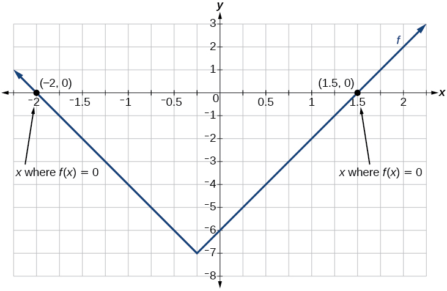{: #Figure_01_06_011}

For the function<math xmlns="http://www.w3.org/1998/Math/MathML"> <mrow> <mtext> </mtext><mi>f</mi><mo stretchy="false">(</mo><mi>x</mi><mo stretchy="false">)</mo><mo>=</mo><mrow><mo>\|</mo> <mrow> <mn>2</mn><mi>x</mi><mo>−</mo><mn>1</mn> </mrow> <mo>\|</mo></mrow><mo>−</mo><mn>3</mn><mo>,</mo> </mrow> </math>

find the values of<math xmlns="http://www.w3.org/1998/Math/MathML"> <mrow> <mtext> </mtext><mi>x</mi><mtext> </mtext> </mrow> </math>

such that<math xmlns="http://www.w3.org/1998/Math/MathML"> <mrow> <mtext> </mtext><mi>f</mi><mo stretchy="false">(</mo><mi>x</mi><mo stretchy="false">)</mo><mo>=</mo><mn>0.</mn> </mrow> </math>

<math xmlns="http://www.w3.org/1998/Math/MathML"> <mrow> <mi>x</mi><mo>=</mo><mo>−</mo><mn>1</mn><mtext> </mtext></mrow> </math>

or<math xmlns="http://www.w3.org/1998/Math/MathML"> <mrow> <mtext> </mtext><mtext> </mtext><mi>x</mi><mo>=</mo><mn>2</mn></mrow> </math>

<strong>Should we always expect two answers when solving<math xmlns="http://www.w3.org/1998/Math/MathML">
 <mrow>
  <mtext> </mtext><mrow><mo>\|</mo> <mi>A</mi> <mo>\|</mo></mrow><mo>=</mo><mi>B</mi><mo>?</mo>
 </mrow>
</math></strong>

*No. We may find one, two, or even no answers. For example, there is no solution to* <math xmlns="http://www.w3.org/1998/Math/MathML"> <mrow> <mtext> </mtext><mn>2</mn><mo>+</mo><mrow><mo>\|</mo> <mrow> <mn>3</mn><mi>x</mi><mo>−</mo><mn>5</mn></mrow> <mo>\|</mo></mrow><mo>=</mo><mn>1.</mn></mrow> </math>

<section data-depth="1">

Access these online resources for additional instruction and practice with absolute value.

* [Graphing Absolute Value Functions][1]
* [Graphing Absolute Value Functions 2][2]

</section>

### Key Concepts

* Applied problems, such as ranges of possible values, can also be solved using the absolute value function. See [\[link\]](#Example_01_06_02).
* The graph of the absolute value function resembles a letter V. It has a corner point at which the graph changes direction. See [\[link\]](#Example_01_06_03).
* In an absolute value equation, an unknown variable is the input of an absolute value function.
* If the absolute value of an expression is set equal to a positive number, expect two solutions for the unknown variable. See [\[link\]](#Example_01_06_04).

### Section Exercises

#### Verbal

How do you solve an absolute value equation?

Isolate the absolute value term so that the equation is of the form<math xmlns="http://www.w3.org/1998/Math/MathML"> <mrow> <mtext> </mtext><mo>\|</mo><mi>A</mi><mo>\|</mo><mo>=</mo><mi>B</mi><mo>.</mo><mtext> </mtext></mrow> </math>

Form one equation by setting the expression inside the absolute value symbol,<math xmlns="http://www.w3.org/1998/Math/MathML"> <mrow> <mtext> </mtext><mi>A</mi><mo>,</mo><mtext> </mtext></mrow> </math>

equal to the expression on the other side of the equation,<math xmlns="http://www.w3.org/1998/Math/MathML"> <mrow> <mtext> </mtext><mi>B</mi><mo>.</mo><mtext> </mtext></mrow> </math>

Form a second equation by setting<math xmlns="http://www.w3.org/1998/Math/MathML"> <mrow> <mtext> </mtext><mi>A</mi><mtext> </mtext></mrow> </math>

equal to the opposite of the expression on the other side of the equation,<math xmlns="http://www.w3.org/1998/Math/MathML"> <mrow> <mtext> </mtext><mo>−</mo><mi>B</mi><mo>.</mo><mtext> </mtext></mrow> </math>

Solve each equation for the variable.

How can you tell whether an absolute value function has two *x*-intercepts without graphing the function?

When solving an absolute value function, the isolated absolute value term is equal to a negative number. What does that tell you about the graph of the absolute value function?

The graph of the absolute value function does not cross the<math xmlns="http://www.w3.org/1998/Math/MathML"> <mrow> <mtext> </mtext><mi>x</mi></mrow> </math>

-axis, so the graph is either completely above or completely below the<math xmlns="http://www.w3.org/1998/Math/MathML"> <mrow> <mtext> </mtext><mi>x</mi></mrow> </math>

-axis.

How can you use the graph of an absolute value function to determine the *x*-values for which the function values are negative?

#### Algebraic

Describe all numbers<math xmlns="http://www.w3.org/1998/Math/MathML"> <mrow> <mtext> </mtext><mi>x</mi><mtext> </mtext></mrow> </math>

that are at a distance of 4 from the number 8. Express this set of numbers using absolute value notation.

Describe all numbers<math xmlns="http://www.w3.org/1998/Math/MathML"> <mrow> <mtext> </mtext><mi>x</mi><mtext> </mtext></mrow> </math>

that are at a distance of<math xmlns="http://www.w3.org/1998/Math/MathML"> <mrow> <mtext> </mtext><mfrac> <mn>1</mn> <mn>2</mn> </mfrac> <mtext> </mtext></mrow> </math>

from the number −4. Express this set of numbers using absolute value notation.

<math xmlns="http://www.w3.org/1998/Math/MathML"> <mrow> <mtext> </mtext><mrow><mo>\|</mo> <mrow> <mi>x</mi><mo>+</mo><mn>4</mn></mrow> <mo>\|</mo></mrow><mo>=</mo><mfrac> <mn>1</mn> <mn>2</mn> </mfrac> <mtext> </mtext></mrow> </math>

Describe the situation in which the distance that point<math xmlns="http://www.w3.org/1998/Math/MathML"> <mrow> <mtext> </mtext><mi>x</mi><mtext> </mtext></mrow> </math>

is from 10 is at least 15 units. Express this set of numbers using absolute value notation.

Find all function values<math xmlns="http://www.w3.org/1998/Math/MathML"> <mrow> <mtext> </mtext><mi>f</mi><mo stretchy="false">(</mo><mi>x</mi><mo stretchy="false">)</mo><mtext> </mtext></mrow> </math>

such that the distance from<math xmlns="http://www.w3.org/1998/Math/MathML"> <mrow> <mtext> </mtext><mi>f</mi><mo stretchy="false">(</mo><mi>x</mi><mo stretchy="false">)</mo><mtext> </mtext></mrow> </math>

to the value 8 is less than 0.03 units. Express this set of numbers using absolute value notation.

<math xmlns="http://www.w3.org/1998/Math/MathML"> <mrow> <mo>\|</mo><mi>f</mi><mo stretchy="false">(</mo><mi>x</mi><mo stretchy="false">)</mo><mo>−</mo><mn>8</mn><mo>\|</mo><mo>&lt;</mo><mn>0.03</mn></mrow> </math>

For the following exercises, find the *x*- and *y*-intercepts of the graphs of each function.

<math xmlns="http://www.w3.org/1998/Math/MathML"> <mrow> <mi>f</mi><mo stretchy="false">(</mo><mi>x</mi><mo stretchy="false">)</mo><mo>=</mo><mn>4</mn><mrow><mo>\|</mo> <mrow> <mi>x</mi><mo>−</mo><mn>3</mn> </mrow> <mo>\|</mo></mrow><mo>+</mo><mn>4</mn> </mrow> </math>

<math xmlns="http://www.w3.org/1998/Math/MathML"> <mrow> <mi>f</mi><mo stretchy="false">(</mo><mi>x</mi><mo stretchy="false">)</mo><mo>=</mo><mo>−</mo><mn>3</mn><mrow><mo>\|</mo> <mrow> <mi>x</mi><mo>−</mo><mn>2</mn> </mrow> <mo>\|</mo></mrow><mo>−</mo><mn>1</mn> </mrow> </math>

<math xmlns="http://www.w3.org/1998/Math/MathML"> <mrow> <mrow><mo>(</mo> <mrow> <mn>0</mn><mo>,</mo><mo>−</mo><mn>7</mn></mrow> <mo>)</mo></mrow><mo>;</mo><mtext> </mtext></mrow> </math>

no<math xmlns="http://www.w3.org/1998/Math/MathML"> <mrow> <mtext> </mtext><mi>x</mi></mrow> </math>

-intercepts

<math xmlns="http://www.w3.org/1998/Math/MathML"> <mrow> <mi>f</mi><mo stretchy="false">(</mo><mi>x</mi><mo stretchy="false">)</mo><mo>=</mo><mo>−</mo><mn>2</mn><mrow><mo>\|</mo> <mrow> <mi>x</mi><mo>+</mo><mn>1</mn> </mrow> <mo>\|</mo></mrow><mo>+</mo><mn>6</mn> </mrow> </math>

<math xmlns="http://www.w3.org/1998/Math/MathML"> <mrow> <mi>f</mi><mo stretchy="false">(</mo><mi>x</mi><mo stretchy="false">)</mo><mo>=</mo><mo>−</mo><mn>5</mn><mo>\|</mo><mi>x</mi><mo>+</mo><mn>2</mn><mo>\|</mo><mo>+</mo><mn>15</mn> </mrow> </math>

<math xmlns="http://www.w3.org/1998/Math/MathML"> <mrow> <mo stretchy="false">(</mo><mn>0</mn><mo>,</mo><mtext> </mtext><mn>5</mn><mo stretchy="false">)</mo><mo>,</mo><mo stretchy="false">(</mo><mn>1</mn><mo>,</mo><mn>0</mn><mo stretchy="false">)</mo><mo>,</mo><mo stretchy="false">(</mo><mo>−</mo><mn>5</mn><mo>,</mo><mn>0</mn><mo stretchy="false">)</mo> </mrow> </math>

<math xmlns="http://www.w3.org/1998/Math/MathML"> <mrow> <mi>f</mi><mo stretchy="false">(</mo><mi>x</mi><mo stretchy="false">)</mo><mo>=</mo><mn>2</mn><mo>\|</mo><mi>x</mi><mo>−</mo><mn>1</mn><mo>\|</mo><mo>−</mo><mn>6</mn> </mrow> </math>

<math xmlns="http://www.w3.org/1998/Math/MathML"> <mrow> <mo stretchy="false">(</mo><mn>0</mn><mo>,</mo><mo>−</mo><mn>4</mn><mo stretchy="false">)</mo><mo>,</mo><mo stretchy="false">(</mo><mn>4</mn><mo>,</mo><mn>0</mn><mo stretchy="false">)</mo><mo>,</mo><mo stretchy="false">(</mo><mo>−</mo><mn>2</mn><mo>,</mo><mn>0</mn><mo stretchy="false">)</mo> </mrow> </math>

<math xmlns="http://www.w3.org/1998/Math/MathML"> <mrow> <mi>f</mi><mo stretchy="false">(</mo><mi>x</mi><mo stretchy="false">)</mo><mo>=</mo><mo>\|</mo><mo>−</mo><mn>2</mn><mi>x</mi><mo>+</mo><mn>1</mn><mo>\|</mo><mo>−</mo><mn>13</mn> </mrow> </math>

<math xmlns="http://www.w3.org/1998/Math/MathML"> <mrow> <mo stretchy="false">(</mo><mn>0</mn><mo>,</mo><mo>−</mo><mn>12</mn><mo stretchy="false">)</mo><mo>,</mo><mo stretchy="false">(</mo><mo>−</mo><mn>6</mn><mo>,</mo><mn>0</mn><mo stretchy="false">)</mo><mo>,</mo><mo stretchy="false">(</mo><mn>7</mn><mo>,</mo><mn>0</mn><mo stretchy="false">)</mo> </mrow> </math>

<math xmlns="http://www.w3.org/1998/Math/MathML"> <mrow> <mi>f</mi><mo stretchy="false">(</mo><mi>x</mi><mo stretchy="false">)</mo><mo>=</mo><mo>−</mo><mo>\|</mo><mi>x</mi><mo>−</mo><mn>9</mn><mo>\|</mo><mo>+</mo><mn>16</mn> </mrow> </math>

<math xmlns="http://www.w3.org/1998/Math/MathML"> <mrow> <mo stretchy="false">(</mo><mn>0</mn><mo>,</mo><mn>7</mn><mo stretchy="false">)</mo><mo>,</mo><mo stretchy="false">(</mo><mn>25</mn><mo>,</mo><mn>0</mn><mo stretchy="false">)</mo><mo>,</mo><mo stretchy="false">(</mo><mo>−</mo><mn>7</mn><mo>,</mo><mn>0</mn><mo stretchy="false">)</mo> </mrow> </math>

#### Graphical

For the following exercises, graph the absolute value function. Plot at least five points by hand for each graph.

<math xmlns="http://www.w3.org/1998/Math/MathML"> <mrow> <mi>y</mi><mo>=</mo><mo>\|</mo><mi>x</mi><mo>−</mo><mn>1</mn><mo>\|</mo></mrow> </math>

 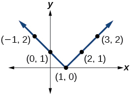 

<math xmlns="http://www.w3.org/1998/Math/MathML"> <mrow> <mi>y</mi><mo>=</mo><mo>\|</mo><mi>x</mi><mo>+</mo><mn>1</mn><mo>\|</mo></mrow> </math>

<math xmlns="http://www.w3.org/1998/Math/MathML"> <mrow> <mi>y</mi><mo>=</mo><mo>\|</mo><mi>x</mi><mo>\|</mo><mo>+</mo><mn>1</mn></mrow> </math>

 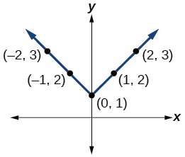 

For the following exercises, graph the given functions by hand.

<math xmlns="http://www.w3.org/1998/Math/MathML"> <mrow> <mi>y</mi><mo>=</mo><mrow><mo>\|</mo> <mi>x</mi> <mo>\|</mo></mrow><mo>−</mo><mn>2</mn></mrow> </math>

<math xmlns="http://www.w3.org/1998/Math/MathML"> <mrow> <mi>y</mi><mo>=</mo><mo>−</mo><mrow><mo>\|</mo> <mi>x</mi> <mo>\|</mo></mrow></mrow> </math>

 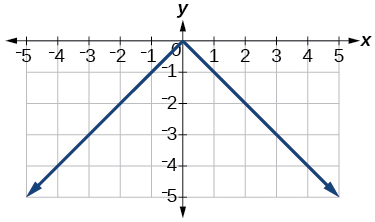 

<math xmlns="http://www.w3.org/1998/Math/MathML"> <mrow> <mi>y</mi><mo>=</mo><mo>−</mo><mrow><mo>\|</mo> <mi>x</mi> <mo>\|</mo></mrow><mo>−</mo><mn>2</mn></mrow> </math>

<math xmlns="http://www.w3.org/1998/Math/MathML"> <mrow> <mi>y</mi><mo>=</mo><mo>−</mo><mrow><mo>\|</mo> <mrow> <mi>x</mi><mo>−</mo><mn>3</mn></mrow> <mo>\|</mo></mrow><mo>−</mo><mn>2</mn></mrow> </math>

 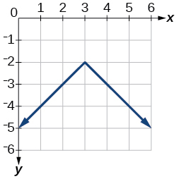 

<math xmlns="http://www.w3.org/1998/Math/MathML"> <mrow> <mi>f</mi><mo stretchy="false">(</mo><mi>x</mi><mo stretchy="false">)</mo><mo>=</mo><mo>−</mo><mo>\|</mo><mi>x</mi><mo>−</mo><mn>1</mn><mo>\|</mo><mo>−</mo><mn>2</mn> </mrow> </math>

<math xmlns="http://www.w3.org/1998/Math/MathML"> <mrow> <mi>f</mi><mo stretchy="false">(</mo><mi>x</mi><mo stretchy="false">)</mo><mo>=</mo><mo>−</mo><mo>\|</mo><mi>x</mi><mo>+</mo><mn>3</mn><mo>\|</mo><mo>+</mo><mn>4</mn> </mrow> </math>

 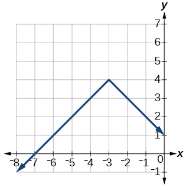 

<math xmlns="http://www.w3.org/1998/Math/MathML"> <mrow> <mi>f</mi><mo stretchy="false">(</mo><mi>x</mi><mo stretchy="false">)</mo><mo>=</mo><mn>2</mn><mo>\|</mo><mi>x</mi><mo>+</mo><mn>3</mn><mo>\|</mo><mo>+</mo><mn>1</mn> </mrow> </math>

<math xmlns="http://www.w3.org/1998/Math/MathML"> <mrow> <mi>f</mi><mo stretchy="false">(</mo><mi>x</mi><mo stretchy="false">)</mo><mo>=</mo><mn>3</mn><mrow><mo>\|</mo> <mrow> <mi>x</mi><mo>−</mo><mn>2</mn> </mrow> <mo>\|</mo></mrow><mo>+</mo><mn>3</mn> </mrow> </math>

 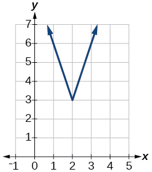 

<math xmlns="http://www.w3.org/1998/Math/MathML"> <mrow> <mi>f</mi><mo stretchy="false">(</mo><mi>x</mi><mo stretchy="false">)</mo><mo>=</mo><mrow><mo>\|</mo> <mrow> <mn>2</mn><mi>x</mi><mo>−</mo><mn>4</mn> </mrow> <mo>\|</mo></mrow><mo>−</mo><mn>3</mn> </mrow> </math>

<math xmlns="http://www.w3.org/1998/Math/MathML"> <mrow> <mi>f</mi><mrow><mo>(</mo> <mi>x</mi> <mo>)</mo></mrow><mo>=</mo><mrow><mo>\|</mo> <mrow> <mn>3</mn><mi>x</mi><mo>+</mo><mn>9</mn></mrow> <mo>\|</mo></mrow><mo>+</mo><mn>2</mn></mrow> </math>

 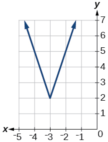 

<math xmlns="http://www.w3.org/1998/Math/MathML"> <mrow> <mi>f</mi><mo stretchy="false">(</mo><mi>x</mi><mo stretchy="false">)</mo><mo>=</mo><mo>−</mo><mrow><mo>\|</mo> <mrow> <mi>x</mi><mo>−</mo><mn>1</mn> </mrow> <mo>\|</mo></mrow><mo>−</mo><mn>3</mn> </mrow> </math>

<math xmlns="http://www.w3.org/1998/Math/MathML"> <mrow> <mi>f</mi><mo stretchy="false">(</mo><mi>x</mi><mo stretchy="false">)</mo><mo>=</mo><mo>−</mo><mrow><mo>\|</mo> <mrow> <mi>x</mi><mo>+</mo><mn>4</mn></mrow> <mo>\|</mo></mrow><mo>−</mo><mn>3</mn></mrow> </math>

 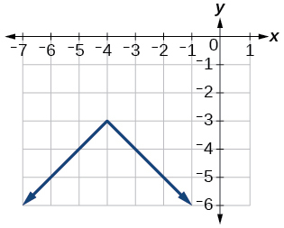 

<math xmlns="http://www.w3.org/1998/Math/MathML"> <mrow> <mi>f</mi><mo stretchy="false">(</mo><mi>x</mi><mo stretchy="false">)</mo><mo>=</mo><mfrac> <mn>1</mn> <mn>2</mn> </mfrac> <mrow><mo>\|</mo> <mrow> <mi>x</mi><mo>+</mo><mn>4</mn></mrow> <mo>\|</mo></mrow><mo>−</mo><mn>3</mn></mrow> </math>

#### Technology

Use a graphing utility to graph <math xmlns="http://www.w3.org/1998/Math/MathML"> <mrow> <mi>f</mi><mo stretchy="false">(</mo><mi>x</mi><mo stretchy="false">)</mo><mo>=</mo><mn>10</mn><mo>\|</mo><mi>x</mi><mo>−</mo><mn>2</mn><mo>\|</mo></mrow> </math>

 on the viewing window <math xmlns="http://www.w3.org/1998/Math/MathML"> <mrow> <mrow><mo>[</mo> <mrow> <mn>0</mn><mo>,</mo><mn>4</mn></mrow> <mo>]</mo></mrow><mo>.</mo></mrow> </math>

 Identify the corresponding range. Show the graph.

range:<math xmlns="http://www.w3.org/1998/Math/MathML"> <mrow> <mtext> </mtext><mrow><mo>[</mo> <mrow> <mn>0</mn><mo>,</mo><mn>20</mn></mrow> <mo>]</mo></mrow></mrow> </math>

 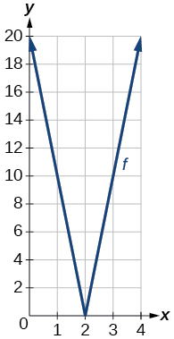 

Use a graphing utility to graph<math xmlns="http://www.w3.org/1998/Math/MathML"> <mrow> <mtext> </mtext><mi>f</mi><mo stretchy="false">(</mo><mi>x</mi><mo stretchy="false">)</mo><mo>=</mo><mo>−</mo><mn>100</mn><mo>\|</mo><mi>x</mi><mo>\|</mo><mo>+</mo><mn>100</mn><mtext> </mtext></mrow> </math>

on the viewing window<math xmlns="http://www.w3.org/1998/Math/MathML"> <mrow> <mtext> </mtext><mrow><mo>[</mo> <mrow> <mo>−</mo><mn>5</mn><mo>,</mo><mn>5</mn></mrow> <mo>]</mo></mrow><mo>.</mo><mtext> </mtext></mrow> </math>

Identify the corresponding range. Show the graph.

For the following exercises, graph each function using a graphing utility. Specify the viewing window.

<math xmlns="http://www.w3.org/1998/Math/MathML"> <mrow> <mi>f</mi><mo stretchy="false">(</mo><mi>x</mi><mo stretchy="false">)</mo><mo>=</mo><mo>−</mo><mn>0.1</mn><mrow><mo>\|</mo> <mrow> <mn>0.1</mn><mo stretchy="false">(</mo><mn>0.2</mn><mo>−</mo><mi>x</mi><mo stretchy="false">)</mo></mrow> <mo>\|</mo></mrow><mo>+</mo><mn>0.3</mn></mrow> </math>

<math xmlns="http://www.w3.org/1998/Math/MathML"> <mrow> <mi>x</mi><mtext>-</mtext> </mrow> </math>

intercepts:

 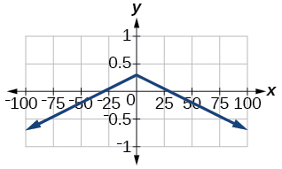 

<math xmlns="http://www.w3.org/1998/Math/MathML"> <mrow> <mi>f</mi><mo stretchy="false">(</mo><mi>x</mi><mo stretchy="false">)</mo><mo>=</mo><mn>4</mn><mo>×</mo><msup> <mrow> <mn>10</mn></mrow> <mn>9</mn> </msup> <mrow><mo>\|</mo> <mrow> <mi>x</mi><mo>−</mo><mo>(</mo><mn>5</mn><mo>×</mo><msup> <mrow> <mn>10</mn></mrow> <mn>9</mn> </msup> <mo>)</mo></mrow> <mo>\|</mo></mrow><mo>+</mo><mn>2</mn><mo>×</mo><msup> <mrow> <mn>10</mn></mrow> <mn>9</mn> </msup> </mrow> </math>

#### Extensions

For the following exercises, solve the inequality.

If possible, find all values of <math xmlns="http://www.w3.org/1998/Math/MathML"> <mrow> <mi>a</mi></mrow> </math>

 such that there are no <math xmlns="http://www.w3.org/1998/Math/MathML"> <mrow> <mi>x</mi><mtext>-</mtext> </mrow> </math>

intercepts for <math xmlns="http://www.w3.org/1998/Math/MathML"> <mrow> <mi>f</mi><mo stretchy="false">(</mo><mi>x</mi><mo stretchy="false">)</mo><mo>=</mo><mn>2</mn><mrow><mo>\|</mo> <mrow> <mi>x</mi><mo>+</mo><mn>1</mn></mrow> <mo>\|</mo></mrow><mo>+</mo><mi>a</mi><mo>.</mo></mrow> </math>

If possible, find all values of<math xmlns="http://www.w3.org/1998/Math/MathML"> <mrow> <mtext> </mtext><mi>a</mi><mtext> </mtext></mrow> </math>

such that there are no <math xmlns="http://www.w3.org/1998/Math/MathML"> <mrow> <mtext> </mtext><mi>y</mi></mrow> </math>

-intercepts for<math xmlns="http://www.w3.org/1998/Math/MathML"> <mrow> <mtext> </mtext><mi>f</mi><mo stretchy="false">(</mo><mi>x</mi><mo stretchy="false">)</mo><mo>=</mo><mn>2</mn><mrow><mo>\|</mo> <mrow> <mi>x</mi><mo>+</mo><mn>1</mn></mrow> <mo>\|</mo></mrow><mo>+</mo><mi>a</mi><mo>.</mo></mrow> </math>

There is no solution for<math xmlns="http://www.w3.org/1998/Math/MathML"> <mrow> <mtext> </mtext><mi>a</mi><mtext> </mtext></mrow> </math>

that will keep the function from having a<math xmlns="http://www.w3.org/1998/Math/MathML"> <mrow> <mtext> </mtext><mi>y</mi></mrow> </math>

-intercept. The absolute value function always crosses the <math xmlns="http://www.w3.org/1998/Math/MathML"> <mrow> <mtext> </mtext><mi>y</mi></mrow> </math>

-intercept when<math xmlns="http://www.w3.org/1998/Math/MathML"> <mrow> <mtext> </mtext><mi>x</mi><mo>=</mo><mn>0.</mn></mrow> </math>

#### Real-World Applications

Cities A and B are on the same east-west line. Assume that city A is located at the origin. If the distance from city A to city B is at least 100 miles and<math xmlns="http://www.w3.org/1998/Math/MathML"> <mrow> <mtext> </mtext><mi>x</mi><mtext> </mtext></mrow> </math>

represents the distance from city B to city A, express this using absolute value notation.

The true proportion<math xmlns="http://www.w3.org/1998/Math/MathML"> <mrow> <mtext> </mtext><mi>p</mi><mtext> </mtext></mrow> </math>

of people who give a favorable rating to Congress is 8% with a margin of error of 1.5%. Describe this statement using an absolute value equation.

<math xmlns="http://www.w3.org/1998/Math/MathML"> <mrow> <mrow><mo>\|</mo> <mrow> <mi>p</mi><mo>−</mo><mn>0.08</mn></mrow> <mo>\|</mo></mrow><mo>≤</mo><mn>0.015</mn></mrow> </math>

Students who score within 18 points of the number 82 will pass a particular test. Write this statement using absolute value notation and use the variable<math xmlns="http://www.w3.org/1998/Math/MathML"> <mrow> <mtext> </mtext><mi>x</mi><mtext> </mtext></mrow> </math>

for the score.

A machinist must produce a bearing that is within 0.01 inches of the correct diameter of 5.0 inches. Using<math xmlns="http://www.w3.org/1998/Math/MathML"> <mrow> <mtext> </mtext><mi>x</mi><mtext> </mtext></mrow> </math>

as the diameter of the bearing, write this statement using absolute value notation.

<math xmlns="http://www.w3.org/1998/Math/MathML"> <mrow> <mrow><mo>\|</mo> <mrow> <mi>x</mi><mo>−</mo><mn>5.0</mn></mrow> <mo>\|</mo></mrow><mo>≤</mo><mn>0.01</mn></mrow> </math>

The tolerance for a ball bearing is 0.01. If the true diameter of the bearing is to be 2.0 inches and the measured value of the diameter is<math xmlns="http://www.w3.org/1998/Math/MathML"> <mrow> <mtext> </mtext><mi>x</mi><mtext> </mtext></mrow> </math>

inches, express the tolerance using absolute value notation.

[1]: http://openstax.org/l/graphabsvalue
[2]: http://openstax.org/l/graphabsvalue2
