

In this section, you will:
* Verify inverse functions.
* Determine the domain and range of an inverse function, and restrict the domain of a function to make it one-to-one.
* Find or evaluate the inverse of a function.
* Use the graph of a one-to-one function to graph its inverse function on the same axes.

A reversible heat pump is a climate-control system that is an air conditioner and a heater in a single device. Operated in one direction, it pumps heat out of a house to provide cooling. Operating in reverse, it pumps heat into the building from the outside, even in cool weather, to provide heating. As a heater, a heat pump is several times more efficient than conventional electrical resistance heating.

If some physical machines can run in two directions, we might ask whether some of the function “machines” we have been studying can also run backwards. [\[link\]](#Figure_01_07_001) provides a visual representation of this question. In this section, we will consider the reverse nature of functions.

 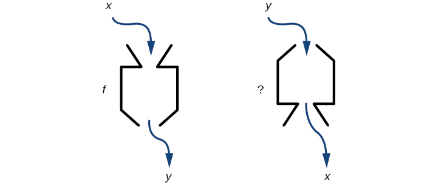{: #Figure_01_07_001}

#  Verifying That Two Functions Are Inverse Functions

Suppose a fashion designer traveling to Milan for a fashion show wants to know what the temperature will be. He is not familiar with the **Celsius**{: data-type="term" .no-emphasis} scale. To get an idea of how temperature measurements are related, he asks his assistant, Betty, to convert 75 degrees **Fahrenheit**{: data-type="term" .no-emphasis} to degrees Celsius. She finds the formula

<math xmlns="http://www.w3.org/1998/Math/MathML" display="block"> <mrow> <mi>C</mi><mo>=</mo><mfrac> <mn>5</mn> <mn>9</mn> </mfrac> <mo stretchy="false">(</mo><mi>F</mi><mo>−</mo><mn>32</mn><mo stretchy="false">)</mo></mrow> </math>

and substitutes 75 for<math xmlns="http://www.w3.org/1998/Math/MathML"> <mrow> <mtext> </mtext><mi>F</mi><mtext> </mtext></mrow> </math>

to calculate

<math xmlns="http://www.w3.org/1998/Math/MathML" display="block"> <mrow> <mfrac> <mn>5</mn> <mn>9</mn> </mfrac> <mo stretchy="false">(</mo><mn>75</mn><mo>−</mo><mn>32</mn><mo stretchy="false">)</mo><mo>≈</mo><mn>24</mn><mtext>°C</mtext> </mrow> </math>

Knowing that a comfortable 75 degrees Fahrenheit is about 24 degrees Celsius, he sends his assistant the week’s weather forecast from [\[link\]](#Figure_01_07_002) for Milan, and asks her to convert all of the temperatures to degrees Fahrenheit.

 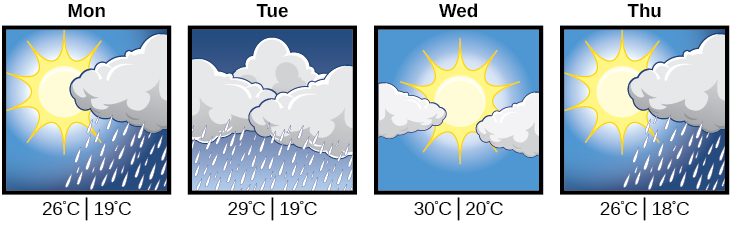{: #Figure_01_07_002}

At first, Betty considers using the formula she has already found to complete the conversions. After all, she knows her algebra, and can easily solve the equation for<math xmlns="http://www.w3.org/1998/Math/MathML"> <mrow> <mtext> </mtext><mi>F</mi><mtext> </mtext></mrow> </math>

after substituting a value for<math xmlns="http://www.w3.org/1998/Math/MathML"> <mrow> <mtext> </mtext><mi>C</mi><mo>.</mo><mtext> </mtext></mrow> </math>

For example, to convert 26 degrees Celsius, she could write

<math xmlns="http://www.w3.org/1998/Math/MathML" display="block"> <mrow> <mtable> <mtr> <mtd columnalign="right"> <mrow> <mn>26</mn> </mrow> </mtd> <mtd> <mo>=</mo> </mtd> <mtd columnalign="left"> <mrow> <mfrac> <mn>5</mn> <mn>9</mn> </mfrac> <mo stretchy="false">(</mo><mi>F</mi><mo>−</mo><mn>32</mn><mo stretchy="false">)</mo> </mrow> </mtd> </mtr> <mtr> <mtd columnalign="right"> <mrow> <mn>26</mn><mo>⋅</mo><mfrac> <mn>9</mn> <mn>5</mn> </mfrac> </mrow> </mtd> <mtd> <mo>=</mo> </mtd> <mtd columnalign="left"> <mrow> <mi>F</mi><mo>−</mo><mn>32</mn> </mrow> </mtd> </mtr> <mtr> <mtd columnalign="right"> <mi>F</mi> </mtd> <mtd> <mo>=</mo> </mtd> <mtd columnalign="left"> <mrow> <mn>26</mn><mo>⋅</mo><mfrac> <mn>9</mn> <mn>5</mn> </mfrac> <mo>+</mo><mn>32</mn><mo>≈</mo><mn>79</mn> </mrow> </mtd> </mtr> </mtable> </mrow> </math>

After considering this option for a moment, however, she realizes that solving the equation for each of the temperatures will be awfully tedious. She realizes that since evaluation is easier than solving, it would be much more convenient to have a different formula, one that takes the Celsius temperature and outputs the Fahrenheit temperature.

The formula for which Betty is searching corresponds to the idea of an **inverse function**, which is a function for which the input of the original function becomes the output of the inverse function and the output of the original function becomes the input of the inverse function.

Given a function<math xmlns="http://www.w3.org/1998/Math/MathML"> <mrow> <mtext> </mtext><mi>f</mi><mo stretchy="false">(</mo><mi>x</mi><mo stretchy="false">)</mo><mo>,</mo><mtext> </mtext></mrow> </math>

we represent its inverse as<math xmlns="http://www.w3.org/1998/Math/MathML"> <mrow> <mtext> </mtext><msup> <mi>f</mi> <mrow> <mo>−</mo><mn>1</mn></mrow> </msup> <mo stretchy="false">(</mo><mi>x</mi><mo stretchy="false">)</mo><mo>,</mo><mtext> </mtext></mrow> </math>

read as<math xmlns="http://www.w3.org/1998/Math/MathML"> <mrow> <mtext> </mtext><mo>“</mo><mi>f</mi><mtext> </mtext></mrow> </math>

inverse of<math xmlns="http://www.w3.org/1998/Math/MathML"> <mrow> <mtext> </mtext><mi>x</mi><mo>.</mo><mtext>”</mtext><mtext> </mtext></mrow> </math>

The raised<math xmlns="http://www.w3.org/1998/Math/MathML"> <mrow> <mtext> </mtext><mn>−1</mn><mtext> </mtext></mrow> </math>

is part of the notation. It is not an exponent; it does not imply a power of<math xmlns="http://www.w3.org/1998/Math/MathML"> <mrow> <mtext> </mtext><mn>−1</mn><mtext> </mtext></mrow> </math>

. In other words,<math xmlns="http://www.w3.org/1998/Math/MathML"> <mrow> <mtext> </mtext><msup> <mi>f</mi> <mrow> <mo>−</mo><mn>1</mn></mrow> </msup> <mo stretchy="false">(</mo><mi>x</mi><mo stretchy="false">)</mo><mtext> </mtext></mrow> </math>

does *not* mean<math xmlns="http://www.w3.org/1998/Math/MathML"> <mrow> <mtext> </mtext><mfrac> <mn>1</mn> <mrow> <mi>f</mi><mo stretchy="false">(</mo><mi>x</mi><mo stretchy="false">)</mo></mrow> </mfrac> <mtext> </mtext></mrow> </math>

because<math xmlns="http://www.w3.org/1998/Math/MathML"> <mrow> <mtext> </mtext><mfrac> <mn>1</mn> <mrow> <mi>f</mi><mo stretchy="false">(</mo><mi>x</mi><mo stretchy="false">)</mo></mrow> </mfrac> <mtext> </mtext></mrow> </math>

is the reciprocal of<math xmlns="http://www.w3.org/1998/Math/MathML"> <mrow> <mtext> </mtext><mi>f</mi><mtext> </mtext></mrow> </math>

and not the inverse.

The “exponent-like” notation comes from an analogy between function composition and multiplication: just as<math xmlns="http://www.w3.org/1998/Math/MathML"> <mrow> <mtext> </mtext><msup> <mi>a</mi> <mrow> <mo>−</mo><mn>1</mn></mrow> </msup> <mi>a</mi><mo>=</mo><mn>1</mn><mtext> </mtext></mrow> </math>

(1 is the identity element for multiplication) for any nonzero number<math xmlns="http://www.w3.org/1998/Math/MathML"> <mrow> <mtext> </mtext><mi>a</mi><mo>,</mo><mtext> </mtext></mrow> </math>

so<math xmlns="http://www.w3.org/1998/Math/MathML"> <mrow> <mtext> </mtext><msup> <mi>f</mi> <mrow> <mo>−</mo><mn>1</mn></mrow> </msup> <mo>∘</mo><mi>f</mi><mtext> </mtext></mrow> </math>

equals the identity function, that is,

<math xmlns="http://www.w3.org/1998/Math/MathML" display="block"> <mrow> <mrow><mo>(</mo> <mrow> <msup> <mi>f</mi> <mrow> <mo>−</mo><mn>1</mn></mrow> </msup> <mo>∘</mo><mi>f</mi></mrow> <mo>)</mo></mrow><mo stretchy="false">(</mo><mi>x</mi><mo stretchy="false">)</mo><mo>=</mo><msup> <mi>f</mi> <mrow> <mo>−</mo><mn>1</mn></mrow> </msup> <mrow><mo>(</mo> <mrow> <mi>f</mi><mo stretchy="false">(</mo><mi>x</mi><mo stretchy="false">)</mo></mrow> <mo>)</mo></mrow><mo>=</mo><msup> <mi>f</mi> <mrow> <mo>−</mo><mn>1</mn></mrow> </msup> <mrow><mo>(</mo> <mi>y</mi> <mo>)</mo></mrow><mo>=</mo><mi>x</mi></mrow> </math>

This holds for all<math xmlns="http://www.w3.org/1998/Math/MathML"> <mrow> <mtext> </mtext><mi>x</mi><mtext> </mtext></mrow> </math>

in the domain of<math xmlns="http://www.w3.org/1998/Math/MathML"> <mrow> <mtext> </mtext><mi>f</mi><mo>.</mo><mtext> </mtext></mrow> </math>

Informally, this means that inverse functions “undo” each other. However, just as zero does not have a **reciprocal**{: data-type="term" .no-emphasis}, some functions do not have inverses.

Given a function<math xmlns="http://www.w3.org/1998/Math/MathML"> <mrow> <mtext> </mtext><mi>f</mi><mo stretchy="false">(</mo><mi>x</mi><mo stretchy="false">)</mo><mo>,</mo><mtext> </mtext></mrow> </math>

we can verify whether some other function<math xmlns="http://www.w3.org/1998/Math/MathML"> <mrow> <mtext> </mtext><mi>g</mi><mo stretchy="false">(</mo><mi>x</mi><mo stretchy="false">)</mo><mtext> </mtext></mrow> </math>

is the inverse of<math xmlns="http://www.w3.org/1998/Math/MathML"> <mrow> <mtext> </mtext><mi>f</mi><mo stretchy="false">(</mo><mi>x</mi><mo stretchy="false">)</mo><mtext> </mtext></mrow> </math>

by checking whether either<math xmlns="http://www.w3.org/1998/Math/MathML"> <mrow> <mtext> </mtext><mi>g</mi><mo stretchy="false">(</mo><mi>f</mi><mo stretchy="false">(</mo><mi>x</mi><mo stretchy="false">)</mo><mo stretchy="false">)</mo><mo>=</mo><mi>x</mi><mtext> </mtext></mrow> </math>

or<math xmlns="http://www.w3.org/1998/Math/MathML"> <mrow> <mtext> </mtext><mi>f</mi><mo stretchy="false">(</mo><mi>g</mi><mo stretchy="false">(</mo><mi>x</mi><mo stretchy="false">)</mo><mo stretchy="false">)</mo><mo>=</mo><mi>x</mi><mtext> </mtext></mrow> </math>

is true. We can test whichever equation is more convenient to work with because they are logically equivalent (that is, if one is true, then so is the other.)

For example,<math xmlns="http://www.w3.org/1998/Math/MathML"> <mrow> <mtext> </mtext><mi>y</mi><mo>=</mo><mn>4</mn><mi>x</mi><mtext> </mtext></mrow> </math>

and<math xmlns="http://www.w3.org/1998/Math/MathML"> <mrow> <mtext> </mtext><mi>y</mi><mo>=</mo><mfrac> <mn>1</mn> <mn>4</mn> </mfrac> <mi>x</mi><mtext> </mtext></mrow> </math>

are inverse functions.

<math xmlns="http://www.w3.org/1998/Math/MathML" display="block"> <mrow> <mrow><mo>(</mo> <mrow> <msup> <mi>f</mi> <mrow> <mo>−</mo><mn>1</mn></mrow> </msup> <mo>∘</mo><mi>f</mi></mrow> <mo>)</mo></mrow><mo stretchy="false">(</mo><mi>x</mi><mo stretchy="false">)</mo><mo>=</mo><msup> <mi>f</mi> <mrow> <mo>−</mo><mn>1</mn></mrow> </msup> <mrow><mo>(</mo> <mrow> <mn>4</mn><mi>x</mi></mrow> <mo>)</mo></mrow><mo>=</mo><mfrac> <mn>1</mn> <mn>4</mn> </mfrac> <mrow><mo>(</mo> <mrow> <mn>4</mn><mi>x</mi></mrow> <mo>)</mo></mrow><mo>=</mo><mi>x</mi></mrow> </math>

and

<math xmlns="http://www.w3.org/1998/Math/MathML" display="block"> <mrow> <mrow><mo>(</mo> <mrow> <msup> <mi>f</mi> <mrow /> </msup> <mo>∘</mo><msup> <mi>f</mi> <mrow> <mo>−</mo><mn>1</mn></mrow> </msup> </mrow> <mo>)</mo></mrow><mo stretchy="false">(</mo><mi>x</mi><mo stretchy="false">)</mo><mo>=</mo><mi>f</mi><mrow><mo>(</mo> <mrow> <mfrac> <mn>1</mn> <mn>4</mn> </mfrac> <mi>x</mi></mrow> <mo>)</mo></mrow><mo>=</mo><mn>4</mn><mrow><mo>(</mo> <mrow> <mfrac> <mn>1</mn> <mn>4</mn> </mfrac> <mi>x</mi></mrow> <mo>)</mo></mrow><mo>=</mo><mi>x</mi></mrow> </math>

A few coordinate pairs from the graph of the function<math xmlns="http://www.w3.org/1998/Math/MathML"> <mrow> <mtext> </mtext><mi>y</mi><mo>=</mo><mn>4</mn><mi>x</mi><mtext> </mtext></mrow> </math>

are (−2, −8), (0, 0), and (2, 8). A few coordinate pairs from the graph of the function<math xmlns="http://www.w3.org/1998/Math/MathML"> <mrow> <mtext> </mtext><mi>y</mi><mo>=</mo><mfrac> <mn>1</mn> <mn>4</mn> </mfrac> <mi>x</mi><mtext> </mtext></mrow> </math>

are (−8, −2), (0, 0), and (8, 2). If we interchange the input and output of each coordinate pair of a function, the interchanged coordinate pairs would appear on the graph of the inverse function.

Inverse Function

For any **one-to-one function**{: data-type="term" .no-emphasis}<math xmlns="http://www.w3.org/1998/Math/MathML"> <mrow> <mtext> </mtext><mi>f</mi><mo stretchy="false">(</mo><mi>x</mi><mo stretchy="false">)</mo><mo>=</mo><mi>y</mi><mo>,</mo><mtext> </mtext></mrow> </math>

a function<math xmlns="http://www.w3.org/1998/Math/MathML"> <mrow> <mtext> </mtext><msup> <mi>f</mi> <mrow> <mo>−</mo><mn>1</mn></mrow> </msup> <mrow><mo>(</mo> <mi>x</mi> <mo>)</mo></mrow><mtext> </mtext></mrow> </math>

is an **inverse function**{: data-type="term"} of<math xmlns="http://www.w3.org/1998/Math/MathML"> <mrow> <mtext> </mtext><mi>f</mi><mtext> </mtext></mrow> </math>

if<math xmlns="http://www.w3.org/1998/Math/MathML"> <mrow> <mtext> </mtext><msup> <mi>f</mi> <mrow> <mo>−</mo><mn>1</mn></mrow> </msup> <mo stretchy="false">(</mo><mi>y</mi><mo stretchy="false">)</mo><mo>=</mo><mi>x</mi><mo>.</mo><mtext> </mtext></mrow> </math>

This can also be written as<math xmlns="http://www.w3.org/1998/Math/MathML"> <mrow> <mtext> </mtext><msup> <mi>f</mi> <mrow> <mo>−</mo><mn>1</mn></mrow> </msup> <mo stretchy="false">(</mo><mi>f</mi><mo stretchy="false">(</mo><mi>x</mi><mo stretchy="false">)</mo><mo stretchy="false">)</mo><mo>=</mo><mi>x</mi><mtext> </mtext></mrow> </math>

for all<math xmlns="http://www.w3.org/1998/Math/MathML"> <mrow> <mtext> </mtext><mi>x</mi><mtext> </mtext></mrow> </math>

in the domain of<math xmlns="http://www.w3.org/1998/Math/MathML"> <mrow> <mtext> </mtext><mi>f</mi><mo>.</mo><mtext> </mtext></mrow> </math>

It also follows that<math xmlns="http://www.w3.org/1998/Math/MathML"> <mrow> <mtext> </mtext><mi>f</mi><mo stretchy="false">(</mo><msup> <mi>f</mi> <mrow> <mo>−</mo><mn>1</mn></mrow> </msup> <mo stretchy="false">(</mo><mi>x</mi><mo stretchy="false">)</mo><mo stretchy="false">)</mo><mo>=</mo><mi>x</mi><mtext> </mtext></mrow> </math>

for all<math xmlns="http://www.w3.org/1998/Math/MathML"> <mrow> <mtext> </mtext><mi>x</mi><mtext> </mtext></mrow> </math>

in the domain of<math xmlns="http://www.w3.org/1998/Math/MathML"> <mrow> <mtext> </mtext><msup> <mi>f</mi> <mrow> <mo>−</mo><mn>1</mn></mrow> </msup> <mtext> </mtext></mrow> </math>

if<math xmlns="http://www.w3.org/1998/Math/MathML"> <mrow> <mtext> </mtext><msup> <mi>f</mi> <mrow> <mo>−</mo><mn>1</mn></mrow> </msup> <mtext> </mtext></mrow> </math>

is the inverse of<math xmlns="http://www.w3.org/1998/Math/MathML"> <mrow> <mtext> </mtext><mi>f</mi><mo>.</mo><mtext> </mtext></mrow> </math>

The notation <math xmlns="http://www.w3.org/1998/Math/MathML"> <mrow> <msup> <mi>f</mi> <mrow> <mo>−</mo><mn>1</mn></mrow> </msup> </mrow> </math>

 is read <math xmlns="http://www.w3.org/1998/Math/MathML"> <mrow><mtext>“</mtext> <mi>f</mi></mrow> </math>

 inverse.” Like any other function, we can use any variable name as the input for <math xmlns="http://www.w3.org/1998/Math/MathML"> <mrow> <msup> <mi>f</mi> <mrow> <mo>−</mo><mn>1</mn></mrow> </msup> <mo>,</mo></mrow> </math>

 so we will often write<math xmlns="http://www.w3.org/1998/Math/MathML"> <mrow> <mtext> </mtext><msup> <mi>f</mi> <mrow> <mo>−</mo><mn>1</mn></mrow> </msup> <mo stretchy="false">(</mo><mi>x</mi><mo stretchy="false">)</mo><mo>,</mo></mrow> </math>

 which we read as <math xmlns="http://www.w3.org/1998/Math/MathML"> <mrow> <mo>“</mo><mi>f</mi> </mrow> </math>

 inverse of <math xmlns="http://www.w3.org/1998/Math/MathML"> <mrow> <mi>x</mi><mo>.</mo><mo>”</mo> </mrow> </math>

 Keep in mind that

<math xmlns="http://www.w3.org/1998/Math/MathML" display="block"> <mrow> <msup> <mi>f</mi> <mrow> <mo>−</mo><mn>1</mn></mrow> </msup> <mo stretchy="false">(</mo><mi>x</mi><mo stretchy="false">)</mo><mo>≠</mo><mfrac> <mn>1</mn> <mrow> <mi>f</mi><mo stretchy="false">(</mo><mi>x</mi><mo stretchy="false">)</mo></mrow> </mfrac> </mrow> </math>

and not all functions have inverses.

Identifying an Inverse Function for a Given Input-Output Pair

If for a particular one-to-one function<math xmlns="http://www.w3.org/1998/Math/MathML"> <mrow> <mtext> </mtext><mi>f</mi><mo stretchy="false">(</mo><mn>2</mn><mo stretchy="false">)</mo><mo>=</mo><mn>4</mn><mtext> </mtext></mrow> </math>

and<math xmlns="http://www.w3.org/1998/Math/MathML"> <mrow> <mtext> </mtext><mi>f</mi><mo stretchy="false">(</mo><mn>5</mn><mo stretchy="false">)</mo><mo>=</mo><mn>12</mn><mo>,</mo><mtext> </mtext></mrow> </math>

what are the corresponding input and output values for the inverse function?

The inverse function reverses the input and output quantities, so if

<math xmlns="http://www.w3.org/1998/Math/MathML" display="block"> <mrow> <mtable> <mtr> <mtd columnalign="right"> <mrow> <mi>f</mi><mo stretchy="false">(</mo><mn>2</mn><mo stretchy="false">)</mo> </mrow> </mtd> <mtd> <mo>=</mo> </mtd> <mtd columnalign="left"> <mrow> <mn>4</mn><mo>,</mo><mtext> then </mtext><msup> <mi>f</mi> <mrow> <mn>−1</mn> </mrow> </msup> <mo stretchy="false">(</mo><mn>4</mn><mo stretchy="false">)</mo><mo>=</mo><mn>2</mn><mo>;</mo> </mrow> </mtd> </mtr> <mtr> <mtd columnalign="right"> <mrow> <mi>f</mi><mo stretchy="false">(</mo><mn>5</mn><mo stretchy="false">)</mo> </mrow> </mtd> <mtd> <mo>=</mo> </mtd> <mtd columnalign="left"> <mrow> <mn>12</mn><mo>,</mo><msup> <mrow> <mtext> then f</mtext> </mrow> <mrow> <mn>−1</mn> </mrow> </msup> <mo stretchy="false">(</mo><mn>12</mn><mo stretchy="false">)</mo><mo>=</mo><mn>5.</mn> </mrow> </mtd> </mtr> </mtable> </mrow> </math>

Alternatively, if we want to name the inverse function<math xmlns="http://www.w3.org/1998/Math/MathML"> <mrow> <mtext> </mtext><mi>g</mi><mo>,</mo><mtext> </mtext></mrow> </math>

then<math xmlns="http://www.w3.org/1998/Math/MathML"> <mrow> <mtext> </mtext><mi>g</mi><mo stretchy="false">(</mo><mn>4</mn><mo stretchy="false">)</mo><mo>=</mo><mn>2</mn><mtext> </mtext></mrow> </math>

and<math xmlns="http://www.w3.org/1998/Math/MathML"> <mrow> <mtext> </mtext><mi>g</mi><mo stretchy="false">(</mo><mn>12</mn><mo stretchy="false">)</mo><mo>=</mo><mn>5.</mn></mrow> </math>

Analysis

Notice that if we show the coordinate pairs in a table form, the input and output are clearly reversed. See [[link]](#Table_01_07_01).

| <math xmlns="http://www.w3.org/1998/Math/MathML"> <mrow> <mrow><mo>(</mo> <mrow> <mi>x</mi><mo>,</mo><mi>f</mi><mo stretchy="false">(</mo><mi>x</mi><mo stretchy="false">)</mo></mrow> <mo>)</mo></mrow></mrow> </math>

 | <math xmlns="http://www.w3.org/1998/Math/MathML"> <mrow> <mrow><mo>(</mo> <mrow> <mi>x</mi><mo>,</mo><mi>g</mi><mo stretchy="false">(</mo><mi>x</mi><mo stretchy="false">)</mo></mrow> <mo>)</mo></mrow></mrow> </math>

 |
|----------
| <math xmlns="http://www.w3.org/1998/Math/MathML"> <mrow> <mrow><mo>(</mo> <mrow> <mn>2</mn><mo>,</mo><mn>4</mn></mrow> <mo>)</mo></mrow></mrow> </math>

 | <math xmlns="http://www.w3.org/1998/Math/MathML"> <mrow> <mrow><mo>(</mo> <mrow> <mn>4</mn><mo>,</mo><mn>2</mn></mrow> <mo>)</mo></mrow></mrow> </math>

 |
| <math xmlns="http://www.w3.org/1998/Math/MathML"> <mrow> <mrow><mo>(</mo> <mrow> <mn>5</mn><mo>,</mo><mn>12</mn></mrow> <mo>)</mo></mrow></mrow> </math>

 | <math xmlns="http://www.w3.org/1998/Math/MathML"> <mrow> <mrow><mo>(</mo> <mrow> <mn>12</mn><mo>,</mo><mn>5</mn></mrow> <mo>)</mo></mrow></mrow> </math>

 |
{: #Table_01_07_01 summary="For (x,f(x)) we have the values (2, 4) and (5, 12); for (x, g(x)), we have the values (4, 2) and (12, 5)."}

Given that<math xmlns="http://www.w3.org/1998/Math/MathML"> <mrow> <mtext> </mtext><msup> <mi>h</mi> <mrow> <mo>−</mo><mn>1</mn></mrow> </msup> <mo stretchy="false">(</mo><mn>6</mn><mo stretchy="false">)</mo><mo>=</mo><mn>2</mn><mo>,</mo><mtext> </mtext></mrow> </math>

what are the corresponding input and output values of the original function<math xmlns="http://www.w3.org/1998/Math/MathML"> <mrow> <mtext> </mtext><mi>h</mi><mo>?</mo><mtext> </mtext></mrow> </math>

<math xmlns="http://www.w3.org/1998/Math/MathML"> <mrow> <mi>h</mi><mo stretchy="false">(</mo><mn>2</mn><mo stretchy="false">)</mo><mo>=</mo><mn>6</mn></mrow> </math>

**Given two functions<math xmlns="http://www.w3.org/1998/Math/MathML"> <mrow> <mtext> </mtext><mtext> </mtext><mi>f</mi><mo stretchy="false">(</mo><mi>x</mi><mo stretchy="false">)</mo><mtext> </mtext><mtext> </mtext></mrow> </math>

and<math xmlns="http://www.w3.org/1998/Math/MathML"> <mrow> <mtext> </mtext><mi>g</mi><mo stretchy="false">(</mo><mi>x</mi><mo stretchy="false">)</mo><mo>,</mo><mtext> </mtext></mrow> </math>

test whether the functions are inverses of each other.**

1.  Determine whether
    <math xmlns="http://www.w3.org/1998/Math/MathML"> <mrow> <mtext> </mtext><mi>f</mi><mo stretchy="false">(</mo><mi>g</mi><mo stretchy="false">(</mo><mi>x</mi><mo stretchy="false">)</mo><mo stretchy="false">)</mo><mo>=</mo><mi>x</mi><mtext> </mtext></mrow> </math>
    
    or
    <math xmlns="http://www.w3.org/1998/Math/MathML"> <mrow> <mtext> </mtext><mi>g</mi><mo stretchy="false">(</mo><mi>f</mi><mo stretchy="false">(</mo><mi>x</mi><mo stretchy="false">)</mo><mo stretchy="false">)</mo><mo>=</mo><mi>x</mi><mo>.</mo></mrow> </math>

2.  If either statement is true, then both are true, and
    <math xmlns="http://www.w3.org/1998/Math/MathML"> <mrow> <mtext> </mtext><mi>g</mi><mo>=</mo><msup> <mi>f</mi> <mrow> <mo>−</mo><mn>1</mn></mrow> </msup> <mtext> </mtext></mrow> </math>
    
    and
    <math xmlns="http://www.w3.org/1998/Math/MathML"> <mrow> <mtext> </mtext><mi>f</mi><mo>=</mo><msup> <mi>g</mi> <mrow> <mo>−</mo><mn>1</mn></mrow> </msup> <mo>.</mo><mtext> </mtext></mrow> </math>
    
    If either statement is false, then both are false, and
    <math xmlns="http://www.w3.org/1998/Math/MathML"> <mrow> <mtext> </mtext><mi>g</mi><mo>≠</mo><msup> <mi>f</mi> <mrow> <mo>−</mo><mn>1</mn></mrow> </msup> <mtext> </mtext></mrow> </math>
    
    and
    <math xmlns="http://www.w3.org/1998/Math/MathML"> <mrow> <mtext> </mtext><mi>f</mi><mo>≠</mo><msup> <mi>g</mi> <mrow> <mo>−</mo><mn>1</mn></mrow> </msup> <mo>.</mo></mrow> </math>
{: data-number-style="arabic"}

Testing Inverse Relationships Algebraically

If<math xmlns="http://www.w3.org/1998/Math/MathML"> <mrow> <mtext> </mtext><mi>f</mi><mrow><mo>(</mo> <mi>x</mi> <mo>)</mo></mrow><mo>=</mo><mfrac> <mn>1</mn> <mrow> <mi>x</mi><mo>+</mo><mn>2</mn></mrow> </mfrac> <mtext> </mtext></mrow> </math>

and<math xmlns="http://www.w3.org/1998/Math/MathML"> <mrow> <mtext> </mtext><mi>g</mi><mrow><mo>(</mo> <mi>x</mi> <mo>)</mo></mrow><mo>=</mo><mfrac> <mn>1</mn> <mi>x</mi> </mfrac> <mo>−</mo><mn>2</mn><mo>,</mo><mtext> </mtext></mrow> </math>

is<math xmlns="http://www.w3.org/1998/Math/MathML"> <mrow> <mtext> </mtext><mi>g</mi><mo>=</mo><msup> <mi>f</mi> <mrow> <mo>−</mo><mn>1</mn></mrow> </msup> <mo>?</mo></mrow> </math>

<math xmlns="http://www.w3.org/1998/Math/MathML" display="block"> <mrow> <mtable> <mtr rowalign="center"> <mtd columnalign="right" rowalign="center"> <mrow> <mi>g</mi><mo stretchy="false">(</mo><mi>f</mi><mo stretchy="false">(</mo><mi>x</mi><mo stretchy="false">)</mo><mo stretchy="false">)</mo> </mrow> </mtd> <mtd rowalign="center"> <mo>=</mo> </mtd> <mtd columnalign="left" rowalign="center"> <mrow> <mfrac> <mn>1</mn> <mrow> <mo>(</mo><mfrac> <mn>1</mn> <mrow> <mi>x</mi><mo>+</mo><mn>2</mn> </mrow> </mfrac> <mo>)</mo> </mrow> </mfrac> <mo>−</mo><mn>2</mn> </mrow> </mtd> </mtr> <mtr rowalign="center"> <mtd rowalign="center" /> <mtd rowalign="center"> <mo>=</mo> </mtd> <mtd columnalign="left" rowalign="center"> <mrow> <mi>x</mi><mo>+</mo><mn>2</mn><mo>−</mo><mn>2</mn> </mrow> </mtd> </mtr> <mtr rowalign="center"> <mtd rowalign="center" /> <mtd rowalign="center"> <mo>=</mo> </mtd> <mtd columnalign="left" rowalign="center"> <mi>x</mi> </mtd> </mtr> </mtable> </mrow> </math>

so

<math xmlns="http://www.w3.org/1998/Math/MathML" display="block"> <mrow> <mi>g</mi><mo>=</mo><msup> <mi>f</mi> <mrow> <mo>−</mo><mn>1</mn></mrow> </msup> <mtext> and </mtext><mi>f</mi><mo>=</mo><msup> <mi>g</mi> <mrow> <mo>−</mo><mn>1</mn></mrow> </msup> </mrow> </math>

This is enough to answer yes to the question, but we can also verify the other formula.

<math xmlns="http://www.w3.org/1998/Math/MathML" display="block"> <mrow> <mtable> <mtr rowalign="center"> <mtd columnalign="right" rowalign="center"> <mrow> <mi>f</mi><mo stretchy="false">(</mo><mi>g</mi><mo stretchy="false">(</mo><mi>x</mi><mo stretchy="false">)</mo><mo stretchy="false">)</mo> </mrow> </mtd> <mtd rowalign="center"> <mo>=</mo> </mtd> <mtd columnalign="left" rowalign="center"> <mrow> <mfrac> <mn>1</mn> <mrow> <mfrac> <mn>1</mn> <mi>x</mi> </mfrac> <mo>−</mo><mn>2</mn><mo>+</mo><mn>2</mn> </mrow> </mfrac> </mrow> </mtd> </mtr> <mtr rowalign="center"> <mtd rowalign="center" /> <mtd rowalign="center"> <mo>=</mo> </mtd> <mtd columnalign="left" rowalign="center"> <mrow> <mfrac> <mn>1</mn> <mrow> <mfrac> <mn>1</mn> <mi>x</mi> </mfrac> </mrow> </mfrac> </mrow> </mtd> </mtr> <mtr rowalign="center"> <mtd rowalign="center" /> <mtd rowalign="center"> <mo>=</mo> </mtd> <mtd columnalign="left" rowalign="center"> <mi>x</mi> </mtd> </mtr> </mtable> </mrow> </math>

Analysis

Notice the inverse operations are in reverse order of the operations from the original function.

If<math xmlns="http://www.w3.org/1998/Math/MathML"> <mrow> <mtext> </mtext><mi>f</mi><mrow><mo>(</mo> <mi>x</mi> <mo>)</mo></mrow><mo>=</mo><msup> <mi>x</mi> <mn>3</mn> </msup> <mo>−</mo><mn>4</mn><mtext> </mtext></mrow> </math>

and<math xmlns="http://www.w3.org/1998/Math/MathML"> <mrow> <mtext> </mtext><mi>g</mi><mrow><mo>(</mo> <mi>x</mi> <mo>)</mo></mrow><mo>=</mo><mroot> <mrow> <mi>x</mi><mo>+</mo><mn>4</mn></mrow> <mrow> <mtext> </mtext><mn>3</mn></mrow> </mroot> <mo>,</mo><mtext> </mtext></mrow> </math>

is<math xmlns="http://www.w3.org/1998/Math/MathML"> <mrow> <mtext> </mtext><mi>g</mi><mo>=</mo><msup> <mi>f</mi> <mrow> <mo>−</mo><mn>1</mn></mrow> </msup> <mo>?</mo></mrow> </math>

Yes

Determining Inverse Relationships for Power Functions

If<math xmlns="http://www.w3.org/1998/Math/MathML"> <mrow> <mtext> </mtext><mi>f</mi><mo stretchy="false">(</mo><mi>x</mi><mo stretchy="false">)</mo><mo>=</mo><msup> <mi>x</mi> <mn>3</mn> </msup> <mtext> </mtext></mrow> </math>

(the cube function) and<math xmlns="http://www.w3.org/1998/Math/MathML"> <mrow> <mtext> </mtext><mi>g</mi><mo stretchy="false">(</mo><mi>x</mi><mo stretchy="false">)</mo><mo>=</mo><mfrac> <mn>1</mn> <mn>3</mn> </mfrac> <mi>x</mi><mo>,</mo><mtext> </mtext></mrow> </math>

is<math xmlns="http://www.w3.org/1998/Math/MathML"> <mrow> <mtext> </mtext><mi>g</mi><mo>=</mo><msup> <mi>f</mi> <mrow> <mo>−</mo><mn>1</mn></mrow> </msup> <mo>?</mo></mrow> </math>

<math xmlns="http://www.w3.org/1998/Math/MathML" display="block"> <mrow> <mi>f</mi><mrow><mo>(</mo> <mrow> <mi>g</mi><mrow><mo>(</mo> <mi>x</mi> <mo>)</mo></mrow></mrow> <mo>)</mo></mrow><mo>=</mo><mfrac> <mrow> <msup> <mi>x</mi> <mn>3</mn> </msup> </mrow> <mrow> <mn>27</mn></mrow> </mfrac> <mo>≠</mo><mi>x</mi></mrow> </math>

No, the functions are not inverses.

Analysis

The correct inverse to the cube is, of course, the cube root<math xmlns="http://www.w3.org/1998/Math/MathML"> <mrow> <mtext> </mtext><mroot> <mi>x</mi> <mn>3</mn> </mroot> <mo>=</mo><msup> <mi>x</mi> <mrow> <mfrac> <mn>1</mn> <mn>3</mn> </mfrac> </mrow> </msup> <mo>,</mo><mtext> </mtext> </mrow> </math>

that is, the one-third is an exponent, not a multiplier.

If<math xmlns="http://www.w3.org/1998/Math/MathML"> <mrow> <mtext> </mtext><mi>f</mi><mrow><mo>(</mo> <mi>x</mi> <mo>)</mo></mrow><mo>=</mo><msup> <mrow> <mrow><mo>(</mo> <mrow> <mi>x</mi><mo>−</mo><mn>1</mn></mrow> <mo>)</mo></mrow></mrow> <mn>3</mn> </msup> <mtext> </mtext><mtext>and</mtext><mtext> </mtext><mi>g</mi><mrow><mo>(</mo> <mi>x</mi> <mo>)</mo></mrow><mo>=</mo><mroot> <mi>x</mi> <mn>3</mn> </mroot> <mo>+</mo><mn>1</mn><mo>,</mo><mtext> </mtext></mrow> </math>

is<math xmlns="http://www.w3.org/1998/Math/MathML"> <mrow> <mtext> </mtext><mi>g</mi><mo>=</mo><msup> <mi>f</mi> <mrow> <mo>−</mo><mn>1</mn></mrow> </msup> <mo>?</mo></mrow> </math>

Yes

# Finding Domain and Range of Inverse Functions

The outputs of the function<math xmlns="http://www.w3.org/1998/Math/MathML"> <mrow> <mtext> </mtext><mi>f</mi><mtext> </mtext></mrow> </math>

are the inputs to<math xmlns="http://www.w3.org/1998/Math/MathML"> <mrow> <mtext> </mtext><msup> <mi>f</mi> <mrow> <mo>−</mo><mn>1</mn></mrow> </msup> <mo>,</mo><mtext> </mtext></mrow> </math>

so the range of<math xmlns="http://www.w3.org/1998/Math/MathML"> <mrow> <mtext> </mtext><mi>f</mi><mtext> </mtext></mrow> </math>

is also the domain of<math xmlns="http://www.w3.org/1998/Math/MathML"> <mrow> <mtext> </mtext><msup> <mi>f</mi> <mrow> <mo>−</mo><mn>1</mn></mrow> </msup> <mo>.</mo><mtext> </mtext></mrow> </math>

Likewise, because the inputs to<math xmlns="http://www.w3.org/1998/Math/MathML"> <mrow> <mtext> </mtext><mi>f</mi><mtext> </mtext></mrow> </math>

are the outputs of<math xmlns="http://www.w3.org/1998/Math/MathML"> <mrow> <mtext> </mtext><msup> <mi>f</mi> <mrow> <mo>−</mo><mn>1</mn></mrow> </msup> <mo>,</mo><mtext> </mtext></mrow> </math>

the domain of<math xmlns="http://www.w3.org/1998/Math/MathML"> <mrow> <mtext> </mtext><mi>f</mi><mtext> </mtext></mrow> </math>

is the range of<math xmlns="http://www.w3.org/1998/Math/MathML"> <mrow> <mtext> </mtext><msup> <mi>f</mi> <mrow> <mo>−</mo><mn>1</mn></mrow> </msup> <mo>.</mo><mtext> </mtext></mrow> </math>

We can visualize the situation as in [\[link\]](#Figure_01_07_003).

 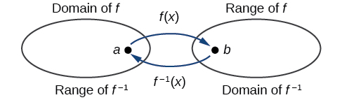{: #Figure_01_07_003}

When a function has no inverse function, it is possible to create a new function where that new function on a limited domain does have an inverse function. For example, the inverse of<math xmlns="http://www.w3.org/1998/Math/MathML"> <mrow> <mtext> </mtext><mi>f</mi><mo stretchy="false">(</mo><mi>x</mi><mo stretchy="false">)</mo><mo>=</mo><msqrt> <mi>x</mi> </msqrt> <mtext> </mtext></mrow> </math>

is<math xmlns="http://www.w3.org/1998/Math/MathML"> <mrow> <mtext> </mtext><msup> <mi>f</mi> <mrow> <mo>−</mo><mn>1</mn></mrow> </msup> <mo stretchy="false">(</mo><mi>x</mi><mo stretchy="false">)</mo><mo>=</mo><msup> <mi>x</mi> <mn>2</mn> </msup> <mo>,</mo><mtext> </mtext></mrow> </math>

because a square “undoes” a square root; but the square is only the inverse of the square root on the domain<math xmlns="http://www.w3.org/1998/Math/MathML"> <mrow> <mtext> </mtext><mrow><mo>[</mo> <mrow> <mn>0</mn><mo>,</mo><mi>∞</mi></mrow> <mo>)</mo></mrow><mo>,</mo><mtext> </mtext></mrow> </math>

since that is the range of<math xmlns="http://www.w3.org/1998/Math/MathML"> <mrow> <mtext> </mtext><mi>f</mi><mo stretchy="false">(</mo><mi>x</mi><mo stretchy="false">)</mo><mo>=</mo><msqrt> <mi>x</mi> </msqrt> <mo>.</mo></mrow> </math>

We can look at this problem from the other side, starting with the square (toolkit quadratic) function<math xmlns="http://www.w3.org/1998/Math/MathML"> <mrow> <mtext> </mtext><mi>f</mi><mo stretchy="false">(</mo><mi>x</mi><mo stretchy="false">)</mo><mo>=</mo><msup> <mi>x</mi> <mn>2</mn> </msup> <mo>.</mo><mtext> </mtext></mrow> </math>

If we want to construct an inverse to this function, we run into a problem, because for every given output of the quadratic function, there are two corresponding inputs (except when the input is 0). For example, the output 9 from the quadratic function corresponds to the inputs 3 and –3. But an output from a function is an input to its inverse; if this inverse input corresponds to more than one inverse output (input of the original function), then the “inverse” is not a function at all! To put it differently, the quadratic function is not a one-to-one function; it fails the horizontal line test, so it does not have an inverse function. In order for a function to have an inverse, it must be a one-to-one function.

In many cases, if a function is not one-to-one, we can still restrict the function to a part of its domain on which it is one-to-one. For example, we can make a restricted version of the square function<math xmlns="http://www.w3.org/1998/Math/MathML"> <mrow> <mtext> </mtext><mi>f</mi><mo stretchy="false">(</mo><mi>x</mi><mo stretchy="false">)</mo><mo>=</mo><msup> <mi>x</mi> <mn>2</mn> </msup> <mtext> </mtext></mrow> </math>

with its range limited to<math xmlns="http://www.w3.org/1998/Math/MathML"> <mrow> <mtext> </mtext><mrow><mo>[</mo> <mrow> <mn>0</mn><mo>,</mo><mi>∞</mi></mrow> <mo>)</mo></mrow><mo>,</mo><mtext> </mtext></mrow> </math>

which is a one-to-one function (it passes the horizontal line test) and which has an inverse (the square-root function).

If<math xmlns="http://www.w3.org/1998/Math/MathML"> <mrow> <mtext> </mtext><mi>f</mi><mo stretchy="false">(</mo><mi>x</mi><mo stretchy="false">)</mo><mo>=</mo><msup> <mrow> <mrow><mo>(</mo> <mrow> <mi>x</mi><mo>−</mo><mn>1</mn></mrow> <mo>)</mo></mrow></mrow> <mn>2</mn> </msup> <mtext> </mtext></mrow> </math>

on<math xmlns="http://www.w3.org/1998/Math/MathML"> <mrow> <mtext> </mtext><mrow><mo>[</mo> <mrow> <mn>1</mn><mo>,</mo><mi>∞</mi></mrow> <mo>)</mo></mrow><mo>,</mo><mtext> </mtext></mrow> </math>

then the inverse function is<math xmlns="http://www.w3.org/1998/Math/MathML"> <mrow> <mtext> </mtext><msup> <mi>f</mi> <mrow> <mo>−</mo><mn>1</mn></mrow> </msup> <mo stretchy="false">(</mo><mi>x</mi><mo stretchy="false">)</mo><mo>=</mo><msqrt> <mi>x</mi> </msqrt> <mo>+</mo><mn>1.</mn></mrow> </math>

* The domain of
  <math xmlns="http://www.w3.org/1998/Math/MathML"> <mrow> <mtext> </mtext><mi>f</mi><mtext> </mtext></mrow> </math>
  
  = range of
  <math xmlns="http://www.w3.org/1998/Math/MathML"> <mrow> <mtext> </mtext><msup> <mi>f</mi> <mrow> <mo>−</mo><mn>1</mn></mrow> </msup> <mtext> </mtext></mrow> </math>
  
  =
  <math xmlns="http://www.w3.org/1998/Math/MathML"> <mrow> <mtext> </mtext><mrow><mo>[</mo> <mrow> <mn>1</mn><mo>,</mo><mi>∞</mi></mrow> <mo>)</mo></mrow><mo>.</mo></mrow> </math>

* The domain of
  <math xmlns="http://www.w3.org/1998/Math/MathML"> <mrow> <mtext> </mtext><msup> <mi>f</mi> <mrow> <mo>−</mo><mn>1</mn></mrow> </msup> <mtext> </mtext></mrow> </math>
  
  = range of
  <math xmlns="http://www.w3.org/1998/Math/MathML"> <mrow> <mtext> </mtext><mi>f</mi><mtext> </mtext></mrow> </math>
  
  =
  <math xmlns="http://www.w3.org/1998/Math/MathML"> <mrow> <mtext> </mtext><mrow><mo>[</mo> <mrow> <mn>0</mn><mo>,</mo><mi>∞</mi></mrow> <mo>)</mo></mrow><mo>.</mo></mrow> </math>

**Is it possible for a function to have more than one inverse?**

*No. If two supposedly different functions, say,<math xmlns="http://www.w3.org/1998/Math/MathML"> <mrow> <mtext> </mtext><mi>g</mi><mtext> </mtext></mrow> </math>

and<math xmlns="http://www.w3.org/1998/Math/MathML"> <mrow> <mtext> </mtext><mi>h</mi><mo>,</mo><mtext> </mtext></mrow> </math>

both meet the definition of being inverses of another function<math xmlns="http://www.w3.org/1998/Math/MathML"> <mrow> <mtext> </mtext><mi>f</mi><mo>,</mo><mtext> </mtext></mrow> </math>

then you can prove that<math xmlns="http://www.w3.org/1998/Math/MathML"> <mrow> <mtext> </mtext><mi>g</mi><mo>=</mo><mi>h</mi><mo>.</mo><mtext> </mtext></mrow> </math>

We have just seen that some functions only have inverses if we restrict the domain of the original function. In these cases, there may be more than one way to restrict the domain, leading to different inverses. However, on any one domain, the original function still has only one unique inverse.*

Domain and Range of Inverse Functions

The range of a function<math xmlns="http://www.w3.org/1998/Math/MathML"> <mrow> <mtext> </mtext><mi>f</mi><mo stretchy="false">(</mo><mi>x</mi><mo stretchy="false">)</mo><mtext> </mtext></mrow> </math>

is the domain of the inverse function<math xmlns="http://www.w3.org/1998/Math/MathML"> <mrow> <mtext> </mtext><msup> <mi>f</mi> <mrow> <mo>−</mo><mn>1</mn></mrow> </msup> <mo stretchy="false">(</mo><mi>x</mi><mo stretchy="false">)</mo><mo>.</mo></mrow> </math>

The domain of<math xmlns="http://www.w3.org/1998/Math/MathML"> <mrow> <mtext> </mtext><mi>f</mi><mo stretchy="false">(</mo><mi>x</mi><mo stretchy="false">)</mo><mtext> </mtext></mrow> </math>

is the range of<math xmlns="http://www.w3.org/1998/Math/MathML"> <mrow> <mtext> </mtext><msup> <mi>f</mi> <mrow> <mo>−</mo><mn>1</mn></mrow> </msup> <mo stretchy="false">(</mo><mi>x</mi><mo stretchy="false">)</mo><mo>.</mo></mrow> </math>

<strong>Given a function, find the domain and range of its inverse. </strong>

1.  If the function is one-to-one, write the range of the original function as the domain of the inverse, and write the domain of the original function as the range of the inverse.
2.  If the domain of the original function needs to be restricted to make it one-to-one, then this restricted domain becomes the range of the inverse function.
{: data-number-style="arabic"}

Finding the Inverses of Toolkit Functions

Identify which of the toolkit functions besides the quadratic function are not one-to-one, and find a restricted domain on which each function is one-to-one, if any. The toolkit functions are reviewed in [[link]](#Table_01_07_02). We restrict the domain in such a fashion that the function assumes all *y*-values exactly once.

<table id="Table_01_07_02" summary="A list of the toolkit function. The constant function is f(x) = c where c is the constant; the identity function is f(x) = x; the absolute function is f(x)=|x|; the quadratic function is f(x) = x^2; the cubic function is f(x)=x^3; the reciprocal function is f(x)=1/x; the reciprocal squared function is f(x)=1/x^2; the square root function is f(x)=sqrt(x); the cube root function is f(x) = x^(1/3)."><colgroup><col data-width="50" /><col data-width="50" /><col data-width="50" /><col data-width="50" /><col data-width="50" /></colgroup><thead>
    <tr>
        <th data-align="center">Constant</th>
        <th data-align="center">Identity</th>
        <th data-align="center">Quadratic</th>
        <th data-align="center">Cubic</th>
        <th data-align="center">Reciprocal</th>
    </tr>
</thead><tbody>
    <tr>
        <td><math xmlns="http://www.w3.org/1998/Math/MathML">
            <mrow>
                <mi>f</mi><mo stretchy="false">(</mo><mi>x</mi><mo stretchy="false">)</mo><mo>=</mo><mi>c</mi>
            </mrow>
        </math></td>
        <td><math xmlns="http://www.w3.org/1998/Math/MathML">
            <mrow>
                <mi>f</mi><mo stretchy="false">(</mo><mi>x</mi><mo stretchy="false">)</mo><mo>=</mo><mi>x</mi>
            </mrow>
        </math></td>
        <td><math xmlns="http://www.w3.org/1998/Math/MathML">
            <mrow>
                <mi>f</mi><mo stretchy="false">(</mo><mi>x</mi><mo stretchy="false">)</mo><mo>=</mo><msup>
                    <mi>x</mi>
                    <mn>2</mn>
                </msup>
                
            </mrow>
        </math></td>
        <td><math xmlns="http://www.w3.org/1998/Math/MathML">
            <mrow>
                <mi>f</mi><mo stretchy="false">(</mo><mi>x</mi><mo stretchy="false">)</mo><mo>=</mo><msup>
                    <mi>x</mi>
                    <mn>3</mn>
                </msup>
                
            </mrow>
        </math></td>
        <td><math xmlns="http://www.w3.org/1998/Math/MathML">
            <mrow>
                <mi>f</mi><mo stretchy="false">(</mo><mi>x</mi><mo stretchy="false">)</mo><mo>=</mo><mfrac>
                    <mn>1</mn>
                    <mi>x</mi>
                </mfrac>
                
            </mrow>
        </math></td>
    </tr>
    <tr>
        <td data-align="center"><strong>Reciprocal squared</strong></td>
        <td data-align="center"><strong>Cube root</strong></td>
        <td data-align="center"><strong>Square root</strong></td>
        <td data-align="center"><strong>Absolute value</strong></td>
        <td />
    </tr>
    <tr>
        
        <td><math xmlns="http://www.w3.org/1998/Math/MathML">
            <mrow>
                <mi>f</mi><mo stretchy="false">(</mo><mi>x</mi><mo stretchy="false">)</mo><mo>=</mo><mfrac>
                    <mn>1</mn>
                    <mrow>
                        <msup>
                            <mi>x</mi>
                            <mn>2</mn>
                        </msup>
                        
                    </mrow>
                </mfrac>
                
            </mrow>
        </math></td>
        <td><math xmlns="http://www.w3.org/1998/Math/MathML">
            <mrow>
                <mi>f</mi><mo stretchy="false">(</mo><mi>x</mi><mo stretchy="false">)</mo><mo>=</mo><mroot>
                    <mi>x</mi>
                    <mn>3</mn>
                </mroot>
                
            </mrow>
        </math></td>
        <td><math xmlns="http://www.w3.org/1998/Math/MathML">
            <mrow>
                <mi>f</mi><mo stretchy="false">(</mo><mi>x</mi><mo stretchy="false">)</mo><mo>=</mo><msqrt>
                    <mi>x</mi>
                </msqrt>
                
            </mrow>
        </math></td>
        <td><math xmlns="http://www.w3.org/1998/Math/MathML">
            <mrow>
                <mi>f</mi><mo stretchy="false">(</mo><mi>x</mi><mo stretchy="false">)</mo><mo>=</mo><mrow><mo>\|</mo> <mi>x</mi> <mo>\|</mo></mrow>
            </mrow>
        </math></td>
        <td />
    </tr>
</tbody></table>

The constant function is not one-to-one, and there is no domain (except a single point) on which it could be one-to-one, so the constant function has no inverse.

The absolute value function can be restricted to the domain<math xmlns="http://www.w3.org/1998/Math/MathML"> <mrow> <mtext> </mtext><mrow><mo>[</mo> <mrow> <mn>0</mn><mo>,</mo><mi>∞</mi></mrow> <mo>)</mo></mrow><mo>,</mo></mrow> </math>

where it is equal to the identity function.

The reciprocal-squared function can be restricted to the domain<math xmlns="http://www.w3.org/1998/Math/MathML"> <mrow> <mtext> </mtext><mrow><mo>(</mo> <mrow> <mn>0</mn><mo>,</mo><mi>∞</mi></mrow> <mo>)</mo></mrow><mo>.</mo></mrow> </math>

Analysis

We can see that these functions (if unrestricted) are not one-to-one by looking at their graphs, shown in [[link]](#Figure_01_07_004). They both would fail the horizontal line test. However, if a function is restricted to a certain domain so that it passes the horizontal line test, then in that restricted domain, it can have an inverse.

 Absolute value (b) Reciprocal square"){: #Figure_01_07_004}

The domain of function<math xmlns="http://www.w3.org/1998/Math/MathML"> <mrow> <mtext> </mtext><mi>f</mi><mtext> </mtext></mrow> </math>

is<math xmlns="http://www.w3.org/1998/Math/MathML"> <mrow> <mtext> </mtext><mo stretchy="false">(</mo><mn>1</mn><mo>,</mo><mi>∞</mi><mo stretchy="false">)</mo><mtext> </mtext></mrow> </math>

and the range of function<math xmlns="http://www.w3.org/1998/Math/MathML"> <mrow> <mtext> </mtext><mi>f</mi><mtext> </mtext></mrow> </math>

is<math xmlns="http://www.w3.org/1998/Math/MathML"> <mrow> <mtext> </mtext><mo stretchy="false">(</mo><mi>−∞</mi><mo>,</mo><mn>−2</mn><mo stretchy="false">)</mo><mo>.</mo><mtext> </mtext></mrow> </math>

Find the domain and range of the inverse function.

The domain of function<math xmlns="http://www.w3.org/1998/Math/MathML"> <mrow> <mtext> </mtext><msup> <mi>f</mi> <mrow> <mo>−</mo><mn>1</mn></mrow> </msup> <mtext> </mtext></mrow> </math>

is<math xmlns="http://www.w3.org/1998/Math/MathML"> <mrow> <mtext> </mtext><mo stretchy="false">(</mo><mo>−</mo><mi>∞</mi><mtext>,</mtext><mo>−</mo><mn>2</mn><mo stretchy="false">)</mo><mtext> </mtext> </mrow> </math>

and the range of function<math xmlns="http://www.w3.org/1998/Math/MathML"> <mrow> <mtext> </mtext><msup> <mi>f</mi> <mrow> <mo>−</mo><mn>1</mn></mrow> </msup> <mtext> </mtext></mrow> </math>

is<math xmlns="http://www.w3.org/1998/Math/MathML"> <mrow> <mtext> </mtext><mo stretchy="false">(</mo><mn>1</mn><mo>,</mo><mi>∞</mi><mo stretchy="false">)</mo><mo>.</mo></mrow> </math>

#  Finding and Evaluating Inverse Functions

Once we have a one-to-one function, we can evaluate its inverse at specific inverse function inputs or construct a complete representation of the inverse function in many cases.

## Inverting Tabular Functions

Suppose we want to find the inverse of a function represented in table form. Remember that the domain of a function is the range of the inverse and the range of the function is the domain of the inverse. So we need to interchange the domain and range.

Each row (or column) of inputs becomes the row (or column) of outputs for the inverse function. Similarly, each row (or column) of outputs becomes the row (or column) of inputs for the inverse function.

Interpreting the Inverse of a Tabular Function

A function<math xmlns="http://www.w3.org/1998/Math/MathML"> <mrow> <mtext> </mtext><mi>f</mi><mo stretchy="false">(</mo><mi>t</mi><mo stretchy="false">)</mo><mtext> </mtext></mrow> </math>

is given in [[link]](#Table_01_07_03), showing distance in miles that a car has traveled in<math xmlns="http://www.w3.org/1998/Math/MathML"> <mrow> <mtext> </mtext><mi>t</mi><mtext> </mtext></mrow> </math>

minutes. Find and interpret<math xmlns="http://www.w3.org/1998/Math/MathML"> <mrow> <mtext> </mtext><msup> <mi>f</mi> <mrow> <mo>−</mo><mn>1</mn></mrow> </msup> <mo stretchy="false">(</mo><mn>70</mn><mo stretchy="false">)</mo><mo>.</mo></mrow> </math>

<table id="Table_01_07_03" summary="Two rows and five columns. The first row is labeled &#x201C;t (minutes)&#x201D;, and the second row is labeled &#x201C;f(x) (miles)&#x201D;. Reading the columns as ordered pairs, we have the following values (30, 20), (50, 40), (70, 60), and (90, 70)."><colgroup><col /><col data-width="40" /><col data-width="40" /><col data-width="40" /><col data-width="40" /></colgroup><tbody>
<tr>
<td data-align="left"><strong><math xmlns="http://www.w3.org/1998/Math/MathML">
<mrow>
<mi>t</mi><mtext> (minutes)</mtext></mrow>
</math></strong>
</td>
<td data-align="left">30</td>
<td data-align="left">50</td>
<td data-align="left">70</td>
<td data-align="left">90</td>
</tr>

<tr>
<td data-align="left"><strong><math xmlns="http://www.w3.org/1998/Math/MathML">
<mrow>
<mi>f</mi><mrow><mo>(</mo>
<mi>t</mi>
<mo>)</mo></mrow><mtext> (miles)</mtext></mrow>
</math></strong>
</td>
<td data-align="left">20</td>
<td data-align="left">40</td>
<td data-align="left">60</td>
<td data-align="left">70</td>
</tr>
</tbody></table>

The inverse function takes an output of<math xmlns="http://www.w3.org/1998/Math/MathML"> <mrow> <mtext> </mtext><mi>f</mi><mtext> </mtext></mrow> </math>

and returns an input for<math xmlns="http://www.w3.org/1998/Math/MathML"> <mrow> <mtext> </mtext><mi>f</mi><mo>.</mo><mtext> </mtext></mrow> </math>

So in the expression<math xmlns="http://www.w3.org/1998/Math/MathML"> <mrow> <mtext> </mtext><msup> <mi>f</mi> <mrow> <mo>−</mo><mn>1</mn></mrow> </msup> <mo stretchy="false">(</mo><mn>70</mn><mo stretchy="false">)</mo><mo>,</mo><mtext> </mtext></mrow> </math>

70 is an output value of the original function, representing 70 miles. The inverse will return the corresponding input of the original function<math xmlns="http://www.w3.org/1998/Math/MathML"> <mrow> <mtext> </mtext><mi>f</mi><mo>,</mo><mtext> </mtext></mrow> </math>

90 minutes, so<math xmlns="http://www.w3.org/1998/Math/MathML"> <mrow> <mtext> </mtext><msup> <mi>f</mi> <mrow> <mo>−</mo><mn>1</mn></mrow> </msup> <mo stretchy="false">(</mo><mn>70</mn><mo stretchy="false">)</mo><mo>=</mo><mn>90.</mn><mtext> </mtext></mrow> </math>

The interpretation of this is that, to drive 70 miles, it took 90 minutes.

Alternatively, recall that the definition of the inverse was that if<math xmlns="http://www.w3.org/1998/Math/MathML"> <mrow> <mtext> </mtext><mi>f</mi><mo stretchy="false">(</mo><mi>a</mi><mo stretchy="false">)</mo><mo>=</mo><mi>b</mi><mo>,</mo><mtext> </mtext></mrow> </math>

then<math xmlns="http://www.w3.org/1998/Math/MathML"> <mrow> <mtext> </mtext><msup> <mi>f</mi> <mrow> <mo>−</mo><mn>1</mn></mrow> </msup> <mo stretchy="false">(</mo><mi>b</mi><mo stretchy="false">)</mo><mo>=</mo><mi>a</mi><mo>.</mo><mtext> </mtext></mrow> </math>

By this definition, if we are given<math xmlns="http://www.w3.org/1998/Math/MathML"> <mrow> <mtext> </mtext><msup> <mi>f</mi> <mrow> <mo>−</mo><mn>1</mn></mrow> </msup> <mo stretchy="false">(</mo><mn>70</mn><mo stretchy="false">)</mo><mo>=</mo><mi>a</mi><mo>,</mo><mtext> </mtext></mrow> </math>

then we are looking for a value<math xmlns="http://www.w3.org/1998/Math/MathML"> <mrow> <mtext> </mtext><mi>a</mi><mtext> </mtext></mrow> </math>

so that<math xmlns="http://www.w3.org/1998/Math/MathML"> <mrow> <mtext> </mtext><mi>f</mi><mo stretchy="false">(</mo><mi>a</mi><mo stretchy="false">)</mo><mo>=</mo><mn>70.</mn><mtext> </mtext></mrow> </math>

In this case, we are looking for a<math xmlns="http://www.w3.org/1998/Math/MathML"> <mrow> <mtext> </mtext><mi>t</mi><mtext> </mtext></mrow> </math>

so that<math xmlns="http://www.w3.org/1998/Math/MathML"> <mrow> <mtext> </mtext><mi>f</mi><mo stretchy="false">(</mo><mi>t</mi><mo stretchy="false">)</mo><mo>=</mo><mn>70</mn><mo>,</mo><mtext> </mtext></mrow> </math>

which is when<math xmlns="http://www.w3.org/1998/Math/MathML"> <mrow> <mtext> </mtext><mi>t</mi><mo>=</mo><mn>90.</mn></mrow> </math>

Using [[link]](#Table_01_07_04), find and interpret (a)<math xmlns="http://www.w3.org/1998/Math/MathML"> <mrow> <mtext> </mtext><mi>f</mi><mo stretchy="false">(</mo><mn>60</mn><mo stretchy="false">)</mo><mo>,</mo> </mrow> </math>

and (b)<math xmlns="http://www.w3.org/1998/Math/MathML"> <mrow> <mtext> </mtext><msup> <mi>f</mi> <mrow> <mo>−</mo><mn>1</mn> </mrow> </msup> <mo stretchy="false">(</mo><mn>60</mn><mo stretchy="false">)</mo><mo>.</mo> </mrow> </math>

<table id="Table_01_07_04" summary="Two rows and five columns. The first row is labeled &#x201C;t (minutes)&#x201D;, and the second row is labeled &#x201C;f(t)&#x201D;. Reading the columns as ordered pairs, we have the following values (30, 20), (50, 40), (70, 60), and (90, 70)."><colgroup><col /><col data-width="40" /><col data-width="40" /><col data-width="40" /><col data-width="40" /><col data-width="40" /></colgroup><tbody>
<tr>
<td data-align="left"><strong><math xmlns="http://www.w3.org/1998/Math/MathML">
<mrow>
<mi>t</mi><mtext> (minutes)</mtext></mrow>
</math></strong>
</td>

<td data-align="left">30</td>
<td data-align="left">50</td>
<td data-align="left">60</td>
<td data-align="left">70</td>
<td data-align="left">90</td>
</tr>

<tr>
<td data-align="left"><strong><math xmlns="http://www.w3.org/1998/Math/MathML">
<mrow>
<mi>f</mi><mrow><mo>(</mo>
<mi>t</mi>
<mo>)</mo></mrow><mtext> (miles)</mtext></mrow>
</math></strong>
</td>
<td data-align="left">20</td>
<td data-align="left">40</td>
<td data-align="left">50</td>
<td data-align="left">60</td>
<td data-align="left">70</td>
</tr>
</tbody></table>

1.  <math xmlns="http://www.w3.org/1998/Math/MathML"> <mrow> <mi>f</mi><mo stretchy="false">(</mo><mn>60</mn><mo stretchy="false">)</mo><mo>=</mo><mn>50.</mn><mtext> </mtext></mrow> </math>
    
    In 60 minutes, 50 miles are traveled.
2.  <math xmlns="http://www.w3.org/1998/Math/MathML"> <mrow> <msup> <mi>f</mi> <mrow> <mo>−</mo><mn>1</mn></mrow> </msup> <mo stretchy="false">(</mo><mn>60</mn><mo stretchy="false">)</mo><mo>=</mo><mn>70.</mn><mtext> </mtext></mrow> </math>
    
    To travel 60 miles, it will take 70 minutes.
{: data-number-style="lower-alpha"}

## Evaluating the Inverse of a Function, Given a Graph of the Original Function

We saw in [Functions and Function Notation](/m51261){: .target-chapter} that the domain of a function can be read by observing the horizontal extent of its graph. We find the domain of the inverse function by observing the *vertical* extent of the graph of the original function, because this corresponds to the horizontal extent of the inverse function. Similarly, we find the range of the inverse function by observing the *horizontal* extent of the graph of the original function, as this is the vertical extent of the inverse function. If we want to evaluate an inverse function, we find its input within its domain, which is all or part of the vertical axis of the original function’s graph.

**Given the graph of a function, evaluate its inverse at specific points.**

1.  Find the desired input on the *y*-axis of the given graph.
2.  Read the inverse function’s output from the *x*-axis of the given graph.
{: data-number-style="arabic"}

Evaluating a Function and Its Inverse from a Graph at Specific Points

A function<math xmlns="http://www.w3.org/1998/Math/MathML"> <mrow> <mtext> </mtext><mi>g</mi><mo stretchy="false">(</mo><mi>x</mi><mo stretchy="false">)</mo><mtext> </mtext></mrow> </math>

is given in [[link]](#Figure_01_07_006). Find<math xmlns="http://www.w3.org/1998/Math/MathML"> <mrow> <mtext> </mtext><mi>g</mi><mo stretchy="false">(</mo><mn>3</mn><mo stretchy="false">)</mo><mtext> </mtext></mrow> </math>

and<math xmlns="http://www.w3.org/1998/Math/MathML"> <mrow> <mtext> </mtext><msup> <mi>g</mi> <mrow> <mo>−</mo><mn>1</mn></mrow> </msup> <mo stretchy="false">(</mo><mn>3</mn><mo stretchy="false">)</mo><mo>.</mo></mrow> </math>

{: #Figure_01_07_006}

To evaluate <math xmlns="http://www.w3.org/1998/Math/MathML"> <mrow> <mi>g</mi><mo stretchy="false">(</mo><mn>3</mn><mo stretchy="false">)</mo><mo>,</mo><mtext> </mtext></mrow> </math>

we find 3 on the *x*-axis and find the corresponding output value on the *y*-axis. The point <math xmlns="http://www.w3.org/1998/Math/MathML"> <mrow> <mtext> </mtext><mrow><mo>(</mo> <mrow> <mn>3</mn><mo>,</mo><mn>1</mn></mrow> <mo>)</mo></mrow><mtext> </mtext></mrow> </math>

tells us that<math xmlns="http://www.w3.org/1998/Math/MathML"> <mrow> <mtext> </mtext><mi>g</mi><mo stretchy="false">(</mo><mn>3</mn><mo stretchy="false">)</mo><mo>=</mo><mn>1.</mn></mrow> </math>

To evaluate<math xmlns="http://www.w3.org/1998/Math/MathML"> <mrow> <mtext> </mtext><msup> <mi>g</mi> <mrow> <mo>−</mo><mn>1</mn></mrow> </msup> <mo stretchy="false">(</mo><mn>3</mn><mo stretchy="false">)</mo><mo>,</mo><mtext> </mtext></mrow> </math>

recall that by definition<math xmlns="http://www.w3.org/1998/Math/MathML"> <mrow> <mtext> </mtext><msup> <mi>g</mi> <mrow> <mo>−</mo><mn>1</mn></mrow> </msup> <mo stretchy="false">(</mo><mn>3</mn><mo stretchy="false">)</mo><mtext> </mtext></mrow> </math>

means the value of *x* for which<math xmlns="http://www.w3.org/1998/Math/MathML"> <mrow> <mtext> </mtext><mi>g</mi><mo stretchy="false">(</mo><mi>x</mi><mo stretchy="false">)</mo><mo>=</mo><mn>3.</mn><mtext> </mtext></mrow> </math>

By looking for the output value 3 on the vertical axis, we find the point<math xmlns="http://www.w3.org/1998/Math/MathML"> <mrow> <mtext> </mtext><mrow><mo>(</mo> <mrow> <mn>5</mn><mo>,</mo><mn>3</mn></mrow> <mo>)</mo></mrow><mtext> </mtext></mrow> </math>

on the graph, which means<math xmlns="http://www.w3.org/1998/Math/MathML"> <mrow> <mtext> </mtext><mi>g</mi><mo stretchy="false">(</mo><mn>5</mn><mo stretchy="false">)</mo><mo>=</mo><mn>3</mn><mo>,</mo><mtext> </mtext></mrow> </math>

so by definition,<math xmlns="http://www.w3.org/1998/Math/MathML"> <mrow> <mtext> </mtext><msup> <mi>g</mi> <mrow> <mo>−</mo><mn>1</mn></mrow> </msup> <mo stretchy="false">(</mo><mn>3</mn><mo stretchy="false">)</mo><mo>=</mo><mn>5.</mn><mtext> </mtext></mrow> </math>

See [[link]](#Figure_01_07_007).

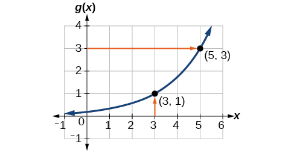{: #Figure_01_07_007}

Using the graph in [[link]](#Figure_01_07_007), (a) find<math xmlns="http://www.w3.org/1998/Math/MathML"> <mrow> <mtext> </mtext><msup> <mi>g</mi> <mrow> <mo>−</mo><mn>1</mn></mrow> </msup> <mo stretchy="false">(</mo><mn>1</mn><mo stretchy="false">)</mo><mo>,</mo></mrow> </math>

and (b) estimate<math xmlns="http://www.w3.org/1998/Math/MathML"> <mrow> <mtext> </mtext><msup> <mi>g</mi> <mrow> <mo>−</mo><mn>1</mn></mrow> </msup> <mo stretchy="false">(</mo><mn>4</mn><mo stretchy="false">)</mo><mo>.</mo></mrow> </math>

a. 3; b. 5.6

## Finding Inverses of Functions Represented by Formulas

Sometimes we will need to know an inverse function for all elements of its domain, not just a few. If the original function is given as a formula—for example,<math xmlns="http://www.w3.org/1998/Math/MathML"> <mrow> <mtext> </mtext><mi>y</mi><mtext> </mtext></mrow> </math>

as a function of<math xmlns="http://www.w3.org/1998/Math/MathML"> <mrow> <mtext> </mtext><mi>x</mi><mtext>—</mtext> </mrow> </math>

we can often find the inverse function by solving to obtain<math xmlns="http://www.w3.org/1998/Math/MathML"> <mrow> <mtext> </mtext><mi>x</mi><mtext> </mtext> </mrow> </math>

as a function of<math xmlns="http://www.w3.org/1998/Math/MathML"> <mrow> <mtext> </mtext><mi>y</mi><mo>.</mo></mrow> </math>

**Given a function represented by a formula, find the inverse.**

1.  Make sure
    <math xmlns="http://www.w3.org/1998/Math/MathML"> <mrow> <mtext> </mtext><mi>f</mi><mtext> </mtext></mrow> </math>
    
    is a one-to-one function.
2.  Solve for
    <math xmlns="http://www.w3.org/1998/Math/MathML"> <mrow> <mtext> </mtext><mi>x</mi><mo>.</mo></mrow> </math>

3.  Interchange
    <math xmlns="http://www.w3.org/1998/Math/MathML"> <mrow> <mtext> </mtext><mi>x</mi><mtext> </mtext></mrow> </math>
    
    and
    <math xmlns="http://www.w3.org/1998/Math/MathML"> <mrow> <mtext> </mtext><mi>y</mi><mo>.</mo></mrow> </math>
{: data-number-style="arabic"}

Inverting the Fahrenheit-to-Celsius Function

Find a formula for the inverse function that gives Fahrenheit temperature as a function of Celsius temperature.

<math xmlns="http://www.w3.org/1998/Math/MathML"> <mrow> <mi>C</mi><mo>=</mo><mfrac> <mn>5</mn> <mn>9</mn> </mfrac> <mo stretchy="false">(</mo><mi>F</mi><mo>−</mo><mn>32</mn><mo stretchy="false">)</mo></mrow> </math>

<math xmlns="http://www.w3.org/1998/Math/MathML" display="block"> <mrow> <mtable> <mtr> <mtd columnalign="right"> <mi>C</mi> </mtd> <mtd> <mo>=</mo> </mtd> <mtd columnalign="left"> <mrow> <mfrac> <mn>5</mn> <mn>9</mn> </mfrac> <mo stretchy="false">(</mo><mi>F</mi><mo>−</mo><mn>32</mn><mo stretchy="false">)</mo> </mrow> </mtd> </mtr> <mtr> <mtd columnalign="right"> <mrow> <mi>C</mi><mo>⋅</mo><mfrac> <mn>9</mn> <mn>5</mn> </mfrac> </mrow> </mtd> <mtd> <mo>=</mo> </mtd> <mtd columnalign="left"> <mrow> <mi>F</mi><mo>−</mo><mn>32</mn> </mrow> </mtd> </mtr> <mtr> <mtd columnalign="right"> <mi>F</mi> </mtd> <mtd> <mo>=</mo> </mtd> <mtd columnalign="left"> <mrow> <mfrac> <mn>9</mn> <mn>5</mn> </mfrac> <mi>C</mi><mo>+</mo><mn>32</mn> </mrow> </mtd> </mtr> </mtable> </mrow> </math>

By solving in general, we have uncovered the inverse function. If

<math xmlns="http://www.w3.org/1998/Math/MathML" display="block"> <mrow> <mi>C</mi><mo>=</mo><mi>h</mi><mo stretchy="false">(</mo><mi>F</mi><mo stretchy="false">)</mo><mo>=</mo><mfrac> <mn>5</mn> <mn>9</mn> </mfrac> <mo stretchy="false">(</mo><mi>F</mi><mo>−</mo><mn>32</mn><mo stretchy="false">)</mo><mo>,</mo></mrow> </math>

then

<math xmlns="http://www.w3.org/1998/Math/MathML" display="block"> <mrow> <mi>F</mi><mo>=</mo><msup> <mi>h</mi> <mrow> <mo>−</mo><mn>1</mn></mrow> </msup> <mo stretchy="false">(</mo><mi>C</mi><mo stretchy="false">)</mo><mo>=</mo><mfrac> <mn>9</mn> <mn>5</mn> </mfrac> <mi>C</mi><mo>+</mo><mn>32</mn></mrow> </math>

In this case, we introduced a function<math xmlns="http://www.w3.org/1998/Math/MathML"> <mrow> <mtext> </mtext><mi>h</mi><mtext> </mtext></mrow> </math>

to represent the conversion because the input and output variables are descriptive, and writing<math xmlns="http://www.w3.org/1998/Math/MathML"> <mrow> <mtext> </mtext><msup> <mi>C</mi> <mrow> <mo>−</mo><mn>1</mn></mrow> </msup> <mtext> </mtext></mrow> </math>

could get confusing.

Solve for<math xmlns="http://www.w3.org/1998/Math/MathML"> <mrow> <mtext> </mtext><mi>x</mi><mtext> </mtext></mrow> </math>

in terms of<math xmlns="http://www.w3.org/1998/Math/MathML"> <mrow> <mtext> </mtext><mi>y</mi><mtext> </mtext> </mrow> </math>

given<math xmlns="http://www.w3.org/1998/Math/MathML"> <mrow> <mtext> </mtext><mi>y</mi><mo>=</mo><mfrac> <mn>1</mn> <mn>3</mn> </mfrac> <mo stretchy="false">(</mo><mi>x</mi><mo>−</mo><mn>5</mn><mo stretchy="false">)</mo><mn>.</mn> </mrow> </math>

<math xmlns="http://www.w3.org/1998/Math/MathML"> <mrow> <mi>x</mi><mo>=</mo><mn>3</mn><mi>y</mi><mo>+</mo><mn>5</mn></mrow> </math>

Solving to Find an Inverse Function

Find the inverse of the function<math xmlns="http://www.w3.org/1998/Math/MathML"> <mrow> <mtext> </mtext><mi>f</mi><mrow><mo>(</mo> <mi>x</mi> <mo>)</mo></mrow><mo>=</mo><mfrac> <mn>2</mn> <mrow> <mi>x</mi><mo>−</mo><mn>3</mn></mrow> </mfrac> <mo>+</mo><mn>4.</mn></mrow> </math>

<math xmlns="http://www.w3.org/1998/Math/MathML" display="block"> <mrow> <mtable> <mtr> <mtd columnalign="right"> <mi>y</mi> </mtd> <mtd> <mo>=</mo> </mtd> <mtd columnalign="left"> <mrow> <mfrac> <mn>2</mn> <mrow> <mi>x</mi><mo>−</mo><mn>3</mn> </mrow> </mfrac> <mo>+</mo><mn>4</mn> </mrow> </mtd> <mtd columnalign="left"> <mrow><mspace width="2em" /> <mtext>Set up an equation</mtext><mo>.</mo> </mrow> </mtd> </mtr> <mtr> <mtd columnalign="right"> <mrow> <mi>y</mi><mo>−</mo><mn>4</mn> </mrow> </mtd> <mtd> <mo>=</mo> </mtd> <mtd columnalign="left"> <mrow> <mfrac> <mn>2</mn> <mrow> <mi>x</mi><mo>−</mo><mn>3</mn> </mrow> </mfrac> </mrow> </mtd> <mtd columnalign="left"> <mrow><mspace width="2em" /> <mtext>Subtract 4 from both sides</mtext><mo>.</mo> </mrow> </mtd> </mtr> <mtr> <mtd columnalign="right"> <mrow> <mi>x</mi><mo>−</mo><mn>3</mn> </mrow> </mtd> <mtd> <mo>=</mo> </mtd> <mtd columnalign="left"> <mrow> <mfrac> <mn>2</mn> <mrow> <mi>y</mi><mo>−</mo><mn>4</mn> </mrow> </mfrac> </mrow> </mtd> <mtd columnalign="left"> <mrow><mspace width="2em" /> <mtext>Multiply both sides by </mtext><mi>x</mi><mo>−</mo><mn>3</mn><mtext> and divide by </mtext><mi>y</mi><mo>−</mo><mn>4.</mn> </mrow> </mtd> </mtr> <mtr> <mtd columnalign="right"> <mi>x</mi> </mtd> <mtd> <mo>=</mo> </mtd> <mtd columnalign="left"> <mrow> <mfrac> <mn>2</mn> <mrow> <mi>y</mi><mo>−</mo><mn>4</mn> </mrow> </mfrac> <mo>+</mo><mn>3</mn> </mrow> </mtd> <mtd columnalign="left"> <mrow><mspace width="2em" /> <mtext>Add 3 to both sides</mtext><mo>.</mo> </mrow> </mtd> </mtr> </mtable> </mrow> </math>

So<math xmlns="http://www.w3.org/1998/Math/MathML"> <mrow> <mtext> </mtext><msup> <mi>f</mi> <mrow> <mo>−</mo><mn>1</mn></mrow> </msup> <mrow><mo>(</mo> <mi>y</mi> <mo>)</mo></mrow><mo>=</mo><mfrac> <mn>2</mn> <mrow> <mi>y</mi><mo>−</mo><mn>4</mn></mrow> </mfrac> <mo>+</mo><mn>3</mn><mtext> </mtext></mrow> </math>

or<math xmlns="http://www.w3.org/1998/Math/MathML"> <mrow> <mtext> </mtext><msup> <mi>f</mi> <mrow> <mo>−</mo><mn>1</mn></mrow> </msup> <mrow><mo>(</mo> <mi>x</mi> <mo>)</mo></mrow><mo>=</mo><mfrac> <mn>2</mn> <mrow> <mi>x</mi><mo>−</mo><mn>4</mn></mrow> </mfrac> <mo>+</mo><mn>3.</mn></mrow> </math>

Analysis

The domain and range of<math xmlns="http://www.w3.org/1998/Math/MathML"> <mrow> <mtext> </mtext><mi>f</mi><mtext> </mtext></mrow> </math>

exclude the values 3 and 4, respectively.<math xmlns="http://www.w3.org/1998/Math/MathML"> <mrow> <mtext> </mtext><mi>f</mi><mtext> </mtext></mrow> </math>

 and <math xmlns="http://www.w3.org/1998/Math/MathML"> <mrow> <mtext> </mtext><msup> <mi>f</mi> <mrow> <mo>−</mo><mn>1</mn></mrow> </msup> <mtext> </mtext></mrow> </math>

are equal at two points but are not the same function, as we can see by creating [[link]](#Table_01_07_05).

| <strong><math xmlns="http://www.w3.org/1998/Math/MathML">
<mi>x</mi>
</math></strong> | 1 | 2 | 5 | <math xmlns="http://www.w3.org/1998/Math/MathML"> <mrow> <msup> <mi>f</mi> <mrow> <mo>−</mo><mn>1</mn></mrow> </msup> <mo stretchy="false">(</mo><mi>y</mi><mo stretchy="false">)</mo></mrow> </math>

 |
| <strong><math xmlns="http://www.w3.org/1998/Math/MathML">
<mrow>
<mi>f</mi><mo stretchy="false">(</mo><mi>x</mi><mo stretchy="false">)</mo></mrow>
</math></strong> | 3 | 2 | 5 | <math xmlns="http://www.w3.org/1998/Math/MathML"> <mi>y</mi> </math>

 |
{: #Table_01_07_05 summary="The values of f(x) are: f(1)=3, f(2)=2, and f(5)=5. So f^(-1)(y)=y."}

Solving to Find an Inverse with Radicals

Find the inverse of the function<math xmlns="http://www.w3.org/1998/Math/MathML"> <mrow> <mtext> </mtext><mi>f</mi><mo stretchy="false">(</mo><mi>x</mi><mo stretchy="false">)</mo><mo>=</mo><mn>2</mn><mo>+</mo><msqrt> <mrow> <mi>x</mi><mo>−</mo><mn>4</mn></mrow> </msqrt> <mo>.</mo></mrow> </math>

<math xmlns="http://www.w3.org/1998/Math/MathML" display="block"> <mrow> <mtable> <mtr> <mtd columnalign="right"> <mi>y</mi> </mtd> <mtd> <mo>=</mo> </mtd> <mtd columnalign="left"> <mrow> <mn>2</mn><mo>+</mo><msqrt> <mrow> <mi>x</mi><mo>−</mo><mn>4</mn> </mrow> </msqrt> </mrow> </mtd> </mtr> <mtr> <mtd columnalign="right"> <mrow> <msup> <mrow> <mo stretchy="false">(</mo><mi>y</mi><mo>−</mo><mn>2</mn><mo stretchy="false">)</mo> </mrow> <mn>2</mn> </msup> </mrow> </mtd> <mtd> <mo>=</mo> </mtd> <mtd columnalign="left"> <mrow> <mi>x</mi><mo>−</mo><mn>4</mn> </mrow> </mtd> </mtr> <mtr> <mtd columnalign="right"> <mi>x</mi> </mtd> <mtd> <mo>=</mo> </mtd> <mtd columnalign="left"> <mrow> <msup> <mrow> <mo stretchy="false">(</mo><mi>y</mi><mo>−</mo><mn>2</mn><mo stretchy="false">)</mo> </mrow> <mn>2</mn> </msup> <mo>+</mo><mn>4</mn> </mrow> </mtd> </mtr> </mtable> </mrow> </math>

So<math xmlns="http://www.w3.org/1998/Math/MathML"> <mrow> <mtext> </mtext><msup> <mi>f</mi> <mrow> <mo>−</mo><mn>1</mn></mrow> </msup> <mrow><mo>(</mo> <mi>x</mi> <mo>)</mo></mrow><mo>=</mo><msup> <mrow> <mrow><mo>(</mo> <mrow> <mi>x</mi><mo>−</mo><mn>2</mn></mrow> <mo>)</mo></mrow></mrow> <mn>2</mn> </msup> <mo>+</mo><mn>4.</mn></mrow> </math>

The domain of<math xmlns="http://www.w3.org/1998/Math/MathML"> <mrow> <mtext> </mtext><mi>f</mi><mtext> </mtext></mrow> </math>

is<math xmlns="http://www.w3.org/1998/Math/MathML"> <mrow> <mtext> </mtext><mo stretchy="false">[</mo><mn>4</mn><mo>,</mo><mi>∞</mi><mo stretchy="false">)</mo><mo>.</mo><mtext> </mtext></mrow> </math>

Notice that the range of<math xmlns="http://www.w3.org/1998/Math/MathML"> <mrow> <mtext> </mtext><mi>f</mi><mtext> </mtext></mrow> </math>

is<math xmlns="http://www.w3.org/1998/Math/MathML"> <mrow> <mtext> </mtext><mo stretchy="false">[</mo><mn>2</mn><mo>,</mo><mi>∞</mi><mo stretchy="false">)</mo><mo>,</mo><mtext> </mtext></mrow> </math>

so this means that the domain of the inverse function<math xmlns="http://www.w3.org/1998/Math/MathML"> <mrow> <mtext> </mtext><msup> <mi>f</mi> <mrow> <mo>−</mo><mn>1</mn></mrow> </msup> <mtext> </mtext></mrow> </math>

is also<math xmlns="http://www.w3.org/1998/Math/MathML"> <mrow> <mtext> </mtext><mo stretchy="false">[</mo><mn>2</mn><mo>,</mo><mi>∞</mi><mo stretchy="false">)</mo><mo>.</mo></mrow> </math>

Analysis

The formula we found for<math xmlns="http://www.w3.org/1998/Math/MathML"> <mrow> <mtext> </mtext><msup> <mi>f</mi> <mrow> <mo>−</mo><mn>1</mn></mrow> </msup> <mrow><mo>(</mo> <mi>x</mi> <mo>)</mo></mrow><mtext> </mtext></mrow> </math>

looks like it would be valid for all real<math xmlns="http://www.w3.org/1998/Math/MathML"> <mrow> <mtext> </mtext><mi>x</mi><mo>.</mo><mtext> </mtext></mrow> </math>

However,<math xmlns="http://www.w3.org/1998/Math/MathML"> <mrow> <mtext> </mtext><msup> <mi>f</mi> <mrow> <mo>−</mo><mn>1</mn></mrow> </msup> <mtext> </mtext></mrow> </math>

itself must have an inverse (namely,<math xmlns="http://www.w3.org/1998/Math/MathML"> <mrow> <mtext> </mtext><mi>f</mi><mtext> </mtext></mrow> </math>

) so we have to restrict the domain of<math xmlns="http://www.w3.org/1998/Math/MathML"> <mrow> <mtext> </mtext><msup> <mi>f</mi> <mrow> <mo>−</mo><mn>1</mn></mrow> </msup> <mtext> </mtext></mrow> </math>

to<math xmlns="http://www.w3.org/1998/Math/MathML"> <mrow> <mtext> </mtext><mo stretchy="false">[</mo><mn>2</mn><mo>,</mo><mi>∞</mi><mo stretchy="false">)</mo><mtext> </mtext></mrow> </math>

in order to make<math xmlns="http://www.w3.org/1998/Math/MathML"> <mrow> <mtext> </mtext><msup> <mi>f</mi> <mrow> <mo>−</mo><mn>1</mn></mrow> </msup> <mtext> </mtext></mrow> </math>

a one-to-one function. This domain of<math xmlns="http://www.w3.org/1998/Math/MathML"> <mrow> <mtext> </mtext><msup> <mi>f</mi> <mrow> <mo>−</mo><mn>1</mn></mrow> </msup> <mtext> </mtext></mrow> </math>

is exactly the range of<math xmlns="http://www.w3.org/1998/Math/MathML"> <mrow> <mtext> </mtext><mi>f</mi><mo>.</mo></mrow> </math>

What is the inverse of the function<math xmlns="http://www.w3.org/1998/Math/MathML"> <mrow> <mtext> </mtext><mi>f</mi><mo stretchy="false">(</mo><mi>x</mi><mo stretchy="false">)</mo><mo>=</mo><mn>2</mn><mo>−</mo><msqrt> <mi>x</mi> </msqrt> <mo>?</mo> </mrow> </math>

State the domains of both the function and the inverse function.

<math xmlns="http://www.w3.org/1998/Math/MathML"> <mrow> <msup> <mi>f</mi> <mrow> <mo>−</mo><mn>1</mn></mrow> </msup> <mo stretchy="false">(</mo><mi>x</mi><mo stretchy="false">)</mo><mo>=</mo><msup> <mrow> <mrow><mo>(</mo> <mrow> <mn>2</mn><mo>−</mo><mi>x</mi></mrow> <mo>)</mo></mrow></mrow> <mn>2</mn> </msup> <mo>;</mo><mtext> </mtext><mtext> </mtext><mtext>domain</mtext><mtext> </mtext><mtext> </mtext><mtext>of</mtext><mtext> </mtext><mtext> </mtext><mi>f</mi><mo>:</mo><mtext> </mtext><mtext> </mtext><mrow><mo>[</mo> <mrow> <mn>0</mn><mo>,</mo><mi>∞</mi></mrow> <mo>)</mo></mrow><mo>;</mo><mtext> </mtext><mtext> </mtext><mtext>domain</mtext><mtext> </mtext><mtext> </mtext><mtext>of</mtext><mtext> </mtext><mtext> </mtext><msup> <mi>f</mi> <mrow> <mo>−</mo><mn>1</mn></mrow> </msup> <mo>:</mo><mtext> </mtext><mtext> </mtext><mrow><mo>(</mo> <mrow> <mo>−</mo><mi>∞</mi><mo>,</mo><mn>2</mn></mrow> <mo>]</mo></mrow></mrow> </math>

# Finding Inverse Functions and Their Graphs

Now that we can find the inverse of a function, we will explore the graphs of functions and their inverses. Let us return to the quadratic function<math xmlns="http://www.w3.org/1998/Math/MathML"> <mrow> <mtext> </mtext><mi>f</mi><mo stretchy="false">(</mo><mi>x</mi><mo stretchy="false">)</mo><mo>=</mo><msup> <mi>x</mi> <mn>2</mn> </msup> <mtext> </mtext></mrow> </math>

restricted to the domain<math xmlns="http://www.w3.org/1998/Math/MathML"> <mrow> <mtext> </mtext><mo stretchy="false">[</mo><mn>0</mn><mo>,</mo><mi>∞</mi><mo stretchy="false">)</mo><mtext>,</mtext></mrow> </math>

 on which this function is one-to-one, and graph it as in [\[link\]](#Figure_01_07_008).

."){: #Figure_01_07_008}

**Restricting the domain**{: data-type="term" .no-emphasis} to<math xmlns="http://www.w3.org/1998/Math/MathML"> <mrow> <mtext> </mtext><mo stretchy="false">[</mo><mn>0</mn><mo>,</mo><mi>∞</mi><mo stretchy="false">)</mo><mtext> </mtext></mrow> </math>

makes the function one-to-one (it will obviously pass the horizontal line test), so it has an inverse on this restricted domain.

We already know that the inverse of the toolkit quadratic function is the square root function, that is, <math xmlns="http://www.w3.org/1998/Math/MathML"> <mrow> <msup> <mi>f</mi> <mrow> <mo>−</mo><mn>1</mn></mrow> </msup> <mo stretchy="false">(</mo><mi>x</mi><mo stretchy="false">)</mo><mo>=</mo><msqrt> <mi>x</mi> </msqrt> <mo>.</mo></mrow> </math>

 What happens if we graph both <math xmlns="http://www.w3.org/1998/Math/MathML"> <mrow> <mi>f</mi><mtext> </mtext></mrow> </math>

 and <math xmlns="http://www.w3.org/1998/Math/MathML"> <mrow> <msup> <mi>f</mi> <mrow> <mo>−</mo><mn>1</mn></mrow> </msup> </mrow> </math>

 on the same set of axes, using the <math xmlns="http://www.w3.org/1998/Math/MathML"> <mrow> <mi>x</mi><mtext>-</mtext> </mrow> </math>

axis for the input to both <math xmlns="http://www.w3.org/1998/Math/MathML"> <mrow> <mi>f</mi><mtext> and  </mtext><msup> <mi>f</mi> <mrow> <mo>−</mo><mn>1</mn></mrow> </msup> <mo>?</mo></mrow> </math>

We notice a distinct relationship: The graph of<math xmlns="http://www.w3.org/1998/Math/MathML"> <mrow> <mtext> </mtext><msup> <mi>f</mi> <mrow> <mo>−</mo><mn>1</mn></mrow> </msup> <mo stretchy="false">(</mo><mi>x</mi><mo stretchy="false">)</mo><mtext> </mtext></mrow> </math>

is the graph of<math xmlns="http://www.w3.org/1998/Math/MathML"> <mrow> <mtext> </mtext><mi>f</mi><mo stretchy="false">(</mo><mi>x</mi><mo stretchy="false">)</mo><mtext> </mtext></mrow> </math>

reflected about the diagonal line<math xmlns="http://www.w3.org/1998/Math/MathML"> <mrow> <mtext> </mtext><mi>y</mi><mo>=</mo><mi>x</mi><mo>,</mo><mtext> </mtext></mrow> </math>

which we will call the identity line, shown in [\[link\]](#Figure_01_07_009).

 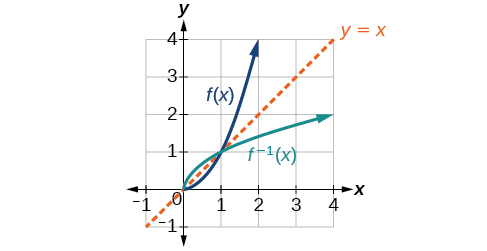{: #Figure_01_07_009}

This relationship will be observed for all one-to-one functions, because it is a result of the function and its inverse swapping inputs and outputs. This is equivalent to interchanging the roles of the vertical and horizontal axes.

Finding the Inverse of a Function Using Reflection about the Identity Line

Given the graph of<math xmlns="http://www.w3.org/1998/Math/MathML"> <mrow> <mtext> </mtext><mi>f</mi><mo stretchy="false">(</mo><mi>x</mi><mo stretchy="false">)</mo><mtext> </mtext></mrow> </math>

in [[link]](#Figure_01_07_010), sketch a graph of<math xmlns="http://www.w3.org/1998/Math/MathML"> <mrow> <mtext> </mtext><msup> <mi>f</mi> <mrow> <mo>−</mo><mn>1</mn></mrow> </msup> <mo stretchy="false">(</mo><mi>x</mi><mo stretchy="false">)</mo><mo>.</mo></mrow> </math>

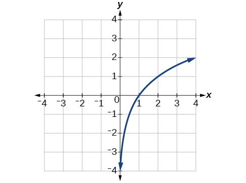{: #Figure_01_07_010}

This is a one-to-one function, so we will be able to sketch an inverse. Note that the graph shown has an apparent domain of<math xmlns="http://www.w3.org/1998/Math/MathML"> <mrow> <mtext> </mtext><mrow><mo>(</mo> <mrow> <mn>0</mn><mo>,</mo><mi>∞</mi></mrow> <mo>)</mo></mrow><mtext> </mtext></mrow> </math>

and range of<math xmlns="http://www.w3.org/1998/Math/MathML"> <mrow> <mtext> </mtext><mrow><mo>(</mo> <mrow> <mo>−</mo><mi>∞</mi><mo>,</mo><mi>∞</mi></mrow> <mo>)</mo></mrow><mo>,</mo><mtext> </mtext></mrow> </math>

so the inverse will have a domain of<math xmlns="http://www.w3.org/1998/Math/MathML"> <mrow> <mtext> </mtext><mrow><mo>(</mo> <mrow> <mo>−</mo><mi>∞</mi><mo>,</mo><mi>∞</mi></mrow> <mo>)</mo></mrow><mtext> </mtext></mrow> </math>

and range of<math xmlns="http://www.w3.org/1998/Math/MathML"> <mrow> <mtext> </mtext><mrow><mo>(</mo> <mrow> <mn>0</mn><mo>,</mo><mi>∞</mi></mrow> <mo>)</mo></mrow><mo>.</mo></mrow> </math>

If we reflect this graph over the line<math xmlns="http://www.w3.org/1998/Math/MathML"> <mrow> <mtext> </mtext><mi>y</mi><mo>=</mo><mi>x</mi><mo>,</mo><mtext> </mtext></mrow> </math>

the point<math xmlns="http://www.w3.org/1998/Math/MathML"> <mrow> <mtext> </mtext><mrow><mo>(</mo> <mrow> <mn>1</mn><mo>,</mo><mn>0</mn></mrow> <mo>)</mo></mrow><mtext> </mtext></mrow> </math>

reflects to<math xmlns="http://www.w3.org/1998/Math/MathML"> <mrow> <mtext> </mtext><mrow><mo>(</mo> <mrow> <mn>0</mn><mo>,</mo><mn>1</mn></mrow> <mo>)</mo></mrow><mtext> </mtext></mrow> </math>

and the point<math xmlns="http://www.w3.org/1998/Math/MathML"> <mrow> <mtext> </mtext><mrow><mo>(</mo> <mrow> <mn>4</mn><mo>,</mo><mn>2</mn></mrow> <mo>)</mo></mrow><mtext> </mtext></mrow> </math>

reflects to<math xmlns="http://www.w3.org/1998/Math/MathML"> <mrow> <mtext> </mtext><mrow><mo>(</mo> <mrow> <mn>2</mn><mo>,</mo><mn>4</mn></mrow> <mo>)</mo></mrow><mo>.</mo><mtext> </mtext></mrow> </math>

Sketching the inverse on the same axes as the original graph gives [[link]](#Figure_01_07_011).

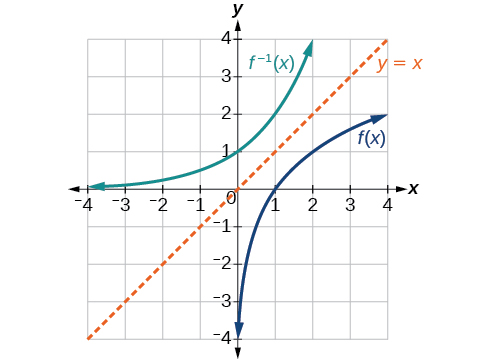{: #Figure_01_07_011}

Draw graphs of the functions<math xmlns="http://www.w3.org/1998/Math/MathML"> <mrow> <mtext> </mtext><mi>f</mi><mtext> </mtext></mrow> </math>

and<math xmlns="http://www.w3.org/1998/Math/MathML"> <mrow> <mtext> </mtext><msup> <mi>f</mi> <mrow> <mo>−</mo><mn>1</mn></mrow> </msup> </mrow> </math>

from [[link]](#Example_01_07_09).

 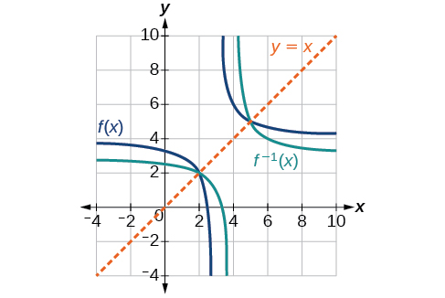 

**Is there any function that is equal to its own inverse?**

*Yes. If<math xmlns="http://www.w3.org/1998/Math/MathML"> <mrow> <mtext> </mtext><mi>f</mi><mo>=</mo><msup> <mi>f</mi> <mrow> <mo>−</mo><mn>1</mn></mrow> </msup> <mo>,</mo><mtext> </mtext></mrow> </math>

then<math xmlns="http://www.w3.org/1998/Math/MathML"> <mrow> <mtext> </mtext><mi>f</mi><mrow><mo>(</mo> <mrow> <mi>f</mi><mrow><mo>(</mo> <mi>x</mi> <mo>)</mo></mrow></mrow> <mo>)</mo></mrow><mo>=</mo><mi>x</mi><mo>,</mo><mtext> </mtext></mrow> </math>

and we can think of several functions that have this property. The identity function does, and so does the reciprocal function, because*

<math xmlns="http://www.w3.org/1998/Math/MathML" display="block"> <mrow> <mfrac> <mn>1</mn> <mrow> <mfrac> <mn>1</mn> <mi>x</mi> </mfrac> </mrow> </mfrac> <mo>=</mo><mi>x</mi></mrow> </math>

*Any function<math xmlns="http://www.w3.org/1998/Math/MathML"> <mrow> <mtext> </mtext><mi>f</mi><mrow><mo>(</mo> <mi>x</mi> <mo>)</mo></mrow><mo>=</mo><mi>c</mi><mo>−</mo><mi>x</mi><mo>,</mo><mtext> </mtext></mrow> </math>

where<math xmlns="http://www.w3.org/1998/Math/MathML"> <mrow> <mtext> </mtext><mi>c</mi><mtext> </mtext></mrow> </math>

is a constant, is also equal to its own inverse.*

Access these online resources for additional instruction and practice with inverse functions.

* [Inverse Functions][1]
* [One-to-one Functions][2]
* [Inverse Function Values Using Graph][3]
* [Restricting the Domain and Finding the Inverse][4]

Visit [this website][5] for additional practice questions from Learningpod.

# Key Concepts

* If
  <math xmlns="http://www.w3.org/1998/Math/MathML"> <mrow> <mtext> </mtext><mi>g</mi><mo stretchy="false">(</mo><mi>x</mi><mo stretchy="false">)</mo><mtext> </mtext></mrow> </math>
  
  is the inverse of
  <math xmlns="http://www.w3.org/1998/Math/MathML"> <mrow> <mtext> </mtext><mi>f</mi><mo stretchy="false">(</mo><mi>x</mi><mo stretchy="false">)</mo><mo>,</mo><mtext> </mtext></mrow> </math>
  
  then
  <math xmlns="http://www.w3.org/1998/Math/MathML"> <mrow> <mtext> </mtext><mi>g</mi><mo stretchy="false">(</mo><mi>f</mi><mo stretchy="false">(</mo><mi>x</mi><mo stretchy="false">)</mo><mo stretchy="false">)</mo><mo>=</mo><mi>f</mi><mo stretchy="false">(</mo><mi>g</mi><mo stretchy="false">(</mo><mi>x</mi><mo stretchy="false">)</mo><mo stretchy="false">)</mo><mo>=</mo><mi>x</mi><mo>.</mo><mtext> </mtext></mrow> </math>
  
  See [\[link\]](#Example_01_07_01), [\[link\]](#Example_01_07_02), and [\[link\]](#Example_01_07_03).
* Only some of the toolkit functions have an inverse. See [\[link\]](#Example_01_07_05).
* For a function to have an inverse, it must be one-to-one (pass the horizontal line test).
* A function that is not one-to-one over its entire domain may be one-to-one on part of its domain.
* For a tabular function, exchange the input and output rows to obtain the inverse. See [\[link\]](#Example_01_07_06).
* The inverse of a function can be determined at specific points on its graph. See [\[link\]](#Example_01_07_07).
* To find the inverse of a formula, solve the equation
  <math xmlns="http://www.w3.org/1998/Math/MathML"> <mrow> <mtext> </mtext><mi>y</mi><mo>=</mo><mi>f</mi><mo stretchy="false">(</mo><mi>x</mi><mo stretchy="false">)</mo><mtext> </mtext></mrow> </math>
  
  for
  <math xmlns="http://www.w3.org/1998/Math/MathML"> <mrow> <mtext> </mtext><mi>x</mi><mtext> </mtext></mrow> </math>
  
  as a function of
  <math xmlns="http://www.w3.org/1998/Math/MathML"> <mrow> <mtext> </mtext><mi>y</mi><mo>.</mo><mtext> </mtext></mrow> </math>
  
  Then exchange the labels
  <math xmlns="http://www.w3.org/1998/Math/MathML"> <mrow> <mtext> </mtext><mi>x</mi><mtext> </mtext></mrow> </math>
  
  and
  <math xmlns="http://www.w3.org/1998/Math/MathML"> <mrow> <mtext> </mtext><mtext> </mtext><mi>y</mi><mo>.</mo><mtext> </mtext><mtext> </mtext></mrow> </math>
  
  See [\[link\]](#Example_01_07_08), [\[link\]](#Example_01_07_09), and [\[link\]](#Example_01_07_10).
* The graph of an inverse function is the reflection of the graph of the original function across the line
  <math xmlns="http://www.w3.org/1998/Math/MathML"> <mrow> <mtext> </mtext><mi>y</mi><mo>=</mo><mi>x</mi><mo>.</mo><mtext> </mtext></mrow> </math>
  
  See [\[link\]](#Example_01_07_11).

# Section Exercises

## Verbal

Describe why the horizontal line test is an effective way to determine whether a function is one-to-one?

Each output of a function must have exactly one output for the function to be one-to-one. If any horizontal line crosses the graph of a function more than once, that means that<math xmlns="http://www.w3.org/1998/Math/MathML"> <mrow> <mtext> </mtext><mi>y</mi></mrow> </math>

-values repeat and the function is not one-to-one. If no horizontal line crosses the graph of the function more than once, then no<math xmlns="http://www.w3.org/1998/Math/MathML"> <mrow> <mtext> </mtext><mi>y</mi></mrow> </math>

-values repeat and the function is one-to-one.

Why do we restrict the domain of the function<math xmlns="http://www.w3.org/1998/Math/MathML"> <mrow> <mtext> </mtext><mi>f</mi><mo stretchy="false">(</mo><mi>x</mi><mo stretchy="false">)</mo><mo>=</mo><msup> <mi>x</mi> <mn>2</mn> </msup> <mtext> </mtext></mrow> </math>

to find the function’s inverse?

Can a function be its own inverse? Explain.

Yes. For example,<math xmlns="http://www.w3.org/1998/Math/MathML"> <mrow> <mtext> </mtext><mi>f</mi><mo stretchy="false">(</mo><mi>x</mi><mo stretchy="false">)</mo><mo>=</mo><mfrac> <mn>1</mn> <mi>x</mi> </mfrac> <mtext> </mtext></mrow> </math>

is its own inverse.

Are one-to-one functions either always increasing or always decreasing? Why or why not?

How do you find the inverse of a function algebraically?

Given a function<math xmlns="http://www.w3.org/1998/Math/MathML"> <mrow> <mtext> </mtext><mi>y</mi><mo>=</mo><mi>f</mi><mo stretchy="false">(</mo><mi>x</mi><mo stretchy="false">)</mo><mo>,</mo><mtext> </mtext></mrow> </math>

solve for<math xmlns="http://www.w3.org/1998/Math/MathML"> <mrow> <mtext> </mtext><mi>x</mi><mtext> </mtext></mrow> </math>

in terms of<math xmlns="http://www.w3.org/1998/Math/MathML"> <mrow> <mtext> </mtext><mi>y</mi><mo>.</mo><mtext> </mtext></mrow> </math>

Interchange the<math xmlns="http://www.w3.org/1998/Math/MathML"> <mrow> <mtext> </mtext><mi>x</mi><mtext> </mtext></mrow> </math>

and<math xmlns="http://www.w3.org/1998/Math/MathML"> <mrow> <mtext> </mtext><mi>y</mi><mo>.</mo><mtext> </mtext></mrow> </math>

Solve the new equation for<math xmlns="http://www.w3.org/1998/Math/MathML"> <mrow> <mtext> </mtext><mi>y</mi><mo>.</mo><mtext> </mtext></mrow> </math>

The expression for<math xmlns="http://www.w3.org/1998/Math/MathML"> <mrow> <mtext> </mtext><mi>y</mi><mtext> </mtext></mrow> </math>

is the inverse,<math xmlns="http://www.w3.org/1998/Math/MathML"> <mrow> <mtext> </mtext><mi>y</mi><mo>=</mo><msup> <mi>f</mi> <mrow> <mo>−</mo><mn>1</mn></mrow> </msup> <mo stretchy="false">(</mo><mi>x</mi><mo stretchy="false">)</mo><mo>.</mo></mrow> </math>

## Algebraic

Show that the function<math xmlns="http://www.w3.org/1998/Math/MathML"> <mrow> <mtext> </mtext><mi>f</mi><mo stretchy="false">(</mo><mi>x</mi><mo stretchy="false">)</mo><mo>=</mo><mi>a</mi><mo>−</mo><mi>x</mi><mtext> </mtext></mrow> </math>

is its own inverse for all real numbers<math xmlns="http://www.w3.org/1998/Math/MathML"> <mrow> <mtext> </mtext><mi>a</mi><mo>.</mo><mtext> </mtext></mrow> </math>

For the following exercises, find<math xmlns="http://www.w3.org/1998/Math/MathML"> <mrow> <mtext> </mtext><msup> <mi>f</mi> <mrow> <mo>−</mo><mn>1</mn></mrow> </msup> <mo stretchy="false">(</mo><mi>x</mi><mo stretchy="false">)</mo><mtext> </mtext></mrow> </math>

for each function.

<math xmlns="http://www.w3.org/1998/Math/MathML"> <mrow> <mi>f</mi><mo stretchy="false">(</mo><mi>x</mi><mo stretchy="false">)</mo><mo>=</mo><mi>x</mi><mo>+</mo><mn>3</mn></mrow> </math>

<math xmlns="http://www.w3.org/1998/Math/MathML"> <mrow> <msup> <mi>f</mi> <mrow> <mo>−</mo><mn>1</mn></mrow> </msup> <mo stretchy="false">(</mo><mi>x</mi><mo stretchy="false">)</mo><mo>=</mo><mi>x</mi><mo>−</mo><mn>3</mn></mrow> </math>

<math xmlns="http://www.w3.org/1998/Math/MathML"> <mrow> <mi>f</mi><mo stretchy="false">(</mo><mi>x</mi><mo stretchy="false">)</mo><mo>=</mo><mi>x</mi><mo>+</mo><mn>5</mn></mrow> </math>

<math xmlns="http://www.w3.org/1998/Math/MathML"> <mrow> <mi>f</mi><mo stretchy="false">(</mo><mi>x</mi><mo stretchy="false">)</mo><mo>=</mo><mn>2</mn><mo>−</mo><mi>x</mi></mrow> </math>

<math xmlns="http://www.w3.org/1998/Math/MathML"> <mrow> <msup> <mi>f</mi> <mrow> <mo>−</mo><mn>1</mn></mrow> </msup> <mo stretchy="false">(</mo><mi>x</mi><mo stretchy="false">)</mo><mo>=</mo><mn>2</mn><mo>−</mo><mi>x</mi></mrow> </math>

<math xmlns="http://www.w3.org/1998/Math/MathML"> <mrow> <mi>f</mi><mo stretchy="false">(</mo><mi>x</mi><mo stretchy="false">)</mo><mo>=</mo><mn>3</mn><mo>−</mo><mi>x</mi></mrow> </math>

<math xmlns="http://www.w3.org/1998/Math/MathML"> <mrow> <mi>f</mi><mo stretchy="false">(</mo><mi>x</mi><mo stretchy="false">)</mo><mo>=</mo><mfrac> <mi>x</mi> <mrow> <mi>x</mi><mo>+</mo><mn>2</mn></mrow> </mfrac> </mrow> </math>

<math xmlns="http://www.w3.org/1998/Math/MathML"> <mrow> <msup> <mi>f</mi> <mrow> <mo>−</mo><mn>1</mn></mrow> </msup> <mo stretchy="false">(</mo><mi>x</mi><mo stretchy="false">)</mo><mo>=</mo><mfrac> <mrow> <mo>−</mo><mn>2</mn><mi>x</mi></mrow> <mrow> <mi>x</mi><mo>−</mo><mn>1</mn></mrow> </mfrac> </mrow> </math>

<math xmlns="http://www.w3.org/1998/Math/MathML"> <mrow> <mi>f</mi><mo stretchy="false">(</mo><mi>x</mi><mo stretchy="false">)</mo><mo>=</mo><mfrac> <mrow> <mn>2</mn><mi>x</mi><mo>+</mo><mn>3</mn></mrow> <mrow> <mn>5</mn><mi>x</mi><mo>+</mo><mn>4</mn></mrow> </mfrac> </mrow> </math>

For the following exercises, find a domain on which each function<math xmlns="http://www.w3.org/1998/Math/MathML"> <mrow> <mtext> </mtext><mi>f</mi><mtext> </mtext></mrow> </math>

is one-to-one and non-decreasing. Write the domain in interval notation. Then find the inverse of<math xmlns="http://www.w3.org/1998/Math/MathML"> <mrow> <mtext> </mtext><mi>f</mi><mtext> </mtext></mrow> </math>

restricted to that domain.

<math xmlns="http://www.w3.org/1998/Math/MathML"> <mrow> <mi>f</mi><mo stretchy="false">(</mo><mi>x</mi><mo stretchy="false">)</mo><mo>=</mo><msup> <mrow> <mo stretchy="false">(</mo><mi>x</mi><mo>+</mo><mn>7</mn><mo stretchy="false">)</mo></mrow> <mn>2</mn> </msup> </mrow> </math>

domain of<math xmlns="http://www.w3.org/1998/Math/MathML"> <mrow> <mi>f</mi><mo stretchy="false">(</mo><mi>x</mi><mo stretchy="false">)</mo><mo>:</mo><mtext> </mtext><mo stretchy="false">[</mo><mo>−</mo><mn>7</mn><mo>,</mo><mi>∞</mi><mo stretchy="false">)</mo><mo>;</mo><mtext> </mtext><msup> <mi>f</mi> <mrow> <mo>−</mo><mn>1</mn></mrow> </msup> <mo stretchy="false">(</mo><mi>x</mi><mo stretchy="false">)</mo><mo>=</mo><msqrt> <mi>x</mi> </msqrt> <mo>−</mo><mn>7</mn></mrow> </math>

<math xmlns="http://www.w3.org/1998/Math/MathML"> <mrow> <mi>f</mi><mo stretchy="false">(</mo><mi>x</mi><mo stretchy="false">)</mo><mo>=</mo><msup> <mrow> <mo stretchy="false">(</mo><mi>x</mi><mo>−</mo><mn>6</mn><mo stretchy="false">)</mo></mrow> <mn>2</mn> </msup> </mrow> </math>

<math xmlns="http://www.w3.org/1998/Math/MathML"> <mrow> <mi>f</mi><mo stretchy="false">(</mo><mi>x</mi><mo stretchy="false">)</mo><mo>=</mo><msup> <mi>x</mi> <mn>2</mn> </msup> <mo>−</mo><mn>5</mn></mrow> </math>

domain of<math xmlns="http://www.w3.org/1998/Math/MathML"> <mrow> <mtext> </mtext><mi>f</mi><mo stretchy="false">(</mo><mi>x</mi><mo stretchy="false">)</mo><mo>:</mo><mtext> </mtext><mo stretchy="false">[</mo><mn>0</mn><mo>,</mo><mi>∞</mi><mo stretchy="false">)</mo><mo>;</mo><mtext> </mtext><msup> <mi>f</mi> <mrow> <mo>−</mo><mn>1</mn></mrow> </msup> <mo stretchy="false">(</mo><mi>x</mi><mo stretchy="false">)</mo><mo>=</mo><msqrt> <mrow> <mi>x</mi><mo>+</mo><mn>5</mn></mrow> </msqrt> </mrow> </math>

Given<math xmlns="http://www.w3.org/1998/Math/MathML"> <mrow> <mtext> </mtext><mi>f</mi><mrow><mo>(</mo> <mi>x</mi> <mo>)</mo></mrow><mo>=</mo><mfrac> <mi>x</mi> <mrow> <mn>2</mn><mo>+</mo><mi>x</mi></mrow></mfrac> <mtext> </mtext></mrow> </math>

and<math xmlns="http://www.w3.org/1998/Math/MathML"> <mrow> <mtext> </mtext><mi>g</mi><mo stretchy="false">(</mo><mi>x</mi><mo stretchy="false">)</mo><mo>=</mo><mfrac> <mrow> <mn>2</mn><mi>x</mi></mrow> <mrow> <mn>1</mn><mo>−</mo><mi>x</mi></mrow> </mfrac> <mo>:</mo></mrow> </math>

1.  Find
    <math xmlns="http://www.w3.org/1998/Math/MathML"> <mrow> <mtext> </mtext><mi>f</mi><mo stretchy="false">(</mo><mi>g</mi><mo stretchy="false">(</mo><mi>x</mi><mo stretchy="false">)</mo><mo stretchy="false">)</mo><mtext> </mtext></mrow> </math>
    
    and
    <math xmlns="http://www.w3.org/1998/Math/MathML"> <mrow> <mtext> </mtext><mi>g</mi><mo stretchy="false">(</mo><mi>f</mi><mo stretchy="false">(</mo><mi>x</mi><mo stretchy="false">)</mo><mo stretchy="false">)</mo><mo>.</mo></mrow> </math>

2.  What does the answer tell us about the relationship between
    <math xmlns="http://www.w3.org/1998/Math/MathML"> <mrow> <mtext> </mtext><mi>f</mi><mo stretchy="false">(</mo><mi>x</mi><mo stretchy="false">)</mo><mtext> </mtext></mrow> </math>
    
    and
    <math xmlns="http://www.w3.org/1998/Math/MathML"> <mrow> <mtext> </mtext><mi>g</mi><mo stretchy="false">(</mo><mi>x</mi><mo stretchy="false">)</mo><mo>?</mo></mrow> </math>
{: data-number-style="lower-alpha"}

a.<math xmlns="http://www.w3.org/1998/Math/MathML"> <mrow> <mo> </mo><mtext> </mtext><mi>f</mi><mo stretchy="false">(</mo><mi>g</mi><mo stretchy="false">(</mo><mi>x</mi><mo stretchy="false">)</mo><mo stretchy="false">)</mo><mo>=</mo><mi>x</mi><mtext> </mtext></mrow> </math>

and<math xmlns="http://www.w3.org/1998/Math/MathML"> <mrow> <mtext> </mtext><mi>g</mi><mo stretchy="false">(</mo><mi>f</mi><mo stretchy="false">(</mo><mi>x</mi><mo stretchy="false">)</mo><mo stretchy="false">)</mo><mo>=</mo><mi>x</mi><mo>.</mo><mtext> </mtext></mrow> </math>

b. This tells us that<math xmlns="http://www.w3.org/1998/Math/MathML"> <mrow> <mtext> </mtext><mi>f</mi><mtext> </mtext></mrow> </math>

and<math xmlns="http://www.w3.org/1998/Math/MathML"> <mrow> <mtext> </mtext><mi>g</mi><mtext> </mtext></mrow> </math>

are inverse functions

For the following exercises, use function composition to verify that<math xmlns="http://www.w3.org/1998/Math/MathML"> <mrow> <mtext> </mtext><mi>f</mi><mo stretchy="false">(</mo><mi>x</mi><mo stretchy="false">)</mo><mtext> </mtext></mrow> </math>

and<math xmlns="http://www.w3.org/1998/Math/MathML"> <mrow> <mtext> </mtext><mi>g</mi><mo stretchy="false">(</mo><mi>x</mi><mo stretchy="false">)</mo><mtext> </mtext></mrow> </math>

are inverse functions.

<math xmlns="http://www.w3.org/1998/Math/MathML"> <mrow> <mi>f</mi><mo stretchy="false">(</mo><mi>x</mi><mo stretchy="false">)</mo><mo>=</mo><mroot> <mrow> <mi>x</mi><mo>−</mo><mn>1</mn></mrow> <mn>3</mn> </mroot> <mtext> </mtext></mrow> </math>

and<math xmlns="http://www.w3.org/1998/Math/MathML"> <mrow> <mtext> </mtext><mi>g</mi><mo stretchy="false">(</mo><mi>x</mi><mo stretchy="false">)</mo><mo>=</mo><msup> <mi>x</mi> <mn>3</mn> </msup> <mo>+</mo><mn>1</mn></mrow> </math>

<math xmlns="http://www.w3.org/1998/Math/MathML"> <mrow> <mo> </mo><mi>f</mi><mo stretchy="false">(</mo><mi>g</mi><mo stretchy="false">(</mo><mi>x</mi><mo stretchy="false">)</mo><mo stretchy="false">)</mo><mo>=</mo><mi>x</mi><mo>,</mo><mtext> </mtext><mi>g</mi><mo stretchy="false">(</mo><mi>f</mi><mo stretchy="false">(</mo><mi>x</mi><mo stretchy="false">)</mo><mo stretchy="false">)</mo><mo>=</mo><mi>x</mi></mrow> </math>

<math xmlns="http://www.w3.org/1998/Math/MathML"> <mrow> <mi>f</mi><mo stretchy="false">(</mo><mi>x</mi><mo stretchy="false">)</mo><mo>=</mo><mo>−</mo><mn>3</mn><mi>x</mi><mo>+</mo><mn>5</mn><mtext> </mtext></mrow> </math>

and<math xmlns="http://www.w3.org/1998/Math/MathML"> <mrow> <mtext> </mtext><mi>g</mi><mo stretchy="false">(</mo><mi>x</mi><mo stretchy="false">)</mo><mo>=</mo><mfrac> <mrow> <mi>x</mi><mo>−</mo><mn>5</mn></mrow> <mrow> <mo>−</mo><mn>3</mn></mrow> </mfrac> </mrow> </math>

## Graphical

For the following exercises, use a graphing utility to determine whether each function is one-to-one.

<math xmlns="http://www.w3.org/1998/Math/MathML"> <mrow> <mi>f</mi><mo stretchy="false">(</mo><mi>x</mi><mo stretchy="false">)</mo><mo>=</mo><msqrt> <mi>x</mi> </msqrt> </mrow> </math>

one-to-one

<math xmlns="http://www.w3.org/1998/Math/MathML"> <mrow> <mi>f</mi><mo stretchy="false">(</mo><mi>x</mi><mo stretchy="false">)</mo><mo>=</mo><mroot> <mrow> <mn>3</mn><mi>x</mi><mo>+</mo><mn>1</mn></mrow> <mn>3</mn> </mroot> </mrow> </math>

<math xmlns="http://www.w3.org/1998/Math/MathML"> <mrow> <mi>f</mi><mo stretchy="false">(</mo><mi>x</mi><mo stretchy="false">)</mo><mo>=</mo><mn>−5</mn><mi>x</mi><mo>+</mo><mn>1</mn></mrow> </math>

one-to-one

<math xmlns="http://www.w3.org/1998/Math/MathML"> <mrow> <mi>f</mi><mo stretchy="false">(</mo><mi>x</mi><mo stretchy="false">)</mo><mo>=</mo><msup> <mi>x</mi> <mn>3</mn> </msup> <mo>−</mo><mn>27</mn></mrow> </math>

For the following exercises, determine whether the graph represents a one-to-one function.

  

not one-to-one

  

For the following exercises, use the graph of<math xmlns="http://www.w3.org/1998/Math/MathML"> <mrow> <mtext> </mtext><mi>f</mi><mtext> </mtext></mrow> </math>

shown in [\[link\]](#Figure_01_07_203).

 {: #Figure_01_07_203}

Find<math xmlns="http://www.w3.org/1998/Math/MathML"> <mrow> <mtext> </mtext><mi>f</mi><mrow><mo>(</mo> <mn>0</mn> <mo>)</mo></mrow><mo>.</mo></mrow> </math>

<math xmlns="http://www.w3.org/1998/Math/MathML"> <mn>3</mn> </math>

Solve<math xmlns="http://www.w3.org/1998/Math/MathML"> <mrow> <mtext> </mtext><mi>f</mi><mo stretchy="false">(</mo><mi>x</mi><mo stretchy="false">)</mo><mo>=</mo><mn>0.</mn></mrow> </math>

Find<math xmlns="http://www.w3.org/1998/Math/MathML"> <mrow> <mtext> </mtext><msup> <mi>f</mi> <mrow> <mo>−</mo><mn>1</mn></mrow> </msup> <mrow><mo>(</mo> <mn>0</mn> <mo>)</mo></mrow><mo>.</mo></mrow> </math>

<math xmlns="http://www.w3.org/1998/Math/MathML"> <mn>2</mn> </math>

Solve<math xmlns="http://www.w3.org/1998/Math/MathML"> <mrow> <mtext> </mtext><msup> <mi>f</mi> <mrow> <mo>−</mo><mn>1</mn></mrow> </msup> <mrow><mo>(</mo> <mi>x</mi> <mo>)</mo></mrow><mo>=</mo><mn>0.</mn></mrow> </math>

For the following exercises, use the graph of the one-to-one function shown in [\[link\]](#Figure_01_07_204).

{: #Figure_01_07_204}

Sketch the graph of<math xmlns="http://www.w3.org/1998/Math/MathML"> <mrow> <mtext> </mtext><msup> <mi>f</mi> <mrow> <mo>−</mo><mn>1</mn></mrow> </msup> <mo>.</mo><mtext> </mtext></mrow> </math>

 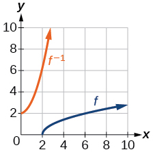 

Find<math xmlns="http://www.w3.org/1998/Math/MathML"> <mrow> <mtext> </mtext><mi>f</mi><mo stretchy="false">(</mo><mn>6</mn><mo stretchy="false">)</mo><mtext> and </mtext><msup> <mi>f</mi> <mrow> <mo>−</mo><mn>1</mn></mrow> </msup> <mo stretchy="false">(</mo><mn>2</mn><mo stretchy="false">)</mo><mo>.</mo></mrow> </math>

If the complete graph of<math xmlns="http://www.w3.org/1998/Math/MathML"> <mrow> <mtext> </mtext><mi>f</mi><mtext> </mtext></mrow> </math>

is shown, find the domain of<math xmlns="http://www.w3.org/1998/Math/MathML"> <mrow> <mtext> </mtext><mi>f</mi><mo>.</mo><mtext> </mtext></mrow> </math>

<math xmlns="http://www.w3.org/1998/Math/MathML"> <mrow> <mrow><mo>[</mo> <mrow> <mn>2</mn><mo>,</mo><mn>10</mn></mrow> <mo>]</mo></mrow></mrow> </math>

If the complete graph of<math xmlns="http://www.w3.org/1998/Math/MathML"> <mrow> <mtext> </mtext><mi>f</mi><mtext> </mtext></mrow> </math>

is shown, find the range of<math xmlns="http://www.w3.org/1998/Math/MathML"> <mrow> <mtext> </mtext><mi>f</mi><mo>.</mo></mrow> </math>

## Numeric

For the following exercises, evaluate or solve, assuming that the function<math xmlns="http://www.w3.org/1998/Math/MathML"> <mrow> <mtext> </mtext><mi>f</mi><mtext> </mtext></mrow> </math>

is one-to-one.

If<math xmlns="http://www.w3.org/1998/Math/MathML"> <mrow> <mtext> </mtext><mi>f</mi><mo stretchy="false">(</mo><mn>6</mn><mo stretchy="false">)</mo><mo>=</mo><mn>7</mn><mo>,</mo><mtext> </mtext></mrow> </math>

find<math xmlns="http://www.w3.org/1998/Math/MathML"> <mrow> <mtext> </mtext><mtext> </mtext><msup> <mi>f</mi> <mrow> <mo>−</mo><mn>1</mn></mrow> </msup> <mo stretchy="false">(</mo><mn>7</mn><mo stretchy="false">)</mo><mo>.</mo></mrow> </math>

<math xmlns="http://www.w3.org/1998/Math/MathML"> <mn>6</mn> </math>

If<math xmlns="http://www.w3.org/1998/Math/MathML"> <mrow> <mtext> </mtext><mi>f</mi><mo stretchy="false">(</mo><mn>3</mn><mo stretchy="false">)</mo><mo>=</mo><mn>2</mn><mo>,</mo><mtext> </mtext></mrow> </math>

find<math xmlns="http://www.w3.org/1998/Math/MathML"> <mrow> <mtext> </mtext><msup> <mi>f</mi> <mrow> <mo>−</mo><mn>1</mn></mrow> </msup> <mo stretchy="false">(</mo><mn>2</mn><mo stretchy="false">)</mo><mo>.</mo></mrow> </math>

If<math xmlns="http://www.w3.org/1998/Math/MathML"> <mrow> <mtext> </mtext><msup> <mi>f</mi> <mrow> <mo>−</mo><mn>1</mn></mrow> </msup> <mrow><mo>(</mo> <mrow> <mo>−</mo><mn>4</mn></mrow> <mo>)</mo></mrow><mo>=</mo><mo>−</mo><mn>8</mn><mo>,</mo><mtext> </mtext></mrow> </math>

find<math xmlns="http://www.w3.org/1998/Math/MathML"> <mrow> <mtext> </mtext><mi>f</mi><mo stretchy="false">(</mo><mo>−</mo><mn>8</mn><mo stretchy="false">)</mo><mo>.</mo></mrow> </math>

<math xmlns="http://www.w3.org/1998/Math/MathML"> <mrow> <mo>−</mo><mn>4</mn></mrow> </math>

If<math xmlns="http://www.w3.org/1998/Math/MathML"> <mrow> <mtext> </mtext><msup> <mi>f</mi> <mrow> <mo>−</mo><mn>1</mn></mrow> </msup> <mrow><mo>(</mo> <mrow> <mo>−</mo><mn>2</mn></mrow> <mo>)</mo></mrow><mo>=</mo><mo>−</mo><mn>1</mn><mo>,</mo><mtext> </mtext></mrow> </math>

find<math xmlns="http://www.w3.org/1998/Math/MathML"> <mrow> <mtext> </mtext><mi>f</mi><mo stretchy="false">(</mo><mo>−</mo><mn>1</mn><mo stretchy="false">)</mo><mo>.</mo></mrow> </math>

For the following exercises, use the values listed in [\[link\]](#Table_01_07_06) to evaluate or solve.

| <strong><math xmlns="http://www.w3.org/1998/Math/MathML">
<mi>x</mi>
</math> </strong> | <strong><math xmlns="http://www.w3.org/1998/Math/MathML">
<mrow>
<mi>f</mi><mo stretchy="false">(</mo><mi>x</mi><mo stretchy="false">)</mo></mrow>
</math></strong> |
|----------
| 0 | 8 |
| 1 | 0 |
| 2 | 7 |
| 3 | 4 |
| 4 | 2 |
| 5 | 6 |
| 6 | 5 |
| 7 | 3 |
| 8 | 9 |
| 9 | 1 |
{: #Table_01_07_06 summary="Two columns and ten rows. The first column is labeled, &#x201C;x&#x201D;, and the second is labeled, &#x201C;f(x)&#x201D;. The values of x are 0, 1, 2, 3, 4, 5, 6, 7, 8, and 9. So for f(0)=8, f(1)=0, f(2)=7, f(3)=4, f(4)=2, f(5)=6, f(6)=5, f(7)=8, f(8)=9, and f(9)=1."}

Find<math xmlns="http://www.w3.org/1998/Math/MathML"> <mrow> <mtext> </mtext><mi>f</mi><mrow><mo>(</mo> <mn>1</mn> <mo>)</mo></mrow><mo>.</mo></mrow> </math>

<math xmlns="http://www.w3.org/1998/Math/MathML"> <mn>0</mn> </math>

Solve<math xmlns="http://www.w3.org/1998/Math/MathML"> <mrow> <mtext> </mtext><mi>f</mi><mo stretchy="false">(</mo><mi>x</mi><mo stretchy="false">)</mo><mo>=</mo><mn>3.</mn></mrow> </math>

Find<math xmlns="http://www.w3.org/1998/Math/MathML"> <mrow> <mtext> </mtext><msup> <mi>f</mi> <mrow> <mo>−</mo><mn>1</mn></mrow> </msup> <mrow><mo>(</mo> <mn>0</mn> <mo>)</mo></mrow><mo>.</mo></mrow> </math>

<math xmlns="http://www.w3.org/1998/Math/MathML"> <mrow> <mtext> </mtext><mn>1</mn><mtext> </mtext></mrow> </math>

Solve<math xmlns="http://www.w3.org/1998/Math/MathML"> <mrow> <mtext> </mtext><msup> <mi>f</mi> <mrow> <mo>−</mo><mn>1</mn></mrow> </msup> <mrow><mo>(</mo> <mi>x</mi> <mo>)</mo></mrow><mo>=</mo><mn>7.</mn></mrow> </math>

Use the tabular representation of<math xmlns="http://www.w3.org/1998/Math/MathML"> <mrow> <mtext> </mtext><mi>f</mi><mtext> </mtext></mrow> </math>

in [[link]](#Table_01_07_08) to create a table for<math xmlns="http://www.w3.org/1998/Math/MathML"> <mrow> <mtext> </mtext><msup> <mi>f</mi> <mrow> <mo>−</mo><mn>1</mn></mrow> </msup> <mrow><mo>(</mo> <mi>x</mi> <mo>)</mo></mrow><mo>.</mo></mrow> </math>

| <strong><math xmlns="http://www.w3.org/1998/Math/MathML">
<mi>x</mi>
</math></strong> | 3 | 6 | 9 | 13 | 14 |
| <strong><math xmlns="http://www.w3.org/1998/Math/MathML">
<mrow>
<mi>f</mi><mo stretchy="false">(</mo><mi>x</mi><mo stretchy="false">)</mo></mrow>
</math></strong> | 1 | 4 | 7 | 12 | 16 |
{: #Table_01_07_08 summary="Two rows and six columns. The first row is labeled, &#x201C;x&#x201D;, and the second is labeled, &#x201C;f(x)&#x201D;. The values of x are 3, 6, 9, 13, and 14. So for f(3)=1, f(6)=4, f(9)=7, f(13)=12, and f(14)=16."}

| <math xmlns="http://www.w3.org/1998/Math/MathML"> <mi>x</mi> </math>

 | 1 | 4 | 7 | 12 | 16 |
| <math xmlns="http://www.w3.org/1998/Math/MathML"> <mrow> <msup> <mi>f</mi> <mrow> <mo>−</mo><mn>1</mn></mrow> </msup> <mo stretchy="false">(</mo><mi>x</mi><mo stretchy="false">)</mo></mrow> </math>

 | 3 | 6 | 9 | 13 | 14 |
{: summary="Two rows and six columns. The first row is labeled, &#x201C;x&#x201D;, and the second is labeled, &#x201C;f^(-1)(x)&#x201D;. The values of x are 1, 4, 7, 12, and 16. So for f^(-1) (1)=1, f^(-1) (4)=6, f^(-1) (7)=9, f^(-1) (12)=13, and f^(-1)f(16)=14." .unnumbered data-label=""}

## Technology

For the following exercises, find the inverse function. Then, graph the function and its inverse.

<math xmlns="http://www.w3.org/1998/Math/MathML"> <mrow> <mi>f</mi><mo stretchy="false">(</mo><mi>x</mi><mo stretchy="false">)</mo><mo>=</mo><mfrac> <mn>3</mn> <mrow> <mi>x</mi><mo>−</mo><mn>2</mn></mrow> </mfrac> </mrow> </math>

<math xmlns="http://www.w3.org/1998/Math/MathML"> <mrow> <mi>f</mi><mo stretchy="false">(</mo><mi>x</mi><mo stretchy="false">)</mo><mo>=</mo><msup> <mi>x</mi> <mn>3</mn> </msup> <mo>−</mo><mn>1</mn></mrow> </math>

<math xmlns="http://www.w3.org/1998/Math/MathML"> <mrow> <msup> <mi>f</mi> <mrow> <mo>−</mo><mn>1</mn></mrow> </msup> <mo stretchy="false">(</mo><mi>x</mi><mo stretchy="false">)</mo><mo>=</mo><msup> <mrow> <mo stretchy="false">(</mo><mn>1</mn><mo>+</mo><mi>x</mi><mo stretchy="false">)</mo></mrow> <mrow> <mn>1</mn><mo>/</mo><mn>3</mn></mrow> </msup> </mrow> </math>

 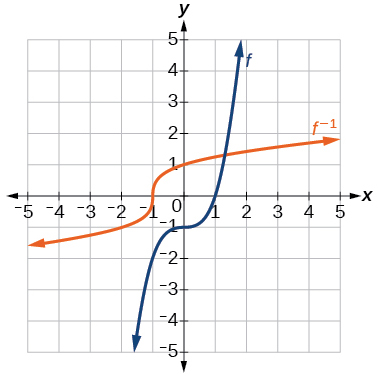 

Find the inverse function of<math xmlns="http://www.w3.org/1998/Math/MathML"> <mrow> <mtext> </mtext><mi>f</mi><mo stretchy="false">(</mo><mi>x</mi><mo stretchy="false">)</mo><mo>=</mo><mfrac> <mn>1</mn> <mrow> <mi>x</mi><mo>−</mo><mn>1</mn></mrow> </mfrac> <mo>.</mo><mtext> </mtext></mrow> </math>

Use a graphing utility to find its domain and range. Write the domain and range in interval notation.

## Real-World Applications

To convert from<math xmlns="http://www.w3.org/1998/Math/MathML"> <mrow> <mtext> </mtext><mi>x</mi><mtext> </mtext></mrow> </math>

degrees Celsius to<math xmlns="http://www.w3.org/1998/Math/MathML"> <mrow> <mtext> </mtext><mi>y</mi><mtext> </mtext></mrow> </math>

degrees Fahrenheit, we use the formula<math xmlns="http://www.w3.org/1998/Math/MathML"> <mrow> <mtext> </mtext><mi>f</mi><mo stretchy="false">(</mo><mi>x</mi><mo stretchy="false">)</mo><mo>=</mo><mfrac> <mn>9</mn> <mn>5</mn> </mfrac> <mi>x</mi><mo>+</mo><mn>32.</mn><mtext> </mtext></mrow> </math>

Find the inverse function, if it exists, and explain its meaning.

<math xmlns="http://www.w3.org/1998/Math/MathML"> <mrow> <msup> <mi>f</mi> <mrow> <mo>−</mo><mn>1</mn></mrow> </msup> <mo stretchy="false">(</mo><mi>x</mi><mo stretchy="false">)</mo><mo>=</mo><mfrac> <mn>5</mn> <mn>9</mn> </mfrac> <mrow><mo>(</mo> <mrow> <mi>x</mi><mo>−</mo><mn>32</mn></mrow> <mo>)</mo></mrow><mo>.</mo><mtext> </mtext></mrow> </math>

Given the Fahrenheit temperature,<math xmlns="http://www.w3.org/1998/Math/MathML"> <mrow> <mtext> </mtext><mi>x</mi><mo>,</mo><mtext> </mtext></mrow> </math>

this formula allows you to calculate the Celsius temperature.

The circumference<math xmlns="http://www.w3.org/1998/Math/MathML"> <mrow> <mtext> </mtext><mi>C</mi><mtext> </mtext></mrow> </math>

of a circle is a function of its radius given by<math xmlns="http://www.w3.org/1998/Math/MathML"> <mrow> <mtext> </mtext><mi>C</mi><mo stretchy="false">(</mo><mi>r</mi><mo stretchy="false">)</mo><mo>=</mo><mn>2</mn><mi>π</mi><mi>r</mi><mo>.</mo><mtext> </mtext></mrow> </math>

Express the radius of a circle as a function of its circumference. Call this function<math xmlns="http://www.w3.org/1998/Math/MathML"> <mrow> <mtext> </mtext><mi>r</mi><mo stretchy="false">(</mo><mi>C</mi><mo stretchy="false">)</mo><mo>.</mo><mtext> </mtext></mrow> </math>

Find<math xmlns="http://www.w3.org/1998/Math/MathML"> <mrow> <mtext> </mtext><mi>r</mi><mo stretchy="false">(</mo><mn>36</mn><mi>π</mi><mo stretchy="false">)</mo><mtext> </mtext></mrow> </math>

and interpret its meaning.

A car travels at a constant speed of 50 miles per hour. The distance the car travels in miles is a function of time,<math xmlns="http://www.w3.org/1998/Math/MathML"> <mrow> <mtext> </mtext><mi>t</mi><mo>,</mo><mtext> </mtext></mrow> </math>

in hours given by<math xmlns="http://www.w3.org/1998/Math/MathML"> <mrow> <mtext> </mtext><mi>d</mi><mo stretchy="false">(</mo><mi>t</mi><mo stretchy="false">)</mo><mo>=</mo><mn>50</mn><mi>t</mi><mo>.</mo><mtext> </mtext></mrow> </math>

Find the inverse function by expressing the time of travel in terms of the distance traveled. Call this function<math xmlns="http://www.w3.org/1998/Math/MathML"> <mrow> <mtext> </mtext><mi>t</mi><mo stretchy="false">(</mo><mi>d</mi><mo stretchy="false">)</mo><mo>.</mo><mtext> </mtext></mrow> </math>

Find<math xmlns="http://www.w3.org/1998/Math/MathML"> <mrow> <mtext> </mtext><mi>t</mi><mo stretchy="false">(</mo><mn>180</mn><mo stretchy="false">)</mo><mtext> </mtext></mrow> </math>

and interpret its meaning.

<math xmlns="http://www.w3.org/1998/Math/MathML"> <mrow> <mi>t</mi><mo stretchy="false">(</mo><mi>d</mi><mo stretchy="false">)</mo><mo>=</mo><mfrac> <mi>d</mi> <mrow> <mn>50</mn></mrow> </mfrac> <mo>,</mo><mtext> </mtext></mrow> </math>

<math xmlns="http://www.w3.org/1998/Math/MathML"> <mrow> <mi>t</mi><mo stretchy="false">(</mo><mn>180</mn><mo stretchy="false">)</mo><mo>=</mo><mfrac> <mrow> <mn>180</mn></mrow> <mrow> <mn>50</mn></mrow> </mfrac> <mo>.</mo><mtext> </mtext></mrow> </math>

The time for the car to travel 180 miles is 3.6 hours.

# Chapter Review Exercises

## [Functions and Function Notation](/m51261){: .target-chapter}   {#eip-id1165135176875}

For the following exercises, determine whether the relation is a function.

<math xmlns="http://www.w3.org/1998/Math/MathML"> <mrow> <mrow><mo>{</mo> <mrow> <mo stretchy="false">(</mo><mi>a</mi><mo>,</mo><mi>b</mi><mo stretchy="false">)</mo><mo>,</mo><mo stretchy="false">(</mo><mi>c</mi><mo>,</mo><mi>d</mi><mo stretchy="false">)</mo><mo>,</mo><mo stretchy="false">(</mo><mi>e</mi><mo>,</mo><mi>d</mi><mo stretchy="false">)</mo></mrow> <mo>}</mo></mrow></mrow> </math>

function

<math xmlns="http://www.w3.org/1998/Math/MathML"> <mrow> <mrow><mo>{</mo> <mrow> <mo stretchy="false">(</mo><mn>5</mn><mo>,</mo><mn>2</mn><mo stretchy="false">)</mo><mo>,</mo><mo stretchy="false">(</mo><mn>6</mn><mo>,</mo><mn>1</mn><mo stretchy="false">)</mo><mo>,</mo><mo stretchy="false">(</mo><mn>6</mn><mo>,</mo><mn>2</mn><mo stretchy="false">)</mo><mo>,</mo><mo stretchy="false">(</mo><mn>4</mn><mo>,</mo><mn>8</mn><mo stretchy="false">)</mo></mrow> <mo>}</mo></mrow></mrow> </math>

<math xmlns="http://www.w3.org/1998/Math/MathML"> <mrow> <msup> <mi>y</mi> <mn>2</mn> </msup> <mo>+</mo><mn>4</mn><mo>=</mo><mi>x</mi><mo>,</mo><mtext> </mtext></mrow> </math>

for<math xmlns="http://www.w3.org/1998/Math/MathML"> <mrow> <mtext> </mtext><mi>x</mi><mtext> </mtext></mrow> </math>

the independent variable and<math xmlns="http://www.w3.org/1998/Math/MathML"> <mrow> <mtext> </mtext><mi>y</mi><mtext> </mtext></mrow> </math>

the dependent variable

not a function

Is the graph in [[link]](#Figure_01_07_208) a function?

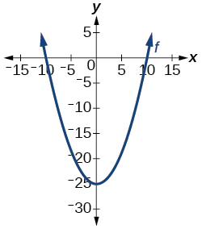{: #Figure_01_07_208}

For the following exercises, evaluate the function at the indicated values:<math xmlns="http://www.w3.org/1998/Math/MathML"> <mrow> <mtext> </mtext><mtext> </mtext><mtext> </mtext><mi>f</mi><mo stretchy="false">(</mo><mo>−</mo><mn>3</mn><mo stretchy="false">)</mo><mo>;</mo><mtext> </mtext><mtext> </mtext><mi>f</mi><mo stretchy="false">(</mo><mn>2</mn><mo stretchy="false">)</mo><mo>;</mo><mtext> </mtext><mtext> </mtext><mtext> </mtext><mi>f</mi><mo stretchy="false">(</mo><mo>−</mo><mi>a</mi><mo stretchy="false">)</mo><mo>;</mo><mtext> </mtext><mtext> </mtext><mtext> </mtext><mo>−</mo><mi>f</mi><mo stretchy="false">(</mo><mi>a</mi><mo stretchy="false">)</mo><mo>;</mo><mtext> </mtext><mtext> </mtext><mtext> </mtext><mi>f</mi><mo stretchy="false">(</mo><mi>a</mi><mo>+</mo><mi>h</mi><mo stretchy="false">)</mo><mo>.</mo> </mrow> </math>

<math xmlns="http://www.w3.org/1998/Math/MathML"> <mrow> <mi>f</mi><mo stretchy="false">(</mo><mi>x</mi><mo stretchy="false">)</mo><mo>=</mo><mo>−</mo><mn>2</mn><msup> <mi>x</mi> <mn>2</mn> </msup> <mo>+</mo><mn>3</mn><mi>x</mi></mrow> </math>

<math xmlns="http://www.w3.org/1998/Math/MathML"> <mrow> <mi>f</mi><mo stretchy="false">(</mo><mo>−</mo><mn>3</mn><mo stretchy="false">)</mo><mo>=</mo><mo>−</mo><mn>27</mn><mo>;</mo> </mrow> </math>

<math xmlns="http://www.w3.org/1998/Math/MathML"> <mrow> <mi>f</mi><mo stretchy="false">(</mo><mn>2</mn><mo stretchy="false">)</mo><mo>=</mo><mo>−</mo><mn>2</mn><mo>;</mo> </mrow> </math>

<math xmlns="http://www.w3.org/1998/Math/MathML"> <mrow> <mi>f</mi><mo stretchy="false">(</mo><mo>−</mo><mi>a</mi><mo stretchy="false">)</mo><mo>=</mo><mo>−</mo><mn>2</mn><msup> <mi>a</mi> <mn>2</mn> </msup> <mo>−</mo><mn>3</mn><mi>a</mi><mo>;</mo> </mrow> </math>

* * *
{: data-type="newline"}

<math xmlns="http://www.w3.org/1998/Math/MathML"> <mrow> <mo>−</mo><mi>f</mi><mo stretchy="false">(</mo><mi>a</mi><mo stretchy="false">)</mo><mo>=</mo><mn>2</mn><msup> <mi>a</mi> <mn>2</mn> </msup> <mo>−</mo><mn>3</mn><mi>a</mi><mo>;</mo> </mrow> </math>

<math xmlns="http://www.w3.org/1998/Math/MathML"> <mrow> <mi>f</mi><mo stretchy="false">(</mo><mi>a</mi><mo>+</mo><mi>h</mi><mo stretchy="false">)</mo><mo>=</mo><mo>−</mo><mn>2</mn><msup> <mi>a</mi> <mn>2</mn> </msup> <mo>+</mo><mn>3</mn><mi>a</mi><mo>−</mo><mn>4</mn><mi>a</mi><mi>h</mi><mo>+</mo><mn>3</mn><mi>h</mi><mo>−</mo><mn>2</mn><msup> <mi>h</mi> <mn>2</mn> </msup> </mrow> </math>

<math xmlns="http://www.w3.org/1998/Math/MathML"> <mrow> <mi>f</mi><mo stretchy="false">(</mo><mi>x</mi><mo stretchy="false">)</mo><mo>=</mo><mn>2</mn><mrow><mo>\|</mo> <mrow> <mn>3</mn><mi>x</mi><mo>−</mo><mn>1</mn></mrow> <mo>\|</mo></mrow></mrow> </math>

For the following exercises, determine whether the functions are one-to-one.

<math xmlns="http://www.w3.org/1998/Math/MathML"> <mrow> <mi>f</mi><mo stretchy="false">(</mo><mi>x</mi><mo stretchy="false">)</mo><mo>=</mo><mo>−</mo><mn>3</mn><mi>x</mi><mo>+</mo><mn>5</mn></mrow> </math>

one-to-one

<math xmlns="http://www.w3.org/1998/Math/MathML"> <mrow> <mi>f</mi><mo stretchy="false">(</mo><mi>x</mi><mo stretchy="false">)</mo><mo>=</mo><mrow><mo>\|</mo> <mrow> <mi>x</mi><mo>−</mo><mn>3</mn></mrow> <mo>\|</mo></mrow></mrow> </math>

For the following exercises, use the vertical line test to determine if the relation whose graph is provided is a function.

 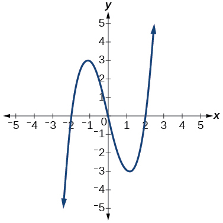 

function

 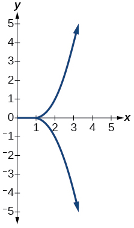 

 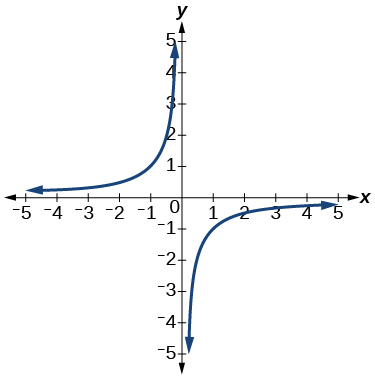 

function

For the following exercises, graph the functions.

<math xmlns="http://www.w3.org/1998/Math/MathML"> <mrow> <mi>f</mi><mo stretchy="false">(</mo><mi>x</mi><mo stretchy="false">)</mo><mo>=</mo><mrow><mo>\|</mo> <mrow> <mi>x</mi><mo>+</mo><mn>1</mn></mrow> <mo>\|</mo></mrow></mrow> </math>

<math xmlns="http://www.w3.org/1998/Math/MathML"> <mrow> <mi>f</mi><mo stretchy="false">(</mo><mi>x</mi><mo stretchy="false">)</mo><mo>=</mo><msup> <mi>x</mi> <mn>2</mn> </msup> <mo>−</mo><mn>2</mn></mrow> </math>

  

For the following exercises, use [\[link\]](#Figure_01_07_215) to approximate the values.

 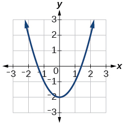{: #Figure_01_07_215}

<math xmlns="http://www.w3.org/1998/Math/MathML"> <mrow> <mi>f</mi><mo stretchy="false">(</mo><mn>2</mn><mo stretchy="false">)</mo></mrow> </math>

<math xmlns="http://www.w3.org/1998/Math/MathML"> <mrow> <mi>f</mi><mo stretchy="false">(</mo><mn>−2</mn><mo stretchy="false">)</mo></mrow> </math>

<math xmlns="http://www.w3.org/1998/Math/MathML"> <mn>2</mn> </math>

If<math xmlns="http://www.w3.org/1998/Math/MathML"> <mrow> <mtext> </mtext><mi>f</mi><mo stretchy="false">(</mo><mi>x</mi><mo stretchy="false">)</mo><mo>=</mo><mn>−2</mn><mo>,</mo><mtext> </mtext></mrow> </math>

then solve for<math xmlns="http://www.w3.org/1998/Math/MathML"> <mrow> <mtext> </mtext><mi>x</mi><mo>.</mo></mrow> </math>

If<math xmlns="http://www.w3.org/1998/Math/MathML"> <mrow> <mtext> </mtext><mi>f</mi><mo stretchy="false">(</mo><mi>x</mi><mo stretchy="false">)</mo><mo>=</mo><mn>1</mn><mo>,</mo><mtext> </mtext></mrow> </math>

then solve for<math xmlns="http://www.w3.org/1998/Math/MathML"> <mrow> <mtext> </mtext><mi>x</mi><mo>.</mo></mrow> </math>

<math xmlns="http://www.w3.org/1998/Math/MathML"> <mrow> <mi>x</mi><mo>=</mo><mo>−</mo><mn>1.8</mn><mtext> </mtext></mrow> </math>

or<math xmlns="http://www.w3.org/1998/Math/MathML"> <mrow> <mtext> or </mtext><mi>x</mi><mo>=</mo><mn>1.8</mn></mrow> </math>

For the following exercises, use the function<math xmlns="http://www.w3.org/1998/Math/MathML"> <mrow> <mtext> </mtext><mi>h</mi><mo stretchy="false">(</mo><mi>t</mi><mo stretchy="false">)</mo><mo>=</mo><mo>−</mo><mn>16</mn><msup> <mi>t</mi> <mn>2</mn> </msup> <mo>+</mo><mn>80</mn><mi>t</mi><mtext> </mtext></mrow> </math>

to find the values in simplest form.

<math xmlns="http://www.w3.org/1998/Math/MathML"> <mrow> <mfrac> <mrow> <mi>h</mi><mo stretchy="false">(</mo><mn>2</mn><mo stretchy="false">)</mo><mo>−</mo><mi>h</mi><mo stretchy="false">(</mo><mn>1</mn><mo stretchy="false">)</mo></mrow> <mrow> <mn>2</mn><mo>−</mo><mn>1</mn></mrow> </mfrac> </mrow> </math>

<math xmlns="http://www.w3.org/1998/Math/MathML"> <mrow> <mfrac> <mrow> <mi>h</mi><mo stretchy="false">(</mo><mi>a</mi><mo stretchy="false">)</mo><mo>−</mo><mi>h</mi><mo stretchy="false">(</mo><mn>1</mn><mo stretchy="false">)</mo></mrow> <mrow> <mi>a</mi><mo>−</mo><mn>1</mn></mrow> </mfrac> </mrow> </math>

<math xmlns="http://www.w3.org/1998/Math/MathML"> <mrow> <mfrac> <mrow> <mo>−</mo><mn>64</mn><mo>+</mo><mn>80</mn><mi>a</mi><mo>−</mo><mn>16</mn><msup> <mi>a</mi> <mn>2</mn> </msup> </mrow> <mrow> <mo>−</mo><mn>1</mn><mo>+</mo><mi>a</mi></mrow> </mfrac> <mo>=</mo><mo>−</mo><mn>16</mn><mi>a</mi><mo>+</mo><mn>64</mn></mrow> </math>

## [Domain and Range](/m51262){: .target-chapter}   {#eip-id1165132944714}

For the following exercises, find the domain of each function, expressing answers using interval notation.

<math xmlns="http://www.w3.org/1998/Math/MathML"> <mrow> <mi>f</mi><mo stretchy="false">(</mo><mi>x</mi><mo stretchy="false">)</mo><mo>=</mo><mfrac> <mn>2</mn> <mrow> <mn>3</mn><mi>x</mi><mo>+</mo><mn>2</mn></mrow> </mfrac> </mrow> </math>

<math xmlns="http://www.w3.org/1998/Math/MathML"> <mrow> <mi>f</mi><mo stretchy="false">(</mo><mi>x</mi><mo stretchy="false">)</mo><mo>=</mo><mfrac> <mrow> <mi>x</mi><mo>−</mo><mn>3</mn></mrow> <mrow> <msup> <mi>x</mi> <mn>2</mn> </msup> <mo>−</mo><mn>4</mn><mi>x</mi><mo>−</mo><mn>12</mn></mrow> </mfrac> </mrow> </math>

<math xmlns="http://www.w3.org/1998/Math/MathML"> <mrow> <mrow><mo>(</mo> <mrow> <mo>−</mo><mi>∞</mi><mo>,</mo><mo>−</mo><mn>2</mn></mrow> <mo>)</mo></mrow><mo>∪</mo><mrow><mo>(</mo> <mrow> <mo>−</mo><mn>2</mn><mo>,</mo><mn>6</mn></mrow> <mo>)</mo></mrow><mo>∪</mo><mrow><mo>(</mo> <mrow> <mn>6</mn><mo>,</mo><mi>∞</mi></mrow> <mo>)</mo></mrow></mrow> </math>

<math xmlns="http://www.w3.org/1998/Math/MathML"> <mrow> <mi>f</mi><mo stretchy="false">(</mo><mi>x</mi><mo stretchy="false">)</mo><mo>=</mo><mfrac> <mrow> <msqrt> <mrow> <mi>x</mi><mo>−</mo><mn>6</mn></mrow> </msqrt> </mrow> <mrow> <msqrt> <mrow> <mi>x</mi><mo>−</mo><mn>4</mn></mrow> </msqrt> </mrow> </mfrac> </mrow> </math>

Graph this piecewise function:<math xmlns="http://www.w3.org/1998/Math/MathML"> <mrow> <mi>f</mi><mo stretchy="false">(</mo><mi>x</mi><mo stretchy="false">)</mo><mo>=</mo><mrow><mo>{</mo> <mtable columnalign="left"> <mtr> <mtd> <mi>x</mi><mo>+</mo><mn>1</mn><mtext>        </mtext><mi>x</mi><mo>&lt;</mo><mo>−</mo><mn>2</mn> </mtd> </mtr> <mtr> <mtd> <mo>−</mo><mn>2</mn><mi>x</mi><mo>−</mo><mn>3</mn><mtext>   </mtext><mi>x</mi><mo>≥</mo><mo>−</mo><mn>2</mn> </mtd> </mtr> </mtable> </mrow></mrow> </math>

 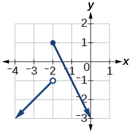 

## [Rates of Change and Behavior of Graphs](/m51263){: .target-chapter}   {#eip-id1165133183577}

For the following exercises, find the average rate of change of the functions from<math xmlns="http://www.w3.org/1998/Math/MathML"> <mrow> <mtext> </mtext><mi>x</mi><mo>=</mo><mn>1</mn><mtext> to </mtext><mi>x</mi><mo>=</mo><mn>2.</mn></mrow> </math>

<math xmlns="http://www.w3.org/1998/Math/MathML"> <mrow> <mi>f</mi><mo stretchy="false">(</mo><mi>x</mi><mo stretchy="false">)</mo><mo>=</mo><mn>4</mn><mi>x</mi><mo>−</mo><mn>3</mn></mrow> </math>

<math xmlns="http://www.w3.org/1998/Math/MathML"> <mrow> <mi>f</mi><mo stretchy="false">(</mo><mi>x</mi><mo stretchy="false">)</mo><mo>=</mo><mn>10</mn><msup> <mi>x</mi> <mn>2</mn> </msup> <mo>+</mo><mi>x</mi></mrow> </math>

<math xmlns="http://www.w3.org/1998/Math/MathML"> <mrow> <mn>31</mn></mrow> </math>

<math xmlns="http://www.w3.org/1998/Math/MathML"> <mrow> <mi>f</mi><mo stretchy="false">(</mo><mi>x</mi><mo stretchy="false">)</mo><mo>=</mo><mo>−</mo><mfrac> <mn>2</mn> <mrow> <msup> <mi>x</mi> <mn>2</mn> </msup> </mrow> </mfrac> </mrow> </math>

For the following exercises, use the graphs to determine the intervals on which the functions are increasing, decreasing, or constant.

 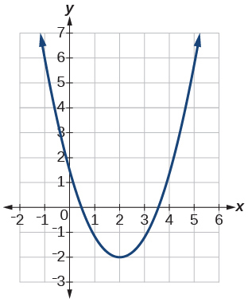 

increasing<math xmlns="http://www.w3.org/1998/Math/MathML"> <mrow> <mtext> </mtext><mrow><mo>(</mo> <mrow> <mn>2</mn><mo>,</mo><mi>∞</mi></mrow> <mo>)</mo></mrow><mo>;</mo><mtext> </mtext></mrow> </math>

 decreasing<math xmlns="http://www.w3.org/1998/Math/MathML"> <mrow> <mtext> </mtext><mo stretchy="false">(</mo><mo>−</mo><mi>∞</mi><mo>,</mo><mn>2</mn><mo stretchy="false">)</mo></mrow> </math>

 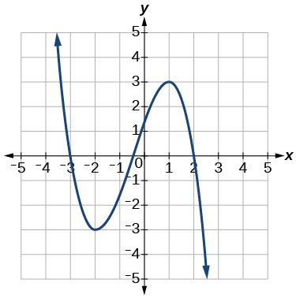 

 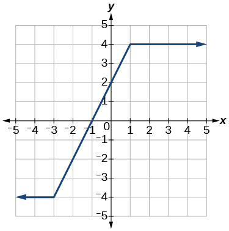 

increasing<math xmlns="http://www.w3.org/1998/Math/MathML"> <mrow> <mrow><mtext> </mtext><mo>(</mo> <mrow> <mo>−</mo><mn>3</mn><mo>,</mo><mn>1</mn></mrow> <mo>)</mo></mrow><mo>;</mo><mtext> </mtext></mrow> </math>

constant<math xmlns="http://www.w3.org/1998/Math/MathML"> <mrow> <mtext> </mtext><mo stretchy="false">(</mo><mo>−</mo><mi>∞</mi><mo>,</mo><mo>−</mo><mn>3</mn><mo stretchy="false">)</mo><mo>∪</mo><mrow><mo>(</mo> <mrow> <mn>1</mn><mo>,</mo><mi>∞</mi></mrow> <mo>)</mo></mrow></mrow> </math>

Find the local minimum of the function graphed in [[link]](#fs-id1165137527205).

Find the local extrema for the function graphed in [[link]](#fs-id1165137575929).

local minimum<math xmlns="http://www.w3.org/1998/Math/MathML"> <mrow> <mtext> </mtext><mrow><mo>(</mo> <mrow> <mo>−</mo><mn>2</mn><mo>,</mo><mo>−</mo><mn>3</mn></mrow> <mo>)</mo></mrow><mo>;</mo><mtext> </mtext></mrow> </math>

local maximum<math xmlns="http://www.w3.org/1998/Math/MathML"> <mrow> <mtext> </mtext><mrow><mo>(</mo> <mrow> <mn>1</mn><mo>,</mo><mn>3</mn></mrow> <mo>)</mo></mrow></mrow> </math>

For the graph in [[link]](#Figure_01_07_219), the domain of the function is<math xmlns="http://www.w3.org/1998/Math/MathML"> <mrow> <mtext> </mtext><mrow><mo>[</mo> <mrow> <mo>−</mo><mn>3</mn><mo>,</mo><mn>3</mn></mrow> <mo>]</mo></mrow><mo>.</mo></mrow> </math>

The range is<math xmlns="http://www.w3.org/1998/Math/MathML"> <mrow> <mtext> </mtext><mrow><mo>[</mo> <mrow> <mo>−</mo><mn>10</mn><mo>,</mo><mn>10</mn></mrow> <mo>]</mo></mrow><mo>.</mo><mtext> </mtext></mrow> </math>

Find the absolute minimum of the function on this interval.

Find the absolute maximum of the function graphed in [[link]](#Figure_01_07_219).

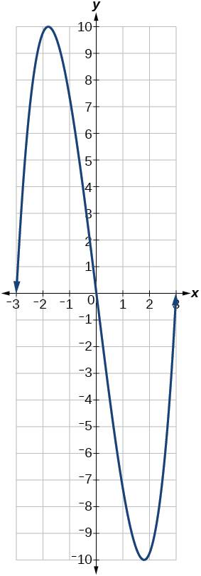{: #Figure_01_07_219}

<math xmlns="http://www.w3.org/1998/Math/MathML"> <mrow> <mtext> </mtext><mrow><mo>(</mo> <mrow> <mo>−</mo><mn>1.8</mn><mo>,</mo><mn>10</mn></mrow> <mo>)</mo></mrow><mtext> </mtext></mrow> </math>

## [Composition of Functions](/m51265){: .target-chapter}   {#eip-id1165131815810}

For the following exercises, find<math xmlns="http://www.w3.org/1998/Math/MathML"> <mrow> <mtext> </mtext><mo stretchy="false">(</mo><mi>f</mi><mo>∘</mo><mi>g</mi><mo stretchy="false">)</mo><mo stretchy="false">(</mo><mi>x</mi><mo stretchy="false">)</mo><mtext> </mtext></mrow> </math>

and<math xmlns="http://www.w3.org/1998/Math/MathML"> <mrow> <mtext> </mtext><mo stretchy="false">(</mo><mi>g</mi><mo>∘</mo><mi>f</mi><mo stretchy="false">)</mo><mo stretchy="false">(</mo><mi>x</mi><mo stretchy="false">)</mo><mtext> </mtext> </mrow> </math>

for each pair of functions.

<math xmlns="http://www.w3.org/1998/Math/MathML"> <mrow> <mi>f</mi><mo stretchy="false">(</mo><mi>x</mi><mo stretchy="false">)</mo><mo>=</mo><mn>4</mn><mo>−</mo><mi>x</mi><mo>,</mo><mtext> </mtext><mi>g</mi><mo stretchy="false">(</mo><mi>x</mi><mo stretchy="false">)</mo><mo>=</mo><mo>−</mo><mn>4</mn><mi>x</mi></mrow> </math>

<math xmlns="http://www.w3.org/1998/Math/MathML"> <mrow> <mi>f</mi><mo stretchy="false">(</mo><mi>x</mi><mo stretchy="false">)</mo><mo>=</mo><mn>3</mn><mi>x</mi><mo>+</mo><mn>2</mn><mo>,</mo><mtext> </mtext><mi>g</mi><mo stretchy="false">(</mo><mi>x</mi><mo stretchy="false">)</mo><mo>=</mo><mn>5</mn><mo>−</mo><mn>6</mn><mi>x</mi></mrow> </math>

<math xmlns="http://www.w3.org/1998/Math/MathML"> <mrow> <mrow><mo>(</mo> <mrow> <mi>f</mi><mo>∘</mo><mi>g</mi></mrow> <mo>)</mo></mrow><mo stretchy="false">(</mo><mi>x</mi><mo stretchy="false">)</mo><mo>=</mo><mn>17</mn><mo>−</mo><mn>18</mn><mi>x</mi><mo>;</mo><mtext> </mtext><mrow><mo>(</mo> <mrow> <mi>g</mi><mo>∘</mo><mi>f</mi></mrow> <mo>)</mo></mrow><mo stretchy="false">(</mo><mi>x</mi><mo stretchy="false">)</mo><mo>=</mo><mo>−</mo><mn>7</mn><mo>−</mo><mn>18</mn><mi>x</mi></mrow> </math>

<math xmlns="http://www.w3.org/1998/Math/MathML"> <mrow> <mi>f</mi><mo stretchy="false">(</mo><mi>x</mi><mo stretchy="false">)</mo><mo>=</mo><msup> <mi>x</mi> <mn>2</mn> </msup> <mo>+</mo><mn>2</mn><mi>x</mi><mo>,</mo><mtext> </mtext><mi>g</mi><mo stretchy="false">(</mo><mi>x</mi><mo stretchy="false">)</mo><mo>=</mo><mn>5</mn><mi>x</mi><mo>+</mo><mn>1</mn></mrow> </math>

<math xmlns="http://www.w3.org/1998/Math/MathML"> <mrow> <mi>f</mi><mo stretchy="false">(</mo><mi>x</mi><mo stretchy="false">)</mo><mo>=</mo><msqrt> <mrow> <mi>x</mi><mo>+</mo><mn>2</mn></mrow> </msqrt> <mo>,</mo><mtext> </mtext><mi>g</mi><mo stretchy="false">(</mo><mi>x</mi><mo stretchy="false">)</mo><mo>=</mo><mfrac> <mn>1</mn> <mi>x</mi> </mfrac> </mrow> </math>

<math xmlns="http://www.w3.org/1998/Math/MathML"> <mrow> <mrow><mo>(</mo> <mrow> <mi>f</mi><mo>∘</mo><mi>g</mi></mrow> <mo>)</mo></mrow><mo stretchy="false">(</mo><mi>x</mi><mo stretchy="false">)</mo><mo>=</mo><msqrt> <mrow> <mfrac> <mn>1</mn> <mi>x</mi> </mfrac> <mo>+</mo><mn>2</mn></mrow> </msqrt> <mo>;</mo><mtext> </mtext><mrow><mo>(</mo> <mrow> <mi>g</mi><mo>∘</mo><mi>f</mi></mrow> <mo>)</mo></mrow><mo stretchy="false">(</mo><mi>x</mi><mo stretchy="false">)</mo><mo>=</mo><mfrac> <mn>1</mn> <mrow> <msqrt> <mrow> <mi>x</mi><mo>+</mo><mn>2</mn></mrow> </msqrt> </mrow> </mfrac> </mrow> </math>

<math xmlns="http://www.w3.org/1998/Math/MathML"> <mrow> <mtext> </mtext><mi>f</mi><mo stretchy="false">(</mo><mi>x</mi><mo stretchy="false">)</mo><mo>=</mo><mfrac> <mrow> <mi>x</mi><mo>+</mo><mn>3</mn></mrow> <mn>2</mn> </mfrac> <mo>,</mo><mtext> </mtext><mi>g</mi><mo stretchy="false">(</mo><mi>x</mi><mo stretchy="false">)</mo><mo>=</mo><msqrt> <mrow> <mn>1</mn><mo>−</mo><mi>x</mi></mrow> </msqrt> <mtext> </mtext></mrow> </math>

For the following exercises, find<math xmlns="http://www.w3.org/1998/Math/MathML"> <mrow> <mtext> </mtext><mrow><mo>(</mo> <mrow> <mi>f</mi><mo>∘</mo><mi>g</mi></mrow> <mo>)</mo></mrow><mtext> </mtext></mrow> </math>

and the domain for<math xmlns="http://www.w3.org/1998/Math/MathML"> <mrow> <mtext> </mtext><mrow><mo>(</mo> <mrow> <mi>f</mi><mo>∘</mo><mi>g</mi></mrow> <mo>)</mo></mrow><mo stretchy="false">(</mo><mi>x</mi><mo stretchy="false">)</mo><mtext> </mtext></mrow> </math>

for each pair of functions.

<math xmlns="http://www.w3.org/1998/Math/MathML"> <mrow> <mi>f</mi><mo stretchy="false">(</mo><mi>x</mi><mo stretchy="false">)</mo><mo>=</mo><mfrac> <mrow> <mi>x</mi><mo>+</mo><mn>1</mn></mrow> <mrow> <mi>x</mi><mo>+</mo><mn>4</mn></mrow> </mfrac> <mo>,</mo><mtext> </mtext><mi>g</mi><mo stretchy="false">(</mo><mi>x</mi><mo stretchy="false">)</mo><mo>=</mo><mfrac> <mn>1</mn> <mi>x</mi> </mfrac> </mrow> </math>

<math xmlns="http://www.w3.org/1998/Math/MathML"> <mrow> <mo stretchy="false">(</mo><mi>f</mi><mo>∘</mo><mi>g</mi><mo stretchy="false">)</mo><mo stretchy="false">(</mo><mi>x</mi><mo stretchy="false">)</mo><mo>=</mo><mfrac> <mrow> <mn>1</mn><mo>+</mo><mi>x</mi> </mrow> <mrow> <mn>1</mn><mo>+</mo><mn>4</mn><mi>x</mi> </mrow> </mfrac> <mo>,</mo><mo> </mo><mi>x</mi><mo>≠</mo><mn>0</mn><mo>,</mo><mo> </mo><mi>x</mi><mo>≠</mo><mo>−</mo><mfrac> <mn>1</mn> <mn>4</mn> </mfrac> </mrow> </math>

<math xmlns="http://www.w3.org/1998/Math/MathML"> <mrow> <mi>f</mi><mo stretchy="false">(</mo><mi>x</mi><mo stretchy="false">)</mo><mo>=</mo><mfrac> <mn>1</mn> <mrow> <mi>x</mi><mo>+</mo><mn>3</mn></mrow> </mfrac> <mo>,</mo><mtext> </mtext><mi>g</mi><mo stretchy="false">(</mo><mi>x</mi><mo stretchy="false">)</mo><mo>=</mo><mfrac> <mn>1</mn> <mrow> <mi>x</mi><mo>−</mo><mn>9</mn></mrow> </mfrac> </mrow> </math>

<math xmlns="http://www.w3.org/1998/Math/MathML"> <mrow> <mi>f</mi><mo stretchy="false">(</mo><mi>x</mi><mo stretchy="false">)</mo><mo>=</mo><mfrac> <mn>1</mn> <mi>x</mi> </mfrac> <mo>,</mo><mtext> </mtext><mi>g</mi><mo stretchy="false">(</mo><mi>x</mi><mo stretchy="false">)</mo><mo>=</mo><msqrt> <mi>x</mi> </msqrt> </mrow> </math>

<math xmlns="http://www.w3.org/1998/Math/MathML"> <mrow> <mrow><mo>(</mo> <mrow> <mi>f</mi><mo>∘</mo><mi>g</mi></mrow> <mo>)</mo></mrow><mo stretchy="false">(</mo><mi>x</mi><mo stretchy="false">)</mo><mo>=</mo><mfrac> <mn>1</mn> <mrow> <msqrt> <mi>x</mi> </msqrt> </mrow> </mfrac> <mo>,</mo><mtext> </mtext><mi>x</mi><mo>&gt;</mo><mn>0</mn></mrow> </math>

<math xmlns="http://www.w3.org/1998/Math/MathML"> <mrow> <mi>f</mi><mo stretchy="false">(</mo><mi>x</mi><mo stretchy="false">)</mo><mo>=</mo><mfrac> <mn>1</mn> <mrow> <msup> <mi>x</mi> <mn>2</mn> </msup> <mo>−</mo><mn>1</mn></mrow> </mfrac> <mo>,</mo><mtext> </mtext><mi>g</mi><mo stretchy="false">(</mo><mi>x</mi><mo stretchy="false">)</mo><mo>=</mo><msqrt> <mrow> <mi>x</mi><mo>+</mo><mn>1</mn></mrow> </msqrt> </mrow> </math>

For the following exercises, express each function<math xmlns="http://www.w3.org/1998/Math/MathML"> <mrow> <mtext> </mtext><mi>H</mi><mtext> </mtext></mrow> </math>

as a composition of two functions<math xmlns="http://www.w3.org/1998/Math/MathML"> <mrow> <mtext> </mtext><mi>f</mi><mtext> </mtext></mrow> </math>

and<math xmlns="http://www.w3.org/1998/Math/MathML"> <mrow> <mtext> </mtext><mi>g</mi><mtext> </mtext></mrow> </math>

where<math xmlns="http://www.w3.org/1998/Math/MathML"> <mrow> <mtext> </mtext><mi>H</mi><mo stretchy="false">(</mo><mi>x</mi><mo stretchy="false">)</mo><mo>=</mo><mo stretchy="false">(</mo><mi>f</mi><mo>∘</mo><mi>g</mi><mo stretchy="false">)</mo><mo stretchy="false">(</mo><mi>x</mi><mo stretchy="false">)</mo><mo>.</mo></mrow> </math>

<math xmlns="http://www.w3.org/1998/Math/MathML"> <mrow> <mi>H</mi><mo stretchy="false">(</mo><mi>x</mi><mo stretchy="false">)</mo><mo>=</mo><msqrt> <mrow> <mfrac> <mrow> <mn>2</mn><mi>x</mi><mo>−</mo><mn>1</mn></mrow> <mrow> <mn>3</mn><mi>x</mi><mo>+</mo><mn>4</mn></mrow> </mfrac> </mrow> </msqrt> </mrow> </math>

sample:<math xmlns="http://www.w3.org/1998/Math/MathML"> <mrow> <mtext> </mtext><mi>g</mi><mo stretchy="false">(</mo><mi>x</mi><mo stretchy="false">)</mo><mo>=</mo><mfrac> <mrow> <mn>2</mn><mi>x</mi><mo>−</mo><mn>1</mn></mrow> <mrow> <mn>3</mn><mi>x</mi><mo>+</mo><mn>4</mn></mrow> </mfrac> <mo>;</mo><mtext> </mtext><mi>f</mi><mo stretchy="false">(</mo><mi>x</mi><mo stretchy="false">)</mo><mo>=</mo><msqrt> <mi>x</mi> </msqrt> </mrow> </math>

<math xmlns="http://www.w3.org/1998/Math/MathML"> <mrow> <mi>H</mi><mo stretchy="false">(</mo><mi>x</mi><mo stretchy="false">)</mo><mo>=</mo><mfrac> <mn>1</mn> <mrow> <msup> <mrow> <mo stretchy="false">(</mo><mn>3</mn><msup> <mi>x</mi> <mn>2</mn> </msup> <mo>−</mo><mn>4</mn><mo stretchy="false">)</mo></mrow> <mrow> <mo>−</mo><mn>3</mn></mrow> </msup> </mrow> </mfrac> </mrow> </math>

## [Transformation of Functions](/m51266){: .target-chapter}   {#eip-id1165134070725}

For the following exercises, sketch a graph of the given function.

<math xmlns="http://www.w3.org/1998/Math/MathML"> <mrow> <mi>f</mi><mo stretchy="false">(</mo><mi>x</mi><mo stretchy="false">)</mo><mo>=</mo><msup> <mrow> <mo stretchy="false">(</mo><mi>x</mi><mo>−</mo><mn>3</mn><mo stretchy="false">)</mo></mrow> <mn>2</mn> </msup> </mrow> </math>

 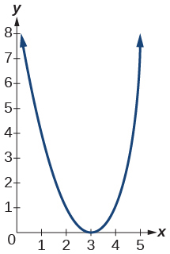 

<math xmlns="http://www.w3.org/1998/Math/MathML"> <mrow> <mi>f</mi><mo stretchy="false">(</mo><mi>x</mi><mo stretchy="false">)</mo><mo>=</mo><msup> <mrow> <mo stretchy="false">(</mo><mi>x</mi><mo>+</mo><mn>4</mn><mo stretchy="false">)</mo></mrow> <mn>3</mn> </msup> </mrow> </math>

<math xmlns="http://www.w3.org/1998/Math/MathML"> <mrow> <mi>f</mi><mo stretchy="false">(</mo><mi>x</mi><mo stretchy="false">)</mo><mo>=</mo><msqrt> <mi>x</mi> </msqrt> <mo>+</mo><mn>5</mn></mrow> </math>

 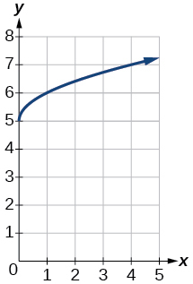 

<math xmlns="http://www.w3.org/1998/Math/MathML"> <mrow> <mi>f</mi><mo stretchy="false">(</mo><mi>x</mi><mo stretchy="false">)</mo><mo>=</mo><mo>−</mo><msup> <mi>x</mi> <mn>3</mn> </msup> </mrow> </math>

<math xmlns="http://www.w3.org/1998/Math/MathML"> <mrow> <mi>f</mi><mo stretchy="false">(</mo><mi>x</mi><mo stretchy="false">)</mo><mo>=</mo><mroot> <mrow> <mo>−</mo><mi>x</mi></mrow> <mn>3</mn> </mroot> </mrow> </math>

 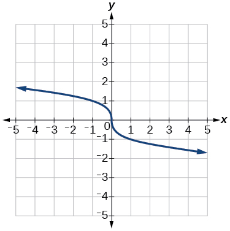 

<math xmlns="http://www.w3.org/1998/Math/MathML"> <mrow> <mi>f</mi><mo stretchy="false">(</mo><mi>x</mi><mo stretchy="false">)</mo><mo>=</mo><mn>5</mn><msqrt> <mrow> <mo>−</mo><mi>x</mi></mrow> </msqrt> <mo>−</mo><mn>4</mn></mrow> </math>

<math xmlns="http://www.w3.org/1998/Math/MathML"> <mrow> <mi>f</mi><mo stretchy="false">(</mo><mi>x</mi><mo stretchy="false">)</mo><mo>=</mo><mn>4</mn><mrow><mo>[</mo> <mrow> <mrow><mo>\|</mo> <mrow> <mi>x</mi><mo>−</mo><mn>2</mn></mrow> <mo>\|</mo></mrow><mo>−</mo><mn>6</mn></mrow> <mo>]</mo></mrow></mrow> </math>

 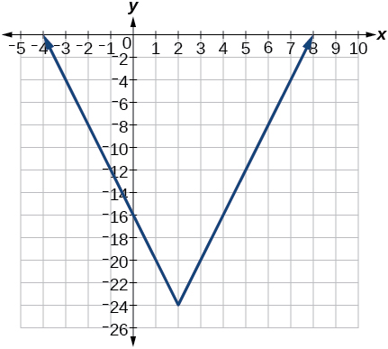 

<math xmlns="http://www.w3.org/1998/Math/MathML"> <mrow> <mi>f</mi><mo stretchy="false">(</mo><mi>x</mi><mo stretchy="false">)</mo><mo>=</mo><mo>−</mo><msup> <mrow> <mo stretchy="false">(</mo><mi>x</mi><mo>+</mo><mn>2</mn><mo stretchy="false">)</mo></mrow> <mn>2</mn> </msup> <mo>−</mo><mn>1</mn></mrow> </math>

For the following exercises, sketch the graph of the function<math xmlns="http://www.w3.org/1998/Math/MathML"> <mrow> <mtext> </mtext><mi>g</mi><mtext> </mtext></mrow> </math>

if the graph of the function<math xmlns="http://www.w3.org/1998/Math/MathML"> <mrow> <mtext> </mtext><mi>f</mi><mtext> </mtext></mrow> </math>

is shown in [\[link\]](#Figure_01_07_247).

 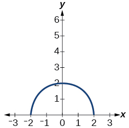{: #Figure_01_07_247}

<math xmlns="http://www.w3.org/1998/Math/MathML"> <mrow> <mi>g</mi><mo stretchy="false">(</mo><mi>x</mi><mo stretchy="false">)</mo><mo>=</mo><mi>f</mi><mo stretchy="false">(</mo><mi>x</mi><mo>−</mo><mn>1</mn><mo stretchy="false">)</mo></mrow> </math>

  

<math xmlns="http://www.w3.org/1998/Math/MathML"> <mrow> <mi>g</mi><mo stretchy="false">(</mo><mi>x</mi><mo stretchy="false">)</mo><mo>=</mo><mn>3</mn><mi>f</mi><mo stretchy="false">(</mo><mi>x</mi><mo stretchy="false">)</mo></mrow> </math>

For the following exercises, write the equation for the standard function represented by each of the graphs below.

 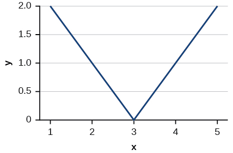 

<math xmlns="http://www.w3.org/1998/Math/MathML"> <mrow> <mi>f</mi><mo stretchy="false">(</mo><mi>x</mi><mo stretchy="false">)</mo><mo>=</mo><mrow><mo>\|</mo> <mrow> <mi>x</mi><mo>−</mo><mn>3</mn></mrow> <mo>\|</mo></mrow></mrow> </math>

 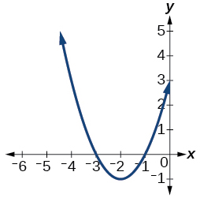 

For the following exercises, determine whether each function below is even, odd, or neither.

<math xmlns="http://www.w3.org/1998/Math/MathML"> <mrow> <mi>f</mi><mo stretchy="false">(</mo><mi>x</mi><mo stretchy="false">)</mo><mo>=</mo><mn>3</mn><msup> <mi>x</mi> <mn>4</mn> </msup> </mrow> </math>

even

<math xmlns="http://www.w3.org/1998/Math/MathML"> <mrow> <mi>g</mi><mo stretchy="false">(</mo><mi>x</mi><mo stretchy="false">)</mo><mo>=</mo><msqrt> <mi>x</mi> </msqrt> </mrow> </math>

<math xmlns="http://www.w3.org/1998/Math/MathML"> <mrow> <mi>h</mi><mo stretchy="false">(</mo><mi>x</mi><mo stretchy="false">)</mo><mo>=</mo><mfrac> <mn>1</mn> <mi>x</mi> </mfrac> <mo>+</mo><mn>3</mn><mi>x</mi></mrow> </math>

odd

For the following exercises, analyze the graph and determine whether the graphed function is even, odd, or neither.

 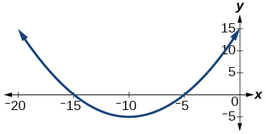 

 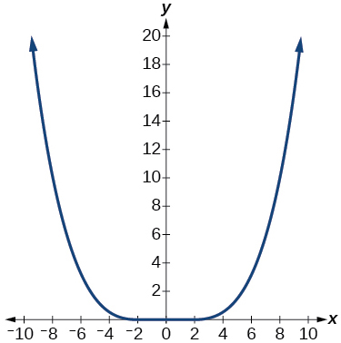 

even

 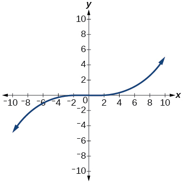 

## [Absolute Value Functions](/m51267){: .target-chapter}   {#eip-id1165135691363}

For the following exercises, write an equation for the transformation of<math xmlns="http://www.w3.org/1998/Math/MathML"> <mrow> <mtext> </mtext><mi>f</mi><mo stretchy="false">(</mo><mi>x</mi><mo stretchy="false">)</mo><mo>=</mo><mrow><mo>\|</mo> <mi>x</mi> <mo>\|</mo></mrow><mo>.</mo></mrow> </math>

 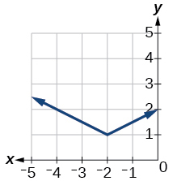 

<math xmlns="http://www.w3.org/1998/Math/MathML"> <mrow> <mi>f</mi><mo stretchy="false">(</mo><mi>x</mi><mo stretchy="false">)</mo><mo>=</mo><mfrac> <mn>1</mn> <mn>2</mn> </mfrac> <mrow><mo>\|</mo> <mrow> <mi>x</mi><mo>+</mo><mn>2</mn></mrow> <mo>\|</mo></mrow><mo>+</mo><mn>1</mn></mrow> </math>

 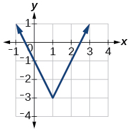 

 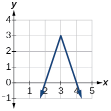 

<math xmlns="http://www.w3.org/1998/Math/MathML"> <mrow> <mi>f</mi><mo stretchy="false">(</mo><mi>x</mi><mo stretchy="false">)</mo><mo>=</mo><mo>−</mo><mn>3</mn><mrow><mo>\|</mo> <mrow> <mi>x</mi><mo>−</mo><mn>3</mn></mrow> <mo>\|</mo></mrow><mo>+</mo><mn>3</mn></mrow> </math>

For the following exercises, graph the absolute value function.

<math xmlns="http://www.w3.org/1998/Math/MathML"> <mrow> <mi>f</mi><mo stretchy="false">(</mo><mi>x</mi><mo stretchy="false">)</mo><mo>=</mo><mrow><mo>\|</mo> <mrow> <mi>x</mi><mo>−</mo><mn>5</mn></mrow> <mo>\|</mo></mrow></mrow> </math>

<math xmlns="http://www.w3.org/1998/Math/MathML"> <mrow> <mi>f</mi><mo stretchy="false">(</mo><mi>x</mi><mo stretchy="false">)</mo><mo>=</mo><mo>−</mo><mrow><mo>\|</mo> <mrow> <mi>x</mi><mo>−</mo><mn>3</mn></mrow> <mo>\|</mo></mrow></mrow> </math>

 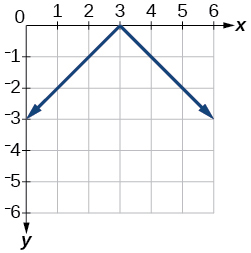 

<math xmlns="http://www.w3.org/1998/Math/MathML"> <mrow> <mi>f</mi><mo stretchy="false">(</mo><mi>x</mi><mo stretchy="false">)</mo><mo>=</mo><mrow><mo>\|</mo> <mrow> <mn>2</mn><mi>x</mi><mo>−</mo><mn>4</mn></mrow> <mo>\|</mo></mrow></mrow> </math>

## [Inverse Functions](/m51268){: .target-chapter}   {#eip-159}

For the following exercises, find<math xmlns="http://www.w3.org/1998/Math/MathML"> <mrow> <mtext> </mtext><msup> <mi>f</mi> <mrow> <mo>−</mo><mn>1</mn> </mrow> </msup> <mo stretchy="false">(</mo><mi>x</mi><mo stretchy="false">)</mo><mtext> </mtext> </mrow> </math>

for each function.

<math xmlns="http://www.w3.org/1998/Math/MathML"> <mrow> <mi>f</mi><mo stretchy="false">(</mo><mi>x</mi><mo stretchy="false">)</mo><mo>=</mo><mn>9</mn><mo>+</mo><mn>10</mn><mi>x</mi></mrow> </math>

<math xmlns="http://www.w3.org/1998/Math/MathML"> <mrow> <mi>f</mi><mo stretchy="false">(</mo><mi>x</mi><mo stretchy="false">)</mo><mo>=</mo><mfrac> <mi>x</mi> <mrow> <mi>x</mi><mo>+</mo><mn>2</mn> </mrow> </mfrac> </mrow> </math>

<math xmlns="http://www.w3.org/1998/Math/MathML"> <mrow> <msup> <mi>f</mi> <mrow> <mo>−</mo><mn>1</mn> </mrow> </msup> <mo stretchy="false">(</mo><mi>x</mi><mo stretchy="false">)</mo><mo>=</mo><mfrac> <mrow> <mo>−</mo><mn>2</mn><mi>x</mi> </mrow> <mrow> <mi>x</mi><mo>−</mo><mn>1</mn> </mrow> </mfrac> </mrow> </math>

For the following exercise, find a domain on which the function<math xmlns="http://www.w3.org/1998/Math/MathML"> <mrow> <mtext> </mtext><mi>f</mi><mtext> </mtext> </mrow> </math>

is one-to-one and non-decreasing. Write the domain in interval notation. Then find the inverse of<math xmlns="http://www.w3.org/1998/Math/MathML"> <mrow> <mtext> </mtext><mi>f</mi><mtext> </mtext> </mrow> </math>

restricted to that domain.

<math xmlns="http://www.w3.org/1998/Math/MathML"> <mrow> <mi>f</mi><mo stretchy="false">(</mo><mi>x</mi><mo stretchy="false">)</mo><mo>=</mo><msup> <mi>x</mi> <mn>2</mn> </msup> <mo>+</mo><mn>1</mn> </mrow> </math>

Given <math xmlns="http://www.w3.org/1998/Math/MathML"> <mrow> <mi>f</mi><mrow><mo>(</mo> <mi>x</mi> <mo>)</mo></mrow><mo>=</mo><msup> <mi>x</mi> <mn>3</mn> </msup> <mo>−</mo><mn>5</mn> </mrow> </math>

 and <math xmlns="http://www.w3.org/1998/Math/MathML"> <mrow> <mi>g</mi><mo stretchy="false">(</mo><mi>x</mi><mo stretchy="false">)</mo><mo>=</mo><mroot> <mrow> <mi>x</mi><mo>+</mo><mn>5</mn> </mrow> <mn>3</mn> </mroot> <mo>:</mo> </mrow> </math>

1.  Find
    <math xmlns="http://www.w3.org/1998/Math/MathML"> <mrow> <mo> </mo><mi>f</mi><mo stretchy="false">(</mo><mi>g</mi><mo stretchy="false">(</mo><mi>x</mi><mo stretchy="false">)</mo><mo stretchy="false">)</mo> </mrow> </math>
    
    and
    <math xmlns="http://www.w3.org/1998/Math/MathML"> <mrow> <mi>g</mi><mo stretchy="false">(</mo><mi>f</mi><mo stretchy="false">(</mo><mi>x</mi><mo stretchy="false">)</mo><mo stretchy="false">)</mo><mo>.</mo> </mrow> </math>

2.  What does the answer tell us about the relationship between
    <math xmlns="http://www.w3.org/1998/Math/MathML"> <mrow> <mi>f</mi><mo stretchy="false">(</mo><mi>x</mi><mo stretchy="false">)</mo> </mrow> </math>
    
    and
    <math xmlns="http://www.w3.org/1998/Math/MathML"> <mrow> <mi>g</mi><mo stretchy="false">(</mo><mi>x</mi><mo stretchy="false">)</mo><mo>?</mo> </mrow> </math>
{: data-number-style="lower-alpha"}

1.  <math xmlns="http://www.w3.org/1998/Math/MathML"> <mrow> <mo> </mo><mi>f</mi><mo stretchy="false">(</mo><mi>g</mi><mo stretchy="false">(</mo><mi>x</mi><mo stretchy="false">)</mo><mo stretchy="false">)</mo><mo>=</mo><mi>x</mi> </mrow> </math>
    
    and
    <math xmlns="http://www.w3.org/1998/Math/MathML"> <mrow> <mi>g</mi><mo stretchy="false">(</mo><mi>f</mi><mo stretchy="false">(</mo><mi>x</mi><mo stretchy="false">)</mo><mo stretchy="false">)</mo><mo>=</mo><mi>x</mi><mo>.</mo> </mrow> </math>

2.  This tells us that
    <math xmlns="http://www.w3.org/1998/Math/MathML"> <mi>f</mi> </math>
    
    and
    <math xmlns="http://www.w3.org/1998/Math/MathML"> <mi>g</mi> </math>
    
    are inverse functions
{: data-number-style="lower-alpha"}

For the following exercises, use a graphing utility to determine whether each function is one-to-one.

<math xmlns="http://www.w3.org/1998/Math/MathML"> <mrow> <mi>f</mi><mo stretchy="false">(</mo><mi>x</mi><mo stretchy="false">)</mo><mo>=</mo><mfrac> <mn>1</mn> <mi>x</mi> </mfrac> </mrow> </math>

The function is one-to-one.* * *
{: data-type="newline"}

 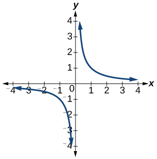 

<math xmlns="http://www.w3.org/1998/Math/MathML"> <mrow> <mi>f</mi><mo stretchy="false">(</mo><mi>x</mi><mo stretchy="false">)</mo><mo>=</mo><mo>−</mo><mn>3</mn><msup> <mi>x</mi> <mn>2</mn> </msup> <mo>+</mo><mi>x</mi> </mrow> </math>

The function is not one-to-one.* * *
{: data-type="newline"}

 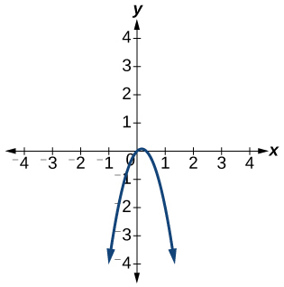 

If <math xmlns="http://www.w3.org/1998/Math/MathML"><mrow> <mi>f</mi><mrow><mo>(</mo> <mn>5</mn> <mo>)</mo></mrow><mo>=</mo><mn>2</mn><mo>,</mo> </mrow> </math>

 find <math xmlns="http://www.w3.org/1998/Math/MathML"> <mrow> <msup> <mi>f</mi> <mrow> <mo>−</mo><mn>1</mn> </mrow> </msup> <mo stretchy="false">(</mo><mn>2</mn><mo stretchy="false">)</mo><mo>.</mo> </mrow> </math>

<math xmlns="http://www.w3.org/1998/Math/MathML"> <mn>5</mn> </math>

If <math xmlns="http://www.w3.org/1998/Math/MathML"> <mrow> <mi>f</mi><mrow><mo>(</mo> <mn>1</mn> <mo>)</mo></mrow><mo>=</mo><mn>4</mn><mo>,</mo> </mrow> </math>

 find <math xmlns="http://www.w3.org/1998/Math/MathML"> <mrow> <msup> <mi>f</mi> <mrow> <mo>−</mo><mn>1</mn> </mrow> </msup> <mo stretchy="false">(</mo><mn>4</mn><mo stretchy="false">)</mo><mo>.</mo> </mrow> </math>

# Practice Test

For the following exercises, determine whether each of the following relations is a function.

<math xmlns="http://www.w3.org/1998/Math/MathML"> <mrow> <mi>y</mi><mo>=</mo><mn>2</mn><mi>x</mi><mo>+</mo><mn>8</mn></mrow> </math>

The relation is a function.

<math xmlns="http://www.w3.org/1998/Math/MathML"> <mrow> <mrow><mo>{</mo> <mrow> <mo stretchy="false">(</mo><mn>2</mn><mo>,</mo><mn>1</mn><mo stretchy="false">)</mo><mo>,</mo><mo stretchy="false">(</mo><mn>3</mn><mo>,</mo><mn>2</mn><mo stretchy="false">)</mo><mo>,</mo><mo stretchy="false">(</mo><mo>−</mo><mn>1</mn><mo>,</mo><mn>1</mn><mo stretchy="false">)</mo><mo>,</mo><mo stretchy="false">(</mo><mn>0</mn><mo>,</mo><mo>−</mo><mn>2</mn><mo stretchy="false">)</mo></mrow> <mo>}</mo></mrow></mrow> </math>

For the following exercises, evaluate the function<math xmlns="http://www.w3.org/1998/Math/MathML"> <mrow> <mtext> </mtext><mi>f</mi><mo stretchy="false">(</mo><mi>x</mi><mo stretchy="false">)</mo><mo>=</mo><mo>−</mo><mn>3</mn><msup> <mi>x</mi> <mn>2</mn> </msup> <mo>+</mo><mn>2</mn><mi>x</mi><mtext> </mtext></mrow> </math>

 at the given input.

<math xmlns="http://www.w3.org/1998/Math/MathML"> <mrow> <mi>f</mi><mo stretchy="false">(</mo><mn>−2</mn><mo stretchy="false">)</mo> </mrow> </math>

−16

<math xmlns="http://www.w3.org/1998/Math/MathML"> <mrow> <mtext> </mtext><mi>f</mi><mo stretchy="false">(</mo><mi>a</mi><mo stretchy="false">)</mo><mtext> </mtext></mrow> </math>

Show that the function<math xmlns="http://www.w3.org/1998/Math/MathML"> <mrow> <mtext> </mtext><mi>f</mi><mo stretchy="false">(</mo><mi>x</mi><mo stretchy="false">)</mo><mo>=</mo><mo>−</mo><mn>2</mn><msup> <mrow> <mo stretchy="false">(</mo><mi>x</mi><mo>−</mo><mn>1</mn><mo stretchy="false">)</mo></mrow> <mn>2</mn> </msup> <mo>+</mo><mn>3</mn><mtext> </mtext></mrow> </math>

is not one-to-one.

The graph is a parabola and the graph fails the horizontal line test.

Write the domain of the function<math xmlns="http://www.w3.org/1998/Math/MathML"> <mrow> <mtext> </mtext><mi>f</mi><mo stretchy="false">(</mo><mi>x</mi><mo stretchy="false">)</mo><mo>=</mo><msqrt> <mrow> <mn>3</mn><mo>−</mo><mi>x</mi></mrow> </msqrt> <mtext> </mtext></mrow> </math>

in interval notation.

Given<math xmlns="http://www.w3.org/1998/Math/MathML"> <mrow> <mtext> </mtext><mi>f</mi><mo stretchy="false">(</mo><mi>x</mi><mo stretchy="false">)</mo><mo>=</mo><mn>2</mn><msup> <mi>x</mi> <mn>2</mn> </msup> <mo>−</mo><mn>5</mn><mi>x</mi><mo>,</mo><mtext> </mtext></mrow> </math>

find<math xmlns="http://www.w3.org/1998/Math/MathML"> <mrow> <mi>f</mi><mo stretchy="false">(</mo><mi>a</mi><mo>+</mo><mn>1</mn><mo stretchy="false">)</mo><mo>−</mo><mi>f</mi><mo stretchy="false">(</mo><mn>1</mn><mo stretchy="false">)</mo><mtext> </mtext> </mrow> </math>

in simplest form.

<math xmlns="http://www.w3.org/1998/Math/MathML"> <mrow> <mn>2</mn><msup> <mi>a</mi> <mn>2</mn> </msup> <mo>−</mo><mi>a</mi> </mrow> </math>

Graph the function<math xmlns="http://www.w3.org/1998/Math/MathML"> <mrow> <mi>f</mi><mo stretchy="false">(</mo><mi>x</mi><mo stretchy="false">)</mo><mo>=</mo><mo>{</mo><mtable> <mtr> <mtd> <mrow> <mi>x</mi><mo>+</mo><mn>1</mn><mtext>   if</mtext> </mrow> </mtd> <mtd> <mrow> <mo>−</mo><mn>2</mn><mo>&lt;</mo><mi>x</mi><mo>&lt;</mo><mn>3</mn> </mrow> </mtd> </mtr> <mtr> <mtd> <mrow> <mtext>   </mtext><mo>−</mo><mi>x</mi><mtext>    if  </mtext> </mrow> </mtd> <mtd> <mrow> <mi>x</mi><mo>≥</mo><mn>3</mn> </mrow> </mtd> </mtr> </mtable> </mrow> </math>

Find the average rate of change of the function<math xmlns="http://www.w3.org/1998/Math/MathML"> <mrow> <mtext> </mtext><mi>f</mi><mo stretchy="false">(</mo><mi>x</mi><mo stretchy="false">)</mo><mo>=</mo><mn>3</mn><mo>−</mo><mn>2</mn><msup> <mi>x</mi> <mn>2</mn> </msup> <mo>+</mo><mi>x</mi><mtext> </mtext></mrow> </math>

by finding<math xmlns="http://www.w3.org/1998/Math/MathML"> <mrow> <mtext> </mtext><mfrac> <mrow> <mi>f</mi><mo stretchy="false">(</mo><mi>b</mi><mo stretchy="false">)</mo><mo>−</mo><mi>f</mi><mo stretchy="false">(</mo><mi>a</mi><mo stretchy="false">)</mo></mrow> <mrow> <mi>b</mi><mo>−</mo><mi>a</mi></mrow> </mfrac><mtext> </mtext> </mrow> </math>

in simplest form.

<math xmlns="http://www.w3.org/1998/Math/MathML"> <mrow> <mo>−</mo><mn>2</mn><mo stretchy="false">(</mo><mi>a</mi><mo>+</mo><mi>b</mi><mo stretchy="false">)</mo><mo>+</mo><mn>1</mn> </mrow> </math>

For the following exercises, use the functions<math xmlns="http://www.w3.org/1998/Math/MathML"> <mrow> <mtext> </mtext><mi>f</mi><mo stretchy="false">(</mo><mi>x</mi><mo stretchy="false">)</mo><mo>=</mo><mn>3</mn><mo>−</mo><mn>2</mn><msup> <mi>x</mi> <mn>2</mn> </msup> <mo>+</mo><mi>x</mi><mtext> and </mtext><mi>g</mi><mo stretchy="false">(</mo><mi>x</mi><mo stretchy="false">)</mo><mo>=</mo><msqrt> <mi>x</mi> </msqrt> <mtext> </mtext></mrow> </math>

to find the composite functions.

<math xmlns="http://www.w3.org/1998/Math/MathML"> <mrow> <mrow><mo>(</mo> <mrow> <mi>g</mi><mo>∘</mo><mi>f</mi></mrow> <mo>)</mo></mrow><mo stretchy="false">(</mo><mi>x</mi><mo stretchy="false">)</mo></mrow> </math>

<math xmlns="http://www.w3.org/1998/Math/MathML"> <mrow> <mrow><mo>(</mo> <mrow> <mi>g</mi><mo>∘</mo><mi>f</mi></mrow> <mo>)</mo></mrow><mo stretchy="false">(</mo><mn>1</mn><mo stretchy="false">)</mo></mrow> </math>

<math xmlns="http://www.w3.org/1998/Math/MathML"> <mrow> <msqrt> <mn>2</mn> </msqrt> </mrow> </math>

Express<math xmlns="http://www.w3.org/1998/Math/MathML"> <mrow> <mtext> </mtext><mi>H</mi><mo stretchy="false">(</mo><mi>x</mi><mo stretchy="false">)</mo><mo>=</mo><mroot> <mrow> <mn>5</mn><msup> <mi>x</mi> <mn>2</mn> </msup> <mo>−</mo><mn>3</mn><mi>x</mi></mrow> <mn>3</mn> </mroot> <mtext> </mtext></mrow> </math>

as a composition of two functions,<math xmlns="http://www.w3.org/1998/Math/MathML"> <mrow> <mtext> </mtext><mi>f</mi><mtext> </mtext></mrow> </math>

and<math xmlns="http://www.w3.org/1998/Math/MathML"> <mrow> <mtext> </mtext><mi>g</mi><mo>,</mo><mtext> </mtext></mrow> </math>

where<math xmlns="http://www.w3.org/1998/Math/MathML"> <mrow> <mtext> </mtext><mrow><mo>(</mo> <mrow> <mi>f</mi><mo>∘</mo><mi>g</mi></mrow> <mo>)</mo></mrow><mo stretchy="false">(</mo><mi>x</mi><mo stretchy="false">)</mo><mo>=</mo><mi>H</mi><mo stretchy="false">(</mo><mi>x</mi><mo stretchy="false">)</mo><mo>.</mo></mrow> </math>

For the following exercises, graph the functions by translating, stretching, and/or compressing a toolkit function.

<math xmlns="http://www.w3.org/1998/Math/MathML"> <mrow> <mi>f</mi><mo stretchy="false">(</mo><mi>x</mi><mo stretchy="false">)</mo><mo>=</mo><msqrt> <mrow> <mi>x</mi><mo>+</mo><mn>6</mn></mrow> </msqrt> <mo>−</mo><mn>1</mn></mrow> </math>

 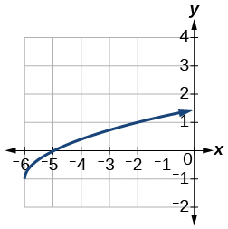 

<math xmlns="http://www.w3.org/1998/Math/MathML"> <mrow> <mi>f</mi><mo stretchy="false">(</mo><mi>x</mi><mo stretchy="false">)</mo><mo>=</mo><mfrac> <mn>1</mn> <mrow> <mi>x</mi><mo>+</mo><mn>2</mn></mrow> </mfrac> <mo>−</mo><mn>1</mn></mrow> </math>

For the following exercises, determine whether the functions are even, odd, or neither.

<math xmlns="http://www.w3.org/1998/Math/MathML"> <mrow> <mi>f</mi><mo stretchy="false">(</mo><mi>x</mi><mo stretchy="false">)</mo><mo>=</mo><mo>−</mo><mfrac> <mn>5</mn> <mrow> <msup> <mi>x</mi> <mn>2</mn> </msup> </mrow> </mfrac> <mo>+</mo><mn>9</mn><msup> <mi>x</mi> <mn>6</mn> </msup> </mrow> </math>

<math xmlns="http://www.w3.org/1998/Math/MathML"> <mrow> <mtext>even</mtext></mrow> </math>

<math xmlns="http://www.w3.org/1998/Math/MathML"> <mrow> <mi>f</mi><mo stretchy="false">(</mo><mi>x</mi><mo stretchy="false">)</mo><mo>=</mo><mo>−</mo><mfrac> <mn>5</mn> <mrow> <msup> <mi>x</mi> <mn>3</mn> </msup> </mrow> </mfrac> <mo>+</mo><mn>9</mn><msup> <mi>x</mi> <mn>5</mn> </msup> </mrow> </math>

<math xmlns="http://www.w3.org/1998/Math/MathML"> <mrow> <mi>f</mi><mo stretchy="false">(</mo><mi>x</mi><mo stretchy="false">)</mo><mo>=</mo><mfrac> <mn>1</mn> <mi>x</mi> </mfrac> </mrow> </math>

<math xmlns="http://www.w3.org/1998/Math/MathML"> <mrow> <mtext>odd</mtext></mrow> </math>

Graph the absolute value function<math xmlns="http://www.w3.org/1998/Math/MathML"> <mrow> <mtext> </mtext><mi>f</mi><mo stretchy="false">(</mo><mi>x</mi><mo stretchy="false">)</mo><mo>=</mo><mo>−</mo><mn>2</mn><mrow><mo>\|</mo> <mrow> <mi>x</mi><mo>−</mo><mn>1</mn></mrow> <mo>\|</mo></mrow><mo>+</mo><mn>3.</mn></mrow> </math>

For the following exercises, find the inverse of the function.

<math xmlns="http://www.w3.org/1998/Math/MathML"> <mrow> <mi>f</mi><mo stretchy="false">(</mo><mi>x</mi><mo stretchy="false">)</mo><mo>=</mo><mn>3</mn><mi>x</mi><mo>−</mo><mn>5</mn></mrow> </math>

<math xmlns="http://www.w3.org/1998/Math/MathML"> <mrow> <msup> <mi>f</mi> <mrow> <mo>−</mo><mn>1</mn></mrow> </msup> <mo stretchy="false">(</mo><mi>x</mi><mo stretchy="false">)</mo><mo>=</mo><mfrac> <mrow> <mi>x</mi><mo>+</mo><mn>5</mn></mrow> <mn>3</mn> </mfrac> </mrow> </math>

<math xmlns="http://www.w3.org/1998/Math/MathML"> <mrow> <mi>f</mi><mo stretchy="false">(</mo><mi>x</mi><mo stretchy="false">)</mo><mo>=</mo><mfrac> <mn>4</mn> <mrow> <mi>x</mi><mo>+</mo><mn>7</mn></mrow> </mfrac> </mrow> </math>

For the following exercises, use the graph of<math xmlns="http://www.w3.org/1998/Math/MathML"> <mrow> <mtext> </mtext><mi>g</mi><mtext> </mtext></mrow> </math>

shown in [\[link\]](#Figure_01_07_245).

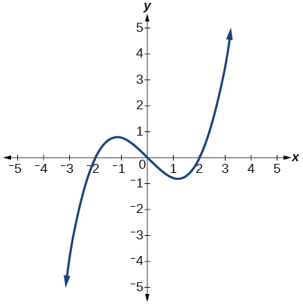{: #Figure_01_07_245}

On what intervals is the function increasing?

<math xmlns="http://www.w3.org/1998/Math/MathML"> <mrow> <mo stretchy="false">(</mo><mo>−</mo><mi>∞</mi><mo>,</mo><mo>−</mo><mn>1.1</mn><mo stretchy="false">)</mo><mtext> and </mtext><mo stretchy="false">(</mo><mn>1.1</mn><mo>,</mo><mi>∞</mi><mo stretchy="false">)</mo> </mrow> </math>

On what intervals is the function decreasing?

Approximate the local minimum of the function. Express the answer as an ordered pair.

<math xmlns="http://www.w3.org/1998/Math/MathML"> <mrow> <mrow><mo>(</mo> <mrow> <mn>1.1</mn><mo>,</mo><mo>−</mo><mn>0.9</mn></mrow> <mo>)</mo></mrow></mrow> </math>

Approximate the local maximum of the function. Express the answer as an ordered pair.

For the following exercises, use the graph of the piecewise function shown in [\[link\]](#Figure_01_07_246).

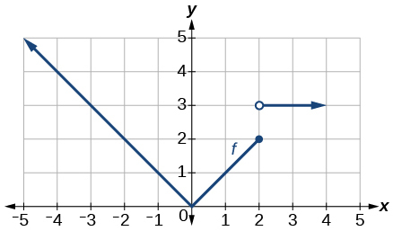{: #Figure_01_07_246}

Find<math xmlns="http://www.w3.org/1998/Math/MathML"> <mrow> <mtext> </mtext><mi>f</mi><mo stretchy="false">(</mo><mn>2</mn><mo stretchy="false">)</mo><mo>.</mo></mrow> </math>

<math xmlns="http://www.w3.org/1998/Math/MathML"> <mrow> <mi>f</mi><mo stretchy="false">(</mo><mn>2</mn><mo stretchy="false">)</mo><mo>=</mo><mn>2</mn></mrow> </math>

Find<math xmlns="http://www.w3.org/1998/Math/MathML"> <mrow> <mtext> </mtext><mi>f</mi><mo stretchy="false">(</mo><mn>−2</mn><mo stretchy="false">)</mo><mo>.</mo> </mrow> </math>

Write an equation for the piecewise function.

<math xmlns="http://www.w3.org/1998/Math/MathML"> <mrow> <mi>f</mi><mo stretchy="false">(</mo><mi>x</mi><mo stretchy="false">)</mo><mo>=</mo><mrow><mo>{</mo> <mrow> <mtable> <mtr> <mtd> <mrow> <mrow><mo>\|</mo> <mi>x</mi> <mo>\|</mo></mrow><mtext> </mtext><mtext> </mtext><mtext> </mtext><mtext>if</mtext><mtext> </mtext><mtext> </mtext><mi>x</mi><mo>≤</mo><mn>2</mn></mrow> </mtd> </mtr> <mtr> <mtd> <mrow> <mn>3</mn><mtext> </mtext><mtext> </mtext><mtext> </mtext><mtext> </mtext><mtext> </mtext><mtext>if</mtext><mtext> </mtext><mtext> </mtext><mi>x</mi><mo>&gt;</mo><mn>2</mn></mrow> </mtd> </mtr> </mtable></mrow> </mrow></mrow> </math>

For the following exercises, use the values listed in [\[link\]](#Table_01_07_07).

| <strong><math xmlns="http://www.w3.org/1998/Math/MathML">
<mi>x</mi>
</math></strong> | <strong><math xmlns="http://www.w3.org/1998/Math/MathML">
<mrow>
<mi>F</mi><mo stretchy="false">(</mo><mi>x</mi><mo stretchy="false">)</mo></mrow>
</math></strong> |
|----------
| 0 | 1 |
| 1 | 3 |
| 2 | 5 |
| 3 | 7 |
| 4 | 9 |
| 5 | 11 |
| 6 | 13 |
| 7 | 15 |
| 8 | 17 |
{: #Table_01_07_07 summary=".."}

Find<math xmlns="http://www.w3.org/1998/Math/MathML"> <mrow> <mtext> </mtext><mi>F</mi><mo stretchy="false">(</mo><mn>6</mn><mo stretchy="false">)</mo><mo>.</mo></mrow> </math>

Solve the equation<math xmlns="http://www.w3.org/1998/Math/MathML"> <mrow> <mtext> </mtext><mi>F</mi><mo stretchy="false">(</mo><mi>x</mi><mo stretchy="false">)</mo><mo>=</mo><mn>5.</mn></mrow> </math>

<math xmlns="http://www.w3.org/1998/Math/MathML"> <mrow> <mi>x</mi><mo>=</mo><mn>2</mn></mrow> </math>

Is the graph increasing or decreasing on its domain?

Is the function represented by the graph one-to-one?

yes

Find<math xmlns="http://www.w3.org/1998/Math/MathML"> <mrow> <mtext> </mtext><msup> <mi>F</mi> <mrow> <mo>−</mo><mn>1</mn></mrow> </msup> <mo stretchy="false">(</mo><mn>15</mn><mo stretchy="false">)</mo><mo>.</mo></mrow> </math>

Given<math xmlns="http://www.w3.org/1998/Math/MathML"> <mrow> <mtext> </mtext><mi>f</mi><mo stretchy="false">(</mo><mi>x</mi><mo stretchy="false">)</mo><mo>=</mo><mo>−</mo><mn>2</mn><mi>x</mi><mo>+</mo><mn>11</mn><mo>,</mo><mtext> </mtext></mrow> </math>

find<math xmlns="http://www.w3.org/1998/Math/MathML"> <mrow> <mtext> </mtext><msup> <mi>f</mi> <mrow> <mo>−</mo><mn>1</mn></mrow> </msup> <mo stretchy="false">(</mo><mi>x</mi><mo stretchy="false">)</mo><mo>.</mo></mrow> </math>

<math xmlns="http://www.w3.org/1998/Math/MathML"> <mrow> <msup> <mi>f</mi> <mrow> <mo>−</mo><mn>1</mn></mrow> </msup> <mo stretchy="false">(</mo><mi>x</mi><mo stretchy="false">)</mo><mo>=</mo><mo>−</mo><mfrac> <mrow> <mi>x</mi><mo>−</mo><mn>11</mn></mrow> <mn>2</mn> </mfrac> </mrow> </math>

## Glossary
{: data-type="glossary-title"}

inverse function
: for any one-to-one function
  <math xmlns="http://www.w3.org/1998/Math/MathML"> <mrow> <mtext> </mtext><mi>f</mi><mo stretchy="false">(</mo><mi>x</mi><mo stretchy="false">)</mo><mo>,</mo><mtext> </mtext></mrow> </math>
  
  the inverse is a function
  <math xmlns="http://www.w3.org/1998/Math/MathML"> <mrow> <mtext> </mtext><msup> <mi>f</mi> <mrow> <mo>−</mo><mn>1</mn></mrow> </msup> <mo stretchy="false">(</mo><mi>x</mi><mo stretchy="false">)</mo><mtext> </mtext></mrow> </math>
  
  such that
  <math xmlns="http://www.w3.org/1998/Math/MathML"> <mrow> <mtext> </mtext><msup> <mi>f</mi> <mrow> <mo>−</mo><mn>1</mn></mrow> </msup> <mrow><mo>(</mo> <mrow> <mi>f</mi><mrow><mo>(</mo> <mi>x</mi> <mo>)</mo></mrow></mrow> <mo>)</mo></mrow><mo>=</mo><mi>x</mi><mtext> </mtext></mrow> </math>
  
  for all
  <math xmlns="http://www.w3.org/1998/Math/MathML"> <mrow> <mtext> </mtext><mi>x</mi><mtext> </mtext></mrow> </math>
  
  in the domain of
  <math xmlns="http://www.w3.org/1998/Math/MathML"> <mrow> <mtext> </mtext><mi>f</mi><mo>;</mo><mtext> </mtext></mrow> </math>
  
  this also implies that
  <math xmlns="http://www.w3.org/1998/Math/MathML"> <mrow> <mtext> </mtext><mi>f</mi><mrow><mo>(</mo> <mrow> <msup> <mi>f</mi> <mrow> <mo>−</mo><mn>1</mn></mrow> </msup> <mrow><mo>(</mo> <mi>x</mi> <mo>)</mo></mrow></mrow> <mo>)</mo></mrow><mo>=</mo><mi>x</mi><mtext> </mtext></mrow> </math>
  
  for all
  <math xmlns="http://www.w3.org/1998/Math/MathML"> <mrow> <mtext> </mtext><mi>x</mi><mtext> </mtext></mrow> </math>
  
  in the domain of
  <math xmlns="http://www.w3.org/1998/Math/MathML"> <mrow> <mtext> </mtext><msup> <mi>f</mi> <mrow> <mo>−</mo><mn>1</mn></mrow> </msup> </mrow> </math>
{: .definition}

[1]: http://openstaxcollege.org/l/inversefunction
[2]: http://openstaxcollege.org/l/onetoone
[3]: http://openstaxcollege.org/l/inversfuncgraph
[4]: http://openstaxcollege.org/l/restrictdomain
[5]: http://openstaxcollege.org/l/PreCalcLPC01
