

In this section you will:
* Represent a linear function.
* Determine whether a linear function is increasing, decreasing, or constant.
* Interpret slope as a rate of change.
* Write and interpret an equation for a linear function.
* Graph linear functions.
* Determine whether lines are parallel or perpendicular.
* Write the equation of a line parallel or perpendicular to a given line.

 "){: #CNX_Precalc_Figure_02_01_011}

Just as with the growth of a bamboo plant, there are many situations that involve constant change over time. Consider, for example, the first commercial maglev train in the world, the Shanghai MagLev Train ([\[link\]](#CNX_Precalc_Figure_02_01_011)). It carries passengers comfortably for a 30-kilometer trip from the airport to the subway station in only eight minutes[1](#footnote1){: data-type="footnote-link"}.

Suppose a maglev train travels a long distance, and maintains a constant speed of 83 meters per second for a period of time once it is 250 meters from the station. How can we analyze the train’s distance from the station as a function of time? In this section, we will investigate a kind of function that is useful for this purpose, and use it to investigate real-world situations such as the train’s distance from the station at a given point in time.

### Representing Linear Functions

The function describing the train’s motion is a **linear function**{: data-type="term" .no-emphasis}, which is defined as a function with a constant rate of change. This is a polynomial of degree 1. There are several ways to represent a linear function, including word form, function notation, tabular form, and graphical form. We will describe the train’s motion as a function using each method.

#### Representing a Linear Function in Word Form

Let’s begin by describing the linear function in words. For the train problem we just considered, the following word sentence may be used to describe the function relationship.

* *The train’s distance from the station is a function of the time during which the train moves at a constant speed plus its original distance from the station when it began moving at constant speed.*

The speed is the rate of change. Recall that a rate of change is a measure of how quickly the dependent variable changes with respect to the independent variable. The rate of change for this example is constant, which means that it is the same for each input value. As the time (input) increases by 1 second, the corresponding distance (output) increases by 83 meters. The train began moving at this constant speed at a distance of 250 meters from the station.

#### Representing a Linear Function in Function Notation

Another approach to representing linear functions is by using function notation. One example of function notation is an equation written in the **slope-intercept form**{: data-type="term" .no-emphasis} of a line, where<math xmlns="http://www.w3.org/1998/Math/MathML"> <mrow> <mtext> </mtext><mi>x</mi><mtext> </mtext> </mrow> </math>

is the input value,<math xmlns="http://www.w3.org/1998/Math/MathML"> <mrow> <mtext> </mtext><mi>m</mi><mtext> </mtext> </mrow> </math>

is the rate of change, and<math xmlns="http://www.w3.org/1998/Math/MathML"> <mrow> <mtext> </mtext><mi>b</mi><mtext> </mtext> </mrow> </math>

is the initial value of the dependent variable.

<math xmlns="http://www.w3.org/1998/Math/MathML"> <mrow> <mtable> <mtr> <mtd columnalign="left"> <mrow> <mtext>Equation form</mtext> <mspace width="2em" /> </mrow> </mtd> <mtd columnalign="left"> <mrow> <mi>y</mi><mo>=</mo><mi>m</mi><mi>x</mi><mo>+</mo><mi>b</mi> </mrow> </mtd> </mtr> <mtr> <mtd columnalign="left"> <mrow> <mtext>Function notation</mtext> <mspace width="2em" /> </mrow> </mtd> <mtd columnalign="left"> <mrow> <mi>f</mi><mo stretchy="false">(</mo><mi>x</mi><mo stretchy="false">)</mo><mo>=</mo><mi>m</mi><mi>x</mi><mo>+</mo><mi>b</mi> </mrow> </mtd> </mtr> </mtable> </mrow> </math>

In the example of the train, we might use the notation<math xmlns="http://www.w3.org/1998/Math/MathML"> <mrow> <mtext> </mtext><mi>D</mi><mo stretchy="false">(</mo><mi>t</mi><mo stretchy="false">)</mo><mtext> </mtext> </mrow> </math>

where the total distance<math xmlns="http://www.w3.org/1998/Math/MathML"> <mrow> <mtext> </mtext><mi>D</mi><mtext> </mtext> </mrow> </math>

is a function of the time<math xmlns="http://www.w3.org/1998/Math/MathML"> <mrow> <mtext> </mtext><mi>t</mi><mo>.</mo><mtext> </mtext> </mrow> </math>

The rate,<math xmlns="http://www.w3.org/1998/Math/MathML"> <mrow> <mtext> </mtext><mi>m</mi><mo>,</mo><mtext> </mtext> </mrow> </math>

is 83 meters per second. The initial value of the dependent variable<math xmlns="http://www.w3.org/1998/Math/MathML"> <mrow> <mtext> </mtext><mi>b</mi><mtext> </mtext> </mrow> </math>

is the original distance from the station, 250 meters. We can write a generalized equation to represent the motion of the train.

<math xmlns="http://www.w3.org/1998/Math/MathML"> <mrow> <mi>D</mi><mo stretchy="false">(</mo><mi>t</mi><mo stretchy="false">)</mo><mo>=</mo><mn>83</mn><mi>t</mi><mo>+</mo><mn>250</mn> </mrow> </math>

#### Representing a Linear Function in Tabular Form

A third method of representing a linear function is through the use of a table. The relationship between the distance from the station and the time is represented in [\[link\]](#CNX_Precalc_Figure_02_01_015). From the table, we can see that the distance changes by 83 meters for every 1 second increase in time.

 {: #CNX_Precalc_Figure_02_01_015}

**Can the input in the previous example be any real number?**

*No. The input represents time so while nonnegative rational and irrational numbers are possible, negative real numbers are not possible for this example. The input consists of non-negative real numbers.*

#### Representing a Linear Function in Graphical Form

Another way to represent linear functions is visually, using a graph. We can use the function relationship from above,<math xmlns="http://www.w3.org/1998/Math/MathML"> <mrow> <mtext> </mtext><mi>D</mi><mo stretchy="false">(</mo><mi>t</mi><mo stretchy="false">)</mo><mo>=</mo><mn>83</mn><mi>t</mi><mo>+</mo><mn>250</mn><mo>,</mo><mtext> </mtext> </mrow> </math>

to draw a graph as represented in [\[link\]](#CNX_Precalc_Figure_02_01_012). Notice the graph is a line**.** When we plot a linear function, the graph is always a line.

The rate of change, which is constant, determines the slant, or **slope**{: data-type="term" .no-emphasis} of the line. The point at which the input value is zero is the vertical intercept, or ***y*-intercept**{: data-type="term" .no-emphasis}, of the line. We can see from the graph that the *y*-intercept in the train example we just saw is<math xmlns="http://www.w3.org/1998/Math/MathML"> <mrow> <mtext> </mtext><mo stretchy="false">(</mo><mn>0</mn><mo>,</mo><mn>250</mn><mo stretchy="false">)</mo><mtext> </mtext> </mrow> </math>

and represents the distance of the train from the station when it began moving at a constant speed.

 =83t+250&#x2009;&#10; &#10;. Graphs of linear functions are lines because the rate of change is constant.&#10;"){: #CNX_Precalc_Figure_02_01_012}

Notice that the graph of the train example is restricted, but this is not always the case. Consider the graph of the line<math xmlns="http://www.w3.org/1998/Math/MathML"> <mrow> <mtext> </mtext><mi>f</mi><mo stretchy="false">(</mo><mi>x</mi><mo stretchy="false">)</mo><mo>=</mo><mn>2</mn><mi>x</mi><mo>+</mo><mn>1.</mn><mtext> </mtext> </mrow> </math>

 Ask yourself what numbers can be input to the function. In other words, what is the domain of the function? The domain is comprised of all real numbers because any number may be doubled, and then have one added to the product.

Linear Function

A **linear function**{: data-type="term"} is a function whose graph is a line. Linear functions can be written in the **slope-intercept form**{: data-type="term"} of a line

<math xmlns="http://www.w3.org/1998/Math/MathML"> <mrow> <mi>f</mi><mo stretchy="false">(</mo><mi>x</mi><mo stretchy="false">)</mo><mo>=</mo><mi>m</mi><mi>x</mi><mo>+</mo><mi>b</mi> </mrow> </math>

where<math xmlns="http://www.w3.org/1998/Math/MathML"> <mrow> <mtext> </mtext><mi>b</mi><mtext> </mtext> </mrow> </math>

is the initial or starting value of the function (when input,<math xmlns="http://www.w3.org/1998/Math/MathML"> <mrow> <mtext> </mtext><mi>x</mi><mo>=</mo><mn>0</mn><mtext> </mtext> </mrow> </math>

), and<math xmlns="http://www.w3.org/1998/Math/MathML"> <mrow> <mtext> </mtext><mi>m</mi><mtext> </mtext> </mrow> </math>

is the constant rate of change, or slope of the function. The *y*-intercept is at<math xmlns="http://www.w3.org/1998/Math/MathML"> <mrow> <mtext> </mtext><mo stretchy="false">(</mo><mn>0</mn><mo>,</mo><mi>b</mi><mo stretchy="false">)</mo><mo>.</mo> </mrow> </math>

Using a Linear Function to Find the Pressure on a Diver

The pressure,<math xmlns="http://www.w3.org/1998/Math/MathML"> <mrow> <mtext> </mtext><mi>P</mi><mo>,</mo> </mrow> </math>

in pounds per square inch (PSI) on the diver in [[link]](#CNX_Precalc_Figure_02_01_003) depends upon her depth below the water surface,<math xmlns="http://www.w3.org/1998/Math/MathML"> <mrow> <mtext> </mtext><mi>d</mi><mo>,</mo> </mrow> </math>

in feet. This relationship may be modeled by the equation,<math xmlns="http://www.w3.org/1998/Math/MathML"> <mrow> <mtext> </mtext><mi>P</mi><mo stretchy="false">(</mo><mi>d</mi><mo stretchy="false">)</mo><mo>=</mo><mn>0.434</mn><mi>d</mi><mo>+</mo><mn>14.696.</mn><mtext> </mtext> </mrow> </math>

Restate this function in words.

"){: #CNX_Precalc_Figure_02_01_003}

To restate the function in words, we need to describe each part of the equation. The pressure as a function of depth equals four hundred thirty-four thousandths times depth plus fourteen and six hundred ninety-six thousandths.

Analysis

The initial value, 14.696, is the pressure in PSI on the diver at a depth of 0 feet, which is the surface of the water. The rate of change, or slope, is 0.434 PSI per foot. This tells us that the pressure on the diver increases 0.434 PSI for each foot her depth increases.

### Determining Whether a Linear Function Is Increasing, Decreasing, or Constant

The linear functions we used in the two previous examples increased over time, but not every linear function does. A linear function may be increasing, decreasing, or constant. For an **increasing function**{: data-type="term" .no-emphasis}, as with the train example, the output values increase as the input values increase. The graph of an increasing function has a positive slope. A line with a positive slope slants upward from left to right as in [\[link\]](#CNX_Precalc_Figure_02_01_004abc)**(a)**. For a **decreasing function**{: data-type="term" .no-emphasis}, the slope is negative. The output values decrease as the input values increase. A line with a negative slope slants downward from left to right as in [\[link\]](#CNX_Precalc_Figure_02_01_004abc)**(b)**. If the function is constant, the output values are the same for all input values so the slope is zero. A line with a slope of zero is horizontal as in [\[link\]](#CNX_Precalc_Figure_02_01_004abc)**(c)**.

 {: #CNX_Precalc_Figure_02_01_004abc}

Increasing and Decreasing Functions

The slope determines if the function is an **increasing linear function**{: data-type="term"}, a **decreasing linear function**{: data-type="term"}, or a constant function.

* <math xmlns="http://www.w3.org/1998/Math/MathML"> <mrow> <mi>f</mi><mo stretchy="false">(</mo><mi>x</mi><mo stretchy="false">)</mo><mo>=</mo><mi>m</mi><mi>x</mi><mo>+</mo><mi>b</mi><mtext> </mtext> </mrow> </math>
  
  is an increasing function if
  <math xmlns="http://www.w3.org/1998/Math/MathML"> <mrow> <mtext> </mtext><mi>m</mi><mo>&gt;</mo><mn>0.</mn> </mrow> </math>

* <math xmlns="http://www.w3.org/1998/Math/MathML"> <mrow> <mi>f</mi><mo stretchy="false">(</mo><mi>x</mi><mo stretchy="false">)</mo><mo>=</mo><mi>m</mi><mi>x</mi><mo>+</mo><mi>b</mi><mtext> </mtext> </mrow> </math>
  
  is a decreasing function if
  <math xmlns="http://www.w3.org/1998/Math/MathML"> <mrow> <mtext> </mtext><mi>m</mi><mo>&lt;</mo><mn>0.</mn> </mrow> </math>

* <math xmlns="http://www.w3.org/1998/Math/MathML"> <mrow> <mi>f</mi><mo stretchy="false">(</mo><mi>x</mi><mo stretchy="false">)</mo><mo>=</mo><mi>m</mi><mi>x</mi><mo>+</mo><mi>b</mi><mtext> </mtext> </mrow> </math>
  
  is a constant function if
  <math xmlns="http://www.w3.org/1998/Math/MathML"> <mrow> <mtext> </mtext><mi>m</mi><mo>=</mo><mn>0.</mn> </mrow> </math>
{: data-labeled-item="true"}

Deciding Whether a Function Is Increasing, Decreasing, or Constant

Some recent studies suggest that a teenager sends an average of 60 texts per day[2](#footnote2){: data-type="footnote-link"}. For each of the following scenarios, find the linear function that describes the relationship between the input value and the output value. Then, determine whether the graph of the function is increasing, decreasing, or constant.

1.  The total number of texts a teen sends is considered a function of time in days. The input is the number of days, and output is the total number of texts sent.
2.  A teen has a limit of 500 texts per month in his or her data plan. The input is the number of days, and output is the total number of texts remaining for the month.
3.  A teen has an unlimited number of texts in his or her data plan for a cost of $50 per month. The input is the number of days, and output is the total cost of texting each month.
{: type="a"}

Analyze each function.

1.  The function can be represented as
    <math xmlns="http://www.w3.org/1998/Math/MathML"> <mrow> <mtext> </mtext><mi>f</mi><mo stretchy="false">(</mo><mi>x</mi><mo stretchy="false">)</mo><mo>=</mo><mn>60</mn><mi>x</mi><mtext> </mtext> </mrow> </math>
    
    where
    <math xmlns="http://www.w3.org/1998/Math/MathML"> <mrow> <mtext> </mtext><mi>x</mi><mtext> </mtext> </mrow> </math>
    
    is the number of days. The slope, 60, is positive so the function is increasing. This makes sense because the total number of texts increases with each day.
2.  The function can be represented as
    <math xmlns="http://www.w3.org/1998/Math/MathML"> <mrow> <mtext> </mtext><mi>f</mi><mo stretchy="false">(</mo><mi>x</mi><mo stretchy="false">)</mo><mo>=</mo><mn>500</mn><mo>−</mo><mn>60</mn><mi>x</mi><mtext> </mtext> </mrow> </math>
    
    where
    <math xmlns="http://www.w3.org/1998/Math/MathML"> <mrow> <mtext> </mtext><mi>x</mi> </mrow> </math>
    
    is the number of days. In this case, the slope is negative so the function is decreasing. This makes sense because the number of texts remaining decreases each day and this function represents the number of texts remaining in the data plan after
    <math xmlns="http://www.w3.org/1998/Math/MathML"> <mrow> <mtext> </mtext><mi>x</mi><mtext> </mtext> </mrow> </math>
    
    days.
3.  The cost function can be represented as
    <math xmlns="http://www.w3.org/1998/Math/MathML"> <mrow> <mtext> </mtext><mi>f</mi><mo stretchy="false">(</mo><mi>x</mi><mo stretchy="false">)</mo><mo>=</mo><mn>50</mn><mtext> </mtext> </mrow> </math>
    
    because the number of days does not affect the total cost. The slope is 0 so the function is constant.
{: type="a"}

### Interpreting Slope as a Rate of Change

In the examples we have seen so far, the slope was provided to us. However, we often need to calculate the slope given input and output values. Recall that given two values for the input,<math xmlns="http://www.w3.org/1998/Math/MathML"> <mrow> <mtext> </mtext><msub> <mi>x</mi> <mn>1</mn> </msub> </mrow> </math>

and<math xmlns="http://www.w3.org/1998/Math/MathML"> <mrow> <mtext> </mtext><msub> <mi>x</mi> <mn>2</mn> </msub> <mo>,</mo> </mrow> </math>

and two corresponding values for the output,<math xmlns="http://www.w3.org/1998/Math/MathML"> <mrow> <mtext> </mtext><msub> <mi>y</mi> <mn>1</mn> </msub> <mtext> </mtext> </mrow> </math>

and<math xmlns="http://www.w3.org/1998/Math/MathML"> <mrow> <mtext> </mtext><msub> <mi>y</mi> <mn>2</mn> </msub> <mtext> </mtext> </mrow> </math>

—which can be represented by a set of points,<math xmlns="http://www.w3.org/1998/Math/MathML"> <mrow> <mtext> </mtext><mrow><mo>(</mo> <mrow> <msub> <mi>x</mi> <mn>1</mn> </msub> <mtext>, </mtext><msub> <mi>y</mi> <mn>1</mn> </msub> </mrow> <mo>)</mo></mrow><mtext> </mtext> </mrow> </math>

and<math xmlns="http://www.w3.org/1998/Math/MathML"> <mrow> <mtext> </mtext><mrow><mo>(</mo> <mrow> <msub> <mi>x</mi> <mn>2</mn> </msub> <mtext>, </mtext><msub> <mi>y</mi> <mn>2</mn> </msub> </mrow> <mo>)</mo></mrow> </mrow> </math>

—we can calculate the slope <math xmlns="http://www.w3.org/1998/Math/MathML"> <mrow> <mi>m</mi><mo>.</mo> </mrow> </math>

<math xmlns="http://www.w3.org/1998/Math/MathML"> <mrow> <mi>m</mi><mo>=</mo><mfrac> <mrow> <mtext>change in output (rise)</mtext> </mrow> <mrow> <mtext>change in input (run)</mtext> </mrow> </mfrac> <mo>=</mo><mfrac> <mrow> <mi>Δ</mi><mi>y</mi> </mrow> <mrow> <mi>Δ</mi><mi>x</mi> </mrow> </mfrac> <mo>=</mo><mfrac> <mrow> <msub> <mi>y</mi> <mn>2</mn> </msub> <mo>−</mo><msub> <mi>y</mi> <mn>1</mn> </msub> </mrow> <mrow> <msub> <mi>x</mi> <mn>2</mn> </msub> <mo>−</mo><msub> <mi>x</mi> <mn>1</mn> </msub> </mrow> </mfrac> </mrow> </math>

Note that in function notation we can obtain two corresponding values for the output<math xmlns="http://www.w3.org/1998/Math/MathML"> <mrow> <mtext> </mtext><msub> <mi>y</mi> <mn>1</mn> </msub> <mtext> </mtext> </mrow> </math>

and<math xmlns="http://www.w3.org/1998/Math/MathML"> <mrow> <mtext> </mtext><msub> <mi>y</mi> <mn>2</mn> </msub> <mtext> </mtext> </mrow> </math>

for the function<math xmlns="http://www.w3.org/1998/Math/MathML"> <mrow> <mtext> </mtext><mi>f</mi><mo>,</mo> </mrow> </math>

<math xmlns="http://www.w3.org/1998/Math/MathML"> <mrow> <mtext> </mtext><msub> <mi>y</mi> <mn>1</mn> </msub> <mo>=</mo><mi>f</mi><mo>(</mo><msub> <mi>x</mi> <mn>1</mn> </msub> <mo>)</mo><mtext> </mtext> </mrow> </math>

and<math xmlns="http://www.w3.org/1998/Math/MathML"> <mrow> <mtext> </mtext><msub> <mi>y</mi> <mn>2</mn> </msub> <mo>=</mo><mi>f</mi><mo>(</mo><msub> <mi>x</mi> <mn>2</mn> </msub> <mo>)</mo><mo>,</mo> </mrow> </math>

so we could equivalently write

<math xmlns="http://www.w3.org/1998/Math/MathML"> <mrow> <mi>m</mi><mo>=</mo><mfrac> <mrow> <mi>f</mi><mo>(</mo><msub> <mi>x</mi> <mn>2</mn> </msub> <mo>)</mo><mo>–</mo><mi>f</mi><mo>(</mo><msub> <mi>x</mi> <mn>1</mn> </msub> <mo>)</mo> </mrow> <mrow> <msub> <mi>x</mi> <mn>2</mn> </msub> <mo>–</mo><msub> <mi>x</mi> <mn>1</mn> </msub> </mrow> </mfrac> </mrow> </math>

[\[link\]](#CNX_Precalc_Figure_02_01_005) indicates how the slope of the line between the points,<math xmlns="http://www.w3.org/1998/Math/MathML"> <mrow> <mtext> </mtext><mrow><mo>(</mo> <mrow> <msub> <mi>x</mi> <mn>1</mn> </msub> <mo>,</mo><msub> <mi>y</mi> <mn>1</mn> </msub> </mrow> <mo>)</mo></mrow><mtext> </mtext> </mrow> </math>

and<math xmlns="http://www.w3.org/1998/Math/MathML"> <mrow> <mtext> </mtext><mrow><mo>(</mo> <mrow> <msub> <mi>x</mi> <mn>2</mn> </msub> <mo>,</mo><msub> <mi>y</mi> <mn>2</mn> </msub> </mrow> <mo>)</mo></mrow><mo>,</mo><mtext> </mtext> </mrow> </math>

is calculated. Recall that the slope measures steepness, or slant. The greater the absolute value of the slope, the steeper the slant is.

![This graph shows how to calculate the slope of a line. The line is graphed on an x y coordinate plane. The x-axis is labeled from negative 1 to 6. The y-axis is labeled from negative 1 to 10. The line passes through several points, but two are marked specifcally. The first is labeled (x subscript 1, y subscript 1). It is located at the point (1, 5). The second point is labeled (x subscript 2, y subscript 2). It is located at the point (2, 8). There is a small arrow that runs horizontally from point (2, 8) to point (1, 8). This arrow is labeled x subscript 2 minus x subscript 1. There is a blue arrow that runs vertically from point (1, 5) to point (1, 8) and is labeled y subscript 2 minus y subscript 1. Off to the side is the equation m equals delta y divided by delta x which equals y subscript 2 minus y subscript 1 divided by x subscript 2 minus x subscript 1. ](../resources/CNX_Precalc_Figure_02_01_005.jpg "The slope of a function is calculated by the change in&#10; &#10;  &#x2009;y&#x2009;&#10; &#10;divided by the change in&#10; &#10;  &#x2009;x.&#x2009;&#10; &#10;It does not matter which coordinate is used as the&#10; &#10;  &#x2009;(&#10;   &#10;    &#10;     x&#10;     &#10;      2,&#10;     &#10;    &#10;    &#10;     y&#10;     2&#10;    &#10;    &#10;   &#10;  )&#x2009;&#10; &#10;and which is the&#10; &#10;  &#x2009;(&#10;   &#10;    &#10;     x&#10;     1&#10;    &#10;    ,&#10;     y&#10;     1&#10;    &#10;    &#10;   &#10;  ),&#x2009;&#10; &#10;as long as each calculation is started with the elements from the same coordinate pair."){: #CNX_Precalc_Figure_02_01_005}

**Are the units for slope always**<math xmlns="http://www.w3.org/1998/Math/MathML"> <mrow> <mtext> </mtext><mfrac> <mrow> <mtext>units for the output</mtext> </mrow> <mrow> <mtext>units for the input</mtext> </mrow> </mfrac> <mtext> </mtext><mtext>?</mtext> </mrow> </math>

*Yes. Think of the units as the change of output value for each unit of change in input value. An example of slope could be miles per hour or dollars per day. Notice the units appear as a ratio of units for the output per units for the input.*

Calculate Slope

The slope, or rate of change, of a function<math xmlns="http://www.w3.org/1998/Math/MathML"> <mrow> <mtext> </mtext><mi>m</mi><mtext> </mtext> </mrow> </math>

can be calculated according to the following:

<math xmlns="http://www.w3.org/1998/Math/MathML"> <mrow> <mi>m</mi><mo>=</mo><mfrac> <mrow> <mtext>change in output (rise)</mtext> </mrow> <mrow> <mtext>change in input (run)</mtext> </mrow> </mfrac> <mo>=</mo><mfrac> <mrow> <mi>Δ</mi><mi>y</mi> </mrow> <mrow> <mi>Δ</mi><mi>x</mi> </mrow> </mfrac> <mo>=</mo><mfrac> <mrow> <msub> <mi>y</mi> <mn>2</mn> </msub> <mo>−</mo><msub> <mi>y</mi> <mn>1</mn> </msub> </mrow> <mrow> <msub> <mi>x</mi> <mn>2</mn> </msub> <mo>−</mo><msub> <mi>x</mi> <mn>1</mn> </msub> </mrow> </mfrac> </mrow> </math>

where<math xmlns="http://www.w3.org/1998/Math/MathML"> <mrow> <mtext> </mtext><msub> <mi>x</mi> <mn>1</mn> </msub> <mtext> </mtext> </mrow> </math>

and<math xmlns="http://www.w3.org/1998/Math/MathML"> <mrow> <mtext> </mtext><msub> <mi>x</mi> <mn>2</mn> </msub> <mtext> </mtext> </mrow> </math>

are input values,<math xmlns="http://www.w3.org/1998/Math/MathML"> <mrow> <mtext> </mtext><msub> <mi>y</mi> <mn>1</mn> </msub> <mtext> </mtext> </mrow> </math>

and<math xmlns="http://www.w3.org/1998/Math/MathML"> <mrow> <mtext> </mtext><msub> <mi>y</mi> <mn>2</mn> </msub> <mtext> </mtext> </mrow> </math>

are output values.

**Given two points from a linear function, calculate and interpret the slope.**

1.  Determine the units for output and input values.
2.  Calculate the change of output values and change of input values.
3.  Interpret the slope as the change in output values per unit of the input value.
{: type="1"}

Finding the Slope of a Linear Function

If<math xmlns="http://www.w3.org/1998/Math/MathML"> <mrow> <mtext> </mtext><mi>f</mi><mo stretchy="false">(</mo><mi>x</mi><mo stretchy="false">)</mo><mtext> </mtext> </mrow> </math>

is a linear function, and<math xmlns="http://www.w3.org/1998/Math/MathML"> <mrow> <mtext> </mtext><mo stretchy="false">(</mo><mn>3</mn><mo>,</mo><mn>−2</mn><mo stretchy="false">)</mo><mtext> </mtext> </mrow> </math>

and<math xmlns="http://www.w3.org/1998/Math/MathML"> <mrow> <mtext> </mtext><mo stretchy="false">(</mo><mn>8</mn><mo>,</mo><mn>1</mn><mo stretchy="false">)</mo><mtext> </mtext> </mrow> </math>

are points on the line, find the slope. Is this function increasing or decreasing?

The coordinate pairs are<math xmlns="http://www.w3.org/1998/Math/MathML"> <mrow> <mtext> </mtext><mo stretchy="false">(</mo><mn>3</mn><mo>,</mo><mn>−2</mn><mo stretchy="false">)</mo><mtext> </mtext> </mrow> </math>

and<math xmlns="http://www.w3.org/1998/Math/MathML"> <mrow> <mtext> </mtext><mo stretchy="false">(</mo><mn>8</mn><mo>,</mo><mn>1</mn><mo stretchy="false">)</mo><mo>.</mo><mtext> </mtext> </mrow> </math>

To find the rate of change, we divide the change in output by the change in input.

<math xmlns="http://www.w3.org/1998/Math/MathML"> <mrow> <mi>m</mi><mo>=</mo><mfrac> <mrow> <mtext>change in output</mtext> </mrow> <mrow> <mtext>change in input</mtext> </mrow> </mfrac> <mo>=</mo><mfrac> <mrow> <mn>1</mn><mo>−</mo><mo stretchy="false">(</mo><mn>−2</mn><mo stretchy="false">)</mo> </mrow> <mrow> <mn>8</mn><mo>−</mo><mn>3</mn> </mrow> </mfrac> <mo>=</mo><mfrac> <mn>3</mn> <mn>5</mn> </mfrac> </mrow> </math>

We could also write the slope as<math xmlns="http://www.w3.org/1998/Math/MathML"> <mrow> <mtext> </mtext><mi>m</mi><mo>=</mo><mn>0.6.</mn><mtext> </mtext> </mrow> </math>

The function is increasing because<math xmlns="http://www.w3.org/1998/Math/MathML"> <mrow> <mtext> </mtext><mi>m</mi><mo>&gt;</mo><mn>0.</mn> </mrow> </math>

Analysis

As noted earlier, the order in which we write the points does not matter when we compute the slope of the line as long as the first output value, or *y*-coordinate, used corresponds with the first input value, or *x*-coordinate, used. Note that if we had reversed them, we would have obtained the same slope.

<math xmlns="http://www.w3.org/1998/Math/MathML"> <mrow> <mi>m</mi><mo>=</mo><mfrac> <mrow> <mrow><mo>(</mo> <mrow> <mn>−2</mn> </mrow> <mo>)</mo></mrow><mo>−</mo><mo stretchy="false">(</mo><mn>1</mn><mo stretchy="false">)</mo> </mrow> <mrow> <mn>3</mn><mo>−</mo><mn>8</mn> </mrow> </mfrac> <mo>=</mo><mfrac> <mrow> <mo>−</mo><mn>3</mn> </mrow> <mrow> <mo>−</mo><mn>5</mn> </mrow> </mfrac> <mo>=</mo><mfrac> <mn>3</mn> <mn>5</mn> </mfrac> </mrow> </math>

If<math xmlns="http://www.w3.org/1998/Math/MathML"> <mrow> <mtext> </mtext><mi>f</mi><mo stretchy="false">(</mo><mi>x</mi><mo stretchy="false">)</mo><mtext> </mtext> </mrow> </math>

is a linear function, and<math xmlns="http://www.w3.org/1998/Math/MathML"> <mrow> <mtext> </mtext><mo stretchy="false">(</mo><mn>2</mn><mo>,</mo><mn>3</mn><mo stretchy="false">)</mo><mtext> </mtext> </mrow> </math>

and<math xmlns="http://www.w3.org/1998/Math/MathML"> <mrow> <mtext> </mtext><mo stretchy="false">(</mo><mn>0</mn><mo>,</mo><mn>4</mn><mo stretchy="false">)</mo><mtext> </mtext> </mrow> </math>

are points on the line, find the slope. Is this function increasing or decreasing?

<math xmlns="http://www.w3.org/1998/Math/MathML"> <mrow> <mi>m</mi><mo>=</mo><mfrac> <mrow> <mn>4</mn><mo>−</mo><mn>3</mn> </mrow> <mrow> <mn>0</mn><mo>−</mo><mn>2</mn> </mrow> </mfrac> <mo>=</mo><mfrac> <mn>1</mn> <mrow> <mo>−</mo><mn>2</mn> </mrow> </mfrac> <mo>=</mo><mo>−</mo><mfrac> <mn>1</mn> <mn>2</mn> </mfrac> <mo>;</mo> </mrow> </math>

 decreasing because <math xmlns="http://www.w3.org/1998/Math/MathML"> <mrow> <mi>m</mi><mo>&lt;</mo><mn>0.</mn> </mrow> </math>

Finding the Population Change from a Linear Function

The population of a city increased from 23,400 to 27,800 between 2008 and 2012. Find the change of population per year if we assume the change was constant from 2008 to 2012.

The rate of change relates the change in population to the change in time. The population increased by<math xmlns="http://www.w3.org/1998/Math/MathML"> <mrow> <mtext> </mtext><mn>27</mn><mo>,</mo><mn>800</mn><mo>−</mo><mn>23</mn><mo>,</mo><mn>400</mn><mo>=</mo><mn>4400</mn><mtext> </mtext> </mrow> </math>

people over the four-year time interval. To find the rate of change, divide the change in the number of people by the number of years.

<math xmlns="http://www.w3.org/1998/Math/MathML"> <mrow> <mfrac> <mrow> <mtext>4,400 people</mtext> </mrow> <mrow> <mtext>4 years</mtext> </mrow> </mfrac> <mo>=</mo><mtext>1,100 </mtext><mfrac> <mrow> <mtext>people</mtext> </mrow> <mrow> <mtext>year</mtext> </mrow> </mfrac> </mrow> </math>

So the population increased by 1,100 people per year.

Analysis

Because we are told that the population increased, we would expect the slope to be positive. This positive slope we calculated is therefore reasonable.

The population of a small town increased from 1,442 to 1,868 between 2009 and 2012. Find the change of population per year if we assume the change was constant from 2009 to 2012.

<math xmlns="http://www.w3.org/1998/Math/MathML"> <mrow> <mi>m</mi><mo>=</mo><mfrac> <mrow> <mn>1</mn><mo>,</mo><mn>868</mn><mo>−</mo><mn>1</mn><mo>,</mo><mn>442</mn> </mrow> <mrow> <mn>2</mn><mo>,</mo><mn>012</mn><mo>−</mo><mn>2</mn><mo>,</mo><mn>009</mn> </mrow> </mfrac> <mo>=</mo><mfrac> <mrow> <mn>426</mn> </mrow> <mn>3</mn> </mfrac> <mo>=</mo><mtext>142 people per year</mtext> </mrow> </math>

### Writing and Interpreting an Equation for a Linear Function

Recall from [Equations and Inequalities](/m51251){: .target-chapter} that we wrote equations in both the **slope-intercept form**{: data-type="term" .no-emphasis} and the **point-slope form**{: data-type="term" .no-emphasis}. Now we can choose which method to use to write equations for linear functions based on the information we are given. That information may be provided in the form of a graph, a point and a slope, two points, and so on. Look at the graph of the function<math xmlns="http://www.w3.org/1998/Math/MathML"> <mrow> <mtext> </mtext><mi>f</mi><mtext> </mtext> </mrow> </math>

in [\[link\]](#CNX_Precalc_Figure_02_01_006).

 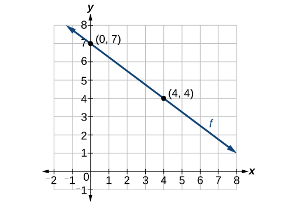{: #CNX_Precalc_Figure_02_01_006}

We are not given the slope of the line, but we can choose any two points on the line to find the slope. Let’s choose<math xmlns="http://www.w3.org/1998/Math/MathML"> <mrow> <mtext> </mtext><mo stretchy="false">(</mo><mn>0</mn><mo>,</mo><mn>7</mn><mo stretchy="false">)</mo><mtext> </mtext> </mrow> </math>

and<math xmlns="http://www.w3.org/1998/Math/MathML"> <mrow> <mtext> </mtext><mo stretchy="false">(</mo><mn>4</mn><mo>,</mo><mn>4</mn><mo stretchy="false">)</mo><mo>.</mo><mtext> </mtext> </mrow> </math>

<math xmlns="http://www.w3.org/1998/Math/MathML"> <mrow> <mtable> <mtr rowalign="center"> <mtd columnalign="right" rowalign="center"> <mi>m</mi> </mtd> <mtd rowalign="center"> <mo>=</mo> </mtd> <mtd columnalign="left" rowalign="center"> <mrow> <mfrac> <mrow> <msub> <mi>y</mi> <mn>2</mn> </msub> <mo>−</mo><msub> <mi>y</mi> <mn>1</mn> </msub> </mrow> <mrow> <msub> <mi>x</mi> <mn>2</mn> </msub> <mo>−</mo><msub> <mi>x</mi> <mn>1</mn> </msub> </mrow> </mfrac> </mrow> </mtd> </mtr> <mtr rowalign="center"> <mtd rowalign="center" /> <mtd rowalign="center"> <mo>=</mo> </mtd> <mtd columnalign="left" rowalign="center"> <mrow> <mfrac> <mrow> <mn>4</mn><mo>−</mo><mn>7</mn> </mrow> <mrow> <mn>4</mn><mo>−</mo><mn>0</mn> </mrow> </mfrac> </mrow> </mtd> </mtr> <mtr rowalign="center"> <mtd rowalign="center" /> <mtd rowalign="center"> <mo>=</mo> </mtd> <mtd columnalign="left" rowalign="center"> <mrow> <mo>−</mo><mfrac> <mn>3</mn> <mn>4</mn> </mfrac> </mrow> </mtd> </mtr> </mtable> </mrow> </math>

Now we can substitute the slope and the coordinates of one of the points into the point-slope form.

<math xmlns="http://www.w3.org/1998/Math/MathML"> <mrow> <mtable> <mtr> <mtd columnalign="right"> <mrow> <mi>y</mi><mo>−</mo><msub> <mi>y</mi> <mn>1</mn> </msub> </mrow> </mtd> <mtd> <mo>=</mo> </mtd> <mtd columnalign="left"> <mrow> <mi>m</mi><mo>(</mo><mi>x</mi><mo>−</mo><msub> <mi>x</mi> <mn>1</mn> </msub> <mo>)</mo> </mrow> </mtd> </mtr> <mtr> <mtd columnalign="right"> <mrow> <mtext> </mtext><mi>y</mi><mo>−</mo><mn>4</mn> </mrow> </mtd> <mtd> <mo>=</mo> </mtd> <mtd columnalign="left"> <mrow> <mo>−</mo><mfrac> <mn>3</mn> <mn>4</mn> </mfrac> <mo stretchy="false">(</mo><mi>x</mi><mo>−</mo><mn>4</mn><mo stretchy="false">)</mo> </mrow> </mtd> </mtr> </mtable> </mrow> </math>

If we want to rewrite the equation in the slope-intercept form, we would find

<math xmlns="http://www.w3.org/1998/Math/MathML"> <mrow> <mtable> <mtr> <mtd columnalign="right"> <mrow> <mi>y</mi><mo>−</mo><mn>4</mn> </mrow> </mtd> <mtd> <mo>=</mo> </mtd> <mtd columnalign="left"> <mrow> <mo>−</mo><mfrac> <mn>3</mn> <mn>4</mn> </mfrac> <mo stretchy="false">(</mo><mi>x</mi><mo>−</mo><mn>4</mn><mo stretchy="false">)</mo> </mrow> </mtd> </mtr> <mtr> <mtd columnalign="right"> <mrow> <mi>y</mi><mo>−</mo><mn>4</mn> </mrow> </mtd> <mtd> <mo>=</mo> </mtd> <mtd columnalign="left"> <mrow> <mo>−</mo><mfrac> <mn>3</mn> <mn>4</mn> </mfrac> <mi>x</mi><mo>+</mo><mn>3</mn> </mrow> </mtd> </mtr> <mtr> <mtd columnalign="right"> <mi>y</mi> </mtd> <mtd> <mo>=</mo> </mtd> <mtd columnalign="left"> <mrow> <mo>−</mo><mfrac> <mn>3</mn> <mn>4</mn> </mfrac> <mi>x</mi><mo>+</mo><mn>7</mn> </mrow> </mtd> </mtr> </mtable> </mrow> </math>

If we want to find the slope-intercept form without first writing the point-slope form, we could have recognized that the line crosses the *y*-axis when the output value is 7. Therefore,<math xmlns="http://www.w3.org/1998/Math/MathML"> <mrow> <mtext> </mtext><mi>b</mi><mo>=</mo><mn>7.</mn><mtext> </mtext> </mrow> </math>

We now have the initial value<math xmlns="http://www.w3.org/1998/Math/MathML"> <mrow> <mtext> </mtext><mi>b</mi><mtext> </mtext> </mrow> </math>

and the slope<math xmlns="http://www.w3.org/1998/Math/MathML"> <mrow> <mtext> </mtext><mi>m</mi><mtext> </mtext> </mrow> </math>

so we can substitute<math xmlns="http://www.w3.org/1998/Math/MathML"> <mrow> <mtext> </mtext><mi>m</mi><mtext> </mtext> </mrow> </math>

and<math xmlns="http://www.w3.org/1998/Math/MathML"> <mrow> <mtext> </mtext><mi>b</mi><mtext> </mtext> </mrow> </math>

into the slope-intercept form of a line.

    So the function is<math xmlns="http://www.w3.org/1998/Math/MathML"> <mrow> <mi>f</mi><mo stretchy="false">(</mo><mi>x</mi><mo stretchy="false">)</mo><mo>=</mo><mo>−</mo><mfrac> <mn>3</mn> <mn>4</mn> </mfrac> <mi>x</mi><mo>+</mo><mn>7</mn><mo>,</mo> </mrow> </math>

and the linear equation would be<math xmlns="http://www.w3.org/1998/Math/MathML"> <mrow> <mtext> </mtext><mi>y</mi><mo>=</mo><mo>−</mo><mfrac> <mn>3</mn> <mn>4</mn> </mfrac> <mi>x</mi><mo>+</mo><mn>7.</mn> </mrow> </math>

**Given the graph of a linear function, write an equation to represent the function.**

1.  Identify two points on the line.
2.  Use the two points to calculate the slope.
3.  Determine where the line crosses the *y*-axis to identify the *y*-intercept by visual inspection.
4.  Substitute the slope and *y*-intercept into the slope-intercept form of a line equation.
{: type="1"}

Writing an Equation for a Linear Function

Write an equation for a linear function given a graph of<math xmlns="http://www.w3.org/1998/Math/MathML"> <mrow> <mtext> </mtext><mi>f</mi><mtext> </mtext> </mrow> </math>

shown in [[link]](#CNX_Precalc_Figure_02_01_008a).

{: #CNX_Precalc_Figure_02_01_008a}

Identify two points on the line, such as<math xmlns="http://www.w3.org/1998/Math/MathML"> <mrow> <mtext> </mtext><mo stretchy="false">(</mo><mn>0</mn><mo>,</mo><mn>2</mn><mo stretchy="false">)</mo><mtext> </mtext> </mrow> </math>

and<math xmlns="http://www.w3.org/1998/Math/MathML"> <mrow> <mtext> </mtext><mo stretchy="false">(</mo><mn>−2</mn><mo>,</mo><mn>−4</mn><mo stretchy="false">)</mo><mo>.</mo><mtext> </mtext> </mrow> </math>

Use the points to calculate the slope.

<math xmlns="http://www.w3.org/1998/Math/MathML"> <mrow> <mtable> <mtr rowalign="center"> <mtd columnalign="right" rowalign="center"> <mi>m</mi> </mtd> <mtd rowalign="center"> <mo>=</mo> </mtd> <mtd columnalign="left" rowalign="center"> <mrow> <mfrac> <mrow> <msub> <mi>y</mi> <mn>2</mn> </msub> <mo>−</mo><msub> <mi>y</mi> <mn>1</mn> </msub> </mrow> <mrow> <msub> <mi>x</mi> <mn>2</mn> </msub> <mo>−</mo><msub> <mi>x</mi> <mn>1</mn> </msub> </mrow> </mfrac> </mrow> </mtd> </mtr> <mtr rowalign="center"> <mtd rowalign="center" /> <mtd rowalign="center"> <mo>=</mo> </mtd> <mtd columnalign="left" rowalign="center"> <mrow> <mfrac> <mrow> <mn>−4</mn><mo>−</mo><mn>2</mn> </mrow> <mrow> <mn>−2</mn><mo>−</mo><mn>0</mn> </mrow> </mfrac> </mrow> </mtd> </mtr> <mtr rowalign="center"> <mtd rowalign="center" /> <mtd rowalign="center"> <mo>=</mo> </mtd> <mtd columnalign="left" rowalign="center"> <mrow> <mfrac> <mrow> <mn>−6</mn> </mrow> <mrow> <mn>−2</mn> </mrow> </mfrac> </mrow> </mtd> </mtr> <mtr rowalign="center"> <mtd rowalign="center" /> <mtd rowalign="center"> <mo>=</mo> </mtd> <mtd columnalign="left" rowalign="center"> <mn>3</mn> </mtd> </mtr> </mtable> </mrow> </math>

Substitute the slope and the coordinates of one of the points into the point-slope form.

<math xmlns="http://www.w3.org/1998/Math/MathML"> <mrow> <mtable> <mtr> <mtd columnalign="right"> <mrow> <mi>y</mi><mo>−</mo><msub> <mi>y</mi> <mn>1</mn> </msub> </mrow> </mtd> <mtd> <mo>=</mo> </mtd> <mtd columnalign="left"> <mrow> <mi>m</mi><mo>(</mo><mi>x</mi><mo>−</mo><msub> <mi>x</mi> <mn>1</mn> </msub> <mo>)</mo> </mrow> </mtd> </mtr> <mtr> <mtd columnalign="right"> <mrow> <mi>y</mi><mo>−</mo><mo stretchy="false">(</mo><mn>−4</mn><mo stretchy="false">)</mo> </mrow> </mtd> <mtd> <mo>=</mo> </mtd> <mtd columnalign="left"> <mrow> <mn>3</mn><mo stretchy="false">(</mo><mi>x</mi><mo>−</mo><mo stretchy="false">(</mo><mn>−2</mn><mo stretchy="false">)</mo><mo stretchy="false">)</mo> </mrow> </mtd> </mtr> <mtr> <mtd columnalign="right"> <mrow> <mi>y</mi><mo>+</mo><mn>4</mn> </mrow> </mtd> <mtd> <mo>=</mo> </mtd> <mtd columnalign="left"> <mrow> <mn>3</mn><mo stretchy="false">(</mo><mi>x</mi><mo>+</mo><mn>2</mn><mo stretchy="false">)</mo> </mrow> </mtd> </mtr> </mtable> </mrow> </math>

We can use algebra to rewrite the equation in the slope-intercept form.

<math xmlns="http://www.w3.org/1998/Math/MathML"> <mrow> <mtable> <mtr> <mtd columnalign="right"> <mrow> <mi>y</mi><mo>+</mo><mn>4</mn> </mrow> </mtd> <mtd> <mo>=</mo> </mtd> <mtd columnalign="left"> <mrow> <mn>3</mn><mo stretchy="false">(</mo><mi>x</mi><mo>+</mo><mn>2</mn><mo stretchy="false">)</mo> </mrow> </mtd> </mtr> <mtr> <mtd columnalign="right"> <mrow> <mi>y</mi><mo>+</mo><mn>4</mn> </mrow> </mtd> <mtd> <mo>=</mo> </mtd> <mtd columnalign="left"> <mrow> <mn>3</mn><mi>x</mi><mo>+</mo><mn>6</mn> </mrow> </mtd> </mtr> <mtr> <mtd columnalign="right"> <mi>y</mi> </mtd> <mtd> <mo>=</mo> </mtd> <mtd columnalign="left"> <mrow> <mn>3</mn><mi>x</mi><mo>+</mo><mn>2</mn> </mrow> </mtd> </mtr> </mtable> </mrow> </math>

Analysis

This makes sense because we can see from [[link]](#CNX_Precalc_Figure_02_01_008b) that the line crosses the *y*-axis at the point<math xmlns="http://www.w3.org/1998/Math/MathML"> <mrow> <mtext> </mtext><mrow><mo>(</mo> <mrow> <mn>0</mn><mo>,</mo><mtext> </mtext><mn>2</mn> </mrow> <mo>)</mo></mrow><mo>,</mo><mtext> </mtext> </mrow> </math>

which is the *y*-intercept, so<math xmlns="http://www.w3.org/1998/Math/MathML"> <mrow> <mtext> </mtext><mi>b</mi><mo>=</mo><mn>2.</mn> </mrow> </math>

{: #CNX_Precalc_Figure_02_01_008b}

Writing an Equation for a Linear Cost Function

Suppose Ben starts a company in which he incurs a fixed cost of $1,250 per month for the overhead, which includes his office rent. His production costs are $37.50 per item. Write a linear function<math xmlns="http://www.w3.org/1998/Math/MathML"> <mrow> <mtext> </mtext><mi>C</mi><mtext> </mtext> </mrow> </math>

where<math xmlns="http://www.w3.org/1998/Math/MathML"> <mrow> <mtext> </mtext><mi>C</mi><mrow><mo>(</mo> <mi>x</mi> <mo>)</mo></mrow><mtext> </mtext> </mrow> </math>

is the cost for<math xmlns="http://www.w3.org/1998/Math/MathML"> <mrow> <mtext> </mtext><mi>x</mi><mtext> </mtext> </mrow> </math>

items produced in a given month.

The fixed cost is present every month, $1,250. The costs that can vary include the cost to produce each item, which is $37.50. The variable cost, called the marginal cost, is represented by<math xmlns="http://www.w3.org/1998/Math/MathML"> <mrow> <mtext> </mtext><mn>37.5.</mn><mtext> </mtext> </mrow> </math>

The cost Ben incurs is the sum of these two costs, represented by<math xmlns="http://www.w3.org/1998/Math/MathML"> <mrow> <mtext> </mtext><mi>C</mi><mrow><mo>(</mo> <mi>x</mi> <mo>)</mo></mrow><mo>=</mo><mn>1250</mn><mo>+</mo><mn>37.5</mn><mi>x</mi><mo>.</mo> </mrow> </math>

Analysis

If Ben produces 100 items in a month, his monthly cost is found by substituting 100 for<math xmlns="http://www.w3.org/1998/Math/MathML"> <mrow> <mtext> </mtext><mi>x</mi><mo>.</mo> </mrow> </math>

<math xmlns="http://www.w3.org/1998/Math/MathML"> <mrow> <mtable> <mtr rowalign="center"> <mtd columnalign="right" rowalign="center"> <mrow> <mi>C</mi><mo stretchy="false">(</mo><mn>100</mn><mo stretchy="false">)</mo> </mrow> </mtd> <mtd> <mo>=</mo> </mtd> <mtd columnalign="left" rowalign="center"> <mrow> <mn>1250</mn><mo>+</mo><mn>37.5</mn><mo stretchy="false">(</mo><mn>100</mn><mo stretchy="false">)</mo> </mrow> </mtd> </mtr> <mtr rowalign="center"> <mtd rowalign="center" /> <mtd> <mo>=</mo> </mtd> <mtd columnalign="left" rowalign="center"> <mrow> <mn>5000</mn> </mrow> </mtd> </mtr> </mtable> </mrow> </math>

So his monthly cost would be $5,000.

Writing an Equation for a Linear Function Given Two Points

If<math xmlns="http://www.w3.org/1998/Math/MathML"> <mrow> <mtext> </mtext><mi>f</mi><mtext> </mtext> </mrow> </math>

is a linear function, with<math xmlns="http://www.w3.org/1998/Math/MathML"> <mrow> <mtext> </mtext><mi>f</mi><mo stretchy="false">(</mo><mn>3</mn><mo stretchy="false">)</mo><mo>=</mo><mn>−2</mn><mo>,</mo> </mrow> </math>

and<math xmlns="http://www.w3.org/1998/Math/MathML"> <mrow> <mtext> </mtext><mi>f</mi><mo stretchy="false">(</mo><mn>8</mn><mo stretchy="false">)</mo><mo>=</mo><mn>1</mn><mo>,</mo> </mrow> </math>

find an equation for the function in slope-intercept form.

We can write the given points using coordinates.

<math xmlns="http://www.w3.org/1998/Math/MathML"> <mrow> <mtable> <mtr> <mtd columnalign="right"> <mrow> <mi>f</mi><mo stretchy="false">(</mo><mn>3</mn><mo stretchy="false">)</mo> </mrow> </mtd> <mtd> <mo>=</mo> </mtd> <mtd columnalign="left"> <mrow> <mo>−</mo><mn>2</mn><mo stretchy="false">→</mo><mo stretchy="false">(</mo><mn>3</mn><mo>,</mo><mn>−2</mn><mo stretchy="false">)</mo> </mrow> </mtd> </mtr> <mtr> <mtd columnalign="right"> <mrow> <mi>f</mi><mo stretchy="false">(</mo><mn>8</mn><mo stretchy="false">)</mo> </mrow> </mtd> <mtd> <mo>=</mo> </mtd> <mtd columnalign="left"> <mrow> <mn>1</mn><mo stretchy="false">→</mo><mo stretchy="false">(</mo><mn>8</mn><mo>,</mo><mn>1</mn><mo stretchy="false">)</mo> </mrow> </mtd> </mtr> </mtable> </mrow> </math>

We can then use the points to calculate the slope.

<math xmlns="http://www.w3.org/1998/Math/MathML"> <mrow> <mtable> <mtr rowalign="center"> <mtd columnalign="right" rowalign="center"> <mi>m</mi> </mtd> <mtd rowalign="center"> <mo>=</mo> </mtd> <mtd columnalign="left" rowalign="center"> <mrow> <mfrac> <mrow> <msub> <mi>y</mi> <mn>2</mn> </msub> <mo>−</mo><msub> <mi>y</mi> <mn>1</mn> </msub> </mrow> <mrow> <msub> <mi>x</mi> <mn>2</mn> </msub> <mo>−</mo><msub> <mi>x</mi> <mn>1</mn> </msub> </mrow> </mfrac> </mrow> </mtd> </mtr> <mtr rowalign="center"> <mtd rowalign="center" /> <mtd rowalign="center"> <mo>=</mo> </mtd> <mtd columnalign="left" rowalign="center"> <mrow> <mfrac> <mrow> <mn>1</mn><mo>−</mo><mo stretchy="false">(</mo><mn>−2</mn><mo stretchy="false">)</mo> </mrow> <mrow> <mn>8</mn><mo>−</mo><mn>3</mn> </mrow> </mfrac> </mrow> </mtd> </mtr> <mtr rowalign="center"> <mtd rowalign="center" /> <mtd rowalign="center"> <mo>=</mo> </mtd> <mtd columnalign="left" rowalign="center"> <mrow> <mfrac> <mn>3</mn> <mn>5</mn> </mfrac> </mrow> </mtd> </mtr> </mtable> </mrow> </math>

Substitute the slope and the coordinates of one of the points into the point-slope form.

<math xmlns="http://www.w3.org/1998/Math/MathML"> <mrow> <mtable> <mtr> <mtd columnalign="right"> <mrow> <mi>y</mi><mo>−</mo><msub> <mi>y</mi> <mn>1</mn> </msub> </mrow> </mtd> <mtd> <mo>=</mo> </mtd> <mtd columnalign="left"> <mrow> <mi>m</mi><mrow><mo>(</mo> <mrow> <mi>x</mi><mo>−</mo><msub> <mi>x</mi> <mn>1</mn> </msub> </mrow> <mo>)</mo></mrow> </mrow> </mtd> </mtr> <mtr> <mtd columnalign="right"> <mrow> <mi>y</mi><mo>−</mo><mo stretchy="false">(</mo><mn>−2</mn><mo stretchy="false">)</mo> </mrow> </mtd> <mtd> <mo>=</mo> </mtd> <mtd columnalign="left"> <mrow> <mfrac> <mn>3</mn> <mn>5</mn> </mfrac> <mo stretchy="false">(</mo><mi>x</mi><mo>−</mo><mn>3</mn><mo stretchy="false">)</mo> </mrow> </mtd> </mtr> </mtable> </mrow> </math>

We can use algebra to rewrite the equation in the slope-intercept form.

<math xmlns="http://www.w3.org/1998/Math/MathML"> <mrow> <mtable> <mtr> <mtd columnalign="right"> <mrow> <mi>y</mi><mo>+</mo><mn>2</mn> </mrow> </mtd> <mtd> <mo>=</mo> </mtd> <mtd columnalign="left"> <mrow> <mfrac> <mn>3</mn> <mn>5</mn> </mfrac> <mo stretchy="false">(</mo><mi>x</mi><mo>−</mo><mn>3</mn><mo stretchy="false">)</mo> </mrow> </mtd> </mtr> <mtr> <mtd columnalign="right"> <mrow> <mi>y</mi><mo>+</mo><mn>2</mn> </mrow> </mtd> <mtd> <mo>=</mo> </mtd> <mtd columnalign="left"> <mrow> <mfrac> <mn>3</mn> <mn>5</mn> </mfrac> <mi>x</mi><mo>−</mo><mfrac> <mn>9</mn> <mn>5</mn> </mfrac> </mrow> </mtd> </mtr> <mtr> <mtd columnalign="right"> <mi>y</mi> </mtd> <mtd> <mo>=</mo> </mtd> <mtd columnalign="left"> <mrow> <mfrac> <mn>3</mn> <mn>5</mn> </mfrac> <mi>x</mi><mo>−</mo><mfrac> <mrow> <mn>19</mn> </mrow> <mn>5</mn> </mfrac> </mrow> </mtd> </mtr> </mtable> </mrow> </math>

If<math xmlns="http://www.w3.org/1998/Math/MathML"> <mrow> <mtext> </mtext><mi>f</mi><mo stretchy="false">(</mo><mi>x</mi><mo stretchy="false">)</mo><mtext> </mtext> </mrow> </math>

is a linear function, with<math xmlns="http://www.w3.org/1998/Math/MathML"> <mrow> <mtext> </mtext><mi>f</mi><mo stretchy="false">(</mo><mn>2</mn><mo stretchy="false">)</mo><mo>=</mo><mn>–11</mn><mo>,</mo> </mrow> </math>

and<math xmlns="http://www.w3.org/1998/Math/MathML"> <mrow> <mtext> </mtext><mi>f</mi><mo stretchy="false">(</mo><mn>4</mn><mo stretchy="false">)</mo><mo>=</mo><mn>−25</mn><mo>,</mo> </mrow> </math>

write an equation for the function in slope-intercept form.

<math xmlns="http://www.w3.org/1998/Math/MathML"> <mrow> <mi>y</mi><mo>=</mo><mo>−</mo><mn>7</mn><mi>x</mi><mo>+</mo><mn>3</mn> </mrow> </math>

### Modeling Real-World Problems with Linear Functions

In the real world, problems are not always explicitly stated in terms of a function or represented with a graph. Fortunately, we can analyze the problem by first representing it as a linear function and then interpreting the components of the function. As long as we know, or can figure out, the initial value and the rate of change of a linear function, we can solve many different kinds of real-world problems.

<strong>Given a linear function<math xmlns="http://www.w3.org/1998/Math/MathML">
 <mrow>
  <mtext> </mtext><mi>f</mi><mtext> </mtext>
 </mrow>
</math>and the initial value and rate of change, evaluate<math xmlns="http://www.w3.org/1998/Math/MathML">
 <mrow>
  <mtext> </mtext><mi>f</mi><mrow><mo>(</mo>
   <mi>c</mi>
  <mo>)</mo></mrow><mo>.</mo>
 </mrow>
</math> </strong>

1.  Determine the initial value and the rate of change (slope).
2.  Substitute the values into
    <math xmlns="http://www.w3.org/1998/Math/MathML"> <mrow> <mtext> </mtext><mi>f</mi><mo stretchy="false">(</mo><mi>x</mi><mo stretchy="false">)</mo><mo>=</mo><mi>m</mi><mi>x</mi><mo>+</mo><mi>b</mi><mo>.</mo> </mrow> </math>

3.  Evaluate the function at
    <math xmlns="http://www.w3.org/1998/Math/MathML"> <mrow> <mtext> </mtext><mi>x</mi><mo>=</mo><mi>c</mi><mo>.</mo> </mrow> </math>
{: type="1"}

Using a Linear Function to Determine the Number of Songs in a Music Collection

Marcus currently has 200 songs in his music collection. Every month, he adds 15 new songs. Write a formula for the number of songs,<math xmlns="http://www.w3.org/1998/Math/MathML"> <mrow> <mtext> </mtext><mi>N</mi><mo>,</mo> </mrow> </math>

in his collection as a function of time,<math xmlns="http://www.w3.org/1998/Math/MathML"> <mrow> <mtext> </mtext><mi>t</mi><mo>,</mo> </mrow> </math>

the number of months. How many songs will he own at the end of one year?

The initial value for this function is 200 because he currently owns 200 songs, so<math xmlns="http://www.w3.org/1998/Math/MathML"> <mrow> <mtext> </mtext><mi>N</mi><mo stretchy="false">(</mo><mn>0</mn><mo stretchy="false">)</mo><mo>=</mo><mn>200</mn><mo>,</mo> </mrow> </math>

which means that<math xmlns="http://www.w3.org/1998/Math/MathML"> <mrow> <mtext> </mtext><mi>b</mi><mo>=</mo><mn>200.</mn> </mrow> </math>

The number of songs increases by 15 songs per month, so the rate of change is 15 songs per month. Therefore we know that<math xmlns="http://www.w3.org/1998/Math/MathML"> <mrow> <mtext> </mtext><mi>m</mi><mo>=</mo><mn>15.</mn><mtext> </mtext> </mrow> </math>

We can substitute the initial value and the rate of change into the slope-intercept form of a line.

  
We can write the formula<math xmlns="http://www.w3.org/1998/Math/MathML"> <mrow> <mtext> </mtext><mi>N</mi><mo stretchy="false">(</mo><mi>t</mi><mo stretchy="false">)</mo><mo>=</mo><mn>15</mn><mi>t</mi><mo>+</mo><mn>200.</mn> </mrow> </math>

With this formula, we can then predict how many songs Marcus will have at the end of one year (12 months). In other words, we can evaluate the function at<math xmlns="http://www.w3.org/1998/Math/MathML"> <mrow> <mtext> </mtext><mi>t</mi><mo>=</mo><mn>12.</mn> </mrow> </math>

<math xmlns="http://www.w3.org/1998/Math/MathML"> <mrow> <mtable> <mtr columnalign="right" rowalign="center"> <mtd rowalign="center"> <mrow> <mi>N</mi><mo stretchy="false">(</mo><mn>12</mn><mo stretchy="false">)</mo> </mrow> </mtd> <mtd rowalign="center"> <mo>=</mo> </mtd> <mtd columnalign="left" rowalign="center"> <mrow> <mn>15</mn><mo stretchy="false">(</mo><mn>12</mn><mo stretchy="false">)</mo><mo>+</mo><mn>200</mn> </mrow> </mtd> </mtr> <mtr rowalign="center"> <mtd rowalign="center" /> <mtd rowalign="center"> <mo>=</mo> </mtd> <mtd columnalign="left" rowalign="center"> <mrow> <mn>180</mn><mo>+</mo><mn>200</mn> </mrow> </mtd> </mtr> <mtr rowalign="center"> <mtd rowalign="center" /> <mtd rowalign="center"> <mo>=</mo> </mtd> <mtd columnalign="left" rowalign="center"> <mrow> <mn>380</mn> </mrow> </mtd> </mtr> </mtable> </mrow> </math>

Marcus will have 380 songs in 12 months.

Analysis

Notice that *N* is an increasing linear function. As the input (the number of months) increases, the output (number of songs) increases as well.

Using a Linear Function to Calculate Salary Based on Commission

Working as an insurance salesperson, Ilya earns a base salary plus a commission on each new policy. Therefore, Ilya’s weekly income<math xmlns="http://www.w3.org/1998/Math/MathML"> <mrow> <mtext> </mtext><mi>I</mi><mo>,</mo> </mrow> </math>

depends on the number of new policies,<math xmlns="http://www.w3.org/1998/Math/MathML"> <mrow> <mtext> </mtext><mi>n</mi><mo>,</mo> </mrow> </math>

he sells during the week. Last week he sold 3 new policies, and earned $760 for the week. The week before, he sold 5 new policies and earned $920. Find an equation for<math xmlns="http://www.w3.org/1998/Math/MathML"> <mrow> <mtext> </mtext><mi>I</mi><mo stretchy="false">(</mo><mi>n</mi><mo stretchy="false">)</mo><mo>,</mo> </mrow> </math>

and interpret the meaning of the components of the equation.

The given information gives us two input-output pairs:<math xmlns="http://www.w3.org/1998/Math/MathML"> <mrow> <mtext> </mtext><mo stretchy="false">(</mo><mn>3</mn><mo>,</mo><mn>760</mn><mo stretchy="false">)</mo><mtext> </mtext> </mrow> </math>

and<math xmlns="http://www.w3.org/1998/Math/MathML"> <mrow> <mtext> </mtext><mo stretchy="false">(</mo><mn>5</mn><mo>,</mo><mtext>92</mtext><mn>0</mn><mo stretchy="false">)</mo><mo>.</mo><mtext> </mtext> </mrow> </math>

We start by finding the rate of change.

<math xmlns="http://www.w3.org/1998/Math/MathML"> <mrow> <mtable> <mtr rowalign="center"> <mtd columnalign="right" rowalign="center"> <mi>m</mi> </mtd> <mtd rowalign="center"> <mo>=</mo> </mtd> <mtd columnalign="left" rowalign="center"> <mrow> <mfrac> <mrow> <mn>920</mn><mo>−</mo><mn>760</mn> </mrow> <mrow> <mn>5</mn><mo>−</mo><mn>3</mn> </mrow> </mfrac> </mrow> </mtd> </mtr> <mtr rowalign="center"> <mtd rowalign="center" /> <mtd rowalign="center"> <mo>=</mo> </mtd> <mtd columnalign="left" rowalign="center"> <mrow> <mfrac> <mrow> <mi>$</mi><mn>160</mn> </mrow> <mrow> <mn>2</mn><mo> </mo><mtext>policies</mtext> </mrow> </mfrac> </mrow> </mtd> </mtr> <mtr rowalign="center"> <mtd rowalign="center" /> <mtd rowalign="center"> <mo>=</mo> </mtd> <mtd columnalign="left" rowalign="center"> <mrow> <mtext>$</mtext><mn>80</mn><mtext> </mtext><mtext>per</mtext><mtext> </mtext><mtext>policy</mtext> </mrow> </mtd> </mtr> </mtable> </mrow> </math>

Keeping track of units can help us interpret this quantity. Income increased by $160 when the number of policies increased by 2, so the rate of change is $80 per policy. Therefore, Ilya earns a commission of $80 for each policy sold during the week.

We can then solve for the initial value.

<math xmlns="http://www.w3.org/1998/Math/MathML"> <mrow> <mtable> <mtr rowalign="center"> <mtd columnalign="right" rowalign="center"> <mrow> <mi>I</mi><mo stretchy="false">(</mo><mi>n</mi><mo stretchy="false">)</mo> </mrow> </mtd> <mtd rowalign="center"> <mo>=</mo> </mtd> <mtd columnalign="left" rowalign="center"> <mrow> <mn>80</mn><mi>n</mi><mo>+</mo><mi>b</mi> </mrow> </mtd> <mtd rowalign="center" /> </mtr> <mtr rowalign="center"> <mtd columnalign="right" rowalign="center"> <mrow> <mn>760</mn> </mrow> </mtd> <mtd rowalign="center"> <mo>=</mo> </mtd> <mtd columnalign="left" rowalign="center"> <mrow> <mn>80</mn><mo stretchy="false">(</mo><mn>3</mn><mo stretchy="false">)</mo><mo>+</mo><mi>b</mi> </mrow> </mtd> <mtd columnalign="left" rowalign="center"> <mrow><mspace width="1em" /> <mtext> </mtext><mtext>when</mtext><mtext> </mtext><mi>n</mi><mo>=</mo><mn>3</mn><mo>,</mo><mi>I</mi><mo stretchy="false">(</mo><mn>3</mn><mo stretchy="false">)</mo><mo>=</mo><mn>760</mn> </mrow> </mtd> </mtr> <mtr rowalign="center"> <mtd columnalign="right" rowalign="center"> <mrow> <mn>760</mn> </mrow> </mtd> <mtd rowalign="center"> <mo>−</mo> </mtd> <mtd columnalign="left" rowalign="center"> <mrow> <mn>80</mn><mo stretchy="false">(</mo><mn>3</mn><mo stretchy="false">)</mo><mo>=</mo><mi>b</mi> </mrow> </mtd> <mtd rowalign="center" /> </mtr> <mtr rowalign="center"> <mtd columnalign="right" rowalign="center"> <mrow> <mn>520</mn> </mrow> </mtd> <mtd rowalign="center"> <mo>=</mo> </mtd> <mtd columnalign="left" rowalign="center"> <mi>b</mi> </mtd> <mtd rowalign="center" /> </mtr> </mtable> </mrow> </math>

The value of<math xmlns="http://www.w3.org/1998/Math/MathML"> <mrow> <mtext> </mtext><mi>b</mi><mtext> </mtext> </mrow> </math>

is the starting value for the function and represents Ilya’s income when<math xmlns="http://www.w3.org/1998/Math/MathML"> <mrow> <mtext> </mtext><mi>n</mi><mo>=</mo><mn>0</mn><mo>,</mo><mtext> </mtext> </mrow> </math>

or when no new policies are sold. We can interpret this as Ilya’s base salary for the week, which does not depend upon the number of policies sold.

We can now write the final equation.

<math xmlns="http://www.w3.org/1998/Math/MathML"> <mrow> <mi>I</mi><mo stretchy="false">(</mo><mi>n</mi><mo stretchy="false">)</mo><mo>=</mo><mn>80</mn><mi>n</mi><mo>+</mo><mn>520</mn> </mrow> </math>

Our final interpretation is that Ilya’s base salary is $520 per week and he earns an additional $80 commission for each policy sold.

Using Tabular Form to Write an Equation for a Linear Function

[[link]](#Table_04_01_02) relates the number of rats in a population to time, in weeks. Use the table to write a linear equation.

| **number of weeks, *w*** | 0 | 2 | 4 | 6 |
| **number of rats, *P(w)*** | 1000 | 1080 | 1160 | 1240 |
{: #Table_04_01_02 summary="This table has two rows and five columns. The first row is labeled &#x201C;number of weeks, w,&#x201D; and has the values 0, 2, 4, 6. The second column is labeled, &#x201C;number of rats, P (w)&#x201D; and has the values 1000, 1080, 1160, 1240."}

We can see from the table that the initial value for the number of rats is 1000, so<math xmlns="http://www.w3.org/1998/Math/MathML"> <mrow> <mtext> </mtext><mi>b</mi><mo>=</mo><mn>1000.</mn> </mrow> </math>

Rather than solving for<math xmlns="http://www.w3.org/1998/Math/MathML"> <mrow> <mtext> </mtext><mi>m</mi><mo>,</mo> </mrow> </math>

we can tell from looking at the table that the population increases by 80 for every 2 weeks that pass. This means that the rate of change is 80 rats per 2 weeks, which can be simplified to 40 rats per week.

<math xmlns="http://www.w3.org/1998/Math/MathML"> <mrow> <mi>P</mi><mo stretchy="false">(</mo><mi>w</mi><mo stretchy="false">)</mo><mo>=</mo><mn>40</mn><mi>w</mi><mo>+</mo><mn>1000</mn> </mrow> </math>

If we did not notice the rate of change from the table we could still solve for the slope using any two points from the table. For example, using<math xmlns="http://www.w3.org/1998/Math/MathML"> <mrow> <mtext> </mtext><mo stretchy="false">(</mo><mn>2</mn><mo>,</mo><mn>1080</mn><mo stretchy="false">)</mo><mtext> </mtext> </mrow> </math>

and<math xmlns="http://www.w3.org/1998/Math/MathML"> <mrow> <mtext> </mtext><mo stretchy="false">(</mo><mn>6</mn><mo>,</mo><mn>1240</mn><mo stretchy="false">)</mo> </mrow> </math>

<math xmlns="http://www.w3.org/1998/Math/MathML"> <mrow> <mtable> <mtr rowalign="center"> <mtd columnalign="right" rowalign="center"> <mi>m</mi> </mtd> <mtd rowalign="center"> <mo>=</mo> </mtd> <mtd columnalign="left" rowalign="center"> <mrow> <mfrac> <mrow> <mn>1240</mn><mo>−</mo><mn>1080</mn> </mrow> <mrow> <mn>6</mn><mo>−</mo><mn>2</mn> </mrow> </mfrac> </mrow> </mtd> </mtr> <mtr rowalign="center"> <mtd rowalign="center" /> <mtd rowalign="center"> <mo>=</mo> </mtd> <mtd columnalign="left" rowalign="center"> <mrow> <mfrac> <mrow> <mn>160</mn> </mrow> <mn>4</mn> </mfrac> </mrow> </mtd> </mtr> <mtr rowalign="center"> <mtd rowalign="center" /> <mtd rowalign="center"> <mo>=</mo> </mtd> <mtd columnalign="left" rowalign="center"> <mrow> <mn>40</mn> </mrow> </mtd> </mtr> </mtable> </mrow> </math>

**Is the initial value always provided in a table of values like [\[link\]](#Table_04_01_02)?**

<em>No. Sometimes the initial value is provided in a table of values, but sometimes it is not. If you see an input of 0, then the initial value would be the corresponding output. If the initial value is not provided because there is no value of input on the table equal to 0, find the slope, substitute one coordinate pair and the slope into<math xmlns="http://www.w3.org/1998/Math/MathML">
 <mrow>
  <mtext> </mtext><mi>f</mi><mo stretchy="false">(</mo><mi>x</mi><mo stretchy="false">)</mo><mo>=</mo><mi>m</mi><mi>x</mi><mo>+</mo><mi>b</mi><mo>,</mo><mtext> </mtext>
 </mrow>
</math>and solve for<math xmlns="http://www.w3.org/1998/Math/MathML">
 <mrow>
  <mtext> </mtext><mi>b</mi><mo>.</mo>
 </mrow>
</math> </em>

A new plant food was introduced to a young tree to test its effect on the height of the tree. [[link]](#Table_04_01_03) shows the height of the tree, in feet,<math xmlns="http://www.w3.org/1998/Math/MathML"> <mrow> <mtext> </mtext><mi>x</mi><mtext> </mtext> </mrow> </math>

months since the measurements began. Write a linear function,<math xmlns="http://www.w3.org/1998/Math/MathML"> <mrow> <mtext> </mtext><mi>H</mi><mo stretchy="false">(</mo><mi>x</mi><mo stretchy="false">)</mo><mo>,</mo> </mrow> </math>

where<math xmlns="http://www.w3.org/1998/Math/MathML"> <mrow> <mtext> </mtext><mi>x</mi><mtext> </mtext> </mrow> </math>

is the number of months since the start of the experiment.

| ***x*** | 0 | 2 | 4 | 8 | 12 |
| ***H*(*x*)** | 12.5 | 13.5 | 14.5 | 16.5 | 18.5 |
{: #Table_04_01_03 summary="This table has two rows and six columns. The first row is labeled &#x201C;x&#x201D; and has the values: 0, 2, 4, 8 and 12. The second is labeled &#x201C;H (x)&#x201D; and has the values: 12.5, 13.5, 14.5, 16.5, and 18.5."}

<math xmlns="http://www.w3.org/1998/Math/MathML"> <mrow> <mi>H</mi><mrow><mo>(</mo> <mi>x</mi> <mo>)</mo></mrow><mo>=</mo><mn>0.5</mn><mi>x</mi><mo>+</mo><mn>12.5</mn> </mrow> </math>

### Graphing Linear Functions

Now that we’ve seen and interpreted graphs of linear functions, let’s take a look at how to create the graphs. There are three basic methods of graphing linear functions. The first is by plotting points and then drawing a line through the points. The second is by using the *y-*intercept and slope. And the third method is by using transformations of the identity function<math xmlns="http://www.w3.org/1998/Math/MathML"> <mrow> <mtext> </mtext><mi>f</mi><mo stretchy="false">(</mo><mi>x</mi><mo stretchy="false">)</mo><mo>=</mo><mi>x</mi><mo>.</mo> </mrow> </math>

#### Graphing a Function by Plotting Points

To find points of a function, we can choose input values, evaluate the function at these input values, and calculate output values. The input values and corresponding output values form coordinate pairs. We then plot the coordinate pairs on a grid. In general, we should evaluate the function at a minimum of two inputs in order to find at least two points on the graph. For example, given the function,<math xmlns="http://www.w3.org/1998/Math/MathML"> <mrow> <mtext> </mtext><mi>f</mi><mo stretchy="false">(</mo><mi>x</mi><mo stretchy="false">)</mo><mo>=</mo><mn>2</mn><mi>x</mi><mo>,</mo> </mrow> </math>

we might use the input values 1 and 2. Evaluating the function for an input value of 1 yields an output value of 2, which is represented by the point<math xmlns="http://www.w3.org/1998/Math/MathML"> <mrow> <mtext> </mtext><mo stretchy="false">(</mo><mn>1</mn><mo>,</mo><mn>2</mn><mo stretchy="false">)</mo><mo>.</mo><mtext> </mtext> </mrow> </math>

Evaluating the function for an input value of 2 yields an output value of 4, which is represented by the point<math xmlns="http://www.w3.org/1998/Math/MathML"> <mrow> <mtext> </mtext><mo stretchy="false">(</mo><mn>2</mn><mo>,</mo><mn>4</mn><mo stretchy="false">)</mo><mo>.</mo><mtext> </mtext> </mrow> </math>

Choosing three points is often advisable because if all three points do not fall on the same line, we know we made an error.

**Given a linear function, graph by plotting points.**

1.  Choose a minimum of two input values.
2.  Evaluate the function at each input value.
3.  Use the resulting output values to identify coordinate pairs.
4.  Plot the coordinate pairs on a grid.
5.  Draw a line through the points.
{: type="1"}

Graphing by Plotting Points

Graph<math xmlns="http://www.w3.org/1998/Math/MathML"> <mrow> <mtext> </mtext><mi>f</mi><mo stretchy="false">(</mo><mi>x</mi><mo stretchy="false">)</mo><mo>=</mo><mo>−</mo><mfrac> <mn>2</mn> <mn>3</mn> </mfrac> <mi>x</mi><mo>+</mo><mn>5</mn><mtext> </mtext> </mrow> </math>

by plotting points.

Begin by choosing input values. This function includes a fraction with a denominator of 3, so let’s choose multiples of 3 as input values. We will choose 0, 3, and 6.

Evaluate the function at each input value, and use the output value to identify coordinate pairs.

<math xmlns="http://www.w3.org/1998/Math/MathML"> <mrow> <mtable> <mtr> <mtd columnalign="right"> <mrow> <mi>x</mi><mo>=</mo><mn>0</mn> </mrow> </mtd> <mtd columnalign="left"> <mrow><mspace width="2em" /> <mi>f</mi><mo stretchy="false">(</mo><mn>0</mn><mo stretchy="false">)</mo><mo>=</mo><mo>−</mo><mfrac> <mn>2</mn> <mn>3</mn> </mfrac> <mo stretchy="false">(</mo><mn>0</mn><mo stretchy="false">)</mo><mo>+</mo><mn>5</mn><mo>=</mo><mn>5</mn><mo stretchy="false">⇒</mo><mo stretchy="false">(</mo><mn>0</mn><mo>,</mo><mn>5</mn><mo stretchy="false">)</mo> </mrow> </mtd> </mtr> <mtr> <mtd columnalign="right"> <mrow> <mi>x</mi><mo>=</mo><mn>3</mn> </mrow> </mtd> <mtd columnalign="left"> <mrow><mspace width="2em" /> <mi>f</mi><mo stretchy="false">(</mo><mn>3</mn><mo stretchy="false">)</mo><mo>=</mo><mo>−</mo><mfrac> <mn>2</mn> <mn>3</mn> </mfrac> <mo stretchy="false">(</mo><mn>3</mn><mo stretchy="false">)</mo><mo>+</mo><mn>5</mn><mo>=</mo><mn>3</mn><mo stretchy="false">⇒</mo><mo stretchy="false">(</mo><mn>3</mn><mo>,</mo><mn>3</mn><mo stretchy="false">)</mo> </mrow> </mtd> </mtr> <mtr> <mtd columnalign="right"> <mrow> <mi>x</mi><mo>=</mo><mn>6</mn> </mrow> </mtd> <mtd columnalign="left"> <mrow><mspace width="2em" /> <mi>f</mi><mo stretchy="false">(</mo><mn>6</mn><mo stretchy="false">)</mo><mo>=</mo><mo>−</mo><mfrac> <mn>2</mn> <mn>3</mn> </mfrac> <mo stretchy="false">(</mo><mn>6</mn><mo stretchy="false">)</mo><mo>+</mo><mn>5</mn><mo>=</mo><mn>1</mn><mo stretchy="false">⇒</mo><mo stretchy="false">(</mo><mn>6</mn><mo>,</mo><mn>1</mn><mo stretchy="false">)</mo> </mrow> </mtd> </mtr> </mtable> </mrow> </math>

Plot the coordinate pairs and draw a line through the points. [[link]](#CNX_Precalc_Figure_02_02_001) represents the graph of the function<math xmlns="http://www.w3.org/1998/Math/MathML"> <mrow> <mtext> </mtext><mi>f</mi><mo stretchy="false">(</mo><mi>x</mi><mo stretchy="false">)</mo><mo>=</mo><mo>−</mo><mfrac> <mn>2</mn> <mn>3</mn> </mfrac> <mi>x</mi><mo>+</mo><mn>5.</mn> </mrow> </math>

=&#x2212;&#10;   2&#10;   3&#10;  &#10;  x+5.&#10; &#10;&#10;"){: #CNX_Precalc_Figure_02_02_001}

Analysis

The graph of the function is a line as expected for a linear function. In addition, the graph has a downward slant, which indicates a negative slope. This is also expected from the negative, constant rate of change in the equation for the function.

Graph<math xmlns="http://www.w3.org/1998/Math/MathML"> <mrow> <mtext> </mtext><mi>f</mi><mo stretchy="false">(</mo><mi>x</mi><mo stretchy="false">)</mo><mo>=</mo><mo>−</mo><mfrac> <mn>3</mn> <mn>4</mn> </mfrac> <mi>x</mi><mo>+</mo><mn>6</mn><mtext> </mtext> </mrow> </math>

by plotting points.

 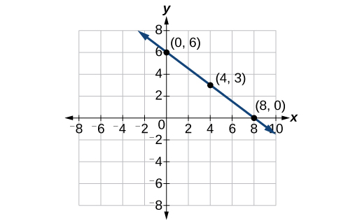 

#### Graphing a Function Using *y-*intercept and Slope

Another way to graph linear functions is by using specific characteristics of the function rather than plotting points. The first characteristic is its *y-*intercept, which is the point at which the input value is zero. To find the *y-*intercept, we can set<math xmlns="http://www.w3.org/1998/Math/MathML"> <mrow> <mtext> </mtext><mi>x</mi><mo>=</mo><mn>0</mn><mtext> </mtext> </mrow> </math>

in the equation.

The other characteristic of the linear function is its slope**.**

Let’s consider the following function.

<math xmlns="http://www.w3.org/1998/Math/MathML"> <mrow> <mi>f</mi><mo stretchy="false">(</mo><mi>x</mi><mo stretchy="false">)</mo><mo>=</mo><mfrac> <mn>1</mn> <mn>2</mn> </mfrac> <mi>x</mi><mo>+</mo><mn>1</mn> </mrow> </math>

The slope is<math xmlns="http://www.w3.org/1998/Math/MathML"> <mrow> <mtext> </mtext><mfrac> <mn>1</mn> <mn>2</mn> </mfrac> <mo>.</mo><mtext> </mtext> </mrow> </math>

Because the slope is positive, we know the graph will slant upward from left to right. The *y-*intercept is the point on the graph when<math xmlns="http://www.w3.org/1998/Math/MathML"> <mrow> <mtext> </mtext><mi>x</mi><mo>=</mo><mn>0.</mn><mtext> </mtext> </mrow> </math>

The graph crosses the *y*-axis at<math xmlns="http://www.w3.org/1998/Math/MathML"> <mrow> <mtext> </mtext><mo stretchy="false">(</mo><mn>0</mn><mo>,</mo><mn>1</mn><mo stretchy="false">)</mo><mo>.</mo><mtext> </mtext> </mrow> </math>

Now we know the slope and the *y*-intercept. We can begin graphing by plotting the point<math xmlns="http://www.w3.org/1998/Math/MathML"> <mrow> <mtext> </mtext><mo stretchy="false">(</mo><mn>0</mn><mo>,</mo><mn>1</mn><mo stretchy="false">)</mo><mo>.</mo><mtext> </mtext> </mrow> </math>

We know that the slope is the change in the *y*-coordinate over the change in the *x*-coordinate. This is commonly referred to as rise over run,<math xmlns="http://www.w3.org/1998/Math/MathML"> <mrow> <mtext> </mtext><mi>m</mi><mo>=</mo><mfrac> <mrow> <mtext>rise</mtext> </mrow> <mrow> <mtext>run</mtext> </mrow> </mfrac> <mo>.</mo><mtext> </mtext> </mrow> </math>

From our example, we have<math xmlns="http://www.w3.org/1998/Math/MathML"> <mrow> <mtext> </mtext><mi>m</mi><mo>=</mo><mfrac> <mn>1</mn> <mn>2</mn> </mfrac> <mo>,</mo> </mrow> </math>

which means that the rise is 1 and the run is 2. So starting from our *y*-intercept<math xmlns="http://www.w3.org/1998/Math/MathML"> <mrow> <mtext> </mtext><mo stretchy="false">(</mo><mn>0</mn><mo>,</mo><mn>1</mn><mo stretchy="false">)</mo><mo>,</mo> </mrow> </math>

we can rise 1 and then run 2, or run 2 and then rise 1. We repeat until we have a few points, and then we draw a line through the points as shown in [\[link\]](#CNX_Precalc_Figure_02_02_003).

{: #CNX_Precalc_Figure_02_02_003}

Graphical Interpretation of a Linear Function

In the equation<math xmlns="http://www.w3.org/1998/Math/MathML"> <mrow> <mtext> </mtext><mi>f</mi><mo stretchy="false">(</mo><mi>x</mi><mo stretchy="false">)</mo><mo>=</mo><mi>m</mi><mi>x</mi><mo>+</mo><mi>b</mi> </mrow> </math>

* <math xmlns="http://www.w3.org/1998/Math/MathML"> <mrow> <mi>b</mi><mtext> </mtext> </mrow> </math>
  
  is the *y*-intercept of the graph and indicates the point
  <math xmlns="http://www.w3.org/1998/Math/MathML"> <mrow> <mtext> </mtext><mo stretchy="false">(</mo><mn>0</mn><mo>,</mo><mi>b</mi><mo stretchy="false">)</mo><mtext> </mtext> </mrow> </math>
  
  at which the graph crosses the *y*-axis.
* <math xmlns="http://www.w3.org/1998/Math/MathML"> <mrow> <mi>m</mi><mtext> </mtext> </mrow> </math>
  
  is the slope of the line and indicates the vertical displacement (rise) and horizontal displacement (run) between each successive pair of points. Recall the formula for the slope:

<math xmlns="http://www.w3.org/1998/Math/MathML"> <mrow> <mi>m</mi><mo>=</mo><mfrac> <mrow> <mtext>change in output (rise)</mtext> </mrow> <mrow> <mtext>change in input (run)</mtext> </mrow> </mfrac> <mo>=</mo><mfrac> <mrow> <mi>Δ</mi><mi>y</mi> </mrow> <mrow> <mi>Δ</mi><mi>x</mi> </mrow> </mfrac> <mo>=</mo><mfrac> <mrow> <msub> <mi>y</mi> <mn>2</mn> </msub> <mo>−</mo><msub> <mi>y</mi> <mn>1</mn> </msub> </mrow> <mrow> <msub> <mi>x</mi> <mn>2</mn> </msub> <mo>−</mo><msub> <mi>x</mi> <mn>1</mn> </msub> </mrow> </mfrac> </mrow> </math>

**Do all linear functions have *y*-intercepts?**

<em>Yes. All linear functions cross the y-axis and therefore have y-intercepts. </em>(Note: *A vertical line is parallel to the y-axis does not have a y-intercept, but it is not a function*.)

**Given the equation for a linear function, graph the function using the *y*-intercept and slope.**

1.  Evaluate the function at an input value of zero to find the *y-*intercept.
2.  Identify the slope as the rate of change of the input value.
3.  Plot the point represented by the *y-*intercept.
4.  Use
    <math xmlns="http://www.w3.org/1998/Math/MathML"> <mrow> <mtext> </mtext><mfrac> <mrow> <mtext>rise</mtext> </mrow> <mrow> <mtext>run</mtext> </mrow> </mfrac> <mtext> </mtext> </mrow> </math>
    
    to determine at least two more points on the line.
5.  Sketch the line that passes through the points.
{: type="1"}

Graphing by Using the *y-*intercept and Slope

Graph<math xmlns="http://www.w3.org/1998/Math/MathML"> <mrow> <mtext> </mtext><mi>f</mi><mo stretchy="false">(</mo><mi>x</mi><mo stretchy="false">)</mo><mo>=</mo><mo>−</mo><mfrac> <mn>2</mn> <mn>3</mn> </mfrac> <mi>x</mi><mo>+</mo><mn>5</mn><mtext> </mtext> </mrow> </math>

using the *y-*intercept and slope.

Evaluate the function at<math xmlns="http://www.w3.org/1998/Math/MathML"> <mrow> <mtext> </mtext><mi>x</mi><mo>=</mo><mn>0</mn><mtext> </mtext> </mrow> </math>

to find the *y-*intercept. The output value when<math xmlns="http://www.w3.org/1998/Math/MathML"> <mrow> <mtext> </mtext><mi>x</mi><mo>=</mo><mn>0</mn><mtext> </mtext> </mrow> </math>

is 5, so the graph will cross the *y*-axis at<math xmlns="http://www.w3.org/1998/Math/MathML"> <mrow> <mtext> </mtext><mo stretchy="false">(</mo><mn>0</mn><mo>,</mo><mn>5</mn><mo stretchy="false">)</mo><mo>.</mo> </mrow> </math>

According to the equation for the function, the slope of the line is<math xmlns="http://www.w3.org/1998/Math/MathML"> <mrow> <mtext> </mtext><mo>−</mo><mfrac> <mn>2</mn> <mn>3</mn> </mfrac> <mo>.</mo><mtext> </mtext> </mrow> </math>

This tells us that for each vertical decrease in the “rise” of<math xmlns="http://www.w3.org/1998/Math/MathML"> <mrow> <mtext> </mtext><mo>–</mo><mn>2</mn><mtext> </mtext> </mrow> </math>

units, the “run” increases by 3 units in the horizontal direction. We can now graph the function by first plotting the *y*-intercept on the graph in [[link]](#CNX_Precalc_Figure_02_02_004). From the initial value<math xmlns="http://www.w3.org/1998/Math/MathML"> <mrow> <mtext> </mtext><mo stretchy="false">(</mo><mn>0</mn><mo>,</mo><mn>5</mn><mo stretchy="false">)</mo><mtext> </mtext> </mrow> </math>

we move down 2 units and to the right 3 units. We can extend the line to the left and right by repeating, and then drawing a line through the points.

=&#x2212;2/3x+5 and shows how to calculate the rise over run for the slope."){: #CNX_Precalc_Figure_02_02_004}

Analysis

The graph slants downward from left to right, which means it has a negative slope as expected.

Find a point on the graph we drew in [[link]](#Example_04_01_014) that has a negative *x*-value.

Possible answers include<math xmlns="http://www.w3.org/1998/Math/MathML"> <mrow> <mtext> </mtext><mo stretchy="false">(</mo><mo>−</mo><mn>3</mn><mo>,</mo><mn>7</mn><mo stretchy="false">)</mo><mo>,</mo><mtext> </mtext> </mrow> </math>

 <math xmlns="http://www.w3.org/1998/Math/MathML"> <mrow> <mo stretchy="false">(</mo><mo>−</mo><mn>6</mn><mo>,</mo><mn>9</mn><mo stretchy="false">)</mo><mo>,</mo><mtext> </mtext> </mrow> </math>

or<math xmlns="http://www.w3.org/1998/Math/MathML"> <mrow> <mtext> </mtext><mo stretchy="false">(</mo><mo>−</mo><mn>9</mn><mo>,</mo><mn>11</mn><mo stretchy="false">)</mo><mo>.</mo> </mrow> </math>

#### Graphing a Function Using Transformations

Another option for graphing is to use a **transformation**{: data-type="term" .no-emphasis} of the identity function<math xmlns="http://www.w3.org/1998/Math/MathML"> <mrow> <mtext> </mtext><mi>f</mi><mo stretchy="false">(</mo><mi>x</mi><mo stretchy="false">)</mo><mo>=</mo><mi>x</mi><mo>.</mo><mtext> </mtext> </mrow> </math>

A function may be transformed by a shift up, down, left, or right. A function may also be transformed using a reflection, stretch, or compression.

##### Vertical Stretch or Compression

In the equation<math xmlns="http://www.w3.org/1998/Math/MathML"> <mrow> <mtext> </mtext><mi>f</mi><mo stretchy="false">(</mo><mi>x</mi><mo stretchy="false">)</mo><mo>=</mo><mi>m</mi><mi>x</mi><mo>,</mo> </mrow> </math>

the<math xmlns="http://www.w3.org/1998/Math/MathML"> <mrow> <mtext> </mtext><mi>m</mi><mtext> </mtext> </mrow> </math>

is acting as the **vertical stretch**{: data-type="term" .no-emphasis} or **compression**{: data-type="term" .no-emphasis} of the identity function. When<math xmlns="http://www.w3.org/1998/Math/MathML"> <mrow> <mtext> </mtext><mi>m</mi><mtext> </mtext> </mrow> </math>

is negative, there is also a vertical reflection of the graph. Notice in [\[link\]](#CNX_Precalc_Figure_02_02_005) that multiplying the equation of<math xmlns="http://www.w3.org/1998/Math/MathML"> <mrow> <mtext> </mtext><mi>f</mi><mo stretchy="false">(</mo><mi>x</mi><mo stretchy="false">)</mo><mo>=</mo><mi>x</mi><mtext> </mtext> </mrow> </math>

by<math xmlns="http://www.w3.org/1998/Math/MathML"> <mrow> <mtext> </mtext><mi>m</mi><mtext> </mtext> </mrow> </math>

stretches the graph of<math xmlns="http://www.w3.org/1998/Math/MathML"> <mrow> <mtext> </mtext><mi>f</mi><mtext> </mtext> </mrow> </math>

by a factor of<math xmlns="http://www.w3.org/1998/Math/MathML"> <mrow> <mtext> </mtext><mi>m</mi><mtext> </mtext> </mrow> </math>

units if<math xmlns="http://www.w3.org/1998/Math/MathML"> <mrow> <mtext> </mtext><mi>m</mi><mo>&gt;</mo><mtext>1</mtext><mtext> </mtext> </mrow> </math>

and compresses the graph of<math xmlns="http://www.w3.org/1998/Math/MathML"> <mrow> <mtext> </mtext><mi>f</mi><mtext> </mtext> </mrow> </math>

by a factor of<math xmlns="http://www.w3.org/1998/Math/MathML"> <mrow> <mtext> </mtext><mi>m</mi><mtext> </mtext> </mrow> </math>

units if<math xmlns="http://www.w3.org/1998/Math/MathML"> <mrow> <mtext> </mtext><mn>0</mn><mo>&lt;</mo><mi>m</mi><mo>&lt;</mo><mn>1.</mn><mtext> </mtext> </mrow> </math>

This means the larger the absolute value of<math xmlns="http://www.w3.org/1998/Math/MathML"> <mrow> <mtext> </mtext><mi>m</mi><mo>,</mo><mtext> </mtext> </mrow> </math>

the steeper the slope.

![This graph shows seven versions of the function, f of x = x on an x, y coordinate plane. The x-axis runs from negative 8 to 8. The y-axis runs from negative 8 to 8. Seven multi-colored lines run through the point (0, 0). Starting with the lines in the top right quadrant and moving clockwise, the first line is f of x = 3 times x and has a slope of 3, the next line is f of x = 2 times x which has a slope of 2, the next line is f of x = x which has a slope of 1, the next line is f of x = x divided by 2 which has a slope of .5. The last line in this quadrant is f of x = x divided by 3 which has a slope of one third x. In the bottom right quadrant moving clockwise, the first line is f of x = negative x divided by 2, which has a slope of negative one half, the middle line is f of x = negative x which has a slope of negative 1, and the last line is f of x = negative 2 times x which has a slope of  negative 2.](../resources/CNX_Precalc_Figure_02_02_005.jpg "Vertical stretches and compressions and reflections on the function&#10; &#10;  &#x2009;f(x)=x&#10; &#10;&#10;"){: #CNX_Precalc_Figure_02_02_005}

##### Vertical Shift

In<math xmlns="http://www.w3.org/1998/Math/MathML"> <mrow> <mtext> </mtext><mi>f</mi><mo stretchy="false">(</mo><mi>x</mi><mo stretchy="false">)</mo><mo>=</mo><mi>m</mi><mi>x</mi><mo>+</mo><mi>b</mi><mo>,</mo> </mrow> </math>

the<math xmlns="http://www.w3.org/1998/Math/MathML"> <mrow> <mtext> </mtext><mi>b</mi><mtext> </mtext> </mrow> </math>

acts as the **vertical shift**{: data-type="term" .no-emphasis}, moving the graph up and down without affecting the slope of the line. Notice in [\[link\]](#CNX_Precalc_Figure_02_02_006) that adding a value of<math xmlns="http://www.w3.org/1998/Math/MathML"> <mrow> <mtext> </mtext><mi>b</mi><mtext> </mtext> </mrow> </math>

to the equation of<math xmlns="http://www.w3.org/1998/Math/MathML"> <mrow> <mtext> </mtext><mi>f</mi><mrow><mo>(</mo> <mi>x</mi> <mo>)</mo></mrow><mo>=</mo><mi>x</mi><mtext> </mtext> </mrow> </math>

shifts the graph of<math xmlns="http://www.w3.org/1998/Math/MathML"> <mrow> <mtext> </mtext><mi>f</mi><mtext> </mtext> </mrow> </math>

a total of<math xmlns="http://www.w3.org/1998/Math/MathML"> <mrow> <mtext> </mtext><mi>b</mi><mtext> </mtext> </mrow> </math>

units up if<math xmlns="http://www.w3.org/1998/Math/MathML"> <mrow> <mtext> </mtext><mi>b</mi><mtext> </mtext> </mrow> </math>

is positive and<math xmlns="http://www.w3.org/1998/Math/MathML"> <mrow> <mtext> </mtext><mo>\|</mo><mi>b</mi><mo>\|</mo><mtext> </mtext> </mrow> </math>

units down if<math xmlns="http://www.w3.org/1998/Math/MathML"> <mrow> <mtext> </mtext><mi>b</mi><mtext> </mtext> </mrow> </math>

is negative.

![This graph shows six versions of the function, f of x = x, on an x, y coordinate plane. The x-axis runs from negative 8 to 8, and the y axis runs negative 8 to 8. There are five lines parallel to each other. The first line extends from the bottom left quadrant to the upper right quadrant on the coordinate plane. This line shows f of x = x plus 4 which has a slope of 1 and a y-intercept at 4. The next line also extends from the bottom left quadrant to the upper right quadrant and shows f of x = x plus 2 which has a slope of 1 and a y-intercept at 2. The next and middle line, extends from the lower left quadrant, through the center of the graph at point (0, 0) to the upper right quadrant and shows f of x = x. The next line extends from the lower left quadrant, through the lower right quadrant to the upper right quadrant. This line shows f of x = x minus 2 which has a slope of 1 and a y-intercept at -2. The last line extends from the lower left quadrant, through the lower right quadrant to the upper right quadrant.This line shows f of x = x minus 4 which has a slope of 1 and a y-intercept at -4.](../resources/CNX_Precalc_Figure_02_02_006.jpg "This graph illustrates vertical shifts of the function&#10; &#10;  f(x)=x.&#10; &#10;"){: #CNX_Precalc_Figure_02_02_006}

Using vertical stretches or compressions along with vertical shifts is another way to look at identifying different types of linear functions. Although this may not be the easiest way to graph this type of function, it is still important to practice each method.

<strong>Given the equation of a linear function, use transformations to graph the linear function in the form<math xmlns="http://www.w3.org/1998/Math/MathML">
 <mrow>
  <mtext> </mtext><mi>f</mi><mrow><mo>(</mo>
   <mi>x</mi>
  <mo>)</mo></mrow><mo>=</mo><mi>m</mi><mi>x</mi><mo>+</mo><mi>b</mi><mo>.</mo>
 </mrow>
</math></strong>

1.  Graph
    <math xmlns="http://www.w3.org/1998/Math/MathML"> <mrow> <mtext> </mtext><mi>f</mi><mrow><mo>(</mo> <mi>x</mi> <mo>)</mo></mrow><mo>=</mo><mi>x</mi><mo>.</mo> </mrow> </math>

2.  Vertically stretch or compress the graph by a factor
    <math xmlns="http://www.w3.org/1998/Math/MathML"> <mrow> <mtext> </mtext><mi>m</mi><mo>.</mo> </mrow> </math>

3.  Shift the graph up or down
    <math xmlns="http://www.w3.org/1998/Math/MathML"> <mrow> <mtext> </mtext><mi>b</mi><mtext> </mtext> </mrow> </math>
    
    units.
{: type="1"}

Graphing by Using Transformations

Graph<math xmlns="http://www.w3.org/1998/Math/MathML"> <mrow> <mtext> </mtext><mi>f</mi><mo stretchy="false">(</mo><mi>x</mi><mo stretchy="false">)</mo><mo>=</mo><mfrac> <mn>1</mn> <mn>2</mn> </mfrac> <mi>x</mi><mo>−</mo><mn>3</mn><mtext> </mtext> </mrow> </math>

using transformations.

The equation for the function shows that<math xmlns="http://www.w3.org/1998/Math/MathML"> <mrow> <mtext> </mtext><mi>m</mi><mo>=</mo><mfrac> <mn>1</mn> <mn>2</mn> </mfrac> <mtext> </mtext> </mrow> </math>

so the identity function is vertically compressed by<math xmlns="http://www.w3.org/1998/Math/MathML"> <mrow> <mtext> </mtext><mfrac> <mn>1</mn> <mn>2</mn> </mfrac> <mo>.</mo><mtext> </mtext> </mrow> </math>

The equation for the function also shows that<math xmlns="http://www.w3.org/1998/Math/MathML"> <mrow> <mtext> </mtext><mi>b</mi><mo>=</mo><mo>−</mo><mn>3</mn><mtext> </mtext> </mrow> </math>

so the identity function is vertically shifted down 3 units. First, graph the identity function, and show the vertical compression as in [[link]](#CNX_Precalc_Figure_02_02_007).

{: #CNX_Precalc_Figure_02_02_007}

Then show the vertical shift as in [[link]](#CNX_Precalc_Figure_02_02_008).

{: #CNX_Precalc_Figure_02_02_008}

Graph<math xmlns="http://www.w3.org/1998/Math/MathML"> <mrow> <mtext> </mtext><mi>f</mi><mo stretchy="false">(</mo><mi>x</mi><mo stretchy="false">)</mo><mo>=</mo><mn>4</mn><mo>+</mo><mn>2</mn><mi>x</mi><mtext> </mtext> </mrow> </math>

using transformations.

  

**In [\[link\]](#Example_04_01_015), could we have sketched the graph by reversing the order of the transformations?**

*No. The order of the transformations follows the order of operations. When the function is evaluated at a given input, the corresponding output is calculated by following the order of operations. This is why we performed the compression first. For example, following the order: Let the input be 2.*

<math xmlns="http://www.w3.org/1998/Math/MathML"> <mrow> <mtable> <mtr rowalign="center"> <mtd columnalign="right" rowalign="center"> <mrow> <mi>f</mi><mo stretchy="false">(</mo><mn>2</mn><mo stretchy="false">)</mo> </mrow> </mtd> <mtd rowalign="center"> <mo>=</mo> </mtd> <mtd columnalign="left" rowalign="center"> <mrow> <mfrac> <mn>1</mn> <mn>2</mn> </mfrac> <mo stretchy="false">(</mo><mn>2</mn><mo stretchy="false">)</mo><mo>−</mo><mn>3</mn> </mrow> </mtd> </mtr> <mtr rowalign="center"> <mtd rowalign="center" /> <mtd rowalign="center"> <mo>=</mo> </mtd> <mtd columnalign="left" rowalign="center"> <mrow> <mn>1</mn><mo>−</mo><mn>3</mn> </mrow> </mtd> </mtr> <mtr rowalign="center"> <mtd rowalign="center" /> <mtd rowalign="center"> <mo>=</mo> </mtd> <mtd columnalign="left" rowalign="center"> <mrow> <mn>−2</mn> </mrow> </mtd> </mtr> </mtable> </mrow> </math>

### Writing the Equation for a Function from the Graph of a Line

Earlier, we wrote the equation for a linear function from a graph. Now we can extend what we know about graphing linear functions to analyze graphs a little more closely. Begin by taking a look at [\[link\]](#CNX_Precalc_Figure_02_04_010). We can see right away that the graph crosses the *y*-axis at the point<math xmlns="http://www.w3.org/1998/Math/MathML"> <mrow> <mtext> </mtext><mo stretchy="false">(</mo><mn>0</mn><mo>,</mo><mtext>4</mtext><mo stretchy="false">)</mo><mtext> </mtext> </mrow> </math>

so this is the *y*-intercept.

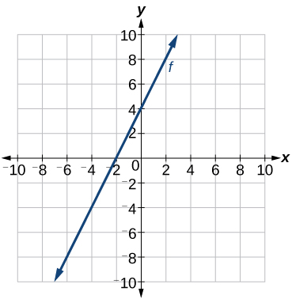{: #CNX_Precalc_Figure_02_04_010}

Then we can calculate the slope by finding the rise and run. We can choose any two points, but let’s look at the point<math xmlns="http://www.w3.org/1998/Math/MathML"> <mrow> <mtext> </mtext><mo stretchy="false">(</mo><mo>–</mo><mn>2</mn><mo>,</mo><mn>0</mn><mo stretchy="false">)</mo><mo>.</mo><mtext> </mtext> </mrow> </math>

To get from this point to the *y-*intercept, we must move up 4 units (rise) and to the right 2 units (run). So the slope must be

<math xmlns="http://www.w3.org/1998/Math/MathML"> <mrow> <mi>m</mi><mo>=</mo><mfrac> <mrow> <mtext>rise</mtext> </mrow> <mrow> <mtext>run</mtext> </mrow> </mfrac> <mo>=</mo><mfrac> <mn>4</mn> <mn>2</mn> </mfrac> <mo>=</mo><mn>2</mn> </mrow> </math>

Substituting the slope and *y-*intercept into the slope-intercept form of a line gives

<math xmlns="http://www.w3.org/1998/Math/MathML"> <mrow> <mi>y</mi><mo>=</mo><mn>2</mn><mi>x</mi><mo>+</mo><mn>4</mn> </mrow> </math>

**Given a graph of linear function, find the equation to describe the function.**

1.  Identify the *y-*intercept of an equation.
2.  Choose two points to determine the slope.
3.  Substitute the *y-*intercept and slope into the slope-intercept form of a line.
{: type="1"}

Matching Linear Functions to Their Graphs

Match each equation of the linear functions with one of the lines in [[link]](#CNX_Precalc_Figure_02_04_011).

<math xmlns="http://www.w3.org/1998/Math/MathML"> <mrow> <mtable> <mtr> <mtd columnalign="left"> <mrow> <mi>a</mi><mtext>.</mtext> </mrow> </mtd> <mtd columnalign="right"> <mrow> <mtext> </mtext><mi>f</mi><mo stretchy="false">(</mo><mi>x</mi><mo stretchy="false">)</mo> </mrow> </mtd> <mtd> <mo>=</mo> </mtd> <mtd columnalign="left"> <mrow> <mn>2</mn><mi>x</mi><mo>+</mo><mn>3</mn> </mrow> </mtd> </mtr> <mtr> <mtd columnalign="left"> <mrow> <mi>b</mi><mtext>.</mtext> </mrow> </mtd> <mtd columnalign="right"> <mrow> <mi>g</mi><mo stretchy="false">(</mo><mi>x</mi><mo stretchy="false">)</mo> </mrow> </mtd> <mtd> <mo>=</mo> </mtd> <mtd columnalign="left"> <mrow> <mn>2</mn><mi>x</mi><mo>−</mo><mn>3</mn> </mrow> </mtd> </mtr> <mtr> <mtd columnalign="left"> <mrow> <mi>c</mi><mtext>.</mtext> </mrow> </mtd> <mtd columnalign="right"> <mrow> <mi>h</mi><mo stretchy="false">(</mo><mi>x</mi><mo stretchy="false">)</mo> </mrow> </mtd> <mtd> <mo>=</mo> </mtd> <mtd columnalign="left"> <mrow> <mn>−2</mn><mi>x</mi><mo>+</mo><mn>3</mn> </mrow> </mtd> </mtr> <mtr> <mtd columnalign="left"> <mrow> <mi>d</mi><mtext>. </mtext> </mrow> </mtd> <mtd columnalign="right"> <mrow> <mi>j</mi><mo stretchy="false">(</mo><mi>x</mi><mo stretchy="false">)</mo> </mrow> </mtd> <mtd> <mo>=</mo> </mtd> <mtd columnalign="left"> <mrow> <mfrac> <mn>1</mn> <mn>2</mn> </mfrac> <mi>x</mi><mo>+</mo><mn>3</mn> </mrow> </mtd> </mtr> </mtable> </mrow> </math>

{: #CNX_Precalc_Figure_02_04_011}

Analyze the information for each function.

1.  This function has a slope of 2 and a *y*-intercept of 3. It must pass through the point (0, 3) and slant upward from left to right. We can use two points to find the slope, or we can compare it with the other functions listed. Function
    <math xmlns="http://www.w3.org/1998/Math/MathML"> <mrow> <mtext> </mtext><mi>g</mi><mtext> </mtext> </mrow> </math>
    
    has the same slope, but a different *y-*intercept. Lines I and III have the same slant because they have the same slope. Line III does not pass through
    <math xmlns="http://www.w3.org/1998/Math/MathML"> <mrow> <mtext> </mtext><mo stretchy="false">(</mo><mn>0</mn><mo>,</mo><mtext>3</mtext><mo stretchy="false">)</mo><mtext> </mtext> </mrow> </math>
    
    so
    <math xmlns="http://www.w3.org/1998/Math/MathML"> <mrow> <mtext> </mtext><mi>f</mi><mtext> </mtext> </mrow> </math>
    
    must be represented by line I.
2.  This function also has a slope of 2, but a *y*-intercept of
    <math xmlns="http://www.w3.org/1998/Math/MathML"> <mrow> <mtext> </mtext><mn>−3.</mn><mtext> </mtext> </mrow> </math>
    
    It must pass through the point
    <math xmlns="http://www.w3.org/1998/Math/MathML"> <mrow> <mtext> </mtext><mrow><mo>(</mo> <mrow> <mn>0</mn><mo>,</mo><mn>−3</mn> </mrow> <mo>)</mo></mrow><mtext> </mtext> </mrow> </math>
    
    and slant upward from left to right. It must be represented by line III.
3.  This function has a slope of –2 and a *y-*intercept of 3. This is the only function listed with a negative slope, so it must be represented by line IV because it slants downward from left to right.
4.  This function has a slope of
    <math xmlns="http://www.w3.org/1998/Math/MathML"> <mrow> <mtext> </mtext><mfrac> <mn>1</mn> <mn>2</mn> </mfrac> <mtext> </mtext> </mrow> </math>
    
    and a *y-*intercept of 3. It must pass through the point (0, 3) and slant upward from left to right. Lines I and II pass through
    <math xmlns="http://www.w3.org/1998/Math/MathML"> <mrow> <mtext> </mtext><mo stretchy="false">(</mo><mn>0</mn><mo>,</mo><mtext>3</mtext><mo stretchy="false">)</mo><mo>,</mo> </mrow> </math>
    
    but the slope of
    <math xmlns="http://www.w3.org/1998/Math/MathML"> <mrow> <mtext> </mtext><mi>j</mi><mtext> </mtext> </mrow> </math>
    
    is less than the slope of
    <math xmlns="http://www.w3.org/1998/Math/MathML"> <mrow> <mtext> </mtext><mi>f</mi><mtext> </mtext> </mrow> </math>
    
    so the line for
    <math xmlns="http://www.w3.org/1998/Math/MathML"> <mrow> <mtext> </mtext><mi>j</mi><mtext> </mtext> </mrow> </math>
    
    must be flatter. This function is represented by Line II.
{: type="a"}

Now we can re-label the lines as in [[link]](#CNX_Precalc_Figure_02_04_012).

{: #CNX_Precalc_Figure_02_04_012}

#### Finding the *x*-intercept of a Line

So far we have been finding the *y-*intercepts of a function: the point at which the graph of the function crosses the *y*-axis. Recall that a function may also have an ***x*-intercept**{: data-type="term" .no-emphasis}, which is the *x*-coordinate of the point where the graph of the function crosses the *x*-axis. In other words, it is the input value when the output value is zero.

To find the *x*-intercept, set a function<math xmlns="http://www.w3.org/1998/Math/MathML"> <mrow> <mtext> </mtext><mi>f</mi><mo stretchy="false">(</mo><mi>x</mi><mo stretchy="false">)</mo><mtext> </mtext> </mrow> </math>

equal to zero and solve for the value of<math xmlns="http://www.w3.org/1998/Math/MathML"> <mrow> <mtext> </mtext><mi>x</mi><mo>.</mo><mtext> </mtext> </mrow> </math>

For example, consider the function shown.

<math xmlns="http://www.w3.org/1998/Math/MathML"> <mrow> <mi>f</mi><mo stretchy="false">(</mo><mi>x</mi><mo stretchy="false">)</mo><mo>=</mo><mn>3</mn><mi>x</mi><mo>−</mo><mn>6</mn> </mrow> </math>

Set the function equal to 0 and solve for<math xmlns="http://www.w3.org/1998/Math/MathML"> <mrow> <mtext> </mtext><mi>x</mi><mo>.</mo> </mrow> </math>

<math xmlns="http://www.w3.org/1998/Math/MathML"> <mrow> <mtable> <mtr> <mtd columnalign="right"> <mn>0</mn> </mtd> <mtd> <mo>=</mo> </mtd> <mtd columnalign="left"> <mrow> <mn>3</mn><mi>x</mi><mo>−</mo><mn>6</mn> </mrow> </mtd> </mtr> <mtr> <mtd columnalign="right"> <mn>6</mn> </mtd> <mtd> <mo>=</mo> </mtd> <mtd columnalign="left"> <mrow> <mn>3</mn><mi>x</mi> </mrow> </mtd> </mtr> <mtr> <mtd columnalign="right"> <mn>2</mn> </mtd> <mtd> <mo>=</mo> </mtd> <mtd columnalign="left"> <mi>x</mi> </mtd> </mtr> <mtr> <mtd columnalign="right"> <mi>x</mi> </mtd> <mtd> <mo>=</mo> </mtd> <mtd columnalign="left"> <mn>2</mn> </mtd> </mtr> </mtable> </mrow> </math>

The graph of the function crosses the *x*-axis at the point<math xmlns="http://www.w3.org/1998/Math/MathML"> <mrow> <mtext> </mtext><mo stretchy="false">(</mo><mn>2</mn><mo>,</mo><mtext>0</mtext><mo stretchy="false">)</mo><mo>.</mo> </mrow> </math>

**Do all linear functions have *x*-intercepts?**

*No. However, linear functions of the form<math xmlns="http://www.w3.org/1998/Math/MathML"> <mrow> <mtext> </mtext><mi>y</mi><mo>=</mo><mi>c</mi><mo>,</mo> </mrow> </math>

where<math xmlns="http://www.w3.org/1998/Math/MathML"> <mrow> <mtext> </mtext><mi>c</mi><mtext> </mtext> </mrow> </math>

is a nonzero real number are the only examples of linear functions with no x-intercept. For example,<math xmlns="http://www.w3.org/1998/Math/MathML"> <mrow> <mtext> </mtext><mi>y</mi><mo>=</mo><mn>5</mn><mtext> </mtext> </mrow> </math>

is a horizontal line 5 units above the x-axis. This function has no x-intercepts, as shown in **[\[link\]](#CNX_Precalc_Figure_02_02_026).***

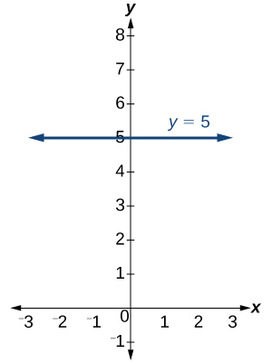{: #CNX_Precalc_Figure_02_02_026}

*x*-intercept

The *x*-intercept of the function is value of<math xmlns="http://www.w3.org/1998/Math/MathML"> <mrow> <mtext> </mtext><mi>x</mi><mtext> </mtext> </mrow> </math>

when<math xmlns="http://www.w3.org/1998/Math/MathML"> <mrow> <mtext> </mtext><mi>f</mi><mo stretchy="false">(</mo><mi>x</mi><mo stretchy="false">)</mo><mo>=</mo><mn>0.</mn><mtext> </mtext> </mrow> </math>

It can be solved by the equation<math xmlns="http://www.w3.org/1998/Math/MathML"> <mrow> <mtext> </mtext><mn>0</mn><mo>=</mo><mi>m</mi><mi>x</mi><mo>+</mo><mi>b</mi><mo>.</mo> </mrow> </math>

Finding an *x*-intercept

Find the *x*-intercept of<math xmlns="http://www.w3.org/1998/Math/MathML"> <mrow> <mtext> </mtext><mi>f</mi><mo stretchy="false">(</mo><mi>x</mi><mo stretchy="false">)</mo><mo>=</mo><mfrac> <mn>1</mn> <mn>2</mn> </mfrac> <mi>x</mi><mo>−</mo><mn>3.</mn> </mrow> </math>

Set the function equal to zero to solve for<math xmlns="http://www.w3.org/1998/Math/MathML"> <mrow> <mtext> </mtext><mi>x</mi><mo>.</mo> </mrow> </math>

<math xmlns="http://www.w3.org/1998/Math/MathML"> <mrow> <mtable> <mtr> <mtd columnalign="right"> <mn>0</mn> </mtd> <mtd> <mo>=</mo> </mtd> <mtd columnalign="left"> <mrow> <mfrac> <mn>1</mn> <mn>2</mn> </mfrac> <mi>x</mi><mo>−</mo><mn>3</mn> </mrow> </mtd> </mtr> <mtr> <mtd columnalign="right"> <mn>3</mn> </mtd> <mtd> <mo>=</mo> </mtd> <mtd columnalign="left"> <mrow> <mfrac> <mn>1</mn> <mn>2</mn> </mfrac> <mi>x</mi> </mrow> </mtd> </mtr> <mtr> <mtd columnalign="right"> <mn>6</mn> </mtd> <mtd> <mo>=</mo> </mtd> <mtd columnalign="left"> <mi>x</mi> </mtd> </mtr> <mtr> <mtd columnalign="right"> <mi>x</mi> </mtd> <mtd> <mo>=</mo> </mtd> <mtd columnalign="left"> <mn>6</mn> </mtd> </mtr> </mtable> </mrow> </math>

The graph crosses the *x*-axis at the point<math xmlns="http://www.w3.org/1998/Math/MathML"> <mrow> <mtext> </mtext><mo stretchy="false">(</mo><mn>6</mn><mo>,</mo><mtext>0</mtext><mo stretchy="false">)</mo><mo>.</mo> </mrow> </math>

Analysis

A graph of the function is shown in [[link]](#CNX_Precalc_Figure_02_04_013). We can see that the *x*-intercept is<math xmlns="http://www.w3.org/1998/Math/MathML"> <mrow> <mtext> </mtext><mo stretchy="false">(</mo><mn>6</mn><mo>,</mo><mtext>0</mtext><mo stretchy="false">)</mo><mtext> </mtext> </mrow> </math>

as we expected.

{: #CNX_Precalc_Figure_02_04_013}

Find the *x*-intercept of<math xmlns="http://www.w3.org/1998/Math/MathML"> <mrow> <mtext> </mtext><mi>f</mi><mo stretchy="false">(</mo><mi>x</mi><mo stretchy="false">)</mo><mo>=</mo><mfrac> <mn>1</mn> <mn>4</mn> </mfrac> <mi>x</mi><mo>−</mo><mn>4.</mn> </mrow> </math>

<math xmlns="http://www.w3.org/1998/Math/MathML"> <mrow> <mtext> </mtext><mrow><mo>(</mo> <mrow> <mn>16</mn><mo>,</mo><mtext> 0</mtext> </mrow> <mo>)</mo></mrow> </mrow> </math>

#### Describing Horizontal and Vertical Lines

There are two special cases of lines on a graph—horizontal and vertical lines. A **horizontal line**{: data-type="term" .no-emphasis} indicates a constant output, or *y*-value. In [\[link\]](#CNX_Precalc_Figure_02_04_014), we see that the output has a value of 2 for every input value. The change in outputs between any two points, therefore, is 0. In the slope formula, the numerator is 0, so the slope is 0. If we use<math xmlns="http://www.w3.org/1998/Math/MathML"> <mrow> <mtext> </mtext><mi>m</mi><mo>=</mo><mn>0</mn><mtext> </mtext> </mrow> </math>

in the equation<math xmlns="http://www.w3.org/1998/Math/MathML"> <mrow> <mtext> </mtext><mi>f</mi><mo stretchy="false">(</mo><mi>x</mi><mo stretchy="false">)</mo><mo>=</mo><mi>m</mi><mi>x</mi><mo>+</mo><mi>b</mi><mo>,</mo> </mrow> </math>

the equation simplifies to<math xmlns="http://www.w3.org/1998/Math/MathML"> <mrow> <mtext> </mtext><mi>f</mi><mo stretchy="false">(</mo><mi>x</mi><mo stretchy="false">)</mo><mo>=</mo><mi>b</mi><mo>.</mo><mtext> </mtext> </mrow> </math>

In other words, the value of the function is a constant. This graph represents the function<math xmlns="http://www.w3.org/1998/Math/MathML"> <mrow> <mtext> </mtext><mi>f</mi><mo stretchy="false">(</mo><mi>x</mi><mo stretchy="false">)</mo><mo>=</mo><mn>2.</mn> </mrow> </math>

=2&#10; &#10;&#10;"){: #CNX_Precalc_Figure_02_04_014}

A **vertical line**{: data-type="term" .no-emphasis} indicates a constant input, or *x*-value. We can see that the input value for every point on the line is 2, but the output value varies. Because this input value is mapped to more than one output value, a vertical line does not represent a function. Notice that between any two points, the change in the input values is zero. In the slope formula, the denominator will be zero, so the slope of a vertical line is undefined.

 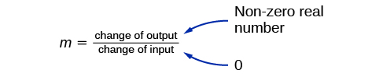{: #Image_04_01_027}

A vertical line, such as the one in [\[link\]](#CNX_Precalc_Figure_02_04_016)**,** has an *x*-intercept, but no *y-*intercept unless it’s the line<math xmlns="http://www.w3.org/1998/Math/MathML"> <mrow> <mtext> </mtext><mi>x</mi><mo>=</mo><mn>0.</mn><mtext> </mtext> </mrow> </math>

This graph represents the line<math xmlns="http://www.w3.org/1998/Math/MathML"> <mrow> <mtext> </mtext><mi>x</mi><mo>=</mo><mn>2.</mn> </mrow> </math>

 {: #CNX_Precalc_Figure_02_04_016}

Horizontal and Vertical Lines

Lines can be horizontal or vertical.

A **horizontal line**{: data-type="term"} is a line defined by an equation in the form<math xmlns="http://www.w3.org/1998/Math/MathML"> <mrow> <mtext> </mtext><mi>f</mi><mo stretchy="false">(</mo><mi>x</mi><mo stretchy="false">)</mo><mo>=</mo><mi>b</mi><mo>.</mo> </mrow> </math>

A **vertical line**{: data-type="term"} is a line defined by an equation in the form<math xmlns="http://www.w3.org/1998/Math/MathML"> <mrow> <mtext> </mtext><mi>x</mi><mo>=</mo><mi>a</mi><mo>.</mo> </mrow> </math>

Writing the Equation of a Horizontal Line

Write the equation of the line graphed in [[link]](#CNX_Precalc_Figure_02_04_017).

{: #CNX_Precalc_Figure_02_04_017}

For any *x*-value, the *y*-value is<math xmlns="http://www.w3.org/1998/Math/MathML"> <mrow> <mtext> </mtext><mo>−</mo><mn>4</mn><mo>,</mo><mtext> </mtext> </mrow> </math>

so the equation is<math xmlns="http://www.w3.org/1998/Math/MathML"> <mrow> <mtext> </mtext><mi>y</mi><mo>=</mo><mo>−</mo><mn>4.</mn> </mrow> </math>

Writing the Equation of a Vertical Line

Write the equation of the line graphed in [[link]](#CNX_Precalc_Figure_02_04_018).

{: #CNX_Precalc_Figure_02_04_018}

The constant *x*-value is<math xmlns="http://www.w3.org/1998/Math/MathML"> <mrow> <mtext> </mtext><mn>7</mn><mo>,</mo> </mrow> </math>

so the equation is<math xmlns="http://www.w3.org/1998/Math/MathML"> <mrow> <mtext> </mtext><mi>x</mi><mo>=</mo><mn>7.</mn> </mrow></math>

### Determining Whether Lines are Parallel or Perpendicular

The two lines in [\[link\]](#CNX_Precalc_Figure_02_04_019) are **parallel lines**{: data-type="term" .no-emphasis}\: they will never intersect. They have exactly the same steepness, which means their slopes are identical. The only difference between the two lines is the *y*-intercept. If we shifted one line vertically toward the other, they would become coincident.

 {: #CNX_Precalc_Figure_02_04_019}

We can determine from their equations whether two lines are parallel by comparing their slopes. If the slopes are the same and the *y*-intercepts are different, the lines are parallel. If the slopes are different, the lines are not parallel.

<math xmlns="http://www.w3.org/1998/Math/MathML"> <mrow> <mtable> <mtr> <mtd> <mrow> <mtable columnalign="left"> <mtr columnalign="left"> <mtd columnalign="left"> <mrow> <mi>f</mi><mo stretchy="false">(</mo><mi>x</mi><mo stretchy="false">)</mo><mo>=</mo><mo>−</mo><mn>2</mn><mi>x</mi><mo>+</mo><mn>6</mn> </mrow> </mtd> </mtr> <mtr columnalign="left"> <mtd columnalign="left"> <mrow> <mi>f</mi><mo stretchy="false">(</mo><mi>x</mi><mo stretchy="false">)</mo><mo>=</mo><mo>−</mo><mn>2</mn><mi>x</mi><mo>−</mo><mn>4</mn> </mrow> </mtd> </mtr> </mtable><mo>}</mo><mtext> parallel</mtext> <mspace width="2em" /> </mrow> </mtd> <mtd> <mrow> <mtable columnalign="left"> <mtr columnalign="left"> <mtd columnalign="left"> <mrow> <mi>f</mi><mo stretchy="false">(</mo><mi>x</mi><mo stretchy="false">)</mo><mo>=</mo><mn>3</mn><mi>x</mi><mo>+</mo><mn>2</mn> </mrow> </mtd> </mtr> <mtr columnalign="left"> <mtd columnalign="left"> <mrow> <mi>f</mi><mo stretchy="false">(</mo><mi>x</mi><mo stretchy="false">)</mo><mo>=</mo><mn>2</mn><mi>x</mi><mo>+</mo><mn>2</mn> </mrow> </mtd> </mtr> </mtable><mo>}</mo><mtext> not parallel</mtext> </mrow> </mtd> </mtr> </mtable> </mrow> </math>

Unlike parallel lines, **perpendicular lines**{: data-type="term" .no-emphasis} do intersect. Their intersection forms a right, or 90-degree, angle. The two lines in [\[link\]](#CNX_Precalc_Figure_02_02_020) are perpendicular.

 {: #CNX_Precalc_Figure_02_02_020}

Perpendicular lines do not have the same slope. The slopes of perpendicular lines are different from one another in a specific way. The slope of one line is the negative reciprocal of the slope of the other line. The product of a number and its reciprocal is<math xmlns="http://www.w3.org/1998/Math/MathML"> <mrow> <mtext> </mtext><mn>1.</mn><mtext> </mtext> </mrow> </math>

So, if<math xmlns="http://www.w3.org/1998/Math/MathML"> <mrow> <mtext> </mtext><msub> <mi>m</mi> <mn>1</mn> </msub> <mtext> and </mtext><msub> <mi>m</mi> <mn>2</mn> </msub> <mtext> </mtext> </mrow> </math>

are negative reciprocals of one another, they can be multiplied together to yield<math xmlns="http://www.w3.org/1998/Math/MathML"> <mrow> <mtext> </mtext><mn>–1.</mn> </mrow> </math>

<math xmlns="http://www.w3.org/1998/Math/MathML"> <mrow> <msub> <mi>m</mi> <mn>1</mn> </msub> <msub> <mi>m</mi> <mn>2</mn> </msub> <mo>=</mo><mn>−1</mn> </mrow> </math>

To find the reciprocal of a number, divide 1 by the number. So the reciprocal of 8 is<math xmlns="http://www.w3.org/1998/Math/MathML"> <mrow> <mtext> </mtext><mfrac> <mn>1</mn> <mn>8</mn> </mfrac> <mo>,</mo><mtext> </mtext> </mrow> </math>

and the reciprocal of<math xmlns="http://www.w3.org/1998/Math/MathML"> <mrow> <mtext> </mtext><mfrac> <mn>1</mn> <mn>8</mn> </mfrac> <mtext> </mtext> </mrow> </math>

is 8. To find the negative reciprocal, first find the reciprocal and then change the sign.

As with parallel lines, we can determine whether two lines are perpendicular by comparing their slopes, assuming that the lines are neither horizontal nor vertical. The slope of each line below is the negative reciprocal of the other so the lines are perpendicular.

<math xmlns="http://www.w3.org/1998/Math/MathML"> <mrow> <mtable> <mtr> <mtd columnalign="right"> <mrow> <mi>f</mi><mo stretchy="false">(</mo><mi>x</mi><mo stretchy="false">)</mo> </mrow> </mtd> <mtd> <mo>=</mo> </mtd> <mtd columnalign="left"> <mrow> <mfrac> <mn>1</mn> <mn>4</mn> </mfrac> <mi>x</mi><mo>+</mo><mn>2</mn> </mrow> </mtd> <mtd columnalign="left"> <mrow><mspace width="2em" /> <mtext>negative reciprocal of</mtext><mtext> </mtext><mfrac> <mn>1</mn> <mn>4</mn> </mfrac> <mtext> is </mtext><mn>−4</mn> </mrow> </mtd> </mtr> <mtr> <mtd columnalign="right"> <mrow> <mi>f</mi><mo stretchy="false">(</mo><mi>x</mi><mo stretchy="false">)</mo> </mrow> </mtd> <mtd> <mo>=</mo> </mtd> <mtd columnalign="left"> <mrow> <mn>−4</mn><mi>x</mi><mo>+</mo><mn>3</mn> </mrow> </mtd> <mtd columnalign="left"> <mrow><mspace width="2em" /> <mtext>negative reciprocal of</mtext><mtext> </mtext><mn>−4</mn><mtext> is </mtext><mfrac> <mn>1</mn> <mn>4</mn> </mfrac> </mrow> </mtd> </mtr> </mtable> </mrow> </math>

The product of the slopes is –1.

<math xmlns="http://www.w3.org/1998/Math/MathML"> <mrow> <mo>−</mo><mn>4</mn><mrow><mo>(</mo> <mrow> <mfrac> <mn>1</mn> <mn>4</mn> </mfrac> </mrow> <mo>)</mo></mrow><mo>=</mo><mo>−</mo><mn>1</mn> </mrow> </math>

Parallel and Perpendicular Lines

Two lines are **parallel lines**{: data-type="term"} if they do not intersect. The slopes of the lines are the same.

<math xmlns="http://www.w3.org/1998/Math/MathML"> <mrow> <mi>f</mi><mo stretchy="false">(</mo><mi>x</mi><mo stretchy="false">)</mo><mo>=</mo><msub> <mi>m</mi> <mn>1</mn> </msub> <mi>x</mi><mo>+</mo><msub> <mi>b</mi> <mn>1</mn> </msub> <mtext> </mtext><mtext>and</mtext><mtext> </mtext><mi>g</mi><mo stretchy="false">(</mo><mi>x</mi><mo stretchy="false">)</mo><mo>=</mo><msub> <mi>m</mi> <mn>2</mn> </msub> <mi>x</mi><mo>+</mo><msub> <mi>b</mi> <mn>2</mn> </msub> <mtext> </mtext><mtext>are parallel if and only if </mtext><msub> <mi>m</mi> <mn>1</mn> </msub> <mo>=</mo><msub> <mi>m</mi> <mn>2</mn> </msub> </mrow> </math>

If and only if<math xmlns="http://www.w3.org/1998/Math/MathML"> <mrow> <mtext> </mtext><msub> <mi>b</mi> <mn>1</mn> </msub> <mo>=</mo><msub> <mi>b</mi> <mn>2</mn> </msub> <mtext> </mtext> </mrow> </math>

and<math xmlns="http://www.w3.org/1998/Math/MathML"> <mrow> <mtext> </mtext><msub> <mi>m</mi> <mn>1</mn> </msub> <mo>=</mo><msub> <mi>m</mi> <mn>2</mn> </msub> <mo>,</mo><mtext> </mtext> </mrow> </math>

we say the lines coincide. Coincident lines are the same line.

Two lines are **perpendicular lines**{: data-type="term"} if they intersect to form a right angle.

<math xmlns="http://www.w3.org/1998/Math/MathML"> <mrow> <mi>f</mi><mo stretchy="false">(</mo><mi>x</mi><mo stretchy="false">)</mo><mo>=</mo><msub> <mi>m</mi> <mn>1</mn> </msub> <mi>x</mi><mo>+</mo><msub> <mi>b</mi> <mn>1</mn> </msub> <mtext> </mtext><mtext>and</mtext><mtext> </mtext><mi>g</mi><mo stretchy="false">(</mo><mi>x</mi><mo stretchy="false">)</mo><mo>=</mo><msub> <mi>m</mi> <mn>2</mn> </msub> <mi>x</mi><mo>+</mo><msub> <mi>b</mi> <mn>2</mn> </msub> <mtext> </mtext><mtext>are perpendicular if and only if</mtext> </mrow> </math>

<math xmlns="http://www.w3.org/1998/Math/MathML"> <mrow> <msub> <mi>m</mi> <mn>1</mn> </msub> <msub> <mi>m</mi> <mn>2</mn> </msub> <mo>=</mo><mo>−</mo><mn>1</mn><mo>,</mo><mtext>so</mtext><mtext> </mtext><msub> <mi>m</mi> <mn>2</mn> </msub> <mo>=</mo><mo>−</mo><mfrac> <mn>1</mn> <mrow> <msub> <mi>m</mi> <mn>1</mn> </msub> </mrow> </mfrac> </mrow> </math>

Identifying Parallel and Perpendicular Lines

Given the functions below, identify the functions whose graphs are a pair of parallel lines and a pair of perpendicular lines.

<math xmlns="http://www.w3.org/1998/Math/MathML"> <mrow> <mtable> <mtr> <mtd columnalign="right"> <mrow> <mi>f</mi><mo stretchy="false">(</mo><mi>x</mi><mo stretchy="false">)</mo> </mrow> </mtd> <mtd> <mo>=</mo> </mtd> <mtd columnalign="left"> <mrow> <mn>2</mn><mi>x</mi><mo>+</mo><mn>3</mn> </mrow> </mtd> <mtd columnalign="right"> <mrow><mspace width="2em" /> <mi>h</mi><mo stretchy="false">(</mo><mi>x</mi><mo stretchy="false">)</mo> </mrow> </mtd> <mtd> <mo>=</mo> </mtd> <mtd columnalign="left"> <mrow> <mo>−</mo><mn>2</mn><mi>x</mi><mo>+</mo><mn>2</mn> </mrow> </mtd> </mtr> <mtr> <mtd columnalign="right"> <mrow> <mi>g</mi><mo stretchy="false">(</mo><mi>x</mi><mo stretchy="false">)</mo> </mrow> </mtd> <mtd> <mo>=</mo> </mtd> <mtd columnalign="left"> <mrow> <mfrac> <mn>1</mn> <mn>2</mn> </mfrac> <mi>x</mi><mo>−</mo><mn>4</mn> </mrow> </mtd> <mtd columnalign="right"> <mrow><mspace width="2em" /> <mi>j</mi><mo stretchy="false">(</mo><mi>x</mi><mo stretchy="false">)</mo> </mrow> </mtd> <mtd> <mo>=</mo> </mtd> <mtd columnalign="left"> <mrow> <mn>2</mn><mi>x</mi><mo>−</mo><mn>6</mn> </mrow> </mtd> </mtr> </mtable> </mrow> </math>

Parallel lines have the same slope. Because the functions<math xmlns="http://www.w3.org/1998/Math/MathML"> <mrow> <mtext> </mtext><mi>f</mi><mo stretchy="false">(</mo><mi>x</mi><mo stretchy="false">)</mo><mo>=</mo><mn>2</mn><mi>x</mi><mo>+</mo><mn>3</mn><mtext> </mtext> </mrow> </math>

and<math xmlns="http://www.w3.org/1998/Math/MathML"> <mrow> <mtext> </mtext><mi>j</mi><mo stretchy="false">(</mo><mi>x</mi><mo stretchy="false">)</mo><mo>=</mo><mn>2</mn><mi>x</mi><mo>−</mo><mn>6</mn><mtext> </mtext> </mrow> </math>

each have a slope of 2, they represent parallel lines. Perpendicular lines have negative reciprocal slopes. Because −2 and<math xmlns="http://www.w3.org/1998/Math/MathML"> <mrow> <mtext> </mtext><mfrac> <mn>1</mn> <mn>2</mn> </mfrac> <mtext> </mtext> </mrow> </math>

are negative reciprocals, the functions<math xmlns="http://www.w3.org/1998/Math/MathML"> <mrow> <mtext> </mtext><mi>g</mi><mo stretchy="false">(</mo><mi>x</mi><mo stretchy="false">)</mo><mo>=</mo><mfrac> <mn>1</mn> <mn>2</mn> </mfrac> <mi>x</mi><mo>−</mo><mn>4</mn><mtext> </mtext> </mrow> </math>

and<math xmlns="http://www.w3.org/1998/Math/MathML"> <mrow> <mtext> </mtext><mi>h</mi><mo stretchy="false">(</mo><mi>x</mi><mo stretchy="false">)</mo><mo>=</mo><mn>−2</mn><mi>x</mi><mo>+</mo><mn>2</mn><mtext> </mtext> </mrow> </math>

represent perpendicular lines.

Analysis

A graph of the lines is shown in [[link]](#CNX_Precalc_Figure_02_02_021).

![This graph shows four functions on an x, y coordinate plane. The x-axis runs from negative 8 to 9. The y-axis runs from negative 8 to 8.  The first shows the decreasing function h of x = negative 2 times x plus 2. It passes through the points (0, 2) and (1, 0). The second is an increasing function that shows f of x = 2 times x plus 3. It passes through the points (0, 3) and (-1.5, 0). The third is an increasing function that shows j of x = 2 times x minus 6 and passes through the points (0, -6) and (3, 0). The fourth line is an increasing function where g of x = x divided by 2 minus 4 and passes through the points (0, -4) and (2 ,0).](../resources/CNX_Precalc_Figure_02_02_021.jpg){: #CNX_Precalc_Figure_02_02_021}

The graph shows that the lines<math xmlns="http://www.w3.org/1998/Math/MathML"> <mrow> <mtext> </mtext><mi>f</mi><mo stretchy="false">(</mo><mi>x</mi><mo stretchy="false">)</mo><mo>=</mo><mn>2</mn><mi>x</mi><mo>+</mo><mn>3</mn><mtext> </mtext> </mrow> </math>

and<math xmlns="http://www.w3.org/1998/Math/MathML"> <mrow> <mtext> </mtext><mi>j</mi><mo stretchy="false">(</mo><mi>x</mi><mo stretchy="false">)</mo><mo>=</mo><mn>2</mn><mi>x</mi><mo>–</mo><mn>6</mn><mtext> </mtext> </mrow> </math>

are parallel, and the lines<math xmlns="http://www.w3.org/1998/Math/MathML"> <mrow> <mtext> </mtext><mi>g</mi><mo stretchy="false">(</mo><mi>x</mi><mo stretchy="false">)</mo><mo>=</mo><mfrac> <mn>1</mn> <mn>2</mn> </mfrac> <mi>x</mi><mo>–</mo><mn>4</mn><mtext> </mtext> </mrow> </math>

and<math xmlns="http://www.w3.org/1998/Math/MathML"> <mrow> <mtext> </mtext><mi>h</mi><mo stretchy="false">(</mo><mi>x</mi><mo stretchy="false">)</mo><mo>=</mo><mo>−</mo><mn>2</mn><mi>x</mi><mo>+</mo><mn>2</mn><mtext> </mtext> </mrow> </math>

are perpendicular.

### Writing the Equation of a Line Parallel or Perpendicular to a Given Line

If we know the equation of a line, we can use what we know about slope to write the equation of a line that is either parallel or perpendicular to the given line.

#### Writing Equations of Parallel Lines

Suppose for example, we are given the equation shown.

<math xmlns="http://www.w3.org/1998/Math/MathML"> <mrow> <mi>f</mi><mo stretchy="false">(</mo><mi>x</mi><mo stretchy="false">)</mo><mo>=</mo><mn>3</mn><mi>x</mi><mo>+</mo><mn>1</mn> </mrow> </math>

We know that the slope of the line formed by the function is 3. We also know that the *y-*intercept is<math xmlns="http://www.w3.org/1998/Math/MathML"> <mrow> <mtext> </mtext><mo stretchy="false">(</mo><mn>0</mn><mo>,</mo><mn>1</mn><mo stretchy="false">)</mo><mo>.</mo><mtext> </mtext> </mrow> </math>

Any other line with a slope of 3 will be parallel to<math xmlns="http://www.w3.org/1998/Math/MathML"> <mrow> <mtext> </mtext><mi>f</mi><mo stretchy="false">(</mo><mi>x</mi><mo stretchy="false">)</mo><mo>.</mo><mtext> </mtext> </mrow> </math>

So the lines formed by all of the following functions will be parallel to<math xmlns="http://www.w3.org/1998/Math/MathML"> <mrow> <mtext> </mtext><mi>f</mi><mo stretchy="false">(</mo><mi>x</mi><mo stretchy="false">)</mo><mo>.</mo> </mrow> </math>

<math xmlns="http://www.w3.org/1998/Math/MathML"> <mrow> <mtable> <mtr> <mtd columnalign="right"> <mrow> <mi>g</mi><mo stretchy="false">(</mo><mi>x</mi><mo stretchy="false">)</mo> </mrow> </mtd> <mtd> <mo>=</mo> </mtd> <mtd columnalign="left"> <mrow> <mn>3</mn><mi>x</mi><mo>+</mo><mn>6</mn> </mrow> </mtd> </mtr> <mtr> <mtd columnalign="right"> <mrow> <mi>h</mi><mo stretchy="false">(</mo><mi>x</mi><mo stretchy="false">)</mo> </mrow> </mtd> <mtd> <mo>=</mo> </mtd> <mtd columnalign="left"> <mrow> <mn>3</mn><mi>x</mi><mo>+</mo><mn>1</mn> </mrow> </mtd> </mtr> <mtr> <mtd columnalign="right"> <mrow> <mi>p</mi><mo stretchy="false">(</mo><mi>x</mi><mo stretchy="false">)</mo> </mrow> </mtd> <mtd> <mo>=</mo> </mtd> <mtd columnalign="left"> <mrow> <mn>3</mn><mi>x</mi><mo>+</mo><mfrac> <mn>2</mn> <mn>3</mn> </mfrac> </mrow> </mtd> </mtr> </mtable> </mrow> </math>

Suppose then we want to write the equation of a line that is parallel to<math xmlns="http://www.w3.org/1998/Math/MathML"> <mrow> <mtext> </mtext><mi>f</mi><mtext> </mtext> </mrow> </math>

and passes through the point<math xmlns="http://www.w3.org/1998/Math/MathML"> <mrow> <mtext> </mtext><mo stretchy="false">(</mo><mn>1</mn><mo>,</mo><mtext>7</mtext><mo stretchy="false">)</mo><mo>.</mo><mtext> </mtext> </mrow> </math>

This type of problem is often described as a point-slope problem because we have a point and a slope. In our example, we know that the slope is 3. We need to determine which value of<math xmlns="http://www.w3.org/1998/Math/MathML"> <mrow> <mtext> </mtext><mi>b</mi><mtext> </mtext> </mrow> </math>

will give the correct line. We can begin with the point-slope form of an equation for a line, and then rewrite it in the slope-intercept form.

<math xmlns="http://www.w3.org/1998/Math/MathML"> <mrow> <mtable> <mtr> <mtd columnalign="right"> <mrow> <mi>y</mi><mo>−</mo><msub> <mi>y</mi> <mn>1</mn> </msub> </mrow> </mtd> <mtd> <mo>=</mo> </mtd> <mtd columnalign="left"> <mrow> <mi>m</mi><mo>(</mo><mi>x</mi><mo>−</mo><msub> <mi>x</mi> <mn>1</mn> </msub> <mo>)</mo> </mrow> </mtd> </mtr> <mtr> <mtd columnalign="right"> <mrow> <mi>y</mi><mo>−</mo><mn>7</mn> </mrow> </mtd> <mtd> <mo>=</mo> </mtd> <mtd columnalign="left"> <mrow> <mn>3</mn><mo stretchy="false">(</mo><mi>x</mi><mo>−</mo><mn>1</mn><mo stretchy="false">)</mo> </mrow> </mtd> </mtr> <mtr> <mtd columnalign="right"> <mrow> <mi>y</mi><mo>−</mo><mn>7</mn> </mrow> </mtd> <mtd> <mo>=</mo> </mtd> <mtd columnalign="left"> <mrow> <mn>3</mn><mi>x</mi><mo>−</mo><mn>3</mn> </mrow> </mtd> </mtr> <mtr> <mtd columnalign="right"> <mi>y</mi> </mtd> <mtd> <mo>=</mo> </mtd> <mtd columnalign="left"> <mrow> <mn>3</mn><mi>x</mi><mo>+</mo><mn>4</mn> </mrow> </mtd> </mtr> </mtable> </mrow> </math>

So<math xmlns="http://www.w3.org/1998/Math/MathML"> <mrow> <mtext> </mtext><mi>g</mi><mo stretchy="false">(</mo><mi>x</mi><mo stretchy="false">)</mo><mo>=</mo><mn>3</mn><mi>x</mi><mo>+</mo><mn>4</mn><mtext> </mtext> </mrow> </math>

is parallel to<math xmlns="http://www.w3.org/1998/Math/MathML"> <mrow> <mtext> </mtext><mi>f</mi><mrow><mo>(</mo> <mi>x</mi> <mo>)</mo></mrow><mo>=</mo><mn>3</mn><mi>x</mi><mo>+</mo><mn>1</mn><mtext> </mtext> </mrow> </math>

and passes through the point<math xmlns="http://www.w3.org/1998/Math/MathML"> <mrow> <mtext> </mtext><mo stretchy="false">(</mo><mn>1</mn><mo>,</mo><mtext>7</mtext><mo stretchy="false">)</mo><mo>.</mo> </mrow> </math>

**Given the equation of a function and a point through which its graph passes, write the equation of a line parallel to the given line that passes through the given point.**

1.  Find the slope of the function.
2.  Substitute the given values into either the general point-slope equation or the slope-intercept equation for a line.
3.  Simplify.
{: type="1"}

Finding a Line Parallel to a Given Line

Find a line parallel to the graph of<math xmlns="http://www.w3.org/1998/Math/MathML"> <mrow> <mtext> </mtext><mi>f</mi><mo stretchy="false">(</mo><mi>x</mi><mo stretchy="false">)</mo><mo>=</mo><mn>3</mn><mi>x</mi><mo>+</mo><mn>6</mn><mtext> </mtext> </mrow> </math>

that passes through the point<math xmlns="http://www.w3.org/1998/Math/MathML"> <mrow> <mtext> </mtext><mo stretchy="false">(</mo><mn>3</mn><mo>,</mo><mtext>0</mtext><mo stretchy="false">)</mo><mo>.</mo> </mrow> </math>

The slope of the given line is 3. If we choose the slope-intercept form, we can substitute<math xmlns="http://www.w3.org/1998/Math/MathML"> <mrow> <mtext> </mtext><mi>m</mi><mo>=</mo><mn>3</mn><mo>,</mo><mi>x</mi><mo>=</mo><mn>3</mn><mo>,</mo> </mrow> </math>

and<math xmlns="http://www.w3.org/1998/Math/MathML"> <mrow> <mtext> </mtext><mi>f</mi><mo stretchy="false">(</mo><mi>x</mi><mo stretchy="false">)</mo><mo>=</mo><mn>0</mn><mtext> </mtext> </mrow> </math>

into the slope-intercept form to find the *y-*intercept.

<math xmlns="http://www.w3.org/1998/Math/MathML"> <mrow> <mtable> <mtr> <mtd columnalign="right"> <mrow> <mi>g</mi><mo stretchy="false">(</mo><mi>x</mi><mo stretchy="false">)</mo> </mrow> </mtd> <mtd> <mo>=</mo> </mtd> <mtd columnalign="left"> <mrow> <mn>3</mn><mi>x</mi><mo>+</mo><mi>b</mi> </mrow> </mtd> </mtr> <mtr> <mtd columnalign="right"> <mn>0</mn> </mtd> <mtd> <mo>=</mo> </mtd> <mtd columnalign="left"> <mrow> <mn>3</mn><mo stretchy="false">(</mo><mn>3</mn><mo stretchy="false">)</mo><mo>+</mo><mi>b</mi> </mrow> </mtd> </mtr> <mtr> <mtd columnalign="right"> <mi>b</mi> </mtd> <mtd> <mo>=</mo> </mtd> <mtd columnalign="left"> <mrow> <mn>–9</mn> </mrow> </mtd> </mtr> </mtable> </mrow> </math>

The line parallel to<math xmlns="http://www.w3.org/1998/Math/MathML"> <mrow> <mtext> </mtext><mi>f</mi><mo stretchy="false">(</mo><mi>x</mi><mo stretchy="false">)</mo><mtext> </mtext> </mrow> </math>

that passes through<math xmlns="http://www.w3.org/1998/Math/MathML"> <mrow> <mtext> </mtext><mo stretchy="false">(</mo><mn>3</mn><mo>,</mo><mtext>0</mtext><mo stretchy="false">)</mo><mtext> </mtext> </mrow> </math>

is<math xmlns="http://www.w3.org/1998/Math/MathML"> <mrow> <mtext> </mtext><mi>g</mi><mo stretchy="false">(</mo><mi>x</mi><mo stretchy="false">)</mo><mo>=</mo><mn>3</mn><mi>x</mi><mo>−</mo><mn>9.</mn> </mrow> </math>

Analysis

We can confirm that the two lines are parallel by graphing them. [[link]](#CNX_Precalc_Figure_02_02_022) shows that the two lines will never intersect.

![This is a graph of two functions on an x, y coordinate plane. The x-axis runs from negative 6 to 6 and the y-axis runs from negative 2 to 10. The first function is y = 3 times x plus 6.  On this line is the point at (0, 6) with an arrow extending right one unit labeled: Right 1. From here, the arrow extends upward 3 units labeled: Up 3. The next function is y = 3 times x minus 9.  On this line is the point (3, 0) with an arrow extending right one unit labeled: Right 1. From here is an arrow extending upward 3 units labeled: Up 3.](../resources/CNX_Precalc_Figure_02_02_022.jpg){: #CNX_Precalc_Figure_02_02_022}

#### Writing Equations of Perpendicular Lines

We can use a very similar process to write the equation for a line perpendicular to a given line. Instead of using the same slope, however, we use the negative reciprocal of the given slope. Suppose we are given the function shown.

<math xmlns="http://www.w3.org/1998/Math/MathML"> <mrow> <mi>f</mi><mrow><mo>(</mo> <mi>x</mi> <mo>)</mo></mrow><mo>=</mo><mn>2</mn><mi>x</mi><mo>+</mo><mn>4</mn> </mrow> </math>

The slope of the line is 2, and its negative reciprocal is<math xmlns="http://www.w3.org/1998/Math/MathML"> <mrow> <mtext> </mtext><mo>−</mo><mfrac> <mn>1</mn> <mn>2</mn> </mfrac> <mo>.</mo><mtext> </mtext> </mrow> </math>

Any function with a slope of<math xmlns="http://www.w3.org/1998/Math/MathML"> <mrow> <mtext> </mtext><mo>−</mo><mfrac> <mn>1</mn> <mn>2</mn> </mfrac> <mtext> </mtext> </mrow> </math>

will be perpendicular to<math xmlns="http://www.w3.org/1998/Math/MathML"> <mrow> <mtext> </mtext><mi>f</mi><mo stretchy="false">(</mo><mi>x</mi><mo stretchy="false">)</mo><mo>.</mo><mtext> </mtext> </mrow> </math>

So the lines formed by all of the following functions will be perpendicular to<math xmlns="http://www.w3.org/1998/Math/MathML"> <mrow> <mtext> </mtext><mi>f</mi><mo stretchy="false">(</mo><mi>x</mi><mo stretchy="false">)</mo><mo>.</mo> </mrow> </math>

<math xmlns="http://www.w3.org/1998/Math/MathML"> <mrow> <mtable> <mtr> <mtd columnalign="right"> <mrow> <mi>g</mi><mo stretchy="false">(</mo><mi>x</mi><mo stretchy="false">)</mo> </mrow> </mtd> <mtd> <mo>=</mo> </mtd> <mtd columnalign="left"> <mrow> <mo>−</mo><mfrac> <mn>1</mn> <mn>2</mn> </mfrac> <mi>x</mi><mo>+</mo><mn>4</mn> </mrow> </mtd> </mtr> <mtr> <mtd columnalign="right"> <mrow> <mi>h</mi><mo stretchy="false">(</mo><mi>x</mi><mo stretchy="false">)</mo> </mrow> </mtd> <mtd> <mo>=</mo> </mtd> <mtd columnalign="left"> <mrow> <mo>−</mo><mfrac> <mn>1</mn> <mn>2</mn> </mfrac> <mi>x</mi><mo>+</mo><mn>2</mn> </mrow> </mtd> </mtr> <mtr> <mtd columnalign="right"> <mrow> <mi>p</mi><mo stretchy="false">(</mo><mi>x</mi><mo stretchy="false">)</mo> </mrow> </mtd> <mtd> <mo>=</mo> </mtd> <mtd columnalign="left"> <mrow> <mo>−</mo><mfrac> <mn>1</mn> <mn>2</mn> </mfrac> <mi>x</mi><mo>−</mo><mfrac> <mn>1</mn> <mn>2</mn> </mfrac> </mrow> </mtd> </mtr> </mtable> </mrow> </math>

As before, we can narrow down our choices for a particular perpendicular line if we know that it passes through a given point. Suppose then we want to write the equation of a line that is perpendicular to<math xmlns="http://www.w3.org/1998/Math/MathML"> <mrow> <mtext> </mtext><mi>f</mi><mo stretchy="false">(</mo><mi>x</mi><mo stretchy="false">)</mo><mtext> </mtext> </mrow> </math>

and passes through the point<math xmlns="http://www.w3.org/1998/Math/MathML"> <mrow> <mtext> </mtext><mo stretchy="false">(</mo><mn>4</mn><mo>,</mo><mtext>0</mtext><mo stretchy="false">)</mo><mo>.</mo><mtext> </mtext> </mrow> </math>

We already know that the slope is<math xmlns="http://www.w3.org/1998/Math/MathML"> <mrow> <mtext> </mtext><mo>−</mo><mfrac> <mn>1</mn> <mn>2</mn> </mfrac> <mo>.</mo><mtext> </mtext> </mrow> </math>

Now we can use the point to find the *y*-intercept by substituting the given values into the slope-intercept form of a line and solving for<math xmlns="http://www.w3.org/1998/Math/MathML"> <mrow> <mtext> </mtext><mi>b</mi><mo>.</mo> </mrow> </math>

<math xmlns="http://www.w3.org/1998/Math/MathML"> <mrow> <mtable> <mtr> <mtd columnalign="right"> <mrow> <mi>g</mi><mo stretchy="false">(</mo><mi>x</mi><mo stretchy="false">)</mo> </mrow> </mtd> <mtd> <mo>=</mo> </mtd> <mtd columnalign="left"> <mrow> <mi>m</mi><mi>x</mi><mo>+</mo><mi>b</mi> </mrow> </mtd> </mtr> <mtr> <mtd columnalign="right"> <mn>0</mn> </mtd> <mtd> <mo>=</mo> </mtd> <mtd columnalign="left"> <mrow> <mo>−</mo><mfrac> <mn>1</mn> <mn>2</mn> </mfrac> <mo stretchy="false">(</mo><mn>4</mn><mo stretchy="false">)</mo><mo>+</mo><mi>b</mi> </mrow> </mtd> </mtr> <mtr> <mtd columnalign="right"> <mn>0</mn> </mtd> <mtd> <mo>=</mo> </mtd> <mtd columnalign="left"> <mrow> <mn>−2</mn><mo>+</mo><mi>b</mi> </mrow> </mtd> </mtr> <mtr> <mtd columnalign="right"> <mn>2</mn> </mtd> <mtd> <mo>=</mo> </mtd> <mtd columnalign="left"> <mi>b</mi> </mtd> </mtr> <mtr> <mtd columnalign="right"> <mi>b</mi> </mtd> <mtd> <mo>=</mo> </mtd> <mtd columnalign="left"> <mn>2</mn> </mtd> </mtr> </mtable> </mrow> </math>

The equation for the function with a slope of<math xmlns="http://www.w3.org/1998/Math/MathML"> <mrow> <mtext> </mtext><mo>−</mo><mfrac> <mn>1</mn> <mn>2</mn> </mfrac> <mtext> </mtext> </mrow> </math>

and a *y-*intercept of 2 is

<math xmlns="http://www.w3.org/1998/Math/MathML"> <mrow> <mi>g</mi><mo stretchy="false">(</mo><mi>x</mi><mo stretchy="false">)</mo><mo>=</mo><mo>−</mo><mfrac> <mn>1</mn> <mn>2</mn> </mfrac> <mi>x</mi><mo>+</mo><mn>2</mn> </mrow> </math>

So<math xmlns="http://www.w3.org/1998/Math/MathML"> <mrow> <mtext> </mtext><mi>g</mi><mo stretchy="false">(</mo><mi>x</mi><mo stretchy="false">)</mo><mo>=</mo><mo>−</mo><mfrac> <mn>1</mn> <mn>2</mn> </mfrac> <mi>x</mi><mo>+</mo><mn>2</mn><mtext> </mtext> </mrow> </math>

is perpendicular to<math xmlns="http://www.w3.org/1998/Math/MathML"> <mrow> <mtext> </mtext><mi>f</mi><mrow><mo>(</mo> <mi>x</mi> <mo>)</mo></mrow><mo>=</mo><mn>2</mn><mi>x</mi><mo>+</mo><mn>4</mn><mtext> </mtext> </mrow> </math>

and passes through the point<math xmlns="http://www.w3.org/1998/Math/MathML"> <mrow> <mtext> </mtext><mo stretchy="false">(</mo><mn>4</mn><mo>,</mo><mtext>0</mtext><mo stretchy="false">)</mo><mo>.</mo><mtext> </mtext> </mrow> </math>

Be aware that perpendicular lines may not look obviously perpendicular on a graphing calculator unless we use the square zoom feature.

**A horizontal line has a slope of zero and a vertical line has an undefined slope. These two lines are perpendicular, but the product of their slopes is not –1. Doesn’t this fact contradict the definition of perpendicular lines?**

*No. For two perpendicular linear functions, the product of their slopes is –1. However, a vertical line is not a function so the definition is not contradicted.*

**Given the equation of a function and a point through which its graph passes, write the equation of a line perpendicular to the given line.**

1.  Find the slope of the function.
2.  Determine the negative reciprocal of the slope.
3.  Substitute the new slope and the values for
    <math xmlns="http://www.w3.org/1998/Math/MathML"> <mrow> <mtext> </mtext><mi>x</mi><mtext> </mtext> </mrow> </math>
    
    and
    <math xmlns="http://www.w3.org/1998/Math/MathML"> <mrow> <mtext> </mtext><mi>y</mi><mtext> </mtext> </mrow> </math>
    
    from the coordinate pair provided into
    <math xmlns="http://www.w3.org/1998/Math/MathML"> <mrow> <mtext> </mtext><mi>g</mi><mrow><mo>(</mo> <mi>x</mi> <mo>)</mo></mrow><mo>=</mo><mi>m</mi><mi>x</mi><mo>+</mo><mi>b</mi><mo>.</mo> </mrow> </math>

4.  Solve for
    <math xmlns="http://www.w3.org/1998/Math/MathML"> <mrow> <mtext> </mtext><mi>b</mi><mo>.</mo> </mrow> </math>

5.  Write the equation of the line.
{: type="1"}

Finding the Equation of a Perpendicular Line

Find the equation of a line perpendicular to<math xmlns="http://www.w3.org/1998/Math/MathML"> <mrow> <mtext> </mtext><mi>f</mi><mo stretchy="false">(</mo><mi>x</mi><mo stretchy="false">)</mo><mo>=</mo><mn>3</mn><mi>x</mi><mo>+</mo><mn>3</mn><mtext> </mtext> </mrow> </math>

that passes through the point<math xmlns="http://www.w3.org/1998/Math/MathML"> <mrow> <mtext> </mtext><mo stretchy="false">(</mo><mn>3</mn><mo>,</mo><mtext>0</mtext><mo stretchy="false">)</mo><mo>.</mo> </mrow> </math>

The original line has slope<math xmlns="http://www.w3.org/1998/Math/MathML"> <mrow> <mtext> </mtext><mi>m</mi><mo>=</mo><mn>3</mn><mo>,</mo><mtext> </mtext> </mrow> </math>

so the slope of the perpendicular line will be its negative reciprocal, or<math xmlns="http://www.w3.org/1998/Math/MathML"> <mrow> <mtext> </mtext><mo>−</mo><mfrac> <mn>1</mn> <mn>3</mn> </mfrac> <mo>.</mo><mtext> </mtext> </mrow> </math>

Using this slope and the given point, we can find the equation of the line.

<math xmlns="http://www.w3.org/1998/Math/MathML"> <mrow> <mtable> <mtr> <mtd columnalign="right"> <mrow> <mi>g</mi><mo stretchy="false">(</mo><mi>x</mi><mo stretchy="false">)</mo> </mrow> </mtd> <mtd> <mo>=</mo> </mtd> <mtd columnalign="left"> <mrow> <mo>–</mo><mfrac> <mn>1</mn> <mn>3</mn> </mfrac> <mi>x</mi><mo>+</mo><mi>b</mi> </mrow> </mtd> </mtr> <mtr> <mtd columnalign="right"> <mn>0</mn> </mtd> <mtd> <mo>=</mo> </mtd> <mtd columnalign="left"> <mrow> <mo>–</mo><mfrac> <mn>1</mn> <mn>3</mn> </mfrac> <mo stretchy="false">(</mo><mn>3</mn><mo stretchy="false">)</mo><mo>+</mo><mi>b</mi> </mrow> </mtd> </mtr> <mtr> <mtd columnalign="right"> <mn>1</mn> </mtd> <mtd> <mo>=</mo> </mtd> <mtd columnalign="left"> <mi>b</mi> </mtd> </mtr> <mtr> <mtd columnalign="right"> <mi>b</mi> </mtd> <mtd> <mo>=</mo> </mtd> <mtd columnalign="left"> <mn>1</mn> </mtd> </mtr> </mtable> </mrow> </math>

The line perpendicular to<math xmlns="http://www.w3.org/1998/Math/MathML"> <mrow> <mtext> </mtext><mi>f</mi><mo stretchy="false">(</mo><mi>x</mi><mo stretchy="false">)</mo><mtext> </mtext> </mrow> </math>

that passes through<math xmlns="http://www.w3.org/1998/Math/MathML"> <mrow> <mtext> </mtext><mo stretchy="false">(</mo><mn>3</mn><mo>,</mo><mtext>0</mtext><mo stretchy="false">)</mo><mtext> </mtext> </mrow> </math>

is<math xmlns="http://www.w3.org/1998/Math/MathML"> <mrow> <mtext> </mtext><mi>g</mi><mo stretchy="false">(</mo><mi>x</mi><mo stretchy="false">)</mo><mo>=</mo><mo>−</mo><mfrac> <mn>1</mn> <mn>3</mn> </mfrac> <mi>x</mi><mo>+</mo><mn>1.</mn> </mrow> </math>

Analysis

A graph of the two lines is shown in [[link]](#CNX_Precalc_Figure_02_02_023).

{: #CNX_Precalc_Figure_02_02_023}

Note that that if we graph perpendicular lines on a graphing calculator using standard zoom, the lines may not appear to be perpendicular. Adjusting the window will make it possible to zoom in further to see the intersection more closely.

Given the function<math xmlns="http://www.w3.org/1998/Math/MathML"> <mrow> <mtext> </mtext><mi>h</mi><mo stretchy="false">(</mo><mi>x</mi><mo stretchy="false">)</mo><mo>=</mo><mn>2</mn><mi>x</mi><mo>−</mo><mn>4</mn><mo>,</mo> </mrow> </math>

write an equation for the line passing through<math xmlns="http://www.w3.org/1998/Math/MathML"> <mrow> <mtext> </mtext><mrow><mo>(</mo> <mrow> <mn>0</mn><mo>,</mo><mn>0</mn> </mrow> <mo>)</mo></mrow><mtext> </mtext> </mrow> </math>

that is

1.  parallel to
    <math xmlns="http://www.w3.org/1998/Math/MathML"> <mrow> <mtext> </mtext><mi>h</mi><mo stretchy="false">(</mo><mi>x</mi><mo stretchy="false">)</mo> </mrow> </math>

2.  perpendicular to
    <math xmlns="http://www.w3.org/1998/Math/MathML"> <mrow> <mtext> </mtext><mi>h</mi><mo stretchy="false">(</mo><mi>x</mi><mo stretchy="false">)</mo> </mrow> </math>
{: type="a"}

a.<math xmlns="http://www.w3.org/1998/Math/MathML"> <mrow> <mtext> </mtext><mi>f</mi><mo stretchy="false">(</mo><mi>x</mi><mo stretchy="false">)</mo><mo>=</mo><mn>2</mn><mi>x</mi><mo>;</mo> </mrow> </math>

b.<math xmlns="http://www.w3.org/1998/Math/MathML"> <mrow> <mtext> </mtext><mi>g</mi><mo stretchy="false">(</mo><mi>x</mi><mo stretchy="false">)</mo><mo>=</mo><mo>−</mo><mfrac> <mn>1</mn> <mn>2</mn> </mfrac> <mi>x</mi> </mrow> </math>

**Given two points on a line and a third point, write the equation of the perpendicular line that passes through the point.**

1.  Determine the slope of the line passing through the points.
2.  Find the negative reciprocal of the slope.
3.  Use the slope-intercept form or point-slope form to write the equation by substituting the known values.
4.  Simplify.
{: type="1"}

Finding the Equation of a Line Perpendicular to a Given Line Passing through a Point

A line passes through the points<math xmlns="http://www.w3.org/1998/Math/MathML"> <mrow> <mtext> </mtext><mo stretchy="false">(</mo><mn>−2</mn><mo>,</mo><mtext>6</mtext><mo stretchy="false">)</mo><mtext> </mtext> </mrow> </math>

and<math xmlns="http://www.w3.org/1998/Math/MathML"> <mrow> <mtext> </mtext><mo stretchy="false">(</mo><mn>4</mn><mo>,</mo><mn>5</mn><mo stretchy="false">)</mo><mo>.</mo><mtext> </mtext> </mrow> </math>

Find the equation of a perpendicular line that passes through the point<math xmlns="http://www.w3.org/1998/Math/MathML"> <mrow> <mtext> </mtext><mo stretchy="false">(</mo><mn>4</mn><mo>,</mo><mn>5</mn><mo stretchy="false">)</mo><mo>.</mo> </mrow> </math>

From the two points of the given line, we can calculate the slope of that line.

<math xmlns="http://www.w3.org/1998/Math/MathML"> <mrow> <mtable> <mtr rowalign="center"> <mtd columnalign="right" rowalign="center"> <mrow> <msub> <mi>m</mi> <mn>1</mn> </msub> </mrow> </mtd> <mtd rowalign="center"> <mo>=</mo> </mtd> <mtd columnalign="left" rowalign="center"> <mrow> <mfrac> <mrow> <mn>5</mn><mo>−</mo><mn>6</mn> </mrow> <mrow> <mn>4</mn><mo>−</mo><mo stretchy="false">(</mo><mn>−2</mn><mo stretchy="false">)</mo> </mrow> </mfrac> </mrow> </mtd> </mtr> <mtr rowalign="center"> <mtd rowalign="center" /> <mtd rowalign="center"> <mo>=</mo> </mtd> <mtd columnalign="left" rowalign="center"> <mrow> <mfrac> <mrow> <mo>−</mo><mn>1</mn> </mrow> <mn>6</mn> </mfrac> </mrow> </mtd> </mtr> <mtr rowalign="center"> <mtd rowalign="center" /> <mtd rowalign="center"> <mo>=</mo> </mtd> <mtd columnalign="left" rowalign="center"> <mrow> <mo>−</mo><mfrac> <mn>1</mn> <mn>6</mn> </mfrac> </mrow> </mtd> </mtr> </mtable> </mrow> </math>

Find the negative reciprocal of the slope.

<math xmlns="http://www.w3.org/1998/Math/MathML"> <mrow> <mtable> <mtr rowalign="center"> <mtd columnalign="right" rowalign="center"> <mrow> <msub> <mi>m</mi> <mn>2</mn> </msub> </mrow> </mtd> <mtd rowalign="center"> <mo>=</mo> </mtd> <mtd columnalign="left" rowalign="center"> <mrow> <mfrac> <mrow> <mo>−</mo><mn>1</mn> </mrow> <mrow> <mo>−</mo><mfrac> <mn>1</mn> <mn>6</mn> </mfrac> </mrow> </mfrac> </mrow> </mtd> </mtr> <mtr rowalign="center"> <mtd rowalign="center" /> <mtd rowalign="center"> <mo>=</mo> </mtd> <mtd columnalign="left" rowalign="center"> <mrow> <mn>−1</mn><mrow><mo>(</mo> <mrow> <mo>−</mo><mfrac> <mn>6</mn> <mn>1</mn> </mfrac> </mrow> <mo>)</mo></mrow> </mrow> </mtd> </mtr> <mtr rowalign="center"> <mtd rowalign="center" /> <mtd rowalign="center"> <mo>=</mo> </mtd> <mtd columnalign="left" rowalign="center"> <mn>6</mn> </mtd> </mtr> </mtable> </mrow> </math>

We can then solve for the *y-*intercept of the line passing through the point<math xmlns="http://www.w3.org/1998/Math/MathML"> <mrow> <mtext> </mtext><mo stretchy="false">(</mo><mn>4</mn><mo>,</mo><mn>5</mn><mo stretchy="false">)</mo><mo>.</mo> </mrow> </math>

<math xmlns="http://www.w3.org/1998/Math/MathML"> <mrow> <mtable> <mtr> <mtd columnalign="right"> <mrow> <mi>g</mi><mo stretchy="false">(</mo><mi>x</mi><mo stretchy="false">)</mo> </mrow> </mtd> <mtd> <mo>=</mo> </mtd> <mtd columnalign="left"> <mrow> <mn>6</mn><mi>x</mi><mo>+</mo><mi>b</mi> </mrow> </mtd> </mtr> <mtr> <mtd columnalign="right"> <mn>5</mn> </mtd> <mtd> <mo>=</mo> </mtd> <mtd columnalign="left"> <mrow> <mn>6</mn><mo stretchy="false">(</mo><mn>4</mn><mo stretchy="false">)</mo><mo>+</mo><mi>b</mi> </mrow> </mtd> </mtr> <mtr> <mtd columnalign="right"> <mn>5</mn> </mtd> <mtd> <mo>=</mo> </mtd> <mtd columnalign="left"> <mrow> <mn>24</mn><mo>+</mo><mi>b</mi> </mrow> </mtd> </mtr> <mtr> <mtd columnalign="right"> <mrow> <mn>−19</mn> </mrow> </mtd> <mtd> <mo>=</mo> </mtd> <mtd columnalign="left"> <mi>b</mi> </mtd> </mtr> <mtr> <mtd columnalign="right"> <mi>b</mi> </mtd> <mtd> <mo>=</mo> </mtd> <mtd columnalign="left"> <mrow> <mn>−19</mn> </mrow> </mtd> </mtr> </mtable> </mrow> </math>

The equation for the line that is perpendicular to the line passing through the two given points and also passes through point<math xmlns="http://www.w3.org/1998/Math/MathML"> <mrow> <mtext> </mtext><mo stretchy="false">(</mo><mn>4</mn><mo>,</mo><mn>5</mn><mo stretchy="false">)</mo><mtext> </mtext> </mrow> </math>

is

<math xmlns="http://www.w3.org/1998/Math/MathML"> <mrow> <mi>y</mi><mo>=</mo><mn>6</mn><mi>x</mi><mo>−</mo><mn>19</mn> </mrow> </math>

A line passes through the points,<math xmlns="http://www.w3.org/1998/Math/MathML"> <mrow> <mtext> </mtext><mo stretchy="false">(</mo><mn>−2</mn><mo>,</mo><mtext>−15</mtext><mo stretchy="false">)</mo><mtext> </mtext> </mrow> </math>

and<math xmlns="http://www.w3.org/1998/Math/MathML"> <mrow> <mtext> </mtext><mo stretchy="false">(</mo><mn>2</mn><mo>,</mo><mn>−3</mn><mo stretchy="false">)</mo><mo>.</mo><mtext> </mtext> </mrow> </math>

Find the equation of a perpendicular line that passes through the point,<math xmlns="http://www.w3.org/1998/Math/MathML"> <mrow> <mtext> </mtext><mo stretchy="false">(</mo><mn>6</mn><mo>,</mo><mn>4</mn><mo stretchy="false">)</mo><mo>.</mo> </mrow> </math>

<math xmlns="http://www.w3.org/1998/Math/MathML"> <mrow> <mtext> </mtext><mi>y</mi><mo>=</mo><mo>–</mo><mfrac> <mn>1</mn> <mn>3</mn> </mfrac> <mi>x</mi><mo>+</mo><mn>6</mn> </mrow> </math>

Access this online resource for additional instruction and practice with linear functions.

* [Linear Functions][1]
* [Finding Input of Function from the Output and Graph][2]
* [Graphing Functions using Tables][3]

### Key Concepts

* Linear functions can be represented in words, function notation, tabular form, and graphical form. See [\[link\]](#Example_04_01_01).
* An increasing linear function results in a graph that slants upward from left to right and has a positive slope. A decreasing linear function results in a graph that slants downward from left to right and has a negative slope. A constant linear function results in a graph that is a horizontal line. See [\[link\]](#Example_04_01_02).
* Slope is a rate of change. The slope of a linear function can be calculated by dividing the difference between *y*-values by the difference in corresponding *x*-values of any two points on the line. See [\[link\]](#Example_04_01_03) and [\[link\]](#Example_04_01_04).
* An equation for a linear function can be written from a graph. See [\[link\]](#Example_04_01_05).
* The equation for a linear function can be written if the slope
  <math xmlns="http://www.w3.org/1998/Math/MathML"> <mrow> <mtext> </mtext><mi>m</mi><mtext> </mtext> </mrow> </math>
  
  and initial value
  <math xmlns="http://www.w3.org/1998/Math/MathML"> <mrow> <mtext> </mtext><mi>b</mi><mtext> </mtext> </mrow> </math>
  
  are known. See [\[link\]](#Example_04_01_06) and [\[link\]](#Example_04_01_07).
* A linear function can be used to solve real-world problems given information in different forms. See [\[link\]](#Example_04_01_08)<strong>, </strong>[\[link\]](#Example_04_01_09)<strong>, </strong>and [\[link\]](#Example_04_01_010).
* Linear functions can be graphed by plotting points or by using the *y*-intercept and slope. See [\[link\]](#Example_04_01_011) and [\[link\]](#Example_04_01_012).
* Graphs of linear functions may be transformed by using shifts up, down, left, or right, as well as through stretches, compressions, and reflections. See [\[link\]](#Example_04_01_013).
* The equation for a linear function can be written by interpreting the graph. See [\[link\]](#Example_04_01_014).
* The *x*-intercept is the point at which the graph of a linear function crosses the *x*-axis. See [\[link\]](#Example_04_01_015).
* Horizontal lines are written in the form,
  <math xmlns="http://www.w3.org/1998/Math/MathML"> <mrow> <mtext> </mtext><mi>f</mi><mo stretchy="false">(</mo><mi>x</mi><mo stretchy="false">)</mo><mo>=</mo><mi>b</mi><mo>.</mo><mtext> </mtext> </mrow> </math>
  
  See [\[link\]](#Example_04_01_016).
* Vertical lines are written in the form,
  <math xmlns="http://www.w3.org/1998/Math/MathML"> <mrow> <mtext> </mtext><mi>x</mi><mo>=</mo><mi>b</mi><mo>.</mo><mtext> </mtext> </mrow> </math>
  
  See [\[link\]](#Example_04_01_017).
* Parallel lines have the same slope. Perpendicular lines have negative reciprocal slopes, assuming neither is vertical. See [\[link\]](#Example_04_01_018).
* A line parallel to another line, passing through a given point, may be found by substituting the slope value of the line and the *x*- and *y*-values of the given point into the equation,
  <math xmlns="http://www.w3.org/1998/Math/MathML"> <mrow> <mtext> </mtext><mi>f</mi><mo stretchy="false">(</mo><mi>x</mi><mo stretchy="false">)</mo><mo>=</mo><mi>m</mi><mi>x</mi><mo>+</mo><mi>b</mi><mo>,</mo><mtext> </mtext> </mrow> </math>
  
  and using the
  <math xmlns="http://www.w3.org/1998/Math/MathML"> <mrow> <mtext> </mtext><mi>b</mi><mtext> </mtext> </mrow> </math>
  
  that results. Similarly, the point-slope form of an equation can also be used. See [\[link\]](#Example_04_01_019)**.**
* A line perpendicular to another line, passing through a given point, may be found in the same manner, with the exception of using the negative reciprocal slope. See [\[link\]](#Example_04_01_20) and [\[link\]](#Example_04_01_21).

### Section Exercises

#### Verbal

Terry is skiing down a steep hill. Terry's elevation,<math xmlns="http://www.w3.org/1998/Math/MathML"> <mrow> <mtext> </mtext><mi>E</mi><mo stretchy="false">(</mo><mi>t</mi><mo stretchy="false">)</mo><mo>,</mo> </mrow> </math>

in feet after<math xmlns="http://www.w3.org/1998/Math/MathML"> <mrow> <mtext> </mtext><mi>t</mi><mtext> </mtext> </mrow> </math>

seconds is given by<math xmlns="http://www.w3.org/1998/Math/MathML"> <mrow> <mtext> </mtext><mi>E</mi><mo stretchy="false">(</mo><mi>t</mi><mo stretchy="false">)</mo><mo>=</mo><mn>3000</mn><mo>−</mo><mn>70</mn><mi>t</mi><mo>.</mo><mtext> </mtext> </mrow> </math>

Write a complete sentence describing Terry’s starting elevation and how it is changing over time.

Terry starts at an elevation of 3000 feet and descends 70 feet per second.

Jessica is walking home from a friend’s house. After 2 minutes she is 1.4 miles from home. Twelve minutes after leaving, she is 0.9 miles from home. What is her rate in miles per hour?

A boat is 100 miles away from the marina, sailing directly toward it at 10 miles per hour. Write an equation for the distance of the boat from the marina after *t* hours.

<math xmlns="http://www.w3.org/1998/Math/MathML"> <mrow> <mi>d</mi><mrow><mo>(</mo> <mi>t</mi> <mo>)</mo></mrow><mo>=</mo><mn>100</mn><mo>−</mo><mn>10</mn><mi>t</mi> </mrow> </math>

If the graphs of two linear functions are perpendicular, describe the relationship between the slopes and the *y*-intercepts.

If a horizontal line has the equation<math xmlns="http://www.w3.org/1998/Math/MathML"> <mrow> <mtext> </mtext><mi>f</mi><mrow><mo>(</mo> <mi>x</mi> <mo>)</mo></mrow><mo>=</mo><mi>a</mi><mtext> </mtext> </mrow> </math>

and a vertical line has the equation<math xmlns="http://www.w3.org/1998/Math/MathML"> <mrow> <mtext> </mtext><mi>x</mi><mo>=</mo><mi>a</mi><mo>,</mo><mtext> </mtext> </mrow> </math>

what is the point of intersection? Explain why what you found is the point of intersection.

The point of intersection is<math xmlns="http://www.w3.org/1998/Math/MathML"> <mrow> <mtext> </mtext><mrow><mo>(</mo> <mrow> <mi>a</mi><mo>,</mo><mtext> </mtext><mi>a</mi> </mrow> <mo>)</mo></mrow><mo>.</mo><mtext> </mtext> </mrow> </math>

This is because for the horizontal line, all of the<math xmlns="http://www.w3.org/1998/Math/MathML"> <mrow> <mtext> </mtext><mi>y</mi><mtext> </mtext> </mrow> </math>

coordinates are<math xmlns="http://www.w3.org/1998/Math/MathML"> <mrow> <mtext> </mtext><mi>a</mi><mtext> </mtext> </mrow> </math>

and for the vertical line, all of the<math xmlns="http://www.w3.org/1998/Math/MathML"> <mrow> <mtext> </mtext><mi>x</mi><mtext> </mtext> </mrow> </math>

coordinates are<math xmlns="http://www.w3.org/1998/Math/MathML"> <mrow> <mtext> </mtext><mi>a</mi><mo>.</mo><mtext> </mtext> </mrow> </math>

The point of intersection is on both lines and therefore will have these two characteristics.

#### Algebraic

For the following exercises, determine whether the equation of the curve can be written as a linear function.

<math xmlns="http://www.w3.org/1998/Math/MathML"> <mrow> <mi>y</mi><mo>=</mo><mfrac> <mn>1</mn> <mn>4</mn> </mfrac> <mi>x</mi><mo>+</mo><mn>6</mn> </mrow> </math>

<math xmlns="http://www.w3.org/1998/Math/MathML"> <mrow> <mi>y</mi><mo>=</mo><mn>3</mn><mi>x</mi><mo>−</mo><mn>5</mn> </mrow> </math>

Yes

<math xmlns="http://www.w3.org/1998/Math/MathML"> <mrow> <mi>y</mi><mo>=</mo><mn>3</mn><msup> <mi>x</mi> <mn>2</mn> </msup> <mo>−</mo><mn>2</mn> </mrow> </math>

<math xmlns="http://www.w3.org/1998/Math/MathML"> <mrow> <mn>3</mn><mi>x</mi><mo>+</mo><mn>5</mn><mi>y</mi><mo>=</mo><mn>15</mn> </mrow> </math>

Yes

<math xmlns="http://www.w3.org/1998/Math/MathML"> <mrow> <mn>3</mn><msup> <mi>x</mi> <mn>2</mn> </msup> <mo>+</mo><mn>5</mn><mi>y</mi><mo>=</mo><mn>15</mn> </mrow> </math>

<math xmlns="http://www.w3.org/1998/Math/MathML"> <mrow> <mn>3</mn><mi>x</mi><mo>+</mo><mn>5</mn><msup> <mi>y</mi> <mn>2</mn> </msup> <mo>=</mo><mn>15</mn> </mrow> </math>

No

<math xmlns="http://www.w3.org/1998/Math/MathML"> <mrow> <mo>−</mo><mn>2</mn><msup> <mi>x</mi> <mn>2</mn> </msup> <mo>+</mo><mn>3</mn><msup> <mi>y</mi> <mn>2</mn> </msup> <mo>=</mo><mn>6</mn> </mrow> </math>

<math xmlns="http://www.w3.org/1998/Math/MathML"> <mrow> <mo>−</mo><mfrac> <mrow> <mi>x</mi><mo>−</mo><mn>3</mn> </mrow> <mn>5</mn> </mfrac> <mo>=</mo><mn>2</mn><mi>y</mi> </mrow> </math>

Yes

For the following exercises, determine whether each function is increasing or decreasing.

<math xmlns="http://www.w3.org/1998/Math/MathML"> <mrow> <mi>f</mi><mrow><mo>(</mo> <mi>x</mi> <mo>)</mo></mrow><mo>=</mo><mn>4</mn><mi>x</mi><mo>+</mo><mn>3</mn> </mrow> </math>

<math xmlns="http://www.w3.org/1998/Math/MathML"> <mrow> <mi>g</mi><mrow><mo>(</mo> <mi>x</mi> <mo>)</mo></mrow><mo>=</mo><mn>5</mn><mi>x</mi><mo>+</mo><mn>6</mn> </mrow> </math>

Increasing

<math xmlns="http://www.w3.org/1998/Math/MathML"> <mrow> <mi>a</mi><mrow><mo>(</mo> <mi>x</mi> <mo>)</mo></mrow><mo>=</mo><mn>5</mn><mo>−</mo><mn>2</mn><mi>x</mi> </mrow> </math>

<math xmlns="http://www.w3.org/1998/Math/MathML"> <mrow> <mi>b</mi><mrow><mo>(</mo> <mi>x</mi> <mo>)</mo></mrow><mo>=</mo><mn>8</mn><mo>−</mo><mn>3</mn><mi>x</mi> </mrow> </math>

Decreasing

<math xmlns="http://www.w3.org/1998/Math/MathML"> <mrow> <mi>h</mi><mrow><mo>(</mo> <mi>x</mi> <mo>)</mo></mrow><mo>=</mo><mn>−2</mn><mi>x</mi><mo>+</mo><mn>4</mn> </mrow> </math>

<math xmlns="http://www.w3.org/1998/Math/MathML"> <mrow> <mi>k</mi><mrow><mo>(</mo> <mi>x</mi> <mo>)</mo></mrow><mo>=</mo><mn>−4</mn><mi>x</mi><mo>+</mo><mn>1</mn> </mrow> </math>

Decreasing

<math xmlns="http://www.w3.org/1998/Math/MathML"> <mrow> <mi>j</mi><mrow><mo>(</mo> <mi>x</mi> <mo>)</mo></mrow><mo>=</mo><mfrac> <mn>1</mn> <mn>2</mn> </mfrac> <mi>x</mi><mo>−</mo><mn>3</mn> </mrow> </math>

<math xmlns="http://www.w3.org/1998/Math/MathML"> <mrow> <mi>p</mi><mrow><mo>(</mo> <mi>x</mi> <mo>)</mo></mrow><mo>=</mo><mfrac> <mn>1</mn> <mn>4</mn> </mfrac> <mi>x</mi><mo>−</mo><mn>5</mn> </mrow> </math>

Increasing

<math xmlns="http://www.w3.org/1998/Math/MathML"> <mrow> <mi>n</mi><mrow><mo>(</mo> <mi>x</mi> <mo>)</mo></mrow><mo>=</mo><mo>−</mo><mfrac> <mn>1</mn> <mn>3</mn> </mfrac> <mi>x</mi><mo>−</mo><mn>2</mn> </mrow> </math>

<math xmlns="http://www.w3.org/1998/Math/MathML"> <mrow> <mi>m</mi><mrow><mo>(</mo> <mi>x</mi> <mo>)</mo></mrow><mo>=</mo><mo>−</mo><mfrac> <mn>3</mn> <mn>8</mn> </mfrac> <mi>x</mi><mo>+</mo><mn>3</mn> </mrow> </math>

Decreasing

For the following exercises, find the slope of the line that passes through the two given points.

<math xmlns="http://www.w3.org/1998/Math/MathML"> <mrow> <mo stretchy="false">(</mo><mn>2</mn><mo>,</mo><mn>4</mn><mo stretchy="false">)</mo><mtext> </mtext> </mrow> </math>

and<math xmlns="http://www.w3.org/1998/Math/MathML"> <mrow> <mtext> </mtext><mo stretchy="false">(</mo><mn>4</mn><mo>,</mo><mtext>10</mtext><mo stretchy="false">)</mo> </mrow> </math>

<math xmlns="http://www.w3.org/1998/Math/MathML"> <mrow> <mo stretchy="false">(</mo><mn>1</mn><mo>,</mo><mtext>5</mtext><mo stretchy="false">)</mo><mtext> </mtext> </mrow> </math>

and<math xmlns="http://www.w3.org/1998/Math/MathML"> <mrow> <mtext> </mtext><mo stretchy="false">(</mo><mn>4</mn><mo>,</mo><mtext>11</mtext><mo stretchy="false">)</mo> </mrow> </math>

2

<math xmlns="http://www.w3.org/1998/Math/MathML"> <mrow> <mo stretchy="false">(</mo><mn>–1</mn><mo>,</mo><mtext>4</mtext><mo stretchy="false">)</mo><mtext> </mtext> </mrow> </math>

and<math xmlns="http://www.w3.org/1998/Math/MathML"> <mrow> <mtext> </mtext><mo stretchy="false">(</mo><mn>5</mn><mo>,</mo><mtext>2</mtext><mo stretchy="false">)</mo> </mrow> </math>

<math xmlns="http://www.w3.org/1998/Math/MathML"> <mrow> <mo stretchy="false">(</mo><mn>8</mn><mo>,</mo><mn>–2</mn><mo stretchy="false">)</mo><mtext> </mtext> </mrow> </math>

and<math xmlns="http://www.w3.org/1998/Math/MathML"> <mrow> <mtext> </mtext><mo stretchy="false">(</mo><mn>4</mn><mo>,</mo><mn>6</mn><mo stretchy="false">)</mo> </mrow> </math>

–2

<math xmlns="http://www.w3.org/1998/Math/MathML"> <mrow> <mo stretchy="false">(</mo><mn>6</mn><mo>,</mo><mn>11</mn><mo stretchy="false">)</mo><mtext> </mtext> </mrow> </math>

and<math xmlns="http://www.w3.org/1998/Math/MathML"> <mrow> <mtext> </mtext><mo stretchy="false">(</mo><mn>–4</mn><mo>,</mo><mtext>3</mtext><mo stretchy="false">)</mo> </mrow> </math>

For the following exercises, given each set of information, find a linear equation satisfying the conditions, if possible.

<math xmlns="http://www.w3.org/1998/Math/MathML"> <mrow> <mi>f</mi><mo stretchy="false">(</mo><mo>−</mo><mn>5</mn><mo stretchy="false">)</mo><mo>=</mo><mn>−4</mn><mo>,</mo><mtext> </mtext> </mrow> </math>

and<math xmlns="http://www.w3.org/1998/Math/MathML"> <mrow> <mtext> </mtext><mi>f</mi><mo stretchy="false">(</mo><mn>5</mn><mo stretchy="false">)</mo><mo>=</mo><mn>2</mn> </mrow> </math>

<math xmlns="http://www.w3.org/1998/Math/MathML"> <mrow> <mi>y</mi><mo>=</mo><mfrac> <mn>3</mn> <mn>5</mn> </mfrac> <mi>x</mi><mo>−</mo><mn>1</mn> </mrow> </math>

<math xmlns="http://www.w3.org/1998/Math/MathML"> <mrow> <mi>f</mi><mo stretchy="false">(</mo><mn>−1</mn><mo stretchy="false">)</mo><mo>=</mo><mn>4</mn><mo>,</mo><mtext> </mtext> </mrow> </math>

and<math xmlns="http://www.w3.org/1998/Math/MathML"> <mrow> <mtext> </mtext><mi>f</mi><mo stretchy="false">(</mo><mn>5</mn><mo stretchy="false">)</mo><mo>=</mo><mn>1</mn> </mrow> </math>

Passes through<math xmlns="http://www.w3.org/1998/Math/MathML"> <mrow> <mtext> </mtext><mo stretchy="false">(</mo><mn>2</mn><mo>,</mo><mn>4</mn><mo stretchy="false">)</mo><mtext> </mtext> </mrow> </math>

and<math xmlns="http://www.w3.org/1998/Math/MathML"> <mrow> <mtext> </mtext><mo stretchy="false">(</mo><mn>4</mn><mo>,</mo><mn>10</mn><mo stretchy="false">)</mo> </mrow> </math>

<math xmlns="http://www.w3.org/1998/Math/MathML"> <mrow> <mi>y</mi><mo>=</mo><mn>3</mn><mi>x</mi><mo>−</mo><mn>2</mn> </mrow> </math>

Passes through<math xmlns="http://www.w3.org/1998/Math/MathML"> <mrow> <mtext> </mtext><mo stretchy="false">(</mo><mn>1</mn><mo>,</mo><mn>5</mn><mo stretchy="false">)</mo><mtext> </mtext> </mrow> </math>

and<math xmlns="http://www.w3.org/1998/Math/MathML"> <mrow> <mtext> </mtext><mo stretchy="false">(</mo><mn>4</mn><mo>,</mo><mn>11</mn><mo stretchy="false">)</mo> </mrow> </math>

Passes through<math xmlns="http://www.w3.org/1998/Math/MathML"> <mrow> <mtext> </mtext><mo stretchy="false">(</mo><mn>−1</mn><mo>,</mo><mtext>4</mtext><mo stretchy="false">)</mo><mtext> </mtext> </mrow> </math>

and<math xmlns="http://www.w3.org/1998/Math/MathML"> <mrow> <mtext> </mtext><mo stretchy="false">(</mo><mn>5</mn><mo>,</mo><mtext>2</mtext><mo stretchy="false">)</mo> </mrow> </math>

<math xmlns="http://www.w3.org/1998/Math/MathML"> <mrow> <mi>y</mi><mo>=</mo><mo>−</mo><mfrac> <mn>1</mn> <mn>3</mn> </mfrac> <mi>x</mi><mo>+</mo><mfrac> <mrow> <mn>11</mn> </mrow> <mn>3</mn> </mfrac> </mrow> </math>

Passes through<math xmlns="http://www.w3.org/1998/Math/MathML"> <mrow> <mtext> </mtext><mo stretchy="false">(</mo><mn>−2</mn><mo>,</mo><mtext>8</mtext><mo stretchy="false">)</mo><mtext> </mtext> </mrow> </math>

and<math xmlns="http://www.w3.org/1998/Math/MathML"> <mrow> <mtext> </mtext><mo stretchy="false">(</mo><mn>4</mn><mo>,</mo><mtext>6</mtext><mo stretchy="false">)</mo> </mrow> </math>

*x* intercept at<math xmlns="http://www.w3.org/1998/Math/MathML"> <mrow> <mtext> </mtext><mo stretchy="false">(</mo><mn>−2</mn><mo>,</mo><mtext>0</mtext><mo stretchy="false">)</mo><mtext> </mtext> </mrow> </math>

and *y* intercept at<math xmlns="http://www.w3.org/1998/Math/MathML"> <mrow> <mtext> </mtext><mo stretchy="false">(</mo><mn>0</mn><mo>,</mo><mn>−3</mn><mo stretchy="false">)</mo> </mrow> </math>

<math xmlns="http://www.w3.org/1998/Math/MathML"> <mrow> <mi>y</mi><mo>=</mo><mo>−</mo><mn>1.5</mn><mi>x</mi><mo>−</mo><mn>3</mn> </mrow> </math>

*x* intercept at<math xmlns="http://www.w3.org/1998/Math/MathML"> <mrow> <mtext> </mtext><mo stretchy="false">(</mo><mn>−5</mn><mo>,</mo><mtext>0</mtext><mo stretchy="false">)</mo><mtext> </mtext> </mrow> </math>

and *y* intercept at<math xmlns="http://www.w3.org/1998/Math/MathML"> <mrow> <mtext> </mtext><mo stretchy="false">(</mo><mn>0</mn><mo>,</mo><mtext>4</mtext><mo stretchy="false">)</mo> </mrow> </math>

For the following exercises, determine whether the lines given by the equations below are parallel, perpendicular, or neither.

<math xmlns="http://www.w3.org/1998/Math/MathML"> <mrow> <mtable columnalign="left"> <mtr columnalign="left"> <mtd columnalign="left"> <mrow> <mn>4</mn><mi>x</mi><mo>−</mo><mn>7</mn><mi>y</mi><mo>=</mo><mn>10</mn> </mrow> </mtd> </mtr> <mtr columnalign="left"> <mtd columnalign="left"> <mrow> <mn>7</mn><mi>x</mi><mo>+</mo><mn>4</mn><mi>y</mi><mo>=</mo><mn>1</mn> </mrow> </mtd> </mtr> </mtable> </mrow> </math>

perpendicular

<math xmlns="http://www.w3.org/1998/Math/MathML"> <mrow> <mtable> <mtr> <mtd> <mrow> <mn>3</mn><mi>y</mi><mo>+</mo><mi>x</mi><mo>=</mo><mn>12</mn> </mrow> </mtd> </mtr> <mtr> <mtd> <mrow> <mo>−</mo><mi>y</mi><mo>=</mo><mn>8</mn><mi>x</mi><mo>+</mo><mn>1</mn> </mrow> </mtd> </mtr> </mtable> </mrow> </math>

<math xmlns="http://www.w3.org/1998/Math/MathML"> <mrow> <mtable> <mtr> <mtd> <mrow> <mn>3</mn><mi>y</mi><mo>+</mo><mn>4</mn><mi>x</mi><mo>=</mo><mn>12</mn> </mrow> </mtd> </mtr> <mtr> <mtd> <mrow> <mo>−</mo><mn>6</mn><mi>y</mi><mo>=</mo><mn>8</mn><mi>x</mi><mo>+</mo><mn>1</mn> </mrow> </mtd> </mtr> </mtable> </mrow> </math>

parallel

<math xmlns="http://www.w3.org/1998/Math/MathML"> <mrow> <mtable columnalign="left"> <mtr columnalign="left"> <mtd columnalign="left"> <mrow> <mn>6</mn><mi>x</mi><mo>−</mo><mn>9</mn><mi>y</mi><mo>=</mo><mn>10</mn> </mrow> </mtd> </mtr> <mtr columnalign="left"> <mtd columnalign="left"> <mrow> <mn>3</mn><mi>x</mi><mo>+</mo><mn>2</mn><mi>y</mi><mo>=</mo><mn>1</mn> </mrow> </mtd> </mtr> </mtable> </mrow> </math>

For the following exercises, find the *x*- and *y-*intercepts of each equation.

<math xmlns="http://www.w3.org/1998/Math/MathML"> <mrow> <mi>f</mi><mrow><mo>(</mo> <mi>x</mi> <mo>)</mo></mrow><mo>=</mo><mo>−</mo><mi>x</mi><mo>+</mo><mn>2</mn> </mrow> </math>

<math xmlns="http://www.w3.org/1998/Math/MathML"> <mtable columnalign="left"> <mtr> <mtd> <mi>f</mi><mo stretchy="false">(</mo><mn>0</mn><mo stretchy="false">)</mo><mo>=</mo><mo>−</mo><mo stretchy="false">(</mo><mn>0</mn><mo stretchy="false">)</mo><mo>+</mo><mn>2</mn> </mtd> </mtr> <mtr> <mtd> <mi>f</mi><mo stretchy="false">(</mo><mn>0</mn><mo stretchy="false">)</mo><mo>=</mo><mn>2</mn> </mtd> </mtr> <mtr> <mtd> <mi>y</mi><mo>−</mo><mi>int</mi><mo>:</mo><mo stretchy="false">(</mo><mn>0</mn><mo>,</mo><mn>2</mn><mo stretchy="false">)</mo> </mtd> </mtr> <mtr> <mtd> <mn>0</mn><mo>=</mo><mo>−</mo><mi>x</mi><mo>+</mo><mn>2</mn> </mtd> </mtr> <mtr> <mtd> <mi>x</mi><mo>−</mo><mi>int</mi><mo>:</mo><mo stretchy="false">(</mo><mn>2</mn><mo>,</mo><mn>0</mn><mo stretchy="false">)</mo> </mtd> </mtr> </mtable> </math>

<math xmlns="http://www.w3.org/1998/Math/MathML"> <mrow> <mi>g</mi><mrow><mo>(</mo> <mi>x</mi> <mo>)</mo></mrow><mo>=</mo><mn>2</mn><mi>x</mi><mo>+</mo><mn>4</mn> </mrow> </math>

<math xmlns="http://www.w3.org/1998/Math/MathML"> <mrow> <mi>h</mi><mrow><mo>(</mo> <mi>x</mi> <mo>)</mo></mrow><mo>=</mo><mn>3</mn><mi>x</mi><mo>−</mo><mn>5</mn> </mrow> </math>

<math xmlns="http://www.w3.org/1998/Math/MathML"> <mtable columnalign="left"> <mtr> <mtd> <mi>h</mi><mo stretchy="false">(</mo><mn>0</mn><mo stretchy="false">)</mo><mo>=</mo><mn>3</mn><mo stretchy="false">(</mo><mn>0</mn><mo stretchy="false">)</mo><mo>−</mo><mn>5</mn> </mtd> </mtr> <mtr> <mtd> <mi>h</mi><mo stretchy="false">(</mo><mn>0</mn><mo stretchy="false">)</mo><mo>=</mo><mo>−</mo><mn>5</mn> </mtd> </mtr> <mtr> <mtd> <mi>y</mi><mo>−</mo><mi>int</mi><mo>:</mo><mo stretchy="false">(</mo><mn>0</mn><mo>,</mo><mo>−</mo><mn>5</mn><mo stretchy="false">)</mo> </mtd> </mtr> <mtr> <mtd> <mn>0</mn><mo>=</mo><mn>3</mn><mi>x</mi><mo>−</mo><mn>5</mn> </mtd> </mtr> <mtr> <mtd> <mi>x</mi><mo>−</mo><mi>int</mi><mo>:</mo><mrow><mo>(</mo> <mrow> <mfrac> <mn>5</mn> <mn>3</mn> </mfrac> <mo>,</mo><mn>0</mn> </mrow> <mo>)</mo></mrow> </mtd> </mtr> </mtable> </math>

<math xmlns="http://www.w3.org/1998/Math/MathML"> <mrow> <mi>k</mi><mrow><mo>(</mo> <mi>x</mi> <mo>)</mo></mrow><mo>=</mo><mn>−5</mn><mi>x</mi><mo>+</mo><mn>1</mn> </mrow> </math>

<math xmlns="http://www.w3.org/1998/Math/MathML"> <mrow> <mo>−</mo><mn>2</mn><mi>x</mi><mo>+</mo><mn>5</mn><mi>y</mi><mo>=</mo><mn>20</mn> </mrow> </math>

<math xmlns="http://www.w3.org/1998/Math/MathML"> <mtable columnalign="left"> <mtr> <mtd> <mo>−</mo><mn>2</mn><mi>x</mi><mo>+</mo><mn>5</mn><mi>y</mi><mo>=</mo><mn>20</mn> </mtd> </mtr> <mtr> <mtd> <mo>−</mo><mn>2</mn><mo stretchy="false">(</mo><mn>0</mn><mo stretchy="false">)</mo><mo>+</mo><mn>5</mn><mi>y</mi><mo>=</mo><mn>20</mn> </mtd> </mtr> <mtr> <mtd> <mn>5</mn><mi>y</mi><mo>=</mo><mn>20</mn> </mtd> </mtr> <mtr> <mtd> <mi>y</mi><mo>=</mo><mn>4</mn> </mtd> </mtr> <mtr> <mtd> <mi>y</mi><mo>−</mo><mi>int</mi><mo>:</mo><mo stretchy="false">(</mo><mn>0</mn><mo>,</mo><mn>4</mn><mo stretchy="false">)</mo> </mtd> </mtr> <mtr> <mtd> <mo>−</mo><mn>2</mn><mi>x</mi><mo>+</mo><mn>5</mn><mo stretchy="false">(</mo><mn>0</mn><mo stretchy="false">)</mo><mo>=</mo><mn>20</mn> </mtd> </mtr> <mtr> <mtd> <mi>x</mi><mo>=</mo><mo>−</mo><mn>10</mn> </mtd> </mtr> <mtr> <mtd> <mi>x</mi><mo>−</mo><mi>int</mi><mo>:</mo><mo stretchy="false">(</mo><mo>−</mo><mn>10</mn><mo>,</mo><mn>0</mn><mo stretchy="false">)</mo> </mtd> </mtr> </mtable> </math>

<math xmlns="http://www.w3.org/1998/Math/MathML"> <mrow> <mn>7</mn><mi>x</mi><mo>+</mo><mn>2</mn><mi>y</mi><mo>=</mo><mn>56</mn> </mrow> </math>

For the following exercises, use the descriptions of each pair of lines given below to find the slopes of Line 1 and Line 2. Is each pair of lines parallel, perpendicular, or neither?

Line 1: Passes through<math xmlns="http://www.w3.org/1998/Math/MathML"> <mrow> <mtext> </mtext><mo stretchy="false">(</mo><mn>0</mn><mo>,</mo><mn>6</mn><mo stretchy="false">)</mo><mtext> </mtext> </mrow> </math>

and<math xmlns="http://www.w3.org/1998/Math/MathML"> <mrow> <mtext> </mtext><mo stretchy="false">(</mo><mn>3</mn><mo>,</mo><mn>−24</mn><mo stretchy="false">)</mo> </mrow> </math>

Line 2: Passes through<math xmlns="http://www.w3.org/1998/Math/MathML"> <mrow> <mtext> </mtext><mo stretchy="false">(</mo><mn>−1</mn><mo>,</mo><mn>19</mn><mo stretchy="false">)</mo><mtext> </mtext> </mrow> </math>

and<math xmlns="http://www.w3.org/1998/Math/MathML"> <mrow> <mtext> </mtext><mo stretchy="false">(</mo><mn>8</mn><mo>,</mo><mn>−71</mn><mo stretchy="false">)</mo> </mrow> </math>

Line 1: *m* = –10 Line 2: *m* = –10 Parallel

Line 1: Passes through<math xmlns="http://www.w3.org/1998/Math/MathML"> <mrow> <mtext> </mtext><mo stretchy="false">(</mo><mn>−8</mn><mo>,</mo><mn>−55</mn><mo stretchy="false">)</mo><mtext> </mtext> </mrow> </math>

and<math xmlns="http://www.w3.org/1998/Math/MathML"> <mrow> <mtext> </mtext><mo stretchy="false">(</mo><mn>10</mn><mo>,</mo><mn>89</mn><mo stretchy="false">)</mo> </mrow> </math>

Line 2: Passes through<math xmlns="http://www.w3.org/1998/Math/MathML"> <mrow> <mtext> </mtext><mo stretchy="false">(</mo><mn>9</mn><mo>,</mo><mo>−</mo><mn>44</mn><mo stretchy="false">)</mo><mtext> </mtext> </mrow> </math>

and<math xmlns="http://www.w3.org/1998/Math/MathML"> <mrow> <mtext> </mtext><mo stretchy="false">(</mo><mn>4</mn><mo>,</mo><mo>−</mo><mn>14</mn><mo stretchy="false">)</mo> </mrow> </math>

Line 1: Passes through<math xmlns="http://www.w3.org/1998/Math/MathML"> <mrow> <mtext> </mtext><mo stretchy="false">(</mo><mn>2</mn><mo>,</mo><mn>3</mn><mo stretchy="false">)</mo><mtext> </mtext> </mrow> </math>

and<math xmlns="http://www.w3.org/1998/Math/MathML"> <mrow> <mtext> </mtext><mo stretchy="false">(</mo><mn>4</mn><mo>,</mo><mn>−1</mn><mo stretchy="false">)</mo> </mrow> </math>

Line 2: Passes through<math xmlns="http://www.w3.org/1998/Math/MathML"> <mrow> <mtext> </mtext><mo stretchy="false">(</mo><mn>6</mn><mo>,</mo><mn>3</mn><mo stretchy="false">)</mo><mtext> </mtext> </mrow> </math>

and<math xmlns="http://www.w3.org/1998/Math/MathML"> <mrow> <mtext> </mtext><mo stretchy="false">(</mo><mn>8</mn><mo>,</mo><mn>5</mn><mo stretchy="false">)</mo> </mrow> </math>

Line 1: *m* = –2 Line 2: *m* = 1 Neither

Line 1: Passes through<math xmlns="http://www.w3.org/1998/Math/MathML"> <mrow> <mtext> </mtext><mo stretchy="false">(</mo><mn>1</mn><mo>,</mo><mn>7</mn><mo stretchy="false">)</mo><mtext> </mtext> </mrow> </math>

and<math xmlns="http://www.w3.org/1998/Math/MathML"> <mrow> <mtext> </mtext><mo stretchy="false">(</mo><mn>5</mn><mo>,</mo><mn>5</mn><mo stretchy="false">)</mo> </mrow> </math>

Line 2: Passes through<math xmlns="http://www.w3.org/1998/Math/MathML"> <mrow> <mtext> </mtext><mo stretchy="false">(</mo><mn>−1</mn><mo>,</mo><mn>−3</mn><mo stretchy="false">)</mo><mtext> </mtext> </mrow> </math>

and<math xmlns="http://www.w3.org/1998/Math/MathML"> <mrow> <mtext> </mtext><mo stretchy="false">(</mo><mn>1</mn><mo>,</mo><mn>1</mn><mo stretchy="false">)</mo> </mrow> </math>

Line 1: Passes through<math xmlns="http://www.w3.org/1998/Math/MathML"> <mrow> <mtext> </mtext><mo stretchy="false">(</mo><mn>2</mn><mo>,</mo><mn>5</mn><mo stretchy="false">)</mo><mtext> </mtext> </mrow> </math>

and<math xmlns="http://www.w3.org/1998/Math/MathML"> <mrow> <mtext> </mtext><mo stretchy="false">(</mo><mn>5</mn><mo>,</mo><mo>−</mo><mn>1</mn><mo stretchy="false">)</mo> </mrow> </math>

Line 2: Passes through<math xmlns="http://www.w3.org/1998/Math/MathML"> <mrow> <mtext> </mtext><mo stretchy="false">(</mo><mn>−3</mn><mo>,</mo><mn>7</mn><mo stretchy="false">)</mo><mtext> </mtext> </mrow> </math>

and<math xmlns="http://www.w3.org/1998/Math/MathML"> <mrow> <mtext> </mtext><mo stretchy="false">(</mo><mn>3</mn><mo>,</mo><mn>−5</mn><mo stretchy="false">)</mo> </mrow> </math>

<math xmlns="http://www.w3.org/1998/Math/MathML"> <mrow> <mtext>Line 1</mtext><mo>:</mo><mo> </mo><mi>m</mi><mo>=</mo><mo>–</mo><mn>2</mn><mo> </mo><mo> </mo><mo> </mo><mtext>Line 2</mtext><mo>:</mo><mo> </mo><mi>m</mi><mo>=</mo><mo>–</mo><mn>2</mn><mo> </mo><mo> </mo><mo> </mo><mtext>Parallel</mtext> </mrow> </math>

For the following exercises, write an equation for the line described.

Write an equation for a line parallel to<math xmlns="http://www.w3.org/1998/Math/MathML"> <mrow> <mtext> </mtext><mi>f</mi><mrow><mo>(</mo> <mi>x</mi> <mo>)</mo></mrow><mo>=</mo><mo>−</mo><mn>5</mn><mi>x</mi><mo>−</mo><mn>3</mn><mtext> </mtext> </mrow> </math>

and passing through the point<math xmlns="http://www.w3.org/1998/Math/MathML"> <mrow> <mtext> </mtext><mo stretchy="false">(</mo><mn>2</mn><mo>,</mo><mtext>–</mtext><mn>12</mn><mo stretchy="false">)</mo><mo>.</mo> </mrow> </math>

Write an equation for a line parallel to<math xmlns="http://www.w3.org/1998/Math/MathML"> <mrow> <mtext> </mtext><mi>g</mi><mo stretchy="false">(</mo><mi>x</mi><mo stretchy="false">)</mo><mo>=</mo><mn>3</mn><mi>x</mi><mo>−</mo><mn>1</mn><mtext> </mtext> </mrow> </math>

and passing through the point<math xmlns="http://www.w3.org/1998/Math/MathML"> <mrow> <mtext> </mtext><mo stretchy="false">(</mo><mn>4</mn><mo>,</mo><mn>9</mn><mo stretchy="false">)</mo><mo>.</mo> </mrow> </math>

<math xmlns="http://www.w3.org/1998/Math/MathML"> <mrow> <mi>y</mi><mo>=</mo><mn>3</mn><mi>x</mi><mo>−</mo><mn>3</mn> </mrow> </math>

Write an equation for a line perpendicular to<math xmlns="http://www.w3.org/1998/Math/MathML"> <mrow> <mtext> </mtext><mi>h</mi><mo stretchy="false">(</mo><mi>t</mi><mo stretchy="false">)</mo><mo>=</mo><mn>−2</mn><mi>t</mi><mo>+</mo><mn>4</mn><mtext> </mtext> </mrow> </math>

and passing through the point<math xmlns="http://www.w3.org/1998/Math/MathML"> <mrow> <mtext> </mtext><mo stretchy="false">(</mo><mn>−4</mn><mo>,</mo><mn>–1</mn><mo stretchy="false">)</mo><mo>.</mo> </mrow> </math>

Write an equation for a line perpendicular to<math xmlns="http://www.w3.org/1998/Math/MathML"> <mrow> <mtext> </mtext><mi>p</mi><mo stretchy="false">(</mo><mi>t</mi><mo stretchy="false">)</mo><mo>=</mo><mn>3</mn><mi>t</mi><mo>+</mo><mn>4</mn><mtext> </mtext> </mrow> </math>

and passing through the point<math xmlns="http://www.w3.org/1998/Math/MathML"> <mrow> <mtext> </mtext><mo stretchy="false">(</mo><mn>3</mn><mo>,</mo><mn>1</mn><mo stretchy="false">)</mo><mo>.</mo> </mrow> </math>

<math xmlns="http://www.w3.org/1998/Math/MathML"> <mrow> <mi>y</mi><mo>=</mo><mo>−</mo><mfrac> <mn>1</mn> <mn>3</mn> </mfrac> <mi>t</mi><mo>+</mo><mn>2</mn> </mrow> </math>

#### Graphical

For the following exercises, find the slope of the line graphed.

 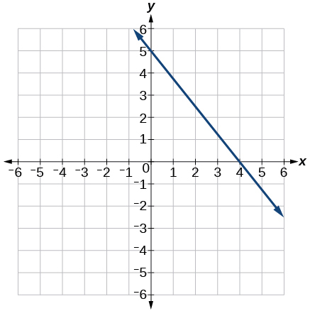 

 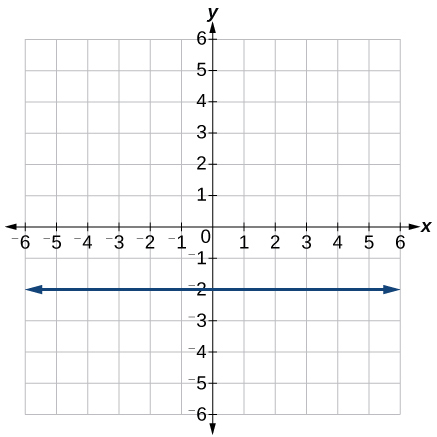 

0

For the following exercises, write an equation for the line graphed.

 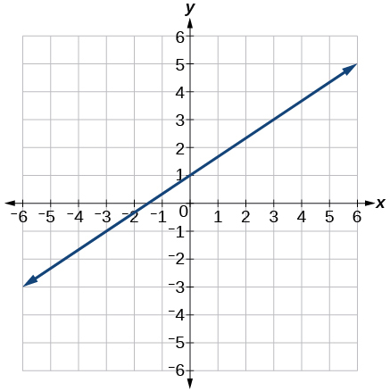 

  

<math xmlns="http://www.w3.org/1998/Math/MathML"> <mrow> <mi>y</mi><mo>=</mo><mo>−</mo><mfrac> <mn>5</mn> <mn>4</mn> </mfrac> <mi>x</mi><mo>+</mo><mn>5</mn> </mrow></math>

 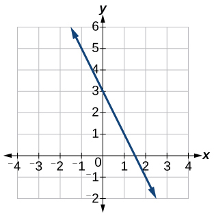 

 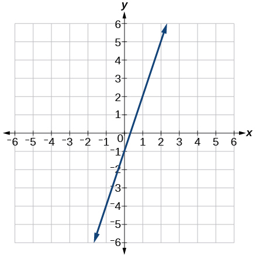 

<math xmlns="http://www.w3.org/1998/Math/MathML"> <mrow> <mi>y</mi><mo>=</mo><mn>3</mn><mi>x</mi><mo>−</mo><mn>1</mn> </mrow> </math>

 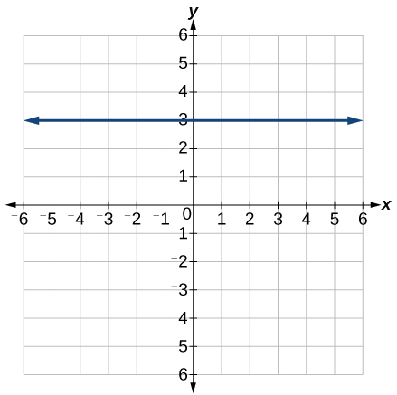 

 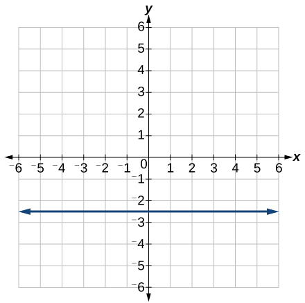 

<math xmlns="http://www.w3.org/1998/Math/MathML"> <mrow> <mi>y</mi><mo>=</mo><mo>−</mo><mn>2.5</mn> </mrow> </math>

For the following exercises, match the given linear equation with its graph in [\[link\]](#CNX_Precalc_Figure_04_01_210).

{: #CNX_Precalc_Figure_04_01_210}

<math xmlns="http://www.w3.org/1998/Math/MathML"> <mrow> <mi>f</mi><mrow><mo>(</mo> <mi>x</mi> <mo>)</mo></mrow><mo>=</mo><mo>−</mo><mi>x</mi><mo>−</mo><mn>1</mn> </mrow> </math>

<math xmlns="http://www.w3.org/1998/Math/MathML"> <mrow> <mi>f</mi><mrow><mo>(</mo> <mi>x</mi> <mo>)</mo></mrow><mo>=</mo><mn>−2</mn><mi>x</mi><mo>−</mo><mn>1</mn> </mrow> </math>

F

<math xmlns="http://www.w3.org/1998/Math/MathML"> <mrow> <mi>f</mi><mrow><mo>(</mo> <mi>x</mi> <mo>)</mo></mrow><mo>=</mo><mo>−</mo><mfrac> <mn>1</mn> <mn>2</mn> </mfrac> <mi>x</mi><mo>−</mo><mn>1</mn> </mrow> </math>

<math xmlns="http://www.w3.org/1998/Math/MathML"> <mrow> <mi>f</mi><mrow><mo>(</mo> <mi>x</mi> <mo>)</mo></mrow><mo>=</mo><mn>2</mn> </mrow> </math>

C

<math xmlns="http://www.w3.org/1998/Math/MathML"> <mrow> <mi>f</mi><mrow><mo>(</mo> <mi>x</mi> <mo>)</mo></mrow><mo>=</mo><mn>2</mn><mo>+</mo><mi>x</mi> </mrow> </math>

<math xmlns="http://www.w3.org/1998/Math/MathML"> <mrow> <mi>f</mi><mrow><mo>(</mo> <mi>x</mi> <mo>)</mo></mrow><mo>=</mo><mn>3</mn><mi>x</mi><mo>+</mo><mn>2</mn> </mrow> </math>

A

For the following exercises, sketch a line with the given features.

An *x*-intercept of<math xmlns="http://www.w3.org/1998/Math/MathML"> <mrow> <mtext> </mtext><mo stretchy="false">(</mo><mn>–4</mn><mo>,</mo><mtext>0</mtext><mo stretchy="false">)</mo><mtext> </mtext> </mrow> </math>

and *y*-intercept of<math xmlns="http://www.w3.org/1998/Math/MathML"> <mrow> <mtext> </mtext><mo stretchy="false">(</mo><mn>0</mn><mo>,</mo><mtext>–2</mtext><mo stretchy="false">)</mo> </mrow> </math>

An *x*-intercept<math xmlns="http://www.w3.org/1998/Math/MathML"> <mrow> <mtext> </mtext><mo stretchy="false">(</mo><mn>–2</mn><mo>,</mo><mtext>0</mtext><mo stretchy="false">)</mo><mtext> </mtext> </mrow> </math>

and *y*-intercept of<math xmlns="http://www.w3.org/1998/Math/MathML"> <mrow> <mtext> </mtext><mo stretchy="false">(</mo><mn>0</mn><mo>,</mo><mtext>4</mtext><mo stretchy="false">)</mo> </mrow> </math>

 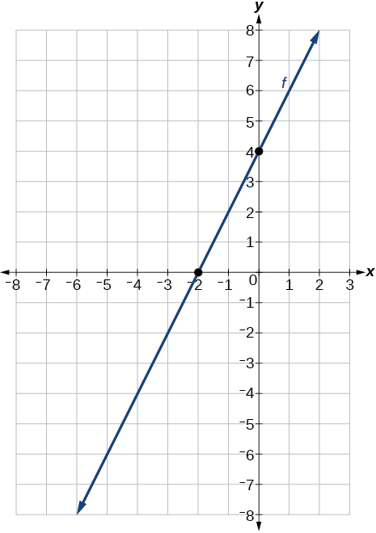 

A *y*-intercept of<math xmlns="http://www.w3.org/1998/Math/MathML"> <mrow> <mtext> </mtext><mo stretchy="false">(</mo><mn>0</mn><mo>,</mo><mtext>7</mtext><mo stretchy="false">)</mo><mtext> </mtext> </mrow> </math>

and slope<math xmlns="http://www.w3.org/1998/Math/MathML"> <mrow> <mtext> </mtext><mo>−</mo><mfrac> <mn>3</mn> <mn>2</mn> </mfrac> </mrow></math>

A *y*-intercept of<math xmlns="http://www.w3.org/1998/Math/MathML"> <mrow> <mtext> </mtext><mo stretchy="false">(</mo><mn>0</mn><mo>,</mo><mtext>3</mtext><mo stretchy="false">)</mo><mtext> </mtext> </mrow> </math>

and slope<math xmlns="http://www.w3.org/1998/Math/MathML"> <mrow> <mtext> </mtext><mfrac> <mn>2</mn> <mn>5</mn> </mfrac> </mrow> </math>

 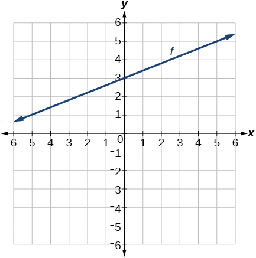 

Passing through the points<math xmlns="http://www.w3.org/1998/Math/MathML"> <mrow> <mtext> </mtext><mo stretchy="false">(</mo><mn>–6</mn><mo>,</mo><mtext>–2</mtext><mo stretchy="false">)</mo><mtext> </mtext> </mrow> </math>

and<math xmlns="http://www.w3.org/1998/Math/MathML"> <mrow> <mtext> </mtext><mo stretchy="false">(</mo><mn>6</mn><mo>,</mo><mtext>–6</mtext><mo stretchy="false">)</mo> </mrow> </math>

Passing through the points<math xmlns="http://www.w3.org/1998/Math/MathML"> <mrow> <mtext> </mtext><mo stretchy="false">(</mo><mn>–3</mn><mo>,</mo><mtext>–4</mtext><mo stretchy="false">)</mo><mtext> </mtext> </mrow> </math>

and<math xmlns="http://www.w3.org/1998/Math/MathML"> <mrow> <mtext> </mtext><mo stretchy="false">(</mo><mn>3</mn><mo>,</mo><mtext>0</mtext><mo stretchy="false">)</mo> </mrow> </math>

 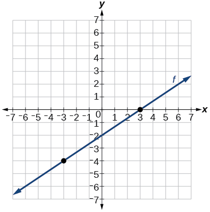 

For the following exercises, sketch the graph of each equation.

<math xmlns="http://www.w3.org/1998/Math/MathML"> <mrow> <mi>f</mi><mrow><mo>(</mo> <mi>x</mi> <mo>)</mo></mrow><mo>=</mo><mn>−2</mn><mi>x</mi><mo>−</mo><mn>1</mn> </mrow> </math>

<math xmlns="http://www.w3.org/1998/Math/MathML"> <mrow> <mi>f</mi><mrow><mo>(</mo> <mi>x</mi> <mo>)</mo></mrow><mo>=</mo><mn>−3</mn><mi>x</mi><mo>+</mo><mn>2</mn> </mrow> </math>

 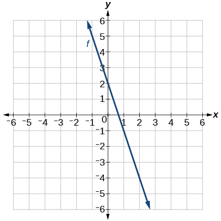 

<math xmlns="http://www.w3.org/1998/Math/MathML"> <mrow> <mi>f</mi><mrow><mo>(</mo> <mi>x</mi> <mo>)</mo></mrow><mo>=</mo><mfrac> <mn>1</mn> <mn>3</mn> </mfrac> <mi>x</mi><mo>+</mo><mn>2</mn> </mrow> </math>

<math xmlns="http://www.w3.org/1998/Math/MathML"> <mrow> <mi>f</mi><mrow><mo>(</mo> <mi>x</mi> <mo>)</mo></mrow><mo>=</mo><mfrac> <mn>2</mn> <mn>3</mn> </mfrac> <mi>x</mi><mo>−</mo><mn>3</mn> </mrow> </math>

 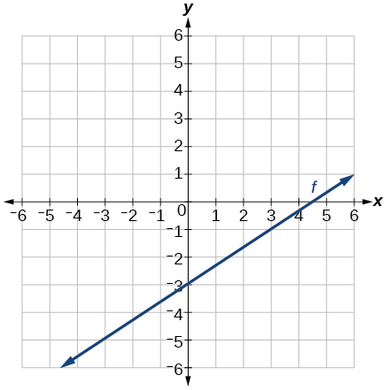 

<math xmlns="http://www.w3.org/1998/Math/MathML"> <mrow> <mi>f</mi><mrow><mo>(</mo> <mi>t</mi> <mo>)</mo></mrow><mo>=</mo><mn>3</mn><mo>+</mo><mn>2</mn><mi>t</mi> </mrow> </math>

<math xmlns="http://www.w3.org/1998/Math/MathML"> <mrow> <mi>p</mi><mrow><mo>(</mo> <mi>t</mi> <mo>)</mo></mrow><mo>=</mo><mn>−2</mn><mo>+</mo><mn>3</mn><mi>t</mi> </mrow> </math>

 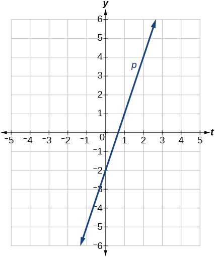 

<math xmlns="http://www.w3.org/1998/Math/MathML"> <mrow> <mi>x</mi><mo>=</mo><mn>3</mn> </mrow> </math>

<math xmlns="http://www.w3.org/1998/Math/MathML"> <mrow> <mi>x</mi><mo>=</mo><mn>−2</mn> </mrow> </math>

 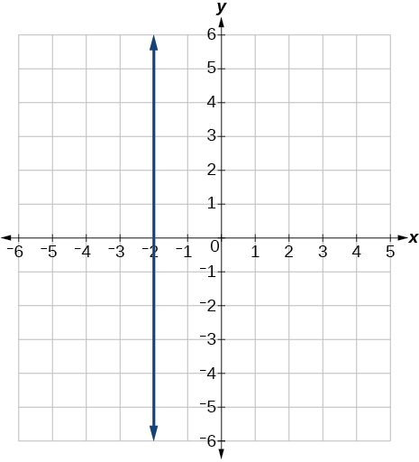 

<math xmlns="http://www.w3.org/1998/Math/MathML"> <mrow> <mi>r</mi><mrow><mo>(</mo> <mi>x</mi> <mo>)</mo></mrow><mo>=</mo><mn>4</mn> </mrow> </math>

For the following exercises, write the equation of the line shown in the graph.

 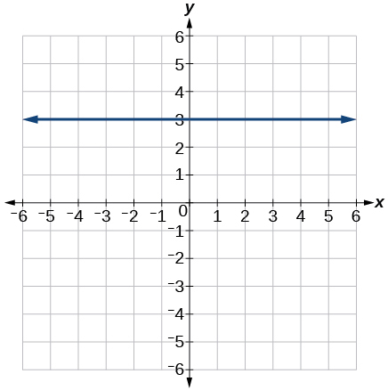 

<math xmlns="http://www.w3.org/1998/Math/MathML"> <mrow> <mi>y</mi><mo>=</mo><mtext>3</mtext> </mrow> </math>

  

 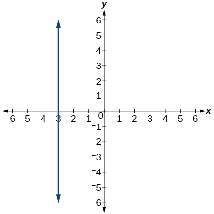 

<math xmlns="http://www.w3.org/1998/Math/MathML"> <mrow> <mi>x</mi><mo>=</mo><mo>−</mo><mn>3</mn> </mrow> </math>

 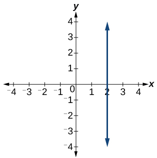 

#### Numeric

For the following exercises, which of the tables could represent a linear function? For each that could be linear, find a linear equation that models the data.

| <math xmlns="http://www.w3.org/1998/Math/MathML"> <mi>x</mi> </math>

 | 0 | 5 | 10 | 15 |
| <math xmlns="http://www.w3.org/1998/Math/MathML"> <mrow> <mi>g</mi><mrow><mo>(</mo> <mi>x</mi> <mo>)</mo></mrow> </mrow> </math>

 | 5 | –10 | –25 | –40 |
{: #Table_04_01_04 summary="A table with two rows and five columns. The first row is labeled: &#x201C;x&#x201D; and has the values 0, 5, 10 and 15. The second is labeled: &#x201C;g(x)&#x201D; with the values: 5, -10, -25 and -40." .unnumbered}

Linear,<math xmlns="http://www.w3.org/1998/Math/MathML"> <mrow> <mtext> </mtext><mi>g</mi><mo stretchy="false">(</mo><mi>x</mi><mo stretchy="false">)</mo><mo>=</mo><mo>−</mo><mn>3</mn><mi>x</mi><mo>+</mo><mn>5</mn> </mrow> </math>

| <math xmlns="http://www.w3.org/1998/Math/MathML"> <mi>x</mi></math>

 | 0 | 5 | 10 | 15 |
| <math xmlns="http://www.w3.org/1998/Math/MathML"> <mrow> <mi>h</mi><mrow><mo>(</mo> <mi>x</mi> <mo>)</mo></mrow> </mrow> </math>

 | 5 | 30 | 105 | 230 |
{: #Table_04_01_05 summary="A table with two rows and five columns. The first row is labeled: &#x201C;x&#x201D; and has the values 0, 5, 10 and 15. The second is labeled: &#x201C;h(x)&#x201D;with the values 5, 30, 105 and 230." .unnumbered}

| <math xmlns="http://www.w3.org/1998/Math/MathML"> <mi>x</mi> </math>

 | 0 | 5 | 10 | 15 |
| <math xmlns="http://www.w3.org/1998/Math/MathML"> <mrow> <mi>f</mi><mrow><mo>(</mo> <mi>x</mi> <mo>)</mo></mrow> </mrow> </math>

 | –5 | 20 | 45 | 70 |
{: #Table_04_01_06 summary="A table with two rows and five columns. The first row is labeled: &#x201C;x&#x201D; and has the values 0, 5, 10 and 15. The second is labeled: &#x201C;f(x)&#x201D; and has the values -5, 20, 45, and 70." .unnumbered}

Linear,<math xmlns="http://www.w3.org/1998/Math/MathML"> <mrow> <mtext> </mtext><mi>f</mi><mo stretchy="false">(</mo><mi>x</mi><mo stretchy="false">)</mo><mo>=</mo><mn>5</mn><mi>x</mi><mo>−</mo><mn>5</mn> </mrow> </math>

| <math xmlns="http://www.w3.org/1998/Math/MathML"> <mi>x</mi> </math>

 | 5 | 10 | 20 | 25 |
| <math xmlns="http://www.w3.org/1998/Math/MathML"> <mrow> <mi>k</mi><mrow><mo>(</mo> <mi>x</mi> <mo>)</mo></mrow> </mrow> </math>

 | 13 | 28 | 58 | 73 |
{: #Table_04_01_07 summary="A table with two rows and five columns. The first row is labeled: &#x201C;x&#x201D; and has the values 5, 10, 20 and 25. The second is labeled: &#x201C;k(x)&#x201D; and has the values 13, 28, 58 and 73." .unnumbered}

| <math xmlns="http://www.w3.org/1998/Math/MathML"> <mi>x</mi> </math>

 | 0 | 2 | 4 | 6 |
| <math xmlns="http://www.w3.org/1998/Math/MathML"> <mrow> <mi>g</mi><mrow><mo>(</mo> <mi>x</mi> <mo>)</mo></mrow> </mrow> </math>

 | 6 | –19 | –44 | –69 |
{: #Table_04_01_08 summary="A table with two rows and five columns. The first row is labeled: &#x201C;x&#x201D; and has the values 0, 2, 4 and 6. The second is labeled: &#x201C;g(x)&#x201D; and has the values 6, -19, -44 and -69." .unnumbered}

Linear,<math xmlns="http://www.w3.org/1998/Math/MathML"> <mrow> <mtext> </mtext><mi>g</mi><mo stretchy="false">(</mo><mi>x</mi><mo stretchy="false">)</mo><mo>=</mo><mo>−</mo><mfrac> <mrow> <mn>25</mn> </mrow> <mn>2</mn> </mfrac> <mi>x</mi><mo>+</mo><mn>6</mn> </mrow> </math>

| <math xmlns="http://www.w3.org/1998/Math/MathML"> <mi>x</mi> </math>

 | 2 | 4 | 8 | 10 |
| <math xmlns="http://www.w3.org/1998/Math/MathML"> <mrow> <mi>h</mi><mrow><mo>(</mo> <mi>x</mi> <mo>)</mo></mrow> </mrow> </math>

 | 13 | 23 | 43 | 53 |
{: #Table_04_01_09 summary="A table with two rows and five columns. The first row is labeled: &#x201C;x&#x201D; and has the values 2, 4, 8, 10. The second is labeled: &#x201C;h(x)&#x201D; and has the values 13, 23, 43 and 53." .unnumbered}

| <math xmlns="http://www.w3.org/1998/Math/MathML"> <mi>x</mi> </math>

 | 2 | 4 | 6 | 8 |
| <math xmlns="http://www.w3.org/1998/Math/MathML"> <mrow> <mi>f</mi><mrow><mo>(</mo> <mi>x</mi> <mo>)</mo></mrow> </mrow> </math>

 | –4 | 16 | 36 | 56 |
{: #Table_04_01_10 summary="A table with two rows and five columns. The first row is labeled: &#x201C;x&#x201D; and has the values 2, 4, 6 and 8. The second is labeled: &#x201C;f(x)&#x201D; and has the values -4, 16, 36 and 56." .unnumbered}

Linear,<math xmlns="http://www.w3.org/1998/Math/MathML"> <mrow> <mtext> </mtext><mi>f</mi><mo stretchy="false">(</mo><mi>x</mi><mo stretchy="false">)</mo><mo>=</mo><mn>10</mn><mi>x</mi><mo>−</mo><mn>24</mn> </mrow> </math>

| <math xmlns="http://www.w3.org/1998/Math/MathML"> <mi>x</mi> </math>

 | 0 | 2 | 6 | 8 |
| <math xmlns="http://www.w3.org/1998/Math/MathML"> <mrow> <mi>k</mi><mrow><mo>(</mo> <mi>x</mi> <mo>)</mo></mrow> </mrow> </math>

 | 6 | 31 | 106 | 231 |
{: #Table_04_01_11 summary="A table with two rows and five columns.  The first row is labeled: &#x201C;x&#x201D; and has the values 0, 2, 6 and 8. The second is labeled: &#x201C;k(x)&#x201D;and has the values 6, 31, 106 and 231." .unnumbered}

#### Technology

For the following exercises, use a calculator or graphing technology to complete the task.

If<math xmlns="http://www.w3.org/1998/Math/MathML"> <mrow> <mtext> </mtext><mi>f</mi><mtext> </mtext> </mrow> </math>

is a linear function,<math xmlns="http://www.w3.org/1998/Math/MathML"> <mrow> <mtext> </mtext><mi>f</mi><mo stretchy="false">(</mo><mn>0.1</mn><mo stretchy="false">)</mo><mo>=</mo><mn>11.5</mn><mo>,</mo><mo> </mo><mtext>and</mtext><mo> </mo><mi>f</mi><mo stretchy="false">(</mo><mn>0.4</mn><mo stretchy="false">)</mo><mo>=</mo><mn>–5.9</mn><mo>,</mo><mtext> </mtext> </mrow> </math>

find an equation for the function.

<math xmlns="http://www.w3.org/1998/Math/MathML"> <mrow> <mi>f</mi><mo stretchy="false">(</mo><mi>x</mi><mo stretchy="false">)</mo><mo>=</mo><mo>−</mo><mn>58</mn><mi>x</mi><mo>+</mo><mn>17.3</mn> </mrow> </math>

Graph the function<math xmlns="http://www.w3.org/1998/Math/MathML"> <mrow> <mtext> </mtext><mi>f</mi><mtext> </mtext> </mrow> </math>

on a domain of<math xmlns="http://www.w3.org/1998/Math/MathML"> <mrow> <mtext> </mtext><mo stretchy="false">[</mo><mn>–10</mn><mo>,</mo><mn>10</mn><mo stretchy="false">]</mo><mo>:</mo><mi>f</mi><mo stretchy="false">(</mo><mi>x</mi><mo stretchy="false">)</mo><mo>=</mo><mn>0.02</mn><mi>x</mi><mo>−</mo><mn>0.01.</mn><mtext> </mtext> </mrow> </math>

Enter the function in a graphing utility. For the viewing window, set the minimum value of<math xmlns="http://www.w3.org/1998/Math/MathML"> <mrow> <mtext> </mtext><mi>x</mi><mtext> </mtext> </mrow> </math>

to be<math xmlns="http://www.w3.org/1998/Math/MathML"> <mrow> <mtext> </mtext><mn>−10</mn><mtext> </mtext> </mrow> </math>

and the maximum value of<math xmlns="http://www.w3.org/1998/Math/MathML"> <mrow> <mtext> </mtext><mi>x</mi><mtext> </mtext> </mrow> </math>

to be<math xmlns="http://www.w3.org/1998/Math/MathML"> <mrow> <mtext> </mtext><mn>10.</mn> </mrow> </math>

Graph the function<math xmlns="http://www.w3.org/1998/Math/MathML"> <mrow> <mtext> </mtext><mi>f</mi><mtext> </mtext> </mrow> </math>

on a domain of<math xmlns="http://www.w3.org/1998/Math/MathML"> <mrow> <mtext> </mtext><mo stretchy="false">[</mo><mn>–10</mn><mo>,</mo><mn>10</mn><mo stretchy="false">]</mo><mo>:</mo><mi>f</mi><mi>x</mi><mo stretchy="false">)</mo><mo>=</mo><mn>2</mn><mo>,</mo><mn>500</mn><mi>x</mi><mo>+</mo><mn>4</mn><mo>,</mo><mn>000</mn> </mrow> </math>

 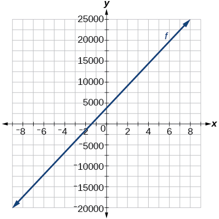 

[[link]](#Table_04_01_12) shows the input,<math xmlns="http://www.w3.org/1998/Math/MathML"> <mrow> <mtext> </mtext><mi>w</mi><mo>,</mo> </mrow> </math>

and output,<math xmlns="http://www.w3.org/1998/Math/MathML"> <mrow> <mtext> </mtext><mi>k</mi><mo>,</mo> </mrow> </math>

for a linear function<math xmlns="http://www.w3.org/1998/Math/MathML"> <mrow> <mtext> </mtext><mi>k</mi><mo>.</mo><mtext> </mtext> </mrow> </math>

a. Fill in the missing values of the table. b. Write the linear function<math xmlns="http://www.w3.org/1998/Math/MathML"> <mrow> <mtext> </mtext><mi>k</mi><mo>,</mo> </mrow> </math>

round to 3 decimal places.

| ***w*** | –10 | 5.5 | 67.5 | *b* |
| ***k*** | 30 | –26 | *a* | –44 |
{: #Table_04_01_12 summary="A table with two rows and five columns. The first row is labeled: &#x201C;w&#x201D; and has the values -10, 5.5, 67.5 and b. The second is labeled: &#x201C;k&#x201D; and has the values 30, -26, a and -44."}

<math xmlns="http://www.w3.org/1998/Math/MathML"> <mrow> <mi>y</mi><mo>=</mo><mn>3.613</mn><mi>x</mi><mo>−</mo><mn>6.129</mn><mtext> </mtext> </mrow> </math>

[[link]](#Table_04_01_13) shows the input,<math xmlns="http://www.w3.org/1998/Math/MathML"> <mrow> <mtext> </mtext><mi>p</mi><mo>,</mo> </mrow> </math>

and output,<math xmlns="http://www.w3.org/1998/Math/MathML"> <mrow> <mtext> </mtext><mi>q</mi><mo>,</mo> </mrow> </math>

for a linear function<math xmlns="http://www.w3.org/1998/Math/MathML"> <mrow> <mtext> </mtext><mi>q</mi><mo>.</mo><mtext> </mtext> </mrow> </math>

a. Fill in the missing values of the table. b. Write the linear function<math xmlns="http://www.w3.org/1998/Math/MathML"> <mrow> <mtext> </mtext><mi>k</mi><mo>.</mo> </mrow> </math>

| ***p*** | 0.5 | 0.8 | 12 | *b* |
| ***q*** | 400 | 700 | *a* | 1,000,000 |
{: #Table_04_01_13 summary="A table with two rows and five columns. The first row is labeled: &#x201C;p&#x201D; and has the values 0.5, 0.8, 12 and b. The second is labeled: &#x201C;q&#x201D; and has the values 400, 700, a and 1000000."}

Graph the linear function<math xmlns="http://www.w3.org/1998/Math/MathML"> <mrow> <mtext> </mtext><mi>f</mi><mtext> </mtext> </mrow> </math>

on a domain of<math xmlns="http://www.w3.org/1998/Math/MathML"> <mrow> <mtext> </mtext><mrow><mo>[</mo> <mrow> <mo>−</mo><mn>10</mn><mo>,</mo><mn>10</mn> </mrow> <mo>]</mo></mrow><mtext> </mtext> </mrow> </math>

for the function whose slope is<math xmlns="http://www.w3.org/1998/Math/MathML"> <mrow> <mtext> </mtext><mfrac> <mn>1</mn> <mn>8</mn> </mfrac> <mtext> </mtext> </mrow> </math>

and *y*-intercept is<math xmlns="http://www.w3.org/1998/Math/MathML"> <mrow> <mtext> </mtext><mfrac> <mrow> <mn>31</mn> </mrow> <mrow> <mn>16</mn> </mrow> </mfrac> <mo>.</mo><mtext> </mtext> </mrow> </math>

Label the points for the input values of<math xmlns="http://www.w3.org/1998/Math/MathML"> <mrow> <mtext> </mtext><mn>−10</mn><mtext> </mtext> </mrow> </math>

and<math xmlns="http://www.w3.org/1998/Math/MathML"> <mrow> <mtext> </mtext><mn>10.</mn> </mrow> </math>

 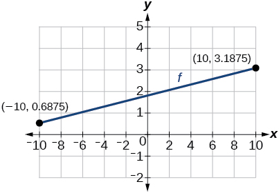 

Graph the linear function<math xmlns="http://www.w3.org/1998/Math/MathML"> <mrow> <mtext> </mtext><mi>f</mi><mtext> </mtext> </mrow> </math>

on a domain of<math xmlns="http://www.w3.org/1998/Math/MathML"> <mrow> <mtext> </mtext><mrow><mo>[</mo> <mrow> <mo>−</mo><mn>0.1</mn><mo>,</mo><mn>0.1</mn> </mrow> <mo>]</mo></mrow><mtext> </mtext> </mrow> </math>

for the function whose slope is 75 and *y*-intercept is<math xmlns="http://www.w3.org/1998/Math/MathML"> <mrow> <mtext> </mtext><mn>−22.5.</mn><mtext> </mtext> </mrow> </math>

Label the points for the input values of<math xmlns="http://www.w3.org/1998/Math/MathML"> <mrow> <mtext> </mtext><mn>−0.1</mn><mtext> </mtext> </mrow> </math>

and<math xmlns="http://www.w3.org/1998/Math/MathML"> <mrow> <mtext> </mtext><mn>0.1.</mn> </mrow> </math>

Graph the linear function<math xmlns="http://www.w3.org/1998/Math/MathML"> <mrow> <mtext> </mtext><mi>f</mi><mtext> </mtext> </mrow> </math>

where<math xmlns="http://www.w3.org/1998/Math/MathML"> <mrow> <mtext> </mtext><mi>f</mi><mrow><mo>(</mo> <mi>x</mi> <mo>)</mo></mrow><mo>=</mo><mi>a</mi><mi>x</mi><mo>+</mo><mi>b</mi><mtext> </mtext> </mrow> </math>

on the same set of axes on a domain of<math xmlns="http://www.w3.org/1998/Math/MathML"> <mrow> <mtext> </mtext><mrow><mo>[</mo> <mrow> <mo>−</mo><mn>4</mn><mo>,</mo><mn>4</mn> </mrow> <mo>]</mo></mrow><mtext> </mtext> </mrow> </math>

for the following values of<math xmlns="http://www.w3.org/1998/Math/MathML"> <mrow> <mtext> </mtext><mi>a</mi><mtext> </mtext> </mrow> </math>

and<math xmlns="http://www.w3.org/1998/Math/MathML"> <mrow> <mtext> </mtext><mi>b</mi><mo>.</mo> </mrow> </math>

1.  <math xmlns="http://www.w3.org/1998/Math/MathML"> <mrow> <mi>a</mi><mo>=</mo><mn>2</mn><mo>;</mo><mi>b</mi><mo>=</mo><mn>3</mn> </mrow> </math>

2.  <math xmlns="http://www.w3.org/1998/Math/MathML"> <mrow> <mi>a</mi><mo>=</mo><mn>2</mn><mo>;</mo><mi>b</mi><mo>=</mo><mn>4</mn> </mrow> </math>

3.  <math xmlns="http://www.w3.org/1998/Math/MathML"> <mrow> <mi>a</mi><mo>=</mo><mn>2</mn><mo>;</mo><mi>b</mi><mo>=</mo><mn>–4</mn> </mrow> </math>

4.  <math xmlns="http://www.w3.org/1998/Math/MathML"> <mrow> <mi>a</mi><mo>=</mo><mn>2</mn><mo>;</mo><mi>b</mi><mo>=</mo><mn>–5</mn> </mrow> </math>
{: type="i"}

  

#### Extensions

Find the value of<math xmlns="http://www.w3.org/1998/Math/MathML"> <mrow> <mtext> </mtext><mi>x</mi><mtext> </mtext> </mrow> </math>

if a linear function goes through the following points and has the following slope:<math xmlns="http://www.w3.org/1998/Math/MathML"> <mrow> <mtext> </mtext><mo stretchy="false">(</mo><mi>x</mi><mo>,</mo><mn>2</mn><mo stretchy="false">)</mo><mo>,</mo><mo stretchy="false">(</mo><mn>−4</mn><mo>,</mo><mn>6</mn><mo stretchy="false">)</mo><mo>,</mo><mtext> </mtext><mi>m</mi><mo>=</mo><mn>3</mn> </mrow> </math>

Find the value of<em> y </em>if a linear function goes through the following points and has the following slope:<math xmlns="http://www.w3.org/1998/Math/MathML"> <mrow> <mtext> </mtext><mo stretchy="false">(</mo><mn>10</mn><mo>,</mo><mi>y</mi><mo stretchy="false">)</mo><mo>,</mo><mo stretchy="false">(</mo><mn>25</mn><mo>,</mo><mn>100</mn><mo stretchy="false">)</mo><mo>,</mo><mtext> </mtext><mi>m</mi><mo>=</mo><mn>−5</mn> </mrow> </math>

*y* = 175

Find the equation of the line that passes through the following points:

<math xmlns="http://www.w3.org/1998/Math/MathML"> <mrow> <mtext> </mtext><mrow><mo>(</mo> <mrow> <mi>a</mi><mo>,</mo><mtext> </mtext><mi>b</mi> </mrow> <mo>)</mo></mrow><mtext> </mtext> </mrow> </math>

and<math xmlns="http://www.w3.org/1998/Math/MathML"> <mrow> <mtext> </mtext><mrow><mo>(</mo> <mrow> <mi>a</mi><mo>,</mo><mtext> </mtext><mi>b</mi><mo>+</mo><mn>1</mn> </mrow> <mo>)</mo></mrow> </mrow> </math>

Find the equation of the line that passes through the following points:

<math xmlns="http://www.w3.org/1998/Math/MathML"> <mrow> <mo stretchy="false">(</mo><mn>2</mn><mi>a</mi><mo>,</mo><mi>b</mi><mo stretchy="false">)</mo><mtext> </mtext> </mrow> </math>

and<math xmlns="http://www.w3.org/1998/Math/MathML"> <mrow> <mtext> </mtext><mo stretchy="false">(</mo><mi>a</mi><mo>,</mo><mi>b</mi><mo>+</mo><mn>1</mn><mo stretchy="false">)</mo> </mrow> </math>

<math xmlns="http://www.w3.org/1998/Math/MathML"> <mrow> <mi>y</mi><mo>=</mo><mo>−</mo><mfrac> <mn>1</mn> <mn>2</mn> </mfrac> <mi>x</mi><mo>+</mo><mi>b</mi><mo>+</mo><mn>2</mn> </mrow> </math>

Find the equation of the line that passes through the following points:

<math xmlns="http://www.w3.org/1998/Math/MathML"> <mrow> <mo stretchy="false">(</mo><mi>a</mi><mo>,</mo><mn>0</mn><mo stretchy="false">)</mo> </mrow> </math>

and<math xmlns="http://www.w3.org/1998/Math/MathML"> <mrow> <mtext> </mtext><mo stretchy="false">(</mo><mi>c</mi><mo>,</mo><mi>d</mi><mo stretchy="false">)</mo> </mrow> </math>

Find the equation of the line parallel to the line<math xmlns="http://www.w3.org/1998/Math/MathML"> <mrow> <mtext> </mtext><mi>g</mi><mrow><mo>(</mo> <mi>x</mi> <mo>)</mo></mrow><mo>=</mo><mn>−0.</mn><mtext>01</mtext><mi>x</mi><mtext>+2</mtext><mtext>.01</mtext><mtext> </mtext> </mrow> </math>

through the point<math xmlns="http://www.w3.org/1998/Math/MathML"> <mrow> <mtext> </mtext><mo stretchy="false">(</mo><mn>1</mn><mo>,</mo><mtext>2</mtext><mo stretchy="false">)</mo><mo>.</mo> </mrow> </math>

<em>y </em>= –0.01*x* + 2.01

Find the equation of the line perpendicular to the line<math xmlns="http://www.w3.org/1998/Math/MathML"> <mrow> <mtext> </mtext><mi>g</mi><mrow><mo>(</mo> <mi>x</mi> <mo>)</mo></mrow><mo>=</mo><mn>−0.</mn><mtext>01</mtext><mi>x</mi><mtext>+2</mtext><mtext>.01</mtext><mtext> </mtext> </mrow> </math>

through the point<math xmlns="http://www.w3.org/1998/Math/MathML"> <mrow> <mtext> </mtext><mo stretchy="false">(</mo><mn>1</mn><mo>,</mo><mtext>2</mtext><mo stretchy="false">)</mo><mo>.</mo> </mrow> </math>

For the following exercises, use the functions<math xmlns="http://www.w3.org/1998/Math/MathML"> <mrow> <mtext> </mtext><mi>f</mi><mrow><mo>(</mo> <mi>x</mi> <mo>)</mo></mrow><mo>=</mo><mn>−0.</mn><mtext>1</mtext><mi>x</mi><mtext>+200 and </mtext><mi>g</mi><mrow><mo>(</mo> <mi>x</mi> <mo>)</mo></mrow><mo>=</mo><mn>20</mn><mi>x</mi><mo>+</mo><mn>0.1.</mn> </mrow> </math>

Find the point of intersection of the lines<math xmlns="http://www.w3.org/1998/Math/MathML"> <mrow> <mtext> </mtext><mi>f</mi><mtext> </mtext> </mrow> </math>

and<math xmlns="http://www.w3.org/1998/Math/MathML"> <mrow> <mtext> </mtext><mi>g</mi><mo>.</mo> </mrow> </math>

<math xmlns="http://www.w3.org/1998/Math/MathML"> <mrow> <mtext> </mtext><mrow><mo>(</mo> <mrow> <mfrac> <mrow> <mn>1999</mn> </mrow> <mrow> <mn>201</mn> </mrow> </mfrac> <mo>,</mo><mfrac> <mrow> <mn>400</mn><mo>,</mo><mn>001</mn> </mrow> <mrow> <mn>2010</mn> </mrow> </mfrac> </mrow> <mo>)</mo></mrow> </mrow> </math>

Where is<math xmlns="http://www.w3.org/1998/Math/MathML"> <mrow> <mtext> </mtext><mi>f</mi><mrow><mo>(</mo> <mi>x</mi> <mo>)</mo></mrow><mtext> </mtext> </mrow> </math>

greater than<math xmlns="http://www.w3.org/1998/Math/MathML"> <mrow> <mtext> </mtext><mi>g</mi><mrow><mo>(</mo> <mi>x</mi> <mo>)</mo></mrow><mo>?</mo><mtext> </mtext> </mrow> </math>

Where is<math xmlns="http://www.w3.org/1998/Math/MathML"> <mrow> <mtext> </mtext><mi>g</mi><mrow><mo>(</mo> <mi>x</mi> <mo>)</mo></mrow><mtext> </mtext> </mrow> </math>

greater than<math xmlns="http://www.w3.org/1998/Math/MathML"> <mrow> <mtext> </mtext><mi>f</mi><mrow><mo>(</mo> <mi>x</mi> <mo>)</mo></mrow><mo>?</mo> </mrow> </math>

#### Real-World Applications

At noon, a barista notices that she has $20 in her tip jar. If she makes an average of $0.50 from each customer, how much will she have in her tip jar if she serves<math xmlns="http://www.w3.org/1998/Math/MathML"> <mrow> <mtext> </mtext><mi>n</mi><mtext> </mtext> </mrow> </math>

more customers during her shift?

<math xmlns="http://www.w3.org/1998/Math/MathML"> <mrow> <mn>20</mn><mo>+</mo><mn>0.5</mn><mi>n</mi> </mrow> </math>

A gym membership with two personal training sessions costs $125, while gym membership with five personal training sessions costs $260. What is cost per session?

A clothing business finds there is a linear relationship between the number of shirts,<math xmlns="http://www.w3.org/1998/Math/MathML"> <mrow> <mtext> </mtext><mi>n</mi><mo>,</mo> </mrow> </math>

it can sell and the price,<math xmlns="http://www.w3.org/1998/Math/MathML"> <mrow> <mtext> </mtext><mi>p</mi><mo>,</mo> </mrow> </math>

it can charge per shirt. In particular, historical data shows that 1,000 shirts can be sold at a price of<math xmlns="http://www.w3.org/1998/Math/MathML"> <mrow> <mtext> </mtext><mi>$</mi><mn>30</mn><mo>,</mo> </mrow> </math>

while 3,000 shirts can be sold at a price of $22. Find a linear equation in the form<math xmlns="http://www.w3.org/1998/Math/MathML"> <mrow> <mtext> </mtext><mi>p</mi><mo stretchy="false">(</mo><mi>n</mi><mo stretchy="false">)</mo><mo>=</mo><mi>m</mi><mi>n</mi><mo>+</mo><mi>b</mi><mtext> </mtext> </mrow> </math>

that gives the price<math xmlns="http://www.w3.org/1998/Math/MathML"> <mrow> <mtext> </mtext><mi>p</mi><mtext> </mtext> </mrow> </math>

they can charge for<math xmlns="http://www.w3.org/1998/Math/MathML"> <mrow> <mtext> </mtext><mi>n</mi><mtext> </mtext> </mrow> </math>

shirts.

<math xmlns="http://www.w3.org/1998/Math/MathML"> <mrow> <mi>p</mi><mo stretchy="false">(</mo><mi>n</mi><mo stretchy="false">)</mo><mo>=</mo><mo>−</mo><mn>0.004</mn><mi>n</mi><mo>+</mo><mn>34</mn> </mrow> </math>

A phone company charges for service according to the formula:<math xmlns="http://www.w3.org/1998/Math/MathML"> <mrow> <mtext> </mtext><mi>C</mi><mo stretchy="false">(</mo><mi>n</mi><mo stretchy="false">)</mo><mo>=</mo><mn>24</mn><mo>+</mo><mn>0.1</mn><mi>n</mi><mo>,</mo> </mrow> </math>

where<math xmlns="http://www.w3.org/1998/Math/MathML"> <mrow> <mtext> </mtext><mi>n</mi><mtext> </mtext> </mrow> </math>

is the number of minutes talked, and<math xmlns="http://www.w3.org/1998/Math/MathML"> <mrow> <mtext> </mtext><mi>C</mi><mo stretchy="false">(</mo><mi>n</mi><mo stretchy="false">)</mo><mtext> </mtext> </mrow> </math>

is the monthly charge, in dollars. Find and interpret the rate of change and initial value.

A farmer finds there is a linear relationship between the number of bean stalks,<math xmlns="http://www.w3.org/1998/Math/MathML"> <mrow> <mtext> </mtext><mi>n</mi><mo>,</mo> </mrow> </math>

she plants and the yield,<math xmlns="http://www.w3.org/1998/Math/MathML"> <mrow> <mtext> </mtext><mi>y</mi><mo>,</mo> </mrow> </math>

each plant produces. When she plants 30 stalks, each plant yields 30 oz of beans. When she plants 34 stalks, each plant produces 28 oz of beans. Find a linear relationships in the form<math xmlns="http://www.w3.org/1998/Math/MathML"> <mrow> <mtext> </mtext><mi>y</mi><mo>=</mo><mi>m</mi><mi>n</mi><mo>+</mo><mi>b</mi><mtext> </mtext> </mrow> </math>

that gives the yield when<math xmlns="http://www.w3.org/1998/Math/MathML"> <mrow> <mtext> </mtext><mi>n</mi><mtext> </mtext> </mrow> </math>

stalks are planted.

<math xmlns="http://www.w3.org/1998/Math/MathML"> <mrow> <mi>y</mi><mo>=</mo><mo>−</mo><mn>0.5</mn><mi>n</mi><mo>+</mo><mn>45</mn> </mrow> </math>

A city’s population in the year 1960 was 287,500. In 1989 the population was 275,900. Compute the rate of growth of the population and make a statement about the population rate of change in people per year.

A town’s population has been growing linearly. In 2003, the population was 45,000, and the population has been growing by 1,700 people each year. Write an equation,<math xmlns="http://www.w3.org/1998/Math/MathML"> <mrow> <mtext> </mtext><mi>P</mi><mo stretchy="false">(</mo><mi>t</mi><mo stretchy="false">)</mo><mo>,</mo> </mrow> </math>

for the population<math xmlns="http://www.w3.org/1998/Math/MathML"> <mrow> <mtext> </mtext><mi>t</mi><mtext> </mtext> </mrow> </math>

years after 2003.

<math xmlns="http://www.w3.org/1998/Math/MathML"> <mrow> <mi>P</mi><mo stretchy="false">(</mo><mi>t</mi><mo stretchy="false">)</mo><mo>=</mo><mn>1700</mn><mi>t</mi><mo>+</mo><mn>45</mn><mo>,</mo><mn>000</mn> </mrow> </math>

Suppose that average annual income (in dollars) for the years 1990 through 1999 is given by the linear function:<math xmlns="http://www.w3.org/1998/Math/MathML"> <mrow> <mtext> </mtext><mi>I</mi><mo stretchy="false">(</mo><mi>x</mi><mo stretchy="false">)</mo><mo>=</mo><mn>1054</mn><mi>x</mi><mo>+</mo><mn>23</mn><mo>,</mo><mn>286</mn><mo>,</mo> </mrow> </math>

where<math xmlns="http://www.w3.org/1998/Math/MathML"> <mrow> <mtext> </mtext><mi>x</mi><mtext> </mtext> </mrow> </math>

is the number of years after 1990. Which of the following interprets the slope in the context of the problem?

1.  As of 1990, average annual income was $23,286.
2.  In the ten-year period from 1990–1999, average annual income increased by a total of $1,054.
3.  Each year in the decade of the 1990s, average annual income increased by $1,054.
4.  Average annual income rose to a level of $23,286 by the end of 1999.
{: type="a"}

When temperature is 0 degrees Celsius, the Fahrenheit temperature is 32. When the Celsius temperature is 100, the corresponding Fahrenheit temperature is 212. Express the Fahrenheit temperature as a linear function of<math xmlns="http://www.w3.org/1998/Math/MathML"> <mrow> <mtext> </mtext><mi>C</mi><mo>,</mo> </mrow> </math>

the Celsius temperature,<math xmlns="http://www.w3.org/1998/Math/MathML"> <mrow> <mtext> </mtext><mi>F</mi><mrow><mo>(</mo> <mi>C</mi> <mo>)</mo></mrow><mo>.</mo> </mrow> </math>

1.  Find the rate of change of Fahrenheit temperature for each unit change temperature of Celsius.
2.  Find and interpret
    <math xmlns="http://www.w3.org/1998/Math/MathML"> <mrow> <mtext> </mtext><mi>F</mi><mo stretchy="false">(</mo><mn>28</mn><mo stretchy="false">)</mo><mo>.</mo> </mrow> </math>

3.  Find and interpret
    <math xmlns="http://www.w3.org/1998/Math/MathML"> <mrow> <mtext> </mtext><mi>F</mi><mo stretchy="false">(</mo><mn>–40</mn><mo stretchy="false">)</mo><mo>.</mo> </mrow> </math>
{: type="a"}

1.  <math xmlns="http://www.w3.org/1998/Math/MathML"> <mrow> <mtext>Rate of change =</mtext><mfrac> <mrow> <mi>Δ</mi><mi>F</mi> </mrow> <mrow> <mi>Δ</mi><mi>C</mi> </mrow> </mfrac> <mo>=</mo><mfrac> <mrow> <mn>212</mn><mo>−</mo><mn>32</mn> </mrow> <mrow> <mn>100</mn><mo>−</mo><mn>0</mn> </mrow> </mfrac> <mo>=</mo><mn>1.8</mn><mtext> degrees F for one degree change in C</mtext> </mrow> </math>

2.  <math xmlns="http://www.w3.org/1998/Math/MathML"> <mrow> <mi>F</mi><mo stretchy="false">(</mo><mn>28</mn><mo stretchy="false">)</mo><mo>=</mo><mn>1.8</mn><mo stretchy="false">(</mo><mn>28</mn><mo stretchy="false">)</mo><mo>+</mo><mn>32</mn><mo>=</mo><mn>82.4</mn><mtext> degrees F is 28 degrees C</mtext> </mrow> </math>

3.  <math xmlns="http://www.w3.org/1998/Math/MathML"> <mrow> <mi>F</mi><mo stretchy="false">(</mo><mo>−</mo><mn>40</mn><mo stretchy="false">)</mo><mo>=</mo><mn>1.8</mn><mo stretchy="false">(</mo><mo>−</mo><mn>40</mn><mo stretchy="false">)</mo><mo>+</mo><mn>32</mn><mo>=</mo><mo>−</mo><mn>40</mn><mtext> degrees F is -40 degrees C</mtext> </mrow> </math>
{: type="a"}

### Footnotes
{: data-type="footnote-refs-title"}

* {: data-type="footnote-ref" #footnote1} [1](#footnote-ref1){: data-type="footnote-ref-link"} http://www.chinahighlights.com/shanghai/transportation/maglev-train.htm
* {: data-type="footnote-ref" #footnote2} [2](#footnote-ref2){: data-type="footnote-ref-link"} http://www.cbsnews.com/8301-501465\\\_162-57400228-501465/teens-are-sending-60-texts-a-day-study-says/
{: data-list-type="bulleted" data-bullet-style="none"}

### Glossary
{: data-type="glossary-title"}

decreasing linear function
: a function with a negative slope: If
  <math xmlns="http://www.w3.org/1998/Math/MathML"> <mrow> <mtext> </mtext><mi>f</mi><mo stretchy="false">(</mo><mi>x</mi><mo stretchy="false">)</mo><mo>=</mo><mi>m</mi><mi>x</mi><mo>+</mo><mi>b</mi><mo>,</mo><mo> </mo><mtext>then</mtext><mo> </mo><mi>m</mi><mo>&lt;</mo><mn>0.</mn> </mrow> </math>
^

horizontal line
: a line defined by
  <math xmlns="http://www.w3.org/1998/Math/MathML"> <mrow> <mtext> </mtext><mi>f</mi><mo stretchy="false">(</mo><mi>x</mi><mo stretchy="false">)</mo><mo>=</mo><mi>b</mi><mo>,</mo> </mrow> </math>
  
  where
  <math xmlns="http://www.w3.org/1998/Math/MathML"> <mrow> <mtext> </mtext><mi>b</mi><mtext> </mtext> </mrow> </math>
  
  is a real number. The slope of a horizontal line is 0.
^

increasing linear function
: a function with a positive slope: If
  <math xmlns="http://www.w3.org/1998/Math/MathML"> <mrow> <mtext> </mtext><mi>f</mi><mo stretchy="false">(</mo><mi>x</mi><mo stretchy="false">)</mo><mo>=</mo><mi>m</mi><mi>x</mi><mo>+</mo><mi>b</mi><mo>,</mo><mo> </mo><mtext>then</mtext><mo> </mo><mi>m</mi><mo>&gt;</mo><mn>0.</mn> </mrow> </math>
^

linear function
: a function with a constant rate of change that is a polynomial of degree 1, and whose graph is a straight line
^

parallel lines
: two or more lines with the same slope
^

perpendicular lines
: two lines that intersect at right angles and have slopes that are negative reciprocals of each other
^

point-slope form
: the equation for a line that represents a linear function of the form
  <math xmlns="http://www.w3.org/1998/Math/MathML"> <mrow> <mtext> </mtext><mi>y</mi><mo>−</mo><msub> <mi>y</mi> <mn>1</mn> </msub> <mo>=</mo><mi>m</mi><mrow><mo>(</mo> <mrow> <mi>x</mi><mo>−</mo><msub> <mi>x</mi> <mn>1</mn> </msub> </mrow> <mo>)</mo></mrow> </mrow> </math>
^

slope
: the ratio of the change in output values to the change in input values; a measure of the steepness of a line
^

slope-intercept form
: the equation for a line that represents a linear function in the form
  <math xmlns="http://www.w3.org/1998/Math/MathML"> <mrow> <mtext> </mtext><mi>f</mi><mo stretchy="false">(</mo><mi>x</mi><mo stretchy="false">)</mo><mo>=</mo><mi>m</mi><mi>x</mi><mo>+</mo><mi>b</mi> </mrow> </math>
^

vertical line
: a line defined by
  <math xmlns="http://www.w3.org/1998/Math/MathML"> <mrow> <mtext> </mtext><mi>x</mi><mo>=</mo><mi>a</mi><mo>,</mo> </mrow> </math>
  
  where
  <math xmlns="http://www.w3.org/1998/Math/MathML"> <mrow> <mtext> </mtext><mi>a</mi><mtext> </mtext> </mrow> </math>
  
  is a real number. The slope of a vertical line is undefined.

[1]: http://openstax.org/l/linearfunctions
[2]: http://openstax.org/l/findinginput
[3]: http://openstax.org/l/graphwithtable
