

In this section, you will:
* Recognize characteristics of parabolas.
* Understand how the graph of a parabola is related to its quadratic function.
* Determine a quadratic function’s minimum or maximum value.
* Solve problems involving a quadratic function’s minimum or maximum value.

 "){: #Figure_03_02_001}

Curved antennas, such as the ones shown in [\[link\]](#Figure_03_02_001), are commonly used to focus microwaves and radio waves to transmit television and telephone signals, as well as satellite and spacecraft communication. The cross-section of the antenna is in the shape of a parabola, which can be described by a quadratic function.

In this section, we will investigate quadratic functions, which frequently model problems involving area and projectile motion. Working with quadratic functions can be less complex than working with higher degree functions, so they provide a good opportunity for a detailed study of function behavior.

### Recognizing Characteristics of Parabolas 

The graph of a quadratic function is a U-shaped curve called a **parabola**{: data-type="term" .no-emphasis}. One important feature of the graph is that it has an extreme point, called the **vertex**{: data-type="term"}. If the parabola opens up, the vertex represents the lowest point on the graph, or the **minimum value**{: data-type="term" .no-emphasis} of the quadratic function. If the parabola opens down, the vertex represents the highest point on the graph, or the **maximum value**{: data-type="term" .no-emphasis}. In either case, the vertex is a turning point on the graph. The graph is also symmetric with a vertical line drawn through the vertex, called the **axis of symmetry**{: data-type="term"}. These features are illustrated in [\[link\]](#Figure_03_02_002).

 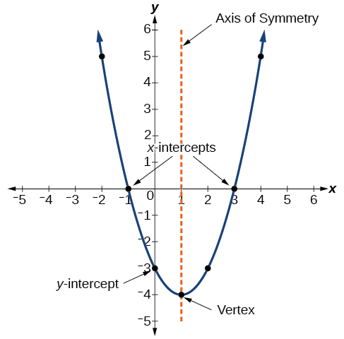{: #Figure_03_02_002}

The *y*-intercept is the point at which the parabola crosses the *y*-axis. The *x*-intercepts are the points at which the parabola crosses the *x*-axis. If they exist, the *x*-intercepts represent the **zeros**{: data-type="term"}<strong>, </strong>or **roots**{: data-type="term"}, of the quadratic function, the values of<math xmlns="http://www.w3.org/1998/Math/MathML"> <mrow> <mtext> </mtext><mi>x</mi><mtext> </mtext> </mrow> </math>

at which<math xmlns="http://www.w3.org/1998/Math/MathML"> <mrow> <mtext> </mtext><mi>y</mi><mo>=</mo><mn>0.</mn> </mrow> </math>

Identifying the Characteristics of a Parabola

Determine the vertex, axis of symmetry, zeros, and<math xmlns="http://www.w3.org/1998/Math/MathML"> <mrow> <mtext> </mtext><mi>y</mi><mtext>-</mtext> </mrow> </math>

intercept of the parabola shown in [[link]](#Figure_03_02_003).

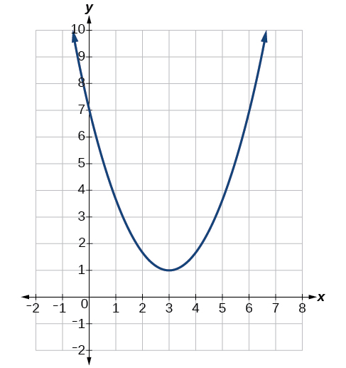{: #Figure_03_02_003}

The vertex is the turning point of the graph. We can see that the vertex is at<math xmlns="http://www.w3.org/1998/Math/MathML"> <mrow> <mtext> </mtext><mrow><mo>(</mo> <mrow> <mn>3</mn><mo>,</mo><mn>1</mn> </mrow> <mo>)</mo></mrow><mo>.</mo><mtext> </mtext> </mrow> </math>

Because this parabola opens upward, the axis of symmetry is the vertical line that intersects the parabola at the vertex. So the axis of symmetry is<math xmlns="http://www.w3.org/1998/Math/MathML"> <mrow> <mtext> </mtext><mi>x</mi><mo>=</mo><mn>3.</mn><mtext> </mtext> </mrow> </math>

This parabola does not cross the<math xmlns="http://www.w3.org/1998/Math/MathML"> <mrow> <mtext> </mtext><mi>x</mi><mtext>-</mtext> </mrow> </math>

axis, so it has no zeros. It crosses the<math xmlns="http://www.w3.org/1998/Math/MathML"> <mrow> <mtext> </mtext><mi>y</mi><mtext>-</mtext> </mrow> </math>

axis at<math xmlns="http://www.w3.org/1998/Math/MathML"> <mrow> <mtext> </mtext><mrow><mo>(</mo> <mrow> <mn>0</mn><mo>,</mo><mn>7</mn> </mrow> <mo>)</mo></mrow><mtext> </mtext> </mrow> </math>

so this is the *y*-intercept.

### Understanding How the Graphs of Parabolas are Related to Their Quadratic Functions

The **general form**{: data-type="term"} <strong>of a quadratic function </strong>presents the function in the form

<math xmlns="http://www.w3.org/1998/Math/MathML" display="block"> <mrow> <mi>f</mi><mo stretchy="false">(</mo><mi>x</mi><mo stretchy="false">)</mo><mo>=</mo><mi>a</mi><msup> <mi>x</mi> <mn>2</mn> </msup> <mo>+</mo><mi>b</mi><mi>x</mi><mo>+</mo><mi>c</mi> </mrow> </math>

where<math xmlns="http://www.w3.org/1998/Math/MathML"> <mrow> <mtext> </mtext><mi>a</mi><mo>,</mo><mi>b</mi><mo>,</mo><mtext> </mtext> </mrow> </math>

and<math xmlns="http://www.w3.org/1998/Math/MathML"> <mrow> <mtext> </mtext><mi>c</mi><mtext> </mtext> </mrow> </math>

are real numbers and<math xmlns="http://www.w3.org/1998/Math/MathML"> <mrow> <mtext> </mtext><mi>a</mi><mo>≠</mo><mn>0.</mn><mtext> </mtext> </mrow> </math>

If<math xmlns="http://www.w3.org/1998/Math/MathML"> <mrow> <mtext> </mtext><mi>a</mi><mo>&gt;</mo><mn>0</mn><mo>,</mo><mtext> </mtext> </mrow> </math>

the parabola opens upward. If<math xmlns="http://www.w3.org/1998/Math/MathML"> <mrow> <mtext> </mtext><mi>a</mi><mo>&lt;</mo><mn>0</mn><mo>,</mo><mtext> </mtext> </mrow> </math>

the parabola opens downward. We can use the general form of a parabola to find the equation for the axis of symmetry.

The axis of symmetry is defined by<math xmlns="http://www.w3.org/1998/Math/MathML"> <mrow> <mtext> </mtext><mi>x</mi><mo>=</mo><mo>−</mo><mfrac> <mi>b</mi> <mrow> <mn>2</mn><mi>a</mi> </mrow> </mfrac> <mo>.</mo><mtext> </mtext> </mrow> </math>

If we use the quadratic formula,<math xmlns="http://www.w3.org/1998/Math/MathML"> <mrow> <mtext> </mtext><mi>x</mi><mo>=</mo><mfrac> <mrow> <mo>−</mo><mi>b</mi><mo>±</mo><msqrt> <mrow> <msup> <mi>b</mi> <mn>2</mn> </msup> <mo>−</mo><mn>4</mn><mi>a</mi><mi>c</mi> </mrow> </msqrt> </mrow> <mrow> <mn>2</mn><mi>a</mi> </mrow> </mfrac> <mo>,</mo><mtext> </mtext> </mrow> </math>

to solve<math xmlns="http://www.w3.org/1998/Math/MathML"> <mrow> <mtext> </mtext><mi>a</mi><msup> <mi>x</mi> <mn>2</mn> </msup> <mo>+</mo><mi>b</mi><mi>x</mi><mo>+</mo><mi>c</mi><mo>=</mo><mn>0</mn><mtext> </mtext> </mrow> </math>

for the<math xmlns="http://www.w3.org/1998/Math/MathML"> <mrow> <mtext> </mtext><mi>x</mi><mtext>-</mtext> </mrow> </math>

intercepts, or zeros, we find the value of<math xmlns="http://www.w3.org/1998/Math/MathML"> <mrow> <mtext> </mtext><mi>x</mi><mtext> </mtext> </mrow> </math>

halfway between them is always<math xmlns="http://www.w3.org/1998/Math/MathML"> <mrow> <mtext> </mtext><mi>x</mi><mo>=</mo><mo>−</mo><mfrac> <mi>b</mi> <mrow> <mn>2</mn><mi>a</mi> </mrow> </mfrac> <mo>,</mo><mtext> </mtext> </mrow> </math>

the equation for the axis of symmetry.

[\[link\]](#Figure_03_02_004) represents the graph of the quadratic function written in general form as<math xmlns="http://www.w3.org/1998/Math/MathML"> <mrow> <mtext> </mtext><mi>y</mi><mo>=</mo><msup> <mi>x</mi> <mn>2</mn> </msup> <mo>+</mo><mn>4</mn><mi>x</mi><mo>+</mo><mn>3.</mn><mtext> </mtext> </mrow> </math>

In this form,<math xmlns="http://www.w3.org/1998/Math/MathML"> <mrow> <mtext> </mtext><mi>a</mi><mo>=</mo><mn>1</mn><mo>,</mo><mi>b</mi><mo>=</mo><mn>4</mn><mo>,</mo><mtext> </mtext> </mrow> </math>

and<math xmlns="http://www.w3.org/1998/Math/MathML"> <mrow> <mtext> </mtext><mi>c</mi><mo>=</mo><mn>3.</mn><mtext> </mtext> </mrow> </math>

Because<math xmlns="http://www.w3.org/1998/Math/MathML"> <mrow> <mtext> </mtext><mi>a</mi><mo>&gt;</mo><mn>0</mn><mo>,</mo><mtext> </mtext> </mrow> </math>

the parabola opens upward. The axis of symmetry is<math xmlns="http://www.w3.org/1998/Math/MathML"> <mrow> <mtext> </mtext><mi>x</mi><mo>=</mo><mo>−</mo><mfrac> <mn>4</mn> <mrow> <mn>2</mn><mrow><mo>(</mo> <mn>1</mn> <mo>)</mo></mrow> </mrow> </mfrac> <mo>=</mo><mn>−2.</mn><mtext> </mtext> </mrow> </math>

This also makes sense because we can see from the graph that the vertical line<math xmlns="http://www.w3.org/1998/Math/MathML"> <mrow> <mtext> </mtext><mi>x</mi><mo>=</mo><mn>−2</mn><mtext> </mtext> </mrow> </math>

divides the graph in half. The vertex always occurs along the axis of symmetry. For a parabola that opens upward, the vertex occurs at the lowest point on the graph, in this instance,<math xmlns="http://www.w3.org/1998/Math/MathML"> <mrow> <mtext> </mtext><mo stretchy="false">(</mo><mn>−2</mn><mo>,</mo><mn>−1</mn><mo stretchy="false">)</mo><mo>.</mo><mtext> </mtext> </mrow> </math>

The<math xmlns="http://www.w3.org/1998/Math/MathML"> <mrow> <mtext> </mtext><mi>x</mi><mtext>-</mtext> </mrow> </math>

intercepts, those points where the parabola crosses the<math xmlns="http://www.w3.org/1998/Math/MathML"> <mrow> <mtext> </mtext><mi>x</mi><mtext>-</mtext> </mrow> </math>

axis, occur at<math xmlns="http://www.w3.org/1998/Math/MathML"> <mrow> <mtext> </mtext><mo stretchy="false">(</mo><mn>−3</mn><mo>,</mo><mn>0</mn><mo stretchy="false">)</mo><mtext> </mtext> </mrow> </math>

and<math xmlns="http://www.w3.org/1998/Math/MathML"> <mrow> <mtext> </mtext><mo stretchy="false">(</mo><mn>−1</mn><mo>,</mo><mn>0</mn><mo stretchy="false">)</mo><mo>.</mo> </mrow> </math>

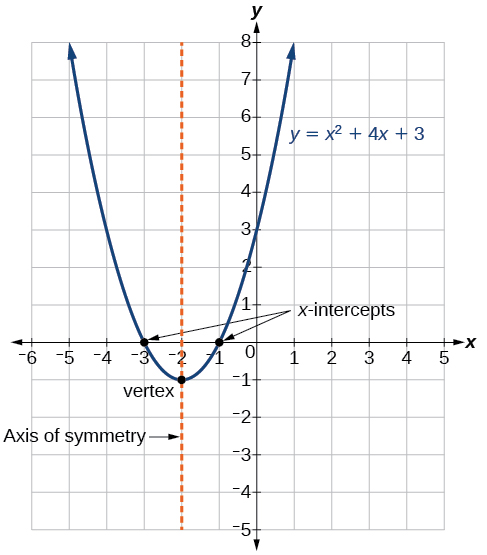{: #Figure_03_02_004}

The **standard form of a quadratic function** presents the function in the form

<math xmlns="http://www.w3.org/1998/Math/MathML" display="block"> <mrow> <mi>f</mi><mo stretchy="false">(</mo><mi>x</mi><mo stretchy="false">)</mo><mo>=</mo><mi>a</mi><msup> <mrow> <mo stretchy="false">(</mo><mi>x</mi><mo>−</mo><mi>h</mi><mo stretchy="false">)</mo> </mrow> <mn>2</mn> </msup> <mo>+</mo><mi>k</mi> </mrow> </math>

where<math xmlns="http://www.w3.org/1998/Math/MathML"> <mrow> <mtext> </mtext><mrow><mo>(</mo> <mrow> <mi>h</mi><mo>,</mo><mtext> </mtext><mi>k</mi> </mrow> <mo>)</mo></mrow><mtext> </mtext> </mrow> </math>

is the vertex. Because the vertex appears in the standard form of the quadratic function, this form is also known as the **vertex form of a quadratic function**{: data-type="term"}.

As with the general form, if<math xmlns="http://www.w3.org/1998/Math/MathML"> <mrow> <mtext> </mtext><mi>a</mi><mo>&gt;</mo><mn>0</mn><mo>,</mo><mtext> </mtext> </mrow> </math>

the parabola opens upward and the vertex is a minimum. If<math xmlns="http://www.w3.org/1998/Math/MathML"> <mrow> <mtext> </mtext><mi>a</mi><mo>&lt;</mo><mn>0</mn><mo>,</mo><mtext> </mtext> </mrow> </math>

the parabola opens downward, and the vertex is a maximum. [\[link\]](#Figure_03_02_005) represents the graph of the quadratic function written in standard form as<math xmlns="http://www.w3.org/1998/Math/MathML"> <mrow> <mtext> </mtext><mi>y</mi><mo>=</mo><mn>−3</mn><msup> <mrow> <mrow><mo>(</mo> <mrow> <mi>x</mi><mo>+</mo><mn>2</mn> </mrow> <mo>)</mo></mrow> </mrow> <mn>2</mn> </msup> <mo>+</mo><mn>4.</mn><mtext> </mtext> </mrow> </math>

Since<math xmlns="http://www.w3.org/1998/Math/MathML"> <mrow> <mtext> </mtext><mi>x</mi><mo>–</mo><mi>h</mi><mo>=</mo><mi>x</mi><mo>+</mo><mn>2</mn><mtext> </mtext> </mrow> </math>

in this example,<math xmlns="http://www.w3.org/1998/Math/MathML"> <mrow> <mtext> </mtext><mi>h</mi><mo>=</mo><mn>–2.</mn><mtext> </mtext> </mrow> </math>

In this form,<math xmlns="http://www.w3.org/1998/Math/MathML"> <mrow> <mtext> </mtext><mi>a</mi><mo>=</mo><mn>−3</mn><mo>,</mo><mi>h</mi><mo>=</mo><mn>−2</mn><mo>,</mo><mtext> </mtext> </mrow> </math>

and<math xmlns="http://www.w3.org/1998/Math/MathML"> <mrow> <mtext> </mtext><mi>k</mi><mo>=</mo><mn>4.</mn><mtext> </mtext> </mrow> </math>

Because<math xmlns="http://www.w3.org/1998/Math/MathML"> <mrow> <mtext> </mtext><mi>a</mi><mo>&lt;</mo><mn>0</mn><mo>,</mo><mtext> </mtext> </mrow> </math>

the parabola opens downward. The vertex is at<math xmlns="http://www.w3.org/1998/Math/MathML"> <mrow> <mtext> </mtext><mrow><mo>(</mo> <mrow> <mo>−</mo><mn>2</mn><mo>,</mo><mtext> 4</mtext> </mrow> <mo>)</mo></mrow><mo>.</mo> </mrow> </math>

{: #Figure_03_02_005}

The standard form is useful for determining how the graph is transformed from the graph of<math xmlns="http://www.w3.org/1998/Math/MathML"> <mrow> <mtext> </mtext><mi>y</mi><mo>=</mo><msup> <mi>x</mi> <mn>2</mn> </msup> <mo>.</mo><mtext> </mtext> </mrow> </math>

[\[link\]](#Figure_03_02_006) is the graph of this basic function.

 {: #Figure_03_02_006}

If<math xmlns="http://www.w3.org/1998/Math/MathML"> <mrow> <mtext> </mtext><mi>k</mi><mo>&gt;</mo><mn>0</mn><mo>,</mo><mtext> </mtext> </mrow> </math>

the graph shifts upward, whereas if<math xmlns="http://www.w3.org/1998/Math/MathML"> <mrow> <mtext> </mtext><mi>k</mi><mo>&lt;</mo><mn>0</mn><mo>,</mo><mtext> </mtext> </mrow> </math>

the graph shifts downward. In [\[link\]](#Figure_03_02_005),<math xmlns="http://www.w3.org/1998/Math/MathML"> <mrow> <mtext> </mtext><mi>k</mi><mo>&gt;</mo><mn>0</mn><mo>,</mo><mtext> </mtext> </mrow> </math>

so the graph is shifted 4 units upward. If<math xmlns="http://www.w3.org/1998/Math/MathML"> <mrow> <mtext> </mtext><mi>h</mi><mo>&gt;</mo><mn>0</mn><mo>,</mo><mtext> </mtext> </mrow> </math>

the graph shifts toward the right and if<math xmlns="http://www.w3.org/1998/Math/MathML"> <mrow> <mtext> </mtext><mi>h</mi><mo>&lt;</mo><mn>0</mn><mo>,</mo><mtext> </mtext> </mrow> </math>

the graph shifts to the left. In [\[link\]](#Figure_03_02_005),<math xmlns="http://www.w3.org/1998/Math/MathML"> <mrow> <mtext> </mtext><mi>h</mi><mo>&lt;</mo><mn>0</mn><mo>,</mo><mtext> </mtext> </mrow> </math>

so the graph is shifted 2 units to the left. The magnitude of<math xmlns="http://www.w3.org/1998/Math/MathML"> <mrow> <mtext> </mtext><mi>a</mi><mtext> </mtext> </mrow> </math>

indicates the stretch of the graph. If<math xmlns="http://www.w3.org/1998/Math/MathML"> <mrow> <mrow><mo>\|</mo> <mi>a</mi> <mo>\|</mo></mrow><mo>&gt;</mo><mn>1</mn><mo>,</mo> </mrow> </math>

 the point associated with a particular<math xmlns="http://www.w3.org/1998/Math/MathML"> <mrow> <mtext> </mtext><mi>x</mi><mtext>-</mtext> </mrow> </math>

value shifts farther from the *x-*axis, so the graph appears to become narrower, and there is a vertical stretch. But if<math xmlns="http://www.w3.org/1998/Math/MathML"> <mrow> <mtext> </mtext><mrow><mo>\|</mo> <mi>a</mi> <mo>\|</mo></mrow><mo>&lt;</mo><mn>1</mn><mo>,</mo><mtext> </mtext> </mrow> </math>

the point associated with a particular<math xmlns="http://www.w3.org/1998/Math/MathML"> <mrow> <mtext> </mtext><mi>x</mi><mtext>-</mtext> </mrow> </math>

value shifts closer to the *x-*axis, so the graph appears to become wider, but in fact there is a vertical compression. In [\[link\]](#Figure_03_02_005),<math xmlns="http://www.w3.org/1998/Math/MathML"> <mrow> <mtext> </mtext><mrow><mo>\|</mo> <mi>a</mi> <mo>\|</mo></mrow><mo>&gt;</mo><mn>1</mn><mo>,</mo><mtext> </mtext> </mrow> </math>

so the graph becomes narrower.

The standard form and the general form are equivalent methods of describing the same function. We can see this by expanding out the general form and setting it equal to the standard form.

<math xmlns="http://www.w3.org/1998/Math/MathML" display="block"> <mrow> <mtable> <mtr> <mtd columnalign="right"> <mrow> <mi>a</mi><msup> <mrow> <mo stretchy="false">(</mo><mi>x</mi><mo>−</mo><mi>h</mi><mo stretchy="false">)</mo></mrow> <mn>2</mn> </msup> <mo>+</mo><mi>k</mi></mrow> </mtd> <mtd><mo>=</mo></mtd> <mtd columnalign="left"> <mrow> <mi>a</mi><msup> <mi>x</mi> <mn>2</mn> </msup> <mo>+</mo><mi>b</mi><mi>x</mi><mo>+</mo><mi>c</mi></mrow> </mtd> </mtr> <mtr> <mtd columnalign="right"> <mrow> <mi>a</mi><msup> <mi>x</mi> <mn>2</mn> </msup> <mo>−</mo><mn>2</mn><mi>a</mi><mi>h</mi><mi>x</mi><mo>+</mo><mo stretchy="false">(</mo><mi>a</mi><msup> <mi>h</mi> <mn>2</mn> </msup> <mo>+</mo><mi>k</mi><mo stretchy="false">)</mo></mrow> </mtd> <mtd> <mo>=</mo> </mtd> <mtd columnalign="left"> <mrow> <mi>a</mi><msup> <mi>x</mi> <mn>2</mn> </msup> <mo>+</mo><mi>b</mi><mi>x</mi><mo>+</mo><mi>c</mi></mrow> </mtd> </mtr> </mtable></mrow> </math>

For the linear terms to be equal, the coefficients must be equal.

<math xmlns="http://www.w3.org/1998/Math/MathML" display="block"> <mrow> <mn>–2</mn><mi>a</mi><mi>h</mi><mo>=</mo><mi>b</mi><mo>,</mo><mtext> so </mtext><mi>h</mi><mo>=</mo><mo>−</mo><mfrac> <mi>b</mi> <mrow> <mn>2</mn><mi>a</mi> </mrow> </mfrac> </mrow> </math>

This is the **axis of symmetry**{: data-type="term" .no-emphasis} we defined earlier. Setting the constant terms equal:

<math xmlns="http://www.w3.org/1998/Math/MathML" display="block"> <mrow> <mtable> <mtr rowalign="center"> <mtd columnalign="right" rowalign="center"> <mrow> <mi>a</mi><msup> <mi>h</mi> <mn>2</mn> </msup> <mo>+</mo><mi>k</mi></mrow> </mtd> <mtd rowalign="center"> <mo>=</mo> </mtd> <mtd columnalign="left" rowalign="center"> <mi>c</mi> </mtd> </mtr> <mtr rowalign="center"> <mtd columnalign="right" rowalign="center"><mi>k</mi></mtd> <mtd rowalign="center"><mo>=</mo></mtd> <mtd columnalign="left" rowalign="center"> <mrow> <mi>c</mi><mo>−</mo><mi>a</mi><msup> <mi>h</mi> <mn>2</mn> </msup> </mrow> </mtd> </mtr> <mtr rowalign="center"> <mtd rowalign="center" /> <mtd rowalign="center"><mo>=</mo></mtd> <mtd columnalign="left" rowalign="center"> <mrow> <mi>c</mi><mo>−</mo><mi>a</mi><mo>−</mo><msup> <mrow> <mrow><mo>(</mo> <mrow> <mfrac numalign="center"> <mi>b</mi> <mrow> <mn>2</mn><mi>a</mi></mrow> </mfrac> </mrow> <mo>)</mo></mrow></mrow> <mn>2</mn> </msup> </mrow> </mtd> </mtr> <mtr rowalign="center"> <mtd rowalign="center" /> <mtd rowalign="center"><mo>=</mo></mtd> <mtd columnalign="left" rowalign="center"> <mrow> <mi>c</mi><mo>−</mo><mfrac> <mrow> <msup> <mi>b</mi> <mn>2</mn> </msup> </mrow> <mrow> <mn>4</mn><mi>a</mi></mrow> </mfrac> </mrow> </mtd> </mtr> </mtable></mrow> </math>

In practice, though, it is usually easier to remember that *k* is the output value of the function when the input is<math xmlns="http://www.w3.org/1998/Math/MathML"> <mrow> <mtext> </mtext><mi>h</mi><mo>,</mo><mtext> </mtext> </mrow> </math>

so<math xmlns="http://www.w3.org/1998/Math/MathML"> <mrow> <mtext> </mtext><mi>f</mi><mo stretchy="false">(</mo><mi>h</mi><mo stretchy="false">)</mo><mo>=</mo><mi>k</mi><mo>.</mo> </mrow> </math>

Forms of Quadratic Functions

A quadratic function is a polynomial function of degree two. The graph of a **quadratic function**{: data-type="term" .no-emphasis} is a parabola.

The **general form of a quadratic function**{: data-type="term"} is<math xmlns="http://www.w3.org/1998/Math/MathML"> <mrow> <mtext> </mtext><mi>f</mi><mo stretchy="false">(</mo><mi>x</mi><mo stretchy="false">)</mo><mo>=</mo><mi>a</mi><msup> <mi>x</mi> <mn>2</mn> </msup> <mo>+</mo><mi>b</mi><mi>x</mi><mo>+</mo><mi>c</mi><mtext> </mtext> </mrow> </math>

where<math xmlns="http://www.w3.org/1998/Math/MathML"> <mrow> <mtext> </mtext><mi>a</mi><mo>,</mo><mi>b</mi><mo>,</mo><mtext> </mtext> </mrow> </math>

and<math xmlns="http://www.w3.org/1998/Math/MathML"> <mrow> <mtext> </mtext><mi>c</mi><mtext> </mtext> </mrow> </math>

are real numbers and<math xmlns="http://www.w3.org/1998/Math/MathML"> <mrow> <mtext> </mtext><mi>a</mi><mo>≠</mo><mn>0.</mn> </mrow> </math>

The **standard form of a quadratic function**{: data-type="term"} is<math xmlns="http://www.w3.org/1998/Math/MathML"> <mrow> <mtext> </mtext><mi>f</mi><mo stretchy="false">(</mo><mi>x</mi><mo stretchy="false">)</mo><mo>=</mo><mi>a</mi><msup> <mrow> <mo stretchy="false">(</mo><mi>x</mi><mo>−</mo><mi>h</mi><mo stretchy="false">)</mo> </mrow> <mn>2</mn> </msup> <mo>+</mo><mi>k</mi><mtext> </mtext> </mrow> </math>

where<math xmlns="http://www.w3.org/1998/Math/MathML"> <mrow> <mtext> </mtext><mi>a</mi><mo>≠</mo><mn>0.</mn> </mrow> </math>

The vertex<math xmlns="http://www.w3.org/1998/Math/MathML"> <mrow> <mtext> </mtext><mo stretchy="false">(</mo><mi>h</mi><mo>,</mo><mi>k</mi><mo stretchy="false">)</mo><mtext> </mtext> </mrow> </math>

is located at

<math xmlns="http://www.w3.org/1998/Math/MathML" display="block"> <mrow> <mi>h</mi><mo>=</mo><mo>–</mo><mfrac> <mi>b</mi> <mrow> <mn>2</mn><mi>a</mi> </mrow> </mfrac> <mo>,</mo><mtext> </mtext><mi>k</mi><mo>=</mo><mi>f</mi><mo stretchy="false">(</mo><mi>h</mi><mo stretchy="false">)</mo><mo>=</mo><mi>f</mi><mrow><mo>(</mo> <mrow> <mfrac> <mrow> <mo>−</mo><mi>b</mi> </mrow> <mrow> <mn>2</mn><mi>a</mi> </mrow> </mfrac> </mrow> <mo>)</mo></mrow> </mrow> </math>

**Given a graph of a quadratic function, write the equation of the function in general form.**

1.  Identify the horizontal shift of the parabola; this value is
    <math xmlns="http://www.w3.org/1998/Math/MathML"> <mrow> <mtext> </mtext><mi>h</mi><mo>.</mo><mtext> </mtext> </mrow> </math>
    
    Identify the vertical shift of the parabola; this value is
    <math xmlns="http://www.w3.org/1998/Math/MathML"> <mrow> <mtext> </mtext><mi>k</mi><mo>.</mo> </mrow> </math>

2.  Substitute the values of the horizontal and vertical shift for
    <math xmlns="http://www.w3.org/1998/Math/MathML"> <mrow> <mtext> </mtext><mi>h</mi><mtext> </mtext> </mrow> </math>
    
    and
    <math xmlns="http://www.w3.org/1998/Math/MathML"> <mrow> <mtext> </mtext><mi>k</mi><mo>.</mo><mtext> </mtext> </mrow> </math>
    
    in the function
    <math xmlns="http://www.w3.org/1998/Math/MathML"> <mrow> <mtext> </mtext><mi>f</mi><mo stretchy="false">(</mo><mi>x</mi><mo stretchy="false">)</mo><mo>=</mo><mi>a</mi><msup> <mrow> <mo stretchy="false">(</mo><mi>x</mi><mo>–</mo><mi>h</mi><mo stretchy="false">)</mo> </mrow> <mn>2</mn> </msup> <mo>+</mo><mi>k</mi><mo>.</mo> </mrow> </math>

3.  Substitute the values of any point, other than the vertex, on the graph of the parabola for
    <math xmlns="http://www.w3.org/1998/Math/MathML"> <mrow> <mtext> </mtext><mi>x</mi><mtext> </mtext> </mrow> </math>
    
    and
    <math xmlns="http://www.w3.org/1998/Math/MathML"> <mrow> <mtext> </mtext><mi>f</mi><mo stretchy="false">(</mo><mi>x</mi><mo stretchy="false">)</mo><mo>.</mo> </mrow> </math>

4.  Solve for the stretch factor,
    <math xmlns="http://www.w3.org/1998/Math/MathML"> <mrow> <mtext> </mtext><mrow><mo>\|</mo> <mi>a</mi> <mo>\|</mo></mrow><mo>.</mo> </mrow> </math>

5.  Expand and simplify to write in general form.
{: type="1"}

Writing the Equation of a Quadratic Function from the Graph

Write an equation for the quadratic function<math xmlns="http://www.w3.org/1998/Math/MathML"> <mrow> <mtext> </mtext><mi>g</mi><mtext> </mtext> </mrow> </math>

in [[link]](#Figure_03_02_007) as a transformation of<math xmlns="http://www.w3.org/1998/Math/MathML"> <mrow> <mtext> </mtext><mi>f</mi><mo stretchy="false">(</mo><mi>x</mi><mo stretchy="false">)</mo><mo>=</mo><msup> <mi>x</mi> <mn>2</mn> </msup> <mo>,</mo><mtext> </mtext> </mrow> </math>

and then expand the formula, and simplify terms to write the equation in general form.

{: #Figure_03_02_007}

We can see the graph of <em>g </em>is the graph of<math xmlns="http://www.w3.org/1998/Math/MathML"> <mrow> <mtext> </mtext><mi>f</mi><mo stretchy="false">(</mo><mi>x</mi><mo stretchy="false">)</mo><mo>=</mo><msup> <mi>x</mi> <mn>2</mn> </msup> <mtext> </mtext> </mrow> </math>

shifted to the left 2 and down 3, giving a formula in the form<math xmlns="http://www.w3.org/1998/Math/MathML"> <mrow> <mtext> </mtext><mi>g</mi><mo stretchy="false">(</mo><mi>x</mi><mo stretchy="false">)</mo><mo>=</mo><mi>a</mi><msup> <mrow> <mo stretchy="false">(</mo><mi>x</mi><mo>−</mo><mo stretchy="false">(</mo><mn>−2</mn><mo stretchy="false">)</mo><mo stretchy="false">)</mo> </mrow> <mn>2</mn> </msup> <mo>−</mo><mn>3</mn><mo>=</mo><mi>a</mi><msup> <mrow> <mo stretchy="false">(</mo><mi>x</mi><mo>+</mo><mn>2</mn><mo stretchy="false">)</mo> </mrow> <mn>2</mn> </msup> <mo>–</mo><mn>3.</mn> </mrow> </math>

Substituting the coordinates of a point on the curve, such as<math xmlns="http://www.w3.org/1998/Math/MathML"> <mrow> <mtext> </mtext><mo stretchy="false">(</mo><mn>0</mn><mo>,</mo><mn>−1</mn><mo stretchy="false">)</mo><mo>,</mo><mtext> </mtext> </mrow> </math>

we can solve for the stretch factor.

<math xmlns="http://www.w3.org/1998/Math/MathML" display="block"> <mrow> <mtable> <mtr> <mtd columnalign="right"> <mrow> <mo>−</mo><mn>1</mn></mrow> </mtd> <mtd> <mo>=</mo> </mtd> <mtd columnalign="left"> <mrow> <mi>a</mi><msup> <mrow> <mrow><mo>(</mo> <mrow> <mn>0</mn><mo>+</mo><mn>2</mn></mrow> <mo>)</mo></mrow></mrow> <mn>2</mn> </msup> <mo>−</mo><mn>3</mn></mrow> </mtd> </mtr> <mtr> <mtd columnalign="right"> <mn>2</mn> </mtd> <mtd> <mo>=</mo> </mtd> <mtd columnalign="left"> <mrow> <mn>4</mn><mi>a</mi></mrow> </mtd> </mtr> <mtr> <mtd columnalign="right"> <mi>a</mi> </mtd> <mtd> <mo>=</mo> </mtd> <mtd columnalign="left"> <mrow> <mfrac> <mn>1</mn> <mn>2</mn> </mfrac> </mrow> </mtd> </mtr> </mtable></mrow> </math>

In standard form, the algebraic model for this graph is<math xmlns="http://www.w3.org/1998/Math/MathML"> <mrow> <mtext> </mtext><mo stretchy="false">(</mo><mi>g</mi><mo stretchy="false">)</mo><mi>x</mi><mo>=</mo><mfrac> <mn>1</mn> <mn>2</mn> </mfrac> <msup> <mrow> <mo stretchy="false">(</mo><mi>x</mi><mo>+</mo><mn>2</mn><mo stretchy="false">)</mo> </mrow> <mn>2</mn> </msup> <mo>–</mo><mn>3.</mn> </mrow> </math>

To write this in general polynomial form, we can expand the formula and simplify terms.

<math xmlns="http://www.w3.org/1998/Math/MathML" display="block"> <mrow> <mtable> <mtr rowalign="center"> <mtd columnalign="right" rowalign="center"><mrow><mi>g</mi><mo stretchy="false">(</mo><mi>x</mi><mo stretchy="false">)</mo></mrow></mtd> <mtd rowalign="center"><mo>=</mo></mtd> <mtd rowalign="center" columnalign="left"><mrow><mfrac><mn>1</mn><mn>2</mn></mfrac><msup><mrow><mo stretchy="false">(</mo><mi>x</mi><mo>+</mo><mn>2</mn><mo stretchy="false">)</mo></mrow><mn>2</mn></msup><mo>−</mo><mn>3</mn></mrow></mtd> </mtr> <mtr rowalign="center"> <mtd rowalign="center" /> <mtd rowalign="center"><mo>=</mo></mtd> <mtd rowalign="center" columnalign="left"><mrow><mfrac><mn>1</mn><mn>2</mn></mfrac><mo stretchy="false">(</mo><mi>x</mi><mo>+</mo><mn>2</mn><mo stretchy="false">)</mo><mo stretchy="false">(</mo><mi>x</mi><mo>+</mo><mn>2</mn><mo stretchy="false">)</mo><mo>−</mo><mn>3</mn></mrow></mtd> </mtr> <mtr rowalign="center"> <mtd rowalign="center" /> <mtd rowalign="center"><mo>=</mo></mtd> <mtd rowalign="center" columnalign="left"><mrow><mfrac><mn>1</mn><mn>2</mn></mfrac><mo stretchy="false">(</mo><msup><mi>x</mi><mn>2</mn></msup><mo>+</mo><mn>4</mn><mi>x</mi><mo>+</mo><mn>4</mn><mo stretchy="false">)</mo><mo>−</mo><mn>3</mn></mrow></mtd> </mtr> <mtr rowalign="center"> <mtd rowalign="center" /> <mtd rowalign="center"><mo>=</mo></mtd> <mtd rowalign="center" columnalign="left"><mrow><mfrac><mn>1</mn><mn>2</mn></mfrac><msup><mi>x</mi><mn>2</mn></msup><mo>+</mo><mn>2</mn><mi>x</mi><mo>+</mo><mn>2</mn><mo>−</mo><mn>3</mn></mrow></mtd> </mtr> <mtr> <mtd rowalign="center" /> <mtd rowalign="center"><mo>=</mo></mtd> <mtd rowalign="center" columnalign="left"><mrow><mfrac><mn>1</mn><mn>2</mn></mfrac><msup><mi>x</mi><mn>2</mn></msup><mo>+</mo><mn>2</mn><mi>x</mi><mo>−</mo><mn>1</mn></mrow></mtd> </mtr> </mtable></mrow> </math>

Notice that the horizontal and vertical shifts of the basic graph of the quadratic function determine the location of the vertex of the parabola; the vertex is unaffected by stretches and compressions.

Analysis

We can check our work using the table feature on a graphing utility. First enter<math xmlns="http://www.w3.org/1998/Math/MathML"> <mrow> <mtext> </mtext><mtext>Y1</mtext><mo>=</mo><mfrac> <mn>1</mn> <mn>2</mn> </mfrac> <msup> <mrow> <mo stretchy="false">(</mo><mi>x</mi><mo>+</mo><mn>2</mn><mo stretchy="false">)</mo> </mrow> <mn>2</mn> </msup> <mo>−</mo><mn>3.</mn><mtext> </mtext> </mrow> </math>

Next, select<math xmlns="http://www.w3.org/1998/Math/MathML"> <mrow> <mtext> </mtext><mtext>TBLSET,</mtext><mtext> </mtext> </mrow> </math>

then use<math xmlns="http://www.w3.org/1998/Math/MathML"> <mrow> <mtext> </mtext><mtext>TblStart</mtext><mo>=</mo><mo>–</mo><mn>6</mn><mtext> </mtext> </mrow> </math>

and<math xmlns="http://www.w3.org/1998/Math/MathML"> <mrow> <mtext> </mtext><mi>Δ</mi><mtext>Tbl = 2,</mtext><mtext> </mtext> </mrow> </math>

and select<math xmlns="http://www.w3.org/1998/Math/MathML"> <mrow> <mtext> </mtext><mtext>TABLE</mtext><mtext>.</mtext><mtext> </mtext> </mrow> </math>

See [[link]](#Table_03_02_01).

| <strong><math xmlns="http://www.w3.org/1998/Math/MathML">
 <mi>x</mi>
</math></strong> | –6 | –4 | –2 | 0 | 2 |
| <strong><math xmlns="http://www.w3.org/1998/Math/MathML">
 <mi>y</mi>
</math></strong> | 5 | –1 | –3 | –1 | 5 |
{: #Table_03_02_01 summary=".."}

The ordered pairs in the table correspond to points on the graph.

A coordinate grid has been superimposed over the quadratic path of a basketball in [[link]](#Figure_03_02_008). Find an equation for the path of the ball. Does the shooter make the basket?

"){: #Figure_03_02_008}

The path passes through the origin and has vertex at<math xmlns="http://www.w3.org/1998/Math/MathML"> <mrow> <mtext> </mtext><mrow><mo>(</mo> <mrow> <mo>−</mo><mn>4</mn><mo>,</mo><mtext> </mtext><mn>7</mn> </mrow> <mo>)</mo></mrow><mo>,</mo><mtext> </mtext> </mrow> </math>

so<math xmlns="http://www.w3.org/1998/Math/MathML"> <mrow> <mtext> </mtext><mo stretchy="false">(</mo><mi>h</mi><mo stretchy="false">)</mo><mi>x</mi><mo>=</mo><mo>–</mo><mfrac> <mn>7</mn> <mrow> <mn>16</mn> </mrow> </mfrac> <msup> <mrow> <mo stretchy="false">(</mo><mi>x</mi><mo>+</mo><mn>4</mn><mo stretchy="false">)</mo> </mrow> <mn>2</mn> </msup> <mo>+</mo><mn>7.</mn><mtext> </mtext> </mrow> </math>

To make the shot,<math xmlns="http://www.w3.org/1998/Math/MathML"> <mrow> <mtext> </mtext><mi>h</mi><mrow><mo>(</mo> <mrow> <mo>−</mo><mn>7.5</mn> </mrow> <mo>)</mo></mrow><mtext> </mtext> </mrow> </math>

would need to be about 4 but<math xmlns="http://www.w3.org/1998/Math/MathML"> <mrow> <mtext> </mtext><mi>h</mi><mo stretchy="false">(</mo><mo>–</mo><mn>7.5</mn><mo stretchy="false">)</mo><mo>≈</mo><mn>1.64</mn><mo>;</mo><mtext> </mtext> </mrow> </math>

he doesn’t make it.

**Given a quadratic function in general form, find the vertex of the parabola.**

1.  Identify
    <math xmlns="http://www.w3.org/1998/Math/MathML"> <mrow> <mtext> </mtext><mi>a</mi><mo>,</mo><mo> </mo><mi>b</mi><mo>,</mo><mo> </mo><mtext>and</mtext><mo> </mo><mi>c</mi><mo>.</mo> </mrow> </math>

2.  Find
    <math xmlns="http://www.w3.org/1998/Math/MathML"> <mrow> <mtext> </mtext><mi>h</mi><mo>,</mo><mtext> </mtext> </mrow> </math>
    
    the *x*-coordinate of the vertex, by substituting
    <math xmlns="http://www.w3.org/1998/Math/MathML"> <mrow> <mtext> </mtext><mi>a</mi><mtext> </mtext> </mrow> </math>
    
    and
    <math xmlns="http://www.w3.org/1998/Math/MathML"> <mrow> <mtext> </mtext><mi>b</mi><mtext> </mtext> </mrow> </math>
    
    into
    <math xmlns="http://www.w3.org/1998/Math/MathML"> <mrow> <mtext> </mtext><mi>h</mi><mo>=</mo><mo>–</mo><mfrac> <mi>b</mi> <mrow> <mn>2</mn><mi>a</mi> </mrow> </mfrac> <mo>.</mo> </mrow> </math>

3.  Find
    <math xmlns="http://www.w3.org/1998/Math/MathML"> <mrow> <mtext> </mtext><mi>k</mi><mo>,</mo><mtext> </mtext> </mrow> </math>
    
    the *y*-coordinate of the vertex, by evaluating
    <math xmlns="http://www.w3.org/1998/Math/MathML"> <mrow> <mtext> </mtext><mi>k</mi><mo>=</mo><mi>f</mi><mrow><mo>(</mo> <mi>h</mi> <mo>)</mo></mrow><mo>=</mo><mi>f</mi><mrow><mo>(</mo> <mrow> <mo>−</mo><mfrac> <mi>b</mi> <mrow> <mn>2</mn><mi>a</mi> </mrow> </mfrac> </mrow> <mo>)</mo></mrow><mo>.</mo> </mrow> </math>
{: type="1"}

Finding the Vertex of a Quadratic Function

Find the vertex of the quadratic function<math xmlns="http://www.w3.org/1998/Math/MathML"> <mrow> <mtext> </mtext><mi>f</mi><mo stretchy="false">(</mo><mi>x</mi><mo stretchy="false">)</mo><mo>=</mo><mn>2</mn><msup> <mi>x</mi> <mn>2</mn> </msup> <mo>–</mo><mn>6</mn><mi>x</mi><mo>+</mo><mn>7.</mn><mtext> </mtext> </mrow> </math>

Rewrite the quadratic in standard form (vertex form).

<math xmlns="http://www.w3.org/1998/Math/MathML"> <mtable><mtr><mtd columnalign="left"><mtext>The horizontal coordinate of the vertex will be at</mtext></mtd></mtr> <mtr> <mtd /> <mtd columnalign="right"><mi>h</mi></mtd> <mtd><mo>=</mo></mtd> <mtd columnalign="left"> <mo>−</mo> <mfrac> <mi>b</mi> <mrow> <mn>2</mn><mi>a</mi></mrow> </mfrac> </mtd> </mtr> <mtr> <mtd /> <mtd /> <mtd> <mo>=</mo> </mtd> <mtd columnalign="left"> <mo>−</mo><mfrac> <mn>−6</mn> <mrow> <mn>2</mn><mo stretchy="false">(</mo><mn>2</mn><mo stretchy="false">)</mo></mrow> </mfrac> </mtd> </mtr> <mtr> <mtd /> <mtd /> <mtd><mo>=</mo></mtd> <mtd columnalign="left"> <mfrac> <mn>6</mn> <mn>4</mn> </mfrac> </mtd> </mtr> <mtr> <mtd /> <mtd /> <mtd><mo>=</mo></mtd> <mtd columnalign="left"> <mfrac> <mn>3</mn> <mn>2</mn> </mfrac> </mtd> </mtr> <mtr><mtd columnalign="left"> <mtext>The vertical coordinate of the vertex will be at</mtext></mtd></mtr> <mtr> <mtd /> <mtd columnalign="right"><mi>k</mi></mtd> <mtd><mo>=</mo></mtd> <mtd columnalign="left"> <mi>f</mi><mo stretchy="false">(</mo><mi>h</mi><mo stretchy="false">)</mo> </mtd> </mtr> <mtr> <mtd /> <mtd /> <mtd> <mo>=</mo> </mtd> <mtd columnalign="left"> <mi>f</mi><mo>(</mo> <mfrac><mn>3</mn><mn>2</mn></mfrac><mo>)</mo> </mtd> </mtr> <mtr> <mtd /> <mtd /> <mtd><mo>=</mo></mtd> <mtd columnalign="left"> <mn>2</mn><msup><mrow><mo>(</mo><mfrac><mn>3</mn><mn>2</mn></mfrac><mo>)</mo></mrow><mn>2</mn></msup><mo>−</mo><mn>6</mn><mrow><mo>(</mo><mfrac><mn>3</mn><mn>2</mn></mfrac><mo>)</mo></mrow><mo>+</mo><mn>7</mn> </mtd> </mtr> <mtr> <mtd /> <mtd /> <mtd><mo>=</mo></mtd> <mtd columnalign="left"> <mfrac> <mn>5</mn> <mn>2</mn> </mfrac> </mtd> </mtr> </mtable> </math>

Rewriting into standard form, the stretch factor will be the same as the<math xmlns="http://www.w3.org/1998/Math/MathML"> <mrow> <mtext> </mtext><mi>a</mi><mtext> </mtext> </mrow> </math>

in the original quadratic. First, find the horizontal coordinate of the vertex. Then find the vertical coordinate of the vertex. Substitute the values into standard form, using the "<math xmlns="http://www.w3.org/1998/Math/MathML"><mi>a</mi></math>

" from the general form.

<math xmlns="http://www.w3.org/1998/Math/MathML" display="block"> <mrow> <mtable> <mtr> <mtd columnalign="right"> <mrow> <mi>f</mi><mo stretchy="false">(</mo><mi>x</mi><mo stretchy="false">)</mo></mrow> </mtd> <mtd> <mo>=</mo> </mtd> <mtd columnalign="left"> <mrow> <mi>a</mi><msup> <mi>x</mi> <mn>2</mn> </msup> <mo>+</mo><mi>b</mi><mi>x</mi><mo>+</mo><mi>c</mi></mrow> </mtd> </mtr> <mtr> <mtd columnalign="right"> <mrow> <mi>f</mi><mo stretchy="false">(</mo><mi>x</mi><mo stretchy="false">)</mo></mrow> </mtd> <mtd> <mo>=</mo> </mtd> <mtd columnalign="left"> <mrow> <mn>2</mn><msup> <mi>x</mi> <mn>2</mn> </msup> <mo>−</mo><mn>6</mn><mi>x</mi><mo>+</mo><mn>7</mn></mrow> </mtd> </mtr> </mtable></mrow> </math>

The standard form of a quadratic function prior to writing the function then becomes the following:

<math xmlns="http://www.w3.org/1998/Math/MathML" display="block"> <mrow> <mi>f</mi><mrow><mo>(</mo> <mi>x</mi> <mo>)</mo></mrow><mo>=</mo><mn>2</mn><msup> <mrow> <mrow><mo>(</mo> <mrow> <mi>x</mi><mo>–</mo><mfrac> <mn>3</mn> <mn>2</mn> </mfrac> </mrow> <mo>)</mo></mrow> </mrow> <mn>2</mn> </msup> <mo>+</mo><mfrac> <mn>5</mn> <mn>2</mn> </mfrac> </mrow> </math>

Analysis

One reason we may want to identify the vertex of the parabola is that this point will inform us where the maximum or minimum value of the output occurs,<math xmlns="http://www.w3.org/1998/Math/MathML"> <mrow> <mtext> </mtext><mi>k</mi><mo>,</mo> </mrow> </math>

and where it occurs,<math xmlns="http://www.w3.org/1998/Math/MathML"> <mrow> <mtext> </mtext><mi>x</mi><mo>.</mo> </mrow> </math>

Given the equation<math xmlns="http://www.w3.org/1998/Math/MathML"> <mrow> <mtext> </mtext><mi>g</mi><mo stretchy="false">(</mo><mi>x</mi><mo stretchy="false">)</mo><mo>=</mo><mn>13</mn><mo>+</mo><msup> <mi>x</mi> <mn>2</mn> </msup> <mo>−</mo><mn>6</mn><mi>x</mi><mo>,</mo> </mrow> </math>

 write the equation in general form and then in standard form.

<math xmlns="http://www.w3.org/1998/Math/MathML"> <mrow> <mi>g</mi><mo stretchy="false">(</mo><mi>x</mi><mo stretchy="false">)</mo><mo>=</mo><msup> <mi>x</mi> <mn>2</mn> </msup> <mo>−</mo><mn>6</mn><mi>x</mi><mo>+</mo><mn>13</mn><mtext> </mtext> </mrow> </math>

in general form;<math xmlns="http://www.w3.org/1998/Math/MathML"> <mrow> <mtext> </mtext><mi>g</mi><mo stretchy="false">(</mo><mi>x</mi><mo stretchy="false">)</mo><mo>=</mo><msup> <mrow> <mo stretchy="false">(</mo><mi>x</mi><mo>−</mo><mn>3</mn><mo stretchy="false">)</mo> </mrow> <mn>2</mn> </msup> <mo>+</mo><mn>4</mn><mtext> </mtext> </mrow> </math>

in standard form

### Finding the Domain and Range of a Quadratic Function

Any number can be the input value of a quadratic function. Therefore, the domain of any quadratic function is all real numbers. Because parabolas have a maximum or a minimum point, the range is restricted. Since the vertex of a parabola will be either a maximum or a minimum, the range will consist of all *y*-values greater than or equal to the *y*-coordinate at the turning point or less than or equal to the *y*-coordinate at the turning point, depending on whether the parabola opens up or down.

Domain and Range of a Quadratic Function

The domain of any **quadratic function**{: data-type="term" .no-emphasis} is all real numbers unless the context of the function presents some restrictions.

The range of a quadratic function written in general form<math xmlns="http://www.w3.org/1998/Math/MathML"> <mrow> <mtext> </mtext><mi>f</mi><mo stretchy="false">(</mo><mi>x</mi><mo stretchy="false">)</mo><mo>=</mo><mi>a</mi><msup> <mi>x</mi> <mn>2</mn> </msup> <mo>+</mo><mi>b</mi><mi>x</mi><mo>+</mo><mi>c</mi><mtext> </mtext> </mrow> </math>

with a positive<math xmlns="http://www.w3.org/1998/Math/MathML"> <mrow> <mtext> </mtext><mi>a</mi><mtext> </mtext> </mrow> </math>

value is<math xmlns="http://www.w3.org/1998/Math/MathML"> <mrow> <mtext> </mtext><mi>f</mi><mo stretchy="false">(</mo><mi>x</mi><mo stretchy="false">)</mo><mo>≥</mo><mi>f</mi><mrow><mo>(</mo> <mrow> <mo>−</mo><mfrac> <mi>b</mi> <mrow> <mn>2</mn><mi>a</mi> </mrow> </mfrac> </mrow> <mo>)</mo></mrow><mo>,</mo><mtext> </mtext> </mrow> </math>

or<math xmlns="http://www.w3.org/1998/Math/MathML"> <mrow> <mtext> </mtext><mrow><mo>[</mo> <mrow> <mi>f</mi><mrow><mo>(</mo> <mrow> <mo>−</mo><mfrac> <mi>b</mi> <mrow> <mn>2</mn><mi>a</mi> </mrow> </mfrac> </mrow> <mo>)</mo></mrow><mo>,</mo><mi>∞</mi> </mrow> <mo>)</mo></mrow><mo>;</mo><mtext> </mtext> </mrow> </math>

the range of a quadratic function written in general form with a negative<math xmlns="http://www.w3.org/1998/Math/MathML"> <mrow> <mtext> </mtext><mi>a</mi><mtext> </mtext> </mrow> </math>

value is<math xmlns="http://www.w3.org/1998/Math/MathML"> <mrow> <mtext> </mtext><mi>f</mi><mo stretchy="false">(</mo><mi>x</mi><mo stretchy="false">)</mo><mo>≤</mo><mi>f</mi><mrow><mo>(</mo> <mrow> <mo>−</mo><mfrac> <mi>b</mi> <mrow> <mn>2</mn><mi>a</mi> </mrow> </mfrac> </mrow> <mo>)</mo></mrow><mo>,</mo><mtext> </mtext> </mrow> </math>

or<math xmlns="http://www.w3.org/1998/Math/MathML"> <mrow> <mtext> </mtext><mrow><mo>(</mo> <mrow> <mo>−</mo><mi>∞</mi><mo>,</mo><mi>f</mi><mrow><mo>(</mo> <mrow> <mo>−</mo><mfrac> <mi>b</mi> <mrow> <mn>2</mn><mi>a</mi> </mrow> </mfrac> </mrow> <mo>)</mo></mrow> </mrow> <mo>]</mo></mrow><mo>.</mo> </mrow> </math>

The range of a quadratic function written in standard form<math xmlns="http://www.w3.org/1998/Math/MathML"> <mrow> <mtext> </mtext><mi>f</mi><mo stretchy="false">(</mo><mi>x</mi><mo stretchy="false">)</mo><mo>=</mo><mi>a</mi><msup> <mrow> <mo stretchy="false">(</mo><mi>x</mi><mo>−</mo><mi>h</mi><mo stretchy="false">)</mo> </mrow> <mn>2</mn> </msup> <mo>+</mo><mi>k</mi><mtext> </mtext> </mrow> </math>

with a positive<math xmlns="http://www.w3.org/1998/Math/MathML"> <mrow> <mtext> </mtext><mi>a</mi><mtext> </mtext> </mrow> </math>

value is<math xmlns="http://www.w3.org/1998/Math/MathML"> <mrow> <mtext> </mtext><mi>f</mi><mo stretchy="false">(</mo><mi>x</mi><mo stretchy="false">)</mo><mo>≥</mo><mi>k</mi><mo>;</mo><mtext> </mtext> </mrow> </math>

the range of a quadratic function written in standard form with a negative<math xmlns="http://www.w3.org/1998/Math/MathML"> <mrow> <mtext> </mtext><mi>a</mi><mtext> </mtext> </mrow> </math>

value is<math xmlns="http://www.w3.org/1998/Math/MathML"> <mrow> <mtext> </mtext><mi>f</mi><mo stretchy="false">(</mo><mi>x</mi><mo stretchy="false">)</mo><mo>≤</mo><mi>k</mi><mo>.</mo> </mrow> </math>

**Given a quadratic function, find the domain and range.**

1.  Identify the domain of any quadratic function as all real numbers.
2.  Determine whether
    <math xmlns="http://www.w3.org/1998/Math/MathML"> <mrow> <mtext> </mtext><mi>a</mi><mtext> </mtext> </mrow> </math>
    
    is positive or negative. If
    <math xmlns="http://www.w3.org/1998/Math/MathML"> <mrow> <mtext> </mtext><mi>a</mi><mtext> </mtext> </mrow> </math>
    
    is positive, the parabola has a minimum. If
    <math xmlns="http://www.w3.org/1998/Math/MathML"> <mrow> <mtext> </mtext><mi>a</mi><mtext> </mtext> </mrow> </math>
    
    is negative, the parabola has a maximum.
3.  Determine the maximum or minimum value of the parabola,
    <math xmlns="http://www.w3.org/1998/Math/MathML"> <mrow> <mtext> </mtext><mi>k</mi><mo>.</mo> </mrow> </math>

4.  If the parabola has a minimum, the range is given by
    <math xmlns="http://www.w3.org/1998/Math/MathML"> <mrow> <mtext> </mtext><mi>f</mi><mo stretchy="false">(</mo><mi>x</mi><mo stretchy="false">)</mo><mo>≥</mo><mi>k</mi><mo>,</mo><mtext> </mtext> </mrow> </math>
    
    or
    <math xmlns="http://www.w3.org/1998/Math/MathML"> <mrow> <mtext> </mtext><mrow><mo>[</mo> <mrow> <mi>k</mi><mo>,</mo><mi>∞</mi> </mrow> <mo>)</mo></mrow><mo>.</mo><mtext> </mtext> </mrow> </math>
    
    If the parabola has a maximum, the range is given by
    <math xmlns="http://www.w3.org/1998/Math/MathML"> <mrow> <mtext> </mtext><mi>f</mi><mo stretchy="false">(</mo><mi>x</mi><mo stretchy="false">)</mo><mo>≤</mo><mi>k</mi><mo>,</mo><mtext> </mtext> </mrow> </math>
    
    or
    <math xmlns="http://www.w3.org/1998/Math/MathML"> <mrow> <mtext> </mtext><mrow><mo>(</mo> <mrow> <mo>−</mo><mi>∞</mi><mo>,</mo><mi>k</mi> </mrow> <mo>]</mo></mrow><mo>.</mo> </mrow> </math>
{: type="1"}

Finding the Domain and Range of a Quadratic Function

Find the domain and range of<math xmlns="http://www.w3.org/1998/Math/MathML"> <mrow> <mtext> </mtext><mi>f</mi><mo stretchy="false">(</mo><mi>x</mi><mo stretchy="false">)</mo><mo>=</mo><mo>−</mo><mn>5</mn><msup> <mi>x</mi> <mn>2</mn> </msup> <mo>+</mo><mn>9</mn><mi>x</mi><mo>−</mo><mn>1.</mn> </mrow> </math>

As with any quadratic function, the domain is all real numbers.

Because<math xmlns="http://www.w3.org/1998/Math/MathML"> <mrow> <mtext> </mtext><mi>a</mi><mtext> </mtext> </mrow> </math>

is negative, the parabola opens downward and has a maximum value. We need to determine the maximum value. We can begin by finding the<math xmlns="http://www.w3.org/1998/Math/MathML"> <mrow> <mtext> </mtext><mi>x</mi><mtext>-</mtext> </mrow> </math>

value of the vertex.

<math xmlns="http://www.w3.org/1998/Math/MathML" display="block"> <mrow> <mtable> <mtr rowalign="center"> <mtd columnalign="right" rowalign="center"> <mi>h</mi> </mtd> <mtd rowalign="center"><mo>=</mo></mtd> <mtd columnalign="left" rowalign="center"> <mrow> <mo>−</mo><mfrac> <mi>b</mi> <mrow> <mn>2</mn><mi>a</mi></mrow> </mfrac> </mrow> </mtd> </mtr> <mtr rowalign="center"> <mtd columnalign="right" /> <mtd rowalign="center"><mo>=</mo></mtd> <mtd columnalign="left" rowalign="center"> <mrow> <mo>−</mo><mfrac> <mn>9</mn> <mrow> <mn>2</mn><mo stretchy="false">(</mo><mn>−5</mn><mo stretchy="false">)</mo></mrow> </mfrac> </mrow> </mtd> </mtr> <mtr rowalign="center"> <mtd columnalign="right" rowalign="center" /> <mtd rowalign="center"><mo>=</mo></mtd> <mtd columnalign="left" rowalign="center"> <mrow> <mfrac> <mn>9</mn> <mrow> <mn>10</mn></mrow> </mfrac> </mrow> </mtd> </mtr> </mtable></mrow> </math>

The maximum value is given by<math xmlns="http://www.w3.org/1998/Math/MathML"> <mrow> <mtext> </mtext><mi>f</mi><mo stretchy="false">(</mo><mi>h</mi><mo stretchy="false">)</mo><mo>.</mo> </mrow> </math>

<math xmlns="http://www.w3.org/1998/Math/MathML" display="block"> <mrow> <mtable> <mtr rowalign="center"> <mtd columnalign="right" rowalign="center"> <mrow> <mi>f</mi><mrow><mo>(</mo> <mrow> <mfrac> <mn>9</mn> <mrow> <mn>10</mn></mrow> </mfrac> </mrow> <mo>)</mo></mrow></mrow> </mtd> <mtd rowalign="center"><mo>=</mo></mtd> <mtd columnalign="left" rowalign="center"> <mrow> <mn>-5</mn><msup> <mrow> <mrow><mo>(</mo> <mrow> <mfrac> <mn>9</mn> <mrow> <mn>10</mn></mrow> </mfrac> </mrow> <mo>)</mo></mrow></mrow> <mn>2</mn> </msup> <mo>+</mo><mn>9</mn><mrow><mo>(</mo> <mrow> <mfrac> <mn>9</mn> <mrow> <mn>10</mn></mrow> </mfrac> </mrow> <mo>)</mo></mrow><mo>−</mo><mn>1</mn></mrow> </mtd> </mtr> <mtr rowalign="center"> <mtd rowalign="center" /> <mtd rowalign="center"><mo>=</mo></mtd> <mtd columnalign="left" rowalign="center"> <mrow> <mfrac> <mrow> <mn>61</mn></mrow> <mrow> <mn>20</mn></mrow> </mfrac> </mrow> </mtd> </mtr> </mtable></mrow> </math>

The range is<math xmlns="http://www.w3.org/1998/Math/MathML"> <mrow> <mtext> </mtext><mi>f</mi><mo stretchy="false">(</mo><mi>x</mi><mo stretchy="false">)</mo><mo>≤</mo><mfrac> <mrow> <mn>61</mn> </mrow> <mrow> <mn>20</mn> </mrow> </mfrac> <mo>,</mo><mtext> </mtext> </mrow> </math>

or<math xmlns="http://www.w3.org/1998/Math/MathML"> <mrow> <mtext> </mtext><mrow><mo>(</mo> <mrow> <mo>−</mo><mi>∞</mi><mo>,</mo><mfrac> <mrow> <mn>61</mn> </mrow> <mrow> <mn>20</mn> </mrow> </mfrac> </mrow> <mo>]</mo></mrow><mo>.</mo> </mrow> </math>

Find the domain and range of<math xmlns="http://www.w3.org/1998/Math/MathML"> <mrow> <mtext> </mtext><mi>f</mi><mo stretchy="false">(</mo><mi>x</mi><mo stretchy="false">)</mo><mo>=</mo><mn>2</mn><msup> <mrow> <mrow><mo>(</mo> <mrow> <mi>x</mi><mo>−</mo><mfrac> <mn>4</mn> <mn>7</mn> </mfrac> </mrow> <mo>)</mo></mrow> </mrow> <mn>2</mn> </msup> <mo>+</mo><mfrac> <mn>8</mn> <mrow> <mn>11</mn> </mrow> </mfrac> <mo>.</mo> </mrow> </math>

The domain is all real numbers. The range is<math xmlns="http://www.w3.org/1998/Math/MathML"> <mrow> <mtext> </mtext><mi>f</mi><mo stretchy="false">(</mo><mi>x</mi><mo stretchy="false">)</mo><mo>≥</mo><mfrac> <mn>8</mn> <mrow> <mn>11</mn> </mrow> </mfrac> <mo>,</mo><mtext> </mtext> </mrow> </math>

or<math xmlns="http://www.w3.org/1998/Math/MathML"> <mrow> <mtext> </mtext><mrow><mo>[</mo> <mrow> <mfrac> <mn>8</mn> <mrow> <mn>11</mn> </mrow> </mfrac> <mo>,</mo><mi>∞</mi> </mrow> <mo>)</mo></mrow><mo>.</mo> </mrow> </math>

### Determining the Maximum and Minimum Values of Quadratic Functions

The output of the quadratic function at the vertex is the maximum or minimum value of the function, depending on the orientation of the **parabola**{: data-type="term" .no-emphasis}. We can see the maximum and minimum values in [\[link\]](#Figure_03_02_009).

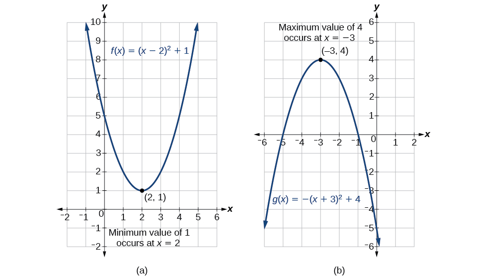{: #Figure_03_02_009}

There are many real-world scenarios that involve finding the maximum or minimum value of a quadratic function, such as applications involving area and revenue.

Finding the Maximum Value of a Quadratic Function

A backyard farmer wants to enclose a rectangular space for a new garden within her fenced backyard. She has purchased 80 feet of wire fencing to enclose three sides, and she will use a section of the backyard fence as the fourth side.

1.  Find a formula for the area enclosed by the fence if the sides of fencing perpendicular to the existing fence have length
    <math xmlns="http://www.w3.org/1998/Math/MathML"> <mrow> <mtext> </mtext><mi>L</mi><mo>.</mo> </mrow> </math>

2.  What dimensions should she make her garden to maximize the enclosed area?
{: type="a"}

Let’s use a diagram such as [[link]](#Figure_03_02_010) to record the given information. It is also helpful to introduce a temporary variable,<math xmlns="http://www.w3.org/1998/Math/MathML"> <mrow> <mtext> </mtext><mi>W</mi><mo>,</mo><mtext> </mtext> </mrow> </math>

to represent the width of the garden and the length of the fence section parallel to the backyard fence.

{: #Figure_03_02_010}

1.  We know we have only 80 feet of fence available, and
    <math xmlns="http://www.w3.org/1998/Math/MathML"> <mrow> <mtext> </mtext><mi>L</mi><mo>+</mo><mi>W</mi><mo>+</mo><mi>L</mi><mo>=</mo><mn>80</mn><mo>,</mo><mtext> </mtext> </mrow> </math>
    
    or more simply,
    <math xmlns="http://www.w3.org/1998/Math/MathML"> <mrow> <mtext> </mtext><mn>2</mn><mi>L</mi><mo>+</mo><mi>W</mi><mo>=</mo><mn>80.</mn><mtext> </mtext> </mrow> </math>
    
    This allows us to represent the width,
    <math xmlns="http://www.w3.org/1998/Math/MathML"> <mrow> <mtext> </mtext><mi>W</mi><mo>,</mo><mtext> </mtext> </mrow> </math>
    
    in terms of
    <math xmlns="http://www.w3.org/1998/Math/MathML"> <mrow> <mtext> </mtext><mi>L</mi><mo>.</mo> </mrow> </math>
    
    

    <math xmlns="http://www.w3.org/1998/Math/MathML" display="block"> <mrow> <mi>W</mi><mo>=</mo><mn>80</mn><mo>−</mo><mn>2</mn><mi>L</mi> </mrow> </math>
    

    
    Now we are ready to write an equation for the area the fence encloses. We know the area of a rectangle is length multiplied by width, so
    
    

    <math xmlns="http://www.w3.org/1998/Math/MathML" display="block"> <mrow> <mtable> <mtr> <mtd columnalign="right"> <mi>A</mi> </mtd> <mtd> <mo>=</mo> </mtd> <mtd columnalign="left"> <mrow> <mi>L</mi><mi>W</mi><mo>=</mo><mi>L</mi><mo stretchy="false">(</mo><mn>80</mn><mo>−</mo><mn>2</mn><mi>L</mi><mo stretchy="false">)</mo></mrow> </mtd> </mtr> <mtr> <mtd columnalign="right"> <mrow> <mi>A</mi><mo stretchy="false">(</mo><mi>L</mi><mo stretchy="false">)</mo></mrow> </mtd> <mtd> <mo>=</mo> </mtd> <mtd columnalign="left"> <mrow> <mn>80</mn><mi>L</mi><mo>−</mo><mn>2</mn><msup> <mi>L</mi> <mn>2</mn> </msup> </mrow> </mtd> </mtr> </mtable></mrow> </math>
    

    
    This formula represents the area of the fence in terms of the variable length<math xmlns="http://www.w3.org/1998/Math/MathML"> <mrow> <mtext> </mtext><mi>L</mi><mo>.</mo><mtext> </mtext> </mrow> </math>
    
    The function, written in general form, is
    
    

    <math xmlns="http://www.w3.org/1998/Math/MathML" display="block"> <mrow> <mi>A</mi><mo stretchy="false">(</mo><mi>L</mi><mo stretchy="false">)</mo><mo>=</mo><mn>−2</mn><msup> <mi>L</mi> <mn>2</mn> </msup> <mo>+</mo><mn>80</mn><mi>L</mi><mo>.</mo> </mrow> </math>
    

2.  The quadratic has a negative leading coefficient, so the graph will open downward, and the vertex will be the maximum value for the area. In finding the vertex, we must be careful because the equation is not written in standard polynomial form with decreasing powers. This is why we rewrote the function in general form above. Since
    <math xmlns="http://www.w3.org/1998/Math/MathML"> <mrow> <mtext> </mtext><mi>a</mi><mtext> </mtext> </mrow> </math>
    
    is the coefficient of the squared term,
    <math xmlns="http://www.w3.org/1998/Math/MathML"> <mrow> <mtext> </mtext><mi>a</mi><mo>=</mo><mn>−2</mn><mo>,</mo><mi>b</mi><mo>=</mo><mn>80</mn><mo>,</mo><mtext> </mtext> </mrow> </math>
    
    and
    <math xmlns="http://www.w3.org/1998/Math/MathML"> <mrow> <mtext> </mtext><mi>c</mi><mo>=</mo><mn>0.</mn> </mrow> </math>
{: type="a"}

To find the vertex:

<math xmlns="http://www.w3.org/1998/Math/MathML" display="block"> <mrow> <mtable> <mtr rowalign="center"> <mtd columnalign="right" rowalign="center"><mi>h</mi></mtd> <mtd rowalign="center"><mo>=</mo></mtd> <mtd columnalign="left" rowalign="center"> <mrow> <mo>−</mo><mfrac> <mi>b</mi> <mrow> <mn>2</mn><mi>a</mi></mrow> </mfrac> </mrow> </mtd> <mtd rowalign="center" /> <mtd columnalign="right" rowalign="center"><mspace width="1em" /><mi>k</mi></mtd> <mtd rowalign="center"><mo>=</mo></mtd> <mtd columnalign="left" rowalign="center"> <mrow> <mi>A</mi><mo stretchy="false">(</mo><mn>20</mn><mo>)</mo></mrow> </mtd> </mtr> <mtr rowalign="center"> <mtd rowalign="center" /> <mtd rowalign="center"><mo>=</mo></mtd> <mtd columnalign="left" rowalign="center"> <mrow> <mo>−</mo><mfrac> <mrow> <mn>80</mn></mrow> <mrow> <mn>2</mn><mo stretchy="false">(</mo><mn>−2</mn><mo stretchy="false">)</mo></mrow> </mfrac> </mrow> </mtd> <mtd rowalign="center"><mrow><mspace width="1em" /><mtext>and</mtext></mrow></mtd> <mtd rowalign="center" /> <mtd rowalign="center"><mo>=</mo></mtd> <mtd columnalign="left" rowalign="center"> <mrow> <mn>80</mn><mo stretchy="false">(</mo><mn>20</mn><mo stretchy="false">)</mo><mo>−</mo><mn>2</mn><msup> <mrow> <mo stretchy="false">(</mo><mn>20</mn><mo stretchy="false">)</mo></mrow> <mn>2</mn> </msup> </mrow> </mtd> </mtr> <mtr rowalign="center"> <mtd rowalign="center" /> <mtd rowalign="center"><mo>=</mo></mtd> <mtd columnalign="left" rowalign="center"> <mrow> <mn>20</mn></mrow> </mtd> <mtd rowalign="center" /> <mtd rowalign="center" /> <mtd rowalign="center"><mo>=</mo></mtd> <mtd columnalign="left" rowalign="center"> <mrow> <mn>800</mn></mrow> </mtd> </mtr> </mtable></mrow> </math>

The maximum value of the function is an area of 800 square feet, which occurs when<math xmlns="http://www.w3.org/1998/Math/MathML"> <mrow> <mtext> </mtext><mi>L</mi><mo>=</mo><mn>20</mn><mtext> </mtext> </mrow> </math>

feet. When the shorter sides are 20 feet, there is 40 feet of fencing left for the longer side. To maximize the area, she should enclose the garden so the two shorter sides have length 20 feet and the longer side parallel to the existing fence has length 40 feet.

Analysis

This problem also could be solved by graphing the quadratic function. We can see where the maximum area occurs on a graph of the quadratic function in [[link]](#Figure_03_02_011).

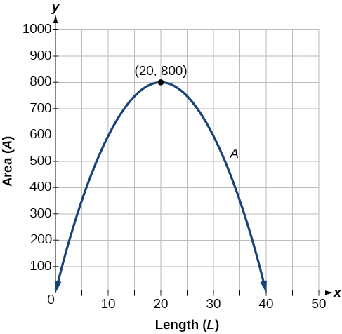{: #Figure_03_02_011}

**Given an application involving revenue, use a quadratic equation to find the maximum.**

1.  Write a quadratic equation for a revenue function.
2.  Find the vertex of the quadratic equation.
3.  Determine the *y*-value of the vertex.
{: type="1"}

Finding Maximum Revenue

The unit price of an item affects its supply and demand. That is, if the unit price goes up, the demand for the item will usually decrease. For example, a local newspaper currently has 84,000 subscribers at a quarterly charge of $30. Market research has suggested that if the owners raise the price to $32, they would lose 5,000 subscribers. Assuming that subscriptions are linearly related to the price, what price should the newspaper charge for a quarterly subscription to maximize their revenue?

Revenue is the amount of money a company brings in. In this case, the revenue can be found by multiplying the price per subscription times the number of subscribers, or quantity. We can introduce variables,<math xmlns="http://www.w3.org/1998/Math/MathML"> <mrow> <mtext> </mtext><mi>p</mi><mtext> </mtext> </mrow> </math>

for price per subscription and<math xmlns="http://www.w3.org/1998/Math/MathML"> <mrow> <mtext> </mtext><mi>Q</mi><mtext> </mtext> </mrow> </math>

for quantity, giving us the equation<math xmlns="http://www.w3.org/1998/Math/MathML"> <mrow> <mtext> </mtext><mtext>Revenue</mtext><mo>=</mo><mi>p</mi><mi>Q</mi><mo>.</mo> </mrow> </math>

Because the number of subscribers changes with the price, we need to find a relationship between the variables. We know that currently<math xmlns="http://www.w3.org/1998/Math/MathML"> <mrow> <mtext> </mtext><mi>p</mi><mo>=</mo><mn>30</mn><mtext> </mtext> </mrow> </math>

and<math xmlns="http://www.w3.org/1998/Math/MathML"> <mrow> <mtext> </mtext><mi>Q</mi><mo>=</mo><mn>84,000.</mn><mtext> </mtext> </mrow> </math>

We also know that if the price rises to $32, the newspaper would lose 5,000 subscribers, giving a second pair of values,<math xmlns="http://www.w3.org/1998/Math/MathML"> <mrow> <mtext> </mtext><mi>p</mi><mo>=</mo><mn>32</mn><mtext> </mtext> </mrow> </math>

and<math xmlns="http://www.w3.org/1998/Math/MathML"> <mrow> <mtext> </mtext><mi>Q</mi><mo>=</mo><mn>79,000.</mn><mtext> </mtext> </mrow> </math>

From this we can find a linear equation relating the two quantities. The slope will be

<math xmlns="http://www.w3.org/1998/Math/MathML" display="block"> <mrow> <mtable> <mtr rowalign="center"> <mtd columnalign="right" rowalign="center"><mi>m</mi></mtd> <mtd rowalign="center"><mo>=</mo></mtd> <mtd columnalign="left" rowalign="center"> <mrow><mfrac><mrow><mn>79,000</mn><mo>−</mo><mn>84,000</mn></mrow> <mrow><mn>32</mn><mo>−</mo><mn>30</mn></mrow></mfrac></mrow> </mtd> </mtr> <mtr rowalign="center"> <mtd rowalign="center" /> <mtd rowalign="center"><mo>=</mo></mtd> <mtd columnalign="left" rowalign="center"><mrow><mfrac><mrow><mn>−5,000</mn></mrow><mn>2</mn></mfrac></mrow></mtd> </mtr> <mtr rowalign="center"> <mtd rowalign="center" /> <mtd rowalign="center"><mo>=</mo></mtd> <mtd columnalign="left" rowalign="center"><mrow><mn>−2,500</mn></mrow></mtd> </mtr> </mtable> </mrow> </math>

This tells us the paper will lose 2,500 subscribers for each dollar they raise the price. We can then solve for the *y*-intercept.

<math xmlns="http://www.w3.org/1998/Math/MathML" display="block"> <mrow> <mtable> <mtr> <mtd columnalign="right"> <mi>Q</mi> </mtd> <mtd> <mo>=</mo> </mtd> <mtd columnalign="left"> <mrow> <mn>−2500</mn><mi>p</mi><mo>+</mo><mi>b</mi></mrow> </mtd> <mtd columnalign="left"> <mrow> <mspace width="2em" /><mtext>Substitute in the point </mtext><mi>Q</mi><mo>=</mo><mn>84,000</mn><mtext> and </mtext><mi>p</mi><mo>=</mo><mn>30</mn></mrow> </mtd> </mtr> <mtr> <mtd columnalign="right" rowalign="center"><mrow><mn>84,000</mn></mrow></mtd> <mtd rowalign="center"><mo>=</mo></mtd> <mtd columnalign="left" rowalign="center"> <mrow> <mn>−2500</mn><mo stretchy="false">(</mo><mn>30</mn><mo stretchy="false">)</mo><mo>+</mo><mi>b</mi></mrow> </mtd> <mtd columnalign="left" rowalign="center"> <mrow> <mspace width="2em" /><mtext>Solve for </mtext><mi>b</mi></mrow> </mtd> </mtr> <mtr rowalign="center"> <mtd columnalign="right" rowalign="center"><mi>b</mi></mtd> <mtd rowalign="center"><mo>=</mo></mtd> <mtd columnalign="left" rowalign="center"> <mrow> <mn>159,000</mn></mrow> </mtd> <mtd rowalign="center" /> </mtr> </mtable></mrow> </math>

This gives us the linear equation<math xmlns="http://www.w3.org/1998/Math/MathML"> <mrow> <mtext> </mtext><mi>Q</mi><mo>=</mo><mn>−2,500</mn><mi>p</mi><mo>+</mo><mn>159,000</mn><mtext> </mtext> </mrow> </math>

relating cost and subscribers. We now return to our revenue equation.

<math xmlns="http://www.w3.org/1998/Math/MathML" display="block"> <mrow> <mtable> <mtr> <mtd columnalign="right"> <mrow> <mi mathvariant="normal">Revenue</mi></mrow> </mtd> <mtd> <mo>=</mo> </mtd> <mtd columnalign="left"> <mrow> <mi>p</mi><mi>Q</mi></mrow> </mtd> </mtr> <mtr> <mtd columnalign="right"> <mrow> <mi mathvariant="normal">Revenue</mi></mrow> </mtd> <mtd> <mo>=</mo> </mtd> <mtd columnalign="left"> <mrow> <mi>p</mi><mo stretchy="false">(</mo><mn>−2,500</mn><mi>p</mi><mo>+</mo><mn>159,000</mn><mo stretchy="false">)</mo></mrow> </mtd> </mtr> <mtr> <mtd columnalign="right"> <mrow> <mi mathvariant="normal">Revenue</mi></mrow> </mtd> <mtd> <mo>=</mo> </mtd> <mtd columnalign="left"> <mrow> <mn>−2,500</mn><msup> <mi>p</mi> <mn>2</mn> </msup> <mo>+</mo><mn>159,000</mn><mi>p</mi></mrow> </mtd> </mtr> </mtable></mrow> </math>

We now have a quadratic function for revenue as a function of the subscription charge. To find the price that will maximize revenue for the newspaper, we can find the vertex.

<math xmlns="http://www.w3.org/1998/Math/MathML" display="block"> <mrow> <mtable> <mtr rowalign="center"> <mtd columnalign="right" rowalign="center"> <mi>h</mi> </mtd> <mtd rowalign="center"><mo>=</mo></mtd> <mtd columnalign="left" rowalign="center"> <mrow> <mo>−</mo><mfrac> <mrow> <mn>159,000</mn></mrow> <mrow> <mn>2</mn><mo stretchy="false">(</mo><mn>−2,500</mn><mo stretchy="false">)</mo></mrow> </mfrac> </mrow> </mtd> </mtr> <mtr> <mtd rowalign="center" /> <mtd rowalign="center"><mo>=</mo></mtd> <mtd columnalign="left" rowalign="center"> <mrow> <mn>31.8</mn></mrow> </mtd> </mtr> </mtable></mrow> </math>

The model tells us that the maximum revenue will occur if the newspaper charges $31.80 for a subscription. To find what the maximum revenue is, we evaluate the revenue function.

<math xmlns="http://www.w3.org/1998/Math/MathML" display="block"> <mrow> <mtable> <mtr rowalign="center"> <mtd columnalign="right" rowalign="center"><mrow><mtext>maximum revenue</mtext></mrow></mtd> <mtd rowalign="center"><mo>=</mo></mtd> <mtd columnalign="left" rowalign="center"> <mrow> <mn>−2,500</mn><msup> <mrow> <mo stretchy="false">(</mo><mn>31.8</mn><mo stretchy="false">)</mo></mrow> <mn>2</mn> </msup> <mo>+</mo><mn>159,000</mn><mo stretchy="false">(</mo><mn>31.8</mn><mo stretchy="false">)</mo></mrow> </mtd> </mtr> <mtr> <mtd> <mrow /> </mtd> <mtd> <mo>=</mo> </mtd> <mtd columnalign="left"> <mrow> <mn>2,528,100</mn></mrow> </mtd> </mtr> </mtable></mrow> </math>

Analysis

This could also be solved by graphing the quadratic as in [[link]](#Figure_03_02_012). We can see the maximum revenue on a graph of the quadratic function.

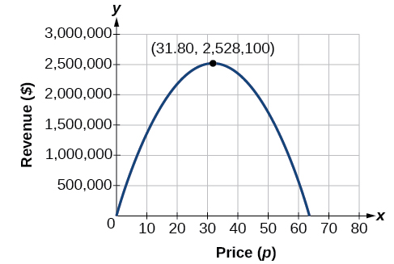{: #Figure_03_02_012}

#### Finding the *x*- and *y*-Intercepts of a Quadratic Function

Much as we did in the application problems above, we also need to find intercepts of quadratic equations for graphing parabolas. Recall that we find the<math xmlns="http://www.w3.org/1998/Math/MathML"> <mrow> <mtext> </mtext><mi>y</mi><mtext>-</mtext> </mrow> </math>

intercept of a quadratic by evaluating the function at an input of zero, and we find the<math xmlns="http://www.w3.org/1998/Math/MathML"> <mrow> <mtext> </mtext><mi>x</mi><mtext>-</mtext> </mrow> </math>

intercepts at locations where the output is zero. Notice in [\[link\]](#Figure_03_02_013) that the number of<math xmlns="http://www.w3.org/1998/Math/MathML"> <mrow> <mtext> </mtext><mi>x</mi><mtext>-</mtext> </mrow> </math>

intercepts can vary depending upon the location of the graph.

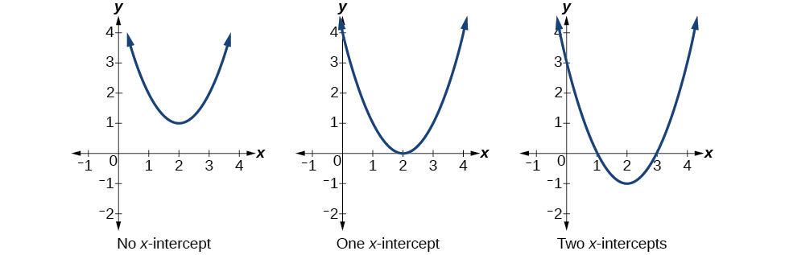{: #Figure_03_02_013}

**Given a quadratic function<math xmlns="http://www.w3.org/1998/Math/MathML"> <mrow> <mtext> </mtext><mi>f</mi><mrow><mo>(</mo> <mi>x</mi> <mo>)</mo></mrow><mo>,</mo><mtext> </mtext> </mrow> </math>

find the<math xmlns="http://www.w3.org/1998/Math/MathML"> <mrow> <mtext> </mtext><mi>y</mi><mtext>-</mtext> </mrow> </math>

 and *x*-intercepts.**

1.  Evaluate
    <math xmlns="http://www.w3.org/1998/Math/MathML"> <mrow> <mtext> </mtext><mi>f</mi><mrow><mo>(</mo> <mn>0</mn> <mo>)</mo></mrow><mtext> </mtext> </mrow> </math>
    
    to find the *y*-intercept.
2.  Solve the quadratic equation
    <math xmlns="http://www.w3.org/1998/Math/MathML"> <mrow> <mtext> </mtext><mi>f</mi><mrow><mo>(</mo> <mi>x</mi> <mo>)</mo></mrow><mo>=</mo><mn>0</mn><mtext> </mtext> </mrow> </math>
    
    to find the *x*-intercepts.
{: type="1"}

Finding the *y*- and *x*-Intercepts of a Parabola

Find the *y*- and *x*-intercepts of the quadratic<math xmlns="http://www.w3.org/1998/Math/MathML"> <mrow> <mtext> </mtext><mi>f</mi><mo stretchy="false">(</mo><mi>x</mi><mo stretchy="false">)</mo><mo>=</mo><mn>3</mn><msup> <mi>x</mi> <mn>2</mn> </msup> <mo>+</mo><mn>5</mn><mi>x</mi><mo>−</mo><mn>2.</mn> </mrow> </math>

We find the *y*-intercept by evaluating<math xmlns="http://www.w3.org/1998/Math/MathML"> <mrow> <mtext> </mtext><mi>f</mi><mrow><mo>(</mo> <mn>0</mn> <mo>)</mo></mrow><mo>.</mo> </mrow> </math>

<math xmlns="http://www.w3.org/1998/Math/MathML" display="block"> <mrow> <mtable> <mtr rowalign="center"> <mtd columnalign="right" rowalign="center"> <mrow> <mi>f</mi><mo stretchy="false">(</mo><mn>0</mn><mo stretchy="false">)</mo></mrow> </mtd> <mtd rowalign="center"><mo>=</mo></mtd> <mtd columnalign="left" rowalign="center"> <mrow> <mn>3</mn><msup> <mrow> <mo stretchy="false">(</mo><mn>0</mn><mo stretchy="false">)</mo></mrow> <mn>2</mn> </msup> <mo>+</mo><mn>5</mn><mo stretchy="false">(</mo><mn>0</mn><mo stretchy="false">)</mo><mo>−</mo><mn>2</mn></mrow> </mtd> </mtr> <mtr rowalign="center"> <mtd rowalign="center" /> <mtd rowalign="center"><mo>=</mo></mtd> <mtd columnalign="left" rowalign="center"><mrow><mn>−2</mn></mrow></mtd> </mtr> </mtable></mrow> </math>

So the *y*-intercept is at<math xmlns="http://www.w3.org/1998/Math/MathML"> <mrow> <mtext> </mtext><mrow><mo>(</mo> <mrow> <mn>0</mn><mo>,</mo><mn>−2</mn> </mrow> <mo>)</mo></mrow><mo>.</mo> </mrow> </math>

For the *x*-intercepts, we find all solutions of<math xmlns="http://www.w3.org/1998/Math/MathML"> <mrow> <mtext> </mtext><mi>f</mi><mrow><mo>(</mo> <mi>x</mi> <mo>)</mo></mrow><mo>=</mo><mn>0.</mn> </mrow> </math>

<math xmlns="http://www.w3.org/1998/Math/MathML"> <mrow> <mn>0</mn><mo>=</mo><mn>3</mn><msup> <mi>x</mi> <mn>2</mn> </msup> <mo>+</mo><mn>5</mn><mi>x</mi><mo>−</mo><mn>2</mn> </mrow> </math>

In this case, the quadratic can be factored easily, providing the simplest method for solution.

<math xmlns="http://www.w3.org/1998/Math/MathML" display="block"> <mrow> <mn>0</mn><mo>=</mo><mo stretchy="false">(</mo><mn>3</mn><mi>x</mi><mo>−</mo><mn>1</mn><mo stretchy="false">)</mo><mo stretchy="false">(</mo><mi>x</mi><mo>+</mo><mn>2</mn><mo stretchy="false">)</mo> </mrow> </math>

<math xmlns="http://www.w3.org/1998/Math/MathML" display="block"> <mrow> <mtable> <mtr rowalign="center"> <mtd rowalign="center" columnalign="right"><mi>h</mi></mtd> <mtd rowalign="center"><mo>=</mo></mtd> <mtd rowalign="center"> <mrow> <mo>−</mo><mfrac> <mi>b</mi> <mrow> <mn>2</mn><mi>a</mi></mrow> </mfrac> </mrow> </mtd> <mtd columnalign="right" rowalign="center"> <mspace width="2em" /><mi>k</mi> </mtd> <mtd rowalign="center"> <mo>=</mo> </mtd> <mtd rowalign="center" columnalign="left"> <mrow> <mi>f</mi><mo stretchy="false">(</mo><mn>−1</mn><mo stretchy="false">)</mo></mrow> </mtd> </mtr> <mtr> <mtd rowalign="center" /> <mtd rowalign="center"><mo>=</mo></mtd> <mtd rowalign="center" columnalign="left"> <mrow> <mo>−</mo><mfrac> <mn>4</mn> <mrow> <mn>2</mn><mo stretchy="false">(</mo><mn>2</mn><mo stretchy="false">)</mo></mrow> </mfrac> </mrow> </mtd> <mtd rowalign="center" /> <mtd rowalign="center"><mo>=</mo></mtd> <mtd columnalign="right" rowalign="center"> <mrow> <mn>2</mn><msup> <mrow> <mo stretchy="false">(</mo><mn>−1</mn><mo stretchy="false">)</mo></mrow> <mn>2</mn> </msup> <mo>+</mo><mn>4</mn><mo stretchy="false">(</mo><mn>−1</mn><mo stretchy="false">)</mo><mo>−</mo><mn>4</mn></mrow> </mtd> </mtr> <mtr rowalign="center"> <mtd rowalign="center" /> <mtd rowalign="center"><mo>=</mo></mtd> <mtd rowalign="center" columnalign="left"> <mrow> <mn>−1</mn></mrow> </mtd> <mtd rowalign="center" /> <mtd rowalign="center"><mo>=</mo></mtd> <mtd rowalign="center" columnalign="left"> <mrow> <mn>−6</mn></mrow> </mtd> </mtr> </mtable></mrow> </math>

So the *x*-intercepts are at<math xmlns="http://www.w3.org/1998/Math/MathML"> <mrow> <mtext> </mtext><mrow><mo>(</mo> <mrow> <mfrac> <mn>1</mn> <mn>3</mn> </mfrac> <mo>,</mo><mn>0</mn> </mrow> <mo>)</mo></mrow><mtext> </mtext> </mrow> </math>

and<math xmlns="http://www.w3.org/1998/Math/MathML"> <mrow> <mtext> </mtext><mrow><mo>(</mo> <mrow> <mo>−</mo><mn>2</mn><mo>,</mo><mn>0</mn> </mrow> <mo>)</mo></mrow><mo>.</mo> </mrow> </math>

Analysis

By graphing the function, we can confirm that the graph crosses the *y*-axis at<math xmlns="http://www.w3.org/1998/Math/MathML"> <mrow> <mtext> </mtext><mo stretchy="false">(</mo><mn>0</mn><mo>,</mo><mn>−2</mn><mo stretchy="false">)</mo><mo>.</mo><mtext> </mtext> </mrow> </math>

We can also confirm that the graph crosses the *x*-axis at<math xmlns="http://www.w3.org/1998/Math/MathML"> <mrow> <mtext> </mtext><mrow><mo>(</mo> <mrow> <mfrac> <mn>1</mn> <mn>3</mn> </mfrac> <mo>,</mo><mn>0</mn> </mrow> <mo>)</mo></mrow><mtext> </mtext> </mrow> </math>

and<math xmlns="http://www.w3.org/1998/Math/MathML"> <mrow> <mtext> </mtext><mo stretchy="false">(</mo><mn>−2</mn><mo>,</mo><mn>0</mn><mo stretchy="false">)</mo><mo>.</mo> </mrow> </math>

See [[link]](#Figure_03_02_014)

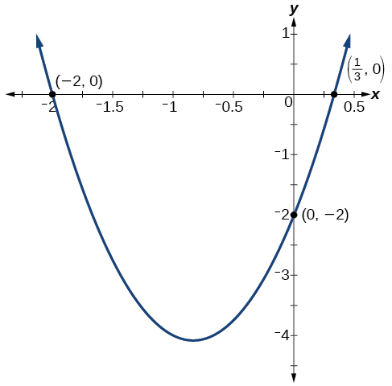{: #Figure_03_02_014}

#### Rewriting Quadratics in Standard Form

In [\[link\]](#Example_03_02_07), the quadratic was easily solved by factoring. However, there are many quadratics that cannot be factored. We can solve these quadratics by first rewriting them in standard form.

**Given a quadratic function, find the<math xmlns="http://www.w3.org/1998/Math/MathML"> <mrow> <mtext> </mtext><mi>x</mi><mtext>-</mtext> </mrow> </math>

intercepts by rewriting in standard form**.

1.  Substitute
    <math xmlns="http://www.w3.org/1998/Math/MathML"> <mrow> <mtext> </mtext><mi>a</mi><mtext> </mtext> </mrow> </math>
    
    and
    <math xmlns="http://www.w3.org/1998/Math/MathML"> <mrow> <mtext> </mtext><mi>b</mi><mtext> </mtext> </mrow> </math>
    
    into
    <math xmlns="http://www.w3.org/1998/Math/MathML"> <mrow> <mtext> </mtext><mi>h</mi><mo>=</mo><mo>−</mo><mfrac> <mi>b</mi> <mrow> <mn>2</mn><mi>a</mi> </mrow> </mfrac> <mo>.</mo> </mrow> </math>

2.  Substitute
    <math xmlns="http://www.w3.org/1998/Math/MathML"> <mrow> <mtext> </mtext><mi>x</mi><mo>=</mo><mi>h</mi><mtext> </mtext> </mrow> </math>
    
    into the general form of the quadratic function to find
    <math xmlns="http://www.w3.org/1998/Math/MathML"> <mrow> <mtext> </mtext><mi>k</mi><mo>.</mo> </mrow> </math>

3.  Rewrite the quadratic in standard form using
    <math xmlns="http://www.w3.org/1998/Math/MathML"> <mrow> <mtext> </mtext><mi>h</mi><mtext> </mtext> </mrow> </math>
    
    and
    <math xmlns="http://www.w3.org/1998/Math/MathML"> <mrow> <mtext> </mtext><mi>k</mi><mo>.</mo> </mrow> </math>

4.  Solve for when the output of the function will be zero to find the
    <math xmlns="http://www.w3.org/1998/Math/MathML"> <mrow> <mtext> </mtext><mi>x</mi><mtext>-</mtext> </mrow> </math>
    
    intercepts.
{: type="1"}

Finding the *x*-Intercepts of a Parabola

Find the<math xmlns="http://www.w3.org/1998/Math/MathML"> <mrow> <mtext> </mtext><mi>x</mi><mtext>-</mtext> </mrow> </math>

intercepts of the quadratic function<math xmlns="http://www.w3.org/1998/Math/MathML"> <mrow> <mtext> </mtext><mi>f</mi><mo stretchy="false">(</mo><mi>x</mi><mo stretchy="false">)</mo><mo>=</mo><mn>2</mn><msup> <mi>x</mi> <mn>2</mn> </msup> <mo>+</mo><mn>4</mn><mi>x</mi><mo>−</mo><mn>4.</mn> </mrow> </math>

We begin by solving for when the output will be zero.

<math xmlns="http://www.w3.org/1998/Math/MathML"> <mrow> <mn>0</mn><mo>=</mo><mn>2</mn><msup> <mi>x</mi> <mn>2</mn> </msup> <mo>+</mo><mn>4</mn><mi>x</mi><mo>−</mo><mn>4</mn> </mrow> </math>

Because the quadratic is not easily factorable in this case, we solve for the intercepts by first rewriting the quadratic in standard form.

<math xmlns="http://www.w3.org/1998/Math/MathML" display="block"> <mrow> <mi>f</mi><mrow><mo>(</mo> <mi>x</mi> <mo>)</mo></mrow><mo>=</mo><mi>a</mi><msup> <mrow> <mrow><mo>(</mo> <mrow> <mi>x</mi><mo>−</mo><mi>h</mi> </mrow> <mo>)</mo></mrow> </mrow> <mn>2</mn> </msup> <mo>+</mo><mi>k</mi> </mrow> </math>

We know that<math xmlns="http://www.w3.org/1998/Math/MathML"> <mrow> <mtext> </mtext><mi>a</mi><mo>=</mo><mn>2.</mn><mtext> </mtext> </mrow> </math>

Then we solve for<math xmlns="http://www.w3.org/1998/Math/MathML"> <mrow> <mtext> </mtext><mi>h</mi><mtext> </mtext> </mrow> </math>

and<math xmlns="http://www.w3.org/1998/Math/MathML"> <mrow> <mtext> </mtext><mi>k</mi><mo>.</mo> </mrow> </math>

<math xmlns="http://www.w3.org/1998/Math/MathML" display="block"> <mrow> <mtable> <mtr rowalign="center"> <mtd columnalign="right" rowalign="center"><mi>h</mi></mtd> <mtd rowalign="center"><mo>=</mo></mtd> <mtd rowalign="center" columnalign="left"> <mrow> <mo>−</mo><mfrac> <mi>b</mi> <mrow> <mn>2</mn><mi>a</mi></mrow> </mfrac> </mrow> </mtd> <mtd rowalign="center" columnalign="right"><mspace width="2em" /><mi>k</mi></mtd> <mtd rowalign="center"><mo>=</mo></mtd> <mtd rowalign="center" columnalign="left"> <mrow> <mi>f</mi><mo stretchy="false">(</mo><mn>−1</mn><mo stretchy="false">)</mo></mrow> </mtd> </mtr> <mtr rowalign="center"> <mtd rowalign="center" /> <mtd rowalign="center"><mo>=</mo></mtd> <mtd rowalign="center" columnalign="left"> <mrow> <mo>−</mo><mfrac> <mn>4</mn> <mrow> <mn>2</mn><mo stretchy="false">(</mo><mn>2</mn><mo stretchy="false">)</mo></mrow> </mfrac> </mrow> </mtd> <mtd rowalign="center" /> <mtd rowalign="center"><mo>=</mo></mtd> <mtd rowalign="center" columnalign="left"> <mrow> <mn>2</mn><msup> <mrow> <mo stretchy="false">(</mo><mn>−1</mn><mo stretchy="false">)</mo></mrow> <mn>2</mn> </msup> <mo>+</mo><mn>4</mn><mo stretchy="false">(</mo><mn>−1</mn><mo stretchy="false">)</mo><mo>−</mo><mn>4</mn></mrow> </mtd> </mtr> <mtr rowalign="center"> <mtd rowalign="center" /> <mtd rowalign="center"><mo>=</mo></mtd> <mtd rowalign="center" columnalign="left"><mrow><mn>−1</mn></mrow></mtd> <mtd rowalign="center" /> <mtd rowalign="center"><mo>=</mo></mtd> <mtd rowalign="center" columnalign="left"><mrow><mo /><mn>−6</mn></mrow></mtd> </mtr> </mtable></mrow> </math>

So now we can rewrite in standard form.

<math xmlns="http://www.w3.org/1998/Math/MathML" display="block"> <mrow> <mi>f</mi><mo stretchy="false">(</mo><mi>x</mi><mo stretchy="false">)</mo><mo>=</mo><mn>2</mn><msup> <mrow> <mo stretchy="false">(</mo><mi>x</mi><mo>+</mo><mn>1</mn><mo stretchy="false">)</mo> </mrow> <mn>2</mn> </msup> <mo>−</mo><mn>6</mn> </mrow> </math>

We can now solve for when the output will be zero.

<math xmlns="http://www.w3.org/1998/Math/MathML" display="block"> <mrow> <mtable columnalign="left"> <mtr columnalign="left"> <mtd columnalign="left"> <mrow> <mn>0</mn><mo>=</mo><mn>2</mn><msup> <mrow> <mo stretchy="false">(</mo><mi>x</mi><mo>+</mo><mn>1</mn><mo stretchy="false">)</mo> </mrow> <mn>2</mn> </msup> <mo>−</mo><mn>6</mn> </mrow> </mtd> </mtr> <mtr columnalign="left"> <mtd columnalign="left"> <mrow> <mn>6</mn><mo>=</mo><mn>2</mn><msup> <mrow> <mo stretchy="false">(</mo><mi>x</mi><mo>+</mo><mn>1</mn><mo stretchy="false">)</mo> </mrow> <mn>2</mn> </msup> </mrow> </mtd> </mtr> <mtr columnalign="left"> <mtd columnalign="left"> <mrow> <mn>3</mn><mo>=</mo><msup> <mrow> <mo stretchy="false">(</mo><mi>x</mi><mo>+</mo><mn>1</mn><mo stretchy="false">)</mo> </mrow> <mn>2</mn> </msup> </mrow> </mtd> </mtr> <mtr columnalign="left"> <mtd columnalign="left"> <mrow> <mi>x</mi><mo>+</mo><mn>1</mn><mo>=</mo><mo>±</mo><msqrt> <mn>3</mn> </msqrt> </mrow> </mtd> </mtr> <mtr columnalign="left"> <mtd columnalign="left"> <mrow> <mi>x</mi><mo>=</mo><mo>−</mo><mn>1</mn><mo>±</mo><msqrt> <mn>3</mn> </msqrt> </mrow> </mtd> </mtr> </mtable> </mrow> </math>

The graph has *x*-intercepts at<math xmlns="http://www.w3.org/1998/Math/MathML"> <mrow> <mtext> </mtext><mo stretchy="false">(</mo><mn>−1</mn><mo>−</mo><msqrt> <mn>3</mn> </msqrt> <mo>,</mo><mn>0</mn><mo stretchy="false">)</mo><mtext> </mtext> </mrow> </math>

and<math xmlns="http://www.w3.org/1998/Math/MathML"> <mrow> <mtext> </mtext><mo stretchy="false">(</mo><mn>−1</mn><mo>+</mo><msqrt> <mn>3</mn> </msqrt> <mo>,</mo><mn>0</mn><mo stretchy="false">)</mo><mo>.</mo> </mrow> </math>

We can check our work by graphing the given function on a graphing utility and observing the<math xmlns="http://www.w3.org/1998/Math/MathML"> <mrow> <mtext> </mtext><mi>x</mi><mtext>-</mtext> </mrow> </math>

intercepts. See [[link]](#Figure_03_02_015).

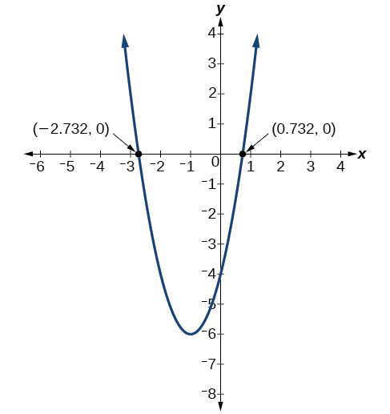{: #Figure_03_02_015}

Analysis

We could have achieved the same results using the quadratic formula. Identify<math xmlns="http://www.w3.org/1998/Math/MathML"> <mrow> <mtext> </mtext><mi>a</mi><mo>=</mo><mn>2</mn><mo>,</mo><mi>b</mi><mo>=</mo><mn>4</mn><mtext> </mtext> </mrow> </math>

and<math xmlns="http://www.w3.org/1998/Math/MathML"> <mrow> <mtext> </mtext><mi>c</mi><mo>=</mo><mn>−4.</mn> </mrow> </math>

<math xmlns="http://www.w3.org/1998/Math/MathML" display="block"> <mrow> <mtable> <mtr rowalign="center"> <mtd columnalign="right" rowalign="center"><mi>x</mi></mtd> <mtd rowalign="center"><mo>=</mo></mtd> <mtd columnalign="left" rowalign="center"> <mrow> <mfrac> <mrow> <mo>−</mo><mi>b</mi><mo>±</mo><msqrt> <mrow> <msup> <mi>b</mi> <mn>2</mn> </msup> <mo>−</mo><mn>4</mn><mi>a</mi><mi>c</mi></mrow> </msqrt> </mrow> <mrow> <mn>2</mn><mi>a</mi></mrow> </mfrac> </mrow> </mtd> </mtr> <mtr rowalign="center"> <mtd rowalign="center" /> <mtd rowalign="center"><mo>=</mo></mtd> <mtd columnalign="left" rowalign="center"> <mrow> <mfrac> <mrow> <mn>−4</mn><mo>±</mo><msqrt> <mrow> <msup> <mn>4</mn> <mn>2</mn> </msup> <mo>−</mo><mn>4</mn><mo stretchy="false">(</mo><mn>2</mn><mo stretchy="false">)</mo><mo stretchy="false">(</mo><mn>−4</mn><mo stretchy="false">)</mo></mrow> </msqrt> </mrow> <mrow> <mn>2</mn><mo stretchy="false">(</mo><mn>2</mn><mo stretchy="false">)</mo></mrow> </mfrac> </mrow> </mtd> </mtr> <mtr rowalign="center"> <mtd rowalign="center" /> <mtd rowalign="center"><mo>=</mo></mtd> <mtd columnalign="left" rowalign="center"> <mrow> <mfrac> <mrow> <mn>−4</mn><mo>±</mo><msqrt> <mrow> <mn>48</mn></mrow> </msqrt> </mrow> <mn>4</mn> </mfrac> </mrow> </mtd> </mtr> <mtr rowalign="center"> <mtd rowalign="center" /> <mtd rowalign="center"><mo>=</mo></mtd> <mtd columnalign="left" rowalign="center"> <mrow> <mfrac> <mrow> <mn>−4</mn><mo>±</mo><msqrt> <mrow> <mn>3</mn><mo stretchy="false">(</mo><mn>16</mn><mo stretchy="false">)</mo></mrow> </msqrt> </mrow> <mn>4</mn> </mfrac> </mrow> </mtd> </mtr> <mtr rowalign="center"> <mtd rowalign="center" /> <mtd rowalign="center"><mo>=</mo></mtd> <mtd columnalign="left" rowalign="center"> <mrow> <mn>−1</mn><mo>±</mo><msqrt> <mn>3</mn> </msqrt> </mrow> </mtd> </mtr> </mtable></mrow> </math>

So the *x*-intercepts occur at<math xmlns="http://www.w3.org/1998/Math/MathML"> <mrow> <mtext> </mtext><mrow><mo>(</mo> <mrow> <mo>−</mo><mn>1</mn><mo>−</mo><msqrt> <mn>3</mn> </msqrt> <mo>,</mo><mn>0</mn> </mrow> <mo>)</mo></mrow><mtext> </mtext> </mrow> </math>

and<math xmlns="http://www.w3.org/1998/Math/MathML"> <mrow> <mtext> </mtext><mrow><mo>(</mo> <mrow> <mo>−</mo><mn>1</mn><mo>+</mo><msqrt> <mn>3</mn> </msqrt> <mo>,</mo><mn>0</mn> </mrow> <mo>)</mo></mrow><mo>.</mo> </mrow> </math>

In a [Try It](#fs-id1165135362470), we found the standard and general form for the function<math xmlns="http://www.w3.org/1998/Math/MathML"> <mrow> <mtext> </mtext><mi>g</mi><mo stretchy="false">(</mo><mi>x</mi><mo stretchy="false">)</mo><mo>=</mo><mn>13</mn><mo>+</mo><msup> <mi>x</mi> <mn>2</mn> </msup> <mo>−</mo><mn>6</mn><mi>x</mi><mo>.</mo><mtext> </mtext> </mrow> </math>

Now find the *y*- and *x*-intercepts (if any).

*y*-intercept at (0, 13), No<math xmlns="http://www.w3.org/1998/Math/MathML"> <mrow> <mtext> </mtext><mi>x</mi><mtext>-</mtext> </mrow> </math>

intercepts

Applying the Vertex and *x*-Intercepts of a Parabola

A ball is thrown upward from the top of a 40 foot high building at a speed of 80 feet per second. The ball’s height above ground can be modeled by the equation<math xmlns="http://www.w3.org/1998/Math/MathML"> <mrow> <mtext> </mtext><mi>H</mi><mo stretchy="false">(</mo><mi>t</mi><mo stretchy="false">)</mo><mo>=</mo><mo>−</mo><mn>16</mn><msup> <mi>t</mi> <mn>2</mn> </msup> <mo>+</mo><mn>80</mn><mi>t</mi><mo>+</mo><mn>40.</mn> </mrow> </math>

1.  When does the ball reach the maximum height?
2.  What is the maximum height of the ball?
3.  When does the ball hit the ground?
{: type="a"}

1.  The ball reaches the maximum height at the vertex of the parabola.
    

    <math xmlns="http://www.w3.org/1998/Math/MathML" display="block"> <mrow> <mtable> <mtr rowalign="center"> <mtd columnalign="right" rowalign="center"> <mi>h</mi> </mtd> <mtd rowalign="center"><mo>=</mo></mtd> <mtd columnalign="left" rowalign="center"> <mrow> <mo>−</mo><mfrac> <mrow> <mn>80</mn></mrow> <mrow> <mn>2</mn><mo stretchy="false">(</mo><mn>−16</mn><mo stretchy="false">)</mo></mrow> </mfrac> </mrow> </mtd> </mtr> <mtr rowalign="center"> <mtd rowalign="center" /> <mtd rowalign="center"><mo>=</mo></mtd> <mtd columnalign="left" rowalign="center"> <mrow> <mfrac> <mrow> <mn>80</mn></mrow> <mrow> <mn>32</mn></mrow> </mfrac> </mrow> </mtd> </mtr> <mtr rowalign="center"> <mtd rowalign="center" /> <mtd rowalign="center"><mo>=</mo></mtd> <mtd columnalign="left" rowalign="center"> <mrow> <mfrac> <mn>5</mn> <mn>2</mn> </mfrac> </mrow> </mtd> </mtr> <mtr rowalign="center"> <mtd rowalign="center" /> <mtd rowalign="center"><mo>=</mo></mtd> <mtd columnalign="left" rowalign="center"> <mrow> <mn>2.5</mn></mrow> </mtd> </mtr> </mtable></mrow> </math>
    

    
    The ball reaches a maximum height after 2.5 seconds.

2.  To find the maximum height, find the
    <math xmlns="http://www.w3.org/1998/Math/MathML"> <mrow> <mtext> </mtext><mi>y</mi><mtext>-</mtext> </mrow> </math>
    
    coordinate of the vertex of the parabola.
    

    <math xmlns="http://www.w3.org/1998/Math/MathML" display="block"> <mrow> <mtable> <mtr rowalign="center"> <mtd columnalign="right" rowalign="center"> <mi>k</mi> </mtd> <mtd rowalign="center"><mo>=</mo></mtd> <mtd columnalign="left" rowalign="center"> <mrow> <mi>H</mi><mrow><mo>(</mo> <mrow> <mo>−</mo><mfrac> <mi>b</mi> <mrow> <mn>2</mn><mi>a</mi></mrow> </mfrac> </mrow> <mo>)</mo></mrow></mrow> </mtd> </mtr> <mtr rowalign="center"> <mtd rowalign="center" /> <mtd rowalign="center"><mo>=</mo></mtd> <mtd columnalign="left" rowalign="center"> <mrow> <mi>H</mi><mrow><mo>(</mo> <mrow> <mn>2.5</mn></mrow> <mo>)</mo></mrow></mrow> </mtd> </mtr> <mtr rowalign="center"> <mtd rowalign="center" /> <mtd rowalign="center"><mo>=</mo></mtd> <mtd columnalign="left" rowalign="center"> <mrow> <mn>−16</mn><msup> <mrow> <mrow><mo>(</mo> <mrow> <mn>2.5</mn></mrow> <mo>)</mo></mrow></mrow> <mn>2</mn> </msup> <mo>+</mo><mn>80</mn><mrow><mo>(</mo> <mrow> <mn>2.5</mn></mrow> <mo>)</mo></mrow><mo>+</mo><mn>40</mn></mrow> </mtd> </mtr> <mtr rowalign="center"> <mtd rowalign="center" /> <mtd rowalign="center"><mo>=</mo></mtd> <mtd columnalign="left" rowalign="center"> <mrow> <mn>140</mn></mrow> </mtd> </mtr> </mtable></mrow> </math>
    

    
    The ball reaches a maximum height of 140 feet.

3.  To find when the ball hits the ground, we need to determine when the height is zero,
    <math xmlns="http://www.w3.org/1998/Math/MathML"> <mrow> <mtext> </mtext><mi>H</mi><mrow><mo>(</mo> <mi>t</mi> <mo>)</mo></mrow><mo>=</mo><mn>0.</mn> </mrow> </math>
    
    We use the quadratic formula.
    
    

    <math xmlns="http://www.w3.org/1998/Math/MathML" display="block"> <mrow> <mtable> <mtr rowalign="center"> <mtd columnalign="right" rowalign="center"><mi>t</mi></mtd> <mtd rowalign="center"><mo>=</mo></mtd> <mtd columnalign="left" rowalign="center"> <mrow> <mfrac> <mrow> <mn>−80</mn><mo>±</mo><msqrt> <mrow> <msup> <mrow> <mn>80</mn></mrow> <mn>2</mn> </msup> <mo>−</mo><mn>4</mn><mo stretchy="false">(</mo><mn>−16</mn><mo stretchy="false">)</mo><mo stretchy="false">(</mo><mn>40</mn><mo stretchy="false">)</mo></mrow> </msqrt> </mrow> <mrow> <mn>2</mn><mo stretchy="false">(</mo><mn>−16</mn><mo stretchy="false">)</mo></mrow> </mfrac> </mrow> </mtd> </mtr> <mtr rowalign="center"> <mtd rowalign="center" /> <mtd rowalign="center"><mo>=</mo></mtd> <mtd columnalign="left" rowalign="center"> <mrow> <mfrac> <mrow> <mn>−80</mn><mo>±</mo><msqrt> <mrow> <mn>8960</mn></mrow> </msqrt> </mrow> <mrow> <mn>−32</mn></mrow> </mfrac> </mrow> </mtd> </mtr> </mtable></mrow> </math>
    

    
    Because the square root does not simplify nicely, we can use a calculator to approximate the values of the solutions.
    
    

    <math xmlns="http://www.w3.org/1998/Math/MathML"> <mrow> <mtable columnalign="left"> <mtr columnalign="left"> <mtd columnalign="left"> <mrow /> </mtd> </mtr> <mtr columnalign="left"> <mtd columnalign="left"> <mrow /> </mtd> </mtr> <mtr columnalign="left"> <mtd columnalign="left"> <mrow> <mtable columnalign="left"> <mtr columnalign="left"> <mtd columnalign="left"> <mrow> <mi>t</mi><mo>=</mo><mfrac> <mrow> <mo>−</mo><mn>80</mn><mo>−</mo><msqrt> <mrow> <mn>8960</mn></mrow> </msqrt> </mrow> <mrow> <mo>−</mo><mn>32</mn></mrow> </mfrac> <mo>≈</mo><mn>5.458</mn></mrow> </mtd> <mtd columnalign="left"> <mrow> <mtext>or</mtext></mrow> </mtd> <mtd columnalign="left"> <mrow> <mi>t</mi><mo>=</mo><mfrac> <mrow> <mo>−</mo><mn>80</mn><mo>+</mo><msqrt> <mrow> <mn>8960</mn></mrow> </msqrt> </mrow> <mrow> <mo>−</mo><mn>32</mn></mrow> </mfrac> <mo>≈</mo><mo>−</mo><mn>0.458</mn></mrow> </mtd> </mtr> </mtable></mrow> </mtd> </mtr> </mtable></mrow> </math>
    

    
    The second answer is outside the reasonable domain of our model, so we conclude the ball will hit the ground after about 5.458 seconds. See [[link]](#Figure_03_02_016).
    
    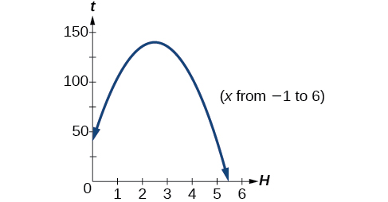{: #Figure_03_02_016}

    Note that the graph does not represent the physical path of the ball upward and downward. Keep the quantities on each axis in mind while interpreting the graph.
{: type="a"}

A rock is thrown upward from the top of a 112-foot high cliff overlooking the ocean at a speed of 96 feet per second. The rock’s height above ocean can be modeled by the equation<math xmlns="http://www.w3.org/1998/Math/MathML"> <mrow> <mtext> </mtext><mi>H</mi><mo stretchy="false">(</mo><mi>t</mi><mo stretchy="false">)</mo><mo>=</mo><mn>−16</mn><msup> <mi>t</mi> <mn>2</mn> </msup> <mo>+</mo><mn>96</mn><mi>t</mi><mo>+</mo><mn>112.</mn> </mrow> </math>

1.  When does the rock reach the maximum height?
2.  What is the maximum height of the rock?
3.  When does the rock hit the ocean?
{: type="a"}

 3 seconds 256 feet 7 seconds 

Access these online resources for additional instruction and practice with quadratic equations.

* [Graphing Quadratic Functions in General Form][1]
* [Graphing Quadratic Functions in Standard Form][2]
* [Quadratic Function Review][3]
* [Characteristics of a Quadratic Function][4]

### Key Equations

| general form of a quadratic function | <math xmlns="http://www.w3.org/1998/Math/MathML" display="block"> <mrow> <mi>f</mi><mo stretchy="false">(</mo><mi>x</mi><mo stretchy="false">)</mo><mo>=</mo><mi>a</mi><msup> <mi>x</mi> <mn>2</mn> </msup> <mo>+</mo><mi>b</mi><mi>x</mi><mo>+</mo><mi>c</mi> </mrow> </math>

 |
| standard form of a quadratic function | <math xmlns="http://www.w3.org/1998/Math/MathML" display="block"> <mrow> <mi>f</mi><mo stretchy="false">(</mo><mi>x</mi><mo stretchy="false">)</mo><mo>=</mo><mi>a</mi><msup> <mrow> <mo stretchy="false">(</mo><mi>x</mi><mo>−</mo><mi>h</mi><mo stretchy="false">)</mo> </mrow> <mn>2</mn> </msup> <mo>+</mo><mi>k</mi> </mrow> </math>

 |
{: #eip-id1165137539373 summary=".."}

### Key Concepts

* A polynomial function of degree two is called a quadratic function.
* The graph of a quadratic function is a parabola. A parabola is a U-shaped curve that can open either up or down.
* The axis of symmetry is the vertical line passing through the vertex. The zeros, or
  <math xmlns="http://www.w3.org/1998/Math/MathML"> <mrow> <mtext> </mtext><mi>x</mi><mtext>-</mtext> </mrow> </math>
  
  intercepts, are the points at which the parabola crosses the
  <math xmlns="http://www.w3.org/1998/Math/MathML"> <mrow> <mtext> </mtext><mi>x</mi><mtext>-</mtext> </mrow> </math>
  
  axis. The
  <math xmlns="http://www.w3.org/1998/Math/MathML"> <mrow> <mtext> </mtext><mi>y</mi><mtext>-</mtext> </mrow> </math>
  
  intercept is the point at which the parabola crosses the
  <math xmlns="http://www.w3.org/1998/Math/MathML"> <mrow> <mtext> </mtext><mi>y</mi><mtext>-</mtext> </mrow> </math>
  
  axis. See [\[link\]](#Example_03_02_01), [\[link\]](#Example_03_02_07), and [\[link\]](#Example_03_02_08).
* Quadratic functions are often written in general form. Standard or vertex form is useful to easily identify the vertex of a parabola. Either form can be written from a graph. See [\[link\]](#Example_03_02_02).
* The vertex can be found from an equation representing a quadratic function. See [\[link\]](#Example_03_02_03)**.**
* The domain of a quadratic function is all real numbers. The range varies with the function. See [\[link\]](#Example_03_02_04).
* A quadratic function’s minimum or maximum value is given by the
  <math xmlns="http://www.w3.org/1998/Math/MathML"> <mrow> <mtext> </mtext><mi>y</mi><mtext>-</mtext> </mrow> </math>
  
  value of the vertex.
* The minimum or maximum value of a quadratic function can be used to determine the range of the function and to solve many kinds of real-world problems, including problems involving area and revenue. See [\[link\]](#Example_03_02_05) and [\[link\]](#Example_03_02_06).
* The vertex and the intercepts can be identified and interpreted to solve real-world problems. See [\[link\]](#Example_03_02_10).

### Section Exercises

#### Verbal

Explain the advantage of writing a quadratic function in standard form.

When written in that form, the vertex can be easily identified.

How can the vertex of a parabola be used in solving real-world problems?

Explain why the condition of<math xmlns="http://www.w3.org/1998/Math/MathML"> <mrow> <mtext> </mtext><mi>a</mi><mo>≠</mo><mn>0</mn><mtext> </mtext> </mrow> </math>

is imposed in the definition of the quadratic function.

If<math xmlns="http://www.w3.org/1998/Math/MathML"> <mrow> <mtext> </mtext><mi>a</mi><mo>=</mo><mn>0</mn><mtext> </mtext> </mrow> </math>

then the function becomes a linear function.

What is another name for the standard form of a quadratic function?

What two algebraic methods can be used to find the horizontal intercepts of a quadratic function?

If possible, we can use factoring. Otherwise, we can use the quadratic formula.

#### Algebraic

For the following exercises, rewrite the quadratic functions in standard form and give the vertex.

<math xmlns="http://www.w3.org/1998/Math/MathML"> <mrow> <mi>f</mi><mrow><mo>(</mo> <mi>x</mi> <mo>)</mo></mrow><mo>=</mo><msup> <mi>x</mi> <mn>2</mn> </msup> <mo>−</mo><mn>12</mn><mi>x</mi><mo>+</mo><mn>32</mn> </mrow> </math>

<math xmlns="http://www.w3.org/1998/Math/MathML"> <mrow> <mi>g</mi><mrow><mo>(</mo> <mi>x</mi> <mo>)</mo></mrow><mo>=</mo><msup> <mi>x</mi> <mn>2</mn> </msup> <mo>+</mo><mn>2</mn><mi>x</mi><mo>−</mo><mn>3</mn> </mrow> </math>

<math xmlns="http://www.w3.org/1998/Math/MathML"> <mrow> <mi>f</mi><mo stretchy="false">(</mo><mi>x</mi><mo stretchy="false">)</mo><mo>=</mo><msup> <mrow> <mo stretchy="false">(</mo><mi>x</mi><mo>+</mo><mn>1</mn><mo stretchy="false">)</mo> </mrow> <mn>2</mn> </msup> <mo>−</mo><mn>2</mn><mo>,</mo><mtext> </mtext> </mrow> </math>

Vertex<math xmlns="http://www.w3.org/1998/Math/MathML"> <mrow> <mtext> </mtext><mrow><mo>(</mo> <mrow> <mo>−</mo><mn>1</mn><mo>,</mo><mo>−</mo><mn>4</mn> </mrow> <mo>)</mo></mrow> </mrow> </math>

<math xmlns="http://www.w3.org/1998/Math/MathML"> <mrow> <mi>f</mi><mo stretchy="false">(</mo><mi>x</mi><mo stretchy="false">)</mo><mo>=</mo><msup> <mi>x</mi> <mn>2</mn> </msup> <mo>−</mo><mi>x</mi> </mrow> </math>

<math xmlns="http://www.w3.org/1998/Math/MathML"> <mrow> <mi>f</mi><mo stretchy="false">(</mo><mi>x</mi><mo stretchy="false">)</mo><mo>=</mo><msup> <mi>x</mi> <mn>2</mn> </msup> <mo>+</mo><mn>5</mn><mi>x</mi><mo>−</mo><mn>2</mn> </mrow> </math>

<math xmlns="http://www.w3.org/1998/Math/MathML"> <mrow> <mi>f</mi><mo stretchy="false">(</mo><mi>x</mi><mo stretchy="false">)</mo><mo>=</mo><msup> <mrow> <mrow><mo>(</mo> <mrow> <mi>x</mi><mo>+</mo><mfrac> <mn>5</mn> <mn>2</mn> </mfrac> </mrow> <mo>)</mo></mrow> </mrow> <mn>2</mn> </msup> <mo>−</mo><mfrac> <mrow> <mn>33</mn> </mrow> <mn>4</mn> </mfrac> <mo>,</mo><mtext> </mtext> </mrow> </math>

Vertex<math xmlns="http://www.w3.org/1998/Math/MathML"> <mrow> <mtext> </mtext><mrow><mo>(</mo> <mrow> <mo>−</mo><mfrac> <mn>5</mn> <mn>2</mn> </mfrac> <mo>,</mo><mo>−</mo><mfrac> <mrow> <mn>33</mn> </mrow> <mn>4</mn> </mfrac> </mrow> <mo>)</mo></mrow> </mrow> </math>

<math xmlns="http://www.w3.org/1998/Math/MathML"> <mrow> <mi>h</mi><mrow><mo>(</mo> <mi>x</mi> <mo>)</mo></mrow><mo>=</mo><mn>2</mn><msup> <mi>x</mi> <mn>2</mn> </msup> <mo>+</mo><mn>8</mn><mi>x</mi><mo>−</mo><mn>10</mn> </mrow> </math>

<math xmlns="http://www.w3.org/1998/Math/MathML"> <mrow> <mi>k</mi><mrow><mo>(</mo> <mi>x</mi> <mo>)</mo></mrow><mo>=</mo><mn>3</mn><msup> <mi>x</mi> <mn>2</mn> </msup> <mo>−</mo><mn>6</mn><mi>x</mi><mo>−</mo><mn>9</mn> </mrow> </math>

<math xmlns="http://www.w3.org/1998/Math/MathML"> <mrow> <mi>f</mi><mo stretchy="false">(</mo><mi>x</mi><mo stretchy="false">)</mo><mo>=</mo><mn>3</mn><msup> <mrow> <mo stretchy="false">(</mo><mi>x</mi><mo>−</mo><mn>1</mn><mo stretchy="false">)</mo> </mrow> <mn>2</mn> </msup> <mo>−</mo><mn>12</mn><mo>,</mo><mtext> </mtext> </mrow> </math>

Vertex<math xmlns="http://www.w3.org/1998/Math/MathML"> <mrow> <mtext> </mtext><mo stretchy="false">(</mo><mn>1</mn><mo>,</mo><mo>−</mo><mn>12</mn><mo stretchy="false">)</mo> </mrow> </math>

<math xmlns="http://www.w3.org/1998/Math/MathML"> <mrow> <mi>f</mi><mo stretchy="false">(</mo><mi>x</mi><mo stretchy="false">)</mo><mo>=</mo><mn>2</mn><msup> <mi>x</mi> <mn>2</mn> </msup> <mo>−</mo><mn>6</mn><mi>x</mi> </mrow> </math>

<math xmlns="http://www.w3.org/1998/Math/MathML"> <mrow> <mi>f</mi><mo stretchy="false">(</mo><mi>x</mi><mo stretchy="false">)</mo><mo>=</mo><mn>3</mn><msup> <mi>x</mi> <mn>2</mn> </msup> <mo>−</mo><mn>5</mn><mi>x</mi><mo>−</mo><mn>1</mn> </mrow> </math>

<math xmlns="http://www.w3.org/1998/Math/MathML"> <mrow> <mi>f</mi><mo stretchy="false">(</mo><mi>x</mi><mo stretchy="false">)</mo><mo>=</mo><mn>3</mn><msup> <mrow> <mrow><mo>(</mo> <mrow> <mi>x</mi><mo>−</mo><mfrac> <mn>5</mn> <mn>6</mn> </mfrac> </mrow> <mo>)</mo></mrow> </mrow> <mn>2</mn> </msup> <mo>−</mo><mfrac> <mrow> <mn>37</mn> </mrow> <mrow> <mn>12</mn> </mrow> </mfrac> <mo>,</mo><mtext> </mtext> </mrow> </math>

Vertex<math xmlns="http://www.w3.org/1998/Math/MathML"> <mrow> <mtext> </mtext><mrow><mo>(</mo> <mrow> <mfrac> <mn>5</mn> <mn>6</mn> </mfrac> <mo>,</mo><mo>−</mo><mfrac> <mrow> <mn>37</mn> </mrow> <mrow> <mn>12</mn> </mrow> </mfrac> </mrow> <mo>)</mo></mrow> </mrow> </math>

For the following exercises, determine whether there is a minimum or maximum value to each quadratic function. Find the value and the axis of symmetry.

<math xmlns="http://www.w3.org/1998/Math/MathML"> <mrow> <mi>y</mi><mrow><mo>(</mo> <mi>x</mi> <mo>)</mo></mrow><mo>=</mo><mn>2</mn><msup> <mi>x</mi> <mn>2</mn> </msup> <mo>+</mo><mn>10</mn><mi>x</mi><mo>+</mo><mn>12</mn> </mrow> </math>

<math xmlns="http://www.w3.org/1998/Math/MathML"> <mrow> <mi>f</mi><mrow><mo>(</mo> <mi>x</mi> <mo>)</mo></mrow><mo>=</mo><mn>2</mn><msup> <mi>x</mi> <mn>2</mn> </msup> <mo>−</mo><mn>10</mn><mi>x</mi><mo>+</mo><mn>4</mn> </mrow> </math>

Minimum is<math xmlns="http://www.w3.org/1998/Math/MathML"> <mrow> <mtext> </mtext><mo>−</mo><mfrac> <mrow> <mn>17</mn> </mrow> <mn>2</mn> </mfrac> <mtext> </mtext> </mrow> </math>

and occurs at<math xmlns="http://www.w3.org/1998/Math/MathML"> <mrow> <mtext> </mtext><mfrac> <mn>5</mn> <mn>2</mn> </mfrac> <mo>.</mo><mtext> </mtext> </mrow> </math>

Axis of symmetry is<math xmlns="http://www.w3.org/1998/Math/MathML"> <mrow> <mtext> </mtext><mi>x</mi><mo>=</mo><mfrac> <mn>5</mn> <mn>2</mn> </mfrac> <mo>.</mo> </mrow> </math>

<math xmlns="http://www.w3.org/1998/Math/MathML"> <mrow> <mi>f</mi><mo stretchy="false">(</mo><mi>x</mi><mo stretchy="false">)</mo><mo>=</mo><mo>−</mo><msup> <mi>x</mi> <mn>2</mn> </msup> <mo>+</mo><mn>4</mn><mi>x</mi><mo>+</mo><mn>3</mn> </mrow> </math>

<math xmlns="http://www.w3.org/1998/Math/MathML"> <mrow> <mi>f</mi><mo stretchy="false">(</mo><mi>x</mi><mo stretchy="false">)</mo><mo>=</mo><mn>4</mn><msup> <mi>x</mi> <mn>2</mn> </msup> <mo>+</mo><mi>x</mi><mo>−</mo><mn>1</mn> </mrow> </math>

Minimum is<math xmlns="http://www.w3.org/1998/Math/MathML"> <mrow> <mtext> </mtext><mo>−</mo><mfrac> <mrow> <mn>17</mn> </mrow> <mrow> <mn>16</mn> </mrow> </mfrac> <mtext> </mtext> </mrow> </math>

and occurs at<math xmlns="http://www.w3.org/1998/Math/MathML"> <mrow> <mtext> </mtext><mo>−</mo><mfrac> <mn>1</mn> <mn>8</mn> </mfrac> <mo>.</mo><mtext> </mtext> </mrow> </math>

Axis of symmetry is<math xmlns="http://www.w3.org/1998/Math/MathML"> <mrow> <mtext> </mtext><mi>x</mi><mo>=</mo><mo>−</mo><mfrac> <mn>1</mn> <mn>8</mn> </mfrac> <mo>.</mo> </mrow> </math>

<math xmlns="http://www.w3.org/1998/Math/MathML"> <mrow> <mi>h</mi><mrow><mo>(</mo> <mi>t</mi> <mo>)</mo></mrow><mo>=</mo><mn>−4</mn><msup> <mi>t</mi> <mn>2</mn> </msup> <mo>+</mo><mn>6</mn><mi>t</mi><mo>−</mo><mn>1</mn> </mrow> </math>

<math xmlns="http://www.w3.org/1998/Math/MathML"> <mrow> <mi>f</mi><mo stretchy="false">(</mo><mi>x</mi><mo stretchy="false">)</mo><mo>=</mo><mfrac> <mn>1</mn> <mn>2</mn> </mfrac> <msup> <mi>x</mi> <mn>2</mn> </msup> <mo>+</mo><mn>3</mn><mi>x</mi><mo>+</mo><mn>1</mn> </mrow> </math>

Minimum is<math xmlns="http://www.w3.org/1998/Math/MathML"> <mrow> <mtext> </mtext><mo>−</mo><mfrac> <mn>7</mn> <mn>2</mn> </mfrac> <mtext> </mtext> </mrow> </math>

and occurs at<math xmlns="http://www.w3.org/1998/Math/MathML"> <mrow> <mtext> </mtext><mn>−3.</mn><mtext> </mtext> </mrow> </math>

 Axis of symmetry is<math xmlns="http://www.w3.org/1998/Math/MathML"> <mrow> <mtext> </mtext><mi>x</mi><mo>=</mo><mn>−3.</mn> </mrow> </math>

<math xmlns="http://www.w3.org/1998/Math/MathML"> <mrow> <mi>f</mi><mo stretchy="false">(</mo><mi>x</mi><mo stretchy="false">)</mo><mo>=</mo><mo>−</mo><mfrac> <mn>1</mn> <mn>3</mn> </mfrac> <msup> <mi>x</mi> <mn>2</mn> </msup> <mo>−</mo><mn>2</mn><mi>x</mi><mo>+</mo><mn>3</mn> </mrow> </math>

For the following exercises, determine the domain and range of the quadratic function.

<math xmlns="http://www.w3.org/1998/Math/MathML"> <mrow> <mi>f</mi><mo stretchy="false">(</mo><mi>x</mi><mo stretchy="false">)</mo><mo>=</mo><msup> <mrow> <mo stretchy="false">(</mo><mi>x</mi><mo>−</mo><mn>3</mn><mo stretchy="false">)</mo> </mrow> <mn>2</mn> </msup> <mo>+</mo><mn>2</mn> </mrow> </math>

Domain is<math xmlns="http://www.w3.org/1998/Math/MathML"> <mrow> <mtext> </mtext><mrow><mo>(</mo> <mrow> <mo>−</mo><mi>∞</mi><mo>,</mo><mi>∞</mi> </mrow> <mo>)</mo></mrow><mo>.</mo><mtext> </mtext> </mrow> </math>

Range is<math xmlns="http://www.w3.org/1998/Math/MathML"> <mrow> <mtext> </mtext><mo stretchy="false">[</mo><mn>2</mn><mo>,</mo><mi>∞</mi><mo stretchy="false">)</mo><mo>.</mo> </mrow> </math>

<math xmlns="http://www.w3.org/1998/Math/MathML"> <mrow> <mi>f</mi><mo stretchy="false">(</mo><mi>x</mi><mo stretchy="false">)</mo><mo>=</mo><mn>−2</mn><msup> <mrow> <mo stretchy="false">(</mo><mi>x</mi><mo>+</mo><mn>3</mn><mo stretchy="false">)</mo> </mrow> <mn>2</mn> </msup> <mo>−</mo><mn>6</mn> </mrow> </math>

<math xmlns="http://www.w3.org/1998/Math/MathML"> <mrow> <mi>f</mi><mo stretchy="false">(</mo><mi>x</mi><mo stretchy="false">)</mo><mo>=</mo><msup> <mi>x</mi> <mn>2</mn> </msup> <mo>+</mo><mn>6</mn><mi>x</mi><mo>+</mo><mn>4</mn> </mrow> </math>

Domain is<math xmlns="http://www.w3.org/1998/Math/MathML"> <mrow> <mtext> </mtext><mrow><mo>(</mo> <mrow> <mi>−</mi><mi>∞</mi><mo>,</mo><mi>∞</mi> </mrow> <mo>)</mo></mrow><mo>.</mo><mtext> </mtext> </mrow> </math>

Range is<math xmlns="http://www.w3.org/1998/Math/MathML"> <mrow> <mtext> </mtext><mo stretchy="false">[</mo><mn>−5</mn><mo>,</mo><mi>∞</mi><mo stretchy="false">)</mo><mo>.</mo> </mrow> </math>

<math xmlns="http://www.w3.org/1998/Math/MathML"> <mrow> <mi>f</mi><mo stretchy="false">(</mo><mi>x</mi><mo stretchy="false">)</mo><mo>=</mo><mn>2</mn><msup> <mi>x</mi> <mn>2</mn> </msup> <mo>−</mo><mn>4</mn><mi>x</mi><mo>+</mo><mn>2</mn> </mrow> </math>

<math xmlns="http://www.w3.org/1998/Math/MathML"> <mrow> <mi>k</mi><mrow><mo>(</mo> <mi>x</mi> <mo>)</mo></mrow><mo>=</mo><mn>3</mn><msup> <mi>x</mi> <mn>2</mn> </msup> <mo>−</mo><mn>6</mn><mi>x</mi><mo>−</mo><mn>9</mn> </mrow> </math>

Domain is<math xmlns="http://www.w3.org/1998/Math/MathML"> <mrow> <mtext> </mtext><mrow><mo>(</mo> <mrow> <mi>−</mi><mi>∞</mi><mo>,</mo><mi>∞</mi> </mrow> <mo>)</mo></mrow><mo>.</mo><mtext> </mtext> </mrow> </math>

Range is<math xmlns="http://www.w3.org/1998/Math/MathML"> <mrow> <mtext> </mtext><mo stretchy="false">[</mo><mn>−12</mn><mo>,</mo><mi>∞</mi><mo stretchy="false">)</mo><mo>.</mo> </mrow> </math>

For the following exercises, use the vertex<math xmlns="http://www.w3.org/1998/Math/MathML"> <mrow> <mtext> </mtext><mo stretchy="false">(</mo><mi>h</mi><mo>,</mo><mi>k</mi><mo stretchy="false">)</mo><mtext> </mtext> </mrow> </math>

and a point on the graph<math xmlns="http://www.w3.org/1998/Math/MathML"> <mrow> <mtext> </mtext><mo stretchy="false">(</mo><mi>x</mi><mo>,</mo><mi>y</mi><mo stretchy="false">)</mo><mtext> </mtext> </mrow> </math>

to find the general form of the equation of the quadratic function.

<math xmlns="http://www.w3.org/1998/Math/MathML"> <mrow> <mo stretchy="false">(</mo><mi>h</mi><mo>,</mo><mi>k</mi><mo stretchy="false">)</mo><mo>=</mo><mo stretchy="false">(</mo><mn>2</mn><mo>,</mo><mn>0</mn><mo stretchy="false">)</mo><mo>,</mo><mo stretchy="false">(</mo><mi>x</mi><mo>,</mo><mi>y</mi><mo stretchy="false">)</mo><mo>=</mo><mo stretchy="false">(</mo><mn>4</mn><mo>,</mo><mn>4</mn><mo stretchy="false">)</mo> </mrow> </math>

<math xmlns="http://www.w3.org/1998/Math/MathML"> <mrow> <mi>f</mi><mo stretchy="false">(</mo><mi>x</mi><mo stretchy="false">)</mo><mo>=</mo><msup> <mi>x</mi> <mn>2</mn> </msup> <mo>−</mo><mn>4</mn><mi>x</mi><mo>+</mo><mn>4</mn> </mrow> </math>

<math xmlns="http://www.w3.org/1998/Math/MathML"> <mrow> <mo stretchy="false">(</mo><mi>h</mi><mo>,</mo><mi>k</mi><mo stretchy="false">)</mo><mo>=</mo><mo stretchy="false">(</mo><mn>−2</mn><mo>,</mo><mn>−1</mn><mo stretchy="false">)</mo><mo>,</mo><mo stretchy="false">(</mo><mi>x</mi><mo>,</mo><mi>y</mi><mo stretchy="false">)</mo><mo>=</mo><mo stretchy="false">(</mo><mn>−4</mn><mo>,</mo><mn>3</mn><mo stretchy="false">)</mo> </mrow> </math>

<math xmlns="http://www.w3.org/1998/Math/MathML"> <mrow> <mo stretchy="false">(</mo><mi>h</mi><mo>,</mo><mi>k</mi><mo stretchy="false">)</mo><mo>=</mo><mo stretchy="false">(</mo><mn>0</mn><mo>,</mo><mn>1</mn><mo stretchy="false">)</mo><mo>,</mo><mo stretchy="false">(</mo><mi>x</mi><mo>,</mo><mi>y</mi><mo stretchy="false">)</mo><mo>=</mo><mo stretchy="false">(</mo><mn>2</mn><mo>,</mo><mn>5</mn><mo stretchy="false">)</mo> </mrow> </math>

<math xmlns="http://www.w3.org/1998/Math/MathML"> <mrow> <mi>f</mi><mo stretchy="false">(</mo><mi>x</mi><mo stretchy="false">)</mo><mo>=</mo><msup> <mi>x</mi> <mn>2</mn> </msup> <mo>+</mo><mn>1</mn> </mrow> </math>

<math xmlns="http://www.w3.org/1998/Math/MathML"> <mrow> <mo stretchy="false">(</mo><mi>h</mi><mo>,</mo><mi>k</mi><mo stretchy="false">)</mo><mo>=</mo><mo stretchy="false">(</mo><mn>2</mn><mo>,</mo><mn>3</mn><mo stretchy="false">)</mo><mo>,</mo><mo stretchy="false">(</mo><mi>x</mi><mo>,</mo><mi>y</mi><mo stretchy="false">)</mo><mo>=</mo><mo stretchy="false">(</mo><mn>5</mn><mo>,</mo><mn>12</mn><mo stretchy="false">)</mo> </mrow> </math>

<math xmlns="http://www.w3.org/1998/Math/MathML"> <mrow> <mo stretchy="false">(</mo><mi>h</mi><mo>,</mo><mi>k</mi><mo stretchy="false">)</mo><mo>=</mo><mo stretchy="false">(</mo><mo>−</mo><mn>5</mn><mo>,</mo><mn>3</mn><mo stretchy="false">)</mo><mo>,</mo><mo stretchy="false">(</mo><mi>x</mi><mo>,</mo><mi>y</mi><mo stretchy="false">)</mo><mo>=</mo><mo stretchy="false">(</mo><mn>2</mn><mo>,</mo><mn>9</mn><mo stretchy="false">)</mo> </mrow> </math>

<math xmlns="http://www.w3.org/1998/Math/MathML"> <mrow> <mi>f</mi><mo stretchy="false">(</mo><mi>x</mi><mo stretchy="false">)</mo><mo>=</mo><mfrac> <mn>6</mn> <mrow> <mn>49</mn> </mrow> </mfrac> <msup> <mi>x</mi> <mn>2</mn> </msup> <mo>+</mo><mfrac> <mrow> <mn>60</mn> </mrow> <mrow> <mn>49</mn> </mrow> </mfrac> <mi>x</mi><mo>+</mo><mfrac> <mrow> <mn>297</mn> </mrow> <mrow> <mn>49</mn> </mrow> </mfrac> </mrow> </math>

<math xmlns="http://www.w3.org/1998/Math/MathML"> <mrow> <mo stretchy="false">(</mo><mi>h</mi><mo>,</mo><mi>k</mi><mo stretchy="false">)</mo><mo>=</mo><mo stretchy="false">(</mo><mn>3</mn><mo>,</mo><mn>2</mn><mo stretchy="false">)</mo><mo>,</mo><mo stretchy="false">(</mo><mi>x</mi><mo>,</mo><mi>y</mi><mo stretchy="false">)</mo><mo>=</mo><mo stretchy="false">(</mo><mn>10</mn><mo>,</mo><mn>1</mn><mo stretchy="false">)</mo> </mrow> </math>

<math xmlns="http://www.w3.org/1998/Math/MathML"> <mrow> <mo stretchy="false">(</mo><mi>h</mi><mo>,</mo><mi>k</mi><mo stretchy="false">)</mo><mo>=</mo><mo stretchy="false">(</mo><mn>0</mn><mo>,</mo><mn>1</mn><mo stretchy="false">)</mo><mo>,</mo><mo stretchy="false">(</mo><mi>x</mi><mo>,</mo><mi>y</mi><mo stretchy="false">)</mo><mo>=</mo><mo stretchy="false">(</mo><mn>1</mn><mo>,</mo><mn>0</mn><mo stretchy="false">)</mo> </mrow> </math>

<math xmlns="http://www.w3.org/1998/Math/MathML"> <mrow> <mi>f</mi><mo stretchy="false">(</mo><mi>x</mi><mo stretchy="false">)</mo><mo>=</mo><mo>−</mo><msup> <mi>x</mi> <mn>2</mn> </msup> <mo>+</mo><mn>1</mn> </mrow> </math>

<math xmlns="http://www.w3.org/1998/Math/MathML"> <mrow> <mo stretchy="false">(</mo><mi>h</mi><mo>,</mo><mi>k</mi><mo stretchy="false">)</mo><mo>=</mo><mo stretchy="false">(</mo><mn>1</mn><mo>,</mo><mn>0</mn><mo stretchy="false">)</mo><mo>,</mo><mo stretchy="false">(</mo><mi>x</mi><mo>,</mo><mi>y</mi><mo stretchy="false">)</mo><mo>=</mo><mo stretchy="false">(</mo><mn>0</mn><mo>,</mo><mn>1</mn><mo stretchy="false">)</mo> </mrow> </math>

#### Graphical

For the following exercises, sketch a graph of the quadratic function and give the vertex, axis of symmetry, and intercepts.

<math xmlns="http://www.w3.org/1998/Math/MathML"> <mrow> <mi>f</mi><mo stretchy="false">(</mo><mi>x</mi><mo stretchy="false">)</mo><mo>=</mo><msup> <mi>x</mi> <mn>2</mn> </msup> <mo>−</mo><mn>2</mn><mi>x</mi> </mrow> </math>

 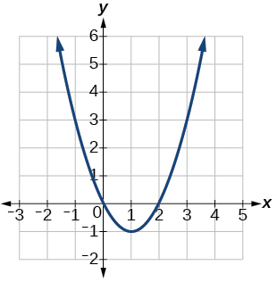 
Vertex<math xmlns="http://www.w3.org/1998/Math/MathML"> <mrow> <mrow><mo>(</mo> <mrow> <mn>1</mn><mo>,</mo><mtext> </mtext><mo>−</mo><mn>1</mn> </mrow> <mo>)</mo></mrow><mo>,</mo><mtext> </mtext> </mrow> </math>

Axis of symmetry is<math xmlns="http://www.w3.org/1998/Math/MathML"> <mrow> <mtext> </mtext><mi>x</mi><mo>=</mo><mn>1.</mn><mtext> </mtext> </mrow> </math>

Intercepts are<math xmlns="http://www.w3.org/1998/Math/MathML"> <mrow> <mtext> </mtext><mo stretchy="false">(</mo><mn>0</mn><mo>,</mo><mn>0</mn><mo stretchy="false">)</mo><mo>,</mo><mo> </mo><mo stretchy="false">(</mo><mn>2</mn><mo>,</mo><mn>0</mn><mo stretchy="false">)</mo><mo>.</mo> </mrow> </math>

<math xmlns="http://www.w3.org/1998/Math/MathML"> <mrow> <mi>f</mi><mo stretchy="false">(</mo><mi>x</mi><mo stretchy="false">)</mo><mo>=</mo><msup> <mi>x</mi> <mn>2</mn> </msup> <mo>−</mo><mn>6</mn><mi>x</mi><mo>−</mo><mn>1</mn> </mrow> </math>

<math xmlns="http://www.w3.org/1998/Math/MathML"> <mrow> <mi>f</mi><mo stretchy="false">(</mo><mi>x</mi><mo stretchy="false">)</mo><mo>=</mo><msup> <mi>x</mi> <mn>2</mn> </msup> <mo>−</mo><mn>5</mn><mi>x</mi><mo>−</mo><mn>6</mn> </mrow> </math>

 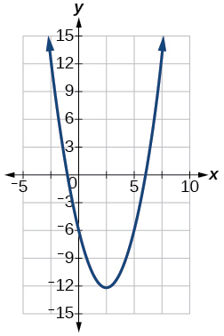 
Vertex<math xmlns="http://www.w3.org/1998/Math/MathML"> <mrow> <mtext> </mtext><mrow><mo>(</mo> <mrow> <mfrac> <mn>5</mn> <mn>2</mn> </mfrac> <mo>,</mo><mfrac> <mrow> <mo>−</mo><mn>49</mn> </mrow> <mn>4</mn> </mfrac> </mrow> <mo>)</mo></mrow><mo>,</mo><mtext> </mtext> </mrow> </math>

Axis of symmetry is<math xmlns="http://www.w3.org/1998/Math/MathML"> <mrow> <mtext> </mtext><mo stretchy="false">(</mo><mn>0</mn><mo>,</mo><mo>−</mo><mn>6</mn><mo stretchy="false">)</mo><mo>,</mo><mo stretchy="false">(</mo><mo>−</mo><mn>1</mn><mo>,</mo><mn>0</mn><mo stretchy="false">)</mo><mo>,</mo><mo stretchy="false">(</mo><mn>6</mn><mo>,</mo><mn>0</mn><mo stretchy="false">)</mo><mo>.</mo> </mrow> </math>

<math xmlns="http://www.w3.org/1998/Math/MathML"> <mrow> <mi>f</mi><mo stretchy="false">(</mo><mi>x</mi><mo stretchy="false">)</mo><mo>=</mo><msup> <mi>x</mi> <mn>2</mn> </msup> <mo>−</mo><mn>7</mn><mi>x</mi><mo>+</mo><mn>3</mn> </mrow> </math>

<math xmlns="http://www.w3.org/1998/Math/MathML"> <mrow> <mi>f</mi><mo stretchy="false">(</mo><mi>x</mi><mo stretchy="false">)</mo><mo>=</mo><mn>−2</mn><msup> <mi>x</mi> <mn>2</mn> </msup> <mo>+</mo><mn>5</mn><mi>x</mi><mo>−</mo><mn>8</mn> </mrow> </math>

 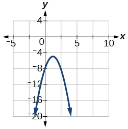 
Vertex<math xmlns="http://www.w3.org/1998/Math/MathML"> <mrow> <mtext> </mtext><mrow><mo>(</mo> <mrow> <mfrac> <mn>5</mn> <mn>4</mn> </mfrac> <mo>,</mo><mo> </mo><mo>−</mo><mfrac> <mrow> <mn>39</mn> </mrow> <mn>8</mn> </mfrac> </mrow> <mo>)</mo></mrow><mo>,</mo><mtext> </mtext> </mrow> </math>

Axis of symmetry is<math xmlns="http://www.w3.org/1998/Math/MathML"> <mrow> <mtext> </mtext><mi>x</mi><mo>=</mo><mfrac> <mn>5</mn> <mn>4</mn> </mfrac> <mo>.</mo><mtext> </mtext> </mrow> </math>

Intercepts are<math xmlns="http://www.w3.org/1998/Math/MathML"> <mrow> <mtext> </mtext><mrow><mo>(</mo> <mrow> <mn>0</mn><mo>,</mo><mo> </mo><mo>−</mo><mn>8</mn> </mrow> <mo>)</mo></mrow><mo>.</mo> </mrow> </math>

<math xmlns="http://www.w3.org/1998/Math/MathML"> <mrow> <mi>f</mi><mo stretchy="false">(</mo><mi>x</mi><mo stretchy="false">)</mo><mo>=</mo><mn>4</mn><msup> <mi>x</mi> <mn>2</mn> </msup> <mo>−</mo><mn>12</mn><mi>x</mi><mo>−</mo><mn>3</mn> </mrow> </math>

  

For the following exercises, write the equation for the graphed quadratic function.

  

<math xmlns="http://www.w3.org/1998/Math/MathML"> <mrow> <mi>f</mi><mo stretchy="false">(</mo><mi>x</mi><mo stretchy="false">)</mo><mo>=</mo><msup> <mi>x</mi> <mn>2</mn> </msup> <mo>−</mo><mn>4</mn><mi>x</mi><mo>+</mo><mn>1</mn> </mrow> </math>

 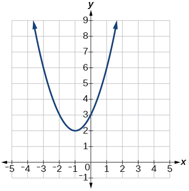 

 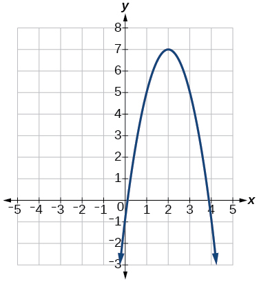 

<math xmlns="http://www.w3.org/1998/Math/MathML"> <mrow> <mi>f</mi><mo stretchy="false">(</mo><mi>x</mi><mo stretchy="false">)</mo><mo>=</mo><mn>−2</mn><msup> <mi>x</mi> <mn>2</mn> </msup> <mo>+</mo><mn>8</mn><mi>x</mi><mo>−</mo><mn>1</mn> </mrow> </math>

 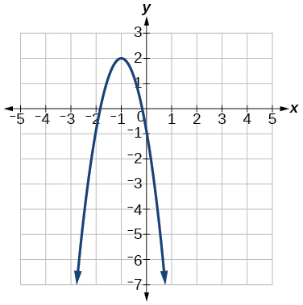 

 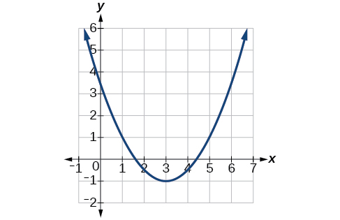 

<math xmlns="http://www.w3.org/1998/Math/MathML"> <mrow> <mi>f</mi><mo stretchy="false">(</mo><mi>x</mi><mo stretchy="false">)</mo><mo>=</mo><mfrac> <mn>1</mn> <mn>2</mn> </mfrac> <msup> <mi>x</mi> <mn>2</mn> </msup> <mo>−</mo><mn>3</mn><mi>x</mi><mo>+</mo><mfrac> <mn>7</mn> <mn>2</mn> </mfrac> </mrow> </math>

 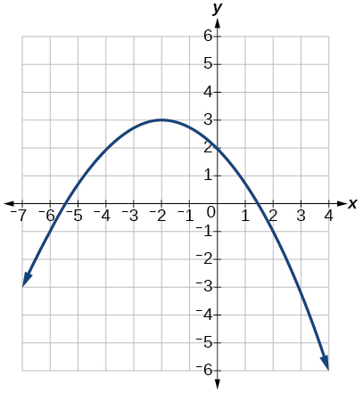 

#### Numeric

For the following exercises, use the table of values that represent points on the graph of a quadratic function. By determining the vertex and axis of symmetry, find the general form of the equation of the quadratic function.

<table summary=".." class="unnumbered" data-label=""><caption></caption><tbody>
<tr>
<td><strong><math xmlns="http://www.w3.org/1998/Math/MathML">
 <mi>x</mi>
</math></strong></td>
<td>–2</td>
<td>–1</td>
<td>0</td>
<td>1</td>
<td>2</td>
</tr>
<tr>
<td><strong><math xmlns="http://www.w3.org/1998/Math/MathML">
 <mi>y</mi>
</math></strong></td>
<td>5</td>
<td>2</td>
<td>1</td>
<td>2</td>
<td>5</td>
</tr>
</tbody></table>

<math xmlns="http://www.w3.org/1998/Math/MathML"> <mrow> <mi>f</mi><mo stretchy="false">(</mo><mi>x</mi><mo stretchy="false">)</mo><mo>=</mo><msup> <mi>x</mi> <mn>2</mn> </msup> <mo>+</mo><mn>1</mn> </mrow> </math>

| <strong><math xmlns="http://www.w3.org/1998/Math/MathML">
 <mi>x</mi>
</math></strong> | –2 | –1 | 0 | 1 | 2 |
| <strong><math xmlns="http://www.w3.org/1998/Math/MathML">
 <mi>y</mi>
</math></strong> | 1 | 0 | 1 | 4 | 9 |
{: summary=".." .unnumbered data-label=""}

<table summary=".." class="unnumbered" data-label=""><caption></caption><tbody>
<tr>
<td><strong><math xmlns="http://www.w3.org/1998/Math/MathML">
 <mi>x</mi>
</math></strong></td>
<td>–2</td>
<td>–1</td>
<td>0</td>
<td>1</td>
<td>2</td>
</tr>
<tr>
<td><strong><math xmlns="http://www.w3.org/1998/Math/MathML">
 <mi>y</mi>
</math></strong></td>
<td>–2</td>
<td>1</td>
<td>2</td>
<td>1 </td>
<td>–2</td>
</tr>
</tbody></table>

<math xmlns="http://www.w3.org/1998/Math/MathML"> <mrow> <mi>f</mi><mo stretchy="false">(</mo><mi>x</mi><mo stretchy="false">)</mo><mo>=</mo><mn>2</mn><mo>−</mo><msup> <mi>x</mi> <mn>2</mn> </msup> </mrow> </math>

| <strong><math xmlns="http://www.w3.org/1998/Math/MathML">
 <mi>x</mi>
</math></strong> | –2 | –1 | 0 | 1 | 2 |
| <strong><math xmlns="http://www.w3.org/1998/Math/MathML">
 <mi>y</mi>
</math></strong> | –8 | –3 | 0 | 1 | 0 |
{: summary=".." .unnumbered data-label=""}

| <strong><math xmlns="http://www.w3.org/1998/Math/MathML">
 <mi>x</mi>
</math></strong> | –2 | –1 | 0 | 1 | 2 |
| <strong><math xmlns="http://www.w3.org/1998/Math/MathML">
 <mi>y</mi>
</math></strong> | 8 | 2 | 0 | 2 | 8 |
{: summary=".." .unnumbered data-label=""}

<math xmlns="http://www.w3.org/1998/Math/MathML"> <mrow> <mi>f</mi><mo stretchy="false">(</mo><mi>x</mi><mo stretchy="false">)</mo><mo>=</mo><mn>2</mn><msup> <mi>x</mi> <mn>2</mn> </msup> </mrow> </math>

#### Technology

For the following exercises, use a calculator to find the answer.

Graph on the same set of axes the functions<math xmlns="http://www.w3.org/1998/Math/MathML"> <mrow> <mtext> </mtext><mi>f</mi><mo stretchy="false">(</mo><mi>x</mi><mo stretchy="false">)</mo><mo>=</mo><msup> <mi>x</mi> <mn>2</mn> </msup> <mo>,</mo><mi>f</mi><mo stretchy="false">(</mo><mi>x</mi><mo stretchy="false">)</mo><mo>=</mo><mn>2</mn><msup> <mi>x</mi> <mn>2</mn> </msup> <mo>,</mo><mtext> and </mtext><mi>f</mi><mo stretchy="false">(</mo><mi>x</mi><mo stretchy="false">)</mo><mo>=</mo><mfrac> <mn>1</mn> <mn>3</mn> </mfrac> <msup> <mi>x</mi> <mn>2</mn> </msup> <mo>.</mo> </mrow> </math>

What appears to be the effect of changing the coefficient?

Graph on the same set of axes<math xmlns="http://www.w3.org/1998/Math/MathML"> <mrow> <mtext> </mtext><mi>f</mi><mo stretchy="false">(</mo><mi>x</mi><mo stretchy="false">)</mo><mo>=</mo><msup> <mi>x</mi> <mn>2</mn> </msup> <mo>,</mo><mi>f</mi><mo stretchy="false">(</mo><mi>x</mi><mo stretchy="false">)</mo><mo>=</mo><msup> <mi>x</mi> <mn>2</mn> </msup> <mo>+</mo><mn>2</mn><mtext> </mtext> </mrow> </math>

 and<math xmlns="http://www.w3.org/1998/Math/MathML"> <mrow> <mtext> </mtext><mi>f</mi><mo stretchy="false">(</mo><mi>x</mi><mo stretchy="false">)</mo><mo>=</mo><msup> <mi>x</mi> <mn>2</mn> </msup> <mo>,</mo><mi>f</mi><mo stretchy="false">(</mo><mi>x</mi><mo stretchy="false">)</mo><mo>=</mo><msup> <mi>x</mi> <mn>2</mn> </msup> <mo>+</mo><mn>5</mn><mtext> </mtext> </mrow> </math>

and<math xmlns="http://www.w3.org/1998/Math/MathML"> <mrow> <mtext> </mtext><mi>f</mi><mo stretchy="false">(</mo><mi>x</mi><mo stretchy="false">)</mo><mo>=</mo><msup> <mi>x</mi> <mn>2</mn> </msup> <mo>−</mo><mn>3.</mn><mtext> </mtext> </mrow> </math>

 What appears to be the effect of adding a constant?

The graph is shifted up or down (a vertical shift).

Graph on the same set of axes<math xmlns="http://www.w3.org/1998/Math/MathML"> <mrow> <mtext> </mtext><mi>f</mi><mo stretchy="false">(</mo><mi>x</mi><mo stretchy="false">)</mo><mo>=</mo><msup> <mi>x</mi> <mn>2</mn> </msup> <mo>,</mo><mi>f</mi><mo stretchy="false">(</mo><mi>x</mi><mo stretchy="false">)</mo><mo>=</mo><msup> <mrow> <mo stretchy="false">(</mo><mi>x</mi><mo>−</mo><mn>2</mn><mo stretchy="false">)</mo> </mrow> <mn>2</mn> </msup> <mo>,</mo><mi>f</mi><msup> <mrow> <mo stretchy="false">(</mo><mi>x</mi><mo>−</mo><mn>3</mn><mo stretchy="false">)</mo> </mrow> <mn>2</mn> </msup> <mo>,</mo><mtext> and </mtext><mi>f</mi><mo stretchy="false">(</mo><mi>x</mi><mo stretchy="false">)</mo><mo>=</mo><msup> <mrow> <mo stretchy="false">(</mo><mi>x</mi><mo>+</mo><mn>4</mn><mo stretchy="false">)</mo> </mrow> <mn>2</mn> </msup> <mo>.</mo> </mrow> </math>

What appears to be the effect of adding or subtracting those numbers?

The path of an object projected at a 45 degree angle with initial velocity of 80 feet per second is given by the function<math xmlns="http://www.w3.org/1998/Math/MathML"> <mrow> <mtext> </mtext><mi>h</mi><mo stretchy="false">(</mo><mi>x</mi><mo stretchy="false">)</mo><mo>=</mo><mfrac> <mrow> <mo>−</mo><mn>32</mn> </mrow> <mrow> <msup> <mrow> <mo stretchy="false">(</mo><mn>80</mn><mo stretchy="false">)</mo> </mrow> <mn>2</mn> </msup> </mrow> </mfrac> <msup> <mi>x</mi> <mn>2</mn> </msup> <mo>+</mo><mi>x</mi><mtext> </mtext> </mrow> </math>

where<math xmlns="http://www.w3.org/1998/Math/MathML"> <mrow> <mtext> </mtext><mi>x</mi><mtext> </mtext> </mrow> </math>

is the horizontal distance traveled and<math xmlns="http://www.w3.org/1998/Math/MathML"> <mrow> <mtext> </mtext><mi>h</mi><mrow><mo>(</mo> <mi>x</mi> <mo>)</mo></mrow><mtext> </mtext> </mrow> </math>

is the height in feet. Use the TRACE feature of your calculator to determine the height of the object when it has traveled 100 feet away horizontally.

50 feet

A suspension bridge can be modeled by the quadratic function<math xmlns="http://www.w3.org/1998/Math/MathML"> <mrow> <mtext> </mtext><mi>h</mi><mo stretchy="false">(</mo><mi>x</mi><mo stretchy="false">)</mo><mo>=</mo><mn>.0001</mn><msup> <mi>x</mi> <mn>2</mn> </msup> <mtext> </mtext> </mrow> </math>

with<math xmlns="http://www.w3.org/1998/Math/MathML"> <mrow> <mtext> </mtext><mn>−2000</mn><mo>≤</mo><mi>x</mi><mo>≤</mo><mn>2000</mn><mtext> </mtext> </mrow> </math>

where<math xmlns="http://www.w3.org/1998/Math/MathML"> <mrow> <mtext> </mtext><mrow><mo>\|</mo> <mi>x</mi> <mo>\|</mo></mrow><mtext> </mtext> </mrow> </math>

is the number of feet from the center and<math xmlns="http://www.w3.org/1998/Math/MathML"> <mrow> <mtext> </mtext><mi>h</mi><mrow><mo>(</mo> <mi>x</mi> <mo>)</mo></mrow><mtext> </mtext> </mrow> </math>

is height in feet. Use the TRACE feature of your calculator to estimate how far from the center does the bridge have a height of 100 feet.

#### Extensions

For the following exercises, use the vertex of the graph of the quadratic function and the direction the graph opens to find the domain and range of the function.

Vertex<math xmlns="http://www.w3.org/1998/Math/MathML"> <mrow> <mtext> </mtext><mo stretchy="false">(</mo><mn>1</mn><mo>,</mo><mn>−2</mn><mo stretchy="false">)</mo><mo>,</mo><mtext> </mtext> </mrow> </math>

opens up.

Domain is<math xmlns="http://www.w3.org/1998/Math/MathML"> <mrow> <mtext> </mtext><mo stretchy="false">(</mo><mi>−</mi><mi>∞</mi><mo>,</mo><mi>∞</mi><mo stretchy="false">)</mo><mo>.</mo><mtext> </mtext> </mrow> </math>

Range is<math xmlns="http://www.w3.org/1998/Math/MathML"> <mrow> <mtext> </mtext><mo stretchy="false">[</mo><mn>−2</mn><mo>,</mo><mi>∞</mi><mo stretchy="false">)</mo><mo>.</mo> </mrow> </math>

Vertex<math xmlns="http://www.w3.org/1998/Math/MathML"> <mrow> <mtext> </mtext><mrow><mo>(</mo> <mrow> <mn>−1</mn><mo>,</mo><mn>2</mn> </mrow> <mo>)</mo></mrow><mtext> </mtext> </mrow> </math>

opens down.

Vertex<math xmlns="http://www.w3.org/1998/Math/MathML"> <mrow> <mtext> </mtext><mo stretchy="false">(</mo><mn>−5</mn><mo>,</mo><mn>11</mn><mo stretchy="false">)</mo><mo>,</mo><mtext> </mtext> </mrow> </math>

opens down.

Domain is<math xmlns="http://www.w3.org/1998/Math/MathML"> <mrow> <mtext> </mtext><mo stretchy="false">(</mo><mo>−</mo><mi>∞</mi><mo>,</mo><mi>∞</mi><mo stretchy="false">)</mo><mtext> </mtext> </mrow> </math>

Range is<math xmlns="http://www.w3.org/1998/Math/MathML"> <mrow> <mtext> </mtext><mo stretchy="false">(</mo><mo>−</mo><mi>∞</mi><mo>,</mo><mn>11</mn><mo stretchy="false">]</mo><mo>.</mo> </mrow> </math>

Vertex<math xmlns="http://www.w3.org/1998/Math/MathML"> <mrow> <mtext> </mtext><mo stretchy="false">(</mo><mn>−100</mn><mo>,</mo><mn>100</mn><mo stretchy="false">)</mo><mo>,</mo><mtext> </mtext> </mrow> </math>

opens up.

For the following exercises, write the equation of the quadratic function that contains the given point and has the same shape as the given function.

Contains<math xmlns="http://www.w3.org/1998/Math/MathML"> <mrow> <mtext> </mtext><mo stretchy="false">(</mo><mn>1</mn><mo>,</mo><mn>1</mn><mo stretchy="false">)</mo><mtext> </mtext> </mrow> </math>

and has shape of<math xmlns="http://www.w3.org/1998/Math/MathML"> <mrow> <mtext> </mtext><mi>f</mi><mo stretchy="false">(</mo><mi>x</mi><mo stretchy="false">)</mo><mo>=</mo><mn>2</mn><msup> <mi>x</mi> <mn>2</mn> </msup> <mo>.</mo><mtext> </mtext> </mrow> </math>

Vertex is on the<math xmlns="http://www.w3.org/1998/Math/MathML"> <mrow> <mtext> </mtext><mi>y</mi><mtext>-</mtext> </mrow> </math>

axis.

<math xmlns="http://www.w3.org/1998/Math/MathML"> <mrow> <mi>f</mi><mo stretchy="false">(</mo><mi>x</mi><mo stretchy="false">)</mo><mo>=</mo><mn>2</mn><msup> <mi>x</mi> <mn>2</mn> </msup> <mo>−</mo><mn>1</mn> </mrow> </math>

Contains<math xmlns="http://www.w3.org/1998/Math/MathML"> <mrow> <mtext> </mtext><mo stretchy="false">(</mo><mn>−1</mn><mo>,</mo><mn>4</mn><mo stretchy="false">)</mo><mtext> </mtext> </mrow> </math>

and has the shape of<math xmlns="http://www.w3.org/1998/Math/MathML"> <mrow> <mtext> </mtext><mi>f</mi><mo stretchy="false">(</mo><mi>x</mi><mo stretchy="false">)</mo><mo>=</mo><mn>2</mn><msup> <mi>x</mi> <mn>2</mn> </msup> <mo>.</mo><mtext> </mtext> </mrow> </math>

Vertex is on the<math xmlns="http://www.w3.org/1998/Math/MathML"> <mrow> <mtext> </mtext><mi>y</mi><mtext>-</mtext> </mrow> </math>

axis.

Contains<math xmlns="http://www.w3.org/1998/Math/MathML"> <mrow> <mtext> </mtext><mo stretchy="false">(</mo><mn>2</mn><mo>,</mo><mn>3</mn><mo stretchy="false">)</mo><mtext> </mtext> </mrow> </math>

and has the shape of<math xmlns="http://www.w3.org/1998/Math/MathML"> <mrow> <mtext> </mtext><mi>f</mi><mo stretchy="false">(</mo><mi>x</mi><mo stretchy="false">)</mo><mo>=</mo><mn>3</mn><msup> <mi>x</mi> <mn>2</mn> </msup> <mo>.</mo><mtext> </mtext> </mrow> </math>

Vertex is on the<math xmlns="http://www.w3.org/1998/Math/MathML"> <mrow> <mtext> </mtext><mi>y</mi><mtext>-</mtext> </mrow> </math>

axis.

<math xmlns="http://www.w3.org/1998/Math/MathML"> <mrow> <mi>f</mi><mo stretchy="false">(</mo><mi>x</mi><mo stretchy="false">)</mo><mo>=</mo><mn>3</mn><msup> <mi>x</mi> <mn>2</mn> </msup> <mo>−</mo><mn>9</mn> </mrow> </math>

Contains<math xmlns="http://www.w3.org/1998/Math/MathML"> <mrow> <mtext> </mtext><mo stretchy="false">(</mo><mn>1</mn><mo>,</mo><mn>−3</mn><mo stretchy="false">)</mo><mtext> </mtext> </mrow> </math>

and has the shape of<math xmlns="http://www.w3.org/1998/Math/MathML"> <mrow> <mtext> </mtext><mi>f</mi><mo stretchy="false">(</mo><mi>x</mi><mo stretchy="false">)</mo><mo>=</mo><mo>−</mo><msup> <mi>x</mi> <mn>2</mn> </msup> <mo>.</mo><mtext> </mtext> </mrow> </math>

Vertex is on the<math xmlns="http://www.w3.org/1998/Math/MathML"> <mrow> <mtext> </mtext><mi>y</mi><mtext>-</mtext> </mrow> </math>

axis.

Contains<math xmlns="http://www.w3.org/1998/Math/MathML"> <mrow> <mtext> </mtext><mo stretchy="false">(</mo><mn>4</mn><mo>,</mo><mn>3</mn><mo stretchy="false">)</mo><mtext> </mtext> </mrow> </math>

and has the shape of<math xmlns="http://www.w3.org/1998/Math/MathML"> <mrow> <mtext> </mtext><mi>f</mi><mo stretchy="false">(</mo><mi>x</mi><mo stretchy="false">)</mo><mo>=</mo><mn>5</mn><msup> <mi>x</mi> <mn>2</mn> </msup> <mo>.</mo><mtext> </mtext> </mrow> </math>

Vertex is on the<math xmlns="http://www.w3.org/1998/Math/MathML"> <mrow> <mtext> </mtext><mi>y</mi><mtext>-</mtext> </mrow> </math>

axis.

<math xmlns="http://www.w3.org/1998/Math/MathML"> <mrow> <mi>f</mi><mo stretchy="false">(</mo><mi>x</mi><mo stretchy="false">)</mo><mo>=</mo><mn>5</mn><msup> <mi>x</mi> <mn>2</mn> </msup> <mo>−</mo><mn>77</mn> </mrow> </math>

Contains<math xmlns="http://www.w3.org/1998/Math/MathML"> <mrow> <mtext> </mtext><mo stretchy="false">(</mo><mn>1</mn><mo>,</mo><mn>−6</mn><mo stretchy="false">)</mo><mtext> </mtext> </mrow> </math>

has the shape of<math xmlns="http://www.w3.org/1998/Math/MathML"> <mrow> <mtext> </mtext><mi>f</mi><mo stretchy="false">(</mo><mi>x</mi><mo stretchy="false">)</mo><mo>=</mo><mn>3</mn><msup> <mi>x</mi> <mn>2</mn> </msup> <mo>.</mo><mtext> </mtext> </mrow> </math>

Vertex has x-coordinate of<math xmlns="http://www.w3.org/1998/Math/MathML"> <mrow> <mtext> </mtext><mn>−1.</mn> </mrow> </math>

#### Real-World Applications

Find the dimensions of the rectangular corral producing the greatest enclosed area given 200 feet of fencing.

50 feet by 50 feet. Maximize<math xmlns="http://www.w3.org/1998/Math/MathML"> <mrow> <mtext> </mtext><mi>f</mi><mo stretchy="false">(</mo><mi>x</mi><mo stretchy="false">)</mo><mo>=</mo><mo>−</mo><msup> <mi>x</mi> <mn>2</mn> </msup> <mo>+</mo><mn>100</mn><mi>x</mi><mo>.</mo> </mrow> </math>

Find the dimensions of the rectangular corral split into 2 pens of the same size producing the greatest possible enclosed area given 300 feet of fencing.

Find the dimensions of the rectangular corral producing the greatest enclosed area split into 3 pens of the same size given 500 feet of fencing.

125 feet by 62.5 feet. Maximize<math xmlns="http://www.w3.org/1998/Math/MathML"> <mrow> <mtext> </mtext><mi>f</mi><mo stretchy="false">(</mo><mi>x</mi><mo stretchy="false">)</mo><mo>=</mo><mn>−2</mn><msup> <mi>x</mi> <mn>2</mn> </msup> <mo>+</mo><mn>250</mn><mi>x</mi><mo>.</mo> </mrow> </math>

Among all of the pairs of numbers whose sum is 6, find the pair with the largest product. What is the product?

Among all of the pairs of numbers whose difference is 12, find the pair with the smallest product. What is the product?

<math xmlns="http://www.w3.org/1998/Math/MathML"> <mrow> <mn>6</mn><mtext> </mtext> </mrow> </math>

and<math xmlns="http://www.w3.org/1998/Math/MathML"> <mrow> <mtext> </mtext><mn>−6</mn><mo>;</mo><mtext> </mtext> </mrow> </math>

product is –36; maximize<math xmlns="http://www.w3.org/1998/Math/MathML"> <mrow> <mtext> </mtext><mi>f</mi><mo stretchy="false">(</mo><mi>x</mi><mo stretchy="false">)</mo><mo>=</mo><msup> <mi>x</mi> <mn>2</mn> </msup> <mo>+</mo><mn>12</mn><mi>x</mi><mo>.</mo> </mrow> </math>

Suppose that the price per unit in dollars of a cell phone production is modeled by<math xmlns="http://www.w3.org/1998/Math/MathML"> <mrow> <mtext> </mtext><mi>p</mi><mo>=</mo><mtext>$</mtext><mn>45</mn><mo>−</mo><mn>0.0125</mn><mi>x</mi><mo>,</mo><mtext> </mtext></mrow> </math>

where<math xmlns="http://www.w3.org/1998/Math/MathML"> <mrow> <mtext> </mtext><mi>x</mi><mtext> </mtext> </mrow> </math>

is in thousands of phones produced, and the revenue represented by thousands of dollars is<math xmlns="http://www.w3.org/1998/Math/MathML"> <mrow> <mtext> </mtext><mi>R</mi><mo>=</mo><mi>x</mi><mo>⋅</mo><mi>p</mi><mo>.</mo><mtext> </mtext> </mrow> </math>

Find the production level that will maximize revenue.

A rocket is launched in the air. Its height, in meters above sea level, as a function of time, in seconds, is given by<math xmlns="http://www.w3.org/1998/Math/MathML"> <mrow> <mtext> </mtext><mi>h</mi><mrow><mo>(</mo> <mi>t</mi> <mo>)</mo></mrow><mo>=</mo><mn>−4.9</mn><msup> <mi>t</mi> <mn>2</mn> </msup> <mo>+</mo><mn>229</mn><mi>t</mi><mo>+</mo><mn>234.</mn><mtext> </mtext> </mrow> </math>

Find the maximum height the rocket attains.

2909\.56 meters

A ball is thrown in the air from the top of a building. Its height, in meters above ground, as a function of time, in seconds, is given by<math xmlns="http://www.w3.org/1998/Math/MathML"> <mrow> <mtext> </mtext><mi>h</mi><mrow><mo>(</mo> <mi>t</mi> <mo>)</mo></mrow><mo>=</mo><mo>−</mo><mn>4.9</mn><msup> <mi>t</mi> <mn>2</mn> </msup> <mo>+</mo><mn>24</mn><mi>t</mi><mo>+</mo><mn>8.</mn><mtext> </mtext> </mrow> </math>

How long does it take to reach maximum height?

A soccer stadium holds 62,000 spectators. With a ticket price of $11, the average attendance has been 26,000. When the price dropped to $9, the average attendance rose to 31,000. Assuming that attendance is linearly related to ticket price, what ticket price would maximize revenue?

$10.70

A farmer finds that if she plants 75 trees per acre, each tree will yield 20 bushels of fruit. She estimates that for each additional tree planted per acre, the yield of each tree will decrease by 3 bushels. How many trees should she plant per acre to maximize her harvest?

### Glossary
{: data-type="glossary-title"}

axis of symmetry
: a vertical line drawn through the vertex of a parabola, that opens up or down, around which the parabola is symmetric; it is defined by
  <math xmlns="http://www.w3.org/1998/Math/MathML"> <mrow> <mtext> </mtext><mi>x</mi><mo>=</mo><mo>−</mo><mfrac> <mi>b</mi> <mrow> <mn>2</mn><mi>a</mi> </mrow> </mfrac> <mo>.</mo> </mrow> </math>
^

general form of a quadratic function
: the function that describes a parabola, written in the form
  <math xmlns="http://www.w3.org/1998/Math/MathML"> <mrow> <mtext> </mtext><mi>f</mi><mo stretchy="false">(</mo><mi>x</mi><mo stretchy="false">)</mo><mo>=</mo><mi>a</mi><msup> <mi>x</mi> <mn>2</mn> </msup> <mo>+</mo><mi>b</mi><mi>x</mi><mo>+</mo><mi>c</mi></mrow> </math>
  
  , where
  <math xmlns="http://www.w3.org/1998/Math/MathML"> <mrow> <mtext> </mtext><mi>a</mi><mo>,</mo><mi>b</mi><mo>,</mo><mtext> </mtext> </mrow> </math>
  
  and
  <math xmlns="http://www.w3.org/1998/Math/MathML"> <mrow> <mtext> </mtext><mi>c</mi><mtext> </mtext> </mrow> </math>
  
  are real numbers and
  <math xmlns="http://www.w3.org/1998/Math/MathML"> <mrow> <mtext> </mtext><mi>a</mi><mo>≠</mo><mn>0.</mn> </mrow> </math>
^

roots
: in a given function, the values of
  <math xmlns="http://www.w3.org/1998/Math/MathML"> <mrow> <mtext> </mtext><mi>x</mi><mtext> </mtext> </mrow> </math>
  
  at which
  <math xmlns="http://www.w3.org/1998/Math/MathML"> <mrow> <mtext> </mtext><mi>y</mi><mo>=</mo><mn>0</mn></mrow> </math>
  
  , also called zeros
^

standard form of a quadratic function
: the function that describes a parabola, written in the form
  <math xmlns="http://www.w3.org/1998/Math/MathML"> <mrow> <mtext> </mtext><mi>f</mi><mo stretchy="false">(</mo><mi>x</mi><mo stretchy="false">)</mo><mo>=</mo><mi>a</mi><msup> <mrow> <mo stretchy="false">(</mo><mi>x</mi><mo>−</mo><mi>h</mi><mo stretchy="false">)</mo></mrow> <mn>2</mn> </msup> <mo>+</mo><mi>k</mi></mrow> </math>
  
  , where
  <math xmlns="http://www.w3.org/1998/Math/MathML"> <mrow> <mtext> </mtext><mrow><mo>(</mo> <mrow> <mi>h</mi><mo>,</mo><mtext> </mtext><mi>k</mi> </mrow> <mo>)</mo></mrow><mtext> </mtext> </mrow> </math>
  
  is the vertex
^

vertex
: the point at which a parabola changes direction, corresponding to the minimum or maximum value of the quadratic function
^

vertex form of a quadratic function
: another name for the standard form of a quadratic function
^

zeros
: in a given function, the values of
  <math xmlns="http://www.w3.org/1998/Math/MathML"> <mrow> <mtext> </mtext><mi>x</mi><mtext> </mtext> </mrow> </math>
  
  at which
  <math xmlns="http://www.w3.org/1998/Math/MathML"> <mrow> <mtext> </mtext><mi>y</mi><mo>=</mo><mn>0</mn></mrow> </math>
  
  , also called roots

[1]: http://openstaxcollege.org/l/graphquadgen
[2]: http://openstaxcollege.org/l/graphquadstan
[3]: http://openstaxcollege.org/l/quadfuncrev
[4]: http://openstaxcollege.org/l/characterquad
